BSD - Tested Hardware & Statistics
----------------------------------

A project to collect tested hardware configurations for BSD.

Anyone can contribute to this report by the [hw-probe](https://github.com/linuxhw/hw-probe/blob/master/INSTALL.BSD.md) tool:

    hw-probe -all -upload

Please contribute! Especially if your hardware is rare.

This is a report for all computer types. See also reports for [desktops](/Desktop/README.md) and [notebooks](/Notebook/README.md).

OS-specific reports: [FreeBSD](/Dist/FreeBSD), [GhostBSD](/Dist/GhostBSD), [helloSystem](/Dist/helloSystem), [NetBSD](/Dist/NetBSD), [NomadBSD](/Dist/NomadBSD), [OpenBSD](/Dist/OpenBSD), [OPNsense](/Dist/OPNsense), [pfSense](/Dist/pfSense), [TrueNAS](/Dist/TrueNAS).

This report is for real hardware. Report for virtual hardware: [TestDays_VE](https://github.com/bsdhw/TestDays_VE)

Contents
--------

* [ Test Cases ](#test-cases)

* [ System ](#system)
  - [ OS                       ](#os)
  - [ OS Family                ](#os-family)
  - [ Arch                     ](#arch)
  - [ DE                       ](#de)
  - [ Display Server           ](#display-server)
  - [ Display Manager          ](#display-manager)
  - [ OS Lang                  ](#os-lang)
  - [ Boot Mode                ](#boot-mode)
  - [ Filesystem               ](#filesystem)
  - [ Part. scheme             ](#part-scheme)

* [ Board ](#board)
  - [ Vendor                   ](#vendor)
  - [ Model                    ](#model)
  - [ Model Family             ](#model-family)
  - [ MFG Year                 ](#mfg-year)
  - [ Form Factor              ](#form-factor)
  - [ Coreboot                 ](#coreboot)
  - [ RAM Size                 ](#ram-size)
  - [ RAM Used                 ](#ram-used)
  - [ Total Drives             ](#total-drives)
  - [ Has CD-ROM               ](#has-cd-rom)
  - [ Has Ethernet             ](#has-ethernet)
  - [ Has WiFi                 ](#has-wifi)
  - [ Has Bluetooth            ](#has-bluetooth)

* [ Location ](#location)
  - [ Country                  ](#country)
  - [ City                     ](#city)

* [ Drives ](#drives)
  - [ Drive Vendor             ](#drive-vendor)
  - [ Drive Model              ](#drive-model)
  - [ HDD Vendor               ](#hdd-vendor)
  - [ SSD Vendor               ](#ssd-vendor)
  - [ Drive Kind               ](#drive-kind)
  - [ Drive Connector          ](#drive-connector)
  - [ Drive Size               ](#drive-size)
  - [ Space Total              ](#space-total)
  - [ Space Used               ](#space-used)
  - [ Malfunc. Drives          ](#malfunc-drives)
  - [ Malfunc. Drive Vendor    ](#malfunc-drive-vendor)
  - [ Malfunc. HDD Vendor      ](#malfunc-hdd-vendor)
  - [ Malfunc. Drive Kind      ](#malfunc-drive-kind)
  - [ Failed Drives            ](#failed-drives)
  - [ Failed Drive Vendor      ](#failed-drive-vendor)
  - [ Drive Status             ](#drive-status)

* [ Storage controller ](#storage-controller)
  - [ Storage Vendor           ](#storage-vendor)
  - [ Storage Model            ](#storage-model)
  - [ Storage Kind             ](#storage-kind)

* [ Processor ](#processor)
  - [ CPU Vendor               ](#cpu-vendor)
  - [ CPU Model                ](#cpu-model)
  - [ CPU Model Family         ](#cpu-model-family)
  - [ CPU Cores                ](#cpu-cores)
  - [ CPU Sockets              ](#cpu-sockets)
  - [ CPU Threads              ](#cpu-threads)
  - [ CPU Microarch            ](#cpu-microarch)

* [ Graphics ](#graphics)
  - [ GPU Vendor               ](#gpu-vendor)
  - [ GPU Model                ](#gpu-model)
  - [ GPU Combo                ](#gpu-combo)
  - [ GPU Driver               ](#gpu-driver)
  - [ GPU Memory               ](#gpu-memory)

* [ Monitor ](#monitor)
  - [ Monitor Vendor           ](#monitor-vendor)
  - [ Monitor Model            ](#monitor-model)
  - [ Monitor Resolution       ](#monitor-resolution)
  - [ Monitor Diagonal         ](#monitor-diagonal)
  - [ Monitor Width            ](#monitor-width)
  - [ Aspect Ratio             ](#aspect-ratio)
  - [ Monitor Area             ](#monitor-area)
  - [ Pixel Density            ](#pixel-density)
  - [ Multiple Monitors        ](#multiple-monitors)

* [ Network ](#network)
  - [ Net Controller Vendor    ](#net-controller-vendor)
  - [ Net Controller Model     ](#net-controller-model)
  - [ Wireless Vendor          ](#wireless-vendor)
  - [ Wireless Model           ](#wireless-model)
  - [ Ethernet Vendor          ](#ethernet-vendor)
  - [ Ethernet Model           ](#ethernet-model)
  - [ Net Controller Kind      ](#net-controller-kind)
  - [ Used Controller          ](#used-controller)
  - [ NICs                     ](#nics)
  - [ IPv6                     ](#ipv6)

* [ Bluetooth ](#bluetooth)
  - [ Bluetooth Vendor         ](#bluetooth-vendor)
  - [ Bluetooth Model          ](#bluetooth-model)

* [ Sound ](#sound)
  - [ Sound Vendor             ](#sound-vendor)
  - [ Sound Model              ](#sound-model)

* [ Memory ](#memory)
  - [ Memory Vendor            ](#memory-vendor)
  - [ Memory Model             ](#memory-model)
  - [ Memory Kind              ](#memory-kind)
  - [ Memory Form Factor       ](#memory-form-factor)
  - [ Memory Size              ](#memory-size)
  - [ Memory Speed             ](#memory-speed)

* [ Printers & scanners ](#printers--scanners)
  - [ Printer Vendor           ](#printer-vendor)
  - [ Printer Model            ](#printer-model)
  - [ Scanner Vendor           ](#scanner-vendor)
  - [ Scanner Model            ](#scanner-model)

* [ Camera ](#camera)
  - [ Camera Vendor            ](#camera-vendor)
  - [ Camera Model             ](#camera-model)

* [ Security ](#security)
  - [ Fingerprint Vendor       ](#fingerprint-vendor)
  - [ Fingerprint Model        ](#fingerprint-model)
  - [ Chipcard Vendor          ](#chipcard-vendor)
  - [ Chipcard Model           ](#chipcard-model)

* [ Unsupported ](#unsupported)
  - [ Unsupported Devices      ](#unsupported-devices)
  - [ Unsupported Device Types ](#unsupported-device-types)

Test Cases
----------

Total: 35740

| Vendor        | Model                       | Form-Factor | Probe                                                     | Date         |
|---------------|-----------------------------|-------------|-----------------------------------------------------------|--------------|
| HP            | EliteBook 840 G6            | Notebook    | [db8520eb33](https://bsd-hardware.info/?probe=db8520eb33) | Jan 03, 2026 |
| MSI           | Boston                      | Desktop     | [69c1e82629](https://bsd-hardware.info/?probe=69c1e82629) | Jan 03, 2026 |
| Unknown       | Unknown                     | Desktop     | [952050187f](https://bsd-hardware.info/?probe=952050187f) | Jan 03, 2026 |
| Dell          | Latitude 5520               | Notebook    | [3d736273f2](https://bsd-hardware.info/?probe=3d736273f2) | Jan 03, 2026 |
| Dell          | Latitude 5520               | Notebook    | [cced2f8275](https://bsd-hardware.info/?probe=cced2f8275) | Jan 03, 2026 |
| Intel         | DH61AG AAG23736-400         | Desktop     | [d9e65d18b8](https://bsd-hardware.info/?probe=d9e65d18b8) | Jan 03, 2026 |
| Unknown       | adnbsc01                    | Desktop     | [5a5f9e1b9b](https://bsd-hardware.info/?probe=5a5f9e1b9b) | Jan 03, 2026 |
| AMI           | Aptio CRB                   | Mini pc     | [0c4c34753e](https://bsd-hardware.info/?probe=0c4c34753e) | Jan 03, 2026 |
| AMI           | Aptio CRB                   | Mini pc     | [06e4c3b7c8](https://bsd-hardware.info/?probe=06e4c3b7c8) | Jan 03, 2026 |
| Unknown       | Unknown                     | Desktop     | [d2e0854dcf](https://bsd-hardware.info/?probe=d2e0854dcf) | Jan 03, 2026 |
| Cisco         | ASA5525 A0                  | Desktop     | [0ff88bf36c](https://bsd-hardware.info/?probe=0ff88bf36c) | Jan 03, 2026 |
| Unknown       | QGLK03                      | Desktop     | [99fd520559](https://bsd-hardware.info/?probe=99fd520559) | Jan 03, 2026 |
| Lenovo        | ThinkPad T14 Gen 2i 20W1... | Notebook    | [c1426aac21](https://bsd-hardware.info/?probe=c1426aac21) | Jan 03, 2026 |
| Intel         | NUC12WSBi7 M63355-304       | Mini pc     | [89a9980cd3](https://bsd-hardware.info/?probe=89a9980cd3) | Jan 03, 2026 |
| Protectli     | FW6 Ver                     | Desktop     | [4a85a19847](https://bsd-hardware.info/?probe=4a85a19847) | Jan 03, 2026 |
| HP            | 829E                        | Mini pc     | [00facae8fc](https://bsd-hardware.info/?probe=00facae8fc) | Jan 03, 2026 |
| HP            | Pavilion x360 Convertibl... | Convertible | [343a1ad07b](https://bsd-hardware.info/?probe=343a1ad07b) | Jan 02, 2026 |
| Dell          | 07WP95 A02                  | Desktop     | [6ceea70304](https://bsd-hardware.info/?probe=6ceea70304) | Jan 02, 2026 |
| Lenovo        | 312D SDK0J40697 WIN 3305... | Mini pc     | [58b2eee2d0](https://bsd-hardware.info/?probe=58b2eee2d0) | Jan 02, 2026 |
| Dell          | 0NV0M7 A01                  | Desktop     | [64850a456f](https://bsd-hardware.info/?probe=64850a456f) | Jan 02, 2026 |
| PC Engines    | APU2                        | Desktop     | [6a6b0755a9](https://bsd-hardware.info/?probe=6a6b0755a9) | Jan 02, 2026 |
| Dell          | Inspiron 3542               | Notebook    | [7b61355c62](https://bsd-hardware.info/?probe=7b61355c62) | Jan 02, 2026 |
| Unknown       | Unknown                     | Desktop     | [eae539d1e8](https://bsd-hardware.info/?probe=eae539d1e8) | Jan 02, 2026 |
| Advantech     | FWA-1320 A103               | Server      | [28394b4f28](https://bsd-hardware.info/?probe=28394b4f28) | Jan 02, 2026 |
| Lenovo        | 312D SDK0J40697 WIN 3305... | Mini pc     | [623b36fe51](https://bsd-hardware.info/?probe=623b36fe51) | Jan 02, 2026 |
| Unknown       | Unknown                     | Desktop     | [a5bbf2798d](https://bsd-hardware.info/?probe=a5bbf2798d) | Jan 02, 2026 |
| Protectli     | VP2420                      | Desktop     | [4484909d41](https://bsd-hardware.info/?probe=4484909d41) | Jan 02, 2026 |
| ASUSTek       | VivoBook_ASUSLaptop X509... | Notebook    | [0f95b521f1](https://bsd-hardware.info/?probe=0f95b521f1) | Jan 02, 2026 |
| Unknown       | Unknown                     | Desktop     | [c14d381fb6](https://bsd-hardware.info/?probe=c14d381fb6) | Jan 02, 2026 |
| Dell          | 0NV0M7 A01                  | Desktop     | [b2319232a4](https://bsd-hardware.info/?probe=b2319232a4) | Jan 02, 2026 |
| Unknown       | Unknown                     | Desktop     | [d1e02c8726](https://bsd-hardware.info/?probe=d1e02c8726) | Jan 01, 2026 |
| Unknown       | Unknown                     | Desktop     | [4c0a31104f](https://bsd-hardware.info/?probe=4c0a31104f) | Jan 01, 2026 |
| AZW           | MINI S                      | Mini pc     | [178e523a28](https://bsd-hardware.info/?probe=178e523a28) | Jan 01, 2026 |
| AZW           | EQ                          | Desktop     | [eeb9d5cf31](https://bsd-hardware.info/?probe=eeb9d5cf31) | Jan 01, 2026 |
| HP            | 829A                        | Mini pc     | [5cba7d6902](https://bsd-hardware.info/?probe=5cba7d6902) | Jan 01, 2026 |
| Panasonic     | CF-54-3                     | Notebook    | [d80dd851b2](https://bsd-hardware.info/?probe=d80dd851b2) | Jan 01, 2026 |
| Unknown       | Unknown                     | Desktop     | [45c4b8acd5](https://bsd-hardware.info/?probe=45c4b8acd5) | Jan 01, 2026 |
| HP            | EliteBook 840 14 inch G9... | Notebook    | [eb83aa2496](https://bsd-hardware.info/?probe=eb83aa2496) | Jan 01, 2026 |
| Unknown       | Unknown                     | Desktop     | [433d59d6be](https://bsd-hardware.info/?probe=433d59d6be) | Jan 01, 2026 |
| Lenovo        | ThinkCentre M90p L1BRM6H    | Desktop     | [800565bf84](https://bsd-hardware.info/?probe=800565bf84) | Jan 01, 2026 |
| Lenovo        | ThinkPad X260 20F6006XUK    | Notebook    | [4810c46069](https://bsd-hardware.info/?probe=4810c46069) | Dec 31, 2025 |
| MW            | GMLK-2_5G4L                 | Desktop     | [324e993084](https://bsd-hardware.info/?probe=324e993084) | Dec 31, 2025 |
| Deciso        | NetBoard-A20                | Notebook    | [2c1df99f46](https://bsd-hardware.info/?probe=2c1df99f46) | Dec 31, 2025 |
| AMI           | Aptio CRB                   | Mini pc     | [6689965a39](https://bsd-hardware.info/?probe=6689965a39) | Dec 31, 2025 |
| Lenovo        | ThinkPad X240 20AMS0250T    | Notebook    | [897f3c936d](https://bsd-hardware.info/?probe=897f3c936d) | Dec 31, 2025 |
| ASUSTek       | PRIME Z890M-PLUS WIFI       | Desktop     | [8f541476b3](https://bsd-hardware.info/?probe=8f541476b3) | Dec 31, 2025 |
| Dell          | 0VD5HY A07                  | Desktop     | [a8aa482345](https://bsd-hardware.info/?probe=a8aa482345) | Dec 31, 2025 |
| YF            | ADLNN01 V0.1                | Desktop     | [935b949c87](https://bsd-hardware.info/?probe=935b949c87) | Dec 31, 2025 |
| Protectli     | FW2B Ver                    | Desktop     | [f3be3b3acc](https://bsd-hardware.info/?probe=f3be3b3acc) | Dec 31, 2025 |
| Protectli     | V1410                       | Desktop     | [c1783c223a](https://bsd-hardware.info/?probe=c1783c223a) | Dec 31, 2025 |
| Unknown       | QDNV01                      | Desktop     | [7782909112](https://bsd-hardware.info/?probe=7782909112) | Dec 31, 2025 |
| ASUSTek       | Q87T                        | Desktop     | [939ba63ac9](https://bsd-hardware.info/?probe=939ba63ac9) | Dec 31, 2025 |
| AMI           | Aptio CRB                   | Mini pc     | [82b8e0ded8](https://bsd-hardware.info/?probe=82b8e0ded8) | Dec 31, 2025 |
| Unknown       | Unknown                     | Desktop     | [b01f762000](https://bsd-hardware.info/?probe=b01f762000) | Dec 31, 2025 |
| Lenovo        | ThinkPad T440p 20AN0069U... | Notebook    | [8b6c965d1a](https://bsd-hardware.info/?probe=8b6c965d1a) | Dec 31, 2025 |
| ASRock        | C2750D4I                    | Desktop     | [7bcc9f9bdd](https://bsd-hardware.info/?probe=7bcc9f9bdd) | Dec 31, 2025 |
| CWWK          | CW-J6-6L                    | Desktop     | [a6abcd8b4d](https://bsd-hardware.info/?probe=a6abcd8b4d) | Dec 30, 2025 |
| Dell          | Inspiron 7570               | Notebook    | [a2828cbfd3](https://bsd-hardware.info/?probe=a2828cbfd3) | Dec 30, 2025 |
| Intel         | ChiefRiver                  | Desktop     | [7fca98fc48](https://bsd-hardware.info/?probe=7fca98fc48) | Dec 30, 2025 |
| SLIMBOOK      | ZERO-N100-4RJ               | Desktop     | [cfd87a10db](https://bsd-hardware.info/?probe=cfd87a10db) | Dec 30, 2025 |
| Gigabyte      | Z590 UD AC                  | Desktop     | [2fc259e539](https://bsd-hardware.info/?probe=2fc259e539) | Dec 30, 2025 |
| ASUSTek       | Pro WS WRX80E-SAGE SE WI... | Desktop     | [57365eba60](https://bsd-hardware.info/?probe=57365eba60) | Dec 30, 2025 |
| Acer          | Aspire XC-830               | Desktop     | [966f291e21](https://bsd-hardware.info/?probe=966f291e21) | Dec 30, 2025 |
| Unknown       | Unknown                     | Desktop     | [98270995a4](https://bsd-hardware.info/?probe=98270995a4) | Dec 30, 2025 |
| Fisusen Te... | FSX-V6L-N200 Ver:1.2        | Desktop     | [502d7c7534](https://bsd-hardware.info/?probe=502d7c7534) | Dec 30, 2025 |
| Dell          | Latitude E6540              | Notebook    | [884c965707](https://bsd-hardware.info/?probe=884c965707) | Dec 30, 2025 |
| Dell          | 042P49 A02                  | Desktop     | [370af47460](https://bsd-hardware.info/?probe=370af47460) | Dec 30, 2025 |
| GEEKOM        | Mini IT13                   | Server      | [46ff41bff0](https://bsd-hardware.info/?probe=46ff41bff0) | Dec 30, 2025 |
| GEEKOM        | Mini IT13                   | Server      | [2d9e73adde](https://bsd-hardware.info/?probe=2d9e73adde) | Dec 30, 2025 |
| Sophos        | SG                          | Firewall    | [96a1de5936](https://bsd-hardware.info/?probe=96a1de5936) | Dec 30, 2025 |
| AMI           | Aptio CRB                   | Mini pc     | [c8a38d6bf8](https://bsd-hardware.info/?probe=c8a38d6bf8) | Dec 30, 2025 |
| Supermicro    | X10SLM-F                    | Server      | [44ec26ff37](https://bsd-hardware.info/?probe=44ec26ff37) | Dec 30, 2025 |
| Lenovo        | 3136 SDK0J40697 WIN 3305... | Mini pc     | [db36388766](https://bsd-hardware.info/?probe=db36388766) | Dec 30, 2025 |
| Protectli     | VP2440                      | Desktop     | [205c2b0629](https://bsd-hardware.info/?probe=205c2b0629) | Dec 30, 2025 |
| MW            | GMLK-2_5G4L                 | Desktop     | [434e6750ad](https://bsd-hardware.info/?probe=434e6750ad) | Dec 30, 2025 |
| Protectli     | V1410                       | Desktop     | [b881beb33b](https://bsd-hardware.info/?probe=b881beb33b) | Dec 30, 2025 |
| Lenovo        | 32E4 NOK                    | Mini pc     | [bbb79b28be](https://bsd-hardware.info/?probe=bbb79b28be) | Dec 30, 2025 |
| Lenovo        | 310B SDK0J40697 WIN 3305... | Mini pc     | [d29f979e1d](https://bsd-hardware.info/?probe=d29f979e1d) | Dec 29, 2025 |
| Supermicro    | A1SRi 123456789             | Mini pc     | [3867cb1110](https://bsd-hardware.info/?probe=3867cb1110) | Dec 29, 2025 |
| Protectli     | FW4B Ver                    | Desktop     | [578cc5e151](https://bsd-hardware.info/?probe=578cc5e151) | Dec 29, 2025 |
| Deciso        | Netboard A20                | Notebook    | [7e9773146f](https://bsd-hardware.info/?probe=7e9773146f) | Dec 29, 2025 |
| Protectli     | VP2420                      | Desktop     | [1415ea724a](https://bsd-hardware.info/?probe=1415ea724a) | Dec 29, 2025 |
| Lenovo        | ThinkPad X200 7459PQ3       | Notebook    | [16dced7a44](https://bsd-hardware.info/?probe=16dced7a44) | Dec 29, 2025 |
| Techvision    | TVI7309X B0                 | Desktop     | [4088969008](https://bsd-hardware.info/?probe=4088969008) | Dec 29, 2025 |
| ASRock        | H81M-HDS                    | Desktop     | [1382b792dc](https://bsd-hardware.info/?probe=1382b792dc) | Dec 29, 2025 |
| Sophos        | XG                          | Firewall    | [d51e1a4e66](https://bsd-hardware.info/?probe=d51e1a4e66) | Dec 29, 2025 |
| Protectli     | VP6630                      | Desktop     | [dd4e1c39b5](https://bsd-hardware.info/?probe=dd4e1c39b5) | Dec 29, 2025 |
| Lenovo        | SHARKBAY 0B98401 WIN        | Desktop     | [fb353cc6aa](https://bsd-hardware.info/?probe=fb353cc6aa) | Dec 29, 2025 |
| Dell          | OptiPlex 7010               | Desktop     | [b67e89db64](https://bsd-hardware.info/?probe=b67e89db64) | Dec 29, 2025 |
| Lenovo        | ThinkPad T14 Gen 1 20S1S... | Notebook    | [d3e6eec9cc](https://bsd-hardware.info/?probe=d3e6eec9cc) | Dec 29, 2025 |
| ASUSTek       | PRIME Z890M-PLUS WIFI       | Desktop     | [b250613285](https://bsd-hardware.info/?probe=b250613285) | Dec 29, 2025 |
| Unknown       | MS-98N1                     | Desktop     | [2c731baef5](https://bsd-hardware.info/?probe=2c731baef5) | Dec 29, 2025 |
| Dell          | Latitude 7480               | Notebook    | [29771b2eb5](https://bsd-hardware.info/?probe=29771b2eb5) | Dec 28, 2025 |
| Deciso        | NetBoard-A20                | Notebook    | [80bb405674](https://bsd-hardware.info/?probe=80bb405674) | Dec 28, 2025 |
| Lenovo        | 3136 SDK0J40697 WIN 3305... | Mini pc     | [7a23ceb2b8](https://bsd-hardware.info/?probe=7a23ceb2b8) | Dec 28, 2025 |
| Protectli     | VP2420                      | Desktop     | [8984679422](https://bsd-hardware.info/?probe=8984679422) | Dec 28, 2025 |
| CncTion       | Tiger Lake-6L B0            | Desktop     | [737e686c03](https://bsd-hardware.info/?probe=737e686c03) | Dec 28, 2025 |
| Dell          | 0C27VV A01                  | Desktop     | [c468a9deab](https://bsd-hardware.info/?probe=c468a9deab) | Dec 28, 2025 |
| ASRock        | B450M-HDV R4.0              | Desktop     | [d8f6dc7553](https://bsd-hardware.info/?probe=d8f6dc7553) | Dec 28, 2025 |
| HP            | EliteBook Folio 9470m       | Notebook    | [e5cd4a5c15](https://bsd-hardware.info/?probe=e5cd4a5c15) | Dec 28, 2025 |
| ASUSTek       | X550MD                      | Notebook    | [99a920a6c2](https://bsd-hardware.info/?probe=99a920a6c2) | Dec 28, 2025 |
| Dell          | 0T10XW A01                  | Desktop     | [d0b59d9824](https://bsd-hardware.info/?probe=d0b59d9824) | Dec 28, 2025 |
| Gigabyte      | J4005ND2P-CF                | Desktop     | [fab0b32dc7](https://bsd-hardware.info/?probe=fab0b32dc7) | Dec 28, 2025 |
| Biostar       | J4125NHU                    | Desktop     | [9d72923faf](https://bsd-hardware.info/?probe=9d72923faf) | Dec 28, 2025 |
| Biostar       | J4125NHU                    | Desktop     | [a2e45c2a59](https://bsd-hardware.info/?probe=a2e45c2a59) | Dec 28, 2025 |
| ASUSTek       | ROG CROSSHAIR VIII HERO     | Desktop     | [4c910be0ef](https://bsd-hardware.info/?probe=4c910be0ef) | Dec 28, 2025 |
| MSI           | H81M-P33                    | Desktop     | [a9ee8bf095](https://bsd-hardware.info/?probe=a9ee8bf095) | Dec 28, 2025 |
| ASUSTek       | P5Q-E                       | Desktop     | [691c2992ae](https://bsd-hardware.info/?probe=691c2992ae) | Dec 28, 2025 |
| Acer          | Veriton M4640G              | Desktop     | [68d5608ce0](https://bsd-hardware.info/?probe=68d5608ce0) | Dec 28, 2025 |
| Lenovo        | 3106                        | Desktop     | [b3a046a500](https://bsd-hardware.info/?probe=b3a046a500) | Dec 28, 2025 |
| Protectli     | VP2430                      | Desktop     | [f00c97fae4](https://bsd-hardware.info/?probe=f00c97fae4) | Dec 28, 2025 |
| MSI           | Z77A-G43                    | Desktop     | [1d2c2d4b4e](https://bsd-hardware.info/?probe=1d2c2d4b4e) | Dec 28, 2025 |
| ASRock        | N100M                       | Desktop     | [4f99de8a31](https://bsd-hardware.info/?probe=4f99de8a31) | Dec 28, 2025 |
| Lenovo        | ThinkPad T14 Gen 1 20S1S... | Notebook    | [d80d321b9c](https://bsd-hardware.info/?probe=d80d321b9c) | Dec 28, 2025 |
| Lenovo        | 310B SDK0J40697 WIN 3305... | Mini pc     | [6e58155bb1](https://bsd-hardware.info/?probe=6e58155bb1) | Dec 27, 2025 |
| Unknown       | Unknown                     | Desktop     | [ce35af183d](https://bsd-hardware.info/?probe=ce35af183d) | Dec 27, 2025 |
| Supermicro    | X13SAZ-F                    | Server      | [04a4e2af89](https://bsd-hardware.info/?probe=04a4e2af89) | Dec 27, 2025 |
| Lenovo        | ThinkPad T420 4180W1A       | Notebook    | [0dadb9555c](https://bsd-hardware.info/?probe=0dadb9555c) | Dec 27, 2025 |
| Intel         | NUC7i3BNHX                  | Mini pc     | [fe7562fd80](https://bsd-hardware.info/?probe=fe7562fd80) | Dec 27, 2025 |
| HP            | ProLiant DL20 Gen9          | Server      | [dfdc520281](https://bsd-hardware.info/?probe=dfdc520281) | Dec 27, 2025 |
| ASUSTek       | X550MD                      | Notebook    | [02b8060e38](https://bsd-hardware.info/?probe=02b8060e38) | Dec 27, 2025 |
| Unknown       | Unknown                     | Desktop     | [94ff13d9f2](https://bsd-hardware.info/?probe=94ff13d9f2) | Dec 27, 2025 |
| Shuttle       | DS77U                       | Notebook    | [6bf60f3010](https://bsd-hardware.info/?probe=6bf60f3010) | Dec 27, 2025 |
| HP            | 805A                        | Desktop     | [79cd88dc0f](https://bsd-hardware.info/?probe=79cd88dc0f) | Dec 27, 2025 |
| AWOW          | MC02                        | Mini pc     | [b543e450c8](https://bsd-hardware.info/?probe=b543e450c8) | Dec 27, 2025 |
| Intel         | JSL MRD                     | Desktop     | [947c76b05e](https://bsd-hardware.info/?probe=947c76b05e) | Dec 27, 2025 |
| HP            | 8054                        | Desktop     | [497c86ee18](https://bsd-hardware.info/?probe=497c86ee18) | Dec 27, 2025 |
| Unknown       | Unknown                     | Desktop     | [38f59185e0](https://bsd-hardware.info/?probe=38f59185e0) | Dec 27, 2025 |
| AZW           | EQ                          | Desktop     | [6cdd654310](https://bsd-hardware.info/?probe=6cdd654310) | Dec 27, 2025 |
| Lenovo        | ThinkPad T480 20L5000UUS    | Notebook    | [47c9a5affa](https://bsd-hardware.info/?probe=47c9a5affa) | Dec 27, 2025 |
| Protectli     | V1410                       | Desktop     | [dea2e5ed75](https://bsd-hardware.info/?probe=dea2e5ed75) | Dec 27, 2025 |
| MSI           | MAG B550 TOMAHAWK           | Desktop     | [b2b5087066](https://bsd-hardware.info/?probe=b2b5087066) | Dec 27, 2025 |
| ASUSTek       | TUF Gaming X570-PLUS        | Desktop     | [f2e6a70447](https://bsd-hardware.info/?probe=f2e6a70447) | Dec 27, 2025 |
| Datto         | Unknown                     | Notebook    | [705177afca](https://bsd-hardware.info/?probe=705177afca) | Dec 27, 2025 |
| Lenovo        | ThinkPad T460 20FMA00F00    | Notebook    | [69e4dd0799](https://bsd-hardware.info/?probe=69e4dd0799) | Dec 27, 2025 |
| Gigabyte      | GB-BSi7A-6500               | Notebook    | [851bdd1cc0](https://bsd-hardware.info/?probe=851bdd1cc0) | Dec 27, 2025 |
| Lenovo        | Tablet 10 20L4S00U00        | Tablet      | [a369b76aa0](https://bsd-hardware.info/?probe=a369b76aa0) | Dec 27, 2025 |
| Lenovo        | Tablet 10 20L4S00U00        | Tablet      | [b306c2b75f](https://bsd-hardware.info/?probe=b306c2b75f) | Dec 27, 2025 |
| PC Engines    | APU2                        | Desktop     | [0896f72a74](https://bsd-hardware.info/?probe=0896f72a74) | Dec 27, 2025 |
| Unknown       | Unknown                     | Desktop     | [ac9c3243fc](https://bsd-hardware.info/?probe=ac9c3243fc) | Dec 26, 2025 |
| AMI           | Aptio CRB                   | Mini pc     | [eb595ce574](https://bsd-hardware.info/?probe=eb595ce574) | Dec 26, 2025 |
| Unknown       | Unknown                     | Desktop     | [5a40598cf3](https://bsd-hardware.info/?probe=5a40598cf3) | Dec 26, 2025 |
| Dell          | Precision 7510              | Notebook    | [df7db8b309](https://bsd-hardware.info/?probe=df7db8b309) | Dec 26, 2025 |
| Dell          | Vostro 3460                 | Notebook    | [389480a57d](https://bsd-hardware.info/?probe=389480a57d) | Dec 26, 2025 |
| Unknown       | Unknown                     | Desktop     | [e1c66665da](https://bsd-hardware.info/?probe=e1c66665da) | Dec 26, 2025 |
| Unknown       | Unknown                     | Desktop     | [a8dc8ee7ac](https://bsd-hardware.info/?probe=a8dc8ee7ac) | Dec 26, 2025 |
| Gigabyte      | B560M DS3H                  | Desktop     | [ab9b132a7a](https://bsd-hardware.info/?probe=ab9b132a7a) | Dec 26, 2025 |
| Unknown       | QCML03                      | Desktop     | [b83f3a3f52](https://bsd-hardware.info/?probe=b83f3a3f52) | Dec 26, 2025 |
| Dell          | 0C2XKD A01                  | Desktop     | [c6b89f8ff2](https://bsd-hardware.info/?probe=c6b89f8ff2) | Dec 26, 2025 |
| Dell          | 0C2XKD A01                  | Desktop     | [d80978dff4](https://bsd-hardware.info/?probe=d80978dff4) | Dec 26, 2025 |
| Protectli     | VP2420                      | Desktop     | [ecc16973ed](https://bsd-hardware.info/?probe=ecc16973ed) | Dec 26, 2025 |
| Acer          | Veriton S4630G V:1.0        | Desktop     | [72fac2cb73](https://bsd-hardware.info/?probe=72fac2cb73) | Dec 26, 2025 |
| Techvision    | TVI7309X B0                 | Desktop     | [8df86ea8d7](https://bsd-hardware.info/?probe=8df86ea8d7) | Dec 26, 2025 |
| Lenovo        | 312D SDK0J40697 WIN 3305... | Mini pc     | [dd02442801](https://bsd-hardware.info/?probe=dd02442801) | Dec 26, 2025 |
| Deciso        | Netboard A20                | Notebook    | [656af0975a](https://bsd-hardware.info/?probe=656af0975a) | Dec 26, 2025 |
| SJRC          | SJ-ADLN-6L                  | Desktop     | [5ce06658cc](https://bsd-hardware.info/?probe=5ce06658cc) | Dec 26, 2025 |
| Fujitsu       | D3313-E1 S26361-D3313-E1    | Desktop     | [21a2443c1e](https://bsd-hardware.info/?probe=21a2443c1e) | Dec 26, 2025 |
| Unknown       | Unknown                     | Desktop     | [2542b1491f](https://bsd-hardware.info/?probe=2542b1491f) | Dec 26, 2025 |
| Lenovo        | 312D SDK0J40697 WIN 3305... | Mini pc     | [fd000629ad](https://bsd-hardware.info/?probe=fd000629ad) | Dec 26, 2025 |
| Unknown       | Unknown                     | Desktop     | [80f39b70f4](https://bsd-hardware.info/?probe=80f39b70f4) | Dec 26, 2025 |
| Apple         | MacBookPro9,2               | Notebook    | [a4a70bd026](https://bsd-hardware.info/?probe=a4a70bd026) | Dec 26, 2025 |
| Dell          | Latitude E6530              | Notebook    | [a59fc2c1a3](https://bsd-hardware.info/?probe=a59fc2c1a3) | Dec 26, 2025 |
| Apple         | MacBookAir7,2               | Notebook    | [f94a1abe6d](https://bsd-hardware.info/?probe=f94a1abe6d) | Dec 25, 2025 |
| Dell          | 02K9CR A01                  | Desktop     | [a13eacfe1a](https://bsd-hardware.info/?probe=a13eacfe1a) | Dec 25, 2025 |
| Dell          | Inspiron 3521               | Notebook    | [c884d6e443](https://bsd-hardware.info/?probe=c884d6e443) | Dec 25, 2025 |
| Deciso        | Netboard A8V2               | Desktop     | [c62e96587d](https://bsd-hardware.info/?probe=c62e96587d) | Dec 25, 2025 |
| Lenovo        | ThinkPad P50 20EN0008GE     | Notebook    | [b3d69c9aa9](https://bsd-hardware.info/?probe=b3d69c9aa9) | Dec 25, 2025 |
| OEM           | H81 JHS359                  | Desktop     | [edbf15401b](https://bsd-hardware.info/?probe=edbf15401b) | Dec 25, 2025 |
| Lenovo        | 312D SDK0J40697 WIN 3305... | Mini pc     | [29e982b96e](https://bsd-hardware.info/?probe=29e982b96e) | Dec 25, 2025 |
| Supermicro    | Super Server                | Server      | [ecfc471083](https://bsd-hardware.info/?probe=ecfc471083) | Dec 25, 2025 |
| ASRock        | X570 Pro4                   | Desktop     | [81962180fa](https://bsd-hardware.info/?probe=81962180fa) | Dec 25, 2025 |
| Lenovo        | ThinkPad E14 Gen 3 20Y70... | Notebook    | [0d4d6a5811](https://bsd-hardware.info/?probe=0d4d6a5811) | Dec 25, 2025 |
| Biostar       | A68MD PRO                   | Desktop     | [5a20676e81](https://bsd-hardware.info/?probe=5a20676e81) | Dec 25, 2025 |
| Huanan        | H81-PLUS V1.4               | Desktop     | [9deba8b808](https://bsd-hardware.info/?probe=9deba8b808) | Dec 25, 2025 |
| Dell          | 0N5JWR A00                  | Mini pc     | [9db90d9211](https://bsd-hardware.info/?probe=9db90d9211) | Dec 25, 2025 |
| ASUSTek       | PRIME B760M-A AX6 II        | Desktop     | [0e087b33c7](https://bsd-hardware.info/?probe=0e087b33c7) | Dec 25, 2025 |
| SZQFTX        | DNB19-SC                    | Mini pc     | [900450559f](https://bsd-hardware.info/?probe=900450559f) | Dec 25, 2025 |
| HP            | 8299                        | Desktop     | [3bf3b61017](https://bsd-hardware.info/?probe=3bf3b61017) | Dec 25, 2025 |
| HP            | EliteBook 840 G7 Noteboo... | Notebook    | [ca65a8537b](https://bsd-hardware.info/?probe=ca65a8537b) | Dec 25, 2025 |
| Unknown       | Unknown                     | Desktop     | [f18fa5d51b](https://bsd-hardware.info/?probe=f18fa5d51b) | Dec 25, 2025 |
| Nitrokey      | NitroWall                   | Desktop     | [5667ee6ebc](https://bsd-hardware.info/?probe=5667ee6ebc) | Dec 25, 2025 |
| Framework     | Laptop                      | Notebook    | [01363cf2f3](https://bsd-hardware.info/?probe=01363cf2f3) | Dec 24, 2025 |
| HP            | 82F2 A01                    | Desktop     | [91fe212f9c](https://bsd-hardware.info/?probe=91fe212f9c) | Dec 24, 2025 |
| Dell          | 08NPPY A00                  | Desktop     | [511902f606](https://bsd-hardware.info/?probe=511902f606) | Dec 24, 2025 |
| Intel         | D2700DC AAG32420-602        | Desktop     | [bfe77052ce](https://bsd-hardware.info/?probe=bfe77052ce) | Dec 24, 2025 |
| Intel         | D2700DC AAG32420-602        | Desktop     | [4eddac7476](https://bsd-hardware.info/?probe=4eddac7476) | Dec 24, 2025 |
| Dell          | 08NPPY A00                  | Desktop     | [e9cb2d618c](https://bsd-hardware.info/?probe=e9cb2d618c) | Dec 24, 2025 |
| Dell          | 0HD5W2 A01                  | Desktop     | [6e6476252e](https://bsd-hardware.info/?probe=6e6476252e) | Dec 24, 2025 |
| ASUSTek       | PRIME B450M-K               | Desktop     | [e1151277ab](https://bsd-hardware.info/?probe=e1151277ab) | Dec 24, 2025 |
| HP            | 09F8h                       | Desktop     | [44c36202bc](https://bsd-hardware.info/?probe=44c36202bc) | Dec 24, 2025 |
| Supermicro    | X10SDV-TP8F                 | Server      | [4ecd192dd0](https://bsd-hardware.info/?probe=4ecd192dd0) | Dec 24, 2025 |
| HP            | 0A60h                       | Desktop     | [373be94207](https://bsd-hardware.info/?probe=373be94207) | Dec 24, 2025 |
| Protectli     | FW4C Ver                    | Desktop     | [3bfe51671c](https://bsd-hardware.info/?probe=3bfe51671c) | Dec 24, 2025 |
| Unknown       | Unknown                     | Desktop     | [0021edd329](https://bsd-hardware.info/?probe=0021edd329) | Dec 24, 2025 |
| ASRockRack    | E3C256D4I-2T                | Server      | [489d42b476](https://bsd-hardware.info/?probe=489d42b476) | Dec 24, 2025 |
| Sophos        | SG                          | Firewall    | [9e6c98aae1](https://bsd-hardware.info/?probe=9e6c98aae1) | Dec 24, 2025 |
| PC Engines    | APU2                        | Desktop     | [a7ecb1afd2](https://bsd-hardware.info/?probe=a7ecb1afd2) | Dec 24, 2025 |
| HP            | 8267 A01                    | Mini pc     | [eb942b5a7c](https://bsd-hardware.info/?probe=eb942b5a7c) | Dec 24, 2025 |
| Shenzhen M... | F1WSA                       | Desktop     | [0b10d72b8b](https://bsd-hardware.info/?probe=0b10d72b8b) | Dec 24, 2025 |
| Unknown       | Unknown                     | Desktop     | [491b8f551f](https://bsd-hardware.info/?probe=491b8f551f) | Dec 24, 2025 |
| Lenovo        | ThinkPad T14s Gen 6 21QX... | Notebook    | [181d679221](https://bsd-hardware.info/?probe=181d679221) | Dec 24, 2025 |
| Framework     | Laptop                      | Notebook    | [54deb042d5](https://bsd-hardware.info/?probe=54deb042d5) | Dec 24, 2025 |
| Supermicro    | A1SRi-2758F                 | Mini pc     | [34d69d4a02](https://bsd-hardware.info/?probe=34d69d4a02) | Dec 24, 2025 |
| HP            | 18E4                        | Desktop     | [97e1e55d8e](https://bsd-hardware.info/?probe=97e1e55d8e) | Dec 24, 2025 |
| Unknown       | Unknown                     | Desktop     | [257e8393ec](https://bsd-hardware.info/?probe=257e8393ec) | Dec 24, 2025 |
| Intel         | NUC13SBBi9 M58736-304       | Mini pc     | [2648678ed7](https://bsd-hardware.info/?probe=2648678ed7) | Dec 24, 2025 |
| Protectli     | FW6E                        | Desktop     | [db6d5397df](https://bsd-hardware.info/?probe=db6d5397df) | Dec 23, 2025 |
| HP            | 18E9                        | Desktop     | [90557003ba](https://bsd-hardware.info/?probe=90557003ba) | Dec 23, 2025 |
| Fujitsu       | D3373-B1 S26361-D3373-B1... | Server      | [079dedd457](https://bsd-hardware.info/?probe=079dedd457) | Dec 23, 2025 |
| Lenovo        | 3135 SDK0R32862 WIN 3258... | Mini pc     | [73c9bf2eeb](https://bsd-hardware.info/?probe=73c9bf2eeb) | Dec 23, 2025 |
| AMI           | Aptio CRB                   | Mini pc     | [4f5f2a4b9d](https://bsd-hardware.info/?probe=4f5f2a4b9d) | Dec 23, 2025 |
| Dell          | 008PGD A00                  | Desktop     | [295959f4ec](https://bsd-hardware.info/?probe=295959f4ec) | Dec 23, 2025 |
| Dell          | 008PGD A00                  | Desktop     | [8691d19823](https://bsd-hardware.info/?probe=8691d19823) | Dec 23, 2025 |
| HP            | Compaq 6820s                | Notebook    | [8575fe9e57](https://bsd-hardware.info/?probe=8575fe9e57) | Dec 23, 2025 |
| Unknown       | Unknown                     | Desktop     | [4fc21572d6](https://bsd-hardware.info/?probe=4fc21572d6) | Dec 23, 2025 |
| Unknown       | Unknown                     | Desktop     | [c239dd747a](https://bsd-hardware.info/?probe=c239dd747a) | Dec 23, 2025 |
| HP            | 1825                        | Desktop     | [7e9080c044](https://bsd-hardware.info/?probe=7e9080c044) | Dec 23, 2025 |
| Unknown       | Unknown                     | Desktop     | [f00f5b9991](https://bsd-hardware.info/?probe=f00f5b9991) | Dec 23, 2025 |
| Monster       | ABRA A5 V20.4               | Notebook    | [87f774e1ed](https://bsd-hardware.info/?probe=87f774e1ed) | Dec 22, 2025 |
| Protectli     | VP2420                      | Desktop     | [2bdb9c0ac8](https://bsd-hardware.info/?probe=2bdb9c0ac8) | Dec 22, 2025 |
| Gigabyte      | Q87M-D2H                    | Desktop     | [d0fbff9451](https://bsd-hardware.info/?probe=d0fbff9451) | Dec 22, 2025 |
| Shenzhen M... | AHWSA                       | Desktop     | [e36d86ba49](https://bsd-hardware.info/?probe=e36d86ba49) | Dec 22, 2025 |
| Intel         | BKHD-1264-SFP               | Desktop     | [ff1c9701fc](https://bsd-hardware.info/?probe=ff1c9701fc) | Dec 22, 2025 |
| Shuttle       | FS110SE                     | Desktop     | [b0fb1a7fab](https://bsd-hardware.info/?probe=b0fb1a7fab) | Dec 22, 2025 |
| HP            | 255 G8 Notebook PC          | Notebook    | [f0a1e79d8b](https://bsd-hardware.info/?probe=f0a1e79d8b) | Dec 22, 2025 |
| Gigabyte      | Z690 AORUS MASTER           | Desktop     | [34a14b9ae5](https://bsd-hardware.info/?probe=34a14b9ae5) | Dec 22, 2025 |
| ECS           | APLD-MINI                   | Desktop     | [e6761f99e0](https://bsd-hardware.info/?probe=e6761f99e0) | Dec 22, 2025 |
| Unknown       | Unknown                     | Mini pc     | [beb1c65a23](https://bsd-hardware.info/?probe=beb1c65a23) | Dec 22, 2025 |
| HP            | 1998                        | Desktop     | [c07aa20bbb](https://bsd-hardware.info/?probe=c07aa20bbb) | Dec 22, 2025 |
| PC Engines    | APU2                        | Desktop     | [8df772a49c](https://bsd-hardware.info/?probe=8df772a49c) | Dec 22, 2025 |
| Deciso        | NetBoard-A20                | Notebook    | [06217f37f3](https://bsd-hardware.info/?probe=06217f37f3) | Dec 22, 2025 |
| DNI           | SNDTP-1513N 5508015890      | Desktop     | [2ab2c29c18](https://bsd-hardware.info/?probe=2ab2c29c18) | Dec 22, 2025 |
| Shenzhen M... | AHWSA                       | Desktop     | [9cc3dc34d5](https://bsd-hardware.info/?probe=9cc3dc34d5) | Dec 22, 2025 |
| Protectli     | FW4B                        | Desktop     | [39963d0dfd](https://bsd-hardware.info/?probe=39963d0dfd) | Dec 22, 2025 |
| Protectli     | FW6                         | Desktop     | [c8e469c431](https://bsd-hardware.info/?probe=c8e469c431) | Dec 22, 2025 |
| ASRock        | N100DC-ITX                  | Desktop     | [74b223e10a](https://bsd-hardware.info/?probe=74b223e10a) | Dec 22, 2025 |
| Protectli     | FW6                         | Desktop     | [77c8921ce4](https://bsd-hardware.info/?probe=77c8921ce4) | Dec 22, 2025 |
| Lenovo        | ThinkPad T450s 20BXCTO1W... | Notebook    | [537990517b](https://bsd-hardware.info/?probe=537990517b) | Dec 21, 2025 |
| Unknown       | Unknown                     | Desktop     | [36273958a1](https://bsd-hardware.info/?probe=36273958a1) | Dec 21, 2025 |
| Teknoservi... | TTL TeknoSlim               | Desktop     | [7b331a4759](https://bsd-hardware.info/?probe=7b331a4759) | Dec 21, 2025 |
| Lenovo        | 3136 SDK0J40697 WIN 3305... | Mini pc     | [cf6905bf6e](https://bsd-hardware.info/?probe=cf6905bf6e) | Dec 21, 2025 |
| Techvision    | TVI7309X B0                 | Desktop     | [ba9f5083a7](https://bsd-hardware.info/?probe=ba9f5083a7) | Dec 21, 2025 |
| Protectli     | V1410                       | Desktop     | [655f503723](https://bsd-hardware.info/?probe=655f503723) | Dec 21, 2025 |
| Lenovo        | ThinkPad T480 20L6S9UJ0Y    | Notebook    | [6799072e37](https://bsd-hardware.info/?probe=6799072e37) | Dec 21, 2025 |
| Lenovo        | ThinkPad T480 20L6S9UJ0Y    | Notebook    | [e523952624](https://bsd-hardware.info/?probe=e523952624) | Dec 21, 2025 |
| Unknown       | Unknown                     | Desktop     | [c5c0519a34](https://bsd-hardware.info/?probe=c5c0519a34) | Dec 21, 2025 |
| CWWK          | CW-AD4L-N V1                | Desktop     | [a374059d2c](https://bsd-hardware.info/?probe=a374059d2c) | Dec 21, 2025 |
| Protectli     | VP2420                      | Desktop     | [5767818baa](https://bsd-hardware.info/?probe=5767818baa) | Dec 21, 2025 |
| Lenovo        | ThinkPad T14 Gen 2i 20W1... | Notebook    | [f83dfc4109](https://bsd-hardware.info/?probe=f83dfc4109) | Dec 21, 2025 |
| Unknown       | Unknown                     | Desktop     | [139bf7531f](https://bsd-hardware.info/?probe=139bf7531f) | Dec 21, 2025 |
| Deciso        | NetBoard-A10                | Notebook    | [e7efa80213](https://bsd-hardware.info/?probe=e7efa80213) | Dec 21, 2025 |
| Lenovo        | 3308 SDK0T76530 WIN 3556... | Mini pc     | [12e11bf498](https://bsd-hardware.info/?probe=12e11bf498) | Dec 21, 2025 |
| Gigabyte      | F2A68HM-H                   | Desktop     | [a766857e93](https://bsd-hardware.info/?probe=a766857e93) | Dec 21, 2025 |
| Sophos        | SG                          | Firewall    | [e6b4a54a61](https://bsd-hardware.info/?probe=e6b4a54a61) | Dec 21, 2025 |
| Sophos        | SG                          | Firewall    | [cf2c45f5c7](https://bsd-hardware.info/?probe=cf2c45f5c7) | Dec 21, 2025 |
| Intel         | NUC9V7QNB K47180-402        | Mini pc     | [c747d04a61](https://bsd-hardware.info/?probe=c747d04a61) | Dec 21, 2025 |
| Lenovo        | ThinkPad T14 Gen 2i 20W1... | Notebook    | [d811e53da8](https://bsd-hardware.info/?probe=d811e53da8) | Dec 21, 2025 |
| Apple         | Mac-35C5E08120C7EEAF Mac... | Mini pc     | [b17fd7000d](https://bsd-hardware.info/?probe=b17fd7000d) | Dec 21, 2025 |
| Supermicro    | A2SDi-4C-HLN4F              | Server      | [8131ecd9da](https://bsd-hardware.info/?probe=8131ecd9da) | Dec 21, 2025 |
| Wincor Nix... | M2.0-H110-uATX Motherboa... | Desktop     | [fac59b87e0](https://bsd-hardware.info/?probe=fac59b87e0) | Dec 20, 2025 |
| Lenovo        | 3135 SDK0R32862 WIN 3258... | Mini pc     | [04648b332d](https://bsd-hardware.info/?probe=04648b332d) | Dec 20, 2025 |
| Apple         | Mac-35C5E08120C7EEAF Mac... | Mini pc     | [7040a54485](https://bsd-hardware.info/?probe=7040a54485) | Dec 20, 2025 |
| ASUSTek       | PRIME X470-PRO              | Desktop     | [c88818f69d](https://bsd-hardware.info/?probe=c88818f69d) | Dec 20, 2025 |
| Intel         | BOX-J41L4A V3.01            | Desktop     | [b634dbafd2](https://bsd-hardware.info/?probe=b634dbafd2) | Dec 20, 2025 |
| Star Labs     | Byte                        | Desktop     | [383868a718](https://bsd-hardware.info/?probe=383868a718) | Dec 20, 2025 |
| Fujitsu       | D3313-B1 S26361-D3313-B1    | Desktop     | [0b504098f4](https://bsd-hardware.info/?probe=0b504098f4) | Dec 20, 2025 |
| ASRockRack    | Z690D4U-2L2T/G5             | Server      | [6cbabedaa0](https://bsd-hardware.info/?probe=6cbabedaa0) | Dec 20, 2025 |
| ECS           | APLD-MINI                   | Desktop     | [9dada8f422](https://bsd-hardware.info/?probe=9dada8f422) | Dec 20, 2025 |
| Datto         | SSD                         | Desktop     | [ab46ddc835](https://bsd-hardware.info/?probe=ab46ddc835) | Dec 20, 2025 |
| Protectli     | VP2420                      | Desktop     | [4a4e86170e](https://bsd-hardware.info/?probe=4a4e86170e) | Dec 20, 2025 |
| Shenzhen M... | AHWSA                       | Desktop     | [4202af6465](https://bsd-hardware.info/?probe=4202af6465) | Dec 20, 2025 |
| Unknown       | Unknown                     | Desktop     | [4eefb88bdd](https://bsd-hardware.info/?probe=4eefb88bdd) | Dec 20, 2025 |
| Unknown       | Unknown                     | Desktop     | [83ce707bbd](https://bsd-hardware.info/?probe=83ce707bbd) | Dec 20, 2025 |
| ASRockRack    | Z690D4U-2L2T/G5             | Server      | [5853ee281b](https://bsd-hardware.info/?probe=5853ee281b) | Dec 20, 2025 |
| HP            | EliteBook 840 G2            | Notebook    | [e6c9e98a71](https://bsd-hardware.info/?probe=e6c9e98a71) | Dec 20, 2025 |
| Lenovo        | ThinkPad E14 Gen 3 20Y70... | Notebook    | [30220e13a3](https://bsd-hardware.info/?probe=30220e13a3) | Dec 20, 2025 |
| Shenzhen M... | AHWSA                       | Desktop     | [e4d3be5b79](https://bsd-hardware.info/?probe=e4d3be5b79) | Dec 20, 2025 |
| ShenZhen M... | MW-NANO-APL-4L              | Desktop     | [28099d95d9](https://bsd-hardware.info/?probe=28099d95d9) | Dec 20, 2025 |
| Unknown       | Unknown                     | Desktop     | [c74ac31391](https://bsd-hardware.info/?probe=c74ac31391) | Dec 19, 2025 |
| ASRock        | B850M Pro-A WiFi            | Desktop     | [b1b749d3ea](https://bsd-hardware.info/?probe=b1b749d3ea) | Dec 19, 2025 |
| Unknown       | Unknown                     | Desktop     | [aa7b0c2b20](https://bsd-hardware.info/?probe=aa7b0c2b20) | Dec 19, 2025 |
| Sophos        | SG                          | Firewall    | [fb3a7c3427](https://bsd-hardware.info/?probe=fb3a7c3427) | Dec 19, 2025 |
| Unknown       | HSX-TGLNP                   | Desktop     | [d66b1a66aa](https://bsd-hardware.info/?probe=d66b1a66aa) | Dec 19, 2025 |
| ASRock        | B450M Pro4 R2.0             | Desktop     | [f886343e30](https://bsd-hardware.info/?probe=f886343e30) | Dec 19, 2025 |
| JGINYUE       | B650I Night Devil Ver:      | Desktop     | [e6324d75c3](https://bsd-hardware.info/?probe=e6324d75c3) | Dec 19, 2025 |
| Sophos        | UTM                         | Firewall    | [a13ae4041b](https://bsd-hardware.info/?probe=a13ae4041b) | Dec 19, 2025 |
| Dell          | 04JN2K A01                  | Server      | [fc8a755fc2](https://bsd-hardware.info/?probe=fc8a755fc2) | Dec 19, 2025 |
| Dell          | 0GXM1W A01                  | Desktop     | [516ec3b736](https://bsd-hardware.info/?probe=516ec3b736) | Dec 19, 2025 |
| Intel         | JSL MRD                     | Desktop     | [7700f1d23d](https://bsd-hardware.info/?probe=7700f1d23d) | Dec 19, 2025 |
| Intel         | JSL MRD                     | Desktop     | [a66a562551](https://bsd-hardware.info/?probe=a66a562551) | Dec 19, 2025 |
| Unknown       | QDNV01                      | Desktop     | [5330d1c32a](https://bsd-hardware.info/?probe=5330d1c32a) | Dec 19, 2025 |
| Stonesoft ... | 2105-4-C1                   | Server      | [79afcc5e55](https://bsd-hardware.info/?probe=79afcc5e55) | Dec 19, 2025 |
| Sophos        | XG                          | Firewall    | [9daf7113a6](https://bsd-hardware.info/?probe=9daf7113a6) | Dec 19, 2025 |
| Unknown       | Unknown                     | Desktop     | [cf5047b233](https://bsd-hardware.info/?probe=cf5047b233) | Dec 19, 2025 |
| Deciso        | NetBoard-A30 R1.1           | Server      | [32bc76da51](https://bsd-hardware.info/?probe=32bc76da51) | Dec 18, 2025 |
| MSI           | B450M PRO-VDH MAX           | Desktop     | [ba163e1313](https://bsd-hardware.info/?probe=ba163e1313) | Dec 18, 2025 |
| Fujitsu       | D3313-S3 S26361-D3313-S3    | Desktop     | [3a68757f1a](https://bsd-hardware.info/?probe=3a68757f1a) | Dec 18, 2025 |
| Dell          | 0KWVT8 A02                  | Desktop     | [3ee774aa9b](https://bsd-hardware.info/?probe=3ee774aa9b) | Dec 18, 2025 |
| Unknown       | Unknown                     | Desktop     | [4915ce02c7](https://bsd-hardware.info/?probe=4915ce02c7) | Dec 18, 2025 |
| Sophos        | UTM                         | Firewall    | [b409075b50](https://bsd-hardware.info/?probe=b409075b50) | Dec 18, 2025 |
| HP            | ProBook 640 G3              | Notebook    | [044c20e3ed](https://bsd-hardware.info/?probe=044c20e3ed) | Dec 18, 2025 |
| HP            | Pavilion Laptop 15-eg0xx... | Notebook    | [382db82098](https://bsd-hardware.info/?probe=382db82098) | Dec 18, 2025 |
| Unknown       | Unknown                     | Desktop     | [cf2d44af5c](https://bsd-hardware.info/?probe=cf2d44af5c) | Dec 18, 2025 |
| ASUSTek       | P9D-I Series                | Server      | [40756f5ab7](https://bsd-hardware.info/?probe=40756f5ab7) | Dec 18, 2025 |
| Supermicro    | X10SLM-F                    | Server      | [5aa3fbc742](https://bsd-hardware.info/?probe=5aa3fbc742) | Dec 18, 2025 |
| Supermicro    | X10SLM-F                    | Server      | [919ba15dd4](https://bsd-hardware.info/?probe=919ba15dd4) | Dec 18, 2025 |
| ASRock        | Q1900-ITX                   | Desktop     | [acb81d8969](https://bsd-hardware.info/?probe=acb81d8969) | Dec 18, 2025 |
| Dell          | 02C2CP A03                  | Server      | [ae73e09add](https://bsd-hardware.info/?probe=ae73e09add) | Dec 18, 2025 |
| Dell          | 02C2CP A03                  | Server      | [9dc57f9add](https://bsd-hardware.info/?probe=9dc57f9add) | Dec 18, 2025 |
| Sophos        | XG                          | Firewall    | [455e234b7a](https://bsd-hardware.info/?probe=455e234b7a) | Dec 18, 2025 |
| Lenovo        | 312D SDK0J40697 WIN 3305... | Mini pc     | [ea74c27094](https://bsd-hardware.info/?probe=ea74c27094) | Dec 18, 2025 |
| Unknown       | Unknown                     | Desktop     | [ca912292dc](https://bsd-hardware.info/?probe=ca912292dc) | Dec 18, 2025 |
| OEM           | H81 JHS359                  | Desktop     | [e7373b4f6f](https://bsd-hardware.info/?probe=e7373b4f6f) | Dec 18, 2025 |
| Unknown       | Unknown                     | Desktop     | [0dbdd1c692](https://bsd-hardware.info/?probe=0dbdd1c692) | Dec 18, 2025 |
| ASUSTek       | VivoBook 15_ASUS Laptop ... | Notebook    | [0fd5fecea1](https://bsd-hardware.info/?probe=0fd5fecea1) | Dec 17, 2025 |
| HP            | 8464                        | Desktop     | [0d9f871dc0](https://bsd-hardware.info/?probe=0d9f871dc0) | Dec 17, 2025 |
| ASUSTek       | P10S-I Series               | Desktop     | [cacbc75671](https://bsd-hardware.info/?probe=cacbc75671) | Dec 17, 2025 |
| Lenovo        | 312D SDK0J40697 WIN 3305... | Mini pc     | [358a94b1ef](https://bsd-hardware.info/?probe=358a94b1ef) | Dec 17, 2025 |
| AMI           | Aptio CRB                   | Mini pc     | [60a2cadb02](https://bsd-hardware.info/?probe=60a2cadb02) | Dec 17, 2025 |
| Supermicro    | X10SLQ                      | Server      | [667b0e778d](https://bsd-hardware.info/?probe=667b0e778d) | Dec 17, 2025 |
| Lenovo        | 3308 SDK0T76530 WIN 3556... | Mini pc     | [81ab0b07a3](https://bsd-hardware.info/?probe=81ab0b07a3) | Dec 17, 2025 |
| TianBei       | N1 PRO                      | Desktop     | [101d0abd8e](https://bsd-hardware.info/?probe=101d0abd8e) | Dec 17, 2025 |
| Lenovo        | ThinkPad T440s 20AQ006HU... | Notebook    | [8529812cdc](https://bsd-hardware.info/?probe=8529812cdc) | Dec 17, 2025 |
| HP            | 82A2                        | Desktop     | [c43c9ae13d](https://bsd-hardware.info/?probe=c43c9ae13d) | Dec 17, 2025 |
| Lenovo        | IdeaPad 5 15ITL05 82FG      | Notebook    | [fc59aadca7](https://bsd-hardware.info/?probe=fc59aadca7) | Dec 17, 2025 |
| HP            | 8767 A                      | Desktop     | [72eafb9e47](https://bsd-hardware.info/?probe=72eafb9e47) | Dec 17, 2025 |
| Dell          | 0FDY5C A00                  | Desktop     | [f1a8da72cf](https://bsd-hardware.info/?probe=f1a8da72cf) | Dec 17, 2025 |
| Framework     | Laptop (13th Gen Intel C... | Notebook    | [0df002d7d3](https://bsd-hardware.info/?probe=0df002d7d3) | Dec 17, 2025 |
| Gowin Solu... | GW-MB-U01                   | Desktop     | [df01a454bc](https://bsd-hardware.info/?probe=df01a454bc) | Dec 17, 2025 |
| AMI           | Aptio CRB                   | Mini pc     | [a381c87e60](https://bsd-hardware.info/?probe=a381c87e60) | Dec 16, 2025 |
| HP            | ProBook 430 G2              | Notebook    | [db1c1eb244](https://bsd-hardware.info/?probe=db1c1eb244) | Dec 16, 2025 |
| Deciso        | Netboard-A10 Gen.3 R2.1     | Server      | [8cf6e43710](https://bsd-hardware.info/?probe=8cf6e43710) | Dec 16, 2025 |
| Unknown       | QDNV01                      | Desktop     | [8eb6ab2620](https://bsd-hardware.info/?probe=8eb6ab2620) | Dec 16, 2025 |
| Dell          | 0599V5 A12                  | Server      | [d71f89d67f](https://bsd-hardware.info/?probe=d71f89d67f) | Dec 16, 2025 |
| Unknown       | QDNV01                      | Desktop     | [90f4b107ea](https://bsd-hardware.info/?probe=90f4b107ea) | Dec 16, 2025 |
| Dell          | 0PHYDR A00                  | Server      | [5046f1e00c](https://bsd-hardware.info/?probe=5046f1e00c) | Dec 16, 2025 |
| Dell          | Precision 7540              | Notebook    | [d3e63cb32f](https://bsd-hardware.info/?probe=d3e63cb32f) | Dec 16, 2025 |
| Lenovo        | ThinkPad X1 Extreme 2nd ... | Notebook    | [ba3adeef09](https://bsd-hardware.info/?probe=ba3adeef09) | Dec 16, 2025 |
| Techvision    | TVI7309X B0                 | Desktop     | [fefe871c7d](https://bsd-hardware.info/?probe=fefe871c7d) | Dec 16, 2025 |
| Unknown       | Unknown                     | Desktop     | [ac5b054ff0](https://bsd-hardware.info/?probe=ac5b054ff0) | Dec 16, 2025 |
| Dell          | 0N28XX A02                  | Server      | [5922a99440](https://bsd-hardware.info/?probe=5922a99440) | Dec 16, 2025 |
| Unknown       | Unknown                     | Desktop     | [2671d04ee1](https://bsd-hardware.info/?probe=2671d04ee1) | Dec 16, 2025 |
| Protectli     | FW6                         | Desktop     | [dfe0817996](https://bsd-hardware.info/?probe=dfe0817996) | Dec 16, 2025 |
| Meigao Inn... | P1WSB                       | Desktop     | [c8212f0aac](https://bsd-hardware.info/?probe=c8212f0aac) | Dec 16, 2025 |
| Dell          | 03NXH8 A00                  | Mini pc     | [f368f21a9e](https://bsd-hardware.info/?probe=f368f21a9e) | Dec 16, 2025 |
| Lenovo        | 3098                        | Desktop     | [187d2847f3](https://bsd-hardware.info/?probe=187d2847f3) | Dec 16, 2025 |
| Unknown       | ADL-N Prod                  | Desktop     | [12b78a6bec](https://bsd-hardware.info/?probe=12b78a6bec) | Dec 16, 2025 |
| Gigabyte      | Z390 UD                     | Desktop     | [30709fdf65](https://bsd-hardware.info/?probe=30709fdf65) | Dec 15, 2025 |
| Intel         | BKHD-1264-SFP               | Desktop     | [20486b6ee7](https://bsd-hardware.info/?probe=20486b6ee7) | Dec 15, 2025 |
| Radio Vict... | A24Win8                     | Notebook    | [5c05bcf68a](https://bsd-hardware.info/?probe=5c05bcf68a) | Dec 15, 2025 |
| Unknown       | QDNV01                      | Desktop     | [6388efe6da](https://bsd-hardware.info/?probe=6388efe6da) | Dec 15, 2025 |
| Deciso        | NetBoard-A30 R1.1           | Server      | [18ed7c2541](https://bsd-hardware.info/?probe=18ed7c2541) | Dec 15, 2025 |
| Deciso        | NetBoard-A30 R1.1           | Server      | [12deb04a1a](https://bsd-hardware.info/?probe=12deb04a1a) | Dec 15, 2025 |
| Lenovo        | 3106 SDK0J40697 WIN 3305... | Desktop     | [06d3945dac](https://bsd-hardware.info/?probe=06d3945dac) | Dec 15, 2025 |
| Gigabyte      | B360M D3H-CF                | Desktop     | [181e2e0e68](https://bsd-hardware.info/?probe=181e2e0e68) | Dec 15, 2025 |
| Lenovo        | ThinkCentre M90p L1BRM6H    | Desktop     | [bdb4f5e891](https://bsd-hardware.info/?probe=bdb4f5e891) | Dec 15, 2025 |
| Lenovo        | 3106 SDK0J40697 WIN 3305... | Desktop     | [9966d2ef1a](https://bsd-hardware.info/?probe=9966d2ef1a) | Dec 15, 2025 |
| Fujitsu       | D3313-E1 S26361-D3313-E1    | Desktop     | [23bfc8b4ad](https://bsd-hardware.info/?probe=23bfc8b4ad) | Dec 15, 2025 |
| Intel         | CM11EBI38W K93946-306       | Mini pc     | [d4c7315e12](https://bsd-hardware.info/?probe=d4c7315e12) | Dec 15, 2025 |
| Unknown       | Unknown                     | Desktop     | [ea3783b202](https://bsd-hardware.info/?probe=ea3783b202) | Dec 15, 2025 |
| Protectli     | VP4630                      | Desktop     | [864cd285eb](https://bsd-hardware.info/?probe=864cd285eb) | Dec 15, 2025 |
| Panasonic     | CF-54-3                     | Notebook    | [c3cdd5d151](https://bsd-hardware.info/?probe=c3cdd5d151) | Dec 15, 2025 |
| Fujitsu       | D3224-A1 S26361-D3224-A1    | Desktop     | [116062e3c7](https://bsd-hardware.info/?probe=116062e3c7) | Dec 15, 2025 |
| Supermicro    | X11SSH-F                    | Desktop     | [5e62dde81e](https://bsd-hardware.info/?probe=5e62dde81e) | Dec 15, 2025 |
| Yanling       | YL-KBR6L Ver:1.01           | Desktop     | [49f779b84e](https://bsd-hardware.info/?probe=49f779b84e) | Dec 15, 2025 |
| Gigabyte      | GA-78LMT-USB3 x.x           | Desktop     | [aec4100e91](https://bsd-hardware.info/?probe=aec4100e91) | Dec 15, 2025 |
| Dell          | 00V62H A01                  | Desktop     | [fbc7deabe7](https://bsd-hardware.info/?probe=fbc7deabe7) | Dec 14, 2025 |
| Unknown       | Unknown                     | Desktop     | [bf1c387335](https://bsd-hardware.info/?probe=bf1c387335) | Dec 14, 2025 |
| Biostar       | H510MHP                     | Desktop     | [4ad899402e](https://bsd-hardware.info/?probe=4ad899402e) | Dec 14, 2025 |
| Unknown       | QGLK03                      | Desktop     | [1c250903fa](https://bsd-hardware.info/?probe=1c250903fa) | Dec 14, 2025 |
| Unknown       | Unknown                     | Desktop     | [71781f4b3b](https://bsd-hardware.info/?probe=71781f4b3b) | Dec 14, 2025 |
| Deciso        | NetBoard-A10                | Notebook    | [1afa4d67cd](https://bsd-hardware.info/?probe=1afa4d67cd) | Dec 14, 2025 |
| Unknown       | Unknown                     | Desktop     | [2a8a0ae3b0](https://bsd-hardware.info/?probe=2a8a0ae3b0) | Dec 14, 2025 |
| Apple         | PowerBook6,8                | Notebook    | [6141d3968e](https://bsd-hardware.info/?probe=6141d3968e) | Dec 14, 2025 |
| Apple         | PowerBook6,8                | Notebook    | [7e623a9032](https://bsd-hardware.info/?probe=7e623a9032) | Dec 14, 2025 |
| Apple         | PowerBook6,8                | Notebook    | [d7fbfee97f](https://bsd-hardware.info/?probe=d7fbfee97f) | Dec 14, 2025 |
| SLIMBOOK      | ZERO-N100-4RJ               | Desktop     | [e8d30918fa](https://bsd-hardware.info/?probe=e8d30918fa) | Dec 14, 2025 |
| Dell          | 02YYK5 A00                  | Desktop     | [8acbbb6f5a](https://bsd-hardware.info/?probe=8acbbb6f5a) | Dec 14, 2025 |
| Unknown       | Unknown                     | Desktop     | [3ee68f4513](https://bsd-hardware.info/?probe=3ee68f4513) | Dec 14, 2025 |
| Lenovo        | IdeaPad Slim 5 16IRL8 82... | Notebook    | [ffcb3248bd](https://bsd-hardware.info/?probe=ffcb3248bd) | Dec 14, 2025 |
| MSI           | B450M-A PRO MAX II          | Desktop     | [50e2dafd2a](https://bsd-hardware.info/?probe=50e2dafd2a) | Dec 14, 2025 |
| AMI           | Aptio CRB                   | Mini pc     | [8697fb2297](https://bsd-hardware.info/?probe=8697fb2297) | Dec 14, 2025 |
| MSI           | Boston                      | Desktop     | [25b6b26ca5](https://bsd-hardware.info/?probe=25b6b26ca5) | Dec 14, 2025 |
| Lenovo        | 312F NOK                    | Mini pc     | [69fc394173](https://bsd-hardware.info/?probe=69fc394173) | Dec 14, 2025 |
| Protectli     | VP4670                      | Desktop     | [bce05d9296](https://bsd-hardware.info/?probe=bce05d9296) | Dec 14, 2025 |
| Unknown       | Unknown                     | Desktop     | [b8291a45ea](https://bsd-hardware.info/?probe=b8291a45ea) | Dec 14, 2025 |
| HP            | 8768 A                      | Desktop     | [e9e418e3e2](https://bsd-hardware.info/?probe=e9e418e3e2) | Dec 14, 2025 |
| Deciso        | NetBoard-A10_Gen.3          | Notebook    | [937bc95626](https://bsd-hardware.info/?probe=937bc95626) | Dec 14, 2025 |
| Gigabyte      | A520M K V2                  | Desktop     | [a46f92fa01](https://bsd-hardware.info/?probe=a46f92fa01) | Dec 14, 2025 |
| Deciso        | NetBoard-A20                | Notebook    | [95c5498986](https://bsd-hardware.info/?probe=95c5498986) | Dec 14, 2025 |
| Supermicro    | X10SLH-N6-ST031             | Server      | [00942093cb](https://bsd-hardware.info/?probe=00942093cb) | Dec 13, 2025 |
| Sophos        | XG                          | Firewall    | [4f5a936d36](https://bsd-hardware.info/?probe=4f5a936d36) | Dec 13, 2025 |
| Dell          | 0W0CHX A01                  | Desktop     | [65dc191c4d](https://bsd-hardware.info/?probe=65dc191c4d) | Dec 13, 2025 |
| HP            | 872B                        | Desktop     | [0627a0368c](https://bsd-hardware.info/?probe=0627a0368c) | Dec 13, 2025 |
| Protectli     | VP6630                      | Desktop     | [f067712413](https://bsd-hardware.info/?probe=f067712413) | Dec 13, 2025 |
| NEC Comput... | NEC Versa Premium           | Desktop     | [ed974ec3ae](https://bsd-hardware.info/?probe=ed974ec3ae) | Dec 13, 2025 |
| Unknown       | QDNV01                      | Desktop     | [28a05c37eb](https://bsd-hardware.info/?probe=28a05c37eb) | Dec 13, 2025 |
| Dell          | 03NXH8 A00                  | Mini pc     | [e4f62cca1e](https://bsd-hardware.info/?probe=e4f62cca1e) | Dec 13, 2025 |
| Unknown       | Unknown                     | Desktop     | [7f386f1a6d](https://bsd-hardware.info/?probe=7f386f1a6d) | Dec 13, 2025 |
| HP            | 8103 A01                    | Mini pc     | [e63548e14d](https://bsd-hardware.info/?probe=e63548e14d) | Dec 13, 2025 |
| Deciso        | Netboard A8V2               | Desktop     | [6c79af4944](https://bsd-hardware.info/?probe=6c79af4944) | Dec 13, 2025 |
| Supermicro    | A1SRi 123456789             | Mini pc     | [dc725f4911](https://bsd-hardware.info/?probe=dc725f4911) | Dec 13, 2025 |
| Dynabook      | TECRA A65-M                 | Notebook    | [840b58a6a7](https://bsd-hardware.info/?probe=840b58a6a7) | Dec 13, 2025 |
| YF            | ADLNN01 V0.1                | Desktop     | [e1cdc7239d](https://bsd-hardware.info/?probe=e1cdc7239d) | Dec 13, 2025 |
| Supermicro    | X12SDV-4C-SP6F              | Desktop     | [72b9c0c77e](https://bsd-hardware.info/?probe=72b9c0c77e) | Dec 13, 2025 |
| Dell          | 0C1R19 A02                  | Desktop     | [c0edad3b9e](https://bsd-hardware.info/?probe=c0edad3b9e) | Dec 13, 2025 |
| Fujitsu       | D3431-A1 S26361-D3431-A1    | Desktop     | [a22ff6d655](https://bsd-hardware.info/?probe=a22ff6d655) | Dec 13, 2025 |
| HP            | 8768 A                      | Desktop     | [c97b14f278](https://bsd-hardware.info/?probe=c97b14f278) | Dec 13, 2025 |
| Unknown       | Unknown                     | Desktop     | [e60e976fcc](https://bsd-hardware.info/?probe=e60e976fcc) | Dec 13, 2025 |
| HP            | 8299                        | Desktop     | [0e56e12496](https://bsd-hardware.info/?probe=0e56e12496) | Dec 13, 2025 |
| HP            | 872B                        | Desktop     | [3560f36aff](https://bsd-hardware.info/?probe=3560f36aff) | Dec 13, 2025 |
| Supermicro    | X10SLL-F                    | Desktop     | [8fb2b6ad50](https://bsd-hardware.info/?probe=8fb2b6ad50) | Dec 13, 2025 |
| Dell          | Latitude 5410               | Notebook    | [0754c58554](https://bsd-hardware.info/?probe=0754c58554) | Dec 13, 2025 |
| ASUSTek       | PRIME H370M-PLUS            | Desktop     | [4adb33eb06](https://bsd-hardware.info/?probe=4adb33eb06) | Dec 13, 2025 |
| ASUSTek       | Z8P                         | Desktop     | [c25473d690](https://bsd-hardware.info/?probe=c25473d690) | Dec 12, 2025 |
| Lenovo        | ThinkPad T470 20HES5800H    | Notebook    | [2bba86b282](https://bsd-hardware.info/?probe=2bba86b282) | Dec 12, 2025 |
| SLIMBOOK      | ZERO-N100-4RJ               | Desktop     | [4aa2ad5005](https://bsd-hardware.info/?probe=4aa2ad5005) | Dec 12, 2025 |
| Unknown       | Unknown                     | Desktop     | [11bdc86b06](https://bsd-hardware.info/?probe=11bdc86b06) | Dec 12, 2025 |
| Dell          | 0H0P0M A00                  | Desktop     | [6e947007a9](https://bsd-hardware.info/?probe=6e947007a9) | Dec 12, 2025 |
| Dell          | 0J3C2F A00                  | Desktop     | [54bb8f0006](https://bsd-hardware.info/?probe=54bb8f0006) | Dec 12, 2025 |
| PAIQ          | EC3-BT19D4L A1              | Desktop     | [015dbd74c3](https://bsd-hardware.info/?probe=015dbd74c3) | Dec 12, 2025 |
| Unknown       | Unknown                     | Desktop     | [aeef8c73de](https://bsd-hardware.info/?probe=aeef8c73de) | Dec 12, 2025 |
| HP            | EliteBook 860 16 inch G9... | Notebook    | [cdfec7a726](https://bsd-hardware.info/?probe=cdfec7a726) | Dec 12, 2025 |
| HP            | ProLiant DL320e Gen8 v2     | Server      | [d5c26344d7](https://bsd-hardware.info/?probe=d5c26344d7) | Dec 12, 2025 |
| Unknown       | Unknown                     | Desktop     | [1e26e6588d](https://bsd-hardware.info/?probe=1e26e6588d) | Dec 12, 2025 |
| HP            | 8299                        | Desktop     | [82048f26e5](https://bsd-hardware.info/?probe=82048f26e5) | Dec 12, 2025 |
| HP            | ProBook 455 G2              | Notebook    | [ee7f7ebedd](https://bsd-hardware.info/?probe=ee7f7ebedd) | Dec 12, 2025 |
| HP            | 8103 A01                    | Mini pc     | [ad18a6a92b](https://bsd-hardware.info/?probe=ad18a6a92b) | Dec 12, 2025 |
| Protectli     | V1410                       | Desktop     | [42efa7fc68](https://bsd-hardware.info/?probe=42efa7fc68) | Dec 12, 2025 |
| Protectli     | VP3230                      | Desktop     | [fdec19275a](https://bsd-hardware.info/?probe=fdec19275a) | Dec 12, 2025 |
| Deciso        | Netboard A20                | Notebook    | [bd1909e469](https://bsd-hardware.info/?probe=bd1909e469) | Dec 12, 2025 |
| Dell          | Inspiron 3521               | Notebook    | [c8276a8838](https://bsd-hardware.info/?probe=c8276a8838) | Dec 12, 2025 |
| HP            | 859C                        | Desktop     | [95fe81fb3c](https://bsd-hardware.info/?probe=95fe81fb3c) | Dec 11, 2025 |
| ASUSTek       | Pro WS B850M-ACE SE         | Desktop     | [74b6632855](https://bsd-hardware.info/?probe=74b6632855) | Dec 11, 2025 |
| Supermicro    | X10SDV-TP8F                 | Server      | [5151e1d49f](https://bsd-hardware.info/?probe=5151e1d49f) | Dec 11, 2025 |
| ASRock        | B850M Pro-A WiFi            | Desktop     | [50da8cd206](https://bsd-hardware.info/?probe=50da8cd206) | Dec 11, 2025 |
| Unknown       | Unknown                     | Firewall    | [b49b714578](https://bsd-hardware.info/?probe=b49b714578) | Dec 11, 2025 |
| Fujitsu       | D3401-H1 S26361-D3401-H1    | Desktop     | [a1fdd774de](https://bsd-hardware.info/?probe=a1fdd774de) | Dec 11, 2025 |
| Unknown       | Unknown                     | Desktop     | [201f46cb2a](https://bsd-hardware.info/?probe=201f46cb2a) | Dec 11, 2025 |
| Unknown       | Unknown                     | Desktop     | [c691b0e51d](https://bsd-hardware.info/?probe=c691b0e51d) | Dec 11, 2025 |
| Lenovo        | 312F NOK                    | Mini pc     | [d0e0c256c1](https://bsd-hardware.info/?probe=d0e0c256c1) | Dec 10, 2025 |
| GIADA         | BayTrail JHS60K             | Desktop     | [c4cc377450](https://bsd-hardware.info/?probe=c4cc377450) | Dec 10, 2025 |
| Unknown       | Unknown                     | Desktop     | [518386ff6e](https://bsd-hardware.info/?probe=518386ff6e) | Dec 10, 2025 |
| PC Engines    | APU                         | Desktop     | [334ffb08f1](https://bsd-hardware.info/?probe=334ffb08f1) | Dec 10, 2025 |
| Gigabyte      | B550 AORUS ELITE V2         | Desktop     | [ec4ce978f4](https://bsd-hardware.info/?probe=ec4ce978f4) | Dec 10, 2025 |
| AZW           | EQ                          | Mini pc     | [02478cc995](https://bsd-hardware.info/?probe=02478cc995) | Dec 10, 2025 |
| Deciso        | NetBoard-A10                | Notebook    | [aae23bbb2f](https://bsd-hardware.info/?probe=aae23bbb2f) | Dec 10, 2025 |
| HP            | 8103 A01                    | Mini pc     | [55095b1acd](https://bsd-hardware.info/?probe=55095b1acd) | Dec 10, 2025 |
| Lenovo        | ThinkPad T480s 20L8S2340... | Notebook    | [8b275be7b0](https://bsd-hardware.info/?probe=8b275be7b0) | Dec 10, 2025 |
| MSI           | GF65 Thin 10UE              | Notebook    | [45706fe08c](https://bsd-hardware.info/?probe=45706fe08c) | Dec 10, 2025 |
| Advantech     | NAMB-3250 A102-1            | Desktop     | [681d7ee23c](https://bsd-hardware.info/?probe=681d7ee23c) | Dec 10, 2025 |
| Lenovo        | 312D SDK0J40697 WIN 3305... | Mini pc     | [80d093ad51](https://bsd-hardware.info/?probe=80d093ad51) | Dec 10, 2025 |
| HP            | 8768 A                      | Desktop     | [459ba89fac](https://bsd-hardware.info/?probe=459ba89fac) | Dec 10, 2025 |
| Lenovo        | 312D SDK0J40697 WIN 3305... | Mini pc     | [cd699f9297](https://bsd-hardware.info/?probe=cd699f9297) | Dec 10, 2025 |
| Techvision    | TVI7309X B0                 | Desktop     | [cfe4b6d92e](https://bsd-hardware.info/?probe=cfe4b6d92e) | Dec 10, 2025 |
| ASRock        | A520M Phantom Gaming 4      | Desktop     | [3456daffa8](https://bsd-hardware.info/?probe=3456daffa8) | Dec 10, 2025 |
| Unknown       | Unknown                     | Notebook    | [18c19e8434](https://bsd-hardware.info/?probe=18c19e8434) | Dec 10, 2025 |
| Dell          | G7 7588                     | Notebook    | [555121309a](https://bsd-hardware.info/?probe=555121309a) | Dec 10, 2025 |
| Unknown       | Unknown                     | Notebook    | [4632794cb1](https://bsd-hardware.info/?probe=4632794cb1) | Dec 09, 2025 |
| Unknown       | Unknown                     | Desktop     | [f39e618268](https://bsd-hardware.info/?probe=f39e618268) | Dec 09, 2025 |
| ASUSTek       | ROG STRIX B450-I GAMING     | Desktop     | [8f74b46642](https://bsd-hardware.info/?probe=8f74b46642) | Dec 09, 2025 |
| Lenovo        | 36DB SDK0J40709 WIN 3259... | All in one  | [7dcf325338](https://bsd-hardware.info/?probe=7dcf325338) | Dec 09, 2025 |
| Sony          | SVE1512H1RW                 | Notebook    | [7f1d30e0b1](https://bsd-hardware.info/?probe=7f1d30e0b1) | Dec 09, 2025 |
| Dell          | 0GXM1W A02                  | Desktop     | [00ca15d591](https://bsd-hardware.info/?probe=00ca15d591) | Dec 09, 2025 |
| Intel         | NUC8CYB J69922-404          | Mini pc     | [5f2eb3682b](https://bsd-hardware.info/?probe=5f2eb3682b) | Dec 09, 2025 |
| Unknown       | Unknown                     | Desktop     | [a74f0a140f](https://bsd-hardware.info/?probe=a74f0a140f) | Dec 09, 2025 |
| Lenovo        | ThinkCentre M90p L1BRM6H    | Desktop     | [8585182662](https://bsd-hardware.info/?probe=8585182662) | Dec 09, 2025 |
| Dell          | 0C3YXR A00                  | Desktop     | [c9c9ea1cd7](https://bsd-hardware.info/?probe=c9c9ea1cd7) | Dec 09, 2025 |
| Unknown       | Unknown                     | Desktop     | [e3c5a7d8a0](https://bsd-hardware.info/?probe=e3c5a7d8a0) | Dec 09, 2025 |
| ASRock        | Q1900-ITX                   | Desktop     | [ef8e99dc7c](https://bsd-hardware.info/?probe=ef8e99dc7c) | Dec 09, 2025 |
| Unknown       | Unknown                     | Desktop     | [11b43ba925](https://bsd-hardware.info/?probe=11b43ba925) | Dec 09, 2025 |
| MSI           | MPG Z690 EDGE WIFI DDR4     | Desktop     | [9b828c62b9](https://bsd-hardware.info/?probe=9b828c62b9) | Dec 09, 2025 |
| Shenzhen M... | AHBNB OEM                   | Desktop     | [e87e11e303](https://bsd-hardware.info/?probe=e87e11e303) | Dec 09, 2025 |
| Lenovo        | 312D SDK0J40697 WIN 3305... | Mini pc     | [b4d65b9653](https://bsd-hardware.info/?probe=b4d65b9653) | Dec 09, 2025 |
| Shenzhen M... | AHBNB OEM                   | Desktop     | [928730b34f](https://bsd-hardware.info/?probe=928730b34f) | Dec 09, 2025 |
| HP            | ProLiant MicroServer        | Desktop     | [925d4b2cda](https://bsd-hardware.info/?probe=925d4b2cda) | Dec 09, 2025 |
| Intel         | B75                         | Desktop     | [a7cd91259f](https://bsd-hardware.info/?probe=a7cd91259f) | Dec 09, 2025 |
| Foxconn       | K8M890-8237A                | Desktop     | [012a0f80a9](https://bsd-hardware.info/?probe=012a0f80a9) | Dec 09, 2025 |
| MSI           | AM1I                        | Desktop     | [0a85685ae4](https://bsd-hardware.info/?probe=0a85685ae4) | Dec 08, 2025 |
| Toshiba       | Satellite A110              | Notebook    | [2ecccdf063](https://bsd-hardware.info/?probe=2ecccdf063) | Dec 08, 2025 |
| ASUSTek       | PL64                        | Mini pc     | [bb33f74dca](https://bsd-hardware.info/?probe=bb33f74dca) | Dec 08, 2025 |
| Dell          | 00V62H A01                  | Desktop     | [b04fca2565](https://bsd-hardware.info/?probe=b04fca2565) | Dec 08, 2025 |
| Sophos        | SG                          | Firewall    | [a71b05ac97](https://bsd-hardware.info/?probe=a71b05ac97) | Dec 08, 2025 |
| Lenovo        | ThinkPad E15 Gen 2 20T80... | Notebook    | [28e7de1846](https://bsd-hardware.info/?probe=28e7de1846) | Dec 08, 2025 |
| Lenovo        | ThinkPad E15 Gen 2 20T80... | Notebook    | [bea927e2fd](https://bsd-hardware.info/?probe=bea927e2fd) | Dec 08, 2025 |
| Dell          | Precision 3561              | Notebook    | [54c5a30bf4](https://bsd-hardware.info/?probe=54c5a30bf4) | Dec 08, 2025 |
| Techvision    | TVI7309X B0                 | Desktop     | [57c5d3f6b8](https://bsd-hardware.info/?probe=57c5d3f6b8) | Dec 08, 2025 |
| Dell          | Precision 3561              | Notebook    | [fcedc4b737](https://bsd-hardware.info/?probe=fcedc4b737) | Dec 08, 2025 |
| Dell          | Latitude 5520               | Notebook    | [a8c5ee2142](https://bsd-hardware.info/?probe=a8c5ee2142) | Dec 08, 2025 |
| Dell          | Latitude 5520               | Notebook    | [05c34d8bb3](https://bsd-hardware.info/?probe=05c34d8bb3) | Dec 08, 2025 |
| Lenovo        | ThinkPad T460s 20FAS3L00... | Notebook    | [576e8fb25d](https://bsd-hardware.info/?probe=576e8fb25d) | Dec 08, 2025 |
| Unknown       | Unknown                     | Desktop     | [4aec046330](https://bsd-hardware.info/?probe=4aec046330) | Dec 08, 2025 |
| HP            | 83F2                        | Desktop     | [da2329c4a5](https://bsd-hardware.info/?probe=da2329c4a5) | Dec 08, 2025 |
| Lenovo        | IdeaPad 330-15ICH 81FK      | Notebook    | [36459b9771](https://bsd-hardware.info/?probe=36459b9771) | Dec 08, 2025 |
| Dell          | 04Y8V0 A02                  | Desktop     | [a48222f54f](https://bsd-hardware.info/?probe=a48222f54f) | Dec 08, 2025 |
| TianBei       | N1 PRO                      | Desktop     | [36e18cbf57](https://bsd-hardware.info/?probe=36e18cbf57) | Dec 08, 2025 |
| AZW           | EQ                          | Desktop     | [55c910a886](https://bsd-hardware.info/?probe=55c910a886) | Dec 08, 2025 |
| Intel         | SKYBAY                      | Desktop     | [32e868bdc9](https://bsd-hardware.info/?probe=32e868bdc9) | Dec 08, 2025 |
| Unknown       | Unknown                     | Desktop     | [19487063a4](https://bsd-hardware.info/?probe=19487063a4) | Dec 08, 2025 |
| TianBei       | N1 PRO                      | Desktop     | [1b323c5438](https://bsd-hardware.info/?probe=1b323c5438) | Dec 08, 2025 |
| Protectli     | V1410                       | Desktop     | [fc9ac3ca93](https://bsd-hardware.info/?probe=fc9ac3ca93) | Dec 08, 2025 |
| Unknown       | Unknown                     | Desktop     | [1f987d1e1c](https://bsd-hardware.info/?probe=1f987d1e1c) | Dec 08, 2025 |
| TianBei       | N1 PRO                      | Desktop     | [6c0b7e5d98](https://bsd-hardware.info/?probe=6c0b7e5d98) | Dec 08, 2025 |
| Supermicro    | C7Z87                       | Server      | [69c4027a9f](https://bsd-hardware.info/?probe=69c4027a9f) | Dec 08, 2025 |
| ASUSTek       | PRIME X470-PRO              | Desktop     | [107fd6066c](https://bsd-hardware.info/?probe=107fd6066c) | Dec 07, 2025 |
| HP            | 8103 A01                    | Mini pc     | [05508ca89a](https://bsd-hardware.info/?probe=05508ca89a) | Dec 07, 2025 |
| Dell          | Edge Gateway 5000           | Mini pc     | [1f47d6efbe](https://bsd-hardware.info/?probe=1f47d6efbe) | Dec 07, 2025 |
| Unknown       | Unknown                     | Desktop     | [50deb3943f](https://bsd-hardware.info/?probe=50deb3943f) | Dec 07, 2025 |
| Intel         | NUC5i5RYB H40999-506        | Mini pc     | [e77811fdbd](https://bsd-hardware.info/?probe=e77811fdbd) | Dec 07, 2025 |
| CWWK          | MINIPC-G4                   | Desktop     | [0a3a0bbbbe](https://bsd-hardware.info/?probe=0a3a0bbbbe) | Dec 07, 2025 |
| MSI           | Prestige 15 A10SC           | Notebook    | [7bab3ae3a8](https://bsd-hardware.info/?probe=7bab3ae3a8) | Dec 07, 2025 |
| Unknown       | Unknown                     | Desktop     | [a9ddb2b45d](https://bsd-hardware.info/?probe=a9ddb2b45d) | Dec 07, 2025 |
| Unknown       | Unknown                     | Desktop     | [acee412fa9](https://bsd-hardware.info/?probe=acee412fa9) | Dec 07, 2025 |
| PC Engines    | APU2                        | Desktop     | [67101ce0c5](https://bsd-hardware.info/?probe=67101ce0c5) | Dec 07, 2025 |
| PC Engines    | APU2                        | Desktop     | [73eecb51c0](https://bsd-hardware.info/?probe=73eecb51c0) | Dec 07, 2025 |
| Supermicro    | X7SLA                       | Desktop     | [98c02f588c](https://bsd-hardware.info/?probe=98c02f588c) | Dec 07, 2025 |
| Unknown       | Unknown                     | Desktop     | [dff66bf3b9](https://bsd-hardware.info/?probe=dff66bf3b9) | Dec 07, 2025 |
| Intel         | NUC5i5RYB H40999-502        | Mini pc     | [e86710f424](https://bsd-hardware.info/?probe=e86710f424) | Dec 07, 2025 |
| HP            | 829E                        | Mini pc     | [20a352661e](https://bsd-hardware.info/?probe=20a352661e) | Dec 07, 2025 |
| Protectli     | FW6 Ver                     | Desktop     | [e280289247](https://bsd-hardware.info/?probe=e280289247) | Dec 06, 2025 |
| Techvision    | TVI7309X B0                 | Desktop     | [c6d6e8812b](https://bsd-hardware.info/?probe=c6d6e8812b) | Dec 06, 2025 |
| ASUSTek       | PRIME B650-PLUS WIFI        | Desktop     | [d3ed24b18f](https://bsd-hardware.info/?probe=d3ed24b18f) | Dec 06, 2025 |
| Supermicro    | A1SRI-2758F                 | Desktop     | [0afdca8b0e](https://bsd-hardware.info/?probe=0afdca8b0e) | Dec 06, 2025 |
| Techvision    | TVI7309X B0                 | Desktop     | [050ba175b2](https://bsd-hardware.info/?probe=050ba175b2) | Dec 06, 2025 |
| Apple         | PowerBook6,5                | Notebook    | [d33a61a0da](https://bsd-hardware.info/?probe=d33a61a0da) | Dec 06, 2025 |
| Fujitsu       | D3034-A1 S26361-D3034-A1... | Server      | [8fc4715acd](https://bsd-hardware.info/?probe=8fc4715acd) | Dec 06, 2025 |
| Lenovo        | IdeaPad 3 14ITL05 81X7      | Notebook    | [8ef3d22d4e](https://bsd-hardware.info/?probe=8ef3d22d4e) | Dec 06, 2025 |
| Unknown       | Unknown                     | Desktop     | [bcf5c05b84](https://bsd-hardware.info/?probe=bcf5c05b84) | Dec 06, 2025 |
| AWOW          | AZ51                        | Mini pc     | [375fa0a52f](https://bsd-hardware.info/?probe=375fa0a52f) | Dec 06, 2025 |
| Intel         | BKHD-1264-SFP               | Desktop     | [03f7fe3d30](https://bsd-hardware.info/?probe=03f7fe3d30) | Dec 06, 2025 |
| Intel         | BKHD-1264-SFP               | Desktop     | [95157aa28e](https://bsd-hardware.info/?probe=95157aa28e) | Dec 06, 2025 |
| Toshiba       | Satellite A205              | Notebook    | [d385629375](https://bsd-hardware.info/?probe=d385629375) | Dec 06, 2025 |
| Unknown       | Unknown                     | Desktop     | [c35783a4c1](https://bsd-hardware.info/?probe=c35783a4c1) | Dec 06, 2025 |
| HP            | 8522 A01                    | Mini pc     | [eb059dd20a](https://bsd-hardware.info/?probe=eb059dd20a) | Dec 06, 2025 |
| TianBei       | WTR PRO                     | Desktop     | [af1798cf16](https://bsd-hardware.info/?probe=af1798cf16) | Dec 06, 2025 |
| Supermicro    | A1SRI-2758F                 | Desktop     | [ae0e3be92f](https://bsd-hardware.info/?probe=ae0e3be92f) | Dec 06, 2025 |
| Dell          | 018D1Y A00                  | Desktop     | [e997bfacb8](https://bsd-hardware.info/?probe=e997bfacb8) | Dec 06, 2025 |
| Dell          | 0WMJ54 A00                  | Desktop     | [5d40a1cdf8](https://bsd-hardware.info/?probe=5d40a1cdf8) | Dec 06, 2025 |
| Dell          | 07WP95 A02                  | Desktop     | [a9706d7583](https://bsd-hardware.info/?probe=a9706d7583) | Dec 06, 2025 |
| AZW           | SER V3.0                    | Mini pc     | [aea1ab8a9c](https://bsd-hardware.info/?probe=aea1ab8a9c) | Dec 06, 2025 |
| LG Electro... | X110 Ver.001                | Notebook    | [edca9e69ec](https://bsd-hardware.info/?probe=edca9e69ec) | Dec 06, 2025 |
| Protectli     | VP2440                      | Desktop     | [3ad4ac5e8b](https://bsd-hardware.info/?probe=3ad4ac5e8b) | Dec 05, 2025 |
| Unknown       | QADL04                      | Desktop     | [5a56c549c8](https://bsd-hardware.info/?probe=5a56c549c8) | Dec 05, 2025 |
| Trigkey       | Key N                       | Mini pc     | [bd385dd978](https://bsd-hardware.info/?probe=bd385dd978) | Dec 05, 2025 |
| Unknown       | Unknown                     | Desktop     | [675d3dd37f](https://bsd-hardware.info/?probe=675d3dd37f) | Dec 05, 2025 |
| ASUSTek       | EX-B760M-V5 D4              | Desktop     | [7ca5f88978](https://bsd-hardware.info/?probe=7ca5f88978) | Dec 05, 2025 |
| AMI           | Aptio CRB                   | Mini pc     | [11f62d9351](https://bsd-hardware.info/?probe=11f62d9351) | Dec 05, 2025 |
| HP            | 213D A01                    | Desktop     | [ada015998e](https://bsd-hardware.info/?probe=ada015998e) | Dec 05, 2025 |
| Intel(R) C... | NUC7i5BNK                   | Mini pc     | [7160e1c2d8](https://bsd-hardware.info/?probe=7160e1c2d8) | Dec 05, 2025 |
| ASUSTek       | Z10PA-U8 Series             | Desktop     | [7dbdf4a9a9](https://bsd-hardware.info/?probe=7dbdf4a9a9) | Dec 05, 2025 |
| Wistron       | ProLiant ML110 G6           | Desktop     | [e76c924297](https://bsd-hardware.info/?probe=e76c924297) | Dec 05, 2025 |
| SIEMENS       | SIMATIC IPC127E             | Notebook    | [eaab0caa02](https://bsd-hardware.info/?probe=eaab0caa02) | Dec 05, 2025 |
| Unknown       | QD-WHLU01                   | Desktop     | [dbd2e1cfe3](https://bsd-hardware.info/?probe=dbd2e1cfe3) | Dec 05, 2025 |
| Unknown       | Unknown                     | Desktop     | [0d5639c00b](https://bsd-hardware.info/?probe=0d5639c00b) | Dec 05, 2025 |
| PC Engines    | APU2                        | Desktop     | [c2d4a8dd68](https://bsd-hardware.info/?probe=c2d4a8dd68) | Dec 05, 2025 |
| Dell          | 0KWVT8 A03                  | Desktop     | [3c8740cde4](https://bsd-hardware.info/?probe=3c8740cde4) | Dec 05, 2025 |
| Unknown       | QGLK03                      | Desktop     | [e919fa7e5f](https://bsd-hardware.info/?probe=e919fa7e5f) | Dec 05, 2025 |
| Dell          | 0WR7PY A01                  | Desktop     | [2f7fd52386](https://bsd-hardware.info/?probe=2f7fd52386) | Dec 05, 2025 |
| Shenzhen M... | AHWSA                       | Desktop     | [4240ba2e4c](https://bsd-hardware.info/?probe=4240ba2e4c) | Dec 05, 2025 |
| Lenovo        | ThinkPad Yoga 370 20JH00... | Convertible | [76fc7495eb](https://bsd-hardware.info/?probe=76fc7495eb) | Dec 05, 2025 |
| Gigabyte      | Z390 UD                     | Desktop     | [e721aea164](https://bsd-hardware.info/?probe=e721aea164) | Dec 05, 2025 |
| Gigabyte      | N3150ND3V                   | Desktop     | [c10e606197](https://bsd-hardware.info/?probe=c10e606197) | Dec 05, 2025 |
| Google        | Cyan                        | Notebook    | [a84462ef5b](https://bsd-hardware.info/?probe=a84462ef5b) | Dec 05, 2025 |
| Pegatron      | NARRA3                      | Desktop     | [afc324cb51](https://bsd-hardware.info/?probe=afc324cb51) | Dec 05, 2025 |
| HP            | 829E                        | Mini pc     | [ab922fe7f7](https://bsd-hardware.info/?probe=ab922fe7f7) | Dec 04, 2025 |
| Supermicro    | X10SRL-FB                   | Server      | [1555831b85](https://bsd-hardware.info/?probe=1555831b85) | Dec 04, 2025 |
| Dell          | 08NPPY A00                  | Desktop     | [4e72066eba](https://bsd-hardware.info/?probe=4e72066eba) | Dec 04, 2025 |
| LANCOM Sys... | UF-760                      | Desktop     | [2ceabc1d02](https://bsd-hardware.info/?probe=2ceabc1d02) | Dec 04, 2025 |
| Lenovo        | ThinkPad X230 2325I63       | Notebook    | [4641051623](https://bsd-hardware.info/?probe=4641051623) | Dec 04, 2025 |
| Apple         | PowerBook6,5                | Notebook    | [b533e32d61](https://bsd-hardware.info/?probe=b533e32d61) | Dec 04, 2025 |
| Foxconn       | Napa HP P/N                 | Desktop     | [6490373908](https://bsd-hardware.info/?probe=6490373908) | Dec 04, 2025 |
| HP            | 2B29                        | Desktop     | [be6e023ec2](https://bsd-hardware.info/?probe=be6e023ec2) | Dec 04, 2025 |
| Deciso        | DEC2700 - OPNsense Appli... | Notebook    | [b618ebfac6](https://bsd-hardware.info/?probe=b618ebfac6) | Dec 04, 2025 |
| Unknown       | Unknown                     | Desktop     | [e318c7ccbc](https://bsd-hardware.info/?probe=e318c7ccbc) | Dec 04, 2025 |
| Unknown       | Unknown                     | Desktop     | [b317b4f521](https://bsd-hardware.info/?probe=b317b4f521) | Dec 04, 2025 |
| ASUSTek       | P5KPL-AM SE                 | Desktop     | [9acdf4e4d9](https://bsd-hardware.info/?probe=9acdf4e4d9) | Dec 04, 2025 |
| Intel         | CM8I7CB8N K53740-202        | Mini pc     | [9d1c1c0d68](https://bsd-hardware.info/?probe=9d1c1c0d68) | Dec 04, 2025 |
| AMI           | Aptio CRB                   | Mini pc     | [dc04f5ab9d](https://bsd-hardware.info/?probe=dc04f5ab9d) | Dec 04, 2025 |
| SaiHua        | iAN09P                      | Mini pc     | [cb4ed319ed](https://bsd-hardware.info/?probe=cb4ed319ed) | Dec 03, 2025 |
| Dell          | 07GPTK A00                  | Server      | [eec959a08d](https://bsd-hardware.info/?probe=eec959a08d) | Dec 03, 2025 |
| ASRockRack    | EPC621D6U-2T                | Desktop     | [59984331dd](https://bsd-hardware.info/?probe=59984331dd) | Dec 03, 2025 |
| Dell          | 07GPTK A00                  | Server      | [ad78099884](https://bsd-hardware.info/?probe=ad78099884) | Dec 03, 2025 |
| Lenovo        | IdeaPad 5 15ITL05 82FG      | Notebook    | [0828f6723d](https://bsd-hardware.info/?probe=0828f6723d) | Dec 03, 2025 |
| Lenovo        | 312D SDK0J40697 WIN 3305... | Mini pc     | [860cace5ae](https://bsd-hardware.info/?probe=860cace5ae) | Dec 03, 2025 |
| Supermicro    | X10SLQ                      | Server      | [034136d392](https://bsd-hardware.info/?probe=034136d392) | Dec 03, 2025 |
| Intel         | CM8I7CB8N K53740-202        | Mini pc     | [02937be8f6](https://bsd-hardware.info/?probe=02937be8f6) | Dec 03, 2025 |
| Supermicro    | X10SDV-TP8F                 | Server      | [5347dfdfb2](https://bsd-hardware.info/?probe=5347dfdfb2) | Dec 03, 2025 |
| MSI           | MAG B550M MORTAR MAX WIF... | Desktop     | [2647e8f6e3](https://bsd-hardware.info/?probe=2647e8f6e3) | Dec 03, 2025 |
| ASRockRack    | B650D4U                     | Server      | [7bc22d9e6f](https://bsd-hardware.info/?probe=7bc22d9e6f) | Dec 03, 2025 |
| Unknown       | Unknown                     | Desktop     | [887bf6ecc2](https://bsd-hardware.info/?probe=887bf6ecc2) | Dec 03, 2025 |
| Shenzhen M... | AHWSA                       | Desktop     | [c12bbd3e82](https://bsd-hardware.info/?probe=c12bbd3e82) | Dec 03, 2025 |
| Protectli     | V1410                       | Desktop     | [65cd31dd92](https://bsd-hardware.info/?probe=65cd31dd92) | Dec 03, 2025 |
| Lenovo        | 310B SDK0J40700 WIN 3258... | Mini pc     | [c707d19c5e](https://bsd-hardware.info/?probe=c707d19c5e) | Dec 03, 2025 |
| Lenovo        | 310B SDK0J40700 WIN 3258... | Mini pc     | [88069ebf41](https://bsd-hardware.info/?probe=88069ebf41) | Dec 03, 2025 |
| Deciso        | Netboard A20                | Notebook    | [eae455b7f9](https://bsd-hardware.info/?probe=eae455b7f9) | Dec 02, 2025 |
| Acer          | VN1502G-13N V1.0            | Mini pc     | [20a7e42ebb](https://bsd-hardware.info/?probe=20a7e42ebb) | Dec 02, 2025 |
| Apple         | MacBookPro12,1              | Notebook    | [75cd631d59](https://bsd-hardware.info/?probe=75cd631d59) | Dec 02, 2025 |
| Apple         | Mac-7BA5B2794B2CDB12 Mac... | Mini pc     | [c0af65d1c4](https://bsd-hardware.info/?probe=c0af65d1c4) | Dec 02, 2025 |
| Deciso        | NetBoard-A10_Gen.3          | Notebook    | [239d703e1c](https://bsd-hardware.info/?probe=239d703e1c) | Dec 02, 2025 |
| Thomas-Kre... | LES plus                    | Desktop     | [d00f35a899](https://bsd-hardware.info/?probe=d00f35a899) | Dec 02, 2025 |
| Wistron       | ProLiant ML110 G6           | Desktop     | [d1baeb4331](https://bsd-hardware.info/?probe=d1baeb4331) | Dec 02, 2025 |
| Intel         | QHSW02                      | Desktop     | [cfebf45d22](https://bsd-hardware.info/?probe=cfebf45d22) | Dec 02, 2025 |
| Unknown       | Unknown                     | Desktop     | [68810bc939](https://bsd-hardware.info/?probe=68810bc939) | Dec 02, 2025 |
| PC Engines    | APU2                        | Desktop     | [72b55f4770](https://bsd-hardware.info/?probe=72b55f4770) | Dec 02, 2025 |
| Meigao Inn... | P1WSB                       | Desktop     | [daf0cf1b5e](https://bsd-hardware.info/?probe=daf0cf1b5e) | Dec 02, 2025 |
| Accton Tec... | SAF4121 MK                  | Desktop     | [81bfa94c0b](https://bsd-hardware.info/?probe=81bfa94c0b) | Dec 02, 2025 |
| AWOW          | PC BOX                      | Mini pc     | [2322515db3](https://bsd-hardware.info/?probe=2322515db3) | Dec 02, 2025 |
| Techvision    | TVI7309X B0                 | Desktop     | [fe7d149807](https://bsd-hardware.info/?probe=fe7d149807) | Dec 02, 2025 |
| Unknown       | Unknown                     | Desktop     | [442c3c98a3](https://bsd-hardware.info/?probe=442c3c98a3) | Dec 02, 2025 |
| Unknown       | Unknown                     | Desktop     | [9c5643cbf7](https://bsd-hardware.info/?probe=9c5643cbf7) | Dec 01, 2025 |
| Unknown       | Unknown                     | Desktop     | [eb1495b7d8](https://bsd-hardware.info/?probe=eb1495b7d8) | Dec 01, 2025 |
| Unknown       | Unknown                     | Desktop     | [01ba0c4e6c](https://bsd-hardware.info/?probe=01ba0c4e6c) | Dec 01, 2025 |
| Fujitsu Si... | AMILO PRO V3515             | Desktop     | [67271836ec](https://bsd-hardware.info/?probe=67271836ec) | Dec 01, 2025 |
| Unknown       | Unknown                     | Desktop     | [08b670de6f](https://bsd-hardware.info/?probe=08b670de6f) | Dec 01, 2025 |
| ASRockRack    | X470D4U                     | Desktop     | [6a4aff83d4](https://bsd-hardware.info/?probe=6a4aff83d4) | Dec 01, 2025 |
| Shuttle       | FS110SE                     | Desktop     | [de19bbe804](https://bsd-hardware.info/?probe=de19bbe804) | Dec 01, 2025 |
| Unknown       | Unknown                     | Desktop     | [b719fe3769](https://bsd-hardware.info/?probe=b719fe3769) | Dec 01, 2025 |
| Sophos        | XG                          | Firewall    | [6d90646ab7](https://bsd-hardware.info/?probe=6d90646ab7) | Dec 01, 2025 |
| Lenovo        | ThinkStation S20 4157A5G    | Desktop     | [ed445f9da4](https://bsd-hardware.info/?probe=ed445f9da4) | Dec 01, 2025 |
| Unknown       | Unknown                     | Desktop     | [8484ad8a73](https://bsd-hardware.info/?probe=8484ad8a73) | Dec 01, 2025 |
| Apple         | PowerBook6,8                | Notebook    | [7138e42cc5](https://bsd-hardware.info/?probe=7138e42cc5) | Dec 01, 2025 |
| Protectli     | VP2410                      | Desktop     | [32753342d0](https://bsd-hardware.info/?probe=32753342d0) | Dec 01, 2025 |
| IceWhale T... | ZimaBoard 832 ZMB           | Desktop     | [41490bd1f5](https://bsd-hardware.info/?probe=41490bd1f5) | Dec 01, 2025 |
| Supermicro    | X10SRW-FB                   | Desktop     | [52c4b71378](https://bsd-hardware.info/?probe=52c4b71378) | Dec 01, 2025 |
| Dell          | 0W0CHX A01                  | Desktop     | [3046cc37d7](https://bsd-hardware.info/?probe=3046cc37d7) | Nov 30, 2025 |
| Dell          | 073Y7Y A00                  | Desktop     | [d8b79f5292](https://bsd-hardware.info/?probe=d8b79f5292) | Nov 30, 2025 |
| ASRockRack    | EPYC3101D4I-2T              | Desktop     | [07322fb51e](https://bsd-hardware.info/?probe=07322fb51e) | Nov 30, 2025 |
| PC Engines    | apu4                        | Desktop     | [e5948bd859](https://bsd-hardware.info/?probe=e5948bd859) | Nov 30, 2025 |
| Sophos        | XG                          | Firewall    | [2070c5e6bc](https://bsd-hardware.info/?probe=2070c5e6bc) | Nov 30, 2025 |
| ASUSTek       | K30AD_M31AD_M51AD_M32AD     | Desktop     | [c2ad6b359c](https://bsd-hardware.info/?probe=c2ad6b359c) | Nov 30, 2025 |
| Unknown       | Unknown                     | Desktop     | [2646de8fde](https://bsd-hardware.info/?probe=2646de8fde) | Nov 30, 2025 |
| Supermicro    | X11SDV-4C-TP8F              | Server      | [e40aa8166d](https://bsd-hardware.info/?probe=e40aa8166d) | Nov 30, 2025 |
| Inventec      | DQ Class A02                | Desktop     | [3415023522](https://bsd-hardware.info/?probe=3415023522) | Nov 30, 2025 |
| Yanling       | YL-KBR6L Ver:1.01           | Desktop     | [10ab10561c](https://bsd-hardware.info/?probe=10ab10561c) | Nov 30, 2025 |
| Gigabyte      | Z690 AORUS MASTER           | Desktop     | [93283569e0](https://bsd-hardware.info/?probe=93283569e0) | Nov 30, 2025 |
| Unknown       | Unknown                     | Desktop     | [fcf03eda3c](https://bsd-hardware.info/?probe=fcf03eda3c) | Nov 30, 2025 |
| Sophos        | XG                          | Firewall    | [473ad8d8e7](https://bsd-hardware.info/?probe=473ad8d8e7) | Nov 30, 2025 |
| ASUSTek       | P5Q-E                       | Desktop     | [c4ae96b022](https://bsd-hardware.info/?probe=c4ae96b022) | Nov 30, 2025 |
| MSI           | H81M-P33                    | Desktop     | [3387d770f8](https://bsd-hardware.info/?probe=3387d770f8) | Nov 30, 2025 |
| ASUSTek       | ROG CROSSHAIR VIII HERO     | Desktop     | [db6cea5fd8](https://bsd-hardware.info/?probe=db6cea5fd8) | Nov 30, 2025 |
| Raspberry ... | Raspberry Pi                | Soc         | [848089adb2](https://bsd-hardware.info/?probe=848089adb2) | Nov 30, 2025 |
| ASUSTek       | UX303LB                     | Notebook    | [837da689bb](https://bsd-hardware.info/?probe=837da689bb) | Nov 30, 2025 |
| HUAWEI        | MRGFG-XX                    | Notebook    | [1d96ab83c2](https://bsd-hardware.info/?probe=1d96ab83c2) | Nov 30, 2025 |
| Dell          | 05GD68 A00                  | Desktop     | [e3a38f3bd4](https://bsd-hardware.info/?probe=e3a38f3bd4) | Nov 30, 2025 |
| Protectli     | FW4B Ver                    | Desktop     | [b631637c53](https://bsd-hardware.info/?probe=b631637c53) | Nov 30, 2025 |
| Sophos        | XG                          | Firewall    | [ba0e4db317](https://bsd-hardware.info/?probe=ba0e4db317) | Nov 30, 2025 |
| MSI           | MAG B550 TOMAHAWK           | Desktop     | [daba7c50d1](https://bsd-hardware.info/?probe=daba7c50d1) | Nov 30, 2025 |
| ASRockRack    | X570D4I-2T                  | Server      | [9aa5f7ab21](https://bsd-hardware.info/?probe=9aa5f7ab21) | Nov 30, 2025 |
| ASRockRack    | X570D4I-2T                  | Server      | [cdf413d652](https://bsd-hardware.info/?probe=cdf413d652) | Nov 30, 2025 |
| Lenovo        | ThinkPad X1 Carbon 6th 2... | Notebook    | [c2a21615fc](https://bsd-hardware.info/?probe=c2a21615fc) | Nov 29, 2025 |
| Hardkernel    | ODROID-H2                   | Desktop     | [ea630f51ab](https://bsd-hardware.info/?probe=ea630f51ab) | Nov 29, 2025 |
| Protectli     | VP4630                      | Desktop     | [cfa1ca3179](https://bsd-hardware.info/?probe=cfa1ca3179) | Nov 29, 2025 |
| Apple         | MacBook7,1                  | Notebook    | [0ef8b03b05](https://bsd-hardware.info/?probe=0ef8b03b05) | Nov 29, 2025 |
| Protectli     | VP2440                      | Desktop     | [cac03b0516](https://bsd-hardware.info/?probe=cac03b0516) | Nov 29, 2025 |
| Cisco         | ASA5512 A0                  | Desktop     | [93d2251f1d](https://bsd-hardware.info/?probe=93d2251f1d) | Nov 29, 2025 |
| ASUSTek       | ROG STRIX X670E-F GAMING... | Desktop     | [854577e2b3](https://bsd-hardware.info/?probe=854577e2b3) | Nov 29, 2025 |
| Protectli     | VP4630                      | Desktop     | [274a159317](https://bsd-hardware.info/?probe=274a159317) | Nov 29, 2025 |
| Shenzhen M... | AHBNB OEM                   | Desktop     | [f2cb04e335](https://bsd-hardware.info/?probe=f2cb04e335) | Nov 29, 2025 |
| HP            | 1998                        | Desktop     | [5fb4fcf5c2](https://bsd-hardware.info/?probe=5fb4fcf5c2) | Nov 29, 2025 |
| ASRock        | X570 Taichi                 | Desktop     | [1269b36c93](https://bsd-hardware.info/?probe=1269b36c93) | Nov 29, 2025 |
| Lenovo        | ThinkPad X1 Carbon Gen 9... | Notebook    | [b8f03172e5](https://bsd-hardware.info/?probe=b8f03172e5) | Nov 29, 2025 |
| PC Engines    | apu1                        | Desktop     | [836bbe183c](https://bsd-hardware.info/?probe=836bbe183c) | Nov 29, 2025 |
| Dell          | 01TN68 A02                  | Desktop     | [c45f788c3c](https://bsd-hardware.info/?probe=c45f788c3c) | Nov 29, 2025 |
| ASRock        | X570 Taichi                 | Desktop     | [33c2ee0f6e](https://bsd-hardware.info/?probe=33c2ee0f6e) | Nov 29, 2025 |
| Gigabyte      | F2A68HM-H                   | Desktop     | [2926391644](https://bsd-hardware.info/?probe=2926391644) | Nov 29, 2025 |
| Dell          | 0WR7PY A02                  | Desktop     | [33dfe9c719](https://bsd-hardware.info/?probe=33dfe9c719) | Nov 29, 2025 |
| Unknown       | Unknown                     | Desktop     | [bebe952710](https://bsd-hardware.info/?probe=bebe952710) | Nov 29, 2025 |
| Dell          | 0GCPWH A00                  | Mini pc     | [a5a17e1c0e](https://bsd-hardware.info/?probe=a5a17e1c0e) | Nov 29, 2025 |
| Fujitsu       | D3313-S3 S26361-D3313-S3    | Desktop     | [ff9eb76ac3](https://bsd-hardware.info/?probe=ff9eb76ac3) | Nov 29, 2025 |
| Unknown       | Unknown                     | Desktop     | [64d86ffea9](https://bsd-hardware.info/?probe=64d86ffea9) | Nov 29, 2025 |
| Unknown       | Unknown                     | Notebook    | [e34897e53f](https://bsd-hardware.info/?probe=e34897e53f) | Nov 29, 2025 |
| HP            | EliteBook 2740p             | Notebook    | [a77a906af9](https://bsd-hardware.info/?probe=a77a906af9) | Nov 29, 2025 |
| SJRC          | ADLN-6L                     | Desktop     | [4158102765](https://bsd-hardware.info/?probe=4158102765) | Nov 29, 2025 |
| Unknown       | Unknown                     | Desktop     | [be06809cfb](https://bsd-hardware.info/?probe=be06809cfb) | Nov 28, 2025 |
| Intel         | NUC8CYB J69922-404          | Mini pc     | [c442c3dbb3](https://bsd-hardware.info/?probe=c442c3dbb3) | Nov 28, 2025 |
| Intel         | BKHD-1264-SFP               | Desktop     | [a3c0b67e88](https://bsd-hardware.info/?probe=a3c0b67e88) | Nov 28, 2025 |
| Fujitsu       | D3600-A1 S26361-D3600-A1    | Desktop     | [1cc97d7fe6](https://bsd-hardware.info/?probe=1cc97d7fe6) | Nov 28, 2025 |
| Hardkernel    | ODROID-H2                   | Desktop     | [878c541b31](https://bsd-hardware.info/?probe=878c541b31) | Nov 28, 2025 |
| Techvision    | TVI7309X B0                 | Desktop     | [a79a5e75d7](https://bsd-hardware.info/?probe=a79a5e75d7) | Nov 28, 2025 |
| Apple         | Mac-7BA5B2794B2CDB12 Mac... | Mini pc     | [f2a6ac0d93](https://bsd-hardware.info/?probe=f2a6ac0d93) | Nov 28, 2025 |
| Lenovo        | 312D SDK0J40675 WIN 3305... | Mini pc     | [db2c263466](https://bsd-hardware.info/?probe=db2c263466) | Nov 28, 2025 |
| Unknown       | Unknown                     | Desktop     | [29df952d4a](https://bsd-hardware.info/?probe=29df952d4a) | Nov 28, 2025 |
| Unknown       | Unknown                     | Desktop     | [6342755e7a](https://bsd-hardware.info/?probe=6342755e7a) | Nov 28, 2025 |
| ASUSTek       | PRIME B250M-C               | Desktop     | [7d166f4be3](https://bsd-hardware.info/?probe=7d166f4be3) | Nov 28, 2025 |
| Fujitsu       | D3313-S3 S26361-D3313-S3    | Desktop     | [1a037407e8](https://bsd-hardware.info/?probe=1a037407e8) | Nov 28, 2025 |
| Dell          | 060J9C A00                  | Mini pc     | [96cec2cb85](https://bsd-hardware.info/?probe=96cec2cb85) | Nov 28, 2025 |
| ASUSTek       | X555LB                      | Notebook    | [520bce0450](https://bsd-hardware.info/?probe=520bce0450) | Nov 28, 2025 |
| Gigabyte      | H110M-A-CF                  | Desktop     | [9e72decce9](https://bsd-hardware.info/?probe=9e72decce9) | Nov 28, 2025 |
| Unknown       | Unknown                     | Desktop     | [ba04fcb31b](https://bsd-hardware.info/?probe=ba04fcb31b) | Nov 28, 2025 |
| PC Engines    | apu4                        | Desktop     | [ccd321163a](https://bsd-hardware.info/?probe=ccd321163a) | Nov 27, 2025 |
| Acer          | VN1502G-13N V1.0            | Mini pc     | [b1ab554eaf](https://bsd-hardware.info/?probe=b1ab554eaf) | Nov 27, 2025 |
| Unknown       | Unknown                     | Desktop     | [9649d80895](https://bsd-hardware.info/?probe=9649d80895) | Nov 27, 2025 |
| SJRC          | ADLN-6L                     | Desktop     | [f295466f3e](https://bsd-hardware.info/?probe=f295466f3e) | Nov 27, 2025 |
| SJRC          | SJ-ADLN-6L                  | Desktop     | [cdcf5d5c5a](https://bsd-hardware.info/?probe=cdcf5d5c5a) | Nov 27, 2025 |
| Dell          | 01P8W3 A00                  | Desktop     | [03fbb8e4dd](https://bsd-hardware.info/?probe=03fbb8e4dd) | Nov 27, 2025 |
| HP            | 8103 A01                    | Mini pc     | [cae0ce5935](https://bsd-hardware.info/?probe=cae0ce5935) | Nov 27, 2025 |
| ASUSTek       | PRIME B250M-C               | Desktop     | [e77e132d34](https://bsd-hardware.info/?probe=e77e132d34) | Nov 27, 2025 |
| Dell          | 0W0CHX A01                  | Desktop     | [6e0503eccb](https://bsd-hardware.info/?probe=6e0503eccb) | Nov 27, 2025 |
| Deciso        | Netboard A20                | Notebook    | [c317cec96f](https://bsd-hardware.info/?probe=c317cec96f) | Nov 27, 2025 |
| HP            | Pavilion x360 Convertibl... | Convertible | [b5c8d372e2](https://bsd-hardware.info/?probe=b5c8d372e2) | Nov 27, 2025 |
| Intel         | B75 V1.1                    | Desktop     | [cda5ec3ff7](https://bsd-hardware.info/?probe=cda5ec3ff7) | Nov 27, 2025 |
| HP            | 859C                        | Desktop     | [05e4a97174](https://bsd-hardware.info/?probe=05e4a97174) | Nov 27, 2025 |
| Unknown       | Unknown                     | Desktop     | [95d910dfa4](https://bsd-hardware.info/?probe=95d910dfa4) | Nov 27, 2025 |
| Lenovo        | IdeaPad 3 14ITL05 81X7      | Notebook    | [44564093cf](https://bsd-hardware.info/?probe=44564093cf) | Nov 27, 2025 |
| Sophos        | XG                          | Firewall    | [894672497c](https://bsd-hardware.info/?probe=894672497c) | Nov 27, 2025 |
| MSI           | B85-G43                     | Desktop     | [2bdad429a8](https://bsd-hardware.info/?probe=2bdad429a8) | Nov 27, 2025 |
| Lenovo        | ThinkPad X1 Carbon 6th 2... | Notebook    | [8beefd1b93](https://bsd-hardware.info/?probe=8beefd1b93) | Nov 27, 2025 |
| Intel         | DENLOW_REFRESH_WS           | Desktop     | [724aa072b9](https://bsd-hardware.info/?probe=724aa072b9) | Nov 26, 2025 |
| Unknown       | Unknown                     | Desktop     | [980c3f3def](https://bsd-hardware.info/?probe=980c3f3def) | Nov 26, 2025 |
| Unknown       | Unknown                     | Desktop     | [b73c3cbf71](https://bsd-hardware.info/?probe=b73c3cbf71) | Nov 26, 2025 |
| Unknown       | Unknown                     | Desktop     | [a5da347493](https://bsd-hardware.info/?probe=a5da347493) | Nov 26, 2025 |
| Sophos        | XG                          | Firewall    | [d80cd0abe4](https://bsd-hardware.info/?probe=d80cd0abe4) | Nov 26, 2025 |
| Supermicro    | H12SSW-NTR                  | Server      | [6bb7d15ec3](https://bsd-hardware.info/?probe=6bb7d15ec3) | Nov 26, 2025 |
| Yanling       | YL-KBR6L Ver:1.01           | Desktop     | [e019f1355c](https://bsd-hardware.info/?probe=e019f1355c) | Nov 26, 2025 |
| Shenzhen M... | AHWSA                       | Desktop     | [150845c9eb](https://bsd-hardware.info/?probe=150845c9eb) | Nov 26, 2025 |
| HP            | 802E                        | Desktop     | [0cab3252b2](https://bsd-hardware.info/?probe=0cab3252b2) | Nov 26, 2025 |
| Unknown       | Unknown                     | Desktop     | [4592d44577](https://bsd-hardware.info/?probe=4592d44577) | Nov 26, 2025 |
| Sophos        | SG                          | Firewall    | [2dcaed362a](https://bsd-hardware.info/?probe=2dcaed362a) | Nov 26, 2025 |
| Dell          | 0RW203                      | Desktop     | [f641a90c54](https://bsd-hardware.info/?probe=f641a90c54) | Nov 26, 2025 |
| ASUSTek       | NUC14MNB2 60AS00H0-MB7A0... | Mini pc     | [22e4681b13](https://bsd-hardware.info/?probe=22e4681b13) | Nov 26, 2025 |
| Dell          | 0N28XX A02                  | Server      | [b022a096f9](https://bsd-hardware.info/?probe=b022a096f9) | Nov 26, 2025 |
| ASUSTek       | PRIME N100I-D D4            | Desktop     | [ec2b94e46c](https://bsd-hardware.info/?probe=ec2b94e46c) | Nov 26, 2025 |
| Unknown       | QGLK03                      | Desktop     | [4a31564adb](https://bsd-hardware.info/?probe=4a31564adb) | Nov 26, 2025 |
| TianBei       | N1 PRO                      | Desktop     | [1ca1b81065](https://bsd-hardware.info/?probe=1ca1b81065) | Nov 26, 2025 |
| AZW           | EQ                          | Mini pc     | [6dcd23ba96](https://bsd-hardware.info/?probe=6dcd23ba96) | Nov 26, 2025 |
| AZW           | EQ                          | Desktop     | [b5b6bde371](https://bsd-hardware.info/?probe=b5b6bde371) | Nov 26, 2025 |
| HP            | 1589                        | Desktop     | [f3012cf4fb](https://bsd-hardware.info/?probe=f3012cf4fb) | Nov 26, 2025 |
| YANYU         | ITX-N29 VER:1.5 baytrail    | Desktop     | [d904f04884](https://bsd-hardware.info/?probe=d904f04884) | Nov 26, 2025 |
| Dell          | 0FF8V4 A03                  | Server      | [36335ef591](https://bsd-hardware.info/?probe=36335ef591) | Nov 26, 2025 |
| MSI           | MAG B550M MORTAR MAX WIF... | Desktop     | [04be0149cb](https://bsd-hardware.info/?probe=04be0149cb) | Nov 26, 2025 |
| Gigabyte      | GA-78LMT-USB3 x.x           | Desktop     | [e53651453c](https://bsd-hardware.info/?probe=e53651453c) | Nov 26, 2025 |
| Lenovo        | 312D SDK0J40697 WIN 3305... | Mini pc     | [84cb854c94](https://bsd-hardware.info/?probe=84cb854c94) | Nov 26, 2025 |
| Supermicro    | X11SSN-L-WOHS               | Desktop     | [a0d4b672aa](https://bsd-hardware.info/?probe=a0d4b672aa) | Nov 25, 2025 |
| Unknown       | Unknown                     | Desktop     | [95f760ce24](https://bsd-hardware.info/?probe=95f760ce24) | Nov 25, 2025 |
| ZOTAC         | ZBOX-CI329NANO              | Mini pc     | [8c323e617b](https://bsd-hardware.info/?probe=8c323e617b) | Nov 25, 2025 |
| Acer          | Veriton X4650G V:1.0        | Desktop     | [8b6d42c4a1](https://bsd-hardware.info/?probe=8b6d42c4a1) | Nov 25, 2025 |
| PC Engines    | APU2                        | Desktop     | [8dbe82a617](https://bsd-hardware.info/?probe=8dbe82a617) | Nov 25, 2025 |
| Unknown       | Unknown                     | Desktop     | [8956e60171](https://bsd-hardware.info/?probe=8956e60171) | Nov 25, 2025 |
| Supermicro    | X12SPI-TF                   | Server      | [b4e54c63c7](https://bsd-hardware.info/?probe=b4e54c63c7) | Nov 25, 2025 |
| Fujitsu       | D3313-A1 S26361-D3313-A1    | Desktop     | [1dcbb7e96d](https://bsd-hardware.info/?probe=1dcbb7e96d) | Nov 25, 2025 |
| Unknown       | Unknown                     | Desktop     | [6a0bdd5f1a](https://bsd-hardware.info/?probe=6a0bdd5f1a) | Nov 25, 2025 |
| Lenovo        | ThinkPad T480s 20L8S2340... | Notebook    | [97c632ed57](https://bsd-hardware.info/?probe=97c632ed57) | Nov 25, 2025 |
| AWOW          | AK10                        | Desktop     | [5aabb891dc](https://bsd-hardware.info/?probe=5aabb891dc) | Nov 25, 2025 |
| MSI           | MAG B550M MORTAR MAX WIF... | Desktop     | [3bb19560d4](https://bsd-hardware.info/?probe=3bb19560d4) | Nov 25, 2025 |
| Unknown       | QGLK03                      | Desktop     | [f98ae072d0](https://bsd-hardware.info/?probe=f98ae072d0) | Nov 25, 2025 |
| Unknown       | Unknown                     | Desktop     | [20085358b4](https://bsd-hardware.info/?probe=20085358b4) | Nov 25, 2025 |
| Dell          | 04GJJT A00                  | Desktop     | [9dabfad9cd](https://bsd-hardware.info/?probe=9dabfad9cd) | Nov 25, 2025 |
| Supermicro    | A3SSV-8C-SPLN10F            | Server      | [615467120d](https://bsd-hardware.info/?probe=615467120d) | Nov 25, 2025 |
| Fujitsu       | D3600-A1 S26361-D3600-A1    | Desktop     | [08761aff56](https://bsd-hardware.info/?probe=08761aff56) | Nov 25, 2025 |
| Protectli     | VP4630                      | Desktop     | [cf2277243d](https://bsd-hardware.info/?probe=cf2277243d) | Nov 24, 2025 |
| Protectli     | V1610                       | Desktop     | [e3b285f2bb](https://bsd-hardware.info/?probe=e3b285f2bb) | Nov 24, 2025 |
| Lenovo        | 3136 SDK0J40697 WIN 3305... | Mini pc     | [119dbab0a6](https://bsd-hardware.info/?probe=119dbab0a6) | Nov 24, 2025 |
| HP            | ProLiant MicroServer Gen... | Desktop     | [7b2aec3868](https://bsd-hardware.info/?probe=7b2aec3868) | Nov 24, 2025 |
| PC Engines    | APU2                        | Desktop     | [d0debeddda](https://bsd-hardware.info/?probe=d0debeddda) | Nov 24, 2025 |
| Unknown       | Unknown                     | Desktop     | [c079f3387a](https://bsd-hardware.info/?probe=c079f3387a) | Nov 24, 2025 |
| ASUSTek       | ROG STRIX X570-I GAMING     | Desktop     | [7693ef53ad](https://bsd-hardware.info/?probe=7693ef53ad) | Nov 24, 2025 |
| Sophos        | XG                          | Firewall    | [77136dab37](https://bsd-hardware.info/?probe=77136dab37) | Nov 24, 2025 |
| Unknown       | Unknown                     | Desktop     | [e65e58c866](https://bsd-hardware.info/?probe=e65e58c866) | Nov 24, 2025 |
| Dell          | 03X6X0 A03                  | Server      | [60ee2b7f51](https://bsd-hardware.info/?probe=60ee2b7f51) | Nov 24, 2025 |
| Unknown       | Unknown                     | Desktop     | [1b55739dfa](https://bsd-hardware.info/?probe=1b55739dfa) | Nov 24, 2025 |
| ASUSTek       | M2N-MX SE Plus              | Desktop     | [0a5beb9e8d](https://bsd-hardware.info/?probe=0a5beb9e8d) | Nov 24, 2025 |
| Lex           | Pineview-D                  | Desktop     | [02b8b3d748](https://bsd-hardware.info/?probe=02b8b3d748) | Nov 24, 2025 |
| Unknown       | Unknown                     | Desktop     | [6193d555ed](https://bsd-hardware.info/?probe=6193d555ed) | Nov 24, 2025 |
| Lenovo        | 312D SDK0J40697 WIN 3305... | Mini pc     | [84ae69157a](https://bsd-hardware.info/?probe=84ae69157a) | Nov 24, 2025 |
| Protectli     | VP2420                      | Desktop     | [7d56325b8d](https://bsd-hardware.info/?probe=7d56325b8d) | Nov 24, 2025 |
| Lenovo        | 3135 SDK0J40697 WIN 3305... | Mini pc     | [9963b754b3](https://bsd-hardware.info/?probe=9963b754b3) | Nov 24, 2025 |
| Dell          | 0T0MHW A02                  | Desktop     | [24397f66db](https://bsd-hardware.info/?probe=24397f66db) | Nov 24, 2025 |
| Accton Tec... | SAF4121 MK                  | Desktop     | [f240f27b07](https://bsd-hardware.info/?probe=f240f27b07) | Nov 24, 2025 |
| Unknown       | Unknown                     | Desktop     | [dadd3d8c29](https://bsd-hardware.info/?probe=dadd3d8c29) | Nov 24, 2025 |
| PC Engines    | APU2                        | Desktop     | [04c41740ba](https://bsd-hardware.info/?probe=04c41740ba) | Nov 24, 2025 |
| Yanling       | YL-KBR6L Ver:1.01           | Desktop     | [2d70e4ada0](https://bsd-hardware.info/?probe=2d70e4ada0) | Nov 24, 2025 |
| Intel         | CM8I7CB8N K53740-202        | Mini pc     | [16cbd5ddfd](https://bsd-hardware.info/?probe=16cbd5ddfd) | Nov 24, 2025 |
| Dell          | 00V62H A01                  | Desktop     | [fc439fef2b](https://bsd-hardware.info/?probe=fc439fef2b) | Nov 24, 2025 |
| Unknown       | Unknown                     | Desktop     | [bfc13fa66f](https://bsd-hardware.info/?probe=bfc13fa66f) | Nov 24, 2025 |
| Lenovo        | ThinkCentre M90p L1BRM6H    | Desktop     | [aabc4d488d](https://bsd-hardware.info/?probe=aabc4d488d) | Nov 24, 2025 |
| ZOTAC         | ZBOX-CI323NANO              | Mini pc     | [9b4133f99f](https://bsd-hardware.info/?probe=9b4133f99f) | Nov 24, 2025 |
| PC Engines    | apu4                        | Desktop     | [2a15591b10](https://bsd-hardware.info/?probe=2a15591b10) | Nov 23, 2025 |
| Lenovo        | SHARKBAY SDK0E50510 WIN     | Desktop     | [e0f53548aa](https://bsd-hardware.info/?probe=e0f53548aa) | Nov 23, 2025 |
| HP            | 8464                        | Desktop     | [3f013a9efe](https://bsd-hardware.info/?probe=3f013a9efe) | Nov 23, 2025 |
| Unknown       | Unknown                     | Desktop     | [b7426b179d](https://bsd-hardware.info/?probe=b7426b179d) | Nov 23, 2025 |
| Dell          | 0HV8FN A01                  | Desktop     | [f3f98de7a9](https://bsd-hardware.info/?probe=f3f98de7a9) | Nov 23, 2025 |
| NP93B         | 1.0                         | Desktop     | [6f1223b8b2](https://bsd-hardware.info/?probe=6f1223b8b2) | Nov 23, 2025 |
| HP            | ProLiant ML10 v2            | Desktop     | [a7d7fac945](https://bsd-hardware.info/?probe=a7d7fac945) | Nov 23, 2025 |
| Sophos        | SG                          | Firewall    | [7adc6c21f4](https://bsd-hardware.info/?probe=7adc6c21f4) | Nov 23, 2025 |
| ASUSTek       | P5Q-E                       | Desktop     | [6dc6882c58](https://bsd-hardware.info/?probe=6dc6882c58) | Nov 23, 2025 |
| MSI           | H81M-P33                    | Desktop     | [9c3403d8cd](https://bsd-hardware.info/?probe=9c3403d8cd) | Nov 23, 2025 |
| ASUSTek       | ROG CROSSHAIR VIII HERO     | Desktop     | [01a5b680c5](https://bsd-hardware.info/?probe=01a5b680c5) | Nov 23, 2025 |
| ASUSTek       | H110M-K                     | Desktop     | [ff0f84046d](https://bsd-hardware.info/?probe=ff0f84046d) | Nov 23, 2025 |
| BASE_BOARD... | N5105IH                     | Desktop     | [05cdb1cac7](https://bsd-hardware.info/?probe=05cdb1cac7) | Nov 23, 2025 |
| OEM           | PB-1900-A                   | Desktop     | [ed6055ab00](https://bsd-hardware.info/?probe=ed6055ab00) | Nov 23, 2025 |
| ZOTAC         | ZBOX-CI323NANO              | Mini pc     | [f11cdffb95](https://bsd-hardware.info/?probe=f11cdffb95) | Nov 23, 2025 |
| Dell          | 0HD5W2 A01                  | Desktop     | [ea7fbcfa45](https://bsd-hardware.info/?probe=ea7fbcfa45) | Nov 23, 2025 |
| Intel         | NUC8BEB J72693-308          | Mini pc     | [36286736d0](https://bsd-hardware.info/?probe=36286736d0) | Nov 23, 2025 |
| Unknown       | Unknown                     | Desktop     | [3caecfe77e](https://bsd-hardware.info/?probe=3caecfe77e) | Nov 23, 2025 |
| Gigabyte      | M5NM1AI                     | Desktop     | [d9e1baddc9](https://bsd-hardware.info/?probe=d9e1baddc9) | Nov 23, 2025 |
| Dell          | 0HD5W2 A01                  | Desktop     | [b942616e2e](https://bsd-hardware.info/?probe=b942616e2e) | Nov 23, 2025 |
| HP            | 18E7                        | Desktop     | [6746ef5670](https://bsd-hardware.info/?probe=6746ef5670) | Nov 22, 2025 |
| Sony          | SVS1311E3RW                 | Notebook    | [e174d47027](https://bsd-hardware.info/?probe=e174d47027) | Nov 22, 2025 |
| Protectli     | VP4630                      | Desktop     | [190aacf864](https://bsd-hardware.info/?probe=190aacf864) | Nov 22, 2025 |
| Gigabyte      | GA-890GPA-UD3H              | Desktop     | [b4d1c2c6c6](https://bsd-hardware.info/?probe=b4d1c2c6c6) | Nov 22, 2025 |
| HP            | ProBook 450 G5              | Notebook    | [ed1fd5f7a2](https://bsd-hardware.info/?probe=ed1fd5f7a2) | Nov 22, 2025 |
| Unknown       | Unknown                     | Desktop     | [c9aa3f5191](https://bsd-hardware.info/?probe=c9aa3f5191) | Nov 22, 2025 |
| Supermicro    | X7SPA-HF                    | Desktop     | [967c8d1062](https://bsd-hardware.info/?probe=967c8d1062) | Nov 22, 2025 |
| Lenovo        | IdeaPad 3 14ITL05 81X7      | Notebook    | [054ae79565](https://bsd-hardware.info/?probe=054ae79565) | Nov 22, 2025 |
| Lenovo        | IdeaPad 5 Pro 14ARH7 82S... | Notebook    | [e94c48ab53](https://bsd-hardware.info/?probe=e94c48ab53) | Nov 22, 2025 |
| Supermicro    | X11SDV-8C-TP8F              | Desktop     | [8871062a8e](https://bsd-hardware.info/?probe=8871062a8e) | Nov 22, 2025 |
| Google        | Setzer                      | Notebook    | [76376eb958](https://bsd-hardware.info/?probe=76376eb958) | Nov 22, 2025 |
| MSI           | AM1I                        | Desktop     | [9d346b4c84](https://bsd-hardware.info/?probe=9d346b4c84) | Nov 22, 2025 |
| MSI           | AM1I                        | Desktop     | [caaa0e9f99](https://bsd-hardware.info/?probe=caaa0e9f99) | Nov 22, 2025 |
| Unknown       | QADL02                      | Desktop     | [1db218dbb5](https://bsd-hardware.info/?probe=1db218dbb5) | Nov 22, 2025 |
| Alienware     | 17 R3                       | Notebook    | [7d28abe778](https://bsd-hardware.info/?probe=7d28abe778) | Nov 22, 2025 |
| Intel         | JSL MRD                     | Desktop     | [e087e9c415](https://bsd-hardware.info/?probe=e087e9c415) | Nov 22, 2025 |
| ASUSTek       | ROG STRIX X570-I GAMING     | Desktop     | [939d93f595](https://bsd-hardware.info/?probe=939d93f595) | Nov 22, 2025 |
| Lenovo        | IdeaPad 3 14ITL05 81X7      | Notebook    | [770d387999](https://bsd-hardware.info/?probe=770d387999) | Nov 22, 2025 |
| Protectli     | VP2440                      | Desktop     | [ac1f1c54ea](https://bsd-hardware.info/?probe=ac1f1c54ea) | Nov 22, 2025 |
| Dell          | 0HV8FN A01                  | Desktop     | [f3140018c7](https://bsd-hardware.info/?probe=f3140018c7) | Nov 22, 2025 |
| Yanling       | YL-CLU6L-V1                 | Desktop     | [ccb69485f1](https://bsd-hardware.info/?probe=ccb69485f1) | Nov 22, 2025 |
| YANYU         | R250                        | Desktop     | [f75a89efcb](https://bsd-hardware.info/?probe=f75a89efcb) | Nov 21, 2025 |
| CncTion       | N5105-4L B0                 | Desktop     | [1cd3dc6c5d](https://bsd-hardware.info/?probe=1cd3dc6c5d) | Nov 21, 2025 |
| HP            | 8710                        | Mini pc     | [010f5b91b5](https://bsd-hardware.info/?probe=010f5b91b5) | Nov 21, 2025 |
| Lenovo        | ThinkPad P50 20EQS05L02     | Notebook    | [661ffebdb3](https://bsd-hardware.info/?probe=661ffebdb3) | Nov 21, 2025 |
| Shuttle       | FS57U                       | Desktop     | [6441ebe478](https://bsd-hardware.info/?probe=6441ebe478) | Nov 21, 2025 |
| ASRock        | B150M Pro4                  | Desktop     | [330af64ae9](https://bsd-hardware.info/?probe=330af64ae9) | Nov 21, 2025 |
| Supermicro    | X9SCL/X9SCMA                | Desktop     | [26f1e3b2d7](https://bsd-hardware.info/?probe=26f1e3b2d7) | Nov 21, 2025 |
| Intel         | ITX-M2F VER:1.2A            | Desktop     | [f1e3b498c1](https://bsd-hardware.info/?probe=f1e3b498c1) | Nov 21, 2025 |
| IceWhale T... | ZMB216-i ZMB                | Desktop     | [586edfbaa2](https://bsd-hardware.info/?probe=586edfbaa2) | Nov 21, 2025 |
| Gigabyte      | H610M K DDR4                | Desktop     | [27fd2f2776](https://bsd-hardware.info/?probe=27fd2f2776) | Nov 21, 2025 |
| Sophos        | SG                          | Firewall    | [2c21dfcf4a](https://bsd-hardware.info/?probe=2c21dfcf4a) | Nov 20, 2025 |
| Unknown       | QDNV01                      | Desktop     | [88ddc31051](https://bsd-hardware.info/?probe=88ddc31051) | Nov 20, 2025 |
| CWWK          | CW-AD4L-N V1                | Desktop     | [921e1113d1](https://bsd-hardware.info/?probe=921e1113d1) | Nov 20, 2025 |
| Unknown       | Unknown                     | Desktop     | [765e16cb5c](https://bsd-hardware.info/?probe=765e16cb5c) | Nov 20, 2025 |
| MSI           | MAG Z790 TOMAHAWK MAX WI... | Desktop     | [dd395c355e](https://bsd-hardware.info/?probe=dd395c355e) | Nov 20, 2025 |
| AZW           | EQ                          | Mini pc     | [11f2495abc](https://bsd-hardware.info/?probe=11f2495abc) | Nov 20, 2025 |
| Dell          | Precision M4600             | Notebook    | [a6449e24ba](https://bsd-hardware.info/?probe=a6449e24ba) | Nov 20, 2025 |
| Yanling       | YL-GML4 V1                  | Desktop     | [4d8d33c430](https://bsd-hardware.info/?probe=4d8d33c430) | Nov 20, 2025 |
| BESSTAR Te... | IB9                         | Desktop     | [c109767ea5](https://bsd-hardware.info/?probe=c109767ea5) | Nov 20, 2025 |
| ASRockRack    | Z690D4U-2L2T/G5             | Server      | [ebcc83b0ca](https://bsd-hardware.info/?probe=ebcc83b0ca) | Nov 20, 2025 |
| Lenovo        | 3178 SDK0J40697 WIN 3305... | Desktop     | [bc1819dbca](https://bsd-hardware.info/?probe=bc1819dbca) | Nov 20, 2025 |
| Dell          | 015HP0 A00                  | Mini pc     | [81af6a7d2d](https://bsd-hardware.info/?probe=81af6a7d2d) | Nov 20, 2025 |
| AWOW          | AZ51                        | Mini pc     | [eea164c0e0](https://bsd-hardware.info/?probe=eea164c0e0) | Nov 20, 2025 |
| HP            | ENVY 17                     | Notebook    | [9cbd204af8](https://bsd-hardware.info/?probe=9cbd204af8) | Nov 20, 2025 |
| Lenovo        | ThinkPad T470 20HD0001MX    | Notebook    | [af33f2a97a](https://bsd-hardware.info/?probe=af33f2a97a) | Nov 20, 2025 |
| HP            | 805F                        | Desktop     | [ef63f91dc7](https://bsd-hardware.info/?probe=ef63f91dc7) | Nov 20, 2025 |
| Gigabyte      | B550M DS3H                  | Desktop     | [a4f9740176](https://bsd-hardware.info/?probe=a4f9740176) | Nov 19, 2025 |
| MSI           | B450M BAZOOKA               | Desktop     | [5f0711432a](https://bsd-hardware.info/?probe=5f0711432a) | Nov 19, 2025 |
| PC Engines    | apu4                        | Desktop     | [1702ea0f09](https://bsd-hardware.info/?probe=1702ea0f09) | Nov 19, 2025 |
| Dell          | 0KYJ8C A02                  | Desktop     | [b8369b973e](https://bsd-hardware.info/?probe=b8369b973e) | Nov 19, 2025 |
| Deciso        | NetBoard-A20                | Notebook    | [8eabf4ecbe](https://bsd-hardware.info/?probe=8eabf4ecbe) | Nov 19, 2025 |
| Sophos        | SG                          | Firewall    | [a722e4bcbb](https://bsd-hardware.info/?probe=a722e4bcbb) | Nov 19, 2025 |
| Unknown       | Unknown                     | Desktop     | [827c531be4](https://bsd-hardware.info/?probe=827c531be4) | Nov 19, 2025 |
| Gigabyte      | A520M K V2                  | Desktop     | [17caec5bdb](https://bsd-hardware.info/?probe=17caec5bdb) | Nov 19, 2025 |
| Dell          | 0NW6H5 A00                  | Desktop     | [9ad54fb46b](https://bsd-hardware.info/?probe=9ad54fb46b) | Nov 19, 2025 |
| AWOW          | AZ51                        | Mini pc     | [b4b1aa66bc](https://bsd-hardware.info/?probe=b4b1aa66bc) | Nov 19, 2025 |
| Fujitsu       | D3313-G1 S26361-D3313-G1    | Desktop     | [b0d48480f3](https://bsd-hardware.info/?probe=b0d48480f3) | Nov 19, 2025 |
| Unknown       | Unknown                     | Desktop     | [21e47d39bc](https://bsd-hardware.info/?probe=21e47d39bc) | Nov 19, 2025 |
| IBM           | 2648EU2                     | Notebook    | [73113a619e](https://bsd-hardware.info/?probe=73113a619e) | Nov 18, 2025 |
| Unknown       | Unknown                     | Desktop     | [6d786624d9](https://bsd-hardware.info/?probe=6d786624d9) | Nov 18, 2025 |
| Supermicro    | X11SDV-4C-TP8F              | Server      | [a9dd497cd0](https://bsd-hardware.info/?probe=a9dd497cd0) | Nov 18, 2025 |
| Supermicro    | X10SLH-N6-ST031             | Server      | [9aebac7cd4](https://bsd-hardware.info/?probe=9aebac7cd4) | Nov 18, 2025 |
| HP            | 83E2                        | Desktop     | [ed9ad7be47](https://bsd-hardware.info/?probe=ed9ad7be47) | Nov 18, 2025 |
| Lenovo        | LOQ 15IRX9 83DV             | Notebook    | [dd92947fcc](https://bsd-hardware.info/?probe=dd92947fcc) | Nov 18, 2025 |
| Acer          | Aspire ES1-512              | Notebook    | [3bf0ca53c1](https://bsd-hardware.info/?probe=3bf0ca53c1) | Nov 18, 2025 |
| EVOC          | P870DMx-(G)                 | Notebook    | [cf60d7d0d9](https://bsd-hardware.info/?probe=cf60d7d0d9) | Nov 18, 2025 |
| CWWK          | MINIPC-G4                   | Desktop     | [b70a275b52](https://bsd-hardware.info/?probe=b70a275b52) | Nov 18, 2025 |
| Deciso        | NetBoard-A20                | Notebook    | [fd33c9b936](https://bsd-hardware.info/?probe=fd33c9b936) | Nov 18, 2025 |
| Supermicro    | X11SSH-F                    | Desktop     | [58b29f21ac](https://bsd-hardware.info/?probe=58b29f21ac) | Nov 18, 2025 |
| SLIMBOOK      | ZERO-N100-4RJ               | Desktop     | [e0b0130771](https://bsd-hardware.info/?probe=e0b0130771) | Nov 18, 2025 |
| Lenovo        | IdeaPad S145-15IWL 81MV     | Notebook    | [497a7e92e4](https://bsd-hardware.info/?probe=497a7e92e4) | Nov 18, 2025 |
| Lenovo        | SHARKBAY 0B98401 PRO        | Desktop     | [7c6dc15a93](https://bsd-hardware.info/?probe=7c6dc15a93) | Nov 18, 2025 |
| Unknown       | Unknown                     | Desktop     | [dfd42b6aa2](https://bsd-hardware.info/?probe=dfd42b6aa2) | Nov 18, 2025 |
| ASRock        | C2750D4I                    | Desktop     | [d26feffeb7](https://bsd-hardware.info/?probe=d26feffeb7) | Nov 18, 2025 |
| JUNCO         | NBO-N315-01                 | Notebook    | [b6263c96a9](https://bsd-hardware.info/?probe=b6263c96a9) | Nov 18, 2025 |
| Unknown       | Unknown                     | Desktop     | [4d9a18308c](https://bsd-hardware.info/?probe=4d9a18308c) | Nov 18, 2025 |
| ZOTAC         | ZBOX-CI325NANO              | Mini pc     | [c15b457622](https://bsd-hardware.info/?probe=c15b457622) | Nov 17, 2025 |
| Lenovo        | ThinkPad T480s 20L8S2340... | Notebook    | [1618017f79](https://bsd-hardware.info/?probe=1618017f79) | Nov 17, 2025 |
| CNCTION-IA... | Unknown                     | Desktop     | [52f222460e](https://bsd-hardware.info/?probe=52f222460e) | Nov 17, 2025 |
| Dell          | 04Y8V0 A02                  | Desktop     | [4f5b2697a3](https://bsd-hardware.info/?probe=4f5b2697a3) | Nov 17, 2025 |
| MW            | GMLK-2_5G4L                 | Desktop     | [c987a9be24](https://bsd-hardware.info/?probe=c987a9be24) | Nov 17, 2025 |
| HP            | Laptop 14s-dy5xxx           | Notebook    | [3382b184b2](https://bsd-hardware.info/?probe=3382b184b2) | Nov 17, 2025 |
| Unknown       | Unknown                     | Desktop     | [8eaefa887f](https://bsd-hardware.info/?probe=8eaefa887f) | Nov 17, 2025 |
| AMI           | Aptio CRB                   | Mini pc     | [39d8435c06](https://bsd-hardware.info/?probe=39d8435c06) | Nov 17, 2025 |
| Dell          | 02YYK5 A01                  | Desktop     | [ccf2fe1da6](https://bsd-hardware.info/?probe=ccf2fe1da6) | Nov 17, 2025 |
| Versa Netw... | NCA-4010Y                   | Server      | [97267dba17](https://bsd-hardware.info/?probe=97267dba17) | Nov 17, 2025 |
| Lenovo        | 3136 SDK0J40697 WIN 3305... | Mini pc     | [ffb0e9ee6c](https://bsd-hardware.info/?probe=ffb0e9ee6c) | Nov 17, 2025 |
| Panasonic     | CF-54-3                     | Notebook    | [772ce919da](https://bsd-hardware.info/?probe=772ce919da) | Nov 17, 2025 |
| Lenovo        | IdeaPad 5 Pro 14ARH7 82S... | Notebook    | [c0e6c7b846](https://bsd-hardware.info/?probe=c0e6c7b846) | Nov 17, 2025 |
| Unknown       | Unknown                     | Desktop     | [3e673d4541](https://bsd-hardware.info/?probe=3e673d4541) | Nov 17, 2025 |
| Unknown       | Unknown                     | Desktop     | [c473f67730](https://bsd-hardware.info/?probe=c473f67730) | Nov 16, 2025 |
| Shenzhen M... | AHWSA                       | Desktop     | [a4f4a1a0c3](https://bsd-hardware.info/?probe=a4f4a1a0c3) | Nov 16, 2025 |
| Sophos        | SG                          | Firewall    | [f4f151d3f9](https://bsd-hardware.info/?probe=f4f151d3f9) | Nov 16, 2025 |
| HP            | 870C                        | Desktop     | [70e0f7b148](https://bsd-hardware.info/?probe=70e0f7b148) | Nov 16, 2025 |
| Intel         | Q3XXG4-P V1.0               | Desktop     | [913af02d82](https://bsd-hardware.info/?probe=913af02d82) | Nov 16, 2025 |
| Gigabyte      | Z370P D3-CF                 | Desktop     | [7e3e11e275](https://bsd-hardware.info/?probe=7e3e11e275) | Nov 16, 2025 |
| Dell          | 0HV8FN A01                  | Desktop     | [3d1e92c58a](https://bsd-hardware.info/?probe=3d1e92c58a) | Nov 16, 2025 |
| Standard      | Mini Air12                  | Desktop     | [303f7a9135](https://bsd-hardware.info/?probe=303f7a9135) | Nov 16, 2025 |
| CWWK          | MINIPC-G4                   | Desktop     | [cde493a81b](https://bsd-hardware.info/?probe=cde493a81b) | Nov 16, 2025 |
| CWWK          | MINIPC-G4                   | Desktop     | [ed55289192](https://bsd-hardware.info/?probe=ed55289192) | Nov 16, 2025 |
| CWWK          | CW-J6-6L                    | Desktop     | [41c79277da](https://bsd-hardware.info/?probe=41c79277da) | Nov 16, 2025 |
| Dell          | 0D6H9T A00                  | Desktop     | [ffa5f64866](https://bsd-hardware.info/?probe=ffa5f64866) | Nov 16, 2025 |
| Dell          | 0D6H9T A00                  | Desktop     | [2b9b6cb9e7](https://bsd-hardware.info/?probe=2b9b6cb9e7) | Nov 16, 2025 |
| Supermicro    | X9SCL/X9SCMA                | Desktop     | [ad5481cb8c](https://bsd-hardware.info/?probe=ad5481cb8c) | Nov 16, 2025 |
| YANYU         | ITX-N29 VER:1.5 baytrail    | Desktop     | [09cc5dc63f](https://bsd-hardware.info/?probe=09cc5dc63f) | Nov 16, 2025 |
| Unknown       | Unknown                     | Desktop     | [6c84ccaf82](https://bsd-hardware.info/?probe=6c84ccaf82) | Nov 16, 2025 |
| AWOW          | AK10                        | Desktop     | [82700c7b2d](https://bsd-hardware.info/?probe=82700c7b2d) | Nov 16, 2025 |
| CWWK          | CW-AD4L-N V1                | Desktop     | [3478ea8bcf](https://bsd-hardware.info/?probe=3478ea8bcf) | Nov 16, 2025 |
| Dell          | 0WMJ54 A01                  | Desktop     | [c56a1dc951](https://bsd-hardware.info/?probe=c56a1dc951) | Nov 15, 2025 |
| Silicom       | 80300-0214-G10 4            | Desktop     | [b4fbff8a80](https://bsd-hardware.info/?probe=b4fbff8a80) | Nov 15, 2025 |
| Sophos        | SG                          | Firewall    | [510944d3c3](https://bsd-hardware.info/?probe=510944d3c3) | Nov 15, 2025 |
| HP            | 872B                        | Desktop     | [de3cda763e](https://bsd-hardware.info/?probe=de3cda763e) | Nov 15, 2025 |
| Fujitsu       | D3313-E1 S26361-D3313-E1    | Desktop     | [c2323850a3](https://bsd-hardware.info/?probe=c2323850a3) | Nov 15, 2025 |
| Unknown       | Unknown                     | Desktop     | [3440f25b5e](https://bsd-hardware.info/?probe=3440f25b5e) | Nov 15, 2025 |
| Intel         | MAHOBAY                     | Desktop     | [c68a1b68b3](https://bsd-hardware.info/?probe=c68a1b68b3) | Nov 15, 2025 |
| ASUSTek       | H110M-K                     | Desktop     | [0ca77c08b8](https://bsd-hardware.info/?probe=0ca77c08b8) | Nov 15, 2025 |
| Lenovo        | 0B98401 PRO                 | Desktop     | [3019385a2b](https://bsd-hardware.info/?probe=3019385a2b) | Nov 15, 2025 |
| Lenovo        | 3136 SDK0J40697 WIN 3305... | Mini pc     | [a65cd4c890](https://bsd-hardware.info/?probe=a65cd4c890) | Nov 15, 2025 |
| MSI           | B450M MORTAR TITANIUM       | Desktop     | [ec60f694f7](https://bsd-hardware.info/?probe=ec60f694f7) | Nov 15, 2025 |
| Unknown       | Unknown                     | Desktop     | [7e55b52d40](https://bsd-hardware.info/?probe=7e55b52d40) | Nov 15, 2025 |
| AMI           | Aptio CRB                   | Mini pc     | [e9a5df3689](https://bsd-hardware.info/?probe=e9a5df3689) | Nov 15, 2025 |
| Protectli     | VP2430                      | Desktop     | [33ec42dee2](https://bsd-hardware.info/?probe=33ec42dee2) | Nov 15, 2025 |
| Dell          | 0GCPWH A00                  | Mini pc     | [a6a4008dc7](https://bsd-hardware.info/?probe=a6a4008dc7) | Nov 15, 2025 |
| Unknown       | QADL04                      | Desktop     | [a2c1fdba0d](https://bsd-hardware.info/?probe=a2c1fdba0d) | Nov 15, 2025 |
| Shenzhen M... | F1FXM                       | Desktop     | [e79beabba2](https://bsd-hardware.info/?probe=e79beabba2) | Nov 15, 2025 |
| Dell          | 0DF42J A00                  | Desktop     | [8079cb938d](https://bsd-hardware.info/?probe=8079cb938d) | Nov 15, 2025 |
| MSI           | B450M MORTAR TITANIUM       | Desktop     | [cccc94e04a](https://bsd-hardware.info/?probe=cccc94e04a) | Nov 15, 2025 |
| Advantech     | NAMB-3250 A102-1            | Desktop     | [495ad442db](https://bsd-hardware.info/?probe=495ad442db) | Nov 15, 2025 |
| PC Engines    | APU2                        | Desktop     | [10eb41c640](https://bsd-hardware.info/?probe=10eb41c640) | Nov 14, 2025 |
| Sophos        | SG                          | Firewall    | [db0a732f2e](https://bsd-hardware.info/?probe=db0a732f2e) | Nov 14, 2025 |
| Hardkernel    | ODROID-H2                   | Desktop     | [de8a517471](https://bsd-hardware.info/?probe=de8a517471) | Nov 14, 2025 |
| Dell          | 07GPTK A00                  | Server      | [aff13b89ab](https://bsd-hardware.info/?probe=aff13b89ab) | Nov 14, 2025 |
| ECS           | GLKD-I2                     | Desktop     | [4fabe439b3](https://bsd-hardware.info/?probe=4fabe439b3) | Nov 14, 2025 |
| Unknown       | Unknown                     | Desktop     | [e06b5ee462](https://bsd-hardware.info/?probe=e06b5ee462) | Nov 14, 2025 |
| Unknown       | YL-J1900-V2                 | Desktop     | [b569531e04](https://bsd-hardware.info/?probe=b569531e04) | Nov 14, 2025 |
| HP            | 2820h                       | Desktop     | [0a5107bb11](https://bsd-hardware.info/?probe=0a5107bb11) | Nov 14, 2025 |
| Unknown       | adnasc01                    | Desktop     | [c3144b6e9b](https://bsd-hardware.info/?probe=c3144b6e9b) | Nov 14, 2025 |
| Unknown       | Unknown                     | Desktop     | [6194c73947](https://bsd-hardware.info/?probe=6194c73947) | Nov 14, 2025 |
| Supermicro    | X9DRT-HF+J-NI22             | Desktop     | [d6098c992a](https://bsd-hardware.info/?probe=d6098c992a) | Nov 14, 2025 |
| Dell          | 0YNVJG A01                  | Desktop     | [d6b5dbd9fd](https://bsd-hardware.info/?probe=d6b5dbd9fd) | Nov 14, 2025 |
| Unknown       | Unknown                     | Desktop     | [ff33586af9](https://bsd-hardware.info/?probe=ff33586af9) | Nov 14, 2025 |
| Intel         | D5400XS AAD94664-501        | Desktop     | [c700f8a0b8](https://bsd-hardware.info/?probe=c700f8a0b8) | Nov 14, 2025 |
| Deciso        | NetBoard-A30 R1.1           | Server      | [cdd36ecefc](https://bsd-hardware.info/?probe=cdd36ecefc) | Nov 14, 2025 |
| Lenovo        | ThinkPad T530 2394CG6       | Notebook    | [6755d4b15e](https://bsd-hardware.info/?probe=6755d4b15e) | Nov 13, 2025 |
| Protectli     | VP2420                      | Desktop     | [a883bfd1ce](https://bsd-hardware.info/?probe=a883bfd1ce) | Nov 13, 2025 |
| ASUSTek       | TUF Gaming B550-PLUS        | Desktop     | [994ed28579](https://bsd-hardware.info/?probe=994ed28579) | Nov 13, 2025 |
| Sophos        | SG                          | Firewall    | [5e486a436a](https://bsd-hardware.info/?probe=5e486a436a) | Nov 13, 2025 |
| CWWK          | CW-AD4L-N V1                | Desktop     | [a5568ce0cc](https://bsd-hardware.info/?probe=a5568ce0cc) | Nov 13, 2025 |
| ASUSTek       | PRIME A320M-K               | Desktop     | [b60e51fce5](https://bsd-hardware.info/?probe=b60e51fce5) | Nov 13, 2025 |
| Gigabyte      | H110M-S2H-CF                | Desktop     | [25c0e04e46](https://bsd-hardware.info/?probe=25c0e04e46) | Nov 13, 2025 |
| HP            | 8103 A01                    | Mini pc     | [f3ce6a81aa](https://bsd-hardware.info/?probe=f3ce6a81aa) | Nov 13, 2025 |
| Unknown       | Unknown                     | Desktop     | [42185b1be0](https://bsd-hardware.info/?probe=42185b1be0) | Nov 13, 2025 |
| Dell          | 0NW6H5 A00                  | Desktop     | [6bf6b0188f](https://bsd-hardware.info/?probe=6bf6b0188f) | Nov 13, 2025 |
| Star Labs     | Byte                        | Mini pc     | [f5cae0a0fe](https://bsd-hardware.info/?probe=f5cae0a0fe) | Nov 13, 2025 |
| Unknown       | Unknown                     | Desktop     | [81f552f3f9](https://bsd-hardware.info/?probe=81f552f3f9) | Nov 13, 2025 |
| Unknown       | Unknown                     | Desktop     | [62e9fe94a1](https://bsd-hardware.info/?probe=62e9fe94a1) | Nov 13, 2025 |
| Sophos        | XG                          | Firewall    | [89f4a6567a](https://bsd-hardware.info/?probe=89f4a6567a) | Nov 12, 2025 |
| Dell          | Vostro 3550                 | Notebook    | [1e90219208](https://bsd-hardware.info/?probe=1e90219208) | Nov 12, 2025 |
| Unknown       | Unknown                     | Desktop     | [6cec7497be](https://bsd-hardware.info/?probe=6cec7497be) | Nov 12, 2025 |
| Dell          | 00V62H A01                  | Desktop     | [88f7f9c6c8](https://bsd-hardware.info/?probe=88f7f9c6c8) | Nov 12, 2025 |
| Fujitsu       | D3222-B1 S26361-D3222-B1    | Desktop     | [bf8d62b520](https://bsd-hardware.info/?probe=bf8d62b520) | Nov 12, 2025 |
| Techvision    | TVI7309X B0                 | Desktop     | [3918395458](https://bsd-hardware.info/?probe=3918395458) | Nov 12, 2025 |
| Shenzhen M... | AHWSA                       | Desktop     | [2e73dcf5bf](https://bsd-hardware.info/?probe=2e73dcf5bf) | Nov 12, 2025 |
| Sophos        | XG                          | Firewall    | [bb5cdc923f](https://bsd-hardware.info/?probe=bb5cdc923f) | Nov 12, 2025 |
| Unknown       | Unknown                     | Desktop     | [92a2b0879e](https://bsd-hardware.info/?probe=92a2b0879e) | Nov 12, 2025 |
| Dell          | 00V62H A01                  | Desktop     | [97cc66bcae](https://bsd-hardware.info/?probe=97cc66bcae) | Nov 12, 2025 |
| Protectli     | VP2430                      | Desktop     | [8e6bc2a983](https://bsd-hardware.info/?probe=8e6bc2a983) | Nov 12, 2025 |
| HP            | 8464                        | Desktop     | [aeedc8f351](https://bsd-hardware.info/?probe=aeedc8f351) | Nov 12, 2025 |
| OEM           | PB-1900-A                   | Desktop     | [4b70996473](https://bsd-hardware.info/?probe=4b70996473) | Nov 12, 2025 |
| Dell          | 0DRG19 A00                  | Mini pc     | [a36c909168](https://bsd-hardware.info/?probe=a36c909168) | Nov 12, 2025 |
| Deciso        | NetBoard-A20 R2.0           | Desktop     | [82d079a358](https://bsd-hardware.info/?probe=82d079a358) | Nov 12, 2025 |
| Mini PC       | ADLN62L V110                | Mini pc     | [6f8a241c3f](https://bsd-hardware.info/?probe=6f8a241c3f) | Nov 11, 2025 |
| Dell          | Latitude E6400              | Notebook    | [1e9d1dbfc3](https://bsd-hardware.info/?probe=1e9d1dbfc3) | Nov 11, 2025 |
| Shenzhen M... | F1FXM                       | Desktop     | [7a6e22c827](https://bsd-hardware.info/?probe=7a6e22c827) | Nov 11, 2025 |
| Protectli     | FW4B                        | Desktop     | [7b87d3af38](https://bsd-hardware.info/?probe=7b87d3af38) | Nov 11, 2025 |
| Intel         | JSL MRD                     | Desktop     | [3ca63c37f7](https://bsd-hardware.info/?probe=3ca63c37f7) | Nov 11, 2025 |
| AMI           | Aptio CRB                   | Mini pc     | [3e768ef965](https://bsd-hardware.info/?probe=3e768ef965) | Nov 11, 2025 |
| Lenovo        | ThinkPad E590 20NB000JAD    | Notebook    | [3b97dc759a](https://bsd-hardware.info/?probe=3b97dc759a) | Nov 11, 2025 |
| Supermicro    | X10SLH-F/X10SLM+-F          | Server      | [21f872f027](https://bsd-hardware.info/?probe=21f872f027) | Nov 11, 2025 |
| Deciso        | NetBoard-A20                | Notebook    | [e052222377](https://bsd-hardware.info/?probe=e052222377) | Nov 11, 2025 |
| Dell          | 0HD5W2 A01                  | Desktop     | [076e44e8f9](https://bsd-hardware.info/?probe=076e44e8f9) | Nov 11, 2025 |
| MW            | GMLK-2_5G4L                 | Desktop     | [9d20d26645](https://bsd-hardware.info/?probe=9d20d26645) | Nov 11, 2025 |
| Dell          | 02C2CP A02                  | Server      | [b5eb123620](https://bsd-hardware.info/?probe=b5eb123620) | Nov 11, 2025 |
| PC Engines    | apu4                        | Desktop     | [e311419ee8](https://bsd-hardware.info/?probe=e311419ee8) | Nov 11, 2025 |
| MSI           | 970 GAMING                  | Desktop     | [4885349976](https://bsd-hardware.info/?probe=4885349976) | Nov 10, 2025 |
| YANYU         | R250                        | Desktop     | [e270d1b38b](https://bsd-hardware.info/?probe=e270d1b38b) | Nov 10, 2025 |
| Dell          | Precision 7510              | Notebook    | [e304ad6b53](https://bsd-hardware.info/?probe=e304ad6b53) | Nov 10, 2025 |
| Intel         | D5400XS AAD94664-501        | Desktop     | [d0e11002d1](https://bsd-hardware.info/?probe=d0e11002d1) | Nov 10, 2025 |
| Dell          | OptiPlex 7010               | Desktop     | [4b38db0081](https://bsd-hardware.info/?probe=4b38db0081) | Nov 10, 2025 |
| ASUSTek       | Zenbook UM5302LA_UM5302L... | Notebook    | [a913ee3de7](https://bsd-hardware.info/?probe=a913ee3de7) | Nov 10, 2025 |
| Dell          | 081N4V A04                  | Server      | [38a3462c35](https://bsd-hardware.info/?probe=38a3462c35) | Nov 10, 2025 |
| Dell          | 0HD5W2 A01                  | Desktop     | [383c8dfe41](https://bsd-hardware.info/?probe=383c8dfe41) | Nov 10, 2025 |
| Gigabyte      | B450 I AORUS PRO WIFI-CF    | Desktop     | [0fbdddc76c](https://bsd-hardware.info/?probe=0fbdddc76c) | Nov 10, 2025 |
| AMI           | Aptio CRB                   | Mini pc     | [c462316949](https://bsd-hardware.info/?probe=c462316949) | Nov 10, 2025 |
| HPE           | ProLiant DL20 Gen10         | Server      | [b7c6a2fe16](https://bsd-hardware.info/?probe=b7c6a2fe16) | Nov 10, 2025 |
| Protectli     | VP6650                      | Desktop     | [13c61636ef](https://bsd-hardware.info/?probe=13c61636ef) | Nov 10, 2025 |
| Intel         | D2500HN                     | Desktop     | [348da412f3](https://bsd-hardware.info/?probe=348da412f3) | Nov 09, 2025 |
| Dell          | 01KD4V A01                  | Desktop     | [96f5b4454a](https://bsd-hardware.info/?probe=96f5b4454a) | Nov 09, 2025 |
| Unknown       | Unknown                     | Notebook    | [4bcb9b5b7e](https://bsd-hardware.info/?probe=4bcb9b5b7e) | Nov 09, 2025 |
| Techvision    | TVI7309X B0                 | Desktop     | [f6c7ad1562](https://bsd-hardware.info/?probe=f6c7ad1562) | Nov 09, 2025 |
| HP            | 21EF 00.~                   | Desktop     | [c4c315d548](https://bsd-hardware.info/?probe=c4c315d548) | Nov 09, 2025 |
| Raspberry ... | Raspberry Pi                | Soc         | [9461950ae0](https://bsd-hardware.info/?probe=9461950ae0) | Nov 09, 2025 |
| Gigabyte      | B450M DS3H-CF               | Desktop     | [4dcccc60af](https://bsd-hardware.info/?probe=4dcccc60af) | Nov 09, 2025 |
| Unknown       | J3160-4L                    | Desktop     | [5f628c632b](https://bsd-hardware.info/?probe=5f628c632b) | Nov 09, 2025 |

...

System
------

OS
--

Installed operating systems

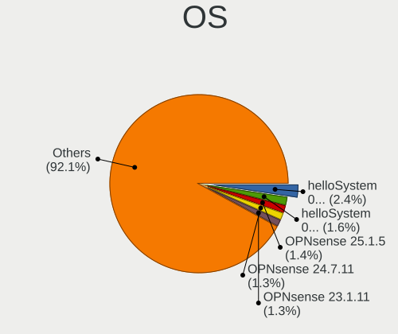

| Name              | Computers | Percent |
|-------------------|-----------|---------|
| helloSystem 0.8.1 | 688       | 2.36%   |
| helloSystem 0.7.0 | 454       | 1.56%   |
| OPNsense 25.1.5   | 404       | 1.39%   |
| OPNsense 24.7.11  | 390       | 1.34%   |
| OPNsense 23.1.11  | 370       | 1.27%   |
| OPNsense 25.1.7   | 327       | 1.12%   |
| OPNsense 24.7.12  | 327       | 1.12%   |
| OPNsense 24.1.6   | 298       | 1.02%   |
| OPNsense 25.1     | 295       | 1.01%   |
| OPNsense 21.7.7   | 281       | 0.97%   |
| OPNsense 23.7.10  | 270       | 0.93%   |
| OPNsense 22.7.10  | 262       | 0.9%    |
| helloSystem 0.8.0 | 255       | 0.88%   |
| OPNsense 23.7.12  | 249       | 0.86%   |
| OPNsense 25.1.1   | 245       | 0.84%   |
| helloSystem 0.5.0 | 245       | 0.84%   |
| OPNsense 24.1.10  | 240       | 0.82%   |
| OPNsense 21.1     | 240       | 0.82%   |
| FreeBSD 13.1      | 236       | 0.81%   |
| OPNsense 23.1     | 230       | 0.79%   |
| helloSystem 0.9.0 | 230       | 0.79%   |
| OPNsense 21.7.1   | 229       | 0.79%   |
| OPNsense 24.7     | 227       | 0.78%   |
| OPNsense 22.1     | 227       | 0.78%   |
| OPNsense 21.7.3   | 225       | 0.77%   |
| OPNsense 21.1.5   | 224       | 0.77%   |
| FreeBSD 13.0      | 224       | 0.77%   |
| OPNsense 23.1.5   | 221       | 0.76%   |
| OPNsense 23.7.9   | 220       | 0.76%   |
| OPNsense 25.7.1   | 217       | 0.75%   |
| OPNsense 24.1.9   | 217       | 0.75%   |
| OPNsense 24.7.8   | 216       | 0.74%   |
| OPNsense 22.7.4   | 214       | 0.74%   |
| OPNsense 20.7.8   | 214       | 0.74%   |
| OPNsense 25.1.3   | 213       | 0.73%   |
| FreeBSD 14.2      | 213       | 0.73%   |
| OPNsense 25.7.3   | 212       | 0.73%   |
| OpenBSD 6.8       | 208       | 0.71%   |
| OPNsense 21.1.3   | 205       | 0.7%    |
| OPNsense 25.1.4   | 199       | 0.68%   |

OS Family
---------

OS without a version

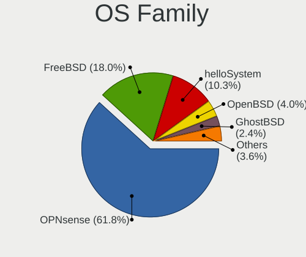

| Name        | Computers | Percent |
|-------------|-----------|---------|
| OPNsense    | 12877     | 61.77%  |
| FreeBSD     | 3751      | 17.99%  |
| helloSystem | 2138      | 10.26%  |
| OpenBSD     | 826       | 3.96%   |
| GhostBSD    | 498       | 2.39%   |
| NomadBSD    | 251       | 1.2%    |
| NetBSD      | 162       | 0.78%   |
| TrueNAS     | 61        | 0.29%   |
| pfSense     | 43        | 0.21%   |
| MyBee       | 43        | 0.21%   |
| ClonOS      | 39        | 0.19%   |
| FreeNAS     | 30        | 0.14%   |
| MidnightBSD | 28        | 0.13%   |
| DragonFly   | 23        | 0.11%   |
| HardenedBSD | 22        | 0.11%   |
| XigmaNAS    | 20        | 0.1%    |
| FuryBSD     | 13        | 0.06%   |
| FuguIta     | 7         | 0.03%   |
| Ting        | 4         | 0.02%   |
| OS108       | 4         | 0.02%   |
| PC-BSD      | 3         | 0.01%   |
| OpenWrt     | 1         | 0.005%  |
| LibertyBSD  | 1         | 0.005%  |
| Debian      | 1         | 0.005%  |

Arch
----

OS architecture (x86_64, i586, etc.)

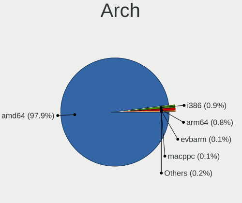

| Name    | Computers | Percent |
|---------|-----------|---------|
| amd64   | 20140     | 97.93%  |
| i386    | 184       | 0.89%   |
| arm64   | 172       | 0.84%   |
| evbarm  | 18        | 0.09%   |
| macppc  | 15        | 0.07%   |
| arm     | 14        | 0.07%   |
| sparc64 | 8         | 0.04%   |
| powerpc | 6         | 0.03%   |
| armv7   | 3         | 0.01%   |
| riscv   | 2         | 0.01%   |
| octeon  | 2         | 0.01%   |
| mips    | 1         | 0.005%  |
| aarch64 | 1         | 0.005%  |

DE
--

Desktop Environment

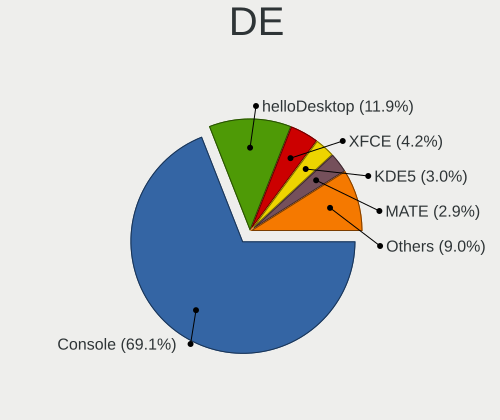

| Name          | Computers | Percent |
|---------------|-----------|---------|
| Console       | 14556     | 69.05%  |
| helloDesktop  | 2514      | 11.93%  |
| XFCE          | 884       | 4.19%   |
| KDE5          | 624       | 2.96%   |
| MATE          | 614       | 2.91%   |
| TWM           | 345       | 1.64%   |
| GNOME         | 342       | 1.62%   |
| fvwm          | 279       | 1.32%   |
| Openbox       | 258       | 1.22%   |
| i3            | 163       | 0.77%   |
| LXQt          | 66        | 0.31%   |
| Cinnamon      | 42        | 0.2%    |
| Fluxbox       | 37        | 0.18%   |
| AwesomeWM     | 37        | 0.18%   |
| KDE6          | 35        | 0.17%   |
| KDE           | 33        | 0.16%   |
| Enlightenment | 29        | 0.14%   |
| LXDE          | 21        | 0.1%    |
| DWM           | 18        | 0.09%   |
| xinitrc       | 14        | 0.07%   |
| Lumina        | 14        | 0.07%   |
| X-Cinnamon    | 11        | 0.05%   |
| Window Maker  | 11        | 0.05%   |
| Picom         | 10        | 0.05%   |
| IceWM         | 10        | 0.05%   |
| Hyprland      | 9         | 0.04%   |
| stumpwm       | 8         | 0.04%   |
| GNUstep       | 7         | 0.03%   |
| ctwm          | 7         | 0.03%   |
| Budgie        | 7         | 0.03%   |
| CDE           | 6         | 0.03%   |
| wlroots       | 5         | 0.02%   |
| spectrwm      | 5         | 0.02%   |
| iwm           | 5         | 0.02%   |
| xfwm          | 4         | 0.02%   |
| sway          | 4         | 0.02%   |
| WindowMaker   | 3         | 0.01%   |
| KDE4          | 3         | 0.01%   |
| Compton       | 3         | 0.01%   |
| Blackbox      | 3         | 0.01%   |

Display Server
--------------

X11 or Wayland

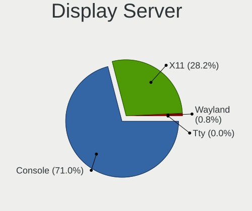

| Name    | Computers | Percent |
|---------|-----------|---------|
| Console | 14688     | 70.99%  |
| X11     | 5841      | 28.23%  |
| Wayland | 158       | 0.76%   |
| Tty     | 2         | 0.01%   |

Display Manager
---------------

SDDM, LightDM, etc.

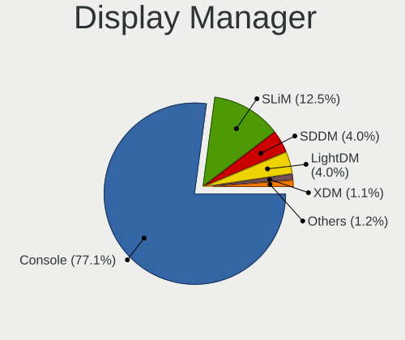

| Name    | Computers | Percent |
|---------|-----------|---------|
| Console | 16115     | 77.11%  |
| SLiM    | 2617      | 12.52%  |
| SDDM    | 843       | 4.03%   |
| LightDM | 839       | 4.01%   |
| XDM     | 227       | 1.09%   |
| GDM     | 201       | 0.96%   |
| Ly      | 52        | 0.25%   |
| WDM     | 3         | 0.01%   |
| PCDM    | 2         | 0.01%   |

OS Lang
-------

Language

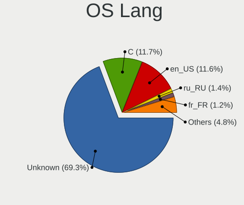

| Lang            | Computers | Percent |
|-----------------|-----------|---------|
| Unknown         | 14664     | 69.32%  |
| C               | 2478      | 11.71%  |
| en_US           | 2464      | 11.65%  |
| ru_RU           | 289       | 1.37%   |
| fr_FR           | 249       | 1.18%   |
| de_DE           | 190       | 0.9%    |
| es_ES           | 100       | 0.47%   |
| en              | 92        | 0.43%   |
| en_GB           | 82        | 0.39%   |
| pt_BR           | 50        | 0.24%   |
| zh_CN           | 47        | 0.22%   |
| it_IT           | 47        | 0.22%   |
| pl_PL           | 41        | 0.19%   |
| en_AU           | 25        | 0.12%   |
| en_CA           | 24        | 0.11%   |
| fi_FI           | 21        | 0.1%    |
| ja_JP           | 17        | 0.08%   |
| fr              | 17        | 0.08%   |
| ru              | 14        | 0.07%   |
| zh_TW           | 12        | 0.06%   |
| nl_NL           | 11        | 0.05%   |
| uk_UA           | 10        | 0.05%   |
| es              | 10        | 0.05%   |
| tr_TR           | 9         | 0.04%   |
| pt              | 9         | 0.04%   |
| en_IE           | 9         | 0.04%   |
| de              | 9         | 0.04%   |
| pt_PT           | 8         | 0.04%   |
| nb_NO           | 7         | 0.03%   |
| hu_HU           | 7         | 0.03%   |
| es_AR           | 7         | 0.03%   |
| de_CH           | 7         | 0.03%   |
| cs_CZ           | 7         | 0.03%   |
| sv_SE           | 6         | 0.03%   |
| ko_KR           | 6         | 0.03%   |
| en_US.ISO8859-1 | 5         | 0.02%   |
| en_NZ           | 5         | 0.02%   |
| el_GR           | 5         | 0.02%   |
| ru_RU.KOI8-R    | 4         | 0.02%   |
| jp_JP           | 4         | 0.02%   |

Boot Mode
---------

EFI or BIOS

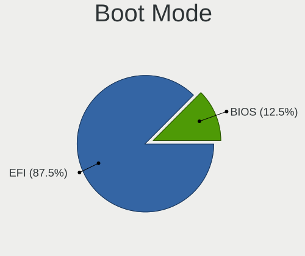

| Mode | Computers | Percent |
|------|-----------|---------|
| EFI  | 18162     | 87.46%  |
| BIOS | 2605      | 12.54%  |

Filesystem
----------

Type of filesystem

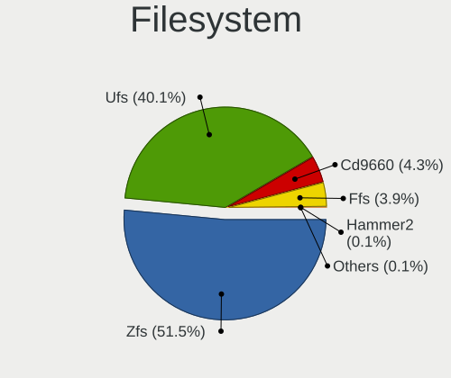

| Type    | Computers | Percent |
|---------|-----------|---------|
| Zfs     | 10957     | 51.5%   |
| Ufs     | 8525      | 40.07%  |
| Cd9660  | 918       | 4.32%   |
| Ffs     | 835       | 3.92%   |
| Hammer2 | 21        | 0.1%    |
| Unknown | 7         | 0.03%   |
| XXX     | 3         | 0.01%   |
| Nfs     | 2         | 0.01%   |
| Msdosfs | 2         | 0.01%   |
| Xfs     | 1         | 0.005%  |
| Overlay | 1         | 0.005%  |
| Nullfs  | 1         | 0.005%  |
| Ext4    | 1         | 0.005%  |

Part. scheme
------------

Scheme of partitioning

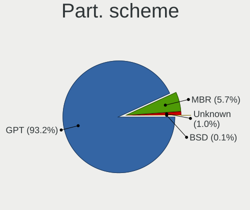

| Type    | Computers | Percent |
|---------|-----------|---------|
| GPT     | 19271     | 93.16%  |
| MBR     | 1176      | 5.69%   |
| Unknown | 214       | 1.03%   |
| BSD     | 25        | 0.12%   |

Board
-----

Vendor
------

Motherboard manufacturer

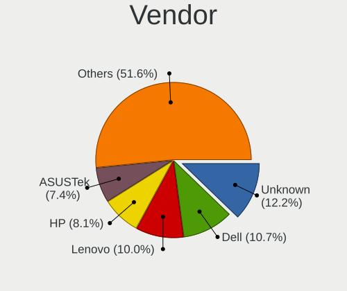

| Name                                 | Computers | Percent |
|--------------------------------------|-----------|---------|
| Unknown                              | 2512      | 12.22%  |
| Dell                                 | 2200      | 10.7%   |
| Lenovo                               | 2056      | 10%     |
| Hewlett-Packard                      | 1675      | 8.15%   |
| ASUSTek Computer                     | 1513      | 7.36%   |
| Intel                                | 924       | 4.49%   |
| Supermicro                           | 847       | 4.12%   |
| Gigabyte Technology                  | 799       | 3.89%   |
| Protectli                            | 714       | 3.47%   |
| ASRock                               | 669       | 3.25%   |
| MSI                                  | 508       | 2.47%   |
| PC Engines                           | 474       | 2.31%   |
| Sophos                               | 412       | 2%      |
| Fujitsu                              | 401       | 1.95%   |
| AMI                                  | 355       | 1.73%   |
| Apple                                | 317       | 1.54%   |
| Acer                                 | 301       | 1.46%   |
| Deciso                               | 247       | 1.2%    |
| Techvision                           | 238       | 1.16%   |
| AZW                                  | 174       | 0.85%   |
| ZOTAC                                | 144       | 0.7%    |
| Shuttle                              | 107       | 0.52%   |
| BESSTAR Tech                         | 102       | 0.5%    |
| Shenzhen Meigao Electronic Equipment | 94        | 0.46%   |
| CWWK                                 | 83        | 0.4%    |
| MW                                   | 81        | 0.39%   |
| Toshiba                              | 78        | 0.38%   |
| ASRockRack                           | 74        | 0.36%   |
| Samsung Electronics                  | 69        | 0.34%   |
| CncTion                              | 68        | 0.33%   |
| Raspberry Pi Foundation              | 67        | 0.33%   |
| Biostar                              | 65        | 0.32%   |
| IceWhale Technology                  | 63        | 0.31%   |
| AWOW                                 | 53        | 0.26%   |
| HARDKERNEL                           | 52        | 0.25%   |
| Sony                                 | 50        | 0.24%   |
| Google                               | 48        | 0.23%   |
| IBM                                  | 46        | 0.22%   |
| GoWin Solution                       | 43        | 0.21%   |
| Foxconn                              | 42        | 0.2%    |

Model
-----

Motherboard model

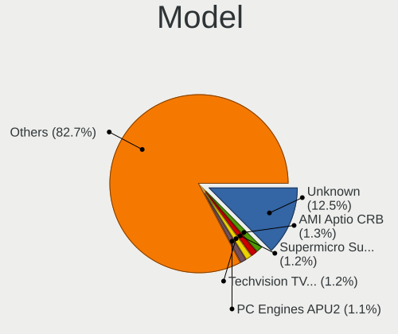

| Name                                              | Computers | Percent |
|---------------------------------------------------|-----------|---------|
| Unknown                                           | 2578      | 12.54%  |
| AMI Aptio CRB                                     | 258       | 1.25%   |
| Supermicro Super Server                           | 244       | 1.19%   |
| Techvision TVI7309X                               | 238       | 1.16%   |
| PC Engines APU2                                   | 235       | 1.14%   |
| Sophos SG                                         | 229       | 1.11%   |
| Protectli FW4B                                    | 181       | 0.88%   |
| Intel Q3XXG4-P V1.0                               | 167       | 0.81%   |
| PC Engines apu4                                   | 144       | 0.7%    |
| ASUS All Series                                   | 138       | 0.67%   |
| Sophos XG                                         | 137       | 0.67%   |
| Fujitsu FUTRO S920                                | 137       | 0.67%   |
| Protectli FW6                                     | 133       | 0.65%   |
| AZW EQ                                            | 97        | 0.47%   |
| Protectli VP2420                                  | 91        | 0.44%   |
| HP t730 Thin Client                               | 89        | 0.43%   |
| Dell OptiPlex 9020                                | 84        | 0.41%   |
| MW GMLK-2_5G4L                                    | 81        | 0.39%   |
| Shenzhen Meigao Electronic Equipment Venus Series | 77        | 0.37%   |
| HP t620 PLUS Quad Core TC                         | 73        | 0.36%   |
| Dell PowerEdge R210 II                            | 72        | 0.35%   |
| Dell OptiPlex 3020                                | 69        | 0.34%   |
| Dell OptiPlex 7010                                | 65        | 0.32%   |
| Dell Wyse 5070 Extended Thin Client               | 59        | 0.29%   |
| RPi Raspberry Pi                                  | 53        | 0.26%   |
| Protectli FW4C                                    | 53        | 0.26%   |
| Dell OptiPlex 7040                                | 53        | 0.26%   |
| Deciso NetBoard-A20                               | 53        | 0.26%   |
| Dell OptiPlex 3050                                | 48        | 0.23%   |
| Protectli VP2410                                  | 47        | 0.23%   |
| HP EliteDesk 800 G1 SFF                           | 47        | 0.23%   |
| Supermicro X10SLH-N6-ST031                        | 46        | 0.22%   |
| Supermicro A1SAi                                  | 44        | 0.21%   |
| Sophos UTM                                        | 43        | 0.21%   |
| BESSTAR Tech GK41                                 | 43        | 0.21%   |
| IceWhale ZimaBoard 832 ZMB                        | 42        | 0.2%    |
| Dell OptiPlex 7050                                | 42        | 0.2%    |
| Protectli FW2B                                    | 40        | 0.19%   |
| Dell Wyse 5070 Thin Client                        | 37        | 0.18%   |
| Supermicro X9SCL/X9SCM                            | 36        | 0.18%   |

Model Family
------------

Motherboard model prefix

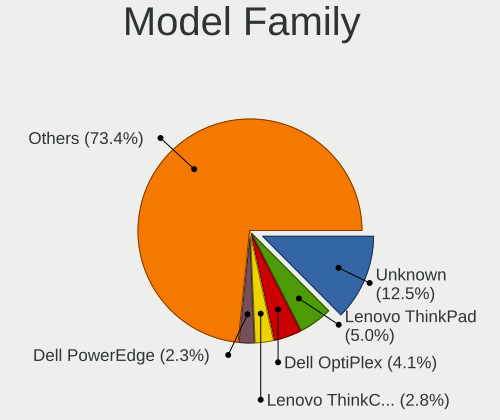

| Name                                       | Computers | Percent |
|--------------------------------------------|-----------|---------|
| Unknown                                    | 2578      | 12.54%  |
| Lenovo ThinkPad                            | 1019      | 4.96%   |
| Dell OptiPlex                              | 837       | 4.07%   |
| Lenovo ThinkCentre                         | 568       | 2.76%   |
| Dell PowerEdge                             | 473       | 2.3%    |
| AMI Aptio                                  | 260       | 1.26%   |
| ASUS PRIME                                 | 256       | 1.25%   |
| Dell Latitude                              | 253       | 1.23%   |
| Supermicro Super                           | 244       | 1.19%   |
| HP EliteDesk                               | 239       | 1.16%   |
| Techvision TVI7309X                        | 238       | 1.16%   |
| PC Engines APU2                            | 235       | 1.14%   |
| HP ProLiant                                | 234       | 1.14%   |
| Sophos SG                                  | 229       | 1.11%   |
| Fujitsu FUTRO                              | 195       | 0.95%   |
| Dell Inspiron                              | 194       | 0.94%   |
| HP ProDesk                                 | 193       | 0.94%   |
| Acer Aspire                                | 186       | 0.9%    |
| Protectli FW4B                             | 181       | 0.88%   |
| HP Compaq                                  | 178       | 0.87%   |
| Intel Q3XXG4-P                             | 169       | 0.82%   |
| Dell Precision                             | 158       | 0.77%   |
| PC Engines apu4                            | 144       | 0.7%    |
| ASUS All                                   | 138       | 0.67%   |
| Sophos XG                                  | 137       | 0.67%   |
| Protectli FW6                              | 133       | 0.65%   |
| Lenovo IdeaPad                             | 128       | 0.62%   |
| ASUS ROG                                   | 115       | 0.56%   |
| Dell Wyse                                  | 97        | 0.47%   |
| AZW EQ                                     | 97        | 0.47%   |
| ASUS TUF                                   | 97        | 0.47%   |
| HP EliteBook                               | 92        | 0.45%   |
| Protectli VP2420                           | 91        | 0.44%   |
| HP t730                                    | 91        | 0.44%   |
| Deciso Netboard                            | 88        | 0.43%   |
| HP t620                                    | 83        | 0.4%    |
| HP Pavilion                                | 83        | 0.4%    |
| MW GMLK-2                                  | 81        | 0.39%   |
| Shenzhen Meigao Electronic Equipment Venus | 77        | 0.37%   |
| Fujitsu ESPRIMO                            | 70        | 0.34%   |

MFG Year
--------

Motherboard manufacture year

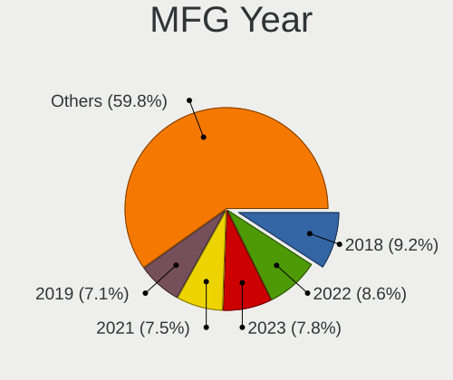

| Year    | Computers | Percent |
|---------|-----------|---------|
| 2018    | 1884      | 9.16%   |
| 2022    | 1760      | 8.56%   |
| 2023    | 1613      | 7.85%   |
| 2021    | 1542      | 7.5%    |
| 2019    | 1458      | 7.09%   |
| 2020    | 1438      | 6.99%   |
| 2016    | 1406      | 6.84%   |
| 2014    | 1402      | 6.82%   |
| 2017    | 1176      | 5.72%   |
| 2013    | 1097      | 5.34%   |
| 2024    | 1077      | 5.24%   |
| 2012    | 965       | 4.69%   |
| 2015    | 925       | 4.5%    |
| 2011    | 836       | 4.07%   |
| 2010    | 543       | 2.64%   |
| 2009    | 387       | 1.88%   |
| 2008    | 305       | 1.48%   |
| Unknown | 261       | 1.27%   |
| 2025    | 216       | 1.05%   |
| 2007    | 144       | 0.7%    |
| 2006    | 67        | 0.33%   |
| 2005    | 21        | 0.1%    |
| 2004    | 14        | 0.07%   |
| 2003    | 10        | 0.05%   |
| 2002    | 7         | 0.03%   |
| 2001    | 4         | 0.02%   |
| 2000    | 1         | 0.005%  |

Form Factor
-----------

Physical design of the computer

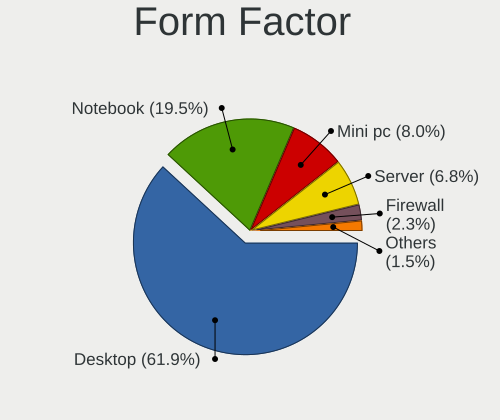

| Name           | Computers | Percent |
|----------------|-----------|---------|
| Desktop        | 12723     | 61.89%  |
| Notebook       | 4018      | 19.54%  |
| Mini pc        | 1642      | 7.99%   |
| Server         | 1392      | 6.77%   |
| Firewall       | 475       | 2.31%   |
| All in one     | 98        | 0.48%   |
| System on chip | 96        | 0.47%   |
| Convertible    | 89        | 0.43%   |
| Tablet         | 25        | 0.12%   |
| Stick pc       | 1         | 0.005%  |

Coreboot
--------

Have coreboot on board

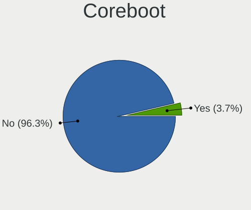

| Used | Computers | Percent |
|------|-----------|---------|
| No   | 19806     | 96.32%  |
| Yes  | 756       | 3.68%   |

RAM Size
--------

Total RAM memory

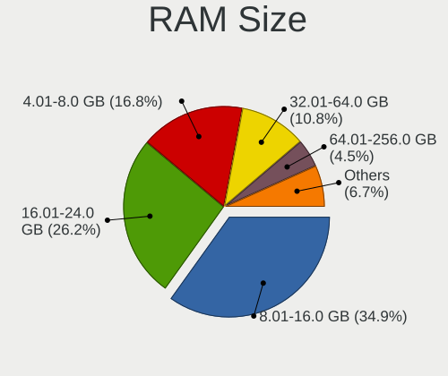

| Size in GB      | Computers | Percent |
|-----------------|-----------|---------|
| 8.01-16.0       | 7363      | 34.88%  |
| 16.01-24.0      | 5535      | 26.22%  |
| 4.01-8.0        | 3553      | 16.83%  |
| 32.01-64.0      | 2282      | 10.81%  |
| 64.01-256.0     | 959       | 4.54%   |
| 2.01-3.0        | 582       | 2.76%   |
| 24.01-32.0      | 281       | 1.33%   |
| 3.01-4.0        | 229       | 1.08%   |
| 0.51-1.0        | 118       | 0.56%   |
| 1.01-2.0        | 80        | 0.38%   |
| More than 256.0 | 66        | 0.31%   |
| 0.01-0.5        | 56        | 0.27%   |
| Unknown         | 2         | 0.01%   |
| 0               | 1         | 0.005%  |

RAM Used
--------

Used RAM memory

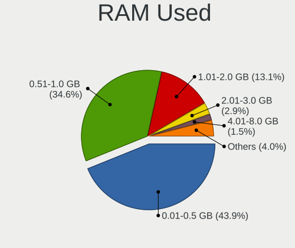

| Used GB         | Computers | Percent |
|-----------------|-----------|---------|
| 0.01-0.5        | 9352      | 43.9%   |
| 0.51-1.0        | 7365      | 34.57%  |
| 1.01-2.0        | 2796      | 13.12%  |
| 2.01-3.0        | 621       | 2.91%   |
| 4.01-8.0        | 322       | 1.51%   |
| 3.01-4.0        | 264       | 1.24%   |
| Unknown         | 178       | 0.84%   |
| 8.01-16.0       | 132       | 0.62%   |
| 0               | 94        | 0.44%   |
| 16.01-24.0      | 57        | 0.27%   |
| 24.01-32.0      | 50        | 0.23%   |
| 32.01-64.0      | 45        | 0.21%   |
| 64.01-256.0     | 27        | 0.13%   |
| More than 256.0 | 1         | 0.005%  |

Total Drives
------------

Number of drives on board

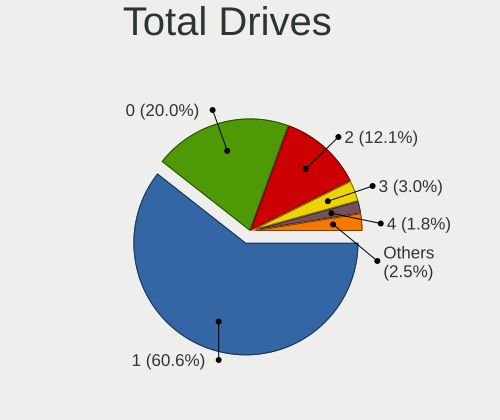

| Drives | Computers | Percent |
|--------|-----------|---------|
| 1      | 13066     | 60.59%  |
| 0      | 4314      | 20.01%  |
| 2      | 2600      | 12.06%  |
| 3      | 656       | 3.04%   |
| 4      | 381       | 1.77%   |
| 5      | 179       | 0.83%   |
| 6      | 117       | 0.54%   |
| 7      | 61        | 0.28%   |
| 8      | 40        | 0.19%   |
| 10     | 26        | 0.12%   |
| 9      | 21        | 0.1%    |
| 14     | 20        | 0.09%   |
| 12     | 17        | 0.08%   |
| 11     | 13        | 0.06%   |
| 17     | 7         | 0.03%   |
| 16     | 7         | 0.03%   |
| 13     | 5         | 0.02%   |
| 25     | 4         | 0.02%   |
| 18     | 4         | 0.02%   |
| 26     | 3         | 0.01%   |
| 15     | 3         | 0.01%   |
| 58     | 2         | 0.01%   |
| 40     | 2         | 0.01%   |
| 24     | 2         | 0.01%   |
| 23     | 2         | 0.01%   |
| 21     | 2         | 0.01%   |
| 19     | 2         | 0.01%   |
| 63     | 1         | 0.005%  |
| 47     | 1         | 0.005%  |
| 36     | 1         | 0.005%  |
| 30     | 1         | 0.005%  |
| 28     | 1         | 0.005%  |
| 27     | 1         | 0.005%  |
| 22     | 1         | 0.005%  |

Has CD-ROM
----------

Has CD-ROM on board

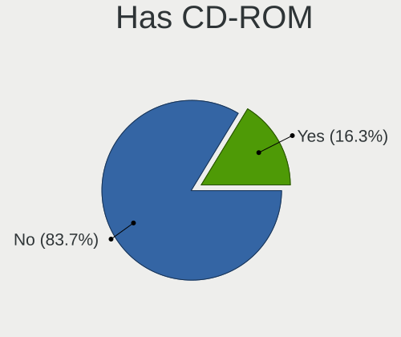

| Presented | Computers | Percent |
|-----------|-----------|---------|
| No        | 17365     | 83.72%  |
| Yes       | 3377      | 16.28%  |

Has Ethernet
------------

Has Ethernet on board

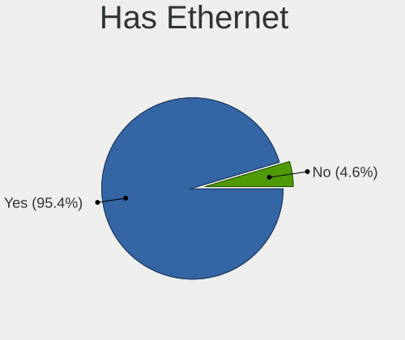

| Presented | Computers | Percent |
|-----------|-----------|---------|
| Yes       | 19617     | 95.4%   |
| No        | 946       | 4.6%    |

Has WiFi
--------

Has WiFi module

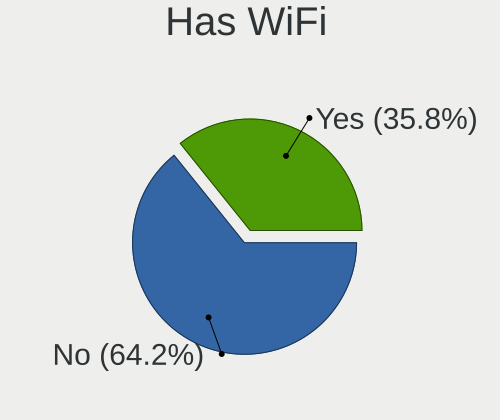

| Presented | Computers | Percent |
|-----------|-----------|---------|
| No        | 13340     | 64.23%  |
| Yes       | 7430      | 35.77%  |

Has Bluetooth
-------------

Has Bluetooth module

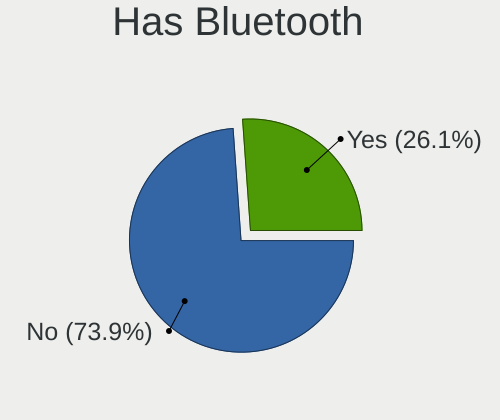

| Presented | Computers | Percent |
|-----------|-----------|---------|
| No        | 15326     | 73.87%  |
| Yes       | 5420      | 26.13%  |

Location
--------

Country
-------

Geographic location (country)

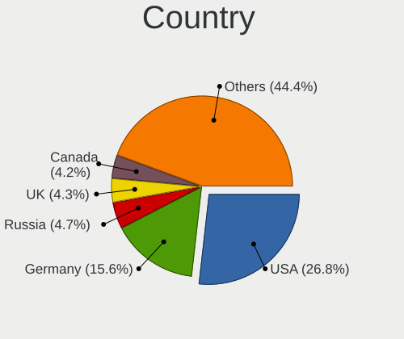

| Country      | Computers | Percent |
|--------------|-----------|---------|
| USA          | 5539      | 26.78%  |
| Germany      | 3233      | 15.63%  |
| Russia       | 980       | 4.74%   |
| UK           | 889       | 4.3%    |
| Canada       | 863       | 4.17%   |
| France       | 769       | 3.72%   |
| Australia    | 593       | 2.87%   |
| Poland       | 535       | 2.59%   |
| Brazil       | 490       | 2.37%   |
| Netherlands  | 477       | 2.31%   |
| Italy        | 418       | 2.02%   |
| Switzerland  | 363       | 1.76%   |
| Spain        | 338       | 1.63%   |
| Austria      | 331       | 1.6%    |
| Sweden       | 328       | 1.59%   |
| China        | 297       | 1.44%   |
| Romania      | 190       | 0.92%   |
| Finland      | 190       | 0.92%   |
| Belgium      | 186       | 0.9%    |
| Norway       | 180       | 0.87%   |
| India        | 174       | 0.84%   |
| Czechia      | 154       | 0.74%   |
| Indonesia    | 150       | 0.73%   |
| Hungary      | 146       | 0.71%   |
| Portugal     | 144       | 0.7%    |
| Japan        | 142       | 0.69%   |
| Denmark      | 135       | 0.65%   |
| Taiwan       | 119       | 0.58%   |
| South Korea  | 112       | 0.54%   |
| Ukraine      | 110       | 0.53%   |
| Mexico       | 110       | 0.53%   |
| Bulgaria     | 108       | 0.52%   |
| New Zealand  | 103       | 0.5%    |
| Turkey       | 88        | 0.43%   |
| South Africa | 82        | 0.4%    |
| Argentina    | 79        | 0.38%   |
| Greece       | 68        | 0.33%   |
| Vietnam      | 67        | 0.32%   |
| Lithuania    | 60        | 0.29%   |
| Ireland      | 60        | 0.29%   |

City
----

Geographic location (city)

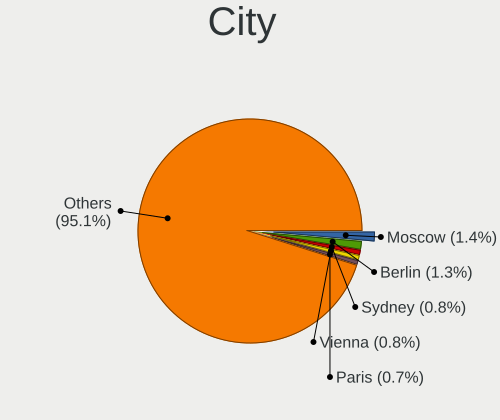

| City              | Computers | Percent |
|-------------------|-----------|---------|
| Moscow            | 330       | 1.42%   |
| Berlin            | 295       | 1.27%   |
| Sydney            | 179       | 0.77%   |
| Vienna            | 176       | 0.76%   |
| Paris             | 156       | 0.67%   |
| Melbourne         | 139       | 0.6%    |
| Munich            | 135       | 0.58%   |
| St Petersburg     | 128       | 0.55%   |
| Seattle           | 125       | 0.54%   |
| Hamburg           | 114       | 0.49%   |
| London            | 110       | 0.47%   |
| Zurich            | 107       | 0.46%   |
| Montreal          | 98        | 0.42%   |
| Warsaw            | 97        | 0.42%   |
| Denver            | 94        | 0.4%    |
| Frankfurt am Main | 93        | 0.4%    |
| Cologne           | 86        | 0.37%   |
| Amsterdam         | 86        | 0.37%   |
| Toronto           | 78        | 0.33%   |
| Helsinki          | 78        | 0.33%   |
| Brisbane          | 78        | 0.33%   |
| Chicago           | 77        | 0.33%   |
| New York          | 75        | 0.32%   |
| Los Angeles       | 74        | 0.32%   |
| Madrid            | 72        | 0.31%   |
| Milan             | 71        | 0.3%    |
| Perth             | 70        | 0.3%    |
| Sao Paulo         | 69        | 0.3%    |
| Stockholm         | 68        | 0.29%   |
| Bucharest         | 68        | 0.29%   |
| Jakarta           | 63        | 0.27%   |
| Brooklyn          | 63        | 0.27%   |
| Calgary           | 62        | 0.27%   |
| Prague            | 59        | 0.25%   |
| Oslo              | 59        | 0.25%   |
| Sofia             | 58        | 0.25%   |
| Portland          | 58        | 0.25%   |
| Budapest          | 58        | 0.25%   |
| Singapore         | 57        | 0.24%   |
| Rome              | 56        | 0.24%   |

Drives
------

Drive Vendor
------------

Hard drive vendors

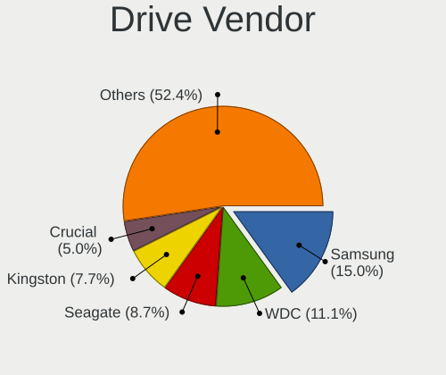

| Vendor              | Computers | Drives | Percent |
|---------------------|-----------|--------|---------|
| Samsung Electronics | 3157      | 5579   | 15.04%  |
| WDC                 | 2333      | 5049   | 11.11%  |
| Seagate             | 1832      | 3853   | 8.73%   |
| Kingston            | 1626      | 2448   | 7.75%   |
| Crucial             | 1044      | 1695   | 4.97%   |
| Intel               | 887       | 1528   | 4.23%   |
| SanDisk             | 871       | 1205   | 4.15%   |
| Transcend           | 865       | 1362   | 4.12%   |
| Toshiba             | 850       | 1495   | 4.05%   |
| China               | 544       | 807    | 2.59%   |
| A-DATA Technology   | 512       | 742    | 2.44%   |
| Hitachi             | 445       | 822    | 2.12%   |
| Hoodisk             | 316       | 522    | 1.51%   |
| SK hynix            | 285       | 409    | 1.36%   |
| HGST                | 282       | 765    | 1.34%   |
| Micron Technology   | 274       | 415    | 1.31%   |
| Phison              | 240       | 342    | 1.14%   |
| SPCC                | 222       | 389    | 1.06%   |
| Hewlett-Packard     | 207       | 556    | 0.99%   |
| FORESEE             | 190       | 290    | 0.91%   |
| PNY                 | 174       | 305    | 0.83%   |
| NVMe                | 172       | 240    | 0.82%   |
| Protectli           | 169       | 293    | 0.81%   |
| Patriot             | 168       | 254    | 0.8%    |
| Apacer              | 160       | 230    | 0.76%   |
| OCZ                 | 134       | 196    | 0.64%   |
| Apple               | 134       | 154    | 0.64%   |
| Intenso             | 127       | 212    | 0.61%   |
| Silicon Motion      | 111       | 151    | 0.53%   |
| Innodisk            | 102       | 137    | 0.49%   |
| KingSpec            | 97        | 133    | 0.46%   |
| Corsair             | 92        | 163    | 0.44%   |
| Team                | 89        | 152    | 0.42%   |
| LITEON              | 86        | 138    | 0.41%   |
| Gigabyte Technology | 86        | 117    | 0.41%   |
| Dogfish             | 80        | 145    | 0.38%   |
| Lexar               | 76        | 113    | 0.36%   |
| LITEONIT            | 73        | 109    | 0.35%   |
| BIWIN               | 68        | 101    | 0.32%   |
| Fanxiang            | 64        | 102    | 0.3%    |

Drive Model
-----------

Hard drive models

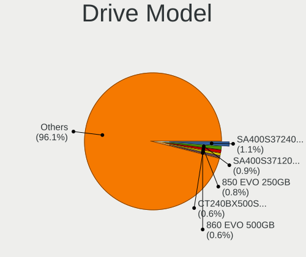

| Model                              | Computers | Percent |
|------------------------------------|-----------|---------|
| Kingston SA400S37240G 240GB        | 253       | 1.12%   |
| Kingston SA400S37120G 120GB        | 193       | 0.85%   |
| Samsung SSD 850 EVO 250GB          | 179       | 0.79%   |
| Crucial CT240BX500SSD1 240GB       | 134       | 0.59%   |
| Samsung SSD 860 EVO 500GB          | 133       | 0.59%   |
| Kingston SV300S37A120G 120GB       | 112       | 0.49%   |
| Samsung SSD 860 EVO 250GB          | 111       | 0.49%   |
| Crucial CT500MX500SSD1 500GB       | 107       | 0.47%   |
| Kingston SKC600MS256G 256GB        | 106       | 0.47%   |
| Seagate ST500DM002-1BD142 500GB    | 103       | 0.46%   |
| Samsung SSD 850 EVO 500GB          | 97        | 0.43%   |
| Crucial CT250MX500SSD1 250GB       | 96        | 0.42%   |
| China SATA SSD 16GB                | 96        | 0.42%   |
| Hoodisk SSD 32GB                   | 92        | 0.41%   |
| Kingston SA400S37480G 480GB        | 91        | 0.4%    |
| Transcend TS128GMSA230S 128GB      | 88        | 0.39%   |
| Hoodisk SSD 128GB                  | 88        | 0.39%   |
| Samsung SSD 870 EVO 500GB          | 86        | 0.38%   |
| A-DATA IM2S3134N-064GM 64GB        | 86        | 0.38%   |
| Samsung SSD 870 EVO 250GB          | 83        | 0.37%   |
| Kingston SUV500MS120G 120GB        | 83        | 0.37%   |
| Hoodisk SSD 64GB                   | 83        | 0.37%   |
| FORESEE 128GB SSD                  | 81        | 0.36%   |
| Phison SATA SSD 16GB               | 74        | 0.33%   |
| Crucial CT1000MX500SSD1 1TB        | 74        | 0.33%   |
| Samsung SSD 970 EVO Plus 500GB     | 68        | 0.3%    |
| Crucial CT120BX500SSD1 120GB       | 68        | 0.3%    |
| Toshiba DT01ACA100 1TB             | 67        | 0.3%    |
| Samsung SSD 860 EVO 1TB            | 67        | 0.3%    |
| Samsung SSD 840 EVO 250GB          | 67        | 0.3%    |
| Seagate ST1000DM010-2EP102 1TB     | 65        | 0.29%   |
| Seagate ST1000LM035-1RK172 1TB     | 64        | 0.28%   |
| Seagate ST1000LM024 HN-M101MBB 1TB | 64        | 0.28%   |
| Samsung SSD 970 EVO Plus 1TB       | 62        | 0.27%   |
| HP RAID 1(1+0) 119GB               | 60        | 0.27%   |
| Samsung SSD 840 EVO 120GB          | 59        | 0.26%   |
| WDC WDS240G2G0A-00JH30 240GB       | 58        | 0.26%   |
| Samsung SSD 870 EVO 1TB            | 58        | 0.26%   |
| Samsung SSD 850 PRO 256GB          | 58        | 0.26%   |
| A-DATA SU650 120GB                 | 57        | 0.25%   |

HDD Vendor
----------

Hard disk drive vendors

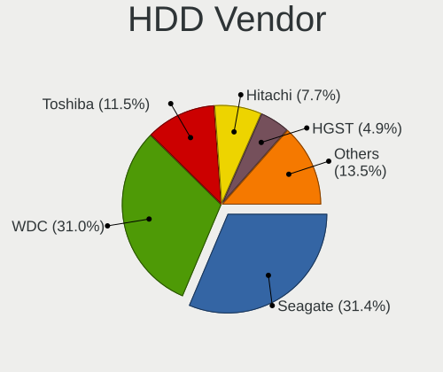

| Vendor                                 | Computers | Drives | Percent |
|----------------------------------------|-----------|--------|---------|
| Seagate                                | 1777      | 3741   | 31.36%  |
| WDC                                    | 1757      | 3998   | 31.01%  |
| Toshiba                                | 650       | 1184   | 11.47%  |
| Hitachi                                | 439       | 803    | 7.75%   |
| HGST                                   | 279       | 743    | 4.92%   |
| Samsung Electronics                    | 226       | 327    | 3.99%   |
| NVMe                                   | 109       | 148    | 1.92%   |
| Hewlett-Packard                        | 90        | 311    | 1.59%   |
| Fujitsu                                | 52        | 67     | 0.92%   |
| Apple                                  | 48        | 53     | 0.85%   |
| Maxtor                                 | 47        | 57     | 0.83%   |
| OPENBSD                                | 19        | 35     | 0.34%   |
| HPE                                    | 18        | 60     | 0.32%   |
| LSI                                    | 13        | 20     | 0.23%   |
| Dell                                   | 13        | 68     | 0.23%   |
| Generic                                | 10        | 10     | 0.18%   |
| JetFlash                               | 7         | 7      | 0.12%   |
| China                                  | 7         | 9      | 0.12%   |
| USB                                    | 6         | 6      | 0.11%   |
| Product:              USB DISK 2.0     | 6         | 6      | 0.11%   |
| Lexar                                  | 5         | 6      | 0.09%   |
| HPT                                    | 5         | 44     | 0.09%   |
| Adaptec                                | 5         | 15     | 0.09%   |
| Intenso                                | 4         | 4      | 0.07%   |
| IBM                                    | 4         | 4      | 0.07%   |
| WD MediaMax                            | 3         | 9      | 0.05%   |
| Synology                               | 3         | 5      | 0.05%   |
| StoreJet                               | 3         | 3      | 0.05%   |
| NETAPP                                 | 3         | 6      | 0.05%   |
| MARVELL                                | 3         | 3      | 0.05%   |
| LSILOGIC                               | 3         | 6      | 0.05%   |
| IBM/Hitachi                            | 3         | 3      | 0.05%   |
| ASMT                                   | 3         | 3      | 0.05%   |
| SMI                                    | 2         | 2      | 0.04%   |
| QUANTUM                                | 2         | 3      | 0.04%   |
| QEMU                                   | 2         | 2      | 0.04%   |
| Product:              USB Flash Memory | 2         | 2      | 0.04%   |
| Multiple                               | 2         | 2      | 0.04%   |
| MaxDigital                             | 2         | 2      | 0.04%   |
| Lenovo                                 | 2         | 4      | 0.04%   |

SSD Vendor
----------

Solid state drive vendors

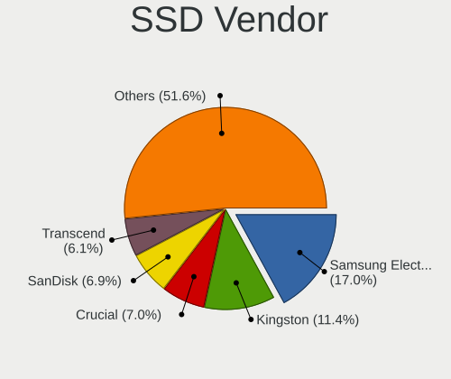

| Vendor              | Computers | Drives | Percent |
|---------------------|-----------|--------|---------|
| Samsung Electronics | 2136      | 3861   | 17.03%  |
| Kingston            | 1426      | 2174   | 11.37%  |
| Crucial             | 879       | 1434   | 7.01%   |
| SanDisk             | 864       | 1194   | 6.89%   |
| Transcend           | 764       | 1228   | 6.09%   |
| Intel               | 710       | 1279   | 5.66%   |
| China               | 537       | 798    | 4.28%   |
| A-DATA Technology   | 446       | 644    | 3.56%   |
| WDC                 | 389       | 634    | 3.1%    |
| Hoodisk             | 313       | 519    | 2.5%    |
| Micron Technology   | 219       | 339    | 1.75%   |
| SPCC                | 181       | 316    | 1.44%   |
| Protectli           | 169       | 293    | 1.35%   |
| FORESEE             | 168       | 264    | 1.34%   |
| PNY                 | 162       | 285    | 1.29%   |
| Apacer              | 159       | 226    | 1.27%   |
| SK hynix            | 152       | 220    | 1.21%   |
| OCZ                 | 134       | 196    | 1.07%   |
| Phison              | 131       | 173    | 1.04%   |
| Patriot             | 127       | 197    | 1.01%   |
| Toshiba             | 120       | 183    | 0.96%   |
| Intenso             | 115       | 195    | 0.92%   |
| Hewlett-Packard     | 106       | 197    | 0.85%   |
| Innodisk            | 102       | 137    | 0.81%   |
| KingSpec            | 97        | 132    | 0.77%   |
| Apple               | 87        | 100    | 0.69%   |
| LITEON              | 82        | 133    | 0.65%   |
| Dogfish             | 80        | 145    | 0.64%   |
| LITEONIT            | 73        | 109    | 0.58%   |
| Corsair             | 70        | 104    | 0.56%   |
| NVMe                | 60        | 78     | 0.48%   |
| Team                | 57        | 109    | 0.45%   |
| Gigabyte Technology | 54        | 77     | 0.43%   |
| BIWIN               | 54        | 86     | 0.43%   |
| Lexar               | 51        | 78     | 0.41%   |
| Netac               | 43        | 68     | 0.34%   |
| GOODRAM             | 42        | 61     | 0.33%   |
| ShiJi               | 41        | 61     | 0.33%   |
| Seagate             | 41        | 85     | 0.33%   |
| Plextor             | 40        | 59     | 0.32%   |

Drive Kind
----------

HDD or SSD

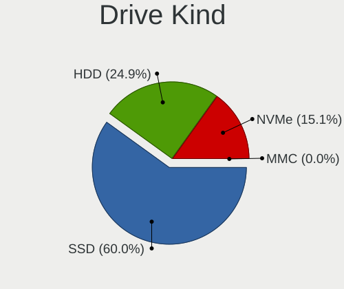

| Kind | Computers | Drives | Percent |
|------|-----------|--------|---------|
| SSD  | 11395     | 20027  | 59.96%  |
| HDD  | 4739      | 11836  | 24.94%  |
| NVMe | 2869      | 4442   | 15.1%   |
| MMC  | 1         | 1      | 0.01%   |

Drive Connector
---------------

SATA, SAS, NVMe, etc.

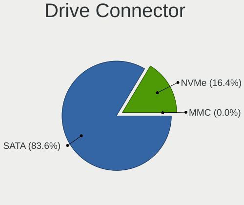

| Type | Computers | Drives | Percent |
|------|-----------|--------|---------|
| SATA | 14642     | 31863  | 83.61%  |
| NVMe | 2869      | 4442   | 16.38%  |
| MMC  | 1         | 1      | 0.01%   |

Drive Size
----------

Size of hard drive

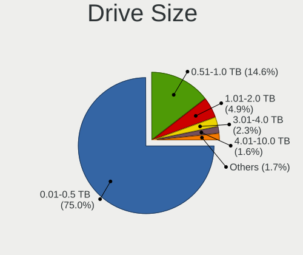

| Size in TB      | Computers | Drives | Percent |
|-----------------|-----------|--------|---------|
| 0.01-0.5        | 12503     | 21723  | 74.97%  |
| 0.51-1.0        | 2428      | 4343   | 14.56%  |
| 1.01-2.0        | 823       | 2007   | 4.93%   |
| 3.01-4.0        | 378       | 1392   | 2.27%   |
| 4.01-10.0       | 269       | 1315   | 1.61%   |
| 2.01-3.0        | 174       | 571    | 1.04%   |
| 10.01-20.0      | 92        | 443    | 0.55%   |
| 20.01-50.0      | 7         | 66     | 0.04%   |
| More than 100.0 | 2         | 2      | 0.01%   |
| 0               | 1         | 1      | 0.01%   |

Space Total
-----------

Amount of disk space available on the file system

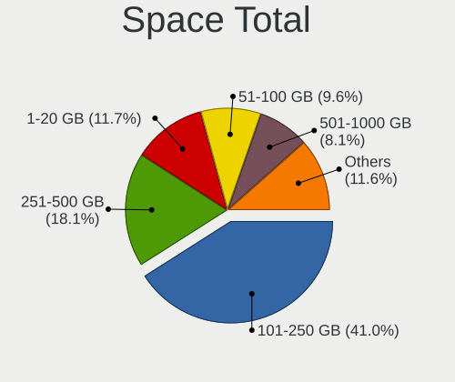

| Size in GB     | Computers | Percent |
|----------------|-----------|---------|
| 101-250        | 8839      | 40.98%  |
| 251-500        | 3910      | 18.13%  |
| 1-20           | 2515      | 11.66%  |
| 51-100         | 2060      | 9.55%   |
| 501-1000       | 1752      | 8.12%   |
| 21-50          | 1656      | 7.68%   |
| 1001-2000      | 469       | 2.17%   |
| More than 3000 | 192       | 0.89%   |
| Unknown        | 102       | 0.47%   |
| 2001-3000      | 72        | 0.33%   |
| 0              | 1         | 0.005%  |

Space Used
----------

Amount of used disk space

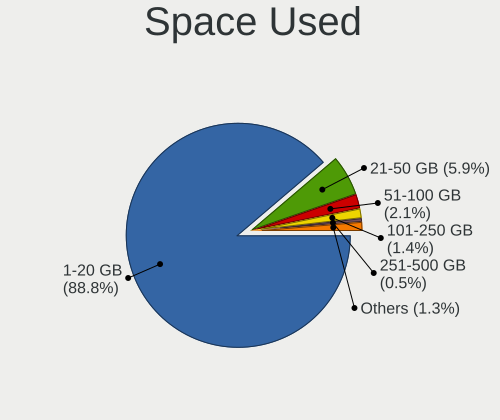

| Used GB        | Computers | Percent |
|----------------|-----------|---------|
| 1-20           | 18993     | 88.77%  |
| 21-50          | 1264      | 5.91%   |
| 51-100         | 447       | 2.09%   |
| 101-250        | 300       | 1.4%    |
| 251-500        | 112       | 0.52%   |
| Unknown        | 102       | 0.48%   |
| 501-1000       | 75        | 0.35%   |
| 1001-2000      | 43        | 0.2%    |
| More than 3000 | 39        | 0.18%   |
| 2001-3000      | 17        | 0.08%   |
| 0              | 3         | 0.01%   |

Malfunc. Drives
---------------

Drive models with a malfunction

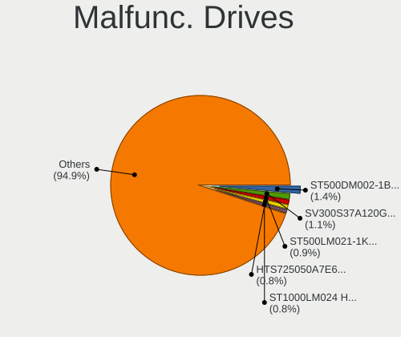

| Model                                 | Computers | Drives | Percent |
|---------------------------------------|-----------|--------|---------|
| Seagate ST500DM002-1BD142 500GB       | 39        | 63     | 1.42%   |
| Kingston SV300S37A120G 120GB          | 31        | 39     | 1.13%   |
| Seagate ST500LM021-1KJ152 500GB       | 25        | 34     | 0.91%   |
| HGST HTS725050A7E630 500GB            | 23        | 45     | 0.84%   |
| Seagate ST1000LM024 HN-M101MBB 1TB    | 21        | 27     | 0.76%   |
| Seagate ST500LT012-9WS142 500GB       | 19        | 26     | 0.69%   |
| Toshiba MQ01ABD100 1TB                | 18        | 19     | 0.66%   |
| WDC WDS240G2G0A-00JH30 240GB          | 16        | 24     | 0.58%   |
| Seagate ST9500325AS 500GB             | 16        | 22     | 0.58%   |
| Kingston SMS200S3120G 120GB           | 16        | 26     | 0.58%   |
| Hitachi HTS541612J9SA00 120GB         | 15        | 18     | 0.55%   |
| Seagate ST9500420AS 500GB             | 14        | 20     | 0.51%   |
| Seagate ST9320325AS 320GB             | 14        | 15     | 0.51%   |
| Seagate ST3500418AS 500GB             | 14        | 24     | 0.51%   |
| Kingston SV300S37A60G 64GB            | 14        | 18     | 0.51%   |
| Apacer 16GB SATA Flash Drive          | 14        | 21     | 0.51%   |
| Seagate ST500LT012-1DG142 500GB       | 13        | 15     | 0.47%   |
| Kingston SA400S37240G 240GB           | 13        | 13     | 0.47%   |
| Samsung Electronics SSD 870 EVO 1TB   | 12        | 18     | 0.44%   |
| Crucial CT525MX300SSD1 528GB          | 12        | 16     | 0.44%   |
| Toshiba MQ01ABF050 500GB              | 11        | 13     | 0.4%    |
| Seagate ST3500413AS 500GB             | 11        | 27     | 0.4%    |
| Seagate ST320LT007-9ZV142 320GB       | 11        | 11     | 0.4%    |
| Samsung Electronics SSD 870 EVO 500GB | 11        | 25     | 0.4%    |
| Intel SSDSA2M080G2GC 80GB             | 11        | 16     | 0.4%    |
| HGST HTS541010A9E680 1TB              | 11        | 13     | 0.4%    |
| WDC WD30EFRX-68EUZN0 3TB              | 10        | 27     | 0.36%   |
| Kingston SMS200S360G 64GB             | 10        | 14     | 0.36%   |
| HGST HTS721010A9E630 1TB              | 10        | 35     | 0.36%   |
| Toshiba DT01ACA100 1TB                | 9         | 13     | 0.33%   |
| Seagate ST9320423AS 320GB             | 9         | 11     | 0.33%   |
| Samsung Electronics HD501LJ 500GB     | 9         | 13     | 0.33%   |
| Kingston SA400S37120G 120GB           | 9         | 10     | 0.33%   |
| Crucial CT275MX300SSD1 275GB          | 9         | 14     | 0.33%   |
| WDC WD40EFRX-68WT0N0 4TB              | 8         | 18     | 0.29%   |
| WDC WD20EFRX-68EUZN0 1TB              | 8         | 17     | 0.29%   |
| Toshiba MQ01ABD050 500GB              | 8         | 11     | 0.29%   |
| Seagate ST9250315AS 250GB             | 8         | 10     | 0.29%   |
| Seagate ST1000DM003-1CH162 1TB        | 8         | 9      | 0.29%   |
| SanDisk SSD PLUS 240GB                | 8         | 9      | 0.29%   |

Malfunc. Drive Vendor
---------------------

Vendors of faulty drives

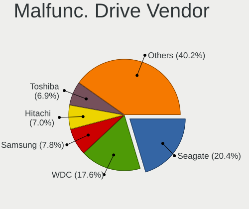

| Vendor              | Computers | Drives | Percent |
|---------------------|-----------|--------|---------|
| Seagate             | 543       | 830    | 20.39%  |
| WDC                 | 470       | 714    | 17.65%  |
| Samsung Electronics | 208       | 318    | 7.81%   |
| Hitachi             | 187       | 256    | 7.02%   |
| Toshiba             | 184       | 261    | 6.91%   |
| Kingston            | 167       | 236    | 6.27%   |
| Intel               | 157       | 218    | 5.9%    |
| Crucial             | 85        | 146    | 3.19%   |
| HGST                | 83        | 147    | 3.12%   |
| SanDisk             | 81        | 108    | 3.04%   |
| Micron Technology   | 48        | 68     | 1.8%    |
| A-DATA Technology   | 43        | 60     | 1.61%   |
| SK hynix            | 42        | 62     | 1.58%   |
| China               | 33        | 39     | 1.24%   |
| Maxtor              | 25        | 31     | 0.94%   |
| OCZ                 | 24        | 32     | 0.9%    |
| Apacer              | 24        | 33     | 0.9%    |
| Apple               | 19        | 19     | 0.71%   |
| Corsair             | 17        | 25     | 0.64%   |
| Transcend           | 13        | 19     | 0.49%   |
| LITEON              | 12        | 23     | 0.45%   |
| Hewlett-Packard     | 12        | 22     | 0.45%   |
| SPCC                | 11        | 15     | 0.41%   |
| HP Phison           | 11        | 16     | 0.41%   |
| Patriot             | 10        | 16     | 0.38%   |
| Fujitsu             | 10        | 15     | 0.38%   |
| Netac               | 9         | 17     | 0.34%   |
| KingSpec            | 9         | 10     | 0.34%   |
| Dogfish             | 8         | 18     | 0.3%    |
| SSSTC               | 7         | 11     | 0.26%   |
| Plextor             | 6         | 6      | 0.23%   |
| Phison              | 6         | 8      | 0.23%   |
| Intenso             | 5         | 5      | 0.19%   |
| BIWIN               | 5         | 7      | 0.19%   |
| LITEONIT            | 4         | 7      | 0.15%   |
| VisionTek           | 3         | 7      | 0.11%   |
| ShiJi               | 3         | 4      | 0.11%   |
| PNY                 | 3         | 3      | 0.11%   |
| Mushkin             | 3         | 4      | 0.11%   |
| KingDian            | 3         | 6      | 0.11%   |

Malfunc. HDD Vendor
-------------------

Vendors of faulty HDD drives

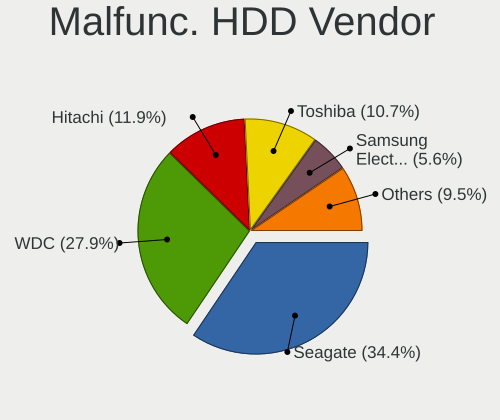

| Vendor               | Computers | Drives | Percent |
|----------------------|-----------|--------|---------|
| Seagate              | 540       | 827    | 34.44%  |
| WDC                  | 437       | 671    | 27.87%  |
| Hitachi              | 187       | 256    | 11.93%  |
| Toshiba              | 167       | 234    | 10.65%  |
| Samsung Electronics  | 88        | 121    | 5.61%   |
| HGST                 | 82        | 145    | 5.23%   |
| Maxtor               | 25        | 31     | 1.59%   |
| Fujitsu              | 10        | 15     | 0.64%   |
| Apple                | 10        | 10     | 0.64%   |
| Hewlett-Packard      | 8         | 13     | 0.51%   |
| China                | 4         | 6      | 0.26%   |
| HPE                  | 3         | 9      | 0.19%   |
| IBM/Hitachi          | 2         | 2      | 0.13%   |
| WD MediaMax          | 1         | 3      | 0.06%   |
| InnoLite             | 1         | 1      | 0.06%   |
| IBM                  | 1         | 1      | 0.06%   |
| ExcelStor Technology | 1         | 2      | 0.06%   |
| Cactus               | 1         | 1      | 0.06%   |

Malfunc. Drive Kind
-------------------

Kinds of faulty drives

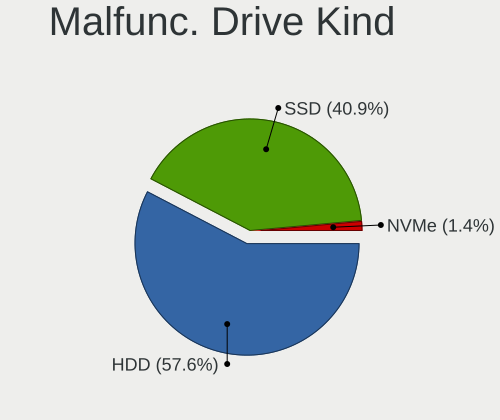

| Kind | Computers | Drives | Percent |
|------|-----------|--------|---------|
| HDD  | 1481      | 2348   | 57.65%  |
| SSD  | 1051      | 1551   | 40.91%  |
| NVMe | 37        | 46     | 1.44%   |

Failed Drives
-------------

Failed drive models

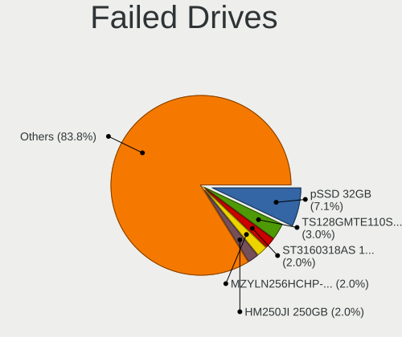

| Model                                            | Computers | Drives | Percent |
|--------------------------------------------------|-----------|--------|---------|
| SanDisk pSSD 32GB                                | 7         | 7      | 7.07%   |
| Transcend TS128GMTE110S 128GB                    | 3         | 3      | 3.03%   |
| SK hynix SC308 SATA 256GB                        | 2         | 3      | 2.02%   |
| Seagate ST3160318AS 160GB                        | 2         | 2      | 2.02%   |
| Samsung Electronics MZYLN256HCHP-000L2 256GB     | 2         | 2      | 2.02%   |
| Samsung Electronics HM250JI 250GB                | 2         | 2      | 2.02%   |
| Kingston SMS200S330G 32GB                        | 2         | 2      | 2.02%   |
| Intel SSDSC2BW180A4 180GB                        | 2         | 2      | 2.02%   |
| Crucial CT500P3SSD8 500GB                        | 2         | 2      | 2.02%   |
| WDC WD7501AALS-00J7B0 752GB                      | 1         | 1      | 1.01%   |
| WDC WD6400AARS-00Y5B1 640GB                      | 1         | 2      | 1.01%   |
| WDC WD5000BEVT-22A0RT0 500GB                     | 1         | 1      | 1.01%   |
| WDC WD3200L 320GB                                | 1         | 1      | 1.01%   |
| WDC WD3200BPVT-16JJ5T0 320GB                     | 1         | 1      | 1.01%   |
| WDC WD3200AAJS-00YZCA0 320GB                     | 1         | 1      | 1.01%   |
| WDC WD20EARS-00MVWB0 2TB                         | 1         | 1      | 1.01%   |
| WDC WD1600BEVT-22ZCT0 160GB                      | 1         | 1      | 1.01%   |
| WDC WD1600BEKX-00B7WT0 160GB                     | 1         | 1      | 1.01%   |
| WDC WD10SPZX-00Z10T0 1TB                         | 1         | 1      | 1.01%   |
| WDC PC SN530 SDBPMPZ-256G-1101 256GB             | 1         | 1      | 1.01%   |
| Vaseky V900-120G                                 | 1         | 1      | 1.01%   |
| Transcend TS32GSSD370S 32GB                      | 1         | 4      | 1.01%   |
| Toshiba THNSNK128GCS8 SATA 128GB                 | 1         | 1      | 1.01%   |
| Toshiba MQ01ABD100 1TB                           | 1         | 1      | 1.01%   |
| Toshiba MQ01ABD075 752GB                         | 1         | 1      | 1.01%   |
| Toshiba MG05ACA800E 8TB                          | 1         | 1      | 1.01%   |
| Toshiba KXG50ZNV256G NVMe 256GB                  | 1         | 1      | 1.01%   |
| Toshiba HDWG11A 10TB                             | 1         | 1      | 1.01%   |
| Supermicro SSD 16GB                              | 1         | 1      | 1.01%   |
| SK hynix SC308 SATA 128GB                        | 1         | 1      | 1.01%   |
| SK hynix BC501 HFM256GDJTNG-8310A 256GB          | 1         | 1      | 1.01%   |
| Seagate ST4000NM0025 4TB                         | 1         | 2      | 1.01%   |
| Seagate ST3500418AS 500GB                        | 1         | 2      | 1.01%   |
| Seagate ST3250310AS 250GB                        | 1         | 1      | 1.01%   |
| SanDisk SD9SN8W-256G-1006 256GB                  | 1         | 1      | 1.01%   |
| SanDisk SD7TB6S256G1001 256GB                    | 1         | 2      | 1.01%   |
| Samsung Electronics SSD PM830 2.5-inch 7mm 256GB | 1         | 1      | 1.01%   |
| Samsung Electronics SSD 980 250GB                | 1         | 2      | 1.01%   |
| Samsung Electronics SSD 970 EVO Plus 500GB       | 1         | 1      | 1.01%   |
| Samsung Electronics SSD 960 EVO 500GB            | 1         | 1      | 1.01%   |

Failed Drive Vendor
-------------------

Failed drive vendors

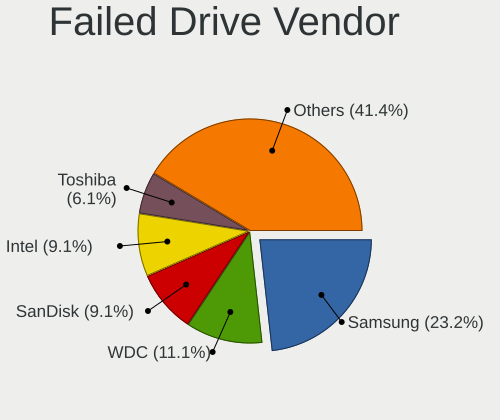

| Vendor              | Computers | Drives | Percent |
|---------------------|-----------|--------|---------|
| Samsung Electronics | 23        | 28     | 23.23%  |
| WDC                 | 11        | 12     | 11.11%  |
| SanDisk             | 9         | 10     | 9.09%   |
| Intel               | 9         | 11     | 9.09%   |
| Toshiba             | 6         | 6      | 6.06%   |
| Kingston            | 6         | 7      | 6.06%   |
| Seagate             | 5         | 7      | 5.05%   |
| Crucial             | 5         | 5      | 5.05%   |
| Transcend           | 4         | 7      | 4.04%   |
| SK hynix            | 4         | 5      | 4.04%   |
| Hitachi             | 4         | 17     | 4.04%   |
| Vaseky              | 1         | 1      | 1.01%   |
| Supermicro          | 1         | 1      | 1.01%   |
| Phison              | 1         | 1      | 1.01%   |
| Patriot             | 1         | 1      | 1.01%   |
| Micron Technology   | 1         | 1      | 1.01%   |
| Maxtor              | 1         | 1      | 1.01%   |
| KingDian            | 1         | 1      | 1.01%   |
| HPE                 | 1         | 1      | 1.01%   |
| Hoodisk             | 1         | 1      | 1.01%   |
| HGST                | 1         | 1      | 1.01%   |
| CSD                 | 1         | 1      | 1.01%   |
| China               | 1         | 1      | 1.01%   |
| Apple               | 1         | 1      | 1.01%   |

Drive Status
------------

Number of failed and malfunc. drives

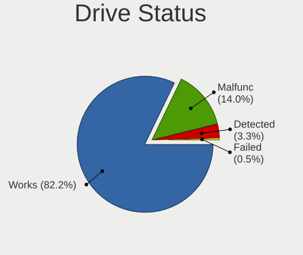

| Status   | Computers | Drives | Percent |
|----------|-----------|--------|---------|
| Works    | 14793     | 31121  | 82.17%  |
| Malfunc  | 2518      | 3945   | 13.99%  |
| Detected | 594       | 1112   | 3.3%    |
| Failed   | 99        | 128    | 0.55%   |

Storage controller
------------------

Storage Vendor
--------------

Storage controller vendors

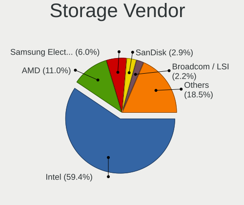

| Vendor                                  | Computers | Percent |
|-----------------------------------------|-----------|---------|
| Intel                                   | 15497     | 59.42%  |
| AMD                                     | 2857      | 10.95%  |
| Samsung Electronics                     | 1564      | 6%      |
| SanDisk                                 | 756       | 2.9%    |
| Broadcom / LSI                          | 575       | 2.2%    |
| Silicon Motion                          | 522       | 2%      |
| MAXIO Technology (Hangzhou)             | 402       | 1.54%   |
| Phison Electronics                      | 400       | 1.53%   |
| Kingston Technology Company             | 396       | 1.52%   |
| ASMedia Technology                      | 332       | 1.27%   |
| SK hynix                                | 280       | 1.07%   |
| Micron/Crucial Technology               | 271       | 1.04%   |
| Micron Technology                       | 217       | 0.83%   |
| Marvell Technology Group                | 198       | 0.76%   |
| Transcend                               | 182       | 0.7%    |
| Toshiba                                 | 163       | 0.63%   |
| Nvidia                                  | 153       | 0.59%   |
| KIOXIA                                  | 138       | 0.53%   |
| Hewlett-Packard                         | 128       | 0.49%   |
| JMicron Technology                      | 125       | 0.48%   |
| Realtek Semiconductor                   | 112       | 0.43%   |
| Shenzhen Longsys Electronics            | 97        | 0.37%   |
| ADATA Technology                        | 94        | 0.36%   |
| Chelsio Communications                  | 67        | 0.26%   |
| Hosin Global Electronics                | 64        | 0.25%   |
| Adaptec                                 | 48        | 0.18%   |
| VIA Technologies                        | 43        | 0.16%   |
| Yangtze Memory Technologies             | 35        | 0.13%   |
| Solid State Storage Technology          | 31        | 0.12%   |
| Seagate Technology                      | 31        | 0.12%   |
| Silicon Image                           | 27        | 0.1%    |
| Shenzhen Unionmemory Information System | 27        | 0.1%    |
| INNOGRIT                                | 26        | 0.1%    |
| Lite-On Technology                      | 20        | 0.08%   |
| Netac Technology                        | 17        | 0.07%   |
| Biwin Storage Technology                | 17        | 0.07%   |
| Silicon Integrated Systems [SiS]        | 15        | 0.06%   |
| Unknown                                 | 15        | 0.06%   |
| Union Memory (Shenzhen)                 | 14        | 0.05%   |
| Lenovo                                  | 13        | 0.05%   |

Storage Model
-------------

Storage controller models

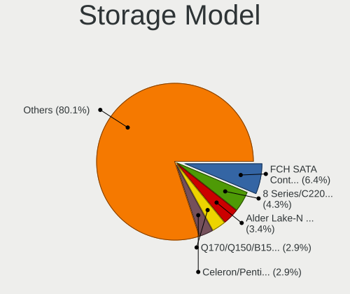

| Model                                                                            | Computers | Percent |
|----------------------------------------------------------------------------------|-----------|---------|
| AMD FCH SATA Controller [AHCI mode]                                              | 1850      | 6.35%   |
| Intel 8 Series/C220 Series Chipset Family 6-port SATA Controller 1 [AHCI mode]   | 1249      | 4.29%   |
| Intel Alder Lake-N SATA AHCI Controller                                          | 1000      | 3.43%   |
| Intel Q170/Q150/B150/H170/H110/Z170/CM236 Chipset SATA Controller [AHCI Mode]    | 858       | 2.95%   |
| Intel Celeron/Pentium Silver Processor SATA Controller                           | 847       | 2.91%   |
| Intel Sunrise Point-LP SATA Controller [AHCI mode]                               | 830       | 2.85%   |
| Samsung NVMe SSD Controller SM981/PM981/PM983                                    | 673       | 2.31%   |
| Intel Cannon Lake PCH SATA AHCI Controller                                       | 639       | 2.19%   |
| Intel Atom/Celeron/Pentium Processor x5-E8000/J3xxx/N3xxx Series SATA Controller | 627       | 2.15%   |
| Intel 6 Series/C200 Series Chipset Family 6 port Desktop SATA AHCI Controller    | 620       | 2.13%   |
| Intel Atom Processor E3800 Series SATA AHCI Controller                           | 586       | 2.01%   |
| Intel Jasper Lake SATA AHCI Controller                                           | 578       | 1.99%   |
| Silicon Motion SM2263EN/SM2263XT (DRAM-less) NVMe SSD Controllers                | 486       | 1.67%   |
| Intel 200 Series PCH SATA controller [AHCI mode]                                 | 464       | 1.59%   |
| Intel 7 Series Chipset Family 6-port SATA Controller [AHCI mode]                 | 455       | 1.56%   |
| MAXIO (Hangzhou) NVMe SSD Controller MAP1202 (DRAM-less)                         | 389       | 1.34%   |
| Intel SATA Controller [RAID mode]                                                | 382       | 1.31%   |
| Intel 8 Series SATA Controller 1 [AHCI mode]                                     | 356       | 1.22%   |
| Intel Celeron N3350/Pentium N4200/Atom E3900 Series SATA AHCI Controller         | 353       | 1.21%   |
| Intel Wildcat Point-LP SATA Controller [AHCI Mode]                               | 351       | 1.21%   |
| Intel 7 Series/C210 Series Chipset Family 6-port SATA Controller [AHCI mode]     | 345       | 1.18%   |
| AMD SB7x0/SB8x0/SB9x0 SATA Controller [AHCI mode]                                | 321       | 1.1%    |
| Intel 6 Series/C200 Series Chipset Family 6 port Mobile SATA AHCI Controller     | 294       | 1.01%   |
| Samsung NVMe SSD Controller 980 (DRAM-less)                                      | 288       | 0.99%   |
| AMD 400 Series Chipset SATA Controller                                           | 286       | 0.98%   |
| ASMedia ASM1061/ASM1062 Serial ATA Controller                                    | 267       | 0.92%   |
| Intel 82801G (ICH7 Family) IDE Controller                                        | 250       | 0.86%   |
| Intel Comet Lake SATA AHCI Controller                                            | 237       | 0.81%   |
| Intel Atom Processor C3000 Series SATA Controller 0                              | 231       | 0.79%   |
| Intel NM10/ICH7 Family SATA Controller [IDE mode]                                | 228       | 0.78%   |
| Samsung NVMe SSD Controller SM961/PM961/SM963                                    | 225       | 0.77%   |
| Intel 5 Series/3400 Series Chipset 6 port SATA AHCI Controller                   | 225       | 0.77%   |
| AMD 500 Series Chipset SATA Controller                                           | 218       | 0.75%   |
| AMD FCH SATA Controller [IDE mode]                                               | 215       | 0.74%   |
| Samsung NVMe SSD Controller PM9A1/PM9A3/980PRO                                   | 207       | 0.71%   |
| Intel Atom Processor C3000 Series SATA Controller 1                              | 191       | 0.66%   |
| Intel Atom processor C2000 AHCI SATA3 Controller                                 | 190       | 0.65%   |
| AMD SB7x0/SB8x0/SB9x0 IDE Controller                                             | 188       | 0.65%   |
| SanDisk Extreme Pro / WD Black SN750 / PC SN730 / Red SN700 NVMe SSD             | 181       | 0.62%   |
| Intel 82801HM/HEM (ICH8M/ICH8M-E) IDE Controller                                 | 177       | 0.61%   |

Storage Kind
------------

Kind of storage controller (IDE, SATA, NVMe, SAS, ...)

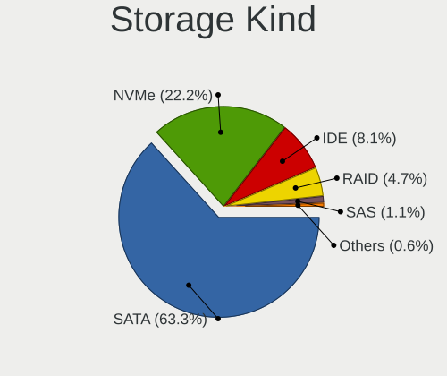

| Kind | Computers | Percent |
|------|-----------|---------|
| SATA | 16558     | 63.29%  |
| NVMe | 5811      | 22.21%  |
| IDE  | 2113      | 8.08%   |
| RAID | 1231      | 4.71%   |
| SAS  | 280       | 1.07%   |
| SCSI | 169       | 0.65%   |

Processor
---------

CPU Vendor
----------

Processor vendors

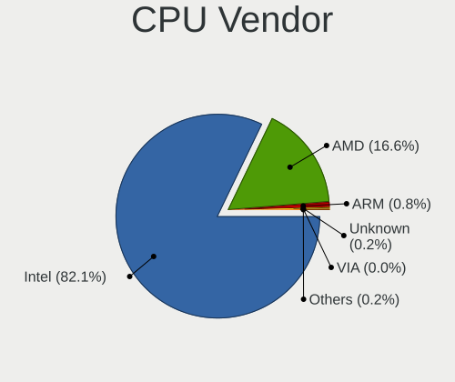

| Vendor                | Computers | Percent |
|-----------------------|-----------|---------|
| Intel                 | 16932     | 82.15%  |
| AMD                   | 3413      | 16.56%  |
| ARM                   | 172       | 0.83%   |
| Unknown               | 45        | 0.22%   |
| VIA                   | 9         | 0.04%   |
| PowerPC               | 8         | 0.04%   |
| Broadcom              | 4         | 0.02%   |
| Rockchip              | 3         | 0.01%   |
| QEMU                  | 3         | 0.01%   |
| IBM                   | 3         | 0.01%   |
| 11th                  | 3         | 0.01%   |
| i                     | 2         | 0.01%   |
| 7447A                 | 2         | 0.01%   |
| SUNW,UltraAX-i2       | 1         | 0.005%  |
| SUNW,Sun-Blade-100    | 1         | 0.005%  |
| Sun                   | 1         | 0.005%  |
| Research              | 1         | 0.005%  |
| Red Hat               | 1         | 0.005%  |
| Qualcomm Technologies | 1         | 0.005%  |
| NXP                   | 1         | 0.005%  |
| Motorola              | 1         | 0.005%  |
| MIPS                  | 1         | 0.005%  |
| Cix Technology Group  | 1         | 0.005%  |
| Baikal Electronics    | 1         | 0.005%  |
| Ampere                | 1         | 0.005%  |
| 123456789ABC          | 1         | 0.005%  |

CPU Model
---------

Processor models

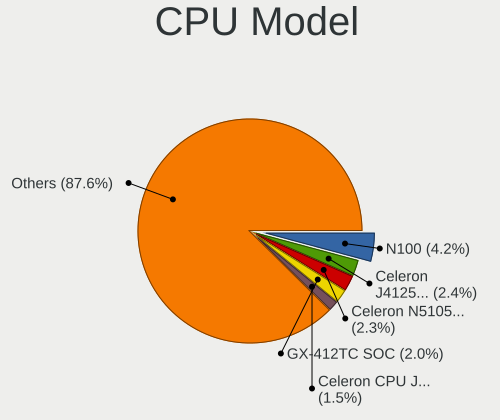

| Model                                    | Computers | Percent |
|------------------------------------------|-----------|---------|
| Intel N100                               | 872       | 4.18%   |
| Intel Celeron J4125 CPU @ 2.00GHz        | 498       | 2.39%   |
| Intel Celeron N5105 @ 2.00GHz            | 482       | 2.31%   |
| AMD GX-412TC SOC                         | 419       | 2.01%   |
| Intel Celeron CPU J1900 @ 1.99GHz        | 312       | 1.5%    |
| Intel Celeron CPU J3160 @ 1.60GHz        | 258       | 1.24%   |
| Intel N150                               | 207       | 0.99%   |
| Intel Core i5-6500 CPU @ 3.20GHz         | 199       | 0.95%   |
| Intel Core i5-7200U CPU @ 2.50GHz        | 140       | 0.67%   |
| Intel Core i3-N305                       | 132       | 0.63%   |
| Intel Core i5-3470 CPU @ 3.20GHz         | 127       | 0.61%   |
| Intel Celeron J6412 @ 2.00GHz            | 119       | 0.57%   |
| AMD GX-415GA SOC with Radeon HD Graphics | 109       | 0.52%   |
| Intel Core i5-8250U CPU @ 1.60GHz        | 108       | 0.52%   |
| Intel Core i5-4570 CPU @ 3.20GHz         | 107       | 0.51%   |
| Intel Atom CPU C3558 @ 2.20GHz           | 107       | 0.51%   |
| Intel Core i5-4590 CPU @ 3.30GHz         | 102       | 0.49%   |
| Intel Pentium Silver J5005 CPU @ 1.50GHz | 100       | 0.48%   |
| Intel Celeron CPU J3455 @ 1.50GHz        | 100       | 0.48%   |
| Intel Core i5-8500T CPU @ 2.10GHz        | 99        | 0.47%   |
| AMD RX-427BB with AMD Radeon R7 Graphics | 96        | 0.46%   |
| Intel Celeron J4105 CPU @ 1.50GHz        | 94        | 0.45%   |
| Intel Core i7-8550U CPU @ 1.80GHz        | 91        | 0.44%   |
| Intel Core i5-7500 CPU @ 3.40GHz         | 90        | 0.43%   |
| Intel Core i7-6700 CPU @ 3.40GHz         | 88        | 0.42%   |
| Intel Core i3-6100 CPU @ 3.70GHz         | 88        | 0.42%   |
| Intel Celeron CPU N3450 @ 1.10GHz        | 88        | 0.42%   |
| AMD GX-420CA SOC with Radeon HD Graphics | 88        | 0.42%   |
| Intel Core 2 Duo                         | 87        | 0.42%   |
| AMD Ryzen Embedded V1500B                | 87        | 0.42%   |
| Intel Core i7-3770 CPU @ 3.40GHz         | 86        | 0.41%   |
| Intel Atom CPU D525 @ 1.80GHz            | 86        | 0.41%   |
| Intel Core i5-2520M CPU @ 2.50GHz        | 85        | 0.41%   |
| Intel Pentium CPU N3700 @ 1.60GHz        | 81        | 0.39%   |
| Intel Pentium Silver N6005 @ 2.00GHz     | 80        | 0.38%   |
| Intel Core i5-5200U CPU @ 2.20GHz        | 80        | 0.38%   |
| Intel Core i5-10210U CPU @ 1.60GHz       | 79        | 0.38%   |
| Intel Core i5-6500T CPU @ 2.50GHz        | 77        | 0.37%   |
| Intel 11th Gen Core i5-1135G7 @ 2.40GHz  | 75        | 0.36%   |
| Intel Core i5-6300U CPU @ 2.40GHz        | 74        | 0.36%   |

CPU Model Family
----------------

Processor model prefix

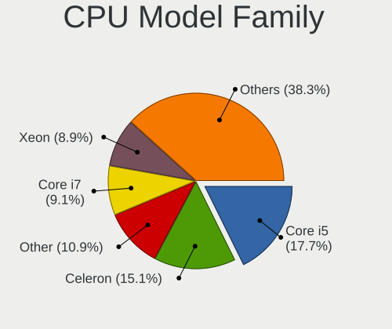

| Model                   | Computers | Percent |
|-------------------------|-----------|---------|
| Intel Core i5           | 3672      | 17.69%  |
| Intel Celeron           | 3128      | 15.07%  |
| Other                   | 2265      | 10.91%  |
| Intel Core i7           | 1898      | 9.14%   |
| Intel Xeon              | 1847      | 8.9%    |
| Intel Core i3           | 1554      | 7.49%   |
| Intel Atom              | 1005      | 4.84%   |
| AMD GX                  | 782       | 3.77%   |
| Intel Pentium           | 563       | 2.71%   |
| AMD Ryzen 5             | 492       | 2.37%   |
| AMD Ryzen 7             | 446       | 2.15%   |
| Intel Core 2 Duo        | 412       | 1.98%   |
| Intel Pentium Silver    | 222       | 1.07%   |
| ARM Cortex              | 159       | 0.77%   |
| AMD EPYC                | 159       | 0.77%   |
| AMD Ryzen 9             | 153       | 0.74%   |
| AMD FX                  | 139       | 0.67%   |
| AMD Ryzen 3             | 125       | 0.6%    |
| AMD Ryzen Embedded      | 118       | 0.57%   |
| Intel Core 2 Quad       | 105       | 0.51%   |
| AMD G                   | 100       | 0.48%   |
| Intel Pentium Gold      | 92        | 0.44%   |
| Intel Pentium Dual-Core | 91        | 0.44%   |
| AMD Athlon              | 69        | 0.33%   |
| AMD Ryzen 5 PRO         | 62        | 0.3%    |
| Intel Core i9           | 54        | 0.26%   |
| Intel Xeon Silver       | 49        | 0.24%   |
| AMD A10                 | 49        | 0.24%   |
| Intel Core 2            | 47        | 0.23%   |
| AMD Ryzen 7 PRO         | 47        | 0.23%   |
| AMD A8                  | 45        | 0.22%   |
| Intel Genuine           | 44        | 0.21%   |
| Intel Core              | 42        | 0.2%    |
| AMD Phenom II X4        | 41        | 0.2%    |
| AMD A6                  | 41        | 0.2%    |
| Intel Xeon Gold         | 39        | 0.19%   |
| AMD A4                  | 39        | 0.19%   |
| Intel Pentium 4         | 37        | 0.18%   |
| AMD Athlon 64 X2        | 34        | 0.16%   |
| AMD E                   | 33        | 0.16%   |

CPU Cores
---------

Number of processor cores

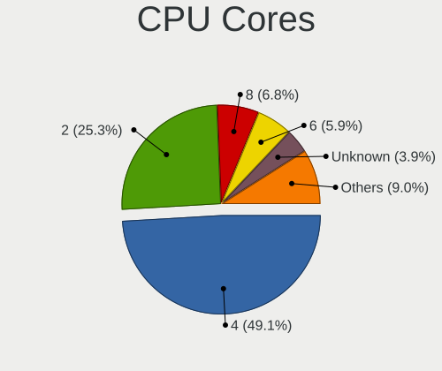

| Number  | Computers | Percent |
|---------|-----------|---------|
| 4       | 10247     | 49.08%  |
| 2       | 5283      | 25.3%   |
| 8       | 1424      | 6.82%   |
| 6       | 1224      | 5.86%   |
| Unknown | 824       | 3.95%   |
| 12      | 562       | 2.69%   |
| 16      | 559       | 2.68%   |
| 1       | 223       | 1.07%   |
| 10      | 130       | 0.62%   |
| 24      | 108       | 0.52%   |
| 32      | 77        | 0.37%   |
| 20      | 67        | 0.32%   |
| 3       | 32        | 0.15%   |
| 14      | 25        | 0.12%   |
| 28      | 21        | 0.1%    |
| 64      | 13        | 0.06%   |
| 18      | 10        | 0.05%   |
| 48      | 9         | 0.04%   |
| 36      | 7         | 0.03%   |
| 11      | 7         | 0.03%   |
| 40      | 6         | 0.03%   |
| 22      | 6         | 0.03%   |
| 128     | 4         | 0.02%   |
| 7       | 4         | 0.02%   |
| 5       | 3         | 0.01%   |
| 256     | 1         | 0.005%  |
| 80      | 1         | 0.005%  |
| 44      | 1         | 0.005%  |
| 26      | 1         | 0.005%  |
| 9       | 1         | 0.005%  |

CPU Sockets
-----------

Number of sockets

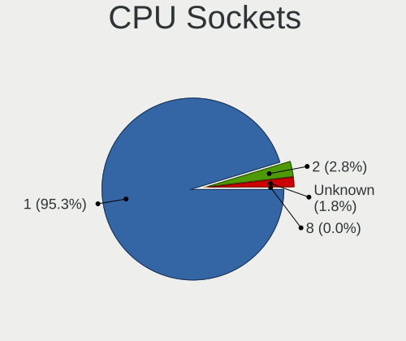

| Number  | Computers | Percent |
|---------|-----------|---------|
| 1       | 19629     | 95.29%  |
| 2       | 582       | 2.83%   |
| Unknown | 381       | 1.85%   |
| 4       | 6         | 0.03%   |
| 8       | 1         | 0.005%  |

CPU Threads
-----------

Threads per core (Hyper-Threading)

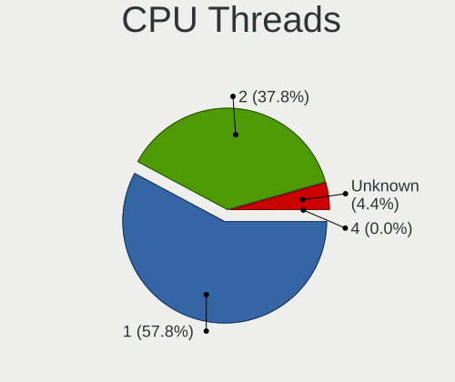

| Number  | Computers | Percent |
|---------|-----------|---------|
| 1       | 12041     | 57.82%  |
| 2       | 7869      | 37.79%  |
| Unknown | 913       | 4.38%   |
| 6       | 1         | 0.005%  |
| 4       | 1         | 0.005%  |

CPU Microarch
-------------

Microarchitecture

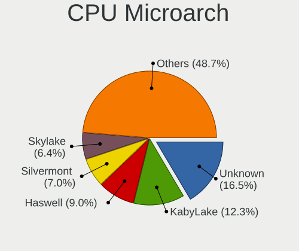

| Name            | Computers | Percent |
|-----------------|-----------|---------|
| Unknown         | 3423      | 16.5%   |
| KabyLake        | 2561      | 12.35%  |
| Haswell         | 1865      | 8.99%   |
| Silvermont      | 1462      | 7.05%   |
| Skylake         | 1335      | 6.44%   |
| IvyBridge       | 1234      | 5.95%   |
| SandyBridge     | 1011      | 4.87%   |
| Goldmont plus   | 863       | 4.16%   |
| Goldmont        | 652       | 3.14%   |
| Broadwell       | 607       | 2.93%   |
| Penryn          | 600       | 2.89%   |
| Puma            | 566       | 2.73%   |
| Zen             | 418       | 2.02%   |
| Westmere        | 401       | 1.93%   |
| Zen 3           | 392       | 1.89%   |
| Zen 2           | 361       | 1.74%   |
| CometLake       | 325       | 1.57%   |
| Jaguar          | 311       | 1.5%    |
| Bonnell         | 304       | 1.47%   |
| Core            | 299       | 1.44%   |
| Zen+            | 289       | 1.39%   |
| TigerLake       | 231       | 1.11%   |
| Nehalem         | 218       | 1.05%   |
| Piledriver      | 178       | 0.86%   |
| K10             | 165       | 0.8%    |
| Bobcat          | 158       | 0.76%   |
| Steamroller     | 129       | 0.62%   |
| Excavator       | 88        | 0.42%   |
| NetBurst        | 63        | 0.3%    |
| K8 Hammer       | 61        | 0.29%   |
| P6              | 58        | 0.28%   |
| IceLake         | 43        | 0.21%   |
| Bulldozer       | 36        | 0.17%   |
| K10 Llano       | 20        | 0.1%    |
| Geode           | 8         | 0.04%   |
| K6              | 4         | 0.02%   |
| K8 & K10 hybrid | 3         | 0.01%   |
| CannonLake      | 1         | 0.005%  |

Graphics
--------

GPU Vendor
----------

Vendors of graphics cards

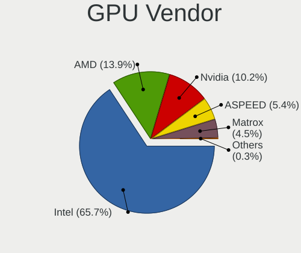

| Vendor                                       | Computers | Percent |
|----------------------------------------------|-----------|---------|
| Intel                                        | 13427     | 65.73%  |
| AMD                                          | 2832      | 13.86%  |
| Nvidia                                       | 2079      | 10.18%  |
| ASPEED Technology                            | 1111      | 5.44%   |
| Matrox Electronics Systems                   | 913       | 4.47%   |
| XGI Technology (eXtreme Graphics Innovation) | 14        | 0.07%   |
| VIA Technologies                             | 14        | 0.07%   |
| Silicon Integrated Systems [SiS]             | 10        | 0.05%   |
| S3 Graphics                                  | 9         | 0.04%   |
| Silicon Motion                               | 4         | 0.02%   |
| Red Hat                                      | 4         | 0.02%   |
| RDC Semiconductor                            | 3         | 0.01%   |
| Tseng Labs                                   | 1         | 0.005%  |
| Trident Microsystems                         | 1         | 0.005%  |
| NVidia / SGS Thomson (Joint Venture)         | 1         | 0.005%  |
| Huawei Technologies                          | 1         | 0.005%  |
| Cirrus Logic                                 | 1         | 0.005%  |
| ATI                                          | 1         | 0.005%  |
| 3DLabs                                       | 1         | 0.005%  |
| 3Dfx Interactive                             | 1         | 0.005%  |

GPU Model
---------

Graphics card models

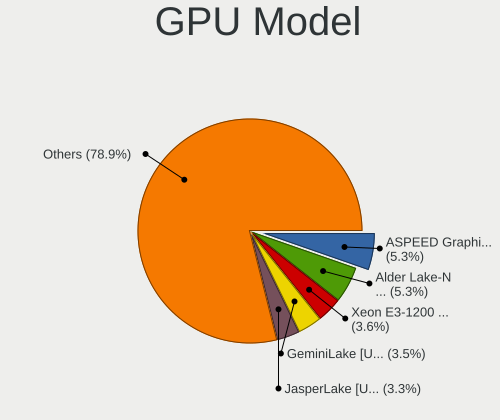

| Model                                                                                    | Computers | Percent |
|------------------------------------------------------------------------------------------|-----------|---------|
| ASPEED Technology ASPEED Graphics Family                                                 | 1111      | 5.34%   |
| Intel Alder Lake-N [UHD Graphics]                                                        | 1101      | 5.29%   |
| Intel Xeon E3-1200 v3/4th Gen Core Processor Integrated Graphics Controller              | 759       | 3.65%   |
| Intel GeminiLake [UHD Graphics 600]                                                      | 733       | 3.52%   |
| Intel JasperLake [UHD Graphics]                                                          | 689       | 3.31%   |
| Intel 2nd Generation Core Processor Family Integrated Graphics Controller                | 674       | 3.24%   |
| Intel Atom/Celeron/Pentium Processor x5-E8000/J3xxx/N3xxx Integrated Graphics Controller | 662       | 3.18%   |
| Intel CoffeeLake-S GT2 [UHD Graphics 630]                                                | 627       | 3.01%   |
| Intel Atom Processor Z36xxx/Z37xxx Series Graphics & Display                             | 596       | 2.86%   |
| Intel Skylake-S GT2 [HD Graphics 530]                                                    | 584       | 2.81%   |
| Intel 3rd Gen Core processor Graphics Controller                                         | 415       | 1.99%   |
| Intel Haswell-ULT Integrated Graphics Controller                                         | 367       | 1.76%   |
| Intel Kaby Lake-U GT2 [HD Graphics 620]                                                  | 353       | 1.7%    |
| Matrox Electronics Systems MGA G200eW WPCM450                                            | 351       | 1.69%   |
| Intel Xeon E3-1200 v2/3rd Gen Core processor Graphics Controller                         | 327       | 1.57%   |
| Intel Apollo Lake GT1 [HD Graphics 500]                                                  | 319       | 1.53%   |
| Intel Kaby Lake-S GT2 [HD Graphics 630]                                                  | 311       | 1.49%   |
| Intel Kaby Lake-R GT2 [UHD Graphics 620]                                                 | 280       | 1.34%   |
| Intel Broadwell-U GT2 [HD Graphics 5500]                                                 | 271       | 1.3%    |
| Intel Skylake-U GT2 [HD Graphics 520]                                                    | 235       | 1.13%   |
| Intel Alder Lake-N [Intel Graphics]                                                      | 222       | 1.07%   |
| AMD Cezanne [Radeon Vega Series / Radeon Vega Mobile Series]                             | 207       | 0.99%   |
| Intel 4 Series Chipset Integrated Graphics Controller                                    | 204       | 0.98%   |
| Matrox Electronics Systems G200eR2                                                       | 200       | 0.96%   |
| Intel TigerLake-LP GT2 [Iris Xe Graphics]                                                | 194       | 0.93%   |
| AMD Picasso/Raven 2 [Radeon Vega Series / Radeon Vega Mobile Series]                     | 179       | 0.86%   |
| Intel Elkhart Lake [UHD Graphics Gen11 16EU]                                             | 172       | 0.83%   |
| Intel Core Processor Integrated Graphics Controller                                      | 160       | 0.77%   |
| Intel Atom Processor D4xx/D5xx/N4xx/N5xx Integrated Graphics Controller                  | 159       | 0.76%   |
| Intel CometLake-S GT2 [UHD Graphics 630]                                                 | 158       | 0.76%   |
| Intel 4th Generation Core Processor Family Integrated Graphics Controller                | 158       | 0.76%   |
| Intel WhiskeyLake-U GT2 [UHD Graphics 620]                                               | 155       | 0.74%   |
| AMD Renoir [Radeon Vega Series / Radeon Vega Mobile Series]                              | 152       | 0.73%   |
| Intel CometLake-U GT2 [UHD Graphics]                                                     | 146       | 0.7%    |
| Matrox Electronics Systems MGA G200EH                                                    | 138       | 0.66%   |
| Intel GeminiLake [UHD Graphics 605]                                                      | 130       | 0.62%   |
| Nvidia GK208B [GeForce GT 710]                                                           | 127       | 0.61%   |
| AMD Ellesmere [Radeon RX 470/480/570/570X/580/580X/590]                                  | 123       | 0.59%   |
| Intel IvyBridge GT2 [HD Graphics 4000]                                                   | 121       | 0.58%   |
| AMD Kaveri [Radeon R7 Graphics]                                                          | 121       | 0.58%   |

GPU Combo
---------

Combinations of graphics cards

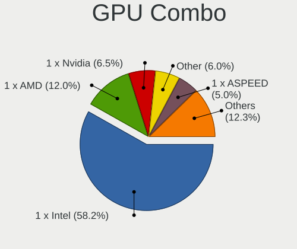

| Name                                     | Computers | Percent |
|------------------------------------------|-----------|---------|
| 1 x Intel                                | 12061     | 58.18%  |
| 1 x AMD                                  | 2483      | 11.98%  |
| 1 x Nvidia                               | 1350      | 6.51%   |
| Other                                    | 1249      | 6.02%   |
| 1 x ASPEED                               | 1031      | 4.97%   |
| 1 x Matrox                               | 897       | 4.33%   |
| Intel + Nvidia                           | 609       | 2.94%   |
| 2 x Intel                                | 539       | 2.6%    |
| Intel + AMD                              | 170       | 0.82%   |
| AMD + Nvidia                             | 84        | 0.41%   |
| 2 x AMD                                  | 79        | 0.38%   |
| Intel + ASPEED                           | 45        | 0.22%   |
| Nvidia + ASPEED                          | 18        | 0.09%   |
| AMD + ASPEED                             | 16        | 0.08%   |
| 1 x XGI                                  | 14        | 0.07%   |
| 1 x VIA                                  | 14        | 0.07%   |
| 2 x Nvidia                               | 11        | 0.05%   |
| 1 x SiS                                  | 10        | 0.05%   |
| Nvidia + Matrox                          | 10        | 0.05%   |
| 1 x S3 Graphics                          | 8         | 0.04%   |
| 1 x Silicon Motion                       | 4         | 0.02%   |
| 1 x Red Hat                              | 4         | 0.02%   |
| 1 x RDC Semiconductor                    | 3         | 0.01%   |
| Intel + Matrox                           | 3         | 0.01%   |
| AMD + Matrox                             | 3         | 0.01%   |
| 2 x Nvidia + 1 x ASPEED                  | 2         | 0.01%   |
| 2 x Intel + 1 x Nvidia                   | 2         | 0.01%   |
| Intel + AMD + 1 x Nvidia                 | 2         | 0.01%   |
| 2 x AMD + 1 x ASPEED                     | 1         | 0.005%  |
| 1 x Tseng Labs                           | 1         | 0.005%  |
| 1 x Trident Microsystems                 | 1         | 0.005%  |
| 1 x NVidia / SGS Thomson (Joint Venture) | 1         | 0.005%  |
| Nvidia + Huawei Technologies             | 1         | 0.005%  |
| Intel + 2 x AMD                          | 1         | 0.005%  |
| Intel + S3 Graphics                      | 1         | 0.005%  |
| 1 x Cirrus Logic                         | 1         | 0.005%  |
| 1 x 3DLabs                               | 1         | 0.005%  |
| 1 x 3Dfx Interactive                     | 1         | 0.005%  |

GPU Driver
----------

Free vs proprietary

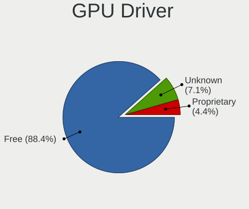

| Driver      | Computers | Percent |
|-------------|-----------|---------|
| Free        | 18296     | 88.41%  |
| Unknown     | 1479      | 7.15%   |
| Proprietary | 919       | 4.44%   |

GPU Memory
----------

Total video memory

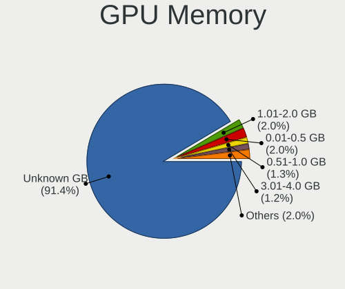

| Size in GB | Computers | Percent |
|------------|-----------|---------|
| Unknown    | 18975     | 91.44%  |
| 1.01-2.0   | 417       | 2.01%   |
| 0.01-0.5   | 412       | 1.99%   |
| 0.51-1.0   | 279       | 1.34%   |
| 3.01-4.0   | 257       | 1.24%   |
| 7.01-8.0   | 203       | 0.98%   |
| 5.01-6.0   | 103       | 0.5%    |
| 8.01-16.0  | 57        | 0.27%   |
| 2.01-3.0   | 35        | 0.17%   |
| 16.01-24.0 | 11        | 0.05%   |
| 4.01-5.0   | 3         | 0.01%   |

Monitor
-------

Monitor Vendor
--------------

Monitor vendors

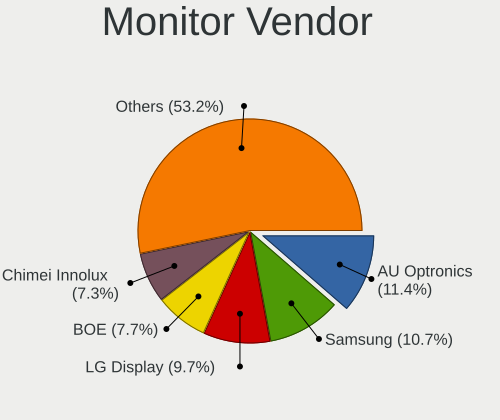

| Vendor                  | Computers | Percent |
|-------------------------|-----------|---------|
| AU Optronics            | 590       | 11.38%  |
| Samsung Electronics     | 555       | 10.7%   |
| LG Display              | 502       | 9.68%   |
| BOE                     | 400       | 7.71%   |
| Chimei Innolux          | 377       | 7.27%   |
| Dell                    | 348       | 6.71%   |
| Goldstar                | 260       | 5.01%   |
| Lenovo                  | 196       | 3.78%   |
| Hewlett-Packard         | 161       | 3.11%   |
| Acer                    | 157       | 3.03%   |
| Apple                   | 155       | 2.99%   |
| Philips                 | 130       | 2.51%   |
| BenQ                    | 122       | 2.35%   |
| AOC                     | 102       | 1.97%   |
| Ancor Communications    | 99        | 1.91%   |
| ViewSonic               | 79        | 1.52%   |
| Sharp                   | 74        | 1.43%   |
| Iiyama                  | 63        | 1.22%   |
| Chi Mei Optoelectronics | 59        | 1.14%   |
| ASUSTek Computer        | 53        | 1.02%   |
| InfoVision              | 45        | 0.87%   |
| LG Electronics          | 35        | 0.68%   |
| Sony                    | 32        | 0.62%   |
| NEC Computers           | 28        | 0.54%   |
| Eizo                    | 26        | 0.5%    |
| PANDA                   | 24        | 0.46%   |
| LG Philips              | 24        | 0.46%   |
| Fujitsu Siemens         | 24        | 0.46%   |
| MSI                     | 23        | 0.44%   |
| HannStar                | 21        | 0.41%   |
| CSO                     | 20        | 0.39%   |
| Unknown                 | 19        | 0.37%   |
| Toshiba                 | 15        | 0.29%   |
| Panasonic               | 14        | 0.27%   |
| Idek Iiyama             | 12        | 0.23%   |
| HKC                     | 12        | 0.23%   |
| Vizio                   | 11        | 0.21%   |
| Unknown                 | 11        | 0.21%   |
| Mi                      | 11        | 0.21%   |
| Sceptre Tech            | 10        | 0.19%   |

Monitor Model
-------------

Monitor models

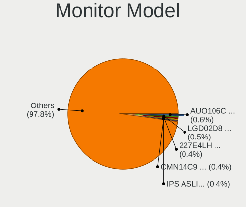

| Model                                                                | Computers | Percent |
|----------------------------------------------------------------------|-----------|---------|
| AU Optronics LCD Monitor AUO106C 1366x768 280x160mm 12.7-inch        | 34        | 0.64%   |
| LG Display LCD Monitor LGD02D8 1366x768 280x160mm 12.7-inch          | 25        | 0.47%   |
| Philips 227E4LH PHLC0AC 1920x1080 480x270mm 21.7-inch                | 21        | 0.39%   |
| Chimei Innolux LCD Monitor CMN14C9 1920x1080 310x170mm 13.9-inch     | 19        | 0.36%   |
| Unknown                                                              | 19        | 0.36%   |
| Chimei Innolux LCD Monitor CMN14D4 1920x1080 310x170mm 13.9-inch     | 15        | 0.28%   |
| AU Optronics LCD Monitor AUO226D 1920x1080 280x160mm 12.7-inch       | 15        | 0.28%   |
| LG Display LCD Monitor LGD02DC 1366x768 340x190mm 15.3-inch          | 14        | 0.26%   |
| Lenovo LCD Monitor LEN40B1 1600x900 340x190mm 15.3-inch              | 14        | 0.26%   |
| Lenovo LCD Monitor LEN4011 1280x800 260x160mm 12.0-inch              | 14        | 0.26%   |
| Goldstar LG FULL HD GSM5B55 1920x1080 480x270mm 21.7-inch            | 14        | 0.26%   |
| Chimei Innolux LCD Monitor CMN1132 1366x768 260x140mm 11.6-inch      | 14        | 0.26%   |
| AU Optronics LCD Monitor AUO243D 1920x1080 310x170mm 13.9-inch       | 14        | 0.26%   |
| Samsung Electronics LCD Monitor SEC5441 1366x768 340x190mm 15.3-inch | 13        | 0.24%   |
| BOE LCD Monitor BOE095F 2256x1504 280x190mm 13.3-inch                | 13        | 0.24%   |
| AU Optronics LCD Monitor AUO213E 1600x900 310x170mm 13.9-inch        | 13        | 0.24%   |
| Lenovo LCD Monitor LEN4010 1280x800 260x160mm 12.0-inch              | 12        | 0.22%   |
| AU Optronics LCD Monitor AUO38ED 1920x1080 340x190mm 15.3-inch       | 12        | 0.22%   |
| Samsung Electronics LCD Monitor SEC324C 1600x900 310x170mm 13.9-inch | 11        | 0.21%   |
| Samsung Electronics LCD Monitor SEC3047 1366x768 280x160mm 12.7-inch | 11        | 0.21%   |
| Samsung Electronics C24F390 SAM0D2C 1920x1080 520x290mm 23.4-inch    | 11        | 0.21%   |
| LG Display LCD Monitor LGD0521 1920x1080 310x170mm 13.9-inch         | 11        | 0.21%   |
| Lenovo LCD Monitor LEN40B2 1920x1080 340x190mm 15.3-inch             | 11        | 0.21%   |
| Lenovo LCD Monitor LEN4031 1280x800 300x190mm 14.0-inch              | 11        | 0.21%   |
| Goldstar LG Ultra HD GSM5B09 3840x2160 600x340mm 27.2-inch           | 11        | 0.21%   |
| AU Optronics LCD Monitor AUO403D 1920x1080 310x170mm 13.9-inch       | 11        | 0.21%   |
| AU Optronics LCD Monitor AUO26EC 1366x768 340x190mm 15.3-inch        | 11        | 0.21%   |
| AU Optronics LCD Monitor AUO21ED 1920x1080 340x190mm 15.3-inch       | 11        | 0.21%   |
| Panasonic LCD Monitor MEI96A2 2880x1620 340x190mm 15.3-inch          | 10        | 0.19%   |
| LG Display LCD Monitor LGD05FA 1920x1080 310x170mm 13.9-inch         | 10        | 0.19%   |
| Lenovo LCD Monitor LEN4035 1280x800 300x190mm 14.0-inch              | 10        | 0.19%   |
| Dell U2412M DELA07A 1920x1200 520x320mm 24.0-inch                    | 10        | 0.19%   |
| Chimei Innolux LCD Monitor CMN15F5 1920x1080 340x190mm 15.3-inch     | 10        | 0.19%   |
| AU Optronics LCD Monitor AUO313C 1366x768 310x170mm 13.9-inch        | 10        | 0.19%   |
| AU Optronics LCD Monitor AUO22EC 1366x768 340x190mm 15.3-inch        | 10        | 0.19%   |
| AU Optronics LCD Monitor AUO133D 1920x1080 310x170mm 13.9-inch       | 10        | 0.19%   |
| LG Display LCD Monitor LGD046F 1920x1080 340x190mm 15.3-inch         | 9         | 0.17%   |
| LG Display LCD Monitor LGD0456 1366x768 340x190mm 15.3-inch          | 9         | 0.17%   |
| LG Display LCD Monitor LGD0437 1920x1080 280x160mm 12.7-inch         | 9         | 0.17%   |
| LG Display LCD Monitor LGD03ED 1366x768 280x160mm 12.7-inch          | 9         | 0.17%   |

Monitor Resolution
------------------

Monitor screen resolution

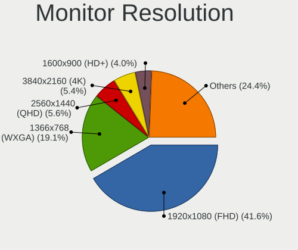

| Resolution         | Computers | Percent |
|--------------------|-----------|---------|
| 1920x1080 (FHD)    | 2104      | 41.6%   |
| 1366x768 (WXGA)    | 965       | 19.08%  |
| 2560x1440 (QHD)    | 282       | 5.58%   |
| 3840x2160 (4K)     | 274       | 5.42%   |
| 1600x900 (HD+)     | 200       | 3.95%   |
| 1280x1024 (SXGA)   | 164       | 3.24%   |
| 1920x1200 (WUXGA)  | 161       | 3.18%   |
| 1280x800 (WXGA)    | 154       | 3.04%   |
| 1440x900 (WXGA+)   | 131       | 2.59%   |
| 1680x1050 (WSXGA+) | 109       | 2.16%   |
| 2560x1600          | 53        | 1.05%   |
| 2560x1080          | 51        | 1.01%   |
| 3440x1440          | 46        | 0.91%   |
| 1024x600           | 44        | 0.87%   |
| Unknown            | 43        | 0.85%   |
| 1024x768 (XGA)     | 25        | 0.49%   |
| 2880x1800          | 24        | 0.47%   |
| 1360x768           | 23        | 0.45%   |
| 1600x1200          | 21        | 0.42%   |
| 2256x1504          | 19        | 0.38%   |
| 3840x1080          | 18        | 0.36%   |
| 3200x1800 (QHD+)   | 17        | 0.34%   |
| 1920x540           | 13        | 0.26%   |
| 1920x1280          | 8         | 0.16%   |
| 3840x2400          | 7         | 0.14%   |
| 2160x1440          | 7         | 0.14%   |
| 2736x1824          | 6         | 0.12%   |
| 3840x1600          | 5         | 0.1%    |
| 3000x2000          | 5         | 0.1%    |
| 2240x1400          | 5         | 0.1%    |
| 5760x2160          | 4         | 0.08%   |
| 2048x1152          | 4         | 0.08%   |
| 1400x1050          | 4         | 0.08%   |
| 1280x720 (HD)      | 4         | 0.08%   |
| 3840x1200          | 3         | 0.06%   |
| 3120x2080          | 3         | 0.06%   |
| 2880x1920          | 3         | 0.06%   |
| 5760x1080          | 2         | 0.04%   |
| 5120x1440          | 2         | 0.04%   |
| 3520x1080          | 2         | 0.04%   |

Monitor Diagonal
----------------

Diagonal size in inches

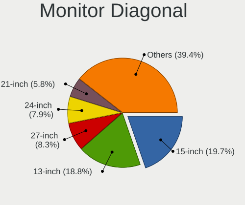

| Inches  | Computers | Percent |
|---------|-----------|---------|
| 15      | 1019      | 19.71%  |
| 13      | 974       | 18.84%  |
| 27      | 431       | 8.33%   |
| 24      | 411       | 7.95%   |
| 21      | 299       | 5.78%   |
| Unknown | 280       | 5.41%   |
| 23      | 262       | 5.07%   |
| 12      | 259       | 5.01%   |
| 19      | 200       | 3.87%   |
| 17      | 181       | 3.5%    |
| 14      | 136       | 2.63%   |
| 31      | 118       | 2.28%   |
| 11      | 104       | 2.01%   |
| 18      | 73        | 1.41%   |
| 34      | 63        | 1.22%   |
| 22      | 60        | 1.16%   |
| 10      | 43        | 0.83%   |
| 20      | 41        | 0.79%   |
| 16      | 20        | 0.39%   |
| 40      | 18        | 0.35%   |
| 29      | 18        | 0.35%   |
| 28      | 13        | 0.25%   |
| 9       | 12        | 0.23%   |
| 54      | 11        | 0.21%   |
| 42      | 11        | 0.21%   |
| 32      | 11        | 0.21%   |
| 26      | 11        | 0.21%   |
| 52      | 10        | 0.19%   |
| 48      | 9         | 0.17%   |
| 25      | 9         | 0.17%   |
| 64      | 7         | 0.14%   |
| 46      | 6         | 0.12%   |
| 39      | 6         | 0.12%   |
| 50      | 5         | 0.1%    |
| 33      | 5         | 0.1%    |
| 49      | 4         | 0.08%   |
| 41      | 4         | 0.08%   |
| 37      | 4         | 0.08%   |
| 43      | 3         | 0.06%   |
| 35      | 3         | 0.06%   |

Monitor Width
-------------

Physical width

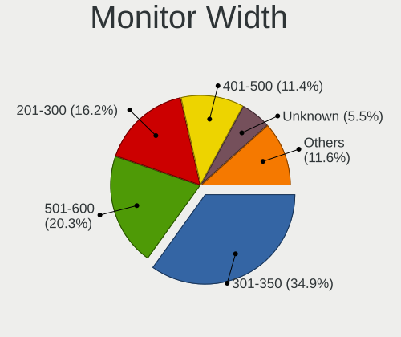

| Width in mm | Computers | Percent |
|-------------|-----------|---------|
| 301-350     | 1786      | 34.94%  |
| 501-600     | 1039      | 20.32%  |
| 201-300     | 828       | 16.2%   |
| 401-500     | 584       | 11.42%  |
| Unknown     | 280       | 5.48%   |
| 351-400     | 211       | 4.13%   |
| 601-700     | 184       | 3.6%    |
| 701-800     | 81        | 1.58%   |
| 1001-1500   | 59        | 1.15%   |
| 801-900     | 30        | 0.59%   |
| 901-1000    | 19        | 0.37%   |
| 101-200     | 6         | 0.12%   |
| 1501-2000   | 3         | 0.06%   |
| 1-100       | 2         | 0.04%   |

Aspect Ratio
------------

Proportional relationship between the width and the height

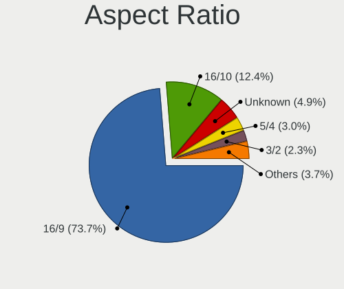

| Ratio   | Computers | Percent |
|---------|-----------|---------|
| 16/9    | 3570      | 73.73%  |
| 16/10   | 599       | 12.37%  |
| Unknown | 236       | 4.87%   |
| 5/4     | 144       | 2.97%   |
| 3/2     | 112       | 2.31%   |
| 21/9    | 89        | 1.84%   |
| 4/3     | 69        | 1.43%   |
| 32/9    | 9         | 0.19%   |
| 6/5     | 7         | 0.14%   |
| 1.96    | 2         | 0.04%   |
| 3.88    | 1         | 0.02%   |
| 3.18    | 1         | 0.02%   |
| 11/10   | 1         | 0.02%   |
| 1.00    | 1         | 0.02%   |
| 0.46    | 1         | 0.02%   |

Monitor Area
------------

Area in inch²

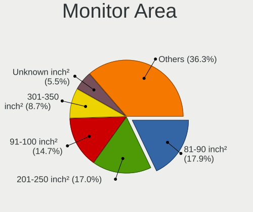

| Area in inch² | Computers | Percent |
|----------------|-----------|---------|
| 81-90          | 918       | 17.89%  |
| 201-250        | 872       | 16.99%  |
| 91-100         | 752       | 14.65%  |
| 301-350        | 445       | 8.67%   |
| Unknown        | 281       | 5.48%   |
| 151-200        | 267       | 5.2%    |
| 101-110        | 259       | 5.05%   |
| 61-70          | 247       | 4.81%   |
| 351-500        | 215       | 4.19%   |
| 71-80          | 169       | 3.29%   |
| 251-300        | 129       | 2.51%   |
| 141-150        | 129       | 2.51%   |
| 121-130        | 106       | 2.07%   |
| 51-60          | 104       | 2.03%   |
| 501-1000       | 64        | 1.25%   |
| 111-120        | 58        | 1.13%   |
| 41-50          | 48        | 0.94%   |
| More than 1000 | 46        | 0.9%    |
| 131-140        | 16        | 0.31%   |
| 1-40           | 7         | 0.14%   |

Pixel Density
-------------

Pixels per inch

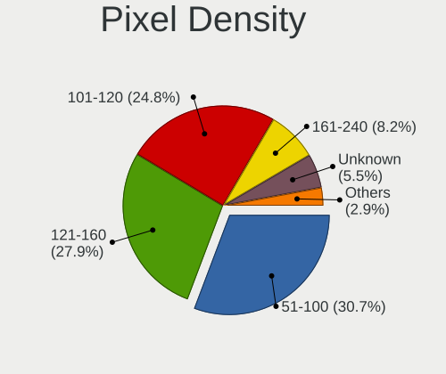

| Density       | Computers | Percent |
|---------------|-----------|---------|
| 51-100        | 1559      | 30.74%  |
| 121-160       | 1414      | 27.88%  |
| 101-120       | 1257      | 24.78%  |
| 161-240       | 414       | 8.16%   |
| Unknown       | 280       | 5.52%   |
| More than 240 | 103       | 2.03%   |
| 1-50          | 45        | 0.89%   |

Multiple Monitors
-----------------

Total monitors connected

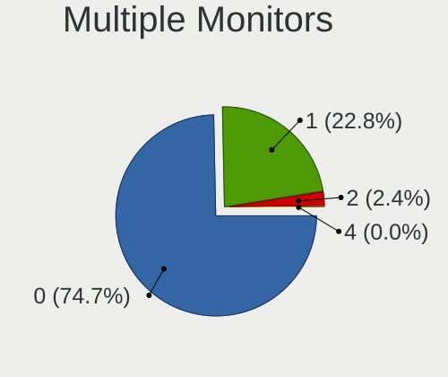

| Total | Computers | Percent |
|-------|-----------|---------|
| 0     | 15536     | 74.68%  |
| 1     | 4735      | 22.76%  |
| 2     | 491       | 2.36%   |
| 3     | 39        | 0.19%   |
| 4     | 2         | 0.01%   |

Network
-------

Net Controller Vendor
---------------------

Controller vendors

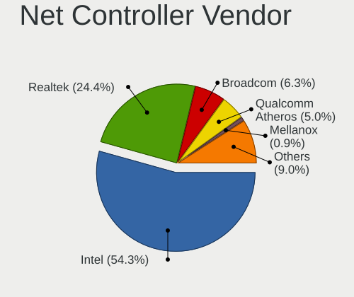

| Vendor                            | Computers | Percent |
|-----------------------------------|-----------|---------|
| Intel                             | 15538     | 54.33%  |
| Realtek Semiconductor             | 6979      | 24.4%   |
| Broadcom                          | 1803      | 6.3%    |
| Qualcomm Atheros                  | 1441      | 5.04%   |
| Mellanox Technologies             | 249       | 0.87%   |
| AMD                               | 191       | 0.67%   |
| MediaTek                          | 189       | 0.66%   |
| Ralink Technology                 | 147       | 0.51%   |
| TP-Link                           | 146       | 0.51%   |
| Marvell Technology Group          | 140       | 0.49%   |
| IMC Networks                      | 122       | 0.43%   |
| Chelsio Communications            | 84        | 0.29%   |
| D-Link System                     | 83        | 0.29%   |
| Ralink                            | 82        | 0.29%   |
| Samsung Electronics               | 78        | 0.27%   |
| Nvidia                            | 65        | 0.23%   |
| U-Blox                            | 63        | 0.22%   |
| Edimax Technology                 | 63        | 0.22%   |
| American Megatrends               | 60        | 0.21%   |
| Aquantia                          | 58        | 0.2%    |
| Sierra Wireless                   | 53        | 0.19%   |
| Ericsson Business Mobile Networks | 46        | 0.16%   |
| Dell                              | 42        | 0.15%   |
| Huawei Technologies               | 40        | 0.14%   |
| Xiaomi                            | 37        | 0.13%   |
| Insyde Software                   | 36        | 0.13%   |
| Emulex                            | 35        | 0.12%   |
| Google                            | 34        | 0.12%   |
| VIA Technologies                  | 32        | 0.11%   |
| Apple                             | 31        | 0.11%   |
| Solarflare Communications         | 30        | 0.1%    |
| Qualcomm Atheros Communications   | 30        | 0.1%    |
| 3Com                              | 27        | 0.09%   |
| ASUSTek Computer                  | 26        | 0.09%   |
| D-Link                            | 24        | 0.08%   |
| Qualcomm                          | 23        | 0.08%   |
| QLogic                            | 21        | 0.07%   |
| IBM                               | 21        | 0.07%   |
| Microchip Technology              | 20        | 0.07%   |
| Hewlett-Packard                   | 20        | 0.07%   |

Net Controller Model
--------------------

Controller models

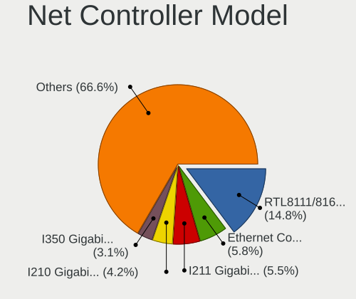

| Model                                                                         | Computers | Percent |
|-------------------------------------------------------------------------------|-----------|---------|
| Realtek RTL8111/8168/8211/8411 PCI Express Gigabit Ethernet Controller        | 5406      | 14.76%  |
| Intel Ethernet Controller I226-V                                              | 2113      | 5.77%   |
| Intel I211 Gigabit Network Connection                                         | 2024      | 5.53%   |
| Intel I210 Gigabit Network Connection                                         | 1528      | 4.17%   |
| Intel I350 Gigabit Network Connection                                         | 1150      | 3.14%   |
| Intel Ethernet Controller I225-V                                              | 1098      | 3%      |
| Intel 82579LM Gigabit Network Connection (Lewisville)                         | 798       | 2.18%   |
| Intel 82574L Gigabit Network Connection                                       | 727       | 1.99%   |
| Intel 82599ES 10-Gigabit SFI/SFP+ Network Connection                          | 639       | 1.74%   |
| Realtek RTL8125 2.5GbE Controller                                             | 564       | 1.54%   |
| Intel Ethernet Connection I217-LM                                             | 495       | 1.35%   |
| Intel 82576 Gigabit Network Connection                                        | 387       | 1.06%   |
| Intel Wireless 8265 / 8275                                                    | 384       | 1.05%   |
| Realtek RTL810xE PCI Express Fast Ethernet controller                         | 381       | 1.04%   |
| Intel Wi-Fi 6 AX200                                                           | 371       | 1.01%   |
| Intel Ethernet Connection (2) I219-LM                                         | 342       | 0.93%   |
| Intel 82580 Gigabit Network Connection                                        | 334       | 0.91%   |
| Intel Wireless 7265                                                           | 327       | 0.89%   |
| Intel 82583V Gigabit Network Connection                                       | 326       | 0.89%   |
| Intel Ethernet Controller 10-Gigabit X540-AT2                                 | 325       | 0.89%   |
| Broadcom NetXtreme BCM5720 Gigabit Ethernet PCIe                              | 318       | 0.87%   |
| Intel 82571EB/82571GB Gigabit Ethernet Controller D0/D1 (copper applications) | 310       | 0.85%   |
| Realtek RTL8821CE 802.11ac PCIe Wireless Network Adapter                      | 287       | 0.78%   |
| Intel Ethernet Connection (7) I219-LM                                         | 259       | 0.71%   |
| Intel Wireless 7260                                                           | 255       | 0.7%    |
| Intel Ethernet Connection (2) I219-V                                          | 250       | 0.68%   |
| Intel Ethernet Connection (7) I219-V                                          | 246       | 0.67%   |
| Intel Wireless 8260                                                           | 241       | 0.66%   |
| Intel Ethernet Controller X710 for 10GbE SFP+                                 | 231       | 0.63%   |
| Intel Centrino Advanced-N 6205 [Taylor Peak]                                  | 225       | 0.61%   |
| Intel 82571EB/82571GB Gigabit Ethernet Controller (Copper)                    | 215       | 0.59%   |
| Intel Wireless 3165                                                           | 206       | 0.56%   |
| Intel Ethernet Controller X550                                                | 200       | 0.55%   |
| Intel I210 Gigabit Fiber Network Connection                                   | 193       | 0.53%   |
| AMD XGMAC 10GbE Controller                                                    | 189       | 0.52%   |
| Intel Ethernet Connection I354                                                | 185       | 0.51%   |
| Intel Wi-Fi 6E(802.11ax) AX210/AX1675* 2x2 [Typhoon Peak]                     | 181       | 0.49%   |
| Broadcom NetXtreme II BCM5709 Gigabit Ethernet                                | 180       | 0.49%   |
| Intel Ethernet Connection X553 1GbE                                           | 177       | 0.48%   |
| Realtek RTL8111/8168/8411 PCI Express Gigabit Ethernet Controller             | 167       | 0.46%   |

Wireless Vendor
---------------

Wireless vendors

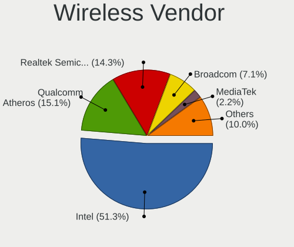

| Vendor                                | Computers | Percent |
|---------------------------------------|-----------|---------|
| Intel                                 | 4086      | 51.31%  |
| Qualcomm Atheros                      | 1201      | 15.08%  |
| Realtek Semiconductor                 | 1142      | 14.34%  |
| Broadcom                              | 568       | 7.13%   |
| MediaTek                              | 172       | 2.16%   |
| Ralink Technology                     | 147       | 1.85%   |
| TP-Link                               | 144       | 1.81%   |
| IMC Networks                          | 122       | 1.53%   |
| Ralink                                | 82        | 1.03%   |
| Edimax Technology                     | 63        | 0.79%   |
| Sierra Wireless                       | 41        | 0.51%   |
| Qualcomm Atheros Communications       | 30        | 0.38%   |
| ASUSTek Computer                      | 26        | 0.33%   |
| D-Link                                | 24        | 0.3%    |
| Qualcomm Technologies                 | 17        | 0.21%   |
| Dell                                  | 17        | 0.21%   |
| NetGear                               | 16        | 0.2%    |
| D-Link System                         | 15        | 0.19%   |
| Marvell Technology Group              | 6         | 0.08%   |
| Belkin Components                     | 6         | 0.08%   |
| Mercucys                              | 5         | 0.06%   |
| Linksys                               | 5         | 0.06%   |
| Atheros                               | 5         | 0.06%   |
| Micro Star International              | 4         | 0.05%   |
| ZyXEL Communications                  | 3         | 0.04%   |
| BUFFALO                               | 3         | 0.04%   |
| AboCom Systems                        | 3         | 0.04%   |
| 802.11g Adapter [Linksys WUSB54GC v3] | 3         | 0.04%   |
| Accton Technology                     | 2         | 0.03%   |
| Sitecom Europe                        | 1         | 0.01%   |
| Senao                                 | 1         | 0.01%   |
| Samsung Electronics                   | 1         | 0.01%   |
| Sagem                                 | 1         | 0.01%   |
| Qcom                                  | 1         | 0.01%   |
| Gemtek                                | 1         | 0.01%   |

Wireless Model
--------------

Wireless models

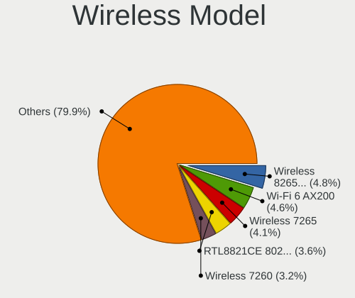

| Model                                                           | Computers | Percent |
|-----------------------------------------------------------------|-----------|---------|
| Intel Wireless 8265 / 8275                                      | 384       | 4.76%   |
| Intel Wi-Fi 6 AX200                                             | 371       | 4.6%    |
| Intel Wireless 7265                                             | 327       | 4.05%   |
| Realtek RTL8821CE 802.11ac PCIe Wireless Network Adapter        | 287       | 3.56%   |
| Intel Wireless 7260                                             | 255       | 3.16%   |
| Intel Wireless 8260                                             | 241       | 2.99%   |
| Intel Centrino Advanced-N 6205 [Taylor Peak]                    | 225       | 2.79%   |
| Intel Wireless 3165                                             | 206       | 2.55%   |
| Intel Wi-Fi 6E(802.11ax) AX210/AX1675* 2x2 [Typhoon Peak]       | 181       | 2.24%   |
| Qualcomm Atheros AR9485 Wireless Network Adapter                | 161       | 2%      |
| Realtek RTL8188EUS 802.11n Wireless Network Adapter             | 160       | 1.98%   |
| Qualcomm Atheros QCA9565 / AR9565 Wireless Network Adapter      | 154       | 1.91%   |
| Qualcomm Atheros AR9285 Wireless Network Adapter (PCI-Express)  | 152       | 1.88%   |
| Qualcomm Atheros QCA9377 802.11ac Wireless Network Adapter      | 151       | 1.87%   |
| Intel Alder Lake-N PCH CNVi WiFi                                | 144       | 1.79%   |
| Intel Wi-Fi 6 AX201                                             | 141       | 1.75%   |
| Intel Dual Band Wireless-AC 3168NGW [Stone Peak]                | 130       | 1.61%   |
| Qualcomm Atheros AR928X Wireless Network Adapter (PCI-Express)  | 125       | 1.55%   |
| IMC Networks 802.11 n/g/b Wireless LAN USB Mini-Card            | 118       | 1.46%   |
| Intel Wi-Fi 5(802.11ac) Wireless-AC 9x6x [Thunder Peak]         | 106       | 1.31%   |
| Intel Wireless 3160                                             | 104       | 1.29%   |
| Intel Cannon Point-LP CNVi [Wireless-AC]                        | 102       | 1.26%   |
| Intel Cannon Lake PCH CNVi WiFi                                 | 100       | 1.24%   |
| Intel Comet Lake PCH-LP CNVi WiFi                               | 99        | 1.23%   |
| Intel Gemini Lake PCH CNVi WiFi                                 | 95        | 1.18%   |
| Qualcomm Atheros AR9462 Wireless Network Adapter                | 93        | 1.15%   |
| Qualcomm Atheros AR93xx Wireless Network Adapter                | 86        | 1.07%   |
| Broadcom BCM4360 802.11ac Dual Band Wireless Network Adapter    | 83        | 1.03%   |
| Realtek RTL8822CE 802.11ac PCIe Wireless Network Adapter        | 81        | 1%      |
| Qualcomm Atheros QCA6174 802.11ac Wireless Network Adapter      | 77        | 0.95%   |
| MediaTek MT7922 802.11ax PCI Express Wireless Network Adapter   | 77        | 0.95%   |
| Broadcom BCM4331 802.11a/b/g/n                                  | 75        | 0.93%   |
| Intel Alder Lake-P PCH CNVi WiFi                                | 65        | 0.81%   |
| Broadcom BCM4313 802.11bgn Wireless Network Adapter             | 63        | 0.78%   |
| Realtek RTL8852BE PCIe 802.11ax Wireless Network Controller     | 61        | 0.76%   |
| Realtek RTL8723BE PCIe Wireless Network Adapter                 | 61        | 0.76%   |
| Intel Centrino Advanced-N 6235                                  | 60        | 0.74%   |
| Qualcomm Atheros QCA986x/988x 802.11ac Wireless Network Adapter | 58        | 0.72%   |
| Ralink RT5370 Wireless Adapter                                  | 57        | 0.71%   |
| Broadcom BCM43224 802.11a/b/g/n                                 | 56        | 0.69%   |

Ethernet Vendor
---------------

Ethernet vendors

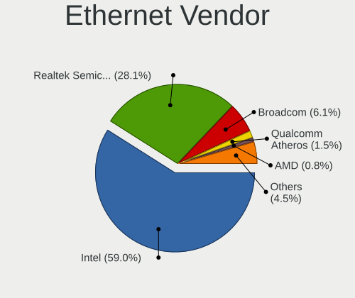

| Vendor                           | Computers | Percent |
|----------------------------------|-----------|---------|
| Intel                            | 13606     | 59%     |
| Realtek Semiconductor            | 6479      | 28.09%  |
| Broadcom                         | 1398      | 6.06%   |
| Qualcomm Atheros                 | 343       | 1.49%   |
| AMD                              | 190       | 0.82%   |
| Marvell Technology Group         | 132       | 0.57%   |
| Samsung Electronics              | 76        | 0.33%   |
| Chelsio Communications           | 67        | 0.29%   |
| Nvidia                           | 65        | 0.28%   |
| D-Link System                    | 65        | 0.28%   |
| American Megatrends              | 60        | 0.26%   |
| Aquantia                         | 57        | 0.25%   |
| Xiaomi                           | 37        | 0.16%   |
| Insyde Software                  | 36        | 0.16%   |
| VIA Technologies                 | 32        | 0.14%   |
| Emulex                           | 32        | 0.14%   |
| Solarflare Communications        | 30        | 0.13%   |
| Apple                            | 27        | 0.12%   |
| 3Com                             | 25        | 0.11%   |
| Qualcomm                         | 23        | 0.1%    |
| QLogic                           | 21        | 0.09%   |
| IBM                              | 21        | 0.09%   |
| JMicron Technology               | 17        | 0.07%   |
| ZTE WCDMA Technologies MSM       | 15        | 0.07%   |
| MediaTek                         | 14        | 0.06%   |
| Google                           | 14        | 0.06%   |
| OPPO Electronics                 | 13        | 0.06%   |
| Huawei Technologies              | 13        | 0.06%   |
| sipeed                           | 12        | 0.05%   |
| Microchip Technology             | 12        | 0.05%   |
| Lenovo                           | 11        | 0.05%   |
| ICS Advent                       | 10        | 0.04%   |
| Silicon Integrated Systems [SiS] | 9         | 0.04%   |
| Motorola PCS                     | 9         | 0.04%   |
| Novatel Wireless                 | 8         | 0.03%   |
| Davicom Semiconductor            | 7         | 0.03%   |
| National Semiconductor           | 6         | 0.03%   |
| MYRICOM                          | 5         | 0.02%   |
| Microsoft                        | 5         | 0.02%   |
| T & A Mobile Phones              | 4         | 0.02%   |

Ethernet Model
--------------

Ethernet models

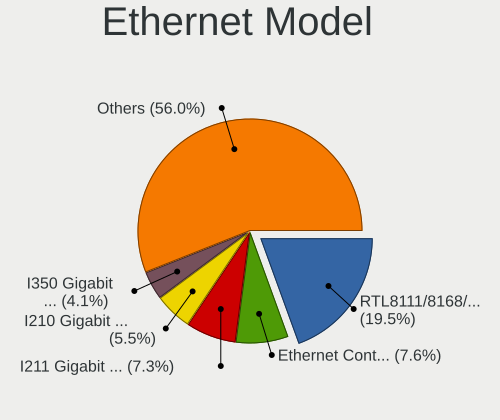

| Model                                                                         | Computers | Percent |
|-------------------------------------------------------------------------------|-----------|---------|
| Realtek RTL8111/8168/8211/8411 PCI Express Gigabit Ethernet Controller        | 5406      | 19.46%  |
| Intel Ethernet Controller I226-V                                              | 2113      | 7.6%    |
| Intel I211 Gigabit Network Connection                                         | 2024      | 7.28%   |
| Intel I210 Gigabit Network Connection                                         | 1528      | 5.5%    |
| Intel I350 Gigabit Network Connection                                         | 1150      | 4.14%   |
| Intel Ethernet Controller I225-V                                              | 1098      | 3.95%   |
| Intel 82579LM Gigabit Network Connection (Lewisville)                         | 798       | 2.87%   |
| Intel 82574L Gigabit Network Connection                                       | 727       | 2.62%   |
| Intel 82599ES 10-Gigabit SFI/SFP+ Network Connection                          | 639       | 2.3%    |
| Realtek RTL8125 2.5GbE Controller                                             | 555       | 2%      |
| Intel Ethernet Connection I217-LM                                             | 495       | 1.78%   |
| Intel 82576 Gigabit Network Connection                                        | 387       | 1.39%   |
| Realtek RTL810xE PCI Express Fast Ethernet controller                         | 381       | 1.37%   |
| Intel Ethernet Connection (2) I219-LM                                         | 342       | 1.23%   |
| Intel 82580 Gigabit Network Connection                                        | 334       | 1.2%    |
| Intel 82583V Gigabit Network Connection                                       | 326       | 1.17%   |
| Intel Ethernet Controller 10-Gigabit X540-AT2                                 | 325       | 1.17%   |
| Broadcom NetXtreme BCM5720 Gigabit Ethernet PCIe                              | 318       | 1.14%   |
| Intel 82571EB/82571GB Gigabit Ethernet Controller D0/D1 (copper applications) | 310       | 1.12%   |
| Intel Ethernet Connection (7) I219-LM                                         | 259       | 0.93%   |
| Intel Ethernet Connection (2) I219-V                                          | 250       | 0.9%    |
| Intel Ethernet Connection (7) I219-V                                          | 246       | 0.89%   |
| Intel Ethernet Controller X710 for 10GbE SFP+                                 | 231       | 0.83%   |
| Intel 82571EB/82571GB Gigabit Ethernet Controller (Copper)                    | 215       | 0.77%   |
| Intel Ethernet Controller X550                                                | 200       | 0.72%   |
| Intel I210 Gigabit Fiber Network Connection                                   | 193       | 0.69%   |
| AMD XGMAC 10GbE Controller                                                    | 189       | 0.68%   |
| Intel Ethernet Connection I354                                                | 185       | 0.67%   |
| Broadcom NetXtreme II BCM5709 Gigabit Ethernet                                | 180       | 0.65%   |
| Intel Ethernet Connection X553 1GbE                                           | 177       | 0.64%   |
| Realtek RTL8111/8168/8411 PCI Express Gigabit Ethernet Controller             | 167       | 0.6%    |
| Broadcom NetXtreme BCM5719 Gigabit Ethernet PCIe                              | 143       | 0.51%   |
| Intel Ethernet Connection (5) I219-LM                                         | 134       | 0.48%   |
| Intel Ethernet Connection I219-LM                                             | 133       | 0.48%   |
| Intel Ethernet Connection X553 10 GbE SFP+                                    | 131       | 0.47%   |
| Broadcom NetXtreme II BCM5716 Gigabit Ethernet                                | 122       | 0.44%   |
| Intel Ethernet Connection (4) I219-LM                                         | 119       | 0.43%   |
| Intel 82579V Gigabit Network Connection                                       | 112       | 0.4%    |
| Intel 82575EB Gigabit Network Connection                                      | 112       | 0.4%    |
| Realtek RTL-8100/8101L/8139 PCI Fast Ethernet Adapter                         | 109       | 0.39%   |

Net Controller Kind
-------------------

Ethernet, WiFi or modem

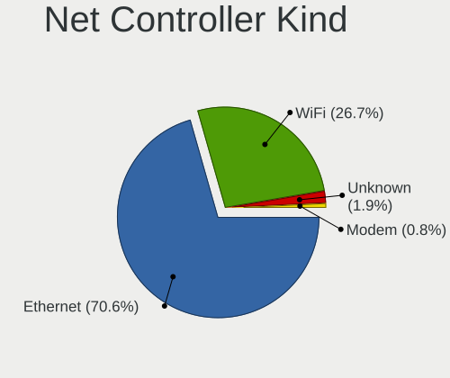

| Kind     | Computers | Percent |
|----------|-----------|---------|
| Ethernet | 19617     | 70.58%  |
| WiFi     | 7425      | 26.72%  |
| Unknown  | 540       | 1.94%   |
| Modem    | 211       | 0.76%   |

Used Controller
---------------

Currently used network controller

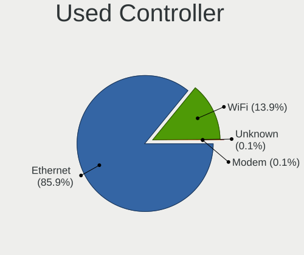

| Kind     | Computers | Percent |
|----------|-----------|---------|
| Ethernet | 17896     | 85.89%  |
| WiFi     | 2898      | 13.91%  |
| Unknown  | 28        | 0.13%   |
| Modem    | 13        | 0.06%   |

NICs
----

Total network controllers on board

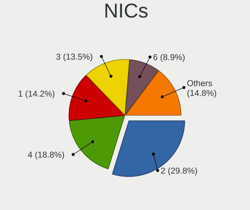

| Total | Computers | Percent |
|-------|-----------|---------|
| 2     | 6238      | 29.79%  |
| 4     | 3927      | 18.75%  |
| 1     | 2981      | 14.23%  |
| 3     | 2835      | 13.54%  |
| 6     | 1866      | 8.91%   |
| 5     | 1407      | 6.72%   |
| 8     | 482       | 2.3%    |
| 0     | 282       | 1.35%   |
| 9     | 281       | 1.34%   |
| 7     | 279       | 1.33%   |
| 10    | 170       | 0.81%   |
| 12    | 81        | 0.39%   |
| 14    | 32        | 0.15%   |
| 11    | 23        | 0.11%   |
| 16    | 17        | 0.08%   |
| 13    | 17        | 0.08%   |
| 15    | 10        | 0.05%   |
| 20    | 5         | 0.02%   |
| 17    | 5         | 0.02%   |
| 18    | 2         | 0.01%   |
| 25    | 1         | 0.005%  |
| 21    | 1         | 0.005%  |
| 19    | 1         | 0.005%  |

IPv6
----

IPv6 vs IPv4

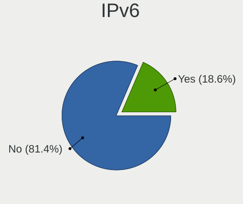

| Used | Computers | Percent |
|------|-----------|---------|
| No   | 17428     | 81.44%  |
| Yes  | 3971      | 18.56%  |

Bluetooth
---------

Bluetooth Vendor
----------------

Controller vendors

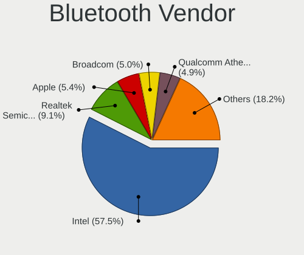

| Vendor                          | Computers | Percent |
|---------------------------------|-----------|---------|
| Intel                           | 3167      | 57.47%  |
| Realtek Semiconductor           | 500       | 9.07%   |
| Apple                           | 296       | 5.37%   |
| Broadcom                        | 273       | 4.95%   |
| Qualcomm Atheros Communications | 271       | 4.92%   |
| IMC Networks                    | 233       | 4.23%   |
| Cambridge Silicon Radio         | 155       | 2.81%   |
| MediaTek                        | 121       | 2.2%    |
| Foxconn / Hon Hai               | 115       | 2.09%   |
| Lite-On Technology              | 98        | 1.78%   |
| ASUSTek Computer                | 76        | 1.38%   |
| Dell                            | 46        | 0.83%   |
| Hewlett-Packard                 | 39        | 0.71%   |
| Alps Electric                   | 20        | 0.36%   |
| TP-Link                         | 17        | 0.31%   |
| Ralink                          | 16        | 0.29%   |
| Skylight Digital                | 9         | 0.16%   |
| USI                             | 8         | 0.15%   |
| Toshiba                         | 7         | 0.13%   |
| Integrated System Solution      | 4         | 0.07%   |
| Micro Star International        | 3         | 0.05%   |
| Fujitsu                         | 3         | 0.05%   |
| Askey Computer                  | 3         | 0.05%   |
| Taiyo Yuden                     | 2         | 0.04%   |
| Shenzhen Goodix Technology      | 2         | 0.04%   |
| Realtek                         | 2         | 0.04%   |
| Qcom                            | 2         | 0.04%   |
| HTC (High Tech Computer)        | 2         | 0.04%   |
| Edimax Technology               | 2         | 0.04%   |
| Dynex                           | 2         | 0.04%   |
| Creative Technology             | 2         | 0.04%   |
| Chicony Electronics             | 2         | 0.04%   |
| AMPAK Technology                | 2         | 0.04%   |
| Unknown                         | 2         | 0.04%   |
| Sino Wealth Electronic          | 1         | 0.02%   |
| Silicon Wave                    | 1         | 0.02%   |
| Ralink Technology               | 1         | 0.02%   |
| Primax Electronics              | 1         | 0.02%   |
| Opticis                         | 1         | 0.02%   |
| Fujitsu Siemens Computers       | 1         | 0.02%   |

Bluetooth Model
---------------

Controller models

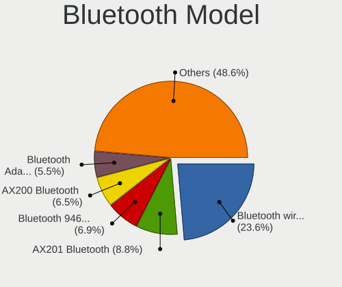

| Model                                                       | Computers | Percent |
|-------------------------------------------------------------|-----------|---------|
| Intel Bluetooth wireless interface                          | 1307      | 23.63%  |
| Intel AX201 Bluetooth                                       | 489       | 8.84%   |
| Intel Bluetooth 9460/9560 Jefferson Peak (JfP)              | 384       | 6.94%   |
| Intel AX200 Bluetooth                                       | 358       | 6.47%   |
| Realtek Bluetooth Adapter                                   | 306       | 5.53%   |
| Intel AX210 Bluetooth                                       | 168       | 3.04%   |
| Cambridge Silicon Radio Bluetooth Dongle (HCI mode)         | 155       | 2.8%    |
| Apple Bluetooth Host Controller                             | 151       | 2.73%   |
| Intel Wireless-AC 3168 Bluetooth                            | 129       | 2.33%   |
| Intel AX211 Bluetooth                                       | 121       | 2.19%   |
| Intel Centrino Bluetooth Wireless Transceiver               | 105       | 1.9%    |
| Intel Wireless-AC 9260 Bluetooth Adapter                    | 95        | 1.72%   |
| Broadcom BCM20702 Bluetooth 4.0 [ThinkPad]                  | 82        | 1.48%   |
| Broadcom BCM2045B (BDC-2.1)                                 | 67        | 1.21%   |
| Apple Broadcom Built-in Bluetooth                           | 67        | 1.21%   |
| Qualcomm Atheros AR3012 Bluetooth 4.0                       | 64        | 1.16%   |
| IMC Networks Qualcomm Atheros Bluetooth 4.1                 | 63        | 1.14%   |
| IMC Networks Realtek Bluetooth Adapter                      | 60        | 1.08%   |
| Realtek  Bluetooth 4.2 Adapter                              | 57        | 1.03%   |
| MediaTek Wireless_Device                                    | 57        | 1.03%   |
| Apple Built-in Bluetooth 2.0+EDR HCI                        | 54        | 0.98%   |
| MediaTek RZ608 Bluetooth Adapter                            | 39        | 0.7%    |
| Qualcomm Atheros QCA9377 Bluetooth 4.1                      | 38        | 0.69%   |
| Qualcomm Atheros AR9462 Bluetooth                           | 35        | 0.63%   |
| Realtek Bluetooth 4.2 Adapter                               | 33        | 0.6%    |
| Qualcomm Atheros QCA61x4 Bluetooth 4.0                      | 31        | 0.56%   |
| Foxconn / Hon Hai Bluetooth USB Module                      | 29        | 0.52%   |
| Realtek Bluetooth 4.0 Adapter                               | 28        | 0.51%   |
| Qualcomm Atheros Dell Wireless 1707 Bluetooth 4.0 LE Device | 28        | 0.51%   |
| Lite-On Atheros AR3012 Bluetooth                            | 27        | 0.49%   |
| IMC Networks Realtek Bluetooth 4.0 + High Speed Chip        | 24        | 0.43%   |
| Lite-On Qualcomm Atheros QCA9377 Bluetooth                  | 22        | 0.4%    |
| Lite-On Bluetooth USB Module                                | 21        | 0.38%   |
| Broadcom BCM2045B (BDC-2) [Bluetooth Controller]            | 20        | 0.36%   |
| Dell DW375 Bluetooth Module                                 | 19        | 0.34%   |
| Broadcom BCM20702A0 Bluetooth 4.0                           | 19        | 0.34%   |
| HP Bluetooth 2.0 Interface [Broadcom BCM2045]               | 18        | 0.33%   |
| Apple Built-in iSight (no firmware loaded)                  | 18        | 0.33%   |
| TP-Link Bluetooth 5.0 USB Adapter                           | 17        | 0.31%   |
| Broadcom BCM2045B (BDC-2.1) [Bluetooth Controller]          | 17        | 0.31%   |

Sound
-----

Sound Vendor
------------

Sound card vendors

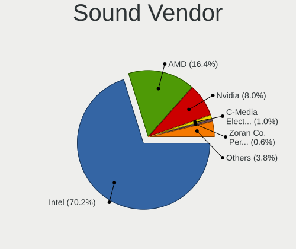

| Vendor                                       | Computers | Percent |
|----------------------------------------------|-----------|---------|
| Intel                                        | 12985     | 70.2%   |
| AMD                                          | 3033      | 16.4%   |
| Nvidia                                       | 1483      | 8.02%   |
| C-Media Electronics                          | 182       | 0.98%   |
| Zoran Co. Personal Media Division (Nogatech) | 108       | 0.58%   |
| Texas Instruments                            | 52        | 0.28%   |
| Logitech                                     | 51        | 0.28%   |
| Creative Labs                                | 49        | 0.26%   |
| Realtek Semiconductor                        | 33        | 0.18%   |
| Lenovo                                       | 29        | 0.16%   |
| GN Netcom                                    | 26        | 0.14%   |
| VIA Technologies                             | 23        | 0.12%   |
| JMTek                                        | 23        | 0.12%   |
| Focusrite-Novation                           | 21        | 0.11%   |
| Creative Technology                          | 21        | 0.11%   |
| Generalplus Technology                       | 20        | 0.11%   |
| KTMicro                                      | 18        | 0.1%    |
| ASUSTek Computer                             | 18        | 0.1%    |
| SteelSeries ApS                              | 17        | 0.09%   |
| ESS Technology                               | 15        | 0.08%   |
| Silicon Integrated Systems [SiS]             | 14        | 0.08%   |
| Kingston Technology                          | 12        | 0.06%   |
| Sony                                         | 11        | 0.06%   |
| Plantronics                                  | 11        | 0.06%   |
| Corsair                                      | 10        | 0.05%   |
| Cambridge Silicon Radio                      | 10        | 0.05%   |
| BEHRINGER International                      | 10        | 0.05%   |
| Hewlett-Packard                              | 9         | 0.05%   |
| Blue Microphones                             | 9         | 0.05%   |
| XMOS                                         | 8         | 0.04%   |
| Thesycon Systemsoftware & Consulting         | 8         | 0.04%   |
| MosArt Semiconductor                         | 8         | 0.04%   |
| Micro Star International                     | 8         | 0.04%   |
| Apple                                        | 8         | 0.04%   |
| Razer USA                                    | 7         | 0.04%   |
| Yamaha                                       | 6         | 0.03%   |
| Walmart                                      | 6         | 0.03%   |
| RODE Microphones                             | 6         | 0.03%   |
| M-Audio                                      | 5         | 0.03%   |
| FiiO Electronics Technology                  | 5         | 0.03%   |

Sound Model
-----------

Sound card models

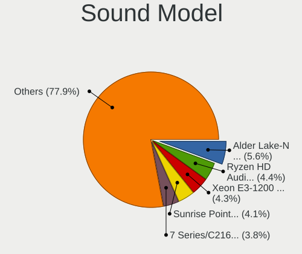

| Model                                                                                             | Computers | Percent |
|---------------------------------------------------------------------------------------------------|-----------|---------|
| Intel Alder Lake-N PCH High Definition Audio Controller                                           | 1227      | 5.61%   |
| AMD Ryzen HD Audio Controller                                                                     | 953       | 4.36%   |
| Intel Xeon E3-1200 v3/4th Gen Core Processor HD Audio Controller                                  | 930       | 4.25%   |
| Intel Sunrise Point-LP HD Audio                                                                   | 887       | 4.05%   |
| Intel 7 Series/C216 Chipset Family High Definition Audio Controller                               | 827       | 3.78%   |
| Intel 8 Series/C220 Series Chipset High Definition Audio Controller                               | 818       | 3.74%   |
| Intel Celeron/Pentium Silver Processor High Definition Audio                                      | 771       | 3.52%   |
| Intel 6 Series/C200 Series Chipset Family High Definition Audio Controller                        | 732       | 3.35%   |
| Intel 100 Series/C230 Series Chipset Family HD Audio Controller                                   | 683       | 3.12%   |
| Intel Jasper Lake HD Audio                                                                        | 677       | 3.09%   |
| Intel Cannon Lake PCH cAVS                                                                        | 656       | 3%      |
| Intel Atom/Celeron/Pentium Processor x5-E8000/J3xxx/N3xxx Series High Definition Audio Controller | 596       | 2.72%   |
| AMD FCH Azalia Controller                                                                         | 545       | 2.49%   |
| AMD Renoir/Cezanne HDMI/DP Audio Controller                                                       | 454       | 2.08%   |
| Intel 200 Series PCH HD Audio                                                                     | 451       | 2.06%   |
| Intel Atom Processor Z36xxx/Z37xxx Series High Definition Audio Controller                        | 443       | 2.02%   |
| AMD Kabini HDMI/DP Audio                                                                          | 416       | 1.9%    |
| Intel 8 Series HD Audio Controller                                                                | 380       | 1.74%   |
| Intel Haswell-ULT HD Audio Controller                                                             | 377       | 1.72%   |
| Intel Broadwell-U Audio Controller                                                                | 370       | 1.69%   |
| Intel Wildcat Point-LP High Definition Audio Controller                                           | 356       | 1.63%   |
| Intel NM10/ICH7 Family High Definition Audio Controller                                           | 322       | 1.47%   |
| AMD SBx00 Azalia (Intel HDA)                                                                      | 298       | 1.36%   |
| AMD Starship/Matisse HD Audio Controller                                                          | 286       | 1.31%   |
| AMD Raven/Raven2/Fenghuang HDMI/DP Audio Controller                                               | 283       | 1.29%   |
| Intel Celeron N3350/Pentium N4200/Atom E3900 Series Audio Cluster                                 | 250       | 1.14%   |
| Intel 5 Series/3400 Series Chipset High Definition Audio                                          | 234       | 1.07%   |
| Intel Tiger Lake-LP Smart Sound Technology Audio Controller                                       | 226       | 1.03%   |
| Intel 82801I (ICH9 Family) HD Audio Controller                                                    | 222       | 1.01%   |
| Intel Alder Lake PCH-P High Definition Audio Controller                                           | 218       | 1%      |
| AMD Family 17h (Models 00h-0fh) HD Audio Controller                                               | 216       | 0.99%   |
| Intel Comet Lake PCH-LP cAVS                                                                      | 204       | 0.93%   |
| Intel Cannon Point-LP High Definition Audio Controller                                            | 197       | 0.9%    |
| Nvidia GK208 HDMI/DP Audio Controller                                                             | 176       | 0.8%    |
| Intel Elkhart Lake High Density Audio bus interface                                               | 161       | 0.74%   |
| AMD Radeon High Definition Audio Controller                                                       | 146       | 0.67%   |
| Intel 82801H (ICH8 Family) HD Audio Controller                                                    | 144       | 0.66%   |
| AMD Ellesmere HDMI Audio [Radeon RX 470/480 / 570/580/590]                                        | 128       | 0.59%   |
| Intel Alder Lake-S HD Audio Controller                                                            | 124       | 0.57%   |
| Intel Comet Lake PCH cAVS                                                                         | 122       | 0.56%   |

Memory
------

Memory Vendor
-------------

Memory module vendors

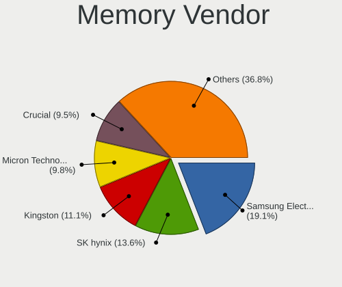

| Vendor                                  | Computers | Percent |
|-----------------------------------------|-----------|---------|
| Samsung Electronics                     | 4157      | 19.1%   |
| SK hynix                                | 2958      | 13.59%  |
| Kingston                                | 2408      | 11.07%  |
| Micron Technology                       | 2142      | 9.84%   |
| Crucial                                 | 2077      | 9.55%   |
| Unknown                                 | 1884      | 8.66%   |
| Corsair                                 | 875       | 4.02%   |
| Unknown                                 | 783       | 3.6%    |
| G.Skill                                 | 639       | 2.94%   |
| Transcend                               | 420       | 1.93%   |
| A-DATA Technology                       | 399       | 1.83%   |
| Ramaxel Technology                      | 286       | 1.31%   |
| Unknown (ABCD)                          | 273       | 1.25%   |
| Team                                    | 209       | 0.96%   |
| Nanya Technology                        | 194       | 0.89%   |
| Elpida                                  | 162       | 0.74%   |
| Patriot                                 | 139       | 0.64%   |
| Apacer                                  | 103       | 0.47%   |
| Toshiba                                 | 90        | 0.41%   |
| Kimtigo                                 | 90        | 0.41%   |
| Hewlett-Packard                         | 87        | 0.4%    |
| Timetec                                 | 66        | 0.3%    |
| Smart                                   | 66        | 0.3%    |
| ATP                                     | 53        | 0.24%   |
| GOODRAM                                 | 49        | 0.23%   |
| PNY                                     | 48        | 0.22%   |
| Avant                                   | 41        | 0.19%   |
| SK_Hynix                                | 37        | 0.17%   |
| Silicon Power                           | 36        | 0.17%   |
| Teikon                                  | 34        | 0.16%   |
| Patriot Memory (PDP Systems)            | 33        | 0.15%   |
| Lexar Co Limited                        | 32        | 0.15%   |
| AMD                                     | 29        | 0.13%   |
| Innodisk                                | 26        | 0.12%   |
| Unknown (AB)                            | 24        | 0.11%   |
| Super Talent                            | 22        | 0.1%    |
| Silicon Power Computer & Communications | 20        | 0.09%   |
| GeIL                                    | 20        | 0.09%   |
| Smart Modular                           | 19        | 0.09%   |
| HPE                                     | 19        | 0.09%   |

Memory Model
------------

Memory module models

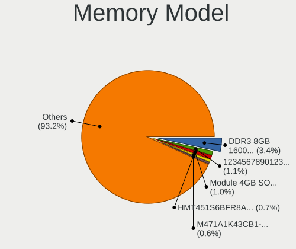

| Model                                                        | Computers | Percent |
|--------------------------------------------------------------|-----------|---------|
| Unknown                                                      | 783       | 3.38%   |
| Unknown (ABCD) RAM 123456789012345678 8GB DIMM DDR4 2400MT/s | 249       | 1.08%   |
| Unknown RAM Module 4GB SODIMM DDR3 1333MT/s                  | 235       | 1.02%   |
| SK hynix RAM HMT451S6BFR8A-PB 4GB SODIMM DDR3 1600MT/s       | 165       | 0.71%   |
| Samsung RAM M471A1K43CB1-CTD 8GB SODIMM DDR4 3200MT/s        | 134       | 0.58%   |
| Samsung RAM M471B5173QH0-YK0 4GB SODIMM DDR3 1600MT/s        | 129       | 0.56%   |
| SK hynix RAM HMA81GS6AFR8N-UH 8GB SODIMM DDR4 2400MT/s       | 126       | 0.54%   |
| Samsung RAM M425R1GB4BB0-CQKOL 8GB SODIMM DDR5 4800MT/s      | 126       | 0.54%   |
| Crucial RAM CT16G48C40S5.M8A1 16GB SODIMM DDR5 4800MT/s      | 114       | 0.49%   |
| Transcend RAM TS1GLH64V6BL 8GB SODIMM DDR4 2667MT/s          | 107       | 0.46%   |
| Samsung RAM M471B5173EB0-YK0 4GB SODIMM DDR3 1600MT/s        | 95        | 0.41%   |
| Samsung RAM M471B5173DB0-YK0 4GB SODIMM DDR3 1600MT/s        | 94        | 0.41%   |
| Unknown RAM Module 8GB DIMM DDR3 1600MT/s                    | 91        | 0.39%   |
| Crucial RAM CT16G56C46S5.M8G1 16GB SODIMM DDR5 5600MT/s      | 89        | 0.38%   |
| Samsung RAM M471A1K43CB1-CRC 8GB SODIMM DDR4 2667MT/s        | 87        | 0.38%   |
| SK hynix RAM HMT41GS6BFR8A-PB 8GB SODIMM DDR3 1600MT/s       | 81        | 0.35%   |
| Unknown RAM Module 4GB DIMM DDR3 1333MT/s                    | 80        | 0.35%   |
| Samsung RAM M471B5273DH0-CH9 4GB SODIMM DDR3 1334MT/s        | 70        | 0.3%    |
| Samsung RAM M471A1K43DB1-CTD 8GB SODIMM DDR4 2667MT/s        | 70        | 0.3%    |
| Unknown RAM Module 2GB DIMM DDR2 800MT/s                     | 69        | 0.3%    |
| Samsung RAM M471A5244CB0-CTD 4GB SODIMM DDR4 3200MT/s        | 69        | 0.3%    |
| Samsung RAM M471A5244CB0-CRC 4GB SODIMM DDR4 2400MT/s        | 68        | 0.29%   |
| Unknown RAM Module 2GB SODIMM DDR2 667MT/s                   | 67        | 0.29%   |
| SK hynix RAM HMA81GS6CJR8N-VK 8GB SODIMM DDR4 2667MT/s       | 67        | 0.29%   |
| SK hynix RAM HMT351S6CFR8C-PB 4GB SODIMM DDR3 1600MT/s       | 64        | 0.28%   |
| Samsung RAM M471B1G73QH0-YK0 8GB SODIMM DDR3 1867MT/s        | 64        | 0.28%   |
| SK hynix RAM HMA851S6AFR6N-UH 4GB SODIMM DDR4 2400MT/s       | 61        | 0.26%   |
| Micron RAM 8JTF51264AZ-1G6E1 4GB DIMM DDR3 1600MT/s          | 61        | 0.26%   |
| Samsung RAM M378B5173DB0-CK0 4GB DIMM DDR3 1600MT/s          | 59        | 0.25%   |
| Unknown RAM Module 4GB DIMM 1333MT/s                         | 58        | 0.25%   |
| Unknown RAM Module 8GB 1600MT/s                              | 55        | 0.24%   |
| Samsung RAM M471B1G73QH0-YK0 8GB DIMM DDR3 1600MT/s          | 54        | 0.23%   |
| Samsung RAM M471B1G73DB0-YK0 8GB SODIMM DDR3 1600MT/s        | 54        | 0.23%   |
| Samsung RAM M471A1K43BB1-CRC 8GB SODIMM DDR4 2400MT/s        | 54        | 0.23%   |
| Samsung RAM M471A2K43CB1-CTD 16GB SODIMM DDR4 2667MT/s       | 53        | 0.23%   |
| Crucial RAM CT8G48C40S5.M4A1 8GB SODIMM DDR5 4800MT/s        | 53        | 0.23%   |
| Samsung RAM M471B1G73EB0-YK0 8GB SODIMM DDR3 1600MT/s        | 52        | 0.22%   |
| SK hynix RAM HMT451U6BFR8A-PB 4GB DIMM DDR3 1600MT/s         | 51        | 0.22%   |
| SK hynix RAM HMT351U6CFR8C-PB 4GB DIMM DDR3 1600MT/s         | 51        | 0.22%   |
| Samsung RAM M471A5244CB0-CWE 4GB SODIMM DDR4 3200MT/s        | 51        | 0.22%   |

Memory Kind
-----------

Memory module kinds

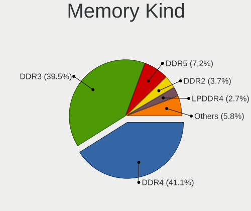

| Kind            | Computers | Percent |
|-----------------|-----------|---------|
| DDR4            | 7870      | 41.09%  |
| DDR3            | 7569      | 39.52%  |
| DDR5            | 1382      | 7.22%   |
| DDR2            | 705       | 3.68%   |
| LPDDR4          | 520       | 2.71%   |
| Unknown         | 421       | 2.2%    |
| LPDDR5          | 236       | 1.23%   |
| SDRAM           | 189       | 0.99%   |
| LPDDR3          | 137       | 0.72%   |
| DDR             | 85        | 0.44%   |
| DRAM            | 25        | 0.13%   |
| RAM             | 6         | 0.03%   |
| Logical non-vol | 3         | 0.02%   |
| EEPROM          | 2         | 0.01%   |
| SRAM            | 1         | 0.01%   |
| LPDDR2          | 1         | 0.01%   |
| DDR2 FB-DIMM    | 1         | 0.01%   |

Memory Form Factor
------------------

Physical design of the memory module

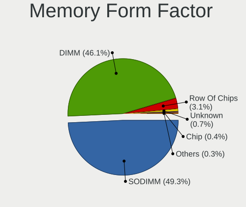

| Name            | Computers | Percent |
|-----------------|-----------|---------|
| SODIMM          | 9406      | 49.27%  |
| DIMM            | 8806      | 46.12%  |
| Row Of Chips    | 594       | 3.11%   |
| Unknown         | 140       | 0.73%   |
| Chip            | 84        | 0.44%   |
| FB-DIMM         | 38        | 0.2%    |
| RIMM            | 23        | 0.12%   |
| Proprietary Car | 1         | 0.01%   |

Memory Size
-----------

Memory module size

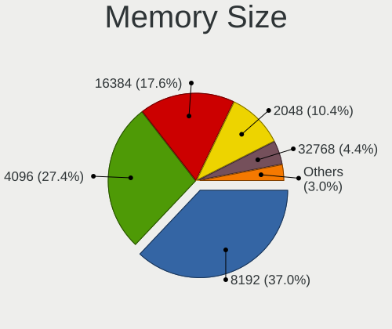

| Size   | Computers | Percent |
|--------|-----------|---------|
| 8192   | 7639      | 37.04%  |
| 4096   | 5660      | 27.45%  |
| 16384  | 3632      | 17.61%  |
| 2048   | 2154      | 10.44%  |
| 32768  | 911       | 4.42%   |
| 1024   | 432       | 2.09%   |
| 3072   | 58        | 0.28%   |
| 512    | 54        | 0.26%   |
| 49152  | 24        | 0.12%   |
| 65536  | 20        | 0.1%    |
| 256    | 10        | 0.05%   |
| 131072 | 6         | 0.03%   |
| 6144   | 5         | 0.02%   |
| 128    | 4         | 0.02%   |
| 24576  | 3         | 0.01%   |
| 32767  | 2         | 0.01%   |
| 12288  | 2         | 0.01%   |
| 64     | 2         | 0.01%   |
| 1      | 2         | 0.01%   |
| 2560   | 1         | 0.005%  |
| 32     | 1         | 0.005%  |
| 8      | 1         | 0.005%  |

Memory Speed
------------

Memory module speed

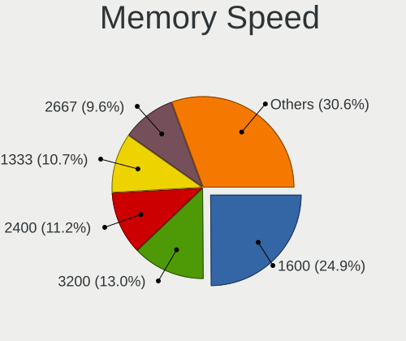

| Speed   | Computers | Percent |
|---------|-----------|---------|
| 1600    | 5077      | 24.89%  |
| 3200    | 2649      | 12.99%  |
| 2400    | 2291      | 11.23%  |
| 1333    | 2175      | 10.66%  |
| 2667    | 1961      | 9.61%   |
| 2133    | 1237      | 6.06%   |
| 4800    | 980       | 4.8%    |
| 800     | 474       | 2.32%   |
| 5600    | 449       | 2.2%    |
| 667     | 443       | 2.17%   |
| 2666    | 311       | 1.52%   |
| Unknown | 299       | 1.47%   |
| 1867    | 247       | 1.21%   |
| 1334    | 232       | 1.14%   |
| 1067    | 218       | 1.07%   |
| 1066    | 210       | 1.03%   |
| 6400    | 176       | 0.86%   |
| 1866    | 145       | 0.71%   |
| 3600    | 123       | 0.6%    |
| 3000    | 111       | 0.54%   |
| 2933    | 110       | 0.54%   |
| 4267    | 65        | 0.32%   |
| 3733    | 64        | 0.31%   |
| 533     | 58        | 0.28%   |
| 400     | 45        | 0.22%   |
| 5200    | 27        | 0.13%   |
| 4000    | 26        | 0.13%   |
| 975     | 21        | 0.1%    |
| 4266    | 13        | 0.06%   |
| 333     | 12        | 0.06%   |
| 6000    | 11        | 0.05%   |
| 3066    | 11        | 0.05%   |
| 2048    | 11        | 0.05%   |
| 1033    | 9         | 0.04%   |
| 1400    | 8         | 0.04%   |
| 1332    | 8         | 0.04%   |
| 266     | 8         | 0.04%   |
| 1639    | 7         | 0.03%   |
| 2800    | 6         | 0.03%   |
| 2600    | 6         | 0.03%   |

Printers & scanners
-------------------

Printer Vendor
--------------

Printer device vendors

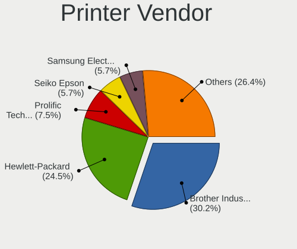

| Vendor                | Computers | Percent |
|-----------------------|-----------|---------|
| Brother Industries    | 16        | 30.19%  |
| Hewlett-Packard       | 13        | 24.53%  |
| Prolific Technology   | 4         | 7.55%   |
| Seiko Epson           | 3         | 5.66%   |
| Samsung Electronics   | 3         | 5.66%   |
| Xerox                 | 2         | 3.77%   |
| Lexmark International | 2         | 3.77%   |
| ELGIN                 | 2         | 3.77%   |
| Dymo-CoStar           | 2         | 3.77%   |
| Apple                 | 2         | 3.77%   |
| Ricoh                 | 1         | 1.89%   |
| QinHeng Electronics   | 1         | 1.89%   |
| Kyocera               | 1         | 1.89%   |
| Canon                 | 1         | 1.89%   |

Printer Model
-------------

Printer device models

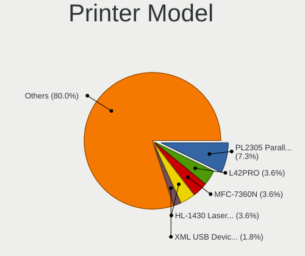

| Model                                                                                                             | Computers | Percent |
|-------------------------------------------------------------------------------------------------------------------|-----------|---------|
| Prolific PL2305 Parallel Port                                                                                     | 4         | 7.27%   |
| ELGIN L42PRO                                                                                                      | 2         | 3.64%   |
| Brother MFC-7360N                                                                                                 | 2         | 3.64%   |
| Brother HL-1430 Laser Printer                                                                                     | 2         | 3.64%   |
| Xerox XML USB Device Interface                                                                                    | 1         | 1.82%   |
| Xerox Phaser 3140 and 3155                                                                                        | 1         | 1.82%   |
| Seiko Epson USB2.0 Printer (Hi-speed)                                                                             | 1         | 1.82%   |
| Seiko Epson Printer                                                                                               | 1         | 1.82%   |
| Seiko Epson PRIFIA OK500P                                                                                         | 1         | 1.82%   |
| Samsung ML-2010P Mono Laser Printer                                                                               | 1         | 1.82%   |
| Samsung ML-1640 Series Laser Printer                                                                              | 1         | 1.82%   |
| Samsung ML-1610 Mono Laser Printer                                                                                | 1         | 1.82%   |
| Ricoh SP 112                                                                                                      | 1         | 1.82%   |
| QinHeng CH340S                                                                                                    | 1         | 1.82%   |
| Lexmark International SINDOH A603_A608 Print                                                                      | 1         | 1.82%   |
| Lexmark International Lexmark MS710 Print                                                                         | 1         | 1.82%   |
| Kyocera FS-1025MFP                                                                                                | 1         | 1.82%   |
| HP PNP Fax Null                                                                                                   | 1         | 1.82%   |
| HP LaserJet P3005                                                                                                 | 1         | 1.82%   |
| HP LaserJet 3390                                                                                                  | 1         | 1.82%   |
| HP LaserJet 2200                                                                                                  | 1         | 1.82%   |
| HP LaserJet 1200                                                                                                  | 1         | 1.82%   |
| HP LaserJet 1020                                                                                                  | 1         | 1.82%   |
| HP LaserJet 1012                                                                                                  | 1         | 1.82%   |
| HP Laser 107a Printer                                                                                             | 1         | 1.82%   |
| HP HP LaserJet P2035 HP Print                                                                                     | 1         | 1.82%   |
| HP HP LaserJet MFP M232-M237 Printer HP LEDM IPP Printer HP LEDM IPP Printer HP LEDM IPP Printer                  | 1         | 1.82%   |
| HP HP LaserJet MFP E52645 LaserJet 0 LaserJet 0 LaserJet 1 LaserJet 1 LaserJet 2 LaserJet 2 LaserJet 3 LaserJet 3 | 1         | 1.82%   |
| HP HP LaserJet M14-M17 Printer HP LEDM IPP Printer HP LEDM IPP Printer HP LEDM IPP Printer                        | 1         | 1.82%   |
| HP HP LaserJet M101-M106 Printer HP LEDM HP LEDM IPP Printer IPP Printer                                          | 1         | 1.82%   |
| HP DeskJet 5850c                                                                                                  | 1         | 1.82%   |
| HP Color LaserJet CP1215                                                                                          | 1         | 1.82%   |
| Dymo-CoStar LabelWriter 450                                                                                       | 1         | 1.82%   |
| Dymo-CoStar DYMO LabelWriter 450 DUO                                                                              | 1         | 1.82%   |
| Canon LBP2900                                                                                                     | 1         | 1.82%   |
| Brother MFC-L2685DW                                                                                               | 1         | 1.82%   |
| Brother MFC-J485DW                                                                                                | 1         | 1.82%   |
| Brother MFC-J200                                                                                                  | 1         | 1.82%   |
| Brother HL-L5200DW series                                                                                         | 1         | 1.82%   |
| Brother HL-L3270CDW series                                                                                        | 1         | 1.82%   |

Scanner Vendor
--------------

Scanner device vendors

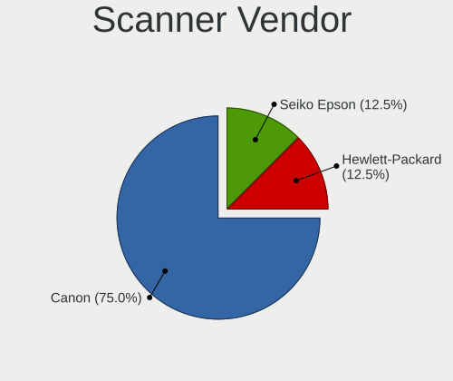

| Vendor          | Computers | Percent |
|-----------------|-----------|---------|
| Canon           | 16        | 66.67%  |
| Seiko Epson     | 7         | 29.17%  |
| Hewlett-Packard | 1         | 4.17%   |

Scanner Model
-------------

Scanner device models

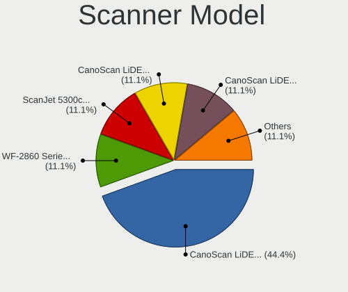

| Model                                                                               | Computers | Percent |
|-------------------------------------------------------------------------------------|-----------|---------|
| Canon CanoScan LiDE 110                                                             | 4         | 16.67%  |
| Seiko Epson WF-2850 Series EPSON Scanner USB2.0 Printer EPSON Utility USB2.0 Faxout | 2         | 8.33%   |
| Canon CanoScan LiDE 220                                                             | 2         | 8.33%   |
| Canon CanoScan LiDE 210                                                             | 2         | 8.33%   |
| Canon CanoScan LiDE 120                                                             | 2         | 8.33%   |
| Seiko Epson WF-2860 Series EPSON Scanner USB2.0 Printer EPSON Utility USB2.0 Faxout | 1         | 4.17%   |
| Seiko Epson PX-501A [Stylus NX400]                                                  | 1         | 4.17%   |
| Seiko Epson GT-F520/GT-F570 [Perfection 3590 PHOTO]                                 | 1         | 4.17%   |
| Seiko Epson GT-9300UF [Perfection 2400 PHOTO]                                       | 1         | 4.17%   |
| Seiko Epson ES-H7200 [GT-20000]                                                     | 1         | 4.17%   |
| HP ScanJet 5300c/5370c                                                              | 1         | 4.17%   |
| Canon CanoScan N650U/N656U                                                          | 1         | 4.17%   |
| Canon CanoScan N1240U/LiDE 30                                                       | 1         | 4.17%   |
| Canon CanoScan LiDE 700F                                                            | 1         | 4.17%   |
| Canon CanoScan LIDE 25                                                              | 1         | 4.17%   |
| Canon CanoScan LiDE 100                                                             | 1         | 4.17%   |
| Canon CanoScan 9000F                                                                | 1         | 4.17%   |

Camera
------

Camera Vendor
-------------

Camera device vendors

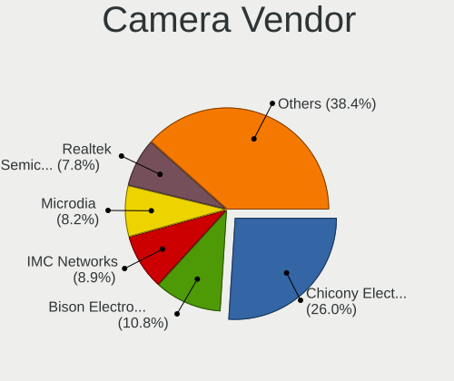

| Vendor                                 | Computers | Percent |
|----------------------------------------|-----------|---------|
| Chicony Electronics                    | 831       | 26.01%  |
| Bison Electronics                      | 345       | 10.8%   |
| IMC Networks                           | 283       | 8.86%   |
| Microdia                               | 261       | 8.17%   |
| Realtek Semiconductor                  | 248       | 7.76%   |
| Sunplus Innovation Technology          | 187       | 5.85%   |
| Logitech                               | 138       | 4.32%   |
| Lite-On Technology                     | 95        | 2.97%   |
| Suyin                                  | 84        | 2.63%   |
| Quanta                                 | 84        | 2.63%   |
| Apple                                  | 75        | 2.35%   |
| Syntek                                 | 74        | 2.32%   |
| Cheng Uei Precision Industry (Foxlink) | 70        | 2.19%   |
| Luxvisions Innotech Limited            | 62        | 1.94%   |
| Silicon Motion                         | 43        | 1.35%   |
| Lenovo                                 | 34        | 1.06%   |
| Alcor Micro                            | 33        | 1.03%   |
| Z-Star Microelectronics                | 29        | 0.91%   |
| Ricoh                                  | 20        | 0.63%   |
| ALi                                    | 19        | 0.59%   |
| Shenzhen Kingcome Optoelectronic       | 15        | 0.47%   |
| Importek                               | 13        | 0.41%   |
| Supreme Electronics                    | 11        | 0.34%   |
| Jiangxi Shinetech Optical              | 10        | 0.31%   |
| ARC International                      | 9         | 0.28%   |
| Framework                              | 7         | 0.22%   |
| Intel                                  | 6         | 0.19%   |
| Trust                                  | 5         | 0.16%   |
| Primax Electronics                     | 5         | 0.16%   |
| OmniVision Technologies                | 5         | 0.16%   |
| GEMBIRD                                | 5         | 0.16%   |
| Unknown (3730304233343731345430)       | 4         | 0.13%   |
| Hewlett-Packard                        | 4         | 0.13%   |
| Genesys Logic                          | 4         | 0.13%   |
| Generalplus Technology                 | 4         | 0.13%   |
| DigiTech                               | 4         | 0.13%   |
| Cubeternet                             | 4         | 0.13%   |
| Arkmicro Technologies                  | 4         | 0.13%   |
| Y Media                                | 3         | 0.09%   |
| USB Camera                             | 3         | 0.09%   |

Camera Model
------------

Camera device models

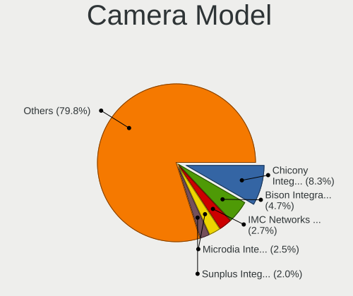

| Model                                         | Computers | Percent |
|-----------------------------------------------|-----------|---------|
| Chicony Integrated Camera                     | 269       | 8.34%   |
| Bison Integrated Camera                       | 151       | 4.68%   |
| IMC Networks Integrated Camera                | 87        | 2.7%    |
| Microdia Integrated_Webcam_HD                 | 79        | 2.45%   |
| Sunplus Integrated_Webcam_HD                  | 64        | 1.99%   |
| Lite-On Integrated Camera                     | 61        | 1.89%   |
| Chicony HD WebCam                             | 56        | 1.74%   |
| Realtek Integrated_Webcam_HD                  | 51        | 1.58%   |
| Microdia Integrated Webcam                    | 49        | 1.52%   |
| Chicony Lenovo Integrated Camera (0.3MP)      | 48        | 1.49%   |
| Bison SunplusIT Integrated Camera             | 41        | 1.27%   |
| IMC Networks Realtek PC Camera                | 40        | 1.24%   |
| IMC Networks EasyCamera                       | 36        | 1.12%   |
| Apple FaceTime HD Camera                      | 36        | 1.12%   |
| Realtek USB 2.0 PC Camera                     | 35        | 1.09%   |
| Chicony Integrated Camera (1280x720@30)       | 35        | 1.09%   |
| Logitech Webcam C270                          | 34        | 1.05%   |
| Syntek Integrated Camera                      | 33        | 1.02%   |
| Luxvisions Innotech Limited Integrated Camera | 33        | 1.02%   |
| Bison Lenovo EasyCamera                       | 32        | 0.99%   |
| Logitech HD Pro Webcam C920                   | 29        | 0.9%    |
| Bison ThinkPad Integrated Camera              | 28        | 0.87%   |
| Apple FaceTime HD Camera (Built-in)           | 28        | 0.87%   |
| Chicony Integrated Camera [ThinkPad]          | 25        | 0.78%   |
| Realtek USB Camera                            | 23        | 0.71%   |
| Chicony HP HD Webcam [Fixed]                  | 21        | 0.65%   |
| Chicony Realtek DMFT RGB                      | 20        | 0.62%   |
| Chicony EasyCamera                            | 20        | 0.62%   |
| Syntek Lenovo EasyCamera                      | 19        | 0.59%   |
| Chicony Integrated IR Camera                  | 19        | 0.59%   |
| Chicony FJ Camera                             | 19        | 0.59%   |
| Chicony Chicony USB2.0 Camera                 | 19        | 0.59%   |
| Quanta HP TrueVision HD Camera                | 18        | 0.56%   |
| Lenovo Integrated Webcam [R5U877]             | 18        | 0.56%   |
| Syntek EasyCamera                             | 17        | 0.53%   |
| Chicony USB2.0 VGA UVC WebCam                 | 17        | 0.53%   |
| Chicony Lenovo EasyCamera                     | 17        | 0.53%   |
| Bison ThinkPad P50 Integrated Camera          | 17        | 0.53%   |
| Bison HD Webcam                               | 16        | 0.5%    |
| Sunplus Laptop_Integrated_Webcam_FHD          | 15        | 0.47%   |

Security
--------

Fingerprint Vendor
------------------

Fingerprint sensor vendors

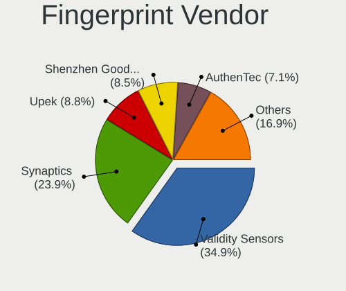

| Vendor                     | Computers | Percent |
|----------------------------|-----------|---------|
| Validity Sensors           | 301       | 34.88%  |
| Synaptics                  | 206       | 23.87%  |
| Upek                       | 76        | 8.81%   |
| Shenzhen Goodix Technology | 73        | 8.46%   |
| AuthenTec                  | 61        | 7.07%   |
| Elan Microelectronics      | 46        | 5.33%   |
| STMicroelectronics         | 35        | 4.06%   |
| Broadcom                   | 22        | 2.55%   |
| LighTuning Technology      | 19        | 2.2%    |
| FocalTech Systems          | 13        | 1.51%   |
| Fingerprint Cards          | 6         | 0.7%    |
| Samsung Electronics        | 3         | 0.35%   |
| Next Biometrics            | 1         | 0.12%   |
| DigitalPersona             | 1         | 0.12%   |

Fingerprint Model
-----------------

Fingerprint sensor models

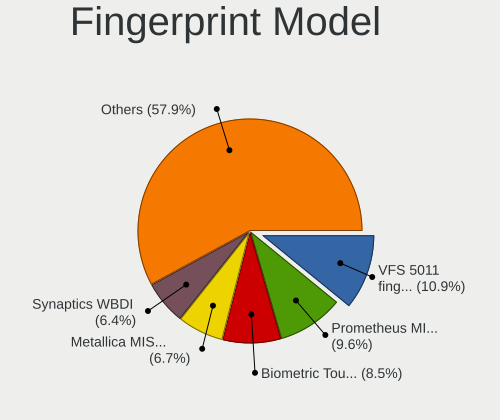

| Model                                                                        | Computers | Percent |
|------------------------------------------------------------------------------|-----------|---------|
| Validity Sensors VFS 5011 fingerprint sensor                                 | 94        | 10.89%  |
| Synaptics Prometheus MIS Touch Fingerprint Reader                            | 83        | 9.62%   |
| Upek Biometric Touchchip/Touchstrip Fingerprint Sensor                       | 73        | 8.46%   |
| Synaptics Metallica MIS Touch Fingerprint Reader                             | 58        | 6.72%   |
| Validity Sensors Synaptics WBDI                                              | 55        | 6.37%   |
| Shenzhen Goodix Fingerprint Reader                                           | 52        | 6.03%   |
| Validity Sensors VFS495 Fingerprint Reader                                   | 42        | 4.87%   |
| Elan Fingerprint Sensor                                                      | 42        | 4.87%   |
| STMicroelectronics Fingerprint Reader                                        | 35        | 4.06%   |
| Validity Sensors VFS7500 Touch Fingerprint Sensor                            | 30        | 3.48%   |
| Validity Sensors VFS5011 Fingerprint Reader                                  | 26        | 3.01%   |
| Broadcom BCM5880 Secure Applications Processor with fingerprint swipe sensor | 22        | 2.55%   |
| AuthenTec AES2810                                                            | 19        | 2.2%    |
| Synaptics FS7604 Touch Fingerprint Sensor with PurePrint                     | 16        | 1.85%   |
| Synaptics Metallica MOH Touch Fingerprint Reader                             | 14        | 1.62%   |
| AuthenTec AES2501 Fingerprint Sensor                                         | 14        | 1.62%   |
| Synaptics WBDI                                                               | 13        | 1.51%   |
| Shenzhen Goodix  Fingerprint Device                                          | 13        | 1.51%   |
| Validity Sensors VFS491                                                      | 10        | 1.16%   |
| FocalTech Systems Fingerprint Reader                                         | 10        | 1.16%   |
| LighTuning EgisTec Touch Fingerprint Sensor                                  | 9         | 1.04%   |
| AuthenTec AES1660                                                            | 9         | 1.04%   |
| Shenzhen Goodix Fingerprint Reader SGX                                       | 8         | 0.93%   |
| LighTuning ES603 Swipe Fingerprint Sensor                                    | 8         | 0.93%   |
| Validity Sensors VFS451 Fingerprint Reader                                   | 7         | 0.81%   |
| Validity Sensors Swipe Fingerprint Sensor                                    | 7         | 0.81%   |
| Validity Sensors Fingerprint scanner                                         | 7         | 0.81%   |
| Synaptics WBDI Fingerprint Reader USB 086                                    | 7         | 0.81%   |
| AuthenTec AES1600                                                            | 7         | 0.81%   |
| Validity Sensors VFS471 Fingerprint Reader                                   | 6         | 0.7%    |
| Synaptics UWP WBDI Device                                                    | 6         | 0.7%    |
| Fingerprint Cards FPC Fingerprint Reader                                     | 6         | 0.7%    |
| AuthenTec AES2660                                                            | 5         | 0.58%   |
| AuthenTec AES2550 Fingerprint Sensor                                         | 5         | 0.58%   |
| Validity Sensors VFS7552 Touch Fingerprint Sensor                            | 4         | 0.46%   |
| Validity Sensors VFS Fingerprint sensor                                      | 4         | 0.46%   |
| Validity Sensors Synaptics VFS7552 Touch Fingerprint Sensor with PurePrint   | 4         | 0.46%   |
| Elan WBF Fingerprint Sensor                                                  | 4         | 0.46%   |
| Validity Sensors VFS101 Fingerprint Reader                                   | 3         | 0.35%   |
| Upek TCS5B Fingerprint sensor                                                | 3         | 0.35%   |

Chipcard Vendor
---------------

Chipcard module vendors

Zero info for selected period =(

Chipcard Model
--------------

Chipcard module models

Zero info for selected period =(

Unsupported
-----------

Unsupported Devices
-------------------

Total unsupported devices on board

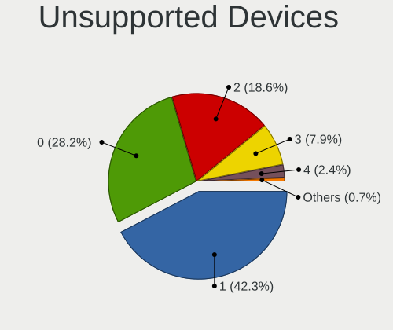

| Total | Computers | Percent |
|-------|-----------|---------|
| 1     | 9002      | 42.34%  |
| 0     | 5988      | 28.16%  |
| 2     | 3945      | 18.56%  |
| 3     | 1669      | 7.85%   |
| 4     | 504       | 2.37%   |
| 5     | 115       | 0.54%   |
| 6     | 24        | 0.11%   |
| 7     | 10        | 0.05%   |
| 9     | 2         | 0.01%   |
| 8     | 2         | 0.01%   |

Unsupported Device Types
------------------------

Types of unsupported devices

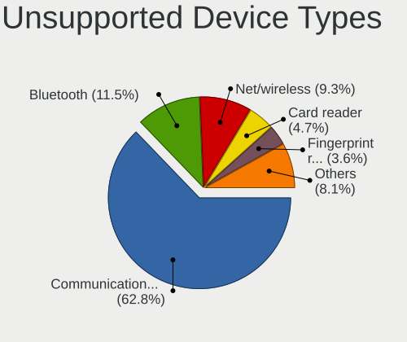

| Type                     | Computers | Percent |
|--------------------------|-----------|---------|
| Communication controller | 13074     | 62.81%  |
| Bluetooth                | 2398      | 11.52%  |
| Net/wireless             | 1933      | 9.29%   |
| Card reader              | 985       | 4.73%   |
| Fingerprint reader       | 743       | 3.57%   |
| Firewire controller      | 512       | 2.46%   |
| Net/ethernet             | 299       | 1.44%   |
| Sound                    | 290       | 1.39%   |
| Network                  | 253       | 1.22%   |
| Graphics card            | 152       | 0.73%   |
| Storage                  | 67        | 0.32%   |
| Modem                    | 29        | 0.14%   |
| Storage/raid             | 25        | 0.12%   |
| Storage/ata              | 25        | 0.12%   |
| Dvb card                 | 15        | 0.07%   |
| Storage/ide              | 8         | 0.04%   |
| Storage/nvme             | 6         | 0.03%   |
| Wireless                 | 1         | 0.005%  |

