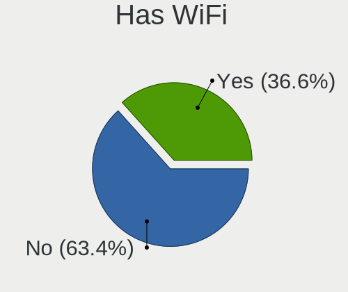
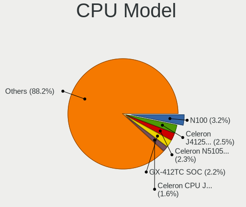
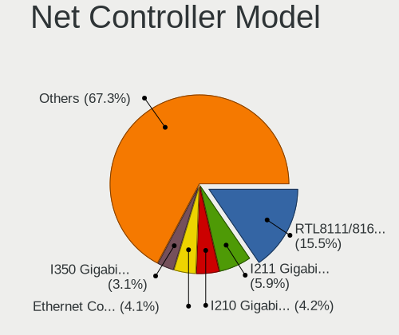

BSD - Tested Hardware & Statistics
----------------------------------

A project to collect tested hardware configurations for BSD.

Anyone can contribute to this report by the [hw-probe](https://github.com/linuxhw/hw-probe/blob/master/INSTALL.BSD.md) tool:

    hw-probe -all -upload

Please contribute! Especially if your hardware is rare.

This is a report for all computer types. See also reports for [desktops](/Desktop/README.md) and [notebooks](/Notebook/README.md).

OS-specific reports: [FreeBSD](/Dist/FreeBSD), [GhostBSD](/Dist/GhostBSD), [helloSystem](/Dist/helloSystem), [NetBSD](/Dist/NetBSD), [NomadBSD](/Dist/NomadBSD), [OpenBSD](/Dist/OpenBSD), [OPNsense](/Dist/OPNsense), [pfSense](/Dist/pfSense), [TrueNAS](/Dist/TrueNAS).

This report is for real hardware. Report for virtual hardware: [TestDays_VE](https://github.com/bsdhw/TestDays_VE)

Contents
--------

* [ Test Cases ](#test-cases)

* [ System ](#system)
  - [ OS                       ](#os)
  - [ OS Family                ](#os-family)
  - [ Arch                     ](#arch)
  - [ DE                       ](#de)
  - [ Display Server           ](#display-server)
  - [ Display Manager          ](#display-manager)
  - [ OS Lang                  ](#os-lang)
  - [ Boot Mode                ](#boot-mode)
  - [ Filesystem               ](#filesystem)
  - [ Part. scheme             ](#part-scheme)

* [ Board ](#board)
  - [ Vendor                   ](#vendor)
  - [ Model                    ](#model)
  - [ Model Family             ](#model-family)
  - [ MFG Year                 ](#mfg-year)
  - [ Form Factor              ](#form-factor)
  - [ Coreboot                 ](#coreboot)
  - [ RAM Size                 ](#ram-size)
  - [ RAM Used                 ](#ram-used)
  - [ Total Drives             ](#total-drives)
  - [ Has CD-ROM               ](#has-cd-rom)
  - [ Has Ethernet             ](#has-ethernet)
  - [ Has WiFi                 ](#has-wifi)
  - [ Has Bluetooth            ](#has-bluetooth)

* [ Location ](#location)
  - [ Country                  ](#country)
  - [ City                     ](#city)

* [ Drives ](#drives)
  - [ Drive Vendor             ](#drive-vendor)
  - [ Drive Model              ](#drive-model)
  - [ HDD Vendor               ](#hdd-vendor)
  - [ SSD Vendor               ](#ssd-vendor)
  - [ Drive Kind               ](#drive-kind)
  - [ Drive Connector          ](#drive-connector)
  - [ Drive Size               ](#drive-size)
  - [ Space Total              ](#space-total)
  - [ Space Used               ](#space-used)
  - [ Malfunc. Drives          ](#malfunc-drives)
  - [ Malfunc. Drive Vendor    ](#malfunc-drive-vendor)
  - [ Malfunc. HDD Vendor      ](#malfunc-hdd-vendor)
  - [ Malfunc. Drive Kind      ](#malfunc-drive-kind)
  - [ Failed Drives            ](#failed-drives)
  - [ Failed Drive Vendor      ](#failed-drive-vendor)
  - [ Drive Status             ](#drive-status)

* [ Storage controller ](#storage-controller)
  - [ Storage Vendor           ](#storage-vendor)
  - [ Storage Model            ](#storage-model)
  - [ Storage Kind             ](#storage-kind)

* [ Processor ](#processor)
  - [ CPU Vendor               ](#cpu-vendor)
  - [ CPU Model                ](#cpu-model)
  - [ CPU Model Family         ](#cpu-model-family)
  - [ CPU Cores                ](#cpu-cores)
  - [ CPU Sockets              ](#cpu-sockets)
  - [ CPU Threads              ](#cpu-threads)
  - [ CPU Microarch            ](#cpu-microarch)

* [ Graphics ](#graphics)
  - [ GPU Vendor               ](#gpu-vendor)
  - [ GPU Model                ](#gpu-model)
  - [ GPU Combo                ](#gpu-combo)
  - [ GPU Driver               ](#gpu-driver)
  - [ GPU Memory               ](#gpu-memory)

* [ Monitor ](#monitor)
  - [ Monitor Vendor           ](#monitor-vendor)
  - [ Monitor Model            ](#monitor-model)
  - [ Monitor Resolution       ](#monitor-resolution)
  - [ Monitor Diagonal         ](#monitor-diagonal)
  - [ Monitor Width            ](#monitor-width)
  - [ Aspect Ratio             ](#aspect-ratio)
  - [ Monitor Area             ](#monitor-area)
  - [ Pixel Density            ](#pixel-density)
  - [ Multiple Monitors        ](#multiple-monitors)

* [ Network ](#network)
  - [ Net Controller Vendor    ](#net-controller-vendor)
  - [ Net Controller Model     ](#net-controller-model)
  - [ Wireless Vendor          ](#wireless-vendor)
  - [ Wireless Model           ](#wireless-model)
  - [ Ethernet Vendor          ](#ethernet-vendor)
  - [ Ethernet Model           ](#ethernet-model)
  - [ Net Controller Kind      ](#net-controller-kind)
  - [ Used Controller          ](#used-controller)
  - [ NICs                     ](#nics)
  - [ IPv6                     ](#ipv6)

* [ Bluetooth ](#bluetooth)
  - [ Bluetooth Vendor         ](#bluetooth-vendor)
  - [ Bluetooth Model          ](#bluetooth-model)

* [ Sound ](#sound)
  - [ Sound Vendor             ](#sound-vendor)
  - [ Sound Model              ](#sound-model)

* [ Memory ](#memory)
  - [ Memory Vendor            ](#memory-vendor)
  - [ Memory Model             ](#memory-model)
  - [ Memory Kind              ](#memory-kind)
  - [ Memory Form Factor       ](#memory-form-factor)
  - [ Memory Size              ](#memory-size)
  - [ Memory Speed             ](#memory-speed)

* [ Printers & scanners ](#printers--scanners)
  - [ Printer Vendor           ](#printer-vendor)
  - [ Printer Model            ](#printer-model)
  - [ Scanner Vendor           ](#scanner-vendor)
  - [ Scanner Model            ](#scanner-model)

* [ Camera ](#camera)
  - [ Camera Vendor            ](#camera-vendor)
  - [ Camera Model             ](#camera-model)

* [ Security ](#security)
  - [ Fingerprint Vendor       ](#fingerprint-vendor)
  - [ Fingerprint Model        ](#fingerprint-model)
  - [ Chipcard Vendor          ](#chipcard-vendor)
  - [ Chipcard Model           ](#chipcard-model)

* [ Unsupported ](#unsupported)
  - [ Unsupported Devices      ](#unsupported-devices)
  - [ Unsupported Device Types ](#unsupported-device-types)

Test Cases
----------

Total: 18707

| Vendor        | Model                       | Form-Factor | Probe                                                     | Date         |
|---------------|-----------------------------|-------------|-----------------------------------------------------------|--------------|
| Google        | Auron_Paine                 | Notebook    | [021624028a](https://bsd-hardware.info/?probe=021624028a) | Oct 01, 2023 |
| Dell          | Inspiron 5559               | Notebook    | [7a6b97e997](https://bsd-hardware.info/?probe=7a6b97e997) | Oct 01, 2023 |
| MSI           | H81M-P33                    | Desktop     | [da12fe3c05](https://bsd-hardware.info/?probe=da12fe3c05) | Oct 01, 2023 |
| ASUSTek       | P5Q-E                       | Desktop     | [6975204e47](https://bsd-hardware.info/?probe=6975204e47) | Oct 01, 2023 |
| Supermicro    | A2SDi-4C-HLN4F              | Desktop     | [f97e242e6b](https://bsd-hardware.info/?probe=f97e242e6b) | Oct 01, 2023 |
| Dell          | 0GU083 A00                  | Desktop     | [1286478dc2](https://bsd-hardware.info/?probe=1286478dc2) | Oct 01, 2023 |
| Win elemen... | M600                        | Desktop     | [b5caabfd31](https://bsd-hardware.info/?probe=b5caabfd31) | Oct 01, 2023 |
| Win elemen... | M600                        | Desktop     | [7a1378a001](https://bsd-hardware.info/?probe=7a1378a001) | Oct 01, 2023 |
| Win elemen... | M600                        | Desktop     | [93cc6a1173](https://bsd-hardware.info/?probe=93cc6a1173) | Oct 01, 2023 |
| Techvision    | TVI7309X B0                 | Desktop     | [906fd7e198](https://bsd-hardware.info/?probe=906fd7e198) | Sep 30, 2023 |
| Unknown       | Unknown                     | Desktop     | [50418139b2](https://bsd-hardware.info/?probe=50418139b2) | Sep 30, 2023 |
| Acer          | TravelMate 5730             | Notebook    | [dffc2e116d](https://bsd-hardware.info/?probe=dffc2e116d) | Sep 30, 2023 |
| ASRockRack    | EPYC3101D4I-2T              | Desktop     | [c6903de57a](https://bsd-hardware.info/?probe=c6903de57a) | Sep 30, 2023 |
| Unknown       | Unknown                     | Notebook    | [7cfd3d40eb](https://bsd-hardware.info/?probe=7cfd3d40eb) | Sep 30, 2023 |
| ASUSTek       | A88XM-A                     | Desktop     | [a32967cbc5](https://bsd-hardware.info/?probe=a32967cbc5) | Sep 30, 2023 |
| Unknown       | Unknown                     | Desktop     | [716f9b28ab](https://bsd-hardware.info/?probe=716f9b28ab) | Sep 30, 2023 |
| Gigabyte      | H470M DS3H                  | Desktop     | [604bce28c1](https://bsd-hardware.info/?probe=604bce28c1) | Sep 30, 2023 |
| Sophos        | SG                          | Firewall    | [c46ccbd5b9](https://bsd-hardware.info/?probe=c46ccbd5b9) | Sep 30, 2023 |
| ASUSTek       | P10S-C Series               | Desktop     | [cc0a5bb631](https://bsd-hardware.info/?probe=cc0a5bb631) | Sep 30, 2023 |
| Fujitsu       | D3543-A1 S26361-D3543-A1... | Desktop     | [8809e169a1](https://bsd-hardware.info/?probe=8809e169a1) | Sep 30, 2023 |
| Sophos        | SG                          | Firewall    | [273b148522](https://bsd-hardware.info/?probe=273b148522) | Sep 30, 2023 |
| Dell          | 0782GW A00                  | Desktop     | [dfb45f6202](https://bsd-hardware.info/?probe=dfb45f6202) | Sep 30, 2023 |
| Sophos        | SG                          | Firewall    | [1429a7de9a](https://bsd-hardware.info/?probe=1429a7de9a) | Sep 30, 2023 |
| HP            | 83EE                        | Desktop     | [88d80d215a](https://bsd-hardware.info/?probe=88d80d215a) | Sep 30, 2023 |
| Unknown       | Unknown                     | Desktop     | [20fb7f1ba8](https://bsd-hardware.info/?probe=20fb7f1ba8) | Sep 30, 2023 |
| Intel         | NUC11TNBi3 M11908-403       | Mini pc     | [9ceae969b0](https://bsd-hardware.info/?probe=9ceae969b0) | Sep 30, 2023 |
| Supermicro    | X9DRD-iF                    | Server      | [fc2ba7c8d8](https://bsd-hardware.info/?probe=fc2ba7c8d8) | Sep 30, 2023 |
| Win elemen... | M600                        | Desktop     | [abc175c93b](https://bsd-hardware.info/?probe=abc175c93b) | Sep 30, 2023 |
| Supermicro    | A2SDi-TP8F                  | Desktop     | [9a73be8c9c](https://bsd-hardware.info/?probe=9a73be8c9c) | Sep 30, 2023 |
| Win elemen... | M600                        | Desktop     | [5b7606e786](https://bsd-hardware.info/?probe=5b7606e786) | Sep 30, 2023 |
| Intel         | DN2820FYK H24582-201        | Desktop     | [ea832a672d](https://bsd-hardware.info/?probe=ea832a672d) | Sep 30, 2023 |
| IGEL Techn... | VX900                       | Desktop     | [eb65624dc3](https://bsd-hardware.info/?probe=eb65624dc3) | Sep 29, 2023 |
| Acer          | F672CR R01-B1               | Desktop     | [2008598c7e](https://bsd-hardware.info/?probe=2008598c7e) | Sep 29, 2023 |
| Deciso        | Netboard A20                | Notebook    | [3877143e37](https://bsd-hardware.info/?probe=3877143e37) | Sep 29, 2023 |
| Unknown       | Unknown                     | Desktop     | [fb21a44f71](https://bsd-hardware.info/?probe=fb21a44f71) | Sep 29, 2023 |
| AMI           | Aptio CRB                   | Mini pc     | [bfe4c8617a](https://bsd-hardware.info/?probe=bfe4c8617a) | Sep 29, 2023 |
| ASUSTek       | P10S-C Series               | Desktop     | [4e7d5e6cf9](https://bsd-hardware.info/?probe=4e7d5e6cf9) | Sep 29, 2023 |
| Dell          | 03NXH8 A00                  | Mini pc     | [c560c88351](https://bsd-hardware.info/?probe=c560c88351) | Sep 29, 2023 |
| Lenovo        | 312D SDK0J40697 WIN 3305... | Mini pc     | [cda7be3da8](https://bsd-hardware.info/?probe=cda7be3da8) | Sep 29, 2023 |
| PC Engines    | APU                         | Desktop     | [ca9bc2faa7](https://bsd-hardware.info/?probe=ca9bc2faa7) | Sep 29, 2023 |
| PC Engines    | APU                         | Desktop     | [067872c1f5](https://bsd-hardware.info/?probe=067872c1f5) | Sep 29, 2023 |
| ASUSTek       | 1005PXD                     | Notebook    | [1b05e8cf1b](https://bsd-hardware.info/?probe=1b05e8cf1b) | Sep 29, 2023 |
| Dell          | 03NXH8 A00                  | Mini pc     | [cc346350f3](https://bsd-hardware.info/?probe=cc346350f3) | Sep 29, 2023 |
| TONK          | TN2800                      | Desktop     | [bce9c62915](https://bsd-hardware.info/?probe=bce9c62915) | Sep 29, 2023 |
| Apple         | MacBookPro9,1               | Notebook    | [b0aca42c84](https://bsd-hardware.info/?probe=b0aca42c84) | Sep 29, 2023 |
| MSI           | CX62 6QD                    | Notebook    | [68b8b9f531](https://bsd-hardware.info/?probe=68b8b9f531) | Sep 29, 2023 |
| MSI           | CX62 6QD                    | Notebook    | [e732d89b06](https://bsd-hardware.info/?probe=e732d89b06) | Sep 29, 2023 |
| HP            | 1998                        | Desktop     | [0f176c9cc9](https://bsd-hardware.info/?probe=0f176c9cc9) | Sep 29, 2023 |
| Gigabyte      | H61M-S1                     | Desktop     | [8816b1ac4a](https://bsd-hardware.info/?probe=8816b1ac4a) | Sep 29, 2023 |
| Apple         | MacBookPro7,1               | Notebook    | [714516a696](https://bsd-hardware.info/?probe=714516a696) | Sep 29, 2023 |
| Apple         | MacBookPro9,1               | Notebook    | [cac0950717](https://bsd-hardware.info/?probe=cac0950717) | Sep 29, 2023 |
| Lenovo        | ThinkCentre M81 5049D7G     | Desktop     | [60de9490a9](https://bsd-hardware.info/?probe=60de9490a9) | Sep 29, 2023 |
| ASUSTek       | K40IN                       | Notebook    | [3c69dd7003](https://bsd-hardware.info/?probe=3c69dd7003) | Sep 29, 2023 |
| Unknown       | Unknown                     | Desktop     | [6ed3c7314d](https://bsd-hardware.info/?probe=6ed3c7314d) | Sep 29, 2023 |
| ASUSTek       | K40IN                       | Notebook    | [f98d4be34d](https://bsd-hardware.info/?probe=f98d4be34d) | Sep 29, 2023 |
| Gigabyte      | H61M-S1                     | Desktop     | [e587bca33a](https://bsd-hardware.info/?probe=e587bca33a) | Sep 29, 2023 |
| HP            | 82B4                        | Desktop     | [60d259ab3f](https://bsd-hardware.info/?probe=60d259ab3f) | Sep 29, 2023 |
| ASUSTek       | PRIME A520M-A II            | Desktop     | [29bcb3ca3e](https://bsd-hardware.info/?probe=29bcb3ca3e) | Sep 29, 2023 |
| HP            | 0B54h D                     | Desktop     | [55122a1908](https://bsd-hardware.info/?probe=55122a1908) | Sep 29, 2023 |
| Unknown       | Unknown                     | Desktop     | [7e82c0f66d](https://bsd-hardware.info/?probe=7e82c0f66d) | Sep 29, 2023 |
| MSI           | MS-98G4                     | Desktop     | [a8ea23c0df](https://bsd-hardware.info/?probe=a8ea23c0df) | Sep 28, 2023 |
| Techvision    | TVI7309X B0                 | Desktop     | [f50d617197](https://bsd-hardware.info/?probe=f50d617197) | Sep 28, 2023 |
| Protectli     | VP2420                      | Desktop     | [ff0144d21a](https://bsd-hardware.info/?probe=ff0144d21a) | Sep 28, 2023 |
| Intel         | D33217GKE G76540-205        | Desktop     | [faef2ab5c6](https://bsd-hardware.info/?probe=faef2ab5c6) | Sep 28, 2023 |
| Gigabyte      | B450M S2H V2                | Desktop     | [31da8655d1](https://bsd-hardware.info/?probe=31da8655d1) | Sep 28, 2023 |
| Dell          | 08D89F A00                  | Server      | [6a9c0620a0](https://bsd-hardware.info/?probe=6a9c0620a0) | Sep 28, 2023 |
| Apple         | Mac-35C5E08120C7EEAF Mac... | Mini pc     | [eaf7d5bd39](https://bsd-hardware.info/?probe=eaf7d5bd39) | Sep 28, 2023 |
| Dell          | 0J555H A00                  | Server      | [3c395551d4](https://bsd-hardware.info/?probe=3c395551d4) | Sep 28, 2023 |
| HP            | 8054                        | Desktop     | [650aa5ab8f](https://bsd-hardware.info/?probe=650aa5ab8f) | Sep 28, 2023 |
| Supermicro    | M11SDV-8C+-LN4F             | Server      | [c35034519a](https://bsd-hardware.info/?probe=c35034519a) | Sep 28, 2023 |
| Dell          | Latitude 5591               | Notebook    | [c30943def8](https://bsd-hardware.info/?probe=c30943def8) | Sep 28, 2023 |
| Unknown       | Unknown                     | Desktop     | [df07570acc](https://bsd-hardware.info/?probe=df07570acc) | Sep 28, 2023 |
| Sophos        | SG                          | Firewall    | [e6a4159f0c](https://bsd-hardware.info/?probe=e6a4159f0c) | Sep 28, 2023 |
| HP            | 83EE                        | Desktop     | [d08ae678b5](https://bsd-hardware.info/?probe=d08ae678b5) | Sep 28, 2023 |
| Biostar       | A55MLC2                     | Desktop     | [fac0f247d0](https://bsd-hardware.info/?probe=fac0f247d0) | Sep 28, 2023 |
| Dell          | 0NW6H5 A00                  | Desktop     | [b698f41785](https://bsd-hardware.info/?probe=b698f41785) | Sep 28, 2023 |
| Fujitsu       | D3221-A1 S26361-D3221-A1    | Desktop     | [b3f0a784ab](https://bsd-hardware.info/?probe=b3f0a784ab) | Sep 28, 2023 |
| Dell          | 08D89F A00                  | Server      | [de921e42d3](https://bsd-hardware.info/?probe=de921e42d3) | Sep 28, 2023 |
| ASUSTek       | SABERTOOTH 990FX R2.0       | Desktop     | [0f20928f2d](https://bsd-hardware.info/?probe=0f20928f2d) | Sep 28, 2023 |
| AMI           | Aptio CRB                   | Mini pc     | [0f1805a40e](https://bsd-hardware.info/?probe=0f1805a40e) | Sep 27, 2023 |
| AZW           | EQ                          | Desktop     | [bd702ed861](https://bsd-hardware.info/?probe=bd702ed861) | Sep 27, 2023 |
| Dell          | Latitude E6430              | Notebook    | [bec165c243](https://bsd-hardware.info/?probe=bec165c243) | Sep 27, 2023 |
| Dell          | 05XGC8 A00                  | Desktop     | [a0d9fae143](https://bsd-hardware.info/?probe=a0d9fae143) | Sep 27, 2023 |
| PC Engines    | APU2                        | Desktop     | [252385ae71](https://bsd-hardware.info/?probe=252385ae71) | Sep 27, 2023 |
| AMI           | Aptio CRB                   | Mini pc     | [d86474bd03](https://bsd-hardware.info/?probe=d86474bd03) | Sep 27, 2023 |
| BESSTAR Te... | GB7                         | Mini pc     | [8d5549809c](https://bsd-hardware.info/?probe=8d5549809c) | Sep 27, 2023 |
| AMI           | Aptio CRB                   | Mini pc     | [57577a5f14](https://bsd-hardware.info/?probe=57577a5f14) | Sep 27, 2023 |
| Supermicro    | X9SCL/X9SCMA                | Desktop     | [8a4596eefa](https://bsd-hardware.info/?probe=8a4596eefa) | Sep 27, 2023 |
| Panasonic     | CFSX4-1                     | Notebook    | [86abd76c4e](https://bsd-hardware.info/?probe=86abd76c4e) | Sep 27, 2023 |
| Lenovo        | ThinkPad T16 Gen 2 21HHC... | Notebook    | [74d0396f87](https://bsd-hardware.info/?probe=74d0396f87) | Sep 27, 2023 |
| Intel         | DENLOW_REFRESH_WS           | Desktop     | [9ca318e043](https://bsd-hardware.info/?probe=9ca318e043) | Sep 27, 2023 |
| Lenovo        | ThinkPad X220 Tablet 429... | Notebook    | [0c56aeb6b5](https://bsd-hardware.info/?probe=0c56aeb6b5) | Sep 27, 2023 |
| Intel         | S5520UR E22554-752          | Server      | [ab0b5c4d36](https://bsd-hardware.info/?probe=ab0b5c4d36) | Sep 27, 2023 |
| AMI           | Aptio CRB                   | Mini pc     | [d7cdc9b73e](https://bsd-hardware.info/?probe=d7cdc9b73e) | Sep 26, 2023 |
| HP            | 8055                        | Desktop     | [b86f4f02a5](https://bsd-hardware.info/?probe=b86f4f02a5) | Sep 26, 2023 |
| Protectli     | FW4B                        | Desktop     | [753b149819](https://bsd-hardware.info/?probe=753b149819) | Sep 26, 2023 |
| ASUSTek       | P9D-MV Series               | Server      | [0a035e25a9](https://bsd-hardware.info/?probe=0a035e25a9) | Sep 26, 2023 |
| Lenovo        | 312D SDK0J40697 WIN 3305... | Mini pc     | [0b2b7195c1](https://bsd-hardware.info/?probe=0b2b7195c1) | Sep 26, 2023 |
| Dell          | 07T4MC A09                  | Desktop     | [bde8cc45df](https://bsd-hardware.info/?probe=bde8cc45df) | Sep 26, 2023 |
| Dell          | 07T4MC A09                  | Desktop     | [0ce8f84155](https://bsd-hardware.info/?probe=0ce8f84155) | Sep 26, 2023 |
| HPE           | ProLiant DL20 Gen10         | Server      | [3c10d0b8ed](https://bsd-hardware.info/?probe=3c10d0b8ed) | Sep 26, 2023 |
| HPE           | ProLiant DL20 Gen10         | Server      | [bc62c36654](https://bsd-hardware.info/?probe=bc62c36654) | Sep 25, 2023 |
| Supermicro    | X9SCI/X9SCA                 | Desktop     | [0f60a1a400](https://bsd-hardware.info/?probe=0f60a1a400) | Sep 25, 2023 |
| Lenovo        | ThinkPad P16 Gen 1 21D60... | Notebook    | [231aedbf9e](https://bsd-hardware.info/?probe=231aedbf9e) | Sep 25, 2023 |
| Dell          | 0VV3F2 A01                  | Server      | [69b9504be5](https://bsd-hardware.info/?probe=69b9504be5) | Sep 25, 2023 |
| Intel         | S5520UR E22554-753          | Server      | [4094543b6f](https://bsd-hardware.info/?probe=4094543b6f) | Sep 25, 2023 |
| HP            | 3396                        | Desktop     | [a60feb9960](https://bsd-hardware.info/?probe=a60feb9960) | Sep 25, 2023 |
| ASUSTek       | P9D-MV Series               | Server      | [bccf02e740](https://bsd-hardware.info/?probe=bccf02e740) | Sep 25, 2023 |
| HP            | 18E5                        | Desktop     | [9c21b6e355](https://bsd-hardware.info/?probe=9c21b6e355) | Sep 25, 2023 |
| ASRock        | B760M-HDV/M.2 D4            | Desktop     | [886dc0272b](https://bsd-hardware.info/?probe=886dc0272b) | Sep 25, 2023 |
| Unknown       | Unknown                     | Desktop     | [a77db6c46a](https://bsd-hardware.info/?probe=a77db6c46a) | Sep 25, 2023 |
| Unknown       | Unknown                     | Desktop     | [05f45ba264](https://bsd-hardware.info/?probe=05f45ba264) | Sep 25, 2023 |
| Lenovo        | 312A SDK0J40697 WIN 3305... | Desktop     | [6153909c9e](https://bsd-hardware.info/?probe=6153909c9e) | Sep 25, 2023 |
| Unknown       | Unknown                     | Desktop     | [5232e5837b](https://bsd-hardware.info/?probe=5232e5837b) | Sep 25, 2023 |
| Unknown       | YL-J1900L4-V2               | Desktop     | [c186f8b50c](https://bsd-hardware.info/?probe=c186f8b50c) | Sep 25, 2023 |
| CncTion       | N4505-4L B0                 | Desktop     | [5880a22b30](https://bsd-hardware.info/?probe=5880a22b30) | Sep 25, 2023 |
| Seeed Stud... | ODYSSEY-X86J4105 SD-BS-C... | Desktop     | [64dac999bd](https://bsd-hardware.info/?probe=64dac999bd) | Sep 24, 2023 |
| Protectli     | VP4630                      | Desktop     | [d5c0fe73ef](https://bsd-hardware.info/?probe=d5c0fe73ef) | Sep 24, 2023 |
| Unknown       | Unknown                     | Desktop     | [1ba135fef1](https://bsd-hardware.info/?probe=1ba135fef1) | Sep 24, 2023 |
| Unknown       | Unknown                     | Desktop     | [9c8516c8a8](https://bsd-hardware.info/?probe=9c8516c8a8) | Sep 24, 2023 |
| ASRock        | H270 Pro4                   | Desktop     | [cba80ecde3](https://bsd-hardware.info/?probe=cba80ecde3) | Sep 24, 2023 |
| ASUSTek       | PRIME X470-PRO              | Desktop     | [6a2ce1e29f](https://bsd-hardware.info/?probe=6a2ce1e29f) | Sep 24, 2023 |
| ShenZhen M... | 3865U-6L                    | Desktop     | [a488a0576d](https://bsd-hardware.info/?probe=a488a0576d) | Sep 24, 2023 |
| Dell          | Latitude 3410               | Notebook    | [1bd71b0bf0](https://bsd-hardware.info/?probe=1bd71b0bf0) | Sep 24, 2023 |
| AMI           | Aptio CRB                   | Mini pc     | [c2291f803c](https://bsd-hardware.info/?probe=c2291f803c) | Sep 24, 2023 |
| TUXEDO        | Aura 15 Gen1                | Notebook    | [b31f8c12f8](https://bsd-hardware.info/?probe=b31f8c12f8) | Sep 24, 2023 |
| MSI           | H81M-P33                    | Desktop     | [971f3fdba1](https://bsd-hardware.info/?probe=971f3fdba1) | Sep 24, 2023 |
| ASUSTek       | P5Q-E                       | Desktop     | [6538212bd6](https://bsd-hardware.info/?probe=6538212bd6) | Sep 24, 2023 |
| ASUSTek       | ROG CROSSHAIR VIII HERO     | Desktop     | [f7aee1db53](https://bsd-hardware.info/?probe=f7aee1db53) | Sep 24, 2023 |
| Lenovo        | ThinkPad E14 Gen 2 20T60... | Notebook    | [5cd50ed5b5](https://bsd-hardware.info/?probe=5cd50ed5b5) | Sep 24, 2023 |
| AZW           | EQ                          | Desktop     | [1f9a2fcb6e](https://bsd-hardware.info/?probe=1f9a2fcb6e) | Sep 24, 2023 |
| Unknown       | Unknown                     | Desktop     | [a5643cabc4](https://bsd-hardware.info/?probe=a5643cabc4) | Sep 24, 2023 |
| Intel         | DQ77KB AAG40294-401         | Desktop     | [be147f7ff1](https://bsd-hardware.info/?probe=be147f7ff1) | Sep 24, 2023 |
| NU591         | 1.0                         | Desktop     | [99f3260ee0](https://bsd-hardware.info/?probe=99f3260ee0) | Sep 24, 2023 |
| Lenovo        | 310B SDK0J40697 WIN 3305... | Desktop     | [6c3728aa16](https://bsd-hardware.info/?probe=6c3728aa16) | Sep 24, 2023 |
| Protectli     | VP2420                      | Desktop     | [8644c80a4a](https://bsd-hardware.info/?probe=8644c80a4a) | Sep 24, 2023 |
| CncTion       | N5105-4L B0                 | Desktop     | [3b12ca9995](https://bsd-hardware.info/?probe=3b12ca9995) | Sep 23, 2023 |
| ASUSTek       | Z170-A                      | Desktop     | [3802fe676c](https://bsd-hardware.info/?probe=3802fe676c) | Sep 23, 2023 |
| Intel         | NUC11TNBi5 M11904-500       | Mini pc     | [fd9c33d93c](https://bsd-hardware.info/?probe=fd9c33d93c) | Sep 23, 2023 |
| AZW           | SEi V1.0                    | Desktop     | [1d0307b36d](https://bsd-hardware.info/?probe=1d0307b36d) | Sep 23, 2023 |
| Supermicro    | X10SDV-TP8F                 | Server      | [d99ed8ecd0](https://bsd-hardware.info/?probe=d99ed8ecd0) | Sep 23, 2023 |
| Supermicro    | X10SDV-TP8F                 | Server      | [80f0800cee](https://bsd-hardware.info/?probe=80f0800cee) | Sep 23, 2023 |
| Unknown       | Unknown                     | Desktop     | [312bc5d526](https://bsd-hardware.info/?probe=312bc5d526) | Sep 23, 2023 |
| HP            | 8299                        | Desktop     | [fee80cc3e3](https://bsd-hardware.info/?probe=fee80cc3e3) | Sep 23, 2023 |
| AZW           | EQ                          | Desktop     | [c65840f9cf](https://bsd-hardware.info/?probe=c65840f9cf) | Sep 23, 2023 |
| PC Engines    | APU2                        | Desktop     | [3c7bd005ef](https://bsd-hardware.info/?probe=3c7bd005ef) | Sep 23, 2023 |
| Hardkernel    | ODROID-H3                   | Desktop     | [868f49643a](https://bsd-hardware.info/?probe=868f49643a) | Sep 23, 2023 |
| ShenZhen M... | 3865U-6L                    | Desktop     | [a4ebf601cd](https://bsd-hardware.info/?probe=a4ebf601cd) | Sep 23, 2023 |
| Protectli     | FW6 Ver                     | Desktop     | [d8ccddab5a](https://bsd-hardware.info/?probe=d8ccddab5a) | Sep 23, 2023 |
| Unknown       | Unknown                     | Desktop     | [3e1ef4a73c](https://bsd-hardware.info/?probe=3e1ef4a73c) | Sep 23, 2023 |
| GPD           | G1619-04                    | Notebook    | [30ad9b72b5](https://bsd-hardware.info/?probe=30ad9b72b5) | Sep 23, 2023 |
| Yanling       | YL-CLU6L-V1                 | Desktop     | [06d8f02eb7](https://bsd-hardware.info/?probe=06d8f02eb7) | Sep 22, 2023 |
| Unknown       | Unknown                     | Desktop     | [16640c7f04](https://bsd-hardware.info/?probe=16640c7f04) | Sep 22, 2023 |
| GoWin Solu... | R86S                        | Desktop     | [6d38812084](https://bsd-hardware.info/?probe=6d38812084) | Sep 22, 2023 |
| HP            | 18E5                        | Desktop     | [02b94adef6](https://bsd-hardware.info/?probe=02b94adef6) | Sep 22, 2023 |
| Unknown       | Unknown                     | Desktop     | [d8e6c9ffe6](https://bsd-hardware.info/?probe=d8e6c9ffe6) | Sep 22, 2023 |
| Intel         | Milstead Platform           | Notebook    | [04e544d5f1](https://bsd-hardware.info/?probe=04e544d5f1) | Sep 22, 2023 |
| Dell          | Latitude E7470              | Notebook    | [11cf3b211c](https://bsd-hardware.info/?probe=11cf3b211c) | Sep 22, 2023 |
| IceWhale T... | ZimaBoard 216 ZMB           | Desktop     | [8386219e8f](https://bsd-hardware.info/?probe=8386219e8f) | Sep 22, 2023 |
| ShenZhen M... | MW-NANO-APL-4L              | Desktop     | [6bec3eae14](https://bsd-hardware.info/?probe=6bec3eae14) | Sep 22, 2023 |
| Sophos        | SG                          | Firewall    | [54ff756b5b](https://bsd-hardware.info/?probe=54ff756b5b) | Sep 22, 2023 |
| ASRock        | Z690 Phantom Gaming 4/D5    | Desktop     | [6eab8daef7](https://bsd-hardware.info/?probe=6eab8daef7) | Sep 21, 2023 |
| Unknown       | Unknown                     | Desktop     | [fcde651e99](https://bsd-hardware.info/?probe=fcde651e99) | Sep 21, 2023 |
| Dell          | 0KP561                      | Desktop     | [cf15aea783](https://bsd-hardware.info/?probe=cf15aea783) | Sep 21, 2023 |
| Gigabyte      | B150N Phoenix-WIFI-CF       | Desktop     | [e046bd9405](https://bsd-hardware.info/?probe=e046bd9405) | Sep 21, 2023 |
| Gigabyte      | B150N Phoenix-WIFI-CF       | Desktop     | [90f89eea16](https://bsd-hardware.info/?probe=90f89eea16) | Sep 21, 2023 |
| AMI           | Aptio CRB                   | Mini pc     | [9eb426c568](https://bsd-hardware.info/?probe=9eb426c568) | Sep 21, 2023 |
| ASRock        | J3455B-ITX                  | Desktop     | [c5a2093552](https://bsd-hardware.info/?probe=c5a2093552) | Sep 21, 2023 |
| Lenovo        | ThinkBook 13s G2 ITL 20V... | Notebook    | [de1bdf0601](https://bsd-hardware.info/?probe=de1bdf0601) | Sep 21, 2023 |
| HP            | 18E8                        | Desktop     | [7a96c7f43a](https://bsd-hardware.info/?probe=7a96c7f43a) | Sep 21, 2023 |
| HP            | 859B                        | Desktop     | [7b8592b129](https://bsd-hardware.info/?probe=7b8592b129) | Sep 21, 2023 |
| Gigabyte      | X570 AORUS PRO              | Desktop     | [9a9cdd30a2](https://bsd-hardware.info/?probe=9a9cdd30a2) | Sep 21, 2023 |
| PC Engines    | apu6                        | Desktop     | [1a45dd59a4](https://bsd-hardware.info/?probe=1a45dd59a4) | Sep 21, 2023 |
| Dell          | 0HD5W2 A01                  | Desktop     | [5478cff8a7](https://bsd-hardware.info/?probe=5478cff8a7) | Sep 21, 2023 |
| Lenovo        | IdeaPad 1 14IGL7 82V6       | Notebook    | [8a3d3b3d0d](https://bsd-hardware.info/?probe=8a3d3b3d0d) | Sep 21, 2023 |
| Dell          | G16 7630                    | Notebook    | [4e39a5ebdf](https://bsd-hardware.info/?probe=4e39a5ebdf) | Sep 21, 2023 |
| Lenovo        | ThinkPad P50 20EN0012US     | Notebook    | [a1945198c6](https://bsd-hardware.info/?probe=a1945198c6) | Sep 21, 2023 |
| ASRockRack    | X470D4U2-2T                 | Desktop     | [5a0b8eb786](https://bsd-hardware.info/?probe=5a0b8eb786) | Sep 21, 2023 |
| Premio        | BlueCat XMB3 00C            | Desktop     | [423687627b](https://bsd-hardware.info/?probe=423687627b) | Sep 21, 2023 |
| HP            | 18E8                        | Desktop     | [cb4a5de309](https://bsd-hardware.info/?probe=cb4a5de309) | Sep 21, 2023 |
| HP            | 8299                        | Desktop     | [2f1bdffe66](https://bsd-hardware.info/?probe=2f1bdffe66) | Sep 20, 2023 |
| Lenovo        | 312D SDK0J40697 WIN 3305... | Mini pc     | [e84cddfaaf](https://bsd-hardware.info/?probe=e84cddfaaf) | Sep 20, 2023 |
| Bochs         | Unknown                     | Desktop     | [65f7da4601](https://bsd-hardware.info/?probe=65f7da4601) | Sep 20, 2023 |
| Unknown       | Unknown                     | Desktop     | [dcf1ebd901](https://bsd-hardware.info/?probe=dcf1ebd901) | Sep 20, 2023 |
| HP            | 83F3                        | Desktop     | [4d1df66f57](https://bsd-hardware.info/?probe=4d1df66f57) | Sep 20, 2023 |
| Unknown       | Unknown                     | Desktop     | [3c479d7824](https://bsd-hardware.info/?probe=3c479d7824) | Sep 20, 2023 |
| Unknown       | Unknown                     | Desktop     | [13ba11c952](https://bsd-hardware.info/?probe=13ba11c952) | Sep 20, 2023 |
| Protectli     | FW4C Ver                    | Desktop     | [eae9f87345](https://bsd-hardware.info/?probe=eae9f87345) | Sep 20, 2023 |
| Unknown       | Unknown                     | Desktop     | [80a57145af](https://bsd-hardware.info/?probe=80a57145af) | Sep 20, 2023 |
| Apple         | MacPro4,1                   | Desktop     | [c368087050](https://bsd-hardware.info/?probe=c368087050) | Sep 20, 2023 |
| Supermicro    | X11SCL-IF                   | Server      | [da7e89f514](https://bsd-hardware.info/?probe=da7e89f514) | Sep 20, 2023 |
| Panasonic     | CFSX4-1                     | Notebook    | [398d7a6f26](https://bsd-hardware.info/?probe=398d7a6f26) | Sep 20, 2023 |
| Supermicro    | A1SRi-2758F                 | Desktop     | [6ee2f45613](https://bsd-hardware.info/?probe=6ee2f45613) | Sep 20, 2023 |
| Supermicro    | A1SRi-2758F                 | Desktop     | [34bffe0ed1](https://bsd-hardware.info/?probe=34bffe0ed1) | Sep 20, 2023 |
| HP            | ZBook 17 G2                 | Notebook    | [f29233649e](https://bsd-hardware.info/?probe=f29233649e) | Sep 20, 2023 |
| Intel         | Q3XXG4-P V1.0               | Desktop     | [60a616adf4](https://bsd-hardware.info/?probe=60a616adf4) | Sep 20, 2023 |
| Lenovo        | SHARKBAY 0B98401 WIN        | Desktop     | [92da10b93b](https://bsd-hardware.info/?probe=92da10b93b) | Sep 20, 2023 |
| Dell          | XPS 13 7390                 | Notebook    | [6bb6186f22](https://bsd-hardware.info/?probe=6bb6186f22) | Sep 19, 2023 |
| Dell          | 0VRWRC A01                  | Desktop     | [6c85a42e64](https://bsd-hardware.info/?probe=6c85a42e64) | Sep 19, 2023 |
| HP            | 8522 A01                    | Mini pc     | [dd5d9863aa](https://bsd-hardware.info/?probe=dd5d9863aa) | Sep 19, 2023 |
| Protectli     | VP2420                      | Desktop     | [bdc1cdb479](https://bsd-hardware.info/?probe=bdc1cdb479) | Sep 19, 2023 |
| Dell          | 0M5DCD A00                  | Desktop     | [c7e64c0893](https://bsd-hardware.info/?probe=c7e64c0893) | Sep 19, 2023 |
| Supermicro    | X11SCL-IF                   | Server      | [5a57c7066e](https://bsd-hardware.info/?probe=5a57c7066e) | Sep 19, 2023 |
| ASRock        | B450 Pro4                   | Desktop     | [211b0f3e9c](https://bsd-hardware.info/?probe=211b0f3e9c) | Sep 19, 2023 |
| Shenzhen M... | RPBNB                       | Desktop     | [07698e61c2](https://bsd-hardware.info/?probe=07698e61c2) | Sep 19, 2023 |
| ASUSTek       | P5G41T-M LX3                | Desktop     | [621470728b](https://bsd-hardware.info/?probe=621470728b) | Sep 19, 2023 |
| Lenovo        | 367D 31900058 STD           | Desktop     | [efd07dfb64](https://bsd-hardware.info/?probe=efd07dfb64) | Sep 19, 2023 |
| MW            | GMLK-2_5G4L                 | Desktop     | [8ebba0ee37](https://bsd-hardware.info/?probe=8ebba0ee37) | Sep 19, 2023 |
| Dell          | 0D28YY A02                  | Desktop     | [6c195174db](https://bsd-hardware.info/?probe=6c195174db) | Sep 19, 2023 |
| AMI           | Aptio CRB                   | Mini pc     | [ed7bef076e](https://bsd-hardware.info/?probe=ed7bef076e) | Sep 19, 2023 |
| Unknown       | SKYBAY                      | Desktop     | [95286f41d9](https://bsd-hardware.info/?probe=95286f41d9) | Sep 19, 2023 |
| AMI           | Aptio CRB                   | Mini pc     | [7c6f946c9b](https://bsd-hardware.info/?probe=7c6f946c9b) | Sep 19, 2023 |
| Lenovo        | SHARKBAY SDK0E50510 WIN     | Desktop     | [0fe1aab1d8](https://bsd-hardware.info/?probe=0fe1aab1d8) | Sep 19, 2023 |
| Protectli     | VP2420                      | Desktop     | [c4599cac13](https://bsd-hardware.info/?probe=c4599cac13) | Sep 19, 2023 |
| Unknown       | Unknown                     | Desktop     | [f6f0fa8016](https://bsd-hardware.info/?probe=f6f0fa8016) | Sep 18, 2023 |
| Unknown       | Unknown                     | Desktop     | [0a9c074970](https://bsd-hardware.info/?probe=0a9c074970) | Sep 18, 2023 |
| Techvision    | TVI7309X B0                 | Desktop     | [5e7775568c](https://bsd-hardware.info/?probe=5e7775568c) | Sep 18, 2023 |
| GoWin Solu... | R86S                        | Desktop     | [0cfd79f7fe](https://bsd-hardware.info/?probe=0cfd79f7fe) | Sep 18, 2023 |
| HP            | ProLiant DL380 Gen9         | Server      | [65aa2c10a3](https://bsd-hardware.info/?probe=65aa2c10a3) | Sep 18, 2023 |
| AMI           | Aptio CRB                   | Mini pc     | [815d9f2867](https://bsd-hardware.info/?probe=815d9f2867) | Sep 18, 2023 |
| HP            | 1790                        | Desktop     | [17ace3bb2c](https://bsd-hardware.info/?probe=17ace3bb2c) | Sep 18, 2023 |
| CncTion       | Jasper-4L B0                | Desktop     | [96f81e84f6](https://bsd-hardware.info/?probe=96f81e84f6) | Sep 18, 2023 |
| Techvision    | TVI7309X B0                 | Desktop     | [7b6014f65f](https://bsd-hardware.info/?probe=7b6014f65f) | Sep 18, 2023 |
| Inventec      | DQ Class A02                | Desktop     | [e6e705b7cf](https://bsd-hardware.info/?probe=e6e705b7cf) | Sep 18, 2023 |
| Advantech     | NAMB-3250 A102-1            | Desktop     | [143c5f73fc](https://bsd-hardware.info/?probe=143c5f73fc) | Sep 17, 2023 |
| Unknown       | Unknown                     | Desktop     | [39e1d38287](https://bsd-hardware.info/?probe=39e1d38287) | Sep 17, 2023 |
| CWWK          | CW-AD4L-N V1                | Desktop     | [cdeddbf4be](https://bsd-hardware.info/?probe=cdeddbf4be) | Sep 17, 2023 |
| CncTion       | Jasper-4L B0                | Desktop     | [4254b5eac8](https://bsd-hardware.info/?probe=4254b5eac8) | Sep 17, 2023 |
| ASRock        | H670M-ITX/ax                | Desktop     | [1b6996f127](https://bsd-hardware.info/?probe=1b6996f127) | Sep 17, 2023 |
| HP            | 82A2                        | Desktop     | [4f125fbc75](https://bsd-hardware.info/?probe=4f125fbc75) | Sep 17, 2023 |
| Techvision    | TVI7309X B0                 | Desktop     | [4a9993ca08](https://bsd-hardware.info/?probe=4a9993ca08) | Sep 17, 2023 |
| Dell          | 04415J A00                  | Mini pc     | [35fbb60b50](https://bsd-hardware.info/?probe=35fbb60b50) | Sep 17, 2023 |
| Intel         | Q3XXG4-P V1.0               | Desktop     | [4ee4930d11](https://bsd-hardware.info/?probe=4ee4930d11) | Sep 17, 2023 |
| Lenovo        | ThinkPad L390 20NRS00Q00    | Notebook    | [b9885ea126](https://bsd-hardware.info/?probe=b9885ea126) | Sep 17, 2023 |
| Lenovo        | 312A SDK0J40697 WIN 3305... | Desktop     | [31455b0d33](https://bsd-hardware.info/?probe=31455b0d33) | Sep 17, 2023 |
| ASRock        | B450M Pro4-F                | Desktop     | [b6763a8d49](https://bsd-hardware.info/?probe=b6763a8d49) | Sep 17, 2023 |
| Lenovo        | ThinkPad T470 20HES0HU00    | Notebook    | [a64fe205a9](https://bsd-hardware.info/?probe=a64fe205a9) | Sep 17, 2023 |
| Lenovo        | 3136 SDK0J40697 WIN 3305... | Mini pc     | [3950a0580d](https://bsd-hardware.info/?probe=3950a0580d) | Sep 16, 2023 |
| Unknown       | Unknown                     | Desktop     | [31cf5dc87d](https://bsd-hardware.info/?probe=31cf5dc87d) | Sep 16, 2023 |
| Unknown       | Unknown                     | Desktop     | [f0b617a1bc](https://bsd-hardware.info/?probe=f0b617a1bc) | Sep 16, 2023 |
| Unknown       | Unknown                     | Notebook    | [5aebf0e729](https://bsd-hardware.info/?probe=5aebf0e729) | Sep 16, 2023 |
| Intel         | DENLOW_WS                   | Desktop     | [029b3cdd58](https://bsd-hardware.info/?probe=029b3cdd58) | Sep 16, 2023 |
| Gigabyte      | Q170TN                      | Desktop     | [f8baffb969](https://bsd-hardware.info/?probe=f8baffb969) | Sep 16, 2023 |
| Dell          | 0R5KP9 A09                  | Server      | [54ff0b9d41](https://bsd-hardware.info/?probe=54ff0b9d41) | Sep 16, 2023 |
| ZOTAC         | ZBOX-CI329NANO              | Mini pc     | [49593de0a0](https://bsd-hardware.info/?probe=49593de0a0) | Sep 16, 2023 |
| Supermicro    | X9SCL/X9SCMA                | Desktop     | [a054400ef6](https://bsd-hardware.info/?probe=a054400ef6) | Sep 16, 2023 |
| Hardkernel    | ODROID-H2                   | Desktop     | [35544a61bd](https://bsd-hardware.info/?probe=35544a61bd) | Sep 16, 2023 |
| Unknown       | MANIFOLD 2-C                | Desktop     | [80707f8712](https://bsd-hardware.info/?probe=80707f8712) | Sep 16, 2023 |
| Lenovo        | 312D SDK0J40697 WIN 3305... | Mini pc     | [1f54d2bb5b](https://bsd-hardware.info/?probe=1f54d2bb5b) | Sep 16, 2023 |
| Dell          | 02YYK5 A00                  | Desktop     | [a2d011d2d7](https://bsd-hardware.info/?probe=a2d011d2d7) | Sep 16, 2023 |
| Techvision    | TVI7309X B0                 | Desktop     | [9a30d2d88c](https://bsd-hardware.info/?probe=9a30d2d88c) | Sep 16, 2023 |
| Unknown       | Unknown                     | Desktop     | [1808e7891c](https://bsd-hardware.info/?probe=1808e7891c) | Sep 16, 2023 |
| Unknown       | Unknown                     | Desktop     | [d6acb378a1](https://bsd-hardware.info/?probe=d6acb378a1) | Sep 15, 2023 |
| MW            | GMLK-2_5G4L                 | Desktop     | [d36ff6181c](https://bsd-hardware.info/?probe=d36ff6181c) | Sep 15, 2023 |
| Unknown       | Unknown                     | Desktop     | [3fcc5727d3](https://bsd-hardware.info/?probe=3fcc5727d3) | Sep 15, 2023 |
| ASUSTek       | PRIME B550M-A               | Desktop     | [ab77dcfd74](https://bsd-hardware.info/?probe=ab77dcfd74) | Sep 15, 2023 |
| Gigabyte      | X470 AORUS ULTRA GAMING-... | Desktop     | [6fc18e3db7](https://bsd-hardware.info/?probe=6fc18e3db7) | Sep 15, 2023 |
| AZW           | U59                         | Desktop     | [ae0d8568d1](https://bsd-hardware.info/?probe=ae0d8568d1) | Sep 15, 2023 |
| Lenovo        | ThinkPad T480s 20L7S24F0... | Notebook    | [bb7eb8b380](https://bsd-hardware.info/?probe=bb7eb8b380) | Sep 15, 2023 |
| Lenovo        | ThinkPad Edge E531 68852... | Notebook    | [cc3bef6a45](https://bsd-hardware.info/?probe=cc3bef6a45) | Sep 15, 2023 |
| Deciso        | NetBoard-A20                | Notebook    | [0c65fb5e8c](https://bsd-hardware.info/?probe=0c65fb5e8c) | Sep 15, 2023 |
| Unknown       | Unknown                     | Desktop     | [fe010506e6](https://bsd-hardware.info/?probe=fe010506e6) | Sep 15, 2023 |
| Protectli     | FW4B Ver                    | Desktop     | [9790cd72bc](https://bsd-hardware.info/?probe=9790cd72bc) | Sep 15, 2023 |
| Dell          | XPS 9320                    | Notebook    | [d80b3d5a54](https://bsd-hardware.info/?probe=d80b3d5a54) | Sep 14, 2023 |
| AZW           | U59                         | Desktop     | [7e094459f9](https://bsd-hardware.info/?probe=7e094459f9) | Sep 14, 2023 |
| Dell          | Latitude E6420              | Notebook    | [b90b748742](https://bsd-hardware.info/?probe=b90b748742) | Sep 14, 2023 |
| Dell          | OptiPlex 3020               | Desktop     | [dfb6cce27d](https://bsd-hardware.info/?probe=dfb6cce27d) | Sep 14, 2023 |
| Unknown       | YL-SKUL6                    | Desktop     | [fe04f35995](https://bsd-hardware.info/?probe=fe04f35995) | Sep 14, 2023 |
| Unknown       | Unknown                     | Desktop     | [f28bb4ffda](https://bsd-hardware.info/?probe=f28bb4ffda) | Sep 14, 2023 |
| AMI           | Aptio CRB                   | Mini pc     | [28f5d3aea6](https://bsd-hardware.info/?probe=28f5d3aea6) | Sep 14, 2023 |
| Dell          | 0D24M8 A03                  | Desktop     | [48441955a6](https://bsd-hardware.info/?probe=48441955a6) | Sep 14, 2023 |
| eMachines     | G640                        | Notebook    | [c05619033c](https://bsd-hardware.info/?probe=c05619033c) | Sep 14, 2023 |
| Huanan        | X99-F8D PLUS V1.3           | Desktop     | [53d31a28bf](https://bsd-hardware.info/?probe=53d31a28bf) | Sep 14, 2023 |
| MECHREVO      | WUJIE 16                    | Notebook    | [17b7c850c4](https://bsd-hardware.info/?probe=17b7c850c4) | Sep 14, 2023 |
| Alienware     | m15                         | Notebook    | [609d2ce1ce](https://bsd-hardware.info/?probe=609d2ce1ce) | Sep 14, 2023 |
| ASRock        | J1900D2Y                    | Desktop     | [2084583d47](https://bsd-hardware.info/?probe=2084583d47) | Sep 14, 2023 |
| HP            | Pavilion dv5                | Notebook    | [b7dad77d0d](https://bsd-hardware.info/?probe=b7dad77d0d) | Sep 14, 2023 |
| Unknown       | Unknown                     | Desktop     | [3fe0e846fe](https://bsd-hardware.info/?probe=3fe0e846fe) | Sep 14, 2023 |
| Sophos        | SG                          | Firewall    | [960f408d24](https://bsd-hardware.info/?probe=960f408d24) | Sep 13, 2023 |
| Dell          | 0NW6H5 A00                  | Desktop     | [227062e965](https://bsd-hardware.info/?probe=227062e965) | Sep 13, 2023 |
| Deciso        | NetBoard-A10                | Notebook    | [0068732d33](https://bsd-hardware.info/?probe=0068732d33) | Sep 13, 2023 |
| ASRock        | J3455M                      | Desktop     | [f9809dfb0f](https://bsd-hardware.info/?probe=f9809dfb0f) | Sep 13, 2023 |
| Dell          | 04YP6J A02                  | Desktop     | [0933e1164a](https://bsd-hardware.info/?probe=0933e1164a) | Sep 13, 2023 |
| Sophos        | SG                          | Firewall    | [3328f1aa70](https://bsd-hardware.info/?probe=3328f1aa70) | Sep 13, 2023 |
| GPU Compan... | GWTC116-2                   | Notebook    | [03a8809fe4](https://bsd-hardware.info/?probe=03a8809fe4) | Sep 13, 2023 |
| Dell          | 0D28YY A02                  | Desktop     | [fe5635048a](https://bsd-hardware.info/?probe=fe5635048a) | Sep 13, 2023 |
| ASUSTek       | N751JK                      | Notebook    | [67d1f42d7c](https://bsd-hardware.info/?probe=67d1f42d7c) | Sep 13, 2023 |
| HP            | 8055                        | Desktop     | [be8554bed1](https://bsd-hardware.info/?probe=be8554bed1) | Sep 13, 2023 |
| GPU Compan... | GWTC116-2                   | Notebook    | [7ba189ff8a](https://bsd-hardware.info/?probe=7ba189ff8a) | Sep 13, 2023 |
| ASUSTek       | PRIME X370-PRO              | Desktop     | [5dee3a945f](https://bsd-hardware.info/?probe=5dee3a945f) | Sep 13, 2023 |
| ASRock        | X570 Phantom Gaming 4       | Desktop     | [9fee6e83fc](https://bsd-hardware.info/?probe=9fee6e83fc) | Sep 13, 2023 |
| Dell          | 0KM5PX A02                  | Server      | [2028895de0](https://bsd-hardware.info/?probe=2028895de0) | Sep 13, 2023 |
| Dell          | 02YYK5 A00                  | Desktop     | [ae320bd7de](https://bsd-hardware.info/?probe=ae320bd7de) | Sep 13, 2023 |
| Gigabyte      | H55M-S2H                    | Desktop     | [1b0fcd812e](https://bsd-hardware.info/?probe=1b0fcd812e) | Sep 13, 2023 |
| Gigabyte      | H55M-S2H                    | Desktop     | [92ce33c604](https://bsd-hardware.info/?probe=92ce33c604) | Sep 13, 2023 |
| Intel         | S1200BTL E98681-306         | Server      | [f3594b1f7c](https://bsd-hardware.info/?probe=f3594b1f7c) | Sep 13, 2023 |
| HP            | 212B                        | Desktop     | [3370718b29](https://bsd-hardware.info/?probe=3370718b29) | Sep 13, 2023 |
| Fujitsu       | D3313-E1 S26361-D3313-E1    | Desktop     | [5c89a7a1f1](https://bsd-hardware.info/?probe=5c89a7a1f1) | Sep 13, 2023 |
| Protectli     | FW4B Ver                    | Desktop     | [984a64677e](https://bsd-hardware.info/?probe=984a64677e) | Sep 13, 2023 |
| OEGStone      | doceo 510                   | Notebook    | [9f3b47e30f](https://bsd-hardware.info/?probe=9f3b47e30f) | Sep 13, 2023 |
| ASRockRack    | X470D4U                     | Desktop     | [b0cd1ce0f4](https://bsd-hardware.info/?probe=b0cd1ce0f4) | Sep 13, 2023 |
| Sophos        | SG                          | Firewall    | [4bc5b044cd](https://bsd-hardware.info/?probe=4bc5b044cd) | Sep 12, 2023 |
| HP            | ProBook 4530s               | Notebook    | [0b47c15c42](https://bsd-hardware.info/?probe=0b47c15c42) | Sep 12, 2023 |
| Hardkernel    | ODROID-H3                   | Desktop     | [d3c0559486](https://bsd-hardware.info/?probe=d3c0559486) | Sep 12, 2023 |
| Unknown       | Unknown                     | Desktop     | [8229339c2f](https://bsd-hardware.info/?probe=8229339c2f) | Sep 12, 2023 |
| Lenovo        | ThinkPad X140e 20BMS03E0... | Notebook    | [54b04ea958](https://bsd-hardware.info/?probe=54b04ea958) | Sep 12, 2023 |
| HP            | ProBook 4530s               | Notebook    | [4b6daa1f1c](https://bsd-hardware.info/?probe=4b6daa1f1c) | Sep 12, 2023 |
| ASUSTek       | TUF Gaming B550M-PLUS (W... | Desktop     | [89a601d720](https://bsd-hardware.info/?probe=89a601d720) | Sep 12, 2023 |
| Protectli     | VP2420                      | Desktop     | [626a91f30d](https://bsd-hardware.info/?probe=626a91f30d) | Sep 12, 2023 |
| Unknown       | Unknown                     | Desktop     | [0fccf590d4](https://bsd-hardware.info/?probe=0fccf590d4) | Sep 12, 2023 |
| Dell          | 0HD5W2 A00                  | Desktop     | [6857d78d0b](https://bsd-hardware.info/?probe=6857d78d0b) | Sep 12, 2023 |
| CheckPoint    | T-140-00                    | Desktop     | [670266bc8e](https://bsd-hardware.info/?probe=670266bc8e) | Sep 12, 2023 |
| MSI           | MS-S0891                    | Desktop     | [10b3300ed1](https://bsd-hardware.info/?probe=10b3300ed1) | Sep 12, 2023 |
| Dell          | 0782GW A00                  | Desktop     | [f5f0e573fe](https://bsd-hardware.info/?probe=f5f0e573fe) | Sep 11, 2023 |
| ASUSTek       | PRIME B550M-A               | Desktop     | [78bc36f5a9](https://bsd-hardware.info/?probe=78bc36f5a9) | Sep 11, 2023 |
| Dell          | BlackfordESB2               | Server      | [36b37267be](https://bsd-hardware.info/?probe=36b37267be) | Sep 11, 2023 |
| HP            | Mini 110-3100               | Notebook    | [14f75b6704](https://bsd-hardware.info/?probe=14f75b6704) | Sep 11, 2023 |
| Unknown       | Unknown                     | Desktop     | [7af171368a](https://bsd-hardware.info/?probe=7af171368a) | Sep 11, 2023 |
| Protectli     | FW4B Ver                    | Desktop     | [015620b56d](https://bsd-hardware.info/?probe=015620b56d) | Sep 11, 2023 |
| Unknown       | Unknown                     | Desktop     | [0602673da0](https://bsd-hardware.info/?probe=0602673da0) | Sep 11, 2023 |
| Gigabyte      | GA-870A-UD3                 | Desktop     | [095b8aa8fb](https://bsd-hardware.info/?probe=095b8aa8fb) | Sep 11, 2023 |
| Techvision    | TVI7309X B0                 | Desktop     | [6e9a9c509b](https://bsd-hardware.info/?probe=6e9a9c509b) | Sep 11, 2023 |
| Unknown       | Unknown                     | Desktop     | [fd131bd648](https://bsd-hardware.info/?probe=fd131bd648) | Sep 11, 2023 |
| AMI           | Aptio CRB                   | Mini pc     | [3352f08ec3](https://bsd-hardware.info/?probe=3352f08ec3) | Sep 11, 2023 |
| MW            | GMLK-2_5G4L                 | Desktop     | [7923196f55](https://bsd-hardware.info/?probe=7923196f55) | Sep 11, 2023 |
| MSI           | A520M-A PRO                 | Desktop     | [8b541c71a9](https://bsd-hardware.info/?probe=8b541c71a9) | Sep 11, 2023 |
| Unknown       | Unknown                     | Desktop     | [6610a56ab4](https://bsd-hardware.info/?probe=6610a56ab4) | Sep 11, 2023 |
| Unknown       | Unknown                     | Desktop     | [7c53ad8bea](https://bsd-hardware.info/?probe=7c53ad8bea) | Sep 10, 2023 |
| Unknown       | Unknown                     | Desktop     | [ccc62ac366](https://bsd-hardware.info/?probe=ccc62ac366) | Sep 10, 2023 |
| MSI           | MS-9899 11                  | Desktop     | [4916af75db](https://bsd-hardware.info/?probe=4916af75db) | Sep 10, 2023 |
| Intel         | NUC5i5MYBE H47797-205       | Mini pc     | [5ef436c661](https://bsd-hardware.info/?probe=5ef436c661) | Sep 10, 2023 |
| HP            | 8105                        | Desktop     | [ea4f88787c](https://bsd-hardware.info/?probe=ea4f88787c) | Sep 10, 2023 |
| HP            | ZBook 17 G2                 | Notebook    | [e2d694053a](https://bsd-hardware.info/?probe=e2d694053a) | Sep 10, 2023 |
| Fujitsu       | D3313-A1 S26361-D3313-A1    | Desktop     | [0797783a1c](https://bsd-hardware.info/?probe=0797783a1c) | Sep 10, 2023 |
| Lenovo        | 3140 NOK                    | Desktop     | [945ad170d7](https://bsd-hardware.info/?probe=945ad170d7) | Sep 10, 2023 |
| Lenovo        | 3140 NOK                    | Desktop     | [3f9dcefb8e](https://bsd-hardware.info/?probe=3f9dcefb8e) | Sep 10, 2023 |
| ASRock        | 4X4-4000 Series             | Desktop     | [525ed7878c](https://bsd-hardware.info/?probe=525ed7878c) | Sep 10, 2023 |
| ASRock        | 4X4-4000 Series             | Desktop     | [0131f46755](https://bsd-hardware.info/?probe=0131f46755) | Sep 10, 2023 |
| ASUSTek       | H170M-E D3                  | Desktop     | [f9bde14ab2](https://bsd-hardware.info/?probe=f9bde14ab2) | Sep 10, 2023 |
| ASUSTek       | PRIME H310I-PLUS R2.0       | Desktop     | [5695984890](https://bsd-hardware.info/?probe=5695984890) | Sep 10, 2023 |
| HP            | 8105                        | Desktop     | [0e45394704](https://bsd-hardware.info/?probe=0e45394704) | Sep 10, 2023 |
| Acer          | Monserrat                   | Notebook    | [9c79dbac8b](https://bsd-hardware.info/?probe=9c79dbac8b) | Sep 10, 2023 |
| Supermicro    | A1SRi-2558F                 | Mini pc     | [04e0638cca](https://bsd-hardware.info/?probe=04e0638cca) | Sep 10, 2023 |
| AZW           | EQ                          | Desktop     | [c6f83de1e4](https://bsd-hardware.info/?probe=c6f83de1e4) | Sep 10, 2023 |
| MSI           | H81M-P33                    | Desktop     | [57a847859f](https://bsd-hardware.info/?probe=57a847859f) | Sep 10, 2023 |
| ASUSTek       | P5Q-E                       | Desktop     | [b7e0d87f47](https://bsd-hardware.info/?probe=b7e0d87f47) | Sep 10, 2023 |
| ASUSTek       | ROG CROSSHAIR VIII HERO     | Desktop     | [c2378b3e83](https://bsd-hardware.info/?probe=c2378b3e83) | Sep 10, 2023 |
| Unknown       | Unknown                     | Desktop     | [65240d295c](https://bsd-hardware.info/?probe=65240d295c) | Sep 10, 2023 |
| HP            | 8054                        | Desktop     | [4a0fdf70fa](https://bsd-hardware.info/?probe=4a0fdf70fa) | Sep 10, 2023 |
| ASUSTek       | P8H67-M PRO                 | Desktop     | [7e4ea56868](https://bsd-hardware.info/?probe=7e4ea56868) | Sep 10, 2023 |
| ASUSTek       | P8H67-M PRO                 | Desktop     | [ee34cb0b60](https://bsd-hardware.info/?probe=ee34cb0b60) | Sep 10, 2023 |
| Acer          | AOHAPPY2                    | Notebook    | [d615a8daba](https://bsd-hardware.info/?probe=d615a8daba) | Sep 10, 2023 |
| Gigabyte      | H81M-S2V                    | Desktop     | [f30ab73618](https://bsd-hardware.info/?probe=f30ab73618) | Sep 10, 2023 |
| Unknown       | QGLK03                      | Desktop     | [42ea8dfb44](https://bsd-hardware.info/?probe=42ea8dfb44) | Sep 10, 2023 |
| CWWK          | CW-AD4L-N V1                | Desktop     | [52764da7d8](https://bsd-hardware.info/?probe=52764da7d8) | Sep 10, 2023 |
| Acer          | AOHAPPY2                    | Notebook    | [6f5db06303](https://bsd-hardware.info/?probe=6f5db06303) | Sep 10, 2023 |
| HP            | OMEN by Laptop              | Notebook    | [f0fc4f47b8](https://bsd-hardware.info/?probe=f0fc4f47b8) | Sep 10, 2023 |
| Unknown       | Unknown                     | Desktop     | [3c85271913](https://bsd-hardware.info/?probe=3c85271913) | Sep 10, 2023 |
| Unknown       | Unknown                     | Desktop     | [d28c125e99](https://bsd-hardware.info/?probe=d28c125e99) | Sep 10, 2023 |
| Supermicro    | X10SLM-F                    | Desktop     | [332a3f8516](https://bsd-hardware.info/?probe=332a3f8516) | Sep 09, 2023 |
| Supermicro    | X8DTH-i/6/iF/6F             | Desktop     | [df114e1b94](https://bsd-hardware.info/?probe=df114e1b94) | Sep 09, 2023 |
| Unknown       | Unknown                     | Desktop     | [8579d5fa0d](https://bsd-hardware.info/?probe=8579d5fa0d) | Sep 09, 2023 |
| Protectli     | FW4C Ver                    | Desktop     | [7ea278ed7a](https://bsd-hardware.info/?probe=7ea278ed7a) | Sep 09, 2023 |
| Protectli     | FW4C Ver                    | Desktop     | [331f3de91a](https://bsd-hardware.info/?probe=331f3de91a) | Sep 09, 2023 |
| HP            | 8103 A01                    | Mini pc     | [ff26b688eb](https://bsd-hardware.info/?probe=ff26b688eb) | Sep 09, 2023 |
| Apple         | PowerMac3,6                 | Desktop     | [36daf7ce75](https://bsd-hardware.info/?probe=36daf7ce75) | Sep 09, 2023 |
| Unknown       | Unknown                     | Desktop     | [ee507594a0](https://bsd-hardware.info/?probe=ee507594a0) | Sep 09, 2023 |
| Lenovo        | ThinkPad SL 2746N8G         | Notebook    | [07eda65608](https://bsd-hardware.info/?probe=07eda65608) | Sep 09, 2023 |
| Lenovo        | ThinkPad T480s 20L8S3LR0... | Notebook    | [cbac96a24f](https://bsd-hardware.info/?probe=cbac96a24f) | Sep 09, 2023 |
| HP            | 8103 A01                    | Mini pc     | [698cbedaa3](https://bsd-hardware.info/?probe=698cbedaa3) | Sep 09, 2023 |
| Unknown       | Unknown                     | Desktop     | [3bc1fc9c7b](https://bsd-hardware.info/?probe=3bc1fc9c7b) | Sep 09, 2023 |
| Sophos        | XG                          | Firewall    | [01ed655ea2](https://bsd-hardware.info/?probe=01ed655ea2) | Sep 09, 2023 |
| Lenovo        | ThinkPad X61 Tablet 7762... | Notebook    | [252fc12d3b](https://bsd-hardware.info/?probe=252fc12d3b) | Sep 09, 2023 |
| Unknown       | Unknown                     | Desktop     | [68a0e23945](https://bsd-hardware.info/?probe=68a0e23945) | Sep 09, 2023 |
| Dell          | 0CNCJW A05                  | Server      | [8a0e0d7726](https://bsd-hardware.info/?probe=8a0e0d7726) | Sep 09, 2023 |
| Lenovo        | MAHOBAY Win8 Pro DPK TPG    | Desktop     | [93234978cf](https://bsd-hardware.info/?probe=93234978cf) | Sep 09, 2023 |
| Intel         | NUC7JYB J67969-404          | Mini pc     | [6be22d7887](https://bsd-hardware.info/?probe=6be22d7887) | Sep 09, 2023 |
| Intel         | Q3XXG4-P V1.0               | Desktop     | [07d197cf04](https://bsd-hardware.info/?probe=07d197cf04) | Sep 09, 2023 |
| Unknown       | Raspberry Pi                | Soc         | [8cc1540ae0](https://bsd-hardware.info/?probe=8cc1540ae0) | Sep 09, 2023 |
| HP            | OMEN Laptop 15-en1xxx       | Notebook    | [0f92b89ffb](https://bsd-hardware.info/?probe=0f92b89ffb) | Sep 09, 2023 |
| Unknown       | Unknown                     | Desktop     | [2e51c11ed2](https://bsd-hardware.info/?probe=2e51c11ed2) | Sep 08, 2023 |
| Lenovo        | IdeaPad 100-14IBY 80MH      | Notebook    | [1d5aff2e2a](https://bsd-hardware.info/?probe=1d5aff2e2a) | Sep 08, 2023 |
| Unknown       | Unknown                     | Desktop     | [480823e372](https://bsd-hardware.info/?probe=480823e372) | Sep 08, 2023 |
| Techvision    | TVI7309X B0                 | Desktop     | [fe6bcbc332](https://bsd-hardware.info/?probe=fe6bcbc332) | Sep 08, 2023 |
| Techvision    | TVI7309X B0                 | Desktop     | [37e25cbcec](https://bsd-hardware.info/?probe=37e25cbcec) | Sep 08, 2023 |
| Unknown       | Unknown                     | Desktop     | [7b1205d74f](https://bsd-hardware.info/?probe=7b1205d74f) | Sep 08, 2023 |
| MSI           | PRESTIGE X570 CREATION      | Desktop     | [7947ecdca3](https://bsd-hardware.info/?probe=7947ecdca3) | Sep 08, 2023 |
| Dell          | 0NC2VH A01                  | Desktop     | [122601f717](https://bsd-hardware.info/?probe=122601f717) | Sep 08, 2023 |
| Unknown       | Unknown                     | Desktop     | [2cfdb7cfa9](https://bsd-hardware.info/?probe=2cfdb7cfa9) | Sep 08, 2023 |
| ASUSTek       | ZenBook UX333FA_UX333FA     | Notebook    | [d331bd9a11](https://bsd-hardware.info/?probe=d331bd9a11) | Sep 08, 2023 |
| ASUSTek       | P11C-M Series               | Desktop     | [584bcb6fec](https://bsd-hardware.info/?probe=584bcb6fec) | Sep 08, 2023 |
| AZW           | MINI S 10                   | Desktop     | [4580cb5481](https://bsd-hardware.info/?probe=4580cb5481) | Sep 08, 2023 |
| Lenovo        | IdeaPad 1 11ADA05 82GV      | Notebook    | [d9d6fc45f8](https://bsd-hardware.info/?probe=d9d6fc45f8) | Sep 08, 2023 |
| ASUSTek       | Pro WS WRX80E-SAGE SE WI... | Desktop     | [24e745026c](https://bsd-hardware.info/?probe=24e745026c) | Sep 08, 2023 |
| Lex           | Pineview-D                  | Desktop     | [351aabdb80](https://bsd-hardware.info/?probe=351aabdb80) | Sep 08, 2023 |
| Unknown       | Unknown                     | Desktop     | [29578638c1](https://bsd-hardware.info/?probe=29578638c1) | Sep 08, 2023 |
| ASUSTek       | P8H61-M LX PLUS             | Desktop     | [6811f92db7](https://bsd-hardware.info/?probe=6811f92db7) | Sep 08, 2023 |
| Techvision    | TVI7309X B0                 | Desktop     | [aaeb12b1c6](https://bsd-hardware.info/?probe=aaeb12b1c6) | Sep 08, 2023 |
| Protectli     | VP2420                      | Desktop     | [2a8eb1b056](https://bsd-hardware.info/?probe=2a8eb1b056) | Sep 08, 2023 |
| MSI           | X570-A PRO                  | Desktop     | [e3d8f34f08](https://bsd-hardware.info/?probe=e3d8f34f08) | Sep 08, 2023 |
| Unknown       | Unknown                     | Desktop     | [fa747c859f](https://bsd-hardware.info/?probe=fa747c859f) | Sep 08, 2023 |
| Intel         | MAHOBAY                     | Desktop     | [a3e54e7628](https://bsd-hardware.info/?probe=a3e54e7628) | Sep 08, 2023 |
| ASUSTek       | P8H61-M LX PLUS             | Desktop     | [231ef39d3b](https://bsd-hardware.info/?probe=231ef39d3b) | Sep 08, 2023 |
| HP            | 8158 A01                    | Mini pc     | [ae22c1bea5](https://bsd-hardware.info/?probe=ae22c1bea5) | Sep 08, 2023 |
| HP            | Pavilion g7                 | Notebook    | [4870da3b0e](https://bsd-hardware.info/?probe=4870da3b0e) | Sep 07, 2023 |
| Unknown       | Unknown                     | Desktop     | [35e9ee2a00](https://bsd-hardware.info/?probe=35e9ee2a00) | Sep 07, 2023 |
| PAIQ          | PICO PC A1                  | Desktop     | [5e8f943fdd](https://bsd-hardware.info/?probe=5e8f943fdd) | Sep 07, 2023 |
| PAIQ          | PICO PC A1                  | Desktop     | [125fb34054](https://bsd-hardware.info/?probe=125fb34054) | Sep 07, 2023 |
| Intel         | HM570                       | Desktop     | [3112f263f5](https://bsd-hardware.info/?probe=3112f263f5) | Sep 07, 2023 |
| Intel         | HM570                       | Desktop     | [0e4bfa9794](https://bsd-hardware.info/?probe=0e4bfa9794) | Sep 07, 2023 |
| ReachingTe... | DreamQuest Pro 2022         | Notebook    | [2e6af170b9](https://bsd-hardware.info/?probe=2e6af170b9) | Sep 07, 2023 |
| Techvision    | TVI7309X B0                 | Desktop     | [eff74e8df0](https://bsd-hardware.info/?probe=eff74e8df0) | Sep 07, 2023 |
| Unknown       | Unknown                     | Desktop     | [21e851e9e9](https://bsd-hardware.info/?probe=21e851e9e9) | Sep 07, 2023 |
| PAIQ          | PICO PC A1                  | Desktop     | [a88a2eb065](https://bsd-hardware.info/?probe=a88a2eb065) | Sep 07, 2023 |
| PC Engines    | APU3                        | Desktop     | [ad38dcf54a](https://bsd-hardware.info/?probe=ad38dcf54a) | Sep 07, 2023 |
| Unknown       | Unknown                     | Desktop     | [5ed026eccf](https://bsd-hardware.info/?probe=5ed026eccf) | Sep 07, 2023 |
| ASUSTek       | ASUS TUF Dash F15 FX517Z... | Notebook    | [cbde759aa2](https://bsd-hardware.info/?probe=cbde759aa2) | Sep 07, 2023 |
| ASUSTek       | ASUS TUF Dash F15 FX517Z... | Notebook    | [22ec8197cc](https://bsd-hardware.info/?probe=22ec8197cc) | Sep 07, 2023 |
| AAEON         | FWS-2280 V1.0               | Desktop     | [b5e0038e79](https://bsd-hardware.info/?probe=b5e0038e79) | Sep 07, 2023 |
| TYAN Compu... | S5510HE                     | Desktop     | [99d23c35ca](https://bsd-hardware.info/?probe=99d23c35ca) | Sep 07, 2023 |
| Dell          | 05XGC8 A01                  | Desktop     | [7c0acfa5b9](https://bsd-hardware.info/?probe=7c0acfa5b9) | Sep 07, 2023 |
| Unknown       | Unknown                     | Desktop     | [94d9b19ade](https://bsd-hardware.info/?probe=94d9b19ade) | Sep 07, 2023 |
| Lenovo        | 3136 SDK0J40697 WIN 3305... | Mini pc     | [b5aa3f010f](https://bsd-hardware.info/?probe=b5aa3f010f) | Sep 07, 2023 |
| Apple         | MacBookPro9,2               | Notebook    | [e011df1d78](https://bsd-hardware.info/?probe=e011df1d78) | Sep 07, 2023 |
| PAIQ          | PICO PC A1                  | Desktop     | [9e77e09181](https://bsd-hardware.info/?probe=9e77e09181) | Sep 07, 2023 |
| AMI           | Aptio CRB                   | Mini pc     | [12145f939b](https://bsd-hardware.info/?probe=12145f939b) | Sep 07, 2023 |
| Supermicro    | A2SDi-4C-HLN4F              | Server      | [8ce94dea6c](https://bsd-hardware.info/?probe=8ce94dea6c) | Sep 06, 2023 |
| IceWhale T... | ZimaBoard 432 ZMB           | Desktop     | [451cfdf64f](https://bsd-hardware.info/?probe=451cfdf64f) | Sep 06, 2023 |
| Lenovo        | ThinkPad X1 Nano Gen 1 2... | Notebook    | [68efc7ef8d](https://bsd-hardware.info/?probe=68efc7ef8d) | Sep 06, 2023 |
| Lenovo        | ThinkPad X1 Nano Gen 1 2... | Notebook    | [f42dfa2992](https://bsd-hardware.info/?probe=f42dfa2992) | Sep 06, 2023 |
| Dell          | 0KM5PX A01                  | Server      | [67f910daa9](https://bsd-hardware.info/?probe=67f910daa9) | Sep 06, 2023 |
| Unknown       | Unknown                     | Desktop     | [6361addd62](https://bsd-hardware.info/?probe=6361addd62) | Sep 06, 2023 |
| Fujitsu       | D3313-G1 S26361-D3313-G1    | Desktop     | [48ca84af37](https://bsd-hardware.info/?probe=48ca84af37) | Sep 06, 2023 |
| Lenovo        | 0B98401 PRO                 | Desktop     | [4397f70291](https://bsd-hardware.info/?probe=4397f70291) | Sep 06, 2023 |
| Dell          | 0NC2VH A01                  | Desktop     | [34a855cc56](https://bsd-hardware.info/?probe=34a855cc56) | Sep 06, 2023 |
| AZW           | MINI S 10                   | Desktop     | [2daf516a05](https://bsd-hardware.info/?probe=2daf516a05) | Sep 06, 2023 |
| Unknown       | Unknown                     | Notebook    | [516b89740b](https://bsd-hardware.info/?probe=516b89740b) | Sep 06, 2023 |
| AMI           | Aptio CRB                   | Mini pc     | [43aff23d91](https://bsd-hardware.info/?probe=43aff23d91) | Sep 06, 2023 |
| ASUSTek       | P8H61-M LE R2.0             | Desktop     | [7c08d4cfb1](https://bsd-hardware.info/?probe=7c08d4cfb1) | Sep 06, 2023 |
| AMI           | Aptio CRB                   | Mini pc     | [37be445dbe](https://bsd-hardware.info/?probe=37be445dbe) | Sep 06, 2023 |
| PC Engines    | APU2                        | Desktop     | [d582e62190](https://bsd-hardware.info/?probe=d582e62190) | Sep 06, 2023 |
| Unknown       | Unknown                     | Notebook    | [084127fd8b](https://bsd-hardware.info/?probe=084127fd8b) | Sep 06, 2023 |
| Raspberry ... | Raspberry Pi                | Soc         | [40b4e58c88](https://bsd-hardware.info/?probe=40b4e58c88) | Sep 06, 2023 |
| Techvision    | TVI7309X B0                 | Desktop     | [f04224b44a](https://bsd-hardware.info/?probe=f04224b44a) | Sep 06, 2023 |
| ASUSTek       | SABERTOOTH 990FX R2.0       | Desktop     | [0b7d85b124](https://bsd-hardware.info/?probe=0b7d85b124) | Sep 06, 2023 |
| Unknown       | Unknown                     | Desktop     | [19711ca08b](https://bsd-hardware.info/?probe=19711ca08b) | Sep 06, 2023 |
| LG Electro... | 16U70Q-K.AAS7U1             | Notebook    | [82e3b2e5f8](https://bsd-hardware.info/?probe=82e3b2e5f8) | Sep 06, 2023 |
| Supermicro    | X9SCL/X9SCMA                | Desktop     | [3af68f2594](https://bsd-hardware.info/?probe=3af68f2594) | Sep 06, 2023 |
| Gigabyte      | H61M-S1                     | Desktop     | [bd2df105c0](https://bsd-hardware.info/?probe=bd2df105c0) | Sep 06, 2023 |
| ASUSTek       | P8H67-M PRO                 | Desktop     | [c06ec95a55](https://bsd-hardware.info/?probe=c06ec95a55) | Sep 06, 2023 |
| Dell          | 096JG8 A01                  | Desktop     | [ec3e0338eb](https://bsd-hardware.info/?probe=ec3e0338eb) | Sep 06, 2023 |
| Unknown       | Unknown                     | Desktop     | [f757c58686](https://bsd-hardware.info/?probe=f757c58686) | Sep 05, 2023 |
| IceWhale T... | ZimaBoard 432 ZMB           | Desktop     | [6e458d22a3](https://bsd-hardware.info/?probe=6e458d22a3) | Sep 05, 2023 |
| Dell          | 096JG8 A01                  | Desktop     | [84d768ee15](https://bsd-hardware.info/?probe=84d768ee15) | Sep 05, 2023 |
| Intel         | Q3XXG4-P V1.0               | Desktop     | [3fb536ecce](https://bsd-hardware.info/?probe=3fb536ecce) | Sep 05, 2023 |
| Dell          | Inspiron 15 7000 Gaming     | Notebook    | [67e9eafa7e](https://bsd-hardware.info/?probe=67e9eafa7e) | Sep 05, 2023 |
| Dell          | 0X3D66 A02                  | Server      | [8dcfb77863](https://bsd-hardware.info/?probe=8dcfb77863) | Sep 05, 2023 |
| Unknown       | Unknown                     | Desktop     | [a27d64dbac](https://bsd-hardware.info/?probe=a27d64dbac) | Sep 05, 2023 |
| ASUSTek       | H97I-PLUS                   | Desktop     | [e92272bb87](https://bsd-hardware.info/?probe=e92272bb87) | Sep 05, 2023 |
| Unknown       | Unknown                     | Desktop     | [b95f409ccf](https://bsd-hardware.info/?probe=b95f409ccf) | Sep 05, 2023 |
| Lenovo        | ThinkPad X240 20AMA1Y3UK    | Notebook    | [8277297743](https://bsd-hardware.info/?probe=8277297743) | Sep 05, 2023 |
| Unknown       | Unknown                     | Desktop     | [50f509c032](https://bsd-hardware.info/?probe=50f509c032) | Sep 05, 2023 |
| Supermicro    | X11SSH-F                    | Desktop     | [bff90e93d0](https://bsd-hardware.info/?probe=bff90e93d0) | Sep 05, 2023 |
| Lenovo        | ThinkPad X61 Tablet 7762... | Notebook    | [00dd1bd84e](https://bsd-hardware.info/?probe=00dd1bd84e) | Sep 04, 2023 |
| HP            | G62                         | Notebook    | [b4777b6ba5](https://bsd-hardware.info/?probe=b4777b6ba5) | Sep 04, 2023 |
| Unknown       | Unknown                     | Desktop     | [a4796e8170](https://bsd-hardware.info/?probe=a4796e8170) | Sep 04, 2023 |
| Dell          | 0NC2VH A01                  | Desktop     | [8cc0358a69](https://bsd-hardware.info/?probe=8cc0358a69) | Sep 04, 2023 |
| CWWK          | CW-AD4L-N V1                | Desktop     | [dd32d9d4e1](https://bsd-hardware.info/?probe=dd32d9d4e1) | Sep 04, 2023 |
| Gigabyte      | P35C-DS3R                   | Desktop     | [4424751223](https://bsd-hardware.info/?probe=4424751223) | Sep 04, 2023 |
| Dell          | 0PRWNC A05                  | Server      | [ded67b8cd6](https://bsd-hardware.info/?probe=ded67b8cd6) | Sep 04, 2023 |
| HP            | EliteBook 8570p             | Notebook    | [cfecf51114](https://bsd-hardware.info/?probe=cfecf51114) | Sep 04, 2023 |
| ASUSTek       | P8Z77-V LX                  | Desktop     | [ed1fade3db](https://bsd-hardware.info/?probe=ed1fade3db) | Sep 04, 2023 |
| Toshiba       | QOSMIO X775                 | Notebook    | [d92a05ab1d](https://bsd-hardware.info/?probe=d92a05ab1d) | Sep 04, 2023 |
| Gigabyte      | H61M-S1                     | Desktop     | [5d1dbf86d9](https://bsd-hardware.info/?probe=5d1dbf86d9) | Sep 04, 2023 |
| ASUSTek       | K40IN                       | Notebook    | [00a4f6e5a0](https://bsd-hardware.info/?probe=00a4f6e5a0) | Sep 04, 2023 |
| Unknown       | Unknown                     | Desktop     | [7d95befe6e](https://bsd-hardware.info/?probe=7d95befe6e) | Sep 04, 2023 |
| Shuttle       | DS67U                       | Notebook    | [55c2922a25](https://bsd-hardware.info/?probe=55c2922a25) | Sep 04, 2023 |
| Intel         | S1200KP AAG34877-201        | Desktop     | [1b07865ce7](https://bsd-hardware.info/?probe=1b07865ce7) | Sep 04, 2023 |
| Dell          | 03X6X0 A02                  | Server      | [8d9b81f936](https://bsd-hardware.info/?probe=8d9b81f936) | Sep 04, 2023 |
| Dell          | 0NC2VH A01                  | Desktop     | [7209f86fed](https://bsd-hardware.info/?probe=7209f86fed) | Sep 04, 2023 |
| Samsung       | 270E5J/2570EJ               | Notebook    | [3feb685296](https://bsd-hardware.info/?probe=3feb685296) | Sep 03, 2023 |
| Supermicro    | X10SDV-TP8F                 | Server      | [25cc035e73](https://bsd-hardware.info/?probe=25cc035e73) | Sep 03, 2023 |
| ASRock        | X570 Steel Legend WiFi a... | Desktop     | [a98f0b3d67](https://bsd-hardware.info/?probe=a98f0b3d67) | Sep 03, 2023 |
| Lenovo        | SHARKBAY SDK0E50510 WIN     | Desktop     | [1bde5a65b6](https://bsd-hardware.info/?probe=1bde5a65b6) | Sep 03, 2023 |
| Lenovo        | ThinkPad X260 20F6006XUK    | Notebook    | [e4f0ac6bb9](https://bsd-hardware.info/?probe=e4f0ac6bb9) | Sep 03, 2023 |
| Lenovo        | ThinkPad X260 20F6006XUK    | Notebook    | [4bce25bd89](https://bsd-hardware.info/?probe=4bce25bd89) | Sep 03, 2023 |
| HP            | EliteBook 8570p             | Notebook    | [d240fba8b7](https://bsd-hardware.info/?probe=d240fba8b7) | Sep 03, 2023 |
| Gigabyte      | A520I AC                    | Desktop     | [58e061f420](https://bsd-hardware.info/?probe=58e061f420) | Sep 03, 2023 |
| ASRock        | H81M-DGS R2.0               | Desktop     | [1f823a8be7](https://bsd-hardware.info/?probe=1f823a8be7) | Sep 03, 2023 |
| ASRock        | H310CM-DVS                  | Desktop     | [604c9311bc](https://bsd-hardware.info/?probe=604c9311bc) | Sep 03, 2023 |
| ASRock        | X570 Steel Legend WiFi a... | Desktop     | [d352ea60cf](https://bsd-hardware.info/?probe=d352ea60cf) | Sep 03, 2023 |
| PC Engines    | APU2                        | Desktop     | [c9d2cfe6fa](https://bsd-hardware.info/?probe=c9d2cfe6fa) | Sep 03, 2023 |
| Unknown       | Unknown                     | Desktop     | [53cee3b3c8](https://bsd-hardware.info/?probe=53cee3b3c8) | Sep 03, 2023 |
| MSI           | PRO Z790-P WIFI             | Desktop     | [fe53c55492](https://bsd-hardware.info/?probe=fe53c55492) | Sep 03, 2023 |
| ASUSTek       | 1005PXD                     | Notebook    | [8dac93d19d](https://bsd-hardware.info/?probe=8dac93d19d) | Sep 03, 2023 |
| Biostar       | J4105NHU                    | Desktop     | [2ac770aa55](https://bsd-hardware.info/?probe=2ac770aa55) | Sep 03, 2023 |
| MSI           | H81M-P33                    | Desktop     | [b47290007a](https://bsd-hardware.info/?probe=b47290007a) | Sep 03, 2023 |
| ASUSTek       | P5Q-E                       | Desktop     | [ef4604a40f](https://bsd-hardware.info/?probe=ef4604a40f) | Sep 03, 2023 |
| ASUSTek       | ROG CROSSHAIR VIII HERO     | Desktop     | [8d37c44440](https://bsd-hardware.info/?probe=8d37c44440) | Sep 03, 2023 |
| ASUSTek       | K40IN                       | Notebook    | [df0a3f55c2](https://bsd-hardware.info/?probe=df0a3f55c2) | Sep 03, 2023 |
| Lenovo        | 30BC SDK0J40705 WIN 3425... | Desktop     | [a1c29072ea](https://bsd-hardware.info/?probe=a1c29072ea) | Sep 03, 2023 |
| Unknown       | Unknown                     | Desktop     | [9c1891cda7](https://bsd-hardware.info/?probe=9c1891cda7) | Sep 03, 2023 |
| AAEON         | FWS-2363 V1.0               | Desktop     | [098bc5466b](https://bsd-hardware.info/?probe=098bc5466b) | Sep 03, 2023 |
| Lenovo        | ThinkPad P50 20EN0012US     | Notebook    | [9d1b9e7af6](https://bsd-hardware.info/?probe=9d1b9e7af6) | Sep 03, 2023 |
| Shuttle       | DS20U                       | Desktop     | [d034a8e5b8](https://bsd-hardware.info/?probe=d034a8e5b8) | Sep 02, 2023 |
| Intel         | HM570                       | Desktop     | [de018603ae](https://bsd-hardware.info/?probe=de018603ae) | Sep 02, 2023 |
| Protectli     | FW6 Ver                     | Desktop     | [70992eb19b](https://bsd-hardware.info/?probe=70992eb19b) | Sep 02, 2023 |
| Lenovo        | ThinkPad T14 Gen 2i 20W1... | Notebook    | [1bfe26df6e](https://bsd-hardware.info/?probe=1bfe26df6e) | Sep 02, 2023 |
| ASUSTek       | M5A97 PLUS                  | Desktop     | [77b461d3ad](https://bsd-hardware.info/?probe=77b461d3ad) | Sep 02, 2023 |
| Raspberry ... | Raspberry Pi                | Soc         | [ecfa93eb95](https://bsd-hardware.info/?probe=ecfa93eb95) | Sep 02, 2023 |
| Fujitsu       | LIFEBOOK S935               | Notebook    | [a6cfe011fe](https://bsd-hardware.info/?probe=a6cfe011fe) | Sep 02, 2023 |
| Apple         | MacBookPro7,1               | Notebook    | [d49b8413db](https://bsd-hardware.info/?probe=d49b8413db) | Sep 02, 2023 |
| Dell          | 08NPPY A00                  | Desktop     | [1ae33cfe72](https://bsd-hardware.info/?probe=1ae33cfe72) | Sep 02, 2023 |
| Lenovo        | ThinkPad X1 Carbon 2nd 2... | Notebook    | [9b322dc202](https://bsd-hardware.info/?probe=9b322dc202) | Sep 02, 2023 |
| MSI           | CX62 6QD                    | Notebook    | [4356e5b30f](https://bsd-hardware.info/?probe=4356e5b30f) | Sep 02, 2023 |
| ASRock        | J3455M                      | Desktop     | [762d4d9370](https://bsd-hardware.info/?probe=762d4d9370) | Sep 02, 2023 |
| Dell          | 0XCR8D A00                  | Desktop     | [b89126c9d9](https://bsd-hardware.info/?probe=b89126c9d9) | Sep 02, 2023 |
| AMI           | Aptio CRB                   | Mini pc     | [b63ded7b81](https://bsd-hardware.info/?probe=b63ded7b81) | Sep 02, 2023 |
| MSI           | Z390-A PRO                  | Desktop     | [57925dc8bb](https://bsd-hardware.info/?probe=57925dc8bb) | Sep 02, 2023 |
| Unknown       | Unknown                     | Desktop     | [94487109c2](https://bsd-hardware.info/?probe=94487109c2) | Sep 01, 2023 |
| ASUSTek       | VivoBook_ASUSLaptop M150... | Notebook    | [044910f579](https://bsd-hardware.info/?probe=044910f579) | Sep 01, 2023 |
| Supermicro    | X9DRD-iF                    | Server      | [708af02c7b](https://bsd-hardware.info/?probe=708af02c7b) | Sep 01, 2023 |
| HP            | EliteBook 8540w             | Notebook    | [5e44dfed67](https://bsd-hardware.info/?probe=5e44dfed67) | Sep 01, 2023 |
| Deciso        | NetBoard-A10                | Notebook    | [f95d1da00c](https://bsd-hardware.info/?probe=f95d1da00c) | Sep 01, 2023 |
| Dell          | 042P49 A01                  | Desktop     | [383445ee26](https://bsd-hardware.info/?probe=383445ee26) | Sep 01, 2023 |
| Inventec      | Z CLASS A02                 | Desktop     | [1f4bf47cab](https://bsd-hardware.info/?probe=1f4bf47cab) | Sep 01, 2023 |
| Dell          | 0DRG19 A00                  | Mini pc     | [9e6cb6fe25](https://bsd-hardware.info/?probe=9e6cb6fe25) | Sep 01, 2023 |
| CompuLab      | fitlet2                     | Mini pc     | [525a1718ff](https://bsd-hardware.info/?probe=525a1718ff) | Sep 01, 2023 |
| Protectli     | FW6 Ver                     | Desktop     | [04de7aa059](https://bsd-hardware.info/?probe=04de7aa059) | Sep 01, 2023 |
| Shuttle       | FS77U                       | Desktop     | [149a8a1437](https://bsd-hardware.info/?probe=149a8a1437) | Sep 01, 2023 |
| Panasonic     | CFSX4-1                     | Notebook    | [8f54654916](https://bsd-hardware.info/?probe=8f54654916) | Sep 01, 2023 |
| Dell          | 0YXT71 A02                  | Desktop     | [b887caabe7](https://bsd-hardware.info/?probe=b887caabe7) | Aug 31, 2023 |
| Foxconn       | nT-A3000 series FAB         | Desktop     | [d9f360b4fe](https://bsd-hardware.info/?probe=d9f360b4fe) | Aug 31, 2023 |
| Dell          | 0WR7PY A02                  | Desktop     | [2557e04cf5](https://bsd-hardware.info/?probe=2557e04cf5) | Aug 31, 2023 |
| ASRockRack    | EPYC3101D4I-2T              | Desktop     | [82ac08abc0](https://bsd-hardware.info/?probe=82ac08abc0) | Aug 31, 2023 |
| Intel         | NUC11TNBi5 M11904-404       | Mini pc     | [d4a4a46409](https://bsd-hardware.info/?probe=d4a4a46409) | Aug 31, 2023 |
| Techvision    | TVI7309X B0                 | Desktop     | [6adab2354e](https://bsd-hardware.info/?probe=6adab2354e) | Aug 31, 2023 |
| Intel         | NUC8i7HNB J68197-602        | Mini pc     | [f2806a3c65](https://bsd-hardware.info/?probe=f2806a3c65) | Aug 31, 2023 |
| HP            | 2000                        | Notebook    | [6d9c442ae6](https://bsd-hardware.info/?probe=6d9c442ae6) | Aug 31, 2023 |
| Lenovo        | ThinkPad X1 Carbon Gen 9... | Notebook    | [0ebdda5146](https://bsd-hardware.info/?probe=0ebdda5146) | Aug 31, 2023 |
| ASUSTek       | PRIME H610M-E D4            | Desktop     | [9aafa8bedf](https://bsd-hardware.info/?probe=9aafa8bedf) | Aug 31, 2023 |
| Deciso        | NetBoard-A20                | Notebook    | [bf4ed827a5](https://bsd-hardware.info/?probe=bf4ed827a5) | Aug 31, 2023 |
| Gigabyte      | A520I AC                    | Desktop     | [e245a38088](https://bsd-hardware.info/?probe=e245a38088) | Aug 31, 2023 |
| VIA Techno... | VT8623-8235                 | Desktop     | [3274cd095e](https://bsd-hardware.info/?probe=3274cd095e) | Aug 31, 2023 |
| Biostar       | A68N-5545                   | Desktop     | [b2a1070e2d](https://bsd-hardware.info/?probe=b2a1070e2d) | Aug 31, 2023 |
| CWWK          | CW-AD4L-N V1                | Desktop     | [363a27fb74](https://bsd-hardware.info/?probe=363a27fb74) | Aug 31, 2023 |
| Acer          | Aspire A515-55              | Notebook    | [fcbd8a3f31](https://bsd-hardware.info/?probe=fcbd8a3f31) | Aug 31, 2023 |
| Lenovo        | IdeaPad Gaming 3 15IHU6 ... | Notebook    | [a308c3a87b](https://bsd-hardware.info/?probe=a308c3a87b) | Aug 31, 2023 |
| AMI           | Aptio CRB                   | Mini pc     | [97975e788b](https://bsd-hardware.info/?probe=97975e788b) | Aug 30, 2023 |
| ASRock        | H81M-VG4 R2.0               | Desktop     | [fd3a7c75de](https://bsd-hardware.info/?probe=fd3a7c75de) | Aug 30, 2023 |
| Supermicro    | X11SCL-IF                   | Server      | [b8c6daa2c4](https://bsd-hardware.info/?probe=b8c6daa2c4) | Aug 30, 2023 |
| Sophos        | UTM                         | Firewall    | [01a7eea7b9](https://bsd-hardware.info/?probe=01a7eea7b9) | Aug 30, 2023 |
| Deciso        | NetBoard-A20                | Notebook    | [0119402f80](https://bsd-hardware.info/?probe=0119402f80) | Aug 30, 2023 |
| Unknown       | Unknown                     | Desktop     | [b59ce07b49](https://bsd-hardware.info/?probe=b59ce07b49) | Aug 30, 2023 |
| MSI           | MS-7125                     | Desktop     | [3dfb767d80](https://bsd-hardware.info/?probe=3dfb767d80) | Aug 30, 2023 |
| HP            | 802F                        | Desktop     | [1f64f7e11f](https://bsd-hardware.info/?probe=1f64f7e11f) | Aug 30, 2023 |
| Unknown       | Unknown                     | Desktop     | [c0536b27d4](https://bsd-hardware.info/?probe=c0536b27d4) | Aug 30, 2023 |
| HP            | ProLiant DL360p Gen8        | Server      | [914608f1b7](https://bsd-hardware.info/?probe=914608f1b7) | Aug 30, 2023 |
| MW            | GMLK-2_5G4L                 | Desktop     | [56ac0149f8](https://bsd-hardware.info/?probe=56ac0149f8) | Aug 30, 2023 |
| Infoblox      | IB-810                      | Desktop     | [34c0fa6bec](https://bsd-hardware.info/?probe=34c0fa6bec) | Aug 30, 2023 |
| Supermicro    | X12SDV-8C-SPT8FA            | Server      | [c46557f737](https://bsd-hardware.info/?probe=c46557f737) | Aug 30, 2023 |
| Toshiba       | Satellite S55t-B            | Notebook    | [c2ed5fa6bd](https://bsd-hardware.info/?probe=c2ed5fa6bd) | Aug 30, 2023 |
| Techvision    | TVI7309X B0                 | Desktop     | [259a7ec99d](https://bsd-hardware.info/?probe=259a7ec99d) | Aug 30, 2023 |
| Techvision    | TVI7309X B0                 | Desktop     | [20946147de](https://bsd-hardware.info/?probe=20946147de) | Aug 30, 2023 |
| Unknown       | Unknown                     | Desktop     | [8cfa60050b](https://bsd-hardware.info/?probe=8cfa60050b) | Aug 30, 2023 |
| Dell          | Latitude E4310              | Notebook    | [7645de3654](https://bsd-hardware.info/?probe=7645de3654) | Aug 30, 2023 |
| Supermicro    | A1SRi-2758F                 | Desktop     | [c8b4f33fb1](https://bsd-hardware.info/?probe=c8b4f33fb1) | Aug 30, 2023 |
| Dell          | 0JCTF8 A00                  | Desktop     | [a2be5a5f0f](https://bsd-hardware.info/?probe=a2be5a5f0f) | Aug 30, 2023 |
| Dell          | 0NW6H5 A00                  | Desktop     | [8109e9f43f](https://bsd-hardware.info/?probe=8109e9f43f) | Aug 29, 2023 |
| PC Engines    | apu4                        | Desktop     | [2c5a47d3c4](https://bsd-hardware.info/?probe=2c5a47d3c4) | Aug 29, 2023 |
| SolidRun      | CEX7 Platform               | Desktop     | [b83ebfd33b](https://bsd-hardware.info/?probe=b83ebfd33b) | Aug 29, 2023 |
| CncTion       | N6000-4L B0                 | Desktop     | [81cbfbffca](https://bsd-hardware.info/?probe=81cbfbffca) | Aug 29, 2023 |
| HP            | EliteBook 8570p             | Notebook    | [0dda7a609c](https://bsd-hardware.info/?probe=0dda7a609c) | Aug 29, 2023 |
| Fujitsu       | D3090-A1 S26361-D3090-A1    | Server      | [f509d12cea](https://bsd-hardware.info/?probe=f509d12cea) | Aug 29, 2023 |
| HP            | Pavilion dv3500             | Notebook    | [0c3f84b285](https://bsd-hardware.info/?probe=0c3f84b285) | Aug 29, 2023 |
| Unknown       | YL-J3160L4                  | Desktop     | [6018dde257](https://bsd-hardware.info/?probe=6018dde257) | Aug 29, 2023 |
| Biostar       | A68N-5545                   | Desktop     | [c90edbc46a](https://bsd-hardware.info/?probe=c90edbc46a) | Aug 29, 2023 |
| Unknown       | Unknown                     | Desktop     | [f01bce7cd7](https://bsd-hardware.info/?probe=f01bce7cd7) | Aug 29, 2023 |
| AZW           | EQ                          | Desktop     | [fe5669c376](https://bsd-hardware.info/?probe=fe5669c376) | Aug 29, 2023 |
| Lenovo        | IdeaPad 110S-11IBR 80WG     | Notebook    | [e74ef1d37c](https://bsd-hardware.info/?probe=e74ef1d37c) | Aug 29, 2023 |
| Nvidia        | MCP79                       | Desktop     | [0897b3a117](https://bsd-hardware.info/?probe=0897b3a117) | Aug 29, 2023 |
| Intel         | SKYBAY                      | Desktop     | [9d49471591](https://bsd-hardware.info/?probe=9d49471591) | Aug 29, 2023 |
| Fujitsu       | FMVA0803D                   | Notebook    | [36528b957c](https://bsd-hardware.info/?probe=36528b957c) | Aug 28, 2023 |
| Supermicro    | X9DRD-iF                    | Desktop     | [be36f2fe2b](https://bsd-hardware.info/?probe=be36f2fe2b) | Aug 28, 2023 |
| Lenovo        | 30D2 SDK0J40697 WIN 3305... | Desktop     | [cda96eed7a](https://bsd-hardware.info/?probe=cda96eed7a) | Aug 28, 2023 |
| ATOPNUC       | MA90                        | Mini pc     | [e0d13077ea](https://bsd-hardware.info/?probe=e0d13077ea) | Aug 28, 2023 |
| Unknown       | Unknown                     | Desktop     | [c5068ec761](https://bsd-hardware.info/?probe=c5068ec761) | Aug 28, 2023 |
| Unknown       | Unknown                     | Desktop     | [fc384f5de7](https://bsd-hardware.info/?probe=fc384f5de7) | Aug 28, 2023 |
| Unknown       | Unknown                     | Desktop     | [fcc9bcdede](https://bsd-hardware.info/?probe=fcc9bcdede) | Aug 28, 2023 |
| CncTion       | N6000-4L B0                 | Desktop     | [0cab2e3af3](https://bsd-hardware.info/?probe=0cab2e3af3) | Aug 28, 2023 |
| ShenZhen M... | 3865U-6L                    | Desktop     | [2835cc7062](https://bsd-hardware.info/?probe=2835cc7062) | Aug 28, 2023 |
| Sophos        | XG                          | Firewall    | [29789e14c0](https://bsd-hardware.info/?probe=29789e14c0) | Aug 28, 2023 |
| AMI           | Aptio CRB                   | Mini pc     | [44afefb7c1](https://bsd-hardware.info/?probe=44afefb7c1) | Aug 28, 2023 |
| Lenovo        | ThinkPad T490 20RYS06R00    | Notebook    | [978cd1d6bc](https://bsd-hardware.info/?probe=978cd1d6bc) | Aug 28, 2023 |
| Lenovo        | ThinkPad T450 20BV000BUS    | Notebook    | [f0fb53394d](https://bsd-hardware.info/?probe=f0fb53394d) | Aug 28, 2023 |
| Lenovo        | ThinkPad T430 2347GR2       | Notebook    | [dc8ad6c7c5](https://bsd-hardware.info/?probe=dc8ad6c7c5) | Aug 28, 2023 |
| Lenovo        | ThinkPad T430 2347GR2       | Notebook    | [c8c17a9db2](https://bsd-hardware.info/?probe=c8c17a9db2) | Aug 28, 2023 |
| ASUSTek       | ROG STRIX B450-I GAMING     | Desktop     | [3dab6f4044](https://bsd-hardware.info/?probe=3dab6f4044) | Aug 28, 2023 |
| Intel         | Q3XXG4-P V1.0               | Desktop     | [2d0c639c61](https://bsd-hardware.info/?probe=2d0c639c61) | Aug 28, 2023 |
| MSI           | H110M PRO-VD                | Desktop     | [dcbd4ebf8f](https://bsd-hardware.info/?probe=dcbd4ebf8f) | Aug 27, 2023 |
| MSI           | AM1I                        | Desktop     | [50183030f8](https://bsd-hardware.info/?probe=50183030f8) | Aug 27, 2023 |
| Unknown       | Unknown                     | Desktop     | [f363eeaa25](https://bsd-hardware.info/?probe=f363eeaa25) | Aug 27, 2023 |
| IceWhale T... | ZimaBoard 432 ZMB           | Desktop     | [a47cd8ee32](https://bsd-hardware.info/?probe=a47cd8ee32) | Aug 27, 2023 |
| Gigabyte      | GA-890FXA-UD5               | Desktop     | [85b0bba1ea](https://bsd-hardware.info/?probe=85b0bba1ea) | Aug 27, 2023 |
| Dell          | 04Y8V0 A02                  | Desktop     | [a84c23941d](https://bsd-hardware.info/?probe=a84c23941d) | Aug 27, 2023 |
| AMI           | Aptio CRB                   | Mini pc     | [5025d5adb6](https://bsd-hardware.info/?probe=5025d5adb6) | Aug 27, 2023 |
| Toshiba       | Satellite S55t-B            | Notebook    | [eb85f0b975](https://bsd-hardware.info/?probe=eb85f0b975) | Aug 27, 2023 |
| Protectli     | FW6                         | Desktop     | [37b744ff79](https://bsd-hardware.info/?probe=37b744ff79) | Aug 27, 2023 |
| MSI           | PRESTIGE X570 CREATION      | Desktop     | [df915d5ab9](https://bsd-hardware.info/?probe=df915d5ab9) | Aug 27, 2023 |
| Fujitsu       | D3313-E1 S26361-D3313-E1    | Desktop     | [a684024d8e](https://bsd-hardware.info/?probe=a684024d8e) | Aug 27, 2023 |
| Unknown       | Unknown                     | Desktop     | [0de8fccd23](https://bsd-hardware.info/?probe=0de8fccd23) | Aug 27, 2023 |
| Dell          | Latitude 7280               | Notebook    | [c858f191cf](https://bsd-hardware.info/?probe=c858f191cf) | Aug 27, 2023 |
| MSI           | H81M-P33                    | Desktop     | [2e9a066a01](https://bsd-hardware.info/?probe=2e9a066a01) | Aug 27, 2023 |
| ASUSTek       | P5Q-E                       | Desktop     | [9898ae1ead](https://bsd-hardware.info/?probe=9898ae1ead) | Aug 27, 2023 |
| ASUSTek       | ROG CROSSHAIR VIII HERO     | Desktop     | [0bb56ff672](https://bsd-hardware.info/?probe=0bb56ff672) | Aug 27, 2023 |
| Gigabyte      | F2A88XM-D3H                 | Desktop     | [5f23f0620f](https://bsd-hardware.info/?probe=5f23f0620f) | Aug 27, 2023 |
| HP            | 8103 A01                    | Mini pc     | [484d82cac6](https://bsd-hardware.info/?probe=484d82cac6) | Aug 27, 2023 |
| PC Engines    | APU                         | Desktop     | [3b29671556](https://bsd-hardware.info/?probe=3b29671556) | Aug 26, 2023 |
| HP            | ProLiant DL380 G7           | Server      | [785043a723](https://bsd-hardware.info/?probe=785043a723) | Aug 26, 2023 |
| Gigabyte      | X570S UD                    | Desktop     | [ed6162710b](https://bsd-hardware.info/?probe=ed6162710b) | Aug 26, 2023 |
| Lenovo        | ThinkPad X230 2325IB1       | Notebook    | [41fbf7d1ca](https://bsd-hardware.info/?probe=41fbf7d1ca) | Aug 26, 2023 |
| Dell          | 042P49 A01                  | Desktop     | [a06ab2449f](https://bsd-hardware.info/?probe=a06ab2449f) | Aug 26, 2023 |
| PC Engines    | APU2                        | Desktop     | [ed6839f08c](https://bsd-hardware.info/?probe=ed6839f08c) | Aug 26, 2023 |
| Dell          | 0NC2VH A01                  | Desktop     | [46499d5075](https://bsd-hardware.info/?probe=46499d5075) | Aug 26, 2023 |
| Fujitsu       | FMVA0803D                   | Notebook    | [8ce6118bf4](https://bsd-hardware.info/?probe=8ce6118bf4) | Aug 26, 2023 |
| AMI           | Aptio CRB                   | Mini pc     | [ecd319ca19](https://bsd-hardware.info/?probe=ecd319ca19) | Aug 26, 2023 |
| IGEL Techn... | H830C                       | Notebook    | [da76c18be6](https://bsd-hardware.info/?probe=da76c18be6) | Aug 26, 2023 |
| IGEL Techn... | H830C                       | Notebook    | [9d25214ddb](https://bsd-hardware.info/?probe=9d25214ddb) | Aug 26, 2023 |
| Gigabyte      | H510M K                     | Desktop     | [17f15f19f4](https://bsd-hardware.info/?probe=17f15f19f4) | Aug 26, 2023 |
| Dell          | G5 5590                     | Notebook    | [2e496efada](https://bsd-hardware.info/?probe=2e496efada) | Aug 26, 2023 |
| Supermicro    | X11SDV-4C-TP8F-01           | Desktop     | [21e958a05d](https://bsd-hardware.info/?probe=21e958a05d) | Aug 26, 2023 |
| Dell          | G5 5590                     | Notebook    | [fd4f457391](https://bsd-hardware.info/?probe=fd4f457391) | Aug 26, 2023 |
| ASRock        | 970 Extreme3 R2.0           | Desktop     | [bf289c5941](https://bsd-hardware.info/?probe=bf289c5941) | Aug 26, 2023 |
| Unknown       | Unknown                     | Desktop     | [6619af0a29](https://bsd-hardware.info/?probe=6619af0a29) | Aug 26, 2023 |
| ASUSTek       | H110I-PLUS                  | Desktop     | [a487121854](https://bsd-hardware.info/?probe=a487121854) | Aug 26, 2023 |
| HP            | 8299                        | Desktop     | [77a077cb11](https://bsd-hardware.info/?probe=77a077cb11) | Aug 26, 2023 |
| Pegatron      | 2ACD                        | Desktop     | [c20fcb2b2f](https://bsd-hardware.info/?probe=c20fcb2b2f) | Aug 26, 2023 |
| HP            | ENVY Notebook 13-ab0XX      | Notebook    | [3d96f4d5b4](https://bsd-hardware.info/?probe=3d96f4d5b4) | Aug 26, 2023 |
| Intel         | D2500CC AAG43156-303        | Desktop     | [281e4a541b](https://bsd-hardware.info/?probe=281e4a541b) | Aug 26, 2023 |
| IGEL Techn... | D220                        | Desktop     | [a7686520e1](https://bsd-hardware.info/?probe=a7686520e1) | Aug 26, 2023 |
| Lenovo        | ThinkPad X1 Carbon 7th 2... | Notebook    | [c8e95f3772](https://bsd-hardware.info/?probe=c8e95f3772) | Aug 26, 2023 |
| Intel         | D2500CC AAG43156-303        | Desktop     | [c5745af495](https://bsd-hardware.info/?probe=c5745af495) | Aug 26, 2023 |
| HP            | ProLiant DL380 G7           | Server      | [3188f262e0](https://bsd-hardware.info/?probe=3188f262e0) | Aug 25, 2023 |
| Getac         | V110G2                      | Notebook    | [884803a6bd](https://bsd-hardware.info/?probe=884803a6bd) | Aug 25, 2023 |
| Dell          | Latitude E6420              | Notebook    | [a085ba3865](https://bsd-hardware.info/?probe=a085ba3865) | Aug 25, 2023 |
| ASUSTek       | P8H61-MX R2.0               | Desktop     | [d724e54fc4](https://bsd-hardware.info/?probe=d724e54fc4) | Aug 25, 2023 |
| Techvision    | TVI7309X B0                 | Desktop     | [ebb4e825a3](https://bsd-hardware.info/?probe=ebb4e825a3) | Aug 25, 2023 |
| ASUSTek       | P5M2-R                      | Desktop     | [73135bf26d](https://bsd-hardware.info/?probe=73135bf26d) | Aug 25, 2023 |
| NVN-ED01      | Unknown                     | Notebook    | [dba43e889a](https://bsd-hardware.info/?probe=dba43e889a) | Aug 25, 2023 |
| PC Engines    | APU2                        | Desktop     | [3d3b16c0cf](https://bsd-hardware.info/?probe=3d3b16c0cf) | Aug 25, 2023 |
| AZW           | U59                         | Desktop     | [e08540ab36](https://bsd-hardware.info/?probe=e08540ab36) | Aug 25, 2023 |
| Lenovo        | ThinkPad P50 20EN0009MS     | Notebook    | [4b3fcfa17e](https://bsd-hardware.info/?probe=4b3fcfa17e) | Aug 25, 2023 |
| Techvision    | TVI7309X B0                 | Desktop     | [662ce63a50](https://bsd-hardware.info/?probe=662ce63a50) | Aug 25, 2023 |
| MW            | GMLK-2_5G4L                 | Desktop     | [8c6f7098f9](https://bsd-hardware.info/?probe=8c6f7098f9) | Aug 25, 2023 |
| SolidRun      | CEX7 Platform               | Desktop     | [4d51e18ce4](https://bsd-hardware.info/?probe=4d51e18ce4) | Aug 25, 2023 |
| AMI           | Aptio CRB                   | Mini pc     | [b8f1609842](https://bsd-hardware.info/?probe=b8f1609842) | Aug 25, 2023 |
| ASUSTek       | S500CA                      | Notebook    | [019366a664](https://bsd-hardware.info/?probe=019366a664) | Aug 25, 2023 |
| Unknown       | Unknown                     | Desktop     | [aad81c60fa](https://bsd-hardware.info/?probe=aad81c60fa) | Aug 25, 2023 |
| Supermicro    | X10DRi-LN4+                 | Server      | [4978b62b97](https://bsd-hardware.info/?probe=4978b62b97) | Aug 24, 2023 |
| HP            | 8053                        | Desktop     | [1e99a9a6f6](https://bsd-hardware.info/?probe=1e99a9a6f6) | Aug 24, 2023 |
| Lenovo        | ThinkPad X1 Carbon Gen 9... | Notebook    | [f1a43ebe23](https://bsd-hardware.info/?probe=f1a43ebe23) | Aug 24, 2023 |
| Inventec      | Z CLASS A02                 | Desktop     | [8d7f83c319](https://bsd-hardware.info/?probe=8d7f83c319) | Aug 24, 2023 |
| CncTion       | N6000-4L B0                 | Desktop     | [d8a9af2435](https://bsd-hardware.info/?probe=d8a9af2435) | Aug 24, 2023 |
| Fujitsu       | D3313-A1 S26361-D3313-A1    | Desktop     | [a8fa821e5e](https://bsd-hardware.info/?probe=a8fa821e5e) | Aug 24, 2023 |
| YANYU         | R250                        | Desktop     | [69dbe1a014](https://bsd-hardware.info/?probe=69dbe1a014) | Aug 24, 2023 |
| Cisco         | ASA5515 A0                  | Desktop     | [d4540d9ae5](https://bsd-hardware.info/?probe=d4540d9ae5) | Aug 24, 2023 |
| Advantech     | FWA-3305U                   | Desktop     | [b83d93fa92](https://bsd-hardware.info/?probe=b83d93fa92) | Aug 24, 2023 |
| Advantech     | FWA-3305U                   | Desktop     | [aa39ffe903](https://bsd-hardware.info/?probe=aa39ffe903) | Aug 24, 2023 |
| CWWK          | MINIPC-G12                  | Desktop     | [036ece379c](https://bsd-hardware.info/?probe=036ece379c) | Aug 24, 2023 |
| Protectli     | FW4B                        | Desktop     | [4b358b0106](https://bsd-hardware.info/?probe=4b358b0106) | Aug 24, 2023 |
| Deciso        | NetBoard-A20                | Notebook    | [e9e295eae3](https://bsd-hardware.info/?probe=e9e295eae3) | Aug 24, 2023 |
| Unknown       | Unknown                     | Desktop     | [294eac42d4](https://bsd-hardware.info/?probe=294eac42d4) | Aug 24, 2023 |
| Dell          | Inspiron 15-7568            | Notebook    | [9e555f0b24](https://bsd-hardware.info/?probe=9e555f0b24) | Aug 24, 2023 |
| Dell          | Latitude 7490               | Notebook    | [0b05de2297](https://bsd-hardware.info/?probe=0b05de2297) | Aug 24, 2023 |
| Intel         | DQ67SW AAG12527-310         | Desktop     | [f07be9b690](https://bsd-hardware.info/?probe=f07be9b690) | Aug 24, 2023 |
| ASUSTek       | TUF Gaming B550M-PLUS       | Desktop     | [e5cae16104](https://bsd-hardware.info/?probe=e5cae16104) | Aug 23, 2023 |
| Lenovo        | SHARKBAY SDK0E50510 WIN     | Desktop     | [66f982c40b](https://bsd-hardware.info/?probe=66f982c40b) | Aug 23, 2023 |
| Datto         | Unknown                     | Notebook    | [418eab5eaa](https://bsd-hardware.info/?probe=418eab5eaa) | Aug 23, 2023 |
| Supermicro    | H12SSW-iN                   | Server      | [d0be592303](https://bsd-hardware.info/?probe=d0be592303) | Aug 23, 2023 |
| MW            | GMLK-2_5G4L                 | Desktop     | [d07ade15d2](https://bsd-hardware.info/?probe=d07ade15d2) | Aug 23, 2023 |
| PC Engines    | apu4                        | Desktop     | [18b0f5e948](https://bsd-hardware.info/?probe=18b0f5e948) | Aug 23, 2023 |
| Techvision    | TVI7309X B0                 | Desktop     | [c3d92d6d2d](https://bsd-hardware.info/?probe=c3d92d6d2d) | Aug 23, 2023 |
| ASRock        | H61M-VG3                    | Desktop     | [a86acb4ebe](https://bsd-hardware.info/?probe=a86acb4ebe) | Aug 23, 2023 |
| MSI           | PRO B550-VC                 | Desktop     | [005e9c7b4c](https://bsd-hardware.info/?probe=005e9c7b4c) | Aug 23, 2023 |
| AZW           | EQ                          | Desktop     | [a43bd92291](https://bsd-hardware.info/?probe=a43bd92291) | Aug 23, 2023 |
| MSI           | G31M3-L V2                  | Desktop     | [7335b3dea2](https://bsd-hardware.info/?probe=7335b3dea2) | Aug 22, 2023 |
| Lenovo        | 3102 SDK0J40705 WIN 3425... | Desktop     | [1fcc80636d](https://bsd-hardware.info/?probe=1fcc80636d) | Aug 22, 2023 |
| Dell          | 068CDY A01                  | Server      | [c3e69db640](https://bsd-hardware.info/?probe=c3e69db640) | Aug 22, 2023 |
| Dell          | 0KHP4K A03                  | Desktop     | [c54db98574](https://bsd-hardware.info/?probe=c54db98574) | Aug 22, 2023 |
| Dell          | 01PXF9 A00                  | Mini pc     | [f767bb3bed](https://bsd-hardware.info/?probe=f767bb3bed) | Aug 22, 2023 |
| MSI           | MAG B460M BAZOOKA           | Desktop     | [7cf9279c14](https://bsd-hardware.info/?probe=7cf9279c14) | Aug 22, 2023 |
| Supermicro    | X9DRD-iF                    | Server      | [962bf51507](https://bsd-hardware.info/?probe=962bf51507) | Aug 22, 2023 |
| MW            | GMLK-2_5G4L                 | Desktop     | [dcfa60a51c](https://bsd-hardware.info/?probe=dcfa60a51c) | Aug 22, 2023 |
| Dell          | 0KHP4K A03                  | Desktop     | [dd1ad7af32](https://bsd-hardware.info/?probe=dd1ad7af32) | Aug 22, 2023 |
| Protectli     | VP2420                      | Desktop     | [3bc5eb1186](https://bsd-hardware.info/?probe=3bc5eb1186) | Aug 22, 2023 |
| Unknown       | Unknown                     | Desktop     | [74a7137090](https://bsd-hardware.info/?probe=74a7137090) | Aug 22, 2023 |
| ASRock        | A520M-ITX/ac                | Desktop     | [8622d78a7c](https://bsd-hardware.info/?probe=8622d78a7c) | Aug 22, 2023 |
| Gigabyte      | H610I DDR4                  | Desktop     | [f4310832c2](https://bsd-hardware.info/?probe=f4310832c2) | Aug 22, 2023 |
| Intel         | JSL MRD                     | Desktop     | [56165c654b](https://bsd-hardware.info/?probe=56165c654b) | Aug 22, 2023 |
| Unknown       | Unknown                     | Desktop     | [03da20b37e](https://bsd-hardware.info/?probe=03da20b37e) | Aug 22, 2023 |
| Unknown       | MANIFOLD 2-C                | Desktop     | [71e00307ae](https://bsd-hardware.info/?probe=71e00307ae) | Aug 22, 2023 |
| Gigabyte      | C1037UN-EU                  | Desktop     | [76945fc8cb](https://bsd-hardware.info/?probe=76945fc8cb) | Aug 22, 2023 |
| Protectli     | VP2420                      | Desktop     | [c033157bb2](https://bsd-hardware.info/?probe=c033157bb2) | Aug 22, 2023 |
| Techvision    | TVI7309X B0                 | Desktop     | [ff55eb5161](https://bsd-hardware.info/?probe=ff55eb5161) | Aug 22, 2023 |
| PC Engines    | APU2                        | Desktop     | [3e32acfdc4](https://bsd-hardware.info/?probe=3e32acfdc4) | Aug 22, 2023 |
| Unknown       | Unknown                     | Desktop     | [341152089f](https://bsd-hardware.info/?probe=341152089f) | Aug 21, 2023 |
| Protectli     | FW4B                        | Desktop     | [6041b7e153](https://bsd-hardware.info/?probe=6041b7e153) | Aug 21, 2023 |
| Intel         | JSL MRD                     | Desktop     | [0f3ef76fb8](https://bsd-hardware.info/?probe=0f3ef76fb8) | Aug 21, 2023 |
| IceWhale T... | ZimaBoard 432 ZMB           | Desktop     | [6ecafa8a0d](https://bsd-hardware.info/?probe=6ecafa8a0d) | Aug 21, 2023 |
| Techvision    | TVI7309X B0                 | Desktop     | [e59ce0fb84](https://bsd-hardware.info/?probe=e59ce0fb84) | Aug 21, 2023 |
| Cisco         | ASA5525 A0                  | Desktop     | [7c88ca29f7](https://bsd-hardware.info/?probe=7c88ca29f7) | Aug 21, 2023 |
| MSI           | AM1I                        | Desktop     | [0f74a7c547](https://bsd-hardware.info/?probe=0f74a7c547) | Aug 21, 2023 |
| Dell          | 0PXXHP A03                  | Server      | [e8eef1fb22](https://bsd-hardware.info/?probe=e8eef1fb22) | Aug 21, 2023 |
| ASUSTek       | B85M-G R2.0                 | Desktop     | [3941ce5fae](https://bsd-hardware.info/?probe=3941ce5fae) | Aug 21, 2023 |
| ASRock        | X570M Pro4                  | Desktop     | [c03bc6fa91](https://bsd-hardware.info/?probe=c03bc6fa91) | Aug 21, 2023 |
| Techvision    | TVI7309X B0                 | Desktop     | [0643b0062f](https://bsd-hardware.info/?probe=0643b0062f) | Aug 21, 2023 |
| HP            | 82A5                        | Mini pc     | [4b56141a3b](https://bsd-hardware.info/?probe=4b56141a3b) | Aug 21, 2023 |
| Techvision    | TVI7309X B0                 | Desktop     | [ba3f84875e](https://bsd-hardware.info/?probe=ba3f84875e) | Aug 21, 2023 |
| Unknown       | Unknown                     | Desktop     | [a5535e9235](https://bsd-hardware.info/?probe=a5535e9235) | Aug 21, 2023 |
| MSI           | MEG X570 ACE                | Desktop     | [0d69491bdd](https://bsd-hardware.info/?probe=0d69491bdd) | Aug 21, 2023 |
| MSI           | MEG X570 ACE                | Desktop     | [913cc77381](https://bsd-hardware.info/?probe=913cc77381) | Aug 21, 2023 |
| Unknown       | Unknown                     | Desktop     | [e57d2d76d2](https://bsd-hardware.info/?probe=e57d2d76d2) | Aug 21, 2023 |
| Unknown       | J3160-4L                    | Desktop     | [cf30fa594f](https://bsd-hardware.info/?probe=cf30fa594f) | Aug 21, 2023 |
| Gigabyte      | H110M-D2P-WG-CF             | Desktop     | [a91c61e3e3](https://bsd-hardware.info/?probe=a91c61e3e3) | Aug 21, 2023 |
| Intel         | DQ67SW AAG12527-310         | Desktop     | [e6bfadb400](https://bsd-hardware.info/?probe=e6bfadb400) | Aug 21, 2023 |
| Unknown       | Unknown                     | Desktop     | [5ab27fdf53](https://bsd-hardware.info/?probe=5ab27fdf53) | Aug 21, 2023 |
| Unknown       | iKoolCore R1 iKoolCore R... | Desktop     | [ff47584ed9](https://bsd-hardware.info/?probe=ff47584ed9) | Aug 20, 2023 |
| Inventec      | Z CLASS A02                 | Desktop     | [3194978ea5](https://bsd-hardware.info/?probe=3194978ea5) | Aug 20, 2023 |
| HP            | 213D A01                    | Desktop     | [16e458bb75](https://bsd-hardware.info/?probe=16e458bb75) | Aug 20, 2023 |
| Advantech     | SYS-2USM02-6M01E            | Desktop     | [dd02b9879d](https://bsd-hardware.info/?probe=dd02b9879d) | Aug 20, 2023 |
| ASUSTek       | N751JK                      | Notebook    | [3ac93594a2](https://bsd-hardware.info/?probe=3ac93594a2) | Aug 20, 2023 |
| Lenovo        | ThinkPad T450 20BUS0370P    | Notebook    | [c32aad1b1f](https://bsd-hardware.info/?probe=c32aad1b1f) | Aug 20, 2023 |
| Intel         | Q3XXG4-P V1.0               | Desktop     | [ef28836f5c](https://bsd-hardware.info/?probe=ef28836f5c) | Aug 20, 2023 |
| Lenovo        | ThinkPad T450 20BUS0370P    | Notebook    | [5fefc051e1](https://bsd-hardware.info/?probe=5fefc051e1) | Aug 20, 2023 |
| HP            | 83EE                        | Desktop     | [6d5b431611](https://bsd-hardware.info/?probe=6d5b431611) | Aug 20, 2023 |
| IceWhale T... | ZimaBoard 832 ZMB           | Desktop     | [01d58784e6](https://bsd-hardware.info/?probe=01d58784e6) | Aug 20, 2023 |
| IceWhale T... | ZimaBoard 832 ZMB           | Desktop     | [97321f0843](https://bsd-hardware.info/?probe=97321f0843) | Aug 20, 2023 |
| HP            | 8594                        | Desktop     | [b3e5652c1b](https://bsd-hardware.info/?probe=b3e5652c1b) | Aug 20, 2023 |
| Lenovo        | ThinkCentre M90p 3853RN9    | Desktop     | [818c1b5f31](https://bsd-hardware.info/?probe=818c1b5f31) | Aug 20, 2023 |
| Dell          | 0D7449 A01                  | Server      | [33c9f97cb9](https://bsd-hardware.info/?probe=33c9f97cb9) | Aug 20, 2023 |
| Raspberry ... | Raspberry Pi 4 Model B      | Soc         | [2beb3e34d8](https://bsd-hardware.info/?probe=2beb3e34d8) | Aug 20, 2023 |
| Gigabyte      | GA-880GA-UD3H               | Desktop     | [35eb7df9a7](https://bsd-hardware.info/?probe=35eb7df9a7) | Aug 20, 2023 |
| MSI           | 990FXA-GD80                 | Desktop     | [70c65a5a34](https://bsd-hardware.info/?probe=70c65a5a34) | Aug 20, 2023 |
| Shuttle       | DS20U                       | Desktop     | [5c511e0613](https://bsd-hardware.info/?probe=5c511e0613) | Aug 20, 2023 |
| Unknown       | Unknown                     | Desktop     | [3296816fc1](https://bsd-hardware.info/?probe=3296816fc1) | Aug 20, 2023 |
| HP            | 8594                        | Desktop     | [77d6ac3f77](https://bsd-hardware.info/?probe=77d6ac3f77) | Aug 20, 2023 |
| AZW           | SER                         | Mini pc     | [db297e2cda](https://bsd-hardware.info/?probe=db297e2cda) | Aug 20, 2023 |
| ASRock        | H110M-STX                   | Desktop     | [5c819b9ff1](https://bsd-hardware.info/?probe=5c819b9ff1) | Aug 20, 2023 |
| ASUSTek       | TUF Gaming B450M-PLUS II    | Desktop     | [1b53079f34](https://bsd-hardware.info/?probe=1b53079f34) | Aug 19, 2023 |
| Supermicro    | X11SDW-8C-TP13F             | Desktop     | [da4385727b](https://bsd-hardware.info/?probe=da4385727b) | Aug 19, 2023 |
| MSI           | Sword 17 A11UD              | Notebook    | [4b101af84b](https://bsd-hardware.info/?probe=4b101af84b) | Aug 19, 2023 |
| ASRock        | J4105-ITX                   | Desktop     | [b7542c33b3](https://bsd-hardware.info/?probe=b7542c33b3) | Aug 19, 2023 |
| Protectli     | FW1 Ver                     | Desktop     | [8b49278bbd](https://bsd-hardware.info/?probe=8b49278bbd) | Aug 19, 2023 |
| Sophos        | XG                          | Firewall    | [2f35580968](https://bsd-hardware.info/?probe=2f35580968) | Aug 19, 2023 |
| Deciso        | NetBoard-A20                | Notebook    | [c38eb6b9bd](https://bsd-hardware.info/?probe=c38eb6b9bd) | Aug 19, 2023 |
| Lenovo        | ThinkPad T480s 20L8S0UD0... | Notebook    | [3c3610a93f](https://bsd-hardware.info/?probe=3c3610a93f) | Aug 19, 2023 |
| CompuLab      | fitlet2                     | Mini pc     | [4d1b602a0b](https://bsd-hardware.info/?probe=4d1b602a0b) | Aug 19, 2023 |
| Dell          | 04Y8V0 A02                  | Desktop     | [8f26de2199](https://bsd-hardware.info/?probe=8f26de2199) | Aug 19, 2023 |
| Lenovo        | ThinkPad T495s 20QKS1812... | Notebook    | [0238ea2cab](https://bsd-hardware.info/?probe=0238ea2cab) | Aug 19, 2023 |
| Lenovo        | Legion 5 Pro 16ACH6H 82J... | Notebook    | [26995b5321](https://bsd-hardware.info/?probe=26995b5321) | Aug 19, 2023 |
| Techvision    | TVI7309X B0                 | Desktop     | [93c70115bd](https://bsd-hardware.info/?probe=93c70115bd) | Aug 19, 2023 |
| Lenovo        | Legion 5 Pro 16ACH6H 82J... | Notebook    | [27cf2b3e46](https://bsd-hardware.info/?probe=27cf2b3e46) | Aug 19, 2023 |
| Unknown       | Unknown                     | Desktop     | [29fc7f6f45](https://bsd-hardware.info/?probe=29fc7f6f45) | Aug 19, 2023 |
| Supermicro    | A2SDi-4C-HLN4F              | Server      | [f5a3c00551](https://bsd-hardware.info/?probe=f5a3c00551) | Aug 19, 2023 |
| Supermicro    | A1SRi-2758F                 | Desktop     | [c9c0312302](https://bsd-hardware.info/?probe=c9c0312302) | Aug 19, 2023 |
| Acer          | Aspire A515-56              | Notebook    | [301a7c7b63](https://bsd-hardware.info/?probe=301a7c7b63) | Aug 19, 2023 |
| Sophos        | SG                          | Firewall    | [30708a275a](https://bsd-hardware.info/?probe=30708a275a) | Aug 18, 2023 |
| CncTion       | N5105-4L-I226 B0            | Desktop     | [40f2ba2800](https://bsd-hardware.info/?probe=40f2ba2800) | Aug 18, 2023 |
| Lenovo        | IdeaPad 330-15IKB 81DE      | Notebook    | [1bc7f67754](https://bsd-hardware.info/?probe=1bc7f67754) | Aug 18, 2023 |
| Gigabyte      | B550 AORUS ELITE V2         | Desktop     | [7e1d475356](https://bsd-hardware.info/?probe=7e1d475356) | Aug 18, 2023 |
| ASUSTek       | N751JK                      | Notebook    | [3b430afdad](https://bsd-hardware.info/?probe=3b430afdad) | Aug 18, 2023 |
| Protectli     | FW2B Ver                    | Desktop     | [b200aabc73](https://bsd-hardware.info/?probe=b200aabc73) | Aug 18, 2023 |
| HP            | 8103 A01                    | Mini pc     | [d4394bc192](https://bsd-hardware.info/?probe=d4394bc192) | Aug 18, 2023 |
| Unknown       | Unknown                     | Desktop     | [b5a786e411](https://bsd-hardware.info/?probe=b5a786e411) | Aug 18, 2023 |
| ASUSTek       | N751JK                      | Notebook    | [66449212d1](https://bsd-hardware.info/?probe=66449212d1) | Aug 18, 2023 |
| Unknown       | Unknown                     | Desktop     | [f7c887c84f](https://bsd-hardware.info/?probe=f7c887c84f) | Aug 18, 2023 |
| ASRock        | E3C224D2I                   | Desktop     | [93bf9586db](https://bsd-hardware.info/?probe=93bf9586db) | Aug 18, 2023 |
| MSI           | MPG Z390 GAMING PRO CARB... | Desktop     | [df095be4ba](https://bsd-hardware.info/?probe=df095be4ba) | Aug 18, 2023 |
| Star Labs     | Lite                        | Notebook    | [eabab74d7b](https://bsd-hardware.info/?probe=eabab74d7b) | Aug 18, 2023 |
| Dell          | 0GY6Y8 A00                  | Desktop     | [e982da98d2](https://bsd-hardware.info/?probe=e982da98d2) | Aug 18, 2023 |
| Dell          | Latitude 5591               | Notebook    | [972da999fb](https://bsd-hardware.info/?probe=972da999fb) | Aug 18, 2023 |
| HP            | EliteBook 8570p             | Notebook    | [434ec73823](https://bsd-hardware.info/?probe=434ec73823) | Aug 18, 2023 |
| BESSTAR Te... | IB9                         | Desktop     | [c9f5ede507](https://bsd-hardware.info/?probe=c9f5ede507) | Aug 18, 2023 |
| Dell          | Latitude 3420               | Notebook    | [0e171f3f87](https://bsd-hardware.info/?probe=0e171f3f87) | Aug 18, 2023 |
| Lenovo        | 30C7 SDK0J40700 WIN 3258... | Desktop     | [9e92903663](https://bsd-hardware.info/?probe=9e92903663) | Aug 18, 2023 |
| MSI           | MS-7721                     | Desktop     | [a577019634](https://bsd-hardware.info/?probe=a577019634) | Aug 18, 2023 |
| Fujitsu       | D3313-G1 S26361-D3313-G1    | Desktop     | [b3625ada4b](https://bsd-hardware.info/?probe=b3625ada4b) | Aug 18, 2023 |
| MSI           | MS-7721                     | Desktop     | [678c81c8c1](https://bsd-hardware.info/?probe=678c81c8c1) | Aug 18, 2023 |
| Intel         | SKYBAY                      | Desktop     | [53fb653186](https://bsd-hardware.info/?probe=53fb653186) | Aug 18, 2023 |
| Unknown       | Unknown                     | Desktop     | [3521bed0e8](https://bsd-hardware.info/?probe=3521bed0e8) | Aug 18, 2023 |
| Unknown       | QSKL01                      | Desktop     | [b768029249](https://bsd-hardware.info/?probe=b768029249) | Aug 18, 2023 |
| Daten Tecn... | DH110MXV                    | Desktop     | [bdd9c72e7c](https://bsd-hardware.info/?probe=bdd9c72e7c) | Aug 18, 2023 |
| ASRock        | B660M Steel Legend          | Desktop     | [c50e637bc2](https://bsd-hardware.info/?probe=c50e637bc2) | Aug 18, 2023 |
| Supermicro    | A1SRi-2758F                 | Desktop     | [71fff01c39](https://bsd-hardware.info/?probe=71fff01c39) | Aug 18, 2023 |
| Dell          | 0NC2VH A01                  | Desktop     | [7ea90d38d1](https://bsd-hardware.info/?probe=7ea90d38d1) | Aug 18, 2023 |
| Protectli     | FW4B                        | Desktop     | [880c0c7069](https://bsd-hardware.info/?probe=880c0c7069) | Aug 18, 2023 |
| Intel         | Q3XXG4-P V1.0               | Desktop     | [0836b029bc](https://bsd-hardware.info/?probe=0836b029bc) | Aug 17, 2023 |
| HP            | 1495                        | Desktop     | [556a339a7e](https://bsd-hardware.info/?probe=556a339a7e) | Aug 17, 2023 |
| Dell          | 05FT2M A04                  | Server      | [73afce6eeb](https://bsd-hardware.info/?probe=73afce6eeb) | Aug 17, 2023 |
| Supermicro    | X10SLM+-LN4F                | Server      | [05e32e30fd](https://bsd-hardware.info/?probe=05e32e30fd) | Aug 17, 2023 |
| HP            | 213D A01                    | Desktop     | [015beb30c7](https://bsd-hardware.info/?probe=015beb30c7) | Aug 17, 2023 |
| PICO PC       | MNHO-113                    | Desktop     | [95f3a15448](https://bsd-hardware.info/?probe=95f3a15448) | Aug 17, 2023 |
| ASUSTek       | VivoBook_ASUSLaptop M150... | Notebook    | [9beb5f6126](https://bsd-hardware.info/?probe=9beb5f6126) | Aug 17, 2023 |
| Unknown       | Unknown                     | Desktop     | [a574d1cce5](https://bsd-hardware.info/?probe=a574d1cce5) | Aug 17, 2023 |
| Intel         | NUC7JYB J67969-404          | Mini pc     | [7aa7ba9ea9](https://bsd-hardware.info/?probe=7aa7ba9ea9) | Aug 17, 2023 |
| CWWK          | MINIPC-G12                  | Desktop     | [473c64e07b](https://bsd-hardware.info/?probe=473c64e07b) | Aug 17, 2023 |
| Unknown       | Unknown                     | Desktop     | [20348d2f47](https://bsd-hardware.info/?probe=20348d2f47) | Aug 17, 2023 |
| Unknown       | YL-E3854L4-V2               | Desktop     | [6b85b4a31c](https://bsd-hardware.info/?probe=6b85b4a31c) | Aug 16, 2023 |
| Fujitsu       | D3313-B1 S26361-D3313-B1    | Desktop     | [87bc92631a](https://bsd-hardware.info/?probe=87bc92631a) | Aug 16, 2023 |
| Techvision    | TVI7309X B0                 | Desktop     | [e6f2e26b1d](https://bsd-hardware.info/?probe=e6f2e26b1d) | Aug 16, 2023 |
| MSI           | PRO Z790-P WIFI             | Desktop     | [fcb3075158](https://bsd-hardware.info/?probe=fcb3075158) | Aug 16, 2023 |
| ASRock        | B450 Pro4                   | Desktop     | [c12a76c083](https://bsd-hardware.info/?probe=c12a76c083) | Aug 16, 2023 |
| Dell          | 0F9NPY A00                  | Server      | [bc1b3da23f](https://bsd-hardware.info/?probe=bc1b3da23f) | Aug 16, 2023 |
| Dell          | 05KX61 A02                  | Server      | [2fe3211471](https://bsd-hardware.info/?probe=2fe3211471) | Aug 16, 2023 |
| Unknown       | Unknown                     | Desktop     | [e457a41b4a](https://bsd-hardware.info/?probe=e457a41b4a) | Aug 16, 2023 |
| Fujitsu       | D3313-B1 S26361-D3313-B1    | Desktop     | [ec68697ed9](https://bsd-hardware.info/?probe=ec68697ed9) | Aug 16, 2023 |
| Supermicro    | X11SDV-8C-TP8F              | Desktop     | [3b5ddbcb06](https://bsd-hardware.info/?probe=3b5ddbcb06) | Aug 16, 2023 |
| CncTion       | J4125-4L-I225               | Desktop     | [269cfa2253](https://bsd-hardware.info/?probe=269cfa2253) | Aug 16, 2023 |
| ASUSTek       | X553MA                      | Notebook    | [7334765d8a](https://bsd-hardware.info/?probe=7334765d8a) | Aug 16, 2023 |
| Techvision    | TVI7309X B0                 | Desktop     | [9e31a91e15](https://bsd-hardware.info/?probe=9e31a91e15) | Aug 16, 2023 |
| CWWK          | CW-AD4L-N V1                | Desktop     | [f710821a92](https://bsd-hardware.info/?probe=f710821a92) | Aug 16, 2023 |
| Unknown       | Unknown                     | Desktop     | [de9a146c44](https://bsd-hardware.info/?probe=de9a146c44) | Aug 16, 2023 |
| Unknown       | QGLK03                      | Desktop     | [bb622dd456](https://bsd-hardware.info/?probe=bb622dd456) | Aug 16, 2023 |
| Supermicro    | M12SWA-TF                   | Desktop     | [2e38f0b91a](https://bsd-hardware.info/?probe=2e38f0b91a) | Aug 16, 2023 |
| HP            | 18E7                        | Desktop     | [3c24defdf8](https://bsd-hardware.info/?probe=3c24defdf8) | Aug 16, 2023 |
| Acer          | Aspire A315-59              | Notebook    | [9a8ad54cd3](https://bsd-hardware.info/?probe=9a8ad54cd3) | Aug 16, 2023 |
| Gigabyte      | Z390 AORUS PRO WIFI-CF      | Desktop     | [fc152ce8d4](https://bsd-hardware.info/?probe=fc152ce8d4) | Aug 16, 2023 |
| Unknown       | Q2XX V1.0                   | Desktop     | [be1252b2ff](https://bsd-hardware.info/?probe=be1252b2ff) | Aug 16, 2023 |
| Unknown       | Unknown                     | Desktop     | [86c4d1f8cf](https://bsd-hardware.info/?probe=86c4d1f8cf) | Aug 15, 2023 |
| Gigabyte      | G41M-ES2L                   | Desktop     | [30c58f7403](https://bsd-hardware.info/?probe=30c58f7403) | Aug 15, 2023 |
| ASUSTek       | GL753VD                     | Notebook    | [8ccbffdd73](https://bsd-hardware.info/?probe=8ccbffdd73) | Aug 15, 2023 |
| Unknown       | MANIFOLD 2-C                | Desktop     | [18559e2fde](https://bsd-hardware.info/?probe=18559e2fde) | Aug 15, 2023 |
| Unknown       | MANIFOLD 2-C                | Desktop     | [73c35b0a8a](https://bsd-hardware.info/?probe=73c35b0a8a) | Aug 15, 2023 |
| Lenovo        | IdeaPad Slim 9 14ITL5 82... | Notebook    | [be7bd4b126](https://bsd-hardware.info/?probe=be7bd4b126) | Aug 15, 2023 |
| MSI           | A520M-A PRO                 | Desktop     | [cc946b2a89](https://bsd-hardware.info/?probe=cc946b2a89) | Aug 15, 2023 |
| Intel         | SKYBAY                      | Desktop     | [77fbc82e41](https://bsd-hardware.info/?probe=77fbc82e41) | Aug 15, 2023 |
| PC Engines    | APU2                        | Desktop     | [c11fdc1cf9](https://bsd-hardware.info/?probe=c11fdc1cf9) | Aug 15, 2023 |
| Unknown       | Unknown                     | Desktop     | [99fd3696dd](https://bsd-hardware.info/?probe=99fd3696dd) | Aug 15, 2023 |
| AZW           | EQ                          | Desktop     | [5393736ae4](https://bsd-hardware.info/?probe=5393736ae4) | Aug 15, 2023 |
| Intel         | Q3XXG4-P V1.0               | Desktop     | [d830d61109](https://bsd-hardware.info/?probe=d830d61109) | Aug 15, 2023 |
| Protectli     | VP4620                      | Desktop     | [0f0695d190](https://bsd-hardware.info/?probe=0f0695d190) | Aug 15, 2023 |
| Lenovo        | ThinkPad T460p 20FXS06A1... | Notebook    | [378d093019](https://bsd-hardware.info/?probe=378d093019) | Aug 15, 2023 |
| MW            | GMLK-2_5G4L                 | Desktop     | [bacf5acda2](https://bsd-hardware.info/?probe=bacf5acda2) | Aug 15, 2023 |
| Intel         | D34010WYK H14771-305        | Desktop     | [843c366f1e](https://bsd-hardware.info/?probe=843c366f1e) | Aug 15, 2023 |
| ASUSTek       | PRIME Z790M-PLUS D4         | Desktop     | [ad77aba442](https://bsd-hardware.info/?probe=ad77aba442) | Aug 15, 2023 |
| ASUSTek       | PRIME B450M-K               | Desktop     | [74bfa3e0cd](https://bsd-hardware.info/?probe=74bfa3e0cd) | Aug 15, 2023 |
| Protectli     | FW4B Ver                    | Desktop     | [dbbd82bd80](https://bsd-hardware.info/?probe=dbbd82bd80) | Aug 15, 2023 |
| ASUSTek       | P8Z68-V LE                  | Desktop     | [08061905f7](https://bsd-hardware.info/?probe=08061905f7) | Aug 15, 2023 |
| MSI           | B360M BAZOOKA               | Desktop     | [472c17f992](https://bsd-hardware.info/?probe=472c17f992) | Aug 15, 2023 |
| ASUSTek       | N751JK                      | Notebook    | [664ee85747](https://bsd-hardware.info/?probe=664ee85747) | Aug 15, 2023 |
| ASUSTek       | P5G41T-M LX2/BR             | Desktop     | [f25db83457](https://bsd-hardware.info/?probe=f25db83457) | Aug 15, 2023 |
| Protectli     | VP2420                      | Desktop     | [53aac49eee](https://bsd-hardware.info/?probe=53aac49eee) | Aug 14, 2023 |
| Dell          | 08NPPY A00                  | Desktop     | [aba7b573c1](https://bsd-hardware.info/?probe=aba7b573c1) | Aug 14, 2023 |
| AMI           | PICO PC E3845-4LAN VER1.... | Desktop     | [a45e2ba34b](https://bsd-hardware.info/?probe=a45e2ba34b) | Aug 14, 2023 |
| MSI           | 990FXA-GD80                 | Desktop     | [169da97c61](https://bsd-hardware.info/?probe=169da97c61) | Aug 14, 2023 |
| Acer          | TDPS05 R3700                | Desktop     | [5e3083a96d](https://bsd-hardware.info/?probe=5e3083a96d) | Aug 14, 2023 |
| HP            | ProLiant DL360 Gen9         | Server      | [680fdcd4f6](https://bsd-hardware.info/?probe=680fdcd4f6) | Aug 14, 2023 |
| PC Engines    | APU2                        | Desktop     | [bdd3050b5f](https://bsd-hardware.info/?probe=bdd3050b5f) | Aug 14, 2023 |
| Supermicro    | X9SCI/X9SCA                 | Desktop     | [4efedc24b0](https://bsd-hardware.info/?probe=4efedc24b0) | Aug 14, 2023 |
| PC Engines    | APU2                        | Desktop     | [d8f32b19ff](https://bsd-hardware.info/?probe=d8f32b19ff) | Aug 14, 2023 |
| ZOTAC         | ZBOX-CI329NANO              | Mini pc     | [4901a5bb16](https://bsd-hardware.info/?probe=4901a5bb16) | Aug 14, 2023 |
| Protectli     | FW4B                        | Desktop     | [417b740320](https://bsd-hardware.info/?probe=417b740320) | Aug 14, 2023 |
| Unknown       | Unknown                     | Desktop     | [52e07e7158](https://bsd-hardware.info/?probe=52e07e7158) | Aug 14, 2023 |
| Mini PC       | Rev JSL5 DDR4               | Mini pc     | [af1a82a2d6](https://bsd-hardware.info/?probe=af1a82a2d6) | Aug 14, 2023 |
| Dell          | 0HY9JP A00                  | Desktop     | [c09110c605](https://bsd-hardware.info/?probe=c09110c605) | Aug 13, 2023 |
| AMI           | Aptio CRB                   | Mini pc     | [b8e7299136](https://bsd-hardware.info/?probe=b8e7299136) | Aug 13, 2023 |
| Dell          | Latitude 5591               | Notebook    | [a599361016](https://bsd-hardware.info/?probe=a599361016) | Aug 13, 2023 |
| Protectli     | VP2420                      | Desktop     | [b4bed593e9](https://bsd-hardware.info/?probe=b4bed593e9) | Aug 13, 2023 |
| Protectli     | VP2420                      | Desktop     | [b81c163920](https://bsd-hardware.info/?probe=b81c163920) | Aug 13, 2023 |
| CncTion       | N5105-4L B0                 | Desktop     | [6c4364fe15](https://bsd-hardware.info/?probe=6c4364fe15) | Aug 13, 2023 |
| ASUSTek       | PRIME X370-PRO              | Desktop     | [2529ce32a7](https://bsd-hardware.info/?probe=2529ce32a7) | Aug 13, 2023 |
| ASRock        | X570 Phantom Gaming 4       | Desktop     | [80fbf43a6c](https://bsd-hardware.info/?probe=80fbf43a6c) | Aug 13, 2023 |
| ASUSTek       | P6X58D PREMIUM              | Desktop     | [946e123320](https://bsd-hardware.info/?probe=946e123320) | Aug 13, 2023 |
| ASUSTek       | P5Q-E                       | Desktop     | [fbb75a1ace](https://bsd-hardware.info/?probe=fbb75a1ace) | Aug 13, 2023 |
| MSI           | H81M-P33                    | Desktop     | [c7b0e4ca6c](https://bsd-hardware.info/?probe=c7b0e4ca6c) | Aug 13, 2023 |
| ASUSTek       | ROG CROSSHAIR VIII HERO     | Desktop     | [245d908d1a](https://bsd-hardware.info/?probe=245d908d1a) | Aug 13, 2023 |
| Dell          | 02YYK5 A00                  | Desktop     | [fecdfd45c7](https://bsd-hardware.info/?probe=fecdfd45c7) | Aug 13, 2023 |
| MSI           | MPG Z390 GAMING PRO CARB... | Desktop     | [9d53e56e92](https://bsd-hardware.info/?probe=9d53e56e92) | Aug 13, 2023 |
| BESSTAR Te... | GB7                         | Mini pc     | [b978121948](https://bsd-hardware.info/?probe=b978121948) | Aug 13, 2023 |
| Supermicro    | X11SSH-F                    | Desktop     | [deb4e10cd2](https://bsd-hardware.info/?probe=deb4e10cd2) | Aug 13, 2023 |
| Supermicro    | X11SSH-F                    | Desktop     | [947caf3be1](https://bsd-hardware.info/?probe=947caf3be1) | Aug 13, 2023 |
| Dell          | 00VTMF A01                  | Desktop     | [399fe2224c](https://bsd-hardware.info/?probe=399fe2224c) | Aug 13, 2023 |
| Unknown       | YL-E3854L4-V2               | Desktop     | [e21c4e8012](https://bsd-hardware.info/?probe=e21c4e8012) | Aug 13, 2023 |
| Unknown       | Unknown                     | Notebook    | [4176afcb0d](https://bsd-hardware.info/?probe=4176afcb0d) | Aug 13, 2023 |
| Dell          | 0NW6H5 A00                  | Desktop     | [b05547dfb4](https://bsd-hardware.info/?probe=b05547dfb4) | Aug 13, 2023 |
| Fujitsu Si... | LIFEBOOK P1610              | Notebook    | [bb055a94f0](https://bsd-hardware.info/?probe=bb055a94f0) | Aug 12, 2023 |
| PC Engines    | apu4                        | Desktop     | [24e025662c](https://bsd-hardware.info/?probe=24e025662c) | Aug 12, 2023 |
| Intel         | NUC8i7HVB J68196-602        | Mini pc     | [f805ae3b8b](https://bsd-hardware.info/?probe=f805ae3b8b) | Aug 12, 2023 |
| Protectli     | VP2410                      | Desktop     | [486f3d6dc6](https://bsd-hardware.info/?probe=486f3d6dc6) | Aug 12, 2023 |
| CncTion       | J4125-4L-I225               | Desktop     | [983bbef1fb](https://bsd-hardware.info/?probe=983bbef1fb) | Aug 12, 2023 |
| WeiBu         | ADL-N Prod                  | Desktop     | [26bbe26e7c](https://bsd-hardware.info/?probe=26bbe26e7c) | Aug 12, 2023 |
| Unknown       | YL-E3854L4-V2               | Desktop     | [2b24029c25](https://bsd-hardware.info/?probe=2b24029c25) | Aug 12, 2023 |
| Protectli     | FW6 Ver                     | Desktop     | [7e3965fa27](https://bsd-hardware.info/?probe=7e3965fa27) | Aug 12, 2023 |
| ASUSTek       | P8H61-MX R2.0               | Desktop     | [f281a47c21](https://bsd-hardware.info/?probe=f281a47c21) | Aug 12, 2023 |
| HP            | 8265                        | Desktop     | [cefac793c7](https://bsd-hardware.info/?probe=cefac793c7) | Aug 12, 2023 |
| MW            | GMLK-2_5G4L                 | Desktop     | [41f42269dc](https://bsd-hardware.info/?probe=41f42269dc) | Aug 12, 2023 |
| Protectli     | VP2410 10                   | Desktop     | [b4869eafb2](https://bsd-hardware.info/?probe=b4869eafb2) | Aug 12, 2023 |
| Lenovo        | ThinkPad X200 7458WNZ       | Notebook    | [3ac1d60240](https://bsd-hardware.info/?probe=3ac1d60240) | Aug 12, 2023 |
| Intel         | NUC8i7HVB J68196-602        | Mini pc     | [f0015faf42](https://bsd-hardware.info/?probe=f0015faf42) | Aug 12, 2023 |
| MSI           | Modern 14 B11SBL            | Notebook    | [1e02b41824](https://bsd-hardware.info/?probe=1e02b41824) | Aug 12, 2023 |
| CWWK          | MINIPC-G4                   | Desktop     | [fe5b20a178](https://bsd-hardware.info/?probe=fe5b20a178) | Aug 12, 2023 |
| Unknown       | Unknown                     | Desktop     | [81c0628f53](https://bsd-hardware.info/?probe=81c0628f53) | Aug 12, 2023 |
| Protectli     | FW6 Ver                     | Desktop     | [edc2f0f879](https://bsd-hardware.info/?probe=edc2f0f879) | Aug 12, 2023 |
| ASRockRack    | EPC621D8A                   | Server      | [aa4c98ea7d](https://bsd-hardware.info/?probe=aa4c98ea7d) | Aug 12, 2023 |
| Protectli     | FW4C Ver                    | Desktop     | [519987ec57](https://bsd-hardware.info/?probe=519987ec57) | Aug 12, 2023 |
| MW            | GMLK-2_5G4L                 | Desktop     | [2ee5b48d5c](https://bsd-hardware.info/?probe=2ee5b48d5c) | Aug 12, 2023 |
| Unknown       | Unknown                     | Desktop     | [ae3290dce1](https://bsd-hardware.info/?probe=ae3290dce1) | Aug 11, 2023 |
| HP            | 18E5                        | Desktop     | [61bde93177](https://bsd-hardware.info/?probe=61bde93177) | Aug 11, 2023 |
| HP            | ProLiant DL360 Gen9         | Server      | [63c10b6ae5](https://bsd-hardware.info/?probe=63c10b6ae5) | Aug 11, 2023 |
| Unknown       | Unknown                     | Desktop     | [d8ed693594](https://bsd-hardware.info/?probe=d8ed693594) | Aug 11, 2023 |
| Lenovo        | ThinkPad T60 1951CZ1        | Notebook    | [46766bc381](https://bsd-hardware.info/?probe=46766bc381) | Aug 11, 2023 |
| Unknown       | Unknown                     | Desktop     | [e310e0d309](https://bsd-hardware.info/?probe=e310e0d309) | Aug 11, 2023 |
| ASUSTek       | N751JK                      | Notebook    | [46a6b88b33](https://bsd-hardware.info/?probe=46a6b88b33) | Aug 11, 2023 |
| HP            | 8054                        | Desktop     | [05cae0efcc](https://bsd-hardware.info/?probe=05cae0efcc) | Aug 11, 2023 |
| CncTion       | N5105-4L B0                 | Desktop     | [27f84c75b5](https://bsd-hardware.info/?probe=27f84c75b5) | Aug 11, 2023 |
| Unknown       | Unknown                     | Desktop     | [faece39b99](https://bsd-hardware.info/?probe=faece39b99) | Aug 11, 2023 |
| ASUSTek       | 1001P                       | Notebook    | [ac53dba211](https://bsd-hardware.info/?probe=ac53dba211) | Aug 11, 2023 |
| Dell          | 01Y1CJ A00                  | Mini pc     | [df433ac9a8](https://bsd-hardware.info/?probe=df433ac9a8) | Aug 11, 2023 |
| HP            | 8055                        | Desktop     | [d686196496](https://bsd-hardware.info/?probe=d686196496) | Aug 11, 2023 |
| HP            | 1495                        | Desktop     | [7591160534](https://bsd-hardware.info/?probe=7591160534) | Aug 11, 2023 |
| Shuttle       | FH270                       | Desktop     | [8b697be8be](https://bsd-hardware.info/?probe=8b697be8be) | Aug 11, 2023 |
| MSI           | B560M-A PRO                 | Desktop     | [5d17cbf1da](https://bsd-hardware.info/?probe=5d17cbf1da) | Aug 11, 2023 |
| PC Engines    | APU2                        | Desktop     | [2e9106fc92](https://bsd-hardware.info/?probe=2e9106fc92) | Aug 11, 2023 |
| Gigabyte      | AX370M-DS3H-CF              | Desktop     | [7b00ddd0a1](https://bsd-hardware.info/?probe=7b00ddd0a1) | Aug 11, 2023 |
| PC Engines    | apu1                        | Desktop     | [0b3594d9a3](https://bsd-hardware.info/?probe=0b3594d9a3) | Aug 11, 2023 |
| Lenovo        | ThinkPad X220 4286CTO       | Notebook    | [2db86b4dff](https://bsd-hardware.info/?probe=2db86b4dff) | Aug 11, 2023 |
| ASUSTek       | 1001P                       | Notebook    | [2424d8acdc](https://bsd-hardware.info/?probe=2424d8acdc) | Aug 11, 2023 |
| PC Engines    | apu6                        | Desktop     | [65fda0fe1f](https://bsd-hardware.info/?probe=65fda0fe1f) | Aug 11, 2023 |
| Gigabyte      | G31M-ES2C                   | Desktop     | [6930fe4498](https://bsd-hardware.info/?probe=6930fe4498) | Aug 11, 2023 |
| Dell          | 0NC2VH A01                  | Desktop     | [0fd996a147](https://bsd-hardware.info/?probe=0fd996a147) | Aug 10, 2023 |
| MSI           | B560M-A PRO                 | Desktop     | [fc889ffd79](https://bsd-hardware.info/?probe=fc889ffd79) | Aug 10, 2023 |
| Unknown       | Unknown                     | Desktop     | [fdd28fbae2](https://bsd-hardware.info/?probe=fdd28fbae2) | Aug 10, 2023 |
| HP            | 83EE                        | Desktop     | [9ddbba5a62](https://bsd-hardware.info/?probe=9ddbba5a62) | Aug 10, 2023 |
| Techvision    | TVI7309X B0                 | Desktop     | [c20e0c5c41](https://bsd-hardware.info/?probe=c20e0c5c41) | Aug 10, 2023 |
| Intel         | JSL MRD                     | Desktop     | [ca7024f423](https://bsd-hardware.info/?probe=ca7024f423) | Aug 10, 2023 |
| Intel         | Q3XXG4-P V1.0               | Desktop     | [f0398bfb85](https://bsd-hardware.info/?probe=f0398bfb85) | Aug 10, 2023 |
| PC Engines    | apu4                        | Desktop     | [b81f51408d](https://bsd-hardware.info/?probe=b81f51408d) | Aug 10, 2023 |
| Protectli     | FW4B Ver                    | Desktop     | [064ee65b5c](https://bsd-hardware.info/?probe=064ee65b5c) | Aug 10, 2023 |
| Techvision    | TVI7309X B0                 | Desktop     | [bc83b25172](https://bsd-hardware.info/?probe=bc83b25172) | Aug 10, 2023 |
| HP            | ProLiant DL380 G7           | Server      | [5b327a0a32](https://bsd-hardware.info/?probe=5b327a0a32) | Aug 10, 2023 |
| Sophos        | SG                          | Firewall    | [ee7cfb0c22](https://bsd-hardware.info/?probe=ee7cfb0c22) | Aug 10, 2023 |
| MSI           | B360M BAZOOKA               | Desktop     | [4b0b4b88a7](https://bsd-hardware.info/?probe=4b0b4b88a7) | Aug 10, 2023 |
| HP            | ProLiant DL380p Gen8        | Server      | [6a511bf7ca](https://bsd-hardware.info/?probe=6a511bf7ca) | Aug 10, 2023 |
| Lenovo        | SHARKBAY 0B98401 WIN        | Desktop     | [a22e406f7c](https://bsd-hardware.info/?probe=a22e406f7c) | Aug 10, 2023 |
| Gigabyte      | X570 UD                     | Desktop     | [d4b7006d24](https://bsd-hardware.info/?probe=d4b7006d24) | Aug 10, 2023 |
| ATOPNUC       | MA90                        | Mini pc     | [4f4c550075](https://bsd-hardware.info/?probe=4f4c550075) | Aug 10, 2023 |
| Unknown       | Unknown                     | Desktop     | [7751768206](https://bsd-hardware.info/?probe=7751768206) | Aug 10, 2023 |
| Supermicro    | X12SDV-4C-SP6F              | Desktop     | [6a275811b8](https://bsd-hardware.info/?probe=6a275811b8) | Aug 10, 2023 |
| Supermicro    | A1SRi 123456789             | Mini pc     | [a66d0c2283](https://bsd-hardware.info/?probe=a66d0c2283) | Aug 10, 2023 |
| Acer          | Aspire V3-371               | Notebook    | [21c262aadb](https://bsd-hardware.info/?probe=21c262aadb) | Aug 09, 2023 |
| Acer          | Aspire V3-371               | Notebook    | [68bceee682](https://bsd-hardware.info/?probe=68bceee682) | Aug 09, 2023 |
| Sophos        | SG                          | Firewall    | [5d3b81800b](https://bsd-hardware.info/?probe=5d3b81800b) | Aug 09, 2023 |
| Sophos        | SG                          | Firewall    | [bcb2c49854](https://bsd-hardware.info/?probe=bcb2c49854) | Aug 09, 2023 |
| MSI           | PRESTIGE X570 CREATION      | Desktop     | [65092dde79](https://bsd-hardware.info/?probe=65092dde79) | Aug 09, 2023 |
| Techvision    | TVI7309X B0                 | Desktop     | [877307aa80](https://bsd-hardware.info/?probe=877307aa80) | Aug 09, 2023 |
| Notebook      | N7x0WU                      | Notebook    | [418b98798e](https://bsd-hardware.info/?probe=418b98798e) | Aug 09, 2023 |
| Sophos        | UTM                         | Firewall    | [e7e8344a31](https://bsd-hardware.info/?probe=e7e8344a31) | Aug 09, 2023 |
| Notebook      | N7x0WU                      | Notebook    | [60d49b408a](https://bsd-hardware.info/?probe=60d49b408a) | Aug 09, 2023 |
| IceWhale T... | ZimaBoard 832 ZMB           | Desktop     | [22edaf5c7d](https://bsd-hardware.info/?probe=22edaf5c7d) | Aug 09, 2023 |
| IceWhale T... | ZimaBoard 832 ZMB           | Desktop     | [48efdb6680](https://bsd-hardware.info/?probe=48efdb6680) | Aug 09, 2023 |
| PC Engines    | APU2                        | Desktop     | [be0e8bf959](https://bsd-hardware.info/?probe=be0e8bf959) | Aug 09, 2023 |
| Dell          | 04Y8V0 A02                  | Desktop     | [c693116826](https://bsd-hardware.info/?probe=c693116826) | Aug 09, 2023 |
| Dell          | 0CNWVK A00                  | Desktop     | [fdb03dc15f](https://bsd-hardware.info/?probe=fdb03dc15f) | Aug 09, 2023 |
| Lenovo        | SHARKBAY 0B98401 WIN        | Desktop     | [0c9251a971](https://bsd-hardware.info/?probe=0c9251a971) | Aug 09, 2023 |
| ASRock        | IMB-195                     | Desktop     | [7b5a73b87e](https://bsd-hardware.info/?probe=7b5a73b87e) | Aug 09, 2023 |
| ASUSTek       | M5A78L-M LE/USB3            | Desktop     | [4fc1fbaba1](https://bsd-hardware.info/?probe=4fc1fbaba1) | Aug 09, 2023 |
| Intel         | NUC5PPYB H76558-102         | Mini pc     | [ab14c7b62e](https://bsd-hardware.info/?probe=ab14c7b62e) | Aug 09, 2023 |
| Apple         | MacBookAir4,2               | Notebook    | [b1c97a3a9d](https://bsd-hardware.info/?probe=b1c97a3a9d) | Aug 09, 2023 |
| Unknown       | Unknown                     | Desktop     | [5398864ed6](https://bsd-hardware.info/?probe=5398864ed6) | Aug 09, 2023 |
| Supermicro    | M11SDV-8C-LN4F              | Server      | [4ad27059c2](https://bsd-hardware.info/?probe=4ad27059c2) | Aug 08, 2023 |
| MSI           | MPG X570 GAMING EDGE WIF... | Desktop     | [2f6574d368](https://bsd-hardware.info/?probe=2f6574d368) | Aug 08, 2023 |
| Premio        | BlueCat XMB3 00C            | Desktop     | [76abf23a1f](https://bsd-hardware.info/?probe=76abf23a1f) | Aug 08, 2023 |
| Fujitsu       | D3313-E1 S26361-D3313-E1    | Desktop     | [fac2fa5cbe](https://bsd-hardware.info/?probe=fac2fa5cbe) | Aug 08, 2023 |
| MSI           | Modern 14 B11SBL            | Notebook    | [ba3ab230dc](https://bsd-hardware.info/?probe=ba3ab230dc) | Aug 08, 2023 |
| Supermicro    | X10SLL-F                    | Server      | [8720a76ea8](https://bsd-hardware.info/?probe=8720a76ea8) | Aug 08, 2023 |
| Dell          | 08NPPY A00                  | Desktop     | [c0884d7f16](https://bsd-hardware.info/?probe=c0884d7f16) | Aug 08, 2023 |
| Fujitsu       | D3049-A1 S26361-D3049-A1... | Server      | [322b24ffa1](https://bsd-hardware.info/?probe=322b24ffa1) | Aug 08, 2023 |
| Supermicro    | X10SDV-4C-TLN2F             | Server      | [211a64ef6e](https://bsd-hardware.info/?probe=211a64ef6e) | Aug 08, 2023 |
| MSI           | MS-7623                     | Desktop     | [189fb4d7cc](https://bsd-hardware.info/?probe=189fb4d7cc) | Aug 08, 2023 |
| HP            | 158A                        | Desktop     | [cc13e81512](https://bsd-hardware.info/?probe=cc13e81512) | Aug 08, 2023 |
| Dell          | 00NH4P A07                  | Server      | [be1b164954](https://bsd-hardware.info/?probe=be1b164954) | Aug 08, 2023 |
| ASUSTek       | K30AD_M31AD_M51AD_M32AD     | Desktop     | [c54bdb8e4b](https://bsd-hardware.info/?probe=c54bdb8e4b) | Aug 08, 2023 |
| Acer          | Veriton N2620G              | Desktop     | [2acf1e4557](https://bsd-hardware.info/?probe=2acf1e4557) | Aug 08, 2023 |
| Intel         | DENLOW_WS                   | Desktop     | [73a37d9424](https://bsd-hardware.info/?probe=73a37d9424) | Aug 08, 2023 |
| ASUSTek       | PRIME Z590M-PLUS            | Desktop     | [87810aceef](https://bsd-hardware.info/?probe=87810aceef) | Aug 08, 2023 |
| Lenovo        | ThinkPad X1 Carbon 2nd 2... | Notebook    | [9693a5fc69](https://bsd-hardware.info/?probe=9693a5fc69) | Aug 08, 2023 |
| ASUSTek       | P10S-I Series               | Desktop     | [e8e8c9fed2](https://bsd-hardware.info/?probe=e8e8c9fed2) | Aug 07, 2023 |
| Techvision    | TVI7309X B0                 | Desktop     | [fd4046c4d9](https://bsd-hardware.info/?probe=fd4046c4d9) | Aug 07, 2023 |
| PC Engines    | apu4                        | Desktop     | [bb7ad49154](https://bsd-hardware.info/?probe=bb7ad49154) | Aug 07, 2023 |
| Hardkernel    | ODROID-H2                   | Desktop     | [a92e1efca1](https://bsd-hardware.info/?probe=a92e1efca1) | Aug 07, 2023 |
| Unknown       | Unknown                     | Desktop     | [28f0d503fd](https://bsd-hardware.info/?probe=28f0d503fd) | Aug 07, 2023 |
| Unknown       | Unknown                     | Desktop     | [6238337b24](https://bsd-hardware.info/?probe=6238337b24) | Aug 07, 2023 |
| Intel         | Q3XXG4-P V1.0               | Desktop     | [d880905ae7](https://bsd-hardware.info/?probe=d880905ae7) | Aug 07, 2023 |
| AMI           | Aptio CRB                   | Mini pc     | [891072999f](https://bsd-hardware.info/?probe=891072999f) | Aug 07, 2023 |
| Intel         | SHARKBAY                    | Desktop     | [2a8896bb78](https://bsd-hardware.info/?probe=2a8896bb78) | Aug 07, 2023 |
| HP            | 83EE                        | Desktop     | [c33d7d8cb3](https://bsd-hardware.info/?probe=c33d7d8cb3) | Aug 07, 2023 |
| HP            | 82C0                        | Mini pc     | [6ad9c871cb](https://bsd-hardware.info/?probe=6ad9c871cb) | Aug 07, 2023 |
| Intel         | Q3XXG4-P V1.0               | Desktop     | [5b58edb60b](https://bsd-hardware.info/?probe=5b58edb60b) | Aug 07, 2023 |
| Techvision    | TVI7309X B0                 | Desktop     | [aeccb6e70c](https://bsd-hardware.info/?probe=aeccb6e70c) | Aug 07, 2023 |
| HP            | 82C0                        | Mini pc     | [124e7b14df](https://bsd-hardware.info/?probe=124e7b14df) | Aug 07, 2023 |
| HPE           | ProLiant MicroServer Gen... | Desktop     | [d06166298c](https://bsd-hardware.info/?probe=d06166298c) | Aug 07, 2023 |

...

System
------

OS
--

Installed operating systems

| Name                 | Computers | Percent |
|----------------------|-----------|---------|
| helloSystem 0.7.0    | 447       | 2.97%   |
| helloSystem 0.8.1    | 366       | 2.44%   |
| OPNsense 23.1.11     | 332       | 2.21%   |
| OPNsense 21.7.7      | 281       | 1.87%   |
| OPNsense 22.7.10     | 262       | 1.74%   |
| helloSystem 0.8.0    | 254       | 1.69%   |
| helloSystem 0.5.0    | 245       | 1.63%   |
| OPNsense 21.1        | 240       | 1.6%    |
| FreeBSD 13.1         | 234       | 1.56%   |
| OPNsense 23.1        | 229       | 1.52%   |
| OPNsense 21.7.1      | 229       | 1.52%   |
| OPNsense 22.1        | 227       | 1.51%   |
| OPNsense 21.7.3      | 225       | 1.5%    |
| OPNsense 21.1.5      | 225       | 1.5%    |
| FreeBSD 13.0         | 223       | 1.48%   |
| OPNsense 23.1.5      | 219       | 1.46%   |
| OPNsense 22.7.4      | 214       | 1.42%   |
| OPNsense 20.7.8      | 214       | 1.42%   |
| OpenBSD 6.8          | 208       | 1.38%   |
| OPNsense 21.1.3      | 205       | 1.36%   |
| OPNsense 23.1.7      | 196       | 1.3%    |
| OPNsense 23.1.1      | 192       | 1.28%   |
| OPNsense 22.1.6      | 192       | 1.28%   |
| helloSystem 0.4.0    | 190       | 1.26%   |
| OPNsense 22.1.8      | 187       | 1.24%   |
| OPNsense 22.7.6      | 184       | 1.22%   |
| OPNsense 22.1.10     | 183       | 1.22%   |
| OPNsense 21.1.4      | 175       | 1.16%   |
| OPNsense 22.7.9      | 174       | 1.16%   |
| OPNsense 23.7.1      | 166       | 1.1%    |
| OPNsense 23.1.9      | 160       | 1.06%   |
| OPNsense 21.1.1      | 157       | 1.04%   |
| FreeBSD 14.0-CURRENT | 152       | 1.01%   |
| OPNsense 23.1.6      | 148       | 0.98%   |
| OPNsense 21.1.2      | 147       | 0.98%   |
| FreeBSD 12.2         | 141       | 0.94%   |
| helloSystem 0.6.0    | 138       | 0.92%   |
| OPNsense 22.7.11     | 136       | 0.9%    |
| FreeBSD 13.2         | 135       | 0.9%    |
| OPNsense 22.1.4      | 134       | 0.89%   |

OS Family
---------

OS without a version

| Name        | Computers | Percent |
|-------------|-----------|---------|
| OPNsense    | 6251      | 53.96%  |
| FreeBSD     | 2366      | 20.42%  |
| helloSystem | 1627      | 14.05%  |
| OpenBSD     | 588       | 5.08%   |
| GhostBSD    | 262       | 2.26%   |
| NomadBSD    | 180       | 1.55%   |
| NetBSD      | 71        | 0.61%   |
| TrueNAS     | 47        | 0.41%   |
| pfSense     | 33        | 0.28%   |
| FreeNAS     | 30        | 0.26%   |
| MyBee       | 26        | 0.22%   |
| HardenedBSD | 19        | 0.16%   |
| MidnightBSD | 18        | 0.16%   |
| DragonFly   | 16        | 0.14%   |
| XigmaNAS    | 13        | 0.11%   |
| FuryBSD     | 12        | 0.1%    |
| FuguIta     | 7         | 0.06%   |
| ClonOS      | 7         | 0.06%   |
| OS108       | 4         | 0.03%   |
| Ting        | 3         | 0.03%   |
| PC-BSD      | 3         | 0.03%   |
| LibertyBSD  | 1         | 0.01%   |

Arch
----

OS architecture (x86_64, i586, etc.)

| Name    | Computers | Percent |
|---------|-----------|---------|
| amd64   | 11123     | 97.32%  |
| i386    | 142       | 1.24%   |
| arm64   | 122       | 1.07%   |
| arm     | 14        | 0.12%   |
| macppc  | 7         | 0.06%   |
| evbarm  | 7         | 0.06%   |
| sparc64 | 5         | 0.04%   |
| powerpc | 4         | 0.03%   |
| octeon  | 2         | 0.02%   |
| armv7   | 2         | 0.02%   |
| riscv   | 1         | 0.01%   |

DE
--

Desktop Environment

| Name             | Computers | Percent |
|------------------|-----------|---------|
| Console          | 7362      | 62.94%  |
| helloDesktop     | 1814      | 15.51%  |
| XFCE             | 495       | 4.23%   |
| KDE5             | 426       | 3.64%   |
| MATE             | 346       | 2.96%   |
| fvwm             | 274       | 2.34%   |
| Openbox          | 218       | 1.86%   |
| GNOME            | 209       | 1.79%   |
| TWM              | 182       | 1.56%   |
| i3               | 117       | 1%      |
| Cinnamon         | 33        | 0.28%   |
| LXQt             | 30        | 0.26%   |
| AwesomeWM        | 28        | 0.24%   |
| Fluxbox          | 25        | 0.21%   |
| Enlightenment    | 21        | 0.18%   |
| LXDE             | 16        | 0.14%   |
| Lumina           | 12        | 0.1%    |
| DWM              | 11        | 0.09%   |
| xinitrc          | 7         | 0.06%   |
| GNUstep          | 6         | 0.05%   |
| ctwm             | 6         | 0.05%   |
| Window Maker     | 5         | 0.04%   |
| xfwm             | 4         | 0.03%   |
| X-Cinnamon       | 4         | 0.03%   |
| Picom            | 4         | 0.03%   |
| IceWM            | 4         | 0.03%   |
| CDE              | 4         | 0.03%   |
| spectrwm         | 3         | 0.03%   |
| KDE              | 3         | 0.03%   |
| Xfwm4            | 2         | 0.02%   |
| StumpWM          | 2         | 0.02%   |
| Mutter           | 2         | 0.02%   |
| Metacity (Marco) | 2         | 0.02%   |
| Compton          | 2         | 0.02%   |
| Budgie           | 2         | 0.02%   |
| awesome          | 2         | 0.02%   |
| sway             | 1         | 0.01%   |
| sdorfehs         | 1         | 0.01%   |
| Ratpoison        | 1         | 0.01%   |
| Potato           | 1         | 0.01%   |

Display Server
--------------

X11 or Wayland

| Name    | Computers | Percent |
|---------|-----------|---------|
| Console | 7466      | 64.97%  |
| X11     | 3967      | 34.52%  |
| Wayland | 57        | 0.5%    |
| Tty     | 1         | 0.01%   |

Display Manager
---------------

SDDM, LightDM, etc.

| Name    | Computers | Percent |
|---------|-----------|---------|
| Console | 8375      | 72.16%  |
| SLiM    | 2044      | 17.61%  |
| SDDM    | 435       | 3.75%   |
| LightDM | 419       | 3.61%   |
| XDM     | 167       | 1.44%   |
| GDM     | 142       | 1.22%   |
| Ly      | 21        | 0.18%   |
| PCDM    | 2         | 0.02%   |
| WDM     | 1         | 0.01%   |

OS Lang
-------

Language

| Lang            | Computers | Percent |
|-----------------|-----------|---------|
| Unknown         | 7510      | 63.99%  |
| en_US           | 1910      | 16.27%  |
| C               | 1253      | 10.68%  |
| ru_RU           | 204       | 1.74%   |
| fr_FR           | 154       | 1.31%   |
| de_DE           | 118       | 1.01%   |
| en              | 92        | 0.78%   |
| en_GB           | 59        | 0.5%    |
| es_ES           | 52        | 0.44%   |
| pt_BR           | 33        | 0.28%   |
| zh_CN           | 26        | 0.22%   |
| pl_PL           | 26        | 0.22%   |
| it_IT           | 26        | 0.22%   |
| fr              | 17        | 0.14%   |
| en_CA           | 16        | 0.14%   |
| en_AU           | 15        | 0.13%   |
| ru              | 12        | 0.1%    |
| ja_JP           | 11        | 0.09%   |
| fi_FI           | 11        | 0.09%   |
| uk_UA           | 10        | 0.09%   |
| pt              | 9         | 0.08%   |
| es              | 9         | 0.08%   |
| zh_TW           | 8         | 0.07%   |
| en_IE           | 8         | 0.07%   |
| de              | 8         | 0.07%   |
| nb_NO           | 7         | 0.06%   |
| nl_NL           | 6         | 0.05%   |
| hu_HU           | 6         | 0.05%   |
| cs_CZ           | 6         | 0.05%   |
| tr_TR           | 5         | 0.04%   |
| sv_SE           | 5         | 0.04%   |
| es_AR           | 5         | 0.04%   |
| en_NZ           | 5         | 0.04%   |
| el_GR           | 5         | 0.04%   |
| ru_RU.KOI8-R    | 4         | 0.03%   |
| ko_KR           | 4         | 0.03%   |
| jp_JP           | 4         | 0.03%   |
| en_US.ISO8859-1 | 4         | 0.03%   |
| pt_PT           | 3         | 0.03%   |
| it              | 3         | 0.03%   |

Boot Mode
---------

EFI or BIOS

| Mode | Computers | Percent |
|------|-----------|---------|
| EFI  | 9590      | 83.02%  |
| BIOS | 1962      | 16.98%  |

Filesystem
----------

Type of filesystem

| Type    | Computers | Percent |
|---------|-----------|---------|
| Ufs     | 5576      | 47.42%  |
| Zfs     | 4921      | 41.85%  |
| Cd9660  | 637       | 5.42%   |
| Ffs     | 596       | 5.07%   |
| Hammer2 | 15        | 0.13%   |
| Unknown | 7         | 0.06%   |
| XXX     | 3         | 0.03%   |
| Nfs     | 2         | 0.02%   |
| Xfs     | 1         | 0.01%   |

Part. scheme
------------

Scheme of partitioning

| Type    | Computers | Percent |
|---------|-----------|---------|
| GPT     | 10414     | 90.47%  |
| MBR     | 952       | 8.27%   |
| Unknown | 129       | 1.12%   |
| BSD     | 16        | 0.14%   |

Board
-----

Vendor
------

Motherboard manufacturer

| Name                    | Computers | Percent |
|-------------------------|-----------|---------|
| Dell                    | 1296      | 11.34%  |
| Lenovo                  | 1180      | 10.33%  |
| Hewlett-Packard         | 1003      | 8.78%   |
| ASUSTek Computer        | 969       | 8.48%   |
| Unknown                 | 956       | 8.37%   |
| Intel                   | 553       | 4.84%   |
| Supermicro              | 520       | 4.55%   |
| Gigabyte Technology     | 504       | 4.41%   |
| ASRock                  | 429       | 3.75%   |
| Protectli               | 344       | 3.01%   |
| PC Engines              | 341       | 2.98%   |
| MSI                     | 315       | 2.76%   |
| Fujitsu                 | 225       | 1.97%   |
| AMI                     | 219       | 1.92%   |
| Acer                    | 210       | 1.84%   |
| Apple                   | 176       | 1.54%   |
| Sophos                  | 156       | 1.37%   |
| Techvision              | 123       | 1.08%   |
| ZOTAC                   | 100       | 0.88%   |
| Deciso                  | 94        | 0.82%   |
| Shuttle                 | 74        | 0.65%   |
| BESSTAR Tech            | 71        | 0.62%   |
| Toshiba                 | 59        | 0.52%   |
| Samsung Electronics     | 53        | 0.46%   |
| AZW                     | 51        | 0.45%   |
| MW                      | 49        | 0.43%   |
| Biostar                 | 45        | 0.39%   |
| ASRockRack              | 40        | 0.35%   |
| IBM                     | 38        | 0.33%   |
| Sony                    | 36        | 0.32%   |
| CncTion                 | 36        | 0.32%   |
| AWOW                    | 35        | 0.31%   |
| HARDKERNEL              | 33        | 0.29%   |
| Raspberry Pi Foundation | 31        | 0.27%   |
| Google                  | 31        | 0.27%   |
| CompuLab                | 30        | 0.26%   |
| Foxconn                 | 26        | 0.23%   |
| IceWhale Technology     | 25        | 0.22%   |
| CWWK                    | 25        | 0.22%   |
| Pegatron                | 24        | 0.21%   |

Model
-----

Motherboard model

| Name                                | Computers | Percent |
|-------------------------------------|-----------|---------|
| Unknown                             | 997       | 8.73%   |
| PC Engines APU2                     | 167       | 1.46%   |
| AMI Aptio CRB                       | 164       | 1.44%   |
| Supermicro Super Server             | 145       | 1.27%   |
| Intel Q3XXG4-P V1.0                 | 125       | 1.09%   |
| Protectli FW4B                      | 124       | 1.09%   |
| Techvision TVI7309X                 | 123       | 1.08%   |
| PC Engines apu4                     | 107       | 0.94%   |
| Protectli FW6                       | 97        | 0.85%   |
| ASUS All Series                     | 89        | 0.78%   |
| Sophos SG                           | 87        | 0.76%   |
| Fujitsu FUTRO S920                  | 78        | 0.68%   |
| HP t620 PLUS Quad Core TC           | 55        | 0.48%   |
| HP t730 Thin Client                 | 51        | 0.45%   |
| MW GMLK-2_5G4L                      | 49        | 0.43%   |
| Dell OptiPlex 9020                  | 49        | 0.43%   |
| Dell PowerEdge R210 II              | 47        | 0.41%   |
| Dell OptiPlex 3020                  | 47        | 0.41%   |
| Sophos XG                           | 40        | 0.35%   |
| Dell OptiPlex 7010                  | 40        | 0.35%   |
| Supermicro X9SCL/X9SCM              | 28        | 0.25%   |
| Sophos UTM                          | 28        | 0.25%   |
| HP EliteDesk 800 G1 SFF             | 28        | 0.25%   |
| HARDKERNEL ODROID-H2                | 28        | 0.25%   |
| Supermicro A1SAi                    | 27        | 0.24%   |
| Protectli VP2410                    | 27        | 0.24%   |
| Dell Wyse 5070 Extended Thin Client | 27        | 0.24%   |
| Dell OptiPlex 7040                  | 27        | 0.24%   |
| Supermicro X10SLH-N6-ST031          | 26        | 0.23%   |
| PC Engines APU                      | 24        | 0.21%   |
| PC Engines APU3                     | 23        | 0.2%    |
| HP ProLiant MicroServer Gen8        | 23        | 0.2%    |
| CompuLab fitlet2                    | 23        | 0.2%    |
| ZOTAC ZBOX-CI329NANO                | 22        | 0.19%   |
| RPi Raspberry Pi                    | 22        | 0.19%   |
| Dell PowerEdge R710                 | 22        | 0.19%   |
| Dell OptiPlex 790                   | 22        | 0.19%   |
| Deciso Netboard A20                 | 22        | 0.19%   |
| Protectli VP2420                    | 21        | 0.18%   |
| HP Compaq Elite 8300 SFF            | 21        | 0.18%   |

Model Family
------------

Motherboard model prefix

| Name                | Computers | Percent |
|---------------------|-----------|---------|
| Unknown             | 997       | 8.73%   |
| Lenovo ThinkPad     | 685       | 6%      |
| Dell OptiPlex       | 431       | 3.77%   |
| Dell PowerEdge      | 310       | 2.71%   |
| Lenovo ThinkCentre  | 222       | 1.94%   |
| Dell Latitude       | 171       | 1.5%    |
| PC Engines APU2     | 167       | 1.46%   |
| AMI Aptio           | 166       | 1.45%   |
| HP ProLiant         | 152       | 1.33%   |
| ASUS PRIME          | 152       | 1.33%   |
| Supermicro Super    | 145       | 1.27%   |
| Dell Inspiron       | 135       | 1.18%   |
| Acer Aspire         | 132       | 1.16%   |
| Intel Q3XXG4-P      | 126       | 1.1%    |
| Protectli FW4B      | 124       | 1.09%   |
| Techvision TVI7309X | 123       | 1.08%   |
| HP Compaq           | 121       | 1.06%   |
| HP EliteDesk        | 112       | 0.98%   |
| PC Engines apu4     | 107       | 0.94%   |
| Fujitsu FUTRO       | 105       | 0.92%   |
| HP ProDesk          | 101       | 0.88%   |
| Protectli FW6       | 97        | 0.85%   |
| Dell Precision      | 91        | 0.8%    |
| ASUS All            | 89        | 0.78%   |
| Sophos SG           | 87        | 0.76%   |
| Lenovo IdeaPad      | 80        | 0.7%    |
| ASUS ROG            | 76        | 0.67%   |
| ASUS TUF            | 64        | 0.56%   |
| HP t620             | 63        | 0.55%   |
| HP Pavilion         | 62        | 0.54%   |
| HP EliteBook        | 53        | 0.46%   |
| HP t730             | 52        | 0.46%   |
| MW GMLK-2           | 49        | 0.43%   |
| Deciso Netboard     | 43        | 0.38%   |
| Sophos XG           | 40        | 0.35%   |
| Toshiba Satellite   | 39        | 0.34%   |
| HP ProBook          | 38        | 0.33%   |
| Dell Wyse           | 36        | 0.32%   |
| Fujitsu ESPRIMO     | 35        | 0.31%   |
| Dell XPS            | 34        | 0.3%    |

MFG Year
--------

Motherboard manufacture year

| Year    | Computers | Percent |
|---------|-----------|---------|
| 2018    | 1270      | 11.12%  |
| 2019    | 1028      | 9%      |
| 2020    | 1020      | 8.93%   |
| 2021    | 936       | 8.19%   |
| 2022    | 916       | 8.02%   |
| 2016    | 868       | 7.6%    |
| 2014    | 837       | 7.33%   |
| 2013    | 701       | 6.14%   |
| 2017    | 647       | 5.66%   |
| 2012    | 593       | 5.19%   |
| 2011    | 567       | 4.96%   |
| 2015    | 558       | 4.88%   |
| 2010    | 400       | 3.5%    |
| 2009    | 286       | 2.5%    |
| 2008    | 216       | 1.89%   |
| 2023    | 191       | 1.67%   |
| Unknown | 190       | 1.66%   |
| 2007    | 105       | 0.92%   |
| 2006    | 55        | 0.48%   |
| 2005    | 13        | 0.11%   |
| 2004    | 12        | 0.11%   |
| 2003    | 8         | 0.07%   |
| 2002    | 5         | 0.04%   |
| 2001    | 3         | 0.03%   |

Form Factor
-----------

Physical design of the computer

| Name           | Computers | Percent |
|----------------|-----------|---------|
| Desktop        | 6889      | 60.3%   |
| Notebook       | 2580      | 22.58%  |
| Server         | 835       | 7.31%   |
| Mini pc        | 756       | 6.62%   |
| Firewall       | 182       | 1.59%   |
| All in one     | 63        | 0.55%   |
| System on chip | 61        | 0.53%   |
| Convertible    | 51        | 0.45%   |
| Tablet         | 8         | 0.07%   |

Coreboot
--------

Have coreboot on board

| Used | Computers | Percent |
|------|-----------|---------|
| No   | 10916     | 95.54%  |
| Yes  | 510       | 4.46%   |

RAM Size
--------

Total RAM memory

| Size in GB      | Computers | Percent |
|-----------------|-----------|---------|
| 8.01-16.0       | 4113      | 35.27%  |
| 16.01-24.0      | 2601      | 22.31%  |
| 4.01-8.0        | 2446      | 20.98%  |
| 32.01-64.0      | 1051      | 9.01%   |
| 64.01-256.0     | 466       | 4%      |
| 2.01-3.0        | 430       | 3.69%   |
| 3.01-4.0        | 176       | 1.51%   |
| 24.01-32.0      | 156       | 1.34%   |
| 0.51-1.0        | 92        | 0.79%   |
| 1.01-2.0        | 65        | 0.56%   |
| 0.01-0.5        | 33        | 0.28%   |
| More than 256.0 | 28        | 0.24%   |
| Unknown         | 2         | 0.02%   |
| 0               | 1         | 0.01%   |

RAM Used
--------

Used RAM memory

| Used GB         | Computers | Percent |
|-----------------|-----------|---------|
| 0.01-0.5        | 5992      | 50.62%  |
| 0.51-1.0        | 3442      | 29.08%  |
| 1.01-2.0        | 1301      | 10.99%  |
| 2.01-3.0        | 319       | 2.69%   |
| 4.01-8.0        | 211       | 1.78%   |
| 3.01-4.0        | 151       | 1.28%   |
| 8.01-16.0       | 105       | 0.89%   |
| Unknown         | 86        | 0.73%   |
| 0               | 71        | 0.6%    |
| 16.01-24.0      | 48        | 0.41%   |
| 24.01-32.0      | 47        | 0.4%    |
| 32.01-64.0      | 39        | 0.33%   |
| 64.01-256.0     | 24        | 0.2%    |
| More than 256.0 | 1         | 0.01%   |

Total Drives
------------

Number of drives on board

| Drives | Computers | Percent |
|--------|-----------|---------|
| 1      | 7916      | 67.28%  |
| 2      | 1672      | 14.21%  |
| 0      | 1034      | 8.79%   |
| 3      | 475       | 4.04%   |
| 4      | 262       | 2.23%   |
| 5      | 133       | 1.13%   |
| 6      | 86        | 0.73%   |
| 7      | 46        | 0.39%   |
| 8      | 29        | 0.25%   |
| 10     | 18        | 0.15%   |
| 14     | 16        | 0.14%   |
| 9      | 15        | 0.13%   |
| 12     | 13        | 0.11%   |
| 11     | 10        | 0.08%   |
| 17     | 5         | 0.04%   |
| 25     | 4         | 0.03%   |
| 13     | 4         | 0.03%   |
| 18     | 3         | 0.03%   |
| 16     | 3         | 0.03%   |
| 15     | 3         | 0.03%   |
| 58     | 2         | 0.02%   |
| 40     | 2         | 0.02%   |
| 24     | 2         | 0.02%   |
| 23     | 2         | 0.02%   |
| 21     | 2         | 0.02%   |
| 19     | 2         | 0.02%   |
| 63     | 1         | 0.01%   |
| 30     | 1         | 0.01%   |
| 28     | 1         | 0.01%   |
| 27     | 1         | 0.01%   |
| 26     | 1         | 0.01%   |
| 22     | 1         | 0.01%   |

Has CD-ROM
----------

Has CD-ROM on board

| Presented | Computers | Percent |
|-----------|-----------|---------|
| No        | 9254      | 80.36%  |
| Yes       | 2261      | 19.64%  |

Has Ethernet
------------

Has Ethernet on board

| Presented | Computers | Percent |
|-----------|-----------|---------|
| Yes       | 10859     | 95.03%  |
| No        | 568       | 4.97%   |

Has WiFi
--------

Has WiFi module

| Presented | Computers | Percent |
|-----------|-----------|---------|
| No        | 7136      | 61.94%  |
| Yes       | 4385      | 38.06%  |

Has Bluetooth
-------------

Has Bluetooth module

| Presented | Computers | Percent |
|-----------|-----------|---------|
| No        | 8529      | 74.05%  |
| Yes       | 2989      | 25.95%  |

Location
--------

Country
-------

Geographic location (country)

| Country      | Computers | Percent |
|--------------|-----------|---------|
| USA          | 2940      | 25.62%  |
| Germany      | 1847      | 16.09%  |
| Russia       | 616       | 5.37%   |
| France       | 461       | 4.02%   |
| UK           | 457       | 3.98%   |
| Canada       | 449       | 3.91%   |
| Poland       | 308       | 2.68%   |
| Netherlands  | 299       | 2.61%   |
| Brazil       | 293       | 2.55%   |
| Australia    | 277       | 2.41%   |
| Italy        | 231       | 2.01%   |
| Switzerland  | 210       | 1.83%   |
| Austria      | 193       | 1.68%   |
| Spain        | 191       | 1.66%   |
| China        | 181       | 1.58%   |
| Sweden       | 172       | 1.5%    |
| Czechia      | 105       | 0.91%   |
| Romania      | 103       | 0.9%    |
| Ukraine      | 101       | 0.88%   |
| Norway       | 99        | 0.86%   |
| Finland      | 98        | 0.85%   |
| Belgium      | 98        | 0.85%   |
| Indonesia    | 96        | 0.84%   |
| India        | 94        | 0.82%   |
| Japan        | 85        | 0.74%   |
| Hungary      | 85        | 0.74%   |
| Taiwan       | 74        | 0.64%   |
| Denmark      | 74        | 0.64%   |
| Portugal     | 73        | 0.64%   |
| Mexico       | 63        | 0.55%   |
| South Korea  | 62        | 0.54%   |
| Bulgaria     | 59        | 0.51%   |
| New Zealand  | 57        | 0.5%    |
| Argentina    | 54        | 0.47%   |
| South Africa | 47        | 0.41%   |
| Greece       | 42        | 0.37%   |
| Turkey       | 41        | 0.36%   |
| Thailand     | 33        | 0.29%   |
| Singapore    | 33        | 0.29%   |
| Lithuania    | 30        | 0.26%   |

City
----

Geographic location (city)

| City              | Computers | Percent |
|-------------------|-----------|---------|
| Moscow            | 193       | 1.52%   |
| Berlin            | 162       | 1.27%   |
| Vienna            | 107       | 0.84%   |
| Paris             | 96        | 0.75%   |
| Sydney            | 84        | 0.66%   |
| St Petersburg     | 81        | 0.64%   |
| Munich            | 75        | 0.59%   |
| Hamburg           | 74        | 0.58%   |
| London            | 70        | 0.55%   |
| Zurich            | 59        | 0.46%   |
| Amsterdam         | 59        | 0.46%   |
| Montreal          | 57        | 0.45%   |
| Seattle           | 52        | 0.41%   |
| Warsaw            | 51        | 0.4%    |
| Melbourne         | 49        | 0.39%   |
| Cologne           | 48        | 0.38%   |
| Frankfurt am Main | 46        | 0.36%   |
| Brooklyn          | 46        | 0.36%   |
| New York          | 45        | 0.35%   |
| Bucharest         | 45        | 0.35%   |
| Toronto           | 44        | 0.35%   |
| Chicago           | 44        | 0.35%   |
| Denver            | 43        | 0.34%   |
| Jakarta           | 41        | 0.32%   |
| Madrid            | 40        | 0.31%   |
| Perth             | 37        | 0.29%   |
| Kyiv              | 37        | 0.29%   |
| Milan             | 36        | 0.28%   |
| Helsinki          | 36        | 0.28%   |
| Stuttgart         | 35        | 0.28%   |
| Los Angeles       | 35        | 0.28%   |
| Oslo              | 34        | 0.27%   |
| Brisbane          | 34        | 0.27%   |
| Portland          | 33        | 0.26%   |
| Sofia             | 32        | 0.25%   |
| Singapore         | 32        | 0.25%   |
| Prague            | 32        | 0.25%   |
| Dallas            | 31        | 0.24%   |
| Calgary           | 30        | 0.24%   |
| Austin            | 30        | 0.24%   |

Drives
------

Drive Vendor
------------

Hard drive vendors

| Vendor              | Computers | Drives | Percent |
|---------------------|-----------|--------|---------|
| Samsung Electronics | 2050      | 3351   | 15.29%  |
| WDC                 | 1680      | 3667   | 12.53%  |
| Seagate             | 1301      | 2652   | 9.7%    |
| Kingston            | 1051      | 1472   | 7.84%   |
| Crucial             | 656       | 1002   | 4.89%   |
| Toshiba             | 588       | 1051   | 4.39%   |
| SanDisk             | 556       | 736    | 4.15%   |
| Intel               | 556       | 899    | 4.15%   |
| Transcend           | 530       | 790    | 3.95%   |
| Hitachi             | 331       | 598    | 2.47%   |
| A-DATA Technology   | 274       | 382    | 2.04%   |
| China               | 234       | 327    | 1.75%   |
| Hoodisk             | 227       | 340    | 1.69%   |
| HGST                | 192       | 531    | 1.43%   |
| Phison              | 189       | 266    | 1.41%   |
| SK hynix            | 161       | 214    | 1.2%    |
| Micron Technology   | 158       | 235    | 1.18%   |
| Hewlett-Packard     | 137       | 378    | 1.02%   |
| NVMe                | 132       | 181    | 0.98%   |
| SPCC                | 127       | 197    | 0.95%   |
| PNY                 | 111       | 171    | 0.83%   |
| FORESEE             | 102       | 148    | 0.76%   |
| OCZ                 | 99        | 134    | 0.74%   |
| Apacer              | 86        | 112    | 0.64%   |
| Protectli           | 84        | 127    | 0.63%   |
| Patriot             | 76        | 103    | 0.57%   |
| Corsair             | 74        | 125    | 0.55%   |
| Intenso             | 68        | 109    | 0.51%   |
| Apple               | 68        | 76     | 0.51%   |
| Innodisk            | 64        | 80     | 0.48%   |
| Silicon Motion      | 63        | 78     | 0.47%   |
| Dogfish             | 62        | 105    | 0.46%   |
| KingSpec            | 56        | 71     | 0.42%   |
| Gigabyte Technology | 51        | 69     | 0.38%   |
| LITEON              | 50        | 73     | 0.37%   |
| BIWIN               | 46        | 69     | 0.34%   |
| KIOXIA              | 44        | 53     | 0.33%   |
| Team                | 39        | 61     | 0.29%   |
| Fanxiang            | 39        | 48     | 0.29%   |
| LITEONIT            | 38        | 47     | 0.28%   |

Drive Model
-----------

Hard drive models

| Model                              | Computers | Percent |
|------------------------------------|-----------|---------|
| Kingston SA400S37240G 240GB        | 169       | 1.16%   |
| Kingston SA400S37120G 120GB        | 129       | 0.88%   |
| Samsung SSD 850 EVO 250GB          | 123       | 0.84%   |
| Samsung SSD 860 EVO 500GB          | 91        | 0.62%   |
| Crucial CT240BX500SSD1 240GB       | 79        | 0.54%   |
| Seagate ST500DM002-1BD142 500GB    | 78        | 0.53%   |
| Samsung SSD 860 EVO 250GB          | 77        | 0.53%   |
| Phison SATA SSD 16GB               | 74        | 0.51%   |
| Kingston SUV500MS120G 120GB        | 71        | 0.49%   |
| Hoodisk SSD 64GB                   | 66        | 0.45%   |
| Hoodisk SSD 32GB                   | 66        | 0.45%   |
| Samsung SSD 850 EVO 500GB          | 65        | 0.44%   |
| Crucial CT500MX500SSD1 500GB       | 65        | 0.44%   |
| Kingston SV300S37A120G 120GB       | 63        | 0.43%   |
| Crucial CT250MX500SSD1 250GB       | 61        | 0.42%   |
| Hoodisk SSD 128GB                  | 58        | 0.4%    |
| Transcend TS128GMSA230S 128GB      | 56        | 0.38%   |
| Crucial CT120BX500SSD1 120GB       | 54        | 0.37%   |
| Seagate ST1000DM010-2EP102 1TB     | 53        | 0.36%   |
| FORESEE 128GB SSD                  | 53        | 0.36%   |
| Samsung SSD 970 EVO Plus 500GB     | 52        | 0.36%   |
| Kingston SA400S37480G 480GB        | 52        | 0.36%   |
| Seagate ST1000LM035-1RK172 1TB     | 47        | 0.32%   |
| HP RAID 1(1+0) 1.8TB               | 47        | 0.32%   |
| Samsung SSD 970 EVO Plus 1TB       | 46        | 0.31%   |
| Samsung SSD 840 EVO 250GB          | 46        | 0.31%   |
| Toshiba DT01ACA100 1TB             | 45        | 0.31%   |
| Samsung SSD 860 EVO 1TB            | 45        | 0.31%   |
| China SATA SSD 16GB                | 45        | 0.31%   |
| WDC WDS240G2G0A-00JH30 240GB       | 43        | 0.29%   |
| Seagate ST1000LM024 HN-M101MBB 1TB | 43        | 0.29%   |
| Toshiba MQ01ABD100 1TB             | 41        | 0.28%   |
| Samsung SSD 840 EVO 120GB          | 40        | 0.27%   |
| PNY CS900 120GB SSD                | 40        | 0.27%   |
| Samsung SSD 970 EVO Plus 250GB     | 39        | 0.27%   |
| Crucial CT1000MX500SSD1 1TB        | 39        | 0.27%   |
| A-DATA SU650 120GB                 | 39        | 0.27%   |
| Samsung SSD 850 EVO 120GB          | 38        | 0.26%   |
| Kingston SUV500MS240G 240GB        | 38        | 0.26%   |
| WDC WD40EFRX-68N32N0 4TB           | 37        | 0.25%   |

HDD Vendor
----------

Hard disk drive vendors

| Vendor                                 | Computers | Drives | Percent |
|----------------------------------------|-----------|--------|---------|
| WDC                                    | 1279      | 2952   | 31.29%  |
| Seagate                                | 1265      | 2580   | 30.95%  |
| Toshiba                                | 447       | 835    | 10.94%  |
| Hitachi                                | 328       | 592    | 8.03%   |
| HGST                                   | 191       | 526    | 4.67%   |
| Samsung Electronics                    | 173       | 247    | 4.23%   |
| Hewlett-Packard                        | 100       | 307    | 2.45%   |
| NVMe                                   | 85        | 116    | 2.08%   |
| Maxtor                                 | 36        | 43     | 0.88%   |
| Fujitsu                                | 35        | 45     | 0.86%   |
| Apple                                  | 25        | 28     | 0.61%   |
| OPENBSD                                | 16        | 26     | 0.39%   |
| Dell                                   | 13        | 68     | 0.32%   |
| HPE                                    | 8         | 34     | 0.2%    |
| USB                                    | 5         | 5      | 0.12%   |
| Lexar                                  | 5         | 6      | 0.12%   |
| JetFlash                               | 5         | 5      | 0.12%   |
| HPT                                    | 5         | 44     | 0.12%   |
| Generic                                | 5         | 5      | 0.12%   |
| Adaptec                                | 4         | 14     | 0.1%    |
| NETAPP                                 | 3         | 6      | 0.07%   |
| LSI                                    | 3         | 9      | 0.07%   |
| China                                  | 3         | 3      | 0.07%   |
| WD MediaMax                            | 2         | 5      | 0.05%   |
| StoreJet                               | 2         | 2      | 0.05%   |
| QUANTUM                                | 2         | 3      | 0.05%   |
| Product:              USB Flash Memory | 2         | 2      | 0.05%   |
| Multiple                               | 2         | 2      | 0.05%   |
| MaxDigital                             | 2         | 2      | 0.05%   |
| LSILOGIC                               | 2         | 5      | 0.05%   |
| Lenovo                                 | 2         | 4      | 0.05%   |
| IBM/Hitachi                            | 2         | 2      | 0.05%   |
| IBM                                    | 2         | 2      | 0.05%   |
| General                                | 2         | 2      | 0.05%   |
| Cisco                                  | 2         | 4      | 0.05%   |
| ASMT                                   | 2         | 2      | 0.05%   |
| Areca                                  | 2         | 3      | 0.05%   |
| Verbatim                               | 1         | 1      | 0.02%   |
| UFD 2.0                                | 1         | 1      | 0.02%   |
| SYNOLOGY                               | 1         | 1      | 0.02%   |

SSD Vendor
----------

Solid state drive vendors

| Vendor              | Computers | Drives | Percent |
|---------------------|-----------|--------|---------|
| Samsung Electronics | 1315      | 2131   | 17.66%  |
| Kingston            | 909       | 1283   | 12.21%  |
| SanDisk             | 552       | 728    | 7.41%   |
| Crucial             | 550       | 841    | 7.39%   |
| Transcend           | 480       | 730    | 6.45%   |
| Intel               | 428       | 731    | 5.75%   |
| WDC                 | 254       | 380    | 3.41%   |
| China               | 231       | 324    | 3.1%    |
| Hoodisk             | 225       | 338    | 3.02%   |
| A-DATA Technology   | 223       | 302    | 2.99%   |
| Phison              | 121       | 161    | 1.63%   |
| Micron Technology   | 114       | 174    | 1.53%   |
| SPCC                | 102       | 160    | 1.37%   |
| PNY                 | 101       | 158    | 1.36%   |
| OCZ                 | 99        | 134    | 1.33%   |
| FORESEE             | 93        | 138    | 1.25%   |
| Toshiba             | 86        | 120    | 1.15%   |
| Apacer              | 85        | 111    | 1.14%   |
| Protectli           | 84        | 127    | 1.13%   |
| SK hynix            | 77        | 102    | 1.03%   |
| Intenso             | 66        | 107    | 0.89%   |
| Innodisk            | 64        | 80     | 0.86%   |
| Dogfish             | 62        | 105    | 0.83%   |
| Patriot             | 61        | 87     | 0.82%   |
| KingSpec            | 56        | 71     | 0.75%   |
| Corsair             | 54        | 77     | 0.73%   |
| LITEON              | 46        | 68     | 0.62%   |
| NVMe                | 44        | 52     | 0.59%   |
| BIWIN               | 42        | 65     | 0.56%   |
| Apple               | 42        | 47     | 0.56%   |
| LITEONIT            | 38        | 47     | 0.51%   |
| Plextor             | 30        | 39     | 0.4%    |
| Goodram             | 29        | 41     | 0.39%   |
| Gigabyte Technology | 29        | 40     | 0.39%   |
| Seagate             | 25        | 51     | 0.34%   |
| Kston               | 25        | 33     | 0.34%   |
| Team                | 23        | 40     | 0.31%   |
| Hewlett-Packard     | 23        | 36     | 0.31%   |
| ShiJi               | 20        | 31     | 0.27%   |
| Mushkin             | 20        | 29     | 0.27%   |

Drive Kind
----------

HDD or SSD

| Kind | Computers | Drives | Percent |
|------|-----------|--------|---------|
| SSD  | 6758      | 11049  | 55.88%  |
| HDD  | 3391      | 8560   | 28.04%  |
| NVMe | 1945      | 2944   | 16.08%  |

Drive Connector
---------------

SATA, SAS, NVMe, etc.

| Type | Computers | Drives | Percent |
|------|-----------|--------|---------|
| SATA | 9126      | 19609  | 82.43%  |
| NVMe | 1945      | 2944   | 17.57%  |

Drive Size
----------

Size of hard drive

| Size in TB      | Computers | Drives | Percent |
|-----------------|-----------|--------|---------|
| 0.01-0.5        | 7794      | 12869  | 73.87%  |
| 0.51-1.0        | 1546      | 2731   | 14.65%  |
| 1.01-2.0        | 582       | 1345   | 5.52%   |
| 3.01-4.0        | 244       | 918    | 2.31%   |
| 4.01-10.0       | 189       | 1009   | 1.79%   |
| 2.01-3.0        | 142       | 479    | 1.35%   |
| 10.01-20.0      | 47        | 248    | 0.45%   |
| More than 100.0 | 3         | 3      | 0.03%   |
| 20.01-50.0      | 3         | 6      | 0.03%   |
| 0               | 1         | 1      | 0.01%   |

Space Total
-----------

Amount of disk space available on the file system

| Size in GB     | Computers | Percent |
|----------------|-----------|---------|
| 101-250        | 4494      | 37.68%  |
| 251-500        | 1943      | 16.29%  |
| 1-20           | 1846      | 15.48%  |
| 51-100         | 1258      | 10.55%  |
| 21-50          | 1058      | 8.87%   |
| 501-1000       | 865       | 7.25%   |
| 1001-2000      | 231       | 1.94%   |
| More than 3000 | 112       | 0.94%   |
| Unknown        | 69        | 0.58%   |
| 2001-3000      | 51        | 0.43%   |

Space Used
----------

Amount of used disk space

| Used GB        | Computers | Percent |
|----------------|-----------|---------|
| 1-20           | 10428     | 88.39%  |
| 21-50          | 684       | 5.8%    |
| 51-100         | 248       | 2.1%    |
| 101-250        | 169       | 1.43%   |
| 251-500        | 75        | 0.64%   |
| Unknown        | 69        | 0.58%   |
| 501-1000       | 54        | 0.46%   |
| More than 3000 | 29        | 0.25%   |
| 1001-2000      | 26        | 0.22%   |
| 2001-3000      | 14        | 0.12%   |
| 0              | 2         | 0.02%   |

Malfunc. Drives
---------------

Drive models with a malfunction

| Model                               | Computers | Drives | Percent |
|-------------------------------------|-----------|--------|---------|
| Seagate ST500DM002-1BD142 500GB     | 30        | 47     | 1.69%   |
| Kingston SV300S37A120G 120GB        | 18        | 22     | 1.02%   |
| HGST HTS725050A7E630 500GB          | 18        | 34     | 1.02%   |
| Seagate ST1000LM024 HN-M101MBB 1TB  | 15        | 20     | 0.85%   |
| Seagate ST500LT012-9WS142 500GB     | 13        | 18     | 0.73%   |
| Seagate ST500LM021-1KJ152 500GB     | 13        | 13     | 0.73%   |
| Toshiba MQ01ABD100 1TB              | 12        | 13     | 0.68%   |
| Kingston SV300S37A60G 64GB          | 12        | 16     | 0.68%   |
| Kingston SMS200S3120G 120GB         | 12        | 13     | 0.68%   |
| Seagate ST3500418AS 500GB           | 11        | 20     | 0.62%   |
| WDC WDS240G2G0A-00JH30 240GB        | 10        | 17     | 0.56%   |
| Seagate ST9500420AS 500GB           | 10        | 13     | 0.56%   |
| Seagate ST9500325AS 500GB           | 10        | 12     | 0.56%   |
| Seagate ST500LT012-1DG142 500GB     | 10        | 11     | 0.56%   |
| WDC WD30EFRX-68EUZN0 3TB            | 9         | 26     | 0.51%   |
| Seagate ST3500413AS 500GB           | 9         | 23     | 0.51%   |
| Apacer 16GB SATA Flash Drive        | 9         | 14     | 0.51%   |
| Toshiba MQ01ABF050 500GB            | 8         | 10     | 0.45%   |
| Toshiba DT01ACA100 1TB              | 8         | 11     | 0.45%   |
| Seagate ST9320325AS 320GB           | 8         | 8      | 0.45%   |
| Samsung Electronics HM160HI 160GB   | 8         | 9      | 0.45%   |
| Kingston SMS200S360G 64GB           | 8         | 8      | 0.45%   |
| Intel SSDSA2M080G2GC 80GB           | 8         | 9      | 0.45%   |
| Seagate ST320LT007-9ZV142 320GB     | 7         | 7      | 0.39%   |
| SanDisk SSD PLUS 240GB              | 7         | 8      | 0.39%   |
| Samsung Electronics HD501LJ 500GB   | 7         | 9      | 0.39%   |
| Intel SSDSA2M160G2GC 160GB          | 7         | 9      | 0.39%   |
| Hitachi HTS541612J9SA00 120GB       | 7         | 8      | 0.39%   |
| Crucial CT525MX300SSD1 528GB        | 7         | 11     | 0.39%   |
| WDC WD5000AAKX-00ERMA0 500GB        | 6         | 6      | 0.34%   |
| WDC WD20EFRX-68EUZN0 2TB            | 6         | 14     | 0.34%   |
| Seagate ST9320423AS 320GB           | 6         | 6      | 0.34%   |
| Seagate ST3160815AS 160GB           | 6         | 7      | 0.34%   |
| Samsung Electronics SSD 870 EVO 1TB | 6         | 10     | 0.34%   |
| Kingston SA400S37240G 240GB         | 6         | 6      | 0.34%   |
| Intel SSDSC2CW120A3 120GB           | 6         | 7      | 0.34%   |
| Intel SSDSC2BF180A4L 180GB          | 6         | 6      | 0.34%   |
| Hitachi HTS545050B9A300 500GB       | 6         | 7      | 0.34%   |
| Hitachi HTS545050A7E380 500GB       | 6         | 6      | 0.34%   |
| HGST HTS721010A9E630 1TB            | 6         | 25     | 0.34%   |

Malfunc. Drive Vendor
---------------------

Vendors of faulty drives

| Vendor              | Computers | Drives | Percent |
|---------------------|-----------|--------|---------|
| Seagate             | 383       | 556    | 22.38%  |
| WDC                 | 312       | 479    | 18.23%  |
| Hitachi             | 141       | 184    | 8.24%   |
| Samsung Electronics | 132       | 190    | 7.71%   |
| Toshiba             | 123       | 177    | 7.19%   |
| Kingston            | 104       | 129    | 6.08%   |
| Intel               | 100       | 131    | 5.84%   |
| HGST                | 54        | 98     | 3.16%   |
| Crucial             | 51        | 83     | 2.98%   |
| SanDisk             | 43        | 63     | 2.51%   |
| A-DATA Technology   | 25        | 36     | 1.46%   |
| Micron Technology   | 20        | 28     | 1.17%   |
| OCZ                 | 19        | 24     | 1.11%   |
| Maxtor              | 18        | 23     | 1.05%   |
| SK hynix            | 17        | 22     | 0.99%   |
| Apacer              | 16        | 21     | 0.94%   |
| Corsair             | 13        | 18     | 0.76%   |
| China               | 11        | 12     | 0.64%   |
| Apple               | 9         | 9      | 0.53%   |
| LITEON              | 7         | 8      | 0.41%   |
| Hewlett-Packard     | 7         | 13     | 0.41%   |
| SPCC                | 6         | 8      | 0.35%   |
| Fujitsu             | 6         | 9      | 0.35%   |
| Dogfish             | 6         | 13     | 0.35%   |
| Transcend           | 5         | 10     | 0.29%   |
| Patriot             | 5         | 5      | 0.29%   |
| HP Phison           | 5         | 5      | 0.29%   |
| SSSTC               | 4         | 5      | 0.23%   |
| Phison              | 4         | 4      | 0.23%   |
| VisionTek           | 3         | 7      | 0.18%   |
| Plextor             | 3         | 3      | 0.18%   |
| KingSpec            | 3         | 3      | 0.18%   |
| KingDian            | 3         | 5      | 0.18%   |
| Intenso             | 3         | 3      | 0.18%   |
| BIWIN               | 3         | 5      | 0.18%   |
| SMI                 | 2         | 2      | 0.12%   |
| PNY                 | 2         | 2      | 0.12%   |
| MyDigitalSSD        | 2         | 4      | 0.12%   |
| GLOWAY              | 2         | 2      | 0.12%   |
| GK                  | 2         | 3      | 0.12%   |

Malfunc. HDD Vendor
-------------------

Vendors of faulty HDD drives

| Vendor               | Computers | Drives | Percent |
|----------------------|-----------|--------|---------|
| Seagate              | 382       | 555    | 34.82%  |
| WDC                  | 295       | 453    | 26.89%  |
| Hitachi              | 141       | 184    | 12.85%  |
| Toshiba              | 114       | 163    | 10.39%  |
| Samsung Electronics  | 69        | 90     | 6.29%   |
| HGST                 | 53        | 97     | 4.83%   |
| Maxtor               | 18        | 23     | 1.64%   |
| Hewlett-Packard      | 6         | 11     | 0.55%   |
| Fujitsu              | 6         | 9      | 0.55%   |
| Apple                | 6         | 6      | 0.55%   |
| WD MediaMax          | 1         | 3      | 0.09%   |
| InnoLite             | 1         | 1      | 0.09%   |
| IBM/Hitachi          | 1         | 1      | 0.09%   |
| HPE                  | 1         | 3      | 0.09%   |
| ExcelStor Technology | 1         | 2      | 0.09%   |
| China                | 1         | 1      | 0.09%   |
| Cactus               | 1         | 1      | 0.09%   |

Malfunc. Drive Kind
-------------------

Kinds of faulty drives

| Kind | Computers | Drives | Percent |
|------|-----------|--------|---------|
| HDD  | 1032      | 1603   | 62.81%  |
| SSD  | 590       | 821    | 35.91%  |
| NVMe | 21        | 29     | 1.28%   |

Failed Drives
-------------

Failed drive models

| Model                                            | Computers | Drives | Percent |
|--------------------------------------------------|-----------|--------|---------|
| SanDisk pSSD 256GB                               | 5         | 5      | 9.26%   |
| Samsung Electronics MZYLN256HCHP-000L2 256GB     | 2         | 2      | 3.7%    |
| WDC WD7501AALS-00J7B0 752GB                      | 1         | 1      | 1.85%   |
| WDC WD6400AARS-00Y5B1 640GB                      | 1         | 2      | 1.85%   |
| WDC WD3200L 320GB                                | 1         | 1      | 1.85%   |
| WDC WD3200BPVT-16JJ5T0 320GB                     | 1         | 1      | 1.85%   |
| WDC WD3200AAJS-00YZCA0 320GB                     | 1         | 1      | 1.85%   |
| WDC WD20EARS-00MVWB0 2TB                         | 1         | 1      | 1.85%   |
| WDC WD1600BEVT-22ZCT0 160GB                      | 1         | 1      | 1.85%   |
| WDC WD10SPZX-00Z10T0 1TB                         | 1         | 1      | 1.85%   |
| WDC PC SN530 SDBPMPZ-256G-1101 256GB             | 1         | 1      | 1.85%   |
| Transcend TS32GSSD370S 32GB                      | 1         | 2      | 1.85%   |
| Toshiba MG05ACA800E 8TB                          | 1         | 1      | 1.85%   |
| Supermicro SSD 16GB                              | 1         | 1      | 1.85%   |
| SK hynix SC308 SATA 256GB                        | 1         | 1      | 1.85%   |
| SK hynix BC501 HFM256GDJTNG-8310A 256GB          | 1         | 1      | 1.85%   |
| Seagate ST4000NM0025 4TB                         | 1         | 2      | 1.85%   |
| Seagate ST3500418AS 500GB                        | 1         | 2      | 1.85%   |
| Seagate ST3250310AS 250GB                        | 1         | 1      | 1.85%   |
| Seagate ST3160318AS 160GB                        | 1         | 1      | 1.85%   |
| SanDisk SD9SN8W-256G-1006 256GB                  | 1         | 1      | 1.85%   |
| Samsung Electronics SSD PM830 2.5-inch 7mm 256GB | 1         | 1      | 1.85%   |
| Samsung Electronics SSD 980 250GB                | 1         | 2      | 1.85%   |
| Samsung Electronics SSD 970 EVO Plus 500GB       | 1         | 1      | 1.85%   |
| Samsung Electronics SSD 960 EVO 250GB            | 1         | 1      | 1.85%   |
| Samsung Electronics PM981 NVMe 256GB             | 1         | 1      | 1.85%   |
| Samsung Electronics MZVLW256HEHP-00000 256GB     | 1         | 1      | 1.85%   |
| Samsung Electronics MZALQ256HBJD-00BL2 256GB     | 1         | 1      | 1.85%   |
| Samsung Electronics HM500JJ 500GB                | 1         | 1      | 1.85%   |
| Samsung Electronics HM250JI 250GB                | 1         | 1      | 1.85%   |
| Samsung Electronics HD204UI 2TB                  | 1         | 2      | 1.85%   |
| Samsung Electronics HD103SJ 1TB                  | 1         | 1      | 1.85%   |
| Micron Technology 1100_MTFDDAV256TBN 64GB        | 1         | 1      | 1.85%   |
| Maxtor 6E040L0 40GB                              | 1         | 1      | 1.85%   |
| Kingston SV300S37A60G 64GB                       | 1         | 1      | 1.85%   |
| Kingston SMS200S360G 64GB                        | 1         | 1      | 1.85%   |
| Kingston SM2280S3120G 120GB                      | 1         | 1      | 1.85%   |
| Kingston SA2000M8500G 500GB                      | 1         | 1      | 1.85%   |
| Intel SSDSC2BW120H6 120GB                        | 1         | 1      | 1.85%   |
| Intel SSDMCEAW120A4 120GB                        | 1         | 1      | 1.85%   |

Failed Drive Vendor
-------------------

Failed drive vendors

| Vendor              | Computers | Drives | Percent |
|---------------------|-----------|--------|---------|
| Samsung Electronics | 13        | 15     | 24.07%  |
| WDC                 | 9         | 10     | 16.67%  |
| SanDisk             | 6         | 6      | 11.11%  |
| Seagate             | 4         | 6      | 7.41%   |
| Kingston            | 4         | 4      | 7.41%   |
| Hitachi             | 3         | 16     | 5.56%   |
| Crucial             | 3         | 3      | 5.56%   |
| SK hynix            | 2         | 2      | 3.7%    |
| Intel               | 2         | 2      | 3.7%    |
| Transcend           | 1         | 2      | 1.85%   |
| Toshiba             | 1         | 1      | 1.85%   |
| Supermicro          | 1         | 1      | 1.85%   |
| Micron Technology   | 1         | 1      | 1.85%   |
| Maxtor              | 1         | 1      | 1.85%   |
| HPE                 | 1         | 1      | 1.85%   |
| Hoodisk             | 1         | 1      | 1.85%   |
| HGST                | 1         | 1      | 1.85%   |

Drive Status
------------

Number of failed and malfunc. drives

| Status   | Computers | Drives | Percent |
|----------|-----------|--------|---------|
| Works    | 9205      | 19178  | 81.53%  |
| Malfunc  | 1608      | 2453   | 14.24%  |
| Detected | 424       | 849    | 3.76%   |
| Failed   | 54        | 73     | 0.48%   |

Storage controller
------------------

Storage Vendor
--------------

Storage controller vendors

| Vendor                                  | Computers | Percent |
|-----------------------------------------|-----------|---------|
| Intel                                   | 8653      | 62.21%  |
| AMD                                     | 1835      | 13.19%  |
| Samsung Electronics                     | 743       | 5.34%   |
| Broadcom / LSI                          | 395       | 2.84%   |
| SanDisk                                 | 312       | 2.24%   |
| ASMedia Technology                      | 200       | 1.44%   |
| Silicon Motion                          | 182       | 1.31%   |
| Phison Electronics                      | 163       | 1.17%   |
| Kingston Technology Company             | 156       | 1.12%   |
| Marvell Technology Group                | 138       | 0.99%   |
| Micron/Crucial Technology               | 111       | 0.8%    |
| Nvidia                                  | 106       | 0.76%   |
| SK hynix                                | 93        | 0.67%   |
| Hewlett-Packard                         | 89        | 0.64%   |
| JMicron Technology                      | 74        | 0.53%   |
| Toshiba                                 | 61        | 0.44%   |
| MAXIO Technology (Hangzhou)             | 57        | 0.41%   |
| KIOXIA                                  | 54        | 0.39%   |
| Micron Technology                       | 53        | 0.38%   |
| ADATA Technology                        | 51        | 0.37%   |
| Transcend                               | 40        | 0.29%   |
| Chelsio Communications                  | 37        | 0.27%   |
| Adaptec                                 | 34        | 0.24%   |
| VIA Technologies                        | 30        | 0.22%   |
| Realtek Semiconductor                   | 29        | 0.21%   |
| Silicon Image                           | 24        | 0.17%   |
| Shenzhen Longsys Electronics            | 23        | 0.17%   |
| Seagate Technology                      | 18        | 0.13%   |
| Silicon Integrated Systems [SiS]        | 14        | 0.1%    |
| Solid State Storage Technology          | 13        | 0.09%   |
| Union Memory (Shenzhen)                 | 9         | 0.06%   |
| Lite-On Technology                      | 9         | 0.06%   |
| Lenovo                                  | 9         | 0.06%   |
| Biwin Storage Technology                | 9         | 0.06%   |
| Areca Technology                        | 8         | 0.06%   |
| Shenzhen Unionmemory Information System | 7         | 0.05%   |
| Dell                                    | 7         | 0.05%   |
| Integrated Technology Express           | 6         | 0.04%   |
| HighPoint Technologies                  | 6         | 0.04%   |
| 3ware                                   | 6         | 0.04%   |

Storage Model
-------------

Storage controller models

| Model                                                                            | Computers | Percent |
|----------------------------------------------------------------------------------|-----------|---------|
| AMD FCH SATA Controller [AHCI mode]                                              | 1221      | 7.73%   |
| Intel 8 Series/C220 Series Chipset Family 6-port SATA Controller 1 [AHCI mode]   | 767       | 4.86%   |
| Intel Sunrise Point-LP SATA Controller [AHCI mode]                               | 588       | 3.72%   |
| Intel Celeron/Pentium Silver Processor SATA Controller                           | 483       | 3.06%   |
| Intel Q170/Q150/B150/H170/H110/Z170/CM236 Chipset SATA Controller [AHCI Mode]    | 429       | 2.72%   |
| Intel 6 Series/C200 Series Chipset Family 6 port Desktop SATA AHCI Controller    | 409       | 2.59%   |
| Intel Atom/Celeron/Pentium Processor x5-E8000/J3xxx/N3xxx Series SATA Controller | 380       | 2.41%   |
| Samsung NVMe SSD Controller SM981/PM981/PM983                                    | 372       | 2.36%   |
| Intel Atom Processor E3800 Series SATA AHCI Controller                           | 372       | 2.36%   |
| Intel 7 Series Chipset Family 6-port SATA Controller [AHCI mode]                 | 307       | 1.94%   |
| Intel Jasper Lake SATA AHCI Controller                                           | 280       | 1.77%   |
| Intel Cannon Lake PCH SATA AHCI Controller                                       | 257       | 1.63%   |
| Intel 8 Series SATA Controller 1 [AHCI mode]                                     | 250       | 1.58%   |
| Intel Wildcat Point-LP SATA Controller [AHCI Mode]                               | 236       | 1.49%   |
| AMD SB7x0/SB8x0/SB9x0 SATA Controller [AHCI mode]                                | 236       | 1.49%   |
| Intel 7 Series/C210 Series Chipset Family 6-port SATA Controller [AHCI mode]     | 232       | 1.47%   |
| Intel Celeron N3350/Pentium N4200/Atom E3900 Series SATA AHCI Controller         | 227       | 1.44%   |
| Intel 200 Series PCH SATA controller [AHCI mode]                                 | 211       | 1.34%   |
| Intel 6 Series/C200 Series Chipset Family 6 port Mobile SATA AHCI Controller     | 207       | 1.31%   |
| Intel 82801G (ICH7 Family) IDE Controller                                        | 200       | 1.27%   |
| ASMedia ASM1062 Serial ATA Controller                                            | 182       | 1.15%   |
| AMD 400 Series Chipset SATA Controller                                           | 181       | 1.15%   |
| Intel NM10/ICH7 Family SATA Controller [IDE mode]                                | 172       | 1.09%   |
| Intel SATA Controller [RAID mode]                                                | 170       | 1.08%   |
| Silicon Motion SM2263EN/SM2263XT (DRAM-less) NVMe SSD Controllers                | 167       | 1.06%   |
| AMD FCH SATA Controller [IDE mode]                                               | 152       | 0.96%   |
| Intel 5 Series/3400 Series Chipset 6 port SATA AHCI Controller                   | 150       | 0.95%   |
| Intel 82801HM/HEM (ICH8M/ICH8M-E) IDE Controller                                 | 133       | 0.84%   |
| AMD SB7x0/SB8x0/SB9x0 IDE Controller                                             | 130       | 0.82%   |
| Samsung NVMe SSD Controller 980                                                  | 123       | 0.78%   |
| Intel Comet Lake SATA AHCI Controller                                            | 121       | 0.77%   |
| Samsung NVMe SSD Controller SM961/PM961/SM963                                    | 120       | 0.76%   |
| Intel C600/X79 series chipset 6-Port SATA AHCI Controller                        | 116       | 0.73%   |
| Intel 82801 Mobile SATA Controller [RAID mode]                                   | 113       | 0.72%   |
| Intel NM10/ICH7 Family SATA Controller [AHCI mode]                               | 110       | 0.7%    |
| AMD 500 Series Chipset SATA Controller                                           | 106       | 0.67%   |
| Intel 82801IBM/IEM (ICH9M/ICH9M-E) 4 port SATA Controller [AHCI mode]            | 105       | 0.66%   |
| Intel 82801HM/HEM (ICH8M/ICH8M-E) SATA Controller [AHCI mode]                    | 101       | 0.64%   |
| Intel 82801JI (ICH10 Family) SATA AHCI Controller                                | 100       | 0.63%   |
| Intel Atom processor C2000 AHCI SATA3 Controller                                 | 96        | 0.61%   |

Storage Kind
------------

Kind of storage controller (IDE, SATA, NVMe, SAS, ...)

| Kind | Computers | Percent |
|------|-----------|---------|
| SATA | 9259      | 65.91%  |
| NVMe | 2205      | 15.7%   |
| IDE  | 1523      | 10.84%  |
| RAID | 753       | 5.36%   |
| SAS  | 197       | 1.4%    |
| SCSI | 111       | 0.79%   |

Processor
---------

CPU Vendor
----------

Processor vendors

| Vendor             | Computers | Percent |
|--------------------|-----------|---------|
| Intel              | 9220      | 80.5%   |
| AMD                | 2055      | 17.94%  |
| ARM                | 124       | 1.08%   |
| Unknown            | 29        | 0.25%   |
| VIA                | 5         | 0.04%   |
| PowerPC            | 4         | 0.03%   |
| Rockchip           | 2         | 0.02%   |
| IBM                | 2         | 0.02%   |
| Broadcom           | 2         | 0.02%   |
| 11th               | 2         | 0.02%   |
| SUNW,UltraAX-i2    | 1         | 0.01%   |
| Sun                | 1         | 0.01%   |
| Research           | 1         | 0.01%   |
| NXP                | 1         | 0.01%   |
| Motorola           | 1         | 0.01%   |
| i                  | 1         | 0.01%   |
| Bochs              | 1         | 0.01%   |
| Baikal Electronics | 1         | 0.01%   |
| 123456789ABC       | 1         | 0.01%   |

CPU Model
---------

Processor models

| Model                                    | Computers | Percent |
|------------------------------------------|-----------|---------|
| AMD GX-412TC SOC                         | 301       | 2.6%    |
| Intel Celeron J4125 CPU @ 2.00GHz        | 277       | 2.39%   |
| Intel Celeron N5105 @ 2.00GHz            | 233       | 2.01%   |
| Intel Celeron CPU J1900 @ 1.99GHz        | 195       | 1.68%   |
| Intel Celeron CPU J3160 @ 1.60GHz        | 179       | 1.55%   |
| Intel Core i5-7200U CPU @ 2.50GHz        | 103       | 0.89%   |
| Intel Core i5-6500 CPU @ 3.20GHz         | 103       | 0.89%   |
| Intel Core i5-8250U CPU @ 1.60GHz        | 81        | 0.7%    |
| Intel Core i5-3470 CPU @ 3.20GHz         | 80        | 0.69%   |
| Intel Celeron CPU J3455 @ 1.50GHz        | 73        | 0.63%   |
| Intel Core i5-4570 CPU @ 3.20GHz         | 72        | 0.62%   |
| Intel Core i5-2520M CPU @ 2.50GHz        | 67        | 0.58%   |
| Intel Core i7-8550U CPU @ 1.80GHz        | 62        | 0.54%   |
| Intel Core i5-4590 CPU @ 3.30GHz         | 61        | 0.53%   |
| AMD GX-420CA SOC with Radeon HD Graphics | 61        | 0.53%   |
| Intel Atom CPU D525 @ 1.80GHz            | 59        | 0.51%   |
| AMD GX-415GA SOC with Radeon HD Graphics | 59        | 0.51%   |
| Intel Celeron CPU N3450 @ 1.10GHz        | 57        | 0.49%   |
| Intel Core i7-7500U CPU @ 2.70GHz        | 56        | 0.48%   |
| Intel Core i5-5200U CPU @ 2.20GHz        | 55        | 0.48%   |
| Intel Core i3-7100U CPU @ 2.40GHz        | 55        | 0.48%   |
| AMD RX-427BB with AMD Radeon R7 Graphics | 54        | 0.47%   |
| Intel Core i7-3770 CPU @ 3.40GHz         | 53        | 0.46%   |
| Intel Celeron J4105 CPU @ 1.50GHz        | 53        | 0.46%   |
| Intel Core i5-3320M CPU @ 2.60GHz        | 52        | 0.45%   |
| Intel Core i5-6300U CPU @ 2.40GHz        | 51        | 0.44%   |
| Intel Core 2 Duo                         | 51        | 0.44%   |
| Intel Core i5-5300U CPU @ 2.30GHz        | 49        | 0.42%   |
| Intel Celeron CPU N3150 @ 1.60GHz        | 49        | 0.42%   |
| Intel Atom CPU C3558 @ 2.20GHz           | 49        | 0.42%   |
| Intel Pentium CPU N3700 @ 1.60GHz        | 46        | 0.4%    |
| Intel CPU Version                        | 45        | 0.39%   |
| Intel Pentium Silver N6005 @ 2.00GHz     | 44        | 0.38%   |
| Intel Celeron CPU 3865U @ 1.80GHz        | 44        | 0.38%   |
| ARM Cortex-A72 r0p3                      | 44        | 0.38%   |
| Intel Pentium Silver J5005 CPU @ 1.50GHz | 43        | 0.37%   |
| Intel N100                               | 42        | 0.36%   |
| Intel Core i5-2400 CPU @ 3.10GHz         | 42        | 0.36%   |
| Intel Core i5-10210U CPU @ 1.60GHz       | 42        | 0.36%   |
| Intel Xeon                               | 41        | 0.35%   |

CPU Model Family
----------------

Processor model prefix

| Model                   | Computers | Percent |
|-------------------------|-----------|---------|
| Intel Core i5           | 2177      | 18.9%   |
| Intel Celeron           | 1822      | 15.82%  |
| Intel Xeon              | 1172      | 10.17%  |
| Intel Core i7           | 1166      | 10.12%  |
| Intel Core i3           | 870       | 7.55%   |
| Other                   | 520       | 4.51%   |
| Intel Atom              | 520       | 4.51%   |
| AMD GX                  | 506       | 4.39%   |
| Intel Pentium           | 308       | 2.67%   |
| Intel Core 2 Duo        | 301       | 2.61%   |
| AMD Ryzen 5             | 267       | 2.32%   |
| AMD Ryzen 7             | 255       | 2.21%   |
| ARM Cortex              | 114       | 0.99%   |
| Intel Pentium Silver    | 113       | 0.98%   |
| AMD FX                  | 93        | 0.81%   |
| AMD Ryzen 3             | 81        | 0.7%    |
| Intel Core 2 Quad       | 78        | 0.68%   |
| AMD G                   | 69        | 0.6%    |
| Intel Pentium Dual-Core | 68        | 0.59%   |
| AMD Ryzen 9             | 68        | 0.59%   |
| AMD EPYC                | 66        | 0.57%   |
| AMD Ryzen Embedded      | 46        | 0.4%    |
| AMD Athlon              | 40        | 0.35%   |
| Intel Core 2            | 39        | 0.34%   |
| AMD Ryzen 5 PRO         | 35        | 0.3%    |
| AMD Phenom II X4        | 34        | 0.3%    |
| AMD A10                 | 34        | 0.3%    |
| Intel Genuine           | 32        | 0.28%   |
| AMD A4                  | 32        | 0.28%   |
| Intel Xeon Silver       | 31        | 0.27%   |
| Intel Pentium Gold      | 31        | 0.27%   |
| AMD A6                  | 30        | 0.26%   |
| Intel Pentium 4         | 29        | 0.25%   |
| AMD A8                  | 29        | 0.25%   |
| Intel Core i9           | 28        | 0.24%   |
| AMD E                   | 26        | 0.23%   |
| Intel Pentium Dual      | 24        | 0.21%   |
| AMD Ryzen 7 PRO         | 24        | 0.21%   |
| AMD Opteron             | 22        | 0.19%   |
| AMD Athlon 64 X2        | 22        | 0.19%   |

CPU Cores
---------

Number of processor cores

| Number  | Computers | Percent |
|---------|-----------|---------|
| 4       | 5382      | 46.71%  |
| 2       | 3390      | 29.42%  |
| 8       | 628       | 5.45%   |
| Unknown | 603       | 5.23%   |
| 6       | 513       | 4.45%   |
| 16      | 323       | 2.8%    |
| 12      | 320       | 2.78%   |
| 1       | 162       | 1.41%   |
| 24      | 58        | 0.5%    |
| 10      | 39        | 0.34%   |
| 32      | 38        | 0.33%   |
| 20      | 20        | 0.17%   |
| 64      | 11        | 0.1%    |
| 3       | 7         | 0.06%   |
| 48      | 6         | 0.05%   |
| 14      | 6         | 0.05%   |
| 28      | 5         | 0.04%   |
| 36      | 4         | 0.03%   |
| 128     | 2         | 0.02%   |
| 40      | 2         | 0.02%   |
| 18      | 2         | 0.02%   |
| 11      | 1         | 0.01%   |
| 5       | 1         | 0.01%   |

CPU Sockets
-----------

Number of sockets

| Number  | Computers | Percent |
|---------|-----------|---------|
| 1       | 10775     | 94.08%  |
| 2       | 399       | 3.48%   |
| Unknown | 272       | 2.37%   |
| 4       | 5         | 0.04%   |
| 8       | 2         | 0.02%   |

CPU Threads
-----------

Threads per core (Hyper-Threading)

| Number  | Computers | Percent |
|---------|-----------|---------|
| 1       | 6302      | 54.87%  |
| 2       | 4511      | 39.28%  |
| Unknown | 671       | 5.84%   |
| 4       | 1         | 0.01%   |

CPU Microarch
-------------

Microarchitecture

| Name            | Computers | Percent |
|-----------------|-----------|---------|
| KabyLake        | 1420      | 12.33%  |
| Haswell         | 1179      | 10.24%  |
| Silvermont      | 881       | 7.65%   |
| Unknown         | 849       | 7.37%   |
| IvyBridge       | 823       | 7.15%   |
| Skylake         | 715       | 6.21%   |
| SandyBridge     | 689       | 5.98%   |
| Goldmont plus   | 491       | 4.26%   |
| Penryn          | 432       | 3.75%   |
| Puma            | 389       | 3.38%   |
| Broadwell       | 373       | 3.24%   |
| Goldmont        | 319       | 2.77%   |
| Westmere        | 283       | 2.46%   |
| Core            | 238       | 2.07%   |
| Zen 2           | 237       | 2.06%   |
| Zen             | 227       | 1.97%   |
| Bonnell         | 221       | 1.92%   |
| Zen+            | 202       | 1.75%   |
| Jaguar          | 191       | 1.66%   |
| CometLake       | 185       | 1.61%   |
| Zen 3           | 178       | 1.55%   |
| Nehalem         | 161       | 1.4%    |
| Piledriver      | 128       | 1.11%   |
| K10             | 120       | 1.04%   |
| TigerLake       | 119       | 1.03%   |
| Bobcat          | 115       | 1%      |
| Steamroller     | 74        | 0.64%   |
| Excavator       | 59        | 0.51%   |
| NetBurst        | 52        | 0.45%   |
| K8 Hammer       | 44        | 0.38%   |
| P6              | 42        | 0.36%   |
| IceLake         | 34        | 0.3%    |
| Bulldozer       | 19        | 0.17%   |
| K10 Llano       | 15        | 0.13%   |
| Geode           | 6         | 0.05%   |
| K8 & K10 hybrid | 3         | 0.03%   |
| K6              | 2         | 0.02%   |

Graphics
--------

GPU Vendor
----------

Vendors of graphics cards

| Vendor                                       | Computers | Percent |
|----------------------------------------------|-----------|---------|
| Intel                                        | 7034      | 61.9%   |
| AMD                                          | 1731      | 15.23%  |
| Nvidia                                       | 1407      | 12.38%  |
| Matrox Electronics Systems                   | 598       | 5.26%   |
| ASPEED Technology                            | 548       | 4.82%   |
| XGI Technology (eXtreme Graphics Innovation) | 10        | 0.09%   |
| Silicon Integrated Systems [SiS]             | 10        | 0.09%   |
| VIA Technologies                             | 8         | 0.07%   |
| S3 Graphics                                  | 5         | 0.04%   |
| Silicon Motion                               | 3         | 0.03%   |
| Cirrus Logic                                 | 2         | 0.02%   |
| Tseng Labs                                   | 1         | 0.01%   |
| Trident Microsystems                         | 1         | 0.01%   |
| Red Hat                                      | 1         | 0.01%   |
| NVidia / SGS Thomson (Joint Venture)         | 1         | 0.01%   |
| Huawei Technologies                          | 1         | 0.01%   |
| ATI                                          | 1         | 0.01%   |
| 3DLabs                                       | 1         | 0.01%   |

GPU Model
---------

Graphics card models

| Model                                                                                    | Computers | Percent |
|------------------------------------------------------------------------------------------|-----------|---------|
| ASPEED Technology ASPEED Graphics Family                                                 | 548       | 4.73%   |
| Intel Xeon E3-1200 v3/4th Gen Core Processor Integrated Graphics Controller              | 450       | 3.88%   |
| Intel 2nd Generation Core Processor Family Integrated Graphics Controller                | 448       | 3.87%   |
| Intel GeminiLake [UHD Graphics 600]                                                      | 428       | 3.69%   |
| Intel Atom/Celeron/Pentium Processor x5-E8000/J3xxx/N3xxx Integrated Graphics Controller | 397       | 3.43%   |
| Intel Atom Processor Z36xxx/Z37xxx Series Graphics & Display                             | 378       | 3.26%   |
| Intel JasperLake [UHD Graphics]                                                          | 326       | 2.81%   |
| Intel HD Graphics 530                                                                    | 303       | 2.62%   |
| Intel 3rd Gen Core processor Graphics Controller                                         | 282       | 2.43%   |
| Intel HD Graphics 620                                                                    | 253       | 2.18%   |
| Intel Haswell-ULT Integrated Graphics Controller                                         | 250       | 2.16%   |
| Matrox Electronics Systems MGA G200eW WPCM450                                            | 247       | 2.13%   |
| Intel CoffeeLake-S GT2 [UHD Graphics 630]                                                | 217       | 1.87%   |
| Intel Xeon E3-1200 v2/3rd Gen Core processor Graphics Controller                         | 211       | 1.82%   |
| Intel HD Graphics 500                                                                    | 203       | 1.75%   |
| Intel UHD Graphics 620                                                                   | 191       | 1.65%   |
| Intel HD Graphics 5500                                                                   | 182       | 1.57%   |
| Intel Skylake GT2 [HD Graphics 520]                                                      | 159       | 1.37%   |
| Intel HD Graphics 630                                                                    | 159       | 1.37%   |
| Intel 4 Series Chipset Integrated Graphics Controller                                    | 135       | 1.17%   |
| Matrox Electronics Systems G200eR2                                                       | 123       | 1.06%   |
| Intel Atom Processor D4xx/D5xx/N4xx/N5xx Integrated Graphics Controller                  | 114       | 0.98%   |
| AMD Picasso/Raven 2 [Radeon Vega Series / Radeon Vega Mobile Series]                     | 112       | 0.97%   |
| Intel Core Processor Integrated Graphics Controller                                      | 110       | 0.95%   |
| Intel WhiskeyLake-U GT2 [UHD Graphics 620]                                               | 106       | 0.92%   |
| Intel TigerLake-LP GT2 [Iris Xe Graphics]                                                | 106       | 0.92%   |
| Intel 4th Generation Core Processor Family Integrated Graphics Controller                | 104       | 0.9%    |
| Nvidia GK208B [GeForce GT 710]                                                           | 98        | 0.85%   |
| Intel CometLake-S GT2 [UHD Graphics 630]                                                 | 92        | 0.79%   |
| Intel CometLake-U GT2 [UHD Graphics]                                                     | 90        | 0.78%   |
| AMD Ellesmere [Radeon RX 470/480/570/570X/580/580X/590]                                  | 90        | 0.78%   |
| AMD Renoir                                                                               | 89        | 0.77%   |
| AMD ES1000                                                                               | 89        | 0.77%   |
| AMD Cezanne [Radeon Vega Series / Radeon Vega Mobile Series]                             | 89        | 0.77%   |
| Intel Mobile 4 Series Chipset Integrated Graphics Controller                             | 85        | 0.73%   |
| Matrox Electronics Systems MGA G200e [Pilot] ServerEngines (SEP1)                        | 82        | 0.71%   |
| Matrox Electronics Systems MGA G200EH                                                    | 80        | 0.69%   |
| Intel IvyBridge GT2 [HD Graphics 4000]                                                   | 80        | 0.69%   |
| Intel HD Graphics 610                                                                    | 71        | 0.61%   |
| AMD Raven Ridge [Radeon Vega Series / Radeon Vega Mobile Series]                         | 71        | 0.61%   |

GPU Combo
---------

Combinations of graphics cards

| Name                                     | Computers | Percent |
|------------------------------------------|-----------|---------|
| 1 x Intel                                | 6110      | 53.08%  |
| 1 x AMD                                  | 1531      | 13.3%   |
| 1 x Nvidia                               | 958       | 8.32%   |
| Other                                    | 736       | 6.39%   |
| 1 x Matrox                               | 592       | 5.14%   |
| 1 x ASPEED                               | 508       | 4.41%   |
| 2 x Intel                                | 391       | 3.4%    |
| Intel + Nvidia                           | 387       | 3.36%   |
| Intel + AMD                              | 121       | 1.05%   |
| AMD + Nvidia                             | 39        | 0.34%   |
| 2 x AMD                                  | 37        | 0.32%   |
| Intel + ASPEED                           | 25        | 0.22%   |
| Nvidia + ASPEED                          | 12        | 0.1%    |
| 1 x XGI                                  | 10        | 0.09%   |
| 1 x SiS                                  | 10        | 0.09%   |
| 2 x Nvidia                               | 9         | 0.08%   |
| 1 x VIA                                  | 8         | 0.07%   |
| 1 x S3 Graphics                          | 5         | 0.04%   |
| AMD + ASPEED                             | 4         | 0.03%   |
| 1 x Silicon Motion                       | 3         | 0.03%   |
| Intel + Matrox                           | 2         | 0.02%   |
| 1 x Cirrus Logic                         | 2         | 0.02%   |
| AMD + Matrox                             | 2         | 0.02%   |
| 2 x Intel + 1 x Nvidia                   | 1         | 0.01%   |
| 1 x Tseng Labs                           | 1         | 0.01%   |
| 1 x Trident Microsystems                 | 1         | 0.01%   |
| 1 x Red Hat                              | 1         | 0.01%   |
| 1 x NVidia / SGS Thomson (Joint Venture) | 1         | 0.01%   |
| Nvidia + Matrox                          | 1         | 0.01%   |
| Nvidia + Huawei Technologies             | 1         | 0.01%   |
| Intel + AMD + 1 x Nvidia                 | 1         | 0.01%   |
| 1 x 3DLabs                               | 1         | 0.01%   |

GPU Driver
----------

Free vs proprietary

| Driver      | Computers | Percent |
|-------------|-----------|---------|
| Free        | 9892      | 86.02%  |
| Unknown     | 898       | 7.81%   |
| Proprietary | 710       | 6.17%   |

GPU Memory
----------

Total video memory

| Size in GB | Computers | Percent |
|------------|-----------|---------|
| Unknown    | 10315     | 89.42%  |
| 1.01-2.0   | 308       | 2.67%   |
| 0.01-0.5   | 277       | 2.4%    |
| 0.51-1.0   | 199       | 1.73%   |
| 3.01-4.0   | 181       | 1.57%   |
| 7.01-8.0   | 128       | 1.11%   |
| 5.01-6.0   | 77        | 0.67%   |
| 2.01-3.0   | 25        | 0.22%   |
| 8.01-16.0  | 25        | 0.22%   |
| 4.01-5.0   | 1         | 0.01%   |

Monitor
-------

Monitor Vendor
--------------

Monitor vendors

| Vendor                  | Computers | Percent |
|-------------------------|-----------|---------|
| AU Optronics            | 371       | 11.1%   |
| Samsung Electronics     | 362       | 10.84%  |
| LG Display              | 346       | 10.36%  |
| Chimei Innolux          | 236       | 7.06%   |
| Dell                    | 231       | 6.91%   |
| BOE                     | 215       | 6.44%   |
| Goldstar                | 180       | 5.39%   |
| Lenovo                  | 139       | 4.16%   |
| Acer                    | 112       | 3.35%   |
| Hewlett-Packard         | 109       | 3.26%   |
| BenQ                    | 91        | 2.72%   |
| Philips                 | 87        | 2.6%    |
| Apple                   | 86        | 2.57%   |
| AOC                     | 83        | 2.48%   |
| Ancor Communications    | 67        | 2.01%   |
| Iiyama                  | 45        | 1.35%   |
| Sharp                   | 44        | 1.32%   |
| ViewSonic               | 43        | 1.29%   |
| Chi Mei Optoelectronics | 41        | 1.23%   |
| LG Electronics          | 29        | 0.87%   |
| InfoVision              | 29        | 0.87%   |
| ASUSTek Computer        | 25        | 0.75%   |
| Sony                    | 21        | 0.63%   |
| NEC Computers           | 21        | 0.63%   |
| PANDA                   | 17        | 0.51%   |
| Eizo                    | 17        | 0.51%   |
| HannStar                | 16        | 0.48%   |
| LG Philips              | 15        | 0.45%   |
| Fujitsu Siemens         | 14        | 0.42%   |
| Toshiba                 | 12        | 0.36%   |
| MSI                     | 12        | 0.36%   |
| Idek Iiyama             | 11        | 0.33%   |
| CSO                     | 11        | 0.33%   |
| Vizio                   | 10        | 0.3%    |
| Unknown                 | 10        | 0.3%    |
| Unknown                 | 9         | 0.27%   |
| Panasonic               | 9         | 0.27%   |
| LGD                     | 9         | 0.27%   |
| Sceptre Tech            | 8         | 0.24%   |
| Lenovo Group Limited    | 7         | 0.21%   |

Monitor Model
-------------

Monitor models

| Model                                                                | Computers | Percent |
|----------------------------------------------------------------------|-----------|---------|
| AU Optronics LCD Monitor AUO106C 1366x768 280x160mm 12.7-inch        | 23        | 0.67%   |
| LG Display LCD Monitor LGD02D8 1366x768 280x160mm 12.7-inch          | 16        | 0.46%   |
| Chimei Innolux LCD Monitor CMN14C9 1920x1080 310x170mm 13.9-inch     | 13        | 0.38%   |
| LG Display LCD Monitor LGD02DC 1366x768 340x190mm 15.3-inch          | 12        | 0.35%   |
| Chimei Innolux LCD Monitor CMN1132 1366x768 260x140mm 11.6-inch      | 12        | 0.35%   |
| Philips 227E4LH PHLC0AC 1920x1080 480x270mm 21.7-inch                | 11        | 0.32%   |
| Goldstar LG FULL HD GSM5B55 1920x1080 480x270mm 21.7-inch            | 11        | 0.32%   |
| Lenovo LCD Monitor LEN4031 1280x800 300x190mm 14.0-inch              | 10        | 0.29%   |
| Lenovo LCD Monitor LEN4011 1280x800 260x160mm 12.0-inch              | 10        | 0.29%   |
| AU Optronics LCD Monitor AUO226D 1920x1080 280x160mm 12.7-inch       | 10        | 0.29%   |
| Unknown                                                              | 10        | 0.29%   |
| Lenovo LCD Monitor LEN4035 1280x800 300x190mm 14.0-inch              | 9         | 0.26%   |
| Lenovo LCD Monitor LEN4010 1280x800 260x160mm 12.0-inch              | 9         | 0.26%   |
| Goldstar LG Ultra HD GSM5B09 3840x2160 600x340mm 27.2-inch           | 9         | 0.26%   |
| Dell U2412M DELA07A 1920x1200 520x320mm 24.0-inch                    | 9         | 0.26%   |
| AU Optronics LCD Monitor AUO71EC 1366x768 340x190mm 15.3-inch        | 9         | 0.26%   |
| AU Optronics LCD Monitor AUO313C 1366x768 310x170mm 13.9-inch        | 9         | 0.26%   |
| AU Optronics LCD Monitor AUO26EC 1366x768 340x190mm 15.3-inch        | 9         | 0.26%   |
| AU Optronics LCD Monitor AUO213E 1600x900 310x170mm 13.9-inch        | 9         | 0.26%   |
| Samsung Electronics LCD Monitor SEC5441 1366x768 340x190mm 15.3-inch | 8         | 0.23%   |
| Samsung Electronics LCD Monitor SEC3047 1366x768 280x160mm 12.7-inch | 8         | 0.23%   |
| LG Display LCD Monitor LGD0437 1920x1080 280x160mm 12.7-inch         | 8         | 0.23%   |
| LG Display LCD Monitor LGD03CD 1366x768 280x160mm 12.7-inch          | 8         | 0.23%   |
| Lenovo LCD Monitor LEN40B2 1920x1080 340x190mm 15.3-inch             | 8         | 0.23%   |
| Lenovo LCD Monitor LEN40B1 1600x900 340x190mm 15.3-inch              | 8         | 0.23%   |
| HannStar LCD Monitor HSD03E9 1024x600 220x130mm 10.1-inch            | 8         | 0.23%   |
| Chimei Innolux LCD Monitor CMN14D4 1920x1080 310x170mm 13.9-inch     | 8         | 0.23%   |
| Samsung Electronics LCD Monitor SEC324C 1600x900 310x170mm 13.9-inch | 7         | 0.2%    |
| Panasonic VVX13F009G00 MEI96A2 1920x1080 290x170mm 13.2-inch         | 7         | 0.2%    |
| LG Display LCD Monitor LGD0521 1920x1080 310x170mm 13.9-inch         | 7         | 0.2%    |
| Lenovo LCD Monitor LEN4036 1440x900 300x190mm 14.0-inch              | 7         | 0.2%    |
| Lenovo LCD Monitor LEN4000 1024x768 250x180mm 12.1-inch              | 7         | 0.2%    |
| Goldstar LG Ultra HD GSM5B08 3840x2160 600x340mm 27.2-inch           | 7         | 0.2%    |
| Goldstar LG HDR WFHD GSM7714 2560x1080 800x340mm 34.2-inch           | 7         | 0.2%    |
| Chimei Innolux LCD Monitor CMN15DB 1366x768 340x190mm 15.3-inch      | 7         | 0.2%    |
| Chimei Innolux LCD Monitor CMN14D5 1920x1080 310x170mm 13.9-inch     | 7         | 0.2%    |
| Chimei Innolux LCD Monitor CMN1482 1600x900 310x170mm 13.9-inch      | 7         | 0.2%    |
| BOE LCD Monitor BOE095F 2256x1504 280x190mm 13.3-inch                | 7         | 0.2%    |
| AU Optronics LCD Monitor AUO38ED 1920x1080 340x190mm 15.3-inch       | 7         | 0.2%    |
| AU Optronics LCD Monitor AUO315C 1366x768 260x140mm 11.6-inch        | 7         | 0.2%    |

Monitor Resolution
------------------

Monitor screen resolution

| Resolution         | Computers | Percent |
|--------------------|-----------|---------|
| 1920x1080 (FHD)    | 1309      | 39.86%  |
| 1366x768 (WXGA)    | 664       | 20.22%  |
| 2560x1440 (QHD)    | 173       | 5.27%   |
| 3840x2160 (4K)     | 171       | 5.21%   |
| 1600x900 (HD+)     | 148       | 4.51%   |
| 1280x1024 (SXGA)   | 124       | 3.78%   |
| 1280x800 (WXGA)    | 113       | 3.44%   |
| 1920x1200 (WUXGA)  | 94        | 2.86%   |
| 1440x900 (WXGA+)   | 83        | 2.53%   |
| 1680x1050 (WSXGA+) | 81        | 2.47%   |
| 2560x1080          | 35        | 1.07%   |
| 1024x600           | 34        | 1.04%   |
| Unknown            | 33        | 1%      |
| 3440x1440          | 32        | 0.97%   |
| 1024x768 (XGA)     | 19        | 0.58%   |
| 2560x1600          | 18        | 0.55%   |
| 1360x768           | 15        | 0.46%   |
| 3200x1800 (QHD+)   | 11        | 0.33%   |
| 1920x540           | 11        | 0.33%   |
| 1600x1200          | 11        | 0.33%   |
| 3840x1080          | 10        | 0.3%    |
| 2880x1800          | 9         | 0.27%   |
| 2256x1504          | 8         | 0.24%   |
| 2880x1620          | 7         | 0.21%   |
| 2160x1440          | 4         | 0.12%   |
| 1400x1050          | 4         | 0.12%   |
| 5760x2160          | 3         | 0.09%   |
| 3840x1600          | 3         | 0.09%   |
| 3840x1200          | 3         | 0.09%   |
| 3000x2000          | 3         | 0.09%   |
| 2736x1824          | 3         | 0.09%   |
| 2048x1152          | 3         | 0.09%   |
| 5760x1080          | 2         | 0.06%   |
| 3840x2400          | 2         | 0.06%   |
| 3520x1080          | 2         | 0.06%   |
| 1920x1280          | 2         | 0.06%   |
| 1280x720 (HD)      | 2         | 0.06%   |
| 9600x2160          | 1         | 0.03%   |
| 7680x2160          | 1         | 0.03%   |
| 720x1280           | 1         | 0.03%   |

Monitor Diagonal
----------------

Diagonal size in inches

| Inches  | Computers | Percent |
|---------|-----------|---------|
| 15      | 638       | 19.11%  |
| 13      | 594       | 17.8%   |
| 24      | 271       | 8.12%   |
| 27      | 244       | 7.31%   |
| Unknown | 211       | 6.32%   |
| 21      | 206       | 6.17%   |
| 12      | 171       | 5.12%   |
| 23      | 170       | 5.09%   |
| 19      | 147       | 4.4%    |
| 17      | 125       | 3.74%   |
| 14      | 82        | 2.46%   |
| 11      | 71        | 2.13%   |
| 31      | 68        | 2.04%   |
| 18      | 55        | 1.65%   |
| 34      | 46        | 1.38%   |
| 22      | 43        | 1.29%   |
| 10      | 33        | 0.99%   |
| 20      | 31        | 0.93%   |
| 40      | 11        | 0.33%   |
| 29      | 11        | 0.33%   |
| 16      | 9         | 0.27%   |
| 9       | 9         | 0.27%   |
| 42      | 8         | 0.24%   |
| 54      | 7         | 0.21%   |
| 26      | 7         | 0.21%   |
| 25      | 7         | 0.21%   |
| 64      | 6         | 0.18%   |
| 52      | 6         | 0.18%   |
| 39      | 5         | 0.15%   |
| 32      | 5         | 0.15%   |
| 28      | 5         | 0.15%   |
| 46      | 4         | 0.12%   |
| 50      | 3         | 0.09%   |
| 49      | 3         | 0.09%   |
| 43      | 3         | 0.09%   |
| 41      | 3         | 0.09%   |
| 37      | 3         | 0.09%   |
| 33      | 3         | 0.09%   |
| 48      | 2         | 0.06%   |
| 35      | 2         | 0.06%   |

Monitor Width
-------------

Physical width

| Width in mm | Computers | Percent |
|-------------|-----------|---------|
| 301-350     | 1127      | 34.14%  |
| 501-600     | 647       | 19.6%   |
| 201-300     | 525       | 15.9%   |
| 401-500     | 413       | 12.51%  |
| Unknown     | 211       | 6.39%   |
| 351-400     | 136       | 4.12%   |
| 601-700     | 109       | 3.3%    |
| 701-800     | 55        | 1.67%   |
| 1001-1500   | 35        | 1.06%   |
| 801-900     | 20        | 0.61%   |
| 901-1000    | 15        | 0.45%   |
| 101-200     | 6         | 0.18%   |
| 1501-2000   | 1         | 0.03%   |
| 1-100       | 1         | 0.03%   |

Aspect Ratio
------------

Proportional relationship between the width and the height

| Ratio   | Computers | Percent |
|---------|-----------|---------|
| 16/9    | 2305      | 73.43%  |
| 16/10   | 371       | 11.82%  |
| Unknown | 184       | 5.86%   |
| 5/4     | 110       | 3.5%    |
| 21/9    | 63        | 2.01%   |
| 3/2     | 52        | 1.66%   |
| 4/3     | 41        | 1.31%   |
| 6/5     | 4         | 0.13%   |
| 32/9    | 4         | 0.13%   |
| 3.18    | 1         | 0.03%   |
| 11/10   | 1         | 0.03%   |
| 1.96    | 1         | 0.03%   |
| 1.00    | 1         | 0.03%   |
| 0.46    | 1         | 0.03%   |

Monitor Area
------------

Area in inch

| Area in inch | Computers | Percent |
|----------------|-----------|---------|
| 201-250        | 586       | 17.68%  |
| 81-90          | 552       | 16.66%  |
| 91-100         | 497       | 15%     |
| 301-350        | 255       | 7.69%   |
| Unknown        | 211       | 6.37%   |
| 151-200        | 191       | 5.76%   |
| 61-70          | 170       | 5.13%   |
| 101-110        | 154       | 4.65%   |
| 351-500        | 131       | 3.95%   |
| 71-80          | 103       | 3.11%   |
| 141-150        | 101       | 3.05%   |
| 251-300        | 88        | 2.66%   |
| 51-60          | 70        | 2.11%   |
| 121-130        | 69        | 2.08%   |
| 501-1000       | 42        | 1.27%   |
| 41-50          | 37        | 1.12%   |
| More than 1000 | 28        | 0.84%   |
| 111-120        | 14        | 0.42%   |
| 131-140        | 9         | 0.27%   |
| 1-40           | 6         | 0.18%   |

Pixel Density
-------------

Pixels per inch

| Density       | Computers | Percent |
|---------------|-----------|---------|
| 51-100        | 1032      | 31.56%  |
| 101-120       | 864       | 26.42%  |
| 121-160       | 850       | 25.99%  |
| 161-240       | 227       | 6.94%   |
| Unknown       | 211       | 6.45%   |
| More than 240 | 62        | 1.9%    |
| 1-50          | 24        | 0.73%   |

Multiple Monitors
-----------------

Total monitors connected

| Total | Computers | Percent |
|-------|-----------|---------|
| 0     | 7997      | 69.18%  |
| 1     | 3211      | 27.78%  |
| 2     | 329       | 2.85%   |
| 3     | 22        | 0.19%   |
| 4     | 1         | 0.01%   |

Network
-------

Net Controller Vendor
---------------------

Controller vendors

| Vendor                            | Computers | Percent |
|-----------------------------------|-----------|---------|
| Intel                             | 8221      | 51.44%  |
| Realtek Semiconductor             | 4104      | 25.68%  |
| Broadcom                          | 1122      | 7.02%   |
| Qualcomm Atheros                  | 975       | 6.1%    |
| Marvell Technology Group          | 110       | 0.69%   |
| Ralink Technology                 | 103       | 0.64%   |
| Mellanox Technologies             | 95        | 0.59%   |
| TP-Link                           | 83        | 0.52%   |
| AMD                               | 74        | 0.46%   |
| IMC Networks                      | 68        | 0.43%   |
| Ralink                            | 66        | 0.41%   |
| D-Link System                     | 51        | 0.32%   |
| Nvidia                            | 50        | 0.31%   |
| Chelsio Communications            | 50        | 0.31%   |
| MediaTek                          | 44        | 0.28%   |
| Edimax Technology                 | 43        | 0.27%   |
| Samsung Electronics               | 42        | 0.26%   |
| Ericsson Business Mobile Networks | 35        | 0.22%   |
| U-Blox                            | 33        | 0.21%   |
| Sierra Wireless                   | 32        | 0.2%    |
| Aquantia                          | 28        | 0.18%   |
| Huawei Technologies               | 26        | 0.16%   |
| Qualcomm Atheros Communications   | 24        | 0.15%   |
| Dell                              | 24        | 0.15%   |
| Xiaomi                            | 23        | 0.14%   |
| VIA Technologies                  | 23        | 0.14%   |
| Solarflare Communications         | 23        | 0.14%   |
| Google                            | 20        | 0.13%   |
| American Megatrends               | 20        | 0.13%   |
| Emulex                            | 19        | 0.12%   |
| Apple                             | 19        | 0.12%   |
| ASUSTek Computer                  | 18        | 0.11%   |
| QLogic                            | 17        | 0.11%   |
| 3Com                              | 16        | 0.1%    |
| IBM                               | 15        | 0.09%   |
| Hewlett-Packard                   | 14        | 0.09%   |
| D-Link                            | 14        | 0.09%   |
| JMicron Technology                | 12        | 0.08%   |
| ZTE WCDMA Technologies MSM        | 11        | 0.07%   |
| NetGear                           | 11        | 0.07%   |

Net Controller Model
--------------------

Controller models

| Model                                                                         | Computers | Percent |
|-------------------------------------------------------------------------------|-----------|---------|
| Realtek RTL8111/8168/8411 PCI Express Gigabit Ethernet Controller             | 3312      | 16.68%  |
| Intel I211 Gigabit Network Connection                                         | 1295      | 6.52%   |
| Intel I210 Gigabit Network Connection                                         | 883       | 4.45%   |
| Intel I350 Gigabit Network Connection                                         | 597       | 3.01%   |
| Intel 82579LM Gigabit Network Connection (Lewisville)                         | 563       | 2.83%   |
| Intel 82574L Gigabit Network Connection                                       | 489       | 2.46%   |
| Intel Ethernet Controller I225-V                                              | 431       | 2.17%   |
| Intel Ethernet Connection I217-LM                                             | 309       | 1.56%   |
| Intel Ethernet Controller I226-V                                              | 301       | 1.52%   |
| Realtek RTL810xE PCI Express Fast Ethernet controller                         | 277       | 1.39%   |
| Intel 82583V Gigabit Network Connection                                       | 236       | 1.19%   |
| Intel 82576 Gigabit Network Connection                                        | 235       | 1.18%   |
| Intel Wi-Fi 6 AX200                                                           | 230       | 1.16%   |
| Intel Wireless 8265 / 8275                                                    | 218       | 1.1%    |
| Realtek RTL8125 2.5GbE Controller                                             | 210       | 1.06%   |
| Intel 82580 Gigabit Network Connection                                        | 207       | 1.04%   |
| Intel 82571EB/82571GB Gigabit Ethernet Controller D0/D1 (copper applications) | 204       | 1.03%   |
| Intel 82599ES 10-Gigabit SFI/SFP+ Network Connection                          | 200       | 1.01%   |
| Broadcom NetXtreme BCM5720 Gigabit Ethernet PCIe                              | 197       | 0.99%   |
| Intel Wireless 7265                                                           | 193       | 0.97%   |
| Intel Ethernet Connection (2) I219-LM                                         | 179       | 0.9%    |
| Intel Wireless 7260                                                           | 167       | 0.84%   |
| Intel Centrino Advanced-N 6205 [Taylor Peak]                                  | 163       | 0.82%   |
| Intel Wireless 8260                                                           | 161       | 0.81%   |
| Intel Wireless 3165                                                           | 153       | 0.77%   |
| Intel 82571EB/82571GB Gigabit Ethernet Controller (Copper)                    | 138       | 0.69%   |
| Intel Ethernet Controller 10-Gigabit X540-AT2                                 | 126       | 0.63%   |
| Broadcom NetXtreme II BCM5709 Gigabit Ethernet                                | 126       | 0.63%   |
| Intel Ethernet Connection (2) I219-V                                          | 121       | 0.61%   |
| Qualcomm Atheros AR9485 Wireless Network Adapter                              | 115       | 0.58%   |
| Qualcomm Atheros AR9285 Wireless Network Adapter (PCI-Express)                | 113       | 0.57%   |
| Qualcomm Atheros QCA9565 / AR9565 Wireless Network Adapter                    | 110       | 0.55%   |
| Realtek RTL8188EUS 802.11n Wireless Network Adapter                           | 103       | 0.52%   |
| Realtek RTL8821CE 802.11ac PCIe Wireless Network Adapter                      | 101       | 0.51%   |
| Intel Ethernet Connection I354                                                | 96        | 0.48%   |
| Qualcomm Atheros QCA9377 802.11ac Wireless Network Adapter                    | 93        | 0.47%   |
| Intel Ethernet Connection I219-LM                                             | 92        | 0.46%   |
| Intel Ethernet Connection (7) I219-V                                          | 91        | 0.46%   |
| Intel Dual Band Wireless-AC 3168NGW [Stone Peak]                              | 91        | 0.46%   |
| Intel Ethernet Connection (7) I219-LM                                         | 88        | 0.44%   |

Wireless Vendor
---------------

Wireless vendors

| Vendor                                | Computers | Percent |
|---------------------------------------|-----------|---------|
| Intel                                 | 2446      | 51.68%  |
| Qualcomm Atheros                      | 803       | 16.97%  |
| Realtek Semiconductor                 | 604       | 12.76%  |
| Broadcom                              | 338       | 7.14%   |
| Ralink Technology                     | 103       | 2.18%   |
| TP-Link                               | 82        | 1.73%   |
| IMC Networks                          | 68        | 1.44%   |
| Ralink                                | 66        | 1.39%   |
| Edimax Technology                     | 43        | 0.91%   |
| MediaTek                              | 38        | 0.8%    |
| Sierra Wireless                       | 24        | 0.51%   |
| Qualcomm Atheros Communications       | 24        | 0.51%   |
| ASUSTek Computer                      | 18        | 0.38%   |
| D-Link                                | 14        | 0.3%    |
| D-Link System                         | 12        | 0.25%   |
| NetGear                               | 11        | 0.23%   |
| Dell                                  | 8         | 0.17%   |
| Mercucys                              | 4         | 0.08%   |
| Atheros                               | 4         | 0.08%   |
| Belkin Components                     | 3         | 0.06%   |
| AboCom Systems                        | 3         | 0.06%   |
| Marvell Technology Group              | 2         | 0.04%   |
| Linksys                               | 2         | 0.04%   |
| BUFFALO                               | 2         | 0.04%   |
| Accton Technology                     | 2         | 0.04%   |
| ZyXEL Communications                  | 1         | 0.02%   |
| Sitecom Europe                        | 1         | 0.02%   |
| Senao                                 | 1         | 0.02%   |
| Sagem                                 | 1         | 0.02%   |
| Qualcomm Technologies                 | 1         | 0.02%   |
| Qcom                                  | 1         | 0.02%   |
| Micro Star International              | 1         | 0.02%   |
| Gemtek                                | 1         | 0.02%   |
| 802.11g Adapter [Linksys WUSB54GC v3] | 1         | 0.02%   |

Wireless Model
--------------

Wireless models

| Model                                                                   | Computers | Percent |
|-------------------------------------------------------------------------|-----------|---------|
| Intel Wi-Fi 6 AX200                                                     | 230       | 4.81%   |
| Intel Wireless 8265 / 8275                                              | 218       | 4.56%   |
| Intel Wireless 7265                                                     | 193       | 4.03%   |
| Intel Wireless 7260                                                     | 167       | 3.49%   |
| Intel Centrino Advanced-N 6205 [Taylor Peak]                            | 163       | 3.41%   |
| Intel Wireless 8260                                                     | 161       | 3.36%   |
| Intel Wireless 3165                                                     | 153       | 3.2%    |
| Qualcomm Atheros AR9485 Wireless Network Adapter                        | 115       | 2.4%    |
| Qualcomm Atheros AR9285 Wireless Network Adapter (PCI-Express)          | 113       | 2.36%   |
| Qualcomm Atheros QCA9565 / AR9565 Wireless Network Adapter              | 110       | 2.3%    |
| Realtek RTL8188EUS 802.11n Wireless Network Adapter                     | 103       | 2.15%   |
| Realtek RTL8821CE 802.11ac PCIe Wireless Network Adapter                | 101       | 2.11%   |
| Qualcomm Atheros QCA9377 802.11ac Wireless Network Adapter              | 93        | 1.94%   |
| Intel Dual Band Wireless-AC 3168NGW [Stone Peak]                        | 91        | 1.9%    |
| Qualcomm Atheros AR928X Wireless Network Adapter (PCI-Express)          | 81        | 1.69%   |
| Intel Wireless 3160                                                     | 72        | 1.5%    |
| Intel Wireless-AC 9260                                                  | 71        | 1.48%   |
| Intel Wi-Fi 6 AX201                                                     | 71        | 1.48%   |
| Intel Gemini Lake PCH CNVi WiFi                                         | 66        | 1.38%   |
| Intel Comet Lake PCH-LP CNVi WiFi                                       | 64        | 1.34%   |
| Intel Cannon Point-LP CNVi [Wireless-AC]                                | 64        | 1.34%   |
| IMC Networks 802.11 n/g/b Wireless LAN USB Mini-Card                    | 64        | 1.34%   |
| Intel Cannon Lake PCH CNVi WiFi                                         | 63        | 1.32%   |
| Intel Wi-Fi 6 AX210/AX211/AX411 160MHz                                  | 62        | 1.3%    |
| Qualcomm Atheros AR93xx Wireless Network Adapter                        | 52        | 1.09%   |
| Qualcomm Atheros AR9462 Wireless Network Adapter                        | 51        | 1.07%   |
| Realtek RTL8822CE 802.11ac PCIe Wireless Network Adapter                | 45        | 0.94%   |
| Qualcomm Atheros QCA6174 802.11ac Wireless Network Adapter              | 45        | 0.94%   |
| Ralink RT5370 Wireless Adapter                                          | 43        | 0.9%    |
| Intel Centrino Advanced-N 6235                                          | 43        | 0.9%    |
| Realtek RTL8188CE 802.11b/g/n WiFi Adapter                              | 42        | 0.88%   |
| Realtek RTL8723BE PCIe Wireless Network Adapter                         | 39        | 0.82%   |
| Qualcomm Atheros AR242x / AR542x Wireless Network Adapter (PCI-Express) | 39        | 0.82%   |
| Intel PRO/Wireless 3945ABG [Golan] Network Connection                   | 39        | 0.82%   |
| Intel Centrino Ultimate-N 6300                                          | 39        | 0.82%   |
| Broadcom BCM4313 802.11bgn Wireless Network Adapter                     | 39        | 0.82%   |
| Qualcomm Atheros AR9287 Wireless Network Adapter (PCI-Express)          | 38        | 0.79%   |
| Broadcom BCM4331 802.11a/b/g/n                                          | 38        | 0.79%   |
| Broadcom BCM4322 802.11a/b/g/n Wireless LAN Controller                  | 38        | 0.79%   |
| Intel Centrino Advanced-N 6200                                          | 37        | 0.77%   |

Ethernet Vendor
---------------

Ethernet vendors

| Vendor                           | Computers | Percent |
|----------------------------------|-----------|---------|
| Intel                            | 7043      | 55.59%  |
| Realtek Semiconductor            | 3839      | 30.3%   |
| Broadcom                         | 869       | 6.86%   |
| Qualcomm Atheros                 | 250       | 1.97%   |
| Marvell Technology Group         | 106       | 0.84%   |
| AMD                              | 73        | 0.58%   |
| Nvidia                           | 50        | 0.39%   |
| Samsung Electronics              | 42        | 0.33%   |
| Chelsio Communications           | 37        | 0.29%   |
| D-Link System                    | 36        | 0.28%   |
| Aquantia                         | 27        | 0.21%   |
| Xiaomi                           | 23        | 0.18%   |
| VIA Technologies                 | 23        | 0.18%   |
| Solarflare Communications        | 23        | 0.18%   |
| American Megatrends              | 20        | 0.16%   |
| QLogic                           | 17        | 0.13%   |
| Emulex                           | 17        | 0.13%   |
| Apple                            | 17        | 0.13%   |
| 3Com                             | 14        | 0.11%   |
| JMicron Technology               | 12        | 0.09%   |
| Google                           | 12        | 0.09%   |
| Huawei Technologies              | 11        | 0.09%   |
| Qualcomm                         | 10        | 0.08%   |
| Silicon Integrated Systems [SiS] | 8         | 0.06%   |
| ICS Advent                       | 8         | 0.06%   |
| Novatel Wireless                 | 7         | 0.06%   |
| MediaTek                         | 6         | 0.05%   |
| Insyde Software                  | 6         | 0.05%   |
| National Semiconductor           | 4         | 0.03%   |
| Microsoft                        | 4         | 0.03%   |
| Davicom Semiconductor            | 4         | 0.03%   |
| Silicom                          | 3         | 0.02%   |
| OPPO Electronics                 | 3         | 0.02%   |
| OnePlus Technology (Shenzhen)    | 3         | 0.02%   |
| MYRICOM                          | 3         | 0.02%   |
| Cisco Systems                    | 3         | 0.02%   |
| ADMtek                           | 3         | 0.02%   |
| ZTE WCDMA Technologies MSM       | 2         | 0.02%   |
| TRENDnet                         | 2         | 0.02%   |
| Tehuti Networks                  | 2         | 0.02%   |

Ethernet Model
--------------

Ethernet models

| Model                                                                         | Computers | Percent |
|-------------------------------------------------------------------------------|-----------|---------|
| Realtek RTL8111/8168/8411 PCI Express Gigabit Ethernet Controller             | 3312      | 22.62%  |
| Intel I211 Gigabit Network Connection                                         | 1295      | 8.84%   |
| Intel I210 Gigabit Network Connection                                         | 883       | 6.03%   |
| Intel I350 Gigabit Network Connection                                         | 597       | 4.08%   |
| Intel 82579LM Gigabit Network Connection (Lewisville)                         | 563       | 3.84%   |
| Intel 82574L Gigabit Network Connection                                       | 489       | 3.34%   |
| Intel Ethernet Controller I225-V                                              | 431       | 2.94%   |
| Intel Ethernet Connection I217-LM                                             | 309       | 2.11%   |
| Intel Ethernet Controller I226-V                                              | 301       | 2.06%   |
| Realtek RTL810xE PCI Express Fast Ethernet controller                         | 277       | 1.89%   |
| Intel 82583V Gigabit Network Connection                                       | 236       | 1.61%   |
| Intel 82576 Gigabit Network Connection                                        | 235       | 1.6%    |
| Intel 82580 Gigabit Network Connection                                        | 207       | 1.41%   |
| Intel 82571EB/82571GB Gigabit Ethernet Controller D0/D1 (copper applications) | 204       | 1.39%   |
| Realtek RTL8125 2.5GbE Controller                                             | 200       | 1.37%   |
| Intel 82599ES 10-Gigabit SFI/SFP+ Network Connection                          | 200       | 1.37%   |
| Broadcom NetXtreme BCM5720 Gigabit Ethernet PCIe                              | 197       | 1.35%   |
| Intel Ethernet Connection (2) I219-LM                                         | 179       | 1.22%   |
| Intel 82571EB/82571GB Gigabit Ethernet Controller (Copper)                    | 138       | 0.94%   |
| Intel Ethernet Controller 10-Gigabit X540-AT2                                 | 126       | 0.86%   |
| Broadcom NetXtreme II BCM5709 Gigabit Ethernet                                | 126       | 0.86%   |
| Intel Ethernet Connection (2) I219-V                                          | 121       | 0.83%   |
| Intel Ethernet Connection I354                                                | 96        | 0.66%   |
| Intel Ethernet Connection I219-LM                                             | 92        | 0.63%   |
| Intel Ethernet Connection (7) I219-V                                          | 91        | 0.62%   |
| Intel Ethernet Connection (7) I219-LM                                         | 88        | 0.6%    |
| Broadcom NetXtreme II BCM5716 Gigabit Ethernet                                | 82        | 0.56%   |
| Intel Ethernet Connection X553 1GbE                                           | 77        | 0.53%   |
| Realtek RTL-8100/8101L/8139 PCI Fast Ethernet Adapter                         | 76        | 0.52%   |
| Intel 82579V Gigabit Network Connection                                       | 74        | 0.51%   |
| Broadcom NetXtreme BCM5719 Gigabit Ethernet PCIe                              | 74        | 0.51%   |
| AMD Family 17h Processor 10 Gb Ethernet Controller Port 0                     | 72        | 0.49%   |
| Intel Ethernet Controller X550                                                | 70        | 0.48%   |
| Intel Ethernet Connection I217-V                                              | 66        | 0.45%   |
| Intel Ethernet Connection (4) I219-LM                                         | 65        | 0.44%   |
| Intel I210 Gigabit Fiber Network Connection                                   | 57        | 0.39%   |
| Intel Ethernet Connection (3) I218-LM                                         | 57        | 0.39%   |
| Intel 82577LM Gigabit Network Connection                                      | 56        | 0.38%   |
| Intel Ethernet Controller X710 for 10GbE SFP+                                 | 53        | 0.36%   |
| Intel Ethernet Connection (4) I219-V                                          | 53        | 0.36%   |

Net Controller Kind
-------------------

Ethernet, WiFi or modem

| Kind     | Computers | Percent |
|----------|-----------|---------|
| Ethernet | 10859     | 69.31%  |
| WiFi     | 4385      | 27.99%  |
| Unknown  | 267       | 1.7%    |
| Modem    | 157       | 1%      |

Used Controller
---------------

Currently used network controller

| Kind     | Computers | Percent |
|----------|-----------|---------|
| Ethernet | 9967      | 82.89%  |
| WiFi     | 2020      | 16.8%   |
| Unknown  | 25        | 0.21%   |
| Modem    | 13        | 0.11%   |

NICs
----

Total network controllers on board

| Total | Computers | Percent |
|-------|-----------|---------|
| 2     | 3891      | 33.54%  |
| 1     | 1951      | 16.82%  |
| 4     | 1901      | 16.39%  |
| 3     | 1456      | 12.55%  |
| 6     | 914       | 7.88%   |
| 5     | 699       | 6.03%   |
| 8     | 241       | 2.08%   |
| 0     | 185       | 1.59%   |
| 7     | 146       | 1.26%   |
| 10    | 77        | 0.66%   |
| 9     | 70        | 0.6%    |
| 12    | 24        | 0.21%   |
| 14    | 12        | 0.1%    |
| 13    | 10        | 0.09%   |
| 11    | 10        | 0.09%   |
| 16    | 5         | 0.04%   |
| 15    | 5         | 0.04%   |
| 20    | 3         | 0.03%   |
| 17    | 1         | 0.01%   |

IPv6
----

IPv6 vs IPv4

| Used | Computers | Percent |
|------|-----------|---------|
| No   | 10043     | 85.16%  |
| Yes  | 1750      | 14.84%  |

Bluetooth
---------

Bluetooth Vendor
----------------

Controller vendors

| Vendor                          | Computers | Percent |
|---------------------------------|-----------|---------|
| Intel                           | 1731      | 57.11%  |
| Broadcom                        | 204       | 6.73%   |
| Realtek Semiconductor           | 192       | 6.33%   |
| Qualcomm Atheros Communications | 171       | 5.64%   |
| Apple                           | 167       | 5.51%   |
| IMC Networks                    | 134       | 4.42%   |
| Cambridge Silicon Radio         | 112       | 3.7%    |
| Foxconn / Hon Hai               | 63        | 2.08%   |
| Lite-On Technology              | 62        | 2.05%   |
| ASUSTek Computer                | 52        | 1.72%   |
| Dell                            | 35        | 1.15%   |
| Hewlett-Packard                 | 29        | 0.96%   |
| Alps Electric                   | 18        | 0.59%   |
| MediaTek                        | 14        | 0.46%   |
| Ralink                          | 11        | 0.36%   |
| Skylight Digital                | 6         | 0.2%    |
| TP-Link                         | 5         | 0.16%   |
| Toshiba                         | 3         | 0.1%    |
| Integrated System Solution      | 3         | 0.1%    |
| Taiyo Yuden                     | 2         | 0.07%   |
| HTC (High Tech Computer)        | 2         | 0.07%   |
| Fujitsu                         | 2         | 0.07%   |
| Creative Technology             | 2         | 0.07%   |
| Silicon Wave                    | 1         | 0.03%   |
| Ralink Technology               | 1         | 0.03%   |
| Qcom                            | 1         | 0.03%   |
| Primax Electronics              | 1         | 0.03%   |
| Opticis                         | 1         | 0.03%   |
| Micro Star International        | 1         | 0.03%   |
| Esel International              | 1         | 0.03%   |
| Edimax Technology               | 1         | 0.03%   |
| Dynex                           | 1         | 0.03%   |
| Corsair                         | 1         | 0.03%   |
| Askey Computer                  | 1         | 0.03%   |

Bluetooth Model
---------------

Controller models

| Model                                                       | Computers | Percent |
|-------------------------------------------------------------|-----------|---------|
| Intel Bluetooth wireless interface                          | 777       | 25.57%  |
| Intel Bluetooth 9460/9560 Jefferson Peak (JfP)              | 227       | 7.47%   |
| Intel AX200 Bluetooth                                       | 219       | 7.21%   |
| Intel AX201 Bluetooth                                       | 200       | 6.58%   |
| Cambridge Silicon Radio Bluetooth Dongle (HCI mode)         | 112       | 3.69%   |
| Intel Wireless-AC 3168 Bluetooth                            | 92        | 3.03%   |
| Realtek Bluetooth Adapter                                   | 83        | 2.73%   |
| Apple Bluetooth Host Controller                             | 82        | 2.7%    |
| Intel Centrino Bluetooth Wireless Transceiver               | 73        | 2.4%    |
| Intel Wireless-AC 9260 Bluetooth Adapter                    | 63        | 2.07%   |
| Broadcom BCM20702 Bluetooth 4.0 [ThinkPad]                  | 59        | 1.94%   |
| Intel AX210 Bluetooth                                       | 56        | 1.84%   |
| Broadcom BCM2045B (BDC-2.1)                                 | 53        | 1.74%   |
| Qualcomm Atheros AR3012 Bluetooth 4.0                       | 42        | 1.38%   |
| Realtek  Bluetooth 4.2 Adapter                              | 36        | 1.18%   |
| Apple Built-in Bluetooth 2.0+EDR HCI                        | 35        | 1.15%   |
| IMC Networks Realtek Bluetooth Adapter                      | 34        | 1.12%   |
| IMC Networks Qualcomm Atheros Bluetooth 4.1                 | 34        | 1.12%   |
| Apple Broadcom Built-in Bluetooth                           | 27        | 0.89%   |
| Qualcomm Atheros QCA9377 Bluetooth 4.1                      | 26        | 0.86%   |
| Qualcomm Atheros AR9462 Bluetooth                           | 21        | 0.69%   |
| Lite-On Atheros AR3012 Bluetooth                            | 21        | 0.69%   |
| Foxconn / Hon Hai Bluetooth USB Module                      | 20        | 0.66%   |
| Qualcomm Atheros Dell Wireless 1707 Bluetooth 4.0 LE Device | 18        | 0.59%   |
| IMC Networks Realtek Bluetooth 4.0 + High Speed Chip        | 18        | 0.59%   |
| Realtek Bluetooth 4.0 Adapter                               | 17        | 0.56%   |
| Qualcomm Atheros QCA61x4 Bluetooth 4.0                      | 17        | 0.56%   |
| Broadcom BCM20702A0 Bluetooth 4.0                           | 17        | 0.56%   |
| Broadcom BCM2045B (BDC-2) [Bluetooth Controller]            | 17        | 0.56%   |
| Intel Wireless Bluetooth                                    | 16        | 0.53%   |
| HP Bluetooth 2.0 Interface [Broadcom BCM2045]               | 15        | 0.49%   |
| Apple Built-in iSight (no firmware loaded)                  | 15        | 0.49%   |
| Lite-On Qualcomm Atheros QCA9377 Bluetooth                  | 14        | 0.46%   |
| Dell DW375 Bluetooth Module                                 | 14        | 0.46%   |
| Realtek Bluetooth 4.2 Adapter                               | 13        | 0.43%   |
| MediaTek RZ608 Bluetooth Adapter                            | 13        | 0.43%   |
| Broadcom BCM2045B (BDC-2.1) [Bluetooth Controller]          | 13        | 0.43%   |
| Intel Centrino Advanced-N 6230 Bluetooth adapter            | 12        | 0.39%   |
| Dell Dell Wireless 380 Bluetooth 4.0 Module                 | 12        | 0.39%   |
| Alps Electric UGTZ4 Bluetooth                               | 12        | 0.39%   |

Sound
-----

Sound Vendor
------------

Sound card vendors

| Vendor                                       | Computers | Percent |
|----------------------------------------------|-----------|---------|
| Intel                                        | 6930      | 67.27%  |
| AMD                                          | 1820      | 17.67%  |
| Nvidia                                       | 1003      | 9.74%   |
| C-Media Electronics                          | 107       | 1.04%   |
| Logitech                                     | 36        | 0.35%   |
| Creative Labs                                | 33        | 0.32%   |
| Texas Instruments                            | 32        | 0.31%   |
| Zoran Co. Personal Media Division (Nogatech) | 22        | 0.21%   |
| Realtek Semiconductor                        | 19        | 0.18%   |
| Lenovo                                       | 17        | 0.17%   |
| GN Netcom                                    | 17        | 0.17%   |
| VIA Technologies                             | 16        | 0.16%   |
| Silicon Integrated Systems [SiS]             | 13        | 0.13%   |
| JMTek                                        | 13        | 0.13%   |
| Generalplus Technology                       | 13        | 0.13%   |
| SteelSeries ApS                              | 12        | 0.12%   |
| Creative Technology                          | 10        | 0.1%    |
| KTMicro                                      | 9         | 0.09%   |
| Kingston Technology                          | 9         | 0.09%   |
| ASUSTek Computer                             | 9         | 0.09%   |
| BEHRINGER International                      | 8         | 0.08%   |
| Focusrite-Novation                           | 7         | 0.07%   |
| Yamaha                                       | 6         | 0.06%   |
| Sony                                         | 6         | 0.06%   |
| Plantronics                                  | 6         | 0.06%   |
| ESS Technology                               | 6         | 0.06%   |
| Corsair                                      | 6         | 0.06%   |
| Blue Microphones                             | 6         | 0.06%   |
| Hewlett-Packard                              | 5         | 0.05%   |
| XMOS                                         | 4         | 0.04%   |
| Thesycon Systemsoftware & Consulting         | 4         | 0.04%   |
| Tenx Technology                              | 4         | 0.04%   |
| Razer USA                                    | 4         | 0.04%   |
| Cambridge Silicon Radio                      | 4         | 0.04%   |
| ULi Electronics                              | 3         | 0.03%   |
| RODE Microphones                             | 3         | 0.03%   |
| MosArt Semiconductor                         | 3         | 0.03%   |
| M-Audio                                      | 3         | 0.03%   |
| FiiO Electronics Technology                  | 3         | 0.03%   |
| DSEA A/S                                     | 3         | 0.03%   |

Sound Model
-----------

Sound card models

| Model                                                                                             | Computers | Percent |
|---------------------------------------------------------------------------------------------------|-----------|---------|
| Intel Sunrise Point-LP HD Audio                                                                   | 596       | 4.85%   |
| Intel Xeon E3-1200 v3/4th Gen Core Processor HD Audio Controller                                  | 573       | 4.66%   |
| Intel 7 Series/C216 Chipset Family High Definition Audio Controller                               | 553       | 4.5%    |
| Intel 8 Series/C220 Series Chipset High Definition Audio Controller                               | 523       | 4.25%   |
| Intel 6 Series/C200 Series Chipset Family High Definition Audio Controller                        | 501       | 4.07%   |
| Intel Celeron/Pentium Silver Processor High Definition Audio                                      | 444       | 3.61%   |
| AMD Family 17h/19h HD Audio Controller                                                            | 427       | 3.47%   |
| Intel Atom/Celeron/Pentium Processor x5-E8000/J3xxx/N3xxx Series High Definition Audio Controller | 351       | 2.85%   |
| Intel 100 Series/C230 Series Chipset Family HD Audio Controller                                   | 340       | 2.76%   |
| AMD FCH Azalia Controller                                                                         | 337       | 2.74%   |
| Intel Jasper Lake HD Audio                                                                        | 323       | 2.63%   |
| Intel Atom Processor Z36xxx/Z37xxx Series High Definition Audio Controller                        | 276       | 2.24%   |
| Intel Cannon Lake PCH cAVS                                                                        | 275       | 2.24%   |
| AMD Kabini HDMI/DP Audio                                                                          | 262       | 2.13%   |
| Intel 8 Series HD Audio Controller                                                                | 257       | 2.09%   |
| Intel Haswell-ULT HD Audio Controller                                                             | 256       | 2.08%   |
| Intel NM10/ICH7 Family High Definition Audio Controller                                           | 247       | 2.01%   |
| Intel Broadwell-U Audio Controller                                                                | 240       | 1.95%   |
| Intel Wildcat Point-LP High Definition Audio Controller                                           | 235       | 1.91%   |
| AMD SBx00 Azalia (Intel HDA)                                                                      | 218       | 1.77%   |
| AMD Renoir Radeon High Definition Audio Controller                                                | 207       | 1.68%   |
| Intel 200 Series PCH HD Audio                                                                     | 197       | 1.6%    |
| AMD Starship/Matisse HD Audio Controller                                                          | 196       | 1.59%   |
| AMD Raven/Raven2/Fenghuang HDMI/DP Audio Controller                                               | 176       | 1.43%   |
| Intel Celeron N3350/Pentium N4200/Atom E3900 Series Audio Cluster                                 | 172       | 1.4%    |
| AMD Family 17h (Models 00h-0fh) HD Audio Controller                                               | 172       | 1.4%    |
| Intel 82801I (ICH9 Family) HD Audio Controller                                                    | 164       | 1.33%   |
| Intel 5 Series/3400 Series Chipset High Definition Audio                                          | 160       | 1.3%    |
| Intel Cannon Point-LP High Definition Audio Controller                                            | 129       | 1.05%   |
| Nvidia GK208 HDMI/DP Audio Controller                                                             | 127       | 1.03%   |
| Intel Tiger Lake-LP Smart Sound Technology Audio Controller                                       | 117       | 0.95%   |
| Intel 82801H (ICH8 Family) HD Audio Controller                                                    | 116       | 0.94%   |
| Intel Comet Lake PCH-LP cAVS                                                                      | 104       | 0.85%   |
| AMD Ellesmere HDMI Audio [Radeon RX 470/480 / 570/580/590]                                        | 93        | 0.76%   |
| Intel 82801JI (ICH10 Family) HD Audio Controller                                                  | 86        | 0.7%    |
| Intel Comet Lake PCH cAVS                                                                         | 74        | 0.6%    |
| AMD Kaveri HDMI/DP Audio Controller                                                               | 69        | 0.56%   |
| Nvidia High Definition Audio Controller                                                           | 67        | 0.54%   |
| AMD Wrestler HDMI Audio                                                                           | 64        | 0.52%   |
| Nvidia GP107GL High Definition Audio Controller                                                   | 63        | 0.51%   |

Memory
------

Memory Vendor
-------------

Memory module vendors

| Vendor                                  | Computers | Percent |
|-----------------------------------------|-----------|---------|
| Samsung Electronics                     | 2198      | 18.4%   |
| SK hynix                                | 1641      | 13.73%  |
| Kingston                                | 1446      | 12.1%   |
| Unknown                                 | 1323      | 11.07%  |
| Micron Technology                       | 1041      | 8.71%   |
| Crucial                                 | 1010      | 8.45%   |
| Corsair                                 | 507       | 4.24%   |
| G.Skill                                 | 376       | 3.15%   |
| Unknown                                 | 354       | 2.96%   |
| Transcend                               | 205       | 1.72%   |
| A-DATA Technology                       | 189       | 1.58%   |
| Unknown (ABCD)                          | 168       | 1.41%   |
| Ramaxel Technology                      | 157       | 1.31%   |
| Nanya Technology                        | 137       | 1.15%   |
| Team                                    | 106       | 0.89%   |
| Elpida                                  | 104       | 0.87%   |
| Patriot                                 | 87        | 0.73%   |
| Kimtigo                                 | 57        | 0.48%   |
| Apacer                                  | 53        | 0.44%   |
| Hewlett-Packard                         | 50        | 0.42%   |
| Smart                                   | 44        | 0.37%   |
| Toshiba                                 | 39        | 0.33%   |
| Goodram                                 | 34        | 0.28%   |
| PNY                                     | 31        | 0.26%   |
| Avant                                   | 29        | 0.24%   |
| Timetec                                 | 27        | 0.23%   |
| ATP                                     | 27        | 0.23%   |
| Teikon                                  | 22        | 0.18%   |
| Silicon Power                           | 18        | 0.15%   |
| AMD                                     | 17        | 0.14%   |
| Innodisk                                | 16        | 0.13%   |
| Super Talent                            | 14        | 0.12%   |
| Patriot Memory (PDP Systems)            | 13        | 0.11%   |
| HPE                                     | 13        | 0.11%   |
| GeIL                                    | 13        | 0.11%   |
| Unknown (AB)                            | 12        | 0.1%    |
| tigo                                    | 12        | 0.1%    |
| SK_Hynix                                | 11        | 0.09%   |
| Silicon Power Computer & Communications | 10        | 0.08%   |
| Atermiter                               | 9         | 0.08%   |

Memory Model
------------

Memory module models

| Model                                                        | Computers | Percent |
|--------------------------------------------------------------|-----------|---------|
| Unknown                                                      | 354       | 2.77%   |
| Unknown (ABCD) RAM 123456789012345678 4GB DIMM DDR4 2400MT/s | 154       | 1.21%   |
| Unknown RAM Module 4GB SODIMM DDR3 1333MT/s                  | 153       | 1.2%    |
| SK hynix RAM HMT451S6BFR8A-PB 4GB SODIMM DDR3 1600MT/s       | 98        | 0.77%   |
| Samsung RAM M471B5173QH0-YK0 4GB SODIMM DDR3 1600MT/s        | 92        | 0.72%   |
| Samsung RAM M471A1K43CB1-CTD 8GB SODIMM DDR4 2667MT/s        | 66        | 0.52%   |
| SK hynix RAM HMA81GS6AFR8N-UH 8GB SODIMM DDR4 2400MT/s       | 61        | 0.48%   |
| Samsung RAM M471B5273DH0-CH9 4GB SODIMM DDR3 1334MT/s        | 61        | 0.48%   |
| Samsung RAM M471B5173DB0-YK0 4GB SODIMM DDR3 1600MT/s        | 56        | 0.44%   |
| Unknown RAM Module 4GB DIMM DDR3 1333MT/s                    | 54        | 0.42%   |
| Unknown RAM Module 2GB SODIMM DDR2 667MT/s                   | 53        | 0.41%   |
| SK hynix RAM HMT41GS6BFR8A-PB 8GB SODIMM DDR3 1600MT/s       | 53        | 0.41%   |
| Samsung RAM M471B5173EB0-YK0 4GB SODIMM DDR3 1600MT/s        | 50        | 0.39%   |
| Unknown RAM Module 2GB DIMM DDR2 800MT/s                     | 48        | 0.38%   |
| SK hynix RAM HMT351S6CFR8C-PB 4GB SODIMM DDR3 1600MT/s       | 47        | 0.37%   |
| Samsung RAM M471B1G73QH0-YK0 8GB SODIMM DDR3 1867MT/s        | 43        | 0.34%   |
| Unknown RAM Module 8GB DIMM DDR3 1600MT/s                    | 42        | 0.33%   |
| Transcend RAM TS1GLH64V6BL 8GB SODIMM DDR4 2667MT/s          | 41        | 0.32%   |
| Samsung RAM M471A1K43CB1-CRC 8GB SODIMM DDR4 2667MT/s        | 41        | 0.32%   |
| Samsung RAM M471A5244CB0-CRC 4GB SODIMM DDR4 2400MT/s        | 40        | 0.31%   |
| Micron RAM 8JTF51264AZ-1G6E1 4GB DIMM DDR3 1600MT/s          | 38        | 0.3%    |
| Unknown RAM Module 4GB DIMM 1333MT/s                         | 37        | 0.29%   |
| Unknown RAM Module 8GB 1600MT/s                              | 36        | 0.28%   |
| Samsung RAM M471A5244CB0-CTD 4GB SODIMM DDR4 2667MT/s        | 36        | 0.28%   |
| Crucial RAM CT102464BF160B.M16 8GB SODIMM DDR3 1600MT/s      | 36        | 0.28%   |
| SK hynix RAM HMT351U6CFR8C-PB 4GB DIMM DDR3 1600MT/s         | 34        | 0.27%   |
| Samsung RAM M378B5173QH0-CK0 4GB DIMM DDR3 1600MT/s          | 34        | 0.27%   |
| Crucial RAM CT102464BF160B.C16 8GB SODIMM DDR3 1600MT/s      | 34        | 0.27%   |
| SK hynix RAM HMT451U6BFR8A-PB 4GB DIMM DDR3 1600MT/s         | 33        | 0.26%   |
| Samsung RAM M471B1G73EB0-YK0 8GB SODIMM DDR3 1600MT/s        | 33        | 0.26%   |
| Samsung RAM M471A1K43BB1-CRC 8GB SODIMM DDR4 2400MT/s        | 33        | 0.26%   |
| Corsair RAM CMK16GX4M2B3200C16 8GB DIMM DDR4 3200MT/s        | 33        | 0.26%   |
| Unknown RAM Module 4GB DIMM DDR3 1600MT/s                    | 32        | 0.25%   |
| Unknown RAM Module 2GB DIMM SDRAM                            | 32        | 0.25%   |
| Samsung RAM M471B5273CH0-CH9 4GB SODIMM DDR3 1334MT/s        | 32        | 0.25%   |
| Unknown RAM Module 1GB DIMM SDRAM                            | 31        | 0.24%   |
| SK hynix RAM HMT451U6AFR8C-PB 4GB DIMM DDR3 1600MT/s         | 31        | 0.24%   |
| Samsung RAM M471B1G73DB0-YK0 8GB SODIMM DDR3 1600MT/s        | 31        | 0.24%   |
| Kimtigo RAM KT8GS3EDF 8GB SODIMM DDR3 1600MT/s               | 31        | 0.24%   |
| SK hynix RAM HMA81GS6CJR8N-VK 8GB SODIMM DDR4 2667MT/s       | 30        | 0.23%   |

Memory Kind
-----------

Memory module kinds

| Kind            | Computers | Percent |
|-----------------|-----------|---------|
| DDR3            | 4922      | 46.91%  |
| DDR4            | 4061      | 38.7%   |
| DDR2            | 533       | 5.08%   |
| Unknown         | 304       | 2.9%    |
| LPDDR4          | 264       | 2.52%   |
| SDRAM           | 142       | 1.35%   |
| LPDDR3          | 86        | 0.82%   |
| DDR5            | 71        | 0.68%   |
| DDR             | 66        | 0.63%   |
| LPDDR5          | 18        | 0.17%   |
| DRAM            | 18        | 0.17%   |
| RAM             | 5         | 0.05%   |
| SRAM            | 1         | 0.01%   |
| Logical non-vol | 1         | 0.01%   |
| DDR2 FB-DIMM    | 1         | 0.01%   |

Memory Form Factor
------------------

Physical design of the memory module

| Name         | Computers | Percent |
|--------------|-----------|---------|
| DIMM         | 5262      | 50.31%  |
| SODIMM       | 4805      | 45.94%  |
| Row Of Chips | 196       | 1.87%   |
| Unknown      | 89        | 0.85%   |
| Chip         | 63        | 0.6%    |
| FB-DIMM      | 31        | 0.3%    |
| RIMM         | 13        | 0.12%   |

Memory Size
-----------

Memory module size

| Size   | Computers | Percent |
|--------|-----------|---------|
| 8192   | 4080      | 36.07%  |
| 4096   | 3609      | 31.9%   |
| 2048   | 1488      | 13.15%  |
| 16384  | 1451      | 12.83%  |
| 1024   | 312       | 2.76%   |
| 32768  | 294       | 2.6%    |
| 512    | 45        | 0.4%    |
| 256    | 9         | 0.08%   |
| 65536  | 6         | 0.05%   |
| 128    | 4         | 0.04%   |
| 32767  | 2         | 0.02%   |
| 64     | 2         | 0.02%   |
| 131072 | 1         | 0.01%   |
| 129728 | 1         | 0.01%   |
| 6144   | 1         | 0.01%   |
| 4092   | 1         | 0.01%   |
| 3072   | 1         | 0.01%   |
| 2560   | 1         | 0.01%   |
| 1556   | 1         | 0.01%   |
| 1491   | 1         | 0.01%   |
| 32     | 1         | 0.01%   |
| 8      | 1         | 0.01%   |

Memory Speed
------------

Memory module speed

| Speed   | Computers | Percent |
|---------|-----------|---------|
| 1600    | 3166      | 28.37%  |
| 1333    | 1482      | 13.28%  |
| 2400    | 1344      | 12.04%  |
| 2667    | 1075      | 9.63%   |
| 3200    | 1006      | 9.01%   |
| 2133    | 759       | 6.8%    |
| 667     | 348       | 3.12%   |
| 800     | 343       | 3.07%   |
| Unknown | 213       | 1.91%   |
| 2666    | 186       | 1.67%   |
| 1334    | 173       | 1.55%   |
| 1067    | 167       | 1.5%    |
| 1867    | 164       | 1.47%   |
| 1066    | 147       | 1.32%   |
| 1866    | 74        | 0.66%   |
| 3000    | 68        | 0.61%   |
| 4800    | 60        | 0.54%   |
| 3600    | 58        | 0.52%   |
| 2933    | 58        | 0.52%   |
| 533     | 47        | 0.42%   |
| 4267    | 34        | 0.3%    |
| 400     | 33        | 0.3%    |
| 6400    | 18        | 0.16%   |
| 975     | 12        | 0.11%   |
| 333     | 10        | 0.09%   |
| 5600    | 9         | 0.08%   |
| 2048    | 8         | 0.07%   |
| 1400    | 8         | 0.07%   |
| 266     | 8         | 0.07%   |
| 4000    | 7         | 0.06%   |
| 1033    | 7         | 0.06%   |
| 4266    | 6         | 0.05%   |
| 1332    | 6         | 0.05%   |
| 65535   | 5         | 0.04%   |
| 3733    | 5         | 0.04%   |
| 3400    | 5         | 0.04%   |
| 1639    | 5         | 0.04%   |
| 1200    | 5         | 0.04%   |
| 5200    | 3         | 0.03%   |
| 3534    | 3         | 0.03%   |

Printers & scanners
-------------------

Printer Vendor
--------------

Printer device vendors

| Vendor                | Computers | Percent |
|-----------------------|-----------|---------|
| Brother Industries    | 13        | 30.95%  |
| Hewlett-Packard       | 12        | 28.57%  |
| Prolific Technology   | 3         | 7.14%   |
| Seiko Epson           | 2         | 4.76%   |
| Lexmark International | 2         | 4.76%   |
| ELGIN                 | 2         | 4.76%   |
| Dymo-CoStar           | 2         | 4.76%   |
| Samsung Electronics   | 1         | 2.38%   |
| Ricoh                 | 1         | 2.38%   |
| QinHeng Electronics   | 1         | 2.38%   |
| Kyocera               | 1         | 2.38%   |
| Canon                 | 1         | 2.38%   |
| Apple                 | 1         | 2.38%   |

Printer Model
-------------

Printer device models

| Model                                                                                                             | Computers | Percent |
|-------------------------------------------------------------------------------------------------------------------|-----------|---------|
| Prolific PL2305 Parallel Port                                                                                     | 3         | 6.82%   |
| ELGIN L42PRO                                                                                                      | 2         | 4.55%   |
| Brother MFC-7360N                                                                                                 | 2         | 4.55%   |
| Brother HL-1430 Laser Printer                                                                                     | 2         | 4.55%   |
| Seiko Epson USB2.0 Printer (Hi-speed)                                                                             | 1         | 2.27%   |
| Seiko Epson Printer                                                                                               | 1         | 2.27%   |
| Samsung ML-1610 Mono Laser Printer                                                                                | 1         | 2.27%   |
| Ricoh SP 112                                                                                                      | 1         | 2.27%   |
| QinHeng CH340S                                                                                                    | 1         | 2.27%   |
| Lexmark International SINDOH A603_A608 Print                                                                      | 1         | 2.27%   |
| Lexmark International Lexmark MS710 Print                                                                         | 1         | 2.27%   |
| Kyocera FS-1025MFP                                                                                                | 1         | 2.27%   |
| HP PNP Fax Null                                                                                                   | 1         | 2.27%   |
| HP LaserJet P3005                                                                                                 | 1         | 2.27%   |
| HP LaserJet 3390                                                                                                  | 1         | 2.27%   |
| HP LaserJet 2200                                                                                                  | 1         | 2.27%   |
| HP LaserJet 1200                                                                                                  | 1         | 2.27%   |
| HP LaserJet 1020                                                                                                  | 1         | 2.27%   |
| HP LaserJet 1012                                                                                                  | 1         | 2.27%   |
| HP Laser 107a Printer                                                                                             | 1         | 2.27%   |
| HP HP LaserJet P2035 HP Print                                                                                     | 1         | 2.27%   |
| HP HP LaserJet MFP E52645 LaserJet 0 LaserJet 0 LaserJet 1 LaserJet 1 LaserJet 2 LaserJet 2 LaserJet 3 LaserJet 3 | 1         | 2.27%   |
| HP HP LaserJet M14-M17 Printer HP LEDM IPP Printer HP LEDM IPP Printer HP LEDM IPP Printer                        | 1         | 2.27%   |
| HP HP LaserJet M101-M106 Printer HP LEDM HP LEDM IPP Printer IPP Printer                                          | 1         | 2.27%   |
| HP DeskJet 5850c                                                                                                  | 1         | 2.27%   |
| HP Color LaserJet CP1215                                                                                          | 1         | 2.27%   |
| Dymo-CoStar LabelWriter 450                                                                                       | 1         | 2.27%   |
| Dymo-CoStar DYMO LabelWriter 450 DUO                                                                              | 1         | 2.27%   |
| Canon LBP2900                                                                                                     | 1         | 2.27%   |
| Brother MFC-L2685DW                                                                                               | 1         | 2.27%   |
| Brother MFC-J485DW                                                                                                | 1         | 2.27%   |
| Brother MFC-J200                                                                                                  | 1         | 2.27%   |
| Brother HL-L5200DW series                                                                                         | 1         | 2.27%   |
| Brother HL-L2310D series                                                                                          | 1         | 2.27%   |
| Brother HL-L2300D series                                                                                          | 1         | 2.27%   |
| Brother HL-2030 Laser Printer                                                                                     | 1         | 2.27%   |
| Brother DCP-J152W                                                                                                 | 1         | 2.27%   |
| Brother DCP-J100                                                                                                  | 1         | 2.27%   |
| Apple Gamesir-G3s 2.10                                                                                            | 1         | 2.27%   |

Scanner Vendor
--------------

Scanner device vendors

| Vendor          | Computers | Percent |
|-----------------|-----------|---------|
| Canon           | 13        | 81.25%  |
| Seiko Epson     | 2         | 12.5%   |
| Hewlett-Packard | 1         | 6.25%   |

Scanner Model
-------------

Scanner device models

| Model                                                                               | Computers | Percent |
|-------------------------------------------------------------------------------------|-----------|---------|
| Canon CanoScan LiDE 110                                                             | 4         | 25%     |
| Canon CanoScan LiDE 220                                                             | 2         | 12.5%   |
| Canon CanoScan LiDE 210                                                             | 2         | 12.5%   |
| Canon CanoScan LiDE 120                                                             | 2         | 12.5%   |
| Seiko Epson WF-2860 Series EPSON Scanner USB2.0 Printer EPSON Utility USB2.0 Faxout | 1         | 6.25%   |
| Seiko Epson WF-2850 Series EPSON Scanner USB2.0 Printer EPSON Utility USB2.0 Faxout | 1         | 6.25%   |
| HP ScanJet 5300c/5370c                                                              | 1         | 6.25%   |
| Canon CanoScan LiDE 700F                                                            | 1         | 6.25%   |
| Canon CanoScan LIDE 25                                                              | 1         | 6.25%   |
| Canon CanoScan LiDE 100                                                             | 1         | 6.25%   |

Camera
------

Camera Vendor
-------------

Camera device vendors

| Vendor                                 | Computers | Percent |
|----------------------------------------|-----------|---------|
| Chicony Electronics                    | 564       | 27.49%  |
| Bison Electronics                      | 209       | 10.19%  |
| IMC Networks                           | 185       | 9.02%   |
| Microdia                               | 170       | 8.28%   |
| Realtek Semiconductor                  | 164       | 7.99%   |
| Sunplus Innovation Technology          | 109       | 5.31%   |
| Logitech                               | 93        | 4.53%   |
| Suyin                                  | 66        | 3.22%   |
| Lite-On Technology                     | 63        | 3.07%   |
| Cheng Uei Precision Industry (Foxlink) | 44        | 2.14%   |
| Syntek                                 | 42        | 2.05%   |
| Quanta                                 | 42        | 2.05%   |
| Apple                                  | 42        | 2.05%   |
| Silicon Motion                         | 31        | 1.51%   |
| Lenovo                                 | 27        | 1.32%   |
| Alcor Micro                            | 26        | 1.27%   |
| Luxvisions Innotech Limited            | 23        | 1.12%   |
| Z-Star Microelectronics                | 21        | 1.02%   |
| ALi                                    | 15        | 0.73%   |
| Ricoh                                  | 12        | 0.58%   |
| Importek                               | 10        | 0.49%   |
| ARC International                      | 8         | 0.39%   |
| Supreme Electronics                    | 5         | 0.24%   |
| Shenzhen Kingcome Optoelectronic       | 5         | 0.24%   |
| Intel                                  | 5         | 0.24%   |
| Trust                                  | 4         | 0.19%   |
| Primax Electronics                     | 4         | 0.19%   |
| Genesys Logic                          | 4         | 0.19%   |
| Arkmicro Technologies                  | 4         | 0.19%   |
| Tripath Technology                     | 3         | 0.15%   |
| OmniVision Technologies                | 3         | 0.15%   |
| Jiangxi Shinetech Optical              | 3         | 0.15%   |
| Generalplus Technology                 | 3         | 0.15%   |
| GEMBIRD                                | 3         | 0.15%   |
| DigiTech                               | 3         | 0.15%   |
| WCM_USB                                | 2         | 0.1%    |
| USB Camera                             | 2         | 0.1%    |
| Unknown                                | 2         | 0.1%    |
| SHENZHEN EMEET TECHNOLOGY              | 2         | 0.1%    |
| Pixart Imaging                         | 2         | 0.1%    |

Camera Model
------------

Camera device models

| Model                                         | Computers | Percent |
|-----------------------------------------------|-----------|---------|
| Chicony Integrated Camera                     | 171       | 8.25%   |
| Bison Integrated Camera                       | 96        | 4.63%   |
| IMC Networks Integrated Camera                | 62        | 2.99%   |
| Microdia Integrated_Webcam_HD                 | 44        | 2.12%   |
| Realtek Integrated_Webcam_HD                  | 43        | 2.08%   |
| Lite-On Integrated Camera                     | 41        | 1.98%   |
| Chicony HD WebCam                             | 38        | 1.83%   |
| Chicony Lenovo Integrated Camera (0.3MP)      | 37        | 1.79%   |
| Microdia Integrated Webcam                    | 36        | 1.74%   |
| Sunplus Integrated_Webcam_HD                  | 32        | 1.54%   |
| Realtek USB 2.0 PC Camera                     | 26        | 1.25%   |
| Chicony Integrated Camera (1280x720@30)       | 26        | 1.25%   |
| Logitech Webcam C270                          | 25        | 1.21%   |
| Bison Lenovo EasyCamera                       | 25        | 1.21%   |
| Apple FaceTime HD Camera                      | 23        | 1.11%   |
| Logitech HD Pro Webcam C920                   | 21        | 1.01%   |
| IMC Networks Realtek PC Camera                | 21        | 1.01%   |
| Chicony Integrated Camera [ThinkPad]          | 20        | 0.97%   |
| IMC Networks EasyCamera                       | 19        | 0.92%   |
| Chicony Realtek DMFT RGB                      | 18        | 0.87%   |
| Bison SunplusIT Integrated Camera             | 18        | 0.87%   |
| Apple FaceTime HD Camera (Built-in)           | 16        | 0.77%   |
| Syntek Lenovo EasyCamera                      | 15        | 0.72%   |
| Lenovo Integrated Webcam [R5U877]             | 15        | 0.72%   |
| Chicony Integrated IR Camera                  | 15        | 0.72%   |
| Chicony HP HD Webcam [Fixed]                  | 15        | 0.72%   |
| Bison ThinkPad Integrated Camera              | 14        | 0.68%   |
| Syntek EasyCamera                             | 13        | 0.63%   |
| Sunplus Laptop_Integrated_Webcam_FHD          | 13        | 0.63%   |
| Realtek USB Camera                            | 13        | 0.63%   |
| Microdia USB 2.0 Camera                       | 12        | 0.58%   |
| Luxvisions Innotech Limited Integrated Camera | 12        | 0.58%   |
| Chicony Lenovo EasyCamera                     | 12        | 0.58%   |
| Chicony FJ Camera                             | 12        | 0.58%   |
| Chicony Chicony USB2.0 Camera                 | 12        | 0.58%   |
| Bison Lenovo Integrated Webcam                | 12        | 0.58%   |
| Microdia Dell Laptop Integrated Webcam HD     | 11        | 0.53%   |
| Chicony USB2.0 VGA UVC WebCam                 | 11        | 0.53%   |
| Chicony EasyCamera                            | 11        | 0.53%   |
| Bison HD Webcam                               | 11        | 0.53%   |

Security
--------

Fingerprint Vendor
------------------

Fingerprint sensor vendors

| Vendor                     | Computers | Percent |
|----------------------------|-----------|---------|
| Validity Sensors           | 197       | 36.55%  |
| Synaptics                  | 106       | 19.67%  |
| Upek                       | 62        | 11.5%   |
| AuthenTec                  | 46        | 8.53%   |
| Shenzhen Goodix Technology | 43        | 7.98%   |
| STMicroelectronics         | 29        | 5.38%   |
| Broadcom                   | 18        | 3.34%   |
| LighTuning Technology      | 14        | 2.6%    |
| Elan Microelectronics      | 13        | 2.41%   |
| FocalTech Systems          | 6         | 1.11%   |
| Samsung Electronics        | 2         | 0.37%   |
| Next Biometrics            | 1         | 0.19%   |
| Fingerprint Cards          | 1         | 0.19%   |
| DigitalPersona             | 1         | 0.19%   |

Fingerprint Model
-----------------

Fingerprint sensor models

| Model                                                                        | Computers | Percent |
|------------------------------------------------------------------------------|-----------|---------|
| Validity Sensors VFS 5011 fingerprint sensor                                 | 66        | 12.24%  |
| Upek Biometric Touchchip/Touchstrip Fingerprint Sensor                       | 59        | 10.95%  |
| Synaptics Prometheus MIS Touch Fingerprint Reader                            | 43        | 7.98%   |
| Validity Sensors Synaptics WBDI                                              | 35        | 6.49%   |
| Shenzhen Goodix Fingerprint Reader                                           | 32        | 5.94%   |
| Synaptics Metallica MIS Touch Fingerprint Reader                             | 31        | 5.75%   |
| STMicroelectronics Fingerprint Reader                                        | 29        | 5.38%   |
| Validity Sensors VFS495 Fingerprint Reader                                   | 22        | 4.08%   |
| Validity Sensors VFS7500 Touch Fingerprint Sensor                            | 20        | 3.71%   |
| Broadcom BCM5880 Secure Applications Processor with fingerprint swipe sensor | 18        | 3.34%   |
| Validity Sensors VFS5011 Fingerprint Reader                                  | 16        | 2.97%   |
| AuthenTec AES2810                                                            | 14        | 2.6%    |
| Elan Fingerprint Sensor                                                      | 13        | 2.41%   |
| AuthenTec AES2501 Fingerprint Sensor                                         | 12        | 2.23%   |
| Synaptics WBDI                                                               | 8         | 1.48%   |
| LighTuning EgisTec Touch Fingerprint Sensor                                  | 8         | 1.48%   |
| AuthenTec AES1660                                                            | 8         | 1.48%   |
| Shenzhen Goodix  Fingerprint Device                                          | 7         | 1.3%    |
| Validity Sensors VFS491                                                      | 6         | 1.11%   |
| Validity Sensors VFS471 Fingerprint Reader                                   | 6         | 1.11%   |
| Synaptics Metallica MOH Touch Fingerprint Reader                             | 6         | 1.11%   |
| Synaptics FS7604 Touch Fingerprint Sensor with PurePrint                     | 6         | 1.11%   |
| AuthenTec AES1600                                                            | 6         | 1.11%   |
| Validity Sensors Fingerprint scanner                                         | 5         | 0.93%   |
| FocalTech Systems Fingerprint Reader                                         | 5         | 0.93%   |
| Validity Sensors VFS451 Fingerprint Reader                                   | 4         | 0.74%   |
| Validity Sensors Synaptics VFS7552 Touch Fingerprint Sensor with PurePrint   | 4         | 0.74%   |
| Validity Sensors Swipe Fingerprint Sensor                                    | 4         | 0.74%   |
| Synaptics WBDI Fingerprint Reader USB 086                                    | 4         | 0.74%   |
| Shenzhen Goodix Fingerprint Reader SGX                                       | 4         | 0.74%   |
| LighTuning ES603 Swipe Fingerprint Sensor                                    | 4         | 0.74%   |
| Validity Sensors VFS101 Fingerprint Reader                                   | 3         | 0.56%   |
| Validity Sensors VFS Fingerprint sensor                                      | 3         | 0.56%   |
| Upek TCS5B Fingerprint sensor                                                | 3         | 0.56%   |
| Synaptics UWP WBDI                                                           | 3         | 0.56%   |
| AuthenTec AES2660                                                            | 3         | 0.56%   |
| Synaptics UWP WBDI Device                                                    | 2         | 0.37%   |
| Samsung CanvasBio Fingerprint Reader                                         | 2         | 0.37%   |
| AuthenTec AES2550 Fingerprint Sensor                                         | 2         | 0.37%   |
| Validity Sensors VFS7552 Touch Fingerprint Sensor                            | 1         | 0.19%   |

Chipcard Vendor
---------------

Chipcard module vendors

Zero info for selected period =(

Chipcard Model
--------------

Chipcard module models

Zero info for selected period =(

Unsupported
-----------

Unsupported Devices
-------------------

Total unsupported devices on board

| Total | Computers | Percent |
|-------|-----------|---------|
| 1     | 4697      | 39.83%  |
| 0     | 3761      | 31.89%  |
| 2     | 2062      | 17.48%  |
| 3     | 868       | 7.36%   |
| 4     | 303       | 2.57%   |
| 5     | 69        | 0.59%   |
| 6     | 20        | 0.17%   |
| 7     | 9         | 0.08%   |
| 9     | 2         | 0.02%   |
| 8     | 2         | 0.02%   |

Unsupported Device Types
------------------------

Types of unsupported devices

| Type                     | Computers | Percent |
|--------------------------|-----------|---------|
| Communication controller | 6706      | 59.37%  |
| Bluetooth                | 1168      | 10.34%  |
| Net/wireless             | 1128      | 9.99%   |
| Card reader              | 717       | 6.35%   |
| Fingerprint reader       | 457       | 4.05%   |
| Firewire controller      | 364       | 3.22%   |
| Sound                    | 193       | 1.71%   |
| Network                  | 156       | 1.38%   |
| Net/ethernet             | 153       | 1.35%   |
| Graphics card            | 118       | 1.04%   |
| Storage                  | 52        | 0.46%   |
| Modem                    | 25        | 0.22%   |
| Storage/ata              | 21        | 0.19%   |
| Storage/raid             | 17        | 0.15%   |
| Dvb card                 | 10        | 0.09%   |
| Storage/ide              | 6         | 0.05%   |
| Storage/nvme             | 3         | 0.03%   |
| Wireless                 | 1         | 0.01%   |

