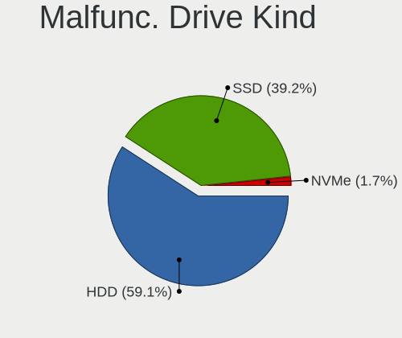
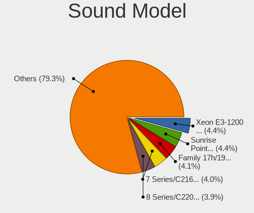
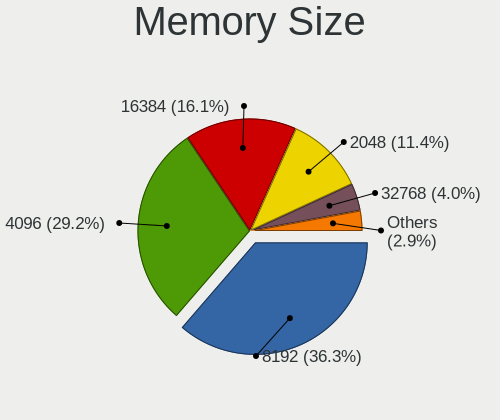
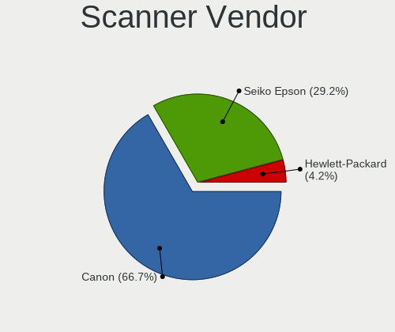

BSD - Tested Hardware & Statistics
----------------------------------

A project to collect tested hardware configurations for BSD.

Anyone can contribute to this report by the [hw-probe](https://github.com/linuxhw/hw-probe/blob/master/INSTALL.BSD.md) tool:

    hw-probe -all -upload

Please contribute! Especially if your hardware is rare.

This is a report for all computer types. See also reports for [desktops](/Desktop/README.md) and [notebooks](/Notebook/README.md).

OS-specific reports: [FreeBSD](/Dist/FreeBSD), [GhostBSD](/Dist/GhostBSD), [helloSystem](/Dist/helloSystem), [NetBSD](/Dist/NetBSD), [NomadBSD](/Dist/NomadBSD), [OpenBSD](/Dist/OpenBSD), [OPNsense](/Dist/OPNsense), [pfSense](/Dist/pfSense), [TrueNAS](/Dist/TrueNAS).

This report is for real hardware. Report for virtual hardware: [TestDays_VE](https://github.com/bsdhw/TestDays_VE)

Contents
--------

* [ Test Cases ](#test-cases)

* [ System ](#system)
  - [ OS                       ](#os)
  - [ OS Family                ](#os-family)
  - [ Arch                     ](#arch)
  - [ DE                       ](#de)
  - [ Display Server           ](#display-server)
  - [ Display Manager          ](#display-manager)
  - [ OS Lang                  ](#os-lang)
  - [ Boot Mode                ](#boot-mode)
  - [ Filesystem               ](#filesystem)
  - [ Part. scheme             ](#part-scheme)

* [ Board ](#board)
  - [ Vendor                   ](#vendor)
  - [ Model                    ](#model)
  - [ Model Family             ](#model-family)
  - [ MFG Year                 ](#mfg-year)
  - [ Form Factor              ](#form-factor)
  - [ Coreboot                 ](#coreboot)
  - [ RAM Size                 ](#ram-size)
  - [ RAM Used                 ](#ram-used)
  - [ Total Drives             ](#total-drives)
  - [ Has CD-ROM               ](#has-cd-rom)
  - [ Has Ethernet             ](#has-ethernet)
  - [ Has WiFi                 ](#has-wifi)
  - [ Has Bluetooth            ](#has-bluetooth)

* [ Location ](#location)
  - [ Country                  ](#country)
  - [ City                     ](#city)

* [ Drives ](#drives)
  - [ Drive Vendor             ](#drive-vendor)
  - [ Drive Model              ](#drive-model)
  - [ HDD Vendor               ](#hdd-vendor)
  - [ SSD Vendor               ](#ssd-vendor)
  - [ Drive Kind               ](#drive-kind)
  - [ Drive Connector          ](#drive-connector)
  - [ Drive Size               ](#drive-size)
  - [ Space Total              ](#space-total)
  - [ Space Used               ](#space-used)
  - [ Malfunc. Drives          ](#malfunc-drives)
  - [ Malfunc. Drive Vendor    ](#malfunc-drive-vendor)
  - [ Malfunc. HDD Vendor      ](#malfunc-hdd-vendor)
  - [ Malfunc. Drive Kind      ](#malfunc-drive-kind)
  - [ Failed Drives            ](#failed-drives)
  - [ Failed Drive Vendor      ](#failed-drive-vendor)
  - [ Drive Status             ](#drive-status)

* [ Storage controller ](#storage-controller)
  - [ Storage Vendor           ](#storage-vendor)
  - [ Storage Model            ](#storage-model)
  - [ Storage Kind             ](#storage-kind)

* [ Processor ](#processor)
  - [ CPU Vendor               ](#cpu-vendor)
  - [ CPU Model                ](#cpu-model)
  - [ CPU Model Family         ](#cpu-model-family)
  - [ CPU Cores                ](#cpu-cores)
  - [ CPU Sockets              ](#cpu-sockets)
  - [ CPU Threads              ](#cpu-threads)
  - [ CPU Microarch            ](#cpu-microarch)

* [ Graphics ](#graphics)
  - [ GPU Vendor               ](#gpu-vendor)
  - [ GPU Model                ](#gpu-model)
  - [ GPU Combo                ](#gpu-combo)
  - [ GPU Driver               ](#gpu-driver)
  - [ GPU Memory               ](#gpu-memory)

* [ Monitor ](#monitor)
  - [ Monitor Vendor           ](#monitor-vendor)
  - [ Monitor Model            ](#monitor-model)
  - [ Monitor Resolution       ](#monitor-resolution)
  - [ Monitor Diagonal         ](#monitor-diagonal)
  - [ Monitor Width            ](#monitor-width)
  - [ Aspect Ratio             ](#aspect-ratio)
  - [ Monitor Area             ](#monitor-area)
  - [ Pixel Density            ](#pixel-density)
  - [ Multiple Monitors        ](#multiple-monitors)

* [ Network ](#network)
  - [ Net Controller Vendor    ](#net-controller-vendor)
  - [ Net Controller Model     ](#net-controller-model)
  - [ Wireless Vendor          ](#wireless-vendor)
  - [ Wireless Model           ](#wireless-model)
  - [ Ethernet Vendor          ](#ethernet-vendor)
  - [ Ethernet Model           ](#ethernet-model)
  - [ Net Controller Kind      ](#net-controller-kind)
  - [ Used Controller          ](#used-controller)
  - [ NICs                     ](#nics)
  - [ IPv6                     ](#ipv6)

* [ Bluetooth ](#bluetooth)
  - [ Bluetooth Vendor         ](#bluetooth-vendor)
  - [ Bluetooth Model          ](#bluetooth-model)

* [ Sound ](#sound)
  - [ Sound Vendor             ](#sound-vendor)
  - [ Sound Model              ](#sound-model)

* [ Memory ](#memory)
  - [ Memory Vendor            ](#memory-vendor)
  - [ Memory Model             ](#memory-model)
  - [ Memory Kind              ](#memory-kind)
  - [ Memory Form Factor       ](#memory-form-factor)
  - [ Memory Size              ](#memory-size)
  - [ Memory Speed             ](#memory-speed)

* [ Printers & scanners ](#printers--scanners)
  - [ Printer Vendor           ](#printer-vendor)
  - [ Printer Model            ](#printer-model)
  - [ Scanner Vendor           ](#scanner-vendor)
  - [ Scanner Model            ](#scanner-model)

* [ Camera ](#camera)
  - [ Camera Vendor            ](#camera-vendor)
  - [ Camera Model             ](#camera-model)

* [ Security ](#security)
  - [ Fingerprint Vendor       ](#fingerprint-vendor)
  - [ Fingerprint Model        ](#fingerprint-model)
  - [ Chipcard Vendor          ](#chipcard-vendor)
  - [ Chipcard Model           ](#chipcard-model)

* [ Unsupported ](#unsupported)
  - [ Unsupported Devices      ](#unsupported-devices)
  - [ Unsupported Device Types ](#unsupported-device-types)

Test Cases
----------

Total: 17811

| Vendor        | Model                       | Form-Factor | Probe                                                     | Date         |
|---------------|-----------------------------|-------------|-----------------------------------------------------------|--------------|
| Protectli     | VP2410 10                   | Desktop     | [b4869eafb2](https://bsd-hardware.info/?probe=b4869eafb2) | Aug 12, 2023 |
| Lenovo        | ThinkPad X200 7458WNZ       | Notebook    | [3ac1d60240](https://bsd-hardware.info/?probe=3ac1d60240) | Aug 12, 2023 |
| Intel         | NUC8i7HVB J68196-602        | Mini pc     | [f0015faf42](https://bsd-hardware.info/?probe=f0015faf42) | Aug 12, 2023 |
| MSI           | Modern 14 B11SBL            | Notebook    | [1e02b41824](https://bsd-hardware.info/?probe=1e02b41824) | Aug 12, 2023 |
| CWWK          | MINIPC-G4                   | Desktop     | [fe5b20a178](https://bsd-hardware.info/?probe=fe5b20a178) | Aug 12, 2023 |
| Unknown       | Unknown                     | Desktop     | [81c0628f53](https://bsd-hardware.info/?probe=81c0628f53) | Aug 12, 2023 |
| Protectli     | FW6 Ver                     | Desktop     | [edc2f0f879](https://bsd-hardware.info/?probe=edc2f0f879) | Aug 12, 2023 |
| ASRockRack    | EPC621D8A                   | Server      | [aa4c98ea7d](https://bsd-hardware.info/?probe=aa4c98ea7d) | Aug 12, 2023 |
| Protectli     | FW4C Ver                    | Desktop     | [519987ec57](https://bsd-hardware.info/?probe=519987ec57) | Aug 12, 2023 |
| MW            | GMLK-2_5G4L                 | Desktop     | [2ee5b48d5c](https://bsd-hardware.info/?probe=2ee5b48d5c) | Aug 12, 2023 |
| Unknown       | Unknown                     | Desktop     | [ae3290dce1](https://bsd-hardware.info/?probe=ae3290dce1) | Aug 11, 2023 |
| HP            | 18E5                        | Desktop     | [61bde93177](https://bsd-hardware.info/?probe=61bde93177) | Aug 11, 2023 |
| HP            | ProLiant DL360 Gen9         | Server      | [63c10b6ae5](https://bsd-hardware.info/?probe=63c10b6ae5) | Aug 11, 2023 |
| Unknown       | Unknown                     | Desktop     | [d8ed693594](https://bsd-hardware.info/?probe=d8ed693594) | Aug 11, 2023 |
| Lenovo        | ThinkPad T60 1951CZ1        | Notebook    | [46766bc381](https://bsd-hardware.info/?probe=46766bc381) | Aug 11, 2023 |
| Unknown       | Unknown                     | Desktop     | [e310e0d309](https://bsd-hardware.info/?probe=e310e0d309) | Aug 11, 2023 |
| ASUSTek       | N751JK                      | Notebook    | [46a6b88b33](https://bsd-hardware.info/?probe=46a6b88b33) | Aug 11, 2023 |
| HP            | 8054                        | Desktop     | [05cae0efcc](https://bsd-hardware.info/?probe=05cae0efcc) | Aug 11, 2023 |
| CncTion       | N5105-4L B0                 | Desktop     | [27f84c75b5](https://bsd-hardware.info/?probe=27f84c75b5) | Aug 11, 2023 |
| Unknown       | Unknown                     | Desktop     | [faece39b99](https://bsd-hardware.info/?probe=faece39b99) | Aug 11, 2023 |
| ASUSTek       | 1001P                       | Notebook    | [ac53dba211](https://bsd-hardware.info/?probe=ac53dba211) | Aug 11, 2023 |
| Dell          | 01Y1CJ A00                  | Mini pc     | [df433ac9a8](https://bsd-hardware.info/?probe=df433ac9a8) | Aug 11, 2023 |
| HP            | 8055                        | Desktop     | [d686196496](https://bsd-hardware.info/?probe=d686196496) | Aug 11, 2023 |
| HP            | 1495                        | Desktop     | [7591160534](https://bsd-hardware.info/?probe=7591160534) | Aug 11, 2023 |
| Shuttle       | FH270                       | Desktop     | [8b697be8be](https://bsd-hardware.info/?probe=8b697be8be) | Aug 11, 2023 |
| MSI           | B560M-A PRO                 | Desktop     | [5d17cbf1da](https://bsd-hardware.info/?probe=5d17cbf1da) | Aug 11, 2023 |
| PC Engines    | APU2                        | Desktop     | [2e9106fc92](https://bsd-hardware.info/?probe=2e9106fc92) | Aug 11, 2023 |
| Gigabyte      | AX370M-DS3H-CF              | Desktop     | [7b00ddd0a1](https://bsd-hardware.info/?probe=7b00ddd0a1) | Aug 11, 2023 |
| PC Engines    | apu1                        | Desktop     | [0b3594d9a3](https://bsd-hardware.info/?probe=0b3594d9a3) | Aug 11, 2023 |
| Lenovo        | ThinkPad X220 4286CTO       | Notebook    | [2db86b4dff](https://bsd-hardware.info/?probe=2db86b4dff) | Aug 11, 2023 |
| ASUSTek       | 1001P                       | Notebook    | [2424d8acdc](https://bsd-hardware.info/?probe=2424d8acdc) | Aug 11, 2023 |
| PC Engines    | apu6                        | Desktop     | [65fda0fe1f](https://bsd-hardware.info/?probe=65fda0fe1f) | Aug 11, 2023 |
| Gigabyte      | G31M-ES2C                   | Desktop     | [6930fe4498](https://bsd-hardware.info/?probe=6930fe4498) | Aug 11, 2023 |
| Dell          | 0NC2VH A01                  | Desktop     | [0fd996a147](https://bsd-hardware.info/?probe=0fd996a147) | Aug 10, 2023 |
| MSI           | B560M-A PRO                 | Desktop     | [fc889ffd79](https://bsd-hardware.info/?probe=fc889ffd79) | Aug 10, 2023 |
| Unknown       | Unknown                     | Desktop     | [fdd28fbae2](https://bsd-hardware.info/?probe=fdd28fbae2) | Aug 10, 2023 |
| HP            | 83EE                        | Desktop     | [9ddbba5a62](https://bsd-hardware.info/?probe=9ddbba5a62) | Aug 10, 2023 |
| Techvision    | TVI7309X B0                 | Desktop     | [c20e0c5c41](https://bsd-hardware.info/?probe=c20e0c5c41) | Aug 10, 2023 |
| Intel         | JSL MRD                     | Desktop     | [ca7024f423](https://bsd-hardware.info/?probe=ca7024f423) | Aug 10, 2023 |
| Intel         | Q3XXG4-P V1.0               | Desktop     | [f0398bfb85](https://bsd-hardware.info/?probe=f0398bfb85) | Aug 10, 2023 |
| PC Engines    | apu4                        | Desktop     | [b81f51408d](https://bsd-hardware.info/?probe=b81f51408d) | Aug 10, 2023 |
| Protectli     | FW4B Ver                    | Desktop     | [064ee65b5c](https://bsd-hardware.info/?probe=064ee65b5c) | Aug 10, 2023 |
| Techvision    | TVI7309X B0                 | Desktop     | [bc83b25172](https://bsd-hardware.info/?probe=bc83b25172) | Aug 10, 2023 |
| HP            | ProLiant DL380 G7           | Server      | [5b327a0a32](https://bsd-hardware.info/?probe=5b327a0a32) | Aug 10, 2023 |
| Sophos        | SG                          | Firewall    | [ee7cfb0c22](https://bsd-hardware.info/?probe=ee7cfb0c22) | Aug 10, 2023 |
| MSI           | B360M BAZOOKA               | Desktop     | [4b0b4b88a7](https://bsd-hardware.info/?probe=4b0b4b88a7) | Aug 10, 2023 |
| HP            | ProLiant DL380p Gen8        | Server      | [6a511bf7ca](https://bsd-hardware.info/?probe=6a511bf7ca) | Aug 10, 2023 |
| Lenovo        | SHARKBAY 0B98401 WIN        | Desktop     | [a22e406f7c](https://bsd-hardware.info/?probe=a22e406f7c) | Aug 10, 2023 |
| Gigabyte      | X570 UD                     | Desktop     | [d4b7006d24](https://bsd-hardware.info/?probe=d4b7006d24) | Aug 10, 2023 |
| ATOPNUC       | MA90                        | Mini pc     | [4f4c550075](https://bsd-hardware.info/?probe=4f4c550075) | Aug 10, 2023 |
| Unknown       | Unknown                     | Desktop     | [7751768206](https://bsd-hardware.info/?probe=7751768206) | Aug 10, 2023 |
| Supermicro    | X12SDV-4C-SP6F              | Desktop     | [6a275811b8](https://bsd-hardware.info/?probe=6a275811b8) | Aug 10, 2023 |
| Supermicro    | A1SRi 123456789             | Mini pc     | [a66d0c2283](https://bsd-hardware.info/?probe=a66d0c2283) | Aug 10, 2023 |
| Acer          | Aspire V3-371               | Notebook    | [21c262aadb](https://bsd-hardware.info/?probe=21c262aadb) | Aug 09, 2023 |
| Acer          | Aspire V3-371               | Notebook    | [68bceee682](https://bsd-hardware.info/?probe=68bceee682) | Aug 09, 2023 |
| Sophos        | SG                          | Firewall    | [5d3b81800b](https://bsd-hardware.info/?probe=5d3b81800b) | Aug 09, 2023 |
| Sophos        | SG                          | Firewall    | [bcb2c49854](https://bsd-hardware.info/?probe=bcb2c49854) | Aug 09, 2023 |
| MSI           | PRESTIGE X570 CREATION      | Desktop     | [65092dde79](https://bsd-hardware.info/?probe=65092dde79) | Aug 09, 2023 |
| Techvision    | TVI7309X B0                 | Desktop     | [877307aa80](https://bsd-hardware.info/?probe=877307aa80) | Aug 09, 2023 |
| Notebook      | N7x0WU                      | Notebook    | [418b98798e](https://bsd-hardware.info/?probe=418b98798e) | Aug 09, 2023 |
| Sophos        | UTM                         | Firewall    | [e7e8344a31](https://bsd-hardware.info/?probe=e7e8344a31) | Aug 09, 2023 |
| Notebook      | N7x0WU                      | Notebook    | [60d49b408a](https://bsd-hardware.info/?probe=60d49b408a) | Aug 09, 2023 |
| IceWhale T... | ZimaBoard 832 ZMB           | Desktop     | [22edaf5c7d](https://bsd-hardware.info/?probe=22edaf5c7d) | Aug 09, 2023 |
| IceWhale T... | ZimaBoard 832 ZMB           | Desktop     | [48efdb6680](https://bsd-hardware.info/?probe=48efdb6680) | Aug 09, 2023 |
| PC Engines    | APU2                        | Desktop     | [be0e8bf959](https://bsd-hardware.info/?probe=be0e8bf959) | Aug 09, 2023 |
| Dell          | 04Y8V0 A02                  | Desktop     | [c693116826](https://bsd-hardware.info/?probe=c693116826) | Aug 09, 2023 |
| Dell          | 0CNWVK A00                  | Desktop     | [fdb03dc15f](https://bsd-hardware.info/?probe=fdb03dc15f) | Aug 09, 2023 |
| Lenovo        | SHARKBAY 0B98401 WIN        | Desktop     | [0c9251a971](https://bsd-hardware.info/?probe=0c9251a971) | Aug 09, 2023 |
| ASRock        | IMB-195                     | Desktop     | [7b5a73b87e](https://bsd-hardware.info/?probe=7b5a73b87e) | Aug 09, 2023 |
| ASUSTek       | M5A78L-M LE/USB3            | Desktop     | [4fc1fbaba1](https://bsd-hardware.info/?probe=4fc1fbaba1) | Aug 09, 2023 |
| Intel         | NUC5PPYB H76558-102         | Mini pc     | [ab14c7b62e](https://bsd-hardware.info/?probe=ab14c7b62e) | Aug 09, 2023 |
| Apple         | MacBookAir4,2               | Notebook    | [b1c97a3a9d](https://bsd-hardware.info/?probe=b1c97a3a9d) | Aug 09, 2023 |
| Unknown       | Unknown                     | Desktop     | [5398864ed6](https://bsd-hardware.info/?probe=5398864ed6) | Aug 09, 2023 |
| Supermicro    | M11SDV-8C-LN4F              | Server      | [4ad27059c2](https://bsd-hardware.info/?probe=4ad27059c2) | Aug 08, 2023 |
| MSI           | MPG X570 GAMING EDGE WIF... | Desktop     | [2f6574d368](https://bsd-hardware.info/?probe=2f6574d368) | Aug 08, 2023 |
| Premio        | BlueCat XMB3 00C            | Desktop     | [76abf23a1f](https://bsd-hardware.info/?probe=76abf23a1f) | Aug 08, 2023 |
| Fujitsu       | D3313-E1 S26361-D3313-E1    | Desktop     | [fac2fa5cbe](https://bsd-hardware.info/?probe=fac2fa5cbe) | Aug 08, 2023 |
| MSI           | Modern 14 B11SBL            | Notebook    | [ba3ab230dc](https://bsd-hardware.info/?probe=ba3ab230dc) | Aug 08, 2023 |
| Supermicro    | X10SLL-F                    | Server      | [8720a76ea8](https://bsd-hardware.info/?probe=8720a76ea8) | Aug 08, 2023 |
| Dell          | 08NPPY A00                  | Desktop     | [c0884d7f16](https://bsd-hardware.info/?probe=c0884d7f16) | Aug 08, 2023 |
| Fujitsu       | D3049-A1 S26361-D3049-A1... | Server      | [322b24ffa1](https://bsd-hardware.info/?probe=322b24ffa1) | Aug 08, 2023 |
| Supermicro    | X10SDV-4C-TLN2F             | Server      | [211a64ef6e](https://bsd-hardware.info/?probe=211a64ef6e) | Aug 08, 2023 |
| MSI           | MS-7623                     | Desktop     | [189fb4d7cc](https://bsd-hardware.info/?probe=189fb4d7cc) | Aug 08, 2023 |
| HP            | 158A                        | Desktop     | [cc13e81512](https://bsd-hardware.info/?probe=cc13e81512) | Aug 08, 2023 |
| Dell          | 00NH4P A07                  | Server      | [be1b164954](https://bsd-hardware.info/?probe=be1b164954) | Aug 08, 2023 |
| ASUSTek       | K30AD_M31AD_M51AD_M32AD     | Desktop     | [c54bdb8e4b](https://bsd-hardware.info/?probe=c54bdb8e4b) | Aug 08, 2023 |
| Acer          | Veriton N2620G              | Desktop     | [2acf1e4557](https://bsd-hardware.info/?probe=2acf1e4557) | Aug 08, 2023 |
| Intel         | DENLOW_WS                   | Desktop     | [73a37d9424](https://bsd-hardware.info/?probe=73a37d9424) | Aug 08, 2023 |
| ASUSTek       | PRIME Z590M-PLUS            | Desktop     | [87810aceef](https://bsd-hardware.info/?probe=87810aceef) | Aug 08, 2023 |
| Lenovo        | ThinkPad X1 Carbon 2nd 2... | Notebook    | [9693a5fc69](https://bsd-hardware.info/?probe=9693a5fc69) | Aug 08, 2023 |
| ASUSTek       | P10S-I Series               | Desktop     | [e8e8c9fed2](https://bsd-hardware.info/?probe=e8e8c9fed2) | Aug 07, 2023 |
| Techvision    | TVI7309X B0                 | Desktop     | [fd4046c4d9](https://bsd-hardware.info/?probe=fd4046c4d9) | Aug 07, 2023 |
| PC Engines    | apu4                        | Desktop     | [bb7ad49154](https://bsd-hardware.info/?probe=bb7ad49154) | Aug 07, 2023 |
| Hardkernel    | ODROID-H2                   | Desktop     | [a92e1efca1](https://bsd-hardware.info/?probe=a92e1efca1) | Aug 07, 2023 |
| Unknown       | Unknown                     | Desktop     | [28f0d503fd](https://bsd-hardware.info/?probe=28f0d503fd) | Aug 07, 2023 |
| Unknown       | Unknown                     | Desktop     | [6238337b24](https://bsd-hardware.info/?probe=6238337b24) | Aug 07, 2023 |
| Intel         | Q3XXG4-P V1.0               | Desktop     | [d880905ae7](https://bsd-hardware.info/?probe=d880905ae7) | Aug 07, 2023 |
| AMI           | Aptio CRB                   | Mini pc     | [891072999f](https://bsd-hardware.info/?probe=891072999f) | Aug 07, 2023 |
| Intel         | SHARKBAY                    | Desktop     | [2a8896bb78](https://bsd-hardware.info/?probe=2a8896bb78) | Aug 07, 2023 |
| HP            | 83EE                        | Desktop     | [c33d7d8cb3](https://bsd-hardware.info/?probe=c33d7d8cb3) | Aug 07, 2023 |
| HP            | 82C0                        | Mini pc     | [6ad9c871cb](https://bsd-hardware.info/?probe=6ad9c871cb) | Aug 07, 2023 |
| Intel         | Q3XXG4-P V1.0               | Desktop     | [5b58edb60b](https://bsd-hardware.info/?probe=5b58edb60b) | Aug 07, 2023 |
| Techvision    | TVI7309X B0                 | Desktop     | [aeccb6e70c](https://bsd-hardware.info/?probe=aeccb6e70c) | Aug 07, 2023 |
| HP            | 82C0                        | Mini pc     | [124e7b14df](https://bsd-hardware.info/?probe=124e7b14df) | Aug 07, 2023 |
| HPE           | ProLiant MicroServer Gen... | Desktop     | [d06166298c](https://bsd-hardware.info/?probe=d06166298c) | Aug 07, 2023 |
| Unknown       | Unknown                     | Desktop     | [16e7763338](https://bsd-hardware.info/?probe=16e7763338) | Aug 07, 2023 |
| Apple         | MacBookAir4,2               | Notebook    | [4fdd124b61](https://bsd-hardware.info/?probe=4fdd124b61) | Aug 07, 2023 |
| Supermicro    | X9SCL/X9SCMA                | Desktop     | [19e34e504c](https://bsd-hardware.info/?probe=19e34e504c) | Aug 07, 2023 |
| Unknown       | Unknown                     | Desktop     | [75e009424e](https://bsd-hardware.info/?probe=75e009424e) | Aug 07, 2023 |
| PC Engines    | apu4                        | Desktop     | [57e0cc469e](https://bsd-hardware.info/?probe=57e0cc469e) | Aug 07, 2023 |
| Intel         | H81                         | Desktop     | [80f40918ce](https://bsd-hardware.info/?probe=80f40918ce) | Aug 07, 2023 |
| Protectli     | FW6 Ver                     | Desktop     | [c05ddd6998](https://bsd-hardware.info/?probe=c05ddd6998) | Aug 07, 2023 |
| Protectli     | FW6 Ver                     | Desktop     | [4836027efd](https://bsd-hardware.info/?probe=4836027efd) | Aug 07, 2023 |
| Lenovo        | SHARKBAY 0B98401 WIN        | Desktop     | [ec37cc1ba1](https://bsd-hardware.info/?probe=ec37cc1ba1) | Aug 07, 2023 |
| Dell          | 01G5C3 A02                  | Server      | [da26fc11fd](https://bsd-hardware.info/?probe=da26fc11fd) | Aug 07, 2023 |
| Lenovo        | ThinkPad X1 Carbon 2nd 2... | Notebook    | [9c01814bdc](https://bsd-hardware.info/?probe=9c01814bdc) | Aug 07, 2023 |
| AMI           | PB_1900A                    | Desktop     | [791f6e0cb4](https://bsd-hardware.info/?probe=791f6e0cb4) | Aug 07, 2023 |
| Lenovo        | 30FD SDK0J40705 WIN 3425... | Mini pc     | [6a45c89f9c](https://bsd-hardware.info/?probe=6a45c89f9c) | Aug 06, 2023 |
| Lenovo        | 312D SDK0J40697 WIN 3305... | Mini pc     | [21c932d1ca](https://bsd-hardware.info/?probe=21c932d1ca) | Aug 06, 2023 |
| ZOTAC         | Unknown                     | Desktop     | [415f49b491](https://bsd-hardware.info/?probe=415f49b491) | Aug 06, 2023 |
| MSI           | Modern 14 B11SBL            | Notebook    | [48483213f9](https://bsd-hardware.info/?probe=48483213f9) | Aug 06, 2023 |
| Fujitsu       | D3313-G1 S26361-D3313-G1    | Desktop     | [d2ba7bbf34](https://bsd-hardware.info/?probe=d2ba7bbf34) | Aug 06, 2023 |
| Dell          | 0KWVT8 A03                  | Desktop     | [d203b32a8f](https://bsd-hardware.info/?probe=d203b32a8f) | Aug 06, 2023 |
| Supermicro    | X12SDV-4C-SP6F              | Desktop     | [5a87146725](https://bsd-hardware.info/?probe=5a87146725) | Aug 06, 2023 |
| Supermicro    | X10DRI-TB                   | Server      | [d4e7a4dde7](https://bsd-hardware.info/?probe=d4e7a4dde7) | Aug 06, 2023 |
| Acer          | Aspire XC-115               | Desktop     | [7a94fde347](https://bsd-hardware.info/?probe=7a94fde347) | Aug 06, 2023 |
| Lenovo        | 313C SDK0J40697 WIN 3305... | Desktop     | [f65647a6be](https://bsd-hardware.info/?probe=f65647a6be) | Aug 06, 2023 |
| Lenovo        | 3743 SDK0T76461 WIN 3422... | Desktop     | [d5675b5940](https://bsd-hardware.info/?probe=d5675b5940) | Aug 06, 2023 |
| HP            | 0AACh                       | Desktop     | [5997b1de3e](https://bsd-hardware.info/?probe=5997b1de3e) | Aug 06, 2023 |
| ASUSTek       | PRIME B450-PLUS             | Desktop     | [d3fac2e3fe](https://bsd-hardware.info/?probe=d3fac2e3fe) | Aug 06, 2023 |
| YANYU         | R250                        | Desktop     | [95a37ee143](https://bsd-hardware.info/?probe=95a37ee143) | Aug 06, 2023 |
| Supermicro    | X11SDV-8C-TP8F              | Desktop     | [0b5f437319](https://bsd-hardware.info/?probe=0b5f437319) | Aug 06, 2023 |
| MSI           | H81M-P33                    | Desktop     | [1f7493ada9](https://bsd-hardware.info/?probe=1f7493ada9) | Aug 06, 2023 |
| ASUSTek       | P5Q-E                       | Desktop     | [46b9ec2e56](https://bsd-hardware.info/?probe=46b9ec2e56) | Aug 06, 2023 |
| ASUSTek       | ROG CROSSHAIR VIII HERO     | Desktop     | [5bd8b552e6](https://bsd-hardware.info/?probe=5bd8b552e6) | Aug 06, 2023 |
| Sophos        | XG                          | Firewall    | [a452891edc](https://bsd-hardware.info/?probe=a452891edc) | Aug 06, 2023 |
| ASUSTek       | M4A88TD-M/USB3              | Desktop     | [ce95634a53](https://bsd-hardware.info/?probe=ce95634a53) | Aug 06, 2023 |
| Lanner        | FW-7543 B-GA                | Desktop     | [dadf592128](https://bsd-hardware.info/?probe=dadf592128) | Aug 06, 2023 |
| Dell          | 0KP561                      | Desktop     | [bff2760640](https://bsd-hardware.info/?probe=bff2760640) | Aug 06, 2023 |
| Fujitsu       | D3313-G1 S26361-D3313-G1    | Desktop     | [eceed9eb7a](https://bsd-hardware.info/?probe=eceed9eb7a) | Aug 05, 2023 |
| Acer          | Aspire TC-330               | Desktop     | [4d3de96309](https://bsd-hardware.info/?probe=4d3de96309) | Aug 05, 2023 |
| ZOTAC         | ZBOX-CI622/CI642/CI662NA... | Mini pc     | [68c43f27b1](https://bsd-hardware.info/?probe=68c43f27b1) | Aug 05, 2023 |
| Lenovo        | SDK0E50510 WIN              | Desktop     | [eee3c082b5](https://bsd-hardware.info/?probe=eee3c082b5) | Aug 05, 2023 |
| Dell          | 0782GW A00                  | Desktop     | [5288857ae9](https://bsd-hardware.info/?probe=5288857ae9) | Aug 05, 2023 |
| Hardkernel    | ODROID-H3                   | Desktop     | [3874b96551](https://bsd-hardware.info/?probe=3874b96551) | Aug 05, 2023 |
| Techvision    | TVI7309X B0                 | Desktop     | [86d5e86520](https://bsd-hardware.info/?probe=86d5e86520) | Aug 05, 2023 |
| Dell          | Inspiron 14-3467            | Notebook    | [5db7e9b7a1](https://bsd-hardware.info/?probe=5db7e9b7a1) | Aug 05, 2023 |
| HP            | 843F                        | Desktop     | [d192efba82](https://bsd-hardware.info/?probe=d192efba82) | Aug 05, 2023 |
| Unknown       | Unknown                     | Desktop     | [9c4dbcfd67](https://bsd-hardware.info/?probe=9c4dbcfd67) | Aug 05, 2023 |
| Lanner        | FW-7543 B-GA                | Desktop     | [6236e692de](https://bsd-hardware.info/?probe=6236e692de) | Aug 05, 2023 |
| Dell          | 07WP95 A02                  | Desktop     | [4213eff742](https://bsd-hardware.info/?probe=4213eff742) | Aug 05, 2023 |
| Fujitsu       | D3313-G1 S26361-D3313-G1    | Desktop     | [283fce4c68](https://bsd-hardware.info/?probe=283fce4c68) | Aug 05, 2023 |
| Unknown       | Unknown                     | Desktop     | [0f6e0d9566](https://bsd-hardware.info/?probe=0f6e0d9566) | Aug 05, 2023 |
| Protectli     | FW4B Ver                    | Desktop     | [8446d61b81](https://bsd-hardware.info/?probe=8446d61b81) | Aug 04, 2023 |
| Intel         | SKYBAY                      | Desktop     | [fde75b4094](https://bsd-hardware.info/?probe=fde75b4094) | Aug 04, 2023 |
| HPE           | ProLiant DL20 Gen10 Plus    | Server      | [7817db3082](https://bsd-hardware.info/?probe=7817db3082) | Aug 04, 2023 |
| CWWK          | MINIPC-G12                  | Desktop     | [c449203453](https://bsd-hardware.info/?probe=c449203453) | Aug 04, 2023 |
| Compaq        | Presario CQ-17              | Notebook    | [f97feb2db0](https://bsd-hardware.info/?probe=f97feb2db0) | Aug 04, 2023 |
| ASUSTek       | P5QL PRO                    | Desktop     | [dccefef8eb](https://bsd-hardware.info/?probe=dccefef8eb) | Aug 04, 2023 |
| AMI           | Aptio CRB                   | Mini pc     | [ea7a6fba73](https://bsd-hardware.info/?probe=ea7a6fba73) | Aug 04, 2023 |
| Dell          | 0NC2VH A01                  | Desktop     | [36d63888b2](https://bsd-hardware.info/?probe=36d63888b2) | Aug 04, 2023 |
| Dell          | 0NC2VH A01                  | Desktop     | [bee8eb05f2](https://bsd-hardware.info/?probe=bee8eb05f2) | Aug 04, 2023 |
| HP            | ProLiant DL380 G7           | Server      | [5ae4888d17](https://bsd-hardware.info/?probe=5ae4888d17) | Aug 04, 2023 |
| Unknown       | YL-SKUL6                    | Desktop     | [cdd90dd470](https://bsd-hardware.info/?probe=cdd90dd470) | Aug 04, 2023 |
| Lenovo        | SHARKBAY NO DPK             | Desktop     | [62ed2f59f6](https://bsd-hardware.info/?probe=62ed2f59f6) | Aug 04, 2023 |
| Lenovo        | SHARKBAY SDK0E50510 WIN     | Desktop     | [2de0d4d2fa](https://bsd-hardware.info/?probe=2de0d4d2fa) | Aug 04, 2023 |
| ASUSTek       | ROG Strix G513QC_G513QC     | Notebook    | [b90e62e27d](https://bsd-hardware.info/?probe=b90e62e27d) | Aug 04, 2023 |
| Intel         | S2600GZ G29051-355          | Server      | [33697196aa](https://bsd-hardware.info/?probe=33697196aa) | Aug 04, 2023 |
| CompuLab      | fitlet2                     | Mini pc     | [1c593bf547](https://bsd-hardware.info/?probe=1c593bf547) | Aug 04, 2023 |
| HP            | 83F3                        | Desktop     | [6130788afe](https://bsd-hardware.info/?probe=6130788afe) | Aug 04, 2023 |
| Apple         | MacBookPro11,1              | Notebook    | [4a2c98005b](https://bsd-hardware.info/?probe=4a2c98005b) | Aug 04, 2023 |
| Supermicro    | A2SDi-4C-HLN4F              | Server      | [b6aafbefd3](https://bsd-hardware.info/?probe=b6aafbefd3) | Aug 04, 2023 |
| Protectli     | VP4650                      | Desktop     | [94d2d08a9d](https://bsd-hardware.info/?probe=94d2d08a9d) | Aug 04, 2023 |
| ASRock        | 4X4-4000 Series             | Desktop     | [da7d5e31aa](https://bsd-hardware.info/?probe=da7d5e31aa) | Aug 03, 2023 |
| Dell          | 0T7D40 A00                  | Desktop     | [e903094a75](https://bsd-hardware.info/?probe=e903094a75) | Aug 03, 2023 |
| Supermicro    | X10SLL-F                    | Server      | [cbc7fc88d0](https://bsd-hardware.info/?probe=cbc7fc88d0) | Aug 03, 2023 |
| PC Engines    | APU2                        | Desktop     | [78c8ed6a89](https://bsd-hardware.info/?probe=78c8ed6a89) | Aug 03, 2023 |
| Gigabyte      | X570 UD                     | Desktop     | [2bef587ef1](https://bsd-hardware.info/?probe=2bef587ef1) | Aug 03, 2023 |
| Dell          | 0G7MDY A12                  | Server      | [3caa904aa3](https://bsd-hardware.info/?probe=3caa904aa3) | Aug 03, 2023 |
| Dell          | 0G7MDY A12                  | Server      | [4dfb2ccae6](https://bsd-hardware.info/?probe=4dfb2ccae6) | Aug 03, 2023 |
| Unknown       | Unknown                     | Desktop     | [803f6b50b3](https://bsd-hardware.info/?probe=803f6b50b3) | Aug 03, 2023 |
| Unknown       | Unknown                     | Desktop     | [91dd6813a1](https://bsd-hardware.info/?probe=91dd6813a1) | Aug 03, 2023 |
| Intel         | NUC5PPYB H76558-102         | Mini pc     | [5cab750b7b](https://bsd-hardware.info/?probe=5cab750b7b) | Aug 03, 2023 |
| HP            | 82C0                        | Mini pc     | [be2c1dd2f5](https://bsd-hardware.info/?probe=be2c1dd2f5) | Aug 03, 2023 |
| Dell          | 045M96 A02                  | Server      | [17cf8cd2f0](https://bsd-hardware.info/?probe=17cf8cd2f0) | Aug 03, 2023 |
| HP            | 82C0                        | Mini pc     | [6fa14d3439](https://bsd-hardware.info/?probe=6fa14d3439) | Aug 03, 2023 |
| Samsung       | Q210                        | Notebook    | [2e25c6d2ec](https://bsd-hardware.info/?probe=2e25c6d2ec) | Aug 03, 2023 |
| Samsung       | Q210                        | Notebook    | [d3c5ab902d](https://bsd-hardware.info/?probe=d3c5ab902d) | Aug 03, 2023 |
| HP            | EliteBook 840 G5            | Notebook    | [6496fe0cfe](https://bsd-hardware.info/?probe=6496fe0cfe) | Aug 03, 2023 |
| ASRock        | 4X4-4000 Series             | Desktop     | [d896138d30](https://bsd-hardware.info/?probe=d896138d30) | Aug 03, 2023 |
| HP            | 1495                        | Desktop     | [551688d163](https://bsd-hardware.info/?probe=551688d163) | Aug 03, 2023 |
| HP            | 82B4                        | Desktop     | [8c6b861a4d](https://bsd-hardware.info/?probe=8c6b861a4d) | Aug 03, 2023 |
| Intel         | NUC12WSBi3 M36953-303       | Mini pc     | [f809d834df](https://bsd-hardware.info/?probe=f809d834df) | Aug 03, 2023 |
| HP            | 339A                        | Desktop     | [b69db7c6e0](https://bsd-hardware.info/?probe=b69db7c6e0) | Aug 03, 2023 |
| Shuttle       | FH270                       | Desktop     | [92c45a20de](https://bsd-hardware.info/?probe=92c45a20de) | Aug 02, 2023 |
| AMI           | Aptio CRB                   | Mini pc     | [e0a72a6c82](https://bsd-hardware.info/?probe=e0a72a6c82) | Aug 02, 2023 |
| CncTion       | N5105-4L B0                 | Desktop     | [5310b151f0](https://bsd-hardware.info/?probe=5310b151f0) | Aug 02, 2023 |
| Unknown       | Unknown                     | Desktop     | [a9a3896275](https://bsd-hardware.info/?probe=a9a3896275) | Aug 02, 2023 |
| ASUSTek       | PRIME A320M-K               | Desktop     | [fa81dc0cd3](https://bsd-hardware.info/?probe=fa81dc0cd3) | Aug 02, 2023 |
| Dell          | 08NPPY A00                  | Desktop     | [249d4620d2](https://bsd-hardware.info/?probe=249d4620d2) | Aug 02, 2023 |
| Supermicro    | X12STL-IF                   | Server      | [e588cd796e](https://bsd-hardware.info/?probe=e588cd796e) | Aug 02, 2023 |
| ASRock        | B550 PG Velocita            | Desktop     | [3ff5fcfbc0](https://bsd-hardware.info/?probe=3ff5fcfbc0) | Aug 02, 2023 |
| ASUSTek       | PRIME H510M-A WIFI          | Desktop     | [9b09a89cc8](https://bsd-hardware.info/?probe=9b09a89cc8) | Aug 02, 2023 |
| Supermicro    | A2SDi-4C-HLN4F              | Server      | [b3fd8251db](https://bsd-hardware.info/?probe=b3fd8251db) | Aug 02, 2023 |
| Unknown       | Unknown                     | Desktop     | [e9977bfffe](https://bsd-hardware.info/?probe=e9977bfffe) | Aug 02, 2023 |
| ASRock        | B660-ITX                    | Desktop     | [c218c3c4d4](https://bsd-hardware.info/?probe=c218c3c4d4) | Aug 02, 2023 |
| Unknown       | Unknown                     | Desktop     | [b9f6337c0d](https://bsd-hardware.info/?probe=b9f6337c0d) | Aug 02, 2023 |
| Protectli     | VP2410 10                   | Desktop     | [3d653ab54c](https://bsd-hardware.info/?probe=3d653ab54c) | Aug 02, 2023 |
| Dell          | 0DRG19 A00                  | Mini pc     | [3962253bda](https://bsd-hardware.info/?probe=3962253bda) | Aug 02, 2023 |
| Dell          | 0WR7PY A01                  | Desktop     | [54388809cd](https://bsd-hardware.info/?probe=54388809cd) | Aug 02, 2023 |
| ASRock        | B550M Steel Legend          | Desktop     | [ffc50e224c](https://bsd-hardware.info/?probe=ffc50e224c) | Aug 01, 2023 |
| Shuttle       | DH610                       | Desktop     | [bbdd78fe4b](https://bsd-hardware.info/?probe=bbdd78fe4b) | Aug 01, 2023 |
| Unknown       | Unknown                     | Desktop     | [42c65b8b8b](https://bsd-hardware.info/?probe=42c65b8b8b) | Aug 01, 2023 |
| ASRock        | J3355B-ITX                  | Desktop     | [234f0fd8aa](https://bsd-hardware.info/?probe=234f0fd8aa) | Aug 01, 2023 |
| Intel BOX4... | Geminilake                  | Desktop     | [b833ada775](https://bsd-hardware.info/?probe=b833ada775) | Aug 01, 2023 |
| Chuwi         | CoreBook X                  | Notebook    | [2854f97c81](https://bsd-hardware.info/?probe=2854f97c81) | Aug 01, 2023 |
| Unknown       | Unknown                     | Notebook    | [09d17597cf](https://bsd-hardware.info/?probe=09d17597cf) | Aug 01, 2023 |
| Unknown       | 1.1                         | Desktop     | [745c09c8e7](https://bsd-hardware.info/?probe=745c09c8e7) | Aug 01, 2023 |
| HP            | 3031h                       | Desktop     | [19157ba305](https://bsd-hardware.info/?probe=19157ba305) | Aug 01, 2023 |
| Gigabyte      | Z170-HD3 DDR3-CF            | Desktop     | [f66f032ffe](https://bsd-hardware.info/?probe=f66f032ffe) | Aug 01, 2023 |
| MW            | GMLK-2_5G4L                 | Desktop     | [155f885c95](https://bsd-hardware.info/?probe=155f885c95) | Aug 01, 2023 |
| Unknown       | Unknown                     | Notebook    | [2a2e7a98e3](https://bsd-hardware.info/?probe=2a2e7a98e3) | Aug 01, 2023 |
| Deciso        | NetBoard-A10                | Notebook    | [65667b2f29](https://bsd-hardware.info/?probe=65667b2f29) | Aug 01, 2023 |
| Hardkernel    | ODROID-H3                   | Desktop     | [aa708122cf](https://bsd-hardware.info/?probe=aa708122cf) | Aug 01, 2023 |
| Intel         | NUC11TNBi3 M11908-404       | Mini pc     | [54ab213a82](https://bsd-hardware.info/?probe=54ab213a82) | Aug 01, 2023 |
| HP            | 8298                        | Desktop     | [961bfad69a](https://bsd-hardware.info/?probe=961bfad69a) | Aug 01, 2023 |
| Supermicro    | X7SPA-H                     | Desktop     | [de44613a90](https://bsd-hardware.info/?probe=de44613a90) | Aug 01, 2023 |
| Intel         | NUC5PPYB H76558-102         | Mini pc     | [d29e99dd04](https://bsd-hardware.info/?probe=d29e99dd04) | Aug 01, 2023 |
| Shuttle       | DH610                       | Desktop     | [e7c63c97d3](https://bsd-hardware.info/?probe=e7c63c97d3) | Aug 01, 2023 |
| Fujitsu       | D3433-S2 S26361-D3433-S2    | Desktop     | [bdb1c85615](https://bsd-hardware.info/?probe=bdb1c85615) | Aug 01, 2023 |
| CWWK          | CW-AD4L-N V1                | Desktop     | [9cf0b7fe7c](https://bsd-hardware.info/?probe=9cf0b7fe7c) | Aug 01, 2023 |
| Lenovo        | 312D SDK0J40697 WIN 3305... | Mini pc     | [1421e45cea](https://bsd-hardware.info/?probe=1421e45cea) | Aug 01, 2023 |
| AZW           | EQ                          | Desktop     | [24d56ab18f](https://bsd-hardware.info/?probe=24d56ab18f) | Aug 01, 2023 |
| Protectli     | VP2420                      | Desktop     | [2ec2033d58](https://bsd-hardware.info/?probe=2ec2033d58) | Aug 01, 2023 |
| Unknown       | Unknown                     | Desktop     | [080c931545](https://bsd-hardware.info/?probe=080c931545) | Jul 31, 2023 |
| Intel         | H61                         | Desktop     | [392e85e173](https://bsd-hardware.info/?probe=392e85e173) | Jul 31, 2023 |
| Unknown       | Unknown                     | Desktop     | [8b7315305c](https://bsd-hardware.info/?probe=8b7315305c) | Jul 31, 2023 |
| ASRockRack    | X470D4U                     | Desktop     | [f26504cb5b](https://bsd-hardware.info/?probe=f26504cb5b) | Jul 31, 2023 |
| ASUSTek       | K30AD_M31AD_M51AD_M32AD     | Desktop     | [c045012233](https://bsd-hardware.info/?probe=c045012233) | Jul 31, 2023 |
| Lenovo        | IdeaPad S210 Touch 20257    | Notebook    | [1e372622c1](https://bsd-hardware.info/?probe=1e372622c1) | Jul 31, 2023 |
| PC Engines    | apu4                        | Desktop     | [dbd2fc21bc](https://bsd-hardware.info/?probe=dbd2fc21bc) | Jul 31, 2023 |
| Shuttle       | DH370                       | Desktop     | [a3ab1c6344](https://bsd-hardware.info/?probe=a3ab1c6344) | Jul 31, 2023 |
| ASRockRack    | EPYC3101D4I-2T              | Desktop     | [be9b9caa66](https://bsd-hardware.info/?probe=be9b9caa66) | Jul 31, 2023 |
| Sophos        | XG                          | Firewall    | [629bf7a092](https://bsd-hardware.info/?probe=629bf7a092) | Jul 31, 2023 |
| CWWK          | MINIPC-G4                   | Desktop     | [8b928e3623](https://bsd-hardware.info/?probe=8b928e3623) | Jul 31, 2023 |
| Supermicro    | X7SLA                       | Desktop     | [c9a39071d0](https://bsd-hardware.info/?probe=c9a39071d0) | Jul 31, 2023 |
| Deciso        | NetBoard-A20                | Notebook    | [9bd5d8fd54](https://bsd-hardware.info/?probe=9bd5d8fd54) | Jul 31, 2023 |
| Dell          | 0PPTY2 A04                  | Server      | [9f70373453](https://bsd-hardware.info/?probe=9f70373453) | Jul 31, 2023 |
| Lenovo        | ThinkPad X270 20HNA04GCD    | Notebook    | [6547f4a73b](https://bsd-hardware.info/?probe=6547f4a73b) | Jul 31, 2023 |
| Deciso        | NetBoard-A10                | Notebook    | [42fcdacbf7](https://bsd-hardware.info/?probe=42fcdacbf7) | Jul 31, 2023 |
| HP            | 18E9                        | Desktop     | [04c971a0de](https://bsd-hardware.info/?probe=04c971a0de) | Jul 31, 2023 |
| Protectli     | FW6                         | Desktop     | [aa7b970016](https://bsd-hardware.info/?probe=aa7b970016) | Jul 31, 2023 |
| HP            | 8617                        | Desktop     | [7592f46fef](https://bsd-hardware.info/?probe=7592f46fef) | Jul 30, 2023 |
| AZW           | SER                         | Mini pc     | [287fdf7e70](https://bsd-hardware.info/?probe=287fdf7e70) | Jul 30, 2023 |
| Protectli     | FW1 Ver                     | Desktop     | [1d6213fd35](https://bsd-hardware.info/?probe=1d6213fd35) | Jul 30, 2023 |
| ChangWang     | CW56-58                     | Desktop     | [f418f5407c](https://bsd-hardware.info/?probe=f418f5407c) | Jul 30, 2023 |
| ASUSTek       | PRIME A320I-K               | Desktop     | [09f173d4b6](https://bsd-hardware.info/?probe=09f173d4b6) | Jul 30, 2023 |
| Lenovo        | ThinkPad X230 23202DG       | Notebook    | [f8ade878ce](https://bsd-hardware.info/?probe=f8ade878ce) | Jul 30, 2023 |
| Gigabyte      | B550M DS3H AC               | Desktop     | [01959d5703](https://bsd-hardware.info/?probe=01959d5703) | Jul 30, 2023 |
| Techvision    | TVI7309X B0                 | Desktop     | [6bd995374a](https://bsd-hardware.info/?probe=6bd995374a) | Jul 30, 2023 |
| ASUSTek       | P8H61-M LE R2.0             | Desktop     | [dc86bf45ba](https://bsd-hardware.info/?probe=dc86bf45ba) | Jul 30, 2023 |
| ASUSTek       | X555LD                      | Notebook    | [9c0c41b663](https://bsd-hardware.info/?probe=9c0c41b663) | Jul 30, 2023 |
| MSI           | H81M-P33                    | Desktop     | [9c27c27611](https://bsd-hardware.info/?probe=9c27c27611) | Jul 30, 2023 |
| ASUSTek       | P5Q-E                       | Desktop     | [a2dbe84ed3](https://bsd-hardware.info/?probe=a2dbe84ed3) | Jul 30, 2023 |
| ASUSTek       | ROG CROSSHAIR VIII HERO     | Desktop     | [591f8397a9](https://bsd-hardware.info/?probe=591f8397a9) | Jul 30, 2023 |
| Sophos        | XG                          | Firewall    | [a6fc41a58b](https://bsd-hardware.info/?probe=a6fc41a58b) | Jul 30, 2023 |
| Supermicro    | X10SDV-4C-TLN2F             | Server      | [72abf8e420](https://bsd-hardware.info/?probe=72abf8e420) | Jul 30, 2023 |
| Premio        | BlueCat XMB3 00C            | Desktop     | [c453573c71](https://bsd-hardware.info/?probe=c453573c71) | Jul 30, 2023 |
| Acer          | Aspire E5-511               | Notebook    | [93faaaff91](https://bsd-hardware.info/?probe=93faaaff91) | Jul 30, 2023 |
| Dell          | 05XGC8 A01                  | Desktop     | [38310a9c5e](https://bsd-hardware.info/?probe=38310a9c5e) | Jul 30, 2023 |
| ASRock        | J5040-ITX                   | Desktop     | [2fb0a9d679](https://bsd-hardware.info/?probe=2fb0a9d679) | Jul 30, 2023 |
| HP            | 213D A01                    | Desktop     | [802a71b9f6](https://bsd-hardware.info/?probe=802a71b9f6) | Jul 29, 2023 |
| HP            | EliteBook 8570p             | Notebook    | [2619fadb11](https://bsd-hardware.info/?probe=2619fadb11) | Jul 29, 2023 |
| Sophos        | SG                          | Firewall    | [07e908538b](https://bsd-hardware.info/?probe=07e908538b) | Jul 29, 2023 |
| ASRockRack    | X470D4U                     | Desktop     | [fc2a96cc75](https://bsd-hardware.info/?probe=fc2a96cc75) | Jul 29, 2023 |
| AMI           | Aptio CRB                   | Mini pc     | [71b3719bfe](https://bsd-hardware.info/?probe=71b3719bfe) | Jul 29, 2023 |
| ASUSTek       | P8P67                       | Desktop     | [0e10359af8](https://bsd-hardware.info/?probe=0e10359af8) | Jul 29, 2023 |
| Cisco Syst... | ENCS5412/K9 M3              | Server      | [4a34cf5294](https://bsd-hardware.info/?probe=4a34cf5294) | Jul 29, 2023 |
| Lenovo        | 312D SDK0J40697 WIN 3305... | Mini pc     | [a1380ccfe1](https://bsd-hardware.info/?probe=a1380ccfe1) | Jul 29, 2023 |
| ZOTAC         | ZBOX-CI323NANO              | Mini pc     | [76ce6888f7](https://bsd-hardware.info/?probe=76ce6888f7) | Jul 29, 2023 |
| AZW           | EQ                          | Desktop     | [a581a63aae](https://bsd-hardware.info/?probe=a581a63aae) | Jul 29, 2023 |
| GoWin Solu... | R86S                        | Desktop     | [51bb255924](https://bsd-hardware.info/?probe=51bb255924) | Jul 29, 2023 |
| Fujitsu Si... | AMILO Li3710                | Notebook    | [7a5d32eb7f](https://bsd-hardware.info/?probe=7a5d32eb7f) | Jul 29, 2023 |
| Fujitsu       | D3230-A1 S26361-D3230-A1    | Desktop     | [64137e0eec](https://bsd-hardware.info/?probe=64137e0eec) | Jul 29, 2023 |
| Techvision    | TVI7309X B0                 | Desktop     | [e06b70a370](https://bsd-hardware.info/?probe=e06b70a370) | Jul 29, 2023 |
| HP            | Notebook                    | Notebook    | [360790274a](https://bsd-hardware.info/?probe=360790274a) | Jul 29, 2023 |
| Dell          | 0HD5W2 A00                  | Desktop     | [ce83168854](https://bsd-hardware.info/?probe=ce83168854) | Jul 29, 2023 |
| AZW           | EQ                          | Desktop     | [1feeda5ce9](https://bsd-hardware.info/?probe=1feeda5ce9) | Jul 29, 2023 |
| Hardkernel    | ODROID-H2                   | Desktop     | [42a2958c35](https://bsd-hardware.info/?probe=42a2958c35) | Jul 29, 2023 |
| HP            | 2AF7                        | Desktop     | [fc495dc6c7](https://bsd-hardware.info/?probe=fc495dc6c7) | Jul 29, 2023 |
| Cisco Syst... | ENCS5412/K9 M3              | Server      | [2be0baa769](https://bsd-hardware.info/?probe=2be0baa769) | Jul 29, 2023 |
| AWOW          | AK34Pro                     | Mini pc     | [7c8e0ac36d](https://bsd-hardware.info/?probe=7c8e0ac36d) | Jul 29, 2023 |
| Apple         | MacBookPro9,2               | Notebook    | [53e133857b](https://bsd-hardware.info/?probe=53e133857b) | Jul 29, 2023 |
| PC Engines    | APU2                        | Desktop     | [5eddd5369a](https://bsd-hardware.info/?probe=5eddd5369a) | Jul 28, 2023 |
| Gigabyte      | B550M DS3H AC               | Desktop     | [20b6e3f827](https://bsd-hardware.info/?probe=20b6e3f827) | Jul 28, 2023 |
| Gigabyte      | A320M-H-CF                  | Desktop     | [d1a2b99edc](https://bsd-hardware.info/?probe=d1a2b99edc) | Jul 28, 2023 |
| Unknown       | Unknown                     | Desktop     | [18d7e21d10](https://bsd-hardware.info/?probe=18d7e21d10) | Jul 28, 2023 |
| Intel         | DQ965GF AAD41676-305        | Desktop     | [5f86754385](https://bsd-hardware.info/?probe=5f86754385) | Jul 28, 2023 |
| Dell          | 0GDG8Y A02                  | Desktop     | [651f6bf18f](https://bsd-hardware.info/?probe=651f6bf18f) | Jul 28, 2023 |
| ASUSTek       | PRIME B650-PLUS             | Desktop     | [e74d459c5a](https://bsd-hardware.info/?probe=e74d459c5a) | Jul 28, 2023 |
| Dell          | 05XGC8 A01                  | Desktop     | [06e6afb4f1](https://bsd-hardware.info/?probe=06e6afb4f1) | Jul 28, 2023 |
| Dell          | 0HD5W2 A01                  | Desktop     | [e26ef35879](https://bsd-hardware.info/?probe=e26ef35879) | Jul 28, 2023 |
| Hardkernel    | ODROID-H3                   | Desktop     | [0bb6b16689](https://bsd-hardware.info/?probe=0bb6b16689) | Jul 28, 2023 |
| HP            | 18E4                        | Desktop     | [6a0ce7d626](https://bsd-hardware.info/?probe=6a0ce7d626) | Jul 28, 2023 |
| Protectli     | FW4B Ver                    | Desktop     | [449a3e6015](https://bsd-hardware.info/?probe=449a3e6015) | Jul 28, 2023 |
| Unknown       | Unknown                     | Desktop     | [1c6ab6b999](https://bsd-hardware.info/?probe=1c6ab6b999) | Jul 28, 2023 |
| Sophos        | UTM                         | Firewall    | [c33c212896](https://bsd-hardware.info/?probe=c33c212896) | Jul 28, 2023 |
| HP            | Pavilion g6                 | Notebook    | [bdd2349f1c](https://bsd-hardware.info/?probe=bdd2349f1c) | Jul 28, 2023 |
| Dell          | 03X6X0 A03                  | Server      | [74ef7a9db3](https://bsd-hardware.info/?probe=74ef7a9db3) | Jul 28, 2023 |
| Techvision    | TVI7309X B0                 | Desktop     | [088f599199](https://bsd-hardware.info/?probe=088f599199) | Jul 28, 2023 |
| Dell          | 0NC2VH A01                  | Desktop     | [1595ce505c](https://bsd-hardware.info/?probe=1595ce505c) | Jul 28, 2023 |
| MW            | GMLK-2_5G4L                 | Desktop     | [c9ecdb6ecc](https://bsd-hardware.info/?probe=c9ecdb6ecc) | Jul 28, 2023 |
| Unknown       | Unknown                     | Desktop     | [836d435712](https://bsd-hardware.info/?probe=836d435712) | Jul 28, 2023 |
| Unknown       | Unknown                     | Desktop     | [6d6a8cb863](https://bsd-hardware.info/?probe=6d6a8cb863) | Jul 28, 2023 |
| PC Engines    | apu1                        | Desktop     | [8bc97daada](https://bsd-hardware.info/?probe=8bc97daada) | Jul 27, 2023 |
| Yanling       | YL-GML4 V1                  | Desktop     | [1cd38d4e93](https://bsd-hardware.info/?probe=1cd38d4e93) | Jul 27, 2023 |
| Dell          | 0KWVT8 A03                  | Desktop     | [fccf22f7a7](https://bsd-hardware.info/?probe=fccf22f7a7) | Jul 27, 2023 |
| ASUSTek       | P5B SE                      | Desktop     | [6361457008](https://bsd-hardware.info/?probe=6361457008) | Jul 27, 2023 |
| Gigabyte      | B150N Phoenix-WIFI-CF       | Desktop     | [64b577cd8e](https://bsd-hardware.info/?probe=64b577cd8e) | Jul 27, 2023 |
| HP            | 83E1                        | Desktop     | [b211795736](https://bsd-hardware.info/?probe=b211795736) | Jul 27, 2023 |
| Unknown       | Unknown                     | Desktop     | [9d078811ba](https://bsd-hardware.info/?probe=9d078811ba) | Jul 27, 2023 |
| Unknown       | Unknown                     | Desktop     | [dbb7d95d59](https://bsd-hardware.info/?probe=dbb7d95d59) | Jul 27, 2023 |
| Unknown       | Unknown                     | Desktop     | [7841057467](https://bsd-hardware.info/?probe=7841057467) | Jul 27, 2023 |
| NF541         | 1.0                         | Desktop     | [ba959613a5](https://bsd-hardware.info/?probe=ba959613a5) | Jul 26, 2023 |
| Protectli     | VP2420                      | Desktop     | [87d17e77a8](https://bsd-hardware.info/?probe=87d17e77a8) | Jul 26, 2023 |
| Dell          | Latitude 5480               | Notebook    | [e1521ed9d2](https://bsd-hardware.info/?probe=e1521ed9d2) | Jul 26, 2023 |
| Iwill Norg... | ecolan N12B - i210AT Rev... | Desktop     | [8ebe2f82f1](https://bsd-hardware.info/?probe=8ebe2f82f1) | Jul 26, 2023 |
| ASUSTek       | A8N-E                       | Desktop     | [274a1e508f](https://bsd-hardware.info/?probe=274a1e508f) | Jul 26, 2023 |
| IceWhale T... | ZimaBoard 832 ZMB           | Desktop     | [aeb59c510b](https://bsd-hardware.info/?probe=aeb59c510b) | Jul 26, 2023 |
| Cisco         | ASA5525 A0                  | Desktop     | [f4409bdc8f](https://bsd-hardware.info/?probe=f4409bdc8f) | Jul 26, 2023 |
| ATOPNUC       | MA90                        | Mini pc     | [e266a42fa5](https://bsd-hardware.info/?probe=e266a42fa5) | Jul 26, 2023 |
| CONTEC        | G1/EMB-CV1/iD2550           | Desktop     | [34f5c817fb](https://bsd-hardware.info/?probe=34f5c817fb) | Jul 26, 2023 |
| HP            | 17E2                        | Mini pc     | [61d1f4cd45](https://bsd-hardware.info/?probe=61d1f4cd45) | Jul 25, 2023 |
| Dell          | Inspiron 3180               | Notebook    | [e97b5d9219](https://bsd-hardware.info/?probe=e97b5d9219) | Jul 25, 2023 |
| HP            | 83EE                        | Desktop     | [fbf42f903b](https://bsd-hardware.info/?probe=fbf42f903b) | Jul 25, 2023 |
| Dell          | 0NC2VH A01                  | Desktop     | [103e75cb64](https://bsd-hardware.info/?probe=103e75cb64) | Jul 25, 2023 |
| Unknown       | Unknown                     | Desktop     | [468f7385c9](https://bsd-hardware.info/?probe=468f7385c9) | Jul 25, 2023 |
| CompuLab      | fitlet2                     | Mini pc     | [868671cb71](https://bsd-hardware.info/?probe=868671cb71) | Jul 25, 2023 |
| Sophos        | XG                          | Firewall    | [cbabf95078](https://bsd-hardware.info/?probe=cbabf95078) | Jul 25, 2023 |
| AZW           | Green G5                    | Desktop     | [97f934a02c](https://bsd-hardware.info/?probe=97f934a02c) | Jul 25, 2023 |
| Supermicro    | X10SDV-TP8F                 | Server      | [d9c7f4173a](https://bsd-hardware.info/?probe=d9c7f4173a) | Jul 25, 2023 |
| HP            | ProLiant DL360 Gen9         | Server      | [b536435f52](https://bsd-hardware.info/?probe=b536435f52) | Jul 25, 2023 |
| Sophos        | XG                          | Firewall    | [bcf0e85fdc](https://bsd-hardware.info/?probe=bcf0e85fdc) | Jul 25, 2023 |
| Unknown       | Unknown                     | Desktop     | [ebca9e6d70](https://bsd-hardware.info/?probe=ebca9e6d70) | Jul 25, 2023 |
| Lenovo        | ThinkPad T410 2522NP6       | Notebook    | [194b8efa98](https://bsd-hardware.info/?probe=194b8efa98) | Jul 25, 2023 |
| Lenovo        | IdeaPad S145-14AST 81ST     | Notebook    | [1b3ba2b86a](https://bsd-hardware.info/?probe=1b3ba2b86a) | Jul 25, 2023 |
| Unknown       | Unknown                     | Desktop     | [64c9b0f743](https://bsd-hardware.info/?probe=64c9b0f743) | Jul 25, 2023 |
| Unknown       | Unknown                     | Desktop     | [a483d8d32f](https://bsd-hardware.info/?probe=a483d8d32f) | Jul 25, 2023 |
| Unknown       | Unknown                     | Desktop     | [f7728cee03](https://bsd-hardware.info/?probe=f7728cee03) | Jul 25, 2023 |
| Deciso        | Netboard A20                | Notebook    | [9030d92418](https://bsd-hardware.info/?probe=9030d92418) | Jul 25, 2023 |
| Unknown       | MANIFOLD 2-C                | Desktop     | [8aa3f5491e](https://bsd-hardware.info/?probe=8aa3f5491e) | Jul 25, 2023 |
| HP            | 339A                        | Desktop     | [b770568bae](https://bsd-hardware.info/?probe=b770568bae) | Jul 25, 2023 |
| Dell          | 0WMJ54 A01                  | Desktop     | [e11855c762](https://bsd-hardware.info/?probe=e11855c762) | Jul 24, 2023 |
| ASUSTek       | 1015PX                      | Notebook    | [b0745153e4](https://bsd-hardware.info/?probe=b0745153e4) | Jul 24, 2023 |
| Fujitsu       | D3313-G1 S26361-D3313-G1    | Desktop     | [af215ad226](https://bsd-hardware.info/?probe=af215ad226) | Jul 24, 2023 |
| Lenovo        | SHARKBAY 0B98401 WIN        | Desktop     | [1cd9d4cb7f](https://bsd-hardware.info/?probe=1cd9d4cb7f) | Jul 24, 2023 |
| PC Engines    | apu4                        | Desktop     | [0aa9951131](https://bsd-hardware.info/?probe=0aa9951131) | Jul 24, 2023 |
| PC Engines    | apu4                        | Desktop     | [514dc1e9f9](https://bsd-hardware.info/?probe=514dc1e9f9) | Jul 24, 2023 |
| Dell          | 0TD1J8 A00                  | Desktop     | [c99bc29ce0](https://bsd-hardware.info/?probe=c99bc29ce0) | Jul 24, 2023 |
| MSI           | G41M-P33 Combo              | Desktop     | [d4a26f9214](https://bsd-hardware.info/?probe=d4a26f9214) | Jul 24, 2023 |
| Seeed Stud... | ODYSSEY-TGL-A               | Desktop     | [11ee31d0b3](https://bsd-hardware.info/?probe=11ee31d0b3) | Jul 24, 2023 |
| Panasonic     | CFSX4-1                     | Notebook    | [461ad23cc9](https://bsd-hardware.info/?probe=461ad23cc9) | Jul 24, 2023 |
| Intel         | S3210SH FRU Ver             | Server      | [b4112bd797](https://bsd-hardware.info/?probe=b4112bd797) | Jul 24, 2023 |
| AZW           | SER V2.0                    | Mini pc     | [14d1fdc0b1](https://bsd-hardware.info/?probe=14d1fdc0b1) | Jul 24, 2023 |
| Dell          | 0PTTT9 A01                  | Desktop     | [a3624fdcfc](https://bsd-hardware.info/?probe=a3624fdcfc) | Jul 24, 2023 |
| Protectli     | VP2420                      | Desktop     | [58aac88cc5](https://bsd-hardware.info/?probe=58aac88cc5) | Jul 24, 2023 |
| Lenovo        | IdeaPad 5 15ALC05 82LN      | Notebook    | [60dac781b2](https://bsd-hardware.info/?probe=60dac781b2) | Jul 24, 2023 |
| Fujitsu       | D3313-A1 S26361-D3313-A1    | Desktop     | [dec2c34899](https://bsd-hardware.info/?probe=dec2c34899) | Jul 24, 2023 |
| HP            | 1495                        | Desktop     | [3ddc49b877](https://bsd-hardware.info/?probe=3ddc49b877) | Jul 24, 2023 |
| Unknown       | Unknown                     | Desktop     | [aab49bd228](https://bsd-hardware.info/?probe=aab49bd228) | Jul 24, 2023 |
| ASRock        | H61M-VG3                    | Desktop     | [5cebf2275e](https://bsd-hardware.info/?probe=5cebf2275e) | Jul 24, 2023 |
| Lenovo        | B590 20208                  | Notebook    | [ce1aade2c0](https://bsd-hardware.info/?probe=ce1aade2c0) | Jul 24, 2023 |
| Sophos        | XGS                         | Firewall    | [77766c0688](https://bsd-hardware.info/?probe=77766c0688) | Jul 24, 2023 |
| Unknown       | Unknown                     | Desktop     | [3ca61a6a18](https://bsd-hardware.info/?probe=3ca61a6a18) | Jul 24, 2023 |
| Panasonic     | CFSX4-1                     | Notebook    | [1ac1ddd084](https://bsd-hardware.info/?probe=1ac1ddd084) | Jul 24, 2023 |
| Intel         | SKYBAY                      | Desktop     | [0c64b8a9be](https://bsd-hardware.info/?probe=0c64b8a9be) | Jul 24, 2023 |
| ASRock        | J4205-ITX                   | Desktop     | [90fc3f8e29](https://bsd-hardware.info/?probe=90fc3f8e29) | Jul 23, 2023 |
| Unknown       | Unknown                     | Desktop     | [bbae253aa2](https://bsd-hardware.info/?probe=bbae253aa2) | Jul 23, 2023 |
| HP            | 1495                        | Desktop     | [9de7021e50](https://bsd-hardware.info/?probe=9de7021e50) | Jul 23, 2023 |
| AZW           | U59                         | Desktop     | [1862cfda96](https://bsd-hardware.info/?probe=1862cfda96) | Jul 23, 2023 |
| Fujitsu       | D3313-E1 S26361-D3313-E1    | Desktop     | [8f918471aa](https://bsd-hardware.info/?probe=8f918471aa) | Jul 23, 2023 |
| AZW           | EQ                          | Desktop     | [7d2884120c](https://bsd-hardware.info/?probe=7d2884120c) | Jul 23, 2023 |
| Dell          | 0M877N A00                  | Server      | [905f826196](https://bsd-hardware.info/?probe=905f826196) | Jul 23, 2023 |
| HP            | Pavilion Gaming Laptop 1... | Notebook    | [173fe60308](https://bsd-hardware.info/?probe=173fe60308) | Jul 23, 2023 |
| Protectli     | VP2420                      | Desktop     | [7f388b0128](https://bsd-hardware.info/?probe=7f388b0128) | Jul 23, 2023 |
| HP            | Pavilion Gaming Laptop 1... | Notebook    | [26e44ab6e6](https://bsd-hardware.info/?probe=26e44ab6e6) | Jul 23, 2023 |
| Lenovo        | Yoga Slim 7 Pro 14ACH5 8... | Notebook    | [020e17c2f8](https://bsd-hardware.info/?probe=020e17c2f8) | Jul 23, 2023 |
| ASUSTek       | TUF Gaming B650M-PLUS       | Desktop     | [438424a9d9](https://bsd-hardware.info/?probe=438424a9d9) | Jul 23, 2023 |
| AMI           | Aptio CRB                   | Mini pc     | [9b7d3469cf](https://bsd-hardware.info/?probe=9b7d3469cf) | Jul 23, 2023 |
| Raspberry ... | Raspberry Pi                | Soc         | [f54cfd9d27](https://bsd-hardware.info/?probe=f54cfd9d27) | Jul 23, 2023 |
| PC Engines    | apu4                        | Desktop     | [ea9a81b423](https://bsd-hardware.info/?probe=ea9a81b423) | Jul 23, 2023 |
| MSI           | H81M-P33                    | Desktop     | [14b1509851](https://bsd-hardware.info/?probe=14b1509851) | Jul 23, 2023 |
| ASUSTek       | P5Q-E                       | Desktop     | [7b725a65c4](https://bsd-hardware.info/?probe=7b725a65c4) | Jul 23, 2023 |
| ASUSTek       | ROG CROSSHAIR VIII HERO     | Desktop     | [877ddd1995](https://bsd-hardware.info/?probe=877ddd1995) | Jul 23, 2023 |
| Dell          | 0C96W1 A03                  | Desktop     | [d343f3aff6](https://bsd-hardware.info/?probe=d343f3aff6) | Jul 23, 2023 |
| Premio        | BlueCat XMB3 00C            | Desktop     | [974c8673b7](https://bsd-hardware.info/?probe=974c8673b7) | Jul 23, 2023 |
| ASRock        | H570M-ITX/ac                | Desktop     | [8ac2939575](https://bsd-hardware.info/?probe=8ac2939575) | Jul 23, 2023 |
| Techvision    | TVI7309X B0                 | Desktop     | [65599626a9](https://bsd-hardware.info/?probe=65599626a9) | Jul 23, 2023 |
| Techvision    | TVI7309X B0                 | Desktop     | [a2f320b278](https://bsd-hardware.info/?probe=a2f320b278) | Jul 23, 2023 |
| Unknown       | Unknown                     | Desktop     | [4d91799b3c](https://bsd-hardware.info/?probe=4d91799b3c) | Jul 23, 2023 |
| PC Engines    | APU2                        | Desktop     | [e02df69b63](https://bsd-hardware.info/?probe=e02df69b63) | Jul 23, 2023 |
| Dell          | 0F3KHR A02                  | Desktop     | [8c9dfc9396](https://bsd-hardware.info/?probe=8c9dfc9396) | Jul 23, 2023 |
| Unknown       | Unknown                     | Desktop     | [fb0affa930](https://bsd-hardware.info/?probe=fb0affa930) | Jul 23, 2023 |
| HP            | 339A                        | Desktop     | [2e6c04a657](https://bsd-hardware.info/?probe=2e6c04a657) | Jul 22, 2023 |
| Intel         | S1200KP AAG34877-201        | Desktop     | [26d7c98e18](https://bsd-hardware.info/?probe=26d7c98e18) | Jul 22, 2023 |
| AMI           | Aptio CRB                   | Mini pc     | [6d25aa067d](https://bsd-hardware.info/?probe=6d25aa067d) | Jul 22, 2023 |
| Acer          | Spin SP314-21               | Convertible | [375c9f30cd](https://bsd-hardware.info/?probe=375c9f30cd) | Jul 22, 2023 |
| Dell          | 0W0CHX A01                  | Desktop     | [4af02be7b8](https://bsd-hardware.info/?probe=4af02be7b8) | Jul 22, 2023 |
| Unknown       | Unknown                     | Desktop     | [ba5b012aa5](https://bsd-hardware.info/?probe=ba5b012aa5) | Jul 22, 2023 |
| Unknown       | Unknown                     | Desktop     | [36ccde4a75](https://bsd-hardware.info/?probe=36ccde4a75) | Jul 22, 2023 |
| HP            | 339A                        | Desktop     | [c6385ca221](https://bsd-hardware.info/?probe=c6385ca221) | Jul 22, 2023 |
| Chuwi         | LarkBox X                   | Mini pc     | [f77e9a46c3](https://bsd-hardware.info/?probe=f77e9a46c3) | Jul 22, 2023 |
| Gigabyte      | B150N Phoenix-WIFI-CF       | Desktop     | [3b16dab962](https://bsd-hardware.info/?probe=3b16dab962) | Jul 22, 2023 |
| BESSTAR Te... | GB7                         | Mini pc     | [9b3502ffca](https://bsd-hardware.info/?probe=9b3502ffca) | Jul 22, 2023 |
| NEC Comput... | IS8XM                       | Desktop     | [9f50189f65](https://bsd-hardware.info/?probe=9f50189f65) | Jul 22, 2023 |
| IceWhale T... | ZimaBoard 832 ZMB           | Desktop     | [089574f60b](https://bsd-hardware.info/?probe=089574f60b) | Jul 22, 2023 |
| ASRock        | 970 Extreme3 R2.0           | Desktop     | [89f4d8e6a0](https://bsd-hardware.info/?probe=89f4d8e6a0) | Jul 22, 2023 |
| ASRock        | X300M-STX                   | Desktop     | [0487b62a15](https://bsd-hardware.info/?probe=0487b62a15) | Jul 22, 2023 |
| Intel         | H55                         | Desktop     | [11c9e5747f](https://bsd-hardware.info/?probe=11c9e5747f) | Jul 22, 2023 |
| Unknown       | Unknown                     | Desktop     | [267063ed35](https://bsd-hardware.info/?probe=267063ed35) | Jul 22, 2023 |
| Sophos        | XG                          | Firewall    | [70d9f6b732](https://bsd-hardware.info/?probe=70d9f6b732) | Jul 22, 2023 |
| HP            | ProBook x360 11 G7 Educa... | Convertible | [22e1b9f0d5](https://bsd-hardware.info/?probe=22e1b9f0d5) | Jul 22, 2023 |
| Lenovo        | ThinkPad E15 Gen 2 20TDS... | Notebook    | [56fc67d3eb](https://bsd-hardware.info/?probe=56fc67d3eb) | Jul 22, 2023 |
| Protectli     | FW6 Ver                     | Desktop     | [7e1b416d09](https://bsd-hardware.info/?probe=7e1b416d09) | Jul 21, 2023 |
| Lenovo        | SDK0E50510 WIN              | Desktop     | [63ab45fcb1](https://bsd-hardware.info/?probe=63ab45fcb1) | Jul 21, 2023 |
| Yanling       | YL-CLU6L-V1                 | Desktop     | [489c685ec4](https://bsd-hardware.info/?probe=489c685ec4) | Jul 21, 2023 |
| Dell          | 00V62H A00                  | Desktop     | [db56801c55](https://bsd-hardware.info/?probe=db56801c55) | Jul 21, 2023 |
| Unknown       | QGLK03                      | Desktop     | [d7396cc0e8](https://bsd-hardware.info/?probe=d7396cc0e8) | Jul 21, 2023 |
| NOBLEX        | SF20BA                      | Notebook    | [a6a17eb5ca](https://bsd-hardware.info/?probe=a6a17eb5ca) | Jul 21, 2023 |
| AZW           | EQ                          | Desktop     | [9883a89b8d](https://bsd-hardware.info/?probe=9883a89b8d) | Jul 21, 2023 |
| VSP           | 425-00118-01                | Server      | [71bc730f57](https://bsd-hardware.info/?probe=71bc730f57) | Jul 21, 2023 |
| Panasonic     | CF-F9JYFNDR                 | Notebook    | [be7b261f26](https://bsd-hardware.info/?probe=be7b261f26) | Jul 21, 2023 |
| Techvision    | TVI7309X B0                 | Desktop     | [154660fa30](https://bsd-hardware.info/?probe=154660fa30) | Jul 21, 2023 |
| HP            | EliteBook 8570p             | Notebook    | [9f4f71236e](https://bsd-hardware.info/?probe=9f4f71236e) | Jul 21, 2023 |
| AMI           | Aptio CRB                   | Mini pc     | [7d7e180d2e](https://bsd-hardware.info/?probe=7d7e180d2e) | Jul 21, 2023 |
| Lenovo        | ThinkPad T440s 20ARS1BK0... | Notebook    | [01f4886e09](https://bsd-hardware.info/?probe=01f4886e09) | Jul 21, 2023 |
| Shuttle       | FX48 V10                    | Desktop     | [c0ac40d196](https://bsd-hardware.info/?probe=c0ac40d196) | Jul 21, 2023 |
| Gigabyte      | B150N Phoenix-WIFI-CF       | Desktop     | [efe49f9e5d](https://bsd-hardware.info/?probe=efe49f9e5d) | Jul 20, 2023 |
| HP            | 83E9                        | Desktop     | [b6119d80e5](https://bsd-hardware.info/?probe=b6119d80e5) | Jul 20, 2023 |
| Unknown       | Unknown                     | Desktop     | [cce6d65dfb](https://bsd-hardware.info/?probe=cce6d65dfb) | Jul 20, 2023 |
| Lenovo        | ThinkPad T520 42435GG       | Notebook    | [f3aa06579e](https://bsd-hardware.info/?probe=f3aa06579e) | Jul 20, 2023 |
| ASUSTek       | P5QL PRO                    | Desktop     | [b51bcdf3a5](https://bsd-hardware.info/?probe=b51bcdf3a5) | Jul 20, 2023 |
| VSP           | 425-00118-01                | Server      | [78dca8da01](https://bsd-hardware.info/?probe=78dca8da01) | Jul 20, 2023 |
| ASUSTek       | 900                         | Notebook    | [2e55f5d4cc](https://bsd-hardware.info/?probe=2e55f5d4cc) | Jul 20, 2023 |
| AMI           | Aptio CRB                   | Mini pc     | [a441b76fb8](https://bsd-hardware.info/?probe=a441b76fb8) | Jul 20, 2023 |
| AZW           | EQ                          | Desktop     | [b96b847399](https://bsd-hardware.info/?probe=b96b847399) | Jul 20, 2023 |
| Acer          | Aspire 4736Z                | Notebook    | [bccf97f694](https://bsd-hardware.info/?probe=bccf97f694) | Jul 20, 2023 |
| Toshiba       | Satellite L655              | Notebook    | [67080aeb1d](https://bsd-hardware.info/?probe=67080aeb1d) | Jul 20, 2023 |
| HPE           | ProLiant DL360 Gen10        | Server      | [115edf7c58](https://bsd-hardware.info/?probe=115edf7c58) | Jul 20, 2023 |
| Dell          | Precision 5550              | Notebook    | [4c9dd227a7](https://bsd-hardware.info/?probe=4c9dd227a7) | Jul 20, 2023 |
| HP            | 3397                        | Desktop     | [c6d7ddd8e8](https://bsd-hardware.info/?probe=c6d7ddd8e8) | Jul 19, 2023 |
| Techvision    | TVI7309X B0                 | Desktop     | [38255b17fe](https://bsd-hardware.info/?probe=38255b17fe) | Jul 19, 2023 |
| IceWhale T... | ZimaBoard 432 ZMB           | Desktop     | [4625177bc3](https://bsd-hardware.info/?probe=4625177bc3) | Jul 19, 2023 |
| Dell          | 05XGC8 A00                  | Desktop     | [3a774e653a](https://bsd-hardware.info/?probe=3a774e653a) | Jul 19, 2023 |
| Dell          | 0T7D40 A00                  | Desktop     | [24e7268bbe](https://bsd-hardware.info/?probe=24e7268bbe) | Jul 19, 2023 |
| ASUSTek       | 1015PX                      | Notebook    | [dc06c76cf9](https://bsd-hardware.info/?probe=dc06c76cf9) | Jul 19, 2023 |
| Protectli     | FW4B Ver                    | Desktop     | [5b3f040896](https://bsd-hardware.info/?probe=5b3f040896) | Jul 19, 2023 |
| MSI           | Sword 17 A11UD              | Notebook    | [c9852c1ee3](https://bsd-hardware.info/?probe=c9852c1ee3) | Jul 19, 2023 |
| Lenovo        | Legion 5 15IMH05 82AU       | Notebook    | [5fcffa5bd6](https://bsd-hardware.info/?probe=5fcffa5bd6) | Jul 19, 2023 |
| Lenovo        | ThinkPad X260 20F5S10W0H    | Notebook    | [386a80104d](https://bsd-hardware.info/?probe=386a80104d) | Jul 19, 2023 |
| Dell          | 05XGC8 A00                  | Desktop     | [604ac1ea85](https://bsd-hardware.info/?probe=604ac1ea85) | Jul 19, 2023 |
| Dell          | 08CYF7 A03                  | Server      | [67e68a4ad9](https://bsd-hardware.info/?probe=67e68a4ad9) | Jul 19, 2023 |
| ZOTAC         | ZBOX-CI329NANO              | Mini pc     | [cbb13789d2](https://bsd-hardware.info/?probe=cbb13789d2) | Jul 19, 2023 |
| HP            | 81C5 MVB                    | Desktop     | [1a4fbc384d](https://bsd-hardware.info/?probe=1a4fbc384d) | Jul 19, 2023 |
| Intel         | HURONRIVER                  | Desktop     | [b7f28022b2](https://bsd-hardware.info/?probe=b7f28022b2) | Jul 19, 2023 |
| Techvision    | TVI7309X B0                 | Desktop     | [3e853472dc](https://bsd-hardware.info/?probe=3e853472dc) | Jul 19, 2023 |
| Dell          | 0MD99X A12                  | Server      | [eaabbf3ff3](https://bsd-hardware.info/?probe=eaabbf3ff3) | Jul 19, 2023 |
| Shuttle       | FS81                        | Desktop     | [4f242ff42d](https://bsd-hardware.info/?probe=4f242ff42d) | Jul 19, 2023 |
| Unknown       | Unknown                     | Desktop     | [e487955dea](https://bsd-hardware.info/?probe=e487955dea) | Jul 18, 2023 |
| HP            | 1495                        | Desktop     | [174216c4d3](https://bsd-hardware.info/?probe=174216c4d3) | Jul 18, 2023 |
| OEM           | ITX-SC3 V1.1                | Desktop     | [a58b6ba2d4](https://bsd-hardware.info/?probe=a58b6ba2d4) | Jul 18, 2023 |
| Dell          | 0WMJ54 A01                  | Desktop     | [fe07363baa](https://bsd-hardware.info/?probe=fe07363baa) | Jul 18, 2023 |
| OEM           | ITX-SC3 V1.1                | Desktop     | [7c550acc8c](https://bsd-hardware.info/?probe=7c550acc8c) | Jul 18, 2023 |
| ASUSTek       | PRIME B560M-A AC            | Desktop     | [13985f2c0c](https://bsd-hardware.info/?probe=13985f2c0c) | Jul 18, 2023 |
| IBM           | ThinkPad T43 1871F1G        | Notebook    | [d6fbc6ebfb](https://bsd-hardware.info/?probe=d6fbc6ebfb) | Jul 18, 2023 |
| ASUSTek       | K42Jr                       | Notebook    | [256168572a](https://bsd-hardware.info/?probe=256168572a) | Jul 18, 2023 |
| Deciso        | NetBoard-A20                | Notebook    | [c4a85b9853](https://bsd-hardware.info/?probe=c4a85b9853) | Jul 18, 2023 |
| Dell          | 04Y8V0 A02                  | Desktop     | [738b473ab6](https://bsd-hardware.info/?probe=738b473ab6) | Jul 18, 2023 |
| HP            | 8299                        | Desktop     | [74c24bcb16](https://bsd-hardware.info/?probe=74c24bcb16) | Jul 18, 2023 |
| Dell          | 01F7TF A03                  | Server      | [6d9d222d88](https://bsd-hardware.info/?probe=6d9d222d88) | Jul 18, 2023 |
| Intel         | DQ67EP AAG12529-308         | Desktop     | [f58fdceed1](https://bsd-hardware.info/?probe=f58fdceed1) | Jul 18, 2023 |
| MSI           | B450 GAMING PRO CARBON A... | Desktop     | [ce0f05e871](https://bsd-hardware.info/?probe=ce0f05e871) | Jul 18, 2023 |
| HP            | 2B52                        | Desktop     | [83547229c8](https://bsd-hardware.info/?probe=83547229c8) | Jul 17, 2023 |
| Supermicro    | A2SDV-4C-LN10PF             | Desktop     | [8be657ad15](https://bsd-hardware.info/?probe=8be657ad15) | Jul 17, 2023 |
| Unknown       | Q-790                       | Desktop     | [49f9861c7f](https://bsd-hardware.info/?probe=49f9861c7f) | Jul 17, 2023 |
| Dell          | 0VRWRC A00                  | Desktop     | [abec149182](https://bsd-hardware.info/?probe=abec149182) | Jul 17, 2023 |
| Samsung       | 100NZB                      | Notebook    | [5515e88fc1](https://bsd-hardware.info/?probe=5515e88fc1) | Jul 17, 2023 |
| ASUSTek       | Maximus VIII HERO           | Desktop     | [35ab9e002d](https://bsd-hardware.info/?probe=35ab9e002d) | Jul 17, 2023 |
| Unknown       | Unknown                     | Desktop     | [4a82a6a375](https://bsd-hardware.info/?probe=4a82a6a375) | Jul 17, 2023 |
| Lenovo        | ThinkServer TS140           | Desktop     | [b5f034579d](https://bsd-hardware.info/?probe=b5f034579d) | Jul 17, 2023 |
| Unknown       | Unknown                     | Desktop     | [cfdbed124e](https://bsd-hardware.info/?probe=cfdbed124e) | Jul 17, 2023 |
| Unknown       | Unknown                     | Desktop     | [5bea9c433e](https://bsd-hardware.info/?probe=5bea9c433e) | Jul 17, 2023 |
| Dell          | 00V62H A00                  | Desktop     | [976e8071a3](https://bsd-hardware.info/?probe=976e8071a3) | Jul 17, 2023 |
| Unknown       | Unknown                     | Desktop     | [8ced2a3a4d](https://bsd-hardware.info/?probe=8ced2a3a4d) | Jul 17, 2023 |
| Samsung       | RC530/RC730                 | Notebook    | [b76e5e8a87](https://bsd-hardware.info/?probe=b76e5e8a87) | Jul 17, 2023 |
| Intel         | CRESCENTBAY                 | Desktop     | [06ecd77b59](https://bsd-hardware.info/?probe=06ecd77b59) | Jul 17, 2023 |
| Dell          | 05XKKK A02                  | Server      | [38ccc77811](https://bsd-hardware.info/?probe=38ccc77811) | Jul 17, 2023 |
| Lenovo        | 312D SDK0J40697 WIN 3305... | Mini pc     | [aeb5bc8b52](https://bsd-hardware.info/?probe=aeb5bc8b52) | Jul 17, 2023 |
| Lenovo        | ThinkPad W530 2447GW3       | Notebook    | [57b4bfc1bf](https://bsd-hardware.info/?probe=57b4bfc1bf) | Jul 17, 2023 |
| Apple         | Mac-F221BEC8                | Desktop     | [3a5b0b3193](https://bsd-hardware.info/?probe=3a5b0b3193) | Jul 17, 2023 |
| Intel         | NUC5i7RYB H73774-101        | Mini pc     | [49d1520c4a](https://bsd-hardware.info/?probe=49d1520c4a) | Jul 17, 2023 |
| Lenovo        | ThinkPad X395 20NLCTO1WW    | Notebook    | [826ba238d8](https://bsd-hardware.info/?probe=826ba238d8) | Jul 16, 2023 |
| Lenovo        | ThinkPad X395 20NLCTO1WW    | Notebook    | [0273f2f271](https://bsd-hardware.info/?probe=0273f2f271) | Jul 16, 2023 |
| ASUSTek       | ROG STRIX B550-I GAMING     | Desktop     | [93dd663d57](https://bsd-hardware.info/?probe=93dd663d57) | Jul 16, 2023 |
| Techvision    | TVI7309X B0                 | Desktop     | [0a4400e550](https://bsd-hardware.info/?probe=0a4400e550) | Jul 16, 2023 |
| Unknown       | Unknown                     | Desktop     | [8d82f25df2](https://bsd-hardware.info/?probe=8d82f25df2) | Jul 16, 2023 |
| Dell          | 04YP6J A01                  | Desktop     | [f474b9f986](https://bsd-hardware.info/?probe=f474b9f986) | Jul 16, 2023 |
| Lenovo        | B590 20208                  | Notebook    | [f734b93999](https://bsd-hardware.info/?probe=f734b93999) | Jul 16, 2023 |
| Unknown       | Unknown                     | Firewall    | [af05859a76](https://bsd-hardware.info/?probe=af05859a76) | Jul 16, 2023 |
| HP            | 213D A01                    | Desktop     | [ae7b01c282](https://bsd-hardware.info/?probe=ae7b01c282) | Jul 16, 2023 |
| Fujitsu       | D3313-A1 S26361-D3313-A1    | Desktop     | [a2602b7fbf](https://bsd-hardware.info/?probe=a2602b7fbf) | Jul 16, 2023 |
| ASUSTek       | H97M-E                      | Desktop     | [82bc9b32bd](https://bsd-hardware.info/?probe=82bc9b32bd) | Jul 16, 2023 |
| CompuLab      | fitlet2                     | Mini pc     | [353e815397](https://bsd-hardware.info/?probe=353e815397) | Jul 16, 2023 |
| ASUSTek       | P5KPL-AM SE                 | Desktop     | [57f449130a](https://bsd-hardware.info/?probe=57f449130a) | Jul 16, 2023 |
| HP            | 8103 A01                    | Mini pc     | [17401bacdc](https://bsd-hardware.info/?probe=17401bacdc) | Jul 16, 2023 |
| AMI           | Aptio CRB                   | Mini pc     | [61f0b06d5f](https://bsd-hardware.info/?probe=61f0b06d5f) | Jul 16, 2023 |
| Unknown       | Unknown                     | Desktop     | [dc7318d29f](https://bsd-hardware.info/?probe=dc7318d29f) | Jul 15, 2023 |
| AMI           | Aptio CRB                   | Mini pc     | [babdc9e843](https://bsd-hardware.info/?probe=babdc9e843) | Jul 15, 2023 |
| HUAWEI        | MRG-WXX                     | Notebook    | [ff4dbbacdf](https://bsd-hardware.info/?probe=ff4dbbacdf) | Jul 15, 2023 |
| Unknown       | Unknown                     | Desktop     | [a0b045dfd2](https://bsd-hardware.info/?probe=a0b045dfd2) | Jul 15, 2023 |
| HP            | 1495                        | Desktop     | [7756cc81eb](https://bsd-hardware.info/?probe=7756cc81eb) | Jul 15, 2023 |
| Gigabyte      | B150N Phoenix-WIFI-CF       | Desktop     | [1de68296ba](https://bsd-hardware.info/?probe=1de68296ba) | Jul 15, 2023 |
| Gigabyte      | B150N Phoenix-WIFI-CF       | Desktop     | [5f5c78ed40](https://bsd-hardware.info/?probe=5f5c78ed40) | Jul 15, 2023 |
| Supermicro    | X9DRD-iF                    | Server      | [62035a5d06](https://bsd-hardware.info/?probe=62035a5d06) | Jul 15, 2023 |
| MW            | GMLK-2_5G4L                 | Desktop     | [a99b1233cf](https://bsd-hardware.info/?probe=a99b1233cf) | Jul 15, 2023 |
| Lenovo        | ThinkPad R14 Gen 4 21E5A... | Notebook    | [e0fc7135e5](https://bsd-hardware.info/?probe=e0fc7135e5) | Jul 15, 2023 |
| SLIMBOOK      | PROX-AMD5                   | Notebook    | [d4265533e2](https://bsd-hardware.info/?probe=d4265533e2) | Jul 15, 2023 |
| Dell          | 0F3KHR A02                  | Desktop     | [e1647604a7](https://bsd-hardware.info/?probe=e1647604a7) | Jul 15, 2023 |
| Lenovo        | 312D SDK0J40697 WIN 3305... | Mini pc     | [5f7014bcb6](https://bsd-hardware.info/?probe=5f7014bcb6) | Jul 15, 2023 |
| Intel         | HM570                       | Desktop     | [a9abbf1e12](https://bsd-hardware.info/?probe=a9abbf1e12) | Jul 15, 2023 |
| HP            | EliteBook 6930p             | Notebook    | [12124d8753](https://bsd-hardware.info/?probe=12124d8753) | Jul 15, 2023 |
| Sony          | VPCX115KX                   | Notebook    | [9dab449a23](https://bsd-hardware.info/?probe=9dab449a23) | Jul 15, 2023 |
| PC Engines    | APU2                        | Desktop     | [167d51d317](https://bsd-hardware.info/?probe=167d51d317) | Jul 14, 2023 |
| Deciso        | Netboard A20                | Notebook    | [e82dfa5520](https://bsd-hardware.info/?probe=e82dfa5520) | Jul 14, 2023 |
| Unknown       | Unknown                     | Desktop     | [916b2426e2](https://bsd-hardware.info/?probe=916b2426e2) | Jul 14, 2023 |
| HP            | 2B52                        | Desktop     | [62add0ca47](https://bsd-hardware.info/?probe=62add0ca47) | Jul 14, 2023 |
| ASUSTek       | Rampage III Extreme         | Desktop     | [499e5b7941](https://bsd-hardware.info/?probe=499e5b7941) | Jul 14, 2023 |
| MSI           | B350I PRO AC                | Desktop     | [3c4d3b94d0](https://bsd-hardware.info/?probe=3c4d3b94d0) | Jul 14, 2023 |
| MSI           | B350I PRO AC                | Desktop     | [ab56e76e70](https://bsd-hardware.info/?probe=ab56e76e70) | Jul 14, 2023 |
| ECS           | H61H2-M17                   | Desktop     | [aa4679bee7](https://bsd-hardware.info/?probe=aa4679bee7) | Jul 14, 2023 |
| 10ZiG Tech... | 5900q                       | Notebook    | [3c3668fcd2](https://bsd-hardware.info/?probe=3c3668fcd2) | Jul 14, 2023 |
| HP            | 8055                        | Desktop     | [1274fc1b5e](https://bsd-hardware.info/?probe=1274fc1b5e) | Jul 14, 2023 |
| Protectli     | VP2420                      | Desktop     | [26957c4a08](https://bsd-hardware.info/?probe=26957c4a08) | Jul 14, 2023 |
| Sophos        | SG                          | Firewall    | [61bd0223ab](https://bsd-hardware.info/?probe=61bd0223ab) | Jul 14, 2023 |
| HP            | 8299                        | Desktop     | [5874bc1020](https://bsd-hardware.info/?probe=5874bc1020) | Jul 14, 2023 |
| Gigabyte      | GB-BSi7-1165G7              | Desktop     | [c5f92a4c5e](https://bsd-hardware.info/?probe=c5f92a4c5e) | Jul 14, 2023 |
| MW            | GMLK-2_5G4L                 | Desktop     | [0b90f241cd](https://bsd-hardware.info/?probe=0b90f241cd) | Jul 13, 2023 |
| Protectli     | FW6                         | Desktop     | [f337c2d283](https://bsd-hardware.info/?probe=f337c2d283) | Jul 13, 2023 |
| Lenovo        | ThinkPad T470s 20HGS3AX0... | Notebook    | [785b9af1f4](https://bsd-hardware.info/?probe=785b9af1f4) | Jul 13, 2023 |
| PC Engines    | APU2                        | Desktop     | [a1af1a8c1d](https://bsd-hardware.info/?probe=a1af1a8c1d) | Jul 13, 2023 |
| Unknown       | Unknown                     | Desktop     | [a322b1ee22](https://bsd-hardware.info/?probe=a322b1ee22) | Jul 13, 2023 |
| ASUSTek       | STRIX H270I GAMING          | Desktop     | [f1899c02c1](https://bsd-hardware.info/?probe=f1899c02c1) | Jul 13, 2023 |
| HP            | 2AF7                        | Desktop     | [a983dd41d6](https://bsd-hardware.info/?probe=a983dd41d6) | Jul 13, 2023 |
| HP            | 1998                        | Desktop     | [eae39636d9](https://bsd-hardware.info/?probe=eae39636d9) | Jul 13, 2023 |
| Techvision    | TVI7309X B0                 | Desktop     | [6db56ee0ef](https://bsd-hardware.info/?probe=6db56ee0ef) | Jul 13, 2023 |
| PICO PC       | JSL-4L                      | Desktop     | [d93e338744](https://bsd-hardware.info/?probe=d93e338744) | Jul 13, 2023 |
| Intel         | NUC11PABi5 M68265-500       | Mini pc     | [228723a1c1](https://bsd-hardware.info/?probe=228723a1c1) | Jul 13, 2023 |
| Deciso        | NetBoard-A10                | Notebook    | [535720220a](https://bsd-hardware.info/?probe=535720220a) | Jul 13, 2023 |
| YANYU         | H67SL                       | Desktop     | [699da6c722](https://bsd-hardware.info/?probe=699da6c722) | Jul 13, 2023 |
| ASUSTek       | PRIME X370-PRO              | Desktop     | [88fae8d98c](https://bsd-hardware.info/?probe=88fae8d98c) | Jul 13, 2023 |
| ASRock        | X570 Phantom Gaming 4       | Desktop     | [1516e2960a](https://bsd-hardware.info/?probe=1516e2960a) | Jul 13, 2023 |
| Dell          | 02YYK5 A00                  | Desktop     | [32b118286e](https://bsd-hardware.info/?probe=32b118286e) | Jul 13, 2023 |
| Supermicro    | X11SCH-F                    | Server      | [8f25848f38](https://bsd-hardware.info/?probe=8f25848f38) | Jul 13, 2023 |
| Unknown       | Q-790                       | Desktop     | [cc02bb60de](https://bsd-hardware.info/?probe=cc02bb60de) | Jul 13, 2023 |
| HP            | Laptop 14-cf2xxx            | Notebook    | [91965a9c00](https://bsd-hardware.info/?probe=91965a9c00) | Jul 13, 2023 |
| Lenovo        | SHARKBAY NOK                | Desktop     | [6966751b65](https://bsd-hardware.info/?probe=6966751b65) | Jul 13, 2023 |
| Intel         | H55                         | Desktop     | [da217d0606](https://bsd-hardware.info/?probe=da217d0606) | Jul 13, 2023 |
| Protectli     | VP46xx                      | Desktop     | [516324d248](https://bsd-hardware.info/?probe=516324d248) | Jul 13, 2023 |
| HP            | ProLiant DL360 G7           | Server      | [c55c8784e1](https://bsd-hardware.info/?probe=c55c8784e1) | Jul 13, 2023 |
| Lenovo        | G550 2958                   | Notebook    | [bc36695565](https://bsd-hardware.info/?probe=bc36695565) | Jul 13, 2023 |
| Dell          | 0RC130 A03                  | Server      | [01cb31f643](https://bsd-hardware.info/?probe=01cb31f643) | Jul 12, 2023 |
| Unknown       | Unknown                     | Desktop     | [c580a701d0](https://bsd-hardware.info/?probe=c580a701d0) | Jul 12, 2023 |
| Radxa         | rock-pi-n10a                | Desktop     | [a9767501e2](https://bsd-hardware.info/?probe=a9767501e2) | Jul 12, 2023 |
| Unknown       | Raspberry Pi                | Soc         | [650e3281f8](https://bsd-hardware.info/?probe=650e3281f8) | Jul 12, 2023 |
| Gigabyte      | B450M DS3H-CF               | Desktop     | [4ec99c1909](https://bsd-hardware.info/?probe=4ec99c1909) | Jul 12, 2023 |
| ASRock        | P67 Pro3 SE                 | Desktop     | [a7284068da](https://bsd-hardware.info/?probe=a7284068da) | Jul 12, 2023 |
| HP            | ProLiant DL20 Gen9          | Server      | [f117bc6a1c](https://bsd-hardware.info/?probe=f117bc6a1c) | Jul 12, 2023 |
| Gigabyte      | X470 AORUS ULTRA GAMING-... | Desktop     | [08b0409497](https://bsd-hardware.info/?probe=08b0409497) | Jul 12, 2023 |
| Unknown       | Unknown                     | Desktop     | [7e735a2b8f](https://bsd-hardware.info/?probe=7e735a2b8f) | Jul 12, 2023 |
| ASUSTek       | PRIME B760M-A D4            | Desktop     | [d13984b682](https://bsd-hardware.info/?probe=d13984b682) | Jul 12, 2023 |
| Unknown       | Unknown                     | Desktop     | [19bec52055](https://bsd-hardware.info/?probe=19bec52055) | Jul 12, 2023 |
| ZOTAC         | ZBOX-CI323NANO              | Mini pc     | [80546fd9e6](https://bsd-hardware.info/?probe=80546fd9e6) | Jul 12, 2023 |
| Unknown       | Unknown                     | Desktop     | [9ce40969da](https://bsd-hardware.info/?probe=9ce40969da) | Jul 11, 2023 |
| Gigabyte      | B450M H                     | Desktop     | [c2cb1e21fa](https://bsd-hardware.info/?probe=c2cb1e21fa) | Jul 11, 2023 |
| Unknown       | Unknown                     | Desktop     | [a9c88b1c80](https://bsd-hardware.info/?probe=a9c88b1c80) | Jul 11, 2023 |
| ASRock        | A520M-ITX/ac                | Desktop     | [96bda9f774](https://bsd-hardware.info/?probe=96bda9f774) | Jul 11, 2023 |
| ASRock        | H61M-GS                     | Desktop     | [502952e73f](https://bsd-hardware.info/?probe=502952e73f) | Jul 11, 2023 |
| Dell          | 0M5DCD A00                  | Desktop     | [0723a0cf95](https://bsd-hardware.info/?probe=0723a0cf95) | Jul 11, 2023 |
| Tactus        | GeoBook 140                 | Notebook    | [4b7383c876](https://bsd-hardware.info/?probe=4b7383c876) | Jul 11, 2023 |
| ASRock        | B660M Pro RS                | Desktop     | [37695b70f2](https://bsd-hardware.info/?probe=37695b70f2) | Jul 11, 2023 |
| Lenovo        | 319E SEK0T35577 IOT 4247... | Mini pc     | [979d165cae](https://bsd-hardware.info/?probe=979d165cae) | Jul 11, 2023 |
| Unknown       | Unknown                     | Desktop     | [f4fb011cfb](https://bsd-hardware.info/?probe=f4fb011cfb) | Jul 11, 2023 |
| Unknown       | Unknown                     | Desktop     | [5625dd24f6](https://bsd-hardware.info/?probe=5625dd24f6) | Jul 11, 2023 |
| Techvision    | TVI7309X B0                 | Desktop     | [3658cb969a](https://bsd-hardware.info/?probe=3658cb969a) | Jul 11, 2023 |
| HONOR         | NMH-WCX9                    | Notebook    | [f573d1d5c4](https://bsd-hardware.info/?probe=f573d1d5c4) | Jul 11, 2023 |
| ASUSTek       | PRIME Z690-P D4             | Desktop     | [d0f09cc8c4](https://bsd-hardware.info/?probe=d0f09cc8c4) | Jul 11, 2023 |
| Intel         | HM570                       | Desktop     | [4e0fd42418](https://bsd-hardware.info/?probe=4e0fd42418) | Jul 11, 2023 |
| Hardkernel    | ODROID-H3                   | Desktop     | [63f0cba062](https://bsd-hardware.info/?probe=63f0cba062) | Jul 10, 2023 |
| Unknown       | Unknown                     | Desktop     | [fe3184dd5b](https://bsd-hardware.info/?probe=fe3184dd5b) | Jul 10, 2023 |
| Foxconn       | 2ABF                        | Desktop     | [26e209d8e1](https://bsd-hardware.info/?probe=26e209d8e1) | Jul 10, 2023 |
| ASUSTek       | PRIME B760M-A D4            | Desktop     | [a24f2cca34](https://bsd-hardware.info/?probe=a24f2cca34) | Jul 10, 2023 |
| ASUSTek       | X541UVK                     | Notebook    | [17f58b70e4](https://bsd-hardware.info/?probe=17f58b70e4) | Jul 10, 2023 |
| Intel         | NUC5i7RYB H73774-102        | Mini pc     | [a2119ba1fe](https://bsd-hardware.info/?probe=a2119ba1fe) | Jul 10, 2023 |
| ASRock        | B85M-ITX                    | Desktop     | [53dfcea650](https://bsd-hardware.info/?probe=53dfcea650) | Jul 10, 2023 |
| PICO PC       | JSL-4L                      | Desktop     | [d8c9a61dcf](https://bsd-hardware.info/?probe=d8c9a61dcf) | Jul 10, 2023 |
| Dell          | 0HFG24 A02                  | Server      | [153d52d1c3](https://bsd-hardware.info/?probe=153d52d1c3) | Jul 10, 2023 |
| PC Engines    | apu4                        | Desktop     | [8f0a65309f](https://bsd-hardware.info/?probe=8f0a65309f) | Jul 10, 2023 |
| HP            | 8299                        | Desktop     | [9cfe218328](https://bsd-hardware.info/?probe=9cfe218328) | Jul 10, 2023 |
| PC Engines    | apu4                        | Desktop     | [b82b8da585](https://bsd-hardware.info/?probe=b82b8da585) | Jul 10, 2023 |
| AZW           | EQ                          | Desktop     | [46754d358b](https://bsd-hardware.info/?probe=46754d358b) | Jul 10, 2023 |
| AZW           | EQ                          | Desktop     | [3f38b7c248](https://bsd-hardware.info/?probe=3f38b7c248) | Jul 10, 2023 |
| Protectli     | VP2420                      | Desktop     | [83135eaeca](https://bsd-hardware.info/?probe=83135eaeca) | Jul 10, 2023 |
| Protectli     | FW2B Ver                    | Desktop     | [e0746e5253](https://bsd-hardware.info/?probe=e0746e5253) | Jul 10, 2023 |
| ASRock        | Z690 PG Riptide             | Desktop     | [a9ab5114e1](https://bsd-hardware.info/?probe=a9ab5114e1) | Jul 10, 2023 |
| ASRock        | Z690 PG Riptide             | Desktop     | [813e46e924](https://bsd-hardware.info/?probe=813e46e924) | Jul 10, 2023 |
| AZW           | U59                         | Desktop     | [20a3b64ecd](https://bsd-hardware.info/?probe=20a3b64ecd) | Jul 10, 2023 |
| Fujitsu       | D3313-A1 S26361-D3313-A1    | Desktop     | [3a544928aa](https://bsd-hardware.info/?probe=3a544928aa) | Jul 09, 2023 |
| MiTAC         | PH13CMI                     | Desktop     | [6d0cd37fce](https://bsd-hardware.info/?probe=6d0cd37fce) | Jul 09, 2023 |
| HP            | 802E                        | Desktop     | [298896b37a](https://bsd-hardware.info/?probe=298896b37a) | Jul 09, 2023 |
| Biostar       | A68N-2100K                  | Desktop     | [20cb208208](https://bsd-hardware.info/?probe=20cb208208) | Jul 09, 2023 |
| Unknown       | QCML03                      | Desktop     | [63a27fdd5b](https://bsd-hardware.info/?probe=63a27fdd5b) | Jul 09, 2023 |
| Intel         | DH55TC AAE70932-206         | Desktop     | [bbfc2c35b1](https://bsd-hardware.info/?probe=bbfc2c35b1) | Jul 09, 2023 |
| MSI           | H81M-P33                    | Desktop     | [f0de15f4e2](https://bsd-hardware.info/?probe=f0de15f4e2) | Jul 09, 2023 |
| ASUSTek       | P5Q-E                       | Desktop     | [3bb3ebc39d](https://bsd-hardware.info/?probe=3bb3ebc39d) | Jul 09, 2023 |
| ASUSTek       | ROG CROSSHAIR VIII HERO     | Desktop     | [87bb7727a2](https://bsd-hardware.info/?probe=87bb7727a2) | Jul 09, 2023 |
| Lex           | Pineview-D                  | Desktop     | [290c53a822](https://bsd-hardware.info/?probe=290c53a822) | Jul 09, 2023 |
| Getac         | F110G2                      | Notebook    | [b7b9efc38d](https://bsd-hardware.info/?probe=b7b9efc38d) | Jul 09, 2023 |
| Seeed Stud... | ODYSSEY-TGL-A               | Desktop     | [264f689c35](https://bsd-hardware.info/?probe=264f689c35) | Jul 09, 2023 |
| Supermicro    | X10SDV-TLN4F                | Server      | [46021c73ca](https://bsd-hardware.info/?probe=46021c73ca) | Jul 09, 2023 |
| Unknown       | Unknown                     | Desktop     | [7395b234bc](https://bsd-hardware.info/?probe=7395b234bc) | Jul 09, 2023 |
| Sophos        | XG                          | Firewall    | [4c98fc4092](https://bsd-hardware.info/?probe=4c98fc4092) | Jul 09, 2023 |
| Lenovo        | ThinkPad X250 20CLS13Q06    | Notebook    | [c318ab3cc7](https://bsd-hardware.info/?probe=c318ab3cc7) | Jul 09, 2023 |
| Acer          | Aspire XC-830               | Desktop     | [b121db09fb](https://bsd-hardware.info/?probe=b121db09fb) | Jul 09, 2023 |
| Protectli     | FW1 Ver                     | Desktop     | [f5844f1fbd](https://bsd-hardware.info/?probe=f5844f1fbd) | Jul 09, 2023 |
| Protectli     | VP2410 10                   | Desktop     | [75f3eb7e81](https://bsd-hardware.info/?probe=75f3eb7e81) | Jul 08, 2023 |
| MW            | GMLK-2_5G4L                 | Desktop     | [bbef95a882](https://bsd-hardware.info/?probe=bbef95a882) | Jul 08, 2023 |
| Lenovo        | ThinkPad T480s 20L8S45W0... | Notebook    | [80ac9dddda](https://bsd-hardware.info/?probe=80ac9dddda) | Jul 08, 2023 |
| Unknown       | Unknown                     | Desktop     | [80eb767d39](https://bsd-hardware.info/?probe=80eb767d39) | Jul 08, 2023 |
| HP            | ProLiant DL360 G7           | Server      | [df74f4520e](https://bsd-hardware.info/?probe=df74f4520e) | Jul 08, 2023 |
| Lenovo        | ThinkPad X1C 5th W10DG 2... | Notebook    | [4274ca291e](https://bsd-hardware.info/?probe=4274ca291e) | Jul 08, 2023 |
| HP            | 3397                        | Desktop     | [3d32ba4cd9](https://bsd-hardware.info/?probe=3d32ba4cd9) | Jul 08, 2023 |
| Dell          | 0PTTT9 A01                  | Desktop     | [0f55bad1af](https://bsd-hardware.info/?probe=0f55bad1af) | Jul 08, 2023 |
| Unknown       | Unknown                     | Desktop     | [a780f8f8ad](https://bsd-hardware.info/?probe=a780f8f8ad) | Jul 08, 2023 |
| Lenovo        | ThinkPad W520 4284GZ1       | Notebook    | [7119cd7ae3](https://bsd-hardware.info/?probe=7119cd7ae3) | Jul 08, 2023 |
| Intel         | CRESCENTBAY                 | Desktop     | [933187d501](https://bsd-hardware.info/?probe=933187d501) | Jul 08, 2023 |
| Unknown       | Unknown                     | Desktop     | [273d642ff6](https://bsd-hardware.info/?probe=273d642ff6) | Jul 08, 2023 |
| MW            | GMLK-2_5G4L                 | Desktop     | [5f5422b060](https://bsd-hardware.info/?probe=5f5422b060) | Jul 08, 2023 |
| Unknown       | Unknown                     | Desktop     | [b07e2a5b47](https://bsd-hardware.info/?probe=b07e2a5b47) | Jul 08, 2023 |
| MSI           | MAG B560 TORPEDO            | Desktop     | [e0d3f841c7](https://bsd-hardware.info/?probe=e0d3f841c7) | Jul 07, 2023 |
| ASUSTek       | VivoBook_ASUSLaptop M150... | Notebook    | [03e83e60ca](https://bsd-hardware.info/?probe=03e83e60ca) | Jul 07, 2023 |
| ASUSTek       | VivoBook_ASUSLaptop M150... | Notebook    | [3096d8532a](https://bsd-hardware.info/?probe=3096d8532a) | Jul 07, 2023 |
| Intel         | Q3XXG4-P V1.0               | Desktop     | [2100c4c1d0](https://bsd-hardware.info/?probe=2100c4c1d0) | Jul 07, 2023 |
| BESSTAR Te... | GB7                         | Mini pc     | [9cd5d7878b](https://bsd-hardware.info/?probe=9cd5d7878b) | Jul 07, 2023 |
| HP            | 18E4                        | Desktop     | [bdbf2218fe](https://bsd-hardware.info/?probe=bdbf2218fe) | Jul 07, 2023 |
| Yanling       | YL-ELU3L                    | Desktop     | [0a3c74b25c](https://bsd-hardware.info/?probe=0a3c74b25c) | Jul 07, 2023 |
| Techvision    | TVI7309X B0                 | Desktop     | [d365b4b0df](https://bsd-hardware.info/?probe=d365b4b0df) | Jul 07, 2023 |
| HP            | EliteBook 8570p             | Notebook    | [44b85aad5e](https://bsd-hardware.info/?probe=44b85aad5e) | Jul 07, 2023 |
| HP            | ProLiant DL360 G7           | Server      | [5074925d2d](https://bsd-hardware.info/?probe=5074925d2d) | Jul 07, 2023 |
| Lenovo        | MAHOBAY Win8 Pro DPK TPG    | Desktop     | [76cfc2c80e](https://bsd-hardware.info/?probe=76cfc2c80e) | Jul 07, 2023 |
| Unknown       | Unknown                     | Desktop     | [c930867e8e](https://bsd-hardware.info/?probe=c930867e8e) | Jul 07, 2023 |
| ASUSTek       | TUF Gaming B550M-E WIFI     | Desktop     | [f796f691fc](https://bsd-hardware.info/?probe=f796f691fc) | Jul 07, 2023 |
| MSI           | H510I PRO WIFI              | Desktop     | [743d249ba5](https://bsd-hardware.info/?probe=743d249ba5) | Jul 07, 2023 |
| HP            | 1495                        | Desktop     | [3e7cdee510](https://bsd-hardware.info/?probe=3e7cdee510) | Jul 07, 2023 |
| Lenovo        | ThinkCentre M81 7518E1U     | Desktop     | [2c818e6169](https://bsd-hardware.info/?probe=2c818e6169) | Jul 06, 2023 |
| Intel         | Q3XXG4-P V1.0               | Desktop     | [c546c0a84f](https://bsd-hardware.info/?probe=c546c0a84f) | Jul 06, 2023 |
| ASRock        | A300M-STX                   | Desktop     | [5d896a607e](https://bsd-hardware.info/?probe=5d896a607e) | Jul 06, 2023 |
| Intel         | DQ67SW AAG12527-310         | Desktop     | [e36e748937](https://bsd-hardware.info/?probe=e36e748937) | Jul 06, 2023 |
| AZW           | EQ                          | Desktop     | [158f9680b5](https://bsd-hardware.info/?probe=158f9680b5) | Jul 06, 2023 |
| Protectli     | FW4B Ver                    | Desktop     | [fd8e3ee5d6](https://bsd-hardware.info/?probe=fd8e3ee5d6) | Jul 06, 2023 |
| HP            | 8265                        | Desktop     | [c0f867283f](https://bsd-hardware.info/?probe=c0f867283f) | Jul 06, 2023 |
| ASRock        | Z690 PG Riptide             | Desktop     | [364cf5800b](https://bsd-hardware.info/?probe=364cf5800b) | Jul 06, 2023 |
| Dell          | 05XGC8 A00                  | Desktop     | [16fc35ccac](https://bsd-hardware.info/?probe=16fc35ccac) | Jul 06, 2023 |
| Shuttle       | FH110                       | Desktop     | [e68f7ffbf9](https://bsd-hardware.info/?probe=e68f7ffbf9) | Jul 06, 2023 |
| Protectli     | FW4B Ver                    | Desktop     | [45dd8f839f](https://bsd-hardware.info/?probe=45dd8f839f) | Jul 06, 2023 |
| Gigabyte      | H410M S2H                   | Desktop     | [e66f2aea52](https://bsd-hardware.info/?probe=e66f2aea52) | Jul 06, 2023 |
| Lenovo        | ThinkPad T590 20N4001PUS    | Notebook    | [9e3b26b01b](https://bsd-hardware.info/?probe=9e3b26b01b) | Jul 06, 2023 |
| PC Engines    | APU2                        | Desktop     | [80d79341a8](https://bsd-hardware.info/?probe=80d79341a8) | Jul 05, 2023 |
| Dell          | 0WR7PY A01                  | Desktop     | [6a32c3663b](https://bsd-hardware.info/?probe=6a32c3663b) | Jul 05, 2023 |
| Dell          | 0WMJ54 A01                  | Desktop     | [48fcb6e4ab](https://bsd-hardware.info/?probe=48fcb6e4ab) | Jul 05, 2023 |
| Unknown       | Unknown                     | Desktop     | [4060a343aa](https://bsd-hardware.info/?probe=4060a343aa) | Jul 05, 2023 |
| Dell          | Latitude E6420              | Notebook    | [3151e6d3bb](https://bsd-hardware.info/?probe=3151e6d3bb) | Jul 05, 2023 |
| Lenovo        | ThinkPad L15 Gen 1 20U8S... | Notebook    | [2519fb81d6](https://bsd-hardware.info/?probe=2519fb81d6) | Jul 05, 2023 |
| Dell          | 0J3C2F A02                  | Desktop     | [a97b53bcf5](https://bsd-hardware.info/?probe=a97b53bcf5) | Jul 05, 2023 |
| HP            | 339A                        | Desktop     | [f80f7cc14c](https://bsd-hardware.info/?probe=f80f7cc14c) | Jul 05, 2023 |
| Dell          | G3 3579                     | Notebook    | [8d9b29f231](https://bsd-hardware.info/?probe=8d9b29f231) | Jul 05, 2023 |
| Dell          | G3 3579                     | Notebook    | [f6fc15b1f4](https://bsd-hardware.info/?probe=f6fc15b1f4) | Jul 05, 2023 |
| Unknown       | Unknown                     | Desktop     | [a7e3b61154](https://bsd-hardware.info/?probe=a7e3b61154) | Jul 05, 2023 |
| Unknown       | Unknown                     | Desktop     | [e0dd332586](https://bsd-hardware.info/?probe=e0dd332586) | Jul 05, 2023 |
| CncTion       | N5105-4L-I226 B0            | Desktop     | [492f3e2096](https://bsd-hardware.info/?probe=492f3e2096) | Jul 05, 2023 |
| Dell          | 0NW6H5 A00                  | Desktop     | [2ac2980803](https://bsd-hardware.info/?probe=2ac2980803) | Jul 05, 2023 |
| Dell          | 07WP95 A01                  | Desktop     | [1705a37ecb](https://bsd-hardware.info/?probe=1705a37ecb) | Jul 05, 2023 |
| Protectli     | FW4B                        | Desktop     | [b73a26aa23](https://bsd-hardware.info/?probe=b73a26aa23) | Jul 05, 2023 |
| Deciso        | Netboard A20                | Notebook    | [dd0a39a4d0](https://bsd-hardware.info/?probe=dd0a39a4d0) | Jul 05, 2023 |
| IceWhale T... | ZimaBoard 432 ZMB           | Desktop     | [e8b226c793](https://bsd-hardware.info/?probe=e8b226c793) | Jul 04, 2023 |
| IceWhale T... | ZimaBoard 432 ZMB           | Desktop     | [529a30afc2](https://bsd-hardware.info/?probe=529a30afc2) | Jul 04, 2023 |
| MW            | GMLK-2_5G4L                 | Desktop     | [8a446692ce](https://bsd-hardware.info/?probe=8a446692ce) | Jul 04, 2023 |
| Intel         | Q3XXG4-P V1.0               | Desktop     | [5838cc1cac](https://bsd-hardware.info/?probe=5838cc1cac) | Jul 04, 2023 |
| Supermicro    | X10DRW-EA                   | Server      | [72a198dc53](https://bsd-hardware.info/?probe=72a198dc53) | Jul 04, 2023 |
| Protectli     | FW4B Ver                    | Desktop     | [37fd6c7e30](https://bsd-hardware.info/?probe=37fd6c7e30) | Jul 04, 2023 |
| HP            | 82F2 A01                    | Desktop     | [a77d73b637](https://bsd-hardware.info/?probe=a77d73b637) | Jul 04, 2023 |
| CncTion       | N5105-4L-I226 B0            | Desktop     | [d1e58041a9](https://bsd-hardware.info/?probe=d1e58041a9) | Jul 04, 2023 |
| Lenovo        | ThinkPad T440p 20AWS1HL0... | Notebook    | [f7b57506f0](https://bsd-hardware.info/?probe=f7b57506f0) | Jul 04, 2023 |
| Protectli     | FW4B Ver                    | Desktop     | [dc56a8a565](https://bsd-hardware.info/?probe=dc56a8a565) | Jul 04, 2023 |
| HP            | 18E7                        | Desktop     | [3b891a0c31](https://bsd-hardware.info/?probe=3b891a0c31) | Jul 04, 2023 |
| Dell          | 0W3F1J A00                  | Mini pc     | [09f34d5436](https://bsd-hardware.info/?probe=09f34d5436) | Jul 04, 2023 |
| Dell          | 0WR7PY A01                  | Desktop     | [d1662eef0f](https://bsd-hardware.info/?probe=d1662eef0f) | Jul 04, 2023 |
| ASUSTek       | P5Q DELUXE                  | Desktop     | [0cf9bf6a63](https://bsd-hardware.info/?probe=0cf9bf6a63) | Jul 04, 2023 |
| AMI           | Aptio CRB                   | Mini pc     | [2e4b44e8af](https://bsd-hardware.info/?probe=2e4b44e8af) | Jul 04, 2023 |
| Lenovo        | MAHOBAY Win8 Pro DPK TPG    | Desktop     | [9d6fef9445](https://bsd-hardware.info/?probe=9d6fef9445) | Jul 04, 2023 |
| Intel         | CRESCENTBAY                 | Desktop     | [d919ca6b12](https://bsd-hardware.info/?probe=d919ca6b12) | Jul 03, 2023 |
| ASUSTek       | ROG STRIX X570-E GAMING     | Desktop     | [e212a51c70](https://bsd-hardware.info/?probe=e212a51c70) | Jul 03, 2023 |
| Unknown       | Unknown                     | Desktop     | [3644875d54](https://bsd-hardware.info/?probe=3644875d54) | Jul 03, 2023 |
| Protectli     | FW4B                        | Desktop     | [a3cf476fe8](https://bsd-hardware.info/?probe=a3cf476fe8) | Jul 03, 2023 |
| Lenovo        | ThinkPad W520 4284GZ1       | Notebook    | [f74b33bc25](https://bsd-hardware.info/?probe=f74b33bc25) | Jul 03, 2023 |
| Protectli     | VP2410                      | Desktop     | [8ad8c5daa9](https://bsd-hardware.info/?probe=8ad8c5daa9) | Jul 03, 2023 |
| HP            | Compaq Presario CQ61        | Notebook    | [d070292855](https://bsd-hardware.info/?probe=d070292855) | Jul 03, 2023 |
| ASUSTek       | PRIME H510M-A               | Desktop     | [fd5fa70fb7](https://bsd-hardware.info/?probe=fd5fa70fb7) | Jul 03, 2023 |
| Protectli     | FW4C Ver                    | Desktop     | [3b591d1374](https://bsd-hardware.info/?probe=3b591d1374) | Jul 03, 2023 |
| Supermicro    | X10SLH-F/X10SLM+-F          | Server      | [877c048c7d](https://bsd-hardware.info/?probe=877c048c7d) | Jul 03, 2023 |
| HP            | 339A                        | Desktop     | [f680f08f49](https://bsd-hardware.info/?probe=f680f08f49) | Jul 03, 2023 |
| Gigabyte      | B360N WIFI-CF               | Desktop     | [e569621be2](https://bsd-hardware.info/?probe=e569621be2) | Jul 03, 2023 |
| Fujitsu       | D3161-A1 S26361-D3161-A1    | Desktop     | [2053dbb697](https://bsd-hardware.info/?probe=2053dbb697) | Jul 03, 2023 |
| Gigabyte      | H270N-WIFI-CF               | Desktop     | [553cd9ecae](https://bsd-hardware.info/?probe=553cd9ecae) | Jul 03, 2023 |
| ASRock        | J3455B-ITX                  | Desktop     | [3c80c960d3](https://bsd-hardware.info/?probe=3c80c960d3) | Jul 03, 2023 |
| ASRock        | J3455B-ITX                  | Desktop     | [051ddf6f8d](https://bsd-hardware.info/?probe=051ddf6f8d) | Jul 03, 2023 |
| Gigabyte      | H270N-WIFI-CF               | Desktop     | [dfdb0bd650](https://bsd-hardware.info/?probe=dfdb0bd650) | Jul 03, 2023 |
| Gigabyte      | B360N WIFI-CF               | Desktop     | [e68bb73773](https://bsd-hardware.info/?probe=e68bb73773) | Jul 03, 2023 |
| Gigabyte      | B360N WIFI-CF               | Desktop     | [3b4a248520](https://bsd-hardware.info/?probe=3b4a248520) | Jul 03, 2023 |
| Gigabyte      | B360N WIFI-CF               | Desktop     | [0a2a221aae](https://bsd-hardware.info/?probe=0a2a221aae) | Jul 03, 2023 |
| Gigabyte      | B360N WIFI-CF               | Desktop     | [7e5ee8de12](https://bsd-hardware.info/?probe=7e5ee8de12) | Jul 03, 2023 |
| Gigabyte      | B360N WIFI-CF               | Desktop     | [3b50a90ebc](https://bsd-hardware.info/?probe=3b50a90ebc) | Jul 03, 2023 |
| Unknown       | Unknown                     | Notebook    | [13c087ef5e](https://bsd-hardware.info/?probe=13c087ef5e) | Jul 03, 2023 |
| Unknown       | Unknown                     | Notebook    | [ae2bb37185](https://bsd-hardware.info/?probe=ae2bb37185) | Jul 03, 2023 |
| Gigabyte      | M85M-US2H                   | Desktop     | [e0a38ef6ad](https://bsd-hardware.info/?probe=e0a38ef6ad) | Jul 03, 2023 |
| Unknown       | Unknown                     | Desktop     | [f2936336a8](https://bsd-hardware.info/?probe=f2936336a8) | Jul 03, 2023 |
| Seeed Stud... | ODYSSEY-X86J4105 SD-BS-C... | Desktop     | [c265c181c2](https://bsd-hardware.info/?probe=c265c181c2) | Jul 03, 2023 |
| Lenovo        | ThinkPad W520 4284GZ1       | Notebook    | [f9f815c60e](https://bsd-hardware.info/?probe=f9f815c60e) | Jul 02, 2023 |
| Lenovo        | ThinkPad W520 4284GZ1       | Notebook    | [39e46fd477](https://bsd-hardware.info/?probe=39e46fd477) | Jul 02, 2023 |
| ASUSTek       | 1005PXD                     | Notebook    | [246032ee65](https://bsd-hardware.info/?probe=246032ee65) | Jul 02, 2023 |
| PC Engines    | APU2                        | Desktop     | [c1272678e6](https://bsd-hardware.info/?probe=c1272678e6) | Jul 02, 2023 |
| Supermicro    | X9SCL/X9SCMA                | Desktop     | [4a7a333c20](https://bsd-hardware.info/?probe=4a7a333c20) | Jul 02, 2023 |
| Supermicro    | A1SRi 123456789             | Mini pc     | [a096236226](https://bsd-hardware.info/?probe=a096236226) | Jul 02, 2023 |
| ZOTAC         | ZBOX-CI331NANO              | Mini pc     | [46fc696275](https://bsd-hardware.info/?probe=46fc696275) | Jul 02, 2023 |
| Techvision    | TVI7309X B0                 | Desktop     | [24bc6390a7](https://bsd-hardware.info/?probe=24bc6390a7) | Jul 02, 2023 |
| MSI           | H81M-P33                    | Desktop     | [71edaf952e](https://bsd-hardware.info/?probe=71edaf952e) | Jul 02, 2023 |
| ASUSTek       | P5Q-E                       | Desktop     | [98254451c1](https://bsd-hardware.info/?probe=98254451c1) | Jul 02, 2023 |
| ASUSTek       | ROG CROSSHAIR VIII HERO     | Desktop     | [977d44457e](https://bsd-hardware.info/?probe=977d44457e) | Jul 02, 2023 |
| Supermicro    | X10SLH-N6-ST031             | Server      | [f5160f6455](https://bsd-hardware.info/?probe=f5160f6455) | Jul 02, 2023 |
| Dell          | 03KWTV A00                  | Desktop     | [d8f6429e70](https://bsd-hardware.info/?probe=d8f6429e70) | Jul 02, 2023 |
| Lenovo        | 3136 SDK0J40697 WIN 3305... | Mini pc     | [6d73f998f4](https://bsd-hardware.info/?probe=6d73f998f4) | Jul 02, 2023 |
| Gigabyte      | H77M-D3H                    | Desktop     | [9f6d45e43e](https://bsd-hardware.info/?probe=9f6d45e43e) | Jul 02, 2023 |
| Gigabyte      | H77M-D3H                    | Desktop     | [3eb03fa8a7](https://bsd-hardware.info/?probe=3eb03fa8a7) | Jul 02, 2023 |
| Lenovo        | 3136 SDK0J40697 WIN 3305... | Mini pc     | [0018a9faf5](https://bsd-hardware.info/?probe=0018a9faf5) | Jul 02, 2023 |
| Fujitsu       | D3433-S2 S26361-D3433-S2    | Desktop     | [496439b2aa](https://bsd-hardware.info/?probe=496439b2aa) | Jul 02, 2023 |
| Dell          | 03X6X0 A06                  | Server      | [6c7703d57f](https://bsd-hardware.info/?probe=6c7703d57f) | Jul 02, 2023 |
| Techvision    | TVI7309X B0                 | Desktop     | [7e76f16380](https://bsd-hardware.info/?probe=7e76f16380) | Jul 01, 2023 |
| Unknown       | Unknown                     | Notebook    | [3725d44c33](https://bsd-hardware.info/?probe=3725d44c33) | Jul 01, 2023 |
| ASUSTek       | PRIME X470-PRO              | Desktop     | [b2f429a568](https://bsd-hardware.info/?probe=b2f429a568) | Jul 01, 2023 |
| Fujitsu       | D3313-G1 S26361-D3313-G1    | Desktop     | [c30f91d5cc](https://bsd-hardware.info/?probe=c30f91d5cc) | Jul 01, 2023 |
| Fujitsu       | D3313-G1 S26361-D3313-G1    | Desktop     | [838746c38c](https://bsd-hardware.info/?probe=838746c38c) | Jul 01, 2023 |
| Gigabyte      | MSQ87TN-00                  | Desktop     | [276b7100a2](https://bsd-hardware.info/?probe=276b7100a2) | Jul 01, 2023 |
| Apple         | Mac-4BC72D62AD45599E Mac... | Mini pc     | [3f2469c1b3](https://bsd-hardware.info/?probe=3f2469c1b3) | Jul 01, 2023 |
| Intel         | S1200SP H57534-212          | Server      | [54277dc737](https://bsd-hardware.info/?probe=54277dc737) | Jul 01, 2023 |
| Intel         | S1200SP H57534-212          | Server      | [8af3bd39c2](https://bsd-hardware.info/?probe=8af3bd39c2) | Jul 01, 2023 |
| Supermicro    | X11SCL-IF                   | Server      | [0f9a1dc60c](https://bsd-hardware.info/?probe=0f9a1dc60c) | Jul 01, 2023 |
| Gigabyte      | F2A68HM-H                   | Desktop     | [7cce12e9cf](https://bsd-hardware.info/?probe=7cce12e9cf) | Jul 01, 2023 |
| Protectli     | FW4A Ver                    | Desktop     | [997c72b98d](https://bsd-hardware.info/?probe=997c72b98d) | Jul 01, 2023 |
| Protectli     | FW6 Ver                     | Desktop     | [61c7be6541](https://bsd-hardware.info/?probe=61c7be6541) | Jul 01, 2023 |
| CWWK          | CW-AD4L-N V1                | Desktop     | [3d03ade7ab](https://bsd-hardware.info/?probe=3d03ade7ab) | Jul 01, 2023 |
| Lenovo        | ThinkPad T60 20076PU        | Notebook    | [cb47bfef12](https://bsd-hardware.info/?probe=cb47bfef12) | Jun 30, 2023 |
| Techvision    | TVI7309X B0                 | Desktop     | [7c71b88b22](https://bsd-hardware.info/?probe=7c71b88b22) | Jun 30, 2023 |
| Gigabyte      | B360M D2V                   | Desktop     | [bf5f6fd6dd](https://bsd-hardware.info/?probe=bf5f6fd6dd) | Jun 30, 2023 |
| ASRockRack    | EPYC3101D4I-2T              | Desktop     | [6479d60da2](https://bsd-hardware.info/?probe=6479d60da2) | Jun 30, 2023 |
| PC Engines    | apu4                        | Desktop     | [62f0b60653](https://bsd-hardware.info/?probe=62f0b60653) | Jun 30, 2023 |
| Lenovo        | 3136 SDK0J40697 WIN 3305... | Mini pc     | [0e1a626160](https://bsd-hardware.info/?probe=0e1a626160) | Jun 30, 2023 |
| Unknown       | Unknown                     | Desktop     | [ff012340d5](https://bsd-hardware.info/?probe=ff012340d5) | Jun 30, 2023 |
| HP            | 1998                        | Desktop     | [d1df8f0773](https://bsd-hardware.info/?probe=d1df8f0773) | Jun 30, 2023 |
| ASUSTek       | ROG STRIX X570-F GAMING     | Desktop     | [b6cfa09740](https://bsd-hardware.info/?probe=b6cfa09740) | Jun 30, 2023 |
| Protectli     | FW6 Ver                     | Desktop     | [5c6f36540d](https://bsd-hardware.info/?probe=5c6f36540d) | Jun 29, 2023 |
| Intel         | Q3XXG4-P V1.0               | Desktop     | [3e8f4fb0a8](https://bsd-hardware.info/?probe=3e8f4fb0a8) | Jun 29, 2023 |
| Dell          | 00V62H A01                  | Desktop     | [d60c967edb](https://bsd-hardware.info/?probe=d60c967edb) | Jun 29, 2023 |
| Protectli     | VP2420                      | Desktop     | [950ff902c2](https://bsd-hardware.info/?probe=950ff902c2) | Jun 29, 2023 |
| Sophos        | XG                          | Firewall    | [b84ed2de3a](https://bsd-hardware.info/?probe=b84ed2de3a) | Jun 29, 2023 |
| HP            | 82A2                        | Desktop     | [4b8d139419](https://bsd-hardware.info/?probe=4b8d139419) | Jun 29, 2023 |
| Intel         | DQ67SW AAG12527-310         | Desktop     | [5b272b02cb](https://bsd-hardware.info/?probe=5b272b02cb) | Jun 29, 2023 |
| Apple         | Mac-35C5E08120C7EEAF Mac... | Mini pc     | [ddeb9d00a6](https://bsd-hardware.info/?probe=ddeb9d00a6) | Jun 29, 2023 |
| Unknown       | Unknown                     | Desktop     | [e57d17e272](https://bsd-hardware.info/?probe=e57d17e272) | Jun 29, 2023 |
| Unknown       | Unknown                     | Desktop     | [4c5d9c5da3](https://bsd-hardware.info/?probe=4c5d9c5da3) | Jun 29, 2023 |
| HP            | 8055                        | Desktop     | [94df572de4](https://bsd-hardware.info/?probe=94df572de4) | Jun 29, 2023 |
| Unknown       | Unknown                     | Desktop     | [c07f4ffa1e](https://bsd-hardware.info/?probe=c07f4ffa1e) | Jun 29, 2023 |
| Dell          | 0NW6H5 A00                  | Desktop     | [0cdc2b47b2](https://bsd-hardware.info/?probe=0cdc2b47b2) | Jun 29, 2023 |
| HP            | 8595                        | Desktop     | [e1a82ff0c5](https://bsd-hardware.info/?probe=e1a82ff0c5) | Jun 29, 2023 |
| Unknown       | Unknown                     | Desktop     | [41e020bc03](https://bsd-hardware.info/?probe=41e020bc03) | Jun 29, 2023 |
| Intel         | MAHOBAY                     | Desktop     | [4053bc358e](https://bsd-hardware.info/?probe=4053bc358e) | Jun 29, 2023 |
| Unknown       | Unknown                     | Desktop     | [075deef24f](https://bsd-hardware.info/?probe=075deef24f) | Jun 28, 2023 |
| CWWK          | MINIPC-G4                   | Desktop     | [ebfa9abcd3](https://bsd-hardware.info/?probe=ebfa9abcd3) | Jun 28, 2023 |
| ASUSTek       | M2A-VM                      | Desktop     | [2d5a9bba42](https://bsd-hardware.info/?probe=2d5a9bba42) | Jun 28, 2023 |
| Sony          | VGC-RB41M                   | Desktop     | [95804a1f40](https://bsd-hardware.info/?probe=95804a1f40) | Jun 28, 2023 |
| Lenovo        | ThinkPad X1 Extreme 2nd ... | Notebook    | [1aff07438c](https://bsd-hardware.info/?probe=1aff07438c) | Jun 28, 2023 |
| Inventec      | D CLASS A02                 | Desktop     | [c96df95354](https://bsd-hardware.info/?probe=c96df95354) | Jun 28, 2023 |
| CncTion       | J4125-4L-I225               | Desktop     | [1785cb2fa3](https://bsd-hardware.info/?probe=1785cb2fa3) | Jun 28, 2023 |
| HP            | EliteBook 840 G3            | Notebook    | [17834256ca](https://bsd-hardware.info/?probe=17834256ca) | Jun 28, 2023 |
| Dell          | 0NC2VH A01                  | Desktop     | [d5a7320a8a](https://bsd-hardware.info/?probe=d5a7320a8a) | Jun 28, 2023 |
| Techvision    | TVI7309X B0                 | Desktop     | [0dbf4904dc](https://bsd-hardware.info/?probe=0dbf4904dc) | Jun 28, 2023 |
| Deciso        | NetBoard-A10                | Notebook    | [2eff359d8f](https://bsd-hardware.info/?probe=2eff359d8f) | Jun 28, 2023 |
| HP            | EliteBook 8570p             | Notebook    | [03c29939fc](https://bsd-hardware.info/?probe=03c29939fc) | Jun 28, 2023 |
| Unknown       | Unknown                     | Desktop     | [5080e84698](https://bsd-hardware.info/?probe=5080e84698) | Jun 28, 2023 |
| Deciso        | DEC2700 - OPNsense Appli... | Notebook    | [aedd3a8255](https://bsd-hardware.info/?probe=aedd3a8255) | Jun 28, 2023 |
| Dell          | 03X6X0 A00                  | Server      | [88c047f069](https://bsd-hardware.info/?probe=88c047f069) | Jun 28, 2023 |
| Unknown       | Unknown                     | Desktop     | [9d98798bc8](https://bsd-hardware.info/?probe=9d98798bc8) | Jun 27, 2023 |
| HP            | 339A                        | Desktop     | [b08e1fc092](https://bsd-hardware.info/?probe=b08e1fc092) | Jun 27, 2023 |
| Lenovo        | 3136 SDK0J40697 WIN 3305... | Mini pc     | [30240eb64b](https://bsd-hardware.info/?probe=30240eb64b) | Jun 27, 2023 |
| MW            | GMLK-2_5G4L                 | Desktop     | [1ef9818928](https://bsd-hardware.info/?probe=1ef9818928) | Jun 27, 2023 |
| Unknown       | Unknown                     | Desktop     | [23cdf1d4af](https://bsd-hardware.info/?probe=23cdf1d4af) | Jun 27, 2023 |
| Unknown       | Unknown                     | Desktop     | [a548b021da](https://bsd-hardware.info/?probe=a548b021da) | Jun 27, 2023 |
| HP            | EliteBook 8570p             | Notebook    | [748ae83ba1](https://bsd-hardware.info/?probe=748ae83ba1) | Jun 27, 2023 |
| ASUSTek       | TUF Gaming B550M-PLUS (W... | Desktop     | [4d99bc4b63](https://bsd-hardware.info/?probe=4d99bc4b63) | Jun 27, 2023 |
| ASUSTek       | TUF Gaming B550M-PLUS (W... | Desktop     | [8866724f46](https://bsd-hardware.info/?probe=8866724f46) | Jun 27, 2023 |
| YANYU         | H67SL                       | Desktop     | [5d5fd8a8cd](https://bsd-hardware.info/?probe=5d5fd8a8cd) | Jun 27, 2023 |
| Dell          | XPS 13 9360                 | Notebook    | [648c09752f](https://bsd-hardware.info/?probe=648c09752f) | Jun 27, 2023 |
| HP            | EliteBook 850 G5            | Notebook    | [4bae8cd192](https://bsd-hardware.info/?probe=4bae8cd192) | Jun 27, 2023 |
| ASUSTek       | PRIME A320M-K               | Desktop     | [a53c1176ba](https://bsd-hardware.info/?probe=a53c1176ba) | Jun 27, 2023 |
| Intel         | NUC12WSBi3 M36953-303       | Mini pc     | [6823b41760](https://bsd-hardware.info/?probe=6823b41760) | Jun 27, 2023 |
| Supermicro    | X11SDV-4C-TP8F              | Desktop     | [bc448a4c10](https://bsd-hardware.info/?probe=bc448a4c10) | Jun 27, 2023 |
| Gigabyte      | B150N Phoenix-WIFI-CF       | Desktop     | [bcad942162](https://bsd-hardware.info/?probe=bcad942162) | Jun 26, 2023 |
| Unknown       | YL-SKUL6                    | Desktop     | [1512f63972](https://bsd-hardware.info/?probe=1512f63972) | Jun 26, 2023 |
| Fujitsu       | D3313-A1 S26361-D3313-A1    | Desktop     | [96917bdb04](https://bsd-hardware.info/?probe=96917bdb04) | Jun 26, 2023 |
| Deciso        | OPNsense Appliance          | Notebook    | [be0008eb2a](https://bsd-hardware.info/?probe=be0008eb2a) | Jun 26, 2023 |
| ASUSTek       | N3700T                      | Desktop     | [16b73b05ef](https://bsd-hardware.info/?probe=16b73b05ef) | Jun 26, 2023 |
| HP            | 1998                        | Desktop     | [b6a89cea25](https://bsd-hardware.info/?probe=b6a89cea25) | Jun 26, 2023 |
| Cisco         | ASA5515 A0                  | Desktop     | [9d8eedf081](https://bsd-hardware.info/?probe=9d8eedf081) | Jun 26, 2023 |
| Protectli     | FW6 Ver                     | Desktop     | [fa177a2538](https://bsd-hardware.info/?probe=fa177a2538) | Jun 26, 2023 |
| Protectli     | FW6 Ver                     | Desktop     | [54ef7dc131](https://bsd-hardware.info/?probe=54ef7dc131) | Jun 26, 2023 |
| Protectli     | FW6 Ver                     | Desktop     | [b056cd0426](https://bsd-hardware.info/?probe=b056cd0426) | Jun 26, 2023 |
| HP            | 18E9                        | Desktop     | [aba608120b](https://bsd-hardware.info/?probe=aba608120b) | Jun 26, 2023 |
| Unknown       | Unknown                     | Desktop     | [18da718e9e](https://bsd-hardware.info/?probe=18da718e9e) | Jun 26, 2023 |
| Dell          | Latitude 3420               | Notebook    | [057f065baa](https://bsd-hardware.info/?probe=057f065baa) | Jun 26, 2023 |
| HP            | 1495                        | Desktop     | [564ff2ef77](https://bsd-hardware.info/?probe=564ff2ef77) | Jun 26, 2023 |
| Dell          | 0TW855 A07                  | Server      | [6b0d9156a9](https://bsd-hardware.info/?probe=6b0d9156a9) | Jun 26, 2023 |
| Supermicro    | X9SCL/X9SCMA                | Desktop     | [489b7b6bae](https://bsd-hardware.info/?probe=489b7b6bae) | Jun 26, 2023 |
| Lenovo        | ThinkPad T440p 20AW000BU... | Notebook    | [9a7628d17b](https://bsd-hardware.info/?probe=9a7628d17b) | Jun 26, 2023 |
| Unknown       | Unknown                     | Desktop     | [cd3b925f27](https://bsd-hardware.info/?probe=cd3b925f27) | Jun 26, 2023 |
| Lenovo        | Kabini CRB 31900058 STD     | Desktop     | [127f92759b](https://bsd-hardware.info/?probe=127f92759b) | Jun 26, 2023 |
| Gigabyte      | C1037UN                     | Desktop     | [fccc3f4b80](https://bsd-hardware.info/?probe=fccc3f4b80) | Jun 26, 2023 |
| Protectli     | FW6 Ver                     | Desktop     | [03eb1a54c8](https://bsd-hardware.info/?probe=03eb1a54c8) | Jun 25, 2023 |
| Dell          | 0J8G6F A02                  | Desktop     | [e4a7fc0f0e](https://bsd-hardware.info/?probe=e4a7fc0f0e) | Jun 25, 2023 |
| Lenovo        | 3102 SDK0J40697 WIN 3305... | Desktop     | [e76d3511a1](https://bsd-hardware.info/?probe=e76d3511a1) | Jun 25, 2023 |
| Dell          | Inspiron 5570               | Notebook    | [a6e959358f](https://bsd-hardware.info/?probe=a6e959358f) | Jun 25, 2023 |
| Unknown       | Unknown                     | Desktop     | [27bbec5905](https://bsd-hardware.info/?probe=27bbec5905) | Jun 25, 2023 |
| AZW           | EQ                          | Desktop     | [c410cd5c1c](https://bsd-hardware.info/?probe=c410cd5c1c) | Jun 25, 2023 |
| Unknown       | Unknown                     | Desktop     | [c660f668dc](https://bsd-hardware.info/?probe=c660f668dc) | Jun 25, 2023 |
| Unknown       | J3160-4L                    | Desktop     | [5ad411cd6b](https://bsd-hardware.info/?probe=5ad411cd6b) | Jun 25, 2023 |
| Gigabyte      | B450M DS3H-CF               | Desktop     | [dc937eee63](https://bsd-hardware.info/?probe=dc937eee63) | Jun 25, 2023 |
| Unknown       | Unknown                     | Desktop     | [b44e00cdf3](https://bsd-hardware.info/?probe=b44e00cdf3) | Jun 25, 2023 |
| MSI           | H81M-P33                    | Desktop     | [80bd24461a](https://bsd-hardware.info/?probe=80bd24461a) | Jun 25, 2023 |
| ASUSTek       | P5Q-E                       | Desktop     | [e368d55893](https://bsd-hardware.info/?probe=e368d55893) | Jun 25, 2023 |
| ASUSTek       | ROG CROSSHAIR VIII HERO     | Desktop     | [483865aca5](https://bsd-hardware.info/?probe=483865aca5) | Jun 25, 2023 |
| Hardkernel    | ODROID-H3                   | Desktop     | [8a2ea60929](https://bsd-hardware.info/?probe=8a2ea60929) | Jun 25, 2023 |
| HP            | EliteBook 8570p             | Notebook    | [e7dfbf94d0](https://bsd-hardware.info/?probe=e7dfbf94d0) | Jun 25, 2023 |
| Unknown       | Unknown                     | Desktop     | [32e290d370](https://bsd-hardware.info/?probe=32e290d370) | Jun 25, 2023 |
| Intel         | DG41TY AAE47335-300         | Desktop     | [111b9572ba](https://bsd-hardware.info/?probe=111b9572ba) | Jun 25, 2023 |
| Dell          | Latitude E4310              | Notebook    | [9cdd4909fe](https://bsd-hardware.info/?probe=9cdd4909fe) | Jun 24, 2023 |
| Gigabyte      | H610I DDR4                  | Desktop     | [dea4808206](https://bsd-hardware.info/?probe=dea4808206) | Jun 24, 2023 |
| HP            | Laptop 15-bs1xx             | Notebook    | [dc0d876d7b](https://bsd-hardware.info/?probe=dc0d876d7b) | Jun 24, 2023 |
| HP            | Laptop 15-ra0xx             | Notebook    | [8c31502b68](https://bsd-hardware.info/?probe=8c31502b68) | Jun 24, 2023 |
| Sophos        | SG                          | Firewall    | [11e1176b5e](https://bsd-hardware.info/?probe=11e1176b5e) | Jun 24, 2023 |
| HP            | EliteBook 750 G1            | Notebook    | [e0af4797d4](https://bsd-hardware.info/?probe=e0af4797d4) | Jun 24, 2023 |
| HP            | EliteBook 750 G1            | Notebook    | [aba91c70d1](https://bsd-hardware.info/?probe=aba91c70d1) | Jun 24, 2023 |
| Supermicro    | X10SRL-FB                   | Server      | [24770c65d3](https://bsd-hardware.info/?probe=24770c65d3) | Jun 24, 2023 |
| Gigabyte      | Z77N-WIFI                   | Desktop     | [aca5df3113](https://bsd-hardware.info/?probe=aca5df3113) | Jun 24, 2023 |
| HP            | 8103 A01                    | Mini pc     | [feb4e78649](https://bsd-hardware.info/?probe=feb4e78649) | Jun 24, 2023 |
| AZW           | EQ                          | Desktop     | [a76336474d](https://bsd-hardware.info/?probe=a76336474d) | Jun 24, 2023 |
| HP            | 250 G6 Notebook PC          | Notebook    | [f7df283c94](https://bsd-hardware.info/?probe=f7df283c94) | Jun 24, 2023 |
| Shuttle       | DH370                       | Desktop     | [95eb3bd4a8](https://bsd-hardware.info/?probe=95eb3bd4a8) | Jun 24, 2023 |
| AMI           | Aptio CRB                   | Mini pc     | [c72cc8a340](https://bsd-hardware.info/?probe=c72cc8a340) | Jun 24, 2023 |
| ASRock        | J4105-ITX                   | Desktop     | [bfe12f97ba](https://bsd-hardware.info/?probe=bfe12f97ba) | Jun 24, 2023 |
| Protectli     | FW6 Ver                     | Desktop     | [6210e8f0bc](https://bsd-hardware.info/?probe=6210e8f0bc) | Jun 24, 2023 |
| Techvision    | TVI7309X B0                 | Desktop     | [93213fc931](https://bsd-hardware.info/?probe=93213fc931) | Jun 24, 2023 |
| Dell          | Latitude 5490               | Notebook    | [b638c1b2b1](https://bsd-hardware.info/?probe=b638c1b2b1) | Jun 23, 2023 |
| Unknown       | Unknown                     | Desktop     | [b67ce69ea4](https://bsd-hardware.info/?probe=b67ce69ea4) | Jun 23, 2023 |
| Supermicro    | X10SLL-F                    | Server      | [fdf31a6e78](https://bsd-hardware.info/?probe=fdf31a6e78) | Jun 23, 2023 |
| Dell          | 02YRK5 A03                  | Desktop     | [2d631e9745](https://bsd-hardware.info/?probe=2d631e9745) | Jun 23, 2023 |
| Techvision    | TVI7309X B0                 | Desktop     | [18cf91f3a4](https://bsd-hardware.info/?probe=18cf91f3a4) | Jun 23, 2023 |
| Intel         | Q3XXG4-P V1.0               | Desktop     | [bb4dc2b1a2](https://bsd-hardware.info/?probe=bb4dc2b1a2) | Jun 23, 2023 |
| ASUSTek       | ROG Maximus X HERO          | Desktop     | [2dfabb3a28](https://bsd-hardware.info/?probe=2dfabb3a28) | Jun 23, 2023 |
| Unknown       | Unknown                     | Notebook    | [b324d1f4fc](https://bsd-hardware.info/?probe=b324d1f4fc) | Jun 23, 2023 |
| Unknown       | Unknown                     | Desktop     | [16ceade742](https://bsd-hardware.info/?probe=16ceade742) | Jun 23, 2023 |
| Lenovo        | SDK0E50510 WIN              | Desktop     | [a411832c7d](https://bsd-hardware.info/?probe=a411832c7d) | Jun 23, 2023 |
| HP            | 213D A01                    | Desktop     | [eccc48bb80](https://bsd-hardware.info/?probe=eccc48bb80) | Jun 23, 2023 |
| ASUSTek       | ROG Maximus X HERO          | Desktop     | [b63efe1bc2](https://bsd-hardware.info/?probe=b63efe1bc2) | Jun 23, 2023 |
| HP            | Pavilion g4                 | Notebook    | [ef66b5588a](https://bsd-hardware.info/?probe=ef66b5588a) | Jun 23, 2023 |
| Unknown       | Unknown                     | Desktop     | [6e8085380f](https://bsd-hardware.info/?probe=6e8085380f) | Jun 23, 2023 |
| Protectli     | FW4B                        | Desktop     | [6c993e8f34](https://bsd-hardware.info/?probe=6c993e8f34) | Jun 23, 2023 |
| HP            | 1000                        | Notebook    | [21faecd7a6](https://bsd-hardware.info/?probe=21faecd7a6) | Jun 23, 2023 |
| Intel         | SKYBAY                      | Desktop     | [940adce39f](https://bsd-hardware.info/?probe=940adce39f) | Jun 23, 2023 |
| Dell          | 0Y7WYT A00                  | Desktop     | [a931ed9f0a](https://bsd-hardware.info/?probe=a931ed9f0a) | Jun 23, 2023 |
| Lenovo        | 312A SDK0J40697 WIN 3305... | Desktop     | [b6916f61a8](https://bsd-hardware.info/?probe=b6916f61a8) | Jun 23, 2023 |
| ASRock        | 4X4-4000 Series             | Desktop     | [c9420276e7](https://bsd-hardware.info/?probe=c9420276e7) | Jun 23, 2023 |
| Unknown       | Unknown                     | Desktop     | [97583c2b74](https://bsd-hardware.info/?probe=97583c2b74) | Jun 23, 2023 |
| AZW           | EQ                          | Desktop     | [8a85da80b2](https://bsd-hardware.info/?probe=8a85da80b2) | Jun 23, 2023 |
| Unknown       | Unknown                     | Desktop     | [508aa0bdb4](https://bsd-hardware.info/?probe=508aa0bdb4) | Jun 23, 2023 |
| LG Electro... | R590-K.AAA9BT               | Desktop     | [5c3ab65e8e](https://bsd-hardware.info/?probe=5c3ab65e8e) | Jun 23, 2023 |
| Unknown       | Unknown                     | Desktop     | [eb49ebcc0c](https://bsd-hardware.info/?probe=eb49ebcc0c) | Jun 22, 2023 |
| BESSTAR Te... | GB7                         | Mini pc     | [bc8c23b6ff](https://bsd-hardware.info/?probe=bc8c23b6ff) | Jun 22, 2023 |
| Lenovo        | ThinkPad W520 4284GZ1       | Notebook    | [d194e8bc0d](https://bsd-hardware.info/?probe=d194e8bc0d) | Jun 22, 2023 |
| Acer          | Aspire 5749                 | Notebook    | [75ad2ddb6f](https://bsd-hardware.info/?probe=75ad2ddb6f) | Jun 22, 2023 |
| NetGear       | ReadyNAS 3130               | Firewall    | [7fa1d24d06](https://bsd-hardware.info/?probe=7fa1d24d06) | Jun 22, 2023 |
| CWWK          | CW-AD4L-N V1                | Desktop     | [b7ca7c7195](https://bsd-hardware.info/?probe=b7ca7c7195) | Jun 22, 2023 |
| Lenovo        | ThinkCentre M55 880894U     | Desktop     | [e406083f25](https://bsd-hardware.info/?probe=e406083f25) | Jun 22, 2023 |
| Unknown       | Unknown                     | Desktop     | [f73625157c](https://bsd-hardware.info/?probe=f73625157c) | Jun 22, 2023 |
| Protectli     | VP2410                      | Desktop     | [94e2177a56](https://bsd-hardware.info/?probe=94e2177a56) | Jun 22, 2023 |
| Sophos        | SG                          | Firewall    | [6763145000](https://bsd-hardware.info/?probe=6763145000) | Jun 22, 2023 |
| ASUSTek       | TUF Gaming B450-PLUS II     | Desktop     | [6172c8b66f](https://bsd-hardware.info/?probe=6172c8b66f) | Jun 22, 2023 |
| Dell          | 0NW6H5 A00                  | Desktop     | [7d3a60d628](https://bsd-hardware.info/?probe=7d3a60d628) | Jun 22, 2023 |
| Techvision    | TVI7309X B0                 | Desktop     | [0b667bc4e7](https://bsd-hardware.info/?probe=0b667bc4e7) | Jun 22, 2023 |
| HP            | ProLiant DL360 G7           | Server      | [ed967db034](https://bsd-hardware.info/?probe=ed967db034) | Jun 22, 2023 |
| Lenovo        | SHARKBAY SDK0E50510 WIN     | Desktop     | [485ba68539](https://bsd-hardware.info/?probe=485ba68539) | Jun 22, 2023 |
| ASRock        | H110M-ITX                   | Desktop     | [1180da18fb](https://bsd-hardware.info/?probe=1180da18fb) | Jun 22, 2023 |
| Techvision    | TVI7309X B0                 | Desktop     | [178a67ff39](https://bsd-hardware.info/?probe=178a67ff39) | Jun 21, 2023 |
| Supermicro    | X10SLH-N6-ST031             | Server      | [572c03a709](https://bsd-hardware.info/?probe=572c03a709) | Jun 21, 2023 |
| HP            | 8592                        | Desktop     | [154f28878a](https://bsd-hardware.info/?probe=154f28878a) | Jun 21, 2023 |
| Insyde        | Purley                      | Server      | [c6ffd34b07](https://bsd-hardware.info/?probe=c6ffd34b07) | Jun 21, 2023 |
| ASUSTek       | PRIME B350M-A               | Desktop     | [29545a1054](https://bsd-hardware.info/?probe=29545a1054) | Jun 21, 2023 |
| HPE           | ProLiant DL20 Gen10 Plus    | Server      | [7d5925b21e](https://bsd-hardware.info/?probe=7d5925b21e) | Jun 21, 2023 |
| Dell          | 0NC2VH A01                  | Desktop     | [f094606e8f](https://bsd-hardware.info/?probe=f094606e8f) | Jun 21, 2023 |
| Hardkernel    | ODROID-H3                   | Desktop     | [8f550b0d75](https://bsd-hardware.info/?probe=8f550b0d75) | Jun 21, 2023 |
| BESSTAR Te... | TH50                        | Desktop     | [efc396837c](https://bsd-hardware.info/?probe=efc396837c) | Jun 21, 2023 |
| Techvision    | TVI7309X B0                 | Desktop     | [12d57aa9d9](https://bsd-hardware.info/?probe=12d57aa9d9) | Jun 21, 2023 |
| CWWK          | CW-AD4L-N V1                | Desktop     | [a09d71cc14](https://bsd-hardware.info/?probe=a09d71cc14) | Jun 21, 2023 |
| HP            | 802E                        | Desktop     | [595a5d4f60](https://bsd-hardware.info/?probe=595a5d4f60) | Jun 21, 2023 |
| BESSTAR Te... | GB7                         | Mini pc     | [4f80d81bbe](https://bsd-hardware.info/?probe=4f80d81bbe) | Jun 20, 2023 |
| CWWK          | CW-AD4L-N V1                | Desktop     | [19b4d842d4](https://bsd-hardware.info/?probe=19b4d842d4) | Jun 20, 2023 |
| Protectli     | VP2420                      | Desktop     | [6d1ca53e48](https://bsd-hardware.info/?probe=6d1ca53e48) | Jun 20, 2023 |
| Unknown       | Unknown                     | Desktop     | [e798ae3230](https://bsd-hardware.info/?probe=e798ae3230) | Jun 20, 2023 |
| Lenovo        | ThinkPad T430 2347A45       | Notebook    | [6969cd9e1a](https://bsd-hardware.info/?probe=6969cd9e1a) | Jun 20, 2023 |
| Unknown       | Unknown                     | Desktop     | [d0c184ae86](https://bsd-hardware.info/?probe=d0c184ae86) | Jun 20, 2023 |
| Acer          | Aspire 5749                 | Notebook    | [1e91633580](https://bsd-hardware.info/?probe=1e91633580) | Jun 20, 2023 |
| Lenovo        | ThinkPad T430 2347A45       | Notebook    | [461a92a1a2](https://bsd-hardware.info/?probe=461a92a1a2) | Jun 20, 2023 |
| ASUSTek       | PRIME A320M-K               | Desktop     | [b870037532](https://bsd-hardware.info/?probe=b870037532) | Jun 20, 2023 |
| ASUSTek       | PRIME A320M-K               | Desktop     | [a0409cd187](https://bsd-hardware.info/?probe=a0409cd187) | Jun 20, 2023 |
| Lenovo        | SHARKBAY NOK                | Desktop     | [0027ab7bbf](https://bsd-hardware.info/?probe=0027ab7bbf) | Jun 20, 2023 |
| Fujitsu       | D3373-B1 S26361-D3373-B1... | Server      | [daf34373d3](https://bsd-hardware.info/?probe=daf34373d3) | Jun 19, 2023 |
| Unknown       | Unknown                     | Notebook    | [c017b848dc](https://bsd-hardware.info/?probe=c017b848dc) | Jun 19, 2023 |
| Supermicro    | M11SDV-4CT-LN4F             | Server      | [18f6f78915](https://bsd-hardware.info/?probe=18f6f78915) | Jun 19, 2023 |
| Yanling       | YL-KBRL2 Series Ver:1.02    | Desktop     | [9e8d6110f4](https://bsd-hardware.info/?probe=9e8d6110f4) | Jun 19, 2023 |
| Unknown       | Unknown                     | Desktop     | [05925afd0a](https://bsd-hardware.info/?probe=05925afd0a) | Jun 19, 2023 |
| Techvision    | TVI7309X B0                 | Desktop     | [1fa198f78d](https://bsd-hardware.info/?probe=1fa198f78d) | Jun 19, 2023 |
| HP            | 339A                        | Desktop     | [c019d583c9](https://bsd-hardware.info/?probe=c019d583c9) | Jun 19, 2023 |
| ASUSTek       | P5K PRO                     | Desktop     | [f0b283fdaf](https://bsd-hardware.info/?probe=f0b283fdaf) | Jun 19, 2023 |
| Unknown       | Unknown                     | Desktop     | [74d372e7a4](https://bsd-hardware.info/?probe=74d372e7a4) | Jun 19, 2023 |
| LANCOM Sys... | UF-60                       | Desktop     | [96904b8bdd](https://bsd-hardware.info/?probe=96904b8bdd) | Jun 19, 2023 |
| Intel         | CRESCENTBAY                 | Desktop     | [e8c8da464a](https://bsd-hardware.info/?probe=e8c8da464a) | Jun 19, 2023 |
| AMI           | Aptio CRB                   | Mini pc     | [1b3b10c231](https://bsd-hardware.info/?probe=1b3b10c231) | Jun 19, 2023 |
| Unknown       | Unknown                     | Desktop     | [5fc629699d](https://bsd-hardware.info/?probe=5fc629699d) | Jun 18, 2023 |
| Apple         | MacBook2,1                  | Notebook    | [9e864bfe3b](https://bsd-hardware.info/?probe=9e864bfe3b) | Jun 18, 2023 |
| Unknown       | Unknown                     | Desktop     | [29313e36c9](https://bsd-hardware.info/?probe=29313e36c9) | Jun 18, 2023 |
| Intel         | ChiefRiver D                | Desktop     | [ce6d6e7e9e](https://bsd-hardware.info/?probe=ce6d6e7e9e) | Jun 18, 2023 |
| HP            | Pavilion 15                 | Notebook    | [9ba6acdb4b](https://bsd-hardware.info/?probe=9ba6acdb4b) | Jun 18, 2023 |
| Intel         | NUC11PABi5 K90634-305       | Mini pc     | [9f41fa4740](https://bsd-hardware.info/?probe=9f41fa4740) | Jun 18, 2023 |
| Unknown       | Unknown                     | Desktop     | [2cc06a4553](https://bsd-hardware.info/?probe=2cc06a4553) | Jun 18, 2023 |
| Intel         | NUC11PABi5 K90634-305       | Mini pc     | [8eb0be633d](https://bsd-hardware.info/?probe=8eb0be633d) | Jun 18, 2023 |
| Dell          | Latitude E6520              | Notebook    | [98868960d5](https://bsd-hardware.info/?probe=98868960d5) | Jun 18, 2023 |
| HP            | Stream Laptop 14-ds0xxx     | Notebook    | [81bbc73e72](https://bsd-hardware.info/?probe=81bbc73e72) | Jun 18, 2023 |
| Dell          | Inspiron 5559               | Notebook    | [b0659ff5bf](https://bsd-hardware.info/?probe=b0659ff5bf) | Jun 18, 2023 |
| Dell          | 07F37C A01                  | Desktop     | [16e5a062a2](https://bsd-hardware.info/?probe=16e5a062a2) | Jun 18, 2023 |
| Dell          | 05KX61 A02                  | Server      | [7131f9450f](https://bsd-hardware.info/?probe=7131f9450f) | Jun 18, 2023 |
| Fujitsu       | D3313-G1 S26361-D3313-G1    | Desktop     | [c15bb7d984](https://bsd-hardware.info/?probe=c15bb7d984) | Jun 18, 2023 |
| Techvision    | TVI7309X B0                 | Desktop     | [b6e5a7e7bc](https://bsd-hardware.info/?probe=b6e5a7e7bc) | Jun 18, 2023 |
| ASRock        | Z97 Professional            | Desktop     | [c978ddda86](https://bsd-hardware.info/?probe=c978ddda86) | Jun 18, 2023 |
| Techvision    | TVI7309X B0                 | Desktop     | [2d50927445](https://bsd-hardware.info/?probe=2d50927445) | Jun 18, 2023 |
| Sophos        | SG                          | Firewall    | [94a6b615cb](https://bsd-hardware.info/?probe=94a6b615cb) | Jun 17, 2023 |
| Dell          | 04415J A00                  | Mini pc     | [31c6e3d0b1](https://bsd-hardware.info/?probe=31c6e3d0b1) | Jun 17, 2023 |
| Samsung       | NC210/NC110                 | Notebook    | [06f5a9210b](https://bsd-hardware.info/?probe=06f5a9210b) | Jun 17, 2023 |
| Unknown       | Unknown                     | Desktop     | [b20059737f](https://bsd-hardware.info/?probe=b20059737f) | Jun 17, 2023 |
| ASUSTek       | P7P55D LE                   | Desktop     | [ea97ade85d](https://bsd-hardware.info/?probe=ea97ade85d) | Jun 17, 2023 |
| Unknown       | Unknown                     | Desktop     | [81268da610](https://bsd-hardware.info/?probe=81268da610) | Jun 17, 2023 |
| HP            | EliteBook 8570p             | Notebook    | [53bbc07cc8](https://bsd-hardware.info/?probe=53bbc07cc8) | Jun 17, 2023 |
| ASRock        | X570 Phantom Gaming 4       | Desktop     | [705c750691](https://bsd-hardware.info/?probe=705c750691) | Jun 17, 2023 |
| AZW           | SER                         | Mini pc     | [278b419d40](https://bsd-hardware.info/?probe=278b419d40) | Jun 17, 2023 |
| Gigabyte      | J4005ND2P-CF                | Desktop     | [ee61a4b160](https://bsd-hardware.info/?probe=ee61a4b160) | Jun 17, 2023 |
| Apple         | MacBook7,1                  | Notebook    | [6412e6fb23](https://bsd-hardware.info/?probe=6412e6fb23) | Jun 16, 2023 |
| Unknown       | ITX-M41E                    | Desktop     | [2e8c62d163](https://bsd-hardware.info/?probe=2e8c62d163) | Jun 16, 2023 |
| Dell          | 0HC3G4 A00                  | Mini pc     | [72ac0afa21](https://bsd-hardware.info/?probe=72ac0afa21) | Jun 16, 2023 |
| Unknown       | ITX-M41E                    | Desktop     | [671e67a42d](https://bsd-hardware.info/?probe=671e67a42d) | Jun 16, 2023 |
| Lenovo        | ThinkCentre A70 7099A5P     | Desktop     | [4e827b2cbf](https://bsd-hardware.info/?probe=4e827b2cbf) | Jun 16, 2023 |
| Lenovo        | ThinkCentre A70 7099A5P     | Desktop     | [3d71827388](https://bsd-hardware.info/?probe=3d71827388) | Jun 16, 2023 |
| IBM           | 69Y5698                     | Server      | [9f5eb975e0](https://bsd-hardware.info/?probe=9f5eb975e0) | Jun 16, 2023 |
| Dell          | 053CWD A00                  | Desktop     | [7a5418ac7e](https://bsd-hardware.info/?probe=7a5418ac7e) | Jun 16, 2023 |
| AMD           | Kabini CRB                  | Desktop     | [b774a8b586](https://bsd-hardware.info/?probe=b774a8b586) | Jun 16, 2023 |
| HP            | 83E9                        | Desktop     | [23ec260317](https://bsd-hardware.info/?probe=23ec260317) | Jun 16, 2023 |
| CNCTION-IA... | Unknown                     | Desktop     | [1a0573767e](https://bsd-hardware.info/?probe=1a0573767e) | Jun 16, 2023 |
| HUAWEI        | BOHB-WAX9                   | Notebook    | [d8079e6155](https://bsd-hardware.info/?probe=d8079e6155) | Jun 16, 2023 |
| Unknown       | Unknown                     | Desktop     | [a6d5232f75](https://bsd-hardware.info/?probe=a6d5232f75) | Jun 16, 2023 |
| CWWK          | CW-AD4L-N V1                | Desktop     | [31cba7b0c6](https://bsd-hardware.info/?probe=31cba7b0c6) | Jun 15, 2023 |
| Unknown       | Unknown                     | Desktop     | [6b4f214b72](https://bsd-hardware.info/?probe=6b4f214b72) | Jun 15, 2023 |
| Unknown       | Unknown                     | Desktop     | [06754d9e71](https://bsd-hardware.info/?probe=06754d9e71) | Jun 15, 2023 |
| Notebook      | NL5xRU                      | Notebook    | [04ca736537](https://bsd-hardware.info/?probe=04ca736537) | Jun 15, 2023 |
| CncTion       | N5105-4L B0                 | Desktop     | [b9c5b6ec05](https://bsd-hardware.info/?probe=b9c5b6ec05) | Jun 15, 2023 |
| Unknown       | Unknown                     | Desktop     | [615e7cbf52](https://bsd-hardware.info/?probe=615e7cbf52) | Jun 15, 2023 |
| Lenovo        | ThinkPad T480 20L6S2S800    | Notebook    | [722403df31](https://bsd-hardware.info/?probe=722403df31) | Jun 15, 2023 |
| ASUSTek       | H110M-R                     | Desktop     | [cc5fe45365](https://bsd-hardware.info/?probe=cc5fe45365) | Jun 15, 2023 |

...

System
------

OS
--

Installed operating systems

| Name                 | Computers | Percent |
|----------------------|-----------|---------|
| helloSystem 0.7.0    | 446       | 3.12%   |
| helloSystem 0.8.1    | 324       | 2.26%   |
| OPNsense 23.1.11     | 312       | 2.18%   |
| OPNsense 21.7.7      | 281       | 1.96%   |
| OPNsense 22.7.10     | 262       | 1.83%   |
| helloSystem 0.8.0    | 253       | 1.77%   |
| helloSystem 0.5.0    | 245       | 1.71%   |
| OPNsense 21.1        | 240       | 1.68%   |
| FreeBSD 13.1         | 232       | 1.62%   |
| OPNsense 23.1        | 229       | 1.6%    |
| OPNsense 21.7.1      | 229       | 1.6%    |
| OPNsense 22.1        | 227       | 1.59%   |
| OPNsense 21.7.3      | 225       | 1.57%   |
| OPNsense 21.1.5      | 225       | 1.57%   |
| FreeBSD 13.0         | 222       | 1.55%   |
| OPNsense 23.1.5      | 219       | 1.53%   |
| OPNsense 22.7.4      | 214       | 1.5%    |
| OPNsense 20.7.8      | 214       | 1.5%    |
| OpenBSD 6.8          | 208       | 1.45%   |
| OPNsense 21.1.3      | 205       | 1.43%   |
| OPNsense 23.1.7      | 196       | 1.37%   |
| OPNsense 22.1.6      | 192       | 1.34%   |
| OPNsense 23.1.1      | 191       | 1.33%   |
| helloSystem 0.4.0    | 190       | 1.33%   |
| OPNsense 22.1.8      | 187       | 1.31%   |
| OPNsense 22.7.6      | 183       | 1.28%   |
| OPNsense 22.1.10     | 181       | 1.26%   |
| OPNsense 21.1.4      | 175       | 1.22%   |
| OPNsense 22.7.9      | 174       | 1.22%   |
| OPNsense 23.1.9      | 160       | 1.12%   |
| OPNsense 21.1.1      | 157       | 1.1%    |
| FreeBSD 14.0-CURRENT | 150       | 1.05%   |
| OPNsense 23.1.6      | 148       | 1.03%   |
| OPNsense 21.1.2      | 147       | 1.03%   |
| FreeBSD 12.2         | 141       | 0.99%   |
| helloSystem 0.6.0    | 138       | 0.96%   |
| OPNsense 22.1.4      | 134       | 0.94%   |
| OPNsense 22.7.11     | 133       | 0.93%   |
| OPNsense 21.7.6      | 131       | 0.92%   |
| OPNsense 22.7        | 130       | 0.91%   |

OS Family
---------

OS without a version

| Name        | Computers | Percent |
|-------------|-----------|---------|
| OPNsense    | 5914      | 53.4%   |
| FreeBSD     | 2306      | 20.82%  |
| helloSystem | 1566      | 14.14%  |
| OpenBSD     | 571       | 5.16%   |
| GhostBSD    | 251       | 2.27%   |
| NomadBSD    | 170       | 1.53%   |
| NetBSD      | 65        | 0.59%   |
| TrueNAS     | 47        | 0.42%   |
| pfSense     | 32        | 0.29%   |
| FreeNAS     | 30        | 0.27%   |
| MyBee       | 22        | 0.2%    |
| HardenedBSD | 19        | 0.17%   |
| MidnightBSD | 17        | 0.15%   |
| DragonFly   | 16        | 0.14%   |
| XigmaNAS    | 13        | 0.12%   |
| FuryBSD     | 12        | 0.11%   |
| ClonOS      | 7         | 0.06%   |
| FuguIta     | 6         | 0.05%   |
| OS108       | 4         | 0.04%   |
| Ting        | 3         | 0.03%   |
| PC-BSD      | 3         | 0.03%   |
| LibertyBSD  | 1         | 0.01%   |

Arch
----

OS architecture (x86_64, i586, etc.)

| Name    | Computers | Percent |
|---------|-----------|---------|
| amd64   | 10631     | 97.29%  |
| i386    | 139       | 1.27%   |
| arm64   | 120       | 1.1%    |
| arm     | 12        | 0.11%   |
| macppc  | 6         | 0.05%   |
| evbarm  | 6         | 0.05%   |
| sparc64 | 4         | 0.04%   |
| powerpc | 4         | 0.04%   |
| octeon  | 2         | 0.02%   |
| armv7   | 2         | 0.02%   |
| riscv   | 1         | 0.01%   |

DE
--

Desktop Environment

| Name             | Computers | Percent |
|------------------|-----------|---------|
| Console          | 6995      | 62.53%  |
| helloDesktop     | 1739      | 15.55%  |
| XFCE             | 483       | 4.32%   |
| KDE5             | 416       | 3.72%   |
| MATE             | 330       | 2.95%   |
| fvwm             | 274       | 2.45%   |
| Openbox          | 207       | 1.85%   |
| GNOME            | 204       | 1.82%   |
| TWM              | 177       | 1.58%   |
| i3               | 113       | 1.01%   |
| Cinnamon         | 33        | 0.3%    |
| LXQt             | 29        | 0.26%   |
| AwesomeWM        | 28        | 0.25%   |
| Fluxbox          | 24        | 0.21%   |
| Enlightenment    | 21        | 0.19%   |
| LXDE             | 16        | 0.14%   |
| Lumina           | 12        | 0.11%   |
| dwm              | 11        | 0.1%    |
| xinitrc          | 7         | 0.06%   |
| GNUstep          | 6         | 0.05%   |
| Window Maker     | 5         | 0.04%   |
| CTWM             | 5         | 0.04%   |
| xfwm             | 4         | 0.04%   |
| Picom            | 4         | 0.04%   |
| IceWM            | 4         | 0.04%   |
| CDE              | 4         | 0.04%   |
| X-Cinnamon       | 3         | 0.03%   |
| spectrwm         | 3         | 0.03%   |
| KDE              | 3         | 0.03%   |
| Xfwm4            | 2         | 0.02%   |
| stumpwm          | 2         | 0.02%   |
| Mutter           | 2         | 0.02%   |
| Metacity (Marco) | 2         | 0.02%   |
| Compton          | 2         | 0.02%   |
| Budgie           | 2         | 0.02%   |
| awesome          | 2         | 0.02%   |
| sway             | 1         | 0.01%   |
| sdorfehs         | 1         | 0.01%   |
| Ratpoison        | 1         | 0.01%   |
| plasma           | 1         | 0.01%   |

Display Server
--------------

X11 or Wayland

| Name    | Computers | Percent |
|---------|-----------|---------|
| Console | 7098      | 64.62%  |
| X11     | 3836      | 34.92%  |
| Wayland | 50        | 0.46%   |
| Tty     | 1         | 0.01%   |

Display Manager
---------------

SDDM, LightDM, etc.

| Name    | Computers | Percent |
|---------|-----------|---------|
| Console | 7977      | 71.89%  |
| SLiM    | 1979      | 17.84%  |
| SDDM    | 417       | 3.76%   |
| LightDM | 398       | 3.59%   |
| XDM     | 162       | 1.46%   |
| GDM     | 140       | 1.26%   |
| Ly      | 20        | 0.18%   |
| PCDM    | 2         | 0.02%   |
| WDM     | 1         | 0.01%   |

OS Lang
-------

Language

| Lang            | Computers | Percent |
|-----------------|-----------|---------|
| Unknown         | 7140      | 63.64%  |
| en_US           | 1860      | 16.58%  |
| C               | 1194      | 10.64%  |
| ru_RU           | 197       | 1.76%   |
| fr_FR           | 146       | 1.3%    |
| de_DE           | 117       | 1.04%   |
| en              | 91        | 0.81%   |
| en_GB           | 57        | 0.51%   |
| es_ES           | 48        | 0.43%   |
| pt_BR           | 30        | 0.27%   |
| zh_CN           | 26        | 0.23%   |
| pl_PL           | 26        | 0.23%   |
| it_IT           | 25        | 0.22%   |
| fr              | 17        | 0.15%   |
| en_CA           | 16        | 0.14%   |
| en_AU           | 14        | 0.12%   |
| ru              | 12        | 0.11%   |
| ja_JP           | 11        | 0.1%    |
| uk_UA           | 10        | 0.09%   |
| fi_FI           | 10        | 0.09%   |
| pt              | 9         | 0.08%   |
| es              | 9         | 0.08%   |
| en_IE           | 8         | 0.07%   |
| nb_NO           | 7         | 0.06%   |
| de              | 7         | 0.06%   |
| hu_HU           | 6         | 0.05%   |
| cs_CZ           | 6         | 0.05%   |
| zh_TW           | 5         | 0.04%   |
| nl_NL           | 5         | 0.04%   |
| es_AR           | 5         | 0.04%   |
| en_NZ           | 5         | 0.04%   |
| el_GR           | 5         | 0.04%   |
| tr_TR           | 4         | 0.04%   |
| sv_SE           | 4         | 0.04%   |
| ru_RU.KOI8-R    | 4         | 0.04%   |
| ko_KR           | 4         | 0.04%   |
| jp_JP           | 4         | 0.04%   |
| en_US.ISO8859-1 | 4         | 0.04%   |
| pt_PT           | 3         | 0.03%   |
| it              | 3         | 0.03%   |

Boot Mode
---------

EFI or BIOS

| Mode | Computers | Percent |
|------|-----------|---------|
| EFI  | 9138      | 82.7%   |
| BIOS | 1911      | 17.3%   |

Filesystem
----------

Type of filesystem

| Type    | Computers | Percent |
|---------|-----------|---------|
| Ufs     | 5373      | 47.78%  |
| Zfs     | 4661      | 41.45%  |
| Cd9660  | 605       | 5.38%   |
| Ffs     | 578       | 5.14%   |
| Hammer2 | 15        | 0.13%   |
| Unknown | 7         | 0.06%   |
| XXX     | 3         | 0.03%   |
| Nfs     | 2         | 0.02%   |
| Xfs     | 1         | 0.01%   |

Part. scheme
------------

Scheme of partitioning

| Type    | Computers | Percent |
|---------|-----------|---------|
| GPT     | 9943      | 90.35%  |
| MBR     | 926       | 8.41%   |
| Unknown | 121       | 1.1%    |
| BSD     | 15        | 0.14%   |

Board
-----

Vendor
------

Motherboard manufacturer

| Name                       | Computers | Percent |
|----------------------------|-----------|---------|
| Dell                       | 1244      | 11.39%  |
| Lenovo                     | 1127      | 10.32%  |
| Hewlett-Packard            | 969       | 8.87%   |
| ASUSTek Computer           | 938       | 8.59%   |
| Unknown                    | 886       | 8.11%   |
| Intel                      | 532       | 4.87%   |
| Supermicro                 | 504       | 4.61%   |
| Gigabyte Technology        | 486       | 4.45%   |
| ASRock                     | 419       | 3.84%   |
| PC Engines                 | 328       | 3%      |
| Protectli                  | 326       | 2.98%   |
| MSI                        | 298       | 2.73%   |
| Fujitsu                    | 215       | 1.97%   |
| AMI                        | 205       | 1.88%   |
| Acer                       | 203       | 1.86%   |
| Apple                      | 171       | 1.57%   |
| Sophos                     | 147       | 1.35%   |
| Techvision                 | 107       | 0.98%   |
| ZOTAC                      | 99        | 0.91%   |
| Deciso                     | 88        | 0.81%   |
| Shuttle                    | 72        | 0.66%   |
| BESSTAR Tech               | 69        | 0.63%   |
| Toshiba                    | 58        | 0.53%   |
| Samsung Electronics        | 52        | 0.48%   |
| MW                         | 48        | 0.44%   |
| AZW                        | 47        | 0.43%   |
| Biostar                    | 43        | 0.39%   |
| ASRockRack                 | 40        | 0.37%   |
| IBM                        | 38        | 0.35%   |
| Sony                       | 36        | 0.33%   |
| AWOW                       | 35        | 0.32%   |
| Hardkernel                 | 33        | 0.3%    |
| Google                     | 30        | 0.27%   |
| CompuLab                   | 30        | 0.27%   |
| CncTion                    | 29        | 0.27%   |
| Raspberry Pi Foundation    | 28        | 0.26%   |
| Foxconn                    | 26        | 0.24%   |
| Pegatron                   | 24        | 0.22%   |
| HPE                        | 21        | 0.19%   |
| ShenZhen MinWin Technology | 19        | 0.17%   |

Model
-----

Motherboard model

| Name                                | Computers | Percent |
|-------------------------------------|-----------|---------|
| Unknown                             | 924       | 8.46%   |
| PC Engines APU2                     | 159       | 1.46%   |
| AMI Aptio CRB                       | 156       | 1.43%   |
| Supermicro Super Server             | 141       | 1.29%   |
| Protectli FW4B                      | 121       | 1.11%   |
| Intel Q3XXG4-P V1.0                 | 121       | 1.11%   |
| Techvision TVI7309X                 | 107       | 0.98%   |
| PC Engines apu4                     | 106       | 0.97%   |
| Protectli FW6                       | 94        | 0.86%   |
| ASUS All Series                     | 87        | 0.8%    |
| Sophos SG                           | 81        | 0.74%   |
| Fujitsu FUTRO S920                  | 75        | 0.69%   |
| HP t620 PLUS Quad Core TC           | 54        | 0.49%   |
| MW GMLK-2_5G4L                      | 48        | 0.44%   |
| HP t730 Thin Client                 | 48        | 0.44%   |
| Dell OptiPlex 9020                  | 48        | 0.44%   |
| Dell PowerEdge R210 II              | 46        | 0.42%   |
| Dell OptiPlex 3020                  | 45        | 0.41%   |
| Sophos XG                           | 38        | 0.35%   |
| Dell OptiPlex 7010                  | 38        | 0.35%   |
| Supermicro X9SCL/X9SCM              | 28        | 0.26%   |
| HARDKERNEL ODROID-H2                | 28        | 0.26%   |
| Sophos UTM                          | 27        | 0.25%   |
| HP EliteDesk 800 G1 SFF             | 27        | 0.25%   |
| Supermicro X10SLH-N6-ST031          | 26        | 0.24%   |
| Supermicro A1SAi                    | 26        | 0.24%   |
| Protectli VP2410                    | 26        | 0.24%   |
| Dell Wyse 5070 Extended Thin Client | 25        | 0.23%   |
| HP ProLiant MicroServer Gen8        | 23        | 0.21%   |
| Dell OptiPlex 7040                  | 23        | 0.21%   |
| CompuLab fitlet2                    | 23        | 0.21%   |
| PC Engines APU3                     | 22        | 0.2%    |
| PC Engines APU                      | 22        | 0.2%    |
| Dell PowerEdge R710                 | 22        | 0.2%    |
| Deciso Netboard A20                 | 22        | 0.2%    |
| ZOTAC ZBOX-CI329NANO                | 21        | 0.19%   |
| HP Compaq Elite 8300 SFF            | 21        | 0.19%   |
| AWOW PC BOX                         | 21        | 0.19%   |
| RPi Raspberry Pi                    | 20        | 0.18%   |
| Intel CRESCENTBAY                   | 20        | 0.18%   |

Model Family
------------

Motherboard model prefix

| Name                | Computers | Percent |
|---------------------|-----------|---------|
| Unknown             | 924       | 8.46%   |
| Lenovo ThinkPad     | 661       | 6.05%   |
| Dell OptiPlex       | 407       | 3.73%   |
| Dell PowerEdge      | 300       | 2.75%   |
| Lenovo ThinkCentre  | 205       | 1.88%   |
| Dell Latitude       | 163       | 1.49%   |
| PC Engines APU2     | 159       | 1.46%   |
| AMI Aptio           | 158       | 1.45%   |
| HP ProLiant         | 150       | 1.37%   |
| ASUS PRIME          | 146       | 1.34%   |
| Supermicro Super    | 141       | 1.29%   |
| Dell Inspiron       | 133       | 1.22%   |
| Acer Aspire         | 129       | 1.18%   |
| Intel Q3XXG4-P      | 122       | 1.12%   |
| Protectli FW4B      | 121       | 1.11%   |
| HP Compaq           | 121       | 1.11%   |
| Techvision TVI7309X | 107       | 0.98%   |
| PC Engines apu4     | 106       | 0.97%   |
| HP EliteDesk        | 104       | 0.95%   |
| Fujitsu FUTRO       | 99        | 0.91%   |
| HP ProDesk          | 96        | 0.88%   |
| Protectli FW6       | 94        | 0.86%   |
| Dell Precision      | 90        | 0.82%   |
| ASUS All            | 87        | 0.8%    |
| Sophos SG           | 81        | 0.74%   |
| ASUS ROG            | 75        | 0.69%   |
| Lenovo IdeaPad      | 73        | 0.67%   |
| HP t620             | 62        | 0.57%   |
| ASUS TUF            | 62        | 0.57%   |
| HP Pavilion         | 59        | 0.54%   |
| HP EliteBook        | 52        | 0.48%   |
| HP t730             | 49        | 0.45%   |
| MW GMLK-2           | 48        | 0.44%   |
| Deciso Netboard     | 43        | 0.39%   |
| Toshiba Satellite   | 39        | 0.36%   |
| Sophos XG           | 38        | 0.35%   |
| HP ProBook          | 37        | 0.34%   |
| Fujitsu ESPRIMO     | 34        | 0.31%   |
| Dell Wyse           | 34        | 0.31%   |
| HP Laptop           | 33        | 0.3%    |

MFG Year
--------

Motherboard manufacture year

| Year    | Computers | Percent |
|---------|-----------|---------|
| 2018    | 1244      | 11.39%  |
| 2019    | 1000      | 9.15%   |
| 2020    | 997       | 9.13%   |
| 2021    | 898       | 8.22%   |
| 2022    | 824       | 7.54%   |
| 2016    | 814       | 7.45%   |
| 2014    | 801       | 7.33%   |
| 2013    | 691       | 6.33%   |
| 2017    | 629       | 5.76%   |
| 2012    | 571       | 5.23%   |
| 2011    | 550       | 5.04%   |
| 2015    | 537       | 4.92%   |
| 2010    | 387       | 3.54%   |
| 2009    | 278       | 2.55%   |
| 2008    | 210       | 1.92%   |
| Unknown | 181       | 1.66%   |
| 2023    | 117       | 1.07%   |
| 2007    | 101       | 0.92%   |
| 2006    | 53        | 0.49%   |
| 2005    | 13        | 0.12%   |
| 2004    | 11        | 0.1%    |
| 2003    | 8         | 0.07%   |
| 2002    | 5         | 0.05%   |
| 2001    | 3         | 0.03%   |

Form Factor
-----------

Physical design of the computer

| Name           | Computers | Percent |
|----------------|-----------|---------|
| Desktop        | 6557      | 60.03%  |
| Notebook       | 2481      | 22.71%  |
| Server         | 810       | 7.42%   |
| Mini pc        | 722       | 6.61%   |
| Firewall       | 173       | 1.58%   |
| All in one     | 63        | 0.58%   |
| System on chip | 58        | 0.53%   |
| Convertible    | 51        | 0.47%   |
| Tablet         | 8         | 0.07%   |

Coreboot
--------

Have coreboot on board

| Used | Computers | Percent |
|------|-----------|---------|
| No   | 10429     | 95.47%  |
| Yes  | 495       | 4.53%   |

RAM Size
--------

Total RAM memory

| Size in GB      | Computers | Percent |
|-----------------|-----------|---------|
| 8.01-16.0       | 3943      | 35.37%  |
| 16.01-24.0      | 2449      | 21.97%  |
| 4.01-8.0        | 2360      | 21.17%  |
| 32.01-64.0      | 996       | 8.94%   |
| 64.01-256.0     | 449       | 4.03%   |
| 2.01-3.0        | 412       | 3.7%    |
| 3.01-4.0        | 173       | 1.55%   |
| 24.01-32.0      | 154       | 1.38%   |
| 0.51-1.0        | 89        | 0.8%    |
| 1.01-2.0        | 64        | 0.57%   |
| 0.01-0.5        | 30        | 0.27%   |
| More than 256.0 | 25        | 0.22%   |
| Unknown         | 2         | 0.02%   |
| 0               | 1         | 0.01%   |

RAM Used
--------

Used RAM memory

| Used GB         | Computers | Percent |
|-----------------|-----------|---------|
| 0.01-0.5        | 5770      | 50.96%  |
| 0.51-1.0        | 3253      | 28.73%  |
| 1.01-2.0        | 1228      | 10.85%  |
| 2.01-3.0        | 309       | 2.73%   |
| 4.01-8.0        | 204       | 1.8%    |
| 3.01-4.0        | 150       | 1.32%   |
| 8.01-16.0       | 103       | 0.91%   |
| Unknown         | 80        | 0.71%   |
| 0               | 67        | 0.59%   |
| 16.01-24.0      | 48        | 0.42%   |
| 24.01-32.0      | 47        | 0.42%   |
| 32.01-64.0      | 38        | 0.34%   |
| 64.01-256.0     | 24        | 0.21%   |
| More than 256.0 | 1         | 0.01%   |

Total Drives
------------

Number of drives on board

| Drives | Computers | Percent |
|--------|-----------|---------|
| 1      | 7563      | 67.26%  |
| 2      | 1610      | 14.32%  |
| 0      | 957       | 8.51%   |
| 3      | 466       | 4.14%   |
| 4      | 255       | 2.27%   |
| 5      | 127       | 1.13%   |
| 6      | 84        | 0.75%   |
| 7      | 45        | 0.4%    |
| 8      | 27        | 0.24%   |
| 10     | 18        | 0.16%   |
| 14     | 16        | 0.14%   |
| 9      | 15        | 0.13%   |
| 12     | 13        | 0.12%   |
| 11     | 10        | 0.09%   |
| 17     | 5         | 0.04%   |
| 25     | 4         | 0.04%   |
| 18     | 3         | 0.03%   |
| 16     | 3         | 0.03%   |
| 15     | 3         | 0.03%   |
| 13     | 3         | 0.03%   |
| 58     | 2         | 0.02%   |
| 40     | 2         | 0.02%   |
| 23     | 2         | 0.02%   |
| 21     | 2         | 0.02%   |
| 19     | 2         | 0.02%   |
| 63     | 1         | 0.01%   |
| 30     | 1         | 0.01%   |
| 28     | 1         | 0.01%   |
| 27     | 1         | 0.01%   |
| 26     | 1         | 0.01%   |
| 24     | 1         | 0.01%   |
| 22     | 1         | 0.01%   |

Has CD-ROM
----------

Has CD-ROM on board

| Presented | Computers | Percent |
|-----------|-----------|---------|
| No        | 8816      | 80.08%  |
| Yes       | 2193      | 19.92%  |

Has Ethernet
------------

Has Ethernet on board

| Presented | Computers | Percent |
|-----------|-----------|---------|
| Yes       | 10386     | 95.07%  |
| No        | 539       | 4.93%   |

Has WiFi
--------

Has WiFi module

| Presented | Computers | Percent |
|-----------|-----------|---------|
| No        | 6798      | 61.7%   |
| Yes       | 4220      | 38.3%   |

Has Bluetooth
-------------

Has Bluetooth module

| Presented | Computers | Percent |
|-----------|-----------|---------|
| No        | 8151      | 74.01%  |
| Yes       | 2863      | 25.99%  |

Location
--------

Country
-------

Geographic location (country)

| Country      | Computers | Percent |
|--------------|-----------|---------|
| USA          | 2796      | 25.48%  |
| Germany      | 1773      | 16.16%  |
| Russia       | 586       | 5.34%   |
| France       | 445       | 4.06%   |
| UK           | 437       | 3.98%   |
| Canada       | 422       | 3.85%   |
| Poland       | 300       | 2.73%   |
| Netherlands  | 283       | 2.58%   |
| Brazil       | 281       | 2.56%   |
| Australia    | 261       | 2.38%   |
| Italy        | 221       | 2.01%   |
| Switzerland  | 199       | 1.81%   |
| Austria      | 188       | 1.71%   |
| Spain        | 187       | 1.7%    |
| China        | 179       | 1.63%   |
| Sweden       | 166       | 1.51%   |
| Czechia      | 101       | 0.92%   |
| Romania      | 100       | 0.91%   |
| Ukraine      | 99        | 0.9%    |
| Norway       | 95        | 0.87%   |
| Indonesia    | 93        | 0.85%   |
| Finland      | 92        | 0.84%   |
| India        | 91        | 0.83%   |
| Belgium      | 90        | 0.82%   |
| Hungary      | 84        | 0.77%   |
| Japan        | 80        | 0.73%   |
| Portugal     | 73        | 0.67%   |
| Denmark      | 68        | 0.62%   |
| Taiwan       | 63        | 0.57%   |
| Mexico       | 63        | 0.57%   |
| South Korea  | 58        | 0.53%   |
| Bulgaria     | 53        | 0.48%   |
| New Zealand  | 52        | 0.47%   |
| Argentina    | 51        | 0.46%   |
| South Africa | 46        | 0.42%   |
| Greece       | 42        | 0.38%   |
| Turkey       | 39        | 0.36%   |
| Thailand     | 33        | 0.3%    |
| Singapore    | 31        | 0.28%   |
| Lithuania    | 30        | 0.27%   |

City
----

Geographic location (city)

| City              | Computers | Percent |
|-------------------|-----------|---------|
| Moscow            | 184       | 1.52%   |
| Berlin            | 159       | 1.31%   |
| Vienna            | 105       | 0.86%   |
| Paris             | 95        | 0.78%   |
| Sydney            | 76        | 0.63%   |
| Munich            | 72        | 0.59%   |
| St Petersburg     | 70        | 0.58%   |
| Hamburg           | 70        | 0.58%   |
| London            | 65        | 0.54%   |
| Zurich            | 56        | 0.46%   |
| Amsterdam         | 56        | 0.46%   |
| Montreal          | 54        | 0.44%   |
| Warsaw            | 51        | 0.42%   |
| Seattle           | 50        | 0.41%   |
| Melbourne         | 49        | 0.4%    |
| Cologne           | 48        | 0.4%    |
| Brooklyn          | 46        | 0.38%   |
| Frankfurt am Main | 45        | 0.37%   |
| Bucharest         | 43        | 0.35%   |
| Chicago           | 42        | 0.35%   |
| Madrid            | 41        | 0.34%   |
| Jakarta           | 41        | 0.34%   |
| Denver            | 41        | 0.34%   |
| Toronto           | 40        | 0.33%   |
| New York          | 40        | 0.33%   |
| Kyiv              | 37        | 0.3%    |
| Stuttgart         | 34        | 0.28%   |
| Perth             | 34        | 0.28%   |
| Los Angeles       | 34        | 0.28%   |
| Oslo              | 33        | 0.27%   |
| Brisbane          | 33        | 0.27%   |
| Portland          | 32        | 0.26%   |
| Milan             | 32        | 0.26%   |
| Helsinki          | 32        | 0.26%   |
| Prague            | 31        | 0.26%   |
| Singapore         | 30        | 0.25%   |
| Dallas            | 30        | 0.25%   |
| Sofia             | 28        | 0.23%   |
| Austin            | 28        | 0.23%   |
| Rome              | 27        | 0.22%   |

Drives
------

Drive Vendor
------------

Hard drive vendors

| Vendor              | Computers | Drives | Percent |
|---------------------|-----------|--------|---------|
| Samsung Electronics | 1968      | 3195   | 15.28%  |
| WDC                 | 1639      | 3547   | 12.72%  |
| Seagate             | 1267      | 2574   | 9.84%   |
| Kingston            | 1002      | 1399   | 7.78%   |
| Crucial             | 629       | 955    | 4.88%   |
| Toshiba             | 572       | 1002   | 4.44%   |
| SanDisk             | 536       | 705    | 4.16%   |
| Intel               | 530       | 859    | 4.11%   |
| Transcend           | 504       | 746    | 3.91%   |
| Hitachi             | 319       | 586    | 2.48%   |
| A-DATA Technology   | 264       | 370    | 2.05%   |
| China               | 222       | 310    | 1.72%   |
| Hoodisk             | 219       | 319    | 1.7%    |
| HGST                | 189       | 524    | 1.47%   |
| Phison              | 185       | 262    | 1.44%   |
| SK hynix            | 155       | 204    | 1.2%    |
| Micron Technology   | 149       | 222    | 1.16%   |
| Hewlett-Packard     | 132       | 369    | 1.02%   |
| NVMe                | 126       | 172    | 0.98%   |
| SPCC                | 118       | 185    | 0.92%   |
| PNY                 | 106       | 163    | 0.82%   |
| FORESEE             | 101       | 145    | 0.78%   |
| OCZ                 | 97        | 130    | 0.75%   |
| Apacer              | 84        | 108    | 0.65%   |
| Protectli           | 78        | 119    | 0.61%   |
| Patriot             | 73        | 96     | 0.57%   |
| Corsair             | 72        | 119    | 0.56%   |
| Apple               | 66        | 74     | 0.51%   |
| Intenso             | 62        | 101    | 0.48%   |
| Innodisk            | 60        | 74     | 0.47%   |
| Dogfish             | 60        | 103    | 0.47%   |
| Silicon Motion      | 55        | 68     | 0.43%   |
| KingSpec            | 55        | 70     | 0.43%   |
| LITEON              | 48        | 68     | 0.37%   |
| Gigabyte Technology | 47        | 65     | 0.36%   |
| BIWIN               | 44        | 65     | 0.34%   |
| KIOXIA              | 41        | 50     | 0.32%   |
| LITEONIT            | 38        | 46     | 0.29%   |
| Fujitsu             | 36        | 47     | 0.28%   |
| Team                | 34        | 52     | 0.26%   |

Drive Model
-----------

Hard drive models

| Model                              | Computers | Percent |
|------------------------------------|-----------|---------|
| Kingston SA400S37240G 240GB        | 163       | 1.16%   |
| Kingston SA400S37120G 120GB        | 125       | 0.89%   |
| Samsung SSD 850 EVO 250GB          | 123       | 0.88%   |
| Samsung SSD 860 EVO 500GB          | 88        | 0.63%   |
| Crucial CT240BX500SSD1 240GB       | 79        | 0.56%   |
| Seagate ST500DM002-1BD142 496GB    | 77        | 0.55%   |
| Phison SATA SSD 16GB               | 74        | 0.53%   |
| Samsung SSD 860 EVO 250GB          | 72        | 0.51%   |
| Kingston SUV500MS120G 120GB        | 70        | 0.5%    |
| Samsung SSD 850 EVO 500GB          | 64        | 0.46%   |
| Hoodisk SSD 32GB                   | 64        | 0.46%   |
| Hoodisk SSD 64GB                   | 62        | 0.44%   |
| Kingston SV300S37A120G 120GB       | 61        | 0.43%   |
| Crucial CT500MX500SSD1 500GB       | 61        | 0.43%   |
| Crucial CT250MX500SSD1 250GB       | 59        | 0.42%   |
| Hoodisk SSD 128GB                  | 56        | 0.4%    |
| Crucial CT120BX500SSD1 120GB       | 53        | 0.38%   |
| Transcend TS128GMSA230S 128GB      | 52        | 0.37%   |
| FORESEE 128GB SSD                  | 52        | 0.37%   |
| Seagate ST1000DM010-2EP102 1TB     | 51        | 0.36%   |
| Kingston SA400S37480G 480GB        | 51        | 0.36%   |
| Samsung SSD 970 EVO Plus 500GB     | 49        | 0.35%   |
| Seagate ST1000LM035-1RK172 1TB     | 47        | 0.33%   |
| HP RAID 1(1+0) 2.7TB               | 46        | 0.33%   |
| Toshiba DT01ACA100 1TB             | 44        | 0.31%   |
| Samsung SSD 970 EVO Plus 1TB       | 44        | 0.31%   |
| Seagate ST1000LM024 HN-M101MBB 1TB | 43        | 0.31%   |
| Samsung SSD 860 EVO 1TB            | 43        | 0.31%   |
| Samsung SSD 840 EVO 250GB          | 42        | 0.3%    |
| China SATA SSD 16GB                | 42        | 0.3%    |
| WDC WDS240G2G0A-00JH30 240GB       | 41        | 0.29%   |
| Toshiba MQ01ABD100 1TB             | 40        | 0.28%   |
| PNY CS900 120GB SSD                | 39        | 0.28%   |
| A-DATA SU650 120GB                 | 39        | 0.28%   |
| Crucial CT1000MX500SSD1 1TB        | 38        | 0.27%   |
| Samsung SSD 850 EVO 120GB          | 37        | 0.26%   |
| Samsung SSD 840 EVO 120GB          | 37        | 0.26%   |
| Kingston SUV500MS240G 240GB        | 37        | 0.26%   |
| WDC WDS120G2G0A-00JH30 120GB       | 36        | 0.26%   |
| Samsung SSD 970 EVO Plus 250GB     | 36        | 0.26%   |

HDD Vendor
----------

Hard disk drive vendors

| Vendor                                 | Computers | Drives | Percent |
|----------------------------------------|-----------|--------|---------|
| WDC                                    | 1249      | 2852   | 31.33%  |
| Seagate                                | 1233      | 2506   | 30.93%  |
| Toshiba                                | 437       | 800    | 10.96%  |
| Hitachi                                | 316       | 580    | 7.93%   |
| HGST                                   | 188       | 519    | 4.72%   |
| Samsung Electronics                    | 171       | 245    | 4.29%   |
| Hewlett-Packard                        | 99        | 304    | 2.48%   |
| NVMe                                   | 81        | 110    | 2.03%   |
| Fujitsu                                | 35        | 45     | 0.88%   |
| Maxtor                                 | 33        | 40     | 0.83%   |
| Apple                                  | 23        | 26     | 0.58%   |
| OPENBSD                                | 16        | 26     | 0.4%    |
| Dell                                   | 13        | 68     | 0.33%   |
| HPE                                    | 8         | 34     | 0.2%    |
| USB                                    | 5         | 5      | 0.13%   |
| Lexar                                  | 5         | 5      | 0.13%   |
| HPT                                    | 5         | 44     | 0.13%   |
| Generic                                | 5         | 5      | 0.13%   |
| Adaptec                                | 4         | 14     | 0.1%    |
| NETAPP                                 | 3         | 6      | 0.08%   |
| LSI                                    | 3         | 8      | 0.08%   |
| Jetflash                               | 3         | 3      | 0.08%   |
| China                                  | 3         | 3      | 0.08%   |
| WD MediaMax                            | 2         | 5      | 0.05%   |
| StoreJet                               | 2         | 2      | 0.05%   |
| QUANTUM                                | 2         | 3      | 0.05%   |
| Product:              USB Flash Memory | 2         | 2      | 0.05%   |
| Multiple                               | 2         | 2      | 0.05%   |
| MaxDigital                             | 2         | 2      | 0.05%   |
| LSILOGIC                               | 2         | 5      | 0.05%   |
| Lenovo                                 | 2         | 4      | 0.05%   |
| IBM/Hitachi                            | 2         | 2      | 0.05%   |
| IBM                                    | 2         | 2      | 0.05%   |
| General                                | 2         | 2      | 0.05%   |
| Cisco                                  | 2         | 4      | 0.05%   |
| ASMT                                   | 2         | 2      | 0.05%   |
| Areca                                  | 2         | 3      | 0.05%   |
| Verbatim                               | 1         | 1      | 0.03%   |
| UFD 2.0                                | 1         | 1      | 0.03%   |
| SYNOLOGY                               | 1         | 1      | 0.03%   |

SSD Vendor
----------

Solid state drive vendors

| Vendor              | Computers | Drives | Percent |
|---------------------|-----------|--------|---------|
| Samsung Electronics | 1268      | 2031   | 17.7%   |
| Kingston            | 872       | 1224   | 12.18%  |
| Crucial             | 535       | 810    | 7.47%   |
| SanDisk             | 532       | 698    | 7.43%   |
| Transcend           | 457       | 689    | 6.38%   |
| Intel               | 409       | 700    | 5.71%   |
| WDC                 | 250       | 374    | 3.49%   |
| China               | 219       | 307    | 3.06%   |
| Hoodisk             | 217       | 317    | 3.03%   |
| A-DATA Technology   | 214       | 292    | 2.99%   |
| Phison              | 121       | 161    | 1.69%   |
| Micron Technology   | 107       | 163    | 1.49%   |
| OCZ                 | 97        | 130    | 1.35%   |
| SPCC                | 96        | 151    | 1.34%   |
| PNY                 | 96        | 150    | 1.34%   |
| FORESEE             | 92        | 135    | 1.28%   |
| Toshiba             | 84        | 113    | 1.17%   |
| Apacer              | 83        | 107    | 1.16%   |
| Protectli           | 78        | 119    | 1.09%   |
| SK hynix            | 77        | 101    | 1.08%   |
| Intenso             | 61        | 100    | 0.85%   |
| Patriot             | 60        | 82     | 0.84%   |
| Innodisk            | 60        | 74     | 0.84%   |
| Dogfish             | 60        | 103    | 0.84%   |
| KingSpec            | 55        | 70     | 0.77%   |
| Corsair             | 52        | 73     | 0.73%   |
| LITEON              | 44        | 63     | 0.61%   |
| NVMe                | 42        | 50     | 0.59%   |
| Apple               | 42        | 47     | 0.59%   |
| BIWIN               | 40        | 61     | 0.56%   |
| LITEONIT            | 38        | 46     | 0.53%   |
| Plextor             | 28        | 37     | 0.39%   |
| GOODRAM             | 28        | 40     | 0.39%   |
| Gigabyte Technology | 27        | 38     | 0.38%   |
| Kston               | 25        | 33     | 0.35%   |
| Seagate             | 24        | 48     | 0.34%   |
| Team                | 23        | 37     | 0.32%   |
| Hewlett-Packard     | 21        | 33     | 0.29%   |
| Mushkin             | 20        | 28     | 0.28%   |
| ShiJi               | 19        | 30     | 0.27%   |

Drive Kind
----------

HDD or SSD

| Kind | Computers | Drives | Percent |
|------|-----------|--------|---------|
| SSD  | 6500      | 10554  | 56.01%  |
| HDD  | 3304      | 8312   | 28.47%  |
| NVMe | 1802      | 2746   | 15.53%  |

Drive Connector
---------------

SATA, SAS, NVMe, etc.

| Type | Computers | Drives | Percent |
|------|-----------|--------|---------|
| SATA | 8807      | 18866  | 83.01%  |
| NVMe | 1802      | 2746   | 16.99%  |

Drive Size
----------

Size of hard drive

| Size in TB      | Computers | Drives | Percent |
|-----------------|-----------|--------|---------|
| 0.01-0.5        | 7518      | 12352  | 73.75%  |
| 0.51-1.0        | 1492      | 2640   | 14.64%  |
| 1.01-2.0        | 522       | 1229   | 5.12%   |
| 3.01-4.0        | 239       | 884    | 2.34%   |
| 4.01-10.0       | 186       | 966    | 1.82%   |
| 2.01-3.0        | 183       | 541    | 1.8%    |
| 10.01-20.0      | 47        | 244    | 0.46%   |
| More than 100.0 | 3         | 3      | 0.03%   |
| 20.01-50.0      | 3         | 6      | 0.03%   |
| 0               | 1         | 1      | 0.01%   |

Space Total
-----------

Amount of disk space available on the file system

| Size in GB     | Computers | Percent |
|----------------|-----------|---------|
| 101-250        | 4268      | 37.42%  |
| 251-500        | 1847      | 16.19%  |
| 1-20           | 1785      | 15.65%  |
| 51-100         | 1218      | 10.68%  |
| 21-50          | 1018      | 8.93%   |
| 501-1000       | 822       | 7.21%   |
| 1001-2000      | 221       | 1.94%   |
| More than 3000 | 108       | 0.95%   |
| Unknown        | 69        | 0.6%    |
| 2001-3000      | 49        | 0.43%   |

Space Used
----------

Amount of used disk space

| Used GB        | Computers | Percent |
|----------------|-----------|---------|
| 1-20           | 9954      | 88.27%  |
| 21-50          | 656       | 5.82%   |
| 51-100         | 240       | 2.13%   |
| 101-250        | 165       | 1.46%   |
| 251-500        | 73        | 0.65%   |
| Unknown        | 69        | 0.61%   |
| 501-1000       | 50        | 0.44%   |
| More than 3000 | 29        | 0.26%   |
| 1001-2000      | 25        | 0.22%   |
| 2001-3000      | 14        | 0.12%   |
| 0              | 2         | 0.02%   |

Malfunc. Drives
---------------

Drive models with a malfunction

| Model                               | Computers | Drives | Percent |
|-------------------------------------|-----------|--------|---------|
| Seagate ST500DM002-1BD142 496GB     | 30        | 46     | 1.76%   |
| HGST HTS725050A7E630 500GB          | 18        | 34     | 1.06%   |
| Kingston SV300S37A120G 120GB        | 17        | 21     | 1%      |
| Seagate ST1000LM024 HN-M101MBB 1TB  | 15        | 20     | 0.88%   |
| Seagate ST500LT012-9WS142 500GB     | 13        | 18     | 0.76%   |
| Seagate ST500LM021-1KJ152 500GB     | 13        | 13     | 0.76%   |
| Toshiba MQ01ABD100 1TB              | 12        | 13     | 0.7%    |
| Kingston SV300S37A60G 64GB          | 12        | 15     | 0.7%    |
| Seagate ST3500418AS 500GB           | 11        | 20     | 0.64%   |
| Kingston SMS200S3120G 120GB         | 11        | 12     | 0.64%   |
| WDC WDS240G2G0A-00JH30 240GB        | 10        | 17     | 0.59%   |
| Seagate ST9500420AS 500GB           | 10        | 13     | 0.59%   |
| Seagate ST500LT012-1DG142 500GB     | 10        | 11     | 0.59%   |
| WDC WD30EFRX-68EUZN0 3TB            | 9         | 26     | 0.53%   |
| Seagate ST9500325AS 500GB           | 9         | 11     | 0.53%   |
| Seagate ST3500413AS 500GB           | 9         | 23     | 0.53%   |
| Apacer 16GB SATA Flash Drive        | 9         | 13     | 0.53%   |
| Toshiba MQ01ABF050 500GB            | 8         | 10     | 0.47%   |
| Toshiba DT01ACA100 1TB              | 8         | 11     | 0.47%   |
| Seagate ST9320325AS 320GB           | 8         | 8      | 0.47%   |
| Kingston SMS200S360G 64GB           | 8         | 8      | 0.47%   |
| Intel SSDSA2M080G2GC 80GB           | 8         | 9      | 0.47%   |
| Seagate ST320LT007-9ZV142 320GB     | 7         | 7      | 0.41%   |
| Samsung Electronics HM160HI 160GB   | 7         | 8      | 0.41%   |
| Samsung Electronics HD501LJ 500GB   | 7         | 9      | 0.41%   |
| Intel SSDSA2M160G2GC 160GB          | 7         | 9      | 0.41%   |
| Crucial CT525MX300SSD1 528GB        | 7         | 11     | 0.41%   |
| WDC WD5000AAKX-00ERMA0 500GB        | 6         | 6      | 0.35%   |
| WDC WD20EFRX-68EUZN0 2TB            | 6         | 14     | 0.35%   |
| Seagate ST9320423AS 320GB           | 6         | 6      | 0.35%   |
| Seagate ST3160815AS 160GB           | 6         | 7      | 0.35%   |
| SanDisk SSD PLUS 240GB              | 6         | 7      | 0.35%   |
| Samsung Electronics SSD 870 EVO 1TB | 6         | 10     | 0.35%   |
| Intel SSDSC2BF180A4L 180GB          | 6         | 6      | 0.35%   |
| Hitachi HTS541612J9SA00 120GB       | 6         | 7      | 0.35%   |
| Crucial CT275MX300SSD1 275GB        | 6         | 9      | 0.35%   |
| WDC WD5000AAKX-60U6AA0 500GB        | 5         | 5      | 0.29%   |
| WDC WD40EFRX-68WT0N0 4TB            | 5         | 13     | 0.29%   |
| Toshiba MQ01ABD075 752GB            | 5         | 5      | 0.29%   |
| Toshiba MK3261GSYN 320GB            | 5         | 7      | 0.29%   |

Malfunc. Drive Vendor
---------------------

Vendors of faulty drives

| Vendor              | Computers | Drives | Percent |
|---------------------|-----------|--------|---------|
| Seagate             | 375       | 544    | 22.74%  |
| WDC                 | 300       | 461    | 18.19%  |
| Hitachi             | 136       | 179    | 8.25%   |
| Samsung Electronics | 129       | 184    | 7.82%   |
| Toshiba             | 118       | 169    | 7.16%   |
| Kingston            | 96        | 119    | 5.82%   |
| Intel               | 95        | 125    | 5.76%   |
| HGST                | 52        | 93     | 3.15%   |
| Crucial             | 50        | 79     | 3.03%   |
| SanDisk             | 41        | 61     | 2.49%   |
| A-DATA Technology   | 25        | 36     | 1.52%   |
| Micron Technology   | 19        | 27     | 1.15%   |
| OCZ                 | 18        | 23     | 1.09%   |
| SK hynix            | 17        | 22     | 1.03%   |
| Apacer              | 16        | 20     | 0.97%   |
| Maxtor              | 15        | 20     | 0.91%   |
| Corsair             | 12        | 17     | 0.73%   |
| China               | 11        | 12     | 0.67%   |
| Apple               | 8         | 8      | 0.49%   |
| LITEON              | 7         | 8      | 0.42%   |
| Hewlett-Packard     | 7         | 13     | 0.42%   |
| SPCC                | 6         | 8      | 0.36%   |
| Fujitsu             | 6         | 9      | 0.36%   |
| Dogfish             | 6         | 13     | 0.36%   |
| Transcend           | 5         | 10     | 0.3%    |
| SSSTC               | 4         | 5      | 0.24%   |
| Phison              | 4         | 4      | 0.24%   |
| Patriot             | 4         | 4      | 0.24%   |
| HP Phison           | 4         | 4      | 0.24%   |
| VisionTek           | 3         | 7      | 0.18%   |
| KingSpec            | 3         | 3      | 0.18%   |
| KingDian            | 3         | 5      | 0.18%   |
| Intenso             | 3         | 3      | 0.18%   |
| BIWIN               | 3         | 5      | 0.18%   |
| SMI                 | 2         | 2      | 0.12%   |
| PNY                 | 2         | 2      | 0.12%   |
| Plextor             | 2         | 2      | 0.12%   |
| MyDigitalSSD        | 2         | 4      | 0.12%   |
| GK                  | 2         | 3      | 0.12%   |
| ZTC                 | 1         | 3      | 0.06%   |

Malfunc. HDD Vendor
-------------------

Vendors of faulty HDD drives

| Vendor               | Computers | Drives | Percent |
|----------------------|-----------|--------|---------|
| Seagate              | 374       | 543    | 35.25%  |
| WDC                  | 283       | 435    | 26.67%  |
| Hitachi              | 136       | 179    | 12.82%  |
| Toshiba              | 110       | 157    | 10.37%  |
| Samsung Electronics  | 68        | 89     | 6.41%   |
| HGST                 | 51        | 92     | 4.81%   |
| Maxtor               | 15        | 20     | 1.41%   |
| Hewlett-Packard      | 6         | 11     | 0.57%   |
| Fujitsu              | 6         | 9      | 0.57%   |
| Apple                | 5         | 5      | 0.47%   |
| WD MediaMax          | 1         | 3      | 0.09%   |
| InnoLite             | 1         | 1      | 0.09%   |
| IBM/Hitachi          | 1         | 1      | 0.09%   |
| HPE                  | 1         | 3      | 0.09%   |
| ExcelStor Technology | 1         | 2      | 0.09%   |
| China                | 1         | 1      | 0.09%   |
| Cactus               | 1         | 1      | 0.09%   |

Malfunc. Drive Kind
-------------------

Kinds of faulty drives

| Kind | Computers | Drives | Percent |
|------|-----------|--------|---------|
| HDD  | 998       | 1552   | 63.04%  |
| SSD  | 565       | 783    | 35.69%  |
| NVMe | 20        | 28     | 1.26%   |

Failed Drives
-------------

Failed drive models

| Model                                            | Computers | Drives | Percent |
|--------------------------------------------------|-----------|--------|---------|
| SanDisk pSSD 16GB                                | 4         | 4      | 8.16%   |
| Samsung Electronics MZYLN256HCHP-000L2 256GB     | 2         | 2      | 4.08%   |
| WDC WD7501AALS-00J7B0 752GB                      | 1         | 1      | 2.04%   |
| WDC WD6400AARS-00Y5B1 640GB                      | 1         | 2      | 2.04%   |
| WDC WD3200L 320GB                                | 1         | 1      | 2.04%   |
| WDC WD3200BPVT-16JJ5T0 320GB                     | 1         | 1      | 2.04%   |
| WDC WD3200AAJS-00YZCA0 320GB                     | 1         | 1      | 2.04%   |
| WDC WD20EARS-00MVWB0 2TB                         | 1         | 1      | 2.04%   |
| WDC WD1600BEVT-22ZCT0 160GB                      | 1         | 1      | 2.04%   |
| WDC WD10SPZX-00Z10T0 1TB                         | 1         | 1      | 2.04%   |
| WDC PC SN530 SDBPMPZ-256G-1101 256GB             | 1         | 1      | 2.04%   |
| Transcend TS32GSSD370S 32GB                      | 1         | 2      | 2.04%   |
| Toshiba MG05ACA800E 8TB                          | 1         | 1      | 2.04%   |
| Supermicro SSD 16GB                              | 1         | 1      | 2.04%   |
| SK hynix SC308 SATA 256GB                        | 1         | 1      | 2.04%   |
| SK hynix BC501 HFM256GDJTNG-8310A 256GB          | 1         | 1      | 2.04%   |
| Seagate ST4000NM0025 4TB                         | 1         | 2      | 2.04%   |
| Seagate ST3500418AS 500GB                        | 1         | 2      | 2.04%   |
| Seagate ST3250310AS 250GB                        | 1         | 1      | 2.04%   |
| Seagate ST3160318AS 160GB                        | 1         | 1      | 2.04%   |
| SanDisk SD9SN8W-256G-1006 256GB                  | 1         | 1      | 2.04%   |
| Samsung Electronics SSD PM830 2.5-inch 7mm 256GB | 1         | 1      | 2.04%   |
| Samsung Electronics SSD 980 250GB                | 1         | 2      | 2.04%   |
| Samsung Electronics SSD 970 EVO Plus 500GB       | 1         | 1      | 2.04%   |
| Samsung Electronics SSD 960 EVO 250GB            | 1         | 1      | 2.04%   |
| Samsung Electronics PM981 NVMe 256GB             | 1         | 1      | 2.04%   |
| Samsung Electronics MZVLW256HEHP-00000 256GB     | 1         | 1      | 2.04%   |
| Samsung Electronics HM500JJ 500GB                | 1         | 1      | 2.04%   |
| Samsung Electronics HM250JI 250GB                | 1         | 1      | 2.04%   |
| Samsung Electronics HD204UI 2TB                  | 1         | 2      | 2.04%   |
| Samsung Electronics HD103SJ 1TB                  | 1         | 1      | 2.04%   |
| Micron Technology 1100_MTFDDAV256TBN 64GB        | 1         | 1      | 2.04%   |
| Maxtor 6E040L0 41GB                              | 1         | 1      | 2.04%   |
| Kingston SV300S37A60G 64GB                       | 1         | 1      | 2.04%   |
| Kingston SMS200S360G 64GB                        | 1         | 1      | 2.04%   |
| Kingston SA2000M8500G 500GB                      | 1         | 1      | 2.04%   |
| Intel SSDSC2BW120H6 120GB                        | 1         | 1      | 2.04%   |
| HPE MK000480GWUGF 480GB                          | 1         | 1      | 2.04%   |
| Hitachi HUS724040ALE641 4TB                      | 1         | 14     | 2.04%   |
| Hitachi HTS545025B9A300 250GB                    | 1         | 1      | 2.04%   |

Failed Drive Vendor
-------------------

Failed drive vendors

| Vendor              | Computers | Drives | Percent |
|---------------------|-----------|--------|---------|
| Samsung Electronics | 12        | 14     | 24.49%  |
| WDC                 | 9         | 10     | 18.37%  |
| SanDisk             | 5         | 5      | 10.2%   |
| Seagate             | 4         | 6      | 8.16%   |
| Kingston            | 3         | 3      | 6.12%   |
| Hitachi             | 3         | 16     | 6.12%   |
| Crucial             | 3         | 3      | 6.12%   |
| SK hynix            | 2         | 2      | 4.08%   |
| Transcend           | 1         | 2      | 2.04%   |
| Toshiba             | 1         | 1      | 2.04%   |
| Supermicro          | 1         | 1      | 2.04%   |
| Micron Technology   | 1         | 1      | 2.04%   |
| Maxtor              | 1         | 1      | 2.04%   |
| Intel               | 1         | 1      | 2.04%   |
| HPE                 | 1         | 1      | 2.04%   |
| HGST                | 1         | 1      | 2.04%   |

Drive Status
------------

Number of failed and malfunc. drives

| Status   | Computers | Drives | Percent |
|----------|-----------|--------|---------|
| Works    | 8826      | 18356  | 81.47%  |
| Malfunc  | 1549      | 2363   | 14.3%   |
| Detected | 409       | 825    | 3.78%   |
| Failed   | 49        | 68     | 0.45%   |

Storage controller
------------------

Storage Vendor
--------------

Storage controller vendors

| Vendor                                  | Computers | Percent |
|-----------------------------------------|-----------|---------|
| Intel                                   | 8279      | 62.48%  |
| AMD                                     | 1770      | 13.36%  |
| Samsung Electronics                     | 698       | 5.27%   |
| Broadcom / LSI                          | 381       | 2.88%   |
| SanDisk                                 | 293       | 2.21%   |
| ASMedia Technology                      | 192       | 1.45%   |
| Silicon Motion                          | 158       | 1.19%   |
| Phison Electronics                      | 155       | 1.17%   |
| Kingston Technology Company             | 144       | 1.09%   |
| Marvell Technology Group                | 136       | 1.03%   |
| Nvidia                                  | 101       | 0.76%   |
| Micron/Crucial Technology               | 99        | 0.75%   |
| Hewlett-Packard                         | 87        | 0.66%   |
| SK hynix                                | 86        | 0.65%   |
| JMicron Technology                      | 69        | 0.52%   |
| Toshiba                                 | 56        | 0.42%   |
| KIOXIA                                  | 51        | 0.38%   |
| ADATA Technology                        | 50        | 0.38%   |
| Micron Technology                       | 49        | 0.37%   |
| MAXIO Technology (Hangzhou)             | 44        | 0.33%   |
| Transcend                               | 37        | 0.28%   |
| Chelsio Communications                  | 34        | 0.26%   |
| Adaptec                                 | 33        | 0.25%   |
| VIA Technologies                        | 26        | 0.2%    |
| Silicon Image                           | 24        | 0.18%   |
| Realtek Semiconductor                   | 24        | 0.18%   |
| Shenzhen Longsys Electronics            | 22        | 0.17%   |
| Seagate Technology                      | 17        | 0.13%   |
| Solid State Storage Technology          | 13        | 0.1%    |
| Silicon Integrated Systems [SiS]        | 13        | 0.1%    |
| Union Memory (Shenzhen)                 | 9         | 0.07%   |
| Lite-On Technology                      | 9         | 0.07%   |
| Lenovo                                  | 8         | 0.06%   |
| Areca Technology                        | 8         | 0.06%   |
| Dell                                    | 7         | 0.05%   |
| Biwin Storage Technology                | 7         | 0.05%   |
| Shenzhen Unionmemory Information System | 6         | 0.05%   |
| Integrated Technology Express           | 6         | 0.05%   |
| HighPoint Technologies                  | 6         | 0.05%   |
| 3ware                                   | 6         | 0.05%   |

Storage Model
-------------

Storage controller models

| Model                                                                            | Computers | Percent |
|----------------------------------------------------------------------------------|-----------|---------|
| AMD FCH SATA Controller [AHCI mode]                                              | 1179      | 7.81%   |
| Intel 8 Series/C220 Series Chipset Family 6-port SATA Controller 1 [AHCI mode]   | 742       | 4.92%   |
| Intel Sunrise Point-LP SATA Controller [AHCI mode]                               | 569       | 3.77%   |
| Intel Celeron/Pentium Silver Processor SATA Controller                           | 468       | 3.1%    |
| Intel Q170/Q150/B150/H170/H110/Z170/CM236 Chipset SATA Controller [AHCI Mode]    | 406       | 2.69%   |
| Intel 6 Series/C200 Series Chipset Family 6 port Desktop SATA AHCI Controller    | 401       | 2.66%   |
| Intel Atom/Celeron/Pentium Processor x5-E8000/J3xxx/N3xxx Series SATA Controller | 370       | 2.45%   |
| Samsung NVMe SSD Controller SM981/PM981/PM983                                    | 350       | 2.32%   |
| Intel Atom Processor E3800 Series SATA AHCI Controller                           | 350       | 2.32%   |
| Intel 7 Series Chipset Family 6-port SATA Controller [AHCI mode]                 | 298       | 1.98%   |
| Intel 8 Series SATA Controller 1 [AHCI mode]                                     | 246       | 1.63%   |
| Intel Jasper Lake SATA AHCI Controller                                           | 241       | 1.6%    |
| Intel Cannon Lake PCH SATA AHCI Controller                                       | 240       | 1.59%   |
| AMD SB7x0/SB8x0/SB9x0 SATA Controller [AHCI mode]                                | 231       | 1.53%   |
| Intel Wildcat Point-LP SATA Controller [AHCI Mode]                               | 229       | 1.52%   |
| Intel 7 Series/C210 Series Chipset Family 6-port SATA Controller [AHCI mode]     | 227       | 1.5%    |
| Intel Celeron N3350/Pentium N4200/Atom E3900 Series SATA AHCI Controller         | 213       | 1.41%   |
| Intel 6 Series/C200 Series Chipset Family 6 port Mobile SATA AHCI Controller     | 202       | 1.34%   |
| Intel 200 Series PCH SATA controller [AHCI mode]                                 | 201       | 1.33%   |
| Intel 82801G (ICH7 Family) IDE Controller                                        | 195       | 1.29%   |
| ASMedia ASM1062 Serial ATA Controller                                            | 175       | 1.16%   |
| AMD 400 Series Chipset SATA Controller                                           | 175       | 1.16%   |
| Intel SATA Controller [RAID mode]                                                | 169       | 1.12%   |
| Intel NM10/ICH7 Family SATA Controller [IDE mode]                                | 168       | 1.11%   |
| Intel 5 Series/3400 Series Chipset 6 port SATA AHCI Controller                   | 147       | 0.97%   |
| AMD FCH SATA Controller [IDE mode]                                               | 147       | 0.97%   |
| Silicon Motion SM2263EN/SM2263XT (DRAM-less) NVMe SSD Controllers                | 143       | 0.95%   |
| Intel 82801HM/HEM (ICH8M/ICH8M-E) IDE Controller                                 | 129       | 0.86%   |
| AMD SB7x0/SB8x0/SB9x0 IDE Controller                                             | 127       | 0.84%   |
| Samsung NVMe SSD Controller SM961/PM961/SM963                                    | 116       | 0.77%   |
| Intel Comet Lake SATA AHCI Controller                                            | 114       | 0.76%   |
| Samsung NVMe SSD Controller 980                                                  | 113       | 0.75%   |
| Intel 82801 Mobile SATA Controller [RAID mode]                                   | 110       | 0.73%   |
| Intel C600/X79 series chipset 6-Port SATA AHCI Controller                        | 108       | 0.72%   |
| Intel NM10/ICH7 Family SATA Controller [AHCI mode]                               | 105       | 0.7%    |
| Intel 82801IBM/IEM (ICH9M/ICH9M-E) 4 port SATA Controller [AHCI mode]            | 100       | 0.66%   |
| Intel 82801HM/HEM (ICH8M/ICH8M-E) SATA Controller [AHCI mode]                    | 99        | 0.66%   |
| AMD 500 Series Chipset SATA Controller                                           | 97        | 0.64%   |
| Intel 82801JI (ICH10 Family) SATA AHCI Controller                                | 95        | 0.63%   |
| Intel Atom processor C2000 AHCI SATA3 Controller                                 | 93        | 0.62%   |

Storage Kind
------------

Kind of storage controller (IDE, SATA, NVMe, SAS, ...)

| Kind | Computers | Percent |
|------|-----------|---------|
| SATA | 8851      | 66.14%  |
| NVMe | 2033      | 15.19%  |
| IDE  | 1471      | 10.99%  |
| RAID | 730       | 5.46%   |
| SAS  | 191       | 1.43%   |
| SCSI | 106       | 0.79%   |

Processor
---------

CPU Vendor
----------

Processor vendors

| Vendor             | Computers | Percent |
|--------------------|-----------|---------|
| Intel              | 8805      | 80.41%  |
| AMD                | 1977      | 18.05%  |
| ARM                | 120       | 1.1%    |
| Unknown            | 28        | 0.26%   |
| PowerPC            | 4         | 0.04%   |
| VIA                | 3         | 0.03%   |
| Rockchip           | 2         | 0.02%   |
| IBM                | 2         | 0.02%   |
| Sun                | 1         | 0.01%   |
| Research           | 1         | 0.01%   |
| NXP                | 1         | 0.01%   |
| Motorola           | 1         | 0.01%   |
| i                  | 1         | 0.01%   |
| Broadcom           | 1         | 0.01%   |
| Baikal Electronics | 1         | 0.01%   |
| 123456789ABC       | 1         | 0.01%   |
| 11th               | 1         | 0.01%   |

CPU Model
---------

Processor models

| Model                                    | Computers | Percent |
|------------------------------------------|-----------|---------|
| AMD GX-412TC SOC                         | 290       | 2.62%   |
| Intel Celeron J4125 CPU @ 2.00GHz        | 269       | 2.43%   |
| Intel Celeron N5105 @ 2.00GHz            | 204       | 1.84%   |
| Intel Celeron CPU J1900 @ 1.99GHz        | 185       | 1.67%   |
| Intel Celeron CPU J3160 @ 1.60GHz        | 177       | 1.6%    |
| Intel Core i5-7200U CPU @ 2.50GHz        | 97        | 0.88%   |
| Intel Core i5-6500 CPU @ 3.20GHz         | 94        | 0.85%   |
| Intel Core i5-3470 CPU @ 3.20GHz         | 79        | 0.71%   |
| Intel Core i5-8250U CPU @ 1.60GHz        | 78        | 0.7%    |
| Intel Celeron CPU J3455 @ 1.50GHz        | 70        | 0.63%   |
| Intel Core i5-4570 CPU @ 3.20GHz         | 69        | 0.62%   |
| Intel Core i5-2520M CPU @ 2.50GHz        | 66        | 0.6%    |
| Intel Core i7-8550U CPU @ 1.80GHz        | 61        | 0.55%   |
| AMD GX-420CA SOC with Radeon HD Graphics | 60        | 0.54%   |
| Intel Core i5-4590 CPU @ 3.30GHz         | 59        | 0.53%   |
| Intel Atom CPU D525 @ 1.80GHz            | 58        | 0.52%   |
| AMD GX-415GA SOC with Radeon HD Graphics | 57        | 0.52%   |
| Intel Core i7-7500U CPU @ 2.70GHz        | 56        | 0.51%   |
| Intel Core i3-7100U CPU @ 2.40GHz        | 54        | 0.49%   |
| Intel Celeron J4105 CPU @ 1.50GHz        | 53        | 0.48%   |
| Intel Core i7-3770 CPU @ 3.40GHz         | 52        | 0.47%   |
| Intel Core i5-3320M CPU @ 2.60GHz        | 52        | 0.47%   |
| Intel Core i5-5200U CPU @ 2.20GHz        | 51        | 0.46%   |
| Intel Core 2 Duo                         | 51        | 0.46%   |
| Intel Celeron CPU N3450 @ 1.10GHz        | 51        | 0.46%   |
| AMD RX-427BB with AMD Radeon R7 Graphics | 51        | 0.46%   |
| Intel Core i5-6300U CPU @ 2.40GHz        | 50        | 0.45%   |
| Intel Celeron CPU N3150 @ 1.60GHz        | 49        | 0.44%   |
| Intel Core i5-5300U CPU @ 2.30GHz        | 47        | 0.42%   |
| Intel Atom CPU C3558 @ 2.20GHz           | 46        | 0.42%   |
| Intel Pentium CPU N3700 @ 1.60GHz        | 43        | 0.39%   |
| Intel CPU Version                        | 43        | 0.39%   |
| Intel Core i5-2400 CPU @ 3.10GHz         | 42        | 0.38%   |
| Intel Celeron CPU 3865U @ 1.80GHz        | 42        | 0.38%   |
| ARM Cortex-A72 r0p3                      | 42        | 0.38%   |
| Intel Core i5-10210U CPU @ 1.60GHz       | 41        | 0.37%   |
| Intel Xeon                               | 40        | 0.36%   |
| Intel Pentium Silver J5005 CPU @ 1.50GHz | 40        | 0.36%   |
| Intel Core i5-6200U CPU @ 2.30GHz        | 40        | 0.36%   |
| Intel Pentium Silver N6005 @ 2.00GHz     | 38        | 0.34%   |

CPU Model Family
----------------

Processor model prefix

| Model                   | Computers | Percent |
|-------------------------|-----------|---------|
| Intel Core i5           | 2092      | 18.99%  |
| Intel Celeron           | 1720      | 15.62%  |
| Intel Xeon              | 1136      | 10.31%  |
| Intel Core i7           | 1130      | 10.26%  |
| Intel Core i3           | 844       | 7.66%   |
| Intel Atom              | 494       | 4.48%   |
| AMD GX                  | 488       | 4.43%   |
| Other                   | 447       | 4.06%   |
| Intel Pentium           | 295       | 2.68%   |
| Intel Core 2 Duo        | 294       | 2.67%   |
| AMD Ryzen 5             | 250       | 2.27%   |
| AMD Ryzen 7             | 246       | 2.23%   |
| ARM Cortex              | 112       | 1.02%   |
| Intel Pentium Silver    | 101       | 0.92%   |
| AMD FX                  | 92        | 0.84%   |
| AMD Ryzen 3             | 80        | 0.73%   |
| Intel Core 2 Quad       | 76        | 0.69%   |
| AMD Ryzen 9             | 68        | 0.62%   |
| AMD G                   | 67        | 0.61%   |
| Intel Pentium Dual-Core | 66        | 0.6%    |
| AMD EPYC                | 60        | 0.54%   |
| AMD Ryzen Embedded      | 43        | 0.39%   |
| Intel Core 2            | 39        | 0.35%   |
| AMD Athlon              | 38        | 0.34%   |
| AMD Ryzen 5 PRO         | 35        | 0.32%   |
| AMD A10                 | 33        | 0.3%    |
| AMD Phenom II X4        | 32        | 0.29%   |
| AMD A4                  | 32        | 0.29%   |
| Intel Pentium Gold      | 31        | 0.28%   |
| Intel Xeon Silver       | 30        | 0.27%   |
| Intel Genuine           | 30        | 0.27%   |
| AMD A6                  | 30        | 0.27%   |
| Intel Pentium 4         | 29        | 0.26%   |
| AMD A8                  | 28        | 0.25%   |
| Intel Core i9           | 27        | 0.25%   |
| AMD E                   | 26        | 0.24%   |
| Intel Pentium Dual      | 23        | 0.21%   |
| AMD Ryzen 7 PRO         | 23        | 0.21%   |
| Intel Pentium M         | 21        | 0.19%   |
| AMD Opteron             | 21        | 0.19%   |

CPU Cores
---------

Number of processor cores

| Number  | Computers | Percent |
|---------|-----------|---------|
| 4       | 5106      | 46.35%  |
| 2       | 3283      | 29.8%   |
| 8       | 605       | 5.49%   |
| Unknown | 581       | 5.27%   |
| 6       | 487       | 4.42%   |
| 16      | 311       | 2.82%   |
| 12      | 296       | 2.69%   |
| 1       | 156       | 1.42%   |
| 24      | 55        | 0.5%    |
| 32      | 37        | 0.34%   |
| 10      | 36        | 0.33%   |
| 20      | 19        | 0.17%   |
| 64      | 11        | 0.1%    |
| 3       | 7         | 0.06%   |
| 48      | 6         | 0.05%   |
| 28      | 5         | 0.05%   |
| 14      | 5         | 0.05%   |
| 36      | 4         | 0.04%   |
| 128     | 2         | 0.02%   |
| 40      | 2         | 0.02%   |
| 18      | 2         | 0.02%   |
| 11      | 1         | 0.01%   |

CPU Sockets
-----------

Number of sockets

| Number  | Computers | Percent |
|---------|-----------|---------|
| 1       | 10297     | 94.05%  |
| 2       | 384       | 3.51%   |
| Unknown | 262       | 2.39%   |
| 4       | 5         | 0.05%   |
| 8       | 1         | 0.01%   |

CPU Threads
-----------

Threads per core (Hyper-Threading)

| Number  | Computers | Percent |
|---------|-----------|---------|
| 1       | 5980      | 54.46%  |
| 2       | 4353      | 39.64%  |
| Unknown | 647       | 5.89%   |
| 4       | 1         | 0.01%   |

CPU Microarch
-------------

Microarchitecture

| Name            | Computers | Percent |
|-----------------|-----------|---------|
| KabyLake        | 1366      | 12.41%  |
| Haswell         | 1146      | 10.41%  |
| Silvermont      | 845       | 7.67%   |
| IvyBridge       | 797       | 7.24%   |
| Unknown         | 729       | 6.62%   |
| Skylake         | 674       | 6.12%   |
| SandyBridge     | 671       | 6.09%   |
| Goldmont plus   | 476       | 4.32%   |
| Penryn          | 419       | 3.81%   |
| Puma            | 375       | 3.41%   |
| Broadwell       | 365       | 3.32%   |
| Goldmont        | 300       | 2.72%   |
| Westmere        | 276       | 2.51%   |
| Core            | 232       | 2.11%   |
| Zen 2           | 231       | 2.1%    |
| Zen             | 216       | 1.96%   |
| Bonnell         | 213       | 1.93%   |
| Zen+            | 197       | 1.79%   |
| Jaguar          | 186       | 1.69%   |
| CometLake       | 180       | 1.63%   |
| Zen 3           | 165       | 1.5%    |
| Nehalem         | 156       | 1.42%   |
| Piledriver      | 127       | 1.15%   |
| K10             | 116       | 1.05%   |
| Bobcat          | 112       | 1.02%   |
| TigerLake       | 106       | 0.96%   |
| Steamroller     | 69        | 0.63%   |
| Excavator       | 57        | 0.52%   |
| NetBurst        | 51        | 0.46%   |
| K8 Hammer       | 42        | 0.38%   |
| P6              | 41        | 0.37%   |
| IceLake         | 32        | 0.29%   |
| Bulldozer       | 17        | 0.15%   |
| K10 Llano       | 14        | 0.13%   |
| Geode           | 6         | 0.05%   |
| K8 & K10 hybrid | 3         | 0.03%   |
| K6              | 2         | 0.02%   |

Graphics
--------

GPU Vendor
----------

Vendors of graphics cards

| Vendor                                       | Computers | Percent |
|----------------------------------------------|-----------|---------|
| Intel                                        | 6682      | 61.48%  |
| AMD                                          | 1675      | 15.41%  |
| Nvidia                                       | 1361      | 12.52%  |
| Matrox Electronics Systems                   | 581       | 5.35%   |
| ASPEED Technology                            | 528       | 4.86%   |
| XGI Technology (eXtreme Graphics Innovation) | 10        | 0.09%   |
| Silicon Integrated Systems [SiS]             | 9         | 0.08%   |
| VIA Technologies                             | 6         | 0.06%   |
| S3 Graphics                                  | 5         | 0.05%   |
| Silicon Motion                               | 3         | 0.03%   |
| Cirrus Logic                                 | 2         | 0.02%   |
| Tseng Labs                                   | 1         | 0.01%   |
| Trident Microsystems                         | 1         | 0.01%   |
| NVidia / SGS Thomson (Joint Venture)         | 1         | 0.01%   |
| Huawei Technologies                          | 1         | 0.01%   |
| ATI                                          | 1         | 0.01%   |
| 3DLabs                                       | 1         | 0.01%   |

GPU Model
---------

Graphics card models

| Model                                                                                    | Computers | Percent |
|------------------------------------------------------------------------------------------|-----------|---------|
| ASPEED Technology ASPEED Graphics Family                                                 | 528       | 4.77%   |
| Intel 2nd Generation Core Processor Family Integrated Graphics Controller                | 435       | 3.93%   |
| Intel Xeon E3-1200 v3/4th Gen Core Processor Integrated Graphics Controller              | 430       | 3.88%   |
| Intel GeminiLake [UHD Graphics 600]                                                      | 417       | 3.76%   |
| Intel Atom/Celeron/Pentium Processor x5-E8000/J3xxx/N3xxx Integrated Graphics Controller | 387       | 3.49%   |
| Intel Atom Processor Z36xxx/Z37xxx Series Graphics & Display                             | 355       | 3.2%    |
| Intel JasperLake [UHD Graphics]                                                          | 280       | 2.53%   |
| Intel HD Graphics 530                                                                    | 274       | 2.47%   |
| Intel 3rd Gen Core processor Graphics Controller                                         | 272       | 2.45%   |
| Intel HD Graphics 620                                                                    | 246       | 2.22%   |
| Intel Haswell-ULT Integrated Graphics Controller                                         | 245       | 2.21%   |
| Matrox Electronics Systems MGA G200eW WPCM450                                            | 243       | 2.19%   |
| Intel Xeon E3-1200 v2/3rd Gen Core processor Graphics Controller                         | 205       | 1.85%   |
| Intel CoffeeLake-S GT2 [UHD Graphics 630]                                                | 202       | 1.82%   |
| Intel HD Graphics 500                                                                    | 190       | 1.71%   |
| Intel UHD Graphics 620                                                                   | 184       | 1.66%   |
| Intel HD Graphics 5500                                                                   | 176       | 1.59%   |
| Intel Skylake GT2 [HD Graphics 520]                                                      | 154       | 1.39%   |
| Intel HD Graphics 630                                                                    | 153       | 1.38%   |
| Intel 4 Series Chipset Integrated Graphics Controller                                    | 133       | 1.2%    |
| Matrox Electronics Systems G200eR2                                                       | 117       | 1.06%   |
| AMD Picasso/Raven 2 [Radeon Vega Series / Radeon Vega Mobile Series]                     | 109       | 0.98%   |
| Intel Atom Processor D4xx/D5xx/N4xx/N5xx Integrated Graphics Controller                  | 108       | 0.97%   |
| Intel Core Processor Integrated Graphics Controller                                      | 106       | 0.96%   |
| Intel 4th Generation Core Processor Family Integrated Graphics Controller                | 104       | 0.94%   |
| Intel WhiskeyLake-U GT2 [UHD Graphics 620]                                               | 102       | 0.92%   |
| Nvidia GK208B [GeForce GT 710]                                                           | 97        | 0.88%   |
| Intel TigerLake-LP GT2 [Iris Xe Graphics]                                                | 95        | 0.86%   |
| Intel CometLake-S GT2 [UHD Graphics 630]                                                 | 90        | 0.81%   |
| AMD Ellesmere [Radeon RX 470/480/570/570X/580/580X/590]                                  | 89        | 0.8%    |
| Intel CometLake-U GT2 [UHD Graphics]                                                     | 87        | 0.79%   |
| AMD ES1000                                                                               | 87        | 0.79%   |
| AMD Renoir                                                                               | 86        | 0.78%   |
| Intel Mobile 4 Series Chipset Integrated Graphics Controller                             | 82        | 0.74%   |
| AMD Cezanne [Radeon Vega Series / Radeon Vega Mobile Series]                             | 81        | 0.73%   |
| Matrox Electronics Systems MGA G200e [Pilot] ServerEngines (SEP1)                        | 80        | 0.72%   |
| Intel IvyBridge GT2 [HD Graphics 4000]                                                   | 79        | 0.71%   |
| Matrox Electronics Systems MGA G200EH                                                    | 78        | 0.7%    |
| Intel HD Graphics 610                                                                    | 69        | 0.62%   |
| AMD Raven Ridge [Radeon Vega Series / Radeon Vega Mobile Series]                         | 68        | 0.61%   |

GPU Combo
---------

Combinations of graphics cards

| Name                                     | Computers | Percent |
|------------------------------------------|-----------|---------|
| 1 x Intel                                | 5786      | 52.57%  |
| 1 x AMD                                  | 1480      | 13.45%  |
| 1 x Nvidia                               | 928       | 8.43%   |
| Other                                    | 707       | 6.42%   |
| 1 x Matrox                               | 575       | 5.22%   |
| 1 x ASPEED                               | 490       | 4.45%   |
| 2 x Intel                                | 379       | 3.44%   |
| Intel + Nvidia                           | 375       | 3.41%   |
| Intel + AMD                              | 118       | 1.07%   |
| 2 x AMD                                  | 37        | 0.34%   |
| AMD + Nvidia                             | 37        | 0.34%   |
| Intel + ASPEED                           | 25        | 0.23%   |
| 1 x XGI                                  | 10        | 0.09%   |
| Nvidia + ASPEED                          | 10        | 0.09%   |
| 2 x Nvidia                               | 9         | 0.08%   |
| 1 x SiS                                  | 9         | 0.08%   |
| 1 x VIA                                  | 6         | 0.05%   |
| 1 x S3 Graphics                          | 5         | 0.05%   |
| AMD + ASPEED                             | 4         | 0.04%   |
| 1 x Silicon Motion                       | 3         | 0.03%   |
| Intel + Matrox                           | 2         | 0.02%   |
| 1 x Cirrus Logic                         | 2         | 0.02%   |
| AMD + Matrox                             | 2         | 0.02%   |
| 2 x Intel + 1 x Nvidia                   | 1         | 0.01%   |
| 1 x Tseng Labs                           | 1         | 0.01%   |
| 1 x Trident Microsystems                 | 1         | 0.01%   |
| 1 x NVidia / SGS Thomson (Joint Venture) | 1         | 0.01%   |
| Nvidia + Matrox                          | 1         | 0.01%   |
| Nvidia + Huawei Technologies             | 1         | 0.01%   |
| Intel + AMD + 1 x Nvidia                 | 1         | 0.01%   |
| 1 x 3DLabs                               | 1         | 0.01%   |

GPU Driver
----------

Free vs proprietary

| Driver      | Computers | Percent |
|-------------|-----------|---------|
| Free        | 9444      | 85.9%   |
| Unknown     | 863       | 7.85%   |
| Proprietary | 687       | 6.25%   |

GPU Memory
----------

Total video memory

| Size in GB | Computers | Percent |
|------------|-----------|---------|
| Unknown    | 9840      | 89.2%   |
| 1.01-2.0   | 304       | 2.76%   |
| 0.01-0.5   | 270       | 2.45%   |
| 0.51-1.0   | 196       | 1.78%   |
| 3.01-4.0   | 176       | 1.6%    |
| 7.01-8.0   | 123       | 1.12%   |
| 5.01-6.0   | 72        | 0.65%   |
| 2.01-3.0   | 25        | 0.23%   |
| 8.01-16.0  | 24        | 0.22%   |
| 4.01-5.0   | 1         | 0.01%   |

Monitor
-------

Monitor Vendor
--------------

Monitor vendors

| Vendor                  | Computers | Percent |
|-------------------------|-----------|---------|
| AU Optronics            | 353       | 10.99%  |
| Samsung Electronics     | 352       | 10.96%  |
| LG Display              | 335       | 10.43%  |
| Chimei Innolux          | 224       | 6.97%   |
| Dell                    | 223       | 6.94%   |
| BOE                     | 209       | 6.5%    |
| Goldstar                | 172       | 5.35%   |
| Lenovo                  | 137       | 4.26%   |
| Acer                    | 110       | 3.42%   |
| Hewlett-Packard         | 107       | 3.33%   |
| BenQ                    | 85        | 2.65%   |
| Philips                 | 84        | 2.61%   |
| Apple                   | 84        | 2.61%   |
| AOC                     | 77        | 2.4%    |
| Ancor Communications    | 66        | 2.05%   |
| Iiyama                  | 43        | 1.34%   |
| Sharp                   | 42        | 1.31%   |
| ViewSonic               | 38        | 1.18%   |
| Chi Mei Optoelectronics | 37        | 1.15%   |
| LG Electronics          | 29        | 0.9%    |
| InfoVision              | 26        | 0.81%   |
| ASUSTek Computer        | 24        | 0.75%   |
| Sony                    | 21        | 0.65%   |
| NEC Computers           | 21        | 0.65%   |
| PANDA                   | 17        | 0.53%   |
| Eizo                    | 17        | 0.53%   |
| HannStar                | 15        | 0.47%   |
| LG Philips              | 14        | 0.44%   |
| Fujitsu Siemens         | 14        | 0.44%   |
| Toshiba                 | 12        | 0.37%   |
| MSI                     | 11        | 0.34%   |
| Idek Iiyama             | 11        | 0.34%   |
| CSO                     | 10        | 0.31%   |
| Vizio                   | 9         | 0.28%   |
| Unknown                 | 9         | 0.28%   |
| Panasonic               | 9         | 0.28%   |
| LGD                     | 9         | 0.28%   |
| Unknown                 | 9         | 0.28%   |
| Sceptre Tech            | 8         | 0.25%   |
| Lenovo Group Limited    | 7         | 0.22%   |

Monitor Model
-------------

Monitor models

| Model                                                                | Computers | Percent |
|----------------------------------------------------------------------|-----------|---------|
| AU Optronics LCD Monitor AUO106C 1366x768 280x160mm 12.7-inch        | 22        | 0.67%   |
| LG Display LCD Monitor LGD02D8 1366x768 280x160mm 12.7-inch          | 15        | 0.45%   |
| Chimei Innolux LCD Monitor CMN14C9 1920x1080 310x170mm 13.9-inch     | 13        | 0.39%   |
| LG Display LCD Monitor LGD02DC 1366x768 340x190mm 15.3-inch          | 12        | 0.36%   |
| Goldstar LG FULL HD GSM5B55 1920x1080 480x270mm 21.7-inch            | 11        | 0.33%   |
| Philips 227E4LH PHLC0AC 1920x1080 480x270mm 21.7-inch                | 10        | 0.3%    |
| Lenovo LCD Monitor LEN4031 1280x800 300x190mm 14.0-inch              | 10        | 0.3%    |
| Lenovo LCD Monitor LEN4011 1280x800 260x160mm 12.0-inch              | 10        | 0.3%    |
| Chimei Innolux LCD Monitor CMN1132 1366x768 260x140mm 11.6-inch      | 10        | 0.3%    |
| Lenovo LCD Monitor LEN4035 1280x800 300x190mm 14.0-inch              | 9         | 0.27%   |
| Lenovo LCD Monitor LEN4010 1280x800 260x160mm 12.0-inch              | 9         | 0.27%   |
| Goldstar LG Ultra HD GSM5B09 3840x2160 600x340mm 27.2-inch           | 9         | 0.27%   |
| AU Optronics LCD Monitor AUO313C 1366x768 310x170mm 13.9-inch        | 9         | 0.27%   |
| AU Optronics LCD Monitor AUO26EC 1366x768 340x190mm 15.3-inch        | 9         | 0.27%   |
| AU Optronics LCD Monitor AUO226D 1920x1080 280x160mm 12.7-inch       | 9         | 0.27%   |
| AU Optronics LCD Monitor AUO213E 1600x900 310x170mm 13.9-inch        | 9         | 0.27%   |
| Unknown                                                              | 9         | 0.27%   |
| Samsung Electronics LCD Monitor SEC5441 1366x768 340x190mm 15.3-inch | 8         | 0.24%   |
| Samsung Electronics LCD Monitor SEC3047 1366x768 280x160mm 12.7-inch | 8         | 0.24%   |
| LG Display LCD Monitor LGD0437 1920x1080 280x160mm 12.7-inch         | 8         | 0.24%   |
| LG Display LCD Monitor LGD03CD 1366x768 280x160mm 12.7-inch          | 8         | 0.24%   |
| Lenovo LCD Monitor LEN40B2 1920x1080 340x190mm 15.3-inch             | 8         | 0.24%   |
| Lenovo LCD Monitor LEN40B1 1600x900 340x190mm 15.3-inch              | 8         | 0.24%   |
| HannStar LCD Monitor HSD03E9 1024x600 220x130mm 10.1-inch            | 8         | 0.24%   |
| Dell U2412M DELA07A 1920x1200 520x320mm 24.0-inch                    | 8         | 0.24%   |
| Chimei Innolux LCD Monitor CMN14D4 1920x1080 310x170mm 13.9-inch     | 8         | 0.24%   |
| AU Optronics LCD Monitor AUO71EC 1366x768 340x190mm 15.3-inch        | 8         | 0.24%   |
| Samsung Electronics LCD Monitor SEC324C 1600x900 310x170mm 13.9-inch | 7         | 0.21%   |
| Panasonic VVX13F009G00 MEI96A2 1920x1080 290x170mm 13.2-inch         | 7         | 0.21%   |
| LG Display LCD Monitor LGD0521 1920x1080 310x170mm 13.9-inch         | 7         | 0.21%   |
| Lenovo LCD Monitor LEN4036 1440x900 300x190mm 14.0-inch              | 7         | 0.21%   |
| Lenovo LCD Monitor LEN4000 1024x768 250x180mm 12.1-inch              | 7         | 0.21%   |
| Goldstar LG Ultra HD GSM5B08 3840x2160 600x340mm 27.2-inch           | 7         | 0.21%   |
| Goldstar LG HDR WFHD GSM7714 2560x1080 800x340mm 34.2-inch           | 7         | 0.21%   |
| Chimei Innolux LCD Monitor CMN15DB 1366x768 340x190mm 15.3-inch      | 7         | 0.21%   |
| Chimei Innolux LCD Monitor CMN14D5 1920x1080 310x170mm 13.9-inch     | 7         | 0.21%   |
| Chimei Innolux LCD Monitor CMN1482 1600x900 310x170mm 13.9-inch      | 7         | 0.21%   |
| BOE LCD Monitor BOE095F 2256x1504 280x190mm 13.3-inch                | 7         | 0.21%   |
| AU Optronics LCD Monitor AUO38ED 1920x1080 340x190mm 15.3-inch       | 7         | 0.21%   |
| AU Optronics LCD Monitor AUO315C 1366x768 260x140mm 11.6-inch        | 7         | 0.21%   |

Monitor Resolution
------------------

Monitor screen resolution

| Resolution         | Computers | Percent |
|--------------------|-----------|---------|
| 1920x1080 (FHD)    | 1255      | 39.78%  |
| 1366x768 (WXGA)    | 637       | 20.19%  |
| 2560x1440 (QHD)    | 169       | 5.36%   |
| 3840x2160 (4K)     | 162       | 5.13%   |
| 1600x900 (HD+)     | 144       | 4.56%   |
| 1280x1024 (SXGA)   | 118       | 3.74%   |
| 1280x800 (WXGA)    | 110       | 3.49%   |
| 1920x1200 (WUXGA)  | 87        | 2.76%   |
| 1440x900 (WXGA+)   | 80        | 2.54%   |
| 1680x1050 (WSXGA+) | 79        | 2.5%    |
| 2560x1080          | 35        | 1.11%   |
| Unknown            | 33        | 1.05%   |
| 3440x1440          | 32        | 1.01%   |
| 1024x600           | 32        | 1.01%   |
| 1024x768 (XGA)     | 19        | 0.6%    |
| 2560x1600          | 14        | 0.44%   |
| 1360x768           | 14        | 0.44%   |
| 3200x1800 (QHD+)   | 11        | 0.35%   |
| 1920x540           | 11        | 0.35%   |
| 1600x1200          | 11        | 0.35%   |
| 3840x1080          | 10        | 0.32%   |
| 2880x1800          | 9         | 0.29%   |
| 2256x1504          | 8         | 0.25%   |
| 2880x1620          | 7         | 0.22%   |
| 2160x1440          | 4         | 0.13%   |
| 1400x1050          | 4         | 0.13%   |
| 5760x2160          | 3         | 0.1%    |
| 3840x1600          | 3         | 0.1%    |
| 3840x1200          | 3         | 0.1%    |
| 3000x2000          | 3         | 0.1%    |
| 2736x1824          | 3         | 0.1%    |
| 2048x1152          | 3         | 0.1%    |
| 5760x1080          | 2         | 0.06%   |
| 3840x2400          | 2         | 0.06%   |
| 3520x1080          | 2         | 0.06%   |
| 1920x1280          | 2         | 0.06%   |
| 1280x720 (HD)      | 2         | 0.06%   |
| 9600x2160          | 1         | 0.03%   |
| 7680x2160          | 1         | 0.03%   |
| 720x1280           | 1         | 0.03%   |

Monitor Diagonal
----------------

Diagonal size in inches

| Inches  | Computers | Percent |
|---------|-----------|---------|
| 15      | 614       | 19.15%  |
| 13      | 571       | 17.8%   |
| 24      | 262       | 8.17%   |
| 27      | 236       | 7.36%   |
| Unknown | 209       | 6.52%   |
| 21      | 191       | 5.96%   |
| 12      | 166       | 5.18%   |
| 23      | 162       | 5.05%   |
| 19      | 142       | 4.43%   |
| 17      | 115       | 3.59%   |
| 14      | 80        | 2.49%   |
| 11      | 66        | 2.06%   |
| 31      | 64        | 2%      |
| 18      | 52        | 1.62%   |
| 34      | 46        | 1.43%   |
| 22      | 43        | 1.34%   |
| 10      | 31        | 0.97%   |
| 20      | 29        | 0.9%    |
| 29      | 11        | 0.34%   |
| 40      | 10        | 0.31%   |
| 16      | 9         | 0.28%   |
| 9       | 9         | 0.28%   |
| 42      | 8         | 0.25%   |
| 54      | 7         | 0.22%   |
| 26      | 7         | 0.22%   |
| 25      | 7         | 0.22%   |
| 64      | 6         | 0.19%   |
| 52      | 5         | 0.16%   |
| 39      | 5         | 0.16%   |
| 32      | 5         | 0.16%   |
| 28      | 5         | 0.16%   |
| 50      | 3         | 0.09%   |
| 49      | 3         | 0.09%   |
| 46      | 3         | 0.09%   |
| 41      | 3         | 0.09%   |
| 37      | 3         | 0.09%   |
| 33      | 3         | 0.09%   |
| 48      | 2         | 0.06%   |
| 43      | 2         | 0.06%   |
| 35      | 2         | 0.06%   |

Monitor Width
-------------

Physical width

| Width in mm | Computers | Percent |
|-------------|-----------|---------|
| 301-350     | 1083      | 34.16%  |
| 501-600     | 622       | 19.62%  |
| 201-300     | 504       | 15.9%   |
| 401-500     | 390       | 12.3%   |
| Unknown     | 209       | 6.59%   |
| 351-400     | 128       | 4.04%   |
| 601-700     | 105       | 3.31%   |
| 701-800     | 55        | 1.74%   |
| 1001-1500   | 34        | 1.07%   |
| 801-900     | 19        | 0.6%    |
| 901-1000    | 13        | 0.41%   |
| 101-200     | 6         | 0.19%   |
| 1501-2000   | 1         | 0.03%   |
| 1-100       | 1         | 0.03%   |

Aspect Ratio
------------

Proportional relationship between the width and the height

| Ratio   | Computers | Percent |
|---------|-----------|---------|
| 16/9    | 2208      | 73.26%  |
| 16/10   | 355       | 11.78%  |
| Unknown | 181       | 6.01%   |
| 5/4     | 104       | 3.45%   |
| 21/9    | 63        | 2.09%   |
| 3/2     | 49        | 1.63%   |
| 4/3     | 41        | 1.36%   |
| 6/5     | 4         | 0.13%   |
| 32/9    | 4         | 0.13%   |
| 3.18    | 1         | 0.03%   |
| 11/10   | 1         | 0.03%   |
| 1.96    | 1         | 0.03%   |
| 1.00    | 1         | 0.03%   |
| 0.46    | 1         | 0.03%   |

Monitor Area
------------

Area in inch

| Area in inch | Computers | Percent |
|----------------|-----------|---------|
| 201-250        | 558       | 17.52%  |
| 81-90          | 532       | 16.7%   |
| 91-100         | 483       | 15.16%  |
| 301-350        | 247       | 7.76%   |
| Unknown        | 209       | 6.56%   |
| 151-200        | 184       | 5.78%   |
| 61-70          | 166       | 5.21%   |
| 101-110        | 147       | 4.62%   |
| 351-500        | 127       | 3.99%   |
| 71-80          | 97        | 3.05%   |
| 141-150        | 94        | 2.95%   |
| 251-300        | 86        | 2.7%    |
| 51-60          | 65        | 2.04%   |
| 121-130        | 64        | 2.01%   |
| 501-1000       | 39        | 1.22%   |
| 41-50          | 35        | 1.1%    |
| More than 1000 | 27        | 0.85%   |
| 111-120        | 11        | 0.35%   |
| 131-140        | 8         | 0.25%   |
| 1-40           | 6         | 0.19%   |

Pixel Density
-------------

Pixels per inch

| Density       | Computers | Percent |
|---------------|-----------|---------|
| 51-100        | 992       | 31.57%  |
| 101-120       | 827       | 26.32%  |
| 121-160       | 819       | 26.07%  |
| 161-240       | 217       | 6.91%   |
| Unknown       | 209       | 6.65%   |
| More than 240 | 57        | 1.81%   |
| 1-50          | 21        | 0.67%   |

Multiple Monitors
-----------------

Total monitors connected

| Total | Computers | Percent |
|-------|-----------|---------|
| 0     | 7614      | 68.89%  |
| 1     | 3097      | 28.02%  |
| 2     | 320       | 2.9%    |
| 3     | 21        | 0.19%   |
| 4     | 1         | 0.01%   |

Network
-------

Net Controller Vendor
---------------------

Controller vendors

| Vendor                            | Computers | Percent |
|-----------------------------------|-----------|---------|
| Intel                             | 7839      | 51.27%  |
| Realtek Semiconductor             | 3940      | 25.77%  |
| Broadcom                          | 1075      | 7.03%   |
| Qualcomm Atheros                  | 948       | 6.2%    |
| Marvell Technology Group          | 108       | 0.71%   |
| Ralink Technology                 | 100       | 0.65%   |
| Mellanox Technologies             | 86        | 0.56%   |
| TP-Link                           | 80        | 0.52%   |
| AMD                               | 68        | 0.44%   |
| Ralink                            | 64        | 0.42%   |
| IMC Networks                      | 64        | 0.42%   |
| Nvidia                            | 48        | 0.31%   |
| D-Link System                     | 48        | 0.31%   |
| Chelsio Communications            | 46        | 0.3%    |
| MediaTek                          | 42        | 0.27%   |
| Edimax Technology                 | 42        | 0.27%   |
| Ericsson Business Mobile Networks | 35        | 0.23%   |
| U-Blox                            | 31        | 0.2%    |
| Sierra Wireless                   | 31        | 0.2%    |
| Samsung Electronics               | 31        | 0.2%    |
| Aquantia                          | 27        | 0.18%   |
| Huawei Technologies               | 25        | 0.16%   |
| Qualcomm Atheros Communications   | 24        | 0.16%   |
| Solarflare Communications         | 23        | 0.15%   |
| Xiaomi                            | 22        | 0.14%   |
| VIA Technologies                  | 22        | 0.14%   |
| Dell                              | 21        | 0.14%   |
| American Megatrends               | 20        | 0.13%   |
| Google                            | 19        | 0.12%   |
| Emulex                            | 18        | 0.12%   |
| ASUSTek Computer                  | 18        | 0.12%   |
| QLogic                            | 17        | 0.11%   |
| Apple                             | 17        | 0.11%   |
| IBM                               | 15        | 0.1%    |
| 3Com                              | 15        | 0.1%    |
| Hewlett-Packard                   | 14        | 0.09%   |
| D-Link                            | 13        | 0.09%   |
| JMicron Technology                | 12        | 0.08%   |
| ZTE WCDMA Technologies MSM        | 11        | 0.07%   |
| NetGear                           | 11        | 0.07%   |

Net Controller Model
--------------------

Controller models

| Model                                                                         | Computers | Percent |
|-------------------------------------------------------------------------------|-----------|---------|
| Realtek RTL8111/8168/8411 PCI Express Gigabit Ethernet Controller             | 3181      | 16.74%  |
| Intel I211 Gigabit Network Connection                                         | 1250      | 6.58%   |
| Intel I210 Gigabit Network Connection                                         | 848       | 4.46%   |
| Intel I350 Gigabit Network Connection                                         | 571       | 3%      |
| Intel 82579LM Gigabit Network Connection (Lewisville)                         | 551       | 2.9%    |
| Intel 82574L Gigabit Network Connection                                       | 473       | 2.49%   |
| Intel Ethernet Controller I225-V                                              | 396       | 2.08%   |
| Intel Ethernet Connection I217-LM                                             | 299       | 1.57%   |
| Realtek RTL810xE PCI Express Fast Ethernet controller                         | 268       | 1.41%   |
| Intel Ethernet Controller I226-V                                              | 237       | 1.25%   |
| Intel 82576 Gigabit Network Connection                                        | 228       | 1.2%    |
| Intel 82583V Gigabit Network Connection                                       | 222       | 1.17%   |
| Intel Wi-Fi 6 AX200                                                           | 220       | 1.16%   |
| Intel Wireless 8265 / 8275                                                    | 208       | 1.09%   |
| Intel 82580 Gigabit Network Connection                                        | 199       | 1.05%   |
| Realtek RTL8125 2.5GbE Controller                                             | 198       | 1.04%   |
| Intel 82571EB/82571GB Gigabit Ethernet Controller D0/D1 (copper applications) | 197       | 1.04%   |
| Broadcom NetXtreme BCM5720 Gigabit Ethernet PCIe                              | 187       | 0.98%   |
| Intel Wireless 7265                                                           | 184       | 0.97%   |
| Intel 82599ES 10-Gigabit SFI/SFP+ Network Connection                          | 184       | 0.97%   |
| Intel Ethernet Connection (2) I219-LM                                         | 166       | 0.87%   |
| Intel Wireless 7260                                                           | 164       | 0.86%   |
| Intel Centrino Advanced-N 6205 [Taylor Peak]                                  | 160       | 0.84%   |
| Intel Wireless 8260                                                           | 154       | 0.81%   |
| Intel Wireless 3165                                                           | 148       | 0.78%   |
| Intel 82571EB/82571GB Gigabit Ethernet Controller (Copper)                    | 135       | 0.71%   |
| Broadcom NetXtreme II BCM5709 Gigabit Ethernet                                | 124       | 0.65%   |
| Intel Ethernet Controller 10-Gigabit X540-AT2                                 | 120       | 0.63%   |
| Intel Ethernet Connection (2) I219-V                                          | 116       | 0.61%   |
| Qualcomm Atheros AR9485 Wireless Network Adapter                              | 112       | 0.59%   |
| Qualcomm Atheros QCA9565 / AR9565 Wireless Network Adapter                    | 107       | 0.56%   |
| Qualcomm Atheros AR9285 Wireless Network Adapter (PCI-Express)                | 107       | 0.56%   |
| Realtek RTL8188EUS 802.11n Wireless Network Adapter                           | 98        | 0.52%   |
| Realtek RTL8821CE 802.11ac PCIe Wireless Network Adapter                      | 94        | 0.49%   |
| Intel Ethernet Connection I354                                                | 93        | 0.49%   |
| Qualcomm Atheros QCA9377 802.11ac Wireless Network Adapter                    | 91        | 0.48%   |
| Intel Ethernet Connection I219-LM                                             | 90        | 0.47%   |
| Intel Dual Band Wireless-AC 3168NGW [Stone Peak]                              | 88        | 0.46%   |
| Intel Ethernet Connection (7) I219-V                                          | 83        | 0.44%   |
| Intel Ethernet Connection (7) I219-LM                                         | 83        | 0.44%   |

Wireless Vendor
---------------

Wireless vendors

| Vendor                                | Computers | Percent |
|---------------------------------------|-----------|---------|
| Intel                                 | 2349      | 51.58%  |
| Qualcomm Atheros                      | 777       | 17.06%  |
| Realtek Semiconductor                 | 577       | 12.67%  |
| Broadcom                              | 327       | 7.18%   |
| Ralink Technology                     | 100       | 2.2%    |
| TP-Link                               | 79        | 1.73%   |
| Ralink                                | 64        | 1.41%   |
| IMC Networks                          | 64        | 1.41%   |
| Edimax Technology                     | 42        | 0.92%   |
| MediaTek                              | 37        | 0.81%   |
| Sierra Wireless                       | 24        | 0.53%   |
| Qualcomm Atheros Communications       | 24        | 0.53%   |
| ASUSTek Computer                      | 18        | 0.4%    |
| D-Link                                | 13        | 0.29%   |
| NetGear                               | 11        | 0.24%   |
| D-Link System                         | 11        | 0.24%   |
| Dell                                  | 6         | 0.13%   |
| Mercucys                              | 4         | 0.09%   |
| Atheros                               | 4         | 0.09%   |
| Belkin Components                     | 3         | 0.07%   |
| AboCom Systems                        | 3         | 0.07%   |
| Marvell Technology Group              | 2         | 0.04%   |
| Linksys                               | 2         | 0.04%   |
| BUFFALO                               | 2         | 0.04%   |
| Accton Technology                     | 2         | 0.04%   |
| ZyXEL Communications                  | 1         | 0.02%   |
| Sitecom Europe                        | 1         | 0.02%   |
| Senao                                 | 1         | 0.02%   |
| Sagem                                 | 1         | 0.02%   |
| Qualcomm Technologies                 | 1         | 0.02%   |
| Qcom                                  | 1         | 0.02%   |
| Micro Star International              | 1         | 0.02%   |
| Gemtek                                | 1         | 0.02%   |
| 802.11g Adapter [Linksys WUSB54GC v3] | 1         | 0.02%   |

Wireless Model
--------------

Wireless models

| Model                                                                   | Computers | Percent |
|-------------------------------------------------------------------------|-----------|---------|
| Intel Wi-Fi 6 AX200                                                     | 220       | 4.78%   |
| Intel Wireless 8265 / 8275                                              | 208       | 4.52%   |
| Intel Wireless 7265                                                     | 184       | 4%      |
| Intel Wireless 7260                                                     | 164       | 3.56%   |
| Intel Centrino Advanced-N 6205 [Taylor Peak]                            | 160       | 3.47%   |
| Intel Wireless 8260                                                     | 154       | 3.34%   |
| Intel Wireless 3165                                                     | 148       | 3.21%   |
| Qualcomm Atheros AR9485 Wireless Network Adapter                        | 112       | 2.43%   |
| Qualcomm Atheros QCA9565 / AR9565 Wireless Network Adapter              | 107       | 2.32%   |
| Qualcomm Atheros AR9285 Wireless Network Adapter (PCI-Express)          | 107       | 2.32%   |
| Realtek RTL8188EUS 802.11n Wireless Network Adapter                     | 98        | 2.13%   |
| Realtek RTL8821CE 802.11ac PCIe Wireless Network Adapter                | 94        | 2.04%   |
| Qualcomm Atheros QCA9377 802.11ac Wireless Network Adapter              | 91        | 1.98%   |
| Intel Dual Band Wireless-AC 3168NGW [Stone Peak]                        | 88        | 1.91%   |
| Qualcomm Atheros AR928X Wireless Network Adapter (PCI-Express)          | 79        | 1.72%   |
| Intel Wireless 3160                                                     | 72        | 1.56%   |
| Intel Wireless-AC 9260                                                  | 69        | 1.5%    |
| Intel Gemini Lake PCH CNVi WiFi                                         | 65        | 1.41%   |
| Intel Comet Lake PCH-LP CNVi WiFi                                       | 63        | 1.37%   |
| Intel Cannon Point-LP CNVi [Wireless-AC]                                | 61        | 1.32%   |
| Intel Wi-Fi 6 AX201                                                     | 60        | 1.3%    |
| IMC Networks 802.11 n/g/b Wireless LAN USB Mini-Card                    | 60        | 1.3%    |
| Intel Wi-Fi 6 AX210/AX211/AX411 160MHz                                  | 58        | 1.26%   |
| Intel Cannon Lake PCH CNVi WiFi                                         | 57        | 1.24%   |
| Qualcomm Atheros AR9462 Wireless Network Adapter                        | 49        | 1.06%   |
| Qualcomm Atheros AR93xx Wireless Network Adapter                        | 49        | 1.06%   |
| Realtek RTL8822CE 802.11ac PCIe Wireless Network Adapter                | 44        | 0.96%   |
| Qualcomm Atheros QCA6174 802.11ac Wireless Network Adapter              | 43        | 0.93%   |
| Intel Centrino Advanced-N 6235                                          | 43        | 0.93%   |
| Realtek RTL8188CE 802.11b/g/n WiFi Adapter                              | 42        | 0.91%   |
| Ralink RT5370 Wireless Adapter                                          | 42        | 0.91%   |
| Qualcomm Atheros AR242x / AR542x Wireless Network Adapter (PCI-Express) | 39        | 0.85%   |
| Realtek RTL8723BE PCIe Wireless Network Adapter                         | 38        | 0.83%   |
| Intel PRO/Wireless 3945ABG [Golan] Network Connection                   | 38        | 0.83%   |
| Intel Centrino Ultimate-N 6300                                          | 38        | 0.83%   |
| Intel Centrino Advanced-N 6200                                          | 37        | 0.8%    |
| Broadcom BCM4322 802.11a/b/g/n Wireless LAN Controller                  | 37        | 0.8%    |
| Qualcomm Atheros AR9287 Wireless Network Adapter (PCI-Express)          | 36        | 0.78%   |
| Broadcom BCM4331 802.11a/b/g/n                                          | 36        | 0.78%   |
| Broadcom BCM43224 802.11a/b/g/n                                         | 36        | 0.78%   |

Ethernet Vendor
---------------

Ethernet vendors

| Vendor                           | Computers | Percent |
|----------------------------------|-----------|---------|
| Intel                            | 6709      | 55.43%  |
| Realtek Semiconductor            | 3686      | 30.46%  |
| Broadcom                         | 828       | 6.84%   |
| Qualcomm Atheros                 | 248       | 2.05%   |
| Marvell Technology Group         | 104       | 0.86%   |
| AMD                              | 67        | 0.55%   |
| Nvidia                           | 48        | 0.4%    |
| D-Link System                    | 34        | 0.28%   |
| Chelsio Communications           | 34        | 0.28%   |
| Samsung Electronics              | 31        | 0.26%   |
| Aquantia                         | 26        | 0.21%   |
| Solarflare Communications        | 23        | 0.19%   |
| Xiaomi                           | 22        | 0.18%   |
| VIA Technologies                 | 22        | 0.18%   |
| American Megatrends              | 20        | 0.17%   |
| QLogic                           | 17        | 0.14%   |
| Emulex                           | 16        | 0.13%   |
| Apple                            | 15        | 0.12%   |
| 3Com                             | 14        | 0.12%   |
| JMicron Technology               | 12        | 0.1%    |
| Google                           | 12        | 0.1%    |
| Huawei Technologies              | 11        | 0.09%   |
| Qualcomm                         | 10        | 0.08%   |
| Silicon Integrated Systems [SiS] | 8         | 0.07%   |
| ICS Advent                       | 8         | 0.07%   |
| Novatel Wireless                 | 7         | 0.06%   |
| Insyde Software                  | 6         | 0.05%   |
| MediaTek                         | 5         | 0.04%   |
| National Semiconductor           | 4         | 0.03%   |
| Silicom                          | 3         | 0.02%   |
| OPPO Electronics                 | 3         | 0.02%   |
| OnePlus Technology (Shenzhen)    | 3         | 0.02%   |
| Microsoft                        | 3         | 0.02%   |
| Davicom Semiconductor            | 3         | 0.02%   |
| Cisco Systems                    | 3         | 0.02%   |
| ADMtek                           | 3         | 0.02%   |
| ZTE WCDMA Technologies MSM       | 2         | 0.02%   |
| TRENDnet                         | 2         | 0.02%   |
| Tehuti Networks                  | 2         | 0.02%   |
| T & A Mobile Phones              | 2         | 0.02%   |

Ethernet Model
--------------

Ethernet models

| Model                                                                         | Computers | Percent |
|-------------------------------------------------------------------------------|-----------|---------|
| Realtek RTL8111/8168/8411 PCI Express Gigabit Ethernet Controller             | 3181      | 22.74%  |
| Intel I211 Gigabit Network Connection                                         | 1250      | 8.94%   |
| Intel I210 Gigabit Network Connection                                         | 848       | 6.06%   |
| Intel I350 Gigabit Network Connection                                         | 571       | 4.08%   |
| Intel 82579LM Gigabit Network Connection (Lewisville)                         | 551       | 3.94%   |
| Intel 82574L Gigabit Network Connection                                       | 473       | 3.38%   |
| Intel Ethernet Controller I225-V                                              | 396       | 2.83%   |
| Intel Ethernet Connection I217-LM                                             | 299       | 2.14%   |
| Realtek RTL810xE PCI Express Fast Ethernet controller                         | 268       | 1.92%   |
| Intel Ethernet Controller I226-V                                              | 237       | 1.69%   |
| Intel 82576 Gigabit Network Connection                                        | 228       | 1.63%   |
| Intel 82583V Gigabit Network Connection                                       | 222       | 1.59%   |
| Intel 82580 Gigabit Network Connection                                        | 199       | 1.42%   |
| Intel 82571EB/82571GB Gigabit Ethernet Controller D0/D1 (copper applications) | 197       | 1.41%   |
| Realtek RTL8125 2.5GbE Controller                                             | 189       | 1.35%   |
| Broadcom NetXtreme BCM5720 Gigabit Ethernet PCIe                              | 187       | 1.34%   |
| Intel 82599ES 10-Gigabit SFI/SFP+ Network Connection                          | 184       | 1.32%   |
| Intel Ethernet Connection (2) I219-LM                                         | 166       | 1.19%   |
| Intel 82571EB/82571GB Gigabit Ethernet Controller (Copper)                    | 135       | 0.97%   |
| Broadcom NetXtreme II BCM5709 Gigabit Ethernet                                | 124       | 0.89%   |
| Intel Ethernet Controller 10-Gigabit X540-AT2                                 | 120       | 0.86%   |
| Intel Ethernet Connection (2) I219-V                                          | 116       | 0.83%   |
| Intel Ethernet Connection I354                                                | 93        | 0.66%   |
| Intel Ethernet Connection I219-LM                                             | 90        | 0.64%   |
| Intel Ethernet Connection (7) I219-V                                          | 83        | 0.59%   |
| Intel Ethernet Connection (7) I219-LM                                         | 83        | 0.59%   |
| Broadcom NetXtreme II BCM5716 Gigabit Ethernet                                | 81        | 0.58%   |
| Realtek RTL-8100/8101L/8139 PCI Fast Ethernet Adapter                         | 74        | 0.53%   |
| Intel Ethernet Connection X553 1GbE                                           | 73        | 0.52%   |
| Intel 82579V Gigabit Network Connection                                       | 73        | 0.52%   |
| Intel Ethernet Controller X550                                                | 68        | 0.49%   |
| AMD Family 17h Processor 10 Gb Ethernet Controller Port 0                     | 66        | 0.47%   |
| Intel Ethernet Connection I217-V                                              | 65        | 0.46%   |
| Broadcom NetXtreme BCM5719 Gigabit Ethernet PCIe                              | 65        | 0.46%   |
| Intel Ethernet Connection (4) I219-LM                                         | 62        | 0.44%   |
| Intel 82577LM Gigabit Network Connection                                      | 54        | 0.39%   |
| Intel I210 Gigabit Fiber Network Connection                                   | 53        | 0.38%   |
| Intel Ethernet Connection (3) I218-LM                                         | 53        | 0.38%   |
| Intel Ethernet Controller X710 for 10GbE SFP+                                 | 51        | 0.36%   |
| Intel Ethernet Connection I218-LM                                             | 51        | 0.36%   |

Net Controller Kind
-------------------

Ethernet, WiFi or modem

| Kind     | Computers | Percent |
|----------|-----------|---------|
| Ethernet | 10386     | 69.19%  |
| WiFi     | 4220      | 28.11%  |
| Unknown  | 249       | 1.66%   |
| Modem    | 155       | 1.03%   |

Used Controller
---------------

Currently used network controller

| Kind     | Computers | Percent |
|----------|-----------|---------|
| Ethernet | 9561      | 82.73%  |
| WiFi     | 1958      | 16.94%  |
| Unknown  | 25        | 0.22%   |
| Modem    | 13        | 0.11%   |

NICs
----

Total network controllers on board

| Total | Computers | Percent |
|-------|-----------|---------|
| 2     | 3756      | 33.85%  |
| 1     | 1883      | 16.97%  |
| 4     | 1788      | 16.11%  |
| 3     | 1390      | 12.53%  |
| 6     | 863       | 7.78%   |
| 5     | 657       | 5.92%   |
| 8     | 232       | 2.09%   |
| 0     | 174       | 1.57%   |
| 7     | 146       | 1.32%   |
| 10    | 75        | 0.68%   |
| 9     | 66        | 0.59%   |
| 12    | 23        | 0.21%   |
| 14    | 12        | 0.11%   |
| 13    | 10        | 0.09%   |
| 11    | 9         | 0.08%   |
| 16    | 5         | 0.05%   |
| 20    | 3         | 0.03%   |
| 15    | 3         | 0.03%   |
| 17    | 1         | 0.01%   |

IPv6
----

IPv6 vs IPv4

| Used | Computers | Percent |
|------|-----------|---------|
| No   | 9631      | 85.45%  |
| Yes  | 1640      | 14.55%  |

Bluetooth
---------

Bluetooth Vendor
----------------

Controller vendors

| Vendor                          | Computers | Percent |
|---------------------------------|-----------|---------|
| Intel                           | 1651      | 56.89%  |
| Broadcom                        | 199       | 6.86%   |
| Realtek Semiconductor           | 178       | 6.13%   |
| Qualcomm Atheros Communications | 166       | 5.72%   |
| Apple                           | 161       | 5.55%   |
| IMC Networks                    | 130       | 4.48%   |
| Cambridge Silicon Radio         | 111       | 3.82%   |
| Foxconn / Hon Hai               | 63        | 2.17%   |
| Lite-On Technology              | 59        | 2.03%   |
| ASUSTek Computer                | 51        | 1.76%   |
| Dell                            | 33        | 1.14%   |
| Hewlett-Packard                 | 26        | 0.9%    |
| Alps Electric                   | 18        | 0.62%   |
| MediaTek                        | 13        | 0.45%   |
| Ralink                          | 11        | 0.38%   |
| Skylight Digital                | 6         | 0.21%   |
| TP-Link                         | 4         | 0.14%   |
| Toshiba                         | 3         | 0.1%    |
| Integrated System Solution      | 3         | 0.1%    |
| HTC (High Tech Computer)        | 2         | 0.07%   |
| Creative Technology             | 2         | 0.07%   |
| Taiyo Yuden                     | 1         | 0.03%   |
| Silicon Wave                    | 1         | 0.03%   |
| Ralink Technology               | 1         | 0.03%   |
| Qcom                            | 1         | 0.03%   |
| Primax Electronics              | 1         | 0.03%   |
| Opticis                         | 1         | 0.03%   |
| Micro Star International        | 1         | 0.03%   |
| Fujitsu                         | 1         | 0.03%   |
| Esel International              | 1         | 0.03%   |
| Edimax Technology               | 1         | 0.03%   |
| Dynex                           | 1         | 0.03%   |
| Askey Computer                  | 1         | 0.03%   |

Bluetooth Model
---------------

Controller models

| Model                                                       | Computers | Percent |
|-------------------------------------------------------------|-----------|---------|
| Intel Bluetooth wireless interface                          | 746       | 25.64%  |
| Intel Bluetooth 9460/9560 Jefferson Peak (JfP)              | 216       | 7.42%   |
| Intel AX200 Bluetooth                                       | 209       | 7.18%   |
| Intel AX201 Bluetooth                                       | 184       | 6.32%   |
| Cambridge Silicon Radio Bluetooth Dongle (HCI mode)         | 111       | 3.81%   |
| Intel Wireless-AC 3168 Bluetooth                            | 89        | 3.06%   |
| Apple Bluetooth Host Controller                             | 79        | 2.71%   |
| Intel Centrino Bluetooth Wireless Transceiver               | 72        | 2.47%   |
| Realtek Bluetooth Adapter                                   | 70        | 2.41%   |
| Intel Wireless-AC 9260 Bluetooth Adapter                    | 61        | 2.1%    |
| Broadcom BCM20702 Bluetooth 4.0 [ThinkPad]                  | 58        | 1.99%   |
| Intel AX210 Bluetooth                                       | 53        | 1.82%   |
| Broadcom BCM2045B (BDC-2.1)                                 | 52        | 1.79%   |
| Qualcomm Atheros AR3012 Bluetooth 4.0                       | 41        | 1.41%   |
| Realtek  Bluetooth 4.2 Adapter                              | 36        | 1.24%   |
| Apple Built-in Bluetooth 2.0+EDR HCI                        | 34        | 1.17%   |
| IMC Networks Realtek Bluetooth Adapter                      | 33        | 1.13%   |
| IMC Networks Qualcomm Atheros Bluetooth 4.1                 | 33        | 1.13%   |
| Qualcomm Atheros QCA9377 Bluetooth 4.1                      | 25        | 0.86%   |
| Apple Broadcom Built-in Bluetooth                           | 25        | 0.86%   |
| Qualcomm Atheros AR9462 Bluetooth                           | 21        | 0.72%   |
| Foxconn / Hon Hai Bluetooth USB Module                      | 20        | 0.69%   |
| Lite-On Atheros AR3012 Bluetooth                            | 19        | 0.65%   |
| Qualcomm Atheros Dell Wireless 1707 Bluetooth 4.0 LE Device | 18        | 0.62%   |
| Realtek Bluetooth 4.0 Adapter                               | 17        | 0.58%   |
| IMC Networks Realtek Bluetooth 4.0 + High Speed Chip        | 17        | 0.58%   |
| Broadcom BCM20702A0 Bluetooth 4.0                           | 17        | 0.58%   |
| Broadcom BCM2045B (BDC-2) [Bluetooth Controller]            | 17        | 0.58%   |
| Qualcomm Atheros QCA61x4 Bluetooth 4.0                      | 15        | 0.52%   |
| Apple Built-in iSight (no firmware loaded)                  | 15        | 0.52%   |
| Lite-On Qualcomm Atheros QCA9377 Bluetooth                  | 14        | 0.48%   |
| Realtek Bluetooth 4.2 Adapter                               | 13        | 0.45%   |
| Intel Wireless Bluetooth                                    | 13        | 0.45%   |
| HP Bluetooth 2.0 Interface [Broadcom BCM2045]               | 13        | 0.45%   |
| Dell DW375 Bluetooth Module                                 | 13        | 0.45%   |
| MediaTek RZ608 Bluetooth Adapter                            | 12        | 0.41%   |
| Intel Centrino Advanced-N 6230 Bluetooth adapter            | 12        | 0.41%   |
| Broadcom BCM2045B (BDC-2.1) [Bluetooth Controller]          | 12        | 0.41%   |
| Alps Electric UGTZ4 Bluetooth                               | 12        | 0.41%   |
| Ralink RT3290 Bluetooth                                     | 11        | 0.38%   |

Sound
-----

Sound Vendor
------------

Sound card vendors

| Vendor                                       | Computers | Percent |
|----------------------------------------------|-----------|---------|
| Intel                                        | 6611      | 67.12%  |
| AMD                                          | 1751      | 17.78%  |
| Nvidia                                       | 971       | 9.86%   |
| C-Media Electronics                          | 99        | 1.01%   |
| Logitech                                     | 36        | 0.37%   |
| Creative Labs                                | 32        | 0.32%   |
| Texas Instruments                            | 31        | 0.31%   |
| Lenovo                                       | 17        | 0.17%   |
| GN Netcom                                    | 17        | 0.17%   |
| Zoran Co. Personal Media Division (Nogatech) | 16        | 0.16%   |
| Realtek Semiconductor                        | 16        | 0.16%   |
| VIA Technologies                             | 14        | 0.14%   |
| Silicon Integrated Systems [SiS]             | 13        | 0.13%   |
| SteelSeries ApS                              | 12        | 0.12%   |
| JMTek                                        | 12        | 0.12%   |
| Generalplus Technology                       | 12        | 0.12%   |
| KTMicro                                      | 9         | 0.09%   |
| Kingston Technology                          | 9         | 0.09%   |
| Creative Technology                          | 9         | 0.09%   |
| ASUSTek Computer                             | 8         | 0.08%   |
| Focusrite-Novation                           | 7         | 0.07%   |
| BEHRINGER International                      | 7         | 0.07%   |
| Yamaha                                       | 6         | 0.06%   |
| Sony                                         | 6         | 0.06%   |
| Plantronics                                  | 6         | 0.06%   |
| ESS Technology                               | 6         | 0.06%   |
| Corsair                                      | 6         | 0.06%   |
| Blue Microphones                             | 6         | 0.06%   |
| Hewlett-Packard                              | 5         | 0.05%   |
| XMOS                                         | 4         | 0.04%   |
| Thesycon Systemsoftware & Consulting         | 4         | 0.04%   |
| Tenx Technology                              | 4         | 0.04%   |
| Cambridge Silicon Radio                      | 4         | 0.04%   |
| ULi Electronics                              | 3         | 0.03%   |
| RODE Microphones                             | 3         | 0.03%   |
| Razer USA                                    | 3         | 0.03%   |
| MosArt Semiconductor                         | 3         | 0.03%   |
| M-Audio                                      | 3         | 0.03%   |
| FiiO Electronics Technology                  | 3         | 0.03%   |
| Apple                                        | 3         | 0.03%   |

Sound Model
-----------

Sound card models

| Model                                                                                             | Computers | Percent |
|---------------------------------------------------------------------------------------------------|-----------|---------|
| Intel Sunrise Point-LP HD Audio                                                                   | 578       | 4.91%   |
| Intel Xeon E3-1200 v3/4th Gen Core Processor HD Audio Controller                                  | 551       | 4.68%   |
| Intel 7 Series/C216 Chipset Family High Definition Audio Controller                               | 540       | 4.59%   |
| Intel 8 Series/C220 Series Chipset High Definition Audio Controller                               | 508       | 4.31%   |
| Intel 6 Series/C200 Series Chipset Family High Definition Audio Controller                        | 490       | 4.16%   |
| Intel Celeron/Pentium Silver Processor High Definition Audio                                      | 429       | 3.64%   |
| AMD Family 17h/19h HD Audio Controller                                                            | 405       | 3.44%   |
| Intel Atom/Celeron/Pentium Processor x5-E8000/J3xxx/N3xxx Series High Definition Audio Controller | 342       | 2.9%    |
| AMD FCH Azalia Controller                                                                         | 323       | 2.74%   |
| Intel 100 Series/C230 Series Chipset Family HD Audio Controller                                   | 321       | 2.73%   |
| Intel Jasper Lake HD Audio                                                                        | 277       | 2.35%   |
| Intel Cannon Lake PCH cAVS                                                                        | 262       | 2.22%   |
| Intel Atom Processor Z36xxx/Z37xxx Series High Definition Audio Controller                        | 261       | 2.22%   |
| AMD Kabini HDMI/DP Audio                                                                          | 253       | 2.15%   |
| Intel 8 Series HD Audio Controller                                                                | 252       | 2.14%   |
| Intel Haswell-ULT HD Audio Controller                                                             | 251       | 2.13%   |
| Intel NM10/ICH7 Family High Definition Audio Controller                                           | 240       | 2.04%   |
| Intel Broadwell-U Audio Controller                                                                | 233       | 1.98%   |
| Intel Wildcat Point-LP High Definition Audio Controller                                           | 227       | 1.93%   |
| AMD SBx00 Azalia (Intel HDA)                                                                      | 212       | 1.8%    |
| AMD Renoir Radeon High Definition Audio Controller                                                | 196       | 1.66%   |
| AMD Starship/Matisse HD Audio Controller                                                          | 192       | 1.63%   |
| Intel 200 Series PCH HD Audio                                                                     | 188       | 1.6%    |
| AMD Raven/Raven2/Fenghuang HDMI/DP Audio Controller                                               | 170       | 1.44%   |
| AMD Family 17h (Models 00h-0fh) HD Audio Controller                                               | 165       | 1.4%    |
| Intel Celeron N3350/Pentium N4200/Atom E3900 Series Audio Cluster                                 | 162       | 1.38%   |
| Intel 82801I (ICH9 Family) HD Audio Controller                                                    | 159       | 1.35%   |
| Intel 5 Series/3400 Series Chipset High Definition Audio                                          | 156       | 1.32%   |
| Nvidia GK208 HDMI/DP Audio Controller                                                             | 125       | 1.06%   |
| Intel Cannon Point-LP High Definition Audio Controller                                            | 125       | 1.06%   |
| Intel 82801H (ICH8 Family) HD Audio Controller                                                    | 113       | 0.96%   |
| Intel Tiger Lake-LP Smart Sound Technology Audio Controller                                       | 104       | 0.88%   |
| Intel Comet Lake PCH-LP cAVS                                                                      | 98        | 0.83%   |
| AMD Ellesmere HDMI Audio [Radeon RX 470/480 / 570/580/590]                                        | 92        | 0.78%   |
| Intel 82801JI (ICH10 Family) HD Audio Controller                                                  | 82        | 0.7%    |
| Intel Comet Lake PCH cAVS                                                                         | 73        | 0.62%   |
| Nvidia High Definition Audio Controller                                                           | 65        | 0.55%   |
| AMD Kaveri HDMI/DP Audio Controller                                                               | 65        | 0.55%   |
| AMD Wrestler HDMI Audio                                                                           | 63        | 0.53%   |
| Nvidia GP107GL High Definition Audio Controller                                                   | 62        | 0.53%   |

Memory
------

Memory Vendor
-------------

Memory module vendors

| Vendor                                  | Computers | Percent |
|-----------------------------------------|-----------|---------|
| Samsung Electronics                     | 2098      | 18.37%  |
| SK hynix                                | 1568      | 13.73%  |
| Kingston                                | 1406      | 12.31%  |
| Unknown                                 | 1284      | 11.24%  |
| Micron Technology                       | 986       | 8.63%   |
| Crucial                                 | 961       | 8.42%   |
| Corsair                                 | 486       | 4.26%   |
| G.Skill                                 | 363       | 3.18%   |
| Unknown                                 | 326       | 2.85%   |
| Transcend                               | 194       | 1.7%    |
| A-DATA Technology                       | 173       | 1.52%   |
| Unknown (ABCD)                          | 156       | 1.37%   |
| Ramaxel Technology                      | 147       | 1.29%   |
| Nanya Technology                        | 131       | 1.15%   |
| Elpida                                  | 104       | 0.91%   |
| Team                                    | 93        | 0.81%   |
| Patriot                                 | 83        | 0.73%   |
| Kimtigo                                 | 53        | 0.46%   |
| Apacer                                  | 52        | 0.46%   |
| Hewlett-Packard                         | 49        | 0.43%   |
| Smart                                   | 44        | 0.39%   |
| Toshiba                                 | 38        | 0.33%   |
| GOODRAM                                 | 34        | 0.3%    |
| PNY                                     | 30        | 0.26%   |
| Avant                                   | 28        | 0.25%   |
| TIMETEC                                 | 26        | 0.23%   |
| ATP                                     | 25        | 0.22%   |
| Teikon                                  | 21        | 0.18%   |
| Silicon Power                           | 17        | 0.15%   |
| AMD                                     | 17        | 0.15%   |
| Innodisk                                | 15        | 0.13%   |
| Super Talent                            | 14        | 0.12%   |
| tigo                                    | 12        | 0.11%   |
| Patriot Memory (PDP Systems)            | 12        | 0.11%   |
| HPE                                     | 12        | 0.11%   |
| GeIL                                    | 12        | 0.11%   |
| SK_Hynix                                | 11        | 0.1%    |
| Silicon Power Computer & Communications | 9         | 0.08%   |
| Atermiter                               | 9         | 0.08%   |
| 48spaces                                | 9         | 0.08%   |

Memory Model
------------

Memory module models

| Model                                                          | Computers | Percent |
|----------------------------------------------------------------|-----------|---------|
| Unknown                                                        | 326       | 2.67%   |
| Unknown RAM Module 4GB SODIMM DDR3 1333MT/s                    | 150       | 1.23%   |
| Unknown (ABCD) RAM 123456789012345678 2GB DIMM LPDDR4 2400MT/s | 146       | 1.2%    |
| SK hynix RAM HMT451S6BFR8A-PB 4GB SODIMM DDR3 1600MT/s         | 91        | 0.75%   |
| Samsung RAM M471B5173QH0-YK0 4GB SODIMM DDR3 1600MT/s          | 89        | 0.73%   |
| Samsung RAM M471B5273DH0-CH9 4GB SODIMM DDR3 1334MT/s          | 58        | 0.47%   |
| Samsung RAM M471A1K43CB1-CTD 8GB SODIMM DDR4 2667MT/s          | 58        | 0.47%   |
| SK hynix RAM HMA81GS6AFR8N-UH 8GB SODIMM DDR4 2400MT/s         | 57        | 0.47%   |
| Samsung RAM M471B5173DB0-YK0 4GB SODIMM DDR3 1600MT/s          | 54        | 0.44%   |
| Unknown RAM Module 4GB DIMM DDR3 1333MT/s                      | 53        | 0.43%   |
| Unknown RAM Module 2GB SODIMM DDR2 667MT/s                     | 52        | 0.43%   |
| SK hynix RAM HMT41GS6BFR8A-PB 8GB SODIMM DDR3 1600MT/s         | 52        | 0.43%   |
| Unknown RAM Module 2GB DIMM DDR2 800MT/s                       | 47        | 0.38%   |
| Samsung RAM M471B5173EB0-YK0 4GB SODIMM DDR3 1600MT/s          | 47        | 0.38%   |
| SK hynix RAM HMT351S6CFR8C-PB 4GB SODIMM DDR3 1600MT/s         | 45        | 0.37%   |
| Samsung RAM M471B1G73QH0-YK0 8GB SODIMM DDR3 1867MT/s          | 43        | 0.35%   |
| Unknown RAM Module 8GB DIMM DDR3 1600MT/s                      | 42        | 0.34%   |
| Samsung RAM M471A1K43CB1-CRC 8GB SODIMM DDR4 2667MT/s          | 39        | 0.32%   |
| Transcend RAM TS1GLH64V6BL 8GB SODIMM DDR4 2667MT/s            | 37        | 0.3%    |
| Samsung RAM M471A5244CB0-CRC 4GB SODIMM DDR4 2400MT/s          | 37        | 0.3%    |
| Micron RAM 8JTF51264AZ-1G6E1 4GB DIMM DDR3 1600MT/s            | 36        | 0.29%   |
| Unknown RAM Module 8GB 1600MT/s                                | 35        | 0.29%   |
| Unknown RAM Module 4GB DIMM 1333MT/s                           | 35        | 0.29%   |
| Samsung RAM M471A5244CB0-CTD 4GB SODIMM DDR4 2667MT/s          | 35        | 0.29%   |
| Crucial RAM CT102464BF160B.M16 8GB SODIMM DDR3 1600MT/s        | 35        | 0.29%   |
| SK hynix RAM HMT351U6CFR8C-PB 4GB DIMM DDR3 1600MT/s           | 34        | 0.28%   |
| Samsung RAM M378B5173QH0-CK0 4GB DIMM DDR3 1600MT/s            | 34        | 0.28%   |
| Crucial RAM CT102464BF160B.C16 8GB SODIMM DDR3 1600MT/s        | 34        | 0.28%   |
| Samsung RAM M471B1G73EB0-YK0 8GB SODIMM DDR3 1600MT/s          | 33        | 0.27%   |
| Unknown RAM Module 4GB DIMM DDR3 1600MT/s                      | 32        | 0.26%   |
| Unknown RAM Module 2GB DIMM SDRAM                              | 32        | 0.26%   |
| Samsung RAM M471B5273CH0-CH9 4GB SODIMM DDR3 1334MT/s          | 32        | 0.26%   |
| SK hynix RAM HMT451U6BFR8A-PB 4GB DIMM DDR3 1600MT/s           | 31        | 0.25%   |
| Corsair RAM CMK16GX4M2B3200C16 8GB DIMM DDR4 3200MT/s          | 31        | 0.25%   |
| SK hynix RAM HMT451U6AFR8C-PB 4GB DIMM DDR3 1600MT/s           | 30        | 0.25%   |
| Samsung RAM M471B1G73DB0-YK0 8GB SODIMM DDR3 1600MT/s          | 30        | 0.25%   |
| Samsung RAM M471A1K43BB1-CRC 16GB SODIMM DDR4 2400MT/s         | 30        | 0.25%   |
| Unknown RAM Module 1GB DIMM SDRAM                              | 29        | 0.24%   |
| Samsung RAM M378B5173DB0-CK0 4GB DIMM DDR3 1600MT/s            | 29        | 0.24%   |
| Micron RAM 8KTF51264HZ-1G6E1 4GB SODIMM DDR3 1600MT/s          | 29        | 0.24%   |

Memory Kind
-----------

Memory module kinds

| Kind            | Computers | Percent |
|-----------------|-----------|---------|
| DDR3            | 4767      | 47.54%  |
| DDR4            | 3849      | 38.39%  |
| DDR2            | 516       | 5.15%   |
| Unknown         | 294       | 2.93%   |
| LPDDR4          | 239       | 2.38%   |
| SDRAM           | 136       | 1.36%   |
| LPDDR3          | 83        | 0.83%   |
| DDR             | 66        | 0.66%   |
| DDR5            | 40        | 0.4%    |
| DRAM            | 18        | 0.18%   |
| LPDDR5          | 12        | 0.12%   |
| RAM             | 4         | 0.04%   |
| SRAM            | 1         | 0.01%   |
| Logical non-vol | 1         | 0.01%   |
| DDR2 FB-DIMM    | 1         | 0.01%   |

Memory Form Factor
------------------

Physical design of the memory module

| Name         | Computers | Percent |
|--------------|-----------|---------|
| DIMM         | 5070      | 50.74%  |
| SODIMM       | 4558      | 45.62%  |
| Row Of Chips | 175       | 1.75%   |
| Unknown      | 86        | 0.86%   |
| Chip         | 61        | 0.61%   |
| FB-DIMM      | 29        | 0.29%   |
| RIMM         | 13        | 0.13%   |

Memory Size
-----------

Memory module size

| Size   | Computers | Percent |
|--------|-----------|---------|
| 8192   | 3873      | 35.86%  |
| 4096   | 3485      | 32.27%  |
| 2048   | 1435      | 13.29%  |
| 16384  | 1372      | 12.7%   |
| 1024   | 299       | 2.77%   |
| 32768  | 261       | 2.42%   |
| 512    | 43        | 0.4%    |
| 256    | 9         | 0.08%   |
| 65536  | 6         | 0.06%   |
| 128    | 4         | 0.04%   |
| 32767  | 2         | 0.02%   |
| 64     | 2         | 0.02%   |
| 131072 | 1         | 0.01%   |
| 129728 | 1         | 0.01%   |
| 6144   | 1         | 0.01%   |
| 4092   | 1         | 0.01%   |
| 3072   | 1         | 0.01%   |
| 2560   | 1         | 0.01%   |
| 1556   | 1         | 0.01%   |
| 32     | 1         | 0.01%   |
| 8      | 1         | 0.01%   |

Memory Speed
------------

Memory module speed

| Speed   | Computers | Percent |
|---------|-----------|---------|
| 1600    | 3045      | 28.58%  |
| 1333    | 1443      | 13.54%  |
| 2400    | 1276      | 11.97%  |
| 2667    | 1026      | 9.63%   |
| 3200    | 919       | 8.62%   |
| 2133    | 738       | 6.93%   |
| 800     | 341       | 3.2%    |
| 667     | 333       | 3.13%   |
| Unknown | 203       | 1.91%   |
| 2666    | 177       | 1.66%   |
| 1334    | 169       | 1.59%   |
| 1067    | 162       | 1.52%   |
| 1867    | 158       | 1.48%   |
| 1066    | 139       | 1.3%    |
| 1866    | 72        | 0.68%   |
| 3000    | 65        | 0.61%   |
| 2933    | 57        | 0.53%   |
| 3600    | 55        | 0.52%   |
| 533     | 46        | 0.43%   |
| 4800    | 35        | 0.33%   |
| 400     | 33        | 0.31%   |
| 4267    | 29        | 0.27%   |
| 6400    | 12        | 0.11%   |
| 975     | 11        | 0.1%    |
| 333     | 10        | 0.09%   |
| 2048    | 8         | 0.08%   |
| 1400    | 7         | 0.07%   |
| 266     | 7         | 0.07%   |
| 4000    | 6         | 0.06%   |
| 1332    | 6         | 0.06%   |
| 1033    | 6         | 0.06%   |
| 65535   | 5         | 0.05%   |
| 4266    | 5         | 0.05%   |
| 3400    | 5         | 0.05%   |
| 1200    | 5         | 0.05%   |
| 3733    | 4         | 0.04%   |
| 5600    | 3         | 0.03%   |
| 5200    | 3         | 0.03%   |
| 3534    | 3         | 0.03%   |
| 1639    | 3         | 0.03%   |

Printers & scanners
-------------------

Printer Vendor
--------------

Printer device vendors

| Vendor                | Computers | Percent |
|-----------------------|-----------|---------|
| Brother Industries    | 13        | 30.95%  |
| Hewlett-Packard       | 12        | 28.57%  |
| Prolific Technology   | 3         | 7.14%   |
| Seiko Epson           | 2         | 4.76%   |
| Lexmark International | 2         | 4.76%   |
| ELGIN                 | 2         | 4.76%   |
| Dymo-CoStar           | 2         | 4.76%   |
| Samsung Electronics   | 1         | 2.38%   |
| Ricoh                 | 1         | 2.38%   |
| QinHeng Electronics   | 1         | 2.38%   |
| Kyocera               | 1         | 2.38%   |
| Canon                 | 1         | 2.38%   |
| Apple                 | 1         | 2.38%   |

Printer Model
-------------

Printer device models

| Model                                                                                                             | Computers | Percent |
|-------------------------------------------------------------------------------------------------------------------|-----------|---------|
| Prolific PL2305 Parallel Port                                                                                     | 3         | 6.82%   |
| ELGIN L42PRO                                                                                                      | 2         | 4.55%   |
| Brother MFC-7360N                                                                                                 | 2         | 4.55%   |
| Brother HL-1430 Laser Printer                                                                                     | 2         | 4.55%   |
| Seiko Epson USB2.0 Printer (Hi-speed)                                                                             | 1         | 2.27%   |
| Seiko Epson Printer                                                                                               | 1         | 2.27%   |
| Samsung ML-1610 Mono Laser Printer                                                                                | 1         | 2.27%   |
| Ricoh SP 112                                                                                                      | 1         | 2.27%   |
| QinHeng CH340S                                                                                                    | 1         | 2.27%   |
| Lexmark International SINDOH A603_A608 Print                                                                      | 1         | 2.27%   |
| Lexmark International Lexmark MS710 Print                                                                         | 1         | 2.27%   |
| Kyocera FS-1025MFP                                                                                                | 1         | 2.27%   |
| HP PNP Fax Null                                                                                                   | 1         | 2.27%   |
| HP LaserJet P3005                                                                                                 | 1         | 2.27%   |
| HP LaserJet 3390                                                                                                  | 1         | 2.27%   |
| HP LaserJet 2200                                                                                                  | 1         | 2.27%   |
| HP LaserJet 1200                                                                                                  | 1         | 2.27%   |
| HP LaserJet 1020                                                                                                  | 1         | 2.27%   |
| HP LaserJet 1012                                                                                                  | 1         | 2.27%   |
| HP Laser 107a Printer                                                                                             | 1         | 2.27%   |
| HP HP LaserJet P2035 HP Print                                                                                     | 1         | 2.27%   |
| HP HP LaserJet MFP E52645 LaserJet 0 LaserJet 0 LaserJet 1 LaserJet 1 LaserJet 2 LaserJet 2 LaserJet 3 LaserJet 3 | 1         | 2.27%   |
| HP HP LaserJet M14-M17 Printer HP LEDM IPP Printer HP LEDM IPP Printer HP LEDM IPP Printer                        | 1         | 2.27%   |
| HP HP LaserJet M101-M106 Printer HP LEDM HP LEDM IPP Printer IPP Printer                                          | 1         | 2.27%   |
| HP DeskJet 5850c                                                                                                  | 1         | 2.27%   |
| HP Color LaserJet CP1215                                                                                          | 1         | 2.27%   |
| Dymo-CoStar LabelWriter 450                                                                                       | 1         | 2.27%   |
| Dymo-CoStar DYMO LabelWriter 450 DUO                                                                              | 1         | 2.27%   |
| Canon LBP2900                                                                                                     | 1         | 2.27%   |
| Brother MFC-L2685DW                                                                                               | 1         | 2.27%   |
| Brother MFC-J485DW                                                                                                | 1         | 2.27%   |
| Brother MFC-J200                                                                                                  | 1         | 2.27%   |
| Brother HL-L5200DW series                                                                                         | 1         | 2.27%   |
| Brother HL-L2310D series                                                                                          | 1         | 2.27%   |
| Brother HL-L2300D series                                                                                          | 1         | 2.27%   |
| Brother HL-2030 Laser Printer                                                                                     | 1         | 2.27%   |
| Brother DCP-J152W                                                                                                 | 1         | 2.27%   |
| Brother DCP-J100                                                                                                  | 1         | 2.27%   |
| Apple Gamesir-G3s 2.10                                                                                            | 1         | 2.27%   |

Scanner Vendor
--------------

Scanner device vendors

| Vendor          | Computers | Percent |
|-----------------|-----------|---------|
| Canon           | 13        | 81.25%  |
| Seiko Epson     | 2         | 12.5%   |
| Hewlett-Packard | 1         | 6.25%   |

Scanner Model
-------------

Scanner device models

| Model                                                                               | Computers | Percent |
|-------------------------------------------------------------------------------------|-----------|---------|
| Canon CanoScan LiDE 110                                                             | 4         | 25%     |
| Canon CanoScan LiDE 220                                                             | 2         | 12.5%   |
| Canon CanoScan LiDE 210                                                             | 2         | 12.5%   |
| Canon CanoScan LiDE 120                                                             | 2         | 12.5%   |
| Seiko Epson WF-2860 Series EPSON Scanner USB2.0 Printer EPSON Utility USB2.0 Faxout | 1         | 6.25%   |
| Seiko Epson WF-2850 Series EPSON Scanner USB2.0 Printer EPSON Utility USB2.0 Faxout | 1         | 6.25%   |
| HP ScanJet 5300c/5370c                                                              | 1         | 6.25%   |
| Canon CanoScan LiDE 700F                                                            | 1         | 6.25%   |
| Canon CanoScan LIDE 25                                                              | 1         | 6.25%   |
| Canon CanoScan LiDE 100                                                             | 1         | 6.25%   |

Camera
------

Camera Vendor
-------------

Camera device vendors

| Vendor                                 | Computers | Percent |
|----------------------------------------|-----------|---------|
| Chicony Electronics                    | 545       | 27.59%  |
| Bison Electronics                      | 203       | 10.28%  |
| IMC Networks                           | 178       | 9.01%   |
| Microdia                               | 163       | 8.25%   |
| Realtek Semiconductor                  | 157       | 7.95%   |
| Sunplus Innovation Technology          | 106       | 5.37%   |
| Logitech                               | 89        | 4.51%   |
| Suyin                                  | 63        | 3.19%   |
| Lite-On Technology                     | 62        | 3.14%   |
| Quanta                                 | 42        | 2.13%   |
| Cheng Uei Precision Industry (Foxlink) | 42        | 2.13%   |
| Syntek                                 | 40        | 2.03%   |
| Apple                                  | 40        | 2.03%   |
| Silicon Motion                         | 31        | 1.57%   |
| Lenovo                                 | 26        | 1.32%   |
| Alcor Micro                            | 23        | 1.16%   |
| Luxvisions Innotech Limited            | 21        | 1.06%   |
| Z-Star Microelectronics                | 20        | 1.01%   |
| ALi                                    | 14        | 0.71%   |
| Ricoh                                  | 12        | 0.61%   |
| Importek                               | 9         | 0.46%   |
| ARC International                      | 8         | 0.41%   |
| Supreme Electronics                    | 5         | 0.25%   |
| Intel                                  | 5         | 0.25%   |
| Trust                                  | 4         | 0.2%    |
| Genesys Logic                          | 4         | 0.2%    |
| Arkmicro Technologies                  | 4         | 0.2%    |
| Shenzhen Kingcome Optoelectronic       | 3         | 0.15%   |
| Primax Electronics                     | 3         | 0.15%   |
| OmniVision Technologies                | 3         | 0.15%   |
| Jiangxi Shinetech Optical              | 3         | 0.15%   |
| GEMBIRD                                | 3         | 0.15%   |
| DigiTech                               | 3         | 0.15%   |
| WCM_USB                                | 2         | 0.1%    |
| USB Camera                             | 2         | 0.1%    |
| Unknown                                | 2         | 0.1%    |
| Tripath Technology                     | 2         | 0.1%    |
| SHENZHEN EMEET TECHNOLOGY              | 2         | 0.1%    |
| Pixart Imaging                         | 2         | 0.1%    |
| Hewlett-Packard                        | 2         | 0.1%    |

Camera Model
------------

Camera device models

| Model                                         | Computers | Percent |
|-----------------------------------------------|-----------|---------|
| Chicony Integrated Camera                     | 164       | 8.22%   |
| Bison Integrated Camera                       | 93        | 4.66%   |
| IMC Networks Integrated Camera                | 57        | 2.86%   |
| Realtek Integrated_Webcam_HD                  | 43        | 2.16%   |
| Microdia Integrated_Webcam_HD                 | 42        | 2.11%   |
| Lite-On Integrated Camera                     | 40        | 2.01%   |
| Chicony HD WebCam                             | 38        | 1.91%   |
| Chicony Lenovo Integrated Camera (0.3MP)      | 36        | 1.81%   |
| Microdia Integrated Webcam                    | 34        | 1.71%   |
| Sunplus Integrated_Webcam_HD                  | 29        | 1.45%   |
| Realtek USB 2.0 PC Camera                     | 25        | 1.25%   |
| Bison Lenovo EasyCamera                       | 25        | 1.25%   |
| Logitech Webcam C270                          | 24        | 1.2%    |
| Chicony Integrated Camera (1280x720@30)       | 24        | 1.2%    |
| Logitech HD Pro Webcam C920                   | 21        | 1.05%   |
| Apple FaceTime HD Camera                      | 21        | 1.05%   |
| IMC Networks Realtek PC Camera                | 20        | 1%      |
| Chicony Integrated Camera [ThinkPad]          | 20        | 1%      |
| IMC Networks EasyCamera                       | 19        | 0.95%   |
| Chicony Realtek DMFT RGB                      | 18        | 0.9%    |
| Bison SunplusIT Integrated Camera             | 17        | 0.85%   |
| Apple FaceTime HD Camera (Built-in)           | 16        | 0.8%    |
| Lenovo Integrated Webcam [R5U877]             | 15        | 0.75%   |
| Chicony Integrated IR Camera                  | 15        | 0.75%   |
| Chicony HP HD Webcam [Fixed]                  | 15        | 0.75%   |
| Syntek Lenovo EasyCamera                      | 14        | 0.7%    |
| Syntek EasyCamera                             | 13        | 0.65%   |
| Sunplus Laptop_Integrated_Webcam_FHD          | 13        | 0.65%   |
| Bison ThinkPad Integrated Camera              | 13        | 0.65%   |
| Chicony Lenovo EasyCamera                     | 12        | 0.6%    |
| Chicony Chicony USB2.0 Camera                 | 12        | 0.6%    |
| Bison Lenovo Integrated Webcam                | 12        | 0.6%    |
| Realtek USB Camera                            | 11        | 0.55%   |
| Microdia Dell Laptop Integrated Webcam HD     | 11        | 0.55%   |
| Luxvisions Innotech Limited Integrated Camera | 11        | 0.55%   |
| Chicony USB2.0 VGA UVC WebCam                 | 11        | 0.55%   |
| Chicony FJ Camera                             | 11        | 0.55%   |
| Bison HD Webcam                               | 11        | 0.55%   |
| IMC Networks UVC VGA Webcam                   | 10        | 0.5%    |
| IMC Networks Realtek DMFT RGB                 | 10        | 0.5%    |

Security
--------

Fingerprint Vendor
------------------

Fingerprint sensor vendors

| Vendor                     | Computers | Percent |
|----------------------------|-----------|---------|
| Validity Sensors           | 190       | 36.68%  |
| Synaptics                  | 102       | 19.69%  |
| Upek                       | 59        | 11.39%  |
| AuthenTec                  | 45        | 8.69%   |
| Shenzhen Goodix Technology | 41        | 7.92%   |
| STMicroelectronics         | 28        | 5.41%   |
| Broadcom                   | 16        | 3.09%   |
| LighTuning Technology      | 13        | 2.51%   |
| Elan Microelectronics      | 13        | 2.51%   |
| FocalTech Systems          | 6         | 1.16%   |
| Samsung Electronics        | 2         | 0.39%   |
| Next Biometrics            | 1         | 0.19%   |
| Fingerprint Cards          | 1         | 0.19%   |
| DigitalPersona             | 1         | 0.19%   |

Fingerprint Model
-----------------

Fingerprint sensor models

| Model                                                                        | Computers | Percent |
|------------------------------------------------------------------------------|-----------|---------|
| Validity Sensors VFS 5011 fingerprint sensor                                 | 64        | 12.36%  |
| Upek Biometric Touchchip/Touchstrip Fingerprint Sensor                       | 56        | 10.81%  |
| Synaptics Prometheus MIS Touch Fingerprint Reader                            | 41        | 7.92%   |
| Validity Sensors Synaptics WBDI                                              | 35        | 6.76%   |
| Shenzhen Goodix Fingerprint Reader                                           | 31        | 5.98%   |
| Synaptics Metallica MIS Touch Fingerprint Reader                             | 30        | 5.79%   |
| STMicroelectronics Fingerprint Reader                                        | 28        | 5.41%   |
| Validity Sensors VFS495 Fingerprint Reader                                   | 22        | 4.25%   |
| Validity Sensors VFS7500 Touch Fingerprint Sensor                            | 18        | 3.47%   |
| Broadcom BCM5880 Secure Applications Processor with fingerprint swipe sensor | 16        | 3.09%   |
| Validity Sensors VFS5011 Fingerprint Reader                                  | 15        | 2.9%    |
| AuthenTec AES2810                                                            | 14        | 2.7%    |
| Elan Fingerprint Sensor                                                      | 13        | 2.51%   |
| AuthenTec AES2501 Fingerprint Sensor                                         | 11        | 2.12%   |
| Synaptics WBDI                                                               | 8         | 1.54%   |
| LighTuning EgisTec Touch Fingerprint Sensor                                  | 8         | 1.54%   |
| AuthenTec AES1660                                                            | 8         | 1.54%   |
| Shenzhen Goodix  Fingerprint Device                                          | 7         | 1.35%   |
| Validity Sensors VFS491                                                      | 6         | 1.16%   |
| Validity Sensors VFS471 Fingerprint Reader                                   | 6         | 1.16%   |
| Synaptics FS7604 Touch Fingerprint Sensor with PurePrint                     | 6         | 1.16%   |
| AuthenTec AES1600                                                            | 6         | 1.16%   |
| Validity Sensors Fingerprint scanner                                         | 5         | 0.97%   |
| Synaptics Metallica MOH Touch Fingerprint Reader                             | 5         | 0.97%   |
| FocalTech Systems Fingerprint Reader                                         | 5         | 0.97%   |
| Validity Sensors VFS451 Fingerprint Reader                                   | 4         | 0.77%   |
| Validity Sensors Synaptics VFS7552 Touch Fingerprint Sensor with PurePrint   | 4         | 0.77%   |
| Validity Sensors Swipe Fingerprint Sensor                                    | 4         | 0.77%   |
| Synaptics WBDI Fingerprint Reader USB 086                                    | 4         | 0.77%   |
| Validity Sensors VFS Fingerprint sensor                                      | 3         | 0.58%   |
| Upek TCS5B Fingerprint sensor                                                | 3         | 0.58%   |
| Synaptics UWP WBDI                                                           | 3         | 0.58%   |
| Shenzhen Goodix Fingerprint Reader SGX                                       | 3         | 0.58%   |
| LighTuning ES603 Swipe Fingerprint Sensor                                    | 3         | 0.58%   |
| AuthenTec AES2660                                                            | 3         | 0.58%   |
| Synaptics UWP WBDI Device                                                    | 2         | 0.39%   |
| Samsung CanvasBio Fingerprint Reader                                         | 2         | 0.39%   |
| AuthenTec AES2550 Fingerprint Sensor                                         | 2         | 0.39%   |
| Validity Sensors VFS7552 Touch Fingerprint Sensor                            | 1         | 0.19%   |
| Validity Sensors VFS301 Fingerprint Reader                                   | 1         | 0.19%   |

Chipcard Vendor
---------------

Chipcard module vendors

Zero info for selected period =(

Chipcard Model
--------------

Chipcard module models

Zero info for selected period =(

Unsupported
-----------

Unsupported Devices
-------------------

Total unsupported devices on board

| Total | Computers | Percent |
|-------|-----------|---------|
| 1     | 4456      | 39.52%  |
| 0     | 3617      | 32.08%  |
| 2     | 1971      | 17.48%  |
| 3     | 833       | 7.39%   |
| 4     | 295       | 2.62%   |
| 5     | 69        | 0.61%   |
| 6     | 20        | 0.18%   |
| 7     | 9         | 0.08%   |
| 9     | 2         | 0.02%   |
| 8     | 2         | 0.02%   |

Unsupported Device Types
------------------------

Types of unsupported devices

| Type                     | Computers | Percent |
|--------------------------|-----------|---------|
| Communication controller | 6380      | 58.95%  |
| Bluetooth                | 1116      | 10.31%  |
| Net/wireless             | 1097      | 10.14%  |
| Card reader              | 704       | 6.51%   |
| Fingerprint reader       | 440       | 4.07%   |
| Firewire controller      | 354       | 3.27%   |
| Sound                    | 190       | 1.76%   |
| Network                  | 149       | 1.38%   |
| Net/ethernet             | 147       | 1.36%   |
| Graphics card            | 114       | 1.05%   |
| Storage                  | 49        | 0.45%   |
| Modem                    | 25        | 0.23%   |
| Storage/ata              | 20        | 0.18%   |
| Storage/raid             | 17        | 0.16%   |
| Dvb card                 | 10        | 0.09%   |
| Storage/ide              | 6         | 0.06%   |
| Storage/nvme             | 3         | 0.03%   |
| Wireless                 | 1         | 0.01%   |

