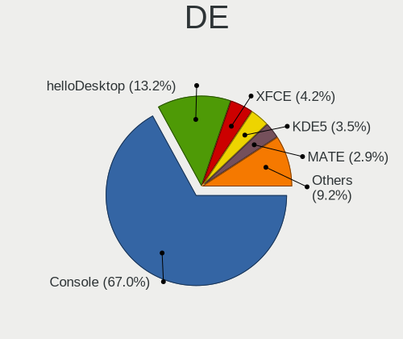
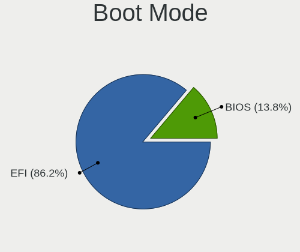
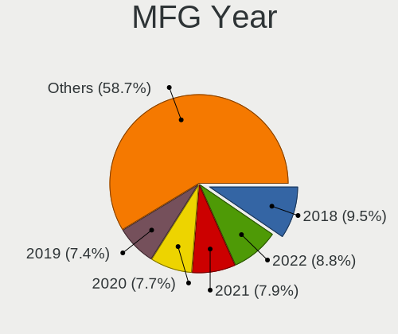
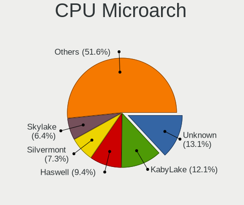
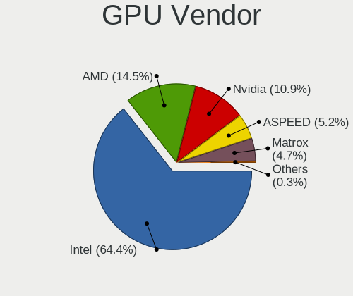

BSD - Tested Hardware & Statistics
----------------------------------

A project to collect tested hardware configurations for BSD.

Anyone can contribute to this report by the [hw-probe](https://github.com/linuxhw/hw-probe/blob/master/INSTALL.BSD.md) tool:

    hw-probe -all -upload

Please contribute! Especially if your hardware is rare.

This is a report for all computer types. See also reports for [desktops](/Desktop/README.md) and [notebooks](/Notebook/README.md).

OS-specific reports: [FreeBSD](/Dist/FreeBSD), [GhostBSD](/Dist/GhostBSD), [helloSystem](/Dist/helloSystem), [NetBSD](/Dist/NetBSD), [NomadBSD](/Dist/NomadBSD), [OpenBSD](/Dist/OpenBSD), [OPNsense](/Dist/OPNsense), [pfSense](/Dist/pfSense), [TrueNAS](/Dist/TrueNAS).

This report is for real hardware. Report for virtual hardware: [TestCoverage_VE](https://github.com/bsdhw/TestCoverage_VE)

Contents
--------

* [ Test Cases ](#test-cases)

* [ System ](#system)
  - [ OS                       ](#os)
  - [ OS Family                ](#os-family)
  - [ Arch                     ](#arch)
  - [ DE                       ](#de)
  - [ Display Server           ](#display-server)
  - [ Display Manager          ](#display-manager)
  - [ OS Lang                  ](#os-lang)
  - [ Boot Mode                ](#boot-mode)
  - [ Filesystem               ](#filesystem)
  - [ Part. scheme             ](#part-scheme)

* [ Board ](#board)
  - [ Vendor                   ](#vendor)
  - [ Model                    ](#model)
  - [ Model Family             ](#model-family)
  - [ MFG Year                 ](#mfg-year)
  - [ Form Factor              ](#form-factor)
  - [ Coreboot                 ](#coreboot)
  - [ RAM Size                 ](#ram-size)
  - [ RAM Used                 ](#ram-used)
  - [ Total Drives             ](#total-drives)
  - [ Has CD-ROM               ](#has-cd-rom)
  - [ Has Ethernet             ](#has-ethernet)
  - [ Has WiFi                 ](#has-wifi)
  - [ Has Bluetooth            ](#has-bluetooth)

* [ Location ](#location)
  - [ Country                  ](#country)
  - [ City                     ](#city)

* [ Drives ](#drives)
  - [ Drive Vendor             ](#drive-vendor)
  - [ Drive Model              ](#drive-model)
  - [ HDD Vendor               ](#hdd-vendor)
  - [ SSD Vendor               ](#ssd-vendor)
  - [ Drive Kind               ](#drive-kind)
  - [ Drive Connector          ](#drive-connector)
  - [ Drive Size               ](#drive-size)
  - [ Space Total              ](#space-total)
  - [ Space Used               ](#space-used)
  - [ Malfunc. Drives          ](#malfunc-drives)
  - [ Malfunc. Drive Vendor    ](#malfunc-drive-vendor)
  - [ Malfunc. HDD Vendor      ](#malfunc-hdd-vendor)
  - [ Malfunc. Drive Kind      ](#malfunc-drive-kind)
  - [ Failed Drives            ](#failed-drives)
  - [ Failed Drive Vendor      ](#failed-drive-vendor)
  - [ Drive Status             ](#drive-status)

* [ Storage controller ](#storage-controller)
  - [ Storage Vendor           ](#storage-vendor)
  - [ Storage Model            ](#storage-model)
  - [ Storage Kind             ](#storage-kind)

* [ Processor ](#processor)
  - [ CPU Vendor               ](#cpu-vendor)
  - [ CPU Model                ](#cpu-model)
  - [ CPU Model Family         ](#cpu-model-family)
  - [ CPU Cores                ](#cpu-cores)
  - [ CPU Sockets              ](#cpu-sockets)
  - [ CPU Threads              ](#cpu-threads)
  - [ CPU Microarch            ](#cpu-microarch)

* [ Graphics ](#graphics)
  - [ GPU Vendor               ](#gpu-vendor)
  - [ GPU Model                ](#gpu-model)
  - [ GPU Combo                ](#gpu-combo)
  - [ GPU Driver               ](#gpu-driver)
  - [ GPU Memory               ](#gpu-memory)

* [ Monitor ](#monitor)
  - [ Monitor Vendor           ](#monitor-vendor)
  - [ Monitor Model            ](#monitor-model)
  - [ Monitor Resolution       ](#monitor-resolution)
  - [ Monitor Diagonal         ](#monitor-diagonal)
  - [ Monitor Width            ](#monitor-width)
  - [ Aspect Ratio             ](#aspect-ratio)
  - [ Monitor Area             ](#monitor-area)
  - [ Pixel Density            ](#pixel-density)
  - [ Multiple Monitors        ](#multiple-monitors)

* [ Network ](#network)
  - [ Net Controller Vendor    ](#net-controller-vendor)
  - [ Net Controller Model     ](#net-controller-model)
  - [ Wireless Vendor          ](#wireless-vendor)
  - [ Wireless Model           ](#wireless-model)
  - [ Ethernet Vendor          ](#ethernet-vendor)
  - [ Ethernet Model           ](#ethernet-model)
  - [ Net Controller Kind      ](#net-controller-kind)
  - [ Used Controller          ](#used-controller)
  - [ NICs                     ](#nics)
  - [ IPv6                     ](#ipv6)

* [ Bluetooth ](#bluetooth)
  - [ Bluetooth Vendor         ](#bluetooth-vendor)
  - [ Bluetooth Model          ](#bluetooth-model)

* [ Sound ](#sound)
  - [ Sound Vendor             ](#sound-vendor)
  - [ Sound Model              ](#sound-model)

* [ Memory ](#memory)
  - [ Memory Vendor            ](#memory-vendor)
  - [ Memory Model             ](#memory-model)
  - [ Memory Kind              ](#memory-kind)
  - [ Memory Form Factor       ](#memory-form-factor)
  - [ Memory Size              ](#memory-size)
  - [ Memory Speed             ](#memory-speed)

* [ Printers & scanners ](#printers--scanners)
  - [ Printer Vendor           ](#printer-vendor)
  - [ Printer Model            ](#printer-model)
  - [ Scanner Vendor           ](#scanner-vendor)
  - [ Scanner Model            ](#scanner-model)

* [ Camera ](#camera)
  - [ Camera Vendor            ](#camera-vendor)
  - [ Camera Model             ](#camera-model)

* [ Security ](#security)
  - [ Fingerprint Vendor       ](#fingerprint-vendor)
  - [ Fingerprint Model        ](#fingerprint-model)
  - [ Chipcard Vendor          ](#chipcard-vendor)
  - [ Chipcard Model           ](#chipcard-model)

* [ Unsupported ](#unsupported)
  - [ Unsupported Devices      ](#unsupported-devices)
  - [ Unsupported Device Types ](#unsupported-device-types)

Test Cases
----------

Total: 12302

| Vendor        | Model                       | Form-Factor | Probe                                                     | Date         |
|---------------|-----------------------------|-------------|-----------------------------------------------------------|--------------|
| HP            | 255 G8 Notebook PC          | Notebook    | [f9851a3257](https://bsd-hardware.info/?probe=f9851a3257) | Oct 01, 2022 |
| AAEON         | FWS-2350 V1.0               | Desktop     | [00cc54cbad](https://bsd-hardware.info/?probe=00cc54cbad) | Oct 01, 2022 |
| Unknown       | Unknown                     | Desktop     | [01566cd078](https://bsd-hardware.info/?probe=01566cd078) | Oct 01, 2022 |
| Protectli     | FW6 Ver                     | Desktop     | [23450789e4](https://bsd-hardware.info/?probe=23450789e4) | Oct 01, 2022 |
| Unknown       | Unknown                     | Desktop     | [bdabafdcb1](https://bsd-hardware.info/?probe=bdabafdcb1) | Oct 01, 2022 |
| AMI           | PICO PC                     | Desktop     | [ab45092607](https://bsd-hardware.info/?probe=ab45092607) | Oct 01, 2022 |
| Shuttle       | FH61V                       | Desktop     | [305f06cd6a](https://bsd-hardware.info/?probe=305f06cd6a) | Oct 01, 2022 |
| AMI           | Aptio CRB                   | Mini pc     | [6f087682a4](https://bsd-hardware.info/?probe=6f087682a4) | Oct 01, 2022 |
| MSI           | GL65 Leopard 10SFSK         | Notebook    | [489567748e](https://bsd-hardware.info/?probe=489567748e) | Oct 01, 2022 |
| AMI           | Aptio CRB                   | Mini pc     | [9c419c5d32](https://bsd-hardware.info/?probe=9c419c5d32) | Oct 01, 2022 |
| Lenovo        | ThinkPad E15 2ORES4XJ00     | Notebook    | [323a95e6a9](https://bsd-hardware.info/?probe=323a95e6a9) | Oct 01, 2022 |
| Deciso        | NetBoard-A10                | Notebook    | [9b95ddf7b9](https://bsd-hardware.info/?probe=9b95ddf7b9) | Oct 01, 2022 |
| Unknown       | Unknown                     | Desktop     | [c4e771c07c](https://bsd-hardware.info/?probe=c4e771c07c) | Oct 01, 2022 |
| Dell          | 0WMJ54 A01                  | Desktop     | [53dfc5844c](https://bsd-hardware.info/?probe=53dfc5844c) | Oct 01, 2022 |
| BESSTAR Te... | IB9                         | Desktop     | [0cb7bacc88](https://bsd-hardware.info/?probe=0cb7bacc88) | Oct 01, 2022 |
| Protectli     | FW4B Ver                    | Desktop     | [05651f8664](https://bsd-hardware.info/?probe=05651f8664) | Oct 01, 2022 |
| Dell          | 0PC5F7 A00                  | Desktop     | [376550557f](https://bsd-hardware.info/?probe=376550557f) | Sep 30, 2022 |
| Cisco         | ASA5512 A0                  | Desktop     | [5b31d03140](https://bsd-hardware.info/?probe=5b31d03140) | Sep 30, 2022 |
| Jingsha       | x79-P3 by xUz               | Desktop     | [6853ba1191](https://bsd-hardware.info/?probe=6853ba1191) | Sep 30, 2022 |
| Supermicro    | X10SLH-F/X10SLM+-F          | Server      | [6f95477df3](https://bsd-hardware.info/?probe=6f95477df3) | Sep 30, 2022 |
| ASRockRack    | EPYC3101D4I-2T              | Desktop     | [8e658fe40f](https://bsd-hardware.info/?probe=8e658fe40f) | Sep 30, 2022 |
| Gigabyte      | X570 I AORUS PRO WIFI       | Desktop     | [16fa7d7ec0](https://bsd-hardware.info/?probe=16fa7d7ec0) | Sep 30, 2022 |
| ECS           | H61H2-MV                    | Desktop     | [77d9e53715](https://bsd-hardware.info/?probe=77d9e53715) | Sep 30, 2022 |
| Lenovo        | SHARKBAY NOK                | Desktop     | [c1c59c9d14](https://bsd-hardware.info/?probe=c1c59c9d14) | Sep 30, 2022 |
| Dell          | 0T10XW A01                  | Desktop     | [c2ff0bc0b9](https://bsd-hardware.info/?probe=c2ff0bc0b9) | Sep 30, 2022 |
| Dell          | 0WMJ54 A01                  | Desktop     | [30cb759583](https://bsd-hardware.info/?probe=30cb759583) | Sep 30, 2022 |
| Intel         | S1200RP_SE G62252-406       | Server      | [4763fe7595](https://bsd-hardware.info/?probe=4763fe7595) | Sep 30, 2022 |
| IBM           | ThinkPad T43 18714AG        | Notebook    | [5fd9a63834](https://bsd-hardware.info/?probe=5fd9a63834) | Sep 30, 2022 |
| Gigabyte      | H510M H                     | Desktop     | [8ad31cc470](https://bsd-hardware.info/?probe=8ad31cc470) | Sep 29, 2022 |
| Kraftway      | KW10T                       | Notebook    | [db27da2e88](https://bsd-hardware.info/?probe=db27da2e88) | Sep 29, 2022 |
| Intel         | CARLOW                      | Desktop     | [25b6d62332](https://bsd-hardware.info/?probe=25b6d62332) | Sep 29, 2022 |
| BESSTAR Te... | IB9                         | Desktop     | [eb0e449150](https://bsd-hardware.info/?probe=eb0e449150) | Sep 29, 2022 |
| Gigabyte      | X570 AORUS MASTER           | Desktop     | [353008eb5e](https://bsd-hardware.info/?probe=353008eb5e) | Sep 29, 2022 |
| Biostar       | N68S3B                      | Desktop     | [24c8fcee9a](https://bsd-hardware.info/?probe=24c8fcee9a) | Sep 29, 2022 |
| Dell          | 0MFXTY A02                  | Server      | [6484798368](https://bsd-hardware.info/?probe=6484798368) | Sep 29, 2022 |
| HP            | 17E2                        | Mini pc     | [15ec4829ce](https://bsd-hardware.info/?probe=15ec4829ce) | Sep 29, 2022 |
| Lenovo        | ThinkPad W530 2436CTO       | Notebook    | [6515a18552](https://bsd-hardware.info/?probe=6515a18552) | Sep 29, 2022 |
| Lenovo        | Legion Y540-17IRH 81Q4      | Notebook    | [62b9a56103](https://bsd-hardware.info/?probe=62b9a56103) | Sep 29, 2022 |
| ASRock        | A320M-HD                    | Desktop     | [6418fd0b23](https://bsd-hardware.info/?probe=6418fd0b23) | Sep 28, 2022 |
| Intel         | H81U                        | Notebook    | [fa8c32528a](https://bsd-hardware.info/?probe=fa8c32528a) | Sep 28, 2022 |
| ASRock        | B450M-HDV                   | Desktop     | [a3e25236fc](https://bsd-hardware.info/?probe=a3e25236fc) | Sep 28, 2022 |
| Unknown       | Unknown                     | Desktop     | [2926e2dc6f](https://bsd-hardware.info/?probe=2926e2dc6f) | Sep 28, 2022 |
| Biostar       | B450NH                      | Desktop     | [4beab225f6](https://bsd-hardware.info/?probe=4beab225f6) | Sep 28, 2022 |
| Tactus        | GeoFlex 110                 | Notebook    | [0b93b5f915](https://bsd-hardware.info/?probe=0b93b5f915) | Sep 28, 2022 |
| Unknown       | Unknown                     | Desktop     | [c3f8e853ef](https://bsd-hardware.info/?probe=c3f8e853ef) | Sep 28, 2022 |
| AMI           | MNHO-048                    | Desktop     | [2ec6e55a75](https://bsd-hardware.info/?probe=2ec6e55a75) | Sep 28, 2022 |
| Sophos        | SG                          | Firewall    | [6511e9620b](https://bsd-hardware.info/?probe=6511e9620b) | Sep 28, 2022 |
| Lenovo        | ThinkPad X61 Tablet 7763... | Notebook    | [1f37ebf2bb](https://bsd-hardware.info/?probe=1f37ebf2bb) | Sep 28, 2022 |
| Techvision    | TVI7309X B0                 | Desktop     | [441eb24fd2](https://bsd-hardware.info/?probe=441eb24fd2) | Sep 28, 2022 |
| Dell          | 0MFXTY A02                  | Server      | [901ca48f69](https://bsd-hardware.info/?probe=901ca48f69) | Sep 28, 2022 |
| ASUSTek       | M5A78L-M/USB3               | Desktop     | [3234a0b453](https://bsd-hardware.info/?probe=3234a0b453) | Sep 28, 2022 |
| Acer          | Swift SF313-52              | Notebook    | [83516dabac](https://bsd-hardware.info/?probe=83516dabac) | Sep 28, 2022 |
| Sophos        | UTM                         | Firewall    | [9856bb0d34](https://bsd-hardware.info/?probe=9856bb0d34) | Sep 28, 2022 |
| Dell          | 081N4V A04                  | Server      | [34f2cbafda](https://bsd-hardware.info/?probe=34f2cbafda) | Sep 28, 2022 |
| ASRock        | Z97 Professional            | Desktop     | [8936497eed](https://bsd-hardware.info/?probe=8936497eed) | Sep 27, 2022 |
| Supermicro    | X11SDV-4C-TP8F              | Desktop     | [390f4301dd](https://bsd-hardware.info/?probe=390f4301dd) | Sep 27, 2022 |
| MSI           | A520M-A PRO                 | Desktop     | [7e75a1888b](https://bsd-hardware.info/?probe=7e75a1888b) | Sep 27, 2022 |
| Unknown       | Unknown                     | Desktop     | [16f6784862](https://bsd-hardware.info/?probe=16f6784862) | Sep 27, 2022 |
| Intel         | D34010WYK H14771-305        | Desktop     | [93e4627cc9](https://bsd-hardware.info/?probe=93e4627cc9) | Sep 27, 2022 |
| Fujitsu       | D3313-E1 S26361-D3313-E1    | Desktop     | [a605b4582c](https://bsd-hardware.info/?probe=a605b4582c) | Sep 27, 2022 |
| ASRockRack    | X470D4U                     | Desktop     | [27a82e5fc8](https://bsd-hardware.info/?probe=27a82e5fc8) | Sep 27, 2022 |
| ASUSTek       | PRIME Z490M-PLUS            | Desktop     | [3877787983](https://bsd-hardware.info/?probe=3877787983) | Sep 27, 2022 |
| ASRock        | X570M Pro4                  | Desktop     | [433857f5f7](https://bsd-hardware.info/?probe=433857f5f7) | Sep 27, 2022 |
| Protectli     | FW4B                        | Desktop     | [431bcb4425](https://bsd-hardware.info/?probe=431bcb4425) | Sep 27, 2022 |
| Intel         | DH87MC AAG74242-401         | Desktop     | [5e823b71da](https://bsd-hardware.info/?probe=5e823b71da) | Sep 27, 2022 |
| Supermicro    | X11SBA-LN4F                 | Desktop     | [4c7f997199](https://bsd-hardware.info/?probe=4c7f997199) | Sep 26, 2022 |
| Unknown       | Unknown                     | Desktop     | [3966e558bf](https://bsd-hardware.info/?probe=3966e558bf) | Sep 26, 2022 |
| Unknown       | Unknown                     | Desktop     | [69a8b9b8d9](https://bsd-hardware.info/?probe=69a8b9b8d9) | Sep 26, 2022 |
| Cisco         | ASA5515 A0                  | Desktop     | [7b1ba71a42](https://bsd-hardware.info/?probe=7b1ba71a42) | Sep 26, 2022 |
| Sophos        | SG                          | Firewall    | [fdd950a5e8](https://bsd-hardware.info/?probe=fdd950a5e8) | Sep 26, 2022 |
| ASRock        | B550M Phantom Gaming 4      | Desktop     | [cfcfd2a636](https://bsd-hardware.info/?probe=cfcfd2a636) | Sep 26, 2022 |
| Intel         | Q3XXG4-P V1.0               | Desktop     | [cde2481e46](https://bsd-hardware.info/?probe=cde2481e46) | Sep 26, 2022 |
| Dell          | 0T10XW A02                  | Desktop     | [b8db4655e5](https://bsd-hardware.info/?probe=b8db4655e5) | Sep 26, 2022 |
| Dell          | 05GD68 A00                  | Desktop     | [6c75d1609b](https://bsd-hardware.info/?probe=6c75d1609b) | Sep 26, 2022 |
| Dell          | 0KYJ8C A02                  | Desktop     | [12493c3802](https://bsd-hardware.info/?probe=12493c3802) | Sep 26, 2022 |
| ASRock        | 990FX Extreme3              | Desktop     | [68d99cffe1](https://bsd-hardware.info/?probe=68d99cffe1) | Sep 26, 2022 |
| AWOW          | PC BOX                      | Mini pc     | [2c1aad67d1](https://bsd-hardware.info/?probe=2c1aad67d1) | Sep 26, 2022 |
| Deciso        | OPNsense Appliance          | Notebook    | [659b695f09](https://bsd-hardware.info/?probe=659b695f09) | Sep 26, 2022 |
| Lenovo        | ThinkPad P53 20QNCTO1WW     | Notebook    | [b2024820d1](https://bsd-hardware.info/?probe=b2024820d1) | Sep 26, 2022 |
| Techvision    | TVI7309X B0                 | Desktop     | [33b252016c](https://bsd-hardware.info/?probe=33b252016c) | Sep 26, 2022 |
| Dell          | 0TDG4V A00                  | Desktop     | [cc92be7e52](https://bsd-hardware.info/?probe=cc92be7e52) | Sep 25, 2022 |
| Acer          | Swift SF313-52              | Notebook    | [6339e6b468](https://bsd-hardware.info/?probe=6339e6b468) | Sep 25, 2022 |
| PC Engines    | APU2                        | Desktop     | [3fcc5e5ae2](https://bsd-hardware.info/?probe=3fcc5e5ae2) | Sep 25, 2022 |
| Techvision    | TVI7309X B0                 | Desktop     | [ae535b0b49](https://bsd-hardware.info/?probe=ae535b0b49) | Sep 25, 2022 |
| AWOW          | PC BOX                      | Mini pc     | [c33dc6a072](https://bsd-hardware.info/?probe=c33dc6a072) | Sep 25, 2022 |
| ASRock        | B550M Phantom Gaming 4      | Desktop     | [83607fc711](https://bsd-hardware.info/?probe=83607fc711) | Sep 25, 2022 |
| HP            | ProLiant MicroServer Gen... | Desktop     | [8f4900d0e6](https://bsd-hardware.info/?probe=8f4900d0e6) | Sep 25, 2022 |
| CncTion       | Jasper-4L B0                | Desktop     | [2998faa879](https://bsd-hardware.info/?probe=2998faa879) | Sep 25, 2022 |
| Pegatron      | H81-X1                      | Desktop     | [a27c76c490](https://bsd-hardware.info/?probe=a27c76c490) | Sep 25, 2022 |
| ASUSTek       | P9D-X Series                | Server      | [3494695f54](https://bsd-hardware.info/?probe=3494695f54) | Sep 25, 2022 |
| Supermicro    | X9SCL/X9SCMA                | Desktop     | [fe44242c3b](https://bsd-hardware.info/?probe=fe44242c3b) | Sep 25, 2022 |
| Gigabyte      | GB-BSi5A-6200               | Notebook    | [c947635b8f](https://bsd-hardware.info/?probe=c947635b8f) | Sep 25, 2022 |
| Gigabyte      | GB-BSi5A-6200               | Notebook    | [533c7f35f1](https://bsd-hardware.info/?probe=533c7f35f1) | Sep 25, 2022 |
| Supermicro    | X10SRi-FB                   | Server      | [59ff2014e5](https://bsd-hardware.info/?probe=59ff2014e5) | Sep 25, 2022 |
| Intel         | S1200SP H57532-210          | Server      | [ab6e70abca](https://bsd-hardware.info/?probe=ab6e70abca) | Sep 25, 2022 |
| Supermicro    | X8DT3                       | Server      | [eda1df037b](https://bsd-hardware.info/?probe=eda1df037b) | Sep 25, 2022 |
| Supermicro    | X7DB8                       | Desktop     | [6ebc173873](https://bsd-hardware.info/?probe=6ebc173873) | Sep 25, 2022 |
| Deciso        | Netboard A10 V2.1           | Desktop     | [8bbf714f6d](https://bsd-hardware.info/?probe=8bbf714f6d) | Sep 25, 2022 |
| Deciso        | Netboard A10 V2.1           | Desktop     | [60d4585ece](https://bsd-hardware.info/?probe=60d4585ece) | Sep 25, 2022 |
| IBM           | ThinkPad T40 23737CG        | Notebook    | [dfc9b64da2](https://bsd-hardware.info/?probe=dfc9b64da2) | Sep 25, 2022 |
| IceWhale T... | ZimaBoard 832 ZMB           | Desktop     | [6e2d053e1c](https://bsd-hardware.info/?probe=6e2d053e1c) | Sep 25, 2022 |
| MSI           | H81M-P33                    | Desktop     | [c61ef8d251](https://bsd-hardware.info/?probe=c61ef8d251) | Sep 25, 2022 |
| ASUSTek       | P5Q-E                       | Desktop     | [dad8b0a635](https://bsd-hardware.info/?probe=dad8b0a635) | Sep 25, 2022 |
| ASUSTek       | ROG CROSSHAIR VIII HERO     | Desktop     | [2d56ff12a1](https://bsd-hardware.info/?probe=2d56ff12a1) | Sep 25, 2022 |
| iEi           | SAE1 V1.04                  | Desktop     | [cc006e5c32](https://bsd-hardware.info/?probe=cc006e5c32) | Sep 25, 2022 |
| HP            | 3397                        | Desktop     | [8b019e6a96](https://bsd-hardware.info/?probe=8b019e6a96) | Sep 25, 2022 |
| ASRock        | 990FX Extreme3              | Desktop     | [c81d389fd2](https://bsd-hardware.info/?probe=c81d389fd2) | Sep 25, 2022 |
| Unknown       | Unknown                     | Desktop     | [9f998deaa4](https://bsd-hardware.info/?probe=9f998deaa4) | Sep 25, 2022 |
| Biostar       | N68S3B                      | Desktop     | [59bd37df63](https://bsd-hardware.info/?probe=59bd37df63) | Sep 25, 2022 |
| HP            | 8592                        | Desktop     | [898ce46c1f](https://bsd-hardware.info/?probe=898ce46c1f) | Sep 25, 2022 |
| Dell          | 05KX61 A04                  | Server      | [f1232f79c4](https://bsd-hardware.info/?probe=f1232f79c4) | Sep 25, 2022 |
| AMI           | Aptio CRB                   | Mini pc     | [de9d75d495](https://bsd-hardware.info/?probe=de9d75d495) | Sep 25, 2022 |
| AMI           | Aptio CRB                   | Mini pc     | [8883d36139](https://bsd-hardware.info/?probe=8883d36139) | Sep 25, 2022 |
| HP            | ProLiant MicroServer Gen... | Desktop     | [59886931c5](https://bsd-hardware.info/?probe=59886931c5) | Sep 24, 2022 |
| System76      | Gazelle                     | Notebook    | [d087321049](https://bsd-hardware.info/?probe=d087321049) | Sep 24, 2022 |
| MSI           | A88XM-E45                   | Desktop     | [d9d06daa51](https://bsd-hardware.info/?probe=d9d06daa51) | Sep 24, 2022 |
| MSI           | Z490-A PRO                  | Desktop     | [dbda136daa](https://bsd-hardware.info/?probe=dbda136daa) | Sep 24, 2022 |
| ASUSTek       | All Series                  | Desktop     | [ab3b339cf0](https://bsd-hardware.info/?probe=ab3b339cf0) | Sep 24, 2022 |
| HP            | 18E7                        | Desktop     | [02ac7695d7](https://bsd-hardware.info/?probe=02ac7695d7) | Sep 24, 2022 |
| Fujitsu       | D3313-A1 S26361-D3313-A1    | Desktop     | [fb436c3cc3](https://bsd-hardware.info/?probe=fb436c3cc3) | Sep 24, 2022 |
| Dell          | System Vostro 3750          | Notebook    | [166fbacd73](https://bsd-hardware.info/?probe=166fbacd73) | Sep 24, 2022 |
| Gigabyte      | X570 I AORUS PRO WIFI       | Desktop     | [8ed018c141](https://bsd-hardware.info/?probe=8ed018c141) | Sep 24, 2022 |
| ASUSTek       | Rampage II Extreme          | Desktop     | [eccb37382c](https://bsd-hardware.info/?probe=eccb37382c) | Sep 24, 2022 |
| YANYU         | H67SL                       | Desktop     | [5f5819ef11](https://bsd-hardware.info/?probe=5f5819ef11) | Sep 24, 2022 |
| Dell          | 045M96 A00                  | Server      | [c5af7bf9e5](https://bsd-hardware.info/?probe=c5af7bf9e5) | Sep 24, 2022 |
| Lenovo        | G475 20080                  | Notebook    | [fb07463a9a](https://bsd-hardware.info/?probe=fb07463a9a) | Sep 24, 2022 |
| Lenovo        | G475 20080                  | Notebook    | [c4b1acb6d1](https://bsd-hardware.info/?probe=c4b1acb6d1) | Sep 24, 2022 |
| Unknown       | Unknown                     | Desktop     | [8f42ff0969](https://bsd-hardware.info/?probe=8f42ff0969) | Sep 24, 2022 |
| System76      | Gazelle                     | Notebook    | [6d5d4f5021](https://bsd-hardware.info/?probe=6d5d4f5021) | Sep 24, 2022 |
| Lenovo        | ThinkPad T460p 20FW003PM... | Notebook    | [ac8e728222](https://bsd-hardware.info/?probe=ac8e728222) | Sep 24, 2022 |
| Unknown       | Unknown                     | Desktop     | [95b1404339](https://bsd-hardware.info/?probe=95b1404339) | Sep 23, 2022 |
| Deciso        | Netboard A20                | Notebook    | [388e27791d](https://bsd-hardware.info/?probe=388e27791d) | Sep 23, 2022 |
| TYAN Compu... | S5530WG2NR-LE-AKA           | Desktop     | [18c4588a0e](https://bsd-hardware.info/?probe=18c4588a0e) | Sep 23, 2022 |
| ASUSTek       | M5A78L-M/USB3               | Desktop     | [a0672c6af1](https://bsd-hardware.info/?probe=a0672c6af1) | Sep 23, 2022 |
| Unknown       | Unknown                     | Desktop     | [ffa40a08e8](https://bsd-hardware.info/?probe=ffa40a08e8) | Sep 23, 2022 |
| NITRINOnet    | M360RUS56                   | Desktop     | [490b9593e0](https://bsd-hardware.info/?probe=490b9593e0) | Sep 23, 2022 |
| Intel         | S3210SH FRU Ver             | Server      | [e6d299ffc1](https://bsd-hardware.info/?probe=e6d299ffc1) | Sep 23, 2022 |
| Sophos        | UTM                         | Firewall    | [fe6cf3c1ab](https://bsd-hardware.info/?probe=fe6cf3c1ab) | Sep 22, 2022 |
| ZOTAC         | ZBOX-MI522NANO/MI542NANO    | Mini pc     | [495b0dfebd](https://bsd-hardware.info/?probe=495b0dfebd) | Sep 22, 2022 |
| Intel         | Q3XXG4-P V1.0               | Desktop     | [5029142d61](https://bsd-hardware.info/?probe=5029142d61) | Sep 22, 2022 |
| Dell          | 042P49 A01                  | Desktop     | [13f6367ce8](https://bsd-hardware.info/?probe=13f6367ce8) | Sep 22, 2022 |
| Unknown       | Unknown                     | Desktop     | [b7bfcbef72](https://bsd-hardware.info/?probe=b7bfcbef72) | Sep 22, 2022 |
| ASRock        | X570 Phantom Gaming 4       | Desktop     | [1a89d78fa4](https://bsd-hardware.info/?probe=1a89d78fa4) | Sep 22, 2022 |
| Protectli     | FW4B Ver                    | Desktop     | [036004bbfe](https://bsd-hardware.info/?probe=036004bbfe) | Sep 22, 2022 |
| MSI           | MS-B1831                    | Desktop     | [2c9a20d879](https://bsd-hardware.info/?probe=2c9a20d879) | Sep 22, 2022 |
| Toshiba       | Satellite BE96-F299         | Notebook    | [15b93c9f4b](https://bsd-hardware.info/?probe=15b93c9f4b) | Sep 21, 2022 |
| Toshiba       | Satellite BE96-F299         | Notebook    | [9beae1547d](https://bsd-hardware.info/?probe=9beae1547d) | Sep 21, 2022 |
| Unknown       | Unknown                     | Desktop     | [58b6d3d116](https://bsd-hardware.info/?probe=58b6d3d116) | Sep 21, 2022 |
| PC Engines    | APU                         | Desktop     | [a65b17ba04](https://bsd-hardware.info/?probe=a65b17ba04) | Sep 21, 2022 |
| Sophos        | SG                          | Firewall    | [d485561c3b](https://bsd-hardware.info/?probe=d485561c3b) | Sep 21, 2022 |
| Unknown       | Unknown                     | Notebook    | [fbd1af0e98](https://bsd-hardware.info/?probe=fbd1af0e98) | Sep 21, 2022 |
| Deciso        | NetBoard-A10                | Notebook    | [5cec3595a3](https://bsd-hardware.info/?probe=5cec3595a3) | Sep 21, 2022 |
| HP            | ProLiant DL160 G5           | Server      | [1a754b2a9e](https://bsd-hardware.info/?probe=1a754b2a9e) | Sep 21, 2022 |
| HP            | 21D0                        | Desktop     | [43fa46655e](https://bsd-hardware.info/?probe=43fa46655e) | Sep 21, 2022 |
| Unknown       | Unknown                     | Desktop     | [199ad16750](https://bsd-hardware.info/?probe=199ad16750) | Sep 21, 2022 |
| ASUSTek       | PRIME H310M-K R2.0          | Desktop     | [51a78cc037](https://bsd-hardware.info/?probe=51a78cc037) | Sep 21, 2022 |
| Acer          | MCP73VE NVIDIA MCP73        | Desktop     | [6c169bdb6a](https://bsd-hardware.info/?probe=6c169bdb6a) | Sep 20, 2022 |
| AMI           | Aptio CRB                   | Mini pc     | [37acdfe51c](https://bsd-hardware.info/?probe=37acdfe51c) | Sep 20, 2022 |
| MSI           | MS-B1831                    | Desktop     | [42f48d632c](https://bsd-hardware.info/?probe=42f48d632c) | Sep 20, 2022 |
| MW            | GMLK-2_5G4L                 | Desktop     | [37cafd59eb](https://bsd-hardware.info/?probe=37cafd59eb) | Sep 20, 2022 |
| Dell          | 02YRK5 A03                  | Desktop     | [2ec32e432d](https://bsd-hardware.info/?probe=2ec32e432d) | Sep 20, 2022 |
| ASUSTek       | PRIME H310M-K R2.0          | Desktop     | [ca3b8f6b48](https://bsd-hardware.info/?probe=ca3b8f6b48) | Sep 20, 2022 |
| Fujitsu       | D3313-E1 S26361-D3313-E1    | Desktop     | [3c74fc1690](https://bsd-hardware.info/?probe=3c74fc1690) | Sep 20, 2022 |
| Acer          | Aspire E5-771               | Notebook    | [0a58077c49](https://bsd-hardware.info/?probe=0a58077c49) | Sep 20, 2022 |
| Unknown       | Unknown                     | Desktop     | [8e55c8e637](https://bsd-hardware.info/?probe=8e55c8e637) | Sep 20, 2022 |
| HP            | 1495                        | Desktop     | [163ac0a58b](https://bsd-hardware.info/?probe=163ac0a58b) | Sep 20, 2022 |
| Gigabyte      | Z590I AORUS ULTRA           | Desktop     | [c057b7ab09](https://bsd-hardware.info/?probe=c057b7ab09) | Sep 20, 2022 |
| ShenZhen M... | MW-GMLK-2.5G6L              | Desktop     | [a1a2cbc6c9](https://bsd-hardware.info/?probe=a1a2cbc6c9) | Sep 20, 2022 |
| Supermicro    | X9SCL/X9SCMA                | Desktop     | [16479f1a2c](https://bsd-hardware.info/?probe=16479f1a2c) | Sep 20, 2022 |
| Unknown       | Unknown                     | Desktop     | [1ceba97eb9](https://bsd-hardware.info/?probe=1ceba97eb9) | Sep 20, 2022 |
| Intel         | SHARKBAY                    | Desktop     | [afbedcb189](https://bsd-hardware.info/?probe=afbedcb189) | Sep 20, 2022 |
| Supermicro    | X9DRD-iF                    | Server      | [f5e927f8ba](https://bsd-hardware.info/?probe=f5e927f8ba) | Sep 20, 2022 |
| HP            | 21D0                        | Desktop     | [463e2563d7](https://bsd-hardware.info/?probe=463e2563d7) | Sep 19, 2022 |
| Supermicro    | X9SCI/X9SCA                 | Desktop     | [1270203d0b](https://bsd-hardware.info/?probe=1270203d0b) | Sep 19, 2022 |
| BESSTAR Te... | GB7                         | Mini pc     | [80e1559386](https://bsd-hardware.info/?probe=80e1559386) | Sep 19, 2022 |
| Toshiba       | PORTEGE R700                | Notebook    | [10b85eccae](https://bsd-hardware.info/?probe=10b85eccae) | Sep 19, 2022 |
| Lenovo        | 32E1 SDK0J40697 WIN 3305... | Desktop     | [b394504429](https://bsd-hardware.info/?probe=b394504429) | Sep 19, 2022 |
| Foxconn       | G31MXP FAB:1.1              | Desktop     | [9d291758ef](https://bsd-hardware.info/?probe=9d291758ef) | Sep 19, 2022 |
| HP            | EliteBook 840 G3            | Notebook    | [322c8947b6](https://bsd-hardware.info/?probe=322c8947b6) | Sep 19, 2022 |
| HP            | EliteBook 840 G3            | Notebook    | [0307c109b5](https://bsd-hardware.info/?probe=0307c109b5) | Sep 19, 2022 |
| Lenovo        | ThinkPad X250 20CLS1WP01    | Notebook    | [1b75ee6295](https://bsd-hardware.info/?probe=1b75ee6295) | Sep 19, 2022 |
| AMI           | Aptio CRB                   | Mini pc     | [8956b895ab](https://bsd-hardware.info/?probe=8956b895ab) | Sep 19, 2022 |
| Supermicro    | A2SDi-8C-HLN4F              | Desktop     | [393da0c00c](https://bsd-hardware.info/?probe=393da0c00c) | Sep 19, 2022 |
| MSI           | MS-B1831                    | Desktop     | [28757a34d3](https://bsd-hardware.info/?probe=28757a34d3) | Sep 19, 2022 |
| HP            | ProLiant ML350p Gen8        | Desktop     | [1a9c6a10bd](https://bsd-hardware.info/?probe=1a9c6a10bd) | Sep 19, 2022 |
| HP            | 0B54h D                     | Desktop     | [a24f08281d](https://bsd-hardware.info/?probe=a24f08281d) | Sep 19, 2022 |
| Lenovo        | 32E1 SDK0J40697 WIN 3305... | Desktop     | [d1c81ef222](https://bsd-hardware.info/?probe=d1c81ef222) | Sep 19, 2022 |
| Gigabyte      | H61M-DS2V                   | Desktop     | [55f8e635b8](https://bsd-hardware.info/?probe=55f8e635b8) | Sep 19, 2022 |
| Dell          | 01TJ2K A02                  | Desktop     | [b34cf533f3](https://bsd-hardware.info/?probe=b34cf533f3) | Sep 19, 2022 |
| ASUSTek       | PRIME X570-P                | Desktop     | [a2f56848a9](https://bsd-hardware.info/?probe=a2f56848a9) | Sep 19, 2022 |
| Sophos        | UTM                         | Firewall    | [785bb6c2a0](https://bsd-hardware.info/?probe=785bb6c2a0) | Sep 19, 2022 |
| ASUSTek       | PRIME X570-P                | Desktop     | [893743c3ad](https://bsd-hardware.info/?probe=893743c3ad) | Sep 19, 2022 |
| Lenovo        | ThinkStation D10 6493WEU    | Desktop     | [526e5eea0b](https://bsd-hardware.info/?probe=526e5eea0b) | Sep 18, 2022 |
| Supermicro    | A2SDi-TP8F                  | Desktop     | [db2194c9b9](https://bsd-hardware.info/?probe=db2194c9b9) | Sep 18, 2022 |
| ASUSTek       | M5A78L-M/USB3               | Desktop     | [cad2b5fd02](https://bsd-hardware.info/?probe=cad2b5fd02) | Sep 18, 2022 |
| Sophos        | XG                          | Firewall    | [e8aca06194](https://bsd-hardware.info/?probe=e8aca06194) | Sep 18, 2022 |
| Gigabyte      | H81M-S1                     | Desktop     | [fe9eecb935](https://bsd-hardware.info/?probe=fe9eecb935) | Sep 18, 2022 |
| Intel         | D34010WYK H14771-305        | Desktop     | [e734b98922](https://bsd-hardware.info/?probe=e734b98922) | Sep 18, 2022 |
| Dell          | Precision 7710              | Notebook    | [4c4937d824](https://bsd-hardware.info/?probe=4c4937d824) | Sep 18, 2022 |
| HP            | Pavilion dv6700             | Notebook    | [f3058f97f9](https://bsd-hardware.info/?probe=f3058f97f9) | Sep 18, 2022 |
| MSI           | MS-B1831                    | Desktop     | [94a3d6891a](https://bsd-hardware.info/?probe=94a3d6891a) | Sep 18, 2022 |
| ECS           | H61H2-MV                    | Desktop     | [d2945c003e](https://bsd-hardware.info/?probe=d2945c003e) | Sep 18, 2022 |
| MSI           | H81M-P33                    | Desktop     | [3e0c285177](https://bsd-hardware.info/?probe=3e0c285177) | Sep 18, 2022 |
| ASUSTek       | P5Q-E                       | Desktop     | [ba1487a053](https://bsd-hardware.info/?probe=ba1487a053) | Sep 18, 2022 |
| ASUSTek       | ROG CROSSHAIR VIII HERO     | Desktop     | [6dadd3f723](https://bsd-hardware.info/?probe=6dadd3f723) | Sep 18, 2022 |
| HP            | 213D A01                    | Desktop     | [6e8a38b6ca](https://bsd-hardware.info/?probe=6e8a38b6ca) | Sep 18, 2022 |
| Lenovo        | ThinkPad X250 20CL001GUS    | Notebook    | [2f1f82558e](https://bsd-hardware.info/?probe=2f1f82558e) | Sep 18, 2022 |
| BESSTAR Te... | TH50                        | Desktop     | [d027a503a5](https://bsd-hardware.info/?probe=d027a503a5) | Sep 18, 2022 |
| EAGLE EYE ... | BayTrail-D Rev.00           | Desktop     | [261f623516](https://bsd-hardware.info/?probe=261f623516) | Sep 18, 2022 |
| CONTEC        | G1/EMB-CV1/iD2550           | Desktop     | [266ef0ca6a](https://bsd-hardware.info/?probe=266ef0ca6a) | Sep 18, 2022 |
| AMI           | Aptio CRB                   | Mini pc     | [55c82d4dd0](https://bsd-hardware.info/?probe=55c82d4dd0) | Sep 18, 2022 |
| Fujitsu       | LIFEBOOK A532               | Notebook    | [91e0f723ea](https://bsd-hardware.info/?probe=91e0f723ea) | Sep 18, 2022 |
| HP            | 18E7                        | Desktop     | [e999bdd87e](https://bsd-hardware.info/?probe=e999bdd87e) | Sep 17, 2022 |
| Lenovo        | G50-30 80G0                 | Notebook    | [da4bd87fee](https://bsd-hardware.info/?probe=da4bd87fee) | Sep 17, 2022 |
| Unknown       | Unknown                     | Desktop     | [050c365fcd](https://bsd-hardware.info/?probe=050c365fcd) | Sep 17, 2022 |
| Intel         | D53427RKE G87971-403        | Desktop     | [aa00c60448](https://bsd-hardware.info/?probe=aa00c60448) | Sep 17, 2022 |
| Unknown       | Unknown                     | Desktop     | [af8f180c2c](https://bsd-hardware.info/?probe=af8f180c2c) | Sep 17, 2022 |
| ASUSTek       | X455LJ                      | Notebook    | [431ad10ab2](https://bsd-hardware.info/?probe=431ad10ab2) | Sep 17, 2022 |
| Gigabyte      | X570 I AORUS PRO WIFI       | Desktop     | [a9da12dec0](https://bsd-hardware.info/?probe=a9da12dec0) | Sep 17, 2022 |
| CncTion       | N5105-4L B0                 | Desktop     | [22f23ccfa5](https://bsd-hardware.info/?probe=22f23ccfa5) | Sep 17, 2022 |
| Gigabyte      | H410M S2 V2                 | Desktop     | [8de53ac515](https://bsd-hardware.info/?probe=8de53ac515) | Sep 17, 2022 |
| HP            | 8103 A01                    | Mini pc     | [533a1ebabe](https://bsd-hardware.info/?probe=533a1ebabe) | Sep 17, 2022 |
| Deciso        | Netboard A10 GEN2 Model ... | Desktop     | [e0b8ceecae](https://bsd-hardware.info/?probe=e0b8ceecae) | Sep 16, 2022 |
| ASUSTek       | PRIME X570-P                | Desktop     | [9fc1f66fcc](https://bsd-hardware.info/?probe=9fc1f66fcc) | Sep 16, 2022 |
| Fujitsu       | D3544-A1 S26361-D3544-A1... | Desktop     | [eb09d789de](https://bsd-hardware.info/?probe=eb09d789de) | Sep 16, 2022 |
| Unknown       | Unknown                     | Desktop     | [050dee62c1](https://bsd-hardware.info/?probe=050dee62c1) | Sep 16, 2022 |
| HP            | EliteBook 840 G3            | Notebook    | [7bf7249432](https://bsd-hardware.info/?probe=7bf7249432) | Sep 16, 2022 |
| Intel BOXJ... | Unknown                     | Desktop     | [c28fe204f3](https://bsd-hardware.info/?probe=c28fe204f3) | Sep 16, 2022 |
| Intel BOXJ... | Unknown                     | Desktop     | [a900f3bc8b](https://bsd-hardware.info/?probe=a900f3bc8b) | Sep 16, 2022 |
| Unknown       | Unknown                     | Desktop     | [3b66741f97](https://bsd-hardware.info/?probe=3b66741f97) | Sep 16, 2022 |
| Unknown       | Unknown                     | Desktop     | [83e48aa232](https://bsd-hardware.info/?probe=83e48aa232) | Sep 16, 2022 |
| ASUSTek       | M5A88-M                     | Desktop     | [09b5ca588f](https://bsd-hardware.info/?probe=09b5ca588f) | Sep 16, 2022 |
| Standard      | SFFGL Series                | Mini pc     | [a537bcd507](https://bsd-hardware.info/?probe=a537bcd507) | Sep 16, 2022 |
| Lenovo        | ThinkPad L420 7829WDY       | Notebook    | [a697be2aa9](https://bsd-hardware.info/?probe=a697be2aa9) | Sep 16, 2022 |
| Dell          | 081N4V A04                  | Server      | [0e3a5d306d](https://bsd-hardware.info/?probe=0e3a5d306d) | Sep 16, 2022 |
| Intel         | NUC8BEB J72688-308          | Mini pc     | [ce024b9f84](https://bsd-hardware.info/?probe=ce024b9f84) | Sep 15, 2022 |
| Standard      | SFFGL Series                | Mini pc     | [f1b8de71f4](https://bsd-hardware.info/?probe=f1b8de71f4) | Sep 15, 2022 |
| HP            | ProLiant DL160 G5           | Server      | [484cbeeda7](https://bsd-hardware.info/?probe=484cbeeda7) | Sep 15, 2022 |
| IBM           | ThinkPad T43 18714AG        | Notebook    | [15a7e37cbf](https://bsd-hardware.info/?probe=15a7e37cbf) | Sep 15, 2022 |
| Supermicro    | A2SDi-TP8F                  | Desktop     | [8c67aa0f6e](https://bsd-hardware.info/?probe=8c67aa0f6e) | Sep 15, 2022 |
| Techvision    | TVI7309X B0                 | Desktop     | [505feb51ca](https://bsd-hardware.info/?probe=505feb51ca) | Sep 15, 2022 |
| Dell          | 081N4V A04                  | Server      | [1b5150b554](https://bsd-hardware.info/?probe=1b5150b554) | Sep 15, 2022 |
| Supermicro    | X10DRL-i                    | Server      | [de856f28a4](https://bsd-hardware.info/?probe=de856f28a4) | Sep 15, 2022 |
| Gigabyte      | Z370P D3-CF                 | Desktop     | [10f0cfa344](https://bsd-hardware.info/?probe=10f0cfa344) | Sep 15, 2022 |
| Deciso        | DEC2700 - OPNsense Appli... | Notebook    | [eee7bdda02](https://bsd-hardware.info/?probe=eee7bdda02) | Sep 15, 2022 |
| Unknown       | Unknown                     | Desktop     | [7df7bc66e7](https://bsd-hardware.info/?probe=7df7bc66e7) | Sep 15, 2022 |
| Google        | Peppy                       | Notebook    | [80ffa77224](https://bsd-hardware.info/?probe=80ffa77224) | Sep 15, 2022 |
| AMI           | Aptio CRB                   | Mini pc     | [6d0be3dcf1](https://bsd-hardware.info/?probe=6d0be3dcf1) | Sep 15, 2022 |
| Intel         | ChiefRiver                  | Desktop     | [5361453e6a](https://bsd-hardware.info/?probe=5361453e6a) | Sep 15, 2022 |
| Gigabyte      | H270-HD3-CF                 | Desktop     | [0157925fad](https://bsd-hardware.info/?probe=0157925fad) | Sep 15, 2022 |
| Dell          | 0R230R A00                  | Desktop     | [ad70ccea4d](https://bsd-hardware.info/?probe=ad70ccea4d) | Sep 15, 2022 |
| Supermicro    | X11SSM-F                    | Server      | [a1dc602460](https://bsd-hardware.info/?probe=a1dc602460) | Sep 15, 2022 |
| YANYU         | H67SL                       | Desktop     | [37ba00c2f3](https://bsd-hardware.info/?probe=37ba00c2f3) | Sep 15, 2022 |
| Intel         | DENLOW_WS                   | Desktop     | [7ec0e7257d](https://bsd-hardware.info/?probe=7ec0e7257d) | Sep 14, 2022 |
| AZW           | Green G1                    | Desktop     | [1ccd8f86b3](https://bsd-hardware.info/?probe=1ccd8f86b3) | Sep 14, 2022 |
| Protectli     | FW6                         | Desktop     | [23227c99a0](https://bsd-hardware.info/?probe=23227c99a0) | Sep 14, 2022 |
| ASUSTek       | PRIME X570-P                | Desktop     | [32d8dbc6b6](https://bsd-hardware.info/?probe=32d8dbc6b6) | Sep 14, 2022 |
| Intel         | Q3XXG4-P V1.0               | Desktop     | [13ec5a6f20](https://bsd-hardware.info/?probe=13ec5a6f20) | Sep 14, 2022 |
| Intel         | Q3XXG4-P V1.0               | Desktop     | [7aa564bfb2](https://bsd-hardware.info/?probe=7aa564bfb2) | Sep 14, 2022 |
| HP            | 8103 A01                    | Mini pc     | [94ba5ceedb](https://bsd-hardware.info/?probe=94ba5ceedb) | Sep 14, 2022 |
| ASUSTek       | H61M-K                      | Desktop     | [0ee299e989](https://bsd-hardware.info/?probe=0ee299e989) | Sep 14, 2022 |
| Dell          | 0FDY5C A00                  | Desktop     | [cce6101086](https://bsd-hardware.info/?probe=cce6101086) | Sep 14, 2022 |
| Protectli     | FW4B Ver                    | Desktop     | [58caab8946](https://bsd-hardware.info/?probe=58caab8946) | Sep 14, 2022 |
| ASUSTek       | Rampage II Extreme          | Desktop     | [924dc8e7e1](https://bsd-hardware.info/?probe=924dc8e7e1) | Sep 14, 2022 |
| MSI           | PRESTIGE X570 CREATION      | Desktop     | [2b4cf189e9](https://bsd-hardware.info/?probe=2b4cf189e9) | Sep 14, 2022 |
| Lenovo        | ThinkPad X270 20HMS2LL00    | Notebook    | [12f6a8866f](https://bsd-hardware.info/?probe=12f6a8866f) | Sep 14, 2022 |
| AMI           | Aptio CRB                   | Mini pc     | [d2ad4471e0](https://bsd-hardware.info/?probe=d2ad4471e0) | Sep 14, 2022 |
| Techvision    | TVI7309X B0                 | Desktop     | [a444259756](https://bsd-hardware.info/?probe=a444259756) | Sep 14, 2022 |
| Lenovo        | SHARKBAY 0B98401 WIN        | Desktop     | [dc557f4385](https://bsd-hardware.info/?probe=dc557f4385) | Sep 14, 2022 |
| Unknown       | Unknown                     | Desktop     | [992ddc4118](https://bsd-hardware.info/?probe=992ddc4118) | Sep 14, 2022 |
| HP            | ProLiant DL160 G5           | Server      | [77727b5832](https://bsd-hardware.info/?probe=77727b5832) | Sep 14, 2022 |
| Deciso        | DEC2700 - OPNsense Appli... | Notebook    | [9e6bd1263d](https://bsd-hardware.info/?probe=9e6bd1263d) | Sep 13, 2022 |
| maiyunda      | www.maiyunda.com            | Desktop     | [cbc4aeb7be](https://bsd-hardware.info/?probe=cbc4aeb7be) | Sep 13, 2022 |
| Intel         | Q3XXG4-P V1.0               | Desktop     | [e8848edf41](https://bsd-hardware.info/?probe=e8848edf41) | Sep 13, 2022 |
| Dell          | 0HJK12 A03                  | Server      | [96ad323ca0](https://bsd-hardware.info/?probe=96ad323ca0) | Sep 13, 2022 |
| Dell          | 0H5J4J A01                  | Server      | [acb91f797f](https://bsd-hardware.info/?probe=acb91f797f) | Sep 13, 2022 |
| Apple         | Mac-7BA5B2D9E42DDD94        | Desktop     | [d2e169b8ad](https://bsd-hardware.info/?probe=d2e169b8ad) | Sep 13, 2022 |
| AMI           | Aptio CRB                   | Mini pc     | [e95ac333fe](https://bsd-hardware.info/?probe=e95ac333fe) | Sep 13, 2022 |
| Intel         | D945GCLF2 AAE46416-106      | Desktop     | [8e2f7792eb](https://bsd-hardware.info/?probe=8e2f7792eb) | Sep 13, 2022 |
| Sophos        | XG                          | Firewall    | [1540138670](https://bsd-hardware.info/?probe=1540138670) | Sep 13, 2022 |
| ASUSTek       | PRIME X370-PRO              | Desktop     | [f023ae7ed2](https://bsd-hardware.info/?probe=f023ae7ed2) | Sep 13, 2022 |
| Deciso        | Netboard A20                | Notebook    | [8af40be425](https://bsd-hardware.info/?probe=8af40be425) | Sep 13, 2022 |
| ASRock        | Q1900B-ITX                  | Desktop     | [81722a937a](https://bsd-hardware.info/?probe=81722a937a) | Sep 13, 2022 |
| PC Engines    | APU2                        | Desktop     | [95ae240b55](https://bsd-hardware.info/?probe=95ae240b55) | Sep 13, 2022 |
| ASRock        | X570 Phantom Gaming 4       | Desktop     | [baaf9cbda6](https://bsd-hardware.info/?probe=baaf9cbda6) | Sep 13, 2022 |
| Protectli     | FW4B                        | Desktop     | [0553a226de](https://bsd-hardware.info/?probe=0553a226de) | Sep 13, 2022 |
| Dell          | 0KYJ8C A02                  | Desktop     | [fb950378c9](https://bsd-hardware.info/?probe=fb950378c9) | Sep 13, 2022 |
| BESSTAR Te... | GB7                         | Mini pc     | [d3ee67f09b](https://bsd-hardware.info/?probe=d3ee67f09b) | Sep 13, 2022 |
| SIEMENS       | SIMATIC IPC127E             | Notebook    | [d16e38e6b2](https://bsd-hardware.info/?probe=d16e38e6b2) | Sep 12, 2022 |
| Dell          | 03X6X0 A09                  | Server      | [ce56845976](https://bsd-hardware.info/?probe=ce56845976) | Sep 12, 2022 |
| Dell          | 07WP95 A01                  | Desktop     | [98e67ff164](https://bsd-hardware.info/?probe=98e67ff164) | Sep 12, 2022 |
| Yanling       | YL-KBR6L Ver:1.00           | Desktop     | [05b5d1e01a](https://bsd-hardware.info/?probe=05b5d1e01a) | Sep 12, 2022 |
| HP            | 18E7                        | Desktop     | [f09635a7ee](https://bsd-hardware.info/?probe=f09635a7ee) | Sep 12, 2022 |
| BESSTAR Te... | GB7                         | Mini pc     | [66e543ee47](https://bsd-hardware.info/?probe=66e543ee47) | Sep 12, 2022 |
| Fujitsu       | D3313-G1 S26361-D3313-G1    | Desktop     | [2b4e2212dc](https://bsd-hardware.info/?probe=2b4e2212dc) | Sep 12, 2022 |
| HP            | 213D A01                    | Desktop     | [6354ddb4a8](https://bsd-hardware.info/?probe=6354ddb4a8) | Sep 12, 2022 |
| HP            | 8648                        | Desktop     | [e7e610794c](https://bsd-hardware.info/?probe=e7e610794c) | Sep 12, 2022 |
| Dell          | 0KYJ8C A02                  | Desktop     | [bb784470e7](https://bsd-hardware.info/?probe=bb784470e7) | Sep 12, 2022 |
| Protectli     | FW4B                        | Desktop     | [0ccd9a9f2c](https://bsd-hardware.info/?probe=0ccd9a9f2c) | Sep 12, 2022 |
| HP            | 8054                        | Desktop     | [3385f78f9c](https://bsd-hardware.info/?probe=3385f78f9c) | Sep 12, 2022 |
| BESSTAR Te... | TH50                        | Desktop     | [71e53af7f9](https://bsd-hardware.info/?probe=71e53af7f9) | Sep 12, 2022 |
| Dell EMC      | VEP1425-V210-CPU A00        | Desktop     | [871a29677b](https://bsd-hardware.info/?probe=871a29677b) | Sep 12, 2022 |
| BESSTAR Te... | TH50                        | Desktop     | [898d5889a2](https://bsd-hardware.info/?probe=898d5889a2) | Sep 12, 2022 |
| MSI           | H81M-E33                    | Desktop     | [b80a45410b](https://bsd-hardware.info/?probe=b80a45410b) | Sep 12, 2022 |
| HP            | 213D A01                    | Desktop     | [54288c6759](https://bsd-hardware.info/?probe=54288c6759) | Sep 11, 2022 |
| Intel         | S1200KP AAG34877-201        | Desktop     | [db5bbdec3c](https://bsd-hardware.info/?probe=db5bbdec3c) | Sep 11, 2022 |
| ASUSTek       | PRIME X570-P                | Desktop     | [8a2d9be9de](https://bsd-hardware.info/?probe=8a2d9be9de) | Sep 11, 2022 |
| HP            | ProLiant DL20 Gen9          | Server      | [32e9f95095](https://bsd-hardware.info/?probe=32e9f95095) | Sep 11, 2022 |
| Supermicro    | M11SDV-8C-LN4FA             | Desktop     | [21e7190ff2](https://bsd-hardware.info/?probe=21e7190ff2) | Sep 11, 2022 |
| Unknown       | Unknown                     | Desktop     | [37588a8565](https://bsd-hardware.info/?probe=37588a8565) | Sep 11, 2022 |
| Dell          | Inspiron 15 3511            | Notebook    | [5abbba28de](https://bsd-hardware.info/?probe=5abbba28de) | Sep 11, 2022 |
| Unknown       | Unknown                     | Desktop     | [700e6ba6a9](https://bsd-hardware.info/?probe=700e6ba6a9) | Sep 11, 2022 |
| MSI           | H81M-E33                    | Desktop     | [66d179c5f4](https://bsd-hardware.info/?probe=66d179c5f4) | Sep 11, 2022 |
| ASUSTek       | P5Q-E                       | Desktop     | [1cbbe33027](https://bsd-hardware.info/?probe=1cbbe33027) | Sep 11, 2022 |
| MSI           | H81M-P33                    | Desktop     | [3b668ace72](https://bsd-hardware.info/?probe=3b668ace72) | Sep 11, 2022 |
| ASUSTek       | ROG CROSSHAIR VIII HERO     | Desktop     | [62c287a993](https://bsd-hardware.info/?probe=62c287a993) | Sep 11, 2022 |
| ASUSTek       | M5A97 PLUS                  | Desktop     | [3c152ae7bd](https://bsd-hardware.info/?probe=3c152ae7bd) | Sep 11, 2022 |
| Dell          | XPS M1330                   | Notebook    | [d84548dd9b](https://bsd-hardware.info/?probe=d84548dd9b) | Sep 11, 2022 |
| Dell          | 0NW6H5 A00                  | Desktop     | [ce6906d604](https://bsd-hardware.info/?probe=ce6906d604) | Sep 10, 2022 |
| Apple         | MacBook5,2                  | Notebook    | [79503c0635](https://bsd-hardware.info/?probe=79503c0635) | Sep 10, 2022 |
| MSI           | A88XM-E45                   | Desktop     | [2df6d013e9](https://bsd-hardware.info/?probe=2df6d013e9) | Sep 10, 2022 |
| Fujitsu       | D3313-A1 S26361-D3313-A1    | Desktop     | [b2dc861f47](https://bsd-hardware.info/?probe=b2dc861f47) | Sep 10, 2022 |
| ASUSTek       | TUF B450M-PRO GAMING        | Desktop     | [7c9c1db9d7](https://bsd-hardware.info/?probe=7c9c1db9d7) | Sep 10, 2022 |
| AOpen         | iBTMx-DS R1.03 55DED10A0... | Desktop     | [50ac5c0aaf](https://bsd-hardware.info/?probe=50ac5c0aaf) | Sep 10, 2022 |
| Apple         | MacBook5,2                  | Notebook    | [9c7a64970c](https://bsd-hardware.info/?probe=9c7a64970c) | Sep 10, 2022 |
| HP            | 8103 A01                    | Mini pc     | [34f00f7f28](https://bsd-hardware.info/?probe=34f00f7f28) | Sep 10, 2022 |
| Supermicro    | M11SDV-8C-LN4FA             | Desktop     | [89b185547b](https://bsd-hardware.info/?probe=89b185547b) | Sep 10, 2022 |
| Maxtang       | BYT30                       | Desktop     | [90053990c3](https://bsd-hardware.info/?probe=90053990c3) | Sep 10, 2022 |
| Fujitsu       | D3313-G1 S26361-D3313-G1    | Desktop     | [836927cf63](https://bsd-hardware.info/?probe=836927cf63) | Sep 10, 2022 |
| Fujitsu       | D3313-A1 S26361-D3313-A1    | Desktop     | [b54e6663f9](https://bsd-hardware.info/?probe=b54e6663f9) | Sep 10, 2022 |
| Dell          | 0KYJ8C A02                  | Desktop     | [7e8d44c688](https://bsd-hardware.info/?probe=7e8d44c688) | Sep 10, 2022 |
| HP            | ProLiant DL160 G5           | Server      | [130de630ad](https://bsd-hardware.info/?probe=130de630ad) | Sep 10, 2022 |
| CONTEC        | G1/EMB-CV1/iD2550           | Desktop     | [0df35f9c64](https://bsd-hardware.info/?probe=0df35f9c64) | Sep 10, 2022 |
| ASUSTek       | PRIME X570-P                | Desktop     | [8eb8bf52d4](https://bsd-hardware.info/?probe=8eb8bf52d4) | Sep 10, 2022 |
| Intel         | DH87MC AAG74242-401         | Desktop     | [6b449e63d3](https://bsd-hardware.info/?probe=6b449e63d3) | Sep 10, 2022 |
| Sophos        | SG                          | Firewall    | [0213c8bb69](https://bsd-hardware.info/?probe=0213c8bb69) | Sep 09, 2022 |
| ASRock        | H81M-DGS                    | Desktop     | [3c2b784001](https://bsd-hardware.info/?probe=3c2b784001) | Sep 09, 2022 |
| ASRock        | H81M-DGS                    | Desktop     | [581219cbc5](https://bsd-hardware.info/?probe=581219cbc5) | Sep 09, 2022 |
| Intel         | NUC6i3SYB H81132-505        | Mini pc     | [c25d3df4e2](https://bsd-hardware.info/?probe=c25d3df4e2) | Sep 09, 2022 |
| Gigabyte      | B450M DS3H V2               | Desktop     | [b1a126ce25](https://bsd-hardware.info/?probe=b1a126ce25) | Sep 09, 2022 |
| Intel         | SandyBridge Platform        | Notebook    | [7c10326786](https://bsd-hardware.info/?probe=7c10326786) | Sep 09, 2022 |
| EAGLE EYE ... | BayTrail-D Rev.00           | Desktop     | [3137cdbf7c](https://bsd-hardware.info/?probe=3137cdbf7c) | Sep 09, 2022 |
| ASRockRack    | X470D4U2/1N1                | Desktop     | [f91afdb2f3](https://bsd-hardware.info/?probe=f91afdb2f3) | Sep 09, 2022 |
| AZW           | Green G1                    | Desktop     | [b9e82f5157](https://bsd-hardware.info/?probe=b9e82f5157) | Sep 09, 2022 |
| EAGLE EYE ... | BayTrail-D Rev.00           | Desktop     | [1e62e2ea85](https://bsd-hardware.info/?probe=1e62e2ea85) | Sep 09, 2022 |
| Unknown       | Unknown                     | Desktop     | [1cd83a6904](https://bsd-hardware.info/?probe=1cd83a6904) | Sep 09, 2022 |
| MSI           | MPG Z490 GAMING EDGE WIF... | Desktop     | [98dff45d54](https://bsd-hardware.info/?probe=98dff45d54) | Sep 09, 2022 |
| maiyunda      | www.maiyunda.com            | Desktop     | [8776541164](https://bsd-hardware.info/?probe=8776541164) | Sep 09, 2022 |
| Apple         | MacBookPro8,1               | Notebook    | [39edc32cb4](https://bsd-hardware.info/?probe=39edc32cb4) | Sep 09, 2022 |
| HP            | ProLiant DL380 G7           | Server      | [fb678970df](https://bsd-hardware.info/?probe=fb678970df) | Sep 09, 2022 |
| Toshiba       | Satellite A200              | Notebook    | [860aea3ce4](https://bsd-hardware.info/?probe=860aea3ce4) | Sep 08, 2022 |
| Techvision    | TVI7309X B0                 | Desktop     | [4e393e3814](https://bsd-hardware.info/?probe=4e393e3814) | Sep 08, 2022 |
| Deciso        | Netboard A10 GEN2 Model ... | Desktop     | [e082eca671](https://bsd-hardware.info/?probe=e082eca671) | Sep 08, 2022 |
| EPSON DIRE... | ST170E                      | Desktop     | [1ac571538d](https://bsd-hardware.info/?probe=1ac571538d) | Sep 08, 2022 |
| Unknown       | YL-J3060L2                  | Desktop     | [2210876ea3](https://bsd-hardware.info/?probe=2210876ea3) | Sep 08, 2022 |
| Dell          | Precision 7540              | Notebook    | [f39c0f4d92](https://bsd-hardware.info/?probe=f39c0f4d92) | Sep 08, 2022 |
| ASRockRack    | X470D4U2/1N1                | Desktop     | [b0965df7e1](https://bsd-hardware.info/?probe=b0965df7e1) | Sep 08, 2022 |
| BESSTAR Te... | GB7                         | Mini pc     | [6130d9c1d0](https://bsd-hardware.info/?probe=6130d9c1d0) | Sep 07, 2022 |
| Unknown       | J3160-4L                    | Desktop     | [4db37ff154](https://bsd-hardware.info/?probe=4db37ff154) | Sep 07, 2022 |
| Techvision    | TVI7309X B0                 | Desktop     | [1d81b77310](https://bsd-hardware.info/?probe=1d81b77310) | Sep 07, 2022 |
| Dell          | 0W0W22 A08                  | Server      | [4d371914ed](https://bsd-hardware.info/?probe=4d371914ed) | Sep 07, 2022 |
| Deciso        | Netboard A10 V2.1           | Desktop     | [6c88b88822](https://bsd-hardware.info/?probe=6c88b88822) | Sep 07, 2022 |
| Intel         | SYS-2USM03-6M01E            | Desktop     | [d4f98f18b9](https://bsd-hardware.info/?probe=d4f98f18b9) | Sep 07, 2022 |
| Dell          | Latitude 5310               | Notebook    | [6edf4d34fe](https://bsd-hardware.info/?probe=6edf4d34fe) | Sep 07, 2022 |
| Dell          | Latitude E5470              | Notebook    | [9e798cbfc8](https://bsd-hardware.info/?probe=9e798cbfc8) | Sep 07, 2022 |
| Protectli     | FW4B                        | Desktop     | [b934171c54](https://bsd-hardware.info/?probe=b934171c54) | Sep 07, 2022 |
| Techvision    | TVI7309X B0                 | Desktop     | [3c3c40a10f](https://bsd-hardware.info/?probe=3c3c40a10f) | Sep 07, 2022 |
| Protectli     | VP2410 10                   | Desktop     | [f431032a32](https://bsd-hardware.info/?probe=f431032a32) | Sep 07, 2022 |
| HP            | EliteBook 8570p             | Notebook    | [7c6751649b](https://bsd-hardware.info/?probe=7c6751649b) | Sep 07, 2022 |
| Techvision    | TVI7309X B0                 | Desktop     | [b803a767af](https://bsd-hardware.info/?probe=b803a767af) | Sep 06, 2022 |
| Lenovo        | ThinkPad T440 20B7S2LT00    | Notebook    | [5104875f94](https://bsd-hardware.info/?probe=5104875f94) | Sep 06, 2022 |
| Pegatron      | IPM41-D3                    | Desktop     | [2d3a5a5260](https://bsd-hardware.info/?probe=2d3a5a5260) | Sep 06, 2022 |
| Dell          | Vostro 5415                 | Notebook    | [ef6d4ee660](https://bsd-hardware.info/?probe=ef6d4ee660) | Sep 06, 2022 |
| Intel         | J1900                       | Desktop     | [a95dd12c65](https://bsd-hardware.info/?probe=a95dd12c65) | Sep 06, 2022 |
| Sophos        | SG                          | Firewall    | [4b393a08cd](https://bsd-hardware.info/?probe=4b393a08cd) | Sep 06, 2022 |
| Lenovo        | IdeaPad Gaming 3 15ACH6 ... | Notebook    | [4f31f81571](https://bsd-hardware.info/?probe=4f31f81571) | Sep 06, 2022 |
| HP            | 1495                        | Desktop     | [4ba1b5820e](https://bsd-hardware.info/?probe=4ba1b5820e) | Sep 06, 2022 |
| Dell          | 0200DY A02                  | Desktop     | [cd90f548c8](https://bsd-hardware.info/?probe=cd90f548c8) | Sep 06, 2022 |
| ASUSTek       | VivoBook_ASUSLaptop X515... | Notebook    | [cffed92600](https://bsd-hardware.info/?probe=cffed92600) | Sep 06, 2022 |
| ASRock        | 4X4-4000 Series             | Desktop     | [00ee0319aa](https://bsd-hardware.info/?probe=00ee0319aa) | Sep 06, 2022 |
| Intel         | MAHOBAY                     | Desktop     | [a854e50942](https://bsd-hardware.info/?probe=a854e50942) | Sep 06, 2022 |
| Supermicro    | X10SDV-TP8F                 | Server      | [4bcc55d57f](https://bsd-hardware.info/?probe=4bcc55d57f) | Sep 06, 2022 |
| Unknown       | J3160-4L                    | Desktop     | [817b37c259](https://bsd-hardware.info/?probe=817b37c259) | Sep 06, 2022 |
| Intel         | S5520UR E22554-753          | Server      | [9048eea837](https://bsd-hardware.info/?probe=9048eea837) | Sep 06, 2022 |
| Dell          | Precision 7550              | Notebook    | [d2bf200529](https://bsd-hardware.info/?probe=d2bf200529) | Sep 06, 2022 |
| HP            | 1496                        | Desktop     | [7cd97bd330](https://bsd-hardware.info/?probe=7cd97bd330) | Sep 05, 2022 |
| ASUSTek       | Rampage II Extreme          | Desktop     | [975b49af4a](https://bsd-hardware.info/?probe=975b49af4a) | Sep 05, 2022 |
| Unknown       | Unknown                     | Desktop     | [865dca4859](https://bsd-hardware.info/?probe=865dca4859) | Sep 05, 2022 |
| Gigabyte      | H61M-DS2 x.x                | Desktop     | [3f5ad2f043](https://bsd-hardware.info/?probe=3f5ad2f043) | Sep 05, 2022 |
| Dell          | 0Y7WYT A00                  | Desktop     | [2870b9e4c7](https://bsd-hardware.info/?probe=2870b9e4c7) | Sep 05, 2022 |
| PC Engines    | APU2                        | Desktop     | [1650d8c419](https://bsd-hardware.info/?probe=1650d8c419) | Sep 05, 2022 |
| PC Engines    | APU2                        | Desktop     | [d9216cb730](https://bsd-hardware.info/?probe=d9216cb730) | Sep 05, 2022 |
| AMI           | Aptio CRB                   | Mini pc     | [68ac9de055](https://bsd-hardware.info/?probe=68ac9de055) | Sep 05, 2022 |
| ASUSTek       | Rampage II Extreme          | Desktop     | [5a49c5aa98](https://bsd-hardware.info/?probe=5a49c5aa98) | Sep 05, 2022 |
| Protectli     | FW4B Ver                    | Desktop     | [91664c3bc1](https://bsd-hardware.info/?probe=91664c3bc1) | Sep 05, 2022 |
| CncTion       | N5105-4L                    | Desktop     | [2a34dc3fe0](https://bsd-hardware.info/?probe=2a34dc3fe0) | Sep 05, 2022 |
| BESSTAR Te... | TH50                        | Desktop     | [734a8e61c4](https://bsd-hardware.info/?probe=734a8e61c4) | Sep 05, 2022 |
| HP            | 8719                        | Desktop     | [f3132fc160](https://bsd-hardware.info/?probe=f3132fc160) | Sep 05, 2022 |
| Supermicro    | X10SLH-N6-ST031             | Desktop     | [34bc2f5c5b](https://bsd-hardware.info/?probe=34bc2f5c5b) | Sep 04, 2022 |
| HP            | ProLiant DL20 Gen9          | Server      | [1eb31c7e35](https://bsd-hardware.info/?probe=1eb31c7e35) | Sep 04, 2022 |
| HP            | ProLiant DL360 G5           | Server      | [770f185ee2](https://bsd-hardware.info/?probe=770f185ee2) | Sep 04, 2022 |
| Dell          | XPS 13 9343                 | Notebook    | [ec74af083f](https://bsd-hardware.info/?probe=ec74af083f) | Sep 04, 2022 |
| Unknown       | Unknown                     | Desktop     | [c1967c7cf8](https://bsd-hardware.info/?probe=c1967c7cf8) | Sep 04, 2022 |
| Dell          | 0H5J4J A01                  | Server      | [ab1c1b4aad](https://bsd-hardware.info/?probe=ab1c1b4aad) | Sep 04, 2022 |
| Gigabyte      | GA-890FXA-UD5               | Desktop     | [3ee914e3a0](https://bsd-hardware.info/?probe=3ee914e3a0) | Sep 04, 2022 |
| ASUSTek       | Rampage II Extreme          | Desktop     | [1d6d1d67ee](https://bsd-hardware.info/?probe=1d6d1d67ee) | Sep 04, 2022 |
| MSI           | H81M-P33                    | Desktop     | [3f7258c807](https://bsd-hardware.info/?probe=3f7258c807) | Sep 04, 2022 |
| ASUSTek       | P5Q-E                       | Desktop     | [cced3168c8](https://bsd-hardware.info/?probe=cced3168c8) | Sep 04, 2022 |
| ASUSTek       | ROG CROSSHAIR VIII HERO     | Desktop     | [61b82d5ebb](https://bsd-hardware.info/?probe=61b82d5ebb) | Sep 04, 2022 |
| Apple         | MacBookPro5,1               | Notebook    | [f4d84edb3b](https://bsd-hardware.info/?probe=f4d84edb3b) | Sep 04, 2022 |
| HP            | ProLiant DL360 G5           | Server      | [387e5946f7](https://bsd-hardware.info/?probe=387e5946f7) | Sep 04, 2022 |
| Protectli     | FW4B Ver                    | Desktop     | [a769499d94](https://bsd-hardware.info/?probe=a769499d94) | Sep 04, 2022 |
| MSI           | A68HM-E33 V2                | Desktop     | [0f35d398cb](https://bsd-hardware.info/?probe=0f35d398cb) | Sep 04, 2022 |
| Lenovo        | SHARKBAY 0B98401 WIN        | Desktop     | [860518eb18](https://bsd-hardware.info/?probe=860518eb18) | Sep 04, 2022 |
| Protectli     | FW4B                        | Desktop     | [86a4422a0f](https://bsd-hardware.info/?probe=86a4422a0f) | Sep 04, 2022 |
| Supermicro    | M11SDV-8C-LN4FA             | Desktop     | [b53e1d28cd](https://bsd-hardware.info/?probe=b53e1d28cd) | Sep 04, 2022 |
| Unknown       | Unknown                     | Desktop     | [4034fae93d](https://bsd-hardware.info/?probe=4034fae93d) | Sep 04, 2022 |
| AMD           | Inagua CRB                  | Desktop     | [de18cc5073](https://bsd-hardware.info/?probe=de18cc5073) | Sep 04, 2022 |
| Supermicro    | A2SDi-4C-HLN4F              | Server      | [5ea71c99c7](https://bsd-hardware.info/?probe=5ea71c99c7) | Sep 03, 2022 |
| Maxtang       | BYT30                       | Desktop     | [f5c34c7662](https://bsd-hardware.info/?probe=f5c34c7662) | Sep 03, 2022 |
| HP            | 1496                        | Desktop     | [94e8713f6d](https://bsd-hardware.info/?probe=94e8713f6d) | Sep 03, 2022 |
| MSI           | MPG X570 GAMING EDGE WIF... | Desktop     | [df57940ad5](https://bsd-hardware.info/?probe=df57940ad5) | Sep 03, 2022 |
| Intel         | Q3XXG4-P V1.0               | Desktop     | [88d8df1e3a](https://bsd-hardware.info/?probe=88d8df1e3a) | Sep 03, 2022 |
| ASRock        | Z97 Killer                  | Desktop     | [fac5afc851](https://bsd-hardware.info/?probe=fac5afc851) | Sep 03, 2022 |
| ASRock        | X570S PG Riptide            | Desktop     | [37a7192776](https://bsd-hardware.info/?probe=37a7192776) | Sep 03, 2022 |
| CompuLab      | fitlet                      | Mini pc     | [9772776314](https://bsd-hardware.info/?probe=9772776314) | Sep 03, 2022 |
| Lenovo        | 30D9 SDK0J40705 WIN 3425... | Desktop     | [72cdc4123c](https://bsd-hardware.info/?probe=72cdc4123c) | Sep 03, 2022 |
| Techvision    | TVI7309X B0                 | Desktop     | [9941ee7afb](https://bsd-hardware.info/?probe=9941ee7afb) | Sep 03, 2022 |
| ASRockRack    | C3558D4I-4L                 | Desktop     | [9beb572e0d](https://bsd-hardware.info/?probe=9beb572e0d) | Sep 03, 2022 |
| Lenovo        | ThinkCentre M70e 0833A29    | Desktop     | [b7c5b9a51d](https://bsd-hardware.info/?probe=b7c5b9a51d) | Sep 03, 2022 |
| ASRock        | X570S PG Riptide            | Desktop     | [0c17c8dc3b](https://bsd-hardware.info/?probe=0c17c8dc3b) | Sep 03, 2022 |
| Dell          | 0DVNTK A00                  | Mini pc     | [216197e933](https://bsd-hardware.info/?probe=216197e933) | Sep 03, 2022 |
| Lenovo        | 312D SDK0J40697 WIN 3305... | Mini pc     | [549daa1a49](https://bsd-hardware.info/?probe=549daa1a49) | Sep 03, 2022 |
| AMD           | Larne CRB                   | Desktop     | [787a51fa78](https://bsd-hardware.info/?probe=787a51fa78) | Sep 03, 2022 |
| Dell          | 0WMJ54 A00                  | Desktop     | [39ee331ecb](https://bsd-hardware.info/?probe=39ee331ecb) | Sep 03, 2022 |
| Fujitsu       | D3313-A1 S26361-D3313-A1    | Desktop     | [62946d2956](https://bsd-hardware.info/?probe=62946d2956) | Sep 03, 2022 |
| Lenovo        | ThinkPad X1 Extreme Gen ... | Notebook    | [72757feb65](https://bsd-hardware.info/?probe=72757feb65) | Sep 03, 2022 |
| Lenovo        | ThinkPad X1 Extreme Gen ... | Notebook    | [5d575c85d0](https://bsd-hardware.info/?probe=5d575c85d0) | Sep 03, 2022 |
| Unknown       | Unknown                     | Desktop     | [b2e4674180](https://bsd-hardware.info/?probe=b2e4674180) | Sep 03, 2022 |
| Intel         | DQ67EP AAG12529-307         | Desktop     | [1fb1fd6705](https://bsd-hardware.info/?probe=1fb1fd6705) | Sep 03, 2022 |
| MW            | GMLK-2_5G4L                 | Desktop     | [bb379f7083](https://bsd-hardware.info/?probe=bb379f7083) | Sep 03, 2022 |
| Supermicro    | M11SDV-8C-LN4FA             | Desktop     | [2e4b87acd2](https://bsd-hardware.info/?probe=2e4b87acd2) | Sep 03, 2022 |
| Lenovo        | 312D SDK0J40697 WIN 3305... | Mini pc     | [be2c7c6555](https://bsd-hardware.info/?probe=be2c7c6555) | Sep 03, 2022 |
| Unknown       | YL-E3845L4-V2               | Desktop     | [3082ae8ab3](https://bsd-hardware.info/?probe=3082ae8ab3) | Sep 02, 2022 |
| ASUSTek       | H81M-A                      | Desktop     | [11ac5a7932](https://bsd-hardware.info/?probe=11ac5a7932) | Sep 02, 2022 |
| Lenovo        | 30D9 SDK0J40705 WIN 3425... | Desktop     | [1e05b51bf1](https://bsd-hardware.info/?probe=1e05b51bf1) | Sep 02, 2022 |
| Protectli     | FW4B                        | Desktop     | [1e384b1cf6](https://bsd-hardware.info/?probe=1e384b1cf6) | Sep 02, 2022 |
| Intel         | CRESCENTBAY                 | Desktop     | [b0ad128162](https://bsd-hardware.info/?probe=b0ad128162) | Sep 02, 2022 |
| Gigabyte      | H270-HD3-CF                 | Desktop     | [ce9dc034c9](https://bsd-hardware.info/?probe=ce9dc034c9) | Sep 02, 2022 |
| MSI           | H410M-A PRO                 | Desktop     | [d71ca3999c](https://bsd-hardware.info/?probe=d71ca3999c) | Sep 02, 2022 |
| ASUSTek       | Rampage II Extreme          | Desktop     | [8575ceca09](https://bsd-hardware.info/?probe=8575ceca09) | Sep 02, 2022 |
| HP            | 213D A01                    | Desktop     | [5e8fa931ef](https://bsd-hardware.info/?probe=5e8fa931ef) | Sep 02, 2022 |
| Lenovo        | YangTianM6880N              | Desktop     | [f675498946](https://bsd-hardware.info/?probe=f675498946) | Sep 02, 2022 |
| Intel         | MAHOBAY                     | Desktop     | [1c24e80838](https://bsd-hardware.info/?probe=1c24e80838) | Sep 02, 2022 |
| Intel         | D34010WYK H14771-305        | Desktop     | [ab544a7950](https://bsd-hardware.info/?probe=ab544a7950) | Sep 02, 2022 |
| Supermicro    | X10SLH-N6-ST031             | Desktop     | [73304d07bb](https://bsd-hardware.info/?probe=73304d07bb) | Sep 01, 2022 |
| Deciso        | NetBoard-A10                | Notebook    | [3547d9da9c](https://bsd-hardware.info/?probe=3547d9da9c) | Sep 01, 2022 |
| Apple         | MacBookPro8,1               | Notebook    | [0ff0fc4c3b](https://bsd-hardware.info/?probe=0ff0fc4c3b) | Sep 01, 2022 |
| Unknown       | DTB1168                     | Desktop     | [e924ba2a44](https://bsd-hardware.info/?probe=e924ba2a44) | Sep 01, 2022 |
| Unknown       | Unknown                     | Desktop     | [f2a26e2adc](https://bsd-hardware.info/?probe=f2a26e2adc) | Sep 01, 2022 |
| Unknown       | Unknown                     | Desktop     | [9f6f4424c2](https://bsd-hardware.info/?probe=9f6f4424c2) | Sep 01, 2022 |
| Dell          | Latitude E5550              | Notebook    | [867e56fb52](https://bsd-hardware.info/?probe=867e56fb52) | Sep 01, 2022 |
| Jingsha       | x79-P3 by xUz               | Desktop     | [9148bf85ec](https://bsd-hardware.info/?probe=9148bf85ec) | Sep 01, 2022 |
| Dell          | 0TY179 A05                  | Server      | [482bca3952](https://bsd-hardware.info/?probe=482bca3952) | Sep 01, 2022 |
| TUXEDO        | Pulse 15 Gen2               | Notebook    | [91a1870b65](https://bsd-hardware.info/?probe=91a1870b65) | Sep 01, 2022 |
| Dell          | Precision 7710              | Notebook    | [339099bbf0](https://bsd-hardware.info/?probe=339099bbf0) | Sep 01, 2022 |
| HP            | 1496                        | Desktop     | [1567aa1c21](https://bsd-hardware.info/?probe=1567aa1c21) | Sep 01, 2022 |
| AAEON         | UP-APL01 V0.4               | Desktop     | [a8d73a9156](https://bsd-hardware.info/?probe=a8d73a9156) | Sep 01, 2022 |
| Unknown       | HX90                        | Desktop     | [568468e95b](https://bsd-hardware.info/?probe=568468e95b) | Sep 01, 2022 |
| Unknown       | Unknown                     | Desktop     | [b62a001fe9](https://bsd-hardware.info/?probe=b62a001fe9) | Sep 01, 2022 |
| ASRock        | H81M-ITX                    | Desktop     | [d26f88ae78](https://bsd-hardware.info/?probe=d26f88ae78) | Sep 01, 2022 |
| maiyunda      | www.maiyunda.com            | Desktop     | [721abbc383](https://bsd-hardware.info/?probe=721abbc383) | Sep 01, 2022 |
| maiyunda      | www.maiyunda.com            | Desktop     | [bbd9cbaaeb](https://bsd-hardware.info/?probe=bbd9cbaaeb) | Sep 01, 2022 |
| Dell          | 0HYPX2 A00                  | Server      | [2779d78756](https://bsd-hardware.info/?probe=2779d78756) | Sep 01, 2022 |
| Dell          | 07F37C A01                  | Desktop     | [53de9cce89](https://bsd-hardware.info/?probe=53de9cce89) | Sep 01, 2022 |
| Dell          | 0MD99X A07                  | Server      | [3c8cc375dc](https://bsd-hardware.info/?probe=3c8cc375dc) | Sep 01, 2022 |
| Valve         | Jupiter                     | Notebook    | [4e58d828cc](https://bsd-hardware.info/?probe=4e58d828cc) | Sep 01, 2022 |
| Intel         | NUC8BEB J72692-309          | Mini pc     | [43a7b45df6](https://bsd-hardware.info/?probe=43a7b45df6) | Sep 01, 2022 |
| ASRock        | ConRoeXFire-eSATA2          | Desktop     | [caf005ed95](https://bsd-hardware.info/?probe=caf005ed95) | Sep 01, 2022 |
| CompuLab      | fitlet2                     | Mini pc     | [ebedb51d2f](https://bsd-hardware.info/?probe=ebedb51d2f) | Aug 31, 2022 |
| Intel         | MAHOBAY                     | Desktop     | [78b1cb4ae5](https://bsd-hardware.info/?probe=78b1cb4ae5) | Aug 31, 2022 |
| Dell          | 07T4MC A09                  | Desktop     | [50fbb0435c](https://bsd-hardware.info/?probe=50fbb0435c) | Aug 31, 2022 |
| Dell          | 07T4MC A09                  | Desktop     | [200b8d381e](https://bsd-hardware.info/?probe=200b8d381e) | Aug 31, 2022 |
| Dell          | 07T4MC A09                  | Desktop     | [ebc79d7728](https://bsd-hardware.info/?probe=ebc79d7728) | Aug 31, 2022 |
| AMI           | Aptio CRB                   | Mini pc     | [77f98904c2](https://bsd-hardware.info/?probe=77f98904c2) | Aug 31, 2022 |
| MW            | GMLK-2_5G4L                 | Desktop     | [63587e2fca](https://bsd-hardware.info/?probe=63587e2fca) | Aug 31, 2022 |
| ASUSTek       | EX-H110M-V                  | Desktop     | [35e6c8463a](https://bsd-hardware.info/?probe=35e6c8463a) | Aug 31, 2022 |
| Toshiba       | Satellite A300              | Notebook    | [ac185c104b](https://bsd-hardware.info/?probe=ac185c104b) | Aug 31, 2022 |
| Dell          | 0TP412                      | Desktop     | [3ac4a5aa72](https://bsd-hardware.info/?probe=3ac4a5aa72) | Aug 31, 2022 |
| Dell          | 0G261D A00                  | Desktop     | [c77b23d1a7](https://bsd-hardware.info/?probe=c77b23d1a7) | Aug 31, 2022 |
| Lenovo        | 32E1 SDK0J40697 WIN 3305... | Desktop     | [0563755b0d](https://bsd-hardware.info/?probe=0563755b0d) | Aug 31, 2022 |
| maiyunda      | www.maiyunda.com            | Desktop     | [5f880bde97](https://bsd-hardware.info/?probe=5f880bde97) | Aug 31, 2022 |
| Unknown       | Unknown                     | Desktop     | [e8259494a3](https://bsd-hardware.info/?probe=e8259494a3) | Aug 31, 2022 |
| Intel         | DENLOW_WS                   | Desktop     | [40053c983b](https://bsd-hardware.info/?probe=40053c983b) | Aug 31, 2022 |
| HP            | 213D A01                    | Desktop     | [c495fb5448](https://bsd-hardware.info/?probe=c495fb5448) | Aug 30, 2022 |
| Unknown       | Unknown                     | Desktop     | [9422de47ab](https://bsd-hardware.info/?probe=9422de47ab) | Aug 30, 2022 |
| HP            | 8103 A01                    | Mini pc     | [58a4089f3f](https://bsd-hardware.info/?probe=58a4089f3f) | Aug 30, 2022 |
| Gigabyte      | J1900N-D3V                  | Desktop     | [e2ad4d8035](https://bsd-hardware.info/?probe=e2ad4d8035) | Aug 30, 2022 |
| MSI           | A320M-A PRO M2              | Desktop     | [d455ed153a](https://bsd-hardware.info/?probe=d455ed153a) | Aug 30, 2022 |
| Intel         | DENLOW_WS                   | Desktop     | [067a217959](https://bsd-hardware.info/?probe=067a217959) | Aug 30, 2022 |
| ASUSTek       | Maximus VIII HERO           | Desktop     | [a47c1e0c84](https://bsd-hardware.info/?probe=a47c1e0c84) | Aug 30, 2022 |
| Unknown       | Unknown                     | Desktop     | [98d9c506c9](https://bsd-hardware.info/?probe=98d9c506c9) | Aug 30, 2022 |
| Lenovo        | IdeaPad Gaming 3 15ACH6 ... | Notebook    | [fc259fcf3e](https://bsd-hardware.info/?probe=fc259fcf3e) | Aug 30, 2022 |
| Dell          | Precision 5540              | Notebook    | [0c5089634d](https://bsd-hardware.info/?probe=0c5089634d) | Aug 30, 2022 |
| Dell          | Precision 5540              | Notebook    | [afb80a84fb](https://bsd-hardware.info/?probe=afb80a84fb) | Aug 30, 2022 |
| MSI           | A320M-A PRO M2              | Desktop     | [9d367a6989](https://bsd-hardware.info/?probe=9d367a6989) | Aug 30, 2022 |
| Unknown       | Unknown                     | Desktop     | [6bc59f4024](https://bsd-hardware.info/?probe=6bc59f4024) | Aug 30, 2022 |
| HP            | Unknown                     | Notebook    | [7bd69ee984](https://bsd-hardware.info/?probe=7bd69ee984) | Aug 29, 2022 |
| Protectli     | FW4B Ver                    | Desktop     | [b3a1456bb4](https://bsd-hardware.info/?probe=b3a1456bb4) | Aug 29, 2022 |
| Unknown       | Unknown                     | Desktop     | [a01c1ad205](https://bsd-hardware.info/?probe=a01c1ad205) | Aug 29, 2022 |
| Gigabyte      | J1900N-D3V                  | Desktop     | [567bfe0b9f](https://bsd-hardware.info/?probe=567bfe0b9f) | Aug 29, 2022 |
| Lenovo        | IdeaPad Gaming 3 15ACH6 ... | Notebook    | [a5c0fe3db8](https://bsd-hardware.info/?probe=a5c0fe3db8) | Aug 29, 2022 |
| Lenovo        | ThinkPad T420 4178A72       | Notebook    | [18a105546b](https://bsd-hardware.info/?probe=18a105546b) | Aug 29, 2022 |
| Fujitsu       | D3041-A1 S26361-D3041-A1    | Desktop     | [2349014a6c](https://bsd-hardware.info/?probe=2349014a6c) | Aug 29, 2022 |
| Lenovo        | ThinkPad T420 4178A72       | Notebook    | [1433351032](https://bsd-hardware.info/?probe=1433351032) | Aug 29, 2022 |
| Intel         | X79 V2.72A                  | Desktop     | [435901d8c9](https://bsd-hardware.info/?probe=435901d8c9) | Aug 29, 2022 |
| Dell          | 0NW6H5 A00                  | Desktop     | [8d047e7667](https://bsd-hardware.info/?probe=8d047e7667) | Aug 29, 2022 |
| Unknown       | Unknown                     | Desktop     | [411daea5f8](https://bsd-hardware.info/?probe=411daea5f8) | Aug 29, 2022 |
| Dell          | 04415J A00                  | Mini pc     | [97bf732bfe](https://bsd-hardware.info/?probe=97bf732bfe) | Aug 29, 2022 |
| MW            | GMLK-2_5G4L                 | Desktop     | [19e3294fe9](https://bsd-hardware.info/?probe=19e3294fe9) | Aug 29, 2022 |
| Dell          | Latitude 7390               | Notebook    | [bc5eb8e237](https://bsd-hardware.info/?probe=bc5eb8e237) | Aug 29, 2022 |
| Acer          | FIH57                       | Desktop     | [78265cbc90](https://bsd-hardware.info/?probe=78265cbc90) | Aug 29, 2022 |
| Lenovo        | MAHOBAY NO DPK              | Desktop     | [4d7efd6aa6](https://bsd-hardware.info/?probe=4d7efd6aa6) | Aug 28, 2022 |
| Dell          | 0654JC A02                  | Desktop     | [07144a803b](https://bsd-hardware.info/?probe=07144a803b) | Aug 28, 2022 |
| AMI           | Aptio CRB                   | Mini pc     | [525631a32f](https://bsd-hardware.info/?probe=525631a32f) | Aug 28, 2022 |
| AMI           | Aptio CRB                   | Mini pc     | [a3677591ec](https://bsd-hardware.info/?probe=a3677591ec) | Aug 28, 2022 |
| MSI           | H81M-P33                    | Desktop     | [4d00b83ad4](https://bsd-hardware.info/?probe=4d00b83ad4) | Aug 28, 2022 |
| ASUSTek       | P5Q-E                       | Desktop     | [6c1bc8d99f](https://bsd-hardware.info/?probe=6c1bc8d99f) | Aug 28, 2022 |
| ASUSTek       | ROG CROSSHAIR VIII HERO     | Desktop     | [4e55957971](https://bsd-hardware.info/?probe=4e55957971) | Aug 28, 2022 |
| Gigabyte      | H81M-DS2                    | Desktop     | [75ec0260f9](https://bsd-hardware.info/?probe=75ec0260f9) | Aug 28, 2022 |
| ASUSTek       | ROG STRIX B550-I GAMING     | Desktop     | [079adb24f8](https://bsd-hardware.info/?probe=079adb24f8) | Aug 28, 2022 |
| Dell          | 00V62H A01                  | Desktop     | [e7dc9cc5ee](https://bsd-hardware.info/?probe=e7dc9cc5ee) | Aug 28, 2022 |
| Dell          | PowerEdge R610              | Server      | [6006aed07f](https://bsd-hardware.info/?probe=6006aed07f) | Aug 28, 2022 |
| Fujitsu       | D3313-E1 S26361-D3313-E1    | Desktop     | [df3df2855b](https://bsd-hardware.info/?probe=df3df2855b) | Aug 28, 2022 |
| Lenovo        | SHARKBAY 0B98401 WIN        | Desktop     | [72aaa26104](https://bsd-hardware.info/?probe=72aaa26104) | Aug 28, 2022 |
| Dell          | Precision 7550              | Notebook    | [71f615178f](https://bsd-hardware.info/?probe=71f615178f) | Aug 27, 2022 |
| Sophos        | UTM                         | Firewall    | [e3e6ecec51](https://bsd-hardware.info/?probe=e3e6ecec51) | Aug 27, 2022 |
| Supermicro    | X8DTL                       | Server      | [37350b3ac0](https://bsd-hardware.info/?probe=37350b3ac0) | Aug 27, 2022 |
| ASUSTek       | PRIME X570-P                | Desktop     | [0f1eabf01e](https://bsd-hardware.info/?probe=0f1eabf01e) | Aug 27, 2022 |
| ZOTAC         | ZBOX-CI329NANO              | Mini pc     | [d721e505cb](https://bsd-hardware.info/?probe=d721e505cb) | Aug 27, 2022 |
| Supermicro    | X10SLM+-LN4F                | Server      | [70a786b8b5](https://bsd-hardware.info/?probe=70a786b8b5) | Aug 27, 2022 |
| YANYU         | R250                        | Desktop     | [c4f1ec0d5b](https://bsd-hardware.info/?probe=c4f1ec0d5b) | Aug 27, 2022 |
| Intel         | CRESCENTBAY                 | Desktop     | [184a8697e9](https://bsd-hardware.info/?probe=184a8697e9) | Aug 27, 2022 |
| HP            | 8103 A01                    | Mini pc     | [de20688262](https://bsd-hardware.info/?probe=de20688262) | Aug 27, 2022 |
| Toshiba       | Satellite S55t-B            | Notebook    | [df9971d3aa](https://bsd-hardware.info/?probe=df9971d3aa) | Aug 27, 2022 |
| Intel         | CRESCENTBAY                 | Desktop     | [1765bd0426](https://bsd-hardware.info/?probe=1765bd0426) | Aug 27, 2022 |
| Gigabyte      | A320M-H-CF                  | Desktop     | [2549c7cadf](https://bsd-hardware.info/?probe=2549c7cadf) | Aug 27, 2022 |
| Sophos        | SG                          | Firewall    | [40debf2d20](https://bsd-hardware.info/?probe=40debf2d20) | Aug 27, 2022 |
| MW            | GMLK-2_5G4L                 | Desktop     | [29d63f7027](https://bsd-hardware.info/?probe=29d63f7027) | Aug 27, 2022 |
| Gigabyte      | B365M DS3H                  | Desktop     | [0d7d7288c0](https://bsd-hardware.info/?probe=0d7d7288c0) | Aug 27, 2022 |
| Gigabyte      | B365M DS3H                  | Desktop     | [0a90c3c566](https://bsd-hardware.info/?probe=0a90c3c566) | Aug 27, 2022 |
| Sophos        | SG                          | Firewall    | [2d90401126](https://bsd-hardware.info/?probe=2d90401126) | Aug 26, 2022 |
| Supermicro    | X10SLH-F/X10SLM+-F          | Server      | [10ca365b40](https://bsd-hardware.info/?probe=10ca365b40) | Aug 26, 2022 |
| Intel         | Q3XXG4-P V1.0               | Desktop     | [05bb23ae87](https://bsd-hardware.info/?probe=05bb23ae87) | Aug 26, 2022 |
| AOpen         | iBTMx-DS R1.04 55DED10A0... | Desktop     | [a480263c28](https://bsd-hardware.info/?probe=a480263c28) | Aug 26, 2022 |
| Lenovo        | 00FN849 E63448-400          | Server      | [787b53d486](https://bsd-hardware.info/?probe=787b53d486) | Aug 26, 2022 |
| Dell          | 030VXY A02                  | Desktop     | [9acd691261](https://bsd-hardware.info/?probe=9acd691261) | Aug 26, 2022 |
| HP            | 213D A01                    | Desktop     | [1b90f312ea](https://bsd-hardware.info/?probe=1b90f312ea) | Aug 26, 2022 |
| Dell          | 07T4MC A00                  | Desktop     | [1060f1b6e3](https://bsd-hardware.info/?probe=1060f1b6e3) | Aug 26, 2022 |
| ASUSTek       | PRIME Z690-P D4             | Desktop     | [5684672f5a](https://bsd-hardware.info/?probe=5684672f5a) | Aug 26, 2022 |
| Lenovo        | 3106 SDK0J40697 WIN 3305... | Desktop     | [3465c46b7d](https://bsd-hardware.info/?probe=3465c46b7d) | Aug 26, 2022 |
| HP            | 21B4 A01                    | Desktop     | [93eab13f35](https://bsd-hardware.info/?probe=93eab13f35) | Aug 26, 2022 |
| Supermicro    | X10SLH-N6-ST031             | Desktop     | [05d009b0df](https://bsd-hardware.info/?probe=05d009b0df) | Aug 26, 2022 |
| PC Engines    | APU2                        | Desktop     | [97da53ff14](https://bsd-hardware.info/?probe=97da53ff14) | Aug 25, 2022 |
| Supermicro    | X10SLL-F                    | Server      | [a760a87c5d](https://bsd-hardware.info/?probe=a760a87c5d) | Aug 25, 2022 |
| ASUSTek       | VivoBook 15_ASUS Laptop ... | Notebook    | [2c7586b0ed](https://bsd-hardware.info/?probe=2c7586b0ed) | Aug 25, 2022 |
| YANYU         | H67SL                       | Desktop     | [57afa0c5d1](https://bsd-hardware.info/?probe=57afa0c5d1) | Aug 25, 2022 |
| Dell          | PowerEdge R620              | Desktop     | [66db9eb745](https://bsd-hardware.info/?probe=66db9eb745) | Aug 25, 2022 |
| WlanCN        | 6000 Series                 | Desktop     | [7fda15ca84](https://bsd-hardware.info/?probe=7fda15ca84) | Aug 25, 2022 |
| YANYU         | R250                        | Desktop     | [69accaf958](https://bsd-hardware.info/?probe=69accaf958) | Aug 25, 2022 |
| ASUSTek       | VivoBook_ASUSLaptop X570... | Notebook    | [0466d87f04](https://bsd-hardware.info/?probe=0466d87f04) | Aug 25, 2022 |
| maiyunda      | www.maiyunda.com            | Desktop     | [dad2f40e8d](https://bsd-hardware.info/?probe=dad2f40e8d) | Aug 25, 2022 |
| HP            | ENVY Notebook               | Notebook    | [7e33273132](https://bsd-hardware.info/?probe=7e33273132) | Aug 25, 2022 |
| Gigabyte      | H61M-DS2                    | Desktop     | [edb9608bc9](https://bsd-hardware.info/?probe=edb9608bc9) | Aug 24, 2022 |
| ASUSTek       | PRIME B460M-A               | Desktop     | [21fed03fa2](https://bsd-hardware.info/?probe=21fed03fa2) | Aug 24, 2022 |
| ASUSTek       | PRIME B460M-A               | Desktop     | [48210e4d2a](https://bsd-hardware.info/?probe=48210e4d2a) | Aug 24, 2022 |
| AMI           | Aptio CRB                   | Mini pc     | [303d15332f](https://bsd-hardware.info/?probe=303d15332f) | Aug 24, 2022 |
| Dell          | 03X6X0 A03                  | Server      | [d77ae4f2a0](https://bsd-hardware.info/?probe=d77ae4f2a0) | Aug 24, 2022 |
| ASRock        | AD2550-ITX                  | Desktop     | [43d0101ac4](https://bsd-hardware.info/?probe=43d0101ac4) | Aug 24, 2022 |
| Shuttle       | FS81                        | Desktop     | [b2db8ceabe](https://bsd-hardware.info/?probe=b2db8ceabe) | Aug 24, 2022 |
| Deciso        | NetBoard-A10                | Notebook    | [aefb2f4660](https://bsd-hardware.info/?probe=aefb2f4660) | Aug 24, 2022 |
| Unknown       | Unknown                     | Desktop     | [e5efeb3781](https://bsd-hardware.info/?probe=e5efeb3781) | Aug 24, 2022 |
| Unknown       | YL-E3845L4-V2               | Desktop     | [ee6fe793f2](https://bsd-hardware.info/?probe=ee6fe793f2) | Aug 24, 2022 |
| Dell          | 04YP6J A02                  | Desktop     | [38269a215a](https://bsd-hardware.info/?probe=38269a215a) | Aug 24, 2022 |
| Protectli     | VP2410                      | Desktop     | [67a5cd38d0](https://bsd-hardware.info/?probe=67a5cd38d0) | Aug 24, 2022 |
| Dell          | 088DT1 A01                  | Desktop     | [55090e4971](https://bsd-hardware.info/?probe=55090e4971) | Aug 24, 2022 |
| Lenovo        | 3098 SDK0E50510 WIN         | Desktop     | [f237a01839](https://bsd-hardware.info/?probe=f237a01839) | Aug 24, 2022 |
| Lenovo        | MAHOBAY                     | Desktop     | [eaa49a6f0d](https://bsd-hardware.info/?probe=eaa49a6f0d) | Aug 23, 2022 |
| Lenovo        | Yoga Slim 7 Pro 14ACH5 8... | Notebook    | [fcfa6205d8](https://bsd-hardware.info/?probe=fcfa6205d8) | Aug 23, 2022 |
| Supermicro    | A1SRi                       | Mini pc     | [55a9138af4](https://bsd-hardware.info/?probe=55a9138af4) | Aug 23, 2022 |
| MSI           | 740GM-P25                   | Desktop     | [22084957bb](https://bsd-hardware.info/?probe=22084957bb) | Aug 23, 2022 |
| Supermicro    | X11SDW-4C-TP13F             | Desktop     | [84a08c6936](https://bsd-hardware.info/?probe=84a08c6936) | Aug 23, 2022 |
| HP            | ENVY x360 Convertible 13... | Convertible | [eec9546431](https://bsd-hardware.info/?probe=eec9546431) | Aug 23, 2022 |
| Lenovo        | MAHOBAY 0B98401 PRO         | Desktop     | [6945375f5e](https://bsd-hardware.info/?probe=6945375f5e) | Aug 23, 2022 |
| Dell          | 0HYPX2 A09                  | Server      | [fdabe7c7e4](https://bsd-hardware.info/?probe=fdabe7c7e4) | Aug 23, 2022 |
| Dell          | 09T7VV A07                  | Server      | [0325ade874](https://bsd-hardware.info/?probe=0325ade874) | Aug 23, 2022 |
| Dell          | 0M877N A00                  | Server      | [acabd589fa](https://bsd-hardware.info/?probe=acabd589fa) | Aug 23, 2022 |
| Lenovo        | ThinkCentre M91p 4512A47    | Desktop     | [3556794570](https://bsd-hardware.info/?probe=3556794570) | Aug 23, 2022 |
| ASRock        | X570 Phantom Gaming 4       | Desktop     | [17f4ac1979](https://bsd-hardware.info/?probe=17f4ac1979) | Aug 23, 2022 |
| Unknown       | Unknown                     | Desktop     | [8d3dee7258](https://bsd-hardware.info/?probe=8d3dee7258) | Aug 23, 2022 |
| Dell          | 05GD68 A00                  | Desktop     | [44013a98bb](https://bsd-hardware.info/?probe=44013a98bb) | Aug 23, 2022 |
| Dell          | 0K29HN A01                  | Server      | [f96cb98005](https://bsd-hardware.info/?probe=f96cb98005) | Aug 23, 2022 |
| Dell          | 012KND A00                  | Mini pc     | [8ca6b71124](https://bsd-hardware.info/?probe=8ca6b71124) | Aug 22, 2022 |
| Dell          | 04415J A00                  | Mini pc     | [0dd0325ce1](https://bsd-hardware.info/?probe=0dd0325ce1) | Aug 22, 2022 |
| Deciso        | Netboard A20                | Notebook    | [164274c6b4](https://bsd-hardware.info/?probe=164274c6b4) | Aug 22, 2022 |
| ASUSTek       | PRIME B550-PLUS             | Desktop     | [7d4eaaf087](https://bsd-hardware.info/?probe=7d4eaaf087) | Aug 22, 2022 |
| YANYU         | R250                        | Desktop     | [bd7edcafbe](https://bsd-hardware.info/?probe=bd7edcafbe) | Aug 22, 2022 |
| HP            | 82B4                        | Desktop     | [5e07fc9831](https://bsd-hardware.info/?probe=5e07fc9831) | Aug 22, 2022 |
| ASUSTek       | PRIME B550-PLUS             | Desktop     | [063addc66e](https://bsd-hardware.info/?probe=063addc66e) | Aug 22, 2022 |
| PC Engines    | APU2                        | Desktop     | [b3d60c2790](https://bsd-hardware.info/?probe=b3d60c2790) | Aug 22, 2022 |
| Unknown       | Unknown                     | Desktop     | [7d059d1d0a](https://bsd-hardware.info/?probe=7d059d1d0a) | Aug 22, 2022 |
| Supermicro    | X10SBA-LA                   | Server      | [5a733d841d](https://bsd-hardware.info/?probe=5a733d841d) | Aug 22, 2022 |
| Protectli     | FW4B                        | Desktop     | [d2dd7771d2](https://bsd-hardware.info/?probe=d2dd7771d2) | Aug 22, 2022 |
| Protectli     | FW4B Ver                    | Desktop     | [c4261ebde7](https://bsd-hardware.info/?probe=c4261ebde7) | Aug 22, 2022 |
| Gigabyte      | MBHM87P-00                  | Desktop     | [9fa5160871](https://bsd-hardware.info/?probe=9fa5160871) | Aug 22, 2022 |
| Lenovo        | IdeaPad 5 14ITL05 82FE      | Notebook    | [cc2a81fc1b](https://bsd-hardware.info/?probe=cc2a81fc1b) | Aug 21, 2022 |
| HP            | ProLiant DL360 Gen9         | Server      | [6dd76b10ad](https://bsd-hardware.info/?probe=6dd76b10ad) | Aug 21, 2022 |
| BESSTAR Te... | GK45                        | Convertible | [6399352798](https://bsd-hardware.info/?probe=6399352798) | Aug 21, 2022 |
| Dell          | 0PC5F7 A00                  | Desktop     | [27049ee122](https://bsd-hardware.info/?probe=27049ee122) | Aug 21, 2022 |
| Gigabyte      | H310M S2H                   | Desktop     | [b32f197fe9](https://bsd-hardware.info/?probe=b32f197fe9) | Aug 21, 2022 |
| Dell          | 02C2CP A06                  | Server      | [7c432603cf](https://bsd-hardware.info/?probe=7c432603cf) | Aug 21, 2022 |
| Lenovo        | IdeaPad Gaming 3 15ACH6 ... | Notebook    | [6184507a45](https://bsd-hardware.info/?probe=6184507a45) | Aug 21, 2022 |
| MSI           | H81M-P33                    | Desktop     | [89535fc84c](https://bsd-hardware.info/?probe=89535fc84c) | Aug 21, 2022 |
| ASUSTek       | P5Q-E                       | Desktop     | [ac2d88c2dd](https://bsd-hardware.info/?probe=ac2d88c2dd) | Aug 21, 2022 |
| ASUSTek       | ROG CROSSHAIR VIII HERO     | Desktop     | [b5786b8119](https://bsd-hardware.info/?probe=b5786b8119) | Aug 21, 2022 |
| Inventec      | Z CLASS A02                 | Desktop     | [cb3708c9bf](https://bsd-hardware.info/?probe=cb3708c9bf) | Aug 21, 2022 |
| Lenovo        | ThinkPad A485 20MU000VUS    | Notebook    | [296e81dd9d](https://bsd-hardware.info/?probe=296e81dd9d) | Aug 21, 2022 |
| Cisco         | ASA5525 A0                  | Desktop     | [5a8641fc9d](https://bsd-hardware.info/?probe=5a8641fc9d) | Aug 21, 2022 |
| PC Engines    | APU2                        | Desktop     | [92bff81bb5](https://bsd-hardware.info/?probe=92bff81bb5) | Aug 20, 2022 |
| PC Engines    | APU2                        | Desktop     | [ccdff6fbea](https://bsd-hardware.info/?probe=ccdff6fbea) | Aug 20, 2022 |
| Supermicro    | X12STL-IF                   | Server      | [295fc511a6](https://bsd-hardware.info/?probe=295fc511a6) | Aug 20, 2022 |
| Unknown       | Unknown                     | Desktop     | [15a2225cc6](https://bsd-hardware.info/?probe=15a2225cc6) | Aug 20, 2022 |
| ASUSTek       | ZenBook UX325UA_UM325UA     | Notebook    | [692e2f0837](https://bsd-hardware.info/?probe=692e2f0837) | Aug 20, 2022 |
| Unknown       | Unknown                     | Notebook    | [1dfb3adb6b](https://bsd-hardware.info/?probe=1dfb3adb6b) | Aug 20, 2022 |
| Cisco         | ASA5525 A0                  | Desktop     | [80152a4fc3](https://bsd-hardware.info/?probe=80152a4fc3) | Aug 20, 2022 |
| AWOW          | PC BOX                      | Mini pc     | [04df24b0b8](https://bsd-hardware.info/?probe=04df24b0b8) | Aug 20, 2022 |
| Lenovo        | ThinkPad T480 20L50000GE    | Notebook    | [cd7d7d83ba](https://bsd-hardware.info/?probe=cd7d7d83ba) | Aug 20, 2022 |
| Lenovo        | ThinkPad X270 W10DG 20K5... | Notebook    | [7576399c3c](https://bsd-hardware.info/?probe=7576399c3c) | Aug 20, 2022 |
| Lenovo        | ThinkPad X260 20F5S10W0H    | Notebook    | [2e7d570822](https://bsd-hardware.info/?probe=2e7d570822) | Aug 20, 2022 |
| Lenovo        | ThinkPad X260 20F5S10W0H    | Notebook    | [7afa139f4f](https://bsd-hardware.info/?probe=7afa139f4f) | Aug 20, 2022 |
| HP            | Pavilion g6                 | Notebook    | [c146b538e1](https://bsd-hardware.info/?probe=c146b538e1) | Aug 20, 2022 |
| Unknown       | Unknown                     | Desktop     | [9d1eb045e5](https://bsd-hardware.info/?probe=9d1eb045e5) | Aug 20, 2022 |
| Dell          | 04415J A00                  | Mini pc     | [6412c2a8e3](https://bsd-hardware.info/?probe=6412c2a8e3) | Aug 20, 2022 |
| MW            | GMLK-2_5G4L                 | Desktop     | [2325f41325](https://bsd-hardware.info/?probe=2325f41325) | Aug 20, 2022 |
| Protectli     | FW4B Ver                    | Desktop     | [c70bd0e6c1](https://bsd-hardware.info/?probe=c70bd0e6c1) | Aug 20, 2022 |
| Lenovo        | ThinkPad A485 20MU000VUS    | Notebook    | [b79fa4531e](https://bsd-hardware.info/?probe=b79fa4531e) | Aug 20, 2022 |
| Lenovo        | ThinkPad 11e 4th Gen 20H... | Notebook    | [ba1ea734b1](https://bsd-hardware.info/?probe=ba1ea734b1) | Aug 19, 2022 |
| SmbiosType... | SmbiosType2_BoardProduct... | Desktop     | [3272d6904f](https://bsd-hardware.info/?probe=3272d6904f) | Aug 19, 2022 |
| Dell          | 00W9X3 A00                  | Server      | [869769654b](https://bsd-hardware.info/?probe=869769654b) | Aug 19, 2022 |
| Gigabyte      | H61M-DS2 x.x                | Desktop     | [5648905ca2](https://bsd-hardware.info/?probe=5648905ca2) | Aug 19, 2022 |
| Intel         | NUC6i5SYB H81131-505        | Mini pc     | [d448c2dd6c](https://bsd-hardware.info/?probe=d448c2dd6c) | Aug 19, 2022 |
| Lenovo        | IdeaPad 530S-14ARR 81H1     | Notebook    | [560213a2d6](https://bsd-hardware.info/?probe=560213a2d6) | Aug 19, 2022 |
| ASRock        | B550 Extreme4               | Desktop     | [ce0d33d973](https://bsd-hardware.info/?probe=ce0d33d973) | Aug 19, 2022 |
| HP            | 8592                        | Desktop     | [212adc2c89](https://bsd-hardware.info/?probe=212adc2c89) | Aug 19, 2022 |
| Fujitsu       | D3313-A1 S26361-D3313-A1    | Desktop     | [2b5456b337](https://bsd-hardware.info/?probe=2b5456b337) | Aug 19, 2022 |
| Fujitsu       | D3041-A1 S26361-D3041-A1    | Desktop     | [5ea9441653](https://bsd-hardware.info/?probe=5ea9441653) | Aug 19, 2022 |
| Intel         | NUC7i3BNB J22859-313        | Mini pc     | [1a666e04d4](https://bsd-hardware.info/?probe=1a666e04d4) | Aug 19, 2022 |
| Deciso        | NetBoard-A20                | Notebook    | [7ec18da9e4](https://bsd-hardware.info/?probe=7ec18da9e4) | Aug 19, 2022 |
| Protectli     | FW4B                        | Desktop     | [8eb0c6ffbe](https://bsd-hardware.info/?probe=8eb0c6ffbe) | Aug 19, 2022 |
| ASUSTek       | ZenBook 14 UX410UFR         | Notebook    | [2bf0f0ef08](https://bsd-hardware.info/?probe=2bf0f0ef08) | Aug 19, 2022 |
| Protectli     | FW4B                        | Desktop     | [2fdd88b8b8](https://bsd-hardware.info/?probe=2fdd88b8b8) | Aug 19, 2022 |
| Fujitsu       | D3313-A1 S26361-D3313-A1    | Desktop     | [fb02323793](https://bsd-hardware.info/?probe=fb02323793) | Aug 19, 2022 |
| Gigabyte      | C1037UN-EU                  | Desktop     | [0a867d7017](https://bsd-hardware.info/?probe=0a867d7017) | Aug 18, 2022 |
| Seeed Stud... | ODYSSEY-X86J4105 SD-BS-C... | Desktop     | [45043e0e42](https://bsd-hardware.info/?probe=45043e0e42) | Aug 18, 2022 |
| Fujitsu       | D3313-G1 S26361-D3313-G1    | Desktop     | [5280e7a6d2](https://bsd-hardware.info/?probe=5280e7a6d2) | Aug 18, 2022 |
| Gigabyte      | H61M-DS2                    | Desktop     | [a2fc8d9c67](https://bsd-hardware.info/?probe=a2fc8d9c67) | Aug 18, 2022 |
| AMI           | Aptio CRB                   | Mini pc     | [02e11159f5](https://bsd-hardware.info/?probe=02e11159f5) | Aug 18, 2022 |
| Dell          | 0PTTT9 A00                  | Desktop     | [c7490e7180](https://bsd-hardware.info/?probe=c7490e7180) | Aug 18, 2022 |
| Foxconn       | 2A8C                        | Desktop     | [0ecc8e6a2f](https://bsd-hardware.info/?probe=0ecc8e6a2f) | Aug 18, 2022 |
| Inventec      | Z CLASS A02                 | Desktop     | [290a94a907](https://bsd-hardware.info/?probe=290a94a907) | Aug 18, 2022 |
| Dell          | 0VG93V A00                  | Desktop     | [8de9fa2319](https://bsd-hardware.info/?probe=8de9fa2319) | Aug 18, 2022 |
| Dell          | 03XKDV A02                  | Server      | [88bb2bdb40](https://bsd-hardware.info/?probe=88bb2bdb40) | Aug 18, 2022 |
| Dell          | 04415J A00                  | Mini pc     | [6f22c3a6e3](https://bsd-hardware.info/?probe=6f22c3a6e3) | Aug 18, 2022 |
| Google        | Peppy                       | Notebook    | [e2e0a1953d](https://bsd-hardware.info/?probe=e2e0a1953d) | Aug 18, 2022 |
| Intel         | S2600WTTR G92187-372        | Server      | [ce1988c8ff](https://bsd-hardware.info/?probe=ce1988c8ff) | Aug 18, 2022 |
| Unknown       | Unknown                     | Desktop     | [52da85a309](https://bsd-hardware.info/?probe=52da85a309) | Aug 18, 2022 |
| Foxconn       | 2A8C                        | Desktop     | [a2f96d06ea](https://bsd-hardware.info/?probe=a2f96d06ea) | Aug 17, 2022 |
| Fujitsu       | D3373-B1 S26361-D3373-B1... | Server      | [676fd4e9b4](https://bsd-hardware.info/?probe=676fd4e9b4) | Aug 17, 2022 |
| ASUSTek       | M4A87TD EVO                 | Desktop     | [c03da8657e](https://bsd-hardware.info/?probe=c03da8657e) | Aug 17, 2022 |
| Dell          | 04Y8V0 A02                  | Desktop     | [9fc4b3c63e](https://bsd-hardware.info/?probe=9fc4b3c63e) | Aug 17, 2022 |
| Fujitsu       | D3313-A1 S26361-D3313-A1    | Desktop     | [0361ebba0d](https://bsd-hardware.info/?probe=0361ebba0d) | Aug 17, 2022 |
| Cisco         | ASA5512 A0                  | Desktop     | [9ac038fe9d](https://bsd-hardware.info/?probe=9ac038fe9d) | Aug 17, 2022 |
| Unknown       | Unknown                     | Desktop     | [3208aefb72](https://bsd-hardware.info/?probe=3208aefb72) | Aug 17, 2022 |
| HP            | EliteBook 840 G3            | Notebook    | [28929cae10](https://bsd-hardware.info/?probe=28929cae10) | Aug 17, 2022 |
| Sophos        | SG                          | Firewall    | [bed863a141](https://bsd-hardware.info/?probe=bed863a141) | Aug 17, 2022 |
| Dell          | 0FDY5C A00                  | Desktop     | [2c0bb11a7b](https://bsd-hardware.info/?probe=2c0bb11a7b) | Aug 17, 2022 |
| PC Engines    | APU2                        | Desktop     | [028dc7aa20](https://bsd-hardware.info/?probe=028dc7aa20) | Aug 17, 2022 |
| Sophos        | UTM                         | Firewall    | [b70e2c4189](https://bsd-hardware.info/?probe=b70e2c4189) | Aug 17, 2022 |
| Dell          | 042P49 A00                  | Desktop     | [7130975fe3](https://bsd-hardware.info/?probe=7130975fe3) | Aug 17, 2022 |
| Dell          | 04415J A00                  | Mini pc     | [a4e8c2c77e](https://bsd-hardware.info/?probe=a4e8c2c77e) | Aug 17, 2022 |
| Unknown       | Unknown                     | Desktop     | [029b31e61f](https://bsd-hardware.info/?probe=029b31e61f) | Aug 17, 2022 |
| CncTion       | J4125-4L-I225               | Desktop     | [ec4f43e1bb](https://bsd-hardware.info/?probe=ec4f43e1bb) | Aug 17, 2022 |
| Unknown       | Unknown                     | Desktop     | [db2cb12805](https://bsd-hardware.info/?probe=db2cb12805) | Aug 17, 2022 |
| ASRock        | H61M-VG3                    | Desktop     | [a363da289a](https://bsd-hardware.info/?probe=a363da289a) | Aug 17, 2022 |
| Dell          | Studio 1537                 | Notebook    | [a185649600](https://bsd-hardware.info/?probe=a185649600) | Aug 17, 2022 |
| HP            | Victus by Gaming Laptop ... | Notebook    | [e09aa880f9](https://bsd-hardware.info/?probe=e09aa880f9) | Aug 16, 2022 |
| HP            | 213D A01                    | Desktop     | [4b231023a1](https://bsd-hardware.info/?probe=4b231023a1) | Aug 16, 2022 |
| Lenovo        | 30D9 SDK0J40705 WIN 3425... | Desktop     | [753f277d5c](https://bsd-hardware.info/?probe=753f277d5c) | Aug 16, 2022 |
| Gigabyte      | H61M-DS2                    | Desktop     | [9a7d45e51c](https://bsd-hardware.info/?probe=9a7d45e51c) | Aug 16, 2022 |
| Dell          | 02YYK5 A00                  | Desktop     | [5428710004](https://bsd-hardware.info/?probe=5428710004) | Aug 16, 2022 |
| AZW           | GK55                        | Desktop     | [a7084961a9](https://bsd-hardware.info/?probe=a7084961a9) | Aug 16, 2022 |
| Fujitsu       | D3400-A1 S26361-D3400-A1    | Desktop     | [68f3298e27](https://bsd-hardware.info/?probe=68f3298e27) | Aug 16, 2022 |
| Unknown       | Unknown                     | Desktop     | [05e28da420](https://bsd-hardware.info/?probe=05e28da420) | Aug 16, 2022 |
| Pegatron      | IPMIP-GS                    | Desktop     | [5ee5edb1d0](https://bsd-hardware.info/?probe=5ee5edb1d0) | Aug 16, 2022 |
| Pegatron      | IPMIP-GS                    | Desktop     | [f3c4668e00](https://bsd-hardware.info/?probe=f3c4668e00) | Aug 16, 2022 |
| Dell          | 0D6H9T A03                  | Desktop     | [16e5b72b64](https://bsd-hardware.info/?probe=16e5b72b64) | Aug 16, 2022 |
| IceWhale T... | ZimaBoard 832 ZMB           | Desktop     | [78340c12ef](https://bsd-hardware.info/?probe=78340c12ef) | Aug 16, 2022 |
| Protectli     | FW6 Ver                     | Desktop     | [970bec57b8](https://bsd-hardware.info/?probe=970bec57b8) | Aug 15, 2022 |
| Fujitsu       | D3313-A1 S26361-D3313-A1    | Desktop     | [e67200aee1](https://bsd-hardware.info/?probe=e67200aee1) | Aug 15, 2022 |
| Gigabyte      | IMB4100TN                   | Desktop     | [aa4bae0d12](https://bsd-hardware.info/?probe=aa4bae0d12) | Aug 15, 2022 |
| Lenovo        | ThinkPad X131e 33672K5      | Notebook    | [4cc4d44e43](https://bsd-hardware.info/?probe=4cc4d44e43) | Aug 15, 2022 |
| ASRock        | X99 Extreme4                | Desktop     | [6905821659](https://bsd-hardware.info/?probe=6905821659) | Aug 15, 2022 |
| MSI           | B450M MORTAR MAX            | Desktop     | [8b3a234691](https://bsd-hardware.info/?probe=8b3a234691) | Aug 15, 2022 |
| Protectli     | FW6 Ver                     | Desktop     | [4cf33d57a1](https://bsd-hardware.info/?probe=4cf33d57a1) | Aug 15, 2022 |
| AZW           | Green G1                    | Desktop     | [4bccb24702](https://bsd-hardware.info/?probe=4bccb24702) | Aug 15, 2022 |
| Intel         | Apollolake I Platform       | Notebook    | [8b6b08bc82](https://bsd-hardware.info/?probe=8b6b08bc82) | Aug 15, 2022 |
| Intel         | S1200SP H57533-250          | Server      | [4f5c24ff44](https://bsd-hardware.info/?probe=4f5c24ff44) | Aug 15, 2022 |
| ASRock        | B460M-HDV                   | Desktop     | [9b48c66296](https://bsd-hardware.info/?probe=9b48c66296) | Aug 15, 2022 |
| Dell          | 0VHWTR A02                  | Desktop     | [29c3379293](https://bsd-hardware.info/?probe=29c3379293) | Aug 15, 2022 |
| Unknown       | Unknown                     | Desktop     | [ef2a61855a](https://bsd-hardware.info/?probe=ef2a61855a) | Aug 15, 2022 |
| Dell          | 04Y8V0 A02                  | Desktop     | [a21172360d](https://bsd-hardware.info/?probe=a21172360d) | Aug 15, 2022 |
| Dell          | 0T10XW A00                  | Desktop     | [d346cf971a](https://bsd-hardware.info/?probe=d346cf971a) | Aug 15, 2022 |
| Dell          | 04Y8V0 A02                  | Desktop     | [6acccc63ff](https://bsd-hardware.info/?probe=6acccc63ff) | Aug 15, 2022 |
| ASUSTek       | TUF Gaming FX505DT_FX505... | Notebook    | [f8c10bf25a](https://bsd-hardware.info/?probe=f8c10bf25a) | Aug 15, 2022 |
| ASUSTek       | ZenBook UX325UA_UM325UA     | Notebook    | [c9bda4b49d](https://bsd-hardware.info/?probe=c9bda4b49d) | Aug 14, 2022 |
| Intel         | D34010WYK H14771-305        | Desktop     | [edfb46c162](https://bsd-hardware.info/?probe=edfb46c162) | Aug 14, 2022 |
| Supermicro    | A1SRi 123456789             | Mini pc     | [179d983936](https://bsd-hardware.info/?probe=179d983936) | Aug 14, 2022 |
| Unknown       | Unknown                     | Desktop     | [e23ed854ed](https://bsd-hardware.info/?probe=e23ed854ed) | Aug 14, 2022 |
| HP            | 8103 A01                    | Mini pc     | [af7da50546](https://bsd-hardware.info/?probe=af7da50546) | Aug 14, 2022 |
| IceWhale T... | ZimaBoard 832 ZMB           | Desktop     | [9783858164](https://bsd-hardware.info/?probe=9783858164) | Aug 14, 2022 |
| Acer          | Aspire 4552G                | Notebook    | [a8f8e41c91](https://bsd-hardware.info/?probe=a8f8e41c91) | Aug 14, 2022 |
| Cisco Syst... | UCSC-C240-M5SX 74-105773... | Server      | [49d4f2c8b8](https://bsd-hardware.info/?probe=49d4f2c8b8) | Aug 14, 2022 |
| AMI           | Aptio CRB                   | Mini pc     | [70ae301a10](https://bsd-hardware.info/?probe=70ae301a10) | Aug 14, 2022 |
| AMI           | Aptio CRB                   | Mini pc     | [90612a700d](https://bsd-hardware.info/?probe=90612a700d) | Aug 14, 2022 |
| Sony          | VGN-UX1XRN                  | Notebook    | [312df080a7](https://bsd-hardware.info/?probe=312df080a7) | Aug 14, 2022 |
| MSI           | GF63 Thin 9SC               | Notebook    | [dacea7c6be](https://bsd-hardware.info/?probe=dacea7c6be) | Aug 14, 2022 |
| Dell          | Inspiron 1545               | Notebook    | [e1a29d8008](https://bsd-hardware.info/?probe=e1a29d8008) | Aug 14, 2022 |
| ASUSTek       | PRIME X370-PRO              | Desktop     | [4055810ef2](https://bsd-hardware.info/?probe=4055810ef2) | Aug 14, 2022 |
| Lenovo        | ThinkPad X1 Carbon 7th 2... | Notebook    | [2da32e59b0](https://bsd-hardware.info/?probe=2da32e59b0) | Aug 14, 2022 |
| Intel         | NUC6i5SYB H81131-505        | Mini pc     | [eee1d83783](https://bsd-hardware.info/?probe=eee1d83783) | Aug 14, 2022 |
| MSI           | H81M-P33                    | Desktop     | [3d0836d403](https://bsd-hardware.info/?probe=3d0836d403) | Aug 14, 2022 |
| ASUSTek       | P5Q-E                       | Desktop     | [c50be0ecae](https://bsd-hardware.info/?probe=c50be0ecae) | Aug 14, 2022 |
| ASUSTek       | ROG CROSSHAIR VIII HERO     | Desktop     | [4b6ad32189](https://bsd-hardware.info/?probe=4b6ad32189) | Aug 14, 2022 |
| Dell          | 0WMJ54 A01                  | Desktop     | [f453f94dd3](https://bsd-hardware.info/?probe=f453f94dd3) | Aug 14, 2022 |
| MiTAC         | PH11CMI                     | Desktop     | [8656b8a7b9](https://bsd-hardware.info/?probe=8656b8a7b9) | Aug 14, 2022 |
| Samsung       | NC210/NC110                 | Notebook    | [6c697b3312](https://bsd-hardware.info/?probe=6c697b3312) | Aug 13, 2022 |
| HP            | 82B4                        | Desktop     | [f8c65040bf](https://bsd-hardware.info/?probe=f8c65040bf) | Aug 13, 2022 |
| ASRock        | J5040-ITX                   | Desktop     | [a8761d9c49](https://bsd-hardware.info/?probe=a8761d9c49) | Aug 13, 2022 |
| Fujitsu       | D3313-G1 S26361-D3313-G1    | Desktop     | [35f0eac5f1](https://bsd-hardware.info/?probe=35f0eac5f1) | Aug 13, 2022 |
| Lenovo        | 3111 SDK0J40705 WIN 3425... | Desktop     | [6927813b1d](https://bsd-hardware.info/?probe=6927813b1d) | Aug 13, 2022 |
| Fujitsu       | D3313-G1 S26361-D3313-G1    | Desktop     | [6d6e03307e](https://bsd-hardware.info/?probe=6d6e03307e) | Aug 13, 2022 |
| Fujitsu       | PRIMERGY RX200 S6           | Desktop     | [9267873961](https://bsd-hardware.info/?probe=9267873961) | Aug 13, 2022 |
| Supermicro    | X9SCI/X9SCA                 | Desktop     | [6e7e782b00](https://bsd-hardware.info/?probe=6e7e782b00) | Aug 13, 2022 |
| ASUSTek       | PRIME X370-PRO              | Desktop     | [5d4af4fba9](https://bsd-hardware.info/?probe=5d4af4fba9) | Aug 13, 2022 |
| Cisco Syst... | UCSC-C240-M5SX 74-105773... | Server      | [2bb12ae487](https://bsd-hardware.info/?probe=2bb12ae487) | Aug 13, 2022 |
| Fujitsu       | D3031 S26361-D3031-A100-... | Server      | [3d46e0eace](https://bsd-hardware.info/?probe=3d46e0eace) | Aug 13, 2022 |
| Fujitsu       | D3031 S26361-D3031-A100-... | Server      | [c961cea235](https://bsd-hardware.info/?probe=c961cea235) | Aug 13, 2022 |
| Fujitsu       | PRIMERGY RX200 S6           | Desktop     | [6884e940a1](https://bsd-hardware.info/?probe=6884e940a1) | Aug 13, 2022 |
| BESSTAR Te... | VB9                         | All in one  | [ec5b4884a7](https://bsd-hardware.info/?probe=ec5b4884a7) | Aug 13, 2022 |
| Protectli     | FW6 Ver                     | Desktop     | [ab6603e750](https://bsd-hardware.info/?probe=ab6603e750) | Aug 13, 2022 |
| Lenovo        | 32E1 SDK0J40697 WIN 3305... | Desktop     | [95c42fcc82](https://bsd-hardware.info/?probe=95c42fcc82) | Aug 13, 2022 |
| ASRock        | X570 Phantom Gaming 4       | Desktop     | [1292c617d2](https://bsd-hardware.info/?probe=1292c617d2) | Aug 13, 2022 |
| Supermicro    | A2SDi-4C-HLN4F              | Desktop     | [649021e20c](https://bsd-hardware.info/?probe=649021e20c) | Aug 13, 2022 |
| Fujitsu       | D3313-A1 S26361-D3313-A1    | Desktop     | [1d4ccaabda](https://bsd-hardware.info/?probe=1d4ccaabda) | Aug 13, 2022 |
| Sophos        | XG                          | Firewall    | [64dd2d6993](https://bsd-hardware.info/?probe=64dd2d6993) | Aug 13, 2022 |
| Alienware     | m15 R4                      | Notebook    | [769c5c43f3](https://bsd-hardware.info/?probe=769c5c43f3) | Aug 13, 2022 |
| Dell          | 012KND A00                  | Mini pc     | [557cf9cb1b](https://bsd-hardware.info/?probe=557cf9cb1b) | Aug 12, 2022 |
| Supermicro    | PDSMi                       | Desktop     | [ef2f013ca0](https://bsd-hardware.info/?probe=ef2f013ca0) | Aug 12, 2022 |
| AZW           | GK55                        | Desktop     | [b34aad2082](https://bsd-hardware.info/?probe=b34aad2082) | Aug 12, 2022 |
| Fujitsu       | D3031 S26361-D3031-A100-... | Server      | [5ceace59c1](https://bsd-hardware.info/?probe=5ceace59c1) | Aug 12, 2022 |
| Sophos        | SG                          | Firewall    | [96d3e064b2](https://bsd-hardware.info/?probe=96d3e064b2) | Aug 12, 2022 |
| Dell          | 0T7D40 A01                  | Desktop     | [d06e05c67a](https://bsd-hardware.info/?probe=d06e05c67a) | Aug 12, 2022 |
| YANYU         | R250                        | Desktop     | [4552b74317](https://bsd-hardware.info/?probe=4552b74317) | Aug 12, 2022 |
| Intel         | NUC8BEB J72688-304          | Mini pc     | [3de3724488](https://bsd-hardware.info/?probe=3de3724488) | Aug 12, 2022 |
| ASRock        | J5040-ITX                   | Desktop     | [7e62dcf51a](https://bsd-hardware.info/?probe=7e62dcf51a) | Aug 12, 2022 |
| CheckPoint    | P-210-00                    | Desktop     | [71ffd50387](https://bsd-hardware.info/?probe=71ffd50387) | Aug 12, 2022 |
| Wistron       | ProLiant ML110 G6           | Desktop     | [10ff7f261d](https://bsd-hardware.info/?probe=10ff7f261d) | Aug 12, 2022 |
| Fujitsu       | D3041-A1 S26361-D3041-A1    | Desktop     | [17dc06ed68](https://bsd-hardware.info/?probe=17dc06ed68) | Aug 12, 2022 |
| HP            | 82B4                        | Desktop     | [d3fd85a7b6](https://bsd-hardware.info/?probe=d3fd85a7b6) | Aug 12, 2022 |
| ASUSTek       | H110M-C/HDMI                | Desktop     | [1d16c8e6d4](https://bsd-hardware.info/?probe=1d16c8e6d4) | Aug 12, 2022 |
| Supermicro    | X10DRU-i+                   | Desktop     | [f3ca1d1814](https://bsd-hardware.info/?probe=f3ca1d1814) | Aug 12, 2022 |
| Intel         | SHARKBAY                    | Desktop     | [9fa2ad6213](https://bsd-hardware.info/?probe=9fa2ad6213) | Aug 12, 2022 |
| Protectli     | FW6 Ver                     | Desktop     | [12ec460778](https://bsd-hardware.info/?probe=12ec460778) | Aug 12, 2022 |
| ASRock        | X570 PG Velocita            | Desktop     | [a91ccd3112](https://bsd-hardware.info/?probe=a91ccd3112) | Aug 11, 2022 |
| Fujitsu       | D3313-A1 S26361-D3313-A1    | Desktop     | [fe8deedda3](https://bsd-hardware.info/?probe=fe8deedda3) | Aug 11, 2022 |
| Jingsha       | x79-P3 by xUz               | Desktop     | [8bcb2eaddc](https://bsd-hardware.info/?probe=8bcb2eaddc) | Aug 11, 2022 |
| Intel         | Q3XXG4-P V1.0               | Desktop     | [870dface68](https://bsd-hardware.info/?probe=870dface68) | Aug 11, 2022 |
| HP            | 1495                        | Desktop     | [fbfa0fdedc](https://bsd-hardware.info/?probe=fbfa0fdedc) | Aug 11, 2022 |
| Intel         | Q3XXG4-P V1.0               | Desktop     | [d3f51a01b1](https://bsd-hardware.info/?probe=d3f51a01b1) | Aug 11, 2022 |
| Deciso        | NetBoard-A10                | Notebook    | [9d82dae644](https://bsd-hardware.info/?probe=9d82dae644) | Aug 11, 2022 |
| ASRock        | H110M-DGS R3.0              | Desktop     | [0c654b6c34](https://bsd-hardware.info/?probe=0c654b6c34) | Aug 11, 2022 |
| Fujitsu       | D3224-A1 S26361-D3224-A1    | Desktop     | [4e056b6f77](https://bsd-hardware.info/?probe=4e056b6f77) | Aug 11, 2022 |
| Unknown       | Unknown                     | Desktop     | [af3d9689c2](https://bsd-hardware.info/?probe=af3d9689c2) | Aug 11, 2022 |
| Unknown       | Unknown                     | Desktop     | [5049417b7b](https://bsd-hardware.info/?probe=5049417b7b) | Aug 11, 2022 |
| Dell          | 09T7VV A04                  | Server      | [addcb4cb9b](https://bsd-hardware.info/?probe=addcb4cb9b) | Aug 11, 2022 |
| Unknown       | Unknown                     | Desktop     | [80e867e04c](https://bsd-hardware.info/?probe=80e867e04c) | Aug 10, 2022 |
| Lenovo        | SDK0E50510 WIN              | Desktop     | [a45977c76b](https://bsd-hardware.info/?probe=a45977c76b) | Aug 10, 2022 |
| Lenovo        | ThinkPad R60e 0658W2M       | Notebook    | [45e44ad953](https://bsd-hardware.info/?probe=45e44ad953) | Aug 10, 2022 |
| Deciso        | Netboard A10 GEN2 Model ... | Desktop     | [1cd64c78d5](https://bsd-hardware.info/?probe=1cd64c78d5) | Aug 10, 2022 |
| ASRock        | X399 Taichi                 | Desktop     | [efd9ee1d33](https://bsd-hardware.info/?probe=efd9ee1d33) | Aug 10, 2022 |
| HUAWEI        | BOM-WXX9                    | Notebook    | [4ba15a31d9](https://bsd-hardware.info/?probe=4ba15a31d9) | Aug 10, 2022 |
| CompuLab      | fitlet2                     | Mini pc     | [adc2c951c6](https://bsd-hardware.info/?probe=adc2c951c6) | Aug 10, 2022 |
| Dell          | 07F37C A01                  | Desktop     | [d263572380](https://bsd-hardware.info/?probe=d263572380) | Aug 10, 2022 |
| AMI           | Aptio CRB                   | Mini pc     | [38b569fc94](https://bsd-hardware.info/?probe=38b569fc94) | Aug 10, 2022 |
| HP            | 8592                        | Desktop     | [7c6794942c](https://bsd-hardware.info/?probe=7c6794942c) | Aug 10, 2022 |
| iEi           | B547 V1.00                  | Desktop     | [03d71c925b](https://bsd-hardware.info/?probe=03d71c925b) | Aug 10, 2022 |
| ASRock        | Z370 Pro4                   | Desktop     | [038c5f8763](https://bsd-hardware.info/?probe=038c5f8763) | Aug 10, 2022 |
| Jingsha       | x79-P3 by xUz               | Desktop     | [6fb93918f0](https://bsd-hardware.info/?probe=6fb93918f0) | Aug 10, 2022 |
| AMI           | Aptio CRB                   | Mini pc     | [49a60b6412](https://bsd-hardware.info/?probe=49a60b6412) | Aug 09, 2022 |
| Unknown       | Unknown                     | Desktop     | [c0daba1c48](https://bsd-hardware.info/?probe=c0daba1c48) | Aug 09, 2022 |
| Supermicro    | X10SDV-TP8F                 | Server      | [3b99c8f471](https://bsd-hardware.info/?probe=3b99c8f471) | Aug 09, 2022 |
| TUXEDO        | Pulse 14 Gen1               | Notebook    | [5edf8a1bef](https://bsd-hardware.info/?probe=5edf8a1bef) | Aug 09, 2022 |
| BESSTAR Te... | TH50                        | Desktop     | [afca16a0bd](https://bsd-hardware.info/?probe=afca16a0bd) | Aug 09, 2022 |
| Dell          | 03X6X0 A02                  | Server      | [8379d1781c](https://bsd-hardware.info/?probe=8379d1781c) | Aug 09, 2022 |
| Dell          | 084J0R A00                  | Desktop     | [932058e97a](https://bsd-hardware.info/?probe=932058e97a) | Aug 09, 2022 |
| NF541         | 1.0                         | Desktop     | [dcde0e7a44](https://bsd-hardware.info/?probe=dcde0e7a44) | Aug 09, 2022 |
| Intel         | SKYBAY                      | Desktop     | [c7010b7ebc](https://bsd-hardware.info/?probe=c7010b7ebc) | Aug 09, 2022 |
| Intel         | NUC5i5RYB H40999-502        | Mini pc     | [9130257c6a](https://bsd-hardware.info/?probe=9130257c6a) | Aug 09, 2022 |
| Unknown       | Unknown                     | Desktop     | [21cda0eb5d](https://bsd-hardware.info/?probe=21cda0eb5d) | Aug 09, 2022 |
| Protectli     | VP2410                      | Desktop     | [a9ecca1096](https://bsd-hardware.info/?probe=a9ecca1096) | Aug 09, 2022 |
| Dell          | 09KPNV A01                  | Desktop     | [236cd1ee65](https://bsd-hardware.info/?probe=236cd1ee65) | Aug 08, 2022 |
| ASUSTek       | PRIME H310M-D R2.0          | Desktop     | [1c21b20eb4](https://bsd-hardware.info/?probe=1c21b20eb4) | Aug 08, 2022 |
| Dell          | 042P49 A00                  | Desktop     | [a38375fa97](https://bsd-hardware.info/?probe=a38375fa97) | Aug 08, 2022 |
| Dell          | 042P49 A00                  | Desktop     | [81a5e313cd](https://bsd-hardware.info/?probe=81a5e313cd) | Aug 08, 2022 |
| Intel         | DENLOW_WS                   | Desktop     | [4227cdddcf](https://bsd-hardware.info/?probe=4227cdddcf) | Aug 08, 2022 |
| Unknown       | YL-J3160L4                  | Desktop     | [aad241ba36](https://bsd-hardware.info/?probe=aad241ba36) | Aug 08, 2022 |
| Intel         | SKYBAY                      | Desktop     | [bc7d4d8e1e](https://bsd-hardware.info/?probe=bc7d4d8e1e) | Aug 08, 2022 |
| ASUSTek       | F6A                         | Notebook    | [6626d18284](https://bsd-hardware.info/?probe=6626d18284) | Aug 08, 2022 |
| Dell          | XPS 13 9360                 | Notebook    | [1d342196fb](https://bsd-hardware.info/?probe=1d342196fb) | Aug 08, 2022 |
| YANYU         | R250                        | Desktop     | [ffad8eb019](https://bsd-hardware.info/?probe=ffad8eb019) | Aug 07, 2022 |
| Supermicro    | X10SLL-F                    | Server      | [da2ffefdff](https://bsd-hardware.info/?probe=da2ffefdff) | Aug 07, 2022 |
| HP            | 8103 A01                    | Mini pc     | [720f185f7b](https://bsd-hardware.info/?probe=720f185f7b) | Aug 07, 2022 |
| Dell          | 0PXXHP A13                  | Server      | [370151a08f](https://bsd-hardware.info/?probe=370151a08f) | Aug 07, 2022 |
| Unknown       | Unknown                     | Desktop     | [64768cfe88](https://bsd-hardware.info/?probe=64768cfe88) | Aug 07, 2022 |
| BESSTAR Te... | DMAF5 V1.0                  | Desktop     | [75ffbbae85](https://bsd-hardware.info/?probe=75ffbbae85) | Aug 07, 2022 |
| MSI           | H81M-P33                    | Desktop     | [099e1c8b15](https://bsd-hardware.info/?probe=099e1c8b15) | Aug 07, 2022 |
| ASUSTek       | P5Q-E                       | Desktop     | [b96612a45b](https://bsd-hardware.info/?probe=b96612a45b) | Aug 07, 2022 |
| ASUSTek       | ROG CROSSHAIR VIII HERO     | Desktop     | [29b392331d](https://bsd-hardware.info/?probe=29b392331d) | Aug 07, 2022 |
| Unknown       | Unknown                     | Desktop     | [467bcd3c04](https://bsd-hardware.info/?probe=467bcd3c04) | Aug 07, 2022 |
| Lenovo        | 312D SDK0J40697 WIN 3305... | Mini pc     | [a744fa7040](https://bsd-hardware.info/?probe=a744fa7040) | Aug 07, 2022 |
| HP            | 18E4                        | Desktop     | [7408fe969c](https://bsd-hardware.info/?probe=7408fe969c) | Aug 07, 2022 |
| ASRock        | J3455-ITX                   | Desktop     | [b26884e164](https://bsd-hardware.info/?probe=b26884e164) | Aug 07, 2022 |
| Dell          | 04415J A00                  | Mini pc     | [231400295f](https://bsd-hardware.info/?probe=231400295f) | Aug 07, 2022 |
| MW            | GMLK-2_5G4L                 | Desktop     | [b2858de568](https://bsd-hardware.info/?probe=b2858de568) | Aug 06, 2022 |
| HP            | 213D A01                    | Desktop     | [383712cf94](https://bsd-hardware.info/?probe=383712cf94) | Aug 06, 2022 |
| Biostar       | TA880GU3+                   | Desktop     | [8b0c8541b3](https://bsd-hardware.info/?probe=8b0c8541b3) | Aug 06, 2022 |
| GVC           | DR 738                      | Desktop     | [ea08102a81](https://bsd-hardware.info/?probe=ea08102a81) | Aug 06, 2022 |
| HP            | ProBook 4540s               | Notebook    | [0a7891d53f](https://bsd-hardware.info/?probe=0a7891d53f) | Aug 06, 2022 |
| Unknown       | Unknown                     | Desktop     | [0185519e19](https://bsd-hardware.info/?probe=0185519e19) | Aug 06, 2022 |
| ASRock        | 970A-G                      | Desktop     | [5014e97cb5](https://bsd-hardware.info/?probe=5014e97cb5) | Aug 06, 2022 |
| Unknown       | Unknown                     | Desktop     | [4444668ecb](https://bsd-hardware.info/?probe=4444668ecb) | Aug 06, 2022 |
| HP            | 213D A01                    | Desktop     | [e28886f86e](https://bsd-hardware.info/?probe=e28886f86e) | Aug 06, 2022 |
| eMachines     | eME728                      | Notebook    | [96d745589c](https://bsd-hardware.info/?probe=96d745589c) | Aug 06, 2022 |
| Unknown       | Unknown                     | Desktop     | [5e2f93a960](https://bsd-hardware.info/?probe=5e2f93a960) | Aug 06, 2022 |
| Protectli     | FW4B Ver                    | Desktop     | [67619bab07](https://bsd-hardware.info/?probe=67619bab07) | Aug 06, 2022 |
| PC Engines    | APU2                        | Desktop     | [beb01b4e9c](https://bsd-hardware.info/?probe=beb01b4e9c) | Aug 06, 2022 |
| Dell          | 02C2CP A04                  | Server      | [30602e7478](https://bsd-hardware.info/?probe=30602e7478) | Aug 06, 2022 |
| Unknown       | Unknown                     | Desktop     | [66fefba790](https://bsd-hardware.info/?probe=66fefba790) | Aug 06, 2022 |
| ASUSTek       | P5QL-ASUS-SE                | Desktop     | [50a0d392e7](https://bsd-hardware.info/?probe=50a0d392e7) | Aug 06, 2022 |
| Gigabyte      | H97M-HD3                    | Desktop     | [4a7705414f](https://bsd-hardware.info/?probe=4a7705414f) | Aug 06, 2022 |
| Gigabyte      | A320M-S2H V2-CF             | Desktop     | [af241a5384](https://bsd-hardware.info/?probe=af241a5384) | Aug 06, 2022 |
| Gigabyte      | H81M-DS2                    | Desktop     | [5b88dea745](https://bsd-hardware.info/?probe=5b88dea745) | Aug 06, 2022 |
| Acer          | Aspire X3995                | Desktop     | [9240256ae5](https://bsd-hardware.info/?probe=9240256ae5) | Aug 06, 2022 |
| HP            | ProLiant MicroServer Gen... | Desktop     | [81441a97b2](https://bsd-hardware.info/?probe=81441a97b2) | Aug 06, 2022 |
| BESSTAR Te... | TH50                        | Desktop     | [9e69d3a39f](https://bsd-hardware.info/?probe=9e69d3a39f) | Aug 06, 2022 |
| BESSTAR Te... | TH50                        | Desktop     | [e68fb8c88e](https://bsd-hardware.info/?probe=e68fb8c88e) | Aug 06, 2022 |
| ASUSTek       | CM6330_CM6630_CM6730_CM6... | Desktop     | [cdd6baad68](https://bsd-hardware.info/?probe=cdd6baad68) | Aug 05, 2022 |
| ASUSTek       | K30AM-J                     | Desktop     | [470ced8f30](https://bsd-hardware.info/?probe=470ced8f30) | Aug 05, 2022 |
| HP            | 3397                        | Desktop     | [6111a627d6](https://bsd-hardware.info/?probe=6111a627d6) | Aug 05, 2022 |
| ASUSTek       | P5GC-MX/CKD/SI              | Desktop     | [d61693dffb](https://bsd-hardware.info/?probe=d61693dffb) | Aug 05, 2022 |
| PC Engines    | APU2                        | Desktop     | [9bc1aa868e](https://bsd-hardware.info/?probe=9bc1aa868e) | Aug 05, 2022 |
| Unknown       | Unknown                     | Desktop     | [9f98df6faf](https://bsd-hardware.info/?probe=9f98df6faf) | Aug 05, 2022 |
| iEi           | B449 V1.00                  | Desktop     | [7776910eea](https://bsd-hardware.info/?probe=7776910eea) | Aug 05, 2022 |
| ASUSTek       | K30AM-J                     | Desktop     | [e032724bc2](https://bsd-hardware.info/?probe=e032724bc2) | Aug 05, 2022 |
| AMI           | Aptio CRB                   | Mini pc     | [b36e9a7b2e](https://bsd-hardware.info/?probe=b36e9a7b2e) | Aug 05, 2022 |
| Unknown       | Unknown                     | Desktop     | [25ca16baef](https://bsd-hardware.info/?probe=25ca16baef) | Aug 05, 2022 |
| Unknown       | Unknown                     | Desktop     | [9542c23a8a](https://bsd-hardware.info/?probe=9542c23a8a) | Aug 05, 2022 |
| Gigabyte      | X570 AORUS ELITE WIFI       | Desktop     | [850198c512](https://bsd-hardware.info/?probe=850198c512) | Aug 05, 2022 |
| Gigabyte      | X570 AORUS ELITE WIFI       | Desktop     | [cddf42b097](https://bsd-hardware.info/?probe=cddf42b097) | Aug 05, 2022 |
| Unknown       | Unknown                     | Desktop     | [ae62a89080](https://bsd-hardware.info/?probe=ae62a89080) | Aug 05, 2022 |
| Intel         | NUC5PPYB                    | Mini pc     | [9124f0eb45](https://bsd-hardware.info/?probe=9124f0eb45) | Aug 05, 2022 |
| HP            | 1497                        | Desktop     | [c6f6ddf728](https://bsd-hardware.info/?probe=c6f6ddf728) | Aug 04, 2022 |
| Unknown       | YL-E3845L4-V2               | Desktop     | [7b27220307](https://bsd-hardware.info/?probe=7b27220307) | Aug 04, 2022 |
| ZOTAC         | ZBOX-CI329NANO              | Mini pc     | [c38ad87323](https://bsd-hardware.info/?probe=c38ad87323) | Aug 04, 2022 |
| Dell          | 042P49 A01                  | Desktop     | [fe87e22e26](https://bsd-hardware.info/?probe=fe87e22e26) | Aug 04, 2022 |
| Dell          | Inspiron 3581               | Notebook    | [f31cc32515](https://bsd-hardware.info/?probe=f31cc32515) | Aug 04, 2022 |
| AMI           | Aptio CRB                   | Mini pc     | [6093566ed2](https://bsd-hardware.info/?probe=6093566ed2) | Aug 04, 2022 |
| Unknown       | Unknown                     | Desktop     | [f9bf5b2e00](https://bsd-hardware.info/?probe=f9bf5b2e00) | Aug 04, 2022 |
| Dell          | 042P49 A01                  | Desktop     | [2980d9d398](https://bsd-hardware.info/?probe=2980d9d398) | Aug 04, 2022 |
| AMI           | Aptio CRB                   | Mini pc     | [706d8fc244](https://bsd-hardware.info/?probe=706d8fc244) | Aug 04, 2022 |
| AMD           | Larne CRB                   | Desktop     | [db094f95af](https://bsd-hardware.info/?probe=db094f95af) | Aug 04, 2022 |
| Unknown       | YL-J3160L4                  | Desktop     | [67a34794f1](https://bsd-hardware.info/?probe=67a34794f1) | Aug 04, 2022 |
| HP            | 8266                        | Desktop     | [a204146221](https://bsd-hardware.info/?probe=a204146221) | Aug 04, 2022 |
| ASUSTek       | CM6731_CM6431_CM6331        | Desktop     | [6e40b41bc3](https://bsd-hardware.info/?probe=6e40b41bc3) | Aug 04, 2022 |
| YANYU         | D19SL_B                     | Desktop     | [8eb0f1a480](https://bsd-hardware.info/?probe=8eb0f1a480) | Aug 04, 2022 |
| ASRockRack    | X470D4U                     | Desktop     | [a32da79434](https://bsd-hardware.info/?probe=a32da79434) | Aug 04, 2022 |
| PC Engines    | APU2                        | Desktop     | [35d0a79b04](https://bsd-hardware.info/?probe=35d0a79b04) | Aug 04, 2022 |
| HP            | 213D A01                    | Desktop     | [1c1ec6004b](https://bsd-hardware.info/?probe=1c1ec6004b) | Aug 04, 2022 |
| Unknown       | Unknown                     | Desktop     | [b3c0b4a4f4](https://bsd-hardware.info/?probe=b3c0b4a4f4) | Aug 04, 2022 |
| Unknown       | Unknown                     | Notebook    | [7cbf489a64](https://bsd-hardware.info/?probe=7cbf489a64) | Aug 04, 2022 |
| Unknown       | Unknown                     | Desktop     | [612282319b](https://bsd-hardware.info/?probe=612282319b) | Aug 04, 2022 |
| Protectli     | FW6 Ver                     | Desktop     | [8176a8261d](https://bsd-hardware.info/?probe=8176a8261d) | Aug 04, 2022 |
| ASUSTek       | PRIME Z270-A                | Desktop     | [69214b0c79](https://bsd-hardware.info/?probe=69214b0c79) | Aug 04, 2022 |
| Dell          | 0VV3F2 A01                  | Server      | [ad01fbd5a3](https://bsd-hardware.info/?probe=ad01fbd5a3) | Aug 03, 2022 |
| Dell          | 0VV3F2 A01                  | Server      | [c0e6b1eb61](https://bsd-hardware.info/?probe=c0e6b1eb61) | Aug 03, 2022 |
| Unknown       | Unknown                     | Desktop     | [cbda56eddb](https://bsd-hardware.info/?probe=cbda56eddb) | Aug 03, 2022 |
| Dell          | 0KM5PX A04                  | Server      | [6245559fe6](https://bsd-hardware.info/?probe=6245559fe6) | Aug 03, 2022 |
| MSI           | 785GT-E63                   | Desktop     | [8c307fb033](https://bsd-hardware.info/?probe=8c307fb033) | Aug 03, 2022 |
| AMI           | Aptio CRB                   | Mini pc     | [ac69a3ecef](https://bsd-hardware.info/?probe=ac69a3ecef) | Aug 03, 2022 |
| Acer          | Revo 70                     | Desktop     | [0c23ffdc5a](https://bsd-hardware.info/?probe=0c23ffdc5a) | Aug 03, 2022 |
| SmbiosType... | SmbiosType2_BoardProduct... | Desktop     | [3c63a3a259](https://bsd-hardware.info/?probe=3c63a3a259) | Aug 03, 2022 |
| AWOW          | PC BOX                      | Mini pc     | [83bbf8e819](https://bsd-hardware.info/?probe=83bbf8e819) | Aug 03, 2022 |
| HP            | 213D A01                    | Desktop     | [0c90a109f8](https://bsd-hardware.info/?probe=0c90a109f8) | Aug 03, 2022 |
| ASUSTek       | TUF Gaming B550M-PLUS       | Desktop     | [53be3a9295](https://bsd-hardware.info/?probe=53be3a9295) | Aug 03, 2022 |
| Dell          | Inspiron 15-3567            | Notebook    | [cdc6bc6ef8](https://bsd-hardware.info/?probe=cdc6bc6ef8) | Aug 03, 2022 |
| PC Engines    | apu4                        | Desktop     | [a146079c7f](https://bsd-hardware.info/?probe=a146079c7f) | Aug 03, 2022 |
| Intel         | H81U                        | Notebook    | [b5e2598580](https://bsd-hardware.info/?probe=b5e2598580) | Aug 03, 2022 |
| Protectli     | VP2410 10                   | Desktop     | [4c0ff1f949](https://bsd-hardware.info/?probe=4c0ff1f949) | Aug 03, 2022 |
| HP            | 213D A01                    | Desktop     | [04b2f4a014](https://bsd-hardware.info/?probe=04b2f4a014) | Aug 03, 2022 |
| ASUSTek       | CM6330_CM6630_CM6730_CM6... | Desktop     | [d4462c2aca](https://bsd-hardware.info/?probe=d4462c2aca) | Aug 03, 2022 |
| Dell          | Edge Gateway 5000           | Mini pc     | [1a79f4d6d8](https://bsd-hardware.info/?probe=1a79f4d6d8) | Aug 03, 2022 |
| Supermicro    | X10SDV-TP8F                 | Server      | [1114eeea84](https://bsd-hardware.info/?probe=1114eeea84) | Aug 03, 2022 |
| PC Engines    | apu4                        | Desktop     | [2ae838d489](https://bsd-hardware.info/?probe=2ae838d489) | Aug 02, 2022 |
| AMI           | Aptio CRB                   | Mini pc     | [1b794b3563](https://bsd-hardware.info/?probe=1b794b3563) | Aug 02, 2022 |
| Intel         | DENLOW_WS                   | Desktop     | [d934d0c599](https://bsd-hardware.info/?probe=d934d0c599) | Aug 02, 2022 |
| Acer          | Aspire 5930                 | Notebook    | [4bd9ec4253](https://bsd-hardware.info/?probe=4bd9ec4253) | Aug 02, 2022 |
| Unknown       | Unknown                     | Desktop     | [df3667156b](https://bsd-hardware.info/?probe=df3667156b) | Aug 02, 2022 |
| Intel         | NUC6i3SYB H81132-505        | Mini pc     | [f346b8d7f0](https://bsd-hardware.info/?probe=f346b8d7f0) | Aug 02, 2022 |
| Lex           | Pineview-D                  | Desktop     | [7d7195024e](https://bsd-hardware.info/?probe=7d7195024e) | Aug 02, 2022 |
| Unknown       | Unknown                     | Desktop     | [5ac2fc150b](https://bsd-hardware.info/?probe=5ac2fc150b) | Aug 02, 2022 |
| NF792         | 1.0                         | Desktop     | [93f777a0ae](https://bsd-hardware.info/?probe=93f777a0ae) | Aug 02, 2022 |
| PC Engines    | APU2                        | Desktop     | [2836c25783](https://bsd-hardware.info/?probe=2836c25783) | Aug 02, 2022 |
| HP            | 82B4                        | Desktop     | [98c09c79b1](https://bsd-hardware.info/?probe=98c09c79b1) | Aug 02, 2022 |
| Supermicro    | X10SDV-4C-TLN2F             | Server      | [c7f3604755](https://bsd-hardware.info/?probe=c7f3604755) | Aug 02, 2022 |
| Gigabyte      | P85-D3                      | Desktop     | [7f077abed9](https://bsd-hardware.info/?probe=7f077abed9) | Aug 02, 2022 |
| ASUSTek       | B85-PRO GAMER               | Desktop     | [b29e940a75](https://bsd-hardware.info/?probe=b29e940a75) | Aug 02, 2022 |
| Intel         | Q3XXG4-P V1.0               | Desktop     | [f89554f1b3](https://bsd-hardware.info/?probe=f89554f1b3) | Aug 02, 2022 |
| ASUSTek       | P5QL-ASUS-SE                | Desktop     | [f2836f4a6c](https://bsd-hardware.info/?probe=f2836f4a6c) | Aug 01, 2022 |
| Supermicro    | X10SDV-TP8F                 | Server      | [0b2d0398cd](https://bsd-hardware.info/?probe=0b2d0398cd) | Aug 01, 2022 |
| ASRock        | A320M-DVS R4.0              | Desktop     | [77f61a8711](https://bsd-hardware.info/?probe=77f61a8711) | Aug 01, 2022 |
| Intel         | H81U                        | Notebook    | [8f50dbe259](https://bsd-hardware.info/?probe=8f50dbe259) | Aug 01, 2022 |
| Protectli     | FW6 Ver                     | Desktop     | [b4745f3fbf](https://bsd-hardware.info/?probe=b4745f3fbf) | Aug 01, 2022 |
| Lenovo        | IdeaPad Gaming 3 15ARH05... | Notebook    | [d5e9213bb5](https://bsd-hardware.info/?probe=d5e9213bb5) | Aug 01, 2022 |
| Dell          | 0XHGV1 A00                  | Desktop     | [860b06cb6b](https://bsd-hardware.info/?probe=860b06cb6b) | Aug 01, 2022 |
| ASUSTek       | M5A78L-M/USB3               | Desktop     | [f2590dea4b](https://bsd-hardware.info/?probe=f2590dea4b) | Aug 01, 2022 |
| Gigabyte      | H610I DDR4                  | Desktop     | [d50ffab1cc](https://bsd-hardware.info/?probe=d50ffab1cc) | Aug 01, 2022 |
| Gigabyte      | X570 AORUS PRO              | Desktop     | [ad56307789](https://bsd-hardware.info/?probe=ad56307789) | Aug 01, 2022 |
| ASUSTek       | P5W64 WS Pro                | Desktop     | [f05a901a30](https://bsd-hardware.info/?probe=f05a901a30) | Aug 01, 2022 |
| HP            | EliteBook 850 G7 Noteboo... | Notebook    | [f603e648c7](https://bsd-hardware.info/?probe=f603e648c7) | Aug 01, 2022 |
| Lenovo        | ThinkPad T480 20L6S29E0T    | Notebook    | [546fa8380b](https://bsd-hardware.info/?probe=546fa8380b) | Aug 01, 2022 |
| Dell          | 0GY6Y8 A03                  | Desktop     | [910403ba69](https://bsd-hardware.info/?probe=910403ba69) | Aug 01, 2022 |
| Dell          | 0GY6Y8 A03                  | Desktop     | [2257be098f](https://bsd-hardware.info/?probe=2257be098f) | Aug 01, 2022 |
| Cisco Syst... | UCSC-C240-M5SX 74-105773... | Server      | [b073195485](https://bsd-hardware.info/?probe=b073195485) | Aug 01, 2022 |
| Supermicro    | X10SLH-N6-ST031             | Server      | [7ba6844cb9](https://bsd-hardware.info/?probe=7ba6844cb9) | Jul 31, 2022 |
| HP            | 3397                        | Desktop     | [dac75fec6e](https://bsd-hardware.info/?probe=dac75fec6e) | Jul 31, 2022 |
| Protectli     | FW6                         | Desktop     | [b686fdf1c1](https://bsd-hardware.info/?probe=b686fdf1c1) | Jul 31, 2022 |
| Protectli     | FW4A Ver                    | Desktop     | [47bd308b5f](https://bsd-hardware.info/?probe=47bd308b5f) | Jul 31, 2022 |
| IP3 Tech      | IB2                         | Mini pc     | [9e304de7ad](https://bsd-hardware.info/?probe=9e304de7ad) | Jul 31, 2022 |
| MSI           | H81M-P33                    | Desktop     | [10fc9a4368](https://bsd-hardware.info/?probe=10fc9a4368) | Jul 31, 2022 |
| ASUSTek       | P5Q-E                       | Desktop     | [10139014e1](https://bsd-hardware.info/?probe=10139014e1) | Jul 31, 2022 |
| ASUSTek       | ROG CROSSHAIR VIII HERO     | Desktop     | [1129960acb](https://bsd-hardware.info/?probe=1129960acb) | Jul 31, 2022 |
| Dell          | 05XGC8 A01                  | Desktop     | [0eaaa31106](https://bsd-hardware.info/?probe=0eaaa31106) | Jul 31, 2022 |
| Unknown       | Unknown                     | Notebook    | [3efcb47333](https://bsd-hardware.info/?probe=3efcb47333) | Jul 31, 2022 |
| Dell          | Inspiron 5559               | Notebook    | [13baedb59b](https://bsd-hardware.info/?probe=13baedb59b) | Jul 31, 2022 |
| HP            | 8055                        | Desktop     | [6a8a361dae](https://bsd-hardware.info/?probe=6a8a361dae) | Jul 31, 2022 |
| Intel         | Q3XXG4-P V1.0               | Desktop     | [5b73e61a78](https://bsd-hardware.info/?probe=5b73e61a78) | Jul 31, 2022 |
| Gigabyte      | 970A-DS3P FX                | Desktop     | [3c33e546bb](https://bsd-hardware.info/?probe=3c33e546bb) | Jul 31, 2022 |
| Unknown       | Unknown                     | Desktop     | [125a4a6501](https://bsd-hardware.info/?probe=125a4a6501) | Jul 31, 2022 |
| Dell          | 0TTDMJ A00                  | Desktop     | [900c62c2ba](https://bsd-hardware.info/?probe=900c62c2ba) | Jul 30, 2022 |
| HP            | EliteBook 8540w             | Notebook    | [0063369c40](https://bsd-hardware.info/?probe=0063369c40) | Jul 30, 2022 |
| ASRock        | X399 Professional Gaming    | Desktop     | [c17b2012a3](https://bsd-hardware.info/?probe=c17b2012a3) | Jul 30, 2022 |
| Dell          | 01V648 A03                  | Server      | [33aed2a5c1](https://bsd-hardware.info/?probe=33aed2a5c1) | Jul 30, 2022 |
| ASUSTek       | TUF Gaming Z590-PLUS        | Desktop     | [7c5137f2f8](https://bsd-hardware.info/?probe=7c5137f2f8) | Jul 30, 2022 |
| ASUSTek       | TUF Gaming Z590-PLUS        | Desktop     | [3f6e556a7c](https://bsd-hardware.info/?probe=3f6e556a7c) | Jul 30, 2022 |
| Lenovo        | ThinkPad T61 7661GY9        | Notebook    | [7ab5339eee](https://bsd-hardware.info/?probe=7ab5339eee) | Jul 30, 2022 |
| ASUSTek       | VivoBook_ASUSLaptop X545... | Notebook    | [bf5cea4ab5](https://bsd-hardware.info/?probe=bf5cea4ab5) | Jul 30, 2022 |
| Dell          | 0RH817 A00                  | Server      | [7d7740d447](https://bsd-hardware.info/?probe=7d7740d447) | Jul 30, 2022 |
| ASUSTek       | CM6330_CM6630_CM6730_CM6... | Desktop     | [0887dc2e0e](https://bsd-hardware.info/?probe=0887dc2e0e) | Jul 30, 2022 |
| HP            | ProBook 430 G4              | Notebook    | [2a9d4e9b0b](https://bsd-hardware.info/?probe=2a9d4e9b0b) | Jul 30, 2022 |
| Gigabyte      | GB-BSi3-1115G4              | Desktop     | [4cd0769d75](https://bsd-hardware.info/?probe=4cd0769d75) | Jul 30, 2022 |
| Unknown       | Unknown                     | Desktop     | [f891511390](https://bsd-hardware.info/?probe=f891511390) | Jul 30, 2022 |
| Unknown       | Unknown                     | Desktop     | [d6920a8af5](https://bsd-hardware.info/?probe=d6920a8af5) | Jul 30, 2022 |
| Lenovo        | SHARKBAY 0B98401 WIN        | Desktop     | [27b986a422](https://bsd-hardware.info/?probe=27b986a422) | Jul 30, 2022 |
| Dell          | 05GD68 A00                  | Desktop     | [4e108a3b49](https://bsd-hardware.info/?probe=4e108a3b49) | Jul 30, 2022 |
| Intel         | D54250WYK H13922-303        | Desktop     | [168056c169](https://bsd-hardware.info/?probe=168056c169) | Jul 30, 2022 |
| Intel         | Q3XXG4-P V1.0               | Desktop     | [d6a3d57165](https://bsd-hardware.info/?probe=d6a3d57165) | Jul 29, 2022 |
| WesternDig... | BBC 0001                    | Desktop     | [5673b5c8e8](https://bsd-hardware.info/?probe=5673b5c8e8) | Jul 29, 2022 |
| HP            | 18E7                        | Desktop     | [b483720843](https://bsd-hardware.info/?probe=b483720843) | Jul 29, 2022 |
| PC Engines    | APU2                        | Desktop     | [bb5d45a75d](https://bsd-hardware.info/?probe=bb5d45a75d) | Jul 29, 2022 |
| Deciso        | Netboard A10 GEN2 Model ... | Desktop     | [5c00da486d](https://bsd-hardware.info/?probe=5c00da486d) | Jul 29, 2022 |
| HP            | 213D A01                    | Desktop     | [c24cba449b](https://bsd-hardware.info/?probe=c24cba449b) | Jul 29, 2022 |
| Acer          | Veriton X275                | Desktop     | [8fdb6785a9](https://bsd-hardware.info/?probe=8fdb6785a9) | Jul 29, 2022 |
| AMD           | Inagua CRB                  | Desktop     | [0d0b0c3f9e](https://bsd-hardware.info/?probe=0d0b0c3f9e) | Jul 29, 2022 |
| Apple         | MacBook6,1                  | Notebook    | [55ab4bc8d6](https://bsd-hardware.info/?probe=55ab4bc8d6) | Jul 29, 2022 |
| Dell          | 0T7D40 A01                  | Desktop     | [bd2f6f8596](https://bsd-hardware.info/?probe=bd2f6f8596) | Jul 29, 2022 |
| HP            | 8055                        | Desktop     | [41d802a80a](https://bsd-hardware.info/?probe=41d802a80a) | Jul 29, 2022 |
| Acer          | Aspire E5-521G              | Notebook    | [dcc5d3116f](https://bsd-hardware.info/?probe=dcc5d3116f) | Jul 29, 2022 |
| Gigabyte      | J4005ND2P-CF                | Desktop     | [2967d5275e](https://bsd-hardware.info/?probe=2967d5275e) | Jul 29, 2022 |
| AMD           | Larne CRB                   | Desktop     | [794541e833](https://bsd-hardware.info/?probe=794541e833) | Jul 29, 2022 |
| Gigabyte      | H310M S2H                   | Desktop     | [03d0919731](https://bsd-hardware.info/?probe=03d0919731) | Jul 29, 2022 |
| MW            | GMLK-2_5G4L                 | Desktop     | [69c0b0d218](https://bsd-hardware.info/?probe=69c0b0d218) | Jul 29, 2022 |

...

System
------

OS
--

Installed operating systems

| Name                 | Computers | Percent |
|----------------------|-----------|---------|
| helloSystem 0.7.0    | 350       | 3.65%   |
| OPNsense 21.7.7      | 281       | 2.93%   |
| helloSystem 0.5.0    | 243       | 2.53%   |
| OPNsense 21.1        | 240       | 2.5%    |
| OPNsense 21.7.1      | 229       | 2.39%   |
| OPNsense 22.1        | 227       | 2.37%   |
| OPNsense 21.7.3      | 225       | 2.35%   |
| OPNsense 21.1.5      | 225       | 2.35%   |
| FreeBSD 13.0         | 221       | 2.3%    |
| OPNsense 20.7.8      | 214       | 2.23%   |
| OpenBSD 6.8          | 208       | 2.17%   |
| OPNsense 21.1.3      | 205       | 2.14%   |
| OPNsense 22.7.4      | 192       | 2%      |
| OPNsense 22.1.6      | 191       | 1.99%   |
| helloSystem 0.4.0    | 190       | 1.98%   |
| OPNsense 22.1.8      | 187       | 1.95%   |
| OPNsense 21.1.4      | 175       | 1.82%   |
| OPNsense 21.1.1      | 157       | 1.64%   |
| OPNsense 22.1.10     | 153       | 1.6%    |
| FreeBSD 13.1         | 151       | 1.57%   |
| OPNsense 21.1.2      | 147       | 1.53%   |
| FreeBSD 12.2         | 141       | 1.47%   |
| helloSystem 0.6.0    | 137       | 1.43%   |
| OPNsense 22.1.4      | 134       | 1.4%    |
| OPNsense 21.7.6      | 131       | 1.37%   |
| OPNsense 21.1.6      | 129       | 1.35%   |
| OPNsense 21.1.7      | 127       | 1.32%   |
| OPNsense 22.7        | 125       | 1.3%    |
| OPNsense 21.1.8      | 122       | 1.27%   |
| OPNsense 22.7.2      | 120       | 1.25%   |
| OPNsense 22.1.2      | 120       | 1.25%   |
| OPNsense 22.1.1      | 115       | 1.2%    |
| OPNsense 21.7.5      | 113       | 1.18%   |
| GhostBSD 20.04.02    | 109       | 1.14%   |
| OPNsense 22.1.7      | 106       | 1.11%   |
| FreeBSD 14.0-CURRENT | 104       | 1.08%   |
| FreeBSD 12.2-p2      | 96        | 1%      |
| OPNsense 21.7.2      | 95        | 0.99%   |
| OPNsense 21.7.4      | 93        | 0.97%   |
| OPNsense 21.7        | 92        | 0.96%   |

OS Family
---------

OS without a version

| Name        | Computers | Percent |
|-------------|-----------|---------|
| OPNsense    | 3799      | 49.71%  |
| FreeBSD     | 1851      | 24.22%  |
| helloSystem | 953       | 12.47%  |
| OpenBSD     | 460       | 6.02%   |
| GhostBSD    | 199       | 2.6%    |
| NomadBSD    | 145       | 1.9%    |
| NetBSD      | 53        | 0.69%   |
| TrueNAS     | 41        | 0.54%   |
| FreeNAS     | 30        | 0.39%   |
| pfSense     | 24        | 0.31%   |
| HardenedBSD | 19        | 0.25%   |
| DragonFly   | 16        | 0.21%   |
| MidnightBSD | 12        | 0.16%   |
| FuryBSD     | 11        | 0.14%   |
| MyBee       | 10        | 0.13%   |
| XigmaNAS    | 6         | 0.08%   |
| OS108       | 4         | 0.05%   |
| PC-BSD      | 3         | 0.04%   |
| ClonOS      | 3         | 0.04%   |
| FuguIta     | 2         | 0.03%   |
| Ting        | 1         | 0.01%   |
| LibertyBSD  | 1         | 0.01%   |

Arch
----

OS architecture (x86_64, i586, etc.)

| Name    | Computers | Percent |
|---------|-----------|---------|
| amd64   | 7296      | 96.83%  |
| i386    | 117       | 1.55%   |
| arm64   | 90        | 1.19%   |
| arm     | 11        | 0.15%   |
| evbarm  | 6         | 0.08%   |
| macppc  | 5         | 0.07%   |
| sparc64 | 3         | 0.04%   |
| powerpc | 2         | 0.03%   |
| octeon  | 2         | 0.03%   |
| armv7   | 2         | 0.03%   |
| riscv   | 1         | 0.01%   |

DE
--

Desktop Environment

| Name             | Computers | Percent |
|------------------|-----------|---------|
| Console          | 4704      | 60.91%  |
| helloDesktop     | 1031      | 13.35%  |
| XFCE             | 366       | 4.74%   |
| KDE5             | 322       | 4.17%   |
| fvwm             | 274       | 3.55%   |
| MATE             | 263       | 3.41%   |
| Openbox          | 186       | 2.41%   |
| GNOME            | 149       | 1.93%   |
| TWM              | 143       | 1.85%   |
| i3               | 95        | 1.23%   |
| Cinnamon         | 30        | 0.39%   |
| AwesomeWM        | 24        | 0.31%   |
| Fluxbox          | 19        | 0.25%   |
| LXQt             | 18        | 0.23%   |
| Enlightenment    | 15        | 0.19%   |
| LXDE             | 14        | 0.18%   |
| Lumina           | 11        | 0.14%   |
| DWM              | 8         | 0.1%    |
| GNUstep          | 5         | 0.06%   |
| xfwm             | 4         | 0.05%   |
| CTWM             | 4         | 0.05%   |
| CDE              | 4         | 0.05%   |
| Window Maker     | 3         | 0.04%   |
| spectrwm         | 3         | 0.04%   |
| Picom            | 3         | 0.04%   |
| Xfwm4            | 2         | 0.03%   |
| X-Cinnamon       | 2         | 0.03%   |
| Mutter           | 2         | 0.03%   |
| Metacity (Marco) | 2         | 0.03%   |
| IceWM            | 2         | 0.03%   |
| Compton          | 2         | 0.03%   |
| Awesome          | 2         | 0.03%   |
| akonadi_newm     | 2         | 0.03%   |
| xinitrc          | 1         | 0.01%   |
| StumpWM          | 1         | 0.01%   |
| Ratpoison        | 1         | 0.01%   |
| plasma           | 1         | 0.01%   |
| PekWM            | 1         | 0.01%   |
| KWin             | 1         | 0.01%   |
| KDE              | 1         | 0.01%   |

Display Server
--------------

X11 or Wayland

| Name    | Computers | Percent |
|---------|-----------|---------|
| Console | 4789      | 63.22%  |
| X11     | 2755      | 36.37%  |
| Wayland | 31        | 0.41%   |

Display Manager
---------------

SDDM, LightDM, etc.

| Name    | Computers | Percent |
|---------|-----------|---------|
| Console | 5482      | 71.58%  |
| SLiM    | 1324      | 17.29%  |
| SDDM    | 304       | 3.97%   |
| LightDM | 298       | 3.89%   |
| XDM     | 129       | 1.68%   |
| GDM     | 109       | 1.42%   |
| Ly      | 10        | 0.13%   |
| PCDM    | 2         | 0.03%   |
| WDM     | 1         | 0.01%   |

OS Lang
-------

Language

| Lang             | Computers | Percent |
|------------------|-----------|---------|
| Unknown          | 4890      | 63.31%  |
| en_US            | 1460      | 18.9%   |
| C                | 814       | 10.54%  |
| ru_RU            | 147       | 1.9%    |
| de_DE            | 79        | 1.02%   |
| fr_FR            | 47        | 0.61%   |
| en_GB            | 47        | 0.61%   |
| es_ES            | 21        | 0.27%   |
| zh_CN            | 18        | 0.23%   |
| pt_BR            | 15        | 0.19%   |
| it_IT            | 15        | 0.19%   |
| pl_PL            | 13        | 0.17%   |
| en_CA            | 12        | 0.16%   |
| en_AU            | 12        | 0.16%   |
| uk_UA            | 10        | 0.13%   |
| ja_JP            | 10        | 0.13%   |
| nb_NO            | 7         | 0.09%   |
| hu_HU            | 6         | 0.08%   |
| fi_FI            | 6         | 0.08%   |
| en_IE            | 6         | 0.08%   |
| es_AR            | 5         | 0.06%   |
| en_NZ            | 5         | 0.06%   |
| el_GR            | 5         | 0.06%   |
| sv_SE            | 4         | 0.05%   |
| en_US.ISO8859-1  | 4         | 0.05%   |
| cs_CZ            | 4         | 0.05%   |
| tr_TR            | 3         | 0.04%   |
| ru_RU.KOI8-R     | 3         | 0.04%   |
| en_US.US-ASCII   | 3         | 0.04%   |
| de_DE.ISO8859-1  | 3         | 0.04%   |
| de_CH            | 3         | 0.04%   |
| zh_TW            | 2         | 0.03%   |
| sl_SI            | 2         | 0.03%   |
| sk_SK            | 2         | 0.03%   |
| pt_PT            | 2         | 0.03%   |
| nl_NL            | 2         | 0.03%   |
| it_IT.ISO8859-15 | 2         | 0.03%   |
| es_CO            | 2         | 0.03%   |
| en_SG            | 2         | 0.03%   |
| en_GB.US-ASCII   | 2         | 0.03%   |

Boot Mode
---------

EFI or BIOS

| Mode | Computers | Percent |
|------|-----------|---------|
| EFI  | 5997      | 78.6%   |
| BIOS | 1633      | 21.4%   |

Filesystem
----------

Type of filesystem

| Type    | Computers | Percent |
|---------|-----------|---------|
| Ufs     | 3951      | 51.15%  |
| Zfs     | 3043      | 39.4%   |
| Ffs     | 463       | 5.99%   |
| Cd9660  | 241       | 3.12%   |
| Hammer2 | 15        | 0.19%   |
| Unknown | 6         | 0.08%   |
| XXX     | 3         | 0.04%   |
| Xfs     | 1         | 0.01%   |
| Nfs     | 1         | 0.01%   |

Part. scheme
------------

Scheme of partitioning

| Type    | Computers | Percent |
|---------|-----------|---------|
| GPT     | 6690      | 88.08%  |
| MBR     | 794       | 10.45%  |
| Unknown | 97        | 1.28%   |
| BSD     | 14        | 0.18%   |

Board
-----

Vendor
------

Motherboard manufacturer

| Name                       | Computers | Percent |
|----------------------------|-----------|---------|
| Dell                       | 908       | 12.05%  |
| Lenovo                     | 784       | 10.41%  |
| ASUSTek Computer           | 684       | 9.08%   |
| Hewlett-Packard            | 650       | 8.63%   |
| Unknown                    | 533       | 7.08%   |
| Supermicro                 | 383       | 5.08%   |
| Intel                      | 368       | 4.89%   |
| Gigabyte Technology        | 340       | 4.51%   |
| ASRock                     | 324       | 4.3%    |
| PC Engines                 | 260       | 3.45%   |
| MSI                        | 224       | 2.97%   |
| Protectli                  | 217       | 2.88%   |
| AMI                        | 146       | 1.94%   |
| Acer                       | 136       | 1.81%   |
| Fujitsu                    | 130       | 1.73%   |
| Apple                      | 130       | 1.73%   |
| Sophos                     | 89        | 1.18%   |
| ZOTAC                      | 70        | 0.93%   |
| Deciso                     | 59        | 0.78%   |
| Shuttle                    | 55        | 0.73%   |
| BESSTAR Tech               | 55        | 0.73%   |
| Toshiba                    | 45        | 0.6%    |
| Biostar                    | 35        | 0.46%   |
| IBM                        | 32        | 0.42%   |
| Samsung Electronics        | 31        | 0.41%   |
| Sony                       | 28        | 0.37%   |
| AWOW                       | 27        | 0.36%   |
| HARDKERNEL                 | 26        | 0.35%   |
| ASRockRack                 | 26        | 0.35%   |
| CompuLab                   | 23        | 0.31%   |
| Raspberry Pi Foundation    | 20        | 0.27%   |
| Foxconn                    | 20        | 0.27%   |
| Pegatron                   | 19        | 0.25%   |
| MW                         | 19        | 0.25%   |
| AZW                        | 19        | 0.25%   |
| HPE                        | 17        | 0.23%   |
| System76                   | 15        | 0.2%    |
| ShenZhen MinWin Technology | 13        | 0.17%   |
| Notebook                   | 13        | 0.17%   |
| CheckPoint                 | 13        | 0.17%   |

Model
-----

Motherboard model

| Name                                | Computers | Percent |
|-------------------------------------|-----------|---------|
| Unknown                             | 561       | 7.45%   |
| PC Engines APU2                     | 127       | 1.69%   |
| AMI Aptio CRB                       | 115       | 1.53%   |
| Supermicro Super Server             | 103       | 1.37%   |
| Intel Q3XXG4-P V1.0                 | 93        | 1.23%   |
| Protectli FW4B                      | 89        | 1.18%   |
| PC Engines apu4                     | 84        | 1.12%   |
| Protectli FW6                       | 67        | 0.89%   |
| ASUS All Series                     | 66        | 0.88%   |
| HP t620 PLUS Quad Core TC           | 45        | 0.6%    |
| Sophos SG                           | 41        | 0.54%   |
| Dell PowerEdge R210 II              | 37        | 0.49%   |
| HP t730 Thin Client                 | 36        | 0.48%   |
| Dell OptiPlex 9020                  | 36        | 0.48%   |
| Fujitsu FUTRO S920                  | 32        | 0.42%   |
| Dell OptiPlex 3020                  | 28        | 0.37%   |
| Sophos XG                           | 27        | 0.36%   |
| HARDKERNEL ODROID-H2                | 26        | 0.35%   |
| Dell OptiPlex 7010                  | 25        | 0.33%   |
| Supermicro X9SCL/X9SCM              | 23        | 0.31%   |
| Supermicro A1SAi                    | 21        | 0.28%   |
| Sophos UTM                          | 21        | 0.28%   |
| Deciso Netboard A20                 | 21        | 0.28%   |
| PC Engines APU                      | 20        | 0.27%   |
| HP ProLiant MicroServer Gen8        | 20        | 0.27%   |
| AWOW PC BOX                         | 20        | 0.27%   |
| PC Engines APU3                     | 19        | 0.25%   |
| MW GMLK-2_5G4L                      | 19        | 0.25%   |
| HP EliteDesk 800 G1 SFF             | 19        | 0.25%   |
| Supermicro X10SLH-N6-ST031          | 18        | 0.24%   |
| Dell PowerEdge R710                 | 18        | 0.24%   |
| CompuLab fitlet2                    | 18        | 0.24%   |
| Dell PowerEdge R610                 | 17        | 0.23%   |
| Protectli VP2410                    | 16        | 0.21%   |
| HP Compaq Elite 8300 SFF            | 15        | 0.2%    |
| Dell Wyse 5070 Extended Thin Client | 15        | 0.2%    |
| Dell OptiPlex 790                   | 15        | 0.2%    |
| ZOTAC ZBOX-CI329NANO                | 14        | 0.19%   |
| RPi Raspberry Pi                    | 14        | 0.19%   |
| Protectli FW2B                      | 14        | 0.19%   |

Model Family
------------

Motherboard model prefix

| Name                 | Computers | Percent |
|----------------------|-----------|---------|
| Unknown              | 561       | 7.45%   |
| Lenovo ThinkPad      | 489       | 6.49%   |
| Dell OptiPlex        | 272       | 3.61%   |
| Dell PowerEdge       | 232       | 3.08%   |
| Dell Latitude        | 130       | 1.73%   |
| PC Engines APU2      | 127       | 1.69%   |
| Lenovo ThinkCentre   | 122       | 1.62%   |
| HP ProLiant          | 120       | 1.59%   |
| AMI Aptio            | 117       | 1.55%   |
| Supermicro Super     | 103       | 1.37%   |
| ASUS PRIME           | 99        | 1.31%   |
| Dell Inspiron        | 97        | 1.29%   |
| Intel Q3XXG4-P       | 94        | 1.25%   |
| Protectli FW4B       | 89        | 1.18%   |
| Acer Aspire          | 87        | 1.15%   |
| PC Engines apu4      | 84        | 1.12%   |
| HP Compaq            | 81        | 1.08%   |
| Protectli FW6        | 67        | 0.89%   |
| Dell Precision       | 67        | 0.89%   |
| ASUS All             | 66        | 0.88%   |
| HP EliteDesk         | 53        | 0.7%    |
| HP ProDesk           | 52        | 0.69%   |
| Fujitsu FUTRO        | 49        | 0.65%   |
| HP t620              | 48        | 0.64%   |
| Lenovo IdeaPad       | 46        | 0.61%   |
| ASUS ROG             | 46        | 0.61%   |
| ASUS TUF             | 43        | 0.57%   |
| Sophos SG            | 41        | 0.54%   |
| Deciso Netboard      | 40        | 0.53%   |
| HP EliteBook         | 37        | 0.49%   |
| HP t730              | 36        | 0.48%   |
| HP Pavilion          | 36        | 0.48%   |
| Toshiba Satellite    | 32        | 0.42%   |
| Sophos XG            | 27        | 0.36%   |
| HP ProBook           | 26        | 0.35%   |
| HARDKERNEL ODROID-H2 | 26        | 0.35%   |
| Dell XPS             | 26        | 0.35%   |
| Fujitsu ESPRIMO      | 25        | 0.33%   |
| Supermicro X9SCL     | 23        | 0.31%   |
| Supermicro A1SAi     | 21        | 0.28%   |

MFG Year
--------

Motherboard manufacture year

| Year    | Computers | Percent |
|---------|-----------|---------|
| 2018    | 901       | 11.96%  |
| 2019    | 821       | 10.9%   |
| 2020    | 820       | 10.89%  |
| 2016    | 591       | 7.85%   |
| 2021    | 585       | 7.77%   |
| 2014    | 551       | 7.31%   |
| 2013    | 487       | 6.46%   |
| 2017    | 440       | 5.84%   |
| 2015    | 426       | 5.66%   |
| 2011    | 425       | 5.64%   |
| 2012    | 382       | 5.07%   |
| 2010    | 283       | 3.76%   |
| 2009    | 230       | 3.05%   |
| 2022    | 150       | 1.99%   |
| Unknown | 145       | 1.92%   |
| 2008    | 141       | 1.87%   |
| 2007    | 79        | 1.05%   |
| 2006    | 40        | 0.53%   |
| 2005    | 11        | 0.15%   |
| 2004    | 11        | 0.15%   |
| 2003    | 7         | 0.09%   |
| 2002    | 5         | 0.07%   |
| 2001    | 2         | 0.03%   |

Form Factor
-----------

Physical design of the computer

| Name           | Computers | Percent |
|----------------|-----------|---------|
| Desktop        | 4382      | 58.17%  |
| Notebook       | 1783      | 23.67%  |
| Server         | 614       | 8.15%   |
| Mini pc        | 505       | 6.7%    |
| Firewall       | 108       | 1.43%   |
| System on chip | 50        | 0.66%   |
| All in one     | 47        | 0.62%   |
| Convertible    | 39        | 0.52%   |
| Tablet         | 5         | 0.07%   |

Coreboot
--------

Have coreboot on board

| Used | Computers | Percent |
|------|-----------|---------|
| No   | 7157      | 95.01%  |
| Yes  | 376       | 4.99%   |

RAM Size
--------

Total RAM memory

| Size in GB      | Computers | Percent |
|-----------------|-----------|---------|
| 8.01-16.0       | 2644      | 34.55%  |
| 4.01-8.0        | 1724      | 22.53%  |
| 16.01-24.0      | 1569      | 20.5%   |
| 32.01-64.0      | 683       | 8.93%   |
| 64.01-256.0     | 310       | 4.05%   |
| 2.01-3.0        | 300       | 3.92%   |
| 3.01-4.0        | 132       | 1.73%   |
| 24.01-32.0      | 110       | 1.44%   |
| 0.51-1.0        | 74        | 0.97%   |
| 1.01-2.0        | 58        | 0.76%   |
| 0.01-0.5        | 27        | 0.35%   |
| More than 256.0 | 18        | 0.24%   |
| Unknown         | 2         | 0.03%   |
| 0               | 1         | 0.01%   |

RAM Used
--------

Used RAM memory

| Used GB         | Computers | Percent |
|-----------------|-----------|---------|
| 0.01-0.5        | 4031      | 51.52%  |
| 0.51-1.0        | 2102      | 26.87%  |
| 1.01-2.0        | 813       | 10.39%  |
| 2.01-3.0        | 213       | 2.72%   |
| 4.01-8.0        | 177       | 2.26%   |
| 3.01-4.0        | 121       | 1.55%   |
| 8.01-16.0       | 93        | 1.19%   |
| Unknown         | 66        | 0.84%   |
| 0               | 60        | 0.77%   |
| 16.01-24.0      | 44        | 0.56%   |
| 24.01-32.0      | 43        | 0.55%   |
| 32.01-64.0      | 37        | 0.47%   |
| 64.01-256.0     | 23        | 0.29%   |
| More than 256.0 | 1         | 0.01%   |

Total Drives
------------

Number of drives on board

| Drives | Computers | Percent |
|--------|-----------|---------|
| 1      | 5096      | 65.89%  |
| 2      | 1163      | 15.04%  |
| 0      | 609       | 7.87%   |
| 3      | 332       | 4.29%   |
| 4      | 212       | 2.74%   |
| 5      | 98        | 1.27%   |
| 6      | 70        | 0.91%   |
| 7      | 37        | 0.48%   |
| 8      | 23        | 0.3%    |
| 14     | 15        | 0.19%   |
| 12     | 12        | 0.16%   |
| 10     | 12        | 0.16%   |
| 9      | 12        | 0.16%   |
| 11     | 9         | 0.12%   |
| 17     | 5         | 0.06%   |
| 25     | 3         | 0.04%   |
| 18     | 3         | 0.04%   |
| 15     | 3         | 0.04%   |
| 13     | 3         | 0.04%   |
| 40     | 2         | 0.03%   |
| 23     | 2         | 0.03%   |
| 21     | 2         | 0.03%   |
| 19     | 2         | 0.03%   |
| 16     | 2         | 0.03%   |
| 63     | 1         | 0.01%   |
| 58     | 1         | 0.01%   |
| 28     | 1         | 0.01%   |
| 27     | 1         | 0.01%   |
| 26     | 1         | 0.01%   |
| 24     | 1         | 0.01%   |
| 22     | 1         | 0.01%   |

Has CD-ROM
----------

Has CD-ROM on board

| Presented | Computers | Percent |
|-----------|-----------|---------|
| No        | 5987      | 78.85%  |
| Yes       | 1606      | 21.15%  |

Has Ethernet
------------

Has Ethernet on board

| Presented | Computers | Percent |
|-----------|-----------|---------|
| Yes       | 7168      | 95.14%  |
| No        | 366       | 4.86%   |

Has WiFi
--------

Has WiFi module

| Presented | Computers | Percent |
|-----------|-----------|---------|
| No        | 4652      | 61.28%  |
| Yes       | 2939      | 38.72%  |

Has Bluetooth
-------------

Has Bluetooth module

| Presented | Computers | Percent |
|-----------|-----------|---------|
| No        | 5686      | 74.91%  |
| Yes       | 1904      | 25.09%  |

Location
--------

Country
-------

Geographic location (country)

| Country      | Computers | Percent |
|--------------|-----------|---------|
| USA          | 1891      | 25.01%  |
| Germany      | 1274      | 16.85%  |
| Russia       | 407       | 5.38%   |
| France       | 306       | 4.05%   |
| UK           | 303       | 4.01%   |
| Canada       | 270       | 3.57%   |
| Netherlands  | 203       | 2.68%   |
| Poland       | 193       | 2.55%   |
| Brazil       | 176       | 2.33%   |
| Australia    | 170       | 2.25%   |
| Switzerland  | 156       | 2.06%   |
| Italy        | 151       | 2%      |
| Austria      | 141       | 1.86%   |
| China        | 125       | 1.65%   |
| Sweden       | 119       | 1.57%   |
| Spain        | 118       | 1.56%   |
| Ukraine      | 93        | 1.23%   |
| Czechia      | 77        | 1.02%   |
| Norway       | 74        | 0.98%   |
| Japan        | 66        | 0.87%   |
| Finland      | 66        | 0.87%   |
| India        | 62        | 0.82%   |
| Hungary      | 61        | 0.81%   |
| Romania      | 58        | 0.77%   |
| Indonesia    | 55        | 0.73%   |
| Portugal     | 52        | 0.69%   |
| Belgium      | 49        | 0.65%   |
| Denmark      | 44        | 0.58%   |
| Taiwan       | 41        | 0.54%   |
| Mexico       | 41        | 0.54%   |
| New Zealand  | 38        | 0.5%    |
| South Africa | 34        | 0.45%   |
| South Korea  | 33        | 0.44%   |
| Argentina    | 32        | 0.42%   |
| Greece       | 31        | 0.41%   |
| Bulgaria     | 28        | 0.37%   |
| Thailand     | 27        | 0.36%   |
| Turkey       | 25        | 0.33%   |
| Slovenia     | 22        | 0.29%   |
| Singapore    | 22        | 0.29%   |

City
----

Geographic location (city)

| City              | Computers | Percent |
|-------------------|-----------|---------|
| Moscow            | 131       | 1.59%   |
| Berlin            | 122       | 1.48%   |
| Vienna            | 80        | 0.97%   |
| Paris             | 67        | 0.81%   |
| Munich            | 56        | 0.68%   |
| Hamburg           | 49        | 0.59%   |
| Zurich            | 45        | 0.55%   |
| Amsterdam         | 44        | 0.53%   |
| Sydney            | 41        | 0.5%    |
| St Petersburg     | 41        | 0.5%    |
| Brooklyn          | 37        | 0.45%   |
| Kyiv              | 36        | 0.44%   |
| London            | 35        | 0.42%   |
| Frankfurt am Main | 35        | 0.42%   |
| Warsaw            | 34        | 0.41%   |
| Chicago           | 33        | 0.4%    |
| Cologne           | 32        | 0.39%   |
| Melbourne         | 31        | 0.38%   |
| Bucharest         | 31        | 0.38%   |
| Montreal          | 29        | 0.35%   |
| Jakarta           | 29        | 0.35%   |
| Toronto           | 28        | 0.34%   |
| Seattle           | 28        | 0.34%   |
| Denver            | 28        | 0.34%   |
| Prague            | 26        | 0.32%   |
| Oslo              | 26        | 0.32%   |
| Helsinki          | 26        | 0.32%   |
| Perth             | 25        | 0.3%    |
| Stuttgart         | 24        | 0.29%   |
| New York          | 24        | 0.29%   |
| Madrid            | 24        | 0.29%   |
| Milan             | 23        | 0.28%   |
| Brisbane          | 23        | 0.28%   |
| Portland          | 22        | 0.27%   |
| Singapore         | 21        | 0.25%   |
| Dallas            | 21        | 0.25%   |
| Athens            | 21        | 0.25%   |
| So Paulo      | 19        | 0.23%   |
| Rome              | 18        | 0.22%   |
| Rochester         | 18        | 0.22%   |

Drives
------

Drive Vendor
------------

Hard drive vendors

| Vendor              | Computers | Drives | Percent |
|---------------------|-----------|--------|---------|
| Samsung Electronics | 1392      | 2195   | 15.37%  |
| WDC                 | 1246      | 2701   | 13.76%  |
| Seagate             | 982       | 2055   | 10.84%  |
| Kingston            | 654       | 907    | 7.22%   |
| Crucial             | 435       | 631    | 4.8%    |
| Toshiba             | 429       | 769    | 4.74%   |
| SanDisk             | 399       | 522    | 4.41%   |
| Intel               | 378       | 611    | 4.17%   |
| Transcend           | 352       | 491    | 3.89%   |
| Hitachi             | 236       | 470    | 2.61%   |
| A-DATA Technology   | 166       | 232    | 1.83%   |
| Hoodisk             | 159       | 226    | 1.76%   |
| HGST                | 155       | 406    | 1.71%   |
| Phison              | 153       | 214    | 1.69%   |
| China               | 107       | 149    | 1.18%   |
| Hewlett-Packard     | 101       | 313    | 1.12%   |
| Micron Technology   | 98        | 154    | 1.08%   |
| SK hynix            | 92        | 115    | 1.02%   |
| NVMe                | 88        | 115    | 0.97%   |
| SPCC                | 76        | 117    | 0.84%   |
| OCZ                 | 74        | 97     | 0.82%   |
| FORESEE             | 65        | 96     | 0.72%   |
| PNY                 | 63        | 102    | 0.7%    |
| Apacer              | 60        | 68     | 0.66%   |
| Corsair             | 51        | 86     | 0.56%   |
| Protectli           | 46        | 72     | 0.51%   |
| Dogfish             | 46        | 71     | 0.51%   |
| Apple               | 46        | 50     | 0.51%   |
| Intenso             | 45        | 71     | 0.5%    |
| KingSpec            | 38        | 46     | 0.42%   |
| Patriot             | 36        | 50     | 0.4%    |
| LITEON              | 35        | 50     | 0.39%   |
| BIWIN               | 33        | 48     | 0.36%   |
| LITEONIT            | 30        | 33     | 0.33%   |
| Gigabyte Technology | 30        | 42     | 0.33%   |
| Fujitsu             | 28        | 39     | 0.31%   |
| Innodisk            | 27        | 33     | 0.3%    |
| Plextor             | 25        | 38     | 0.28%   |
| Maxtor              | 24        | 30     | 0.26%   |
| GOODRAM             | 23        | 33     | 0.25%   |

Drive Model
-----------

Hard drive models

| Model                              | Computers | Percent |
|------------------------------------|-----------|---------|
| Kingston SA400S37240G 240GB        | 100       | 1%      |
| Samsung SSD 850 EVO 250GB          | 92        | 0.92%   |
| Kingston SA400S37120G 120GB        | 88        | 0.88%   |
| Phison SATA SSD 16GB               | 74        | 0.74%   |
| Samsung SSD 860 EVO 500GB          | 65        | 0.65%   |
| Kingston SUV500MS120G 120GB        | 60        | 0.6%    |
| Samsung SSD 860 EVO 250GB          | 58        | 0.58%   |
| Crucial CT240BX500SSD1 240GB       | 53        | 0.53%   |
| Seagate ST500DM002-1BD142 500GB    | 52        | 0.52%   |
| Samsung SSD 850 EVO 500GB          | 49        | 0.49%   |
| Crucial CT250MX500SSD1 250GB       | 47        | 0.47%   |
| Hoodisk SSD 32GB                   | 44        | 0.44%   |
| Hoodisk SSD 128GB                  | 44        | 0.44%   |
| Crucial CT500MX500SSD1 500GB       | 42        | 0.42%   |
| Crucial CT120BX500SSD1 120GB       | 42        | 0.42%   |
| Transcend TS128GMSA230S 128GB      | 40        | 0.4%    |
| Kingston SV300S37A120G 120GB       | 40        | 0.4%    |
| Hoodisk SSD 64GB                   | 40        | 0.4%    |
| Seagate ST1000DM010-2EP102 1TB     | 39        | 0.39%   |
| Toshiba DT01ACA100 1TB             | 36        | 0.36%   |
| Seagate ST1000LM035-1RK172 1TB     | 36        | 0.36%   |
| HP RAID 1(1+0) 240GB               | 36        | 0.36%   |
| FORESEE 128GB SSD                  | 36        | 0.36%   |
| WDC WD40EFRX-68N32N0 4TB           | 34        | 0.34%   |
| Samsung SSD 840 EVO 250GB          | 34        | 0.34%   |
| Kingston SUV500MS240G 240GB        | 34        | 0.34%   |
| Toshiba MQ01ABD100 1TB             | 33        | 0.33%   |
| Seagate ST1000LM024 HN-M101MBB 1TB | 33        | 0.33%   |
| Samsung SSD 860 EVO 1TB            | 32        | 0.32%   |
| WDC WDS240G2G0A-00JH30 240GB       | 31        | 0.31%   |
| Samsung SSD 970 EVO Plus 500GB     | 30        | 0.3%    |
| Kingston SA400S37480G 480GB        | 29        | 0.29%   |
| WDC WDS120G2G0A-00JH30 120GB       | 28        | 0.28%   |
| SanDisk SDSSDA120G 120GB           | 27        | 0.27%   |
| A-DATA SU650 120GB                 | 27        | 0.27%   |
| WDC WD10EZEX-08WN4A0 1TB           | 26        | 0.26%   |
| Samsung SSD 970 EVO Plus 250GB     | 26        | 0.26%   |
| PNY CS900 120GB SSD                | 26        | 0.26%   |
| Crucial CT1000MX500SSD1 1TB        | 26        | 0.26%   |
| Seagate ST1000DM003-1CH162 1TB     | 25        | 0.25%   |

HDD Vendor
----------

Hard disk drive vendors

| Vendor                             | Computers | Drives | Percent |
|------------------------------------|-----------|--------|---------|
| WDC                                | 975       | 2223   | 31.4%   |
| Seagate                            | 957       | 2004   | 30.82%  |
| Toshiba                            | 338       | 630    | 10.89%  |
| Hitachi                            | 235       | 466    | 7.57%   |
| HGST                               | 155       | 406    | 4.99%   |
| Samsung Electronics                | 141       | 198    | 4.54%   |
| Hewlett-Packard                    | 77        | 263    | 2.48%   |
| NVMe                               | 58        | 75     | 1.87%   |
| Fujitsu                            | 27        | 37     | 0.87%   |
| Maxtor                             | 24        | 30     | 0.77%   |
| Apple                              | 16        | 19     | 0.52%   |
| OPENBSD                            | 12        | 16     | 0.39%   |
| Dell                               | 11        | 43     | 0.35%   |
| LSI                                | 8         | 13     | 0.26%   |
| HPE                                | 7         | 29     | 0.23%   |
| Generic                            | 5         | 5      | 0.16%   |
| USB                                | 4         | 4      | 0.13%   |
| Adaptec                            | 4         | 14     | 0.13%   |
| Lexar                              | 3         | 3      | 0.1%    |
| JetFlash                           | 3         | 3      | 0.1%    |
| HPT                                | 3         | 35     | 0.1%    |
| WD MediaMax                        | 2         | 5      | 0.06%   |
| StoreJet                           | 2         | 2      | 0.06%   |
| NETAPP                             | 2         | 4      | 0.06%   |
| Multiple                           | 2         | 2      | 0.06%   |
| MaxDigital                         | 2         | 2      | 0.06%   |
| LSILOGIC                           | 2         | 5      | 0.06%   |
| Lenovo                             | 2         | 4      | 0.06%   |
| IBM/Hitachi                        | 2         | 2      | 0.06%   |
| IBM                                | 2         | 2      | 0.06%   |
| China                              | 2         | 2      | 0.06%   |
| ASMT                               | 2         | 2      | 0.06%   |
| Areca                              | 2         | 3      | 0.06%   |
| UFD 2.0                            | 1         | 1      | 0.03%   |
| SYNOLOGY                           | 1         | 1      | 0.03%   |
| SSDPR-CX                           | 1         | 1      | 0.03%   |
| SABRENT                            | 1         | 1      | 0.03%   |
| QUANTUM                            | 1         | 1      | 0.03%   |
| Product:              USB DISK 3.0 | 1         | 1      | 0.03%   |
| Product:              USB DISK 2.0 | 1         | 1      | 0.03%   |

SSD Vendor
----------

Solid state drive vendors

| Vendor              | Computers | Drives | Percent |
|---------------------|-----------|--------|---------|
| Samsung Electronics | 922       | 1420   | 18.56%  |
| Kingston            | 585       | 812    | 11.78%  |
| SanDisk             | 397       | 517    | 7.99%   |
| Crucial             | 381       | 557    | 7.67%   |
| Transcend           | 326       | 460    | 6.56%   |
| Intel               | 310       | 519    | 6.24%   |
| WDC                 | 177       | 274    | 3.56%   |
| Hoodisk             | 158       | 225    | 3.18%   |
| A-DATA Technology   | 135       | 181    | 2.72%   |
| Phison              | 117       | 156    | 2.36%   |
| China               | 105       | 147    | 2.11%   |
| Micron Technology   | 77        | 122    | 1.55%   |
| OCZ                 | 74        | 97     | 1.49%   |
| SPCC                | 68        | 103    | 1.37%   |
| FORESEE             | 64        | 95     | 1.29%   |
| Apacer              | 60        | 68     | 1.21%   |
| Toshiba             | 59        | 81     | 1.19%   |
| PNY                 | 58        | 94     | 1.17%   |
| Protectli           | 46        | 72     | 0.93%   |
| Dogfish             | 46        | 71     | 0.93%   |
| SK hynix            | 44        | 52     | 0.89%   |
| Intenso             | 44        | 70     | 0.89%   |
| KingSpec            | 38        | 46     | 0.76%   |
| Corsair             | 38        | 53     | 0.76%   |
| Patriot             | 34        | 48     | 0.68%   |
| LITEON              | 33        | 48     | 0.66%   |
| BIWIN               | 31        | 46     | 0.62%   |
| LITEONIT            | 30        | 33     | 0.6%    |
| Apple               | 29        | 30     | 0.58%   |
| Innodisk            | 27        | 33     | 0.54%   |
| NVMe                | 25        | 29     | 0.5%    |
| Plextor             | 22        | 31     | 0.44%   |
| Kston               | 20        | 25     | 0.4%    |
| GOODRAM             | 19        | 28     | 0.38%   |
| Gigabyte Technology | 18        | 28     | 0.36%   |
| Seagate             | 17        | 35     | 0.34%   |
| ATP                 | 15        | 15     | 0.3%    |
| Mushkin             | 14        | 18     | 0.28%   |
| Hewlett-Packard     | 14        | 21     | 0.28%   |
| KingDian            | 13        | 20     | 0.26%   |

Drive Kind
----------

HDD or SSD

| Kind | Computers | Drives | Percent |
|------|-----------|--------|---------|
| SSD  | 4522      | 7177   | 55.78%  |
| HDD  | 2542      | 6572   | 31.36%  |
| NVMe | 1043      | 1605   | 12.87%  |

Drive Connector
---------------

SATA, SAS, NVMe, etc.

| Type | Computers | Drives | Percent |
|------|-----------|--------|---------|
| SATA | 6305      | 13749  | 85.81%  |
| NVMe | 1043      | 1605   | 14.19%  |

Drive Size
----------

Size of hard drive

| Size in TB      | Computers | Drives | Percent |
|-----------------|-----------|--------|---------|
| 0.01-0.5        | 5398      | 8695   | 72.85%  |
| 0.51-1.0        | 1114      | 1896   | 15.03%  |
| 1.01-2.0        | 394       | 1024   | 5.32%   |
| 3.01-4.0        | 185       | 699    | 2.5%    |
| 4.01-10.0       | 161       | 836    | 2.17%   |
| 2.01-3.0        | 115       | 407    | 1.55%   |
| 10.01-20.0      | 37        | 183    | 0.5%    |
| 20.01-50.0      | 3         | 6      | 0.04%   |
| More than 100.0 | 2         | 2      | 0.03%   |
| 0               | 1         | 1      | 0.01%   |

Space Total
-----------

Amount of disk space available on the file system

| Size in GB     | Computers | Percent |
|----------------|-----------|---------|
| 101-250        | 2852      | 36.42%  |
| 1-20           | 1264      | 16.14%  |
| 251-500        | 1230      | 15.71%  |
| 51-100         | 853       | 10.89%  |
| 21-50          | 743       | 9.49%   |
| 501-1000       | 557       | 7.11%   |
| 1001-2000      | 158       | 2.02%   |
| More than 3000 | 78        | 1%      |
| Unknown        | 58        | 0.74%   |
| 2001-3000      | 37        | 0.47%   |

Space Used
----------

Amount of used disk space

| Used GB        | Computers | Percent |
|----------------|-----------|---------|
| 1-20           | 6758      | 87%     |
| 21-50          | 475       | 6.11%   |
| 51-100         | 196       | 2.52%   |
| 101-250        | 132       | 1.7%    |
| Unknown        | 58        | 0.75%   |
| 251-500        | 53        | 0.68%   |
| 501-1000       | 41        | 0.53%   |
| 1001-2000      | 21        | 0.27%   |
| More than 3000 | 20        | 0.26%   |
| 2001-3000      | 13        | 0.17%   |
| 0              | 1         | 0.01%   |

Malfunc. Drives
---------------

Drive models with a malfunction

| Model                               | Computers | Drives | Percent |
|-------------------------------------|-----------|--------|---------|
| Seagate ST500DM002-1BD142 500GB     | 21        | 31     | 1.69%   |
| Kingston SV300S37A120G 120GB        | 13        | 15     | 1.04%   |
| HGST HTS725050A7E630 500GB          | 13        | 24     | 1.04%   |
| Seagate ST500LT012-9WS142 500GB     | 11        | 16     | 0.88%   |
| Seagate ST500LM021-1KJ152 500GB     | 10        | 10     | 0.8%    |
| Seagate ST1000LM024 HN-M101MBB 1TB  | 10        | 13     | 0.8%    |
| Toshiba MQ01ABD100 1TB              | 9         | 9      | 0.72%   |
| Seagate ST3500413AS 500GB           | 9         | 22     | 0.72%   |
| Seagate ST9500420AS 500GB           | 8         | 11     | 0.64%   |
| Seagate ST500LT012-1DG142 500GB     | 8         | 9      | 0.64%   |
| Seagate ST3500418AS 500GB           | 8         | 17     | 0.64%   |
| Apacer 16GB SATA Flash Drive        | 8         | 10     | 0.64%   |
| Seagate ST9500325AS 500GB           | 7         | 8      | 0.56%   |
| Kingston SV300S37A60G 64GB          | 7         | 8      | 0.56%   |
| Kingston SMS200S3120G 120GB         | 7         | 8      | 0.56%   |
| Intel SSDSA2M080G2GC 80GB           | 7         | 8      | 0.56%   |
| WDC WD20EFRX-68EUZN0 2TB            | 6         | 14     | 0.48%   |
| Toshiba MQ01ABF050 500GB            | 6         | 8      | 0.48%   |
| Seagate ST9320423AS 320GB           | 6         | 6      | 0.48%   |
| Seagate ST320LT007-9ZV142 320GB     | 6         | 6      | 0.48%   |
| Seagate ST3160815AS 160GB           | 6         | 7      | 0.48%   |
| Intel SSDSA2M160G2GC 160GB          | 6         | 8      | 0.48%   |
| Hitachi HTS541612J9SA00 120GB       | 6         | 7      | 0.48%   |
| Crucial CT525MX300SSD1 528GB        | 6         | 10     | 0.48%   |
| WDC WDS240G2G0A-00JH30 240GB        | 5         | 5      | 0.4%    |
| WDC WD40EFRX-68WT0N0 4TB            | 5         | 13     | 0.4%    |
| WDC WD30EFRX-68EUZN0 3TB            | 5         | 17     | 0.4%    |
| Toshiba MQ01ABD075 752GB            | 5         | 5      | 0.4%    |
| Seagate ST9320325AS 320GB           | 5         | 5      | 0.4%    |
| Seagate ST380815AS 80GB             | 5         | 5      | 0.4%    |
| Seagate ST31000528AS 1TB            | 5         | 6      | 0.4%    |
| Seagate ST2000DL003-9VT166 2TB      | 5         | 16     | 0.4%    |
| Seagate ST1000LM035-1RK172 1TB      | 5         | 6      | 0.4%    |
| Samsung Electronics SSD 870 EVO 1TB | 5         | 9      | 0.4%    |
| Samsung Electronics HM160HI 160GB   | 5         | 5      | 0.4%    |
| Samsung Electronics HD501LJ 500GB   | 5         | 7      | 0.4%    |
| Samsung Electronics HD161HJ 160GB   | 5         | 5      | 0.4%    |
| Kingston SMS200S360G 64GB           | 5         | 5      | 0.4%    |
| WDC WD5000AAKX-00ERMA0 500GB        | 4         | 4      | 0.32%   |
| Toshiba MK3261GSYN 320GB            | 4         | 6      | 0.32%   |

Malfunc. Drive Vendor
---------------------

Vendors of faulty drives

| Vendor              | Computers | Drives | Percent |
|---------------------|-----------|--------|---------|
| Seagate             | 283       | 414    | 23.58%  |
| WDC                 | 230       | 356    | 19.17%  |
| Hitachi             | 100       | 139    | 8.33%   |
| Samsung Electronics | 94        | 126    | 7.83%   |
| Toshiba             | 82        | 125    | 6.83%   |
| Intel               | 72        | 96     | 6%      |
| Kingston            | 62        | 74     | 5.17%   |
| HGST                | 38        | 65     | 3.17%   |
| Crucial             | 34        | 52     | 2.83%   |
| SanDisk             | 28        | 43     | 2.33%   |
| A-DATA Technology   | 16        | 23     | 1.33%   |
| OCZ                 | 15        | 18     | 1.25%   |
| Micron Technology   | 15        | 21     | 1.25%   |
| Apacer              | 13        | 15     | 1.08%   |
| SK hynix            | 10        | 12     | 0.83%   |
| Maxtor              | 10        | 14     | 0.83%   |
| Corsair             | 7         | 12     | 0.58%   |
| China               | 7         | 8      | 0.58%   |
| LITEON              | 6         | 7      | 0.5%    |
| Hewlett-Packard     | 6         | 12     | 0.5%    |
| Fujitsu             | 6         | 9      | 0.5%    |
| Apple               | 6         | 6      | 0.5%    |
| Dogfish             | 5         | 11     | 0.42%   |
| Transcend           | 4         | 8      | 0.33%   |
| VisionTek           | 3         | 7      | 0.25%   |
| SPCC                | 3         | 5      | 0.25%   |
| Intenso             | 3         | 3      | 0.25%   |
| SSSTC               | 2         | 2      | 0.17%   |
| SMI                 | 2         | 2      | 0.17%   |
| Plextor             | 2         | 2      | 0.17%   |
| Phison              | 2         | 2      | 0.17%   |
| MyDigitalSSD        | 2         | 4      | 0.17%   |
| KingSpec            | 2         | 2      | 0.17%   |
| KingDian            | 2         | 2      | 0.17%   |
| HP Phison           | 2         | 2      | 0.17%   |
| BIWIN               | 2         | 4      | 0.17%   |
| ZTC                 | 1         | 3      | 0.08%   |
| XrayDisk            | 1         | 1      | 0.08%   |
| XPG                 | 1         | 1      | 0.08%   |
| Wintec              | 1         | 1      | 0.08%   |

Malfunc. HDD Vendor
-------------------

Vendors of faulty HDD drives

| Vendor               | Computers | Drives | Percent |
|----------------------|-----------|--------|---------|
| Seagate              | 282       | 413    | 35.34%  |
| WDC                  | 219       | 343    | 27.44%  |
| Hitachi              | 100       | 139    | 12.53%  |
| Toshiba              | 75        | 115    | 9.4%    |
| Samsung Electronics  | 52        | 67     | 6.52%   |
| HGST                 | 38        | 65     | 4.76%   |
| Maxtor               | 10        | 14     | 1.25%   |
| Fujitsu              | 6         | 9      | 0.75%   |
| Hewlett-Packard      | 5         | 10     | 0.63%   |
| Apple                | 4         | 4      | 0.5%    |
| WD MediaMax          | 1         | 3      | 0.13%   |
| InnoLite             | 1         | 1      | 0.13%   |
| IBM/Hitachi          | 1         | 1      | 0.13%   |
| HPE                  | 1         | 3      | 0.13%   |
| ExcelStor Technology | 1         | 2      | 0.13%   |
| China                | 1         | 1      | 0.13%   |
| Cactus               | 1         | 1      | 0.13%   |

Malfunc. Drive Kind
-------------------

Kinds of faulty drives

| Kind | Computers | Drives | Percent |
|------|-----------|--------|---------|
| HDD  | 750       | 1191   | 65.22%  |
| SSD  | 390       | 532    | 33.91%  |
| NVMe | 10        | 12     | 0.87%   |

Failed Drives
-------------

Failed drive models

| Model                                        | Computers | Drives | Percent |
|----------------------------------------------|-----------|--------|---------|
| Samsung Electronics MZYLN256HCHP-000L2 256GB | 2         | 2      | 9.52%   |
| WDC WD6400AARS-00Y5B1 640GB                  | 1         | 2      | 4.76%   |
| WDC WD3200AAJS-00YZCA0 320GB                 | 1         | 1      | 4.76%   |
| WDC WD20EARS-00MVWB0 2TB                     | 1         | 1      | 4.76%   |
| WDC WD10SPZX-00Z10T0 1TB                     | 1         | 1      | 4.76%   |
| Toshiba MG05ACA800E 8TB                      | 1         | 1      | 4.76%   |
| Seagate ST4000NM0025 4TB                     | 1         | 2      | 4.76%   |
| SanDisk pSSD 256GB                           | 1         | 1      | 4.76%   |
| Samsung Electronics SSD 960 EVO 250GB        | 1         | 1      | 4.76%   |
| Samsung Electronics HM250JI 250GB            | 1         | 1      | 4.76%   |
| Samsung Electronics HD204UI 2TB              | 1         | 2      | 4.76%   |
| Micron Technology 1100_MTFDDAV256TBN 256GB   | 1         | 1      | 4.76%   |
| Maxtor 6E040L0 41GB                          | 1         | 1      | 4.76%   |
| Kingston SV300S37A60G 64GB                   | 1         | 1      | 4.76%   |
| Intel SSDSC2BW120H6 120GB                    | 1         | 1      | 4.76%   |
| HPE MK000480GWUGF 480GB                      | 1         | 1      | 4.76%   |
| Hitachi HUS724040ALE641 4TB                  | 1         | 14     | 4.76%   |
| Hitachi HTS545025B9A300 250GB                | 1         | 1      | 4.76%   |
| HGST HTS725050A7E630 500GB                   | 1         | 1      | 4.76%   |
| Crucial M4-CT256M4SSD1 256GB                 | 1         | 1      | 4.76%   |

Failed Drive Vendor
-------------------

Failed drive vendors

| Vendor              | Computers | Drives | Percent |
|---------------------|-----------|--------|---------|
| Samsung Electronics | 5         | 6      | 23.81%  |
| WDC                 | 4         | 5      | 19.05%  |
| Hitachi             | 2         | 15     | 9.52%   |
| Toshiba             | 1         | 1      | 4.76%   |
| Seagate             | 1         | 2      | 4.76%   |
| SanDisk             | 1         | 1      | 4.76%   |
| Micron Technology   | 1         | 1      | 4.76%   |
| Maxtor              | 1         | 1      | 4.76%   |
| Kingston            | 1         | 1      | 4.76%   |
| Intel               | 1         | 1      | 4.76%   |
| HPE                 | 1         | 1      | 4.76%   |
| HGST                | 1         | 1      | 4.76%   |
| Crucial             | 1         | 1      | 4.76%   |

Drive Status
------------

Number of failed and malfunc. drives

| Status   | Computers | Drives | Percent |
|----------|-----------|--------|---------|
| Works    | 6090      | 12950  | 80.76%  |
| Malfunc  | 1124      | 1735   | 14.91%  |
| Detected | 306       | 632    | 4.06%   |
| Failed   | 21        | 37     | 0.28%   |

Storage controller
------------------

Storage Vendor
--------------

Storage controller vendors

| Vendor                           | Computers | Percent |
|----------------------------------|-----------|---------|
| Intel                            | 5669      | 62.77%  |
| AMD                              | 1286      | 14.24%  |
| Samsung Electronics              | 447       | 4.95%   |
| Broadcom / LSI                   | 305       | 3.38%   |
| SanDisk                          | 171       | 1.89%   |
| ASMedia Technology               | 148       | 1.64%   |
| Marvell Technology Group         | 101       | 1.12%   |
| Phison Electronics               | 88        | 0.97%   |
| Nvidia                           | 79        | 0.87%   |
| Kingston Technology Company      | 76        | 0.84%   |
| Silicon Motion                   | 66        | 0.73%   |
| Hewlett-Packard                  | 66        | 0.73%   |
| SK hynix                         | 55        | 0.61%   |
| Micron/Crucial Technology        | 50        | 0.55%   |
| JMicron Technology               | 49        | 0.54%   |
| Toshiba                          | 37        | 0.41%   |
| ADATA Technology                 | 31        | 0.34%   |
| KIOXIA                           | 30        | 0.33%   |
| Chelsio Communications           | 29        | 0.32%   |
| Micron Technology                | 27        | 0.3%    |
| Adaptec                          | 27        | 0.3%    |
| Silicon Image                    | 22        | 0.24%   |
| VIA Technologies                 | 20        | 0.22%   |
| Unknown                          | 20        | 0.22%   |
| Seagate Technology               | 14        | 0.16%   |
| Realtek Semiconductor            | 11        | 0.12%   |
| Silicon Integrated Systems [SiS] | 10        | 0.11%   |
| Shenzhen Longsys Electronics     | 9         | 0.1%    |
| Areca Technology                 | 8         | 0.09%   |
| Solid State Storage Technology   | 7         | 0.08%   |
| Lite-On Technology               | 7         | 0.08%   |
| Lenovo                           | 7         | 0.08%   |
| Union Memory (Shenzhen)          | 6         | 0.07%   |
| Integrated Technology Express    | 6         | 0.07%   |
| Dell                             | 5         | 0.06%   |
| Biwin Storage Technology         | 5         | 0.06%   |
| ATP ELECTRONICS                  | 5         | 0.06%   |
| 3ware                            | 5         | 0.06%   |
| ULi Electronics                  | 4         | 0.04%   |
| MAXIO Technology (Hangzhou)      | 4         | 0.04%   |

Storage Model
-------------

Storage controller models

| Model                                                                            | Computers | Percent |
|----------------------------------------------------------------------------------|-----------|---------|
| AMD FCH SATA Controller [AHCI mode]                                              | 861       | 8.31%   |
| Intel 8 Series/C220 Series Chipset Family 6-port SATA Controller 1 [AHCI mode]   | 516       | 4.98%   |
| Intel Sunrise Point-LP SATA Controller [AHCI mode]                               | 436       | 4.21%   |
| Intel 6 Series/C200 Series Chipset Family 6 port Desktop SATA AHCI Controller    | 308       | 2.97%   |
| Intel Atom/Celeron/Pentium Processor x5-E8000/J3xxx/N3xxx Series SATA Controller | 269       | 2.6%    |
| Intel Q170/Q150/B150/H170/H110/Z170/CM236 Chipset SATA Controller [AHCI Mode]    | 265       | 2.56%   |
| Intel Celeron/Pentium Silver Processor SATA Controller                           | 261       | 2.52%   |
| Intel Atom Processor E3800 Series SATA AHCI Controller                           | 261       | 2.52%   |
| Samsung NVMe SSD Controller SM981/PM981/PM983                                    | 236       | 2.28%   |
| Intel 7 Series Chipset Family 6-port SATA Controller [AHCI mode]                 | 216       | 2.08%   |
| AMD SB7x0/SB8x0/SB9x0 SATA Controller [AHCI mode]                                | 188       | 1.81%   |
| Intel Wildcat Point-LP SATA Controller [AHCI Mode]                               | 176       | 1.7%    |
| Intel 8 Series SATA Controller 1 [AHCI mode]                                     | 173       | 1.67%   |
| Intel 7 Series/C210 Series Chipset Family 6-port SATA Controller [AHCI mode]     | 166       | 1.6%    |
| Intel 6 Series/C200 Series Chipset Family 6 port Mobile SATA AHCI Controller     | 160       | 1.54%   |
| Intel Celeron N3350/Pentium N4200/Atom E3900 Series SATA AHCI Controller         | 158       | 1.52%   |
| Intel 82801G (ICH7 Family) IDE Controller                                        | 156       | 1.51%   |
| Intel Cannon Lake PCH SATA AHCI Controller                                       | 143       | 1.38%   |
| ASMedia ASM1062 Serial ATA Controller                                            | 139       | 1.34%   |
| AMD 400 Series Chipset SATA Controller                                           | 130       | 1.25%   |
| Intel NM10/ICH7 Family SATA Controller [IDE mode]                                | 126       | 1.22%   |
| Unknown                                                                          | 123       | 1.19%   |
| Intel 200 Series PCH SATA controller [AHCI mode]                                 | 119       | 1.15%   |
| AMD FCH SATA Controller [IDE mode]                                               | 113       | 1.09%   |
| Intel 5 Series/3400 Series Chipset 6 port SATA AHCI Controller                   | 110       | 1.06%   |
| Intel SATA Controller [RAID mode]                                                | 106       | 1.02%   |
| Intel 82801HM/HEM (ICH8M/ICH8M-E) IDE Controller                                 | 95        | 0.92%   |
| AMD SB7x0/SB8x0/SB9x0 IDE Controller                                             | 95        | 0.92%   |
| Intel 82801 Mobile SATA Controller [RAID mode]                                   | 91        | 0.88%   |
| Samsung NVMe SSD Controller SM961/PM961/SM963                                    | 86        | 0.83%   |
| Intel C600/X79 series chipset 6-Port SATA AHCI Controller                        | 82        | 0.79%   |
| Intel NM10/ICH7 Family SATA Controller [AHCI mode]                               | 81        | 0.78%   |
| Intel Comet Lake SATA AHCI Controller                                            | 80        | 0.77%   |
| Broadcom / LSI SAS2008 PCI-Express Fusion-MPT SAS-2 [Falcon]                     | 80        | 0.77%   |
| Intel 82801JI (ICH10 Family) SATA AHCI Controller                                | 78        | 0.75%   |
| Intel 82801IBM/IEM (ICH9M/ICH9M-E) 4 port SATA Controller [AHCI mode]            | 74        | 0.71%   |
| Intel 82801HM/HEM (ICH8M/ICH8M-E) SATA Controller [AHCI mode]                    | 72        | 0.69%   |
| Intel Atom processor C2000 AHCI SATA3 Controller                                 | 67        | 0.65%   |
| Intel Cannon Point-LP SATA Controller [AHCI Mode]                                | 62        | 0.6%    |
| SanDisk WD Black SN750 / PC SN730 NVMe SSD                                       | 61        | 0.59%   |

Storage Kind
------------

Kind of storage controller (IDE, SATA, NVMe, SAS, ...)

| Kind | Computers | Percent |
|------|-----------|---------|
| SATA | 6079      | 66.46%  |
| NVMe | 1169      | 12.78%  |
| IDE  | 1126      | 12.31%  |
| RAID | 541       | 5.91%   |
| SAS  | 151       | 1.65%   |
| SCSI | 81        | 0.89%   |

Processor
---------

CPU Vendor
----------

Processor vendors

| Vendor             | Computers | Percent |
|--------------------|-----------|---------|
| Intel              | 6010      | 79.61%  |
| AMD                | 1407      | 18.64%  |
| ARM                | 91        | 1.21%   |
| Unknown            | 24        | 0.32%   |
| PowerPC            | 4         | 0.05%   |
| VIA                | 2         | 0.03%   |
| Rockchip           | 2         | 0.03%   |
| Sun                | 1         | 0.01%   |
| Research           | 1         | 0.01%   |
| Motorola           | 1         | 0.01%   |
| IBM                | 1         | 0.01%   |
| i                  | 1         | 0.01%   |
| Broadcom           | 1         | 0.01%   |
| Baikal Electronics | 1         | 0.01%   |
| 123456789ABC       | 1         | 0.01%   |
| 11th               | 1         | 0.01%   |

CPU Model
---------

Processor models

| Model                                    | Computers | Percent |
|------------------------------------------|-----------|---------|
| AMD GX-412TC SOC                         | 230       | 3.02%   |
| Intel Celeron CPU J1900 @ 1.99GHz        | 141       | 1.85%   |
| Intel Celeron CPU J3160 @ 1.60GHz        | 138       | 1.81%   |
| Intel Celeron J4125 CPU @ 2.00GHz        | 128       | 1.68%   |
| Intel Core i5-7200U CPU @ 2.50GHz        | 77        | 1.01%   |
| Intel Core i5-8250U CPU @ 1.60GHz        | 57        | 0.75%   |
| Intel Core i5-3470 CPU @ 3.20GHz         | 56        | 0.74%   |
| Intel Celeron CPU J3455 @ 1.50GHz        | 55        | 0.72%   |
| Intel Core i5-2520M CPU @ 2.50GHz        | 52        | 0.68%   |
| Intel Core i5-6500 CPU @ 3.20GHz         | 51        | 0.67%   |
| Intel Core i5-4570 CPU @ 3.20GHz         | 49        | 0.64%   |
| AMD GX-420CA SOC with Radeon HD Graphics | 47        | 0.62%   |
| Intel Core i7-7500U CPU @ 2.70GHz        | 45        | 0.59%   |
| Intel Core i7-8550U CPU @ 1.80GHz        | 43        | 0.56%   |
| Intel Core i3-7100U CPU @ 2.40GHz        | 43        | 0.56%   |
| Intel Atom CPU D525 @ 1.80GHz            | 42        | 0.55%   |
| Intel Core 2 Duo                         | 41        | 0.54%   |
| Intel Core i5-5200U CPU @ 2.20GHz        | 38        | 0.5%    |
| Intel Core i5-4590 CPU @ 3.30GHz         | 38        | 0.5%    |
| Intel Core i5-3320M CPU @ 2.60GHz        | 38        | 0.5%    |
| Intel Celeron CPU N3150 @ 1.60GHz        | 38        | 0.5%    |
| Intel Celeron CPU N3450 @ 1.10GHz        | 37        | 0.49%   |
| AMD RX-427BB with AMD Radeon R7 Graphics | 37        | 0.49%   |
| Intel Core i7-3770 CPU @ 3.40GHz         | 36        | 0.47%   |
| Intel Core i5-5300U CPU @ 2.30GHz        | 36        | 0.47%   |
| Intel Celeron CPU 3865U @ 1.80GHz        | 36        | 0.47%   |
| Intel CPU Version                        | 35        | 0.46%   |
| Intel Celeron J4105 CPU @ 1.50GHz        | 34        | 0.45%   |
| ARM Cortex-A72 r0p3                      | 33        | 0.43%   |
| Intel Core i5-6300U CPU @ 2.40GHz        | 32        | 0.42%   |
| Intel Core i5-6200U CPU @ 2.30GHz        | 32        | 0.42%   |
| Intel Xeon                               | 31        | 0.41%   |
| Intel Core i5-2400 CPU @ 3.10GHz         | 31        | 0.41%   |
| Intel Atom CPU C3558 @ 2.20GHz           | 31        | 0.41%   |
| AMD Ryzen 5 3600 6-Core Processor        | 30        | 0.39%   |
| Intel Pentium CPU N3700 @ 1.60GHz        | 29        | 0.38%   |
| Intel Atom CPU E3845 @ 1.91GHz           | 29        | 0.38%   |
| ARM Cortex-A53 r0p4                      | 29        | 0.38%   |
| AMD G-T40E Processor                     | 29        | 0.38%   |
| Intel Core i5-10210U CPU @ 1.60GHz       | 28        | 0.37%   |

CPU Model Family
----------------

Processor model prefix

| Model                   | Computers | Percent |
|-------------------------|-----------|---------|
| Intel Core i5           | 1454      | 19.17%  |
| Intel Celeron           | 1026      | 13.53%  |
| Intel Xeon              | 845       | 11.14%  |
| Intel Core i7           | 838       | 11.05%  |
| Intel Core i3           | 586       | 7.73%   |
| Intel Atom              | 357       | 4.71%   |
| AMD GX                  | 349       | 4.6%    |
| Other                   | 233       | 3.07%   |
| Intel Core 2 Duo        | 227       | 2.99%   |
| Intel Pentium           | 198       | 2.61%   |
| AMD Ryzen 5             | 177       | 2.33%   |
| AMD Ryzen 7             | 167       | 2.2%    |
| ARM Cortex              | 83        | 1.09%   |
| AMD FX                  | 79        | 1.04%   |
| AMD Ryzen 3             | 55        | 0.73%   |
| Intel Core 2 Quad       | 54        | 0.71%   |
| AMD G                   | 52        | 0.69%   |
| Intel Pentium Dual-Core | 49        | 0.65%   |
| AMD Ryzen 9             | 45        | 0.59%   |
| Intel Pentium Silver    | 39        | 0.51%   |
| AMD EPYC                | 39        | 0.51%   |
| Intel Core 2            | 30        | 0.4%    |
| AMD Athlon              | 27        | 0.36%   |
| Intel Pentium 4         | 25        | 0.33%   |
| AMD Ryzen Embedded      | 25        | 0.33%   |
| Intel Xeon Silver       | 24        | 0.32%   |
| AMD A4                  | 24        | 0.32%   |
| AMD Ryzen 5 PRO         | 23        | 0.3%    |
| AMD A6                  | 23        | 0.3%    |
| Intel Genuine           | 22        | 0.29%   |
| Intel Pentium Gold      | 21        | 0.28%   |
| AMD A10                 | 21        | 0.28%   |
| Intel Core i9           | 20        | 0.26%   |
| AMD Opteron             | 20        | 0.26%   |
| AMD Athlon 64 X2        | 20        | 0.26%   |
| AMD Phenom II X4        | 19        | 0.25%   |
| AMD E                   | 19        | 0.25%   |
| Intel Pentium M         | 18        | 0.24%   |
| Intel Pentium Dual      | 18        | 0.24%   |
| AMD Ryzen 7 PRO         | 18        | 0.24%   |

CPU Cores
---------

Number of processor cores

| Number  | Computers | Percent |
|---------|-----------|---------|
| 4       | 3326      | 43.84%  |
| 2       | 2384      | 31.42%  |
| Unknown | 462       | 6.09%   |
| 8       | 449       | 5.92%   |
| 6       | 320       | 4.22%   |
| 16      | 203       | 2.68%   |
| 12      | 195       | 2.57%   |
| 1       | 123       | 1.62%   |
| 24      | 42        | 0.55%   |
| 10      | 20        | 0.26%   |
| 32      | 19        | 0.25%   |
| 20      | 13        | 0.17%   |
| 64      | 7         | 0.09%   |
| 3       | 7         | 0.09%   |
| 48      | 4         | 0.05%   |
| 28      | 4         | 0.05%   |
| 14      | 4         | 0.05%   |
| 128     | 2         | 0.03%   |
| 40      | 1         | 0.01%   |
| 36      | 1         | 0.01%   |
| 11      | 1         | 0.01%   |

CPU Sockets
-----------

Number of sockets

| Number  | Computers | Percent |
|---------|-----------|---------|
| 1       | 7040      | 93.17%  |
| 2       | 300       | 3.97%   |
| Unknown | 211       | 2.79%   |
| 4       | 4         | 0.05%   |
| 8       | 1         | 0.01%   |

CPU Threads
-----------

Threads per core (Hyper-Threading)

| Number  | Computers | Percent |
|---------|-----------|---------|
| 1       | 3939      | 52.05%  |
| 2       | 3110      | 41.1%   |
| Unknown | 517       | 6.83%   |
| 4       | 1         | 0.01%   |

CPU Microarch
-------------

Microarchitecture

| Name            | Computers | Percent |
|-----------------|-----------|---------|
| KabyLake        | 964       | 12.72%  |
| Haswell         | 801       | 10.57%  |
| Silvermont      | 619       | 8.17%   |
| IvyBridge       | 584       | 7.7%    |
| SandyBridge     | 515       | 6.79%   |
| Skylake         | 452       | 5.96%   |
| Penryn          | 318       | 4.2%    |
| Puma            | 277       | 3.65%   |
| Goldmont plus   | 266       | 3.51%   |
| Broadwell       | 266       | 3.51%   |
| Unknown         | 254       | 3.35%   |
| Goldmont        | 217       | 2.86%   |
| Westmere        | 216       | 2.85%   |
| Zen 2           | 183       | 2.41%   |
| Core            | 178       | 2.35%   |
| Bonnell         | 163       | 2.15%   |
| Zen             | 154       | 2.03%   |
| Zen+            | 143       | 1.89%   |
| Jaguar          | 126       | 1.66%   |
| Nehalem         | 120       | 1.58%   |
| CometLake       | 116       | 1.53%   |
| Piledriver      | 102       | 1.35%   |
| Bobcat          | 88        | 1.16%   |
| K10             | 82        | 1.08%   |
| Zen 3           | 80        | 1.06%   |
| Steamroller     | 47        | 0.62%   |
| NetBurst        | 43        | 0.57%   |
| TigerLake       | 40        | 0.53%   |
| Excavator       | 39        | 0.51%   |
| K8 Hammer       | 36        | 0.47%   |
| P6              | 35        | 0.46%   |
| IceLake         | 26        | 0.34%   |
| Bulldozer       | 13        | 0.17%   |
| K10 Llano       | 10        | 0.13%   |
| Geode           | 4         | 0.05%   |
| K8 & K10 hybrid | 2         | 0.03%   |
| K6              | 1         | 0.01%   |

Graphics
--------

GPU Vendor
----------

Vendors of graphics cards

| Vendor                                       | Computers | Percent |
|----------------------------------------------|-----------|---------|
| Intel                                        | 4418      | 59.32%  |
| AMD                                          | 1169      | 15.7%   |
| Nvidia                                       | 1016      | 13.64%  |
| Matrox Electronics Systems                   | 451       | 6.06%   |
| ASPEED Technology                            | 362       | 4.86%   |
| XGI Technology (eXtreme Graphics Innovation) | 7         | 0.09%   |
| Silicon Integrated Systems [SiS]             | 6         | 0.08%   |
| VIA Technologies                             | 5         | 0.07%   |
| S3 Graphics                                  | 4         | 0.05%   |
| Silicon Motion                               | 2         | 0.03%   |
| Cirrus Logic                                 | 2         | 0.03%   |
| Tseng Labs                                   | 1         | 0.01%   |
| Trident Microsystems                         | 1         | 0.01%   |
| NVidia / SGS Thomson (Joint Venture)         | 1         | 0.01%   |
| Huawei Technologies                          | 1         | 0.01%   |
| ATI                                          | 1         | 0.01%   |
| 3DLabs                                       | 1         | 0.01%   |

GPU Model
---------

Graphics card models

| Model                                                                                    | Computers | Percent |
|------------------------------------------------------------------------------------------|-----------|---------|
| ASPEED Technology ASPEED Graphics Family                                                 | 362       | 4.77%   |
| Intel 2nd Generation Core Processor Family Integrated Graphics Controller                | 323       | 4.26%   |
| Intel Xeon E3-1200 v3/4th Gen Core Processor Integrated Graphics Controller              | 287       | 3.78%   |
| Intel Atom/Celeron/Pentium Processor x5-E8000/J3xxx/N3xxx Integrated Graphics Controller | 278       | 3.66%   |
| Intel Atom Processor Z36xxx/Z37xxx Series Graphics & Display                             | 266       | 3.5%    |
| Intel GeminiLake [UHD Graphics 600]                                                      | 229       | 3.02%   |
| Intel 3rd Gen Core processor Graphics Controller                                         | 199       | 2.62%   |
| Matrox Electronics Systems MGA G200eW WPCM450                                            | 197       | 2.6%    |
| Intel HD Graphics 620                                                                    | 192       | 2.53%   |
| Intel Haswell-ULT Integrated Graphics Controller                                         | 173       | 2.28%   |
| Intel HD Graphics 530                                                                    | 160       | 2.11%   |
| Intel Xeon E3-1200 v2/3rd Gen Core processor Graphics Controller                         | 145       | 1.91%   |
| Intel HD Graphics 500                                                                    | 141       | 1.86%   |
| Intel HD Graphics 5500                                                                   | 133       | 1.75%   |
| Intel UHD Graphics 620                                                                   | 126       | 1.66%   |
| Intel Skylake GT2 [HD Graphics 520]                                                      | 118       | 1.55%   |
| Intel CoffeeLake-S GT2 [UHD Graphics 630]                                                | 113       | 1.49%   |
| Intel 4 Series Chipset Integrated Graphics Controller                                    | 99        | 1.3%    |
| Matrox Electronics Systems G200eR2                                                       | 91        | 1.2%    |
| Intel HD Graphics 630                                                                    | 84        | 1.11%   |
| Intel Core Processor Integrated Graphics Controller                                      | 84        | 1.11%   |
| Intel WhiskeyLake-U GT2 [UHD Graphics 620]                                               | 80        | 1.05%   |
| Intel Atom Processor D4xx/D5xx/N4xx/N5xx Integrated Graphics Controller                  | 78        | 1.03%   |
| Nvidia GK208B [GeForce GT 710]                                                           | 76        | 1%      |
| Intel 4th Generation Core Processor Family Integrated Graphics Controller                | 75        | 0.99%   |
| AMD Picasso/Raven 2 [Radeon Vega Series / Radeon Vega Mobile Series]                     | 74        | 0.97%   |
| AMD Ellesmere [Radeon RX 470/480/570/570X/580/580X/590]                                  | 73        | 0.96%   |
| AMD ES1000                                                                               | 71        | 0.94%   |
| Intel CometLake-U GT2 [UHD Graphics]                                                     | 68        | 0.9%    |
| Intel Mobile 4 Series Chipset Integrated Graphics Controller                             | 61        | 0.8%    |
| Intel IvyBridge GT2 [HD Graphics 4000]                                                   | 61        | 0.8%    |
| Matrox Electronics Systems MGA G200EH                                                    | 59        | 0.78%   |
| AMD Renoir                                                                               | 59        | 0.78%   |
| Matrox Electronics Systems MGA G200e [Pilot] ServerEngines (SEP1)                        | 58        | 0.76%   |
| Intel CometLake-S GT2 [UHD Graphics 630]                                                 | 58        | 0.76%   |
| AMD Raven Ridge [Radeon Vega Series / Radeon Vega Mobile Series]                         | 53        | 0.7%    |
| Intel 4th Gen Core Processor Integrated Graphics Controller                              | 47        | 0.62%   |
| AMD Kabini [Radeon HD 8400E]                                                             | 47        | 0.62%   |
| Intel Mobile 945GM/GMS/GME, 943/940GML Express Integrated Graphics Controller            | 46        | 0.61%   |
| AMD Kaveri [Radeon R7 Graphics]                                                          | 45        | 0.59%   |

GPU Combo
---------

Combinations of graphics cards

| Name                                     | Computers | Percent |
|------------------------------------------|-----------|---------|
| 1 x Intel                                | 3775      | 49.8%   |
| 1 x AMD                                  | 1041      | 13.73%  |
| 1 x Nvidia                               | 703       | 9.27%   |
| Other                                    | 531       | 7.01%   |
| 1 x Matrox                               | 447       | 5.9%    |
| 1 x ASPEED                               | 336       | 4.43%   |
| 2 x Intel                                | 280       | 3.69%   |
| Intel + Nvidia                           | 271       | 3.58%   |
| Intel + AMD                              | 76        | 1%      |
| 2 x AMD                                  | 25        | 0.33%   |
| AMD + Nvidia                             | 25        | 0.33%   |
| Intel + ASPEED                           | 16        | 0.21%   |
| 2 x Nvidia                               | 9         | 0.12%   |
| 1 x XGI                                  | 7         | 0.09%   |
| Nvidia + ASPEED                          | 7         | 0.09%   |
| 1 x SiS                                  | 6         | 0.08%   |
| 1 x VIA                                  | 5         | 0.07%   |
| 1 x S3 Graphics                          | 4         | 0.05%   |
| AMD + ASPEED                             | 3         | 0.04%   |
| 1 x Silicon Motion                       | 2         | 0.03%   |
| 1 x Cirrus Logic                         | 2         | 0.03%   |
| 2 x Intel + 1 x Nvidia                   | 1         | 0.01%   |
| 1 x Tseng Labs                           | 1         | 0.01%   |
| 1 x Trident Microsystems                 | 1         | 0.01%   |
| 1 x NVidia / SGS Thomson (Joint Venture) | 1         | 0.01%   |
| Nvidia + Matrox                          | 1         | 0.01%   |
| Nvidia + Huawei Technologies             | 1         | 0.01%   |
| Intel + Matrox                           | 1         | 0.01%   |
| AMD + Matrox                             | 1         | 0.01%   |
| 1 x 3DLabs                               | 1         | 0.01%   |

GPU Driver
----------

Free vs proprietary

| Driver      | Computers | Percent |
|-------------|-----------|---------|
| Free        | 6410      | 84.53%  |
| Unknown     | 656       | 8.65%   |
| Proprietary | 517       | 6.82%   |

GPU Memory
----------

Total video memory

| Size in GB | Computers | Percent |
|------------|-----------|---------|
| Unknown    | 6729      | 88.48%  |
| 1.01-2.0   | 250       | 3.29%   |
| 0.01-0.5   | 182       | 2.39%   |
| 0.51-1.0   | 140       | 1.84%   |
| 3.01-4.0   | 133       | 1.75%   |
| 7.01-8.0   | 88        | 1.16%   |
| 5.01-6.0   | 50        | 0.66%   |
| 2.01-3.0   | 18        | 0.24%   |
| 8.01-16.0  | 14        | 0.18%   |
| 4.01-5.0   | 1         | 0.01%   |

Monitor
-------

Monitor Vendor
--------------

Monitor vendors

| Vendor                  | Computers | Percent |
|-------------------------|-----------|---------|
| Samsung Electronics     | 291       | 11.37%  |
| LG Display              | 291       | 11.37%  |
| AU Optronics            | 278       | 10.86%  |
| Dell                    | 180       | 7.03%   |
| Chimei Innolux          | 174       | 6.8%    |
| BOE                     | 154       | 6.02%   |
| Goldstar                | 146       | 5.71%   |
| Lenovo                  | 116       | 4.53%   |
| Hewlett-Packard         | 82        | 3.2%    |
| Acer                    | 80        | 3.13%   |
| BenQ                    | 67        | 2.62%   |
| Apple                   | 63        | 2.46%   |
| AOC                     | 63        | 2.46%   |
| Philips                 | 62        | 2.42%   |
| Ancor Communications    | 55        | 2.15%   |
| ViewSonic               | 32        | 1.25%   |
| Iiyama                  | 32        | 1.25%   |
| Sharp                   | 31        | 1.21%   |
| Chi Mei Optoelectronics | 29        | 1.13%   |
| InfoVision              | 22        | 0.86%   |
| LG Electronics          | 20        | 0.78%   |
| Sony                    | 19        | 0.74%   |
| ASUSTek Computer        | 19        | 0.74%   |
| NEC Computers           | 17        | 0.66%   |
| Eizo                    | 16        | 0.63%   |
| PANDA                   | 14        | 0.55%   |
| Fujitsu Siemens         | 14        | 0.55%   |
| LG Philips              | 12        | 0.47%   |
| HannStar                | 12        | 0.47%   |
| Toshiba                 | 10        | 0.39%   |
| Vizio                   | 9         | 0.35%   |
| Panasonic               | 9         | 0.35%   |
| Unknown                 | 8         | 0.31%   |
| Sceptre Tech            | 8         | 0.31%   |
| CPT                     | 6         | 0.23%   |
| LGD                     | 5         | 0.2%    |
| JDI                     | 5         | 0.2%    |
| Idek Iiyama             | 5         | 0.2%    |
| IBM                     | 5         | 0.2%    |
| CSO                     | 5         | 0.2%    |

Monitor Model
-------------

Monitor models

| Model                                                                | Computers | Percent |
|----------------------------------------------------------------------|-----------|---------|
| AU Optronics LCD Monitor AUO106C 1366x768 280x160mm 12.7-inch        | 21        | 0.8%    |
| LG Display LCD Monitor LGD02D8 1366x768 280x160mm 12.7-inch          | 14        | 0.53%   |
| LG Display LCD Monitor LGD02DC 1366x768 340x190mm 15.3-inch          | 11        | 0.42%   |
| Chimei Innolux LCD Monitor CMN14C9 1920x1080 310x170mm 13.9-inch     | 11        | 0.42%   |
| Goldstar LG FULL HD GSM5B55 1920x1080 480x270mm 21.7-inch            | 10        | 0.38%   |
| Lenovo LCD Monitor LEN4011 1280x800 260x170mm 12.2-inch              | 9         | 0.34%   |
| Goldstar LG Ultra HD GSM5B09 3840x2160 600x340mm 27.2-inch           | 9         | 0.34%   |
| Samsung Electronics LCD Monitor SEC3047 1366x768 280x160mm 12.7-inch | 8         | 0.3%    |
| LG Display LCD Monitor LGD0437 1920x1080 280x160mm 12.7-inch         | 8         | 0.3%    |
| Lenovo LCD Monitor LEN40B2 1920x1080 340x190mm 15.3-inch             | 8         | 0.3%    |
| Lenovo LCD Monitor LEN4035 1280x800 300x190mm 14.0-inch              | 8         | 0.3%    |
| Lenovo LCD Monitor LEN4031 1280x800 300x190mm 14.0-inch              | 8         | 0.3%    |
| Lenovo LCD Monitor LEN4010 1280x800 260x160mm 12.0-inch              | 8         | 0.3%    |
| Dell U2412M DELA07A 1920x1200 520x320mm 24.0-inch                    | 8         | 0.3%    |
| Chimei Innolux LCD Monitor CMN1132 1366x768 260x140mm 11.6-inch      | 8         | 0.3%    |
| AU Optronics LCD Monitor AUO26EC 1366x768 340x190mm 15.3-inch        | 8         | 0.3%    |
| Panasonic VVX13F009G00 MEI96A2 1920x1080 290x170mm 13.2-inch         | 7         | 0.27%   |
| LG Display LCD Monitor LGD03CD 1366x768 280x160mm 12.7-inch          | 7         | 0.27%   |
| Lenovo LCD Monitor LEN4036 1440x900 300x190mm 14.0-inch              | 7         | 0.27%   |
| Lenovo LCD Monitor LEN4000 1024x768 250x180mm 12.1-inch              | 7         | 0.27%   |
| Goldstar LG Ultra HD GSM5B08 3840x2160 600x340mm 27.2-inch           | 7         | 0.27%   |
| Chimei Innolux LCD Monitor CMN14D5 1920x1080 310x170mm 13.9-inch     | 7         | 0.27%   |
| Chimei Innolux LCD Monitor CMN14D4 1920x1080 310x170mm 13.9-inch     | 7         | 0.27%   |
| Chimei Innolux LCD Monitor CMN1482 1600x900 310x170mm 13.9-inch      | 7         | 0.27%   |
| AU Optronics LCD Monitor AUO71EC 1366x768 340x190mm 15.3-inch        | 7         | 0.27%   |
| AU Optronics LCD Monitor AUO38ED 1920x1080 340x190mm 15.3-inch       | 7         | 0.27%   |
| AU Optronics LCD Monitor AUO313C 1366x768 310x170mm 13.9-inch        | 7         | 0.27%   |
| AU Optronics LCD Monitor AUO226D 1920x1080 280x160mm 12.7-inch       | 7         | 0.27%   |
| AU Optronics LCD Monitor AUO213E 1600x900 310x170mm 13.9-inch        | 7         | 0.27%   |
| Samsung Electronics LCD Monitor SEC5441 1280x800 330x210mm 15.4-inch | 6         | 0.23%   |
| Samsung Electronics LCD Monitor SEC324C 1600x900 310x170mm 13.9-inch | 6         | 0.23%   |
| Philips 227E4LH PHLC0AC 1920x1080 480x270mm 21.7-inch                | 6         | 0.23%   |
| LG Display LCD Monitor LGD0521 1920x1080 310x170mm 13.9-inch         | 6         | 0.23%   |
| Lenovo LCD Monitor LEN40B1 1600x900 340x190mm 15.3-inch              | 6         | 0.23%   |
| Lenovo LCD Monitor LEN40B0 1366x768 340x190mm 15.3-inch              | 6         | 0.23%   |
| Goldstar LG HDR WFHD GSM7714 2560x1080 800x340mm 34.2-inch           | 6         | 0.23%   |
| BOE LCD Monitor BOE095F 2256x1504 280x190mm 13.3-inch                | 6         | 0.23%   |
| AU Optronics LCD Monitor AUO133D 1920x1080 310x170mm 13.9-inch       | 6         | 0.23%   |
| LG Display LCD Monitor LGD05FA 1920x1080 310x170mm 13.9-inch         | 5         | 0.19%   |
| LG Display LCD Monitor LGD0456 1366x768 340x190mm 15.3-inch          | 5         | 0.19%   |

Monitor Resolution
------------------

Monitor screen resolution

| Resolution         | Computers | Percent |
|--------------------|-----------|---------|
| 1920x1080 (FHD)    | 969       | 38.56%  |
| 1366x768 (WXGA)    | 514       | 20.45%  |
| 3840x2160 (4K)     | 136       | 5.41%   |
| 2560x1440 (QHD)    | 130       | 5.17%   |
| 1600x900 (HD+)     | 119       | 4.74%   |
| 1280x1024 (SXGA)   | 106       | 4.22%   |
| 1280x800 (WXGA)    | 96        | 3.82%   |
| 1920x1200 (WUXGA)  | 74        | 2.94%   |
| 1440x900 (WXGA+)   | 67        | 2.67%   |
| 1680x1050 (WSXGA+) | 65        | 2.59%   |
| 3440x1440          | 28        | 1.11%   |
| 2560x1080          | 26        | 1.03%   |
| 1024x600           | 24        | 0.96%   |
| Unknown            | 23        | 0.92%   |
| 1360x768           | 14        | 0.56%   |
| 1024x768 (XGA)     | 14        | 0.56%   |
| 1920x540           | 11        | 0.44%   |
| 1600x1200          | 10        | 0.4%    |
| 3200x1800 (QHD+)   | 9         | 0.36%   |
| 2880x1620          | 7         | 0.28%   |
| 2560x1600          | 7         | 0.28%   |
| 2256x1504          | 7         | 0.28%   |
| 3840x1080          | 6         | 0.24%   |
| 2880x1800          | 4         | 0.16%   |
| 3840x1600          | 3         | 0.12%   |
| 3000x2000          | 3         | 0.12%   |
| 2048x1152          | 3         | 0.12%   |
| 5760x2160          | 2         | 0.08%   |
| 3840x1200          | 2         | 0.08%   |
| 2736x1824          | 2         | 0.08%   |
| 2160x1440          | 2         | 0.08%   |
| 1400x1050          | 2         | 0.08%   |
| 1280x720 (HD)      | 2         | 0.08%   |
| 7680x2160          | 1         | 0.04%   |
| 720x1280           | 1         | 0.04%   |
| 5760x1256          | 1         | 0.04%   |
| 5760x1200          | 1         | 0.04%   |
| 5760x1080          | 1         | 0.04%   |
| 5120x1440          | 1         | 0.04%   |
| 4480x1080          | 1         | 0.04%   |

Monitor Diagonal
----------------

Diagonal size in inches

| Inches  | Computers | Percent |
|---------|-----------|---------|
| 15      | 488       | 19.08%  |
| 13      | 451       | 17.64%  |
| 24      | 208       | 8.13%   |
| 27      | 179       | 7%      |
| 21      | 160       | 6.26%   |
| 12      | 149       | 5.83%   |
| 23      | 139       | 5.44%   |
| Unknown | 133       | 5.2%    |
| 19      | 120       | 4.69%   |
| 17      | 103       | 4.03%   |
| 14      | 55        | 2.15%   |
| 31      | 51        | 1.99%   |
| 11      | 48        | 1.88%   |
| 18      | 45        | 1.76%   |
| 22      | 36        | 1.41%   |
| 34      | 33        | 1.29%   |
| 20      | 27        | 1.06%   |
| 10      | 24        | 0.94%   |
| 40      | 9         | 0.35%   |
| 29      | 9         | 0.35%   |
| 54      | 7         | 0.27%   |
| 42      | 7         | 0.27%   |
| 16      | 7         | 0.27%   |
| 64      | 6         | 0.23%   |
| 9       | 6         | 0.23%   |
| 39      | 5         | 0.2%    |
| 25      | 5         | 0.2%    |
| 52      | 4         | 0.16%   |
| 32      | 4         | 0.16%   |
| 28      | 4         | 0.16%   |
| 26      | 4         | 0.16%   |
| 50      | 3         | 0.12%   |
| 49      | 3         | 0.12%   |
| 41      | 3         | 0.12%   |
| 37      | 3         | 0.12%   |
| 33      | 3         | 0.12%   |
| 48      | 2         | 0.08%   |
| 46      | 2         | 0.08%   |
| 43      | 2         | 0.08%   |
| 35      | 2         | 0.08%   |

Monitor Width
-------------

Physical width

| Width in mm | Computers | Percent |
|-------------|-----------|---------|
| 301-350     | 855       | 33.85%  |
| 501-600     | 493       | 19.52%  |
| 201-300     | 410       | 16.23%  |
| 401-500     | 325       | 12.87%  |
| Unknown     | 133       | 5.27%   |
| 351-400     | 115       | 4.55%   |
| 601-700     | 87        | 3.44%   |
| 701-800     | 41        | 1.62%   |
| 1001-1500   | 32        | 1.27%   |
| 801-900     | 18        | 0.71%   |
| 901-1000    | 12        | 0.48%   |
| 101-200     | 5         | 0.2%    |

Aspect Ratio
------------

Proportional relationship between the width and the height

| Ratio   | Computers | Percent |
|---------|-----------|---------|
| 16/9    | 1772      | 73.96%  |
| 16/10   | 295       | 12.31%  |
| Unknown | 108       | 4.51%   |
| 5/4     | 94        | 3.92%   |
| 21/9    | 50        | 2.09%   |
| 3/2     | 36        | 1.5%    |
| 4/3     | 30        | 1.25%   |
| 32/9    | 4         | 0.17%   |
| 6/5     | 3         | 0.13%   |
| 3.18    | 1         | 0.04%   |
| 11/10   | 1         | 0.04%   |
| 1.96    | 1         | 0.04%   |
| 1.00    | 1         | 0.04%   |

Monitor Area
------------

Area in inch

| Area in inch | Computers | Percent |
|----------------|-----------|---------|
| 201-250        | 459       | 18.08%  |
| 81-90          | 411       | 16.19%  |
| 91-100         | 375       | 14.77%  |
| 301-350        | 187       | 7.37%   |
| 151-200        | 158       | 6.22%   |
| 61-70          | 150       | 5.91%   |
| Unknown        | 133       | 5.24%   |
| 101-110        | 121       | 4.77%   |
| 351-500        | 98        | 3.86%   |
| 71-80          | 83        | 3.27%   |
| 141-150        | 83        | 3.27%   |
| 251-300        | 72        | 2.84%   |
| 121-130        | 54        | 2.13%   |
| 51-60          | 47        | 1.85%   |
| 501-1000       | 36        | 1.42%   |
| 41-50          | 26        | 1.02%   |
| More than 1000 | 25        | 0.98%   |
| 131-140        | 8         | 0.32%   |
| 111-120        | 8         | 0.32%   |
| 1-40           | 5         | 0.2%    |

Pixel Density
-------------

Pixels per inch

| Density       | Computers | Percent |
|---------------|-----------|---------|
| 51-100        | 807       | 32.27%  |
| 101-120       | 666       | 26.63%  |
| 121-160       | 656       | 26.23%  |
| 161-240       | 180       | 7.2%    |
| Unknown       | 133       | 5.32%   |
| More than 240 | 39        | 1.56%   |
| 1-50          | 20        | 0.8%    |

Multiple Monitors
-----------------

Total monitors connected

| Total | Computers | Percent |
|-------|-----------|---------|
| 0     | 5164      | 67.72%  |
| 1     | 2185      | 28.65%  |
| 2     | 258       | 3.38%   |
| 3     | 18        | 0.24%   |
| 4     | 1         | 0.01%   |

Network
-------

Net Controller Vendor
---------------------

Controller vendors

| Vendor                            | Computers | Percent |
|-----------------------------------|-----------|---------|
| Intel                             | 5322      | 50.4%   |
| Realtek Semiconductor             | 2722      | 25.78%  |
| Broadcom                          | 808       | 7.65%   |
| Qualcomm Atheros                  | 681       | 6.45%   |
| Marvell Technology Group          | 84        | 0.8%    |
| Ralink Technology                 | 77        | 0.73%   |
| TP-Link                           | 50        | 0.47%   |
| Ralink                            | 49        | 0.46%   |
| IMC Networks                      | 47        | 0.45%   |
| Mellanox Technologies             | 46        | 0.44%   |
| AMD                               | 40        | 0.38%   |
| Nvidia                            | 39        | 0.37%   |
| Chelsio Communications            | 39        | 0.37%   |
| D-Link System                     | 34        | 0.32%   |
| Edimax Technology                 | 32        | 0.3%    |
| Ericsson Business Mobile Networks | 27        | 0.26%   |
| VIA Technologies                  | 19        | 0.18%   |
| MediaTek                          | 19        | 0.18%   |
| Qualcomm Atheros Communications   | 18        | 0.17%   |
| Xiaomi                            | 17        | 0.16%   |
| U-Blox                            | 17        | 0.16%   |
| Samsung Electronics               | 17        | 0.16%   |
| Huawei Technologies               | 17        | 0.16%   |
| Aquantia                          | 17        | 0.16%   |
| Sierra Wireless                   | 16        | 0.15%   |
| American Megatrends               | 15        | 0.14%   |
| Solarflare Communications         | 13        | 0.12%   |
| Emulex                            | 13        | 0.12%   |
| ASUSTek Computer                  | 13        | 0.12%   |
| Apple                             | 13        | 0.12%   |
| IBM                               | 12        | 0.11%   |
| QLogic                            | 11        | 0.1%    |
| Hewlett-Packard                   | 11        | 0.1%    |
| 3Com                              | 11        | 0.1%    |
| JMicron Technology                | 10        | 0.09%   |
| Dell                              | 10        | 0.09%   |
| D-Link                            | 9         | 0.09%   |
| Qualcomm                          | 8         | 0.08%   |
| Google                            | 8         | 0.08%   |
| Silicon Integrated Systems [SiS]  | 7         | 0.07%   |

Net Controller Model
--------------------

Controller models

| Model                                                                         | Computers | Percent |
|-------------------------------------------------------------------------------|-----------|---------|
| Realtek RTL8111/8168/8411 PCI Express Gigabit Ethernet Controller             | 2214      | 16.96%  |
| Intel I211 Gigabit Network Connection                                         | 918       | 7.03%   |
| Intel I210 Gigabit Network Connection                                         | 640       | 4.9%    |
| Intel I350 Gigabit Network Connection                                         | 397       | 3.04%   |
| Intel 82579LM Gigabit Network Connection (Lewisville)                         | 396       | 3.03%   |
| Intel 82574L Gigabit Network Connection                                       | 353       | 2.7%    |
| Intel Ethernet Connection I217-LM                                             | 207       | 1.59%   |
| Realtek RTL810xE PCI Express Fast Ethernet controller                         | 189       | 1.45%   |
| Intel 82583V Gigabit Network Connection                                       | 164       | 1.26%   |
| Intel 82576 Gigabit Network Connection                                        | 163       | 1.25%   |
| Intel Wi-Fi 6 AX200                                                           | 160       | 1.23%   |
| Intel Wireless 8265 / 8275                                                    | 146       | 1.12%   |
| Broadcom NetXtreme BCM5720 Gigabit Ethernet PCIe                              | 145       | 1.11%   |
| Intel 82580 Gigabit Network Connection                                        | 144       | 1.1%    |
| Intel 82571EB/82571GB Gigabit Ethernet Controller D0/D1 (copper applications) | 142       | 1.09%   |
| Intel Wireless 7265                                                           | 139       | 1.06%   |
| Intel Centrino Advanced-N 6205 [Taylor Peak]                                  | 124       | 0.95%   |
| Intel Wireless 7260                                                           | 121       | 0.93%   |
| Realtek RTL8125 2.5GbE Controller                                             | 118       | 0.9%    |
| Intel Ethernet Controller I225-V                                              | 108       | 0.83%   |
| Intel 82599ES 10-Gigabit SFI/SFP+ Network Connection                          | 107       | 0.82%   |
| Intel Wireless 8260                                                           | 105       | 0.8%    |
| Intel Wireless 3165                                                           | 104       | 0.8%    |
| Intel Ethernet Connection (2) I219-LM                                         | 99        | 0.76%   |
| Intel 82571EB/82571GB Gigabit Ethernet Controller (Copper)                    | 95        | 0.73%   |
| Broadcom NetXtreme II BCM5709 Gigabit Ethernet                                | 95        | 0.73%   |
| Intel Ethernet Connection (2) I219-V                                          | 83        | 0.64%   |
| Intel Ethernet Controller 10-Gigabit X540-AT2                                 | 81        | 0.62%   |
| Qualcomm Atheros AR9285 Wireless Network Adapter (PCI-Express)                | 78        | 0.6%    |
| Qualcomm Atheros AR9485 Wireless Network Adapter                              | 76        | 0.58%   |
| Qualcomm Atheros QCA9565 / AR9565 Wireless Network Adapter                    | 73        | 0.56%   |
| Realtek RTL8188EUS 802.11n Wireless Network Adapter                           | 69        | 0.53%   |
| Qualcomm Atheros QCA9377 802.11ac Wireless Network Adapter                    | 69        | 0.53%   |
| Qualcomm Atheros AR928X Wireless Network Adapter (PCI-Express)                | 66        | 0.51%   |
| Intel Ethernet Connection I354                                                | 66        | 0.51%   |
| Intel Ethernet Connection I219-LM                                             | 65        | 0.5%    |
| Broadcom NetXtreme II BCM5716 Gigabit Ethernet                                | 63        | 0.48%   |
| Intel Dual Band Wireless-AC 3168NGW [Stone Peak]                              | 62        | 0.47%   |
| Intel 82579V Gigabit Network Connection                                       | 58        | 0.44%   |
| Intel Ethernet Connection (7) I219-V                                          | 57        | 0.44%   |

Wireless Vendor
---------------

Wireless vendors

| Vendor                                | Computers | Percent |
|---------------------------------------|-----------|---------|
| Intel                                 | 1629      | 51.29%  |
| Qualcomm Atheros                      | 555       | 17.47%  |
| Realtek Semiconductor                 | 381       | 12%     |
| Broadcom                              | 246       | 7.75%   |
| Ralink Technology                     | 77        | 2.42%   |
| TP-Link                               | 50        | 1.57%   |
| Ralink                                | 49        | 1.54%   |
| IMC Networks                          | 47        | 1.48%   |
| Edimax Technology                     | 32        | 1.01%   |
| Qualcomm Atheros Communications       | 18        | 0.57%   |
| Sierra Wireless                       | 15        | 0.47%   |
| MediaTek                              | 15        | 0.47%   |
| ASUSTek Computer                      | 13        | 0.41%   |
| D-Link                                | 9         | 0.28%   |
| NetGear                               | 7         | 0.22%   |
| D-Link System                         | 7         | 0.22%   |
| Dell                                  | 6         | 0.19%   |
| Mercucys                              | 3         | 0.09%   |
| Atheros                               | 3         | 0.09%   |
| AboCom Systems                        | 3         | 0.09%   |
| Belkin Components                     | 2         | 0.06%   |
| ZyXEL Communications                  | 1         | 0.03%   |
| Sitecom Europe                        | 1         | 0.03%   |
| Qcom                                  | 1         | 0.03%   |
| Micro Star International              | 1         | 0.03%   |
| Marvell Technology Group              | 1         | 0.03%   |
| Linksys                               | 1         | 0.03%   |
| Gemtek                                | 1         | 0.03%   |
| BUFFALO                               | 1         | 0.03%   |
| 802.11g Adapter [Linksys WUSB54GC v3] | 1         | 0.03%   |

Wireless Model
--------------

Wireless models

| Model                                                                   | Computers | Percent |
|-------------------------------------------------------------------------|-----------|---------|
| Intel Wi-Fi 6 AX200                                                     | 160       | 4.99%   |
| Intel Wireless 8265 / 8275                                              | 146       | 4.56%   |
| Intel Wireless 7265                                                     | 139       | 4.34%   |
| Intel Centrino Advanced-N 6205 [Taylor Peak]                            | 124       | 3.87%   |
| Intel Wireless 7260                                                     | 121       | 3.78%   |
| Intel Wireless 8260                                                     | 105       | 3.28%   |
| Intel Wireless 3165                                                     | 104       | 3.24%   |
| Qualcomm Atheros AR9285 Wireless Network Adapter (PCI-Express)          | 78        | 2.43%   |
| Qualcomm Atheros AR9485 Wireless Network Adapter                        | 76        | 2.37%   |
| Qualcomm Atheros QCA9565 / AR9565 Wireless Network Adapter              | 73        | 2.28%   |
| Realtek RTL8188EUS 802.11n Wireless Network Adapter                     | 69        | 2.15%   |
| Qualcomm Atheros QCA9377 802.11ac Wireless Network Adapter              | 69        | 2.15%   |
| Qualcomm Atheros AR928X Wireless Network Adapter (PCI-Express)          | 66        | 2.06%   |
| Intel Dual Band Wireless-AC 3168NGW [Stone Peak]                        | 62        | 1.93%   |
| Realtek RTL8821CE 802.11ac PCIe Wireless Network Adapter                | 54        | 1.68%   |
| Intel Wireless-AC 9260                                                  | 52        | 1.62%   |
| Intel Wireless 3160                                                     | 52        | 1.62%   |
| Intel Comet Lake PCH-LP CNVi WiFi                                       | 48        | 1.5%    |
| Intel Gemini Lake PCH CNVi WiFi                                         | 46        | 1.44%   |
| Intel Cannon Point-LP CNVi [Wireless-AC]                                | 46        | 1.44%   |
| IMC Networks 802.11 n/g/b Wireless LAN USB Mini-Card                    | 43        | 1.34%   |
| Ralink RT5370 Wireless Adapter                                          | 37        | 1.15%   |
| Qualcomm Atheros AR93xx Wireless Network Adapter                        | 37        | 1.15%   |
| Intel Cannon Lake PCH CNVi WiFi                                         | 35        | 1.09%   |
| Realtek RTL8188CE 802.11b/g/n WiFi Adapter                              | 34        | 1.06%   |
| Qualcomm Atheros AR9462 Wireless Network Adapter                        | 33        | 1.03%   |
| Broadcom BCM4322 802.11a/b/g/n Wireless LAN Controller                  | 31        | 0.97%   |
| Realtek RTL8723BE PCIe Wireless Network Adapter                         | 30        | 0.94%   |
| Intel PRO/Wireless 3945ABG [Golan] Network Connection                   | 30        | 0.94%   |
| Intel Centrino Advanced-N 6200                                          | 30        | 0.94%   |
| Broadcom BCM4331 802.11a/b/g/n                                          | 30        | 0.94%   |
| Intel Comet Lake PCH CNVi WiFi                                          | 29        | 0.9%    |
| Realtek RTL8822CE 802.11ac PCIe Wireless Network Adapter                | 28        | 0.87%   |
| Qualcomm Atheros AR242x / AR542x Wireless Network Adapter (PCI-Express) | 28        | 0.87%   |
| Intel Centrino Ultimate-N 6300                                          | 28        | 0.87%   |
| Broadcom BCM4313 802.11bgn Wireless Network Adapter                     | 27        | 0.84%   |
| Intel WiFi Link 5100                                                    | 26        | 0.81%   |
| Intel Centrino Advanced-N 6235                                          | 26        | 0.81%   |
| Qualcomm Atheros AR9287 Wireless Network Adapter (PCI-Express)          | 25        | 0.78%   |
| Broadcom BCM4360 802.11ac Wireless Network Adapter                      | 25        | 0.78%   |

Ethernet Vendor
---------------

Ethernet vendors

| Vendor                           | Computers | Percent |
|----------------------------------|-----------|---------|
| Intel                            | 4519      | 54.15%  |
| Realtek Semiconductor            | 2553      | 30.59%  |
| Broadcom                         | 624       | 7.48%   |
| Qualcomm Atheros                 | 185       | 2.22%   |
| Marvell Technology Group         | 83        | 0.99%   |
| AMD                              | 40        | 0.48%   |
| Nvidia                           | 39        | 0.47%   |
| Chelsio Communications           | 29        | 0.35%   |
| D-Link System                    | 24        | 0.29%   |
| VIA Technologies                 | 19        | 0.23%   |
| Xiaomi                           | 17        | 0.2%    |
| Samsung Electronics              | 17        | 0.2%    |
| Aquantia                         | 17        | 0.2%    |
| American Megatrends              | 15        | 0.18%   |
| Solarflare Communications        | 13        | 0.16%   |
| Emulex                           | 13        | 0.16%   |
| IBM                              | 12        | 0.14%   |
| QLogic                           | 11        | 0.13%   |
| Apple                            | 11        | 0.13%   |
| JMicron Technology               | 10        | 0.12%   |
| 3Com                             | 10        | 0.12%   |
| Qualcomm                         | 8         | 0.1%    |
| Google                           | 8         | 0.1%    |
| Silicon Integrated Systems [SiS] | 6         | 0.07%   |
| ICS Advent                       | 6         | 0.07%   |
| Huawei Technologies              | 6         | 0.07%   |
| Novatel Wireless                 | 5         | 0.06%   |
| Insyde Software                  | 4         | 0.05%   |
| National Semiconductor           | 3         | 0.04%   |
| Microsoft                        | 3         | 0.04%   |
| Davicom Semiconductor            | 3         | 0.04%   |
| Cisco Systems                    | 3         | 0.04%   |
| ADMtek                           | 3         | 0.04%   |
| Silicom                          | 2         | 0.02%   |
| Realtek                          | 2         | 0.02%   |
| OPPO Electronics                 | 2         | 0.02%   |
| OnePlus Technology (Shenzhen)    | 2         | 0.02%   |
| Lenovo                           | 2         | 0.02%   |
| Digital Equipment                | 2         | 0.02%   |
| Accton Technology                | 2         | 0.02%   |

Ethernet Model
--------------

Ethernet models

| Model                                                                         | Computers | Percent |
|-------------------------------------------------------------------------------|-----------|---------|
| Realtek RTL8111/8168/8411 PCI Express Gigabit Ethernet Controller             | 2214      | 23.08%  |
| Intel I211 Gigabit Network Connection                                         | 918       | 9.57%   |
| Intel I210 Gigabit Network Connection                                         | 640       | 6.67%   |
| Intel I350 Gigabit Network Connection                                         | 397       | 4.14%   |
| Intel 82579LM Gigabit Network Connection (Lewisville)                         | 396       | 4.13%   |
| Intel 82574L Gigabit Network Connection                                       | 353       | 3.68%   |
| Intel Ethernet Connection I217-LM                                             | 207       | 2.16%   |
| Realtek RTL810xE PCI Express Fast Ethernet controller                         | 189       | 1.97%   |
| Intel 82583V Gigabit Network Connection                                       | 164       | 1.71%   |
| Intel 82576 Gigabit Network Connection                                        | 163       | 1.7%    |
| Broadcom NetXtreme BCM5720 Gigabit Ethernet PCIe                              | 145       | 1.51%   |
| Intel 82580 Gigabit Network Connection                                        | 144       | 1.5%    |
| Intel 82571EB/82571GB Gigabit Ethernet Controller D0/D1 (copper applications) | 142       | 1.48%   |
| Realtek RTL8125 2.5GbE Controller                                             | 110       | 1.15%   |
| Intel Ethernet Controller I225-V                                              | 108       | 1.13%   |
| Intel 82599ES 10-Gigabit SFI/SFP+ Network Connection                          | 107       | 1.12%   |
| Intel Ethernet Connection (2) I219-LM                                         | 99        | 1.03%   |
| Intel 82571EB/82571GB Gigabit Ethernet Controller (Copper)                    | 95        | 0.99%   |
| Broadcom NetXtreme II BCM5709 Gigabit Ethernet                                | 95        | 0.99%   |
| Intel Ethernet Connection (2) I219-V                                          | 83        | 0.87%   |
| Intel Ethernet Controller 10-Gigabit X540-AT2                                 | 81        | 0.84%   |
| Intel Ethernet Connection I354                                                | 66        | 0.69%   |
| Intel Ethernet Connection I219-LM                                             | 65        | 0.68%   |
| Broadcom NetXtreme II BCM5716 Gigabit Ethernet                                | 63        | 0.66%   |
| Intel 82579V Gigabit Network Connection                                       | 58        | 0.6%    |
| Intel Ethernet Connection (7) I219-V                                          | 57        | 0.59%   |
| Realtek RTL-8100/8101L/8139 PCI Fast Ethernet Adapter                         | 51        | 0.53%   |
| Intel Ethernet Connection X553 1GbE                                           | 48        | 0.5%    |
| Intel Ethernet Connection I217-V                                              | 47        | 0.49%   |
| Intel Ethernet Connection (7) I219-LM                                         | 46        | 0.48%   |
| Intel 82577LM Gigabit Network Connection                                      | 44        | 0.46%   |
| Intel Ethernet Connection (3) I218-LM                                         | 43        | 0.45%   |
| Intel Ethernet Controller X550                                                | 42        | 0.44%   |
| Intel Ethernet Connection (4) I219-LM                                         | 41        | 0.43%   |
| Intel Ethernet Connection I218-LM                                             | 39        | 0.41%   |
| Intel Ethernet Connection (4) I219-V                                          | 39        | 0.41%   |
| AMD Family 17h Processor 10 Gb Ethernet Controller Port 0                     | 39        | 0.41%   |
| Broadcom NetXtreme BCM5719 Gigabit Ethernet PCIe                              | 37        | 0.39%   |
| Intel Ethernet Controller X710 for 10GbE SFP+                                 | 36        | 0.38%   |
| Realtek RTL8169 PCI Gigabit Ethernet Controller                               | 34        | 0.35%   |

Net Controller Kind
-------------------

Ethernet, WiFi or modem

| Kind     | Computers | Percent |
|----------|-----------|---------|
| Ethernet | 7168      | 69.15%  |
| WiFi     | 2939      | 28.35%  |
| Unknown  | 156       | 1.5%    |
| Modem    | 103       | 0.99%   |

Used Controller
---------------

Currently used network controller

| Kind     | Computers | Percent |
|----------|-----------|---------|
| Ethernet | 6714      | 80.74%  |
| WiFi     | 1565      | 18.82%  |
| Unknown  | 24        | 0.29%   |
| Modem    | 13        | 0.16%   |

NICs
----

Total network controllers on board

| Total | Computers | Percent |
|-------|-----------|---------|
| 2     | 2742      | 35.97%  |
| 1     | 1326      | 17.39%  |
| 4     | 1087      | 14.26%  |
| 3     | 931       | 12.21%  |
| 6     | 590       | 7.74%   |
| 5     | 422       | 5.54%   |
| 8     | 161       | 2.11%   |
| 0     | 132       | 1.73%   |
| 7     | 99        | 1.3%    |
| 10    | 48        | 0.63%   |
| 9     | 38        | 0.5%    |
| 12    | 18        | 0.24%   |
| 14    | 10        | 0.13%   |
| 11    | 7         | 0.09%   |
| 13    | 5         | 0.07%   |
| 16    | 3         | 0.04%   |
| 15    | 3         | 0.04%   |
| 20    | 2         | 0.03%   |

IPv6
----

IPv6 vs IPv4

| Used | Computers | Percent |
|------|-----------|---------|
| No   | 6739      | 86.91%  |
| Yes  | 1015      | 13.09%  |

Bluetooth
---------

Bluetooth Vendor
----------------

Controller vendors

| Vendor                          | Computers | Percent |
|---------------------------------|-----------|---------|
| Intel                           | 1070      | 55.5%   |
| Broadcom                        | 149       | 7.73%   |
| Apple                           | 122       | 6.33%   |
| Qualcomm Atheros Communications | 110       | 5.71%   |
| IMC Networks                    | 101       | 5.24%   |
| Realtek Semiconductor           | 99        | 5.13%   |
| Cambridge Silicon Radio         | 72        | 3.73%   |
| Lite-On Technology              | 40        | 2.07%   |
| ASUSTek Computer                | 35        | 1.82%   |
| Foxconn / Hon Hai               | 34        | 1.76%   |
| Dell                            | 30        | 1.56%   |
| Hewlett-Packard                 | 20        | 1.04%   |
| Alps Electric                   | 15        | 0.78%   |
| Ralink                          | 6         | 0.31%   |
| MediaTek                        | 6         | 0.31%   |
| Realtek                         | 5         | 0.26%   |
| Integrated System Solution      | 3         | 0.16%   |
| Toshiba                         | 2         | 0.1%    |
| HTC (High Tech Computer)        | 2         | 0.1%    |
| TP-Link                         | 1         | 0.05%   |
| Qcom                            | 1         | 0.05%   |
| Micro Star International        | 1         | 0.05%   |
| Edimax Technology               | 1         | 0.05%   |
| Dynex                           | 1         | 0.05%   |
| Creative Technology             | 1         | 0.05%   |
| Bluetooth Device                | 1         | 0.05%   |

Bluetooth Model
---------------

Controller models

| Model                                                       | Computers | Percent |
|-------------------------------------------------------------|-----------|---------|
| Intel Bluetooth wireless interface                          | 502       | 25.98%  |
| Intel AX200 Bluetooth                                       | 154       | 7.97%   |
| Intel Bluetooth 9460/9560 Jefferson Peak (JfP)              | 141       | 7.3%    |
| Intel AX201 Bluetooth                                       | 97        | 5.02%   |
| Cambridge Silicon Radio Bluetooth Dongle (HCI mode)         | 72        | 3.73%   |
| Intel Wireless-AC 3168 Bluetooth                            | 62        | 3.21%   |
| Apple Bluetooth Host Controller                             | 53        | 2.74%   |
| Intel Wireless-AC 9260 Bluetooth Adapter                    | 44        | 2.28%   |
| Intel Centrino Bluetooth Wireless Transceiver               | 44        | 2.28%   |
| Broadcom BCM2045B (BDC-2.1)                                 | 44        | 2.28%   |
| Broadcom BCM20702 Bluetooth 4.0 [ThinkPad]                  | 42        | 2.17%   |
| Realtek  Bluetooth 4.2 Adapter                              | 34        | 1.76%   |
| IMC Networks Qualcomm Atheros Bluetooth 4.1                 | 27        | 1.4%    |
| Apple Built-in Bluetooth 2.0+EDR HCI                        | 26        | 1.35%   |
| Apple Apple Broadcom Built-in Bluetooth                     | 26        | 1.35%   |
| Realtek  Bluetooth Adapter                                  | 20        | 1.04%   |
| Qualcomm Atheros  QCA9377 Bluetooth 4.1                     | 20        | 1.04%   |
| Qualcomm Atheros AR3012 Bluetooth 4.0                       | 18        | 0.93%   |
| Qualcomm Atheros AR9462 Bluetooth                           | 17        | 0.88%   |
| Intel AX210 Bluetooth                                       | 17        | 0.88%   |
| IMC Networks Realtek Bluetooth Adapter                      | 17        | 0.88%   |
| IMC Networks Realtek Bluetooth 4.0 + High Speed Chip        | 16        | 0.83%   |
| Foxconn / Hon Hai Bluetooth USB Module                      | 15        | 0.78%   |
| Lite-On Atheros AR3012 Bluetooth                            | 14        | 0.72%   |
| Realtek  Bluetooth 4.0 Adapter                              | 13        | 0.67%   |
| Qualcomm Atheros Dell Wireless 1707 Bluetooth 4.0 LE Device | 12        | 0.62%   |
| Dell DW375 Bluetooth Module                                 | 12        | 0.62%   |
| Broadcom BCM20702A0 Bluetooth 4.0                           | 12        | 0.62%   |
| Lite-On Qualcomm Atheros QCA9377 Bluetooth                  | 10        | 0.52%   |
| Intel Centrino Advanced-N 6230 Bluetooth adapter            | 10        | 0.52%   |
| Dell Dell Wireless 380 Bluetooth 4.0 Module                 | 10        | 0.52%   |
| Apple Built-in iSight (no firmware loaded)                  | 10        | 0.52%   |
| Realtek Bluetooth Radio                                     | 9         | 0.47%   |
| Qualcomm Atheros QCA61x4 Bluetooth 4.0                      | 9         | 0.47%   |
| Broadcom BCM2045B (BDC-2) [Bluetooth Controller]            | 9         | 0.47%   |
| Alps Electric UGTZ4 Bluetooth                               | 9         | 0.47%   |
| Realtek RTL8723B Bluetooth                                  | 8         | 0.41%   |
| IMC Networks Atheros AR3012 Bluetooth 4.0 Adapter           | 8         | 0.41%   |
| HP Broadcom 2070 Bluetooth Combo                            | 8         | 0.41%   |
| HP Bluetooth 2.0 Interface [Broadcom BCM2045]               | 8         | 0.41%   |

Sound
-----

Sound Vendor
------------

Sound card vendors

| Vendor                                       | Computers | Percent |
|----------------------------------------------|-----------|---------|
| Intel                                        | 4390      | 65.78%  |
| AMD                                          | 1219      | 18.26%  |
| Nvidia                                       | 722       | 10.82%  |
| C-Media Electronics                          | 62        | 0.93%   |
| Logitech                                     | 28        | 0.42%   |
| Creative Labs                                | 25        | 0.37%   |
| Texas Instruments                            | 19        | 0.28%   |
| Realtek Semiconductor                        | 13        | 0.19%   |
| Lenovo                                       | 13        | 0.19%   |
| SteelSeries ApS                              | 12        | 0.18%   |
| GN Netcom                                    | 12        | 0.18%   |
| VIA Technologies                             | 10        | 0.15%   |
| Silicon Integrated Systems [SiS]             | 10        | 0.15%   |
| JMTek                                        | 9         | 0.13%   |
| Creative Technology                          | 8         | 0.12%   |
| Sony                                         | 6         | 0.09%   |
| Kingston Technology                          | 6         | 0.09%   |
| Yamaha                                       | 5         | 0.07%   |
| Generalplus Technology                       | 5         | 0.07%   |
| Focusrite-Novation                           | 5         | 0.07%   |
| ESS Technology                               | 5         | 0.07%   |
| Blue Microphones                             | 5         | 0.07%   |
| Zoran Co. Personal Media Division (Nogatech) | 4         | 0.06%   |
| XMOS                                         | 4         | 0.06%   |
| Plantronics                                  | 4         | 0.06%   |
| Corsair                                      | 4         | 0.06%   |
| Cambridge Silicon Radio                      | 4         | 0.06%   |
| BEHRINGER International                      | 4         | 0.06%   |
| ULi Electronics                              | 3         | 0.04%   |
| Thesycon Systemsoftware & Consulting         | 3         | 0.04%   |
| M-Audio                                      | 3         | 0.04%   |
| FiiO Electronics Technology                  | 3         | 0.04%   |
| Trust                                        | 2         | 0.03%   |
| RODE Microphones                             | 2         | 0.03%   |
| Microsoft                                    | 2         | 0.03%   |
| Giga-Byte Technology                         | 2         | 0.03%   |
| Ensoniq                                      | 2         | 0.03%   |
| DSEA A/S                                     | 2         | 0.03%   |
| Audio-Technica                               | 2         | 0.03%   |
| ASUSTek Computer                             | 2         | 0.03%   |

Sound Model
-----------

Sound card models

| Model                                                                                             | Computers | Percent |
|---------------------------------------------------------------------------------------------------|-----------|---------|
| Intel Sunrise Point-LP HD Audio                                                                   | 424       | 5.3%    |
| Intel 7 Series/C216 Chipset Family High Definition Audio Controller                               | 389       | 4.86%   |
| Intel Xeon E3-1200 v3/4th Gen Core Processor HD Audio Controller                                  | 379       | 4.74%   |
| Intel 6 Series/C200 Series Chipset Family High Definition Audio Controller                        | 368       | 4.6%    |
| Intel 8 Series/C220 Series Chipset High Definition Audio Controller                               | 357       | 4.46%   |
| AMD Family 17h/19h HD Audio Controller                                                            | 244       | 3.05%   |
| Intel Atom/Celeron/Pentium Processor x5-E8000/J3xxx/N3xxx Series High Definition Audio Controller | 240       | 3%      |
| Intel Celeron/Pentium Silver Processor High Definition Audio                                      | 236       | 2.95%   |
| AMD FCH Azalia Controller                                                                         | 221       | 2.76%   |
| Intel 100 Series/C230 Series Chipset Family HD Audio Controller                                   | 211       | 2.64%   |
| Intel Atom Processor Z36xxx/Z37xxx Series High Definition Audio Controller                        | 196       | 2.45%   |
| Intel NM10/ICH7 Family High Definition Audio Controller                                           | 188       | 2.35%   |
| Intel Broadwell-U Audio Controller                                                                | 179       | 2.24%   |
| Intel Haswell-ULT HD Audio Controller                                                             | 178       | 2.22%   |
| Intel 8 Series HD Audio Controller                                                                | 177       | 2.21%   |
| Intel Wildcat Point-LP High Definition Audio Controller                                           | 173       | 2.16%   |
| AMD SBx00 Azalia (Intel HDA)                                                                      | 167       | 2.09%   |
| Intel Cannon Lake PCH cAVS                                                                        | 163       | 2.04%   |
| AMD Kabini HDMI/DP Audio                                                                          | 156       | 1.95%   |
| AMD Starship/Matisse HD Audio Controller                                                          | 148       | 1.85%   |
| AMD Family 17h (Models 00h-0fh) HD Audio Controller                                               | 125       | 1.56%   |
| Intel Celeron N3350/Pentium N4200/Atom E3900 Series Audio Cluster                                 | 124       | 1.55%   |
| Intel 5 Series/3400 Series Chipset High Definition Audio                                          | 121       | 1.51%   |
| AMD Raven/Raven2/Fenghuang HDMI/DP Audio Controller                                               | 121       | 1.51%   |
| Intel 82801I (ICH9 Family) HD Audio Controller                                                    | 114       | 1.42%   |
| Intel 200 Series PCH HD Audio                                                                     | 110       | 1.37%   |
| AMD Renoir Radeon High Definition Audio Controller                                                | 110       | 1.37%   |
| Nvidia GK208 HDMI/DP Audio Controller                                                             | 96        | 1.2%    |
| Intel Cannon Point-LP High Definition Audio Controller                                            | 96        | 1.2%    |
| Intel 82801H (ICH8 Family) HD Audio Controller                                                    | 86        | 1.07%   |
| AMD Ellesmere HDMI Audio [Radeon RX 470/480 / 570/580/590]                                        | 75        | 0.94%   |
| Intel Comet Lake PCH-LP cAVS                                                                      | 70        | 0.87%   |
| Intel 82801JI (ICH10 Family) HD Audio Controller                                                  | 65        | 0.81%   |
| Intel Comet Lake PCH cAVS                                                                         | 58        | 0.72%   |
| Nvidia High Definition Audio Controller                                                           | 50        | 0.62%   |
| AMD Wrestler HDMI Audio                                                                           | 49        | 0.61%   |
| Nvidia GP107GL High Definition Audio Controller                                                   | 47        | 0.59%   |
| AMD Kaveri HDMI/DP Audio Controller                                                               | 45        | 0.56%   |
| Nvidia TU116 High Definition Audio Controller                                                     | 43        | 0.54%   |
| AMD Baffin HDMI/DP Audio [Radeon RX 550 640SP / RX 560/560X]                                      | 41        | 0.51%   |

Memory
------

Memory Vendor
-------------

Memory module vendors

| Vendor              | Computers | Percent |
|---------------------|-----------|---------|
| Samsung Electronics | 1433      | 18.52%  |
| SK hynix            | 1071      | 13.84%  |
| Unknown             | 1008      | 13.03%  |
| Kingston            | 1001      | 12.94%  |
| Micron Technology   | 627       | 8.1%    |
| Crucial             | 627       | 8.1%    |
| Corsair             | 342       | 4.42%   |
| G.Skill             | 245       | 3.17%   |
| Unknown             | 160       | 2.07%   |
| Transcend           | 119       | 1.54%   |
| Unknown (ABCD)      | 108       | 1.4%    |
| Ramaxel Technology  | 97        | 1.25%   |
| Nanya Technology    | 96        | 1.24%   |
| A-DATA Technology   | 93        | 1.2%    |
| Elpida              | 80        | 1.03%   |
| Patriot             | 54        | 0.7%    |
| Team                | 51        | 0.66%   |
| Apacer              | 37        | 0.48%   |
| Hewlett-Packard     | 33        | 0.43%   |
| Toshiba             | 30        | 0.39%   |
| Kimtigo             | 29        | 0.37%   |
| Smart               | 27        | 0.35%   |
| Goodram             | 24        | 0.31%   |
| PNY                 | 22        | 0.28%   |
| ATP                 | 18        | 0.23%   |
| Avant               | 17        | 0.22%   |
| Teikon              | 15        | 0.19%   |
| TIMETEC             | 14        | 0.18%   |
| Super Talent        | 12        | 0.16%   |
| Tigo                | 10        | 0.13%   |
| Innodisk            | 10        | 0.13%   |
| AMD                 | 10        | 0.13%   |
| HPE                 | 9         | 0.12%   |
| Silicon Power       | 8         | 0.1%    |
| GeIL                | 8         | 0.1%    |
| 48spaces            | 8         | 0.1%    |
| Qimonda             | 7         | 0.09%   |
| Neo Forza           | 7         | 0.09%   |
| Goldkey             | 7         | 0.09%   |
| Kingmax             | 6         | 0.08%   |

Memory Model
------------

Memory module models

| Model                                                             | Computers | Percent |
|-------------------------------------------------------------------|-----------|---------|
| Unknown                                                           | 160       | 1.93%   |
| Unknown RAM Module 4GB SODIMM DDR3 1333MT/s                       | 110       | 1.32%   |
| Unknown (ABCD) RAM 123456789012345678 1536MB DIMM LPDDR3 2400MT/s | 101       | 1.22%   |
| Samsung RAM M471B5173QH0-YK0 4GB SODIMM DDR3 1600MT/s             | 63        | 0.76%   |
| SK hynix RAM HMT451S6BFR8A-PB 4GB SODIMM DDR3 1600MT/s            | 59        | 0.71%   |
| Samsung RAM M471B5273DH0-CH9 4GB SODIMM DDR3 1334MT/s             | 51        | 0.61%   |
| Unknown RAM Module 4GB DIMM DDR3 1333MT/s                         | 45        | 0.54%   |
| Samsung RAM M471B5173DB0-YK0 4GB SODIMM DDR3 1600MT/s             | 39        | 0.47%   |
| Samsung RAM M471A1K43CB1-CTD 8GB SODIMM DDR4 2667MT/s             | 39        | 0.47%   |
| SK hynix RAM HMT41GS6BFR8A-PB 8GB SODIMM DDR3 1600MT/s            | 38        | 0.46%   |
| Unknown RAM Module 2GB SODIMM DDR2 667MT/s                        | 36        | 0.43%   |
| Unknown RAM Module 8GB DIMM DDR3 1600MT/s                         | 34        | 0.41%   |
| Unknown RAM Module 2GB DIMM DDR2 800MT/s                          | 33        | 0.4%    |
| SK hynix RAM HMA81GS6AFR8N-UH 8GB SODIMM DDR4 2400MT/s            | 33        | 0.4%    |
| Samsung RAM M471B5173EB0-YK0 4GB SODIMM DDR3 1600MT/s             | 32        | 0.39%   |
| SK hynix RAM HMT351S6CFR8C-PB 4GB SODIMM DDR3 1600MT/s            | 31        | 0.37%   |
| Samsung RAM M471B5273CH0-CH9 4GB SODIMM DDR3 1334MT/s             | 29        | 0.35%   |
| Samsung RAM M471B1G73QH0-YK0 8GB SODIMM DDR3 1867MT/s             | 28        | 0.34%   |
| SK hynix RAM HMT351U6CFR8C-PB 4GB DIMM DDR3 1600MT/s              | 27        | 0.32%   |
| Samsung RAM M471A5244CB0-CTD 4GB SODIMM DDR4 2667MT/s             | 27        | 0.32%   |
| Unknown RAM Module 4GB DIMM 1333MT/s                              | 26        | 0.31%   |
| Samsung RAM M378B5173QH0-CK0 4GB DIMM DDR3 1600MT/s               | 26        | 0.31%   |
| Crucial RAM CT102464BF160B.C16 8GB SODIMM DDR3 1600MT/s           | 26        | 0.31%   |
| SK hynix RAM HMT451U6AFR8C-PB 4GB DIMM DDR3 1600MT/s              | 25        | 0.3%    |
| Samsung RAM M471B1G73DB0-YK0 8GB SODIMM DDR3 1600MT/s             | 24        | 0.29%   |
| Crucial RAM CT102464BF160B.M16 8GB SODIMM DDR3 1600MT/s           | 24        | 0.29%   |
| Unknown RAM Module 8GB 1600MT/s                                   | 23        | 0.28%   |
| Unknown RAM Module 2GB DIMM SDRAM                                 | 23        | 0.28%   |
| Samsung RAM M471B1G73EB0-YK0 8GB SODIMM DDR3 1600MT/s             | 23        | 0.28%   |
| Samsung RAM M471A1K43CB1-CRC 8GB SODIMM DDR4 2400MT/s             | 23        | 0.28%   |
| Corsair RAM CMK16GX4M2B3200C16 8GB DIMM DDR4 3200MT/s             | 22        | 0.26%   |
| SK hynix RAM HMT451S6AFR8A-PB 4GB SODIMM DDR3 1600MT/s            | 21        | 0.25%   |
| Samsung RAM M471B5273DH0-CK0 4GB SODIMM DDR3 1600MT/s             | 21        | 0.25%   |
| Micron RAM 8JTF51264AZ-1G6E1 4GB DIMM DDR3 1600MT/s               | 21        | 0.25%   |
| Crucial RAM CT102464BF160B.C16 8GB DIMM DDR3 1600MT/s             | 21        | 0.25%   |
| Unknown RAM Module 4GB SODIMM DDR3 667MT/s                        | 20        | 0.24%   |
| Unknown RAM Module 4GB DIMM DDR3 1600MT/s                         | 20        | 0.24%   |
| Unknown RAM Module 1GB DIMM SDRAM                                 | 20        | 0.24%   |
| SK hynix RAM HMT451U6BFR8A-PB 4GB DIMM DDR3 1600MT/s              | 20        | 0.24%   |
| Samsung RAM M471A5244CB0-CRC 4GB SODIMM DDR4 2400MT/s             | 20        | 0.24%   |

Memory Kind
-----------

Memory module kinds

| Kind            | Computers | Percent |
|-----------------|-----------|---------|
| DDR3            | 3496      | 51.42%  |
| DDR4            | 2314      | 34.03%  |
| DDR2            | 392       | 5.77%   |
| Unknown         | 216       | 3.18%   |
| LPDDR4          | 147       | 2.16%   |
| SDRAM           | 91        | 1.34%   |
| LPDDR3          | 62        | 0.91%   |
| DDR             | 59        | 0.87%   |
| DRAM            | 15        | 0.22%   |
| RAM             | 4         | 0.06%   |
| SRAM            | 1         | 0.01%   |
| LPDDR5          | 1         | 0.01%   |
| Logical non-vol | 1         | 0.01%   |

Memory Form Factor
------------------

Physical design of the memory module

| Name         | Computers | Percent |
|--------------|-----------|---------|
| DIMM         | 3606      | 53.18%  |
| SODIMM       | 2957      | 43.61%  |
| Row Of Chips | 88        | 1.3%    |
| Unknown      | 54        | 0.8%    |
| Chip         | 46        | 0.68%   |
| FB-DIMM      | 22        | 0.32%   |
| RIMM         | 8         | 0.12%   |

Memory Size
-----------

Memory module size

| Size   | Computers | Percent |
|--------|-----------|---------|
| 8192   | 2486      | 33.97%  |
| 4096   | 2478      | 33.86%  |
| 2048   | 1039      | 14.2%   |
| 16384  | 889       | 12.15%  |
| 1024   | 228       | 3.12%   |
| 32768  | 136       | 1.86%   |
| 512    | 39        | 0.53%   |
| 256    | 8         | 0.11%   |
| 65536  | 4         | 0.05%   |
| 128    | 4         | 0.05%   |
| 129728 | 1         | 0.01%   |
| 32767  | 1         | 0.01%   |
| 6144   | 1         | 0.01%   |
| 4092   | 1         | 0.01%   |
| 2560   | 1         | 0.01%   |
| 1556   | 1         | 0.01%   |
| 64     | 1         | 0.01%   |
| 32     | 1         | 0.01%   |

Memory Speed
------------

Memory module speed

| Speed   | Computers | Percent |
|---------|-----------|---------|
| 1600    | 2166      | 29.95%  |
| 1333    | 1110      | 15.35%  |
| 2400    | 848       | 11.73%  |
| 2667    | 600       | 8.3%    |
| 2133    | 499       | 6.9%    |
| 3200    | 408       | 5.64%   |
| 667     | 254       | 3.51%   |
| 800     | 250       | 3.46%   |
| Unknown | 158       | 2.18%   |
| 2666    | 135       | 1.87%   |
| 1334    | 135       | 1.87%   |
| 1066    | 116       | 1.6%    |
| 1067    | 115       | 1.59%   |
| 1867    | 104       | 1.44%   |
| 2933    | 48        | 0.66%   |
| 1866    | 42        | 0.58%   |
| 533     | 41        | 0.57%   |
| 3600    | 35        | 0.48%   |
| 3000    | 30        | 0.41%   |
| 400     | 24        | 0.33%   |
| 4267    | 11        | 0.15%   |
| 975     | 11        | 0.15%   |
| 333     | 9         | 0.12%   |
| 1332    | 6         | 0.08%   |
| 266     | 6         | 0.08%   |
| 65535   | 5         | 0.07%   |
| 2134    | 5         | 0.07%   |
| 1033    | 5         | 0.07%   |
| 4266    | 4         | 0.06%   |
| 3400    | 4         | 0.06%   |
| 1777    | 4         | 0.06%   |
| 1400    | 4         | 0.06%   |
| 1200    | 4         | 0.06%   |
| 3534    | 3         | 0.04%   |
| 5200    | 2         | 0.03%   |
| 2800    | 2         | 0.03%   |
| 2600    | 2         | 0.03%   |
| 2048    | 2         | 0.03%   |
| 1800    | 2         | 0.03%   |
| 1639    | 2         | 0.03%   |

Printers & scanners
-------------------

Printer Vendor
--------------

Printer device vendors

| Vendor                | Computers | Percent |
|-----------------------|-----------|---------|
| Hewlett-Packard       | 10        | 28.57%  |
| Brother Industries    | 10        | 28.57%  |
| Seiko Epson           | 2         | 5.71%   |
| Prolific Technology   | 2         | 5.71%   |
| Lexmark International | 2         | 5.71%   |
| ELGIN                 | 2         | 5.71%   |
| Samsung Electronics   | 1         | 2.86%   |
| Ricoh                 | 1         | 2.86%   |
| QinHeng Electronics   | 1         | 2.86%   |
| Kyocera               | 1         | 2.86%   |
| Dymo-CoStar           | 1         | 2.86%   |
| Canon                 | 1         | 2.86%   |
| Apple                 | 1         | 2.86%   |

Printer Model
-------------

Printer device models

| Model                                                                                                             | Computers | Percent |
|-------------------------------------------------------------------------------------------------------------------|-----------|---------|
| Prolific PL2305 Parallel Port                                                                                     | 2         | 5.41%   |
| ELGIN L42PRO                                                                                                      | 2         | 5.41%   |
| Brother MFC-7360N                                                                                                 | 2         | 5.41%   |
| Brother HL-1430 Laser Printer                                                                                     | 2         | 5.41%   |
| Seiko Epson USB2.0 Printer (Hi-speed)                                                                             | 1         | 2.7%    |
| Seiko Epson Printer                                                                                               | 1         | 2.7%    |
| Samsung ML-1610 Mono Laser Printer                                                                                | 1         | 2.7%    |
| Ricoh SP 112                                                                                                      | 1         | 2.7%    |
| QinHeng CH340S                                                                                                    | 1         | 2.7%    |
| Lexmark International SINDOH A603_A608 Print                                                                      | 1         | 2.7%    |
| Lexmark International Lexmark MS710 Print                                                                         | 1         | 2.7%    |
| Kyocera FS-1025MFP                                                                                                | 1         | 2.7%    |
| HP PNP Fax Null                                                                                                   | 1         | 2.7%    |
| HP LaserJet P3005                                                                                                 | 1         | 2.7%    |
| HP LaserJet 2200                                                                                                  | 1         | 2.7%    |
| HP LaserJet 1200                                                                                                  | 1         | 2.7%    |
| HP LaserJet 1012                                                                                                  | 1         | 2.7%    |
| HP HP LaserJet P2035 HP Print                                                                                     | 1         | 2.7%    |
| HP HP LaserJet MFP E52645 LaserJet 0 LaserJet 0 LaserJet 1 LaserJet 1 LaserJet 2 LaserJet 2 LaserJet 3 LaserJet 3 | 1         | 2.7%    |
| HP HP LaserJet M14-M17 Printer HP LEDM IPP Printer HP LEDM IPP Printer HP LEDM IPP Printer                        | 1         | 2.7%    |
| HP HP LaserJet M101-M106 Printer HP LEDM HP LEDM IPP Printer IPP Printer                                          | 1         | 2.7%    |
| HP HP Laser 107w                                                                                                  | 1         | 2.7%    |
| HP DeskJet 5850c                                                                                                  | 1         | 2.7%    |
| HP Color LaserJet CP1215                                                                                          | 1         | 2.7%    |
| Dymo-CoStar DYMO LabelWriter 450 DUO                                                                              | 1         | 2.7%    |
| Canon LBP2900                                                                                                     | 1         | 2.7%    |
| Brother MFC-J485DW                                                                                                | 1         | 2.7%    |
| Brother MFC-J200                                                                                                  | 1         | 2.7%    |
| Brother HL-L5200DW series                                                                                         | 1         | 2.7%    |
| Brother HL-L2310D series                                                                                          | 1         | 2.7%    |
| Brother HL-2030 Laser Printer                                                                                     | 1         | 2.7%    |
| Brother DCP-J100                                                                                                  | 1         | 2.7%    |
| Apple Gamesir-G3s 2.10                                                                                            | 1         | 2.7%    |

Scanner Vendor
--------------

Scanner device vendors

| Vendor          | Computers | Percent |
|-----------------|-----------|---------|
| Canon           | 7         | 77.78%  |
| Seiko Epson     | 1         | 11.11%  |
| Hewlett-Packard | 1         | 11.11%  |

Scanner Model
-------------

Scanner device models

| Model                                                                               | Computers | Percent |
|-------------------------------------------------------------------------------------|-----------|---------|
| Canon CanoScan LiDE 110                                                             | 4         | 44.44%  |
| Seiko Epson WF-2860 Series EPSON Scanner USB2.0 Printer EPSON Utility USB2.0 Faxout | 1         | 11.11%  |
| HP ScanJet 5300c/5370c                                                              | 1         | 11.11%  |
| Canon CanoScan LIDE 25                                                              | 1         | 11.11%  |
| Canon CanoScan LiDE 220                                                             | 1         | 11.11%  |
| Canon CanoScan LiDE 210                                                             | 1         | 11.11%  |

Camera
------

Camera Vendor
-------------

Camera device vendors

| Vendor                                 | Computers | Percent |
|----------------------------------------|-----------|---------|
| Chicony Electronics                    | 401       | 28.08%  |
| Acer                                   | 137       | 9.59%   |
| IMC Networks                           | 128       | 8.96%   |
| Realtek Semiconductor                  | 125       | 8.75%   |
| Microdia                               | 115       | 8.05%   |
| Sunplus Innovation Technology          | 72        | 5.04%   |
| Logitech                               | 70        | 4.9%    |
| Suyin                                  | 49        | 3.43%   |
| Lite-On Technology                     | 47        | 3.29%   |
| Quanta                                 | 30        | 2.1%    |
| Apple                                  | 30        | 2.1%    |
| Cheng Uei Precision Industry (Foxlink) | 28        | 1.96%   |
| Syntek                                 | 22        | 1.54%   |
| Silicon Motion                         | 21        | 1.47%   |
| Lenovo                                 | 20        | 1.4%    |
| Alcor Micro                            | 18        | 1.26%   |
| Z-Star Microelectronics                | 15        | 1.05%   |
| Ricoh                                  | 11        | 0.77%   |
| Luxvisions Innotech Limited            | 10        | 0.7%    |
| ALi                                    | 10        | 0.7%    |
| Importek                               | 8         | 0.56%   |
| ARC International                      | 7         | 0.49%   |
| Intel                                  | 4         | 0.28%   |
| Sonix Technology                       | 3         | 0.21%   |
| Primax Electronics                     | 3         | 0.21%   |
| OmniVision Technologies                | 3         | 0.21%   |
| Arkmicro Technologies                  | 3         | 0.21%   |
| WCM_USB                                | 2         | 0.14%   |
| Unknown                                | 2         | 0.14%   |
| Tripath Technology                     | 2         | 0.14%   |
| SHENZHEN EMEET TECHNOLOGY              | 2         | 0.14%   |
| Pixart Imaging                         | 2         | 0.14%   |
| Hewlett-Packard                        | 2         | 0.14%   |
| Genesys Logic                          | 2         | 0.14%   |
| Generalplus Technology                 | 2         | 0.14%   |
| GEMBIRD                                | 2         | 0.14%   |
| Cubeternet                             | 2         | 0.14%   |
| Aveo Technology                        | 2         | 0.14%   |
| YGTek                                  | 1         | 0.07%   |
| Xiongmai                               | 1         | 0.07%   |

Camera Model
------------

Camera device models

| Model                                     | Computers | Percent |
|-------------------------------------------|-----------|---------|
| Chicony Integrated Camera                 | 123       | 8.54%   |
| Acer Integrated Camera                    | 63        | 4.37%   |
| Realtek Integrated_Webcam_HD              | 42        | 2.91%   |
| IMC Networks Integrated Camera            | 40        | 2.78%   |
| Chicony HD Webcam                         | 33        | 2.29%   |
| Lite-On Integrated Camera                 | 30        | 2.08%   |
| Microdia Integrated Webcam                | 28        | 1.94%   |
| Chicony Lenovo Integrated Camera (0.3MP)  | 27        | 1.87%   |
| Microdia Integrated_Webcam_HD             | 26        | 1.8%    |
| Sunplus Integrated_Webcam_HD              | 24        | 1.67%   |
| Realtek Realtek USB2.0 PC Camera          | 23        | 1.6%    |
| IMC Networks USB2.0 HD UVC WebCam         | 20        | 1.39%   |
| Logitech Webcam C270                      | 18        | 1.25%   |
| Logitech HD Pro Webcam C920               | 18        | 1.25%   |
| Apple FaceTime HD Camera                  | 18        | 1.25%   |
| Acer Lenovo EasyCamera                    | 18        | 1.25%   |
| Chicony Integrated Camera (1280x720@30)   | 16        | 1.11%   |
| Chicony Chicony USB2.0 Camera             | 15        | 1.04%   |
| Chicony Integrated Camera [ThinkPad]      | 14        | 0.97%   |
| IMC Networks EasyCamera                   | 13        | 0.9%    |
| Syntek Lenovo EasyCamera                  | 12        | 0.83%   |
| Lenovo Integrated Webcam [R5U877]         | 12        | 0.83%   |
| Chicony HP HD Webcam [Fixed]              | 12        | 0.83%   |
| IMC Networks USB2.0 VGA UVC WebCam        | 11        | 0.76%   |
| Sunplus Laptop_Integrated_Webcam_FHD      | 10        | 0.69%   |
| Realtek USB Camera                        | 10        | 0.69%   |
| Apple FaceTime HD Camera (Built-in)       | 10        | 0.69%   |
| Chicony USB2.0 VGA UVC WebCam             | 9         | 0.62%   |
| Chicony ThinkPad T490 Webcam              | 9         | 0.62%   |
| Chicony Lenovo EasyCamera                 | 9         | 0.62%   |
| Acer SunplusIT Integrated Camera          | 9         | 0.62%   |
| Acer Lenovo Integrated Webcam             | 9         | 0.62%   |
| Microdia Laptop_Integrated_Webcam_HD      | 8         | 0.56%   |
| Microdia Dell Laptop Integrated Webcam HD | 8         | 0.56%   |
| IMC Networks USB2.0 UVC HD Webcam         | 8         | 0.56%   |
| Chicony USB2.0 HD UVC WebCam              | 8         | 0.56%   |
| Chicony EasyCamera                        | 8         | 0.56%   |
| Acer ThinkPad Integrated Camera           | 8         | 0.56%   |
| Realtek Lenovo EasyCamera                 | 7         | 0.49%   |
| Realtek Integrated Webcam                 | 7         | 0.49%   |

Security
--------

Fingerprint Vendor
------------------

Fingerprint sensor vendors

| Vendor                     | Computers | Percent |
|----------------------------|-----------|---------|
| Validity Sensors           | 145       | 38.77%  |
| Synaptics                  | 69        | 18.45%  |
| Upek                       | 47        | 12.57%  |
| AuthenTec                  | 34        | 9.09%   |
| Shenzhen Goodix Technology | 27        | 7.22%   |
| STMicroelectronics         | 24        | 6.42%   |
| Broadcom                   | 14        | 3.74%   |
| LighTuning Technology      | 6         | 1.6%    |
| Elan Microelectronics      | 4         | 1.07%   |
| Samsung Electronics        | 2         | 0.53%   |
| Next Biometrics            | 1         | 0.27%   |
| Focal-systems.Corp         | 1         | 0.27%   |

Fingerprint Model
-----------------

Fingerprint sensor models

| Model                                                                        | Computers | Percent |
|------------------------------------------------------------------------------|-----------|---------|
| Validity Sensors VFS 5011 fingerprint sensor                                 | 49        | 13.1%   |
| Upek Biometric Touchchip/Touchstrip Fingerprint Sensor                       | 44        | 11.76%  |
| Synaptics Prometheus MIS Touch Fingerprint Reader                            | 30        | 8.02%   |
| Validity Sensors Synaptics WBDI                                              | 27        | 7.22%   |
| STMicroelectronics Fingerprint Reader                                        | 24        | 6.42%   |
| Synaptics Metallica MIS Touch Fingerprint Reader                             | 20        | 5.35%   |
| Shenzhen Goodix Fingerprint Reader                                           | 19        | 5.08%   |
| Validity Sensors VFS495 Fingerprint Reader                                   | 18        | 4.81%   |
| Validity Sensors VFS7500 Touch Fingerprint Sensor                            | 14        | 3.74%   |
| Broadcom BCM5880 Secure Applications Processor with fingerprint swipe sensor | 14        | 3.74%   |
| Validity Sensors VFS5011 Fingerprint Reader                                  | 12        | 3.21%   |
| AuthenTec AES2810                                                            | 9         | 2.41%   |
| AuthenTec AES2501 Fingerprint Sensor                                         | 9         | 2.41%   |
| Shenzhen Goodix  Fingerprint Device                                          | 6         | 1.6%    |
| AuthenTec AuthenTec Inc. AES1660                                             | 6         | 1.6%    |
| Validity Sensors VFS471 Fingerprint Reader                                   | 5         | 1.34%   |
| Synaptics Metallica MOH Touch Fingerprint Reader                             | 5         | 1.34%   |
| AuthenTec AES1600                                                            | 5         | 1.34%   |
| Validity Sensors VFS491                                                      | 4         | 1.07%   |
| Validity Sensors VFS451 Fingerprint Reader                                   | 4         | 1.07%   |
| Validity Sensors Synaptics VFS7552 Touch Fingerprint Sensor with PurePrint   | 4         | 1.07%   |
| Synaptics  FS7604 Touch Fingerprint Sensor with PurePrint                    | 4         | 1.07%   |
| Elan ELAN WBF Fingerprint Sensor                                             | 4         | 1.07%   |
| Unknown                                                                      | 4         | 1.07%   |
| Validity Sensors Fingerprint scanner                                         | 3         | 0.8%    |
| Upek TCS5B Fingerprint sensor                                                | 3         | 0.8%    |
| Synaptics  WBDI                                                              | 3         | 0.8%    |
| Synaptics product 0x00be                                                     | 3         | 0.8%    |
| LighTuning ES603 Swipe Fingerprint Sensor                                    | 3         | 0.8%    |
| LighTuning EgisTec Touch Fingerprint Sensor                                  | 3         | 0.8%    |
| Validity Sensors Swipe Fingerprint Sensor                                    | 2         | 0.53%   |
| Shenzhen Goodix FingerPrint                                                  | 2         | 0.53%   |
| AuthenTec AuthenTec Inc. AES2660                                             | 2         | 0.53%   |
| AuthenTec AES2550 Fingerprint Sensor                                         | 2         | 0.53%   |
| Validity Sensors VFS301 Fingerprint Reader                                   | 1         | 0.27%   |
| Validity Sensors VFS Fingerprint sensor                                      | 1         | 0.27%   |
| Validity Sensors Synaptics VFS7552 Touch Fingerprint Sensor                  | 1         | 0.27%   |
| Samsung Fingerprint Sensor Device - 730B                                     | 1         | 0.27%   |
| Samsung Fingerprint Device                                                   | 1         | 0.27%   |
| Next Biometrics NB-2020-U Fingerprint Reader                                 | 1         | 0.27%   |

Chipcard Vendor
---------------

Chipcard module vendors

Zero info for selected period =(

Chipcard Model
--------------

Chipcard module models

Zero info for selected period =(

Unsupported
-----------

Unsupported Devices
-------------------

Total unsupported devices on board

| Total | Computers | Percent |
|-------|-----------|---------|
| 1     | 2876      | 36.95%  |
| 0     | 2654      | 34.1%   |
| 2     | 1372      | 17.63%  |
| 3     | 569       | 7.31%   |
| 4     | 230       | 2.96%   |
| 5     | 56        | 0.72%   |
| 6     | 17        | 0.22%   |
| 7     | 7         | 0.09%   |
| 9     | 1         | 0.01%   |
| 8     | 1         | 0.01%   |

Unsupported Device Types
------------------------

Types of unsupported devices

| Type                     | Computers | Percent |
|--------------------------|-----------|---------|
| Communication controller | 4200      | 56.49%  |
| Net/wireless             | 803       | 10.8%   |
| Bluetooth                | 713       | 9.59%   |
| Card reader              | 567       | 7.63%   |
| Fingerprint reader       | 318       | 4.28%   |
| Firewire controller      | 297       | 3.99%   |
| Sound                    | 138       | 1.86%   |
| Net/ethernet             | 104       | 1.4%    |
| Network                  | 100       | 1.34%   |
| Graphics card            | 95        | 1.28%   |
| Storage                  | 37        | 0.5%    |
| Modem                    | 22        | 0.3%    |
| Storage/raid             | 12        | 0.16%   |
| Storage/ata              | 12        | 0.16%   |
| Dvb card                 | 7         | 0.09%   |
| Storage/ide              | 6         | 0.08%   |
| Storage/nvme             | 3         | 0.04%   |
| Wireless                 | 1         | 0.01%   |

