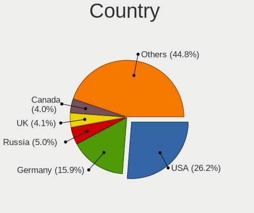
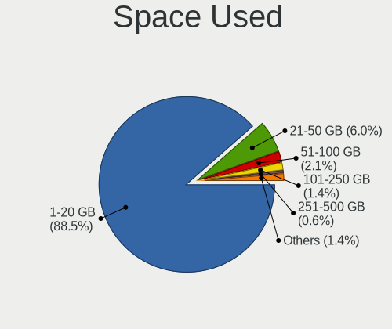
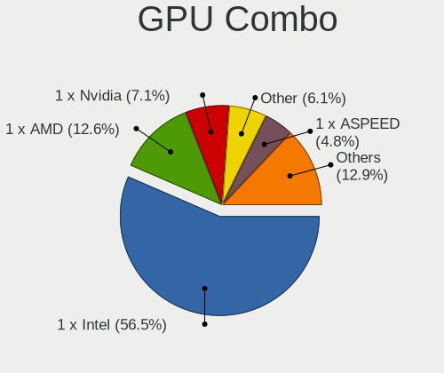

BSD - Tested Hardware & Statistics
----------------------------------

A project to collect tested hardware configurations for BSD.

Anyone can contribute to this report by the [hw-probe](https://github.com/linuxhw/hw-probe/blob/master/INSTALL.BSD.md) tool:

    hw-probe -all -upload

Please contribute! Especially if your hardware is rare.

This is a report for all computer types. See also reports for [desktops](/Desktop/README.md) and [notebooks](/Notebook/README.md).

OS-specific reports: [FreeBSD](/Dist/FreeBSD), [GhostBSD](/Dist/GhostBSD), [helloSystem](/Dist/helloSystem), [NetBSD](/Dist/NetBSD), [NomadBSD](/Dist/NomadBSD), [OpenBSD](/Dist/OpenBSD), [OPNsense](/Dist/OPNsense), [pfSense](/Dist/pfSense), [TrueNAS](/Dist/TrueNAS).

This report is for real hardware. Report for virtual hardware: [TestDays_VE](https://github.com/bsdhw/TestDays_VE)

Contents
--------

* [ Test Cases ](#test-cases)

* [ System ](#system)
  - [ OS                       ](#os)
  - [ OS Family                ](#os-family)
  - [ Arch                     ](#arch)
  - [ DE                       ](#de)
  - [ Display Server           ](#display-server)
  - [ Display Manager          ](#display-manager)
  - [ OS Lang                  ](#os-lang)
  - [ Boot Mode                ](#boot-mode)
  - [ Filesystem               ](#filesystem)
  - [ Part. scheme             ](#part-scheme)

* [ Board ](#board)
  - [ Vendor                   ](#vendor)
  - [ Model                    ](#model)
  - [ Model Family             ](#model-family)
  - [ MFG Year                 ](#mfg-year)
  - [ Form Factor              ](#form-factor)
  - [ Coreboot                 ](#coreboot)
  - [ RAM Size                 ](#ram-size)
  - [ RAM Used                 ](#ram-used)
  - [ Total Drives             ](#total-drives)
  - [ Has CD-ROM               ](#has-cd-rom)
  - [ Has Ethernet             ](#has-ethernet)
  - [ Has WiFi                 ](#has-wifi)
  - [ Has Bluetooth            ](#has-bluetooth)

* [ Location ](#location)
  - [ Country                  ](#country)
  - [ City                     ](#city)

* [ Drives ](#drives)
  - [ Drive Vendor             ](#drive-vendor)
  - [ Drive Model              ](#drive-model)
  - [ HDD Vendor               ](#hdd-vendor)
  - [ SSD Vendor               ](#ssd-vendor)
  - [ Drive Kind               ](#drive-kind)
  - [ Drive Connector          ](#drive-connector)
  - [ Drive Size               ](#drive-size)
  - [ Space Total              ](#space-total)
  - [ Space Used               ](#space-used)
  - [ Malfunc. Drives          ](#malfunc-drives)
  - [ Malfunc. Drive Vendor    ](#malfunc-drive-vendor)
  - [ Malfunc. HDD Vendor      ](#malfunc-hdd-vendor)
  - [ Malfunc. Drive Kind      ](#malfunc-drive-kind)
  - [ Failed Drives            ](#failed-drives)
  - [ Failed Drive Vendor      ](#failed-drive-vendor)
  - [ Drive Status             ](#drive-status)

* [ Storage controller ](#storage-controller)
  - [ Storage Vendor           ](#storage-vendor)
  - [ Storage Model            ](#storage-model)
  - [ Storage Kind             ](#storage-kind)

* [ Processor ](#processor)
  - [ CPU Vendor               ](#cpu-vendor)
  - [ CPU Model                ](#cpu-model)
  - [ CPU Model Family         ](#cpu-model-family)
  - [ CPU Cores                ](#cpu-cores)
  - [ CPU Sockets              ](#cpu-sockets)
  - [ CPU Threads              ](#cpu-threads)
  - [ CPU Microarch            ](#cpu-microarch)

* [ Graphics ](#graphics)
  - [ GPU Vendor               ](#gpu-vendor)
  - [ GPU Model                ](#gpu-model)
  - [ GPU Combo                ](#gpu-combo)
  - [ GPU Driver               ](#gpu-driver)
  - [ GPU Memory               ](#gpu-memory)

* [ Monitor ](#monitor)
  - [ Monitor Vendor           ](#monitor-vendor)
  - [ Monitor Model            ](#monitor-model)
  - [ Monitor Resolution       ](#monitor-resolution)
  - [ Monitor Diagonal         ](#monitor-diagonal)
  - [ Monitor Width            ](#monitor-width)
  - [ Aspect Ratio             ](#aspect-ratio)
  - [ Monitor Area             ](#monitor-area)
  - [ Pixel Density            ](#pixel-density)
  - [ Multiple Monitors        ](#multiple-monitors)

* [ Network ](#network)
  - [ Net Controller Vendor    ](#net-controller-vendor)
  - [ Net Controller Model     ](#net-controller-model)
  - [ Wireless Vendor          ](#wireless-vendor)
  - [ Wireless Model           ](#wireless-model)
  - [ Ethernet Vendor          ](#ethernet-vendor)
  - [ Ethernet Model           ](#ethernet-model)
  - [ Net Controller Kind      ](#net-controller-kind)
  - [ Used Controller          ](#used-controller)
  - [ NICs                     ](#nics)
  - [ IPv6                     ](#ipv6)

* [ Bluetooth ](#bluetooth)
  - [ Bluetooth Vendor         ](#bluetooth-vendor)
  - [ Bluetooth Model          ](#bluetooth-model)

* [ Sound ](#sound)
  - [ Sound Vendor             ](#sound-vendor)
  - [ Sound Model              ](#sound-model)

* [ Memory ](#memory)
  - [ Memory Vendor            ](#memory-vendor)
  - [ Memory Model             ](#memory-model)
  - [ Memory Kind              ](#memory-kind)
  - [ Memory Form Factor       ](#memory-form-factor)
  - [ Memory Size              ](#memory-size)
  - [ Memory Speed             ](#memory-speed)

* [ Printers & scanners ](#printers--scanners)
  - [ Printer Vendor           ](#printer-vendor)
  - [ Printer Model            ](#printer-model)
  - [ Scanner Vendor           ](#scanner-vendor)
  - [ Scanner Model            ](#scanner-model)

* [ Camera ](#camera)
  - [ Camera Vendor            ](#camera-vendor)
  - [ Camera Model             ](#camera-model)

* [ Security ](#security)
  - [ Fingerprint Vendor       ](#fingerprint-vendor)
  - [ Fingerprint Model        ](#fingerprint-model)
  - [ Chipcard Vendor          ](#chipcard-vendor)
  - [ Chipcard Model           ](#chipcard-model)

* [ Unsupported ](#unsupported)
  - [ Unsupported Devices      ](#unsupported-devices)
  - [ Unsupported Device Types ](#unsupported-device-types)

Test Cases
----------

Total: 16012

| Vendor        | Model                       | Form-Factor | Probe                                                     | Date         |
|---------------|-----------------------------|-------------|-----------------------------------------------------------|--------------|
| Unknown       | HX90                        | Desktop     | [b3300c45bc](https://bsd-hardware.info/?probe=b3300c45bc) | May 01, 2023 |
| Lenovo        | ThinkPad X260 20F5S2GM00    | Notebook    | [c4af168c4a](https://bsd-hardware.info/?probe=c4af168c4a) | May 01, 2023 |
| Unknown       | Unknown                     | Desktop     | [73f9fac4f8](https://bsd-hardware.info/?probe=73f9fac4f8) | May 01, 2023 |
| Lenovo        | ThinkPad X270 W10DG 20K5... | Notebook    | [cf504f51df](https://bsd-hardware.info/?probe=cf504f51df) | May 01, 2023 |
| ASUSTek       | ROG STRIX B550-F GAMING     | Desktop     | [3f089673e0](https://bsd-hardware.info/?probe=3f089673e0) | May 01, 2023 |
| ASUSTek       | ROG STRIX B550-F GAMING     | Desktop     | [396d7f268c](https://bsd-hardware.info/?probe=396d7f268c) | May 01, 2023 |
| Fujitsu       | D3313-G1 S26361-D3313-G1    | Desktop     | [8227d6d32c](https://bsd-hardware.info/?probe=8227d6d32c) | Apr 30, 2023 |
| HP            | ProLiant DL320e Gen8        | Server      | [03255b960a](https://bsd-hardware.info/?probe=03255b960a) | Apr 30, 2023 |
| IceWhale T... | ZimaBoard 832 ZMB           | Desktop     | [a59b6fc6dc](https://bsd-hardware.info/?probe=a59b6fc6dc) | Apr 30, 2023 |
| AZW           | SER                         | Mini pc     | [d3d9ba6f52](https://bsd-hardware.info/?probe=d3d9ba6f52) | Apr 30, 2023 |
| ZOTAC         | Unknown                     | Desktop     | [f6c39a3582](https://bsd-hardware.info/?probe=f6c39a3582) | Apr 30, 2023 |
| IceWhale T... | ZimaBoard 832 ZMB           | Desktop     | [2cc6521d1f](https://bsd-hardware.info/?probe=2cc6521d1f) | Apr 30, 2023 |
| ASRockRack    | EPYC3101D4I-2T              | Desktop     | [9d82570c34](https://bsd-hardware.info/?probe=9d82570c34) | Apr 30, 2023 |
| Dell          | 0FF3FN A00                  | Desktop     | [717b46840a](https://bsd-hardware.info/?probe=717b46840a) | Apr 30, 2023 |
| Dell          | 0H634K A00                  | Desktop     | [5e783a1c2e](https://bsd-hardware.info/?probe=5e783a1c2e) | Apr 30, 2023 |
| ASUSTek       | EX-B760M-V5 D4              | Desktop     | [d913324f82](https://bsd-hardware.info/?probe=d913324f82) | Apr 30, 2023 |
| ASUSTek       | M5A78L-M/USB3               | Desktop     | [f86a94eb66](https://bsd-hardware.info/?probe=f86a94eb66) | Apr 30, 2023 |
| CWWK          | MINIPC-G12                  | Desktop     | [0ef2320816](https://bsd-hardware.info/?probe=0ef2320816) | Apr 30, 2023 |
| ReachingTe... | DreamQuest Pro 2022         | Notebook    | [afd28a7425](https://bsd-hardware.info/?probe=afd28a7425) | Apr 30, 2023 |
| GVC           | DR 738                      | Desktop     | [21b338db1b](https://bsd-hardware.info/?probe=21b338db1b) | Apr 30, 2023 |
| Intel         | NUC7i3DNB J57625-512        | Mini pc     | [50836a160a](https://bsd-hardware.info/?probe=50836a160a) | Apr 30, 2023 |
| MSI           | H81M-P33                    | Desktop     | [e28acf1164](https://bsd-hardware.info/?probe=e28acf1164) | Apr 30, 2023 |
| ASUSTek       | P5Q-E                       | Desktop     | [33d1b6e2d2](https://bsd-hardware.info/?probe=33d1b6e2d2) | Apr 30, 2023 |
| ASUSTek       | ROG CROSSHAIR VIII HERO     | Desktop     | [b0d9eaaceb](https://bsd-hardware.info/?probe=b0d9eaaceb) | Apr 30, 2023 |
| Gigabyte      | B450M DS3H-CF               | Desktop     | [2b922b7925](https://bsd-hardware.info/?probe=2b922b7925) | Apr 30, 2023 |
| Fujitsu       | LIFEBOOK E752               | Notebook    | [44ea9fb6ae](https://bsd-hardware.info/?probe=44ea9fb6ae) | Apr 30, 2023 |
| ASUSTek       | AT5IONT-I                   | Desktop     | [1984165524](https://bsd-hardware.info/?probe=1984165524) | Apr 30, 2023 |
| HP            | 213D A01                    | Desktop     | [1722a91083](https://bsd-hardware.info/?probe=1722a91083) | Apr 30, 2023 |
| ASUSTek       | ROG STRIX B550-F GAMING     | Desktop     | [779f5f8827](https://bsd-hardware.info/?probe=779f5f8827) | Apr 30, 2023 |
| HP            | 83E1                        | Desktop     | [d3e5e9a563](https://bsd-hardware.info/?probe=d3e5e9a563) | Apr 30, 2023 |
| Protectli     | VP2420                      | Desktop     | [4ea8453453](https://bsd-hardware.info/?probe=4ea8453453) | Apr 30, 2023 |
| Protectli     | VP2420                      | Desktop     | [46a00b21d9](https://bsd-hardware.info/?probe=46a00b21d9) | Apr 30, 2023 |
| CWWK          | MINIPC-G12                  | Desktop     | [4806dc7d9a](https://bsd-hardware.info/?probe=4806dc7d9a) | Apr 29, 2023 |
| HP            | 8103 A01                    | Mini pc     | [51ec1cdb56](https://bsd-hardware.info/?probe=51ec1cdb56) | Apr 29, 2023 |
| Dell          | 00NH4P A03                  | Server      | [85fb3b322e](https://bsd-hardware.info/?probe=85fb3b322e) | Apr 29, 2023 |
| Dell          | Latitude E5570              | Notebook    | [98e3f9821b](https://bsd-hardware.info/?probe=98e3f9821b) | Apr 29, 2023 |
| Supermicro    | A1SAi 123456789             | Mini pc     | [38dc0b126e](https://bsd-hardware.info/?probe=38dc0b126e) | Apr 29, 2023 |
| Unknown       | Unknown                     | Desktop     | [1774da050f](https://bsd-hardware.info/?probe=1774da050f) | Apr 29, 2023 |
| Gigabyte      | Z370 HD3-CF                 | Desktop     | [b3aedc1990](https://bsd-hardware.info/?probe=b3aedc1990) | Apr 29, 2023 |
| Dell          | 00V62H A00                  | Desktop     | [ad97036f62](https://bsd-hardware.info/?probe=ad97036f62) | Apr 29, 2023 |
| Unknown       | Unknown                     | Desktop     | [73fa910249](https://bsd-hardware.info/?probe=73fa910249) | Apr 29, 2023 |
| HP            | ProLiant DL320e Gen8        | Server      | [b1c41e5e29](https://bsd-hardware.info/?probe=b1c41e5e29) | Apr 29, 2023 |
| Gigabyte      | H510M K                     | Desktop     | [a952664d92](https://bsd-hardware.info/?probe=a952664d92) | Apr 29, 2023 |
| HP            | ProBook 640 G4              | Notebook    | [7b44e1591f](https://bsd-hardware.info/?probe=7b44e1591f) | Apr 29, 2023 |
| ASUSTek       | PRIME B250M-A               | Desktop     | [270284972d](https://bsd-hardware.info/?probe=270284972d) | Apr 29, 2023 |
| ASUSTek       | PRIME H610I-PLUS D4         | Desktop     | [472c5fb78e](https://bsd-hardware.info/?probe=472c5fb78e) | Apr 29, 2023 |
| Supermicro    | X11SDV-4C-TP8F              | Desktop     | [dbdb6539fb](https://bsd-hardware.info/?probe=dbdb6539fb) | Apr 29, 2023 |
| AMI           | Aptio CRB                   | Mini pc     | [ec520be044](https://bsd-hardware.info/?probe=ec520be044) | Apr 29, 2023 |
| Supermicro    | A2SDi-H-TF                  | Server      | [cae933d56e](https://bsd-hardware.info/?probe=cae933d56e) | Apr 29, 2023 |
| Protectli     | FW4B                        | Desktop     | [048da71e18](https://bsd-hardware.info/?probe=048da71e18) | Apr 29, 2023 |
| iBASE         | Mi956                       | Desktop     | [e2c1e52a68](https://bsd-hardware.info/?probe=e2c1e52a68) | Apr 29, 2023 |
| Sophos        | SG                          | Firewall    | [b0c4592563](https://bsd-hardware.info/?probe=b0c4592563) | Apr 29, 2023 |
| MSI           | X470 GAMING PLUS MAX        | Desktop     | [8acf41eb6b](https://bsd-hardware.info/?probe=8acf41eb6b) | Apr 28, 2023 |
| Protectli     | FW4C Ver                    | Desktop     | [29ecd63e1e](https://bsd-hardware.info/?probe=29ecd63e1e) | Apr 28, 2023 |
| Unknown       | Unknown                     | Desktop     | [d6f92a5ecc](https://bsd-hardware.info/?probe=d6f92a5ecc) | Apr 28, 2023 |
| Unknown       | iKoolCore R1 iKoolCore R... | Desktop     | [9495b45b30](https://bsd-hardware.info/?probe=9495b45b30) | Apr 28, 2023 |
| Deciso        | NetBoard-A10                | Notebook    | [79c36f752c](https://bsd-hardware.info/?probe=79c36f752c) | Apr 28, 2023 |
| Protectli     | VP2420                      | Desktop     | [b980175f4f](https://bsd-hardware.info/?probe=b980175f4f) | Apr 28, 2023 |
| Gigabyte      | Z590 AORUS ULTRA            | Desktop     | [f6200a69eb](https://bsd-hardware.info/?probe=f6200a69eb) | Apr 28, 2023 |
| Supermicro    | A2SDi-4C-HLN4F              | Server      | [9dc9ca0768](https://bsd-hardware.info/?probe=9dc9ca0768) | Apr 28, 2023 |
| Unknown       | Unknown                     | Desktop     | [28253dd080](https://bsd-hardware.info/?probe=28253dd080) | Apr 28, 2023 |
| Deciso        | NetBoard-A20                | Notebook    | [baa443b8ea](https://bsd-hardware.info/?probe=baa443b8ea) | Apr 28, 2023 |
| Intel         | SHARKBAY                    | Desktop     | [d4848171e4](https://bsd-hardware.info/?probe=d4848171e4) | Apr 28, 2023 |
| NCR           | Richmond BIOS.6.0           | Desktop     | [e41e1e5c70](https://bsd-hardware.info/?probe=e41e1e5c70) | Apr 28, 2023 |
| Protectli     | FW4B Ver                    | Desktop     | [ef3774c8f2](https://bsd-hardware.info/?probe=ef3774c8f2) | Apr 28, 2023 |
| Dell          | 03X6X0 A02                  | Server      | [95a05a3e59](https://bsd-hardware.info/?probe=95a05a3e59) | Apr 28, 2023 |
| PC Engines    | apu1                        | Desktop     | [1a37e9d978](https://bsd-hardware.info/?probe=1a37e9d978) | Apr 27, 2023 |
| Unknown       | Unknown                     | Desktop     | [15c2e0790b](https://bsd-hardware.info/?probe=15c2e0790b) | Apr 27, 2023 |
| Deciso        | Netboard A10 GEN2 Model ... | Desktop     | [e7e7a6470d](https://bsd-hardware.info/?probe=e7e7a6470d) | Apr 27, 2023 |
| Deciso        | Netboard A10 GEN2 Model ... | Desktop     | [b517729fb4](https://bsd-hardware.info/?probe=b517729fb4) | Apr 27, 2023 |
| Protectli     | VP2420                      | Desktop     | [8b2758be02](https://bsd-hardware.info/?probe=8b2758be02) | Apr 27, 2023 |
| iBASE         | Mi956                       | Desktop     | [cb08976732](https://bsd-hardware.info/?probe=cb08976732) | Apr 27, 2023 |
| Lenovo        | SHARKBAY NOK                | Desktop     | [2a9fc1af29](https://bsd-hardware.info/?probe=2a9fc1af29) | Apr 27, 2023 |
| Apple         | MacBookPro8,3               | Notebook    | [08e155a558](https://bsd-hardware.info/?probe=08e155a558) | Apr 27, 2023 |
| MSI           | H110M PRO-VD                | Desktop     | [ce8453fcce](https://bsd-hardware.info/?probe=ce8453fcce) | Apr 27, 2023 |
| Dell          | 081N4V A05                  | Server      | [e5f9ddcee3](https://bsd-hardware.info/?probe=e5f9ddcee3) | Apr 27, 2023 |
| Dell          | 0KV62T A01                  | Desktop     | [f26926526d](https://bsd-hardware.info/?probe=f26926526d) | Apr 27, 2023 |
| HP            | OMEN by Laptop 15-dc1xxx    | Notebook    | [fc81710889](https://bsd-hardware.info/?probe=fc81710889) | Apr 27, 2023 |
| ASUSTek       | PRIME B760M-A D4            | Desktop     | [9d15e108e6](https://bsd-hardware.info/?probe=9d15e108e6) | Apr 27, 2023 |
| Lenovo        | 312D SDK0J40697 WIN 3305... | Mini pc     | [8a4ea432e6](https://bsd-hardware.info/?probe=8a4ea432e6) | Apr 27, 2023 |
| Intel         | CRESCENTBAY                 | Desktop     | [b32c8cbec8](https://bsd-hardware.info/?probe=b32c8cbec8) | Apr 27, 2023 |
| Supermicro    | X11SCM-LN8F                 | Server      | [32afb6ef58](https://bsd-hardware.info/?probe=32afb6ef58) | Apr 27, 2023 |
| ASUSTek       | H61M-K                      | Desktop     | [e735610d5c](https://bsd-hardware.info/?probe=e735610d5c) | Apr 27, 2023 |
| ASUSTek       | H61M-K                      | Desktop     | [db767ed552](https://bsd-hardware.info/?probe=db767ed552) | Apr 27, 2023 |
| Lenovo        | 30D9 SDK0J40705 WIN 3425... | Desktop     | [8476daf227](https://bsd-hardware.info/?probe=8476daf227) | Apr 27, 2023 |
| Apple         | MacBook5,1                  | Notebook    | [52174cc0ba](https://bsd-hardware.info/?probe=52174cc0ba) | Apr 27, 2023 |
| Dell          | 0252PH A04                  | Desktop     | [f497e66dec](https://bsd-hardware.info/?probe=f497e66dec) | Apr 27, 2023 |
| Acer          | Spin SP314-21               | Convertible | [f5debc3ef8](https://bsd-hardware.info/?probe=f5debc3ef8) | Apr 27, 2023 |
| HP            | 18E5                        | Desktop     | [9f82560327](https://bsd-hardware.info/?probe=9f82560327) | Apr 26, 2023 |
| HP            | 83EE                        | Desktop     | [b5a00cabd1](https://bsd-hardware.info/?probe=b5a00cabd1) | Apr 26, 2023 |
| Unknown       | Unknown                     | Desktop     | [f061353360](https://bsd-hardware.info/?probe=f061353360) | Apr 26, 2023 |
| Lenovo        | ThinkPad T470s W10DG 20J... | Notebook    | [692df89c1f](https://bsd-hardware.info/?probe=692df89c1f) | Apr 26, 2023 |
| Unknown       | Unknown                     | Desktop     | [290fabd69d](https://bsd-hardware.info/?probe=290fabd69d) | Apr 26, 2023 |
| Fujitsu       | D3313-A1 S26361-D3313-A1    | Desktop     | [989f3b44bf](https://bsd-hardware.info/?probe=989f3b44bf) | Apr 26, 2023 |
| Unknown       | Unknown                     | Desktop     | [ece1b6bacb](https://bsd-hardware.info/?probe=ece1b6bacb) | Apr 26, 2023 |
| Supermicro    | A1SRi 123456789             | Mini pc     | [acb9ca23c8](https://bsd-hardware.info/?probe=acb9ca23c8) | Apr 26, 2023 |
| PC Engines    | APU2                        | Desktop     | [94bbc28953](https://bsd-hardware.info/?probe=94bbc28953) | Apr 26, 2023 |
| HP            | 859B                        | Desktop     | [357ef27be4](https://bsd-hardware.info/?probe=357ef27be4) | Apr 26, 2023 |
| HP            | 83E1                        | Desktop     | [58c58b6a82](https://bsd-hardware.info/?probe=58c58b6a82) | Apr 26, 2023 |
| HP            | 872D                        | Desktop     | [bd02a2ddb8](https://bsd-hardware.info/?probe=bd02a2ddb8) | Apr 26, 2023 |
| HP            | 8056                        | Desktop     | [44fb168511](https://bsd-hardware.info/?probe=44fb168511) | Apr 26, 2023 |
| Techvision    | TVI7309X B0                 | Desktop     | [dcacaf8c50](https://bsd-hardware.info/?probe=dcacaf8c50) | Apr 26, 2023 |
| HP            | 1998                        | Desktop     | [41b5bbe52c](https://bsd-hardware.info/?probe=41b5bbe52c) | Apr 26, 2023 |
| Supermicro    | X11SDW-8C-TP13F             | Desktop     | [94316d20c8](https://bsd-hardware.info/?probe=94316d20c8) | Apr 26, 2023 |
| AZW           | EQ                          | Desktop     | [8dd15b5070](https://bsd-hardware.info/?probe=8dd15b5070) | Apr 26, 2023 |
| Lenovo        | 3132 SDK0J40697 WIN 3305... | Desktop     | [6efffdce00](https://bsd-hardware.info/?probe=6efffdce00) | Apr 25, 2023 |
| Gigabyte      | B360M D2V                   | Desktop     | [d4881f1fb6](https://bsd-hardware.info/?probe=d4881f1fb6) | Apr 25, 2023 |
| Apple         | MacBook5,1                  | Notebook    | [4c7f33d6a9](https://bsd-hardware.info/?probe=4c7f33d6a9) | Apr 25, 2023 |
| ShenZhen M... | 3865U-6L                    | Desktop     | [1548471a4d](https://bsd-hardware.info/?probe=1548471a4d) | Apr 25, 2023 |
| Intel         | Q3XXG4-P V1.0               | Desktop     | [b46f671e20](https://bsd-hardware.info/?probe=b46f671e20) | Apr 25, 2023 |
| Intel         | NUC8i7HVB J68196-602        | Mini pc     | [d831c83343](https://bsd-hardware.info/?probe=d831c83343) | Apr 25, 2023 |
| ASUSTek       | P10S-E Series               | Desktop     | [e6d1a90732](https://bsd-hardware.info/?probe=e6d1a90732) | Apr 25, 2023 |
| HP            | 83E1                        | Desktop     | [865bd9b84e](https://bsd-hardware.info/?probe=865bd9b84e) | Apr 25, 2023 |
| Deciso        | NetBoard-A20                | Notebook    | [3d0f6b629d](https://bsd-hardware.info/?probe=3d0f6b629d) | Apr 25, 2023 |
| Supermicro    | X11SDV-8C-TP8F              | Desktop     | [b56e27db28](https://bsd-hardware.info/?probe=b56e27db28) | Apr 25, 2023 |
| Shuttle       | DS437                       | Notebook    | [284decb573](https://bsd-hardware.info/?probe=284decb573) | Apr 25, 2023 |
| AZW           | GK55                        | Desktop     | [31a99b9d2a](https://bsd-hardware.info/?probe=31a99b9d2a) | Apr 25, 2023 |
| Dell          | 0F0XJ6 A11                  | Server      | [2d4f063c9f](https://bsd-hardware.info/?probe=2d4f063c9f) | Apr 25, 2023 |
| ASRock        | H81M-VG4 R2.0               | Desktop     | [d249003a15](https://bsd-hardware.info/?probe=d249003a15) | Apr 25, 2023 |
| Dell          | 0NV0M7 A01                  | Desktop     | [601f819826](https://bsd-hardware.info/?probe=601f819826) | Apr 25, 2023 |
| Protectli     | FW4B                        | Desktop     | [111e2f7b3b](https://bsd-hardware.info/?probe=111e2f7b3b) | Apr 25, 2023 |
| ASUSTek       | ROG CROSSHAIR VIII HERO     | Desktop     | [cf0771c3a2](https://bsd-hardware.info/?probe=cf0771c3a2) | Apr 25, 2023 |
| Supermicro    | X11SDV-4C-TP8F-01           | Desktop     | [02d2e2ea42](https://bsd-hardware.info/?probe=02d2e2ea42) | Apr 25, 2023 |
| BYTENUC       | AZ51                        | Mini pc     | [89f1d3809e](https://bsd-hardware.info/?probe=89f1d3809e) | Apr 25, 2023 |
| Intel GMLV... | GMLR115 GMLR115             | Desktop     | [56d2fcc6e9](https://bsd-hardware.info/?probe=56d2fcc6e9) | Apr 24, 2023 |
| HP            | 18E7                        | Desktop     | [777359d3c1](https://bsd-hardware.info/?probe=777359d3c1) | Apr 24, 2023 |
| ASUSTek       | TUF Gaming X670E-PLUS WI... | Desktop     | [d3373e972b](https://bsd-hardware.info/?probe=d3373e972b) | Apr 24, 2023 |
| AWOW          | AK34Pro                     | Mini pc     | [0471af8c22](https://bsd-hardware.info/?probe=0471af8c22) | Apr 24, 2023 |
| Sophos        | SG                          | Firewall    | [b5452a27b6](https://bsd-hardware.info/?probe=b5452a27b6) | Apr 24, 2023 |
| Protectli     | FW4C Ver                    | Desktop     | [39d17845fb](https://bsd-hardware.info/?probe=39d17845fb) | Apr 24, 2023 |
| AZW           | EQ                          | Desktop     | [fe3205803d](https://bsd-hardware.info/?probe=fe3205803d) | Apr 24, 2023 |
| MiTAC         | PH13CMI                     | Desktop     | [5d3e954049](https://bsd-hardware.info/?probe=5d3e954049) | Apr 24, 2023 |
| ZOTAC         | ZBOX-CI323NANO              | Mini pc     | [c452485a00](https://bsd-hardware.info/?probe=c452485a00) | Apr 24, 2023 |
| ASRock        | X370 Pro4                   | Desktop     | [9678198b3b](https://bsd-hardware.info/?probe=9678198b3b) | Apr 24, 2023 |
| HP            | Pavilion Notebook           | Notebook    | [247810c987](https://bsd-hardware.info/?probe=247810c987) | Apr 24, 2023 |
| Unknown       | Unknown                     | Desktop     | [389267d68d](https://bsd-hardware.info/?probe=389267d68d) | Apr 24, 2023 |
| Samsung       | 340XAA/350XAA/550XAA        | Notebook    | [7caed06fdb](https://bsd-hardware.info/?probe=7caed06fdb) | Apr 24, 2023 |
| Dell          | 0NV0M7 A01                  | Desktop     | [280ab26f33](https://bsd-hardware.info/?probe=280ab26f33) | Apr 24, 2023 |
| Google        | Peppy                       | Notebook    | [d162160498](https://bsd-hardware.info/?probe=d162160498) | Apr 24, 2023 |
| Lenovo        | V14 G2 ITL 82NM             | Desktop     | [827308827b](https://bsd-hardware.info/?probe=827308827b) | Apr 24, 2023 |
| Lenovo        | ThinkCentre M57p 6073ATU    | Desktop     | [b1e7583e6b](https://bsd-hardware.info/?probe=b1e7583e6b) | Apr 24, 2023 |
| Samsung       | DP700A3D-A05UK SEC_SW_RE... | All in one  | [5718d8d05e](https://bsd-hardware.info/?probe=5718d8d05e) | Apr 24, 2023 |
| Supermicro    | A1SRi-2758F                 | Desktop     | [750e44f983](https://bsd-hardware.info/?probe=750e44f983) | Apr 24, 2023 |
| AWOW          | PC BOX                      | Mini pc     | [cfd318affb](https://bsd-hardware.info/?probe=cfd318affb) | Apr 23, 2023 |
| Dell          | 0WR7PY A03                  | Desktop     | [e461f7862c](https://bsd-hardware.info/?probe=e461f7862c) | Apr 23, 2023 |
| Fujitsu Si... | AMILO Li3710                | Notebook    | [214b0c30e0](https://bsd-hardware.info/?probe=214b0c30e0) | Apr 23, 2023 |
| HP            | Unknown                     | Notebook    | [e2aa3620b4](https://bsd-hardware.info/?probe=e2aa3620b4) | Apr 23, 2023 |
| ASUSTek       | TUF Gaming B650M-PLUS       | Desktop     | [0c8a0100c5](https://bsd-hardware.info/?probe=0c8a0100c5) | Apr 23, 2023 |
| Unknown       | Unknown                     | Desktop     | [19f2756a1d](https://bsd-hardware.info/?probe=19f2756a1d) | Apr 23, 2023 |
| AWOW          | AK34Pro                     | Mini pc     | [30062ec670](https://bsd-hardware.info/?probe=30062ec670) | Apr 23, 2023 |
| Sophos        | XG                          | Firewall    | [5202fd70b1](https://bsd-hardware.info/?probe=5202fd70b1) | Apr 23, 2023 |
| ASRock        | H110M-ITX                   | Desktop     | [ed0c2c1af7](https://bsd-hardware.info/?probe=ed0c2c1af7) | Apr 23, 2023 |
| Lenovo        | ThinkPad X270 20HMS06Q1D    | Notebook    | [2df7c991f0](https://bsd-hardware.info/?probe=2df7c991f0) | Apr 23, 2023 |
| Dell          | 02YYK5 A01                  | Desktop     | [9f7ba08cb2](https://bsd-hardware.info/?probe=9f7ba08cb2) | Apr 23, 2023 |
| Lenovo        | G500 20236                  | Notebook    | [e7387bfd6e](https://bsd-hardware.info/?probe=e7387bfd6e) | Apr 23, 2023 |
| MW            | GMLK-2_5G4L                 | Desktop     | [b3a756536a](https://bsd-hardware.info/?probe=b3a756536a) | Apr 23, 2023 |
| Techvision    | TVI7309X B0                 | Desktop     | [ad73cda832](https://bsd-hardware.info/?probe=ad73cda832) | Apr 23, 2023 |
| Intel         | Q3XXG4-P V1.0               | Desktop     | [7891ca8e09](https://bsd-hardware.info/?probe=7891ca8e09) | Apr 23, 2023 |
| MSI           | H81M-P33                    | Desktop     | [6df7a17ff2](https://bsd-hardware.info/?probe=6df7a17ff2) | Apr 23, 2023 |
| ASUSTek       | P5Q-E                       | Desktop     | [37564b68c3](https://bsd-hardware.info/?probe=37564b68c3) | Apr 23, 2023 |
| ASUSTek       | ROG CROSSHAIR VIII HERO     | Desktop     | [d44a98739c](https://bsd-hardware.info/?probe=d44a98739c) | Apr 23, 2023 |
| HP            | 82B4                        | Desktop     | [9ec1e6d6f4](https://bsd-hardware.info/?probe=9ec1e6d6f4) | Apr 23, 2023 |
| Protectli     | VP2410 10                   | Desktop     | [463567a3e6](https://bsd-hardware.info/?probe=463567a3e6) | Apr 23, 2023 |
| Sophos        | SG                          | Firewall    | [7adec1bab7](https://bsd-hardware.info/?probe=7adec1bab7) | Apr 23, 2023 |
| Dell          | 0569RT A04                  | Server      | [cff2ebd06b](https://bsd-hardware.info/?probe=cff2ebd06b) | Apr 23, 2023 |
| Techvision    | TVI7309X B0                 | Desktop     | [dab120ab36](https://bsd-hardware.info/?probe=dab120ab36) | Apr 23, 2023 |
| PC Engines    | APU2                        | Desktop     | [47eb1b9bf1](https://bsd-hardware.info/?probe=47eb1b9bf1) | Apr 23, 2023 |
| Dell          | Inspiron 3421               | Notebook    | [ef4870410f](https://bsd-hardware.info/?probe=ef4870410f) | Apr 23, 2023 |
| ASUSTek       | TUF Gaming B560M-PLUS WI... | Desktop     | [50ff0c14dd](https://bsd-hardware.info/?probe=50ff0c14dd) | Apr 22, 2023 |
| PC Engines    | apu1                        | Desktop     | [9838a040ba](https://bsd-hardware.info/?probe=9838a040ba) | Apr 22, 2023 |
| PC Engines    | apu1                        | Desktop     | [6e3df79f6d](https://bsd-hardware.info/?probe=6e3df79f6d) | Apr 22, 2023 |
| BYTENUC       | AZ51                        | Mini pc     | [0743e8fcc3](https://bsd-hardware.info/?probe=0743e8fcc3) | Apr 22, 2023 |
| ASUSTek       | TUF Gaming B650M-PLUS       | Desktop     | [775424cbff](https://bsd-hardware.info/?probe=775424cbff) | Apr 22, 2023 |
| Supermicro    | A2SDi-4C-HLN4F              | Desktop     | [631a166cee](https://bsd-hardware.info/?probe=631a166cee) | Apr 22, 2023 |
| Gigabyte      | N3050MD3P                   | Desktop     | [66e9ccbef8](https://bsd-hardware.info/?probe=66e9ccbef8) | Apr 22, 2023 |
| Protectli     | FW4B Ver                    | Desktop     | [f241a78410](https://bsd-hardware.info/?probe=f241a78410) | Apr 22, 2023 |
| Dell          | 012KND A00                  | Mini pc     | [0195145b80](https://bsd-hardware.info/?probe=0195145b80) | Apr 22, 2023 |
| Techvision    | TVI7309X B0                 | Desktop     | [fb86b7611d](https://bsd-hardware.info/?probe=fb86b7611d) | Apr 22, 2023 |
| Fujitsu       | D3313-A1 S26361-D3313-A1    | Desktop     | [7a5fcaf0d0](https://bsd-hardware.info/?probe=7a5fcaf0d0) | Apr 22, 2023 |
| Intel         | NUC11PHBi7 M26151-402       | Mini pc     | [596ddff446](https://bsd-hardware.info/?probe=596ddff446) | Apr 22, 2023 |
| ASUSTek       | P8H77-V                     | Desktop     | [60f61f7ecb](https://bsd-hardware.info/?probe=60f61f7ecb) | Apr 22, 2023 |
| Techvision    | TVI7309X B0                 | Desktop     | [a4bc168937](https://bsd-hardware.info/?probe=a4bc168937) | Apr 22, 2023 |
| Intel         | SKYBAY                      | Desktop     | [03dd920110](https://bsd-hardware.info/?probe=03dd920110) | Apr 22, 2023 |
| HP            | Pavilion Notebook           | Notebook    | [243a9c2f22](https://bsd-hardware.info/?probe=243a9c2f22) | Apr 22, 2023 |
| HP            | 83E1                        | Desktop     | [35360c7568](https://bsd-hardware.info/?probe=35360c7568) | Apr 22, 2023 |
| Unknown       | Unknown                     | Desktop     | [66614019db](https://bsd-hardware.info/?probe=66614019db) | Apr 22, 2023 |
| Supermicro    | X9SCL/X9SCMA                | Desktop     | [9b975ac704](https://bsd-hardware.info/?probe=9b975ac704) | Apr 22, 2023 |
| Intel Clie... | LAPBC510                    | Notebook    | [68b1300903](https://bsd-hardware.info/?probe=68b1300903) | Apr 22, 2023 |
| Supermicro    | A2SDi-4C-HLN4F              | Server      | [8e138145ca](https://bsd-hardware.info/?probe=8e138145ca) | Apr 22, 2023 |
| ASUSTek       | AT5IONT-I                   | Desktop     | [b943bb55f8](https://bsd-hardware.info/?probe=b943bb55f8) | Apr 21, 2023 |
| Dell          | 09KPNV A01                  | Desktop     | [ace3ed09b3](https://bsd-hardware.info/?probe=ace3ed09b3) | Apr 21, 2023 |
| HP            | Pavilion 17                 | Notebook    | [0f891b4377](https://bsd-hardware.info/?probe=0f891b4377) | Apr 21, 2023 |
| Unknown       | Unknown                     | Desktop     | [7f3a49a5e2](https://bsd-hardware.info/?probe=7f3a49a5e2) | Apr 21, 2023 |
| HP            | 8103 A01                    | Mini pc     | [e9c239c897](https://bsd-hardware.info/?probe=e9c239c897) | Apr 21, 2023 |
| PC Engines    | APU                         | Desktop     | [c4238a76d1](https://bsd-hardware.info/?probe=c4238a76d1) | Apr 21, 2023 |
| Lenovo        | ThinkPad W520 4270CTO       | Notebook    | [51f0a87f01](https://bsd-hardware.info/?probe=51f0a87f01) | Apr 21, 2023 |
| PC Engines    | APU                         | Desktop     | [ae3ce982fe](https://bsd-hardware.info/?probe=ae3ce982fe) | Apr 21, 2023 |
| ASUSTek       | TUF Gaming B550-PLUS        | Desktop     | [c26c1111c6](https://bsd-hardware.info/?probe=c26c1111c6) | Apr 21, 2023 |
| Unknown       | Unknown                     | Desktop     | [b755911f65](https://bsd-hardware.info/?probe=b755911f65) | Apr 21, 2023 |
| Unknown       | Unknown                     | Desktop     | [5cd7c515c9](https://bsd-hardware.info/?probe=5cd7c515c9) | Apr 21, 2023 |
| Unknown       | Unknown                     | Desktop     | [0d7a1b58ed](https://bsd-hardware.info/?probe=0d7a1b58ed) | Apr 21, 2023 |
| Sophos        | UTM                         | Firewall    | [85bf260703](https://bsd-hardware.info/?probe=85bf260703) | Apr 21, 2023 |
| Lenovo        | Yoga Slim 7 14ITL05 82A3    | Notebook    | [93b498fb0c](https://bsd-hardware.info/?probe=93b498fb0c) | Apr 21, 2023 |
| ASUSTek       | C8HM70-I/HDMI               | Desktop     | [2701240671](https://bsd-hardware.info/?probe=2701240671) | Apr 21, 2023 |
| Lenovo        | V14 G2 ITL 82NM             | Desktop     | [a6141b809a](https://bsd-hardware.info/?probe=a6141b809a) | Apr 21, 2023 |
| Techvision    | TVI7309X B0                 | Desktop     | [db14ca34c2](https://bsd-hardware.info/?probe=db14ca34c2) | Apr 21, 2023 |
| HP            | OMEN by Laptop 15-dc1xxx    | Notebook    | [e17bcecec8](https://bsd-hardware.info/?probe=e17bcecec8) | Apr 21, 2023 |
| Techvision    | TVI7309X B0                 | Desktop     | [215364d870](https://bsd-hardware.info/?probe=215364d870) | Apr 21, 2023 |
| ASUSTek       | ROG STRIX B550-E GAMING     | Desktop     | [838979f891](https://bsd-hardware.info/?probe=838979f891) | Apr 20, 2023 |
| Dell          | Latitude 7280               | Notebook    | [254acb5df8](https://bsd-hardware.info/?probe=254acb5df8) | Apr 20, 2023 |
| HP            | EliteBook 8570p             | Notebook    | [6e82f69c4c](https://bsd-hardware.info/?probe=6e82f69c4c) | Apr 20, 2023 |
| Lenovo        | Legion 5 15ARH05 82B5       | Notebook    | [541f3e7f7e](https://bsd-hardware.info/?probe=541f3e7f7e) | Apr 20, 2023 |
| HP            | 83F2                        | Desktop     | [1ff683e02b](https://bsd-hardware.info/?probe=1ff683e02b) | Apr 20, 2023 |
| Acer          | Aspire TC-885 V:1.1         | Desktop     | [6f85c5453c](https://bsd-hardware.info/?probe=6f85c5453c) | Apr 20, 2023 |
| PC Engines    | APU2                        | Desktop     | [4337168a3a](https://bsd-hardware.info/?probe=4337168a3a) | Apr 20, 2023 |
| ReachingTe... | DreamQuest Pro 2022         | Notebook    | [c4b2619dda](https://bsd-hardware.info/?probe=c4b2619dda) | Apr 20, 2023 |
| Dell          | Precision 5510              | Notebook    | [7028fde527](https://bsd-hardware.info/?probe=7028fde527) | Apr 20, 2023 |
| GoWin Solu... | R86S                        | Desktop     | [5e94539f7f](https://bsd-hardware.info/?probe=5e94539f7f) | Apr 20, 2023 |
| Dell          | 04Y8V0 A02                  | Desktop     | [24379ebf10](https://bsd-hardware.info/?probe=24379ebf10) | Apr 20, 2023 |
| HP            | 158B                        | Desktop     | [40fe372619](https://bsd-hardware.info/?probe=40fe372619) | Apr 20, 2023 |
| Protectli     | FW4B Ver                    | Desktop     | [156f934077](https://bsd-hardware.info/?probe=156f934077) | Apr 20, 2023 |
| ASUSTek       | TUF Gaming B550M-E WIFI     | Desktop     | [79411cd83e](https://bsd-hardware.info/?probe=79411cd83e) | Apr 20, 2023 |
| Supermicro    | M11SDV-8C-LN4F              | Desktop     | [49a95f197c](https://bsd-hardware.info/?probe=49a95f197c) | Apr 20, 2023 |
| Lenovo        | 310B SDK0J40697 WIN 3305... | Desktop     | [94507dfaf6](https://bsd-hardware.info/?probe=94507dfaf6) | Apr 20, 2023 |
| ASUSTek       | P11C-M Series               | Desktop     | [4695b46b47](https://bsd-hardware.info/?probe=4695b46b47) | Apr 20, 2023 |
| HP            | 82B4                        | Desktop     | [b75bb5fe83](https://bsd-hardware.info/?probe=b75bb5fe83) | Apr 20, 2023 |
| MW            | GMLK-2_5G4L                 | Desktop     | [24162b26be](https://bsd-hardware.info/?probe=24162b26be) | Apr 20, 2023 |
| Dell          | 081N4V A05                  | Server      | [8189917b77](https://bsd-hardware.info/?probe=8189917b77) | Apr 20, 2023 |
| Techvision    | TVI7309X B0                 | Desktop     | [fdbbde509c](https://bsd-hardware.info/?probe=fdbbde509c) | Apr 20, 2023 |
| PC Engines    | APU3                        | Desktop     | [110d848c38](https://bsd-hardware.info/?probe=110d848c38) | Apr 19, 2023 |
| Sophos        | SG                          | Firewall    | [c05ad03e84](https://bsd-hardware.info/?probe=c05ad03e84) | Apr 19, 2023 |
| Lenovo        | ThinkPad X201 3626WNP       | Notebook    | [d642970071](https://bsd-hardware.info/?probe=d642970071) | Apr 19, 2023 |
| PC Engines    | APU2                        | Desktop     | [59b3a3eebf](https://bsd-hardware.info/?probe=59b3a3eebf) | Apr 19, 2023 |
| Packard Be... | DOT SE                      | Notebook    | [f456e964db](https://bsd-hardware.info/?probe=f456e964db) | Apr 19, 2023 |
| Dell          | Latitude 7410               | Notebook    | [d5c047907d](https://bsd-hardware.info/?probe=d5c047907d) | Apr 19, 2023 |
| Sophos        | XG                          | Firewall    | [1aabb70504](https://bsd-hardware.info/?probe=1aabb70504) | Apr 19, 2023 |
| Protectli     | FW4B Ver                    | Desktop     | [d727bd2723](https://bsd-hardware.info/?probe=d727bd2723) | Apr 19, 2023 |
| Raspberry ... | Raspberry Pi                | Soc         | [3852dcb332](https://bsd-hardware.info/?probe=3852dcb332) | Apr 19, 2023 |
| Techvision    | TVI7309X B0                 | Desktop     | [aaec523cac](https://bsd-hardware.info/?probe=aaec523cac) | Apr 19, 2023 |
| Lenovo        | 31B7                        | Mini pc     | [f5f3f45db9](https://bsd-hardware.info/?probe=f5f3f45db9) | Apr 19, 2023 |
| Dell          | 0VTC0D A02                  | Desktop     | [a807892254](https://bsd-hardware.info/?probe=a807892254) | Apr 19, 2023 |
| Gigabyte      | H81M-DS2                    | Desktop     | [de82761612](https://bsd-hardware.info/?probe=de82761612) | Apr 19, 2023 |
| Sophos        | UTM                         | Firewall    | [d45ac19cd1](https://bsd-hardware.info/?probe=d45ac19cd1) | Apr 19, 2023 |
| ASUSTek       | Pro B560M-C                 | Desktop     | [b341a9c9c9](https://bsd-hardware.info/?probe=b341a9c9c9) | Apr 19, 2023 |
| Dell          | 05XGC8 A01                  | Desktop     | [d89f79132d](https://bsd-hardware.info/?probe=d89f79132d) | Apr 19, 2023 |
| Dell          | 060J9C A00                  | Mini pc     | [1cec8655b7](https://bsd-hardware.info/?probe=1cec8655b7) | Apr 19, 2023 |
| Dell          | 060J9C A00                  | Mini pc     | [92b99c6f08](https://bsd-hardware.info/?probe=92b99c6f08) | Apr 19, 2023 |
| Acer          | Acadia V1.44                | Desktop     | [97bda17afa](https://bsd-hardware.info/?probe=97bda17afa) | Apr 19, 2023 |
| HP            | 8299                        | Desktop     | [a9e845749a](https://bsd-hardware.info/?probe=a9e845749a) | Apr 19, 2023 |
| Acer          | V5-131                      | Notebook    | [4c2332c3b8](https://bsd-hardware.info/?probe=4c2332c3b8) | Apr 19, 2023 |
| Gigabyte      | H61M-S2PH                   | Desktop     | [024173445b](https://bsd-hardware.info/?probe=024173445b) | Apr 18, 2023 |
| Intel         | Q3XXG4-P V1.0               | Desktop     | [c626643f89](https://bsd-hardware.info/?probe=c626643f89) | Apr 18, 2023 |
| Unknown       | Unknown                     | Desktop     | [311e89be7a](https://bsd-hardware.info/?probe=311e89be7a) | Apr 18, 2023 |
| Intel         | D54250WYK H13922-303        | Desktop     | [4539fe8a93](https://bsd-hardware.info/?probe=4539fe8a93) | Apr 18, 2023 |
| HP            | 8055                        | Desktop     | [83ecb873fe](https://bsd-hardware.info/?probe=83ecb873fe) | Apr 18, 2023 |
| Techvision    | TVI7309X B0                 | Desktop     | [28c2a703c7](https://bsd-hardware.info/?probe=28c2a703c7) | Apr 18, 2023 |
| ASUSTek       | P8H67-M EVO                 | Desktop     | [9d189f3b10](https://bsd-hardware.info/?probe=9d189f3b10) | Apr 18, 2023 |
| Pegatron      | 2AD0                        | Desktop     | [52c8c370bc](https://bsd-hardware.info/?probe=52c8c370bc) | Apr 18, 2023 |
| AZW           | EQ                          | Desktop     | [c9fe4601ec](https://bsd-hardware.info/?probe=c9fe4601ec) | Apr 18, 2023 |
| MSI           | 2A78h                       | Desktop     | [8560ebd69c](https://bsd-hardware.info/?probe=8560ebd69c) | Apr 18, 2023 |
| HP            | Unknown                     | Notebook    | [941c021569](https://bsd-hardware.info/?probe=941c021569) | Apr 18, 2023 |
| Dell          | 0CNWVK A00                  | Desktop     | [6642a4b35d](https://bsd-hardware.info/?probe=6642a4b35d) | Apr 18, 2023 |
| CncTion       | J4125-4L-I225               | Desktop     | [b4fd4e35b2](https://bsd-hardware.info/?probe=b4fd4e35b2) | Apr 18, 2023 |
| HP            | Laptop 14-dk1xxx            | Notebook    | [464059d8b1](https://bsd-hardware.info/?probe=464059d8b1) | Apr 18, 2023 |
| Apple         | Mac-35C5E08120C7EEAF Mac... | Mini pc     | [73ccbd2631](https://bsd-hardware.info/?probe=73ccbd2631) | Apr 18, 2023 |
| Supermicro    | X11SDW-8C-TP13F             | Desktop     | [20fac0b7a5](https://bsd-hardware.info/?probe=20fac0b7a5) | Apr 18, 2023 |
| Lenovo        | YangTianM6880N              | Desktop     | [a567c3062c](https://bsd-hardware.info/?probe=a567c3062c) | Apr 18, 2023 |
| Acer          | Spin SP314-21               | Convertible | [820e7da3c8](https://bsd-hardware.info/?probe=820e7da3c8) | Apr 18, 2023 |
| PC Engines    | APU2                        | Desktop     | [5d714a9c0d](https://bsd-hardware.info/?probe=5d714a9c0d) | Apr 18, 2023 |
| Intel         | SKYBAY                      | Desktop     | [99dc2ee0d7](https://bsd-hardware.info/?probe=99dc2ee0d7) | Apr 18, 2023 |
| BYTENUC       | AZ51                        | Mini pc     | [d03887218d](https://bsd-hardware.info/?probe=d03887218d) | Apr 18, 2023 |
| Protectli     | FW4B                        | Desktop     | [4decd3bce3](https://bsd-hardware.info/?probe=4decd3bce3) | Apr 18, 2023 |
| ZOTAC         | Unknown                     | Desktop     | [8c3cdf29a2](https://bsd-hardware.info/?probe=8c3cdf29a2) | Apr 17, 2023 |
| Lenovo        | Yoga 720-13IKB 81C3         | Convertible | [262110252b](https://bsd-hardware.info/?probe=262110252b) | Apr 17, 2023 |
| Sophos        | SG                          | Firewall    | [fa6f321ece](https://bsd-hardware.info/?probe=fa6f321ece) | Apr 17, 2023 |
| Medion        | E15302                      | Notebook    | [f47f32e1cc](https://bsd-hardware.info/?probe=f47f32e1cc) | Apr 17, 2023 |
| Gigabyte      | B360M D2V                   | Desktop     | [f73cb94828](https://bsd-hardware.info/?probe=f73cb94828) | Apr 17, 2023 |
| Unknown       | Unknown                     | Desktop     | [f5153e1b18](https://bsd-hardware.info/?probe=f5153e1b18) | Apr 17, 2023 |
| Lenovo        | 31B7                        | Mini pc     | [c011240962](https://bsd-hardware.info/?probe=c011240962) | Apr 17, 2023 |
| CncTion       | N5105-4L B0                 | Desktop     | [6de7890035](https://bsd-hardware.info/?probe=6de7890035) | Apr 17, 2023 |
| ASUSTek       | Crosshair IV Formula        | Desktop     | [a7830f5244](https://bsd-hardware.info/?probe=a7830f5244) | Apr 17, 2023 |
| Gigabyte      | A520M DS3H AC               | Desktop     | [16021ac5b5](https://bsd-hardware.info/?probe=16021ac5b5) | Apr 17, 2023 |
| Sophos        | SG                          | Firewall    | [4280767cdb](https://bsd-hardware.info/?probe=4280767cdb) | Apr 17, 2023 |
| Unknown       | Unknown                     | Desktop     | [6fb32a976a](https://bsd-hardware.info/?probe=6fb32a976a) | Apr 16, 2023 |
| ASRock        | B250M-HDV                   | Desktop     | [3608477e76](https://bsd-hardware.info/?probe=3608477e76) | Apr 16, 2023 |
| Unknown       | Unknown                     | Desktop     | [f8fefc6cad](https://bsd-hardware.info/?probe=f8fefc6cad) | Apr 16, 2023 |
| Fujitsu       | D3313-A1 S26361-D3313-A1    | Desktop     | [d343800c53](https://bsd-hardware.info/?probe=d343800c53) | Apr 16, 2023 |
| ChangWang     | CW56-58                     | Desktop     | [98a2dbcb2a](https://bsd-hardware.info/?probe=98a2dbcb2a) | Apr 16, 2023 |
| Unknown       | Unknown                     | Desktop     | [56505e8956](https://bsd-hardware.info/?probe=56505e8956) | Apr 16, 2023 |
| Lenovo        | IdeaPad 3 14ITL05 81X7      | Notebook    | [b8d2c0d81d](https://bsd-hardware.info/?probe=b8d2c0d81d) | Apr 16, 2023 |
| Intel         | Q3XXG4-P V1.0               | Desktop     | [4fbc5291d9](https://bsd-hardware.info/?probe=4fbc5291d9) | Apr 16, 2023 |
| Apple         | MacBookPro11,5              | Notebook    | [4f6fb0c095](https://bsd-hardware.info/?probe=4f6fb0c095) | Apr 16, 2023 |
| Apple         | MacBookPro11,5              | Notebook    | [052f95c2a9](https://bsd-hardware.info/?probe=052f95c2a9) | Apr 16, 2023 |
| MSI           | H81M-P33                    | Desktop     | [e285cc821f](https://bsd-hardware.info/?probe=e285cc821f) | Apr 16, 2023 |
| ASUSTek       | P5Q-E                       | Desktop     | [b79bdd39da](https://bsd-hardware.info/?probe=b79bdd39da) | Apr 16, 2023 |
| ASUSTek       | ROG CROSSHAIR VIII HERO     | Desktop     | [e6734bf5e3](https://bsd-hardware.info/?probe=e6734bf5e3) | Apr 16, 2023 |
| Techvision    | TVI7309X B0                 | Desktop     | [4110309ccc](https://bsd-hardware.info/?probe=4110309ccc) | Apr 16, 2023 |
| Lenovo        | Larne CRB 31900002 WIN      | All in one  | [1f18ec4466](https://bsd-hardware.info/?probe=1f18ec4466) | Apr 16, 2023 |
| Gigabyte      | X670E AORUS MASTER          | Desktop     | [773b28fbc7](https://bsd-hardware.info/?probe=773b28fbc7) | Apr 16, 2023 |
| Intel         | NUC7i3DNB J57625-512        | Mini pc     | [a9c8c58abc](https://bsd-hardware.info/?probe=a9c8c58abc) | Apr 16, 2023 |
| Dell          | 09KPNV A01                  | Desktop     | [cf533da9bf](https://bsd-hardware.info/?probe=cf533da9bf) | Apr 16, 2023 |
| Unknown       | Unknown                     | Desktop     | [fb756bb34e](https://bsd-hardware.info/?probe=fb756bb34e) | Apr 16, 2023 |
| Fujitsu       | D3313-A1 S26361-D3313-A1    | Desktop     | [a29966f9ee](https://bsd-hardware.info/?probe=a29966f9ee) | Apr 16, 2023 |
| AMI           | Aptio CRB                   | Mini pc     | [19b7b614dc](https://bsd-hardware.info/?probe=19b7b614dc) | Apr 15, 2023 |
| Lenovo        | 31B7                        | Mini pc     | [d02a767df8](https://bsd-hardware.info/?probe=d02a767df8) | Apr 15, 2023 |
| Unknown       | Unknown                     | Desktop     | [cff3d92e32](https://bsd-hardware.info/?probe=cff3d92e32) | Apr 15, 2023 |
| ASUSTek       | P5BV-E                      | Desktop     | [f134ff34ba](https://bsd-hardware.info/?probe=f134ff34ba) | Apr 15, 2023 |
| Gigabyte      | B560M DS3H V2               | Desktop     | [737250a1c8](https://bsd-hardware.info/?probe=737250a1c8) | Apr 15, 2023 |
| Toshiba       | PORTEGE R700                | Notebook    | [8b196955ac](https://bsd-hardware.info/?probe=8b196955ac) | Apr 15, 2023 |
| Techvision    | TVI7309X B0                 | Desktop     | [3b0562fe2a](https://bsd-hardware.info/?probe=3b0562fe2a) | Apr 15, 2023 |
| Supermicro    | X11SSQ-L-DE05BA             | Server      | [dcbd42abdd](https://bsd-hardware.info/?probe=dcbd42abdd) | Apr 15, 2023 |
| PICO PC       | MNHO-113                    | Desktop     | [ad485d27af](https://bsd-hardware.info/?probe=ad485d27af) | Apr 15, 2023 |
| MW            | GMLK-2_5G4L                 | Desktop     | [4127e0b00d](https://bsd-hardware.info/?probe=4127e0b00d) | Apr 15, 2023 |
| Protectli     | FW6                         | Desktop     | [15753be1b9](https://bsd-hardware.info/?probe=15753be1b9) | Apr 15, 2023 |
| Unknown       | Unknown                     | Desktop     | [6d44a8e8c8](https://bsd-hardware.info/?probe=6d44a8e8c8) | Apr 15, 2023 |
| Pegatron      | 2A72h                       | Desktop     | [142340aed4](https://bsd-hardware.info/?probe=142340aed4) | Apr 15, 2023 |
| Apple         | MacBook3,1                  | Notebook    | [74986a169a](https://bsd-hardware.info/?probe=74986a169a) | Apr 15, 2023 |
| MW            | GMLK-2_5G4L                 | Desktop     | [e665283e47](https://bsd-hardware.info/?probe=e665283e47) | Apr 15, 2023 |
| Dell          | Inspiron 3542               | Notebook    | [4dfa2f0148](https://bsd-hardware.info/?probe=4dfa2f0148) | Apr 15, 2023 |
| ASUSTek       | PRIME X299-A II             | Desktop     | [8c345e7a24](https://bsd-hardware.info/?probe=8c345e7a24) | Apr 14, 2023 |
| ASRockRack    | C226M WS                    | Desktop     | [06a8ca514a](https://bsd-hardware.info/?probe=06a8ca514a) | Apr 14, 2023 |
| Unknown       | Unknown                     | Notebook    | [c221bccd5d](https://bsd-hardware.info/?probe=c221bccd5d) | Apr 14, 2023 |
| Unknown       | Unknown                     | Desktop     | [926ab149ae](https://bsd-hardware.info/?probe=926ab149ae) | Apr 14, 2023 |
| iBASE         | Mi956                       | Desktop     | [0d4d63b29b](https://bsd-hardware.info/?probe=0d4d63b29b) | Apr 14, 2023 |
| PC Engines    | apu4                        | Desktop     | [9217e1982f](https://bsd-hardware.info/?probe=9217e1982f) | Apr 14, 2023 |
| Dell          | 0HD5W2 A00                  | Desktop     | [1835073ded](https://bsd-hardware.info/?probe=1835073ded) | Apr 14, 2023 |
| Unknown       | Unknown                     | Desktop     | [94151c41f1](https://bsd-hardware.info/?probe=94151c41f1) | Apr 14, 2023 |
| HP            | ProLiant DL180 G6           | Server      | [4ccb132836](https://bsd-hardware.info/?probe=4ccb132836) | Apr 14, 2023 |
| Lenovo        | MAHOBAY NOK                 | Desktop     | [e60ecd753e](https://bsd-hardware.info/?probe=e60ecd753e) | Apr 14, 2023 |
| Protectli     | VP2410                      | Desktop     | [c783d949cd](https://bsd-hardware.info/?probe=c783d949cd) | Apr 14, 2023 |
| Lenovo        | 3098 SDK0E50510 WIN         | Desktop     | [da326137b5](https://bsd-hardware.info/?probe=da326137b5) | Apr 14, 2023 |
| Lenovo        | IdeaPad Gaming 3 15IHU6 ... | Notebook    | [b189b0988c](https://bsd-hardware.info/?probe=b189b0988c) | Apr 14, 2023 |
| ASRock        | J4005B-ITX                  | Desktop     | [f10e227b3c](https://bsd-hardware.info/?probe=f10e227b3c) | Apr 14, 2023 |
| AZW           | GK55                        | Desktop     | [cc5a32800f](https://bsd-hardware.info/?probe=cc5a32800f) | Apr 14, 2023 |
| Supermicro    | M11SDV-4CT-LN4F             | Server      | [57a82eb257](https://bsd-hardware.info/?probe=57a82eb257) | Apr 14, 2023 |
| ASUSTek       | PRIME B550M-A WIFI II       | Desktop     | [8e77aee0e0](https://bsd-hardware.info/?probe=8e77aee0e0) | Apr 14, 2023 |
| BYTENUC       | AZ51                        | Mini pc     | [1b2a188c77](https://bsd-hardware.info/?probe=1b2a188c77) | Apr 14, 2023 |
| Lenovo        | G570 20079                  | Notebook    | [0ebba481d1](https://bsd-hardware.info/?probe=0ebba481d1) | Apr 14, 2023 |
| Lenovo        | ThinkPad T440s 20ARA07PL... | Notebook    | [04ddab3620](https://bsd-hardware.info/?probe=04ddab3620) | Apr 14, 2023 |
| Intel BOX4... | Geminilake                  | Desktop     | [79d72cc60f](https://bsd-hardware.info/?probe=79d72cc60f) | Apr 13, 2023 |
| Dell          | 0TP412                      | Desktop     | [34033bf393](https://bsd-hardware.info/?probe=34033bf393) | Apr 13, 2023 |
| MSI           | Z87-G41 PC Mate             | Desktop     | [3958a90c04](https://bsd-hardware.info/?probe=3958a90c04) | Apr 13, 2023 |
| Lenovo        | ThinkPad R61 89208RU        | Notebook    | [e892cdffee](https://bsd-hardware.info/?probe=e892cdffee) | Apr 13, 2023 |
| Protectli     | FW4B Ver                    | Desktop     | [d2f19cb660](https://bsd-hardware.info/?probe=d2f19cb660) | Apr 13, 2023 |
| Gigabyte      | Z170-HD3 DDR3-CF            | Desktop     | [882a817f46](https://bsd-hardware.info/?probe=882a817f46) | Apr 13, 2023 |
| Unknown       | YL-SKUL6-7 Series           | Desktop     | [627e7a86c6](https://bsd-hardware.info/?probe=627e7a86c6) | Apr 13, 2023 |
| F-Plus Mob... | FLAPTOP r                   | Notebook    | [3d7bf4205b](https://bsd-hardware.info/?probe=3d7bf4205b) | Apr 13, 2023 |
| HMT           | W041-TF-A-45                | Notebook    | [298d106fd1](https://bsd-hardware.info/?probe=298d106fd1) | Apr 13, 2023 |
| ASUSTek       | H110I-PLUS                  | Desktop     | [7a4a7582be](https://bsd-hardware.info/?probe=7a4a7582be) | Apr 13, 2023 |
| MW            | GMLK-2_5G4L                 | Desktop     | [93632f99ad](https://bsd-hardware.info/?probe=93632f99ad) | Apr 13, 2023 |
| ASUSTek       | PRIME X370-PRO              | Desktop     | [e2b6422180](https://bsd-hardware.info/?probe=e2b6422180) | Apr 13, 2023 |
| ASRock        | X570 Phantom Gaming 4       | Desktop     | [f54d0b103e](https://bsd-hardware.info/?probe=f54d0b103e) | Apr 13, 2023 |
| CheckPoint    | T-110-00                    | Desktop     | [05b38059f1](https://bsd-hardware.info/?probe=05b38059f1) | Apr 13, 2023 |
| Dell          | 0CNCJW A08                  | Server      | [d5e9373c53](https://bsd-hardware.info/?probe=d5e9373c53) | Apr 13, 2023 |
| AMI           | Aptio CRB                   | Mini pc     | [4ae38adc2a](https://bsd-hardware.info/?probe=4ae38adc2a) | Apr 13, 2023 |
| MW            | GMLK-2_5G4L                 | Desktop     | [41bf2600a5](https://bsd-hardware.info/?probe=41bf2600a5) | Apr 13, 2023 |
| Dell          | 02YYK5 A00                  | Desktop     | [3f95d84c6f](https://bsd-hardware.info/?probe=3f95d84c6f) | Apr 13, 2023 |
| CncTion       | N5105-4L-I226 B0            | Desktop     | [0c7855ee11](https://bsd-hardware.info/?probe=0c7855ee11) | Apr 13, 2023 |
| HP            | 3397                        | Desktop     | [cf2d152bee](https://bsd-hardware.info/?probe=cf2d152bee) | Apr 13, 2023 |
| Google        | Terra                       | Notebook    | [ef1619f65f](https://bsd-hardware.info/?probe=ef1619f65f) | Apr 13, 2023 |
| ASUSTek       | STRIX Z270I GAMING          | Desktop     | [036b48e4c3](https://bsd-hardware.info/?probe=036b48e4c3) | Apr 13, 2023 |
| Google        | Terra                       | Notebook    | [bf598bc5bf](https://bsd-hardware.info/?probe=bf598bc5bf) | Apr 13, 2023 |
| ECS           | Z77H2-AX                    | Desktop     | [32a290eb5f](https://bsd-hardware.info/?probe=32a290eb5f) | Apr 13, 2023 |
| ASUSTek       | PRIME B550M-A WIFI II       | Desktop     | [e6c9c37b02](https://bsd-hardware.info/?probe=e6c9c37b02) | Apr 13, 2023 |
| Gigabyte      | H81M-S2PH                   | Desktop     | [b7ec959c9f](https://bsd-hardware.info/?probe=b7ec959c9f) | Apr 13, 2023 |
| Samsung       | 370E4K                      | Notebook    | [c363d008bf](https://bsd-hardware.info/?probe=c363d008bf) | Apr 13, 2023 |
| Unknown       | Unknown                     | Desktop     | [c960f2dc8b](https://bsd-hardware.info/?probe=c960f2dc8b) | Apr 12, 2023 |
| TUXEDO        | Pulse 15 Gen1               | Notebook    | [bee20c6a4c](https://bsd-hardware.info/?probe=bee20c6a4c) | Apr 12, 2023 |
| Intel         | S3420GP E51974-403          | Server      | [e65290edd3](https://bsd-hardware.info/?probe=e65290edd3) | Apr 12, 2023 |
| Acer          | Veriton X4630G              | Desktop     | [93987b345d](https://bsd-hardware.info/?probe=93987b345d) | Apr 12, 2023 |
| Lenovo        | ThinkPad L540 20AUA34DJP    | Notebook    | [c7e40ee8ea](https://bsd-hardware.info/?probe=c7e40ee8ea) | Apr 12, 2023 |
| Intel         | S3420GP E51974-403          | Server      | [00c76c0db0](https://bsd-hardware.info/?probe=00c76c0db0) | Apr 12, 2023 |
| Deciso        | Netboard A10                | Desktop     | [d9bdae8a74](https://bsd-hardware.info/?probe=d9bdae8a74) | Apr 12, 2023 |
| Advantech     | UNO-2271G_V2                | Desktop     | [23e4b8d9b1](https://bsd-hardware.info/?probe=23e4b8d9b1) | Apr 12, 2023 |
| Lenovo        | ThinkPad X230 23257EP       | Notebook    | [e94085cd2d](https://bsd-hardware.info/?probe=e94085cd2d) | Apr 12, 2023 |
| Unknown       | Unknown                     | Desktop     | [d43aa16dfc](https://bsd-hardware.info/?probe=d43aa16dfc) | Apr 12, 2023 |
| Hardkernel    | ODROID-H3                   | Desktop     | [8e31cb6790](https://bsd-hardware.info/?probe=8e31cb6790) | Apr 12, 2023 |
| IBM           | NAMB-3221 A102              | Desktop     | [74490d0fe9](https://bsd-hardware.info/?probe=74490d0fe9) | Apr 12, 2023 |
| Unknown       | Unknown                     | Desktop     | [6d090668b0](https://bsd-hardware.info/?probe=6d090668b0) | Apr 12, 2023 |
| Dell          | 03NVJ6 A00                  | Desktop     | [128489e571](https://bsd-hardware.info/?probe=128489e571) | Apr 12, 2023 |
| HP            | 212B                        | Desktop     | [0fb2a36b23](https://bsd-hardware.info/?probe=0fb2a36b23) | Apr 12, 2023 |
| Acer          | Spin SP314-21               | Convertible | [a5ee042606](https://bsd-hardware.info/?probe=a5ee042606) | Apr 12, 2023 |
| ASUSTek       | P8Z77-V LX                  | Desktop     | [6622d21ee9](https://bsd-hardware.info/?probe=6622d21ee9) | Apr 12, 2023 |
| ASUSTek       | P10S-M Series               | Desktop     | [0b060edc48](https://bsd-hardware.info/?probe=0b060edc48) | Apr 12, 2023 |
| Intel         | MAHOBAY                     | Desktop     | [37aeaf5716](https://bsd-hardware.info/?probe=37aeaf5716) | Apr 12, 2023 |
| Samsung       | N150/N210/N220              | Notebook    | [f6e5189f54](https://bsd-hardware.info/?probe=f6e5189f54) | Apr 11, 2023 |
| ASUSTek       | P10S-I Series               | Desktop     | [5084c2b77f](https://bsd-hardware.info/?probe=5084c2b77f) | Apr 11, 2023 |
| Lenovo        | 314D SDK0J40700 WIN 3258... | Mini pc     | [a3dbe88338](https://bsd-hardware.info/?probe=a3dbe88338) | Apr 11, 2023 |
| ASUSTek       | P11C-X Series               | Desktop     | [3ad59a1588](https://bsd-hardware.info/?probe=3ad59a1588) | Apr 11, 2023 |
| Techvision    | TVI7309X B0                 | Desktop     | [64b66f1fed](https://bsd-hardware.info/?probe=64b66f1fed) | Apr 11, 2023 |
| Supermicro    | C7SIM-Q                     | Desktop     | [dca54cc956](https://bsd-hardware.info/?probe=dca54cc956) | Apr 11, 2023 |
| Supermicro    | M11SDV-8C+-LN4F             | Server      | [f7bcf353a9](https://bsd-hardware.info/?probe=f7bcf353a9) | Apr 11, 2023 |
| Lenovo        | ThinkPad X280 20KESB4T00    | Notebook    | [fb6c7b3b09](https://bsd-hardware.info/?probe=fb6c7b3b09) | Apr 11, 2023 |
| Techvision    | TVI7309X B0                 | Desktop     | [9ee2a1ee72](https://bsd-hardware.info/?probe=9ee2a1ee72) | Apr 11, 2023 |
| ASUSTek       | PRIME H510M-E               | Desktop     | [385910dbe5](https://bsd-hardware.info/?probe=385910dbe5) | Apr 11, 2023 |
| ASUSTek       | PRIME B250M-A               | Desktop     | [0747d0a699](https://bsd-hardware.info/?probe=0747d0a699) | Apr 11, 2023 |
| Unknown       | Unknown                     | Desktop     | [ceebb96d61](https://bsd-hardware.info/?probe=ceebb96d61) | Apr 11, 2023 |
| Techvision    | TVI7309X B0                 | Desktop     | [f44190a72a](https://bsd-hardware.info/?probe=f44190a72a) | Apr 11, 2023 |
| MW            | GMLK-2_5G4L                 | Desktop     | [9b1dbe0b9a](https://bsd-hardware.info/?probe=9b1dbe0b9a) | Apr 11, 2023 |
| Lenovo        | ThinkPad X1 Carbon Gen 9... | Notebook    | [add8280600](https://bsd-hardware.info/?probe=add8280600) | Apr 11, 2023 |
| Unknown       | Unknown                     | Desktop     | [cfa755bf6d](https://bsd-hardware.info/?probe=cfa755bf6d) | Apr 11, 2023 |
| AMI           | Aptio CRB                   | Mini pc     | [7145e5aea1](https://bsd-hardware.info/?probe=7145e5aea1) | Apr 11, 2023 |
| Protectli     | FW4B Ver                    | Desktop     | [c9d3e3ccd9](https://bsd-hardware.info/?probe=c9d3e3ccd9) | Apr 11, 2023 |
| Lenovo        | ThinkPad L15 Gen 2 20X3C... | Notebook    | [0249b4e73f](https://bsd-hardware.info/?probe=0249b4e73f) | Apr 11, 2023 |
| Lenovo        | ThinkPad L540 20AUA34DJP    | Notebook    | [52aac5fc6f](https://bsd-hardware.info/?probe=52aac5fc6f) | Apr 11, 2023 |
| Apple         | MacPro1,1                   | Desktop     | [6843822d8c](https://bsd-hardware.info/?probe=6843822d8c) | Apr 11, 2023 |
| Sophos        | SG                          | Firewall    | [3a2796626e](https://bsd-hardware.info/?probe=3a2796626e) | Apr 11, 2023 |
| Protectli     | FW4C Ver                    | Desktop     | [14e9a37e55](https://bsd-hardware.info/?probe=14e9a37e55) | Apr 11, 2023 |
| Unknown       | Unknown                     | Desktop     | [841a3fbc71](https://bsd-hardware.info/?probe=841a3fbc71) | Apr 10, 2023 |
| CWWK          | CW-J6-6L                    | Desktop     | [b89912af4b](https://bsd-hardware.info/?probe=b89912af4b) | Apr 10, 2023 |
| PC Engines    | APU2                        | Desktop     | [cdcdfe6e0b](https://bsd-hardware.info/?probe=cdcdfe6e0b) | Apr 10, 2023 |
| Unknown       | Unknown                     | Desktop     | [e163926e69](https://bsd-hardware.info/?probe=e163926e69) | Apr 10, 2023 |
| HP            | 2175                        | Desktop     | [f6724a8d78](https://bsd-hardware.info/?probe=f6724a8d78) | Apr 10, 2023 |
| PC Engines    | APU2                        | Desktop     | [766755078c](https://bsd-hardware.info/?probe=766755078c) | Apr 10, 2023 |
| Shuttle       | DS10U                       | Desktop     | [7f98ef1865](https://bsd-hardware.info/?probe=7f98ef1865) | Apr 10, 2023 |
| Gigabyte      | B250M-Gaming 3              | Desktop     | [a149d0b4b5](https://bsd-hardware.info/?probe=a149d0b4b5) | Apr 10, 2023 |
| Techvision    | TVI7309X B0                 | Desktop     | [ab8a1de878](https://bsd-hardware.info/?probe=ab8a1de878) | Apr 10, 2023 |
| YENTEK        | ITX-B75R1                   | Desktop     | [7443f81ab1](https://bsd-hardware.info/?probe=7443f81ab1) | Apr 10, 2023 |
| HP            | ProLiant DL360 G7           | Server      | [9e860251ae](https://bsd-hardware.info/?probe=9e860251ae) | Apr 10, 2023 |
| Dell          | 04JGCK A01                  | Desktop     | [5eb06957e2](https://bsd-hardware.info/?probe=5eb06957e2) | Apr 10, 2023 |
| Dell          | 04JGCK A01                  | Desktop     | [43e509c47b](https://bsd-hardware.info/?probe=43e509c47b) | Apr 10, 2023 |
| Kontron       | KT780/ATX 61810000          | Desktop     | [c7251f0149](https://bsd-hardware.info/?probe=c7251f0149) | Apr 10, 2023 |
| ASRock        | X570S PG Riptide            | Desktop     | [db8071335a](https://bsd-hardware.info/?probe=db8071335a) | Apr 10, 2023 |
| Intel         | DG35EC AAE29266-205         | Desktop     | [821368d0f0](https://bsd-hardware.info/?probe=821368d0f0) | Apr 09, 2023 |
| Shuttle       | FS61                        | Desktop     | [9c3df7e926](https://bsd-hardware.info/?probe=9c3df7e926) | Apr 09, 2023 |
| ASRockRack    | D1520D4I                    | Desktop     | [5d7713cb69](https://bsd-hardware.info/?probe=5d7713cb69) | Apr 09, 2023 |
| HP            | Pavilion g6                 | Desktop     | [eeffda8d57](https://bsd-hardware.info/?probe=eeffda8d57) | Apr 09, 2023 |
| Unknown       | Unknown                     | Desktop     | [f2fbd3c3ad](https://bsd-hardware.info/?probe=f2fbd3c3ad) | Apr 09, 2023 |
| Protectli     | VP2410                      | Desktop     | [260d8c9bfd](https://bsd-hardware.info/?probe=260d8c9bfd) | Apr 09, 2023 |
| CncTion       | N5105-4L-I226 B0            | Desktop     | [65d80d8aeb](https://bsd-hardware.info/?probe=65d80d8aeb) | Apr 09, 2023 |
| HP            | 2820h                       | Desktop     | [e304f130aa](https://bsd-hardware.info/?probe=e304f130aa) | Apr 09, 2023 |
| Unknown       | Unknown                     | Notebook    | [5bfbfb213e](https://bsd-hardware.info/?probe=5bfbfb213e) | Apr 09, 2023 |
| HP            | 2820h                       | Desktop     | [ff9500303d](https://bsd-hardware.info/?probe=ff9500303d) | Apr 09, 2023 |
| ASRock        | X570S PG Riptide            | Desktop     | [217ba19dbd](https://bsd-hardware.info/?probe=217ba19dbd) | Apr 09, 2023 |
| Techvision    | TVI7309X B0                 | Desktop     | [d3756c5ab8](https://bsd-hardware.info/?probe=d3756c5ab8) | Apr 09, 2023 |
| Gigabyte      | M52L-S3P                    | Desktop     | [3a6baf7f2d](https://bsd-hardware.info/?probe=3a6baf7f2d) | Apr 09, 2023 |
| Intel         | SKYBAY                      | Desktop     | [39c55b0bdc](https://bsd-hardware.info/?probe=39c55b0bdc) | Apr 09, 2023 |
| MSI           | H81M-P33                    | Desktop     | [90ab4216eb](https://bsd-hardware.info/?probe=90ab4216eb) | Apr 09, 2023 |
| ASUSTek       | P5Q-E                       | Desktop     | [62358071bf](https://bsd-hardware.info/?probe=62358071bf) | Apr 09, 2023 |
| ASUSTek       | ROG CROSSHAIR VIII HERO     | Desktop     | [a06682a305](https://bsd-hardware.info/?probe=a06682a305) | Apr 09, 2023 |
| AZW           | SER V1.0                    | Mini pc     | [689c25b4f6](https://bsd-hardware.info/?probe=689c25b4f6) | Apr 09, 2023 |
| Gigabyte      | B250M-Gaming 3              | Desktop     | [ffbe23b7d8](https://bsd-hardware.info/?probe=ffbe23b7d8) | Apr 09, 2023 |
| HP            | 212B                        | Desktop     | [6dc537109d](https://bsd-hardware.info/?probe=6dc537109d) | Apr 09, 2023 |
| ASUSTek       | ROG STRIX B450-F GAMING     | Desktop     | [0e9cae4351](https://bsd-hardware.info/?probe=0e9cae4351) | Apr 09, 2023 |
| Gigabyte      | B250M-Gaming 3              | Desktop     | [592e08cdd2](https://bsd-hardware.info/?probe=592e08cdd2) | Apr 09, 2023 |
| ASUSTek       | TUF Gaming Z590-PLUS WIF... | Desktop     | [c98356d42b](https://bsd-hardware.info/?probe=c98356d42b) | Apr 09, 2023 |
| Lenovo        | 3136 SDK0J40697 WIN 3305... | Mini pc     | [b288c3264c](https://bsd-hardware.info/?probe=b288c3264c) | Apr 09, 2023 |
| Techvision    | TVI7309X B0                 | Desktop     | [e3efaa8d57](https://bsd-hardware.info/?probe=e3efaa8d57) | Apr 09, 2023 |
| Fujitsu Si... | AMILO Li3710                | Notebook    | [6dabd5d84a](https://bsd-hardware.info/?probe=6dabd5d84a) | Apr 08, 2023 |
| Gigabyte      | H610I DDR4                  | Desktop     | [59d65282c3](https://bsd-hardware.info/?probe=59d65282c3) | Apr 08, 2023 |
| ASRock        | A520M-ITX/ac                | Desktop     | [7a0ca560df](https://bsd-hardware.info/?probe=7a0ca560df) | Apr 08, 2023 |
| ASRock        | G31M-S                      | Desktop     | [fed4a42c32](https://bsd-hardware.info/?probe=fed4a42c32) | Apr 08, 2023 |
| ASRock        | G31M-S                      | Desktop     | [4596f78aee](https://bsd-hardware.info/?probe=4596f78aee) | Apr 08, 2023 |
| Protectli     | VP2410                      | Desktop     | [a3d17abba6](https://bsd-hardware.info/?probe=a3d17abba6) | Apr 08, 2023 |
| Lenovo        | Yoga Slim 7 Pro 14ACH5 8... | Notebook    | [692b42afcd](https://bsd-hardware.info/?probe=692b42afcd) | Apr 08, 2023 |
| GoWin Solu... | R86S                        | Desktop     | [6b448c285b](https://bsd-hardware.info/?probe=6b448c285b) | Apr 08, 2023 |
| Lenovo        | ThinkPad X1 Carbon 34487... | Notebook    | [cec90ddd1b](https://bsd-hardware.info/?probe=cec90ddd1b) | Apr 08, 2023 |
| ASUSTek       | H97-PRO                     | Desktop     | [daacef8d8d](https://bsd-hardware.info/?probe=daacef8d8d) | Apr 08, 2023 |
| HP            | 8103 A01                    | Mini pc     | [4ad245dce9](https://bsd-hardware.info/?probe=4ad245dce9) | Apr 08, 2023 |
| Unknown       | Unknown                     | Desktop     | [f96c113329](https://bsd-hardware.info/?probe=f96c113329) | Apr 08, 2023 |
| Dell          | 02YYK5 A01                  | Desktop     | [c4cb33b0a1](https://bsd-hardware.info/?probe=c4cb33b0a1) | Apr 08, 2023 |
| Protectli     | FW6 Ver                     | Desktop     | [7525421240](https://bsd-hardware.info/?probe=7525421240) | Apr 08, 2023 |
| Dell          | 084XW4 A05                  | Server      | [4300ecfb51](https://bsd-hardware.info/?probe=4300ecfb51) | Apr 08, 2023 |
| YENTEK        | ITX-B75R1                   | Desktop     | [3cab1716e0](https://bsd-hardware.info/?probe=3cab1716e0) | Apr 08, 2023 |
| Dell          | 0782GW A00                  | Desktop     | [b4078b30cc](https://bsd-hardware.info/?probe=b4078b30cc) | Apr 08, 2023 |
| Lenovo        | Legion 5 Pro 16ACH6H 82J... | Notebook    | [f3ac765863](https://bsd-hardware.info/?probe=f3ac765863) | Apr 08, 2023 |
| Dell          | Latitude 7300               | Notebook    | [d036260cce](https://bsd-hardware.info/?probe=d036260cce) | Apr 08, 2023 |
| Intel         | ChiefRiver D                | Desktop     | [7f27ad233b](https://bsd-hardware.info/?probe=7f27ad233b) | Apr 07, 2023 |
| MW            | GMLK-2_5G4L                 | Desktop     | [8452deae22](https://bsd-hardware.info/?probe=8452deae22) | Apr 07, 2023 |
| ASRock        | E3C224D2I                   | Desktop     | [f8f3f3c43c](https://bsd-hardware.info/?probe=f8f3f3c43c) | Apr 07, 2023 |
| Unknown       | MANIFOLD 2-C                | Desktop     | [8fb3cbee23](https://bsd-hardware.info/?probe=8fb3cbee23) | Apr 07, 2023 |
| Supermicro    | A2SDi-4C-HLN4F              | Server      | [5f814192c3](https://bsd-hardware.info/?probe=5f814192c3) | Apr 07, 2023 |
| Intel         | Q3XXG4-P V1.0               | Desktop     | [0d8abb3ec9](https://bsd-hardware.info/?probe=0d8abb3ec9) | Apr 07, 2023 |
| ETegro Tec... | ETRS130G3 31S98MB0020       | Server      | [0b5cb610e0](https://bsd-hardware.info/?probe=0b5cb610e0) | Apr 07, 2023 |
| Dell          | XPS 13 9343                 | Notebook    | [8354aed46e](https://bsd-hardware.info/?probe=8354aed46e) | Apr 07, 2023 |
| Dell          | 0WR7PY A03                  | Desktop     | [42a875684f](https://bsd-hardware.info/?probe=42a875684f) | Apr 07, 2023 |
| ASUSTek       | A7VI-VM                     | Desktop     | [083714b968](https://bsd-hardware.info/?probe=083714b968) | Apr 07, 2023 |
| HP            | 83EF                        | Desktop     | [56fd6177cd](https://bsd-hardware.info/?probe=56fd6177cd) | Apr 07, 2023 |
| Acer          | Veriton M6620G              | Desktop     | [13f7e5c23b](https://bsd-hardware.info/?probe=13f7e5c23b) | Apr 07, 2023 |
| Intel         | Q3XXG4-P V1.0               | Desktop     | [9c2ccef671](https://bsd-hardware.info/?probe=9c2ccef671) | Apr 07, 2023 |
| Techvision    | TVI7309X B0                 | Desktop     | [e1e041b34a](https://bsd-hardware.info/?probe=e1e041b34a) | Apr 07, 2023 |
| Google        | Guado                       | Desktop     | [4986cb6739](https://bsd-hardware.info/?probe=4986cb6739) | Apr 07, 2023 |
| HP            | 83F2                        | Desktop     | [40a4bc3252](https://bsd-hardware.info/?probe=40a4bc3252) | Apr 06, 2023 |
| Unknown       | Unknown                     | Desktop     | [5168183b15](https://bsd-hardware.info/?probe=5168183b15) | Apr 06, 2023 |
| Fujitsu       | CELSIUS H920                | Notebook    | [0551eecbcc](https://bsd-hardware.info/?probe=0551eecbcc) | Apr 06, 2023 |
| Unknown       | Unknown                     | Desktop     | [196f8d9e86](https://bsd-hardware.info/?probe=196f8d9e86) | Apr 06, 2023 |
| Acer          | Aspire 5250                 | Notebook    | [385751dbc3](https://bsd-hardware.info/?probe=385751dbc3) | Apr 06, 2023 |
| ASUSTek       | X200MA                      | Notebook    | [c30e92db89](https://bsd-hardware.info/?probe=c30e92db89) | Apr 06, 2023 |
| Fujitsu       | D3313-A1 S26361-D3313-A1    | Desktop     | [f1cabdb067](https://bsd-hardware.info/?probe=f1cabdb067) | Apr 06, 2023 |
| AMI           | Aptio CRB                   | Mini pc     | [6acbfb84ea](https://bsd-hardware.info/?probe=6acbfb84ea) | Apr 06, 2023 |
| PC Engines    | APU2                        | Desktop     | [83b404b047](https://bsd-hardware.info/?probe=83b404b047) | Apr 06, 2023 |
| Dell          | 0WMJ54 A01                  | Desktop     | [ea48bd3665](https://bsd-hardware.info/?probe=ea48bd3665) | Apr 06, 2023 |
| Intel         | MAHOBAY                     | Desktop     | [bae6bb22e0](https://bsd-hardware.info/?probe=bae6bb22e0) | Apr 06, 2023 |
| Dell          | 05GD68 A00                  | Desktop     | [00cc70100d](https://bsd-hardware.info/?probe=00cc70100d) | Apr 06, 2023 |
| SIEMENS       | SIMATIC IPC127E             | Notebook    | [40a11e4c68](https://bsd-hardware.info/?probe=40a11e4c68) | Apr 06, 2023 |
| Fujitsu       | LIFEBOOK U810               | Notebook    | [3073cd605c](https://bsd-hardware.info/?probe=3073cd605c) | Apr 06, 2023 |
| Dell          | Inspiron 5567               | Notebook    | [a305360215](https://bsd-hardware.info/?probe=a305360215) | Apr 05, 2023 |
| Dell          | 04Y8V0 A02                  | Desktop     | [b4dab62ac2](https://bsd-hardware.info/?probe=b4dab62ac2) | Apr 05, 2023 |
| Dell          | 04Y8V0 A02                  | Desktop     | [24d7b97629](https://bsd-hardware.info/?probe=24d7b97629) | Apr 05, 2023 |
| Gigabyte      | Z97X-UD3H-BK-CF             | Desktop     | [eb5e28d965](https://bsd-hardware.info/?probe=eb5e28d965) | Apr 05, 2023 |
| Lenovo        | Tilapia CRB                 | Desktop     | [977f089665](https://bsd-hardware.info/?probe=977f089665) | Apr 05, 2023 |
| Lanner        | FW-8771 C-GA                | Desktop     | [90d7028263](https://bsd-hardware.info/?probe=90d7028263) | Apr 05, 2023 |
| IGEL Techn... | M340C                       | Notebook    | [6c8b2b7af7](https://bsd-hardware.info/?probe=6c8b2b7af7) | Apr 05, 2023 |
| Gigabyte      | B360M D2V                   | Desktop     | [6429eebbaa](https://bsd-hardware.info/?probe=6429eebbaa) | Apr 05, 2023 |
| AMI           | Aptio CRB                   | Mini pc     | [ceb6e864e1](https://bsd-hardware.info/?probe=ceb6e864e1) | Apr 05, 2023 |
| HP            | 18E7                        | Desktop     | [b9e5e9a352](https://bsd-hardware.info/?probe=b9e5e9a352) | Apr 05, 2023 |
| Unknown       | iKoolCore R1 iKoolCore R... | Desktop     | [b40d623294](https://bsd-hardware.info/?probe=b40d623294) | Apr 05, 2023 |
| PC Engines    | apu4                        | Desktop     | [e91a75d782](https://bsd-hardware.info/?probe=e91a75d782) | Apr 05, 2023 |
| Intel         | SKYBAY                      | Desktop     | [81655c4fd5](https://bsd-hardware.info/?probe=81655c4fd5) | Apr 05, 2023 |
| Protectli     | VP4650                      | Desktop     | [685cfdf67f](https://bsd-hardware.info/?probe=685cfdf67f) | Apr 05, 2023 |
| Google        | Wolf                        | Notebook    | [2546416afd](https://bsd-hardware.info/?probe=2546416afd) | Apr 05, 2023 |
| Intel         | Q3XXG4-P V1.0               | Desktop     | [23e6ec0d94](https://bsd-hardware.info/?probe=23e6ec0d94) | Apr 05, 2023 |
| Unknown       | Unknown                     | Desktop     | [3e06c6010d](https://bsd-hardware.info/?probe=3e06c6010d) | Apr 05, 2023 |
| Unknown       | Unknown                     | Desktop     | [49440e5859](https://bsd-hardware.info/?probe=49440e5859) | Apr 05, 2023 |
| AMI           | Cherry Trail CR             | Desktop     | [ce3072c27a](https://bsd-hardware.info/?probe=ce3072c27a) | Apr 05, 2023 |
| Dell          | 012KND A00                  | Mini pc     | [55d92330be](https://bsd-hardware.info/?probe=55d92330be) | Apr 04, 2023 |
| Techvision    | TVI7309X B0                 | Desktop     | [ac38e117ac](https://bsd-hardware.info/?probe=ac38e117ac) | Apr 04, 2023 |
| Fujitsu       | D3028-A1 S26361-D3028-A1    | Desktop     | [45f590d129](https://bsd-hardware.info/?probe=45f590d129) | Apr 04, 2023 |
| Dell          | 0KWVT8 A03                  | Desktop     | [05465e4575](https://bsd-hardware.info/?probe=05465e4575) | Apr 04, 2023 |
| Unknown       | Unknown                     | Desktop     | [11f0439894](https://bsd-hardware.info/?probe=11f0439894) | Apr 04, 2023 |
| Supermicro    | X10SDV-4C-TLN2F             | Server      | [540417a54b](https://bsd-hardware.info/?probe=540417a54b) | Apr 04, 2023 |
| Sophos        | SG                          | Firewall    | [c2a2d9d6c9](https://bsd-hardware.info/?probe=c2a2d9d6c9) | Apr 04, 2023 |
| HP            | 1998                        | Desktop     | [bc67c37f5f](https://bsd-hardware.info/?probe=bc67c37f5f) | Apr 04, 2023 |
| ASUSTek       | Rampage II Extreme          | Desktop     | [d91b3a0be2](https://bsd-hardware.info/?probe=d91b3a0be2) | Apr 04, 2023 |
| Techvision    | TVI7309X B0                 | Desktop     | [6a4aceff9b](https://bsd-hardware.info/?probe=6a4aceff9b) | Apr 04, 2023 |
| Supermicro    | X10SDV-4C-TLN2F             | Server      | [a4957dcdd6](https://bsd-hardware.info/?probe=a4957dcdd6) | Apr 04, 2023 |
| Unknown       | Unknown                     | Desktop     | [4e1d6069e9](https://bsd-hardware.info/?probe=4e1d6069e9) | Apr 04, 2023 |
| Unknown       | Unknown                     | Desktop     | [3fdf1c8c26](https://bsd-hardware.info/?probe=3fdf1c8c26) | Apr 04, 2023 |
| CWWK          | MINIPC-G4                   | Desktop     | [ece70e8117](https://bsd-hardware.info/?probe=ece70e8117) | Apr 04, 2023 |
| Protectli     | FW4C                        | Desktop     | [b0d1010d58](https://bsd-hardware.info/?probe=b0d1010d58) | Apr 04, 2023 |
| ASUSTek       | PRIME B450M-K II            | Desktop     | [ee2b566f14](https://bsd-hardware.info/?probe=ee2b566f14) | Apr 04, 2023 |
| Supermicro    | A1SAM-2550F                 | Desktop     | [97f96c3c55](https://bsd-hardware.info/?probe=97f96c3c55) | Apr 04, 2023 |
| Dell          | 0HD5W2 A00                  | Desktop     | [43c6f94486](https://bsd-hardware.info/?probe=43c6f94486) | Apr 04, 2023 |
| HP            | Laptop 15-bw0xx             | Notebook    | [93ea83eef5](https://bsd-hardware.info/?probe=93ea83eef5) | Apr 03, 2023 |
| Fujitsu       | LIFEBOOK U810               | Notebook    | [c7718b4aa3](https://bsd-hardware.info/?probe=c7718b4aa3) | Apr 03, 2023 |
| Lenovo        | G570 20079                  | Notebook    | [76cc1653c3](https://bsd-hardware.info/?probe=76cc1653c3) | Apr 03, 2023 |
| Supermicro    | X10SDV-6C-TLN4F             | Server      | [d6a5747911](https://bsd-hardware.info/?probe=d6a5747911) | Apr 03, 2023 |
| maiyunda      | www.maiyunda.com            | Desktop     | [7cf52a3977](https://bsd-hardware.info/?probe=7cf52a3977) | Apr 03, 2023 |
| HP            | 18E7                        | Desktop     | [ac56bf3d63](https://bsd-hardware.info/?probe=ac56bf3d63) | Apr 03, 2023 |
| ASUSTek       | ROG STRIX Z590-F GAMING ... | Desktop     | [92d0571176](https://bsd-hardware.info/?probe=92d0571176) | Apr 03, 2023 |
| Unknown       | Unknown                     | Desktop     | [0976c12353](https://bsd-hardware.info/?probe=0976c12353) | Apr 03, 2023 |
| MW            | GMLK-2_5G4L                 | Desktop     | [61ab7d478c](https://bsd-hardware.info/?probe=61ab7d478c) | Apr 03, 2023 |
| Intel         | B75                         | Desktop     | [3a7eee851b](https://bsd-hardware.info/?probe=3a7eee851b) | Apr 03, 2023 |
| Unknown       | Unknown                     | Desktop     | [9cce6d0463](https://bsd-hardware.info/?probe=9cce6d0463) | Apr 03, 2023 |
| Unknown       | Unknown                     | Desktop     | [c801b9e5af](https://bsd-hardware.info/?probe=c801b9e5af) | Apr 03, 2023 |
| Supermicro    | X10SDV-TP8F                 | Server      | [70a4d74b1a](https://bsd-hardware.info/?probe=70a4d74b1a) | Apr 03, 2023 |
| ASUSTek       | M5A97 PLUS                  | Desktop     | [9418e51f7e](https://bsd-hardware.info/?probe=9418e51f7e) | Apr 03, 2023 |
| Supermicro    | X10SLH-N6-ST031             | Server      | [828e914b59](https://bsd-hardware.info/?probe=828e914b59) | Apr 03, 2023 |
| Fujitsu       | D3313-A1 S26361-D3313-A1    | Desktop     | [032a4be314](https://bsd-hardware.info/?probe=032a4be314) | Apr 03, 2023 |
| HP            | 81C6 MVB 0C                 | Server      | [65d2113596](https://bsd-hardware.info/?probe=65d2113596) | Apr 03, 2023 |
| Gigabyte      | X570 UD                     | Desktop     | [e0b56a9911](https://bsd-hardware.info/?probe=e0b56a9911) | Apr 03, 2023 |
| Techvision    | TVI7309X B0                 | Desktop     | [ca1360b939](https://bsd-hardware.info/?probe=ca1360b939) | Apr 03, 2023 |
| Techvision    | TVI7309X B0                 | Desktop     | [1d4b3bd94f](https://bsd-hardware.info/?probe=1d4b3bd94f) | Apr 03, 2023 |
| ASUSTek       | PRIME H310M-K R2.0          | Desktop     | [3592fe0b85](https://bsd-hardware.info/?probe=3592fe0b85) | Apr 03, 2023 |
| Unknown       | Unknown                     | Desktop     | [9b2420726f](https://bsd-hardware.info/?probe=9b2420726f) | Apr 03, 2023 |
| HP            | 212B                        | Desktop     | [00c0cbbc9a](https://bsd-hardware.info/?probe=00c0cbbc9a) | Apr 03, 2023 |
| Techvision    | TVI7309X B0                 | Desktop     | [6b05bd9d53](https://bsd-hardware.info/?probe=6b05bd9d53) | Apr 03, 2023 |
| Unknown       | Unknown                     | Desktop     | [414cbf5935](https://bsd-hardware.info/?probe=414cbf5935) | Apr 03, 2023 |
| Gigabyte      | B450M DS3H V2               | Desktop     | [096620cfac](https://bsd-hardware.info/?probe=096620cfac) | Apr 03, 2023 |
| Unknown       | Unknown                     | Desktop     | [6b79c64c73](https://bsd-hardware.info/?probe=6b79c64c73) | Apr 03, 2023 |
| PC Engines    | APU2                        | Desktop     | [a6397d6f8f](https://bsd-hardware.info/?probe=a6397d6f8f) | Apr 02, 2023 |
| Unknown       | Unknown                     | Desktop     | [5a7bd1b139](https://bsd-hardware.info/?probe=5a7bd1b139) | Apr 02, 2023 |
| Gigabyte      | GB-BSi3-1115G4              | Desktop     | [2a7e5e0e71](https://bsd-hardware.info/?probe=2a7e5e0e71) | Apr 02, 2023 |
| Lenovo        | ThinkBook 14-IML 20RV       | Notebook    | [48b0a1024e](https://bsd-hardware.info/?probe=48b0a1024e) | Apr 02, 2023 |
| ASUSTek       | ROG STRIX Z590-F GAMING ... | Desktop     | [760a744b91](https://bsd-hardware.info/?probe=760a744b91) | Apr 02, 2023 |
| Lenovo        | 30BE SDK0J40697 WIN 3305... | Desktop     | [bea5641594](https://bsd-hardware.info/?probe=bea5641594) | Apr 02, 2023 |
| HP            | 8055                        | Desktop     | [acef283e7c](https://bsd-hardware.info/?probe=acef283e7c) | Apr 02, 2023 |
| Apple         | MacBookPro12,1              | Notebook    | [640aad419a](https://bsd-hardware.info/?probe=640aad419a) | Apr 02, 2023 |
| ASUSTek       | PRIME H510M-E               | Desktop     | [8fe73c707e](https://bsd-hardware.info/?probe=8fe73c707e) | Apr 02, 2023 |
| Lenovo        | G50-30 80G0                 | Notebook    | [911a1723a2](https://bsd-hardware.info/?probe=911a1723a2) | Apr 02, 2023 |
| MSI           | B450M MORTAR MAX            | Desktop     | [01bf5e8678](https://bsd-hardware.info/?probe=01bf5e8678) | Apr 02, 2023 |
| MSI           | H81M-P33                    | Desktop     | [0013b5dfa4](https://bsd-hardware.info/?probe=0013b5dfa4) | Apr 02, 2023 |
| ASUSTek       | P5Q-E                       | Desktop     | [ff7383d618](https://bsd-hardware.info/?probe=ff7383d618) | Apr 02, 2023 |
| ASUSTek       | ROG CROSSHAIR VIII HERO     | Desktop     | [d4cc6cf349](https://bsd-hardware.info/?probe=d4cc6cf349) | Apr 02, 2023 |
| Fujitsu       | D3028-A1 S26361-D3028-A1    | Desktop     | [ab0643727f](https://bsd-hardware.info/?probe=ab0643727f) | Apr 02, 2023 |
| HP            | 82A2                        | Desktop     | [92fb7830a2](https://bsd-hardware.info/?probe=92fb7830a2) | Apr 02, 2023 |
| Lenovo        | ThinkPad T450s 20BW001KL... | Notebook    | [4f6a7e2739](https://bsd-hardware.info/?probe=4f6a7e2739) | Apr 02, 2023 |
| Lenovo        | ThinkPad T590 20N4001PUS    | Notebook    | [0b93ef8199](https://bsd-hardware.info/?probe=0b93ef8199) | Apr 02, 2023 |
| ASUSTek       | Z97-E/USB                   | Desktop     | [0ce88445bf](https://bsd-hardware.info/?probe=0ce88445bf) | Apr 02, 2023 |
| Sun           | SUNW,T5140                  | Desktop     | [a285e4f43a](https://bsd-hardware.info/?probe=a285e4f43a) | Apr 02, 2023 |
| ASRock        | AB350M Pro4-F               | Desktop     | [424f3a2021](https://bsd-hardware.info/?probe=424f3a2021) | Apr 02, 2023 |
| Techvision    | TVI7309X B0                 | Desktop     | [f4d583f326](https://bsd-hardware.info/?probe=f4d583f326) | Apr 01, 2023 |
| Acer          | Aspire TC-780               | Desktop     | [9691b30e4d](https://bsd-hardware.info/?probe=9691b30e4d) | Apr 01, 2023 |
| Supermicro    | X10SLH-N6-ST031             | Server      | [6ef5047d5a](https://bsd-hardware.info/?probe=6ef5047d5a) | Apr 01, 2023 |
| HP            | 8061                        | Desktop     | [49aacba84e](https://bsd-hardware.info/?probe=49aacba84e) | Apr 01, 2023 |
| Lenovo        | SHARKBAY 0B98401 PRO        | Desktop     | [488b22a700](https://bsd-hardware.info/?probe=488b22a700) | Apr 01, 2023 |
| Sophos        | SG                          | Firewall    | [de22e4dd72](https://bsd-hardware.info/?probe=de22e4dd72) | Apr 01, 2023 |
| Dell          | 08VT7V A00                  | Server      | [e801f9c0de](https://bsd-hardware.info/?probe=e801f9c0de) | Apr 01, 2023 |
| Protectli     | VP2410                      | Desktop     | [8eda4d8e3d](https://bsd-hardware.info/?probe=8eda4d8e3d) | Apr 01, 2023 |
| Intel         | SKYBAY                      | Desktop     | [bdce1ddf3e](https://bsd-hardware.info/?probe=bdce1ddf3e) | Apr 01, 2023 |
| ASUSTek       | ASUS TUF Gaming A15 FA50... | Notebook    | [9bac0139f1](https://bsd-hardware.info/?probe=9bac0139f1) | Apr 01, 2023 |
| MSI           | H81I                        | Desktop     | [b9d5bf4907](https://bsd-hardware.info/?probe=b9d5bf4907) | Apr 01, 2023 |
| Intel         | MAHOBAY                     | Desktop     | [6e8443e9f4](https://bsd-hardware.info/?probe=6e8443e9f4) | Apr 01, 2023 |
| ASUSTek       | X58C                        | Notebook    | [dad28a9d36](https://bsd-hardware.info/?probe=dad28a9d36) | Apr 01, 2023 |
| Sophos        | SG                          | Firewall    | [350970e2eb](https://bsd-hardware.info/?probe=350970e2eb) | Apr 01, 2023 |
| Chuwi         | Unknown                     | Notebook    | [5e687fcc83](https://bsd-hardware.info/?probe=5e687fcc83) | Apr 01, 2023 |
| Dell          | 0N4YC8 A00                  | Desktop     | [bd01e6e577](https://bsd-hardware.info/?probe=bd01e6e577) | Apr 01, 2023 |
| Gigabyte      | F2A85X-UP4                  | Desktop     | [068773e0e8](https://bsd-hardware.info/?probe=068773e0e8) | Apr 01, 2023 |
| ASRock        | X570S PG Riptide            | Desktop     | [8ccb321056](https://bsd-hardware.info/?probe=8ccb321056) | Apr 01, 2023 |
| Sophos        | SG                          | Firewall    | [b3328d5498](https://bsd-hardware.info/?probe=b3328d5498) | Apr 01, 2023 |
| ASUSTek       | P8H61-M LX PLUS R2.0        | Desktop     | [3bb60897ff](https://bsd-hardware.info/?probe=3bb60897ff) | Apr 01, 2023 |
| Supermicro    | X11SDV-4C-TP8F              | Desktop     | [b41b088f96](https://bsd-hardware.info/?probe=b41b088f96) | Apr 01, 2023 |
| Fujitsu       | D3313-G1 S26361-D3313-G1    | Desktop     | [1122cabca9](https://bsd-hardware.info/?probe=1122cabca9) | Apr 01, 2023 |
| Fujitsu       | CELSIUS H920                | Notebook    | [e6300dc691](https://bsd-hardware.info/?probe=e6300dc691) | Mar 31, 2023 |
| MSI           | B450 GAMING PLUS MAX        | Desktop     | [c7944c3ce9](https://bsd-hardware.info/?probe=c7944c3ce9) | Mar 31, 2023 |
| Supermicro    | X9SCL/X9SCMA                | Desktop     | [31ed779fdc](https://bsd-hardware.info/?probe=31ed779fdc) | Mar 31, 2023 |
| ASUSTek       | ROG STRIX B450-F GAMING     | Desktop     | [bcaaed4d6d](https://bsd-hardware.info/?probe=bcaaed4d6d) | Mar 31, 2023 |
| SolidRun      | CEX7 Platform               | Desktop     | [8e2e4d6686](https://bsd-hardware.info/?probe=8e2e4d6686) | Mar 31, 2023 |
| ASRockRack    | EPYC3101D4I-2T              | Desktop     | [3c3a780d95](https://bsd-hardware.info/?probe=3c3a780d95) | Mar 31, 2023 |
| Dell          | 0F0XJ6 A11                  | Server      | [99f769056a](https://bsd-hardware.info/?probe=99f769056a) | Mar 31, 2023 |
| ASRockRack    | EPYCD8-2T                   | Desktop     | [75f414997a](https://bsd-hardware.info/?probe=75f414997a) | Mar 31, 2023 |
| HP            | 339A                        | Desktop     | [ad10416fe3](https://bsd-hardware.info/?probe=ad10416fe3) | Mar 31, 2023 |
| HP            | ProLiant ML30 Gen9          | Desktop     | [eabda4cb6b](https://bsd-hardware.info/?probe=eabda4cb6b) | Mar 31, 2023 |
| Biostar       | TH67B                       | Desktop     | [234c5e0b83](https://bsd-hardware.info/?probe=234c5e0b83) | Mar 31, 2023 |
| Unknown       | Unknown                     | Desktop     | [a0548bbb6e](https://bsd-hardware.info/?probe=a0548bbb6e) | Mar 31, 2023 |
| Unknown       | Unknown                     | Desktop     | [4e1a7e6b4a](https://bsd-hardware.info/?probe=4e1a7e6b4a) | Mar 31, 2023 |
| DNS           | W9x0LU                      | Notebook    | [6539659387](https://bsd-hardware.info/?probe=6539659387) | Mar 31, 2023 |
| Fujitsu       | D3313-A1 S26361-D3313-A1    | Desktop     | [fb6477d43e](https://bsd-hardware.info/?probe=fb6477d43e) | Mar 31, 2023 |
| HP            | 1495                        | Desktop     | [a916ab2122](https://bsd-hardware.info/?probe=a916ab2122) | Mar 31, 2023 |
| HMT           | W041-TF-A-45                | Notebook    | [666df5a7e0](https://bsd-hardware.info/?probe=666df5a7e0) | Mar 31, 2023 |
| Unknown       | Unknown                     | Desktop     | [cc090cca30](https://bsd-hardware.info/?probe=cc090cca30) | Mar 31, 2023 |
| Acer          | Aspire 5745DG               | Notebook    | [2b8bf9802e](https://bsd-hardware.info/?probe=2b8bf9802e) | Mar 31, 2023 |
| Techvision    | TVI7309X B0                 | Desktop     | [837fdf1a2c](https://bsd-hardware.info/?probe=837fdf1a2c) | Mar 31, 2023 |
| Intel         | DENLOW_REFRESH_WS           | Desktop     | [1285cbe6ca](https://bsd-hardware.info/?probe=1285cbe6ca) | Mar 31, 2023 |
| Protectli     | FW4B Ver                    | Desktop     | [cc6e076383](https://bsd-hardware.info/?probe=cc6e076383) | Mar 31, 2023 |
| Lenovo        | ThinkPad X220 4290DK6       | Notebook    | [96c83a2846](https://bsd-hardware.info/?probe=96c83a2846) | Mar 31, 2023 |
| Gigabyte      | GA-880GM-USB3               | Desktop     | [a9bc1579c1](https://bsd-hardware.info/?probe=a9bc1579c1) | Mar 31, 2023 |
| ZOTAC         | ZBOX-ID91                   | Mini pc     | [d7bb801369](https://bsd-hardware.info/?probe=d7bb801369) | Mar 31, 2023 |
| Gigabyte      | X570 UD                     | Desktop     | [a71a4da74b](https://bsd-hardware.info/?probe=a71a4da74b) | Mar 31, 2023 |
| ASUSTek       | P5G41T-M LX2/BR             | Desktop     | [16d1e0aa3e](https://bsd-hardware.info/?probe=16d1e0aa3e) | Mar 31, 2023 |
| Gigabyte      | H55M-S2H                    | Desktop     | [60c66c5066](https://bsd-hardware.info/?probe=60c66c5066) | Mar 30, 2023 |
| Lenovo        | 30D0 SDK0J40697 WIN 3305... | Desktop     | [bde9fd671b](https://bsd-hardware.info/?probe=bde9fd671b) | Mar 30, 2023 |
| Foxconn       | nT-A3000 series FAB         | Desktop     | [c13f32c492](https://bsd-hardware.info/?probe=c13f32c492) | Mar 30, 2023 |
| Fujitsu       | D3313-A1 S26361-D3313-A1    | Desktop     | [a160027cc2](https://bsd-hardware.info/?probe=a160027cc2) | Mar 30, 2023 |
| Deciso        | NetBoard-A20                | Notebook    | [33ca458105](https://bsd-hardware.info/?probe=33ca458105) | Mar 30, 2023 |
| Fujitsu       | D3061-A1 S26361-D3061-A1    | Desktop     | [ca6badc637](https://bsd-hardware.info/?probe=ca6badc637) | Mar 30, 2023 |
| Intel         | Intel                       | Notebook    | [75e9733afd](https://bsd-hardware.info/?probe=75e9733afd) | Mar 30, 2023 |
| Dell          | Inspiron 3195               | Convertible | [2afbb563b7](https://bsd-hardware.info/?probe=2afbb563b7) | Mar 30, 2023 |
| Dell          | 0VG93V A00                  | Desktop     | [1f3e086401](https://bsd-hardware.info/?probe=1f3e086401) | Mar 30, 2023 |
| Gigabyte      | H81M-DS2V                   | Desktop     | [a69c208286](https://bsd-hardware.info/?probe=a69c208286) | Mar 30, 2023 |
| HP            | 0AA0h                       | Desktop     | [9f8c7ed2d7](https://bsd-hardware.info/?probe=9f8c7ed2d7) | Mar 30, 2023 |
| Inventec      | Z CLASS A02                 | Desktop     | [c654ef10d6](https://bsd-hardware.info/?probe=c654ef10d6) | Mar 30, 2023 |
| Dell          | 0M877N A01                  | Server      | [dabe853e69](https://bsd-hardware.info/?probe=dabe853e69) | Mar 30, 2023 |
| Protectli     | FW4B Ver                    | Desktop     | [27d9a92cda](https://bsd-hardware.info/?probe=27d9a92cda) | Mar 30, 2023 |
| Toshiba       | Satellite L675D             | Notebook    | [0bf578daec](https://bsd-hardware.info/?probe=0bf578daec) | Mar 30, 2023 |
| Unknown       | Unknown                     | Desktop     | [44da021f65](https://bsd-hardware.info/?probe=44da021f65) | Mar 29, 2023 |
| Seeed Stud... | ODYSSEY-X86J4105 SD-BS-C... | Desktop     | [dc06ff6076](https://bsd-hardware.info/?probe=dc06ff6076) | Mar 29, 2023 |
| ASUSTek       | VivoBook_ASUS Laptop X50... | Notebook    | [ff14982ad9](https://bsd-hardware.info/?probe=ff14982ad9) | Mar 29, 2023 |
| ASRock        | Z97 Killer                  | Desktop     | [4e527312a1](https://bsd-hardware.info/?probe=4e527312a1) | Mar 29, 2023 |
| ASRock        | B550M Steel Legend          | Desktop     | [06a2d12cbe](https://bsd-hardware.info/?probe=06a2d12cbe) | Mar 29, 2023 |
| Dell          | Latitude 5590               | Notebook    | [7e87d436df](https://bsd-hardware.info/?probe=7e87d436df) | Mar 29, 2023 |
| ASRock        | X570M Pro4                  | Desktop     | [1d7c737c38](https://bsd-hardware.info/?probe=1d7c737c38) | Mar 29, 2023 |
| Supermicro    | C7SIM-Q                     | Desktop     | [47ce885e13](https://bsd-hardware.info/?probe=47ce885e13) | Mar 29, 2023 |
| Dell          | 0DRG19 A00                  | Mini pc     | [34ad91005f](https://bsd-hardware.info/?probe=34ad91005f) | Mar 29, 2023 |
| Lenovo        | SDK0J40700 WIN              | Desktop     | [36192ec5c8](https://bsd-hardware.info/?probe=36192ec5c8) | Mar 29, 2023 |
| Dell          | 0KM5PX A02                  | Server      | [baf6ac9c00](https://bsd-hardware.info/?probe=baf6ac9c00) | Mar 29, 2023 |
| Google        | Stout                       | Notebook    | [d8346bb5da](https://bsd-hardware.info/?probe=d8346bb5da) | Mar 29, 2023 |
| Dell          | 0MX4YF A01                  | Server      | [6a6b7d1e6d](https://bsd-hardware.info/?probe=6a6b7d1e6d) | Mar 29, 2023 |
| Fujitsu       | D3049-A1 S26361-D3049-A1... | Server      | [0eb67759f0](https://bsd-hardware.info/?probe=0eb67759f0) | Mar 29, 2023 |
| Lenovo        | Yoga Slim 7 Pro 14ACH5 8... | Notebook    | [0af5cebe20](https://bsd-hardware.info/?probe=0af5cebe20) | Mar 29, 2023 |
| Lenovo        | ThinkPad X230 23255NG       | Notebook    | [2ef93a7621](https://bsd-hardware.info/?probe=2ef93a7621) | Mar 29, 2023 |
| Dell          | Inspiron 5547               | Notebook    | [4f4f6e06d7](https://bsd-hardware.info/?probe=4f4f6e06d7) | Mar 29, 2023 |
| Unknown       | Unknown                     | Notebook    | [2a50573c9f](https://bsd-hardware.info/?probe=2a50573c9f) | Mar 29, 2023 |
| Lenovo        | ThinkPad T540p 20BFS10W0... | Notebook    | [30c5fc2625](https://bsd-hardware.info/?probe=30c5fc2625) | Mar 29, 2023 |
| ASRockRack    | X470D4U                     | Desktop     | [675bcfa82d](https://bsd-hardware.info/?probe=675bcfa82d) | Mar 29, 2023 |
| Dell          | 0T1D10 A01                  | Desktop     | [2f5592023f](https://bsd-hardware.info/?probe=2f5592023f) | Mar 29, 2023 |
| Unknown       | Unknown                     | Desktop     | [9696e7d17f](https://bsd-hardware.info/?probe=9696e7d17f) | Mar 29, 2023 |
| Dell          | 0T1D10 A01                  | Desktop     | [6316b108be](https://bsd-hardware.info/?probe=6316b108be) | Mar 29, 2023 |
| ASRock        | H510M-HVS R2.0              | Desktop     | [38a784fcd8](https://bsd-hardware.info/?probe=38a784fcd8) | Mar 29, 2023 |
| BESSTAR Te... | GB7                         | Mini pc     | [3a5111c467](https://bsd-hardware.info/?probe=3a5111c467) | Mar 29, 2023 |
| Alienware     | 049PDM A00                  | Desktop     | [139d115cdb](https://bsd-hardware.info/?probe=139d115cdb) | Mar 29, 2023 |
| Unknown       | Unknown                     | Desktop     | [723e81c698](https://bsd-hardware.info/?probe=723e81c698) | Mar 29, 2023 |
| Irbis         | NB78                        | Notebook    | [471efbc788](https://bsd-hardware.info/?probe=471efbc788) | Mar 29, 2023 |
| HP            | 843F                        | Desktop     | [ba9d2ef26c](https://bsd-hardware.info/?probe=ba9d2ef26c) | Mar 29, 2023 |
| Gigabyte      | X570S AORUS ELITE           | Desktop     | [3895705bbd](https://bsd-hardware.info/?probe=3895705bbd) | Mar 29, 2023 |
| Apple         | Mac-F221BEC8                | Desktop     | [b2a2fc8fe6](https://bsd-hardware.info/?probe=b2a2fc8fe6) | Mar 29, 2023 |
| Unknown       | Unknown                     | Notebook    | [ee06e14aa2](https://bsd-hardware.info/?probe=ee06e14aa2) | Mar 29, 2023 |
| ASUSTek       | TUF Gaming B450M-PLUS II    | Desktop     | [2c6fc04801](https://bsd-hardware.info/?probe=2c6fc04801) | Mar 29, 2023 |
| Lenovo        | Yoga Slim 7 Pro 14ACH5 8... | Notebook    | [f4e450fed1](https://bsd-hardware.info/?probe=f4e450fed1) | Mar 29, 2023 |
| Unknown       | Unknown                     | Desktop     | [c6c33779dc](https://bsd-hardware.info/?probe=c6c33779dc) | Mar 29, 2023 |
| Supermicro    | X11SSL-F                    | Server      | [ac9e97cf34](https://bsd-hardware.info/?probe=ac9e97cf34) | Mar 28, 2023 |
| ETegro Tec... | ETRS130G3 31S98MB0020       | Server      | [94addf97d5](https://bsd-hardware.info/?probe=94addf97d5) | Mar 28, 2023 |
| Shuttle       | FH110                       | Desktop     | [4fa8a9cc08](https://bsd-hardware.info/?probe=4fa8a9cc08) | Mar 28, 2023 |
| Intel         | S2600GZ G29051-355          | Server      | [6bc00cde60](https://bsd-hardware.info/?probe=6bc00cde60) | Mar 28, 2023 |
| MW            | GMLK-2_5G4L                 | Desktop     | [459fdd8cdd](https://bsd-hardware.info/?probe=459fdd8cdd) | Mar 28, 2023 |
| Intel         | JSL MRD                     | Desktop     | [07adf23a3d](https://bsd-hardware.info/?probe=07adf23a3d) | Mar 28, 2023 |
| HP            | 18E7                        | Desktop     | [f83e0bbd69](https://bsd-hardware.info/?probe=f83e0bbd69) | Mar 28, 2023 |
| Lenovo        | ThinkCentre M58 7360EUU     | Desktop     | [b86ffef220](https://bsd-hardware.info/?probe=b86ffef220) | Mar 28, 2023 |
| Lenovo        | IdeaPad 320-15ISK 80XH      | Notebook    | [dddf27cde4](https://bsd-hardware.info/?probe=dddf27cde4) | Mar 28, 2023 |
| Lenovo        | IdeaPad 320-15ISK 80XH      | Notebook    | [c2ba6aca7d](https://bsd-hardware.info/?probe=c2ba6aca7d) | Mar 28, 2023 |
| BESSTAR Te... | UM700                       | Desktop     | [78ee14c1a5](https://bsd-hardware.info/?probe=78ee14c1a5) | Mar 28, 2023 |
| Protectli     | FW4B                        | Desktop     | [17c0040b42](https://bsd-hardware.info/?probe=17c0040b42) | Mar 28, 2023 |
| Unknown       | Unknown                     | Firewall    | [c2c2b195e4](https://bsd-hardware.info/?probe=c2c2b195e4) | Mar 28, 2023 |
| Lenovo        | SHARKBAY 0B98405 STD        | Desktop     | [29c6f5f74c](https://bsd-hardware.info/?probe=29c6f5f74c) | Mar 28, 2023 |
| Dell          | 0CNCJW A10                  | Server      | [f912d933df](https://bsd-hardware.info/?probe=f912d933df) | Mar 27, 2023 |
| Lenovo        | IdeaPad Gaming 3 15ACH6 ... | Notebook    | [fb4eec9c34](https://bsd-hardware.info/?probe=fb4eec9c34) | Mar 27, 2023 |
| ASRock        | H61M-HVS                    | Desktop     | [98777ba333](https://bsd-hardware.info/?probe=98777ba333) | Mar 27, 2023 |
| HP            | Pavilion dv6                | Notebook    | [ce2cc6852d](https://bsd-hardware.info/?probe=ce2cc6852d) | Mar 27, 2023 |
| Lenovo        | ThinkPad X1 Extreme 20MF... | Notebook    | [b4805cd318](https://bsd-hardware.info/?probe=b4805cd318) | Mar 27, 2023 |
| LG Electro... | COLUMBIA                    | Notebook    | [4872f6c377](https://bsd-hardware.info/?probe=4872f6c377) | Mar 27, 2023 |
| Sophos        | SG                          | Firewall    | [b3346fe828](https://bsd-hardware.info/?probe=b3346fe828) | Mar 27, 2023 |
| Dell          | Inspiron 7437               | Notebook    | [2c4de59558](https://bsd-hardware.info/?probe=2c4de59558) | Mar 27, 2023 |
| HP            | 8054                        | Desktop     | [6c82269548](https://bsd-hardware.info/?probe=6c82269548) | Mar 27, 2023 |
| Techvision    | TVI7309X B0                 | Desktop     | [30e6aeb9bb](https://bsd-hardware.info/?probe=30e6aeb9bb) | Mar 27, 2023 |
| HP            | 213D A01                    | Desktop     | [d5efcf6e96](https://bsd-hardware.info/?probe=d5efcf6e96) | Mar 27, 2023 |
| ASUSTek       | Z97-E/USB                   | Desktop     | [e5a3f523a6](https://bsd-hardware.info/?probe=e5a3f523a6) | Mar 27, 2023 |
| CncTion       | N5105-4L B0                 | Desktop     | [b6fd7cd6ae](https://bsd-hardware.info/?probe=b6fd7cd6ae) | Mar 27, 2023 |
| Lenovo        | IdeaPad S210 20256          | Notebook    | [2e22ee87c3](https://bsd-hardware.info/?probe=2e22ee87c3) | Mar 27, 2023 |
| WeiBu         | ADL-N Prod                  | Desktop     | [1d0a4ac0a1](https://bsd-hardware.info/?probe=1d0a4ac0a1) | Mar 27, 2023 |
| WeiBu         | ADL-N Prod                  | Desktop     | [91759ff33b](https://bsd-hardware.info/?probe=91759ff33b) | Mar 27, 2023 |
| Lenovo        | ThinkPad T410 2518A37       | Notebook    | [f5537face6](https://bsd-hardware.info/?probe=f5537face6) | Mar 27, 2023 |
| Acer          | WG43M                       | Desktop     | [c8f2a03a08](https://bsd-hardware.info/?probe=c8f2a03a08) | Mar 27, 2023 |
| ASRock        | X570S PG Riptide            | Desktop     | [0d66edbd38](https://bsd-hardware.info/?probe=0d66edbd38) | Mar 27, 2023 |
| Lenovo        | ThinkPad T430 2349G5P       | Notebook    | [9ea67d3893](https://bsd-hardware.info/?probe=9ea67d3893) | Mar 27, 2023 |
| Lenovo        | MAHOBAY NO DPK              | Desktop     | [0eab0142d5](https://bsd-hardware.info/?probe=0eab0142d5) | Mar 26, 2023 |
| HP            | 2820h                       | Desktop     | [58d6933119](https://bsd-hardware.info/?probe=58d6933119) | Mar 26, 2023 |
| Acer          | WG43M                       | Desktop     | [5e154dc7cf](https://bsd-hardware.info/?probe=5e154dc7cf) | Mar 26, 2023 |
| CWWK          | MINIPC-G4                   | Desktop     | [06e3c70f23](https://bsd-hardware.info/?probe=06e3c70f23) | Mar 26, 2023 |
| CWWK          | MINIPC-G4                   | Desktop     | [8f47736c3b](https://bsd-hardware.info/?probe=8f47736c3b) | Mar 26, 2023 |
| Dell          | 0VD5HY A00                  | Desktop     | [1b54a68123](https://bsd-hardware.info/?probe=1b54a68123) | Mar 26, 2023 |
| Dell          | 0C2GT0 A05                  | Server      | [2d32ae23e6](https://bsd-hardware.info/?probe=2d32ae23e6) | Mar 26, 2023 |
| MSI           | PRO B660-A DDR4             | Desktop     | [735a5cc6a2](https://bsd-hardware.info/?probe=735a5cc6a2) | Mar 26, 2023 |
| Dell          | Latitude 5420               | Notebook    | [4e22bbc131](https://bsd-hardware.info/?probe=4e22bbc131) | Mar 26, 2023 |
| ChangWang     | CW56-58                     | Desktop     | [39410cb2dd](https://bsd-hardware.info/?probe=39410cb2dd) | Mar 26, 2023 |
| Shuttle       | FS81                        | Desktop     | [b80626e045](https://bsd-hardware.info/?probe=b80626e045) | Mar 26, 2023 |
| Lanner        | FW-7543 B-GA                | Desktop     | [3ed4cfc9c8](https://bsd-hardware.info/?probe=3ed4cfc9c8) | Mar 26, 2023 |
| Sophos        | UTM                         | Firewall    | [99af1f0a15](https://bsd-hardware.info/?probe=99af1f0a15) | Mar 26, 2023 |
| Unknown       | Unknown                     | Desktop     | [003e1396f6](https://bsd-hardware.info/?probe=003e1396f6) | Mar 26, 2023 |
| YANYU         | H17SL                       | Desktop     | [0f9829ebe4](https://bsd-hardware.info/?probe=0f9829ebe4) | Mar 26, 2023 |
| ASUSTek       | TUF Gaming B650M-PLUS       | Desktop     | [15e452d25d](https://bsd-hardware.info/?probe=15e452d25d) | Mar 26, 2023 |
| Intel         | Q3XXG4-P V1.0               | Desktop     | [2f16e29f78](https://bsd-hardware.info/?probe=2f16e29f78) | Mar 26, 2023 |
| Protectli     | FW4B Ver                    | Desktop     | [fc5ab682fc](https://bsd-hardware.info/?probe=fc5ab682fc) | Mar 26, 2023 |
| MSI           | 870-G45                     | Desktop     | [19cbb6e0f3](https://bsd-hardware.info/?probe=19cbb6e0f3) | Mar 26, 2023 |
| LG Electro... | E500-L.A2M4A2               | Notebook    | [8dab794233](https://bsd-hardware.info/?probe=8dab794233) | Mar 26, 2023 |
| Dell          | Inspiron 5559               | Notebook    | [7652c9891e](https://bsd-hardware.info/?probe=7652c9891e) | Mar 26, 2023 |
| MSI           | H81M-P33                    | Desktop     | [f07e9fd36c](https://bsd-hardware.info/?probe=f07e9fd36c) | Mar 26, 2023 |
| ASUSTek       | P5Q-E                       | Desktop     | [3f21567fdf](https://bsd-hardware.info/?probe=3f21567fdf) | Mar 26, 2023 |
| ASUSTek       | ROG CROSSHAIR VIII HERO     | Desktop     | [38a22651c6](https://bsd-hardware.info/?probe=38a22651c6) | Mar 26, 2023 |
| Lenovo        | 312D SDK0L22692 WIN 3306... | Mini pc     | [73519e765c](https://bsd-hardware.info/?probe=73519e765c) | Mar 26, 2023 |
| ASRock        | H510M-HVS R2.0              | Desktop     | [3db3c8f002](https://bsd-hardware.info/?probe=3db3c8f002) | Mar 26, 2023 |
| HP            | EliteBook Folio 9470m       | Notebook    | [ea2865cbf5](https://bsd-hardware.info/?probe=ea2865cbf5) | Mar 26, 2023 |
| Dell          | 0HD5W2 A01                  | Desktop     | [284c499b74](https://bsd-hardware.info/?probe=284c499b74) | Mar 26, 2023 |
| Unknown       | Unknown                     | Firewall    | [e17beb7d4c](https://bsd-hardware.info/?probe=e17beb7d4c) | Mar 26, 2023 |
| Dell          | 0654JC A02                  | Desktop     | [373d1bc62b](https://bsd-hardware.info/?probe=373d1bc62b) | Mar 26, 2023 |
| Intel         | Q3XXG4-P V1.0               | Desktop     | [2634ccb935](https://bsd-hardware.info/?probe=2634ccb935) | Mar 26, 2023 |
| Acer          | Aspire XC-830               | Desktop     | [bc1cc29291](https://bsd-hardware.info/?probe=bc1cc29291) | Mar 26, 2023 |
| Acer          | Aspire XC-830               | Desktop     | [2affd2540a](https://bsd-hardware.info/?probe=2affd2540a) | Mar 26, 2023 |
| CheckPoint    | T-110-00                    | Desktop     | [eecf6b8096](https://bsd-hardware.info/?probe=eecf6b8096) | Mar 25, 2023 |
| Protectli     | FW4B                        | Desktop     | [3c333bad9c](https://bsd-hardware.info/?probe=3c333bad9c) | Mar 25, 2023 |
| Protectli     | VP2410                      | Desktop     | [a52038d49d](https://bsd-hardware.info/?probe=a52038d49d) | Mar 25, 2023 |
| Gigabyte      | F2A85X-UP4                  | Desktop     | [97d37b6e2f](https://bsd-hardware.info/?probe=97d37b6e2f) | Mar 25, 2023 |
| ASRock        | B450 Steel Legend           | Desktop     | [0f0f389db4](https://bsd-hardware.info/?probe=0f0f389db4) | Mar 25, 2023 |
| ASUSTek       | F1A55                       | Desktop     | [91ad5bab75](https://bsd-hardware.info/?probe=91ad5bab75) | Mar 25, 2023 |
| Samsung       | R468/R418                   | Notebook    | [f620a5c6ec](https://bsd-hardware.info/?probe=f620a5c6ec) | Mar 25, 2023 |
| Unknown       | Unknown                     | Desktop     | [c7c5a8ae97](https://bsd-hardware.info/?probe=c7c5a8ae97) | Mar 25, 2023 |
| Unknown       | iKoolCore R1 iKoolCore R... | Desktop     | [20dc598eb3](https://bsd-hardware.info/?probe=20dc598eb3) | Mar 25, 2023 |
| Protectli     | FW4B Ver                    | Desktop     | [5082d62025](https://bsd-hardware.info/?probe=5082d62025) | Mar 25, 2023 |
| MSI           | PRO H610M-B DDR4            | Desktop     | [ee01b690bc](https://bsd-hardware.info/?probe=ee01b690bc) | Mar 25, 2023 |
| MouseCompu... | X5-aR5CEZAR-WA              | Notebook    | [b960dc3bde](https://bsd-hardware.info/?probe=b960dc3bde) | Mar 25, 2023 |
| HP            | 82B4                        | Desktop     | [6edc033f79](https://bsd-hardware.info/?probe=6edc033f79) | Mar 25, 2023 |
| Lenovo        | ThinkPad X220 4291AN9       | Notebook    | [1646bb53ab](https://bsd-hardware.info/?probe=1646bb53ab) | Mar 25, 2023 |
| Apple         | Mac-F22C86C8                | Mini pc     | [7945f26073](https://bsd-hardware.info/?probe=7945f26073) | Mar 25, 2023 |
| MW            | GMLK-2_5G4L                 | Desktop     | [41fa3f51d3](https://bsd-hardware.info/?probe=41fa3f51d3) | Mar 25, 2023 |
| Lenovo        | ThinkPad T470 W10DG 20JN... | Notebook    | [7df625b1df](https://bsd-hardware.info/?probe=7df625b1df) | Mar 25, 2023 |
| MSI           | 870-G45                     | Desktop     | [14e990c885](https://bsd-hardware.info/?probe=14e990c885) | Mar 25, 2023 |
| ASRock        | B450 Steel Legend           | Desktop     | [72a2bf0c68](https://bsd-hardware.info/?probe=72a2bf0c68) | Mar 25, 2023 |
| Hardkernel    | ODROID-H3                   | Desktop     | [312a9b3461](https://bsd-hardware.info/?probe=312a9b3461) | Mar 25, 2023 |
| Techvision    | TVI7309X B0                 | Desktop     | [40c71ed805](https://bsd-hardware.info/?probe=40c71ed805) | Mar 25, 2023 |
| ASUSTek       | ASUS TUF Gaming A15 FA50... | Notebook    | [a46f77ccdc](https://bsd-hardware.info/?probe=a46f77ccdc) | Mar 25, 2023 |
| ASUSTek       | ASUS TUF Gaming A15 FA50... | Notebook    | [b64571464f](https://bsd-hardware.info/?probe=b64571464f) | Mar 25, 2023 |
| Gigabyte      | F2A85X-UP4                  | Desktop     | [c0b8eb494e](https://bsd-hardware.info/?probe=c0b8eb494e) | Mar 25, 2023 |
| Protectli     | FW6 Ver                     | Desktop     | [5444aee217](https://bsd-hardware.info/?probe=5444aee217) | Mar 25, 2023 |
| ASUSTek       | P5K SE                      | Desktop     | [646eff3292](https://bsd-hardware.info/?probe=646eff3292) | Mar 25, 2023 |
| ASUSTek       | Z97-E/USB                   | Desktop     | [9aa3b17016](https://bsd-hardware.info/?probe=9aa3b17016) | Mar 25, 2023 |
| Lenovo        | ThinkPad X230 Tablet 343... | Notebook    | [8e798ca6ef](https://bsd-hardware.info/?probe=8e798ca6ef) | Mar 25, 2023 |
| Unknown       | Unknown                     | Desktop     | [387c27f1d7](https://bsd-hardware.info/?probe=387c27f1d7) | Mar 25, 2023 |
| HP            | 1497                        | Desktop     | [08daaf3be1](https://bsd-hardware.info/?probe=08daaf3be1) | Mar 25, 2023 |
| HP            | 21B4 A01                    | Desktop     | [8de4b8231a](https://bsd-hardware.info/?probe=8de4b8231a) | Mar 25, 2023 |
| HP            | 1497                        | Desktop     | [fc6a7ebc91](https://bsd-hardware.info/?probe=fc6a7ebc91) | Mar 25, 2023 |
| eMachines     | eM350                       | Notebook    | [bb900ace2d](https://bsd-hardware.info/?probe=bb900ace2d) | Mar 25, 2023 |
| HP            | 1497                        | Desktop     | [e98b5284d9](https://bsd-hardware.info/?probe=e98b5284d9) | Mar 25, 2023 |
| Alienware     | 14                          | Notebook    | [742d648570](https://bsd-hardware.info/?probe=742d648570) | Mar 25, 2023 |
| Acer          | AOD270                      | Notebook    | [73877008e9](https://bsd-hardware.info/?probe=73877008e9) | Mar 25, 2023 |
| Unknown       | Unknown                     | Desktop     | [55c708e91a](https://bsd-hardware.info/?probe=55c708e91a) | Mar 24, 2023 |
| PC Engines    | APU2                        | Desktop     | [4e4a81e456](https://bsd-hardware.info/?probe=4e4a81e456) | Mar 24, 2023 |
| Lex           | Pineview-D                  | Desktop     | [ca2fbb614d](https://bsd-hardware.info/?probe=ca2fbb614d) | Mar 24, 2023 |
| Stonesoft     | DEV-1301-2-C1-R             | Desktop     | [3bc0fc5d63](https://bsd-hardware.info/?probe=3bc0fc5d63) | Mar 24, 2023 |
| CncTion       | N5105-4L B0                 | Desktop     | [9561c72b9c](https://bsd-hardware.info/?probe=9561c72b9c) | Mar 24, 2023 |
| Lenovo        | ThinkPad W541 20EF000NUS    | Notebook    | [34b156c20c](https://bsd-hardware.info/?probe=34b156c20c) | Mar 24, 2023 |
| Intel         | Q3XXG4-P V1.0               | Desktop     | [083d2e65da](https://bsd-hardware.info/?probe=083d2e65da) | Mar 24, 2023 |
| Stonesoft     | DEV-1301-2-C1-R             | Desktop     | [2699b59d1b](https://bsd-hardware.info/?probe=2699b59d1b) | Mar 24, 2023 |
| Gigabyte      | MX31-BS0 01234567           | Server      | [b9956d8d91](https://bsd-hardware.info/?probe=b9956d8d91) | Mar 24, 2023 |
| HP            | 8055                        | Desktop     | [03930fa6c3](https://bsd-hardware.info/?probe=03930fa6c3) | Mar 24, 2023 |
| MouseCompu... | X5-aR5CEZAR-WA              | Notebook    | [4cd1097c65](https://bsd-hardware.info/?probe=4cd1097c65) | Mar 24, 2023 |
| Intel         | H81U                        | Notebook    | [af9a6469c9](https://bsd-hardware.info/?probe=af9a6469c9) | Mar 24, 2023 |
| Dell          | G5 5587                     | Notebook    | [9b7714cbab](https://bsd-hardware.info/?probe=9b7714cbab) | Mar 24, 2023 |
| HP            | 8350                        | Desktop     | [46dedb22a0](https://bsd-hardware.info/?probe=46dedb22a0) | Mar 24, 2023 |
| HP            | 2820h                       | Desktop     | [7df9c94771](https://bsd-hardware.info/?probe=7df9c94771) | Mar 24, 2023 |
| Intel         | Q3XXG4-P V1.0               | Desktop     | [56c12d6bf6](https://bsd-hardware.info/?probe=56c12d6bf6) | Mar 24, 2023 |
| Dell          | G5 5587                     | Notebook    | [c118e0665f](https://bsd-hardware.info/?probe=c118e0665f) | Mar 24, 2023 |
| Dell          | Latitude 5500               | Notebook    | [8db518ef3d](https://bsd-hardware.info/?probe=8db518ef3d) | Mar 24, 2023 |
| Acer          | Aspire F5-573G              | Notebook    | [a8f794f3fb](https://bsd-hardware.info/?probe=a8f794f3fb) | Mar 24, 2023 |
| ASUSTek       | Z97-E/USB                   | Desktop     | [e9cbfc666b](https://bsd-hardware.info/?probe=e9cbfc666b) | Mar 24, 2023 |
| Intel         | Q3XXG4-P V1.0               | Desktop     | [e99acbbc10](https://bsd-hardware.info/?probe=e99acbbc10) | Mar 24, 2023 |
| ASRock        | A520M-ITX/ac                | Desktop     | [18877701a6](https://bsd-hardware.info/?probe=18877701a6) | Mar 24, 2023 |
| HP            | 213D A01                    | Desktop     | [c942b222fa](https://bsd-hardware.info/?probe=c942b222fa) | Mar 24, 2023 |
| HP            | 8103 A01                    | Mini pc     | [23f893285e](https://bsd-hardware.info/?probe=23f893285e) | Mar 24, 2023 |
| CncTion       | J4125-4L-I225               | Desktop     | [5e63c02cde](https://bsd-hardware.info/?probe=5e63c02cde) | Mar 23, 2023 |
| Supermicro    | A1SAi 123456789             | Mini pc     | [72e4bf10a6](https://bsd-hardware.info/?probe=72e4bf10a6) | Mar 23, 2023 |
| Unknown       | Unknown                     | Desktop     | [a66dffcb5c](https://bsd-hardware.info/?probe=a66dffcb5c) | Mar 23, 2023 |
| Acer          | Nitro AN515-53              | Notebook    | [a46e065fac](https://bsd-hardware.info/?probe=a46e065fac) | Mar 23, 2023 |
| Intel         | DB85FL AAG89861-203         | Desktop     | [ff97717798](https://bsd-hardware.info/?probe=ff97717798) | Mar 23, 2023 |
| Protectli     | VP2420                      | Desktop     | [f07553b02c](https://bsd-hardware.info/?probe=f07553b02c) | Mar 23, 2023 |
| ASUSTek       | H81M-K                      | Desktop     | [c45489c043](https://bsd-hardware.info/?probe=c45489c043) | Mar 23, 2023 |
| Gigabyte      | H81M-H                      | Desktop     | [e7cadcdae1](https://bsd-hardware.info/?probe=e7cadcdae1) | Mar 23, 2023 |
| IceWhale T... | ZimaBoard 832 ZMB           | Desktop     | [3c4f4abe16](https://bsd-hardware.info/?probe=3c4f4abe16) | Mar 23, 2023 |
| Protectli     | VP2420                      | Desktop     | [dfad78899e](https://bsd-hardware.info/?probe=dfad78899e) | Mar 23, 2023 |
| Dell          | Inspiron 5559               | Notebook    | [f294f7ae04](https://bsd-hardware.info/?probe=f294f7ae04) | Mar 23, 2023 |
| ShenZhen M... | MW-GMLK-2.5G6L              | Desktop     | [720f15a1ce](https://bsd-hardware.info/?probe=720f15a1ce) | Mar 23, 2023 |
| Lenovo        | SHARKBAY 0B98401 WIN        | Desktop     | [f8f04980fb](https://bsd-hardware.info/?probe=f8f04980fb) | Mar 23, 2023 |
| Acer          | Revo 70                     | Desktop     | [50d93bea69](https://bsd-hardware.info/?probe=50d93bea69) | Mar 23, 2023 |
| HP            | 3397                        | Desktop     | [a3a77965fc](https://bsd-hardware.info/?probe=a3a77965fc) | Mar 23, 2023 |
| Sony          | VAIO                        | All in one  | [ef7c622d8d](https://bsd-hardware.info/?probe=ef7c622d8d) | Mar 23, 2023 |
| ASUSTek       | P11C-M Series               | Desktop     | [b0079291db](https://bsd-hardware.info/?probe=b0079291db) | Mar 23, 2023 |
| Sony          | VAIO                        | All in one  | [ededfcfd39](https://bsd-hardware.info/?probe=ededfcfd39) | Mar 23, 2023 |
| BROUNION      | R86S                        | Desktop     | [4fc5a71125](https://bsd-hardware.info/?probe=4fc5a71125) | Mar 23, 2023 |
| Intel         | SandyBridge Platform        | Notebook    | [954a21f7de](https://bsd-hardware.info/?probe=954a21f7de) | Mar 23, 2023 |
| Lenovo        | ThinkPad T410 2518A37       | Notebook    | [42fffdf3f2](https://bsd-hardware.info/?probe=42fffdf3f2) | Mar 23, 2023 |
| Dell          | Edge Gateway 5100           | Mini pc     | [7cb4288db0](https://bsd-hardware.info/?probe=7cb4288db0) | Mar 23, 2023 |
| Lenovo        | ThinkPad T61 7658CTO        | Notebook    | [f00e571f76](https://bsd-hardware.info/?probe=f00e571f76) | Mar 23, 2023 |
| Supermicro    | X9SRE/X9SRE-3F/X9SRi/X9S... | Server      | [bff3fc8a58](https://bsd-hardware.info/?probe=bff3fc8a58) | Mar 23, 2023 |
| Unknown       | T360D11                     | Desktop     | [d4d69405c5](https://bsd-hardware.info/?probe=d4d69405c5) | Mar 23, 2023 |
| Unknown       | Unknown                     | Desktop     | [a7e98f9a10](https://bsd-hardware.info/?probe=a7e98f9a10) | Mar 23, 2023 |
| T-bao         | MINI PC V1.0                | Desktop     | [eb2bc1cd51](https://bsd-hardware.info/?probe=eb2bc1cd51) | Mar 23, 2023 |
| ASUSTek       | CROSSHAIR V FORMULA-Z       | Desktop     | [491c0ca78a](https://bsd-hardware.info/?probe=491c0ca78a) | Mar 22, 2023 |
| Intel         | Q3XXG4-P V1.0               | Desktop     | [680002292e](https://bsd-hardware.info/?probe=680002292e) | Mar 22, 2023 |
| Lenovo        | ThinkCentre M910q 10MVCT... | Desktop     | [5459ed9c31](https://bsd-hardware.info/?probe=5459ed9c31) | Mar 22, 2023 |
| Dell          | 0WWJRX A00                  | Desktop     | [b016b1fb3c](https://bsd-hardware.info/?probe=b016b1fb3c) | Mar 22, 2023 |
| HP            | 18E5                        | Desktop     | [1f402a50e7](https://bsd-hardware.info/?probe=1f402a50e7) | Mar 22, 2023 |
| Lenovo        | ThinkPad T430s 2356CV6      | Notebook    | [d9efc1e30b](https://bsd-hardware.info/?probe=d9efc1e30b) | Mar 22, 2023 |
| Supermicro    | X10SDV-4C-TLN4F             | Server      | [7b22e68dea](https://bsd-hardware.info/?probe=7b22e68dea) | Mar 22, 2023 |
| Protectli     | FW4C Ver                    | Desktop     | [73ecb1afc1](https://bsd-hardware.info/?probe=73ecb1afc1) | Mar 22, 2023 |
| ASUSTek       | X71Vn                       | Notebook    | [6e96ea55ee](https://bsd-hardware.info/?probe=6e96ea55ee) | Mar 22, 2023 |
| Gigabyte      | F2A55-DS3                   | Desktop     | [ce8775fbe5](https://bsd-hardware.info/?probe=ce8775fbe5) | Mar 22, 2023 |
| ASRock        | B450M Pro4                  | Desktop     | [e2d0aa1444](https://bsd-hardware.info/?probe=e2d0aa1444) | Mar 22, 2023 |
| Protectli     | FW4B Ver                    | Desktop     | [c2546b211b](https://bsd-hardware.info/?probe=c2546b211b) | Mar 22, 2023 |
| MW            | GMLK-2_5G4L                 | Desktop     | [b3f0879ebf](https://bsd-hardware.info/?probe=b3f0879ebf) | Mar 22, 2023 |
| Biostar       | H61MGC                      | Desktop     | [94e565457c](https://bsd-hardware.info/?probe=94e565457c) | Mar 22, 2023 |
| ASUSTek       | M4A88TD-V EVO/USB3          | Desktop     | [c486bbb209](https://bsd-hardware.info/?probe=c486bbb209) | Mar 22, 2023 |
| ASUSTek       | PRIME H410M-A               | Desktop     | [cbbeb5c41c](https://bsd-hardware.info/?probe=cbbeb5c41c) | Mar 22, 2023 |
| NF596         | 1.0                         | Desktop     | [9de0fd33a4](https://bsd-hardware.info/?probe=9de0fd33a4) | Mar 22, 2023 |
| Protectli     | VP2410 10                   | Desktop     | [491f4cc780](https://bsd-hardware.info/?probe=491f4cc780) | Mar 22, 2023 |
| HP            | ProLiant DL360 G7           | Server      | [1f8be65019](https://bsd-hardware.info/?probe=1f8be65019) | Mar 22, 2023 |
| ASRock        | B460M-HDV                   | Desktop     | [e1ee6d8a11](https://bsd-hardware.info/?probe=e1ee6d8a11) | Mar 22, 2023 |
| MSI           | H81I                        | Desktop     | [4983a6a077](https://bsd-hardware.info/?probe=4983a6a077) | Mar 22, 2023 |
| Lenovo        | SDK0J40700 WIN              | Desktop     | [dccfb64926](https://bsd-hardware.info/?probe=dccfb64926) | Mar 22, 2023 |
| ASUSTek       | M5A97 R2.0                  | Desktop     | [840a902d2b](https://bsd-hardware.info/?probe=840a902d2b) | Mar 22, 2023 |
| ASRockRack    | E3C236D2I                   | Desktop     | [e407119ecf](https://bsd-hardware.info/?probe=e407119ecf) | Mar 22, 2023 |
| Dell          | 081N4V A04                  | Server      | [d8a5f43d05](https://bsd-hardware.info/?probe=d8a5f43d05) | Mar 21, 2023 |
| Foxconn       | M61PMV FAB                  | Desktop     | [197d75cbaa](https://bsd-hardware.info/?probe=197d75cbaa) | Mar 21, 2023 |
| Lenovo        | Yoga Slim 7 Pro 14ACH5 8... | Notebook    | [136a6641be](https://bsd-hardware.info/?probe=136a6641be) | Mar 21, 2023 |
| Lenovo        | 3106 SDK0J40697 WIN 3305... | Desktop     | [283fe42941](https://bsd-hardware.info/?probe=283fe42941) | Mar 21, 2023 |
| ASRockRack    | E3C236D2I                   | Desktop     | [0854f96185](https://bsd-hardware.info/?probe=0854f96185) | Mar 21, 2023 |
| Intel         | SKYBAY                      | Desktop     | [83ea0b27b1](https://bsd-hardware.info/?probe=83ea0b27b1) | Mar 21, 2023 |
| ASRock        | J5040-ITX                   | Desktop     | [56a3214f4b](https://bsd-hardware.info/?probe=56a3214f4b) | Mar 21, 2023 |
| Dell          | 03X6X0 A02                  | Server      | [7edb868404](https://bsd-hardware.info/?probe=7edb868404) | Mar 21, 2023 |
| ASRock        | X570M Pro4                  | Desktop     | [e405ff5adf](https://bsd-hardware.info/?probe=e405ff5adf) | Mar 21, 2023 |
| ASUSTek       | Rampage II Extreme          | Desktop     | [45fd7b7b5f](https://bsd-hardware.info/?probe=45fd7b7b5f) | Mar 21, 2023 |
| Supermicro    | X9SCL/X9SCMA                | Desktop     | [7bac9347ec](https://bsd-hardware.info/?probe=7bac9347ec) | Mar 21, 2023 |
| ASRock        | G31M-S                      | Desktop     | [60b239d5c0](https://bsd-hardware.info/?probe=60b239d5c0) | Mar 21, 2023 |
| Sophos        | SG                          | Firewall    | [4f818307ff](https://bsd-hardware.info/?probe=4f818307ff) | Mar 21, 2023 |
| Fujitsu Si... | D2824-A1 S26361-D2824-A1    | Desktop     | [bcada44b09](https://bsd-hardware.info/?probe=bcada44b09) | Mar 21, 2023 |
| Intel         | X99                         | Desktop     | [a74c2b96ff](https://bsd-hardware.info/?probe=a74c2b96ff) | Mar 21, 2023 |
| Techvision    | TVI7309X B0                 | Desktop     | [8d84f81be3](https://bsd-hardware.info/?probe=8d84f81be3) | Mar 21, 2023 |
| Dell          | 0DRG19 A00                  | Mini pc     | [0fe355f959](https://bsd-hardware.info/?probe=0fe355f959) | Mar 21, 2023 |
| Dell          | 0GM819                      | Desktop     | [9d5996dd7a](https://bsd-hardware.info/?probe=9d5996dd7a) | Mar 21, 2023 |
| HP            | 805A                        | Desktop     | [d90c74af40](https://bsd-hardware.info/?probe=d90c74af40) | Mar 21, 2023 |
| Lenovo        | ThinkPad X230 232578G       | Notebook    | [edf47cb2d4](https://bsd-hardware.info/?probe=edf47cb2d4) | Mar 21, 2023 |
| Intel         | DENLOW_WS                   | Desktop     | [6a352d6a07](https://bsd-hardware.info/?probe=6a352d6a07) | Mar 21, 2023 |
| Supermicro    | X11SDV-8C-TP8F              | Desktop     | [7ae004c035](https://bsd-hardware.info/?probe=7ae004c035) | Mar 21, 2023 |
| AMI           | Aptio CRB                   | Mini pc     | [5193764df7](https://bsd-hardware.info/?probe=5193764df7) | Mar 20, 2023 |
| Lenovo        | ThinkPad T61 7659CA1        | Notebook    | [bba228ddc9](https://bsd-hardware.info/?probe=bba228ddc9) | Mar 20, 2023 |
| HP            | 8054                        | Desktop     | [6e5a18f346](https://bsd-hardware.info/?probe=6e5a18f346) | Mar 20, 2023 |
| Lenovo        | 30BC SDK0J40705 WIN 3425... | Desktop     | [33b600b436](https://bsd-hardware.info/?probe=33b600b436) | Mar 20, 2023 |
| Lenovo        | G500 20236                  | Notebook    | [55dc82af1c](https://bsd-hardware.info/?probe=55dc82af1c) | Mar 20, 2023 |
| Supermicro    | X11SSL-F                    | Server      | [1aab89d35b](https://bsd-hardware.info/?probe=1aab89d35b) | Mar 20, 2023 |
| ASUSTek       | PRIME B350-PLUS             | Desktop     | [8d0e6be5da](https://bsd-hardware.info/?probe=8d0e6be5da) | Mar 20, 2023 |
| Apple         | iMac18,1                    | All in one  | [c6c12705af](https://bsd-hardware.info/?probe=c6c12705af) | Mar 20, 2023 |
| Techvision    | TVI7309X B0                 | Desktop     | [c3871d22c6](https://bsd-hardware.info/?probe=c3871d22c6) | Mar 20, 2023 |
| HUAWEI        | HVY-WXX9                    | Notebook    | [e1b5d66244](https://bsd-hardware.info/?probe=e1b5d66244) | Mar 20, 2023 |
| Dell          | 00NH4P A03                  | Server      | [0d29dd3a66](https://bsd-hardware.info/?probe=0d29dd3a66) | Mar 20, 2023 |
| Silicom       | 80300-0134-g01              | Desktop     | [3cd6c5ba13](https://bsd-hardware.info/?probe=3cd6c5ba13) | Mar 20, 2023 |
| ASUSTek       | 1015PX                      | Notebook    | [d6c1199165](https://bsd-hardware.info/?probe=d6c1199165) | Mar 20, 2023 |
| Dell          | 0GM819                      | Desktop     | [da7c02c542](https://bsd-hardware.info/?probe=da7c02c542) | Mar 20, 2023 |
| Techvision    | TVI7309X B0                 | Desktop     | [10f3485393](https://bsd-hardware.info/?probe=10f3485393) | Mar 20, 2023 |
| Lenovo        | ThinkPad E595 20NF0002BM    | Notebook    | [83ee1d297d](https://bsd-hardware.info/?probe=83ee1d297d) | Mar 20, 2023 |
| ASUSTek       | TUF Gaming B550M-PLUS       | Desktop     | [c07b0a75e5](https://bsd-hardware.info/?probe=c07b0a75e5) | Mar 20, 2023 |
| Sophos        | SG                          | Firewall    | [e0ac090471](https://bsd-hardware.info/?probe=e0ac090471) | Mar 20, 2023 |
| Unknown       | Unknown                     | Desktop     | [e4365dfa60](https://bsd-hardware.info/?probe=e4365dfa60) | Mar 20, 2023 |
| ASUSTek       | TUF Gaming B550M-PLUS       | Desktop     | [71d2b7317c](https://bsd-hardware.info/?probe=71d2b7317c) | Mar 19, 2023 |
| ASUSTek       | K501UQ                      | Notebook    | [b7256fddbb](https://bsd-hardware.info/?probe=b7256fddbb) | Mar 19, 2023 |
| Lenovo        | 3102 SDK0J40700 WIN 3258... | Desktop     | [1ffbf45d40](https://bsd-hardware.info/?probe=1ffbf45d40) | Mar 19, 2023 |
| ASRock        | H61M-DGS                    | Desktop     | [36348fa16f](https://bsd-hardware.info/?probe=36348fa16f) | Mar 19, 2023 |
| Apple         | MacBookPro5,1               | Notebook    | [9e300b5797](https://bsd-hardware.info/?probe=9e300b5797) | Mar 19, 2023 |
| MSI           | H81I                        | Desktop     | [a1981bf557](https://bsd-hardware.info/?probe=a1981bf557) | Mar 19, 2023 |
| ASRock        | B550M Pro4                  | Desktop     | [4dc54510d2](https://bsd-hardware.info/?probe=4dc54510d2) | Mar 19, 2023 |
| Unknown       | Unknown                     | Desktop     | [91b5500917](https://bsd-hardware.info/?probe=91b5500917) | Mar 19, 2023 |
| ASUSTek       | PRO B460M-C                 | Desktop     | [cab50cddd5](https://bsd-hardware.info/?probe=cab50cddd5) | Mar 19, 2023 |
| MECHREVO S... | S1 Series                   | Notebook    | [58ae2c4605](https://bsd-hardware.info/?probe=58ae2c4605) | Mar 19, 2023 |
| ASUSTek       | PRO B460M-C                 | Desktop     | [ff4dda40eb](https://bsd-hardware.info/?probe=ff4dda40eb) | Mar 19, 2023 |
| Toshiba       | Satellite P300              | Notebook    | [81b7ca608e](https://bsd-hardware.info/?probe=81b7ca608e) | Mar 19, 2023 |
| Lenovo        | ThinkPad T520 4242PN3       | Notebook    | [3ea33f0cad](https://bsd-hardware.info/?probe=3ea33f0cad) | Mar 19, 2023 |
| CNCTION-IA... | Unknown                     | Desktop     | [ba5de75eaa](https://bsd-hardware.info/?probe=ba5de75eaa) | Mar 19, 2023 |
| ASUSTek       | G750JS                      | Notebook    | [bb6117addd](https://bsd-hardware.info/?probe=bb6117addd) | Mar 19, 2023 |
| Lenovo        | ThinkPad T470 W10DG 20JN... | Notebook    | [e35600705f](https://bsd-hardware.info/?probe=e35600705f) | Mar 19, 2023 |
| ASRock        | H610M-HDV/M.2               | Desktop     | [5494c32f7a](https://bsd-hardware.info/?probe=5494c32f7a) | Mar 19, 2023 |
| MSI           | H81M-P33                    | Desktop     | [17f0f138ee](https://bsd-hardware.info/?probe=17f0f138ee) | Mar 19, 2023 |
| ASUSTek       | P5Q-E                       | Desktop     | [da50d91be4](https://bsd-hardware.info/?probe=da50d91be4) | Mar 19, 2023 |
| ASUSTek       | ROG CROSSHAIR VIII HERO     | Desktop     | [726abe2f1d](https://bsd-hardware.info/?probe=726abe2f1d) | Mar 19, 2023 |
| Lenovo        | ThinkPad L380 Yoga 20M8S... | Convertible | [40a4d98b9c](https://bsd-hardware.info/?probe=40a4d98b9c) | Mar 19, 2023 |
| Protectli     | FW4B Ver                    | Desktop     | [317c44acd2](https://bsd-hardware.info/?probe=317c44acd2) | Mar 19, 2023 |
| Intel         | DENLOW_WS                   | Desktop     | [8b3bb4ee24](https://bsd-hardware.info/?probe=8b3bb4ee24) | Mar 19, 2023 |
| ASUSTek       | Z97I-PLUS                   | Desktop     | [cdbc1b0031](https://bsd-hardware.info/?probe=cdbc1b0031) | Mar 19, 2023 |
| CNCTION-IA... | Unknown                     | Desktop     | [914c4aad57](https://bsd-hardware.info/?probe=914c4aad57) | Mar 19, 2023 |
| Datto         | SSD                         | Desktop     | [40831257b2](https://bsd-hardware.info/?probe=40831257b2) | Mar 19, 2023 |
| ASUSTek       | M5A78L-M PLUS/USB3          | Desktop     | [3bb2c5733d](https://bsd-hardware.info/?probe=3bb2c5733d) | Mar 19, 2023 |
| HP            | 212B                        | Desktop     | [d4d93ad679](https://bsd-hardware.info/?probe=d4d93ad679) | Mar 19, 2023 |
| GVC           | DR 738                      | Desktop     | [88455ed9e7](https://bsd-hardware.info/?probe=88455ed9e7) | Mar 18, 2023 |
| Samsung       | R520/R522/R620              | Notebook    | [096d52b83d](https://bsd-hardware.info/?probe=096d52b83d) | Mar 18, 2023 |
| Lenovo        | IdeaPad 330-15IKB 81DE      | Notebook    | [be9a45f529](https://bsd-hardware.info/?probe=be9a45f529) | Mar 18, 2023 |
| HP            | ProBook 640 G3              | Notebook    | [860471150b](https://bsd-hardware.info/?probe=860471150b) | Mar 18, 2023 |
| Intel         | SKYBAY                      | Desktop     | [7bd7f393b1](https://bsd-hardware.info/?probe=7bd7f393b1) | Mar 18, 2023 |
| ASUSTek       | PRIME B350-PLUS             | Desktop     | [acc1970543](https://bsd-hardware.info/?probe=acc1970543) | Mar 18, 2023 |
| Lenovo        | IdeaPad 330-15IKB 81DE      | Notebook    | [a365a5b411](https://bsd-hardware.info/?probe=a365a5b411) | Mar 18, 2023 |
| ASUSTek       | CM6330_CM6630_CM6730_CM6... | Desktop     | [4e1fe3a676](https://bsd-hardware.info/?probe=4e1fe3a676) | Mar 18, 2023 |
| Apple         | MacBook4,1                  | Notebook    | [6f2790802d](https://bsd-hardware.info/?probe=6f2790802d) | Mar 18, 2023 |
| HP            | 18E7                        | Desktop     | [d3b280214a](https://bsd-hardware.info/?probe=d3b280214a) | Mar 18, 2023 |
| AMI           | Aptio CRB                   | Mini pc     | [e726d886c8](https://bsd-hardware.info/?probe=e726d886c8) | Mar 18, 2023 |
| ASUSTek       | M5A78L-M LX3                | Desktop     | [3f78d8f1ae](https://bsd-hardware.info/?probe=3f78d8f1ae) | Mar 18, 2023 |
| Intel         | SKYBAY                      | Desktop     | [a8f1d29e24](https://bsd-hardware.info/?probe=a8f1d29e24) | Mar 18, 2023 |
| Lenovo        | ThinkPad A275 20KCS07010    | Notebook    | [4d6daf66c1](https://bsd-hardware.info/?probe=4d6daf66c1) | Mar 18, 2023 |
| MSI           | X299 PRO                    | Desktop     | [a26d096ecb](https://bsd-hardware.info/?probe=a26d096ecb) | Mar 18, 2023 |
| ASUSTek       | P6X58D-E                    | Desktop     | [ec05209185](https://bsd-hardware.info/?probe=ec05209185) | Mar 18, 2023 |
| Unknown       | QD-CMU01                    | Desktop     | [c6ddfac225](https://bsd-hardware.info/?probe=c6ddfac225) | Mar 18, 2023 |
| HP            | ProBook 450 G8 Notebook ... | Notebook    | [c83b0dda87](https://bsd-hardware.info/?probe=c83b0dda87) | Mar 18, 2023 |
| Fujitsu       | LIFEBOOK AH530              | Notebook    | [50a5ed6b41](https://bsd-hardware.info/?probe=50a5ed6b41) | Mar 18, 2023 |
| HP            | ProBook 450 G8 Notebook ... | Notebook    | [9ac4738956](https://bsd-hardware.info/?probe=9ac4738956) | Mar 18, 2023 |
| Dell          | 0Y5DDC A00                  | Desktop     | [f26bbd9dde](https://bsd-hardware.info/?probe=f26bbd9dde) | Mar 18, 2023 |
| Dell          | Inspiron 5559               | Notebook    | [705ac0b37f](https://bsd-hardware.info/?probe=705ac0b37f) | Mar 18, 2023 |
| IGEL Techn... | M350C                       | Notebook    | [a04efafd2e](https://bsd-hardware.info/?probe=a04efafd2e) | Mar 18, 2023 |
| Intel         | B75                         | Desktop     | [11bcf42a35](https://bsd-hardware.info/?probe=11bcf42a35) | Mar 18, 2023 |
| Dell          | Inspiron 5559               | Notebook    | [dcab531d1e](https://bsd-hardware.info/?probe=dcab531d1e) | Mar 18, 2023 |
| Dell          | 03X6X0 A01                  | Server      | [6366bfde8d](https://bsd-hardware.info/?probe=6366bfde8d) | Mar 18, 2023 |
| HP            | Pavilion dv5                | Notebook    | [113fe74799](https://bsd-hardware.info/?probe=113fe74799) | Mar 18, 2023 |
| ZOTAC         | ZBOX-ID91                   | Mini pc     | [4bbec4b82a](https://bsd-hardware.info/?probe=4bbec4b82a) | Mar 18, 2023 |
| IP3 Techno... | ACN1S                       | Notebook    | [d0761f4192](https://bsd-hardware.info/?probe=d0761f4192) | Mar 18, 2023 |
| Gigabyte      | H110M-H-CF                  | Desktop     | [29b3a70374](https://bsd-hardware.info/?probe=29b3a70374) | Mar 18, 2023 |
| Unknown       | Unknown                     | Desktop     | [dd8a64237a](https://bsd-hardware.info/?probe=dd8a64237a) | Mar 18, 2023 |
| HP            | EliteBook 850 G2            | Notebook    | [653dbe54a4](https://bsd-hardware.info/?probe=653dbe54a4) | Mar 18, 2023 |
| Fujitsu       | D3313-S3 S26361-D3313-S3    | Desktop     | [1bf34a929a](https://bsd-hardware.info/?probe=1bf34a929a) | Mar 18, 2023 |
| ASUSTek       | TUF Gaming X570-PLUS        | Desktop     | [2ceda5b586](https://bsd-hardware.info/?probe=2ceda5b586) | Mar 17, 2023 |
| HP            | 2175                        | Desktop     | [d0627c1360](https://bsd-hardware.info/?probe=d0627c1360) | Mar 17, 2023 |
| Supermicro    | X10SLH-F/X10SLM+-F          | Server      | [17516fffcf](https://bsd-hardware.info/?probe=17516fffcf) | Mar 17, 2023 |
| Protectli     | FW6                         | Desktop     | [f24f1a8a3e](https://bsd-hardware.info/?probe=f24f1a8a3e) | Mar 17, 2023 |
| Unknown       | Unknown                     | Desktop     | [03cf8c47dc](https://bsd-hardware.info/?probe=03cf8c47dc) | Mar 17, 2023 |
| Lenovo        | ThinkPad X1 Carbon 6th 2... | Notebook    | [6d9c564a33](https://bsd-hardware.info/?probe=6d9c564a33) | Mar 17, 2023 |
| Dell          | 0D28YY A00                  | Desktop     | [15e8aedcb6](https://bsd-hardware.info/?probe=15e8aedcb6) | Mar 17, 2023 |
| ASUSTek       | P8H67-M                     | Desktop     | [5c1b721c75](https://bsd-hardware.info/?probe=5c1b721c75) | Mar 17, 2023 |
| Intel         | S1200RP_SE                  | Notebook    | [5ae9400f0b](https://bsd-hardware.info/?probe=5ae9400f0b) | Mar 17, 2023 |
| Lenovo        | ThinkPad T440p              | Notebook    | [575123c3ac](https://bsd-hardware.info/?probe=575123c3ac) | Mar 17, 2023 |
| Dell          | Inspiron 3442               | Notebook    | [cbb9f6bfbb](https://bsd-hardware.info/?probe=cbb9f6bfbb) | Mar 17, 2023 |
| ASUSTek       | ROG STRIX B450-F GAMING ... | Desktop     | [74cf75116d](https://bsd-hardware.info/?probe=74cf75116d) | Mar 17, 2023 |
| ASUSTek       | TUF B360M-PLUS GAMING       | Desktop     | [ebbd75883c](https://bsd-hardware.info/?probe=ebbd75883c) | Mar 17, 2023 |
| Dell          | Latitude E5570              | Notebook    | [8b9aa95420](https://bsd-hardware.info/?probe=8b9aa95420) | Mar 17, 2023 |
| Toshiba       | Satellite L40               | Notebook    | [2297dcb7e7](https://bsd-hardware.info/?probe=2297dcb7e7) | Mar 17, 2023 |
| Positivo      | POS-PIB150DT                | Desktop     | [f0158da9e1](https://bsd-hardware.info/?probe=f0158da9e1) | Mar 17, 2023 |
| Dell          | Latitude E5570              | Notebook    | [937a7c9385](https://bsd-hardware.info/?probe=937a7c9385) | Mar 17, 2023 |
| Unknown       | Unknown                     | Desktop     | [9a5ccefb18](https://bsd-hardware.info/?probe=9a5ccefb18) | Mar 17, 2023 |
| Techvision    | TVI7309X B0                 | Desktop     | [7db8753b08](https://bsd-hardware.info/?probe=7db8753b08) | Mar 17, 2023 |
| SiComputer    | Embedded                    | Soc         | [9d6aa61a5c](https://bsd-hardware.info/?probe=9d6aa61a5c) | Mar 17, 2023 |
| ASUSTek       | P8H67-M                     | Desktop     | [3f62e2568b](https://bsd-hardware.info/?probe=3f62e2568b) | Mar 17, 2023 |
| ASUSTek       | P10S-I Series               | Desktop     | [f0e7508425](https://bsd-hardware.info/?probe=f0e7508425) | Mar 17, 2023 |
| Unknown       | Unknown                     | Desktop     | [daaa6c0069](https://bsd-hardware.info/?probe=daaa6c0069) | Mar 17, 2023 |
| Protectli     | FW4B                        | Desktop     | [fd65403ca2](https://bsd-hardware.info/?probe=fd65403ca2) | Mar 17, 2023 |
| Unknown       | SKYBAY                      | Desktop     | [7399558d80](https://bsd-hardware.info/?probe=7399558d80) | Mar 17, 2023 |
| Unknown       | SKYBAY                      | Desktop     | [3fb2d0d992](https://bsd-hardware.info/?probe=3fb2d0d992) | Mar 17, 2023 |
| Unknown       | Unknown                     | Desktop     | [f641e1207a](https://bsd-hardware.info/?probe=f641e1207a) | Mar 17, 2023 |
| Lenovo        | ThinkPad X201 36801T6       | Notebook    | [decaf0c347](https://bsd-hardware.info/?probe=decaf0c347) | Mar 17, 2023 |
| HP            | 3397                        | Desktop     | [2851f91f5f](https://bsd-hardware.info/?probe=2851f91f5f) | Mar 17, 2023 |
| OEGStone      | W54_55SU1,SUW               | Notebook    | [7a2b28c47f](https://bsd-hardware.info/?probe=7a2b28c47f) | Mar 17, 2023 |
| HP            | 1632                        | Desktop     | [8f3bb99bb4](https://bsd-hardware.info/?probe=8f3bb99bb4) | Mar 17, 2023 |
| Lenovo        | ThinkPad X61s 7667WQS       | Notebook    | [f1351003d1](https://bsd-hardware.info/?probe=f1351003d1) | Mar 17, 2023 |
| Intel         | DG35EC AAE29266-205         | Desktop     | [0ab42ce2ee](https://bsd-hardware.info/?probe=0ab42ce2ee) | Mar 16, 2023 |
| Dell          | Inspiron 5557               | Notebook    | [ff199c6d21](https://bsd-hardware.info/?probe=ff199c6d21) | Mar 16, 2023 |
| HP            | 8103 A01                    | Mini pc     | [5898916fc9](https://bsd-hardware.info/?probe=5898916fc9) | Mar 16, 2023 |
| HP            | Unknown                     | Notebook    | [0b79535c7f](https://bsd-hardware.info/?probe=0b79535c7f) | Mar 16, 2023 |
| Intel         | SHARKBAY                    | Desktop     | [6c2382fa44](https://bsd-hardware.info/?probe=6c2382fa44) | Mar 16, 2023 |
| Gigabyte      | F2A68HM-HD2                 | Desktop     | [da2b96de55](https://bsd-hardware.info/?probe=da2b96de55) | Mar 16, 2023 |
| Gigabyte      | Z87X-UD4H-CF                | Desktop     | [0bae1528b9](https://bsd-hardware.info/?probe=0bae1528b9) | Mar 16, 2023 |
| AWOW          | PC BOX                      | Mini pc     | [fcbdcaff04](https://bsd-hardware.info/?probe=fcbdcaff04) | Mar 16, 2023 |
| ASUSTek       | PRIME B660M-A D4            | Desktop     | [eb6b70b310](https://bsd-hardware.info/?probe=eb6b70b310) | Mar 16, 2023 |

...

System
------

OS
--

Installed operating systems

| Name                 | Computers | Percent |
|----------------------|-----------|---------|
| helloSystem 0.7.0    | 445       | 3.45%   |
| OPNsense 21.7.7      | 281       | 2.18%   |
| OPNsense 22.7.10     | 261       | 2.02%   |
| helloSystem 0.8.0    | 248       | 1.92%   |
| helloSystem 0.5.0    | 245       | 1.9%    |
| OPNsense 21.1        | 240       | 1.86%   |
| OPNsense 21.7.1      | 229       | 1.78%   |
| FreeBSD 13.1         | 229       | 1.78%   |
| OPNsense 22.1        | 227       | 1.76%   |
| helloSystem 0.8.1    | 227       | 1.76%   |
| OPNsense 21.7.3      | 225       | 1.74%   |
| OPNsense 21.1.5      | 225       | 1.74%   |
| OPNsense 23.1        | 223       | 1.73%   |
| FreeBSD 13.0         | 222       | 1.72%   |
| OPNsense 23.1.5      | 217       | 1.68%   |
| OPNsense 22.7.4      | 214       | 1.66%   |
| OPNsense 20.7.8      | 214       | 1.66%   |
| OpenBSD 6.8          | 208       | 1.61%   |
| OPNsense 21.1.3      | 205       | 1.59%   |
| OPNsense 22.1.6      | 192       | 1.49%   |
| helloSystem 0.4.0    | 190       | 1.47%   |
| OPNsense 23.1.1      | 189       | 1.47%   |
| OPNsense 22.1.8      | 187       | 1.45%   |
| OPNsense 22.7.6      | 182       | 1.41%   |
| OPNsense 22.1.10     | 180       | 1.4%    |
| OPNsense 21.1.4      | 175       | 1.36%   |
| OPNsense 22.7.9      | 173       | 1.34%   |
| OPNsense 21.1.1      | 157       | 1.22%   |
| OPNsense 21.1.2      | 147       | 1.14%   |
| FreeBSD 12.2         | 141       | 1.09%   |
| helloSystem 0.6.0    | 137       | 1.06%   |
| OPNsense 22.1.4      | 134       | 1.04%   |
| FreeBSD 14.0-CURRENT | 132       | 1.02%   |
| OPNsense 21.7.6      | 131       | 1.02%   |
| OPNsense 22.7        | 129       | 1%      |
| OPNsense 21.1.6      | 129       | 1%      |
| OPNsense 21.1.7      | 127       | 0.98%   |
| OPNsense 22.7.8      | 124       | 0.96%   |
| OPNsense 22.7.2      | 123       | 0.95%   |
| OPNsense 23.1.6      | 122       | 0.95%   |

OS Family
---------

OS without a version

| Name        | Computers | Percent |
|-------------|-----------|---------|
| OPNsense    | 5251      | 52.08%  |
| FreeBSD     | 2171      | 21.53%  |
| helloSystem | 1442      | 14.3%   |
| OpenBSD     | 543       | 5.39%   |
| GhostBSD    | 229       | 2.27%   |
| NomadBSD    | 165       | 1.64%   |
| NetBSD      | 62        | 0.61%   |
| TrueNAS     | 46        | 0.46%   |
| pfSense     | 30        | 0.3%    |
| FreeNAS     | 30        | 0.3%    |
| HardenedBSD | 19        | 0.19%   |
| MyBee       | 17        | 0.17%   |
| MidnightBSD | 17        | 0.17%   |
| DragonFly   | 16        | 0.16%   |
| XigmaNAS    | 12        | 0.12%   |
| FuryBSD     | 12        | 0.12%   |
| ClonOS      | 6         | 0.06%   |
| FuguIta     | 5         | 0.05%   |
| OS108       | 4         | 0.04%   |
| PC-BSD      | 3         | 0.03%   |
| Ting        | 2         | 0.02%   |
| LibertyBSD  | 1         | 0.01%   |

Arch
----

OS architecture (x86_64, i586, etc.)

| Name    | Computers | Percent |
|---------|-----------|---------|
| amd64   | 9673      | 97.26%  |
| i386    | 129       | 1.3%    |
| arm64   | 106       | 1.07%   |
| arm     | 12        | 0.12%   |
| macppc  | 6         | 0.06%   |
| evbarm  | 6         | 0.06%   |
| sparc64 | 4         | 0.04%   |
| powerpc | 4         | 0.04%   |
| octeon  | 2         | 0.02%   |
| armv7   | 2         | 0.02%   |
| riscv   | 1         | 0.01%   |

DE
--

Desktop Environment

| Name             | Computers | Percent |
|------------------|-----------|---------|
| Console          | 6285      | 61.73%  |
| helloDesktop     | 1592      | 15.64%  |
| XFCE             | 456       | 4.48%   |
| KDE5             | 387       | 3.8%    |
| MATE             | 308       | 3.02%   |
| fvwm             | 274       | 2.69%   |
| openbox          | 200       | 1.96%   |
| GNOME            | 179       | 1.76%   |
| TWM              | 165       | 1.62%   |
| i3               | 107       | 1.05%   |
| Cinnamon         | 32        | 0.31%   |
| AwesomeWM        | 27        | 0.27%   |
| LXQt             | 24        | 0.24%   |
| Fluxbox          | 23        | 0.23%   |
| Enlightenment    | 21        | 0.21%   |
| LXDE             | 15        | 0.15%   |
| Lumina           | 12        | 0.12%   |
| DWM              | 10        | 0.1%    |
| xinitrc          | 7         | 0.07%   |
| GNUstep          | 6         | 0.06%   |
| CTWM             | 5         | 0.05%   |
| xfwm             | 4         | 0.04%   |
| Window Maker     | 4         | 0.04%   |
| IceWM            | 4         | 0.04%   |
| CDE              | 4         | 0.04%   |
| X-Cinnamon       | 3         | 0.03%   |
| spectrwm         | 3         | 0.03%   |
| Picom            | 3         | 0.03%   |
| Xfwm4            | 2         | 0.02%   |
| Mutter           | 2         | 0.02%   |
| Metacity (Marco) | 2         | 0.02%   |
| Compton          | 2         | 0.02%   |
| awesome          | 2         | 0.02%   |
| sway             | 1         | 0.01%   |
| StumpWM          | 1         | 0.01%   |
| sdorfehs         | 1         | 0.01%   |
| Ratpoison        | 1         | 0.01%   |
| plasma           | 1         | 0.01%   |
| PekWM            | 1         | 0.01%   |
| KWin             | 1         | 0.01%   |

Display Server
--------------

X11 or Wayland

| Name    | Computers | Percent |
|---------|-----------|---------|
| Console | 6385      | 63.86%  |
| X11     | 3570      | 35.71%  |
| Wayland | 42        | 0.42%   |
| Tty     | 1         | 0.01%   |

Display Manager
---------------

SDDM, LightDM, etc.

| Name    | Computers | Percent |
|---------|-----------|---------|
| Console | 7212      | 71.4%   |
| SLiM    | 1846      | 18.28%  |
| SDDM    | 379       | 3.75%   |
| LightDM | 363       | 3.59%   |
| XDM     | 153       | 1.51%   |
| GDM     | 126       | 1.25%   |
| Ly      | 19        | 0.19%   |
| PCDM    | 2         | 0.02%   |
| WDM     | 1         | 0.01%   |

OS Lang
-------

Language

| Lang            | Computers | Percent |
|-----------------|-----------|---------|
| Unknown         | 6445      | 63.12%  |
| en_US           | 1764      | 17.28%  |
| C               | 1078      | 10.56%  |
| ru_RU           | 179       | 1.75%   |
| fr_FR           | 118       | 1.16%   |
| de_DE           | 106       | 1.04%   |
| en              | 88        | 0.86%   |
| en_GB           | 57        | 0.56%   |
| es_ES           | 44        | 0.43%   |
| zh_CN           | 24        | 0.24%   |
| pt_BR           | 23        | 0.23%   |
| pl_PL           | 20        | 0.2%    |
| it_IT           | 20        | 0.2%    |
| en_CA           | 16        | 0.16%   |
| fr              | 15        | 0.15%   |
| en_AU           | 13        | 0.13%   |
| ru              | 12        | 0.12%   |
| ja_JP           | 11        | 0.11%   |
| uk_UA           | 10        | 0.1%    |
| pt              | 9         | 0.09%   |
| es              | 9         | 0.09%   |
| fi_FI           | 8         | 0.08%   |
| nb_NO           | 7         | 0.07%   |
| de              | 7         | 0.07%   |
| hu_HU           | 6         | 0.06%   |
| en_IE           | 6         | 0.06%   |
| cs_CZ           | 6         | 0.06%   |
| es_AR           | 5         | 0.05%   |
| en_NZ           | 5         | 0.05%   |
| el_GR           | 5         | 0.05%   |
| tr_TR           | 4         | 0.04%   |
| sv_SE           | 4         | 0.04%   |
| ru_RU.KOI8-R    | 4         | 0.04%   |
| ko_KR           | 4         | 0.04%   |
| en_US.ISO8859-1 | 4         | 0.04%   |
| zh_TW           | 3         | 0.03%   |
| nl_NL           | 3         | 0.03%   |
| it              | 3         | 0.03%   |
| en_US.US-ASCII  | 3         | 0.03%   |
| de_DE.ISO8859-1 | 3         | 0.03%   |

Boot Mode
---------

EFI or BIOS

| Mode | Computers | Percent |
|------|-----------|---------|
| EFI  | 8234      | 81.86%  |
| BIOS | 1825      | 18.14%  |

Filesystem
----------

Type of filesystem

| Type    | Computers | Percent |
|---------|-----------|---------|
| Ufs     | 4943      | 48.37%  |
| Zfs     | 4162      | 40.72%  |
| Ffs     | 549       | 5.37%   |
| Cd9660  | 538       | 5.26%   |
| Hammer2 | 15        | 0.15%   |
| Unknown | 7         | 0.07%   |
| XXX     | 3         | 0.03%   |
| Nfs     | 2         | 0.02%   |
| Xfs     | 1         | 0.01%   |

Part. scheme
------------

Scheme of partitioning

| Type    | Computers | Percent |
|---------|-----------|---------|
| GPT     | 9003      | 89.88%  |
| MBR     | 885       | 8.83%   |
| Unknown | 115       | 1.15%   |
| BSD     | 14        | 0.14%   |

Board
-----

Vendor
------

Motherboard manufacturer

| Name                       | Computers | Percent |
|----------------------------|-----------|---------|
| Dell                       | 1160      | 11.67%  |
| Lenovo                     | 1033      | 10.39%  |
| Hewlett-Packard            | 881       | 8.86%   |
| ASUSTek Computer           | 880       | 8.85%   |
| Unknown                    | 768       | 7.72%   |
| Intel                      | 473       | 4.76%   |
| Supermicro                 | 470       | 4.73%   |
| Gigabyte Technology        | 446       | 4.49%   |
| ASRock                     | 384       | 3.86%   |
| PC Engines                 | 305       | 3.07%   |
| Protectli                  | 283       | 2.85%   |
| MSI                        | 279       | 2.81%   |
| Fujitsu                    | 191       | 1.92%   |
| Acer                       | 189       | 1.9%    |
| AMI                        | 188       | 1.89%   |
| Apple                      | 162       | 1.63%   |
| Sophos                     | 133       | 1.34%   |
| ZOTAC                      | 92        | 0.93%   |
| Techvision                 | 84        | 0.84%   |
| Deciso                     | 79        | 0.79%   |
| Shuttle                    | 67        | 0.67%   |
| BESSTAR Tech               | 63        | 0.63%   |
| Toshiba                    | 55        | 0.55%   |
| Samsung Electronics        | 47        | 0.47%   |
| Biostar                    | 42        | 0.42%   |
| MW                         | 38        | 0.38%   |
| IBM                        | 36        | 0.36%   |
| AZW                        | 34        | 0.34%   |
| ASRockRack                 | 34        | 0.34%   |
| Sony                       | 33        | 0.33%   |
| AWOW                       | 33        | 0.33%   |
| HARDKERNEL                 | 30        | 0.3%    |
| Google                     | 28        | 0.28%   |
| CompuLab                   | 27        | 0.27%   |
| Raspberry Pi Foundation    | 26        | 0.26%   |
| Foxconn                    | 25        | 0.25%   |
| Pegatron                   | 23        | 0.23%   |
| CncTion                    | 23        | 0.23%   |
| ShenZhen MinWin Technology | 19        | 0.19%   |
| HPE                        | 18        | 0.18%   |

Model
-----

Motherboard model

| Name                                | Computers | Percent |
|-------------------------------------|-----------|---------|
| Unknown                             | 803       | 8.08%   |
| PC Engines APU2                     | 151       | 1.52%   |
| AMI Aptio CRB                       | 143       | 1.44%   |
| Supermicro Super Server             | 131       | 1.32%   |
| Intel Q3XXG4-P V1.0                 | 112       | 1.13%   |
| Protectli FW4B                      | 111       | 1.12%   |
| PC Engines apu4                     | 96        | 0.97%   |
| Techvision TVI7309X                 | 84        | 0.84%   |
| ASUS All Series                     | 84        | 0.84%   |
| Protectli FW6                       | 82        | 0.82%   |
| Sophos SG                           | 74        | 0.74%   |
| Fujitsu FUTRO S920                  | 62        | 0.62%   |
| HP t620 PLUS Quad Core TC           | 53        | 0.53%   |
| HP t730 Thin Client                 | 45        | 0.45%   |
| Dell PowerEdge R210 II              | 44        | 0.44%   |
| Dell OptiPlex 9020                  | 44        | 0.44%   |
| Dell OptiPlex 3020                  | 42        | 0.42%   |
| MW GMLK-2_5G4L                      | 38        | 0.38%   |
| Dell OptiPlex 7010                  | 35        | 0.35%   |
| Sophos XG                           | 33        | 0.33%   |
| Supermicro X9SCL/X9SCM              | 28        | 0.28%   |
| HARDKERNEL ODROID-H2                | 27        | 0.27%   |
| Sophos UTM                          | 26        | 0.26%   |
| HP EliteDesk 800 G1 SFF             | 26        | 0.26%   |
| Supermicro A1SAi                    | 24        | 0.24%   |
| Supermicro X10SLH-N6-ST031          | 23        | 0.23%   |
| Protectli VP2410                    | 23        | 0.23%   |
| HP ProLiant MicroServer Gen8        | 23        | 0.23%   |
| Dell Wyse 5070 Extended Thin Client | 23        | 0.23%   |
| PC Engines APU                      | 22        | 0.22%   |
| PC Engines APU3                     | 21        | 0.21%   |
| Deciso Netboard A20                 | 21        | 0.21%   |
| AWOW PC BOX                         | 21        | 0.21%   |
| ZOTAC ZBOX-CI329NANO                | 20        | 0.2%    |
| HP ProDesk 600 G1 SFF               | 20        | 0.2%    |
| Dell PowerEdge R710                 | 20        | 0.2%    |
| CompuLab fitlet2                    | 20        | 0.2%    |
| Dell PowerEdge R610                 | 19        | 0.19%   |
| Dell OptiPlex 790                   | 19        | 0.19%   |
| RPi Raspberry Pi                    | 18        | 0.18%   |

Model Family
------------

Motherboard model prefix

| Name                | Computers | Percent |
|---------------------|-----------|---------|
| Unknown             | 803       | 8.08%   |
| Lenovo ThinkPad     | 615       | 6.19%   |
| Dell OptiPlex       | 367       | 3.69%   |
| Dell PowerEdge      | 280       | 2.82%   |
| Lenovo ThinkCentre  | 179       | 1.8%    |
| Dell Latitude       | 157       | 1.58%   |
| PC Engines APU2     | 151       | 1.52%   |
| AMI Aptio           | 145       | 1.46%   |
| HP ProLiant         | 141       | 1.42%   |
| Supermicro Super    | 131       | 1.32%   |
| ASUS PRIME          | 130       | 1.31%   |
| Dell Inspiron       | 126       | 1.27%   |
| Acer Aspire         | 118       | 1.19%   |
| Intel Q3XXG4-P      | 113       | 1.14%   |
| Protectli FW4B      | 111       | 1.12%   |
| HP Compaq           | 108       | 1.09%   |
| PC Engines apu4     | 96        | 0.97%   |
| Dell Precision      | 88        | 0.89%   |
| HP ProDesk          | 86        | 0.87%   |
| HP EliteDesk        | 86        | 0.87%   |
| Techvision TVI7309X | 84        | 0.84%   |
| Fujitsu FUTRO       | 84        | 0.84%   |
| ASUS All            | 84        | 0.84%   |
| Protectli FW6       | 82        | 0.82%   |
| Sophos SG           | 74        | 0.74%   |
| Lenovo IdeaPad      | 68        | 0.68%   |
| ASUS ROG            | 67        | 0.67%   |
| HP t620             | 61        | 0.61%   |
| ASUS TUF            | 60        | 0.6%    |
| HP Pavilion         | 54        | 0.54%   |
| HP t730             | 46        | 0.46%   |
| HP EliteBook        | 45        | 0.45%   |
| Deciso Netboard     | 42        | 0.42%   |
| MW GMLK-2           | 38        | 0.38%   |
| Toshiba Satellite   | 37        | 0.37%   |
| HP ProBook          | 35        | 0.35%   |
| Sophos XG           | 33        | 0.33%   |
| Dell XPS            | 31        | 0.31%   |
| Fujitsu ESPRIMO     | 30        | 0.3%    |
| Dell Wyse           | 30        | 0.3%    |

MFG Year
--------

Motherboard manufacture year

| Year    | Computers | Percent |
|---------|-----------|---------|
| 2018    | 1122      | 11.29%  |
| 2019    | 994       | 10%     |
| 2020    | 949       | 9.55%   |
| 2021    | 807       | 8.12%   |
| 2016    | 755       | 7.59%   |
| 2014    | 749       | 7.53%   |
| 2022    | 648       | 6.52%   |
| 2013    | 629       | 6.33%   |
| 2017    | 551       | 5.54%   |
| 2012    | 516       | 5.19%   |
| 2011    | 515       | 5.18%   |
| 2015    | 512       | 5.15%   |
| 2010    | 358       | 3.6%    |
| 2009    | 263       | 2.65%   |
| 2008    | 190       | 1.91%   |
| Unknown | 167       | 1.68%   |
| 2007    | 97        | 0.98%   |
| 2006    | 46        | 0.46%   |
| 2023    | 35        | 0.35%   |
| 2005    | 12        | 0.12%   |
| 2004    | 11        | 0.11%   |
| 2003    | 8         | 0.08%   |
| 2002    | 5         | 0.05%   |
| 2001    | 3         | 0.03%   |

Form Factor
-----------

Physical design of the computer

| Name           | Computers | Percent |
|----------------|-----------|---------|
| Desktop        | 5911      | 59.45%  |
| Notebook       | 2298      | 23.11%  |
| Server         | 748       | 7.52%   |
| Mini pc        | 657       | 6.61%   |
| Firewall       | 156       | 1.57%   |
| All in one     | 63        | 0.63%   |
| System on chip | 55        | 0.55%   |
| Convertible    | 48        | 0.48%   |
| Tablet         | 6         | 0.06%   |

Coreboot
--------

Have coreboot on board

| Used | Computers | Percent |
|------|-----------|---------|
| No   | 9479      | 95.34%  |
| Yes  | 463       | 4.66%   |

RAM Size
--------

Total RAM memory

| Size in GB      | Computers | Percent |
|-----------------|-----------|---------|
| 8.01-16.0       | 3582      | 35.35%  |
| 4.01-8.0        | 2186      | 21.58%  |
| 16.01-24.0      | 2161      | 21.33%  |
| 32.01-64.0      | 914       | 9.02%   |
| 64.01-256.0     | 398       | 3.93%   |
| 2.01-3.0        | 388       | 3.83%   |
| 3.01-4.0        | 162       | 1.6%    |
| 24.01-32.0      | 142       | 1.4%    |
| 0.51-1.0        | 83        | 0.82%   |
| 1.01-2.0        | 63        | 0.62%   |
| 0.01-0.5        | 28        | 0.28%   |
| More than 256.0 | 22        | 0.22%   |
| Unknown         | 2         | 0.02%   |
| 0               | 1         | 0.01%   |

RAM Used
--------

Used RAM memory

| Used GB         | Computers | Percent |
|-----------------|-----------|---------|
| 0.01-0.5        | 5291      | 51.34%  |
| 0.51-1.0        | 2898      | 28.12%  |
| 1.01-2.0        | 1113      | 10.8%   |
| 2.01-3.0        | 276       | 2.68%   |
| 4.01-8.0        | 191       | 1.85%   |
| 3.01-4.0        | 142       | 1.38%   |
| 8.01-16.0       | 99        | 0.96%   |
| Unknown         | 76        | 0.74%   |
| 0               | 64        | 0.62%   |
| 16.01-24.0      | 48        | 0.47%   |
| 24.01-32.0      | 47        | 0.46%   |
| 32.01-64.0      | 36        | 0.35%   |
| 64.01-256.0     | 24        | 0.23%   |
| More than 256.0 | 1         | 0.01%   |

Total Drives
------------

Number of drives on board

| Drives | Computers | Percent |
|--------|-----------|---------|
| 1      | 6833      | 66.81%  |
| 2      | 1491      | 14.58%  |
| 0      | 848       | 8.29%   |
| 3      | 431       | 4.21%   |
| 4      | 246       | 2.41%   |
| 5      | 121       | 1.18%   |
| 6      | 80        | 0.78%   |
| 7      | 44        | 0.43%   |
| 8      | 25        | 0.24%   |
| 10     | 17        | 0.17%   |
| 14     | 16        | 0.16%   |
| 9      | 15        | 0.15%   |
| 12     | 13        | 0.13%   |
| 11     | 10        | 0.1%    |
| 17     | 5         | 0.05%   |
| 25     | 4         | 0.04%   |
| 18     | 3         | 0.03%   |
| 16     | 3         | 0.03%   |
| 15     | 3         | 0.03%   |
| 13     | 3         | 0.03%   |
| 58     | 2         | 0.02%   |
| 40     | 2         | 0.02%   |
| 23     | 2         | 0.02%   |
| 21     | 2         | 0.02%   |
| 19     | 2         | 0.02%   |
| 63     | 1         | 0.01%   |
| 28     | 1         | 0.01%   |
| 27     | 1         | 0.01%   |
| 26     | 1         | 0.01%   |
| 24     | 1         | 0.01%   |
| 22     | 1         | 0.01%   |

Has CD-ROM
----------

Has CD-ROM on board

| Presented | Computers | Percent |
|-----------|-----------|---------|
| No        | 7989      | 79.72%  |
| Yes       | 2032      | 20.28%  |

Has Ethernet
------------

Has Ethernet on board

| Presented | Computers | Percent |
|-----------|-----------|---------|
| Yes       | 9444      | 94.97%  |
| No        | 500       | 5.03%   |

Has WiFi
--------

Has WiFi module

| Presented | Computers | Percent |
|-----------|-----------|---------|
| No        | 6159      | 61.45%  |
| Yes       | 3864      | 38.55%  |

Has Bluetooth
-------------

Has Bluetooth module

| Presented | Computers | Percent |
|-----------|-----------|---------|
| No        | 7411      | 73.98%  |
| Yes       | 2607      | 26.02%  |

Location
--------

Country
-------

Geographic location (country)

| Country      | Computers | Percent |
|--------------|-----------|---------|
| USA          | 2526      | 25.29%  |
| Germany      | 1643      | 16.45%  |
| Russia       | 538       | 5.39%   |
| France       | 411       | 4.12%   |
| UK           | 396       | 3.97%   |
| Canada       | 382       | 3.82%   |
| Netherlands  | 261       | 2.61%   |
| Poland       | 255       | 2.55%   |
| Brazil       | 244       | 2.44%   |
| Australia    | 227       | 2.27%   |
| Italy        | 202       | 2.02%   |
| Switzerland  | 182       | 1.82%   |
| Spain        | 178       | 1.78%   |
| Austria      | 177       | 1.77%   |
| China        | 161       | 1.61%   |
| Sweden       | 154       | 1.54%   |
| Ukraine      | 98        | 0.98%   |
| Czechia      | 95        | 0.95%   |
| Romania      | 88        | 0.88%   |
| Norway       | 88        | 0.88%   |
| Finland      | 87        | 0.87%   |
| Indonesia    | 86        | 0.86%   |
| India        | 80        | 0.8%    |
| Japan        | 76        | 0.76%   |
| Hungary      | 76        | 0.76%   |
| Belgium      | 73        | 0.73%   |
| Portugal     | 69        | 0.69%   |
| Denmark      | 63        | 0.63%   |
| Taiwan       | 58        | 0.58%   |
| Mexico       | 58        | 0.58%   |
| South Korea  | 52        | 0.52%   |
| Bulgaria     | 52        | 0.52%   |
| New Zealand  | 47        | 0.47%   |
| Greece       | 42        | 0.42%   |
| Argentina    | 41        | 0.41%   |
| South Africa | 40        | 0.4%    |
| Turkey       | 34        | 0.34%   |
| Thailand     | 31        | 0.31%   |
| Lithuania    | 28        | 0.28%   |
| Colombia     | 28        | 0.28%   |

City
----

Geographic location (city)

| City              | Computers | Percent |
|-------------------|-----------|---------|
| Moscow            | 176       | 1.6%    |
| Berlin            | 153       | 1.39%   |
| Vienna            | 100       | 0.91%   |
| Paris             | 88        | 0.8%    |
| Munich            | 70        | 0.64%   |
| Hamburg           | 63        | 0.57%   |
| London            | 61        | 0.56%   |
| Sydney            | 60        | 0.55%   |
| St Petersburg     | 55        | 0.5%    |
| Amsterdam         | 54        | 0.49%   |
| Zurich            | 52        | 0.47%   |
| Montreal          | 48        | 0.44%   |
| Warsaw            | 45        | 0.41%   |
| Seattle           | 41        | 0.37%   |
| Melbourne         | 41        | 0.37%   |
| Frankfurt am Main | 41        | 0.37%   |
| Brooklyn          | 41        | 0.37%   |
| Cologne           | 40        | 0.36%   |
| Chicago           | 40        | 0.36%   |
| Bucharest         | 40        | 0.36%   |
| Jakarta           | 39        | 0.36%   |
| Madrid            | 38        | 0.35%   |
| New York          | 37        | 0.34%   |
| Kyiv              | 37        | 0.34%   |
| Toronto           | 36        | 0.33%   |
| Denver            | 34        | 0.31%   |
| Perth             | 31        | 0.28%   |
| Oslo              | 31        | 0.28%   |
| Stuttgart         | 30        | 0.27%   |
| Prague            | 30        | 0.27%   |
| Los Angeles       | 30        | 0.27%   |
| Helsinki          | 30        | 0.27%   |
| Portland          | 29        | 0.26%   |
| Dallas            | 29        | 0.26%   |
| Milan             | 28        | 0.26%   |
| Sofia             | 27        | 0.25%   |
| Brisbane          | 27        | 0.25%   |
| Singapore         | 26        | 0.24%   |
| Rome              | 26        | 0.24%   |
| Athens            | 25        | 0.23%   |

Drives
------

Drive Vendor
------------

Hard drive vendors

| Vendor              | Computers | Drives | Percent |
|---------------------|-----------|--------|---------|
| Samsung Electronics | 1782      | 2874   | 15.1%   |
| WDC                 | 1547      | 3307   | 13.11%  |
| Seagate             | 1196      | 2443   | 10.13%  |
| Kingston            | 904       | 1247   | 7.66%   |
| Crucial             | 575       | 860    | 4.87%   |
| Toshiba             | 534       | 941    | 4.52%   |
| SanDisk             | 497       | 655    | 4.21%   |
| Intel               | 484       | 783    | 4.1%    |
| Transcend           | 462       | 670    | 3.91%   |
| Hitachi             | 297       | 550    | 2.52%   |
| A-DATA Technology   | 240       | 335    | 2.03%   |
| Hoodisk             | 204       | 293    | 1.73%   |
| China               | 187       | 259    | 1.58%   |
| HGST                | 176       | 489    | 1.49%   |
| Phison              | 175       | 246    | 1.48%   |
| Micron Technology   | 134       | 197    | 1.14%   |
| SK hynix            | 130       | 169    | 1.1%    |
| Hewlett-Packard     | 124       | 347    | 1.05%   |
| NVMe                | 119       | 160    | 1.01%   |
| SPCC                | 107       | 161    | 0.91%   |
| PNY                 | 98        | 151    | 0.83%   |
| FORESEE             | 90        | 130    | 0.76%   |
| OCZ                 | 88        | 121    | 0.75%   |
| Apacer              | 79        | 95     | 0.67%   |
| Corsair             | 69        | 110    | 0.58%   |
| Protectli           | 65        | 103    | 0.55%   |
| Patriot             | 59        | 76     | 0.5%    |
| Apple               | 59        | 66     | 0.5%    |
| Intenso             | 58        | 91     | 0.49%   |
| Dogfish             | 57        | 95     | 0.48%   |
| KingSpec            | 51        | 63     | 0.43%   |
| Innodisk            | 50        | 62     | 0.42%   |
| Silicon Motion      | 46        | 57     | 0.39%   |
| LITEON              | 45        | 64     | 0.38%   |
| Gigabyte Technology | 43        | 59     | 0.36%   |
| BIWIN               | 41        | 61     | 0.35%   |
| LITEONIT            | 35        | 41     | 0.3%    |
| Maxtor              | 32        | 38     | 0.27%   |
| KIOXIA              | 32        | 40     | 0.27%   |
| Fujitsu             | 32        | 43     | 0.27%   |

Drive Model
-----------

Hard drive models

| Model                              | Computers | Percent |
|------------------------------------|-----------|---------|
| Kingston SA400S37240G 240GB        | 148       | 1.15%   |
| Samsung SSD 850 EVO 250GB          | 114       | 0.88%   |
| Kingston SA400S37120G 120GB        | 110       | 0.85%   |
| Samsung SSD 860 EVO 500GB          | 80        | 0.62%   |
| Phison SATA SSD 16GB               | 74        | 0.57%   |
| Seagate ST500DM002-1BD142 500GB    | 72        | 0.56%   |
| Crucial CT240BX500SSD1 240GB       | 72        | 0.56%   |
| Samsung SSD 860 EVO 250GB          | 68        | 0.53%   |
| Kingston SUV500MS120G 120GB        | 67        | 0.52%   |
| Kingston SV300S37A120G 120GB       | 59        | 0.46%   |
| Samsung SSD 850 EVO 500GB          | 58        | 0.45%   |
| Hoodisk SSD 32GB                   | 58        | 0.45%   |
| Hoodisk SSD 64GB                   | 57        | 0.44%   |
| Crucial CT250MX500SSD1 250GB       | 57        | 0.44%   |
| Crucial CT500MX500SSD1 500GB       | 55        | 0.43%   |
| Hoodisk SSD 128GB                  | 54        | 0.42%   |
| Crucial CT120BX500SSD1 120GB       | 50        | 0.39%   |
| Seagate ST1000DM010-2EP102 1TB     | 49        | 0.38%   |
| Transcend TS128GMSA230S 128GB      | 47        | 0.36%   |
| FORESEE 128GB SSD                  | 47        | 0.36%   |
| Seagate ST1000LM035-1RK172 1TB     | 46        | 0.36%   |
| HP RAID 1(1+0) 128GB               | 44        | 0.34%   |
| Toshiba DT01ACA100 1TB             | 43        | 0.33%   |
| Samsung SSD 860 EVO 1TB            | 43        | 0.33%   |
| WDC WDS240G2G0A-00JH30 240GB       | 41        | 0.32%   |
| Toshiba MQ01ABD100 1TB             | 40        | 0.31%   |
| Seagate ST1000LM024 HN-M101MBB 1TB | 40        | 0.31%   |
| Samsung SSD 970 EVO Plus 500GB     | 40        | 0.31%   |
| Kingston SA400S37480G 480GB        | 39        | 0.3%    |
| A-DATA SU650 120GB                 | 38        | 0.29%   |
| Samsung SSD 840 EVO 250GB          | 37        | 0.29%   |
| PNY CS900 120GB SSD                | 37        | 0.29%   |
| WDC WDS120G2G0A-00JH30 120GB       | 36        | 0.28%   |
| Samsung SSD 840 EVO 120GB          | 36        | 0.28%   |
| Samsung SSD 970 EVO Plus 1TB       | 35        | 0.27%   |
| Kingston SUV500MS240G 240GB        | 35        | 0.27%   |
| Crucial CT1000MX500SSD1 1TB        | 35        | 0.27%   |
| China SATA SSD 16GB                | 35        | 0.27%   |
| WDC WD40EFRX-68N32N0 4TB           | 34        | 0.26%   |
| SanDisk SSD PLUS 120GB             | 33        | 0.26%   |

HDD Vendor
----------

Hard disk drive vendors

| Vendor                                 | Computers | Drives | Percent |
|----------------------------------------|-----------|--------|---------|
| WDC                                    | 1188      | 2676   | 31.83%  |
| Seagate                                | 1164      | 2377   | 31.19%  |
| Toshiba                                | 407       | 753    | 10.91%  |
| Hitachi                                | 295       | 545    | 7.9%    |
| HGST                                   | 175       | 488    | 4.69%   |
| Samsung Electronics                    | 163       | 230    | 4.37%   |
| NVMe                                   | 77        | 101    | 2.06%   |
| Hewlett-Packard                        | 56        | 221    | 1.5%    |
| Maxtor                                 | 32        | 38     | 0.86%   |
| Fujitsu                                | 31        | 41     | 0.83%   |
| Apple                                  | 20        | 23     | 0.54%   |
| OPENBSD                                | 16        | 26     | 0.43%   |
| Dell                                   | 13        | 68     | 0.35%   |
| LSI                                    | 10        | 16     | 0.27%   |
| HPE                                    | 8         | 34     | 0.21%   |
| USB                                    | 5         | 5      | 0.13%   |
| HPT                                    | 5         | 44     | 0.13%   |
| Generic                                | 5         | 5      | 0.13%   |
| Lexar                                  | 4         | 4      | 0.11%   |
| Adaptec                                | 4         | 14     | 0.11%   |
| NETAPP                                 | 3         | 6      | 0.08%   |
| JetFlash                               | 3         | 3      | 0.08%   |
| WD MediaMax                            | 2         | 5      | 0.05%   |
| StoreJet                               | 2         | 2      | 0.05%   |
| QUANTUM                                | 2         | 3      | 0.05%   |
| Product:              USB Flash Memory | 2         | 2      | 0.05%   |
| Multiple                               | 2         | 2      | 0.05%   |
| MaxDigital                             | 2         | 2      | 0.05%   |
| LSILOGIC                               | 2         | 5      | 0.05%   |
| Lenovo                                 | 2         | 4      | 0.05%   |
| IBM/Hitachi                            | 2         | 2      | 0.05%   |
| IBM                                    | 2         | 2      | 0.05%   |
| General                                | 2         | 2      | 0.05%   |
| Cisco                                  | 2         | 4      | 0.05%   |
| China                                  | 2         | 2      | 0.05%   |
| ASMT                                   | 2         | 2      | 0.05%   |
| Areca                                  | 2         | 3      | 0.05%   |
| UFD 2.0                                | 1         | 1      | 0.03%   |
| SYNOLOGY                               | 1         | 1      | 0.03%   |
| SSDPR-CX                               | 1         | 1      | 0.03%   |

SSD Vendor
----------

Solid state drive vendors

| Vendor              | Computers | Drives | Percent |
|---------------------|-----------|--------|---------|
| Samsung Electronics | 1163      | 1837   | 17.68%  |
| Kingston            | 787       | 1090   | 11.96%  |
| Crucial             | 498       | 745    | 7.57%   |
| SanDisk             | 493       | 648    | 7.49%   |
| Transcend           | 421       | 622    | 6.4%    |
| Intel               | 382       | 652    | 5.81%   |
| WDC                 | 230       | 349    | 3.5%    |
| Hoodisk             | 202       | 291    | 3.07%   |
| A-DATA Technology   | 196       | 265    | 2.98%   |
| China               | 185       | 257    | 2.81%   |
| Phison              | 120       | 159    | 1.82%   |
| Micron Technology   | 98        | 149    | 1.49%   |
| PNY                 | 90        | 140    | 1.37%   |
| SPCC                | 88        | 133    | 1.34%   |
| OCZ                 | 88        | 121    | 1.34%   |
| Toshiba             | 81        | 109    | 1.23%   |
| FORESEE             | 81        | 120    | 1.23%   |
| Apacer              | 79        | 95     | 1.2%    |
| Protectli           | 65        | 103    | 0.99%   |
| SK hynix            | 64        | 82     | 0.97%   |
| Hewlett-Packard     | 63        | 96     | 0.96%   |
| Intenso             | 57        | 90     | 0.87%   |
| Dogfish             | 57        | 95     | 0.87%   |
| Patriot             | 51        | 67     | 0.78%   |
| KingSpec            | 51        | 63     | 0.78%   |
| Innodisk            | 50        | 62     | 0.76%   |
| Corsair             | 50        | 68     | 0.76%   |
| LITEON              | 42        | 60     | 0.64%   |
| NVMe                | 39        | 47     | 0.59%   |
| Apple               | 38        | 42     | 0.58%   |
| BIWIN               | 37        | 57     | 0.56%   |
| LITEONIT            | 35        | 41     | 0.53%   |
| Plextor             | 28        | 37     | 0.43%   |
| GOODRAM             | 26        | 38     | 0.4%    |
| Gigabyte Technology | 24        | 35     | 0.36%   |
| Seagate             | 23        | 47     | 0.35%   |
| Kston               | 23        | 29     | 0.35%   |
| Team                | 20        | 31     | 0.3%    |
| Mushkin             | 19        | 27     | 0.29%   |
| ShiJi               | 17        | 26     | 0.26%   |

Drive Kind
----------

HDD or SSD

| Kind | Computers | Drives | Percent |
|------|-----------|--------|---------|
| SSD  | 5979      | 9606   | 56.28%  |
| HDD  | 3080      | 7781   | 28.99%  |
| NVMe | 1565      | 2371   | 14.73%  |

Drive Connector
---------------

SATA, SAS, NVMe, etc.

| Type | Computers | Drives | Percent |
|------|-----------|--------|---------|
| SATA | 8114      | 17387  | 83.83%  |
| NVMe | 1565      | 2371   | 16.17%  |

Drive Size
----------

Size of hard drive

| Size in TB      | Computers | Drives | Percent |
|-----------------|-----------|--------|---------|
| 0.01-0.5        | 6965      | 11449  | 73.78%  |
| 0.51-1.0        | 1385      | 2344   | 14.67%  |
| 1.01-2.0        | 497       | 1164   | 5.26%   |
| 3.01-4.0        | 228       | 846    | 2.42%   |
| 4.01-10.0       | 180       | 906    | 1.91%   |
| 2.01-3.0        | 135       | 446    | 1.43%   |
| 10.01-20.0      | 44        | 223    | 0.47%   |
| 20.01-50.0      | 3         | 6      | 0.03%   |
| More than 100.0 | 2         | 2      | 0.02%   |
| 0               | 1         | 1      | 0.01%   |

Space Total
-----------

Amount of disk space available on the file system

| Size in GB     | Computers | Percent |
|----------------|-----------|---------|
| 101-250        | 3856      | 37.21%  |
| 1-20           | 1667      | 16.09%  |
| 251-500        | 1650      | 15.92%  |
| 51-100         | 1104      | 10.65%  |
| 21-50          | 943       | 9.1%    |
| 501-1000       | 726       | 7.01%   |
| 1001-2000      | 203       | 1.96%   |
| More than 3000 | 101       | 0.97%   |
| Unknown        | 67        | 0.65%   |
| 2001-3000      | 45        | 0.43%   |

Space Used
----------

Amount of used disk space

| Used GB        | Computers | Percent |
|----------------|-----------|---------|
| 1-20           | 9045      | 88.17%  |
| 21-50          | 593       | 5.78%   |
| 51-100         | 227       | 2.21%   |
| 101-250        | 153       | 1.49%   |
| Unknown        | 67        | 0.65%   |
| 251-500        | 61        | 0.59%   |
| 501-1000       | 47        | 0.46%   |
| More than 3000 | 27        | 0.26%   |
| 1001-2000      | 24        | 0.23%   |
| 2001-3000      | 14        | 0.14%   |
| 0              | 1         | 0.01%   |

Malfunc. Drives
---------------

Drive models with a malfunction

| Model                               | Computers | Drives | Percent |
|-------------------------------------|-----------|--------|---------|
| Seagate ST500DM002-1BD142 500GB     | 28        | 42     | 1.76%   |
| HGST HTS725050A7E630 500GB          | 17        | 33     | 1.07%   |
| Kingston SV300S37A120G 120GB        | 16        | 20     | 1%      |
| Seagate ST1000LM024 HN-M101MBB 1TB  | 14        | 18     | 0.88%   |
| Toshiba MQ01ABD100 1TB              | 12        | 13     | 0.75%   |
| Seagate ST500LT012-9WS142 500GB     | 12        | 17     | 0.75%   |
| Seagate ST500LM021-1KJ152 500GB     | 12        | 12     | 0.75%   |
| Seagate ST3500418AS 500GB           | 11        | 20     | 0.69%   |
| Kingston SV300S37A60G 64GB          | 11        | 14     | 0.69%   |
| Kingston SMS200S3120G 120GB         | 11        | 12     | 0.69%   |
| WDC WDS240G2G0A-00JH30 240GB        | 10        | 17     | 0.63%   |
| Seagate ST500LT012-1DG142 500GB     | 10        | 11     | 0.63%   |
| Seagate ST9500420AS 500GB           | 9         | 12     | 0.56%   |
| Seagate ST9500325AS 500GB           | 9         | 11     | 0.56%   |
| Seagate ST3500413AS 500GB           | 9         | 23     | 0.56%   |
| WDC WD30EFRX-68EUZN0 3TB            | 8         | 20     | 0.5%    |
| Toshiba DT01ACA100 1TB              | 8         | 11     | 0.5%    |
| Intel SSDSA2M080G2GC 80GB           | 8         | 9      | 0.5%    |
| Apacer 16GB SATA Flash Drive        | 8         | 11     | 0.5%    |
| Toshiba MQ01ABF050 500GB            | 7         | 9      | 0.44%   |
| Seagate ST320LT007-9ZV142 320GB     | 7         | 7      | 0.44%   |
| Samsung Electronics HM160HI 160GB   | 7         | 8      | 0.44%   |
| Samsung Electronics HD501LJ 500GB   | 7         | 9      | 0.44%   |
| Kingston SMS200S360G 64GB           | 7         | 7      | 0.44%   |
| WDC WD20EFRX-68EUZN0 2TB            | 6         | 14     | 0.38%   |
| Seagate ST9320423AS 320GB           | 6         | 6      | 0.38%   |
| Seagate ST9320325AS 320GB           | 6         | 6      | 0.38%   |
| Seagate ST3160815AS 160GB           | 6         | 7      | 0.38%   |
| SanDisk SSD PLUS 240GB              | 6         | 7      | 0.38%   |
| Samsung Electronics SSD 870 EVO 1TB | 6         | 10     | 0.38%   |
| Intel SSDSA2M160G2GC 160GB          | 6         | 8      | 0.38%   |
| Hitachi HTS541612J9SA00 120GB       | 6         | 7      | 0.38%   |
| Crucial CT525MX300SSD1 528GB        | 6         | 10     | 0.38%   |
| Crucial CT275MX300SSD1 275GB        | 6         | 9      | 0.38%   |
| WDC WD5000AAKX-00ERMA0 500GB        | 5         | 5      | 0.31%   |
| WDC WD40EFRX-68WT0N0 4TB            | 5         | 13     | 0.31%   |
| Toshiba MQ01ABD075 752GB            | 5         | 5      | 0.31%   |
| Toshiba MK3261GSYN 320GB            | 5         | 7      | 0.31%   |
| Seagate ST380815AS 80GB             | 5         | 5      | 0.31%   |
| Seagate ST3250310AS 250GB           | 5         | 5      | 0.31%   |

Malfunc. Drive Vendor
---------------------

Vendors of faulty drives

| Vendor              | Computers | Drives | Percent |
|---------------------|-----------|--------|---------|
| Seagate             | 351       | 510    | 22.81%  |
| WDC                 | 285       | 433    | 18.52%  |
| Hitachi             | 128       | 169    | 8.32%   |
| Samsung Electronics | 120       | 169    | 7.8%    |
| Toshiba             | 111       | 161    | 7.21%   |
| Kingston            | 91        | 111    | 5.91%   |
| Intel               | 88        | 117    | 5.72%   |
| HGST                | 47        | 84     | 3.05%   |
| Crucial             | 46        | 74     | 2.99%   |
| SanDisk             | 36        | 54     | 2.34%   |
| A-DATA Technology   | 22        | 32     | 1.43%   |
| OCZ                 | 17        | 22     | 1.1%    |
| Micron Technology   | 17        | 23     | 1.1%    |
| SK hynix            | 15        | 19     | 0.97%   |
| Apacer              | 15        | 18     | 0.97%   |
| Maxtor              | 14        | 18     | 0.91%   |
| Corsair             | 12        | 17     | 0.78%   |
| China               | 10        | 11     | 0.65%   |
| Apple               | 8         | 8      | 0.52%   |
| LITEON              | 7         | 8      | 0.45%   |
| Hewlett-Packard     | 7         | 13     | 0.45%   |
| Fujitsu             | 6         | 9      | 0.39%   |
| Dogfish             | 6         | 13     | 0.39%   |
| Transcend           | 5         | 9      | 0.32%   |
| SPCC                | 4         | 6      | 0.26%   |
| Phison              | 4         | 4      | 0.26%   |
| HP Phison           | 4         | 4      | 0.26%   |
| VisionTek           | 3         | 7      | 0.19%   |
| SSSTC               | 3         | 3      | 0.19%   |
| KingSpec            | 3         | 3      | 0.19%   |
| KingDian            | 3         | 4      | 0.19%   |
| Intenso             | 3         | 3      | 0.19%   |
| BIWIN               | 3         | 5      | 0.19%   |
| SMI                 | 2         | 2      | 0.13%   |
| Plextor             | 2         | 2      | 0.13%   |
| Patriot             | 2         | 2      | 0.13%   |
| MyDigitalSSD        | 2         | 4      | 0.13%   |
| ZTC                 | 1         | 3      | 0.06%   |
| XrayDisk            | 1         | 1      | 0.06%   |
| XPG                 | 1         | 1      | 0.06%   |

Malfunc. HDD Vendor
-------------------

Vendors of faulty HDD drives

| Vendor               | Computers | Drives | Percent |
|----------------------|-----------|--------|---------|
| Seagate              | 350       | 509    | 35.11%  |
| WDC                  | 268       | 407    | 26.88%  |
| Hitachi              | 128       | 169    | 12.84%  |
| Toshiba              | 103       | 149    | 10.33%  |
| Samsung Electronics  | 64        | 82     | 6.42%   |
| HGST                 | 46        | 83     | 4.61%   |
| Maxtor               | 14        | 18     | 1.4%    |
| Hewlett-Packard      | 6         | 11     | 0.6%    |
| Fujitsu              | 6         | 9      | 0.6%    |
| Apple                | 5         | 5      | 0.5%    |
| WD MediaMax          | 1         | 3      | 0.1%    |
| InnoLite             | 1         | 1      | 0.1%    |
| IBM/Hitachi          | 1         | 1      | 0.1%    |
| HPE                  | 1         | 3      | 0.1%    |
| ExcelStor Technology | 1         | 2      | 0.1%    |
| China                | 1         | 1      | 0.1%    |
| Cactus               | 1         | 1      | 0.1%    |

Malfunc. Drive Kind
-------------------

Kinds of faulty drives

| Kind | Computers | Drives | Percent |
|------|-----------|--------|---------|
| HDD  | 940       | 1454   | 63.56%  |
| SSD  | 521       | 719    | 35.23%  |
| NVMe | 18        | 25     | 1.22%   |

Failed Drives
-------------

Failed drive models

| Model                                        | Computers | Drives | Percent |
|----------------------------------------------|-----------|--------|---------|
| SanDisk pSSD 128GB                           | 4         | 4      | 10.53%  |
| Samsung Electronics MZYLN256HCHP-000L2 256GB | 2         | 2      | 5.26%   |
| WDC WD7501AALS-00J7B0 752GB                  | 1         | 1      | 2.63%   |
| WDC WD6400AARS-00Y5B1 640GB                  | 1         | 2      | 2.63%   |
| WDC WD3200BPVT-16JJ5T0 320GB                 | 1         | 1      | 2.63%   |
| WDC WD3200AAJS-00YZCA0 320GB                 | 1         | 1      | 2.63%   |
| WDC WD20EARS-00MVWB0 2TB                     | 1         | 1      | 2.63%   |
| WDC WD1600BEVT-22ZCT0 160GB                  | 1         | 1      | 2.63%   |
| WDC WD10SPZX-00Z10T0 1TB                     | 1         | 1      | 2.63%   |
| WDC PC SN530 SDBPMPZ-256G-1101 256GB         | 1         | 1      | 2.63%   |
| Transcend TS32GSSD370S 32GB                  | 1         | 1      | 2.63%   |
| Toshiba MG05ACA800E 8TB                      | 1         | 1      | 2.63%   |
| SK hynix SC308 SATA 256GB                    | 1         | 1      | 2.63%   |
| Seagate ST4000NM0025 4TB                     | 1         | 2      | 2.63%   |
| Seagate ST3500418AS 500GB                    | 1         | 2      | 2.63%   |
| Seagate ST3250310AS 250GB                    | 1         | 1      | 2.63%   |
| Samsung Electronics SSD 980 250GB            | 1         | 2      | 2.63%   |
| Samsung Electronics SSD 970 EVO Plus 500GB   | 1         | 1      | 2.63%   |
| Samsung Electronics SSD 960 EVO 250GB        | 1         | 1      | 2.63%   |
| Samsung Electronics HM250JI 250GB            | 1         | 1      | 2.63%   |
| Samsung Electronics HD204UI 2TB              | 1         | 2      | 2.63%   |
| Samsung Electronics HD103SJ 1TB              | 1         | 1      | 2.63%   |
| Micron Technology 1100_MTFDDAV256TBN 256GB   | 1         | 1      | 2.63%   |
| Maxtor 6E040L0 41GB                          | 1         | 1      | 2.63%   |
| Kingston SV300S37A60G 64GB                   | 1         | 1      | 2.63%   |
| Kingston SMS200S360G 64GB                    | 1         | 1      | 2.63%   |
| Kingston SA2000M8500G 500GB                  | 1         | 1      | 2.63%   |
| Intel SSDSC2BW120H6 120GB                    | 1         | 1      | 2.63%   |
| HPE MK000480GWUGF 480GB                      | 1         | 1      | 2.63%   |
| Hitachi HUS724040ALE641 4TB                  | 1         | 14     | 2.63%   |
| Hitachi HTS545025B9A300 250GB                | 1         | 1      | 2.63%   |
| HGST HTS725050A7E630 500GB                   | 1         | 1      | 2.63%   |
| Crucial M4-CT256M4SSD1 256GB                 | 1         | 1      | 2.63%   |
| Crucial CT250P2SSD8 250GB                    | 1         | 1      | 2.63%   |

Failed Drive Vendor
-------------------

Failed drive vendors

| Vendor              | Computers | Drives | Percent |
|---------------------|-----------|--------|---------|
| WDC                 | 8         | 9      | 21.05%  |
| Samsung Electronics | 8         | 10     | 21.05%  |
| SanDisk             | 4         | 4      | 10.53%  |
| Seagate             | 3         | 5      | 7.89%   |
| Kingston            | 3         | 3      | 7.89%   |
| Hitachi             | 2         | 15     | 5.26%   |
| Crucial             | 2         | 2      | 5.26%   |
| Transcend           | 1         | 1      | 2.63%   |
| Toshiba             | 1         | 1      | 2.63%   |
| SK hynix            | 1         | 1      | 2.63%   |
| Micron Technology   | 1         | 1      | 2.63%   |
| Maxtor              | 1         | 1      | 2.63%   |
| Intel               | 1         | 1      | 2.63%   |
| HPE                 | 1         | 1      | 2.63%   |
| HGST                | 1         | 1      | 2.63%   |

Drive Status
------------

Number of failed and malfunc. drives

| Status   | Computers | Drives | Percent |
|----------|-----------|--------|---------|
| Works    | 8028      | 16723  | 81.1%   |
| Malfunc  | 1447      | 2198   | 14.62%  |
| Detected | 386       | 781    | 3.9%    |
| Failed   | 38        | 56     | 0.38%   |

Storage controller
------------------

Storage Vendor
--------------

Storage controller vendors

| Vendor                           | Computers | Percent |
|----------------------------------|-----------|---------|
| Intel                            | 7513      | 62.58%  |
| AMD                              | 1640      | 13.66%  |
| Samsung Electronics              | 614       | 5.11%   |
| Broadcom / LSI                   | 358       | 2.98%   |
| SanDisk                          | 258       | 2.15%   |
| ASMedia Technology               | 181       | 1.51%   |
| Phison Electronics               | 137       | 1.14%   |
| Silicon Motion                   | 136       | 1.13%   |
| Kingston Technology Company      | 126       | 1.05%   |
| Marvell Technology Group         | 124       | 1.03%   |
| Nvidia                           | 99        | 0.82%   |
| Micron/Crucial Technology        | 80        | 0.67%   |
| Hewlett-Packard                  | 80        | 0.67%   |
| SK hynix                         | 73        | 0.61%   |
| JMicron Technology               | 63        | 0.52%   |
| Toshiba                          | 50        | 0.42%   |
| ADATA Technology                 | 45        | 0.37%   |
| Micron Technology                | 43        | 0.36%   |
| KIOXIA                           | 42        | 0.35%   |
| Chelsio Communications           | 33        | 0.27%   |
| Transcend                        | 32        | 0.27%   |
| Adaptec                          | 30        | 0.25%   |
| VIA Technologies                 | 24        | 0.2%    |
| Silicon Image                    | 24        | 0.2%    |
| MAXIO Technology (Hangzhou)      | 23        | 0.19%   |
| Realtek Semiconductor            | 20        | 0.17%   |
| Shenzhen Longsys Electronics     | 18        | 0.15%   |
| Seagate Technology               | 16        | 0.13%   |
| Solid State Storage Technology   | 13        | 0.11%   |
| Silicon Integrated Systems [SiS] | 12        | 0.1%    |
| Union Memory (Shenzhen)          | 8         | 0.07%   |
| Lite-On Technology               | 8         | 0.07%   |
| Lenovo                           | 8         | 0.07%   |
| Areca Technology                 | 8         | 0.07%   |
| Biwin Storage Technology         | 7         | 0.06%   |
| Integrated Technology Express    | 6         | 0.05%   |
| HighPoint Technologies           | 6         | 0.05%   |
| 3ware                            | 6         | 0.05%   |
| Dell                             | 5         | 0.04%   |
| ATP ELECTRONICS                  | 5         | 0.04%   |

Storage Model
-------------

Storage controller models

| Model                                                                            | Computers | Percent |
|----------------------------------------------------------------------------------|-----------|---------|
| AMD FCH SATA Controller [AHCI mode]                                              | 1091      | 7.96%   |
| Intel 8 Series/C220 Series Chipset Family 6-port SATA Controller 1 [AHCI mode]   | 683       | 4.98%   |
| Intel Sunrise Point-LP SATA Controller [AHCI mode]                               | 538       | 3.92%   |
| Intel Celeron/Pentium Silver Processor SATA Controller                           | 403       | 2.94%   |
| Intel 6 Series/C200 Series Chipset Family 6 port Desktop SATA AHCI Controller    | 375       | 2.73%   |
| Intel Q170/Q150/B150/H170/H110/Z170/CM236 Chipset SATA Controller [AHCI Mode]    | 367       | 2.68%   |
| Intel Atom/Celeron/Pentium Processor x5-E8000/J3xxx/N3xxx Series SATA Controller | 336       | 2.45%   |
| Intel Atom Processor E3800 Series SATA AHCI Controller                           | 323       | 2.36%   |
| Samsung NVMe SSD Controller SM981/PM981/PM983                                    | 304       | 2.22%   |
| Intel 7 Series Chipset Family 6-port SATA Controller [AHCI mode]                 | 281       | 2.05%   |
| Intel 8 Series SATA Controller 1 [AHCI mode]                                     | 228       | 1.66%   |
| AMD SB7x0/SB8x0/SB9x0 SATA Controller [AHCI mode]                                | 222       | 1.62%   |
| Intel 7 Series/C210 Series Chipset Family 6-port SATA Controller [AHCI mode]     | 212       | 1.55%   |
| Intel Wildcat Point-LP SATA Controller [AHCI Mode]                               | 209       | 1.52%   |
| Intel Cannon Lake PCH SATA AHCI Controller                                       | 208       | 1.52%   |
| Intel Celeron N3350/Pentium N4200/Atom E3900 Series SATA AHCI Controller         | 195       | 1.42%   |
| Intel 6 Series/C200 Series Chipset Family 6 port Mobile SATA AHCI Controller     | 190       | 1.39%   |
| Intel Jasper Lake SATA AHCI Controller                                           | 186       | 1.36%   |
| Intel 82801G (ICH7 Family) IDE Controller                                        | 183       | 1.33%   |
| Intel 200 Series PCH SATA controller [AHCI mode]                                 | 172       | 1.25%   |
| ASMedia ASM1062 Serial ATA Controller                                            | 167       | 1.22%   |
| AMD 400 Series Chipset SATA Controller                                           | 164       | 1.2%    |
| Intel NM10/ICH7 Family SATA Controller [IDE mode]                                | 157       | 1.14%   |
| Intel SATA Controller [RAID mode]                                                | 150       | 1.09%   |
| AMD FCH SATA Controller [IDE mode]                                               | 139       | 1.01%   |
| Intel 5 Series/3400 Series Chipset 6 port SATA AHCI Controller                   | 136       | 0.99%   |
| Unknown                                                                          | 132       | 0.96%   |
| Intel 82801HM/HEM (ICH8M/ICH8M-E) IDE Controller                                 | 128       | 0.93%   |
| Silicon Motion SM2263EN/SM2263XT SSD Controller                                  | 123       | 0.9%    |
| AMD SB7x0/SB8x0/SB9x0 IDE Controller                                             | 118       | 0.86%   |
| Samsung NVMe SSD Controller SM961/PM961/SM963                                    | 105       | 0.77%   |
| Intel Comet Lake SATA AHCI Controller                                            | 104       | 0.76%   |
| Intel 82801 Mobile SATA Controller [RAID mode]                                   | 104       | 0.76%   |
| Intel C600/X79 series chipset 6-Port SATA AHCI Controller                        | 100       | 0.73%   |
| Intel 82801HM/HEM (ICH8M/ICH8M-E) SATA Controller [AHCI mode]                    | 98        | 0.71%   |
| Samsung NVMe SSD Controller 980                                                  | 97        | 0.71%   |
| Intel NM10/ICH7 Family SATA Controller [AHCI mode]                               | 94        | 0.69%   |
| Intel 82801JI (ICH10 Family) SATA AHCI Controller                                | 93        | 0.68%   |
| Intel 82801IBM/IEM (ICH9M/ICH9M-E) 4 port SATA Controller [AHCI mode]            | 89        | 0.65%   |
| Broadcom / LSI SAS2008 PCI-Express Fusion-MPT SAS-2 [Falcon]                     | 89        | 0.65%   |

Storage Kind
------------

Kind of storage controller (IDE, SATA, NVMe, SAS, ...)

| Kind | Computers | Percent |
|------|-----------|---------|
| SATA | 8051      | 66.2%   |
| NVMe | 1762      | 14.49%  |
| IDE  | 1394      | 11.46%  |
| RAID | 673       | 5.53%   |
| SAS  | 179       | 1.47%   |
| SCSI | 102       | 0.84%   |

Processor
---------

CPU Vendor
----------

Processor vendors

| Vendor             | Computers | Percent |
|--------------------|-----------|---------|
| Intel              | 7991      | 80.2%   |
| AMD                | 1819      | 18.26%  |
| ARM                | 107       | 1.07%   |
| Unknown            | 27        | 0.27%   |
| PowerPC            | 4         | 0.04%   |
| VIA                | 3         | 0.03%   |
| Rockchip           | 2         | 0.02%   |
| IBM                | 2         | 0.02%   |
| Sun                | 1         | 0.01%   |
| Research           | 1         | 0.01%   |
| NXP                | 1         | 0.01%   |
| Motorola           | 1         | 0.01%   |
| i                  | 1         | 0.01%   |
| Broadcom           | 1         | 0.01%   |
| Baikal Electronics | 1         | 0.01%   |
| 123456789ABC       | 1         | 0.01%   |
| 11th               | 1         | 0.01%   |

CPU Model
---------

Processor models

| Model                                    | Computers | Percent |
|------------------------------------------|-----------|---------|
| AMD GX-412TC SOC                         | 269       | 2.67%   |
| Intel Celeron J4125 CPU @ 2.00GHz        | 221       | 2.2%    |
| Intel Celeron CPU J1900 @ 1.99GHz        | 170       | 1.69%   |
| Intel Celeron CPU J3160 @ 1.60GHz        | 163       | 1.62%   |
| Intel Celeron N5105 @ 2.00GHz            | 156       | 1.55%   |
| Intel Core i5-7200U CPU @ 2.50GHz        | 92        | 0.91%   |
| Intel Core i5-6500 CPU @ 3.20GHz         | 77        | 0.77%   |
| Intel Core i5-8250U CPU @ 1.60GHz        | 74        | 0.74%   |
| Intel Core i5-3470 CPU @ 3.20GHz         | 70        | 0.7%    |
| Intel Celeron CPU J3455 @ 1.50GHz        | 66        | 0.66%   |
| Intel Core i5-4570 CPU @ 3.20GHz         | 65        | 0.65%   |
| Intel Core i5-2520M CPU @ 2.50GHz        | 64        | 0.64%   |
| AMD GX-420CA SOC with Radeon HD Graphics | 58        | 0.58%   |
| Intel Atom CPU D525 @ 1.80GHz            | 56        | 0.56%   |
| Intel Core i5-4590 CPU @ 3.30GHz         | 55        | 0.55%   |
| Intel Core i7-7500U CPU @ 2.70GHz        | 54        | 0.54%   |
| Intel Core i7-8550U CPU @ 1.80GHz        | 52        | 0.52%   |
| Intel Core i3-7100U CPU @ 2.40GHz        | 52        | 0.52%   |
| Intel Core 2 Duo                         | 51        | 0.51%   |
| Intel Celeron J4105 CPU @ 1.50GHz        | 50        | 0.5%    |
| AMD GX-415GA SOC with Radeon HD Graphics | 50        | 0.5%    |
| Intel Core i5-5200U CPU @ 2.20GHz        | 49        | 0.49%   |
| Intel Core i5-3320M CPU @ 2.60GHz        | 49        | 0.49%   |
| Intel Core i7-3770 CPU @ 3.40GHz         | 48        | 0.48%   |
| Intel Core i5-6300U CPU @ 2.40GHz        | 48        | 0.48%   |
| AMD RX-427BB with AMD Radeon R7 Graphics | 48        | 0.48%   |
| Intel Celeron CPU N3150 @ 1.60GHz        | 45        | 0.45%   |
| Intel Celeron CPU N3450 @ 1.10GHz        | 44        | 0.44%   |
| Intel Core i5-5300U CPU @ 2.30GHz        | 42        | 0.42%   |
| Intel Atom CPU C3558 @ 2.20GHz           | 42        | 0.42%   |
| Intel Pentium CPU N3700 @ 1.60GHz        | 40        | 0.4%    |
| Intel CPU Version                        | 40        | 0.4%    |
| Intel Celeron CPU 3865U @ 1.80GHz        | 39        | 0.39%   |
| ARM Cortex-A72 r0p3                      | 39        | 0.39%   |
| Intel Core i5-2400 CPU @ 3.10GHz         | 38        | 0.38%   |
| Intel Core i5-10210U CPU @ 1.60GHz       | 38        | 0.38%   |
| Intel Xeon                               | 37        | 0.37%   |
| Intel Core i5-6200U CPU @ 2.30GHz        | 37        | 0.37%   |
| Intel Atom CPU E3845 @ 1.91GHz           | 37        | 0.37%   |
| Intel Pentium Silver J5005 CPU @ 1.50GHz | 35        | 0.35%   |

CPU Model Family
----------------

Processor model prefix

| Model                   | Computers | Percent |
|-------------------------|-----------|---------|
| Intel Core i5           | 1912      | 19.09%  |
| Intel Celeron           | 1500      | 14.97%  |
| Intel Xeon              | 1060      | 10.58%  |
| Intel Core i7           | 1044      | 10.42%  |
| Intel Core i3           | 772       | 7.71%   |
| Intel Atom              | 460       | 4.59%   |
| AMD GX                  | 447       | 4.46%   |
| Other                   | 369       | 3.68%   |
| Intel Core 2 Duo        | 281       | 2.81%   |
| Intel Pentium           | 272       | 2.72%   |
| AMD Ryzen 5             | 234       | 2.34%   |
| AMD Ryzen 7             | 220       | 2.2%    |
| ARM Cortex              | 99        | 0.99%   |
| AMD FX                  | 87        | 0.87%   |
| Intel Pentium Silver    | 84        | 0.84%   |
| AMD Ryzen 3             | 73        | 0.73%   |
| Intel Core 2 Quad       | 69        | 0.69%   |
| AMD G                   | 64        | 0.64%   |
| AMD Ryzen 9             | 62        | 0.62%   |
| Intel Pentium Dual-Core | 57        | 0.57%   |
| AMD EPYC                | 53        | 0.53%   |
| AMD Ryzen Embedded      | 37        | 0.37%   |
| AMD Athlon              | 36        | 0.36%   |
| Intel Core 2            | 35        | 0.35%   |
| AMD Ryzen 5 PRO         | 31        | 0.31%   |
| AMD Phenom II X4        | 30        | 0.3%    |
| AMD A4                  | 30        | 0.3%    |
| AMD A10                 | 30        | 0.3%    |
| Intel Pentium Gold      | 28        | 0.28%   |
| Intel Pentium 4         | 28        | 0.28%   |
| AMD A6                  | 28        | 0.28%   |
| Intel Core i9           | 27        | 0.27%   |
| Intel Xeon Silver       | 26        | 0.26%   |
| Intel Genuine           | 26        | 0.26%   |
| AMD E                   | 26        | 0.26%   |
| AMD A8                  | 26        | 0.26%   |
| Intel Pentium Dual      | 23        | 0.23%   |
| AMD Ryzen 7 PRO         | 21        | 0.21%   |
| AMD Opteron             | 21        | 0.21%   |
| AMD Athlon 64 X2        | 21        | 0.21%   |

CPU Cores
---------

Number of processor cores

| Number  | Computers | Percent |
|---------|-----------|---------|
| 4       | 4559      | 45.49%  |
| 2       | 3051      | 30.44%  |
| 8       | 555       | 5.54%   |
| Unknown | 548       | 5.47%   |
| 6       | 441       | 4.4%    |
| 16      | 277       | 2.76%   |
| 12      | 268       | 2.67%   |
| 1       | 147       | 1.47%   |
| 24      | 51        | 0.51%   |
| 32      | 33        | 0.33%   |
| 10      | 33        | 0.33%   |
| 20      | 16        | 0.16%   |
| 64      | 10        | 0.1%    |
| 3       | 7         | 0.07%   |
| 48      | 6         | 0.06%   |
| 28      | 5         | 0.05%   |
| 14      | 5         | 0.05%   |
| 36      | 3         | 0.03%   |
| 128     | 2         | 0.02%   |
| 40      | 2         | 0.02%   |
| 18      | 2         | 0.02%   |
| 11      | 1         | 0.01%   |

CPU Sockets
-----------

Number of sockets

| Number  | Computers | Percent |
|---------|-----------|---------|
| 1       | 9357      | 93.88%  |
| 2       | 362       | 3.63%   |
| Unknown | 242       | 2.43%   |
| 4       | 5         | 0.05%   |
| 8       | 1         | 0.01%   |

CPU Threads
-----------

Threads per core (Hyper-Threading)

| Number  | Computers | Percent |
|---------|-----------|---------|
| 1       | 5370      | 53.74%  |
| 2       | 4011      | 40.14%  |
| Unknown | 610       | 6.1%    |
| 4       | 1         | 0.01%   |

CPU Microarch
-------------

Microarchitecture

| Name            | Computers | Percent |
|-----------------|-----------|---------|
| KabyLake        | 1251      | 12.49%  |
| Haswell         | 1063      | 10.62%  |
| Silvermont      | 776       | 7.75%   |
| IvyBridge       | 749       | 7.48%   |
| SandyBridge     | 628       | 6.27%   |
| Skylake         | 610       | 6.09%   |
| Unknown         | 561       | 5.6%    |
| Goldmont plus   | 411       | 4.1%    |
| Penryn          | 394       | 3.93%   |
| Puma            | 342       | 3.42%   |
| Broadwell       | 334       | 3.34%   |
| Goldmont        | 276       | 2.76%   |
| Westmere        | 258       | 2.58%   |
| Zen 2           | 218       | 2.18%   |
| Core            | 218       | 2.18%   |
| Bonnell         | 198       | 1.98%   |
| Zen             | 194       | 1.94%   |
| Zen+            | 184       | 1.84%   |
| Jaguar          | 174       | 1.74%   |
| CometLake       | 153       | 1.53%   |
| Nehalem         | 147       | 1.47%   |
| Zen 3           | 142       | 1.42%   |
| Piledriver      | 121       | 1.21%   |
| K10             | 109       | 1.09%   |
| Bobcat          | 108       | 1.08%   |
| TigerLake       | 85        | 0.85%   |
| Steamroller     | 63        | 0.63%   |
| Excavator       | 49        | 0.49%   |
| NetBurst        | 48        | 0.48%   |
| K8 Hammer       | 40        | 0.4%    |
| P6              | 39        | 0.39%   |
| IceLake         | 30        | 0.3%    |
| Bulldozer       | 16        | 0.16%   |
| K10 Llano       | 14        | 0.14%   |
| Geode           | 5         | 0.05%   |
| K8 & K10 hybrid | 3         | 0.03%   |
| K6              | 2         | 0.02%   |

Graphics
--------

GPU Vendor
----------

Vendors of graphics cards

| Vendor                                       | Computers | Percent |
|----------------------------------------------|-----------|---------|
| Intel                                        | 6005      | 60.73%  |
| AMD                                          | 1545      | 15.63%  |
| Nvidia                                       | 1269      | 12.83%  |
| Matrox Electronics Systems                   | 542       | 5.48%   |
| ASPEED Technology                            | 487       | 4.93%   |
| XGI Technology (eXtreme Graphics Innovation) | 10        | 0.1%    |
| Silicon Integrated Systems [SiS]             | 8         | 0.08%   |
| VIA Technologies                             | 6         | 0.06%   |
| S3 Graphics                                  | 5         | 0.05%   |
| Silicon Motion                               | 3         | 0.03%   |
| Cirrus Logic                                 | 2         | 0.02%   |
| Tseng Labs                                   | 1         | 0.01%   |
| Trident Microsystems                         | 1         | 0.01%   |
| NVidia / SGS Thomson (Joint Venture)         | 1         | 0.01%   |
| Huawei Technologies                          | 1         | 0.01%   |
| ATI                                          | 1         | 0.01%   |
| 3DLabs                                       | 1         | 0.01%   |

GPU Model
---------

Graphics card models

| Model                                                                                    | Computers | Percent |
|------------------------------------------------------------------------------------------|-----------|---------|
| ASPEED Technology ASPEED Graphics Family                                                 | 487       | 4.83%   |
| Intel 2nd Generation Core Processor Family Integrated Graphics Controller                | 404       | 4.01%   |
| Intel Xeon E3-1200 v3/4th Gen Core Processor Integrated Graphics Controller              | 398       | 3.95%   |
| Intel GeminiLake [UHD Graphics 600]                                                      | 358       | 3.55%   |
| Intel Atom/Celeron/Pentium Processor x5-E8000/J3xxx/N3xxx Integrated Graphics Controller | 352       | 3.49%   |
| Intel Atom Processor Z36xxx/Z37xxx Series Graphics & Display                             | 328       | 3.25%   |
| Intel 3rd Gen Core processor Graphics Controller                                         | 258       | 2.56%   |
| Intel HD Graphics 530                                                                    | 238       | 2.36%   |
| Intel HD Graphics 620                                                                    | 234       | 2.32%   |
| Matrox Electronics Systems MGA G200eW WPCM450                                            | 231       | 2.29%   |
| Intel Haswell-ULT Integrated Graphics Controller                                         | 226       | 2.24%   |
| Intel JasperLake [UHD Graphics]                                                          | 212       | 2.1%    |
| Intel Xeon E3-1200 v2/3rd Gen Core processor Graphics Controller                         | 188       | 1.86%   |
| Intel HD Graphics 500                                                                    | 175       | 1.74%   |
| Intel CoffeeLake-S GT2 [UHD Graphics 630]                                                | 174       | 1.73%   |
| Intel UHD Graphics 620                                                                   | 165       | 1.64%   |
| Intel HD Graphics 5500                                                                   | 163       | 1.62%   |
| Intel Skylake GT2 [HD Graphics 520]                                                      | 148       | 1.47%   |
| Intel HD Graphics 630                                                                    | 128       | 1.27%   |
| Intel 4 Series Chipset Integrated Graphics Controller                                    | 124       | 1.23%   |
| Matrox Electronics Systems G200eR2                                                       | 113       | 1.12%   |
| Intel Atom Processor D4xx/D5xx/N4xx/N5xx Integrated Graphics Controller                  | 102       | 1.01%   |
| AMD Picasso/Raven 2 [Radeon Vega Series / Radeon Vega Mobile Series]                     | 101       | 1%      |
| Intel WhiskeyLake-U GT2 [UHD Graphics 620]                                               | 100       | 0.99%   |
| Intel Core Processor Integrated Graphics Controller                                      | 97        | 0.96%   |
| Intel 4th Generation Core Processor Family Integrated Graphics Controller                | 97        | 0.96%   |
| Nvidia GK208B [GeForce GT 710]                                                           | 89        | 0.88%   |
| AMD Ellesmere [Radeon RX 470/480/570/570X/580/580X/590]                                  | 87        | 0.86%   |
| AMD ES1000                                                                               | 83        | 0.82%   |
| Intel CometLake-U GT2 [UHD Graphics]                                                     | 82        | 0.81%   |
| Intel TigerLake-LP GT2 [Iris Xe Graphics]                                                | 77        | 0.76%   |
| Intel IvyBridge GT2 [HD Graphics 4000]                                                   | 76        | 0.75%   |
| Intel CometLake-S GT2 [UHD Graphics 630]                                                 | 76        | 0.75%   |
| AMD Renoir                                                                               | 76        | 0.75%   |
| Matrox Electronics Systems MGA G200e [Pilot] ServerEngines (SEP1)                        | 73        | 0.72%   |
| Intel Mobile 4 Series Chipset Integrated Graphics Controller                             | 73        | 0.72%   |
| Matrox Electronics Systems MGA G200EH                                                    | 72        | 0.71%   |
| AMD Cezanne [Radeon Vega Series / Radeon Vega Mobile Series]                             | 68        | 0.67%   |
| Intel HD Graphics 610                                                                    | 64        | 0.63%   |
| AMD Raven Ridge [Radeon Vega Series / Radeon Vega Mobile Series]                         | 63        | 0.62%   |

GPU Combo
---------

Combinations of graphics cards

| Name                                     | Computers | Percent |
|------------------------------------------|-----------|---------|
| 1 x Intel                                | 5179      | 51.72%  |
| 1 x AMD                                  | 1365      | 13.63%  |
| 1 x Nvidia                               | 879       | 8.78%   |
| Other                                    | 644       | 6.43%   |
| 1 x Matrox                               | 536       | 5.35%   |
| 1 x ASPEED                               | 452       | 4.51%   |
| 2 x Intel                                | 352       | 3.52%   |
| Intel + Nvidia                           | 338       | 3.38%   |
| Intel + AMD                              | 110       | 1.1%    |
| 2 x AMD                                  | 34        | 0.34%   |
| AMD + Nvidia                             | 33        | 0.33%   |
| Intel + ASPEED                           | 23        | 0.23%   |
| 1 x XGI                                  | 10        | 0.1%    |
| 2 x Nvidia                               | 9         | 0.09%   |
| Nvidia + ASPEED                          | 9         | 0.09%   |
| 1 x SiS                                  | 8         | 0.08%   |
| 1 x VIA                                  | 6         | 0.06%   |
| 1 x S3 Graphics                          | 5         | 0.05%   |
| AMD + ASPEED                             | 4         | 0.04%   |
| 1 x Silicon Motion                       | 3         | 0.03%   |
| Intel + Matrox                           | 2         | 0.02%   |
| 1 x Cirrus Logic                         | 2         | 0.02%   |
| AMD + Matrox                             | 2         | 0.02%   |
| 2 x Intel + 1 x Nvidia                   | 1         | 0.01%   |
| 1 x Tseng Labs                           | 1         | 0.01%   |
| 1 x Trident Microsystems                 | 1         | 0.01%   |
| 1 x NVidia / SGS Thomson (Joint Venture) | 1         | 0.01%   |
| Nvidia + Matrox                          | 1         | 0.01%   |
| Nvidia + Huawei Technologies             | 1         | 0.01%   |
| Intel + AMD + 1 x Nvidia                 | 1         | 0.01%   |
| 1 x 3DLabs                               | 1         | 0.01%   |

GPU Driver
----------

Free vs proprietary

| Driver      | Computers | Percent |
|-------------|-----------|---------|
| Free        | 8567      | 85.6%   |
| Unknown     | 795       | 7.94%   |
| Proprietary | 646       | 6.45%   |

GPU Memory
----------

Total video memory

| Size in GB | Computers | Percent |
|------------|-----------|---------|
| Unknown    | 8928      | 88.93%  |
| 1.01-2.0   | 288       | 2.87%   |
| 0.01-0.5   | 248       | 2.47%   |
| 0.51-1.0   | 186       | 1.85%   |
| 3.01-4.0   | 166       | 1.65%   |
| 7.01-8.0   | 111       | 1.11%   |
| 5.01-6.0   | 67        | 0.67%   |
| 2.01-3.0   | 24        | 0.24%   |
| 8.01-16.0  | 20        | 0.2%    |
| 4.01-5.0   | 1         | 0.01%   |

Monitor
-------

Monitor Vendor
--------------

Monitor vendors

| Vendor                  | Computers | Percent |
|-------------------------|-----------|---------|
| LG Display              | 323       | 10.95%  |
| Samsung Electronics     | 321       | 10.89%  |
| AU Optronics            | 315       | 10.68%  |
| Dell                    | 209       | 7.09%   |
| Chimei Innolux          | 200       | 6.78%   |
| BOE                     | 189       | 6.41%   |
| Goldstar                | 160       | 5.43%   |
| Lenovo                  | 126       | 4.27%   |
| Acer                    | 99        | 3.36%   |
| Hewlett-Packard         | 94        | 3.19%   |
| BenQ                    | 78        | 2.64%   |
| Apple                   | 76        | 2.58%   |
| AOC                     | 75        | 2.54%   |
| Philips                 | 74        | 2.51%   |
| Ancor Communications    | 63        | 2.14%   |
| Sharp                   | 39        | 1.32%   |
| Chi Mei Optoelectronics | 35        | 1.19%   |
| ViewSonic               | 34        | 1.15%   |
| Iiyama                  | 34        | 1.15%   |
| LG Electronics          | 29        | 0.98%   |
| InfoVision              | 23        | 0.78%   |
| ASUSTek Computer        | 23        | 0.78%   |
| Sony                    | 21        | 0.71%   |
| NEC Computers           | 20        | 0.68%   |
| PANDA                   | 17        | 0.58%   |
| Eizo                    | 16        | 0.54%   |
| Fujitsu Siemens         | 14        | 0.47%   |
| LG Philips              | 13        | 0.44%   |
| Toshiba                 | 12        | 0.41%   |
| HannStar                | 12        | 0.41%   |
| Idek Iiyama             | 11        | 0.37%   |
| Vizio                   | 9         | 0.31%   |
| Unknown                 | 9         | 0.31%   |
| Panasonic               | 9         | 0.31%   |
| LGD                     | 9         | 0.31%   |
| Unknown                 | 9         | 0.31%   |
| Sceptre Tech            | 8         | 0.27%   |
| MSI                     | 7         | 0.24%   |
| CSO                     | 7         | 0.24%   |
| Lenovo Group Limited    | 6         | 0.2%    |

Monitor Model
-------------

Monitor models

| Model                                                                | Computers | Percent |
|----------------------------------------------------------------------|-----------|---------|
| AU Optronics LCD Monitor AUO106C 1366x768 280x160mm 12.7-inch        | 21        | 0.69%   |
| LG Display LCD Monitor LGD02D8 1366x768 280x160mm 12.7-inch          | 15        | 0.49%   |
| LG Display LCD Monitor LGD02DC 1366x768 340x190mm 15.3-inch          | 11        | 0.36%   |
| Chimei Innolux LCD Monitor CMN14C9 1920x1080 310x170mm 13.9-inch     | 11        | 0.36%   |
| Lenovo LCD Monitor LEN4031 1280x800 300x190mm 14.0-inch              | 10        | 0.33%   |
| Lenovo LCD Monitor LEN4011 1280x800 260x160mm 12.0-inch              | 10        | 0.33%   |
| Goldstar LG FULL HD GSM5B55 1920x1080 480x270mm 21.7-inch            | 10        | 0.33%   |
| Philips 227E4LH PHLC0AC 1920x1080 480x270mm 21.7-inch                | 9         | 0.3%    |
| Lenovo LCD Monitor LEN4035 1280x800 300x190mm 14.0-inch              | 9         | 0.3%    |
| Goldstar LG Ultra HD GSM5B09 3840x2160 600x340mm 27.2-inch           | 9         | 0.3%    |
| Chimei Innolux LCD Monitor CMN1132 1366x768 260x140mm 11.6-inch      | 9         | 0.3%    |
| AU Optronics LCD Monitor AUO26EC 1366x768 340x190mm 15.3-inch        | 9         | 0.3%    |
| AU Optronics LCD Monitor AUO226D 1920x1080 280x160mm 12.7-inch       | 9         | 0.3%    |
| Unknown                                                              | 9         | 0.3%    |
| Samsung Electronics LCD Monitor SEC5441 1366x768 340x190mm 15.3-inch | 8         | 0.26%   |
| Samsung Electronics LCD Monitor SEC3047 1366x768 280x160mm 12.7-inch | 8         | 0.26%   |
| LG Display LCD Monitor LGD0437 1920x1080 280x160mm 12.7-inch         | 8         | 0.26%   |
| LG Display LCD Monitor LGD03CD 1366x768 280x160mm 12.7-inch          | 8         | 0.26%   |
| Lenovo LCD Monitor LEN40B2 1920x1080 340x190mm 15.3-inch             | 8         | 0.26%   |
| Lenovo LCD Monitor LEN40B1 1600x900 340x190mm 15.3-inch              | 8         | 0.26%   |
| Lenovo LCD Monitor LEN4010 1280x800 260x160mm 12.0-inch              | 8         | 0.26%   |
| Dell U2412M DELA07A 1920x1200 520x320mm 24.0-inch                    | 8         | 0.26%   |
| Chimei Innolux LCD Monitor CMN14D4 1920x1080 310x170mm 13.9-inch     | 8         | 0.26%   |
| AU Optronics LCD Monitor AUO71EC 1366x768 340x190mm 15.3-inch        | 8         | 0.26%   |
| AU Optronics LCD Monitor AUO313C 1366x768 310x170mm 13.9-inch        | 8         | 0.26%   |
| AU Optronics LCD Monitor AUO213E 1600x900 310x170mm 13.9-inch        | 8         | 0.26%   |
| Panasonic VVX13F009G00 MEI96A2 1920x1080 290x170mm 13.2-inch         | 7         | 0.23%   |
| LG Display LCD Monitor LGD0521 1920x1080 310x170mm 13.9-inch         | 7         | 0.23%   |
| Lenovo LCD Monitor LEN4036 1440x900 300x190mm 14.0-inch              | 7         | 0.23%   |
| Lenovo LCD Monitor LEN4000 1024x768 250x180mm 12.1-inch              | 7         | 0.23%   |
| Goldstar LG Ultra HD GSM5B08 3840x2160 600x340mm 27.2-inch           | 7         | 0.23%   |
| Chimei Innolux LCD Monitor CMN14D5 1920x1080 310x170mm 13.9-inch     | 7         | 0.23%   |
| Chimei Innolux LCD Monitor CMN1482 1600x900 310x170mm 13.9-inch      | 7         | 0.23%   |
| BOE LCD Monitor BOE095F 2256x1504 280x190mm 13.3-inch                | 7         | 0.23%   |
| AU Optronics LCD Monitor AUO38ED 1920x1080 340x190mm 15.3-inch       | 7         | 0.23%   |
| Samsung Electronics LCD Monitor SEC324C 1600x900 310x170mm 13.9-inch | 6         | 0.2%    |
| LG Display LCD Monitor LGD03ED 1366x768 280x160mm 12.7-inch          | 6         | 0.2%    |
| Lenovo LCD Monitor LEN40B0 1366x768 340x190mm 15.3-inch              | 6         | 0.2%    |
| Goldstar LG HDR WFHD GSM7714 2560x1080 800x340mm 34.2-inch           | 6         | 0.2%    |
| Chimei Innolux LCD Monitor CMN15DB 1366x768 340x190mm 15.3-inch      | 6         | 0.2%    |

Monitor Resolution
------------------

Monitor screen resolution

| Resolution         | Computers | Percent |
|--------------------|-----------|---------|
| 1920x1080 (FHD)    | 1134      | 39.14%  |
| 1366x768 (WXGA)    | 582       | 20.09%  |
| 2560x1440 (QHD)    | 155       | 5.35%   |
| 3840x2160 (4K)     | 154       | 5.32%   |
| 1600x900 (HD+)     | 135       | 4.66%   |
| 1280x1024 (SXGA)   | 114       | 3.94%   |
| 1280x800 (WXGA)    | 107       | 3.69%   |
| 1920x1200 (WUXGA)  | 81        | 2.8%    |
| 1440x900 (WXGA+)   | 75        | 2.59%   |
| 1680x1050 (WSXGA+) | 74        | 2.55%   |
| Unknown            | 33        | 1.14%   |
| 2560x1080          | 32        | 1.1%    |
| 3440x1440          | 29        | 1%      |
| 1024x600           | 27        | 0.93%   |
| 1024x768 (XGA)     | 16        | 0.55%   |
| 1360x768           | 13        | 0.45%   |
| 1920x540           | 11        | 0.38%   |
| 1600x1200          | 11        | 0.38%   |
| 3840x1080          | 10        | 0.35%   |
| 3200x1800 (QHD+)   | 10        | 0.35%   |
| 2560x1600          | 10        | 0.35%   |
| 2256x1504          | 8         | 0.28%   |
| 2880x1620          | 7         | 0.24%   |
| 2880x1800          | 6         | 0.21%   |
| 2160x1440          | 4         | 0.14%   |
| 5760x2160          | 3         | 0.1%    |
| 3840x1600          | 3         | 0.1%    |
| 3840x1200          | 3         | 0.1%    |
| 3000x2000          | 3         | 0.1%    |
| 2048x1152          | 3         | 0.1%    |
| 1400x1050          | 3         | 0.1%    |
| 5760x1080          | 2         | 0.07%   |
| 3840x2400          | 2         | 0.07%   |
| 3520x1080          | 2         | 0.07%   |
| 2736x1824          | 2         | 0.07%   |
| 1280x720 (HD)      | 2         | 0.07%   |
| 9600x2160          | 1         | 0.03%   |
| 7680x2160          | 1         | 0.03%   |
| 720x1280           | 1         | 0.03%   |
| 7040x1440          | 1         | 0.03%   |

Monitor Diagonal
----------------

Diagonal size in inches

| Inches  | Computers | Percent |
|---------|-----------|---------|
| 15      | 565       | 19.21%  |
| 13      | 517       | 17.58%  |
| 24      | 233       | 7.92%   |
| 27      | 205       | 6.97%   |
| Unknown | 198       | 6.73%   |
| 21      | 177       | 6.02%   |
| 12      | 161       | 5.47%   |
| 23      | 152       | 5.17%   |
| 19      | 135       | 4.59%   |
| 17      | 108       | 3.67%   |
| 14      | 70        | 2.38%   |
| 31      | 62        | 2.11%   |
| 11      | 59        | 2.01%   |
| 18      | 47        | 1.6%    |
| 34      | 40        | 1.36%   |
| 22      | 38        | 1.29%   |
| 20      | 28        | 0.95%   |
| 10      | 26        | 0.88%   |
| 29      | 10        | 0.34%   |
| 40      | 9         | 0.31%   |
| 16      | 9         | 0.31%   |
| 9       | 8         | 0.27%   |
| 54      | 7         | 0.24%   |
| 42      | 7         | 0.24%   |
| 64      | 6         | 0.2%    |
| 26      | 6         | 0.2%    |
| 39      | 5         | 0.17%   |
| 32      | 5         | 0.17%   |
| 28      | 5         | 0.17%   |
| 25      | 5         | 0.17%   |
| 52      | 4         | 0.14%   |
| 50      | 3         | 0.1%    |
| 49      | 3         | 0.1%    |
| 46      | 3         | 0.1%    |
| 41      | 3         | 0.1%    |
| 37      | 3         | 0.1%    |
| 33      | 3         | 0.1%    |
| 48      | 2         | 0.07%   |
| 43      | 2         | 0.07%   |
| 35      | 2         | 0.07%   |

Monitor Width
-------------

Physical width

| Width in mm | Computers | Percent |
|-------------|-----------|---------|
| 301-350     | 988       | 33.99%  |
| 501-600     | 553       | 19.02%  |
| 201-300     | 465       | 16%     |
| 401-500     | 360       | 12.38%  |
| Unknown     | 198       | 6.81%   |
| 351-400     | 123       | 4.23%   |
| 601-700     | 100       | 3.44%   |
| 701-800     | 49        | 1.69%   |
| 1001-1500   | 33        | 1.14%   |
| 801-900     | 18        | 0.62%   |
| 901-1000    | 12        | 0.41%   |
| 101-200     | 6         | 0.21%   |
| 1501-2000   | 1         | 0.03%   |
| 1-100       | 1         | 0.03%   |

Aspect Ratio
------------

Proportional relationship between the width and the height

| Ratio   | Computers | Percent |
|---------|-----------|---------|
| 16/9    | 2009      | 72.71%  |
| 16/10   | 330       | 11.94%  |
| Unknown | 172       | 6.23%   |
| 5/4     | 100       | 3.62%   |
| 21/9    | 57        | 2.06%   |
| 3/2     | 45        | 1.63%   |
| 4/3     | 37        | 1.34%   |
| 6/5     | 4         | 0.14%   |
| 32/9    | 4         | 0.14%   |
| 3.18    | 1         | 0.04%   |
| 11/10   | 1         | 0.04%   |
| 1.96    | 1         | 0.04%   |
| 1.00    | 1         | 0.04%   |
| 0.46    | 1         | 0.04%   |

Monitor Area
------------

Area in inch

| Area in inch | Computers | Percent |
|----------------|-----------|---------|
| 201-250        | 506       | 17.32%  |
| 81-90          | 482       | 16.5%   |
| 91-100         | 442       | 15.13%  |
| 301-350        | 215       | 7.36%   |
| Unknown        | 198       | 6.78%   |
| 151-200        | 176       | 6.03%   |
| 61-70          | 162       | 5.55%   |
| 101-110        | 135       | 4.62%   |
| 351-500        | 118       | 4.04%   |
| 71-80          | 88        | 3.01%   |
| 141-150        | 86        | 2.94%   |
| 251-300        | 80        | 2.74%   |
| 121-130        | 60        | 2.05%   |
| 51-60          | 57        | 1.95%   |
| 501-1000       | 37        | 1.27%   |
| 41-50          | 30        | 1.03%   |
| More than 1000 | 26        | 0.89%   |
| 111-120        | 9         | 0.31%   |
| 131-140        | 8         | 0.27%   |
| 1-40           | 6         | 0.21%   |

Pixel Density
-------------

Pixels per inch

| Density       | Computers | Percent |
|---------------|-----------|---------|
| 51-100        | 904       | 31.39%  |
| 101-120       | 757       | 26.28%  |
| 121-160       | 743       | 25.8%   |
| 161-240       | 206       | 7.15%   |
| Unknown       | 198       | 6.88%   |
| More than 240 | 51        | 1.77%   |
| 1-50          | 21        | 0.73%   |

Multiple Monitors
-----------------

Total monitors connected

| Total | Computers | Percent |
|-------|-----------|---------|
| 0     | 6868      | 68.25%  |
| 1     | 2873      | 28.55%  |
| 2     | 301       | 2.99%   |
| 3     | 20        | 0.2%    |
| 4     | 1         | 0.01%   |

Network
-------

Net Controller Vendor
---------------------

Controller vendors

| Vendor                            | Computers | Percent |
|-----------------------------------|-----------|---------|
| Intel                             | 7104      | 51.01%  |
| Realtek Semiconductor             | 3603      | 25.87%  |
| Broadcom                          | 1011      | 7.26%   |
| Qualcomm Atheros                  | 868       | 6.23%   |
| Marvell Technology Group          | 100       | 0.72%   |
| Ralink Technology                 | 91        | 0.65%   |
| TP-Link                           | 74        | 0.53%   |
| Mellanox Technologies             | 74        | 0.53%   |
| Ralink                            | 60        | 0.43%   |
| IMC Networks                      | 59        | 0.42%   |
| AMD                               | 59        | 0.42%   |
| Nvidia                            | 46        | 0.33%   |
| Chelsio Communications            | 45        | 0.32%   |
| D-Link System                     | 43        | 0.31%   |
| Edimax Technology                 | 38        | 0.27%   |
| MediaTek                          | 33        | 0.24%   |
| Ericsson Business Mobile Networks | 33        | 0.24%   |
| Sierra Wireless                   | 28        | 0.2%    |
| Aquantia                          | 24        | 0.17%   |
| Samsung Electronics               | 23        | 0.17%   |
| Qualcomm Atheros Communications   | 23        | 0.17%   |
| VIA Technologies                  | 22        | 0.16%   |
| U-Blox                            | 22        | 0.16%   |
| Huawei Technologies               | 22        | 0.16%   |
| Solarflare Communications         | 21        | 0.15%   |
| Dell                              | 21        | 0.15%   |
| Xiaomi                            | 20        | 0.14%   |
| Apple                             | 17        | 0.12%   |
| QLogic                            | 16        | 0.11%   |
| Google                            | 16        | 0.11%   |
| Emulex                            | 16        | 0.11%   |
| American Megatrends               | 16        | 0.11%   |
| ASUSTek Computer                  | 15        | 0.11%   |
| IBM                               | 14        | 0.1%    |
| 3Com                              | 14        | 0.1%    |
| Hewlett-Packard                   | 13        | 0.09%   |
| D-Link                            | 11        | 0.08%   |
| ZTE WCDMA Technologies MSM        | 10        | 0.07%   |
| NetGear                           | 10        | 0.07%   |
| JMicron Technology                | 10        | 0.07%   |

Net Controller Model
--------------------

Controller models

| Model                                                                         | Computers | Percent |
|-------------------------------------------------------------------------------|-----------|---------|
| Realtek RTL8111/8168/8411 PCI Express Gigabit Ethernet Controller             | 2922      | 16.92%  |
| Intel I211 Gigabit Network Connection                                         | 1140      | 6.6%    |
| Intel I210 Gigabit Network Connection                                         | 784       | 4.54%   |
| Intel I350 Gigabit Network Connection                                         | 525       | 3.04%   |
| Intel 82579LM Gigabit Network Connection (Lewisville)                         | 513       | 2.97%   |
| Intel 82574L Gigabit Network Connection                                       | 450       | 2.61%   |
| Intel Ethernet Controller I225-V                                              | 310       | 1.79%   |
| Intel Ethernet Connection I217-LM                                             | 274       | 1.59%   |
| Realtek RTL810xE PCI Express Fast Ethernet controller                         | 246       | 1.42%   |
| Intel 82583V Gigabit Network Connection                                       | 208       | 1.2%    |
| Intel 82576 Gigabit Network Connection                                        | 206       | 1.19%   |
| Intel Wi-Fi 6 AX200                                                           | 202       | 1.17%   |
| Intel Wireless 8265 / 8275                                                    | 188       | 1.09%   |
| Intel 82580 Gigabit Network Connection                                        | 185       | 1.07%   |
| Intel 82571EB/82571GB Gigabit Ethernet Controller D0/D1 (copper applications) | 185       | 1.07%   |
| Broadcom NetXtreme BCM5720 Gigabit Ethernet PCIe                              | 175       | 1.01%   |
| Realtek RTL8125 2.5GbE Controller                                             | 171       | 0.99%   |
| Intel Wireless 7265                                                           | 171       | 0.99%   |
| Intel 82599ES 10-Gigabit SFI/SFP+ Network Connection                          | 157       | 0.91%   |
| Intel Wireless 7260                                                           | 155       | 0.9%    |
| Intel Centrino Advanced-N 6205 [Taylor Peak]                                  | 151       | 0.87%   |
| Intel Ethernet Connection (2) I219-LM                                         | 149       | 0.86%   |
| Intel Ethernet Controller I226-V                                              | 144       | 0.83%   |
| Intel Wireless 8260                                                           | 141       | 0.82%   |
| Intel Wireless 3165                                                           | 140       | 0.81%   |
| Intel 82571EB/82571GB Gigabit Ethernet Controller (Copper)                    | 125       | 0.72%   |
| Broadcom NetXtreme II BCM5709 Gigabit Ethernet                                | 115       | 0.67%   |
| Intel Ethernet Controller 10-Gigabit X540-AT2                                 | 107       | 0.62%   |
| Qualcomm Atheros AR9485 Wireless Network Adapter                              | 106       | 0.61%   |
| Qualcomm Atheros QCA9565 / AR9565 Wireless Network Adapter                    | 102       | 0.59%   |
| Intel Ethernet Connection (2) I219-V                                          | 101       | 0.58%   |
| Realtek RTL8188EUS 802.11n Wireless Network Adapter                           | 96        | 0.56%   |
| Qualcomm Atheros AR9285 Wireless Network Adapter (PCI-Express)                | 96        | 0.56%   |
| Intel Ethernet Connection I219-LM                                             | 88        | 0.51%   |
| Intel Ethernet Connection I354                                                | 86        | 0.5%    |
| Intel Dual Band Wireless-AC 3168NGW [Stone Peak]                              | 85        | 0.49%   |
| Qualcomm Atheros QCA9377 802.11ac Wireless Network Adapter                    | 80        | 0.46%   |
| Realtek RTL8821CE 802.11ac PCIe Wireless Network Adapter                      | 77        | 0.45%   |
| Qualcomm Atheros AR928X Wireless Network Adapter (PCI-Express)                | 76        | 0.44%   |
| Broadcom NetXtreme II BCM5716 Gigabit Ethernet                                | 75        | 0.43%   |

Wireless Vendor
---------------

Wireless vendors

| Vendor                                | Computers | Percent |
|---------------------------------------|-----------|---------|
| Intel                                 | 2162      | 51.8%   |
| Qualcomm Atheros                      | 712       | 17.06%  |
| Realtek Semiconductor                 | 513       | 12.29%  |
| Broadcom                              | 310       | 7.43%   |
| Ralink Technology                     | 91        | 2.18%   |
| TP-Link                               | 74        | 1.77%   |
| Ralink                                | 60        | 1.44%   |
| IMC Networks                          | 59        | 1.41%   |
| Edimax Technology                     | 38        | 0.91%   |
| MediaTek                              | 29        | 0.69%   |
| Qualcomm Atheros Communications       | 23        | 0.55%   |
| Sierra Wireless                       | 22        | 0.53%   |
| ASUSTek Computer                      | 15        | 0.36%   |
| D-Link                                | 11        | 0.26%   |
| NetGear                               | 10        | 0.24%   |
| D-Link System                         | 10        | 0.24%   |
| Dell                                  | 6         | 0.14%   |
| Mercucys                              | 4         | 0.1%    |
| Atheros                               | 4         | 0.1%    |
| Belkin Components                     | 3         | 0.07%   |
| AboCom Systems                        | 3         | 0.07%   |
| Marvell Technology Group              | 2         | 0.05%   |
| BUFFALO                               | 2         | 0.05%   |
| Accton Technology                     | 2         | 0.05%   |
| ZyXEL Communications                  | 1         | 0.02%   |
| Sitecom Europe                        | 1         | 0.02%   |
| Senao                                 | 1         | 0.02%   |
| Sagem                                 | 1         | 0.02%   |
| Qcom                                  | 1         | 0.02%   |
| Micro Star International              | 1         | 0.02%   |
| Linksys                               | 1         | 0.02%   |
| Gemtek                                | 1         | 0.02%   |
| 802.11g Adapter [Linksys WUSB54GC v3] | 1         | 0.02%   |

Wireless Model
--------------

Wireless models

| Model                                                                   | Computers | Percent |
|-------------------------------------------------------------------------|-----------|---------|
| Intel Wi-Fi 6 AX200                                                     | 202       | 4.79%   |
| Intel Wireless 8265 / 8275                                              | 188       | 4.46%   |
| Intel Wireless 7265                                                     | 171       | 4.05%   |
| Intel Wireless 7260                                                     | 155       | 3.67%   |
| Intel Centrino Advanced-N 6205 [Taylor Peak]                            | 151       | 3.58%   |
| Intel Wireless 8260                                                     | 141       | 3.34%   |
| Intel Wireless 3165                                                     | 140       | 3.32%   |
| Qualcomm Atheros AR9485 Wireless Network Adapter                        | 106       | 2.51%   |
| Qualcomm Atheros QCA9565 / AR9565 Wireless Network Adapter              | 102       | 2.42%   |
| Realtek RTL8188EUS 802.11n Wireless Network Adapter                     | 96        | 2.28%   |
| Qualcomm Atheros AR9285 Wireless Network Adapter (PCI-Express)          | 96        | 2.28%   |
| Intel Dual Band Wireless-AC 3168NGW [Stone Peak]                        | 85        | 2.02%   |
| Qualcomm Atheros QCA9377 802.11ac Wireless Network Adapter              | 80        | 1.9%    |
| Realtek RTL8821CE 802.11ac PCIe Wireless Network Adapter                | 77        | 1.83%   |
| Qualcomm Atheros AR928X Wireless Network Adapter (PCI-Express)          | 76        | 1.8%    |
| Intel Wireless 3160                                                     | 66        | 1.56%   |
| Intel Wireless-AC 9260                                                  | 65        | 1.54%   |
| Intel Gemini Lake PCH CNVi WiFi                                         | 62        | 1.47%   |
| Intel Cannon Point-LP CNVi [Wireless-AC]                                | 60        | 1.42%   |
| Intel Comet Lake PCH-LP CNVi WiFi                                       | 59        | 1.4%    |
| Intel Wi-Fi 6 AX210/AX211/AX411 160MHz                                  | 55        | 1.3%    |
| IMC Networks 802.11 n/g/b Wireless LAN USB Mini-Card                    | 55        | 1.3%    |
| Intel Wi-Fi 6 AX201                                                     | 51        | 1.21%   |
| Intel Cannon Lake PCH CNVi WiFi                                         | 48        | 1.14%   |
| Qualcomm Atheros AR9462 Wireless Network Adapter                        | 47        | 1.11%   |
| Qualcomm Atheros AR93xx Wireless Network Adapter                        | 42        | 1%      |
| Intel Centrino Advanced-N 6235                                          | 42        | 1%      |
| Ralink RT5370 Wireless Adapter                                          | 41        | 0.97%   |
| Realtek RTL8822CE 802.11ac PCIe Wireless Network Adapter                | 38        | 0.9%    |
| Realtek RTL8188CE 802.11b/g/n WiFi Adapter                              | 38        | 0.9%    |
| Intel PRO/Wireless 3945ABG [Golan] Network Connection                   | 37        | 0.88%   |
| Qualcomm Atheros QCA6174 802.11ac Wireless Network Adapter              | 36        | 0.85%   |
| Broadcom BCM4322 802.11a/b/g/n Wireless LAN Controller                  | 36        | 0.85%   |
| Realtek RTL8723BE PCIe Wireless Network Adapter                         | 34        | 0.81%   |
| Qualcomm Atheros AR242x / AR542x Wireless Network Adapter (PCI-Express) | 34        | 0.81%   |
| Intel Centrino Ultimate-N 6300                                          | 34        | 0.81%   |
| Broadcom BCM4313 802.11bgn Wireless Network Adapter                     | 34        | 0.81%   |
| Qualcomm Atheros AR9287 Wireless Network Adapter (PCI-Express)          | 33        | 0.78%   |
| Intel Centrino Advanced-N 6200                                          | 33        | 0.78%   |
| Broadcom BCM4360 802.11ac Wireless Network Adapter                      | 33        | 0.78%   |

Ethernet Vendor
---------------

Ethernet vendors

| Vendor                           | Computers | Percent |
|----------------------------------|-----------|---------|
| Intel                            | 6049      | 55.02%  |
| Realtek Semiconductor            | 3376      | 30.7%   |
| Broadcom                         | 776       | 7.06%   |
| Qualcomm Atheros                 | 225       | 2.05%   |
| Marvell Technology Group         | 98        | 0.89%   |
| AMD                              | 58        | 0.53%   |
| Nvidia                           | 46        | 0.42%   |
| Chelsio Communications           | 33        | 0.3%    |
| D-Link System                    | 30        | 0.27%   |
| Aquantia                         | 24        | 0.22%   |
| Samsung Electronics              | 23        | 0.21%   |
| VIA Technologies                 | 22        | 0.2%    |
| Solarflare Communications        | 21        | 0.19%   |
| Xiaomi                           | 20        | 0.18%   |
| QLogic                           | 16        | 0.15%   |
| American Megatrends              | 16        | 0.15%   |
| Emulex                           | 15        | 0.14%   |
| Apple                            | 15        | 0.14%   |
| 3Com                             | 13        | 0.12%   |
| Google                           | 11        | 0.1%    |
| JMicron Technology               | 10        | 0.09%   |
| Huawei Technologies              | 9         | 0.08%   |
| Silicon Integrated Systems [SiS] | 8         | 0.07%   |
| Qualcomm                         | 8         | 0.07%   |
| Novatel Wireless                 | 7         | 0.06%   |
| ICS Advent                       | 7         | 0.06%   |
| Insyde Software                  | 5         | 0.05%   |
| OPPO Electronics                 | 3         | 0.03%   |
| OnePlus Technology (Shenzhen)    | 3         | 0.03%   |
| National Semiconductor           | 3         | 0.03%   |
| Microsoft                        | 3         | 0.03%   |
| Davicom Semiconductor            | 3         | 0.03%   |
| Cisco Systems                    | 3         | 0.03%   |
| ADMtek                           | 3         | 0.03%   |
| ZTE WCDMA Technologies MSM       | 2         | 0.02%   |
| Tehuti Networks                  | 2         | 0.02%   |
| T & A Mobile Phones              | 2         | 0.02%   |
| SysKonnect                       | 2         | 0.02%   |
| Silicom                          | 2         | 0.02%   |
| Realtek                          | 2         | 0.02%   |

Ethernet Model
--------------

Ethernet models

| Model                                                                         | Computers | Percent |
|-------------------------------------------------------------------------------|-----------|---------|
| Realtek RTL8111/8168/8411 PCI Express Gigabit Ethernet Controller             | 2922      | 23.03%  |
| Intel I211 Gigabit Network Connection                                         | 1140      | 8.99%   |
| Intel I210 Gigabit Network Connection                                         | 784       | 6.18%   |
| Intel I350 Gigabit Network Connection                                         | 525       | 4.14%   |
| Intel 82579LM Gigabit Network Connection (Lewisville)                         | 513       | 4.04%   |
| Intel 82574L Gigabit Network Connection                                       | 450       | 3.55%   |
| Intel Ethernet Controller I225-V                                              | 310       | 2.44%   |
| Intel Ethernet Connection I217-LM                                             | 274       | 2.16%   |
| Realtek RTL810xE PCI Express Fast Ethernet controller                         | 246       | 1.94%   |
| Intel 82583V Gigabit Network Connection                                       | 208       | 1.64%   |
| Intel 82576 Gigabit Network Connection                                        | 206       | 1.62%   |
| Intel 82580 Gigabit Network Connection                                        | 185       | 1.46%   |
| Intel 82571EB/82571GB Gigabit Ethernet Controller D0/D1 (copper applications) | 185       | 1.46%   |
| Broadcom NetXtreme BCM5720 Gigabit Ethernet PCIe                              | 175       | 1.38%   |
| Realtek RTL8125 2.5GbE Controller                                             | 164       | 1.29%   |
| Intel 82599ES 10-Gigabit SFI/SFP+ Network Connection                          | 157       | 1.24%   |
| Intel Ethernet Connection (2) I219-LM                                         | 149       | 1.17%   |
| Intel Ethernet Controller I226-V                                              | 144       | 1.14%   |
| Intel 82571EB/82571GB Gigabit Ethernet Controller (Copper)                    | 125       | 0.99%   |
| Broadcom NetXtreme II BCM5709 Gigabit Ethernet                                | 115       | 0.91%   |
| Intel Ethernet Controller 10-Gigabit X540-AT2                                 | 107       | 0.84%   |
| Intel Ethernet Connection (2) I219-V                                          | 101       | 0.8%    |
| Intel Ethernet Connection I219-LM                                             | 88        | 0.69%   |
| Intel Ethernet Connection I354                                                | 86        | 0.68%   |
| Broadcom NetXtreme II BCM5716 Gigabit Ethernet                                | 75        | 0.59%   |
| Intel Ethernet Connection (7) I219-V                                          | 72        | 0.57%   |
| Intel Ethernet Connection (7) I219-LM                                         | 70        | 0.55%   |
| Intel 82579V Gigabit Network Connection                                       | 70        | 0.55%   |
| Realtek RTL-8100/8101L/8139 PCI Fast Ethernet Adapter                         | 69        | 0.54%   |
| Intel Ethernet Connection X553 1GbE                                           | 68        | 0.54%   |
| Intel Ethernet Connection I217-V                                              | 61        | 0.48%   |
| Intel Ethernet Controller X550                                                | 57        | 0.45%   |
| AMD Family 17h Processor 10 Gb Ethernet Controller Port 0                     | 57        | 0.45%   |
| Broadcom NetXtreme BCM5719 Gigabit Ethernet PCIe                              | 55        | 0.43%   |
| Intel Ethernet Connection (4) I219-LM                                         | 54        | 0.43%   |
| Intel Ethernet Connection (3) I218-LM                                         | 51        | 0.4%    |
| Intel 82577LM Gigabit Network Connection                                      | 50        | 0.39%   |
| Intel Ethernet Connection (4) I219-V                                          | 47        | 0.37%   |
| Realtek RTL8169 PCI Gigabit Ethernet Controller                               | 45        | 0.35%   |
| Intel Ethernet Connection I218-LM                                             | 45        | 0.35%   |

Net Controller Kind
-------------------

Ethernet, WiFi or modem

| Kind     | Computers | Percent |
|----------|-----------|---------|
| Ethernet | 9444      | 69.1%   |
| WiFi     | 3864      | 28.27%  |
| Unknown  | 218       | 1.59%   |
| Modem    | 142       | 1.04%   |

Used Controller
---------------

Currently used network controller

| Kind     | Computers | Percent |
|----------|-----------|---------|
| Ethernet | 8715      | 82.02%  |
| WiFi     | 1874      | 17.64%  |
| Unknown  | 24        | 0.23%   |
| Modem    | 13        | 0.12%   |

NICs
----

Total network controllers on board

| Total | Computers | Percent |
|-------|-----------|---------|
| 2     | 3488      | 34.58%  |
| 1     | 1752      | 17.37%  |
| 4     | 1566      | 15.53%  |
| 3     | 1234      | 12.23%  |
| 6     | 767       | 7.6%    |
| 5     | 589       | 5.84%   |
| 8     | 218       | 2.16%   |
| 0     | 159       | 1.58%   |
| 7     | 130       | 1.29%   |
| 10    | 64        | 0.63%   |
| 9     | 61        | 0.6%    |
| 12    | 20        | 0.2%    |
| 14    | 11        | 0.11%   |
| 13    | 8         | 0.08%   |
| 11    | 7         | 0.07%   |
| 16    | 5         | 0.05%   |
| 20    | 3         | 0.03%   |
| 15    | 3         | 0.03%   |
| 17    | 1         | 0.01%   |

IPv6
----

IPv6 vs IPv4

| Used | Computers | Percent |
|------|-----------|---------|
| No   | 8795      | 85.86%  |
| Yes  | 1449      | 14.14%  |

Bluetooth
---------

Bluetooth Vendor
----------------

Controller vendors

| Vendor                          | Computers | Percent |
|---------------------------------|-----------|---------|
| Intel                           | 1499      | 56.76%  |
| Broadcom                        | 188       | 7.12%   |
| Qualcomm Atheros Communications | 157       | 5.94%   |
| Apple                           | 151       | 5.72%   |
| Realtek Semiconductor           | 148       | 5.6%    |
| IMC Networks                    | 117       | 4.43%   |
| Cambridge Silicon Radio         | 105       | 3.98%   |
| Foxconn / Hon Hai               | 56        | 2.12%   |
| Lite-On Technology              | 50        | 1.89%   |
| ASUSTek Computer                | 45        | 1.7%    |
| Dell                            | 32        | 1.21%   |
| Hewlett-Packard                 | 25        | 0.95%   |
| Alps Electric                   | 17        | 0.64%   |
| MediaTek                        | 11        | 0.42%   |
| Ralink                          | 10        | 0.38%   |
| Skylight Digital                | 6         | 0.23%   |
| TP-Link                         | 3         | 0.11%   |
| Toshiba                         | 3         | 0.11%   |
| Integrated System Solution      | 3         | 0.11%   |
| HTC (High Tech Computer)        | 2         | 0.08%   |
| Creative Technology             | 2         | 0.08%   |
| Taiyo Yuden                     | 1         | 0.04%   |
| Silicon Wave                    | 1         | 0.04%   |
| Qcom                            | 1         | 0.04%   |
| Primax Electronics              | 1         | 0.04%   |
| Opticis                         | 1         | 0.04%   |
| Micro Star International        | 1         | 0.04%   |
| Fujitsu                         | 1         | 0.04%   |
| Esel International              | 1         | 0.04%   |
| Edimax Technology               | 1         | 0.04%   |
| Dynex                           | 1         | 0.04%   |
| Askey Computer                  | 1         | 0.04%   |

Bluetooth Model
---------------

Controller models

| Model                                                       | Computers | Percent |
|-------------------------------------------------------------|-----------|---------|
| Intel Bluetooth wireless interface                          | 676       | 25.52%  |
| Intel Bluetooth 9460/9560 Jefferson Peak (JfP)              | 197       | 7.44%   |
| Intel AX200 Bluetooth                                       | 191       | 7.21%   |
| Intel AX201 Bluetooth                                       | 156       | 5.89%   |
| Cambridge Silicon Radio Bluetooth Dongle (HCI mode)         | 105       | 3.96%   |
| Intel Wireless-AC 3168 Bluetooth                            | 84        | 3.17%   |
| Apple Bluetooth Host Controller                             | 73        | 2.76%   |
| Intel Centrino Bluetooth Wireless Transceiver               | 69        | 2.6%    |
| Intel Wireless-AC 9260 Bluetooth Adapter                    | 58        | 2.19%   |
| Broadcom BCM20702 Bluetooth 4.0 [ThinkPad]                  | 55        | 2.08%   |
| Realtek Bluetooth Adapter                                   | 50        | 1.89%   |
| Intel AX210 Bluetooth                                       | 50        | 1.89%   |
| Broadcom BCM2045B (BDC-2.1)                                 | 50        | 1.89%   |
| Qualcomm Atheros AR3012 Bluetooth 4.0                       | 38        | 1.43%   |
| Realtek  Bluetooth 4.2 Adapter                              | 33        | 1.25%   |
| Apple Built-in Bluetooth 2.0+EDR HCI                        | 32        | 1.21%   |
| IMC Networks Realtek Bluetooth Adapter                      | 28        | 1.06%   |
| IMC Networks Qualcomm Atheros Bluetooth 4.1                 | 28        | 1.06%   |
| Qualcomm Atheros QCA9377 Bluetooth 4.1                      | 25        | 0.94%   |
| Apple Broadcom Built-in Bluetooth                           | 24        | 0.91%   |
| Qualcomm Atheros AR9462 Bluetooth                           | 21        | 0.79%   |
| Foxconn / Hon Hai Bluetooth USB Module                      | 20        | 0.76%   |
| Qualcomm Atheros Dell Wireless 1707 Bluetooth 4.0 LE Device | 17        | 0.64%   |
| Lite-On Atheros AR3012 Bluetooth                            | 16        | 0.6%    |
| IMC Networks Realtek Bluetooth 4.0 + High Speed Chip        | 16        | 0.6%    |
| Broadcom BCM20702A0 Bluetooth 4.0                           | 16        | 0.6%    |
| Broadcom BCM2045B (BDC-2) [Bluetooth Controller]            | 16        | 0.6%    |
| Realtek Bluetooth 4.0 Adapter                               | 14        | 0.53%   |
| Apple Built-in iSight (no firmware loaded)                  | 14        | 0.53%   |
| Realtek Bluetooth 4.2 Adapter                               | 12        | 0.45%   |
| Qualcomm Atheros QCA61x4 Bluetooth 4.0                      | 12        | 0.45%   |
| Lite-On Qualcomm Atheros QCA9377 Bluetooth                  | 12        | 0.45%   |
| HP Bluetooth 2.0 Interface [Broadcom BCM2045]               | 12        | 0.45%   |
| Dell DW375 Bluetooth Module                                 | 12        | 0.45%   |
| Intel Wireless Bluetooth                                    | 11        | 0.42%   |
| Intel Centrino Advanced-N 6230 Bluetooth adapter            | 11        | 0.42%   |
| Dell Dell Wireless 380 Bluetooth 4.0 Module                 | 11        | 0.42%   |
| Alps Electric UGTZ4 Bluetooth                               | 11        | 0.42%   |
| Realtek RTL8723B Bluetooth                                  | 10        | 0.38%   |
| Ralink RT3290 Bluetooth                                     | 10        | 0.38%   |

Sound
-----

Sound Vendor
------------

Sound card vendors

| Vendor                                       | Computers | Percent |
|----------------------------------------------|-----------|---------|
| Intel                                        | 5948      | 66.52%  |
| AMD                                          | 1611      | 18.02%  |
| Nvidia                                       | 913       | 10.21%  |
| C-Media Electronics                          | 85        | 0.95%   |
| Logitech                                     | 35        | 0.39%   |
| Creative Labs                                | 32        | 0.36%   |
| Texas Instruments                            | 28        | 0.31%   |
| Realtek Semiconductor                        | 16        | 0.18%   |
| GN Netcom                                    | 16        | 0.18%   |
| Lenovo                                       | 15        | 0.17%   |
| VIA Technologies                             | 14        | 0.16%   |
| Zoran Co. Personal Media Division (Nogatech) | 12        | 0.13%   |
| SteelSeries ApS                              | 12        | 0.13%   |
| Silicon Integrated Systems [SiS]             | 12        | 0.13%   |
| JMTek                                        | 12        | 0.13%   |
| Generalplus Technology                       | 10        | 0.11%   |
| Kingston Technology                          | 9         | 0.1%    |
| Creative Technology                          | 9         | 0.1%    |
| KTMicro                                      | 7         | 0.08%   |
| Focusrite-Novation                           | 7         | 0.08%   |
| BEHRINGER International                      | 7         | 0.08%   |
| Yamaha                                       | 6         | 0.07%   |
| Sony                                         | 6         | 0.07%   |
| Corsair                                      | 6         | 0.07%   |
| Blue Microphones                             | 6         | 0.07%   |
| ASUSTek Computer                             | 6         | 0.07%   |
| Plantronics                                  | 5         | 0.06%   |
| ESS Technology                               | 5         | 0.06%   |
| XMOS                                         | 4         | 0.04%   |
| Thesycon Systemsoftware & Consulting         | 4         | 0.04%   |
| Tenx Technology                              | 4         | 0.04%   |
| Hewlett-Packard                              | 4         | 0.04%   |
| Cambridge Silicon Radio                      | 4         | 0.04%   |
| ULi Electronics                              | 3         | 0.03%   |
| MosArt Semiconductor                         | 3         | 0.03%   |
| M-Audio                                      | 3         | 0.03%   |
| FiiO Electronics Technology                  | 3         | 0.03%   |
| Apple                                        | 3         | 0.03%   |
| Trust                                        | 2         | 0.02%   |
| RODE Microphones                             | 2         | 0.02%   |

Sound Model
-----------

Sound card models

| Model                                                                                             | Computers | Percent |
|---------------------------------------------------------------------------------------------------|-----------|---------|
| Intel Sunrise Point-LP HD Audio                                                                   | 536       | 5.01%   |
| Intel Xeon E3-1200 v3/4th Gen Core Processor HD Audio Controller                                  | 512       | 4.78%   |
| Intel 7 Series/C216 Chipset Family High Definition Audio Controller                               | 505       | 4.72%   |
| Intel 8 Series/C220 Series Chipset High Definition Audio Controller                               | 468       | 4.37%   |
| Intel 6 Series/C200 Series Chipset Family High Definition Audio Controller                        | 454       | 4.24%   |
| Intel Celeron/Pentium Silver Processor High Definition Audio                                      | 369       | 3.45%   |
| AMD Family 17h/19h HD Audio Controller                                                            | 359       | 3.35%   |
| Intel Atom/Celeron/Pentium Processor x5-E8000/J3xxx/N3xxx Series High Definition Audio Controller | 308       | 2.88%   |
| AMD FCH Azalia Controller                                                                         | 301       | 2.81%   |
| Intel 100 Series/C230 Series Chipset Family HD Audio Controller                                   | 288       | 2.69%   |
| Intel Atom Processor Z36xxx/Z37xxx Series High Definition Audio Controller                        | 241       | 2.25%   |
| Intel Haswell-ULT HD Audio Controller                                                             | 233       | 2.18%   |
| Intel 8 Series HD Audio Controller                                                                | 233       | 2.18%   |
| Intel Cannon Lake PCH cAVS                                                                        | 232       | 2.17%   |
| AMD Kabini HDMI/DP Audio                                                                          | 227       | 2.12%   |
| Intel NM10/ICH7 Family High Definition Audio Controller                                           | 224       | 2.09%   |
| Intel Broadwell-U Audio Controller                                                                | 213       | 1.99%   |
| Intel Jasper Lake HD Audio                                                                        | 211       | 1.97%   |
| Intel Wildcat Point-LP High Definition Audio Controller                                           | 207       | 1.93%   |
| AMD SBx00 Azalia (Intel HDA)                                                                      | 201       | 1.88%   |
| AMD Starship/Matisse HD Audio Controller                                                          | 184       | 1.72%   |
| AMD Renoir Radeon High Definition Audio Controller                                                | 169       | 1.58%   |
| Intel 200 Series PCH HD Audio                                                                     | 160       | 1.49%   |
| AMD Raven/Raven2/Fenghuang HDMI/DP Audio Controller                                               | 157       | 1.47%   |
| AMD Family 17h (Models 00h-0fh) HD Audio Controller                                               | 151       | 1.41%   |
| Intel Celeron N3350/Pentium N4200/Atom E3900 Series Audio Cluster                                 | 148       | 1.38%   |
| Intel 5 Series/3400 Series Chipset High Definition Audio                                          | 145       | 1.35%   |
| Intel 82801I (ICH9 Family) HD Audio Controller                                                    | 143       | 1.34%   |
| Intel Cannon Point-LP High Definition Audio Controller                                            | 121       | 1.13%   |
| Nvidia GK208 HDMI/DP Audio Controller                                                             | 114       | 1.06%   |
| Intel 82801H (ICH8 Family) HD Audio Controller                                                    | 110       | 1.03%   |
| AMD Ellesmere HDMI Audio [Radeon RX 470/480 / 570/580/590]                                        | 90        | 0.84%   |
| Intel Comet Lake PCH-LP cAVS                                                                      | 88        | 0.82%   |
| Intel Tiger Lake-LP Smart Sound Technology Audio Controller                                       | 85        | 0.79%   |
| Intel 82801JI (ICH10 Family) HD Audio Controller                                                  | 78        | 0.73%   |
| Intel Comet Lake PCH cAVS                                                                         | 69        | 0.64%   |
| Nvidia High Definition Audio Controller                                                           | 62        | 0.58%   |
| AMD Wrestler HDMI Audio                                                                           | 61        | 0.57%   |
| Nvidia GP107GL High Definition Audio Controller                                                   | 60        | 0.56%   |
| AMD Kaveri HDMI/DP Audio Controller                                                               | 60        | 0.56%   |

Memory
------

Memory Vendor
-------------

Memory module vendors

| Vendor                                  | Computers | Percent |
|-----------------------------------------|-----------|---------|
| Samsung Electronics                     | 1897      | 18.33%  |
| SK hynix                                | 1434      | 13.85%  |
| Kingston                                | 1307      | 12.63%  |
| Unknown                                 | 1201      | 11.6%   |
| Micron Technology                       | 887       | 8.57%   |
| Crucial                                 | 838       | 8.1%    |
| Corsair                                 | 440       | 4.25%   |
| G.Skill                                 | 331       | 3.2%    |
| Unknown                                 | 287       | 2.77%   |
| Transcend                               | 170       | 1.64%   |
| A-DATA Technology                       | 155       | 1.5%    |
| Unknown (ABCD)                          | 138       | 1.33%   |
| Ramaxel Technology                      | 137       | 1.32%   |
| Nanya Technology                        | 123       | 1.19%   |
| Elpida                                  | 99        | 0.96%   |
| Team                                    | 78        | 0.75%   |
| Patriot                                 | 74        | 0.71%   |
| Apacer                                  | 49        | 0.47%   |
| Hewlett-Packard                         | 44        | 0.43%   |
| Kimtigo                                 | 42        | 0.41%   |
| Smart                                   | 39        | 0.38%   |
| Toshiba                                 | 36        | 0.35%   |
| PNY                                     | 30        | 0.29%   |
| Goodram                                 | 30        | 0.29%   |
| Avant                                   | 25        | 0.24%   |
| Timetec                                 | 22        | 0.21%   |
| ATP                                     | 22        | 0.21%   |
| Teikon                                  | 21        | 0.2%    |
| Silicon Power                           | 15        | 0.14%   |
| Super Talent                            | 14        | 0.14%   |
| AMD                                     | 14        | 0.14%   |
| Innodisk                                | 13        | 0.13%   |
| Tigo                                    | 11        | 0.11%   |
| GeIL                                    | 11        | 0.11%   |
| HPE                                     | 10        | 0.1%    |
| Silicon Power Computer & Communications | 9         | 0.09%   |
| 48spaces                                | 9         | 0.09%   |
| SK_Hynix                                | 8         | 0.08%   |
| Atermiter                               | 8         | 0.08%   |
| Qimonda                                 | 7         | 0.07%   |

Memory Model
------------

Memory module models

| Model                                                          | Computers | Percent |
|----------------------------------------------------------------|-----------|---------|
| Unknown                                                        | 287       | 2.59%   |
| Unknown RAM Module 4GB SODIMM DDR3 1333MT/s                    | 133       | 1.2%    |
| Unknown (ABCD) RAM 123456789012345678 2GB DIMM LPDDR4 2400MT/s | 128       | 1.15%   |
| SK hynix RAM HMT451S6BFR8A-PB 4GB SODIMM DDR3 1600MT/s         | 83        | 0.75%   |
| Samsung RAM M471B5173QH0-YK0 4GB SODIMM DDR3 1600MT/s          | 83        | 0.75%   |
| Samsung RAM M471B5273DH0-CH9 4GB SODIMM DDR3 1334MT/s          | 56        | 0.51%   |
| Samsung RAM M471A1K43CB1-CTD 8GB SODIMM DDR4 2667MT/s          | 54        | 0.49%   |
| Unknown RAM Module 4GB DIMM DDR3 1333MT/s                      | 53        | 0.48%   |
| SK hynix RAM HMA81GS6AFR8N-UH 8GB SODIMM DDR4 2400MT/s         | 52        | 0.47%   |
| Samsung RAM M471B5173DB0-YK0 4GB SODIMM DDR3 1600MT/s          | 50        | 0.45%   |
| Unknown RAM Module 2GB SODIMM DDR2 667MT/s                     | 48        | 0.43%   |
| SK hynix RAM HMT41GS6BFR8A-PB 8GB SODIMM DDR3 1600MT/s         | 47        | 0.42%   |
| Unknown RAM Module 2GB DIMM DDR2 800MT/s                       | 45        | 0.41%   |
| SK hynix RAM HMT351S6CFR8C-PB 4GB SODIMM DDR3 1600MT/s         | 43        | 0.39%   |
| Samsung RAM M471B1G73QH0-YK0 8GB SODIMM DDR3 1867MT/s          | 40        | 0.36%   |
| Unknown RAM Module 8GB DIMM DDR3 1600MT/s                      | 39        | 0.35%   |
| Samsung RAM M471B5173EB0-YK0 4GB SODIMM DDR3 1600MT/s          | 39        | 0.35%   |
| Unknown RAM Module 4GB DIMM 1333MT/s                           | 35        | 0.32%   |
| SK hynix RAM HMT351U6CFR8C-PB 4GB DIMM DDR3 1600MT/s           | 33        | 0.3%    |
| Samsung RAM M471A5244CB0-CTD 4GB SODIMM DDR4 2667MT/s          | 33        | 0.3%    |
| Samsung RAM M471A5244CB0-CRC 4GB SODIMM DDR4 2400MT/s          | 33        | 0.3%    |
| Samsung RAM M471A1K43CB1-CRC 8GB SODIMM DDR4 2400MT/s          | 33        | 0.3%    |
| Samsung RAM M471B5273CH0-CH9 4GB SODIMM DDR3 1334MT/s          | 32        | 0.29%   |
| Samsung RAM M471B1G73EB0-YK0 8GB SODIMM DDR3 1600MT/s          | 32        | 0.29%   |
| Micron RAM 8JTF51264AZ-1G6E1 4GB DIMM DDR3 1600MT/s            | 31        | 0.28%   |
| Crucial RAM CT102464BF160B.M16 8GB SODIMM DDR3 1600MT/s        | 31        | 0.28%   |
| Unknown RAM Module 8GB 1600MT/s                                | 30        | 0.27%   |
| Unknown RAM Module 4GB DIMM DDR3 1600MT/s                      | 30        | 0.27%   |
| Transcend RAM TS1GLH64V6BL 8GB SODIMM DDR4 2667MT/s            | 30        | 0.27%   |
| Unknown RAM Module 2GB DIMM SDRAM                              | 29        | 0.26%   |
| SK hynix RAM HMT451U6BFR8A-PB 4GB DIMM DDR3 1600MT/s           | 29        | 0.26%   |
| SK hynix RAM HMT451U6AFR8C-PB 4GB DIMM DDR3 1600MT/s           | 29        | 0.26%   |
| Samsung RAM M378B5173QH0-CK0 4GB DIMM DDR3 1600MT/s            | 29        | 0.26%   |
| Crucial RAM CT102464BF160B.C16 8GB SODIMM DDR3 1600MT/s        | 29        | 0.26%   |
| Samsung RAM M471B1G73DB0-YK0 8GB SODIMM DDR3 1600MT/s          | 28        | 0.25%   |
| Corsair RAM CMK16GX4M2B3200C16 8GB DIMM DDR4 3200MT/s          | 28        | 0.25%   |
| SK hynix RAM HMT451S6AFR8A-PB 4GB SODIMM DDR3 1600MT/s         | 26        | 0.23%   |
| Samsung RAM M471A1K43BB1-CRC 8GB SODIMM DDR4 2400MT/s          | 26        | 0.23%   |
| Micron RAM 8KTF51264HZ-1G6E1 4GB SODIMM DDR3 1600MT/s          | 26        | 0.23%   |
| Unknown RAM Module 1GB DIMM SDRAM                              | 25        | 0.23%   |

Memory Kind
-----------

Memory module kinds

| Kind            | Computers | Percent |
|-----------------|-----------|---------|
| DDR3            | 4418      | 48.64%  |
| DDR4            | 3391      | 37.33%  |
| DDR2            | 486       | 5.35%   |
| Unknown         | 271       | 2.98%   |
| LPDDR4          | 205       | 2.26%   |
| SDRAM           | 125       | 1.38%   |
| LPDDR3          | 77        | 0.85%   |
| DDR             | 65        | 0.72%   |
| DRAM            | 17        | 0.19%   |
| DDR5            | 17        | 0.19%   |
| RAM             | 4         | 0.04%   |
| LPDDR5          | 4         | 0.04%   |
| SRAM            | 1         | 0.01%   |
| Logical non-vol | 1         | 0.01%   |
| DDR2 FB-DIMM    | 1         | 0.01%   |

Memory Form Factor
------------------

Physical design of the memory module

| Name         | Computers | Percent |
|--------------|-----------|---------|
| DIMM         | 4658      | 51.45%  |
| SODIMM       | 4073      | 44.99%  |
| Row Of Chips | 144       | 1.59%   |
| Unknown      | 78        | 0.86%   |
| Chip         | 59        | 0.65%   |
| FB-DIMM      | 28        | 0.31%   |
| RIMM         | 13        | 0.14%   |

Memory Size
-----------

Memory module size

| Size   | Computers | Percent |
|--------|-----------|---------|
| 8192   | 3456      | 35.31%  |
| 4096   | 3216      | 32.86%  |
| 2048   | 1346      | 13.75%  |
| 16384  | 1211      | 12.37%  |
| 1024   | 277       | 2.83%   |
| 32768  | 209       | 2.14%   |
| 512    | 42        | 0.43%   |
| 256    | 9         | 0.09%   |
| 65536  | 5         | 0.05%   |
| 128    | 4         | 0.04%   |
| 32767  | 2         | 0.02%   |
| 64     | 2         | 0.02%   |
| 131072 | 1         | 0.01%   |
| 129728 | 1         | 0.01%   |
| 6144   | 1         | 0.01%   |
| 4092   | 1         | 0.01%   |
| 2560   | 1         | 0.01%   |
| 1556   | 1         | 0.01%   |
| 32     | 1         | 0.01%   |
| 8      | 1         | 0.01%   |

Memory Speed
------------

Memory module speed

| Speed   | Computers | Percent |
|---------|-----------|---------|
| 1600    | 2786      | 28.86%  |
| 1333    | 1368      | 14.17%  |
| 2400    | 1173      | 12.15%  |
| 2667    | 880       | 9.12%   |
| 3200    | 764       | 7.92%   |
| 2133    | 667       | 6.91%   |
| 800     | 319       | 3.31%   |
| 667     | 310       | 3.21%   |
| Unknown | 189       | 1.96%   |
| 1334    | 164       | 1.7%    |
| 2666    | 154       | 1.6%    |
| 1067    | 149       | 1.54%   |
| 1867    | 146       | 1.51%   |
| 1066    | 130       | 1.35%   |
| 1866    | 67        | 0.69%   |
| 3000    | 60        | 0.62%   |
| 3600    | 48        | 0.5%    |
| 533     | 46        | 0.48%   |
| 2933    | 44        | 0.46%   |
| 400     | 28        | 0.29%   |
| 4267    | 23        | 0.24%   |
| 4800    | 14        | 0.15%   |
| 975     | 11        | 0.11%   |
| 333     | 9         | 0.09%   |
| 2048    | 7         | 0.07%   |
| 1400    | 7         | 0.07%   |
| 266     | 7         | 0.07%   |
| 4000    | 6         | 0.06%   |
| 1332    | 6         | 0.06%   |
| 65535   | 5         | 0.05%   |
| 6400    | 5         | 0.05%   |
| 3400    | 5         | 0.05%   |
| 2134    | 5         | 0.05%   |
| 1033    | 5         | 0.05%   |
| 4266    | 4         | 0.04%   |
| 1200    | 4         | 0.04%   |
| 5200    | 3         | 0.03%   |
| 3733    | 3         | 0.03%   |
| 3534    | 3         | 0.03%   |
| 1639    | 3         | 0.03%   |

Printers & scanners
-------------------

Printer Vendor
--------------

Printer device vendors

| Vendor                | Computers | Percent |
|-----------------------|-----------|---------|
| Brother Industries    | 13        | 32.5%   |
| Hewlett-Packard       | 11        | 27.5%   |
| Seiko Epson           | 2         | 5%      |
| Prolific Technology   | 2         | 5%      |
| Lexmark International | 2         | 5%      |
| ELGIN                 | 2         | 5%      |
| Dymo-CoStar           | 2         | 5%      |
| Samsung Electronics   | 1         | 2.5%    |
| Ricoh                 | 1         | 2.5%    |
| QinHeng Electronics   | 1         | 2.5%    |
| Kyocera               | 1         | 2.5%    |
| Canon                 | 1         | 2.5%    |
| Apple                 | 1         | 2.5%    |

Printer Model
-------------

Printer device models

| Model                                                                                                             | Computers | Percent |
|-------------------------------------------------------------------------------------------------------------------|-----------|---------|
| Prolific PL2305 Parallel Port                                                                                     | 2         | 4.76%   |
| ELGIN L42PRO                                                                                                      | 2         | 4.76%   |
| Brother MFC-7360N                                                                                                 | 2         | 4.76%   |
| Brother HL-1430 Laser Printer                                                                                     | 2         | 4.76%   |
| Seiko Epson USB2.0 Printer (Hi-speed)                                                                             | 1         | 2.38%   |
| Seiko Epson Printer                                                                                               | 1         | 2.38%   |
| Samsung ML-1610 Mono Laser Printer                                                                                | 1         | 2.38%   |
| Ricoh SP 112                                                                                                      | 1         | 2.38%   |
| QinHeng CH340S                                                                                                    | 1         | 2.38%   |
| Lexmark International SINDOH A603_A608 Print                                                                      | 1         | 2.38%   |
| Lexmark International Lexmark MS710 Print                                                                         | 1         | 2.38%   |
| Kyocera FS-1025MFP                                                                                                | 1         | 2.38%   |
| HP PNP Fax Null                                                                                                   | 1         | 2.38%   |
| HP LaserJet P3005                                                                                                 | 1         | 2.38%   |
| HP LaserJet 2200                                                                                                  | 1         | 2.38%   |
| HP LaserJet 1200                                                                                                  | 1         | 2.38%   |
| HP LaserJet 1020                                                                                                  | 1         | 2.38%   |
| HP LaserJet 1012                                                                                                  | 1         | 2.38%   |
| HP Laser 107a Printer                                                                                             | 1         | 2.38%   |
| HP HP LaserJet P2035 HP Print                                                                                     | 1         | 2.38%   |
| HP HP LaserJet MFP E52645 LaserJet 0 LaserJet 0 LaserJet 1 LaserJet 1 LaserJet 2 LaserJet 2 LaserJet 3 LaserJet 3 | 1         | 2.38%   |
| HP HP LaserJet M14-M17 Printer HP LEDM IPP Printer HP LEDM IPP Printer HP LEDM IPP Printer                        | 1         | 2.38%   |
| HP HP LaserJet M101-M106 Printer HP LEDM HP LEDM IPP Printer IPP Printer                                          | 1         | 2.38%   |
| HP DeskJet 5850c                                                                                                  | 1         | 2.38%   |
| HP Color LaserJet CP1215                                                                                          | 1         | 2.38%   |
| Dymo-CoStar LabelWriter 450                                                                                       | 1         | 2.38%   |
| Dymo-CoStar DYMO LabelWriter 450 DUO                                                                              | 1         | 2.38%   |
| Canon LBP2900                                                                                                     | 1         | 2.38%   |
| Brother MFC-L2685DW                                                                                               | 1         | 2.38%   |
| Brother MFC-J485DW                                                                                                | 1         | 2.38%   |
| Brother MFC-J200                                                                                                  | 1         | 2.38%   |
| Brother HL-L5200DW series                                                                                         | 1         | 2.38%   |
| Brother HL-L2310D series                                                                                          | 1         | 2.38%   |
| Brother HL-L2300D series                                                                                          | 1         | 2.38%   |
| Brother HL-2030 Laser Printer                                                                                     | 1         | 2.38%   |
| Brother DCP-J152W                                                                                                 | 1         | 2.38%   |
| Brother DCP-J100                                                                                                  | 1         | 2.38%   |
| Apple Gamesir-G3s 2.10                                                                                            | 1         | 2.38%   |

Scanner Vendor
--------------

Scanner device vendors

| Vendor          | Computers | Percent |
|-----------------|-----------|---------|
| Canon           | 11        | 78.57%  |
| Seiko Epson     | 2         | 14.29%  |
| Hewlett-Packard | 1         | 7.14%   |

Scanner Model
-------------

Scanner device models

| Model                                                                               | Computers | Percent |
|-------------------------------------------------------------------------------------|-----------|---------|
| Canon CanoScan LiDE 110                                                             | 4         | 28.57%  |
| Canon CanoScan LiDE 220                                                             | 2         | 14.29%  |
| Canon CanoScan LiDE 210                                                             | 2         | 14.29%  |
| Seiko Epson WF-2860 Series EPSON Scanner USB2.0 Printer EPSON Utility USB2.0 Faxout | 1         | 7.14%   |
| Seiko Epson WF-2850 Series EPSON Scanner USB2.0 Printer EPSON Utility USB2.0 Faxout | 1         | 7.14%   |
| HP ScanJet 5300c/5370c                                                              | 1         | 7.14%   |
| Canon CanoScan LIDE 25                                                              | 1         | 7.14%   |
| Canon CanoScan LiDE 120                                                             | 1         | 7.14%   |
| Canon CanoScan LiDE 100                                                             | 1         | 7.14%   |

Camera
------

Camera Vendor
-------------

Camera device vendors

| Vendor                                 | Computers | Percent |
|----------------------------------------|-----------|---------|
| Chicony Electronics                    | 504       | 27.41%  |
| Bison Electronics                      | 185       | 10.06%  |
| IMC Networks                           | 163       | 8.86%   |
| Microdia                               | 161       | 8.75%   |
| Realtek Semiconductor                  | 148       | 8.05%   |
| Sunplus Innovation Technology          | 99        | 5.38%   |
| Logitech                               | 84        | 4.57%   |
| Suyin                                  | 60        | 3.26%   |
| Lite-On Technology                     | 58        | 3.15%   |
| Cheng Uei Precision Industry (Foxlink) | 38        | 2.07%   |
| Syntek                                 | 37        | 2.01%   |
| Quanta                                 | 37        | 2.01%   |
| Apple                                  | 37        | 2.01%   |
| Silicon Motion                         | 28        | 1.52%   |
| Lenovo                                 | 24        | 1.31%   |
| Alcor Micro                            | 22        | 1.2%    |
| Z-Star Microelectronics                | 20        | 1.09%   |
| Luxvisions Innotech Limited            | 19        | 1.03%   |
| ALi                                    | 13        | 0.71%   |
| Ricoh                                  | 12        | 0.65%   |
| Importek                               | 9         | 0.49%   |
| ARC International                      | 8         | 0.44%   |
| Intel                                  | 5         | 0.27%   |
| Supreme Electronics                    | 4         | 0.22%   |
| Arkmicro Technologies                  | 4         | 0.22%   |
| Trust                                  | 3         | 0.16%   |
| Shenzhen Kingcome Optoelectronic       | 3         | 0.16%   |
| Primax Electronics                     | 3         | 0.16%   |
| OmniVision Technologies                | 3         | 0.16%   |
| Genesys Logic                          | 3         | 0.16%   |
| GEMBIRD                                | 3         | 0.16%   |
| WCM_USB                                | 2         | 0.11%   |
| USB Camera                             | 2         | 0.11%   |
| Unknown                                | 2         | 0.11%   |
| Tripath Technology                     | 2         | 0.11%   |
| SHENZHEN EMEET TECHNOLOGY              | 2         | 0.11%   |
| Pixart Imaging                         | 2         | 0.11%   |
| Jiangxi Shinetech Optical              | 2         | 0.11%   |
| Hewlett-Packard                        | 2         | 0.11%   |
| Generalplus Technology                 | 2         | 0.11%   |

Camera Model
------------

Camera device models

| Model                                     | Computers | Percent |
|-------------------------------------------|-----------|---------|
| Chicony Integrated Camera                 | 152       | 8.19%   |
| Bison Integrated Camera                   | 90        | 4.85%   |
| IMC Networks Integrated Camera            | 51        | 2.75%   |
| Realtek Integrated_Webcam_HD              | 42        | 2.26%   |
| Microdia Integrated_Webcam_HD             | 41        | 2.21%   |
| Lite-On Integrated Camera                 | 38        | 2.05%   |
| Chicony HD WebCam                         | 37        | 1.99%   |
| Microdia Integrated Webcam                | 34        | 1.83%   |
| Chicony Lenovo Integrated Camera (0.3MP)  | 34        | 1.83%   |
| Sunplus Integrated_Webcam_HD              | 25        | 1.35%   |
| Realtek USB 2.0 PC Camera                 | 24        | 1.29%   |
| Logitech Webcam C270                      | 22        | 1.18%   |
| Chicony Integrated Camera (1280x720@30)   | 22        | 1.18%   |
| Bison Lenovo EasyCamera                   | 22        | 1.18%   |
| Logitech HD Pro Webcam C920               | 21        | 1.13%   |
| IMC Networks Realtek PC Camera            | 20        | 1.08%   |
| Apple FaceTime HD Camera                  | 20        | 1.08%   |
| IMC Networks EasyCamera                   | 18        | 0.97%   |
| Chicony Realtek DMFT RGB                  | 18        | 0.97%   |
| Chicony Integrated Camera [ThinkPad]      | 18        | 0.97%   |
| Chicony HP HD Webcam [Fixed]              | 15        | 0.81%   |
| Bison SunplusIT Integrated Camera         | 15        | 0.81%   |
| Apple FaceTime HD Camera (Built-in)       | 15        | 0.81%   |
| Syntek Lenovo EasyCamera                  | 14        | 0.75%   |
| Lenovo Integrated Webcam [R5U877]         | 14        | 0.75%   |
| Chicony Integrated IR Camera              | 14        | 0.75%   |
| Syntek EasyCamera                         | 12        | 0.65%   |
| Sunplus Laptop_Integrated_Webcam_FHD      | 12        | 0.65%   |
| Chicony Chicony USB2.0 Camera             | 12        | 0.65%   |
| Bison ThinkPad Integrated Camera          | 12        | 0.65%   |
| Realtek USB Camera                        | 11        | 0.59%   |
| Microdia Dell Laptop Integrated Webcam HD | 11        | 0.59%   |
| Chicony Lenovo EasyCamera                 | 11        | 0.59%   |
| Bison Lenovo Integrated Webcam            | 11        | 0.59%   |
| IMC Networks Realtek DMFT RGB             | 10        | 0.54%   |
| Chicony USB2.0 VGA UVC WebCam             | 10        | 0.54%   |
| Chicony FJ Camera                         | 10        | 0.54%   |
| Suyin Integrated_Webcam_HD                | 9         | 0.48%   |
| Sunplus HD WebCam                         | 9         | 0.48%   |
| Microdia Laptop_Integrated_Webcam_HD      | 9         | 0.48%   |

Security
--------

Fingerprint Vendor
------------------

Fingerprint sensor vendors

| Vendor                     | Computers | Percent |
|----------------------------|-----------|---------|
| Validity Sensors           | 181       | 37.79%  |
| Synaptics                  | 92        | 19.21%  |
| Upek                       | 57        | 11.9%   |
| AuthenTec                  | 42        | 8.77%   |
| Shenzhen Goodix Technology | 37        | 7.72%   |
| STMicroelectronics         | 27        | 5.64%   |
| Broadcom                   | 15        | 3.13%   |
| LighTuning Technology      | 13        | 2.71%   |
| FocalTech Systems          | 6         | 1.25%   |
| Elan Microelectronics      | 5         | 1.04%   |
| Samsung Electronics        | 2         | 0.42%   |
| Next Biometrics            | 1         | 0.21%   |
| DigitalPersona             | 1         | 0.21%   |

Fingerprint Model
-----------------

Fingerprint sensor models

| Model                                                                        | Computers | Percent |
|------------------------------------------------------------------------------|-----------|---------|
| Validity Sensors VFS 5011 fingerprint sensor                                 | 61        | 12.73%  |
| Upek Biometric Touchchip/Touchstrip Fingerprint Sensor                       | 54        | 11.27%  |
| Synaptics Prometheus MIS Touch Fingerprint Reader                            | 35        | 7.31%   |
| Validity Sensors Synaptics WBDI                                              | 33        | 6.89%   |
| Shenzhen Goodix Fingerprint Reader                                           | 29        | 6.05%   |
| Synaptics Metallica MIS Touch Fingerprint Reader                             | 27        | 5.64%   |
| STMicroelectronics Fingerprint Reader                                        | 27        | 5.64%   |
| Validity Sensors VFS495 Fingerprint Reader                                   | 21        | 4.38%   |
| Validity Sensors VFS7500 Touch Fingerprint Sensor                            | 18        | 3.76%   |
| Validity Sensors VFS5011 Fingerprint Reader                                  | 15        | 3.13%   |
| Broadcom BCM5880 Secure Applications Processor with fingerprint swipe sensor | 15        | 3.13%   |
| AuthenTec AES2810                                                            | 11        | 2.3%    |
| AuthenTec AES2501 Fingerprint Sensor                                         | 11        | 2.3%    |
| Synaptics WBDI                                                               | 8         | 1.67%   |
| LighTuning EgisTec Touch Fingerprint Sensor                                  | 8         | 1.67%   |
| AuthenTec AES1660                                                            | 8         | 1.67%   |
| Validity Sensors VFS471 Fingerprint Reader                                   | 6         | 1.25%   |
| Synaptics FS7604 Touch Fingerprint Sensor with PurePrint                     | 6         | 1.25%   |
| AuthenTec AES1600                                                            | 6         | 1.25%   |
| Validity Sensors VFS491                                                      | 5         | 1.04%   |
| Validity Sensors Fingerprint scanner                                         | 5         | 1.04%   |
| Synaptics Metallica MOH Touch Fingerprint Reader                             | 5         | 1.04%   |
| Shenzhen Goodix  Fingerprint Device                                          | 5         | 1.04%   |
| FocalTech Systems Fingerprint Reader                                         | 5         | 1.04%   |
| Elan Fingerprint Sensor                                                      | 5         | 1.04%   |
| Validity Sensors VFS451 Fingerprint Reader                                   | 4         | 0.84%   |
| Validity Sensors Synaptics VFS7552 Touch Fingerprint Sensor with PurePrint   | 4         | 0.84%   |
| Synaptics WBDI Fingerprint Reader USB 086                                    | 4         | 0.84%   |
| Validity Sensors VFS Fingerprint sensor                                      | 3         | 0.63%   |
| Validity Sensors Swipe Fingerprint Sensor                                    | 3         | 0.63%   |
| Upek TCS5B Fingerprint sensor                                                | 3         | 0.63%   |
| Synaptics UWP WBDI                                                           | 3         | 0.63%   |
| Shenzhen Goodix Fingerprint Reader SGX                                       | 3         | 0.63%   |
| LighTuning ES603 Swipe Fingerprint Sensor                                    | 3         | 0.63%   |
| AuthenTec AES2660                                                            | 3         | 0.63%   |
| Synaptics UWP WBDI Device                                                    | 2         | 0.42%   |
| Samsung CanvasBio Fingerprint Reader                                         | 2         | 0.42%   |
| AuthenTec AES2550 Fingerprint Sensor                                         | 2         | 0.42%   |
| Validity Sensors VFS301 Fingerprint Reader                                   | 1         | 0.21%   |
| Validity Sensors VFS101 Fingerprint Reader                                   | 1         | 0.21%   |

Chipcard Vendor
---------------

Chipcard module vendors

Zero info for selected period =(

Chipcard Model
--------------

Chipcard module models

Zero info for selected period =(

Unsupported
-----------

Unsupported Devices
-------------------

Total unsupported devices on board

| Total | Computers | Percent |
|-------|-----------|---------|
| 1     | 3997      | 38.97%  |
| 0     | 3342      | 32.59%  |
| 2     | 1794      | 17.49%  |
| 3     | 756       | 7.37%   |
| 4     | 271       | 2.64%   |
| 5     | 65        | 0.63%   |
| 6     | 19        | 0.19%   |
| 7     | 9         | 0.09%   |
| 8     | 2         | 0.02%   |
| 9     | 1         | 0.01%   |

Unsupported Device Types
------------------------

Types of unsupported devices

| Type                     | Computers | Percent |
|--------------------------|-----------|---------|
| Communication controller | 5736      | 58.34%  |
| Bluetooth                | 1011      | 10.28%  |
| Net/wireless             | 1000      | 10.17%  |
| Card reader              | 670       | 6.81%   |
| Fingerprint reader       | 406       | 4.13%   |
| Firewire controller      | 335       | 3.41%   |
| Sound                    | 176       | 1.79%   |
| Network                  | 134       | 1.36%   |
| Net/ethernet             | 134       | 1.36%   |
| Graphics card            | 107       | 1.09%   |
| Storage                  | 46        | 0.47%   |
| Modem                    | 24        | 0.24%   |
| Storage/ata              | 18        | 0.18%   |
| Storage/raid             | 16        | 0.16%   |
| Dvb card                 | 9         | 0.09%   |
| Storage/ide              | 6         | 0.06%   |
| Storage/nvme             | 3         | 0.03%   |
| Wireless                 | 1         | 0.01%   |

