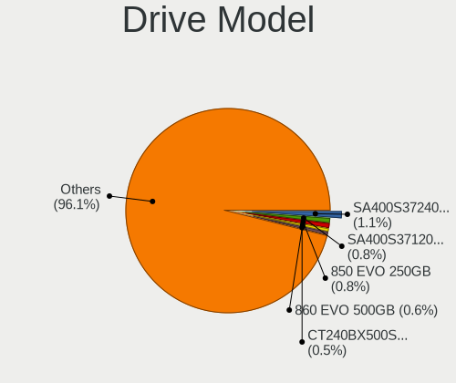
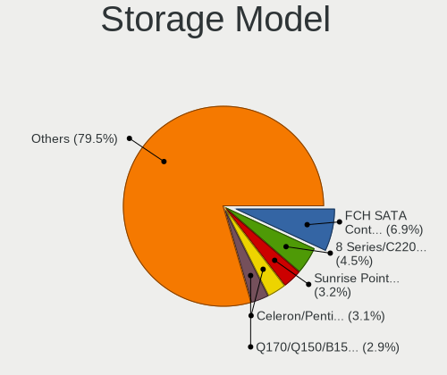
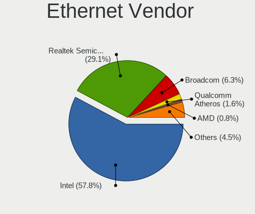
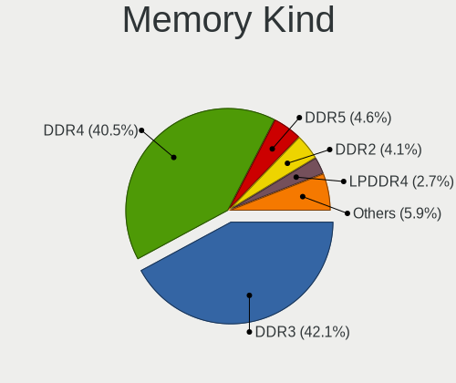
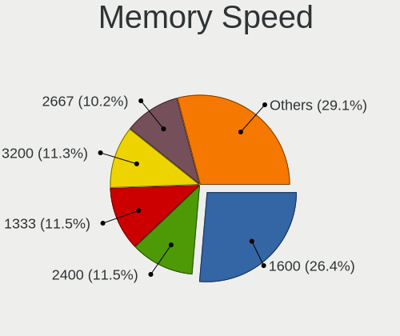

BSD - Tested Hardware & Statistics
----------------------------------

A project to collect tested hardware configurations for BSD.

Anyone can contribute to this report by the [hw-probe](https://github.com/linuxhw/hw-probe/blob/master/INSTALL.BSD.md) tool:

    hw-probe -all -upload

Please contribute! Especially if your hardware is rare.

This is a report for all computer types. See also reports for [desktops](/Desktop/README.md) and [notebooks](/Notebook/README.md).

OS-specific reports: [FreeBSD](/Dist/FreeBSD), [GhostBSD](/Dist/GhostBSD), [helloSystem](/Dist/helloSystem), [NetBSD](/Dist/NetBSD), [NomadBSD](/Dist/NomadBSD), [OpenBSD](/Dist/OpenBSD), [OPNsense](/Dist/OPNsense), [pfSense](/Dist/pfSense), [TrueNAS](/Dist/TrueNAS).

This report is for real hardware. Report for virtual hardware: [TestCoverage_VE](https://github.com/bsdhw/TestCoverage_VE)

Contents
--------

* [ Test Cases ](#test-cases)

* [ System ](#system)
  - [ OS                       ](#os)
  - [ OS Family                ](#os-family)
  - [ Arch                     ](#arch)
  - [ DE                       ](#de)
  - [ Display Server           ](#display-server)
  - [ Display Manager          ](#display-manager)
  - [ OS Lang                  ](#os-lang)
  - [ Boot Mode                ](#boot-mode)
  - [ Filesystem               ](#filesystem)
  - [ Part. scheme             ](#part-scheme)

* [ Board ](#board)
  - [ Vendor                   ](#vendor)
  - [ Model                    ](#model)
  - [ Model Family             ](#model-family)
  - [ MFG Year                 ](#mfg-year)
  - [ Form Factor              ](#form-factor)
  - [ Coreboot                 ](#coreboot)
  - [ RAM Size                 ](#ram-size)
  - [ RAM Used                 ](#ram-used)
  - [ Total Drives             ](#total-drives)
  - [ Has CD-ROM               ](#has-cd-rom)
  - [ Has Ethernet             ](#has-ethernet)
  - [ Has WiFi                 ](#has-wifi)
  - [ Has Bluetooth            ](#has-bluetooth)

* [ Location ](#location)
  - [ Country                  ](#country)
  - [ City                     ](#city)

* [ Drives ](#drives)
  - [ Drive Vendor             ](#drive-vendor)
  - [ Drive Model              ](#drive-model)
  - [ HDD Vendor               ](#hdd-vendor)
  - [ SSD Vendor               ](#ssd-vendor)
  - [ Drive Kind               ](#drive-kind)
  - [ Drive Connector          ](#drive-connector)
  - [ Drive Size               ](#drive-size)
  - [ Space Total              ](#space-total)
  - [ Space Used               ](#space-used)
  - [ Malfunc. Drives          ](#malfunc-drives)
  - [ Malfunc. Drive Vendor    ](#malfunc-drive-vendor)
  - [ Malfunc. HDD Vendor      ](#malfunc-hdd-vendor)
  - [ Malfunc. Drive Kind      ](#malfunc-drive-kind)
  - [ Failed Drives            ](#failed-drives)
  - [ Failed Drive Vendor      ](#failed-drive-vendor)
  - [ Drive Status             ](#drive-status)

* [ Storage controller ](#storage-controller)
  - [ Storage Vendor           ](#storage-vendor)
  - [ Storage Model            ](#storage-model)
  - [ Storage Kind             ](#storage-kind)

* [ Processor ](#processor)
  - [ CPU Vendor               ](#cpu-vendor)
  - [ CPU Model                ](#cpu-model)
  - [ CPU Model Family         ](#cpu-model-family)
  - [ CPU Cores                ](#cpu-cores)
  - [ CPU Sockets              ](#cpu-sockets)
  - [ CPU Threads              ](#cpu-threads)
  - [ CPU Microarch            ](#cpu-microarch)

* [ Graphics ](#graphics)
  - [ GPU Vendor               ](#gpu-vendor)
  - [ GPU Model                ](#gpu-model)
  - [ GPU Combo                ](#gpu-combo)
  - [ GPU Driver               ](#gpu-driver)
  - [ GPU Memory               ](#gpu-memory)

* [ Monitor ](#monitor)
  - [ Monitor Vendor           ](#monitor-vendor)
  - [ Monitor Model            ](#monitor-model)
  - [ Monitor Resolution       ](#monitor-resolution)
  - [ Monitor Diagonal         ](#monitor-diagonal)
  - [ Monitor Width            ](#monitor-width)
  - [ Aspect Ratio             ](#aspect-ratio)
  - [ Monitor Area             ](#monitor-area)
  - [ Pixel Density            ](#pixel-density)
  - [ Multiple Monitors        ](#multiple-monitors)

* [ Network ](#network)
  - [ Net Controller Vendor    ](#net-controller-vendor)
  - [ Net Controller Model     ](#net-controller-model)
  - [ Wireless Vendor          ](#wireless-vendor)
  - [ Wireless Model           ](#wireless-model)
  - [ Ethernet Vendor          ](#ethernet-vendor)
  - [ Ethernet Model           ](#ethernet-model)
  - [ Net Controller Kind      ](#net-controller-kind)
  - [ Used Controller          ](#used-controller)
  - [ NICs                     ](#nics)
  - [ IPv6                     ](#ipv6)

* [ Bluetooth ](#bluetooth)
  - [ Bluetooth Vendor         ](#bluetooth-vendor)
  - [ Bluetooth Model          ](#bluetooth-model)

* [ Sound ](#sound)
  - [ Sound Vendor             ](#sound-vendor)
  - [ Sound Model              ](#sound-model)

* [ Memory ](#memory)
  - [ Memory Vendor            ](#memory-vendor)
  - [ Memory Model             ](#memory-model)
  - [ Memory Kind              ](#memory-kind)
  - [ Memory Form Factor       ](#memory-form-factor)
  - [ Memory Size              ](#memory-size)
  - [ Memory Speed             ](#memory-speed)

* [ Printers & scanners ](#printers--scanners)
  - [ Printer Vendor           ](#printer-vendor)
  - [ Printer Model            ](#printer-model)
  - [ Scanner Vendor           ](#scanner-vendor)
  - [ Scanner Model            ](#scanner-model)

* [ Camera ](#camera)
  - [ Camera Vendor            ](#camera-vendor)
  - [ Camera Model             ](#camera-model)

* [ Security ](#security)
  - [ Fingerprint Vendor       ](#fingerprint-vendor)
  - [ Fingerprint Model        ](#fingerprint-model)
  - [ Chipcard Vendor          ](#chipcard-vendor)
  - [ Chipcard Model           ](#chipcard-model)

* [ Unsupported ](#unsupported)
  - [ Unsupported Devices      ](#unsupported-devices)
  - [ Unsupported Device Types ](#unsupported-device-types)

Test Cases
----------

Total: 14034

| Vendor        | Model                       | Form-Factor | Probe                                                     | Date         |
|---------------|-----------------------------|-------------|-----------------------------------------------------------|--------------|
| Intel         | NUC8BEB J72692-309          | Mini pc     | [b2784f4025](https://bsd-hardware.info/?probe=b2784f4025) | Feb 01, 2023 |
| Unknown       | Unknown                     | Desktop     | [433e29e7bd](https://bsd-hardware.info/?probe=433e29e7bd) | Feb 01, 2023 |
| HPE           | ProLiant MicroServer Gen... | Desktop     | [936cb33704](https://bsd-hardware.info/?probe=936cb33704) | Feb 01, 2023 |
| Lenovo        | ThinkPad T460p 20FW0018A... | Notebook    | [932e722b2d](https://bsd-hardware.info/?probe=932e722b2d) | Feb 01, 2023 |
| Supermicro    | X7SPA-HF                    | Desktop     | [2d410c6882](https://bsd-hardware.info/?probe=2d410c6882) | Feb 01, 2023 |
| Lenovo        | 312D SDK0J40697 WIN 3305... | Mini pc     | [36214fbf2b](https://bsd-hardware.info/?probe=36214fbf2b) | Feb 01, 2023 |
| Supermicro    | X9SCL/X9SCMA                | Desktop     | [af957bb4fa](https://bsd-hardware.info/?probe=af957bb4fa) | Feb 01, 2023 |
| IceWhale T... | ZimaBoard 832 ZMB           | Desktop     | [9fa25e53f1](https://bsd-hardware.info/?probe=9fa25e53f1) | Feb 01, 2023 |
| HP            | ProLiant DL380 G6           | Server      | [5d0701d0a8](https://bsd-hardware.info/?probe=5d0701d0a8) | Feb 01, 2023 |
| HP            | ENVY TS m6 Sleekbook        | Notebook    | [402494618a](https://bsd-hardware.info/?probe=402494618a) | Feb 01, 2023 |
| Dell          | 0F0XJ6 A11                  | Server      | [1364889ca4](https://bsd-hardware.info/?probe=1364889ca4) | Feb 01, 2023 |
| Unknown       | Unknown                     | Notebook    | [4cae5c6bb7](https://bsd-hardware.info/?probe=4cae5c6bb7) | Feb 01, 2023 |
| HP            | ENVY TS m6 Sleekbook        | Notebook    | [63d90da096](https://bsd-hardware.info/?probe=63d90da096) | Feb 01, 2023 |
| Supermicro    | X9SCL/X9SCM                 | Desktop     | [1022faa668](https://bsd-hardware.info/?probe=1022faa668) | Feb 01, 2023 |
| ASRock        | J4005B-ITX                  | Desktop     | [c4bf6a3b8c](https://bsd-hardware.info/?probe=c4bf6a3b8c) | Feb 01, 2023 |
| Dell          | 0J584C A00                  | Desktop     | [3f5428623d](https://bsd-hardware.info/?probe=3f5428623d) | Feb 01, 2023 |
| Unknown       | Unknown                     | Desktop     | [ecf5a46a0f](https://bsd-hardware.info/?probe=ecf5a46a0f) | Feb 01, 2023 |
| Techvision    | TVI7309X B0                 | Desktop     | [a58d9501ad](https://bsd-hardware.info/?probe=a58d9501ad) | Jan 31, 2023 |
| ASRock        | B450M Pro4                  | Desktop     | [27f3968fd4](https://bsd-hardware.info/?probe=27f3968fd4) | Jan 31, 2023 |
| Gigabyte      | B75M-D3H                    | Desktop     | [379d3d2626](https://bsd-hardware.info/?probe=379d3d2626) | Jan 31, 2023 |
| PC Engines    | apu4                        | Desktop     | [0d1561fea9](https://bsd-hardware.info/?probe=0d1561fea9) | Jan 31, 2023 |
| Gigabyte      | B75M-D3H                    | Desktop     | [f6b92363f6](https://bsd-hardware.info/?probe=f6b92363f6) | Jan 31, 2023 |
| ASRockRack    | EPYC3101D4I-2T              | Desktop     | [6d46662662](https://bsd-hardware.info/?probe=6d46662662) | Jan 31, 2023 |
| Unknown       | Unknown                     | Desktop     | [c00728e738](https://bsd-hardware.info/?probe=c00728e738) | Jan 31, 2023 |
| Intel         | Q3XXG4-P V1.0               | Desktop     | [418694e14d](https://bsd-hardware.info/?probe=418694e14d) | Jan 31, 2023 |
| Gigabyte      | Z390 AORUS ELITE-CF         | Desktop     | [161dad9f5d](https://bsd-hardware.info/?probe=161dad9f5d) | Jan 31, 2023 |
| Acer          | Aspire ES1-520              | Notebook    | [efac696b1a](https://bsd-hardware.info/?probe=efac696b1a) | Jan 31, 2023 |
| MSI           | Modern 15 A5M               | Notebook    | [afda1bcf60](https://bsd-hardware.info/?probe=afda1bcf60) | Jan 31, 2023 |
| AMI           | Aptio CRB                   | Mini pc     | [6ed22671aa](https://bsd-hardware.info/?probe=6ed22671aa) | Jan 31, 2023 |
| MSI           | MAG B550 TOMAHAWK           | Desktop     | [82ab576c6c](https://bsd-hardware.info/?probe=82ab576c6c) | Jan 31, 2023 |
| ASUSTek       | H110M-CS/BR                 | Desktop     | [73b6128279](https://bsd-hardware.info/?probe=73b6128279) | Jan 31, 2023 |
| ASUSTek       | H110M-CS/BR                 | Desktop     | [3fa3b849a3](https://bsd-hardware.info/?probe=3fa3b849a3) | Jan 31, 2023 |
| Unknown       | Unknown                     | Desktop     | [e76cc93e5d](https://bsd-hardware.info/?probe=e76cc93e5d) | Jan 31, 2023 |
| Lenovo        | ThinkPad X1 Carbon 3rd 2... | Notebook    | [341bae363a](https://bsd-hardware.info/?probe=341bae363a) | Jan 31, 2023 |
| Lenovo        | ThinkPad X1 Carbon 5th 2... | Notebook    | [0b48f96d1e](https://bsd-hardware.info/?probe=0b48f96d1e) | Jan 31, 2023 |
| F-Plus Mob... | FLAPTOP r                   | Notebook    | [c2f84d2103](https://bsd-hardware.info/?probe=c2f84d2103) | Jan 31, 2023 |
| F-Plus Mob... | FLAPTOP r                   | Notebook    | [165d435f30](https://bsd-hardware.info/?probe=165d435f30) | Jan 31, 2023 |
| Intel         | NUC7JYB J67967-404          | Mini pc     | [8597f8bbcc](https://bsd-hardware.info/?probe=8597f8bbcc) | Jan 31, 2023 |
| Hardkernel    | ODROID-H3                   | Desktop     | [28530f37ec](https://bsd-hardware.info/?probe=28530f37ec) | Jan 31, 2023 |
| HP            | 8103 A01                    | Mini pc     | [d89405421a](https://bsd-hardware.info/?probe=d89405421a) | Jan 31, 2023 |
| ASUSTek       | M5A99X EVO                  | Desktop     | [1e97ee1c05](https://bsd-hardware.info/?probe=1e97ee1c05) | Jan 31, 2023 |
| HP            | EliteBook 8440p             | Notebook    | [d732f4d6c4](https://bsd-hardware.info/?probe=d732f4d6c4) | Jan 31, 2023 |
| HP            | 1496                        | Desktop     | [fae90baa23](https://bsd-hardware.info/?probe=fae90baa23) | Jan 31, 2023 |
| MSI           | Modern 15 A5M               | Notebook    | [26d140b290](https://bsd-hardware.info/?probe=26d140b290) | Jan 31, 2023 |
| ASRock        | 970 Extreme3                | Desktop     | [5e2fd4b48f](https://bsd-hardware.info/?probe=5e2fd4b48f) | Jan 30, 2023 |
| ASUSTek       | ASUS TUF Gaming F15 FX50... | Notebook    | [39ae8fb9c8](https://bsd-hardware.info/?probe=39ae8fb9c8) | Jan 30, 2023 |
| Unknown       | Unknown                     | Desktop     | [348805aada](https://bsd-hardware.info/?probe=348805aada) | Jan 30, 2023 |
| MACHINIST     | X99-K9 V2.0                 | Desktop     | [eb8a6cb004](https://bsd-hardware.info/?probe=eb8a6cb004) | Jan 30, 2023 |
| Dell          | 0F373D A00                  | Desktop     | [cd4202e58b](https://bsd-hardware.info/?probe=cd4202e58b) | Jan 30, 2023 |
| Lenovo        | ThinkPad X260 20F5S10W0H    | Notebook    | [bccdd2f331](https://bsd-hardware.info/?probe=bccdd2f331) | Jan 30, 2023 |
| Dell          | 0J3C2F A01                  | Desktop     | [93a87b6106](https://bsd-hardware.info/?probe=93a87b6106) | Jan 30, 2023 |
| Dell          | Precision 5540              | Notebook    | [de7ac2f8d1](https://bsd-hardware.info/?probe=de7ac2f8d1) | Jan 30, 2023 |
| PC Engines    | APU2                        | Desktop     | [2679b3584d](https://bsd-hardware.info/?probe=2679b3584d) | Jan 30, 2023 |
| HP            | Pavilion Notebook           | Notebook    | [75b9ef6ee6](https://bsd-hardware.info/?probe=75b9ef6ee6) | Jan 30, 2023 |
| Protectli     | FW6                         | Desktop     | [5a05c9fe40](https://bsd-hardware.info/?probe=5a05c9fe40) | Jan 30, 2023 |
| Dell          | 0WMJ54 A01                  | Desktop     | [5b55b50956](https://bsd-hardware.info/?probe=5b55b50956) | Jan 30, 2023 |
| Gigabyte      | H110M-A-CF                  | Desktop     | [27e7ae6041](https://bsd-hardware.info/?probe=27e7ae6041) | Jan 30, 2023 |
| Apple         | Mac-F65AE981FFA204ED Mac... | Mini pc     | [951295643c](https://bsd-hardware.info/?probe=951295643c) | Jan 30, 2023 |
| Lanner        | FW-7543 B-GA                | Desktop     | [149345d14c](https://bsd-hardware.info/?probe=149345d14c) | Jan 30, 2023 |
| HP            | 8103 A01                    | Mini pc     | [8bcc484918](https://bsd-hardware.info/?probe=8bcc484918) | Jan 29, 2023 |
| MSI           | A88XM-E45                   | Desktop     | [f7eb6735d3](https://bsd-hardware.info/?probe=f7eb6735d3) | Jan 29, 2023 |
| Supermicro    | X9SRE/X9SRE-3F/X9SRi/X9S... | Server      | [3676751039](https://bsd-hardware.info/?probe=3676751039) | Jan 29, 2023 |
| HP            | 1825                        | Desktop     | [717279c19f](https://bsd-hardware.info/?probe=717279c19f) | Jan 29, 2023 |
| Apple         | MacBookAir5,1               | Notebook    | [eeed92ab62](https://bsd-hardware.info/?probe=eeed92ab62) | Jan 29, 2023 |
| ASUSTek       | TUF Gaming B550-PLUS        | Desktop     | [4c25e80924](https://bsd-hardware.info/?probe=4c25e80924) | Jan 29, 2023 |
| Lenovo        | ThinkPad X1 Carbon 3448A... | Notebook    | [6da773c078](https://bsd-hardware.info/?probe=6da773c078) | Jan 29, 2023 |
| Lenovo        | Legion 5 15ARH05 82B5       | Notebook    | [21398109dc](https://bsd-hardware.info/?probe=21398109dc) | Jan 29, 2023 |
| Dell          | 00V62H A01                  | Desktop     | [283d305565](https://bsd-hardware.info/?probe=283d305565) | Jan 29, 2023 |
| Unknown       | TJ41G-A80 v2 Series         | All in one  | [c44ac785cc](https://bsd-hardware.info/?probe=c44ac785cc) | Jan 29, 2023 |
| Shenzhen M... | F4BHD                       | Desktop     | [b2540f3beb](https://bsd-hardware.info/?probe=b2540f3beb) | Jan 29, 2023 |
| AMI           | Aptio CRB                   | Mini pc     | [e43ebed0e6](https://bsd-hardware.info/?probe=e43ebed0e6) | Jan 29, 2023 |
| MSI           | H81M-P33                    | Desktop     | [e6626da98c](https://bsd-hardware.info/?probe=e6626da98c) | Jan 29, 2023 |
| ASUSTek       | P5Q-E                       | Desktop     | [3d5ea9f313](https://bsd-hardware.info/?probe=3d5ea9f313) | Jan 29, 2023 |
| ASUSTek       | ROG CROSSHAIR VIII HERO     | Desktop     | [9b7532b795](https://bsd-hardware.info/?probe=9b7532b795) | Jan 29, 2023 |
| Unknown       | TJ41G-A80 v2 Series         | All in one  | [a5bc81b507](https://bsd-hardware.info/?probe=a5bc81b507) | Jan 29, 2023 |
| Lenovo        | Legion 5 15ARH05 82B5       | Notebook    | [2098b8808d](https://bsd-hardware.info/?probe=2098b8808d) | Jan 29, 2023 |
| Unknown       | Unknown                     | Desktop     | [b8efd7453b](https://bsd-hardware.info/?probe=b8efd7453b) | Jan 29, 2023 |
| IGEL Techn... | H830C                       | Notebook    | [322cc6bc3b](https://bsd-hardware.info/?probe=322cc6bc3b) | Jan 29, 2023 |
| Techvision    | TVI7309X B0                 | Desktop     | [7cfdbb0e90](https://bsd-hardware.info/?probe=7cfdbb0e90) | Jan 29, 2023 |
| Protectli     | FW4B Ver                    | Desktop     | [7db7965ebb](https://bsd-hardware.info/?probe=7db7965ebb) | Jan 29, 2023 |
| Unknown       | Unknown                     | Desktop     | [6096b00a0c](https://bsd-hardware.info/?probe=6096b00a0c) | Jan 29, 2023 |
| Unknown       | Unknown                     | Desktop     | [540696f4e5](https://bsd-hardware.info/?probe=540696f4e5) | Jan 29, 2023 |
| HP            | 213D A01                    | Desktop     | [dea507ebe0](https://bsd-hardware.info/?probe=dea507ebe0) | Jan 29, 2023 |
| Protectli     | FW4B Ver                    | Desktop     | [ac63fa59a6](https://bsd-hardware.info/?probe=ac63fa59a6) | Jan 29, 2023 |
| Lenovo        | 319E SEK0T35577 IOT 4247... | Mini pc     | [09b0e5fc0e](https://bsd-hardware.info/?probe=09b0e5fc0e) | Jan 29, 2023 |
| Razer         | Blade Stealth               | Notebook    | [c0b9641604](https://bsd-hardware.info/?probe=c0b9641604) | Jan 29, 2023 |
| CncTion       | J4125-4L-I225               | Desktop     | [65ee58e34e](https://bsd-hardware.info/?probe=65ee58e34e) | Jan 28, 2023 |
| CncTion       | N5105-4L B0                 | Desktop     | [d9746ad1c3](https://bsd-hardware.info/?probe=d9746ad1c3) | Jan 28, 2023 |
| Biostar       | Hi-Fi A85S3                 | Desktop     | [f4b661ad85](https://bsd-hardware.info/?probe=f4b661ad85) | Jan 28, 2023 |
| Gigabyte      | B75M-D3H                    | Desktop     | [baf8c4c26c](https://bsd-hardware.info/?probe=baf8c4c26c) | Jan 28, 2023 |
| Dell          | 08NPPY A00                  | Desktop     | [1c4edf62e6](https://bsd-hardware.info/?probe=1c4edf62e6) | Jan 28, 2023 |
| Lenovo        | IdeaPad 110-14AST 80TQ      | Notebook    | [aed5292edc](https://bsd-hardware.info/?probe=aed5292edc) | Jan 28, 2023 |
| Packard Be... | DOT S                       | Notebook    | [09a2057767](https://bsd-hardware.info/?probe=09a2057767) | Jan 28, 2023 |
| Razer         | Blade Stealth               | Notebook    | [14760d0c64](https://bsd-hardware.info/?probe=14760d0c64) | Jan 28, 2023 |
| AMI           | Aptio CRB                   | Mini pc     | [431cf63cae](https://bsd-hardware.info/?probe=431cf63cae) | Jan 28, 2023 |
| HP            | 21B4 A01                    | Desktop     | [8df824afd4](https://bsd-hardware.info/?probe=8df824afd4) | Jan 28, 2023 |
| AMI           | Aptio CRB                   | Mini pc     | [92aedf2a46](https://bsd-hardware.info/?probe=92aedf2a46) | Jan 28, 2023 |
| Gigabyte      | B550 AORUS PRO              | Desktop     | [8fd7f80256](https://bsd-hardware.info/?probe=8fd7f80256) | Jan 28, 2023 |
| Acer          | Aspire one V1.05            | Notebook    | [1cbfce4d7e](https://bsd-hardware.info/?probe=1cbfce4d7e) | Jan 28, 2023 |
| HP            | ProLiant DL160 Gen9         | Server      | [3797cbf278](https://bsd-hardware.info/?probe=3797cbf278) | Jan 28, 2023 |
| ASUSTek       | PRIME B460M-A               | Desktop     | [a6b109939f](https://bsd-hardware.info/?probe=a6b109939f) | Jan 28, 2023 |
| Techvision    | TVI7309X B0                 | Desktop     | [88e42156af](https://bsd-hardware.info/?probe=88e42156af) | Jan 28, 2023 |
| Lenovo        | ThinkPad T14 Gen 2a 20XK... | Notebook    | [d5f06d91db](https://bsd-hardware.info/?probe=d5f06d91db) | Jan 28, 2023 |
| HP            | Laptop 14s-fq1xxx           | Notebook    | [1603f38c4c](https://bsd-hardware.info/?probe=1603f38c4c) | Jan 28, 2023 |
| AMI           | Aptio CRB                   | Mini pc     | [2db24eed0a](https://bsd-hardware.info/?probe=2db24eed0a) | Jan 28, 2023 |
| ZOTAC         | ZBOX-CI321NANO              | Mini pc     | [47bbed6ae7](https://bsd-hardware.info/?probe=47bbed6ae7) | Jan 28, 2023 |
| ASUSTek       | M4A89TD PRO USB3            | Desktop     | [1328d01296](https://bsd-hardware.info/?probe=1328d01296) | Jan 28, 2023 |
| Lenovo        | ThinkPad T460 20FMS06V00    | Notebook    | [6914f6aab5](https://bsd-hardware.info/?probe=6914f6aab5) | Jan 28, 2023 |
| ASUSTek       | WS-C621E-SAGE Series        | Server      | [d32c9457b9](https://bsd-hardware.info/?probe=d32c9457b9) | Jan 28, 2023 |
| Lenovo        | ThinkPad E585 20KV0010US    | Notebook    | [9cfe2dd858](https://bsd-hardware.info/?probe=9cfe2dd858) | Jan 28, 2023 |
| Acer          | ES1-131-C2BM                | Notebook    | [400ef90a79](https://bsd-hardware.info/?probe=400ef90a79) | Jan 28, 2023 |
| Dell          | 03X6X0 A07                  | Server      | [e93b47ed87](https://bsd-hardware.info/?probe=e93b47ed87) | Jan 28, 2023 |
| Supermicro    | X11SDV-4C-TP8F              | Server      | [d473269837](https://bsd-hardware.info/?probe=d473269837) | Jan 28, 2023 |
| Techvision    | TVI7309X B0                 | Desktop     | [937a255571](https://bsd-hardware.info/?probe=937a255571) | Jan 28, 2023 |
| Dell          | 00V62H A01                  | Desktop     | [9d09937e2a](https://bsd-hardware.info/?probe=9d09937e2a) | Jan 28, 2023 |
| Techvision    | TVI7309X B0                 | Desktop     | [00dda92d98](https://bsd-hardware.info/?probe=00dda92d98) | Jan 27, 2023 |
| ASRock        | B550M Phantom Gaming 4      | Desktop     | [a0a26f529c](https://bsd-hardware.info/?probe=a0a26f529c) | Jan 27, 2023 |
| ChangWang     | CW56-58                     | Desktop     | [2d48772c23](https://bsd-hardware.info/?probe=2d48772c23) | Jan 27, 2023 |
| CncTion       | N5105-4L B0                 | Desktop     | [a7fe868f42](https://bsd-hardware.info/?probe=a7fe868f42) | Jan 27, 2023 |
| Deciso        | NetBoard-A10                | Notebook    | [5b226a942e](https://bsd-hardware.info/?probe=5b226a942e) | Jan 27, 2023 |
| YANYU         | R250                        | Desktop     | [866e67f059](https://bsd-hardware.info/?probe=866e67f059) | Jan 27, 2023 |
| F-Plus Mob... | FLAPTOP r                   | Notebook    | [448f9265f2](https://bsd-hardware.info/?probe=448f9265f2) | Jan 27, 2023 |
| F-Plus Mob... | FLAPTOP r                   | Notebook    | [512bf8f61d](https://bsd-hardware.info/?probe=512bf8f61d) | Jan 27, 2023 |
| Dell          | Latitude 5400               | Notebook    | [a266199ace](https://bsd-hardware.info/?probe=a266199ace) | Jan 27, 2023 |
| Acer          | Aspire E3-112               | Notebook    | [513c7ff4be](https://bsd-hardware.info/?probe=513c7ff4be) | Jan 27, 2023 |
| Gigabyte      | B75M-D3H                    | Desktop     | [a5b702ca2f](https://bsd-hardware.info/?probe=a5b702ca2f) | Jan 27, 2023 |
| CncTion       | N5105-4L B0                 | Desktop     | [967c53128c](https://bsd-hardware.info/?probe=967c53128c) | Jan 27, 2023 |
| Techvision    | TVI7309X B0                 | Desktop     | [84375af67f](https://bsd-hardware.info/?probe=84375af67f) | Jan 27, 2023 |
| HP            | 8299                        | Desktop     | [61b1c41f22](https://bsd-hardware.info/?probe=61b1c41f22) | Jan 27, 2023 |
| AMD           | Larne CRB                   | Desktop     | [8b9a301b47](https://bsd-hardware.info/?probe=8b9a301b47) | Jan 27, 2023 |
| Unknown       | Unknown                     | Desktop     | [d3750005c2](https://bsd-hardware.info/?probe=d3750005c2) | Jan 27, 2023 |
| Acidanther... | Mac-AA95B1DDAB278B95 iMa... | All in one  | [3492d9a849](https://bsd-hardware.info/?probe=3492d9a849) | Jan 27, 2023 |
| CNCTION-IA... | Unknown                     | Desktop     | [b639f4670e](https://bsd-hardware.info/?probe=b639f4670e) | Jan 27, 2023 |
| IceWhale T... | ZimaBoard 432 ZMB           | Desktop     | [c13dfb4ff7](https://bsd-hardware.info/?probe=c13dfb4ff7) | Jan 27, 2023 |
| Google        | Kefka                       | Notebook    | [83771661c6](https://bsd-hardware.info/?probe=83771661c6) | Jan 27, 2023 |
| Protectli     | FW4B                        | Desktop     | [06eeeaa67b](https://bsd-hardware.info/?probe=06eeeaa67b) | Jan 27, 2023 |
| Dell          | 0HD5W2 A00                  | Desktop     | [226f25a086](https://bsd-hardware.info/?probe=226f25a086) | Jan 27, 2023 |
| Dell          | 02YYK5 A01                  | Desktop     | [56fea0c931](https://bsd-hardware.info/?probe=56fea0c931) | Jan 27, 2023 |
| ASUSTek       | M5A99X EVO                  | Desktop     | [18e688307e](https://bsd-hardware.info/?probe=18e688307e) | Jan 27, 2023 |
| AMD           | Kabini CRB                  | Desktop     | [3405de1629](https://bsd-hardware.info/?probe=3405de1629) | Jan 27, 2023 |
| ASUSTek       | PRIME X570-P                | Desktop     | [232a81d2ed](https://bsd-hardware.info/?probe=232a81d2ed) | Jan 27, 2023 |
| Deciso        | Netboard A20                | Notebook    | [07de4617d2](https://bsd-hardware.info/?probe=07de4617d2) | Jan 26, 2023 |
| ASRock        | H570M-ITX/ac                | Desktop     | [4ebeac2699](https://bsd-hardware.info/?probe=4ebeac2699) | Jan 26, 2023 |
| Citrix        | CB-1100                     | Desktop     | [36199a59e2](https://bsd-hardware.info/?probe=36199a59e2) | Jan 26, 2023 |
| Gigabyte      | GA-MA770T-UD3               | Desktop     | [6b63a16799](https://bsd-hardware.info/?probe=6b63a16799) | Jan 26, 2023 |
| PC Engines    | APU2                        | Desktop     | [3bc47445d4](https://bsd-hardware.info/?probe=3bc47445d4) | Jan 26, 2023 |
| HP            | 82B4                        | Desktop     | [de86350dac](https://bsd-hardware.info/?probe=de86350dac) | Jan 26, 2023 |
| HP            | 213D A01                    | Desktop     | [659939cc8b](https://bsd-hardware.info/?probe=659939cc8b) | Jan 26, 2023 |
| TYAN Compu... | S7109GM2NR-2T               | Server      | [851556ad46](https://bsd-hardware.info/?probe=851556ad46) | Jan 26, 2023 |
| Dell EMC      | VEP1425-V210-CPU A02        | Desktop     | [401e3596d5](https://bsd-hardware.info/?probe=401e3596d5) | Jan 26, 2023 |
| Lenovo        | B50-80 80EW                 | Notebook    | [7cbd8c5cbd](https://bsd-hardware.info/?probe=7cbd8c5cbd) | Jan 26, 2023 |
| ChangWang     | CW56-58                     | Desktop     | [89ec5e42ef](https://bsd-hardware.info/?probe=89ec5e42ef) | Jan 26, 2023 |
| Gigabyte      | B360M D2V                   | Desktop     | [6685066b6e](https://bsd-hardware.info/?probe=6685066b6e) | Jan 26, 2023 |
| ASUSTek       | H81M-D R2.0                 | Desktop     | [07982549ac](https://bsd-hardware.info/?probe=07982549ac) | Jan 26, 2023 |
| HP            | EliteBook 840 G3            | Notebook    | [92c676e033](https://bsd-hardware.info/?probe=92c676e033) | Jan 26, 2023 |
| Dell          | 0NC2VH A01                  | Desktop     | [d1e71effc5](https://bsd-hardware.info/?probe=d1e71effc5) | Jan 26, 2023 |
| ASUSTek       | M5A97 PLUS                  | Desktop     | [e00d33f978](https://bsd-hardware.info/?probe=e00d33f978) | Jan 26, 2023 |
| PC Engines    | APU2                        | Desktop     | [436e596f40](https://bsd-hardware.info/?probe=436e596f40) | Jan 26, 2023 |
| Samsung       | DT1234567890 SAMSUNG_SW_... | Desktop     | [18f0e607c2](https://bsd-hardware.info/?probe=18f0e607c2) | Jan 26, 2023 |
| ASUSTek       | ROG STRIX X570-E GAMING     | Desktop     | [87e25e2abd](https://bsd-hardware.info/?probe=87e25e2abd) | Jan 26, 2023 |
| Unknown       | Unknown                     | Desktop     | [cde064f460](https://bsd-hardware.info/?probe=cde064f460) | Jan 26, 2023 |
| ASUSTek       | P5G41T-M LX3                | Desktop     | [a712c2d054](https://bsd-hardware.info/?probe=a712c2d054) | Jan 26, 2023 |
| Dell          | 0YDJK3 A02                  | Server      | [ca78843973](https://bsd-hardware.info/?probe=ca78843973) | Jan 26, 2023 |
| Gigabyte      | H61M-S2PV                   | Desktop     | [9a307961ed](https://bsd-hardware.info/?probe=9a307961ed) | Jan 26, 2023 |
| Unknown       | Unknown                     | Desktop     | [bc41bdb431](https://bsd-hardware.info/?probe=bc41bdb431) | Jan 26, 2023 |
| ASUSTek       | P5G41T-M LX3                | Desktop     | [7b2fee315d](https://bsd-hardware.info/?probe=7b2fee315d) | Jan 26, 2023 |
| Unknown       | Unknown                     | Desktop     | [d36217b166](https://bsd-hardware.info/?probe=d36217b166) | Jan 26, 2023 |
| AAEON         | UP-APL01 V0.4               | Desktop     | [8537ac75a1](https://bsd-hardware.info/?probe=8537ac75a1) | Jan 26, 2023 |
| Shuttle       | DS20U                       | Desktop     | [71033e4a64](https://bsd-hardware.info/?probe=71033e4a64) | Jan 26, 2023 |
| HP            | 1589                        | Desktop     | [8a927b43cb](https://bsd-hardware.info/?probe=8a927b43cb) | Jan 26, 2023 |
| Google        | Cave                        | Notebook    | [76ac12f1e2](https://bsd-hardware.info/?probe=76ac12f1e2) | Jan 25, 2023 |
| ASUSTek       | PRIME H310M-K               | Desktop     | [1c97950ce9](https://bsd-hardware.info/?probe=1c97950ce9) | Jan 25, 2023 |
| Lenovo        | ThinkPad X1 Tablet 20GHS... | Tablet      | [cd05b84425](https://bsd-hardware.info/?probe=cd05b84425) | Jan 25, 2023 |
| Intel         | SKYBAY                      | Desktop     | [e7e91e43df](https://bsd-hardware.info/?probe=e7e91e43df) | Jan 25, 2023 |
| ASRock        | X299E-ITX/ac                | Desktop     | [0b7dacf902](https://bsd-hardware.info/?probe=0b7dacf902) | Jan 25, 2023 |
| Dell          | 0HY9JP A02                  | Desktop     | [ca71c8ab2b](https://bsd-hardware.info/?probe=ca71c8ab2b) | Jan 25, 2023 |
| IBM           | 9210MML                     | Desktop     | [8b7e2413ee](https://bsd-hardware.info/?probe=8b7e2413ee) | Jan 25, 2023 |
| ADI Engine... | RCC-VE                      | Desktop     | [e2941c00fc](https://bsd-hardware.info/?probe=e2941c00fc) | Jan 25, 2023 |
| Supermicro    | X11SSH-F                    | Server      | [106cf811d8](https://bsd-hardware.info/?probe=106cf811d8) | Jan 25, 2023 |
| Dell          | 0CNWVK A00                  | Desktop     | [e59d4ab226](https://bsd-hardware.info/?probe=e59d4ab226) | Jan 25, 2023 |
| Lenovo        | IdeaPad Y700-15ISK 80NV     | Notebook    | [4eb4e63a2c](https://bsd-hardware.info/?probe=4eb4e63a2c) | Jan 25, 2023 |
| HP            | EliteBook 2560p             | Notebook    | [80c808de34](https://bsd-hardware.info/?probe=80c808de34) | Jan 25, 2023 |
| Sophos        | SG                          | Firewall    | [f21b92f971](https://bsd-hardware.info/?probe=f21b92f971) | Jan 25, 2023 |
| Techvision    | TVI7309X B0                 | Desktop     | [1803740ba6](https://bsd-hardware.info/?probe=1803740ba6) | Jan 25, 2023 |
| ASUSTek       | P7P55D LE                   | Desktop     | [5da1e71837](https://bsd-hardware.info/?probe=5da1e71837) | Jan 25, 2023 |
| Timi          | TM1607                      | Notebook    | [57113d2886](https://bsd-hardware.info/?probe=57113d2886) | Jan 25, 2023 |
| Dell          | 0D02VH A01                  | Desktop     | [ad7dd00eeb](https://bsd-hardware.info/?probe=ad7dd00eeb) | Jan 25, 2023 |
| Dell          | 02YYK5 A01                  | Desktop     | [82718999a8](https://bsd-hardware.info/?probe=82718999a8) | Jan 25, 2023 |
| HP            | 802E                        | Desktop     | [1f3bf517af](https://bsd-hardware.info/?probe=1f3bf517af) | Jan 25, 2023 |
| ASUSTek       | PRIME A320I-K               | Desktop     | [0c75494953](https://bsd-hardware.info/?probe=0c75494953) | Jan 25, 2023 |
| Lenovo        | ThinkBook 14-IIL 20SL       | Notebook    | [afeb216c1e](https://bsd-hardware.info/?probe=afeb216c1e) | Jan 25, 2023 |
| Unknown       | Unknown                     | Desktop     | [aa940792fc](https://bsd-hardware.info/?probe=aa940792fc) | Jan 25, 2023 |
| Fujitsu       | D3313-A1 S26361-D3313-A1    | Desktop     | [118ccb1a9b](https://bsd-hardware.info/?probe=118ccb1a9b) | Jan 24, 2023 |
| AMI           | Aptio CRB                   | Mini pc     | [8ba06cd5d3](https://bsd-hardware.info/?probe=8ba06cd5d3) | Jan 24, 2023 |
| AMI           | Aptio CRB                   | Mini pc     | [3698389ce4](https://bsd-hardware.info/?probe=3698389ce4) | Jan 24, 2023 |
| Lenovo        | G500 20236                  | Notebook    | [081d22fbe2](https://bsd-hardware.info/?probe=081d22fbe2) | Jan 24, 2023 |
| Lenovo        | G500 20236                  | Notebook    | [a35053ad38](https://bsd-hardware.info/?probe=a35053ad38) | Jan 24, 2023 |
| Google        | Panther                     | Desktop     | [73d3147166](https://bsd-hardware.info/?probe=73d3147166) | Jan 24, 2023 |
| Biostar       | TB250-BTC+                  | Desktop     | [0a39ffa716](https://bsd-hardware.info/?probe=0a39ffa716) | Jan 24, 2023 |
| ASUSTek       | WS-C621E-SAGE Series        | Server      | [ab59ccf04c](https://bsd-hardware.info/?probe=ab59ccf04c) | Jan 24, 2023 |
| Lenovo        | ThinkPad X220 4291WF5       | Notebook    | [24544f4a94](https://bsd-hardware.info/?probe=24544f4a94) | Jan 24, 2023 |
| MSI           | PS63 Modern 8M              | Notebook    | [f740e313e5](https://bsd-hardware.info/?probe=f740e313e5) | Jan 24, 2023 |
| Lenovo        | ThinkPad T430 2342AG4       | Notebook    | [b5e972d19a](https://bsd-hardware.info/?probe=b5e972d19a) | Jan 24, 2023 |
| Timi          | TM1607                      | Notebook    | [27db14fdbd](https://bsd-hardware.info/?probe=27db14fdbd) | Jan 24, 2023 |
| Lenovo        | ThinkCentre Edge72 34971... | Desktop     | [9c392dab85](https://bsd-hardware.info/?probe=9c392dab85) | Jan 24, 2023 |
| Fujitsu       | LIFEBOOK S935               | Notebook    | [5c07c1a47e](https://bsd-hardware.info/?probe=5c07c1a47e) | Jan 24, 2023 |
| Dell          | XPS 13 9310                 | Notebook    | [7319560506](https://bsd-hardware.info/?probe=7319560506) | Jan 24, 2023 |
| AMI           | Aptio CRB                   | Mini pc     | [06e3f3daea](https://bsd-hardware.info/?probe=06e3f3daea) | Jan 24, 2023 |
| Dell          | Latitude 3540               | Notebook    | [a180a149f5](https://bsd-hardware.info/?probe=a180a149f5) | Jan 24, 2023 |
| Deciso        | NetBoard-A20                | Notebook    | [0a40a0b8e2](https://bsd-hardware.info/?probe=0a40a0b8e2) | Jan 24, 2023 |
| Deciso        | NetBoard-A20                | Notebook    | [211bc64e5e](https://bsd-hardware.info/?probe=211bc64e5e) | Jan 24, 2023 |
| Dell          | 0DFRFW A01                  | Desktop     | [23415b954f](https://bsd-hardware.info/?probe=23415b954f) | Jan 24, 2023 |
| Dell          | Latitude 5580               | Notebook    | [90cd22ad55](https://bsd-hardware.info/?probe=90cd22ad55) | Jan 24, 2023 |
| Gigabyte      | H110M-A-CF                  | Desktop     | [54be5c792e](https://bsd-hardware.info/?probe=54be5c792e) | Jan 24, 2023 |
| HP            | 83F2                        | Desktop     | [970c786b06](https://bsd-hardware.info/?probe=970c786b06) | Jan 24, 2023 |
| HP            | 1495                        | Desktop     | [69faf0563a](https://bsd-hardware.info/?probe=69faf0563a) | Jan 24, 2023 |
| Apple         | Mac-F221BEC8                | Desktop     | [556e872ffe](https://bsd-hardware.info/?probe=556e872ffe) | Jan 24, 2023 |
| Toshiba       | PORTEGE Z930                | Notebook    | [476203ee86](https://bsd-hardware.info/?probe=476203ee86) | Jan 23, 2023 |
| Apple         | MacBookPro9,2               | Notebook    | [aaccb6df1a](https://bsd-hardware.info/?probe=aaccb6df1a) | Jan 23, 2023 |
| Toshiba       | PORTEGE Z930                | Notebook    | [4af2cc1909](https://bsd-hardware.info/?probe=4af2cc1909) | Jan 23, 2023 |
| Gigabyte      | GA-990X-Gaming SLI-CF       | Desktop     | [9cd4d2810a](https://bsd-hardware.info/?probe=9cd4d2810a) | Jan 23, 2023 |
| ASUSTek       | K50IN                       | Notebook    | [6f7a8f3338](https://bsd-hardware.info/?probe=6f7a8f3338) | Jan 23, 2023 |
| Protectli     | FW4A Ver                    | Desktop     | [b91fe4d66f](https://bsd-hardware.info/?probe=b91fe4d66f) | Jan 23, 2023 |
| Dell          | 05GD68 A00                  | Desktop     | [f2f100ee10](https://bsd-hardware.info/?probe=f2f100ee10) | Jan 23, 2023 |
| Medion        | S14409                      | Notebook    | [9a44efb64c](https://bsd-hardware.info/?probe=9a44efb64c) | Jan 23, 2023 |
| Lenovo        | ThinkPad W541 20EF000NUS    | Notebook    | [200a92d510](https://bsd-hardware.info/?probe=200a92d510) | Jan 23, 2023 |
| Star Labs     | StarBook                    | Notebook    | [d222f381b0](https://bsd-hardware.info/?probe=d222f381b0) | Jan 23, 2023 |
| Star Labs     | StarBook                    | Notebook    | [045d4bb6e8](https://bsd-hardware.info/?probe=045d4bb6e8) | Jan 23, 2023 |
| ASRock        | Z390 Pro4                   | Desktop     | [b9d64a7496](https://bsd-hardware.info/?probe=b9d64a7496) | Jan 23, 2023 |
| Gigabyte      | X570 AORUS PRO              | Desktop     | [6cf4f6761e](https://bsd-hardware.info/?probe=6cf4f6761e) | Jan 23, 2023 |
| Gigabyte      | A520M S2H                   | Desktop     | [803a152afc](https://bsd-hardware.info/?probe=803a152afc) | Jan 23, 2023 |
| Fujitsu       | D3313-G1 S26361-D3313-G1    | Desktop     | [7a82a67da7](https://bsd-hardware.info/?probe=7a82a67da7) | Jan 23, 2023 |
| ASUSTek       | PRIME A320M-K               | Desktop     | [cdad2f0001](https://bsd-hardware.info/?probe=cdad2f0001) | Jan 23, 2023 |
| Dell          | Inspiron 15-7568            | Notebook    | [44e36adfa4](https://bsd-hardware.info/?probe=44e36adfa4) | Jan 23, 2023 |
| Dell          | OptiPlex 3040               | Desktop     | [9c925f4e7f](https://bsd-hardware.info/?probe=9c925f4e7f) | Jan 23, 2023 |
| ASUSTek       | J1800I-C                    | Desktop     | [27ea626000](https://bsd-hardware.info/?probe=27ea626000) | Jan 23, 2023 |
| ASUSTek       | J1800I-C                    | Desktop     | [abc17c6fc6](https://bsd-hardware.info/?probe=abc17c6fc6) | Jan 23, 2023 |
| Lenovo        | ThinkPad S1 Yoga 20CD003... | Notebook    | [17fd94a4c0](https://bsd-hardware.info/?probe=17fd94a4c0) | Jan 23, 2023 |
| AZW           | U59                         | Desktop     | [1f97b27470](https://bsd-hardware.info/?probe=1f97b27470) | Jan 23, 2023 |
| Dell          | 0NW6H5 A00                  | Desktop     | [45544644df](https://bsd-hardware.info/?probe=45544644df) | Jan 23, 2023 |
| Fujitsu       | D3313-A1 S26361-D3313-A1    | Desktop     | [d7fd746ba9](https://bsd-hardware.info/?probe=d7fd746ba9) | Jan 23, 2023 |
| Fujitsu       | D3313-A1 S26361-D3313-A1    | Desktop     | [f462dbd9ae](https://bsd-hardware.info/?probe=f462dbd9ae) | Jan 23, 2023 |
| Gigabyte      | B450 AORUS PRO WIFI-CF      | Desktop     | [d03f9c19f8](https://bsd-hardware.info/?probe=d03f9c19f8) | Jan 23, 2023 |
| AAEON Tech... | PCM-LN02 V2.0               | Desktop     | [046b7464b9](https://bsd-hardware.info/?probe=046b7464b9) | Jan 23, 2023 |
| MSI           | B450M MORTAR MAX            | Desktop     | [840145eb80](https://bsd-hardware.info/?probe=840145eb80) | Jan 23, 2023 |
| Dell          | Inspiron 3442               | Notebook    | [8b137bca84](https://bsd-hardware.info/?probe=8b137bca84) | Jan 23, 2023 |
| Timi          | TM1607                      | Notebook    | [7636a0ef8f](https://bsd-hardware.info/?probe=7636a0ef8f) | Jan 23, 2023 |
| Timi          | TM1607                      | Notebook    | [1ca46404a1](https://bsd-hardware.info/?probe=1ca46404a1) | Jan 23, 2023 |
| Dell          | 0HHV7N A00                  | Desktop     | [771f2c4d96](https://bsd-hardware.info/?probe=771f2c4d96) | Jan 23, 2023 |
| Samsung       | 340XAA/350XAA/550XAA        | Notebook    | [881e97e41c](https://bsd-hardware.info/?probe=881e97e41c) | Jan 23, 2023 |
| ASUSTek       | X99-A/USB                   | Desktop     | [006553f965](https://bsd-hardware.info/?probe=006553f965) | Jan 23, 2023 |
| Gigabyte      | H81M-H                      | Desktop     | [4b3a05fc2a](https://bsd-hardware.info/?probe=4b3a05fc2a) | Jan 22, 2023 |
| ASUSTek       | P5KPL-AM SE                 | Desktop     | [6dc0fddda1](https://bsd-hardware.info/?probe=6dc0fddda1) | Jan 22, 2023 |
| Gigabyte      | B75M-D3H                    | Desktop     | [a271d3c547](https://bsd-hardware.info/?probe=a271d3c547) | Jan 22, 2023 |
| Acer          | Aspire ES1-533              | Notebook    | [d2652b76cf](https://bsd-hardware.info/?probe=d2652b76cf) | Jan 22, 2023 |
| Intel         | NUC5i7RYB H73774-101        | Mini pc     | [9954516f1a](https://bsd-hardware.info/?probe=9954516f1a) | Jan 22, 2023 |
| ASUSTek       | Q405UA                      | Convertible | [6662cab62d](https://bsd-hardware.info/?probe=6662cab62d) | Jan 22, 2023 |
| ASUSTek       | Q405UA                      | Convertible | [2b94c3efae](https://bsd-hardware.info/?probe=2b94c3efae) | Jan 22, 2023 |
| Dell          | Latitude E6400              | Notebook    | [dcc804a61f](https://bsd-hardware.info/?probe=dcc804a61f) | Jan 22, 2023 |
| Dell          | Latitude E6400              | Notebook    | [9dd8d0184f](https://bsd-hardware.info/?probe=9dd8d0184f) | Jan 22, 2023 |
| AWOW          | AK50                        | Desktop     | [8c983f91e4](https://bsd-hardware.info/?probe=8c983f91e4) | Jan 22, 2023 |
| Lenovo        | ThinkPad T440p 20AN007FG... | Notebook    | [0883806434](https://bsd-hardware.info/?probe=0883806434) | Jan 22, 2023 |
| Dell          | 03KWTV A02                  | Desktop     | [28088f7e94](https://bsd-hardware.info/?probe=28088f7e94) | Jan 22, 2023 |
| Lenovo        | 3136 SDK0J40697 WIN 3305... | Mini pc     | [b938a15d41](https://bsd-hardware.info/?probe=b938a15d41) | Jan 22, 2023 |
| Lenovo        | 3136 SDK0J40697 WIN 3305... | Mini pc     | [0e9d5e53b9](https://bsd-hardware.info/?probe=0e9d5e53b9) | Jan 22, 2023 |
| Lenovo        | ThinkPad P50 20EN0041MX     | Notebook    | [c27f1f53f2](https://bsd-hardware.info/?probe=c27f1f53f2) | Jan 22, 2023 |
| PC Engines    | APU2                        | Desktop     | [658569ae16](https://bsd-hardware.info/?probe=658569ae16) | Jan 22, 2023 |
| Dell          | 0R5KP9 A04                  | Server      | [7b811598b5](https://bsd-hardware.info/?probe=7b811598b5) | Jan 22, 2023 |
| ASUSTek       | P5Q-E                       | Desktop     | [26d1d923d6](https://bsd-hardware.info/?probe=26d1d923d6) | Jan 22, 2023 |
| MSI           | H81M-P33                    | Desktop     | [0bbc074f1c](https://bsd-hardware.info/?probe=0bbc074f1c) | Jan 22, 2023 |
| ASUSTek       | ROG CROSSHAIR VIII HERO     | Desktop     | [28d8d82d34](https://bsd-hardware.info/?probe=28d8d82d34) | Jan 22, 2023 |
| HP            | Laptop 15-bs0xx             | Notebook    | [7bd5f0c2e9](https://bsd-hardware.info/?probe=7bd5f0c2e9) | Jan 22, 2023 |
| Unknown       | Unknown                     | Notebook    | [8511097117](https://bsd-hardware.info/?probe=8511097117) | Jan 22, 2023 |
| Intel         | H61                         | Desktop     | [7faeca8300](https://bsd-hardware.info/?probe=7faeca8300) | Jan 22, 2023 |
| Panasonic     | CF-C1BWFAZ1M                | Notebook    | [d129d929ac](https://bsd-hardware.info/?probe=d129d929ac) | Jan 22, 2023 |
| Lenovo        | ThinkPad P51 20HH001RMX     | Notebook    | [ab38c51298](https://bsd-hardware.info/?probe=ab38c51298) | Jan 22, 2023 |
| Techvision    | TVI7309X B0                 | Desktop     | [76840aba40](https://bsd-hardware.info/?probe=76840aba40) | Jan 22, 2023 |
| Unknown       | Unknown                     | Notebook    | [d5d2ce1b39](https://bsd-hardware.info/?probe=d5d2ce1b39) | Jan 22, 2023 |
| Dell          | 0H723K A05                  | Server      | [561152d95d](https://bsd-hardware.info/?probe=561152d95d) | Jan 22, 2023 |
| Acer          | Aspire ES1-571              | Notebook    | [a17d96dde0](https://bsd-hardware.info/?probe=a17d96dde0) | Jan 22, 2023 |
| Gigabyte      | B75M-D3H                    | Desktop     | [c9d93a7c6f](https://bsd-hardware.info/?probe=c9d93a7c6f) | Jan 21, 2023 |
| ZOTAC         | ZBOX-ID92/ZBOX-IQ01         | Mini pc     | [d22d8ea874](https://bsd-hardware.info/?probe=d22d8ea874) | Jan 21, 2023 |
| Unknown       | Unknown                     | Desktop     | [0bbf3bdc00](https://bsd-hardware.info/?probe=0bbf3bdc00) | Jan 21, 2023 |
| HP            | 1825                        | Desktop     | [2705218636](https://bsd-hardware.info/?probe=2705218636) | Jan 21, 2023 |
| Lenovo        | IdeaPad 110-14AST 80TQ      | Notebook    | [8ae819f673](https://bsd-hardware.info/?probe=8ae819f673) | Jan 21, 2023 |
| Dell          | 0HD5W2 A00                  | Desktop     | [6b1a9b8d00](https://bsd-hardware.info/?probe=6b1a9b8d00) | Jan 21, 2023 |
| Unknown       | Unknown                     | Desktop     | [8956f4503e](https://bsd-hardware.info/?probe=8956f4503e) | Jan 21, 2023 |
| Fujitsu       | D3313-A1 S26361-D3313-A1    | Desktop     | [59c83cb9ee](https://bsd-hardware.info/?probe=59c83cb9ee) | Jan 21, 2023 |
| Fujitsu       | D3243-S1 S26361-D3243-S1    | Desktop     | [d69c3cae4c](https://bsd-hardware.info/?probe=d69c3cae4c) | Jan 21, 2023 |
| PC Engines    | APU2                        | Desktop     | [172844bd8b](https://bsd-hardware.info/?probe=172844bd8b) | Jan 21, 2023 |
| Datto         | 1000                        | Notebook    | [3d2880dd30](https://bsd-hardware.info/?probe=3d2880dd30) | Jan 21, 2023 |
| ASUSTek       | EB1035                      | All in one  | [7e39e23232](https://bsd-hardware.info/?probe=7e39e23232) | Jan 21, 2023 |
| AZW           | Green G1                    | Desktop     | [80498a4090](https://bsd-hardware.info/?probe=80498a4090) | Jan 21, 2023 |
| Lenovo        | SDK0J40705 WIN 342503995... | Desktop     | [0dc2013a9f](https://bsd-hardware.info/?probe=0dc2013a9f) | Jan 21, 2023 |
| Lenovo        | ThinkPad T61 64644YG        | Notebook    | [3497ee2fcc](https://bsd-hardware.info/?probe=3497ee2fcc) | Jan 21, 2023 |
| AZW           | Green G1                    | Desktop     | [0c84e93ba7](https://bsd-hardware.info/?probe=0c84e93ba7) | Jan 21, 2023 |
| ASRock        | A520M-ITX/ac                | Desktop     | [e6873fe42f](https://bsd-hardware.info/?probe=e6873fe42f) | Jan 21, 2023 |
| Unknown       | Unknown                     | Desktop     | [14089c4ab4](https://bsd-hardware.info/?probe=14089c4ab4) | Jan 21, 2023 |
| Dell          | 02YYK5 A01                  | Desktop     | [b0fe0783d5](https://bsd-hardware.info/?probe=b0fe0783d5) | Jan 21, 2023 |
| Lenovo        | ThinkPad X1 Carbon Gen 9... | Notebook    | [1d040b684b](https://bsd-hardware.info/?probe=1d040b684b) | Jan 21, 2023 |
| Techvision    | TVI7309X B0                 | Desktop     | [495563926c](https://bsd-hardware.info/?probe=495563926c) | Jan 21, 2023 |
| MSI           | Z87-G41 PC Mate             | Desktop     | [7a21bfbfb9](https://bsd-hardware.info/?probe=7a21bfbfb9) | Jan 20, 2023 |
| TUXEDO        | Aura 15 Gen1                | Notebook    | [e6ad419f5e](https://bsd-hardware.info/?probe=e6ad419f5e) | Jan 20, 2023 |
| Gigabyte      | F2A75M-HD2                  | Desktop     | [4770b980d6](https://bsd-hardware.info/?probe=4770b980d6) | Jan 20, 2023 |
| ASRock        | A520M-ITX/ac                | Desktop     | [f862df1689](https://bsd-hardware.info/?probe=f862df1689) | Jan 20, 2023 |
| ZOTAC         | ZBOX-CI323NANO              | Mini pc     | [629c2e1a21](https://bsd-hardware.info/?probe=629c2e1a21) | Jan 20, 2023 |
| Dell          | 0K6VXP A00                  | Mini pc     | [6b331ff558](https://bsd-hardware.info/?probe=6b331ff558) | Jan 20, 2023 |
| ASUSTek       | PRO A520M-C                 | Desktop     | [bebcd1a008](https://bsd-hardware.info/?probe=bebcd1a008) | Jan 20, 2023 |
| Intel         | DQ67SW AAG12527-310         | Desktop     | [a4688e4059](https://bsd-hardware.info/?probe=a4688e4059) | Jan 20, 2023 |
| ASUSTek       | ROG STRIX B450-F GAMING     | Desktop     | [2ea8c1d1a4](https://bsd-hardware.info/?probe=2ea8c1d1a4) | Jan 20, 2023 |
| Lenovo        | SHARKBAY SDK0E50510 PRO ... | Desktop     | [0d3e0df928](https://bsd-hardware.info/?probe=0d3e0df928) | Jan 20, 2023 |
| Techvision    | TVI7309X B0                 | Desktop     | [d4018ae0f3](https://bsd-hardware.info/?probe=d4018ae0f3) | Jan 20, 2023 |
| Fujitsu       | PRIMERGY RX200 S6           | Desktop     | [4bcc8752f4](https://bsd-hardware.info/?probe=4bcc8752f4) | Jan 20, 2023 |
| Dell          | 0R5KP9 A04                  | Server      | [03a26b8a34](https://bsd-hardware.info/?probe=03a26b8a34) | Jan 20, 2023 |
| Unknown       | Unknown                     | Desktop     | [32ebc1c99d](https://bsd-hardware.info/?probe=32ebc1c99d) | Jan 20, 2023 |
| Unknown       | AMD-GX3                     | Desktop     | [a38ff8331a](https://bsd-hardware.info/?probe=a38ff8331a) | Jan 20, 2023 |
| Sophos        | SG                          | Firewall    | [324882f1d6](https://bsd-hardware.info/?probe=324882f1d6) | Jan 20, 2023 |
| Unknown       | Unknown                     | Desktop     | [3afbfc6cea](https://bsd-hardware.info/?probe=3afbfc6cea) | Jan 20, 2023 |
| Unknown       | YL-SKUL6                    | Desktop     | [ef4abfe322](https://bsd-hardware.info/?probe=ef4abfe322) | Jan 20, 2023 |
| Dell          | 04415J A00                  | Mini pc     | [8ffe26845d](https://bsd-hardware.info/?probe=8ffe26845d) | Jan 20, 2023 |
| Unknown       | Unknown                     | Desktop     | [e13627df1a](https://bsd-hardware.info/?probe=e13627df1a) | Jan 20, 2023 |
| Lenovo        | B50-80 80EW                 | Notebook    | [fa42e2faf7](https://bsd-hardware.info/?probe=fa42e2faf7) | Jan 20, 2023 |
| Cisco         | ASA5512 A0                  | Desktop     | [9cd4409fda](https://bsd-hardware.info/?probe=9cd4409fda) | Jan 20, 2023 |
| MW            | GMLK-2_5G4L                 | Desktop     | [142b3ad8d6](https://bsd-hardware.info/?probe=142b3ad8d6) | Jan 20, 2023 |
| Unknown       | PICO PC                     | Desktop     | [9e20d7dbbc](https://bsd-hardware.info/?probe=9e20d7dbbc) | Jan 20, 2023 |
| Unknown       | YL-E3845L4-V2               | Desktop     | [d93eb933f1](https://bsd-hardware.info/?probe=d93eb933f1) | Jan 20, 2023 |
| Intel         | SHARKBAY                    | Desktop     | [47742b68d5](https://bsd-hardware.info/?probe=47742b68d5) | Jan 19, 2023 |
| AMI           | Aptio CRB                   | Mini pc     | [ba99fba661](https://bsd-hardware.info/?probe=ba99fba661) | Jan 19, 2023 |
| Acer          | TravelMate B311-31          | Notebook    | [dc3f072645](https://bsd-hardware.info/?probe=dc3f072645) | Jan 19, 2023 |
| Unknown       | Unknown                     | Desktop     | [32477354bc](https://bsd-hardware.info/?probe=32477354bc) | Jan 19, 2023 |
| Unknown       | Unknown                     | Desktop     | [62bad8c9f8](https://bsd-hardware.info/?probe=62bad8c9f8) | Jan 19, 2023 |
| HP            | ProLiant DL120 Gen9         | Server      | [7df2c509dd](https://bsd-hardware.info/?probe=7df2c509dd) | Jan 19, 2023 |
| ShenZhen M... | MW-NANO-APL-4L              | Desktop     | [48206a7d4a](https://bsd-hardware.info/?probe=48206a7d4a) | Jan 19, 2023 |
| Sophos        | SG                          | Firewall    | [f10f04a5b1](https://bsd-hardware.info/?probe=f10f04a5b1) | Jan 19, 2023 |
| Sophos        | SG                          | Firewall    | [9275bbae4e](https://bsd-hardware.info/?probe=9275bbae4e) | Jan 19, 2023 |
| Unknown       | Unknown                     | Desktop     | [35e269ef1c](https://bsd-hardware.info/?probe=35e269ef1c) | Jan 19, 2023 |
| MSI           | PRO Z690-A WIFI             | Desktop     | [f7efd8c7d2](https://bsd-hardware.info/?probe=f7efd8c7d2) | Jan 19, 2023 |
| Unknown       | Unknown                     | Desktop     | [28bb1a7282](https://bsd-hardware.info/?probe=28bb1a7282) | Jan 19, 2023 |
| Fujitsu       | D3313-A1 S26361-D3313-A1    | Desktop     | [488416a10c](https://bsd-hardware.info/?probe=488416a10c) | Jan 19, 2023 |
| Unknown       | Unknown                     | Desktop     | [6aa648ba82](https://bsd-hardware.info/?probe=6aa648ba82) | Jan 19, 2023 |
| Dell          | Precision 5540              | Notebook    | [683769b797](https://bsd-hardware.info/?probe=683769b797) | Jan 19, 2023 |
| Dell          | 0WMJ54 A01                  | Desktop     | [8580d62bf3](https://bsd-hardware.info/?probe=8580d62bf3) | Jan 19, 2023 |
| ASUSTek       | ROG Maximus XI HERO         | Desktop     | [b528c0bbe3](https://bsd-hardware.info/?probe=b528c0bbe3) | Jan 18, 2023 |
| BESSTAR Te... | TH50                        | Desktop     | [b9de543167](https://bsd-hardware.info/?probe=b9de543167) | Jan 18, 2023 |
| ASUSTek       | TUF Gaming Z690-PLUS WIF... | Desktop     | [c3281eb186](https://bsd-hardware.info/?probe=c3281eb186) | Jan 18, 2023 |
| CncTion       | N5105-4L B0                 | Desktop     | [11948a0ab1](https://bsd-hardware.info/?probe=11948a0ab1) | Jan 18, 2023 |
| Lenovo        | 312D SDK0J40697 WIN 3305... | Mini pc     | [fb9e5fe3cf](https://bsd-hardware.info/?probe=fb9e5fe3cf) | Jan 18, 2023 |
| Techvision    | TVI7309X B0                 | Desktop     | [739cc6e5ac](https://bsd-hardware.info/?probe=739cc6e5ac) | Jan 18, 2023 |
| HP            | 17E2                        | Mini pc     | [ff98f389b1](https://bsd-hardware.info/?probe=ff98f389b1) | Jan 18, 2023 |
| ZOTAC         | ZBOX-CI325NANO              | Mini pc     | [67a09fbbab](https://bsd-hardware.info/?probe=67a09fbbab) | Jan 18, 2023 |
| Lenovo        | H30-05 90BJ0085SP           | Desktop     | [1424b3641c](https://bsd-hardware.info/?probe=1424b3641c) | Jan 18, 2023 |
| Fujitsu       | D3031 S26361-D3031-A100-... | Server      | [ed566c9a5c](https://bsd-hardware.info/?probe=ed566c9a5c) | Jan 18, 2023 |
| Fujitsu       | PRIMERGY RX200 S6           | Desktop     | [f7de27b0ca](https://bsd-hardware.info/?probe=f7de27b0ca) | Jan 18, 2023 |
| Fujitsu       | D3031 S26361-D3031-A100-... | Server      | [cfb839082b](https://bsd-hardware.info/?probe=cfb839082b) | Jan 18, 2023 |
| Lenovo        | H30-05 90BJ0085SP           | Desktop     | [d491694079](https://bsd-hardware.info/?probe=d491694079) | Jan 18, 2023 |
| Sophos        | UTM                         | Firewall    | [4b0eace553](https://bsd-hardware.info/?probe=4b0eace553) | Jan 18, 2023 |
| Dell          | 0K240Y A01                  | Desktop     | [d9f16ef94b](https://bsd-hardware.info/?probe=d9f16ef94b) | Jan 18, 2023 |
| Datto         | Unknown                     | Notebook    | [0b70f2b2b0](https://bsd-hardware.info/?probe=0b70f2b2b0) | Jan 18, 2023 |
| HP            | 83F2                        | Desktop     | [a7230c1af5](https://bsd-hardware.info/?probe=a7230c1af5) | Jan 18, 2023 |
| Unknown       | Unknown                     | Notebook    | [cbdab56490](https://bsd-hardware.info/?probe=cbdab56490) | Jan 18, 2023 |
| Intel         | DQ77KB AAG81483-501         | Desktop     | [c5d050f0d6](https://bsd-hardware.info/?probe=c5d050f0d6) | Jan 18, 2023 |
| Datto         | 1000                        | Notebook    | [c2abd24ed6](https://bsd-hardware.info/?probe=c2abd24ed6) | Jan 18, 2023 |
| Dell          | 05XGC8 A01                  | Desktop     | [f929122d8a](https://bsd-hardware.info/?probe=f929122d8a) | Jan 18, 2023 |
| Intel         | H81U                        | Notebook    | [08d2539153](https://bsd-hardware.info/?probe=08d2539153) | Jan 18, 2023 |
| Fujitsu       | PRIMERGY RX200 S6           | Desktop     | [9eee9cc526](https://bsd-hardware.info/?probe=9eee9cc526) | Jan 18, 2023 |
| CncTion       | N5105-4L B0                 | Desktop     | [46178567ff](https://bsd-hardware.info/?probe=46178567ff) | Jan 18, 2023 |
| Intel         | DH67BL AAG10189-206         | Desktop     | [37ae895d75](https://bsd-hardware.info/?probe=37ae895d75) | Jan 17, 2023 |
| Intel         | DQ45CB AAE30148-302         | Desktop     | [349da05405](https://bsd-hardware.info/?probe=349da05405) | Jan 17, 2023 |
| Dell          | PowerEdge R710              | Desktop     | [720e99b25e](https://bsd-hardware.info/?probe=720e99b25e) | Jan 17, 2023 |
| Unknown       | Unknown                     | Notebook    | [4ccf28379a](https://bsd-hardware.info/?probe=4ccf28379a) | Jan 17, 2023 |
| Intel         | H81U                        | Notebook    | [fe47328dd0](https://bsd-hardware.info/?probe=fe47328dd0) | Jan 17, 2023 |
| Lenovo        | ThinkPad E15 Gen 4 21EDC... | Notebook    | [dcdf55f06e](https://bsd-hardware.info/?probe=dcdf55f06e) | Jan 17, 2023 |
| Unknown       | Unknown                     | Desktop     | [22015084fc](https://bsd-hardware.info/?probe=22015084fc) | Jan 17, 2023 |
| Dell          | 0J584C A00                  | Desktop     | [65ce4b26be](https://bsd-hardware.info/?probe=65ce4b26be) | Jan 17, 2023 |
| Gigabyte      | H110-D3A-CF                 | Desktop     | [6bb5667269](https://bsd-hardware.info/?probe=6bb5667269) | Jan 17, 2023 |
| Wortmann      | terra MiniPC                | Desktop     | [be22193265](https://bsd-hardware.info/?probe=be22193265) | Jan 17, 2023 |
| Apple         | MacBookAir7,2               | Notebook    | [d8007634f3](https://bsd-hardware.info/?probe=d8007634f3) | Jan 17, 2023 |
| Dell          | 0NW6H5 A00                  | Desktop     | [11943e270e](https://bsd-hardware.info/?probe=11943e270e) | Jan 17, 2023 |
| HP            | 1998                        | Desktop     | [6c36e5e82e](https://bsd-hardware.info/?probe=6c36e5e82e) | Jan 17, 2023 |
| Lenovo        | B40-70 80F30005BR           | Notebook    | [17333d88cf](https://bsd-hardware.info/?probe=17333d88cf) | Jan 17, 2023 |
| Unknown       | Unknown                     | Desktop     | [63689d3fbc](https://bsd-hardware.info/?probe=63689d3fbc) | Jan 17, 2023 |
| Gigabyte      | H270M-DS3H-CF               | Desktop     | [d0e2e85346](https://bsd-hardware.info/?probe=d0e2e85346) | Jan 17, 2023 |
| MSI           | MS-9897                     | Desktop     | [8aa91d17fa](https://bsd-hardware.info/?probe=8aa91d17fa) | Jan 17, 2023 |
| Fujitsu       | D3313-B1 S26361-D3313-B1    | Desktop     | [52078a2cab](https://bsd-hardware.info/?probe=52078a2cab) | Jan 17, 2023 |
| Unknown       | Unknown                     | Desktop     | [0049fd4cfc](https://bsd-hardware.info/?probe=0049fd4cfc) | Jan 17, 2023 |
| MSI           | MS-9897                     | Desktop     | [0ccc361bd9](https://bsd-hardware.info/?probe=0ccc361bd9) | Jan 17, 2023 |
| Lenovo        | IdeaPad 5 14ALC05 82LM      | Notebook    | [78327c664e](https://bsd-hardware.info/?probe=78327c664e) | Jan 16, 2023 |
| HP            | Pavilion dv6                | Notebook    | [9d87e4009a](https://bsd-hardware.info/?probe=9d87e4009a) | Jan 16, 2023 |
| HP            | 83F2                        | Desktop     | [912de3c81d](https://bsd-hardware.info/?probe=912de3c81d) | Jan 16, 2023 |
| HP            | ProBook 455 G7              | Notebook    | [600f7f4f4f](https://bsd-hardware.info/?probe=600f7f4f4f) | Jan 16, 2023 |
| Unknown       | SKYBAY                      | Desktop     | [c1e1ba5558](https://bsd-hardware.info/?probe=c1e1ba5558) | Jan 16, 2023 |
| Intel         | DQ67SW AAG12527-310         | Desktop     | [78a4659386](https://bsd-hardware.info/?probe=78a4659386) | Jan 16, 2023 |
| ASUSTek       | PRIME B450M-A II            | Desktop     | [23d2c64af3](https://bsd-hardware.info/?probe=23d2c64af3) | Jan 16, 2023 |
| Unknown       | QD-CMU01                    | Desktop     | [768a10819b](https://bsd-hardware.info/?probe=768a10819b) | Jan 16, 2023 |
| HP            | 0AECh D                     | Desktop     | [25b7a10166](https://bsd-hardware.info/?probe=25b7a10166) | Jan 16, 2023 |
| ASRock        | X570 Phantom Gaming 4       | Desktop     | [7ef714a7f1](https://bsd-hardware.info/?probe=7ef714a7f1) | Jan 16, 2023 |
| Intel         | HURONRIVER                  | Desktop     | [9994ae920b](https://bsd-hardware.info/?probe=9994ae920b) | Jan 15, 2023 |
| HP            | ZBook 15 G4                 | Notebook    | [e98d329586](https://bsd-hardware.info/?probe=e98d329586) | Jan 15, 2023 |
| HP            | ZBook 15 G4                 | Notebook    | [86875f01c2](https://bsd-hardware.info/?probe=86875f01c2) | Jan 15, 2023 |
| ASRock        | H370M-ITX/ac                | Desktop     | [e25304fa01](https://bsd-hardware.info/?probe=e25304fa01) | Jan 15, 2023 |
| HP            | Pavilion dv6                | Notebook    | [e42082b1c1](https://bsd-hardware.info/?probe=e42082b1c1) | Jan 15, 2023 |
| Lenovo        | ThinkPad A485 20MVS0LG00    | Notebook    | [247370372d](https://bsd-hardware.info/?probe=247370372d) | Jan 15, 2023 |
| ASRock        | H610M-HDV/M.2               | Desktop     | [b18c58223f](https://bsd-hardware.info/?probe=b18c58223f) | Jan 15, 2023 |
| Fujitsu       | D3313-G1 S26361-D3313-G1    | Desktop     | [1ef7026e21](https://bsd-hardware.info/?probe=1ef7026e21) | Jan 15, 2023 |
| Unknown       | Unknown                     | Desktop     | [7488afc0a7](https://bsd-hardware.info/?probe=7488afc0a7) | Jan 15, 2023 |
| Supermicro    | M11SDV-8C-LN4F              | Desktop     | [af7a4d3493](https://bsd-hardware.info/?probe=af7a4d3493) | Jan 15, 2023 |
| AZW           | SEi                         | Mini pc     | [362a33bd50](https://bsd-hardware.info/?probe=362a33bd50) | Jan 15, 2023 |
| MSI           | H81M-P33                    | Desktop     | [800b3bc34b](https://bsd-hardware.info/?probe=800b3bc34b) | Jan 15, 2023 |
| ASUSTek       | P5Q-E                       | Desktop     | [ffbcac312f](https://bsd-hardware.info/?probe=ffbcac312f) | Jan 15, 2023 |
| ASUSTek       | ROG CROSSHAIR VIII HERO     | Desktop     | [48e7397e29](https://bsd-hardware.info/?probe=48e7397e29) | Jan 15, 2023 |
| Lenovo        | B590 20208                  | Notebook    | [e4c2272546](https://bsd-hardware.info/?probe=e4c2272546) | Jan 15, 2023 |
| Supermicro    | X11SCM-LN8F                 | Server      | [9e102da483](https://bsd-hardware.info/?probe=9e102da483) | Jan 15, 2023 |
| Silicom       | 80300-0214-G01 R311         | Desktop     | [547b59be2b](https://bsd-hardware.info/?probe=547b59be2b) | Jan 15, 2023 |
| HP            | 8299                        | Desktop     | [d7afab37f3](https://bsd-hardware.info/?probe=d7afab37f3) | Jan 15, 2023 |
| Unknown       | Unknown                     | Desktop     | [8c44d6309f](https://bsd-hardware.info/?probe=8c44d6309f) | Jan 15, 2023 |
| HP            | 8299                        | Desktop     | [7a5bbc7546](https://bsd-hardware.info/?probe=7a5bbc7546) | Jan 15, 2023 |
| Dell          | 0C2KJT A00                  | Desktop     | [9364056dac](https://bsd-hardware.info/?probe=9364056dac) | Jan 15, 2023 |
| ASUSTek       | Z97-A                       | Desktop     | [a975d143b8](https://bsd-hardware.info/?probe=a975d143b8) | Jan 15, 2023 |
| Deciso        | NetBoard-A10                | Notebook    | [624bfd62b5](https://bsd-hardware.info/?probe=624bfd62b5) | Jan 15, 2023 |
| ASRock        | X570 Phantom Gaming 4       | Desktop     | [05cc17947c](https://bsd-hardware.info/?probe=05cc17947c) | Jan 15, 2023 |
| Supermicro    | X9SCL/X9SCMA                | Desktop     | [9c70b7e4e1](https://bsd-hardware.info/?probe=9c70b7e4e1) | Jan 15, 2023 |
| Unknown       | Unknown                     | Notebook    | [c85b254f84](https://bsd-hardware.info/?probe=c85b254f84) | Jan 15, 2023 |
| Techvision    | TVI7309X B0                 | Desktop     | [8aebf3b22a](https://bsd-hardware.info/?probe=8aebf3b22a) | Jan 15, 2023 |
| Lenovo        | Legion S7 15ACH6 82K8       | Notebook    | [ad094a458b](https://bsd-hardware.info/?probe=ad094a458b) | Jan 14, 2023 |
| ZOTAC         | ZBOX-CI329NANO              | Mini pc     | [c2100f1789](https://bsd-hardware.info/?probe=c2100f1789) | Jan 14, 2023 |
| Shuttle       | FS77U                       | Desktop     | [4598a5f9d1](https://bsd-hardware.info/?probe=4598a5f9d1) | Jan 14, 2023 |
| Lenovo        | ThinkPad E14 Gen 4 21EB0... | Notebook    | [ced6c29193](https://bsd-hardware.info/?probe=ced6c29193) | Jan 14, 2023 |
| HP            | 1998                        | Desktop     | [789ecdb3ab](https://bsd-hardware.info/?probe=789ecdb3ab) | Jan 14, 2023 |
| AMI           | Aptio CRB                   | Mini pc     | [3d2101dc79](https://bsd-hardware.info/?probe=3d2101dc79) | Jan 14, 2023 |
| Techvision    | TVI7309X B0                 | Desktop     | [39e071ee73](https://bsd-hardware.info/?probe=39e071ee73) | Jan 14, 2023 |
| Fujitsu       | D3313-G1 S26361-D3313-G1    | Desktop     | [17d73c4d40](https://bsd-hardware.info/?probe=17d73c4d40) | Jan 14, 2023 |
| Fujitsu       | D3313-G1 S26361-D3313-G1    | Desktop     | [ad7329411a](https://bsd-hardware.info/?probe=ad7329411a) | Jan 14, 2023 |
| Gigabyte      | J3455N-D3H                  | Desktop     | [92525fd54a](https://bsd-hardware.info/?probe=92525fd54a) | Jan 14, 2023 |
| Lenovo        | ThinkPad P15v Gen 2i 21A... | Notebook    | [035f9afc5d](https://bsd-hardware.info/?probe=035f9afc5d) | Jan 14, 2023 |
| Dell          | OptiPlex 3040               | Desktop     | [07abf8e8b2](https://bsd-hardware.info/?probe=07abf8e8b2) | Jan 14, 2023 |
| Lenovo        | ThinkPad P15v Gen 2i 21A... | Notebook    | [9ded9cc6ec](https://bsd-hardware.info/?probe=9ded9cc6ec) | Jan 14, 2023 |
| HP            | Presario V2000 (EZ621UA#... | Notebook    | [847af5b70f](https://bsd-hardware.info/?probe=847af5b70f) | Jan 14, 2023 |
| Lenovo        | 3102 SDK0J40700 WIN 3258... | Desktop     | [9805fe9459](https://bsd-hardware.info/?probe=9805fe9459) | Jan 13, 2023 |
| Lenovo        | 3102 SDK0J40700 WIN 3258... | Desktop     | [1ec6c3acf2](https://bsd-hardware.info/?probe=1ec6c3acf2) | Jan 13, 2023 |
| Unknown       | Unknown                     | Desktop     | [e0ed98daee](https://bsd-hardware.info/?probe=e0ed98daee) | Jan 13, 2023 |
| HP            | ProLiant DL160 Gen9         | Server      | [f8a84dbf0c](https://bsd-hardware.info/?probe=f8a84dbf0c) | Jan 13, 2023 |
| Gigabyte      | B75M-D3H                    | Desktop     | [aca9f07469](https://bsd-hardware.info/?probe=aca9f07469) | Jan 13, 2023 |
| HP            | Pavilion g6                 | Notebook    | [ceb79702f2](https://bsd-hardware.info/?probe=ceb79702f2) | Jan 13, 2023 |
| ASUSTek       | PRIME X370-PRO              | Desktop     | [f682e06d06](https://bsd-hardware.info/?probe=f682e06d06) | Jan 13, 2023 |
| HP            | 82A2                        | Desktop     | [4e5c9de512](https://bsd-hardware.info/?probe=4e5c9de512) | Jan 13, 2023 |
| Unknown       | Unknown                     | Desktop     | [429659b071](https://bsd-hardware.info/?probe=429659b071) | Jan 13, 2023 |
| ZOTAC         | ZBOX-CI323NANO              | Mini pc     | [c4dad014a4](https://bsd-hardware.info/?probe=c4dad014a4) | Jan 13, 2023 |
| HP            | 82A1                        | Desktop     | [2d7d9105f7](https://bsd-hardware.info/?probe=2d7d9105f7) | Jan 13, 2023 |
| AMI           | Aptio CRB                   | Mini pc     | [c908dc76a1](https://bsd-hardware.info/?probe=c908dc76a1) | Jan 13, 2023 |
| Intel         | Q3XXG4-P V1.0               | Desktop     | [c5769bcae3](https://bsd-hardware.info/?probe=c5769bcae3) | Jan 13, 2023 |
| Dell          | 0T7D40 A01                  | Desktop     | [82f4b97203](https://bsd-hardware.info/?probe=82f4b97203) | Jan 13, 2023 |
| Unknown       | Unknown                     | Desktop     | [fba3e00878](https://bsd-hardware.info/?probe=fba3e00878) | Jan 13, 2023 |
| Lenovo        | 30D2 SDK0J40705 WIN 3425... | Desktop     | [7ba28d1e6b](https://bsd-hardware.info/?probe=7ba28d1e6b) | Jan 13, 2023 |
| Dell          | 04Y8V0 A02                  | Desktop     | [a18d3bf0ea](https://bsd-hardware.info/?probe=a18d3bf0ea) | Jan 13, 2023 |
| AMI           | Aptio CRB                   | Mini pc     | [d4846c3ec1](https://bsd-hardware.info/?probe=d4846c3ec1) | Jan 13, 2023 |
| ASRock        | H81M-HDS                    | Desktop     | [28e606751f](https://bsd-hardware.info/?probe=28e606751f) | Jan 12, 2023 |
| ASRock        | H81M-HDS                    | Desktop     | [f1eb574d26](https://bsd-hardware.info/?probe=f1eb574d26) | Jan 12, 2023 |
| Techvision    | TVI7309X B0                 | Desktop     | [7cbcb5b513](https://bsd-hardware.info/?probe=7cbcb5b513) | Jan 12, 2023 |
| ASUSTek       | TUF Gaming Z690-PLUS WIF... | Desktop     | [917972b6ae](https://bsd-hardware.info/?probe=917972b6ae) | Jan 12, 2023 |
| ASUSTek       | TUF Gaming Z690-PLUS WIF... | Desktop     | [bd60eadfc4](https://bsd-hardware.info/?probe=bd60eadfc4) | Jan 12, 2023 |
| Protectli     | FW6 Ver                     | Desktop     | [8c1f6c2733](https://bsd-hardware.info/?probe=8c1f6c2733) | Jan 12, 2023 |
| ASUSTek       | Pro WS WRX80E-SAGE SE WI... | Desktop     | [95ebd841b2](https://bsd-hardware.info/?probe=95ebd841b2) | Jan 12, 2023 |
| Dell          | 051FJ8 A01                  | Desktop     | [8d5c03acf1](https://bsd-hardware.info/?probe=8d5c03acf1) | Jan 12, 2023 |
| HP            | 82A1                        | Desktop     | [567894a0bb](https://bsd-hardware.info/?probe=567894a0bb) | Jan 12, 2023 |
| Dell          | 0NX642 A11                  | Server      | [f98068785d](https://bsd-hardware.info/?probe=f98068785d) | Jan 12, 2023 |
| Biostar       | A32M2                       | Desktop     | [2540b06338](https://bsd-hardware.info/?probe=2540b06338) | Jan 12, 2023 |
| Lenovo        | 3138                        | Desktop     | [14876c7561](https://bsd-hardware.info/?probe=14876c7561) | Jan 12, 2023 |
| ASUSTek       | PRIME Z390-P                | Desktop     | [3126dc27f1](https://bsd-hardware.info/?probe=3126dc27f1) | Jan 12, 2023 |
| Dell          | 0773VG A00                  | Desktop     | [8f3e58f2bc](https://bsd-hardware.info/?probe=8f3e58f2bc) | Jan 12, 2023 |
| Supermicro    | X9SCL/X9SCMA                | Desktop     | [4154475f49](https://bsd-hardware.info/?probe=4154475f49) | Jan 12, 2023 |
| Gigabyte      | Z390 AORUS ELITE            | Desktop     | [53a5719c6a](https://bsd-hardware.info/?probe=53a5719c6a) | Jan 12, 2023 |
| Dell          | 0NW6H5 A00                  | Desktop     | [b1b7d05863](https://bsd-hardware.info/?probe=b1b7d05863) | Jan 12, 2023 |
| Protectli     | FW6 Ver                     | Desktop     | [619a877f82](https://bsd-hardware.info/?probe=619a877f82) | Jan 12, 2023 |
| PC Engines    | APU3                        | Desktop     | [b080710198](https://bsd-hardware.info/?probe=b080710198) | Jan 12, 2023 |
| Supermicro    | X10SLL-F                    | Server      | [b53cd12326](https://bsd-hardware.info/?probe=b53cd12326) | Jan 12, 2023 |
| Unknown       | Unknown                     | Desktop     | [a21b21b82f](https://bsd-hardware.info/?probe=a21b21b82f) | Jan 12, 2023 |
| Dell          | Latitude E6420              | Notebook    | [cb7b02c421](https://bsd-hardware.info/?probe=cb7b02c421) | Jan 11, 2023 |
| Intel         | HURONRIVER                  | Desktop     | [320272bdf1](https://bsd-hardware.info/?probe=320272bdf1) | Jan 11, 2023 |
| Dell          | 0CNCJW A08                  | Server      | [170f3cc041](https://bsd-hardware.info/?probe=170f3cc041) | Jan 11, 2023 |
| Supermicro    | X9SCI/X9SCA                 | Desktop     | [942d966486](https://bsd-hardware.info/?probe=942d966486) | Jan 11, 2023 |
| Lenovo        | ThinkPad X220 4291LF6       | Notebook    | [25cddb26c3](https://bsd-hardware.info/?probe=25cddb26c3) | Jan 11, 2023 |
| HP            | 843B                        | Desktop     | [3e2070415f](https://bsd-hardware.info/?probe=3e2070415f) | Jan 11, 2023 |
| ASUSTek       | H81M-E                      | Desktop     | [1008903f65](https://bsd-hardware.info/?probe=1008903f65) | Jan 11, 2023 |
| Dell          | 0CN7CM A06                  | Server      | [33c450dade](https://bsd-hardware.info/?probe=33c450dade) | Jan 11, 2023 |
| Raspberry ... | Raspberry Pi                | Soc         | [864db5c1f9](https://bsd-hardware.info/?probe=864db5c1f9) | Jan 11, 2023 |
| ASRockRack    | X470D4U2/1N1                | Desktop     | [07f15d0014](https://bsd-hardware.info/?probe=07f15d0014) | Jan 11, 2023 |
| CncTion       | J4125-4L-I225               | Desktop     | [56a5c0de6e](https://bsd-hardware.info/?probe=56a5c0de6e) | Jan 11, 2023 |
| Supermicro    | X9SCL/X9SCMA                | Desktop     | [5eedf320f8](https://bsd-hardware.info/?probe=5eedf320f8) | Jan 11, 2023 |
| Techvision    | TVI7309X B0                 | Desktop     | [2293d4960d](https://bsd-hardware.info/?probe=2293d4960d) | Jan 11, 2023 |
| HP            | ProLiant DL360 Gen9         | Server      | [9b4b30a009](https://bsd-hardware.info/?probe=9b4b30a009) | Jan 11, 2023 |
| Unknown       | Unknown                     | Desktop     | [41b04a4c81](https://bsd-hardware.info/?probe=41b04a4c81) | Jan 11, 2023 |
| Supermicro    | X11DPi-N                    | Server      | [1f1f11fc1a](https://bsd-hardware.info/?probe=1f1f11fc1a) | Jan 11, 2023 |
| Datto         | 1000                        | Notebook    | [ab1aa0f250](https://bsd-hardware.info/?probe=ab1aa0f250) | Jan 11, 2023 |
| AMI           | Aptio CRB                   | Mini pc     | [4c1bb58037](https://bsd-hardware.info/?probe=4c1bb58037) | Jan 11, 2023 |
| HP            | 213D A01                    | Desktop     | [1d30039961](https://bsd-hardware.info/?probe=1d30039961) | Jan 11, 2023 |
| Razer         | Blade Stealth               | Notebook    | [2464314a65](https://bsd-hardware.info/?probe=2464314a65) | Jan 11, 2023 |
| Unknown       | Unknown                     | Desktop     | [87d79c88e1](https://bsd-hardware.info/?probe=87d79c88e1) | Jan 11, 2023 |
| ASUSTek       | H110I-PLUS D3               | Desktop     | [d0986bd747](https://bsd-hardware.info/?probe=d0986bd747) | Jan 11, 2023 |
| Lenovo        | ThinkPad T410 2518C3U       | Notebook    | [82e9263905](https://bsd-hardware.info/?probe=82e9263905) | Jan 11, 2023 |
| ASUSTek       | ROG STRIX Z690-E GAMING ... | Desktop     | [5386547734](https://bsd-hardware.info/?probe=5386547734) | Jan 11, 2023 |
| Gigabyte      | G1.Sniper A88X-CF           | Desktop     | [2372c973c8](https://bsd-hardware.info/?probe=2372c973c8) | Jan 11, 2023 |
| Unknown       | Unknown                     | Desktop     | [9b1707aed4](https://bsd-hardware.info/?probe=9b1707aed4) | Jan 11, 2023 |
| HP            | 1495                        | Desktop     | [4e16deda5a](https://bsd-hardware.info/?probe=4e16deda5a) | Jan 11, 2023 |
| Lenovo        | B50-80 80EW                 | Notebook    | [ef45a319a3](https://bsd-hardware.info/?probe=ef45a319a3) | Jan 11, 2023 |
| HP            | 805D                        | Desktop     | [4912ca5cd6](https://bsd-hardware.info/?probe=4912ca5cd6) | Jan 11, 2023 |
| MSI           | H110M-A PRO M2              | Desktop     | [3cf7d4a076](https://bsd-hardware.info/?probe=3cf7d4a076) | Jan 11, 2023 |
| Citrix        | CB-1100                     | Desktop     | [860f27ce64](https://bsd-hardware.info/?probe=860f27ce64) | Jan 11, 2023 |
| HP            | 805D                        | Desktop     | [3da9c57f1f](https://bsd-hardware.info/?probe=3da9c57f1f) | Jan 11, 2023 |
| Unknown       | Unknown                     | Desktop     | [6e866a006d](https://bsd-hardware.info/?probe=6e866a006d) | Jan 10, 2023 |
| Biostar       | B450NH                      | Desktop     | [c30a71f5ae](https://bsd-hardware.info/?probe=c30a71f5ae) | Jan 10, 2023 |
| Supermicro    | X10SDV-4C-TLN2F             | Server      | [2428fe6bd3](https://bsd-hardware.info/?probe=2428fe6bd3) | Jan 10, 2023 |
| ASUSTek       | TUF Gaming B450M-PLUS II    | Desktop     | [e4af143188](https://bsd-hardware.info/?probe=e4af143188) | Jan 10, 2023 |
| PC Engines    | APU2                        | Desktop     | [1e65573dfa](https://bsd-hardware.info/?probe=1e65573dfa) | Jan 10, 2023 |
| Supermicro    | X9SCL/X9SCMA                | Desktop     | [0b16265d11](https://bsd-hardware.info/?probe=0b16265d11) | Jan 10, 2023 |
| Techvision    | TVI7309X B0                 | Desktop     | [6b37f8e185](https://bsd-hardware.info/?probe=6b37f8e185) | Jan 10, 2023 |
| Dell          | 0RC130 A03                  | Server      | [861cdcfef1](https://bsd-hardware.info/?probe=861cdcfef1) | Jan 10, 2023 |
| TYAN Compu... | S5530WG2NR-LE-AKA           | Desktop     | [592af460c5](https://bsd-hardware.info/?probe=592af460c5) | Jan 10, 2023 |
| Lenovo        | 312D SDK0J40697 WIN 3305... | Mini pc     | [b37db9216b](https://bsd-hardware.info/?probe=b37db9216b) | Jan 10, 2023 |
| MSI           | H61MA-E35                   | Desktop     | [0dc2a84a69](https://bsd-hardware.info/?probe=0dc2a84a69) | Jan 10, 2023 |
| Unknown       | Unknown                     | Desktop     | [e870cfc473](https://bsd-hardware.info/?probe=e870cfc473) | Jan 10, 2023 |
| Protectli     | FW6 Ver                     | Desktop     | [c554f29fbb](https://bsd-hardware.info/?probe=c554f29fbb) | Jan 10, 2023 |
| Lenovo        | Legion S7 15ACH6 82K8       | Notebook    | [9bda43254c](https://bsd-hardware.info/?probe=9bda43254c) | Jan 10, 2023 |
| Unknown       | Unknown                     | Desktop     | [2db049304e](https://bsd-hardware.info/?probe=2db049304e) | Jan 10, 2023 |
| MW            | GMLK-2_5G4L                 | Desktop     | [55bd6297fa](https://bsd-hardware.info/?probe=55bd6297fa) | Jan 10, 2023 |
| MW            | GMLK-2_5G4L                 | Desktop     | [12a726c7f3](https://bsd-hardware.info/?probe=12a726c7f3) | Jan 10, 2023 |
| Gigabyte      | B75M-D3H                    | Desktop     | [a1fb64a2f6](https://bsd-hardware.info/?probe=a1fb64a2f6) | Jan 09, 2023 |
| HP            | 8054                        | Desktop     | [7a7dd659c8](https://bsd-hardware.info/?probe=7a7dd659c8) | Jan 09, 2023 |
| Protectli     | FW6                         | Desktop     | [606f595213](https://bsd-hardware.info/?probe=606f595213) | Jan 09, 2023 |
| Protectli     | FW6                         | Desktop     | [6db7b1f01d](https://bsd-hardware.info/?probe=6db7b1f01d) | Jan 09, 2023 |
| HP            | 2000                        | Notebook    | [7f29899321](https://bsd-hardware.info/?probe=7f29899321) | Jan 09, 2023 |
| Gigabyte      | G41M-Combo                  | Desktop     | [fa583c9b3d](https://bsd-hardware.info/?probe=fa583c9b3d) | Jan 09, 2023 |
| HP            | ProLiant DL160 Gen9         | Server      | [3a9ec9299c](https://bsd-hardware.info/?probe=3a9ec9299c) | Jan 09, 2023 |
| Dell          | 04Y8V0 A02                  | Desktop     | [1ebacfe659](https://bsd-hardware.info/?probe=1ebacfe659) | Jan 09, 2023 |
| ASUSTek       | M5A78L-M/USB3               | Desktop     | [8def3dc9b2](https://bsd-hardware.info/?probe=8def3dc9b2) | Jan 09, 2023 |
| BESSTAR Te... | GB7                         | Mini pc     | [76ce0f8e69](https://bsd-hardware.info/?probe=76ce0f8e69) | Jan 09, 2023 |
| Acer          | Aspire A514-54              | Notebook    | [470fa4f28a](https://bsd-hardware.info/?probe=470fa4f28a) | Jan 09, 2023 |
| Supermicro    | X10SLH-N6-ST031             | Server      | [e217534893](https://bsd-hardware.info/?probe=e217534893) | Jan 09, 2023 |
| HP            | 8299                        | Desktop     | [f80e368b24](https://bsd-hardware.info/?probe=f80e368b24) | Jan 09, 2023 |
| ASUSTek       | ROG STRIX B450-F GAMING     | Desktop     | [917b19fbeb](https://bsd-hardware.info/?probe=917b19fbeb) | Jan 09, 2023 |
| HP            | 1998                        | Desktop     | [a523babf97](https://bsd-hardware.info/?probe=a523babf97) | Jan 09, 2023 |
| Unknown       | SKYBAY                      | Desktop     | [17ca08ce40](https://bsd-hardware.info/?probe=17ca08ce40) | Jan 09, 2023 |
| Dell          | Inspiron 5558               | Notebook    | [97b65880b0](https://bsd-hardware.info/?probe=97b65880b0) | Jan 09, 2023 |
| Gigabyte      | Z97X-UD3H-BK-CF             | Desktop     | [c86fd3a6ff](https://bsd-hardware.info/?probe=c86fd3a6ff) | Jan 08, 2023 |
| Unknown       | Unknown                     | Desktop     | [0714b46000](https://bsd-hardware.info/?probe=0714b46000) | Jan 08, 2023 |
| Lenovo        | G50-80 80E5                 | Notebook    | [549b75038e](https://bsd-hardware.info/?probe=549b75038e) | Jan 08, 2023 |
| Lenovo        | G50-80 80E5                 | Notebook    | [5e81493c8d](https://bsd-hardware.info/?probe=5e81493c8d) | Jan 08, 2023 |
| Deciso        | OPNsense Appliance          | Notebook    | [cc421d80b4](https://bsd-hardware.info/?probe=cc421d80b4) | Jan 08, 2023 |
| Dell          | 0WMJ54 A01                  | Desktop     | [011121c9a5](https://bsd-hardware.info/?probe=011121c9a5) | Jan 08, 2023 |
| Lenovo        | ThinkPad T480 20L5CTO1WW    | Notebook    | [4014cc42ed](https://bsd-hardware.info/?probe=4014cc42ed) | Jan 08, 2023 |
| Lenovo        | ThinkStation D20 415575G    | Desktop     | [0a15d989e3](https://bsd-hardware.info/?probe=0a15d989e3) | Jan 08, 2023 |
| MSI           | X299 PRO                    | Desktop     | [a1f37f69d9](https://bsd-hardware.info/?probe=a1f37f69d9) | Jan 08, 2023 |
| ASUSTek       | ROG STRIX B550-F GAMING     | Desktop     | [335c3c990a](https://bsd-hardware.info/?probe=335c3c990a) | Jan 08, 2023 |
| Dell          | 03X6X0 A07                  | Server      | [dea6b95d26](https://bsd-hardware.info/?probe=dea6b95d26) | Jan 08, 2023 |
| MSI           | H81M-P33                    | Desktop     | [585a3dc78c](https://bsd-hardware.info/?probe=585a3dc78c) | Jan 08, 2023 |
| ASUSTek       | P5Q-E                       | Desktop     | [1e9d8cc278](https://bsd-hardware.info/?probe=1e9d8cc278) | Jan 08, 2023 |
| ASUSTek       | ROG CROSSHAIR VIII HERO     | Desktop     | [490261883c](https://bsd-hardware.info/?probe=490261883c) | Jan 08, 2023 |
| Dell          | XPS 13 9310                 | Notebook    | [e56cfbdedc](https://bsd-hardware.info/?probe=e56cfbdedc) | Jan 08, 2023 |
| Dell          | XPS 13 9310                 | Notebook    | [db483e3d46](https://bsd-hardware.info/?probe=db483e3d46) | Jan 08, 2023 |
| CheckPoint    | T-180-00                    | Desktop     | [5cee1fe8d6](https://bsd-hardware.info/?probe=5cee1fe8d6) | Jan 08, 2023 |
| Unknown       | Unknown                     | Desktop     | [8c877bf16e](https://bsd-hardware.info/?probe=8c877bf16e) | Jan 08, 2023 |
| Protectli     | FW6                         | Desktop     | [6ce513ba71](https://bsd-hardware.info/?probe=6ce513ba71) | Jan 08, 2023 |
| Intel         | SKYBAY                      | Desktop     | [21ed0daf1c](https://bsd-hardware.info/?probe=21ed0daf1c) | Jan 08, 2023 |
| Dell          | 05GD68 A00                  | Desktop     | [c42af2bdc3](https://bsd-hardware.info/?probe=c42af2bdc3) | Jan 08, 2023 |
| Gigabyte      | G31M-ES2C                   | Desktop     | [8353660219](https://bsd-hardware.info/?probe=8353660219) | Jan 08, 2023 |
| HP            | 3397                        | Desktop     | [516464d7ef](https://bsd-hardware.info/?probe=516464d7ef) | Jan 08, 2023 |
| Dell          | 0YNVJG A01                  | Desktop     | [8bb9472e6b](https://bsd-hardware.info/?probe=8bb9472e6b) | Jan 08, 2023 |
| Unknown       | Unknown                     | Desktop     | [bb243a8862](https://bsd-hardware.info/?probe=bb243a8862) | Jan 08, 2023 |
| Unknown       | Unknown                     | Desktop     | [7b5333020a](https://bsd-hardware.info/?probe=7b5333020a) | Jan 08, 2023 |
| Unknown       | Unknown                     | Desktop     | [1e3ebde983](https://bsd-hardware.info/?probe=1e3ebde983) | Jan 07, 2023 |
| Supermicro    | Super Server                | Server      | [841407deb7](https://bsd-hardware.info/?probe=841407deb7) | Jan 07, 2023 |
| Dell          | 0W3F1J A00                  | Mini pc     | [eca179a730](https://bsd-hardware.info/?probe=eca179a730) | Jan 07, 2023 |
| Lenovo        | B50-80 80EW                 | Notebook    | [b8f49b8d19](https://bsd-hardware.info/?probe=b8f49b8d19) | Jan 07, 2023 |
| Dell          | 02YYK5 A01                  | Desktop     | [7e67007744](https://bsd-hardware.info/?probe=7e67007744) | Jan 07, 2023 |
| Unknown       | Unknown                     | Desktop     | [b19ed4597a](https://bsd-hardware.info/?probe=b19ed4597a) | Jan 07, 2023 |
| Unknown       | Unknown                     | Desktop     | [6347de602a](https://bsd-hardware.info/?probe=6347de602a) | Jan 07, 2023 |
| HP            | 8617                        | Desktop     | [2dd1830de4](https://bsd-hardware.info/?probe=2dd1830de4) | Jan 07, 2023 |
| Unknown       | Unknown                     | Desktop     | [7e87430a40](https://bsd-hardware.info/?probe=7e87430a40) | Jan 07, 2023 |
| HP            | 1998                        | Desktop     | [7b255bc81f](https://bsd-hardware.info/?probe=7b255bc81f) | Jan 06, 2023 |
| HP            | 1998                        | Desktop     | [6aec5e0d99](https://bsd-hardware.info/?probe=6aec5e0d99) | Jan 06, 2023 |
| AMI           | Aptio CRB                   | Mini pc     | [44969e64ee](https://bsd-hardware.info/?probe=44969e64ee) | Jan 06, 2023 |
| Lenovo        | ThinkPad T400 2764CTO       | Notebook    | [26f8459193](https://bsd-hardware.info/?probe=26f8459193) | Jan 06, 2023 |
| Gigabyte      | A320M-H-CF                  | Desktop     | [ce6ccffb1b](https://bsd-hardware.info/?probe=ce6ccffb1b) | Jan 06, 2023 |
| Sophos        | UTM                         | Firewall    | [6379cce732](https://bsd-hardware.info/?probe=6379cce732) | Jan 06, 2023 |
| YANYU         | R250                        | Desktop     | [7ea489eae6](https://bsd-hardware.info/?probe=7ea489eae6) | Jan 06, 2023 |
| Dell          | 0CN7CM A06                  | Server      | [7a63630a51](https://bsd-hardware.info/?probe=7a63630a51) | Jan 06, 2023 |
| Dell          | 0CN7CM A06                  | Server      | [996218def1](https://bsd-hardware.info/?probe=996218def1) | Jan 06, 2023 |
| ASUSTek       | F2A85-M                     | Desktop     | [e25da8b10a](https://bsd-hardware.info/?probe=e25da8b10a) | Jan 06, 2023 |
| ASRock        | E3C226D2I                   | Desktop     | [5dfcf8051d](https://bsd-hardware.info/?probe=5dfcf8051d) | Jan 06, 2023 |
| ASUSTek       | PRIME X470-PRO              | Desktop     | [fa12ea67eb](https://bsd-hardware.info/?probe=fa12ea67eb) | Jan 06, 2023 |
| Unknown       | Unknown                     | Desktop     | [4e8b83804d](https://bsd-hardware.info/?probe=4e8b83804d) | Jan 06, 2023 |
| Gigabyte      | H110-D3A-CF                 | Desktop     | [9c1f7ead89](https://bsd-hardware.info/?probe=9c1f7ead89) | Jan 06, 2023 |
| ShenZhen M... | MW-GMLK-2.5G6L              | Desktop     | [92c2e73bd4](https://bsd-hardware.info/?probe=92c2e73bd4) | Jan 06, 2023 |
| Supermicro    | X10DRL-i                    | Server      | [c0fa5bb871](https://bsd-hardware.info/?probe=c0fa5bb871) | Jan 06, 2023 |
| Dell          | 08NPPY A00                  | Desktop     | [0d13116822](https://bsd-hardware.info/?probe=0d13116822) | Jan 06, 2023 |
| Dell          | Latitude E6430              | Notebook    | [45f592a66f](https://bsd-hardware.info/?probe=45f592a66f) | Jan 06, 2023 |
| Dell          | 02K9CR A02                  | Desktop     | [3547d6c126](https://bsd-hardware.info/?probe=3547d6c126) | Jan 06, 2023 |
| Deciso        | Netboard A20                | Notebook    | [3ff47d2ce0](https://bsd-hardware.info/?probe=3ff47d2ce0) | Jan 06, 2023 |
| Dell          | Latitude E6430              | Notebook    | [1c4bec17bb](https://bsd-hardware.info/?probe=1c4bec17bb) | Jan 06, 2023 |
| Supermicro    | X10SDV-6C-TLN4F             | Server      | [19dc10e659](https://bsd-hardware.info/?probe=19dc10e659) | Jan 05, 2023 |
| Gigabyte      | MZGLKDP-00                  | Desktop     | [f54f8db756](https://bsd-hardware.info/?probe=f54f8db756) | Jan 05, 2023 |
| Techvision    | TVI7309X B0                 | Desktop     | [42bfeeda16](https://bsd-hardware.info/?probe=42bfeeda16) | Jan 05, 2023 |
| Dell          | 0K240Y A02                  | Desktop     | [379b59f079](https://bsd-hardware.info/?probe=379b59f079) | Jan 05, 2023 |
| Dell          | 0W3F1J A00                  | Mini pc     | [d83b84a6bb](https://bsd-hardware.info/?probe=d83b84a6bb) | Jan 05, 2023 |
| Unknown       | Unknown                     | Desktop     | [b3295065c3](https://bsd-hardware.info/?probe=b3295065c3) | Jan 05, 2023 |
| Unknown       | Unknown                     | Desktop     | [cc8588d977](https://bsd-hardware.info/?probe=cc8588d977) | Jan 05, 2023 |
| SLIMBOOK      | ESSENTIAL-15-11             | Notebook    | [3f758732d3](https://bsd-hardware.info/?probe=3f758732d3) | Jan 05, 2023 |
| MSI           | MEG Z690 UNIFY-X            | Desktop     | [e70cd80d11](https://bsd-hardware.info/?probe=e70cd80d11) | Jan 05, 2023 |
| MW            | GMLK-2_5G4L                 | Desktop     | [e3f89954bd](https://bsd-hardware.info/?probe=e3f89954bd) | Jan 05, 2023 |
| Biostar       | J4125NHU                    | Desktop     | [41114c45b7](https://bsd-hardware.info/?probe=41114c45b7) | Jan 05, 2023 |
| AMI           | Aptio CRB                   | Mini pc     | [6a0f56a7c4](https://bsd-hardware.info/?probe=6a0f56a7c4) | Jan 05, 2023 |
| AMI           | Aptio CRB                   | Mini pc     | [3e4f41ff05](https://bsd-hardware.info/?probe=3e4f41ff05) | Jan 05, 2023 |
| AMI           | MNHO-048                    | Desktop     | [fbd9fa83d9](https://bsd-hardware.info/?probe=fbd9fa83d9) | Jan 05, 2023 |
| Winston Ma... | PICO PC                     | Desktop     | [d744315833](https://bsd-hardware.info/?probe=d744315833) | Jan 05, 2023 |
| Techvision    | TVI7309X B0                 | Desktop     | [19f4631b5a](https://bsd-hardware.info/?probe=19f4631b5a) | Jan 05, 2023 |
| Protectli     | VP2410 10                   | Desktop     | [81c02d080f](https://bsd-hardware.info/?probe=81c02d080f) | Jan 05, 2023 |
| Dell          | 02YYK5 A01                  | Desktop     | [219200b0b6](https://bsd-hardware.info/?probe=219200b0b6) | Jan 05, 2023 |
| MSI           | PRO H610M-B DDR4            | Desktop     | [1deece00b3](https://bsd-hardware.info/?probe=1deece00b3) | Jan 05, 2023 |
| MSI           | PRO H610M-B DDR4            | Desktop     | [cc9d84d5ed](https://bsd-hardware.info/?probe=cc9d84d5ed) | Jan 05, 2023 |
| MW            | GMLK-2_5G4L                 | Desktop     | [5a4affef3e](https://bsd-hardware.info/?probe=5a4affef3e) | Jan 04, 2023 |
| ASUSTek       | X99-DELUXE                  | Desktop     | [9dc3183152](https://bsd-hardware.info/?probe=9dc3183152) | Jan 04, 2023 |
| Supermicro    | X10DRiB                     | Desktop     | [d120c268f7](https://bsd-hardware.info/?probe=d120c268f7) | Jan 04, 2023 |
| Supermicro    | X10DRi-T                    | Desktop     | [3bd4e1dc9c](https://bsd-hardware.info/?probe=3bd4e1dc9c) | Jan 04, 2023 |
| Unknown       | Unknown                     | Desktop     | [6062f9823e](https://bsd-hardware.info/?probe=6062f9823e) | Jan 04, 2023 |
| Acer          | Aspire X3400                | Desktop     | [fa59d6aa07](https://bsd-hardware.info/?probe=fa59d6aa07) | Jan 04, 2023 |
| MW            | GMLK-2_5G4L                 | Desktop     | [f10075e5d1](https://bsd-hardware.info/?probe=f10075e5d1) | Jan 04, 2023 |
| Techvision    | TVI7309X B0                 | Desktop     | [4730790da9](https://bsd-hardware.info/?probe=4730790da9) | Jan 04, 2023 |
| Unknown       | Unknown                     | Desktop     | [42277bd8ff](https://bsd-hardware.info/?probe=42277bd8ff) | Jan 04, 2023 |
| MW            | GMLK-2_5G4L                 | Desktop     | [39149acdbd](https://bsd-hardware.info/?probe=39149acdbd) | Jan 04, 2023 |
| HP            | EliteBook 8570p             | Notebook    | [17f5e2e3d2](https://bsd-hardware.info/?probe=17f5e2e3d2) | Jan 04, 2023 |
| Lenovo        | G50-70 20351                | Notebook    | [6a1ff80054](https://bsd-hardware.info/?probe=6a1ff80054) | Jan 04, 2023 |
| Lenovo        | ThinkPad T430 23446FP       | Notebook    | [a1517b13f6](https://bsd-hardware.info/?probe=a1517b13f6) | Jan 04, 2023 |
| Deciso        | NetBoard-A10                | Notebook    | [21c60a4db8](https://bsd-hardware.info/?probe=21c60a4db8) | Jan 04, 2023 |
| Lenovo        | 3098 SDK0E50510 PRO or W... | Desktop     | [1a72755a55](https://bsd-hardware.info/?probe=1a72755a55) | Jan 04, 2023 |
| Supermicro    | X9DRD-iF                    | Server      | [97e19b4cd1](https://bsd-hardware.info/?probe=97e19b4cd1) | Jan 03, 2023 |
| Unknown       | Unknown                     | Desktop     | [3d2465f9f9](https://bsd-hardware.info/?probe=3d2465f9f9) | Jan 03, 2023 |
| ASUSTek       | ROG STRIX Z590-F GAMING ... | Desktop     | [c19d0a4f63](https://bsd-hardware.info/?probe=c19d0a4f63) | Jan 03, 2023 |
| Techvision    | TVI7309X B0                 | Desktop     | [b1ee757669](https://bsd-hardware.info/?probe=b1ee757669) | Jan 03, 2023 |
| Sophos        | UTM                         | Firewall    | [96361c589a](https://bsd-hardware.info/?probe=96361c589a) | Jan 03, 2023 |
| SLIMBOOK      | PROX-AMD5                   | Notebook    | [aa6c483d4f](https://bsd-hardware.info/?probe=aa6c483d4f) | Jan 03, 2023 |
| Sophos        | SG                          | Firewall    | [4f105d12b8](https://bsd-hardware.info/?probe=4f105d12b8) | Jan 03, 2023 |
| Lenovo        | ThinkPad T61 64644YG        | Notebook    | [0657433463](https://bsd-hardware.info/?probe=0657433463) | Jan 03, 2023 |
| Protectli     | FW6 Ver                     | Desktop     | [8069ed414b](https://bsd-hardware.info/?probe=8069ed414b) | Jan 03, 2023 |
| Lenovo        | ThinkPad T460s 20FAS3L00... | Notebook    | [ef6972d07a](https://bsd-hardware.info/?probe=ef6972d07a) | Jan 03, 2023 |
| Intel         | Q3XXG4-P V1.0               | Desktop     | [7d6e899adb](https://bsd-hardware.info/?probe=7d6e899adb) | Jan 03, 2023 |
| PC Engines    | apu4                        | Desktop     | [3d69b3aec1](https://bsd-hardware.info/?probe=3d69b3aec1) | Jan 03, 2023 |
| PC Engines    | apu4                        | Desktop     | [62e6e7e679](https://bsd-hardware.info/?probe=62e6e7e679) | Jan 03, 2023 |
| HP            | ProLiant MicroServer Gen... | Desktop     | [409d119307](https://bsd-hardware.info/?probe=409d119307) | Jan 02, 2023 |
| HP            | 213D A01                    | Desktop     | [3a1fd3f0a0](https://bsd-hardware.info/?probe=3a1fd3f0a0) | Jan 02, 2023 |
| Intel         | DH77KC AAG39641-400         | Desktop     | [d66b90249d](https://bsd-hardware.info/?probe=d66b90249d) | Jan 02, 2023 |
| Unknown       | Unknown                     | Desktop     | [ea01217f17](https://bsd-hardware.info/?probe=ea01217f17) | Jan 02, 2023 |
| AMI           | Aptio CRB                   | Mini pc     | [203823deda](https://bsd-hardware.info/?probe=203823deda) | Jan 02, 2023 |
| ASUSTek       | PRIME H310M-E R2.0          | Desktop     | [8835404cf3](https://bsd-hardware.info/?probe=8835404cf3) | Jan 02, 2023 |
| Unknown       | J3160-4L                    | Desktop     | [849af12174](https://bsd-hardware.info/?probe=849af12174) | Jan 02, 2023 |
| CncTion       | N5105-4L B0                 | Desktop     | [70b1ca485d](https://bsd-hardware.info/?probe=70b1ca485d) | Jan 02, 2023 |
| Intel         | Milstead Platform           | Notebook    | [21ec3118ef](https://bsd-hardware.info/?probe=21ec3118ef) | Jan 02, 2023 |
| ASUSTek       | ROG STRIX B450-F GAMING     | Desktop     | [5159265605](https://bsd-hardware.info/?probe=5159265605) | Jan 02, 2023 |
| Supermicro    | X10SDV-8C-TLN4F+            | Server      | [c96a5de4ed](https://bsd-hardware.info/?probe=c96a5de4ed) | Jan 02, 2023 |
| Notebook      | NS5x_NS7xPU                 | Notebook    | [7dc1fdfadb](https://bsd-hardware.info/?probe=7dc1fdfadb) | Jan 02, 2023 |
| Alienware     | m15 R4                      | Notebook    | [1438237430](https://bsd-hardware.info/?probe=1438237430) | Jan 02, 2023 |
| Dell          | 0CU409                      | Desktop     | [a547f05175](https://bsd-hardware.info/?probe=a547f05175) | Jan 02, 2023 |
| Techvision    | TVI7309X B0                 | Desktop     | [5d360961d4](https://bsd-hardware.info/?probe=5d360961d4) | Jan 02, 2023 |
| HP            | 8103 A01                    | Mini pc     | [989cfd51a8](https://bsd-hardware.info/?probe=989cfd51a8) | Jan 02, 2023 |
| HP            | 8055                        | Desktop     | [c8f3d3687d](https://bsd-hardware.info/?probe=c8f3d3687d) | Jan 02, 2023 |
| ASUSTek       | TUF Gaming Z690-PLUS WIF... | Desktop     | [1697219032](https://bsd-hardware.info/?probe=1697219032) | Jan 02, 2023 |
| Techvision    | TVI7309X B0                 | Desktop     | [9dd29daa88](https://bsd-hardware.info/?probe=9dd29daa88) | Jan 02, 2023 |
| Intel         | NUC7JYB J67967-404          | Mini pc     | [a9bbb3592c](https://bsd-hardware.info/?probe=a9bbb3592c) | Jan 02, 2023 |
| Intel         | CRESCENTBAY                 | Desktop     | [d5f8e71171](https://bsd-hardware.info/?probe=d5f8e71171) | Jan 02, 2023 |
| Gigabyte      | Z390 AORUS ELITE            | Desktop     | [dcf6e2df1a](https://bsd-hardware.info/?probe=dcf6e2df1a) | Jan 02, 2023 |
| Gigabyte      | C1037UN-EU                  | Desktop     | [9c526b27dd](https://bsd-hardware.info/?probe=9c526b27dd) | Jan 02, 2023 |
| SmbiosType... | SmbiosType2_BoardProduct... | Desktop     | [d8d62a103a](https://bsd-hardware.info/?probe=d8d62a103a) | Jan 02, 2023 |
| Shuttle       | DS20U                       | Desktop     | [a5aa09e49f](https://bsd-hardware.info/?probe=a5aa09e49f) | Jan 01, 2023 |
| PC Engines    | apu4                        | Desktop     | [31b327c32b](https://bsd-hardware.info/?probe=31b327c32b) | Jan 01, 2023 |
| AMI           | Aptio CRB                   | Mini pc     | [2973cd399c](https://bsd-hardware.info/?probe=2973cd399c) | Jan 01, 2023 |
| ASRock        | E350M1                      | Desktop     | [6a7e5c8d0c](https://bsd-hardware.info/?probe=6a7e5c8d0c) | Jan 01, 2023 |
| Lenovo        | ThinkPad T410 2518C3U       | Notebook    | [3b0ef08599](https://bsd-hardware.info/?probe=3b0ef08599) | Jan 01, 2023 |
| BESSTAR Te... | GB7                         | Mini pc     | [b3ac391a7e](https://bsd-hardware.info/?probe=b3ac391a7e) | Jan 01, 2023 |
| Supermicro    | X10SLL-F                    | Server      | [7a86ed2309](https://bsd-hardware.info/?probe=7a86ed2309) | Jan 01, 2023 |
| Lenovo        | ThinkPad X280 20KFCTO1WW    | Notebook    | [a9b3805c0b](https://bsd-hardware.info/?probe=a9b3805c0b) | Jan 01, 2023 |
| Supermicro    | A1SAi 123456789             | Mini pc     | [d179977442](https://bsd-hardware.info/?probe=d179977442) | Jan 01, 2023 |
| MSI           | H81M-P33                    | Desktop     | [0a57dcce99](https://bsd-hardware.info/?probe=0a57dcce99) | Jan 01, 2023 |
| ASUSTek       | P5Q-E                       | Desktop     | [d3306559de](https://bsd-hardware.info/?probe=d3306559de) | Jan 01, 2023 |
| ASUSTek       | ROG CROSSHAIR VIII HERO     | Desktop     | [772779fadf](https://bsd-hardware.info/?probe=772779fadf) | Jan 01, 2023 |
| Dell          | 0FDY5C A00                  | Desktop     | [6345f92400](https://bsd-hardware.info/?probe=6345f92400) | Jan 01, 2023 |
| Dell          | 04415J A00                  | Mini pc     | [3737d80840](https://bsd-hardware.info/?probe=3737d80840) | Dec 31, 2022 |
| HP            | 1825                        | Desktop     | [f7e94decd0](https://bsd-hardware.info/?probe=f7e94decd0) | Dec 31, 2022 |
| HP            | 1825                        | Desktop     | [afc1259508](https://bsd-hardware.info/?probe=afc1259508) | Dec 31, 2022 |
| Dell          | 0WR7PY A03                  | Desktop     | [b6ec2e7e28](https://bsd-hardware.info/?probe=b6ec2e7e28) | Dec 31, 2022 |
| Lenovo        | IdeaPad L340-17IWL 81M0     | Notebook    | [22c4a06468](https://bsd-hardware.info/?probe=22c4a06468) | Dec 31, 2022 |
| ASRockRack    | EPYC3101D4I-2T              | Desktop     | [ab7e64f657](https://bsd-hardware.info/?probe=ab7e64f657) | Dec 31, 2022 |
| Sophos        | UTM                         | Firewall    | [81bbacbfee](https://bsd-hardware.info/?probe=81bbacbfee) | Dec 31, 2022 |
| Deciso        | OPNsense Appliance          | Notebook    | [21e1293019](https://bsd-hardware.info/?probe=21e1293019) | Dec 31, 2022 |
| Sophos        | SG                          | Firewall    | [8679b4c8f4](https://bsd-hardware.info/?probe=8679b4c8f4) | Dec 31, 2022 |
| Fujitsu       | D3313-G1 S26361-D3313-G1    | Desktop     | [0bf1c2abef](https://bsd-hardware.info/?probe=0bf1c2abef) | Dec 31, 2022 |
| Lenovo        | 30D9 SDK0J40700 WIN 3258... | Desktop     | [ac867149f2](https://bsd-hardware.info/?probe=ac867149f2) | Dec 31, 2022 |
| Supermicro    | X11SSH-LN4F                 | Server      | [5e84d1a402](https://bsd-hardware.info/?probe=5e84d1a402) | Dec 31, 2022 |
| Dell          | 04415J A00                  | Mini pc     | [c6c6858ef0](https://bsd-hardware.info/?probe=c6c6858ef0) | Dec 31, 2022 |
| Supermicro    | X10SDV-TP8F                 | Server      | [16daca3076](https://bsd-hardware.info/?probe=16daca3076) | Dec 31, 2022 |
| Unknown       | Unknown                     | Desktop     | [68a847f5c2](https://bsd-hardware.info/?probe=68a847f5c2) | Dec 31, 2022 |
| Intel         | NUC7JYB J67967-404          | Mini pc     | [cac58d91b6](https://bsd-hardware.info/?probe=cac58d91b6) | Dec 31, 2022 |
| Dell          | 02YYK5 A01                  | Desktop     | [910c2bba4a](https://bsd-hardware.info/?probe=910c2bba4a) | Dec 31, 2022 |
| ASUSTek       | PRIME A320I-K               | Desktop     | [334575b738](https://bsd-hardware.info/?probe=334575b738) | Dec 31, 2022 |
| GoWin Solu... | R86S                        | Desktop     | [4243d313a1](https://bsd-hardware.info/?probe=4243d313a1) | Dec 31, 2022 |
| Supermicro    | X10SDV-TP8F                 | Server      | [5967766127](https://bsd-hardware.info/?probe=5967766127) | Dec 30, 2022 |
| Lenovo        | ThinkPad T410 2518C3U       | Notebook    | [c791e3e3fd](https://bsd-hardware.info/?probe=c791e3e3fd) | Dec 30, 2022 |
| ASUSTek       | ASUS EXPERTBOOK B9450FA_... | Notebook    | [d5fa6c651c](https://bsd-hardware.info/?probe=d5fa6c651c) | Dec 30, 2022 |
| Fujitsu       | D3313-S3 S26361-D3313-S3    | Desktop     | [b89a55c4aa](https://bsd-hardware.info/?probe=b89a55c4aa) | Dec 30, 2022 |
| OEM           | 1.0                         | Desktop     | [f2aeb0ea02](https://bsd-hardware.info/?probe=f2aeb0ea02) | Dec 30, 2022 |
| CompuLab      | SBC-fit-PC4                 | Mini pc     | [c781bd46dc](https://bsd-hardware.info/?probe=c781bd46dc) | Dec 30, 2022 |
| CncTion       | N5105-4L B0                 | Desktop     | [cd3e4f7122](https://bsd-hardware.info/?probe=cd3e4f7122) | Dec 30, 2022 |
| Fujitsu       | D3313-B1 S26361-D3313-B1    | Desktop     | [a8ece272af](https://bsd-hardware.info/?probe=a8ece272af) | Dec 30, 2022 |
| Protectli     | FW4B                        | Desktop     | [406fe72c22](https://bsd-hardware.info/?probe=406fe72c22) | Dec 30, 2022 |
| AMI           | Aptio CRB                   | Mini pc     | [126bde2444](https://bsd-hardware.info/?probe=126bde2444) | Dec 30, 2022 |
| Lenovo        | IdeaPad 330-15IKB 81DE      | Notebook    | [956499202e](https://bsd-hardware.info/?probe=956499202e) | Dec 30, 2022 |
| ASUSTek       | TUF Gaming B450M-PLUS II    | Desktop     | [4d9a4bfc40](https://bsd-hardware.info/?probe=4d9a4bfc40) | Dec 30, 2022 |
| Supermicro    | X10SDV-8C-TLN4F+            | Server      | [d4460f8031](https://bsd-hardware.info/?probe=d4460f8031) | Dec 30, 2022 |
| Protectli     | FW6                         | Desktop     | [0d62222b7a](https://bsd-hardware.info/?probe=0d62222b7a) | Dec 30, 2022 |
| Supermicro    | X10SDV-8C-TLN4F+            | Server      | [46c3e7ffdd](https://bsd-hardware.info/?probe=46c3e7ffdd) | Dec 30, 2022 |
| Deciso        | OPNsense Appliance          | Notebook    | [8b4c84d972](https://bsd-hardware.info/?probe=8b4c84d972) | Dec 30, 2022 |
| Unknown       | Unknown                     | Firewall    | [72eaa7a90f](https://bsd-hardware.info/?probe=72eaa7a90f) | Dec 30, 2022 |
| Shuttle       | FH110                       | Desktop     | [3759d77a05](https://bsd-hardware.info/?probe=3759d77a05) | Dec 29, 2022 |
| ASUSTek       | ROG STRIX Z590-F GAMING ... | Desktop     | [e23f822438](https://bsd-hardware.info/?probe=e23f822438) | Dec 29, 2022 |
| Gigabyte      | B550M AORUS PRO-P           | Desktop     | [d22c37fa81](https://bsd-hardware.info/?probe=d22c37fa81) | Dec 29, 2022 |
| Unknown       | Unknown                     | Desktop     | [0f727c761b](https://bsd-hardware.info/?probe=0f727c761b) | Dec 29, 2022 |
| Gigabyte      | MBHM87P-00                  | Desktop     | [5d287163c9](https://bsd-hardware.info/?probe=5d287163c9) | Dec 29, 2022 |
| Dell          | 0GN4PW A00                  | Desktop     | [77e235d9f8](https://bsd-hardware.info/?probe=77e235d9f8) | Dec 29, 2022 |
| Advantech     | UNO-2483G-474AE             | Desktop     | [d453f64b4f](https://bsd-hardware.info/?probe=d453f64b4f) | Dec 29, 2022 |
| HP            | 8000 X4                     | Desktop     | [e66d228381](https://bsd-hardware.info/?probe=e66d228381) | Dec 29, 2022 |
| PC Engines    | APU2                        | Desktop     | [7aaf2d91ba](https://bsd-hardware.info/?probe=7aaf2d91ba) | Dec 29, 2022 |
| Lanner        | FW-7543 B-GA                | Desktop     | [6c145361a3](https://bsd-hardware.info/?probe=6c145361a3) | Dec 29, 2022 |
| AMI           | Aptio CRB                   | Mini pc     | [d3b1e89901](https://bsd-hardware.info/?probe=d3b1e89901) | Dec 29, 2022 |
| Unknown       | Unknown                     | Desktop     | [1dab2c420a](https://bsd-hardware.info/?probe=1dab2c420a) | Dec 28, 2022 |
| Intel         | DENLOW_REFRESH_WS           | Desktop     | [4f86e686d2](https://bsd-hardware.info/?probe=4f86e686d2) | Dec 28, 2022 |
| MSI           | H270 GAMING M3              | Desktop     | [5d14519e73](https://bsd-hardware.info/?probe=5d14519e73) | Dec 28, 2022 |
| MSI           | H270 GAMING M3              | Desktop     | [5dcdab1ee3](https://bsd-hardware.info/?probe=5dcdab1ee3) | Dec 28, 2022 |
| Hardkernel    | ODROID-H2                   | Desktop     | [b685ddc2ad](https://bsd-hardware.info/?probe=b685ddc2ad) | Dec 28, 2022 |
| Supermicro    | X10SDV-TP8F                 | Server      | [fa3c5f6504](https://bsd-hardware.info/?probe=fa3c5f6504) | Dec 28, 2022 |
| PC Engines    | APU2                        | Desktop     | [85da0654e1](https://bsd-hardware.info/?probe=85da0654e1) | Dec 28, 2022 |
| Intel         | CARLOW                      | Desktop     | [fa30f060f3](https://bsd-hardware.info/?probe=fa30f060f3) | Dec 28, 2022 |
| Timi          | Redmi Book Pro 14 2022      | Notebook    | [ce5e882952](https://bsd-hardware.info/?probe=ce5e882952) | Dec 28, 2022 |
| ASUSTek       | P11C-M Series               | Desktop     | [21f838983b](https://bsd-hardware.info/?probe=21f838983b) | Dec 28, 2022 |
| AMI           | Aptio CRB                   | Mini pc     | [9954c0abee](https://bsd-hardware.info/?probe=9954c0abee) | Dec 28, 2022 |
| Unknown       | Unknown                     | Desktop     | [5b8ad02694](https://bsd-hardware.info/?probe=5b8ad02694) | Dec 28, 2022 |
| Fujitsu       | D3230-A1 S26361-D3230-A1    | Desktop     | [5dafbbced0](https://bsd-hardware.info/?probe=5dafbbced0) | Dec 28, 2022 |
| Raspberry ... | Raspberry Pi 4 Model B      | Desktop     | [888de76acd](https://bsd-hardware.info/?probe=888de76acd) | Dec 28, 2022 |
| Unknown       | Unknown                     | Desktop     | [e70af54c3f](https://bsd-hardware.info/?probe=e70af54c3f) | Dec 28, 2022 |
| HP            | 1998                        | Desktop     | [afc7de60e3](https://bsd-hardware.info/?probe=afc7de60e3) | Dec 28, 2022 |
| Unknown       | Unknown                     | Desktop     | [c3b95220d7](https://bsd-hardware.info/?probe=c3b95220d7) | Dec 28, 2022 |
| ZOTAC         | ZBOX-CI341                  | Mini pc     | [79d8b1477f](https://bsd-hardware.info/?probe=79d8b1477f) | Dec 28, 2022 |
| Shuttle       | FH110                       | Desktop     | [be457c2796](https://bsd-hardware.info/?probe=be457c2796) | Dec 27, 2022 |
| MW            | GMLK-2_5G4L                 | Desktop     | [8d3ab2cab5](https://bsd-hardware.info/?probe=8d3ab2cab5) | Dec 27, 2022 |
| Gigabyte      | J4005ND2P-CF                | Desktop     | [4bcc34fdca](https://bsd-hardware.info/?probe=4bcc34fdca) | Dec 27, 2022 |
| Intel         | D2500HN AAG81480-500        | Desktop     | [dae5627541](https://bsd-hardware.info/?probe=dae5627541) | Dec 27, 2022 |
| Google        | Peppy                       | Notebook    | [e063619f03](https://bsd-hardware.info/?probe=e063619f03) | Dec 27, 2022 |
| Apple         | MacBookAir5,1               | Notebook    | [0d398d5c59](https://bsd-hardware.info/?probe=0d398d5c59) | Dec 27, 2022 |
| Lenovo        | 314D NOK                    | Mini pc     | [8cb1f1a8ea](https://bsd-hardware.info/?probe=8cb1f1a8ea) | Dec 27, 2022 |
| Techvision    | TVI7309X B0                 | Desktop     | [3bdb5aa361](https://bsd-hardware.info/?probe=3bdb5aa361) | Dec 27, 2022 |
| Protectli     | FW6 Ver                     | Desktop     | [41094c24b2](https://bsd-hardware.info/?probe=41094c24b2) | Dec 27, 2022 |
| Dell          | 0X744K A02                  | Server      | [c63d853abc](https://bsd-hardware.info/?probe=c63d853abc) | Dec 27, 2022 |
| Apple         | Mac-27ADBB7B4CEE8E61 iMa... | All in one  | [07dc4a3178](https://bsd-hardware.info/?probe=07dc4a3178) | Dec 27, 2022 |
| Lenovo        | 312D SDK0J40697 WIN 3305... | Mini pc     | [b553cea3bd](https://bsd-hardware.info/?probe=b553cea3bd) | Dec 26, 2022 |
| HP            | ProLiant MicroServer        | Desktop     | [50c8cb79f7](https://bsd-hardware.info/?probe=50c8cb79f7) | Dec 26, 2022 |
| Dell          | 0WMJ54 A01                  | Desktop     | [d4296fd9d8](https://bsd-hardware.info/?probe=d4296fd9d8) | Dec 26, 2022 |
| Sophos        | SG                          | Firewall    | [e331fe5e06](https://bsd-hardware.info/?probe=e331fe5e06) | Dec 26, 2022 |
| Fujitsu       | D3041-A1 S26361-D3041-A1    | Desktop     | [2265227a5c](https://bsd-hardware.info/?probe=2265227a5c) | Dec 26, 2022 |
| Dell          | 0X744K A02                  | Server      | [a9dac66670](https://bsd-hardware.info/?probe=a9dac66670) | Dec 26, 2022 |
| Unknown       | Unknown                     | Desktop     | [39bce6117f](https://bsd-hardware.info/?probe=39bce6117f) | Dec 26, 2022 |
| Dell          | 051FJ8 A01                  | Desktop     | [7f66a21d24](https://bsd-hardware.info/?probe=7f66a21d24) | Dec 26, 2022 |
| Unknown       | Unknown                     | Desktop     | [e52abbf1b8](https://bsd-hardware.info/?probe=e52abbf1b8) | Dec 26, 2022 |
| Protectli     | FW6 Ver                     | Desktop     | [d62deb9883](https://bsd-hardware.info/?probe=d62deb9883) | Dec 26, 2022 |
| AMI           | Aptio CRB                   | Mini pc     | [7b36d32911](https://bsd-hardware.info/?probe=7b36d32911) | Dec 26, 2022 |
| Lenovo        | 314D NOK                    | Mini pc     | [5f713b6061](https://bsd-hardware.info/?probe=5f713b6061) | Dec 26, 2022 |
| Protectli     | FW6                         | Desktop     | [90758fca97](https://bsd-hardware.info/?probe=90758fca97) | Dec 26, 2022 |
| Dell          | 0M877N A01                  | Server      | [340dc7255c](https://bsd-hardware.info/?probe=340dc7255c) | Dec 26, 2022 |
| Deciso        | OPNsense Appliance          | Notebook    | [3fc9a4fd5c](https://bsd-hardware.info/?probe=3fc9a4fd5c) | Dec 26, 2022 |
| Deciso        | NetBoard-A10                | Notebook    | [b09ff8826c](https://bsd-hardware.info/?probe=b09ff8826c) | Dec 26, 2022 |
| ASUSTek       | H97-PLUS                    | Desktop     | [f2a248dcfe](https://bsd-hardware.info/?probe=f2a248dcfe) | Dec 26, 2022 |
| Unknown       | Unknown                     | Desktop     | [b4d44b0018](https://bsd-hardware.info/?probe=b4d44b0018) | Dec 26, 2022 |
| ASUSTek       | P5Q-E                       | Desktop     | [bc829dbb1a](https://bsd-hardware.info/?probe=bc829dbb1a) | Dec 25, 2022 |
| MSI           | H81M-P33                    | Desktop     | [f73a37ab81](https://bsd-hardware.info/?probe=f73a37ab81) | Dec 25, 2022 |
| ASUSTek       | ROG CROSSHAIR VIII HERO     | Desktop     | [2e842ddb27](https://bsd-hardware.info/?probe=2e842ddb27) | Dec 25, 2022 |
| Lenovo        | IdeaPad 330-15IKB 81DE      | Notebook    | [883dbf15e4](https://bsd-hardware.info/?probe=883dbf15e4) | Dec 25, 2022 |
| Cisco         | ASA5515 A0                  | Desktop     | [9e587b9499](https://bsd-hardware.info/?probe=9e587b9499) | Dec 25, 2022 |
| Shuttle       | FH110                       | Desktop     | [a194756b95](https://bsd-hardware.info/?probe=a194756b95) | Dec 25, 2022 |
| Gigabyte      | X399 AORUS Gaming 7         | Desktop     | [1769da5143](https://bsd-hardware.info/?probe=1769da5143) | Dec 25, 2022 |
| HP            | 8062                        | Desktop     | [f4d3eb024d](https://bsd-hardware.info/?probe=f4d3eb024d) | Dec 25, 2022 |
| Star Labs     | Lite                        | Notebook    | [9ad15636dd](https://bsd-hardware.info/?probe=9ad15636dd) | Dec 25, 2022 |
| HP            | 213D A01                    | Desktop     | [bd620f0fc0](https://bsd-hardware.info/?probe=bd620f0fc0) | Dec 25, 2022 |
| MSI           | B560M-A PRO                 | Desktop     | [f1cb9703a7](https://bsd-hardware.info/?probe=f1cb9703a7) | Dec 24, 2022 |
| Unknown       | Unknown                     | Desktop     | [bd212706ad](https://bsd-hardware.info/?probe=bd212706ad) | Dec 24, 2022 |
| Lenovo        | 314D NOK                    | Mini pc     | [af60c7ce81](https://bsd-hardware.info/?probe=af60c7ce81) | Dec 24, 2022 |
| Supermicro    | X10SRH-CLN4FA               | Desktop     | [84c360ad02](https://bsd-hardware.info/?probe=84c360ad02) | Dec 24, 2022 |
| Sophos        | UTM                         | Firewall    | [224580445a](https://bsd-hardware.info/?probe=224580445a) | Dec 24, 2022 |
| Alienware     | m15 R4                      | Notebook    | [deaef8f0ef](https://bsd-hardware.info/?probe=deaef8f0ef) | Dec 24, 2022 |
| Intel         | Q3XXG4-P V1.0               | Desktop     | [33c59c687d](https://bsd-hardware.info/?probe=33c59c687d) | Dec 24, 2022 |
| AMI           | Aptio CRB                   | Mini pc     | [153f99a846](https://bsd-hardware.info/?probe=153f99a846) | Dec 24, 2022 |
| HP            | 8299                        | Desktop     | [6715ee2886](https://bsd-hardware.info/?probe=6715ee2886) | Dec 24, 2022 |
| ASUSTek       | GRYPHON Z87                 | Desktop     | [b29f2e4573](https://bsd-hardware.info/?probe=b29f2e4573) | Dec 24, 2022 |
| Dell          | 02YYK5 A01                  | Desktop     | [701c6e95d6](https://bsd-hardware.info/?probe=701c6e95d6) | Dec 24, 2022 |
| ASRock        | N3710-NUC IPC               | Desktop     | [80c809e992](https://bsd-hardware.info/?probe=80c809e992) | Dec 24, 2022 |
| Gigabyte      | Z390 AORUS ELITE            | Desktop     | [91b7417b84](https://bsd-hardware.info/?probe=91b7417b84) | Dec 24, 2022 |
| ASUSTek       | PRIME B550-PLUS             | Desktop     | [4c3b92bb42](https://bsd-hardware.info/?probe=4c3b92bb42) | Dec 24, 2022 |
| Dell          | 0H28RR A04                  | Server      | [8e22402d9e](https://bsd-hardware.info/?probe=8e22402d9e) | Dec 24, 2022 |
| Biostar       | A32M2                       | Desktop     | [49c31b364c](https://bsd-hardware.info/?probe=49c31b364c) | Dec 23, 2022 |
| Tactus        | GeoFlex 110                 | Notebook    | [955c355b47](https://bsd-hardware.info/?probe=955c355b47) | Dec 23, 2022 |
| Toshiba       | Satellite BE96-F299         | Notebook    | [ca475dd1d0](https://bsd-hardware.info/?probe=ca475dd1d0) | Dec 23, 2022 |
| Biostar       | A10N-8800E                  | Desktop     | [d3d1107f77](https://bsd-hardware.info/?probe=d3d1107f77) | Dec 23, 2022 |
| Intel         | Q3XXG4-P V1.0               | Desktop     | [58b47341c9](https://bsd-hardware.info/?probe=58b47341c9) | Dec 23, 2022 |
| TUXEDO        | InfinityBook Pro 14 Gen6    | Notebook    | [b38d32b139](https://bsd-hardware.info/?probe=b38d32b139) | Dec 23, 2022 |
| MSI           | A78M-E35                    | Desktop     | [03176e6683](https://bsd-hardware.info/?probe=03176e6683) | Dec 23, 2022 |
| Sony          | VPCSB11FX                   | Notebook    | [966183e570](https://bsd-hardware.info/?probe=966183e570) | Dec 23, 2022 |
| Dell          | 0NW6H5 A00                  | Desktop     | [b19a4d1696](https://bsd-hardware.info/?probe=b19a4d1696) | Dec 23, 2022 |
| Dell          | 03X6X0 A00                  | Server      | [52327286e4](https://bsd-hardware.info/?probe=52327286e4) | Dec 23, 2022 |
| Dell          | 03X6X0 A00                  | Server      | [0d70cc442b](https://bsd-hardware.info/?probe=0d70cc442b) | Dec 23, 2022 |
| ASRock        | B75M R2.0                   | Desktop     | [3a8d5c61b6](https://bsd-hardware.info/?probe=3a8d5c61b6) | Dec 23, 2022 |
| Lenovo        | ThinkPad T480 20L6S13100    | Notebook    | [67daa912fa](https://bsd-hardware.info/?probe=67daa912fa) | Dec 23, 2022 |
| Intel         | Q3XXG4-P V1.0               | Desktop     | [7cccecfde1](https://bsd-hardware.info/?probe=7cccecfde1) | Dec 23, 2022 |
| Intel BOX4... | Geminilake                  | Desktop     | [a2b2b7c25f](https://bsd-hardware.info/?probe=a2b2b7c25f) | Dec 23, 2022 |
| HP            | ProLiant MicroServer Gen... | Desktop     | [a2bc442acd](https://bsd-hardware.info/?probe=a2bc442acd) | Dec 23, 2022 |
| Intel BOX4... | Geminilake                  | Desktop     | [06933f3d87](https://bsd-hardware.info/?probe=06933f3d87) | Dec 23, 2022 |
| Unknown       | QD-WHLU01                   | Desktop     | [a0fb185069](https://bsd-hardware.info/?probe=a0fb185069) | Dec 23, 2022 |
| Dell          | 03X6X0 A02                  | Server      | [e0b4e13386](https://bsd-hardware.info/?probe=e0b4e13386) | Dec 23, 2022 |
| MSI           | B560M-A PRO                 | Desktop     | [8325caa4d6](https://bsd-hardware.info/?probe=8325caa4d6) | Dec 23, 2022 |
| Unknown       | Unknown                     | Desktop     | [d702dfcde2](https://bsd-hardware.info/?probe=d702dfcde2) | Dec 23, 2022 |
| Dell          | Vostro 1400                 | Notebook    | [087a3d269f](https://bsd-hardware.info/?probe=087a3d269f) | Dec 23, 2022 |
| Acer          | Aspire ES1-533              | Notebook    | [570b96d0f7](https://bsd-hardware.info/?probe=570b96d0f7) | Dec 23, 2022 |
| HP            | 8299                        | Desktop     | [d9eec3c9f5](https://bsd-hardware.info/?probe=d9eec3c9f5) | Dec 23, 2022 |
| ZOTAC         | ZBOX-CI329NANO              | Mini pc     | [91a89db2ab](https://bsd-hardware.info/?probe=91a89db2ab) | Dec 23, 2022 |
| Unknown       | MANIFOLD 2-C                | Desktop     | [bc2c536004](https://bsd-hardware.info/?probe=bc2c536004) | Dec 23, 2022 |
| ZOTAC         | ZBOX-CI329NANO              | Mini pc     | [58ca7ca7d4](https://bsd-hardware.info/?probe=58ca7ca7d4) | Dec 23, 2022 |
| Deciso        | OPNsense Appliance          | Notebook    | [062fb4cccd](https://bsd-hardware.info/?probe=062fb4cccd) | Dec 23, 2022 |
| ZOTAC         | ZBOX-CI329NANO              | Mini pc     | [dfd3e7acb1](https://bsd-hardware.info/?probe=dfd3e7acb1) | Dec 23, 2022 |
| HP            | ProLiant MicroServer Gen... | Desktop     | [daaad6a386](https://bsd-hardware.info/?probe=daaad6a386) | Dec 23, 2022 |
| HP            | ProLiant MicroServer Gen... | Desktop     | [67bc182d1d](https://bsd-hardware.info/?probe=67bc182d1d) | Dec 23, 2022 |
| MSI           | B560M-A PRO                 | Desktop     | [6f8bdb560b](https://bsd-hardware.info/?probe=6f8bdb560b) | Dec 23, 2022 |
| ASUSTek       | PRIME B550-PLUS             | Desktop     | [3e5e7e3e61](https://bsd-hardware.info/?probe=3e5e7e3e61) | Dec 22, 2022 |
| Lenovo        | Yoga 710-11IKB 80V6         | Notebook    | [1d3ccd1fe6](https://bsd-hardware.info/?probe=1d3ccd1fe6) | Dec 22, 2022 |
| Protectli     | FW4B Ver                    | Desktop     | [cde7bad6c3](https://bsd-hardware.info/?probe=cde7bad6c3) | Dec 22, 2022 |
| CncTion       | N5105-4L B0                 | Desktop     | [78bcccda01](https://bsd-hardware.info/?probe=78bcccda01) | Dec 22, 2022 |
| Dell          | 060J9C A00                  | Mini pc     | [29b3e0b639](https://bsd-hardware.info/?probe=29b3e0b639) | Dec 22, 2022 |
| Dell          | Inspiron 15-3552            | Notebook    | [eea4262af2](https://bsd-hardware.info/?probe=eea4262af2) | Dec 22, 2022 |
| Dell          | Inspiron 15-3552            | Notebook    | [cae00eb4d6](https://bsd-hardware.info/?probe=cae00eb4d6) | Dec 22, 2022 |
| ASRock        | A75M-HVS                    | Desktop     | [01d8e43ee1](https://bsd-hardware.info/?probe=01d8e43ee1) | Dec 22, 2022 |
| Unknown       | Unknown                     | Desktop     | [0f03a7f2ce](https://bsd-hardware.info/?probe=0f03a7f2ce) | Dec 22, 2022 |
| AAEON         | FWS-2251 V1.0               | Desktop     | [a4ff0a7ec5](https://bsd-hardware.info/?probe=a4ff0a7ec5) | Dec 22, 2022 |
| ZOTAC         | ZBOX-MI640/MI660/MI620NA... | Mini pc     | [9e817a9114](https://bsd-hardware.info/?probe=9e817a9114) | Dec 22, 2022 |
| ZOTAC         | ZBOX-CI329NANO              | Mini pc     | [90dfe8ee6b](https://bsd-hardware.info/?probe=90dfe8ee6b) | Dec 22, 2022 |
| Acer          | WG43M                       | Desktop     | [d316352c20](https://bsd-hardware.info/?probe=d316352c20) | Dec 22, 2022 |
| Lenovo        | Legion Y530-15ICH 81FV      | Notebook    | [527bf6bbe4](https://bsd-hardware.info/?probe=527bf6bbe4) | Dec 22, 2022 |
| Supermicro    | X9DR3-F                     | Desktop     | [b8c89bdca8](https://bsd-hardware.info/?probe=b8c89bdca8) | Dec 22, 2022 |
| Supermicro    | X10SDV-8C-TLN4F+            | Server      | [633b9a5425](https://bsd-hardware.info/?probe=633b9a5425) | Dec 22, 2022 |
| Fujitsu       | D3313-A1 S26361-D3313-A1    | Desktop     | [2ac107df0f](https://bsd-hardware.info/?probe=2ac107df0f) | Dec 22, 2022 |
| AMI           | Cherry Trail CR             | Mini pc     | [cc9eb40ce1](https://bsd-hardware.info/?probe=cc9eb40ce1) | Dec 22, 2022 |
| Acer          | Veriton X2640G V:1.0        | Desktop     | [f241237f76](https://bsd-hardware.info/?probe=f241237f76) | Dec 22, 2022 |
| Dell          | 0WR7PY A02                  | Desktop     | [0c3fea5eb0](https://bsd-hardware.info/?probe=0c3fea5eb0) | Dec 22, 2022 |
| Unknown       | Unknown                     | Desktop     | [0a40b02aeb](https://bsd-hardware.info/?probe=0a40b02aeb) | Dec 22, 2022 |
| Intel         | SHARKBAY                    | Desktop     | [df221cefbc](https://bsd-hardware.info/?probe=df221cefbc) | Dec 22, 2022 |
| Supermicro    | X9DR3-F                     | Desktop     | [b0d1792185](https://bsd-hardware.info/?probe=b0d1792185) | Dec 21, 2022 |
| ZOTAC         | ZBOX-MI640/MI660/MI620NA... | Mini pc     | [16589e2878](https://bsd-hardware.info/?probe=16589e2878) | Dec 21, 2022 |
| HP            | ProLiant DL360 Gen9         | Server      | [17ddf8c2e1](https://bsd-hardware.info/?probe=17ddf8c2e1) | Dec 21, 2022 |
| PC Engines    | APU2                        | Desktop     | [9781d92062](https://bsd-hardware.info/?probe=9781d92062) | Dec 21, 2022 |
| Dell          | 0KYJ8C A02                  | Desktop     | [490f20c93d](https://bsd-hardware.info/?probe=490f20c93d) | Dec 21, 2022 |
| PC Engines    | APU2                        | Desktop     | [e94b983d48](https://bsd-hardware.info/?probe=e94b983d48) | Dec 21, 2022 |
| ACMA          | X8SIE                       | Desktop     | [01898b2ffb](https://bsd-hardware.info/?probe=01898b2ffb) | Dec 21, 2022 |
| Dell          | 0UW457 A03                  | Desktop     | [47b66a0d86](https://bsd-hardware.info/?probe=47b66a0d86) | Dec 21, 2022 |
| Raspberry ... | Raspberry Pi 400            | Desktop     | [ee9cac334f](https://bsd-hardware.info/?probe=ee9cac334f) | Dec 21, 2022 |
| Lenovo        | ThinkPad T60 1951A47        | Notebook    | [e254601f07](https://bsd-hardware.info/?probe=e254601f07) | Dec 21, 2022 |
| HP            | 18E7                        | Desktop     | [0b962b9400](https://bsd-hardware.info/?probe=0b962b9400) | Dec 20, 2022 |
| Intel         | S3420GP E51976-407          | Server      | [c614a1e46f](https://bsd-hardware.info/?probe=c614a1e46f) | Dec 20, 2022 |
| Supermicro    | X10SLH-N6-ST031             | Server      | [16f59f69dc](https://bsd-hardware.info/?probe=16f59f69dc) | Dec 20, 2022 |
| Unknown       | Unknown                     | Desktop     | [0bffe61dae](https://bsd-hardware.info/?probe=0bffe61dae) | Dec 20, 2022 |
| ASRock        | 4X4-4000 Series             | Desktop     | [009ef73bd1](https://bsd-hardware.info/?probe=009ef73bd1) | Dec 20, 2022 |
| Lenovo        | 312D SDK0J40697 WIN 3305... | Mini pc     | [3502cb3d47](https://bsd-hardware.info/?probe=3502cb3d47) | Dec 20, 2022 |
| Lenovo        | SHARKBAY 31900058 STD       | Desktop     | [a8ec4c3ae4](https://bsd-hardware.info/?probe=a8ec4c3ae4) | Dec 20, 2022 |
| Lenovo        | SHARKBAY 31900058 STD       | Desktop     | [4667028e67](https://bsd-hardware.info/?probe=4667028e67) | Dec 20, 2022 |
| Protectli     | FW2B Ver                    | Desktop     | [9596576df7](https://bsd-hardware.info/?probe=9596576df7) | Dec 20, 2022 |
| Lenovo        | 3098 SDK0E50510 PRO or W... | Desktop     | [e1e1a80328](https://bsd-hardware.info/?probe=e1e1a80328) | Dec 20, 2022 |
| Dell          | 0X744K A02                  | Server      | [e45fc09011](https://bsd-hardware.info/?probe=e45fc09011) | Dec 20, 2022 |
| Fujitsu       | D3224-A1 S26361-D3224-A1    | Desktop     | [2ea413db31](https://bsd-hardware.info/?probe=2ea413db31) | Dec 20, 2022 |
| HP            | ProLiant MicroServer Gen... | Desktop     | [8de4ff8626](https://bsd-hardware.info/?probe=8de4ff8626) | Dec 20, 2022 |
| ASRock        | 4X4-4000 Series             | Desktop     | [31f17adc5b](https://bsd-hardware.info/?probe=31f17adc5b) | Dec 20, 2022 |
| Dell          | 0WR7PY A00                  | Desktop     | [360336dcc1](https://bsd-hardware.info/?probe=360336dcc1) | Dec 20, 2022 |
| TUXEDO        | Pulse 15 Gen1               | Notebook    | [af2a9d1a42](https://bsd-hardware.info/?probe=af2a9d1a42) | Dec 20, 2022 |
| Unknown       | Unknown                     | Notebook    | [364b3758b6](https://bsd-hardware.info/?probe=364b3758b6) | Dec 20, 2022 |
| Sophos        | SG                          | Firewall    | [5536740301](https://bsd-hardware.info/?probe=5536740301) | Dec 20, 2022 |
| BESSTAR Te... | GB7                         | Mini pc     | [3c36f8db41](https://bsd-hardware.info/?probe=3c36f8db41) | Dec 20, 2022 |
| MSI           | MS-7922                     | Desktop     | [95dbf4f7a8](https://bsd-hardware.info/?probe=95dbf4f7a8) | Dec 19, 2022 |
| Supermicro    | X10SDV-4C-TLN4F             | Server      | [c0c8d1f85e](https://bsd-hardware.info/?probe=c0c8d1f85e) | Dec 19, 2022 |
| Lenovo        | ThinkPad T490 20N2CTO1WW    | Notebook    | [32207ea5d9](https://bsd-hardware.info/?probe=32207ea5d9) | Dec 19, 2022 |
| Unknown       | Unknown                     | Desktop     | [4c5ccd04d0](https://bsd-hardware.info/?probe=4c5ccd04d0) | Dec 19, 2022 |
| Dell          | 0WMJ54 A01                  | Desktop     | [b84941cdd5](https://bsd-hardware.info/?probe=b84941cdd5) | Dec 19, 2022 |
| Unknown       | Unknown                     | Desktop     | [5d37a0669c](https://bsd-hardware.info/?probe=5d37a0669c) | Dec 19, 2022 |
| Lenovo        | ThinkPad T530 2392AQU       | Notebook    | [9a3cbe1893](https://bsd-hardware.info/?probe=9a3cbe1893) | Dec 19, 2022 |
| Dell          | 0WR7PY A02                  | Desktop     | [67baacfc7d](https://bsd-hardware.info/?probe=67baacfc7d) | Dec 19, 2022 |
| Dell          | 09KPNV A01                  | Desktop     | [0eea35e069](https://bsd-hardware.info/?probe=0eea35e069) | Dec 19, 2022 |
| ASUSTek       | H97-PLUS                    | Desktop     | [c9de65beeb](https://bsd-hardware.info/?probe=c9de65beeb) | Dec 19, 2022 |
| PC Engines    | APU2                        | Desktop     | [5de84cb508](https://bsd-hardware.info/?probe=5de84cb508) | Dec 19, 2022 |
| HUAWEI        | CREM-WXX9                   | Notebook    | [ced12f0b41](https://bsd-hardware.info/?probe=ced12f0b41) | Dec 19, 2022 |
| Pegatron      | 2ACF                        | Desktop     | [511f2a6d16](https://bsd-hardware.info/?probe=511f2a6d16) | Dec 19, 2022 |
| Unknown       | Pine64 RockPro64 v2.1       | Desktop     | [59525051d3](https://bsd-hardware.info/?probe=59525051d3) | Dec 19, 2022 |
| Lenovo        | ThinkPad A485 20MVS0LG00    | Notebook    | [683591700f](https://bsd-hardware.info/?probe=683591700f) | Dec 19, 2022 |
| AMI           | Aptio CRB                   | Mini pc     | [fad0a431e5](https://bsd-hardware.info/?probe=fad0a431e5) | Dec 19, 2022 |
| Unknown       | Unknown                     | Desktop     | [f876d5d5b1](https://bsd-hardware.info/?probe=f876d5d5b1) | Dec 19, 2022 |
| HP            | ProLiant MicroServer        | Desktop     | [b730e64d4a](https://bsd-hardware.info/?probe=b730e64d4a) | Dec 19, 2022 |
| Lenovo        | ThinkPad X200 Tablet 744... | Notebook    | [ea686f63f5](https://bsd-hardware.info/?probe=ea686f63f5) | Dec 19, 2022 |
| Framework     | Laptop                      | Notebook    | [9dcd3592db](https://bsd-hardware.info/?probe=9dcd3592db) | Dec 19, 2022 |
| Gigabyte      | H81M-DS2                    | Desktop     | [29ad5ee336](https://bsd-hardware.info/?probe=29ad5ee336) | Dec 19, 2022 |
| Acer          | Veriton M680G               | Desktop     | [cb44a9e848](https://bsd-hardware.info/?probe=cb44a9e848) | Dec 19, 2022 |
| Acer          | Veriton M680G               | Desktop     | [f7184d9158](https://bsd-hardware.info/?probe=f7184d9158) | Dec 19, 2022 |
| Unknown       | Unknown                     | Desktop     | [3d77f833b0](https://bsd-hardware.info/?probe=3d77f833b0) | Dec 19, 2022 |
| Dell          | 0VD50G A01                  | Server      | [07852bf200](https://bsd-hardware.info/?probe=07852bf200) | Dec 19, 2022 |
| HP            | ProLiant DL360p Gen8        | Server      | [b9df714117](https://bsd-hardware.info/?probe=b9df714117) | Dec 19, 2022 |
| Supermicro    | X11SSL-F                    | Server      | [7bd99b62ab](https://bsd-hardware.info/?probe=7bd99b62ab) | Dec 19, 2022 |
| Dell          | Edge Gateway 5000           | Mini pc     | [0af7422e2f](https://bsd-hardware.info/?probe=0af7422e2f) | Dec 18, 2022 |
| Fujitsu       | D3313-G1 S26361-D3313-G1    | Desktop     | [f321130f0e](https://bsd-hardware.info/?probe=f321130f0e) | Dec 18, 2022 |
| Fujitsu       | D3313-G1 S26361-D3313-G1    | Desktop     | [14d483ac06](https://bsd-hardware.info/?probe=14d483ac06) | Dec 18, 2022 |
| Inventec      | Dell Wyse Thin Client De... | Mini pc     | [c233fa7d25](https://bsd-hardware.info/?probe=c233fa7d25) | Dec 18, 2022 |
| Dell          | Precision M4800             | Notebook    | [b7a834c4d0](https://bsd-hardware.info/?probe=b7a834c4d0) | Dec 18, 2022 |
| Supermicro    | X10SLH-N6-ST031             | Server      | [53a90a6c63](https://bsd-hardware.info/?probe=53a90a6c63) | Dec 18, 2022 |
| ASRock        | B660M-ITX/ac                | Desktop     | [f6c8eb4e18](https://bsd-hardware.info/?probe=f6c8eb4e18) | Dec 18, 2022 |
| ASUSTek       | X99-DELUXE                  | Desktop     | [abe21b9c9e](https://bsd-hardware.info/?probe=abe21b9c9e) | Dec 18, 2022 |
| Gigabyte      | J3455N-D3H                  | Desktop     | [fc7928dfe9](https://bsd-hardware.info/?probe=fc7928dfe9) | Dec 18, 2022 |
| ASRock        | E3C224D2I                   | Desktop     | [106e525671](https://bsd-hardware.info/?probe=106e525671) | Dec 18, 2022 |
| ASUSTek       | ROG CROSSHAIR VIII HERO     | Desktop     | [c1b0b83306](https://bsd-hardware.info/?probe=c1b0b83306) | Dec 18, 2022 |
| MSI           | H81M-P33                    | Desktop     | [78e4743abd](https://bsd-hardware.info/?probe=78e4743abd) | Dec 18, 2022 |
| ASUSTek       | P5Q-E                       | Desktop     | [f232e5746e](https://bsd-hardware.info/?probe=f232e5746e) | Dec 18, 2022 |
| Supermicro    | X11SCL-F                    | Server      | [638b27bc34](https://bsd-hardware.info/?probe=638b27bc34) | Dec 18, 2022 |
| ShenZhen M... | MW-NANO-APL-4L              | Desktop     | [108c9de5cc](https://bsd-hardware.info/?probe=108c9de5cc) | Dec 18, 2022 |
| Lenovo        | 30BC SDK0J40697 WIN 3305... | Desktop     | [1f1de1d49c](https://bsd-hardware.info/?probe=1f1de1d49c) | Dec 18, 2022 |
| ASRock        | H370M-ITX/ac                | Desktop     | [a40ada7f7f](https://bsd-hardware.info/?probe=a40ada7f7f) | Dec 18, 2022 |
| Unknown       | Unknown                     | Desktop     | [f6fababc22](https://bsd-hardware.info/?probe=f6fababc22) | Dec 18, 2022 |
| AMI           | Aptio CRB                   | Mini pc     | [e06fa5d522](https://bsd-hardware.info/?probe=e06fa5d522) | Dec 18, 2022 |
| ASUSTek       | TUF Gaming B550-PLUS        | Desktop     | [a1b29c356e](https://bsd-hardware.info/?probe=a1b29c356e) | Dec 17, 2022 |
| MSI           | X299 PRO                    | Desktop     | [beec8001a1](https://bsd-hardware.info/?probe=beec8001a1) | Dec 17, 2022 |
| Protectli     | FW6                         | Desktop     | [56f62226e7](https://bsd-hardware.info/?probe=56f62226e7) | Dec 17, 2022 |
| PC Engines    | APU3                        | Desktop     | [5597cca988](https://bsd-hardware.info/?probe=5597cca988) | Dec 17, 2022 |
| Lenovo        | SHARKBAY 31900058 STD       | Desktop     | [92593f4e79](https://bsd-hardware.info/?probe=92593f4e79) | Dec 17, 2022 |
| MSI           | MS-98C8                     | Desktop     | [a6e45c8e5f](https://bsd-hardware.info/?probe=a6e45c8e5f) | Dec 17, 2022 |
| Dell          | Latitude E6430              | Notebook    | [b8f950de05](https://bsd-hardware.info/?probe=b8f950de05) | Dec 17, 2022 |
| HP            | EliteBook 8570p             | Notebook    | [7cf06451fd](https://bsd-hardware.info/?probe=7cf06451fd) | Dec 17, 2022 |
| Lenovo        | ThinkCentre M93p 10A8S0C... | Desktop     | [11d5b82cdd](https://bsd-hardware.info/?probe=11d5b82cdd) | Dec 17, 2022 |
| PC Engines    | APU3                        | Desktop     | [0e1197c771](https://bsd-hardware.info/?probe=0e1197c771) | Dec 17, 2022 |
| Unknown       | Unknown                     | Desktop     | [0e98358cf3](https://bsd-hardware.info/?probe=0e98358cf3) | Dec 17, 2022 |
| Lenovo        | 3102 SDK0J40697 WIN 3305... | Desktop     | [e8095445e8](https://bsd-hardware.info/?probe=e8095445e8) | Dec 17, 2022 |
| HP            | 213D A01                    | Desktop     | [088766f04d](https://bsd-hardware.info/?probe=088766f04d) | Dec 17, 2022 |
| Unknown       | Unknown                     | Desktop     | [f7700c781d](https://bsd-hardware.info/?probe=f7700c781d) | Dec 17, 2022 |
| Dell          | 03X6X0 A02                  | Server      | [f6085ba691](https://bsd-hardware.info/?probe=f6085ba691) | Dec 17, 2022 |
| Intel         | CRESCENTBAY                 | Desktop     | [7981529337](https://bsd-hardware.info/?probe=7981529337) | Dec 17, 2022 |
| PC Engines    | APU                         | Desktop     | [19786edc61](https://bsd-hardware.info/?probe=19786edc61) | Dec 17, 2022 |
| Dell          | 0FDY5C A00                  | Desktop     | [afef2952f9](https://bsd-hardware.info/?probe=afef2952f9) | Dec 17, 2022 |
| BESSTAR Te... | UM350                       | Desktop     | [b7e599f99d](https://bsd-hardware.info/?probe=b7e599f99d) | Dec 17, 2022 |
| Dell          | Latitude E6430              | Notebook    | [8d92a4e37e](https://bsd-hardware.info/?probe=8d92a4e37e) | Dec 17, 2022 |
| CncTion       | N5105-4L B0                 | Desktop     | [0da9ef9752](https://bsd-hardware.info/?probe=0da9ef9752) | Dec 17, 2022 |
| AMI           | PEISIA E3845 VER1.0         | Desktop     | [c3ffb2c87d](https://bsd-hardware.info/?probe=c3ffb2c87d) | Dec 17, 2022 |
| Intel         | DN2820FYK H24582-203        | Desktop     | [160d942d28](https://bsd-hardware.info/?probe=160d942d28) | Dec 17, 2022 |
| Apple         | Mac-35C5E08120C7EEAF Mac... | Mini pc     | [2fe9b1b8c9](https://bsd-hardware.info/?probe=2fe9b1b8c9) | Dec 16, 2022 |
| Supermicro    | X10SLH-N6-ST031             | Server      | [4d3d23fbd1](https://bsd-hardware.info/?probe=4d3d23fbd1) | Dec 16, 2022 |
| Unknown       | Unknown                     | Desktop     | [a94bfdaa5c](https://bsd-hardware.info/?probe=a94bfdaa5c) | Dec 16, 2022 |
| Dell          | 02YRK5 A03                  | Desktop     | [547b1abce0](https://bsd-hardware.info/?probe=547b1abce0) | Dec 16, 2022 |
| MSI           | H81M-E33                    | Desktop     | [411bb9d111](https://bsd-hardware.info/?probe=411bb9d111) | Dec 16, 2022 |
| MSI           | MS-B1831                    | Desktop     | [638e327c4e](https://bsd-hardware.info/?probe=638e327c4e) | Dec 16, 2022 |
| ASUSTek       | STRIX Z270I GAMING          | Desktop     | [d44c580408](https://bsd-hardware.info/?probe=d44c580408) | Dec 16, 2022 |
| AMI           | Aptio CRB                   | Mini pc     | [6bf18dfe5a](https://bsd-hardware.info/?probe=6bf18dfe5a) | Dec 16, 2022 |
| Lenovo        | ThinkPad T460 20FN002JUS    | Notebook    | [3a9623cfb4](https://bsd-hardware.info/?probe=3a9623cfb4) | Dec 16, 2022 |
| Lenovo        | ThinkPad T460 20FN002JUS    | Notebook    | [0314add226](https://bsd-hardware.info/?probe=0314add226) | Dec 16, 2022 |
| Intel         | DQ77KB AAG81483-501         | Desktop     | [cc51093e02](https://bsd-hardware.info/?probe=cc51093e02) | Dec 16, 2022 |
| ASRock        | Q2900M                      | Desktop     | [42a53e5201](https://bsd-hardware.info/?probe=42a53e5201) | Dec 16, 2022 |
| ASRock        | A75M-HVS                    | Desktop     | [fa8c102cfd](https://bsd-hardware.info/?probe=fa8c102cfd) | Dec 16, 2022 |
| ASUSTek       | PRIME X470-PRO              | Desktop     | [3faaaa8209](https://bsd-hardware.info/?probe=3faaaa8209) | Dec 16, 2022 |
| Lenovo        | ThinkPad X1 Extreme Gen ... | Notebook    | [d19db2828c](https://bsd-hardware.info/?probe=d19db2828c) | Dec 16, 2022 |
| ASUSTek       | PRIME B450M-A II            | Desktop     | [d9376f2f63](https://bsd-hardware.info/?probe=d9376f2f63) | Dec 16, 2022 |
| Unknown       | Unknown                     | Desktop     | [01e26ec145](https://bsd-hardware.info/?probe=01e26ec145) | Dec 15, 2022 |
| Lenovo        | B50-80 80EW                 | Notebook    | [e6778fa5fd](https://bsd-hardware.info/?probe=e6778fa5fd) | Dec 15, 2022 |
| Fujitsu       | D3313-E1 S26361-D3313-E1    | Desktop     | [40911b66e2](https://bsd-hardware.info/?probe=40911b66e2) | Dec 15, 2022 |
| Supermicro    | X11SBA-LN4F                 | Server      | [649d525fdb](https://bsd-hardware.info/?probe=649d525fdb) | Dec 15, 2022 |
| Unknown       | Unknown                     | Desktop     | [9ac68a1c6d](https://bsd-hardware.info/?probe=9ac68a1c6d) | Dec 15, 2022 |
| Gigabyte      | N3160ND3V                   | Desktop     | [c84bedc821](https://bsd-hardware.info/?probe=c84bedc821) | Dec 15, 2022 |
| Unknown       | SKYBAY                      | Desktop     | [deb30193e2](https://bsd-hardware.info/?probe=deb30193e2) | Dec 15, 2022 |
| Unknown       | Unknown                     | Desktop     | [e3508ce360](https://bsd-hardware.info/?probe=e3508ce360) | Dec 15, 2022 |
| Fujitsu       | D3313-A1 S26361-D3313-A1    | Desktop     | [435807287e](https://bsd-hardware.info/?probe=435807287e) | Dec 15, 2022 |
| Dell          | 0WR7PY A00                  | Desktop     | [f923c6c0d6](https://bsd-hardware.info/?probe=f923c6c0d6) | Dec 15, 2022 |
| ASUSTek       | K50IN                       | Notebook    | [b8bfdec836](https://bsd-hardware.info/?probe=b8bfdec836) | Dec 15, 2022 |
| Lenovo        | 3098 SDK0E50510 PRO or W... | Desktop     | [7cb1b0cc2d](https://bsd-hardware.info/?probe=7cb1b0cc2d) | Dec 15, 2022 |
| Intel         | H81U                        | Notebook    | [fab3eecc66](https://bsd-hardware.info/?probe=fab3eecc66) | Dec 15, 2022 |
| Dell          | Latitude 5400               | Notebook    | [639993a130](https://bsd-hardware.info/?probe=639993a130) | Dec 15, 2022 |
| Dell          | Latitude 5400               | Notebook    | [5b9eb16e5e](https://bsd-hardware.info/?probe=5b9eb16e5e) | Dec 15, 2022 |
| HUAWEI        | KLVL-WXXW                   | Notebook    | [55f876d83f](https://bsd-hardware.info/?probe=55f876d83f) | Dec 15, 2022 |
| Dell          | 08NPPY A00                  | Desktop     | [e199c0ec3d](https://bsd-hardware.info/?probe=e199c0ec3d) | Dec 15, 2022 |
| Lenovo        | G510 20238                  | Notebook    | [e5c4d51eab](https://bsd-hardware.info/?probe=e5c4d51eab) | Dec 15, 2022 |
| Sophos        | SG                          | Firewall    | [16753b9090](https://bsd-hardware.info/?probe=16753b9090) | Dec 15, 2022 |
| Fujitsu       | D3313-G1 S26361-D3313-G1    | Desktop     | [35ecaf0406](https://bsd-hardware.info/?probe=35ecaf0406) | Dec 15, 2022 |
| ZOTAC         | ZBOX-MI640/MI660/MI620NA... | Mini pc     | [9d71e35375](https://bsd-hardware.info/?probe=9d71e35375) | Dec 15, 2022 |
| ZOTAC         | ZBOX-MI640/MI660/MI620NA... | Mini pc     | [98621b669c](https://bsd-hardware.info/?probe=98621b669c) | Dec 15, 2022 |
| ZOTAC         | ZBOX-MI640/MI660/MI620NA... | Mini pc     | [b0639c3d01](https://bsd-hardware.info/?probe=b0639c3d01) | Dec 15, 2022 |
| ZOTAC         | ZBOX-MI640/MI660/MI620NA... | Mini pc     | [52fbc8ccf7](https://bsd-hardware.info/?probe=52fbc8ccf7) | Dec 15, 2022 |
| Dell          | 0CU409                      | Desktop     | [718c9c5c8b](https://bsd-hardware.info/?probe=718c9c5c8b) | Dec 15, 2022 |
| Dell          | 0CU409                      | Desktop     | [161da6b850](https://bsd-hardware.info/?probe=161da6b850) | Dec 15, 2022 |
| Lenovo        | SHARKBAY 31900058 STD       | Desktop     | [d7d0ebf605](https://bsd-hardware.info/?probe=d7d0ebf605) | Dec 15, 2022 |
| Unknown       | Unknown                     | Desktop     | [7c644cc639](https://bsd-hardware.info/?probe=7c644cc639) | Dec 15, 2022 |
| Unknown       | Unknown                     | Desktop     | [9b5307f44d](https://bsd-hardware.info/?probe=9b5307f44d) | Dec 15, 2022 |
| Unknown       | Unknown                     | Desktop     | [210418cc84](https://bsd-hardware.info/?probe=210418cc84) | Dec 15, 2022 |
| HP            | 1495                        | Desktop     | [04bd0455f2](https://bsd-hardware.info/?probe=04bd0455f2) | Dec 14, 2022 |

...

System
------

OS
--

Installed operating systems

| Name                 | Computers | Percent |
|----------------------|-----------|---------|
| helloSystem 0.7.0    | 439       | 3.89%   |
| OPNsense 21.7.7      | 281       | 2.49%   |
| OPNsense 22.7.10     | 259       | 2.29%   |
| helloSystem 0.5.0    | 245       | 2.17%   |
| OPNsense 21.1        | 240       | 2.12%   |
| OPNsense 21.7.1      | 229       | 2.03%   |
| OPNsense 22.1        | 227       | 2.01%   |
| OPNsense 21.7.3      | 225       | 1.99%   |
| OPNsense 21.1.5      | 225       | 1.99%   |
| FreeBSD 13.0         | 222       | 1.96%   |
| OPNsense 22.7.4      | 214       | 1.89%   |
| OPNsense 20.7.8      | 214       | 1.89%   |
| OpenBSD 6.8          | 208       | 1.84%   |
| OPNsense 21.1.3      | 205       | 1.81%   |
| FreeBSD 13.1         | 199       | 1.76%   |
| OPNsense 22.1.6      | 192       | 1.7%    |
| helloSystem 0.4.0    | 190       | 1.68%   |
| OPNsense 22.1.8      | 187       | 1.66%   |
| OPNsense 22.7.6      | 182       | 1.61%   |
| OPNsense 21.1.4      | 175       | 1.55%   |
| OPNsense 22.1.10     | 174       | 1.54%   |
| OPNsense 22.7.9      | 170       | 1.5%    |
| OPNsense 21.1.1      | 157       | 1.39%   |
| helloSystem 0.8.0    | 155       | 1.37%   |
| OPNsense 21.1.2      | 147       | 1.3%    |
| FreeBSD 12.2         | 141       | 1.25%   |
| helloSystem 0.6.0    | 137       | 1.21%   |
| OPNsense 22.1.4      | 134       | 1.19%   |
| OPNsense 21.7.6      | 131       | 1.16%   |
| OPNsense 22.7        | 129       | 1.14%   |
| OPNsense 21.1.6      | 129       | 1.14%   |
| OPNsense 21.1.7      | 127       | 1.12%   |
| OPNsense 22.7.8      | 123       | 1.09%   |
| OPNsense 22.7.2      | 123       | 1.09%   |
| OPNsense 21.1.8      | 122       | 1.08%   |
| OPNsense 22.1.2      | 120       | 1.06%   |
| FreeBSD 14.0-CURRENT | 117       | 1.04%   |
| OPNsense 22.7.7      | 116       | 1.03%   |
| OPNsense 22.1.1      | 116       | 1.03%   |
| OPNsense 21.7.5      | 113       | 1%      |

OS Family
---------

OS without a version

| Name        | Computers | Percent |
|-------------|-----------|---------|
| OPNsense    | 4583      | 51.63%  |
| FreeBSD     | 2029      | 22.86%  |
| helloSystem | 1125      | 12.67%  |
| OpenBSD     | 514       | 5.79%   |
| GhostBSD    | 212       | 2.39%   |
| NomadBSD    | 152       | 1.71%   |
| NetBSD      | 56        | 0.63%   |
| TrueNAS     | 46        | 0.52%   |
| FreeNAS     | 30        | 0.34%   |
| pfSense     | 29        | 0.33%   |
| HardenedBSD | 19        | 0.21%   |
| DragonFly   | 16        | 0.18%   |
| MidnightBSD | 15        | 0.17%   |
| MyBee       | 12        | 0.14%   |
| FuryBSD     | 12        | 0.14%   |
| XigmaNAS    | 9         | 0.1%    |
| OS108       | 4         | 0.05%   |
| FuguIta     | 4         | 0.05%   |
| PC-BSD      | 3         | 0.03%   |
| ClonOS      | 3         | 0.03%   |
| Ting        | 2         | 0.02%   |
| LibertyBSD  | 1         | 0.01%   |

Arch
----

OS architecture (x86_64, i586, etc.)

| Name    | Computers | Percent |
|---------|-----------|---------|
| amd64   | 8500      | 97.1%   |
| i386    | 125       | 1.43%   |
| arm64   | 96        | 1.1%    |
| arm     | 12        | 0.14%   |
| evbarm  | 6         | 0.07%   |
| macppc  | 5         | 0.06%   |
| sparc64 | 3         | 0.03%   |
| powerpc | 2         | 0.02%   |
| octeon  | 2         | 0.02%   |
| armv7   | 2         | 0.02%   |
| riscv   | 1         | 0.01%   |

DE
--

Desktop Environment

| Name             | Computers | Percent |
|------------------|-----------|---------|
| Console          | 5561      | 62%     |
| helloDesktop     | 1256      | 14%     |
| XFCE             | 409       | 4.56%   |
| KDE5             | 350       | 3.9%    |
| MATE             | 288       | 3.21%   |
| fvwm             | 274       | 3.05%   |
| Openbox          | 195       | 2.17%   |
| GNOME            | 164       | 1.83%   |
| TWM              | 159       | 1.77%   |
| i3               | 106       | 1.18%   |
| Cinnamon         | 32        | 0.36%   |
| AwesomeWM        | 24        | 0.27%   |
| Fluxbox          | 22        | 0.25%   |
| LXQt             | 21        | 0.23%   |
| Enlightenment    | 17        | 0.19%   |
| LXDE             | 15        | 0.17%   |
| Lumina           | 11        | 0.12%   |
| DWM              | 9         | 0.1%    |
| GNUstep          | 6         | 0.07%   |
| ctwm             | 5         | 0.06%   |
| xfwm             | 4         | 0.04%   |
| Window Maker     | 4         | 0.04%   |
| IceWM            | 4         | 0.04%   |
| CDE              | 4         | 0.04%   |
| spectrwm         | 3         | 0.03%   |
| Picom            | 3         | 0.03%   |
| Xfwm4            | 2         | 0.02%   |
| X-Cinnamon       | 2         | 0.02%   |
| Mutter           | 2         | 0.02%   |
| Metacity (Marco) | 2         | 0.02%   |
| Compton          | 2         | 0.02%   |
| Awesome          | 2         | 0.02%   |
| xinitrc          | 1         | 0.01%   |
| sway             | 1         | 0.01%   |
| StumpWM          | 1         | 0.01%   |
| Ratpoison        | 1         | 0.01%   |
| plasma           | 1         | 0.01%   |
| PekWM            | 1         | 0.01%   |
| KWin             | 1         | 0.01%   |
| KDE              | 1         | 0.01%   |

Display Server
--------------

X11 or Wayland

| Name    | Computers | Percent |
|---------|-----------|---------|
| Console | 5654      | 64.22%  |
| X11     | 3112      | 35.35%  |
| Wayland | 38        | 0.43%   |

Display Manager
---------------

SDDM, LightDM, etc.

| Name    | Computers | Percent |
|---------|-----------|---------|
| Console | 6435      | 72.36%  |
| SLiM    | 1514      | 17.02%  |
| SDDM    | 340       | 3.82%   |
| LightDM | 326       | 3.67%   |
| XDM     | 144       | 1.62%   |
| GDM     | 117       | 1.32%   |
| Ly      | 14        | 0.16%   |
| PCDM    | 2         | 0.02%   |
| WDM     | 1         | 0.01%   |

OS Lang
-------

Language

| Lang            | Computers | Percent |
|-----------------|-----------|---------|
| Unknown         | 5736      | 63.91%  |
| en_US           | 1612      | 17.96%  |
| C               | 965       | 10.75%  |
| ru_RU           | 153       | 1.7%    |
| de_DE           | 85        | 0.95%   |
| fr_FR           | 51        | 0.57%   |
| en_GB           | 49        | 0.55%   |
| en              | 34        | 0.38%   |
| es_ES           | 27        | 0.3%    |
| zh_CN           | 21        | 0.23%   |
| pt_BR           | 17        | 0.19%   |
| en_CA           | 16        | 0.18%   |
| it_IT           | 15        | 0.17%   |
| pl_PL           | 14        | 0.16%   |
| en_AU           | 12        | 0.13%   |
| ja_JP           | 11        | 0.12%   |
| uk_UA           | 10        | 0.11%   |
| ru              | 10        | 0.11%   |
| nb_NO           | 7         | 0.08%   |
| fi_FI           | 7         | 0.08%   |
| hu_HU           | 6         | 0.07%   |
| en_IE           | 6         | 0.07%   |
| es_AR           | 5         | 0.06%   |
| en_NZ           | 5         | 0.06%   |
| el_GR           | 5         | 0.06%   |
| de              | 5         | 0.06%   |
| cs_CZ           | 5         | 0.06%   |
| sv_SE           | 4         | 0.04%   |
| ru_RU.KOI8-R    | 4         | 0.04%   |
| en_US.ISO8859-1 | 4         | 0.04%   |
| zh_TW           | 3         | 0.03%   |
| tr_TR           | 3         | 0.03%   |
| pt              | 3         | 0.03%   |
| fr              | 3         | 0.03%   |
| es              | 3         | 0.03%   |
| en_US.US-ASCII  | 3         | 0.03%   |
| de_DE.ISO8859-1 | 3         | 0.03%   |
| de_CH           | 3         | 0.03%   |
| sl_SI           | 2         | 0.02%   |
| sk_SK           | 2         | 0.02%   |

Boot Mode
---------

EFI or BIOS

| Mode | Computers | Percent |
|------|-----------|---------|
| EFI  | 7113      | 80.26%  |
| BIOS | 1749      | 19.74%  |

Filesystem
----------

Type of filesystem

| Type    | Computers | Percent |
|---------|-----------|---------|
| Ufs     | 4499      | 50.09%  |
| Zfs     | 3584      | 39.9%   |
| Ffs     | 519       | 5.78%   |
| Cd9660  | 353       | 3.93%   |
| Hammer2 | 15        | 0.17%   |
| Unknown | 7         | 0.08%   |
| XXX     | 3         | 0.03%   |
| Xfs     | 1         | 0.01%   |
| Nfs     | 1         | 0.01%   |

Part. scheme
------------

Scheme of partitioning

| Type    | Computers | Percent |
|---------|-----------|---------|
| GPT     | 7854      | 89.04%  |
| MBR     | 846       | 9.59%   |
| Unknown | 107       | 1.21%   |
| BSD     | 14        | 0.16%   |

Board
-----

Vendor
------

Motherboard manufacturer

| Name                       | Computers | Percent |
|----------------------------|-----------|---------|
| Dell                       | 1049      | 11.99%  |
| Lenovo                     | 900       | 10.28%  |
| ASUSTek Computer           | 770       | 8.8%    |
| Hewlett-Packard            | 765       | 8.74%   |
| Unknown                    | 664       | 7.59%   |
| Supermicro                 | 428       | 4.89%   |
| Intel                      | 415       | 4.74%   |
| Gigabyte Technology        | 389       | 4.44%   |
| ASRock                     | 357       | 4.08%   |
| PC Engines                 | 286       | 3.27%   |
| MSI                        | 255       | 2.91%   |
| Protectli                  | 250       | 2.86%   |
| AMI                        | 176       | 2.01%   |
| Acer                       | 161       | 1.84%   |
| Fujitsu                    | 159       | 1.82%   |
| Apple                      | 144       | 1.65%   |
| Sophos                     | 113       | 1.29%   |
| ZOTAC                      | 87        | 0.99%   |
| Deciso                     | 72        | 0.82%   |
| Shuttle                    | 62        | 0.71%   |
| BESSTAR Tech               | 60        | 0.69%   |
| Toshiba                    | 48        | 0.55%   |
| Techvision                 | 41        | 0.47%   |
| Biostar                    | 40        | 0.46%   |
| Samsung Electronics        | 37        | 0.42%   |
| IBM                        | 34        | 0.39%   |
| AWOW                       | 31        | 0.35%   |
| MW                         | 30        | 0.34%   |
| Sony                       | 29        | 0.33%   |
| Hardkernel                 | 29        | 0.33%   |
| ASRockRack                 | 29        | 0.33%   |
| CompuLab                   | 26        | 0.3%    |
| AZW                        | 25        | 0.29%   |
| Raspberry Pi Foundation    | 23        | 0.26%   |
| Foxconn                    | 22        | 0.25%   |
| Pegatron                   | 21        | 0.24%   |
| Google                     | 20        | 0.23%   |
| ShenZhen MinWin Technology | 18        | 0.21%   |
| HPE                        | 18        | 0.21%   |
| CncTion                    | 16        | 0.18%   |

Model
-----

Motherboard model

| Name                                | Computers | Percent |
|-------------------------------------|-----------|---------|
| Unknown                             | 693       | 7.92%   |
| PC Engines APU2                     | 141       | 1.61%   |
| AMI Aptio CRB                       | 136       | 1.55%   |
| Supermicro Super Server             | 117       | 1.34%   |
| Intel Q3XXG4-P V1.0                 | 103       | 1.18%   |
| Protectli FW4B                      | 102       | 1.17%   |
| PC Engines apu4                     | 92        | 1.05%   |
| Protectli FW6                       | 78        | 0.89%   |
| ASUS All Series                     | 78        | 0.89%   |
| Sophos SG                           | 58        | 0.66%   |
| HP t620 PLUS Quad Core TC           | 51        | 0.58%   |
| Fujitsu FUTRO S920                  | 50        | 0.57%   |
| Dell PowerEdge R210 II              | 43        | 0.49%   |
| Techvision TVI7309X                 | 41        | 0.47%   |
| HP t730 Thin Client                 | 40        | 0.46%   |
| Dell OptiPlex 9020                  | 39        | 0.45%   |
| Dell OptiPlex 3020                  | 35        | 0.4%    |
| Sophos XG                           | 31        | 0.35%   |
| MW GMLK-2_5G4L                      | 30        | 0.34%   |
| Dell OptiPlex 7010                  | 30        | 0.34%   |
| Supermicro X9SCL/X9SCM              | 27        | 0.31%   |
| Hardkernel ODROID-H2                | 27        | 0.31%   |
| Sophos UTM                          | 24        | 0.27%   |
| HP ProLiant MicroServer Gen8        | 23        | 0.26%   |
| HP EliteDesk 800 G1 SFF             | 23        | 0.26%   |
| Supermicro A1SAi                    | 21        | 0.24%   |
| AWOW PC BOX                         | 21        | 0.24%   |
| Supermicro X10SLH-N6-ST031          | 20        | 0.23%   |
| PC Engines APU3                     | 20        | 0.23%   |
| PC Engines APU                      | 20        | 0.23%   |
| Dell PowerEdge R710                 | 20        | 0.23%   |
| Deciso Netboard A20                 | 20        | 0.23%   |
| ZOTAC ZBOX-CI329NANO                | 19        | 0.22%   |
| CompuLab fitlet2                    | 19        | 0.22%   |
| Protectli VP2410                    | 18        | 0.21%   |
| Dell Wyse 5070 Extended Thin Client | 18        | 0.21%   |
| Dell PowerEdge R610                 | 18        | 0.21%   |
| Dell OptiPlex 790                   | 17        | 0.19%   |
| Protectli FW2B                      | 16        | 0.18%   |
| HP ProDesk 600 G1 SFF               | 16        | 0.18%   |

Model Family
------------

Motherboard model prefix

| Name                 | Computers | Percent |
|----------------------|-----------|---------|
| Unknown              | 693       | 7.92%   |
| Lenovo ThinkPad      | 542       | 6.19%   |
| Dell OptiPlex        | 321       | 3.67%   |
| Dell PowerEdge       | 263       | 3.01%   |
| Lenovo ThinkCentre   | 150       | 1.71%   |
| Dell Latitude        | 145       | 1.66%   |
| PC Engines APU2      | 141       | 1.61%   |
| AMI Aptio            | 138       | 1.58%   |
| HP ProLiant          | 135       | 1.54%   |
| Supermicro Super     | 117       | 1.34%   |
| Dell Inspiron        | 110       | 1.26%   |
| ASUS PRIME           | 110       | 1.26%   |
| Intel Q3XXG4-P       | 104       | 1.19%   |
| Acer Aspire          | 104       | 1.19%   |
| Protectli FW4B       | 102       | 1.17%   |
| HP Compaq            | 93        | 1.06%   |
| PC Engines apu4      | 92        | 1.05%   |
| Dell Precision       | 81        | 0.93%   |
| Protectli FW6        | 78        | 0.89%   |
| ASUS All             | 78        | 0.89%   |
| HP EliteDesk         | 70        | 0.8%    |
| Fujitsu FUTRO        | 68        | 0.78%   |
| HP ProDesk           | 67        | 0.77%   |
| Sophos SG            | 58        | 0.66%   |
| HP t620              | 58        | 0.66%   |
| ASUS ROG             | 57        | 0.65%   |
| Lenovo IdeaPad       | 56        | 0.64%   |
| ASUS TUF             | 51        | 0.58%   |
| HP Pavilion          | 45        | 0.51%   |
| Techvision TVI7309X  | 41        | 0.47%   |
| HP EliteBook         | 41        | 0.47%   |
| HP t730              | 40        | 0.46%   |
| Deciso Netboard      | 40        | 0.46%   |
| Toshiba Satellite    | 32        | 0.37%   |
| Sophos XG            | 31        | 0.35%   |
| HP ProBook           | 31        | 0.35%   |
| MW GMLK-2            | 30        | 0.34%   |
| Dell XPS             | 29        | 0.33%   |
| Supermicro X9SCL     | 27        | 0.31%   |
| HARDKERNEL ODROID-H2 | 27        | 0.31%   |

MFG Year
--------

Motherboard manufacture year

| Year    | Computers | Percent |
|---------|-----------|---------|
| 2018    | 1025      | 11.71%  |
| 2019    | 926       | 10.58%  |
| 2020    | 873       | 9.97%   |
| 2021    | 700       | 8%      |
| 2016    | 668       | 7.63%   |
| 2014    | 656       | 7.5%    |
| 2013    | 565       | 6.46%   |
| 2017    | 503       | 5.75%   |
| 2015    | 478       | 5.46%   |
| 2011    | 463       | 5.29%   |
| 2012    | 450       | 5.14%   |
| 2022    | 392       | 4.48%   |
| 2010    | 326       | 3.72%   |
| 2009    | 238       | 2.72%   |
| 2008    | 164       | 1.87%   |
| Unknown | 154       | 1.76%   |
| 2007    | 86        | 0.98%   |
| 2006    | 44        | 0.5%    |
| 2005    | 12        | 0.14%   |
| 2004    | 11        | 0.13%   |
| 2003    | 8         | 0.09%   |
| 2002    | 5         | 0.06%   |
| 2023    | 3         | 0.03%   |
| 2001    | 2         | 0.02%   |

Form Factor
-----------

Physical design of the computer

| Name           | Computers | Percent |
|----------------|-----------|---------|
| Desktop        | 5155      | 58.9%   |
| Notebook       | 2023      | 23.11%  |
| Server         | 692       | 7.91%   |
| Mini pc        | 596       | 6.81%   |
| Firewall       | 135       | 1.54%   |
| All in one     | 54        | 0.62%   |
| System on chip | 51        | 0.58%   |
| Convertible    | 40        | 0.46%   |
| Tablet         | 6         | 0.07%   |

Coreboot
--------

Have coreboot on board

| Used | Computers | Percent |
|------|-----------|---------|
| No   | 8329      | 95.17%  |
| Yes  | 423       | 4.83%   |

RAM Size
--------

Total RAM memory

| Size in GB      | Computers | Percent |
|-----------------|-----------|---------|
| 8.01-16.0       | 3114      | 34.97%  |
| 4.01-8.0        | 1981      | 22.24%  |
| 16.01-24.0      | 1858      | 20.86%  |
| 32.01-64.0      | 801       | 8.99%   |
| 64.01-256.0     | 355       | 3.99%   |
| 2.01-3.0        | 333       | 3.74%   |
| 3.01-4.0        | 149       | 1.67%   |
| 24.01-32.0      | 121       | 1.36%   |
| 0.51-1.0        | 81        | 0.91%   |
| 1.01-2.0        | 61        | 0.68%   |
| 0.01-0.5        | 27        | 0.3%    |
| More than 256.0 | 22        | 0.25%   |
| Unknown         | 2         | 0.02%   |
| 0               | 1         | 0.01%   |

RAM Used
--------

Used RAM memory

| Used GB         | Computers | Percent |
|-----------------|-----------|---------|
| 0.01-0.5        | 4697      | 51.71%  |
| 0.51-1.0        | 2476      | 27.26%  |
| 1.01-2.0        | 967       | 10.65%  |
| 2.01-3.0        | 243       | 2.68%   |
| 4.01-8.0        | 183       | 2.01%   |
| 3.01-4.0        | 133       | 1.46%   |
| 8.01-16.0       | 97        | 1.07%   |
| Unknown         | 69        | 0.76%   |
| 0               | 62        | 0.68%   |
| 16.01-24.0      | 48        | 0.53%   |
| 24.01-32.0      | 47        | 0.52%   |
| 32.01-64.0      | 36        | 0.4%    |
| 64.01-256.0     | 24        | 0.26%   |
| More than 256.0 | 1         | 0.01%   |

Total Drives
------------

Number of drives on board

| Drives | Computers | Percent |
|--------|-----------|---------|
| 1      | 5993      | 66.6%   |
| 2      | 1313      | 14.59%  |
| 0      | 731       | 8.12%   |
| 3      | 387       | 4.3%    |
| 4      | 224       | 2.49%   |
| 5      | 110       | 1.22%   |
| 6      | 75        | 0.83%   |
| 7      | 40        | 0.44%   |
| 8      | 24        | 0.27%   |
| 14     | 16        | 0.18%   |
| 10     | 16        | 0.18%   |
| 12     | 12        | 0.13%   |
| 9      | 12        | 0.13%   |
| 11     | 10        | 0.11%   |
| 17     | 5         | 0.06%   |
| 25     | 4         | 0.04%   |
| 18     | 3         | 0.03%   |
| 16     | 3         | 0.03%   |
| 15     | 3         | 0.03%   |
| 13     | 3         | 0.03%   |
| 40     | 2         | 0.02%   |
| 23     | 2         | 0.02%   |
| 21     | 2         | 0.02%   |
| 19     | 2         | 0.02%   |
| 63     | 1         | 0.01%   |
| 58     | 1         | 0.01%   |
| 28     | 1         | 0.01%   |
| 27     | 1         | 0.01%   |
| 26     | 1         | 0.01%   |
| 24     | 1         | 0.01%   |
| 22     | 1         | 0.01%   |

Has CD-ROM
----------

Has CD-ROM on board

| Presented | Computers | Percent |
|-----------|-----------|---------|
| No        | 7028      | 79.7%   |
| Yes       | 1790      | 20.3%   |

Has Ethernet
------------

Has Ethernet on board

| Presented | Computers | Percent |
|-----------|-----------|---------|
| Yes       | 8317      | 95.02%  |
| No        | 436       | 4.98%   |

Has WiFi
--------

Has WiFi module

| Presented | Computers | Percent |
|-----------|-----------|---------|
| No        | 5446      | 61.76%  |
| Yes       | 3372      | 38.24%  |

Has Bluetooth
-------------

Has Bluetooth module

| Presented | Computers | Percent |
|-----------|-----------|---------|
| No        | 6590      | 74.7%   |
| Yes       | 2232      | 25.3%   |

Location
--------

Country
-------

Geographic location (country)

| Country      | Computers | Percent |
|--------------|-----------|---------|
| USA          | 2203      | 25.06%  |
| Germany      | 1478      | 16.81%  |
| Russia       | 470       | 5.35%   |
| France       | 358       | 4.07%   |
| UK           | 352       | 4%      |
| Canada       | 335       | 3.81%   |
| Netherlands  | 235       | 2.67%   |
| Poland       | 218       | 2.48%   |
| Brazil       | 206       | 2.34%   |
| Australia    | 200       | 2.27%   |
| Italy        | 172       | 1.96%   |
| Switzerland  | 167       | 1.9%    |
| Austria      | 159       | 1.81%   |
| Spain        | 150       | 1.71%   |
| China        | 144       | 1.64%   |
| Sweden       | 139       | 1.58%   |
| Ukraine      | 95        | 1.08%   |
| Czechia      | 87        | 0.99%   |
| Norway       | 80        | 0.91%   |
| Finland      | 78        | 0.89%   |
| India        | 72        | 0.82%   |
| Romania      | 69        | 0.78%   |
| Japan        | 69        | 0.78%   |
| Indonesia    | 69        | 0.78%   |
| Hungary      | 66        | 0.75%   |
| Portugal     | 61        | 0.69%   |
| Belgium      | 58        | 0.66%   |
| Denmark      | 56        | 0.64%   |
| Taiwan       | 53        | 0.6%    |
| Mexico       | 49        | 0.56%   |
| South Korea  | 44        | 0.5%    |
| New Zealand  | 43        | 0.49%   |
| Bulgaria     | 42        | 0.48%   |
| Greece       | 38        | 0.43%   |
| Argentina    | 38        | 0.43%   |
| South Africa | 36        | 0.41%   |
| Thailand     | 29        | 0.33%   |
| Turkey       | 27        | 0.31%   |
| Slovenia     | 24        | 0.27%   |
| Singapore    | 24        | 0.27%   |

City
----

Geographic location (city)

| City              | Computers | Percent |
|-------------------|-----------|---------|
| Moscow            | 157       | 1.63%   |
| Berlin            | 136       | 1.41%   |
| Vienna            | 90        | 0.93%   |
| Paris             | 79        | 0.82%   |
| Munich            | 64        | 0.66%   |
| Hamburg           | 59        | 0.61%   |
| Amsterdam         | 53        | 0.55%   |
| Sydney            | 51        | 0.53%   |
| London            | 50        | 0.52%   |
| St Petersburg     | 48        | 0.5%    |
| Zurich            | 46        | 0.48%   |
| Frankfurt am Main | 39        | 0.4%    |
| Brooklyn          | 39        | 0.4%    |
| Warsaw            | 38        | 0.39%   |
| Kyiv              | 37        | 0.38%   |
| Chicago           | 37        | 0.38%   |
| Montreal          | 36        | 0.37%   |
| Seattle           | 35        | 0.36%   |
| Melbourne         | 35        | 0.36%   |
| Bucharest         | 35        | 0.36%   |
| Jakarta           | 33        | 0.34%   |
| Cologne           | 33        | 0.34%   |
| Toronto           | 32        | 0.33%   |
| New York          | 30        | 0.31%   |
| Helsinki          | 30        | 0.31%   |
| Madrid            | 29        | 0.3%    |
| Denver            | 29        | 0.3%    |
| Stuttgart         | 28        | 0.29%   |
| Prague            | 28        | 0.29%   |
| Perth             | 28        | 0.29%   |
| Oslo              | 28        | 0.29%   |
| Portland          | 26        | 0.27%   |
| Brisbane          | 26        | 0.27%   |
| Dallas            | 25        | 0.26%   |
| Austin            | 24        | 0.25%   |
| Athens            | 24        | 0.25%   |
| Sofia             | 23        | 0.24%   |
| Singapore         | 23        | 0.24%   |
| Milan             | 23        | 0.24%   |
| Rome              | 21        | 0.22%   |

Drives
------

Drive Vendor
------------

Hard drive vendors

| Vendor              | Computers | Drives | Percent |
|---------------------|-----------|--------|---------|
| Samsung Electronics | 1590      | 2545   | 15.27%  |
| WDC                 | 1402      | 3000   | 13.46%  |
| Seagate             | 1075      | 2233   | 10.32%  |
| Kingston            | 775       | 1080   | 7.44%   |
| Crucial             | 509       | 746    | 4.89%   |
| Toshiba             | 476       | 846    | 4.57%   |
| SanDisk             | 444       | 590    | 4.26%   |
| Intel               | 429       | 692    | 4.12%   |
| Transcend           | 414       | 594    | 3.98%   |
| Hitachi             | 262       | 505    | 2.52%   |
| A-DATA Technology   | 205       | 282    | 1.97%   |
| Hoodisk             | 185       | 263    | 1.78%   |
| Phison              | 166       | 235    | 1.59%   |
| HGST                | 161       | 428    | 1.55%   |
| China               | 145       | 200    | 1.39%   |
| Hewlett-Packard     | 114       | 331    | 1.09%   |
| SK hynix            | 111       | 142    | 1.07%   |
| NVMe                | 111       | 148    | 1.07%   |
| Micron Technology   | 110       | 171    | 1.06%   |
| SPCC                | 91        | 133    | 0.87%   |
| PNY                 | 82        | 133    | 0.79%   |
| OCZ                 | 82        | 110    | 0.79%   |
| FORESEE             | 81        | 117    | 0.78%   |
| Apacer              | 66        | 77     | 0.63%   |
| Corsair             | 62        | 94     | 0.6%    |
| Intenso             | 53        | 83     | 0.51%   |
| Protectli           | 52        | 84     | 0.5%    |
| Apple               | 52        | 59     | 0.5%    |
| Dogfish             | 51        | 81     | 0.49%   |
| Patriot             | 45        | 61     | 0.43%   |
| KingSpec            | 44        | 54     | 0.42%   |
| LITEON              | 43        | 58     | 0.41%   |
| Innodisk            | 42        | 50     | 0.4%    |
| BIWIN               | 39        | 57     | 0.37%   |
| Gigabyte Technology | 37        | 49     | 0.36%   |
| Silicon Motion      | 33        | 41     | 0.32%   |
| LITEONIT            | 33        | 38     | 0.32%   |
| Fujitsu             | 31        | 42     | 0.3%    |
| Plextor             | 30        | 43     | 0.29%   |
| KIOXIA              | 29        | 36     | 0.28%   |

Drive Model
-----------

Hard drive models

| Model                              | Computers | Percent |
|------------------------------------|-----------|---------|
| Kingston SA400S37240G 240GB        | 126       | 1.1%    |
| Samsung SSD 850 EVO 250GB          | 104       | 0.91%   |
| Kingston SA400S37120G 120GB        | 96        | 0.84%   |
| Phison SATA SSD 16GB               | 74        | 0.65%   |
| Samsung SSD 860 EVO 500GB          | 73        | 0.64%   |
| Kingston SUV500MS120G 120GB        | 65        | 0.57%   |
| Samsung SSD 860 EVO 250GB          | 62        | 0.54%   |
| Crucial CT240BX500SSD1 240GB       | 62        | 0.54%   |
| Seagate ST500DM002-1BD142 500GB    | 58        | 0.51%   |
| Samsung SSD 850 EVO 500GB          | 55        | 0.48%   |
| Hoodisk SSD 32GB                   | 52        | 0.46%   |
| Hoodisk SSD 64GB                   | 51        | 0.45%   |
| Crucial CT500MX500SSD1 500GB       | 51        | 0.45%   |
| Hoodisk SSD 128GB                  | 49        | 0.43%   |
| Crucial CT250MX500SSD1 250GB       | 49        | 0.43%   |
| Kingston SV300S37A120G 120GB       | 48        | 0.42%   |
| Crucial CT120BX500SSD1 120GB       | 45        | 0.39%   |
| Transcend TS128GMSA230S 128GB      | 44        | 0.39%   |
| Seagate ST1000LM035-1RK172 1TB     | 43        | 0.38%   |
| FORESEE 128GB SSD                  | 43        | 0.38%   |
| Seagate ST1000DM010-2EP102 1TB     | 42        | 0.37%   |
| HP RAID 1(1+0) 128GB               | 41        | 0.36%   |
| Toshiba DT01ACA100 1TB             | 39        | 0.34%   |
| Samsung SSD 860 EVO 1TB            | 39        | 0.34%   |
| Toshiba MQ01ABD100 1TB             | 37        | 0.32%   |
| Seagate ST1000LM024 HN-M101MBB 1TB | 37        | 0.32%   |
| WDC WDS240G2G0A-00JH30 240GB       | 36        | 0.32%   |
| Samsung SSD 970 EVO Plus 500GB     | 36        | 0.32%   |
| Samsung SSD 840 EVO 250GB          | 36        | 0.32%   |
| Kingston SUV500MS240G 240GB        | 35        | 0.31%   |
| WDC WD40EFRX-68N32N0 4TB           | 34        | 0.3%    |
| WDC WDS120G2G0A-00JH30 120GB       | 32        | 0.28%   |
| Samsung SSD 840 EVO 120GB          | 32        | 0.28%   |
| Crucial CT1000MX500SSD1 1TB        | 32        | 0.28%   |
| A-DATA SU650 120GB                 | 32        | 0.28%   |
| PNY CS900 120GB SSD                | 31        | 0.27%   |
| Samsung SSD 850 EVO 120GB          | 30        | 0.26%   |
| Kingston SA400S37480G 480GB        | 30        | 0.26%   |
| WDC WD30EFRX-68EUZN0 3TB           | 29        | 0.25%   |
| SanDisk SDSSDA120G 120GB           | 29        | 0.25%   |

HDD Vendor
----------

Hard disk drive vendors

| Vendor                                 | Computers | Drives | Percent |
|----------------------------------------|-----------|--------|---------|
| WDC                                    | 1086      | 2444   | 31.82%  |
| Seagate                                | 1047      | 2177   | 30.68%  |
| Toshiba                                | 366       | 680    | 10.72%  |
| Hitachi                                | 261       | 501    | 7.65%   |
| HGST                                   | 161       | 428    | 4.72%   |
| Samsung Electronics                    | 150       | 212    | 4.39%   |
| Hewlett-Packard                        | 86        | 277    | 2.52%   |
| NVMe                                   | 71        | 93     | 2.08%   |
| Fujitsu                                | 30        | 40     | 0.88%   |
| Maxtor                                 | 25        | 31     | 0.73%   |
| Apple                                  | 18        | 21     | 0.53%   |
| OPENBSD                                | 16        | 24     | 0.47%   |
| Dell                                   | 13        | 68     | 0.38%   |
| LSI                                    | 8         | 14     | 0.23%   |
| HPE                                    | 7         | 29     | 0.21%   |
| Generic                                | 5         | 5      | 0.15%   |
| USB                                    | 4         | 4      | 0.12%   |
| Adaptec                                | 4         | 14     | 0.12%   |
| NETAPP                                 | 3         | 6      | 0.09%   |
| Lexar                                  | 3         | 3      | 0.09%   |
| JetFlash                               | 3         | 3      | 0.09%   |
| HPT                                    | 3         | 35     | 0.09%   |
| WD MediaMax                            | 2         | 5      | 0.06%   |
| StoreJet                               | 2         | 2      | 0.06%   |
| Product:              USB Flash Memory | 2         | 2      | 0.06%   |
| Multiple                               | 2         | 2      | 0.06%   |
| MaxDigital                             | 2         | 2      | 0.06%   |
| LSILOGIC                               | 2         | 5      | 0.06%   |
| Lenovo                                 | 2         | 4      | 0.06%   |
| IBM/Hitachi                            | 2         | 2      | 0.06%   |
| IBM                                    | 2         | 2      | 0.06%   |
| Cisco                                  | 2         | 4      | 0.06%   |
| China                                  | 2         | 2      | 0.06%   |
| ASMT                                   | 2         | 2      | 0.06%   |
| Areca                                  | 2         | 3      | 0.06%   |
| UFD 2.0                                | 1         | 1      | 0.03%   |
| SYNOLOGY                               | 1         | 1      | 0.03%   |
| SSDPR-CX                               | 1         | 1      | 0.03%   |
| SABRENT                                | 1         | 1      | 0.03%   |
| QUANTUM                                | 1         | 2      | 0.03%   |

SSD Vendor
----------

Solid state drive vendors

| Vendor              | Computers | Drives | Percent |
|---------------------|-----------|--------|---------|
| Samsung Electronics | 1050      | 1633   | 18.16%  |
| Kingston            | 690       | 959    | 11.94%  |
| SanDisk             | 442       | 585    | 7.65%   |
| Crucial             | 442       | 654    | 7.65%   |
| Transcend           | 380       | 555    | 6.57%   |
| Intel               | 344       | 580    | 5.95%   |
| WDC                 | 201       | 308    | 3.48%   |
| Hoodisk             | 184       | 262    | 3.18%   |
| A-DATA Technology   | 168       | 225    | 2.91%   |
| China               | 143       | 198    | 2.47%   |
| Phison              | 119       | 158    | 2.06%   |
| Micron Technology   | 87        | 137    | 1.5%    |
| OCZ                 | 82        | 110    | 1.42%   |
| SPCC                | 77        | 113    | 1.33%   |
| PNY                 | 76        | 124    | 1.31%   |
| FORESEE             | 76        | 111    | 1.31%   |
| Toshiba             | 73        | 101    | 1.26%   |
| Apacer              | 66        | 77     | 1.14%   |
| SK hynix            | 54        | 68     | 0.93%   |
| Protectli           | 52        | 84     | 0.9%    |
| Intenso             | 52        | 82     | 0.9%    |
| Dogfish             | 51        | 81     | 0.88%   |
| Corsair             | 47        | 63     | 0.81%   |
| KingSpec            | 44        | 54     | 0.76%   |
| Innodisk            | 42        | 50     | 0.73%   |
| Patriot             | 40        | 55     | 0.69%   |
| LITEON              | 40        | 55     | 0.69%   |
| NVMe                | 36        | 43     | 0.62%   |
| BIWIN               | 36        | 54     | 0.62%   |
| LITEONIT            | 33        | 38     | 0.57%   |
| Apple               | 33        | 37     | 0.57%   |
| Plextor             | 27        | 36     | 0.47%   |
| GOODRAM             | 22        | 34     | 0.38%   |
| Kston               | 21        | 27     | 0.36%   |
| Seagate             | 20        | 39     | 0.35%   |
| Gigabyte Technology | 20        | 29     | 0.35%   |
| Hewlett-Packard     | 18        | 25     | 0.31%   |
| Team                | 17        | 22     | 0.29%   |
| KingDian            | 16        | 23     | 0.28%   |
| ATP                 | 16        | 16     | 0.28%   |

Drive Kind
----------

HDD or SSD

| Kind | Computers | Drives | Percent |
|------|-----------|--------|---------|
| SSD  | 5253      | 8396   | 56.14%  |
| HDD  | 2814      | 7167   | 30.07%  |
| NVMe | 1290      | 1966   | 13.79%  |

Drive Connector
---------------

SATA, SAS, NVMe, etc.

| Type | Computers | Drives | Percent |
|------|-----------|--------|---------|
| SATA | 7226      | 15563  | 84.85%  |
| NVMe | 1290      | 1966   | 15.15%  |

Drive Size
----------

Size of hard drive

| Size in TB      | Computers | Drives | Percent |
|-----------------|-----------|--------|---------|
| 0.01-0.5        | 6204      | 10174  | 73.5%   |
| 0.51-1.0        | 1266      | 2141   | 15%     |
| 1.01-2.0        | 415       | 994    | 4.92%   |
| 3.01-4.0        | 206       | 751    | 2.44%   |
| 4.01-10.0       | 176       | 862    | 2.09%   |
| 2.01-3.0        | 126       | 431    | 1.49%   |
| 10.01-20.0      | 42        | 201    | 0.5%    |
| 20.01-50.0      | 3         | 6      | 0.04%   |
| More than 100.0 | 2         | 2      | 0.02%   |
| 0               | 1         | 1      | 0.01%   |

Space Total
-----------

Amount of disk space available on the file system

| Size in GB     | Computers | Percent |
|----------------|-----------|---------|
| 101-250        | 3379      | 37.09%  |
| 251-500        | 1451      | 15.93%  |
| 1-20           | 1443      | 15.84%  |
| 51-100         | 980       | 10.76%  |
| 21-50          | 853       | 9.36%   |
| 501-1000       | 632       | 6.94%   |
| 1001-2000      | 176       | 1.93%   |
| More than 3000 | 92        | 1.01%   |
| Unknown        | 63        | 0.69%   |
| 2001-3000      | 41        | 0.45%   |

Space Used
----------

Amount of used disk space

| Used GB        | Computers | Percent |
|----------------|-----------|---------|
| 1-20           | 7907      | 87.57%  |
| 21-50          | 541       | 5.99%   |
| 51-100         | 211       | 2.34%   |
| 101-250        | 143       | 1.58%   |
| Unknown        | 63        | 0.7%    |
| 251-500        | 59        | 0.65%   |
| 501-1000       | 44        | 0.49%   |
| More than 3000 | 25        | 0.28%   |
| 1001-2000      | 22        | 0.24%   |
| 2001-3000      | 13        | 0.14%   |
| 0              | 1         | 0.01%   |

Malfunc. Drives
---------------

Drive models with a malfunction

| Model                               | Computers | Drives | Percent |
|-------------------------------------|-----------|--------|---------|
| Seagate ST500DM002-1BD142 500GB     | 24        | 38     | 1.69%   |
| Kingston SV300S37A120G 120GB        | 15        | 17     | 1.06%   |
| HGST HTS725050A7E630 500GB          | 14        | 29     | 0.99%   |
| Seagate ST1000LM024 HN-M101MBB 1TB  | 13        | 16     | 0.92%   |
| Seagate ST500LT012-9WS142 500GB     | 12        | 17     | 0.85%   |
| Seagate ST500LM021-1KJ152 500GB     | 11        | 11     | 0.78%   |
| Toshiba MQ01ABD100 1TB              | 10        | 10     | 0.7%    |
| Seagate ST500LT012-1DG142 500GB     | 10        | 11     | 0.7%    |
| Kingston SMS200S3120G 120GB         | 10        | 11     | 0.7%    |
| Seagate ST3500418AS 500GB           | 9         | 18     | 0.63%   |
| Seagate ST3500413AS 500GB           | 9         | 23     | 0.63%   |
| WDC WDS240G2G0A-00JH30 240GB        | 8         | 9      | 0.56%   |
| Seagate ST9500420AS 500GB           | 8         | 11     | 0.56%   |
| Kingston SV300S37A60G 64GB          | 8         | 10     | 0.56%   |
| Apacer 16GB SATA Flash Drive        | 8         | 10     | 0.56%   |
| WDC WD30EFRX-68EUZN0 3TB            | 7         | 19     | 0.49%   |
| Toshiba MQ01ABF050 500GB            | 7         | 9      | 0.49%   |
| Seagate ST9500325AS 500GB           | 7         | 8      | 0.49%   |
| Seagate ST320LT007-9ZV142 320GB     | 7         | 7      | 0.49%   |
| Samsung Electronics HD501LJ 500GB   | 7         | 9      | 0.49%   |
| Intel SSDSA2M080G2GC 80GB           | 7         | 8      | 0.49%   |
| WDC WD20EFRX-68EUZN0 2TB            | 6         | 14     | 0.42%   |
| Seagate ST9320423AS 320GB           | 6         | 6      | 0.42%   |
| Seagate ST9320325AS 320GB           | 6         | 6      | 0.42%   |
| Seagate ST3160815AS 160GB           | 6         | 7      | 0.42%   |
| Samsung Electronics SSD 870 EVO 1TB | 6         | 10     | 0.42%   |
| Samsung Electronics HM160HI 160GB   | 6         | 6      | 0.42%   |
| Kingston SMS200S360G 64GB           | 6         | 6      | 0.42%   |
| Intel SSDSA2M160G2GC 160GB          | 6         | 8      | 0.42%   |
| Hitachi HTS541612J9SA00 120GB       | 6         | 7      | 0.42%   |
| Crucial CT525MX300SSD1 528GB        | 6         | 10     | 0.42%   |
| Crucial CT275MX300SSD1 275GB        | 6         | 9      | 0.42%   |
| WDC WD5000AAKX-00ERMA0 500GB        | 5         | 5      | 0.35%   |
| WDC WD40EFRX-68WT0N0 4TB            | 5         | 13     | 0.35%   |
| Toshiba MQ01ABD075 752GB            | 5         | 5      | 0.35%   |
| Toshiba MK3261GSYN 320GB            | 5         | 7      | 0.35%   |
| Toshiba DT01ACA100 1TB              | 5         | 8      | 0.35%   |
| Seagate ST380815AS 80GB             | 5         | 5      | 0.35%   |
| Seagate ST3250310AS 250GB           | 5         | 5      | 0.35%   |
| Seagate ST31000528AS 1TB            | 5         | 6      | 0.35%   |

Malfunc. Drive Vendor
---------------------

Vendors of faulty drives

| Vendor              | Computers | Drives | Percent |
|---------------------|-----------|--------|---------|
| Seagate             | 312       | 460    | 22.81%  |
| WDC                 | 264       | 396    | 19.3%   |
| Hitachi             | 112       | 151    | 8.19%   |
| Samsung Electronics | 108       | 146    | 7.89%   |
| Toshiba             | 98        | 146    | 7.16%   |
| Intel               | 78        | 106    | 5.7%    |
| Kingston            | 75        | 91     | 5.48%   |
| Crucial             | 41        | 61     | 3%      |
| HGST                | 40        | 73     | 2.92%   |
| SanDisk             | 32        | 49     | 2.34%   |
| A-DATA Technology   | 20        | 29     | 1.46%   |
| OCZ                 | 17        | 21     | 1.24%   |
| Micron Technology   | 17        | 23     | 1.24%   |
| Apacer              | 13        | 15     | 0.95%   |
| SK hynix            | 12        | 16     | 0.88%   |
| Corsair             | 12        | 17     | 0.88%   |
| Maxtor              | 11        | 15     | 0.8%    |
| China               | 8         | 9      | 0.58%   |
| LITEON              | 7         | 8      | 0.51%   |
| Hewlett-Packard     | 7         | 13     | 0.51%   |
| Fujitsu             | 6         | 9      | 0.44%   |
| Apple               | 6         | 6      | 0.44%   |
| Dogfish             | 5         | 11     | 0.37%   |
| Transcend           | 4         | 8      | 0.29%   |
| VisionTek           | 3         | 7      | 0.22%   |
| SPCC                | 3         | 5      | 0.22%   |
| Phison              | 3         | 3      | 0.22%   |
| KingSpec            | 3         | 3      | 0.22%   |
| KingDian            | 3         | 3      | 0.22%   |
| Intenso             | 3         | 3      | 0.22%   |
| HP Phison           | 3         | 3      | 0.22%   |
| BIWIN               | 3         | 5      | 0.22%   |
| SSSTC               | 2         | 2      | 0.15%   |
| SMI                 | 2         | 2      | 0.15%   |
| Plextor             | 2         | 2      | 0.15%   |
| MyDigitalSSD        | 2         | 4      | 0.15%   |
| ZTC                 | 1         | 3      | 0.07%   |
| XrayDisk            | 1         | 1      | 0.07%   |
| XPG                 | 1         | 1      | 0.07%   |
| Wintec              | 1         | 1      | 0.07%   |

Malfunc. HDD Vendor
-------------------

Vendors of faulty HDD drives

| Vendor               | Computers | Drives | Percent |
|----------------------|-----------|--------|---------|
| Seagate              | 311       | 459    | 34.79%  |
| WDC                  | 249       | 378    | 27.85%  |
| Hitachi              | 112       | 151    | 12.53%  |
| Toshiba              | 90        | 134    | 10.07%  |
| Samsung Electronics  | 58        | 74     | 6.49%   |
| HGST                 | 40        | 73     | 4.47%   |
| Maxtor               | 11        | 15     | 1.23%   |
| Hewlett-Packard      | 6         | 11     | 0.67%   |
| Fujitsu              | 6         | 9      | 0.67%   |
| Apple                | 4         | 4      | 0.45%   |
| WD MediaMax          | 1         | 3      | 0.11%   |
| InnoLite             | 1         | 1      | 0.11%   |
| IBM/Hitachi          | 1         | 1      | 0.11%   |
| HPE                  | 1         | 3      | 0.11%   |
| ExcelStor Technology | 1         | 2      | 0.11%   |
| China                | 1         | 1      | 0.11%   |
| Cactus               | 1         | 1      | 0.11%   |

Malfunc. Drive Kind
-------------------

Kinds of faulty drives

| Kind | Computers | Drives | Percent |
|------|-----------|--------|---------|
| HDD  | 841       | 1320   | 64.05%  |
| SSD  | 457       | 621    | 34.81%  |
| NVMe | 15        | 20     | 1.14%   |

Failed Drives
-------------

Failed drive models

| Model                                        | Computers | Drives | Percent |
|----------------------------------------------|-----------|--------|---------|
| Samsung Electronics MZYLN256HCHP-000L2 256GB | 2         | 2      | 6.9%    |
| WDC WD6400AARS-00Y5B1 640GB                  | 1         | 2      | 3.45%   |
| WDC WD3200BPVT-16JJ5T0 320GB                 | 1         | 1      | 3.45%   |
| WDC WD3200AAJS-00YZCA0 320GB                 | 1         | 1      | 3.45%   |
| WDC WD20EARS-00MVWB0 2TB                     | 1         | 1      | 3.45%   |
| WDC WD10SPZX-00Z10T0 1TB                     | 1         | 1      | 3.45%   |
| WDC PC SN530 SDBPMPZ-256G-1101 256GB         | 1         | 1      | 3.45%   |
| Transcend TS32GSSD370S 32GB                  | 1         | 1      | 3.45%   |
| Toshiba MG05ACA800E 8TB                      | 1         | 1      | 3.45%   |
| SK hynix SC308 SATA 256GB                    | 1         | 1      | 3.45%   |
| Seagate ST4000NM0025 4TB                     | 1         | 2      | 3.45%   |
| Seagate ST3500418AS 500GB                    | 1         | 2      | 3.45%   |
| SanDisk pSSD 16GB                            | 1         | 1      | 3.45%   |
| Samsung Electronics SSD 980 250GB            | 1         | 1      | 3.45%   |
| Samsung Electronics SSD 970 EVO Plus 500GB   | 1         | 1      | 3.45%   |
| Samsung Electronics SSD 960 EVO 250GB        | 1         | 1      | 3.45%   |
| Samsung Electronics HM250JI 250GB            | 1         | 1      | 3.45%   |
| Samsung Electronics HD204UI 2TB              | 1         | 2      | 3.45%   |
| Micron Technology 1100_MTFDDAV256TBN 256GB   | 1         | 1      | 3.45%   |
| Maxtor 6E040L0 41GB                          | 1         | 1      | 3.45%   |
| Kingston SV300S37A60G 64GB                   | 1         | 1      | 3.45%   |
| Intel SSDSC2BW120H6 120GB                    | 1         | 1      | 3.45%   |
| HPE MK000480GWUGF 480GB                      | 1         | 1      | 3.45%   |
| Hitachi HUS724040ALE641 4TB                  | 1         | 14     | 3.45%   |
| Hitachi HTS545025B9A300 250GB                | 1         | 1      | 3.45%   |
| HGST HTS725050A7E630 500GB                   | 1         | 1      | 3.45%   |
| Crucial M4-CT256M4SSD1 256GB                 | 1         | 1      | 3.45%   |
| Crucial CT250P2SSD8 250GB                    | 1         | 1      | 3.45%   |

Failed Drive Vendor
-------------------

Failed drive vendors

| Vendor              | Computers | Drives | Percent |
|---------------------|-----------|--------|---------|
| Samsung Electronics | 7         | 8      | 24.14%  |
| WDC                 | 6         | 7      | 20.69%  |
| Seagate             | 2         | 4      | 6.9%    |
| Hitachi             | 2         | 15     | 6.9%    |
| Crucial             | 2         | 2      | 6.9%    |
| Transcend           | 1         | 1      | 3.45%   |
| Toshiba             | 1         | 1      | 3.45%   |
| SK hynix            | 1         | 1      | 3.45%   |
| SanDisk             | 1         | 1      | 3.45%   |
| Micron Technology   | 1         | 1      | 3.45%   |
| Maxtor              | 1         | 1      | 3.45%   |
| Kingston            | 1         | 1      | 3.45%   |
| Intel               | 1         | 1      | 3.45%   |
| HPE                 | 1         | 1      | 3.45%   |
| HGST                | 1         | 1      | 3.45%   |

Drive Status
------------

Number of failed and malfunc. drives

| Status   | Computers | Drives | Percent |
|----------|-----------|--------|---------|
| Works    | 7059      | 14796  | 80.91%  |
| Malfunc  | 1283      | 1961   | 14.7%   |
| Detected | 354       | 726    | 4.06%   |
| Failed   | 29        | 46     | 0.33%   |

Storage controller
------------------

Storage Vendor
--------------

Storage controller vendors

| Vendor                           | Computers | Percent |
|----------------------------------|-----------|---------|
| Intel                            | 6602      | 62.74%  |
| AMD                              | 1472      | 13.99%  |
| Samsung Electronics              | 531       | 5.05%   |
| Broadcom / LSI                   | 337       | 3.2%    |
| SanDisk                          | 209       | 1.99%   |
| ASMedia Technology               | 169       | 1.61%   |
| Phison Electronics               | 112       | 1.06%   |
| Marvell Technology Group         | 107       | 1.02%   |
| Silicon Motion                   | 100       | 0.95%   |
| Kingston Technology Company      | 93        | 0.88%   |
| Nvidia                           | 89        | 0.85%   |
| Hewlett-Packard                  | 74        | 0.7%    |
| Micron/Crucial Technology        | 67        | 0.64%   |
| SK hynix                         | 65        | 0.62%   |
| JMicron Technology               | 56        | 0.53%   |
| Toshiba                          | 42        | 0.4%    |
| KIOXIA                           | 38        | 0.36%   |
| ADATA Technology                 | 37        | 0.35%   |
| Chelsio Communications           | 31        | 0.29%   |
| Micron Technology                | 29        | 0.28%   |
| Transcend                        | 28        | 0.27%   |
| Adaptec                          | 28        | 0.27%   |
| Silicon Image                    | 23        | 0.22%   |
| VIA Technologies                 | 21        | 0.2%    |
| Realtek Semiconductor            | 16        | 0.15%   |
| Seagate Technology               | 15        | 0.14%   |
| Shenzhen Longsys Electronics     | 14        | 0.13%   |
| MAXIO Technology (Hangzhou)      | 11        | 0.1%    |
| Silicon Integrated Systems [SiS] | 10        | 0.1%    |
| Solid State Storage Technology   | 9         | 0.09%   |
| Lite-On Technology               | 8         | 0.08%   |
| Lenovo                           | 8         | 0.08%   |
| Areca Technology                 | 8         | 0.08%   |
| Union Memory (Shenzhen)          | 7         | 0.07%   |
| Integrated Technology Express    | 6         | 0.06%   |
| Biwin Storage Technology         | 6         | 0.06%   |
| 3ware                            | 6         | 0.06%   |
| Dell                             | 5         | 0.05%   |
| ATP ELECTRONICS                  | 5         | 0.05%   |
| ULi Electronics                  | 4         | 0.04%   |

Storage Model
-------------

Storage controller models

| Model                                                                            | Computers | Percent |
|----------------------------------------------------------------------------------|-----------|---------|
| AMD FCH SATA Controller [AHCI mode]                                              | 982       | 8.16%   |
| Intel 8 Series/C220 Series Chipset Family 6-port SATA Controller 1 [AHCI mode]   | 600       | 4.98%   |
| Intel Sunrise Point-LP SATA Controller [AHCI mode]                               | 489       | 4.06%   |
| Intel 6 Series/C200 Series Chipset Family 6 port Desktop SATA AHCI Controller    | 345       | 2.87%   |
| Intel Celeron/Pentium Silver Processor SATA Controller                           | 338       | 2.81%   |
| Intel Q170/Q150/B150/H170/H110/Z170/CM236 Chipset SATA Controller [AHCI Mode]    | 316       | 2.63%   |
| Intel Atom/Celeron/Pentium Processor x5-E8000/J3xxx/N3xxx Series SATA Controller | 307       | 2.55%   |
| Intel Atom Processor E3800 Series SATA AHCI Controller                           | 296       | 2.46%   |
| Samsung NVMe SSD Controller SM981/PM981/PM983                                    | 267       | 2.22%   |
| Intel 7 Series Chipset Family 6-port SATA Controller [AHCI mode]                 | 244       | 2.03%   |
| Intel 8 Series SATA Controller 1 [AHCI mode]                                     | 205       | 1.7%    |
| AMD SB7x0/SB8x0/SB9x0 SATA Controller [AHCI mode]                                | 201       | 1.67%   |
| Intel Wildcat Point-LP SATA Controller [AHCI Mode]                               | 193       | 1.6%    |
| Intel 7 Series/C210 Series Chipset Family 6-port SATA Controller [AHCI mode]     | 187       | 1.55%   |
| Intel Celeron N3350/Pentium N4200/Atom E3900 Series SATA AHCI Controller         | 182       | 1.51%   |
| Unknown                                                                          | 175       | 1.45%   |
| Intel Cannon Lake PCH SATA AHCI Controller                                       | 174       | 1.45%   |
| Intel 6 Series/C200 Series Chipset Family 6 port Mobile SATA AHCI Controller     | 172       | 1.43%   |
| Intel 82801G (ICH7 Family) IDE Controller                                        | 169       | 1.4%    |
| ASMedia ASM1062 Serial ATA Controller                                            | 158       | 1.31%   |
| AMD 400 Series Chipset SATA Controller                                           | 148       | 1.23%   |
| Intel 200 Series PCH SATA controller [AHCI mode]                                 | 147       | 1.22%   |
| Intel NM10/ICH7 Family SATA Controller [IDE mode]                                | 142       | 1.18%   |
| AMD FCH SATA Controller [IDE mode]                                               | 130       | 1.08%   |
| Intel SATA Controller [RAID mode]                                                | 125       | 1.04%   |
| Intel 5 Series/3400 Series Chipset 6 port SATA AHCI Controller                   | 125       | 1.04%   |
| Intel Jasper Lake SATA AHCI Controller                                           | 113       | 0.94%   |
| Intel 82801HM/HEM (ICH8M/ICH8M-E) IDE Controller                                 | 107       | 0.89%   |
| AMD SB7x0/SB8x0/SB9x0 IDE Controller                                             | 105       | 0.87%   |
| Samsung NVMe SSD Controller SM961/PM961/SM963                                    | 96        | 0.8%    |
| Intel C600/X79 series chipset 6-Port SATA AHCI Controller                        | 95        | 0.79%   |
| Intel 82801 Mobile SATA Controller [RAID mode]                                   | 94        | 0.78%   |
| Intel Comet Lake SATA AHCI Controller                                            | 92        | 0.76%   |
| Silicon Motion SM2263EN/SM2263XT SSD Controller                                  | 87        | 0.72%   |
| Intel 82801JI (ICH10 Family) SATA AHCI Controller                                | 87        | 0.72%   |
| Broadcom / LSI SAS2008 PCI-Express Fusion-MPT SAS-2 [Falcon]                     | 87        | 0.72%   |
| Intel NM10/ICH7 Family SATA Controller [AHCI mode]                               | 85        | 0.71%   |
| Samsung NVMe SSD Controller 980                                                  | 81        | 0.67%   |
| Intel 82801IBM/IEM (ICH9M/ICH9M-E) 4 port SATA Controller [AHCI mode]            | 81        | 0.67%   |
| Intel 82801HM/HEM (ICH8M/ICH8M-E) SATA Controller [AHCI mode]                    | 81        | 0.67%   |

Storage Kind
------------

Kind of storage controller (IDE, SATA, NVMe, SAS, ...)

| Kind | Computers | Percent |
|------|-----------|---------|
| SATA | 7095      | 66.54%  |
| NVMe | 1450      | 13.6%   |
| IDE  | 1254      | 11.76%  |
| RAID | 608       | 5.7%    |
| SAS  | 169       | 1.59%   |
| SCSI | 86        | 0.81%   |

Processor
---------

CPU Vendor
----------

Processor vendors

| Vendor             | Computers | Percent |
|--------------------|-----------|---------|
| Intel              | 7005      | 79.87%  |
| AMD                | 1626      | 18.54%  |
| ARM                | 98        | 1.12%   |
| Unknown            | 24        | 0.27%   |
| PowerPC            | 4         | 0.05%   |
| VIA                | 3         | 0.03%   |
| Rockchip           | 2         | 0.02%   |
| Sun                | 1         | 0.01%   |
| Research           | 1         | 0.01%   |
| Motorola           | 1         | 0.01%   |
| IBM                | 1         | 0.01%   |
| i                  | 1         | 0.01%   |
| Broadcom           | 1         | 0.01%   |
| Baikal Electronics | 1         | 0.01%   |
| 123456789ABC       | 1         | 0.01%   |
| 11th               | 1         | 0.01%   |

CPU Model
---------

Processor models

| Model                                    | Computers | Percent |
|------------------------------------------|-----------|---------|
| AMD GX-412TC SOC                         | 254       | 2.87%   |
| Intel Celeron J4125 CPU @ 2.00GHz        | 179       | 2.02%   |
| Intel Celeron CPU J1900 @ 1.99GHz        | 154       | 1.74%   |
| Intel Celeron CPU J3160 @ 1.60GHz        | 152       | 1.72%   |
| Intel Celeron N5105 @ 2.00GHz            | 95        | 1.07%   |
| Intel Core i5-7200U CPU @ 2.50GHz        | 84        | 0.95%   |
| Intel Core i5-6500 CPU @ 3.20GHz         | 65        | 0.73%   |
| Intel Celeron CPU J3455 @ 1.50GHz        | 65        | 0.73%   |
| Intel Core i5-8250U CPU @ 1.60GHz        | 64        | 0.72%   |
| Intel Core i5-3470 CPU @ 3.20GHz         | 64        | 0.72%   |
| Intel Core i5-2520M CPU @ 2.50GHz        | 58        | 0.65%   |
| Intel Core i5-4570 CPU @ 3.20GHz         | 57        | 0.64%   |
| AMD GX-420CA SOC with Radeon HD Graphics | 55        | 0.62%   |
| Intel Core i7-7500U CPU @ 2.70GHz        | 49        | 0.55%   |
| Intel Core i7-8550U CPU @ 1.80GHz        | 48        | 0.54%   |
| Intel Core i3-7100U CPU @ 2.40GHz        | 48        | 0.54%   |
| Intel Atom CPU D525 @ 1.80GHz            | 48        | 0.54%   |
| Intel Core i5-4590 CPU @ 3.30GHz         | 47        | 0.53%   |
| Intel Core 2 Duo                         | 45        | 0.51%   |
| Intel Celeron J4105 CPU @ 1.50GHz        | 45        | 0.51%   |
| Intel Core i5-3320M CPU @ 2.60GHz        | 43        | 0.49%   |
| AMD RX-427BB with AMD Radeon R7 Graphics | 42        | 0.47%   |
| Intel Core i5-5200U CPU @ 2.20GHz        | 41        | 0.46%   |
| Intel Celeron CPU N3450 @ 1.10GHz        | 41        | 0.46%   |
| Intel Celeron CPU N3150 @ 1.60GHz        | 41        | 0.46%   |
| Intel Core i7-3770 CPU @ 3.40GHz         | 40        | 0.45%   |
| Intel Core i5-6300U CPU @ 2.40GHz        | 40        | 0.45%   |
| Intel Core i5-5300U CPU @ 2.30GHz        | 40        | 0.45%   |
| AMD GX-415GA SOC with Radeon HD Graphics | 39        | 0.44%   |
| Intel Pentium CPU N3700 @ 1.60GHz        | 38        | 0.43%   |
| Intel Celeron CPU 3865U @ 1.80GHz        | 38        | 0.43%   |
| Intel Atom CPU C3558 @ 2.20GHz           | 37        | 0.42%   |
| Intel CPU Version                        | 36        | 0.41%   |
| ARM Cortex-A72 r0p3                      | 36        | 0.41%   |
| Intel Xeon                               | 34        | 0.38%   |
| Intel Core i5-6200U CPU @ 2.30GHz        | 34        | 0.38%   |
| AMD Ryzen 5 3600 6-Core Processor        | 34        | 0.38%   |
| Intel Atom CPU E3845 @ 1.91GHz           | 33        | 0.37%   |
| Intel Core i5-2400 CPU @ 3.10GHz         | 32        | 0.36%   |
| Intel Core i5-10210U CPU @ 1.60GHz       | 32        | 0.36%   |

CPU Model Family
----------------

Processor model prefix

| Model                   | Computers | Percent |
|-------------------------|-----------|---------|
| Intel Core i5           | 1677      | 19.02%  |
| Intel Celeron           | 1286      | 14.59%  |
| Intel Xeon              | 968       | 10.98%  |
| Intel Core i7           | 930       | 10.55%  |
| Intel Core i3           | 680       | 7.71%   |
| Intel Atom              | 411       | 4.66%   |
| AMD GX                  | 411       | 4.66%   |
| Other                   | 286       | 3.24%   |
| Intel Core 2 Duo        | 247       | 2.8%    |
| Intel Pentium           | 235       | 2.67%   |
| AMD Ryzen 5             | 204       | 2.31%   |
| AMD Ryzen 7             | 191       | 2.17%   |
| ARM Cortex              | 90        | 1.02%   |
| AMD FX                  | 81        | 0.92%   |
| AMD Ryzen 3             | 65        | 0.74%   |
| Intel Core 2 Quad       | 61        | 0.69%   |
| Intel Pentium Silver    | 60        | 0.68%   |
| AMD G                   | 58        | 0.66%   |
| Intel Pentium Dual-Core | 52        | 0.59%   |
| AMD Ryzen 9             | 52        | 0.59%   |
| AMD EPYC                | 46        | 0.52%   |
| Intel Core 2            | 34        | 0.39%   |
| AMD Ryzen Embedded      | 33        | 0.37%   |
| AMD Athlon              | 30        | 0.34%   |
| AMD Ryzen 5 PRO         | 29        | 0.33%   |
| AMD A10                 | 28        | 0.32%   |
| Intel Pentium 4         | 27        | 0.31%   |
| Intel Xeon Silver       | 26        | 0.29%   |
| AMD A4                  | 26        | 0.29%   |
| Intel Pentium Gold      | 25        | 0.28%   |
| Intel Genuine           | 25        | 0.28%   |
| AMD Phenom II X4        | 25        | 0.28%   |
| AMD A6                  | 25        | 0.28%   |
| Intel Core i9           | 23        | 0.26%   |
| AMD A8                  | 23        | 0.26%   |
| AMD Opteron             | 21        | 0.24%   |
| AMD E                   | 21        | 0.24%   |
| AMD Athlon 64 X2        | 21        | 0.24%   |
| AMD Ryzen 7 PRO         | 20        | 0.23%   |
| Intel Pentium M         | 19        | 0.22%   |

CPU Cores
---------

Number of processor cores

| Number  | Computers | Percent |
|---------|-----------|---------|
| 4       | 3949      | 44.77%  |
| 2       | 2718      | 30.81%  |
| 8       | 505       | 5.72%   |
| Unknown | 500       | 5.67%   |
| 6       | 382       | 4.33%   |
| 16      | 246       | 2.79%   |
| 12      | 232       | 2.63%   |
| 1       | 137       | 1.55%   |
| 24      | 47        | 0.53%   |
| 32      | 25        | 0.28%   |
| 10      | 25        | 0.28%   |
| 20      | 16        | 0.18%   |
| 64      | 9         | 0.1%    |
| 3       | 7         | 0.08%   |
| 48      | 6         | 0.07%   |
| 28      | 5         | 0.06%   |
| 14      | 4         | 0.05%   |
| 36      | 3         | 0.03%   |
| 128     | 2         | 0.02%   |
| 40      | 1         | 0.01%   |
| 18      | 1         | 0.01%   |
| 11      | 1         | 0.01%   |

CPU Sockets
-----------

Number of sockets

| Number  | Computers | Percent |
|---------|-----------|---------|
| 1       | 8206      | 93.49%  |
| 2       | 340       | 3.87%   |
| Unknown | 225       | 2.56%   |
| 4       | 5         | 0.06%   |
| 8       | 1         | 0.01%   |

CPU Threads
-----------

Threads per core (Hyper-Threading)

| Number  | Computers | Percent |
|---------|-----------|---------|
| 1       | 4681      | 53.22%  |
| 2       | 3556      | 40.43%  |
| Unknown | 557       | 6.33%   |
| 4       | 1         | 0.01%   |

CPU Microarch
-------------

Microarchitecture

| Name            | Computers | Percent |
|-----------------|-----------|---------|
| KabyLake        | 1105      | 12.53%  |
| Haswell         | 936       | 10.62%  |
| Silvermont      | 709       | 8.04%   |
| IvyBridge       | 667       | 7.57%   |
| SandyBridge     | 568       | 6.44%   |
| Skylake         | 533       | 6.05%   |
| Unknown         | 399       | 4.53%   |
| Penryn          | 352       | 3.99%   |
| Goldmont plus   | 345       | 3.91%   |
| Puma            | 320       | 3.63%   |
| Broadwell       | 305       | 3.46%   |
| Goldmont        | 254       | 2.88%   |
| Westmere        | 240       | 2.72%   |
| Zen 2           | 204       | 2.31%   |
| Core            | 193       | 2.19%   |
| Bonnell         | 179       | 2.03%   |
| Zen             | 176       | 2%      |
| Zen+            | 164       | 1.86%   |
| Jaguar          | 155       | 1.76%   |
| CometLake       | 134       | 1.52%   |
| Nehalem         | 130       | 1.47%   |
| Piledriver      | 111       | 1.26%   |
| Zen 3           | 105       | 1.19%   |
| Bobcat          | 96        | 1.09%   |
| K10             | 95        | 1.08%   |
| TigerLake       | 57        | 0.65%   |
| Steamroller     | 55        | 0.62%   |
| NetBurst        | 46        | 0.52%   |
| Excavator       | 45        | 0.51%   |
| K8 Hammer       | 39        | 0.44%   |
| P6              | 37        | 0.42%   |
| IceLake         | 28        | 0.32%   |
| Bulldozer       | 14        | 0.16%   |
| K10 Llano       | 11        | 0.12%   |
| Geode           | 5         | 0.06%   |
| K8 & K10 hybrid | 3         | 0.03%   |
| K6              | 1         | 0.01%   |

Graphics
--------

GPU Vendor
----------

Vendors of graphics cards

| Vendor                                       | Computers | Percent |
|----------------------------------------------|-----------|---------|
| Intel                                        | 5206      | 60.07%  |
| AMD                                          | 1353      | 15.61%  |
| Nvidia                                       | 1136      | 13.11%  |
| Matrox Electronics Systems                   | 509       | 5.87%   |
| ASPEED Technology                            | 428       | 4.94%   |
| XGI Technology (eXtreme Graphics Innovation) | 8         | 0.09%   |
| VIA Technologies                             | 6         | 0.07%   |
| Silicon Integrated Systems [SiS]             | 6         | 0.07%   |
| S3 Graphics                                  | 5         | 0.06%   |
| Silicon Motion                               | 2         | 0.02%   |
| Cirrus Logic                                 | 2         | 0.02%   |
| Tseng Labs                                   | 1         | 0.01%   |
| Trident Microsystems                         | 1         | 0.01%   |
| NVidia / SGS Thomson (Joint Venture)         | 1         | 0.01%   |
| Huawei Technologies                          | 1         | 0.01%   |
| ATI                                          | 1         | 0.01%   |
| 3DLabs                                       | 1         | 0.01%   |

GPU Model
---------

Graphics card models

| Model                                                                                    | Computers | Percent |
|------------------------------------------------------------------------------------------|-----------|---------|
| ASPEED Technology ASPEED Graphics Family                                                 | 428       | 4.84%   |
| Intel 2nd Generation Core Processor Family Integrated Graphics Controller                | 357       | 4.04%   |
| Intel Xeon E3-1200 v3/4th Gen Core Processor Integrated Graphics Controller              | 335       | 3.79%   |
| Intel Atom/Celeron/Pentium Processor x5-E8000/J3xxx/N3xxx Integrated Graphics Controller | 322       | 3.64%   |
| Intel GeminiLake [UHD Graphics 600]                                                      | 302       | 3.42%   |
| Intel Atom Processor Z36xxx/Z37xxx Series Graphics & Display                             | 302       | 3.42%   |
| Intel 3rd Gen Core processor Graphics Controller                                         | 230       | 2.6%    |
| Matrox Electronics Systems MGA G200eW WPCM450                                            | 221       | 2.5%    |
| Intel HD Graphics 620                                                                    | 212       | 2.4%    |
| Intel HD Graphics 530                                                                    | 205       | 2.32%   |
| Intel Haswell-ULT Integrated Graphics Controller                                         | 202       | 2.29%   |
| Intel HD Graphics 500                                                                    | 163       | 1.84%   |
| Intel Xeon E3-1200 v2/3rd Gen Core processor Graphics Controller                         | 161       | 1.82%   |
| Intel HD Graphics 5500                                                                   | 146       | 1.65%   |
| Intel UHD Graphics 620                                                                   | 144       | 1.63%   |
| Intel CoffeeLake-S GT2 [UHD Graphics 630]                                                | 141       | 1.6%    |
| Intel Skylake GT2 [HD Graphics 520]                                                      | 133       | 1.51%   |
| Intel JasperLake [UHD Graphics]                                                          | 125       | 1.41%   |
| Intel HD Graphics 630                                                                    | 108       | 1.22%   |
| Intel 4 Series Chipset Integrated Graphics Controller                                    | 108       | 1.22%   |
| Matrox Electronics Systems G200eR2                                                       | 107       | 1.21%   |
| Intel WhiskeyLake-U GT2 [UHD Graphics 620]                                               | 91        | 1.03%   |
| Intel Core Processor Integrated Graphics Controller                                      | 87        | 0.98%   |
| Intel Atom Processor D4xx/D5xx/N4xx/N5xx Integrated Graphics Controller                  | 87        | 0.98%   |
| Intel 4th Generation Core Processor Family Integrated Graphics Controller                | 87        | 0.98%   |
| Nvidia GK208B [GeForce GT 710]                                                           | 85        | 0.96%   |
| AMD Picasso/Raven 2 [Radeon Vega Series / Radeon Vega Mobile Series]                     | 85        | 0.96%   |
| AMD ES1000                                                                               | 79        | 0.89%   |
| AMD Ellesmere [Radeon RX 470/480/570/570X/580/580X/590]                                  | 78        | 0.88%   |
| Intel CometLake-U GT2 [UHD Graphics]                                                     | 75        | 0.85%   |
| Matrox Electronics Systems MGA G200EH                                                    | 69        | 0.78%   |
| Intel CometLake-S GT2 [UHD Graphics 630]                                                 | 69        | 0.78%   |
| AMD Renoir                                                                               | 69        | 0.78%   |
| Intel Mobile 4 Series Chipset Integrated Graphics Controller                             | 68        | 0.77%   |
| Intel IvyBridge GT2 [HD Graphics 4000]                                                   | 67        | 0.76%   |
| Matrox Electronics Systems MGA G200e [Pilot] ServerEngines (SEP1)                        | 62        | 0.7%    |
| Intel HD Graphics 610                                                                    | 61        | 0.69%   |
| AMD Raven Ridge [Radeon Vega Series / Radeon Vega Mobile Series]                         | 57        | 0.65%   |
| AMD Kabini [Radeon HD 8400E]                                                             | 55        | 0.62%   |
| Intel TigerLake-LP GT2 [Iris Xe Graphics]                                                | 54        | 0.61%   |

GPU Combo
---------

Combinations of graphics cards

| Name                                     | Computers | Percent |
|------------------------------------------|-----------|---------|
| 1 x Intel                                | 4490      | 50.94%  |
| 1 x AMD                                  | 1207      | 13.69%  |
| 1 x Nvidia                               | 788       | 8.94%   |
| Other                                    | 596       | 6.76%   |
| 1 x Matrox                               | 504       | 5.72%   |
| 1 x ASPEED                               | 398       | 4.52%   |
| 2 x Intel                                | 308       | 3.49%   |
| Intel + Nvidia                           | 299       | 3.39%   |
| Intel + AMD                              | 88        | 1%      |
| 2 x AMD                                  | 28        | 0.32%   |
| AMD + Nvidia                             | 28        | 0.32%   |
| Intel + ASPEED                           | 19        | 0.22%   |
| 2 x Nvidia                               | 9         | 0.1%    |
| Nvidia + ASPEED                          | 9         | 0.1%    |
| 1 x XGI                                  | 8         | 0.09%   |
| 1 x VIA                                  | 6         | 0.07%   |
| 1 x SiS                                  | 6         | 0.07%   |
| 1 x S3 Graphics                          | 5         | 0.06%   |
| AMD + ASPEED                             | 3         | 0.03%   |
| 1 x Silicon Motion                       | 2         | 0.02%   |
| Intel + Matrox                           | 2         | 0.02%   |
| 1 x Cirrus Logic                         | 2         | 0.02%   |
| 2 x Intel + 1 x Nvidia                   | 1         | 0.01%   |
| 1 x Tseng Labs                           | 1         | 0.01%   |
| 1 x Trident Microsystems                 | 1         | 0.01%   |
| 1 x NVidia / SGS Thomson (Joint Venture) | 1         | 0.01%   |
| Nvidia + Matrox                          | 1         | 0.01%   |
| Nvidia + Huawei Technologies             | 1         | 0.01%   |
| Intel + AMD + 1 x Nvidia                 | 1         | 0.01%   |
| AMD + Matrox                             | 1         | 0.01%   |
| 1 x 3DLabs                               | 1         | 0.01%   |

GPU Driver
----------

Free vs proprietary

| Driver      | Computers | Percent |
|-------------|-----------|---------|
| Free        | 7502      | 85.18%  |
| Unknown     | 729       | 8.28%   |
| Proprietary | 576       | 6.54%   |

GPU Memory
----------

Total video memory

| Size in GB | Computers | Percent |
|------------|-----------|---------|
| Unknown    | 7847      | 88.8%   |
| 1.01-2.0   | 267       | 3.02%   |
| 0.01-0.5   | 213       | 2.41%   |
| 0.51-1.0   | 169       | 1.91%   |
| 3.01-4.0   | 143       | 1.62%   |
| 7.01-8.0   | 101       | 1.14%   |
| 5.01-6.0   | 57        | 0.65%   |
| 2.01-3.0   | 22        | 0.25%   |
| 8.01-16.0  | 17        | 0.19%   |
| 4.01-5.0   | 1         | 0.01%   |

Monitor
-------

Monitor Vendor
--------------

Monitor vendors

| Vendor                  | Computers | Percent |
|-------------------------|-----------|---------|
| LG Display              | 323       | 11.19%  |
| Samsung Electronics     | 318       | 11.01%  |
| AU Optronics            | 314       | 10.88%  |
| Dell                    | 204       | 7.07%   |
| Chimei Innolux          | 200       | 6.93%   |
| BOE                     | 189       | 6.55%   |
| Goldstar                | 160       | 5.54%   |
| Lenovo                  | 126       | 4.36%   |
| Hewlett-Packard         | 93        | 3.22%   |
| Acer                    | 93        | 3.22%   |
| BenQ                    | 76        | 2.63%   |
| Apple                   | 74        | 2.56%   |
| AOC                     | 73        | 2.53%   |
| Philips                 | 72        | 2.49%   |
| Ancor Communications    | 60        | 2.08%   |
| Sharp                   | 39        | 1.35%   |
| Chi Mei Optoelectronics | 35        | 1.21%   |
| ViewSonic               | 34        | 1.18%   |
| Iiyama                  | 34        | 1.18%   |
| InfoVision              | 23        | 0.8%    |
| ASUSTek Computer        | 23        | 0.8%    |
| LG Electronics          | 22        | 0.76%   |
| Sony                    | 21        | 0.73%   |
| NEC Computers           | 19        | 0.66%   |
| PANDA                   | 17        | 0.59%   |
| Eizo                    | 16        | 0.55%   |
| Fujitsu Siemens         | 14        | 0.48%   |
| LG Philips              | 13        | 0.45%   |
| Toshiba                 | 12        | 0.42%   |
| HannStar                | 12        | 0.42%   |
| Vizio                   | 9         | 0.31%   |
| Unknown                 | 9         | 0.31%   |
| Panasonic               | 9         | 0.31%   |
| Sceptre Tech            | 8         | 0.28%   |
| LGD                     | 8         | 0.28%   |
| MSI                     | 7         | 0.24%   |
| CSO                     | 7         | 0.24%   |
| Idek Iiyama             | 6         | 0.21%   |
| CPT                     | 6         | 0.21%   |
| JDI                     | 5         | 0.17%   |

Monitor Model
-------------

Monitor models

| Model                                                                | Computers | Percent |
|----------------------------------------------------------------------|-----------|---------|
| AU Optronics LCD Monitor AUO106C 1366x768 280x160mm 12.7-inch        | 21        | 0.71%   |
| LG Display LCD Monitor LGD02D8 1366x768 280x160mm 12.7-inch          | 15        | 0.51%   |
| LG Display LCD Monitor LGD02DC 1366x768 340x190mm 15.3-inch          | 11        | 0.37%   |
| Chimei Innolux LCD Monitor CMN14C9 1920x1080 310x170mm 13.9-inch     | 11        | 0.37%   |
| Lenovo LCD Monitor LEN4031 1280x800 300x190mm 14.0-inch              | 10        | 0.34%   |
| Lenovo LCD Monitor LEN4011 1280x800 260x160mm 12.0-inch              | 10        | 0.34%   |
| Goldstar LG FULL HD GSM5B55 1920x1080 480x270mm 21.7-inch            | 10        | 0.34%   |
| Philips 227E4LH PHLC0AC 1920x1080 480x270mm 21.7-inch                | 9         | 0.3%    |
| Lenovo LCD Monitor LEN4035 1280x800 300x190mm 14.0-inch              | 9         | 0.3%    |
| Goldstar LG Ultra HD GSM5B09 3840x2160 600x340mm 27.2-inch           | 9         | 0.3%    |
| Chimei Innolux LCD Monitor CMN1132 1366x768 260x140mm 11.6-inch      | 9         | 0.3%    |
| AU Optronics LCD Monitor AUO26EC 1366x768 340x190mm 15.3-inch        | 9         | 0.3%    |
| AU Optronics LCD Monitor AUO226D 1920x1080 280x160mm 12.7-inch       | 9         | 0.3%    |
| Samsung Electronics LCD Monitor SEC5441 1366x768 340x190mm 15.3-inch | 8         | 0.27%   |
| Samsung Electronics LCD Monitor SEC3047 1366x768 280x160mm 12.7-inch | 8         | 0.27%   |
| LG Display LCD Monitor LGD0437 1920x1080 280x160mm 12.7-inch         | 8         | 0.27%   |
| LG Display LCD Monitor LGD03CD 1366x768 280x160mm 12.7-inch          | 8         | 0.27%   |
| Lenovo LCD Monitor LEN40B2 1920x1080 340x190mm 15.3-inch             | 8         | 0.27%   |
| Lenovo LCD Monitor LEN40B1 1600x900 340x190mm 15.3-inch              | 8         | 0.27%   |
| Lenovo LCD Monitor LEN4010 1280x800 260x160mm 12.0-inch              | 8         | 0.27%   |
| Dell U2412M DELA07A 1920x1200 520x320mm 24.0-inch                    | 8         | 0.27%   |
| Chimei Innolux LCD Monitor CMN14D4 1920x1080 310x170mm 13.9-inch     | 8         | 0.27%   |
| AU Optronics LCD Monitor AUO71EC 1366x768 340x190mm 15.3-inch        | 8         | 0.27%   |
| AU Optronics LCD Monitor AUO313C 1366x768 310x170mm 13.9-inch        | 8         | 0.27%   |
| AU Optronics LCD Monitor AUO213E 1600x900 310x170mm 13.9-inch        | 8         | 0.27%   |
| Panasonic VVX13F009G00 MEI96A2 1920x1080 290x170mm 13.2-inch         | 7         | 0.24%   |
| LG Display LCD Monitor LGD0521 1920x1080 310x170mm 13.9-inch         | 7         | 0.24%   |
| Lenovo LCD Monitor LEN4036 1440x900 300x190mm 14.0-inch              | 7         | 0.24%   |
| Lenovo LCD Monitor LEN4000 1024x768 250x180mm 12.1-inch              | 7         | 0.24%   |
| Goldstar LG Ultra HD GSM5B08 3840x2160 600x340mm 27.2-inch           | 7         | 0.24%   |
| Chimei Innolux LCD Monitor CMN14D5 1920x1080 310x170mm 13.9-inch     | 7         | 0.24%   |
| Chimei Innolux LCD Monitor CMN1482 1600x900 310x170mm 13.9-inch      | 7         | 0.24%   |
| BOE LCD Monitor BOE095F 2256x1504 280x190mm 13.3-inch                | 7         | 0.24%   |
| AU Optronics LCD Monitor AUO38ED 1920x1080 340x190mm 15.3-inch       | 7         | 0.24%   |
| Samsung Electronics LCD Monitor SEC324C 1600x900 310x170mm 13.9-inch | 6         | 0.2%    |
| LG Display LCD Monitor LGD03ED 1366x768 280x160mm 12.7-inch          | 6         | 0.2%    |
| Lenovo LCD Monitor LEN40B0 1366x768 340x190mm 15.3-inch              | 6         | 0.2%    |
| Goldstar LG HDR WFHD GSM7714 2560x1080 800x340mm 34.2-inch           | 6         | 0.2%    |
| Chimei Innolux LCD Monitor CMN15DB 1366x768 340x190mm 15.3-inch      | 6         | 0.2%    |
| Chimei Innolux LCD Monitor CMN14B1 1920x1080 310x170mm 13.9-inch     | 6         | 0.2%    |

Monitor Resolution
------------------

Monitor screen resolution

| Resolution         | Computers | Percent |
|--------------------|-----------|---------|
| 1920x1080 (FHD)    | 1111      | 39.16%  |
| 1366x768 (WXGA)    | 580       | 20.44%  |
| 3840x2160 (4K)     | 150       | 5.29%   |
| 2560x1440 (QHD)    | 149       | 5.25%   |
| 1600x900 (HD+)     | 135       | 4.76%   |
| 1280x1024 (SXGA)   | 112       | 3.95%   |
| 1280x800 (WXGA)    | 107       | 3.77%   |
| 1920x1200 (WUXGA)  | 79        | 2.78%   |
| 1440x900 (WXGA+)   | 75        | 2.64%   |
| 1680x1050 (WSXGA+) | 72        | 2.54%   |
| 2560x1080          | 32        | 1.13%   |
| 3440x1440          | 29        | 1.02%   |
| 1024x600           | 27        | 0.95%   |
| Unknown            | 25        | 0.88%   |
| 1024x768 (XGA)     | 16        | 0.56%   |
| 1360x768           | 13        | 0.46%   |
| 1920x540           | 11        | 0.39%   |
| 1600x1200          | 11        | 0.39%   |
| 3200x1800 (QHD+)   | 10        | 0.35%   |
| 2560x1600          | 9         | 0.32%   |
| 2256x1504          | 8         | 0.28%   |
| 2880x1620          | 7         | 0.25%   |
| 3840x1080          | 6         | 0.21%   |
| 2880x1800          | 6         | 0.21%   |
| 2160x1440          | 4         | 0.14%   |
| 3840x1600          | 3         | 0.11%   |
| 3840x1200          | 3         | 0.11%   |
| 3000x2000          | 3         | 0.11%   |
| 2048x1152          | 3         | 0.11%   |
| 1400x1050          | 3         | 0.11%   |
| 5760x2160          | 2         | 0.07%   |
| 5760x1080          | 2         | 0.07%   |
| 3840x2400          | 2         | 0.07%   |
| 2736x1824          | 2         | 0.07%   |
| 1280x720 (HD)      | 2         | 0.07%   |
| 7680x2160          | 1         | 0.04%   |
| 720x1280           | 1         | 0.04%   |
| 5760x1256          | 1         | 0.04%   |
| 5760x1200          | 1         | 0.04%   |
| 5120x1440          | 1         | 0.04%   |

Monitor Diagonal
----------------

Diagonal size in inches

| Inches  | Computers | Percent |
|---------|-----------|---------|
| 15      | 565       | 19.57%  |
| 13      | 517       | 17.91%  |
| 24      | 233       | 8.07%   |
| 27      | 205       | 7.1%    |
| 21      | 177       | 6.13%   |
| 12      | 161       | 5.58%   |
| 23      | 152       | 5.26%   |
| Unknown | 144       | 4.99%   |
| 19      | 135       | 4.68%   |
| 17      | 108       | 3.74%   |
| 14      | 70        | 2.42%   |
| 31      | 62        | 2.15%   |
| 11      | 59        | 2.04%   |
| 18      | 47        | 1.63%   |
| 34      | 40        | 1.39%   |
| 22      | 38        | 1.32%   |
| 20      | 28        | 0.97%   |
| 10      | 26        | 0.9%    |
| 29      | 10        | 0.35%   |
| 40      | 9         | 0.31%   |
| 16      | 9         | 0.31%   |
| 9       | 8         | 0.28%   |
| 54      | 7         | 0.24%   |
| 42      | 7         | 0.24%   |
| 64      | 6         | 0.21%   |
| 26      | 6         | 0.21%   |
| 39      | 5         | 0.17%   |
| 32      | 5         | 0.17%   |
| 28      | 5         | 0.17%   |
| 25      | 5         | 0.17%   |
| 52      | 4         | 0.14%   |
| 50      | 3         | 0.1%    |
| 49      | 3         | 0.1%    |
| 46      | 3         | 0.1%    |
| 41      | 3         | 0.1%    |
| 37      | 3         | 0.1%    |
| 33      | 3         | 0.1%    |
| 48      | 2         | 0.07%   |
| 43      | 2         | 0.07%   |
| 35      | 2         | 0.07%   |

Monitor Width
-------------

Physical width

| Width in mm | Computers | Percent |
|-------------|-----------|---------|
| 301-350     | 988       | 34.63%  |
| 501-600     | 553       | 19.38%  |
| 201-300     | 465       | 16.3%   |
| 401-500     | 360       | 12.62%  |
| Unknown     | 144       | 5.05%   |
| 351-400     | 123       | 4.31%   |
| 601-700     | 100       | 3.51%   |
| 701-800     | 49        | 1.72%   |
| 1001-1500   | 33        | 1.16%   |
| 801-900     | 18        | 0.63%   |
| 901-1000    | 12        | 0.42%   |
| 101-200     | 6         | 0.21%   |
| 1501-2000   | 1         | 0.04%   |
| 1-100       | 1         | 0.04%   |

Aspect Ratio
------------

Proportional relationship between the width and the height

| Ratio   | Computers | Percent |
|---------|-----------|---------|
| 16/9    | 2009      | 74.16%  |
| 16/10   | 330       | 12.18%  |
| Unknown | 118       | 4.36%   |
| 5/4     | 100       | 3.69%   |
| 21/9    | 57        | 2.1%    |
| 3/2     | 45        | 1.66%   |
| 4/3     | 37        | 1.37%   |
| 6/5     | 4         | 0.15%   |
| 32/9    | 4         | 0.15%   |
| 3.18    | 1         | 0.04%   |
| 11/10   | 1         | 0.04%   |
| 1.96    | 1         | 0.04%   |
| 1.00    | 1         | 0.04%   |
| 0.46    | 1         | 0.04%   |

Monitor Area
------------

Area in inch

| Area in inch | Computers | Percent |
|----------------|-----------|---------|
| 201-250        | 506       | 17.65%  |
| 81-90          | 482       | 16.81%  |
| 91-100         | 442       | 15.42%  |
| 301-350        | 215       | 7.5%    |
| 151-200        | 176       | 6.14%   |
| 61-70          | 162       | 5.65%   |
| Unknown        | 144       | 5.02%   |
| 101-110        | 135       | 4.71%   |
| 351-500        | 118       | 4.12%   |
| 71-80          | 88        | 3.07%   |
| 141-150        | 86        | 3%      |
| 251-300        | 80        | 2.79%   |
| 121-130        | 60        | 2.09%   |
| 51-60          | 57        | 1.99%   |
| 501-1000       | 37        | 1.29%   |
| 41-50          | 30        | 1.05%   |
| More than 1000 | 26        | 0.91%   |
| 111-120        | 9         | 0.31%   |
| 131-140        | 8         | 0.28%   |
| 1-40           | 6         | 0.21%   |

Pixel Density
-------------

Pixels per inch

| Density       | Computers | Percent |
|---------------|-----------|---------|
| 51-100        | 904       | 31.99%  |
| 101-120       | 757       | 26.79%  |
| 121-160       | 743       | 26.29%  |
| 161-240       | 206       | 7.29%   |
| Unknown       | 144       | 5.1%    |
| More than 240 | 51        | 1.8%    |
| 1-50          | 21        | 0.74%   |

Multiple Monitors
-----------------

Total monitors connected

| Total | Computers | Percent |
|-------|-----------|---------|
| 0     | 6072      | 68.54%  |
| 1     | 2483      | 28.03%  |
| 2     | 284       | 3.21%   |
| 3     | 19        | 0.21%   |
| 4     | 1         | 0.01%   |

Network
-------

Net Controller Vendor
---------------------

Controller vendors

| Vendor                            | Computers | Percent |
|-----------------------------------|-----------|---------|
| Intel                             | 6240      | 50.93%  |
| Realtek Semiconductor             | 3143      | 25.65%  |
| Broadcom                          | 925       | 7.55%   |
| Qualcomm Atheros                  | 769       | 6.28%   |
| Marvell Technology Group          | 90        | 0.73%   |
| Ralink Technology                 | 84        | 0.69%   |
| TP-Link                           | 62        | 0.51%   |
| Mellanox Technologies             | 60        | 0.49%   |
| IMC Networks                      | 56        | 0.46%   |
| AMD                               | 53        | 0.43%   |
| Ralink                            | 52        | 0.42%   |
| Chelsio Communications            | 42        | 0.34%   |
| Nvidia                            | 41        | 0.33%   |
| D-Link System                     | 37        | 0.3%    |
| Edimax Technology                 | 34        | 0.28%   |
| Ericsson Business Mobile Networks | 29        | 0.24%   |
| MediaTek                          | 25        | 0.2%    |
| Sierra Wireless                   | 24        | 0.2%    |
| VIA Technologies                  | 21        | 0.17%   |
| Samsung Electronics               | 20        | 0.16%   |
| Huawei Technologies               | 20        | 0.16%   |
| U-Blox                            | 19        | 0.16%   |
| Aquantia                          | 19        | 0.16%   |
| Xiaomi                            | 18        | 0.15%   |
| Qualcomm Atheros Communications   | 18        | 0.15%   |
| Solarflare Communications         | 16        | 0.13%   |
| Apple                             | 16        | 0.13%   |
| American Megatrends               | 16        | 0.13%   |
| QLogic                            | 15        | 0.12%   |
| Google                            | 15        | 0.12%   |
| Emulex                            | 15        | 0.12%   |
| ASUSTek Computer                  | 15        | 0.12%   |
| 3Com                              | 13        | 0.11%   |
| IBM                               | 12        | 0.1%    |
| Hewlett-Packard                   | 11        | 0.09%   |
| Dell                              | 11        | 0.09%   |
| JMicron Technology                | 10        | 0.08%   |
| D-Link                            | 9         | 0.07%   |
| ZTE WCDMA Technologies MSM        | 8         | 0.07%   |
| Qualcomm                          | 8         | 0.07%   |

Net Controller Model
--------------------

Controller models

| Model                                                                         | Computers | Percent |
|-------------------------------------------------------------------------------|-----------|---------|
| Realtek RTL8111/8168/8411 PCI Express Gigabit Ethernet Controller             | 2567      | 16.93%  |
| Intel I211 Gigabit Network Connection                                         | 1057      | 6.97%   |
| Intel I210 Gigabit Network Connection                                         | 710       | 4.68%   |
| Intel I350 Gigabit Network Connection                                         | 479       | 3.16%   |
| Intel 82579LM Gigabit Network Connection (Lewisville)                         | 450       | 2.97%   |
| Intel 82574L Gigabit Network Connection                                       | 403       | 2.66%   |
| Intel Ethernet Connection I217-LM                                             | 240       | 1.58%   |
| Intel Ethernet Controller I225-V                                              | 223       | 1.47%   |
| Realtek RTL810xE PCI Express Fast Ethernet controller                         | 212       | 1.4%    |
| Intel 82583V Gigabit Network Connection                                       | 188       | 1.24%   |
| Intel 82576 Gigabit Network Connection                                        | 179       | 1.18%   |
| Intel Wi-Fi 6 AX200                                                           | 178       | 1.17%   |
| Intel 82580 Gigabit Network Connection                                        | 167       | 1.1%    |
| Intel Wireless 8265 / 8275                                                    | 165       | 1.09%   |
| Intel 82571EB/82571GB Gigabit Ethernet Controller D0/D1 (copper applications) | 165       | 1.09%   |
| Broadcom NetXtreme BCM5720 Gigabit Ethernet PCIe                              | 163       | 1.07%   |
| Intel Wireless 7265                                                           | 159       | 1.05%   |
| Realtek RTL8125 2.5GbE Controller                                             | 144       | 0.95%   |
| Intel Centrino Advanced-N 6205 [Taylor Peak]                                  | 138       | 0.91%   |
| Intel Wireless 7260                                                           | 136       | 0.9%    |
| Intel 82599ES 10-Gigabit SFI/SFP+ Network Connection                          | 133       | 0.88%   |
| Intel Wireless 8260                                                           | 126       | 0.83%   |
| Intel Wireless 3165                                                           | 123       | 0.81%   |
| Intel Ethernet Connection (2) I219-LM                                         | 123       | 0.81%   |
| Intel 82571EB/82571GB Gigabit Ethernet Controller (Copper)                    | 115       | 0.76%   |
| Broadcom NetXtreme II BCM5709 Gigabit Ethernet                                | 105       | 0.69%   |
| Intel Ethernet Controller 10-Gigabit X540-AT2                                 | 96        | 0.63%   |
| Intel Ethernet Connection (2) I219-V                                          | 94        | 0.62%   |
| Qualcomm Atheros AR9485 Wireless Network Adapter                              | 91        | 0.6%    |
| Qualcomm Atheros QCA9565 / AR9565 Wireless Network Adapter                    | 87        | 0.57%   |
| Qualcomm Atheros AR9285 Wireless Network Adapter (PCI-Express)                | 87        | 0.57%   |
| Realtek RTL8188EUS 802.11n Wireless Network Adapter                           | 77        | 0.51%   |
| Intel Ethernet Connection I219-LM                                             | 77        | 0.51%   |
| Qualcomm Atheros QCA9377 802.11ac Wireless Network Adapter                    | 76        | 0.5%    |
| Intel Ethernet Connection I354                                                | 76        | 0.5%    |
| Intel Dual Band Wireless-AC 3168NGW [Stone Peak]                              | 72        | 0.47%   |
| Qualcomm Atheros AR928X Wireless Network Adapter (PCI-Express)                | 70        | 0.46%   |
| Broadcom NetXtreme II BCM5716 Gigabit Ethernet                                | 70        | 0.46%   |
| Intel Ethernet Connection (7) I219-V                                          | 66        | 0.44%   |
| Intel 82579V Gigabit Network Connection                                       | 65        | 0.43%   |

Wireless Vendor
---------------

Wireless vendors

| Vendor                                | Computers | Percent |
|---------------------------------------|-----------|---------|
| Intel                                 | 1878      | 51.58%  |
| Qualcomm Atheros                      | 631       | 17.33%  |
| Realtek Semiconductor                 | 433       | 11.89%  |
| Broadcom                              | 282       | 7.75%   |
| Ralink Technology                     | 84        | 2.31%   |
| TP-Link                               | 62        | 1.7%    |
| IMC Networks                          | 56        | 1.54%   |
| Ralink                                | 52        | 1.43%   |
| Edimax Technology                     | 34        | 0.93%   |
| MediaTek                              | 21        | 0.58%   |
| Sierra Wireless                       | 20        | 0.55%   |
| Qualcomm Atheros Communications       | 18        | 0.49%   |
| ASUSTek Computer                      | 15        | 0.41%   |
| D-Link System                         | 9         | 0.25%   |
| D-Link                                | 9         | 0.25%   |
| NetGear                               | 8         | 0.22%   |
| Dell                                  | 6         | 0.16%   |
| Mercucys                              | 3         | 0.08%   |
| Atheros                               | 3         | 0.08%   |
| AboCom Systems                        | 3         | 0.08%   |
| Belkin Components                     | 2         | 0.05%   |
| ZyXEL Communications                  | 1         | 0.03%   |
| Sitecom Europe                        | 1         | 0.03%   |
| Senao                                 | 1         | 0.03%   |
| Sagem                                 | 1         | 0.03%   |
| Qcom                                  | 1         | 0.03%   |
| Micro Star International              | 1         | 0.03%   |
| Marvell Technology Group              | 1         | 0.03%   |
| Linksys                               | 1         | 0.03%   |
| Gemtek                                | 1         | 0.03%   |
| BUFFALO                               | 1         | 0.03%   |
| Accton Technology                     | 1         | 0.03%   |
| 802.11g Adapter [Linksys WUSB54GC v3] | 1         | 0.03%   |

Wireless Model
--------------

Wireless models

| Model                                                                   | Computers | Percent |
|-------------------------------------------------------------------------|-----------|---------|
| Intel Wi-Fi 6 AX200                                                     | 178       | 4.84%   |
| Intel Wireless 8265 / 8275                                              | 165       | 4.49%   |
| Intel Wireless 7265                                                     | 159       | 4.32%   |
| Intel Centrino Advanced-N 6205 [Taylor Peak]                            | 138       | 3.75%   |
| Intel Wireless 7260                                                     | 136       | 3.7%    |
| Intel Wireless 8260                                                     | 126       | 3.43%   |
| Intel Wireless 3165                                                     | 123       | 3.34%   |
| Qualcomm Atheros AR9485 Wireless Network Adapter                        | 91        | 2.47%   |
| Qualcomm Atheros QCA9565 / AR9565 Wireless Network Adapter              | 87        | 2.37%   |
| Qualcomm Atheros AR9285 Wireless Network Adapter (PCI-Express)          | 87        | 2.37%   |
| Realtek RTL8188EUS 802.11n Wireless Network Adapter                     | 77        | 2.09%   |
| Qualcomm Atheros QCA9377 802.11ac Wireless Network Adapter              | 76        | 2.07%   |
| Intel Dual Band Wireless-AC 3168NGW [Stone Peak]                        | 72        | 1.96%   |
| Qualcomm Atheros AR928X Wireless Network Adapter (PCI-Express)          | 70        | 1.9%    |
| Realtek RTL8821CE 802.11ac PCIe Wireless Network Adapter                | 60        | 1.63%   |
| Intel Wireless 3160                                                     | 58        | 1.58%   |
| Intel Gemini Lake PCH CNVi WiFi                                         | 58        | 1.58%   |
| Intel Wireless-AC 9260                                                  | 57        | 1.55%   |
| Intel Cannon Point-LP CNVi [Wireless-AC]                                | 55        | 1.5%    |
| Intel Comet Lake PCH-LP CNVi WiFi                                       | 53        | 1.44%   |
| IMC Networks 802.11 n/g/b Wireless LAN USB Mini-Card                    | 52        | 1.41%   |
| Ralink RT5370 Wireless Adapter                                          | 40        | 1.09%   |
| Qualcomm Atheros AR93xx Wireless Network Adapter                        | 40        | 1.09%   |
| Intel Cannon Lake PCH CNVi WiFi                                         | 40        | 1.09%   |
| Qualcomm Atheros AR9462 Wireless Network Adapter                        | 39        | 1.06%   |
| Realtek RTL8822CE 802.11ac PCIe Wireless Network Adapter                | 35        | 0.95%   |
| Realtek RTL8188CE 802.11b/g/n WiFi Adapter                              | 35        | 0.95%   |
| Intel Wi-Fi 6 AX201                                                     | 33        | 0.9%    |
| Intel PRO/Wireless 3945ABG [Golan] Network Connection                   | 33        | 0.9%    |
| Intel Centrino Advanced-N 6235                                          | 33        | 0.9%    |
| Broadcom BCM4322 802.11a/b/g/n Wireless LAN Controller                  | 33        | 0.9%    |
| Realtek RTL8723BE PCIe Wireless Network Adapter                         | 32        | 0.87%   |
| Broadcom BCM4331 802.11a/b/g/n                                          | 32        | 0.87%   |
| Intel Wi-Fi 6 AX210/AX211/AX411 160MHz                                  | 31        | 0.84%   |
| Intel Centrino Advanced-N 6200                                          | 31        | 0.84%   |
| Broadcom BCM4360 802.11ac Wireless Network Adapter                      | 31        | 0.84%   |
| Broadcom BCM43224 802.11a/b/g/n                                         | 31        | 0.84%   |
| Broadcom BCM4313 802.11bgn Wireless Network Adapter                     | 31        | 0.84%   |
| Qualcomm Atheros AR242x / AR542x Wireless Network Adapter (PCI-Express) | 30        | 0.82%   |
| Qualcomm Atheros QCA6174 802.11ac Wireless Network Adapter              | 29        | 0.79%   |

Ethernet Vendor
---------------

Ethernet vendors

| Vendor                           | Computers | Percent |
|----------------------------------|-----------|---------|
| Intel                            | 5309      | 54.75%  |
| Realtek Semiconductor            | 2953      | 30.46%  |
| Broadcom                         | 713       | 7.35%   |
| Qualcomm Atheros                 | 199       | 2.05%   |
| Marvell Technology Group         | 89        | 0.92%   |
| AMD                              | 52        | 0.54%   |
| Nvidia                           | 41        | 0.42%   |
| Chelsio Communications           | 31        | 0.32%   |
| D-Link System                    | 25        | 0.26%   |
| VIA Technologies                 | 21        | 0.22%   |
| Samsung Electronics              | 20        | 0.21%   |
| Aquantia                         | 19        | 0.2%    |
| Xiaomi                           | 18        | 0.19%   |
| Solarflare Communications        | 16        | 0.17%   |
| American Megatrends              | 16        | 0.17%   |
| QLogic                           | 15        | 0.15%   |
| Emulex                           | 14        | 0.14%   |
| Apple                            | 14        | 0.14%   |
| IBM                              | 12        | 0.12%   |
| 3Com                             | 12        | 0.12%   |
| Google                           | 11        | 0.11%   |
| JMicron Technology               | 10        | 0.1%    |
| Qualcomm                         | 8         | 0.08%   |
| Huawei Technologies              | 7         | 0.07%   |
| Silicon Integrated Systems [SiS] | 6         | 0.06%   |
| Novatel Wireless                 | 6         | 0.06%   |
| ICS Advent                       | 6         | 0.06%   |
| Insyde Software                  | 4         | 0.04%   |
| OPPO Electronics                 | 3         | 0.03%   |
| National Semiconductor           | 3         | 0.03%   |
| Microsoft                        | 3         | 0.03%   |
| Davicom Semiconductor            | 3         | 0.03%   |
| Cisco Systems                    | 3         | 0.03%   |
| ADMtek                           | 3         | 0.03%   |
| Tehuti Networks                  | 2         | 0.02%   |
| SysKonnect                       | 2         | 0.02%   |
| Silicom                          | 2         | 0.02%   |
| Realtek                          | 2         | 0.02%   |
| OnePlus Technology (Shenzhen)    | 2         | 0.02%   |
| MYRICOM                          | 2         | 0.02%   |

Ethernet Model
--------------

Ethernet models

| Model                                                                         | Computers | Percent |
|-------------------------------------------------------------------------------|-----------|---------|
| Realtek RTL8111/8168/8411 PCI Express Gigabit Ethernet Controller             | 2567      | 22.95%  |
| Intel I211 Gigabit Network Connection                                         | 1057      | 9.45%   |
| Intel I210 Gigabit Network Connection                                         | 710       | 6.35%   |
| Intel I350 Gigabit Network Connection                                         | 479       | 4.28%   |
| Intel 82579LM Gigabit Network Connection (Lewisville)                         | 450       | 4.02%   |
| Intel 82574L Gigabit Network Connection                                       | 403       | 3.6%    |
| Intel Ethernet Connection I217-LM                                             | 240       | 2.15%   |
| Intel Ethernet Controller I225-V                                              | 223       | 1.99%   |
| Realtek RTL810xE PCI Express Fast Ethernet controller                         | 212       | 1.9%    |
| Intel 82583V Gigabit Network Connection                                       | 188       | 1.68%   |
| Intel 82576 Gigabit Network Connection                                        | 179       | 1.6%    |
| Intel 82580 Gigabit Network Connection                                        | 167       | 1.49%   |
| Intel 82571EB/82571GB Gigabit Ethernet Controller D0/D1 (copper applications) | 165       | 1.48%   |
| Broadcom NetXtreme BCM5720 Gigabit Ethernet PCIe                              | 163       | 1.46%   |
| Realtek RTL8125 2.5GbE Controller                                             | 138       | 1.23%   |
| Intel 82599ES 10-Gigabit SFI/SFP+ Network Connection                          | 133       | 1.19%   |
| Intel Ethernet Connection (2) I219-LM                                         | 123       | 1.1%    |
| Intel 82571EB/82571GB Gigabit Ethernet Controller (Copper)                    | 115       | 1.03%   |
| Broadcom NetXtreme II BCM5709 Gigabit Ethernet                                | 105       | 0.94%   |
| Intel Ethernet Controller 10-Gigabit X540-AT2                                 | 96        | 0.86%   |
| Intel Ethernet Connection (2) I219-V                                          | 94        | 0.84%   |
| Intel Ethernet Connection I219-LM                                             | 77        | 0.69%   |
| Intel Ethernet Connection I354                                                | 76        | 0.68%   |
| Broadcom NetXtreme II BCM5716 Gigabit Ethernet                                | 70        | 0.63%   |
| Intel Ethernet Connection (7) I219-V                                          | 66        | 0.59%   |
| Intel 82579V Gigabit Network Connection                                       | 65        | 0.58%   |
| Intel Ethernet Connection X553 1GbE                                           | 61        | 0.55%   |
| Realtek RTL-8100/8101L/8139 PCI Fast Ethernet Adapter                         | 58        | 0.52%   |
| Intel Ethernet Controller I226-V                                              | 58        | 0.52%   |
| Intel Ethernet Connection (7) I219-LM                                         | 55        | 0.49%   |
| Intel Ethernet Connection I217-V                                              | 54        | 0.48%   |
| AMD Family 17h Processor 10 Gb Ethernet Controller Port 0                     | 51        | 0.46%   |
| Intel Ethernet Controller X550                                                | 49        | 0.44%   |
| Intel Ethernet Connection (3) I218-LM                                         | 48        | 0.43%   |
| Intel 82577LM Gigabit Network Connection                                      | 46        | 0.41%   |
| Broadcom NetXtreme BCM5719 Gigabit Ethernet PCIe                              | 45        | 0.4%    |
| Intel Ethernet Connection (4) I219-LM                                         | 44        | 0.39%   |
| Intel Ethernet Connection I218-LM                                             | 42        | 0.38%   |
| Intel Ethernet Connection (4) I219-V                                          | 41        | 0.37%   |
| Intel Ethernet Controller X710 for 10GbE SFP+                                 | 40        | 0.36%   |

Net Controller Kind
-------------------

Ethernet, WiFi or modem

| Kind     | Computers | Percent |
|----------|-----------|---------|
| Ethernet | 8317      | 69.38%  |
| WiFi     | 3372      | 28.13%  |
| Unknown  | 183       | 1.53%   |
| Modem    | 115       | 0.96%   |

Used Controller
---------------

Currently used network controller

| Kind     | Computers | Percent |
|----------|-----------|---------|
| Ethernet | 7747      | 81.6%   |
| WiFi     | 1709      | 18%     |
| Unknown  | 25        | 0.26%   |
| Modem    | 13        | 0.14%   |

NICs
----

Total network controllers on board

| Total | Computers | Percent |
|-------|-----------|---------|
| 2     | 3088      | 34.83%  |
| 1     | 1530      | 17.26%  |
| 4     | 1344      | 15.16%  |
| 3     | 1091      | 12.31%  |
| 6     | 685       | 7.73%   |
| 5     | 517       | 5.83%   |
| 8     | 196       | 2.21%   |
| 0     | 144       | 1.62%   |
| 7     | 112       | 1.26%   |
| 10    | 57        | 0.64%   |
| 9     | 51        | 0.58%   |
| 12    | 18        | 0.2%    |
| 14    | 10        | 0.11%   |
| 11    | 7         | 0.08%   |
| 13    | 6         | 0.07%   |
| 16    | 4         | 0.05%   |
| 15    | 3         | 0.03%   |
| 20    | 2         | 0.02%   |

IPv6
----

IPv6 vs IPv4

| Used | Computers | Percent |
|------|-----------|---------|
| No   | 7764      | 86.12%  |
| Yes  | 1251      | 13.88%  |

Bluetooth
---------

Bluetooth Vendor
----------------

Controller vendors

| Vendor                          | Computers | Percent |
|---------------------------------|-----------|---------|
| Intel                           | 1275      | 56.39%  |
| Broadcom                        | 165       | 7.3%    |
| Apple                           | 135       | 5.97%   |
| Qualcomm Atheros Communications | 130       | 5.75%   |
| Realtek Semiconductor           | 117       | 5.17%   |
| IMC Networks                    | 107       | 4.73%   |
| Cambridge Silicon Radio         | 92        | 4.07%   |
| Foxconn / Hon Hai               | 46        | 2.03%   |
| Lite-On Technology              | 45        | 1.99%   |
| ASUSTek Computer                | 38        | 1.68%   |
| Dell                            | 31        | 1.37%   |
| Hewlett-Packard                 | 23        | 1.02%   |
| Alps Electric                   | 16        | 0.71%   |
| Ralink                          | 9         | 0.4%    |
| MediaTek                        | 8         | 0.35%   |
| Realtek                         | 7         | 0.31%   |
| Toshiba                         | 3         | 0.13%   |
| Integrated System Solution      | 3         | 0.13%   |
| HTC (High Tech Computer)        | 2         | 0.09%   |
| Creative Technology             | 2         | 0.09%   |
| TP-Link                         | 1         | 0.04%   |
| Qcom                            | 1         | 0.04%   |
| Opticis                         | 1         | 0.04%   |
| Micro Star International        | 1         | 0.04%   |
| Edimax Technology               | 1         | 0.04%   |
| Dynex                           | 1         | 0.04%   |
| Bluetooth Device                | 1         | 0.04%   |

Bluetooth Model
---------------

Controller models

| Model                                                       | Computers | Percent |
|-------------------------------------------------------------|-----------|---------|
| Intel Bluetooth wireless interface                          | 590       | 26.04%  |
| Intel Bluetooth 9460/9560 Jefferson Peak (JfP)              | 173       | 7.63%   |
| Intel AX200 Bluetooth                                       | 171       | 7.55%   |
| Intel AX201 Bluetooth                                       | 121       | 5.34%   |
| Cambridge Silicon Radio Bluetooth Dongle (HCI mode)         | 92        | 4.06%   |
| Intel Wireless-AC 3168 Bluetooth                            | 72        | 3.18%   |
| Apple Bluetooth Host Controller                             | 58        | 2.56%   |
| Intel Centrino Bluetooth Wireless Transceiver               | 56        | 2.47%   |
| Intel Wireless-AC 9260 Bluetooth Adapter                    | 50        | 2.21%   |
| Broadcom BCM20702 Bluetooth 4.0 [ThinkPad]                  | 47        | 2.07%   |
| Broadcom BCM2045B (BDC-2.1)                                 | 47        | 2.07%   |
| Realtek  Bluetooth 4.2 Adapter                              | 40        | 1.77%   |
| Apple Apple Broadcom Built-in Bluetooth                     | 30        | 1.32%   |
| Apple Built-in Bluetooth 2.0+EDR HCI                        | 29        | 1.28%   |
| IMC Networks Qualcomm Atheros Bluetooth 4.1                 | 27        | 1.19%   |
| Intel AX210 Bluetooth                                       | 26        | 1.15%   |
| Qualcomm Atheros AR3012 Bluetooth 4.0                       | 25        | 1.1%    |
| Realtek  Bluetooth Adapter                                  | 23        | 1.02%   |
| Qualcomm Atheros  QCA9377 Bluetooth 4.1                     | 23        | 1.02%   |
| Qualcomm Atheros AR9462 Bluetooth                           | 19        | 0.84%   |
| IMC Networks Realtek Bluetooth Adapter                      | 19        | 0.84%   |
| Foxconn / Hon Hai Bluetooth USB Module                      | 18        | 0.79%   |
| IMC Networks Realtek Bluetooth 4.0 + High Speed Chip        | 16        | 0.71%   |
| Lite-On Atheros AR3012 Bluetooth                            | 15        | 0.66%   |
| Qualcomm Atheros Dell Wireless 1707 Bluetooth 4.0 LE Device | 14        | 0.62%   |
| Realtek  Bluetooth 4.0 Adapter                              | 13        | 0.57%   |
| Broadcom BCM20702A0 Bluetooth 4.0                           | 13        | 0.57%   |
| Broadcom BCM2045B (BDC-2) [Bluetooth Controller]            | 13        | 0.57%   |
| Qualcomm Atheros QCA61x4 Bluetooth 4.0                      | 12        | 0.53%   |
| Lite-On Qualcomm Atheros QCA9377 Bluetooth                  | 12        | 0.53%   |
| Dell DW375 Bluetooth Module                                 | 12        | 0.53%   |
| Apple Built-in iSight (no firmware loaded)                  | 12        | 0.53%   |
| Realtek Bluetooth Radio                                     | 11        | 0.49%   |
| Realtek RTL8723B Bluetooth                                  | 10        | 0.44%   |
| Intel Centrino Advanced-N 6230 Bluetooth adapter            | 10        | 0.44%   |
| HP Bluetooth 2.0 Interface [Broadcom BCM2045]               | 10        | 0.44%   |
| Dell Dell Wireless 380 Bluetooth 4.0 Module                 | 10        | 0.44%   |
| Alps Electric UGTZ4 Bluetooth                               | 10        | 0.44%   |
| Ralink RT3290 Bluetooth                                     | 9         | 0.4%    |
| HP Broadcom 2070 Bluetooth Combo                            | 9         | 0.4%    |

Sound
-----

Sound Vendor
------------

Sound card vendors

| Vendor                                       | Computers | Percent |
|----------------------------------------------|-----------|---------|
| Intel                                        | 5151      | 66.24%  |
| AMD                                          | 1414      | 18.18%  |
| Nvidia                                       | 814       | 10.47%  |
| C-Media Electronics                          | 71        | 0.91%   |
| Logitech                                     | 30        | 0.39%   |
| Creative Labs                                | 25        | 0.32%   |
| Texas Instruments                            | 23        | 0.3%    |
| GN Netcom                                    | 15        | 0.19%   |
| Lenovo                                       | 14        | 0.18%   |
| Realtek Semiconductor                        | 13        | 0.17%   |
| VIA Technologies                             | 12        | 0.15%   |
| SteelSeries ApS                              | 12        | 0.15%   |
| JMTek                                        | 12        | 0.15%   |
| Silicon Integrated Systems [SiS]             | 10        | 0.13%   |
| Kingston Technology                          | 8         | 0.1%    |
| Creative Technology                          | 8         | 0.1%    |
| Zoran Co. Personal Media Division (Nogatech) | 7         | 0.09%   |
| Generalplus Technology                       | 7         | 0.09%   |
| Focusrite-Novation                           | 7         | 0.09%   |
| BEHRINGER International                      | 7         | 0.09%   |
| Sony                                         | 6         | 0.08%   |
| Blue Microphones                             | 6         | 0.08%   |
| Yamaha                                       | 5         | 0.06%   |
| ESS Technology                               | 5         | 0.06%   |
| Corsair                                      | 5         | 0.06%   |
| ASUSTek Computer                             | 5         | 0.06%   |
| XMOS                                         | 4         | 0.05%   |
| Thesycon Systemsoftware & Consulting         | 4         | 0.05%   |
| Plantronics                                  | 4         | 0.05%   |
| KTMicro                                      | 4         | 0.05%   |
| Cambridge Silicon Radio                      | 4         | 0.05%   |
| ULi Electronics                              | 3         | 0.04%   |
| M-Audio                                      | 3         | 0.04%   |
| FiiO Electronics Technology                  | 3         | 0.04%   |
| Trust                                        | 2         | 0.03%   |
| Tenx Technology                              | 2         | 0.03%   |
| RODE Microphones                             | 2         | 0.03%   |
| Microsoft                                    | 2         | 0.03%   |
| Micro Star International                     | 2         | 0.03%   |
| Hewlett-Packard                              | 2         | 0.03%   |

Sound Model
-----------

Sound card models

| Model                                                                                             | Computers | Percent |
|---------------------------------------------------------------------------------------------------|-----------|---------|
| Intel Sunrise Point-LP HD Audio                                                                   | 476       | 5.11%   |
| Intel Xeon E3-1200 v3/4th Gen Core Processor HD Audio Controller                                  | 440       | 4.72%   |
| Intel 7 Series/C216 Chipset Family High Definition Audio Controller                               | 440       | 4.72%   |
| Intel 8 Series/C220 Series Chipset High Definition Audio Controller                               | 406       | 4.36%   |
| Intel 6 Series/C200 Series Chipset Family High Definition Audio Controller                        | 406       | 4.36%   |
| Intel Celeron/Pentium Silver Processor High Definition Audio                                      | 307       | 3.29%   |
| AMD Family 17h/19h HD Audio Controller                                                            | 302       | 3.24%   |
| Intel Atom/Celeron/Pentium Processor x5-E8000/J3xxx/N3xxx Series High Definition Audio Controller | 279       | 2.99%   |
| AMD FCH Azalia Controller                                                                         | 267       | 2.86%   |
| Intel 100 Series/C230 Series Chipset Family HD Audio Controller                                   | 248       | 2.66%   |
| Intel Atom Processor Z36xxx/Z37xxx Series High Definition Audio Controller                        | 220       | 2.36%   |
| Intel Haswell-ULT HD Audio Controller                                                             | 209       | 2.24%   |
| Intel 8 Series HD Audio Controller                                                                | 209       | 2.24%   |
| Intel NM10/ICH7 Family High Definition Audio Controller                                           | 207       | 2.22%   |
| AMD Kabini HDMI/DP Audio                                                                          | 203       | 2.18%   |
| Intel Cannon Lake PCH cAVS                                                                        | 196       | 2.1%    |
| Intel Broadwell-U Audio Controller                                                                | 196       | 2.1%    |
| Intel Wildcat Point-LP High Definition Audio Controller                                           | 189       | 2.03%   |
| AMD SBx00 Azalia (Intel HDA)                                                                      | 182       | 1.95%   |
| AMD Starship/Matisse HD Audio Controller                                                          | 164       | 1.76%   |
| Intel Celeron N3350/Pentium N4200/Atom E3900 Series Audio Cluster                                 | 142       | 1.52%   |
| AMD Renoir Radeon High Definition Audio Controller                                                | 139       | 1.49%   |
| AMD Family 17h (Models 00h-0fh) HD Audio Controller                                               | 139       | 1.49%   |
| Intel 200 Series PCH HD Audio                                                                     | 136       | 1.46%   |
| AMD Raven/Raven2/Fenghuang HDMI/DP Audio Controller                                               | 135       | 1.45%   |
| Intel 5 Series/3400 Series Chipset High Definition Audio                                          | 130       | 1.39%   |
| Intel Jasper Lake HD Audio                                                                        | 125       | 1.34%   |
| Intel 82801I (ICH9 Family) HD Audio Controller                                                    | 125       | 1.34%   |
| Intel Cannon Point-LP High Definition Audio Controller                                            | 110       | 1.18%   |
| Nvidia GK208 HDMI/DP Audio Controller                                                             | 107       | 1.15%   |
| Intel 82801H (ICH8 Family) HD Audio Controller                                                    | 93        | 1%      |
| AMD Ellesmere HDMI Audio [Radeon RX 470/480 / 570/580/590]                                        | 80        | 0.86%   |
| Intel Comet Lake PCH-LP cAVS                                                                      | 78        | 0.84%   |
| Intel 82801JI (ICH10 Family) HD Audio Controller                                                  | 73        | 0.78%   |
| Intel Comet Lake PCH cAVS                                                                         | 64        | 0.69%   |
| Intel Tiger Lake-LP Smart Sound Technology Audio Controller                                       | 57        | 0.61%   |
| Nvidia High Definition Audio Controller                                                           | 56        | 0.6%    |
| Nvidia GP107GL High Definition Audio Controller                                                   | 55        | 0.59%   |
| AMD Wrestler HDMI Audio                                                                           | 55        | 0.59%   |
| AMD Kaveri HDMI/DP Audio Controller                                                               | 52        | 0.56%   |

Memory
------

Memory Vendor
-------------

Memory module vendors

| Vendor                       | Computers | Percent |
|------------------------------|-----------|---------|
| Samsung Electronics          | 1658      | 18.32%  |
| SK hynix                     | 1261      | 13.93%  |
| Kingston                     | 1154      | 12.75%  |
| Unknown                      | 1095      | 12.1%   |
| Micron Technology            | 751       | 8.3%    |
| Crucial                      | 732       | 8.09%   |
| Corsair                      | 383       | 4.23%   |
| G.Skill                      | 291       | 3.22%   |
| Unknown                      | 228       | 2.52%   |
| Transcend                    | 147       | 1.62%   |
| A-DATA Technology            | 129       | 1.43%   |
| Unknown (ABCD)               | 124       | 1.37%   |
| Ramaxel Technology           | 116       | 1.28%   |
| Nanya Technology             | 111       | 1.23%   |
| Elpida                       | 91        | 1.01%   |
| Team                         | 63        | 0.7%    |
| Patriot                      | 61        | 0.67%   |
| Apacer                       | 44        | 0.49%   |
| Hewlett-Packard              | 41        | 0.45%   |
| Kimtigo                      | 37        | 0.41%   |
| Toshiba                      | 32        | 0.35%   |
| Smart                        | 32        | 0.35%   |
| GOODRAM                      | 27        | 0.3%    |
| PNY                          | 26        | 0.29%   |
| Avant                        | 22        | 0.24%   |
| Teikon                       | 19        | 0.21%   |
| ATP                          | 19        | 0.21%   |
| TIMETEC                      | 17        | 0.19%   |
| Super Talent                 | 14        | 0.15%   |
| Silicon Power                | 13        | 0.14%   |
| AMD                          | 13        | 0.14%   |
| Innodisk                     | 12        | 0.13%   |
| Tigo                         | 10        | 0.11%   |
| HPE                          | 10        | 0.11%   |
| GeIL                         | 9         | 0.1%    |
| 48spaces                     | 8         | 0.09%   |
| Qimonda                      | 7         | 0.08%   |
| Patriot Memory (PDP Systems) | 7         | 0.08%   |
| Neo Forza                    | 7         | 0.08%   |
| Goldkey                      | 7         | 0.08%   |

Memory Model
------------

Memory module models

| Model                                                          | Computers | Percent |
|----------------------------------------------------------------|-----------|---------|
| Unknown                                                        | 228       | 2.35%   |
| Unknown RAM Module 4GB SODIMM DDR3 1333MT/s                    | 123       | 1.27%   |
| Unknown (ABCD) RAM 123456789012345678 2GB DIMM LPDDR4 2400MT/s | 117       | 1.21%   |
| SK hynix RAM HMT451S6BFR8A-PB 4GB SODIMM DDR3 1600MT/s         | 74        | 0.76%   |
| Samsung RAM M471B5173QH0-YK0 4GB SODIMM DDR3 1600MT/s          | 72        | 0.74%   |
| Unknown RAM Module 4GB DIMM DDR3 1333MT/s                      | 51        | 0.53%   |
| Samsung RAM M471B5273DH0-CH9 4GB SODIMM DDR3 1334MT/s          | 51        | 0.53%   |
| Samsung RAM M471A1K43CB1-CTD 8GB SODIMM DDR4 2667MT/s          | 51        | 0.53%   |
| Samsung RAM M471B5173DB0-YK0 4096MB SODIMM DDR3 1600MT/s       | 48        | 0.49%   |
| SK hynix RAM HMT41GS6BFR8A-PB 8GB SODIMM DDR3 1600MT/s         | 43        | 0.44%   |
| Unknown RAM Module 2GB SODIMM DDR2 667MT/s                     | 41        | 0.42%   |
| SK hynix RAM HMT351S6CFR8C-PB 4GB SODIMM DDR3 1600MT/s         | 39        | 0.4%    |
| Unknown RAM Module 2GB DIMM DDR2 800MT/s                       | 38        | 0.39%   |
| SK hynix RAM HMA81GS6AFR8N-UH 8GB SODIMM DDR4 2400MT/s         | 38        | 0.39%   |
| Unknown RAM Module 8GB DIMM DDR3 1600MT/s                      | 37        | 0.38%   |
| Samsung RAM M471B5173EB0-YK0 4GB SODIMM DDR3 1600MT/s          | 37        | 0.38%   |
| Samsung RAM M471B1G73QH0-YK0 8GB SODIMM DDR3 1867MT/s          | 35        | 0.36%   |
| Samsung RAM M471A5244CB0-CTD 4GB SODIMM DDR4 2667MT/s          | 32        | 0.33%   |
| Samsung RAM M471B5273CH0-CH9 4GB SODIMM DDR3 1334MT/s          | 30        | 0.31%   |
| Unknown RAM Module 4GB DIMM 1333MT/s                           | 29        | 0.3%    |
| SK hynix RAM HMT351U6CFR8C-PB 4GB DIMM DDR3 1600MT/s           | 29        | 0.3%    |
| Samsung RAM M471B1G73EB0-YK0 8GB SODIMM DDR3 1600MT/s          | 28        | 0.29%   |
| Samsung RAM M378B5173QH0-CK0 4GB DIMM DDR3                     | 28        | 0.29%   |
| Crucial RAM CT102464BF160B.M16 8GB SODIMM DDR3 1600MT/s        | 28        | 0.29%   |
| SK hynix RAM HMT451U6BFR8A-PB 4GB DIMM DDR3 1600MT/s           | 27        | 0.28%   |
| SK hynix RAM HMT451U6AFR8C-PB 4GB DIMM DDR3 1600MT/s           | 27        | 0.28%   |
| Samsung RAM M471A1K43CB1-CRC 8GB SODIMM DDR4 2400MT/s          | 27        | 0.28%   |
| Samsung RAM M471B1G73DB0-YK0 8GB SODIMM DDR3 1600MT/s          | 26        | 0.27%   |
| Samsung RAM M471A5244CB0-CRC 4GB SODIMM DDR4 2400MT/s          | 26        | 0.27%   |
| Micron RAM 8JTF51264AZ-1G6E1 4GB DIMM DDR3 1600MT/s            | 26        | 0.27%   |
| Crucial RAM CT102464BF160B.C16 8GB SODIMM DDR3 1600MT/s        | 26        | 0.27%   |
| Unknown RAM Module 8GB 1600MT/s                                | 25        | 0.26%   |
| Unknown RAM Module 4GB DIMM DDR3 1600MT/s                      | 25        | 0.26%   |
| Transcend RAM TS1GLH64V6BL 8GB SODIMM DDR4 2667MT/s            | 25        | 0.26%   |
| SK hynix RAM HMT451S6AFR8A-PB 4GB SODIMM DDR3 1600MT/s         | 25        | 0.26%   |
| Unknown RAM Module 2GB DIMM SDRAM                              | 24        | 0.25%   |
| Corsair RAM CMK16GX4M2B3200C16 8GB DIMM DDR4 3200MT/s          | 24        | 0.25%   |
| Unknown RAM Module 1GB DIMM SDRAM                              | 22        | 0.23%   |
| Samsung RAM M471B1G73DB0-YK0 8GB DIMM DDR3 1600MT/s            | 22        | 0.23%   |
| Samsung RAM M471A1K43BB1-CRC 8GB SODIMM DDR4 2400MT/s          | 22        | 0.23%   |

Memory Kind
-----------

Memory module kinds

| Kind            | Computers | Percent |
|-----------------|-----------|---------|
| DDR3            | 3981      | 50.12%  |
| DDR4            | 2856      | 35.96%  |
| DDR2            | 429       | 5.4%    |
| Unknown         | 241       | 3.03%   |
| LPDDR4          | 174       | 2.19%   |
| SDRAM           | 98        | 1.23%   |
| LPDDR3          | 72        | 0.91%   |
| DDR             | 62        | 0.78%   |
| DRAM            | 15        | 0.19%   |
| DDR5            | 5         | 0.06%   |
| RAM             | 4         | 0.05%   |
| LPDDR5          | 4         | 0.05%   |
| SRAM            | 1         | 0.01%   |
| Logical non-vol | 1         | 0.01%   |

Memory Form Factor
------------------

Physical design of the memory module

| Name         | Computers | Percent |
|--------------|-----------|---------|
| DIMM         | 4147      | 52.33%  |
| SODIMM       | 3505      | 44.23%  |
| Row Of Chips | 114       | 1.44%   |
| Unknown      | 67        | 0.85%   |
| Chip         | 53        | 0.67%   |
| FB-DIMM      | 27        | 0.34%   |
| RIMM         | 12        | 0.15%   |

Memory Size
-----------

Memory module size

| Size   | Computers | Percent |
|--------|-----------|---------|
| 8192   | 2966      | 34.65%  |
| 4096   | 2879      | 33.64%  |
| 2048   | 1183      | 13.82%  |
| 16384  | 1051      | 12.28%  |
| 1024   | 246       | 2.87%   |
| 32768  | 164       | 1.92%   |
| 512    | 42        | 0.49%   |
| 256    | 8         | 0.09%   |
| 65536  | 5         | 0.06%   |
| 128    | 4         | 0.05%   |
| 32767  | 2         | 0.02%   |
| 131072 | 1         | 0.01%   |
| 129728 | 1         | 0.01%   |
| 6144   | 1         | 0.01%   |
| 4092   | 1         | 0.01%   |
| 2560   | 1         | 0.01%   |
| 1556   | 1         | 0.01%   |
| 64     | 1         | 0.01%   |
| 32     | 1         | 0.01%   |
| 8      | 1         | 0.01%   |

Memory Speed
------------

Memory module speed

| Speed   | Computers | Percent |
|---------|-----------|---------|
| 1600    | 2499      | 29.59%  |
| 1333    | 1231      | 14.57%  |
| 2400    | 1019      | 12.06%  |
| 2667    | 738       | 8.74%   |
| 2133    | 588       | 6.96%   |
| 3200    | 570       | 6.75%   |
| 667     | 281       | 3.33%   |
| 800     | 276       | 3.27%   |
| Unknown | 170       | 2.01%   |
| 1334    | 150       | 1.78%   |
| 2666    | 145       | 1.72%   |
| 1867    | 137       | 1.62%   |
| 1067    | 132       | 1.56%   |
| 1066    | 123       | 1.46%   |
| 1866    | 57        | 0.67%   |
| 3000    | 50        | 0.59%   |
| 533     | 44        | 0.52%   |
| 2933    | 42        | 0.5%    |
| 3600    | 40        | 0.47%   |
| 400     | 26        | 0.31%   |
| 4267    | 17        | 0.2%    |
| 975     | 11        | 0.13%   |
| 333     | 9         | 0.11%   |
| 1400    | 7         | 0.08%   |
| 266     | 7         | 0.08%   |
| 1332    | 6         | 0.07%   |
| 65535   | 5         | 0.06%   |
| 6400    | 5         | 0.06%   |
| 3400    | 5         | 0.06%   |
| 2134    | 5         | 0.06%   |
| 1033    | 5         | 0.06%   |
| 4800    | 4         | 0.05%   |
| 4266    | 4         | 0.05%   |
| 1200    | 4         | 0.05%   |
| 3534    | 3         | 0.04%   |
| 2048    | 3         | 0.04%   |
| 5200    | 2         | 0.02%   |
| 2600    | 2         | 0.02%   |
| 1639    | 2         | 0.02%   |
| 933     | 2         | 0.02%   |

Printers & scanners
-------------------

Printer Vendor
--------------

Printer device vendors

| Vendor                | Computers | Percent |
|-----------------------|-----------|---------|
| Brother Industries    | 11        | 30.56%  |
| Hewlett-Packard       | 10        | 27.78%  |
| Seiko Epson           | 2         | 5.56%   |
| Prolific Technology   | 2         | 5.56%   |
| Lexmark International | 2         | 5.56%   |
| ELGIN                 | 2         | 5.56%   |
| Samsung Electronics   | 1         | 2.78%   |
| Ricoh                 | 1         | 2.78%   |
| QinHeng Electronics   | 1         | 2.78%   |
| Kyocera               | 1         | 2.78%   |
| Dymo-CoStar           | 1         | 2.78%   |
| Canon                 | 1         | 2.78%   |
| Apple                 | 1         | 2.78%   |

Printer Model
-------------

Printer device models

| Model                                                                                                             | Computers | Percent |
|-------------------------------------------------------------------------------------------------------------------|-----------|---------|
| Prolific PL2305 Parallel Port                                                                                     | 2         | 5.26%   |
| ELGIN L42PRO                                                                                                      | 2         | 5.26%   |
| Brother MFC-7360N                                                                                                 | 2         | 5.26%   |
| Brother HL-1430 Laser Printer                                                                                     | 2         | 5.26%   |
| Seiko Epson USB2.0 Printer (Hi-speed)                                                                             | 1         | 2.63%   |
| Seiko Epson Printer                                                                                               | 1         | 2.63%   |
| Samsung ML-1610 Mono Laser Printer                                                                                | 1         | 2.63%   |
| Ricoh SP 112                                                                                                      | 1         | 2.63%   |
| QinHeng CH340S                                                                                                    | 1         | 2.63%   |
| Lexmark International SINDOH A603_A608 Print                                                                      | 1         | 2.63%   |
| Lexmark International Lexmark MS710 Print                                                                         | 1         | 2.63%   |
| Kyocera FS-1025MFP                                                                                                | 1         | 2.63%   |
| HP PNP Fax Null                                                                                                   | 1         | 2.63%   |
| HP LaserJet P3005                                                                                                 | 1         | 2.63%   |
| HP LaserJet 2200                                                                                                  | 1         | 2.63%   |
| HP LaserJet 1200                                                                                                  | 1         | 2.63%   |
| HP LaserJet 1012                                                                                                  | 1         | 2.63%   |
| HP HP LaserJet P2035 HP Print                                                                                     | 1         | 2.63%   |
| HP HP LaserJet MFP E52645 LaserJet 0 LaserJet 0 LaserJet 1 LaserJet 1 LaserJet 2 LaserJet 2 LaserJet 3 LaserJet 3 | 1         | 2.63%   |
| HP HP LaserJet M14-M17 Printer HP LEDM IPP Printer HP LEDM IPP Printer HP LEDM IPP Printer                        | 1         | 2.63%   |
| HP HP LaserJet M101-M106 Printer HP LEDM HP LEDM IPP Printer IPP Printer                                          | 1         | 2.63%   |
| HP HP Laser 107w                                                                                                  | 1         | 2.63%   |
| HP DeskJet 5850c                                                                                                  | 1         | 2.63%   |
| HP Color LaserJet CP1215                                                                                          | 1         | 2.63%   |
| Dymo-CoStar DYMO LabelWriter 450 DUO                                                                              | 1         | 2.63%   |
| Canon LBP2900                                                                                                     | 1         | 2.63%   |
| Brother MFC-L2685DW                                                                                               | 1         | 2.63%   |
| Brother MFC-J485DW                                                                                                | 1         | 2.63%   |
| Brother MFC-J200                                                                                                  | 1         | 2.63%   |
| Brother HL-L5200DW series                                                                                         | 1         | 2.63%   |
| Brother HL-L2310D series                                                                                          | 1         | 2.63%   |
| Brother HL-2030 Laser Printer                                                                                     | 1         | 2.63%   |
| Brother DCP-J100                                                                                                  | 1         | 2.63%   |
| Apple Gamesir-G3s 2.10                                                                                            | 1         | 2.63%   |

Scanner Vendor
--------------

Scanner device vendors

| Vendor          | Computers | Percent |
|-----------------|-----------|---------|
| Canon           | 9         | 75%     |
| Seiko Epson     | 2         | 16.67%  |
| Hewlett-Packard | 1         | 8.33%   |

Scanner Model
-------------

Scanner device models

| Model                                                                               | Computers | Percent |
|-------------------------------------------------------------------------------------|-----------|---------|
| Canon CanoScan LiDE 110                                                             | 4         | 33.33%  |
| Canon CanoScan LiDE 220                                                             | 2         | 16.67%  |
| Seiko Epson WF-2860 Series EPSON Scanner USB2.0 Printer EPSON Utility USB2.0 Faxout | 1         | 8.33%   |
| Seiko Epson WF-2850 Series EPSON Scanner USB2.0 Printer EPSON Utility USB2.0 Faxout | 1         | 8.33%   |
| HP ScanJet 5300c/5370c                                                              | 1         | 8.33%   |
| Canon CanoScan LIDE 25                                                              | 1         | 8.33%   |
| Canon CanoScan LiDE 210                                                             | 1         | 8.33%   |
| Canon CanoScan LiDE 100                                                             | 1         | 8.33%   |

Camera
------

Camera Vendor
-------------

Camera device vendors

| Vendor                                 | Computers | Percent |
|----------------------------------------|-----------|---------|
| Chicony Electronics                    | 444       | 27.36%  |
| Acer                                   | 159       | 9.8%    |
| IMC Networks                           | 149       | 9.18%   |
| Microdia                               | 142       | 8.75%   |
| Realtek Semiconductor                  | 136       | 8.38%   |
| Sunplus Innovation Technology          | 83        | 5.11%   |
| Logitech                               | 81        | 4.99%   |
| Suyin                                  | 55        | 3.39%   |
| Lite-On Technology                     | 51        | 3.14%   |
| Apple                                  | 34        | 2.09%   |
| Quanta                                 | 33        | 2.03%   |
| Syntek                                 | 32        | 1.97%   |
| Cheng Uei Precision Industry (Foxlink) | 32        | 1.97%   |
| Silicon Motion                         | 23        | 1.42%   |
| Lenovo                                 | 21        | 1.29%   |
| Alcor Micro                            | 19        | 1.17%   |
| Z-Star Microelectronics                | 17        | 1.05%   |
| Luxvisions Innotech Limited            | 13        | 0.8%    |
| Ricoh                                  | 12        | 0.74%   |
| ALi                                    | 11        | 0.68%   |
| Importek                               | 8         | 0.49%   |
| ARC International                      | 7         | 0.43%   |
| Sonix Technology                       | 4         | 0.25%   |
| Intel                                  | 4         | 0.25%   |
| Arkmicro Technologies                  | 4         | 0.25%   |
| Primax Electronics                     | 3         | 0.18%   |
| OmniVision Technologies                | 3         | 0.18%   |
| WCM_USB                                | 2         | 0.12%   |
| Unknown                                | 2         | 0.12%   |
| Tripath Technology                     | 2         | 0.12%   |
| ShineTech                              | 2         | 0.12%   |
| SHENZHEN EMEET TECHNOLOGY              | 2         | 0.12%   |
| Pixart Imaging                         | 2         | 0.12%   |
| Hewlett-Packard                        | 2         | 0.12%   |
| Genesys Logic                          | 2         | 0.12%   |
| Generalplus Technology                 | 2         | 0.12%   |
| GEMBIRD                                | 2         | 0.12%   |
| DigiTech                               | 2         | 0.12%   |
| Cubeternet                             | 2         | 0.12%   |
| Creative Technology                    | 2         | 0.12%   |

Camera Model
------------

Camera device models

| Model                                     | Computers | Percent |
|-------------------------------------------|-----------|---------|
| Chicony Integrated Camera                 | 135       | 8.24%   |
| Acer Integrated Camera                    | 73        | 4.46%   |
| Realtek Integrated_Webcam_HD              | 44        | 2.69%   |
| IMC Networks Integrated Camera            | 44        | 2.69%   |
| Chicony HD WebCam                         | 39        | 2.38%   |
| Microdia Integrated_Webcam_HD             | 33        | 2.01%   |
| Microdia Integrated Webcam                | 33        | 2.01%   |
| Lite-On Integrated Camera                 | 33        | 2.01%   |
| Chicony Lenovo Integrated Camera (0.3MP)  | 28        | 1.71%   |
| Sunplus Integrated_Webcam_HD              | 26        | 1.59%   |
| IMC Networks USB2.0 HD UVC WebCam         | 24        | 1.47%   |
| Realtek Realtek USB2.0 PC Camera          | 23        | 1.4%    |
| Logitech HD Pro Webcam C920               | 21        | 1.28%   |
| Acer Lenovo EasyCamera                    | 21        | 1.28%   |
| Logitech Webcam C270                      | 20        | 1.22%   |
| Chicony Chicony USB2.0 Camera             | 19        | 1.16%   |
| Apple FaceTime HD Camera                  | 19        | 1.16%   |
| Chicony Integrated Camera (1280x720@30)   | 18        | 1.1%    |
| IMC Networks EasyCamera                   | 17        | 1.04%   |
| Chicony Integrated Camera [ThinkPad]      | 15        | 0.92%   |
| Syntek Lenovo EasyCamera                  | 14        | 0.85%   |
| Chicony HP HD Webcam [Fixed]              | 14        | 0.85%   |
| Lenovo Integrated Webcam [R5U877]         | 13        | 0.79%   |
| Apple FaceTime HD Camera (Built-in)       | 13        | 0.79%   |
| Sunplus Laptop_Integrated_Webcam_FHD      | 12        | 0.73%   |
| Acer SunplusIT Integrated Camera          | 12        | 0.73%   |
| Syntek EasyCamera                         | 11        | 0.67%   |
| Realtek USB Camera                        | 11        | 0.67%   |
| IMC Networks USB2.0 VGA UVC WebCam        | 11        | 0.67%   |
| Microdia Dell Laptop Integrated Webcam HD | 10        | 0.61%   |
| Acer ThinkPad Integrated Camera           | 10        | 0.61%   |
| Microdia Laptop_Integrated_Webcam_HD      | 9         | 0.55%   |
| Chicony USB2.0 VGA UVC WebCam             | 9         | 0.55%   |
| Chicony ThinkPad T490 Webcam              | 9         | 0.55%   |
| Chicony Lenovo EasyCamera                 | 9         | 0.55%   |
| Acer Lenovo Integrated Webcam             | 9         | 0.55%   |
| Realtek Lenovo EasyCamera                 | 8         | 0.49%   |
| Microdia USB 2.0 Camera                   | 8         | 0.49%   |
| Microdia Integrated Webcam HD             | 8         | 0.49%   |
| IMC Networks USB2.0 UVC HD Webcam         | 8         | 0.49%   |

Security
--------

Fingerprint Vendor
------------------

Fingerprint sensor vendors

| Vendor                     | Computers | Percent |
|----------------------------|-----------|---------|
| Validity Sensors           | 169       | 39.12%  |
| Synaptics                  | 77        | 17.82%  |
| Upek                       | 51        | 11.81%  |
| AuthenTec                  | 37        | 8.56%   |
| Shenzhen Goodix Technology | 36        | 8.33%   |
| STMicroelectronics         | 26        | 6.02%   |
| Broadcom                   | 15        | 3.47%   |
| LighTuning Technology      | 9         | 2.08%   |
| Focal-systems.Corp         | 4         | 0.93%   |
| Elan Microelectronics      | 4         | 0.93%   |
| Samsung Electronics        | 2         | 0.46%   |
| Next Biometrics            | 1         | 0.23%   |
| DigitalPersona             | 1         | 0.23%   |

Fingerprint Model
-----------------

Fingerprint sensor models

| Model                                                                        | Computers | Percent |
|------------------------------------------------------------------------------|-----------|---------|
| Validity Sensors VFS 5011 fingerprint sensor                                 | 56        | 12.96%  |
| Upek Biometric Touchchip/Touchstrip Fingerprint Sensor                       | 48        | 11.11%  |
| Synaptics Prometheus MIS Touch Fingerprint Reader                            | 32        | 7.41%   |
| Validity Sensors Synaptics WBDI                                              | 30        | 6.94%   |
| STMicroelectronics Fingerprint Reader                                        | 26        | 6.02%   |
| Shenzhen Goodix Fingerprint Reader                                           | 22        | 5.09%   |
| Synaptics Metallica MIS Touch Fingerprint Reader                             | 21        | 4.86%   |
| Validity Sensors VFS495 Fingerprint Reader                                   | 19        | 4.4%    |
| Validity Sensors VFS7500 Touch Fingerprint Sensor                            | 17        | 3.94%   |
| Validity Sensors VFS5011 Fingerprint Reader                                  | 15        | 3.47%   |
| Broadcom BCM5880 Secure Applications Processor with fingerprint swipe sensor | 15        | 3.47%   |
| Shenzhen Goodix  FingerPrint Device                                          | 10        | 2.31%   |
| AuthenTec AES2810                                                            | 10        | 2.31%   |
| AuthenTec AES2501 Fingerprint Sensor                                         | 10        | 2.31%   |
| AuthenTec AuthenTec Inc. AES1660                                             | 7         | 1.62%   |
| Unknown                                                                      | 7         | 1.62%   |
| Validity Sensors VFS471 Fingerprint Reader                                   | 6         | 1.39%   |
| Synaptics  FS7604 Touch Fingerprint Sensor with PurePrint                    | 6         | 1.39%   |
| Validity Sensors VFS491                                                      | 5         | 1.16%   |
| Synaptics Metallica MOH Touch Fingerprint Reader                             | 5         | 1.16%   |
| AuthenTec AES1600                                                            | 5         | 1.16%   |
| Validity Sensors VFS451 Fingerprint Reader                                   | 4         | 0.93%   |
| Validity Sensors Synaptics VFS7552 Touch Fingerprint Sensor with PurePrint   | 4         | 0.93%   |
| Validity Sensors Fingerprint scanner                                         | 4         | 0.93%   |
| Shenzhen Goodix FingerPrint                                                  | 4         | 0.93%   |
| Focal-systems.Corp FocalTech Fingerprint reader                              | 4         | 0.93%   |
| Elan ELAN WBF Fingerprint Sensor                                             | 4         | 0.93%   |
| Validity Sensors VFS Fingerprint sensor                                      | 3         | 0.69%   |
| Validity Sensors Swipe Fingerprint Sensor                                    | 3         | 0.69%   |
| Upek TCS5B Fingerprint sensor                                                | 3         | 0.69%   |
| Synaptics  WBDI                                                              | 3         | 0.69%   |
| Synaptics product 0x00be                                                     | 3         | 0.69%   |
| LighTuning ES603 Swipe Fingerprint Sensor                                    | 3         | 0.69%   |
| LighTuning EgisTec Touch Fingerprint Sensor                                  | 3         | 0.69%   |
| LighTuning EgisTec EH575                                                     | 3         | 0.69%   |
| AuthenTec AuthenTec Inc. AES2660                                             | 2         | 0.46%   |
| AuthenTec AES2550 Fingerprint Sensor                                         | 2         | 0.46%   |
| Validity Sensors VFS301 Fingerprint Reader                                   | 1         | 0.23%   |
| Validity Sensors VFS101 Fingerprint Reader                                   | 1         | 0.23%   |
| Validity Sensors Synaptics VFS7552 Touch Fingerprint Sensor                  | 1         | 0.23%   |

Chipcard Vendor
---------------

Chipcard module vendors

Zero info for selected period =(

Chipcard Model
--------------

Chipcard module models

Zero info for selected period =(

Unsupported
-----------

Unsupported Devices
-------------------

Total unsupported devices on board

| Total | Computers | Percent |
|-------|-----------|---------|
| 1     | 3446      | 38.14%  |
| 0     | 3023      | 33.46%  |
| 2     | 1576      | 17.44%  |
| 3     | 657       | 7.27%   |
| 4     | 248       | 2.74%   |
| 5     | 57        | 0.63%   |
| 6     | 18        | 0.2%    |
| 7     | 8         | 0.09%   |
| 9     | 1         | 0.01%   |
| 8     | 1         | 0.01%   |

Unsupported Device Types
------------------------

Types of unsupported devices

| Type                     | Computers | Percent |
|--------------------------|-----------|---------|
| Communication controller | 4957      | 57.63%  |
| Net/wireless             | 895       | 10.4%   |
| Bluetooth                | 859       | 9.99%   |
| Card reader              | 616       | 7.16%   |
| Fingerprint reader       | 362       | 4.21%   |
| Firewire controller      | 315       | 3.66%   |
| Sound                    | 153       | 1.78%   |
| Net/ethernet             | 117       | 1.36%   |
| Network                  | 114       | 1.33%   |
| Graphics card            | 101       | 1.17%   |
| Storage                  | 42        | 0.49%   |
| Modem                    | 23        | 0.27%   |
| Storage/ata              | 17        | 0.2%    |
| Storage/raid             | 13        | 0.15%   |
| Dvb card                 | 8         | 0.09%   |
| Storage/ide              | 6         | 0.07%   |
| Storage/nvme             | 3         | 0.03%   |
| Wireless                 | 1         | 0.01%   |

