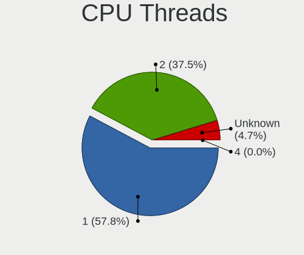
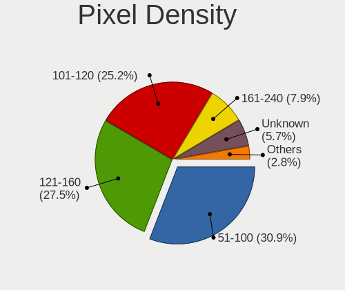
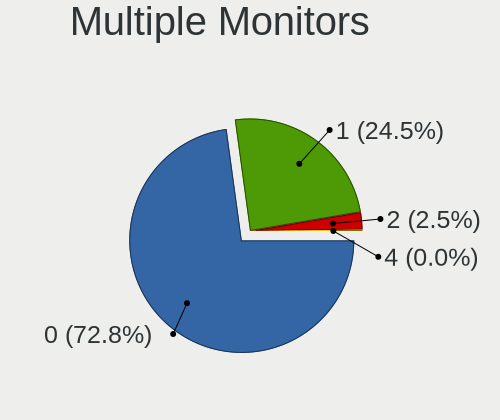

BSD - Tested Hardware & Statistics
----------------------------------

A project to collect tested hardware configurations for BSD.

Anyone can contribute to this report by the [hw-probe](https://github.com/linuxhw/hw-probe/blob/master/INSTALL.BSD.md) tool:

    hw-probe -all -upload

Please contribute! Especially if your hardware is rare.

This is a report for all computer types. See also reports for [desktops](/Desktop/README.md) and [notebooks](/Notebook/README.md).

OS-specific reports: [FreeBSD](/Dist/FreeBSD), [GhostBSD](/Dist/GhostBSD), [helloSystem](/Dist/helloSystem), [NetBSD](/Dist/NetBSD), [NomadBSD](/Dist/NomadBSD), [OpenBSD](/Dist/OpenBSD), [OPNsense](/Dist/OPNsense), [pfSense](/Dist/pfSense), [TrueNAS](/Dist/TrueNAS).

This report is for real hardware. Report for virtual hardware: [TestDays_VE](https://github.com/bsdhw/TestDays_VE)

Contents
--------

* [ Test Cases ](#test-cases)

* [ System ](#system)
  - [ OS                       ](#os)
  - [ OS Family                ](#os-family)
  - [ Arch                     ](#arch)
  - [ DE                       ](#de)
  - [ Display Server           ](#display-server)
  - [ Display Manager          ](#display-manager)
  - [ OS Lang                  ](#os-lang)
  - [ Boot Mode                ](#boot-mode)
  - [ Filesystem               ](#filesystem)
  - [ Part. scheme             ](#part-scheme)

* [ Board ](#board)
  - [ Vendor                   ](#vendor)
  - [ Model                    ](#model)
  - [ Model Family             ](#model-family)
  - [ MFG Year                 ](#mfg-year)
  - [ Form Factor              ](#form-factor)
  - [ Coreboot                 ](#coreboot)
  - [ RAM Size                 ](#ram-size)
  - [ RAM Used                 ](#ram-used)
  - [ Total Drives             ](#total-drives)
  - [ Has CD-ROM               ](#has-cd-rom)
  - [ Has Ethernet             ](#has-ethernet)
  - [ Has WiFi                 ](#has-wifi)
  - [ Has Bluetooth            ](#has-bluetooth)

* [ Location ](#location)
  - [ Country                  ](#country)
  - [ City                     ](#city)

* [ Drives ](#drives)
  - [ Drive Vendor             ](#drive-vendor)
  - [ Drive Model              ](#drive-model)
  - [ HDD Vendor               ](#hdd-vendor)
  - [ SSD Vendor               ](#ssd-vendor)
  - [ Drive Kind               ](#drive-kind)
  - [ Drive Connector          ](#drive-connector)
  - [ Drive Size               ](#drive-size)
  - [ Space Total              ](#space-total)
  - [ Space Used               ](#space-used)
  - [ Malfunc. Drives          ](#malfunc-drives)
  - [ Malfunc. Drive Vendor    ](#malfunc-drive-vendor)
  - [ Malfunc. HDD Vendor      ](#malfunc-hdd-vendor)
  - [ Malfunc. Drive Kind      ](#malfunc-drive-kind)
  - [ Failed Drives            ](#failed-drives)
  - [ Failed Drive Vendor      ](#failed-drive-vendor)
  - [ Drive Status             ](#drive-status)

* [ Storage controller ](#storage-controller)
  - [ Storage Vendor           ](#storage-vendor)
  - [ Storage Model            ](#storage-model)
  - [ Storage Kind             ](#storage-kind)

* [ Processor ](#processor)
  - [ CPU Vendor               ](#cpu-vendor)
  - [ CPU Model                ](#cpu-model)
  - [ CPU Model Family         ](#cpu-model-family)
  - [ CPU Cores                ](#cpu-cores)
  - [ CPU Sockets              ](#cpu-sockets)
  - [ CPU Threads              ](#cpu-threads)
  - [ CPU Microarch            ](#cpu-microarch)

* [ Graphics ](#graphics)
  - [ GPU Vendor               ](#gpu-vendor)
  - [ GPU Model                ](#gpu-model)
  - [ GPU Combo                ](#gpu-combo)
  - [ GPU Driver               ](#gpu-driver)
  - [ GPU Memory               ](#gpu-memory)

* [ Monitor ](#monitor)
  - [ Monitor Vendor           ](#monitor-vendor)
  - [ Monitor Model            ](#monitor-model)
  - [ Monitor Resolution       ](#monitor-resolution)
  - [ Monitor Diagonal         ](#monitor-diagonal)
  - [ Monitor Width            ](#monitor-width)
  - [ Aspect Ratio             ](#aspect-ratio)
  - [ Monitor Area             ](#monitor-area)
  - [ Pixel Density            ](#pixel-density)
  - [ Multiple Monitors        ](#multiple-monitors)

* [ Network ](#network)
  - [ Net Controller Vendor    ](#net-controller-vendor)
  - [ Net Controller Model     ](#net-controller-model)
  - [ Wireless Vendor          ](#wireless-vendor)
  - [ Wireless Model           ](#wireless-model)
  - [ Ethernet Vendor          ](#ethernet-vendor)
  - [ Ethernet Model           ](#ethernet-model)
  - [ Net Controller Kind      ](#net-controller-kind)
  - [ Used Controller          ](#used-controller)
  - [ NICs                     ](#nics)
  - [ IPv6                     ](#ipv6)

* [ Bluetooth ](#bluetooth)
  - [ Bluetooth Vendor         ](#bluetooth-vendor)
  - [ Bluetooth Model          ](#bluetooth-model)

* [ Sound ](#sound)
  - [ Sound Vendor             ](#sound-vendor)
  - [ Sound Model              ](#sound-model)

* [ Memory ](#memory)
  - [ Memory Vendor            ](#memory-vendor)
  - [ Memory Model             ](#memory-model)
  - [ Memory Kind              ](#memory-kind)
  - [ Memory Form Factor       ](#memory-form-factor)
  - [ Memory Size              ](#memory-size)
  - [ Memory Speed             ](#memory-speed)

* [ Printers & scanners ](#printers--scanners)
  - [ Printer Vendor           ](#printer-vendor)
  - [ Printer Model            ](#printer-model)
  - [ Scanner Vendor           ](#scanner-vendor)
  - [ Scanner Model            ](#scanner-model)

* [ Camera ](#camera)
  - [ Camera Vendor            ](#camera-vendor)
  - [ Camera Model             ](#camera-model)

* [ Security ](#security)
  - [ Fingerprint Vendor       ](#fingerprint-vendor)
  - [ Fingerprint Model        ](#fingerprint-model)
  - [ Chipcard Vendor          ](#chipcard-vendor)
  - [ Chipcard Model           ](#chipcard-model)

* [ Unsupported ](#unsupported)
  - [ Unsupported Devices      ](#unsupported-devices)
  - [ Unsupported Device Types ](#unsupported-device-types)

Test Cases
----------

Total: 17044

| Vendor        | Model                       | Form-Factor | Probe                                                     | Date         |
|---------------|-----------------------------|-------------|-----------------------------------------------------------|--------------|
| Protectli     | FW6 Ver                     | Desktop     | [61c7be6541](https://bsd-hardware.info/?probe=61c7be6541) | Jul 01, 2023 |
| CWWK          | CW-AD4L-N V1                | Desktop     | [3d03ade7ab](https://bsd-hardware.info/?probe=3d03ade7ab) | Jul 01, 2023 |
| Lenovo        | ThinkPad T60 20076PU        | Notebook    | [cb47bfef12](https://bsd-hardware.info/?probe=cb47bfef12) | Jun 30, 2023 |
| Techvision    | TVI7309X B0                 | Desktop     | [7c71b88b22](https://bsd-hardware.info/?probe=7c71b88b22) | Jun 30, 2023 |
| Gigabyte      | B360M D2V                   | Desktop     | [bf5f6fd6dd](https://bsd-hardware.info/?probe=bf5f6fd6dd) | Jun 30, 2023 |
| ASRockRack    | EPYC3101D4I-2T              | Desktop     | [6479d60da2](https://bsd-hardware.info/?probe=6479d60da2) | Jun 30, 2023 |
| PC Engines    | apu4                        | Desktop     | [62f0b60653](https://bsd-hardware.info/?probe=62f0b60653) | Jun 30, 2023 |
| Lenovo        | 3136 SDK0J40697 WIN 3305... | Mini pc     | [0e1a626160](https://bsd-hardware.info/?probe=0e1a626160) | Jun 30, 2023 |
| Unknown       | Unknown                     | Desktop     | [ff012340d5](https://bsd-hardware.info/?probe=ff012340d5) | Jun 30, 2023 |
| HP            | 1998                        | Desktop     | [d1df8f0773](https://bsd-hardware.info/?probe=d1df8f0773) | Jun 30, 2023 |
| ASUSTek       | ROG STRIX X570-F GAMING     | Desktop     | [b6cfa09740](https://bsd-hardware.info/?probe=b6cfa09740) | Jun 30, 2023 |
| Protectli     | FW6 Ver                     | Desktop     | [5c6f36540d](https://bsd-hardware.info/?probe=5c6f36540d) | Jun 29, 2023 |
| Intel         | Q3XXG4-P V1.0               | Desktop     | [3e8f4fb0a8](https://bsd-hardware.info/?probe=3e8f4fb0a8) | Jun 29, 2023 |
| Dell          | 00V62H A01                  | Desktop     | [d60c967edb](https://bsd-hardware.info/?probe=d60c967edb) | Jun 29, 2023 |
| Protectli     | VP2420                      | Desktop     | [950ff902c2](https://bsd-hardware.info/?probe=950ff902c2) | Jun 29, 2023 |
| Sophos        | XG                          | Firewall    | [b84ed2de3a](https://bsd-hardware.info/?probe=b84ed2de3a) | Jun 29, 2023 |
| HP            | 82A2                        | Desktop     | [4b8d139419](https://bsd-hardware.info/?probe=4b8d139419) | Jun 29, 2023 |
| Intel         | DQ67SW AAG12527-310         | Desktop     | [5b272b02cb](https://bsd-hardware.info/?probe=5b272b02cb) | Jun 29, 2023 |
| Apple         | Mac-35C5E08120C7EEAF Mac... | Mini pc     | [ddeb9d00a6](https://bsd-hardware.info/?probe=ddeb9d00a6) | Jun 29, 2023 |
| Unknown       | Unknown                     | Desktop     | [e57d17e272](https://bsd-hardware.info/?probe=e57d17e272) | Jun 29, 2023 |
| Unknown       | Unknown                     | Desktop     | [4c5d9c5da3](https://bsd-hardware.info/?probe=4c5d9c5da3) | Jun 29, 2023 |
| HP            | 8055                        | Desktop     | [94df572de4](https://bsd-hardware.info/?probe=94df572de4) | Jun 29, 2023 |
| Unknown       | Unknown                     | Desktop     | [c07f4ffa1e](https://bsd-hardware.info/?probe=c07f4ffa1e) | Jun 29, 2023 |
| Dell          | 0NW6H5 A00                  | Desktop     | [0cdc2b47b2](https://bsd-hardware.info/?probe=0cdc2b47b2) | Jun 29, 2023 |
| HP            | 8595                        | Desktop     | [e1a82ff0c5](https://bsd-hardware.info/?probe=e1a82ff0c5) | Jun 29, 2023 |
| Unknown       | Unknown                     | Desktop     | [41e020bc03](https://bsd-hardware.info/?probe=41e020bc03) | Jun 29, 2023 |
| Intel         | MAHOBAY                     | Desktop     | [4053bc358e](https://bsd-hardware.info/?probe=4053bc358e) | Jun 29, 2023 |
| Unknown       | Unknown                     | Desktop     | [075deef24f](https://bsd-hardware.info/?probe=075deef24f) | Jun 28, 2023 |
| CWWK          | MINIPC-G4                   | Desktop     | [ebfa9abcd3](https://bsd-hardware.info/?probe=ebfa9abcd3) | Jun 28, 2023 |
| ASUSTek       | M2A-VM                      | Desktop     | [2d5a9bba42](https://bsd-hardware.info/?probe=2d5a9bba42) | Jun 28, 2023 |
| Sony          | VGC-RB41M                   | Desktop     | [95804a1f40](https://bsd-hardware.info/?probe=95804a1f40) | Jun 28, 2023 |
| Lenovo        | ThinkPad X1 Extreme 2nd ... | Notebook    | [1aff07438c](https://bsd-hardware.info/?probe=1aff07438c) | Jun 28, 2023 |
| Inventec      | D CLASS A02                 | Desktop     | [c96df95354](https://bsd-hardware.info/?probe=c96df95354) | Jun 28, 2023 |
| CncTion       | J4125-4L-I225               | Desktop     | [1785cb2fa3](https://bsd-hardware.info/?probe=1785cb2fa3) | Jun 28, 2023 |
| HP            | EliteBook 840 G3            | Notebook    | [17834256ca](https://bsd-hardware.info/?probe=17834256ca) | Jun 28, 2023 |
| Dell          | 0NC2VH A01                  | Desktop     | [d5a7320a8a](https://bsd-hardware.info/?probe=d5a7320a8a) | Jun 28, 2023 |
| Techvision    | TVI7309X B0                 | Desktop     | [0dbf4904dc](https://bsd-hardware.info/?probe=0dbf4904dc) | Jun 28, 2023 |
| Deciso        | NetBoard-A10                | Notebook    | [2eff359d8f](https://bsd-hardware.info/?probe=2eff359d8f) | Jun 28, 2023 |
| HP            | EliteBook 8570p             | Notebook    | [03c29939fc](https://bsd-hardware.info/?probe=03c29939fc) | Jun 28, 2023 |
| Unknown       | Unknown                     | Desktop     | [5080e84698](https://bsd-hardware.info/?probe=5080e84698) | Jun 28, 2023 |
| Deciso        | DEC2700 - OPNsense Appli... | Notebook    | [aedd3a8255](https://bsd-hardware.info/?probe=aedd3a8255) | Jun 28, 2023 |
| Dell          | 03X6X0 A00                  | Server      | [88c047f069](https://bsd-hardware.info/?probe=88c047f069) | Jun 28, 2023 |
| Unknown       | Unknown                     | Desktop     | [9d98798bc8](https://bsd-hardware.info/?probe=9d98798bc8) | Jun 27, 2023 |
| HP            | 339A                        | Desktop     | [b08e1fc092](https://bsd-hardware.info/?probe=b08e1fc092) | Jun 27, 2023 |
| Lenovo        | 3136 SDK0J40697 WIN 3305... | Mini pc     | [30240eb64b](https://bsd-hardware.info/?probe=30240eb64b) | Jun 27, 2023 |
| MW            | GMLK-2_5G4L                 | Desktop     | [1ef9818928](https://bsd-hardware.info/?probe=1ef9818928) | Jun 27, 2023 |
| Unknown       | Unknown                     | Desktop     | [23cdf1d4af](https://bsd-hardware.info/?probe=23cdf1d4af) | Jun 27, 2023 |
| Unknown       | Unknown                     | Desktop     | [a548b021da](https://bsd-hardware.info/?probe=a548b021da) | Jun 27, 2023 |
| HP            | EliteBook 8570p             | Notebook    | [748ae83ba1](https://bsd-hardware.info/?probe=748ae83ba1) | Jun 27, 2023 |
| ASUSTek       | TUF Gaming B550M-PLUS (W... | Desktop     | [4d99bc4b63](https://bsd-hardware.info/?probe=4d99bc4b63) | Jun 27, 2023 |
| ASUSTek       | TUF Gaming B550M-PLUS (W... | Desktop     | [8866724f46](https://bsd-hardware.info/?probe=8866724f46) | Jun 27, 2023 |
| YANYU         | H67SL                       | Desktop     | [5d5fd8a8cd](https://bsd-hardware.info/?probe=5d5fd8a8cd) | Jun 27, 2023 |
| Dell          | XPS 13 9360                 | Notebook    | [648c09752f](https://bsd-hardware.info/?probe=648c09752f) | Jun 27, 2023 |
| HP            | EliteBook 850 G5            | Notebook    | [4bae8cd192](https://bsd-hardware.info/?probe=4bae8cd192) | Jun 27, 2023 |
| ASUSTek       | PRIME A320M-K               | Desktop     | [a53c1176ba](https://bsd-hardware.info/?probe=a53c1176ba) | Jun 27, 2023 |
| Intel         | NUC12WSBi3 M36953-303       | Mini pc     | [6823b41760](https://bsd-hardware.info/?probe=6823b41760) | Jun 27, 2023 |
| Supermicro    | X11SDV-4C-TP8F              | Desktop     | [bc448a4c10](https://bsd-hardware.info/?probe=bc448a4c10) | Jun 27, 2023 |
| Fujitsu       | D3313-G1 S26361-D3313-G1    | Desktop     | [bcad942162](https://bsd-hardware.info/?probe=bcad942162) | Jun 26, 2023 |
| Unknown       | YL-SKUL6                    | Desktop     | [1512f63972](https://bsd-hardware.info/?probe=1512f63972) | Jun 26, 2023 |
| Fujitsu       | D3313-A1 S26361-D3313-A1    | Desktop     | [96917bdb04](https://bsd-hardware.info/?probe=96917bdb04) | Jun 26, 2023 |
| Deciso        | OPNsense Appliance          | Notebook    | [be0008eb2a](https://bsd-hardware.info/?probe=be0008eb2a) | Jun 26, 2023 |
| ASUSTek       | N3700T                      | Desktop     | [16b73b05ef](https://bsd-hardware.info/?probe=16b73b05ef) | Jun 26, 2023 |
| HP            | 1998                        | Desktop     | [b6a89cea25](https://bsd-hardware.info/?probe=b6a89cea25) | Jun 26, 2023 |
| Cisco         | ASA5515 A0                  | Desktop     | [9d8eedf081](https://bsd-hardware.info/?probe=9d8eedf081) | Jun 26, 2023 |
| Protectli     | FW6 Ver                     | Desktop     | [fa177a2538](https://bsd-hardware.info/?probe=fa177a2538) | Jun 26, 2023 |
| Protectli     | FW6 Ver                     | Desktop     | [54ef7dc131](https://bsd-hardware.info/?probe=54ef7dc131) | Jun 26, 2023 |
| Protectli     | FW6 Ver                     | Desktop     | [b056cd0426](https://bsd-hardware.info/?probe=b056cd0426) | Jun 26, 2023 |
| HP            | 18E9                        | Desktop     | [aba608120b](https://bsd-hardware.info/?probe=aba608120b) | Jun 26, 2023 |
| Unknown       | Unknown                     | Desktop     | [18da718e9e](https://bsd-hardware.info/?probe=18da718e9e) | Jun 26, 2023 |
| Dell          | Latitude 3420               | Notebook    | [057f065baa](https://bsd-hardware.info/?probe=057f065baa) | Jun 26, 2023 |
| HP            | 1495                        | Desktop     | [564ff2ef77](https://bsd-hardware.info/?probe=564ff2ef77) | Jun 26, 2023 |
| Dell          | 0TW855 A07                  | Server      | [6b0d9156a9](https://bsd-hardware.info/?probe=6b0d9156a9) | Jun 26, 2023 |
| Supermicro    | X9SCL/X9SCMA                | Desktop     | [489b7b6bae](https://bsd-hardware.info/?probe=489b7b6bae) | Jun 26, 2023 |
| Lenovo        | ThinkPad T440p 20AW000BU... | Notebook    | [9a7628d17b](https://bsd-hardware.info/?probe=9a7628d17b) | Jun 26, 2023 |
| Unknown       | Unknown                     | Desktop     | [cd3b925f27](https://bsd-hardware.info/?probe=cd3b925f27) | Jun 26, 2023 |
| Lenovo        | Kabini CRB 31900058 STD     | Desktop     | [127f92759b](https://bsd-hardware.info/?probe=127f92759b) | Jun 26, 2023 |
| Gigabyte      | C1037UN                     | Desktop     | [fccc3f4b80](https://bsd-hardware.info/?probe=fccc3f4b80) | Jun 26, 2023 |
| Protectli     | FW6 Ver                     | Desktop     | [03eb1a54c8](https://bsd-hardware.info/?probe=03eb1a54c8) | Jun 25, 2023 |
| Dell          | 0J8G6F A02                  | Desktop     | [e4a7fc0f0e](https://bsd-hardware.info/?probe=e4a7fc0f0e) | Jun 25, 2023 |
| Lenovo        | 3102 SDK0J40697 WIN 3305... | Desktop     | [e76d3511a1](https://bsd-hardware.info/?probe=e76d3511a1) | Jun 25, 2023 |
| Dell          | Inspiron 5570               | Notebook    | [a6e959358f](https://bsd-hardware.info/?probe=a6e959358f) | Jun 25, 2023 |
| Unknown       | Unknown                     | Desktop     | [27bbec5905](https://bsd-hardware.info/?probe=27bbec5905) | Jun 25, 2023 |
| AZW           | EQ                          | Desktop     | [c410cd5c1c](https://bsd-hardware.info/?probe=c410cd5c1c) | Jun 25, 2023 |
| Unknown       | Unknown                     | Desktop     | [c660f668dc](https://bsd-hardware.info/?probe=c660f668dc) | Jun 25, 2023 |
| Unknown       | J3160-4L                    | Desktop     | [5ad411cd6b](https://bsd-hardware.info/?probe=5ad411cd6b) | Jun 25, 2023 |
| Gigabyte      | B450M DS3H-CF               | Desktop     | [dc937eee63](https://bsd-hardware.info/?probe=dc937eee63) | Jun 25, 2023 |
| Unknown       | Unknown                     | Desktop     | [b44e00cdf3](https://bsd-hardware.info/?probe=b44e00cdf3) | Jun 25, 2023 |
| MSI           | H81M-P33                    | Desktop     | [80bd24461a](https://bsd-hardware.info/?probe=80bd24461a) | Jun 25, 2023 |
| ASUSTek       | P5Q-E                       | Desktop     | [e368d55893](https://bsd-hardware.info/?probe=e368d55893) | Jun 25, 2023 |
| ASUSTek       | ROG CROSSHAIR VIII HERO     | Desktop     | [483865aca5](https://bsd-hardware.info/?probe=483865aca5) | Jun 25, 2023 |
| Hardkernel    | ODROID-H3                   | Desktop     | [8a2ea60929](https://bsd-hardware.info/?probe=8a2ea60929) | Jun 25, 2023 |
| HP            | EliteBook 8570p             | Notebook    | [e7dfbf94d0](https://bsd-hardware.info/?probe=e7dfbf94d0) | Jun 25, 2023 |
| Unknown       | Unknown                     | Desktop     | [32e290d370](https://bsd-hardware.info/?probe=32e290d370) | Jun 25, 2023 |
| Intel         | DG41TY AAE47335-300         | Desktop     | [111b9572ba](https://bsd-hardware.info/?probe=111b9572ba) | Jun 25, 2023 |
| Dell          | Latitude E4310              | Notebook    | [9cdd4909fe](https://bsd-hardware.info/?probe=9cdd4909fe) | Jun 24, 2023 |
| Gigabyte      | H610I DDR4                  | Desktop     | [dea4808206](https://bsd-hardware.info/?probe=dea4808206) | Jun 24, 2023 |
| HP            | Laptop 15-bs1xx             | Notebook    | [dc0d876d7b](https://bsd-hardware.info/?probe=dc0d876d7b) | Jun 24, 2023 |
| HP            | Laptop 15-ra0xx             | Notebook    | [8c31502b68](https://bsd-hardware.info/?probe=8c31502b68) | Jun 24, 2023 |
| Sophos        | SG                          | Firewall    | [11e1176b5e](https://bsd-hardware.info/?probe=11e1176b5e) | Jun 24, 2023 |
| HP            | EliteBook 750 G1            | Notebook    | [e0af4797d4](https://bsd-hardware.info/?probe=e0af4797d4) | Jun 24, 2023 |
| HP            | EliteBook 750 G1            | Notebook    | [aba91c70d1](https://bsd-hardware.info/?probe=aba91c70d1) | Jun 24, 2023 |
| Supermicro    | X10SRL-FB                   | Server      | [24770c65d3](https://bsd-hardware.info/?probe=24770c65d3) | Jun 24, 2023 |
| Gigabyte      | Z77N-WIFI                   | Desktop     | [aca5df3113](https://bsd-hardware.info/?probe=aca5df3113) | Jun 24, 2023 |
| HP            | 8103 A01                    | Mini pc     | [feb4e78649](https://bsd-hardware.info/?probe=feb4e78649) | Jun 24, 2023 |
| AZW           | EQ                          | Desktop     | [a76336474d](https://bsd-hardware.info/?probe=a76336474d) | Jun 24, 2023 |
| HP            | 250 G6 Notebook PC          | Notebook    | [f7df283c94](https://bsd-hardware.info/?probe=f7df283c94) | Jun 24, 2023 |
| Shuttle       | DH370                       | Desktop     | [95eb3bd4a8](https://bsd-hardware.info/?probe=95eb3bd4a8) | Jun 24, 2023 |
| AMI           | Aptio CRB                   | Mini pc     | [c72cc8a340](https://bsd-hardware.info/?probe=c72cc8a340) | Jun 24, 2023 |
| ASRock        | J4105-ITX                   | Desktop     | [bfe12f97ba](https://bsd-hardware.info/?probe=bfe12f97ba) | Jun 24, 2023 |
| Protectli     | FW6 Ver                     | Desktop     | [6210e8f0bc](https://bsd-hardware.info/?probe=6210e8f0bc) | Jun 24, 2023 |
| Techvision    | TVI7309X B0                 | Desktop     | [93213fc931](https://bsd-hardware.info/?probe=93213fc931) | Jun 24, 2023 |
| Dell          | Latitude 5490               | Notebook    | [b638c1b2b1](https://bsd-hardware.info/?probe=b638c1b2b1) | Jun 23, 2023 |
| Unknown       | Unknown                     | Desktop     | [b67ce69ea4](https://bsd-hardware.info/?probe=b67ce69ea4) | Jun 23, 2023 |
| Supermicro    | X10SLL-F                    | Server      | [fdf31a6e78](https://bsd-hardware.info/?probe=fdf31a6e78) | Jun 23, 2023 |
| Dell          | 02YRK5 A03                  | Desktop     | [2d631e9745](https://bsd-hardware.info/?probe=2d631e9745) | Jun 23, 2023 |
| Techvision    | TVI7309X B0                 | Desktop     | [18cf91f3a4](https://bsd-hardware.info/?probe=18cf91f3a4) | Jun 23, 2023 |
| Intel         | Q3XXG4-P V1.0               | Desktop     | [bb4dc2b1a2](https://bsd-hardware.info/?probe=bb4dc2b1a2) | Jun 23, 2023 |
| ASUSTek       | ROG Maximus X HERO          | Desktop     | [2dfabb3a28](https://bsd-hardware.info/?probe=2dfabb3a28) | Jun 23, 2023 |
| Unknown       | Unknown                     | Notebook    | [b324d1f4fc](https://bsd-hardware.info/?probe=b324d1f4fc) | Jun 23, 2023 |
| Unknown       | Unknown                     | Desktop     | [16ceade742](https://bsd-hardware.info/?probe=16ceade742) | Jun 23, 2023 |
| Lenovo        | SDK0E50510 WIN              | Desktop     | [a411832c7d](https://bsd-hardware.info/?probe=a411832c7d) | Jun 23, 2023 |
| HP            | 213D A01                    | Desktop     | [eccc48bb80](https://bsd-hardware.info/?probe=eccc48bb80) | Jun 23, 2023 |
| ASUSTek       | ROG Maximus X HERO          | Desktop     | [b63efe1bc2](https://bsd-hardware.info/?probe=b63efe1bc2) | Jun 23, 2023 |
| HP            | Pavilion g4                 | Notebook    | [ef66b5588a](https://bsd-hardware.info/?probe=ef66b5588a) | Jun 23, 2023 |
| Unknown       | Unknown                     | Desktop     | [6e8085380f](https://bsd-hardware.info/?probe=6e8085380f) | Jun 23, 2023 |
| Protectli     | FW4B                        | Desktop     | [6c993e8f34](https://bsd-hardware.info/?probe=6c993e8f34) | Jun 23, 2023 |
| HP            | 1000                        | Notebook    | [21faecd7a6](https://bsd-hardware.info/?probe=21faecd7a6) | Jun 23, 2023 |
| Intel         | SKYBAY                      | Desktop     | [940adce39f](https://bsd-hardware.info/?probe=940adce39f) | Jun 23, 2023 |
| Dell          | 0Y7WYT A00                  | Desktop     | [a931ed9f0a](https://bsd-hardware.info/?probe=a931ed9f0a) | Jun 23, 2023 |
| Lenovo        | 312A SDK0J40697 WIN 3305... | Desktop     | [b6916f61a8](https://bsd-hardware.info/?probe=b6916f61a8) | Jun 23, 2023 |
| ASRock        | 4X4-4000 Series             | Desktop     | [c9420276e7](https://bsd-hardware.info/?probe=c9420276e7) | Jun 23, 2023 |
| Unknown       | Unknown                     | Desktop     | [97583c2b74](https://bsd-hardware.info/?probe=97583c2b74) | Jun 23, 2023 |
| AZW           | EQ                          | Desktop     | [8a85da80b2](https://bsd-hardware.info/?probe=8a85da80b2) | Jun 23, 2023 |
| Unknown       | Unknown                     | Desktop     | [508aa0bdb4](https://bsd-hardware.info/?probe=508aa0bdb4) | Jun 23, 2023 |
| LG Electro... | R590-K.AAA9BT               | Desktop     | [5c3ab65e8e](https://bsd-hardware.info/?probe=5c3ab65e8e) | Jun 23, 2023 |
| Unknown       | Unknown                     | Desktop     | [eb49ebcc0c](https://bsd-hardware.info/?probe=eb49ebcc0c) | Jun 22, 2023 |
| BESSTAR Te... | GB7                         | Mini pc     | [bc8c23b6ff](https://bsd-hardware.info/?probe=bc8c23b6ff) | Jun 22, 2023 |
| Lenovo        | ThinkPad W520 4284GZ1       | Notebook    | [d194e8bc0d](https://bsd-hardware.info/?probe=d194e8bc0d) | Jun 22, 2023 |
| Acer          | Aspire 5749                 | Notebook    | [75ad2ddb6f](https://bsd-hardware.info/?probe=75ad2ddb6f) | Jun 22, 2023 |
| NetGear       | ReadyNAS 3130               | Firewall    | [7fa1d24d06](https://bsd-hardware.info/?probe=7fa1d24d06) | Jun 22, 2023 |
| CWWK          | CW-AD4L-N V1                | Desktop     | [b7ca7c7195](https://bsd-hardware.info/?probe=b7ca7c7195) | Jun 22, 2023 |
| Lenovo        | ThinkCentre M55 880894U     | Desktop     | [e406083f25](https://bsd-hardware.info/?probe=e406083f25) | Jun 22, 2023 |
| Unknown       | Unknown                     | Desktop     | [f73625157c](https://bsd-hardware.info/?probe=f73625157c) | Jun 22, 2023 |
| Protectli     | VP2410                      | Desktop     | [94e2177a56](https://bsd-hardware.info/?probe=94e2177a56) | Jun 22, 2023 |
| Sophos        | SG                          | Firewall    | [6763145000](https://bsd-hardware.info/?probe=6763145000) | Jun 22, 2023 |
| ASUSTek       | TUF Gaming B450-PLUS II     | Desktop     | [6172c8b66f](https://bsd-hardware.info/?probe=6172c8b66f) | Jun 22, 2023 |
| Dell          | 0NW6H5 A00                  | Desktop     | [7d3a60d628](https://bsd-hardware.info/?probe=7d3a60d628) | Jun 22, 2023 |
| Techvision    | TVI7309X B0                 | Desktop     | [0b667bc4e7](https://bsd-hardware.info/?probe=0b667bc4e7) | Jun 22, 2023 |
| HP            | ProLiant DL360 G7           | Server      | [ed967db034](https://bsd-hardware.info/?probe=ed967db034) | Jun 22, 2023 |
| Lenovo        | SHARKBAY SDK0E50510 WIN     | Desktop     | [485ba68539](https://bsd-hardware.info/?probe=485ba68539) | Jun 22, 2023 |
| ASRock        | H110M-ITX                   | Desktop     | [1180da18fb](https://bsd-hardware.info/?probe=1180da18fb) | Jun 22, 2023 |
| Techvision    | TVI7309X B0                 | Desktop     | [178a67ff39](https://bsd-hardware.info/?probe=178a67ff39) | Jun 21, 2023 |
| Supermicro    | X10SLH-N6-ST031             | Server      | [572c03a709](https://bsd-hardware.info/?probe=572c03a709) | Jun 21, 2023 |
| HP            | 8592                        | Desktop     | [154f28878a](https://bsd-hardware.info/?probe=154f28878a) | Jun 21, 2023 |
| Insyde        | Purley                      | Server      | [c6ffd34b07](https://bsd-hardware.info/?probe=c6ffd34b07) | Jun 21, 2023 |
| ASUSTek       | PRIME B350M-A               | Desktop     | [29545a1054](https://bsd-hardware.info/?probe=29545a1054) | Jun 21, 2023 |
| HPE           | ProLiant DL20 Gen10 Plus    | Server      | [7d5925b21e](https://bsd-hardware.info/?probe=7d5925b21e) | Jun 21, 2023 |
| Dell          | 0NC2VH A01                  | Desktop     | [f094606e8f](https://bsd-hardware.info/?probe=f094606e8f) | Jun 21, 2023 |
| Hardkernel    | ODROID-H3                   | Desktop     | [8f550b0d75](https://bsd-hardware.info/?probe=8f550b0d75) | Jun 21, 2023 |
| BESSTAR Te... | TH50                        | Desktop     | [efc396837c](https://bsd-hardware.info/?probe=efc396837c) | Jun 21, 2023 |
| Techvision    | TVI7309X B0                 | Desktop     | [12d57aa9d9](https://bsd-hardware.info/?probe=12d57aa9d9) | Jun 21, 2023 |
| CWWK          | CW-AD4L-N V1                | Desktop     | [a09d71cc14](https://bsd-hardware.info/?probe=a09d71cc14) | Jun 21, 2023 |
| HP            | 802E                        | Desktop     | [595a5d4f60](https://bsd-hardware.info/?probe=595a5d4f60) | Jun 21, 2023 |
| BESSTAR Te... | GB7                         | Mini pc     | [4f80d81bbe](https://bsd-hardware.info/?probe=4f80d81bbe) | Jun 20, 2023 |
| CWWK          | CW-AD4L-N V1                | Desktop     | [19b4d842d4](https://bsd-hardware.info/?probe=19b4d842d4) | Jun 20, 2023 |
| Protectli     | VP2420                      | Desktop     | [6d1ca53e48](https://bsd-hardware.info/?probe=6d1ca53e48) | Jun 20, 2023 |
| Unknown       | Unknown                     | Desktop     | [e798ae3230](https://bsd-hardware.info/?probe=e798ae3230) | Jun 20, 2023 |
| Lenovo        | ThinkPad T430 2347A45       | Notebook    | [6969cd9e1a](https://bsd-hardware.info/?probe=6969cd9e1a) | Jun 20, 2023 |
| Unknown       | Unknown                     | Desktop     | [d0c184ae86](https://bsd-hardware.info/?probe=d0c184ae86) | Jun 20, 2023 |
| Acer          | Aspire 5749                 | Notebook    | [1e91633580](https://bsd-hardware.info/?probe=1e91633580) | Jun 20, 2023 |
| Lenovo        | ThinkPad T430 2347A45       | Notebook    | [461a92a1a2](https://bsd-hardware.info/?probe=461a92a1a2) | Jun 20, 2023 |
| ASUSTek       | PRIME A320M-K               | Desktop     | [b870037532](https://bsd-hardware.info/?probe=b870037532) | Jun 20, 2023 |
| ASUSTek       | PRIME A320M-K               | Desktop     | [a0409cd187](https://bsd-hardware.info/?probe=a0409cd187) | Jun 20, 2023 |
| Lenovo        | SHARKBAY NOK                | Desktop     | [0027ab7bbf](https://bsd-hardware.info/?probe=0027ab7bbf) | Jun 20, 2023 |
| Fujitsu       | D3373-B1 S26361-D3373-B1... | Server      | [daf34373d3](https://bsd-hardware.info/?probe=daf34373d3) | Jun 19, 2023 |
| Unknown       | Unknown                     | Notebook    | [c017b848dc](https://bsd-hardware.info/?probe=c017b848dc) | Jun 19, 2023 |
| Supermicro    | M11SDV-4CT-LN4F             | Server      | [18f6f78915](https://bsd-hardware.info/?probe=18f6f78915) | Jun 19, 2023 |
| Yanling       | YL-KBRL2 Series Ver:1.02    | Desktop     | [9e8d6110f4](https://bsd-hardware.info/?probe=9e8d6110f4) | Jun 19, 2023 |
| Unknown       | Unknown                     | Desktop     | [05925afd0a](https://bsd-hardware.info/?probe=05925afd0a) | Jun 19, 2023 |
| Techvision    | TVI7309X B0                 | Desktop     | [1fa198f78d](https://bsd-hardware.info/?probe=1fa198f78d) | Jun 19, 2023 |
| HP            | 339A                        | Desktop     | [c019d583c9](https://bsd-hardware.info/?probe=c019d583c9) | Jun 19, 2023 |
| ASUSTek       | P5K PRO                     | Desktop     | [f0b283fdaf](https://bsd-hardware.info/?probe=f0b283fdaf) | Jun 19, 2023 |
| Unknown       | Unknown                     | Desktop     | [74d372e7a4](https://bsd-hardware.info/?probe=74d372e7a4) | Jun 19, 2023 |
| LANCOM Sys... | UF-60                       | Desktop     | [96904b8bdd](https://bsd-hardware.info/?probe=96904b8bdd) | Jun 19, 2023 |
| Intel         | CRESCENTBAY                 | Desktop     | [e8c8da464a](https://bsd-hardware.info/?probe=e8c8da464a) | Jun 19, 2023 |
| AMI           | Aptio CRB                   | Mini pc     | [1b3b10c231](https://bsd-hardware.info/?probe=1b3b10c231) | Jun 19, 2023 |
| Unknown       | Unknown                     | Desktop     | [5fc629699d](https://bsd-hardware.info/?probe=5fc629699d) | Jun 18, 2023 |
| Apple         | MacBook2,1                  | Notebook    | [9e864bfe3b](https://bsd-hardware.info/?probe=9e864bfe3b) | Jun 18, 2023 |
| Unknown       | Unknown                     | Desktop     | [29313e36c9](https://bsd-hardware.info/?probe=29313e36c9) | Jun 18, 2023 |
| Intel         | ChiefRiver D                | Desktop     | [ce6d6e7e9e](https://bsd-hardware.info/?probe=ce6d6e7e9e) | Jun 18, 2023 |
| HP            | Pavilion 15                 | Notebook    | [9ba6acdb4b](https://bsd-hardware.info/?probe=9ba6acdb4b) | Jun 18, 2023 |
| Intel         | NUC11PABi5 K90634-305       | Mini pc     | [9f41fa4740](https://bsd-hardware.info/?probe=9f41fa4740) | Jun 18, 2023 |
| Unknown       | Unknown                     | Desktop     | [2cc06a4553](https://bsd-hardware.info/?probe=2cc06a4553) | Jun 18, 2023 |
| Intel         | NUC11PABi5 K90634-305       | Mini pc     | [8eb0be633d](https://bsd-hardware.info/?probe=8eb0be633d) | Jun 18, 2023 |
| Dell          | Latitude E6520              | Notebook    | [98868960d5](https://bsd-hardware.info/?probe=98868960d5) | Jun 18, 2023 |
| HP            | Stream Laptop 14-ds0xxx     | Notebook    | [81bbc73e72](https://bsd-hardware.info/?probe=81bbc73e72) | Jun 18, 2023 |
| Dell          | Inspiron 5559               | Notebook    | [b0659ff5bf](https://bsd-hardware.info/?probe=b0659ff5bf) | Jun 18, 2023 |
| Dell          | 07F37C A01                  | Desktop     | [16e5a062a2](https://bsd-hardware.info/?probe=16e5a062a2) | Jun 18, 2023 |
| Dell          | 05KX61 A02                  | Server      | [7131f9450f](https://bsd-hardware.info/?probe=7131f9450f) | Jun 18, 2023 |
| Fujitsu       | D3313-G1 S26361-D3313-G1    | Desktop     | [c15bb7d984](https://bsd-hardware.info/?probe=c15bb7d984) | Jun 18, 2023 |
| Techvision    | TVI7309X B0                 | Desktop     | [b6e5a7e7bc](https://bsd-hardware.info/?probe=b6e5a7e7bc) | Jun 18, 2023 |
| ASRock        | Z97 Professional            | Desktop     | [c978ddda86](https://bsd-hardware.info/?probe=c978ddda86) | Jun 18, 2023 |
| Techvision    | TVI7309X B0                 | Desktop     | [2d50927445](https://bsd-hardware.info/?probe=2d50927445) | Jun 18, 2023 |
| Sophos        | SG                          | Firewall    | [94a6b615cb](https://bsd-hardware.info/?probe=94a6b615cb) | Jun 17, 2023 |
| Dell          | 04415J A00                  | Mini pc     | [31c6e3d0b1](https://bsd-hardware.info/?probe=31c6e3d0b1) | Jun 17, 2023 |
| Samsung       | NC210/NC110                 | Notebook    | [06f5a9210b](https://bsd-hardware.info/?probe=06f5a9210b) | Jun 17, 2023 |
| Unknown       | Unknown                     | Desktop     | [b20059737f](https://bsd-hardware.info/?probe=b20059737f) | Jun 17, 2023 |
| ASUSTek       | P7P55D LE                   | Desktop     | [ea97ade85d](https://bsd-hardware.info/?probe=ea97ade85d) | Jun 17, 2023 |
| Unknown       | Unknown                     | Desktop     | [81268da610](https://bsd-hardware.info/?probe=81268da610) | Jun 17, 2023 |
| HP            | EliteBook 8570p             | Notebook    | [53bbc07cc8](https://bsd-hardware.info/?probe=53bbc07cc8) | Jun 17, 2023 |
| ASRock        | X570 Phantom Gaming 4       | Desktop     | [705c750691](https://bsd-hardware.info/?probe=705c750691) | Jun 17, 2023 |
| AZW           | SER                         | Mini pc     | [278b419d40](https://bsd-hardware.info/?probe=278b419d40) | Jun 17, 2023 |
| Gigabyte      | J4005ND2P-CF                | Desktop     | [ee61a4b160](https://bsd-hardware.info/?probe=ee61a4b160) | Jun 17, 2023 |
| Apple         | MacBook7,1                  | Notebook    | [6412e6fb23](https://bsd-hardware.info/?probe=6412e6fb23) | Jun 16, 2023 |
| Unknown       | ITX-M41E                    | Desktop     | [2e8c62d163](https://bsd-hardware.info/?probe=2e8c62d163) | Jun 16, 2023 |
| Dell          | 0HC3G4 A00                  | Mini pc     | [72ac0afa21](https://bsd-hardware.info/?probe=72ac0afa21) | Jun 16, 2023 |
| Unknown       | ITX-M41E                    | Desktop     | [671e67a42d](https://bsd-hardware.info/?probe=671e67a42d) | Jun 16, 2023 |
| Lenovo        | ThinkCentre A70 7099A5P     | Desktop     | [4e827b2cbf](https://bsd-hardware.info/?probe=4e827b2cbf) | Jun 16, 2023 |
| Lenovo        | ThinkCentre A70 7099A5P     | Desktop     | [3d71827388](https://bsd-hardware.info/?probe=3d71827388) | Jun 16, 2023 |
| IBM           | 69Y5698                     | Server      | [9f5eb975e0](https://bsd-hardware.info/?probe=9f5eb975e0) | Jun 16, 2023 |
| Dell          | 053CWD A00                  | Desktop     | [7a5418ac7e](https://bsd-hardware.info/?probe=7a5418ac7e) | Jun 16, 2023 |
| AMD           | Kabini CRB                  | Desktop     | [b774a8b586](https://bsd-hardware.info/?probe=b774a8b586) | Jun 16, 2023 |
| HP            | 83E9                        | Desktop     | [23ec260317](https://bsd-hardware.info/?probe=23ec260317) | Jun 16, 2023 |
| CNCTION-IA... | Unknown                     | Desktop     | [1a0573767e](https://bsd-hardware.info/?probe=1a0573767e) | Jun 16, 2023 |
| HUAWEI        | BOHB-WAX9                   | Notebook    | [d8079e6155](https://bsd-hardware.info/?probe=d8079e6155) | Jun 16, 2023 |
| Unknown       | Unknown                     | Desktop     | [a6d5232f75](https://bsd-hardware.info/?probe=a6d5232f75) | Jun 16, 2023 |
| CWWK          | CW-AD4L-N V1                | Desktop     | [31cba7b0c6](https://bsd-hardware.info/?probe=31cba7b0c6) | Jun 15, 2023 |
| Unknown       | Unknown                     | Desktop     | [6b4f214b72](https://bsd-hardware.info/?probe=6b4f214b72) | Jun 15, 2023 |
| Unknown       | Unknown                     | Desktop     | [06754d9e71](https://bsd-hardware.info/?probe=06754d9e71) | Jun 15, 2023 |
| Notebook      | NL5xRU                      | Notebook    | [04ca736537](https://bsd-hardware.info/?probe=04ca736537) | Jun 15, 2023 |
| CncTion       | N5105-4L B0                 | Desktop     | [b9c5b6ec05](https://bsd-hardware.info/?probe=b9c5b6ec05) | Jun 15, 2023 |
| Unknown       | Unknown                     | Desktop     | [615e7cbf52](https://bsd-hardware.info/?probe=615e7cbf52) | Jun 15, 2023 |
| Lenovo        | ThinkPad T480 20L6S2S800    | Notebook    | [722403df31](https://bsd-hardware.info/?probe=722403df31) | Jun 15, 2023 |
| ASUSTek       | H110M-R                     | Desktop     | [cc5fe45365](https://bsd-hardware.info/?probe=cc5fe45365) | Jun 15, 2023 |
| Unknown       | Unknown                     | Desktop     | [8357f0f72e](https://bsd-hardware.info/?probe=8357f0f72e) | Jun 15, 2023 |
| ASUSTek       | M5A97 PLUS                  | Desktop     | [39e7195baf](https://bsd-hardware.info/?probe=39e7195baf) | Jun 15, 2023 |
| Fujitsu       | D3034-A1 S26361-D3034-A1... | Server      | [a14227cbb3](https://bsd-hardware.info/?probe=a14227cbb3) | Jun 15, 2023 |
| Lenovo        | ThinkPad T430 2347GR2       | Notebook    | [834f9f8748](https://bsd-hardware.info/?probe=834f9f8748) | Jun 15, 2023 |
| Unknown       | Unknown                     | Desktop     | [93dcd13cb6](https://bsd-hardware.info/?probe=93dcd13cb6) | Jun 15, 2023 |
| Lenovo        | ThinkPad T450 20BV000BUS    | Notebook    | [7e1aa76e45](https://bsd-hardware.info/?probe=7e1aa76e45) | Jun 15, 2023 |
| Unknown       | Unknown                     | Notebook    | [e218344894](https://bsd-hardware.info/?probe=e218344894) | Jun 15, 2023 |
| Panasonic     | CFSX4-1                     | Notebook    | [ff83a965d2](https://bsd-hardware.info/?probe=ff83a965d2) | Jun 15, 2023 |
| Intel         | J1900                       | Desktop     | [4a3a52030b](https://bsd-hardware.info/?probe=4a3a52030b) | Jun 15, 2023 |
| Dell          | 08NPPY A00                  | Desktop     | [8586467924](https://bsd-hardware.info/?probe=8586467924) | Jun 15, 2023 |
| MW            | GMLK-2_5G4L                 | Desktop     | [3274745a08](https://bsd-hardware.info/?probe=3274745a08) | Jun 15, 2023 |
| Deciso        | OPNsense Appliance          | Notebook    | [43936f5f1c](https://bsd-hardware.info/?probe=43936f5f1c) | Jun 15, 2023 |
| Lenovo        | ThinkPad T430 2344BZU       | Notebook    | [01df487b47](https://bsd-hardware.info/?probe=01df487b47) | Jun 14, 2023 |
| Unknown       | Unknown                     | Desktop     | [7def20c99d](https://bsd-hardware.info/?probe=7def20c99d) | Jun 14, 2023 |
| Dell          | 0H7TGR A00                  | Desktop     | [da72cc4da4](https://bsd-hardware.info/?probe=da72cc4da4) | Jun 14, 2023 |
| Fujitsu Si... | D2804-A1 S26361-D2804-A1    | Desktop     | [70b0e8172d](https://bsd-hardware.info/?probe=70b0e8172d) | Jun 14, 2023 |
| Unknown       | Unknown                     | Desktop     | [f41e1f2b83](https://bsd-hardware.info/?probe=f41e1f2b83) | Jun 14, 2023 |
| ASUSTek       | 1015P                       | Notebook    | [c700224684](https://bsd-hardware.info/?probe=c700224684) | Jun 14, 2023 |
| Lenovo        | 3102 SDK0J40697 WIN 3305... | Desktop     | [2e81fe65c8](https://bsd-hardware.info/?probe=2e81fe65c8) | Jun 14, 2023 |
| MSI           | GE63 Raider RGB 8RE         | Notebook    | [ecdb80adc0](https://bsd-hardware.info/?probe=ecdb80adc0) | Jun 14, 2023 |
| Lenovo        | 312D SDK0J40697 WIN 3305... | Mini pc     | [355639e85e](https://bsd-hardware.info/?probe=355639e85e) | Jun 14, 2023 |
| Protectli     | FW4B Ver                    | Desktop     | [3484cbbf9f](https://bsd-hardware.info/?probe=3484cbbf9f) | Jun 14, 2023 |
| Lenovo        | ThinkPad X1 Carbon 6th 2... | Notebook    | [4841a6b1d2](https://bsd-hardware.info/?probe=4841a6b1d2) | Jun 14, 2023 |
| PC Engines    | apu4                        | Desktop     | [ea036662ca](https://bsd-hardware.info/?probe=ea036662ca) | Jun 14, 2023 |
| Dell          | 0VWT90 A00                  | Server      | [884ea7a785](https://bsd-hardware.info/?probe=884ea7a785) | Jun 14, 2023 |
| HP            | Compaq 6830s                | Notebook    | [1a06917a0f](https://bsd-hardware.info/?probe=1a06917a0f) | Jun 14, 2023 |
| Protectli     | VP2420                      | Desktop     | [82ecf3a046](https://bsd-hardware.info/?probe=82ecf3a046) | Jun 14, 2023 |
| Apple         | Mac-35C5E08120C7EEAF Mac... | Mini pc     | [644e9b9d90](https://bsd-hardware.info/?probe=644e9b9d90) | Jun 14, 2023 |
| Intel         | D2500CC AAG81477-401        | Desktop     | [15329a007b](https://bsd-hardware.info/?probe=15329a007b) | Jun 14, 2023 |
| Unknown       | Unknown                     | Desktop     | [229e573059](https://bsd-hardware.info/?probe=229e573059) | Jun 13, 2023 |
| Dell          | 0HD5W2 A01                  | Desktop     | [a6c6c43f64](https://bsd-hardware.info/?probe=a6c6c43f64) | Jun 13, 2023 |
| Unknown       | J3160-4L                    | Desktop     | [4a6667249e](https://bsd-hardware.info/?probe=4a6667249e) | Jun 13, 2023 |
| Techvision    | TVI7309X B0                 | Desktop     | [080be9d6f5](https://bsd-hardware.info/?probe=080be9d6f5) | Jun 13, 2023 |
| Lenovo        | ThinkPad T530 2429AP0       | Notebook    | [ddf37e7b17](https://bsd-hardware.info/?probe=ddf37e7b17) | Jun 13, 2023 |
| Gigabyte      | Z77N-WIFI                   | Desktop     | [f96302f46c](https://bsd-hardware.info/?probe=f96302f46c) | Jun 13, 2023 |
| ASUSTek       | PRIME X370-PRO              | Desktop     | [6e8e70ddc2](https://bsd-hardware.info/?probe=6e8e70ddc2) | Jun 13, 2023 |
| ASRock        | X570 Phantom Gaming 4       | Desktop     | [c19a29f083](https://bsd-hardware.info/?probe=c19a29f083) | Jun 13, 2023 |
| Samsung       | NC210/NC110                 | Notebook    | [dad27d6099](https://bsd-hardware.info/?probe=dad27d6099) | Jun 13, 2023 |
| MSI           | X370 GAMING PRO CARBON      | Desktop     | [33b64d3084](https://bsd-hardware.info/?probe=33b64d3084) | Jun 13, 2023 |
| Dell          | 02YYK5 A00                  | Desktop     | [0dc0eab687](https://bsd-hardware.info/?probe=0dc0eab687) | Jun 13, 2023 |
| Fujitsu       | D3313-E1 S26361-D3313-E1    | Desktop     | [015a5d839a](https://bsd-hardware.info/?probe=015a5d839a) | Jun 13, 2023 |
| Fujitsu Si... | AMILO Li3710                | Notebook    | [f6540a4d85](https://bsd-hardware.info/?probe=f6540a4d85) | Jun 13, 2023 |
| Pegatron      | 2AD5                        | Desktop     | [751e307940](https://bsd-hardware.info/?probe=751e307940) | Jun 13, 2023 |
| Raspberry ... | Raspberry Pi                | Soc         | [5a21ed950e](https://bsd-hardware.info/?probe=5a21ed950e) | Jun 13, 2023 |
| Unknown       | Unknown                     | Desktop     | [27617e1ca6](https://bsd-hardware.info/?probe=27617e1ca6) | Jun 13, 2023 |
| Lenovo        | IdeaPad 310-15IKB 80TV      | Notebook    | [76809610f9](https://bsd-hardware.info/?probe=76809610f9) | Jun 13, 2023 |
| Apple         | Mac-35C5E08120C7EEAF Mac... | Mini pc     | [1307c1f267](https://bsd-hardware.info/?probe=1307c1f267) | Jun 13, 2023 |
| Lenovo        | ThinkPad T440p 20AWS1CH0... | Notebook    | [b532f1ce9c](https://bsd-hardware.info/?probe=b532f1ce9c) | Jun 13, 2023 |
| HP            | 3397                        | Desktop     | [a918ce0c4b](https://bsd-hardware.info/?probe=a918ce0c4b) | Jun 12, 2023 |
| ASUSTek       | SABERTOOTH Z77              | Desktop     | [ffe9b51f78](https://bsd-hardware.info/?probe=ffe9b51f78) | Jun 12, 2023 |
| CWWK          | MINIPC-G12                  | Desktop     | [04ae7435e5](https://bsd-hardware.info/?probe=04ae7435e5) | Jun 12, 2023 |
| Unknown       | Unknown                     | Desktop     | [9d271bc94c](https://bsd-hardware.info/?probe=9d271bc94c) | Jun 12, 2023 |
| MSI           | A320M GRENADE               | Desktop     | [6e0b1f598f](https://bsd-hardware.info/?probe=6e0b1f598f) | Jun 12, 2023 |
| ASUSTek       | ASUS TUF Gaming A17 FA70... | Notebook    | [dd937d0914](https://bsd-hardware.info/?probe=dd937d0914) | Jun 12, 2023 |
| Dell          | 0VWT90 A00                  | Server      | [1860066c89](https://bsd-hardware.info/?probe=1860066c89) | Jun 12, 2023 |
| HP            | 213D A01                    | Desktop     | [2a6603c79a](https://bsd-hardware.info/?probe=2a6603c79a) | Jun 12, 2023 |
| Intel         | NUC11PABi5 M68265-500       | Mini pc     | [1db246e3ab](https://bsd-hardware.info/?probe=1db246e3ab) | Jun 12, 2023 |
| Fujitsu       | D3313-A1 S26361-D3313-A1    | Desktop     | [02509df772](https://bsd-hardware.info/?probe=02509df772) | Jun 12, 2023 |
| Dell          | 00V62H A00                  | Desktop     | [bc5f37ced7](https://bsd-hardware.info/?probe=bc5f37ced7) | Jun 12, 2023 |
| HP            | EliteBook 840 G6            | Notebook    | [1d3675e09e](https://bsd-hardware.info/?probe=1d3675e09e) | Jun 11, 2023 |
| Unknown       | Unknown                     | Desktop     | [193c7d152b](https://bsd-hardware.info/?probe=193c7d152b) | Jun 11, 2023 |
| Acer          | Aspire E5-571G              | Notebook    | [9279b8ab4e](https://bsd-hardware.info/?probe=9279b8ab4e) | Jun 11, 2023 |
| AMI           | Aptio CRB                   | Mini pc     | [83c176517e](https://bsd-hardware.info/?probe=83c176517e) | Jun 11, 2023 |
| IP3 Tech      | VB2                         | Mini pc     | [38575bac1f](https://bsd-hardware.info/?probe=38575bac1f) | Jun 11, 2023 |
| Samsung       | R530/R730/R540              | Notebook    | [b007264caa](https://bsd-hardware.info/?probe=b007264caa) | Jun 11, 2023 |
| CWWK          | CW-J6-6L                    | Desktop     | [a380503321](https://bsd-hardware.info/?probe=a380503321) | Jun 11, 2023 |
| AMI           | Aptio CRB                   | Mini pc     | [55a858846e](https://bsd-hardware.info/?probe=55a858846e) | Jun 11, 2023 |
| Sophos        | UTM                         | Firewall    | [d4856d7798](https://bsd-hardware.info/?probe=d4856d7798) | Jun 11, 2023 |
| ASUSTek       | TUF Gaming B650M-PLUS       | Desktop     | [2d2052de27](https://bsd-hardware.info/?probe=2d2052de27) | Jun 11, 2023 |
| Dell          | 0D28YY A00                  | Desktop     | [9f14962984](https://bsd-hardware.info/?probe=9f14962984) | Jun 11, 2023 |
| Techvision    | TVI7309X B0                 | Desktop     | [3679eb8cd4](https://bsd-hardware.info/?probe=3679eb8cd4) | Jun 11, 2023 |
| HP            | 15                          | Notebook    | [4664b4c93f](https://bsd-hardware.info/?probe=4664b4c93f) | Jun 11, 2023 |
| MSI           | H81M-P33                    | Desktop     | [3d9a05635f](https://bsd-hardware.info/?probe=3d9a05635f) | Jun 11, 2023 |
| ASUSTek       | P5Q-E                       | Desktop     | [b8f3eeed4b](https://bsd-hardware.info/?probe=b8f3eeed4b) | Jun 11, 2023 |
| ASUSTek       | ROG CROSSHAIR VIII HERO     | Desktop     | [9c888141fb](https://bsd-hardware.info/?probe=9c888141fb) | Jun 11, 2023 |
| Protectli     | FW6 Ver                     | Desktop     | [3f8a97d0e7](https://bsd-hardware.info/?probe=3f8a97d0e7) | Jun 11, 2023 |
| Supermicro    | X11SBA-LN4FA                | Server      | [be7bf70aff](https://bsd-hardware.info/?probe=be7bf70aff) | Jun 11, 2023 |
| Supermicro    | A1SRi 123456789             | Mini pc     | [1c8e1c1e80](https://bsd-hardware.info/?probe=1c8e1c1e80) | Jun 11, 2023 |
| Unknown       | Unknown                     | Desktop     | [8988baa83b](https://bsd-hardware.info/?probe=8988baa83b) | Jun 10, 2023 |
| Intel         | S1200KP AAG34877-201        | Desktop     | [39eba90e6a](https://bsd-hardware.info/?probe=39eba90e6a) | Jun 10, 2023 |
| Dell          | Inspiron 3180               | Notebook    | [cb769078b4](https://bsd-hardware.info/?probe=cb769078b4) | Jun 10, 2023 |
| Dell          | Inspiron 5593               | Notebook    | [8bedc249ea](https://bsd-hardware.info/?probe=8bedc249ea) | Jun 10, 2023 |
| Dell          | Inspiron 7548               | Notebook    | [c80bb80e8f](https://bsd-hardware.info/?probe=c80bb80e8f) | Jun 10, 2023 |
| Gigabyte      | B450M S2H                   | Desktop     | [2008116e96](https://bsd-hardware.info/?probe=2008116e96) | Jun 10, 2023 |
| Unknown       | Unknown                     | Desktop     | [88a421e275](https://bsd-hardware.info/?probe=88a421e275) | Jun 10, 2023 |
| Lenovo        | B40-30 80F10002BR           | Notebook    | [769c678314](https://bsd-hardware.info/?probe=769c678314) | Jun 10, 2023 |
| Fujitsu       | D3313-A1 S26361-D3313-A1    | Desktop     | [fe412825f2](https://bsd-hardware.info/?probe=fe412825f2) | Jun 10, 2023 |
| Unknown       | Unknown                     | Desktop     | [40bb474319](https://bsd-hardware.info/?probe=40bb474319) | Jun 10, 2023 |
| AZW           | EQ                          | Desktop     | [f1f980d130](https://bsd-hardware.info/?probe=f1f980d130) | Jun 10, 2023 |
| AMI           | Aptio CRB                   | Mini pc     | [ffeca6e776](https://bsd-hardware.info/?probe=ffeca6e776) | Jun 10, 2023 |
| Lenovo        | ThinkPad T430 2347GR2       | Notebook    | [439e6a5034](https://bsd-hardware.info/?probe=439e6a5034) | Jun 10, 2023 |
| Gigabyte      | C1037UN                     | Desktop     | [d8f7cea73b](https://bsd-hardware.info/?probe=d8f7cea73b) | Jun 10, 2023 |
| MSI           | PRESTIGE X570 CREATION      | Desktop     | [7e0151a93f](https://bsd-hardware.info/?probe=7e0151a93f) | Jun 10, 2023 |
| Intel         | S1200KP AAG34877-201        | Desktop     | [ec04f3f6d5](https://bsd-hardware.info/?probe=ec04f3f6d5) | Jun 10, 2023 |
| Protectli     | FW4B Ver                    | Desktop     | [af56081a76](https://bsd-hardware.info/?probe=af56081a76) | Jun 10, 2023 |
| Protectli     | FW6 Ver                     | Desktop     | [6cc2f54681](https://bsd-hardware.info/?probe=6cc2f54681) | Jun 10, 2023 |
| Unknown       | Unknown                     | Notebook    | [9afa1aea18](https://bsd-hardware.info/?probe=9afa1aea18) | Jun 10, 2023 |
| AMI           | Aptio CRB                   | Mini pc     | [83e8a9252f](https://bsd-hardware.info/?probe=83e8a9252f) | Jun 09, 2023 |
| Lenovo        | ThinkBook 14 G4+ ARA 21D... | Notebook    | [27ba75252a](https://bsd-hardware.info/?probe=27ba75252a) | Jun 09, 2023 |
| ASRock        | B85M-HDS                    | Desktop     | [09a4700a14](https://bsd-hardware.info/?probe=09a4700a14) | Jun 09, 2023 |
| HP            | ProLiant DL360 Gen9         | Server      | [d21bdf0cdb](https://bsd-hardware.info/?probe=d21bdf0cdb) | Jun 09, 2023 |
| ASUSTek       | PRIME B760M-A D4            | Desktop     | [7d23d1c91f](https://bsd-hardware.info/?probe=7d23d1c91f) | Jun 09, 2023 |
| PC Engines    | APU2                        | Desktop     | [24545e8f90](https://bsd-hardware.info/?probe=24545e8f90) | Jun 09, 2023 |
| Dell          | 0YXT71 A02                  | Desktop     | [e42082ba89](https://bsd-hardware.info/?probe=e42082ba89) | Jun 09, 2023 |
| HP            | 82B4                        | Desktop     | [7fc20afdeb](https://bsd-hardware.info/?probe=7fc20afdeb) | Jun 08, 2023 |
| Wortmann      | terra Nettop 2700           | Desktop     | [e4a90ea530](https://bsd-hardware.info/?probe=e4a90ea530) | Jun 08, 2023 |
| Intel         | Q3XXG4-P V1.0               | Desktop     | [1ae49c4706](https://bsd-hardware.info/?probe=1ae49c4706) | Jun 08, 2023 |
| Sophos        | SG                          | Firewall    | [6cf087f800](https://bsd-hardware.info/?probe=6cf087f800) | Jun 08, 2023 |
| Sophos        | SG                          | Firewall    | [cde6f61458](https://bsd-hardware.info/?probe=cde6f61458) | Jun 08, 2023 |
| CWWK          | MINIPC-G12                  | Desktop     | [dbb8ffe645](https://bsd-hardware.info/?probe=dbb8ffe645) | Jun 08, 2023 |
| Dell          | 0X9X1W A00                  | Desktop     | [64825f4f71](https://bsd-hardware.info/?probe=64825f4f71) | Jun 08, 2023 |
| maiyunda      | www.maiyunda.com            | Desktop     | [7b43dea184](https://bsd-hardware.info/?probe=7b43dea184) | Jun 08, 2023 |
| Intel         | SKYBAY                      | Desktop     | [f1b649ed11](https://bsd-hardware.info/?probe=f1b649ed11) | Jun 08, 2023 |
| IceWhale T... | ZimaBoard 832 ZMB           | Desktop     | [15a71633ec](https://bsd-hardware.info/?probe=15a71633ec) | Jun 08, 2023 |
| ASUSTek       | P8Z68-V LE                  | Desktop     | [48833ba1a3](https://bsd-hardware.info/?probe=48833ba1a3) | Jun 08, 2023 |
| Techvision    | TVI7309X B0                 | Desktop     | [14ed4c80da](https://bsd-hardware.info/?probe=14ed4c80da) | Jun 08, 2023 |
| Dell          | 0X9X1W A00                  | Desktop     | [c9d8d9a491](https://bsd-hardware.info/?probe=c9d8d9a491) | Jun 08, 2023 |
| Dell          | 05XGC8 A00                  | Desktop     | [f79924e37b](https://bsd-hardware.info/?probe=f79924e37b) | Jun 08, 2023 |
| MSI           | MS-7360                     | Desktop     | [f54096f3e5](https://bsd-hardware.info/?probe=f54096f3e5) | Jun 08, 2023 |
| Lanner        | FW-7543 B-GA                | Desktop     | [ee85efd1c0](https://bsd-hardware.info/?probe=ee85efd1c0) | Jun 08, 2023 |
| PC Engines    | APU2                        | Desktop     | [f644f33061](https://bsd-hardware.info/?probe=f644f33061) | Jun 07, 2023 |
| Protectli     | VP2420                      | Desktop     | [45e550e09f](https://bsd-hardware.info/?probe=45e550e09f) | Jun 07, 2023 |
| LANCOM Sys... | UF-60                       | Desktop     | [204f10b60f](https://bsd-hardware.info/?probe=204f10b60f) | Jun 07, 2023 |
| Lenovo        | ThinkPad T480 20L6S5VP4C    | Notebook    | [b891388109](https://bsd-hardware.info/?probe=b891388109) | Jun 07, 2023 |
| ASUSTek       | M11AD                       | Desktop     | [7ffef5814d](https://bsd-hardware.info/?probe=7ffef5814d) | Jun 07, 2023 |
| ASUSTek       | 1015BX                      | Notebook    | [ad05aaf9fe](https://bsd-hardware.info/?probe=ad05aaf9fe) | Jun 07, 2023 |
| HP            | 18E7                        | Desktop     | [6daf82289e](https://bsd-hardware.info/?probe=6daf82289e) | Jun 07, 2023 |
| MW            | GMLK-2_5G4L                 | Desktop     | [54c23902c7](https://bsd-hardware.info/?probe=54c23902c7) | Jun 07, 2023 |
| Gigabyte      | G41MT-S2                    | Desktop     | [355202536f](https://bsd-hardware.info/?probe=355202536f) | Jun 07, 2023 |
| Deciso        | NetBoard-A20                | Notebook    | [0754642fe6](https://bsd-hardware.info/?probe=0754642fe6) | Jun 07, 2023 |
| Unknown       | Unknown                     | Notebook    | [422b9d51a7](https://bsd-hardware.info/?probe=422b9d51a7) | Jun 06, 2023 |
| Intel         | Q3XXG4-P V1.0               | Desktop     | [f0f13f5cea](https://bsd-hardware.info/?probe=f0f13f5cea) | Jun 06, 2023 |
| Pegatron      | 2AD5                        | Desktop     | [e50d3f9b86](https://bsd-hardware.info/?probe=e50d3f9b86) | Jun 06, 2023 |
| Intel         | Q3XXG4-P V1.0               | Desktop     | [4e57bbcdb5](https://bsd-hardware.info/?probe=4e57bbcdb5) | Jun 06, 2023 |
| CncTion       | N4100-4L                    | Desktop     | [68ccae3895](https://bsd-hardware.info/?probe=68ccae3895) | Jun 06, 2023 |
| Dell          | 0NC2VH A01                  | Desktop     | [0b9ad8d7d8](https://bsd-hardware.info/?probe=0b9ad8d7d8) | Jun 06, 2023 |
| AMI           | Aptio CRB                   | Mini pc     | [9fcd05daa7](https://bsd-hardware.info/?probe=9fcd05daa7) | Jun 06, 2023 |
| Dell          | Inspiron 5559               | Notebook    | [fe5f99c4b0](https://bsd-hardware.info/?probe=fe5f99c4b0) | Jun 06, 2023 |
| Lenovo        | ThinkPad E15 Gen 4 21EDC... | Notebook    | [9f18b1b304](https://bsd-hardware.info/?probe=9f18b1b304) | Jun 06, 2023 |
| Dell          | 04415J A00                  | Mini pc     | [eb7049ca10](https://bsd-hardware.info/?probe=eb7049ca10) | Jun 06, 2023 |
| HP            | 843F                        | Desktop     | [57b6c258ad](https://bsd-hardware.info/?probe=57b6c258ad) | Jun 06, 2023 |
| Lenovo        | ThinkPad T500 2082BNU       | Notebook    | [dedd066084](https://bsd-hardware.info/?probe=dedd066084) | Jun 06, 2023 |
| GuoGuang      | IC2M1028V-J                 | Desktop     | [ae2e2693e1](https://bsd-hardware.info/?probe=ae2e2693e1) | Jun 06, 2023 |
| Apple         | Mac-35C5E08120C7EEAF Mac... | Mini pc     | [5de35aa3bb](https://bsd-hardware.info/?probe=5de35aa3bb) | Jun 06, 2023 |
| Acer          | Aspire XC-1660G V:1.1       | Desktop     | [e07bfb044b](https://bsd-hardware.info/?probe=e07bfb044b) | Jun 06, 2023 |
| ASRock        | Z590 Pro4                   | Desktop     | [d04a63aa31](https://bsd-hardware.info/?probe=d04a63aa31) | Jun 06, 2023 |
| Lenovo        | ThinkPad E15 Gen 4 21EDC... | Notebook    | [85c18dbbb5](https://bsd-hardware.info/?probe=85c18dbbb5) | Jun 06, 2023 |
| Intel         | DENLOW_WS                   | Desktop     | [ce3bef7b5a](https://bsd-hardware.info/?probe=ce3bef7b5a) | Jun 06, 2023 |
| ASUSTek       | PRIME B550-PLUS             | Desktop     | [012b9ff742](https://bsd-hardware.info/?probe=012b9ff742) | Jun 05, 2023 |
| Soyo          | SY-YL B550M                 | Desktop     | [1d1138e3c5](https://bsd-hardware.info/?probe=1d1138e3c5) | Jun 05, 2023 |
| Soyo          | SY-YL B550M                 | Desktop     | [79c6c2a177](https://bsd-hardware.info/?probe=79c6c2a177) | Jun 05, 2023 |
| CncTion       | N6000-4L B0                 | Desktop     | [c9ec51aa84](https://bsd-hardware.info/?probe=c9ec51aa84) | Jun 05, 2023 |
| YANYU         | N39SL                       | Desktop     | [e487646fbf](https://bsd-hardware.info/?probe=e487646fbf) | Jun 05, 2023 |
| Apple         | Mac-35C5E08120C7EEAF Mac... | Mini pc     | [e32011137f](https://bsd-hardware.info/?probe=e32011137f) | Jun 05, 2023 |
| Lenovo        | IdeaPad Slim 9 14ITL5 82... | Notebook    | [03e1e6d302](https://bsd-hardware.info/?probe=03e1e6d302) | Jun 05, 2023 |
| Deciso        | Netboard A20                | Notebook    | [eb03ae7215](https://bsd-hardware.info/?probe=eb03ae7215) | Jun 05, 2023 |
| HP            | 3397                        | Desktop     | [6783902b93](https://bsd-hardware.info/?probe=6783902b93) | Jun 05, 2023 |
| Techvision    | TVI7309X B0                 | Desktop     | [16fe649f16](https://bsd-hardware.info/?probe=16fe649f16) | Jun 05, 2023 |
| HP            | 212B                        | Desktop     | [4db61072c4](https://bsd-hardware.info/?probe=4db61072c4) | Jun 05, 2023 |
| Toshiba       | Satellite C70-B             | Notebook    | [cf9ed85e65](https://bsd-hardware.info/?probe=cf9ed85e65) | Jun 05, 2023 |
| Toshiba       | Satellite C70-B             | Notebook    | [fc66ebba25](https://bsd-hardware.info/?probe=fc66ebba25) | Jun 05, 2023 |
| WlanCN        | 6000 Series                 | Desktop     | [d2e71531b6](https://bsd-hardware.info/?probe=d2e71531b6) | Jun 05, 2023 |
| Hardkernel    | ODROID-H3                   | Desktop     | [42e80f8003](https://bsd-hardware.info/?probe=42e80f8003) | Jun 05, 2023 |
| Unknown       | Unknown                     | Firewall    | [f971e964cd](https://bsd-hardware.info/?probe=f971e964cd) | Jun 05, 2023 |
| MW            | GMLK-2_5G4L                 | Desktop     | [e137b3e686](https://bsd-hardware.info/?probe=e137b3e686) | Jun 05, 2023 |
| HP            | 339A                        | Desktop     | [74f857c400](https://bsd-hardware.info/?probe=74f857c400) | Jun 05, 2023 |
| Apple         | Mac-35C5E08120C7EEAF Mac... | Mini pc     | [70fa6667b0](https://bsd-hardware.info/?probe=70fa6667b0) | Jun 05, 2023 |
| HP            | 1495                        | Desktop     | [a7a24624d7](https://bsd-hardware.info/?probe=a7a24624d7) | Jun 05, 2023 |
| Lenovo        | S10-3                       | Notebook    | [f874a66e78](https://bsd-hardware.info/?probe=f874a66e78) | Jun 05, 2023 |
| Lenovo        | S10-3                       | Notebook    | [b76483ab8b](https://bsd-hardware.info/?probe=b76483ab8b) | Jun 05, 2023 |
| Supermicro    | X10SL7-F                    | Server      | [7dbcaa598b](https://bsd-hardware.info/?probe=7dbcaa598b) | Jun 04, 2023 |
| HP            | 3398                        | Desktop     | [980c0fc5a8](https://bsd-hardware.info/?probe=980c0fc5a8) | Jun 04, 2023 |
| HP            | Pavilion Laptop 15-eh1xx... | Notebook    | [e1a7d29d74](https://bsd-hardware.info/?probe=e1a7d29d74) | Jun 04, 2023 |
| HP            | Pavilion Laptop 15-eh1xx... | Notebook    | [d0d9de7cf3](https://bsd-hardware.info/?probe=d0d9de7cf3) | Jun 04, 2023 |
| Sophos        | UTM                         | Firewall    | [05ee8903b5](https://bsd-hardware.info/?probe=05ee8903b5) | Jun 04, 2023 |
| Deciso        | NetBoard-A10                | Notebook    | [ab3919bc32](https://bsd-hardware.info/?probe=ab3919bc32) | Jun 04, 2023 |
| Fujitsu       | D3313-A1 S26361-D3313-A1    | Desktop     | [bb5ee3d3fb](https://bsd-hardware.info/?probe=bb5ee3d3fb) | Jun 04, 2023 |
| Dell          | 0PC5F7 A03                  | Desktop     | [23bd5ef252](https://bsd-hardware.info/?probe=23bd5ef252) | Jun 04, 2023 |
| Fujitsu       | D3313-A1 S26361-D3313-A1    | Desktop     | [95ceb1335c](https://bsd-hardware.info/?probe=95ceb1335c) | Jun 04, 2023 |
| Intel         | SKYBAY                      | Desktop     | [afe36b0540](https://bsd-hardware.info/?probe=afe36b0540) | Jun 04, 2023 |
| MSI           | H81M-P33                    | Desktop     | [88598bfbf5](https://bsd-hardware.info/?probe=88598bfbf5) | Jun 04, 2023 |
| ASUSTek       | P5Q-E                       | Desktop     | [fac0ed387e](https://bsd-hardware.info/?probe=fac0ed387e) | Jun 04, 2023 |
| ASUSTek       | ROG CROSSHAIR VIII HERO     | Desktop     | [3c76deca15](https://bsd-hardware.info/?probe=3c76deca15) | Jun 04, 2023 |
| HP            | 802E                        | Desktop     | [2af6f8a101](https://bsd-hardware.info/?probe=2af6f8a101) | Jun 04, 2023 |
| Acer          | Aspire XC-1660G V:1.1       | Desktop     | [cf05481728](https://bsd-hardware.info/?probe=cf05481728) | Jun 04, 2023 |
| Intel         | NUC10i7FNB M38062-307       | Mini pc     | [b8b790ffd8](https://bsd-hardware.info/?probe=b8b790ffd8) | Jun 04, 2023 |
| Lenovo        | B590 20208                  | Notebook    | [dc65d735c8](https://bsd-hardware.info/?probe=dc65d735c8) | Jun 04, 2023 |
| Unknown       | Unknown                     | Notebook    | [a243045cc3](https://bsd-hardware.info/?probe=a243045cc3) | Jun 04, 2023 |
| Protectli     | FW4B Ver                    | Desktop     | [5fc38b17d3](https://bsd-hardware.info/?probe=5fc38b17d3) | Jun 04, 2023 |
| ASRock        | Z590 Pro4                   | Desktop     | [314d462dcd](https://bsd-hardware.info/?probe=314d462dcd) | Jun 04, 2023 |
| Acer          | Aspire TC-230               | Desktop     | [d7eacfafe1](https://bsd-hardware.info/?probe=d7eacfafe1) | Jun 04, 2023 |
| HP            | 805A                        | Desktop     | [3ad8551330](https://bsd-hardware.info/?probe=3ad8551330) | Jun 04, 2023 |
| BESSTAR Te... | GB7                         | Mini pc     | [22b95ae10b](https://bsd-hardware.info/?probe=22b95ae10b) | Jun 04, 2023 |
| Protectli     | FW4B Ver                    | Desktop     | [0f5b2ad316](https://bsd-hardware.info/?probe=0f5b2ad316) | Jun 03, 2023 |
| HP            | 18E7                        | Desktop     | [4ca0d96863](https://bsd-hardware.info/?probe=4ca0d96863) | Jun 03, 2023 |
| Fujitsu       | D3313-A1 S26361-D3313-A1    | Desktop     | [56a9981ff3](https://bsd-hardware.info/?probe=56a9981ff3) | Jun 03, 2023 |
| Unknown       | Unknown                     | Desktop     | [ffb4544d8c](https://bsd-hardware.info/?probe=ffb4544d8c) | Jun 03, 2023 |
| Dell          | 0TKM9Y A00                  | Mini pc     | [fdd78a8f45](https://bsd-hardware.info/?probe=fdd78a8f45) | Jun 03, 2023 |
| Dell          | 0WR7PY A03                  | Desktop     | [c8496622be](https://bsd-hardware.info/?probe=c8496622be) | Jun 03, 2023 |
| Dell          | 0WR7PY A03                  | Desktop     | [b9f7e3e209](https://bsd-hardware.info/?probe=b9f7e3e209) | Jun 03, 2023 |
| Intel         | JSL MRD                     | Desktop     | [f4606f2c25](https://bsd-hardware.info/?probe=f4606f2c25) | Jun 03, 2023 |
| Intel         | JSL MRD                     | Desktop     | [3d5e12d1cf](https://bsd-hardware.info/?probe=3d5e12d1cf) | Jun 03, 2023 |
| Protectli     | FW6 Ver                     | Desktop     | [a42fcbbc12](https://bsd-hardware.info/?probe=a42fcbbc12) | Jun 03, 2023 |
| ASUSTek       | PRIME X399-A                | Desktop     | [16dd6af1a9](https://bsd-hardware.info/?probe=16dd6af1a9) | Jun 03, 2023 |
| Dell          | 08NPPY A00                  | Desktop     | [538e16bf08](https://bsd-hardware.info/?probe=538e16bf08) | Jun 03, 2023 |
| Dell          | G5 5505                     | Notebook    | [5a3c1f19a0](https://bsd-hardware.info/?probe=5a3c1f19a0) | Jun 03, 2023 |
| Lenovo        | ThinkPad X240 20AMS0250T    | Notebook    | [047c7b72b4](https://bsd-hardware.info/?probe=047c7b72b4) | Jun 02, 2023 |
| Dell          | 05XGC8 A00                  | Desktop     | [98ebd3efdb](https://bsd-hardware.info/?probe=98ebd3efdb) | Jun 02, 2023 |
| AAEON         | FWS-2360 V1.0               | Desktop     | [bcb707d6d0](https://bsd-hardware.info/?probe=bcb707d6d0) | Jun 02, 2023 |
| Unknown       | Unknown                     | Desktop     | [2702f3486a](https://bsd-hardware.info/?probe=2702f3486a) | Jun 02, 2023 |
| ASRockRack    | X570D4U-2L2T                | Desktop     | [4cada5d71b](https://bsd-hardware.info/?probe=4cada5d71b) | Jun 02, 2023 |
| Unknown       | Unknown                     | Desktop     | [09b74995b7](https://bsd-hardware.info/?probe=09b74995b7) | Jun 02, 2023 |
| Supermicro    | X9SCL/X9SCMA                | Desktop     | [2348a2736e](https://bsd-hardware.info/?probe=2348a2736e) | Jun 02, 2023 |
| Gigabyte      | Z77N-WIFI                   | Desktop     | [c1c30d3223](https://bsd-hardware.info/?probe=c1c30d3223) | Jun 02, 2023 |
| Techvision    | TVI7309X B0                 | Desktop     | [5be94420c2](https://bsd-hardware.info/?probe=5be94420c2) | Jun 02, 2023 |
| Lenovo        | 30D2 SDK0J40697 WIN 3305... | Desktop     | [d4247f35c8](https://bsd-hardware.info/?probe=d4247f35c8) | Jun 02, 2023 |
| PC Engines    | APU2                        | Desktop     | [31c697459b](https://bsd-hardware.info/?probe=31c697459b) | Jun 02, 2023 |
| Panasonic     | CF-NX1GDHYS                 | Notebook    | [fb1f293997](https://bsd-hardware.info/?probe=fb1f293997) | Jun 02, 2023 |
| Deciso        | NetBoard-A20                | Notebook    | [48a63a2328](https://bsd-hardware.info/?probe=48a63a2328) | Jun 02, 2023 |
| Unknown       | Unknown                     | Desktop     | [a3bc187a6b](https://bsd-hardware.info/?probe=a3bc187a6b) | Jun 02, 2023 |
| Dell          | G5 5505                     | Notebook    | [1b10aecc38](https://bsd-hardware.info/?probe=1b10aecc38) | Jun 02, 2023 |
| HP            | 805A                        | Desktop     | [b50fd38c94](https://bsd-hardware.info/?probe=b50fd38c94) | Jun 01, 2023 |
| ASUSTek       | P8H61-M LE R2.0             | Desktop     | [d7f48dc5e3](https://bsd-hardware.info/?probe=d7f48dc5e3) | Jun 01, 2023 |
| Advantech     | FWA-1320 A103               | Server      | [0b78bc1741](https://bsd-hardware.info/?probe=0b78bc1741) | Jun 01, 2023 |
| Intel         | Q3XXG4-P V1.0               | Desktop     | [ef66603fb9](https://bsd-hardware.info/?probe=ef66603fb9) | Jun 01, 2023 |
| HP            | EliteBook 8570p             | Notebook    | [22572f1df6](https://bsd-hardware.info/?probe=22572f1df6) | Jun 01, 2023 |
| ASRock        | FM2A78M-ITX+                | Desktop     | [aecc8b1372](https://bsd-hardware.info/?probe=aecc8b1372) | Jun 01, 2023 |
| ASUSTek       | P8H61-M LE R2.0             | Desktop     | [3eebac6c6a](https://bsd-hardware.info/?probe=3eebac6c6a) | Jun 01, 2023 |
| Gigabyte      | Z77N-WIFI                   | Desktop     | [45cb709a24](https://bsd-hardware.info/?probe=45cb709a24) | Jun 01, 2023 |
| ASRock        | H470M-ITX/ac                | Desktop     | [50b2ac1b5f](https://bsd-hardware.info/?probe=50b2ac1b5f) | Jun 01, 2023 |
| Unknown       | Unknown                     | Desktop     | [b3bbf99641](https://bsd-hardware.info/?probe=b3bbf99641) | Jun 01, 2023 |
| Dell          | 05XGC8 A01                  | Desktop     | [c40e01cab3](https://bsd-hardware.info/?probe=c40e01cab3) | Jun 01, 2023 |
| Dell          | Inspiron 5559               | Notebook    | [330c08c388](https://bsd-hardware.info/?probe=330c08c388) | Jun 01, 2023 |
| Dell          | Inspiron 5559               | Notebook    | [53cf3cea13](https://bsd-hardware.info/?probe=53cf3cea13) | Jun 01, 2023 |
| Lenovo        | ThinkPad E495 20NE000BSP    | Notebook    | [0e02b323ee](https://bsd-hardware.info/?probe=0e02b323ee) | Jun 01, 2023 |
| Dell          | 00V62H A01                  | Desktop     | [a87429607b](https://bsd-hardware.info/?probe=a87429607b) | Jun 01, 2023 |
| Intel         | JSL MRD                     | Desktop     | [df234921d7](https://bsd-hardware.info/?probe=df234921d7) | Jun 01, 2023 |
| Unknown       | Unknown                     | Desktop     | [e4b5670ca7](https://bsd-hardware.info/?probe=e4b5670ca7) | Jun 01, 2023 |
| HP            | ProLiant DL360 Gen9         | Server      | [a11ca8795e](https://bsd-hardware.info/?probe=a11ca8795e) | Jun 01, 2023 |
| Lenovo        | ThinkServer TS140           | Desktop     | [baf926fc3d](https://bsd-hardware.info/?probe=baf926fc3d) | Jun 01, 2023 |
| PC Engines    | apu4                        | Desktop     | [f130ecbaa3](https://bsd-hardware.info/?probe=f130ecbaa3) | Jun 01, 2023 |
| Techvision    | TVI7309X B0                 | Desktop     | [682af498d7](https://bsd-hardware.info/?probe=682af498d7) | May 31, 2023 |
| HP            | 8299                        | Desktop     | [80dd7dadf4](https://bsd-hardware.info/?probe=80dd7dadf4) | May 31, 2023 |
| Lenovo        | ThinkPad T15p Gen 3 21DA... | Notebook    | [8cc6299ba9](https://bsd-hardware.info/?probe=8cc6299ba9) | May 31, 2023 |
| ASRockRack    | EPYC3101D4I-2T              | Desktop     | [2445651c96](https://bsd-hardware.info/?probe=2445651c96) | May 31, 2023 |
| Acer          | Aspire XC-1660G V:1.1       | Desktop     | [8b0669a87d](https://bsd-hardware.info/?probe=8b0669a87d) | May 31, 2023 |
| Techvision    | TVI7309X B0                 | Desktop     | [ed0c6cf73c](https://bsd-hardware.info/?probe=ed0c6cf73c) | May 31, 2023 |
| Supermicro    | X10DRi-T                    | Desktop     | [c72eaa89d7](https://bsd-hardware.info/?probe=c72eaa89d7) | May 31, 2023 |
| HP            | 802E                        | Desktop     | [2b1f2776cd](https://bsd-hardware.info/?probe=2b1f2776cd) | May 31, 2023 |
| Intel         | QHSW02                      | Desktop     | [ed6d01bc2b](https://bsd-hardware.info/?probe=ed6d01bc2b) | May 31, 2023 |
| HP            | 212B                        | Desktop     | [4623e0c5b4](https://bsd-hardware.info/?probe=4623e0c5b4) | May 31, 2023 |
| Lenovo        | ThinkPad X270 20HMCTO1WW    | Notebook    | [b5f507c034](https://bsd-hardware.info/?probe=b5f507c034) | May 31, 2023 |
| Gigabyte      | C1037UN                     | Desktop     | [7502577edc](https://bsd-hardware.info/?probe=7502577edc) | May 31, 2023 |
| CWWK          | CW-AD4L-N V1                | Desktop     | [d5a2882e49](https://bsd-hardware.info/?probe=d5a2882e49) | May 31, 2023 |
| Intel         | QHSW02                      | Desktop     | [9f3d95a494](https://bsd-hardware.info/?probe=9f3d95a494) | May 31, 2023 |
| GuoGuang      | IC2M1028V-J                 | Desktop     | [f6dd08d6d0](https://bsd-hardware.info/?probe=f6dd08d6d0) | May 31, 2023 |
| Unknown       | Unknown                     | Desktop     | [f6643f3b06](https://bsd-hardware.info/?probe=f6643f3b06) | May 31, 2023 |
| Unknown       | Unknown                     | Desktop     | [13c80903b5](https://bsd-hardware.info/?probe=13c80903b5) | May 31, 2023 |
| Fujitsu       | D3313-G1 S26361-D3313-G1    | Desktop     | [c7f2f78173](https://bsd-hardware.info/?probe=c7f2f78173) | May 31, 2023 |
| Fujitsu       | D3313-A1 S26361-D3313-A1    | Desktop     | [073e2870cd](https://bsd-hardware.info/?probe=073e2870cd) | May 30, 2023 |
| Supermicro    | X10SDV-4C-TLN2F             | Server      | [d186c4c443](https://bsd-hardware.info/?probe=d186c4c443) | May 30, 2023 |
| Gigabyte      | C1037UN                     | Desktop     | [79e0162b9c](https://bsd-hardware.info/?probe=79e0162b9c) | May 30, 2023 |
| MW            | GMLK-2_5G4L                 | Desktop     | [b560671947](https://bsd-hardware.info/?probe=b560671947) | May 30, 2023 |
| HP            | ProLiant DL360p Gen8        | Server      | [300b958d60](https://bsd-hardware.info/?probe=300b958d60) | May 30, 2023 |
| HP            | 3031h                       | Desktop     | [5454d331f2](https://bsd-hardware.info/?probe=5454d331f2) | May 30, 2023 |
| Lenovo        | 3102 SDK0J40697 WIN 3305... | Desktop     | [d35bf58882](https://bsd-hardware.info/?probe=d35bf58882) | May 30, 2023 |
| HP            | Pavilion Notebook           | Notebook    | [1bb0436fe5](https://bsd-hardware.info/?probe=1bb0436fe5) | May 30, 2023 |
| Protectli     | FW4B Ver                    | Desktop     | [1587da94da](https://bsd-hardware.info/?probe=1587da94da) | May 30, 2023 |
| Apple         | Mac-35C5E08120C7EEAF Mac... | Mini pc     | [e968a467d5](https://bsd-hardware.info/?probe=e968a467d5) | May 30, 2023 |
| Intel         | S1200KP AAG34877-201        | Desktop     | [b264e962d0](https://bsd-hardware.info/?probe=b264e962d0) | May 30, 2023 |
| Dell          | 00V62H A01                  | Desktop     | [7d2e30807a](https://bsd-hardware.info/?probe=7d2e30807a) | May 30, 2023 |
| Unknown       | Unknown                     | Desktop     | [086747eef4](https://bsd-hardware.info/?probe=086747eef4) | May 29, 2023 |
| Protectli     | FW6 Ver                     | Desktop     | [21bad05407](https://bsd-hardware.info/?probe=21bad05407) | May 29, 2023 |
| Dell          | 0GXM1W A01                  | Desktop     | [c9959faf54](https://bsd-hardware.info/?probe=c9959faf54) | May 29, 2023 |
| ASRock        | Z590 Pro4                   | Desktop     | [a9b9a2e045](https://bsd-hardware.info/?probe=a9b9a2e045) | May 29, 2023 |
| HP            | 3397                        | Desktop     | [1f8a9a4f27](https://bsd-hardware.info/?probe=1f8a9a4f27) | May 29, 2023 |
| Acer          | EG43M                       | Desktop     | [d58b8c242d](https://bsd-hardware.info/?probe=d58b8c242d) | May 29, 2023 |
| Intel         | SKYBAY                      | Desktop     | [86747c5b22](https://bsd-hardware.info/?probe=86747c5b22) | May 29, 2023 |
| Unknown       | Unknown                     | Firewall    | [0183a5030d](https://bsd-hardware.info/?probe=0183a5030d) | May 29, 2023 |
| Intel         | H81                         | Desktop     | [e0e15704fc](https://bsd-hardware.info/?probe=e0e15704fc) | May 29, 2023 |
| ASRock        | H410M/ac                    | Desktop     | [d3e3d20cc4](https://bsd-hardware.info/?probe=d3e3d20cc4) | May 29, 2023 |
| IGEL Techn... | H830C                       | Notebook    | [01e377524a](https://bsd-hardware.info/?probe=01e377524a) | May 29, 2023 |
| Unknown       | iKoolCore R1 iKoolCore R... | Desktop     | [a12b5d1715](https://bsd-hardware.info/?probe=a12b5d1715) | May 29, 2023 |
| Apple         | MacBookPro10,2              | Notebook    | [c274e2c9db](https://bsd-hardware.info/?probe=c274e2c9db) | May 29, 2023 |
| Intel         | JSL MRD                     | Desktop     | [61f2c83020](https://bsd-hardware.info/?probe=61f2c83020) | May 29, 2023 |
| AMI           | IBDR V109                   | Desktop     | [e825f7640e](https://bsd-hardware.info/?probe=e825f7640e) | May 29, 2023 |
| Unknown       | Unknown                     | Desktop     | [e057606b14](https://bsd-hardware.info/?probe=e057606b14) | May 29, 2023 |
| ASRockRack    | E3C242D4U                   | Desktop     | [ae8287e8fd](https://bsd-hardware.info/?probe=ae8287e8fd) | May 29, 2023 |
| ASRock        | Z590 Pro4                   | Desktop     | [e63f1f4874](https://bsd-hardware.info/?probe=e63f1f4874) | May 29, 2023 |
| ASRock        | Z590 Pro4                   | Desktop     | [382fe30ec1](https://bsd-hardware.info/?probe=382fe30ec1) | May 28, 2023 |
| ASRockRack    | X470D4U2-2T                 | Desktop     | [2827d90215](https://bsd-hardware.info/?probe=2827d90215) | May 28, 2023 |
| HP            | 82B4                        | Desktop     | [e295491b8b](https://bsd-hardware.info/?probe=e295491b8b) | May 28, 2023 |
| Apple         | Mac-35C5E08120C7EEAF Mac... | Mini pc     | [a9f82c093e](https://bsd-hardware.info/?probe=a9f82c093e) | May 28, 2023 |
| NU591R        | 1.0                         | Desktop     | [e4bdd753d1](https://bsd-hardware.info/?probe=e4bdd753d1) | May 28, 2023 |
| Dell          | System XPS L702X            | Notebook    | [f56d7090f9](https://bsd-hardware.info/?probe=f56d7090f9) | May 28, 2023 |
| Gigabyte      | H170-D3HP-CF                | Desktop     | [d5fdf2ff2c](https://bsd-hardware.info/?probe=d5fdf2ff2c) | May 28, 2023 |
| Sophos        | SG                          | Firewall    | [2cae094f95](https://bsd-hardware.info/?probe=2cae094f95) | May 28, 2023 |
| Lenovo        | ThinkPad X13 Gen 1 20UGS... | Notebook    | [6701dce30e](https://bsd-hardware.info/?probe=6701dce30e) | May 28, 2023 |
| Dell          | Inspiron 5559               | Notebook    | [23cad3f06e](https://bsd-hardware.info/?probe=23cad3f06e) | May 28, 2023 |
| Intel         | JSL MRD                     | Desktop     | [6fa703d206](https://bsd-hardware.info/?probe=6fa703d206) | May 28, 2023 |
| ASUSTek       | ROG CROSSHAIR VIII HERO     | Desktop     | [28c84f71fd](https://bsd-hardware.info/?probe=28c84f71fd) | May 28, 2023 |
| ASUSTek       | P5Q-E                       | Desktop     | [cf8b2af78b](https://bsd-hardware.info/?probe=cf8b2af78b) | May 28, 2023 |
| HP            | 21D0                        | Desktop     | [4a10865d28](https://bsd-hardware.info/?probe=4a10865d28) | May 28, 2023 |
| HP            | 21D0                        | Desktop     | [e3d20826b3](https://bsd-hardware.info/?probe=e3d20826b3) | May 28, 2023 |
| Deciso        | OPNsense Appliance          | Notebook    | [c47f62b522](https://bsd-hardware.info/?probe=c47f62b522) | May 28, 2023 |
| Intel         | JSL MRD                     | Desktop     | [fc7970abd1](https://bsd-hardware.info/?probe=fc7970abd1) | May 28, 2023 |
| Dell          | 0HD5W2 A00                  | Desktop     | [bd3ea7e1d6](https://bsd-hardware.info/?probe=bd3ea7e1d6) | May 28, 2023 |
| Google        | Teemo                       | Desktop     | [f90a40bad7](https://bsd-hardware.info/?probe=f90a40bad7) | May 28, 2023 |
| PC Engines    | APU2                        | Desktop     | [4c27451012](https://bsd-hardware.info/?probe=4c27451012) | May 28, 2023 |
| PC Engines    | APU2                        | Desktop     | [6b276a70c5](https://bsd-hardware.info/?probe=6b276a70c5) | May 28, 2023 |
| Unknown       | Unknown                     | Desktop     | [c1854cc5f2](https://bsd-hardware.info/?probe=c1854cc5f2) | May 27, 2023 |
| Unknown       | iKoolCore R1 iKoolCore R... | Desktop     | [3560dcfedc](https://bsd-hardware.info/?probe=3560dcfedc) | May 27, 2023 |
| Unknown       | iKoolCore R1 iKoolCore R... | Desktop     | [2caaa9f6cf](https://bsd-hardware.info/?probe=2caaa9f6cf) | May 27, 2023 |
| Fujitsu       | Unknown                     | Notebook    | [3b5c9ab914](https://bsd-hardware.info/?probe=3b5c9ab914) | May 27, 2023 |
| Toshiba       | NB250                       | Notebook    | [62c572e895](https://bsd-hardware.info/?probe=62c572e895) | May 27, 2023 |
| ASRock        | H270M-ITX/ac                | Desktop     | [69aaebd77e](https://bsd-hardware.info/?probe=69aaebd77e) | May 27, 2023 |
| Dell          | 0GDG8Y A02                  | Desktop     | [fc6906c72a](https://bsd-hardware.info/?probe=fc6906c72a) | May 27, 2023 |
| CWWK          | MINIPC-G12                  | Desktop     | [6b6914e2fa](https://bsd-hardware.info/?probe=6b6914e2fa) | May 27, 2023 |
| Gigabyte      | X58A-UD3R                   | Desktop     | [1d43f61471](https://bsd-hardware.info/?probe=1d43f61471) | May 27, 2023 |
| Lenovo        | ThinkPad P14s Gen 1 20S4... | Notebook    | [3944241750](https://bsd-hardware.info/?probe=3944241750) | May 27, 2023 |
| Tactus        | GeoFlex 110                 | Notebook    | [df93ad7e83](https://bsd-hardware.info/?probe=df93ad7e83) | May 27, 2023 |
| Axiomtek      | NA362-DAMI-c3768-US         | Desktop     | [243efb73f6](https://bsd-hardware.info/?probe=243efb73f6) | May 27, 2023 |
| HP            | 3397                        | Desktop     | [036d4e087c](https://bsd-hardware.info/?probe=036d4e087c) | May 27, 2023 |
| Intel         | J1900                       | Desktop     | [4d849f4f34](https://bsd-hardware.info/?probe=4d849f4f34) | May 27, 2023 |
| HP            | 3397                        | Desktop     | [19abd8768e](https://bsd-hardware.info/?probe=19abd8768e) | May 27, 2023 |
| Unknown       | Unknown                     | Desktop     | [88e6cd10c6](https://bsd-hardware.info/?probe=88e6cd10c6) | May 27, 2023 |
| HP            | EliteBook 8570p             | Notebook    | [65376d6b42](https://bsd-hardware.info/?probe=65376d6b42) | May 27, 2023 |
| Unknown       | Unknown                     | Desktop     | [0918049f45](https://bsd-hardware.info/?probe=0918049f45) | May 27, 2023 |
| HP            | ProLiant DL360 G5           | Server      | [d8496263d4](https://bsd-hardware.info/?probe=d8496263d4) | May 27, 2023 |
| Protectli     | FW4B                        | Desktop     | [c5c9276f48](https://bsd-hardware.info/?probe=c5c9276f48) | May 27, 2023 |
| Intel         | S1200KP AAG34877-201        | Desktop     | [5bf84ec376](https://bsd-hardware.info/?probe=5bf84ec376) | May 27, 2023 |
| Protectli     | FW6                         | Desktop     | [f7626db73e](https://bsd-hardware.info/?probe=f7626db73e) | May 27, 2023 |
| ASUSTek       | Z97-E/USB                   | Desktop     | [dbda738a56](https://bsd-hardware.info/?probe=dbda738a56) | May 27, 2023 |
| Dell          | 051FJ8 A02                  | Desktop     | [d0d211e4e7](https://bsd-hardware.info/?probe=d0d211e4e7) | May 27, 2023 |
| ChangWang     | CW56-58                     | Desktop     | [b6b902639c](https://bsd-hardware.info/?probe=b6b902639c) | May 27, 2023 |
| Dell          | 051FJ8 A02                  | Desktop     | [8ba976666f](https://bsd-hardware.info/?probe=8ba976666f) | May 27, 2023 |
| Unknown       | Unknown                     | Desktop     | [e80a97aec3](https://bsd-hardware.info/?probe=e80a97aec3) | May 27, 2023 |
| Unknown       | 1.0                         | Desktop     | [12d6c7934e](https://bsd-hardware.info/?probe=12d6c7934e) | May 27, 2023 |
| Lenovo        | 30D0 SDK0J40705 WIN 3425... | Desktop     | [8514299fe4](https://bsd-hardware.info/?probe=8514299fe4) | May 26, 2023 |
| YENTEK        | R250                        | Desktop     | [33ba1ec16a](https://bsd-hardware.info/?probe=33ba1ec16a) | May 26, 2023 |
| ASUSTek       | PRIME H510M-K               | Desktop     | [53a2d5356d](https://bsd-hardware.info/?probe=53a2d5356d) | May 26, 2023 |
| Dell          | 05XGC8 A00                  | Desktop     | [b121b2cba9](https://bsd-hardware.info/?probe=b121b2cba9) | May 26, 2023 |
| Acer          | Nitro AN515-42              | Notebook    | [adc687fcfe](https://bsd-hardware.info/?probe=adc687fcfe) | May 26, 2023 |
| HP            | x360 310 G2 PC              | Convertible | [05bd720b57](https://bsd-hardware.info/?probe=05bd720b57) | May 26, 2023 |
| Fujitsu       | D3313-A1 S26361-D3313-A1    | Desktop     | [d08f309c4c](https://bsd-hardware.info/?probe=d08f309c4c) | May 26, 2023 |
| Unknown       | Unknown                     | Desktop     | [1070ff80a8](https://bsd-hardware.info/?probe=1070ff80a8) | May 26, 2023 |
| CWWK          | CW-AD4L-N V1                | Desktop     | [310da4e6e5](https://bsd-hardware.info/?probe=310da4e6e5) | May 26, 2023 |
| Dell          | 096JG8 A01                  | Desktop     | [f350405f61](https://bsd-hardware.info/?probe=f350405f61) | May 26, 2023 |
| Lenovo        | 36C5 SDK0L77767 WIN 3423... | Desktop     | [a19f434ae4](https://bsd-hardware.info/?probe=a19f434ae4) | May 26, 2023 |
| HP            | 18E7                        | Desktop     | [5ab1548fe9](https://bsd-hardware.info/?probe=5ab1548fe9) | May 26, 2023 |
| Supermicro    | X9SCL/X9SCMA                | Desktop     | [19c6226530](https://bsd-hardware.info/?probe=19c6226530) | May 26, 2023 |
| Supermicro    | X10SDV-4C-TLN2F             | Server      | [acdcef4b1c](https://bsd-hardware.info/?probe=acdcef4b1c) | May 26, 2023 |
| ASRockRack    | GENOAD8UD-2T/X550           | Desktop     | [c6b62c6b5b](https://bsd-hardware.info/?probe=c6b62c6b5b) | May 26, 2023 |
| ASRock        | X570 Phantom Gaming 4       | Desktop     | [81775d5ca1](https://bsd-hardware.info/?probe=81775d5ca1) | May 26, 2023 |
| Protectli     | VP2420                      | Desktop     | [2b716b3dd3](https://bsd-hardware.info/?probe=2b716b3dd3) | May 26, 2023 |
| Unknown       | Unknown                     | Desktop     | [6ec9e0f7ab](https://bsd-hardware.info/?probe=6ec9e0f7ab) | May 25, 2023 |
| ShenZhen M... | 3865U-6L                    | Desktop     | [5733ad3c03](https://bsd-hardware.info/?probe=5733ad3c03) | May 25, 2023 |
| Intel         | Q3XXG4-P V1.0               | Desktop     | [9160d45441](https://bsd-hardware.info/?probe=9160d45441) | May 25, 2023 |
| Lenovo        | ThinkPad X140e 20BMS03E0... | Notebook    | [580c52399f](https://bsd-hardware.info/?probe=580c52399f) | May 25, 2023 |
| CompuLab      | fitlet2                     | Mini pc     | [629ee32349](https://bsd-hardware.info/?probe=629ee32349) | May 25, 2023 |
| Dell          | 0GXM1W A01                  | Desktop     | [364d24b4f4](https://bsd-hardware.info/?probe=364d24b4f4) | May 25, 2023 |
| Gigabyte      | B360M D2V                   | Desktop     | [5960982eb3](https://bsd-hardware.info/?probe=5960982eb3) | May 25, 2023 |
| Protectli     | FW4B Ver                    | Desktop     | [90b4ae806f](https://bsd-hardware.info/?probe=90b4ae806f) | May 25, 2023 |
| NORCO         | HB133                       | Desktop     | [1d59c53b9b](https://bsd-hardware.info/?probe=1d59c53b9b) | May 25, 2023 |
| Intel         | S1200RP                     | Server      | [f3143ec0e1](https://bsd-hardware.info/?probe=f3143ec0e1) | May 25, 2023 |
| Deciso        | NetBoard-A20                | Notebook    | [0c5fd49340](https://bsd-hardware.info/?probe=0c5fd49340) | May 25, 2023 |
| Lenovo        | Yoga 2 Pro 20266            | Notebook    | [a2726e621b](https://bsd-hardware.info/?probe=a2726e621b) | May 25, 2023 |
| Timi          | TM1701                      | Notebook    | [1dd768a721](https://bsd-hardware.info/?probe=1dd768a721) | May 25, 2023 |
| ASUSTek       | PRIME B460M-A               | Desktop     | [8f22385ff1](https://bsd-hardware.info/?probe=8f22385ff1) | May 25, 2023 |
| Acer          | Nitro AN515-57              | Notebook    | [c39ea00de5](https://bsd-hardware.info/?probe=c39ea00de5) | May 25, 2023 |
| ASRock        | E3C224D2I                   | Desktop     | [57353597b3](https://bsd-hardware.info/?probe=57353597b3) | May 25, 2023 |
| Dell          | 0GXM1W A01                  | Desktop     | [afa4b1b0df](https://bsd-hardware.info/?probe=afa4b1b0df) | May 25, 2023 |
| Dell          | System XPS L702X            | Notebook    | [857016be75](https://bsd-hardware.info/?probe=857016be75) | May 24, 2023 |
| Supermicro    | M11SDV-8C-LN4F              | Server      | [3797f9d0a9](https://bsd-hardware.info/?probe=3797f9d0a9) | May 24, 2023 |
| HP            | 8299                        | Desktop     | [14a7b5fc70](https://bsd-hardware.info/?probe=14a7b5fc70) | May 24, 2023 |
| Lenovo        | ThinkPad T430 2347CTO       | Notebook    | [68937b1686](https://bsd-hardware.info/?probe=68937b1686) | May 24, 2023 |
| AMI           | Aptio CRB                   | Mini pc     | [add2238f2a](https://bsd-hardware.info/?probe=add2238f2a) | May 24, 2023 |
| Inventec      | R CLASS A02                 | Desktop     | [85f3673aa8](https://bsd-hardware.info/?probe=85f3673aa8) | May 24, 2023 |
| Unknown       | Unknown                     | Notebook    | [3b4be5b07a](https://bsd-hardware.info/?probe=3b4be5b07a) | May 24, 2023 |
| AMI           | Aptio CRB                   | Mini pc     | [aad8268158](https://bsd-hardware.info/?probe=aad8268158) | May 24, 2023 |
| Intel         | J1900                       | Desktop     | [52081bc55b](https://bsd-hardware.info/?probe=52081bc55b) | May 24, 2023 |
| Intel         | CARLOW                      | Desktop     | [e70e96cedd](https://bsd-hardware.info/?probe=e70e96cedd) | May 24, 2023 |
| Unknown       | Unknown                     | Desktop     | [a9d20f955e](https://bsd-hardware.info/?probe=a9d20f955e) | May 24, 2023 |
| Dell          | 0NC2VH A01                  | Desktop     | [572d966731](https://bsd-hardware.info/?probe=572d966731) | May 24, 2023 |
| Nitrokey      | NitroWall                   | Desktop     | [1b3b451dee](https://bsd-hardware.info/?probe=1b3b451dee) | May 24, 2023 |
| HP            | EliteBook 8570p             | Notebook    | [a1a68c0f7d](https://bsd-hardware.info/?probe=a1a68c0f7d) | May 24, 2023 |
| AMI           | Aptio CRB                   | Mini pc     | [fff8a7a86f](https://bsd-hardware.info/?probe=fff8a7a86f) | May 24, 2023 |
| Acer          | Aspire E5-573               | Notebook    | [7bcb7c96be](https://bsd-hardware.info/?probe=7bcb7c96be) | May 23, 2023 |
| ASUSTek       | ROG STRIX B550-F GAMING     | Desktop     | [a0bff43f5c](https://bsd-hardware.info/?probe=a0bff43f5c) | May 23, 2023 |
| Unknown       | Unknown                     | Desktop     | [8b5ec8c5f4](https://bsd-hardware.info/?probe=8b5ec8c5f4) | May 23, 2023 |
| Unknown       | Unknown                     | Desktop     | [4c7e1d476d](https://bsd-hardware.info/?probe=4c7e1d476d) | May 23, 2023 |
| Intel         | S1200RP                     | Server      | [59ee73a435](https://bsd-hardware.info/?probe=59ee73a435) | May 23, 2023 |
| AZW           | GK55                        | Desktop     | [ef90c15915](https://bsd-hardware.info/?probe=ef90c15915) | May 23, 2023 |
| ASUSTek       | K42Jc                       | Notebook    | [3da2928a08](https://bsd-hardware.info/?probe=3da2928a08) | May 23, 2023 |
| AMI           | Aptio CRB                   | Mini pc     | [f78258f0dd](https://bsd-hardware.info/?probe=f78258f0dd) | May 23, 2023 |
| Dell          | Inspiron 5559               | Notebook    | [9a2c066dfa](https://bsd-hardware.info/?probe=9a2c066dfa) | May 23, 2023 |
| Lenovo        | ThinkPad X140e 20BMS03E0... | Notebook    | [84e3ac62d5](https://bsd-hardware.info/?probe=84e3ac62d5) | May 23, 2023 |
| ASUSTek       | PRIME A520M-E               | Desktop     | [efd50a99b7](https://bsd-hardware.info/?probe=efd50a99b7) | May 23, 2023 |
| ASUSTek       | PRIME A520M-E               | Desktop     | [6e82e43784](https://bsd-hardware.info/?probe=6e82e43784) | May 23, 2023 |
| HP            | 18E7                        | Desktop     | [a4d64c1a5e](https://bsd-hardware.info/?probe=a4d64c1a5e) | May 23, 2023 |
| HP            | EliteBook 8570p             | Notebook    | [b5f17b6bf8](https://bsd-hardware.info/?probe=b5f17b6bf8) | May 23, 2023 |
| Nitrokey      | NitroWall                   | Desktop     | [ef701f3991](https://bsd-hardware.info/?probe=ef701f3991) | May 23, 2023 |
| Google        | Sentry                      | Notebook    | [107124dd66](https://bsd-hardware.info/?probe=107124dd66) | May 22, 2023 |
| ASUSTek       | PRIME A520M-A II            | Desktop     | [eba55377e0](https://bsd-hardware.info/?probe=eba55377e0) | May 22, 2023 |
| HP            | ProLiant DL360 Gen9         | Server      | [14583f30e3](https://bsd-hardware.info/?probe=14583f30e3) | May 22, 2023 |
| Unknown       | QD-WHLU01                   | Desktop     | [700bcad7cc](https://bsd-hardware.info/?probe=700bcad7cc) | May 22, 2023 |
| Supermicro    | X8SIL                       | Desktop     | [21823c6dbd](https://bsd-hardware.info/?probe=21823c6dbd) | May 22, 2023 |
| HP            | 18E7                        | Desktop     | [f6986c366c](https://bsd-hardware.info/?probe=f6986c366c) | May 22, 2023 |
| Unknown       | Unknown                     | Desktop     | [fe3f8769f8](https://bsd-hardware.info/?probe=fe3f8769f8) | May 22, 2023 |
| Intel         | JSL MRD                     | Desktop     | [d1525b459c](https://bsd-hardware.info/?probe=d1525b459c) | May 21, 2023 |
| ASRock        | Z68 Pro3 Gen3               | Desktop     | [0a03cd86a0](https://bsd-hardware.info/?probe=0a03cd86a0) | May 21, 2023 |
| Sony          | VPCEG15FB                   | Notebook    | [8777493861](https://bsd-hardware.info/?probe=8777493861) | May 21, 2023 |
| Unknown       | Unknown                     | Desktop     | [b5e5e8e2cc](https://bsd-hardware.info/?probe=b5e5e8e2cc) | May 21, 2023 |
| ReachingTe... | Dream Quest Office 2021     | Mini pc     | [860479dab3](https://bsd-hardware.info/?probe=860479dab3) | May 21, 2023 |
| PC Engines    | apu6                        | Desktop     | [cfebc05e50](https://bsd-hardware.info/?probe=cfebc05e50) | May 21, 2023 |
| PC Engines    | apu6                        | Desktop     | [320d6a85a3](https://bsd-hardware.info/?probe=320d6a85a3) | May 21, 2023 |
| Unknown       | Unknown                     | Desktop     | [93b82a3fdd](https://bsd-hardware.info/?probe=93b82a3fdd) | May 21, 2023 |
| HP            | Pavilion Notebook           | Notebook    | [41ce3c5d11](https://bsd-hardware.info/?probe=41ce3c5d11) | May 21, 2023 |
| Apple         | MacBookPro10,1              | Notebook    | [643f7277de](https://bsd-hardware.info/?probe=643f7277de) | May 21, 2023 |
| HP            | ZBook 15 G3                 | Notebook    | [4965fc4251](https://bsd-hardware.info/?probe=4965fc4251) | May 21, 2023 |
| MSI           | H81M-P33                    | Desktop     | [cadb0f588f](https://bsd-hardware.info/?probe=cadb0f588f) | May 21, 2023 |
| ASUSTek       | P5Q-E                       | Desktop     | [4a55c4a669](https://bsd-hardware.info/?probe=4a55c4a669) | May 21, 2023 |
| ASUSTek       | ROG CROSSHAIR VIII HERO     | Desktop     | [f2fb56c7dc](https://bsd-hardware.info/?probe=f2fb56c7dc) | May 21, 2023 |
| Dell          | 0M9KCM A02                  | Desktop     | [932e96060f](https://bsd-hardware.info/?probe=932e96060f) | May 21, 2023 |
| Acer          | Aspire A514-54              | Notebook    | [7aed9d938a](https://bsd-hardware.info/?probe=7aed9d938a) | May 21, 2023 |
| Dell          | Inspiron 5559               | Notebook    | [a87acae699](https://bsd-hardware.info/?probe=a87acae699) | May 21, 2023 |
| HP            | ProBook 455 G3              | Notebook    | [b6a6c91115](https://bsd-hardware.info/?probe=b6a6c91115) | May 21, 2023 |
| Unknown       | Unknown                     | Desktop     | [7d1b71f5c8](https://bsd-hardware.info/?probe=7d1b71f5c8) | May 21, 2023 |
| Lenovo        | ThinkPad 11e 20DAS0S300     | Notebook    | [44d30cfcf6](https://bsd-hardware.info/?probe=44d30cfcf6) | May 21, 2023 |
| Intel         | Q3XXG4-P V1.0               | Desktop     | [7c28bf2d83](https://bsd-hardware.info/?probe=7c28bf2d83) | May 20, 2023 |
| Supermicro    | X10SLH-N6-ST031             | Server      | [9d1ee9fb7c](https://bsd-hardware.info/?probe=9d1ee9fb7c) | May 20, 2023 |
| HP            | 158B                        | Desktop     | [1ef3762103](https://bsd-hardware.info/?probe=1ef3762103) | May 20, 2023 |
| Unknown       | Unknown                     | Notebook    | [2a2b4272f9](https://bsd-hardware.info/?probe=2a2b4272f9) | May 20, 2023 |
| Gigabyte      | X570 UD                     | Desktop     | [5576c293d8](https://bsd-hardware.info/?probe=5576c293d8) | May 20, 2023 |
| ASUSTek       | Z87M-PLUS                   | Desktop     | [58da7daed7](https://bsd-hardware.info/?probe=58da7daed7) | May 20, 2023 |
| Unknown       | Apple MacBook Pro (13-in... | Notebook    | [5e25a49c65](https://bsd-hardware.info/?probe=5e25a49c65) | May 20, 2023 |
| HP            | 213D A01                    | Desktop     | [8e1d1d5670](https://bsd-hardware.info/?probe=8e1d1d5670) | May 20, 2023 |
| Dell          | 03X6X0 A02                  | Server      | [0c153dcf2d](https://bsd-hardware.info/?probe=0c153dcf2d) | May 20, 2023 |
| Supermicro    | X9SRE/X9SRE-3F/X9SRi/X9S... | Server      | [4528db7fba](https://bsd-hardware.info/?probe=4528db7fba) | May 20, 2023 |
| Intel         | JSL MRD                     | Desktop     | [f41f754b13](https://bsd-hardware.info/?probe=f41f754b13) | May 20, 2023 |
| Apple         | Mac-35C5E08120C7EEAF Mac... | Mini pc     | [2fec675050](https://bsd-hardware.info/?probe=2fec675050) | May 20, 2023 |
| HP            | 158B                        | Desktop     | [a9c63041a6](https://bsd-hardware.info/?probe=a9c63041a6) | May 20, 2023 |
| Techvision    | TVI7309X B0                 | Desktop     | [6c9384395e](https://bsd-hardware.info/?probe=6c9384395e) | May 19, 2023 |
| ZOTAC         | Unknown                     | Desktop     | [8156e3fede](https://bsd-hardware.info/?probe=8156e3fede) | May 19, 2023 |
| Lenovo        | ThinkServer TS140           | Desktop     | [368321fd0f](https://bsd-hardware.info/?probe=368321fd0f) | May 19, 2023 |
| ASUSTek       | PRIME B460M-A               | Desktop     | [4c8047dca3](https://bsd-hardware.info/?probe=4c8047dca3) | May 19, 2023 |
| ASUSTek       | TUF Gaming B650M-PLUS       | Desktop     | [612e3a21d4](https://bsd-hardware.info/?probe=612e3a21d4) | May 19, 2023 |
| Intel         | NUC11PHBi7 M26151-405       | Mini pc     | [186e5d4e15](https://bsd-hardware.info/?probe=186e5d4e15) | May 19, 2023 |
| Lenovo        | ThinkServer TS140           | Desktop     | [f918b82795](https://bsd-hardware.info/?probe=f918b82795) | May 19, 2023 |
| Packard Be... | EasyNote LJ65               | Notebook    | [36d3e7aaf7](https://bsd-hardware.info/?probe=36d3e7aaf7) | May 19, 2023 |
| CWWK          | MINIPC-G4                   | Desktop     | [2bf8555f8d](https://bsd-hardware.info/?probe=2bf8555f8d) | May 19, 2023 |
| ASUSTek       | PRIME A320M-K               | Desktop     | [8f3c5de741](https://bsd-hardware.info/?probe=8f3c5de741) | May 19, 2023 |
| VIA Techno... | VT82C597                    | Desktop     | [d73db58e48](https://bsd-hardware.info/?probe=d73db58e48) | May 19, 2023 |
| Dell          | 0DRG19 A00                  | Mini pc     | [bf9eb20343](https://bsd-hardware.info/?probe=bf9eb20343) | May 19, 2023 |
| ASUSTek       | WS-C621E-SAGE Series        | Server      | [47d985333c](https://bsd-hardware.info/?probe=47d985333c) | May 19, 2023 |
| ASUSTek       | Z97-E/USB                   | Desktop     | [484774ff19](https://bsd-hardware.info/?probe=484774ff19) | May 19, 2023 |
| Sophos        | SG                          | Firewall    | [a27da0f165](https://bsd-hardware.info/?probe=a27da0f165) | May 19, 2023 |
| Dell          | 096JG8 A01                  | Desktop     | [3abf2c7ee2](https://bsd-hardware.info/?probe=3abf2c7ee2) | May 19, 2023 |
| HP            | EliteBook 8570p             | Notebook    | [70d54595c2](https://bsd-hardware.info/?probe=70d54595c2) | May 19, 2023 |
| Dell          | 096JG8 A01                  | Desktop     | [6f7bcae20b](https://bsd-hardware.info/?probe=6f7bcae20b) | May 19, 2023 |
| ASRockRack    | X470D4U2-2T                 | Desktop     | [e782ceaea8](https://bsd-hardware.info/?probe=e782ceaea8) | May 19, 2023 |
| Valve         | Jupiter                     | Notebook    | [7be0869603](https://bsd-hardware.info/?probe=7be0869603) | May 19, 2023 |
| Valve         | Jupiter                     | Notebook    | [ef56a2bd17](https://bsd-hardware.info/?probe=ef56a2bd17) | May 19, 2023 |
| HP            | 18E7                        | Desktop     | [477f3d4c80](https://bsd-hardware.info/?probe=477f3d4c80) | May 19, 2023 |
| ASUSTek       | PRO B460M-C                 | Desktop     | [9350bb37db](https://bsd-hardware.info/?probe=9350bb37db) | May 18, 2023 |
| Medion        | MS-7633                     | Desktop     | [c01f7b9894](https://bsd-hardware.info/?probe=c01f7b9894) | May 18, 2023 |
| Intel         | NUC5PPYB H76558-102         | Mini pc     | [52a0191a95](https://bsd-hardware.info/?probe=52a0191a95) | May 18, 2023 |
| Lenovo        | ThinkPad T560 20FJS03Q00    | Notebook    | [a2110471aa](https://bsd-hardware.info/?probe=a2110471aa) | May 18, 2023 |
| Shuttle       | FH270                       | Desktop     | [95b532312a](https://bsd-hardware.info/?probe=95b532312a) | May 18, 2023 |
| Supermicro    | H8DM8-2                     | Desktop     | [68c51b6006](https://bsd-hardware.info/?probe=68c51b6006) | May 18, 2023 |
| CncTion       | N5105-4L-I226 B0            | Desktop     | [75f5674d44](https://bsd-hardware.info/?probe=75f5674d44) | May 18, 2023 |
| Intel         | 945GCT-M                    | Desktop     | [047b049834](https://bsd-hardware.info/?probe=047b049834) | May 18, 2023 |
| Deciso        | NetBoard-A20                | Notebook    | [313796fd3e](https://bsd-hardware.info/?probe=313796fd3e) | May 18, 2023 |
| Supermicro    | X7SBL                       | Desktop     | [b5ba4ba0e8](https://bsd-hardware.info/?probe=b5ba4ba0e8) | May 18, 2023 |
| Lenovo        | MAHOBAY NOK                 | Desktop     | [98dc975f91](https://bsd-hardware.info/?probe=98dc975f91) | May 18, 2023 |
| ASUSTek       | P8Z68-V PRO                 | Desktop     | [b40bd6aa16](https://bsd-hardware.info/?probe=b40bd6aa16) | May 18, 2023 |
| HP            | 3397                        | Desktop     | [d405f14bb9](https://bsd-hardware.info/?probe=d405f14bb9) | May 18, 2023 |
| ASUSTek       | P8Z68-V PRO                 | Desktop     | [28ad19749c](https://bsd-hardware.info/?probe=28ad19749c) | May 18, 2023 |
| Protectli     | FW4C                        | Desktop     | [a8252edc71](https://bsd-hardware.info/?probe=a8252edc71) | May 18, 2023 |
| HP            | 8299                        | Desktop     | [6d2f149a51](https://bsd-hardware.info/?probe=6d2f149a51) | May 18, 2023 |
| MSI           | B450I GAMING PLUS AC        | Desktop     | [cc4c36977f](https://bsd-hardware.info/?probe=cc4c36977f) | May 18, 2023 |
| Dell          | 0M5DCD A00                  | Desktop     | [9e1f65bb29](https://bsd-hardware.info/?probe=9e1f65bb29) | May 18, 2023 |
| Supermicro    | M11SDV-8C-LN4F              | Server      | [73335cbb47](https://bsd-hardware.info/?probe=73335cbb47) | May 17, 2023 |
| HP            | 8299                        | Desktop     | [f5ecf1eaeb](https://bsd-hardware.info/?probe=f5ecf1eaeb) | May 17, 2023 |
| CWWK          | MINIPC-G12                  | Desktop     | [b26aab0f0d](https://bsd-hardware.info/?probe=b26aab0f0d) | May 17, 2023 |
| Unknown       | Unknown                     | Desktop     | [fff8127c3f](https://bsd-hardware.info/?probe=fff8127c3f) | May 17, 2023 |
| Unknown       | Unknown                     | Desktop     | [cc27c738be](https://bsd-hardware.info/?probe=cc27c738be) | May 17, 2023 |
| Lenovo        | ThinkPad X201 3323BBG       | Notebook    | [7b529b0888](https://bsd-hardware.info/?probe=7b529b0888) | May 17, 2023 |
| Gigabyte      | H170-D3HP-CF                | Desktop     | [830100249f](https://bsd-hardware.info/?probe=830100249f) | May 17, 2023 |
| Lenovo        | ThinkCentre M81 1730A1G     | Desktop     | [8f59660eca](https://bsd-hardware.info/?probe=8f59660eca) | May 17, 2023 |
| Gigabyte      | GA-78LMT-USB3 R2 sex        | Desktop     | [146e566478](https://bsd-hardware.info/?probe=146e566478) | May 17, 2023 |
| ASRock        | IMB-181-L                   | Desktop     | [0347664bbc](https://bsd-hardware.info/?probe=0347664bbc) | May 17, 2023 |
| Panasonic     | CF-30KAPAXAM                | Notebook    | [62910ad9d9](https://bsd-hardware.info/?probe=62910ad9d9) | May 17, 2023 |
| Techvision    | TVI7309X B0                 | Desktop     | [c4546c2b83](https://bsd-hardware.info/?probe=c4546c2b83) | May 17, 2023 |
| AMI           | Aptio CRB                   | Mini pc     | [2f5ff5fa71](https://bsd-hardware.info/?probe=2f5ff5fa71) | May 17, 2023 |
| Supermicro    | M11SDV-8C-LN4F              | Server      | [12b0e44025](https://bsd-hardware.info/?probe=12b0e44025) | May 17, 2023 |
| Dell          | 03X6X0 A03                  | Server      | [b2287aeafe](https://bsd-hardware.info/?probe=b2287aeafe) | May 17, 2023 |
| MW            | GMLK-2_5G4L                 | Desktop     | [39516c2e91](https://bsd-hardware.info/?probe=39516c2e91) | May 16, 2023 |
| HP            | 0AA0h                       | Desktop     | [bed2f4cfd7](https://bsd-hardware.info/?probe=bed2f4cfd7) | May 16, 2023 |
| Dell          | 0XN8Y6 A09                  | Server      | [f130e8ac22](https://bsd-hardware.info/?probe=f130e8ac22) | May 16, 2023 |
| HP            | 0A60h                       | Desktop     | [98e9deff3d](https://bsd-hardware.info/?probe=98e9deff3d) | May 16, 2023 |
| Gigabyte      | Z490 VISION G               | Desktop     | [976e31bfbc](https://bsd-hardware.info/?probe=976e31bfbc) | May 16, 2023 |
| PC Engines    | apu4                        | Desktop     | [7fe2bf9ad6](https://bsd-hardware.info/?probe=7fe2bf9ad6) | May 16, 2023 |
| Gigabyte      | Z490 VISION G               | Desktop     | [8eeec83a4e](https://bsd-hardware.info/?probe=8eeec83a4e) | May 16, 2023 |
| PC Engines    | apu4                        | Desktop     | [7723fe0a0a](https://bsd-hardware.info/?probe=7723fe0a0a) | May 16, 2023 |
| PC Engines    | apu4                        | Desktop     | [1d4c0fad6a](https://bsd-hardware.info/?probe=1d4c0fad6a) | May 16, 2023 |
| Dell          | 0CNWVK A00                  | Desktop     | [0d1e1a3ca4](https://bsd-hardware.info/?probe=0d1e1a3ca4) | May 16, 2023 |
| MSI           | Z170A PC MATE               | Desktop     | [9c08a669ab](https://bsd-hardware.info/?probe=9c08a669ab) | May 16, 2023 |
| MSI           | Z170A PC MATE               | Desktop     | [75a9fd684a](https://bsd-hardware.info/?probe=75a9fd684a) | May 16, 2023 |
| AMI           | Aptio CRB                   | Mini pc     | [ed8e952359](https://bsd-hardware.info/?probe=ed8e952359) | May 16, 2023 |
| MSI           | H81TI                       | Desktop     | [798ddd2aa1](https://bsd-hardware.info/?probe=798ddd2aa1) | May 16, 2023 |
| Unknown       | Unknown                     | Desktop     | [d8bec309da](https://bsd-hardware.info/?probe=d8bec309da) | May 16, 2023 |
| Dell          | Inspiron 5559               | Notebook    | [dca662fc41](https://bsd-hardware.info/?probe=dca662fc41) | May 16, 2023 |
| Dell          | 0D7449 A01                  | Server      | [9e81eed411](https://bsd-hardware.info/?probe=9e81eed411) | May 16, 2023 |
| PC Engines    | apu4                        | Desktop     | [94bdc05090](https://bsd-hardware.info/?probe=94bdc05090) | May 16, 2023 |
| Intel         | DENLOW_WS                   | Desktop     | [9fa611cb9d](https://bsd-hardware.info/?probe=9fa611cb9d) | May 15, 2023 |
| Lenovo        | 30D0 SDK0J40705 WIN 3425... | Desktop     | [27be69ed61](https://bsd-hardware.info/?probe=27be69ed61) | May 15, 2023 |
| Dell          | 08NPPY A00                  | Desktop     | [c27d2cfe8b](https://bsd-hardware.info/?probe=c27d2cfe8b) | May 15, 2023 |
| Lenovo        | ThinkPad T61 7659AS5        | Notebook    | [7732b2cfa7](https://bsd-hardware.info/?probe=7732b2cfa7) | May 15, 2023 |
| ASUSTek       | H110I-PLUS                  | Desktop     | [37922a69a6](https://bsd-hardware.info/?probe=37922a69a6) | May 15, 2023 |
| Lenovo        | SHARKBAY NOK                | Desktop     | [2b4ece70c9](https://bsd-hardware.info/?probe=2b4ece70c9) | May 15, 2023 |
| Supermicro    | X11SCL-IF                   | Server      | [e44ad0928d](https://bsd-hardware.info/?probe=e44ad0928d) | May 15, 2023 |
| Intel         | DENLOW_WS                   | Desktop     | [b4417e578e](https://bsd-hardware.info/?probe=b4417e578e) | May 15, 2023 |
| MW            | GMLK-2_5G4L                 | Desktop     | [40b5182f45](https://bsd-hardware.info/?probe=40b5182f45) | May 15, 2023 |
| Techvision    | TVI7309X B0                 | Desktop     | [b39ccff319](https://bsd-hardware.info/?probe=b39ccff319) | May 15, 2023 |
| ASRock        | AM1B-ITX                    | Desktop     | [8ad16a1805](https://bsd-hardware.info/?probe=8ad16a1805) | May 15, 2023 |
| Supermicro    | X10SDV-6C-TLN4F             | Server      | [acf561c8dd](https://bsd-hardware.info/?probe=acf561c8dd) | May 15, 2023 |
| Dell          | Inspiron 3581               | Notebook    | [25c403ca33](https://bsd-hardware.info/?probe=25c403ca33) | May 15, 2023 |
| PC Engines    | APU2                        | Desktop     | [62fef2616b](https://bsd-hardware.info/?probe=62fef2616b) | May 15, 2023 |
| Techvision    | TVI7309X B0                 | Desktop     | [a75ff519b0](https://bsd-hardware.info/?probe=a75ff519b0) | May 15, 2023 |
| Gigabyte      | A520M S2H                   | Desktop     | [582dc6ab9f](https://bsd-hardware.info/?probe=582dc6ab9f) | May 15, 2023 |
| HP            | EliteBook 8570p             | Notebook    | [e252dc5ff2](https://bsd-hardware.info/?probe=e252dc5ff2) | May 15, 2023 |
| Lenovo        | ThinkPad T61 7659AS5        | Notebook    | [b6071c549a](https://bsd-hardware.info/?probe=b6071c549a) | May 15, 2023 |
| MW            | GMLK-2_5G4L                 | Desktop     | [bc475b9528](https://bsd-hardware.info/?probe=bc475b9528) | May 15, 2023 |
| Protectli     | FW6 Ver                     | Desktop     | [ea9ff40bdb](https://bsd-hardware.info/?probe=ea9ff40bdb) | May 14, 2023 |
| Dell          | Inspiron 3581               | Notebook    | [8d445a3fb3](https://bsd-hardware.info/?probe=8d445a3fb3) | May 14, 2023 |
| IceWhale T... | ZimaBoard 432 ZMB           | Desktop     | [819076e07f](https://bsd-hardware.info/?probe=819076e07f) | May 14, 2023 |
| ASRock        | 4X4-V1000                   | Desktop     | [189073c58e](https://bsd-hardware.info/?probe=189073c58e) | May 14, 2023 |
| HP            | 83EE                        | Desktop     | [cbc809f633](https://bsd-hardware.info/?probe=cbc809f633) | May 14, 2023 |
| HP            | 8054                        | Desktop     | [1ffc97728a](https://bsd-hardware.info/?probe=1ffc97728a) | May 14, 2023 |
| HP            | 83EE                        | Desktop     | [79112ed3d4](https://bsd-hardware.info/?probe=79112ed3d4) | May 14, 2023 |
| ASUSTek       | PRIME A520M-K               | Desktop     | [bda308bc8c](https://bsd-hardware.info/?probe=bda308bc8c) | May 14, 2023 |
| ASRock        | Z790M-ITX WiFi              | Desktop     | [3bf2cd6d1e](https://bsd-hardware.info/?probe=3bf2cd6d1e) | May 14, 2023 |
| MSI           | B450M MORTAR                | Desktop     | [7d0fe109f0](https://bsd-hardware.info/?probe=7d0fe109f0) | May 14, 2023 |
| Supermicro    | X9SCL/X9SCMA                | Desktop     | [cb87f3725f](https://bsd-hardware.info/?probe=cb87f3725f) | May 14, 2023 |
| Sony          | SVF14A15CBB                 | Notebook    | [4ada2dca25](https://bsd-hardware.info/?probe=4ada2dca25) | May 14, 2023 |
| Supermicro    | X9DRD-iF                    | Server      | [895dfa9596](https://bsd-hardware.info/?probe=895dfa9596) | May 14, 2023 |
| ASUSTek       | ROG ZENITH EXTREME ALPHA    | Desktop     | [a3df9cd649](https://bsd-hardware.info/?probe=a3df9cd649) | May 14, 2023 |
| Lenovo        | ThinkPad T14s Gen 1 20UH... | Notebook    | [526906c806](https://bsd-hardware.info/?probe=526906c806) | May 14, 2023 |
| MSI           | B85M-G43                    | Desktop     | [6d2160dcee](https://bsd-hardware.info/?probe=6d2160dcee) | May 14, 2023 |
| Intel         | NUC8BEB J72692-309          | Mini pc     | [31beba4f9c](https://bsd-hardware.info/?probe=31beba4f9c) | May 14, 2023 |
| Unknown       | Unknown                     | Desktop     | [d678e62c0c](https://bsd-hardware.info/?probe=d678e62c0c) | May 14, 2023 |
| Alienware     | 17 R4                       | Notebook    | [df734c8e64](https://bsd-hardware.info/?probe=df734c8e64) | May 14, 2023 |
| Intel         | NUC8BEB J72692-309          | Mini pc     | [41cf5e3d74](https://bsd-hardware.info/?probe=41cf5e3d74) | May 14, 2023 |
| Fujitsu       | D2990-A2 S26361-D2990-A2    | Desktop     | [47800f4d42](https://bsd-hardware.info/?probe=47800f4d42) | May 14, 2023 |
| MSI           | H81M-P33                    | Desktop     | [ebf1ee8152](https://bsd-hardware.info/?probe=ebf1ee8152) | May 14, 2023 |
| ASUSTek       | P5Q-E                       | Desktop     | [2bf04b4cf1](https://bsd-hardware.info/?probe=2bf04b4cf1) | May 14, 2023 |
| ASUSTek       | ROG CROSSHAIR VIII HERO     | Desktop     | [ae7796a444](https://bsd-hardware.info/?probe=ae7796a444) | May 14, 2023 |
| Fujitsu       | D3313-A1 S26361-D3313-A1    | Desktop     | [7332aba586](https://bsd-hardware.info/?probe=7332aba586) | May 14, 2023 |
| Gigabyte      | B250M-Gaming 3-CF           | Desktop     | [2ce057e389](https://bsd-hardware.info/?probe=2ce057e389) | May 14, 2023 |
| HP            | 802F                        | Desktop     | [fdf293f78f](https://bsd-hardware.info/?probe=fdf293f78f) | May 14, 2023 |
| Protectli     | FW1 Ver                     | Desktop     | [824016ccf0](https://bsd-hardware.info/?probe=824016ccf0) | May 14, 2023 |
| Protectli     | FW2B                        | Desktop     | [aa52b30ddf](https://bsd-hardware.info/?probe=aa52b30ddf) | May 14, 2023 |
| Supermicro    | M11SDV-8C-LN4F              | Server      | [71ad6e7c1c](https://bsd-hardware.info/?probe=71ad6e7c1c) | May 14, 2023 |
| Lenovo        | ThinkPad T14 Gen 1 20S1S... | Notebook    | [8aede62ca8](https://bsd-hardware.info/?probe=8aede62ca8) | May 14, 2023 |
| Supermicro    | X8SIL                       | Desktop     | [bb30062fc1](https://bsd-hardware.info/?probe=bb30062fc1) | May 14, 2023 |
| MW            | GMLK-2_5G4L                 | Desktop     | [7b02526ba4](https://bsd-hardware.info/?probe=7b02526ba4) | May 14, 2023 |
| Dell          | 0MGK50 A01                  | Desktop     | [4222f2f8a5](https://bsd-hardware.info/?probe=4222f2f8a5) | May 13, 2023 |
| Unknown       | N4000                       | Desktop     | [48742290f1](https://bsd-hardware.info/?probe=48742290f1) | May 13, 2023 |
| Lenovo        | 3136 SDK0J40697 WIN 3305... | Mini pc     | [2eb7679f0a](https://bsd-hardware.info/?probe=2eb7679f0a) | May 13, 2023 |
| Dell          | 0PC5F7 A02                  | Desktop     | [b22c9a0cdf](https://bsd-hardware.info/?probe=b22c9a0cdf) | May 13, 2023 |
| PC Engines    | apu6                        | Desktop     | [3733cf215f](https://bsd-hardware.info/?probe=3733cf215f) | May 13, 2023 |
| ASUSTek       | EX-B760M-V5 D4              | Desktop     | [fb98a9059d](https://bsd-hardware.info/?probe=fb98a9059d) | May 13, 2023 |
| Unknown       | Unknown                     | Desktop     | [b26eac2277](https://bsd-hardware.info/?probe=b26eac2277) | May 13, 2023 |
| Unknown       | Unknown                     | Desktop     | [00a94d98fb](https://bsd-hardware.info/?probe=00a94d98fb) | May 13, 2023 |
| PC Engines    | APU3                        | Desktop     | [2e7b6f8719](https://bsd-hardware.info/?probe=2e7b6f8719) | May 13, 2023 |
| Supermicro    | A1SRi 123456789             | Mini pc     | [362cbefc66](https://bsd-hardware.info/?probe=362cbefc66) | May 13, 2023 |
| AMI           | Aptio CRB                   | Mini pc     | [3e685e1db0](https://bsd-hardware.info/?probe=3e685e1db0) | May 13, 2023 |
| ASUSTek       | M3A78-EMH HDMI              | Desktop     | [b4bf04ac2f](https://bsd-hardware.info/?probe=b4bf04ac2f) | May 13, 2023 |
| Dell          | 05XGC8 A00                  | Desktop     | [dd2b0657d0](https://bsd-hardware.info/?probe=dd2b0657d0) | May 13, 2023 |
| Unknown       | Unknown                     | Desktop     | [2e9d95aed5](https://bsd-hardware.info/?probe=2e9d95aed5) | May 13, 2023 |
| MSI           | PRO B550M-VC WIFI           | Desktop     | [1daa68fb84](https://bsd-hardware.info/?probe=1daa68fb84) | May 13, 2023 |
| ASUSTek       | PRIME X370-PRO              | Desktop     | [a477479a00](https://bsd-hardware.info/?probe=a477479a00) | May 13, 2023 |
| ASRock        | X570 Phantom Gaming 4       | Desktop     | [de9fcd9543](https://bsd-hardware.info/?probe=de9fcd9543) | May 13, 2023 |
| AMI           | Aptio CRB                   | Mini pc     | [c258ecb4bc](https://bsd-hardware.info/?probe=c258ecb4bc) | May 13, 2023 |
| Fujitsu       | D3313-A1 S26361-D3313-A1    | Desktop     | [1dac5a7bb2](https://bsd-hardware.info/?probe=1dac5a7bb2) | May 13, 2023 |
| Dell          | 02YYK5 A00                  | Desktop     | [71e4a5f1ec](https://bsd-hardware.info/?probe=71e4a5f1ec) | May 13, 2023 |
| MSI           | B450I GAMING PLUS AC        | Desktop     | [432b2a27c3](https://bsd-hardware.info/?probe=432b2a27c3) | May 13, 2023 |
| BCM Advanc... | MX81HV/MX81H 10             | Desktop     | [f58c8bdd86](https://bsd-hardware.info/?probe=f58c8bdd86) | May 13, 2023 |
| Acer          | Revo RN86                   | Desktop     | [2e52c2b9b2](https://bsd-hardware.info/?probe=2e52c2b9b2) | May 13, 2023 |
| Lenovo        | V14 G2 ITL 82NM             | Desktop     | [fa87f4741a](https://bsd-hardware.info/?probe=fa87f4741a) | May 13, 2023 |
| Gigabyte      | GA-78LMT-USB3               | Desktop     | [a7fe22ce82](https://bsd-hardware.info/?probe=a7fe22ce82) | May 13, 2023 |
| Lenovo        | V14 G2 ITL 82NM             | Desktop     | [bd81294acc](https://bsd-hardware.info/?probe=bd81294acc) | May 13, 2023 |
| Supermicro    | X11SDW-16C-TP13F+           | Desktop     | [1cc0308686](https://bsd-hardware.info/?probe=1cc0308686) | May 13, 2023 |
| Intel         | S1200BTL E98681-306         | Server      | [ac2a74785a](https://bsd-hardware.info/?probe=ac2a74785a) | May 13, 2023 |
| Supermicro    | X10SDV-6C-TLN4F             | Server      | [bced2662cd](https://bsd-hardware.info/?probe=bced2662cd) | May 13, 2023 |
| Dell          | 05XGC8 A00                  | Desktop     | [131214e3a7](https://bsd-hardware.info/?probe=131214e3a7) | May 12, 2023 |
| Supermicro    | X10SDV-6C-TLN4F             | Server      | [819210fd5f](https://bsd-hardware.info/?probe=819210fd5f) | May 12, 2023 |
| Unknown       | Unknown                     | Desktop     | [990b3eb510](https://bsd-hardware.info/?probe=990b3eb510) | May 12, 2023 |
| CWWK          | MINIPC-G4                   | Desktop     | [109675decf](https://bsd-hardware.info/?probe=109675decf) | May 12, 2023 |
| Lenovo        | B570e HuronRiver Platfor... | Notebook    | [256915976d](https://bsd-hardware.info/?probe=256915976d) | May 12, 2023 |
| CWWK          | MINIPC-G4                   | Desktop     | [1f837b4bf8](https://bsd-hardware.info/?probe=1f837b4bf8) | May 12, 2023 |
| Hardkernel    | ODROID-H2                   | Desktop     | [3966c4828d](https://bsd-hardware.info/?probe=3966c4828d) | May 12, 2023 |
| Supermicro    | X11SBA-LN4FA                | Server      | [66569d2c7d](https://bsd-hardware.info/?probe=66569d2c7d) | May 12, 2023 |
| MW            | GMLK-2_5G4L                 | Desktop     | [488a5022ca](https://bsd-hardware.info/?probe=488a5022ca) | May 12, 2023 |
| Biostar       | H61MGC                      | Desktop     | [001611da7e](https://bsd-hardware.info/?probe=001611da7e) | May 12, 2023 |
| HP            | 213D A01                    | Desktop     | [92c8d4c54e](https://bsd-hardware.info/?probe=92c8d4c54e) | May 12, 2023 |
| Unknown       | YL-J3160L4                  | Desktop     | [fc9a0ecef6](https://bsd-hardware.info/?probe=fc9a0ecef6) | May 12, 2023 |
| Lenovo        | 312D SDK0J40697 WIN 3305... | Mini pc     | [5dadf3509b](https://bsd-hardware.info/?probe=5dadf3509b) | May 12, 2023 |
| JHZD          | BQM5                        | Desktop     | [6b32c22615](https://bsd-hardware.info/?probe=6b32c22615) | May 12, 2023 |
| Dell          | 0WN7Y6 A01                  | Desktop     | [a232411c74](https://bsd-hardware.info/?probe=a232411c74) | May 12, 2023 |
| ZOTAC         | ZBOX-CI325NANO              | Mini pc     | [f64e789401](https://bsd-hardware.info/?probe=f64e789401) | May 11, 2023 |
| Unknown       | Unknown                     | Desktop     | [bf8246ecb5](https://bsd-hardware.info/?probe=bf8246ecb5) | May 11, 2023 |
| JHZD          | BQM5                        | Desktop     | [fbbaf0b924](https://bsd-hardware.info/?probe=fbbaf0b924) | May 11, 2023 |
| Supermicro    | X10SLL-F                    | Server      | [d72b0581a4](https://bsd-hardware.info/?probe=d72b0581a4) | May 11, 2023 |
| Gigabyte      | B250M-Gaming 3-CF           | Desktop     | [cace71018f](https://bsd-hardware.info/?probe=cace71018f) | May 11, 2023 |
| TUXEDO        | Aura 15 Gen1                | Notebook    | [3d889e8b9b](https://bsd-hardware.info/?probe=3d889e8b9b) | May 11, 2023 |
| Intel         | NUC6i5SYB H81131-503        | Mini pc     | [4eea72e4a6](https://bsd-hardware.info/?probe=4eea72e4a6) | May 11, 2023 |
| Unknown       | Unknown                     | Desktop     | [769820bf96](https://bsd-hardware.info/?probe=769820bf96) | May 11, 2023 |
| DS            | FJ04D JHS60K                | Desktop     | [7561a5e28b](https://bsd-hardware.info/?probe=7561a5e28b) | May 11, 2023 |
| Fujitsu       | D3823-A2 S26361-D3823-Ax... | Desktop     | [2528087de1](https://bsd-hardware.info/?probe=2528087de1) | May 11, 2023 |
| ZOTAC         | ZBOX-CI622/CI642/CI662NA... | Mini pc     | [9e251579f5](https://bsd-hardware.info/?probe=9e251579f5) | May 11, 2023 |
| Protectli     | FW6 Ver                     | Desktop     | [fc8375381d](https://bsd-hardware.info/?probe=fc8375381d) | May 11, 2023 |
| Intel         | HuronRiver Platform         | Notebook    | [83494ffd65](https://bsd-hardware.info/?probe=83494ffd65) | May 11, 2023 |
| ASRock        | H370M-ITX/ac                | Desktop     | [1e9cfaf845](https://bsd-hardware.info/?probe=1e9cfaf845) | May 11, 2023 |
| ASUSTek       | ROG STRIX B450-F GAMING     | Desktop     | [834174a5a8](https://bsd-hardware.info/?probe=834174a5a8) | May 11, 2023 |
| Dell          | 0KM5PX A04                  | Server      | [be6bc7d334](https://bsd-hardware.info/?probe=be6bc7d334) | May 11, 2023 |
| Unknown       | Unknown                     | Desktop     | [eee23dec87](https://bsd-hardware.info/?probe=eee23dec87) | May 11, 2023 |
| HP            | 1588h                       | Desktop     | [f1d543fb77](https://bsd-hardware.info/?probe=f1d543fb77) | May 11, 2023 |
| Protectli     | FW6 Ver                     | Desktop     | [f76a340f4a](https://bsd-hardware.info/?probe=f76a340f4a) | May 11, 2023 |
| Microsoft     | Surface Go 3                | Tablet      | [b5ce0177b2](https://bsd-hardware.info/?probe=b5ce0177b2) | May 10, 2023 |
| Unknown       | Unknown                     | Desktop     | [46ea081c71](https://bsd-hardware.info/?probe=46ea081c71) | May 10, 2023 |
| Medion        | Major X10                   | Notebook    | [99228fd9da](https://bsd-hardware.info/?probe=99228fd9da) | May 10, 2023 |
| Protectli     | FW6                         | Desktop     | [37432c6de1](https://bsd-hardware.info/?probe=37432c6de1) | May 10, 2023 |
| Supermicro    | X8SIL                       | Desktop     | [a39ebc1c3a](https://bsd-hardware.info/?probe=a39ebc1c3a) | May 10, 2023 |
| Gigabyte      | GA-78LMT-S2                 | Desktop     | [ee26d3fbb1](https://bsd-hardware.info/?probe=ee26d3fbb1) | May 10, 2023 |
| Intel         | NUC11PHBi7 M26151-405       | Mini pc     | [89cd98c281](https://bsd-hardware.info/?probe=89cd98c281) | May 10, 2023 |
| Intel         | Q3XXG4-P V1.0               | Desktop     | [b59d4df4df](https://bsd-hardware.info/?probe=b59d4df4df) | May 10, 2023 |
| Intel         | CRESCENTBAY                 | Desktop     | [afbb775351](https://bsd-hardware.info/?probe=afbb775351) | May 10, 2023 |
| Dell          | 0HD5W2 A00                  | Desktop     | [5e5f24af1f](https://bsd-hardware.info/?probe=5e5f24af1f) | May 10, 2023 |
| Gigabyte      | H61M-DS2H                   | Desktop     | [e1856048c0](https://bsd-hardware.info/?probe=e1856048c0) | May 10, 2023 |
| ASUSTek       | H110I-PLUS                  | Desktop     | [2543ed83b9](https://bsd-hardware.info/?probe=2543ed83b9) | May 10, 2023 |
| ASUSTek       | PRIME B450M-K II            | Desktop     | [fe053db6c7](https://bsd-hardware.info/?probe=fe053db6c7) | May 10, 2023 |
| ASUSTek       | PRIME B450M-K II            | Desktop     | [16ca4a2aa0](https://bsd-hardware.info/?probe=16ca4a2aa0) | May 10, 2023 |
| Sophos        | SG                          | Firewall    | [420ac95a25](https://bsd-hardware.info/?probe=420ac95a25) | May 10, 2023 |
| PC Engines    | apu4                        | Desktop     | [2589a0c02c](https://bsd-hardware.info/?probe=2589a0c02c) | May 10, 2023 |
| Dell          | 0N83VF A03                  | Server      | [9181ca8edb](https://bsd-hardware.info/?probe=9181ca8edb) | May 10, 2023 |
| Dell          | 0Y7WYT A00                  | Desktop     | [89abd9548b](https://bsd-hardware.info/?probe=89abd9548b) | May 10, 2023 |
| Lenovo        | 3111 SDK0J40705 WIN 3425... | Desktop     | [42b97c3277](https://bsd-hardware.info/?probe=42b97c3277) | May 10, 2023 |
| MW            | GMLK-2_5G4L                 | Desktop     | [deb6e3ffa7](https://bsd-hardware.info/?probe=deb6e3ffa7) | May 10, 2023 |
| Dell          | 0NV0M7 A01                  | Desktop     | [72cdd452c8](https://bsd-hardware.info/?probe=72cdd452c8) | May 10, 2023 |
| Intel         | Q3XXG4-P V1.0               | Desktop     | [3359e9a10e](https://bsd-hardware.info/?probe=3359e9a10e) | May 10, 2023 |
| Fujitsu       | D3644-B1 S26361-D3644-B1    | Desktop     | [b2e52b5677](https://bsd-hardware.info/?probe=b2e52b5677) | May 10, 2023 |
| Lenovo        | 3111 SDK0J40705 WIN 3425... | Desktop     | [df84be1ef9](https://bsd-hardware.info/?probe=df84be1ef9) | May 10, 2023 |
| Lenovo        | 0B98401 PRO                 | Desktop     | [c61a0b39fa](https://bsd-hardware.info/?probe=c61a0b39fa) | May 09, 2023 |
| Techvision    | TVI7309X B0                 | Desktop     | [fbf3fde510](https://bsd-hardware.info/?probe=fbf3fde510) | May 09, 2023 |
| ASRock        | Q1900M                      | Desktop     | [c779034e79](https://bsd-hardware.info/?probe=c779034e79) | May 09, 2023 |
| Fujitsu       | D3313-A1 S26361-D3313-A1    | Desktop     | [96abd89bab](https://bsd-hardware.info/?probe=96abd89bab) | May 09, 2023 |
| HP            | ProLiant MicroServer        | Desktop     | [5d9c74e468](https://bsd-hardware.info/?probe=5d9c74e468) | May 09, 2023 |
| Intel         | CRESCENTBAY                 | Desktop     | [ff40ba0d4c](https://bsd-hardware.info/?probe=ff40ba0d4c) | May 09, 2023 |
| Deciso        | NetBoard-A10                | Notebook    | [37ee98e0b6](https://bsd-hardware.info/?probe=37ee98e0b6) | May 09, 2023 |
| Fujitsu       | D3313-A1 S26361-D3313-A1    | Desktop     | [38243e0313](https://bsd-hardware.info/?probe=38243e0313) | May 09, 2023 |
| Supermicro    | X11SCL-IF                   | Server      | [4932220de5](https://bsd-hardware.info/?probe=4932220de5) | May 09, 2023 |
| Apple         | MacBook5,1                  | Notebook    | [da07885adb](https://bsd-hardware.info/?probe=da07885adb) | May 09, 2023 |
| Gigabyte      | B250M-Gaming 3-CF           | Desktop     | [4353bb0195](https://bsd-hardware.info/?probe=4353bb0195) | May 09, 2023 |
| ASUSTek       | PRIME B650-PLUS             | Desktop     | [be83fbb0f2](https://bsd-hardware.info/?probe=be83fbb0f2) | May 09, 2023 |
| Notebook      | N7x0WU                      | Notebook    | [7a646e185a](https://bsd-hardware.info/?probe=7a646e185a) | May 09, 2023 |
| AWOW          | AK34Pro                     | Mini pc     | [463ffd90f0](https://bsd-hardware.info/?probe=463ffd90f0) | May 08, 2023 |
| Unknown       | Unknown                     | Desktop     | [8b403d4350](https://bsd-hardware.info/?probe=8b403d4350) | May 08, 2023 |
| MSI           | GE62 6QC                    | Notebook    | [7c3fd3c9ca](https://bsd-hardware.info/?probe=7c3fd3c9ca) | May 08, 2023 |
| PC Engines    | APU2                        | Desktop     | [6aff35010a](https://bsd-hardware.info/?probe=6aff35010a) | May 08, 2023 |
| Dell          | 0UR033 A01                  | Server      | [fe17f9d56f](https://bsd-hardware.info/?probe=fe17f9d56f) | May 08, 2023 |
| Unknown       | Unknown                     | Desktop     | [678ab85729](https://bsd-hardware.info/?probe=678ab85729) | May 08, 2023 |
| Unknown       | Unknown                     | Desktop     | [d574fd446b](https://bsd-hardware.info/?probe=d574fd446b) | May 08, 2023 |
| Lenovo        | Yoga Slim 7 Pro 14ACH5 8... | Notebook    | [95695f78c5](https://bsd-hardware.info/?probe=95695f78c5) | May 08, 2023 |
| Hardkernel    | ODROID-H3                   | Desktop     | [5b669f261f](https://bsd-hardware.info/?probe=5b669f261f) | May 08, 2023 |
| Supermicro    | X11SCL-IF                   | Server      | [d4916dbd5f](https://bsd-hardware.info/?probe=d4916dbd5f) | May 08, 2023 |
| Barracuda ... | Barracuda NG Firewall F1... | Firewall    | [d7b4814da7](https://bsd-hardware.info/?probe=d7b4814da7) | May 08, 2023 |
| ASUSTek       | P10S-E Series               | Desktop     | [37451da8a7](https://bsd-hardware.info/?probe=37451da8a7) | May 08, 2023 |
| Lenovo        | ThinkPad T410 2537N24       | Notebook    | [6cd0f02045](https://bsd-hardware.info/?probe=6cd0f02045) | May 08, 2023 |
| ASUSTek       | ROG STRIX X670E-F GAMING... | Desktop     | [dcea67b6a6](https://bsd-hardware.info/?probe=dcea67b6a6) | May 08, 2023 |
| HP            | 8103 A01                    | Mini pc     | [7fcf1a72ee](https://bsd-hardware.info/?probe=7fcf1a72ee) | May 08, 2023 |
| AZW           | SER V1.0                    | Mini pc     | [bb96adbb13](https://bsd-hardware.info/?probe=bb96adbb13) | May 08, 2023 |
| Sophos        | SG                          | Firewall    | [67e0c0dc71](https://bsd-hardware.info/?probe=67e0c0dc71) | May 07, 2023 |
| Intel         | Q3XXG4-P V1.0               | Desktop     | [52110244c4](https://bsd-hardware.info/?probe=52110244c4) | May 07, 2023 |
| Matsushita... | CF-48V4KNDQM                | Notebook    | [79f10d24d6](https://bsd-hardware.info/?probe=79f10d24d6) | May 07, 2023 |
| Unknown       | T100                        | Desktop     | [fb9c6bff7b](https://bsd-hardware.info/?probe=fb9c6bff7b) | May 07, 2023 |
| ASRock        | H110M-ITX                   | Desktop     | [5526aa67e8](https://bsd-hardware.info/?probe=5526aa67e8) | May 07, 2023 |
| BESSTAR Te... | GB7                         | Mini pc     | [45a1c497b6](https://bsd-hardware.info/?probe=45a1c497b6) | May 07, 2023 |
| HP            | ProLiant MicroServer        | Desktop     | [153587b928](https://bsd-hardware.info/?probe=153587b928) | May 07, 2023 |
| HP            | Laptop 14-bs0xx             | Notebook    | [98ea66d6e8](https://bsd-hardware.info/?probe=98ea66d6e8) | May 07, 2023 |
| Dell          | 040DDP A01                  | Desktop     | [d5fa48cd90](https://bsd-hardware.info/?probe=d5fa48cd90) | May 07, 2023 |
| MSI           | H81M-P33                    | Desktop     | [55cfed4de4](https://bsd-hardware.info/?probe=55cfed4de4) | May 07, 2023 |
| ASUSTek       | P5Q-E                       | Desktop     | [0cb51a327e](https://bsd-hardware.info/?probe=0cb51a327e) | May 07, 2023 |
| ASUSTek       | ROG CROSSHAIR VIII HERO     | Desktop     | [7e41914431](https://bsd-hardware.info/?probe=7e41914431) | May 07, 2023 |
| MW            | GMLK-2_5G4L                 | Desktop     | [9fea438eba](https://bsd-hardware.info/?probe=9fea438eba) | May 07, 2023 |
| Deciso        | OPNsense Appliance          | Notebook    | [2745eadfd9](https://bsd-hardware.info/?probe=2745eadfd9) | May 07, 2023 |
| HP            | 805D                        | Desktop     | [648c680432](https://bsd-hardware.info/?probe=648c680432) | May 07, 2023 |
| Supermicro    | X11SDV-4C-TP8F-01           | Desktop     | [733c921923](https://bsd-hardware.info/?probe=733c921923) | May 07, 2023 |
| Dell          | 07F37C A00                  | Desktop     | [a23a95f97a](https://bsd-hardware.info/?probe=a23a95f97a) | May 07, 2023 |
| ASUSTek       | P11C-M Series               | Desktop     | [8114acc225](https://bsd-hardware.info/?probe=8114acc225) | May 07, 2023 |
| Sophos        | SG                          | Firewall    | [19b5a03391](https://bsd-hardware.info/?probe=19b5a03391) | May 07, 2023 |
| Dell          | 096JG8 A01                  | Desktop     | [633fa55df0](https://bsd-hardware.info/?probe=633fa55df0) | May 07, 2023 |
| AMI           | Aptio CRB                   | Mini pc     | [9ae7407dc4](https://bsd-hardware.info/?probe=9ae7407dc4) | May 07, 2023 |
| Dell          | 0HD5W2 A01                  | Desktop     | [a583770abc](https://bsd-hardware.info/?probe=a583770abc) | May 07, 2023 |
| ASUSTek       | 1000HE                      | Notebook    | [36214f8bed](https://bsd-hardware.info/?probe=36214f8bed) | May 07, 2023 |
| Unknown       | Unknown                     | Desktop     | [40548f07f0](https://bsd-hardware.info/?probe=40548f07f0) | May 07, 2023 |
| Lenovo        | ThinkPad T14 Gen 1 20UES... | Notebook    | [d2bd7a8764](https://bsd-hardware.info/?probe=d2bd7a8764) | May 07, 2023 |
| Acer          | V5-131                      | Notebook    | [9d3ba324bc](https://bsd-hardware.info/?probe=9d3ba324bc) | May 06, 2023 |
| Dell          | 0W3F1J A00                  | Mini pc     | [80d3f65191](https://bsd-hardware.info/?probe=80d3f65191) | May 06, 2023 |
| Lenovo        | ThinkPad T500 205663G       | Notebook    | [d706da9400](https://bsd-hardware.info/?probe=d706da9400) | May 06, 2023 |
| Lenovo        | SHARKBAY 0B98401 PRO        | Desktop     | [f2ea102ee1](https://bsd-hardware.info/?probe=f2ea102ee1) | May 06, 2023 |
| Lenovo        | ThinkPad T480s 20L8A00KC... | Notebook    | [44ddee0eec](https://bsd-hardware.info/?probe=44ddee0eec) | May 06, 2023 |
| ASRock        | X570 PG Velocita            | Desktop     | [46925c3dda](https://bsd-hardware.info/?probe=46925c3dda) | May 06, 2023 |
| Supermicro    | X12STN-C-WOHS               | Desktop     | [d8cf344aee](https://bsd-hardware.info/?probe=d8cf344aee) | May 06, 2023 |
| MSI           | B560M-A PRO                 | Desktop     | [dee362a232](https://bsd-hardware.info/?probe=dee362a232) | May 06, 2023 |
| ASUSTek       | TUF Gaming B550M-E WIFI     | Desktop     | [0d86c21153](https://bsd-hardware.info/?probe=0d86c21153) | May 06, 2023 |
| Unknown       | Unknown                     | Desktop     | [349e1709cd](https://bsd-hardware.info/?probe=349e1709cd) | May 06, 2023 |
| Dell          | 0YC03K A04                  | Desktop     | [979aea14cc](https://bsd-hardware.info/?probe=979aea14cc) | May 06, 2023 |
| Panasonic     | CF-30KAPAXAM                | Notebook    | [1c918b79b0](https://bsd-hardware.info/?probe=1c918b79b0) | May 06, 2023 |
| AZW           | MINI S 10                   | Desktop     | [123024f70d](https://bsd-hardware.info/?probe=123024f70d) | May 06, 2023 |
| Dell          | 0Y7WYT A00                  | Desktop     | [dfb339020a](https://bsd-hardware.info/?probe=dfb339020a) | May 06, 2023 |
| Fujitsu       | D3313-A1 S26361-D3313-A1    | Desktop     | [c29d140ee6](https://bsd-hardware.info/?probe=c29d140ee6) | May 06, 2023 |
| Dell          | 0NV0M7 A01                  | Desktop     | [85256a78f6](https://bsd-hardware.info/?probe=85256a78f6) | May 05, 2023 |
| Unknown       | Unknown                     | Desktop     | [2002ddd198](https://bsd-hardware.info/?probe=2002ddd198) | May 05, 2023 |
| Intel         | NUC62R 2C                   | Mini pc     | [a1cb2ad4f4](https://bsd-hardware.info/?probe=a1cb2ad4f4) | May 05, 2023 |
| Protectli     | VP2420                      | Desktop     | [3fcbd494fc](https://bsd-hardware.info/?probe=3fcbd494fc) | May 05, 2023 |
| HP            | 8299                        | Desktop     | [751db6e634](https://bsd-hardware.info/?probe=751db6e634) | May 05, 2023 |
| HP            | 8299                        | Desktop     | [853ed798e0](https://bsd-hardware.info/?probe=853ed798e0) | May 05, 2023 |
| Supermicro    | X11SCV-Q                    | Desktop     | [7a6949713d](https://bsd-hardware.info/?probe=7a6949713d) | May 05, 2023 |
| Matsushita... | CF-51RCVDNLM                | Notebook    | [105a885451](https://bsd-hardware.info/?probe=105a885451) | May 05, 2023 |
| Gigabyte      | J1800M-D3P                  | Desktop     | [1edb12fdd0](https://bsd-hardware.info/?probe=1edb12fdd0) | May 05, 2023 |
| ASRock        | J4125-ITX                   | Desktop     | [6e34c8b22a](https://bsd-hardware.info/?probe=6e34c8b22a) | May 05, 2023 |
| CWWK          | MINIPC-G12                  | Desktop     | [f2ab15324b](https://bsd-hardware.info/?probe=f2ab15324b) | May 05, 2023 |
| Lenovo        | ThinkPad T420s 41742BU      | Notebook    | [161fe49de4](https://bsd-hardware.info/?probe=161fe49de4) | May 05, 2023 |
| Intel         | DH87RL AAG74240-400         | Desktop     | [7833b60865](https://bsd-hardware.info/?probe=7833b60865) | May 05, 2023 |
| Lenovo        | ThinkPad X230 2325T4T       | Notebook    | [00303b7a59](https://bsd-hardware.info/?probe=00303b7a59) | May 05, 2023 |
| ASUSTek       | PRIME B560M-A AC            | Desktop     | [bdd112ce9b](https://bsd-hardware.info/?probe=bdd112ce9b) | May 05, 2023 |
| Gigabyte      | GA-78LMT-S2                 | Desktop     | [b1568acde7](https://bsd-hardware.info/?probe=b1568acde7) | May 05, 2023 |
| Unknown       | Unknown                     | Desktop     | [ed836ce6e5](https://bsd-hardware.info/?probe=ed836ce6e5) | May 05, 2023 |
| Lenovo        | ThinkPad X220 429043U       | Notebook    | [bb714a4350](https://bsd-hardware.info/?probe=bb714a4350) | May 05, 2023 |
| Supermicro    | X9SCL/X9SCMA                | Desktop     | [982f87fd4d](https://bsd-hardware.info/?probe=982f87fd4d) | May 05, 2023 |
| Dell          | 0F6X5P A00                  | Desktop     | [ba619e879e](https://bsd-hardware.info/?probe=ba619e879e) | May 04, 2023 |
| GoWin Solu... | R86S                        | Desktop     | [a1274a9d0c](https://bsd-hardware.info/?probe=a1274a9d0c) | May 04, 2023 |
| Gigabyte      | H77N-WIFI                   | Desktop     | [cf2014c973](https://bsd-hardware.info/?probe=cf2014c973) | May 04, 2023 |
| ASUSTek       | P5K SE/EPU                  | Desktop     | [4cde43ac30](https://bsd-hardware.info/?probe=4cde43ac30) | May 04, 2023 |
| ASUSTek       | WS-C621E-SAGE Series        | Server      | [a80b700f3a](https://bsd-hardware.info/?probe=a80b700f3a) | May 04, 2023 |
| Intel         | DQ77KB AAG81483-501         | Desktop     | [38f47bf53f](https://bsd-hardware.info/?probe=38f47bf53f) | May 04, 2023 |
| Protectli     | FW6 Ver                     | Desktop     | [5e30b0e6b1](https://bsd-hardware.info/?probe=5e30b0e6b1) | May 04, 2023 |
| Gigabyte      | H81M-D2V                    | Desktop     | [5f9bbf2d15](https://bsd-hardware.info/?probe=5f9bbf2d15) | May 04, 2023 |
| Supermicro    | X10SLH-N6-ST031             | Server      | [797f0c4b0e](https://bsd-hardware.info/?probe=797f0c4b0e) | May 04, 2023 |
| Unknown       | Unknown                     | Desktop     | [c430ceb253](https://bsd-hardware.info/?probe=c430ceb253) | May 04, 2023 |
| Lenovo        | ThinkPad X1 Carbon 4th 2... | Notebook    | [28e76d5531](https://bsd-hardware.info/?probe=28e76d5531) | May 04, 2023 |
| Supermicro    | X10SLH-N6-ST031             | Server      | [baaf2935c4](https://bsd-hardware.info/?probe=baaf2935c4) | May 04, 2023 |
| ASUSTek       | PRIME B760M-A D4            | Desktop     | [31c9c606ab](https://bsd-hardware.info/?probe=31c9c606ab) | May 04, 2023 |
| AMI           | Aptio CRB                   | Mini pc     | [deeed22abd](https://bsd-hardware.info/?probe=deeed22abd) | May 04, 2023 |
| Intel         | ITX-M2F VER:1.2A            | Desktop     | [09c5a536c7](https://bsd-hardware.info/?probe=09c5a536c7) | May 04, 2023 |
| Unknown       | Unknown                     | Desktop     | [6cc74ec4bd](https://bsd-hardware.info/?probe=6cc74ec4bd) | May 04, 2023 |
| Unknown       | Unknown                     | Desktop     | [4277dc49d0](https://bsd-hardware.info/?probe=4277dc49d0) | May 04, 2023 |
| Gigabyte      | H510M K                     | Desktop     | [e4a5065086](https://bsd-hardware.info/?probe=e4a5065086) | May 03, 2023 |
| Dell          | 0252PH A04                  | Desktop     | [0cc9ef6521](https://bsd-hardware.info/?probe=0cc9ef6521) | May 03, 2023 |
| Lenovo        | ThinkPad T430 2347GZU       | Notebook    | [8c3f486dbc](https://bsd-hardware.info/?probe=8c3f486dbc) | May 03, 2023 |
| Dell          | 0252PH A04                  | Desktop     | [acaf59c3d5](https://bsd-hardware.info/?probe=acaf59c3d5) | May 03, 2023 |
| Lanner        | FW-7543 B-GA                | Desktop     | [8346fdf608](https://bsd-hardware.info/?probe=8346fdf608) | May 03, 2023 |
| Supermicro    | X10DRi-T                    | Desktop     | [ba54a43cb4](https://bsd-hardware.info/?probe=ba54a43cb4) | May 03, 2023 |
| HP            | 213D A01                    | Desktop     | [6810604547](https://bsd-hardware.info/?probe=6810604547) | May 03, 2023 |
| HP            | 1589                        | Desktop     | [4aee1909c8](https://bsd-hardware.info/?probe=4aee1909c8) | May 03, 2023 |

...

System
------

OS
--

Installed operating systems

| Name                 | Computers | Percent |
|----------------------|-----------|---------|
| helloSystem 0.7.0    | 446       | 3.26%   |
| helloSystem 0.8.1    | 288       | 2.1%    |
| OPNsense 21.7.7      | 281       | 2.05%   |
| OPNsense 22.7.10     | 262       | 1.91%   |
| helloSystem 0.8.0    | 250       | 1.83%   |
| helloSystem 0.5.0    | 245       | 1.79%   |
| OPNsense 21.1        | 240       | 1.75%   |
| FreeBSD 13.1         | 230       | 1.68%   |
| OPNsense 21.7.1      | 229       | 1.67%   |
| OPNsense 23.1        | 227       | 1.66%   |
| OPNsense 22.1        | 227       | 1.66%   |
| OPNsense 21.7.3      | 225       | 1.64%   |
| OPNsense 21.1.5      | 225       | 1.64%   |
| FreeBSD 13.0         | 222       | 1.62%   |
| OPNsense 23.1.5      | 218       | 1.59%   |
| OPNsense 22.7.4      | 214       | 1.56%   |
| OPNsense 20.7.8      | 214       | 1.56%   |
| OpenBSD 6.8          | 208       | 1.52%   |
| OPNsense 21.1.3      | 205       | 1.5%    |
| OPNsense 23.1.7      | 193       | 1.41%   |
| OPNsense 22.1.6      | 192       | 1.4%    |
| OPNsense 23.1.1      | 191       | 1.39%   |
| helloSystem 0.4.0    | 190       | 1.39%   |
| OPNsense 22.1.8      | 187       | 1.37%   |
| OPNsense 22.7.6      | 183       | 1.34%   |
| OPNsense 22.1.10     | 180       | 1.31%   |
| OPNsense 21.1.4      | 175       | 1.28%   |
| OPNsense 22.7.9      | 174       | 1.27%   |
| OPNsense 21.1.1      | 157       | 1.15%   |
| OPNsense 23.1.9      | 153       | 1.12%   |
| OPNsense 23.1.6      | 148       | 1.08%   |
| OPNsense 21.1.2      | 147       | 1.07%   |
| FreeBSD 14.0-CURRENT | 146       | 1.07%   |
| FreeBSD 12.2         | 141       | 1.03%   |
| helloSystem 0.6.0    | 138       | 1.01%   |
| OPNsense 22.1.4      | 134       | 0.98%   |
| OPNsense 21.7.6      | 131       | 0.96%   |
| OPNsense 22.7        | 129       | 0.94%   |
| OPNsense 21.1.6      | 129       | 0.94%   |
| OPNsense 22.7.11     | 128       | 0.93%   |

OS Family
---------

OS without a version

| Name        | Computers | Percent |
|-------------|-----------|---------|
| OPNsense    | 5616      | 52.8%   |
| FreeBSD     | 2245      | 21.11%  |
| helloSystem | 1516      | 14.25%  |
| OpenBSD     | 559       | 5.26%   |
| GhostBSD    | 242       | 2.28%   |
| NomadBSD    | 168       | 1.58%   |
| NetBSD      | 63        | 0.59%   |
| TrueNAS     | 47        | 0.44%   |
| pfSense     | 32        | 0.3%    |
| FreeNAS     | 30        | 0.28%   |
| MyBee       | 21        | 0.2%    |
| HardenedBSD | 19        | 0.18%   |
| MidnightBSD | 17        | 0.16%   |
| DragonFly   | 16        | 0.15%   |
| XigmaNAS    | 13        | 0.12%   |
| FuryBSD     | 12        | 0.11%   |
| ClonOS      | 6         | 0.06%   |
| FuguIta     | 5         | 0.05%   |
| OS108       | 4         | 0.04%   |
| PC-BSD      | 3         | 0.03%   |
| Ting        | 2         | 0.02%   |
| LibertyBSD  | 1         | 0.01%   |

Arch
----

OS architecture (x86_64, i586, etc.)

| Name    | Computers | Percent |
|---------|-----------|---------|
| amd64   | 10207     | 97.27%  |
| i386    | 137       | 1.31%   |
| arm64   | 112       | 1.07%   |
| arm     | 12        | 0.11%   |
| macppc  | 6         | 0.06%   |
| evbarm  | 6         | 0.06%   |
| sparc64 | 4         | 0.04%   |
| powerpc | 4         | 0.04%   |
| octeon  | 2         | 0.02%   |
| armv7   | 2         | 0.02%   |
| riscv   | 1         | 0.01%   |

DE
--

Desktop Environment

| Name             | Computers | Percent |
|------------------|-----------|---------|
| Console          | 6674      | 62.12%  |
| helloDesktop     | 1680      | 15.64%  |
| XFCE             | 471       | 4.38%   |
| KDE5             | 406       | 3.78%   |
| MATE             | 323       | 3.01%   |
| fvwm             | 274       | 2.55%   |
| Openbox          | 203       | 1.89%   |
| GNOME            | 192       | 1.79%   |
| TWM              | 171       | 1.59%   |
| i3               | 111       | 1.03%   |
| Cinnamon         | 33        | 0.31%   |
| AwesomeWM        | 28        | 0.26%   |
| LXQt             | 25        | 0.23%   |
| Fluxbox          | 24        | 0.22%   |
| Enlightenment    | 21        | 0.2%    |
| LXDE             | 15        | 0.14%   |
| Lumina           | 12        | 0.11%   |
| DWM              | 10        | 0.09%   |
| xinitrc          | 7         | 0.07%   |
| GNUstep          | 6         | 0.06%   |
| CTWM             | 5         | 0.05%   |
| xfwm             | 4         | 0.04%   |
| Window Maker     | 4         | 0.04%   |
| IceWM            | 4         | 0.04%   |
| CDE              | 4         | 0.04%   |
| X-Cinnamon       | 3         | 0.03%   |
| spectrwm         | 3         | 0.03%   |
| Picom            | 3         | 0.03%   |
| KDE              | 3         | 0.03%   |
| Xfwm4            | 2         | 0.02%   |
| Mutter           | 2         | 0.02%   |
| Metacity (Marco) | 2         | 0.02%   |
| Compton          | 2         | 0.02%   |
| Budgie           | 2         | 0.02%   |
| Awesome          | 2         | 0.02%   |
| sway             | 1         | 0.01%   |
| StumpWM          | 1         | 0.01%   |
| sdorfehs         | 1         | 0.01%   |
| Ratpoison        | 1         | 0.01%   |
| plasma           | 1         | 0.01%   |

Display Server
--------------

X11 or Wayland

| Name    | Computers | Percent |
|---------|-----------|---------|
| Console | 6777      | 64.24%  |
| X11     | 3728      | 35.34%  |
| Wayland | 44        | 0.42%   |
| Tty     | 1         | 0.01%   |

Display Manager
---------------

SDDM, LightDM, etc.

| Name    | Computers | Percent |
|---------|-----------|---------|
| Console | 7632      | 71.62%  |
| SLiM    | 1927      | 18.08%  |
| SDDM    | 404       | 3.79%   |
| LightDM | 380       | 3.57%   |
| XDM     | 158       | 1.48%   |
| GDM     | 132       | 1.24%   |
| Ly      | 20        | 0.19%   |
| PCDM    | 2         | 0.02%   |
| WDM     | 1         | 0.01%   |

OS Lang
-------

Language

| Lang            | Computers | Percent |
|-----------------|-----------|---------|
| Unknown         | 6826      | 63.35%  |
| en_US           | 1828      | 16.97%  |
| C               | 1137      | 10.55%  |
| ru_RU           | 191       | 1.77%   |
| fr_FR           | 140       | 1.3%    |
| de_DE           | 112       | 1.04%   |
| en              | 90        | 0.84%   |
| en_GB           | 57        | 0.53%   |
| es_ES           | 46        | 0.43%   |
| pt_BR           | 27        | 0.25%   |
| zh_CN           | 25        | 0.23%   |
| pl_PL           | 23        | 0.21%   |
| it_IT           | 22        | 0.2%    |
| fr              | 16        | 0.15%   |
| en_CA           | 16        | 0.15%   |
| en_AU           | 14        | 0.13%   |
| ru              | 12        | 0.11%   |
| ja_JP           | 11        | 0.1%    |
| uk_UA           | 10        | 0.09%   |
| pt              | 9         | 0.08%   |
| es              | 9         | 0.08%   |
| fi_FI           | 8         | 0.07%   |
| en_IE           | 8         | 0.07%   |
| nb_NO           | 7         | 0.06%   |
| de              | 7         | 0.06%   |
| hu_HU           | 6         | 0.06%   |
| cs_CZ           | 6         | 0.06%   |
| es_AR           | 5         | 0.05%   |
| en_NZ           | 5         | 0.05%   |
| el_GR           | 5         | 0.05%   |
| tr_TR           | 4         | 0.04%   |
| sv_SE           | 4         | 0.04%   |
| ru_RU.KOI8-R    | 4         | 0.04%   |
| nl_NL           | 4         | 0.04%   |
| ko_KR           | 4         | 0.04%   |
| en_US.ISO8859-1 | 4         | 0.04%   |
| zh_TW           | 3         | 0.03%   |
| it              | 3         | 0.03%   |
| en_US.US-ASCII  | 3         | 0.03%   |
| de_DE.ISO8859-1 | 3         | 0.03%   |

Boot Mode
---------

EFI or BIOS

| Mode | Computers | Percent |
|------|-----------|---------|
| EFI  | 8730      | 82.27%  |
| BIOS | 1882      | 17.73%  |

Filesystem
----------

Type of filesystem

| Type    | Computers | Percent |
|---------|-----------|---------|
| Ufs     | 5179      | 47.98%  |
| Zfs     | 4445      | 41.18%  |
| Cd9660  | 576       | 5.34%   |
| Ffs     | 565       | 5.23%   |
| Hammer2 | 15        | 0.14%   |
| Unknown | 7         | 0.06%   |
| XXX     | 3         | 0.03%   |
| Nfs     | 2         | 0.02%   |
| Xfs     | 1         | 0.01%   |

Part. scheme
------------

Scheme of partitioning

| Type    | Computers | Percent |
|---------|-----------|---------|
| GPT     | 9526      | 90.12%  |
| MBR     | 911       | 8.62%   |
| Unknown | 118       | 1.12%   |
| BSD     | 15        | 0.14%   |

Board
-----

Vendor
------

Motherboard manufacturer

| Name                       | Computers | Percent |
|----------------------------|-----------|---------|
| Dell                       | 1207      | 11.51%  |
| Lenovo                     | 1092      | 10.41%  |
| Hewlett-Packard            | 931       | 8.88%   |
| ASUSTek Computer           | 911       | 8.69%   |
| Unknown                    | 834       | 7.95%   |
| Intel                      | 508       | 4.84%   |
| Supermicro                 | 492       | 4.69%   |
| Gigabyte Technology        | 463       | 4.41%   |
| ASRock                     | 402       | 3.83%   |
| PC Engines                 | 316       | 3.01%   |
| Protectli                  | 304       | 2.9%    |
| MSI                        | 289       | 2.76%   |
| Fujitsu                    | 208       | 1.98%   |
| AMI                        | 200       | 1.91%   |
| Acer                       | 196       | 1.87%   |
| Apple                      | 166       | 1.58%   |
| Sophos                     | 139       | 1.33%   |
| Techvision                 | 97        | 0.92%   |
| ZOTAC                      | 94        | 0.9%    |
| Deciso                     | 84        | 0.8%    |
| Shuttle                    | 68        | 0.65%   |
| BESSTAR Tech               | 68        | 0.65%   |
| Toshiba                    | 57        | 0.54%   |
| Samsung Electronics        | 49        | 0.47%   |
| MW                         | 43        | 0.41%   |
| Biostar                    | 42        | 0.4%    |
| AZW                        | 39        | 0.37%   |
| ASRockRack                 | 38        | 0.36%   |
| IBM                        | 37        | 0.35%   |
| Sony                       | 36        | 0.34%   |
| AWOW                       | 34        | 0.32%   |
| Hardkernel                 | 30        | 0.29%   |
| Google                     | 30        | 0.29%   |
| CompuLab                   | 28        | 0.27%   |
| Raspberry Pi Foundation    | 27        | 0.26%   |
| CncTion                    | 27        | 0.26%   |
| Foxconn                    | 25        | 0.24%   |
| Pegatron                   | 24        | 0.23%   |
| ShenZhen MinWin Technology | 19        | 0.18%   |
| HPE                        | 19        | 0.18%   |

Model
-----

Motherboard model

| Name                                | Computers | Percent |
|-------------------------------------|-----------|---------|
| Unknown                             | 871       | 8.3%    |
| PC Engines APU2                     | 154       | 1.47%   |
| AMI Aptio CRB                       | 153       | 1.46%   |
| Supermicro Super Server             | 137       | 1.31%   |
| Intel Q3XXG4-P V1.0                 | 118       | 1.12%   |
| Protectli FW4B                      | 115       | 1.1%    |
| PC Engines apu4                     | 101       | 0.96%   |
| Techvision TVI7309X                 | 97        | 0.92%   |
| Protectli FW6                       | 91        | 0.87%   |
| ASUS All Series                     | 86        | 0.82%   |
| Sophos SG                           | 77        | 0.73%   |
| Fujitsu FUTRO S920                  | 72        | 0.69%   |
| HP t620 PLUS Quad Core TC           | 53        | 0.51%   |
| Dell OptiPlex 9020                  | 48        | 0.46%   |
| HP t730 Thin Client                 | 47        | 0.45%   |
| Dell PowerEdge R210 II              | 44        | 0.42%   |
| MW GMLK-2_5G4L                      | 43        | 0.41%   |
| Dell OptiPlex 3020                  | 42        | 0.4%    |
| Dell OptiPlex 7010                  | 37        | 0.35%   |
| Sophos XG                           | 35        | 0.33%   |
| Supermicro X9SCL/X9SCM              | 28        | 0.27%   |
| Sophos UTM                          | 27        | 0.26%   |
| HP EliteDesk 800 G1 SFF             | 27        | 0.26%   |
| HARDKERNEL ODROID-H2                | 27        | 0.26%   |
| Supermicro X10SLH-N6-ST031          | 25        | 0.24%   |
| Supermicro A1SAi                    | 25        | 0.24%   |
| Protectli VP2410                    | 24        | 0.23%   |
| Dell Wyse 5070 Extended Thin Client | 24        | 0.23%   |
| HP ProLiant MicroServer Gen8        | 23        | 0.22%   |
| PC Engines APU3                     | 22        | 0.21%   |
| PC Engines APU                      | 22        | 0.21%   |
| Dell OptiPlex 7040                  | 22        | 0.21%   |
| Deciso Netboard A20                 | 21        | 0.2%    |
| CompuLab fitlet2                    | 21        | 0.2%    |
| AWOW PC BOX                         | 21        | 0.2%    |
| ZOTAC ZBOX-CI329NANO                | 20        | 0.19%   |
| HP ProDesk 600 G1 SFF               | 20        | 0.19%   |
| HP Compaq Elite 8300 SFF            | 20        | 0.19%   |
| Dell PowerEdge R710                 | 20        | 0.19%   |
| RPi Raspberry Pi                    | 19        | 0.18%   |

Model Family
------------

Motherboard model prefix

| Name                | Computers | Percent |
|---------------------|-----------|---------|
| Unknown             | 871       | 8.3%    |
| Lenovo ThinkPad     | 645       | 6.15%   |
| Dell OptiPlex       | 390       | 3.72%   |
| Dell PowerEdge      | 286       | 2.73%   |
| Lenovo ThinkCentre  | 195       | 1.86%   |
| Dell Latitude       | 161       | 1.53%   |
| AMI Aptio           | 155       | 1.48%   |
| PC Engines APU2     | 154       | 1.47%   |
| HP ProLiant         | 144       | 1.37%   |
| ASUS PRIME          | 138       | 1.32%   |
| Supermicro Super    | 137       | 1.31%   |
| Dell Inspiron       | 132       | 1.26%   |
| Acer Aspire         | 123       | 1.17%   |
| Intel Q3XXG4-P      | 119       | 1.13%   |
| Protectli FW4B      | 115       | 1.1%    |
| HP Compaq           | 115       | 1.1%    |
| PC Engines apu4     | 101       | 0.96%   |
| Techvision TVI7309X | 97        | 0.92%   |
| Fujitsu FUTRO       | 95        | 0.91%   |
| HP EliteDesk        | 94        | 0.9%    |
| HP ProDesk          | 93        | 0.89%   |
| Protectli FW6       | 91        | 0.87%   |
| Dell Precision      | 89        | 0.85%   |
| ASUS All            | 86        | 0.82%   |
| Sophos SG           | 77        | 0.73%   |
| ASUS ROG            | 72        | 0.69%   |
| Lenovo IdeaPad      | 70        | 0.67%   |
| ASUS TUF            | 63        | 0.6%    |
| HP t620             | 61        | 0.58%   |
| HP Pavilion         | 58        | 0.55%   |
| HP EliteBook        | 50        | 0.48%   |
| HP t730             | 48        | 0.46%   |
| MW GMLK-2           | 43        | 0.41%   |
| Deciso Netboard     | 42        | 0.4%    |
| Toshiba Satellite   | 38        | 0.36%   |
| HP ProBook          | 36        | 0.34%   |
| Sophos XG           | 35        | 0.33%   |
| Dell Wyse           | 33        | 0.31%   |
| HP Laptop           | 32        | 0.31%   |
| Fujitsu ESPRIMO     | 32        | 0.31%   |

MFG Year
--------

Motherboard manufacture year

| Year    | Computers | Percent |
|---------|-----------|---------|
| 2018    | 1156      | 11.02%  |
| 2019    | 1018      | 9.71%   |
| 2020    | 988       | 9.42%   |
| 2021    | 856       | 8.16%   |
| 2016    | 788       | 7.51%   |
| 2014    | 780       | 7.44%   |
| 2022    | 745       | 7.1%    |
| 2013    | 673       | 6.42%   |
| 2017    | 597       | 5.69%   |
| 2012    | 558       | 5.32%   |
| 2011    | 533       | 5.08%   |
| 2015    | 518       | 4.94%   |
| 2010    | 377       | 3.59%   |
| 2009    | 268       | 2.56%   |
| 2008    | 206       | 1.96%   |
| Unknown | 175       | 1.67%   |
| 2007    | 100       | 0.95%   |
| 2023    | 65        | 0.62%   |
| 2006    | 48        | 0.46%   |
| 2005    | 13        | 0.12%   |
| 2004    | 11        | 0.1%    |
| 2003    | 8         | 0.08%   |
| 2002    | 5         | 0.05%   |
| 2001    | 3         | 0.03%   |

Form Factor
-----------

Physical design of the computer

| Name           | Computers | Percent |
|----------------|-----------|---------|
| Desktop        | 6269      | 59.77%  |
| Notebook       | 2410      | 22.98%  |
| Server         | 775       | 7.39%   |
| Mini pc        | 694       | 6.62%   |
| Firewall       | 165       | 1.57%   |
| All in one     | 63        | 0.6%    |
| System on chip | 56        | 0.53%   |
| Convertible    | 49        | 0.47%   |
| Tablet         | 8         | 0.08%   |

Coreboot
--------

Have coreboot on board

| Used | Computers | Percent |
|------|-----------|---------|
| No   | 10008     | 95.41%  |
| Yes  | 481       | 4.59%   |

RAM Size
--------

Total RAM memory

| Size in GB      | Computers | Percent |
|-----------------|-----------|---------|
| 8.01-16.0       | 3792      | 35.44%  |
| 16.01-24.0      | 2319      | 21.67%  |
| 4.01-8.0        | 2283      | 21.34%  |
| 32.01-64.0      | 957       | 8.94%   |
| 64.01-256.0     | 425       | 3.97%   |
| 2.01-3.0        | 401       | 3.75%   |
| 3.01-4.0        | 168       | 1.57%   |
| 24.01-32.0      | 146       | 1.36%   |
| 0.51-1.0        | 87        | 0.81%   |
| 1.01-2.0        | 64        | 0.6%    |
| 0.01-0.5        | 30        | 0.28%   |
| More than 256.0 | 25        | 0.23%   |
| Unknown         | 2         | 0.02%   |
| 0               | 1         | 0.01%   |

RAM Used
--------

Used RAM memory

| Used GB         | Computers | Percent |
|-----------------|-----------|---------|
| 0.01-0.5        | 5569      | 51.22%  |
| 0.51-1.0        | 3086      | 28.38%  |
| 1.01-2.0        | 1177      | 10.82%  |
| 2.01-3.0        | 295       | 2.71%   |
| 4.01-8.0        | 197       | 1.81%   |
| 3.01-4.0        | 147       | 1.35%   |
| 8.01-16.0       | 102       | 0.94%   |
| Unknown         | 77        | 0.71%   |
| 0               | 67        | 0.62%   |
| 16.01-24.0      | 48        | 0.44%   |
| 24.01-32.0      | 47        | 0.43%   |
| 32.01-64.0      | 36        | 0.33%   |
| 64.01-256.0     | 24        | 0.22%   |
| More than 256.0 | 1         | 0.01%   |

Total Drives
------------

Number of drives on board

| Drives | Computers | Percent |
|--------|-----------|---------|
| 1      | 7245      | 67.11%  |
| 2      | 1558      | 14.43%  |
| 0      | 903       | 8.36%   |
| 3      | 452       | 4.19%   |
| 4      | 251       | 2.32%   |
| 5      | 126       | 1.17%   |
| 6      | 82        | 0.76%   |
| 7      | 45        | 0.42%   |
| 8      | 26        | 0.24%   |
| 10     | 17        | 0.16%   |
| 14     | 16        | 0.15%   |
| 9      | 15        | 0.14%   |
| 12     | 13        | 0.12%   |
| 11     | 10        | 0.09%   |
| 17     | 5         | 0.05%   |
| 25     | 4         | 0.04%   |
| 18     | 3         | 0.03%   |
| 16     | 3         | 0.03%   |
| 15     | 3         | 0.03%   |
| 13     | 3         | 0.03%   |
| 58     | 2         | 0.02%   |
| 40     | 2         | 0.02%   |
| 23     | 2         | 0.02%   |
| 21     | 2         | 0.02%   |
| 19     | 2         | 0.02%   |
| 63     | 1         | 0.01%   |
| 28     | 1         | 0.01%   |
| 27     | 1         | 0.01%   |
| 26     | 1         | 0.01%   |
| 24     | 1         | 0.01%   |
| 22     | 1         | 0.01%   |

Has CD-ROM
----------

Has CD-ROM on board

| Presented | Computers | Percent |
|-----------|-----------|---------|
| No        | 8444      | 79.87%  |
| Yes       | 2128      | 20.13%  |

Has Ethernet
------------

Has Ethernet on board

| Presented | Computers | Percent |
|-----------|-----------|---------|
| Yes       | 9970      | 95.03%  |
| No        | 521       | 4.97%   |

Has WiFi
--------

Has WiFi module

| Presented | Computers | Percent |
|-----------|-----------|---------|
| No        | 6514      | 61.59%  |
| Yes       | 4062      | 38.41%  |

Has Bluetooth
-------------

Has Bluetooth module

| Presented | Computers | Percent |
|-----------|-----------|---------|
| No        | 7824      | 74.02%  |
| Yes       | 2746      | 25.98%  |

Location
--------

Country
-------

Geographic location (country)

| Country      | Computers | Percent |
|--------------|-----------|---------|
| USA          | 2671      | 25.35%  |
| Germany      | 1719      | 16.31%  |
| Russia       | 559       | 5.3%    |
| France       | 435       | 4.13%   |
| UK           | 420       | 3.99%   |
| Canada       | 404       | 3.83%   |
| Poland       | 281       | 2.67%   |
| Netherlands  | 275       | 2.61%   |
| Brazil       | 268       | 2.54%   |
| Australia    | 248       | 2.35%   |
| Italy        | 211       | 2%      |
| Switzerland  | 193       | 1.83%   |
| Austria      | 185       | 1.76%   |
| Spain        | 184       | 1.75%   |
| China        | 167       | 1.58%   |
| Sweden       | 160       | 1.52%   |
| Czechia      | 100       | 0.95%   |
| Ukraine      | 99        | 0.94%   |
| Romania      | 96        | 0.91%   |
| Norway       | 92        | 0.87%   |
| Indonesia    | 92        | 0.87%   |
| Finland      | 88        | 0.84%   |
| India        | 82        | 0.78%   |
| Hungary      | 82        | 0.78%   |
| Belgium      | 82        | 0.78%   |
| Japan        | 76        | 0.72%   |
| Portugal     | 70        | 0.66%   |
| Denmark      | 65        | 0.62%   |
| Taiwan       | 60        | 0.57%   |
| Mexico       | 60        | 0.57%   |
| South Korea  | 55        | 0.52%   |
| Bulgaria     | 53        | 0.5%    |
| New Zealand  | 51        | 0.48%   |
| Argentina    | 46        | 0.44%   |
| South Africa | 43        | 0.41%   |
| Greece       | 42        | 0.4%    |
| Turkey       | 38        | 0.36%   |
| Thailand     | 33        | 0.31%   |
| Lithuania    | 30        | 0.28%   |
| Slovakia     | 29        | 0.28%   |

City
----

Geographic location (city)

| City              | Computers | Percent |
|-------------------|-----------|---------|
| Moscow            | 182       | 1.57%   |
| Berlin            | 159       | 1.37%   |
| Vienna            | 103       | 0.89%   |
| Paris             | 93        | 0.8%    |
| Munich            | 72        | 0.62%   |
| Sydney            | 70        | 0.6%    |
| Hamburg           | 64        | 0.55%   |
| London            | 63        | 0.54%   |
| St Petersburg     | 58        | 0.5%    |
| Zurich            | 55        | 0.47%   |
| Amsterdam         | 55        | 0.47%   |
| Montreal          | 53        | 0.46%   |
| Warsaw            | 50        | 0.43%   |
| Seattle           | 46        | 0.4%    |
| Melbourne         | 46        | 0.4%    |
| Cologne           | 46        | 0.4%    |
| Frankfurt am Main | 45        | 0.39%   |
| Brooklyn          | 45        | 0.39%   |
| Chicago           | 42        | 0.36%   |
| Bucharest         | 41        | 0.35%   |
| Toronto           | 40        | 0.34%   |
| Madrid            | 40        | 0.34%   |
| Jakarta           | 40        | 0.34%   |
| Denver            | 40        | 0.34%   |
| New York          | 38        | 0.33%   |
| Kyiv              | 37        | 0.32%   |
| Perth             | 33        | 0.28%   |
| Stuttgart         | 32        | 0.28%   |
| Oslo              | 32        | 0.28%   |
| Prague            | 31        | 0.27%   |
| Los Angeles       | 31        | 0.27%   |
| Portland          | 30        | 0.26%   |
| Milan             | 30        | 0.26%   |
| Helsinki          | 30        | 0.26%   |
| Dallas            | 30        | 0.26%   |
| Brisbane          | 30        | 0.26%   |
| Sofia             | 28        | 0.24%   |
| Austin            | 28        | 0.24%   |
| Singapore         | 27        | 0.23%   |
| Rome              | 26        | 0.22%   |

Drives
------

Drive Vendor
------------

Hard drive vendors

| Vendor              | Computers | Drives | Percent |
|---------------------|-----------|--------|---------|
| Samsung Electronics | 1894      | 3062   | 15.26%  |
| WDC                 | 1587      | 3438   | 12.78%  |
| Seagate             | 1232      | 2507   | 9.92%   |
| Kingston            | 956       | 1331   | 7.7%    |
| Crucial             | 599       | 902    | 4.82%   |
| Toshiba             | 561       | 983    | 4.52%   |
| SanDisk             | 522       | 688    | 4.2%    |
| Intel               | 506       | 821    | 4.08%   |
| Transcend           | 484       | 714    | 3.9%    |
| Hitachi             | 313       | 576    | 2.52%   |
| A-DATA Technology   | 253       | 356    | 2.04%   |
| Hoodisk             | 213       | 305    | 1.72%   |
| China               | 210       | 294    | 1.69%   |
| HGST                | 186       | 519    | 1.5%    |
| Phison              | 183       | 260    | 1.47%   |
| SK hynix            | 145       | 188    | 1.17%   |
| Micron Technology   | 138       | 203    | 1.11%   |
| Hewlett-Packard     | 126       | 355    | 1.01%   |
| NVMe                | 124       | 170    | 1%      |
| SPCC                | 112       | 174    | 0.9%    |
| PNY                 | 104       | 159    | 0.84%   |
| FORESEE             | 99        | 140    | 0.8%    |
| OCZ                 | 94        | 127    | 0.76%   |
| Apacer              | 83        | 101    | 0.67%   |
| Protectli           | 72        | 111    | 0.58%   |
| Corsair             | 71        | 116    | 0.57%   |
| Patriot             | 68        | 90     | 0.55%   |
| Apple               | 64        | 72     | 0.52%   |
| Intenso             | 60        | 97     | 0.48%   |
| Dogfish             | 59        | 101    | 0.48%   |
| Innodisk            | 55        | 67     | 0.44%   |
| KingSpec            | 53        | 67     | 0.43%   |
| Silicon Motion      | 49        | 62     | 0.39%   |
| Gigabyte Technology | 47        | 64     | 0.38%   |
| LITEON              | 46        | 65     | 0.37%   |
| BIWIN               | 41        | 62     | 0.33%   |
| LITEONIT            | 38        | 46     | 0.31%   |
| KIOXIA              | 38        | 47     | 0.31%   |
| Team                | 33        | 48     | 0.27%   |
| Maxtor              | 33        | 39     | 0.27%   |

Drive Model
-----------

Hard drive models

| Model                              | Computers | Percent |
|------------------------------------|-----------|---------|
| Kingston SA400S37240G 240GB        | 157       | 1.16%   |
| Kingston SA400S37120G 120GB        | 120       | 0.89%   |
| Samsung SSD 850 EVO 250GB          | 117       | 0.86%   |
| Samsung SSD 860 EVO 500GB          | 86        | 0.63%   |
| Crucial CT240BX500SSD1 240GB       | 75        | 0.55%   |
| Seagate ST500DM002-1BD142 500GB    | 74        | 0.55%   |
| Phison SATA SSD 16GB               | 74        | 0.55%   |
| Samsung SSD 860 EVO 250GB          | 70        | 0.52%   |
| Kingston SUV500MS120G 120GB        | 68        | 0.5%    |
| Hoodisk SSD 32GB                   | 62        | 0.46%   |
| Kingston SV300S37A120G 120GB       | 61        | 0.45%   |
| Samsung SSD 850 EVO 500GB          | 60        | 0.44%   |
| Hoodisk SSD 64GB                   | 59        | 0.44%   |
| Crucial CT500MX500SSD1 500GB       | 58        | 0.43%   |
| Crucial CT250MX500SSD1 250GB       | 58        | 0.43%   |
| Hoodisk SSD 128GB                  | 55        | 0.41%   |
| Crucial CT120BX500SSD1 120GB       | 52        | 0.38%   |
| FORESEE 128GB SSD                  | 51        | 0.38%   |
| Transcend TS128GMSA230S 128GB      | 50        | 0.37%   |
| Seagate ST1000DM010-2EP102 1TB     | 49        | 0.36%   |
| Seagate ST1000LM035-1RK172 1TB     | 47        | 0.35%   |
| Kingston SA400S37480G 480GB        | 46        | 0.34%   |
| HP RAID 1(1+0) 1TB                 | 45        | 0.33%   |
| Samsung SSD 970 EVO Plus 500GB     | 44        | 0.32%   |
| Toshiba DT01ACA100 1TB             | 43        | 0.32%   |
| Samsung SSD 970 EVO Plus 1TB       | 43        | 0.32%   |
| Samsung SSD 860 EVO 1TB            | 43        | 0.32%   |
| WDC WDS240G2G0A-00JH30 240GB       | 41        | 0.3%    |
| Seagate ST1000LM024 HN-M101MBB 1TB | 41        | 0.3%    |
| Samsung SSD 840 EVO 250GB          | 41        | 0.3%    |
| Toshiba MQ01ABD100 1TB             | 40        | 0.3%    |
| China SATA SSD 16GB                | 40        | 0.3%    |
| A-DATA SU650 120GB                 | 39        | 0.29%   |
| PNY CS900 120GB SSD                | 38        | 0.28%   |
| Samsung SSD 840 EVO 120GB          | 37        | 0.27%   |
| WDC WDS120G2G0A-00JH30 120GB       | 36        | 0.27%   |
| Kingston SUV500MS240G 240GB        | 36        | 0.27%   |
| Crucial CT1000MX500SSD1 1TB        | 36        | 0.27%   |
| WDC WD40EFRX-68N32N0 4TB           | 35        | 0.26%   |
| Samsung SSD 970 EVO Plus 250GB     | 35        | 0.26%   |

HDD Vendor
----------

Hard disk drive vendors

| Vendor                                 | Computers | Drives | Percent |
|----------------------------------------|-----------|--------|---------|
| WDC                                    | 1217      | 2781   | 31.27%  |
| Seagate                                | 1199      | 2440   | 30.81%  |
| Toshiba                                | 428       | 785    | 11%     |
| Hitachi                                | 311       | 571    | 7.99%   |
| HGST                                   | 185       | 514    | 4.75%   |
| Samsung Electronics                    | 168       | 242    | 4.32%   |
| Hewlett-Packard                        | 95        | 296    | 2.44%   |
| NVMe                                   | 80        | 109    | 2.06%   |
| Maxtor                                 | 33        | 39     | 0.85%   |
| Fujitsu                                | 32        | 42     | 0.82%   |
| Apple                                  | 23        | 26     | 0.59%   |
| OPENBSD                                | 16        | 26     | 0.41%   |
| Dell                                   | 13        | 68     | 0.33%   |
| HPE                                    | 8         | 34     | 0.21%   |
| USB                                    | 5         | 5      | 0.13%   |
| Lexar                                  | 5         | 5      | 0.13%   |
| HPT                                    | 5         | 44     | 0.13%   |
| Generic                                | 5         | 5      | 0.13%   |
| Adaptec                                | 4         | 14     | 0.1%    |
| NETAPP                                 | 3         | 6      | 0.08%   |
| LSI                                    | 3         | 8      | 0.08%   |
| JetFlash                               | 3         | 3      | 0.08%   |
| China                                  | 3         | 3      | 0.08%   |
| WD MediaMax                            | 2         | 5      | 0.05%   |
| StoreJet                               | 2         | 2      | 0.05%   |
| QUANTUM                                | 2         | 3      | 0.05%   |
| Product:              USB Flash Memory | 2         | 2      | 0.05%   |
| Multiple                               | 2         | 2      | 0.05%   |
| MaxDigital                             | 2         | 2      | 0.05%   |
| LSILOGIC                               | 2         | 5      | 0.05%   |
| Lenovo                                 | 2         | 4      | 0.05%   |
| IBM/Hitachi                            | 2         | 2      | 0.05%   |
| IBM                                    | 2         | 2      | 0.05%   |
| General                                | 2         | 2      | 0.05%   |
| Cisco                                  | 2         | 4      | 0.05%   |
| ASMT                                   | 2         | 2      | 0.05%   |
| Areca                                  | 2         | 3      | 0.05%   |
| Verbatim                               | 1         | 1      | 0.03%   |
| UFD 2.0                                | 1         | 1      | 0.03%   |
| SYNOLOGY                               | 1         | 1      | 0.03%   |

SSD Vendor
----------

Solid state drive vendors

| Vendor              | Computers | Drives | Percent |
|---------------------|-----------|--------|---------|
| Samsung Electronics | 1227      | 1945   | 17.81%  |
| Kingston            | 833       | 1165   | 12.09%  |
| SanDisk             | 518       | 681    | 7.52%   |
| Crucial             | 513       | 775    | 7.44%   |
| Transcend           | 440       | 661    | 6.39%   |
| Intel               | 396       | 678    | 5.75%   |
| WDC                 | 234       | 355    | 3.4%    |
| Hoodisk             | 211       | 303    | 3.06%   |
| China               | 207       | 291    | 3%      |
| A-DATA Technology   | 205       | 280    | 2.97%   |
| Phison              | 121       | 161    | 1.76%   |
| Micron Technology   | 101       | 152    | 1.47%   |
| PNY                 | 95        | 147    | 1.38%   |
| OCZ                 | 94        | 127    | 1.36%   |
| SPCC                | 92        | 143    | 1.34%   |
| FORESEE             | 90        | 130    | 1.31%   |
| Toshiba             | 83        | 112    | 1.2%    |
| Apacer              | 83        | 101    | 1.2%    |
| Protectli           | 72        | 111    | 1.04%   |
| SK hynix            | 70        | 91     | 1.02%   |
| Intenso             | 59        | 96     | 0.86%   |
| Dogfish             | 59        | 101    | 0.86%   |
| Patriot             | 57        | 78     | 0.83%   |
| Innodisk            | 55        | 67     | 0.8%    |
| KingSpec            | 53        | 67     | 0.77%   |
| Corsair             | 51        | 71     | 0.74%   |
| LITEON              | 42        | 60     | 0.61%   |
| NVMe                | 41        | 49     | 0.59%   |
| Apple               | 40        | 45     | 0.58%   |
| LITEONIT            | 38        | 46     | 0.55%   |
| BIWIN               | 37        | 58     | 0.54%   |
| Plextor             | 28        | 37     | 0.41%   |
| GOODRAM             | 27        | 39     | 0.39%   |
| Gigabyte Technology | 27        | 38     | 0.39%   |
| Kston               | 25        | 33     | 0.36%   |
| Seagate             | 23        | 47     | 0.33%   |
| Team                | 22        | 35     | 0.32%   |
| Mushkin             | 20        | 28     | 0.29%   |
| Hewlett-Packard     | 20        | 29     | 0.29%   |
| ShiJi               | 19        | 30     | 0.28%   |

Drive Kind
----------

HDD or SSD

| Kind | Computers | Drives | Percent |
|------|-----------|--------|---------|
| SSD  | 6258      | 10110  | 55.98%  |
| HDD  | 3224      | 8129   | 28.84%  |
| NVMe | 1697      | 2581   | 15.18%  |

Drive Connector
---------------

SATA, SAS, NVMe, etc.

| Type | Computers | Drives | Percent |
|------|-----------|--------|---------|
| SATA | 8507      | 18239  | 83.37%  |
| NVMe | 1697      | 2581   | 16.63%  |

Drive Size
----------

Size of hard drive

| Size in TB      | Computers | Drives | Percent |
|-----------------|-----------|--------|---------|
| 0.01-0.5        | 7284      | 12044  | 73.86%  |
| 0.51-1.0        | 1466      | 2483   | 14.87%  |
| 1.01-2.0        | 509       | 1202   | 5.16%   |
| 3.01-4.0        | 233       | 869    | 2.36%   |
| 4.01-10.0       | 182       | 936    | 1.85%   |
| 2.01-3.0        | 136       | 458    | 1.38%   |
| 10.01-20.0      | 45        | 237    | 0.46%   |
| More than 100.0 | 3         | 3      | 0.03%   |
| 20.01-50.0      | 3         | 6      | 0.03%   |
| 0               | 1         | 1      | 0.01%   |

Space Total
-----------

Amount of disk space available on the file system

| Size in GB     | Computers | Percent |
|----------------|-----------|---------|
| 101-250        | 4103      | 37.49%  |
| 251-500        | 1753      | 16.02%  |
| 1-20           | 1732      | 15.83%  |
| 51-100         | 1159      | 10.59%  |
| 21-50          | 985       | 9%      |
| 501-1000       | 777       | 7.1%    |
| 1001-2000      | 215       | 1.96%   |
| More than 3000 | 104       | 0.95%   |
| Unknown        | 69        | 0.63%   |
| 2001-3000      | 47        | 0.43%   |

Space Used
----------

Amount of used disk space

| Used GB        | Computers | Percent |
|----------------|-----------|---------|
| 1-20           | 9558      | 88.26%  |
| 21-50          | 630       | 5.82%   |
| 51-100         | 232       | 2.14%   |
| 101-250        | 156       | 1.44%   |
| Unknown        | 69        | 0.64%   |
| 251-500        | 65        | 0.6%    |
| 501-1000       | 50        | 0.46%   |
| More than 3000 | 28        | 0.26%   |
| 1001-2000      | 25        | 0.23%   |
| 2001-3000      | 14        | 0.13%   |
| 0              | 2         | 0.02%   |

Malfunc. Drives
---------------

Drive models with a malfunction

| Model                               | Computers | Drives | Percent |
|-------------------------------------|-----------|--------|---------|
| Seagate ST500DM002-1BD142 500GB     | 29        | 44     | 1.76%   |
| HGST HTS725050A7E630 500GB          | 18        | 34     | 1.09%   |
| Kingston SV300S37A120G 120GB        | 17        | 21     | 1.03%   |
| Seagate ST1000LM024 HN-M101MBB 1TB  | 14        | 18     | 0.85%   |
| Seagate ST500LT012-9WS142 500GB     | 13        | 18     | 0.79%   |
| Seagate ST500LM021-1KJ152 500GB     | 13        | 13     | 0.79%   |
| Toshiba MQ01ABD100 1TB              | 12        | 13     | 0.73%   |
| Seagate ST3500418AS 500GB           | 11        | 20     | 0.67%   |
| Kingston SV300S37A60G 64GB          | 11        | 14     | 0.67%   |
| Kingston SMS200S3120G 120GB         | 11        | 12     | 0.67%   |
| WDC WDS240G2G0A-00JH30 240GB        | 10        | 17     | 0.61%   |
| Seagate ST500LT012-1DG142 500GB     | 10        | 11     | 0.61%   |
| Seagate ST9500420AS 500GB           | 9         | 12     | 0.54%   |
| Seagate ST9500325AS 500GB           | 9         | 11     | 0.54%   |
| Seagate ST3500413AS 500GB           | 9         | 23     | 0.54%   |
| Apacer 16GB SATA Flash Drive        | 9         | 12     | 0.54%   |
| WDC WD30EFRX-68EUZN0 3TB            | 8         | 20     | 0.48%   |
| Toshiba DT01ACA100 1TB              | 8         | 11     | 0.48%   |
| Intel SSDSA2M080G2GC 80GB           | 8         | 9      | 0.48%   |
| Toshiba MQ01ABF050 500GB            | 7         | 9      | 0.42%   |
| Seagate ST9320325AS 320GB           | 7         | 7      | 0.42%   |
| Seagate ST320LT007-9ZV142 320GB     | 7         | 7      | 0.42%   |
| Samsung Electronics HM160HI 160GB   | 7         | 8      | 0.42%   |
| Samsung Electronics HD501LJ 500GB   | 7         | 9      | 0.42%   |
| Kingston SMS200S360G 64GB           | 7         | 7      | 0.42%   |
| Intel SSDSA2M160G2GC 160GB          | 7         | 9      | 0.42%   |
| WDC WD5000AAKX-00ERMA0 500GB        | 6         | 6      | 0.36%   |
| WDC WD20EFRX-68EUZN0 2TB            | 6         | 14     | 0.36%   |
| Seagate ST9320423AS 320GB           | 6         | 6      | 0.36%   |
| Seagate ST3160815AS 160GB           | 6         | 7      | 0.36%   |
| SanDisk SSD PLUS 240GB              | 6         | 7      | 0.36%   |
| Samsung Electronics SSD 870 EVO 1TB | 6         | 10     | 0.36%   |
| Hitachi HTS541612J9SA00 120GB       | 6         | 7      | 0.36%   |
| Crucial CT525MX300SSD1 528GB        | 6         | 10     | 0.36%   |
| Crucial CT275MX300SSD1 275GB        | 6         | 9      | 0.36%   |
| WDC WD40EFRX-68WT0N0 4TB            | 5         | 13     | 0.3%    |
| Toshiba MQ01ABD075 752GB            | 5         | 5      | 0.3%    |
| Toshiba MK3261GSYN 320GB            | 5         | 7      | 0.3%    |
| Seagate ST380815AS 80GB             | 5         | 5      | 0.3%    |
| Seagate ST3250310AS 250GB           | 5         | 5      | 0.3%    |

Malfunc. Drive Vendor
---------------------

Vendors of faulty drives

| Vendor              | Computers | Drives | Percent |
|---------------------|-----------|--------|---------|
| Seagate             | 362       | 524    | 22.68%  |
| WDC                 | 292       | 444    | 18.3%   |
| Hitachi             | 134       | 175    | 8.4%    |
| Samsung Electronics | 126       | 179    | 7.89%   |
| Toshiba             | 116       | 166    | 7.27%   |
| Kingston            | 94        | 115    | 5.89%   |
| Intel               | 91        | 121    | 5.7%    |
| HGST                | 51        | 91     | 3.2%    |
| Crucial             | 47        | 76     | 2.94%   |
| SanDisk             | 37        | 56     | 2.32%   |
| A-DATA Technology   | 23        | 34     | 1.44%   |
| OCZ                 | 18        | 23     | 1.13%   |
| Micron Technology   | 17        | 23     | 1.07%   |
| Apacer              | 16        | 19     | 1%      |
| SK hynix            | 15        | 20     | 0.94%   |
| Maxtor              | 15        | 19     | 0.94%   |
| Corsair             | 12        | 17     | 0.75%   |
| China               | 11        | 12     | 0.69%   |
| Apple               | 8         | 8      | 0.5%    |
| LITEON              | 7         | 8      | 0.44%   |
| Hewlett-Packard     | 7         | 13     | 0.44%   |
| Fujitsu             | 6         | 9      | 0.38%   |
| Dogfish             | 6         | 13     | 0.38%   |
| Transcend           | 5         | 10     | 0.31%   |
| SPCC                | 5         | 7      | 0.31%   |
| SSSTC               | 4         | 4      | 0.25%   |
| Phison              | 4         | 4      | 0.25%   |
| HP Phison           | 4         | 4      | 0.25%   |
| VisionTek           | 3         | 7      | 0.19%   |
| KingSpec            | 3         | 3      | 0.19%   |
| KingDian            | 3         | 4      | 0.19%   |
| Intenso             | 3         | 3      | 0.19%   |
| BIWIN               | 3         | 5      | 0.19%   |
| SMI                 | 2         | 2      | 0.13%   |
| PNY                 | 2         | 2      | 0.13%   |
| Plextor             | 2         | 2      | 0.13%   |
| Patriot             | 2         | 2      | 0.13%   |
| MyDigitalSSD        | 2         | 4      | 0.13%   |
| GK                  | 2         | 3      | 0.13%   |
| ZTC                 | 1         | 3      | 0.06%   |

Malfunc. HDD Vendor
-------------------

Vendors of faulty HDD drives

| Vendor               | Computers | Drives | Percent |
|----------------------|-----------|--------|---------|
| Seagate              | 361       | 523    | 34.91%  |
| WDC                  | 275       | 418    | 26.6%   |
| Hitachi              | 134       | 175    | 12.96%  |
| Toshiba              | 108       | 154    | 10.44%  |
| Samsung Electronics  | 67        | 88     | 6.48%   |
| HGST                 | 50        | 90     | 4.84%   |
| Maxtor               | 15        | 19     | 1.45%   |
| Hewlett-Packard      | 6         | 11     | 0.58%   |
| Fujitsu              | 6         | 9      | 0.58%   |
| Apple                | 5         | 5      | 0.48%   |
| WD MediaMax          | 1         | 3      | 0.1%    |
| InnoLite             | 1         | 1      | 0.1%    |
| IBM/Hitachi          | 1         | 1      | 0.1%    |
| HPE                  | 1         | 3      | 0.1%    |
| ExcelStor Technology | 1         | 2      | 0.1%    |
| China                | 1         | 1      | 0.1%    |
| Cactus               | 1         | 1      | 0.1%    |

Malfunc. Drive Kind
-------------------

Kinds of faulty drives

| Kind | Computers | Drives | Percent |
|------|-----------|--------|---------|
| HDD  | 975       | 1504   | 63.56%  |
| SSD  | 541       | 748    | 35.27%  |
| NVMe | 18        | 26     | 1.17%   |

Failed Drives
-------------

Failed drive models

| Model                                        | Computers | Drives | Percent |
|----------------------------------------------|-----------|--------|---------|
| SanDisk pSSD 128GB                           | 4         | 4      | 9.09%   |
| Samsung Electronics MZYLN256HCHP-000L2 256GB | 2         | 2      | 4.55%   |
| WDC WD7501AALS-00J7B0 752GB                  | 1         | 1      | 2.27%   |
| WDC WD6400AARS-00Y5B1 640GB                  | 1         | 2      | 2.27%   |
| WDC WD3200BPVT-16JJ5T0 320GB                 | 1         | 1      | 2.27%   |
| WDC WD3200AAJS-00YZCA0 320GB                 | 1         | 1      | 2.27%   |
| WDC WD20EARS-00MVWB0 2TB                     | 1         | 1      | 2.27%   |
| WDC WD1600BEVT-22ZCT0 160GB                  | 1         | 1      | 2.27%   |
| WDC WD10SPZX-00Z10T0 1TB                     | 1         | 1      | 2.27%   |
| WDC PC SN530 SDBPMPZ-256G-1101 256GB         | 1         | 1      | 2.27%   |
| Transcend TS32GSSD370S 32GB                  | 1         | 1      | 2.27%   |
| Toshiba MG05ACA800E 8TB                      | 1         | 1      | 2.27%   |
| Supermicro SSD 16GB                          | 1         | 1      | 2.27%   |
| SK hynix SC308 SATA 256GB                    | 1         | 1      | 2.27%   |
| Seagate ST4000NM0025 4TB                     | 1         | 2      | 2.27%   |
| Seagate ST3500418AS 500GB                    | 1         | 2      | 2.27%   |
| Seagate ST3250310AS 250GB                    | 1         | 1      | 2.27%   |
| Seagate ST3160318AS 160GB                    | 1         | 1      | 2.27%   |
| SanDisk SD9SN8W-256G-1006 256GB              | 1         | 1      | 2.27%   |
| Samsung Electronics SSD 980 250GB            | 1         | 2      | 2.27%   |
| Samsung Electronics SSD 970 EVO Plus 500GB   | 1         | 1      | 2.27%   |
| Samsung Electronics SSD 960 EVO 250GB        | 1         | 1      | 2.27%   |
| Samsung Electronics PM981 NVMe 256GB         | 1         | 1      | 2.27%   |
| Samsung Electronics HM500JJ 500GB            | 1         | 1      | 2.27%   |
| Samsung Electronics HM250JI 250GB            | 1         | 1      | 2.27%   |
| Samsung Electronics HD204UI 2TB              | 1         | 2      | 2.27%   |
| Samsung Electronics HD103SJ 1TB              | 1         | 1      | 2.27%   |
| Micron Technology 1100_MTFDDAV256TBN 256GB   | 1         | 1      | 2.27%   |
| Maxtor 6E040L0 41GB                          | 1         | 1      | 2.27%   |
| Kingston SV300S37A60G 64GB                   | 1         | 1      | 2.27%   |
| Kingston SMS200S360G 64GB                    | 1         | 1      | 2.27%   |
| Kingston SA2000M8500G 500GB                  | 1         | 1      | 2.27%   |
| Intel SSDSC2BW120H6 120GB                    | 1         | 1      | 2.27%   |
| HPE MK000480GWUGF 480GB                      | 1         | 1      | 2.27%   |
| Hitachi HUS724040ALE641 4TB                  | 1         | 14     | 2.27%   |
| Hitachi HTS545025B9A300 250GB                | 1         | 1      | 2.27%   |
| Hitachi HDS721010DLE630 1TB                  | 1         | 1      | 2.27%   |
| HGST HTS725050A7E630 500GB                   | 1         | 1      | 2.27%   |
| Crucial M4-CT256M4SSD1 256GB                 | 1         | 1      | 2.27%   |
| Crucial CT250P2SSD8 250GB                    | 1         | 1      | 2.27%   |

Failed Drive Vendor
-------------------

Failed drive vendors

| Vendor              | Computers | Drives | Percent |
|---------------------|-----------|--------|---------|
| Samsung Electronics | 10        | 12     | 22.73%  |
| WDC                 | 8         | 9      | 18.18%  |
| SanDisk             | 5         | 5      | 11.36%  |
| Seagate             | 4         | 6      | 9.09%   |
| Kingston            | 3         | 3      | 6.82%   |
| Hitachi             | 3         | 16     | 6.82%   |
| Crucial             | 2         | 2      | 4.55%   |
| Transcend           | 1         | 1      | 2.27%   |
| Toshiba             | 1         | 1      | 2.27%   |
| Supermicro          | 1         | 1      | 2.27%   |
| SK hynix            | 1         | 1      | 2.27%   |
| Micron Technology   | 1         | 1      | 2.27%   |
| Maxtor              | 1         | 1      | 2.27%   |
| Intel               | 1         | 1      | 2.27%   |
| HPE                 | 1         | 1      | 2.27%   |
| HGST                | 1         | 1      | 2.27%   |

Drive Status
------------

Number of failed and malfunc. drives

| Status   | Computers | Drives | Percent |
|----------|-----------|--------|---------|
| Works    | 8485      | 17669  | 81.37%  |
| Malfunc  | 1500      | 2278   | 14.38%  |
| Detected | 399       | 811    | 3.83%   |
| Failed   | 44        | 62     | 0.42%   |

Storage controller
------------------

Storage Vendor
--------------

Storage controller vendors

| Vendor                                  | Computers | Percent |
|-----------------------------------------|-----------|---------|
| Intel                                   | 7934      | 62.5%   |
| AMD                                     | 1712      | 13.49%  |
| Samsung Electronics                     | 664       | 5.23%   |
| Broadcom / LSI                          | 369       | 2.91%   |
| SanDisk                                 | 278       | 2.19%   |
| ASMedia Technology                      | 187       | 1.47%   |
| Phison Electronics                      | 150       | 1.18%   |
| Silicon Motion                          | 143       | 1.13%   |
| Kingston Technology Company             | 135       | 1.06%   |
| Marvell Technology Group                | 130       | 1.02%   |
| Nvidia                                  | 100       | 0.79%   |
| Micron/Crucial Technology               | 89        | 0.7%    |
| SK hynix                                | 83        | 0.65%   |
| Hewlett-Packard                         | 82        | 0.65%   |
| JMicron Technology                      | 66        | 0.52%   |
| Toshiba                                 | 56        | 0.44%   |
| ADATA Technology                        | 48        | 0.38%   |
| KIOXIA                                  | 47        | 0.37%   |
| Micron Technology                       | 44        | 0.35%   |
| MAXIO Technology (Hangzhou)             | 36        | 0.28%   |
| Transcend                               | 35        | 0.28%   |
| Chelsio Communications                  | 33        | 0.26%   |
| Adaptec                                 | 31        | 0.24%   |
| VIA Technologies                        | 25        | 0.2%    |
| Silicon Image                           | 24        | 0.19%   |
| Realtek Semiconductor                   | 22        | 0.17%   |
| Shenzhen Longsys Electronics            | 20        | 0.16%   |
| Seagate Technology                      | 17        | 0.13%   |
| Solid State Storage Technology          | 13        | 0.1%    |
| Silicon Integrated Systems [SiS]        | 13        | 0.1%    |
| Union Memory (Shenzhen)                 | 9         | 0.07%   |
| Lite-On Technology                      | 9         | 0.07%   |
| Lenovo                                  | 8         | 0.06%   |
| Areca Technology                        | 8         | 0.06%   |
| Biwin Storage Technology                | 7         | 0.06%   |
| Integrated Technology Express           | 6         | 0.05%   |
| HighPoint Technologies                  | 6         | 0.05%   |
| Dell                                    | 6         | 0.05%   |
| 3ware                                   | 6         | 0.05%   |
| Shenzhen Unionmemory Information System | 5         | 0.04%   |

Storage Model
-------------

Storage controller models

| Model                                                                            | Computers | Percent |
|----------------------------------------------------------------------------------|-----------|---------|
| AMD FCH SATA Controller [AHCI mode]                                              | 1138      | 7.86%   |
| Intel 8 Series/C220 Series Chipset Family 6-port SATA Controller 1 [AHCI mode]   | 713       | 4.93%   |
| Intel Sunrise Point-LP SATA Controller [AHCI mode]                               | 559       | 3.86%   |
| Intel Celeron/Pentium Silver Processor SATA Controller                           | 443       | 3.06%   |
| Intel Q170/Q150/B150/H170/H110/Z170/CM236 Chipset SATA Controller [AHCI Mode]    | 393       | 2.72%   |
| Intel 6 Series/C200 Series Chipset Family 6 port Desktop SATA AHCI Controller    | 386       | 2.67%   |
| Intel Atom/Celeron/Pentium Processor x5-E8000/J3xxx/N3xxx Series SATA Controller | 357       | 2.47%   |
| Intel Atom Processor E3800 Series SATA AHCI Controller                           | 338       | 2.34%   |
| Samsung NVMe SSD Controller SM981/PM981/PM983                                    | 334       | 2.31%   |
| Intel 7 Series Chipset Family 6-port SATA Controller [AHCI mode]                 | 294       | 2.03%   |
| Intel 8 Series SATA Controller 1 [AHCI mode]                                     | 240       | 1.66%   |
| AMD SB7x0/SB8x0/SB9x0 SATA Controller [AHCI mode]                                | 228       | 1.58%   |
| Intel Wildcat Point-LP SATA Controller [AHCI Mode]                               | 222       | 1.53%   |
| Intel Cannon Lake PCH SATA AHCI Controller                                       | 221       | 1.53%   |
| Intel 7 Series/C210 Series Chipset Family 6-port SATA Controller [AHCI mode]     | 221       | 1.53%   |
| Intel Jasper Lake SATA AHCI Controller                                           | 213       | 1.47%   |
| Intel Celeron N3350/Pentium N4200/Atom E3900 Series SATA AHCI Controller         | 201       | 1.39%   |
| Intel 6 Series/C200 Series Chipset Family 6 port Mobile SATA AHCI Controller     | 198       | 1.37%   |
| Intel 82801G (ICH7 Family) IDE Controller                                        | 189       | 1.31%   |
| Intel 200 Series PCH SATA controller [AHCI mode]                                 | 188       | 1.3%    |
| ASMedia ASM1062 Serial ATA Controller                                            | 172       | 1.19%   |
| AMD 400 Series Chipset SATA Controller                                           | 169       | 1.17%   |
| Intel SATA Controller [RAID mode]                                                | 163       | 1.13%   |
| Intel NM10/ICH7 Family SATA Controller [IDE mode]                                | 163       | 1.13%   |
| AMD FCH SATA Controller [IDE mode]                                               | 143       | 0.99%   |
| Intel 5 Series/3400 Series Chipset 6 port SATA AHCI Controller                   | 141       | 0.97%   |
| Unknown                                                                          | 136       | 0.94%   |
| Silicon Motion SM2263EN/SM2263XT SSD Controller                                  | 130       | 0.9%    |
| Intel 82801HM/HEM (ICH8M/ICH8M-E) IDE Controller                                 | 129       | 0.89%   |
| AMD SB7x0/SB8x0/SB9x0 IDE Controller                                             | 124       | 0.86%   |
| Samsung NVMe SSD Controller SM961/PM961/SM963                                    | 111       | 0.77%   |
| Intel Comet Lake SATA AHCI Controller                                            | 108       | 0.75%   |
| Intel 82801 Mobile SATA Controller [RAID mode]                                   | 108       | 0.75%   |
| Samsung NVMe SSD Controller 980                                                  | 105       | 0.73%   |
| Intel C600/X79 series chipset 6-Port SATA AHCI Controller                        | 105       | 0.73%   |
| Intel NM10/ICH7 Family SATA Controller [AHCI mode]                               | 100       | 0.69%   |
| Intel 82801HM/HEM (ICH8M/ICH8M-E) SATA Controller [AHCI mode]                    | 99        | 0.68%   |
| Intel 82801JI (ICH10 Family) SATA AHCI Controller                                | 94        | 0.65%   |
| Intel 82801IBM/IEM (ICH9M/ICH9M-E) 4 port SATA Controller [AHCI mode]            | 94        | 0.65%   |
| Intel Atom processor C2000 AHCI SATA3 Controller                                 | 93        | 0.64%   |

Storage Kind
------------

Kind of storage controller (IDE, SATA, NVMe, SAS, ...)

| Kind | Computers | Percent |
|------|-----------|---------|
| SATA | 8492      | 66.17%  |
| NVMe | 1915      | 14.92%  |
| IDE  | 1433      | 11.17%  |
| RAID | 700       | 5.45%   |
| SAS  | 189       | 1.47%   |
| SCSI | 105       | 0.82%   |

Processor
---------

CPU Vendor
----------

Processor vendors

| Vendor             | Computers | Percent |
|--------------------|-----------|---------|
| Intel              | 8445      | 80.32%  |
| AMD                | 1908      | 18.15%  |
| ARM                | 113       | 1.07%   |
| Unknown            | 28        | 0.27%   |
| PowerPC            | 4         | 0.04%   |
| VIA                | 3         | 0.03%   |
| Rockchip           | 2         | 0.02%   |
| IBM                | 2         | 0.02%   |
| Sun                | 1         | 0.01%   |
| Research           | 1         | 0.01%   |
| NXP                | 1         | 0.01%   |
| Motorola           | 1         | 0.01%   |
| i                  | 1         | 0.01%   |
| Broadcom           | 1         | 0.01%   |
| Baikal Electronics | 1         | 0.01%   |
| 123456789ABC       | 1         | 0.01%   |
| 11th               | 1         | 0.01%   |

CPU Model
---------

Processor models

| Model                                    | Computers | Percent |
|------------------------------------------|-----------|---------|
| AMD GX-412TC SOC                         | 280       | 2.64%   |
| Intel Celeron J4125 CPU @ 2.00GHz        | 250       | 2.35%   |
| Intel Celeron CPU J1900 @ 1.99GHz        | 180       | 1.69%   |
| Intel Celeron N5105 @ 2.00GHz            | 179       | 1.69%   |
| Intel Celeron CPU J3160 @ 1.60GHz        | 170       | 1.6%    |
| Intel Core i5-7200U CPU @ 2.50GHz        | 94        | 0.88%   |
| Intel Core i5-6500 CPU @ 3.20GHz         | 86        | 0.81%   |
| Intel Core i5-8250U CPU @ 1.60GHz        | 78        | 0.73%   |
| Intel Core i5-3470 CPU @ 3.20GHz         | 76        | 0.72%   |
| Intel Celeron CPU J3455 @ 1.50GHz        | 67        | 0.63%   |
| Intel Core i5-4570 CPU @ 3.20GHz         | 66        | 0.62%   |
| Intel Core i5-2520M CPU @ 2.50GHz        | 65        | 0.61%   |
| Intel Core i7-8550U CPU @ 1.80GHz        | 58        | 0.55%   |
| Intel Core i5-4590 CPU @ 3.30GHz         | 58        | 0.55%   |
| AMD GX-420CA SOC with Radeon HD Graphics | 58        | 0.55%   |
| Intel Atom CPU D525 @ 1.80GHz            | 57        | 0.54%   |
| AMD GX-415GA SOC with Radeon HD Graphics | 57        | 0.54%   |
| Intel Core i7-7500U CPU @ 2.70GHz        | 56        | 0.53%   |
| Intel Core i5-3320M CPU @ 2.60GHz        | 52        | 0.49%   |
| Intel Core i3-7100U CPU @ 2.40GHz        | 52        | 0.49%   |
| Intel Celeron J4105 CPU @ 1.50GHz        | 52        | 0.49%   |
| Intel Core i7-3770 CPU @ 3.40GHz         | 51        | 0.48%   |
| Intel Core i5-5200U CPU @ 2.20GHz        | 51        | 0.48%   |
| Intel Core 2 Duo                         | 51        | 0.48%   |
| Intel Core i5-6300U CPU @ 2.40GHz        | 50        | 0.47%   |
| AMD RX-427BB with AMD Radeon R7 Graphics | 50        | 0.47%   |
| Intel Celeron CPU N3450 @ 1.10GHz        | 46        | 0.43%   |
| Intel Celeron CPU N3150 @ 1.60GHz        | 46        | 0.43%   |
| Intel Core i5-5300U CPU @ 2.30GHz        | 45        | 0.42%   |
| Intel Pentium CPU N3700 @ 1.60GHz        | 43        | 0.4%    |
| Intel Atom CPU C3558 @ 2.20GHz           | 43        | 0.4%    |
| Intel Celeron CPU 3865U @ 1.80GHz        | 42        | 0.4%    |
| Intel CPU Version                        | 41        | 0.39%   |
| Intel Core i5-2400 CPU @ 3.10GHz         | 40        | 0.38%   |
| Intel Core i5-10210U CPU @ 1.60GHz       | 40        | 0.38%   |
| ARM Cortex-A72 r0p3                      | 40        | 0.38%   |
| Intel Pentium Silver J5005 CPU @ 1.50GHz | 39        | 0.37%   |
| Intel Core i5-6200U CPU @ 2.30GHz        | 39        | 0.37%   |
| Intel Xeon                               | 38        | 0.36%   |
| Intel Atom CPU E3845 @ 1.91GHz           | 37        | 0.35%   |

CPU Model Family
----------------

Processor model prefix

| Model                   | Computers | Percent |
|-------------------------|-----------|---------|
| Intel Core i5           | 2022      | 19.12%  |
| Intel Celeron           | 1623      | 15.35%  |
| Intel Core i7           | 1101      | 10.41%  |
| Intel Xeon              | 1100      | 10.4%   |
| Intel Core i3           | 804       | 7.6%    |
| Intel Atom              | 480       | 4.54%   |
| AMD GX                  | 470       | 4.44%   |
| Other                   | 408       | 3.86%   |
| Intel Core 2 Duo        | 288       | 2.72%   |
| Intel Pentium           | 285       | 2.7%    |
| AMD Ryzen 5             | 243       | 2.3%    |
| AMD Ryzen 7             | 237       | 2.24%   |
| ARM Cortex              | 105       | 0.99%   |
| Intel Pentium Silver    | 97        | 0.92%   |
| AMD FX                  | 90        | 0.85%   |
| AMD Ryzen 3             | 75        | 0.71%   |
| Intel Core 2 Quad       | 73        | 0.69%   |
| AMD G                   | 65        | 0.61%   |
| AMD Ryzen 9             | 64        | 0.61%   |
| Intel Pentium Dual-Core | 61        | 0.58%   |
| AMD EPYC                | 57        | 0.54%   |
| AMD Ryzen Embedded      | 40        | 0.38%   |
| AMD Athlon              | 38        | 0.36%   |
| Intel Core 2            | 37        | 0.35%   |
| AMD Ryzen 5 PRO         | 34        | 0.32%   |
| AMD Phenom II X4        | 32        | 0.3%    |
| AMD A10                 | 32        | 0.3%    |
| AMD A4                  | 31        | 0.29%   |
| Intel Pentium 4         | 29        | 0.27%   |
| Intel Genuine           | 29        | 0.27%   |
| AMD A6                  | 29        | 0.27%   |
| Intel Pentium Gold      | 28        | 0.26%   |
| Intel Core i9           | 27        | 0.26%   |
| AMD A8                  | 27        | 0.26%   |
| Intel Xeon Silver       | 26        | 0.25%   |
| AMD E                   | 26        | 0.25%   |
| Intel Pentium Dual      | 23        | 0.22%   |
| AMD Ryzen 7 PRO         | 21        | 0.2%    |
| AMD Opteron             | 21        | 0.2%    |
| AMD Athlon 64 X2        | 21        | 0.2%    |

CPU Cores
---------

Number of processor cores

| Number  | Computers | Percent |
|---------|-----------|---------|
| 4       | 4865      | 45.99%  |
| 2       | 3181      | 30.07%  |
| 8       | 588       | 5.56%   |
| Unknown | 565       | 5.34%   |
| 6       | 466       | 4.41%   |
| 16      | 296       | 2.8%    |
| 12      | 279       | 2.64%   |
| 1       | 153       | 1.45%   |
| 24      | 52        | 0.49%   |
| 32      | 36        | 0.34%   |
| 10      | 35        | 0.33%   |
| 20      | 18        | 0.17%   |
| 64      | 11        | 0.1%    |
| 3       | 7         | 0.07%   |
| 48      | 6         | 0.06%   |
| 28      | 5         | 0.05%   |
| 14      | 5         | 0.05%   |
| 36      | 3         | 0.03%   |
| 128     | 2         | 0.02%   |
| 40      | 2         | 0.02%   |
| 18      | 2         | 0.02%   |
| 11      | 1         | 0.01%   |

CPU Sockets
-----------

Number of sockets

| Number  | Computers | Percent |
|---------|-----------|---------|
| 1       | 9884      | 94%     |
| 2       | 372       | 3.54%   |
| Unknown | 253       | 2.41%   |
| 4       | 5         | 0.05%   |
| 8       | 1         | 0.01%   |

CPU Threads
-----------

Threads per core (Hyper-Threading)

| Number  | Computers | Percent |
|---------|-----------|---------|
| 1       | 5707      | 54.13%  |
| 2       | 4207      | 39.9%   |
| Unknown | 629       | 5.97%   |
| 4       | 1         | 0.01%   |

CPU Microarch
-------------

Microarchitecture

| Name            | Computers | Percent |
|-----------------|-----------|---------|
| KabyLake        | 1319      | 12.48%  |
| Haswell         | 1110      | 10.5%   |
| Silvermont      | 818       | 7.74%   |
| IvyBridge       | 783       | 7.41%   |
| SandyBridge     | 650       | 6.15%   |
| Skylake         | 649       | 6.14%   |
| Unknown         | 647       | 6.12%   |
| Goldmont plus   | 451       | 4.27%   |
| Penryn          | 404       | 3.82%   |
| Puma            | 357       | 3.38%   |
| Broadwell       | 352       | 3.33%   |
| Goldmont        | 285       | 2.7%    |
| Westmere        | 265       | 2.51%   |
| Zen 2           | 228       | 2.16%   |
| Core            | 227       | 2.15%   |
| Bonnell         | 207       | 1.96%   |
| Zen             | 206       | 1.95%   |
| Zen+            | 188       | 1.78%   |
| Jaguar          | 184       | 1.74%   |
| CometLake       | 168       | 1.59%   |
| Zen 3           | 154       | 1.46%   |
| Nehalem         | 152       | 1.44%   |
| Piledriver      | 124       | 1.17%   |
| K10             | 113       | 1.07%   |
| Bobcat          | 110       | 1.04%   |
| TigerLake       | 94        | 0.89%   |
| Steamroller     | 67        | 0.63%   |
| Excavator       | 52        | 0.49%   |
| NetBurst        | 50        | 0.47%   |
| K8 Hammer       | 42        | 0.4%    |
| P6              | 39        | 0.37%   |
| IceLake         | 32        | 0.3%    |
| Bulldozer       | 17        | 0.16%   |
| K10 Llano       | 14        | 0.13%   |
| Geode           | 6         | 0.06%   |
| K8 & K10 hybrid | 3         | 0.03%   |
| K6              | 2         | 0.02%   |

Graphics
--------

GPU Vendor
----------

Vendors of graphics cards

| Vendor                                       | Computers | Percent |
|----------------------------------------------|-----------|---------|
| Intel                                        | 6388      | 61.19%  |
| AMD                                          | 1616      | 15.48%  |
| Nvidia                                       | 1325      | 12.69%  |
| Matrox Electronics Systems                   | 558       | 5.34%   |
| ASPEED Technology                            | 512       | 4.9%    |
| XGI Technology (eXtreme Graphics Innovation) | 10        | 0.1%    |
| Silicon Integrated Systems [SiS]             | 9         | 0.09%   |
| VIA Technologies                             | 6         | 0.06%   |
| S3 Graphics                                  | 5         | 0.05%   |
| Silicon Motion                               | 3         | 0.03%   |
| Cirrus Logic                                 | 2         | 0.02%   |
| Tseng Labs                                   | 1         | 0.01%   |
| Trident Microsystems                         | 1         | 0.01%   |
| NVidia / SGS Thomson (Joint Venture)         | 1         | 0.01%   |
| Huawei Technologies                          | 1         | 0.01%   |
| ATI                                          | 1         | 0.01%   |
| 3DLabs                                       | 1         | 0.01%   |

GPU Model
---------

Graphics card models

| Model                                                                                    | Computers | Percent |
|------------------------------------------------------------------------------------------|-----------|---------|
| ASPEED Technology ASPEED Graphics Family                                                 | 512       | 4.81%   |
| Intel 2nd Generation Core Processor Family Integrated Graphics Controller                | 423       | 3.97%   |
| Intel Xeon E3-1200 v3/4th Gen Core Processor Integrated Graphics Controller              | 414       | 3.89%   |
| Intel GeminiLake [UHD Graphics 600]                                                      | 393       | 3.69%   |
| Intel Atom/Celeron/Pentium Processor x5-E8000/J3xxx/N3xxx Integrated Graphics Controller | 373       | 3.5%    |
| Intel Atom Processor Z36xxx/Z37xxx Series Graphics & Display                             | 343       | 3.22%   |
| Intel 3rd Gen Core processor Graphics Controller                                         | 270       | 2.54%   |
| Intel HD Graphics 530                                                                    | 262       | 2.46%   |
| Intel JasperLake [UHD Graphics]                                                          | 248       | 2.33%   |
| Intel HD Graphics 620                                                                    | 239       | 2.24%   |
| Intel Haswell-ULT Integrated Graphics Controller                                         | 238       | 2.24%   |
| Matrox Electronics Systems MGA G200eW WPCM450                                            | 237       | 2.23%   |
| Intel Xeon E3-1200 v2/3rd Gen Core processor Graphics Controller                         | 199       | 1.87%   |
| Intel CoffeeLake-S GT2 [UHD Graphics 630]                                                | 186       | 1.75%   |
| Intel UHD Graphics 620                                                                   | 180       | 1.69%   |
| Intel HD Graphics 500                                                                    | 180       | 1.69%   |
| Intel HD Graphics 5500                                                                   | 171       | 1.61%   |
| Intel Skylake GT2 [HD Graphics 520]                                                      | 152       | 1.43%   |
| Intel HD Graphics 630                                                                    | 143       | 1.34%   |
| Intel 4 Series Chipset Integrated Graphics Controller                                    | 130       | 1.22%   |
| Matrox Electronics Systems G200eR2                                                       | 116       | 1.09%   |
| Intel Atom Processor D4xx/D5xx/N4xx/N5xx Integrated Graphics Controller                  | 105       | 0.99%   |
| AMD Picasso/Raven 2 [Radeon Vega Series / Radeon Vega Mobile Series]                     | 104       | 0.98%   |
| Intel WhiskeyLake-U GT2 [UHD Graphics 620]                                               | 102       | 0.96%   |
| Intel Core Processor Integrated Graphics Controller                                      | 101       | 0.95%   |
| Intel 4th Generation Core Processor Family Integrated Graphics Controller                | 99        | 0.93%   |
| Nvidia GK208B [GeForce GT 710]                                                           | 94        | 0.88%   |
| AMD Ellesmere [Radeon RX 470/480/570/570X/580/580X/590]                                  | 88        | 0.83%   |
| Intel TigerLake-LP GT2 [Iris Xe Graphics]                                                | 85        | 0.8%    |
| Intel CometLake-U GT2 [UHD Graphics]                                                     | 85        | 0.8%    |
| Intel CometLake-S GT2 [UHD Graphics 630]                                                 | 85        | 0.8%    |
| AMD ES1000                                                                               | 85        | 0.8%    |
| AMD Renoir                                                                               | 83        | 0.78%   |
| Intel IvyBridge GT2 [HD Graphics 4000]                                                   | 79        | 0.74%   |
| Matrox Electronics Systems MGA G200e [Pilot] ServerEngines (SEP1)                        | 76        | 0.71%   |
| Intel Mobile 4 Series Chipset Integrated Graphics Controller                             | 76        | 0.71%   |
| Matrox Electronics Systems MGA G200EH                                                    | 74        | 0.7%    |
| AMD Cezanne [Radeon Vega Series / Radeon Vega Mobile Series]                             | 74        | 0.7%    |
| Intel HD Graphics 610                                                                    | 69        | 0.65%   |
| AMD Raven Ridge [Radeon Vega Series / Radeon Vega Mobile Series]                         | 66        | 0.62%   |

GPU Combo
---------

Combinations of graphics cards

| Name                                     | Computers | Percent |
|------------------------------------------|-----------|---------|
| 1 x Intel                                | 5521      | 52.24%  |
| 1 x AMD                                  | 1427      | 13.5%   |
| 1 x Nvidia                               | 905       | 8.56%   |
| Other                                    | 681       | 6.44%   |
| 1 x Matrox                               | 552       | 5.22%   |
| 1 x ASPEED                               | 474       | 4.49%   |
| Intel + Nvidia                           | 364       | 3.44%   |
| 2 x Intel                                | 363       | 3.43%   |
| Intel + AMD                              | 114       | 1.08%   |
| 2 x AMD                                  | 37        | 0.35%   |
| AMD + Nvidia                             | 35        | 0.33%   |
| Intel + ASPEED                           | 25        | 0.24%   |
| 1 x XGI                                  | 10        | 0.09%   |
| Nvidia + ASPEED                          | 10        | 0.09%   |
| 2 x Nvidia                               | 9         | 0.09%   |
| 1 x SiS                                  | 9         | 0.09%   |
| 1 x VIA                                  | 6         | 0.06%   |
| 1 x S3 Graphics                          | 5         | 0.05%   |
| AMD + ASPEED                             | 4         | 0.04%   |
| 1 x Silicon Motion                       | 3         | 0.03%   |
| Intel + Matrox                           | 2         | 0.02%   |
| 1 x Cirrus Logic                         | 2         | 0.02%   |
| AMD + Matrox                             | 2         | 0.02%   |
| 2 x Intel + 1 x Nvidia                   | 1         | 0.01%   |
| 1 x Tseng Labs                           | 1         | 0.01%   |
| 1 x Trident Microsystems                 | 1         | 0.01%   |
| 1 x NVidia / SGS Thomson (Joint Venture) | 1         | 0.01%   |
| Nvidia + Matrox                          | 1         | 0.01%   |
| Nvidia + Huawei Technologies             | 1         | 0.01%   |
| Intel + AMD + 1 x Nvidia                 | 1         | 0.01%   |
| 1 x 3DLabs                               | 1         | 0.01%   |

GPU Driver
----------

Free vs proprietary

| Driver      | Computers | Percent |
|-------------|-----------|---------|
| Free        | 9054      | 85.75%  |
| Unknown     | 833       | 7.89%   |
| Proprietary | 671       | 6.36%   |

GPU Memory
----------

Total video memory

| Size in GB | Computers | Percent |
|------------|-----------|---------|
| Unknown    | 9437      | 89.09%  |
| 1.01-2.0   | 296       | 2.79%   |
| 0.01-0.5   | 261       | 2.46%   |
| 0.51-1.0   | 191       | 1.8%    |
| 3.01-4.0   | 173       | 1.63%   |
| 7.01-8.0   | 118       | 1.11%   |
| 5.01-6.0   | 71        | 0.67%   |
| 2.01-3.0   | 24        | 0.23%   |
| 8.01-16.0  | 21        | 0.2%    |
| 4.01-5.0   | 1         | 0.01%   |

Monitor
-------

Monitor Vendor
--------------

Monitor vendors

| Vendor                  | Computers | Percent |
|-------------------------|-----------|---------|
| AU Optronics            | 343       | 11%     |
| Samsung Electronics     | 338       | 10.84%  |
| LG Display              | 333       | 10.68%  |
| Dell                    | 221       | 7.09%   |
| Chimei Innolux          | 216       | 6.93%   |
| BOE                     | 198       | 6.35%   |
| Goldstar                | 168       | 5.39%   |
| Lenovo                  | 132       | 4.23%   |
| Acer                    | 106       | 3.4%    |
| Hewlett-Packard         | 104       | 3.34%   |
| BenQ                    | 83        | 2.66%   |
| Philips                 | 81        | 2.6%    |
| Apple                   | 79        | 2.53%   |
| AOC                     | 76        | 2.44%   |
| Ancor Communications    | 65        | 2.09%   |
| Sharp                   | 40        | 1.28%   |
| ViewSonic               | 37        | 1.19%   |
| Chi Mei Optoelectronics | 36        | 1.15%   |
| Iiyama                  | 35        | 1.12%   |
| LG Electronics          | 29        | 0.93%   |
| InfoVision              | 25        | 0.8%    |
| ASUSTek Computer        | 24        | 0.77%   |
| Sony                    | 21        | 0.67%   |
| NEC Computers           | 21        | 0.67%   |
| PANDA                   | 17        | 0.55%   |
| Eizo                    | 16        | 0.51%   |
| LG Philips              | 14        | 0.45%   |
| HannStar                | 14        | 0.45%   |
| Fujitsu Siemens         | 14        | 0.45%   |
| Toshiba                 | 12        | 0.38%   |
| MSI                     | 11        | 0.35%   |
| Idek Iiyama             | 11        | 0.35%   |
| Vizio                   | 9         | 0.29%   |
| Unknown                 | 9         | 0.29%   |
| Panasonic               | 9         | 0.29%   |
| LGD                     | 9         | 0.29%   |
| Unknown                 | 9         | 0.29%   |
| Sceptre Tech            | 8         | 0.26%   |
| CSO                     | 8         | 0.26%   |
| Lenovo Group Limited    | 7         | 0.22%   |

Monitor Model
-------------

Monitor models

| Model                                                                | Computers | Percent |
|----------------------------------------------------------------------|-----------|---------|
| AU Optronics LCD Monitor AUO106C 1366x768 280x160mm 12.7-inch        | 21        | 0.65%   |
| LG Display LCD Monitor LGD02D8 1366x768 280x160mm 12.7-inch          | 15        | 0.47%   |
| Chimei Innolux LCD Monitor CMN14C9 1920x1080 310x170mm 13.9-inch     | 13        | 0.41%   |
| LG Display LCD Monitor LGD02DC 1366x768 340x190mm 15.3-inch          | 12        | 0.37%   |
| Goldstar LG FULL HD GSM5B55 1920x1080 480x270mm 21.7-inch            | 11        | 0.34%   |
| Philips 227E4LH PHLC0AC 1920x1080 480x270mm 21.7-inch                | 10        | 0.31%   |
| Lenovo LCD Monitor LEN4031 1280x800 300x190mm 14.0-inch              | 10        | 0.31%   |
| Lenovo LCD Monitor LEN4011 1280x800 260x160mm 12.0-inch              | 10        | 0.31%   |
| Chimei Innolux LCD Monitor CMN1132 1366x768 260x140mm 11.6-inch      | 10        | 0.31%   |
| Lenovo LCD Monitor LEN4035 1280x800 300x190mm 14.0-inch              | 9         | 0.28%   |
| Goldstar LG Ultra HD GSM5B09 3840x2160 600x340mm 27.2-inch           | 9         | 0.28%   |
| AU Optronics LCD Monitor AUO313C 1366x768 310x170mm 13.9-inch        | 9         | 0.28%   |
| AU Optronics LCD Monitor AUO26EC 1366x768 340x190mm 15.3-inch        | 9         | 0.28%   |
| AU Optronics LCD Monitor AUO226D 1920x1080 280x160mm 12.7-inch       | 9         | 0.28%   |
| AU Optronics LCD Monitor AUO213E 1600x900 310x170mm 13.9-inch        | 9         | 0.28%   |
| Unknown                                                              | 9         | 0.28%   |
| Samsung Electronics LCD Monitor SEC5441 1366x768 340x190mm 15.3-inch | 8         | 0.25%   |
| Samsung Electronics LCD Monitor SEC3047 1366x768 280x160mm 12.7-inch | 8         | 0.25%   |
| LG Display LCD Monitor LGD0437 1920x1080 280x160mm 12.7-inch         | 8         | 0.25%   |
| LG Display LCD Monitor LGD03CD 1366x768 280x160mm 12.7-inch          | 8         | 0.25%   |
| Lenovo LCD Monitor LEN40B2 1920x1080 340x190mm 15.3-inch             | 8         | 0.25%   |
| Lenovo LCD Monitor LEN40B1 1600x900 340x190mm 15.3-inch              | 8         | 0.25%   |
| Lenovo LCD Monitor LEN4010 1280x800 260x160mm 12.0-inch              | 8         | 0.25%   |
| Dell U2412M DELA07A 1920x1200 520x320mm 24.0-inch                    | 8         | 0.25%   |
| Chimei Innolux LCD Monitor CMN14D4 1920x1080 310x170mm 13.9-inch     | 8         | 0.25%   |
| AU Optronics LCD Monitor AUO71EC 1366x768 340x190mm 15.3-inch        | 8         | 0.25%   |
| Samsung Electronics LCD Monitor SEC324C 1600x900 310x170mm 13.9-inch | 7         | 0.22%   |
| Panasonic VVX13F009G00 MEI96A2 1920x1080 290x170mm 13.2-inch         | 7         | 0.22%   |
| LG Display LCD Monitor LGD0521 1920x1080 310x170mm 13.9-inch         | 7         | 0.22%   |
| Lenovo LCD Monitor LEN4036 1440x900 300x190mm 14.0-inch              | 7         | 0.22%   |
| Lenovo LCD Monitor LEN4000 1024x768 250x180mm 12.1-inch              | 7         | 0.22%   |
| HannStar LCD Monitor HSD03E9 1024x600 220x130mm 10.1-inch            | 7         | 0.22%   |
| Goldstar LG Ultra HD GSM5B08 3840x2160 600x340mm 27.2-inch           | 7         | 0.22%   |
| Goldstar LG HDR WFHD GSM7714 2560x1080 800x340mm 34.2-inch           | 7         | 0.22%   |
| Chimei Innolux LCD Monitor CMN15DB 1366x768 340x190mm 15.3-inch      | 7         | 0.22%   |
| Chimei Innolux LCD Monitor CMN14D5 1920x1080 310x170mm 13.9-inch     | 7         | 0.22%   |
| Chimei Innolux LCD Monitor CMN1482 1600x900 310x170mm 13.9-inch      | 7         | 0.22%   |
| BOE LCD Monitor BOE095F 2256x1504 280x190mm 13.3-inch                | 7         | 0.22%   |
| AU Optronics LCD Monitor AUO38ED 1920x1080 340x190mm 15.3-inch       | 7         | 0.22%   |
| AU Optronics LCD Monitor AUO133D 1920x1080 310x170mm 13.9-inch       | 7         | 0.22%   |

Monitor Resolution
------------------

Monitor screen resolution

| Resolution         | Computers | Percent |
|--------------------|-----------|---------|
| 1920x1080 (FHD)    | 1207      | 39.44%  |
| 1366x768 (WXGA)    | 614       | 20.07%  |
| 2560x1440 (QHD)    | 166       | 5.42%   |
| 3840x2160 (4K)     | 161       | 5.26%   |
| 1600x900 (HD+)     | 143       | 4.67%   |
| 1280x1024 (SXGA)   | 116       | 3.79%   |
| 1280x800 (WXGA)    | 109       | 3.56%   |
| 1920x1200 (WUXGA)  | 84        | 2.75%   |
| 1680x1050 (WSXGA+) | 78        | 2.55%   |
| 1440x900 (WXGA+)   | 78        | 2.55%   |
| 2560x1080          | 34        | 1.11%   |
| Unknown            | 33        | 1.08%   |
| 3440x1440          | 30        | 0.98%   |
| 1024x600           | 30        | 0.98%   |
| 1024x768 (XGA)     | 19        | 0.62%   |
| 2560x1600          | 13        | 0.42%   |
| 1360x768           | 13        | 0.42%   |
| 3200x1800 (QHD+)   | 11        | 0.36%   |
| 1920x540           | 11        | 0.36%   |
| 1600x1200          | 11        | 0.36%   |
| 3840x1080          | 10        | 0.33%   |
| 2880x1800          | 8         | 0.26%   |
| 2256x1504          | 8         | 0.26%   |
| 2880x1620          | 7         | 0.23%   |
| 2160x1440          | 4         | 0.13%   |
| 5760x2160          | 3         | 0.1%    |
| 3840x1600          | 3         | 0.1%    |
| 3840x1200          | 3         | 0.1%    |
| 3000x2000          | 3         | 0.1%    |
| 2736x1824          | 3         | 0.1%    |
| 2048x1152          | 3         | 0.1%    |
| 1400x1050          | 3         | 0.1%    |
| 5760x1080          | 2         | 0.07%   |
| 3840x2400          | 2         | 0.07%   |
| 3520x1080          | 2         | 0.07%   |
| 1920x1280          | 2         | 0.07%   |
| 1280x720 (HD)      | 2         | 0.07%   |
| 9600x2160          | 1         | 0.03%   |
| 7680x2160          | 1         | 0.03%   |
| 720x1280           | 1         | 0.03%   |

Monitor Diagonal
----------------

Diagonal size in inches

| Inches  | Computers | Percent |
|---------|-----------|---------|
| 15      | 598       | 19.23%  |
| 13      | 554       | 17.81%  |
| 24      | 253       | 8.14%   |
| 27      | 221       | 7.11%   |
| Unknown | 204       | 6.56%   |
| 21      | 186       | 5.98%   |
| 12      | 162       | 5.21%   |
| 23      | 161       | 5.18%   |
| 19      | 140       | 4.5%    |
| 17      | 111       | 3.57%   |
| 14      | 76        | 2.44%   |
| 31      | 63        | 2.03%   |
| 11      | 63        | 2.03%   |
| 18      | 51        | 1.64%   |
| 34      | 43        | 1.38%   |
| 22      | 40        | 1.29%   |
| 10      | 29        | 0.93%   |
| 20      | 28        | 0.9%    |
| 29      | 11        | 0.35%   |
| 40      | 10        | 0.32%   |
| 16      | 9         | 0.29%   |
| 9       | 9         | 0.29%   |
| 42      | 8         | 0.26%   |
| 54      | 7         | 0.23%   |
| 26      | 7         | 0.23%   |
| 64      | 6         | 0.19%   |
| 25      | 6         | 0.19%   |
| 52      | 5         | 0.16%   |
| 39      | 5         | 0.16%   |
| 32      | 5         | 0.16%   |
| 28      | 5         | 0.16%   |
| 50      | 3         | 0.1%    |
| 49      | 3         | 0.1%    |
| 46      | 3         | 0.1%    |
| 41      | 3         | 0.1%    |
| 37      | 3         | 0.1%    |
| 33      | 3         | 0.1%    |
| 48      | 2         | 0.06%   |
| 43      | 2         | 0.06%   |
| 35      | 2         | 0.06%   |

Monitor Width
-------------

Physical width

| Width in mm | Computers | Percent |
|-------------|-----------|---------|
| 301-350     | 1052      | 34.22%  |
| 501-600     | 597       | 19.42%  |
| 201-300     | 487       | 15.84%  |
| 401-500     | 378       | 12.3%   |
| Unknown     | 204       | 6.64%   |
| 351-400     | 126       | 4.1%    |
| 601-700     | 104       | 3.38%   |
| 701-800     | 52        | 1.69%   |
| 1001-1500   | 34        | 1.11%   |
| 801-900     | 19        | 0.62%   |
| 901-1000    | 13        | 0.42%   |
| 101-200     | 6         | 0.2%    |
| 1501-2000   | 1         | 0.03%   |
| 1-100       | 1         | 0.03%   |

Aspect Ratio
------------

Proportional relationship between the width and the height

| Ratio   | Computers | Percent |
|---------|-----------|---------|
| 16/9    | 2136      | 73.13%  |
| 16/10   | 345       | 11.81%  |
| Unknown | 177       | 6.06%   |
| 5/4     | 102       | 3.49%   |
| 21/9    | 60        | 2.05%   |
| 3/2     | 48        | 1.64%   |
| 4/3     | 40        | 1.37%   |
| 6/5     | 4         | 0.14%   |
| 32/9    | 4         | 0.14%   |
| 3.18    | 1         | 0.03%   |
| 11/10   | 1         | 0.03%   |
| 1.96    | 1         | 0.03%   |
| 1.00    | 1         | 0.03%   |
| 0.46    | 1         | 0.03%   |

Monitor Area
------------

Area in inch

| Area in inch | Computers | Percent |
|----------------|-----------|---------|
| 201-250        | 541       | 17.51%  |
| 81-90          | 516       | 16.7%   |
| 91-100         | 468       | 15.15%  |
| 301-350        | 232       | 7.51%   |
| Unknown        | 204       | 6.6%    |
| 151-200        | 181       | 5.86%   |
| 61-70          | 163       | 5.28%   |
| 101-110        | 144       | 4.66%   |
| 351-500        | 123       | 3.98%   |
| 71-80          | 94        | 3.04%   |
| 141-150        | 91        | 2.95%   |
| 251-300        | 85        | 2.75%   |
| 51-60          | 62        | 2.01%   |
| 121-130        | 62        | 2.01%   |
| 501-1000       | 39        | 1.26%   |
| 41-50          | 33        | 1.07%   |
| More than 1000 | 27        | 0.87%   |
| 111-120        | 10        | 0.32%   |
| 131-140        | 8         | 0.26%   |
| 1-40           | 6         | 0.19%   |

Pixel Density
-------------

Pixels per inch

| Density       | Computers | Percent |
|---------------|-----------|---------|
| 51-100        | 956       | 31.4%   |
| 101-120       | 804       | 26.4%   |
| 121-160       | 791       | 25.98%  |
| 161-240       | 214       | 7.03%   |
| Unknown       | 204       | 6.7%    |
| More than 240 | 55        | 1.81%   |
| 1-50          | 21        | 0.69%   |

Multiple Monitors
-----------------

Total monitors connected

| Total | Computers | Percent |
|-------|-----------|---------|
| 0     | 7273      | 68.5%   |
| 1     | 3009      | 28.34%  |
| 2     | 314       | 2.96%   |
| 3     | 21        | 0.2%    |
| 4     | 1         | 0.01%   |

Network
-------

Net Controller Vendor
---------------------

Controller vendors

| Vendor                            | Computers | Percent |
|-----------------------------------|-----------|---------|
| Intel                             | 7517      | 51.18%  |
| Realtek Semiconductor             | 3787      | 25.78%  |
| Broadcom                          | 1042      | 7.09%   |
| Qualcomm Atheros                  | 909       | 6.19%   |
| Marvell Technology Group          | 104       | 0.71%   |
| Ralink Technology                 | 97        | 0.66%   |
| Mellanox Technologies             | 81        | 0.55%   |
| TP-Link                           | 77        | 0.52%   |
| AMD                               | 64        | 0.44%   |
| Ralink                            | 62        | 0.42%   |
| IMC Networks                      | 61        | 0.42%   |
| Nvidia                            | 47        | 0.32%   |
| D-Link System                     | 47        | 0.32%   |
| Chelsio Communications            | 45        | 0.31%   |
| Edimax Technology                 | 42        | 0.29%   |
| MediaTek                          | 38        | 0.26%   |
| Ericsson Business Mobile Networks | 35        | 0.24%   |
| Sierra Wireless                   | 30        | 0.2%    |
| U-Blox                            | 29        | 0.2%    |
| Samsung Electronics               | 29        | 0.2%    |
| Aquantia                          | 26        | 0.18%   |
| Huawei Technologies               | 25        | 0.17%   |
| Qualcomm Atheros Communications   | 23        | 0.16%   |
| VIA Technologies                  | 22        | 0.15%   |
| Solarflare Communications         | 22        | 0.15%   |
| Xiaomi                            | 21        | 0.14%   |
| Dell                              | 21        | 0.14%   |
| American Megatrends               | 19        | 0.13%   |
| Google                            | 17        | 0.12%   |
| Emulex                            | 17        | 0.12%   |
| ASUSTek Computer                  | 17        | 0.12%   |
| Apple                             | 17        | 0.12%   |
| QLogic                            | 16        | 0.11%   |
| IBM                               | 15        | 0.1%    |
| 3Com                              | 15        | 0.1%    |
| Hewlett-Packard                   | 14        | 0.1%    |
| D-Link                            | 12        | 0.08%   |
| NetGear                           | 11        | 0.07%   |
| JMicron Technology                | 11        | 0.07%   |
| ZTE WCDMA Technologies MSM        | 10        | 0.07%   |

Net Controller Model
--------------------

Controller models

| Model                                                                         | Computers | Percent |
|-------------------------------------------------------------------------------|-----------|---------|
| Realtek RTL8111/8168/8411 PCI Express Gigabit Ethernet Controller             | 3064      | 16.8%   |
| Intel I211 Gigabit Network Connection                                         | 1203      | 6.6%    |
| Intel I210 Gigabit Network Connection                                         | 824       | 4.52%   |
| Intel I350 Gigabit Network Connection                                         | 546       | 2.99%   |
| Intel 82579LM Gigabit Network Connection (Lewisville)                         | 536       | 2.94%   |
| Intel 82574L Gigabit Network Connection                                       | 465       | 2.55%   |
| Intel Ethernet Controller I225-V                                              | 354       | 1.94%   |
| Intel Ethernet Connection I217-LM                                             | 290       | 1.59%   |
| Realtek RTL810xE PCI Express Fast Ethernet controller                         | 258       | 1.41%   |
| Intel 82583V Gigabit Network Connection                                       | 216       | 1.18%   |
| Intel 82576 Gigabit Network Connection                                        | 216       | 1.18%   |
| Intel Wi-Fi 6 AX200                                                           | 212       | 1.16%   |
| Intel Wireless 8265 / 8275                                                    | 199       | 1.09%   |
| Intel Ethernet Controller I226-V                                              | 199       | 1.09%   |
| Intel 82580 Gigabit Network Connection                                        | 194       | 1.06%   |
| Intel 82571EB/82571GB Gigabit Ethernet Controller D0/D1 (copper applications) | 192       | 1.05%   |
| Realtek RTL8125 2.5GbE Controller                                             | 180       | 0.99%   |
| Broadcom NetXtreme BCM5720 Gigabit Ethernet PCIe                              | 179       | 0.98%   |
| Intel Wireless 7265                                                           | 178       | 0.98%   |
| Intel 82599ES 10-Gigabit SFI/SFP+ Network Connection                          | 172       | 0.94%   |
| Intel Ethernet Connection (2) I219-LM                                         | 162       | 0.89%   |
| Intel Wireless 7260                                                           | 161       | 0.88%   |
| Intel Centrino Advanced-N 6205 [Taylor Peak]                                  | 158       | 0.87%   |
| Intel Wireless 8260                                                           | 149       | 0.82%   |
| Intel Wireless 3165                                                           | 144       | 0.79%   |
| Intel 82571EB/82571GB Gigabit Ethernet Controller (Copper)                    | 130       | 0.71%   |
| Broadcom NetXtreme II BCM5709 Gigabit Ethernet                                | 118       | 0.65%   |
| Intel Ethernet Controller 10-Gigabit X540-AT2                                 | 117       | 0.64%   |
| Qualcomm Atheros AR9485 Wireless Network Adapter                              | 109       | 0.6%    |
| Intel Ethernet Connection (2) I219-V                                          | 108       | 0.59%   |
| Qualcomm Atheros QCA9565 / AR9565 Wireless Network Adapter                    | 105       | 0.58%   |
| Qualcomm Atheros AR9285 Wireless Network Adapter (PCI-Express)                | 101       | 0.55%   |
| Realtek RTL8188EUS 802.11n Wireless Network Adapter                           | 96        | 0.53%   |
| Intel Ethernet Connection I354                                                | 92        | 0.5%    |
| Intel Ethernet Connection I219-LM                                             | 90        | 0.49%   |
| Intel Dual Band Wireless-AC 3168NGW [Stone Peak]                              | 88        | 0.48%   |
| Qualcomm Atheros QCA9377 802.11ac Wireless Network Adapter                    | 87        | 0.48%   |
| Realtek RTL8821CE 802.11ac PCIe Wireless Network Adapter                      | 85        | 0.47%   |
| Intel Ethernet Connection (7) I219-LM                                         | 78        | 0.43%   |
| Qualcomm Atheros AR928X Wireless Network Adapter (PCI-Express)                | 77        | 0.42%   |

Wireless Vendor
---------------

Wireless vendors

| Vendor                                | Computers | Percent |
|---------------------------------------|-----------|---------|
| Intel                                 | 2260      | 51.52%  |
| Qualcomm Atheros                      | 747       | 17.03%  |
| Realtek Semiconductor                 | 553       | 12.61%  |
| Broadcom                              | 321       | 7.32%   |
| Ralink Technology                     | 97        | 2.21%   |
| TP-Link                               | 77        | 1.76%   |
| Ralink                                | 62        | 1.41%   |
| IMC Networks                          | 61        | 1.39%   |
| Edimax Technology                     | 42        | 0.96%   |
| MediaTek                              | 33        | 0.75%   |
| Sierra Wireless                       | 24        | 0.55%   |
| Qualcomm Atheros Communications       | 23        | 0.52%   |
| ASUSTek Computer                      | 17        | 0.39%   |
| D-Link                                | 12        | 0.27%   |
| NetGear                               | 11        | 0.25%   |
| D-Link System                         | 11        | 0.25%   |
| Dell                                  | 6         | 0.14%   |
| Mercucys                              | 4         | 0.09%   |
| Atheros                               | 4         | 0.09%   |
| Belkin Components                     | 3         | 0.07%   |
| AboCom Systems                        | 3         | 0.07%   |
| Marvell Technology Group              | 2         | 0.05%   |
| Linksys                               | 2         | 0.05%   |
| BUFFALO                               | 2         | 0.05%   |
| Accton Technology                     | 2         | 0.05%   |
| ZyXEL Communications                  | 1         | 0.02%   |
| Sitecom Europe                        | 1         | 0.02%   |
| Senao                                 | 1         | 0.02%   |
| Sagem                                 | 1         | 0.02%   |
| Qcom                                  | 1         | 0.02%   |
| Micro Star International              | 1         | 0.02%   |
| Gemtek                                | 1         | 0.02%   |
| 802.11g Adapter [Linksys WUSB54GC v3] | 1         | 0.02%   |

Wireless Model
--------------

Wireless models

| Model                                                                   | Computers | Percent |
|-------------------------------------------------------------------------|-----------|---------|
| Intel Wi-Fi 6 AX200                                                     | 212       | 4.78%   |
| Intel Wireless 8265 / 8275                                              | 199       | 4.48%   |
| Intel Wireless 7265                                                     | 178       | 4.01%   |
| Intel Wireless 7260                                                     | 161       | 3.63%   |
| Intel Centrino Advanced-N 6205 [Taylor Peak]                            | 158       | 3.56%   |
| Intel Wireless 8260                                                     | 149       | 3.36%   |
| Intel Wireless 3165                                                     | 144       | 3.24%   |
| Qualcomm Atheros AR9485 Wireless Network Adapter                        | 109       | 2.46%   |
| Qualcomm Atheros QCA9565 / AR9565 Wireless Network Adapter              | 105       | 2.37%   |
| Qualcomm Atheros AR9285 Wireless Network Adapter (PCI-Express)          | 101       | 2.28%   |
| Realtek RTL8188EUS 802.11n Wireless Network Adapter                     | 96        | 2.16%   |
| Intel Dual Band Wireless-AC 3168NGW [Stone Peak]                        | 88        | 1.98%   |
| Qualcomm Atheros QCA9377 802.11ac Wireless Network Adapter              | 87        | 1.96%   |
| Realtek RTL8821CE 802.11ac PCIe Wireless Network Adapter                | 85        | 1.92%   |
| Qualcomm Atheros AR928X Wireless Network Adapter (PCI-Express)          | 77        | 1.74%   |
| Intel Wireless 3160                                                     | 69        | 1.55%   |
| Intel Wireless-AC 9260                                                  | 67        | 1.51%   |
| Intel Comet Lake PCH-LP CNVi WiFi                                       | 63        | 1.42%   |
| Intel Gemini Lake PCH CNVi WiFi                                         | 62        | 1.4%    |
| Intel Cannon Point-LP CNVi [Wireless-AC]                                | 61        | 1.37%   |
| Intel Wi-Fi 6 AX210/AX211/AX411 160MHz                                  | 58        | 1.31%   |
| IMC Networks 802.11 n/g/b Wireless LAN USB Mini-Card                    | 57        | 1.28%   |
| Intel Wi-Fi 6 AX201                                                     | 54        | 1.22%   |
| Intel Cannon Lake PCH CNVi WiFi                                         | 50        | 1.13%   |
| Qualcomm Atheros AR9462 Wireless Network Adapter                        | 48        | 1.08%   |
| Qualcomm Atheros AR93xx Wireless Network Adapter                        | 47        | 1.06%   |
| Intel Centrino Advanced-N 6235                                          | 43        | 0.97%   |
| Realtek RTL8822CE 802.11ac PCIe Wireless Network Adapter                | 42        | 0.95%   |
| Realtek RTL8188CE 802.11b/g/n WiFi Adapter                              | 41        | 0.92%   |
| Ralink RT5370 Wireless Adapter                                          | 41        | 0.92%   |
| Qualcomm Atheros QCA6174 802.11ac Wireless Network Adapter              | 39        | 0.88%   |
| Intel PRO/Wireless 3945ABG [Golan] Network Connection                   | 38        | 0.86%   |
| Realtek RTL8723BE PCIe Wireless Network Adapter                         | 37        | 0.83%   |
| Qualcomm Atheros AR242x / AR542x Wireless Network Adapter (PCI-Express) | 36        | 0.81%   |
| Intel Centrino Ultimate-N 6300                                          | 36        | 0.81%   |
| Broadcom BCM4322 802.11a/b/g/n Wireless LAN Controller                  | 36        | 0.81%   |
| Intel Centrino Advanced-N 6200                                          | 35        | 0.79%   |
| Broadcom BCM43224 802.11a/b/g/n                                         | 35        | 0.79%   |
| Broadcom BCM4313 802.11bgn Wireless Network Adapter                     | 35        | 0.79%   |
| Qualcomm Atheros AR9287 Wireless Network Adapter (PCI-Express)          | 34        | 0.77%   |

Ethernet Vendor
---------------

Ethernet vendors

| Vendor                           | Computers | Percent |
|----------------------------------|-----------|---------|
| Intel                            | 6423      | 55.33%  |
| Realtek Semiconductor            | 3543      | 30.52%  |
| Broadcom                         | 798       | 6.87%   |
| Qualcomm Atheros                 | 236       | 2.03%   |
| Marvell Technology Group         | 102       | 0.88%   |
| AMD                              | 63        | 0.54%   |
| Nvidia                           | 47        | 0.4%    |
| D-Link System                    | 33        | 0.28%   |
| Chelsio Communications           | 33        | 0.28%   |
| Samsung Electronics              | 29        | 0.25%   |
| Aquantia                         | 26        | 0.22%   |
| VIA Technologies                 | 22        | 0.19%   |
| Solarflare Communications        | 22        | 0.19%   |
| Xiaomi                           | 21        | 0.18%   |
| American Megatrends              | 19        | 0.16%   |
| QLogic                           | 16        | 0.14%   |
| Emulex                           | 15        | 0.13%   |
| Apple                            | 15        | 0.13%   |
| 3Com                             | 14        | 0.12%   |
| JMicron Technology               | 11        | 0.09%   |
| Huawei Technologies              | 11        | 0.09%   |
| Google                           | 11        | 0.09%   |
| Qualcomm                         | 9         | 0.08%   |
| Silicon Integrated Systems [SiS] | 8         | 0.07%   |
| ICS Advent                       | 8         | 0.07%   |
| Novatel Wireless                 | 7         | 0.06%   |
| MediaTek                         | 5         | 0.04%   |
| Insyde Software                  | 5         | 0.04%   |
| Silicom                          | 3         | 0.03%   |
| OPPO Electronics                 | 3         | 0.03%   |
| OnePlus Technology (Shenzhen)    | 3         | 0.03%   |
| National Semiconductor           | 3         | 0.03%   |
| Microsoft                        | 3         | 0.03%   |
| Davicom Semiconductor            | 3         | 0.03%   |
| Cisco Systems                    | 3         | 0.03%   |
| ADMtek                           | 3         | 0.03%   |
| ZTE WCDMA Technologies MSM       | 2         | 0.02%   |
| TRENDnet                         | 2         | 0.02%   |
| Tehuti Networks                  | 2         | 0.02%   |
| T & A Mobile Phones              | 2         | 0.02%   |

Ethernet Model
--------------

Ethernet models

| Model                                                                         | Computers | Percent |
|-------------------------------------------------------------------------------|-----------|---------|
| Realtek RTL8111/8168/8411 PCI Express Gigabit Ethernet Controller             | 3064      | 22.85%  |
| Intel I211 Gigabit Network Connection                                         | 1203      | 8.97%   |
| Intel I210 Gigabit Network Connection                                         | 824       | 6.15%   |
| Intel I350 Gigabit Network Connection                                         | 546       | 4.07%   |
| Intel 82579LM Gigabit Network Connection (Lewisville)                         | 536       | 4%      |
| Intel 82574L Gigabit Network Connection                                       | 465       | 3.47%   |
| Intel Ethernet Controller I225-V                                              | 354       | 2.64%   |
| Intel Ethernet Connection I217-LM                                             | 290       | 2.16%   |
| Realtek RTL810xE PCI Express Fast Ethernet controller                         | 258       | 1.92%   |
| Intel 82583V Gigabit Network Connection                                       | 216       | 1.61%   |
| Intel 82576 Gigabit Network Connection                                        | 216       | 1.61%   |
| Intel Ethernet Controller I226-V                                              | 199       | 1.48%   |
| Intel 82580 Gigabit Network Connection                                        | 194       | 1.45%   |
| Intel 82571EB/82571GB Gigabit Ethernet Controller D0/D1 (copper applications) | 192       | 1.43%   |
| Broadcom NetXtreme BCM5720 Gigabit Ethernet PCIe                              | 179       | 1.34%   |
| Realtek RTL8125 2.5GbE Controller                                             | 173       | 1.29%   |
| Intel 82599ES 10-Gigabit SFI/SFP+ Network Connection                          | 172       | 1.28%   |
| Intel Ethernet Connection (2) I219-LM                                         | 162       | 1.21%   |
| Intel 82571EB/82571GB Gigabit Ethernet Controller (Copper)                    | 130       | 0.97%   |
| Broadcom NetXtreme II BCM5709 Gigabit Ethernet                                | 118       | 0.88%   |
| Intel Ethernet Controller 10-Gigabit X540-AT2                                 | 117       | 0.87%   |
| Intel Ethernet Connection (2) I219-V                                          | 108       | 0.81%   |
| Intel Ethernet Connection I354                                                | 92        | 0.69%   |
| Intel Ethernet Connection I219-LM                                             | 90        | 0.67%   |
| Intel Ethernet Connection (7) I219-LM                                         | 78        | 0.58%   |
| Broadcom NetXtreme II BCM5716 Gigabit Ethernet                                | 77        | 0.57%   |
| Intel Ethernet Connection (7) I219-V                                          | 76        | 0.57%   |
| Realtek RTL-8100/8101L/8139 PCI Fast Ethernet Adapter                         | 74        | 0.55%   |
| Intel 82579V Gigabit Network Connection                                       | 72        | 0.54%   |
| Intel Ethernet Connection X553 1GbE                                           | 70        | 0.52%   |
| Intel Ethernet Controller X550                                                | 64        | 0.48%   |
| Intel Ethernet Connection I217-V                                              | 63        | 0.47%   |
| AMD Family 17h Processor 10 Gb Ethernet Controller Port 0                     | 62        | 0.46%   |
| Intel Ethernet Connection (4) I219-LM                                         | 59        | 0.44%   |
| Broadcom NetXtreme BCM5719 Gigabit Ethernet PCIe                              | 59        | 0.44%   |
| Intel Ethernet Connection (3) I218-LM                                         | 52        | 0.39%   |
| Intel 82577LM Gigabit Network Connection                                      | 52        | 0.39%   |
| Intel Ethernet Connection I218-LM                                             | 50        | 0.37%   |
| Intel Ethernet Connection (4) I219-V                                          | 48        | 0.36%   |
| Intel I210 Gigabit Fiber Network Connection                                   | 47        | 0.35%   |

Net Controller Kind
-------------------

Ethernet, WiFi or modem

| Kind     | Computers | Percent |
|----------|-----------|---------|
| Ethernet | 9970      | 69.15%  |
| WiFi     | 4062      | 28.18%  |
| Unknown  | 235       | 1.63%   |
| Modem    | 150       | 1.04%   |

Used Controller
---------------

Currently used network controller

| Kind     | Computers | Percent |
|----------|-----------|---------|
| Ethernet | 9179      | 82.37%  |
| WiFi     | 1926      | 17.28%  |
| Unknown  | 25        | 0.22%   |
| Modem    | 13        | 0.12%   |

NICs
----

Total network controllers on board

| Total | Computers | Percent |
|-------|-----------|---------|
| 2     | 3641      | 34.19%  |
| 1     | 1825      | 17.14%  |
| 4     | 1694      | 15.91%  |
| 3     | 1319      | 12.39%  |
| 6     | 817       | 7.67%   |
| 5     | 622       | 5.84%   |
| 8     | 224       | 2.1%    |
| 0     | 170       | 1.6%    |
| 7     | 139       | 1.31%   |
| 10    | 71        | 0.67%   |
| 9     | 63        | 0.59%   |
| 12    | 21        | 0.2%    |
| 14    | 12        | 0.11%   |
| 13    | 10        | 0.09%   |
| 11    | 8         | 0.08%   |
| 16    | 5         | 0.05%   |
| 20    | 3         | 0.03%   |
| 15    | 3         | 0.03%   |
| 17    | 1         | 0.01%   |

IPv6
----

IPv6 vs IPv4

| Used | Computers | Percent |
|------|-----------|---------|
| No   | 9266      | 85.66%  |
| Yes  | 1551      | 14.34%  |

Bluetooth
---------

Bluetooth Vendor
----------------

Controller vendors

| Vendor                          | Computers | Percent |
|---------------------------------|-----------|---------|
| Intel                           | 1576      | 56.59%  |
| Broadcom                        | 194       | 6.97%   |
| Realtek Semiconductor           | 168       | 6.03%   |
| Qualcomm Atheros Communications | 162       | 5.82%   |
| Apple                           | 156       | 5.6%    |
| IMC Networks                    | 125       | 4.49%   |
| Cambridge Silicon Radio         | 108       | 3.88%   |
| Foxconn / Hon Hai               | 61        | 2.19%   |
| Lite-On Technology              | 54        | 1.94%   |
| ASUSTek Computer                | 48        | 1.72%   |
| Dell                            | 33        | 1.18%   |
| Hewlett-Packard                 | 26        | 0.93%   |
| Alps Electric                   | 18        | 0.65%   |
| MediaTek                        | 13        | 0.47%   |
| Ralink                          | 11        | 0.39%   |
| Skylight Digital                | 6         | 0.22%   |
| TP-Link                         | 4         | 0.14%   |
| Toshiba                         | 3         | 0.11%   |
| Integrated System Solution      | 3         | 0.11%   |
| HTC (High Tech Computer)        | 2         | 0.07%   |
| Creative Technology             | 2         | 0.07%   |
| Taiyo Yuden                     | 1         | 0.04%   |
| Silicon Wave                    | 1         | 0.04%   |
| Ralink Technology               | 1         | 0.04%   |
| Qcom                            | 1         | 0.04%   |
| Primax Electronics              | 1         | 0.04%   |
| Opticis                         | 1         | 0.04%   |
| Micro Star International        | 1         | 0.04%   |
| Fujitsu                         | 1         | 0.04%   |
| Esel International              | 1         | 0.04%   |
| Edimax Technology               | 1         | 0.04%   |
| Dynex                           | 1         | 0.04%   |
| Askey Computer                  | 1         | 0.04%   |

Bluetooth Model
---------------

Controller models

| Model                                                       | Computers | Percent |
|-------------------------------------------------------------|-----------|---------|
| Intel Bluetooth wireless interface                          | 713       | 25.53%  |
| Intel Bluetooth 9460/9560 Jefferson Peak (JfP)              | 202       | 7.23%   |
| Intel AX200 Bluetooth                                       | 201       | 7.2%    |
| Intel AX201 Bluetooth                                       | 167       | 5.98%   |
| Cambridge Silicon Radio Bluetooth Dongle (HCI mode)         | 108       | 3.87%   |
| Intel Wireless-AC 3168 Bluetooth                            | 88        | 3.15%   |
| Apple Bluetooth Host Controller                             | 77        | 2.76%   |
| Intel Centrino Bluetooth Wireless Transceiver               | 72        | 2.58%   |
| Realtek Bluetooth Adapter                                   | 63        | 2.26%   |
| Intel Wireless-AC 9260 Bluetooth Adapter                    | 59        | 2.11%   |
| Broadcom BCM20702 Bluetooth 4.0 [ThinkPad]                  | 58        | 2.08%   |
| Intel AX210 Bluetooth                                       | 53        | 1.9%    |
| Broadcom BCM2045B (BDC-2.1)                                 | 51        | 1.83%   |
| Qualcomm Atheros AR3012 Bluetooth 4.0                       | 39        | 1.4%    |
| Realtek  Bluetooth 4.2 Adapter                              | 34        | 1.22%   |
| IMC Networks Qualcomm Atheros Bluetooth 4.1                 | 32        | 1.15%   |
| Apple Built-in Bluetooth 2.0+EDR HCI                        | 32        | 1.15%   |
| IMC Networks Realtek Bluetooth Adapter                      | 30        | 1.07%   |
| Qualcomm Atheros QCA9377 Bluetooth 4.1                      | 25        | 0.9%    |
| Apple Broadcom Built-in Bluetooth                           | 24        | 0.86%   |
| Qualcomm Atheros AR9462 Bluetooth                           | 21        | 0.75%   |
| Foxconn / Hon Hai Bluetooth USB Module                      | 20        | 0.72%   |
| Qualcomm Atheros Dell Wireless 1707 Bluetooth 4.0 LE Device | 18        | 0.64%   |
| Lite-On Atheros AR3012 Bluetooth                            | 17        | 0.61%   |
| IMC Networks Realtek Bluetooth 4.0 + High Speed Chip        | 17        | 0.61%   |
| Realtek Bluetooth 4.0 Adapter                               | 16        | 0.57%   |
| Broadcom BCM20702A0 Bluetooth 4.0                           | 16        | 0.57%   |
| Broadcom BCM2045B (BDC-2) [Bluetooth Controller]            | 16        | 0.57%   |
| Apple Built-in iSight (no firmware loaded)                  | 15        | 0.54%   |
| Qualcomm Atheros QCA61x4 Bluetooth 4.0                      | 14        | 0.5%    |
| Realtek Bluetooth 4.2 Adapter                               | 13        | 0.47%   |
| Lite-On Qualcomm Atheros QCA9377 Bluetooth                  | 13        | 0.47%   |
| Intel Wireless Bluetooth                                    | 13        | 0.47%   |
| HP Bluetooth 2.0 Interface [Broadcom BCM2045]               | 13        | 0.47%   |
| Dell DW375 Bluetooth Module                                 | 13        | 0.47%   |
| MediaTek RZ608 Bluetooth Adapter                            | 12        | 0.43%   |
| Intel Centrino Advanced-N 6230 Bluetooth adapter            | 12        | 0.43%   |
| Alps Electric UGTZ4 Bluetooth                               | 12        | 0.43%   |
| Ralink RT3290 Bluetooth                                     | 11        | 0.39%   |
| Dell Dell Wireless 380 Bluetooth 4.0 Module                 | 11        | 0.39%   |

Sound
-----

Sound Vendor
------------

Sound card vendors

| Vendor                                       | Computers | Percent |
|----------------------------------------------|-----------|---------|
| Intel                                        | 6313      | 66.81%  |
| AMD                                          | 1686      | 17.84%  |
| Nvidia                                       | 949       | 10.04%  |
| C-Media Electronics                          | 97        | 1.03%   |
| Logitech                                     | 36        | 0.38%   |
| Creative Labs                                | 32        | 0.34%   |
| Texas Instruments                            | 31        | 0.33%   |
| Lenovo                                       | 17        | 0.18%   |
| GN Netcom                                    | 17        | 0.18%   |
| Realtek Semiconductor                        | 16        | 0.17%   |
| VIA Technologies                             | 14        | 0.15%   |
| Zoran Co. Personal Media Division (Nogatech) | 13        | 0.14%   |
| Silicon Integrated Systems [SiS]             | 13        | 0.14%   |
| SteelSeries ApS                              | 12        | 0.13%   |
| JMTek                                        | 12        | 0.13%   |
| Generalplus Technology                       | 10        | 0.11%   |
| Kingston Technology                          | 9         | 0.1%    |
| Creative Technology                          | 9         | 0.1%    |
| ASUSTek Computer                             | 8         | 0.08%   |
| KTMicro                                      | 7         | 0.07%   |
| Focusrite-Novation                           | 7         | 0.07%   |
| BEHRINGER International                      | 7         | 0.07%   |
| Yamaha                                       | 6         | 0.06%   |
| Sony                                         | 6         | 0.06%   |
| Corsair                                      | 6         | 0.06%   |
| Blue Microphones                             | 6         | 0.06%   |
| Plantronics                                  | 5         | 0.05%   |
| ESS Technology                               | 5         | 0.05%   |
| XMOS                                         | 4         | 0.04%   |
| Thesycon Systemsoftware & Consulting         | 4         | 0.04%   |
| Tenx Technology                              | 4         | 0.04%   |
| Hewlett-Packard                              | 4         | 0.04%   |
| Cambridge Silicon Radio                      | 4         | 0.04%   |
| ULi Electronics                              | 3         | 0.03%   |
| RODE Microphones                             | 3         | 0.03%   |
| Razer USA                                    | 3         | 0.03%   |
| MosArt Semiconductor                         | 3         | 0.03%   |
| M-Audio                                      | 3         | 0.03%   |
| FiiO Electronics Technology                  | 3         | 0.03%   |
| Apple                                        | 3         | 0.03%   |

Sound Model
-----------

Sound card models

| Model                                                                                             | Computers | Percent |
|---------------------------------------------------------------------------------------------------|-----------|---------|
| Intel Sunrise Point-LP HD Audio                                                                   | 565       | 5%      |
| Intel Xeon E3-1200 v3/4th Gen Core Processor HD Audio Controller                                  | 531       | 4.7%    |
| Intel 7 Series/C216 Chipset Family High Definition Audio Controller                               | 530       | 4.69%   |
| Intel 8 Series/C220 Series Chipset High Definition Audio Controller                               | 489       | 4.32%   |
| Intel 6 Series/C200 Series Chipset Family High Definition Audio Controller                        | 473       | 4.18%   |
| Intel Celeron/Pentium Silver Processor High Definition Audio                                      | 405       | 3.58%   |
| AMD Family 17h/19h HD Audio Controller                                                            | 384       | 3.4%    |
| Intel Atom/Celeron/Pentium Processor x5-E8000/J3xxx/N3xxx Series High Definition Audio Controller | 328       | 2.9%    |
| AMD FCH Azalia Controller                                                                         | 313       | 2.77%   |
| Intel 100 Series/C230 Series Chipset Family HD Audio Controller                                   | 310       | 2.74%   |
| Intel Atom Processor Z36xxx/Z37xxx Series High Definition Audio Controller                        | 253       | 2.24%   |
| Intel Jasper Lake HD Audio                                                                        | 246       | 2.18%   |
| Intel 8 Series HD Audio Controller                                                                | 245       | 2.17%   |
| Intel Haswell-ULT HD Audio Controller                                                             | 244       | 2.16%   |
| Intel Cannon Lake PCH cAVS                                                                        | 244       | 2.16%   |
| AMD Kabini HDMI/DP Audio                                                                          | 241       | 2.13%   |
| Intel NM10/ICH7 Family High Definition Audio Controller                                           | 233       | 2.06%   |
| Intel Broadwell-U Audio Controller                                                                | 226       | 2%      |
| Intel Wildcat Point-LP High Definition Audio Controller                                           | 220       | 1.95%   |
| AMD SBx00 Azalia (Intel HDA)                                                                      | 208       | 1.84%   |
| AMD Starship/Matisse HD Audio Controller                                                          | 190       | 1.68%   |
| AMD Renoir Radeon High Definition Audio Controller                                                | 184       | 1.63%   |
| Intel 200 Series PCH HD Audio                                                                     | 175       | 1.55%   |
| AMD Raven/Raven2/Fenghuang HDMI/DP Audio Controller                                               | 163       | 1.44%   |
| AMD Family 17h (Models 00h-0fh) HD Audio Controller                                               | 157       | 1.39%   |
| Intel Celeron N3350/Pentium N4200/Atom E3900 Series Audio Cluster                                 | 152       | 1.34%   |
| Intel 82801I (ICH9 Family) HD Audio Controller                                                    | 150       | 1.33%   |
| Intel 5 Series/3400 Series Chipset High Definition Audio                                          | 150       | 1.33%   |
| Intel Cannon Point-LP High Definition Audio Controller                                            | 125       | 1.11%   |
| Nvidia GK208 HDMI/DP Audio Controller                                                             | 121       | 1.07%   |
| Intel 82801H (ICH8 Family) HD Audio Controller                                                    | 112       | 0.99%   |
| Intel Tiger Lake-LP Smart Sound Technology Audio Controller                                       | 92        | 0.81%   |
| Intel Comet Lake PCH-LP cAVS                                                                      | 92        | 0.81%   |
| AMD Ellesmere HDMI Audio [Radeon RX 470/480 / 570/580/590]                                        | 91        | 0.8%    |
| Intel 82801JI (ICH10 Family) HD Audio Controller                                                  | 79        | 0.7%    |
| Intel Comet Lake PCH cAVS                                                                         | 71        | 0.63%   |
| Nvidia High Definition Audio Controller                                                           | 64        | 0.57%   |
| AMD Wrestler HDMI Audio                                                                           | 63        | 0.56%   |
| AMD Kaveri HDMI/DP Audio Controller                                                               | 63        | 0.56%   |
| Nvidia GP107GL High Definition Audio Controller                                                   | 61        | 0.54%   |

Memory
------

Memory Vendor
-------------

Memory module vendors

| Vendor                                  | Computers | Percent |
|-----------------------------------------|-----------|---------|
| Samsung Electronics                     | 2003      | 18.3%   |
| SK hynix                                | 1519      | 13.88%  |
| Kingston                                | 1365      | 12.47%  |
| Unknown                                 | 1246      | 11.39%  |
| Micron Technology                       | 943       | 8.62%   |
| Crucial                                 | 905       | 8.27%   |
| Corsair                                 | 472       | 4.31%   |
| G.Skill                                 | 345       | 3.15%   |
| Unknown                                 | 308       | 2.81%   |
| Transcend                               | 186       | 1.7%    |
| A-DATA Technology                       | 164       | 1.5%    |
| Unknown (ABCD)                          | 148       | 1.35%   |
| Ramaxel Technology                      | 144       | 1.32%   |
| Nanya Technology                        | 128       | 1.17%   |
| Elpida                                  | 100       | 0.91%   |
| Team                                    | 83        | 0.76%   |
| Patriot                                 | 80        | 0.73%   |
| Apacer                                  | 50        | 0.46%   |
| Kimtigo                                 | 48        | 0.44%   |
| Hewlett-Packard                         | 45        | 0.41%   |
| Smart                                   | 42        | 0.38%   |
| Toshiba                                 | 38        | 0.35%   |
| GOODRAM                                 | 32        | 0.29%   |
| PNY                                     | 30        | 0.27%   |
| Avant                                   | 26        | 0.24%   |
| Timetec                                 | 23        | 0.21%   |
| ATP                                     | 23        | 0.21%   |
| Teikon                                  | 21        | 0.19%   |
| Silicon Power                           | 17        | 0.16%   |
| Innodisk                                | 15        | 0.14%   |
| AMD                                     | 15        | 0.14%   |
| Super Talent                            | 14        | 0.13%   |
| Tigo                                    | 12        | 0.11%   |
| SK_Hynix                                | 11        | 0.1%    |
| GeIL                                    | 11        | 0.1%    |
| HPE                                     | 10        | 0.09%   |
| Silicon Power Computer & Communications | 9         | 0.08%   |
| 48spaces                                | 9         | 0.08%   |
| Smart Modular                           | 8         | 0.07%   |
| Patriot Memory (PDP Systems)            | 8         | 0.07%   |

Memory Model
------------

Memory module models

| Model                                                        | Computers | Percent |
|--------------------------------------------------------------|-----------|---------|
| Unknown                                                      | 308       | 2.63%   |
| Unknown RAM Module 4GB SODIMM DDR3 1333MT/s                  | 140       | 1.2%    |
| Unknown (ABCD) RAM 123456789012345678 4GB DIMM DDR4 2400MT/s | 138       | 1.18%   |
| SK hynix RAM HMT451S6BFR8A-PB 4GB SODIMM DDR3 1600MT/s       | 89        | 0.76%   |
| Samsung RAM M471B5173QH0-YK0 4GB SODIMM DDR3 1600MT/s        | 86        | 0.73%   |
| Samsung RAM M471A1K43CB1-CTD 8GB SODIMM DDR4 2667MT/s        | 58        | 0.5%    |
| Samsung RAM M471B5273DH0-CH9 4GB SODIMM DDR3 1334MT/s        | 57        | 0.49%   |
| SK hynix RAM HMA81GS6AFR8N-UH 8GB SODIMM DDR4 2400MT/s       | 55        | 0.47%   |
| Unknown RAM Module 4GB DIMM DDR3 1333MT/s                    | 53        | 0.45%   |
| SK hynix RAM HMT41GS6BFR8A-PB 8GB SODIMM DDR3 1600MT/s       | 52        | 0.44%   |
| Samsung RAM M471B5173DB0-YK0 4GB SODIMM DDR3 1600MT/s        | 52        | 0.44%   |
| Unknown RAM Module 2GB SODIMM DDR2 667MT/s                   | 50        | 0.43%   |
| Unknown RAM Module 2GB DIMM DDR2 800MT/s                     | 47        | 0.4%    |
| SK hynix RAM HMT351S6CFR8C-PB 4GB SODIMM DDR3 1600MT/s       | 44        | 0.38%   |
| Samsung RAM M471B5173EB0-YK0 4GB SODIMM DDR3 1600MT/s        | 42        | 0.36%   |
| Samsung RAM M471B1G73QH0-YK0 8GB SODIMM DDR3 1867MT/s        | 42        | 0.36%   |
| Unknown RAM Module 8GB DIMM DDR3 1600MT/s                    | 41        | 0.35%   |
| Samsung RAM M471A5244CB0-CRC 4GB SODIMM DDR4 2400MT/s        | 37        | 0.32%   |
| Unknown RAM Module 4GB DIMM 1333MT/s                         | 35        | 0.3%    |
| Samsung RAM M471A5244CB0-CTD 4GB SODIMM DDR4 2667MT/s        | 35        | 0.3%    |
| Samsung RAM M471A1K43CB1-CRC 8GB SODIMM DDR4 2667MT/s        | 35        | 0.3%    |
| Micron RAM 8JTF51264AZ-1G6E1 4GB DIMM DDR3 1600MT/s          | 35        | 0.3%    |
| Unknown RAM Module 8GB 1600MT/s                              | 34        | 0.29%   |
| Transcend RAM TS1GLH64V6BL 8GB SODIMM DDR4 2667MT/s          | 34        | 0.29%   |
| SK hynix RAM HMT351U6CFR8C-PB 4GB DIMM DDR3 1600MT/s         | 34        | 0.29%   |
| Crucial RAM CT102464BF160B.M16 8GB SODIMM DDR3 1600MT/s      | 33        | 0.28%   |
| Crucial RAM CT102464BF160B.C16 8GB SODIMM DDR3 1600MT/s      | 33        | 0.28%   |
| Samsung RAM M471B5273CH0-CH9 4GB SODIMM DDR3 1334MT/s        | 32        | 0.27%   |
| Samsung RAM M471B1G73EB0-YK0 8GB SODIMM DDR3 1600MT/s        | 32        | 0.27%   |
| Unknown RAM Module 2GB DIMM SDRAM                            | 31        | 0.26%   |
| Samsung RAM M378B5173QH0-CK0 4GB DIMM DDR3 1600MT/s          | 31        | 0.26%   |
| Unknown RAM Module 4GB DIMM DDR3 1600MT/s                    | 30        | 0.26%   |
| SK hynix RAM HMT451U6BFR8A-PB 4GB DIMM DDR3 1600MT/s         | 30        | 0.26%   |
| SK hynix RAM HMT451U6AFR8C-PB 4GB DIMM DDR3 1600MT/s         | 30        | 0.26%   |
| Samsung RAM M471A1K43BB1-CRC 8GB SODIMM DDR4 2400MT/s        | 29        | 0.25%   |
| Corsair RAM CMK16GX4M2B3200C16 8GB DIMM DDR4 3200MT/s        | 29        | 0.25%   |
| Unknown RAM Module 1GB DIMM SDRAM                            | 28        | 0.24%   |
| Samsung RAM M471B1G73DB0-YK0 8GB SODIMM DDR3 1600MT/s        | 28        | 0.24%   |
| Micron RAM 8KTF51264HZ-1G6E1 4GB SODIMM DDR3 1600MT/s        | 28        | 0.24%   |
| SK hynix RAM HMT451S6AFR8A-PB 4GB SODIMM DDR3 1600MT/s       | 27        | 0.23%   |

Memory Kind
-----------

Memory module kinds

| Kind            | Computers | Percent |
|-----------------|-----------|---------|
| DDR3            | 4613      | 48.01%  |
| DDR4            | 3641      | 37.9%   |
| DDR2            | 503       | 5.24%   |
| Unknown         | 285       | 2.97%   |
| LPDDR4          | 227       | 2.36%   |
| SDRAM           | 130       | 1.35%   |
| LPDDR3          | 82        | 0.85%   |
| DDR             | 65        | 0.68%   |
| DDR5            | 31        | 0.32%   |
| DRAM            | 17        | 0.18%   |
| LPDDR5          | 7         | 0.07%   |
| RAM             | 4         | 0.04%   |
| SRAM            | 1         | 0.01%   |
| Logical non-vol | 1         | 0.01%   |
| DDR2 FB-DIMM    | 1         | 0.01%   |

Memory Form Factor
------------------

Physical design of the memory module

| Name         | Computers | Percent |
|--------------|-----------|---------|
| DIMM         | 4879      | 50.96%  |
| SODIMM       | 4347      | 45.4%   |
| Row Of Chips | 162       | 1.69%   |
| Unknown      | 84        | 0.88%   |
| Chip         | 60        | 0.63%   |
| FB-DIMM      | 29        | 0.3%    |
| RIMM         | 13        | 0.14%   |

Memory Size
-----------

Memory module size

| Size   | Computers | Percent |
|--------|-----------|---------|
| 8192   | 3683      | 35.61%  |
| 4096   | 3377      | 32.65%  |
| 2048   | 1393      | 13.47%  |
| 16384  | 1295      | 12.52%  |
| 1024   | 288       | 2.78%   |
| 32768  | 234       | 2.26%   |
| 512    | 43        | 0.42%   |
| 256    | 9         | 0.09%   |
| 65536  | 6         | 0.06%   |
| 128    | 4         | 0.04%   |
| 32767  | 2         | 0.02%   |
| 64     | 2         | 0.02%   |
| 131072 | 1         | 0.01%   |
| 129728 | 1         | 0.01%   |
| 6144   | 1         | 0.01%   |
| 4092   | 1         | 0.01%   |
| 2560   | 1         | 0.01%   |
| 1556   | 1         | 0.01%   |
| 32     | 1         | 0.01%   |
| 8      | 1         | 0.01%   |

Memory Speed
------------

Memory module speed

| Speed   | Computers | Percent |
|---------|-----------|---------|
| 1600    | 2935      | 28.77%  |
| 1333    | 1405      | 13.77%  |
| 2400    | 1224      | 12%     |
| 2667    | 972       | 9.53%   |
| 3200    | 844       | 8.27%   |
| 2133    | 705       | 6.91%   |
| 800     | 332       | 3.25%   |
| 667     | 324       | 3.18%   |
| Unknown | 196       | 1.92%   |
| 1334    | 168       | 1.65%   |
| 2666    | 164       | 1.61%   |
| 1067    | 156       | 1.53%   |
| 1867    | 152       | 1.49%   |
| 1066    | 134       | 1.31%   |
| 1866    | 69        | 0.68%   |
| 3000    | 62        | 0.61%   |
| 2933    | 54        | 0.53%   |
| 3600    | 51        | 0.5%    |
| 533     | 46        | 0.45%   |
| 400     | 30        | 0.29%   |
| 4800    | 26        | 0.25%   |
| 4267    | 26        | 0.25%   |
| 975     | 11        | 0.11%   |
| 333     | 10        | 0.1%    |
| 6400    | 7         | 0.07%   |
| 2048    | 7         | 0.07%   |
| 1400    | 7         | 0.07%   |
| 266     | 7         | 0.07%   |
| 4000    | 6         | 0.06%   |
| 1332    | 6         | 0.06%   |
| 65535   | 5         | 0.05%   |
| 4266    | 5         | 0.05%   |
| 3400    | 5         | 0.05%   |
| 1200    | 5         | 0.05%   |
| 1033    | 5         | 0.05%   |
| 3733    | 4         | 0.04%   |
| 5600    | 3         | 0.03%   |
| 5200    | 3         | 0.03%   |
| 3534    | 3         | 0.03%   |
| 1639    | 3         | 0.03%   |

Printers & scanners
-------------------

Printer Vendor
--------------

Printer device vendors

| Vendor                | Computers | Percent |
|-----------------------|-----------|---------|
| Brother Industries    | 13        | 30.95%  |
| Hewlett-Packard       | 12        | 28.57%  |
| Prolific Technology   | 3         | 7.14%   |
| Seiko Epson           | 2         | 4.76%   |
| Lexmark International | 2         | 4.76%   |
| ELGIN                 | 2         | 4.76%   |
| Dymo-CoStar           | 2         | 4.76%   |
| Samsung Electronics   | 1         | 2.38%   |
| Ricoh                 | 1         | 2.38%   |
| QinHeng Electronics   | 1         | 2.38%   |
| Kyocera               | 1         | 2.38%   |
| Canon                 | 1         | 2.38%   |
| Apple                 | 1         | 2.38%   |

Printer Model
-------------

Printer device models

| Model                                                                                                             | Computers | Percent |
|-------------------------------------------------------------------------------------------------------------------|-----------|---------|
| Prolific PL2305 Parallel Port                                                                                     | 3         | 6.82%   |
| ELGIN L42PRO                                                                                                      | 2         | 4.55%   |
| Brother MFC-7360N                                                                                                 | 2         | 4.55%   |
| Brother HL-1430 Laser Printer                                                                                     | 2         | 4.55%   |
| Seiko Epson USB2.0 Printer (Hi-speed)                                                                             | 1         | 2.27%   |
| Seiko Epson Printer                                                                                               | 1         | 2.27%   |
| Samsung ML-1610 Mono Laser Printer                                                                                | 1         | 2.27%   |
| Ricoh SP 112                                                                                                      | 1         | 2.27%   |
| QinHeng CH340S                                                                                                    | 1         | 2.27%   |
| Lexmark International SINDOH A603_A608 Print                                                                      | 1         | 2.27%   |
| Lexmark International Lexmark MS710 Print                                                                         | 1         | 2.27%   |
| Kyocera FS-1025MFP                                                                                                | 1         | 2.27%   |
| HP PNP Fax Null                                                                                                   | 1         | 2.27%   |
| HP LaserJet P3005                                                                                                 | 1         | 2.27%   |
| HP LaserJet 3390                                                                                                  | 1         | 2.27%   |
| HP LaserJet 2200                                                                                                  | 1         | 2.27%   |
| HP LaserJet 1200                                                                                                  | 1         | 2.27%   |
| HP LaserJet 1020                                                                                                  | 1         | 2.27%   |
| HP LaserJet 1012                                                                                                  | 1         | 2.27%   |
| HP Laser 107a Printer                                                                                             | 1         | 2.27%   |
| HP HP LaserJet P2035 HP Print                                                                                     | 1         | 2.27%   |
| HP HP LaserJet MFP E52645 LaserJet 0 LaserJet 0 LaserJet 1 LaserJet 1 LaserJet 2 LaserJet 2 LaserJet 3 LaserJet 3 | 1         | 2.27%   |
| HP HP LaserJet M14-M17 Printer HP LEDM IPP Printer HP LEDM IPP Printer HP LEDM IPP Printer                        | 1         | 2.27%   |
| HP HP LaserJet M101-M106 Printer HP LEDM HP LEDM IPP Printer IPP Printer                                          | 1         | 2.27%   |
| HP DeskJet 5850c                                                                                                  | 1         | 2.27%   |
| HP Color LaserJet CP1215                                                                                          | 1         | 2.27%   |
| Dymo-CoStar LabelWriter 450                                                                                       | 1         | 2.27%   |
| Dymo-CoStar DYMO LabelWriter 450 DUO                                                                              | 1         | 2.27%   |
| Canon LBP2900                                                                                                     | 1         | 2.27%   |
| Brother MFC-L2685DW                                                                                               | 1         | 2.27%   |
| Brother MFC-J485DW                                                                                                | 1         | 2.27%   |
| Brother MFC-J200                                                                                                  | 1         | 2.27%   |
| Brother HL-L5200DW series                                                                                         | 1         | 2.27%   |
| Brother HL-L2310D series                                                                                          | 1         | 2.27%   |
| Brother HL-L2300D series                                                                                          | 1         | 2.27%   |
| Brother HL-2030 Laser Printer                                                                                     | 1         | 2.27%   |
| Brother DCP-J152W                                                                                                 | 1         | 2.27%   |
| Brother DCP-J100                                                                                                  | 1         | 2.27%   |
| Apple Gamesir-G3s 2.10                                                                                            | 1         | 2.27%   |

Scanner Vendor
--------------

Scanner device vendors

| Vendor          | Computers | Percent |
|-----------------|-----------|---------|
| Canon           | 13        | 81.25%  |
| Seiko Epson     | 2         | 12.5%   |
| Hewlett-Packard | 1         | 6.25%   |

Scanner Model
-------------

Scanner device models

| Model                                                                               | Computers | Percent |
|-------------------------------------------------------------------------------------|-----------|---------|
| Canon CanoScan LiDE 110                                                             | 4         | 25%     |
| Canon CanoScan LiDE 220                                                             | 2         | 12.5%   |
| Canon CanoScan LiDE 210                                                             | 2         | 12.5%   |
| Canon CanoScan LiDE 120                                                             | 2         | 12.5%   |
| Seiko Epson WF-2860 Series EPSON Scanner USB2.0 Printer EPSON Utility USB2.0 Faxout | 1         | 6.25%   |
| Seiko Epson WF-2850 Series EPSON Scanner USB2.0 Printer EPSON Utility USB2.0 Faxout | 1         | 6.25%   |
| HP ScanJet 5300c/5370c                                                              | 1         | 6.25%   |
| Canon CanoScan LiDE 700F                                                            | 1         | 6.25%   |
| Canon CanoScan LIDE 25                                                              | 1         | 6.25%   |
| Canon CanoScan LiDE 100                                                             | 1         | 6.25%   |

Camera
------

Camera Vendor
-------------

Camera device vendors

| Vendor                                 | Computers | Percent |
|----------------------------------------|-----------|---------|
| Chicony Electronics                    | 530       | 27.59%  |
| Bison Electronics                      | 196       | 10.2%   |
| IMC Networks                           | 172       | 8.95%   |
| Microdia                               | 163       | 8.49%   |
| Realtek Semiconductor                  | 153       | 7.96%   |
| Sunplus Innovation Technology          | 103       | 5.36%   |
| Logitech                               | 89        | 4.63%   |
| Suyin                                  | 62        | 3.23%   |
| Lite-On Technology                     | 60        | 3.12%   |
| Quanta                                 | 42        | 2.19%   |
| Cheng Uei Precision Industry (Foxlink) | 41        | 2.13%   |
| Apple                                  | 38        | 1.98%   |
| Syntek                                 | 37        | 1.93%   |
| Silicon Motion                         | 29        | 1.51%   |
| Lenovo                                 | 25        | 1.3%    |
| Alcor Micro                            | 22        | 1.15%   |
| Z-Star Microelectronics                | 20        | 1.04%   |
| Luxvisions Innotech Limited            | 20        | 1.04%   |
| ALi                                    | 14        | 0.73%   |
| Ricoh                                  | 12        | 0.62%   |
| Importek                               | 9         | 0.47%   |
| ARC International                      | 8         | 0.42%   |
| Supreme Electronics                    | 5         | 0.26%   |
| Intel                                  | 5         | 0.26%   |
| Arkmicro Technologies                  | 4         | 0.21%   |
| Trust                                  | 3         | 0.16%   |
| Shenzhen Kingcome Optoelectronic       | 3         | 0.16%   |
| Primax Electronics                     | 3         | 0.16%   |
| OmniVision Technologies                | 3         | 0.16%   |
| Genesys Logic                          | 3         | 0.16%   |
| GEMBIRD                                | 3         | 0.16%   |
| DigiTech                               | 3         | 0.16%   |
| WCM_USB                                | 2         | 0.1%    |
| USB Camera                             | 2         | 0.1%    |
| Unknown                                | 2         | 0.1%    |
| Tripath Technology                     | 2         | 0.1%    |
| SHENZHEN EMEET TECHNOLOGY              | 2         | 0.1%    |
| Pixart Imaging                         | 2         | 0.1%    |
| Jiangxi Shinetech Optical              | 2         | 0.1%    |
| Hewlett-Packard                        | 2         | 0.1%    |

Camera Model
------------

Camera device models

| Model                                         | Computers | Percent |
|-----------------------------------------------|-----------|---------|
| Chicony Integrated Camera                     | 160       | 8.25%   |
| Bison Integrated Camera                       | 92        | 4.74%   |
| IMC Networks Integrated Camera                | 56        | 2.89%   |
| Realtek Integrated_Webcam_HD                  | 43        | 2.22%   |
| Microdia Integrated_Webcam_HD                 | 42        | 2.16%   |
| Lite-On Integrated Camera                     | 39        | 2.01%   |
| Chicony HD WebCam                             | 38        | 1.96%   |
| Chicony Lenovo Integrated Camera (0.3MP)      | 35        | 1.8%    |
| Microdia Integrated Webcam                    | 34        | 1.75%   |
| Sunplus Integrated_Webcam_HD                  | 28        | 1.44%   |
| Realtek USB 2.0 PC Camera                     | 24        | 1.24%   |
| Logitech Webcam C270                          | 24        | 1.24%   |
| Bison Lenovo EasyCamera                       | 24        | 1.24%   |
| Chicony Integrated Camera (1280x720@30)       | 23        | 1.19%   |
| Logitech HD Pro Webcam C920                   | 21        | 1.08%   |
| IMC Networks Realtek PC Camera                | 20        | 1.03%   |
| Apple FaceTime HD Camera                      | 20        | 1.03%   |
| IMC Networks EasyCamera                       | 19        | 0.98%   |
| Chicony Integrated Camera [ThinkPad]          | 19        | 0.98%   |
| Chicony Realtek DMFT RGB                      | 18        | 0.93%   |
| Bison SunplusIT Integrated Camera             | 17        | 0.88%   |
| Apple FaceTime HD Camera (Built-in)           | 16        | 0.82%   |
| Chicony Integrated IR Camera                  | 15        | 0.77%   |
| Chicony HP HD Webcam [Fixed]                  | 15        | 0.77%   |
| Syntek Lenovo EasyCamera                      | 14        | 0.72%   |
| Lenovo Integrated Webcam [R5U877]             | 14        | 0.72%   |
| Sunplus Laptop_Integrated_Webcam_FHD          | 13        | 0.67%   |
| Syntek EasyCamera                             | 12        | 0.62%   |
| Chicony Lenovo EasyCamera                     | 12        | 0.62%   |
| Chicony Chicony USB2.0 Camera                 | 12        | 0.62%   |
| Bison ThinkPad Integrated Camera              | 12        | 0.62%   |
| Realtek USB Camera                            | 11        | 0.57%   |
| Microdia Dell Laptop Integrated Webcam HD     | 11        | 0.57%   |
| Chicony FJ Camera                             | 11        | 0.57%   |
| Bison Lenovo Integrated Webcam                | 11        | 0.57%   |
| Luxvisions Innotech Limited Integrated Camera | 10        | 0.52%   |
| IMC Networks Realtek DMFT RGB                 | 10        | 0.52%   |
| IMC Networks Integrated Webcam                | 10        | 0.52%   |
| Chicony USB2.0 VGA UVC WebCam                 | 10        | 0.52%   |
| Bison HD Webcam                               | 10        | 0.52%   |

Security
--------

Fingerprint Vendor
------------------

Fingerprint sensor vendors

| Vendor                     | Computers | Percent |
|----------------------------|-----------|---------|
| Validity Sensors           | 187       | 37.03%  |
| Synaptics                  | 101       | 20%     |
| Upek                       | 57        | 11.29%  |
| AuthenTec                  | 44        | 8.71%   |
| Shenzhen Goodix Technology | 38        | 7.52%   |
| STMicroelectronics         | 27        | 5.35%   |
| Broadcom                   | 15        | 2.97%   |
| LighTuning Technology      | 13        | 2.57%   |
| Elan Microelectronics      | 13        | 2.57%   |
| FocalTech Systems          | 6         | 1.19%   |
| Samsung Electronics        | 2         | 0.4%    |
| Next Biometrics            | 1         | 0.2%    |
| DigitalPersona             | 1         | 0.2%    |

Fingerprint Model
-----------------

Fingerprint sensor models

| Model                                                                        | Computers | Percent |
|------------------------------------------------------------------------------|-----------|---------|
| Validity Sensors VFS 5011 fingerprint sensor                                 | 63        | 12.48%  |
| Upek Biometric Touchchip/Touchstrip Fingerprint Sensor                       | 54        | 10.69%  |
| Synaptics Prometheus MIS Touch Fingerprint Reader                            | 40        | 7.92%   |
| Validity Sensors Synaptics WBDI                                              | 33        | 6.53%   |
| Synaptics Metallica MIS Touch Fingerprint Reader                             | 30        | 5.94%   |
| Shenzhen Goodix Fingerprint Reader                                           | 30        | 5.94%   |
| STMicroelectronics Fingerprint Reader                                        | 27        | 5.35%   |
| Validity Sensors VFS495 Fingerprint Reader                                   | 22        | 4.36%   |
| Validity Sensors VFS7500 Touch Fingerprint Sensor                            | 18        | 3.56%   |
| Validity Sensors VFS5011 Fingerprint Reader                                  | 15        | 2.97%   |
| Broadcom BCM5880 Secure Applications Processor with fingerprint swipe sensor | 15        | 2.97%   |
| Elan Fingerprint Sensor                                                      | 13        | 2.57%   |
| AuthenTec AES2810                                                            | 13        | 2.57%   |
| AuthenTec AES2501 Fingerprint Sensor                                         | 11        | 2.18%   |
| Synaptics WBDI                                                               | 8         | 1.58%   |
| LighTuning EgisTec Touch Fingerprint Sensor                                  | 8         | 1.58%   |
| AuthenTec AES1660                                                            | 8         | 1.58%   |
| Validity Sensors VFS491                                                      | 6         | 1.19%   |
| Validity Sensors VFS471 Fingerprint Reader                                   | 6         | 1.19%   |
| Synaptics FS7604 Touch Fingerprint Sensor with PurePrint                     | 6         | 1.19%   |
| AuthenTec AES1600                                                            | 6         | 1.19%   |
| Validity Sensors Fingerprint scanner                                         | 5         | 0.99%   |
| Synaptics Metallica MOH Touch Fingerprint Reader                             | 5         | 0.99%   |
| Shenzhen Goodix  Fingerprint Device                                          | 5         | 0.99%   |
| FocalTech Systems Fingerprint Reader                                         | 5         | 0.99%   |
| Validity Sensors VFS451 Fingerprint Reader                                   | 4         | 0.79%   |
| Validity Sensors Synaptics VFS7552 Touch Fingerprint Sensor with PurePrint   | 4         | 0.79%   |
| Validity Sensors Swipe Fingerprint Sensor                                    | 4         | 0.79%   |
| Synaptics WBDI Fingerprint Reader USB 086                                    | 4         | 0.79%   |
| Validity Sensors VFS Fingerprint sensor                                      | 3         | 0.59%   |
| Upek TCS5B Fingerprint sensor                                                | 3         | 0.59%   |
| Synaptics UWP WBDI                                                           | 3         | 0.59%   |
| Shenzhen Goodix Fingerprint Reader SGX                                       | 3         | 0.59%   |
| LighTuning ES603 Swipe Fingerprint Sensor                                    | 3         | 0.59%   |
| AuthenTec AES2660                                                            | 3         | 0.59%   |
| Synaptics UWP WBDI Device                                                    | 2         | 0.4%    |
| Samsung CanvasBio Fingerprint Reader                                         | 2         | 0.4%    |
| AuthenTec AES2550 Fingerprint Sensor                                         | 2         | 0.4%    |
| Validity Sensors VFS7552 Touch Fingerprint Sensor                            | 1         | 0.2%    |
| Validity Sensors VFS301 Fingerprint Reader                                   | 1         | 0.2%    |

Chipcard Vendor
---------------

Chipcard module vendors

Zero info for selected period =(

Chipcard Model
--------------

Chipcard module models

Zero info for selected period =(

Unsupported
-----------

Unsupported Devices
-------------------

Total unsupported devices on board

| Total | Computers | Percent |
|-------|-----------|---------|
| 1     | 4252      | 39.29%  |
| 0     | 3496      | 32.3%   |
| 2     | 1889      | 17.46%  |
| 3     | 800       | 7.39%   |
| 4     | 286       | 2.64%   |
| 5     | 67        | 0.62%   |
| 6     | 20        | 0.18%   |
| 7     | 9         | 0.08%   |
| 8     | 2         | 0.02%   |
| 9     | 1         | 0.01%   |

Unsupported Device Types
------------------------

Types of unsupported devices

| Type                     | Computers | Percent |
|--------------------------|-----------|---------|
| Communication controller | 6097      | 58.69%  |
| Net/wireless             | 1065      | 10.25%  |
| Bluetooth                | 1057      | 10.17%  |
| Card reader              | 691       | 6.65%   |
| Fingerprint reader       | 429       | 4.13%   |
| Firewire controller      | 347       | 3.34%   |
| Sound                    | 183       | 1.76%   |
| Net/ethernet             | 142       | 1.37%   |
| Network                  | 140       | 1.35%   |
| Graphics card            | 110       | 1.06%   |
| Storage                  | 48        | 0.46%   |
| Modem                    | 24        | 0.23%   |
| Storage/ata              | 19        | 0.18%   |
| Storage/raid             | 17        | 0.16%   |
| Dvb card                 | 10        | 0.1%    |
| Storage/ide              | 6         | 0.06%   |
| Storage/nvme             | 3         | 0.03%   |
| Wireless                 | 1         | 0.01%   |

