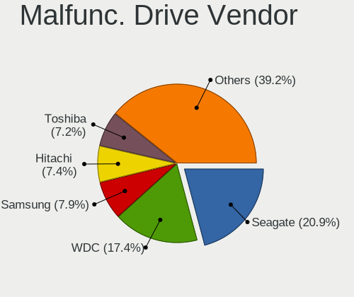
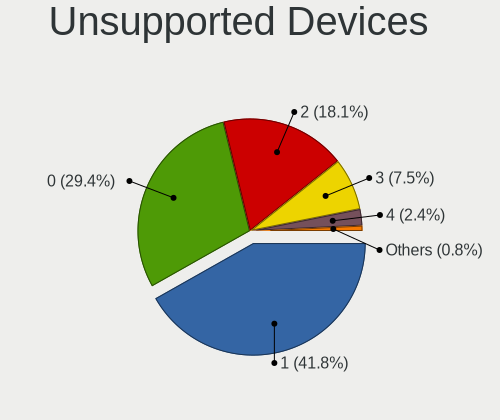

BSD - Tested Hardware & Statistics
----------------------------------

A project to collect tested hardware configurations for BSD.

Anyone can contribute to this report by the [hw-probe](https://github.com/linuxhw/hw-probe/blob/master/INSTALL.BSD.md) tool:

    hw-probe -all -upload

Please contribute! Especially if your hardware is rare.

This is a report for all computer types. See also reports for [desktops](/Desktop/README.md) and [notebooks](/Notebook/README.md).

OS-specific reports: [FreeBSD](/Dist/FreeBSD), [GhostBSD](/Dist/GhostBSD), [helloSystem](/Dist/helloSystem), [NetBSD](/Dist/NetBSD), [NomadBSD](/Dist/NomadBSD), [OpenBSD](/Dist/OpenBSD), [OPNsense](/Dist/OPNsense), [pfSense](/Dist/pfSense), [TrueNAS](/Dist/TrueNAS).

This report is for real hardware. Report for virtual hardware: [TestDays_VE](https://github.com/bsdhw/TestDays_VE)

Contents
--------

* [ Test Cases ](#test-cases)

* [ System ](#system)
  - [ OS                       ](#os)
  - [ OS Family                ](#os-family)
  - [ Arch                     ](#arch)
  - [ DE                       ](#de)
  - [ Display Server           ](#display-server)
  - [ Display Manager          ](#display-manager)
  - [ OS Lang                  ](#os-lang)
  - [ Boot Mode                ](#boot-mode)
  - [ Filesystem               ](#filesystem)
  - [ Part. scheme             ](#part-scheme)

* [ Board ](#board)
  - [ Vendor                   ](#vendor)
  - [ Model                    ](#model)
  - [ Model Family             ](#model-family)
  - [ MFG Year                 ](#mfg-year)
  - [ Form Factor              ](#form-factor)
  - [ Coreboot                 ](#coreboot)
  - [ RAM Size                 ](#ram-size)
  - [ RAM Used                 ](#ram-used)
  - [ Total Drives             ](#total-drives)
  - [ Has CD-ROM               ](#has-cd-rom)
  - [ Has Ethernet             ](#has-ethernet)
  - [ Has WiFi                 ](#has-wifi)
  - [ Has Bluetooth            ](#has-bluetooth)

* [ Location ](#location)
  - [ Country                  ](#country)
  - [ City                     ](#city)

* [ Drives ](#drives)
  - [ Drive Vendor             ](#drive-vendor)
  - [ Drive Model              ](#drive-model)
  - [ HDD Vendor               ](#hdd-vendor)
  - [ SSD Vendor               ](#ssd-vendor)
  - [ Drive Kind               ](#drive-kind)
  - [ Drive Connector          ](#drive-connector)
  - [ Drive Size               ](#drive-size)
  - [ Space Total              ](#space-total)
  - [ Space Used               ](#space-used)
  - [ Malfunc. Drives          ](#malfunc-drives)
  - [ Malfunc. Drive Vendor    ](#malfunc-drive-vendor)
  - [ Malfunc. HDD Vendor      ](#malfunc-hdd-vendor)
  - [ Malfunc. Drive Kind      ](#malfunc-drive-kind)
  - [ Failed Drives            ](#failed-drives)
  - [ Failed Drive Vendor      ](#failed-drive-vendor)
  - [ Drive Status             ](#drive-status)

* [ Storage controller ](#storage-controller)
  - [ Storage Vendor           ](#storage-vendor)
  - [ Storage Model            ](#storage-model)
  - [ Storage Kind             ](#storage-kind)

* [ Processor ](#processor)
  - [ CPU Vendor               ](#cpu-vendor)
  - [ CPU Model                ](#cpu-model)
  - [ CPU Model Family         ](#cpu-model-family)
  - [ CPU Cores                ](#cpu-cores)
  - [ CPU Sockets              ](#cpu-sockets)
  - [ CPU Threads              ](#cpu-threads)
  - [ CPU Microarch            ](#cpu-microarch)

* [ Graphics ](#graphics)
  - [ GPU Vendor               ](#gpu-vendor)
  - [ GPU Model                ](#gpu-model)
  - [ GPU Combo                ](#gpu-combo)
  - [ GPU Driver               ](#gpu-driver)
  - [ GPU Memory               ](#gpu-memory)

* [ Monitor ](#monitor)
  - [ Monitor Vendor           ](#monitor-vendor)
  - [ Monitor Model            ](#monitor-model)
  - [ Monitor Resolution       ](#monitor-resolution)
  - [ Monitor Diagonal         ](#monitor-diagonal)
  - [ Monitor Width            ](#monitor-width)
  - [ Aspect Ratio             ](#aspect-ratio)
  - [ Monitor Area             ](#monitor-area)
  - [ Pixel Density            ](#pixel-density)
  - [ Multiple Monitors        ](#multiple-monitors)

* [ Network ](#network)
  - [ Net Controller Vendor    ](#net-controller-vendor)
  - [ Net Controller Model     ](#net-controller-model)
  - [ Wireless Vendor          ](#wireless-vendor)
  - [ Wireless Model           ](#wireless-model)
  - [ Ethernet Vendor          ](#ethernet-vendor)
  - [ Ethernet Model           ](#ethernet-model)
  - [ Net Controller Kind      ](#net-controller-kind)
  - [ Used Controller          ](#used-controller)
  - [ NICs                     ](#nics)
  - [ IPv6                     ](#ipv6)

* [ Bluetooth ](#bluetooth)
  - [ Bluetooth Vendor         ](#bluetooth-vendor)
  - [ Bluetooth Model          ](#bluetooth-model)

* [ Sound ](#sound)
  - [ Sound Vendor             ](#sound-vendor)
  - [ Sound Model              ](#sound-model)

* [ Memory ](#memory)
  - [ Memory Vendor            ](#memory-vendor)
  - [ Memory Model             ](#memory-model)
  - [ Memory Kind              ](#memory-kind)
  - [ Memory Form Factor       ](#memory-form-factor)
  - [ Memory Size              ](#memory-size)
  - [ Memory Speed             ](#memory-speed)

* [ Printers & scanners ](#printers--scanners)
  - [ Printer Vendor           ](#printer-vendor)
  - [ Printer Model            ](#printer-model)
  - [ Scanner Vendor           ](#scanner-vendor)
  - [ Scanner Model            ](#scanner-model)

* [ Camera ](#camera)
  - [ Camera Vendor            ](#camera-vendor)
  - [ Camera Model             ](#camera-model)

* [ Security ](#security)
  - [ Fingerprint Vendor       ](#fingerprint-vendor)
  - [ Fingerprint Model        ](#fingerprint-model)
  - [ Chipcard Vendor          ](#chipcard-vendor)
  - [ Chipcard Model           ](#chipcard-model)

* [ Unsupported ](#unsupported)
  - [ Unsupported Devices      ](#unsupported-devices)
  - [ Unsupported Device Types ](#unsupported-device-types)

Test Cases
----------

Total: 14621

| Vendor        | Model                       | Form-Factor | Probe                                                     | Date         |
|---------------|-----------------------------|-------------|-----------------------------------------------------------|--------------|
| AMI           | Aptio CRB                   | Mini pc     | [6d1d3ded0d](https://bsd-hardware.info/?probe=6d1d3ded0d) | Feb 28, 2023 |
| MSI           | PRO H610M-B DDR4            | Desktop     | [2072e8fac6](https://bsd-hardware.info/?probe=2072e8fac6) | Feb 28, 2023 |
| Fujitsu       | D3313-E1 S26361-D3313-E1    | Desktop     | [39d5f658ce](https://bsd-hardware.info/?probe=39d5f658ce) | Feb 28, 2023 |
| CWWK          | CW-J6-6L                    | Desktop     | [a9202eee26](https://bsd-hardware.info/?probe=a9202eee26) | Feb 28, 2023 |
| ASRockRack    | EPYC3101D4I-2T              | Desktop     | [d675a5bab2](https://bsd-hardware.info/?probe=d675a5bab2) | Feb 28, 2023 |
| Deciso        | NetBoard-A10                | Notebook    | [ca59a5e6f4](https://bsd-hardware.info/?probe=ca59a5e6f4) | Feb 28, 2023 |
| HP            | ProLiant DL360 G7           | Server      | [dd8749ed6a](https://bsd-hardware.info/?probe=dd8749ed6a) | Feb 28, 2023 |
| Dell          | 0GY6Y8 A00                  | Desktop     | [72d45455a5](https://bsd-hardware.info/?probe=72d45455a5) | Feb 28, 2023 |
| Lenovo        | IdeaPadFlex 5 14ITL05 82... | Convertible | [a919e85270](https://bsd-hardware.info/?probe=a919e85270) | Feb 28, 2023 |
| Fujitsu       | D3313-E1 S26361-D3313-E1    | Desktop     | [dcf3f03ddc](https://bsd-hardware.info/?probe=dcf3f03ddc) | Feb 28, 2023 |
| Intel         | NUC7i3BNB J22859-307        | Mini pc     | [aca9e2885d](https://bsd-hardware.info/?probe=aca9e2885d) | Feb 28, 2023 |
| HP            | 240 G6 Notebook PC          | Notebook    | [d872652e25](https://bsd-hardware.info/?probe=d872652e25) | Feb 28, 2023 |
| Lenovo        | ThinkPad T430 2349S31       | Notebook    | [2b13f68cd6](https://bsd-hardware.info/?probe=2b13f68cd6) | Feb 28, 2023 |
| HP            | 8522 A01                    | Mini pc     | [9cc3faa610](https://bsd-hardware.info/?probe=9cc3faa610) | Feb 28, 2023 |
| Lenovo        | Kabini CRB 31900058 STD     | Desktop     | [735f2f3ece](https://bsd-hardware.info/?probe=735f2f3ece) | Feb 28, 2023 |
| Stonesoft     | FW-315-C1                   | Desktop     | [e8a2206ad2](https://bsd-hardware.info/?probe=e8a2206ad2) | Feb 28, 2023 |
| Lenovo        | ThinkPad T480s 20L7002CU... | Notebook    | [0e051e7291](https://bsd-hardware.info/?probe=0e051e7291) | Feb 27, 2023 |
| Dell          | 0HHV7N A00                  | Desktop     | [ffbb7e1a96](https://bsd-hardware.info/?probe=ffbb7e1a96) | Feb 27, 2023 |
| Inventec      | Z CLASS A02                 | Desktop     | [1b11bb9003](https://bsd-hardware.info/?probe=1b11bb9003) | Feb 27, 2023 |
| Techvision    | TVI7309X B0                 | Desktop     | [1758c6207c](https://bsd-hardware.info/?probe=1758c6207c) | Feb 27, 2023 |
| Unknown       | Unknown                     | Desktop     | [f06fbcd503](https://bsd-hardware.info/?probe=f06fbcd503) | Feb 27, 2023 |
| ASUSTek       | PRIME A320M-R               | Desktop     | [652b3323c6](https://bsd-hardware.info/?probe=652b3323c6) | Feb 27, 2023 |
| Lenovo        | Kabini CRB 31900058 STD     | Desktop     | [b0fcea0c90](https://bsd-hardware.info/?probe=b0fcea0c90) | Feb 27, 2023 |
| Dell          | 0M877N A01                  | Server      | [8037b5a26c](https://bsd-hardware.info/?probe=8037b5a26c) | Feb 27, 2023 |
| HP            | Pavilion g6                 | Desktop     | [39a7b609d6](https://bsd-hardware.info/?probe=39a7b609d6) | Feb 27, 2023 |
| Lenovo        | 3098 0B98401 PRO            | Desktop     | [40d63fc1f7](https://bsd-hardware.info/?probe=40d63fc1f7) | Feb 27, 2023 |
| HP            | 17E2                        | Mini pc     | [12fde81dce](https://bsd-hardware.info/?probe=12fde81dce) | Feb 27, 2023 |
| Intel         | HM570                       | Desktop     | [2588c37fc2](https://bsd-hardware.info/?probe=2588c37fc2) | Feb 27, 2023 |
| HP            | 2215                        | Desktop     | [33881e14ce](https://bsd-hardware.info/?probe=33881e14ce) | Feb 27, 2023 |
| MSI           | PRO H610M-B DDR4            | Desktop     | [e85ed3f609](https://bsd-hardware.info/?probe=e85ed3f609) | Feb 27, 2023 |
| Notebook      | N2x0WU                      | Notebook    | [9545f36dee](https://bsd-hardware.info/?probe=9545f36dee) | Feb 27, 2023 |
| Unknown       | YL-J3160L4                  | Desktop     | [562013de32](https://bsd-hardware.info/?probe=562013de32) | Feb 27, 2023 |
| Dell          | 01TKCC A01                  | Desktop     | [42da900d88](https://bsd-hardware.info/?probe=42da900d88) | Feb 26, 2023 |
| Intel         | NUC11PABi3 M11790-302       | Mini pc     | [3971f7a856](https://bsd-hardware.info/?probe=3971f7a856) | Feb 26, 2023 |
| ASUSTek       | TUF Gaming Z590-PLUS        | Desktop     | [55afde6894](https://bsd-hardware.info/?probe=55afde6894) | Feb 26, 2023 |
| ASRock        | Z690M-ITX/ax                | Desktop     | [a859968882](https://bsd-hardware.info/?probe=a859968882) | Feb 26, 2023 |
| Supermicro    | PDSBM                       | Desktop     | [1dea83dd64](https://bsd-hardware.info/?probe=1dea83dd64) | Feb 26, 2023 |
| Fujitsu       | D3313-A1 S26361-D3313-A1    | Desktop     | [27e756f63d](https://bsd-hardware.info/?probe=27e756f63d) | Feb 26, 2023 |
| ASUSTek       | X541SA                      | Notebook    | [9d406d735e](https://bsd-hardware.info/?probe=9d406d735e) | Feb 26, 2023 |
| Shuttle       | FS81                        | Desktop     | [5787eda5ac](https://bsd-hardware.info/?probe=5787eda5ac) | Feb 26, 2023 |
| HP            | 8055                        | Desktop     | [faadcd3e41](https://bsd-hardware.info/?probe=faadcd3e41) | Feb 26, 2023 |
| Dell          | 0N5JWR A00                  | Mini pc     | [d6f24a2c50](https://bsd-hardware.info/?probe=d6f24a2c50) | Feb 26, 2023 |
| MSI           | B450M PRO-VDH MAX           | Desktop     | [85aecf8c3f](https://bsd-hardware.info/?probe=85aecf8c3f) | Feb 26, 2023 |
| HP            | 1495                        | Desktop     | [70c761d6fe](https://bsd-hardware.info/?probe=70c761d6fe) | Feb 26, 2023 |
| Foxconn       | 2A8Ch                       | Desktop     | [96a8673b26](https://bsd-hardware.info/?probe=96a8673b26) | Feb 26, 2023 |
| Sophos        | SG                          | Firewall    | [6f8d299ffb](https://bsd-hardware.info/?probe=6f8d299ffb) | Feb 26, 2023 |
| Lenovo        | 30D9 No DPK                 | Desktop     | [c3864d9d51](https://bsd-hardware.info/?probe=c3864d9d51) | Feb 26, 2023 |
| ASUSTek       | VivoBook_ASUSLaptop X509... | Notebook    | [115bd3bc38](https://bsd-hardware.info/?probe=115bd3bc38) | Feb 26, 2023 |
| HP            | EliteBook 8570p             | Notebook    | [1a4897cb53](https://bsd-hardware.info/?probe=1a4897cb53) | Feb 26, 2023 |
| Fujitsu       | D3009-A1 S26361-D3009-A1    | Desktop     | [66739867ed](https://bsd-hardware.info/?probe=66739867ed) | Feb 26, 2023 |
| MSI           | H81M-P33                    | Desktop     | [806efadc12](https://bsd-hardware.info/?probe=806efadc12) | Feb 26, 2023 |
| ASUSTek       | P5Q-E                       | Desktop     | [efb350b5f2](https://bsd-hardware.info/?probe=efb350b5f2) | Feb 26, 2023 |
| ASUSTek       | ROG CROSSHAIR VIII HERO     | Desktop     | [62567aa5d4](https://bsd-hardware.info/?probe=62567aa5d4) | Feb 26, 2023 |
| Gigabyte      | Z390 I AORUS PRO WIFI-CF    | Desktop     | [2e3026e0fd](https://bsd-hardware.info/?probe=2e3026e0fd) | Feb 26, 2023 |
| Techvision    | TVI7309X B0                 | Desktop     | [d558069dea](https://bsd-hardware.info/?probe=d558069dea) | Feb 26, 2023 |
| AZW           | U59                         | Desktop     | [a4e906c608](https://bsd-hardware.info/?probe=a4e906c608) | Feb 26, 2023 |
| Dell          | Inspiron 15 3515            | Notebook    | [b480a98b22](https://bsd-hardware.info/?probe=b480a98b22) | Feb 26, 2023 |
| Acer          | Aspire ES1-571              | Notebook    | [d736d59649](https://bsd-hardware.info/?probe=d736d59649) | Feb 26, 2023 |
| Acer          | Aspire ES1-571              | Notebook    | [48aa652a09](https://bsd-hardware.info/?probe=48aa652a09) | Feb 26, 2023 |
| Unknown       | Unknown                     | Desktop     | [d690aee80e](https://bsd-hardware.info/?probe=d690aee80e) | Feb 26, 2023 |
| AMI           | Aptio CRB                   | Mini pc     | [f4b0301fe5](https://bsd-hardware.info/?probe=f4b0301fe5) | Feb 26, 2023 |
| NF541         | 1.0                         | Desktop     | [863e6235d4](https://bsd-hardware.info/?probe=863e6235d4) | Feb 26, 2023 |
| Dell          | 088DT1 A01                  | Desktop     | [d13b4a674b](https://bsd-hardware.info/?probe=d13b4a674b) | Feb 26, 2023 |
| Supermicro    | X11SCL-IF                   | Server      | [febc7f7a94](https://bsd-hardware.info/?probe=febc7f7a94) | Feb 26, 2023 |
| Dell          | 0WMJ54 A01                  | Desktop     | [263be0365a](https://bsd-hardware.info/?probe=263be0365a) | Feb 26, 2023 |
| Lenovo        | ThinkPad P51 20HH001RMX     | Notebook    | [59e609fbb2](https://bsd-hardware.info/?probe=59e609fbb2) | Feb 26, 2023 |
| Lenovo        | ThinkPad L14 Gen 3 21C5C... | Notebook    | [2ab690000c](https://bsd-hardware.info/?probe=2ab690000c) | Feb 25, 2023 |
| Unknown       | Unknown                     | Desktop     | [815cd70e71](https://bsd-hardware.info/?probe=815cd70e71) | Feb 25, 2023 |
| Lenovo        | ThinkPad L14 Gen 3 21C5C... | Notebook    | [ae0dc68ba6](https://bsd-hardware.info/?probe=ae0dc68ba6) | Feb 25, 2023 |
| Intel         | NUC11PABi5 K90634-305       | Mini pc     | [33330ade31](https://bsd-hardware.info/?probe=33330ade31) | Feb 25, 2023 |
| Unknown       | YL-J3160L4                  | Desktop     | [b774e80761](https://bsd-hardware.info/?probe=b774e80761) | Feb 25, 2023 |
| Sophos        | SG                          | Firewall    | [7e05fcaf2b](https://bsd-hardware.info/?probe=7e05fcaf2b) | Feb 25, 2023 |
| Unknown       | Unknown                     | Desktop     | [95c62844de](https://bsd-hardware.info/?probe=95c62844de) | Feb 25, 2023 |
| Unknown       | Unknown                     | Desktop     | [913946ccc9](https://bsd-hardware.info/?probe=913946ccc9) | Feb 25, 2023 |
| AWOW          | PC BOX                      | Mini pc     | [54d8b7446b](https://bsd-hardware.info/?probe=54d8b7446b) | Feb 25, 2023 |
| Samsung       | 270E5K/270E5Q/271E5K/257... | Notebook    | [45549e4faf](https://bsd-hardware.info/?probe=45549e4faf) | Feb 25, 2023 |
| ASUSTek       | ROG STRIX Z390-E GAMING     | Desktop     | [be81f2675f](https://bsd-hardware.info/?probe=be81f2675f) | Feb 25, 2023 |
| Techvision    | TVI7309X B0                 | Desktop     | [0e62dfc436](https://bsd-hardware.info/?probe=0e62dfc436) | Feb 25, 2023 |
| Toshiba       | dynabook R63/P              | Notebook    | [c41c3adfa4](https://bsd-hardware.info/?probe=c41c3adfa4) | Feb 25, 2023 |
| Lenovo        | ThinkPad T440s 20AQ005SU... | Notebook    | [7750c38cd0](https://bsd-hardware.info/?probe=7750c38cd0) | Feb 25, 2023 |
| Lenovo        | ThinkPad X1 Carbon 2nd 2... | Notebook    | [b3e56e9656](https://bsd-hardware.info/?probe=b3e56e9656) | Feb 25, 2023 |
| ASRock        | X470 Gaming K4              | Desktop     | [fbff29a62a](https://bsd-hardware.info/?probe=fbff29a62a) | Feb 25, 2023 |
| Dell          | Latitude 5591               | Notebook    | [fb33d7a0c4](https://bsd-hardware.info/?probe=fb33d7a0c4) | Feb 25, 2023 |
| Dell          | 0M877N A01                  | Server      | [cfae198d09](https://bsd-hardware.info/?probe=cfae198d09) | Feb 25, 2023 |
| HP            | 18E9                        | Desktop     | [9263c4b548](https://bsd-hardware.info/?probe=9263c4b548) | Feb 25, 2023 |
| Unknown       | Unknown                     | Desktop     | [87ad08a144](https://bsd-hardware.info/?probe=87ad08a144) | Feb 25, 2023 |
| Techvision    | TVI7309X B0                 | Desktop     | [8a16d2e606](https://bsd-hardware.info/?probe=8a16d2e606) | Feb 24, 2023 |
| Lenovo        | ThinkCentre M91p 7033A2G    | Desktop     | [25528a00f3](https://bsd-hardware.info/?probe=25528a00f3) | Feb 24, 2023 |
| MSI           | X299 PRO                    | Desktop     | [3ca12f88d9](https://bsd-hardware.info/?probe=3ca12f88d9) | Feb 24, 2023 |
| Unknown       | Unknown                     | Desktop     | [efab6dedba](https://bsd-hardware.info/?probe=efab6dedba) | Feb 24, 2023 |
| Gigabyte      | H77N-WIFI                   | Desktop     | [cd96288347](https://bsd-hardware.info/?probe=cd96288347) | Feb 24, 2023 |
| HP            | EliteBook 840 G1            | Notebook    | [0480ce43f2](https://bsd-hardware.info/?probe=0480ce43f2) | Feb 24, 2023 |
| Lenovo        | ThinkPad T530 24297XG       | Notebook    | [97d9b10c8a](https://bsd-hardware.info/?probe=97d9b10c8a) | Feb 24, 2023 |
| AZW           | U59                         | Desktop     | [4dad05a05a](https://bsd-hardware.info/?probe=4dad05a05a) | Feb 24, 2023 |
| HP            | EliteBook 8570p             | Notebook    | [1e548fa114](https://bsd-hardware.info/?probe=1e548fa114) | Feb 24, 2023 |
| AZW           | U59                         | Desktop     | [638aa3ff8e](https://bsd-hardware.info/?probe=638aa3ff8e) | Feb 24, 2023 |
| MW            | GMLK-2_5G4L                 | Desktop     | [bf21395f79](https://bsd-hardware.info/?probe=bf21395f79) | Feb 24, 2023 |
| ASUSTek       | VivoBook_ASUSLaptop E410... | Notebook    | [95c66df5a4](https://bsd-hardware.info/?probe=95c66df5a4) | Feb 24, 2023 |
| Lenovo        | 312D SDK0J40697 WIN 3305... | Mini pc     | [867c14f8d1](https://bsd-hardware.info/?probe=867c14f8d1) | Feb 24, 2023 |
| Unknown       | Unknown                     | Desktop     | [efce6f6c1e](https://bsd-hardware.info/?probe=efce6f6c1e) | Feb 24, 2023 |
| Supermicro    | X11SSH-LN4F                 | Server      | [7ab6080dfe](https://bsd-hardware.info/?probe=7ab6080dfe) | Feb 24, 2023 |
| Protectli     | VP2420                      | Desktop     | [ac2228fa2b](https://bsd-hardware.info/?probe=ac2228fa2b) | Feb 24, 2023 |
| Lenovo        | SHARKBAY SDK0E50510 WIN     | Desktop     | [31122bd298](https://bsd-hardware.info/?probe=31122bd298) | Feb 24, 2023 |
| Dell          | 05XGC8 A01                  | Desktop     | [c51a264e20](https://bsd-hardware.info/?probe=c51a264e20) | Feb 23, 2023 |
| Seeed Stud... | ODYSSEY-X86J4105 SD-BS-C... | Desktop     | [b2681fdfb4](https://bsd-hardware.info/?probe=b2681fdfb4) | Feb 23, 2023 |
| Lenovo        | ThinkPad L14 Gen 3 21C5C... | Notebook    | [aef791947c](https://bsd-hardware.info/?probe=aef791947c) | Feb 23, 2023 |
| Lenovo        | ThinkPad X280 20KFCTO1WW    | Notebook    | [3dae7e3ebb](https://bsd-hardware.info/?probe=3dae7e3ebb) | Feb 23, 2023 |
| Supermicro    | X10SBAA                     | Server      | [d22806833a](https://bsd-hardware.info/?probe=d22806833a) | Feb 23, 2023 |
| Lenovo        | ThinkPad L14 Gen 3 21C5C... | Notebook    | [6669622646](https://bsd-hardware.info/?probe=6669622646) | Feb 23, 2023 |
| Gigabyte      | Z87X-OC-CF                  | Desktop     | [dca82c50d0](https://bsd-hardware.info/?probe=dca82c50d0) | Feb 23, 2023 |
| HP            | 3031h                       | Desktop     | [7324a71ceb](https://bsd-hardware.info/?probe=7324a71ceb) | Feb 23, 2023 |
| PC Engines    | apu4                        | Desktop     | [410a7ff78e](https://bsd-hardware.info/?probe=410a7ff78e) | Feb 23, 2023 |
| CNCTION-IA... | Unknown                     | Desktop     | [52186b4343](https://bsd-hardware.info/?probe=52186b4343) | Feb 23, 2023 |
| Deciso        | NetBoard-A20                | Notebook    | [d23ae47425](https://bsd-hardware.info/?probe=d23ae47425) | Feb 23, 2023 |
| Gigabyte      | X670E AORUS MASTER          | Desktop     | [e55635df08](https://bsd-hardware.info/?probe=e55635df08) | Feb 23, 2023 |
| Plaisio       | Turbo X                     | Notebook    | [e0a8a02bb9](https://bsd-hardware.info/?probe=e0a8a02bb9) | Feb 23, 2023 |
| Intel         | DENLOW_WS                   | Desktop     | [f6f5953979](https://bsd-hardware.info/?probe=f6f5953979) | Feb 23, 2023 |
| Unknown       | Unknown                     | Desktop     | [866ff788f9](https://bsd-hardware.info/?probe=866ff788f9) | Feb 23, 2023 |
| Gigabyte      | G31M-ES2L                   | Desktop     | [c55b1dd170](https://bsd-hardware.info/?probe=c55b1dd170) | Feb 23, 2023 |
| Supermicro    | X10SDV-6C-TLN4F             | Desktop     | [d6ab3464c6](https://bsd-hardware.info/?probe=d6ab3464c6) | Feb 23, 2023 |
| Dell          | 0WMJ54 A01                  | Desktop     | [26b7986e0b](https://bsd-hardware.info/?probe=26b7986e0b) | Feb 23, 2023 |
| Supermicro    | X9SCL/X9SCMA                | Desktop     | [96aceb6d32](https://bsd-hardware.info/?probe=96aceb6d32) | Feb 23, 2023 |
| ASRock        | X300M-STX                   | Desktop     | [fb908ee344](https://bsd-hardware.info/?probe=fb908ee344) | Feb 23, 2023 |
| ASUSTek       | Pro A520M-C II              | Desktop     | [542b244f4b](https://bsd-hardware.info/?probe=542b244f4b) | Feb 23, 2023 |
| Dell          | 0C27VV A02                  | Desktop     | [5899533edd](https://bsd-hardware.info/?probe=5899533edd) | Feb 23, 2023 |
| Lenovo        | ThinkPad T440 20B60061MB    | Notebook    | [16a141cc35](https://bsd-hardware.info/?probe=16a141cc35) | Feb 23, 2023 |
| Intel         | NUC11TNBi3 M11908-404       | Mini pc     | [6061a0f9c4](https://bsd-hardware.info/?probe=6061a0f9c4) | Feb 23, 2023 |
| ASRock        | N68-S UCC                   | Desktop     | [04f43c3d70](https://bsd-hardware.info/?probe=04f43c3d70) | Feb 23, 2023 |
| Dell          | 0WR7PY A00                  | Desktop     | [70b222c73b](https://bsd-hardware.info/?probe=70b222c73b) | Feb 23, 2023 |
| Fujitsu       | D3543-A2 S26361-D3543-A2... | Desktop     | [68165a639f](https://bsd-hardware.info/?probe=68165a639f) | Feb 22, 2023 |
| PC Engines    | APU2                        | Desktop     | [05966fb4dc](https://bsd-hardware.info/?probe=05966fb4dc) | Feb 22, 2023 |
| MSI           | MS-92E3 0A                  | Desktop     | [683ff1f7d0](https://bsd-hardware.info/?probe=683ff1f7d0) | Feb 22, 2023 |
| Intel         | DG41TY AAE47335-300         | Desktop     | [7c1727d55a](https://bsd-hardware.info/?probe=7c1727d55a) | Feb 22, 2023 |
| ASRock        | H610M-HDV/M.2               | Desktop     | [cf4d400cb0](https://bsd-hardware.info/?probe=cf4d400cb0) | Feb 22, 2023 |
| HP            | EliteBook 840 G1            | Notebook    | [77c17e4a2f](https://bsd-hardware.info/?probe=77c17e4a2f) | Feb 22, 2023 |
| Protectli     | VP2420                      | Desktop     | [541c13b778](https://bsd-hardware.info/?probe=541c13b778) | Feb 22, 2023 |
| Techvision    | TVI7309X B0                 | Desktop     | [765b1a8064](https://bsd-hardware.info/?probe=765b1a8064) | Feb 22, 2023 |
| Intel         | Q3XXG4-P V1.0               | Desktop     | [639886b591](https://bsd-hardware.info/?probe=639886b591) | Feb 22, 2023 |
| Gigabyte      | X570S AORUS ELITE           | Desktop     | [8d1496f3a9](https://bsd-hardware.info/?probe=8d1496f3a9) | Feb 22, 2023 |
| Dell          | 0C27VV A02                  | Desktop     | [a10df954b7](https://bsd-hardware.info/?probe=a10df954b7) | Feb 22, 2023 |
| Lenovo        | ThinkPad T460 20FMS06V00    | Notebook    | [7d7fa2bbc9](https://bsd-hardware.info/?probe=7d7fa2bbc9) | Feb 22, 2023 |
| Intel         | CW-J6-5L 2C                 | Desktop     | [442643937e](https://bsd-hardware.info/?probe=442643937e) | Feb 22, 2023 |
| Techvision    | TVI7309X B0                 | Desktop     | [3e1b050969](https://bsd-hardware.info/?probe=3e1b050969) | Feb 22, 2023 |
| Protectli     | VP2410                      | Desktop     | [b31bcf2087](https://bsd-hardware.info/?probe=b31bcf2087) | Feb 22, 2023 |
| Protectli     | VP2410                      | Desktop     | [8dff61bc43](https://bsd-hardware.info/?probe=8dff61bc43) | Feb 22, 2023 |
| PC Engines    | apu1                        | Desktop     | [41fe7362c4](https://bsd-hardware.info/?probe=41fe7362c4) | Feb 22, 2023 |
| Unknown       | Unknown                     | Desktop     | [9e92cf3575](https://bsd-hardware.info/?probe=9e92cf3575) | Feb 22, 2023 |
| Dell          | 0DRG19 A00                  | Mini pc     | [25a3e5cea1](https://bsd-hardware.info/?probe=25a3e5cea1) | Feb 22, 2023 |
| Acer          | Aspire TC-230               | Desktop     | [f3f963fb6a](https://bsd-hardware.info/?probe=f3f963fb6a) | Feb 22, 2023 |
| Intel         | CW-J6-5L 2C                 | Desktop     | [90fc1b74e6](https://bsd-hardware.info/?probe=90fc1b74e6) | Feb 22, 2023 |
| Lenovo        | ThinkPad T440 20B60061MB    | Notebook    | [4867945cfb](https://bsd-hardware.info/?probe=4867945cfb) | Feb 22, 2023 |
| Intel         | NUC12WSBi3 M36953-303       | Mini pc     | [727ca24f1c](https://bsd-hardware.info/?probe=727ca24f1c) | Feb 22, 2023 |
| Intel         | QHSW02                      | Desktop     | [6bec4024a8](https://bsd-hardware.info/?probe=6bec4024a8) | Feb 22, 2023 |
| Huanan        | X99-TF GAMING V3.0          | Desktop     | [59db63fd9d](https://bsd-hardware.info/?probe=59db63fd9d) | Feb 22, 2023 |
| Supermicro    | X7SLA                       | Desktop     | [80d6f2c0f8](https://bsd-hardware.info/?probe=80d6f2c0f8) | Feb 21, 2023 |
| Lenovo        | IdeaPad 3 14IML05 81WA      | Notebook    | [d04d402809](https://bsd-hardware.info/?probe=d04d402809) | Feb 21, 2023 |
| AMI           | Aptio CRB                   | Mini pc     | [5b8fdd6349](https://bsd-hardware.info/?probe=5b8fdd6349) | Feb 21, 2023 |
| Deciso        | Netboard A20                | Notebook    | [25077b7e64](https://bsd-hardware.info/?probe=25077b7e64) | Feb 21, 2023 |
| HP            | ZBook 15 G3                 | Notebook    | [ff6ddb74bb](https://bsd-hardware.info/?probe=ff6ddb74bb) | Feb 21, 2023 |
| Protectli     | FW2B                        | Desktop     | [34b349eead](https://bsd-hardware.info/?probe=34b349eead) | Feb 21, 2023 |
| Gigabyte      | A320M-H-CF                  | Desktop     | [02970305db](https://bsd-hardware.info/?probe=02970305db) | Feb 21, 2023 |
| Dell          | 01V648 A01                  | Server      | [51fbbaf053](https://bsd-hardware.info/?probe=51fbbaf053) | Feb 21, 2023 |
| Dell          | 0GY6Y8 A00                  | Desktop     | [9a3d7de5ff](https://bsd-hardware.info/?probe=9a3d7de5ff) | Feb 21, 2023 |
| HP            | Victus by Laptop 16-e0xx... | Notebook    | [b2ed608da5](https://bsd-hardware.info/?probe=b2ed608da5) | Feb 21, 2023 |
| ASUSTek       | TUF Gaming Z590-PLUS        | Desktop     | [da5536f58a](https://bsd-hardware.info/?probe=da5536f58a) | Feb 21, 2023 |
| Unknown       | Unknown                     | Desktop     | [67c7a561a9](https://bsd-hardware.info/?probe=67c7a561a9) | Feb 21, 2023 |
| Unknown       | V0.9x                       | Desktop     | [21243cad5f](https://bsd-hardware.info/?probe=21243cad5f) | Feb 21, 2023 |
| Dell          | 01V648 A01                  | Server      | [fa7b2a91e8](https://bsd-hardware.info/?probe=fa7b2a91e8) | Feb 21, 2023 |
| Unknown       | Unknown                     | Desktop     | [8c063582d4](https://bsd-hardware.info/?probe=8c063582d4) | Feb 20, 2023 |
| Supermicro    | X11SDV-4C-TP8F              | Server      | [43147a0d7b](https://bsd-hardware.info/?probe=43147a0d7b) | Feb 20, 2023 |
| ASUSTek       | Pro A520M-C II              | Desktop     | [205bf8b29d](https://bsd-hardware.info/?probe=205bf8b29d) | Feb 20, 2023 |
| Fujitsu       | D3543-A1 S26361-D3543-A1... | Desktop     | [3f78b1a6c7](https://bsd-hardware.info/?probe=3f78b1a6c7) | Feb 20, 2023 |
| Hardkernel    | ODROID-H2                   | Desktop     | [bd675a503d](https://bsd-hardware.info/?probe=bd675a503d) | Feb 20, 2023 |
| Lenovo        | ThinkPad L450 20DSS1S402    | Notebook    | [06e5309c55](https://bsd-hardware.info/?probe=06e5309c55) | Feb 20, 2023 |
| Dell          | 0HHV7N A00                  | Desktop     | [50f39ca7e0](https://bsd-hardware.info/?probe=50f39ca7e0) | Feb 20, 2023 |
| Apple         | PowerMac3,6                 | Desktop     | [f31181f95c](https://bsd-hardware.info/?probe=f31181f95c) | Feb 20, 2023 |
| Dell          | 09KPNV A00                  | Desktop     | [05cf3daf4e](https://bsd-hardware.info/?probe=05cf3daf4e) | Feb 20, 2023 |
| Lenovo        | 32E1 SDK0J40697 WIN 3305... | Desktop     | [820b3d1a1b](https://bsd-hardware.info/?probe=820b3d1a1b) | Feb 20, 2023 |
| Protectli     | VP4650                      | Desktop     | [44b691e7b8](https://bsd-hardware.info/?probe=44b691e7b8) | Feb 20, 2023 |
| Lenovo        | 3136 SDK0J40697 WIN 3305... | Mini pc     | [648e3b6a57](https://bsd-hardware.info/?probe=648e3b6a57) | Feb 20, 2023 |
| Protectli     | VP4650                      | Desktop     | [a3011cc486](https://bsd-hardware.info/?probe=a3011cc486) | Feb 20, 2023 |
| ASRock        | X570 Taichi                 | Desktop     | [8eb068a097](https://bsd-hardware.info/?probe=8eb068a097) | Feb 20, 2023 |
| Lenovo        | ThinkPad T410 2537B94       | Notebook    | [9f9cb3e201](https://bsd-hardware.info/?probe=9f9cb3e201) | Feb 19, 2023 |
| HP            | 3397                        | Desktop     | [8b231fd832](https://bsd-hardware.info/?probe=8b231fd832) | Feb 19, 2023 |
| HP            | 8076 MVB,A                  | Desktop     | [7743861bae](https://bsd-hardware.info/?probe=7743861bae) | Feb 19, 2023 |
| Lenovo        | ThinkPad T460 20FMS3320G    | Notebook    | [c85f94d574](https://bsd-hardware.info/?probe=c85f94d574) | Feb 19, 2023 |
| ZOTAC         | ZBOX-CI329NANO              | Mini pc     | [9aec93f312](https://bsd-hardware.info/?probe=9aec93f312) | Feb 19, 2023 |
| Acer          | Aspire E1-421               | Notebook    | [db00abb833](https://bsd-hardware.info/?probe=db00abb833) | Feb 19, 2023 |
| Protectli     | VP2420                      | Desktop     | [5d8285d184](https://bsd-hardware.info/?probe=5d8285d184) | Feb 19, 2023 |
| Fujitsu Si... | ESPRIMO Mobile V5535        | Notebook    | [92bca4d026](https://bsd-hardware.info/?probe=92bca4d026) | Feb 19, 2023 |
| CncTion       | J4125-4L-I225               | Desktop     | [6d2c693305](https://bsd-hardware.info/?probe=6d2c693305) | Feb 19, 2023 |
| Huanan        | X99-TF GAMING V3.0          | Desktop     | [50dce9bf96](https://bsd-hardware.info/?probe=50dce9bf96) | Feb 19, 2023 |
| Yanling       | YL-CLU6L-V1                 | Desktop     | [8d1fa6606b](https://bsd-hardware.info/?probe=8d1fa6606b) | Feb 19, 2023 |
| Lenovo        | G400s 20244                 | Notebook    | [f2c258a0ae](https://bsd-hardware.info/?probe=f2c258a0ae) | Feb 19, 2023 |
| Lenovo        | ThinkPad T520 4243F39       | Notebook    | [d8ba5b3157](https://bsd-hardware.info/?probe=d8ba5b3157) | Feb 19, 2023 |
| Intel         | NUC12WSBi3 M36953-303       | Mini pc     | [9bdcc78235](https://bsd-hardware.info/?probe=9bdcc78235) | Feb 19, 2023 |
| MSI           | H81M-P33                    | Desktop     | [28f48b7936](https://bsd-hardware.info/?probe=28f48b7936) | Feb 19, 2023 |
| ASUSTek       | P5Q-E                       | Desktop     | [b3525afaa7](https://bsd-hardware.info/?probe=b3525afaa7) | Feb 19, 2023 |
| ASUSTek       | ROG CROSSHAIR VIII HERO     | Desktop     | [19c7044a7d](https://bsd-hardware.info/?probe=19c7044a7d) | Feb 19, 2023 |
| Unknown       | Unknown                     | Desktop     | [1d67639caa](https://bsd-hardware.info/?probe=1d67639caa) | Feb 19, 2023 |
| Gigabyte      | GB-BSi3A-6100               | Notebook    | [e7ef795b9b](https://bsd-hardware.info/?probe=e7ef795b9b) | Feb 19, 2023 |
| Gigabyte      | GB-BSi3A-6100               | Notebook    | [cd2273037f](https://bsd-hardware.info/?probe=cd2273037f) | Feb 19, 2023 |
| ASUSTek       | PRIME H310M-K R2.0          | Desktop     | [fd39a615de](https://bsd-hardware.info/?probe=fd39a615de) | Feb 19, 2023 |
| Intel         | NUC7JYB J67969-404          | Mini pc     | [c30dd3fbca](https://bsd-hardware.info/?probe=c30dd3fbca) | Feb 19, 2023 |
| Intel         | NUC5PPYB H76558-102         | Mini pc     | [a27331804b](https://bsd-hardware.info/?probe=a27331804b) | Feb 19, 2023 |
| Intel         | DN2820FYK H24582-203        | Desktop     | [dd0d96422f](https://bsd-hardware.info/?probe=dd0d96422f) | Feb 19, 2023 |
| ASUSTek       | H110I-PLUS D3               | Desktop     | [1f347f15e2](https://bsd-hardware.info/?probe=1f347f15e2) | Feb 19, 2023 |
| Lenovo        | SHARKBAY SDK0A46860 WIN     | Desktop     | [4cd5bcdfed](https://bsd-hardware.info/?probe=4cd5bcdfed) | Feb 18, 2023 |
| HP            | 1998                        | Desktop     | [e0ab2d859c](https://bsd-hardware.info/?probe=e0ab2d859c) | Feb 18, 2023 |
| Intel         | JSL MRD                     | Desktop     | [1587ea95da](https://bsd-hardware.info/?probe=1587ea95da) | Feb 18, 2023 |
| Dell          | 0HHV7N A00                  | Desktop     | [fd90fc5154](https://bsd-hardware.info/?probe=fd90fc5154) | Feb 18, 2023 |
| Acer          | Aspire 7738                 | Notebook    | [e61cd20061](https://bsd-hardware.info/?probe=e61cd20061) | Feb 18, 2023 |
| Lenovo        | ThinkPad T520 4243F39       | Notebook    | [820596f359](https://bsd-hardware.info/?probe=820596f359) | Feb 18, 2023 |
| Lenovo        | ThinkPad X1 Carbon Gen 9... | Notebook    | [63b73012e6](https://bsd-hardware.info/?probe=63b73012e6) | Feb 18, 2023 |
| HP            | EliteBook 8570p             | Notebook    | [1ba2a827d9](https://bsd-hardware.info/?probe=1ba2a827d9) | Feb 18, 2023 |
| AMI           | Aptio CRB                   | Mini pc     | [81041acbb7](https://bsd-hardware.info/?probe=81041acbb7) | Feb 18, 2023 |
| AMI           | Aptio CRB                   | Mini pc     | [cffec30b6b](https://bsd-hardware.info/?probe=cffec30b6b) | Feb 18, 2023 |
| Lenovo        | ThinkPad W520 427638U       | Notebook    | [baa0e928a8](https://bsd-hardware.info/?probe=baa0e928a8) | Feb 18, 2023 |
| Dell          | Inspiron 5767               | Notebook    | [39b4581223](https://bsd-hardware.info/?probe=39b4581223) | Feb 18, 2023 |
| Lenovo        | ThinkPad T61p 6457UN2       | Notebook    | [67b2e8db2b](https://bsd-hardware.info/?probe=67b2e8db2b) | Feb 18, 2023 |
| AMI           | Aptio CRB                   | Mini pc     | [5b10e92d28](https://bsd-hardware.info/?probe=5b10e92d28) | Feb 18, 2023 |
| Dell          | Inspiron 5767               | Notebook    | [fd58d235b3](https://bsd-hardware.info/?probe=fd58d235b3) | Feb 18, 2023 |
| ASRock        | G41M-GS3                    | Desktop     | [eace523f17](https://bsd-hardware.info/?probe=eace523f17) | Feb 18, 2023 |
| Lenovo        | ThinkPad T61p 6457UN2       | Notebook    | [f7646f9d7f](https://bsd-hardware.info/?probe=f7646f9d7f) | Feb 18, 2023 |
| Techvision    | TVI7309X B0                 | Desktop     | [633becefb6](https://bsd-hardware.info/?probe=633becefb6) | Feb 18, 2023 |
| Gigabyte      | B450M AORUS ELITE           | Desktop     | [6af537ff20](https://bsd-hardware.info/?probe=6af537ff20) | Feb 18, 2023 |
| ASUSTek       | PRIME H310M-C R2.0          | Desktop     | [9761fb446b](https://bsd-hardware.info/?probe=9761fb446b) | Feb 18, 2023 |
| Unknown       | Unknown                     | Desktop     | [b906471557](https://bsd-hardware.info/?probe=b906471557) | Feb 17, 2023 |
| Unknown       | Unknown                     | Desktop     | [1478bc453d](https://bsd-hardware.info/?probe=1478bc453d) | Feb 17, 2023 |
| Supermicro    | X10SRL-F                    | Server      | [49c49487e2](https://bsd-hardware.info/?probe=49c49487e2) | Feb 17, 2023 |
| Techvision    | TVI7309X B0                 | Desktop     | [1950b6036e](https://bsd-hardware.info/?probe=1950b6036e) | Feb 17, 2023 |
| IGEL Techn... | H830C                       | Notebook    | [069249225f](https://bsd-hardware.info/?probe=069249225f) | Feb 17, 2023 |
| Sophos        | SG                          | Firewall    | [b9fc0f3ba3](https://bsd-hardware.info/?probe=b9fc0f3ba3) | Feb 17, 2023 |
| Techvision    | TVI7309X B0                 | Desktop     | [d23b2cfe5a](https://bsd-hardware.info/?probe=d23b2cfe5a) | Feb 17, 2023 |
| Lenovo        | ThinkPad R60e 0658W2M       | Notebook    | [dba66ebfb5](https://bsd-hardware.info/?probe=dba66ebfb5) | Feb 17, 2023 |
| Lenovo        | ThinkPad T430u 33522D5      | Notebook    | [d5bbbb8cbe](https://bsd-hardware.info/?probe=d5bbbb8cbe) | Feb 17, 2023 |
| Apple         | MacBookPro11,1              | Notebook    | [673f6c0a01](https://bsd-hardware.info/?probe=673f6c0a01) | Feb 17, 2023 |
| ASRock        | A320M-DGS                   | Desktop     | [032d7f0c91](https://bsd-hardware.info/?probe=032d7f0c91) | Feb 17, 2023 |
| Fujitsu       | D3224-A1 S26361-D3224-A1    | Desktop     | [c34d5e6357](https://bsd-hardware.info/?probe=c34d5e6357) | Feb 17, 2023 |
| Unknown       | Unknown                     | Desktop     | [ac4b0186ff](https://bsd-hardware.info/?probe=ac4b0186ff) | Feb 17, 2023 |
| Dell          | 0M877N A02                  | Server      | [94d00881ba](https://bsd-hardware.info/?probe=94d00881ba) | Feb 17, 2023 |
| ZOTAC         | Unknown                     | Desktop     | [0adf0ca671](https://bsd-hardware.info/?probe=0adf0ca671) | Feb 17, 2023 |
| ASUSTek       | N3050M-E                    | Desktop     | [7d6e696fb4](https://bsd-hardware.info/?probe=7d6e696fb4) | Feb 17, 2023 |
| Protectli     | FW4B Ver                    | Desktop     | [81911bb61f](https://bsd-hardware.info/?probe=81911bb61f) | Feb 17, 2023 |
| Google        | Lulu                        | Notebook    | [cf598483cf](https://bsd-hardware.info/?probe=cf598483cf) | Feb 17, 2023 |
| Dell          | 0MFXTY A02                  | Server      | [706029e578](https://bsd-hardware.info/?probe=706029e578) | Feb 17, 2023 |
| AZW           | Green G1                    | Desktop     | [f5da027d84](https://bsd-hardware.info/?probe=f5da027d84) | Feb 17, 2023 |
| ASUSTek       | PRIME Z490M-PLUS            | Desktop     | [1d9739f234](https://bsd-hardware.info/?probe=1d9739f234) | Feb 17, 2023 |
| Unknown       | CMB-A9SC2                   | Server      | [6d3e23081c](https://bsd-hardware.info/?probe=6d3e23081c) | Feb 17, 2023 |
| Dell          | 04YP6J A02                  | Desktop     | [26cd25b4ca](https://bsd-hardware.info/?probe=26cd25b4ca) | Feb 17, 2023 |
| Dell          | 04YP6J A02                  | Desktop     | [ef370f6033](https://bsd-hardware.info/?probe=ef370f6033) | Feb 17, 2023 |
| HP            | 198E                        | Desktop     | [1f9a7e4f9b](https://bsd-hardware.info/?probe=1f9a7e4f9b) | Feb 17, 2023 |
| Jingsha       | x79-P3 by xUz               | Desktop     | [0e5ed7f4de](https://bsd-hardware.info/?probe=0e5ed7f4de) | Feb 17, 2023 |
| CWWK          | CW-J6-6L                    | Desktop     | [de51e99409](https://bsd-hardware.info/?probe=de51e99409) | Feb 17, 2023 |
| Supermicro    | X10SLH-N6-ST031             | Desktop     | [897a3b3bf5](https://bsd-hardware.info/?probe=897a3b3bf5) | Feb 16, 2023 |
| Unknown       | Unknown                     | Desktop     | [71cc084a9c](https://bsd-hardware.info/?probe=71cc084a9c) | Feb 16, 2023 |
| Protectli     | FW2B Ver                    | Desktop     | [b72039f369](https://bsd-hardware.info/?probe=b72039f369) | Feb 16, 2023 |
| ASRock        | H610M-HDV/M.2               | Desktop     | [8bc1cee065](https://bsd-hardware.info/?probe=8bc1cee065) | Feb 16, 2023 |
| Dell          | 04YP6J A02                  | Desktop     | [0f589ba9bf](https://bsd-hardware.info/?probe=0f589ba9bf) | Feb 16, 2023 |
| ASUSTek       | P8Z68-V LX                  | Desktop     | [99ede66a89](https://bsd-hardware.info/?probe=99ede66a89) | Feb 16, 2023 |
| Fujitsu       | D3229-A1 S26361-D3229-A1... | Server      | [d05d07ca61](https://bsd-hardware.info/?probe=d05d07ca61) | Feb 16, 2023 |
| Dell          | 0KYJ8C A02                  | Desktop     | [854d373499](https://bsd-hardware.info/?probe=854d373499) | Feb 16, 2023 |
| Unknown       | Unknown                     | Desktop     | [8ae1891a85](https://bsd-hardware.info/?probe=8ae1891a85) | Feb 16, 2023 |
| Dell          | 04415J A00                  | Mini pc     | [f74527184f](https://bsd-hardware.info/?probe=f74527184f) | Feb 16, 2023 |
| ASUSTek       | ROG STRIX Z390-I GAMING     | Desktop     | [b241a8afd7](https://bsd-hardware.info/?probe=b241a8afd7) | Feb 16, 2023 |
| Dell          | 0782GW A00                  | Desktop     | [95a8784d4a](https://bsd-hardware.info/?probe=95a8784d4a) | Feb 16, 2023 |
| Lenovo        | SHARKBAY 0B98401 WIN        | Desktop     | [f3c3e6ecb5](https://bsd-hardware.info/?probe=f3c3e6ecb5) | Feb 16, 2023 |
| ASRock        | A520M-ITX/ac                | Desktop     | [dd083df1a2](https://bsd-hardware.info/?probe=dd083df1a2) | Feb 16, 2023 |
| ASUSTek       | H110I-PLUS D3               | Desktop     | [4d3dee18a0](https://bsd-hardware.info/?probe=4d3dee18a0) | Feb 16, 2023 |
| Lenovo        | ThinkPad 13 20GJCTO1WW      | Notebook    | [59713ca193](https://bsd-hardware.info/?probe=59713ca193) | Feb 15, 2023 |
| HP            | 3398                        | Desktop     | [186e63e8fe](https://bsd-hardware.info/?probe=186e63e8fe) | Feb 15, 2023 |
| Dell          | 05GD68 A00                  | Desktop     | [c6946f5300](https://bsd-hardware.info/?probe=c6946f5300) | Feb 15, 2023 |
| TUXEDO        | InfinityBook Pro 14 Gen6    | Notebook    | [0f4dd9a9bc](https://bsd-hardware.info/?probe=0f4dd9a9bc) | Feb 15, 2023 |
| Gigabyte      | H81M-H                      | Desktop     | [8820014583](https://bsd-hardware.info/?probe=8820014583) | Feb 15, 2023 |
| Gigabyte      | H81M-H                      | Desktop     | [592ca6bab5](https://bsd-hardware.info/?probe=592ca6bab5) | Feb 15, 2023 |
| MiTAC         | UltraPoint                  | Desktop     | [00e52df710](https://bsd-hardware.info/?probe=00e52df710) | Feb 15, 2023 |
| MSI           | A88XM-E45                   | Desktop     | [933b4d3226](https://bsd-hardware.info/?probe=933b4d3226) | Feb 15, 2023 |
| Dell          | 0DRG19 A00                  | Mini pc     | [0f07f95c55](https://bsd-hardware.info/?probe=0f07f95c55) | Feb 15, 2023 |
| Deciso        | OPNsense Appliance          | Notebook    | [1eda4c5b48](https://bsd-hardware.info/?probe=1eda4c5b48) | Feb 15, 2023 |
| PC Engines    | APU                         | Desktop     | [1162545537](https://bsd-hardware.info/?probe=1162545537) | Feb 15, 2023 |
| ASUSTek       | PRIME A320M-K               | Desktop     | [35aa7d7f04](https://bsd-hardware.info/?probe=35aa7d7f04) | Feb 15, 2023 |
| Unknown       | Unknown                     | Desktop     | [415389b74c](https://bsd-hardware.info/?probe=415389b74c) | Feb 14, 2023 |
| Deciso        | NetBoard-A20                | Notebook    | [ffc9e123b4](https://bsd-hardware.info/?probe=ffc9e123b4) | Feb 14, 2023 |
| CncTion       | N5105-4L B0                 | Desktop     | [fb2a05c862](https://bsd-hardware.info/?probe=fb2a05c862) | Feb 14, 2023 |
| Intel         | S3420GP E51974-403          | Server      | [c7b82f8e59](https://bsd-hardware.info/?probe=c7b82f8e59) | Feb 14, 2023 |
| Dell          | 0NW6H5 A00                  | Desktop     | [b0020c937b](https://bsd-hardware.info/?probe=b0020c937b) | Feb 14, 2023 |
| ASUSTek       | STRIX Z270F GAMING          | Desktop     | [6f4b514959](https://bsd-hardware.info/?probe=6f4b514959) | Feb 14, 2023 |
| Intel         | S3420GP E51974-403          | Server      | [9d0765df2e](https://bsd-hardware.info/?probe=9d0765df2e) | Feb 14, 2023 |
| Deciso        | Netboard A20                | Notebook    | [7c91a0f01b](https://bsd-hardware.info/?probe=7c91a0f01b) | Feb 14, 2023 |
| Huanan        | X99-QD4 V1.0                | Desktop     | [9a0c17560f](https://bsd-hardware.info/?probe=9a0c17560f) | Feb 14, 2023 |
| PC Engines    | APU2                        | Desktop     | [0648ebd771](https://bsd-hardware.info/?probe=0648ebd771) | Feb 14, 2023 |
| ASRock        | Z97 Killer                  | Desktop     | [67d58b9cde](https://bsd-hardware.info/?probe=67d58b9cde) | Feb 14, 2023 |
| Hardkernel    | ODROID-H2                   | Desktop     | [f63a5598d7](https://bsd-hardware.info/?probe=f63a5598d7) | Feb 14, 2023 |
| Supermicro    | X7SPA-HF                    | Desktop     | [6a91635684](https://bsd-hardware.info/?probe=6a91635684) | Feb 14, 2023 |
| ASRock        | B450M Pro4                  | Desktop     | [2d9ff025ff](https://bsd-hardware.info/?probe=2d9ff025ff) | Feb 14, 2023 |
| ASRock        | B450M Pro4                  | Desktop     | [7b60f91e47](https://bsd-hardware.info/?probe=7b60f91e47) | Feb 14, 2023 |
| Fujitsu       | D3313-A1 S26361-D3313-A1    | Desktop     | [a9d6421d3c](https://bsd-hardware.info/?probe=a9d6421d3c) | Feb 14, 2023 |
| Dell          | 0XCR8D A02                  | Desktop     | [a477c2b046](https://bsd-hardware.info/?probe=a477c2b046) | Feb 14, 2023 |
| Lenovo        | ThinkPad T430 2347FV6       | Notebook    | [cf016ce514](https://bsd-hardware.info/?probe=cf016ce514) | Feb 14, 2023 |
| Yanling       | YL-CLU6L-V1                 | Desktop     | [9c12ee263f](https://bsd-hardware.info/?probe=9c12ee263f) | Feb 14, 2023 |
| HP            | OMEN by Gaming Laptop 16... | Notebook    | [00142b4e4c](https://bsd-hardware.info/?probe=00142b4e4c) | Feb 14, 2023 |
| MECHREVO S... | S1 Series                   | Notebook    | [26c3b9bf4f](https://bsd-hardware.info/?probe=26c3b9bf4f) | Feb 14, 2023 |
| MECHREVO S... | S1 Series                   | Notebook    | [1d948a1a23](https://bsd-hardware.info/?probe=1d948a1a23) | Feb 14, 2023 |
| Techvision    | TVI7309X B0                 | Desktop     | [64ed951aa2](https://bsd-hardware.info/?probe=64ed951aa2) | Feb 14, 2023 |
| Gigabyte      | H97N                        | Desktop     | [88e7d124ef](https://bsd-hardware.info/?probe=88e7d124ef) | Feb 14, 2023 |
| ASUSTek       | ASUS TUF Gaming A15 FA50... | Notebook    | [c176577762](https://bsd-hardware.info/?probe=c176577762) | Feb 14, 2023 |
| Dell          | 0DVNTK A00                  | Mini pc     | [e49082a67c](https://bsd-hardware.info/?probe=e49082a67c) | Feb 14, 2023 |
| Dell          | 0D02VH A01                  | Desktop     | [a629bf3445](https://bsd-hardware.info/?probe=a629bf3445) | Feb 14, 2023 |
| Fujitsu       | D3413-A1 S26361-D3413-A1    | Desktop     | [d69aba5432](https://bsd-hardware.info/?probe=d69aba5432) | Feb 14, 2023 |
| HP            | 8719                        | Desktop     | [c547d99064](https://bsd-hardware.info/?probe=c547d99064) | Feb 14, 2023 |
| ASUSTek       | PRIME X370-PRO              | Desktop     | [b3f41e1cb4](https://bsd-hardware.info/?probe=b3f41e1cb4) | Feb 13, 2023 |
| HP            | 3031h                       | Desktop     | [cbbf836268](https://bsd-hardware.info/?probe=cbbf836268) | Feb 13, 2023 |
| ASRock        | X570S PG Riptide            | Desktop     | [054d55b3c1](https://bsd-hardware.info/?probe=054d55b3c1) | Feb 13, 2023 |
| ASRock        | X570S PG Riptide            | Desktop     | [25d8358b76](https://bsd-hardware.info/?probe=25d8358b76) | Feb 13, 2023 |
| BESSTAR Te... | GB7                         | Mini pc     | [c258b4972c](https://bsd-hardware.info/?probe=c258b4972c) | Feb 13, 2023 |
| AMI           | Aptio CRB                   | Mini pc     | [d7080f05ef](https://bsd-hardware.info/?probe=d7080f05ef) | Feb 13, 2023 |
| Lenovo        | ThinkPad T520 4243F39       | Notebook    | [9137c7933c](https://bsd-hardware.info/?probe=9137c7933c) | Feb 13, 2023 |
| CWWK          | MINIPC-G4                   | Desktop     | [a186c77c21](https://bsd-hardware.info/?probe=a186c77c21) | Feb 13, 2023 |
| Gigabyte      | H61M-S2PV                   | Desktop     | [b42e3649a3](https://bsd-hardware.info/?probe=b42e3649a3) | Feb 13, 2023 |
| Unknown       | Unknown                     | Desktop     | [98819b1db5](https://bsd-hardware.info/?probe=98819b1db5) | Feb 13, 2023 |
| Lenovo        | 319E SEK0T35577 IOT 4247... | Mini pc     | [708741a2f4](https://bsd-hardware.info/?probe=708741a2f4) | Feb 13, 2023 |
| Unknown       | Unknown                     | Desktop     | [44ac3b2832](https://bsd-hardware.info/?probe=44ac3b2832) | Feb 13, 2023 |
| ASRock        | X570 Phantom Gaming 4       | Desktop     | [b962baf73d](https://bsd-hardware.info/?probe=b962baf73d) | Feb 13, 2023 |
| ZOTAC         | ZBOX-ID88/ID89/ID90         | Mini pc     | [cb4c316a05](https://bsd-hardware.info/?probe=cb4c316a05) | Feb 13, 2023 |
| Acer          | Aspire one V1.05            | Notebook    | [eec371a28f](https://bsd-hardware.info/?probe=eec371a28f) | Feb 13, 2023 |
| CncTion       | N5105-4L B0                 | Desktop     | [bf55d44dff](https://bsd-hardware.info/?probe=bf55d44dff) | Feb 13, 2023 |
| Dell          | 02YYK5 A00                  | Desktop     | [431374482e](https://bsd-hardware.info/?probe=431374482e) | Feb 13, 2023 |
| Acer          | Aspire TC-230               | Desktop     | [a8ce4299ae](https://bsd-hardware.info/?probe=a8ce4299ae) | Feb 13, 2023 |
| Dell          | Inspiron 5567               | Notebook    | [df5f01d72e](https://bsd-hardware.info/?probe=df5f01d72e) | Feb 13, 2023 |
| Dell          | 0NC2VH A01                  | Desktop     | [3e96602a8f](https://bsd-hardware.info/?probe=3e96602a8f) | Feb 13, 2023 |
| Dell          | OptiPlex 9020               | Desktop     | [0c8a5f8dfa](https://bsd-hardware.info/?probe=0c8a5f8dfa) | Feb 13, 2023 |
| Supermicro    | X7SPA-HF                    | Desktop     | [6acbae85b9](https://bsd-hardware.info/?probe=6acbae85b9) | Feb 13, 2023 |
| AMI           | Aptio CRB                   | Mini pc     | [547c79f551](https://bsd-hardware.info/?probe=547c79f551) | Feb 13, 2023 |
| Panasonic     | CF-30KAPAXAM                | Notebook    | [f686e3756c](https://bsd-hardware.info/?probe=f686e3756c) | Feb 13, 2023 |
| ASUSTek       | P8Z68 DELUXE                | Desktop     | [f65675c771](https://bsd-hardware.info/?probe=f65675c771) | Feb 13, 2023 |
| ASUSTek       | H170I-PRO                   | Desktop     | [63000ada74](https://bsd-hardware.info/?probe=63000ada74) | Feb 12, 2023 |
| Dell          | 0D28YY A03                  | Desktop     | [b8dc69069d](https://bsd-hardware.info/?probe=b8dc69069d) | Feb 12, 2023 |
| Dell          | 0D02VH A01                  | Desktop     | [d0823031a5](https://bsd-hardware.info/?probe=d0823031a5) | Feb 12, 2023 |
| Lenovo        | 3132 SDK0J40697 WIN 3305... | Desktop     | [5988d9a034](https://bsd-hardware.info/?probe=5988d9a034) | Feb 12, 2023 |
| YANYU         | R250                        | Desktop     | [24ebc43209](https://bsd-hardware.info/?probe=24ebc43209) | Feb 12, 2023 |
| Unknown       | Unknown                     | Desktop     | [71aa276f7f](https://bsd-hardware.info/?probe=71aa276f7f) | Feb 12, 2023 |
| Unknown       | SKYBAY                      | Desktop     | [df7f4524d7](https://bsd-hardware.info/?probe=df7f4524d7) | Feb 12, 2023 |
| Fujitsu       | D3373-A1 S26361-D3373-A1... | Server      | [7faa1abb2c](https://bsd-hardware.info/?probe=7faa1abb2c) | Feb 12, 2023 |
| Shuttle       | DS437T                      | Notebook    | [9a16ad9fec](https://bsd-hardware.info/?probe=9a16ad9fec) | Feb 12, 2023 |
| HP            | 212B                        | Desktop     | [0e13beb9f6](https://bsd-hardware.info/?probe=0e13beb9f6) | Feb 12, 2023 |
| ZOTAC         | ZBOX-ID92/ZBOX-IQ01         | Mini pc     | [91b5c15725](https://bsd-hardware.info/?probe=91b5c15725) | Feb 12, 2023 |
| ASUSTek       | TUF Gaming B450M-PRO S      | Desktop     | [5507e05838](https://bsd-hardware.info/?probe=5507e05838) | Feb 12, 2023 |
| Unknown       | Unknown                     | Desktop     | [19da8a6da8](https://bsd-hardware.info/?probe=19da8a6da8) | Feb 12, 2023 |
| Medion        | S4401 MD61519               | Convertible | [6cd6b15a60](https://bsd-hardware.info/?probe=6cd6b15a60) | Feb 12, 2023 |
| MSI           | Z97 GUARD-PRO               | Desktop     | [43d56964b9](https://bsd-hardware.info/?probe=43d56964b9) | Feb 12, 2023 |
| Dell          | 0WMJ54 A00                  | Desktop     | [ba5f8c568b](https://bsd-hardware.info/?probe=ba5f8c568b) | Feb 12, 2023 |
| Intel         | NUC11TNBi5 M11904-404       | Mini pc     | [ba1b9f0010](https://bsd-hardware.info/?probe=ba1b9f0010) | Feb 12, 2023 |
| Alienware     | m15                         | Notebook    | [3ab3e4b671](https://bsd-hardware.info/?probe=3ab3e4b671) | Feb 12, 2023 |
| MSI           | H81M-P33                    | Desktop     | [84aff26f99](https://bsd-hardware.info/?probe=84aff26f99) | Feb 12, 2023 |
| ASUSTek       | P5Q-E                       | Desktop     | [4e899d9a1c](https://bsd-hardware.info/?probe=4e899d9a1c) | Feb 12, 2023 |
| ASUSTek       | ROG CROSSHAIR VIII HERO     | Desktop     | [d16e93b7f3](https://bsd-hardware.info/?probe=d16e93b7f3) | Feb 12, 2023 |
| Dell          | 0M877N A02                  | Server      | [36e51fcc8b](https://bsd-hardware.info/?probe=36e51fcc8b) | Feb 12, 2023 |
| Fujitsu       | D3229-A1 S26361-D3229-A1... | Server      | [83f12ac6c1](https://bsd-hardware.info/?probe=83f12ac6c1) | Feb 12, 2023 |
| Unknown       | Unknown                     | Desktop     | [133d9aedfd](https://bsd-hardware.info/?probe=133d9aedfd) | Feb 12, 2023 |
| Fujitsu       | D3313-B1 S26361-D3313-B1    | Desktop     | [be8fb945ef](https://bsd-hardware.info/?probe=be8fb945ef) | Feb 12, 2023 |
| HP            | 8522 A01                    | Mini pc     | [4a8f9eefc9](https://bsd-hardware.info/?probe=4a8f9eefc9) | Feb 12, 2023 |
| Dell          | 0F3KHR A02                  | Desktop     | [f69bff2d41](https://bsd-hardware.info/?probe=f69bff2d41) | Feb 12, 2023 |
| Unknown       | Unknown                     | Desktop     | [dbe1c51575](https://bsd-hardware.info/?probe=dbe1c51575) | Feb 12, 2023 |
| Intel         | NUC7i5BNB J31144-305        | Mini pc     | [60f03e1dec](https://bsd-hardware.info/?probe=60f03e1dec) | Feb 12, 2023 |
| HP            | 843B                        | Desktop     | [2b9c5f49f5](https://bsd-hardware.info/?probe=2b9c5f49f5) | Feb 12, 2023 |
| HP            | ProBook 450 G2              | Notebook    | [acff807555](https://bsd-hardware.info/?probe=acff807555) | Feb 12, 2023 |
| Dell          | 0PU052                      | Desktop     | [03bcc500c0](https://bsd-hardware.info/?probe=03bcc500c0) | Feb 12, 2023 |
| Dell          | 0F3KHR A02                  | Desktop     | [c9c53f2141](https://bsd-hardware.info/?probe=c9c53f2141) | Feb 12, 2023 |
| Dell          | 0PU052                      | Desktop     | [035408150f](https://bsd-hardware.info/?probe=035408150f) | Feb 11, 2023 |
| Sophos        | SG                          | Firewall    | [08b02dfc2d](https://bsd-hardware.info/?probe=08b02dfc2d) | Feb 11, 2023 |
| IBM           | 00AL980                     | Server      | [80fa278909](https://bsd-hardware.info/?probe=80fa278909) | Feb 11, 2023 |
| ASUSTek       | P8Z68-V                     | Desktop     | [74ebc950e2](https://bsd-hardware.info/?probe=74ebc950e2) | Feb 11, 2023 |
| ASUSTek       | PRIME H410M-K               | Desktop     | [d2edba8775](https://bsd-hardware.info/?probe=d2edba8775) | Feb 11, 2023 |
| Intel         | Q3XXG4-P V1.0               | Desktop     | [0684ee3bb7](https://bsd-hardware.info/?probe=0684ee3bb7) | Feb 11, 2023 |
| Yanling       | YL-KBR6L Ver:1.00           | Desktop     | [516c778d65](https://bsd-hardware.info/?probe=516c778d65) | Feb 11, 2023 |
| Unknown       | Unknown                     | Desktop     | [7d908f5c62](https://bsd-hardware.info/?probe=7d908f5c62) | Feb 11, 2023 |
| Foxconn       | 2A8Ch                       | Desktop     | [2874f7a7fa](https://bsd-hardware.info/?probe=2874f7a7fa) | Feb 11, 2023 |
| Sophos        | UTM                         | Firewall    | [806a078730](https://bsd-hardware.info/?probe=806a078730) | Feb 11, 2023 |
| Protectli     | FW4B Ver                    | Desktop     | [3724be73d9](https://bsd-hardware.info/?probe=3724be73d9) | Feb 11, 2023 |
| Gigabyte      | Z490 VISION G               | Desktop     | [6f8ad1a8b9](https://bsd-hardware.info/?probe=6f8ad1a8b9) | Feb 11, 2023 |
| Unknown       | Unknown                     | Desktop     | [44a3089ec0](https://bsd-hardware.info/?probe=44a3089ec0) | Feb 11, 2023 |
| Lenovo        | SHARKBAY 0B98401 WIN        | Desktop     | [7db630393f](https://bsd-hardware.info/?probe=7db630393f) | Feb 11, 2023 |
| Techvision    | TVI7309X B0                 | Desktop     | [c4c07aec07](https://bsd-hardware.info/?probe=c4c07aec07) | Feb 11, 2023 |
| ASRock        | H61M/U3S3                   | Desktop     | [48c80bbb1f](https://bsd-hardware.info/?probe=48c80bbb1f) | Feb 11, 2023 |
| Supermicro    | X8STi                       | Desktop     | [4faeca02d3](https://bsd-hardware.info/?probe=4faeca02d3) | Feb 11, 2023 |
| Dell          | 0773VG A00                  | Desktop     | [b9caeb411f](https://bsd-hardware.info/?probe=b9caeb411f) | Feb 11, 2023 |
| MSI           | Z97 GUARD-PRO               | Desktop     | [9f066752d5](https://bsd-hardware.info/?probe=9f066752d5) | Feb 11, 2023 |
| Lenovo        | ThinkPad W520 42844DG       | Notebook    | [d341f3c6f6](https://bsd-hardware.info/?probe=d341f3c6f6) | Feb 11, 2023 |
| Lenovo        | ThinkPad X1 Carbon 7th 2... | Notebook    | [8d49d50738](https://bsd-hardware.info/?probe=8d49d50738) | Feb 11, 2023 |
| Unknown       | Unknown                     | Notebook    | [c2735d8120](https://bsd-hardware.info/?probe=c2735d8120) | Feb 11, 2023 |
| Apple         | MacBookAir6,1               | Notebook    | [96fa5325d1](https://bsd-hardware.info/?probe=96fa5325d1) | Feb 11, 2023 |
| Dell          | 0CN7CM A06                  | Server      | [a4e6db54d8](https://bsd-hardware.info/?probe=a4e6db54d8) | Feb 10, 2023 |
| Acer          | Aspire A315-58              | Notebook    | [81827ccbca](https://bsd-hardware.info/?probe=81827ccbca) | Feb 10, 2023 |
| Unknown       | Unknown                     | Desktop     | [18362d0f11](https://bsd-hardware.info/?probe=18362d0f11) | Feb 10, 2023 |
| iBASE         | Mi956                       | Desktop     | [86d20c1bc0](https://bsd-hardware.info/?probe=86d20c1bc0) | Feb 10, 2023 |
| Sophos        | SG                          | Firewall    | [643f5cb10f](https://bsd-hardware.info/?probe=643f5cb10f) | Feb 10, 2023 |
| Unknown       | J3160-4L                    | Desktop     | [4c4e675427](https://bsd-hardware.info/?probe=4c4e675427) | Feb 10, 2023 |
| HP            | 83EE                        | Desktop     | [cf914f58eb](https://bsd-hardware.info/?probe=cf914f58eb) | Feb 10, 2023 |
| HP            | ProLiant DL360 G7           | Server      | [9a97e27b37](https://bsd-hardware.info/?probe=9a97e27b37) | Feb 10, 2023 |
| Apple         | Mac-F22C86C8                | Mini pc     | [4284c60268](https://bsd-hardware.info/?probe=4284c60268) | Feb 10, 2023 |
| ASRock        | A770DE+                     | Desktop     | [cf1c018ede](https://bsd-hardware.info/?probe=cf1c018ede) | Feb 10, 2023 |
| Fujitsu       | D3313-A1 S26361-D3313-A1    | Desktop     | [12e4e26e40](https://bsd-hardware.info/?probe=12e4e26e40) | Feb 10, 2023 |
| Foxconn       | 2A8Ch                       | Desktop     | [84c0208f8d](https://bsd-hardware.info/?probe=84c0208f8d) | Feb 10, 2023 |
| MSI           | GF76 12UE                   | Notebook    | [371f734e07](https://bsd-hardware.info/?probe=371f734e07) | Feb 10, 2023 |
| Dell          | 0WMJ54 A01                  | Desktop     | [e0eac39f4a](https://bsd-hardware.info/?probe=e0eac39f4a) | Feb 10, 2023 |
| Unknown       | Unknown                     | Desktop     | [3f0d4c3ced](https://bsd-hardware.info/?probe=3f0d4c3ced) | Feb 10, 2023 |
| Lenovo        | ThinkPad X1 Carbon 6th 2... | Notebook    | [a9928bd16e](https://bsd-hardware.info/?probe=a9928bd16e) | Feb 10, 2023 |
| Unknown       | Unknown                     | Desktop     | [1d63a08b5d](https://bsd-hardware.info/?probe=1d63a08b5d) | Feb 10, 2023 |
| Protectli     | FW6 Ver                     | Desktop     | [882f0868fe](https://bsd-hardware.info/?probe=882f0868fe) | Feb 10, 2023 |
| Apple         | Mac-4B682C642B45593E iMa... | All in one  | [367edc6620](https://bsd-hardware.info/?probe=367edc6620) | Feb 10, 2023 |
| Supermicro    | X10SLH-N6-ST031             | Server      | [ef0a4a4744](https://bsd-hardware.info/?probe=ef0a4a4744) | Feb 10, 2023 |
| Supermicro    | X10SLH-N6-ST031             | Server      | [c1b4617895](https://bsd-hardware.info/?probe=c1b4617895) | Feb 10, 2023 |
| Dell          | 051FJ8 A02                  | Desktop     | [f853cd2270](https://bsd-hardware.info/?probe=f853cd2270) | Feb 10, 2023 |
| HP            | ProLiant DL360 G7           | Server      | [b5ef040b5b](https://bsd-hardware.info/?probe=b5ef040b5b) | Feb 09, 2023 |
| Lenovo        | MAHOBAY NOK                 | Desktop     | [d6be869761](https://bsd-hardware.info/?probe=d6be869761) | Feb 09, 2023 |
| Lenovo        | IdeaPad Y700-15ISK 80NV     | Notebook    | [0c9cf4e002](https://bsd-hardware.info/?probe=0c9cf4e002) | Feb 09, 2023 |
| Apple         | Mac-4B682C642B45593E iMa... | All in one  | [1d8b9a30c5](https://bsd-hardware.info/?probe=1d8b9a30c5) | Feb 09, 2023 |
| Lenovo        | IdeaPad Y700-15ISK 80NV     | Notebook    | [ca1e51a042](https://bsd-hardware.info/?probe=ca1e51a042) | Feb 09, 2023 |
| ASUSTek       | P7P55D DELUXE               | Desktop     | [dd9685a909](https://bsd-hardware.info/?probe=dd9685a909) | Feb 09, 2023 |
| ASUSTek       | H110I-PLUS                  | Desktop     | [4347c8c716](https://bsd-hardware.info/?probe=4347c8c716) | Feb 09, 2023 |
| ASRock        | A520M-ITX/ac                | Desktop     | [e5b2e1bb9d](https://bsd-hardware.info/?probe=e5b2e1bb9d) | Feb 09, 2023 |
| ASRock        | A520M-ITX/ac                | Desktop     | [f66883c5c2](https://bsd-hardware.info/?probe=f66883c5c2) | Feb 09, 2023 |
| Gigabyte      | H270-HD3-CF                 | Desktop     | [a15eee8687](https://bsd-hardware.info/?probe=a15eee8687) | Feb 09, 2023 |
| Dell          | 051FJ8 A01                  | Desktop     | [573c8ffac2](https://bsd-hardware.info/?probe=573c8ffac2) | Feb 09, 2023 |
| AZW           | GTR V01                     | Mini pc     | [0cfac4d34d](https://bsd-hardware.info/?probe=0cfac4d34d) | Feb 09, 2023 |
| Sony          | SVF1421E4E                  | Notebook    | [d0a9e97993](https://bsd-hardware.info/?probe=d0a9e97993) | Feb 09, 2023 |
| Supermicro    | M11SDV-8C-LN4F              | Desktop     | [4874e3417f](https://bsd-hardware.info/?probe=4874e3417f) | Feb 09, 2023 |
| Biostar       | TA970                       | Desktop     | [8c1a7aedf1](https://bsd-hardware.info/?probe=8c1a7aedf1) | Feb 09, 2023 |
| ChangWang     | CW56-58                     | Desktop     | [e376971bd6](https://bsd-hardware.info/?probe=e376971bd6) | Feb 09, 2023 |
| Sophos        | XG                          | Firewall    | [8bf27537e4](https://bsd-hardware.info/?probe=8bf27537e4) | Feb 09, 2023 |
| HP            | Laptop 14-df0xxx            | Notebook    | [1dc503f21d](https://bsd-hardware.info/?probe=1dc503f21d) | Feb 09, 2023 |
| ASUSTek       | P10S-M Series               | Desktop     | [78975e45b7](https://bsd-hardware.info/?probe=78975e45b7) | Feb 09, 2023 |
| Acer          | Aspire 4739Z                | Notebook    | [1e97a0b938](https://bsd-hardware.info/?probe=1e97a0b938) | Feb 09, 2023 |
| Techvision    | TVI7309X B0                 | Desktop     | [a726812ab6](https://bsd-hardware.info/?probe=a726812ab6) | Feb 09, 2023 |
| Intel BOX4... | Geminilake                  | Desktop     | [286c29b1bb](https://bsd-hardware.info/?probe=286c29b1bb) | Feb 08, 2023 |
| Lenovo        | 319E SEK0T35577 IOT 4247... | Mini pc     | [865b492e94](https://bsd-hardware.info/?probe=865b492e94) | Feb 08, 2023 |
| Intel         | NUC10i7FNB K61360-304       | Mini pc     | [5c2047356d](https://bsd-hardware.info/?probe=5c2047356d) | Feb 08, 2023 |
| HP            | Pavilion dv6                | Notebook    | [d6c8ad1034](https://bsd-hardware.info/?probe=d6c8ad1034) | Feb 08, 2023 |
| ASUSTek       | N76VZ                       | Notebook    | [3b7e2ee70b](https://bsd-hardware.info/?probe=3b7e2ee70b) | Feb 08, 2023 |
| PC Engines    | APU2                        | Desktop     | [9144d7800b](https://bsd-hardware.info/?probe=9144d7800b) | Feb 08, 2023 |
| ASUSTek       | K30AD_M31AD_M51AD_M32AD     | Desktop     | [b9166d8134](https://bsd-hardware.info/?probe=b9166d8134) | Feb 08, 2023 |
| Gigabyte      | H61M-S2V-B3                 | Desktop     | [33af90dd93](https://bsd-hardware.info/?probe=33af90dd93) | Feb 08, 2023 |
| ASUSTek       | M5A78L-M LX3                | Desktop     | [9af803f850](https://bsd-hardware.info/?probe=9af803f850) | Feb 08, 2023 |
| HP            | ProLiant DL360 G7           | Server      | [9111a4027f](https://bsd-hardware.info/?probe=9111a4027f) | Feb 08, 2023 |
| ASUSTek       | PRIME B450M-A II            | Desktop     | [0587338e57](https://bsd-hardware.info/?probe=0587338e57) | Feb 08, 2023 |
| ASUSTek       | K84L                        | Notebook    | [d58c178c51](https://bsd-hardware.info/?probe=d58c178c51) | Feb 08, 2023 |
| HP            | Notebook                    | Notebook    | [507e85c092](https://bsd-hardware.info/?probe=507e85c092) | Feb 08, 2023 |
| Dell          | 0654JC A02                  | Desktop     | [3a6606e75a](https://bsd-hardware.info/?probe=3a6606e75a) | Feb 08, 2023 |
| Dell          | 0DRG19 A00                  | Mini pc     | [b359adb611](https://bsd-hardware.info/?probe=b359adb611) | Feb 08, 2023 |
| ADI Engine... | RCC                         | Desktop     | [d28d10f385](https://bsd-hardware.info/?probe=d28d10f385) | Feb 08, 2023 |
| Unknown       | Unknown                     | Desktop     | [34d9347fc3](https://bsd-hardware.info/?probe=34d9347fc3) | Feb 08, 2023 |
| HP            | 3396                        | Desktop     | [6a20d52898](https://bsd-hardware.info/?probe=6a20d52898) | Feb 08, 2023 |
| ASUSTek       | 1201N                       | Notebook    | [3f44d6ed3f](https://bsd-hardware.info/?probe=3f44d6ed3f) | Feb 08, 2023 |
| ASUSTek       | ASUS TUF Gaming F15 FX50... | Notebook    | [f3b0d5ac82](https://bsd-hardware.info/?probe=f3b0d5ac82) | Feb 08, 2023 |
| Unknown       | MANIFOLD 2-C                | Desktop     | [1a23b05eca](https://bsd-hardware.info/?probe=1a23b05eca) | Feb 07, 2023 |
| AMI           | Aptio CRB                   | Mini pc     | [d49da87ce9](https://bsd-hardware.info/?probe=d49da87ce9) | Feb 07, 2023 |
| Lenovo        | IdeaPad 5 14ITL05 82FE      | Notebook    | [4fc5363829](https://bsd-hardware.info/?probe=4fc5363829) | Feb 07, 2023 |
| Unknown       | Unknown                     | Desktop     | [b29e2b6284](https://bsd-hardware.info/?probe=b29e2b6284) | Feb 07, 2023 |
| Seeed Stud... | ODYSSEY-X86J41X5 SD-BS-C... | Desktop     | [d3b116f637](https://bsd-hardware.info/?probe=d3b116f637) | Feb 07, 2023 |
| Dell          | 0C96W1 A03                  | Desktop     | [e64e999267](https://bsd-hardware.info/?probe=e64e999267) | Feb 07, 2023 |
| Unknown       | Unknown                     | Desktop     | [9f2744c3af](https://bsd-hardware.info/?probe=9f2744c3af) | Feb 07, 2023 |
| Supermicro    | X10SDV-4C-TLN4F             | Server      | [c52d47435b](https://bsd-hardware.info/?probe=c52d47435b) | Feb 07, 2023 |
| Unknown       | Unknown                     | Desktop     | [f4978c3575](https://bsd-hardware.info/?probe=f4978c3575) | Feb 07, 2023 |
| BESSTAR Te... | GB7B                        | Mini pc     | [f67ce5d559](https://bsd-hardware.info/?probe=f67ce5d559) | Feb 07, 2023 |
| CompuLab      | fitlet2                     | Mini pc     | [8642fcacb2](https://bsd-hardware.info/?probe=8642fcacb2) | Feb 07, 2023 |
| Framework     | Laptop (12th Gen Intel C... | Notebook    | [4d69517a13](https://bsd-hardware.info/?probe=4d69517a13) | Feb 07, 2023 |
| ASUSTek       | P10S-M Series               | Desktop     | [24b74b8ce3](https://bsd-hardware.info/?probe=24b74b8ce3) | Feb 07, 2023 |
| Panasonic     | CF-30KAPAXAM                | Notebook    | [baa7612257](https://bsd-hardware.info/?probe=baa7612257) | Feb 07, 2023 |
| MW            | GMLK-2_5G4L                 | Desktop     | [39fa7db109](https://bsd-hardware.info/?probe=39fa7db109) | Feb 07, 2023 |
| ZOTAC         | ZBOX-CI622/CI642/CI662NA... | Mini pc     | [86c98c9084](https://bsd-hardware.info/?probe=86c98c9084) | Feb 07, 2023 |
| Dell          | 02YYK5 A00                  | Desktop     | [259f0ae05e](https://bsd-hardware.info/?probe=259f0ae05e) | Feb 06, 2023 |
| MSI           | Z97 GAMING 3                | Desktop     | [bbe7b327fd](https://bsd-hardware.info/?probe=bbe7b327fd) | Feb 06, 2023 |
| Lenovo        | IdeaPad 3 15IML05 82BS      | Notebook    | [3345f50844](https://bsd-hardware.info/?probe=3345f50844) | Feb 06, 2023 |
| Dell          | 0DFXXD A00                  | Server      | [299fce37cb](https://bsd-hardware.info/?probe=299fce37cb) | Feb 06, 2023 |
| Dell          | 0DFXXD A00                  | Server      | [3c867871f2](https://bsd-hardware.info/?probe=3c867871f2) | Feb 06, 2023 |
| HP            | Notebook                    | Notebook    | [8d8e5c294a](https://bsd-hardware.info/?probe=8d8e5c294a) | Feb 06, 2023 |
| AOpen         | D1007 0BBA                  | Desktop     | [0873652381](https://bsd-hardware.info/?probe=0873652381) | Feb 06, 2023 |
| Unknown       | Unknown                     | Desktop     | [7f9208dc11](https://bsd-hardware.info/?probe=7f9208dc11) | Feb 06, 2023 |
| AMI           | Aptio CRB                   | Mini pc     | [2f92461169](https://bsd-hardware.info/?probe=2f92461169) | Feb 06, 2023 |
| CheckPoint    | T-120-00                    | Desktop     | [f1f935b515](https://bsd-hardware.info/?probe=f1f935b515) | Feb 06, 2023 |
| Unknown       | MANIFOLD 2-C                | Desktop     | [923b6d85fd](https://bsd-hardware.info/?probe=923b6d85fd) | Feb 06, 2023 |
| SLIMBOOK      | PROX-AMD5                   | Notebook    | [8083410c50](https://bsd-hardware.info/?probe=8083410c50) | Feb 06, 2023 |
| PC Engines    | APU2                        | Desktop     | [e4e00e259c](https://bsd-hardware.info/?probe=e4e00e259c) | Feb 06, 2023 |
| ASUSTek       | P8Z77-M                     | Desktop     | [627bdfafb7](https://bsd-hardware.info/?probe=627bdfafb7) | Feb 06, 2023 |
| Lenovo        | ThinkPad P15 Gen 2i 20YQ... | Notebook    | [78a978a8d4](https://bsd-hardware.info/?probe=78a978a8d4) | Feb 06, 2023 |
| Biostar       | H61MLV3                     | Desktop     | [dee9a22461](https://bsd-hardware.info/?probe=dee9a22461) | Feb 06, 2023 |
| Lenovo        | IdeaPad Gaming 3 15IHU6 ... | Notebook    | [ef722fc37b](https://bsd-hardware.info/?probe=ef722fc37b) | Feb 06, 2023 |
| Dell          | 0M788G A01                  | Server      | [9f4ac237db](https://bsd-hardware.info/?probe=9f4ac237db) | Feb 06, 2023 |
| Dell          | 0C96W1 A03                  | Desktop     | [95427fdfa8](https://bsd-hardware.info/?probe=95427fdfa8) | Feb 06, 2023 |
| HP            | ProLiant DL360 G7           | Server      | [a8c0107319](https://bsd-hardware.info/?probe=a8c0107319) | Feb 06, 2023 |
| Lenovo        | ThinkPad X380 Yoga 20LH0... | Convertible | [27702234cc](https://bsd-hardware.info/?probe=27702234cc) | Feb 06, 2023 |
| MSI           | MPG X570 GAMING PLUS        | Desktop     | [c04d9caf55](https://bsd-hardware.info/?probe=c04d9caf55) | Feb 06, 2023 |
| Unknown       | Unknown                     | Desktop     | [61019d305c](https://bsd-hardware.info/?probe=61019d305c) | Feb 06, 2023 |
| Unknown       | Unknown                     | Desktop     | [eb0f772670](https://bsd-hardware.info/?probe=eb0f772670) | Feb 06, 2023 |
| Intel         | NUC7JYB J67969-404          | Mini pc     | [5921937764](https://bsd-hardware.info/?probe=5921937764) | Feb 06, 2023 |
| Intel         | NUC5PPYB H76558-102         | Mini pc     | [5f6f4145d4](https://bsd-hardware.info/?probe=5f6f4145d4) | Feb 06, 2023 |
| Dell          | 02YYK5 A01                  | Desktop     | [cc612f1fa0](https://bsd-hardware.info/?probe=cc612f1fa0) | Feb 06, 2023 |
| Intel         | DN2820FYK H24582-203        | Desktop     | [ae05d4c6cd](https://bsd-hardware.info/?probe=ae05d4c6cd) | Feb 06, 2023 |
| Protectli     | FW6 Ver                     | Desktop     | [4627476eba](https://bsd-hardware.info/?probe=4627476eba) | Feb 06, 2023 |
| Unknown       | Unknown                     | Desktop     | [7fcfb747a7](https://bsd-hardware.info/?probe=7fcfb747a7) | Feb 06, 2023 |
| CheckPoint    | T-120-00                    | Desktop     | [fbce242920](https://bsd-hardware.info/?probe=fbce242920) | Feb 05, 2023 |
| MSI           | B450M MORTAR MAX            | Desktop     | [ec37957aed](https://bsd-hardware.info/?probe=ec37957aed) | Feb 05, 2023 |
| Intel         | ChiefRiver                  | Desktop     | [ae6ea07868](https://bsd-hardware.info/?probe=ae6ea07868) | Feb 05, 2023 |
| HP            | Victus by Gaming Laptop ... | Notebook    | [b97af82e5c](https://bsd-hardware.info/?probe=b97af82e5c) | Feb 05, 2023 |
| HP            | 0AA8h                       | Desktop     | [efbd6b6c70](https://bsd-hardware.info/?probe=efbd6b6c70) | Feb 05, 2023 |
| HP            | 8103 A01                    | Mini pc     | [7be10e8844](https://bsd-hardware.info/?probe=7be10e8844) | Feb 05, 2023 |
| Lenovo        | ThinkPad X1 Carbon 3448A... | Notebook    | [80f8e59cab](https://bsd-hardware.info/?probe=80f8e59cab) | Feb 05, 2023 |
| Dell          | 0F3KHR A02                  | Desktop     | [98c9324352](https://bsd-hardware.info/?probe=98c9324352) | Feb 05, 2023 |
| Gigabyte      | H510M S2H V2                | Desktop     | [85628154a2](https://bsd-hardware.info/?probe=85628154a2) | Feb 05, 2023 |
| HP            | 650                         | Notebook    | [48099613ec](https://bsd-hardware.info/?probe=48099613ec) | Feb 05, 2023 |
| HP            | Pavilion Laptop 14-bf0xx    | Notebook    | [a98d28355d](https://bsd-hardware.info/?probe=a98d28355d) | Feb 05, 2023 |
| MSI           | H81M-P33                    | Desktop     | [6f8f329a5b](https://bsd-hardware.info/?probe=6f8f329a5b) | Feb 05, 2023 |
| ASUSTek       | P5Q-E                       | Desktop     | [bd418783d4](https://bsd-hardware.info/?probe=bd418783d4) | Feb 05, 2023 |
| ASUSTek       | ROG CROSSHAIR VIII HERO     | Desktop     | [ec1ab0bf97](https://bsd-hardware.info/?probe=ec1ab0bf97) | Feb 05, 2023 |
| Deciso        | OPNsense Appliance          | Notebook    | [62452eaaaa](https://bsd-hardware.info/?probe=62452eaaaa) | Feb 05, 2023 |
| Unknown       | Unknown                     | Desktop     | [cb25ee692c](https://bsd-hardware.info/?probe=cb25ee692c) | Feb 05, 2023 |
| HP            | 2000                        | Notebook    | [7c997ce022](https://bsd-hardware.info/?probe=7c997ce022) | Feb 05, 2023 |
| Samsung       | 700T1C                      | Notebook    | [91d5c568d1](https://bsd-hardware.info/?probe=91d5c568d1) | Feb 05, 2023 |
| Lenovo        | 312D SDK0J40697 WIN 3305... | Mini pc     | [dc0514457f](https://bsd-hardware.info/?probe=dc0514457f) | Feb 05, 2023 |
| Lenovo        | IdeaPad 3 15ITL6 82H8       | Notebook    | [c771b7daf4](https://bsd-hardware.info/?probe=c771b7daf4) | Feb 05, 2023 |
| Sophos        | SG                          | Firewall    | [0b353acc9f](https://bsd-hardware.info/?probe=0b353acc9f) | Feb 05, 2023 |
| Toshiba       | PORTEGE Z930                | Notebook    | [5462140da0](https://bsd-hardware.info/?probe=5462140da0) | Feb 05, 2023 |
| Notebook      | NV4XMB,ME,MZ                | Notebook    | [8a2bba8635](https://bsd-hardware.info/?probe=8a2bba8635) | Feb 05, 2023 |
| HP            | 8103 A01                    | Mini pc     | [3987499e64](https://bsd-hardware.info/?probe=3987499e64) | Feb 05, 2023 |
| Dell          | 0PC5F7 A02                  | Desktop     | [5512097fd0](https://bsd-hardware.info/?probe=5512097fd0) | Feb 05, 2023 |
| Lenovo        | SHARKBAY 0B98401 WIN        | Desktop     | [751ecfd61f](https://bsd-hardware.info/?probe=751ecfd61f) | Feb 05, 2023 |
| Deciso        | OPNsense Appliance          | Notebook    | [96df89832f](https://bsd-hardware.info/?probe=96df89832f) | Feb 04, 2023 |
| Lenovo        | 312D SDK0J40697 WIN 3305... | Mini pc     | [7cb3eeeb08](https://bsd-hardware.info/?probe=7cb3eeeb08) | Feb 04, 2023 |
| CNCTION-IA... | Unknown                     | Desktop     | [5b5bd3f30f](https://bsd-hardware.info/?probe=5b5bd3f30f) | Feb 04, 2023 |
| Intel         | QHSW02                      | Desktop     | [16722b7429](https://bsd-hardware.info/?probe=16722b7429) | Feb 04, 2023 |
| Unknown       | Unknown                     | Desktop     | [8fdace282e](https://bsd-hardware.info/?probe=8fdace282e) | Feb 04, 2023 |
| Techvision    | TVI7309X B0                 | Desktop     | [222da5a477](https://bsd-hardware.info/?probe=222da5a477) | Feb 04, 2023 |
| Lenovo        | ThinkPad P50 20EN0008GE     | Notebook    | [8cb09e34ec](https://bsd-hardware.info/?probe=8cb09e34ec) | Feb 04, 2023 |
| Intel         | S1200BTL E98681-352         | Server      | [31989714d5](https://bsd-hardware.info/?probe=31989714d5) | Feb 04, 2023 |
| Lenovo        | G70-70 80HW006AGE           | Notebook    | [a52e13cf4e](https://bsd-hardware.info/?probe=a52e13cf4e) | Feb 04, 2023 |
| HP            | 3396                        | Desktop     | [28a0f6e6cf](https://bsd-hardware.info/?probe=28a0f6e6cf) | Feb 04, 2023 |
| Intel         | S1200BTL E98681-352         | Server      | [5459c67905](https://bsd-hardware.info/?probe=5459c67905) | Feb 04, 2023 |
| Lenovo        | B50-80 80EW                 | Notebook    | [97da411601](https://bsd-hardware.info/?probe=97da411601) | Feb 04, 2023 |
| Supermicro    | X10SDV-2C-TP4F              | Server      | [e766835ab5](https://bsd-hardware.info/?probe=e766835ab5) | Feb 04, 2023 |
| Lenovo        | B50-80 80EW                 | Notebook    | [a8ec146fc6](https://bsd-hardware.info/?probe=a8ec146fc6) | Feb 04, 2023 |
| TYAN Compu... | S5530WG2NR-LE-AKA           | Desktop     | [f7de46b627](https://bsd-hardware.info/?probe=f7de46b627) | Feb 04, 2023 |
| Lenovo        | IdeaPad Gaming 3 15IHU6 ... | Notebook    | [0232c45faa](https://bsd-hardware.info/?probe=0232c45faa) | Feb 04, 2023 |
| AZW           | U59                         | Desktop     | [8073f1f5f3](https://bsd-hardware.info/?probe=8073f1f5f3) | Feb 04, 2023 |
| HP            | 8103 A01                    | Mini pc     | [1cc384c148](https://bsd-hardware.info/?probe=1cc384c148) | Feb 04, 2023 |
| Unknown       | Unknown                     | Desktop     | [b1713eb2b5](https://bsd-hardware.info/?probe=b1713eb2b5) | Feb 04, 2023 |
| Dell          | 0WMJ54 A01                  | Desktop     | [7d6cfe5543](https://bsd-hardware.info/?probe=7d6cfe5543) | Feb 04, 2023 |
| HP            | 8350                        | Desktop     | [9ec1605295](https://bsd-hardware.info/?probe=9ec1605295) | Feb 04, 2023 |
| PC Engines    | APU2                        | Desktop     | [79deea0fd2](https://bsd-hardware.info/?probe=79deea0fd2) | Feb 03, 2023 |
| Intel         | S1200BTL E98681-306         | Server      | [11bc81ef41](https://bsd-hardware.info/?probe=11bc81ef41) | Feb 03, 2023 |
| Lenovo        | ThinkPad P14s Gen 3 21AK... | Notebook    | [b7a491a010](https://bsd-hardware.info/?probe=b7a491a010) | Feb 03, 2023 |
| Lenovo        | ThinkPad T520 4243F39       | Notebook    | [c0a6490fc8](https://bsd-hardware.info/?probe=c0a6490fc8) | Feb 03, 2023 |
| Supermicro    | X11SSH-F                    | Server      | [7e2b421011](https://bsd-hardware.info/?probe=7e2b421011) | Feb 03, 2023 |
| ASUSTek       | P10S-M Series               | Desktop     | [c6fc0a639d](https://bsd-hardware.info/?probe=c6fc0a639d) | Feb 03, 2023 |
| Dell          | 0WR7PY A03                  | Desktop     | [84ad5cfa43](https://bsd-hardware.info/?probe=84ad5cfa43) | Feb 03, 2023 |
| Fujitsu       | D3313-A1 S26361-D3313-A1    | Desktop     | [3a47e70001](https://bsd-hardware.info/?probe=3a47e70001) | Feb 03, 2023 |
| Gigabyte      | B150-HD3P-CF                | Desktop     | [fb5a559634](https://bsd-hardware.info/?probe=fb5a559634) | Feb 03, 2023 |
| ZOTAC         | ZBOX-CI323NANO              | Mini pc     | [e3c1d02360](https://bsd-hardware.info/?probe=e3c1d02360) | Feb 03, 2023 |
| AMI           | Aptio CRB                   | Mini pc     | [193659d215](https://bsd-hardware.info/?probe=193659d215) | Feb 03, 2023 |
| ASUSTek       | PRIME B450M-A               | Desktop     | [7c56590eaa](https://bsd-hardware.info/?probe=7c56590eaa) | Feb 03, 2023 |
| PC Engines    | apu4                        | Desktop     | [c3ff966a17](https://bsd-hardware.info/?probe=c3ff966a17) | Feb 03, 2023 |
| Fujitsu       | D3313-A1 S26361-D3313-A1    | Desktop     | [77c7c36f87](https://bsd-hardware.info/?probe=77c7c36f87) | Feb 03, 2023 |
| Fujitsu       | D3890-A1 S26361-D3890-A1... | Server      | [68b3f4e862](https://bsd-hardware.info/?probe=68b3f4e862) | Feb 03, 2023 |
| Unknown       | Unknown                     | Desktop     | [5511770d75](https://bsd-hardware.info/?probe=5511770d75) | Feb 03, 2023 |
| Supermicro    | M11SDV-8CT-LN4F             | Server      | [568bc002e2](https://bsd-hardware.info/?probe=568bc002e2) | Feb 03, 2023 |
| Dell          | 0DRG19 A00                  | Mini pc     | [1df309e6ec](https://bsd-hardware.info/?probe=1df309e6ec) | Feb 03, 2023 |
| Lenovo        | SKYBAY 31900002 WIN 1801... | All in one  | [725797b27e](https://bsd-hardware.info/?probe=725797b27e) | Feb 02, 2023 |
| ASUSTek       | ASUS TUF Gaming F15 FX50... | Notebook    | [d36789c493](https://bsd-hardware.info/?probe=d36789c493) | Feb 02, 2023 |
| Lenovo        | ThinkPad T460 20FMS04200    | Notebook    | [3178015cd3](https://bsd-hardware.info/?probe=3178015cd3) | Feb 02, 2023 |
| Monster       | ABRA A7 V11.2               | Notebook    | [3e58da5c30](https://bsd-hardware.info/?probe=3e58da5c30) | Feb 02, 2023 |
| PC Engines    | APU2                        | Desktop     | [2dbb46082d](https://bsd-hardware.info/?probe=2dbb46082d) | Feb 02, 2023 |
| Unknown       | Unknown                     | Notebook    | [a7d54d41c8](https://bsd-hardware.info/?probe=a7d54d41c8) | Feb 02, 2023 |
| Monster       | ABRA A7 V11.2               | Notebook    | [3309453ed5](https://bsd-hardware.info/?probe=3309453ed5) | Feb 02, 2023 |
| PC Engines    | APU2                        | Desktop     | [d59ed5b52f](https://bsd-hardware.info/?probe=d59ed5b52f) | Feb 02, 2023 |
| Unknown       | Unknown                     | Desktop     | [e6c145f7b3](https://bsd-hardware.info/?probe=e6c145f7b3) | Feb 02, 2023 |
| Protectli     | FW4B                        | Desktop     | [a140b31d9d](https://bsd-hardware.info/?probe=a140b31d9d) | Feb 02, 2023 |
| Gigabyte      | F2A88XM-D3H                 | Desktop     | [fa88a5ce31](https://bsd-hardware.info/?probe=fa88a5ce31) | Feb 02, 2023 |
| Dell          | 0PTTT9 A01                  | Desktop     | [c8993dcca5](https://bsd-hardware.info/?probe=c8993dcca5) | Feb 02, 2023 |
| HP            | Mini 210-1000               | Notebook    | [eaabd2a89d](https://bsd-hardware.info/?probe=eaabd2a89d) | Feb 02, 2023 |
| ASRock        | H310M-ITX/ac                | Desktop     | [0e0c795886](https://bsd-hardware.info/?probe=0e0c795886) | Feb 02, 2023 |
| Protectli     | VP2410                      | Desktop     | [595e8af4d0](https://bsd-hardware.info/?probe=595e8af4d0) | Feb 02, 2023 |
| Dell          | 0KM5PX A04                  | Server      | [5b86b7c534](https://bsd-hardware.info/?probe=5b86b7c534) | Feb 02, 2023 |
| Lenovo        | ThinkPad E14 20RA0036RT     | Notebook    | [941da31f26](https://bsd-hardware.info/?probe=941da31f26) | Feb 02, 2023 |
| Dell          | 00V62H A01                  | Desktop     | [092bbaa484](https://bsd-hardware.info/?probe=092bbaa484) | Feb 01, 2023 |
| Gigabyte      | H81M-S                      | Desktop     | [bddebedac3](https://bsd-hardware.info/?probe=bddebedac3) | Feb 01, 2023 |
| PC Engines    | APU2                        | Desktop     | [315ef90664](https://bsd-hardware.info/?probe=315ef90664) | Feb 01, 2023 |
| ASUSTek       | ASUS TUF Gaming F15 FX50... | Notebook    | [a54516414a](https://bsd-hardware.info/?probe=a54516414a) | Feb 01, 2023 |
| ASUSTek       | P5G41T-M LX3                | Desktop     | [ea5b1c178b](https://bsd-hardware.info/?probe=ea5b1c178b) | Feb 01, 2023 |
| Intel         | NUC8BEB J72692-309          | Mini pc     | [b2784f4025](https://bsd-hardware.info/?probe=b2784f4025) | Feb 01, 2023 |
| Unknown       | Unknown                     | Desktop     | [433e29e7bd](https://bsd-hardware.info/?probe=433e29e7bd) | Feb 01, 2023 |
| HPE           | ProLiant MicroServer Gen... | Desktop     | [936cb33704](https://bsd-hardware.info/?probe=936cb33704) | Feb 01, 2023 |
| Lenovo        | ThinkPad T460p 20FW0018A... | Notebook    | [932e722b2d](https://bsd-hardware.info/?probe=932e722b2d) | Feb 01, 2023 |
| Supermicro    | X7SPA-HF                    | Desktop     | [2d410c6882](https://bsd-hardware.info/?probe=2d410c6882) | Feb 01, 2023 |
| Lenovo        | 312D SDK0J40697 WIN 3305... | Mini pc     | [36214fbf2b](https://bsd-hardware.info/?probe=36214fbf2b) | Feb 01, 2023 |
| Supermicro    | X9SCL/X9SCMA                | Desktop     | [af957bb4fa](https://bsd-hardware.info/?probe=af957bb4fa) | Feb 01, 2023 |
| IceWhale T... | ZimaBoard 832 ZMB           | Desktop     | [9fa25e53f1](https://bsd-hardware.info/?probe=9fa25e53f1) | Feb 01, 2023 |
| HP            | ProLiant DL380 G6           | Server      | [5d0701d0a8](https://bsd-hardware.info/?probe=5d0701d0a8) | Feb 01, 2023 |
| HP            | ENVY TS m6 Sleekbook        | Notebook    | [402494618a](https://bsd-hardware.info/?probe=402494618a) | Feb 01, 2023 |
| Dell          | 0F0XJ6 A11                  | Server      | [1364889ca4](https://bsd-hardware.info/?probe=1364889ca4) | Feb 01, 2023 |
| Unknown       | Unknown                     | Notebook    | [4cae5c6bb7](https://bsd-hardware.info/?probe=4cae5c6bb7) | Feb 01, 2023 |
| HP            | ENVY TS m6 Sleekbook        | Notebook    | [63d90da096](https://bsd-hardware.info/?probe=63d90da096) | Feb 01, 2023 |
| Supermicro    | X9SCL/X9SCM                 | Desktop     | [1022faa668](https://bsd-hardware.info/?probe=1022faa668) | Feb 01, 2023 |
| ASRock        | J4005B-ITX                  | Desktop     | [c4bf6a3b8c](https://bsd-hardware.info/?probe=c4bf6a3b8c) | Feb 01, 2023 |
| Dell          | 0J584C A00                  | Desktop     | [3f5428623d](https://bsd-hardware.info/?probe=3f5428623d) | Feb 01, 2023 |
| Unknown       | Unknown                     | Desktop     | [ecf5a46a0f](https://bsd-hardware.info/?probe=ecf5a46a0f) | Feb 01, 2023 |
| Techvision    | TVI7309X B0                 | Desktop     | [a58d9501ad](https://bsd-hardware.info/?probe=a58d9501ad) | Jan 31, 2023 |
| ASRock        | B450M Pro4                  | Desktop     | [27f3968fd4](https://bsd-hardware.info/?probe=27f3968fd4) | Jan 31, 2023 |
| Gigabyte      | B75M-D3H                    | Desktop     | [379d3d2626](https://bsd-hardware.info/?probe=379d3d2626) | Jan 31, 2023 |
| PC Engines    | apu4                        | Desktop     | [0d1561fea9](https://bsd-hardware.info/?probe=0d1561fea9) | Jan 31, 2023 |
| Gigabyte      | B75M-D3H                    | Desktop     | [f6b92363f6](https://bsd-hardware.info/?probe=f6b92363f6) | Jan 31, 2023 |
| ASRockRack    | EPYC3101D4I-2T              | Desktop     | [6d46662662](https://bsd-hardware.info/?probe=6d46662662) | Jan 31, 2023 |
| Unknown       | Unknown                     | Desktop     | [c00728e738](https://bsd-hardware.info/?probe=c00728e738) | Jan 31, 2023 |
| Intel         | Q3XXG4-P V1.0               | Desktop     | [418694e14d](https://bsd-hardware.info/?probe=418694e14d) | Jan 31, 2023 |
| Gigabyte      | Z390 AORUS ELITE-CF         | Desktop     | [161dad9f5d](https://bsd-hardware.info/?probe=161dad9f5d) | Jan 31, 2023 |
| Acer          | Aspire ES1-520              | Notebook    | [efac696b1a](https://bsd-hardware.info/?probe=efac696b1a) | Jan 31, 2023 |
| MSI           | Modern 15 A5M               | Notebook    | [afda1bcf60](https://bsd-hardware.info/?probe=afda1bcf60) | Jan 31, 2023 |
| AMI           | Aptio CRB                   | Mini pc     | [6ed22671aa](https://bsd-hardware.info/?probe=6ed22671aa) | Jan 31, 2023 |
| MSI           | MAG B550 TOMAHAWK           | Desktop     | [82ab576c6c](https://bsd-hardware.info/?probe=82ab576c6c) | Jan 31, 2023 |
| ASUSTek       | H110M-CS/BR                 | Desktop     | [73b6128279](https://bsd-hardware.info/?probe=73b6128279) | Jan 31, 2023 |
| ASUSTek       | H110M-CS/BR                 | Desktop     | [3fa3b849a3](https://bsd-hardware.info/?probe=3fa3b849a3) | Jan 31, 2023 |
| Unknown       | Unknown                     | Desktop     | [e76cc93e5d](https://bsd-hardware.info/?probe=e76cc93e5d) | Jan 31, 2023 |
| Lenovo        | ThinkPad X1 Carbon 3rd 2... | Notebook    | [341bae363a](https://bsd-hardware.info/?probe=341bae363a) | Jan 31, 2023 |
| Lenovo        | ThinkPad X1 Carbon 5th 2... | Notebook    | [0b48f96d1e](https://bsd-hardware.info/?probe=0b48f96d1e) | Jan 31, 2023 |
| F-Plus Mob... | FLAPTOP r                   | Notebook    | [c2f84d2103](https://bsd-hardware.info/?probe=c2f84d2103) | Jan 31, 2023 |
| F-Plus Mob... | FLAPTOP r                   | Notebook    | [165d435f30](https://bsd-hardware.info/?probe=165d435f30) | Jan 31, 2023 |
| Intel         | NUC7JYB J67967-404          | Mini pc     | [8597f8bbcc](https://bsd-hardware.info/?probe=8597f8bbcc) | Jan 31, 2023 |
| Hardkernel    | ODROID-H3                   | Desktop     | [28530f37ec](https://bsd-hardware.info/?probe=28530f37ec) | Jan 31, 2023 |
| HP            | 8103 A01                    | Mini pc     | [d89405421a](https://bsd-hardware.info/?probe=d89405421a) | Jan 31, 2023 |
| ASUSTek       | M5A99X EVO                  | Desktop     | [1e97ee1c05](https://bsd-hardware.info/?probe=1e97ee1c05) | Jan 31, 2023 |
| HP            | EliteBook 8440p             | Notebook    | [d732f4d6c4](https://bsd-hardware.info/?probe=d732f4d6c4) | Jan 31, 2023 |
| HP            | 1496                        | Desktop     | [fae90baa23](https://bsd-hardware.info/?probe=fae90baa23) | Jan 31, 2023 |
| MSI           | Modern 15 A5M               | Notebook    | [26d140b290](https://bsd-hardware.info/?probe=26d140b290) | Jan 31, 2023 |
| ASRock        | 970 Extreme3                | Desktop     | [5e2fd4b48f](https://bsd-hardware.info/?probe=5e2fd4b48f) | Jan 30, 2023 |
| ASUSTek       | ASUS TUF Gaming F15 FX50... | Notebook    | [39ae8fb9c8](https://bsd-hardware.info/?probe=39ae8fb9c8) | Jan 30, 2023 |
| Unknown       | Unknown                     | Desktop     | [348805aada](https://bsd-hardware.info/?probe=348805aada) | Jan 30, 2023 |
| MACHINIST     | X99-K9 V2.0                 | Desktop     | [eb8a6cb004](https://bsd-hardware.info/?probe=eb8a6cb004) | Jan 30, 2023 |
| Dell          | 0F373D A00                  | Desktop     | [cd4202e58b](https://bsd-hardware.info/?probe=cd4202e58b) | Jan 30, 2023 |
| Lenovo        | ThinkPad X260 20F5S10W0H    | Notebook    | [bccdd2f331](https://bsd-hardware.info/?probe=bccdd2f331) | Jan 30, 2023 |
| Dell          | 0J3C2F A01                  | Desktop     | [93a87b6106](https://bsd-hardware.info/?probe=93a87b6106) | Jan 30, 2023 |
| Dell          | Precision 5540              | Notebook    | [de7ac2f8d1](https://bsd-hardware.info/?probe=de7ac2f8d1) | Jan 30, 2023 |
| PC Engines    | APU2                        | Desktop     | [2679b3584d](https://bsd-hardware.info/?probe=2679b3584d) | Jan 30, 2023 |
| HP            | Pavilion Notebook           | Notebook    | [75b9ef6ee6](https://bsd-hardware.info/?probe=75b9ef6ee6) | Jan 30, 2023 |
| Protectli     | FW6                         | Desktop     | [5a05c9fe40](https://bsd-hardware.info/?probe=5a05c9fe40) | Jan 30, 2023 |
| Dell          | 0WMJ54 A01                  | Desktop     | [5b55b50956](https://bsd-hardware.info/?probe=5b55b50956) | Jan 30, 2023 |
| Gigabyte      | H110M-A-CF                  | Desktop     | [27e7ae6041](https://bsd-hardware.info/?probe=27e7ae6041) | Jan 30, 2023 |
| Apple         | Mac-F65AE981FFA204ED Mac... | Mini pc     | [951295643c](https://bsd-hardware.info/?probe=951295643c) | Jan 30, 2023 |
| Lanner        | FW-7543 B-GA                | Desktop     | [149345d14c](https://bsd-hardware.info/?probe=149345d14c) | Jan 30, 2023 |
| HP            | 8103 A01                    | Mini pc     | [8bcc484918](https://bsd-hardware.info/?probe=8bcc484918) | Jan 29, 2023 |
| MSI           | A88XM-E45                   | Desktop     | [f7eb6735d3](https://bsd-hardware.info/?probe=f7eb6735d3) | Jan 29, 2023 |
| Supermicro    | X9SRE/X9SRE-3F/X9SRi/X9S... | Server      | [3676751039](https://bsd-hardware.info/?probe=3676751039) | Jan 29, 2023 |
| HP            | 1825                        | Desktop     | [717279c19f](https://bsd-hardware.info/?probe=717279c19f) | Jan 29, 2023 |
| Apple         | MacBookAir5,1               | Notebook    | [eeed92ab62](https://bsd-hardware.info/?probe=eeed92ab62) | Jan 29, 2023 |
| ASUSTek       | TUF Gaming B550-PLUS        | Desktop     | [4c25e80924](https://bsd-hardware.info/?probe=4c25e80924) | Jan 29, 2023 |
| Lenovo        | ThinkPad X1 Carbon 3448A... | Notebook    | [6da773c078](https://bsd-hardware.info/?probe=6da773c078) | Jan 29, 2023 |
| Lenovo        | Legion 5 15ARH05 82B5       | Notebook    | [21398109dc](https://bsd-hardware.info/?probe=21398109dc) | Jan 29, 2023 |
| Dell          | 00V62H A01                  | Desktop     | [283d305565](https://bsd-hardware.info/?probe=283d305565) | Jan 29, 2023 |
| Unknown       | TJ41G-A80 v2 Series         | All in one  | [c44ac785cc](https://bsd-hardware.info/?probe=c44ac785cc) | Jan 29, 2023 |
| Shenzhen M... | F4BHD                       | Desktop     | [b2540f3beb](https://bsd-hardware.info/?probe=b2540f3beb) | Jan 29, 2023 |
| AMI           | Aptio CRB                   | Mini pc     | [e43ebed0e6](https://bsd-hardware.info/?probe=e43ebed0e6) | Jan 29, 2023 |
| MSI           | H81M-P33                    | Desktop     | [e6626da98c](https://bsd-hardware.info/?probe=e6626da98c) | Jan 29, 2023 |
| ASUSTek       | P5Q-E                       | Desktop     | [3d5ea9f313](https://bsd-hardware.info/?probe=3d5ea9f313) | Jan 29, 2023 |
| ASUSTek       | ROG CROSSHAIR VIII HERO     | Desktop     | [9b7532b795](https://bsd-hardware.info/?probe=9b7532b795) | Jan 29, 2023 |
| Unknown       | TJ41G-A80 v2 Series         | All in one  | [a5bc81b507](https://bsd-hardware.info/?probe=a5bc81b507) | Jan 29, 2023 |
| Lenovo        | Legion 5 15ARH05 82B5       | Notebook    | [2098b8808d](https://bsd-hardware.info/?probe=2098b8808d) | Jan 29, 2023 |
| Unknown       | Unknown                     | Desktop     | [b8efd7453b](https://bsd-hardware.info/?probe=b8efd7453b) | Jan 29, 2023 |
| IGEL Techn... | H830C                       | Notebook    | [322cc6bc3b](https://bsd-hardware.info/?probe=322cc6bc3b) | Jan 29, 2023 |
| Techvision    | TVI7309X B0                 | Desktop     | [7cfdbb0e90](https://bsd-hardware.info/?probe=7cfdbb0e90) | Jan 29, 2023 |
| Protectli     | FW4B Ver                    | Desktop     | [7db7965ebb](https://bsd-hardware.info/?probe=7db7965ebb) | Jan 29, 2023 |
| Unknown       | Unknown                     | Desktop     | [6096b00a0c](https://bsd-hardware.info/?probe=6096b00a0c) | Jan 29, 2023 |
| Unknown       | Unknown                     | Desktop     | [540696f4e5](https://bsd-hardware.info/?probe=540696f4e5) | Jan 29, 2023 |
| HP            | 213D A01                    | Desktop     | [dea507ebe0](https://bsd-hardware.info/?probe=dea507ebe0) | Jan 29, 2023 |
| Protectli     | FW4B Ver                    | Desktop     | [ac63fa59a6](https://bsd-hardware.info/?probe=ac63fa59a6) | Jan 29, 2023 |
| Lenovo        | 319E SEK0T35577 IOT 4247... | Mini pc     | [09b0e5fc0e](https://bsd-hardware.info/?probe=09b0e5fc0e) | Jan 29, 2023 |
| Razer         | Blade Stealth               | Notebook    | [c0b9641604](https://bsd-hardware.info/?probe=c0b9641604) | Jan 29, 2023 |
| CncTion       | J4125-4L-I225               | Desktop     | [65ee58e34e](https://bsd-hardware.info/?probe=65ee58e34e) | Jan 28, 2023 |
| CncTion       | N5105-4L B0                 | Desktop     | [d9746ad1c3](https://bsd-hardware.info/?probe=d9746ad1c3) | Jan 28, 2023 |
| Biostar       | Hi-Fi A85S3                 | Desktop     | [f4b661ad85](https://bsd-hardware.info/?probe=f4b661ad85) | Jan 28, 2023 |
| Gigabyte      | B75M-D3H                    | Desktop     | [baf8c4c26c](https://bsd-hardware.info/?probe=baf8c4c26c) | Jan 28, 2023 |
| Dell          | 08NPPY A00                  | Desktop     | [1c4edf62e6](https://bsd-hardware.info/?probe=1c4edf62e6) | Jan 28, 2023 |
| Lenovo        | IdeaPad 110-14AST 80TQ      | Notebook    | [aed5292edc](https://bsd-hardware.info/?probe=aed5292edc) | Jan 28, 2023 |
| Packard Be... | DOT S                       | Notebook    | [09a2057767](https://bsd-hardware.info/?probe=09a2057767) | Jan 28, 2023 |
| Razer         | Blade Stealth               | Notebook    | [14760d0c64](https://bsd-hardware.info/?probe=14760d0c64) | Jan 28, 2023 |
| AMI           | Aptio CRB                   | Mini pc     | [431cf63cae](https://bsd-hardware.info/?probe=431cf63cae) | Jan 28, 2023 |
| HP            | 21B4 A01                    | Desktop     | [8df824afd4](https://bsd-hardware.info/?probe=8df824afd4) | Jan 28, 2023 |
| AMI           | Aptio CRB                   | Mini pc     | [92aedf2a46](https://bsd-hardware.info/?probe=92aedf2a46) | Jan 28, 2023 |
| Gigabyte      | B550 AORUS PRO              | Desktop     | [8fd7f80256](https://bsd-hardware.info/?probe=8fd7f80256) | Jan 28, 2023 |
| Acer          | Aspire one V1.05            | Notebook    | [1cbfce4d7e](https://bsd-hardware.info/?probe=1cbfce4d7e) | Jan 28, 2023 |
| HP            | ProLiant DL160 Gen9         | Server      | [3797cbf278](https://bsd-hardware.info/?probe=3797cbf278) | Jan 28, 2023 |
| ASUSTek       | PRIME B460M-A               | Desktop     | [a6b109939f](https://bsd-hardware.info/?probe=a6b109939f) | Jan 28, 2023 |
| Techvision    | TVI7309X B0                 | Desktop     | [88e42156af](https://bsd-hardware.info/?probe=88e42156af) | Jan 28, 2023 |
| Lenovo        | ThinkPad T14 Gen 2a 20XK... | Notebook    | [d5f06d91db](https://bsd-hardware.info/?probe=d5f06d91db) | Jan 28, 2023 |
| HP            | Laptop 14s-fq1xxx           | Notebook    | [1603f38c4c](https://bsd-hardware.info/?probe=1603f38c4c) | Jan 28, 2023 |
| AMI           | Aptio CRB                   | Mini pc     | [2db24eed0a](https://bsd-hardware.info/?probe=2db24eed0a) | Jan 28, 2023 |
| ZOTAC         | ZBOX-CI321NANO              | Mini pc     | [47bbed6ae7](https://bsd-hardware.info/?probe=47bbed6ae7) | Jan 28, 2023 |
| ASUSTek       | M4A89TD PRO USB3            | Desktop     | [1328d01296](https://bsd-hardware.info/?probe=1328d01296) | Jan 28, 2023 |
| Lenovo        | ThinkPad T460 20FMS06V00    | Notebook    | [6914f6aab5](https://bsd-hardware.info/?probe=6914f6aab5) | Jan 28, 2023 |
| ASUSTek       | WS-C621E-SAGE Series        | Server      | [d32c9457b9](https://bsd-hardware.info/?probe=d32c9457b9) | Jan 28, 2023 |
| Lenovo        | ThinkPad E585 20KV0010US    | Notebook    | [9cfe2dd858](https://bsd-hardware.info/?probe=9cfe2dd858) | Jan 28, 2023 |
| Acer          | ES1-131-C2BM                | Notebook    | [400ef90a79](https://bsd-hardware.info/?probe=400ef90a79) | Jan 28, 2023 |
| Dell          | 03X6X0 A07                  | Server      | [e93b47ed87](https://bsd-hardware.info/?probe=e93b47ed87) | Jan 28, 2023 |
| Supermicro    | X11SDV-4C-TP8F              | Server      | [d473269837](https://bsd-hardware.info/?probe=d473269837) | Jan 28, 2023 |
| Techvision    | TVI7309X B0                 | Desktop     | [937a255571](https://bsd-hardware.info/?probe=937a255571) | Jan 28, 2023 |
| Dell          | 00V62H A01                  | Desktop     | [9d09937e2a](https://bsd-hardware.info/?probe=9d09937e2a) | Jan 28, 2023 |
| Techvision    | TVI7309X B0                 | Desktop     | [00dda92d98](https://bsd-hardware.info/?probe=00dda92d98) | Jan 27, 2023 |
| ASRock        | B550M Phantom Gaming 4      | Desktop     | [a0a26f529c](https://bsd-hardware.info/?probe=a0a26f529c) | Jan 27, 2023 |
| ChangWang     | CW56-58                     | Desktop     | [2d48772c23](https://bsd-hardware.info/?probe=2d48772c23) | Jan 27, 2023 |
| CncTion       | N5105-4L B0                 | Desktop     | [a7fe868f42](https://bsd-hardware.info/?probe=a7fe868f42) | Jan 27, 2023 |
| Deciso        | NetBoard-A10                | Notebook    | [5b226a942e](https://bsd-hardware.info/?probe=5b226a942e) | Jan 27, 2023 |
| YANYU         | R250                        | Desktop     | [866e67f059](https://bsd-hardware.info/?probe=866e67f059) | Jan 27, 2023 |
| F-Plus Mob... | FLAPTOP r                   | Notebook    | [448f9265f2](https://bsd-hardware.info/?probe=448f9265f2) | Jan 27, 2023 |
| F-Plus Mob... | FLAPTOP r                   | Notebook    | [512bf8f61d](https://bsd-hardware.info/?probe=512bf8f61d) | Jan 27, 2023 |
| Dell          | Latitude 5400               | Notebook    | [a266199ace](https://bsd-hardware.info/?probe=a266199ace) | Jan 27, 2023 |
| Acer          | Aspire E3-112               | Notebook    | [513c7ff4be](https://bsd-hardware.info/?probe=513c7ff4be) | Jan 27, 2023 |
| Gigabyte      | B75M-D3H                    | Desktop     | [a5b702ca2f](https://bsd-hardware.info/?probe=a5b702ca2f) | Jan 27, 2023 |
| CncTion       | N5105-4L B0                 | Desktop     | [967c53128c](https://bsd-hardware.info/?probe=967c53128c) | Jan 27, 2023 |
| Techvision    | TVI7309X B0                 | Desktop     | [84375af67f](https://bsd-hardware.info/?probe=84375af67f) | Jan 27, 2023 |
| HP            | 8299                        | Desktop     | [61b1c41f22](https://bsd-hardware.info/?probe=61b1c41f22) | Jan 27, 2023 |
| AMD           | Larne CRB                   | Desktop     | [8b9a301b47](https://bsd-hardware.info/?probe=8b9a301b47) | Jan 27, 2023 |
| Unknown       | Unknown                     | Desktop     | [d3750005c2](https://bsd-hardware.info/?probe=d3750005c2) | Jan 27, 2023 |
| Acidanther... | Mac-AA95B1DDAB278B95 iMa... | All in one  | [3492d9a849](https://bsd-hardware.info/?probe=3492d9a849) | Jan 27, 2023 |
| CNCTION-IA... | Unknown                     | Desktop     | [b639f4670e](https://bsd-hardware.info/?probe=b639f4670e) | Jan 27, 2023 |
| IceWhale T... | ZimaBoard 432 ZMB           | Desktop     | [c13dfb4ff7](https://bsd-hardware.info/?probe=c13dfb4ff7) | Jan 27, 2023 |
| Google        | Kefka                       | Notebook    | [83771661c6](https://bsd-hardware.info/?probe=83771661c6) | Jan 27, 2023 |
| Protectli     | FW4B                        | Desktop     | [06eeeaa67b](https://bsd-hardware.info/?probe=06eeeaa67b) | Jan 27, 2023 |
| Dell          | 0HD5W2 A00                  | Desktop     | [226f25a086](https://bsd-hardware.info/?probe=226f25a086) | Jan 27, 2023 |
| Dell          | 02YYK5 A01                  | Desktop     | [56fea0c931](https://bsd-hardware.info/?probe=56fea0c931) | Jan 27, 2023 |
| ASUSTek       | M5A99X EVO                  | Desktop     | [18e688307e](https://bsd-hardware.info/?probe=18e688307e) | Jan 27, 2023 |
| AMD           | Kabini CRB                  | Desktop     | [3405de1629](https://bsd-hardware.info/?probe=3405de1629) | Jan 27, 2023 |
| ASUSTek       | PRIME X570-P                | Desktop     | [232a81d2ed](https://bsd-hardware.info/?probe=232a81d2ed) | Jan 27, 2023 |
| Deciso        | Netboard A20                | Notebook    | [07de4617d2](https://bsd-hardware.info/?probe=07de4617d2) | Jan 26, 2023 |
| ASRock        | H570M-ITX/ac                | Desktop     | [4ebeac2699](https://bsd-hardware.info/?probe=4ebeac2699) | Jan 26, 2023 |
| Citrix        | CB-1100                     | Desktop     | [36199a59e2](https://bsd-hardware.info/?probe=36199a59e2) | Jan 26, 2023 |
| Gigabyte      | GA-MA770T-UD3               | Desktop     | [6b63a16799](https://bsd-hardware.info/?probe=6b63a16799) | Jan 26, 2023 |
| PC Engines    | APU2                        | Desktop     | [3bc47445d4](https://bsd-hardware.info/?probe=3bc47445d4) | Jan 26, 2023 |
| HP            | 82B4                        | Desktop     | [de86350dac](https://bsd-hardware.info/?probe=de86350dac) | Jan 26, 2023 |
| HP            | 213D A01                    | Desktop     | [659939cc8b](https://bsd-hardware.info/?probe=659939cc8b) | Jan 26, 2023 |
| TYAN Compu... | S7109GM2NR-2T               | Server      | [851556ad46](https://bsd-hardware.info/?probe=851556ad46) | Jan 26, 2023 |
| Dell EMC      | VEP1425-V210-CPU A02        | Desktop     | [401e3596d5](https://bsd-hardware.info/?probe=401e3596d5) | Jan 26, 2023 |
| Lenovo        | B50-80 80EW                 | Notebook    | [7cbd8c5cbd](https://bsd-hardware.info/?probe=7cbd8c5cbd) | Jan 26, 2023 |
| ChangWang     | CW56-58                     | Desktop     | [89ec5e42ef](https://bsd-hardware.info/?probe=89ec5e42ef) | Jan 26, 2023 |
| Gigabyte      | B360M D2V                   | Desktop     | [6685066b6e](https://bsd-hardware.info/?probe=6685066b6e) | Jan 26, 2023 |
| ASUSTek       | H81M-D R2.0                 | Desktop     | [07982549ac](https://bsd-hardware.info/?probe=07982549ac) | Jan 26, 2023 |
| HP            | EliteBook 840 G3            | Notebook    | [92c676e033](https://bsd-hardware.info/?probe=92c676e033) | Jan 26, 2023 |
| Dell          | 0NC2VH A01                  | Desktop     | [d1e71effc5](https://bsd-hardware.info/?probe=d1e71effc5) | Jan 26, 2023 |
| ASUSTek       | M5A97 PLUS                  | Desktop     | [e00d33f978](https://bsd-hardware.info/?probe=e00d33f978) | Jan 26, 2023 |
| PC Engines    | APU2                        | Desktop     | [436e596f40](https://bsd-hardware.info/?probe=436e596f40) | Jan 26, 2023 |
| Samsung       | DT1234567890 SAMSUNG_SW_... | Desktop     | [18f0e607c2](https://bsd-hardware.info/?probe=18f0e607c2) | Jan 26, 2023 |
| ASUSTek       | ROG STRIX X570-E GAMING     | Desktop     | [87e25e2abd](https://bsd-hardware.info/?probe=87e25e2abd) | Jan 26, 2023 |
| Unknown       | Unknown                     | Desktop     | [cde064f460](https://bsd-hardware.info/?probe=cde064f460) | Jan 26, 2023 |
| ASUSTek       | P5G41T-M LX3                | Desktop     | [a712c2d054](https://bsd-hardware.info/?probe=a712c2d054) | Jan 26, 2023 |
| Dell          | 0YDJK3 A02                  | Server      | [ca78843973](https://bsd-hardware.info/?probe=ca78843973) | Jan 26, 2023 |
| Gigabyte      | H61M-S2PV                   | Desktop     | [9a307961ed](https://bsd-hardware.info/?probe=9a307961ed) | Jan 26, 2023 |
| Unknown       | Unknown                     | Desktop     | [bc41bdb431](https://bsd-hardware.info/?probe=bc41bdb431) | Jan 26, 2023 |
| ASUSTek       | P5G41T-M LX3                | Desktop     | [7b2fee315d](https://bsd-hardware.info/?probe=7b2fee315d) | Jan 26, 2023 |
| Unknown       | Unknown                     | Desktop     | [d36217b166](https://bsd-hardware.info/?probe=d36217b166) | Jan 26, 2023 |
| AAEON         | UP-APL01 V0.4               | Desktop     | [8537ac75a1](https://bsd-hardware.info/?probe=8537ac75a1) | Jan 26, 2023 |
| Shuttle       | DS20U                       | Desktop     | [71033e4a64](https://bsd-hardware.info/?probe=71033e4a64) | Jan 26, 2023 |
| HP            | 1589                        | Desktop     | [8a927b43cb](https://bsd-hardware.info/?probe=8a927b43cb) | Jan 26, 2023 |
| Google        | Cave                        | Notebook    | [76ac12f1e2](https://bsd-hardware.info/?probe=76ac12f1e2) | Jan 25, 2023 |
| ASUSTek       | PRIME H310M-K               | Desktop     | [1c97950ce9](https://bsd-hardware.info/?probe=1c97950ce9) | Jan 25, 2023 |
| Lenovo        | ThinkPad X1 Tablet 20GHS... | Tablet      | [cd05b84425](https://bsd-hardware.info/?probe=cd05b84425) | Jan 25, 2023 |
| Intel         | SKYBAY                      | Desktop     | [e7e91e43df](https://bsd-hardware.info/?probe=e7e91e43df) | Jan 25, 2023 |
| ASRock        | X299E-ITX/ac                | Desktop     | [0b7dacf902](https://bsd-hardware.info/?probe=0b7dacf902) | Jan 25, 2023 |
| Dell          | 0HY9JP A02                  | Desktop     | [ca71c8ab2b](https://bsd-hardware.info/?probe=ca71c8ab2b) | Jan 25, 2023 |
| IBM           | 9210MML                     | Desktop     | [8b7e2413ee](https://bsd-hardware.info/?probe=8b7e2413ee) | Jan 25, 2023 |
| ADI Engine... | RCC-VE                      | Desktop     | [e2941c00fc](https://bsd-hardware.info/?probe=e2941c00fc) | Jan 25, 2023 |
| Supermicro    | X11SSH-F                    | Server      | [106cf811d8](https://bsd-hardware.info/?probe=106cf811d8) | Jan 25, 2023 |
| Dell          | 0CNWVK A00                  | Desktop     | [e59d4ab226](https://bsd-hardware.info/?probe=e59d4ab226) | Jan 25, 2023 |
| Lenovo        | IdeaPad Y700-15ISK 80NV     | Notebook    | [4eb4e63a2c](https://bsd-hardware.info/?probe=4eb4e63a2c) | Jan 25, 2023 |
| HP            | EliteBook 2560p             | Notebook    | [80c808de34](https://bsd-hardware.info/?probe=80c808de34) | Jan 25, 2023 |
| Sophos        | SG                          | Firewall    | [f21b92f971](https://bsd-hardware.info/?probe=f21b92f971) | Jan 25, 2023 |
| Techvision    | TVI7309X B0                 | Desktop     | [1803740ba6](https://bsd-hardware.info/?probe=1803740ba6) | Jan 25, 2023 |
| ASUSTek       | P7P55D LE                   | Desktop     | [5da1e71837](https://bsd-hardware.info/?probe=5da1e71837) | Jan 25, 2023 |
| Timi          | TM1607                      | Notebook    | [57113d2886](https://bsd-hardware.info/?probe=57113d2886) | Jan 25, 2023 |
| Dell          | 0D02VH A01                  | Desktop     | [ad7dd00eeb](https://bsd-hardware.info/?probe=ad7dd00eeb) | Jan 25, 2023 |
| Dell          | 02YYK5 A01                  | Desktop     | [82718999a8](https://bsd-hardware.info/?probe=82718999a8) | Jan 25, 2023 |
| HP            | 802E                        | Desktop     | [1f3bf517af](https://bsd-hardware.info/?probe=1f3bf517af) | Jan 25, 2023 |
| ASUSTek       | PRIME A320I-K               | Desktop     | [0c75494953](https://bsd-hardware.info/?probe=0c75494953) | Jan 25, 2023 |
| Lenovo        | ThinkBook 14-IIL 20SL       | Notebook    | [afeb216c1e](https://bsd-hardware.info/?probe=afeb216c1e) | Jan 25, 2023 |
| Unknown       | Unknown                     | Desktop     | [aa940792fc](https://bsd-hardware.info/?probe=aa940792fc) | Jan 25, 2023 |
| Fujitsu       | D3313-A1 S26361-D3313-A1    | Desktop     | [118ccb1a9b](https://bsd-hardware.info/?probe=118ccb1a9b) | Jan 24, 2023 |
| AMI           | Aptio CRB                   | Mini pc     | [8ba06cd5d3](https://bsd-hardware.info/?probe=8ba06cd5d3) | Jan 24, 2023 |
| AMI           | Aptio CRB                   | Mini pc     | [3698389ce4](https://bsd-hardware.info/?probe=3698389ce4) | Jan 24, 2023 |
| Lenovo        | G500 20236                  | Notebook    | [081d22fbe2](https://bsd-hardware.info/?probe=081d22fbe2) | Jan 24, 2023 |
| Lenovo        | G500 20236                  | Notebook    | [a35053ad38](https://bsd-hardware.info/?probe=a35053ad38) | Jan 24, 2023 |
| Google        | Panther                     | Desktop     | [73d3147166](https://bsd-hardware.info/?probe=73d3147166) | Jan 24, 2023 |
| Biostar       | TB250-BTC+                  | Desktop     | [0a39ffa716](https://bsd-hardware.info/?probe=0a39ffa716) | Jan 24, 2023 |
| ASUSTek       | WS-C621E-SAGE Series        | Server      | [ab59ccf04c](https://bsd-hardware.info/?probe=ab59ccf04c) | Jan 24, 2023 |
| Lenovo        | ThinkPad X220 4291WF5       | Notebook    | [24544f4a94](https://bsd-hardware.info/?probe=24544f4a94) | Jan 24, 2023 |
| MSI           | PS63 Modern 8M              | Notebook    | [f740e313e5](https://bsd-hardware.info/?probe=f740e313e5) | Jan 24, 2023 |
| Lenovo        | ThinkPad T430 2342AG4       | Notebook    | [b5e972d19a](https://bsd-hardware.info/?probe=b5e972d19a) | Jan 24, 2023 |
| Timi          | TM1607                      | Notebook    | [27db14fdbd](https://bsd-hardware.info/?probe=27db14fdbd) | Jan 24, 2023 |
| Lenovo        | ThinkCentre Edge72 34971... | Desktop     | [9c392dab85](https://bsd-hardware.info/?probe=9c392dab85) | Jan 24, 2023 |
| Fujitsu       | LIFEBOOK S935               | Notebook    | [5c07c1a47e](https://bsd-hardware.info/?probe=5c07c1a47e) | Jan 24, 2023 |
| Dell          | XPS 13 9310                 | Notebook    | [7319560506](https://bsd-hardware.info/?probe=7319560506) | Jan 24, 2023 |
| AMI           | Aptio CRB                   | Mini pc     | [06e3f3daea](https://bsd-hardware.info/?probe=06e3f3daea) | Jan 24, 2023 |
| Dell          | Latitude 3540               | Notebook    | [a180a149f5](https://bsd-hardware.info/?probe=a180a149f5) | Jan 24, 2023 |
| Deciso        | NetBoard-A20                | Notebook    | [0a40a0b8e2](https://bsd-hardware.info/?probe=0a40a0b8e2) | Jan 24, 2023 |
| Deciso        | NetBoard-A20                | Notebook    | [211bc64e5e](https://bsd-hardware.info/?probe=211bc64e5e) | Jan 24, 2023 |
| Dell          | 0DFRFW A01                  | Desktop     | [23415b954f](https://bsd-hardware.info/?probe=23415b954f) | Jan 24, 2023 |
| Dell          | Latitude 5580               | Notebook    | [90cd22ad55](https://bsd-hardware.info/?probe=90cd22ad55) | Jan 24, 2023 |
| Gigabyte      | H110M-A-CF                  | Desktop     | [54be5c792e](https://bsd-hardware.info/?probe=54be5c792e) | Jan 24, 2023 |
| HP            | 83F2                        | Desktop     | [970c786b06](https://bsd-hardware.info/?probe=970c786b06) | Jan 24, 2023 |
| HP            | 1495                        | Desktop     | [69faf0563a](https://bsd-hardware.info/?probe=69faf0563a) | Jan 24, 2023 |
| Apple         | Mac-F221BEC8                | Desktop     | [556e872ffe](https://bsd-hardware.info/?probe=556e872ffe) | Jan 24, 2023 |
| Toshiba       | PORTEGE Z930                | Notebook    | [476203ee86](https://bsd-hardware.info/?probe=476203ee86) | Jan 23, 2023 |
| Apple         | MacBookPro9,2               | Notebook    | [aaccb6df1a](https://bsd-hardware.info/?probe=aaccb6df1a) | Jan 23, 2023 |
| Toshiba       | PORTEGE Z930                | Notebook    | [4af2cc1909](https://bsd-hardware.info/?probe=4af2cc1909) | Jan 23, 2023 |
| Gigabyte      | GA-990X-Gaming SLI-CF       | Desktop     | [9cd4d2810a](https://bsd-hardware.info/?probe=9cd4d2810a) | Jan 23, 2023 |
| ASUSTek       | K50IN                       | Notebook    | [6f7a8f3338](https://bsd-hardware.info/?probe=6f7a8f3338) | Jan 23, 2023 |
| Protectli     | FW4A Ver                    | Desktop     | [b91fe4d66f](https://bsd-hardware.info/?probe=b91fe4d66f) | Jan 23, 2023 |
| Dell          | 05GD68 A00                  | Desktop     | [f2f100ee10](https://bsd-hardware.info/?probe=f2f100ee10) | Jan 23, 2023 |
| Medion        | S14409                      | Notebook    | [9a44efb64c](https://bsd-hardware.info/?probe=9a44efb64c) | Jan 23, 2023 |
| Lenovo        | ThinkPad W541 20EF000NUS    | Notebook    | [200a92d510](https://bsd-hardware.info/?probe=200a92d510) | Jan 23, 2023 |
| Star Labs     | StarBook                    | Notebook    | [d222f381b0](https://bsd-hardware.info/?probe=d222f381b0) | Jan 23, 2023 |
| Star Labs     | StarBook                    | Notebook    | [045d4bb6e8](https://bsd-hardware.info/?probe=045d4bb6e8) | Jan 23, 2023 |
| ASRock        | Z390 Pro4                   | Desktop     | [b9d64a7496](https://bsd-hardware.info/?probe=b9d64a7496) | Jan 23, 2023 |
| Gigabyte      | X570 AORUS PRO              | Desktop     | [6cf4f6761e](https://bsd-hardware.info/?probe=6cf4f6761e) | Jan 23, 2023 |
| Gigabyte      | A520M S2H                   | Desktop     | [803a152afc](https://bsd-hardware.info/?probe=803a152afc) | Jan 23, 2023 |
| Fujitsu       | D3313-G1 S26361-D3313-G1    | Desktop     | [7a82a67da7](https://bsd-hardware.info/?probe=7a82a67da7) | Jan 23, 2023 |
| ASUSTek       | PRIME A320M-K               | Desktop     | [cdad2f0001](https://bsd-hardware.info/?probe=cdad2f0001) | Jan 23, 2023 |
| Dell          | Inspiron 15-7568            | Notebook    | [44e36adfa4](https://bsd-hardware.info/?probe=44e36adfa4) | Jan 23, 2023 |
| Dell          | OptiPlex 3040               | Desktop     | [9c925f4e7f](https://bsd-hardware.info/?probe=9c925f4e7f) | Jan 23, 2023 |
| ASUSTek       | J1800I-C                    | Desktop     | [27ea626000](https://bsd-hardware.info/?probe=27ea626000) | Jan 23, 2023 |
| ASUSTek       | J1800I-C                    | Desktop     | [abc17c6fc6](https://bsd-hardware.info/?probe=abc17c6fc6) | Jan 23, 2023 |
| Lenovo        | ThinkPad S1 Yoga 20CD003... | Notebook    | [17fd94a4c0](https://bsd-hardware.info/?probe=17fd94a4c0) | Jan 23, 2023 |
| AZW           | U59                         | Desktop     | [1f97b27470](https://bsd-hardware.info/?probe=1f97b27470) | Jan 23, 2023 |
| Dell          | 0NW6H5 A00                  | Desktop     | [45544644df](https://bsd-hardware.info/?probe=45544644df) | Jan 23, 2023 |
| Fujitsu       | D3313-A1 S26361-D3313-A1    | Desktop     | [d7fd746ba9](https://bsd-hardware.info/?probe=d7fd746ba9) | Jan 23, 2023 |
| Fujitsu       | D3313-A1 S26361-D3313-A1    | Desktop     | [f462dbd9ae](https://bsd-hardware.info/?probe=f462dbd9ae) | Jan 23, 2023 |
| Gigabyte      | B450 AORUS PRO WIFI-CF      | Desktop     | [d03f9c19f8](https://bsd-hardware.info/?probe=d03f9c19f8) | Jan 23, 2023 |
| AAEON Tech... | PCM-LN02 V2.0               | Desktop     | [046b7464b9](https://bsd-hardware.info/?probe=046b7464b9) | Jan 23, 2023 |
| MSI           | B450M MORTAR MAX            | Desktop     | [840145eb80](https://bsd-hardware.info/?probe=840145eb80) | Jan 23, 2023 |
| Dell          | Inspiron 3442               | Notebook    | [8b137bca84](https://bsd-hardware.info/?probe=8b137bca84) | Jan 23, 2023 |
| Timi          | TM1607                      | Notebook    | [7636a0ef8f](https://bsd-hardware.info/?probe=7636a0ef8f) | Jan 23, 2023 |
| Timi          | TM1607                      | Notebook    | [1ca46404a1](https://bsd-hardware.info/?probe=1ca46404a1) | Jan 23, 2023 |
| Dell          | 0HHV7N A00                  | Desktop     | [771f2c4d96](https://bsd-hardware.info/?probe=771f2c4d96) | Jan 23, 2023 |
| Samsung       | 340XAA/350XAA/550XAA        | Notebook    | [881e97e41c](https://bsd-hardware.info/?probe=881e97e41c) | Jan 23, 2023 |
| ASUSTek       | X99-A/USB                   | Desktop     | [006553f965](https://bsd-hardware.info/?probe=006553f965) | Jan 23, 2023 |
| Gigabyte      | H81M-H                      | Desktop     | [4b3a05fc2a](https://bsd-hardware.info/?probe=4b3a05fc2a) | Jan 22, 2023 |
| ASUSTek       | P5KPL-AM SE                 | Desktop     | [6dc0fddda1](https://bsd-hardware.info/?probe=6dc0fddda1) | Jan 22, 2023 |
| Gigabyte      | B75M-D3H                    | Desktop     | [a271d3c547](https://bsd-hardware.info/?probe=a271d3c547) | Jan 22, 2023 |
| Acer          | Aspire ES1-533              | Notebook    | [d2652b76cf](https://bsd-hardware.info/?probe=d2652b76cf) | Jan 22, 2023 |
| Intel         | NUC5i7RYB H73774-101        | Mini pc     | [9954516f1a](https://bsd-hardware.info/?probe=9954516f1a) | Jan 22, 2023 |
| ASUSTek       | Q405UA                      | Convertible | [6662cab62d](https://bsd-hardware.info/?probe=6662cab62d) | Jan 22, 2023 |
| ASUSTek       | Q405UA                      | Convertible | [2b94c3efae](https://bsd-hardware.info/?probe=2b94c3efae) | Jan 22, 2023 |
| Dell          | Latitude E6400              | Notebook    | [dcc804a61f](https://bsd-hardware.info/?probe=dcc804a61f) | Jan 22, 2023 |
| Dell          | Latitude E6400              | Notebook    | [9dd8d0184f](https://bsd-hardware.info/?probe=9dd8d0184f) | Jan 22, 2023 |
| AWOW          | AK50                        | Desktop     | [8c983f91e4](https://bsd-hardware.info/?probe=8c983f91e4) | Jan 22, 2023 |
| Lenovo        | ThinkPad T440p 20AN007FG... | Notebook    | [0883806434](https://bsd-hardware.info/?probe=0883806434) | Jan 22, 2023 |
| Dell          | 03KWTV A02                  | Desktop     | [28088f7e94](https://bsd-hardware.info/?probe=28088f7e94) | Jan 22, 2023 |
| Lenovo        | 3136 SDK0J40697 WIN 3305... | Mini pc     | [b938a15d41](https://bsd-hardware.info/?probe=b938a15d41) | Jan 22, 2023 |
| Lenovo        | 3136 SDK0J40697 WIN 3305... | Mini pc     | [0e9d5e53b9](https://bsd-hardware.info/?probe=0e9d5e53b9) | Jan 22, 2023 |
| Lenovo        | ThinkPad P50 20EN0041MX     | Notebook    | [c27f1f53f2](https://bsd-hardware.info/?probe=c27f1f53f2) | Jan 22, 2023 |
| PC Engines    | APU2                        | Desktop     | [658569ae16](https://bsd-hardware.info/?probe=658569ae16) | Jan 22, 2023 |
| Dell          | 0R5KP9 A04                  | Server      | [7b811598b5](https://bsd-hardware.info/?probe=7b811598b5) | Jan 22, 2023 |
| ASUSTek       | P5Q-E                       | Desktop     | [26d1d923d6](https://bsd-hardware.info/?probe=26d1d923d6) | Jan 22, 2023 |
| MSI           | H81M-P33                    | Desktop     | [0bbc074f1c](https://bsd-hardware.info/?probe=0bbc074f1c) | Jan 22, 2023 |
| ASUSTek       | ROG CROSSHAIR VIII HERO     | Desktop     | [28d8d82d34](https://bsd-hardware.info/?probe=28d8d82d34) | Jan 22, 2023 |
| HP            | Laptop 15-bs0xx             | Notebook    | [7bd5f0c2e9](https://bsd-hardware.info/?probe=7bd5f0c2e9) | Jan 22, 2023 |
| Unknown       | Unknown                     | Notebook    | [8511097117](https://bsd-hardware.info/?probe=8511097117) | Jan 22, 2023 |
| Intel         | H61                         | Desktop     | [7faeca8300](https://bsd-hardware.info/?probe=7faeca8300) | Jan 22, 2023 |
| Panasonic     | CF-C1BWFAZ1M                | Notebook    | [d129d929ac](https://bsd-hardware.info/?probe=d129d929ac) | Jan 22, 2023 |
| Lenovo        | ThinkPad P51 20HH001RMX     | Notebook    | [ab38c51298](https://bsd-hardware.info/?probe=ab38c51298) | Jan 22, 2023 |
| Techvision    | TVI7309X B0                 | Desktop     | [76840aba40](https://bsd-hardware.info/?probe=76840aba40) | Jan 22, 2023 |
| Unknown       | Unknown                     | Notebook    | [d5d2ce1b39](https://bsd-hardware.info/?probe=d5d2ce1b39) | Jan 22, 2023 |
| Dell          | 0H723K A05                  | Server      | [561152d95d](https://bsd-hardware.info/?probe=561152d95d) | Jan 22, 2023 |
| Acer          | Aspire ES1-571              | Notebook    | [a17d96dde0](https://bsd-hardware.info/?probe=a17d96dde0) | Jan 22, 2023 |
| Gigabyte      | B75M-D3H                    | Desktop     | [c9d93a7c6f](https://bsd-hardware.info/?probe=c9d93a7c6f) | Jan 21, 2023 |
| ZOTAC         | ZBOX-ID92/ZBOX-IQ01         | Mini pc     | [d22d8ea874](https://bsd-hardware.info/?probe=d22d8ea874) | Jan 21, 2023 |
| Unknown       | Unknown                     | Desktop     | [0bbf3bdc00](https://bsd-hardware.info/?probe=0bbf3bdc00) | Jan 21, 2023 |
| HP            | 1825                        | Desktop     | [2705218636](https://bsd-hardware.info/?probe=2705218636) | Jan 21, 2023 |
| Lenovo        | IdeaPad 110-14AST 80TQ      | Notebook    | [8ae819f673](https://bsd-hardware.info/?probe=8ae819f673) | Jan 21, 2023 |
| Dell          | 0HD5W2 A00                  | Desktop     | [6b1a9b8d00](https://bsd-hardware.info/?probe=6b1a9b8d00) | Jan 21, 2023 |
| Unknown       | Unknown                     | Desktop     | [8956f4503e](https://bsd-hardware.info/?probe=8956f4503e) | Jan 21, 2023 |
| Fujitsu       | D3313-A1 S26361-D3313-A1    | Desktop     | [59c83cb9ee](https://bsd-hardware.info/?probe=59c83cb9ee) | Jan 21, 2023 |
| Fujitsu       | D3243-S1 S26361-D3243-S1    | Desktop     | [d69c3cae4c](https://bsd-hardware.info/?probe=d69c3cae4c) | Jan 21, 2023 |
| PC Engines    | APU2                        | Desktop     | [172844bd8b](https://bsd-hardware.info/?probe=172844bd8b) | Jan 21, 2023 |
| Datto         | 1000                        | Notebook    | [3d2880dd30](https://bsd-hardware.info/?probe=3d2880dd30) | Jan 21, 2023 |
| ASUSTek       | EB1035                      | All in one  | [7e39e23232](https://bsd-hardware.info/?probe=7e39e23232) | Jan 21, 2023 |
| AZW           | Green G1                    | Desktop     | [80498a4090](https://bsd-hardware.info/?probe=80498a4090) | Jan 21, 2023 |
| Lenovo        | SDK0J40705 WIN 342503995... | Desktop     | [0dc2013a9f](https://bsd-hardware.info/?probe=0dc2013a9f) | Jan 21, 2023 |
| Lenovo        | ThinkPad T61 64644YG        | Notebook    | [3497ee2fcc](https://bsd-hardware.info/?probe=3497ee2fcc) | Jan 21, 2023 |
| AZW           | Green G1                    | Desktop     | [0c84e93ba7](https://bsd-hardware.info/?probe=0c84e93ba7) | Jan 21, 2023 |
| ASRock        | A520M-ITX/ac                | Desktop     | [e6873fe42f](https://bsd-hardware.info/?probe=e6873fe42f) | Jan 21, 2023 |
| Unknown       | Unknown                     | Desktop     | [14089c4ab4](https://bsd-hardware.info/?probe=14089c4ab4) | Jan 21, 2023 |
| Dell          | 02YYK5 A01                  | Desktop     | [b0fe0783d5](https://bsd-hardware.info/?probe=b0fe0783d5) | Jan 21, 2023 |
| Lenovo        | ThinkPad X1 Carbon Gen 9... | Notebook    | [1d040b684b](https://bsd-hardware.info/?probe=1d040b684b) | Jan 21, 2023 |
| Techvision    | TVI7309X B0                 | Desktop     | [495563926c](https://bsd-hardware.info/?probe=495563926c) | Jan 21, 2023 |
| MSI           | Z87-G41 PC Mate             | Desktop     | [7a21bfbfb9](https://bsd-hardware.info/?probe=7a21bfbfb9) | Jan 20, 2023 |
| TUXEDO        | Aura 15 Gen1                | Notebook    | [e6ad419f5e](https://bsd-hardware.info/?probe=e6ad419f5e) | Jan 20, 2023 |
| Gigabyte      | F2A75M-HD2                  | Desktop     | [4770b980d6](https://bsd-hardware.info/?probe=4770b980d6) | Jan 20, 2023 |
| ASRock        | A520M-ITX/ac                | Desktop     | [f862df1689](https://bsd-hardware.info/?probe=f862df1689) | Jan 20, 2023 |
| ZOTAC         | ZBOX-CI323NANO              | Mini pc     | [629c2e1a21](https://bsd-hardware.info/?probe=629c2e1a21) | Jan 20, 2023 |
| Dell          | 0K6VXP A00                  | Mini pc     | [6b331ff558](https://bsd-hardware.info/?probe=6b331ff558) | Jan 20, 2023 |
| ASUSTek       | PRO A520M-C                 | Desktop     | [bebcd1a008](https://bsd-hardware.info/?probe=bebcd1a008) | Jan 20, 2023 |
| Intel         | DQ67SW AAG12527-310         | Desktop     | [a4688e4059](https://bsd-hardware.info/?probe=a4688e4059) | Jan 20, 2023 |
| ASUSTek       | ROG STRIX B450-F GAMING     | Desktop     | [2ea8c1d1a4](https://bsd-hardware.info/?probe=2ea8c1d1a4) | Jan 20, 2023 |
| Lenovo        | SHARKBAY SDK0E50510 PRO ... | Desktop     | [0d3e0df928](https://bsd-hardware.info/?probe=0d3e0df928) | Jan 20, 2023 |
| Techvision    | TVI7309X B0                 | Desktop     | [d4018ae0f3](https://bsd-hardware.info/?probe=d4018ae0f3) | Jan 20, 2023 |
| Fujitsu       | PRIMERGY RX200 S6           | Desktop     | [4bcc8752f4](https://bsd-hardware.info/?probe=4bcc8752f4) | Jan 20, 2023 |
| Dell          | 0R5KP9 A04                  | Server      | [03a26b8a34](https://bsd-hardware.info/?probe=03a26b8a34) | Jan 20, 2023 |
| Unknown       | Unknown                     | Desktop     | [32ebc1c99d](https://bsd-hardware.info/?probe=32ebc1c99d) | Jan 20, 2023 |
| Unknown       | AMD-GX3                     | Desktop     | [a38ff8331a](https://bsd-hardware.info/?probe=a38ff8331a) | Jan 20, 2023 |
| Sophos        | SG                          | Firewall    | [324882f1d6](https://bsd-hardware.info/?probe=324882f1d6) | Jan 20, 2023 |
| Unknown       | Unknown                     | Desktop     | [3afbfc6cea](https://bsd-hardware.info/?probe=3afbfc6cea) | Jan 20, 2023 |
| Unknown       | YL-SKUL6                    | Desktop     | [ef4abfe322](https://bsd-hardware.info/?probe=ef4abfe322) | Jan 20, 2023 |
| Dell          | 04415J A00                  | Mini pc     | [8ffe26845d](https://bsd-hardware.info/?probe=8ffe26845d) | Jan 20, 2023 |
| Unknown       | Unknown                     | Desktop     | [e13627df1a](https://bsd-hardware.info/?probe=e13627df1a) | Jan 20, 2023 |
| Lenovo        | B50-80 80EW                 | Notebook    | [fa42e2faf7](https://bsd-hardware.info/?probe=fa42e2faf7) | Jan 20, 2023 |
| Cisco         | ASA5512 A0                  | Desktop     | [9cd4409fda](https://bsd-hardware.info/?probe=9cd4409fda) | Jan 20, 2023 |
| MW            | GMLK-2_5G4L                 | Desktop     | [142b3ad8d6](https://bsd-hardware.info/?probe=142b3ad8d6) | Jan 20, 2023 |
| Unknown       | PICO PC                     | Desktop     | [9e20d7dbbc](https://bsd-hardware.info/?probe=9e20d7dbbc) | Jan 20, 2023 |
| Unknown       | YL-E3845L4-V2               | Desktop     | [d93eb933f1](https://bsd-hardware.info/?probe=d93eb933f1) | Jan 20, 2023 |
| Intel         | SHARKBAY                    | Desktop     | [47742b68d5](https://bsd-hardware.info/?probe=47742b68d5) | Jan 19, 2023 |
| AMI           | Aptio CRB                   | Mini pc     | [ba99fba661](https://bsd-hardware.info/?probe=ba99fba661) | Jan 19, 2023 |
| Acer          | TravelMate B311-31          | Notebook    | [dc3f072645](https://bsd-hardware.info/?probe=dc3f072645) | Jan 19, 2023 |
| Unknown       | Unknown                     | Desktop     | [32477354bc](https://bsd-hardware.info/?probe=32477354bc) | Jan 19, 2023 |
| Unknown       | Unknown                     | Desktop     | [62bad8c9f8](https://bsd-hardware.info/?probe=62bad8c9f8) | Jan 19, 2023 |
| HP            | ProLiant DL120 Gen9         | Server      | [7df2c509dd](https://bsd-hardware.info/?probe=7df2c509dd) | Jan 19, 2023 |
| ShenZhen M... | MW-NANO-APL-4L              | Desktop     | [48206a7d4a](https://bsd-hardware.info/?probe=48206a7d4a) | Jan 19, 2023 |
| Sophos        | SG                          | Firewall    | [f10f04a5b1](https://bsd-hardware.info/?probe=f10f04a5b1) | Jan 19, 2023 |
| Sophos        | SG                          | Firewall    | [9275bbae4e](https://bsd-hardware.info/?probe=9275bbae4e) | Jan 19, 2023 |
| Unknown       | Unknown                     | Desktop     | [35e269ef1c](https://bsd-hardware.info/?probe=35e269ef1c) | Jan 19, 2023 |
| MSI           | PRO Z690-A WIFI             | Desktop     | [f7efd8c7d2](https://bsd-hardware.info/?probe=f7efd8c7d2) | Jan 19, 2023 |
| Unknown       | Unknown                     | Desktop     | [28bb1a7282](https://bsd-hardware.info/?probe=28bb1a7282) | Jan 19, 2023 |
| Fujitsu       | D3313-A1 S26361-D3313-A1    | Desktop     | [488416a10c](https://bsd-hardware.info/?probe=488416a10c) | Jan 19, 2023 |
| Unknown       | Unknown                     | Desktop     | [6aa648ba82](https://bsd-hardware.info/?probe=6aa648ba82) | Jan 19, 2023 |
| Dell          | Precision 5540              | Notebook    | [683769b797](https://bsd-hardware.info/?probe=683769b797) | Jan 19, 2023 |
| Dell          | 0WMJ54 A01                  | Desktop     | [8580d62bf3](https://bsd-hardware.info/?probe=8580d62bf3) | Jan 19, 2023 |
| ASUSTek       | ROG Maximus XI HERO         | Desktop     | [b528c0bbe3](https://bsd-hardware.info/?probe=b528c0bbe3) | Jan 18, 2023 |
| BESSTAR Te... | TH50                        | Desktop     | [b9de543167](https://bsd-hardware.info/?probe=b9de543167) | Jan 18, 2023 |
| ASUSTek       | TUF Gaming Z690-PLUS WIF... | Desktop     | [c3281eb186](https://bsd-hardware.info/?probe=c3281eb186) | Jan 18, 2023 |
| CncTion       | N5105-4L B0                 | Desktop     | [11948a0ab1](https://bsd-hardware.info/?probe=11948a0ab1) | Jan 18, 2023 |
| Lenovo        | 312D SDK0J40697 WIN 3305... | Mini pc     | [fb9e5fe3cf](https://bsd-hardware.info/?probe=fb9e5fe3cf) | Jan 18, 2023 |
| Techvision    | TVI7309X B0                 | Desktop     | [739cc6e5ac](https://bsd-hardware.info/?probe=739cc6e5ac) | Jan 18, 2023 |
| HP            | 17E2                        | Mini pc     | [ff98f389b1](https://bsd-hardware.info/?probe=ff98f389b1) | Jan 18, 2023 |
| ZOTAC         | ZBOX-CI325NANO              | Mini pc     | [67a09fbbab](https://bsd-hardware.info/?probe=67a09fbbab) | Jan 18, 2023 |
| Lenovo        | H30-05 90BJ0085SP           | Desktop     | [1424b3641c](https://bsd-hardware.info/?probe=1424b3641c) | Jan 18, 2023 |
| Fujitsu       | D3031 S26361-D3031-A100-... | Server      | [ed566c9a5c](https://bsd-hardware.info/?probe=ed566c9a5c) | Jan 18, 2023 |
| Fujitsu       | PRIMERGY RX200 S6           | Desktop     | [f7de27b0ca](https://bsd-hardware.info/?probe=f7de27b0ca) | Jan 18, 2023 |
| Fujitsu       | D3031 S26361-D3031-A100-... | Server      | [cfb839082b](https://bsd-hardware.info/?probe=cfb839082b) | Jan 18, 2023 |
| Lenovo        | H30-05 90BJ0085SP           | Desktop     | [d491694079](https://bsd-hardware.info/?probe=d491694079) | Jan 18, 2023 |
| Sophos        | UTM                         | Firewall    | [4b0eace553](https://bsd-hardware.info/?probe=4b0eace553) | Jan 18, 2023 |
| Dell          | 0K240Y A01                  | Desktop     | [d9f16ef94b](https://bsd-hardware.info/?probe=d9f16ef94b) | Jan 18, 2023 |
| Datto         | Unknown                     | Notebook    | [0b70f2b2b0](https://bsd-hardware.info/?probe=0b70f2b2b0) | Jan 18, 2023 |
| HP            | 83F2                        | Desktop     | [a7230c1af5](https://bsd-hardware.info/?probe=a7230c1af5) | Jan 18, 2023 |
| Unknown       | Unknown                     | Notebook    | [cbdab56490](https://bsd-hardware.info/?probe=cbdab56490) | Jan 18, 2023 |
| Intel         | DQ77KB AAG81483-501         | Desktop     | [c5d050f0d6](https://bsd-hardware.info/?probe=c5d050f0d6) | Jan 18, 2023 |
| Datto         | 1000                        | Notebook    | [c2abd24ed6](https://bsd-hardware.info/?probe=c2abd24ed6) | Jan 18, 2023 |
| Dell          | 05XGC8 A01                  | Desktop     | [f929122d8a](https://bsd-hardware.info/?probe=f929122d8a) | Jan 18, 2023 |
| Intel         | H81U                        | Notebook    | [08d2539153](https://bsd-hardware.info/?probe=08d2539153) | Jan 18, 2023 |
| Fujitsu       | PRIMERGY RX200 S6           | Desktop     | [9eee9cc526](https://bsd-hardware.info/?probe=9eee9cc526) | Jan 18, 2023 |
| CncTion       | N5105-4L B0                 | Desktop     | [46178567ff](https://bsd-hardware.info/?probe=46178567ff) | Jan 18, 2023 |
| Intel         | DH67BL AAG10189-206         | Desktop     | [37ae895d75](https://bsd-hardware.info/?probe=37ae895d75) | Jan 17, 2023 |
| Intel         | DQ45CB AAE30148-302         | Desktop     | [349da05405](https://bsd-hardware.info/?probe=349da05405) | Jan 17, 2023 |
| Dell          | PowerEdge R710              | Desktop     | [720e99b25e](https://bsd-hardware.info/?probe=720e99b25e) | Jan 17, 2023 |
| Unknown       | Unknown                     | Notebook    | [4ccf28379a](https://bsd-hardware.info/?probe=4ccf28379a) | Jan 17, 2023 |
| Intel         | H81U                        | Notebook    | [fe47328dd0](https://bsd-hardware.info/?probe=fe47328dd0) | Jan 17, 2023 |
| Lenovo        | ThinkPad E15 Gen 4 21EDC... | Notebook    | [dcdf55f06e](https://bsd-hardware.info/?probe=dcdf55f06e) | Jan 17, 2023 |
| Unknown       | Unknown                     | Desktop     | [22015084fc](https://bsd-hardware.info/?probe=22015084fc) | Jan 17, 2023 |
| Dell          | 0J584C A00                  | Desktop     | [65ce4b26be](https://bsd-hardware.info/?probe=65ce4b26be) | Jan 17, 2023 |
| Gigabyte      | H110-D3A-CF                 | Desktop     | [6bb5667269](https://bsd-hardware.info/?probe=6bb5667269) | Jan 17, 2023 |
| Wortmann      | terra MiniPC                | Desktop     | [be22193265](https://bsd-hardware.info/?probe=be22193265) | Jan 17, 2023 |
| Apple         | MacBookAir7,2               | Notebook    | [d8007634f3](https://bsd-hardware.info/?probe=d8007634f3) | Jan 17, 2023 |
| Dell          | 0NW6H5 A00                  | Desktop     | [11943e270e](https://bsd-hardware.info/?probe=11943e270e) | Jan 17, 2023 |
| HP            | 1998                        | Desktop     | [6c36e5e82e](https://bsd-hardware.info/?probe=6c36e5e82e) | Jan 17, 2023 |
| Lenovo        | B40-70 80F30005BR           | Notebook    | [17333d88cf](https://bsd-hardware.info/?probe=17333d88cf) | Jan 17, 2023 |
| Unknown       | Unknown                     | Desktop     | [63689d3fbc](https://bsd-hardware.info/?probe=63689d3fbc) | Jan 17, 2023 |
| Gigabyte      | H270M-DS3H-CF               | Desktop     | [d0e2e85346](https://bsd-hardware.info/?probe=d0e2e85346) | Jan 17, 2023 |
| MSI           | MS-9897                     | Desktop     | [8aa91d17fa](https://bsd-hardware.info/?probe=8aa91d17fa) | Jan 17, 2023 |
| Fujitsu       | D3313-B1 S26361-D3313-B1    | Desktop     | [52078a2cab](https://bsd-hardware.info/?probe=52078a2cab) | Jan 17, 2023 |
| Unknown       | Unknown                     | Desktop     | [0049fd4cfc](https://bsd-hardware.info/?probe=0049fd4cfc) | Jan 17, 2023 |
| MSI           | MS-9897                     | Desktop     | [0ccc361bd9](https://bsd-hardware.info/?probe=0ccc361bd9) | Jan 17, 2023 |
| Lenovo        | IdeaPad 5 14ALC05 82LM      | Notebook    | [78327c664e](https://bsd-hardware.info/?probe=78327c664e) | Jan 16, 2023 |
| HP            | Pavilion dv6                | Notebook    | [9d87e4009a](https://bsd-hardware.info/?probe=9d87e4009a) | Jan 16, 2023 |
| HP            | 83F2                        | Desktop     | [912de3c81d](https://bsd-hardware.info/?probe=912de3c81d) | Jan 16, 2023 |
| HP            | ProBook 455 G7              | Notebook    | [600f7f4f4f](https://bsd-hardware.info/?probe=600f7f4f4f) | Jan 16, 2023 |
| Unknown       | SKYBAY                      | Desktop     | [c1e1ba5558](https://bsd-hardware.info/?probe=c1e1ba5558) | Jan 16, 2023 |
| Intel         | DQ67SW AAG12527-310         | Desktop     | [78a4659386](https://bsd-hardware.info/?probe=78a4659386) | Jan 16, 2023 |
| ASUSTek       | PRIME B450M-A II            | Desktop     | [23d2c64af3](https://bsd-hardware.info/?probe=23d2c64af3) | Jan 16, 2023 |
| Unknown       | QD-CMU01                    | Desktop     | [768a10819b](https://bsd-hardware.info/?probe=768a10819b) | Jan 16, 2023 |
| HP            | 0AECh D                     | Desktop     | [25b7a10166](https://bsd-hardware.info/?probe=25b7a10166) | Jan 16, 2023 |
| ASRock        | X570 Phantom Gaming 4       | Desktop     | [7ef714a7f1](https://bsd-hardware.info/?probe=7ef714a7f1) | Jan 16, 2023 |
| Intel         | HURONRIVER                  | Desktop     | [9994ae920b](https://bsd-hardware.info/?probe=9994ae920b) | Jan 15, 2023 |
| HP            | ZBook 15 G4                 | Notebook    | [e98d329586](https://bsd-hardware.info/?probe=e98d329586) | Jan 15, 2023 |
| HP            | ZBook 15 G4                 | Notebook    | [86875f01c2](https://bsd-hardware.info/?probe=86875f01c2) | Jan 15, 2023 |
| ASRock        | H370M-ITX/ac                | Desktop     | [e25304fa01](https://bsd-hardware.info/?probe=e25304fa01) | Jan 15, 2023 |
| HP            | Pavilion dv6                | Notebook    | [e42082b1c1](https://bsd-hardware.info/?probe=e42082b1c1) | Jan 15, 2023 |
| Lenovo        | ThinkPad A485 20MVS0LG00    | Notebook    | [247370372d](https://bsd-hardware.info/?probe=247370372d) | Jan 15, 2023 |
| ASRock        | H610M-HDV/M.2               | Desktop     | [b18c58223f](https://bsd-hardware.info/?probe=b18c58223f) | Jan 15, 2023 |
| Fujitsu       | D3313-G1 S26361-D3313-G1    | Desktop     | [1ef7026e21](https://bsd-hardware.info/?probe=1ef7026e21) | Jan 15, 2023 |
| Unknown       | Unknown                     | Desktop     | [7488afc0a7](https://bsd-hardware.info/?probe=7488afc0a7) | Jan 15, 2023 |
| Supermicro    | M11SDV-8C-LN4F              | Desktop     | [af7a4d3493](https://bsd-hardware.info/?probe=af7a4d3493) | Jan 15, 2023 |
| AZW           | SEi                         | Mini pc     | [362a33bd50](https://bsd-hardware.info/?probe=362a33bd50) | Jan 15, 2023 |
| MSI           | H81M-P33                    | Desktop     | [800b3bc34b](https://bsd-hardware.info/?probe=800b3bc34b) | Jan 15, 2023 |
| ASUSTek       | P5Q-E                       | Desktop     | [ffbcac312f](https://bsd-hardware.info/?probe=ffbcac312f) | Jan 15, 2023 |
| ASUSTek       | ROG CROSSHAIR VIII HERO     | Desktop     | [48e7397e29](https://bsd-hardware.info/?probe=48e7397e29) | Jan 15, 2023 |
| Lenovo        | B590 20208                  | Notebook    | [e4c2272546](https://bsd-hardware.info/?probe=e4c2272546) | Jan 15, 2023 |
| Supermicro    | X11SCM-LN8F                 | Server      | [9e102da483](https://bsd-hardware.info/?probe=9e102da483) | Jan 15, 2023 |
| Silicom       | 80300-0214-G01 R311         | Desktop     | [547b59be2b](https://bsd-hardware.info/?probe=547b59be2b) | Jan 15, 2023 |
| HP            | 8299                        | Desktop     | [d7afab37f3](https://bsd-hardware.info/?probe=d7afab37f3) | Jan 15, 2023 |

...

System
------

OS
--

Installed operating systems

| Name                 | Computers | Percent |
|----------------------|-----------|---------|
| helloSystem 0.7.0    | 442       | 3.76%   |
| OPNsense 21.7.7      | 281       | 2.39%   |
| OPNsense 22.7.10     | 261       | 2.22%   |
| helloSystem 0.5.0    | 245       | 2.08%   |
| OPNsense 21.1        | 240       | 2.04%   |
| helloSystem 0.8.0    | 230       | 1.95%   |
| OPNsense 21.7.1      | 229       | 1.95%   |
| OPNsense 22.1        | 227       | 1.93%   |
| OPNsense 21.7.3      | 225       | 1.91%   |
| OPNsense 21.1.5      | 225       | 1.91%   |
| FreeBSD 13.0         | 222       | 1.89%   |
| FreeBSD 13.1         | 217       | 1.84%   |
| OPNsense 22.7.4      | 214       | 1.82%   |
| OPNsense 20.7.8      | 214       | 1.82%   |
| OPNsense 23.1        | 210       | 1.78%   |
| OpenBSD 6.8          | 208       | 1.77%   |
| OPNsense 21.1.3      | 205       | 1.74%   |
| OPNsense 22.1.6      | 192       | 1.63%   |
| helloSystem 0.4.0    | 190       | 1.61%   |
| OPNsense 22.1.8      | 187       | 1.59%   |
| OPNsense 22.7.6      | 182       | 1.55%   |
| OPNsense 22.1.10     | 178       | 1.51%   |
| OPNsense 21.1.4      | 175       | 1.49%   |
| OPNsense 22.7.9      | 172       | 1.46%   |
| OPNsense 21.1.1      | 157       | 1.33%   |
| OPNsense 21.1.2      | 147       | 1.25%   |
| FreeBSD 12.2         | 141       | 1.2%    |
| helloSystem 0.6.0    | 137       | 1.16%   |
| OPNsense 22.1.4      | 134       | 1.14%   |
| OPNsense 21.7.6      | 131       | 1.11%   |
| OPNsense 23.1.1      | 130       | 1.1%    |
| OPNsense 22.7        | 129       | 1.1%    |
| OPNsense 21.1.6      | 129       | 1.1%    |
| OPNsense 21.1.7      | 127       | 1.08%   |
| OPNsense 22.7.8      | 124       | 1.05%   |
| OPNsense 22.7.2      | 123       | 1.05%   |
| OPNsense 21.1.8      | 122       | 1.04%   |
| OPNsense 22.1.2      | 120       | 1.02%   |
| FreeBSD 14.0-CURRENT | 120       | 1.02%   |
| OPNsense 22.7.7      | 116       | 0.99%   |

OS Family
---------

OS without a version

| Name        | Computers | Percent |
|-------------|-----------|---------|
| OPNsense    | 4765      | 51.76%  |
| FreeBSD     | 2074      | 22.53%  |
| helloSystem | 1203      | 13.07%  |
| OpenBSD     | 522       | 5.67%   |
| GhostBSD    | 220       | 2.39%   |
| NomadBSD    | 156       | 1.69%   |
| NetBSD      | 58        | 0.63%   |
| TrueNAS     | 46        | 0.5%    |
| FreeNAS     | 30        | 0.33%   |
| pfSense     | 29        | 0.32%   |
| HardenedBSD | 19        | 0.21%   |
| DragonFly   | 16        | 0.17%   |
| MidnightBSD | 15        | 0.16%   |
| MyBee       | 13        | 0.14%   |
| FuryBSD     | 12        | 0.13%   |
| XigmaNAS    | 10        | 0.11%   |
| OS108       | 4         | 0.04%   |
| FuguIta     | 4         | 0.04%   |
| ClonOS      | 4         | 0.04%   |
| PC-BSD      | 3         | 0.03%   |
| Ting        | 2         | 0.02%   |
| LibertyBSD  | 1         | 0.01%   |

Arch
----

OS architecture (x86_64, i586, etc.)

| Name    | Computers | Percent |
|---------|-----------|---------|
| amd64   | 8817      | 97.17%  |
| i386    | 126       | 1.39%   |
| arm64   | 96        | 1.06%   |
| arm     | 12        | 0.13%   |
| macppc  | 6         | 0.07%   |
| evbarm  | 6         | 0.07%   |
| sparc64 | 3         | 0.03%   |
| powerpc | 3         | 0.03%   |
| octeon  | 2         | 0.02%   |
| armv7   | 2         | 0.02%   |
| riscv   | 1         | 0.01%   |

DE
--

Desktop Environment

| Name             | Computers | Percent |
|------------------|-----------|---------|
| Console          | 5755      | 61.89%  |
| helloDesktop     | 1340      | 14.41%  |
| XFCE             | 427       | 4.59%   |
| KDE5             | 358       | 3.85%   |
| MATE             | 299       | 3.22%   |
| fvwm             | 274       | 2.95%   |
| Openbox          | 199       | 2.14%   |
| GNOME            | 166       | 1.79%   |
| TWM              | 160       | 1.72%   |
| i3               | 106       | 1.14%   |
| Cinnamon         | 32        | 0.34%   |
| AwesomeWM        | 25        | 0.27%   |
| LXQt             | 23        | 0.25%   |
| Fluxbox          | 22        | 0.24%   |
| Enlightenment    | 19        | 0.2%    |
| LXDE             | 15        | 0.16%   |
| Lumina           | 11        | 0.12%   |
| DWM              | 10        | 0.11%   |
| GNUstep          | 6         | 0.06%   |
| ctwm             | 5         | 0.05%   |
| xfwm             | 4         | 0.04%   |
| Window Maker     | 4         | 0.04%   |
| IceWM            | 4         | 0.04%   |
| CDE              | 4         | 0.04%   |
| spectrwm         | 3         | 0.03%   |
| Picom            | 3         | 0.03%   |
| xinitrc          | 2         | 0.02%   |
| Xfwm4            | 2         | 0.02%   |
| X-Cinnamon       | 2         | 0.02%   |
| Mutter           | 2         | 0.02%   |
| Metacity (Marco) | 2         | 0.02%   |
| Compton          | 2         | 0.02%   |
| Awesome          | 2         | 0.02%   |
| sway             | 1         | 0.01%   |
| StumpWM          | 1         | 0.01%   |
| Ratpoison        | 1         | 0.01%   |
| plasma           | 1         | 0.01%   |
| PekWM            | 1         | 0.01%   |
| KWin             | 1         | 0.01%   |
| KDE              | 1         | 0.01%   |

Display Server
--------------

X11 or Wayland

| Name    | Computers | Percent |
|---------|-----------|---------|
| Console | 5850      | 64.11%  |
| X11     | 3235      | 35.45%  |
| Wayland | 39        | 0.43%   |
| Tty     | 1         | 0.01%   |

Display Manager
---------------

SDDM, LightDM, etc.

| Name    | Computers | Percent |
|---------|-----------|---------|
| Console | 6642      | 72.04%  |
| SLiM    | 1599      | 17.34%  |
| SDDM    | 351       | 3.81%   |
| LightDM | 345       | 3.74%   |
| XDM     | 146       | 1.58%   |
| GDM     | 118       | 1.28%   |
| Ly      | 16        | 0.17%   |
| PCDM    | 2         | 0.02%   |
| WDM     | 1         | 0.01%   |

OS Lang
-------

Language

| Lang            | Computers | Percent |
|-----------------|-----------|---------|
| Unknown         | 5927      | 63.66%  |
| en_US           | 1633      | 17.54%  |
| C               | 1003      | 10.77%  |
| ru_RU           | 154       | 1.65%   |
| de_DE           | 89        | 0.96%   |
| en              | 77        | 0.83%   |
| fr_FR           | 51        | 0.55%   |
| en_GB           | 51        | 0.55%   |
| es_ES           | 27        | 0.29%   |
| zh_CN           | 21        | 0.23%   |
| pt_BR           | 18        | 0.19%   |
| en_CA           | 16        | 0.17%   |
| it_IT           | 15        | 0.16%   |
| pl_PL           | 14        | 0.15%   |
| fr              | 13        | 0.14%   |
| en_AU           | 12        | 0.13%   |
| ru              | 11        | 0.12%   |
| ja_JP           | 11        | 0.12%   |
| uk_UA           | 10        | 0.11%   |
| pt              | 9         | 0.1%    |
| nb_NO           | 7         | 0.08%   |
| fi_FI           | 7         | 0.08%   |
| es              | 7         | 0.08%   |
| de              | 7         | 0.08%   |
| hu_HU           | 6         | 0.06%   |
| en_IE           | 6         | 0.06%   |
| cs_CZ           | 6         | 0.06%   |
| es_AR           | 5         | 0.05%   |
| en_NZ           | 5         | 0.05%   |
| el_GR           | 5         | 0.05%   |
| tr_TR           | 4         | 0.04%   |
| sv_SE           | 4         | 0.04%   |
| ru_RU.KOI8-R    | 4         | 0.04%   |
| en_US.ISO8859-1 | 4         | 0.04%   |
| zh_TW           | 3         | 0.03%   |
| it              | 3         | 0.03%   |
| en_US.US-ASCII  | 3         | 0.03%   |
| de_DE.ISO8859-1 | 3         | 0.03%   |
| de_CH           | 3         | 0.03%   |
| sl_SI           | 2         | 0.02%   |

Boot Mode
---------

EFI or BIOS

| Mode | Computers | Percent |
|------|-----------|---------|
| EFI  | 7417      | 80.77%  |
| BIOS | 1766      | 19.23%  |

Filesystem
----------

Type of filesystem

| Type    | Computers | Percent |
|---------|-----------|---------|
| Ufs     | 4624      | 49.6%   |
| Zfs     | 3743      | 40.15%  |
| Ffs     | 527       | 5.65%   |
| Cd9660  | 401       | 4.3%    |
| Hammer2 | 15        | 0.16%   |
| Unknown | 7         | 0.08%   |
| XXX     | 3         | 0.03%   |
| Xfs     | 1         | 0.01%   |
| Nfs     | 1         | 0.01%   |

Part. scheme
------------

Scheme of partitioning

| Type    | Computers | Percent |
|---------|-----------|---------|
| GPT     | 8167      | 89.33%  |
| MBR     | 853       | 9.33%   |
| Unknown | 108       | 1.18%   |
| BSD     | 14        | 0.15%   |

Board
-----

Vendor
------

Motherboard manufacturer

| Name                       | Computers | Percent |
|----------------------------|-----------|---------|
| Dell                       | 1083      | 11.94%  |
| Lenovo                     | 941       | 10.37%  |
| Hewlett-Packard            | 796       | 8.77%   |
| ASUSTek Computer           | 795       | 8.76%   |
| Unknown                    | 694       | 7.65%   |
| Supermicro                 | 443       | 4.88%   |
| Intel                      | 431       | 4.75%   |
| Gigabyte Technology        | 405       | 4.46%   |
| ASRock                     | 367       | 4.05%   |
| PC Engines                 | 291       | 3.21%   |
| MSI                        | 262       | 2.89%   |
| Protectli                  | 257       | 2.83%   |
| AMI                        | 178       | 1.96%   |
| Fujitsu                    | 170       | 1.87%   |
| Acer                       | 165       | 1.82%   |
| Apple                      | 149       | 1.64%   |
| Sophos                     | 116       | 1.28%   |
| ZOTAC                      | 89        | 0.98%   |
| Deciso                     | 75        | 0.83%   |
| Shuttle                    | 63        | 0.69%   |
| BESSTAR Tech               | 60        | 0.66%   |
| Toshiba                    | 50        | 0.55%   |
| Techvision                 | 50        | 0.55%   |
| Biostar                    | 42        | 0.46%   |
| Samsung Electronics        | 39        | 0.43%   |
| IBM                        | 35        | 0.39%   |
| MW                         | 31        | 0.34%   |
| AWOW                       | 31        | 0.34%   |
| Sony                       | 30        | 0.33%   |
| HARDKERNEL                 | 29        | 0.32%   |
| ASRockRack                 | 29        | 0.32%   |
| AZW                        | 28        | 0.31%   |
| CompuLab                   | 27        | 0.3%    |
| Raspberry Pi Foundation    | 23        | 0.25%   |
| Foxconn                    | 22        | 0.24%   |
| Pegatron                   | 21        | 0.23%   |
| Google                     | 21        | 0.23%   |
| ShenZhen MinWin Technology | 18        | 0.2%    |
| HPE                        | 18        | 0.2%    |
| CncTion                    | 17        | 0.19%   |

Model
-----

Motherboard model

| Name                                | Computers | Percent |
|-------------------------------------|-----------|---------|
| Unknown                             | 725       | 7.99%   |
| PC Engines APU2                     | 143       | 1.58%   |
| AMI Aptio CRB                       | 136       | 1.5%    |
| Supermicro Super Server             | 124       | 1.37%   |
| Intel Q3XXG4-P V1.0                 | 104       | 1.15%   |
| Protectli FW4B                      | 102       | 1.12%   |
| PC Engines apu4                     | 94        | 1.04%   |
| Protectli FW6                       | 79        | 0.87%   |
| ASUS All Series                     | 79        | 0.87%   |
| Sophos SG                           | 61        | 0.67%   |
| Fujitsu FUTRO S920                  | 53        | 0.58%   |
| HP t620 PLUS Quad Core TC           | 51        | 0.56%   |
| Techvision TVI7309X                 | 50        | 0.55%   |
| Dell PowerEdge R210 II              | 43        | 0.47%   |
| HP t730 Thin Client                 | 42        | 0.46%   |
| Dell OptiPlex 9020                  | 42        | 0.46%   |
| Dell OptiPlex 3020                  | 38        | 0.42%   |
| Dell OptiPlex 7010                  | 34        | 0.37%   |
| Sophos XG                           | 31        | 0.34%   |
| MW GMLK-2_5G4L                      | 31        | 0.34%   |
| Supermicro X9SCL/X9SCM              | 28        | 0.31%   |
| Hardkernel ODROID-H2                | 27        | 0.3%    |
| Sophos UTM                          | 24        | 0.26%   |
| HP EliteDesk 800 G1 SFF             | 24        | 0.26%   |
| HP ProLiant MicroServer Gen8        | 23        | 0.25%   |
| Supermicro X10SLH-N6-ST031          | 21        | 0.23%   |
| Supermicro A1SAi                    | 21        | 0.23%   |
| PC Engines APU                      | 21        | 0.23%   |
| Deciso Netboard A20                 | 21        | 0.23%   |
| AWOW PC BOX                         | 21        | 0.23%   |
| ZOTAC ZBOX-CI329NANO                | 20        | 0.22%   |
| Protectli VP2410                    | 20        | 0.22%   |
| PC Engines APU3                     | 20        | 0.22%   |
| Dell Wyse 5070 Extended Thin Client | 20        | 0.22%   |
| Dell PowerEdge R710                 | 20        | 0.22%   |
| CompuLab fitlet2                    | 20        | 0.22%   |
| Dell PowerEdge R610                 | 18        | 0.2%    |
| Dell OptiPlex 790                   | 18        | 0.2%    |
| Protectli FW2B                      | 17        | 0.19%   |
| HP ProDesk 600 G1 SFF               | 16        | 0.18%   |

Model Family
------------

Motherboard model prefix

| Name                | Computers | Percent |
|---------------------|-----------|---------|
| Unknown             | 725       | 7.99%   |
| Lenovo ThinkPad     | 567       | 6.25%   |
| Dell OptiPlex       | 339       | 3.74%   |
| Dell PowerEdge      | 269       | 2.97%   |
| Lenovo ThinkCentre  | 155       | 1.71%   |
| Dell Latitude       | 145       | 1.6%    |
| PC Engines APU2     | 143       | 1.58%   |
| AMI Aptio           | 138       | 1.52%   |
| HP ProLiant         | 137       | 1.51%   |
| Supermicro Super    | 124       | 1.37%   |
| Dell Inspiron       | 116       | 1.28%   |
| ASUS PRIME          | 114       | 1.26%   |
| Acer Aspire         | 108       | 1.19%   |
| Intel Q3XXG4-P      | 105       | 1.16%   |
| Protectli FW4B      | 102       | 1.12%   |
| HP Compaq           | 96        | 1.06%   |
| PC Engines apu4     | 94        | 1.04%   |
| Dell Precision      | 82        | 0.9%    |
| Protectli FW6       | 79        | 0.87%   |
| ASUS All            | 79        | 0.87%   |
| Fujitsu FUTRO       | 75        | 0.83%   |
| HP ProDesk          | 72        | 0.79%   |
| HP EliteDesk        | 72        | 0.79%   |
| Sophos SG           | 61        | 0.67%   |
| Lenovo IdeaPad      | 61        | 0.67%   |
| ASUS ROG            | 59        | 0.65%   |
| HP t620             | 58        | 0.64%   |
| ASUS TUF            | 52        | 0.57%   |
| Techvision TVI7309X | 50        | 0.55%   |
| HP Pavilion         | 48        | 0.53%   |
| HP t730             | 42        | 0.46%   |
| HP EliteBook        | 42        | 0.46%   |
| Deciso Netboard     | 41        | 0.45%   |
| Toshiba Satellite   | 32        | 0.35%   |
| HP ProBook          | 32        | 0.35%   |
| Sophos XG           | 31        | 0.34%   |
| MW GMLK-2           | 31        | 0.34%   |
| Dell XPS            | 29        | 0.32%   |
| Supermicro X9SCL    | 28        | 0.31%   |
| Fujitsu ESPRIMO     | 28        | 0.31%   |

MFG Year
--------

Motherboard manufacture year

| Year    | Computers | Percent |
|---------|-----------|---------|
| 2018    | 1055      | 11.63%  |
| 2019    | 941       | 10.37%  |
| 2020    | 897       | 9.89%   |
| 2021    | 731       | 8.06%   |
| 2016    | 690       | 7.61%   |
| 2014    | 680       | 7.5%    |
| 2013    | 585       | 6.45%   |
| 2017    | 515       | 5.68%   |
| 2015    | 492       | 5.42%   |
| 2011    | 477       | 5.26%   |
| 2012    | 470       | 5.18%   |
| 2022    | 459       | 5.06%   |
| 2010    | 336       | 3.7%    |
| 2009    | 241       | 2.66%   |
| 2008    | 169       | 1.86%   |
| Unknown | 158       | 1.74%   |
| 2007    | 88        | 0.97%   |
| 2006    | 44        | 0.49%   |
| 2005    | 12        | 0.13%   |
| 2004    | 11        | 0.12%   |
| 2003    | 8         | 0.09%   |
| 2023    | 6         | 0.07%   |
| 2002    | 5         | 0.06%   |
| 2001    | 2         | 0.02%   |

Form Factor
-----------

Physical design of the computer

| Name           | Computers | Percent |
|----------------|-----------|---------|
| Desktop        | 5340      | 58.86%  |
| Notebook       | 2106      | 23.21%  |
| Server         | 715       | 7.88%   |
| Mini pc        | 617       | 6.8%    |
| Firewall       | 138       | 1.52%   |
| All in one     | 56        | 0.62%   |
| System on chip | 51        | 0.56%   |
| Convertible    | 43        | 0.47%   |
| Tablet         | 6         | 0.07%   |

Coreboot
--------

Have coreboot on board

| Used | Computers | Percent |
|------|-----------|---------|
| No   | 8641      | 95.25%  |
| Yes  | 431       | 4.75%   |

RAM Size
--------

Total RAM memory

| Size in GB      | Computers | Percent |
|-----------------|-----------|---------|
| 8.01-16.0       | 3238      | 35.05%  |
| 4.01-8.0        | 2033      | 22%     |
| 16.01-24.0      | 1946      | 21.06%  |
| 32.01-64.0      | 824       | 8.92%   |
| 64.01-256.0     | 371       | 4.02%   |
| 2.01-3.0        | 351       | 3.8%    |
| 3.01-4.0        | 152       | 1.65%   |
| 24.01-32.0      | 128       | 1.39%   |
| 0.51-1.0        | 82        | 0.89%   |
| 1.01-2.0        | 62        | 0.67%   |
| 0.01-0.5        | 27        | 0.29%   |
| More than 256.0 | 22        | 0.24%   |
| Unknown         | 2         | 0.02%   |
| 0               | 1         | 0.01%   |

RAM Used
--------

Used RAM memory

| Used GB         | Computers | Percent |
|-----------------|-----------|---------|
| 0.01-0.5        | 4846      | 51.48%  |
| 0.51-1.0        | 2596      | 27.58%  |
| 1.01-2.0        | 1010      | 10.73%  |
| 2.01-3.0        | 255       | 2.71%   |
| 4.01-8.0        | 186       | 1.98%   |
| 3.01-4.0        | 134       | 1.42%   |
| 8.01-16.0       | 97        | 1.03%   |
| Unknown         | 71        | 0.75%   |
| 0               | 62        | 0.66%   |
| 16.01-24.0      | 48        | 0.51%   |
| 24.01-32.0      | 47        | 0.5%    |
| 32.01-64.0      | 36        | 0.38%   |
| 64.01-256.0     | 24        | 0.25%   |
| More than 256.0 | 1         | 0.01%   |

Total Drives
------------

Number of drives on board

| Drives | Computers | Percent |
|--------|-----------|---------|
| 1      | 6208      | 66.53%  |
| 2      | 1366      | 14.64%  |
| 0      | 771       | 8.26%   |
| 3      | 396       | 4.24%   |
| 4      | 234       | 2.51%   |
| 5      | 111       | 1.19%   |
| 6      | 76        | 0.81%   |
| 7      | 41        | 0.44%   |
| 8      | 25        | 0.27%   |
| 14     | 16        | 0.17%   |
| 10     | 16        | 0.17%   |
| 9      | 13        | 0.14%   |
| 12     | 12        | 0.13%   |
| 11     | 10        | 0.11%   |
| 17     | 5         | 0.05%   |
| 25     | 4         | 0.04%   |
| 18     | 3         | 0.03%   |
| 16     | 3         | 0.03%   |
| 15     | 3         | 0.03%   |
| 13     | 3         | 0.03%   |
| 40     | 2         | 0.02%   |
| 23     | 2         | 0.02%   |
| 21     | 2         | 0.02%   |
| 19     | 2         | 0.02%   |
| 63     | 1         | 0.01%   |
| 58     | 1         | 0.01%   |
| 28     | 1         | 0.01%   |
| 27     | 1         | 0.01%   |
| 26     | 1         | 0.01%   |
| 24     | 1         | 0.01%   |
| 22     | 1         | 0.01%   |

Has CD-ROM
----------

Has CD-ROM on board

| Presented | Computers | Percent |
|-----------|-----------|---------|
| No        | 7282      | 79.65%  |
| Yes       | 1860      | 20.35%  |

Has Ethernet
------------

Has Ethernet on board

| Presented | Computers | Percent |
|-----------|-----------|---------|
| Yes       | 8620      | 95.01%  |
| No        | 453       | 4.99%   |

Has WiFi
--------

Has WiFi module

| Presented | Computers | Percent |
|-----------|-----------|---------|
| No        | 5624      | 61.51%  |
| Yes       | 3519      | 38.49%  |

Has Bluetooth
-------------

Has Bluetooth module

| Presented | Computers | Percent |
|-----------|-----------|---------|
| No        | 6800      | 74.37%  |
| Yes       | 2344      | 25.63%  |

Location
--------

Country
-------

Geographic location (country)

| Country      | Computers | Percent |
|--------------|-----------|---------|
| USA          | 2292      | 25.15%  |
| Germany      | 1526      | 16.74%  |
| Russia       | 482       | 5.29%   |
| France       | 372       | 4.08%   |
| UK           | 363       | 3.98%   |
| Canada       | 351       | 3.85%   |
| Netherlands  | 247       | 2.71%   |
| Poland       | 227       | 2.49%   |
| Brazil       | 217       | 2.38%   |
| Australia    | 207       | 2.27%   |
| Italy        | 176       | 1.93%   |
| Switzerland  | 173       | 1.9%    |
| Austria      | 163       | 1.79%   |
| Spain        | 157       | 1.72%   |
| China        | 150       | 1.65%   |
| Sweden       | 143       | 1.57%   |
| Ukraine      | 95        | 1.04%   |
| Czechia      | 90        | 0.99%   |
| Finland      | 81        | 0.89%   |
| Norway       | 80        | 0.88%   |
| Indonesia    | 75        | 0.82%   |
| India        | 74        | 0.81%   |
| Romania      | 73        | 0.8%    |
| Japan        | 71        | 0.78%   |
| Hungary      | 68        | 0.75%   |
| Portugal     | 64        | 0.7%    |
| Belgium      | 63        | 0.69%   |
| Denmark      | 57        | 0.63%   |
| Taiwan       | 53        | 0.58%   |
| Mexico       | 51        | 0.56%   |
| Bulgaria     | 46        | 0.5%    |
| South Korea  | 45        | 0.49%   |
| New Zealand  | 44        | 0.48%   |
| Argentina    | 39        | 0.43%   |
| Greece       | 38        | 0.42%   |
| South Africa | 36        | 0.39%   |
| Thailand     | 31        | 0.34%   |
| Turkey       | 29        | 0.32%   |
| Singapore    | 25        | 0.27%   |
| Lithuania    | 25        | 0.27%   |

City
----

Geographic location (city)

| City              | Computers | Percent |
|-------------------|-----------|---------|
| Moscow            | 163       | 1.63%   |
| Berlin            | 140       | 1.4%    |
| Vienna            | 92        | 0.92%   |
| Paris             | 82        | 0.82%   |
| Munich            | 67        | 0.67%   |
| Hamburg           | 60        | 0.6%    |
| London            | 53        | 0.53%   |
| Amsterdam         | 53        | 0.53%   |
| Sydney            | 52        | 0.52%   |
| Zurich            | 50        | 0.5%    |
| St Petersburg     | 49        | 0.49%   |
| Warsaw            | 39        | 0.39%   |
| Frankfurt am Main | 39        | 0.39%   |
| Brooklyn          | 39        | 0.39%   |
| Montreal          | 38        | 0.38%   |
| Chicago           | 38        | 0.38%   |
| Melbourne         | 37        | 0.37%   |
| Kyiv              | 37        | 0.37%   |
| Bucharest         | 37        | 0.37%   |
| Seattle           | 36        | 0.36%   |
| Jakarta           | 36        | 0.36%   |
| Toronto           | 35        | 0.35%   |
| Cologne           | 35        | 0.35%   |
| New York          | 33        | 0.33%   |
| Madrid            | 31        | 0.31%   |
| Denver            | 31        | 0.31%   |
| Helsinki          | 30        | 0.3%    |
| Prague            | 29        | 0.29%   |
| Perth             | 29        | 0.29%   |
| Stuttgart         | 28        | 0.28%   |
| Portland          | 28        | 0.28%   |
| Oslo              | 28        | 0.28%   |
| Brisbane          | 27        | 0.27%   |
| Dallas            | 26        | 0.26%   |
| Sofia             | 25        | 0.25%   |
| Singapore         | 24        | 0.24%   |
| Milan             | 24        | 0.24%   |
| Austin            | 24        | 0.24%   |
| Athens            | 24        | 0.24%   |
| Los Angeles       | 23        | 0.23%   |

Drives
------

Drive Vendor
------------

Hard drive vendors

| Vendor              | Computers | Drives | Percent |
|---------------------|-----------|--------|---------|
| Samsung Electronics | 1646      | 2641   | 15.26%  |
| WDC                 | 1444      | 3091   | 13.39%  |
| Seagate             | 1104      | 2286   | 10.24%  |
| Kingston            | 808       | 1127   | 7.49%   |
| Crucial             | 524       | 777    | 4.86%   |
| Toshiba             | 493       | 874    | 4.57%   |
| SanDisk             | 456       | 610    | 4.23%   |
| Intel               | 450       | 723    | 4.17%   |
| Transcend           | 428       | 619    | 3.97%   |
| Hitachi             | 272       | 520    | 2.52%   |
| A-DATA Technology   | 217       | 304    | 2.01%   |
| Hoodisk             | 185       | 268    | 1.72%   |
| Phison              | 169       | 238    | 1.57%   |
| HGST                | 164       | 433    | 1.52%   |
| China               | 155       | 215    | 1.44%   |
| Hewlett-Packard     | 117       | 334    | 1.09%   |
| SK hynix            | 114       | 150    | 1.06%   |
| Micron Technology   | 114       | 176    | 1.06%   |
| NVMe                | 113       | 150    | 1.05%   |
| SPCC                | 95        | 139    | 0.88%   |
| FORESEE             | 84        | 122    | 0.78%   |
| PNY                 | 83        | 135    | 0.77%   |
| OCZ                 | 83        | 113    | 0.77%   |
| Apacer              | 69        | 80     | 0.64%   |
| Corsair             | 63        | 98     | 0.58%   |
| Protectli           | 56        | 88     | 0.52%   |
| Intenso             | 56        | 87     | 0.52%   |
| Apple               | 55        | 62     | 0.51%   |
| Dogfish             | 53        | 85     | 0.49%   |
| Patriot             | 49        | 65     | 0.45%   |
| KingSpec            | 45        | 55     | 0.42%   |
| LITEON              | 44        | 62     | 0.41%   |
| Innodisk            | 44        | 52     | 0.41%   |
| Gigabyte Technology | 42        | 55     | 0.39%   |
| BIWIN               | 39        | 57     | 0.36%   |
| Silicon Motion      | 37        | 46     | 0.34%   |
| LITEONIT            | 34        | 40     | 0.32%   |
| Fujitsu             | 31        | 42     | 0.29%   |
| Plextor             | 30        | 43     | 0.28%   |
| KIOXIA              | 29        | 36     | 0.27%   |

Drive Model
-----------

Hard drive models

| Model                              | Computers | Percent |
|------------------------------------|-----------|---------|
| Kingston SA400S37240G 240GB        | 133       | 1.13%   |
| Samsung SSD 850 EVO 250GB          | 109       | 0.92%   |
| Kingston SA400S37120G 120GB        | 99        | 0.84%   |
| Samsung SSD 860 EVO 500GB          | 74        | 0.63%   |
| Phison SATA SSD 16GB               | 74        | 0.63%   |
| Kingston SUV500MS120G 120GB        | 65        | 0.55%   |
| Samsung SSD 860 EVO 250GB          | 64        | 0.54%   |
| Crucial CT240BX500SSD1 240GB       | 63        | 0.53%   |
| Seagate ST500DM002-1BD142 500GB    | 62        | 0.52%   |
| Samsung SSD 850 EVO 500GB          | 55        | 0.47%   |
| Kingston SV300S37A120G 120GB       | 52        | 0.44%   |
| Hoodisk SSD 32GB                   | 52        | 0.44%   |
| Crucial CT500MX500SSD1 500GB       | 52        | 0.44%   |
| Crucial CT250MX500SSD1 250GB       | 52        | 0.44%   |
| Hoodisk SSD 64GB                   | 51        | 0.43%   |
| Hoodisk SSD 128GB                  | 49        | 0.41%   |
| Crucial CT120BX500SSD1 120GB       | 46        | 0.39%   |
| Transcend TS128GMSA230S 128GB      | 45        | 0.38%   |
| FORESEE 128GB SSD                  | 45        | 0.38%   |
| Seagate ST1000LM035-1RK172 1TB     | 44        | 0.37%   |
| Seagate ST1000DM010-2EP102 1TB     | 43        | 0.36%   |
| HP RAID 1(1+0) 240GB               | 42        | 0.36%   |
| Toshiba DT01ACA100 1TB             | 40        | 0.34%   |
| Samsung SSD 860 EVO 1TB            | 40        | 0.34%   |
| Toshiba MQ01ABD100 1TB             | 38        | 0.32%   |
| Samsung SSD 970 EVO Plus 500GB     | 38        | 0.32%   |
| WDC WDS240G2G0A-00JH30 240GB       | 37        | 0.31%   |
| Seagate ST1000LM024 HN-M101MBB 1TB | 37        | 0.31%   |
| Samsung SSD 840 EVO 250GB          | 36        | 0.3%    |
| Kingston SUV500MS240G 240GB        | 35        | 0.3%    |
| WDC WDS120G2G0A-00JH30 120GB       | 34        | 0.29%   |
| WDC WD40EFRX-68N32N0 4TB           | 34        | 0.29%   |
| Crucial CT1000MX500SSD1 1TB        | 34        | 0.29%   |
| A-DATA SU650 120GB                 | 34        | 0.29%   |
| Samsung SSD 840 EVO 120GB          | 33        | 0.28%   |
| Kingston SA400S37480G 480GB        | 32        | 0.27%   |
| PNY CS900 120GB SSD                | 31        | 0.26%   |
| China SATA SSD 16GB                | 31        | 0.26%   |
| WDC WD30EFRX-68EUZN0 3TB           | 30        | 0.25%   |
| Samsung SSD 970 EVO Plus 1TB       | 30        | 0.25%   |

HDD Vendor
----------

Hard disk drive vendors

| Vendor                                 | Computers | Drives | Percent |
|----------------------------------------|-----------|--------|---------|
| WDC                                    | 1116      | 2513   | 31.85%  |
| Seagate                                | 1075      | 2228   | 30.68%  |
| Toshiba                                | 377       | 699    | 10.76%  |
| Hitachi                                | 271       | 516    | 7.73%   |
| HGST                                   | 164       | 433    | 4.68%   |
| Samsung Electronics                    | 156       | 220    | 4.45%   |
| Hewlett-Packard                        | 88        | 279    | 2.51%   |
| NVMe                                   | 73        | 95     | 2.08%   |
| Fujitsu                                | 30        | 40     | 0.86%   |
| Maxtor                                 | 25        | 31     | 0.71%   |
| Apple                                  | 19        | 22     | 0.54%   |
| OPENBSD                                | 16        | 24     | 0.46%   |
| Dell                                   | 13        | 68     | 0.37%   |
| HPE                                    | 7         | 29     | 0.2%    |
| Generic                                | 5         | 5      | 0.14%   |
| USB                                    | 4         | 4      | 0.11%   |
| HPT                                    | 4         | 43     | 0.11%   |
| Adaptec                                | 4         | 14     | 0.11%   |
| NETAPP                                 | 3         | 6      | 0.09%   |
| LSI                                    | 3         | 8      | 0.09%   |
| Lexar                                  | 3         | 3      | 0.09%   |
| Jetflash                               | 3         | 3      | 0.09%   |
| WD MediaMax                            | 2         | 5      | 0.06%   |
| StoreJet                               | 2         | 2      | 0.06%   |
| Product:              USB Flash Memory | 2         | 2      | 0.06%   |
| Multiple                               | 2         | 2      | 0.06%   |
| MaxDigital                             | 2         | 2      | 0.06%   |
| LSILOGIC                               | 2         | 5      | 0.06%   |
| Lenovo                                 | 2         | 4      | 0.06%   |
| IBM/Hitachi                            | 2         | 2      | 0.06%   |
| IBM                                    | 2         | 2      | 0.06%   |
| General                                | 2         | 2      | 0.06%   |
| Cisco                                  | 2         | 4      | 0.06%   |
| China                                  | 2         | 2      | 0.06%   |
| ASMT                                   | 2         | 2      | 0.06%   |
| Areca                                  | 2         | 3      | 0.06%   |
| UFD 2.0                                | 1         | 1      | 0.03%   |
| SYNOLOGY                               | 1         | 1      | 0.03%   |
| SSDPR-CX                               | 1         | 1      | 0.03%   |
| SABRENT                                | 1         | 1      | 0.03%   |

SSD Vendor
----------

Solid state drive vendors

| Vendor              | Computers | Drives | Percent |
|---------------------|-----------|--------|---------|
| Samsung Electronics | 1078      | 1685   | 18.04%  |
| Kingston            | 715       | 995    | 11.96%  |
| SanDisk             | 454       | 605    | 7.6%    |
| Crucial             | 454       | 678    | 7.6%    |
| Transcend           | 390       | 576    | 6.53%   |
| Intel               | 360       | 605    | 6.02%   |
| WDC                 | 207       | 318    | 3.46%   |
| Hoodisk             | 184       | 267    | 3.08%   |
| A-DATA Technology   | 178       | 242    | 2.98%   |
| China               | 153       | 213    | 2.56%   |
| Phison              | 120       | 159    | 2.01%   |
| Micron Technology   | 89        | 139    | 1.49%   |
| OCZ                 | 83        | 113    | 1.39%   |
| SPCC                | 80        | 117    | 1.34%   |
| FORESEE             | 78        | 115    | 1.31%   |
| PNY                 | 77        | 126    | 1.29%   |
| Toshiba             | 75        | 103    | 1.25%   |
| Apacer              | 69        | 80     | 1.15%   |
| Protectli           | 56        | 88     | 0.94%   |
| SK hynix            | 55        | 71     | 0.92%   |
| Intenso             | 55        | 86     | 0.92%   |
| Dogfish             | 53        | 85     | 0.89%   |
| Corsair             | 47        | 64     | 0.79%   |
| KingSpec            | 45        | 55     | 0.75%   |
| Patriot             | 44        | 59     | 0.74%   |
| Innodisk            | 44        | 52     | 0.74%   |
| LITEON              | 41        | 58     | 0.69%   |
| NVMe                | 36        | 43     | 0.6%    |
| BIWIN               | 36        | 54     | 0.6%    |
| Apple               | 35        | 39     | 0.59%   |
| LITEONIT            | 34        | 40     | 0.57%   |
| Plextor             | 27        | 36     | 0.45%   |
| Goodram             | 23        | 35     | 0.38%   |
| Gigabyte Technology | 23        | 32     | 0.38%   |
| Kston               | 22        | 28     | 0.37%   |
| Seagate             | 21        | 41     | 0.35%   |
| Team                | 19        | 27     | 0.32%   |
| Hewlett-Packard     | 19        | 26     | 0.32%   |
| Mushkin             | 17        | 22     | 0.28%   |
| KingDian            | 17        | 24     | 0.28%   |

Drive Kind
----------

HDD or SSD

| Kind | Computers | Drives | Percent |
|------|-----------|--------|---------|
| SSD  | 5430      | 8713   | 56%     |
| HDD  | 2896      | 7343   | 29.87%  |
| NVMe | 1370      | 2093   | 14.13%  |

Drive Connector
---------------

SATA, SAS, NVMe, etc.

| Type | Computers | Drives | Percent |
|------|-----------|--------|---------|
| SATA | 7459      | 16056  | 84.48%  |
| NVMe | 1370      | 2093   | 15.52%  |

Drive Size
----------

Size of hard drive

| Size in TB      | Computers | Drives | Percent |
|-----------------|-----------|--------|---------|
| 0.01-0.5        | 6403      | 10534  | 73.67%  |
| 0.51-1.0        | 1298      | 2225   | 14.93%  |
| 1.01-2.0        | 434       | 1030   | 4.99%   |
| 3.01-4.0        | 207       | 760    | 2.38%   |
| 4.01-10.0       | 175       | 869    | 2.01%   |
| 2.01-3.0        | 127       | 424    | 1.46%   |
| 10.01-20.0      | 41        | 205    | 0.47%   |
| 20.01-50.0      | 3         | 6      | 0.03%   |
| More than 100.0 | 2         | 2      | 0.02%   |
| 0               | 1         | 1      | 0.01%   |

Space Total
-----------

Amount of disk space available on the file system

| Size in GB     | Computers | Percent |
|----------------|-----------|---------|
| 101-250        | 3514      | 37.18%  |
| 251-500        | 1506      | 15.93%  |
| 1-20           | 1502      | 15.89%  |
| 51-100         | 1011      | 10.7%   |
| 21-50          | 873       | 9.24%   |
| 501-1000       | 659       | 6.97%   |
| 1001-2000      | 184       | 1.95%   |
| More than 3000 | 97        | 1.03%   |
| Unknown        | 64        | 0.68%   |
| 2001-3000      | 41        | 0.43%   |

Space Used
----------

Amount of used disk space

| Used GB        | Computers | Percent |
|----------------|-----------|---------|
| 1-20           | 8214      | 87.68%  |
| 21-50          | 560       | 5.98%   |
| 51-100         | 216       | 2.31%   |
| 101-250        | 147       | 1.57%   |
| Unknown        | 64        | 0.68%   |
| 251-500        | 59        | 0.63%   |
| 501-1000       | 45        | 0.48%   |
| More than 3000 | 26        | 0.28%   |
| 1001-2000      | 22        | 0.23%   |
| 2001-3000      | 14        | 0.15%   |
| 0              | 1         | 0.01%   |

Malfunc. Drives
---------------

Drive models with a malfunction

| Model                               | Computers | Drives | Percent |
|-------------------------------------|-----------|--------|---------|
| Seagate ST500DM002-1BD142 500GB     | 25        | 39     | 1.71%   |
| Kingston SV300S37A120G 120GB        | 15        | 17     | 1.03%   |
| HGST HTS725050A7E630 500GB          | 15        | 31     | 1.03%   |
| Seagate ST1000LM024 HN-M101MBB 1TB  | 13        | 16     | 0.89%   |
| Seagate ST500LT012-9WS142 500GB     | 12        | 17     | 0.82%   |
| Seagate ST500LM021-1KJ152 500GB     | 11        | 11     | 0.75%   |
| Toshiba MQ01ABD100 1TB              | 10        | 11     | 0.69%   |
| Seagate ST500LT012-1DG142 500GB     | 10        | 11     | 0.69%   |
| Kingston SMS200S3120G 120GB         | 10        | 11     | 0.69%   |
| WDC WDS240G2G0A-00JH30 240GB        | 9         | 12     | 0.62%   |
| Seagate ST9500420AS 500GB           | 9         | 12     | 0.62%   |
| Seagate ST3500418AS 500GB           | 9         | 18     | 0.62%   |
| Seagate ST3500413AS 500GB           | 9         | 23     | 0.62%   |
| Seagate ST9500325AS 500GB           | 8         | 9      | 0.55%   |
| Kingston SV300S37A60G 64GB          | 8         | 10     | 0.55%   |
| Apacer 16GB SATA Flash Drive        | 8         | 10     | 0.55%   |
| WDC WD30EFRX-68EUZN0 3TB            | 7         | 19     | 0.48%   |
| Toshiba MQ01ABF050 500GB            | 7         | 9      | 0.48%   |
| Seagate ST320LT007-9ZV142 320GB     | 7         | 7      | 0.48%   |
| Samsung Electronics HM160HI 160GB   | 7         | 7      | 0.48%   |
| Samsung Electronics HD501LJ 500GB   | 7         | 9      | 0.48%   |
| Intel SSDSA2M080G2GC 80GB           | 7         | 8      | 0.48%   |
| WDC WD20EFRX-68EUZN0 2TB            | 6         | 14     | 0.41%   |
| Toshiba DT01ACA100 1TB              | 6         | 9      | 0.41%   |
| Seagate ST9320423AS 320GB           | 6         | 6      | 0.41%   |
| Seagate ST9320325AS 320GB           | 6         | 6      | 0.41%   |
| Seagate ST3160815AS 160GB           | 6         | 7      | 0.41%   |
| Samsung Electronics SSD 870 EVO 1TB | 6         | 10     | 0.41%   |
| Kingston SMS200S360G 64GB           | 6         | 6      | 0.41%   |
| Intel SSDSA2M160G2GC 160GB          | 6         | 8      | 0.41%   |
| Hitachi HTS541612J9SA00 120GB       | 6         | 7      | 0.41%   |
| Crucial CT525MX300SSD1 528GB        | 6         | 10     | 0.41%   |
| Crucial CT275MX300SSD1 275GB        | 6         | 9      | 0.41%   |
| WDC WD5000AAKX-00ERMA0 500GB        | 5         | 5      | 0.34%   |
| WDC WD40EFRX-68WT0N0 4TB            | 5         | 13     | 0.34%   |
| Toshiba MQ01ABD075 752GB            | 5         | 5      | 0.34%   |
| Toshiba MK3261GSYN 320GB            | 5         | 7      | 0.34%   |
| Seagate ST380815AS 80GB             | 5         | 5      | 0.34%   |
| Seagate ST3250310AS 250GB           | 5         | 5      | 0.34%   |
| Seagate ST31000528AS 1TB            | 5         | 6      | 0.34%   |

Malfunc. Drive Vendor
---------------------

Vendors of faulty drives

| Vendor              | Computers | Drives | Percent |
|---------------------|-----------|--------|---------|
| Seagate             | 322       | 472    | 22.89%  |
| WDC                 | 266       | 403    | 18.91%  |
| Hitachi             | 117       | 157    | 8.32%   |
| Samsung Electronics | 112       | 155    | 7.96%   |
| Toshiba             | 100       | 149    | 7.11%   |
| Intel               | 81        | 109    | 5.76%   |
| Kingston            | 79        | 95     | 5.61%   |
| HGST                | 41        | 76     | 2.91%   |
| Crucial             | 41        | 63     | 2.91%   |
| SanDisk             | 33        | 50     | 2.35%   |
| A-DATA Technology   | 22        | 31     | 1.56%   |
| OCZ                 | 17        | 22     | 1.21%   |
| Micron Technology   | 17        | 23     | 1.21%   |
| Apacer              | 13        | 15     | 0.92%   |
| SK hynix            | 12        | 16     | 0.85%   |
| Corsair             | 12        | 17     | 0.85%   |
| Maxtor              | 11        | 15     | 0.78%   |
| China               | 9         | 10     | 0.64%   |
| LITEON              | 7         | 8      | 0.5%    |
| Hewlett-Packard     | 7         | 13     | 0.5%    |
| Apple               | 7         | 7      | 0.5%    |
| Fujitsu             | 6         | 9      | 0.43%   |
| Dogfish             | 5         | 11     | 0.36%   |
| Transcend           | 4         | 8      | 0.28%   |
| Phison              | 4         | 4      | 0.28%   |
| HP Phison           | 4         | 4      | 0.28%   |
| VisionTek           | 3         | 7      | 0.21%   |
| SPCC                | 3         | 5      | 0.21%   |
| KingSpec            | 3         | 3      | 0.21%   |
| KingDian            | 3         | 3      | 0.21%   |
| Intenso             | 3         | 3      | 0.21%   |
| BIWIN               | 3         | 5      | 0.21%   |
| SSSTC               | 2         | 2      | 0.14%   |
| SMI                 | 2         | 2      | 0.14%   |
| Plextor             | 2         | 2      | 0.14%   |
| MyDigitalSSD        | 2         | 4      | 0.14%   |
| ZTC                 | 1         | 3      | 0.07%   |
| XrayDisk            | 1         | 1      | 0.07%   |
| XPG                 | 1         | 1      | 0.07%   |
| Wintec              | 1         | 1      | 0.07%   |

Malfunc. HDD Vendor
-------------------

Vendors of faulty HDD drives

| Vendor               | Computers | Drives | Percent |
|----------------------|-----------|--------|---------|
| Seagate              | 321       | 471    | 35.04%  |
| WDC                  | 250       | 382    | 27.29%  |
| Hitachi              | 117       | 157    | 12.77%  |
| Toshiba              | 92        | 137    | 10.04%  |
| Samsung Electronics  | 60        | 77     | 6.55%   |
| HGST                 | 41        | 76     | 4.48%   |
| Maxtor               | 11        | 15     | 1.2%    |
| Hewlett-Packard      | 6         | 11     | 0.66%   |
| Fujitsu              | 6         | 9      | 0.66%   |
| Apple                | 5         | 5      | 0.55%   |
| WD MediaMax          | 1         | 3      | 0.11%   |
| InnoLite             | 1         | 1      | 0.11%   |
| IBM/Hitachi          | 1         | 1      | 0.11%   |
| HPE                  | 1         | 3      | 0.11%   |
| ExcelStor Technology | 1         | 2      | 0.11%   |
| China                | 1         | 1      | 0.11%   |
| Cactus               | 1         | 1      | 0.11%   |

Malfunc. Drive Kind
-------------------

Kinds of faulty drives

| Kind | Computers | Drives | Percent |
|------|-----------|--------|---------|
| HDD  | 863       | 1352   | 63.83%  |
| SSD  | 473       | 645    | 34.99%  |
| NVMe | 16        | 23     | 1.18%   |

Failed Drives
-------------

Failed drive models

| Model                                        | Computers | Drives | Percent |
|----------------------------------------------|-----------|--------|---------|
| SanDisk pSSD 32GB                            | 3         | 3      | 8.82%   |
| Samsung Electronics MZYLN256HCHP-000L2 256GB | 2         | 2      | 5.88%   |
| WDC WD6400AARS-00Y5B1 640GB                  | 1         | 2      | 2.94%   |
| WDC WD3200BPVT-16JJ5T0 320GB                 | 1         | 1      | 2.94%   |
| WDC WD3200AAJS-00YZCA0 320GB                 | 1         | 1      | 2.94%   |
| WDC WD20EARS-00MVWB0 2TB                     | 1         | 1      | 2.94%   |
| WDC WD10SPZX-00Z10T0 1TB                     | 1         | 1      | 2.94%   |
| WDC PC SN530 SDBPMPZ-256G-1101 256GB         | 1         | 1      | 2.94%   |
| Transcend TS32GSSD370S 32GB                  | 1         | 1      | 2.94%   |
| Toshiba MG05ACA800E 8TB                      | 1         | 1      | 2.94%   |
| SK hynix SC308 SATA 256GB                    | 1         | 1      | 2.94%   |
| Seagate ST4000NM0025 4TB                     | 1         | 2      | 2.94%   |
| Seagate ST3500418AS 500GB                    | 1         | 2      | 2.94%   |
| Seagate ST3250310AS 250GB                    | 1         | 1      | 2.94%   |
| Samsung Electronics SSD 980 250GB            | 1         | 2      | 2.94%   |
| Samsung Electronics SSD 970 EVO Plus 500GB   | 1         | 1      | 2.94%   |
| Samsung Electronics SSD 960 EVO 250GB        | 1         | 1      | 2.94%   |
| Samsung Electronics HM250JI 250GB            | 1         | 1      | 2.94%   |
| Samsung Electronics HD204UI 2TB              | 1         | 2      | 2.94%   |
| Samsung Electronics HD103SJ 1TB              | 1         | 1      | 2.94%   |
| Micron Technology 1100_MTFDDAV256TBN 256GB   | 1         | 1      | 2.94%   |
| Maxtor 6E040L0 41GB                          | 1         | 1      | 2.94%   |
| Kingston SV300S37A60G 64GB                   | 1         | 1      | 2.94%   |
| Kingston SA2000M8500G 500GB                  | 1         | 1      | 2.94%   |
| Intel SSDSC2BW120H6 120GB                    | 1         | 1      | 2.94%   |
| HPE MK000480GWUGF 480GB                      | 1         | 1      | 2.94%   |
| Hitachi HUS724040ALE641 4TB                  | 1         | 14     | 2.94%   |
| Hitachi HTS545025B9A300 250GB                | 1         | 1      | 2.94%   |
| HGST HTS725050A7E630 500GB                   | 1         | 1      | 2.94%   |
| Crucial M4-CT256M4SSD1 256GB                 | 1         | 1      | 2.94%   |
| Crucial CT250P2SSD8 250GB                    | 1         | 1      | 2.94%   |

Failed Drive Vendor
-------------------

Failed drive vendors

| Vendor              | Computers | Drives | Percent |
|---------------------|-----------|--------|---------|
| Samsung Electronics | 8         | 10     | 23.53%  |
| WDC                 | 6         | 7      | 17.65%  |
| Seagate             | 3         | 5      | 8.82%   |
| SanDisk             | 3         | 3      | 8.82%   |
| Kingston            | 2         | 2      | 5.88%   |
| Hitachi             | 2         | 15     | 5.88%   |
| Crucial             | 2         | 2      | 5.88%   |
| Transcend           | 1         | 1      | 2.94%   |
| Toshiba             | 1         | 1      | 2.94%   |
| SK hynix            | 1         | 1      | 2.94%   |
| Micron Technology   | 1         | 1      | 2.94%   |
| Maxtor              | 1         | 1      | 2.94%   |
| Intel               | 1         | 1      | 2.94%   |
| HPE                 | 1         | 1      | 2.94%   |
| HGST                | 1         | 1      | 2.94%   |

Drive Status
------------

Number of failed and malfunc. drives

| Status   | Computers | Drives | Percent |
|----------|-----------|--------|---------|
| Works    | 7319      | 15332  | 80.96%  |
| Malfunc  | 1322      | 2020   | 14.62%  |
| Detected | 365       | 745    | 4.04%   |
| Failed   | 34        | 52     | 0.38%   |

Storage controller
------------------

Storage Vendor
--------------

Storage controller vendors

| Vendor                           | Computers | Percent |
|----------------------------------|-----------|---------|
| Intel                            | 6840      | 62.65%  |
| AMD                              | 1515      | 13.88%  |
| Samsung Electronics              | 558       | 5.11%   |
| Broadcom / LSI                   | 343       | 3.14%   |
| SanDisk                          | 225       | 2.06%   |
| ASMedia Technology               | 170       | 1.56%   |
| Phison Electronics               | 118       | 1.08%   |
| Marvell Technology Group         | 113       | 1.04%   |
| Silicon Motion                   | 110       | 1.01%   |
| Kingston Technology Company      | 102       | 0.93%   |
| Nvidia                           | 92        | 0.84%   |
| Hewlett-Packard                  | 76        | 0.7%    |
| Micron/Crucial Technology        | 70        | 0.64%   |
| SK hynix                         | 67        | 0.61%   |
| JMicron Technology               | 59        | 0.54%   |
| Toshiba                          | 45        | 0.41%   |
| ADATA Technology                 | 40        | 0.37%   |
| KIOXIA                           | 38        | 0.35%   |
| Micron Technology                | 31        | 0.28%   |
| Chelsio Communications           | 31        | 0.28%   |
| Transcend                        | 30        | 0.27%   |
| Adaptec                          | 30        | 0.27%   |
| Silicon Image                    | 23        | 0.21%   |
| VIA Technologies                 | 21        | 0.19%   |
| Shenzhen Longsys Electronics     | 16        | 0.15%   |
| Realtek Semiconductor            | 16        | 0.15%   |
| Seagate Technology               | 15        | 0.14%   |
| MAXIO Technology (Hangzhou)      | 13        | 0.12%   |
| Silicon Integrated Systems [SiS] | 11        | 0.1%    |
| Solid State Storage Technology   | 10        | 0.09%   |
| Lite-On Technology               | 8         | 0.07%   |
| Lenovo                           | 8         | 0.07%   |
| Areca Technology                 | 8         | 0.07%   |
| Union Memory (Shenzhen)          | 7         | 0.06%   |
| Integrated Technology Express    | 6         | 0.05%   |
| Biwin Storage Technology         | 6         | 0.05%   |
| 3ware                            | 6         | 0.05%   |
| HighPoint Technologies           | 5         | 0.05%   |
| Dell                             | 5         | 0.05%   |
| ATP ELECTRONICS                  | 5         | 0.05%   |

Storage Model
-------------

Storage controller models

| Model                                                                            | Computers | Percent |
|----------------------------------------------------------------------------------|-----------|---------|
| AMD FCH SATA Controller [AHCI mode]                                              | 1012      | 8.11%   |
| Intel 8 Series/C220 Series Chipset Family 6-port SATA Controller 1 [AHCI mode]   | 621       | 4.98%   |
| Intel Sunrise Point-LP SATA Controller [AHCI mode]                               | 505       | 4.05%   |
| Intel Celeron/Pentium Silver Processor SATA Controller                           | 362       | 2.9%    |
| Intel 6 Series/C200 Series Chipset Family 6 port Desktop SATA AHCI Controller    | 353       | 2.83%   |
| Intel Q170/Q150/B150/H170/H110/Z170/CM236 Chipset SATA Controller [AHCI Mode]    | 329       | 2.64%   |
| Intel Atom/Celeron/Pentium Processor x5-E8000/J3xxx/N3xxx Series SATA Controller | 311       | 2.49%   |
| Intel Atom Processor E3800 Series SATA AHCI Controller                           | 300       | 2.4%    |
| Samsung NVMe SSD Controller SM981/PM981/PM983                                    | 281       | 2.25%   |
| Intel 7 Series Chipset Family 6-port SATA Controller [AHCI mode]                 | 257       | 2.06%   |
| Intel 8 Series SATA Controller 1 [AHCI mode]                                     | 211       | 1.69%   |
| AMD SB7x0/SB8x0/SB9x0 SATA Controller [AHCI mode]                                | 204       | 1.63%   |
| Intel Wildcat Point-LP SATA Controller [AHCI Mode]                               | 198       | 1.59%   |
| Intel 7 Series/C210 Series Chipset Family 6-port SATA Controller [AHCI mode]     | 198       | 1.59%   |
| Intel Celeron N3350/Pentium N4200/Atom E3900 Series SATA AHCI Controller         | 185       | 1.48%   |
| Intel Cannon Lake PCH SATA AHCI Controller                                       | 185       | 1.48%   |
| Unknown                                                                          | 179       | 1.43%   |
| Intel 6 Series/C200 Series Chipset Family 6 port Mobile SATA AHCI Controller     | 177       | 1.42%   |
| Intel 82801G (ICH7 Family) IDE Controller                                        | 174       | 1.39%   |
| ASMedia ASM1062 Serial ATA Controller                                            | 159       | 1.27%   |
| AMD 400 Series Chipset SATA Controller                                           | 154       | 1.23%   |
| Intel NM10/ICH7 Family SATA Controller [IDE mode]                                | 149       | 1.19%   |
| Intel 200 Series PCH SATA controller [AHCI mode]                                 | 149       | 1.19%   |
| AMD FCH SATA Controller [IDE mode]                                               | 132       | 1.06%   |
| Intel 5 Series/3400 Series Chipset 6 port SATA AHCI Controller                   | 131       | 1.05%   |
| Intel SATA Controller [RAID mode]                                                | 129       | 1.03%   |
| Intel Jasper Lake SATA AHCI Controller                                           | 128       | 1.03%   |
| Intel 82801HM/HEM (ICH8M/ICH8M-E) IDE Controller                                 | 113       | 0.91%   |
| AMD SB7x0/SB8x0/SB9x0 IDE Controller                                             | 107       | 0.86%   |
| Intel Comet Lake SATA AHCI Controller                                            | 99        | 0.79%   |
| Silicon Motion SM2263EN/SM2263XT SSD Controller                                  | 97        | 0.78%   |
| Samsung NVMe SSD Controller SM961/PM961/SM963                                    | 97        | 0.78%   |
| Intel C600/X79 series chipset 6-Port SATA AHCI Controller                        | 95        | 0.76%   |
| Intel 82801 Mobile SATA Controller [RAID mode]                                   | 95        | 0.76%   |
| Intel 82801JI (ICH10 Family) SATA AHCI Controller                                | 88        | 0.71%   |
| Broadcom / LSI SAS2008 PCI-Express Fusion-MPT SAS-2 [Falcon]                     | 88        | 0.71%   |
| Samsung NVMe SSD Controller 980                                                  | 86        | 0.69%   |
| Intel NM10/ICH7 Family SATA Controller [AHCI mode]                               | 85        | 0.68%   |
| Intel 82801HM/HEM (ICH8M/ICH8M-E) SATA Controller [AHCI mode]                    | 85        | 0.68%   |
| Intel 82801IBM/IEM (ICH9M/ICH9M-E) 4 port SATA Controller [AHCI mode]            | 83        | 0.66%   |

Storage Kind
------------

Kind of storage controller (IDE, SATA, NVMe, SAS, ...)

| Kind | Computers | Percent |
|------|-----------|---------|
| SATA | 7350      | 66.44%  |
| NVMe | 1538      | 13.9%   |
| IDE  | 1291      | 11.67%  |
| RAID | 624       | 5.64%   |
| SAS  | 171       | 1.55%   |
| SCSI | 88        | 0.8%    |

Processor
---------

CPU Vendor
----------

Processor vendors

| Vendor             | Computers | Percent |
|--------------------|-----------|---------|
| Intel              | 7273      | 80%     |
| AMD                | 1676      | 18.44%  |
| ARM                | 98        | 1.08%   |
| Unknown            | 25        | 0.27%   |
| PowerPC            | 4         | 0.04%   |
| VIA                | 3         | 0.03%   |
| Rockchip           | 2         | 0.02%   |
| IBM                | 2         | 0.02%   |
| Sun                | 1         | 0.01%   |
| Research           | 1         | 0.01%   |
| Motorola           | 1         | 0.01%   |
| i                  | 1         | 0.01%   |
| Broadcom           | 1         | 0.01%   |
| Baikal Electronics | 1         | 0.01%   |
| 123456789ABC       | 1         | 0.01%   |
| 11th               | 1         | 0.01%   |

CPU Model
---------

Processor models

| Model                                    | Computers | Percent |
|------------------------------------------|-----------|---------|
| AMD GX-412TC SOC                         | 258       | 2.81%   |
| Intel Celeron J4125 CPU @ 2.00GHz        | 192       | 2.09%   |
| Intel Celeron CPU J1900 @ 1.99GHz        | 155       | 1.69%   |
| Intel Celeron CPU J3160 @ 1.60GHz        | 152       | 1.66%   |
| Intel Celeron N5105 @ 2.00GHz            | 108       | 1.18%   |
| Intel Core i5-7200U CPU @ 2.50GHz        | 86        | 0.94%   |
| Intel Core i5-8250U CPU @ 1.60GHz        | 67        | 0.73%   |
| Intel Core i5-6500 CPU @ 3.20GHz         | 67        | 0.73%   |
| Intel Core i5-3470 CPU @ 3.20GHz         | 66        | 0.72%   |
| Intel Celeron CPU J3455 @ 1.50GHz        | 65        | 0.71%   |
| Intel Core i5-4570 CPU @ 3.20GHz         | 60        | 0.65%   |
| Intel Core i5-2520M CPU @ 2.50GHz        | 59        | 0.64%   |
| AMD GX-420CA SOC with Radeon HD Graphics | 55        | 0.6%    |
| Intel Atom CPU D525 @ 1.80GHz            | 52        | 0.57%   |
| Intel Core i7-7500U CPU @ 2.70GHz        | 51        | 0.56%   |
| Intel Core i3-7100U CPU @ 2.40GHz        | 51        | 0.56%   |
| Intel Core i7-8550U CPU @ 1.80GHz        | 49        | 0.53%   |
| Intel Core i5-4590 CPU @ 3.30GHz         | 49        | 0.53%   |
| Intel Core 2 Duo                         | 47        | 0.51%   |
| Intel Celeron J4105 CPU @ 1.50GHz        | 47        | 0.51%   |
| Intel Core i5-3320M CPU @ 2.60GHz        | 44        | 0.48%   |
| AMD RX-427BB with AMD Radeon R7 Graphics | 44        | 0.48%   |
| Intel Core i5-5200U CPU @ 2.20GHz        | 43        | 0.47%   |
| Intel Core i7-3770 CPU @ 3.40GHz         | 42        | 0.46%   |
| Intel Core i5-6300U CPU @ 2.40GHz        | 42        | 0.46%   |
| Intel Celeron CPU N3150 @ 1.60GHz        | 42        | 0.46%   |
| AMD GX-415GA SOC with Radeon HD Graphics | 42        | 0.46%   |
| Intel Core i5-5300U CPU @ 2.30GHz        | 41        | 0.45%   |
| Intel Celeron CPU N3450 @ 1.10GHz        | 41        | 0.45%   |
| Intel Pentium CPU N3700 @ 1.60GHz        | 38        | 0.41%   |
| Intel Celeron CPU 3865U @ 1.80GHz        | 38        | 0.41%   |
| Intel CPU Version                        | 37        | 0.4%    |
| Intel Atom CPU C3558 @ 2.20GHz           | 37        | 0.4%    |
| ARM Cortex-A72 r0p3                      | 36        | 0.39%   |
| Intel Xeon                               | 35        | 0.38%   |
| Intel Core i5-6200U CPU @ 2.30GHz        | 35        | 0.38%   |
| Intel Core i5-10210U CPU @ 1.60GHz       | 35        | 0.38%   |
| Intel Atom CPU E3845 @ 1.91GHz           | 34        | 0.37%   |
| AMD Ryzen 5 3600 6-Core Processor        | 34        | 0.37%   |
| Intel Core i5-2400 CPU @ 3.10GHz         | 33        | 0.36%   |

CPU Model Family
----------------

Processor model prefix

| Model                   | Computers | Percent |
|-------------------------|-----------|---------|
| Intel Core i5           | 1748      | 19.13%  |
| Intel Celeron           | 1337      | 14.63%  |
| Intel Xeon              | 996       | 10.9%   |
| Intel Core i7           | 955       | 10.45%  |
| Intel Core i3           | 705       | 7.72%   |
| Intel Atom              | 423       | 4.63%   |
| AMD GX                  | 420       | 4.6%    |
| Other                   | 314       | 3.44%   |
| Intel Core 2 Duo        | 254       | 2.78%   |
| Intel Pentium           | 247       | 2.7%    |
| AMD Ryzen 5             | 210       | 2.3%    |
| AMD Ryzen 7             | 198       | 2.17%   |
| ARM Cortex              | 90        | 0.98%   |
| AMD FX                  | 82        | 0.9%    |
| Intel Pentium Silver    | 68        | 0.74%   |
| AMD Ryzen 3             | 65        | 0.71%   |
| Intel Core 2 Quad       | 62        | 0.68%   |
| AMD G                   | 61        | 0.67%   |
| AMD Ryzen 9             | 56        | 0.61%   |
| Intel Pentium Dual-Core | 53        | 0.58%   |
| AMD EPYC                | 50        | 0.55%   |
| AMD Ryzen Embedded      | 35        | 0.38%   |
| Intel Core 2            | 34        | 0.37%   |
| AMD Athlon              | 33        | 0.36%   |
| AMD Ryzen 5 PRO         | 29        | 0.32%   |
| AMD A10                 | 28        | 0.31%   |
| Intel Pentium 4         | 27        | 0.3%    |
| AMD Phenom II X4        | 27        | 0.3%    |
| AMD A4                  | 27        | 0.3%    |
| Intel Xeon Silver       | 26        | 0.28%   |
| Intel Pentium Gold      | 26        | 0.28%   |
| AMD A6                  | 26        | 0.28%   |
| Intel Genuine           | 25        | 0.27%   |
| Intel Core i9           | 25        | 0.27%   |
| AMD A8                  | 24        | 0.26%   |
| AMD Ryzen 7 PRO         | 21        | 0.23%   |
| AMD Opteron             | 21        | 0.23%   |
| AMD E                   | 21        | 0.23%   |
| AMD Athlon 64 X2        | 21        | 0.23%   |
| Intel Pentium M         | 19        | 0.21%   |

CPU Cores
---------

Number of processor cores

| Number  | Computers | Percent |
|---------|-----------|---------|
| 4       | 4112      | 44.96%  |
| 2       | 2812      | 30.75%  |
| 8       | 521       | 5.7%    |
| Unknown | 508       | 5.55%   |
| 6       | 395       | 4.32%   |
| 16      | 257       | 2.81%   |
| 12      | 241       | 2.64%   |
| 1       | 140       | 1.53%   |
| 24      | 48        | 0.52%   |
| 32      | 28        | 0.31%   |
| 10      | 28        | 0.31%   |
| 20      | 16        | 0.17%   |
| 64      | 9         | 0.1%    |
| 3       | 7         | 0.08%   |
| 48      | 6         | 0.07%   |
| 28      | 5         | 0.05%   |
| 14      | 4         | 0.04%   |
| 36      | 3         | 0.03%   |
| 128     | 2         | 0.02%   |
| 40      | 1         | 0.01%   |
| 18      | 1         | 0.01%   |
| 11      | 1         | 0.01%   |

CPU Sockets
-----------

Number of sockets

| Number  | Computers | Percent |
|---------|-----------|---------|
| 1       | 8517      | 93.62%  |
| 2       | 346       | 3.8%    |
| Unknown | 228       | 2.51%   |
| 4       | 5         | 0.05%   |
| 8       | 1         | 0.01%   |

CPU Threads
-----------

Threads per core (Hyper-Threading)

| Number  | Computers | Percent |
|---------|-----------|---------|
| 1       | 4860      | 53.31%  |
| 2       | 3690      | 40.47%  |
| Unknown | 566       | 6.21%   |
| 4       | 1         | 0.01%   |

CPU Microarch
-------------

Microarchitecture

| Name            | Computers | Percent |
|-----------------|-----------|---------|
| KabyLake        | 1142      | 12.5%   |
| Haswell         | 973       | 10.65%  |
| Silvermont      | 719       | 7.87%   |
| IvyBridge       | 694       | 7.6%    |
| SandyBridge     | 585       | 6.4%    |
| Skylake         | 549       | 6.01%   |
| Unknown         | 437       | 4.78%   |
| Goldmont plus   | 370       | 4.05%   |
| Penryn          | 362       | 3.96%   |
| Puma            | 326       | 3.57%   |
| Broadwell       | 313       | 3.43%   |
| Goldmont        | 257       | 2.81%   |
| Westmere        | 248       | 2.71%   |
| Zen 2           | 209       | 2.29%   |
| Core            | 196       | 2.15%   |
| Bonnell         | 187       | 2.05%   |
| Zen             | 184       | 2.01%   |
| Zen+            | 169       | 1.85%   |
| Jaguar          | 160       | 1.75%   |
| CometLake       | 140       | 1.53%   |
| Nehalem         | 136       | 1.49%   |
| Zen 3           | 113       | 1.24%   |
| Piledriver      | 113       | 1.24%   |
| Bobcat          | 99        | 1.08%   |
| K10             | 97        | 1.06%   |
| TigerLake       | 70        | 0.77%   |
| Steamroller     | 58        | 0.63%   |
| NetBurst        | 47        | 0.51%   |
| Excavator       | 45        | 0.49%   |
| K8 Hammer       | 39        | 0.43%   |
| P6              | 37        | 0.4%    |
| IceLake         | 29        | 0.32%   |
| Bulldozer       | 14        | 0.15%   |
| K10 Llano       | 11        | 0.12%   |
| Geode           | 5         | 0.05%   |
| K8 & K10 hybrid | 3         | 0.03%   |
| K6              | 1         | 0.01%   |

Graphics
--------

GPU Vendor
----------

Vendors of graphics cards

| Vendor                                       | Computers | Percent |
|----------------------------------------------|-----------|---------|
| Intel                                        | 5426      | 60.24%  |
| AMD                                          | 1404      | 15.59%  |
| Nvidia                                       | 1177      | 13.07%  |
| Matrox Electronics Systems                   | 523       | 5.81%   |
| ASPEED Technology                            | 442       | 4.91%   |
| XGI Technology (eXtreme Graphics Innovation) | 8         | 0.09%   |
| Silicon Integrated Systems [SiS]             | 7         | 0.08%   |
| VIA Technologies                             | 6         | 0.07%   |
| S3 Graphics                                  | 5         | 0.06%   |
| Silicon Motion                               | 2         | 0.02%   |
| Cirrus Logic                                 | 2         | 0.02%   |
| Tseng Labs                                   | 1         | 0.01%   |
| Trident Microsystems                         | 1         | 0.01%   |
| NVidia / SGS Thomson (Joint Venture)         | 1         | 0.01%   |
| Huawei Technologies                          | 1         | 0.01%   |
| ATI                                          | 1         | 0.01%   |
| 3DLabs                                       | 1         | 0.01%   |

GPU Model
---------

Graphics card models

| Model                                                                                    | Computers | Percent |
|------------------------------------------------------------------------------------------|-----------|---------|
| ASPEED Technology ASPEED Graphics Family                                                 | 442       | 4.82%   |
| Intel 2nd Generation Core Processor Family Integrated Graphics Controller                | 370       | 4.03%   |
| Intel Xeon E3-1200 v3/4th Gen Core Processor Integrated Graphics Controller              | 356       | 3.88%   |
| Intel Atom/Celeron/Pentium Processor x5-E8000/J3xxx/N3xxx Integrated Graphics Controller | 326       | 3.55%   |
| Intel GeminiLake [UHD Graphics 600]                                                      | 322       | 3.51%   |
| Intel Atom Processor Z36xxx/Z37xxx Series Graphics & Display                             | 306       | 3.33%   |
| Intel 3rd Gen Core processor Graphics Controller                                         | 240       | 2.61%   |
| Matrox Electronics Systems MGA G200eW WPCM450                                            | 228       | 2.48%   |
| Intel HD Graphics 620                                                                    | 219       | 2.39%   |
| Intel HD Graphics 530                                                                    | 213       | 2.32%   |
| Intel Haswell-ULT Integrated Graphics Controller                                         | 210       | 2.29%   |
| Intel Xeon E3-1200 v2/3rd Gen Core processor Graphics Controller                         | 171       | 1.86%   |
| Intel HD Graphics 500                                                                    | 165       | 1.8%    |
| Intel UHD Graphics 620                                                                   | 151       | 1.65%   |
| Intel HD Graphics 5500                                                                   | 150       | 1.63%   |
| Intel CoffeeLake-S GT2 [UHD Graphics 630]                                                | 150       | 1.63%   |
| Intel JasperLake [UHD Graphics]                                                          | 143       | 1.56%   |
| Intel Skylake GT2 [HD Graphics 520]                                                      | 138       | 1.5%    |
| Intel 4 Series Chipset Integrated Graphics Controller                                    | 113       | 1.23%   |
| Intel HD Graphics 630                                                                    | 111       | 1.21%   |
| Matrox Electronics Systems G200eR2                                                       | 109       | 1.19%   |
| Intel WhiskeyLake-U GT2 [UHD Graphics 620]                                               | 92        | 1%      |
| Intel Atom Processor D4xx/D5xx/N4xx/N5xx Integrated Graphics Controller                  | 92        | 1%      |
| Intel Core Processor Integrated Graphics Controller                                      | 91        | 0.99%   |
| AMD Picasso/Raven 2 [Radeon Vega Series / Radeon Vega Mobile Series]                     | 89        | 0.97%   |
| Intel 4th Generation Core Processor Family Integrated Graphics Controller                | 88        | 0.96%   |
| Nvidia GK208B [GeForce GT 710]                                                           | 85        | 0.93%   |
| AMD ES1000                                                                               | 82        | 0.89%   |
| AMD Ellesmere [Radeon RX 470/480/570/570X/580/580X/590]                                  | 81        | 0.88%   |
| Intel CometLake-U GT2 [UHD Graphics]                                                     | 78        | 0.85%   |
| AMD Renoir                                                                               | 71        | 0.77%   |
| Intel IvyBridge GT2 [HD Graphics 4000]                                                   | 70        | 0.76%   |
| Intel CometLake-S GT2 [UHD Graphics 630]                                                 | 70        | 0.76%   |
| Matrox Electronics Systems MGA G200EH                                                    | 69        | 0.75%   |
| Intel Mobile 4 Series Chipset Integrated Graphics Controller                             | 69        | 0.75%   |
| Matrox Electronics Systems MGA G200e [Pilot] ServerEngines (SEP1)                        | 67        | 0.73%   |
| Intel TigerLake-LP GT2 [Iris Xe Graphics]                                                | 64        | 0.7%    |
| Intel HD Graphics 610                                                                    | 61        | 0.66%   |
| AMD Raven Ridge [Radeon Vega Series / Radeon Vega Mobile Series]                         | 60        | 0.65%   |
| AMD Cezanne [Radeon Vega Series / Radeon Vega Mobile Series]                             | 56        | 0.61%   |

GPU Combo
---------

Combinations of graphics cards

| Name                                     | Computers | Percent |
|------------------------------------------|-----------|---------|
| 1 x Intel                                | 4678      | 51.2%   |
| 1 x AMD                                  | 1248      | 13.66%  |
| 1 x Nvidia                               | 811       | 8.88%   |
| Other                                    | 605       | 6.62%   |
| 1 x Matrox                               | 518       | 5.67%   |
| 1 x ASPEED                               | 409       | 4.48%   |
| 2 x Intel                                | 316       | 3.46%   |
| Intel + Nvidia                           | 315       | 3.45%   |
| Intel + AMD                              | 94        | 1.03%   |
| AMD + Nvidia                             | 31        | 0.34%   |
| 2 x AMD                                  | 28        | 0.31%   |
| Intel + ASPEED                           | 21        | 0.23%   |
| 2 x Nvidia                               | 9         | 0.1%    |
| Nvidia + ASPEED                          | 9         | 0.1%    |
| 1 x XGI                                  | 8         | 0.09%   |
| 1 x SiS                                  | 7         | 0.08%   |
| 1 x VIA                                  | 6         | 0.07%   |
| 1 x S3 Graphics                          | 5         | 0.05%   |
| AMD + ASPEED                             | 4         | 0.04%   |
| 1 x Silicon Motion                       | 2         | 0.02%   |
| Intel + Matrox                           | 2         | 0.02%   |
| 1 x Cirrus Logic                         | 2         | 0.02%   |
| 2 x Intel + 1 x Nvidia                   | 1         | 0.01%   |
| 1 x Tseng Labs                           | 1         | 0.01%   |
| 1 x Trident Microsystems                 | 1         | 0.01%   |
| 1 x NVidia / SGS Thomson (Joint Venture) | 1         | 0.01%   |
| Nvidia + Matrox                          | 1         | 0.01%   |
| Nvidia + Huawei Technologies             | 1         | 0.01%   |
| Intel + AMD + 1 x Nvidia                 | 1         | 0.01%   |
| AMD + Matrox                             | 1         | 0.01%   |
| 1 x 3DLabs                               | 1         | 0.01%   |

GPU Driver
----------

Free vs proprietary

| Driver      | Computers | Percent |
|-------------|-----------|---------|
| Free        | 7789      | 85.32%  |
| Unknown     | 742       | 8.13%   |
| Proprietary | 598       | 6.55%   |

GPU Memory
----------

Total video memory

| Size in GB | Computers | Percent |
|------------|-----------|---------|
| Unknown    | 8145      | 88.91%  |
| 1.01-2.0   | 272       | 2.97%   |
| 0.01-0.5   | 218       | 2.38%   |
| 0.51-1.0   | 172       | 1.88%   |
| 3.01-4.0   | 151       | 1.65%   |
| 7.01-8.0   | 104       | 1.14%   |
| 5.01-6.0   | 58        | 0.63%   |
| 2.01-3.0   | 22        | 0.24%   |
| 8.01-16.0  | 18        | 0.2%    |
| 4.01-5.0   | 1         | 0.01%   |

Monitor
-------

Monitor Vendor
--------------

Monitor vendors

| Vendor                  | Computers | Percent |
|-------------------------|-----------|---------|
| LG Display              | 323       | 11.11%  |
| Samsung Electronics     | 319       | 10.98%  |
| AU Optronics            | 315       | 10.84%  |
| Dell                    | 205       | 7.05%   |
| Chimei Innolux          | 200       | 6.88%   |
| BOE                     | 189       | 6.5%    |
| Goldstar                | 160       | 5.51%   |
| Lenovo                  | 126       | 4.34%   |
| Acer                    | 95        | 3.27%   |
| Hewlett-Packard         | 93        | 3.2%    |
| BenQ                    | 78        | 2.68%   |
| Apple                   | 74        | 2.55%   |
| AOC                     | 74        | 2.55%   |
| Philips                 | 73        | 2.51%   |
| Ancor Communications    | 61        | 2.1%    |
| Sharp                   | 39        | 1.34%   |
| Chi Mei Optoelectronics | 35        | 1.2%    |
| ViewSonic               | 34        | 1.17%   |
| Iiyama                  | 34        | 1.17%   |
| LG Electronics          | 25        | 0.86%   |
| InfoVision              | 23        | 0.79%   |
| ASUSTek Computer        | 23        | 0.79%   |
| Sony                    | 21        | 0.72%   |
| NEC Computers           | 19        | 0.65%   |
| PANDA                   | 17        | 0.58%   |
| Eizo                    | 16        | 0.55%   |
| Fujitsu Siemens         | 14        | 0.48%   |
| LG Philips              | 13        | 0.45%   |
| Toshiba                 | 12        | 0.41%   |
| HannStar                | 12        | 0.41%   |
| Vizio                   | 9         | 0.31%   |
| unknown                 | 9         | 0.31%   |
| Panasonic               | 9         | 0.31%   |
| Idek Iiyama             | 9         | 0.31%   |
| Sceptre Tech            | 8         | 0.28%   |
| LGD                     | 8         | 0.28%   |
| MSI                     | 7         | 0.24%   |
| CSO                     | 7         | 0.24%   |
| CPT                     | 6         | 0.21%   |
| JDI                     | 5         | 0.17%   |

Monitor Model
-------------

Monitor models

| Model                                                                | Computers | Percent |
|----------------------------------------------------------------------|-----------|---------|
| AU Optronics LCD Monitor AUO106C 1366x768 280x160mm 12.7-inch        | 21        | 0.7%    |
| LG Display LCD Monitor LGD02D8 1366x768 280x160mm 12.7-inch          | 15        | 0.5%    |
| LG Display LCD Monitor LGD02DC 1366x768 340x190mm 15.3-inch          | 11        | 0.37%   |
| Chimei Innolux LCD Monitor CMN14C9 1920x1080 310x170mm 13.9-inch     | 11        | 0.37%   |
| Lenovo LCD Monitor LEN4031 1280x800 300x190mm 14.0-inch              | 10        | 0.33%   |
| Lenovo LCD Monitor LEN4011 1280x800 260x160mm 12.0-inch              | 10        | 0.33%   |
| Goldstar LG FULL HD GSM5B55 1920x1080 480x270mm 21.7-inch            | 10        | 0.33%   |
| Philips 227E4LH PHLC0AC 1920x1080 480x270mm 21.7-inch                | 9         | 0.3%    |
| Lenovo LCD Monitor LEN4035 1280x800 300x190mm 14.0-inch              | 9         | 0.3%    |
| Goldstar LG Ultra HD GSM5B09 3840x2160 600x340mm 27.2-inch           | 9         | 0.3%    |
| Chimei Innolux LCD Monitor CMN1132 1366x768 260x140mm 11.6-inch      | 9         | 0.3%    |
| AU Optronics LCD Monitor AUO26EC 1366x768 340x190mm 15.3-inch        | 9         | 0.3%    |
| AU Optronics LCD Monitor AUO226D 1920x1080 280x160mm 12.7-inch       | 9         | 0.3%    |
| Samsung Electronics LCD Monitor SEC5441 1366x768 340x190mm 15.3-inch | 8         | 0.27%   |
| Samsung Electronics LCD Monitor SEC3047 1366x768 280x160mm 12.7-inch | 8         | 0.27%   |
| LG Display LCD Monitor LGD0437 1920x1080 280x160mm 12.7-inch         | 8         | 0.27%   |
| LG Display LCD Monitor LGD03CD 1366x768 280x160mm 12.7-inch          | 8         | 0.27%   |
| Lenovo LCD Monitor LEN40B2 1920x1080 340x190mm 15.3-inch             | 8         | 0.27%   |
| Lenovo LCD Monitor LEN40B1 1600x900 340x190mm 15.3-inch              | 8         | 0.27%   |
| Lenovo LCD Monitor LEN4010 1280x800 260x160mm 12.0-inch              | 8         | 0.27%   |
| Dell U2412M DELA07A 1920x1200 520x320mm 24.0-inch                    | 8         | 0.27%   |
| Chimei Innolux LCD Monitor CMN14D4 1920x1080 310x170mm 13.9-inch     | 8         | 0.27%   |
| AU Optronics LCD Monitor AUO71EC 1366x768 340x190mm 15.3-inch        | 8         | 0.27%   |
| AU Optronics LCD Monitor AUO313C 1366x768 310x170mm 13.9-inch        | 8         | 0.27%   |
| AU Optronics LCD Monitor AUO213E 1600x900 310x170mm 13.9-inch        | 8         | 0.27%   |
| Panasonic VVX13F009G00 MEI96A2 1920x1080 290x170mm 13.2-inch         | 7         | 0.23%   |
| LG Display LCD Monitor LGD0521 1920x1080 310x170mm 13.9-inch         | 7         | 0.23%   |
| Lenovo LCD Monitor LEN4036 1440x900 300x190mm 14.0-inch              | 7         | 0.23%   |
| Lenovo LCD Monitor LEN4000 1024x768 250x180mm 12.1-inch              | 7         | 0.23%   |
| Goldstar LG Ultra HD GSM5B08 3840x2160 600x340mm 27.2-inch           | 7         | 0.23%   |
| Chimei Innolux LCD Monitor CMN14D5 1920x1080 310x170mm 13.9-inch     | 7         | 0.23%   |
| Chimei Innolux LCD Monitor CMN1482 1600x900 310x170mm 13.9-inch      | 7         | 0.23%   |
| BOE LCD Monitor BOE095F 2256x1504 280x190mm 13.3-inch                | 7         | 0.23%   |
| AU Optronics LCD Monitor AUO38ED 1920x1080 340x190mm 15.3-inch       | 7         | 0.23%   |
| Samsung Electronics LCD Monitor SEC324C 1600x900 310x170mm 13.9-inch | 6         | 0.2%    |
| LG Display LCD Monitor LGD03ED 1366x768 280x160mm 12.7-inch          | 6         | 0.2%    |
| Lenovo LCD Monitor LEN40B0 1366x768 340x190mm 15.3-inch              | 6         | 0.2%    |
| Goldstar LG HDR WFHD GSM7714 2560x1080 800x340mm 34.2-inch           | 6         | 0.2%    |
| Chimei Innolux LCD Monitor CMN15DB 1366x768 340x190mm 15.3-inch      | 6         | 0.2%    |
| Chimei Innolux LCD Monitor CMN14B1 1920x1080 310x170mm 13.9-inch     | 6         | 0.2%    |

Monitor Resolution
------------------

Monitor screen resolution

| Resolution         | Computers | Percent |
|--------------------|-----------|---------|
| 1920x1080 (FHD)    | 1118      | 39.16%  |
| 1366x768 (WXGA)    | 580       | 20.32%  |
| 2560x1440 (QHD)    | 152       | 5.32%   |
| 3840x2160 (4K)     | 151       | 5.29%   |
| 1600x900 (HD+)     | 135       | 4.73%   |
| 1280x1024 (SXGA)   | 112       | 3.92%   |
| 1280x800 (WXGA)    | 107       | 3.75%   |
| 1920x1200 (WUXGA)  | 80        | 2.8%    |
| 1440x900 (WXGA+)   | 75        | 2.63%   |
| 1680x1050 (WSXGA+) | 72        | 2.52%   |
| 2560x1080          | 32        | 1.12%   |
| 3440x1440          | 29        | 1.02%   |
| 1024x600           | 27        | 0.95%   |
| Unknown            | 27        | 0.95%   |
| 1024x768 (XGA)     | 16        | 0.56%   |
| 1360x768           | 13        | 0.46%   |
| 1920x540           | 11        | 0.39%   |
| 1600x1200          | 11        | 0.39%   |
| 3200x1800 (QHD+)   | 10        | 0.35%   |
| 2560x1600          | 9         | 0.32%   |
| 2256x1504          | 8         | 0.28%   |
| 3840x1080          | 7         | 0.25%   |
| 2880x1620          | 7         | 0.25%   |
| 2880x1800          | 6         | 0.21%   |
| 2160x1440          | 4         | 0.14%   |
| 3840x1600          | 3         | 0.11%   |
| 3840x1200          | 3         | 0.11%   |
| 3000x2000          | 3         | 0.11%   |
| 2048x1152          | 3         | 0.11%   |
| 1400x1050          | 3         | 0.11%   |
| 5760x2160          | 2         | 0.07%   |
| 5760x1080          | 2         | 0.07%   |
| 3840x2400          | 2         | 0.07%   |
| 3520x1080          | 2         | 0.07%   |
| 2736x1824          | 2         | 0.07%   |
| 1280x720 (HD)      | 2         | 0.07%   |
| 9600x2160          | 1         | 0.04%   |
| 7680x2160          | 1         | 0.04%   |
| 720x1280           | 1         | 0.04%   |
| 7040x1440          | 1         | 0.04%   |

Monitor Diagonal
----------------

Diagonal size in inches

| Inches  | Computers | Percent |
|---------|-----------|---------|
| 15      | 565       | 19.46%  |
| 13      | 517       | 17.8%   |
| 24      | 233       | 8.02%   |
| 27      | 205       | 7.06%   |
| 21      | 177       | 6.1%    |
| 12      | 161       | 5.54%   |
| Unknown | 161       | 5.54%   |
| 23      | 152       | 5.23%   |
| 19      | 135       | 4.65%   |
| 17      | 108       | 3.72%   |
| 14      | 70        | 2.41%   |
| 31      | 62        | 2.13%   |
| 11      | 59        | 2.03%   |
| 18      | 47        | 1.62%   |
| 34      | 40        | 1.38%   |
| 22      | 38        | 1.31%   |
| 20      | 28        | 0.96%   |
| 10      | 26        | 0.9%    |
| 29      | 10        | 0.34%   |
| 40      | 9         | 0.31%   |
| 16      | 9         | 0.31%   |
| 9       | 8         | 0.28%   |
| 54      | 7         | 0.24%   |
| 42      | 7         | 0.24%   |
| 64      | 6         | 0.21%   |
| 26      | 6         | 0.21%   |
| 39      | 5         | 0.17%   |
| 32      | 5         | 0.17%   |
| 28      | 5         | 0.17%   |
| 25      | 5         | 0.17%   |
| 52      | 4         | 0.14%   |
| 50      | 3         | 0.1%    |
| 49      | 3         | 0.1%    |
| 46      | 3         | 0.1%    |
| 41      | 3         | 0.1%    |
| 37      | 3         | 0.1%    |
| 33      | 3         | 0.1%    |
| 48      | 2         | 0.07%   |
| 43      | 2         | 0.07%   |
| 35      | 2         | 0.07%   |

Monitor Width
-------------

Physical width

| Width in mm | Computers | Percent |
|-------------|-----------|---------|
| 301-350     | 988       | 34.43%  |
| 501-600     | 553       | 19.27%  |
| 201-300     | 465       | 16.2%   |
| 401-500     | 360       | 12.54%  |
| Unknown     | 161       | 5.61%   |
| 351-400     | 123       | 4.29%   |
| 601-700     | 100       | 3.48%   |
| 701-800     | 49        | 1.71%   |
| 1001-1500   | 33        | 1.15%   |
| 801-900     | 18        | 0.63%   |
| 901-1000    | 12        | 0.42%   |
| 101-200     | 6         | 0.21%   |
| 1501-2000   | 1         | 0.03%   |
| 1-100       | 1         | 0.03%   |

Aspect Ratio
------------

Proportional relationship between the width and the height

| Ratio   | Computers | Percent |
|---------|-----------|---------|
| 16/9    | 2009      | 73.7%   |
| 16/10   | 330       | 12.11%  |
| Unknown | 135       | 4.95%   |
| 5/4     | 100       | 3.67%   |
| 21/9    | 57        | 2.09%   |
| 3/2     | 45        | 1.65%   |
| 4/3     | 37        | 1.36%   |
| 6/5     | 4         | 0.15%   |
| 32/9    | 4         | 0.15%   |
| 3.18    | 1         | 0.04%   |
| 11/10   | 1         | 0.04%   |
| 1.96    | 1         | 0.04%   |
| 1.00    | 1         | 0.04%   |
| 0.46    | 1         | 0.04%   |

Monitor Area
------------

Area in inch

| Area in inch | Computers | Percent |
|----------------|-----------|---------|
| 201-250        | 506       | 17.55%  |
| 81-90          | 482       | 16.71%  |
| 91-100         | 442       | 15.33%  |
| 301-350        | 215       | 7.45%   |
| 151-200        | 176       | 6.1%    |
| 61-70          | 162       | 5.62%   |
| Unknown        | 161       | 5.58%   |
| 101-110        | 135       | 4.68%   |
| 351-500        | 118       | 4.09%   |
| 71-80          | 88        | 3.05%   |
| 141-150        | 86        | 2.98%   |
| 251-300        | 80        | 2.77%   |
| 121-130        | 60        | 2.08%   |
| 51-60          | 57        | 1.98%   |
| 501-1000       | 37        | 1.28%   |
| 41-50          | 30        | 1.04%   |
| More than 1000 | 26        | 0.9%    |
| 111-120        | 9         | 0.31%   |
| 131-140        | 8         | 0.28%   |
| 1-40           | 6         | 0.21%   |

Pixel Density
-------------

Pixels per inch

| Density       | Computers | Percent |
|---------------|-----------|---------|
| 51-100        | 904       | 31.8%   |
| 101-120       | 757       | 26.63%  |
| 121-160       | 743       | 26.13%  |
| 161-240       | 206       | 7.25%   |
| Unknown       | 161       | 5.66%   |
| More than 240 | 51        | 1.79%   |
| 1-50          | 21        | 0.74%   |

Multiple Monitors
-----------------

Total monitors connected

| Total | Computers | Percent |
|-------|-----------|---------|
| 0     | 6286      | 68.46%  |
| 1     | 2585      | 28.15%  |
| 2     | 291       | 3.17%   |
| 3     | 19        | 0.21%   |
| 4     | 1         | 0.01%   |

Network
-------

Net Controller Vendor
---------------------

Controller vendors

| Vendor                            | Computers | Percent |
|-----------------------------------|-----------|---------|
| Intel                             | 6481      | 50.95%  |
| Realtek Semiconductor             | 3273      | 25.73%  |
| Broadcom                          | 954       | 7.5%    |
| Qualcomm Atheros                  | 794       | 6.24%   |
| Marvell Technology Group          | 90        | 0.71%   |
| Ralink Technology                 | 85        | 0.67%   |
| TP-Link                           | 64        | 0.5%    |
| Mellanox Technologies             | 63        | 0.5%    |
| IMC Networks                      | 57        | 0.45%   |
| AMD                               | 56        | 0.44%   |
| Ralink                            | 54        | 0.42%   |
| Nvidia                            | 42        | 0.33%   |
| Chelsio Communications            | 42        | 0.33%   |
| D-Link System                     | 39        | 0.31%   |
| Edimax Technology                 | 36        | 0.28%   |
| Ericsson Business Mobile Networks | 32        | 0.25%   |
| MediaTek                          | 27        | 0.21%   |
| Sierra Wireless                   | 25        | 0.2%    |
| VIA Technologies                  | 21        | 0.17%   |
| Qualcomm Atheros Communications   | 21        | 0.17%   |
| Huawei Technologies               | 21        | 0.17%   |
| U-Blox                            | 20        | 0.16%   |
| Samsung Electronics               | 20        | 0.16%   |
| Aquantia                          | 20        | 0.16%   |
| Xiaomi                            | 19        | 0.15%   |
| Solarflare Communications         | 17        | 0.13%   |
| Apple                             | 17        | 0.13%   |
| American Megatrends               | 16        | 0.13%   |
| QLogic                            | 15        | 0.12%   |
| Google                            | 15        | 0.12%   |
| Emulex                            | 15        | 0.12%   |
| ASUSTek Computer                  | 15        | 0.12%   |
| IBM                               | 13        | 0.1%    |
| 3Com                              | 13        | 0.1%    |
| Hewlett-Packard                   | 12        | 0.09%   |
| Dell                              | 11        | 0.09%   |
| NetGear                           | 10        | 0.08%   |
| JMicron Technology                | 10        | 0.08%   |
| D-Link                            | 10        | 0.08%   |
| ZTE WCDMA Technologies MSM        | 9         | 0.07%   |

Net Controller Model
--------------------

Controller models

| Model                                                                         | Computers | Percent |
|-------------------------------------------------------------------------------|-----------|---------|
| Realtek RTL8111/8168/8411 PCI Express Gigabit Ethernet Controller             | 2668      | 16.93%  |
| Intel I211 Gigabit Network Connection                                         | 1078      | 6.84%   |
| Intel I210 Gigabit Network Connection                                         | 727       | 4.61%   |
| Intel I350 Gigabit Network Connection                                         | 492       | 3.12%   |
| Intel 82579LM Gigabit Network Connection (Lewisville)                         | 473       | 3%      |
| Intel 82574L Gigabit Network Connection                                       | 419       | 2.66%   |
| Intel Ethernet Connection I217-LM                                             | 247       | 1.57%   |
| Intel Ethernet Controller I225-V                                              | 245       | 1.56%   |
| Realtek RTL810xE PCI Express Fast Ethernet controller                         | 222       | 1.41%   |
| Intel 82583V Gigabit Network Connection                                       | 196       | 1.24%   |
| Intel 82576 Gigabit Network Connection                                        | 187       | 1.19%   |
| Intel Wi-Fi 6 AX200                                                           | 184       | 1.17%   |
| Intel Wireless 8265 / 8275                                                    | 171       | 1.09%   |
| Intel 82580 Gigabit Network Connection                                        | 171       | 1.09%   |
| Intel 82571EB/82571GB Gigabit Ethernet Controller D0/D1 (copper applications) | 171       | 1.09%   |
| Broadcom NetXtreme BCM5720 Gigabit Ethernet PCIe                              | 165       | 1.05%   |
| Intel Wireless 7265                                                           | 160       | 1.02%   |
| Realtek RTL8125 2.5GbE Controller                                             | 151       | 0.96%   |
| Intel Centrino Advanced-N 6205 [Taylor Peak]                                  | 143       | 0.91%   |
| Intel Wireless 7260                                                           | 141       | 0.89%   |
| Intel 82599ES 10-Gigabit SFI/SFP+ Network Connection                          | 137       | 0.87%   |
| Intel Wireless 8260                                                           | 132       | 0.84%   |
| Intel Wireless 3165                                                           | 129       | 0.82%   |
| Intel Ethernet Connection (2) I219-LM                                         | 126       | 0.8%    |
| Intel 82571EB/82571GB Gigabit Ethernet Controller (Copper)                    | 119       | 0.76%   |
| Broadcom NetXtreme II BCM5709 Gigabit Ethernet                                | 109       | 0.69%   |
| Intel Ethernet Controller 10-Gigabit X540-AT2                                 | 100       | 0.63%   |
| Intel Ethernet Connection (2) I219-V                                          | 97        | 0.62%   |
| Qualcomm Atheros AR9485 Wireless Network Adapter                              | 95        | 0.6%    |
| Qualcomm Atheros QCA9565 / AR9565 Wireless Network Adapter                    | 94        | 0.6%    |
| Qualcomm Atheros AR9285 Wireless Network Adapter (PCI-Express)                | 90        | 0.57%   |
| Realtek RTL8188EUS 802.11n Wireless Network Adapter                           | 85        | 0.54%   |
| Intel Ethernet Connection I219-LM                                             | 80        | 0.51%   |
| Intel Ethernet Connection I354                                                | 78        | 0.5%    |
| Qualcomm Atheros QCA9377 802.11ac Wireless Network Adapter                    | 77        | 0.49%   |
| Intel Ethernet Controller I226-V                                              | 77        | 0.49%   |
| Intel Dual Band Wireless-AC 3168NGW [Stone Peak]                              | 77        | 0.49%   |
| Broadcom NetXtreme II BCM5716 Gigabit Ethernet                                | 73        | 0.46%   |
| Qualcomm Atheros AR928X Wireless Network Adapter (PCI-Express)                | 70        | 0.44%   |
| Intel Ethernet Connection (7) I219-V                                          | 70        | 0.44%   |

Wireless Vendor
---------------

Wireless vendors

| Vendor                                | Computers | Percent |
|---------------------------------------|-----------|---------|
| Intel                                 | 1971      | 51.76%  |
| Qualcomm Atheros                      | 650       | 17.07%  |
| Realtek Semiconductor                 | 462       | 12.13%  |
| Broadcom                              | 290       | 7.62%   |
| Ralink Technology                     | 85        | 2.23%   |
| TP-Link                               | 64        | 1.68%   |
| IMC Networks                          | 57        | 1.5%    |
| Ralink                                | 54        | 1.42%   |
| Edimax Technology                     | 36        | 0.95%   |
| MediaTek                              | 23        | 0.6%    |
| Sierra Wireless                       | 21        | 0.55%   |
| Qualcomm Atheros Communications       | 21        | 0.55%   |
| ASUSTek Computer                      | 15        | 0.39%   |
| NetGear                               | 10        | 0.26%   |
| D-Link                                | 10        | 0.26%   |
| D-Link System                         | 9         | 0.24%   |
| Dell                                  | 6         | 0.16%   |
| Mercucys                              | 3         | 0.08%   |
| Atheros                               | 3         | 0.08%   |
| AboCom Systems                        | 3         | 0.08%   |
| BUFFALO                               | 2         | 0.05%   |
| Belkin Components                     | 2         | 0.05%   |
| ZyXEL Communications                  | 1         | 0.03%   |
| Sitecom Europe                        | 1         | 0.03%   |
| Senao                                 | 1         | 0.03%   |
| Sagem                                 | 1         | 0.03%   |
| Qcom                                  | 1         | 0.03%   |
| Micro Star International              | 1         | 0.03%   |
| Marvell Technology Group              | 1         | 0.03%   |
| Linksys                               | 1         | 0.03%   |
| Gemtek                                | 1         | 0.03%   |
| Accton Technology                     | 1         | 0.03%   |
| 802.11g Adapter [Linksys WUSB54GC v3] | 1         | 0.03%   |

Wireless Model
--------------

Wireless models

| Model                                                                   | Computers | Percent |
|-------------------------------------------------------------------------|-----------|---------|
| Intel Wi-Fi 6 AX200                                                     | 184       | 4.78%   |
| Intel Wireless 8265 / 8275                                              | 171       | 4.45%   |
| Intel Wireless 7265                                                     | 160       | 4.16%   |
| Intel Centrino Advanced-N 6205 [Taylor Peak]                            | 143       | 3.72%   |
| Intel Wireless 7260                                                     | 141       | 3.67%   |
| Intel Wireless 8260                                                     | 132       | 3.43%   |
| Intel Wireless 3165                                                     | 129       | 3.35%   |
| Qualcomm Atheros AR9485 Wireless Network Adapter                        | 95        | 2.47%   |
| Qualcomm Atheros QCA9565 / AR9565 Wireless Network Adapter              | 94        | 2.44%   |
| Qualcomm Atheros AR9285 Wireless Network Adapter (PCI-Express)          | 90        | 2.34%   |
| Realtek RTL8188EUS 802.11n Wireless Network Adapter                     | 85        | 2.21%   |
| Qualcomm Atheros QCA9377 802.11ac Wireless Network Adapter              | 77        | 2%      |
| Intel Dual Band Wireless-AC 3168NGW [Stone Peak]                        | 77        | 2%      |
| Qualcomm Atheros AR928X Wireless Network Adapter (PCI-Express)          | 70        | 1.82%   |
| Realtek RTL8821CE 802.11ac PCIe Wireless Network Adapter                | 64        | 1.66%   |
| Intel Gemini Lake PCH CNVi WiFi                                         | 61        | 1.59%   |
| Intel Wireless-AC 9260                                                  | 59        | 1.53%   |
| Intel Wireless 3160                                                     | 59        | 1.53%   |
| Intel Comet Lake PCH-LP CNVi WiFi                                       | 56        | 1.46%   |
| Intel Cannon Point-LP CNVi [Wireless-AC]                                | 56        | 1.46%   |
| IMC Networks 802.11 n/g/b Wireless LAN USB Mini-Card                    | 53        | 1.38%   |
| Intel Wi-Fi 6 AX201                                                     | 43        | 1.12%   |
| Intel Cannon Lake PCH CNVi WiFi                                         | 43        | 1.12%   |
| Ralink RT5370 Wireless Adapter                                          | 41        | 1.07%   |
| Intel Wi-Fi 6 AX210/AX211/AX411 160MHz                                  | 41        | 1.07%   |
| Qualcomm Atheros AR9462 Wireless Network Adapter                        | 40        | 1.04%   |
| Qualcomm Atheros AR93xx Wireless Network Adapter                        | 40        | 1.04%   |
| Intel Centrino Advanced-N 6235                                          | 37        | 0.96%   |
| Realtek RTL8822CE 802.11ac PCIe Wireless Network Adapter                | 36        | 0.94%   |
| Realtek RTL8188CE 802.11b/g/n WiFi Adapter                              | 36        | 0.94%   |
| Broadcom BCM4322 802.11a/b/g/n Wireless LAN Controller                  | 34        | 0.88%   |
| Realtek RTL8723BE PCIe Wireless Network Adapter                         | 33        | 0.86%   |
| Intel PRO/Wireless 3945ABG [Golan] Network Connection                   | 33        | 0.86%   |
| Broadcom BCM4360 802.11ac Wireless Network Adapter                      | 33        | 0.86%   |
| Intel Centrino Advanced-N 6200                                          | 32        | 0.83%   |
| Broadcom BCM4331 802.11a/b/g/n                                          | 32        | 0.83%   |
| Broadcom BCM43224 802.11a/b/g/n                                         | 31        | 0.81%   |
| Broadcom BCM4313 802.11bgn Wireless Network Adapter                     | 31        | 0.81%   |
| Qualcomm Atheros QCA6174 802.11ac Wireless Network Adapter              | 30        | 0.78%   |
| Qualcomm Atheros AR242x / AR542x Wireless Network Adapter (PCI-Express) | 30        | 0.78%   |

Ethernet Vendor
---------------

Ethernet vendors

| Vendor                           | Computers | Percent |
|----------------------------------|-----------|---------|
| Intel                            | 5510      | 54.78%  |
| Realtek Semiconductor            | 3070      | 30.52%  |
| Broadcom                         | 735       | 7.31%   |
| Qualcomm Atheros                 | 208       | 2.07%   |
| Marvell Technology Group         | 89        | 0.88%   |
| AMD                              | 55        | 0.55%   |
| Nvidia                           | 42        | 0.42%   |
| Chelsio Communications           | 31        | 0.31%   |
| D-Link System                    | 27        | 0.27%   |
| VIA Technologies                 | 21        | 0.21%   |
| Samsung Electronics              | 20        | 0.2%    |
| Aquantia                         | 20        | 0.2%    |
| Xiaomi                           | 19        | 0.19%   |
| Solarflare Communications        | 17        | 0.17%   |
| American Megatrends              | 16        | 0.16%   |
| QLogic                           | 15        | 0.15%   |
| Apple                            | 15        | 0.15%   |
| Emulex                           | 14        | 0.14%   |
| IBM                              | 13        | 0.13%   |
| 3Com                             | 12        | 0.12%   |
| Google                           | 11        | 0.11%   |
| JMicron Technology               | 10        | 0.1%    |
| Qualcomm                         | 8         | 0.08%   |
| Huawei Technologies              | 8         | 0.08%   |
| Silicon Integrated Systems [SiS] | 7         | 0.07%   |
| Novatel Wireless                 | 6         | 0.06%   |
| ICS Advent                       | 6         | 0.06%   |
| Insyde Software                  | 4         | 0.04%   |
| OPPO Electronics                 | 3         | 0.03%   |
| National Semiconductor           | 3         | 0.03%   |
| Microsoft                        | 3         | 0.03%   |
| Davicom Semiconductor            | 3         | 0.03%   |
| Cisco Systems                    | 3         | 0.03%   |
| ADMtek                           | 3         | 0.03%   |
| Tehuti Networks                  | 2         | 0.02%   |
| SysKonnect                       | 2         | 0.02%   |
| Silicom                          | 2         | 0.02%   |
| Realtek                          | 2         | 0.02%   |
| OnePlus Technology (Shenzhen)    | 2         | 0.02%   |
| MYRICOM                          | 2         | 0.02%   |

Ethernet Model
--------------

Ethernet models

| Model                                                                         | Computers | Percent |
|-------------------------------------------------------------------------------|-----------|---------|
| Realtek RTL8111/8168/8411 PCI Express Gigabit Ethernet Controller             | 2668      | 23.02%  |
| Intel I211 Gigabit Network Connection                                         | 1078      | 9.3%    |
| Intel I210 Gigabit Network Connection                                         | 727       | 6.27%   |
| Intel I350 Gigabit Network Connection                                         | 492       | 4.24%   |
| Intel 82579LM Gigabit Network Connection (Lewisville)                         | 473       | 4.08%   |
| Intel 82574L Gigabit Network Connection                                       | 419       | 3.61%   |
| Intel Ethernet Connection I217-LM                                             | 247       | 2.13%   |
| Intel Ethernet Controller I225-V                                              | 245       | 2.11%   |
| Realtek RTL810xE PCI Express Fast Ethernet controller                         | 222       | 1.92%   |
| Intel 82583V Gigabit Network Connection                                       | 196       | 1.69%   |
| Intel 82576 Gigabit Network Connection                                        | 187       | 1.61%   |
| Intel 82580 Gigabit Network Connection                                        | 171       | 1.48%   |
| Intel 82571EB/82571GB Gigabit Ethernet Controller D0/D1 (copper applications) | 171       | 1.48%   |
| Broadcom NetXtreme BCM5720 Gigabit Ethernet PCIe                              | 165       | 1.42%   |
| Realtek RTL8125 2.5GbE Controller                                             | 145       | 1.25%   |
| Intel 82599ES 10-Gigabit SFI/SFP+ Network Connection                          | 137       | 1.18%   |
| Intel Ethernet Connection (2) I219-LM                                         | 126       | 1.09%   |
| Intel 82571EB/82571GB Gigabit Ethernet Controller (Copper)                    | 119       | 1.03%   |
| Broadcom NetXtreme II BCM5709 Gigabit Ethernet                                | 109       | 0.94%   |
| Intel Ethernet Controller 10-Gigabit X540-AT2                                 | 100       | 0.86%   |
| Intel Ethernet Connection (2) I219-V                                          | 97        | 0.84%   |
| Intel Ethernet Connection I219-LM                                             | 80        | 0.69%   |
| Intel Ethernet Connection I354                                                | 78        | 0.67%   |
| Intel Ethernet Controller I226-V                                              | 77        | 0.66%   |
| Broadcom NetXtreme II BCM5716 Gigabit Ethernet                                | 73        | 0.63%   |
| Intel Ethernet Connection (7) I219-V                                          | 70        | 0.6%    |
| Intel 82579V Gigabit Network Connection                                       | 67        | 0.58%   |
| Intel Ethernet Connection X553 1GbE                                           | 61        | 0.53%   |
| Realtek RTL-8100/8101L/8139 PCI Fast Ethernet Adapter                         | 60        | 0.52%   |
| Intel Ethernet Connection (7) I219-LM                                         | 60        | 0.52%   |
| Intel Ethernet Connection I217-V                                              | 56        | 0.48%   |
| AMD Family 17h Processor 10 Gb Ethernet Controller Port 0                     | 54        | 0.47%   |
| Intel Ethernet Controller X550                                                | 51        | 0.44%   |
| Broadcom NetXtreme BCM5719 Gigabit Ethernet PCIe                              | 50        | 0.43%   |
| Intel Ethernet Connection (3) I218-LM                                         | 48        | 0.41%   |
| Intel 82577LM Gigabit Network Connection                                      | 48        | 0.41%   |
| Intel Ethernet Connection (4) I219-LM                                         | 47        | 0.41%   |
| Intel Ethernet Connection I218-LM                                             | 44        | 0.38%   |
| Intel Ethernet Connection (4) I219-V                                          | 43        | 0.37%   |
| Intel Ethernet Controller X710 for 10GbE SFP+                                 | 41        | 0.35%   |

Net Controller Kind
-------------------

Ethernet, WiFi or modem

| Kind     | Computers | Percent |
|----------|-----------|---------|
| Ethernet | 8620      | 69.24%  |
| WiFi     | 3519      | 28.27%  |
| Unknown  | 189       | 1.52%   |
| Modem    | 122       | 0.98%   |

Used Controller
---------------

Currently used network controller

| Kind     | Computers | Percent |
|----------|-----------|---------|
| Ethernet | 8004      | 81.72%  |
| WiFi     | 1752      | 17.89%  |
| Unknown  | 25        | 0.26%   |
| Modem    | 13        | 0.13%   |

NICs
----

Total network controllers on board

| Total | Computers | Percent |
|-------|-----------|---------|
| 2     | 3212      | 34.94%  |
| 1     | 1583      | 17.22%  |
| 4     | 1399      | 15.22%  |
| 3     | 1126      | 12.25%  |
| 6     | 711       | 7.73%   |
| 5     | 537       | 5.84%   |
| 8     | 201       | 2.19%   |
| 0     | 146       | 1.59%   |
| 7     | 118       | 1.28%   |
| 10    | 57        | 0.62%   |
| 9     | 53        | 0.58%   |
| 12    | 18        | 0.2%    |
| 14    | 10        | 0.11%   |
| 11    | 7         | 0.08%   |
| 13    | 6         | 0.07%   |
| 16    | 4         | 0.04%   |
| 15    | 3         | 0.03%   |
| 20    | 2         | 0.02%   |

IPv6
----

IPv6 vs IPv4

| Used | Computers | Percent |
|------|-----------|---------|
| No   | 8041      | 85.99%  |
| Yes  | 1310      | 14.01%  |

Bluetooth
---------

Bluetooth Vendor
----------------

Controller vendors

| Vendor                          | Computers | Percent |
|---------------------------------|-----------|---------|
| Intel                           | 1349      | 56.8%   |
| Broadcom                        | 171       | 7.2%    |
| Qualcomm Atheros Communications | 139       | 5.85%   |
| Apple                           | 139       | 5.85%   |
| Realtek Semiconductor           | 123       | 5.18%   |
| IMC Networks                    | 109       | 4.59%   |
| Cambridge Silicon Radio         | 96        | 4.04%   |
| Foxconn / Hon Hai               | 48        | 2.02%   |
| Lite-On Technology              | 47        | 1.98%   |
| ASUSTek Computer                | 41        | 1.73%   |
| Dell                            | 31        | 1.31%   |
| Hewlett-Packard                 | 23        | 0.97%   |
| Alps Electric                   | 17        | 0.72%   |
| Ralink                          | 9         | 0.38%   |
| MediaTek                        | 9         | 0.38%   |
| Realtek                         | 7         | 0.29%   |
| Toshiba                         | 3         | 0.13%   |
| Integrated System Solution      | 3         | 0.13%   |
| HTC (High Tech Computer)        | 2         | 0.08%   |
| Creative Technology             | 2         | 0.08%   |
| TP-Link                         | 1         | 0.04%   |
| Qcom                            | 1         | 0.04%   |
| Opticis                         | 1         | 0.04%   |
| Micro Star International        | 1         | 0.04%   |
| Edimax Technology               | 1         | 0.04%   |
| Dynex                           | 1         | 0.04%   |
| Bluetooth Device                | 1         | 0.04%   |

Bluetooth Model
---------------

Controller models

| Model                                                       | Computers | Percent |
|-------------------------------------------------------------|-----------|---------|
| Intel Bluetooth wireless interface                          | 613       | 25.76%  |
| Intel Bluetooth 9460/9560 Jefferson Peak (JfP)              | 184       | 7.73%   |
| Intel AX200 Bluetooth                                       | 176       | 7.39%   |
| Intel AX201 Bluetooth                                       | 131       | 5.5%    |
| Cambridge Silicon Radio Bluetooth Dongle (HCI mode)         | 96        | 4.03%   |
| Intel Wireless-AC 3168 Bluetooth                            | 76        | 3.19%   |
| Apple Bluetooth Host Controller                             | 69        | 2.9%    |
| Intel Centrino Bluetooth Wireless Transceiver               | 62        | 2.61%   |
| Intel Wireless-AC 9260 Bluetooth Adapter                    | 52        | 2.18%   |
| Broadcom BCM20702 Bluetooth 4.0 [ThinkPad]                  | 49        | 2.06%   |
| Broadcom BCM2045B (BDC-2.1)                                 | 49        | 2.06%   |
| Realtek  Bluetooth 4.2 Adapter                              | 41        | 1.72%   |
| Intel AX210 Bluetooth                                       | 36        | 1.51%   |
| Qualcomm Atheros AR3012 Bluetooth 4.0                       | 29        | 1.22%   |
| Apple Built-in Bluetooth 2.0+EDR HCI                        | 29        | 1.22%   |
| IMC Networks Qualcomm Atheros Bluetooth 4.1                 | 27        | 1.13%   |
| Realtek  Bluetooth Adapter                                  | 25        | 1.05%   |
| Qualcomm Atheros  QCA9377 Bluetooth 4.1                     | 24        | 1.01%   |
| Apple Apple Broadcom Built-in Bluetooth                     | 21        | 0.88%   |
| IMC Networks Realtek Bluetooth Adapter                      | 20        | 0.84%   |
| Qualcomm Atheros AR9462 Bluetooth                           | 19        | 0.8%    |
| Foxconn / Hon Hai Bluetooth USB Module                      | 18        | 0.76%   |
| Qualcomm Atheros Dell Wireless 1707 Bluetooth 4.0 LE Device | 16        | 0.67%   |
| Lite-On Atheros AR3012 Bluetooth                            | 16        | 0.67%   |
| IMC Networks Realtek Bluetooth 4.0 + High Speed Chip        | 16        | 0.67%   |
| Realtek  Bluetooth 4.0 Adapter                              | 14        | 0.59%   |
| Broadcom BCM2045B (BDC-2) [Bluetooth Controller]            | 14        | 0.59%   |
| Realtek Bluetooth Radio                                     | 13        | 0.55%   |
| Broadcom BCM20702A0 Bluetooth 4.0                           | 13        | 0.55%   |
| Qualcomm Atheros QCA61x4 Bluetooth 4.0                      | 12        | 0.5%    |
| Lite-On Qualcomm Atheros QCA9377 Bluetooth                  | 12        | 0.5%    |
| Dell DW375 Bluetooth Module                                 | 12        | 0.5%    |
| Apple Built-in iSight (no firmware loaded)                  | 12        | 0.5%    |
| Alps Electric UGTZ4 Bluetooth                               | 11        | 0.46%   |
| Realtek RTL8723B Bluetooth                                  | 10        | 0.42%   |
| Intel Intel Wireless Bluetooth                              | 10        | 0.42%   |
| Intel Centrino Advanced-N 6230 Bluetooth adapter            | 10        | 0.42%   |
| HP Bluetooth 2.0 Interface [Broadcom BCM2045]               | 10        | 0.42%   |
| Dell Dell Wireless 380 Bluetooth 4.0 Module                 | 10        | 0.42%   |
| Ralink RT3290 Bluetooth                                     | 9         | 0.38%   |

Sound
-----

Sound Vendor
------------

Sound card vendors

| Vendor                                       | Computers | Percent |
|----------------------------------------------|-----------|---------|
| Intel                                        | 5365      | 66.36%  |
| AMD                                          | 1462      | 18.08%  |
| Nvidia                                       | 844       | 10.44%  |
| C-Media Electronics                          | 73        | 0.9%    |
| Logitech                                     | 33        | 0.41%   |
| Creative Labs                                | 25        | 0.31%   |
| Texas Instruments                            | 23        | 0.28%   |
| GN Netcom                                    | 16        | 0.2%    |
| Lenovo                                       | 14        | 0.17%   |
| VIA Technologies                             | 13        | 0.16%   |
| Realtek Semiconductor                        | 13        | 0.16%   |
| SteelSeries ApS                              | 12        | 0.15%   |
| JMTek                                        | 12        | 0.15%   |
| Silicon Integrated Systems [SiS]             | 11        | 0.14%   |
| Kingston Technology                          | 9         | 0.11%   |
| Generalplus Technology                       | 9         | 0.11%   |
| Creative Technology                          | 9         | 0.11%   |
| Zoran Co. Personal Media Division (Nogatech) | 7         | 0.09%   |
| Focusrite-Novation                           | 7         | 0.09%   |
| BEHRINGER International                      | 7         | 0.09%   |
| Sony                                         | 6         | 0.07%   |
| KTMicro                                      | 6         | 0.07%   |
| Blue Microphones                             | 6         | 0.07%   |
| ASUSTek Computer                             | 6         | 0.07%   |
| Yamaha                                       | 5         | 0.06%   |
| ESS Technology                               | 5         | 0.06%   |
| Corsair                                      | 5         | 0.06%   |
| XMOS                                         | 4         | 0.05%   |
| Thesycon Systemsoftware & Consulting         | 4         | 0.05%   |
| Plantronics                                  | 4         | 0.05%   |
| Cambridge Silicon Radio                      | 4         | 0.05%   |
| ULi Electronics                              | 3         | 0.04%   |
| M-Audio                                      | 3         | 0.04%   |
| FiiO Electronics Technology                  | 3         | 0.04%   |
| Trust                                        | 2         | 0.02%   |
| Tenx Technology                              | 2         | 0.02%   |
| RODE Microphones                             | 2         | 0.02%   |
| Razer USA                                    | 2         | 0.02%   |
| Microsoft                                    | 2         | 0.02%   |
| Micro Star International                     | 2         | 0.02%   |

Sound Model
-----------

Sound card models

| Model                                                                                             | Computers | Percent |
|---------------------------------------------------------------------------------------------------|-----------|---------|
| Intel Sunrise Point-LP HD Audio                                                                   | 496       | 5.12%   |
| Intel 7 Series/C216 Chipset Family High Definition Audio Controller                               | 464       | 4.79%   |
| Intel Xeon E3-1200 v3/4th Gen Core Processor HD Audio Controller                                  | 458       | 4.73%   |
| Intel 8 Series/C220 Series Chipset High Definition Audio Controller                               | 420       | 4.33%   |
| Intel 6 Series/C200 Series Chipset Family High Definition Audio Controller                        | 419       | 4.32%   |
| Intel Celeron/Pentium Silver Processor High Definition Audio                                      | 332       | 3.43%   |
| AMD Family 17h/19h HD Audio Controller                                                            | 319       | 3.29%   |
| Intel Atom/Celeron/Pentium Processor x5-E8000/J3xxx/N3xxx Series High Definition Audio Controller | 283       | 2.92%   |
| AMD FCH Azalia Controller                                                                         | 276       | 2.85%   |
| Intel 100 Series/C230 Series Chipset Family HD Audio Controller                                   | 257       | 2.65%   |
| Intel Atom Processor Z36xxx/Z37xxx Series High Definition Audio Controller                        | 223       | 2.3%    |
| Intel Haswell-ULT HD Audio Controller                                                             | 217       | 2.24%   |
| Intel 8 Series HD Audio Controller                                                                | 217       | 2.24%   |
| AMD Kabini HDMI/DP Audio                                                                          | 210       | 2.17%   |
| Intel NM10/ICH7 Family High Definition Audio Controller                                           | 209       | 2.16%   |
| Intel Cannon Lake PCH cAVS                                                                        | 207       | 2.14%   |
| Intel Broadwell-U Audio Controller                                                                | 200       | 2.06%   |
| Intel Wildcat Point-LP High Definition Audio Controller                                           | 194       | 2%      |
| AMD SBx00 Azalia (Intel HDA)                                                                      | 186       | 1.92%   |
| AMD Starship/Matisse HD Audio Controller                                                          | 168       | 1.73%   |
| AMD Renoir Radeon High Definition Audio Controller                                                | 148       | 1.53%   |
| Intel Celeron N3350/Pentium N4200/Atom E3900 Series Audio Cluster                                 | 144       | 1.49%   |
| Intel Jasper Lake HD Audio                                                                        | 143       | 1.48%   |
| AMD Raven/Raven2/Fenghuang HDMI/DP Audio Controller                                               | 142       | 1.47%   |
| AMD Family 17h (Models 00h-0fh) HD Audio Controller                                               | 142       | 1.47%   |
| Intel 200 Series PCH HD Audio                                                                     | 137       | 1.41%   |
| Intel 5 Series/3400 Series Chipset High Definition Audio                                          | 135       | 1.39%   |
| Intel 82801I (ICH9 Family) HD Audio Controller                                                    | 128       | 1.32%   |
| Intel Cannon Point-LP High Definition Audio Controller                                            | 111       | 1.15%   |
| Nvidia GK208 HDMI/DP Audio Controller                                                             | 108       | 1.11%   |
| Intel 82801H (ICH8 Family) HD Audio Controller                                                    | 94        | 0.97%   |
| AMD Ellesmere HDMI Audio [Radeon RX 470/480 / 570/580/590]                                        | 84        | 0.87%   |
| Intel Comet Lake PCH-LP cAVS                                                                      | 83        | 0.86%   |
| Intel 82801JI (ICH10 Family) HD Audio Controller                                                  | 74        | 0.76%   |
| Intel Tiger Lake-LP Smart Sound Technology Audio Controller                                       | 70        | 0.72%   |
| Intel Comet Lake PCH cAVS                                                                         | 66        | 0.68%   |
| AMD Wrestler HDMI Audio                                                                           | 58        | 0.6%    |
| Nvidia High Definition Audio Controller                                                           | 57        | 0.59%   |
| Nvidia GP107GL High Definition Audio Controller                                                   | 56        | 0.58%   |
| AMD Kaveri HDMI/DP Audio Controller                                                               | 55        | 0.57%   |

Memory
------

Memory Vendor
-------------

Memory module vendors

| Vendor                       | Computers | Percent |
|------------------------------|-----------|---------|
| Samsung Electronics          | 1726      | 18.36%  |
| SK hynix                     | 1309      | 13.92%  |
| Kingston                     | 1194      | 12.7%   |
| Unknown                      | 1124      | 11.96%  |
| Micron Technology            | 787       | 8.37%   |
| Crucial                      | 758       | 8.06%   |
| Corsair                      | 393       | 4.18%   |
| G.Skill                      | 300       | 3.19%   |
| Unknown                      | 245       | 2.61%   |
| Transcend                    | 156       | 1.66%   |
| A-DATA Technology            | 133       | 1.41%   |
| Unknown (ABCD)               | 127       | 1.35%   |
| Ramaxel Technology           | 123       | 1.31%   |
| Nanya Technology             | 112       | 1.19%   |
| Elpida                       | 92        | 0.98%   |
| Team                         | 71        | 0.76%   |
| Patriot                      | 67        | 0.71%   |
| Apacer                       | 44        | 0.47%   |
| Hewlett-Packard              | 41        | 0.44%   |
| Kimtigo                      | 37        | 0.39%   |
| Toshiba                      | 33        | 0.35%   |
| Smart                        | 33        | 0.35%   |
| PNY                          | 28        | 0.3%    |
| Goodram                      | 28        | 0.3%    |
| Avant                        | 23        | 0.24%   |
| ATP                          | 21        | 0.22%   |
| TIMETEC                      | 20        | 0.21%   |
| Teikon                       | 20        | 0.21%   |
| Super Talent                 | 14        | 0.15%   |
| Silicon Power                | 13        | 0.14%   |
| AMD                          | 13        | 0.14%   |
| Innodisk                     | 12        | 0.13%   |
| Tigo                         | 10        | 0.11%   |
| HPE                          | 10        | 0.11%   |
| GeIL                         | 10        | 0.11%   |
| 48spaces                     | 8         | 0.09%   |
| SK_Hynix                     | 7         | 0.07%   |
| Qimonda                      | 7         | 0.07%   |
| Patriot Memory (PDP Systems) | 7         | 0.07%   |
| Neo Forza                    | 7         | 0.07%   |

Memory Model
------------

Memory module models

| Model                                                             | Computers | Percent |
|-------------------------------------------------------------------|-----------|---------|
| Unknown                                                           | 245       | 2.43%   |
| Unknown RAM Module 4GB SODIMM DDR3 1333MT/s                       | 125       | 1.24%   |
| Unknown (ABCD) RAM 123456789012345678 1536MB DIMM LPDDR4 2400MT/s | 120       | 1.19%   |
| SK hynix RAM HMT451S6BFR8A-PB 4GB SODIMM DDR3 1600MT/s            | 78        | 0.77%   |
| Samsung RAM M471B5173QH0-YK0 4GB SODIMM DDR3 1600MT/s             | 77        | 0.76%   |
| Samsung RAM M471B5273DH0-CH9 4GB SODIMM DDR3 1334MT/s             | 53        | 0.53%   |
| Unknown RAM Module 4GB DIMM DDR3 1333MT/s                         | 52        | 0.52%   |
| Samsung RAM M471A1K43CB1-CTD 8GB SODIMM DDR4 2667MT/s             | 52        | 0.52%   |
| Samsung RAM M471B5173DB0-YK0 4GB SODIMM DDR3 1600MT/s             | 48        | 0.48%   |
| SK hynix RAM HMT41GS6BFR8A-PB 8GB SODIMM DDR3 1600MT/s            | 46        | 0.46%   |
| Unknown RAM Module 2GB SODIMM DDR2 667MT/s                        | 43        | 0.43%   |
| SK hynix RAM HMA81GS6AFR8N-UH 8GB SODIMM DDR4 2400MT/s            | 42        | 0.42%   |
| SK hynix RAM HMT351S6CFR8C-PB 4GB SODIMM DDR3 1600MT/s            | 41        | 0.41%   |
| Unknown RAM Module 2GB DIMM DDR2 800MT/s                          | 40        | 0.4%    |
| Unknown RAM Module 8GB DIMM DDR3 1600MT/s                         | 37        | 0.37%   |
| Samsung RAM M471B5173EB0-YK0 4GB SODIMM DDR3 1600MT/s             | 37        | 0.37%   |
| Samsung RAM M471B1G73QH0-YK0 8GB SODIMM DDR3 1867MT/s             | 36        | 0.36%   |
| Samsung RAM M471A5244CB0-CTD 4GB SODIMM DDR4 2667MT/s             | 33        | 0.33%   |
| Unknown RAM Module 4GB DIMM 1333MT/s                              | 31        | 0.31%   |
| Samsung RAM M471B5273CH0-CH9 4GB SODIMM DDR3 1334MT/s             | 31        | 0.31%   |
| Samsung RAM M471B1G73EB0-YK0 8GB SODIMM DDR3 1600MT/s             | 31        | 0.31%   |
| Samsung RAM M471A1K43CB1-CRC 8GB SODIMM DDR4 2400MT/s             | 30        | 0.3%    |
| SK hynix RAM HMT351U6CFR8C-PB 4GB DIMM DDR3 1600MT/s              | 29        | 0.29%   |
| SK hynix RAM HMT451U6AFR8C-PB 4GB DIMM DDR3 1600MT/s              | 28        | 0.28%   |
| Samsung RAM M378B5173QH0-CK0 4GB DIMM DDR3                        | 28        | 0.28%   |
| Crucial RAM CT102464BF160B.M16 8GB SODIMM DDR3 1600MT/s           | 28        | 0.28%   |
| Transcend RAM TS1GLH64V6BL 8GB SODIMM DDR4 2667MT/s               | 27        | 0.27%   |
| SK hynix RAM HMT451U6BFR8A-PB 4GB DIMM DDR3 1600MT/s              | 27        | 0.27%   |
| Samsung RAM M471B1G73DB0-YK0 8GB SODIMM DDR3 1600MT/s             | 27        | 0.27%   |
| Micron RAM 8JTF51264AZ-1G6E1 4GB DIMM DDR3 1600MT/s               | 27        | 0.27%   |
| Unknown RAM Module 4GB DIMM DDR3 1600MT/s                         | 26        | 0.26%   |
| Unknown RAM Module 2GB DIMM SDRAM                                 | 26        | 0.26%   |
| SK hynix RAM HMT451S6AFR8A-PB 4GB SODIMM DDR3 1600MT/s            | 26        | 0.26%   |
| Samsung RAM M471A5244CB0-CRC 4GB SODIMM DDR4 2400MT/s             | 26        | 0.26%   |
| Crucial RAM CT102464BF160B.C16 8GB SODIMM DDR3 1600MT/s           | 26        | 0.26%   |
| Unknown RAM Module 8GB 1600MT/s                                   | 25        | 0.25%   |
| Micron RAM 8KTF51264HZ-1G6E1 4GB SODIMM DDR3 1600MT/s             | 25        | 0.25%   |
| Unknown RAM Module 1GB DIMM SDRAM                                 | 24        | 0.24%   |
| Samsung RAM M471A1K43BB1-CRC 8GB SODIMM DDR4 2400MT/s             | 24        | 0.24%   |
| Corsair RAM CMK16GX4M2B3200C16 8GB DIMM DDR4 3200MT/s             | 24        | 0.24%   |

Memory Kind
-----------

Memory module kinds

| Kind            | Computers | Percent |
|-----------------|-----------|---------|
| DDR3            | 4101      | 49.72%  |
| DDR4            | 3004      | 36.42%  |
| DDR2            | 441       | 5.35%   |
| Unknown         | 247       | 2.99%   |
| LPDDR4          | 180       | 2.18%   |
| SDRAM           | 104       | 1.26%   |
| LPDDR3          | 74        | 0.9%    |
| DDR             | 64        | 0.78%   |
| DRAM            | 16        | 0.19%   |
| DDR5            | 8         | 0.1%    |
| RAM             | 4         | 0.05%   |
| LPDDR5          | 4         | 0.05%   |
| SRAM            | 1         | 0.01%   |
| Logical non-vol | 1         | 0.01%   |

Memory Form Factor
------------------

Physical design of the memory module

| Name         | Computers | Percent |
|--------------|-----------|---------|
| DIMM         | 4279      | 51.99%  |
| SODIMM       | 3665      | 44.53%  |
| Row Of Chips | 122       | 1.48%   |
| Unknown      | 70        | 0.85%   |
| Chip         | 55        | 0.67%   |
| FB-DIMM      | 28        | 0.34%   |
| RIMM         | 12        | 0.15%   |

Memory Size
-----------

Memory module size

| Size   | Computers | Percent |
|--------|-----------|---------|
| 8192   | 3104      | 34.9%   |
| 4096   | 2972      | 33.41%  |
| 2048   | 1226      | 13.78%  |
| 16384  | 1094      | 12.3%   |
| 1024   | 254       | 2.86%   |
| 32768  | 175       | 1.97%   |
| 512    | 42        | 0.47%   |
| 256    | 8         | 0.09%   |
| 65536  | 5         | 0.06%   |
| 128    | 4         | 0.04%   |
| 32767  | 2         | 0.02%   |
| 131072 | 1         | 0.01%   |
| 129728 | 1         | 0.01%   |
| 6144   | 1         | 0.01%   |
| 4092   | 1         | 0.01%   |
| 2560   | 1         | 0.01%   |
| 1556   | 1         | 0.01%   |
| 64     | 1         | 0.01%   |
| 32     | 1         | 0.01%   |
| 8      | 1         | 0.01%   |

Memory Speed
------------

Memory module speed

| Speed   | Computers | Percent |
|---------|-----------|---------|
| 1600    | 2574      | 29.33%  |
| 1333    | 1270      | 14.47%  |
| 2400    | 1063      | 12.11%  |
| 2667    | 782       | 8.91%   |
| 3200    | 625       | 7.12%   |
| 2133    | 607       | 6.92%   |
| 800     | 288       | 3.28%   |
| 667     | 285       | 3.25%   |
| Unknown | 176       | 2.01%   |
| 1334    | 155       | 1.77%   |
| 2666    | 143       | 1.63%   |
| 1867    | 140       | 1.6%    |
| 1067    | 139       | 1.58%   |
| 1066    | 125       | 1.42%   |
| 1866    | 58        | 0.66%   |
| 3000    | 54        | 0.62%   |
| 533     | 45        | 0.51%   |
| 3600    | 42        | 0.48%   |
| 2933    | 42        | 0.48%   |
| 400     | 27        | 0.31%   |
| 4267    | 18        | 0.21%   |
| 975     | 11        | 0.13%   |
| 333     | 9         | 0.1%    |
| 1400    | 7         | 0.08%   |
| 266     | 7         | 0.08%   |
| 4800    | 6         | 0.07%   |
| 2048    | 6         | 0.07%   |
| 1332    | 6         | 0.07%   |
| 65535   | 5         | 0.06%   |
| 6400    | 5         | 0.06%   |
| 3400    | 5         | 0.06%   |
| 2134    | 5         | 0.06%   |
| 1033    | 5         | 0.06%   |
| 4266    | 4         | 0.05%   |
| 1200    | 4         | 0.05%   |
| 5200    | 3         | 0.03%   |
| 3534    | 3         | 0.03%   |
| 2600    | 2         | 0.02%   |
| 1639    | 2         | 0.02%   |
| 933     | 2         | 0.02%   |

Printers & scanners
-------------------

Printer Vendor
--------------

Printer device vendors

| Vendor                | Computers | Percent |
|-----------------------|-----------|---------|
| Brother Industries    | 11        | 30.56%  |
| Hewlett-Packard       | 10        | 27.78%  |
| Seiko Epson           | 2         | 5.56%   |
| Prolific Technology   | 2         | 5.56%   |
| Lexmark International | 2         | 5.56%   |
| ELGIN                 | 2         | 5.56%   |
| Samsung Electronics   | 1         | 2.78%   |
| Ricoh                 | 1         | 2.78%   |
| QinHeng Electronics   | 1         | 2.78%   |
| Kyocera               | 1         | 2.78%   |
| Dymo-CoStar           | 1         | 2.78%   |
| Canon                 | 1         | 2.78%   |
| Apple                 | 1         | 2.78%   |

Printer Model
-------------

Printer device models

| Model                                                                                                             | Computers | Percent |
|-------------------------------------------------------------------------------------------------------------------|-----------|---------|
| Prolific PL2305 Parallel Port                                                                                     | 2         | 5.26%   |
| ELGIN L42PRO                                                                                                      | 2         | 5.26%   |
| Brother MFC-7360N                                                                                                 | 2         | 5.26%   |
| Brother HL-1430 Laser Printer                                                                                     | 2         | 5.26%   |
| Seiko Epson USB2.0 Printer (Hi-speed)                                                                             | 1         | 2.63%   |
| Seiko Epson Printer                                                                                               | 1         | 2.63%   |
| Samsung ML-1610 Mono Laser Printer                                                                                | 1         | 2.63%   |
| Ricoh SP 112                                                                                                      | 1         | 2.63%   |
| QinHeng CH340S                                                                                                    | 1         | 2.63%   |
| Lexmark International SINDOH A603_A608 Print                                                                      | 1         | 2.63%   |
| Lexmark International Lexmark MS710 Print                                                                         | 1         | 2.63%   |
| Kyocera FS-1025MFP                                                                                                | 1         | 2.63%   |
| HP PNP Fax Null                                                                                                   | 1         | 2.63%   |
| HP LaserJet P3005                                                                                                 | 1         | 2.63%   |
| HP LaserJet 2200                                                                                                  | 1         | 2.63%   |
| HP LaserJet 1200                                                                                                  | 1         | 2.63%   |
| HP LaserJet 1012                                                                                                  | 1         | 2.63%   |
| HP HP LaserJet P2035 HP Print                                                                                     | 1         | 2.63%   |
| HP HP LaserJet MFP E52645 LaserJet 0 LaserJet 0 LaserJet 1 LaserJet 1 LaserJet 2 LaserJet 2 LaserJet 3 LaserJet 3 | 1         | 2.63%   |
| HP HP LaserJet M14-M17 Printer HP LEDM IPP Printer HP LEDM IPP Printer HP LEDM IPP Printer                        | 1         | 2.63%   |
| HP HP LaserJet M101-M106 Printer HP LEDM HP LEDM IPP Printer IPP Printer                                          | 1         | 2.63%   |
| HP HP Laser 107w                                                                                                  | 1         | 2.63%   |
| HP DeskJet 5850c                                                                                                  | 1         | 2.63%   |
| HP Color LaserJet CP1215                                                                                          | 1         | 2.63%   |
| Dymo-CoStar DYMO LabelWriter 450 DUO                                                                              | 1         | 2.63%   |
| Canon LBP2900                                                                                                     | 1         | 2.63%   |
| Brother MFC-L2685DW                                                                                               | 1         | 2.63%   |
| Brother MFC-J485DW                                                                                                | 1         | 2.63%   |
| Brother MFC-J200                                                                                                  | 1         | 2.63%   |
| Brother HL-L5200DW series                                                                                         | 1         | 2.63%   |
| Brother HL-L2310D series                                                                                          | 1         | 2.63%   |
| Brother HL-2030 Laser Printer                                                                                     | 1         | 2.63%   |
| Brother DCP-J100                                                                                                  | 1         | 2.63%   |
| Apple Gamesir-G3s 2.10                                                                                            | 1         | 2.63%   |

Scanner Vendor
--------------

Scanner device vendors

| Vendor          | Computers | Percent |
|-----------------|-----------|---------|
| Canon           | 10        | 76.92%  |
| Seiko Epson     | 2         | 15.38%  |
| Hewlett-Packard | 1         | 7.69%   |

Scanner Model
-------------

Scanner device models

| Model                                                                               | Computers | Percent |
|-------------------------------------------------------------------------------------|-----------|---------|
| Canon CanoScan LiDE 110                                                             | 4         | 30.77%  |
| Canon CanoScan LiDE 220                                                             | 2         | 15.38%  |
| Seiko Epson WF-2860 Series EPSON Scanner USB2.0 Printer EPSON Utility USB2.0 Faxout | 1         | 7.69%   |
| Seiko Epson WF-2850 Series EPSON Scanner USB2.0 Printer EPSON Utility USB2.0 Faxout | 1         | 7.69%   |
| HP ScanJet 5300c/5370c                                                              | 1         | 7.69%   |
| Canon CanoScan LIDE 25                                                              | 1         | 7.69%   |
| Canon CanoScan LiDE 210                                                             | 1         | 7.69%   |
| Canon CanoScan LiDE 120                                                             | 1         | 7.69%   |
| Canon CanoScan LiDE 100                                                             | 1         | 7.69%   |

Camera
------

Camera Vendor
-------------

Camera device vendors

| Vendor                                 | Computers | Percent |
|----------------------------------------|-----------|---------|
| Chicony Electronics                    | 468       | 27.66%  |
| Bison Electronics                      | 169       | 9.99%   |
| IMC Networks                           | 156       | 9.22%   |
| Microdia                               | 145       | 8.57%   |
| Realtek Semiconductor                  | 138       | 8.16%   |
| Sunplus Innovation Technology          | 88        | 5.2%    |
| Logitech                               | 81        | 4.79%   |
| Suyin                                  | 58        | 3.43%   |
| Lite-On Technology                     | 52        | 3.07%   |
| Apple                                  | 35        | 2.07%   |
| Syntek                                 | 33        | 1.95%   |
| Quanta                                 | 33        | 1.95%   |
| Cheng Uei Precision Industry (Foxlink) | 32        | 1.89%   |
| Silicon Motion                         | 24        | 1.42%   |
| Lenovo                                 | 22        | 1.3%    |
| Alcor Micro                            | 21        | 1.24%   |
| Z-Star Microelectronics                | 17        | 1%      |
| Luxvisions Innotech Limited            | 16        | 0.95%   |
| Ricoh                                  | 12        | 0.71%   |
| ALi                                    | 11        | 0.65%   |
| Importek                               | 8         | 0.47%   |
| ARC International                      | 8         | 0.47%   |
| Sonix Technology                       | 6         | 0.35%   |
| Intel                                  | 4         | 0.24%   |
| Arkmicro Technologies                  | 4         | 0.24%   |
| Unknown                                | 3         | 0.18%   |
| Primax Electronics                     | 3         | 0.18%   |
| OmniVision Technologies                | 3         | 0.18%   |
| WCM_USB                                | 2         | 0.12%   |
| Trust                                  | 2         | 0.12%   |
| Tripath Technology                     | 2         | 0.12%   |
| ShineTech                              | 2         | 0.12%   |
| SHENZHEN EMEET TECHNOLOGY              | 2         | 0.12%   |
| Pixart Imaging                         | 2         | 0.12%   |
| Hewlett-Packard                        | 2         | 0.12%   |
| Genesys Logic                          | 2         | 0.12%   |
| Generalplus Technology                 | 2         | 0.12%   |
| GEMBIRD                                | 2         | 0.12%   |
| DigiTech                               | 2         | 0.12%   |
| Cubeternet                             | 2         | 0.12%   |

Camera Model
------------

Camera device models

| Model                                     | Computers | Percent |
|-------------------------------------------|-----------|---------|
| Chicony Integrated Camera                 | 141       | 8.26%   |
| Bison Integrated Camera                   | 79        | 4.63%   |
| IMC Networks Integrated Camera            | 47        | 2.75%   |
| Realtek Integrated_Webcam_HD              | 44        | 2.58%   |
| Chicony HD Webcam                         | 36        | 2.11%   |
| Microdia Integrated_Webcam_HD             | 35        | 2.05%   |
| Lite-On Integrated Camera                 | 34        | 1.99%   |
| Microdia Integrated Webcam                | 33        | 1.93%   |
| Chicony Lenovo Integrated Camera (0.3MP)  | 31        | 1.81%   |
| Sunplus Integrated_Webcam_HD              | 27        | 1.58%   |
| IMC Networks USB2.0 HD UVC WebCam         | 25        | 1.46%   |
| Realtek Realtek USB2.0 PC Camera          | 24        | 1.41%   |
| Bison Lenovo EasyCamera                   | 22        | 1.29%   |
| Logitech HD Pro Webcam C920               | 21        | 1.23%   |
| Chicony Chicony USB2.0 Camera             | 21        | 1.23%   |
| Logitech Webcam C270                      | 20        | 1.17%   |
| Chicony Integrated Camera (1280x720@30)   | 19        | 1.11%   |
| Apple FaceTime HD Camera                  | 19        | 1.11%   |
| IMC Networks EasyCamera                   | 17        | 1%      |
| Chicony Integrated Camera [ThinkPad]      | 16        | 0.94%   |
| Chicony HP HD Webcam [Fixed]              | 15        | 0.88%   |
| Syntek Lenovo EasyCamera                  | 14        | 0.82%   |
| Lenovo Integrated Webcam [R5U877]         | 14        | 0.82%   |
| Apple FaceTime HD Camera (Built-in)       | 14        | 0.82%   |
| IMC Networks USB2.0 VGA UVC WebCam        | 13        | 0.76%   |
| Sunplus Laptop_Integrated_Webcam_FHD      | 12        | 0.7%    |
| Bison SunplusIT Integrated Camera         | 12        | 0.7%    |
| Syntek EasyCamera                         | 11        | 0.64%   |
| Realtek USB Camera                        | 11        | 0.64%   |
| Chicony Integrated IR Camera              | 11        | 0.64%   |
| Microdia Dell Laptop Integrated Webcam HD | 10        | 0.59%   |
| Chicony Lenovo EasyCamera                 | 10        | 0.59%   |
| Bison ThinkPad Integrated Camera          | 10        | 0.59%   |
| Microdia Laptop_Integrated_Webcam_HD      | 9         | 0.53%   |
| Chicony USB2.0 VGA UVC WebCam             | 9         | 0.53%   |
| Chicony ThinkPad T490 Webcam              | 9         | 0.53%   |
| Bison Lenovo Integrated Webcam            | 9         | 0.53%   |
| Bison HD Webcam                           | 9         | 0.53%   |
| Suyin Integrated_Webcam_HD                | 8         | 0.47%   |
| Realtek Lenovo EasyCamera                 | 8         | 0.47%   |

Security
--------

Fingerprint Vendor
------------------

Fingerprint sensor vendors

| Vendor                     | Computers | Percent |
|----------------------------|-----------|---------|
| Validity Sensors           | 174       | 38.58%  |
| Synaptics                  | 84        | 18.63%  |
| Upek                       | 54        | 11.97%  |
| AuthenTec                  | 38        | 8.43%   |
| Shenzhen Goodix Technology | 36        | 7.98%   |
| STMicroelectronics         | 27        | 5.99%   |
| Broadcom                   | 15        | 3.33%   |
| LighTuning Technology      | 11        | 2.44%   |
| Focal-systems.Corp         | 4         | 0.89%   |
| Elan Microelectronics      | 4         | 0.89%   |
| Samsung Electronics        | 2         | 0.44%   |
| Next Biometrics            | 1         | 0.22%   |
| DigitalPersona             | 1         | 0.22%   |

Fingerprint Model
-----------------

Fingerprint sensor models

| Model                                                                        | Computers | Percent |
|------------------------------------------------------------------------------|-----------|---------|
| Validity Sensors VFS 5011 fingerprint sensor                                 | 59        | 13.08%  |
| Upek Biometric Touchchip/Touchstrip Fingerprint Sensor                       | 51        | 11.31%  |
| Synaptics Prometheus MIS Touch Fingerprint Reader                            | 33        | 7.32%   |
| Validity Sensors Synaptics WBDI                                              | 31        | 6.87%   |
| STMicroelectronics Fingerprint Reader                                        | 27        | 5.99%   |
| Synaptics Metallica MIS Touch Fingerprint Reader                             | 23        | 5.1%    |
| Shenzhen Goodix Fingerprint Reader                                           | 22        | 4.88%   |
| Validity Sensors VFS495 Fingerprint Reader                                   | 19        | 4.21%   |
| Validity Sensors VFS7500 Touch Fingerprint Sensor                            | 18        | 3.99%   |
| Validity Sensors VFS5011 Fingerprint Reader                                  | 15        | 3.33%   |
| Broadcom BCM5880 Secure Applications Processor with fingerprint swipe sensor | 15        | 3.33%   |
| Shenzhen Goodix  FingerPrint Device                                          | 10        | 2.22%   |
| AuthenTec AES2810                                                            | 10        | 2.22%   |
| AuthenTec AES2501 Fingerprint Sensor                                         | 10        | 2.22%   |
| AuthenTec AuthenTec Inc. AES1660                                             | 8         | 1.77%   |
| Unknown                                                                      | 8         | 1.77%   |
| Validity Sensors VFS471 Fingerprint Reader                                   | 6         | 1.33%   |
| Synaptics  FS7604 Touch Fingerprint Sensor with PurePrint                    | 6         | 1.33%   |
| Validity Sensors VFS491                                                      | 5         | 1.11%   |
| Synaptics Metallica MOH Touch Fingerprint Reader                             | 5         | 1.11%   |
| AuthenTec AES1600                                                            | 5         | 1.11%   |
| Validity Sensors VFS451 Fingerprint Reader                                   | 4         | 0.89%   |
| Validity Sensors Synaptics VFS7552 Touch Fingerprint Sensor with PurePrint   | 4         | 0.89%   |
| Validity Sensors Fingerprint scanner                                         | 4         | 0.89%   |
| Synaptics product 0x00be                                                     | 4         | 0.89%   |
| Shenzhen Goodix FingerPrint                                                  | 4         | 0.89%   |
| Focal-systems.Corp FocalTech Fingerprint reader                              | 4         | 0.89%   |
| Elan ELAN WBF Fingerprint Sensor                                             | 4         | 0.89%   |
| Validity Sensors VFS Fingerprint sensor                                      | 3         | 0.67%   |
| Validity Sensors Swipe Fingerprint Sensor                                    | 3         | 0.67%   |
| Upek TCS5B Fingerprint sensor                                                | 3         | 0.67%   |
| Synaptics  WBDI                                                              | 3         | 0.67%   |
| LighTuning ES603 Swipe Fingerprint Sensor                                    | 3         | 0.67%   |
| LighTuning EgisTec Touch Fingerprint Sensor                                  | 3         | 0.67%   |
| LighTuning EgisTec EH575                                                     | 3         | 0.67%   |
| Synaptics product 0x00f9                                                     | 2         | 0.44%   |
| AuthenTec AuthenTec Inc. AES2660                                             | 2         | 0.44%   |
| AuthenTec AES2550 Fingerprint Sensor                                         | 2         | 0.44%   |
| Validity Sensors VFS301 Fingerprint Reader                                   | 1         | 0.22%   |
| Validity Sensors VFS101 Fingerprint Reader                                   | 1         | 0.22%   |

Chipcard Vendor
---------------

Chipcard module vendors

Zero info for selected period =(

Chipcard Model
--------------

Chipcard module models

Zero info for selected period =(

Unsupported
-----------

Unsupported Devices
-------------------

Total unsupported devices on board

| Total | Computers | Percent |
|-------|-----------|---------|
| 1     | 3582      | 38.24%  |
| 0     | 3104      | 33.14%  |
| 2     | 1653      | 17.65%  |
| 3     | 684       | 7.3%    |
| 4     | 254       | 2.71%   |
| 5     | 61        | 0.65%   |
| 6     | 18        | 0.19%   |
| 7     | 8         | 0.09%   |
| 9     | 1         | 0.01%   |
| 8     | 1         | 0.01%   |

Unsupported Device Types
------------------------

Types of unsupported devices

| Type                     | Computers | Percent |
|--------------------------|-----------|---------|
| Communication controller | 5171      | 57.7%   |
| Net/wireless             | 924       | 10.31%  |
| Bluetooth                | 912       | 10.18%  |
| Card reader              | 640       | 7.14%   |
| Fingerprint reader       | 381       | 4.25%   |
| Firewire controller      | 323       | 3.6%    |
| Sound                    | 157       | 1.75%   |
| Net/ethernet             | 121       | 1.35%   |
| Network                  | 116       | 1.29%   |
| Graphics card            | 102       | 1.14%   |
| Storage                  | 42        | 0.47%   |
| Modem                    | 24        | 0.27%   |
| Storage/ata              | 17        | 0.19%   |
| Storage/raid             | 14        | 0.16%   |
| Dvb card                 | 8         | 0.09%   |
| Storage/ide              | 6         | 0.07%   |
| Storage/nvme             | 3         | 0.03%   |
| Wireless                 | 1         | 0.01%   |

