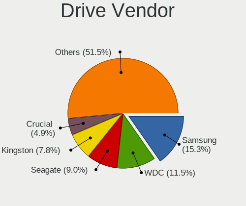
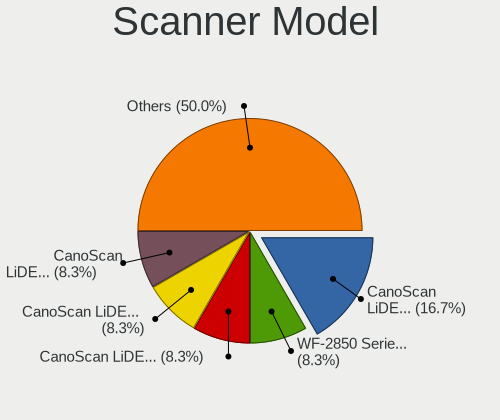

BSD - Tested Hardware & Statistics
----------------------------------

A project to collect tested hardware configurations for BSD.

Anyone can contribute to this report by the [hw-probe](https://github.com/linuxhw/hw-probe/blob/master/INSTALL.BSD.md) tool:

    hw-probe -all -upload

Please contribute! Especially if your hardware is rare.

This is a report for all computer types. See also reports for [desktops](/Desktop/README.md) and [notebooks](/Notebook/README.md).

OS-specific reports: [FreeBSD](/Dist/FreeBSD), [GhostBSD](/Dist/GhostBSD), [helloSystem](/Dist/helloSystem), [NetBSD](/Dist/NetBSD), [NomadBSD](/Dist/NomadBSD), [OpenBSD](/Dist/OpenBSD), [OPNsense](/Dist/OPNsense), [pfSense](/Dist/pfSense), [TrueNAS](/Dist/TrueNAS).

This report is for real hardware. Report for virtual hardware: [TestCoverage_VE](https://github.com/bsdhw/TestCoverage_VE)

Contents
--------

* [ Test Cases ](#test-cases)

* [ System ](#system)
  - [ OS                       ](#os)
  - [ OS Family                ](#os-family)
  - [ Arch                     ](#arch)
  - [ DE                       ](#de)
  - [ Display Server           ](#display-server)
  - [ Display Manager          ](#display-manager)
  - [ OS Lang                  ](#os-lang)
  - [ Boot Mode                ](#boot-mode)
  - [ Filesystem               ](#filesystem)
  - [ Part. scheme             ](#part-scheme)

* [ Board ](#board)
  - [ Vendor                   ](#vendor)
  - [ Model                    ](#model)
  - [ Model Family             ](#model-family)
  - [ MFG Year                 ](#mfg-year)
  - [ Form Factor              ](#form-factor)
  - [ Coreboot                 ](#coreboot)
  - [ RAM Size                 ](#ram-size)
  - [ RAM Used                 ](#ram-used)
  - [ Total Drives             ](#total-drives)
  - [ Has CD-ROM               ](#has-cd-rom)
  - [ Has Ethernet             ](#has-ethernet)
  - [ Has WiFi                 ](#has-wifi)
  - [ Has Bluetooth            ](#has-bluetooth)

* [ Location ](#location)
  - [ Country                  ](#country)
  - [ City                     ](#city)

* [ Drives ](#drives)
  - [ Drive Vendor             ](#drive-vendor)
  - [ Drive Model              ](#drive-model)
  - [ HDD Vendor               ](#hdd-vendor)
  - [ SSD Vendor               ](#ssd-vendor)
  - [ Drive Kind               ](#drive-kind)
  - [ Drive Connector          ](#drive-connector)
  - [ Drive Size               ](#drive-size)
  - [ Space Total              ](#space-total)
  - [ Space Used               ](#space-used)
  - [ Malfunc. Drives          ](#malfunc-drives)
  - [ Malfunc. Drive Vendor    ](#malfunc-drive-vendor)
  - [ Malfunc. HDD Vendor      ](#malfunc-hdd-vendor)
  - [ Malfunc. Drive Kind      ](#malfunc-drive-kind)
  - [ Failed Drives            ](#failed-drives)
  - [ Failed Drive Vendor      ](#failed-drive-vendor)
  - [ Drive Status             ](#drive-status)

* [ Storage controller ](#storage-controller)
  - [ Storage Vendor           ](#storage-vendor)
  - [ Storage Model            ](#storage-model)
  - [ Storage Kind             ](#storage-kind)

* [ Processor ](#processor)
  - [ CPU Vendor               ](#cpu-vendor)
  - [ CPU Model                ](#cpu-model)
  - [ CPU Model Family         ](#cpu-model-family)
  - [ CPU Cores                ](#cpu-cores)
  - [ CPU Sockets              ](#cpu-sockets)
  - [ CPU Threads              ](#cpu-threads)
  - [ CPU Microarch            ](#cpu-microarch)

* [ Graphics ](#graphics)
  - [ GPU Vendor               ](#gpu-vendor)
  - [ GPU Model                ](#gpu-model)
  - [ GPU Combo                ](#gpu-combo)
  - [ GPU Driver               ](#gpu-driver)
  - [ GPU Memory               ](#gpu-memory)

* [ Monitor ](#monitor)
  - [ Monitor Vendor           ](#monitor-vendor)
  - [ Monitor Model            ](#monitor-model)
  - [ Monitor Resolution       ](#monitor-resolution)
  - [ Monitor Diagonal         ](#monitor-diagonal)
  - [ Monitor Width            ](#monitor-width)
  - [ Aspect Ratio             ](#aspect-ratio)
  - [ Monitor Area             ](#monitor-area)
  - [ Pixel Density            ](#pixel-density)
  - [ Multiple Monitors        ](#multiple-monitors)

* [ Network ](#network)
  - [ Net Controller Vendor    ](#net-controller-vendor)
  - [ Net Controller Model     ](#net-controller-model)
  - [ Wireless Vendor          ](#wireless-vendor)
  - [ Wireless Model           ](#wireless-model)
  - [ Ethernet Vendor          ](#ethernet-vendor)
  - [ Ethernet Model           ](#ethernet-model)
  - [ Net Controller Kind      ](#net-controller-kind)
  - [ Used Controller          ](#used-controller)
  - [ NICs                     ](#nics)
  - [ IPv6                     ](#ipv6)

* [ Bluetooth ](#bluetooth)
  - [ Bluetooth Vendor         ](#bluetooth-vendor)
  - [ Bluetooth Model          ](#bluetooth-model)

* [ Sound ](#sound)
  - [ Sound Vendor             ](#sound-vendor)
  - [ Sound Model              ](#sound-model)

* [ Memory ](#memory)
  - [ Memory Vendor            ](#memory-vendor)
  - [ Memory Model             ](#memory-model)
  - [ Memory Kind              ](#memory-kind)
  - [ Memory Form Factor       ](#memory-form-factor)
  - [ Memory Size              ](#memory-size)
  - [ Memory Speed             ](#memory-speed)

* [ Printers & scanners ](#printers--scanners)
  - [ Printer Vendor           ](#printer-vendor)
  - [ Printer Model            ](#printer-model)
  - [ Scanner Vendor           ](#scanner-vendor)
  - [ Scanner Model            ](#scanner-model)

* [ Camera ](#camera)
  - [ Camera Vendor            ](#camera-vendor)
  - [ Camera Model             ](#camera-model)

* [ Security ](#security)
  - [ Fingerprint Vendor       ](#fingerprint-vendor)
  - [ Fingerprint Model        ](#fingerprint-model)
  - [ Chipcard Vendor          ](#chipcard-vendor)
  - [ Chipcard Model           ](#chipcard-model)

* [ Unsupported ](#unsupported)
  - [ Unsupported Devices      ](#unsupported-devices)
  - [ Unsupported Device Types ](#unsupported-device-types)

Test Cases
----------

Total: 12846

| Vendor        | Model                       | Form-Factor | Probe                                                     | Date         |
|---------------|-----------------------------|-------------|-----------------------------------------------------------|--------------|
| Unknown       | Unknown                     | Desktop     | [243e309a04](https://bsd-hardware.info/?probe=243e309a04) | Dec 01, 2022 |
| Gigabyte      | Z170X-Gaming 3              | Desktop     | [03708406e8](https://bsd-hardware.info/?probe=03708406e8) | Dec 01, 2022 |
| HP            | 8054                        | Desktop     | [c25adeb2ff](https://bsd-hardware.info/?probe=c25adeb2ff) | Dec 01, 2022 |
| Thomas-Kre... | P9A-I/2550/4L               | Firewall    | [6bec1ec37d](https://bsd-hardware.info/?probe=6bec1ec37d) | Dec 01, 2022 |
| Unknown       | Unknown                     | Desktop     | [32a4df9cae](https://bsd-hardware.info/?probe=32a4df9cae) | Dec 01, 2022 |
| Intel         | NUC11ATBC4 M53051-400       | Mini pc     | [6fe2ba74b7](https://bsd-hardware.info/?probe=6fe2ba74b7) | Dec 01, 2022 |
| Lenovo        | 312D SDK0J40697 WIN 3305... | Mini pc     | [a7c2e16f5c](https://bsd-hardware.info/?probe=a7c2e16f5c) | Dec 01, 2022 |
| Panasonic     | CF-54-1                     | Notebook    | [0c5820ea0d](https://bsd-hardware.info/?probe=0c5820ea0d) | Dec 01, 2022 |
| Unknown       | Unknown                     | Desktop     | [504a659236](https://bsd-hardware.info/?probe=504a659236) | Dec 01, 2022 |
| Dell          | Inspiron 3442               | Notebook    | [529cbab9aa](https://bsd-hardware.info/?probe=529cbab9aa) | Dec 01, 2022 |
| Acidanther... | MacBookPro15,1              | Notebook    | [57c3a4005a](https://bsd-hardware.info/?probe=57c3a4005a) | Dec 01, 2022 |
| MSI           | Z87I                        | Desktop     | [570046969c](https://bsd-hardware.info/?probe=570046969c) | Dec 01, 2022 |
| HP            | 8103 A01                    | Mini pc     | [5cd982c2ee](https://bsd-hardware.info/?probe=5cd982c2ee) | Nov 30, 2022 |
| Intel         | Q3XXG4-P V1.0               | Desktop     | [84d1656c05](https://bsd-hardware.info/?probe=84d1656c05) | Nov 30, 2022 |
| Dell          | 08NPPY A00                  | Desktop     | [6a1a5865cb](https://bsd-hardware.info/?probe=6a1a5865cb) | Nov 30, 2022 |
| ASRockRack    | EPYC3101D4I-2T              | Desktop     | [087264570d](https://bsd-hardware.info/?probe=087264570d) | Nov 30, 2022 |
| PC Engines    | apu4                        | Desktop     | [7c8b9014b1](https://bsd-hardware.info/?probe=7c8b9014b1) | Nov 30, 2022 |
| PC Engines    | apu4                        | Desktop     | [dd39e91713](https://bsd-hardware.info/?probe=dd39e91713) | Nov 30, 2022 |
| Gigabyte      | B450M DS3H-CF               | Desktop     | [794e041b13](https://bsd-hardware.info/?probe=794e041b13) | Nov 30, 2022 |
| HP            | Laptop 14s-fq0xxx           | Notebook    | [920a2fe2e9](https://bsd-hardware.info/?probe=920a2fe2e9) | Nov 30, 2022 |
| AWOW          | PC BOX                      | Mini pc     | [ac4f4b181a](https://bsd-hardware.info/?probe=ac4f4b181a) | Nov 30, 2022 |
| Panasonic     | CF-31-5                     | Notebook    | [7047afaaf4](https://bsd-hardware.info/?probe=7047afaaf4) | Nov 30, 2022 |
| Protectli     | FW6                         | Desktop     | [95f3201109](https://bsd-hardware.info/?probe=95f3201109) | Nov 30, 2022 |
| GPD           | P3 MAX                      | Notebook    | [4a467c9616](https://bsd-hardware.info/?probe=4a467c9616) | Nov 30, 2022 |
| Protectli     | FW4A Ver                    | Desktop     | [9e6e0f5548](https://bsd-hardware.info/?probe=9e6e0f5548) | Nov 30, 2022 |
| Apple         | MacBookPro8,1               | Notebook    | [3dd9e3557c](https://bsd-hardware.info/?probe=3dd9e3557c) | Nov 30, 2022 |
| Intel         | D54250WYK H13922-303        | Desktop     | [f3b09cfb70](https://bsd-hardware.info/?probe=f3b09cfb70) | Nov 30, 2022 |
| Intel         | D33217CK G76541-300         | Desktop     | [bbdd9a1b98](https://bsd-hardware.info/?probe=bbdd9a1b98) | Nov 30, 2022 |
| Sophos        | SG                          | Firewall    | [357c380b7c](https://bsd-hardware.info/?probe=357c380b7c) | Nov 29, 2022 |
| Lenovo        | MAHOBAY                     | Desktop     | [1d61d0cf62](https://bsd-hardware.info/?probe=1d61d0cf62) | Nov 29, 2022 |
| ASRockRack    | X470D4U                     | Desktop     | [38d7f55ef7](https://bsd-hardware.info/?probe=38d7f55ef7) | Nov 29, 2022 |
| Lenovo        | ThinkPad T430 2347G7G       | Notebook    | [640540cd67](https://bsd-hardware.info/?probe=640540cd67) | Nov 29, 2022 |
| Protectli     | FW4B Ver                    | Desktop     | [cfaeaeb2f2](https://bsd-hardware.info/?probe=cfaeaeb2f2) | Nov 29, 2022 |
| MSI           | PRO H610M-B DDR4            | Desktop     | [929e4bda1e](https://bsd-hardware.info/?probe=929e4bda1e) | Nov 29, 2022 |
| Unknown       | Unknown                     | Desktop     | [a5b10d3f79](https://bsd-hardware.info/?probe=a5b10d3f79) | Nov 29, 2022 |
| ACMA          | X8SIE                       | Desktop     | [532b81e55f](https://bsd-hardware.info/?probe=532b81e55f) | Nov 29, 2022 |
| ASUSTek       | ROG STRIX B450-F GAMING     | Desktop     | [7308d658dc](https://bsd-hardware.info/?probe=7308d658dc) | Nov 29, 2022 |
| ZOTAC         | ZBOX-CI341                  | Mini pc     | [2299087d09](https://bsd-hardware.info/?probe=2299087d09) | Nov 29, 2022 |
| Unknown       | A04                         | Server      | [07f21afacc](https://bsd-hardware.info/?probe=07f21afacc) | Nov 29, 2022 |
| HP            | Laptop 14s-fq0xxx           | Notebook    | [9618eb0cbe](https://bsd-hardware.info/?probe=9618eb0cbe) | Nov 29, 2022 |
| MSI           | PRO H610M-B DDR4            | Desktop     | [7c9ee800c5](https://bsd-hardware.info/?probe=7c9ee800c5) | Nov 29, 2022 |
| Lenovo        | 316A SDK0J40697 WIN 3305... | Mini pc     | [26c9557a0a](https://bsd-hardware.info/?probe=26c9557a0a) | Nov 29, 2022 |
| HP            | 8299                        | Desktop     | [d697a2e953](https://bsd-hardware.info/?probe=d697a2e953) | Nov 29, 2022 |
| Acer          | TravelMate B115-M           | Notebook    | [13e318fec2](https://bsd-hardware.info/?probe=13e318fec2) | Nov 29, 2022 |
| ACMA          | X8SIE                       | Desktop     | [d0112d027b](https://bsd-hardware.info/?probe=d0112d027b) | Nov 28, 2022 |
| QIYIDA        | X99-H9 V2.0                 | Desktop     | [43163b0170](https://bsd-hardware.info/?probe=43163b0170) | Nov 28, 2022 |
| QIYIDA        | X99-H9 V2.0                 | Desktop     | [d00aa0021e](https://bsd-hardware.info/?probe=d00aa0021e) | Nov 28, 2022 |
| Unknown       | Unknown                     | Desktop     | [4e40278b06](https://bsd-hardware.info/?probe=4e40278b06) | Nov 28, 2022 |
| Lenovo        | ThinkPad T460 20FMS0XL23    | Notebook    | [bc7585ec56](https://bsd-hardware.info/?probe=bc7585ec56) | Nov 28, 2022 |
| MSI           | Z77A-G43                    | Desktop     | [28dd3a0b1b](https://bsd-hardware.info/?probe=28dd3a0b1b) | Nov 28, 2022 |
| Deciso        | Netboard A10 GEN2 Model ... | Desktop     | [d48dbd053d](https://bsd-hardware.info/?probe=d48dbd053d) | Nov 28, 2022 |
| PC Engines    | apu4                        | Desktop     | [588e065800](https://bsd-hardware.info/?probe=588e065800) | Nov 28, 2022 |
| Intel         | D54250WYK H13922-303        | Desktop     | [e850e0ae9c](https://bsd-hardware.info/?probe=e850e0ae9c) | Nov 28, 2022 |
| Toshiba       | TECRA Z40-C-12Z             | Notebook    | [149e5c3de3](https://bsd-hardware.info/?probe=149e5c3de3) | Nov 28, 2022 |
| Gigabyte      | H110M-S2H-CF                | Desktop     | [35950045c6](https://bsd-hardware.info/?probe=35950045c6) | Nov 28, 2022 |
| Unknown       | Unknown                     | Desktop     | [2fe35064cb](https://bsd-hardware.info/?probe=2fe35064cb) | Nov 28, 2022 |
| Intel         | Q3XXG4-P V1.0               | Desktop     | [b1f32ca8a1](https://bsd-hardware.info/?probe=b1f32ca8a1) | Nov 28, 2022 |
| ASUSTek       | Pro WS 565-ACE              | Desktop     | [378270eba0](https://bsd-hardware.info/?probe=378270eba0) | Nov 28, 2022 |
| Lenovo        | 370A SDK0J40700 WIN 3258... | Desktop     | [b4cc780c40](https://bsd-hardware.info/?probe=b4cc780c40) | Nov 28, 2022 |
| Shuttle       | FS81                        | Desktop     | [f714ba647f](https://bsd-hardware.info/?probe=f714ba647f) | Nov 28, 2022 |
| ShenZhen M... | MW-NANO-APL-4L              | Desktop     | [fd111870fa](https://bsd-hardware.info/?probe=fd111870fa) | Nov 28, 2022 |
| Fujitsu       | D3313-G1 S26361-D3313-G1    | Desktop     | [ae55a799e8](https://bsd-hardware.info/?probe=ae55a799e8) | Nov 28, 2022 |
| ASUSTek       | PRIME Z390M-PLUS            | Desktop     | [7329e04c22](https://bsd-hardware.info/?probe=7329e04c22) | Nov 27, 2022 |
| Apple         | MacBook5,1                  | Notebook    | [3541df7dd2](https://bsd-hardware.info/?probe=3541df7dd2) | Nov 27, 2022 |
| PC Engines    | apu6                        | Desktop     | [13dcbe5748](https://bsd-hardware.info/?probe=13dcbe5748) | Nov 27, 2022 |
| ASUSTek       | H97-PLUS                    | Desktop     | [39ece5deaf](https://bsd-hardware.info/?probe=39ece5deaf) | Nov 27, 2022 |
| YANYU         | R250                        | Desktop     | [0be0925e5b](https://bsd-hardware.info/?probe=0be0925e5b) | Nov 27, 2022 |
| ASRock        | X570 Pro4                   | Desktop     | [b23f59a068](https://bsd-hardware.info/?probe=b23f59a068) | Nov 27, 2022 |
| Dell          | 09M8Y8 A02                  | Desktop     | [2299b7c270](https://bsd-hardware.info/?probe=2299b7c270) | Nov 27, 2022 |
| MSI           | H81M-P33                    | Desktop     | [597d48d1c9](https://bsd-hardware.info/?probe=597d48d1c9) | Nov 27, 2022 |
| ASUSTek       | P5Q-E                       | Desktop     | [10d76fd431](https://bsd-hardware.info/?probe=10d76fd431) | Nov 27, 2022 |
| ASUSTek       | ROG CROSSHAIR VIII HERO     | Desktop     | [383341b2f1](https://bsd-hardware.info/?probe=383341b2f1) | Nov 27, 2022 |
| Acer          | Revo RN86                   | Desktop     | [a4dcb7f7a2](https://bsd-hardware.info/?probe=a4dcb7f7a2) | Nov 27, 2022 |
| ASRock        | Q1900B-ITX                  | Desktop     | [c93690c7ca](https://bsd-hardware.info/?probe=c93690c7ca) | Nov 27, 2022 |
| Shuttle       | FZ270                       | Desktop     | [04a7f49322](https://bsd-hardware.info/?probe=04a7f49322) | Nov 27, 2022 |
| Shuttle       | FZ270                       | Desktop     | [10016f39b9](https://bsd-hardware.info/?probe=10016f39b9) | Nov 27, 2022 |
| ASRock        | Q1900B-ITX                  | Desktop     | [675c9fdf94](https://bsd-hardware.info/?probe=675c9fdf94) | Nov 27, 2022 |
| ASRock        | Q1900B-ITX                  | Desktop     | [a337eb9e5f](https://bsd-hardware.info/?probe=a337eb9e5f) | Nov 27, 2022 |
| Shuttle       | FH270                       | Desktop     | [192351ac6f](https://bsd-hardware.info/?probe=192351ac6f) | Nov 27, 2022 |
| Shuttle       | FH270                       | Desktop     | [3b68d89092](https://bsd-hardware.info/?probe=3b68d89092) | Nov 27, 2022 |
| Dell          | 0VRCY5 A14                  | Server      | [5048d00fd8](https://bsd-hardware.info/?probe=5048d00fd8) | Nov 27, 2022 |
| Dell          | 0VRCY5 A14                  | Server      | [60bdb57227](https://bsd-hardware.info/?probe=60bdb57227) | Nov 27, 2022 |
| Dell          | 0VRCY5 A14                  | Server      | [ebdca950cc](https://bsd-hardware.info/?probe=ebdca950cc) | Nov 27, 2022 |
| ASRock        | N68-S                       | Desktop     | [3813c8856e](https://bsd-hardware.info/?probe=3813c8856e) | Nov 27, 2022 |
| Protectli     | FW4B Ver                    | Desktop     | [e8e158f783](https://bsd-hardware.info/?probe=e8e158f783) | Nov 27, 2022 |
| Supermicro    | X10SRG-F                    | Desktop     | [66b7819b2a](https://bsd-hardware.info/?probe=66b7819b2a) | Nov 27, 2022 |
| Dell          | Inspiron 5558               | Notebook    | [10bece0518](https://bsd-hardware.info/?probe=10bece0518) | Nov 27, 2022 |
| Unknown       | Unknown                     | Desktop     | [512a05eefb](https://bsd-hardware.info/?probe=512a05eefb) | Nov 27, 2022 |
| Gigabyte      | H110M-S2H-CF                | Desktop     | [ed6b1f75ae](https://bsd-hardware.info/?probe=ed6b1f75ae) | Nov 27, 2022 |
| ASUSTek       | PRIME B450M-A               | Desktop     | [5f0b8df8d0](https://bsd-hardware.info/?probe=5f0b8df8d0) | Nov 27, 2022 |
| ASRock        | J4125B-ITX                  | Desktop     | [ad497a63ac](https://bsd-hardware.info/?probe=ad497a63ac) | Nov 27, 2022 |
| HP            | 18E7                        | Desktop     | [c7635c715f](https://bsd-hardware.info/?probe=c7635c715f) | Nov 26, 2022 |
| Intel         | DH87MC AAG74242-401         | Desktop     | [33c1878560](https://bsd-hardware.info/?probe=33c1878560) | Nov 26, 2022 |
| ASUSTek       | P11C-X Series               | Desktop     | [6860cd72f8](https://bsd-hardware.info/?probe=6860cd72f8) | Nov 26, 2022 |
| ASUSTek       | P11C-X Series               | Desktop     | [cfdb06e761](https://bsd-hardware.info/?probe=cfdb06e761) | Nov 26, 2022 |
| CompuLab      | fit-PC3                     | Mini pc     | [34dd85f78d](https://bsd-hardware.info/?probe=34dd85f78d) | Nov 26, 2022 |
| ASUSTek       | P5K-E                       | Desktop     | [2b00248458](https://bsd-hardware.info/?probe=2b00248458) | Nov 26, 2022 |
| Intel         | CRESCENTBAY                 | Desktop     | [bd1f1fa769](https://bsd-hardware.info/?probe=bd1f1fa769) | Nov 26, 2022 |
| CompuLab      | fit-PC3                     | Mini pc     | [54a64a269c](https://bsd-hardware.info/?probe=54a64a269c) | Nov 26, 2022 |
| HP            | EliteBook 8570p             | Notebook    | [3ad7cec298](https://bsd-hardware.info/?probe=3ad7cec298) | Nov 26, 2022 |
| Lenovo        | SHARKBAY NOK                | Desktop     | [7c9df6da87](https://bsd-hardware.info/?probe=7c9df6da87) | Nov 26, 2022 |
| Acer          | Aspire 5738                 | Notebook    | [067e8e4d58](https://bsd-hardware.info/?probe=067e8e4d58) | Nov 26, 2022 |
| Lenovo        | SHARKBAY NOK                | Desktop     | [b87ed70877](https://bsd-hardware.info/?probe=b87ed70877) | Nov 26, 2022 |
| MW            | GMLK-2_5G4L                 | Desktop     | [7f9869324b](https://bsd-hardware.info/?probe=7f9869324b) | Nov 26, 2022 |
| Unknown       | Unknown                     | Desktop     | [222e69ff59](https://bsd-hardware.info/?probe=222e69ff59) | Nov 26, 2022 |
| Dell          | 0M017G A00                  | Desktop     | [3acaad9a7d](https://bsd-hardware.info/?probe=3acaad9a7d) | Nov 26, 2022 |
| HP            | ProLiant DL360p Gen8        | Server      | [a5514d3f4b](https://bsd-hardware.info/?probe=a5514d3f4b) | Nov 26, 2022 |
| Sophos        | SG                          | Firewall    | [d0fc510660](https://bsd-hardware.info/?probe=d0fc510660) | Nov 26, 2022 |
| Unknown       | Unknown                     | Desktop     | [6de307244e](https://bsd-hardware.info/?probe=6de307244e) | Nov 26, 2022 |
| MW            | GMLK-2_5G4L                 | Desktop     | [787a2db2cd](https://bsd-hardware.info/?probe=787a2db2cd) | Nov 26, 2022 |
| ASUSTek       | SABERTOOTH Z77              | Desktop     | [88929a3594](https://bsd-hardware.info/?probe=88929a3594) | Nov 25, 2022 |
| ASUSTek       | SABERTOOTH Z77              | Desktop     | [ef6190861c](https://bsd-hardware.info/?probe=ef6190861c) | Nov 25, 2022 |
| Protectli     | FW6                         | Desktop     | [74510f3177](https://bsd-hardware.info/?probe=74510f3177) | Nov 25, 2022 |
| Lenovo        | ThinkPad T430 23446FP       | Notebook    | [6c2ef140be](https://bsd-hardware.info/?probe=6c2ef140be) | Nov 25, 2022 |
| ASUSTek       | P8H61-M LX3 R2.0            | Desktop     | [76ecd68ff6](https://bsd-hardware.info/?probe=76ecd68ff6) | Nov 25, 2022 |
| Protectli     | FW2B Ver                    | Desktop     | [e03929e52f](https://bsd-hardware.info/?probe=e03929e52f) | Nov 25, 2022 |
| Dell          | 0F0XJ6 A13                  | Server      | [1d71d3c9e7](https://bsd-hardware.info/?probe=1d71d3c9e7) | Nov 25, 2022 |
| Techvision    | TVI7309X B0                 | Desktop     | [317231bad8](https://bsd-hardware.info/?probe=317231bad8) | Nov 25, 2022 |
| Supermicro    | M11SDV-8C+-LN4F             | Server      | [bcf17b19ec](https://bsd-hardware.info/?probe=bcf17b19ec) | Nov 25, 2022 |
| HP            | 3048h                       | Desktop     | [3f43816a5d](https://bsd-hardware.info/?probe=3f43816a5d) | Nov 25, 2022 |
| Lenovo        | ThinkStation S30 0569A93    | Desktop     | [dd545fb588](https://bsd-hardware.info/?probe=dd545fb588) | Nov 25, 2022 |
| Dell          | 0PTTT9 A01                  | Desktop     | [74575d6dfe](https://bsd-hardware.info/?probe=74575d6dfe) | Nov 25, 2022 |
| Pegatron      | IPM41-D3                    | Desktop     | [898f645e32](https://bsd-hardware.info/?probe=898f645e32) | Nov 25, 2022 |
| Supermicro    | M11SDV-4CT-LN4F             | Server      | [dc8015adc3](https://bsd-hardware.info/?probe=dc8015adc3) | Nov 25, 2022 |
| Dell          | Vostro 3501                 | Notebook    | [61f8a35700](https://bsd-hardware.info/?probe=61f8a35700) | Nov 25, 2022 |
| ASRock        | H510M-HDV                   | Desktop     | [d2029ae805](https://bsd-hardware.info/?probe=d2029ae805) | Nov 25, 2022 |
| Dell          | 0F0XJ6 A13                  | Server      | [1fb28aaef2](https://bsd-hardware.info/?probe=1fb28aaef2) | Nov 25, 2022 |
| Unknown       | Unknown                     | Desktop     | [1d3bd58d18](https://bsd-hardware.info/?probe=1d3bd58d18) | Nov 25, 2022 |
| Lenovo        | 1106A14 ThinkServer TS13... | Desktop     | [28aca8c985](https://bsd-hardware.info/?probe=28aca8c985) | Nov 25, 2022 |
| Gigabyte      | G31M-ES2C                   | Desktop     | [2959091a59](https://bsd-hardware.info/?probe=2959091a59) | Nov 25, 2022 |
| Dell          | 0HFG24 A01                  | Server      | [ca48ff12d3](https://bsd-hardware.info/?probe=ca48ff12d3) | Nov 25, 2022 |
| MSI           | Z170A GAMING M5             | Desktop     | [5740972ddc](https://bsd-hardware.info/?probe=5740972ddc) | Nov 25, 2022 |
| HP            | 8055                        | Desktop     | [ace4570d15](https://bsd-hardware.info/?probe=ace4570d15) | Nov 25, 2022 |
| HP            | ProLiant DL360p Gen8        | Server      | [7bb8186465](https://bsd-hardware.info/?probe=7bb8186465) | Nov 25, 2022 |
| MW            | GMLK-2_5G4L                 | Desktop     | [de7f2ee053](https://bsd-hardware.info/?probe=de7f2ee053) | Nov 25, 2022 |
| Sony          | SVP1321V9RB                 | Notebook    | [932facd689](https://bsd-hardware.info/?probe=932facd689) | Nov 25, 2022 |
| Dell          | 009Y81 A01                  | All in one  | [75132e6886](https://bsd-hardware.info/?probe=75132e6886) | Nov 25, 2022 |
| Techvision    | TVI7309X B0                 | Desktop     | [7258992b77](https://bsd-hardware.info/?probe=7258992b77) | Nov 24, 2022 |
| Lenovo        | 312D SDK0J40697 WIN 3305... | Mini pc     | [4a8efeb7a6](https://bsd-hardware.info/?probe=4a8efeb7a6) | Nov 24, 2022 |
| Dell          | Latitude D610               | Notebook    | [6ef8d8137b](https://bsd-hardware.info/?probe=6ef8d8137b) | Nov 24, 2022 |
| HP            | ProLiant DL360 G5           | Server      | [4a44193c5f](https://bsd-hardware.info/?probe=4a44193c5f) | Nov 24, 2022 |
| Deciso        | OPNsense Appliance          | Notebook    | [0bbf4f46e7](https://bsd-hardware.info/?probe=0bbf4f46e7) | Nov 24, 2022 |
| Dell          | 0W13NR A07                  | Server      | [c5b09b219b](https://bsd-hardware.info/?probe=c5b09b219b) | Nov 24, 2022 |
| ASRock        | B450M-HDV                   | Desktop     | [d0009172b1](https://bsd-hardware.info/?probe=d0009172b1) | Nov 24, 2022 |
| ASRock        | B450M-HDV                   | Desktop     | [25cc0129d9](https://bsd-hardware.info/?probe=25cc0129d9) | Nov 24, 2022 |
| Unknown       | Unknown                     | Desktop     | [d4246caa0f](https://bsd-hardware.info/?probe=d4246caa0f) | Nov 24, 2022 |
| ASUSTek       | K55VD                       | Notebook    | [6fa29c4e4d](https://bsd-hardware.info/?probe=6fa29c4e4d) | Nov 24, 2022 |
| Dell          | 0T7D40 A01                  | Desktop     | [45d96a0b5a](https://bsd-hardware.info/?probe=45d96a0b5a) | Nov 24, 2022 |
| Deciso        | OPNsense Appliance          | Notebook    | [75a7bf9b27](https://bsd-hardware.info/?probe=75a7bf9b27) | Nov 24, 2022 |
| Unknown       | Unknown                     | Desktop     | [5aa1f0193a](https://bsd-hardware.info/?probe=5aa1f0193a) | Nov 24, 2022 |
| HP            | Pavilion Gaming Laptop 1... | Notebook    | [3c11fc31b2](https://bsd-hardware.info/?probe=3c11fc31b2) | Nov 24, 2022 |
| Unknown       | Unknown                     | Desktop     | [c5562e1851](https://bsd-hardware.info/?probe=c5562e1851) | Nov 24, 2022 |
| MSI           | A320M-A PRO                 | Desktop     | [fc71b97d90](https://bsd-hardware.info/?probe=fc71b97d90) | Nov 24, 2022 |
| MW            | GMLK-2_5G4L                 | Desktop     | [b6bbaa13e8](https://bsd-hardware.info/?probe=b6bbaa13e8) | Nov 24, 2022 |
| Dell          | 07F37C A01                  | Desktop     | [08d048da80](https://bsd-hardware.info/?probe=08d048da80) | Nov 24, 2022 |
| Samsung       | 300E4C/300E5C/300E7C        | Notebook    | [e32a104392](https://bsd-hardware.info/?probe=e32a104392) | Nov 24, 2022 |
| ASRock Ind... | NUC-1240P                   | Desktop     | [75547bc09a](https://bsd-hardware.info/?probe=75547bc09a) | Nov 24, 2022 |
| Gigabyte      | E2500N                      | Desktop     | [64b937b551](https://bsd-hardware.info/?probe=64b937b551) | Nov 23, 2022 |
| Fujitsu       | D3313-G1 S26361-D3313-G1    | Desktop     | [aa3c44499f](https://bsd-hardware.info/?probe=aa3c44499f) | Nov 23, 2022 |
| Gigabyte      | G31M-S2L                    | Desktop     | [d376385d80](https://bsd-hardware.info/?probe=d376385d80) | Nov 23, 2022 |
| Samsung       | 300E4C/300E5C/300E7C        | Notebook    | [a4d92a3b73](https://bsd-hardware.info/?probe=a4d92a3b73) | Nov 23, 2022 |
| ASUSTek       | TUF Gaming Z590-PLUS WIF... | Desktop     | [1b6870d481](https://bsd-hardware.info/?probe=1b6870d481) | Nov 23, 2022 |
| Unknown       | Unknown                     | Desktop     | [77e932dd9e](https://bsd-hardware.info/?probe=77e932dd9e) | Nov 23, 2022 |
| IceWhale T... | ZimaBoard 216 ZMB           | Desktop     | [b75d6c6581](https://bsd-hardware.info/?probe=b75d6c6581) | Nov 23, 2022 |
| Dell          | 06D7TR A00                  | Desktop     | [7fabc0cb8a](https://bsd-hardware.info/?probe=7fabc0cb8a) | Nov 23, 2022 |
| Unknown       | Unknown                     | Desktop     | [337d5f0f4b](https://bsd-hardware.info/?probe=337d5f0f4b) | Nov 23, 2022 |
| ZOTAC         | ZBOX-CI622/CI642/CI662NA... | Mini pc     | [4c3be7ec24](https://bsd-hardware.info/?probe=4c3be7ec24) | Nov 23, 2022 |
| IceWhale T... | ZimaBoard 832 ZMB           | Desktop     | [1860d18e39](https://bsd-hardware.info/?probe=1860d18e39) | Nov 23, 2022 |
| Protectli     | FW4B                        | Desktop     | [d3090c9e8e](https://bsd-hardware.info/?probe=d3090c9e8e) | Nov 23, 2022 |
| Apple         | Mac-F2208EC8                | Mini pc     | [0ed70ba3c3](https://bsd-hardware.info/?probe=0ed70ba3c3) | Nov 23, 2022 |
| Infoblox      | IB-1410                     | Desktop     | [7521108ef5](https://bsd-hardware.info/?probe=7521108ef5) | Nov 23, 2022 |
| ASUSTek       | A55BM-K                     | Desktop     | [dc487b5779](https://bsd-hardware.info/?probe=dc487b5779) | Nov 23, 2022 |
| HP            | 3396                        | Desktop     | [dc94cbde1a](https://bsd-hardware.info/?probe=dc94cbde1a) | Nov 23, 2022 |
| PC Engines    | apu6                        | Desktop     | [bc334caa03](https://bsd-hardware.info/?probe=bc334caa03) | Nov 23, 2022 |
| PC Engines    | APU2                        | Desktop     | [4d33b6da51](https://bsd-hardware.info/?probe=4d33b6da51) | Nov 23, 2022 |
| ASUSTek       | PRIME A320M-K               | Desktop     | [9701222998](https://bsd-hardware.info/?probe=9701222998) | Nov 23, 2022 |
| Sophos        | UTM                         | Firewall    | [1c0805f9ae](https://bsd-hardware.info/?probe=1c0805f9ae) | Nov 23, 2022 |
| Dell          | XPS 13 9343                 | Notebook    | [8ec61db3f0](https://bsd-hardware.info/?probe=8ec61db3f0) | Nov 22, 2022 |
| CncTion       | N5105-4L B0                 | Desktop     | [d4791d1dfc](https://bsd-hardware.info/?probe=d4791d1dfc) | Nov 22, 2022 |
| Dell          | 0TW855 A07                  | Server      | [d2d859c434](https://bsd-hardware.info/?probe=d2d859c434) | Nov 22, 2022 |
| Intel         | H61                         | Desktop     | [689ebf0e57](https://bsd-hardware.info/?probe=689ebf0e57) | Nov 22, 2022 |
| Dell          | 0MD99X A05                  | Server      | [8adc53c921](https://bsd-hardware.info/?probe=8adc53c921) | Nov 22, 2022 |
| HP            | ProLiant DL360 G7           | Server      | [b666129e73](https://bsd-hardware.info/?probe=b666129e73) | Nov 22, 2022 |
| Datto         | SSD                         | Desktop     | [08d401fa34](https://bsd-hardware.info/?probe=08d401fa34) | Nov 22, 2022 |
| Gigabyte      | J3455N-D3H                  | Desktop     | [2f812bd8c3](https://bsd-hardware.info/?probe=2f812bd8c3) | Nov 22, 2022 |
| Gigabyte      | H81M-HD3                    | Desktop     | [564cf3d66a](https://bsd-hardware.info/?probe=564cf3d66a) | Nov 22, 2022 |
| Dell          | Edge Gateway 5000           | Mini pc     | [18f8f8f8b5](https://bsd-hardware.info/?probe=18f8f8f8b5) | Nov 22, 2022 |
| Unknown       | Unknown                     | Desktop     | [fdffbdb940](https://bsd-hardware.info/?probe=fdffbdb940) | Nov 22, 2022 |
| Apple         | PowerMac10,1                | Desktop     | [0760ed34c3](https://bsd-hardware.info/?probe=0760ed34c3) | Nov 21, 2022 |
| AMI           | Aptio CRB                   | Mini pc     | [7742fc7455](https://bsd-hardware.info/?probe=7742fc7455) | Nov 21, 2022 |
| ASUSTek       | ROG STRIX B550-F GAMING     | Desktop     | [d893e02d90](https://bsd-hardware.info/?probe=d893e02d90) | Nov 21, 2022 |
| Protectli     | FW4B Ver                    | Desktop     | [77fa42b66c](https://bsd-hardware.info/?probe=77fa42b66c) | Nov 21, 2022 |
| ASUSTek       | ROG STRIX B550-F GAMING     | Desktop     | [7518e4f06a](https://bsd-hardware.info/?probe=7518e4f06a) | Nov 21, 2022 |
| Gigabyte      | P61-USB3-B3                 | Desktop     | [1ec1683acd](https://bsd-hardware.info/?probe=1ec1683acd) | Nov 21, 2022 |
| Gigabyte      | P61-USB3-B3                 | Desktop     | [5f442f0c65](https://bsd-hardware.info/?probe=5f442f0c65) | Nov 21, 2022 |
| Gigabyte      | H61M-S1                     | Desktop     | [2b851dbbc1](https://bsd-hardware.info/?probe=2b851dbbc1) | Nov 21, 2022 |
| Gigabyte      | Z590I AORUS ULTRA           | Desktop     | [e55eb53894](https://bsd-hardware.info/?probe=e55eb53894) | Nov 21, 2022 |
| ASUSTek       | ZenBook UX434FL_UX434FL     | Notebook    | [56bc3b04fd](https://bsd-hardware.info/?probe=56bc3b04fd) | Nov 21, 2022 |
| Lenovo        | 310B SDK0J40697 WIN 3305... | Mini pc     | [e0f08b66c2](https://bsd-hardware.info/?probe=e0f08b66c2) | Nov 21, 2022 |
| Lenovo        | ThinkPad X230 2325T4T       | Notebook    | [f0cc17c7eb](https://bsd-hardware.info/?probe=f0cc17c7eb) | Nov 21, 2022 |
| ASUSTek       | SABERTOOTH 990FX R2.0       | Desktop     | [f7129f1c87](https://bsd-hardware.info/?probe=f7129f1c87) | Nov 21, 2022 |
| Gigabyte      | 970A-D3P                    | Desktop     | [cced487ec5](https://bsd-hardware.info/?probe=cced487ec5) | Nov 21, 2022 |
| Gigabyte      | 970A-D3P                    | Desktop     | [c28a22ecb5](https://bsd-hardware.info/?probe=c28a22ecb5) | Nov 21, 2022 |
| ASUSTek       | P5KPL-VM-TWPC               | Desktop     | [6a5ff282a7](https://bsd-hardware.info/?probe=6a5ff282a7) | Nov 21, 2022 |
| ASUSTek       | SABERTOOTH 990FX R2.0       | Desktop     | [17aa370584](https://bsd-hardware.info/?probe=17aa370584) | Nov 21, 2022 |
| Supermicro    | M11SDV-4CT-LN4F             | Server      | [2d8d0056c4](https://bsd-hardware.info/?probe=2d8d0056c4) | Nov 21, 2022 |
| Fujitsu       | D3313-A1 S26361-D3313-A1    | Desktop     | [298fde4e33](https://bsd-hardware.info/?probe=298fde4e33) | Nov 21, 2022 |
| Unknown       | SKYBAY                      | Desktop     | [5030575f0a](https://bsd-hardware.info/?probe=5030575f0a) | Nov 20, 2022 |
| HP            | ProLiant DL380 G6           | Server      | [3e3b056cdf](https://bsd-hardware.info/?probe=3e3b056cdf) | Nov 20, 2022 |
| HP            | ProBook 4540s               | Notebook    | [6dce896f40](https://bsd-hardware.info/?probe=6dce896f40) | Nov 20, 2022 |
| Sophos        | XG                          | Firewall    | [3868856b34](https://bsd-hardware.info/?probe=3868856b34) | Nov 20, 2022 |
| Lenovo        | ThinkPad X270 W10DG 20K5... | Notebook    | [8257d11669](https://bsd-hardware.info/?probe=8257d11669) | Nov 20, 2022 |
| Dell          | 07F37C A01                  | Desktop     | [efb5c9d03d](https://bsd-hardware.info/?probe=efb5c9d03d) | Nov 20, 2022 |
| Techvision    | TVI7309X B0                 | Desktop     | [98684b1d19](https://bsd-hardware.info/?probe=98684b1d19) | Nov 20, 2022 |
| IceWhale T... | ZimaBoard 832 ZMB           | Desktop     | [f6491f1950](https://bsd-hardware.info/?probe=f6491f1950) | Nov 20, 2022 |
| OEM           | 1.0                         | Desktop     | [a821818533](https://bsd-hardware.info/?probe=a821818533) | Nov 20, 2022 |
| MSI           | H81M-P33                    | Desktop     | [d3303d1962](https://bsd-hardware.info/?probe=d3303d1962) | Nov 20, 2022 |
| ASUSTek       | P5Q-E                       | Desktop     | [b1512a254c](https://bsd-hardware.info/?probe=b1512a254c) | Nov 20, 2022 |
| ASUSTek       | ROG CROSSHAIR VIII HERO     | Desktop     | [521e5ffa8e](https://bsd-hardware.info/?probe=521e5ffa8e) | Nov 20, 2022 |
| HP            | 8054                        | Desktop     | [2c1e20c9e7](https://bsd-hardware.info/?probe=2c1e20c9e7) | Nov 20, 2022 |
| Dell          | 0TW855 A07                  | Server      | [dbeaf80924](https://bsd-hardware.info/?probe=dbeaf80924) | Nov 20, 2022 |
| Hardkernel    | ODROID-H3                   | Desktop     | [ec7611edd1](https://bsd-hardware.info/?probe=ec7611edd1) | Nov 20, 2022 |
| Dell          | 0YNVJG A01                  | Desktop     | [15d32e1e36](https://bsd-hardware.info/?probe=15d32e1e36) | Nov 20, 2022 |
| AMI           | Aptio CRB                   | Mini pc     | [29210f2239](https://bsd-hardware.info/?probe=29210f2239) | Nov 20, 2022 |
| Techvision    | TVI7309X B0                 | Desktop     | [c226ac3d9b](https://bsd-hardware.info/?probe=c226ac3d9b) | Nov 20, 2022 |
| ASUSTek       | PRIME B450M-A II            | Desktop     | [5d3ccb6891](https://bsd-hardware.info/?probe=5d3ccb6891) | Nov 20, 2022 |
| CncTion       | N5105-4L B0                 | Desktop     | [449dcd1463](https://bsd-hardware.info/?probe=449dcd1463) | Nov 19, 2022 |
| Dell          | 09D2HH A00                  | Desktop     | [794fe8eb65](https://bsd-hardware.info/?probe=794fe8eb65) | Nov 19, 2022 |
| Deciso        | NetBoard-A10                | Notebook    | [20058331ef](https://bsd-hardware.info/?probe=20058331ef) | Nov 19, 2022 |
| Supermicro    | A2SDi-4C-HLN4F              | Server      | [bf83fc6cdb](https://bsd-hardware.info/?probe=bf83fc6cdb) | Nov 19, 2022 |
| TOPFEEL       | H110D4-P1                   | Desktop     | [90b1dfc430](https://bsd-hardware.info/?probe=90b1dfc430) | Nov 19, 2022 |
| Supermicro    | X11SDV-4C-TP8F              | Desktop     | [402a623ed0](https://bsd-hardware.info/?probe=402a623ed0) | Nov 19, 2022 |
| ASUSTek       | ROG STRIX B450-F GAMING ... | Desktop     | [92eab8d065](https://bsd-hardware.info/?probe=92eab8d065) | Nov 19, 2022 |
| Foxconn       | H67S/H61SP                  | Desktop     | [80ad331089](https://bsd-hardware.info/?probe=80ad331089) | Nov 19, 2022 |
| ZOTAC         | ZBOX-CI327NANO-GS-01        | Mini pc     | [7bfffa2718](https://bsd-hardware.info/?probe=7bfffa2718) | Nov 19, 2022 |
| Dell          | 060J9C A00                  | Mini pc     | [efcae22b58](https://bsd-hardware.info/?probe=efcae22b58) | Nov 19, 2022 |
| Lenovo        | MAHOBAY NOK                 | Desktop     | [18062e5bd5](https://bsd-hardware.info/?probe=18062e5bd5) | Nov 19, 2022 |
| Dell          | 0KYJ8C A02                  | Desktop     | [7282ce8fe2](https://bsd-hardware.info/?probe=7282ce8fe2) | Nov 19, 2022 |
| Dell          | 0GN4PW A00                  | Desktop     | [9127ec4dac](https://bsd-hardware.info/?probe=9127ec4dac) | Nov 19, 2022 |
| Techvision    | TVI7309X B0                 | Desktop     | [d3cbc9d6ca](https://bsd-hardware.info/?probe=d3cbc9d6ca) | Nov 19, 2022 |
| ASUSTek       | TUF B450M-PLUS GAMING       | Desktop     | [2eba32390f](https://bsd-hardware.info/?probe=2eba32390f) | Nov 19, 2022 |
| Lenovo        | Legion Y530-15ICH 81FV      | Notebook    | [eaf4ec693e](https://bsd-hardware.info/?probe=eaf4ec693e) | Nov 19, 2022 |
| PC Engines    | apu6                        | Desktop     | [1e9acc3ae6](https://bsd-hardware.info/?probe=1e9acc3ae6) | Nov 18, 2022 |
| Huanan        | X99-F8D V2.4                | Desktop     | [9faf79b3f3](https://bsd-hardware.info/?probe=9faf79b3f3) | Nov 18, 2022 |
| MSI           | Z97S SLI Krait Edition      | Desktop     | [f25480c54a](https://bsd-hardware.info/?probe=f25480c54a) | Nov 18, 2022 |
| Lenovo        | 312D SDK0J40697 WIN 3305... | Mini pc     | [5537746c27](https://bsd-hardware.info/?probe=5537746c27) | Nov 18, 2022 |
| ASUSTek       | M5A97 PLUS                  | Desktop     | [7c7a121711](https://bsd-hardware.info/?probe=7c7a121711) | Nov 18, 2022 |
| Samsung       | 3570R/370R/470R/450R/510... | Notebook    | [7691355396](https://bsd-hardware.info/?probe=7691355396) | Nov 18, 2022 |
| Dell          | Latitude D630               | Notebook    | [1c600cc283](https://bsd-hardware.info/?probe=1c600cc283) | Nov 18, 2022 |
| Intel         | SHARKBAY                    | Desktop     | [5875ecec9f](https://bsd-hardware.info/?probe=5875ecec9f) | Nov 18, 2022 |
| HP            | 82FE 11                     | Desktop     | [547e5e3ce1](https://bsd-hardware.info/?probe=547e5e3ce1) | Nov 18, 2022 |
| Foxconn       | 2AB1                        | Desktop     | [f732942dd9](https://bsd-hardware.info/?probe=f732942dd9) | Nov 18, 2022 |
| Fujitsu       | D3289-A1 S26361-D3289-A1... | Desktop     | [dae7027898](https://bsd-hardware.info/?probe=dae7027898) | Nov 18, 2022 |
| Dell          | 051FJ8 A02                  | Desktop     | [296b446a8f](https://bsd-hardware.info/?probe=296b446a8f) | Nov 18, 2022 |
| ASRock        | N3150M                      | Desktop     | [d3b3be7936](https://bsd-hardware.info/?probe=d3b3be7936) | Nov 17, 2022 |
| ASUSTek       | H110I-PLUS                  | Desktop     | [f1f56fe86c](https://bsd-hardware.info/?probe=f1f56fe86c) | Nov 17, 2022 |
| Gigabyte      | H110TN                      | Desktop     | [c121bad3fb](https://bsd-hardware.info/?probe=c121bad3fb) | Nov 17, 2022 |
| MSI           | Z97S SLI Krait Edition      | Desktop     | [ddf3f8603a](https://bsd-hardware.info/?probe=ddf3f8603a) | Nov 17, 2022 |
| Fujitsu       | D3313-A1 S26361-D3313-A1    | Desktop     | [64d8291a91](https://bsd-hardware.info/?probe=64d8291a91) | Nov 17, 2022 |
| PC Engines    | apu4                        | Desktop     | [212f27d85a](https://bsd-hardware.info/?probe=212f27d85a) | Nov 17, 2022 |
| Lenovo        | MAHOBAY NO DPK              | Desktop     | [0d37f1878b](https://bsd-hardware.info/?probe=0d37f1878b) | Nov 17, 2022 |
| AAEON         | MF-001 V1.0                 | Desktop     | [d98d84f1a4](https://bsd-hardware.info/?probe=d98d84f1a4) | Nov 17, 2022 |
| Intel         | NUC8BEB J72692-309          | Mini pc     | [f362b4c2ea](https://bsd-hardware.info/?probe=f362b4c2ea) | Nov 17, 2022 |
| AZW           | U59                         | Desktop     | [25e1349c5f](https://bsd-hardware.info/?probe=25e1349c5f) | Nov 17, 2022 |
| HP            | ProLiant DL380 G7           | Server      | [79c7aad234](https://bsd-hardware.info/?probe=79c7aad234) | Nov 17, 2022 |
| Supermicro    | A2SDi-4C-HLN4F              | Desktop     | [9cd1c1fc21](https://bsd-hardware.info/?probe=9cd1c1fc21) | Nov 17, 2022 |
| Dell          | 05XGC8 A00                  | Desktop     | [15458aff84](https://bsd-hardware.info/?probe=15458aff84) | Nov 16, 2022 |
| MSI           | Z97S SLI Krait Edition      | Desktop     | [47f82850da](https://bsd-hardware.info/?probe=47f82850da) | Nov 16, 2022 |
| HP            | ProLiant DL120 Gen9         | Server      | [94513a53f8](https://bsd-hardware.info/?probe=94513a53f8) | Nov 16, 2022 |
| MSI           | X299 PRO                    | Desktop     | [d615157be7](https://bsd-hardware.info/?probe=d615157be7) | Nov 16, 2022 |
| ASRock        | J5040-ITX                   | Desktop     | [753c68cfb9](https://bsd-hardware.info/?probe=753c68cfb9) | Nov 16, 2022 |
| Lenovo        | 312D SDK0J40697 WIN 3305... | Mini pc     | [abbd5ab7ff](https://bsd-hardware.info/?probe=abbd5ab7ff) | Nov 16, 2022 |
| Lenovo        | 312D SDK0J40697 WIN 3305... | Mini pc     | [b7ed699f3c](https://bsd-hardware.info/?probe=b7ed699f3c) | Nov 16, 2022 |
| Dell          | 05XGC8 A00                  | Desktop     | [94afb24fbc](https://bsd-hardware.info/?probe=94afb24fbc) | Nov 16, 2022 |
| Fujitsu       | D3313-A1 S26361-D3313-A1    | Desktop     | [2714f36aca](https://bsd-hardware.info/?probe=2714f36aca) | Nov 16, 2022 |
| Acer          | Aspire 5251                 | Notebook    | [046bc722cb](https://bsd-hardware.info/?probe=046bc722cb) | Nov 16, 2022 |
| HP            | EliteBook 8570p             | Notebook    | [436a2d30f6](https://bsd-hardware.info/?probe=436a2d30f6) | Nov 16, 2022 |
| Acer          | Aspire 5251                 | Notebook    | [c9eb0051ed](https://bsd-hardware.info/?probe=c9eb0051ed) | Nov 16, 2022 |
| Intel         | Q3XXG4-P V1.0               | Desktop     | [5096994f99](https://bsd-hardware.info/?probe=5096994f99) | Nov 16, 2022 |
| HP            | 82B4                        | Desktop     | [d4badfa185](https://bsd-hardware.info/?probe=d4badfa185) | Nov 15, 2022 |
| ASUSTek       | P6T DELUXE V2               | Desktop     | [314916c885](https://bsd-hardware.info/?probe=314916c885) | Nov 15, 2022 |
| HP            | 1998                        | Desktop     | [9239fe7437](https://bsd-hardware.info/?probe=9239fe7437) | Nov 15, 2022 |
| MSI           | B450M MORTAR MAX            | Desktop     | [15657b37e2](https://bsd-hardware.info/?probe=15657b37e2) | Nov 15, 2022 |
| MSI           | B450M MORTAR MAX            | Desktop     | [f4a8c42773](https://bsd-hardware.info/?probe=f4a8c42773) | Nov 15, 2022 |
| Protectli     | FW4B Ver                    | Desktop     | [dd637e0562](https://bsd-hardware.info/?probe=dd637e0562) | Nov 15, 2022 |
| PC Engines    | apu4                        | Desktop     | [589dec199e](https://bsd-hardware.info/?probe=589dec199e) | Nov 15, 2022 |
| Acer          | TDPS05 R3700                | Desktop     | [4ebc5df17c](https://bsd-hardware.info/?probe=4ebc5df17c) | Nov 15, 2022 |
| Acer          | TDPS05 R3700                | Desktop     | [6e1273fdd6](https://bsd-hardware.info/?probe=6e1273fdd6) | Nov 15, 2022 |
| AMI           | Aptio CRB                   | Mini pc     | [3425326f3f](https://bsd-hardware.info/?probe=3425326f3f) | Nov 14, 2022 |
| Dell          | 0WR7PY A03                  | Desktop     | [cecda8d045](https://bsd-hardware.info/?probe=cecda8d045) | Nov 14, 2022 |
| Shuttle       | FH61V                       | Desktop     | [012a5c0fcc](https://bsd-hardware.info/?probe=012a5c0fcc) | Nov 14, 2022 |
| Dell          | Vostro 3550                 | Notebook    | [2aeadb4dfc](https://bsd-hardware.info/?probe=2aeadb4dfc) | Nov 14, 2022 |
| Lenovo        | Yoga Slim 7 Pro 14ACH5 O... | Notebook    | [4c83122cc0](https://bsd-hardware.info/?probe=4c83122cc0) | Nov 14, 2022 |
| Dell          | 06D7TR A00                  | Desktop     | [9e568eb5ee](https://bsd-hardware.info/?probe=9e568eb5ee) | Nov 14, 2022 |
| Unknown       | Unknown                     | Desktop     | [b9994aa302](https://bsd-hardware.info/?probe=b9994aa302) | Nov 14, 2022 |
| MW            | GMLK-2_5G4L                 | Desktop     | [a678226171](https://bsd-hardware.info/?probe=a678226171) | Nov 14, 2022 |
| ASUSTek       | ZenBook UX431DA_UM431DA     | Notebook    | [7650f7619d](https://bsd-hardware.info/?probe=7650f7619d) | Nov 14, 2022 |
| ASUSTek       | Rampage V EDITION 10        | Desktop     | [443891740b](https://bsd-hardware.info/?probe=443891740b) | Nov 13, 2022 |
| ASUSTek       | H110I-PLUS                  | Desktop     | [0079838512](https://bsd-hardware.info/?probe=0079838512) | Nov 13, 2022 |
| Gigabyte      | J3455N-D3H                  | Desktop     | [86dcacdb40](https://bsd-hardware.info/?probe=86dcacdb40) | Nov 13, 2022 |
| Intel         | Q3XXG4-P V1.0               | Desktop     | [74a717c2e6](https://bsd-hardware.info/?probe=74a717c2e6) | Nov 13, 2022 |
| Medion        | E15415                      | Notebook    | [e467080570](https://bsd-hardware.info/?probe=e467080570) | Nov 13, 2022 |
| ASUSTek       | PRIME X370-PRO              | Desktop     | [6f1e732a53](https://bsd-hardware.info/?probe=6f1e732a53) | Nov 13, 2022 |
| Lenovo        | ThinkPad X1 Carbon 3448A... | Notebook    | [1d2be7d46a](https://bsd-hardware.info/?probe=1d2be7d46a) | Nov 13, 2022 |
| ASUSTek       | ROG CROSSHAIR VIII HERO     | Desktop     | [15e38a5ca8](https://bsd-hardware.info/?probe=15e38a5ca8) | Nov 13, 2022 |
| ASUSTek       | P5Q-E                       | Desktop     | [2b1175a4df](https://bsd-hardware.info/?probe=2b1175a4df) | Nov 13, 2022 |
| MSI           | H81M-P33                    | Desktop     | [98b0980231](https://bsd-hardware.info/?probe=98b0980231) | Nov 13, 2022 |
| Protectli     | FW4B Ver                    | Desktop     | [80c0d775a7](https://bsd-hardware.info/?probe=80c0d775a7) | Nov 13, 2022 |
| HP            | 83E1                        | Desktop     | [689b01c121](https://bsd-hardware.info/?probe=689b01c121) | Nov 13, 2022 |
| Sophos        | SG                          | Firewall    | [3d17d672bd](https://bsd-hardware.info/?probe=3d17d672bd) | Nov 13, 2022 |
| ASRock        | X570 Phantom Gaming 4       | Desktop     | [072f2a6c27](https://bsd-hardware.info/?probe=072f2a6c27) | Nov 13, 2022 |
| Shuttle       | FS35V5                      | Mini pc     | [8b634987b4](https://bsd-hardware.info/?probe=8b634987b4) | Nov 13, 2022 |
| AWOW          | PC BOX                      | Mini pc     | [269f915ce2](https://bsd-hardware.info/?probe=269f915ce2) | Nov 13, 2022 |
| Dell          | 04415J A00                  | Mini pc     | [5125bff15a](https://bsd-hardware.info/?probe=5125bff15a) | Nov 13, 2022 |
| HP            | 3397                        | Desktop     | [d087515b69](https://bsd-hardware.info/?probe=d087515b69) | Nov 13, 2022 |
| Unknown       | Unknown                     | Desktop     | [838256315e](https://bsd-hardware.info/?probe=838256315e) | Nov 13, 2022 |
| Dell          | Latitude E7240              | Notebook    | [ea99621380](https://bsd-hardware.info/?probe=ea99621380) | Nov 12, 2022 |
| Fujitsu       | D3313-G1 S26361-D3313-G1    | Desktop     | [ee16ad1ffb](https://bsd-hardware.info/?probe=ee16ad1ffb) | Nov 12, 2022 |
| Huanan        | X99-F8D V2.4                | Desktop     | [22ec05d988](https://bsd-hardware.info/?probe=22ec05d988) | Nov 12, 2022 |
| Fujitsu       | D3373-A1 S26361-D3373-A1... | Server      | [9e972fd1a1](https://bsd-hardware.info/?probe=9e972fd1a1) | Nov 12, 2022 |
| HP            | 8169                        | Desktop     | [e80c8a40a5](https://bsd-hardware.info/?probe=e80c8a40a5) | Nov 12, 2022 |
| Sophos        | SG                          | Firewall    | [4727b6a74e](https://bsd-hardware.info/?probe=4727b6a74e) | Nov 12, 2022 |
| Protectli     | FW4B Ver                    | Desktop     | [75b586fdfc](https://bsd-hardware.info/?probe=75b586fdfc) | Nov 12, 2022 |
| Fujitsu       | D3313-A1 S26361-D3313-A1    | Desktop     | [e5b3cb0bcd](https://bsd-hardware.info/?probe=e5b3cb0bcd) | Nov 12, 2022 |
| AMI           | Aptio CRB                   | Mini pc     | [f1cd4bdbf3](https://bsd-hardware.info/?probe=f1cd4bdbf3) | Nov 12, 2022 |
| Sophos        | SG                          | Firewall    | [b07c5da938](https://bsd-hardware.info/?probe=b07c5da938) | Nov 12, 2022 |
| PC Engines    | APU2                        | Desktop     | [b92faf9ebb](https://bsd-hardware.info/?probe=b92faf9ebb) | Nov 12, 2022 |
| PC Engines    | APU2                        | Desktop     | [34960ed27c](https://bsd-hardware.info/?probe=34960ed27c) | Nov 12, 2022 |
| Unknown       | Unknown                     | Desktop     | [817c69a4b0](https://bsd-hardware.info/?probe=817c69a4b0) | Nov 12, 2022 |
| Google        | Akemi                       | Notebook    | [2d8e99f0c2](https://bsd-hardware.info/?probe=2d8e99f0c2) | Nov 12, 2022 |
| Lenovo        | ThinkServer RS140           | Desktop     | [0dd05e08aa](https://bsd-hardware.info/?probe=0dd05e08aa) | Nov 12, 2022 |
| Supermicro    | X10SDV-TP8F                 | Server      | [cb88c3311a](https://bsd-hardware.info/?probe=cb88c3311a) | Nov 12, 2022 |
| Lenovo        | ThinkPad X1 Carbon 4th 2... | Notebook    | [4044f32351](https://bsd-hardware.info/?probe=4044f32351) | Nov 12, 2022 |
| MSI           | MS-9897                     | Desktop     | [2527ac44f4](https://bsd-hardware.info/?probe=2527ac44f4) | Nov 12, 2022 |
| Unknown       | Unknown                     | Desktop     | [790e616e22](https://bsd-hardware.info/?probe=790e616e22) | Nov 12, 2022 |
| Dell          | 06D7TR A00                  | Desktop     | [b8ee0562af](https://bsd-hardware.info/?probe=b8ee0562af) | Nov 12, 2022 |
| HP            | 8000 X4                     | Desktop     | [824d5f1ace](https://bsd-hardware.info/?probe=824d5f1ace) | Nov 12, 2022 |
| HP            | 83E1                        | Desktop     | [1760935c91](https://bsd-hardware.info/?probe=1760935c91) | Nov 12, 2022 |
| Lenovo        | 370A SDK0J40700 WIN 3258... | Desktop     | [54dd33114e](https://bsd-hardware.info/?probe=54dd33114e) | Nov 12, 2022 |
| Unknown       | Unknown                     | Firewall    | [2d2b5ee614](https://bsd-hardware.info/?probe=2d2b5ee614) | Nov 12, 2022 |
| Protectli     | FW6 Ver                     | Desktop     | [23a0c08442](https://bsd-hardware.info/?probe=23a0c08442) | Nov 12, 2022 |
| HP            | ProLiant DL360p Gen8        | Server      | [863c472910](https://bsd-hardware.info/?probe=863c472910) | Nov 12, 2022 |
| AMI           | Aptio CRB                   | Mini pc     | [0989913192](https://bsd-hardware.info/?probe=0989913192) | Nov 12, 2022 |
| ASUSTek       | H110I-PLUS                  | Desktop     | [e3161d12c5](https://bsd-hardware.info/?probe=e3161d12c5) | Nov 11, 2022 |
| Unknown       | Unknown                     | Desktop     | [a2b2bb3a77](https://bsd-hardware.info/?probe=a2b2bb3a77) | Nov 11, 2022 |
| IceWhale T... | ZimaBoard 832 ZMB           | Desktop     | [0fcbc68304](https://bsd-hardware.info/?probe=0fcbc68304) | Nov 11, 2022 |
| HP            | 1998                        | Desktop     | [e397526bac](https://bsd-hardware.info/?probe=e397526bac) | Nov 11, 2022 |
| HP            | 806A                        | Desktop     | [9567b6949c](https://bsd-hardware.info/?probe=9567b6949c) | Nov 11, 2022 |
| MSI           | MS-B1831                    | Desktop     | [0db8392019](https://bsd-hardware.info/?probe=0db8392019) | Nov 11, 2022 |
| Lenovo        | ThinkServer RS140           | Desktop     | [b2b1509adf](https://bsd-hardware.info/?probe=b2b1509adf) | Nov 11, 2022 |
| HP            | 1998                        | Desktop     | [6a38c36a3e](https://bsd-hardware.info/?probe=6a38c36a3e) | Nov 11, 2022 |
| Lenovo        | 30D9 No DPK                 | Desktop     | [bb9cf416c4](https://bsd-hardware.info/?probe=bb9cf416c4) | Nov 11, 2022 |
| Supermicro    | X10SDV-8C-TLN4F+            | Server      | [515a9245ac](https://bsd-hardware.info/?probe=515a9245ac) | Nov 11, 2022 |
| Supermicro    | X10SDV-8C-TLN4F+            | Server      | [f12f8c8fb2](https://bsd-hardware.info/?probe=f12f8c8fb2) | Nov 11, 2022 |
| Intel         | NUC8BEB J72692-309          | Mini pc     | [5a5e24fdf7](https://bsd-hardware.info/?probe=5a5e24fdf7) | Nov 11, 2022 |
| HP            | 18E9                        | Desktop     | [b9df70f7eb](https://bsd-hardware.info/?probe=b9df70f7eb) | Nov 11, 2022 |
| Supermicro    | X10SLH-N6-ST031             | Server      | [391c6bed59](https://bsd-hardware.info/?probe=391c6bed59) | Nov 11, 2022 |
| Supermicro    | X10SDV-TLN4F                | Server      | [2c96fe37f6](https://bsd-hardware.info/?probe=2c96fe37f6) | Nov 10, 2022 |
| ASRock        | J4005B-ITX                  | Desktop     | [554b92cae5](https://bsd-hardware.info/?probe=554b92cae5) | Nov 10, 2022 |
| Deciso        | Netboard A20                | Notebook    | [0320675a86](https://bsd-hardware.info/?probe=0320675a86) | Nov 10, 2022 |
| Fujitsu       | D3313-G1 S26361-D3313-G1    | Desktop     | [569d5b0cca](https://bsd-hardware.info/?probe=569d5b0cca) | Nov 10, 2022 |
| CheckPoint    | PH-30-00                    | Desktop     | [e42768cd01](https://bsd-hardware.info/?probe=e42768cd01) | Nov 10, 2022 |
| ASUSTek       | P5B-Deluxe                  | Desktop     | [87d7d4435b](https://bsd-hardware.info/?probe=87d7d4435b) | Nov 10, 2022 |
| ASUSTek       | P5E-VM SE                   | Desktop     | [910dc6412e](https://bsd-hardware.info/?probe=910dc6412e) | Nov 10, 2022 |
| BESSTAR Te... | GB7                         | Mini pc     | [c741b2fbfa](https://bsd-hardware.info/?probe=c741b2fbfa) | Nov 10, 2022 |
| Dell          | Inspiron 3421               | Notebook    | [5c37012f33](https://bsd-hardware.info/?probe=5c37012f33) | Nov 10, 2022 |
| Deciso        | NetBoard-A20                | Notebook    | [61157ac2b6](https://bsd-hardware.info/?probe=61157ac2b6) | Nov 10, 2022 |
| Unknown       | Unknown                     | Desktop     | [521008f8da](https://bsd-hardware.info/?probe=521008f8da) | Nov 10, 2022 |
| Techvision    | TVI7309X B0                 | Desktop     | [d8030d23b0](https://bsd-hardware.info/?probe=d8030d23b0) | Nov 10, 2022 |
| Gigabyte      | B450M DS3H V2               | Desktop     | [686447d655](https://bsd-hardware.info/?probe=686447d655) | Nov 10, 2022 |
| BESSTAR Te... | TH50                        | Desktop     | [1300135627](https://bsd-hardware.info/?probe=1300135627) | Nov 10, 2022 |
| Cisco         | C170 A0                     | Desktop     | [3ba579a78c](https://bsd-hardware.info/?probe=3ba579a78c) | Nov 10, 2022 |
| AZW           | GK55                        | Desktop     | [d73ef4f4fc](https://bsd-hardware.info/?probe=d73ef4f4fc) | Nov 10, 2022 |
| Dell          | 0M5DCD A00                  | Desktop     | [4bb9a9324b](https://bsd-hardware.info/?probe=4bb9a9324b) | Nov 10, 2022 |
| HP            | 843F                        | Desktop     | [23d8a9bda7](https://bsd-hardware.info/?probe=23d8a9bda7) | Nov 10, 2022 |
| ASUSTek       | PRIME Z490M-PLUS            | Desktop     | [9e3a09a0b3](https://bsd-hardware.info/?probe=9e3a09a0b3) | Nov 10, 2022 |
| Protectli     | FW2B                        | Desktop     | [d15326180f](https://bsd-hardware.info/?probe=d15326180f) | Nov 10, 2022 |
| Lenovo        | ThinkPad X260 20F5S2GM00    | Notebook    | [b8874a6df3](https://bsd-hardware.info/?probe=b8874a6df3) | Nov 10, 2022 |
| HP            | 21B4 A01                    | Desktop     | [c064c50fea](https://bsd-hardware.info/?probe=c064c50fea) | Nov 09, 2022 |
| HP            | 21B4 A01                    | Desktop     | [e5c599dfab](https://bsd-hardware.info/?probe=e5c599dfab) | Nov 09, 2022 |
| Gigabyte      | J3455N-D3H                  | Desktop     | [f8e610e161](https://bsd-hardware.info/?probe=f8e610e161) | Nov 09, 2022 |
| ZOTAC         | ZBOX-QCM7T3000/EN072080S... | Mini pc     | [62ab446b5d](https://bsd-hardware.info/?probe=62ab446b5d) | Nov 09, 2022 |
| Protectli     | FW6 Ver                     | Desktop     | [d75162607b](https://bsd-hardware.info/?probe=d75162607b) | Nov 09, 2022 |
| HP            | 21B4 A01                    | Desktop     | [0a3ba5478b](https://bsd-hardware.info/?probe=0a3ba5478b) | Nov 09, 2022 |
| Fujitsu       | D3313-G1 S26361-D3313-G1    | Desktop     | [c32a7b407d](https://bsd-hardware.info/?probe=c32a7b407d) | Nov 09, 2022 |
| Lenovo        | SHARKBAY 0B98401 WIN        | Desktop     | [9945b6b3e7](https://bsd-hardware.info/?probe=9945b6b3e7) | Nov 09, 2022 |
| ASRock        | H570M-ITX/ac                | Desktop     | [8addd09aa7](https://bsd-hardware.info/?probe=8addd09aa7) | Nov 09, 2022 |
| Sophos        | SG                          | Firewall    | [04b1bf9b24](https://bsd-hardware.info/?probe=04b1bf9b24) | Nov 09, 2022 |
| Intel         | SHARKBAY                    | Desktop     | [667abc6f38](https://bsd-hardware.info/?probe=667abc6f38) | Nov 09, 2022 |
| HP            | 1632                        | Desktop     | [96d60382b7](https://bsd-hardware.info/?probe=96d60382b7) | Nov 09, 2022 |
| ASUSTek       | P8H77-I                     | Desktop     | [04ea3cc97d](https://bsd-hardware.info/?probe=04ea3cc97d) | Nov 09, 2022 |
| Gigabyte      | A520M H                     | Desktop     | [a751c4e782](https://bsd-hardware.info/?probe=a751c4e782) | Nov 09, 2022 |
| Unknown       | Unknown                     | Desktop     | [4adc5f7629](https://bsd-hardware.info/?probe=4adc5f7629) | Nov 09, 2022 |
| MSI           | Z370I GAMING PRO CARBON ... | Desktop     | [dd9f7679b5](https://bsd-hardware.info/?probe=dd9f7679b5) | Nov 09, 2022 |
| ASUSTek       | Rampage V EDITION 10        | Desktop     | [5dcd51844e](https://bsd-hardware.info/?probe=5dcd51844e) | Nov 09, 2022 |
| Unknown       | Unknown                     | Desktop     | [47e6a4fa8b](https://bsd-hardware.info/?probe=47e6a4fa8b) | Nov 09, 2022 |
| Deciso        | NetBoard-A10                | Notebook    | [1fc6403341](https://bsd-hardware.info/?probe=1fc6403341) | Nov 08, 2022 |
| Dell          | 09KPNV A01                  | Desktop     | [32331d772c](https://bsd-hardware.info/?probe=32331d772c) | Nov 08, 2022 |
| Thomas-Kre... | P9A-I/2550/4L               | Firewall    | [d63fd6f7bd](https://bsd-hardware.info/?probe=d63fd6f7bd) | Nov 08, 2022 |
| Dell          | 0G261D A00                  | Desktop     | [c3eb1a6caf](https://bsd-hardware.info/?probe=c3eb1a6caf) | Nov 08, 2022 |
| ASRock        | B450 Gaming K4              | Desktop     | [127e0126d1](https://bsd-hardware.info/?probe=127e0126d1) | Nov 08, 2022 |
| Intel         | JSL MRD                     | Desktop     | [5800246e28](https://bsd-hardware.info/?probe=5800246e28) | Nov 08, 2022 |
| Lenovo        | ThinkPad X270 20HMCTO1WW    | Notebook    | [9f15cb8acc](https://bsd-hardware.info/?probe=9f15cb8acc) | Nov 08, 2022 |
| ASUSTek       | EX-H110M-V                  | Desktop     | [f9832b4966](https://bsd-hardware.info/?probe=f9832b4966) | Nov 08, 2022 |
| HP            | EliteBook 840 G3            | Notebook    | [5807159f51](https://bsd-hardware.info/?probe=5807159f51) | Nov 08, 2022 |
| Google        | Zako                        | Desktop     | [5d4b53e2d4](https://bsd-hardware.info/?probe=5d4b53e2d4) | Nov 08, 2022 |
| AWOW          | PC BOX                      | Mini pc     | [a84d0a0380](https://bsd-hardware.info/?probe=a84d0a0380) | Nov 08, 2022 |
| Dell          | 0W3F1J A00                  | Mini pc     | [5c70ba3a0d](https://bsd-hardware.info/?probe=5c70ba3a0d) | Nov 08, 2022 |
| ASUSTek       | TUF Gaming FX504GD_FX80G... | Notebook    | [2294352c5a](https://bsd-hardware.info/?probe=2294352c5a) | Nov 08, 2022 |
| Dell          | 0F428D A00                  | Desktop     | [0a9ca655d3](https://bsd-hardware.info/?probe=0a9ca655d3) | Nov 08, 2022 |
| Dell          | 0VD5HY A00                  | Desktop     | [1a0df311e3](https://bsd-hardware.info/?probe=1a0df311e3) | Nov 07, 2022 |
| Supermicro    | X8DT6                       | Server      | [e7536e4a4c](https://bsd-hardware.info/?probe=e7536e4a4c) | Nov 07, 2022 |
| HP            | ProBook 4540s               | Notebook    | [9c4be9deab](https://bsd-hardware.info/?probe=9c4be9deab) | Nov 07, 2022 |
| AMI           | Aptio CRB                   | Mini pc     | [970443066b](https://bsd-hardware.info/?probe=970443066b) | Nov 07, 2022 |
| AMI           | Aptio CRB                   | Mini pc     | [da16bac6f5](https://bsd-hardware.info/?probe=da16bac6f5) | Nov 07, 2022 |
| ASUSTek       | ZenBook UX325UA_UM325UA     | Notebook    | [45316a9769](https://bsd-hardware.info/?probe=45316a9769) | Nov 07, 2022 |
| HP            | ProLiant ML310e Gen8        | Desktop     | [cb5bb2c3b5](https://bsd-hardware.info/?probe=cb5bb2c3b5) | Nov 07, 2022 |
| ASUSTek       | A88XM-E                     | Desktop     | [fde1fa45b8](https://bsd-hardware.info/?probe=fde1fa45b8) | Nov 07, 2022 |
| ONDA          | N78G5D3 Ver:5.00            | Desktop     | [009bc44d12](https://bsd-hardware.info/?probe=009bc44d12) | Nov 07, 2022 |
| Acer          | RS880M05                    | Desktop     | [455f9b5026](https://bsd-hardware.info/?probe=455f9b5026) | Nov 07, 2022 |
| HP            | ProLiant MicroServer        | Desktop     | [798219138a](https://bsd-hardware.info/?probe=798219138a) | Nov 07, 2022 |
| Dell          | 081N4V A08                  | Server      | [6454631448](https://bsd-hardware.info/?probe=6454631448) | Nov 07, 2022 |
| HP            | ProLiant MicroServer        | Desktop     | [394e873da0](https://bsd-hardware.info/?probe=394e873da0) | Nov 07, 2022 |
| Unknown       | Unknown                     | Desktop     | [31ff384824](https://bsd-hardware.info/?probe=31ff384824) | Nov 07, 2022 |
| HP            | 8768 A                      | Desktop     | [c8a44e84c6](https://bsd-hardware.info/?probe=c8a44e84c6) | Nov 07, 2022 |
| Sophos        | SG                          | Firewall    | [4547062398](https://bsd-hardware.info/?probe=4547062398) | Nov 07, 2022 |
| Unknown       | Unknown                     | Desktop     | [659ec0b365](https://bsd-hardware.info/?probe=659ec0b365) | Nov 07, 2022 |
| Lenovo        | ThinkPad X270 W10DG 20K5... | Notebook    | [e8aea441aa](https://bsd-hardware.info/?probe=e8aea441aa) | Nov 06, 2022 |
| PC Engines    | APU2                        | Desktop     | [2a913e7a43](https://bsd-hardware.info/?probe=2a913e7a43) | Nov 06, 2022 |
| PC Engines    | APU2                        | Desktop     | [4fda77e4ca](https://bsd-hardware.info/?probe=4fda77e4ca) | Nov 06, 2022 |
| ASUSTek       | TUF Gaming Z590-PLUS WIF... | Desktop     | [70e257e360](https://bsd-hardware.info/?probe=70e257e360) | Nov 06, 2022 |
| Unknown       | Unknown                     | Desktop     | [fed7f55a01](https://bsd-hardware.info/?probe=fed7f55a01) | Nov 06, 2022 |
| HP            | 18E7                        | Desktop     | [6a80fc5241](https://bsd-hardware.info/?probe=6a80fc5241) | Nov 06, 2022 |
| Protectli     | VP2410                      | Desktop     | [de5de1ca21](https://bsd-hardware.info/?probe=de5de1ca21) | Nov 06, 2022 |
| ASUSTek       | TUF Gaming Z590-PLUS WIF... | Desktop     | [59b8857bba](https://bsd-hardware.info/?probe=59b8857bba) | Nov 06, 2022 |
| Cisco Syst... | UCSC-C240-M5SX 74-105773... | Server      | [2633eaf68b](https://bsd-hardware.info/?probe=2633eaf68b) | Nov 06, 2022 |
| MSI           | H81M-P33                    | Desktop     | [750d2f53c7](https://bsd-hardware.info/?probe=750d2f53c7) | Nov 06, 2022 |
| ASUSTek       | P5Q-E                       | Desktop     | [e427ea787e](https://bsd-hardware.info/?probe=e427ea787e) | Nov 06, 2022 |
| ASUSTek       | ROG CROSSHAIR VIII HERO     | Desktop     | [c6abe84145](https://bsd-hardware.info/?probe=c6abe84145) | Nov 06, 2022 |
| Protectli     | FW6                         | Desktop     | [654e223853](https://bsd-hardware.info/?probe=654e223853) | Nov 06, 2022 |
| Unknown       | Unknown                     | Desktop     | [a33d1a4123](https://bsd-hardware.info/?probe=a33d1a4123) | Nov 06, 2022 |
| Lenovo        | IdeaPad 110-15ACL 80TJ      | Notebook    | [c4fd2595e6](https://bsd-hardware.info/?probe=c4fd2595e6) | Nov 06, 2022 |
| Supermicro    | X7SPA-HF                    | Desktop     | [66819692d5](https://bsd-hardware.info/?probe=66819692d5) | Nov 06, 2022 |
| Unknown       | Unknown                     | Desktop     | [6fb650e2e8](https://bsd-hardware.info/?probe=6fb650e2e8) | Nov 06, 2022 |
| Unknown       | Unknown                     | Desktop     | [47efa8b4bc](https://bsd-hardware.info/?probe=47efa8b4bc) | Nov 06, 2022 |
| Unknown       | Unknown                     | Desktop     | [3771535d50](https://bsd-hardware.info/?probe=3771535d50) | Nov 06, 2022 |
| Dell          | OptiPlex 5050               | Desktop     | [cfd442a25d](https://bsd-hardware.info/?probe=cfd442a25d) | Nov 06, 2022 |
| ASUSTek       | PRIME B560M-A               | Desktop     | [95d5580fd7](https://bsd-hardware.info/?probe=95d5580fd7) | Nov 05, 2022 |
| Datto         | SSD                         | Desktop     | [235483110d](https://bsd-hardware.info/?probe=235483110d) | Nov 05, 2022 |
| Lenovo        | ThinkPad T430 23446FP       | Notebook    | [1373bd7f3e](https://bsd-hardware.info/?probe=1373bd7f3e) | Nov 05, 2022 |
| HP            | ProBook 4540s               | Notebook    | [7596b602c6](https://bsd-hardware.info/?probe=7596b602c6) | Nov 05, 2022 |
| Protectli     | FW4B Ver                    | Desktop     | [33eea3a422](https://bsd-hardware.info/?probe=33eea3a422) | Nov 05, 2022 |
| ASUSTek       | Z170-K                      | Desktop     | [907b8c2402](https://bsd-hardware.info/?probe=907b8c2402) | Nov 05, 2022 |
| Sophos        | SG                          | Firewall    | [d80c273f85](https://bsd-hardware.info/?probe=d80c273f85) | Nov 05, 2022 |
| Intel         | SHARKBAY                    | Desktop     | [80a31985d9](https://bsd-hardware.info/?probe=80a31985d9) | Nov 05, 2022 |
| ASUSTek       | Z97-A                       | Desktop     | [6a2b1c8105](https://bsd-hardware.info/?probe=6a2b1c8105) | Nov 05, 2022 |
| Intel         | CRESCENTBAY                 | Desktop     | [0312c464c4](https://bsd-hardware.info/?probe=0312c464c4) | Nov 05, 2022 |
| Protectli     | FW4C Ver                    | Desktop     | [71c0c846f1](https://bsd-hardware.info/?probe=71c0c846f1) | Nov 05, 2022 |
| Apple         | Mac-35C5E08120C7EEAF Mac... | Mini pc     | [3fa9f3aa5c](https://bsd-hardware.info/?probe=3fa9f3aa5c) | Nov 05, 2022 |
| Dell          | 05GD68 A00                  | Desktop     | [946c93ec7b](https://bsd-hardware.info/?probe=946c93ec7b) | Nov 05, 2022 |
| ASUSTek       | ROG STRIX B550-F GAMING     | Desktop     | [d27fd3b1a7](https://bsd-hardware.info/?probe=d27fd3b1a7) | Nov 04, 2022 |
| Dell          | 0CN7CM A06                  | Server      | [6efd22e598](https://bsd-hardware.info/?probe=6efd22e598) | Nov 04, 2022 |
| Gigabyte      | H270M-DS3H-CF               | Desktop     | [5784d8bed6](https://bsd-hardware.info/?probe=5784d8bed6) | Nov 04, 2022 |
| HP            | 213D A01                    | Desktop     | [f579ee6387](https://bsd-hardware.info/?probe=f579ee6387) | Nov 04, 2022 |
| Dell          | 0G7WYD A01                  | Server      | [655a9e7af2](https://bsd-hardware.info/?probe=655a9e7af2) | Nov 04, 2022 |
| ASRock        | H670M-ITX/ax                | Desktop     | [378889e1cd](https://bsd-hardware.info/?probe=378889e1cd) | Nov 04, 2022 |
| MW            | GMLK-2_5G4L                 | Desktop     | [73230496b2](https://bsd-hardware.info/?probe=73230496b2) | Nov 04, 2022 |
| Lenovo        | YangTianM6880N              | Desktop     | [2e9c3b7368](https://bsd-hardware.info/?probe=2e9c3b7368) | Nov 04, 2022 |
| BESSTAR Te... | HM80                        | Desktop     | [d5c5f30a2d](https://bsd-hardware.info/?probe=d5c5f30a2d) | Nov 04, 2022 |
| Dell          | 0KM5PX A01                  | Server      | [a1a15662d0](https://bsd-hardware.info/?probe=a1a15662d0) | Nov 04, 2022 |
| Dell          | 0KM5PX A01                  | Server      | [0ee82f0b87](https://bsd-hardware.info/?probe=0ee82f0b87) | Nov 04, 2022 |
| Unknown       | Unknown                     | Desktop     | [4f58f89a6e](https://bsd-hardware.info/?probe=4f58f89a6e) | Nov 04, 2022 |
| Unknown       | Unknown                     | Desktop     | [58c2f4b4f7](https://bsd-hardware.info/?probe=58c2f4b4f7) | Nov 04, 2022 |
| Fujitsu       | D3049-A1 S26361-D3049-A1... | Server      | [1b27159e27](https://bsd-hardware.info/?probe=1b27159e27) | Nov 04, 2022 |
| HP            | 82A2                        | Desktop     | [d83974a5ed](https://bsd-hardware.info/?probe=d83974a5ed) | Nov 03, 2022 |
| HP            | 339A                        | Desktop     | [a1e829d9d9](https://bsd-hardware.info/?probe=a1e829d9d9) | Nov 03, 2022 |
| Unknown       | 1.0                         | Desktop     | [9fe6ac4e68](https://bsd-hardware.info/?probe=9fe6ac4e68) | Nov 03, 2022 |
| Dell          | Precision M4500             | Notebook    | [ab63467f38](https://bsd-hardware.info/?probe=ab63467f38) | Nov 03, 2022 |
| Deciso        | NetBoard-A20                | Notebook    | [9c133326c9](https://bsd-hardware.info/?probe=9c133326c9) | Nov 03, 2022 |
| PC Engines    | apu4                        | Desktop     | [7ed7638be3](https://bsd-hardware.info/?probe=7ed7638be3) | Nov 03, 2022 |
| AMD           | Inagua CRB                  | Desktop     | [5d27c08853](https://bsd-hardware.info/?probe=5d27c08853) | Nov 03, 2022 |
| Sophos        | XG                          | Firewall    | [f2f91c4258](https://bsd-hardware.info/?probe=f2f91c4258) | Nov 03, 2022 |
| ASRock        | G41M-VS3                    | Desktop     | [3021b8ee09](https://bsd-hardware.info/?probe=3021b8ee09) | Nov 03, 2022 |
| Seeed Stud... | ODYSSEY-X86J4105 SD-BS-C... | Desktop     | [7729ec0863](https://bsd-hardware.info/?probe=7729ec0863) | Nov 03, 2022 |
| ASUSTek       | H110M-CS/BR                 | Desktop     | [0841d714d0](https://bsd-hardware.info/?probe=0841d714d0) | Nov 03, 2022 |
| Dell          | 05GD68 A00                  | Desktop     | [8e0c8344af](https://bsd-hardware.info/?probe=8e0c8344af) | Nov 03, 2022 |
| HP            | Laptop 15-da0xxx            | Notebook    | [72d95a4938](https://bsd-hardware.info/?probe=72d95a4938) | Nov 03, 2022 |
| Samsung       | 750TDA                      | Notebook    | [a880b1f616](https://bsd-hardware.info/?probe=a880b1f616) | Nov 02, 2022 |
| HP            | 843F                        | Desktop     | [f921634ea0](https://bsd-hardware.info/?probe=f921634ea0) | Nov 02, 2022 |
| HP            | 339A                        | Desktop     | [370d93ecde](https://bsd-hardware.info/?probe=370d93ecde) | Nov 02, 2022 |
| Dell          | 0VWT90 A10                  | Server      | [b74220aee1](https://bsd-hardware.info/?probe=b74220aee1) | Nov 02, 2022 |
| HP            | ProLiant DL180 G6           | Server      | [289d2f383b](https://bsd-hardware.info/?probe=289d2f383b) | Nov 02, 2022 |
| Lenovo        | 00FN849 E63448-400          | Server      | [0794efc014](https://bsd-hardware.info/?probe=0794efc014) | Nov 02, 2022 |
| Hardkernel    | ODROID-H2                   | Desktop     | [f0e3f3177a](https://bsd-hardware.info/?probe=f0e3f3177a) | Nov 02, 2022 |
| Gigabyte      | Z97X-UD5H                   | Desktop     | [d7141b866c](https://bsd-hardware.info/?probe=d7141b866c) | Nov 02, 2022 |
| ASRock        | G41M-VS3                    | Desktop     | [b6044fb84c](https://bsd-hardware.info/?probe=b6044fb84c) | Nov 02, 2022 |
| HP            | 8053                        | Desktop     | [92583639f6](https://bsd-hardware.info/?probe=92583639f6) | Nov 02, 2022 |
| Dell          | 0W3F1J A00                  | Mini pc     | [7c95a69cc9](https://bsd-hardware.info/?probe=7c95a69cc9) | Nov 02, 2022 |
| Lenovo        | ThinkPad T450s 20BXCTO1W... | Notebook    | [7708c4bb19](https://bsd-hardware.info/?probe=7708c4bb19) | Nov 02, 2022 |
| HP            | 843F                        | Desktop     | [bba76c5ce6](https://bsd-hardware.info/?probe=bba76c5ce6) | Nov 02, 2022 |
| Unknown       | Unknown                     | Desktop     | [bc7a300434](https://bsd-hardware.info/?probe=bc7a300434) | Nov 02, 2022 |
| Lenovo        | ThinkPad T450s 20BXCTO1W... | Notebook    | [22d3fc953a](https://bsd-hardware.info/?probe=22d3fc953a) | Nov 01, 2022 |
| MSI           | B560M-A PRO                 | Desktop     | [ac1e500e91](https://bsd-hardware.info/?probe=ac1e500e91) | Nov 01, 2022 |
| ASRock        | H670M-ITX/ax                | Desktop     | [bb78d5d8ea](https://bsd-hardware.info/?probe=bb78d5d8ea) | Nov 01, 2022 |
| Cisco         | ASA5512 A0                  | Desktop     | [871a5c449f](https://bsd-hardware.info/?probe=871a5c449f) | Nov 01, 2022 |
| Dell          | 09T7VV A02                  | Server      | [6e89de5b97](https://bsd-hardware.info/?probe=6e89de5b97) | Nov 01, 2022 |
| AMI           | Aptio CRB                   | Mini pc     | [8b2537708c](https://bsd-hardware.info/?probe=8b2537708c) | Nov 01, 2022 |
| Sophos        | SG                          | Firewall    | [ef9269be7e](https://bsd-hardware.info/?probe=ef9269be7e) | Nov 01, 2022 |
| ASRock        | H110 Pro BTC+               | Desktop     | [fb24f0fa6e](https://bsd-hardware.info/?probe=fb24f0fa6e) | Nov 01, 2022 |
| Sophos        | XG                          | Firewall    | [a245d23614](https://bsd-hardware.info/?probe=a245d23614) | Nov 01, 2022 |
| ASUSTek       | K30AM-J_A_F_K31AM-J         | Desktop     | [f587ec97a4](https://bsd-hardware.info/?probe=f587ec97a4) | Nov 01, 2022 |
| Dell          | 05GD68 A00                  | Desktop     | [23483285a8](https://bsd-hardware.info/?probe=23483285a8) | Nov 01, 2022 |
| Dell          | Latitude 5591               | Notebook    | [40957fa567](https://bsd-hardware.info/?probe=40957fa567) | Oct 31, 2022 |
| Cisco         | ASA5512 A0                  | Desktop     | [5758027775](https://bsd-hardware.info/?probe=5758027775) | Oct 31, 2022 |
| ASUSTek       | TUF Gaming Z590-PLUS WIF... | Desktop     | [6afa103d09](https://bsd-hardware.info/?probe=6afa103d09) | Oct 31, 2022 |
| Supermicro    | X10SDV-TP8F                 | Server      | [09cb46f6bf](https://bsd-hardware.info/?probe=09cb46f6bf) | Oct 31, 2022 |
| ASRockRack    | EPYC3101D4I-2T              | Desktop     | [bb0f8a5bfc](https://bsd-hardware.info/?probe=bb0f8a5bfc) | Oct 31, 2022 |
| Protectli     | FW6 Ver                     | Desktop     | [6f21c02bba](https://bsd-hardware.info/?probe=6f21c02bba) | Oct 31, 2022 |
| Supermicro    | X10DRU-i+                   | Desktop     | [1ffd63a929](https://bsd-hardware.info/?probe=1ffd63a929) | Oct 31, 2022 |
| maiyunda      | www.maiyunda.com            | Desktop     | [4dfd35f622](https://bsd-hardware.info/?probe=4dfd35f622) | Oct 31, 2022 |
| AWOW          | PC BOX                      | Mini pc     | [d2d5364c96](https://bsd-hardware.info/?probe=d2d5364c96) | Oct 31, 2022 |
| Unknown       | Unknown                     | Desktop     | [9737a80a1c](https://bsd-hardware.info/?probe=9737a80a1c) | Oct 31, 2022 |
| Unknown       | Unknown                     | Desktop     | [c14a3eb06b](https://bsd-hardware.info/?probe=c14a3eb06b) | Oct 31, 2022 |
| Supermicro    | X7SPA-HF                    | Desktop     | [18b3b416ce](https://bsd-hardware.info/?probe=18b3b416ce) | Oct 31, 2022 |
| Lenovo        | ThinkPad A485 20MU000VUS    | Notebook    | [b816902c0b](https://bsd-hardware.info/?probe=b816902c0b) | Oct 31, 2022 |
| ASRock        | H110 Pro BTC+               | Desktop     | [20f2ab4251](https://bsd-hardware.info/?probe=20f2ab4251) | Oct 30, 2022 |
| Lenovo        | ThinkPad X220 429043U       | Notebook    | [e5716f886a](https://bsd-hardware.info/?probe=e5716f886a) | Oct 30, 2022 |
| Sophos        | SG                          | Firewall    | [cab7a59023](https://bsd-hardware.info/?probe=cab7a59023) | Oct 30, 2022 |
| HP            | Pavilion g6                 | Notebook    | [c4e84b8104](https://bsd-hardware.info/?probe=c4e84b8104) | Oct 30, 2022 |
| Gigabyte      | Z68XP-UD3                   | Desktop     | [0f22defdb3](https://bsd-hardware.info/?probe=0f22defdb3) | Oct 30, 2022 |
| Lenovo        | ThinkPad T420s 41742BU      | Notebook    | [34f0a2bc03](https://bsd-hardware.info/?probe=34f0a2bc03) | Oct 30, 2022 |
| Fujitsu       | D3401-H2 S26361-D3401-H2    | Desktop     | [cce93ff157](https://bsd-hardware.info/?probe=cce93ff157) | Oct 30, 2022 |
| Cisco Syst... | UCSC-C240-M5SX 74-105773... | Server      | [5a7e972a9e](https://bsd-hardware.info/?probe=5a7e972a9e) | Oct 30, 2022 |
| Protectli     | FW6 Ver                     | Desktop     | [a52d7dda08](https://bsd-hardware.info/?probe=a52d7dda08) | Oct 30, 2022 |
| Cisco Syst... | UCSC-C240-M5SX 74-105773... | Server      | [da2336a58a](https://bsd-hardware.info/?probe=da2336a58a) | Oct 30, 2022 |
| Intel         | NUC8BEB J72692-309          | Mini pc     | [af6807035f](https://bsd-hardware.info/?probe=af6807035f) | Oct 30, 2022 |
| Protectli     | FW6 Ver                     | Desktop     | [4aecc55dcc](https://bsd-hardware.info/?probe=4aecc55dcc) | Oct 30, 2022 |
| Thomas-Kre... | LES network 6L              | Desktop     | [0816f2da97](https://bsd-hardware.info/?probe=0816f2da97) | Oct 30, 2022 |
| AMI           | Aptio CRB                   | Mini pc     | [1eaa616342](https://bsd-hardware.info/?probe=1eaa616342) | Oct 30, 2022 |
| MSI           | H81M-P33                    | Desktop     | [b67d6a7bb2](https://bsd-hardware.info/?probe=b67d6a7bb2) | Oct 30, 2022 |
| ASUSTek       | P5Q-E                       | Desktop     | [8161bfd24d](https://bsd-hardware.info/?probe=8161bfd24d) | Oct 30, 2022 |
| ASUSTek       | ROG CROSSHAIR VIII HERO     | Desktop     | [a0896f17e4](https://bsd-hardware.info/?probe=a0896f17e4) | Oct 30, 2022 |
| Lenovo        | 3106 SDK0J40705 WIN 3425... | Desktop     | [d20bfb6d64](https://bsd-hardware.info/?probe=d20bfb6d64) | Oct 30, 2022 |
| Lenovo        | ThinkPad T470p 20J7S0BR0... | Notebook    | [2776d8c350](https://bsd-hardware.info/?probe=2776d8c350) | Oct 30, 2022 |
| Unknown       | J3160-4L                    | Desktop     | [e05d9b2d17](https://bsd-hardware.info/?probe=e05d9b2d17) | Oct 30, 2022 |
| Lenovo        | ThinkPad W530 24491A0       | Notebook    | [4a700f43f8](https://bsd-hardware.info/?probe=4a700f43f8) | Oct 30, 2022 |
| HP            | 843B                        | Desktop     | [d7d572f9ad](https://bsd-hardware.info/?probe=d7d572f9ad) | Oct 29, 2022 |
| maiyunda      | www.maiyunda.com            | Desktop     | [ed59c93b79](https://bsd-hardware.info/?probe=ed59c93b79) | Oct 29, 2022 |
| Sophos        | SG                          | Firewall    | [03633cdc2e](https://bsd-hardware.info/?probe=03633cdc2e) | Oct 29, 2022 |
| ASRock        | N68-GS4 FX R2.0             | Desktop     | [85be4177d6](https://bsd-hardware.info/?probe=85be4177d6) | Oct 29, 2022 |
| Lenovo        | ThinkPad T460 20FMS10N00    | Notebook    | [04ce25bd7f](https://bsd-hardware.info/?probe=04ce25bd7f) | Oct 29, 2022 |
| Sophos        | SG                          | Firewall    | [01f57abe1b](https://bsd-hardware.info/?probe=01f57abe1b) | Oct 29, 2022 |
| Dell          | 03X6X0 A00                  | Server      | [f8652952a4](https://bsd-hardware.info/?probe=f8652952a4) | Oct 29, 2022 |
| ASRock        | H570M-ITX/ac                | Desktop     | [06a8abdbf4](https://bsd-hardware.info/?probe=06a8abdbf4) | Oct 29, 2022 |
| Unknown       | Unknown                     | Desktop     | [acf41f7000](https://bsd-hardware.info/?probe=acf41f7000) | Oct 29, 2022 |
| AWOW          | AK34Pro                     | Mini pc     | [70cc64ba78](https://bsd-hardware.info/?probe=70cc64ba78) | Oct 29, 2022 |
| Samsung       | Q430/Q530                   | Notebook    | [fb98c8c797](https://bsd-hardware.info/?probe=fb98c8c797) | Oct 29, 2022 |
| Unknown       | Unknown                     | Desktop     | [b8323aa325](https://bsd-hardware.info/?probe=b8323aa325) | Oct 29, 2022 |
| Intel         | Q3XXG4-P V1.0               | Desktop     | [02d617a604](https://bsd-hardware.info/?probe=02d617a604) | Oct 29, 2022 |
| Dell          | 0XCR8D A01                  | Desktop     | [a019244c85](https://bsd-hardware.info/?probe=a019244c85) | Oct 29, 2022 |
| Acer          | JM11-MS                     | Notebook    | [3ff8b20107](https://bsd-hardware.info/?probe=3ff8b20107) | Oct 29, 2022 |
| Fujitsu       | LIFEBOOK E752               | Notebook    | [e3c5057898](https://bsd-hardware.info/?probe=e3c5057898) | Oct 29, 2022 |
| Unknown       | Unknown                     | Desktop     | [3744629487](https://bsd-hardware.info/?probe=3744629487) | Oct 29, 2022 |
| Unknown       | Unknown                     | Desktop     | [9a12cd02f0](https://bsd-hardware.info/?probe=9a12cd02f0) | Oct 28, 2022 |
| Unknown       | Unknown                     | Notebook    | [2df5c5b434](https://bsd-hardware.info/?probe=2df5c5b434) | Oct 28, 2022 |
| YANYU         | R250                        | Desktop     | [f39d55e42d](https://bsd-hardware.info/?probe=f39d55e42d) | Oct 28, 2022 |
| Dell          | Inspiron 7720               | Notebook    | [6911e08b7e](https://bsd-hardware.info/?probe=6911e08b7e) | Oct 28, 2022 |
| Intel         | NUC8BEB J72688-306          | Mini pc     | [17f444775b](https://bsd-hardware.info/?probe=17f444775b) | Oct 28, 2022 |
| Lenovo        | 310B SDK0J40697 WIN 3305... | Mini pc     | [484e5520b7](https://bsd-hardware.info/?probe=484e5520b7) | Oct 28, 2022 |
| Centerm       | GA690-2 2                   | Desktop     | [9d6c3d67cd](https://bsd-hardware.info/?probe=9d6c3d67cd) | Oct 28, 2022 |
| MSI           | B360I GMAING PRO AC         | Desktop     | [7287c670f0](https://bsd-hardware.info/?probe=7287c670f0) | Oct 28, 2022 |
| Unknown       | Unknown                     | Desktop     | [c483de83a9](https://bsd-hardware.info/?probe=c483de83a9) | Oct 28, 2022 |
| Protectli     | FW4B Ver                    | Desktop     | [6dda683e10](https://bsd-hardware.info/?probe=6dda683e10) | Oct 28, 2022 |
| Unknown       | Unknown                     | Desktop     | [c03e63a0a8](https://bsd-hardware.info/?probe=c03e63a0a8) | Oct 28, 2022 |
| Panasonic     | CF-53AAGHYDM                | Notebook    | [f2fafaa9e3](https://bsd-hardware.info/?probe=f2fafaa9e3) | Oct 27, 2022 |
| ASUSTek       | P5BV-M                      | Desktop     | [c5277ae3cd](https://bsd-hardware.info/?probe=c5277ae3cd) | Oct 27, 2022 |
| Unknown       | YL-J3160L4                  | Desktop     | [fa8d5e324b](https://bsd-hardware.info/?probe=fa8d5e324b) | Oct 27, 2022 |
| Apple         | MacBook4,1                  | Notebook    | [015f0a0a6d](https://bsd-hardware.info/?probe=015f0a0a6d) | Oct 27, 2022 |
| PC Engines    | APU2                        | Desktop     | [0c573848ce](https://bsd-hardware.info/?probe=0c573848ce) | Oct 27, 2022 |
| ASRock        | B550M Phantom Gaming 4      | Desktop     | [16c226553c](https://bsd-hardware.info/?probe=16c226553c) | Oct 27, 2022 |
| Unknown       | Unknown                     | Desktop     | [4e01e68bb2](https://bsd-hardware.info/?probe=4e01e68bb2) | Oct 27, 2022 |
| Unknown       | Unknown                     | Desktop     | [9de7465e6e](https://bsd-hardware.info/?probe=9de7465e6e) | Oct 27, 2022 |
| Dell          | 0CNCJW A08                  | Server      | [38a54bc15c](https://bsd-hardware.info/?probe=38a54bc15c) | Oct 27, 2022 |
| Dell          | 0WMJ54 A01                  | Desktop     | [f89024b7be](https://bsd-hardware.info/?probe=f89024b7be) | Oct 27, 2022 |
| Matsushita... | CF-48V4KNDQM                | Notebook    | [d96fbc17b5](https://bsd-hardware.info/?probe=d96fbc17b5) | Oct 27, 2022 |
| Panasonic     | CF-52PFPBSFQ                | Notebook    | [088e0245af](https://bsd-hardware.info/?probe=088e0245af) | Oct 27, 2022 |
| Protectli     | FW4B Ver                    | Desktop     | [766ee6f4eb](https://bsd-hardware.info/?probe=766ee6f4eb) | Oct 27, 2022 |
| BESSTAR Te... | GB7                         | Mini pc     | [14f174bd7c](https://bsd-hardware.info/?probe=14f174bd7c) | Oct 26, 2022 |
| CncTion       | N5105-4L B0                 | Desktop     | [d2adcc8230](https://bsd-hardware.info/?probe=d2adcc8230) | Oct 26, 2022 |
| HP            | 8103 A01                    | Mini pc     | [9017d1ac90](https://bsd-hardware.info/?probe=9017d1ac90) | Oct 26, 2022 |
| HP            | 82B4                        | Desktop     | [f3b7970068](https://bsd-hardware.info/?probe=f3b7970068) | Oct 26, 2022 |
| Deciso        | NetBoard-A10                | Notebook    | [5d4c95dcac](https://bsd-hardware.info/?probe=5d4c95dcac) | Oct 26, 2022 |
| Dell          | 0HD5W2 A00                  | Desktop     | [7b330abf44](https://bsd-hardware.info/?probe=7b330abf44) | Oct 26, 2022 |
| Dell          | 0CNCJW A08                  | Server      | [a514dcc456](https://bsd-hardware.info/?probe=a514dcc456) | Oct 26, 2022 |
| Dell          | 081N4V A05                  | Server      | [913791b3cc](https://bsd-hardware.info/?probe=913791b3cc) | Oct 26, 2022 |
| Unknown       | Unknown                     | Desktop     | [a6d41c71fd](https://bsd-hardware.info/?probe=a6d41c71fd) | Oct 26, 2022 |
| Supermicro    | A2SDi-4C-HLN4F              | Desktop     | [f6df7bf1e8](https://bsd-hardware.info/?probe=f6df7bf1e8) | Oct 26, 2022 |
| Matsushita... | CF-51RCVDNLM                | Notebook    | [6e8067d4d8](https://bsd-hardware.info/?probe=6e8067d4d8) | Oct 26, 2022 |
| Lenovo        | ThinkPad T420s 4174DL7      | Notebook    | [82d774e711](https://bsd-hardware.info/?probe=82d774e711) | Oct 26, 2022 |
| Lenovo        | ThinkPad T410 2537N24       | Notebook    | [b7a4ee06a6](https://bsd-hardware.info/?probe=b7a4ee06a6) | Oct 26, 2022 |
| Dell          | 0HD5W2 A00                  | Desktop     | [84502a19a0](https://bsd-hardware.info/?probe=84502a19a0) | Oct 26, 2022 |
| Fujitsu       | LIFEBOOK E752               | Notebook    | [06e6c07e90](https://bsd-hardware.info/?probe=06e6c07e90) | Oct 25, 2022 |
| PC Engines    | APU2                        | Desktop     | [0677b5c196](https://bsd-hardware.info/?probe=0677b5c196) | Oct 25, 2022 |
| Supermicro    | X11SSH-F                    | Server      | [66c10b64cb](https://bsd-hardware.info/?probe=66c10b64cb) | Oct 25, 2022 |
| Dell          | 05XGC8 A01                  | Desktop     | [97947568ee](https://bsd-hardware.info/?probe=97947568ee) | Oct 25, 2022 |
| Lenovo        | 3136 SDK0J40697 WIN 3305... | Mini pc     | [69a9ae7bde](https://bsd-hardware.info/?probe=69a9ae7bde) | Oct 25, 2022 |
| PC Engines    | apu1                        | Desktop     | [b8643f364d](https://bsd-hardware.info/?probe=b8643f364d) | Oct 25, 2022 |
| PC Engines    | APU2                        | Desktop     | [d52e3d0ce3](https://bsd-hardware.info/?probe=d52e3d0ce3) | Oct 25, 2022 |
| Samsung       | Q430/Q530                   | Notebook    | [4965215a13](https://bsd-hardware.info/?probe=4965215a13) | Oct 25, 2022 |
| Lenovo        | ThinkPad T430 2347GZU       | Notebook    | [f2236f17ee](https://bsd-hardware.info/?probe=f2236f17ee) | Oct 25, 2022 |
| BESSTAR Te... | GB7                         | Mini pc     | [0e2cd201d0](https://bsd-hardware.info/?probe=0e2cd201d0) | Oct 24, 2022 |
| ASUSTek       | 1000HE                      | Notebook    | [c4bbcf9537](https://bsd-hardware.info/?probe=c4bbcf9537) | Oct 24, 2022 |
| Gigabyte      | B450M DS3H-CF               | Desktop     | [51ec4ce710](https://bsd-hardware.info/?probe=51ec4ce710) | Oct 24, 2022 |
| Acer          | Veriton X2610G              | Desktop     | [e4289c3f15](https://bsd-hardware.info/?probe=e4289c3f15) | Oct 24, 2022 |
| Unknown       | Unknown                     | Desktop     | [1f2cd1f9ea](https://bsd-hardware.info/?probe=1f2cd1f9ea) | Oct 24, 2022 |
| Fujitsu       | D3313-A1 S26361-D3313-A1    | Desktop     | [079830f938](https://bsd-hardware.info/?probe=079830f938) | Oct 24, 2022 |
| Fujitsu       | D3313-A1 S26361-D3313-A1    | Desktop     | [2fa4641b0e](https://bsd-hardware.info/?probe=2fa4641b0e) | Oct 24, 2022 |
| ASUSTek       | TUF Gaming Z590-PLUS WIF... | Desktop     | [09e5063724](https://bsd-hardware.info/?probe=09e5063724) | Oct 24, 2022 |
| ZOTAC         | ZBOX-MI522NANO/MI542NANO    | Mini pc     | [0d6e868d9c](https://bsd-hardware.info/?probe=0d6e868d9c) | Oct 24, 2022 |
| Intel         | H81U                        | Notebook    | [b0e1f80338](https://bsd-hardware.info/?probe=b0e1f80338) | Oct 24, 2022 |
| Cisco         | ASA5515 A0                  | Desktop     | [3f20d7f9bb](https://bsd-hardware.info/?probe=3f20d7f9bb) | Oct 24, 2022 |
| Fujitsu       | D3313-G1 S26361-D3313-G1    | Desktop     | [eea9a0bef3](https://bsd-hardware.info/?probe=eea9a0bef3) | Oct 24, 2022 |
| Intel         | DQ77MK AAG39642-500         | Desktop     | [0708c0f089](https://bsd-hardware.info/?probe=0708c0f089) | Oct 24, 2022 |
| Intel         | D34010WYK H14771-305        | Desktop     | [5414062624](https://bsd-hardware.info/?probe=5414062624) | Oct 24, 2022 |
| Unknown       | YL-J3160L4                  | Desktop     | [746694bb1d](https://bsd-hardware.info/?probe=746694bb1d) | Oct 24, 2022 |
| MSI           | MAG B550M MORTAR            | Desktop     | [607fcd2571](https://bsd-hardware.info/?probe=607fcd2571) | Oct 24, 2022 |
| Sophos        | SG                          | Firewall    | [bb50acf083](https://bsd-hardware.info/?probe=bb50acf083) | Oct 24, 2022 |
| HP            | ProLiant DL360 G5           | Server      | [8a90c37da4](https://bsd-hardware.info/?probe=8a90c37da4) | Oct 23, 2022 |
| Lenovo        | ThinkPad X1 Carbon Gen 1... | Notebook    | [caad4323ba](https://bsd-hardware.info/?probe=caad4323ba) | Oct 23, 2022 |
| ASUSTek       | P5BV-M                      | Desktop     | [f7bfa3deed](https://bsd-hardware.info/?probe=f7bfa3deed) | Oct 23, 2022 |
| CncTion       | N5105-4L B0                 | Desktop     | [6f0d5a7497](https://bsd-hardware.info/?probe=6f0d5a7497) | Oct 23, 2022 |
| Dell          | Latitude 5591               | Notebook    | [58b577382a](https://bsd-hardware.info/?probe=58b577382a) | Oct 23, 2022 |
| Gigabyte      | H61M-DS2 x.x                | Desktop     | [10ea57e48f](https://bsd-hardware.info/?probe=10ea57e48f) | Oct 23, 2022 |
| MSI           | H81M-P33                    | Desktop     | [626f503cad](https://bsd-hardware.info/?probe=626f503cad) | Oct 23, 2022 |
| ASUSTek       | P5Q-E                       | Desktop     | [2b98739799](https://bsd-hardware.info/?probe=2b98739799) | Oct 23, 2022 |
| ASUSTek       | ROG CROSSHAIR VIII HERO     | Desktop     | [56dac6bc80](https://bsd-hardware.info/?probe=56dac6bc80) | Oct 23, 2022 |
| HP            | 843B                        | Desktop     | [9ea2590610](https://bsd-hardware.info/?probe=9ea2590610) | Oct 23, 2022 |
| Unknown       | 1.21                        | Desktop     | [f8a845fcda](https://bsd-hardware.info/?probe=f8a845fcda) | Oct 23, 2022 |
| IBM           | 49Y6512                     | Server      | [1bc9e20b16](https://bsd-hardware.info/?probe=1bc9e20b16) | Oct 23, 2022 |
| Unknown       | Unknown                     | Desktop     | [89d0639a68](https://bsd-hardware.info/?probe=89d0639a68) | Oct 23, 2022 |
| Lenovo        | ThinkServer RS140           | Server      | [d6111b8ff1](https://bsd-hardware.info/?probe=d6111b8ff1) | Oct 23, 2022 |
| CncTion       | N5105-4L B0                 | Desktop     | [d7829c8f35](https://bsd-hardware.info/?probe=d7829c8f35) | Oct 22, 2022 |
| Cisco         | ASA5515 A0                  | Desktop     | [7f848d7c57](https://bsd-hardware.info/?probe=7f848d7c57) | Oct 22, 2022 |
| ASUSTek       | K53TA                       | Notebook    | [521283b723](https://bsd-hardware.info/?probe=521283b723) | Oct 22, 2022 |
| Alienware     | m15                         | Notebook    | [3304a767ba](https://bsd-hardware.info/?probe=3304a767ba) | Oct 22, 2022 |
| Dell          | 01W23F A02                  | Server      | [8e2465430e](https://bsd-hardware.info/?probe=8e2465430e) | Oct 22, 2022 |
| Techvision    | TVI7309X B0                 | Desktop     | [af3a73431f](https://bsd-hardware.info/?probe=af3a73431f) | Oct 22, 2022 |
| Google        | Edgar                       | Notebook    | [318a750368](https://bsd-hardware.info/?probe=318a750368) | Oct 22, 2022 |
| Fujitsu       | D3313-G1 S26361-D3313-G1    | Desktop     | [a1b0ef3b39](https://bsd-hardware.info/?probe=a1b0ef3b39) | Oct 22, 2022 |
| Unknown       | Unknown                     | Desktop     | [410283dd4f](https://bsd-hardware.info/?probe=410283dd4f) | Oct 22, 2022 |
| Lenovo        | G500 20236                  | Notebook    | [8a4e3767e9](https://bsd-hardware.info/?probe=8a4e3767e9) | Oct 22, 2022 |
| HP            | 8719                        | Desktop     | [6bca1a0466](https://bsd-hardware.info/?probe=6bca1a0466) | Oct 22, 2022 |
| HP            | 8103 A01                    | Mini pc     | [d7df2919b1](https://bsd-hardware.info/?probe=d7df2919b1) | Oct 22, 2022 |
| HP            | 8103 A01                    | Mini pc     | [ff724ee8a1](https://bsd-hardware.info/?probe=ff724ee8a1) | Oct 22, 2022 |
| MW            | GMLK-2_5G4L                 | Desktop     | [172b2c53fe](https://bsd-hardware.info/?probe=172b2c53fe) | Oct 22, 2022 |
| ASUSTek       | P8Z68-V GEN3                | Desktop     | [d7b32200a5](https://bsd-hardware.info/?probe=d7b32200a5) | Oct 22, 2022 |
| Gigabyte      | H61M-DS2 x.x                | Desktop     | [947d061849](https://bsd-hardware.info/?probe=947d061849) | Oct 22, 2022 |
| Sophos        | UTM                         | Firewall    | [bae9180e3f](https://bsd-hardware.info/?probe=bae9180e3f) | Oct 22, 2022 |
| ASRock        | B250M-HDV                   | Desktop     | [803b44339b](https://bsd-hardware.info/?probe=803b44339b) | Oct 22, 2022 |
| Supermicro    | X9DRD-iF                    | Server      | [d21c2d1a10](https://bsd-hardware.info/?probe=d21c2d1a10) | Oct 22, 2022 |
| Intel         | D2500CC AAG81477-401        | Desktop     | [f27ff1a7c3](https://bsd-hardware.info/?probe=f27ff1a7c3) | Oct 22, 2022 |
| Supermicro    | X9DRD-iF                    | Server      | [c708a7828f](https://bsd-hardware.info/?probe=c708a7828f) | Oct 22, 2022 |
| Dell          | 0M877N A00                  | Server      | [dd965c2bfc](https://bsd-hardware.info/?probe=dd965c2bfc) | Oct 22, 2022 |
| Dell          | 0KM5PX A04                  | Server      | [9c2ca983ac](https://bsd-hardware.info/?probe=9c2ca983ac) | Oct 22, 2022 |
| MSI           | 890GXM-G65                  | Desktop     | [03c116d78f](https://bsd-hardware.info/?probe=03c116d78f) | Oct 22, 2022 |
| Apple         | MacBookPro8,1               | Notebook    | [623594855a](https://bsd-hardware.info/?probe=623594855a) | Oct 22, 2022 |
| Alienware     | 0PGRP5 A01                  | Desktop     | [e34219da0f](https://bsd-hardware.info/?probe=e34219da0f) | Oct 22, 2022 |
| Gigabyte      | 945PLM-S2                   | Desktop     | [ca0d187a0b](https://bsd-hardware.info/?probe=ca0d187a0b) | Oct 22, 2022 |
| Gigabyte      | 945PLM-S2                   | Desktop     | [5b8c853c20](https://bsd-hardware.info/?probe=5b8c853c20) | Oct 22, 2022 |
| Acer          | Revo RN86                   | Desktop     | [692ea69bab](https://bsd-hardware.info/?probe=692ea69bab) | Oct 21, 2022 |
| PC Engines    | APU2                        | Desktop     | [f9ca8e5fdd](https://bsd-hardware.info/?probe=f9ca8e5fdd) | Oct 21, 2022 |
| Intel         | H67SL_VER1.2A               | Desktop     | [a469ad62a4](https://bsd-hardware.info/?probe=a469ad62a4) | Oct 21, 2022 |
| AMI           | Aptio CRB                   | Mini pc     | [0cd674332b](https://bsd-hardware.info/?probe=0cd674332b) | Oct 21, 2022 |
| MSI           | B450M PRO-VDH PLUS          | Desktop     | [54e4202bc7](https://bsd-hardware.info/?probe=54e4202bc7) | Oct 21, 2022 |
| PC Engines    | APU2                        | Desktop     | [cf1abf5e46](https://bsd-hardware.info/?probe=cf1abf5e46) | Oct 21, 2022 |
| Dell          | 0CN7CM A06                  | Server      | [764a816130](https://bsd-hardware.info/?probe=764a816130) | Oct 21, 2022 |
| AMI           | Aptio CRB                   | Mini pc     | [3b11114e36](https://bsd-hardware.info/?probe=3b11114e36) | Oct 21, 2022 |
| Protectli     | FW6 Ver                     | Desktop     | [d04ef8c45b](https://bsd-hardware.info/?probe=d04ef8c45b) | Oct 21, 2022 |
| Supermicro    | X8DTH-i/6/iF/6F             | Desktop     | [12f7ac40ac](https://bsd-hardware.info/?probe=12f7ac40ac) | Oct 21, 2022 |
| Sophos        | UTM                         | Firewall    | [6a4c00a973](https://bsd-hardware.info/?probe=6a4c00a973) | Oct 21, 2022 |
| Dell          | 0FDY5C A00                  | Desktop     | [a47e59ad6b](https://bsd-hardware.info/?probe=a47e59ad6b) | Oct 21, 2022 |
| Dell          | 0FDY5C A00                  | Desktop     | [eb9ffe08e7](https://bsd-hardware.info/?probe=eb9ffe08e7) | Oct 21, 2022 |
| Unknown       | Unknown                     | Desktop     | [d5586487b4](https://bsd-hardware.info/?probe=d5586487b4) | Oct 21, 2022 |
| Protectli     | FW6                         | Desktop     | [528ef94fb5](https://bsd-hardware.info/?probe=528ef94fb5) | Oct 21, 2022 |
| HP            | 18E4                        | Desktop     | [d66ffbbf6d](https://bsd-hardware.info/?probe=d66ffbbf6d) | Oct 21, 2022 |
| ASUSTek       | P10S-I Series               | Desktop     | [ceb58e75b8](https://bsd-hardware.info/?probe=ceb58e75b8) | Oct 20, 2022 |
| Dell          | Precision M4500             | Notebook    | [66ded228ea](https://bsd-hardware.info/?probe=66ded228ea) | Oct 20, 2022 |
| ASUSTek       | TUF Gaming B550-PLUS        | Desktop     | [7ecffc1ca3](https://bsd-hardware.info/?probe=7ecffc1ca3) | Oct 20, 2022 |
| ASUSTek       | TUF Gaming B550-PLUS        | Desktop     | [eb6eda641d](https://bsd-hardware.info/?probe=eb6eda641d) | Oct 20, 2022 |
| Hardkernel    | ODROID-H3                   | Desktop     | [304db9bbbf](https://bsd-hardware.info/?probe=304db9bbbf) | Oct 20, 2022 |
| Dell          | 0CN7CM A06                  | Server      | [09bca1b1ff](https://bsd-hardware.info/?probe=09bca1b1ff) | Oct 20, 2022 |
| MSI           | B450M PRO-VDH PLUS          | Desktop     | [c6ee09790d](https://bsd-hardware.info/?probe=c6ee09790d) | Oct 20, 2022 |
| ASRock        | B460M-ITX/ac                | Desktop     | [c1a691f99c](https://bsd-hardware.info/?probe=c1a691f99c) | Oct 20, 2022 |
| ASUSTek       | SABERTOOTH Z77              | Desktop     | [348bef7dba](https://bsd-hardware.info/?probe=348bef7dba) | Oct 20, 2022 |
| Acer          | Aspire E1-570               | Notebook    | [3d62c50607](https://bsd-hardware.info/?probe=3d62c50607) | Oct 20, 2022 |
| Sophos        | SG                          | Firewall    | [a8593e1424](https://bsd-hardware.info/?probe=a8593e1424) | Oct 20, 2022 |
| Dell          | 04415J A00                  | Mini pc     | [bef50b27cb](https://bsd-hardware.info/?probe=bef50b27cb) | Oct 20, 2022 |
| PC Engines    | APU2                        | Desktop     | [c2e7b76bdf](https://bsd-hardware.info/?probe=c2e7b76bdf) | Oct 20, 2022 |
| PC Engines    | APU2                        | Desktop     | [ade8432e80](https://bsd-hardware.info/?probe=ade8432e80) | Oct 20, 2022 |
| Unknown       | Unknown                     | Desktop     | [1778396ba9](https://bsd-hardware.info/?probe=1778396ba9) | Oct 20, 2022 |
| MSI           | PS63 Modern 8M              | Notebook    | [949e472db5](https://bsd-hardware.info/?probe=949e472db5) | Oct 19, 2022 |
| Dell          | 012KND A00                  | Mini pc     | [c59e578a6f](https://bsd-hardware.info/?probe=c59e578a6f) | Oct 19, 2022 |
| Unknown       | Unknown                     | Desktop     | [1188b56e14](https://bsd-hardware.info/?probe=1188b56e14) | Oct 19, 2022 |
| Unknown       | Unknown                     | Desktop     | [915c66f8bd](https://bsd-hardware.info/?probe=915c66f8bd) | Oct 19, 2022 |
| Protectli     | FW6                         | Desktop     | [a7dabc97b0](https://bsd-hardware.info/?probe=a7dabc97b0) | Oct 19, 2022 |
| Quanmax       | spo-book TECH QUAD B1       | Desktop     | [f3db09e0f0](https://bsd-hardware.info/?probe=f3db09e0f0) | Oct 19, 2022 |
| Supermicro    | X10SLL-F                    | Server      | [ef14460db8](https://bsd-hardware.info/?probe=ef14460db8) | Oct 19, 2022 |
| Supermicro    | X11SSL-F                    | Desktop     | [24faa4663c](https://bsd-hardware.info/?probe=24faa4663c) | Oct 19, 2022 |
| Protectli     | FW4B                        | Desktop     | [0acd6e1143](https://bsd-hardware.info/?probe=0acd6e1143) | Oct 19, 2022 |
| Lenovo        | 312D SDK0J40697 WIN 3305... | Mini pc     | [fa1f806269](https://bsd-hardware.info/?probe=fa1f806269) | Oct 19, 2022 |
| Unknown       | MANIFOLD 2-C                | Desktop     | [a6c8096599](https://bsd-hardware.info/?probe=a6c8096599) | Oct 19, 2022 |
| MSI           | MAG Z590 TOMAHAWK WIFI      | Desktop     | [3e2f5956c1](https://bsd-hardware.info/?probe=3e2f5956c1) | Oct 19, 2022 |
| Supermicro    | X10SDV-TP8F                 | Server      | [8c6555d6be](https://bsd-hardware.info/?probe=8c6555d6be) | Oct 18, 2022 |
| ASUSTek       | E35M1-I DELUXE              | Desktop     | [2fdf1c6db6](https://bsd-hardware.info/?probe=2fdf1c6db6) | Oct 18, 2022 |
| HP            | ENVY Laptop 13-aq0xxx       | Notebook    | [bc229efed9](https://bsd-hardware.info/?probe=bc229efed9) | Oct 18, 2022 |
| Unknown       | Unknown                     | Desktop     | [20ff21d751](https://bsd-hardware.info/?probe=20ff21d751) | Oct 18, 2022 |
| Lenovo        | 3188 SDK0J40697 WIN 3305... | Desktop     | [f84b205626](https://bsd-hardware.info/?probe=f84b205626) | Oct 18, 2022 |
| Lenovo        | 30D0 NOK                    | Desktop     | [d1fab8bd54](https://bsd-hardware.info/?probe=d1fab8bd54) | Oct 18, 2022 |
| Iomega        | StorCenter Pro px2 SA       | Desktop     | [d4e8f25586](https://bsd-hardware.info/?probe=d4e8f25586) | Oct 18, 2022 |
| Protectli     | FW4B Ver                    | Desktop     | [c75bcb519e](https://bsd-hardware.info/?probe=c75bcb519e) | Oct 18, 2022 |
| Intel         | NUC9i7QNB K49245-500        | Mini pc     | [154dad5874](https://bsd-hardware.info/?probe=154dad5874) | Oct 18, 2022 |
| Fujitsu       | D3313-A1 S26361-D3313-A1    | Desktop     | [c7971db0b8](https://bsd-hardware.info/?probe=c7971db0b8) | Oct 18, 2022 |
| ASUSTek       | N3050I-C                    | Desktop     | [4a83b0953e](https://bsd-hardware.info/?probe=4a83b0953e) | Oct 18, 2022 |
| CncTion       | N5105-4L B0                 | Desktop     | [45d6590312](https://bsd-hardware.info/?probe=45d6590312) | Oct 18, 2022 |
| Dell          | 02K9CR A02                  | Desktop     | [a5cda6c49e](https://bsd-hardware.info/?probe=a5cda6c49e) | Oct 18, 2022 |
| Supermicro    | X10SLH-N6-ST031             | Desktop     | [2e4cd910d7](https://bsd-hardware.info/?probe=2e4cd910d7) | Oct 17, 2022 |
| HP            | ENVY Laptop 13-aq0xxx       | Notebook    | [0a8b1f727f](https://bsd-hardware.info/?probe=0a8b1f727f) | Oct 17, 2022 |
| Dell          | 0CNCJW A10                  | Server      | [1bc8c02062](https://bsd-hardware.info/?probe=1bc8c02062) | Oct 17, 2022 |
| Lenovo        | ThinkPad T61 765912G        | Notebook    | [50c3c93790](https://bsd-hardware.info/?probe=50c3c93790) | Oct 17, 2022 |
| Dell          | 0CNCJW A10                  | Server      | [25666c6950](https://bsd-hardware.info/?probe=25666c6950) | Oct 17, 2022 |
| Dell          | 03X6X0 A00                  | Server      | [7024873a21](https://bsd-hardware.info/?probe=7024873a21) | Oct 17, 2022 |
| PC Engines    | apu4                        | Desktop     | [20cfd8a3c8](https://bsd-hardware.info/?probe=20cfd8a3c8) | Oct 17, 2022 |
| NF541         | 1.0                         | Desktop     | [6f4f72398d](https://bsd-hardware.info/?probe=6f4f72398d) | Oct 17, 2022 |
| Pegatron      | 2ACF                        | Desktop     | [c57cc3a923](https://bsd-hardware.info/?probe=c57cc3a923) | Oct 17, 2022 |
| BESSTAR Te... | GB7B                        | Mini pc     | [75ee70a8cd](https://bsd-hardware.info/?probe=75ee70a8cd) | Oct 17, 2022 |
| Intel         | DH57DD AAE82022-202         | Desktop     | [01622a2528](https://bsd-hardware.info/?probe=01622a2528) | Oct 17, 2022 |
| Lenovo        | SHARKBAY 0B98401 WIN        | Desktop     | [242e320350](https://bsd-hardware.info/?probe=242e320350) | Oct 17, 2022 |
| Acer          | Aspire A514-54              | Notebook    | [e057b613a0](https://bsd-hardware.info/?probe=e057b613a0) | Oct 17, 2022 |
| ASUSTek       | TUF Gaming X570-PLUS        | Desktop     | [2885a5ce85](https://bsd-hardware.info/?probe=2885a5ce85) | Oct 17, 2022 |
| Yanling       | YL-KBR6L Ver:1.00           | Desktop     | [c3f0ae254e](https://bsd-hardware.info/?probe=c3f0ae254e) | Oct 17, 2022 |
| HP            | 1588h                       | Desktop     | [e78a0308c7](https://bsd-hardware.info/?probe=e78a0308c7) | Oct 16, 2022 |
| Lenovo        | XiaoXinPro-13API 2019 81... | Notebook    | [dfa08657fd](https://bsd-hardware.info/?probe=dfa08657fd) | Oct 16, 2022 |
| Unknown       | Unknown                     | Desktop     | [4fd307fbb4](https://bsd-hardware.info/?probe=4fd307fbb4) | Oct 16, 2022 |
| Techvision    | TVI7309X B0                 | Desktop     | [f7d0616889](https://bsd-hardware.info/?probe=f7d0616889) | Oct 16, 2022 |
| AMI           | Aptio CRB                   | Mini pc     | [0c91327549](https://bsd-hardware.info/?probe=0c91327549) | Oct 16, 2022 |
| HP            | 8719                        | Desktop     | [87efb126fc](https://bsd-hardware.info/?probe=87efb126fc) | Oct 16, 2022 |
| AMI           | Aptio CRB                   | Mini pc     | [e7fe2f3a54](https://bsd-hardware.info/?probe=e7fe2f3a54) | Oct 16, 2022 |
| Dell          | 0200DY A02                  | Desktop     | [d32449b8c4](https://bsd-hardware.info/?probe=d32449b8c4) | Oct 16, 2022 |
| HP            | SpectreXT Pro 13-b000 PC    | Notebook    | [f45ea42873](https://bsd-hardware.info/?probe=f45ea42873) | Oct 16, 2022 |
| Dell          | 0HD5W2 A00                  | Desktop     | [f80953ee2f](https://bsd-hardware.info/?probe=f80953ee2f) | Oct 16, 2022 |
| Dell          | 0HD5W2 A00                  | Desktop     | [f27ffa7217](https://bsd-hardware.info/?probe=f27ffa7217) | Oct 16, 2022 |
| Dell          | Inspiron 15 5510            | Notebook    | [22881028bc](https://bsd-hardware.info/?probe=22881028bc) | Oct 16, 2022 |
| Yanling       | YL-KBR6L Ver:1.00           | Desktop     | [b4e02e3f51](https://bsd-hardware.info/?probe=b4e02e3f51) | Oct 16, 2022 |
| Hardkernel    | ODROID-H2                   | Desktop     | [77d3019212](https://bsd-hardware.info/?probe=77d3019212) | Oct 16, 2022 |
| AMI           | Aptio CRB                   | Mini pc     | [baf0edf73a](https://bsd-hardware.info/?probe=baf0edf73a) | Oct 16, 2022 |
| Protectli     | FW4B                        | Desktop     | [57ae1d8cda](https://bsd-hardware.info/?probe=57ae1d8cda) | Oct 15, 2022 |
| Unknown       | Unknown                     | Desktop     | [83ceb2fb33](https://bsd-hardware.info/?probe=83ceb2fb33) | Oct 15, 2022 |
| PC Engines    | apu4                        | Desktop     | [cefbafec73](https://bsd-hardware.info/?probe=cefbafec73) | Oct 15, 2022 |
| HP            | 8169                        | Desktop     | [86b1fbf917](https://bsd-hardware.info/?probe=86b1fbf917) | Oct 15, 2022 |
| ASUSTek       | TUF Gaming Z590-PLUS WIF... | Desktop     | [76a1007c46](https://bsd-hardware.info/?probe=76a1007c46) | Oct 15, 2022 |
| Protectli     | FW6 Ver                     | Desktop     | [55967e02f6](https://bsd-hardware.info/?probe=55967e02f6) | Oct 15, 2022 |
| Sophos        | SG                          | Firewall    | [885bf4ef1e](https://bsd-hardware.info/?probe=885bf4ef1e) | Oct 15, 2022 |
| TYAN Compu... | Tiger K8W Dual AMD Opter... | Desktop     | [bbd42243ae](https://bsd-hardware.info/?probe=bbd42243ae) | Oct 15, 2022 |
| Techvision    | TVI7309X B0                 | Desktop     | [b02dcbb7b5](https://bsd-hardware.info/?probe=b02dcbb7b5) | Oct 15, 2022 |
| TYAN Compu... | Tiger K8W Dual AMD Opter... | Desktop     | [0e9ac1e935](https://bsd-hardware.info/?probe=0e9ac1e935) | Oct 15, 2022 |
| ASRock        | Q1900M                      | Desktop     | [7d0380e2d0](https://bsd-hardware.info/?probe=7d0380e2d0) | Oct 15, 2022 |
| Dell          | 081N4V A09                  | Server      | [3cbacacfa4](https://bsd-hardware.info/?probe=3cbacacfa4) | Oct 15, 2022 |
| HP            | Laptop 15q-bu0xx            | Notebook    | [99c01654a2](https://bsd-hardware.info/?probe=99c01654a2) | Oct 15, 2022 |
| Fujitsu       | D3313-G1 S26361-D3313-G1    | Desktop     | [a8bdbe4d1b](https://bsd-hardware.info/?probe=a8bdbe4d1b) | Oct 15, 2022 |
| Lenovo        | 312D SDK0J40697 WIN 3305... | Mini pc     | [799410c58f](https://bsd-hardware.info/?probe=799410c58f) | Oct 15, 2022 |
| TYAN Compu... | Intel 440BX/GX Rev. 4       | Desktop     | [8d99f317e4](https://bsd-hardware.info/?probe=8d99f317e4) | Oct 15, 2022 |
| Dell          | 0G1548 A00                  | Desktop     | [226af33d5b](https://bsd-hardware.info/?probe=226af33d5b) | Oct 15, 2022 |
| MW            | GMLK-2_5G4L                 | Desktop     | [73960ade29](https://bsd-hardware.info/?probe=73960ade29) | Oct 15, 2022 |
| ASRock        | G41C-GS R2.0                | Desktop     | [06214241b3](https://bsd-hardware.info/?probe=06214241b3) | Oct 15, 2022 |
| Sophos        | SG                          | Firewall    | [4fbe0156a8](https://bsd-hardware.info/?probe=4fbe0156a8) | Oct 15, 2022 |
| Intel         | Q3XXG4-P V1.0               | Desktop     | [5a56504b92](https://bsd-hardware.info/?probe=5a56504b92) | Oct 15, 2022 |
| AZW           | Green G1                    | Desktop     | [f6f16c5141](https://bsd-hardware.info/?probe=f6f16c5141) | Oct 15, 2022 |
| Lenovo        | ThinkPad T430 23446FP       | Notebook    | [6b15856d20](https://bsd-hardware.info/?probe=6b15856d20) | Oct 15, 2022 |
| MW            | GMLK-2_5G4L                 | Desktop     | [ae4868c65b](https://bsd-hardware.info/?probe=ae4868c65b) | Oct 15, 2022 |
| Sophos        | XG                          | Firewall    | [e80ccac6ff](https://bsd-hardware.info/?probe=e80ccac6ff) | Oct 15, 2022 |
| Lenovo        | ThinkCentre M57p 6078AJ6    | Desktop     | [a808a7360d](https://bsd-hardware.info/?probe=a808a7360d) | Oct 14, 2022 |
| Lenovo        | 3132 SDK0J40697 WIN 3305... | Desktop     | [e08c408ced](https://bsd-hardware.info/?probe=e08c408ced) | Oct 14, 2022 |
| BESSTAR Te... | GB7                         | Mini pc     | [27d7eb468e](https://bsd-hardware.info/?probe=27d7eb468e) | Oct 14, 2022 |
| Unknown       | Unknown                     | Notebook    | [3b7146c456](https://bsd-hardware.info/?probe=3b7146c456) | Oct 14, 2022 |
| Intel         | NUC8BEB J72692-308          | Mini pc     | [e67cb3a0c5](https://bsd-hardware.info/?probe=e67cb3a0c5) | Oct 14, 2022 |
| Supermicro    | X10SLL-F                    | Desktop     | [3b13ea475b](https://bsd-hardware.info/?probe=3b13ea475b) | Oct 14, 2022 |
| Dell          | 0WMJ54 A01                  | Desktop     | [5acdcd628d](https://bsd-hardware.info/?probe=5acdcd628d) | Oct 14, 2022 |
| PC Engines    | apu1                        | Desktop     | [06debf0076](https://bsd-hardware.info/?probe=06debf0076) | Oct 14, 2022 |
| Unknown       | Unknown                     | Notebook    | [1ad8d9e64c](https://bsd-hardware.info/?probe=1ad8d9e64c) | Oct 14, 2022 |
| Lenovo        | 312D SDK0J40697 WIN 3305... | Mini pc     | [91cc2cadd4](https://bsd-hardware.info/?probe=91cc2cadd4) | Oct 14, 2022 |
| Dell          | 00V62H A00                  | Desktop     | [17a6b61af7](https://bsd-hardware.info/?probe=17a6b61af7) | Oct 14, 2022 |
| Unknown       | Unknown                     | Desktop     | [6c330d9bab](https://bsd-hardware.info/?probe=6c330d9bab) | Oct 14, 2022 |
| PC Engines    | APU2                        | Desktop     | [856e29140e](https://bsd-hardware.info/?probe=856e29140e) | Oct 14, 2022 |
| IBM           | 49Y6512                     | Server      | [4471bf6465](https://bsd-hardware.info/?probe=4471bf6465) | Oct 14, 2022 |
| PC Engines    | APU2                        | Desktop     | [0e09ac984a](https://bsd-hardware.info/?probe=0e09ac984a) | Oct 14, 2022 |
| Lenovo        | 312D SDK0J40697 WIN 3305... | Mini pc     | [3a84a32c84](https://bsd-hardware.info/?probe=3a84a32c84) | Oct 14, 2022 |
| Unknown       | J3160-4L                    | Desktop     | [42c01a3aaf](https://bsd-hardware.info/?probe=42c01a3aaf) | Oct 13, 2022 |
| ASUSTek       | P5L-VM 1394                 | Desktop     | [d7c3749eba](https://bsd-hardware.info/?probe=d7c3749eba) | Oct 13, 2022 |
| Sophos        | UTM                         | Firewall    | [364e007b1c](https://bsd-hardware.info/?probe=364e007b1c) | Oct 13, 2022 |
| ASUSTek       | PRIME X370-PRO              | Desktop     | [10358c7207](https://bsd-hardware.info/?probe=10358c7207) | Oct 13, 2022 |
| HP            | 260 G3 DM                   | Desktop     | [3ad5292d71](https://bsd-hardware.info/?probe=3ad5292d71) | Oct 13, 2022 |
| HP            | Compaq nw8440 (RND39ET)     | Desktop     | [55bef385e3](https://bsd-hardware.info/?probe=55bef385e3) | Oct 13, 2022 |
| Intel         | H81U                        | Notebook    | [9b212d2264](https://bsd-hardware.info/?probe=9b212d2264) | Oct 13, 2022 |
| ASRock        | X570 Phantom Gaming 4       | Desktop     | [b20b6c7997](https://bsd-hardware.info/?probe=b20b6c7997) | Oct 13, 2022 |
| IBM           | 49Y6512                     | Server      | [1ead286cbe](https://bsd-hardware.info/?probe=1ead286cbe) | Oct 13, 2022 |
| Unknown       | Unknown                     | Desktop     | [00b5fa7a4e](https://bsd-hardware.info/?probe=00b5fa7a4e) | Oct 13, 2022 |
| ASRock        | B550M Phantom Gaming 4      | Desktop     | [0da821d451](https://bsd-hardware.info/?probe=0da821d451) | Oct 13, 2022 |
| Gigabyte      | J3455N-D3H                  | Desktop     | [9757e40c42](https://bsd-hardware.info/?probe=9757e40c42) | Oct 13, 2022 |
| Unknown       | Unknown                     | Desktop     | [763365591a](https://bsd-hardware.info/?probe=763365591a) | Oct 12, 2022 |
| ASUSTek       | H110M-PLUS                  | Desktop     | [ba30f2772b](https://bsd-hardware.info/?probe=ba30f2772b) | Oct 12, 2022 |
| PC Engines    | APU2                        | Desktop     | [a06a344954](https://bsd-hardware.info/?probe=a06a344954) | Oct 12, 2022 |
| Unknown       | YL-1900L4-V2                | Desktop     | [1f55db62cc](https://bsd-hardware.info/?probe=1f55db62cc) | Oct 12, 2022 |
| HP            | ProLiant DL360e Gen8        | Server      | [0da59dff8f](https://bsd-hardware.info/?probe=0da59dff8f) | Oct 12, 2022 |
| Lenovo        | ThinkPad T440s 20AR003SM... | Notebook    | [df62882c3b](https://bsd-hardware.info/?probe=df62882c3b) | Oct 12, 2022 |
| HP            | 1589                        | Desktop     | [0696d30d3f](https://bsd-hardware.info/?probe=0696d30d3f) | Oct 12, 2022 |
| ASRock        | H570M-ITX/ac                | Desktop     | [ea8b1fd760](https://bsd-hardware.info/?probe=ea8b1fd760) | Oct 12, 2022 |
| Dell          | Latitude 5591               | Notebook    | [04f53f51c8](https://bsd-hardware.info/?probe=04f53f51c8) | Oct 12, 2022 |
| Unknown       | Unknown                     | Desktop     | [7000ef7aeb](https://bsd-hardware.info/?probe=7000ef7aeb) | Oct 12, 2022 |
| Protectli     | FW4B                        | Desktop     | [2fd9fcda8e](https://bsd-hardware.info/?probe=2fd9fcda8e) | Oct 11, 2022 |
| ASUSTek       | P8Z68-V                     | Desktop     | [6674bbf7f3](https://bsd-hardware.info/?probe=6674bbf7f3) | Oct 11, 2022 |
| Unknown       | Unknown                     | Desktop     | [94915735cc](https://bsd-hardware.info/?probe=94915735cc) | Oct 11, 2022 |
| CompuLab      | fitlet2                     | Mini pc     | [abceadc2e3](https://bsd-hardware.info/?probe=abceadc2e3) | Oct 11, 2022 |
| AMD           | Inagua CRB                  | Desktop     | [59c41dcd31](https://bsd-hardware.info/?probe=59c41dcd31) | Oct 11, 2022 |
| MW            | GMLK-2_5G4L                 | Desktop     | [ff2b9a916f](https://bsd-hardware.info/?probe=ff2b9a916f) | Oct 11, 2022 |
| maiyunda      | www.maiyunda.com            | Desktop     | [869687f6f0](https://bsd-hardware.info/?probe=869687f6f0) | Oct 11, 2022 |
| AMD           | Inagua CRB                  | Desktop     | [ff4eccae8a](https://bsd-hardware.info/?probe=ff4eccae8a) | Oct 11, 2022 |
| ASUSTek       | ROG STRIX X570-I GAMING     | Desktop     | [9d3b9cb318](https://bsd-hardware.info/?probe=9d3b9cb318) | Oct 11, 2022 |
| ASUSTek       | H110M-CS/BR                 | Desktop     | [097a263bfc](https://bsd-hardware.info/?probe=097a263bfc) | Oct 11, 2022 |
| maiyunda      | www.maiyunda.com            | Desktop     | [f4b5bf9026](https://bsd-hardware.info/?probe=f4b5bf9026) | Oct 11, 2022 |
| Supermicro    | X11SDV-4C-TP8F              | Desktop     | [2cba6fbbb7](https://bsd-hardware.info/?probe=2cba6fbbb7) | Oct 11, 2022 |
| ASRock        | B450M Pro4-F                | Desktop     | [edead8a3ae](https://bsd-hardware.info/?probe=edead8a3ae) | Oct 11, 2022 |
| Dell          | 0WC7KF A00                  | All in one  | [5f271a82bf](https://bsd-hardware.info/?probe=5f271a82bf) | Oct 11, 2022 |
| Lenovo        | ThinkPad E14 Gen 2 20T6S... | Notebook    | [a773a82ff4](https://bsd-hardware.info/?probe=a773a82ff4) | Oct 11, 2022 |
| Dell          | 0WC7KF A00                  | All in one  | [0f87a99ca7](https://bsd-hardware.info/?probe=0f87a99ca7) | Oct 11, 2022 |
| Lenovo        | IdeaPad 3 15ADA05 81W1      | Notebook    | [dec7108b53](https://bsd-hardware.info/?probe=dec7108b53) | Oct 11, 2022 |
| AZW           | U59                         | Desktop     | [8839497803](https://bsd-hardware.info/?probe=8839497803) | Oct 11, 2022 |
| Dell          | Latitude 5591               | Notebook    | [eda94b6c48](https://bsd-hardware.info/?probe=eda94b6c48) | Oct 11, 2022 |
| Unknown       | Unknown                     | Desktop     | [a5cbd6786d](https://bsd-hardware.info/?probe=a5cbd6786d) | Oct 11, 2022 |
| Dell          | 0HD5W2 A00                  | Desktop     | [4fb69eef28](https://bsd-hardware.info/?probe=4fb69eef28) | Oct 11, 2022 |
| Shuttle       | FH170                       | Desktop     | [8fd08beffa](https://bsd-hardware.info/?probe=8fd08beffa) | Oct 10, 2022 |
| Acer          | Aspire 5336                 | Notebook    | [127ddc93fb](https://bsd-hardware.info/?probe=127ddc93fb) | Oct 10, 2022 |
| Acer          | Aspire E5-722G              | Notebook    | [7a4eb565fe](https://bsd-hardware.info/?probe=7a4eb565fe) | Oct 10, 2022 |
| PCWare        | IPMH81G1                    | Desktop     | [58b53464d1](https://bsd-hardware.info/?probe=58b53464d1) | Oct 10, 2022 |
| Dell          | 06X1TJ A00                  | Desktop     | [c70e4d6b3c](https://bsd-hardware.info/?probe=c70e4d6b3c) | Oct 10, 2022 |
| NU941         | 1.0                         | Desktop     | [2690c2a8df](https://bsd-hardware.info/?probe=2690c2a8df) | Oct 10, 2022 |
| Lenovo        | 316E NOK                    | Mini pc     | [2a7c8f55cb](https://bsd-hardware.info/?probe=2a7c8f55cb) | Oct 10, 2022 |
| ASRock        | J4005B-ITX                  | Desktop     | [6cf37e95da](https://bsd-hardware.info/?probe=6cf37e95da) | Oct 10, 2022 |
| ASUSTek       | TUF Gaming Z590-PLUS WIF... | Desktop     | [4c9069df20](https://bsd-hardware.info/?probe=4c9069df20) | Oct 10, 2022 |
| HP            | 1495                        | Desktop     | [cfa8ab5df3](https://bsd-hardware.info/?probe=cfa8ab5df3) | Oct 10, 2022 |
| ASRock        | J3355B-ITX                  | Desktop     | [d802705c1d](https://bsd-hardware.info/?probe=d802705c1d) | Oct 10, 2022 |
| Clevo         | R130T                       | Desktop     | [6f8a6bf77c](https://bsd-hardware.info/?probe=6f8a6bf77c) | Oct 10, 2022 |
| MSI           | GL65 Leopard 10SFSK         | Notebook    | [2ea7c7f9a2](https://bsd-hardware.info/?probe=2ea7c7f9a2) | Oct 10, 2022 |
| Dell          | Latitude E6420              | Notebook    | [48c26d2a17](https://bsd-hardware.info/?probe=48c26d2a17) | Oct 10, 2022 |
| Gigabyte      | G31M-S2C                    | Desktop     | [8b8f621562](https://bsd-hardware.info/?probe=8b8f621562) | Oct 10, 2022 |
| Dell          | 06X1TJ A00                  | Desktop     | [21117c0374](https://bsd-hardware.info/?probe=21117c0374) | Oct 10, 2022 |
| CncTion       | Jasper-4L B0                | Desktop     | [53c643dc95](https://bsd-hardware.info/?probe=53c643dc95) | Oct 10, 2022 |
| Unknown       | Unknown                     | Desktop     | [2fc5bd737a](https://bsd-hardware.info/?probe=2fc5bd737a) | Oct 09, 2022 |
| Protectli     | FW1 Ver                     | Desktop     | [1015ef5e66](https://bsd-hardware.info/?probe=1015ef5e66) | Oct 09, 2022 |
| HP            | 8103 A01                    | Mini pc     | [f187229469](https://bsd-hardware.info/?probe=f187229469) | Oct 09, 2022 |
| Seeed Stud... | ODYSSEY-X86J41X5 SD-BS-C... | Desktop     | [e08e2ca6e0](https://bsd-hardware.info/?probe=e08e2ca6e0) | Oct 09, 2022 |
| Fujitsu       | LIFEBOOK U904               | Notebook    | [3a86733538](https://bsd-hardware.info/?probe=3a86733538) | Oct 09, 2022 |
| ShenZhen M... | MW-NANO-APL-4L              | Desktop     | [5d929362ca](https://bsd-hardware.info/?probe=5d929362ca) | Oct 09, 2022 |
| ASRock        | X399 Taichi                 | Desktop     | [c79fa6f001](https://bsd-hardware.info/?probe=c79fa6f001) | Oct 09, 2022 |
| Hardkernel    | ODROID-H2                   | Desktop     | [73c9bfe38b](https://bsd-hardware.info/?probe=73c9bfe38b) | Oct 09, 2022 |
| HP            | 84F5                        | Mini pc     | [99c0387102](https://bsd-hardware.info/?probe=99c0387102) | Oct 09, 2022 |
| Lenovo        | SHARKBAY 0B98401 PRO        | Desktop     | [e595ade938](https://bsd-hardware.info/?probe=e595ade938) | Oct 09, 2022 |
| ASRock        | J4005B-ITX                  | Desktop     | [0e0ff27c25](https://bsd-hardware.info/?probe=0e0ff27c25) | Oct 09, 2022 |
| MiTAC         | PH11CMI                     | Desktop     | [71802cdcad](https://bsd-hardware.info/?probe=71802cdcad) | Oct 09, 2022 |
| Lenovo        | SHARKBAY 0B98401 PRO        | Desktop     | [464739212c](https://bsd-hardware.info/?probe=464739212c) | Oct 08, 2022 |
| HP            | 339A                        | Desktop     | [7ad68046ce](https://bsd-hardware.info/?probe=7ad68046ce) | Oct 08, 2022 |
| HP            | 86FC MVB                    | Desktop     | [56453b00c8](https://bsd-hardware.info/?probe=56453b00c8) | Oct 08, 2022 |
| HP            | 86FC MVB                    | Desktop     | [c542b16d75](https://bsd-hardware.info/?probe=c542b16d75) | Oct 08, 2022 |
| HP            | 84F5                        | Mini pc     | [ecdab22807](https://bsd-hardware.info/?probe=ecdab22807) | Oct 08, 2022 |
| Soekris En... | net6501                     | Desktop     | [1cb23f6bda](https://bsd-hardware.info/?probe=1cb23f6bda) | Oct 08, 2022 |
| Soekris En... | net6501                     | Desktop     | [03ee772b1f](https://bsd-hardware.info/?probe=03ee772b1f) | Oct 08, 2022 |
| TUXEDO        | InfinityBook S 15 Gen6      | Notebook    | [17d766d55a](https://bsd-hardware.info/?probe=17d766d55a) | Oct 08, 2022 |
| Unknown       | Unknown                     | Desktop     | [f31f4c00cd](https://bsd-hardware.info/?probe=f31f4c00cd) | Oct 08, 2022 |
| Unknown       | Unknown                     | Desktop     | [e76890ff26](https://bsd-hardware.info/?probe=e76890ff26) | Oct 08, 2022 |
| Lenovo        | ThinkPad T590 20N4CTO1WW    | Notebook    | [442a743538](https://bsd-hardware.info/?probe=442a743538) | Oct 08, 2022 |
| Unknown       | Unknown                     | Desktop     | [d6396a74dd](https://bsd-hardware.info/?probe=d6396a74dd) | Oct 08, 2022 |
| HP            | 18E7                        | Desktop     | [35e68316d8](https://bsd-hardware.info/?probe=35e68316d8) | Oct 08, 2022 |
| Lenovo        | ThinkCentre M72e 3664AD9    | Desktop     | [f6fded284d](https://bsd-hardware.info/?probe=f6fded284d) | Oct 08, 2022 |
| Unknown       | Unknown                     | Desktop     | [e4e47282a9](https://bsd-hardware.info/?probe=e4e47282a9) | Oct 08, 2022 |
| ZOTAC         | ZBOX-CI527/CI547            | Mini pc     | [231a0f9ce0](https://bsd-hardware.info/?probe=231a0f9ce0) | Oct 08, 2022 |
| CompuLab      | fitlet2                     | Mini pc     | [82335a8874](https://bsd-hardware.info/?probe=82335a8874) | Oct 07, 2022 |
| Techvision    | TVI7309X B0                 | Desktop     | [384de92279](https://bsd-hardware.info/?probe=384de92279) | Oct 07, 2022 |
| Supermicro    | X8DT6                       | Server      | [2bd1529913](https://bsd-hardware.info/?probe=2bd1529913) | Oct 07, 2022 |
| Unknown       | Unknown                     | Desktop     | [d25832111e](https://bsd-hardware.info/?probe=d25832111e) | Oct 07, 2022 |
| Unknown       | Unknown                     | Desktop     | [a34c1b8ccd](https://bsd-hardware.info/?probe=a34c1b8ccd) | Oct 07, 2022 |
| Intel         | SHARKBAY                    | Desktop     | [9d3eed2bec](https://bsd-hardware.info/?probe=9d3eed2bec) | Oct 07, 2022 |
| ASRockRack    | EP2C612D16FM                | Desktop     | [30a582fccb](https://bsd-hardware.info/?probe=30a582fccb) | Oct 07, 2022 |
| Lenovo        | ThinkPad X270 20HMS04P00    | Notebook    | [7647b7a0b2](https://bsd-hardware.info/?probe=7647b7a0b2) | Oct 07, 2022 |
| Unknown       | Unknown                     | Desktop     | [ad8b88d10b](https://bsd-hardware.info/?probe=ad8b88d10b) | Oct 07, 2022 |
| HP            | ProLiant MicroServer Gen... | Desktop     | [31ce3d5e46](https://bsd-hardware.info/?probe=31ce3d5e46) | Oct 07, 2022 |
| Dell          | 04YP6J A01                  | Desktop     | [ce728798a1](https://bsd-hardware.info/?probe=ce728798a1) | Oct 07, 2022 |
| Intel         | CRESCENTBAY                 | Desktop     | [36fb81bec0](https://bsd-hardware.info/?probe=36fb81bec0) | Oct 07, 2022 |
| YANYU         | H67SL                       | Desktop     | [373902d38b](https://bsd-hardware.info/?probe=373902d38b) | Oct 07, 2022 |
| Acer          | Aspire ES1-523              | Notebook    | [92a125995f](https://bsd-hardware.info/?probe=92a125995f) | Oct 07, 2022 |
| ASRock        | B75M R2.0                   | Desktop     | [a28ea59f1f](https://bsd-hardware.info/?probe=a28ea59f1f) | Oct 07, 2022 |
| Dell          | 0KYJ8C A02                  | Desktop     | [130a05a115](https://bsd-hardware.info/?probe=130a05a115) | Oct 07, 2022 |
| ASRock        | B450M-HDV                   | Desktop     | [84300e7dcc](https://bsd-hardware.info/?probe=84300e7dcc) | Oct 07, 2022 |
| ADI Engine... | RCC-VE                      | Desktop     | [f6a9012bb2](https://bsd-hardware.info/?probe=f6a9012bb2) | Oct 07, 2022 |
| Jingsha       | x79-P3 by xUz               | Desktop     | [7e24ab5841](https://bsd-hardware.info/?probe=7e24ab5841) | Oct 07, 2022 |
| Jingsha       | x79-P3 by xUz               | Desktop     | [11e04b0c73](https://bsd-hardware.info/?probe=11e04b0c73) | Oct 07, 2022 |
| AMI           | Aptio CRB                   | Mini pc     | [34d05fe49c](https://bsd-hardware.info/?probe=34d05fe49c) | Oct 07, 2022 |
| Seeed Stud... | ODYSSEY-X86J41X5 SD-BS-C... | Desktop     | [f521533d51](https://bsd-hardware.info/?probe=f521533d51) | Oct 06, 2022 |
| Unknown       | Unknown                     | Desktop     | [7658e5e20d](https://bsd-hardware.info/?probe=7658e5e20d) | Oct 06, 2022 |
| Lenovo        | ThinkPad E14 Gen 2 20T6S... | Notebook    | [601029d3fc](https://bsd-hardware.info/?probe=601029d3fc) | Oct 06, 2022 |
| PC Engines    | apu1                        | Desktop     | [1a8ff34d31](https://bsd-hardware.info/?probe=1a8ff34d31) | Oct 06, 2022 |
| Lenovo        | 312D SDK0J40697 WIN 3305... | Mini pc     | [cc0380b2c6](https://bsd-hardware.info/?probe=cc0380b2c6) | Oct 06, 2022 |
| PC Engines    | APU2                        | Desktop     | [02416f3157](https://bsd-hardware.info/?probe=02416f3157) | Oct 06, 2022 |
| AMI           | Aptio CRB                   | Mini pc     | [6dff6ec466](https://bsd-hardware.info/?probe=6dff6ec466) | Oct 06, 2022 |
| Unknown       | Unknown                     | Desktop     | [b889791d9f](https://bsd-hardware.info/?probe=b889791d9f) | Oct 06, 2022 |
| Protectli     | FW4B                        | Desktop     | [89a0375ecb](https://bsd-hardware.info/?probe=89a0375ecb) | Oct 06, 2022 |
| Apple         | Mac-7BA5B2794B2CDB12 Mac... | Mini pc     | [b164bfcf33](https://bsd-hardware.info/?probe=b164bfcf33) | Oct 06, 2022 |
| Protectli     | VP4650                      | Desktop     | [c9f3c90f23](https://bsd-hardware.info/?probe=c9f3c90f23) | Oct 06, 2022 |
| YANYU         | ITX-M9F VER:1.1             | Desktop     | [dcb1d22084](https://bsd-hardware.info/?probe=dcb1d22084) | Oct 06, 2022 |
| Lenovo        | IdeaPad 3 15ALC6 82KU       | Notebook    | [ce9cfa77aa](https://bsd-hardware.info/?probe=ce9cfa77aa) | Oct 05, 2022 |
| Acer          | Aspire F5-573               | Notebook    | [9c092c9cd7](https://bsd-hardware.info/?probe=9c092c9cd7) | Oct 05, 2022 |
| Dell          | 081N4V A04                  | Server      | [a2d73ebe76](https://bsd-hardware.info/?probe=a2d73ebe76) | Oct 05, 2022 |
| HP            | 8299                        | Desktop     | [e0f84d2500](https://bsd-hardware.info/?probe=e0f84d2500) | Oct 05, 2022 |
| MW            | GMLK-2_5G4L                 | Desktop     | [7eba59d7ca](https://bsd-hardware.info/?probe=7eba59d7ca) | Oct 05, 2022 |
| CncTion       | J4125-4L-I225               | Desktop     | [eb746dc4a1](https://bsd-hardware.info/?probe=eb746dc4a1) | Oct 05, 2022 |
| HP            | Compaq 6735s                | Notebook    | [f61208cfea](https://bsd-hardware.info/?probe=f61208cfea) | Oct 05, 2022 |
| Cisco         | ASA5515 A0                  | Desktop     | [bdda6913d3](https://bsd-hardware.info/?probe=bdda6913d3) | Oct 05, 2022 |
| Sophos        | SG                          | Firewall    | [44ca915943](https://bsd-hardware.info/?probe=44ca915943) | Oct 05, 2022 |
| HP            | Compaq 6735s                | Notebook    | [718126149c](https://bsd-hardware.info/?probe=718126149c) | Oct 05, 2022 |
| Sophos        | XG                          | Firewall    | [cf528e776d](https://bsd-hardware.info/?probe=cf528e776d) | Oct 05, 2022 |
| Unknown       | Unknown                     | Desktop     | [7718c8e9ca](https://bsd-hardware.info/?probe=7718c8e9ca) | Oct 05, 2022 |
| Protectli     | FW4B Ver                    | Desktop     | [63b36c077a](https://bsd-hardware.info/?probe=63b36c077a) | Oct 05, 2022 |
| Acer          | TravelMate B115-M           | Notebook    | [86289a60aa](https://bsd-hardware.info/?probe=86289a60aa) | Oct 05, 2022 |
| Dell          | 05GD68 A00                  | Desktop     | [ec799eed0c](https://bsd-hardware.info/?probe=ec799eed0c) | Oct 05, 2022 |
| Sophos        | XG                          | Firewall    | [7db10dce96](https://bsd-hardware.info/?probe=7db10dce96) | Oct 05, 2022 |
| PC Engines    | APU2                        | Desktop     | [47e38f3abe](https://bsd-hardware.info/?probe=47e38f3abe) | Oct 05, 2022 |
| Acer          | TravelMate B115-M           | Notebook    | [9f4642f6a5](https://bsd-hardware.info/?probe=9f4642f6a5) | Oct 05, 2022 |
| Lenovo        | 312D SDK0J40697 WIN 3305... | Mini pc     | [2ef96dc13f](https://bsd-hardware.info/?probe=2ef96dc13f) | Oct 04, 2022 |
| Dell          | 0WMJ54 A00                  | Desktop     | [541e5011d9](https://bsd-hardware.info/?probe=541e5011d9) | Oct 04, 2022 |
| ASUSTek       | P8B75-M                     | Desktop     | [2620fd3511](https://bsd-hardware.info/?probe=2620fd3511) | Oct 04, 2022 |
| Dell          | Precision 5510              | Notebook    | [f69c9fb0ea](https://bsd-hardware.info/?probe=f69c9fb0ea) | Oct 04, 2022 |
| Lenovo        | ThinkPad T60 2613CTO        | Desktop     | [cb649b809c](https://bsd-hardware.info/?probe=cb649b809c) | Oct 04, 2022 |
| ASRock        | Z370M-ITX/ac                | Desktop     | [e73c308b5f](https://bsd-hardware.info/?probe=e73c308b5f) | Oct 04, 2022 |
| HP            | 18E7                        | Desktop     | [ad345682d8](https://bsd-hardware.info/?probe=ad345682d8) | Oct 04, 2022 |
| ZOTAC         | ZBOX-CI341                  | Mini pc     | [724c70cfa3](https://bsd-hardware.info/?probe=724c70cfa3) | Oct 04, 2022 |
| ASRock        | Z77 Extreme4                | Desktop     | [459c674b3b](https://bsd-hardware.info/?probe=459c674b3b) | Oct 04, 2022 |
| MSI           | MS-B1831                    | Desktop     | [7cf04bb1f4](https://bsd-hardware.info/?probe=7cf04bb1f4) | Oct 04, 2022 |
| Dell          | Latitude E6420              | Notebook    | [07b078fdef](https://bsd-hardware.info/?probe=07b078fdef) | Oct 04, 2022 |
| Lenovo        | ThinkPad T410 2518C3U       | Notebook    | [627206d154](https://bsd-hardware.info/?probe=627206d154) | Oct 04, 2022 |
| Unknown       | Unknown                     | Desktop     | [c3608a94b1](https://bsd-hardware.info/?probe=c3608a94b1) | Oct 04, 2022 |
| ASRock        | J3355M                      | Desktop     | [0240dbc2bb](https://bsd-hardware.info/?probe=0240dbc2bb) | Oct 04, 2022 |
| Techvision    | TVI7309X B0                 | Desktop     | [1fd10e86d9](https://bsd-hardware.info/?probe=1fd10e86d9) | Oct 04, 2022 |
| Neousys Te... | NVS-5000 Rev. A3            | Server      | [49d9f0e06a](https://bsd-hardware.info/?probe=49d9f0e06a) | Oct 04, 2022 |
| Sophos        | XG                          | Firewall    | [6408d528c9](https://bsd-hardware.info/?probe=6408d528c9) | Oct 03, 2022 |
| Sophos        | XG                          | Firewall    | [4b62b03461](https://bsd-hardware.info/?probe=4b62b03461) | Oct 03, 2022 |
| Protectli     | FW4B                        | Desktop     | [36c62d7ffe](https://bsd-hardware.info/?probe=36c62d7ffe) | Oct 03, 2022 |
| Lenovo        | IdeaPad 5 15ITL05 82FG      | Desktop     | [e001150f93](https://bsd-hardware.info/?probe=e001150f93) | Oct 03, 2022 |
| Lenovo        | Legion 5 15IMH05 82AU       | Notebook    | [d89559e5c2](https://bsd-hardware.info/?probe=d89559e5c2) | Oct 03, 2022 |
| Intel         | Q3XXG4-P V1.0               | Desktop     | [58def8d407](https://bsd-hardware.info/?probe=58def8d407) | Oct 03, 2022 |
| ASRock        | AM1H-ITX                    | Desktop     | [8123ab15ec](https://bsd-hardware.info/?probe=8123ab15ec) | Oct 03, 2022 |
| Toshiba       | NB300                       | Notebook    | [c18ae50101](https://bsd-hardware.info/?probe=c18ae50101) | Oct 03, 2022 |
| Unknown       | Unknown                     | Desktop     | [dac9b93a46](https://bsd-hardware.info/?probe=dac9b93a46) | Oct 03, 2022 |
| TUXEDO        | Aura 15 Gen1                | Notebook    | [e83d522905](https://bsd-hardware.info/?probe=e83d522905) | Oct 03, 2022 |
| Dell          | Precision M4500             | Notebook    | [6b987b43b1](https://bsd-hardware.info/?probe=6b987b43b1) | Oct 03, 2022 |
| Gigabyte      | X570 I AORUS PRO WIFI       | Desktop     | [bb4a59dd43](https://bsd-hardware.info/?probe=bb4a59dd43) | Oct 03, 2022 |
| maiyunda      | www.maiyunda.com            | Desktop     | [d30234a34e](https://bsd-hardware.info/?probe=d30234a34e) | Oct 03, 2022 |
| IBM           | 9210MML                     | Desktop     | [a6e7d7483f](https://bsd-hardware.info/?probe=a6e7d7483f) | Oct 03, 2022 |
| Unknown       | Unknown                     | Desktop     | [02a9700c12](https://bsd-hardware.info/?probe=02a9700c12) | Oct 03, 2022 |
| Unknown       | Unknown                     | Desktop     | [79060c241b](https://bsd-hardware.info/?probe=79060c241b) | Oct 03, 2022 |
| AWOW          | PC BOX                      | Mini pc     | [3590d4504c](https://bsd-hardware.info/?probe=3590d4504c) | Oct 02, 2022 |
| Dell          | 04YP6J A02                  | Desktop     | [dacf88ac40](https://bsd-hardware.info/?probe=dacf88ac40) | Oct 02, 2022 |
| Unknown       | Unknown                     | Desktop     | [4e021d720f](https://bsd-hardware.info/?probe=4e021d720f) | Oct 02, 2022 |
| TUXEDO        | Aura 15 Gen1                | Notebook    | [a49ac2701d](https://bsd-hardware.info/?probe=a49ac2701d) | Oct 02, 2022 |
| Unknown       | Unknown                     | Desktop     | [f2647037ec](https://bsd-hardware.info/?probe=f2647037ec) | Oct 02, 2022 |
| HPE           | ProLiant ML30 Gen10         | Desktop     | [f1b45790d4](https://bsd-hardware.info/?probe=f1b45790d4) | Oct 02, 2022 |
| Biostar       | B450NH                      | Desktop     | [27f932ee37](https://bsd-hardware.info/?probe=27f932ee37) | Oct 02, 2022 |
| HP            | ProBook 4540s               | Notebook    | [df94757940](https://bsd-hardware.info/?probe=df94757940) | Oct 02, 2022 |
| ECS           | H61H2-MV                    | Desktop     | [6f40caa9f8](https://bsd-hardware.info/?probe=6f40caa9f8) | Oct 02, 2022 |
| Supermicro    | X11SSL-F                    | Server      | [d3c50c8d60](https://bsd-hardware.info/?probe=d3c50c8d60) | Oct 02, 2022 |
| Dell          | Precision M4800             | Notebook    | [0fcbdeeeb7](https://bsd-hardware.info/?probe=0fcbdeeeb7) | Oct 02, 2022 |
| Supermicro    | X10SDV-8C-TLN4F+            | Server      | [5671721752](https://bsd-hardware.info/?probe=5671721752) | Oct 02, 2022 |
| HP            | 8767 A                      | Desktop     | [9d98b3baa4](https://bsd-hardware.info/?probe=9d98b3baa4) | Oct 02, 2022 |
| Gigabyte      | C1037UN-EU                  | Desktop     | [734ff7f48c](https://bsd-hardware.info/?probe=734ff7f48c) | Oct 02, 2022 |
| ASUSTek       | PRIME H310M-K R2.0          | Desktop     | [122f6f6837](https://bsd-hardware.info/?probe=122f6f6837) | Oct 02, 2022 |
| HP            | 212B                        | Desktop     | [7bc6506336](https://bsd-hardware.info/?probe=7bc6506336) | Oct 01, 2022 |
| HP            | 255 G8 Notebook PC          | Notebook    | [f9851a3257](https://bsd-hardware.info/?probe=f9851a3257) | Oct 01, 2022 |
| AAEON         | FWS-2350 V1.0               | Desktop     | [00cc54cbad](https://bsd-hardware.info/?probe=00cc54cbad) | Oct 01, 2022 |
| Unknown       | Unknown                     | Desktop     | [01566cd078](https://bsd-hardware.info/?probe=01566cd078) | Oct 01, 2022 |
| Protectli     | FW6 Ver                     | Desktop     | [23450789e4](https://bsd-hardware.info/?probe=23450789e4) | Oct 01, 2022 |
| Unknown       | Unknown                     | Desktop     | [bdabafdcb1](https://bsd-hardware.info/?probe=bdabafdcb1) | Oct 01, 2022 |
| AMI           | PICO PC                     | Desktop     | [ab45092607](https://bsd-hardware.info/?probe=ab45092607) | Oct 01, 2022 |
| Shuttle       | FH61V                       | Desktop     | [305f06cd6a](https://bsd-hardware.info/?probe=305f06cd6a) | Oct 01, 2022 |
| AMI           | Aptio CRB                   | Mini pc     | [6f087682a4](https://bsd-hardware.info/?probe=6f087682a4) | Oct 01, 2022 |
| MSI           | GL65 Leopard 10SFSK         | Notebook    | [489567748e](https://bsd-hardware.info/?probe=489567748e) | Oct 01, 2022 |
| AMI           | Aptio CRB                   | Mini pc     | [9c419c5d32](https://bsd-hardware.info/?probe=9c419c5d32) | Oct 01, 2022 |
| Lenovo        | ThinkPad E15 2ORES4XJ00     | Notebook    | [323a95e6a9](https://bsd-hardware.info/?probe=323a95e6a9) | Oct 01, 2022 |
| Deciso        | NetBoard-A10                | Notebook    | [9b95ddf7b9](https://bsd-hardware.info/?probe=9b95ddf7b9) | Oct 01, 2022 |
| Unknown       | Unknown                     | Desktop     | [c4e771c07c](https://bsd-hardware.info/?probe=c4e771c07c) | Oct 01, 2022 |
| Dell          | 0WMJ54 A01                  | Desktop     | [53dfc5844c](https://bsd-hardware.info/?probe=53dfc5844c) | Oct 01, 2022 |
| BESSTAR Te... | IB9                         | Desktop     | [0cb7bacc88](https://bsd-hardware.info/?probe=0cb7bacc88) | Oct 01, 2022 |
| Protectli     | FW4B Ver                    | Desktop     | [05651f8664](https://bsd-hardware.info/?probe=05651f8664) | Oct 01, 2022 |
| Dell          | 0PC5F7 A00                  | Desktop     | [376550557f](https://bsd-hardware.info/?probe=376550557f) | Sep 30, 2022 |
| Cisco         | ASA5512 A0                  | Desktop     | [5b31d03140](https://bsd-hardware.info/?probe=5b31d03140) | Sep 30, 2022 |

...

System
------

OS
--

Installed operating systems

| Name                 | Computers | Percent |
|----------------------|-----------|---------|
| helloSystem 0.7.0    | 398       | 3.84%   |
| OPNsense 21.7.7      | 281       | 2.71%   |
| helloSystem 0.5.0    | 245       | 2.36%   |
| OPNsense 21.1        | 240       | 2.31%   |
| OPNsense 21.7.1      | 229       | 2.21%   |
| OPNsense 22.1        | 227       | 2.19%   |
| OPNsense 21.7.3      | 225       | 2.17%   |
| OPNsense 21.1.5      | 225       | 2.17%   |
| FreeBSD 13.0         | 222       | 2.14%   |
| OPNsense 22.7.4      | 214       | 2.06%   |
| OPNsense 20.7.8      | 214       | 2.06%   |
| OpenBSD 6.8          | 208       | 2.01%   |
| OPNsense 21.1.3      | 205       | 1.98%   |
| OPNsense 22.1.6      | 191       | 1.84%   |
| helloSystem 0.4.0    | 190       | 1.83%   |
| OPNsense 22.1.8      | 187       | 1.8%    |
| OPNsense 22.7.6      | 178       | 1.72%   |
| FreeBSD 13.1         | 178       | 1.72%   |
| OPNsense 21.1.4      | 175       | 1.69%   |
| OPNsense 22.1.10     | 162       | 1.56%   |
| OPNsense 21.1.1      | 157       | 1.51%   |
| OPNsense 21.1.2      | 147       | 1.42%   |
| FreeBSD 12.2         | 141       | 1.36%   |
| helloSystem 0.6.0    | 137       | 1.32%   |
| OPNsense 22.1.4      | 134       | 1.29%   |
| OPNsense 21.7.6      | 131       | 1.26%   |
| OPNsense 21.1.6      | 129       | 1.24%   |
| OPNsense 22.7        | 128       | 1.23%   |
| OPNsense 21.1.7      | 127       | 1.22%   |
| OPNsense 22.7.2      | 122       | 1.18%   |
| OPNsense 21.1.8      | 122       | 1.18%   |
| OPNsense 22.1.2      | 120       | 1.16%   |
| OPNsense 22.7.8      | 118       | 1.14%   |
| OPNsense 22.1.1      | 116       | 1.12%   |
| OPNsense 22.7.7      | 114       | 1.1%    |
| OPNsense 21.7.5      | 113       | 1.09%   |
| GhostBSD 20.04.02    | 109       | 1.05%   |
| FreeBSD 14.0-CURRENT | 108       | 1.04%   |
| OPNsense 22.1.7      | 106       | 1.02%   |
| FreeBSD 12.2-p2      | 96        | 0.93%   |

OS Family
---------

OS without a version

| Name        | Computers | Percent |
|-------------|-----------|---------|
| OPNsense    | 4158      | 50.78%  |
| FreeBSD     | 1927      | 23.53%  |
| helloSystem | 1022      | 12.48%  |
| OpenBSD     | 480       | 5.86%   |
| GhostBSD    | 207       | 2.53%   |
| NomadBSD    | 147       | 1.8%    |
| NetBSD      | 55        | 0.67%   |
| TrueNAS     | 43        | 0.53%   |
| FreeNAS     | 30        | 0.37%   |
| pfSense     | 28        | 0.34%   |
| HardenedBSD | 19        | 0.23%   |
| DragonFly   | 16        | 0.2%    |
| MidnightBSD | 13        | 0.16%   |
| FuryBSD     | 11        | 0.13%   |
| MyBee       | 10        | 0.12%   |
| XigmaNAS    | 8         | 0.1%    |
| OS108       | 4         | 0.05%   |
| PC-BSD      | 3         | 0.04%   |
| ClonOS      | 3         | 0.04%   |
| Ting        | 2         | 0.02%   |
| FuguIta     | 2         | 0.02%   |
| LibertyBSD  | 1         | 0.01%   |

Arch
----

OS architecture (x86_64, i586, etc.)

| Name    | Computers | Percent |
|---------|-----------|---------|
| amd64   | 7833      | 96.97%  |
| i386    | 121       | 1.5%    |
| arm64   | 91        | 1.13%   |
| arm     | 12        | 0.15%   |
| evbarm  | 6         | 0.07%   |
| macppc  | 5         | 0.06%   |
| sparc64 | 3         | 0.04%   |
| powerpc | 2         | 0.02%   |
| octeon  | 2         | 0.02%   |
| armv7   | 2         | 0.02%   |
| riscv   | 1         | 0.01%   |

DE
--

Desktop Environment

| Name             | Computers | Percent |
|------------------|-----------|---------|
| Console          | 5100      | 61.6%   |
| helloDesktop     | 1120      | 13.53%  |
| XFCE             | 385       | 4.65%   |
| KDE5             | 335       | 4.05%   |
| MATE             | 275       | 3.32%   |
| fvwm             | 274       | 3.31%   |
| Openbox          | 188       | 2.27%   |
| GNOME            | 154       | 1.86%   |
| TWM              | 153       | 1.85%   |
| i3               | 98        | 1.18%   |
| Cinnamon         | 32        | 0.39%   |
| AwesomeWM        | 24        | 0.29%   |
| Fluxbox          | 21        | 0.25%   |
| LXQt             | 19        | 0.23%   |
| LXDE             | 15        | 0.18%   |
| Enlightenment    | 15        | 0.18%   |
| Lumina           | 11        | 0.13%   |
| DWM              | 8         | 0.1%    |
| GNUstep          | 6         | 0.07%   |
| xfwm             | 4         | 0.05%   |
| Window Maker     | 4         | 0.05%   |
| CTWM             | 4         | 0.05%   |
| CDE              | 4         | 0.05%   |
| spectrwm         | 3         | 0.04%   |
| Picom            | 3         | 0.04%   |
| Xfwm4            | 2         | 0.02%   |
| X-Cinnamon       | 2         | 0.02%   |
| Mutter           | 2         | 0.02%   |
| Metacity (Marco) | 2         | 0.02%   |
| IceWM            | 2         | 0.02%   |
| Compton          | 2         | 0.02%   |
| awesome          | 2         | 0.02%   |
| xinitrc          | 1         | 0.01%   |
| StumpWM          | 1         | 0.01%   |
| Ratpoison        | 1         | 0.01%   |
| plasma           | 1         | 0.01%   |
| PekWM            | 1         | 0.01%   |
| KWin             | 1         | 0.01%   |
| KDE              | 1         | 0.01%   |
| iwm              | 1         | 0.01%   |

Display Server
--------------

X11 or Wayland

| Name    | Computers | Percent |
|---------|-----------|---------|
| Console | 5187      | 63.86%  |
| X11     | 2902      | 35.73%  |
| Wayland | 34        | 0.42%   |

Display Manager
---------------

SDDM, LightDM, etc.

| Name    | Computers | Percent |
|---------|-----------|---------|
| Console | 5915      | 72.07%  |
| SLiM    | 1401      | 17.07%  |
| SDDM    | 315       | 3.84%   |
| LightDM | 313       | 3.81%   |
| XDM     | 136       | 1.66%   |
| GDM     | 114       | 1.39%   |
| Ly      | 10        | 0.12%   |
| PCDM    | 2         | 0.02%   |
| WDM     | 1         | 0.01%   |

OS Lang
-------

Language

| Lang             | Computers | Percent |
|------------------|-----------|---------|
| Unknown          | 5273      | 63.66%  |
| en_US            | 1545      | 18.65%  |
| C                | 891       | 10.76%  |
| ru_RU            | 147       | 1.77%   |
| de_DE            | 84        | 1.01%   |
| fr_FR            | 50        | 0.6%    |
| en_GB            | 46        | 0.56%   |
| es_ES            | 24        | 0.29%   |
| zh_CN            | 19        | 0.23%   |
| pt_BR            | 16        | 0.19%   |
| it_IT            | 15        | 0.18%   |
| en_CA            | 14        | 0.17%   |
| pl_PL            | 13        | 0.16%   |
| en_AU            | 12        | 0.14%   |
| uk_UA            | 10        | 0.12%   |
| ja_JP            | 10        | 0.12%   |
| nb_NO            | 7         | 0.08%   |
| hu_HU            | 6         | 0.07%   |
| fi_FI            | 6         | 0.07%   |
| en_IE            | 6         | 0.07%   |
| es_AR            | 5         | 0.06%   |
| en_NZ            | 5         | 0.06%   |
| el_GR            | 5         | 0.06%   |
| sv_SE            | 4         | 0.05%   |
| en_US.ISO8859-1  | 4         | 0.05%   |
| cs_CZ            | 4         | 0.05%   |
| tr_TR            | 3         | 0.04%   |
| ru_RU.KOI8-R     | 3         | 0.04%   |
| en_US.US-ASCII   | 3         | 0.04%   |
| de_DE.ISO8859-1  | 3         | 0.04%   |
| de_CH            | 3         | 0.04%   |
| zh_TW            | 2         | 0.02%   |
| sl_SI            | 2         | 0.02%   |
| sk_SK            | 2         | 0.02%   |
| pt_PT            | 2         | 0.02%   |
| nl_NL            | 2         | 0.02%   |
| it_IT.ISO8859-15 | 2         | 0.02%   |
| es_CO            | 2         | 0.02%   |
| en_SG            | 2         | 0.02%   |
| en_GB.US-ASCII   | 2         | 0.02%   |

Boot Mode
---------

EFI or BIOS

| Mode | Computers | Percent |
|------|-----------|---------|
| EFI  | 6490      | 79.35%  |
| BIOS | 1689      | 20.65%  |

Filesystem
----------

Type of filesystem

| Type    | Computers | Percent |
|---------|-----------|---------|
| Ufs     | 4187      | 50.57%  |
| Zfs     | 3302      | 39.88%  |
| Ffs     | 483       | 5.83%   |
| Cd9660  | 282       | 3.41%   |
| Hammer2 | 15        | 0.18%   |
| Unknown | 6         | 0.07%   |
| XXX     | 3         | 0.04%   |
| Xfs     | 1         | 0.01%   |
| Nfs     | 1         | 0.01%   |

Part. scheme
------------

Scheme of partitioning

| Type    | Computers | Percent |
|---------|-----------|---------|
| GPT     | 7211      | 88.59%  |
| MBR     | 815       | 10.01%  |
| Unknown | 100       | 1.23%   |
| BSD     | 14        | 0.17%   |

Board
-----

Vendor
------

Motherboard manufacturer

| Name                    | Computers | Percent |
|-------------------------|-----------|---------|
| Dell                    | 973       | 12.05%  |
| Lenovo                  | 835       | 10.34%  |
| ASUSTek Computer        | 718       | 8.89%   |
| Hewlett-Packard         | 706       | 8.74%   |
| Unknown                 | 587       | 7.27%   |
| Supermicro              | 401       | 4.97%   |
| Intel                   | 391       | 4.84%   |
| Gigabyte Technology     | 359       | 4.45%   |
| ASRock                  | 344       | 4.26%   |
| PC Engines              | 275       | 3.41%   |
| Protectli               | 239       | 2.96%   |
| MSI                     | 239       | 2.96%   |
| AMI                     | 155       | 1.92%   |
| Acer                    | 146       | 1.81%   |
| Fujitsu                 | 143       | 1.77%   |
| Apple                   | 135       | 1.67%   |
| Sophos                  | 102       | 1.26%   |
| ZOTAC                   | 72        | 0.89%   |
| Deciso                  | 64        | 0.79%   |
| BESSTAR Tech            | 59        | 0.73%   |
| Shuttle                 | 57        | 0.71%   |
| Toshiba                 | 47        | 0.58%   |
| Samsung Electronics     | 35        | 0.43%   |
| Biostar                 | 35        | 0.43%   |
| IBM                     | 34        | 0.42%   |
| AWOW                    | 30        | 0.37%   |
| Sony                    | 28        | 0.35%   |
| HARDKERNEL              | 28        | 0.35%   |
| ASRockRack              | 28        | 0.35%   |
| MW                      | 26        | 0.32%   |
| CompuLab                | 25        | 0.31%   |
| Foxconn                 | 22        | 0.27%   |
| AZW                     | 21        | 0.26%   |
| Raspberry Pi Foundation | 20        | 0.25%   |
| Pegatron                | 20        | 0.25%   |
| Techvision              | 18        | 0.22%   |
| HPE                     | 17        | 0.21%   |
| System76                | 15        | 0.19%   |
| Google                  | 15        | 0.19%   |
| YANYU                   | 14        | 0.17%   |

Model
-----

Motherboard model

| Name                                | Computers | Percent |
|-------------------------------------|-----------|---------|
| Unknown                             | 615       | 7.62%   |
| PC Engines APU2                     | 133       | 1.65%   |
| AMI Aptio CRB                       | 123       | 1.52%   |
| Supermicro Super Server             | 109       | 1.35%   |
| Protectli FW4B                      | 98        | 1.21%   |
| Intel Q3XXG4-P V1.0                 | 97        | 1.2%    |
| PC Engines apu4                     | 90        | 1.11%   |
| Protectli FW6                       | 74        | 0.92%   |
| ASUS All Series                     | 69        | 0.85%   |
| Sophos SG                           | 50        | 0.62%   |
| HP t620 PLUS Quad Core TC           | 46        | 0.57%   |
| Fujitsu FUTRO S920                  | 41        | 0.51%   |
| Dell PowerEdge R210 II              | 39        | 0.48%   |
| HP t730 Thin Client                 | 38        | 0.47%   |
| Dell OptiPlex 9020                  | 38        | 0.47%   |
| Sophos XG                           | 30        | 0.37%   |
| Dell OptiPlex 3020                  | 30        | 0.37%   |
| MW GMLK-2_5G4L                      | 26        | 0.32%   |
| HARDKERNEL ODROID-H2                | 26        | 0.32%   |
| Dell OptiPlex 7010                  | 25        | 0.31%   |
| Supermicro X9SCL/X9SCM              | 23        | 0.28%   |
| Sophos UTM                          | 22        | 0.27%   |
| Supermicro A1SAi                    | 21        | 0.26%   |
| AWOW PC BOX                         | 21        | 0.26%   |
| PC Engines APU                      | 20        | 0.25%   |
| HP ProLiant MicroServer Gen8        | 20        | 0.25%   |
| HP EliteDesk 800 G1 SFF             | 20        | 0.25%   |
| Supermicro X10SLH-N6-ST031          | 19        | 0.24%   |
| PC Engines APU3                     | 19        | 0.24%   |
| Deciso Netboard A20                 | 19        | 0.24%   |
| CompuLab fitlet2                    | 19        | 0.24%   |
| Techvision TVI7309X                 | 18        | 0.22%   |
| Dell PowerEdge R710                 | 18        | 0.22%   |
| Dell PowerEdge R610                 | 18        | 0.22%   |
| Protectli VP2410                    | 17        | 0.21%   |
| Dell Wyse 5070 Extended Thin Client | 17        | 0.21%   |
| Protectli FW2B                      | 15        | 0.19%   |
| HP ProDesk 600 G1 SFF               | 15        | 0.19%   |
| HP Compaq Elite 8300 SFF            | 15        | 0.19%   |
| Dell OptiPlex 790                   | 15        | 0.19%   |

Model Family
------------

Motherboard model prefix

| Name                 | Computers | Percent |
|----------------------|-----------|---------|
| Unknown              | 615       | 7.62%   |
| Lenovo ThinkPad      | 508       | 6.29%   |
| Dell OptiPlex        | 288       | 3.57%   |
| Dell PowerEdge       | 249       | 3.08%   |
| Lenovo ThinkCentre   | 138       | 1.71%   |
| Dell Latitude        | 136       | 1.68%   |
| PC Engines APU2      | 133       | 1.65%   |
| HP ProLiant          | 128       | 1.58%   |
| AMI Aptio            | 125       | 1.55%   |
| Supermicro Super     | 109       | 1.35%   |
| Dell Inspiron        | 105       | 1.3%    |
| ASUS PRIME           | 102       | 1.26%   |
| Protectli FW4B       | 98        | 1.21%   |
| Intel Q3XXG4-P       | 98        | 1.21%   |
| Acer Aspire          | 95        | 1.18%   |
| PC Engines apu4      | 90        | 1.11%   |
| HP Compaq            | 87        | 1.08%   |
| Dell Precision       | 75        | 0.93%   |
| Protectli FW6        | 74        | 0.92%   |
| ASUS All             | 69        | 0.85%   |
| HP ProDesk           | 60        | 0.74%   |
| HP EliteDesk         | 60        | 0.74%   |
| Fujitsu FUTRO        | 58        | 0.72%   |
| HP t620              | 52        | 0.64%   |
| Sophos SG            | 50        | 0.62%   |
| Lenovo IdeaPad       | 50        | 0.62%   |
| ASUS ROG             | 49        | 0.61%   |
| ASUS TUF             | 47        | 0.58%   |
| HP Pavilion          | 41        | 0.51%   |
| Deciso Netboard      | 39        | 0.48%   |
| HP t730              | 38        | 0.47%   |
| HP EliteBook         | 38        | 0.47%   |
| Toshiba Satellite    | 32        | 0.4%    |
| Sophos XG            | 30        | 0.37%   |
| HP ProBook           | 28        | 0.35%   |
| Dell XPS             | 27        | 0.33%   |
| MW GMLK-2            | 26        | 0.32%   |
| HARDKERNEL ODROID-H2 | 26        | 0.32%   |
| Fujitsu ESPRIMO      | 25        | 0.31%   |
| Supermicro X9SCL     | 23        | 0.28%   |

MFG Year
--------

Motherboard manufacture year

| Year    | Computers | Percent |
|---------|-----------|---------|
| 2018    | 969       | 12%     |
| 2019    | 850       | 10.53%  |
| 2020    | 847       | 10.49%  |
| 2021    | 643       | 7.96%   |
| 2016    | 627       | 7.76%   |
| 2014    | 584       | 7.23%   |
| 2013    | 522       | 6.46%   |
| 2017    | 469       | 5.81%   |
| 2015    | 463       | 5.73%   |
| 2011    | 441       | 5.46%   |
| 2012    | 413       | 5.11%   |
| 2010    | 304       | 3.76%   |
| 2022    | 239       | 2.96%   |
| 2009    | 233       | 2.89%   |
| 2008    | 158       | 1.96%   |
| Unknown | 150       | 1.86%   |
| 2007    | 84        | 1.04%   |
| 2006    | 42        | 0.52%   |
| 2005    | 12        | 0.15%   |
| 2004    | 11        | 0.14%   |
| 2003    | 8         | 0.1%    |
| 2002    | 5         | 0.06%   |
| 2001    | 2         | 0.02%   |

Form Factor
-----------

Physical design of the computer

| Name           | Computers | Percent |
|----------------|-----------|---------|
| Desktop        | 4734      | 58.62%  |
| Notebook       | 1876      | 23.23%  |
| Server         | 656       | 8.12%   |
| Mini pc        | 544       | 6.74%   |
| Firewall       | 123       | 1.52%   |
| System on chip | 50        | 0.62%   |
| All in one     | 49        | 0.61%   |
| Convertible    | 39        | 0.48%   |
| Tablet         | 5         | 0.06%   |

Coreboot
--------

Have coreboot on board

| Used | Computers | Percent |
|------|-----------|---------|
| No   | 7674      | 95.02%  |
| Yes  | 402       | 4.98%   |

RAM Size
--------

Total RAM memory

| Size in GB      | Computers | Percent |
|-----------------|-----------|---------|
| 8.01-16.0       | 2864      | 34.86%  |
| 4.01-8.0        | 1839      | 22.39%  |
| 16.01-24.0      | 1692      | 20.6%   |
| 32.01-64.0      | 730       | 8.89%   |
| 64.01-256.0     | 329       | 4%      |
| 2.01-3.0        | 319       | 3.88%   |
| 3.01-4.0        | 138       | 1.68%   |
| 24.01-32.0      | 117       | 1.42%   |
| 0.51-1.0        | 78        | 0.95%   |
| 1.01-2.0        | 59        | 0.72%   |
| 0.01-0.5        | 27        | 0.33%   |
| More than 256.0 | 20        | 0.24%   |
| Unknown         | 2         | 0.02%   |
| 0               | 1         | 0.01%   |

RAM Used
--------

Used RAM memory

| Used GB         | Computers | Percent |
|-----------------|-----------|---------|
| 0.01-0.5        | 4326      | 51.59%  |
| 0.51-1.0        | 2279      | 27.18%  |
| 1.01-2.0        | 871       | 10.39%  |
| 2.01-3.0        | 228       | 2.72%   |
| 4.01-8.0        | 180       | 2.15%   |
| 3.01-4.0        | 127       | 1.51%   |
| 8.01-16.0       | 95        | 1.13%   |
| Unknown         | 68        | 0.81%   |
| 0               | 61        | 0.73%   |
| 16.01-24.0      | 45        | 0.54%   |
| 24.01-32.0      | 44        | 0.52%   |
| 32.01-64.0      | 36        | 0.43%   |
| 64.01-256.0     | 24        | 0.29%   |
| More than 256.0 | 1         | 0.01%   |

Total Drives
------------

Number of drives on board

| Drives | Computers | Percent |
|--------|-----------|---------|
| 1      | 5492      | 66.18%  |
| 2      | 1227      | 14.78%  |
| 0      | 673       | 8.11%   |
| 3      | 354       | 4.27%   |
| 4      | 219       | 2.64%   |
| 5      | 102       | 1.23%   |
| 6      | 74        | 0.89%   |
| 7      | 38        | 0.46%   |
| 8      | 23        | 0.28%   |
| 14     | 16        | 0.19%   |
| 10     | 13        | 0.16%   |
| 12     | 12        | 0.14%   |
| 9      | 12        | 0.14%   |
| 11     | 9         | 0.11%   |
| 17     | 5         | 0.06%   |
| 25     | 4         | 0.05%   |
| 18     | 3         | 0.04%   |
| 15     | 3         | 0.04%   |
| 13     | 3         | 0.04%   |
| 40     | 2         | 0.02%   |
| 23     | 2         | 0.02%   |
| 21     | 2         | 0.02%   |
| 19     | 2         | 0.02%   |
| 16     | 2         | 0.02%   |
| 63     | 1         | 0.01%   |
| 58     | 1         | 0.01%   |
| 28     | 1         | 0.01%   |
| 27     | 1         | 0.01%   |
| 26     | 1         | 0.01%   |
| 24     | 1         | 0.01%   |
| 22     | 1         | 0.01%   |

Has CD-ROM
----------

Has CD-ROM on board

| Presented | Computers | Percent |
|-----------|-----------|---------|
| No        | 6441      | 79.14%  |
| Yes       | 1698      | 20.86%  |

Has Ethernet
------------

Has Ethernet on board

| Presented | Computers | Percent |
|-----------|-----------|---------|
| Yes       | 7685      | 95.15%  |
| No        | 392       | 4.85%   |

Has WiFi
--------

Has WiFi module

| Presented | Computers | Percent |
|-----------|-----------|---------|
| No        | 5012      | 61.59%  |
| Yes       | 3126      | 38.41%  |

Has Bluetooth
-------------

Has Bluetooth module

| Presented | Computers | Percent |
|-----------|-----------|---------|
| No        | 6094      | 74.86%  |
| Yes       | 2047      | 25.14%  |

Location
--------

Country
-------

Geographic location (country)

| Country      | Computers | Percent |
|--------------|-----------|---------|
| USA          | 2035      | 25.08%  |
| Germany      | 1365      | 16.82%  |
| Russia       | 424       | 5.23%   |
| France       | 333       | 4.1%    |
| UK           | 328       | 4.04%   |
| Canada       | 299       | 3.69%   |
| Netherlands  | 212       | 2.61%   |
| Poland       | 204       | 2.51%   |
| Brazil       | 196       | 2.42%   |
| Australia    | 185       | 2.28%   |
| Italy        | 160       | 1.97%   |
| Switzerland  | 159       | 1.96%   |
| Austria      | 145       | 1.79%   |
| China        | 137       | 1.69%   |
| Spain        | 134       | 1.65%   |
| Sweden       | 127       | 1.57%   |
| Ukraine      | 94        | 1.16%   |
| Czechia      | 81        | 1%      |
| Norway       | 74        | 0.91%   |
| Finland      | 70        | 0.86%   |
| India        | 69        | 0.85%   |
| Japan        | 68        | 0.84%   |
| Romania      | 62        | 0.76%   |
| Indonesia    | 61        | 0.75%   |
| Hungary      | 61        | 0.75%   |
| Portugal     | 58        | 0.71%   |
| Belgium      | 55        | 0.68%   |
| Denmark      | 51        | 0.63%   |
| Taiwan       | 50        | 0.62%   |
| Mexico       | 46        | 0.57%   |
| New Zealand  | 41        | 0.51%   |
| South Korea  | 37        | 0.46%   |
| South Africa | 35        | 0.43%   |
| Greece       | 35        | 0.43%   |
| Argentina    | 35        | 0.43%   |
| Bulgaria     | 31        | 0.38%   |
| Thailand     | 27        | 0.33%   |
| Turkey       | 26        | 0.32%   |
| Slovenia     | 24        | 0.3%    |
| Singapore    | 24        | 0.3%    |

City
----

Geographic location (city)

| City              | Computers | Percent |
|-------------------|-----------|---------|
| Moscow            | 136       | 1.53%   |
| Berlin            | 127       | 1.43%   |
| Vienna            | 83        | 0.94%   |
| Paris             | 74        | 0.84%   |
| Munich            | 62        | 0.7%    |
| Hamburg           | 52        | 0.59%   |
| Zurich            | 46        | 0.52%   |
| Sydney            | 46        | 0.52%   |
| Amsterdam         | 46        | 0.52%   |
| St Petersburg     | 43        | 0.49%   |
| London            | 38        | 0.43%   |
| Frankfurt am Main | 38        | 0.43%   |
| Brooklyn          | 38        | 0.43%   |
| Kyiv              | 36        | 0.41%   |
| Warsaw            | 35        | 0.4%    |
| Montreal          | 35        | 0.4%    |
| Melbourne         | 34        | 0.38%   |
| Chicago           | 34        | 0.38%   |
| Cologne           | 33        | 0.37%   |
| Jakarta           | 32        | 0.36%   |
| Bucharest         | 32        | 0.36%   |
| Toronto           | 30        | 0.34%   |
| Seattle           | 29        | 0.33%   |
| Denver            | 29        | 0.33%   |
| New York          | 28        | 0.32%   |
| Helsinki          | 28        | 0.32%   |
| Prague            | 27        | 0.3%    |
| Perth             | 27        | 0.3%    |
| Madrid            | 27        | 0.3%    |
| Stuttgart         | 26        | 0.29%   |
| Oslo              | 26        | 0.29%   |
| Dallas            | 24        | 0.27%   |
| Brisbane          | 24        | 0.27%   |
| Singapore         | 23        | 0.26%   |
| Portland          | 23        | 0.26%   |
| Milan             | 23        | 0.26%   |
| Athens            | 22        | 0.25%   |
| Karlsruhe         | 20        | 0.23%   |
| So Paulo      | 19        | 0.21%   |
| Sofia             | 19        | 0.21%   |

Drives
------

Drive Vendor
------------

Hard drive vendors

| Vendor              | Computers | Drives | Percent |
|---------------------|-----------|--------|---------|
| Samsung Electronics | 1479      | 2346   | 15.34%  |
| WDC                 | 1311      | 2801   | 13.6%   |
| Seagate             | 1025      | 2135   | 10.63%  |
| Kingston            | 704       | 976    | 7.3%    |
| Crucial             | 480       | 693    | 4.98%   |
| Toshiba             | 451       | 808    | 4.68%   |
| SanDisk             | 418       | 550    | 4.34%   |
| Intel               | 396       | 641    | 4.11%   |
| Transcend           | 379       | 538    | 3.93%   |
| Hitachi             | 247       | 489    | 2.56%   |
| A-DATA Technology   | 185       | 257    | 1.92%   |
| Hoodisk             | 171       | 243    | 1.77%   |
| Phison              | 156       | 219    | 1.62%   |
| HGST                | 156       | 409    | 1.62%   |
| China               | 126       | 174    | 1.31%   |
| Hewlett-Packard     | 107       | 324    | 1.11%   |
| Micron Technology   | 101       | 160    | 1.05%   |
| SK hynix            | 100       | 128    | 1.04%   |
| NVMe                | 93        | 125    | 0.96%   |
| SPCC                | 83        | 124    | 0.86%   |
| OCZ                 | 77        | 102    | 0.8%    |
| FORESEE             | 75        | 108    | 0.78%   |
| PNY                 | 70        | 116    | 0.73%   |
| Apacer              | 64        | 72     | 0.66%   |
| Corsair             | 56        | 86     | 0.58%   |
| Protectli           | 49        | 79     | 0.51%   |
| Intenso             | 49        | 78     | 0.51%   |
| Dogfish             | 49        | 76     | 0.51%   |
| Apple               | 47        | 51     | 0.49%   |
| KingSpec            | 39        | 48     | 0.4%    |
| BIWIN               | 38        | 53     | 0.39%   |
| Patriot             | 37        | 52     | 0.38%   |
| LITEON              | 37        | 50     | 0.38%   |
| Innodisk            | 34        | 40     | 0.35%   |
| LITEONIT            | 32        | 35     | 0.33%   |
| Gigabyte Technology | 30        | 41     | 0.31%   |
| Fujitsu             | 30        | 41     | 0.31%   |
| Silicon Motion      | 27        | 31     | 0.28%   |
| Plextor             | 27        | 40     | 0.28%   |
| Maxtor              | 25        | 31     | 0.26%   |

Drive Model
-----------

Hard drive models

| Model                              | Computers | Percent |
|------------------------------------|-----------|---------|
| Kingston SA400S37240G 240GB        | 112       | 1.06%   |
| Samsung SSD 850 EVO 250GB          | 97        | 0.92%   |
| Kingston SA400S37120G 120GB        | 90        | 0.85%   |
| Phison SATA SSD 16GB               | 74        | 0.7%    |
| Samsung SSD 860 EVO 500GB          | 68        | 0.64%   |
| Kingston SUV500MS120G 120GB        | 63        | 0.6%    |
| Samsung SSD 860 EVO 250GB          | 61        | 0.58%   |
| Crucial CT240BX500SSD1 240GB       | 58        | 0.55%   |
| Seagate ST500DM002-1BD142 500GB    | 55        | 0.52%   |
| Samsung SSD 850 EVO 500GB          | 50        | 0.47%   |
| Hoodisk SSD 32GB                   | 49        | 0.46%   |
| Crucial CT500MX500SSD1 500GB       | 49        | 0.46%   |
| Crucial CT250MX500SSD1 250GB       | 49        | 0.46%   |
| Hoodisk SSD 64GB                   | 45        | 0.43%   |
| Hoodisk SSD 128GB                  | 45        | 0.43%   |
| Kingston SV300S37A120G 120GB       | 44        | 0.42%   |
| Crucial CT120BX500SSD1 120GB       | 43        | 0.41%   |
| Transcend TS128GMSA230S 128GB      | 42        | 0.4%    |
| FORESEE 128GB SSD                  | 42        | 0.4%    |
| Seagate ST1000DM010-2EP102 1TB     | 41        | 0.39%   |
| Seagate ST1000LM035-1RK172 1TB     | 39        | 0.37%   |
| HP RAID 1(1+0) 119GB               | 39        | 0.37%   |
| Toshiba DT01ACA100 1TB             | 38        | 0.36%   |
| Samsung SSD 860 EVO 1TB            | 36        | 0.34%   |
| Samsung SSD 840 EVO 250GB          | 36        | 0.34%   |
| Toshiba MQ01ABD100 1TB             | 35        | 0.33%   |
| Seagate ST1000LM024 HN-M101MBB 1TB | 35        | 0.33%   |
| WDC WD40EFRX-68N32N0 4TB           | 34        | 0.32%   |
| Kingston SUV500MS240G 240GB        | 34        | 0.32%   |
| Samsung SSD 970 EVO Plus 500GB     | 33        | 0.31%   |
| WDC WDS240G2G0A-00JH30 240GB       | 32        | 0.3%    |
| WDC WDS120G2G0A-00JH30 120GB       | 30        | 0.28%   |
| Kingston SA400S37480G 480GB        | 30        | 0.28%   |
| Crucial CT1000MX500SSD1 1TB        | 30        | 0.28%   |
| A-DATA SU650 120GB                 | 30        | 0.28%   |
| PNY CS900 120GB SSD                | 28        | 0.26%   |
| SanDisk SSD PLUS 120GB             | 27        | 0.26%   |
| SanDisk SDSSDA120G 120GB           | 27        | 0.26%   |
| WDC WD10EZEX-08WN4A0 1TB           | 26        | 0.25%   |
| Seagate ST1000DM003-1CH162 1TB     | 26        | 0.25%   |

HDD Vendor
----------

Hard disk drive vendors

| Vendor                             | Computers | Drives | Percent |
|------------------------------------|-----------|--------|---------|
| WDC                                | 1016      | 2281   | 31.7%   |
| Seagate                            | 998       | 2081   | 31.14%  |
| Toshiba                            | 353       | 657    | 11.01%  |
| Hitachi                            | 246       | 485    | 7.68%   |
| HGST                               | 156       | 409    | 4.87%   |
| Samsung Electronics                | 147       | 207    | 4.59%   |
| NVMe                               | 61        | 82     | 1.9%    |
| Hewlett-Packard                    | 50        | 211    | 1.56%   |
| Fujitsu                            | 29        | 39     | 0.9%    |
| Maxtor                             | 25        | 31     | 0.78%   |
| Apple                              | 17        | 20     | 0.53%   |
| OPENBSD                            | 14        | 20     | 0.44%   |
| Dell                               | 12        | 66     | 0.37%   |
| LSI                                | 8         | 14     | 0.25%   |
| HPE                                | 7         | 29     | 0.22%   |
| Generic                            | 5         | 5      | 0.16%   |
| USB                                | 4         | 4      | 0.12%   |
| Adaptec                            | 4         | 14     | 0.12%   |
| NETAPP                             | 3         | 6      | 0.09%   |
| Lexar                              | 3         | 3      | 0.09%   |
| Jetflash                           | 3         | 3      | 0.09%   |
| HPT                                | 3         | 35     | 0.09%   |
| WD MediaMax                        | 2         | 5      | 0.06%   |
| StoreJet                           | 2         | 2      | 0.06%   |
| Multiple                           | 2         | 2      | 0.06%   |
| MaxDigital                         | 2         | 2      | 0.06%   |
| LSILOGIC                           | 2         | 5      | 0.06%   |
| Lenovo                             | 2         | 4      | 0.06%   |
| IBM/Hitachi                        | 2         | 2      | 0.06%   |
| IBM                                | 2         | 2      | 0.06%   |
| Cisco                              | 2         | 4      | 0.06%   |
| China                              | 2         | 2      | 0.06%   |
| ASMT                               | 2         | 2      | 0.06%   |
| Areca                              | 2         | 3      | 0.06%   |
| UFD 2.0                            | 1         | 1      | 0.03%   |
| SYNOLOGY                           | 1         | 1      | 0.03%   |
| SSDPR-CX                           | 1         | 1      | 0.03%   |
| SABRENT                            | 1         | 1      | 0.03%   |
| QUANTUM                            | 1         | 2      | 0.03%   |
| Product:              USB DISK 3.0 | 1         | 1      | 0.03%   |

SSD Vendor
----------

Solid state drive vendors

| Vendor              | Computers | Drives | Percent |
|---------------------|-----------|--------|---------|
| Samsung Electronics | 979       | 1511   | 18.26%  |
| Kingston            | 628       | 872    | 11.71%  |
| Crucial             | 418       | 611    | 7.8%    |
| SanDisk             | 416       | 545    | 7.76%   |
| Transcend           | 350       | 504    | 6.53%   |
| Intel               | 323       | 541    | 6.02%   |
| WDC                 | 189       | 293    | 3.53%   |
| Hoodisk             | 170       | 242    | 3.17%   |
| A-DATA Technology   | 152       | 204    | 2.84%   |
| China               | 124       | 172    | 2.31%   |
| Phison              | 118       | 157    | 2.2%    |
| Micron Technology   | 79        | 127    | 1.47%   |
| OCZ                 | 77        | 102    | 1.44%   |
| FORESEE             | 73        | 106    | 1.36%   |
| SPCC                | 71        | 106    | 1.32%   |
| Toshiba             | 64        | 89     | 1.19%   |
| PNY                 | 64        | 107    | 1.19%   |
| Apacer              | 64        | 72     | 1.19%   |
| Hewlett-Packard     | 53        | 84     | 0.99%   |
| Protectli           | 49        | 79     | 0.91%   |
| Dogfish             | 49        | 76     | 0.91%   |
| SK hynix            | 48        | 60     | 0.9%    |
| Intenso             | 48        | 77     | 0.9%    |
| Corsair             | 43        | 58     | 0.8%    |
| KingSpec            | 39        | 48     | 0.73%   |
| Patriot             | 35        | 50     | 0.65%   |
| LITEON              | 35        | 48     | 0.65%   |
| BIWIN               | 35        | 50     | 0.65%   |
| Innodisk            | 34        | 40     | 0.63%   |
| LITEONIT            | 32        | 35     | 0.6%    |
| Apple               | 29        | 30     | 0.54%   |
| NVMe                | 26        | 31     | 0.48%   |
| Plextor             | 24        | 33     | 0.45%   |
| Kston               | 20        | 25     | 0.37%   |
| Goodram             | 20        | 32     | 0.37%   |
| Seagate             | 19        | 37     | 0.35%   |
| Gigabyte Technology | 18        | 27     | 0.34%   |
| ATP                 | 16        | 16     | 0.3%    |
| Mushkin             | 15        | 20     | 0.28%   |
| KingDian            | 14        | 21     | 0.26%   |

Drive Kind
----------

HDD or SSD

| Kind | Computers | Drives | Percent |
|------|-----------|--------|---------|
| SSD  | 4883      | 7774   | 56.39%  |
| HDD  | 2629      | 6758   | 30.36%  |
| NVMe | 1147      | 1747   | 13.25%  |

Drive Connector
---------------

SATA, SAS, NVMe, etc.

| Type | Computers | Drives | Percent |
|------|-----------|--------|---------|
| SATA | 6714      | 14532  | 85.41%  |
| NVMe | 1147      | 1747   | 14.59%  |

Drive Size
----------

Size of hard drive

| Size in TB      | Computers | Drives | Percent |
|-----------------|-----------|--------|---------|
| 0.01-0.5        | 5764      | 9458   | 73.36%  |
| 0.51-1.0        | 1179      | 1997   | 15.01%  |
| 1.01-2.0        | 389       | 930    | 4.95%   |
| 3.01-4.0        | 195       | 719    | 2.48%   |
| 4.01-10.0       | 167       | 821    | 2.13%   |
| 2.01-3.0        | 119       | 417    | 1.51%   |
| 10.01-20.0      | 38        | 181    | 0.48%   |
| 20.01-50.0      | 3         | 6      | 0.04%   |
| More than 100.0 | 2         | 2      | 0.03%   |
| 0               | 1         | 1      | 0.01%   |

Space Total
-----------

Amount of disk space available on the file system

| Size in GB     | Computers | Percent |
|----------------|-----------|---------|
| 101-250        | 3084      | 36.72%  |
| 1-20           | 1339      | 15.94%  |
| 251-500        | 1332      | 15.86%  |
| 51-100         | 903       | 10.75%  |
| 21-50          | 796       | 9.48%   |
| 501-1000       | 597       | 7.11%   |
| 1001-2000      | 162       | 1.93%   |
| More than 3000 | 85        | 1.01%   |
| Unknown        | 61        | 0.73%   |
| 2001-3000      | 39        | 0.46%   |

Space Used
----------

Amount of used disk space

| Used GB        | Computers | Percent |
|----------------|-----------|---------|
| 1-20           | 7270      | 87.26%  |
| 21-50          | 506       | 6.07%   |
| 51-100         | 201       | 2.41%   |
| 101-250        | 139       | 1.67%   |
| Unknown        | 61        | 0.73%   |
| 251-500        | 54        | 0.65%   |
| 501-1000       | 41        | 0.49%   |
| More than 3000 | 24        | 0.29%   |
| 1001-2000      | 21        | 0.25%   |
| 2001-3000      | 13        | 0.16%   |
| 0              | 1         | 0.01%   |

Malfunc. Drives
---------------

Drive models with a malfunction

| Model                               | Computers | Drives | Percent |
|-------------------------------------|-----------|--------|---------|
| Seagate ST500DM002-1BD142 500GB     | 23        | 36     | 1.74%   |
| Kingston SV300S37A120G 120GB        | 14        | 16     | 1.06%   |
| HGST HTS725050A7E630 500GB          | 13        | 25     | 0.98%   |
| Seagate ST500LT012-9WS142 500GB     | 12        | 17     | 0.91%   |
| Seagate ST1000LM024 HN-M101MBB 1TB  | 12        | 15     | 0.91%   |
| Seagate ST500LM021-1KJ152 500GB     | 11        | 11     | 0.83%   |
| Seagate ST500LT012-1DG142 500GB     | 10        | 11     | 0.76%   |
| Toshiba MQ01ABD100 1TB              | 9         | 9      | 0.68%   |
| Seagate ST3500413AS 500GB           | 9         | 23     | 0.68%   |
| Seagate ST9500420AS 500GB           | 8         | 11     | 0.6%    |
| Seagate ST3500418AS 500GB           | 8         | 17     | 0.6%    |
| Apacer 16GB SATA Flash Drive        | 8         | 10     | 0.6%    |
| Seagate ST9500325AS 500GB           | 7         | 8      | 0.53%   |
| Seagate ST320LT007-9ZV142 320GB     | 7         | 7      | 0.53%   |
| Samsung Electronics HD501LJ 500GB   | 7         | 9      | 0.53%   |
| Kingston SV300S37A60G 64GB          | 7         | 9      | 0.53%   |
| Kingston SMS200S3120G 120GB         | 7         | 8      | 0.53%   |
| Intel SSDSA2M080G2GC 80GB           | 7         | 8      | 0.53%   |
| WDC WD30EFRX-68EUZN0 3TB            | 6         | 18     | 0.45%   |
| WDC WD20EFRX-68EUZN0 2TB            | 6         | 14     | 0.45%   |
| Toshiba MQ01ABF050 500GB            | 6         | 8      | 0.45%   |
| Seagate ST9320423AS 320GB           | 6         | 6      | 0.45%   |
| Seagate ST9320325AS 320GB           | 6         | 6      | 0.45%   |
| Seagate ST3160815AS 160GB           | 6         | 7      | 0.45%   |
| Intel SSDSA2M160G2GC 160GB          | 6         | 8      | 0.45%   |
| Hitachi HTS541612J9SA00 120GB       | 6         | 7      | 0.45%   |
| Crucial CT525MX300SSD1 528GB        | 6         | 10     | 0.45%   |
| Crucial CT275MX300SSD1 275GB        | 6         | 9      | 0.45%   |
| WDC WDS240G2G0A-00JH30 240GB        | 5         | 5      | 0.38%   |
| WDC WD40EFRX-68WT0N0 4TB            | 5         | 13     | 0.38%   |
| Toshiba MQ01ABD075 752GB            | 5         | 5      | 0.38%   |
| Seagate ST380815AS 80GB             | 5         | 5      | 0.38%   |
| Seagate ST31000528AS 1TB            | 5         | 6      | 0.38%   |
| Seagate ST2000DL003-9VT166 2TB      | 5         | 16     | 0.38%   |
| Seagate ST1000LM035-1RK172 1TB      | 5         | 6      | 0.38%   |
| Samsung Electronics SSD 870 EVO 1TB | 5         | 9      | 0.38%   |
| Samsung Electronics HM160HI 160GB   | 5         | 5      | 0.38%   |
| Samsung Electronics HD161HJ 160GB   | 5         | 5      | 0.38%   |
| Kingston SMS200S360G 64GB           | 5         | 5      | 0.38%   |
| HGST HTS721010A9E630 1TB            | 5         | 15     | 0.38%   |

Malfunc. Drive Vendor
---------------------

Vendors of faulty drives

| Vendor              | Computers | Drives | Percent |
|---------------------|-----------|--------|---------|
| Seagate             | 301       | 443    | 23.61%  |
| WDC                 | 238       | 366    | 18.67%  |
| Hitachi             | 104       | 143    | 8.16%   |
| Samsung Electronics | 103       | 140    | 8.08%   |
| Toshiba             | 91        | 135    | 7.14%   |
| Intel               | 75        | 101    | 5.88%   |
| Kingston            | 65        | 81     | 5.1%    |
| Crucial             | 40        | 59     | 3.14%   |
| HGST                | 39        | 67     | 3.06%   |
| SanDisk             | 29        | 44     | 2.27%   |
| A-DATA Technology   | 17        | 26     | 1.33%   |
| OCZ                 | 16        | 19     | 1.25%   |
| Micron Technology   | 16        | 22     | 1.25%   |
| Apacer              | 13        | 15     | 1.02%   |
| Maxtor              | 11        | 15     | 0.86%   |
| SK hynix            | 10        | 14     | 0.78%   |
| Corsair             | 10        | 15     | 0.78%   |
| China               | 8         | 9      | 0.63%   |
| LITEON              | 7         | 8      | 0.55%   |
| Hewlett-Packard     | 6         | 12     | 0.47%   |
| Fujitsu             | 6         | 9      | 0.47%   |
| Apple               | 6         | 6      | 0.47%   |
| Dogfish             | 5         | 11     | 0.39%   |
| Transcend           | 4         | 8      | 0.31%   |
| VisionTek           | 3         | 7      | 0.24%   |
| SPCC                | 3         | 5      | 0.24%   |
| Phison              | 3         | 3      | 0.24%   |
| Intenso             | 3         | 3      | 0.24%   |
| BIWIN               | 3         | 5      | 0.24%   |
| SSSTC               | 2         | 2      | 0.16%   |
| SMI                 | 2         | 2      | 0.16%   |
| Plextor             | 2         | 2      | 0.16%   |
| MyDigitalSSD        | 2         | 4      | 0.16%   |
| KingSpec            | 2         | 2      | 0.16%   |
| KingDian            | 2         | 2      | 0.16%   |
| HP Phison           | 2         | 2      | 0.16%   |
| ZTC                 | 1         | 3      | 0.08%   |
| XrayDisk            | 1         | 1      | 0.08%   |
| XPG                 | 1         | 1      | 0.08%   |
| Wintec              | 1         | 1      | 0.08%   |

Malfunc. HDD Vendor
-------------------

Vendors of faulty HDD drives

| Vendor               | Computers | Drives | Percent |
|----------------------|-----------|--------|---------|
| Seagate              | 300       | 442    | 35.59%  |
| WDC                  | 227       | 353    | 26.93%  |
| Hitachi              | 104       | 143    | 12.34%  |
| Toshiba              | 84        | 124    | 9.96%   |
| Samsung Electronics  | 56        | 71     | 6.64%   |
| HGST                 | 39        | 67     | 4.63%   |
| Maxtor               | 11        | 15     | 1.3%    |
| Fujitsu              | 6         | 9      | 0.71%   |
| Hewlett-Packard      | 5         | 10     | 0.59%   |
| Apple                | 4         | 4      | 0.47%   |
| WD MediaMax          | 1         | 3      | 0.12%   |
| InnoLite             | 1         | 1      | 0.12%   |
| IBM/Hitachi          | 1         | 1      | 0.12%   |
| HPE                  | 1         | 3      | 0.12%   |
| ExcelStor Technology | 1         | 2      | 0.12%   |
| China                | 1         | 1      | 0.12%   |
| Cactus               | 1         | 1      | 0.12%   |

Malfunc. Drive Kind
-------------------

Kinds of faulty drives

| Kind | Computers | Drives | Percent |
|------|-----------|--------|---------|
| HDD  | 793       | 1250   | 64.84%  |
| SSD  | 418       | 574    | 34.18%  |
| NVMe | 12        | 17     | 0.98%   |

Failed Drives
-------------

Failed drive models

| Model                                        | Computers | Drives | Percent |
|----------------------------------------------|-----------|--------|---------|
| Samsung Electronics MZYLN256HCHP-000L2 256GB | 2         | 2      | 8.33%   |
| WDC WD6400AARS-00Y5B1 640GB                  | 1         | 2      | 4.17%   |
| WDC WD3200BPVT-16JJ5T0 320GB                 | 1         | 1      | 4.17%   |
| WDC WD3200AAJS-00YZCA0 320GB                 | 1         | 1      | 4.17%   |
| WDC WD20EARS-00MVWB0 2TB                     | 1         | 1      | 4.17%   |
| WDC WD10SPZX-00Z10T0 1TB                     | 1         | 1      | 4.17%   |
| Toshiba MG05ACA800E 8TB                      | 1         | 1      | 4.17%   |
| SK hynix SC308 SATA 256GB                    | 1         | 1      | 4.17%   |
| Seagate ST4000NM0025 4TB                     | 1         | 2      | 4.17%   |
| Seagate ST3500418AS 500GB                    | 1         | 1      | 4.17%   |
| SanDisk pSSD 16GB                            | 1         | 1      | 4.17%   |
| Samsung Electronics SSD 960 EVO 250GB        | 1         | 1      | 4.17%   |
| Samsung Electronics HM250JI 250GB            | 1         | 1      | 4.17%   |
| Samsung Electronics HD204UI 2TB              | 1         | 2      | 4.17%   |
| Micron Technology 1100_MTFDDAV256TBN 256GB   | 1         | 1      | 4.17%   |
| Maxtor 6E040L0 41GB                          | 1         | 1      | 4.17%   |
| Kingston SV300S37A60G 64GB                   | 1         | 1      | 4.17%   |
| Intel SSDSC2BW120H6 120GB                    | 1         | 1      | 4.17%   |
| HPE MK000480GWUGF 480GB                      | 1         | 1      | 4.17%   |
| Hitachi HUS724040ALE641 4TB                  | 1         | 14     | 4.17%   |
| Hitachi HTS545025B9A300 250GB                | 1         | 1      | 4.17%   |
| HGST HTS725050A7E630 500GB                   | 1         | 1      | 4.17%   |
| Crucial M4-CT256M4SSD1 256GB                 | 1         | 1      | 4.17%   |

Failed Drive Vendor
-------------------

Failed drive vendors

| Vendor              | Computers | Drives | Percent |
|---------------------|-----------|--------|---------|
| WDC                 | 5         | 6      | 20.83%  |
| Samsung Electronics | 5         | 6      | 20.83%  |
| Seagate             | 2         | 3      | 8.33%   |
| Hitachi             | 2         | 15     | 8.33%   |
| Toshiba             | 1         | 1      | 4.17%   |
| SK hynix            | 1         | 1      | 4.17%   |
| SanDisk             | 1         | 1      | 4.17%   |
| Micron Technology   | 1         | 1      | 4.17%   |
| Maxtor              | 1         | 1      | 4.17%   |
| Kingston            | 1         | 1      | 4.17%   |
| Intel               | 1         | 1      | 4.17%   |
| HPE                 | 1         | 1      | 4.17%   |
| HGST                | 1         | 1      | 4.17%   |
| Crucial             | 1         | 1      | 4.17%   |

Drive Status
------------

Number of failed and malfunc. drives

| Status   | Computers | Drives | Percent |
|----------|-----------|--------|---------|
| Works    | 6512      | 13717  | 80.83%  |
| Malfunc  | 1194      | 1841   | 14.82%  |
| Detected | 326       | 681    | 4.05%   |
| Failed   | 24        | 40     | 0.3%    |

Storage controller
------------------

Storage Vendor
--------------

Storage controller vendors

| Vendor                           | Computers | Percent |
|----------------------------------|-----------|---------|
| Intel                            | 6101      | 62.86%  |
| AMD                              | 1366      | 14.08%  |
| Samsung Electronics              | 478       | 4.93%   |
| Broadcom / LSI                   | 322       | 3.32%   |
| SanDisk                          | 191       | 1.97%   |
| ASMedia Technology               | 159       | 1.64%   |
| Marvell Technology Group         | 107       | 1.1%    |
| Phison Electronics               | 93        | 0.96%   |
| Nvidia                           | 84        | 0.87%   |
| Kingston Technology Company      | 82        | 0.84%   |
| Silicon Motion                   | 81        | 0.83%   |
| Hewlett-Packard                  | 71        | 0.73%   |
| SK hynix                         | 59        | 0.61%   |
| Micron/Crucial Technology        | 59        | 0.61%   |
| JMicron Technology               | 51        | 0.53%   |
| Toshiba                          | 38        | 0.39%   |
| KIOXIA                           | 34        | 0.35%   |
| ADATA Technology                 | 34        | 0.35%   |
| Chelsio Communications           | 29        | 0.3%    |
| Adaptec                          | 28        | 0.29%   |
| Micron Technology                | 27        | 0.28%   |
| Transcend                        | 23        | 0.24%   |
| Silicon Image                    | 23        | 0.24%   |
| VIA Technologies                 | 21        | 0.22%   |
| Seagate Technology               | 15        | 0.15%   |
| Realtek Semiconductor            | 13        | 0.13%   |
| Shenzhen Longsys Electronics     | 12        | 0.12%   |
| Silicon Integrated Systems [SiS] | 10        | 0.1%    |
| Areca Technology                 | 8         | 0.08%   |
| Union Memory (Shenzhen)          | 7         | 0.07%   |
| Solid State Storage Technology   | 7         | 0.07%   |
| Lite-On Technology               | 7         | 0.07%   |
| Lenovo                           | 7         | 0.07%   |
| MAXIO Technology (Hangzhou)      | 6         | 0.06%   |
| Integrated Technology Express    | 6         | 0.06%   |
| Biwin Storage Technology         | 6         | 0.06%   |
| 3ware                            | 6         | 0.06%   |
| Dell                             | 5         | 0.05%   |
| ATP ELECTRONICS                  | 5         | 0.05%   |
| ULi Electronics                  | 4         | 0.04%   |

Storage Model
-------------

Storage controller models

| Model                                                                            | Computers | Percent |
|----------------------------------------------------------------------------------|-----------|---------|
| AMD FCH SATA Controller [AHCI mode]                                              | 910       | 8.18%   |
| Intel 8 Series/C220 Series Chipset Family 6-port SATA Controller 1 [AHCI mode]   | 551       | 4.96%   |
| Intel Sunrise Point-LP SATA Controller [AHCI mode]                               | 459       | 4.13%   |
| Intel 6 Series/C200 Series Chipset Family 6 port Desktop SATA AHCI Controller    | 321       | 2.89%   |
| Intel Celeron/Pentium Silver Processor SATA Controller                           | 295       | 2.65%   |
| Intel Q170/Q150/B150/H170/H110/Z170/CM236 Chipset SATA Controller [AHCI Mode]    | 291       | 2.62%   |
| Intel Atom/Celeron/Pentium Processor x5-E8000/J3xxx/N3xxx Series SATA Controller | 284       | 2.55%   |
| Intel Atom Processor E3800 Series SATA AHCI Controller                           | 279       | 2.51%   |
| Samsung NVMe SSD Controller SM981/PM981/PM983                                    | 248       | 2.23%   |
| Intel 7 Series Chipset Family 6-port SATA Controller [AHCI mode]                 | 232       | 2.09%   |
| AMD SB7x0/SB8x0/SB9x0 SATA Controller [AHCI mode]                                | 196       | 1.76%   |
| Intel 8 Series SATA Controller 1 [AHCI mode]                                     | 188       | 1.69%   |
| Intel Wildcat Point-LP SATA Controller [AHCI Mode]                               | 184       | 1.65%   |
| Intel 7 Series/C210 Series Chipset Family 6-port SATA Controller [AHCI mode]     | 176       | 1.58%   |
| Intel Celeron N3350/Pentium N4200/Atom E3900 Series SATA AHCI Controller         | 170       | 1.53%   |
| Intel 6 Series/C200 Series Chipset Family 6 port Mobile SATA AHCI Controller     | 164       | 1.48%   |
| Intel 82801G (ICH7 Family) IDE Controller                                        | 162       | 1.46%   |
| Intel Cannon Lake PCH SATA AHCI Controller                                       | 154       | 1.39%   |
| ASMedia ASM1062 Serial ATA Controller                                            | 150       | 1.35%   |
| AMD 400 Series Chipset SATA Controller                                           | 141       | 1.27%   |
| Unknown                                                                          | 141       | 1.27%   |
| Intel NM10/ICH7 Family SATA Controller [IDE mode]                                | 136       | 1.22%   |
| Intel 200 Series PCH SATA controller [AHCI mode]                                 | 130       | 1.17%   |
| AMD FCH SATA Controller [IDE mode]                                               | 122       | 1.1%    |
| Intel 5 Series/3400 Series Chipset 6 port SATA AHCI Controller                   | 118       | 1.06%   |
| Intel SATA Controller [RAID mode]                                                | 115       | 1.03%   |
| AMD SB7x0/SB8x0/SB9x0 IDE Controller                                             | 102       | 0.92%   |
| Intel 82801HM/HEM (ICH8M/ICH8M-E) IDE Controller                                 | 100       | 0.9%    |
| Intel 82801 Mobile SATA Controller [RAID mode]                                   | 93        | 0.84%   |
| Intel C600/X79 series chipset 6-Port SATA AHCI Controller                        | 89        | 0.8%    |
| Samsung NVMe SSD Controller SM961/PM961/SM963                                    | 88        | 0.79%   |
| Intel Comet Lake SATA AHCI Controller                                            | 88        | 0.79%   |
| Intel NM10/ICH7 Family SATA Controller [AHCI mode]                               | 84        | 0.76%   |
| Broadcom / LSI SAS2008 PCI-Express Fusion-MPT SAS-2 [Falcon]                     | 81        | 0.73%   |
| Intel 82801JI (ICH10 Family) SATA AHCI Controller                                | 80        | 0.72%   |
| Intel 82801IBM/IEM (ICH9M/ICH9M-E) 4 port SATA Controller [AHCI mode]            | 77        | 0.69%   |
| Intel 82801HM/HEM (ICH8M/ICH8M-E) SATA Controller [AHCI mode]                    | 76        | 0.68%   |
| Intel Atom processor C2000 AHCI SATA3 Controller                                 | 74        | 0.67%   |
| Intel C610/X99 series chipset 6-Port SATA Controller [AHCI mode]                 | 70        | 0.63%   |
| Silicon Motion SM2263EN/SM2263XT SSD Controller                                  | 69        | 0.62%   |

Storage Kind
------------

Kind of storage controller (IDE, SATA, NVMe, SAS, ...)

| Kind | Computers | Percent |
|------|-----------|---------|
| SATA | 6535      | 66.49%  |
| NVMe | 1282      | 13.04%  |
| IDE  | 1196      | 12.17%  |
| RAID | 578       | 5.88%   |
| SAS  | 156       | 1.59%   |
| SCSI | 82        | 0.83%   |

Processor
---------

CPU Vendor
----------

Processor vendors

| Vendor             | Computers | Percent |
|--------------------|-----------|---------|
| Intel              | 6462      | 79.83%  |
| AMD                | 1497      | 18.49%  |
| ARM                | 94        | 1.16%   |
| Unknown            | 24        | 0.3%    |
| PowerPC            | 4         | 0.05%   |
| VIA                | 3         | 0.04%   |
| Rockchip           | 2         | 0.02%   |
| Sun                | 1         | 0.01%   |
| Research           | 1         | 0.01%   |
| Motorola           | 1         | 0.01%   |
| IBM                | 1         | 0.01%   |
| i                  | 1         | 0.01%   |
| Broadcom           | 1         | 0.01%   |
| Baikal Electronics | 1         | 0.01%   |
| 123456789ABC       | 1         | 0.01%   |
| 11th               | 1         | 0.01%   |

CPU Model
---------

Processor models

| Model                                    | Computers | Percent |
|------------------------------------------|-----------|---------|
| AMD GX-412TC SOC                         | 243       | 2.97%   |
| Intel Celeron J4125 CPU @ 2.00GHz        | 152       | 1.86%   |
| Intel Celeron CPU J1900 @ 1.99GHz        | 151       | 1.85%   |
| Intel Celeron CPU J3160 @ 1.60GHz        | 148       | 1.81%   |
| Intel Core i5-7200U CPU @ 2.50GHz        | 81        | 0.99%   |
| Intel Celeron CPU J3455 @ 1.50GHz        | 61        | 0.75%   |
| Intel Core i5-3470 CPU @ 3.20GHz         | 60        | 0.73%   |
| Intel Core i5-8250U CPU @ 1.60GHz        | 59        | 0.72%   |
| Intel Core i5-6500 CPU @ 3.20GHz         | 59        | 0.72%   |
| Intel Celeron N5105 @ 2.00GHz            | 55        | 0.67%   |
| Intel Core i5-2520M CPU @ 2.50GHz        | 54        | 0.66%   |
| Intel Core i5-4570 CPU @ 3.20GHz         | 53        | 0.65%   |
| AMD GX-420CA SOC with Radeon HD Graphics | 48        | 0.59%   |
| Intel Core i7-8550U CPU @ 1.80GHz        | 46        | 0.56%   |
| Intel Core i7-7500U CPU @ 2.70GHz        | 45        | 0.55%   |
| Intel Atom CPU D525 @ 1.80GHz            | 45        | 0.55%   |
| Intel Core i3-7100U CPU @ 2.40GHz        | 43        | 0.53%   |
| Intel Core i5-4590 CPU @ 3.30GHz         | 42        | 0.51%   |
| Intel Core 2 Duo                         | 42        | 0.51%   |
| Intel Core i5-5200U CPU @ 2.20GHz        | 40        | 0.49%   |
| Intel Core i5-3320M CPU @ 2.60GHz        | 40        | 0.49%   |
| Intel Core i7-3770 CPU @ 3.40GHz         | 39        | 0.48%   |
| Intel Celeron J4105 CPU @ 1.50GHz        | 39        | 0.48%   |
| Intel Celeron CPU N3150 @ 1.60GHz        | 39        | 0.48%   |
| AMD RX-427BB with AMD Radeon R7 Graphics | 39        | 0.48%   |
| Intel Core i5-5300U CPU @ 2.30GHz        | 38        | 0.46%   |
| Intel Celeron CPU N3450 @ 1.10GHz        | 38        | 0.46%   |
| Intel Celeron CPU 3865U @ 1.80GHz        | 38        | 0.46%   |
| Intel Core i5-6300U CPU @ 2.40GHz        | 37        | 0.45%   |
| Intel CPU Version                        | 36        | 0.44%   |
| Intel Xeon                               | 34        | 0.42%   |
| Intel Core i5-6200U CPU @ 2.30GHz        | 33        | 0.4%    |
| Intel Atom CPU C3558 @ 2.20GHz           | 33        | 0.4%    |
| ARM Cortex-A72 r0p3                      | 33        | 0.4%    |
| AMD Ryzen 5 3600 6-Core Processor        | 33        | 0.4%    |
| AMD GX-415GA SOC with Radeon HD Graphics | 33        | 0.4%    |
| Intel Core i5-2400 CPU @ 3.10GHz         | 32        | 0.39%   |
| Intel Core i5-10210U CPU @ 1.60GHz       | 31        | 0.38%   |
| AMD G-T40E Processor                     | 31        | 0.38%   |
| Intel Pentium CPU N3700 @ 1.60GHz        | 30        | 0.37%   |

CPU Model Family
----------------

Processor model prefix

| Model                   | Computers | Percent |
|-------------------------|-----------|---------|
| Intel Core i5           | 1560      | 19.17%  |
| Intel Celeron           | 1143      | 14.05%  |
| Intel Xeon              | 906       | 11.13%  |
| Intel Core i7           | 882       | 10.84%  |
| Intel Core i3           | 623       | 7.66%   |
| Intel Atom              | 380       | 4.67%   |
| AMD GX                  | 377       | 4.63%   |
| Other                   | 255       | 3.13%   |
| Intel Core 2 Duo        | 236       | 2.9%    |
| Intel Pentium           | 211       | 2.59%   |
| AMD Ryzen 5             | 189       | 2.32%   |
| AMD Ryzen 7             | 171       | 2.1%    |
| ARM Cortex              | 86        | 1.06%   |
| AMD FX                  | 80        | 0.98%   |
| AMD Ryzen 3             | 61        | 0.75%   |
| Intel Core 2 Quad       | 59        | 0.73%   |
| AMD G                   | 57        | 0.7%    |
| Intel Pentium Silver    | 49        | 0.6%    |
| Intel Pentium Dual-Core | 49        | 0.6%    |
| AMD Ryzen 9             | 47        | 0.58%   |
| AMD EPYC                | 42        | 0.52%   |
| Intel Core 2            | 34        | 0.42%   |
| AMD Athlon              | 29        | 0.36%   |
| AMD Ryzen Embedded      | 28        | 0.34%   |
| Intel Pentium 4         | 27        | 0.33%   |
| Intel Genuine           | 25        | 0.31%   |
| AMD Ryzen 5 PRO         | 25        | 0.31%   |
| Intel Xeon Silver       | 24        | 0.29%   |
| Intel Pentium Gold      | 24        | 0.29%   |
| AMD A6                  | 24        | 0.29%   |
| AMD A4                  | 24        | 0.29%   |
| AMD Phenom II X4        | 22        | 0.27%   |
| AMD A10                 | 22        | 0.27%   |
| Intel Core i9           | 21        | 0.26%   |
| AMD Opteron             | 21        | 0.26%   |
| AMD A8                  | 21        | 0.26%   |
| AMD E                   | 20        | 0.25%   |
| AMD Athlon 64 X2        | 20        | 0.25%   |
| Intel Pentium M         | 19        | 0.23%   |
| Intel Pentium Dual      | 18        | 0.22%   |

CPU Cores
---------

Number of processor cores

| Number  | Computers | Percent |
|---------|-----------|---------|
| 4       | 3616      | 44.42%  |
| 2       | 2525      | 31.02%  |
| Unknown | 485       | 5.96%   |
| 8       | 474       | 5.82%   |
| 6       | 350       | 4.3%    |
| 16      | 214       | 2.63%   |
| 12      | 211       | 2.59%   |
| 1       | 130       | 1.6%    |
| 24      | 43        | 0.53%   |
| 10      | 22        | 0.27%   |
| 32      | 21        | 0.26%   |
| 20      | 15        | 0.18%   |
| 64      | 8         | 0.1%    |
| 3       | 7         | 0.09%   |
| 48      | 4         | 0.05%   |
| 28      | 4         | 0.05%   |
| 14      | 4         | 0.05%   |
| 36      | 3         | 0.04%   |
| 128     | 2         | 0.02%   |
| 40      | 1         | 0.01%   |
| 11      | 1         | 0.01%   |

CPU Sockets
-----------

Number of sockets

| Number  | Computers | Percent |
|---------|-----------|---------|
| 1       | 7554      | 93.25%  |
| 2       | 322       | 3.97%   |
| Unknown | 219       | 2.7%    |
| 4       | 5         | 0.06%   |
| 8       | 1         | 0.01%   |

CPU Threads
-----------

Threads per core (Hyper-Threading)

| Number  | Computers | Percent |
|---------|-----------|---------|
| 1       | 4263      | 52.54%  |
| 2       | 3308      | 40.77%  |
| Unknown | 542       | 6.68%   |
| 4       | 1         | 0.01%   |

CPU Microarch
-------------

Microarchitecture

| Name            | Computers | Percent |
|-----------------|-----------|---------|
| KabyLake        | 1021      | 12.55%  |
| Haswell         | 857       | 10.54%  |
| Silvermont      | 664       | 8.16%   |
| IvyBridge       | 630       | 7.75%   |
| SandyBridge     | 536       | 6.59%   |
| Skylake         | 488       | 6%      |
| Penryn          | 334       | 4.11%   |
| Unknown         | 308       | 3.79%   |
| Puma            | 300       | 3.69%   |
| Goldmont plus   | 300       | 3.69%   |
| Broadwell       | 283       | 3.48%   |
| Goldmont        | 235       | 2.89%   |
| Westmere        | 230       | 2.83%   |
| Zen 2           | 191       | 2.35%   |
| Core            | 188       | 2.31%   |
| Bonnell         | 170       | 2.09%   |
| Zen             | 162       | 1.99%   |
| Zen+            | 157       | 1.93%   |
| Jaguar          | 135       | 1.66%   |
| CometLake       | 132       | 1.62%   |
| Nehalem         | 125       | 1.54%   |
| Piledriver      | 105       | 1.29%   |
| Bobcat          | 94        | 1.16%   |
| K10             | 89        | 1.09%   |
| Zen 3           | 85        | 1.04%   |
| Steamroller     | 50        | 0.61%   |
| TigerLake       | 48        | 0.59%   |
| NetBurst        | 46        | 0.57%   |
| Excavator       | 40        | 0.49%   |
| P6              | 36        | 0.44%   |
| K8 Hammer       | 36        | 0.44%   |
| IceLake         | 27        | 0.33%   |
| Bulldozer       | 14        | 0.17%   |
| K10 Llano       | 10        | 0.12%   |
| Geode           | 4         | 0.05%   |
| K8 & K10 hybrid | 3         | 0.04%   |
| K6              | 1         | 0.01%   |

Graphics
--------

GPU Vendor
----------

Vendors of graphics cards

| Vendor                                       | Computers | Percent |
|----------------------------------------------|-----------|---------|
| Intel                                        | 4767      | 59.65%  |
| AMD                                          | 1240      | 15.52%  |
| Nvidia                                       | 1072      | 13.41%  |
| Matrox Electronics Systems                   | 483       | 6.04%   |
| ASPEED Technology                            | 396       | 4.95%   |
| XGI Technology (eXtreme Graphics Innovation) | 8         | 0.1%    |
| VIA Technologies                             | 6         | 0.08%   |
| Silicon Integrated Systems [SiS]             | 6         | 0.08%   |
| S3 Graphics                                  | 4         | 0.05%   |
| Silicon Motion                               | 2         | 0.03%   |
| Cirrus Logic                                 | 2         | 0.03%   |
| Tseng Labs                                   | 1         | 0.01%   |
| Trident Microsystems                         | 1         | 0.01%   |
| NVidia / SGS Thomson (Joint Venture)         | 1         | 0.01%   |
| Huawei Technologies                          | 1         | 0.01%   |
| ATI                                          | 1         | 0.01%   |
| 3DLabs                                       | 1         | 0.01%   |

GPU Model
---------

Graphics card models

| Model                                                                                    | Computers | Percent |
|------------------------------------------------------------------------------------------|-----------|---------|
| ASPEED Technology ASPEED Graphics Family                                                 | 396       | 4.86%   |
| Intel 2nd Generation Core Processor Family Integrated Graphics Controller                | 334       | 4.1%    |
| Intel Xeon E3-1200 v3/4th Gen Core Processor Integrated Graphics Controller              | 309       | 3.79%   |
| Intel Atom/Celeron/Pentium Processor x5-E8000/J3xxx/N3xxx Integrated Graphics Controller | 297       | 3.64%   |
| Intel Atom Processor Z36xxx/Z37xxx Series Graphics & Display                             | 285       | 3.5%    |
| Intel GeminiLake [UHD Graphics 600]                                                      | 260       | 3.19%   |
| Intel 3rd Gen Core processor Graphics Controller                                         | 218       | 2.67%   |
| Matrox Electronics Systems MGA G200eW WPCM450                                            | 206       | 2.53%   |
| Intel HD Graphics 620                                                                    | 200       | 2.45%   |
| Intel Haswell-ULT Integrated Graphics Controller                                         | 188       | 2.31%   |
| Intel HD Graphics 530                                                                    | 182       | 2.23%   |
| Intel HD Graphics 500                                                                    | 153       | 1.88%   |
| Intel Xeon E3-1200 v2/3rd Gen Core processor Graphics Controller                         | 152       | 1.87%   |
| Intel HD Graphics 5500                                                                   | 140       | 1.72%   |
| Intel UHD Graphics 620                                                                   | 131       | 1.61%   |
| Intel Skylake GT2 [HD Graphics 520]                                                      | 127       | 1.56%   |
| Intel CoffeeLake-S GT2 [UHD Graphics 630]                                                | 124       | 1.52%   |
| Matrox Electronics Systems G200eR2                                                       | 105       | 1.29%   |
| Intel 4 Series Chipset Integrated Graphics Controller                                    | 100       | 1.23%   |
| Intel HD Graphics 630                                                                    | 94        | 1.15%   |
| Intel Core Processor Integrated Graphics Controller                                      | 86        | 1.06%   |
| Intel WhiskeyLake-U GT2 [UHD Graphics 620]                                               | 84        | 1.03%   |
| Intel Atom Processor D4xx/D5xx/N4xx/N5xx Integrated Graphics Controller                  | 82        | 1.01%   |
| AMD Picasso/Raven 2 [Radeon Vega Series / Radeon Vega Mobile Series]                     | 82        | 1.01%   |
| Nvidia GK208B [GeForce GT 710]                                                           | 79        | 0.97%   |
| Intel 4th Generation Core Processor Family Integrated Graphics Controller                | 76        | 0.93%   |
| AMD ES1000                                                                               | 75        | 0.92%   |
| AMD Ellesmere [Radeon RX 470/480/570/570X/580/580X/590]                                  | 74        | 0.91%   |
| Intel CometLake-U GT2 [UHD Graphics]                                                     | 71        | 0.87%   |
| Intel JasperLake [UHD Graphics]                                                          | 69        | 0.85%   |
| Intel CometLake-S GT2 [UHD Graphics 630]                                                 | 68        | 0.83%   |
| Intel IvyBridge GT2 [HD Graphics 4000]                                                   | 66        | 0.81%   |
| Intel Mobile 4 Series Chipset Integrated Graphics Controller                             | 64        | 0.79%   |
| Matrox Electronics Systems MGA G200EH                                                    | 63        | 0.77%   |
| AMD Renoir                                                                               | 63        | 0.77%   |
| Matrox Electronics Systems MGA G200e [Pilot] ServerEngines (SEP1)                        | 61        | 0.75%   |
| Intel HD Graphics 610                                                                    | 59        | 0.72%   |
| AMD Raven Ridge [Radeon Vega Series / Radeon Vega Mobile Series]                         | 53        | 0.65%   |
| Intel 4th Gen Core Processor Integrated Graphics Controller                              | 48        | 0.59%   |
| AMD Kabini [Radeon HD 8400E]                                                             | 48        | 0.59%   |

GPU Combo
---------

Combinations of graphics cards

| Name                                     | Computers | Percent |
|------------------------------------------|-----------|---------|
| 1 x Intel                                | 4092      | 50.34%  |
| 1 x AMD                                  | 1106      | 13.61%  |
| 1 x Nvidia                               | 743       | 9.14%   |
| Other                                    | 559       | 6.88%   |
| 1 x Matrox                               | 478       | 5.88%   |
| 1 x ASPEED                               | 368       | 4.53%   |
| 2 x Intel                                | 291       | 3.58%   |
| Intel + Nvidia                           | 285       | 3.51%   |
| Intel + AMD                              | 79        | 0.97%   |
| 2 x AMD                                  | 27        | 0.33%   |
| AMD + Nvidia                             | 26        | 0.32%   |
| Intel + ASPEED                           | 17        | 0.21%   |
| 2 x Nvidia                               | 9         | 0.11%   |
| 1 x XGI                                  | 8         | 0.1%    |
| Nvidia + ASPEED                          | 8         | 0.1%    |
| 1 x VIA                                  | 6         | 0.07%   |
| 1 x SiS                                  | 6         | 0.07%   |
| 1 x S3 Graphics                          | 4         | 0.05%   |
| AMD + ASPEED                             | 3         | 0.04%   |
| 1 x Silicon Motion                       | 2         | 0.02%   |
| Intel + Matrox                           | 2         | 0.02%   |
| 1 x Cirrus Logic                         | 2         | 0.02%   |
| 2 x Intel + 1 x Nvidia                   | 1         | 0.01%   |
| 1 x Tseng Labs                           | 1         | 0.01%   |
| 1 x Trident Microsystems                 | 1         | 0.01%   |
| 1 x NVidia / SGS Thomson (Joint Venture) | 1         | 0.01%   |
| Nvidia + Matrox                          | 1         | 0.01%   |
| Nvidia + Huawei Technologies             | 1         | 0.01%   |
| AMD + Matrox                             | 1         | 0.01%   |
| 1 x 3DLabs                               | 1         | 0.01%   |

GPU Driver
----------

Free vs proprietary

| Driver      | Computers | Percent |
|-------------|-----------|---------|
| Free        | 6894      | 84.81%  |
| Unknown     | 687       | 8.45%   |
| Proprietary | 548       | 6.74%   |

GPU Memory
----------

Total video memory

| Size in GB | Computers | Percent |
|------------|-----------|---------|
| Unknown    | 7228      | 88.67%  |
| 1.01-2.0   | 258       | 3.16%   |
| 0.01-0.5   | 190       | 2.33%   |
| 0.51-1.0   | 157       | 1.93%   |
| 3.01-4.0   | 137       | 1.68%   |
| 7.01-8.0   | 91        | 1.12%   |
| 5.01-6.0   | 54        | 0.66%   |
| 2.01-3.0   | 22        | 0.27%   |
| 8.01-16.0  | 14        | 0.17%   |
| 4.01-5.0   | 1         | 0.01%   |

Monitor
-------

Monitor Vendor
--------------

Monitor vendors

| Vendor                  | Computers | Percent |
|-------------------------|-----------|---------|
| LG Display              | 306       | 11.36%  |
| Samsung Electronics     | 302       | 11.21%  |
| AU Optronics            | 293       | 10.88%  |
| Dell                    | 188       | 6.98%   |
| Chimei Innolux          | 186       | 6.91%   |
| BOE                     | 165       | 6.13%   |
| Goldstar                | 151       | 5.61%   |
| Lenovo                  | 121       | 4.49%   |
| Acer                    | 85        | 3.16%   |
| Hewlett-Packard         | 84        | 3.12%   |
| BenQ                    | 71        | 2.64%   |
| AOC                     | 69        | 2.56%   |
| Philips                 | 67        | 2.49%   |
| Apple                   | 66        | 2.45%   |
| Ancor Communications    | 59        | 2.19%   |
| Iiyama                  | 34        | 1.26%   |
| Sharp                   | 33        | 1.23%   |
| ViewSonic               | 32        | 1.19%   |
| Chi Mei Optoelectronics | 32        | 1.19%   |
| InfoVision              | 23        | 0.85%   |
| LG Electronics          | 21        | 0.78%   |
| Sony                    | 20        | 0.74%   |
| ASUSTek Computer        | 19        | 0.71%   |
| NEC Computers           | 17        | 0.63%   |
| PANDA                   | 16        | 0.59%   |
| Eizo                    | 16        | 0.59%   |
| Fujitsu Siemens         | 14        | 0.52%   |
| LG Philips              | 13        | 0.48%   |
| Toshiba                 | 12        | 0.45%   |
| HannStar                | 12        | 0.45%   |
| Vizio                   | 9         | 0.33%   |
| Unknown                 | 9         | 0.33%   |
| Panasonic               | 9         | 0.33%   |
| Sceptre Tech            | 8         | 0.3%    |
| MSI                     | 7         | 0.26%   |
| LGD                     | 7         | 0.26%   |
| CSO                     | 6         | 0.22%   |
| CPT                     | 6         | 0.22%   |
| JDI                     | 5         | 0.19%   |
| Idek Iiyama             | 5         | 0.19%   |

Monitor Model
-------------

Monitor models

| Model                                                                | Computers | Percent |
|----------------------------------------------------------------------|-----------|---------|
| AU Optronics LCD Monitor AUO106C 1366x768 280x160mm 12.7-inch        | 21        | 0.76%   |
| LG Display LCD Monitor LGD02D8 1366x768 280x160mm 12.7-inch          | 15        | 0.54%   |
| LG Display LCD Monitor LGD02DC 1366x768 340x190mm 15.3-inch          | 11        | 0.4%    |
| Chimei Innolux LCD Monitor CMN14C9 1920x1080 310x170mm 13.9-inch     | 11        | 0.4%    |
| Goldstar LG FULL HD GSM5B55 1920x1080 480x270mm 21.7-inch            | 10        | 0.36%   |
| Lenovo LCD Monitor LEN4031 1280x800 300x190mm 14.0-inch              | 9         | 0.32%   |
| Lenovo LCD Monitor LEN4011 1280x800 260x170mm 12.2-inch              | 9         | 0.32%   |
| Goldstar LG Ultra HD GSM5B09 3840x2160 600x340mm 27.2-inch           | 9         | 0.32%   |
| AU Optronics LCD Monitor AUO26EC 1366x768 340x190mm 15.3-inch        | 9         | 0.32%   |
| Samsung Electronics LCD Monitor SEC3047 1366x768 280x160mm 12.7-inch | 8         | 0.29%   |
| Philips 227E4LH PHLC0AC 1920x1080 480x270mm 21.7-inch                | 8         | 0.29%   |
| LG Display LCD Monitor LGD0437 1920x1080 280x160mm 12.7-inch         | 8         | 0.29%   |
| LG Display LCD Monitor LGD03CD 1366x768 280x160mm 12.7-inch          | 8         | 0.29%   |
| Lenovo LCD Monitor LEN40B2 1920x1080 340x190mm 15.3-inch             | 8         | 0.29%   |
| Lenovo LCD Monitor LEN4035 1280x800 300x190mm 14.0-inch              | 8         | 0.29%   |
| Lenovo LCD Monitor LEN4010 1280x800 260x160mm 12.0-inch              | 8         | 0.29%   |
| Dell U2412M DELA07A 1920x1200 520x320mm 24.0-inch                    | 8         | 0.29%   |
| Chimei Innolux LCD Monitor CMN1132 1366x768 260x140mm 11.6-inch      | 8         | 0.29%   |
| AU Optronics LCD Monitor AUO313C 1366x768 310x170mm 13.9-inch        | 8         | 0.29%   |
| AU Optronics LCD Monitor AUO226D 1920x1080 280x160mm 12.7-inch       | 8         | 0.29%   |
| AU Optronics LCD Monitor AUO213E 1600x900 310x170mm 13.9-inch        | 8         | 0.29%   |
| Samsung Electronics LCD Monitor SEC5441 1366x768 300x170mm 13.6-inch | 7         | 0.25%   |
| Panasonic VVX13F009G00 MEI96A2 1920x1080 290x170mm 13.2-inch         | 7         | 0.25%   |
| Lenovo LCD Monitor LEN40B1 1600x900 350x190mm 15.7-inch              | 7         | 0.25%   |
| Lenovo LCD Monitor LEN4036 1440x900 300x190mm 14.0-inch              | 7         | 0.25%   |
| Lenovo LCD Monitor LEN4000 1024x768 250x180mm 12.1-inch              | 7         | 0.25%   |
| Goldstar LG Ultra HD GSM5B08 3840x2160 600x340mm 27.2-inch           | 7         | 0.25%   |
| Chimei Innolux LCD Monitor CMN14D5 1920x1080 310x170mm 13.9-inch     | 7         | 0.25%   |
| Chimei Innolux LCD Monitor CMN14D4 1920x1080 310x170mm 13.9-inch     | 7         | 0.25%   |
| Chimei Innolux LCD Monitor CMN1482 1600x900 310x170mm 13.9-inch      | 7         | 0.25%   |
| AU Optronics LCD Monitor AUO71EC 1366x768 340x190mm 15.3-inch        | 7         | 0.25%   |
| AU Optronics LCD Monitor AUO38ED 1920x1080 340x190mm 15.3-inch       | 7         | 0.25%   |
| Samsung Electronics LCD Monitor SEC324C 1600x900 310x170mm 13.9-inch | 6         | 0.22%   |
| LG Display LCD Monitor LGD0521 1920x1080 310x170mm 13.9-inch         | 6         | 0.22%   |
| Lenovo LCD Monitor LEN40B0 1366x768 340x190mm 15.3-inch              | 6         | 0.22%   |
| Goldstar LG HDR WFHD GSM7714 2560x1080 800x340mm 34.2-inch           | 6         | 0.22%   |
| Chimei Innolux LCD Monitor CMN1239 1920x1080 280x160mm 12.7-inch     | 6         | 0.22%   |
| BOE LCD Monitor BOE095F 2256x1504 280x190mm 13.3-inch                | 6         | 0.22%   |
| AU Optronics LCD Monitor AUO243D 1920x1080 310x170mm 13.9-inch       | 6         | 0.22%   |
| AU Optronics LCD Monitor AUO133D 1920x1080 310x170mm 13.9-inch       | 6         | 0.22%   |

Monitor Resolution
------------------

Monitor screen resolution

| Resolution         | Computers | Percent |
|--------------------|-----------|---------|
| 1920x1080 (FHD)    | 1030      | 38.91%  |
| 1366x768 (WXGA)    | 545       | 20.59%  |
| 3840x2160 (4K)     | 140       | 5.29%   |
| 2560x1440 (QHD)    | 134       | 5.06%   |
| 1600x900 (HD+)     | 130       | 4.91%   |
| 1280x1024 (SXGA)   | 107       | 4.04%   |
| 1280x800 (WXGA)    | 100       | 3.78%   |
| 1920x1200 (WUXGA)  | 76        | 2.87%   |
| 1440x900 (WXGA+)   | 71        | 2.68%   |
| 1680x1050 (WSXGA+) | 66        | 2.49%   |
| 3440x1440          | 28        | 1.06%   |
| 2560x1080          | 28        | 1.06%   |
| 1024x600           | 25        | 0.94%   |
| Unknown            | 24        | 0.91%   |
| 1024x768 (XGA)     | 16        | 0.6%    |
| 1360x768           | 13        | 0.49%   |
| 1920x540           | 11        | 0.42%   |
| 3200x1800 (QHD+)   | 10        | 0.38%   |
| 1600x1200          | 10        | 0.38%   |
| 2560x1600          | 9         | 0.34%   |
| 2880x1620          | 7         | 0.26%   |
| 2256x1504          | 7         | 0.26%   |
| 3840x1080          | 6         | 0.23%   |
| 2880x1800          | 4         | 0.15%   |
| 3840x1600          | 3         | 0.11%   |
| 3840x1200          | 3         | 0.11%   |
| 3000x2000          | 3         | 0.11%   |
| 2048x1152          | 3         | 0.11%   |
| 1400x1050          | 3         | 0.11%   |
| 5760x2160          | 2         | 0.08%   |
| 2736x1824          | 2         | 0.08%   |
| 2160x1440          | 2         | 0.08%   |
| 1280x720 (HD)      | 2         | 0.08%   |
| 7680x2160          | 1         | 0.04%   |
| 720x1280           | 1         | 0.04%   |
| 5760x1256          | 1         | 0.04%   |
| 5760x1200          | 1         | 0.04%   |
| 5760x1080          | 1         | 0.04%   |
| 5120x1440          | 1         | 0.04%   |
| 4480x1080          | 1         | 0.04%   |

Monitor Diagonal
----------------

Diagonal size in inches

| Inches  | Computers | Percent |
|---------|-----------|---------|
| 15      | 519       | 19.27%  |
| 13      | 482       | 17.9%   |
| 24      | 217       | 8.06%   |
| 27      | 189       | 7.02%   |
| 21      | 170       | 6.31%   |
| 12      | 154       | 5.72%   |
| 23      | 144       | 5.35%   |
| Unknown | 138       | 5.12%   |
| 19      | 127       | 4.72%   |
| 17      | 106       | 3.94%   |
| 14      | 60        | 2.23%   |
| 31      | 56        | 2.08%   |
| 11      | 49        | 1.82%   |
| 18      | 45        | 1.67%   |
| 22      | 37        | 1.37%   |
| 34      | 36        | 1.34%   |
| 20      | 27        | 1%      |
| 10      | 25        | 0.93%   |
| 29      | 10        | 0.37%   |
| 40      | 9         | 0.33%   |
| 54      | 7         | 0.26%   |
| 42      | 7         | 0.26%   |
| 16      | 7         | 0.26%   |
| 64      | 6         | 0.22%   |
| 9       | 6         | 0.22%   |
| 39      | 5         | 0.19%   |
| 32      | 5         | 0.19%   |
| 25      | 5         | 0.19%   |
| 52      | 4         | 0.15%   |
| 28      | 4         | 0.15%   |
| 26      | 4         | 0.15%   |
| 50      | 3         | 0.11%   |
| 49      | 3         | 0.11%   |
| 46      | 3         | 0.11%   |
| 41      | 3         | 0.11%   |
| 37      | 3         | 0.11%   |
| 33      | 3         | 0.11%   |
| 48      | 2         | 0.07%   |
| 43      | 2         | 0.07%   |
| 35      | 2         | 0.07%   |

Monitor Width
-------------

Physical width

| Width in mm | Computers | Percent |
|-------------|-----------|---------|
| 301-350     | 912       | 34.29%  |
| 501-600     | 515       | 19.36%  |
| 201-300     | 428       | 16.09%  |
| 401-500     | 343       | 12.89%  |
| Unknown     | 138       | 5.19%   |
| 351-400     | 117       | 4.4%    |
| 601-700     | 93        | 3.5%    |
| 701-800     | 45        | 1.69%   |
| 1001-1500   | 33        | 1.24%   |
| 801-900     | 18        | 0.68%   |
| 901-1000    | 12        | 0.45%   |
| 101-200     | 5         | 0.19%   |
| 1-100       | 1         | 0.04%   |

Aspect Ratio
------------

Proportional relationship between the width and the height

| Ratio   | Computers | Percent |
|---------|-----------|---------|
| 16/9    | 1876      | 74.27%  |
| 16/10   | 308       | 12.19%  |
| Unknown | 113       | 4.47%   |
| 5/4     | 95        | 3.76%   |
| 21/9    | 52        | 2.06%   |
| 3/2     | 37        | 1.46%   |
| 4/3     | 33        | 1.31%   |
| 32/9    | 4         | 0.16%   |
| 6/5     | 3         | 0.12%   |
| 3.18    | 1         | 0.04%   |
| 11/10   | 1         | 0.04%   |
| 1.96    | 1         | 0.04%   |
| 1.00    | 1         | 0.04%   |
| 0.46    | 1         | 0.04%   |

Monitor Area
------------

Area in inch

| Area in inch | Computers | Percent |
|----------------|-----------|---------|
| 201-250        | 480       | 17.94%  |
| 81-90          | 442       | 16.52%  |
| 91-100         | 402       | 15.03%  |
| 301-350        | 197       | 7.36%   |
| 151-200        | 167       | 6.24%   |
| 61-70          | 155       | 5.79%   |
| Unknown        | 138       | 5.16%   |
| 101-110        | 128       | 4.79%   |
| 351-500        | 108       | 4.04%   |
| 71-80          | 85        | 3.18%   |
| 141-150        | 84        | 3.14%   |
| 251-300        | 74        | 2.77%   |
| 121-130        | 56        | 2.09%   |
| 51-60          | 48        | 1.79%   |
| 501-1000       | 37        | 1.38%   |
| 41-50          | 27        | 1.01%   |
| More than 1000 | 25        | 0.93%   |
| 131-140        | 8         | 0.3%    |
| 111-120        | 8         | 0.3%    |
| 1-40           | 6         | 0.22%   |

Pixel Density
-------------

Pixels per inch

| Density       | Computers | Percent |
|---------------|-----------|---------|
| 51-100        | 849       | 32.22%  |
| 101-120       | 709       | 26.91%  |
| 121-160       | 689       | 26.15%  |
| 161-240       | 187       | 7.1%    |
| Unknown       | 138       | 5.24%   |
| More than 240 | 42        | 1.59%   |
| 1-50          | 21        | 0.8%    |

Multiple Monitors
-----------------

Total monitors connected

| Total | Computers | Percent |
|-------|-----------|---------|
| 0     | 5576      | 68.21%  |
| 1     | 2311      | 28.27%  |
| 2     | 268       | 3.28%   |
| 3     | 19        | 0.23%   |
| 4     | 1         | 0.01%   |

Network
-------

Net Controller Vendor
---------------------

Controller vendors

| Vendor                            | Computers | Percent |
|-----------------------------------|-----------|---------|
| Intel                             | 5729      | 50.61%  |
| Realtek Semiconductor             | 2907      | 25.68%  |
| Broadcom                          | 862       | 7.61%   |
| Qualcomm Atheros                  | 725       | 6.4%    |
| Marvell Technology Group          | 89        | 0.79%   |
| Ralink Technology                 | 82        | 0.72%   |
| TP-Link                           | 55        | 0.49%   |
| IMC Networks                      | 54        | 0.48%   |
| Mellanox Technologies             | 53        | 0.47%   |
| Ralink                            | 51        | 0.45%   |
| AMD                               | 44        | 0.39%   |
| Nvidia                            | 40        | 0.35%   |
| Chelsio Communications            | 40        | 0.35%   |
| D-Link System                     | 36        | 0.32%   |
| Edimax Technology                 | 32        | 0.28%   |
| Ericsson Business Mobile Networks | 28        | 0.25%   |
| MediaTek                          | 23        | 0.2%    |
| Sierra Wireless                   | 21        | 0.19%   |
| VIA Technologies                  | 19        | 0.17%   |
| U-Blox                            | 18        | 0.16%   |
| Samsung Electronics               | 18        | 0.16%   |
| Qualcomm Atheros Communications   | 18        | 0.16%   |
| Huawei Technologies               | 18        | 0.16%   |
| Aquantia                          | 18        | 0.16%   |
| Xiaomi                            | 17        | 0.15%   |
| American Megatrends               | 15        | 0.13%   |
| Solarflare Communications         | 14        | 0.12%   |
| Emulex                            | 14        | 0.12%   |
| ASUSTek Computer                  | 14        | 0.12%   |
| Apple                             | 14        | 0.12%   |
| QLogic                            | 12        | 0.11%   |
| IBM                               | 12        | 0.11%   |
| 3Com                              | 12        | 0.11%   |
| Hewlett-Packard                   | 11        | 0.1%    |
| Dell                              | 11        | 0.1%    |
| JMicron Technology                | 10        | 0.09%   |
| Google                            | 10        | 0.09%   |
| D-Link                            | 9         | 0.08%   |
| Qualcomm                          | 8         | 0.07%   |
| NetGear                           | 8         | 0.07%   |

Net Controller Model
--------------------

Controller models

| Model                                                                         | Computers | Percent |
|-------------------------------------------------------------------------------|-----------|---------|
| Realtek RTL8111/8168/8411 PCI Express Gigabit Ethernet Controller             | 2370      | 16.92%  |
| Intel I211 Gigabit Network Connection                                         | 990       | 7.07%   |
| Intel I210 Gigabit Network Connection                                         | 673       | 4.8%    |
| Intel I350 Gigabit Network Connection                                         | 435       | 3.11%   |
| Intel 82579LM Gigabit Network Connection (Lewisville)                         | 416       | 2.97%   |
| Intel 82574L Gigabit Network Connection                                       | 375       | 2.68%   |
| Intel Ethernet Connection I217-LM                                             | 220       | 1.57%   |
| Realtek RTL810xE PCI Express Fast Ethernet controller                         | 200       | 1.43%   |
| Intel 82583V Gigabit Network Connection                                       | 177       | 1.26%   |
| Intel 82576 Gigabit Network Connection                                        | 173       | 1.24%   |
| Intel Wi-Fi 6 AX200                                                           | 165       | 1.18%   |
| Broadcom NetXtreme BCM5720 Gigabit Ethernet PCIe                              | 156       | 1.11%   |
| Intel 82571EB/82571GB Gigabit Ethernet Controller D0/D1 (copper applications) | 155       | 1.11%   |
| Intel Wireless 8265 / 8275                                                    | 151       | 1.08%   |
| Intel 82580 Gigabit Network Connection                                        | 151       | 1.08%   |
| Intel Ethernet Controller I225-V                                              | 150       | 1.07%   |
| Intel Wireless 7265                                                           | 147       | 1.05%   |
| Intel Centrino Advanced-N 6205 [Taylor Peak]                                  | 132       | 0.94%   |
| Realtek RTL8125 2.5GbE Controller                                             | 130       | 0.93%   |
| Intel Wireless 7260                                                           | 126       | 0.9%    |
| Intel 82599ES 10-Gigabit SFI/SFP+ Network Connection                          | 124       | 0.89%   |
| Intel Wireless 8260                                                           | 115       | 0.82%   |
| Intel Ethernet Connection (2) I219-LM                                         | 111       | 0.79%   |
| Intel Wireless 3165                                                           | 110       | 0.79%   |
| Intel 82571EB/82571GB Gigabit Ethernet Controller (Copper)                    | 100       | 0.71%   |
| Broadcom NetXtreme II BCM5709 Gigabit Ethernet                                | 99        | 0.71%   |
| Intel Ethernet Controller 10-Gigabit X540-AT2                                 | 91        | 0.65%   |
| Intel Ethernet Connection (2) I219-V                                          | 89        | 0.64%   |
| Qualcomm Atheros AR9485 Wireless Network Adapter                              | 87        | 0.62%   |
| Qualcomm Atheros AR9285 Wireless Network Adapter (PCI-Express)                | 84        | 0.6%    |
| Qualcomm Atheros QCA9565 / AR9565 Wireless Network Adapter                    | 78        | 0.56%   |
| Intel Ethernet Connection I354                                                | 73        | 0.52%   |
| Intel Ethernet Connection I219-LM                                             | 72        | 0.51%   |
| Realtek RTL8188EUS 802.11n Wireless Network Adapter                           | 71        | 0.51%   |
| Qualcomm Atheros QCA9377 802.11ac Wireless Network Adapter                    | 71        | 0.51%   |
| Qualcomm Atheros AR928X Wireless Network Adapter (PCI-Express)                | 70        | 0.5%    |
| Intel Dual Band Wireless-AC 3168NGW [Stone Peak]                              | 66        | 0.47%   |
| Broadcom NetXtreme II BCM5716 Gigabit Ethernet                                | 65        | 0.46%   |
| Intel 82579V Gigabit Network Connection                                       | 63        | 0.45%   |
| Intel Ethernet Connection (7) I219-V                                          | 60        | 0.43%   |

Wireless Vendor
---------------

Wireless vendors

| Vendor                                | Computers | Percent |
|---------------------------------------|-----------|---------|
| Intel                                 | 1730      | 51.2%   |
| Qualcomm Atheros                      | 591       | 17.49%  |
| Realtek Semiconductor                 | 404       | 11.96%  |
| Broadcom                              | 259       | 7.66%   |
| Ralink Technology                     | 82        | 2.43%   |
| TP-Link                               | 55        | 1.63%   |
| IMC Networks                          | 54        | 1.6%    |
| Ralink                                | 51        | 1.51%   |
| Edimax Technology                     | 32        | 0.95%   |
| MediaTek                              | 19        | 0.56%   |
| Qualcomm Atheros Communications       | 18        | 0.53%   |
| Sierra Wireless                       | 17        | 0.5%    |
| ASUSTek Computer                      | 14        | 0.41%   |
| D-Link                                | 9         | 0.27%   |
| NetGear                               | 8         | 0.24%   |
| D-Link System                         | 8         | 0.24%   |
| Dell                                  | 6         | 0.18%   |
| Mercucys                              | 3         | 0.09%   |
| Atheros                               | 3         | 0.09%   |
| AboCom Systems                        | 3         | 0.09%   |
| Belkin Components                     | 2         | 0.06%   |
| ZyXEL Communications                  | 1         | 0.03%   |
| Sitecom Europe                        | 1         | 0.03%   |
| Sagem                                 | 1         | 0.03%   |
| Qcom                                  | 1         | 0.03%   |
| Micro Star International              | 1         | 0.03%   |
| Marvell Technology Group              | 1         | 0.03%   |
| Linksys                               | 1         | 0.03%   |
| Gemtek                                | 1         | 0.03%   |
| BUFFALO                               | 1         | 0.03%   |
| Accton Technology                     | 1         | 0.03%   |
| 802.11g Adapter [Linksys WUSB54GC v3] | 1         | 0.03%   |

Wireless Model
--------------

Wireless models

| Model                                                                   | Computers | Percent |
|-------------------------------------------------------------------------|-----------|---------|
| Intel Wi-Fi 6 AX200                                                     | 165       | 4.84%   |
| Intel Wireless 8265 / 8275                                              | 151       | 4.43%   |
| Intel Wireless 7265                                                     | 147       | 4.31%   |
| Intel Centrino Advanced-N 6205 [Taylor Peak]                            | 132       | 3.87%   |
| Intel Wireless 7260                                                     | 126       | 3.7%    |
| Intel Wireless 8260                                                     | 115       | 3.37%   |
| Intel Wireless 3165                                                     | 110       | 3.23%   |
| Qualcomm Atheros AR9485 Wireless Network Adapter                        | 87        | 2.55%   |
| Qualcomm Atheros AR9285 Wireless Network Adapter (PCI-Express)          | 84        | 2.46%   |
| Qualcomm Atheros QCA9565 / AR9565 Wireless Network Adapter              | 78        | 2.29%   |
| Realtek RTL8188EUS 802.11n Wireless Network Adapter                     | 71        | 2.08%   |
| Qualcomm Atheros QCA9377 802.11ac Wireless Network Adapter              | 71        | 2.08%   |
| Qualcomm Atheros AR928X Wireless Network Adapter (PCI-Express)          | 70        | 2.05%   |
| Intel Dual Band Wireless-AC 3168NGW [Stone Peak]                        | 66        | 1.94%   |
| Realtek RTL8821CE 802.11ac PCIe Wireless Network Adapter                | 57        | 1.67%   |
| Intel Wireless-AC 9260                                                  | 54        | 1.58%   |
| Intel Wireless 3160                                                     | 53        | 1.55%   |
| Intel Comet Lake PCH-LP CNVi WiFi                                       | 51        | 1.5%    |
| Intel Cannon Point-LP CNVi [Wireless-AC]                                | 50        | 1.47%   |
| IMC Networks 802.11 n/g/b Wireless LAN USB Mini-Card                    | 50        | 1.47%   |
| Intel Gemini Lake PCH CNVi WiFi                                         | 49        | 1.44%   |
| Intel Cannon Lake PCH CNVi WiFi                                         | 40        | 1.17%   |
| Ralink RT5370 Wireless Adapter                                          | 39        | 1.14%   |
| Qualcomm Atheros AR93xx Wireless Network Adapter                        | 38        | 1.11%   |
| Qualcomm Atheros AR9462 Wireless Network Adapter                        | 35        | 1.03%   |
| Realtek RTL8188CE 802.11b/g/n WiFi Adapter                              | 34        | 1%      |
| Realtek RTL8822CE 802.11ac PCIe Wireless Network Adapter                | 32        | 0.94%   |
| Intel PRO/Wireless 3945ABG [Golan] Network Connection                   | 32        | 0.94%   |
| Broadcom BCM4322 802.11a/b/g/n Wireless LAN Controller                  | 32        | 0.94%   |
| Broadcom BCM4331 802.11a/b/g/n                                          | 31        | 0.91%   |
| Realtek RTL8723BE PCIe Wireless Network Adapter                         | 30        | 0.88%   |
| Intel Centrino Advanced-N 6235                                          | 30        | 0.88%   |
| Intel Centrino Advanced-N 6200                                          | 30        | 0.88%   |
| Intel Comet Lake PCH CNVi WiFi                                          | 29        | 0.85%   |
| Broadcom BCM43224 802.11a/b/g/n                                         | 29        | 0.85%   |
| Qualcomm Atheros AR242x / AR542x Wireless Network Adapter (PCI-Express) | 28        | 0.82%   |
| Intel Centrino Ultimate-N 6300                                          | 28        | 0.82%   |
| Qualcomm Atheros QCA6174 802.11ac Wireless Network Adapter              | 27        | 0.79%   |
| Qualcomm Atheros AR9287 Wireless Network Adapter (PCI-Express)          | 27        | 0.79%   |
| Broadcom BCM4360 802.11ac Wireless Network Adapter                      | 27        | 0.79%   |

Ethernet Vendor
---------------

Ethernet vendors

| Vendor                           | Computers | Percent |
|----------------------------------|-----------|---------|
| Intel                            | 4880      | 54.49%  |
| Realtek Semiconductor            | 2729      | 30.47%  |
| Broadcom                         | 668       | 7.46%   |
| Qualcomm Atheros                 | 193       | 2.16%   |
| Marvell Technology Group         | 88        | 0.98%   |
| AMD                              | 44        | 0.49%   |
| Nvidia                           | 40        | 0.45%   |
| Chelsio Communications           | 29        | 0.32%   |
| D-Link System                    | 25        | 0.28%   |
| VIA Technologies                 | 19        | 0.21%   |
| Samsung Electronics              | 18        | 0.2%    |
| Aquantia                         | 18        | 0.2%    |
| Xiaomi                           | 17        | 0.19%   |
| American Megatrends              | 15        | 0.17%   |
| Solarflare Communications        | 14        | 0.16%   |
| Emulex                           | 13        | 0.15%   |
| QLogic                           | 12        | 0.13%   |
| IBM                              | 12        | 0.13%   |
| Apple                            | 12        | 0.13%   |
| 3Com                             | 11        | 0.12%   |
| JMicron Technology               | 10        | 0.11%   |
| Google                           | 9         | 0.1%    |
| Qualcomm                         | 8         | 0.09%   |
| Silicon Integrated Systems [SiS] | 6         | 0.07%   |
| ICS Advent                       | 6         | 0.07%   |
| Huawei Technologies              | 6         | 0.07%   |
| Novatel Wireless                 | 5         | 0.06%   |
| Insyde Software                  | 4         | 0.04%   |
| National Semiconductor           | 3         | 0.03%   |
| Microsoft                        | 3         | 0.03%   |
| Davicom Semiconductor            | 3         | 0.03%   |
| Cisco Systems                    | 3         | 0.03%   |
| ADMtek                           | 3         | 0.03%   |
| Silicom                          | 2         | 0.02%   |
| Realtek                          | 2         | 0.02%   |
| OPPO Electronics                 | 2         | 0.02%   |
| OnePlus Technology (Shenzhen)    | 2         | 0.02%   |
| MYRICOM                          | 2         | 0.02%   |
| Lenovo                           | 2         | 0.02%   |
| Digital Equipment                | 2         | 0.02%   |

Ethernet Model
--------------

Ethernet models

| Model                                                                         | Computers | Percent |
|-------------------------------------------------------------------------------|-----------|---------|
| Realtek RTL8111/8168/8411 PCI Express Gigabit Ethernet Controller             | 2370      | 22.98%  |
| Intel I211 Gigabit Network Connection                                         | 990       | 9.6%    |
| Intel I210 Gigabit Network Connection                                         | 673       | 6.53%   |
| Intel I350 Gigabit Network Connection                                         | 435       | 4.22%   |
| Intel 82579LM Gigabit Network Connection (Lewisville)                         | 416       | 4.03%   |
| Intel 82574L Gigabit Network Connection                                       | 375       | 3.64%   |
| Intel Ethernet Connection I217-LM                                             | 220       | 2.13%   |
| Realtek RTL810xE PCI Express Fast Ethernet controller                         | 200       | 1.94%   |
| Intel 82583V Gigabit Network Connection                                       | 177       | 1.72%   |
| Intel 82576 Gigabit Network Connection                                        | 173       | 1.68%   |
| Broadcom NetXtreme BCM5720 Gigabit Ethernet PCIe                              | 156       | 1.51%   |
| Intel 82571EB/82571GB Gigabit Ethernet Controller D0/D1 (copper applications) | 155       | 1.5%    |
| Intel 82580 Gigabit Network Connection                                        | 151       | 1.46%   |
| Intel Ethernet Controller I225-V                                              | 150       | 1.45%   |
| Intel 82599ES 10-Gigabit SFI/SFP+ Network Connection                          | 124       | 1.2%    |
| Realtek RTL8125 2.5GbE Controller                                             | 121       | 1.17%   |
| Intel Ethernet Connection (2) I219-LM                                         | 111       | 1.08%   |
| Intel 82571EB/82571GB Gigabit Ethernet Controller (Copper)                    | 100       | 0.97%   |
| Broadcom NetXtreme II BCM5709 Gigabit Ethernet                                | 99        | 0.96%   |
| Intel Ethernet Controller 10-Gigabit X540-AT2                                 | 91        | 0.88%   |
| Intel Ethernet Connection (2) I219-V                                          | 89        | 0.86%   |
| Intel Ethernet Connection I354                                                | 73        | 0.71%   |
| Intel Ethernet Connection I219-LM                                             | 72        | 0.7%    |
| Broadcom NetXtreme II BCM5716 Gigabit Ethernet                                | 65        | 0.63%   |
| Intel 82579V Gigabit Network Connection                                       | 63        | 0.61%   |
| Intel Ethernet Connection (7) I219-V                                          | 60        | 0.58%   |
| Realtek RTL-8100/8101L/8139 PCI Fast Ethernet Adapter                         | 54        | 0.52%   |
| Intel Ethernet Connection X553 1GbE                                           | 54        | 0.52%   |
| Intel Ethernet Connection (7) I219-LM                                         | 54        | 0.52%   |
| Intel Ethernet Connection I217-V                                              | 50        | 0.48%   |
| Intel Ethernet Connection (3) I218-LM                                         | 45        | 0.44%   |
| Intel 82577LM Gigabit Network Connection                                      | 45        | 0.44%   |
| Intel Ethernet Controller X550                                                | 44        | 0.43%   |
| AMD Family 17h Processor 10 Gb Ethernet Controller Port 0                     | 43        | 0.42%   |
| Intel Ethernet Connection (4) I219-LM                                         | 42        | 0.41%   |
| Intel Ethernet Connection I218-LM                                             | 41        | 0.4%    |
| Broadcom NetXtreme BCM5719 Gigabit Ethernet PCIe                              | 40        | 0.39%   |
| Intel Ethernet Connection (4) I219-V                                          | 39        | 0.38%   |
| Intel Ethernet Controller X710 for 10GbE SFP+                                 | 38        | 0.37%   |
| Intel 82572EI Gigabit Ethernet Controller (Copper)                            | 36        | 0.35%   |

Net Controller Kind
-------------------

Ethernet, WiFi or modem

| Kind     | Computers | Percent |
|----------|-----------|---------|
| Ethernet | 7685      | 69.28%  |
| WiFi     | 3126      | 28.18%  |
| Unknown  | 171       | 1.54%   |
| Modem    | 110       | 0.99%   |

Used Controller
---------------

Currently used network controller

| Kind     | Computers | Percent |
|----------|-----------|---------|
| Ethernet | 7178      | 81.19%  |
| WiFi     | 1626      | 18.39%  |
| Unknown  | 24        | 0.27%   |
| Modem    | 13        | 0.15%   |

NICs
----

Total network controllers on board

| Total | Computers | Percent |
|-------|-----------|---------|
| 2     | 2888      | 35.32%  |
| 1     | 1416      | 17.32%  |
| 4     | 1208      | 14.77%  |
| 3     | 1006      | 12.3%   |
| 6     | 635       | 7.77%   |
| 5     | 461       | 5.64%   |
| 8     | 177       | 2.16%   |
| 0     | 136       | 1.66%   |
| 7     | 105       | 1.28%   |
| 10    | 51        | 0.62%   |
| 9     | 45        | 0.55%   |
| 12    | 18        | 0.22%   |
| 14    | 10        | 0.12%   |
| 11    | 7         | 0.09%   |
| 13    | 6         | 0.07%   |
| 16    | 3         | 0.04%   |
| 15    | 3         | 0.04%   |
| 20    | 2         | 0.02%   |

IPv6
----

IPv6 vs IPv4

| Used | Computers | Percent |
|------|-----------|---------|
| No   | 7187      | 86.43%  |
| Yes  | 1128      | 13.57%  |

Bluetooth
---------

Bluetooth Vendor
----------------

Controller vendors

| Vendor                          | Computers | Percent |
|---------------------------------|-----------|---------|
| Intel                           | 1157      | 55.81%  |
| Broadcom                        | 157       | 7.57%   |
| Apple                           | 127       | 6.13%   |
| Qualcomm Atheros Communications | 119       | 5.74%   |
| Realtek Semiconductor           | 107       | 5.16%   |
| IMC Networks                    | 104       | 5.02%   |
| Cambridge Silicon Radio         | 80        | 3.86%   |
| Lite-On Technology              | 44        | 2.12%   |
| Foxconn / Hon Hai               | 40        | 1.93%   |
| ASUSTek Computer                | 36        | 1.74%   |
| Dell                            | 31        | 1.5%    |
| Hewlett-Packard                 | 21        | 1.01%   |
| Alps Electric                   | 15        | 0.72%   |
| Ralink                          | 8         | 0.39%   |
| MediaTek                        | 8         | 0.39%   |
| Realtek                         | 5         | 0.24%   |
| Integrated System Solution      | 3         | 0.14%   |
| Toshiba                         | 2         | 0.1%    |
| HTC (High Tech Computer)        | 2         | 0.1%    |
| TP-Link                         | 1         | 0.05%   |
| Qcom                            | 1         | 0.05%   |
| Micro Star International        | 1         | 0.05%   |
| Edimax Technology               | 1         | 0.05%   |
| Dynex                           | 1         | 0.05%   |
| Creative Technology             | 1         | 0.05%   |
| Bluetooth Device                | 1         | 0.05%   |

Bluetooth Model
---------------

Controller models

| Model                                                       | Computers | Percent |
|-------------------------------------------------------------|-----------|---------|
| Intel Bluetooth wireless interface                          | 538       | 25.9%   |
| Intel AX200 Bluetooth                                       | 159       | 7.66%   |
| Intel Bluetooth 9460/9560 Jefferson Peak (JfP)              | 158       | 7.61%   |
| Intel AX201 Bluetooth                                       | 104       | 5.01%   |
| Cambridge Silicon Radio Bluetooth Dongle (HCI mode)         | 80        | 3.85%   |
| Intel Wireless-AC 3168 Bluetooth                            | 66        | 3.18%   |
| Apple Bluetooth Host Controller                             | 57        | 2.74%   |
| Intel Centrino Bluetooth Wireless Transceiver               | 51        | 2.46%   |
| Intel Wireless-AC 9260 Bluetooth Adapter                    | 47        | 2.26%   |
| Broadcom BCM20702 Bluetooth 4.0 [ThinkPad]                  | 46        | 2.21%   |
| Broadcom BCM2045B (BDC-2.1)                                 | 45        | 2.17%   |
| Realtek  Bluetooth 4.2 Adapter                              | 40        | 1.93%   |
| IMC Networks Qualcomm Atheros Bluetooth 4.1                 | 27        | 1.3%    |
| Apple Built-in Bluetooth 2.0+EDR HCI                        | 26        | 1.25%   |
| Apple Apple Broadcom Built-in Bluetooth                     | 26        | 1.25%   |
| Qualcomm Atheros  QCA9377 Bluetooth 4.1                     | 21        | 1.01%   |
| Intel AX210 Bluetooth                                       | 21        | 1.01%   |
| Realtek  Bluetooth Adapter                                  | 20        | 0.96%   |
| Qualcomm Atheros AR3012 Bluetooth 4.0                       | 20        | 0.96%   |
| Qualcomm Atheros AR9462 Bluetooth                           | 18        | 0.87%   |
| IMC Networks Realtek Bluetooth Adapter                      | 17        | 0.82%   |
| IMC Networks Realtek Bluetooth 4.0 + High Speed Chip        | 16        | 0.77%   |
| Foxconn / Hon Hai Bluetooth USB Module                      | 16        | 0.77%   |
| Lite-On Atheros AR3012 Bluetooth                            | 15        | 0.72%   |
| Realtek  Bluetooth 4.0 Adapter                              | 13        | 0.63%   |
| Qualcomm Atheros Dell Wireless 1707 Bluetooth 4.0 LE Device | 12        | 0.58%   |
| Dell DW375 Bluetooth Module                                 | 12        | 0.58%   |
| Broadcom BCM20702A0 Bluetooth 4.0                           | 12        | 0.58%   |
| Qualcomm Atheros QCA61x4 Bluetooth 4.0                      | 11        | 0.53%   |
| Lite-On Qualcomm Atheros QCA9377 Bluetooth                  | 11        | 0.53%   |
| Broadcom BCM2045B (BDC-2) [Bluetooth Controller]            | 11        | 0.53%   |
| Apple Built-in iSight (no firmware loaded)                  | 11        | 0.53%   |
| Intel Centrino Advanced-N 6230 Bluetooth adapter            | 10        | 0.48%   |
| Dell Dell Wireless 380 Bluetooth 4.0 Module                 | 10        | 0.48%   |
| Realtek Bluetooth Radio                                     | 9         | 0.43%   |
| HP Bluetooth 2.0 Interface [Broadcom BCM2045]               | 9         | 0.43%   |
| Alps Electric UGTZ4 Bluetooth                               | 9         | 0.43%   |
| Realtek RTL8723B Bluetooth                                  | 8         | 0.39%   |
| Ralink RT3290 Bluetooth                                     | 8         | 0.39%   |
| MediaTek Wireless_Device                                    | 8         | 0.39%   |

Sound
-----

Sound Vendor
------------

Sound card vendors

| Vendor                                       | Computers | Percent |
|----------------------------------------------|-----------|---------|
| Intel                                        | 4730      | 66.15%  |
| AMD                                          | 1291      | 18.06%  |
| Nvidia                                       | 763       | 10.67%  |
| C-Media Electronics                          | 67        | 0.94%   |
| Logitech                                     | 29        | 0.41%   |
| Creative Labs                                | 25        | 0.35%   |
| Texas Instruments                            | 20        | 0.28%   |
| GN Netcom                                    | 14        | 0.2%    |
| Realtek Semiconductor                        | 13        | 0.18%   |
| Lenovo                                       | 13        | 0.18%   |
| VIA Technologies                             | 12        | 0.17%   |
| SteelSeries ApS                              | 12        | 0.17%   |
| Silicon Integrated Systems [SiS]             | 10        | 0.14%   |
| JMTek                                        | 10        | 0.14%   |
| Creative Technology                          | 8         | 0.11%   |
| Kingston Technology                          | 7         | 0.1%    |
| Sony                                         | 6         | 0.08%   |
| Zoran Co. Personal Media Division (Nogatech) | 5         | 0.07%   |
| Yamaha                                       | 5         | 0.07%   |
| Generalplus Technology                       | 5         | 0.07%   |
| Focusrite-Novation                           | 5         | 0.07%   |
| ESS Technology                               | 5         | 0.07%   |
| Corsair                                      | 5         | 0.07%   |
| Blue Microphones                             | 5         | 0.07%   |
| BEHRINGER International                      | 5         | 0.07%   |
| XMOS                                         | 4         | 0.06%   |
| Plantronics                                  | 4         | 0.06%   |
| Cambridge Silicon Radio                      | 4         | 0.06%   |
| ULi Electronics                              | 3         | 0.04%   |
| Thesycon Systemsoftware & Consulting         | 3         | 0.04%   |
| M-Audio                                      | 3         | 0.04%   |
| FiiO Electronics Technology                  | 3         | 0.04%   |
| Trust                                        | 2         | 0.03%   |
| Tenx Technology                              | 2         | 0.03%   |
| RODE Microphones                             | 2         | 0.03%   |
| Microsoft                                    | 2         | 0.03%   |
| KTMicro                                      | 2         | 0.03%   |
| Hewlett-Packard                              | 2         | 0.03%   |
| Google                                       | 2         | 0.03%   |
| Giga-Byte Technology                         | 2         | 0.03%   |

Sound Model
-----------

Sound card models

| Model                                                                                             | Computers | Percent |
|---------------------------------------------------------------------------------------------------|-----------|---------|
| Intel Sunrise Point-LP HD Audio                                                                   | 445       | 5.2%    |
| Intel 7 Series/C216 Chipset Family High Definition Audio Controller                               | 417       | 4.87%   |
| Intel Xeon E3-1200 v3/4th Gen Core Processor HD Audio Controller                                  | 402       | 4.69%   |
| Intel 6 Series/C200 Series Chipset Family High Definition Audio Controller                        | 384       | 4.48%   |
| Intel 8 Series/C220 Series Chipset High Definition Audio Controller                               | 375       | 4.38%   |
| Intel Celeron/Pentium Silver Processor High Definition Audio                                      | 266       | 3.11%   |
| AMD Family 17h/19h HD Audio Controller                                                            | 266       | 3.11%   |
| Intel Atom/Celeron/Pentium Processor x5-E8000/J3xxx/N3xxx Series High Definition Audio Controller | 257       | 3%      |
| AMD FCH Azalia Controller                                                                         | 237       | 2.77%   |
| Intel 100 Series/C230 Series Chipset Family HD Audio Controller                                   | 230       | 2.69%   |
| Intel Atom Processor Z36xxx/Z37xxx Series High Definition Audio Controller                        | 210       | 2.45%   |
| Intel NM10/ICH7 Family High Definition Audio Controller                                           | 200       | 2.34%   |
| Intel Haswell-ULT HD Audio Controller                                                             | 193       | 2.25%   |
| Intel 8 Series HD Audio Controller                                                                | 192       | 2.24%   |
| Intel Broadwell-U Audio Controller                                                                | 187       | 2.18%   |
| Intel Wildcat Point-LP High Definition Audio Controller                                           | 180       | 2.1%    |
| Intel Cannon Lake PCH cAVS                                                                        | 177       | 2.07%   |
| AMD SBx00 Azalia (Intel HDA)                                                                      | 176       | 2.05%   |
| AMD Kabini HDMI/DP Audio                                                                          | 175       | 2.04%   |
| AMD Starship/Matisse HD Audio Controller                                                          | 151       | 1.76%   |
| Intel Celeron N3350/Pentium N4200/Atom E3900 Series Audio Cluster                                 | 133       | 1.55%   |
| AMD Family 17h (Models 00h-0fh) HD Audio Controller                                               | 131       | 1.53%   |
| AMD Raven/Raven2/Fenghuang HDMI/DP Audio Controller                                               | 129       | 1.51%   |
| Intel 5 Series/3400 Series Chipset High Definition Audio                                          | 126       | 1.47%   |
| Intel 82801I (ICH9 Family) HD Audio Controller                                                    | 120       | 1.4%    |
| Intel 200 Series PCH HD Audio                                                                     | 120       | 1.4%    |
| AMD Renoir Radeon High Definition Audio Controller                                                | 117       | 1.37%   |
| Intel Cannon Point-LP High Definition Audio Controller                                            | 101       | 1.18%   |
| Nvidia GK208 HDMI/DP Audio Controller                                                             | 100       | 1.17%   |
| Intel 82801H (ICH8 Family) HD Audio Controller                                                    | 90        | 1.05%   |
| AMD Ellesmere HDMI Audio [Radeon RX 470/480 / 570/580/590]                                        | 76        | 0.89%   |
| Intel Comet Lake PCH-LP cAVS                                                                      | 73        | 0.85%   |
| Intel Jasper Lake HD Audio                                                                        | 69        | 0.81%   |
| Intel 82801JI (ICH10 Family) HD Audio Controller                                                  | 68        | 0.79%   |
| Intel Comet Lake PCH cAVS                                                                         | 64        | 0.75%   |
| Nvidia High Definition Audio Controller                                                           | 54        | 0.63%   |
| AMD Wrestler HDMI Audio                                                                           | 53        | 0.62%   |
| Nvidia GP107GL High Definition Audio Controller                                                   | 50        | 0.58%   |
| Intel Tiger Lake-LP Smart Sound Technology Audio Controller                                       | 48        | 0.56%   |
| AMD Kaveri HDMI/DP Audio Controller                                                               | 47        | 0.55%   |

Memory
------

Memory Vendor
-------------

Memory module vendors

| Vendor                       | Computers | Percent |
|------------------------------|-----------|---------|
| Samsung Electronics          | 1545      | 18.56%  |
| SK hynix                     | 1165      | 13.99%  |
| Kingston                     | 1060      | 12.73%  |
| Unknown                      | 1053      | 12.65%  |
| Micron Technology            | 675       | 8.11%   |
| Crucial                      | 670       | 8.05%   |
| Corsair                      | 360       | 4.32%   |
| G.Skill                      | 262       | 3.15%   |
| Unknown                      | 189       | 2.27%   |
| Transcend                    | 129       | 1.55%   |
| Unknown (ABCD)               | 118       | 1.42%   |
| A-DATA Technology            | 114       | 1.37%   |
| Ramaxel Technology           | 103       | 1.24%   |
| Nanya Technology             | 100       | 1.2%    |
| Elpida                       | 87        | 1.04%   |
| Team                         | 59        | 0.71%   |
| Patriot                      | 58        | 0.7%    |
| Apacer                       | 39        | 0.47%   |
| Hewlett-Packard              | 37        | 0.44%   |
| Kimtigo                      | 33        | 0.4%    |
| Toshiba                      | 32        | 0.38%   |
| Smart                        | 30        | 0.36%   |
| GOODRAM                      | 25        | 0.3%    |
| PNY                          | 22        | 0.26%   |
| Teikon                       | 19        | 0.23%   |
| ATP                          | 19        | 0.23%   |
| Avant                        | 17        | 0.2%    |
| Timetec                      | 16        | 0.19%   |
| Super Talent                 | 12        | 0.14%   |
| Innodisk                     | 11        | 0.13%   |
| Tigo                         | 10        | 0.12%   |
| AMD                          | 10        | 0.12%   |
| Silicon Power                | 9         | 0.11%   |
| HPE                          | 9         | 0.11%   |
| GeIL                         | 8         | 0.1%    |
| 48spaces                     | 8         | 0.1%    |
| Qimonda                      | 7         | 0.08%   |
| Neo Forza                    | 7         | 0.08%   |
| Goldkey                      | 7         | 0.08%   |
| Patriot Memory (PDP Systems) | 6         | 0.07%   |

Memory Model
------------

Memory module models

| Model                                                             | Computers | Percent |
|-------------------------------------------------------------------|-----------|---------|
| Unknown                                                           | 189       | 2.11%   |
| Unknown RAM Module 4GB SODIMM DDR3 1333MT/s                       | 116       | 1.3%    |
| Unknown (ABCD) RAM 123456789012345678 1536MB DIMM LPDDR3 2400MT/s | 111       | 1.24%   |
| Samsung RAM M471B5173QH0-YK0 4GB SODIMM DDR3 1600MT/s             | 65        | 0.73%   |
| SK hynix RAM HMT451S6BFR8A-PB 4GB SODIMM DDR3 1600MT/s            | 64        | 0.72%   |
| Samsung RAM M471B5273DH0-CH9 4GB SODIMM DDR3 1334MT/s             | 51        | 0.57%   |
| Unknown RAM Module 4GB DIMM DDR3 1333MT/s                         | 50        | 0.56%   |
| Samsung RAM M471A1K43CB1-CTD 8GB SODIMM DDR4 2667MT/s             | 47        | 0.53%   |
| Samsung RAM M471B5173DB0-YK0 4GB SODIMM DDR3 1600MT/s             | 43        | 0.48%   |
| SK hynix RAM HMT41GS6BFR8A-PB 8GB SODIMM DDR3 1600MT/s            | 39        | 0.44%   |
| Unknown RAM Module 2GB SODIMM DDR2 667MT/s                        | 38        | 0.43%   |
| Samsung RAM M471B5173EB0-YK0 4GB SODIMM DDR3 1600MT/s             | 36        | 0.4%    |
| Unknown RAM Module 8GB DIMM DDR3 1600MT/s                         | 35        | 0.39%   |
| SK hynix RAM HMA81GS6AFR8N-UH 8GB SODIMM DDR4 2400MT/s            | 35        | 0.39%   |
| Unknown RAM Module 2GB DIMM DDR2 800MT/s                          | 34        | 0.38%   |
| SK hynix RAM HMT351S6CFR8C-PB 4GB SODIMM DDR3 1600MT/s            | 34        | 0.38%   |
| Samsung RAM M471B1G73QH0-YK0 8GB SODIMM DDR3 1867MT/s             | 31        | 0.35%   |
| Samsung RAM M471B5273CH0-CH9 4GB SODIMM DDR3 1334MT/s             | 29        | 0.32%   |
| Samsung RAM M471A5244CB0-CTD 4GB SODIMM DDR4 2667MT/s             | 29        | 0.32%   |
| Unknown RAM Module 4GB DIMM 1333MT/s                              | 28        | 0.31%   |
| SK hynix RAM HMT351U6CFR8C-PB 4GB DIMM DDR3 1600MT/s              | 28        | 0.31%   |
| Samsung RAM M471B1G73EB0-YK0 8GB SODIMM DDR3 1600MT/s             | 27        | 0.3%    |
| SK hynix RAM HMT451U6AFR8C-PB 4GB DIMM DDR3 1600MT/s              | 26        | 0.29%   |
| Samsung RAM M378B5173QH0-CK0 4GB DIMM DDR3 1600MT/s               | 26        | 0.29%   |
| Crucial RAM CT102464BF160B.C16 8GB SODIMM DDR3 1600MT/s           | 26        | 0.29%   |
| Samsung RAM M471B1G73DB0-YK0 8GB SODIMM DDR3 1600MT/s             | 25        | 0.28%   |
| Unknown RAM Module 8GB 1600MT/s                                   | 24        | 0.27%   |
| Unknown RAM Module 2GB DIMM SDRAM                                 | 24        | 0.27%   |
| Samsung RAM M471A1K43CB1-CRC 8GB SODIMM DDR4 2400MT/s             | 24        | 0.27%   |
| Crucial RAM CT102464BF160B.M16 8GB SODIMM DDR3 1600MT/s           | 24        | 0.27%   |
| Corsair RAM CMK16GX4M2B3200C16 8GB DIMM DDR4 3200MT/s             | 24        | 0.27%   |
| SK hynix RAM HMT451U6BFR8A-PB 4GB DIMM DDR3 1600MT/s              | 23        | 0.26%   |
| SK hynix RAM HMT451S6AFR8A-PB 4GB SODIMM DDR3 1600MT/s            | 23        | 0.26%   |
| Unknown RAM Module 4GB DIMM DDR3 1600MT/s                         | 22        | 0.25%   |
| Samsung RAM M471A5244CB0-CRC 4GB SODIMM DDR4 2400MT/s             | 22        | 0.25%   |
| Unknown RAM Module 4GB SODIMM DDR3 667MT/s                        | 21        | 0.23%   |
| Unknown RAM Module 1GB DIMM SDRAM                                 | 21        | 0.23%   |
| Samsung RAM M471B5773DH0-CH9 2GB SODIMM DDR3 1334MT/s             | 21        | 0.23%   |
| Samsung RAM M471B5273DH0-CK0 4GB SODIMM DDR3 1600MT/s             | 21        | 0.23%   |
| Samsung RAM M471B1G73DB0-YK0 8GB DIMM DDR3 1600MT/s               | 21        | 0.23%   |

Memory Kind
-----------

Memory module kinds

| Kind            | Computers | Percent |
|-----------------|-----------|---------|
| DDR3            | 3719      | 50.84%  |
| DDR4            | 2548      | 34.83%  |
| DDR2            | 410       | 5.6%    |
| Unknown         | 233       | 3.19%   |
| LPDDR4          | 161       | 2.2%    |
| SDRAM           | 95        | 1.3%    |
| LPDDR3          | 65        | 0.89%   |
| DDR             | 61        | 0.83%   |
| DRAM            | 15        | 0.21%   |
| RAM             | 4         | 0.05%   |
| LPDDR5          | 2         | 0.03%   |
| SRAM            | 1         | 0.01%   |
| Logical non-vol | 1         | 0.01%   |

Memory Form Factor
------------------

Physical design of the memory module

| Name         | Computers | Percent |
|--------------|-----------|---------|
| DIMM         | 3857      | 52.87%  |
| SODIMM       | 3197      | 43.82%  |
| Row Of Chips | 98        | 1.34%   |
| Unknown      | 61        | 0.84%   |
| Chip         | 48        | 0.66%   |
| FB-DIMM      | 25        | 0.34%   |
| RIMM         | 9         | 0.12%   |

Memory Size
-----------

Memory module size

| Size   | Computers | Percent |
|--------|-----------|---------|
| 8192   | 2696      | 34.2%   |
| 4096   | 2666      | 33.82%  |
| 2048   | 1108      | 14.05%  |
| 16384  | 966       | 12.25%  |
| 1024   | 237       | 3.01%   |
| 32768  | 145       | 1.84%   |
| 512    | 40        | 0.51%   |
| 256    | 8         | 0.1%    |
| 65536  | 4         | 0.05%   |
| 128    | 4         | 0.05%   |
| 32767  | 2         | 0.03%   |
| 131072 | 1         | 0.01%   |
| 129728 | 1         | 0.01%   |
| 6144   | 1         | 0.01%   |
| 4092   | 1         | 0.01%   |
| 2560   | 1         | 0.01%   |
| 1556   | 1         | 0.01%   |
| 64     | 1         | 0.01%   |
| 32     | 1         | 0.01%   |

Memory Speed
------------

Memory module speed

| Speed   | Computers | Percent |
|---------|-----------|---------|
| 1600    | 2316      | 29.78%  |
| 1333    | 1174      | 15.1%   |
| 2400    | 922       | 11.86%  |
| 2667    | 665       | 8.55%   |
| 2133    | 533       | 6.85%   |
| 3200    | 476       | 6.12%   |
| 667     | 270       | 3.47%   |
| 800     | 261       | 3.36%   |
| Unknown | 165       | 2.12%   |
| 1334    | 140       | 1.8%    |
| 2666    | 134       | 1.72%   |
| 1067    | 124       | 1.59%   |
| 1066    | 119       | 1.53%   |
| 1867    | 116       | 1.49%   |
| 2933    | 53        | 0.68%   |
| 1866    | 53        | 0.68%   |
| 533     | 43        | 0.55%   |
| 3600    | 38        | 0.49%   |
| 3000    | 33        | 0.42%   |
| 400     | 26        | 0.33%   |
| 4267    | 13        | 0.17%   |
| 975     | 11        | 0.14%   |
| 333     | 9         | 0.12%   |
| 266     | 7         | 0.09%   |
| 1400    | 6         | 0.08%   |
| 1332    | 6         | 0.08%   |
| 65535   | 5         | 0.06%   |
| 3400    | 5         | 0.06%   |
| 2134    | 5         | 0.06%   |
| 1033    | 5         | 0.06%   |
| 4266    | 4         | 0.05%   |
| 1200    | 4         | 0.05%   |
| 3534    | 3         | 0.04%   |
| 6400    | 2         | 0.03%   |
| 5200    | 2         | 0.03%   |
| 2600    | 2         | 0.03%   |
| 2048    | 2         | 0.03%   |
| 1800    | 2         | 0.03%   |
| 1639    | 2         | 0.03%   |
| 933     | 2         | 0.03%   |

Printers & scanners
-------------------

Printer Vendor
--------------

Printer device vendors

| Vendor                | Computers | Percent |
|-----------------------|-----------|---------|
| Brother Industries    | 11        | 30.56%  |
| Hewlett-Packard       | 10        | 27.78%  |
| Seiko Epson           | 2         | 5.56%   |
| Prolific Technology   | 2         | 5.56%   |
| Lexmark International | 2         | 5.56%   |
| ELGIN                 | 2         | 5.56%   |
| Samsung Electronics   | 1         | 2.78%   |
| Ricoh                 | 1         | 2.78%   |
| QinHeng Electronics   | 1         | 2.78%   |
| Kyocera               | 1         | 2.78%   |
| Dymo-CoStar           | 1         | 2.78%   |
| Canon                 | 1         | 2.78%   |
| Apple                 | 1         | 2.78%   |

Printer Model
-------------

Printer device models

| Model                                                                                                             | Computers | Percent |
|-------------------------------------------------------------------------------------------------------------------|-----------|---------|
| Prolific PL2305 Parallel Port                                                                                     | 2         | 5.26%   |
| ELGIN L42PRO                                                                                                      | 2         | 5.26%   |
| Brother MFC-7360N                                                                                                 | 2         | 5.26%   |
| Brother HL-1430 Laser Printer                                                                                     | 2         | 5.26%   |
| Seiko Epson USB2.0 Printer (Hi-speed)                                                                             | 1         | 2.63%   |
| Seiko Epson Printer                                                                                               | 1         | 2.63%   |
| Samsung ML-1610 Mono Laser Printer                                                                                | 1         | 2.63%   |
| Ricoh SP 112                                                                                                      | 1         | 2.63%   |
| QinHeng CH340S                                                                                                    | 1         | 2.63%   |
| Lexmark International SINDOH A603_A608 Print                                                                      | 1         | 2.63%   |
| Lexmark International Lexmark MS710 Print                                                                         | 1         | 2.63%   |
| Kyocera FS-1025MFP                                                                                                | 1         | 2.63%   |
| HP PNP Fax Null                                                                                                   | 1         | 2.63%   |
| HP LaserJet P3005                                                                                                 | 1         | 2.63%   |
| HP LaserJet 2200                                                                                                  | 1         | 2.63%   |
| HP LaserJet 1200                                                                                                  | 1         | 2.63%   |
| HP LaserJet 1012                                                                                                  | 1         | 2.63%   |
| HP HP LaserJet P2035 HP Print                                                                                     | 1         | 2.63%   |
| HP HP LaserJet MFP E52645 LaserJet 0 LaserJet 0 LaserJet 1 LaserJet 1 LaserJet 2 LaserJet 2 LaserJet 3 LaserJet 3 | 1         | 2.63%   |
| HP HP LaserJet M14-M17 Printer HP LEDM IPP Printer HP LEDM IPP Printer HP LEDM IPP Printer                        | 1         | 2.63%   |
| HP HP LaserJet M101-M106 Printer HP LEDM HP LEDM IPP Printer IPP Printer                                          | 1         | 2.63%   |
| HP HP Laser 107w                                                                                                  | 1         | 2.63%   |
| HP DeskJet 5850c                                                                                                  | 1         | 2.63%   |
| HP Color LaserJet CP1215                                                                                          | 1         | 2.63%   |
| Dymo-CoStar DYMO LabelWriter 450 DUO                                                                              | 1         | 2.63%   |
| Canon LBP2900                                                                                                     | 1         | 2.63%   |
| Brother MFC-L2685DW                                                                                               | 1         | 2.63%   |
| Brother MFC-J485DW                                                                                                | 1         | 2.63%   |
| Brother MFC-J200                                                                                                  | 1         | 2.63%   |
| Brother HL-L5200DW series                                                                                         | 1         | 2.63%   |
| Brother HL-L2310D series                                                                                          | 1         | 2.63%   |
| Brother HL-2030 Laser Printer                                                                                     | 1         | 2.63%   |
| Brother DCP-J100                                                                                                  | 1         | 2.63%   |
| Apple Gamesir-G3s 2.10                                                                                            | 1         | 2.63%   |

Scanner Vendor
--------------

Scanner device vendors

| Vendor          | Computers | Percent |
|-----------------|-----------|---------|
| Canon           | 7         | 77.78%  |
| Seiko Epson     | 1         | 11.11%  |
| Hewlett-Packard | 1         | 11.11%  |

Scanner Model
-------------

Scanner device models

| Model                                                                               | Computers | Percent |
|-------------------------------------------------------------------------------------|-----------|---------|
| Canon CanoScan LiDE 110                                                             | 4         | 44.44%  |
| Seiko Epson WF-2860 Series EPSON Scanner USB2.0 Printer EPSON Utility USB2.0 Faxout | 1         | 11.11%  |
| HP ScanJet 5300c/5370c                                                              | 1         | 11.11%  |
| Canon CanoScan LIDE 25                                                              | 1         | 11.11%  |
| Canon CanoScan LiDE 220                                                             | 1         | 11.11%  |
| Canon CanoScan LiDE 210                                                             | 1         | 11.11%  |

Camera
------

Camera Vendor
-------------

Camera device vendors

| Vendor                                 | Computers | Percent |
|----------------------------------------|-----------|---------|
| Chicony Electronics                    | 415       | 27.59%  |
| Acer                                   | 142       | 9.44%   |
| IMC Networks                           | 136       | 9.04%   |
| Realtek Semiconductor                  | 128       | 8.51%   |
| Microdia                               | 123       | 8.18%   |
| Sunplus Innovation Technology          | 81        | 5.39%   |
| Logitech                               | 73        | 4.85%   |
| Suyin                                  | 54        | 3.59%   |
| Lite-On Technology                     | 50        | 3.32%   |
| Quanta                                 | 31        | 2.06%   |
| Apple                                  | 30        | 1.99%   |
| Cheng Uei Precision Industry (Foxlink) | 29        | 1.93%   |
| Syntek                                 | 27        | 1.8%    |
| Silicon Motion                         | 22        | 1.46%   |
| Lenovo                                 | 21        | 1.4%    |
| Alcor Micro                            | 19        | 1.26%   |
| Z-Star Microelectronics                | 16        | 1.06%   |
| Ricoh                                  | 12        | 0.8%    |
| Luxvisions Innotech Limited            | 11        | 0.73%   |
| ALi                                    | 11        | 0.73%   |
| Importek                               | 8         | 0.53%   |
| ARC International                      | 7         | 0.47%   |
| Intel                                  | 4         | 0.27%   |
| Arkmicro Technologies                  | 4         | 0.27%   |
| Sonix Technology                       | 3         | 0.2%    |
| Primax Electronics                     | 3         | 0.2%    |
| OmniVision Technologies                | 3         | 0.2%    |
| WCM_USB                                | 2         | 0.13%   |
| Unknown                                | 2         | 0.13%   |
| Tripath Technology                     | 2         | 0.13%   |
| SHENZHEN EMEET TECHNOLOGY              | 2         | 0.13%   |
| Pixart Imaging                         | 2         | 0.13%   |
| Hewlett-Packard                        | 2         | 0.13%   |
| Genesys Logic                          | 2         | 0.13%   |
| Generalplus Technology                 | 2         | 0.13%   |
| GEMBIRD                                | 2         | 0.13%   |
| DigiTech                               | 2         | 0.13%   |
| Cubeternet                             | 2         | 0.13%   |
| Creative Technology                    | 2         | 0.13%   |
| Aveo Technology                        | 2         | 0.13%   |

Camera Model
------------

Camera device models

| Model                                     | Computers | Percent |
|-------------------------------------------|-----------|---------|
| Chicony Integrated Camera                 | 128       | 8.44%   |
| Acer Integrated Camera                    | 66        | 4.35%   |
| Realtek Integrated_Webcam_HD              | 43        | 2.83%   |
| IMC Networks Integrated Camera            | 42        | 2.77%   |
| Chicony HD Webcam                         | 34        | 2.24%   |
| Lite-On Integrated Camera                 | 32        | 2.11%   |
| Microdia Integrated Webcam                | 29        | 1.91%   |
| Microdia Integrated_Webcam_HD             | 28        | 1.85%   |
| Chicony Lenovo Integrated Camera (0.3MP)  | 27        | 1.78%   |
| Sunplus Integrated_Webcam_HD              | 25        | 1.65%   |
| Realtek Realtek USB2.0 PC Camera          | 23        | 1.52%   |
| IMC Networks USB2.0 HD UVC WebCam         | 22        | 1.45%   |
| Logitech HD Pro Webcam C920               | 19        | 1.25%   |
| Logitech Webcam C270                      | 18        | 1.19%   |
| Apple FaceTime HD Camera                  | 18        | 1.19%   |
| Acer Lenovo EasyCamera                    | 18        | 1.19%   |
| Chicony Integrated Camera (1280x720@30)   | 17        | 1.12%   |
| Chicony Chicony USB2.0 Camera             | 16        | 1.05%   |
| Chicony Integrated Camera [ThinkPad]      | 15        | 0.99%   |
| IMC Networks EasyCamera                   | 14        | 0.92%   |
| Syntek Lenovo EasyCamera                  | 13        | 0.86%   |
| Lenovo Integrated Webcam [R5U877]         | 13        | 0.86%   |
| Chicony HP HD Webcam [Fixed]              | 13        | 0.86%   |
| Sunplus Laptop_Integrated_Webcam_FHD      | 12        | 0.79%   |
| IMC Networks USB2.0 VGA UVC WebCam        | 11        | 0.73%   |
| Realtek USB Camera                        | 10        | 0.66%   |
| Apple FaceTime HD Camera (Built-in)       | 10        | 0.66%   |
| Microdia Laptop_Integrated_Webcam_HD      | 9         | 0.59%   |
| Microdia Dell Laptop Integrated Webcam HD | 9         | 0.59%   |
| Chicony USB2.0 VGA UVC WebCam             | 9         | 0.59%   |
| Chicony ThinkPad T490 Webcam              | 9         | 0.59%   |
| Chicony Lenovo EasyCamera                 | 9         | 0.59%   |
| Acer ThinkPad Integrated Camera           | 9         | 0.59%   |
| Acer SunplusIT Integrated Camera          | 9         | 0.59%   |
| Acer Lenovo Integrated Webcam             | 9         | 0.59%   |
| Syntek EasyCamera                         | 8         | 0.53%   |
| IMC Networks USB2.0 UVC HD Webcam         | 8         | 0.53%   |
| Chicony USB2.0 HD UVC WebCam              | 8         | 0.53%   |
| Chicony EasyCamera                        | 8         | 0.53%   |
| ALi Gateway Webcam                        | 8         | 0.53%   |

Security
--------

Fingerprint Vendor
------------------

Fingerprint sensor vendors

| Vendor                     | Computers | Percent |
|----------------------------|-----------|---------|
| Validity Sensors           | 156       | 39.49%  |
| Synaptics                  | 71        | 17.97%  |
| Upek                       | 49        | 12.41%  |
| AuthenTec                  | 35        | 8.86%   |
| Shenzhen Goodix Technology | 29        | 7.34%   |
| STMicroelectronics         | 26        | 6.58%   |
| Broadcom                   | 14        | 3.54%   |
| LighTuning Technology      | 6         | 1.52%   |
| Elan Microelectronics      | 4         | 1.01%   |
| Samsung Electronics        | 2         | 0.51%   |
| Next Biometrics            | 1         | 0.25%   |
| Focal-systems.Corp         | 1         | 0.25%   |
| DigitalPersona             | 1         | 0.25%   |

Fingerprint Model
-----------------

Fingerprint sensor models

| Model                                                                        | Computers | Percent |
|------------------------------------------------------------------------------|-----------|---------|
| Validity Sensors VFS 5011 fingerprint sensor                                 | 52        | 13.16%  |
| Upek Biometric Touchchip/Touchstrip Fingerprint Sensor                       | 46        | 11.65%  |
| Synaptics Prometheus MIS Touch Fingerprint Reader                            | 30        | 7.59%   |
| Validity Sensors Synaptics WBDI                                              | 29        | 7.34%   |
| STMicroelectronics Fingerprint Reader                                        | 26        | 6.58%   |
| Synaptics Metallica MIS Touch Fingerprint Reader                             | 20        | 5.06%   |
| Shenzhen Goodix Fingerprint Reader                                           | 20        | 5.06%   |
| Validity Sensors VFS495 Fingerprint Reader                                   | 18        | 4.56%   |
| Validity Sensors VFS7500 Touch Fingerprint Sensor                            | 15        | 3.8%    |
| Broadcom BCM5880 Secure Applications Processor with fingerprint swipe sensor | 14        | 3.54%   |
| Validity Sensors VFS5011 Fingerprint Reader                                  | 13        | 3.29%   |
| AuthenTec AES2501 Fingerprint Sensor                                         | 10        | 2.53%   |
| AuthenTec AES2810                                                            | 9         | 2.28%   |
| Shenzhen Goodix  FingerPrint Device                                          | 7         | 1.77%   |
| AuthenTec AuthenTec Inc. AES1660                                             | 6         | 1.52%   |
| Unknown                                                                      | 6         | 1.52%   |
| Validity Sensors VFS491                                                      | 5         | 1.27%   |
| Validity Sensors VFS471 Fingerprint Reader                                   | 5         | 1.27%   |
| Synaptics Metallica MOH Touch Fingerprint Reader                             | 5         | 1.27%   |
| AuthenTec AES1600                                                            | 5         | 1.27%   |
| Validity Sensors VFS451 Fingerprint Reader                                   | 4         | 1.01%   |
| Validity Sensors Synaptics VFS7552 Touch Fingerprint Sensor with PurePrint   | 4         | 1.01%   |
| Synaptics  FS7604 Touch Fingerprint Sensor with PurePrint                    | 4         | 1.01%   |
| Elan ELAN WBF Fingerprint Sensor                                             | 4         | 1.01%   |
| Validity Sensors VFS Fingerprint sensor                                      | 3         | 0.76%   |
| Validity Sensors Swipe Fingerprint Sensor                                    | 3         | 0.76%   |
| Validity Sensors Fingerprint scanner                                         | 3         | 0.76%   |
| Upek TCS5B Fingerprint sensor                                                | 3         | 0.76%   |
| Synaptics  WBDI                                                              | 3         | 0.76%   |
| Synaptics product 0x00be                                                     | 3         | 0.76%   |
| LighTuning ES603 Swipe Fingerprint Sensor                                    | 3         | 0.76%   |
| LighTuning EgisTec Touch Fingerprint Sensor                                  | 3         | 0.76%   |
| Shenzhen Goodix FingerPrint                                                  | 2         | 0.51%   |
| AuthenTec AuthenTec Inc. AES2660                                             | 2         | 0.51%   |
| AuthenTec AES2550 Fingerprint Sensor                                         | 2         | 0.51%   |
| Validity Sensors VFS301 Fingerprint Reader                                   | 1         | 0.25%   |
| Validity Sensors Synaptics VFS7552 Touch Fingerprint Sensor                  | 1         | 0.25%   |
| Samsung Fingerprint Sensor Device - 730B                                     | 1         | 0.25%   |
| Samsung Fingerprint Device                                                   | 1         | 0.25%   |
| Next Biometrics NB-2020-U Fingerprint Reader                                 | 1         | 0.25%   |

Chipcard Vendor
---------------

Chipcard module vendors

Zero info for selected period =(

Chipcard Model
--------------

Chipcard module models

Zero info for selected period =(

Unsupported
-----------

Unsupported Devices
-------------------

Total unsupported devices on board

| Total | Computers | Percent |
|-------|-----------|---------|
| 1     | 3116      | 37.35%  |
| 0     | 2830      | 33.92%  |
| 2     | 1464      | 17.55%  |
| 3     | 611       | 7.32%   |
| 4     | 238       | 2.85%   |
| 5     | 57        | 0.68%   |
| 6     | 18        | 0.22%   |
| 7     | 7         | 0.08%   |
| 9     | 1         | 0.01%   |
| 8     | 1         | 0.01%   |

Unsupported Device Types
------------------------

Types of unsupported devices

| Type                     | Computers | Percent |
|--------------------------|-----------|---------|
| Communication controller | 4537      | 57.11%  |
| Net/wireless             | 842       | 10.6%   |
| Bluetooth                | 781       | 9.83%   |
| Card reader              | 586       | 7.38%   |
| Fingerprint reader       | 331       | 4.17%   |
| Firewire controller      | 305       | 3.84%   |
| Sound                    | 144       | 1.81%   |
| Net/ethernet             | 108       | 1.36%   |
| Network                  | 107       | 1.35%   |
| Graphics card            | 96        | 1.21%   |
| Storage                  | 40        | 0.5%    |
| Modem                    | 22        | 0.28%   |
| Storage/ata              | 14        | 0.18%   |
| Storage/raid             | 13        | 0.16%   |
| Dvb card                 | 8         | 0.1%    |
| Storage/ide              | 6         | 0.08%   |
| Storage/nvme             | 3         | 0.04%   |
| Wireless                 | 1         | 0.01%   |

