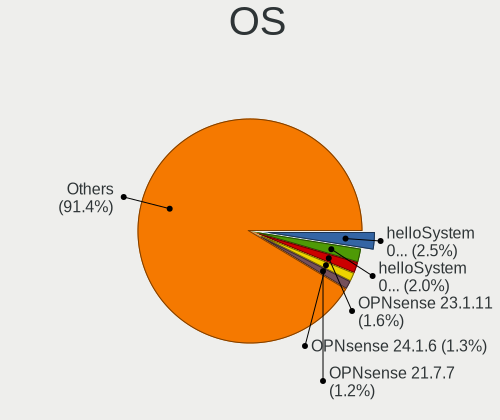
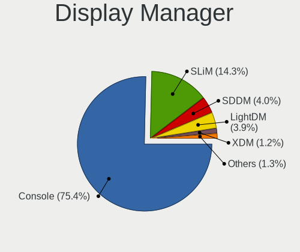

BSD - Tested Hardware & Statistics
----------------------------------

A project to collect tested hardware configurations for BSD.

Anyone can contribute to this report by the [hw-probe](https://github.com/linuxhw/hw-probe/blob/master/INSTALL.BSD.md) tool:

    hw-probe -all -upload

Please contribute! Especially if your hardware is rare.

This is a report for all computer types. See also reports for [desktops](/Desktop/README.md) and [notebooks](/Notebook/README.md).

OS-specific reports: [FreeBSD](/Dist/FreeBSD), [GhostBSD](/Dist/GhostBSD), [helloSystem](/Dist/helloSystem), [NetBSD](/Dist/NetBSD), [NomadBSD](/Dist/NomadBSD), [OpenBSD](/Dist/OpenBSD), [OPNsense](/Dist/OPNsense), [pfSense](/Dist/pfSense), [TrueNAS](/Dist/TrueNAS).

This report is for real hardware. Report for virtual hardware: [TestDays_VE](https://github.com/bsdhw/TestDays_VE)

Contents
--------

* [ Test Cases ](#test-cases)

* [ System ](#system)
  - [ OS                       ](#os)
  - [ OS Family                ](#os-family)
  - [ Arch                     ](#arch)
  - [ DE                       ](#de)
  - [ Display Server           ](#display-server)
  - [ Display Manager          ](#display-manager)
  - [ OS Lang                  ](#os-lang)
  - [ Boot Mode                ](#boot-mode)
  - [ Filesystem               ](#filesystem)
  - [ Part. scheme             ](#part-scheme)

* [ Board ](#board)
  - [ Vendor                   ](#vendor)
  - [ Model                    ](#model)
  - [ Model Family             ](#model-family)
  - [ MFG Year                 ](#mfg-year)
  - [ Form Factor              ](#form-factor)
  - [ Coreboot                 ](#coreboot)
  - [ RAM Size                 ](#ram-size)
  - [ RAM Used                 ](#ram-used)
  - [ Total Drives             ](#total-drives)
  - [ Has CD-ROM               ](#has-cd-rom)
  - [ Has Ethernet             ](#has-ethernet)
  - [ Has WiFi                 ](#has-wifi)
  - [ Has Bluetooth            ](#has-bluetooth)

* [ Location ](#location)
  - [ Country                  ](#country)
  - [ City                     ](#city)

* [ Drives ](#drives)
  - [ Drive Vendor             ](#drive-vendor)
  - [ Drive Model              ](#drive-model)
  - [ HDD Vendor               ](#hdd-vendor)
  - [ SSD Vendor               ](#ssd-vendor)
  - [ Drive Kind               ](#drive-kind)
  - [ Drive Connector          ](#drive-connector)
  - [ Drive Size               ](#drive-size)
  - [ Space Total              ](#space-total)
  - [ Space Used               ](#space-used)
  - [ Malfunc. Drives          ](#malfunc-drives)
  - [ Malfunc. Drive Vendor    ](#malfunc-drive-vendor)
  - [ Malfunc. HDD Vendor      ](#malfunc-hdd-vendor)
  - [ Malfunc. Drive Kind      ](#malfunc-drive-kind)
  - [ Failed Drives            ](#failed-drives)
  - [ Failed Drive Vendor      ](#failed-drive-vendor)
  - [ Drive Status             ](#drive-status)

* [ Storage controller ](#storage-controller)
  - [ Storage Vendor           ](#storage-vendor)
  - [ Storage Model            ](#storage-model)
  - [ Storage Kind             ](#storage-kind)

* [ Processor ](#processor)
  - [ CPU Vendor               ](#cpu-vendor)
  - [ CPU Model                ](#cpu-model)
  - [ CPU Model Family         ](#cpu-model-family)
  - [ CPU Cores                ](#cpu-cores)
  - [ CPU Sockets              ](#cpu-sockets)
  - [ CPU Threads              ](#cpu-threads)
  - [ CPU Microarch            ](#cpu-microarch)

* [ Graphics ](#graphics)
  - [ GPU Vendor               ](#gpu-vendor)
  - [ GPU Model                ](#gpu-model)
  - [ GPU Combo                ](#gpu-combo)
  - [ GPU Driver               ](#gpu-driver)
  - [ GPU Memory               ](#gpu-memory)

* [ Monitor ](#monitor)
  - [ Monitor Vendor           ](#monitor-vendor)
  - [ Monitor Model            ](#monitor-model)
  - [ Monitor Resolution       ](#monitor-resolution)
  - [ Monitor Diagonal         ](#monitor-diagonal)
  - [ Monitor Width            ](#monitor-width)
  - [ Aspect Ratio             ](#aspect-ratio)
  - [ Monitor Area             ](#monitor-area)
  - [ Pixel Density            ](#pixel-density)
  - [ Multiple Monitors        ](#multiple-monitors)

* [ Network ](#network)
  - [ Net Controller Vendor    ](#net-controller-vendor)
  - [ Net Controller Model     ](#net-controller-model)
  - [ Wireless Vendor          ](#wireless-vendor)
  - [ Wireless Model           ](#wireless-model)
  - [ Ethernet Vendor          ](#ethernet-vendor)
  - [ Ethernet Model           ](#ethernet-model)
  - [ Net Controller Kind      ](#net-controller-kind)
  - [ Used Controller          ](#used-controller)
  - [ NICs                     ](#nics)
  - [ IPv6                     ](#ipv6)

* [ Bluetooth ](#bluetooth)
  - [ Bluetooth Vendor         ](#bluetooth-vendor)
  - [ Bluetooth Model          ](#bluetooth-model)

* [ Sound ](#sound)
  - [ Sound Vendor             ](#sound-vendor)
  - [ Sound Model              ](#sound-model)

* [ Memory ](#memory)
  - [ Memory Vendor            ](#memory-vendor)
  - [ Memory Model             ](#memory-model)
  - [ Memory Kind              ](#memory-kind)
  - [ Memory Form Factor       ](#memory-form-factor)
  - [ Memory Size              ](#memory-size)
  - [ Memory Speed             ](#memory-speed)

* [ Printers & scanners ](#printers--scanners)
  - [ Printer Vendor           ](#printer-vendor)
  - [ Printer Model            ](#printer-model)
  - [ Scanner Vendor           ](#scanner-vendor)
  - [ Scanner Model            ](#scanner-model)

* [ Camera ](#camera)
  - [ Camera Vendor            ](#camera-vendor)
  - [ Camera Model             ](#camera-model)

* [ Security ](#security)
  - [ Fingerprint Vendor       ](#fingerprint-vendor)
  - [ Fingerprint Model        ](#fingerprint-model)
  - [ Chipcard Vendor          ](#chipcard-vendor)
  - [ Chipcard Model           ](#chipcard-model)

* [ Unsupported ](#unsupported)
  - [ Unsupported Devices      ](#unsupported-devices)
  - [ Unsupported Device Types ](#unsupported-device-types)

Test Cases
----------

Total: 16731

| Vendor        | Model                       | Form-Factor | Probe                                                     | Date         |
|---------------|-----------------------------|-------------|-----------------------------------------------------------|--------------|
| Intel         | S1200KP AAG34877-201        | Desktop     | [39eba90e6a](https://bsd-hardware.info/?probe=39eba90e6a) | Jun 10, 2023 |
| Dell          | Inspiron 3180               | Notebook    | [cb769078b4](https://bsd-hardware.info/?probe=cb769078b4) | Jun 10, 2023 |
| Dell          | Inspiron 5593               | Notebook    | [8bedc249ea](https://bsd-hardware.info/?probe=8bedc249ea) | Jun 10, 2023 |
| Dell          | Inspiron 7548               | Notebook    | [c80bb80e8f](https://bsd-hardware.info/?probe=c80bb80e8f) | Jun 10, 2023 |
| Gigabyte      | B450M S2H                   | Desktop     | [2008116e96](https://bsd-hardware.info/?probe=2008116e96) | Jun 10, 2023 |
| Unknown       | Unknown                     | Desktop     | [88a421e275](https://bsd-hardware.info/?probe=88a421e275) | Jun 10, 2023 |
| Lenovo        | B40-30 80F10002BR           | Notebook    | [769c678314](https://bsd-hardware.info/?probe=769c678314) | Jun 10, 2023 |
| Fujitsu       | D3313-A1 S26361-D3313-A1    | Desktop     | [fe412825f2](https://bsd-hardware.info/?probe=fe412825f2) | Jun 10, 2023 |
| Unknown       | Unknown                     | Desktop     | [40bb474319](https://bsd-hardware.info/?probe=40bb474319) | Jun 10, 2023 |
| AZW           | EQ                          | Desktop     | [f1f980d130](https://bsd-hardware.info/?probe=f1f980d130) | Jun 10, 2023 |
| AMI           | Aptio CRB                   | Mini pc     | [ffeca6e776](https://bsd-hardware.info/?probe=ffeca6e776) | Jun 10, 2023 |
| Lenovo        | ThinkPad T430 2347GR2       | Notebook    | [439e6a5034](https://bsd-hardware.info/?probe=439e6a5034) | Jun 10, 2023 |
| Gigabyte      | C1037UN                     | Desktop     | [d8f7cea73b](https://bsd-hardware.info/?probe=d8f7cea73b) | Jun 10, 2023 |
| MSI           | PRESTIGE X570 CREATION      | Desktop     | [7e0151a93f](https://bsd-hardware.info/?probe=7e0151a93f) | Jun 10, 2023 |
| Intel         | S1200KP AAG34877-201        | Desktop     | [ec04f3f6d5](https://bsd-hardware.info/?probe=ec04f3f6d5) | Jun 10, 2023 |
| Protectli     | FW4B Ver                    | Desktop     | [af56081a76](https://bsd-hardware.info/?probe=af56081a76) | Jun 10, 2023 |
| Protectli     | FW6 Ver                     | Desktop     | [6cc2f54681](https://bsd-hardware.info/?probe=6cc2f54681) | Jun 10, 2023 |
| Unknown       | Unknown                     | Notebook    | [9afa1aea18](https://bsd-hardware.info/?probe=9afa1aea18) | Jun 10, 2023 |
| AMI           | Aptio CRB                   | Mini pc     | [83e8a9252f](https://bsd-hardware.info/?probe=83e8a9252f) | Jun 09, 2023 |
| Lenovo        | ThinkBook 14 G4+ ARA 21D... | Notebook    | [27ba75252a](https://bsd-hardware.info/?probe=27ba75252a) | Jun 09, 2023 |
| ASRock        | B85M-HDS                    | Desktop     | [09a4700a14](https://bsd-hardware.info/?probe=09a4700a14) | Jun 09, 2023 |
| HP            | ProLiant DL360 Gen9         | Server      | [d21bdf0cdb](https://bsd-hardware.info/?probe=d21bdf0cdb) | Jun 09, 2023 |
| ASUSTek       | PRIME B760M-A D4            | Desktop     | [7d23d1c91f](https://bsd-hardware.info/?probe=7d23d1c91f) | Jun 09, 2023 |
| PC Engines    | APU2                        | Desktop     | [24545e8f90](https://bsd-hardware.info/?probe=24545e8f90) | Jun 09, 2023 |
| Dell          | 0YXT71 A02                  | Desktop     | [e42082ba89](https://bsd-hardware.info/?probe=e42082ba89) | Jun 09, 2023 |
| HP            | 82B4                        | Desktop     | [7fc20afdeb](https://bsd-hardware.info/?probe=7fc20afdeb) | Jun 08, 2023 |
| Wortmann      | terra Nettop 2700           | Desktop     | [e4a90ea530](https://bsd-hardware.info/?probe=e4a90ea530) | Jun 08, 2023 |
| Intel         | Q3XXG4-P V1.0               | Desktop     | [1ae49c4706](https://bsd-hardware.info/?probe=1ae49c4706) | Jun 08, 2023 |
| Sophos        | SG                          | Firewall    | [6cf087f800](https://bsd-hardware.info/?probe=6cf087f800) | Jun 08, 2023 |
| Sophos        | SG                          | Firewall    | [cde6f61458](https://bsd-hardware.info/?probe=cde6f61458) | Jun 08, 2023 |
| CWWK          | MINIPC-G12                  | Desktop     | [dbb8ffe645](https://bsd-hardware.info/?probe=dbb8ffe645) | Jun 08, 2023 |
| Dell          | 0X9X1W A00                  | Desktop     | [64825f4f71](https://bsd-hardware.info/?probe=64825f4f71) | Jun 08, 2023 |
| maiyunda      | www.maiyunda.com            | Desktop     | [7b43dea184](https://bsd-hardware.info/?probe=7b43dea184) | Jun 08, 2023 |
| Intel         | SKYBAY                      | Desktop     | [f1b649ed11](https://bsd-hardware.info/?probe=f1b649ed11) | Jun 08, 2023 |
| IceWhale T... | ZimaBoard 832 ZMB           | Desktop     | [15a71633ec](https://bsd-hardware.info/?probe=15a71633ec) | Jun 08, 2023 |
| ASUSTek       | P8Z68-V LE                  | Desktop     | [48833ba1a3](https://bsd-hardware.info/?probe=48833ba1a3) | Jun 08, 2023 |
| Techvision    | TVI7309X B0                 | Desktop     | [14ed4c80da](https://bsd-hardware.info/?probe=14ed4c80da) | Jun 08, 2023 |
| Dell          | 0X9X1W A00                  | Desktop     | [c9d8d9a491](https://bsd-hardware.info/?probe=c9d8d9a491) | Jun 08, 2023 |
| Dell          | 05XGC8 A00                  | Desktop     | [f79924e37b](https://bsd-hardware.info/?probe=f79924e37b) | Jun 08, 2023 |
| MSI           | MS-7360                     | Desktop     | [f54096f3e5](https://bsd-hardware.info/?probe=f54096f3e5) | Jun 08, 2023 |
| Lanner        | FW-7543 B-GA                | Desktop     | [ee85efd1c0](https://bsd-hardware.info/?probe=ee85efd1c0) | Jun 08, 2023 |
| PC Engines    | APU2                        | Desktop     | [f644f33061](https://bsd-hardware.info/?probe=f644f33061) | Jun 07, 2023 |
| Protectli     | VP2420                      | Desktop     | [45e550e09f](https://bsd-hardware.info/?probe=45e550e09f) | Jun 07, 2023 |
| LANCOM Sys... | UF-60                       | Desktop     | [204f10b60f](https://bsd-hardware.info/?probe=204f10b60f) | Jun 07, 2023 |
| Lenovo        | ThinkPad T480 20L6S5VP4C    | Notebook    | [b891388109](https://bsd-hardware.info/?probe=b891388109) | Jun 07, 2023 |
| ASUSTek       | M11AD                       | Desktop     | [7ffef5814d](https://bsd-hardware.info/?probe=7ffef5814d) | Jun 07, 2023 |
| ASUSTek       | 1015BX                      | Notebook    | [ad05aaf9fe](https://bsd-hardware.info/?probe=ad05aaf9fe) | Jun 07, 2023 |
| HP            | 18E7                        | Desktop     | [6daf82289e](https://bsd-hardware.info/?probe=6daf82289e) | Jun 07, 2023 |
| MW            | GMLK-2_5G4L                 | Desktop     | [54c23902c7](https://bsd-hardware.info/?probe=54c23902c7) | Jun 07, 2023 |
| Gigabyte      | G41MT-S2                    | Desktop     | [355202536f](https://bsd-hardware.info/?probe=355202536f) | Jun 07, 2023 |
| Deciso        | NetBoard-A20                | Notebook    | [0754642fe6](https://bsd-hardware.info/?probe=0754642fe6) | Jun 07, 2023 |
| Unknown       | Unknown                     | Notebook    | [422b9d51a7](https://bsd-hardware.info/?probe=422b9d51a7) | Jun 06, 2023 |
| Intel         | Q3XXG4-P V1.0               | Desktop     | [f0f13f5cea](https://bsd-hardware.info/?probe=f0f13f5cea) | Jun 06, 2023 |
| Pegatron      | 2AD5                        | Desktop     | [e50d3f9b86](https://bsd-hardware.info/?probe=e50d3f9b86) | Jun 06, 2023 |
| Intel         | Q3XXG4-P V1.0               | Desktop     | [4e57bbcdb5](https://bsd-hardware.info/?probe=4e57bbcdb5) | Jun 06, 2023 |
| CncTion       | N4100-4L                    | Desktop     | [68ccae3895](https://bsd-hardware.info/?probe=68ccae3895) | Jun 06, 2023 |
| Dell          | 0NC2VH A01                  | Desktop     | [0b9ad8d7d8](https://bsd-hardware.info/?probe=0b9ad8d7d8) | Jun 06, 2023 |
| AMI           | Aptio CRB                   | Mini pc     | [9fcd05daa7](https://bsd-hardware.info/?probe=9fcd05daa7) | Jun 06, 2023 |
| Dell          | Inspiron 5559               | Notebook    | [fe5f99c4b0](https://bsd-hardware.info/?probe=fe5f99c4b0) | Jun 06, 2023 |
| Lenovo        | ThinkPad E15 Gen 4 21EDC... | Notebook    | [9f18b1b304](https://bsd-hardware.info/?probe=9f18b1b304) | Jun 06, 2023 |
| Dell          | 04415J A00                  | Mini pc     | [eb7049ca10](https://bsd-hardware.info/?probe=eb7049ca10) | Jun 06, 2023 |
| HP            | 843F                        | Desktop     | [57b6c258ad](https://bsd-hardware.info/?probe=57b6c258ad) | Jun 06, 2023 |
| Lenovo        | ThinkPad T500 2082BNU       | Notebook    | [dedd066084](https://bsd-hardware.info/?probe=dedd066084) | Jun 06, 2023 |
| GuoGuang      | IC2M1028V-J                 | Desktop     | [ae2e2693e1](https://bsd-hardware.info/?probe=ae2e2693e1) | Jun 06, 2023 |
| Apple         | Mac-35C5E08120C7EEAF Mac... | Mini pc     | [5de35aa3bb](https://bsd-hardware.info/?probe=5de35aa3bb) | Jun 06, 2023 |
| Acer          | Aspire XC-1660G V:1.1       | Desktop     | [e07bfb044b](https://bsd-hardware.info/?probe=e07bfb044b) | Jun 06, 2023 |
| ASRock        | Z590 Pro4                   | Desktop     | [d04a63aa31](https://bsd-hardware.info/?probe=d04a63aa31) | Jun 06, 2023 |
| Lenovo        | ThinkPad E15 Gen 4 21EDC... | Notebook    | [85c18dbbb5](https://bsd-hardware.info/?probe=85c18dbbb5) | Jun 06, 2023 |
| Intel         | DENLOW_WS                   | Desktop     | [ce3bef7b5a](https://bsd-hardware.info/?probe=ce3bef7b5a) | Jun 06, 2023 |
| ASUSTek       | PRIME B550-PLUS             | Desktop     | [012b9ff742](https://bsd-hardware.info/?probe=012b9ff742) | Jun 05, 2023 |
| Soyo          | SY-YL B550M                 | Desktop     | [1d1138e3c5](https://bsd-hardware.info/?probe=1d1138e3c5) | Jun 05, 2023 |
| Soyo          | SY-YL B550M                 | Desktop     | [79c6c2a177](https://bsd-hardware.info/?probe=79c6c2a177) | Jun 05, 2023 |
| CncTion       | N6000-4L B0                 | Desktop     | [c9ec51aa84](https://bsd-hardware.info/?probe=c9ec51aa84) | Jun 05, 2023 |
| YANYU         | N39SL                       | Desktop     | [e487646fbf](https://bsd-hardware.info/?probe=e487646fbf) | Jun 05, 2023 |
| Apple         | Mac-35C5E08120C7EEAF Mac... | Mini pc     | [e32011137f](https://bsd-hardware.info/?probe=e32011137f) | Jun 05, 2023 |
| Lenovo        | IdeaPad Slim 9 14ITL5 82... | Notebook    | [03e1e6d302](https://bsd-hardware.info/?probe=03e1e6d302) | Jun 05, 2023 |
| Deciso        | Netboard A20                | Notebook    | [eb03ae7215](https://bsd-hardware.info/?probe=eb03ae7215) | Jun 05, 2023 |
| HP            | 3397                        | Desktop     | [6783902b93](https://bsd-hardware.info/?probe=6783902b93) | Jun 05, 2023 |
| Techvision    | TVI7309X B0                 | Desktop     | [16fe649f16](https://bsd-hardware.info/?probe=16fe649f16) | Jun 05, 2023 |
| HP            | 212B                        | Desktop     | [4db61072c4](https://bsd-hardware.info/?probe=4db61072c4) | Jun 05, 2023 |
| Toshiba       | Satellite C70-B             | Notebook    | [cf9ed85e65](https://bsd-hardware.info/?probe=cf9ed85e65) | Jun 05, 2023 |
| Toshiba       | Satellite C70-B             | Notebook    | [fc66ebba25](https://bsd-hardware.info/?probe=fc66ebba25) | Jun 05, 2023 |
| WlanCN        | 6000 Series                 | Desktop     | [d2e71531b6](https://bsd-hardware.info/?probe=d2e71531b6) | Jun 05, 2023 |
| Hardkernel    | ODROID-H3                   | Desktop     | [42e80f8003](https://bsd-hardware.info/?probe=42e80f8003) | Jun 05, 2023 |
| Unknown       | Unknown                     | Firewall    | [f971e964cd](https://bsd-hardware.info/?probe=f971e964cd) | Jun 05, 2023 |
| MW            | GMLK-2_5G4L                 | Desktop     | [e137b3e686](https://bsd-hardware.info/?probe=e137b3e686) | Jun 05, 2023 |
| HP            | 339A                        | Desktop     | [74f857c400](https://bsd-hardware.info/?probe=74f857c400) | Jun 05, 2023 |
| Apple         | Mac-35C5E08120C7EEAF Mac... | Mini pc     | [70fa6667b0](https://bsd-hardware.info/?probe=70fa6667b0) | Jun 05, 2023 |
| HP            | 1495                        | Desktop     | [a7a24624d7](https://bsd-hardware.info/?probe=a7a24624d7) | Jun 05, 2023 |
| Lenovo        | S10-3                       | Notebook    | [f874a66e78](https://bsd-hardware.info/?probe=f874a66e78) | Jun 05, 2023 |
| Lenovo        | S10-3                       | Notebook    | [b76483ab8b](https://bsd-hardware.info/?probe=b76483ab8b) | Jun 05, 2023 |
| Supermicro    | X10SL7-F                    | Server      | [7dbcaa598b](https://bsd-hardware.info/?probe=7dbcaa598b) | Jun 04, 2023 |
| HP            | 3398                        | Desktop     | [980c0fc5a8](https://bsd-hardware.info/?probe=980c0fc5a8) | Jun 04, 2023 |
| HP            | Pavilion Laptop 15-eh1xx... | Notebook    | [e1a7d29d74](https://bsd-hardware.info/?probe=e1a7d29d74) | Jun 04, 2023 |
| HP            | Pavilion Laptop 15-eh1xx... | Notebook    | [d0d9de7cf3](https://bsd-hardware.info/?probe=d0d9de7cf3) | Jun 04, 2023 |
| Sophos        | UTM                         | Firewall    | [05ee8903b5](https://bsd-hardware.info/?probe=05ee8903b5) | Jun 04, 2023 |
| Deciso        | NetBoard-A10                | Notebook    | [ab3919bc32](https://bsd-hardware.info/?probe=ab3919bc32) | Jun 04, 2023 |
| Fujitsu       | D3313-A1 S26361-D3313-A1    | Desktop     | [bb5ee3d3fb](https://bsd-hardware.info/?probe=bb5ee3d3fb) | Jun 04, 2023 |
| Dell          | 0PC5F7 A03                  | Desktop     | [23bd5ef252](https://bsd-hardware.info/?probe=23bd5ef252) | Jun 04, 2023 |
| Fujitsu       | D3313-A1 S26361-D3313-A1    | Desktop     | [95ceb1335c](https://bsd-hardware.info/?probe=95ceb1335c) | Jun 04, 2023 |
| Intel         | SKYBAY                      | Desktop     | [afe36b0540](https://bsd-hardware.info/?probe=afe36b0540) | Jun 04, 2023 |
| MSI           | H81M-P33                    | Desktop     | [88598bfbf5](https://bsd-hardware.info/?probe=88598bfbf5) | Jun 04, 2023 |
| ASUSTek       | P5Q-E                       | Desktop     | [fac0ed387e](https://bsd-hardware.info/?probe=fac0ed387e) | Jun 04, 2023 |
| ASUSTek       | ROG CROSSHAIR VIII HERO     | Desktop     | [3c76deca15](https://bsd-hardware.info/?probe=3c76deca15) | Jun 04, 2023 |
| HP            | 802E                        | Desktop     | [2af6f8a101](https://bsd-hardware.info/?probe=2af6f8a101) | Jun 04, 2023 |
| Acer          | Aspire XC-1660G V:1.1       | Desktop     | [cf05481728](https://bsd-hardware.info/?probe=cf05481728) | Jun 04, 2023 |
| Intel         | NUC10i7FNB M38062-307       | Mini pc     | [b8b790ffd8](https://bsd-hardware.info/?probe=b8b790ffd8) | Jun 04, 2023 |
| Lenovo        | B590 20208                  | Notebook    | [dc65d735c8](https://bsd-hardware.info/?probe=dc65d735c8) | Jun 04, 2023 |
| Unknown       | Unknown                     | Notebook    | [a243045cc3](https://bsd-hardware.info/?probe=a243045cc3) | Jun 04, 2023 |
| Protectli     | FW4B Ver                    | Desktop     | [5fc38b17d3](https://bsd-hardware.info/?probe=5fc38b17d3) | Jun 04, 2023 |
| ASRock        | Z590 Pro4                   | Desktop     | [314d462dcd](https://bsd-hardware.info/?probe=314d462dcd) | Jun 04, 2023 |
| Acer          | Aspire TC-230               | Desktop     | [d7eacfafe1](https://bsd-hardware.info/?probe=d7eacfafe1) | Jun 04, 2023 |
| HP            | 805A                        | Desktop     | [3ad8551330](https://bsd-hardware.info/?probe=3ad8551330) | Jun 04, 2023 |
| BESSTAR Te... | GB7                         | Mini pc     | [22b95ae10b](https://bsd-hardware.info/?probe=22b95ae10b) | Jun 04, 2023 |
| Protectli     | FW4B Ver                    | Desktop     | [0f5b2ad316](https://bsd-hardware.info/?probe=0f5b2ad316) | Jun 03, 2023 |
| HP            | 18E7                        | Desktop     | [4ca0d96863](https://bsd-hardware.info/?probe=4ca0d96863) | Jun 03, 2023 |
| Fujitsu       | D3313-A1 S26361-D3313-A1    | Desktop     | [56a9981ff3](https://bsd-hardware.info/?probe=56a9981ff3) | Jun 03, 2023 |
| Unknown       | Unknown                     | Desktop     | [ffb4544d8c](https://bsd-hardware.info/?probe=ffb4544d8c) | Jun 03, 2023 |
| Dell          | 0TKM9Y A00                  | Mini pc     | [fdd78a8f45](https://bsd-hardware.info/?probe=fdd78a8f45) | Jun 03, 2023 |
| Dell          | 0WR7PY A03                  | Desktop     | [c8496622be](https://bsd-hardware.info/?probe=c8496622be) | Jun 03, 2023 |
| Dell          | 0WR7PY A03                  | Desktop     | [b9f7e3e209](https://bsd-hardware.info/?probe=b9f7e3e209) | Jun 03, 2023 |
| Intel         | JSL MRD                     | Desktop     | [f4606f2c25](https://bsd-hardware.info/?probe=f4606f2c25) | Jun 03, 2023 |
| Intel         | JSL MRD                     | Desktop     | [3d5e12d1cf](https://bsd-hardware.info/?probe=3d5e12d1cf) | Jun 03, 2023 |
| Protectli     | FW6 Ver                     | Desktop     | [a42fcbbc12](https://bsd-hardware.info/?probe=a42fcbbc12) | Jun 03, 2023 |
| ASUSTek       | PRIME X399-A                | Desktop     | [16dd6af1a9](https://bsd-hardware.info/?probe=16dd6af1a9) | Jun 03, 2023 |
| Dell          | 08NPPY A00                  | Desktop     | [538e16bf08](https://bsd-hardware.info/?probe=538e16bf08) | Jun 03, 2023 |
| Dell          | G5 5505                     | Notebook    | [5a3c1f19a0](https://bsd-hardware.info/?probe=5a3c1f19a0) | Jun 03, 2023 |
| Lenovo        | ThinkPad X240 20AMS0250T    | Notebook    | [047c7b72b4](https://bsd-hardware.info/?probe=047c7b72b4) | Jun 02, 2023 |
| Dell          | 05XGC8 A00                  | Desktop     | [98ebd3efdb](https://bsd-hardware.info/?probe=98ebd3efdb) | Jun 02, 2023 |
| AAEON         | FWS-2360 V1.0               | Desktop     | [bcb707d6d0](https://bsd-hardware.info/?probe=bcb707d6d0) | Jun 02, 2023 |
| Unknown       | Unknown                     | Desktop     | [2702f3486a](https://bsd-hardware.info/?probe=2702f3486a) | Jun 02, 2023 |
| ASRockRack    | X570D4U-2L2T                | Desktop     | [4cada5d71b](https://bsd-hardware.info/?probe=4cada5d71b) | Jun 02, 2023 |
| Unknown       | Unknown                     | Desktop     | [09b74995b7](https://bsd-hardware.info/?probe=09b74995b7) | Jun 02, 2023 |
| Supermicro    | X9SCL/X9SCMA                | Desktop     | [2348a2736e](https://bsd-hardware.info/?probe=2348a2736e) | Jun 02, 2023 |
| Gigabyte      | Z77N-WIFI                   | Desktop     | [c1c30d3223](https://bsd-hardware.info/?probe=c1c30d3223) | Jun 02, 2023 |
| Techvision    | TVI7309X B0                 | Desktop     | [5be94420c2](https://bsd-hardware.info/?probe=5be94420c2) | Jun 02, 2023 |
| Lenovo        | 30D2 SDK0J40697 WIN 3305... | Desktop     | [d4247f35c8](https://bsd-hardware.info/?probe=d4247f35c8) | Jun 02, 2023 |
| PC Engines    | APU2                        | Desktop     | [31c697459b](https://bsd-hardware.info/?probe=31c697459b) | Jun 02, 2023 |
| Panasonic     | CF-NX1GDHYS                 | Notebook    | [fb1f293997](https://bsd-hardware.info/?probe=fb1f293997) | Jun 02, 2023 |
| Deciso        | NetBoard-A20                | Notebook    | [48a63a2328](https://bsd-hardware.info/?probe=48a63a2328) | Jun 02, 2023 |
| Unknown       | Unknown                     | Desktop     | [a3bc187a6b](https://bsd-hardware.info/?probe=a3bc187a6b) | Jun 02, 2023 |
| Dell          | G5 5505                     | Notebook    | [1b10aecc38](https://bsd-hardware.info/?probe=1b10aecc38) | Jun 02, 2023 |
| HP            | 805A                        | Desktop     | [b50fd38c94](https://bsd-hardware.info/?probe=b50fd38c94) | Jun 01, 2023 |
| ASUSTek       | P8H61-M LE R2.0             | Desktop     | [d7f48dc5e3](https://bsd-hardware.info/?probe=d7f48dc5e3) | Jun 01, 2023 |
| Advantech     | FWA-1320 A103               | Server      | [0b78bc1741](https://bsd-hardware.info/?probe=0b78bc1741) | Jun 01, 2023 |
| Intel         | Q3XXG4-P V1.0               | Desktop     | [ef66603fb9](https://bsd-hardware.info/?probe=ef66603fb9) | Jun 01, 2023 |
| HP            | EliteBook 8570p             | Notebook    | [22572f1df6](https://bsd-hardware.info/?probe=22572f1df6) | Jun 01, 2023 |
| ASRock        | FM2A78M-ITX+                | Desktop     | [aecc8b1372](https://bsd-hardware.info/?probe=aecc8b1372) | Jun 01, 2023 |
| ASUSTek       | P8H61-M LE R2.0             | Desktop     | [3eebac6c6a](https://bsd-hardware.info/?probe=3eebac6c6a) | Jun 01, 2023 |
| Gigabyte      | Z77N-WIFI                   | Desktop     | [45cb709a24](https://bsd-hardware.info/?probe=45cb709a24) | Jun 01, 2023 |
| ASRock        | H470M-ITX/ac                | Desktop     | [50b2ac1b5f](https://bsd-hardware.info/?probe=50b2ac1b5f) | Jun 01, 2023 |
| Unknown       | Unknown                     | Desktop     | [b3bbf99641](https://bsd-hardware.info/?probe=b3bbf99641) | Jun 01, 2023 |
| Dell          | 05XGC8 A01                  | Desktop     | [c40e01cab3](https://bsd-hardware.info/?probe=c40e01cab3) | Jun 01, 2023 |
| Dell          | Inspiron 5559               | Notebook    | [330c08c388](https://bsd-hardware.info/?probe=330c08c388) | Jun 01, 2023 |
| Dell          | Inspiron 5559               | Notebook    | [53cf3cea13](https://bsd-hardware.info/?probe=53cf3cea13) | Jun 01, 2023 |
| Lenovo        | ThinkPad E495 20NE000BSP    | Notebook    | [0e02b323ee](https://bsd-hardware.info/?probe=0e02b323ee) | Jun 01, 2023 |
| Dell          | 00V62H A01                  | Desktop     | [a87429607b](https://bsd-hardware.info/?probe=a87429607b) | Jun 01, 2023 |
| Intel         | JSL MRD                     | Desktop     | [df234921d7](https://bsd-hardware.info/?probe=df234921d7) | Jun 01, 2023 |
| Unknown       | Unknown                     | Desktop     | [e4b5670ca7](https://bsd-hardware.info/?probe=e4b5670ca7) | Jun 01, 2023 |
| HP            | ProLiant DL360 Gen9         | Server      | [a11ca8795e](https://bsd-hardware.info/?probe=a11ca8795e) | Jun 01, 2023 |
| Lenovo        | ThinkServer TS140           | Desktop     | [baf926fc3d](https://bsd-hardware.info/?probe=baf926fc3d) | Jun 01, 2023 |
| PC Engines    | apu4                        | Desktop     | [f130ecbaa3](https://bsd-hardware.info/?probe=f130ecbaa3) | Jun 01, 2023 |
| Techvision    | TVI7309X B0                 | Desktop     | [682af498d7](https://bsd-hardware.info/?probe=682af498d7) | May 31, 2023 |
| HP            | 8299                        | Desktop     | [80dd7dadf4](https://bsd-hardware.info/?probe=80dd7dadf4) | May 31, 2023 |
| Lenovo        | ThinkPad T15p Gen 3 21DA... | Notebook    | [8cc6299ba9](https://bsd-hardware.info/?probe=8cc6299ba9) | May 31, 2023 |
| ASRockRack    | EPYC3101D4I-2T              | Desktop     | [2445651c96](https://bsd-hardware.info/?probe=2445651c96) | May 31, 2023 |
| Acer          | Aspire XC-1660G V:1.1       | Desktop     | [8b0669a87d](https://bsd-hardware.info/?probe=8b0669a87d) | May 31, 2023 |
| Techvision    | TVI7309X B0                 | Desktop     | [ed0c6cf73c](https://bsd-hardware.info/?probe=ed0c6cf73c) | May 31, 2023 |
| Supermicro    | X10DRi-T                    | Desktop     | [c72eaa89d7](https://bsd-hardware.info/?probe=c72eaa89d7) | May 31, 2023 |
| HP            | 802E                        | Desktop     | [2b1f2776cd](https://bsd-hardware.info/?probe=2b1f2776cd) | May 31, 2023 |
| Intel         | QHSW02                      | Desktop     | [ed6d01bc2b](https://bsd-hardware.info/?probe=ed6d01bc2b) | May 31, 2023 |
| HP            | 212B                        | Desktop     | [4623e0c5b4](https://bsd-hardware.info/?probe=4623e0c5b4) | May 31, 2023 |
| Lenovo        | ThinkPad X270 20HMCTO1WW    | Notebook    | [b5f507c034](https://bsd-hardware.info/?probe=b5f507c034) | May 31, 2023 |
| Gigabyte      | C1037UN                     | Desktop     | [7502577edc](https://bsd-hardware.info/?probe=7502577edc) | May 31, 2023 |
| CWWK          | CW-AD4L-N V1                | Desktop     | [d5a2882e49](https://bsd-hardware.info/?probe=d5a2882e49) | May 31, 2023 |
| Intel         | QHSW02                      | Desktop     | [9f3d95a494](https://bsd-hardware.info/?probe=9f3d95a494) | May 31, 2023 |
| GuoGuang      | IC2M1028V-J                 | Desktop     | [f6dd08d6d0](https://bsd-hardware.info/?probe=f6dd08d6d0) | May 31, 2023 |
| Unknown       | Unknown                     | Desktop     | [f6643f3b06](https://bsd-hardware.info/?probe=f6643f3b06) | May 31, 2023 |
| Unknown       | Unknown                     | Desktop     | [13c80903b5](https://bsd-hardware.info/?probe=13c80903b5) | May 31, 2023 |
| Fujitsu       | D3313-G1 S26361-D3313-G1    | Desktop     | [c7f2f78173](https://bsd-hardware.info/?probe=c7f2f78173) | May 31, 2023 |
| Fujitsu       | D3313-A1 S26361-D3313-A1    | Desktop     | [073e2870cd](https://bsd-hardware.info/?probe=073e2870cd) | May 30, 2023 |
| Supermicro    | X10SDV-4C-TLN2F             | Server      | [d186c4c443](https://bsd-hardware.info/?probe=d186c4c443) | May 30, 2023 |
| Gigabyte      | C1037UN                     | Desktop     | [79e0162b9c](https://bsd-hardware.info/?probe=79e0162b9c) | May 30, 2023 |
| MW            | GMLK-2_5G4L                 | Desktop     | [b560671947](https://bsd-hardware.info/?probe=b560671947) | May 30, 2023 |
| HP            | ProLiant DL360p Gen8        | Server      | [300b958d60](https://bsd-hardware.info/?probe=300b958d60) | May 30, 2023 |
| HP            | 3031h                       | Desktop     | [5454d331f2](https://bsd-hardware.info/?probe=5454d331f2) | May 30, 2023 |
| Lenovo        | 3102 SDK0J40697 WIN 3305... | Desktop     | [d35bf58882](https://bsd-hardware.info/?probe=d35bf58882) | May 30, 2023 |
| HP            | Pavilion Notebook           | Notebook    | [1bb0436fe5](https://bsd-hardware.info/?probe=1bb0436fe5) | May 30, 2023 |
| Protectli     | FW4B Ver                    | Desktop     | [1587da94da](https://bsd-hardware.info/?probe=1587da94da) | May 30, 2023 |
| Apple         | Mac-35C5E08120C7EEAF Mac... | Mini pc     | [e968a467d5](https://bsd-hardware.info/?probe=e968a467d5) | May 30, 2023 |
| Intel         | S1200KP AAG34877-201        | Desktop     | [b264e962d0](https://bsd-hardware.info/?probe=b264e962d0) | May 30, 2023 |
| Dell          | 00V62H A01                  | Desktop     | [7d2e30807a](https://bsd-hardware.info/?probe=7d2e30807a) | May 30, 2023 |
| Unknown       | Unknown                     | Desktop     | [086747eef4](https://bsd-hardware.info/?probe=086747eef4) | May 29, 2023 |
| Protectli     | FW6 Ver                     | Desktop     | [21bad05407](https://bsd-hardware.info/?probe=21bad05407) | May 29, 2023 |
| Dell          | 0GXM1W A01                  | Desktop     | [c9959faf54](https://bsd-hardware.info/?probe=c9959faf54) | May 29, 2023 |
| ASRock        | Z590 Pro4                   | Desktop     | [a9b9a2e045](https://bsd-hardware.info/?probe=a9b9a2e045) | May 29, 2023 |
| HP            | 3397                        | Desktop     | [1f8a9a4f27](https://bsd-hardware.info/?probe=1f8a9a4f27) | May 29, 2023 |
| Acer          | EG43M                       | Desktop     | [d58b8c242d](https://bsd-hardware.info/?probe=d58b8c242d) | May 29, 2023 |
| Intel         | SKYBAY                      | Desktop     | [86747c5b22](https://bsd-hardware.info/?probe=86747c5b22) | May 29, 2023 |
| Unknown       | Unknown                     | Firewall    | [0183a5030d](https://bsd-hardware.info/?probe=0183a5030d) | May 29, 2023 |
| Intel         | H81                         | Desktop     | [e0e15704fc](https://bsd-hardware.info/?probe=e0e15704fc) | May 29, 2023 |
| ASRock        | H410M/ac                    | Desktop     | [d3e3d20cc4](https://bsd-hardware.info/?probe=d3e3d20cc4) | May 29, 2023 |
| IGEL Techn... | H830C                       | Notebook    | [01e377524a](https://bsd-hardware.info/?probe=01e377524a) | May 29, 2023 |
| Unknown       | iKoolCore R1 iKoolCore R... | Desktop     | [a12b5d1715](https://bsd-hardware.info/?probe=a12b5d1715) | May 29, 2023 |
| Apple         | MacBookPro10,2              | Notebook    | [c274e2c9db](https://bsd-hardware.info/?probe=c274e2c9db) | May 29, 2023 |
| Intel         | JSL MRD                     | Desktop     | [61f2c83020](https://bsd-hardware.info/?probe=61f2c83020) | May 29, 2023 |
| AMI           | IBDR V109                   | Desktop     | [e825f7640e](https://bsd-hardware.info/?probe=e825f7640e) | May 29, 2023 |
| Unknown       | Unknown                     | Desktop     | [e057606b14](https://bsd-hardware.info/?probe=e057606b14) | May 29, 2023 |
| ASRockRack    | E3C242D4U                   | Desktop     | [ae8287e8fd](https://bsd-hardware.info/?probe=ae8287e8fd) | May 29, 2023 |
| ASRock        | Z590 Pro4                   | Desktop     | [e63f1f4874](https://bsd-hardware.info/?probe=e63f1f4874) | May 29, 2023 |
| ASRock        | Z590 Pro4                   | Desktop     | [382fe30ec1](https://bsd-hardware.info/?probe=382fe30ec1) | May 28, 2023 |
| ASRockRack    | X470D4U2-2T                 | Desktop     | [2827d90215](https://bsd-hardware.info/?probe=2827d90215) | May 28, 2023 |
| HP            | 82B4                        | Desktop     | [e295491b8b](https://bsd-hardware.info/?probe=e295491b8b) | May 28, 2023 |
| Apple         | Mac-35C5E08120C7EEAF Mac... | Mini pc     | [a9f82c093e](https://bsd-hardware.info/?probe=a9f82c093e) | May 28, 2023 |
| NU591R        | 1.0                         | Desktop     | [e4bdd753d1](https://bsd-hardware.info/?probe=e4bdd753d1) | May 28, 2023 |
| Dell          | System XPS L702X            | Notebook    | [f56d7090f9](https://bsd-hardware.info/?probe=f56d7090f9) | May 28, 2023 |
| Gigabyte      | H170-D3HP-CF                | Desktop     | [d5fdf2ff2c](https://bsd-hardware.info/?probe=d5fdf2ff2c) | May 28, 2023 |
| Sophos        | SG                          | Firewall    | [2cae094f95](https://bsd-hardware.info/?probe=2cae094f95) | May 28, 2023 |
| Lenovo        | ThinkPad X13 Gen 1 20UGS... | Notebook    | [6701dce30e](https://bsd-hardware.info/?probe=6701dce30e) | May 28, 2023 |
| Dell          | Inspiron 5559               | Notebook    | [23cad3f06e](https://bsd-hardware.info/?probe=23cad3f06e) | May 28, 2023 |
| Intel         | JSL MRD                     | Desktop     | [6fa703d206](https://bsd-hardware.info/?probe=6fa703d206) | May 28, 2023 |
| ASUSTek       | ROG CROSSHAIR VIII HERO     | Desktop     | [28c84f71fd](https://bsd-hardware.info/?probe=28c84f71fd) | May 28, 2023 |
| ASUSTek       | P5Q-E                       | Desktop     | [cf8b2af78b](https://bsd-hardware.info/?probe=cf8b2af78b) | May 28, 2023 |
| HP            | 21D0                        | Desktop     | [4a10865d28](https://bsd-hardware.info/?probe=4a10865d28) | May 28, 2023 |
| HP            | 21D0                        | Desktop     | [e3d20826b3](https://bsd-hardware.info/?probe=e3d20826b3) | May 28, 2023 |
| Deciso        | OPNsense Appliance          | Notebook    | [c47f62b522](https://bsd-hardware.info/?probe=c47f62b522) | May 28, 2023 |
| Intel         | JSL MRD                     | Desktop     | [fc7970abd1](https://bsd-hardware.info/?probe=fc7970abd1) | May 28, 2023 |
| Dell          | 0HD5W2 A00                  | Desktop     | [bd3ea7e1d6](https://bsd-hardware.info/?probe=bd3ea7e1d6) | May 28, 2023 |
| Google        | Teemo                       | Desktop     | [f90a40bad7](https://bsd-hardware.info/?probe=f90a40bad7) | May 28, 2023 |
| PC Engines    | APU2                        | Desktop     | [4c27451012](https://bsd-hardware.info/?probe=4c27451012) | May 28, 2023 |
| PC Engines    | APU2                        | Desktop     | [6b276a70c5](https://bsd-hardware.info/?probe=6b276a70c5) | May 28, 2023 |
| Unknown       | Unknown                     | Desktop     | [c1854cc5f2](https://bsd-hardware.info/?probe=c1854cc5f2) | May 27, 2023 |
| Unknown       | iKoolCore R1 iKoolCore R... | Desktop     | [3560dcfedc](https://bsd-hardware.info/?probe=3560dcfedc) | May 27, 2023 |
| Unknown       | iKoolCore R1 iKoolCore R... | Desktop     | [2caaa9f6cf](https://bsd-hardware.info/?probe=2caaa9f6cf) | May 27, 2023 |
| Fujitsu       | Unknown                     | Notebook    | [3b5c9ab914](https://bsd-hardware.info/?probe=3b5c9ab914) | May 27, 2023 |
| Toshiba       | NB250                       | Notebook    | [62c572e895](https://bsd-hardware.info/?probe=62c572e895) | May 27, 2023 |
| ASRock        | H270M-ITX/ac                | Desktop     | [69aaebd77e](https://bsd-hardware.info/?probe=69aaebd77e) | May 27, 2023 |
| Dell          | 0GDG8Y A02                  | Desktop     | [fc6906c72a](https://bsd-hardware.info/?probe=fc6906c72a) | May 27, 2023 |
| CWWK          | MINIPC-G12                  | Desktop     | [6b6914e2fa](https://bsd-hardware.info/?probe=6b6914e2fa) | May 27, 2023 |
| Gigabyte      | X58A-UD3R                   | Desktop     | [1d43f61471](https://bsd-hardware.info/?probe=1d43f61471) | May 27, 2023 |
| Lenovo        | ThinkPad P14s Gen 1 20S4... | Notebook    | [3944241750](https://bsd-hardware.info/?probe=3944241750) | May 27, 2023 |
| Tactus        | GeoFlex 110                 | Notebook    | [df93ad7e83](https://bsd-hardware.info/?probe=df93ad7e83) | May 27, 2023 |
| Axiomtek      | NA362-DAMI-c3768-US         | Desktop     | [243efb73f6](https://bsd-hardware.info/?probe=243efb73f6) | May 27, 2023 |
| HP            | 3397                        | Desktop     | [036d4e087c](https://bsd-hardware.info/?probe=036d4e087c) | May 27, 2023 |
| Intel         | J1900                       | Desktop     | [4d849f4f34](https://bsd-hardware.info/?probe=4d849f4f34) | May 27, 2023 |
| HP            | 3397                        | Desktop     | [19abd8768e](https://bsd-hardware.info/?probe=19abd8768e) | May 27, 2023 |
| Unknown       | Unknown                     | Desktop     | [88e6cd10c6](https://bsd-hardware.info/?probe=88e6cd10c6) | May 27, 2023 |
| HP            | EliteBook 8570p             | Notebook    | [65376d6b42](https://bsd-hardware.info/?probe=65376d6b42) | May 27, 2023 |
| Unknown       | Unknown                     | Desktop     | [0918049f45](https://bsd-hardware.info/?probe=0918049f45) | May 27, 2023 |
| HP            | ProLiant DL360 G5           | Server      | [d8496263d4](https://bsd-hardware.info/?probe=d8496263d4) | May 27, 2023 |
| Protectli     | FW4B                        | Desktop     | [c5c9276f48](https://bsd-hardware.info/?probe=c5c9276f48) | May 27, 2023 |
| Intel         | S1200KP AAG34877-201        | Desktop     | [5bf84ec376](https://bsd-hardware.info/?probe=5bf84ec376) | May 27, 2023 |
| Protectli     | FW6                         | Desktop     | [f7626db73e](https://bsd-hardware.info/?probe=f7626db73e) | May 27, 2023 |
| ASUSTek       | Z97-E/USB                   | Desktop     | [dbda738a56](https://bsd-hardware.info/?probe=dbda738a56) | May 27, 2023 |
| Dell          | 051FJ8 A02                  | Desktop     | [d0d211e4e7](https://bsd-hardware.info/?probe=d0d211e4e7) | May 27, 2023 |
| ChangWang     | CW56-58                     | Desktop     | [b6b902639c](https://bsd-hardware.info/?probe=b6b902639c) | May 27, 2023 |
| Dell          | 051FJ8 A02                  | Desktop     | [8ba976666f](https://bsd-hardware.info/?probe=8ba976666f) | May 27, 2023 |
| Unknown       | Unknown                     | Desktop     | [e80a97aec3](https://bsd-hardware.info/?probe=e80a97aec3) | May 27, 2023 |
| Unknown       | 1.0                         | Desktop     | [12d6c7934e](https://bsd-hardware.info/?probe=12d6c7934e) | May 27, 2023 |
| Lenovo        | 30D0 SDK0J40705 WIN 3425... | Desktop     | [8514299fe4](https://bsd-hardware.info/?probe=8514299fe4) | May 26, 2023 |
| YENTEK        | R250                        | Desktop     | [33ba1ec16a](https://bsd-hardware.info/?probe=33ba1ec16a) | May 26, 2023 |
| ASUSTek       | PRIME H510M-K               | Desktop     | [53a2d5356d](https://bsd-hardware.info/?probe=53a2d5356d) | May 26, 2023 |
| Dell          | 05XGC8 A00                  | Desktop     | [b121b2cba9](https://bsd-hardware.info/?probe=b121b2cba9) | May 26, 2023 |
| Acer          | Nitro AN515-42              | Notebook    | [adc687fcfe](https://bsd-hardware.info/?probe=adc687fcfe) | May 26, 2023 |
| HP            | x360 310 G2 PC              | Convertible | [05bd720b57](https://bsd-hardware.info/?probe=05bd720b57) | May 26, 2023 |
| Fujitsu       | D3313-A1 S26361-D3313-A1    | Desktop     | [d08f309c4c](https://bsd-hardware.info/?probe=d08f309c4c) | May 26, 2023 |
| Unknown       | Unknown                     | Desktop     | [1070ff80a8](https://bsd-hardware.info/?probe=1070ff80a8) | May 26, 2023 |
| CWWK          | CW-AD4L-N V1                | Desktop     | [310da4e6e5](https://bsd-hardware.info/?probe=310da4e6e5) | May 26, 2023 |
| Dell          | 096JG8 A01                  | Desktop     | [f350405f61](https://bsd-hardware.info/?probe=f350405f61) | May 26, 2023 |
| Lenovo        | 36C5 SDK0L77767 WIN 3423... | Desktop     | [a19f434ae4](https://bsd-hardware.info/?probe=a19f434ae4) | May 26, 2023 |
| HP            | 18E7                        | Desktop     | [5ab1548fe9](https://bsd-hardware.info/?probe=5ab1548fe9) | May 26, 2023 |
| Supermicro    | X9SCL/X9SCMA                | Desktop     | [19c6226530](https://bsd-hardware.info/?probe=19c6226530) | May 26, 2023 |
| Supermicro    | X10SDV-4C-TLN2F             | Server      | [acdcef4b1c](https://bsd-hardware.info/?probe=acdcef4b1c) | May 26, 2023 |
| ASRockRack    | GENOAD8UD-2T/X550           | Desktop     | [c6b62c6b5b](https://bsd-hardware.info/?probe=c6b62c6b5b) | May 26, 2023 |
| ASRock        | X570 Phantom Gaming 4       | Desktop     | [81775d5ca1](https://bsd-hardware.info/?probe=81775d5ca1) | May 26, 2023 |
| Protectli     | VP2420                      | Desktop     | [2b716b3dd3](https://bsd-hardware.info/?probe=2b716b3dd3) | May 26, 2023 |
| Unknown       | Unknown                     | Desktop     | [6ec9e0f7ab](https://bsd-hardware.info/?probe=6ec9e0f7ab) | May 25, 2023 |
| ShenZhen M... | 3865U-6L                    | Desktop     | [5733ad3c03](https://bsd-hardware.info/?probe=5733ad3c03) | May 25, 2023 |
| Intel         | Q3XXG4-P V1.0               | Desktop     | [9160d45441](https://bsd-hardware.info/?probe=9160d45441) | May 25, 2023 |
| Lenovo        | ThinkPad X140e 20BMS03E0... | Notebook    | [580c52399f](https://bsd-hardware.info/?probe=580c52399f) | May 25, 2023 |
| CompuLab      | fitlet2                     | Mini pc     | [629ee32349](https://bsd-hardware.info/?probe=629ee32349) | May 25, 2023 |
| Dell          | 0GXM1W A01                  | Desktop     | [364d24b4f4](https://bsd-hardware.info/?probe=364d24b4f4) | May 25, 2023 |
| Gigabyte      | B360M D2V                   | Desktop     | [5960982eb3](https://bsd-hardware.info/?probe=5960982eb3) | May 25, 2023 |
| Protectli     | FW4B Ver                    | Desktop     | [90b4ae806f](https://bsd-hardware.info/?probe=90b4ae806f) | May 25, 2023 |
| NORCO         | HB133                       | Desktop     | [1d59c53b9b](https://bsd-hardware.info/?probe=1d59c53b9b) | May 25, 2023 |
| Intel         | S1200RP                     | Server      | [f3143ec0e1](https://bsd-hardware.info/?probe=f3143ec0e1) | May 25, 2023 |
| Deciso        | NetBoard-A20                | Notebook    | [0c5fd49340](https://bsd-hardware.info/?probe=0c5fd49340) | May 25, 2023 |
| Lenovo        | Yoga 2 Pro 20266            | Notebook    | [a2726e621b](https://bsd-hardware.info/?probe=a2726e621b) | May 25, 2023 |
| Timi          | TM1701                      | Notebook    | [1dd768a721](https://bsd-hardware.info/?probe=1dd768a721) | May 25, 2023 |
| ASUSTek       | PRIME B460M-A               | Desktop     | [8f22385ff1](https://bsd-hardware.info/?probe=8f22385ff1) | May 25, 2023 |
| Acer          | Nitro AN515-57              | Notebook    | [c39ea00de5](https://bsd-hardware.info/?probe=c39ea00de5) | May 25, 2023 |
| ASRock        | E3C224D2I                   | Desktop     | [57353597b3](https://bsd-hardware.info/?probe=57353597b3) | May 25, 2023 |
| Dell          | 0GXM1W A01                  | Desktop     | [afa4b1b0df](https://bsd-hardware.info/?probe=afa4b1b0df) | May 25, 2023 |
| Dell          | System XPS L702X            | Notebook    | [857016be75](https://bsd-hardware.info/?probe=857016be75) | May 24, 2023 |
| Supermicro    | M11SDV-8C-LN4F              | Server      | [3797f9d0a9](https://bsd-hardware.info/?probe=3797f9d0a9) | May 24, 2023 |
| HP            | 8299                        | Desktop     | [14a7b5fc70](https://bsd-hardware.info/?probe=14a7b5fc70) | May 24, 2023 |
| Lenovo        | ThinkPad T430 2347CTO       | Notebook    | [68937b1686](https://bsd-hardware.info/?probe=68937b1686) | May 24, 2023 |
| AMI           | Aptio CRB                   | Mini pc     | [add2238f2a](https://bsd-hardware.info/?probe=add2238f2a) | May 24, 2023 |
| Inventec      | R CLASS A02                 | Desktop     | [85f3673aa8](https://bsd-hardware.info/?probe=85f3673aa8) | May 24, 2023 |
| Unknown       | Unknown                     | Notebook    | [3b4be5b07a](https://bsd-hardware.info/?probe=3b4be5b07a) | May 24, 2023 |
| AMI           | Aptio CRB                   | Mini pc     | [aad8268158](https://bsd-hardware.info/?probe=aad8268158) | May 24, 2023 |
| Intel         | J1900                       | Desktop     | [52081bc55b](https://bsd-hardware.info/?probe=52081bc55b) | May 24, 2023 |
| Intel         | CARLOW                      | Desktop     | [e70e96cedd](https://bsd-hardware.info/?probe=e70e96cedd) | May 24, 2023 |
| Unknown       | Unknown                     | Desktop     | [a9d20f955e](https://bsd-hardware.info/?probe=a9d20f955e) | May 24, 2023 |
| Dell          | 0NC2VH A01                  | Desktop     | [572d966731](https://bsd-hardware.info/?probe=572d966731) | May 24, 2023 |
| Nitrokey      | NitroWall                   | Desktop     | [1b3b451dee](https://bsd-hardware.info/?probe=1b3b451dee) | May 24, 2023 |
| HP            | EliteBook 8570p             | Notebook    | [a1a68c0f7d](https://bsd-hardware.info/?probe=a1a68c0f7d) | May 24, 2023 |
| AMI           | Aptio CRB                   | Mini pc     | [fff8a7a86f](https://bsd-hardware.info/?probe=fff8a7a86f) | May 24, 2023 |
| Acer          | Aspire E5-573               | Notebook    | [7bcb7c96be](https://bsd-hardware.info/?probe=7bcb7c96be) | May 23, 2023 |
| ASUSTek       | ROG STRIX B550-F GAMING     | Desktop     | [a0bff43f5c](https://bsd-hardware.info/?probe=a0bff43f5c) | May 23, 2023 |
| Unknown       | Unknown                     | Desktop     | [8b5ec8c5f4](https://bsd-hardware.info/?probe=8b5ec8c5f4) | May 23, 2023 |
| Unknown       | Unknown                     | Desktop     | [4c7e1d476d](https://bsd-hardware.info/?probe=4c7e1d476d) | May 23, 2023 |
| Intel         | S1200RP                     | Server      | [59ee73a435](https://bsd-hardware.info/?probe=59ee73a435) | May 23, 2023 |
| AZW           | GK55                        | Desktop     | [ef90c15915](https://bsd-hardware.info/?probe=ef90c15915) | May 23, 2023 |
| ASUSTek       | K42Jc                       | Notebook    | [3da2928a08](https://bsd-hardware.info/?probe=3da2928a08) | May 23, 2023 |
| AMI           | Aptio CRB                   | Mini pc     | [f78258f0dd](https://bsd-hardware.info/?probe=f78258f0dd) | May 23, 2023 |
| Dell          | Inspiron 5559               | Notebook    | [9a2c066dfa](https://bsd-hardware.info/?probe=9a2c066dfa) | May 23, 2023 |
| Lenovo        | ThinkPad X140e 20BMS03E0... | Notebook    | [84e3ac62d5](https://bsd-hardware.info/?probe=84e3ac62d5) | May 23, 2023 |
| ASUSTek       | PRIME A520M-E               | Desktop     | [efd50a99b7](https://bsd-hardware.info/?probe=efd50a99b7) | May 23, 2023 |
| ASUSTek       | PRIME A520M-E               | Desktop     | [6e82e43784](https://bsd-hardware.info/?probe=6e82e43784) | May 23, 2023 |
| HP            | 18E7                        | Desktop     | [a4d64c1a5e](https://bsd-hardware.info/?probe=a4d64c1a5e) | May 23, 2023 |
| HP            | EliteBook 8570p             | Notebook    | [b5f17b6bf8](https://bsd-hardware.info/?probe=b5f17b6bf8) | May 23, 2023 |
| Nitrokey      | NitroWall                   | Desktop     | [ef701f3991](https://bsd-hardware.info/?probe=ef701f3991) | May 23, 2023 |
| Google        | Sentry                      | Notebook    | [107124dd66](https://bsd-hardware.info/?probe=107124dd66) | May 22, 2023 |
| ASUSTek       | PRIME A520M-A II            | Desktop     | [eba55377e0](https://bsd-hardware.info/?probe=eba55377e0) | May 22, 2023 |
| HP            | ProLiant DL360 Gen9         | Server      | [14583f30e3](https://bsd-hardware.info/?probe=14583f30e3) | May 22, 2023 |
| Unknown       | QD-WHLU01                   | Desktop     | [700bcad7cc](https://bsd-hardware.info/?probe=700bcad7cc) | May 22, 2023 |
| Supermicro    | X8SIL                       | Desktop     | [21823c6dbd](https://bsd-hardware.info/?probe=21823c6dbd) | May 22, 2023 |
| HP            | 18E7                        | Desktop     | [f6986c366c](https://bsd-hardware.info/?probe=f6986c366c) | May 22, 2023 |
| Unknown       | Unknown                     | Desktop     | [fe3f8769f8](https://bsd-hardware.info/?probe=fe3f8769f8) | May 22, 2023 |
| Intel         | JSL MRD                     | Desktop     | [d1525b459c](https://bsd-hardware.info/?probe=d1525b459c) | May 21, 2023 |
| ASRock        | Z68 Pro3 Gen3               | Desktop     | [0a03cd86a0](https://bsd-hardware.info/?probe=0a03cd86a0) | May 21, 2023 |
| Sony          | VPCEG15FB                   | Notebook    | [8777493861](https://bsd-hardware.info/?probe=8777493861) | May 21, 2023 |
| Unknown       | Unknown                     | Desktop     | [b5e5e8e2cc](https://bsd-hardware.info/?probe=b5e5e8e2cc) | May 21, 2023 |
| ReachingTe... | Dream Quest Office 2021     | Mini pc     | [860479dab3](https://bsd-hardware.info/?probe=860479dab3) | May 21, 2023 |
| PC Engines    | apu6                        | Desktop     | [cfebc05e50](https://bsd-hardware.info/?probe=cfebc05e50) | May 21, 2023 |
| PC Engines    | apu6                        | Desktop     | [320d6a85a3](https://bsd-hardware.info/?probe=320d6a85a3) | May 21, 2023 |
| Unknown       | Unknown                     | Desktop     | [93b82a3fdd](https://bsd-hardware.info/?probe=93b82a3fdd) | May 21, 2023 |
| HP            | Pavilion Notebook           | Notebook    | [41ce3c5d11](https://bsd-hardware.info/?probe=41ce3c5d11) | May 21, 2023 |
| Apple         | MacBookPro10,1              | Notebook    | [643f7277de](https://bsd-hardware.info/?probe=643f7277de) | May 21, 2023 |
| HP            | ZBook 15 G3                 | Notebook    | [4965fc4251](https://bsd-hardware.info/?probe=4965fc4251) | May 21, 2023 |
| MSI           | H81M-P33                    | Desktop     | [cadb0f588f](https://bsd-hardware.info/?probe=cadb0f588f) | May 21, 2023 |
| ASUSTek       | P5Q-E                       | Desktop     | [4a55c4a669](https://bsd-hardware.info/?probe=4a55c4a669) | May 21, 2023 |
| ASUSTek       | ROG CROSSHAIR VIII HERO     | Desktop     | [f2fb56c7dc](https://bsd-hardware.info/?probe=f2fb56c7dc) | May 21, 2023 |
| Dell          | 0M9KCM A02                  | Desktop     | [932e96060f](https://bsd-hardware.info/?probe=932e96060f) | May 21, 2023 |
| Acer          | Aspire A514-54              | Notebook    | [7aed9d938a](https://bsd-hardware.info/?probe=7aed9d938a) | May 21, 2023 |
| Dell          | Inspiron 5559               | Notebook    | [a87acae699](https://bsd-hardware.info/?probe=a87acae699) | May 21, 2023 |
| HP            | ProBook 455 G3              | Notebook    | [b6a6c91115](https://bsd-hardware.info/?probe=b6a6c91115) | May 21, 2023 |
| Unknown       | Unknown                     | Desktop     | [7d1b71f5c8](https://bsd-hardware.info/?probe=7d1b71f5c8) | May 21, 2023 |
| Lenovo        | ThinkPad 11e 20DAS0S300     | Notebook    | [44d30cfcf6](https://bsd-hardware.info/?probe=44d30cfcf6) | May 21, 2023 |
| Intel         | Q3XXG4-P V1.0               | Desktop     | [7c28bf2d83](https://bsd-hardware.info/?probe=7c28bf2d83) | May 20, 2023 |
| Supermicro    | X10SLH-N6-ST031             | Server      | [9d1ee9fb7c](https://bsd-hardware.info/?probe=9d1ee9fb7c) | May 20, 2023 |
| HP            | 158B                        | Desktop     | [1ef3762103](https://bsd-hardware.info/?probe=1ef3762103) | May 20, 2023 |
| Unknown       | Unknown                     | Notebook    | [2a2b4272f9](https://bsd-hardware.info/?probe=2a2b4272f9) | May 20, 2023 |
| Gigabyte      | X570 UD                     | Desktop     | [5576c293d8](https://bsd-hardware.info/?probe=5576c293d8) | May 20, 2023 |
| ASUSTek       | Z87M-PLUS                   | Desktop     | [58da7daed7](https://bsd-hardware.info/?probe=58da7daed7) | May 20, 2023 |
| Unknown       | Apple MacBook Pro (13-in... | Notebook    | [5e25a49c65](https://bsd-hardware.info/?probe=5e25a49c65) | May 20, 2023 |
| HP            | 213D A01                    | Desktop     | [8e1d1d5670](https://bsd-hardware.info/?probe=8e1d1d5670) | May 20, 2023 |
| Dell          | 03X6X0 A02                  | Server      | [0c153dcf2d](https://bsd-hardware.info/?probe=0c153dcf2d) | May 20, 2023 |
| Supermicro    | X9SRE/X9SRE-3F/X9SRi/X9S... | Server      | [4528db7fba](https://bsd-hardware.info/?probe=4528db7fba) | May 20, 2023 |
| Intel         | JSL MRD                     | Desktop     | [f41f754b13](https://bsd-hardware.info/?probe=f41f754b13) | May 20, 2023 |
| Apple         | Mac-35C5E08120C7EEAF Mac... | Mini pc     | [2fec675050](https://bsd-hardware.info/?probe=2fec675050) | May 20, 2023 |
| HP            | 158B                        | Desktop     | [a9c63041a6](https://bsd-hardware.info/?probe=a9c63041a6) | May 20, 2023 |
| Techvision    | TVI7309X B0                 | Desktop     | [6c9384395e](https://bsd-hardware.info/?probe=6c9384395e) | May 19, 2023 |
| ZOTAC         | Unknown                     | Desktop     | [8156e3fede](https://bsd-hardware.info/?probe=8156e3fede) | May 19, 2023 |
| Lenovo        | ThinkServer TS140           | Desktop     | [368321fd0f](https://bsd-hardware.info/?probe=368321fd0f) | May 19, 2023 |
| ASUSTek       | PRIME B460M-A               | Desktop     | [4c8047dca3](https://bsd-hardware.info/?probe=4c8047dca3) | May 19, 2023 |
| ASUSTek       | TUF Gaming B650M-PLUS       | Desktop     | [612e3a21d4](https://bsd-hardware.info/?probe=612e3a21d4) | May 19, 2023 |
| Intel         | NUC11PHBi7 M26151-405       | Mini pc     | [186e5d4e15](https://bsd-hardware.info/?probe=186e5d4e15) | May 19, 2023 |
| Lenovo        | ThinkServer TS140           | Desktop     | [f918b82795](https://bsd-hardware.info/?probe=f918b82795) | May 19, 2023 |
| Packard Be... | EasyNote LJ65               | Notebook    | [36d3e7aaf7](https://bsd-hardware.info/?probe=36d3e7aaf7) | May 19, 2023 |
| CWWK          | MINIPC-G4                   | Desktop     | [2bf8555f8d](https://bsd-hardware.info/?probe=2bf8555f8d) | May 19, 2023 |
| ASUSTek       | PRIME A320M-K               | Desktop     | [8f3c5de741](https://bsd-hardware.info/?probe=8f3c5de741) | May 19, 2023 |
| VIA Techno... | VT82C597                    | Desktop     | [d73db58e48](https://bsd-hardware.info/?probe=d73db58e48) | May 19, 2023 |
| Dell          | 0DRG19 A00                  | Mini pc     | [bf9eb20343](https://bsd-hardware.info/?probe=bf9eb20343) | May 19, 2023 |
| ASUSTek       | WS-C621E-SAGE Series        | Server      | [47d985333c](https://bsd-hardware.info/?probe=47d985333c) | May 19, 2023 |
| ASUSTek       | Z97-E/USB                   | Desktop     | [484774ff19](https://bsd-hardware.info/?probe=484774ff19) | May 19, 2023 |
| Sophos        | SG                          | Firewall    | [a27da0f165](https://bsd-hardware.info/?probe=a27da0f165) | May 19, 2023 |
| Dell          | 096JG8 A01                  | Desktop     | [3abf2c7ee2](https://bsd-hardware.info/?probe=3abf2c7ee2) | May 19, 2023 |
| HP            | EliteBook 8570p             | Notebook    | [70d54595c2](https://bsd-hardware.info/?probe=70d54595c2) | May 19, 2023 |
| Dell          | 096JG8 A01                  | Desktop     | [6f7bcae20b](https://bsd-hardware.info/?probe=6f7bcae20b) | May 19, 2023 |
| ASRockRack    | X470D4U2-2T                 | Desktop     | [e782ceaea8](https://bsd-hardware.info/?probe=e782ceaea8) | May 19, 2023 |
| Valve         | Jupiter                     | Notebook    | [7be0869603](https://bsd-hardware.info/?probe=7be0869603) | May 19, 2023 |
| Valve         | Jupiter                     | Notebook    | [ef56a2bd17](https://bsd-hardware.info/?probe=ef56a2bd17) | May 19, 2023 |
| HP            | 18E7                        | Desktop     | [477f3d4c80](https://bsd-hardware.info/?probe=477f3d4c80) | May 19, 2023 |
| ASUSTek       | PRO B460M-C                 | Desktop     | [9350bb37db](https://bsd-hardware.info/?probe=9350bb37db) | May 18, 2023 |
| Medion        | MS-7633                     | Desktop     | [c01f7b9894](https://bsd-hardware.info/?probe=c01f7b9894) | May 18, 2023 |
| Intel         | NUC5PPYB H76558-102         | Mini pc     | [52a0191a95](https://bsd-hardware.info/?probe=52a0191a95) | May 18, 2023 |
| Lenovo        | ThinkPad T560 20FJS03Q00    | Notebook    | [a2110471aa](https://bsd-hardware.info/?probe=a2110471aa) | May 18, 2023 |
| Shuttle       | FH270                       | Desktop     | [95b532312a](https://bsd-hardware.info/?probe=95b532312a) | May 18, 2023 |
| Supermicro    | H8DM8-2                     | Desktop     | [68c51b6006](https://bsd-hardware.info/?probe=68c51b6006) | May 18, 2023 |
| CncTion       | N5105-4L-I226 B0            | Desktop     | [75f5674d44](https://bsd-hardware.info/?probe=75f5674d44) | May 18, 2023 |
| Intel         | 945GCT-M                    | Desktop     | [047b049834](https://bsd-hardware.info/?probe=047b049834) | May 18, 2023 |
| Deciso        | NetBoard-A20                | Notebook    | [313796fd3e](https://bsd-hardware.info/?probe=313796fd3e) | May 18, 2023 |
| Supermicro    | X7SBL                       | Desktop     | [b5ba4ba0e8](https://bsd-hardware.info/?probe=b5ba4ba0e8) | May 18, 2023 |
| Lenovo        | MAHOBAY NOK                 | Desktop     | [98dc975f91](https://bsd-hardware.info/?probe=98dc975f91) | May 18, 2023 |
| ASUSTek       | P8Z68-V PRO                 | Desktop     | [b40bd6aa16](https://bsd-hardware.info/?probe=b40bd6aa16) | May 18, 2023 |
| HP            | 3397                        | Desktop     | [d405f14bb9](https://bsd-hardware.info/?probe=d405f14bb9) | May 18, 2023 |
| ASUSTek       | P8Z68-V PRO                 | Desktop     | [28ad19749c](https://bsd-hardware.info/?probe=28ad19749c) | May 18, 2023 |
| Protectli     | FW4C                        | Desktop     | [a8252edc71](https://bsd-hardware.info/?probe=a8252edc71) | May 18, 2023 |
| HP            | 8299                        | Desktop     | [6d2f149a51](https://bsd-hardware.info/?probe=6d2f149a51) | May 18, 2023 |
| MSI           | B450I GAMING PLUS AC        | Desktop     | [cc4c36977f](https://bsd-hardware.info/?probe=cc4c36977f) | May 18, 2023 |
| Dell          | 0M5DCD A00                  | Desktop     | [9e1f65bb29](https://bsd-hardware.info/?probe=9e1f65bb29) | May 18, 2023 |
| Supermicro    | M11SDV-8C-LN4F              | Server      | [73335cbb47](https://bsd-hardware.info/?probe=73335cbb47) | May 17, 2023 |
| HP            | 8299                        | Desktop     | [f5ecf1eaeb](https://bsd-hardware.info/?probe=f5ecf1eaeb) | May 17, 2023 |
| CWWK          | MINIPC-G12                  | Desktop     | [b26aab0f0d](https://bsd-hardware.info/?probe=b26aab0f0d) | May 17, 2023 |
| Unknown       | Unknown                     | Desktop     | [fff8127c3f](https://bsd-hardware.info/?probe=fff8127c3f) | May 17, 2023 |
| Unknown       | Unknown                     | Desktop     | [cc27c738be](https://bsd-hardware.info/?probe=cc27c738be) | May 17, 2023 |
| Lenovo        | ThinkPad X201 3323BBG       | Notebook    | [7b529b0888](https://bsd-hardware.info/?probe=7b529b0888) | May 17, 2023 |
| Gigabyte      | H170-D3HP-CF                | Desktop     | [830100249f](https://bsd-hardware.info/?probe=830100249f) | May 17, 2023 |
| Lenovo        | ThinkCentre M81 1730A1G     | Desktop     | [8f59660eca](https://bsd-hardware.info/?probe=8f59660eca) | May 17, 2023 |
| Gigabyte      | GA-78LMT-USB3 R2 sex        | Desktop     | [146e566478](https://bsd-hardware.info/?probe=146e566478) | May 17, 2023 |
| ASRock        | IMB-181-L                   | Desktop     | [0347664bbc](https://bsd-hardware.info/?probe=0347664bbc) | May 17, 2023 |
| Panasonic     | CF-30KAPAXAM                | Notebook    | [62910ad9d9](https://bsd-hardware.info/?probe=62910ad9d9) | May 17, 2023 |
| Techvision    | TVI7309X B0                 | Desktop     | [c4546c2b83](https://bsd-hardware.info/?probe=c4546c2b83) | May 17, 2023 |
| AMI           | Aptio CRB                   | Mini pc     | [2f5ff5fa71](https://bsd-hardware.info/?probe=2f5ff5fa71) | May 17, 2023 |
| Supermicro    | M11SDV-8C-LN4F              | Server      | [12b0e44025](https://bsd-hardware.info/?probe=12b0e44025) | May 17, 2023 |
| Dell          | 03X6X0 A03                  | Server      | [b2287aeafe](https://bsd-hardware.info/?probe=b2287aeafe) | May 17, 2023 |
| MW            | GMLK-2_5G4L                 | Desktop     | [39516c2e91](https://bsd-hardware.info/?probe=39516c2e91) | May 16, 2023 |
| HP            | 0AA0h                       | Desktop     | [bed2f4cfd7](https://bsd-hardware.info/?probe=bed2f4cfd7) | May 16, 2023 |
| Dell          | 0XN8Y6 A09                  | Server      | [f130e8ac22](https://bsd-hardware.info/?probe=f130e8ac22) | May 16, 2023 |
| HP            | 0A60h                       | Desktop     | [98e9deff3d](https://bsd-hardware.info/?probe=98e9deff3d) | May 16, 2023 |
| Gigabyte      | Z490 VISION G               | Desktop     | [976e31bfbc](https://bsd-hardware.info/?probe=976e31bfbc) | May 16, 2023 |
| PC Engines    | apu4                        | Desktop     | [7fe2bf9ad6](https://bsd-hardware.info/?probe=7fe2bf9ad6) | May 16, 2023 |
| Gigabyte      | Z490 VISION G               | Desktop     | [8eeec83a4e](https://bsd-hardware.info/?probe=8eeec83a4e) | May 16, 2023 |
| PC Engines    | apu4                        | Desktop     | [7723fe0a0a](https://bsd-hardware.info/?probe=7723fe0a0a) | May 16, 2023 |
| PC Engines    | apu4                        | Desktop     | [1d4c0fad6a](https://bsd-hardware.info/?probe=1d4c0fad6a) | May 16, 2023 |
| Dell          | 0CNWVK A00                  | Desktop     | [0d1e1a3ca4](https://bsd-hardware.info/?probe=0d1e1a3ca4) | May 16, 2023 |
| MSI           | Z170A PC MATE               | Desktop     | [9c08a669ab](https://bsd-hardware.info/?probe=9c08a669ab) | May 16, 2023 |
| MSI           | Z170A PC MATE               | Desktop     | [75a9fd684a](https://bsd-hardware.info/?probe=75a9fd684a) | May 16, 2023 |
| AMI           | Aptio CRB                   | Mini pc     | [ed8e952359](https://bsd-hardware.info/?probe=ed8e952359) | May 16, 2023 |
| MSI           | H81TI                       | Desktop     | [798ddd2aa1](https://bsd-hardware.info/?probe=798ddd2aa1) | May 16, 2023 |
| Unknown       | Unknown                     | Desktop     | [d8bec309da](https://bsd-hardware.info/?probe=d8bec309da) | May 16, 2023 |
| Dell          | Inspiron 5559               | Notebook    | [dca662fc41](https://bsd-hardware.info/?probe=dca662fc41) | May 16, 2023 |
| Dell          | 0D7449 A01                  | Server      | [9e81eed411](https://bsd-hardware.info/?probe=9e81eed411) | May 16, 2023 |
| PC Engines    | apu4                        | Desktop     | [94bdc05090](https://bsd-hardware.info/?probe=94bdc05090) | May 16, 2023 |
| Intel         | DENLOW_WS                   | Desktop     | [9fa611cb9d](https://bsd-hardware.info/?probe=9fa611cb9d) | May 15, 2023 |
| Lenovo        | 30D0 SDK0J40705 WIN 3425... | Desktop     | [27be69ed61](https://bsd-hardware.info/?probe=27be69ed61) | May 15, 2023 |
| Dell          | 08NPPY A00                  | Desktop     | [c27d2cfe8b](https://bsd-hardware.info/?probe=c27d2cfe8b) | May 15, 2023 |
| Lenovo        | ThinkPad T61 7659AS5        | Notebook    | [7732b2cfa7](https://bsd-hardware.info/?probe=7732b2cfa7) | May 15, 2023 |
| ASUSTek       | H110I-PLUS                  | Desktop     | [37922a69a6](https://bsd-hardware.info/?probe=37922a69a6) | May 15, 2023 |
| Lenovo        | SHARKBAY NOK                | Desktop     | [2b4ece70c9](https://bsd-hardware.info/?probe=2b4ece70c9) | May 15, 2023 |
| Supermicro    | X11SCL-IF                   | Server      | [e44ad0928d](https://bsd-hardware.info/?probe=e44ad0928d) | May 15, 2023 |
| Intel         | DENLOW_WS                   | Desktop     | [b4417e578e](https://bsd-hardware.info/?probe=b4417e578e) | May 15, 2023 |
| MW            | GMLK-2_5G4L                 | Desktop     | [40b5182f45](https://bsd-hardware.info/?probe=40b5182f45) | May 15, 2023 |
| Techvision    | TVI7309X B0                 | Desktop     | [b39ccff319](https://bsd-hardware.info/?probe=b39ccff319) | May 15, 2023 |
| ASRock        | AM1B-ITX                    | Desktop     | [8ad16a1805](https://bsd-hardware.info/?probe=8ad16a1805) | May 15, 2023 |
| Supermicro    | X10SDV-6C-TLN4F             | Server      | [acf561c8dd](https://bsd-hardware.info/?probe=acf561c8dd) | May 15, 2023 |
| Dell          | Inspiron 3581               | Notebook    | [25c403ca33](https://bsd-hardware.info/?probe=25c403ca33) | May 15, 2023 |
| PC Engines    | APU2                        | Desktop     | [62fef2616b](https://bsd-hardware.info/?probe=62fef2616b) | May 15, 2023 |
| Techvision    | TVI7309X B0                 | Desktop     | [a75ff519b0](https://bsd-hardware.info/?probe=a75ff519b0) | May 15, 2023 |
| Gigabyte      | A520M S2H                   | Desktop     | [582dc6ab9f](https://bsd-hardware.info/?probe=582dc6ab9f) | May 15, 2023 |
| HP            | EliteBook 8570p             | Notebook    | [e252dc5ff2](https://bsd-hardware.info/?probe=e252dc5ff2) | May 15, 2023 |
| Lenovo        | ThinkPad T61 7659AS5        | Notebook    | [b6071c549a](https://bsd-hardware.info/?probe=b6071c549a) | May 15, 2023 |
| MW            | GMLK-2_5G4L                 | Desktop     | [bc475b9528](https://bsd-hardware.info/?probe=bc475b9528) | May 15, 2023 |
| Protectli     | FW6 Ver                     | Desktop     | [ea9ff40bdb](https://bsd-hardware.info/?probe=ea9ff40bdb) | May 14, 2023 |
| Dell          | Inspiron 3581               | Notebook    | [8d445a3fb3](https://bsd-hardware.info/?probe=8d445a3fb3) | May 14, 2023 |
| IceWhale T... | ZimaBoard 432 ZMB           | Desktop     | [819076e07f](https://bsd-hardware.info/?probe=819076e07f) | May 14, 2023 |
| ASRock        | 4X4-V1000                   | Desktop     | [189073c58e](https://bsd-hardware.info/?probe=189073c58e) | May 14, 2023 |
| HP            | 83EE                        | Desktop     | [cbc809f633](https://bsd-hardware.info/?probe=cbc809f633) | May 14, 2023 |
| HP            | 8054                        | Desktop     | [1ffc97728a](https://bsd-hardware.info/?probe=1ffc97728a) | May 14, 2023 |
| HP            | 83EE                        | Desktop     | [79112ed3d4](https://bsd-hardware.info/?probe=79112ed3d4) | May 14, 2023 |
| ASUSTek       | PRIME A520M-K               | Desktop     | [bda308bc8c](https://bsd-hardware.info/?probe=bda308bc8c) | May 14, 2023 |
| ASRock        | Z790M-ITX WiFi              | Desktop     | [3bf2cd6d1e](https://bsd-hardware.info/?probe=3bf2cd6d1e) | May 14, 2023 |
| MSI           | B450M MORTAR                | Desktop     | [7d0fe109f0](https://bsd-hardware.info/?probe=7d0fe109f0) | May 14, 2023 |
| Supermicro    | X9SCL/X9SCMA                | Desktop     | [cb87f3725f](https://bsd-hardware.info/?probe=cb87f3725f) | May 14, 2023 |
| Sony          | SVF14A15CBB                 | Notebook    | [4ada2dca25](https://bsd-hardware.info/?probe=4ada2dca25) | May 14, 2023 |
| Supermicro    | X9DRD-iF                    | Server      | [895dfa9596](https://bsd-hardware.info/?probe=895dfa9596) | May 14, 2023 |
| ASUSTek       | ROG ZENITH EXTREME ALPHA    | Desktop     | [a3df9cd649](https://bsd-hardware.info/?probe=a3df9cd649) | May 14, 2023 |
| Lenovo        | ThinkPad T14s Gen 1 20UH... | Notebook    | [526906c806](https://bsd-hardware.info/?probe=526906c806) | May 14, 2023 |
| MSI           | B85M-G43                    | Desktop     | [6d2160dcee](https://bsd-hardware.info/?probe=6d2160dcee) | May 14, 2023 |
| Intel         | NUC8BEB J72692-309          | Mini pc     | [31beba4f9c](https://bsd-hardware.info/?probe=31beba4f9c) | May 14, 2023 |
| Unknown       | Unknown                     | Desktop     | [d678e62c0c](https://bsd-hardware.info/?probe=d678e62c0c) | May 14, 2023 |
| Alienware     | 17 R4                       | Notebook    | [df734c8e64](https://bsd-hardware.info/?probe=df734c8e64) | May 14, 2023 |
| Intel         | NUC8BEB J72692-309          | Mini pc     | [41cf5e3d74](https://bsd-hardware.info/?probe=41cf5e3d74) | May 14, 2023 |
| Fujitsu       | D2990-A2 S26361-D2990-A2    | Desktop     | [47800f4d42](https://bsd-hardware.info/?probe=47800f4d42) | May 14, 2023 |
| MSI           | H81M-P33                    | Desktop     | [ebf1ee8152](https://bsd-hardware.info/?probe=ebf1ee8152) | May 14, 2023 |
| ASUSTek       | P5Q-E                       | Desktop     | [2bf04b4cf1](https://bsd-hardware.info/?probe=2bf04b4cf1) | May 14, 2023 |
| ASUSTek       | ROG CROSSHAIR VIII HERO     | Desktop     | [ae7796a444](https://bsd-hardware.info/?probe=ae7796a444) | May 14, 2023 |
| Fujitsu       | D3313-A1 S26361-D3313-A1    | Desktop     | [7332aba586](https://bsd-hardware.info/?probe=7332aba586) | May 14, 2023 |
| Gigabyte      | B250M-Gaming 3-CF           | Desktop     | [2ce057e389](https://bsd-hardware.info/?probe=2ce057e389) | May 14, 2023 |
| HP            | 802F                        | Desktop     | [fdf293f78f](https://bsd-hardware.info/?probe=fdf293f78f) | May 14, 2023 |
| Protectli     | FW1 Ver                     | Desktop     | [824016ccf0](https://bsd-hardware.info/?probe=824016ccf0) | May 14, 2023 |
| Protectli     | FW2B                        | Desktop     | [aa52b30ddf](https://bsd-hardware.info/?probe=aa52b30ddf) | May 14, 2023 |
| Supermicro    | M11SDV-8C-LN4F              | Server      | [71ad6e7c1c](https://bsd-hardware.info/?probe=71ad6e7c1c) | May 14, 2023 |
| Lenovo        | ThinkPad T14 Gen 1 20S1S... | Notebook    | [8aede62ca8](https://bsd-hardware.info/?probe=8aede62ca8) | May 14, 2023 |
| Supermicro    | X8SIL                       | Desktop     | [bb30062fc1](https://bsd-hardware.info/?probe=bb30062fc1) | May 14, 2023 |
| MW            | GMLK-2_5G4L                 | Desktop     | [7b02526ba4](https://bsd-hardware.info/?probe=7b02526ba4) | May 14, 2023 |
| Dell          | 0MGK50 A01                  | Desktop     | [4222f2f8a5](https://bsd-hardware.info/?probe=4222f2f8a5) | May 13, 2023 |
| Unknown       | N4000                       | Desktop     | [48742290f1](https://bsd-hardware.info/?probe=48742290f1) | May 13, 2023 |
| Lenovo        | 3136 SDK0J40697 WIN 3305... | Mini pc     | [2eb7679f0a](https://bsd-hardware.info/?probe=2eb7679f0a) | May 13, 2023 |
| Dell          | 0PC5F7 A02                  | Desktop     | [b22c9a0cdf](https://bsd-hardware.info/?probe=b22c9a0cdf) | May 13, 2023 |
| PC Engines    | apu6                        | Desktop     | [3733cf215f](https://bsd-hardware.info/?probe=3733cf215f) | May 13, 2023 |
| ASUSTek       | EX-B760M-V5 D4              | Desktop     | [fb98a9059d](https://bsd-hardware.info/?probe=fb98a9059d) | May 13, 2023 |
| Unknown       | Unknown                     | Desktop     | [b26eac2277](https://bsd-hardware.info/?probe=b26eac2277) | May 13, 2023 |
| Unknown       | Unknown                     | Desktop     | [00a94d98fb](https://bsd-hardware.info/?probe=00a94d98fb) | May 13, 2023 |
| PC Engines    | APU3                        | Desktop     | [2e7b6f8719](https://bsd-hardware.info/?probe=2e7b6f8719) | May 13, 2023 |
| Supermicro    | A1SRi 123456789             | Mini pc     | [362cbefc66](https://bsd-hardware.info/?probe=362cbefc66) | May 13, 2023 |
| AMI           | Aptio CRB                   | Mini pc     | [3e685e1db0](https://bsd-hardware.info/?probe=3e685e1db0) | May 13, 2023 |
| ASUSTek       | M3A78-EMH HDMI              | Desktop     | [b4bf04ac2f](https://bsd-hardware.info/?probe=b4bf04ac2f) | May 13, 2023 |
| Dell          | 05XGC8 A00                  | Desktop     | [dd2b0657d0](https://bsd-hardware.info/?probe=dd2b0657d0) | May 13, 2023 |
| Unknown       | Unknown                     | Desktop     | [2e9d95aed5](https://bsd-hardware.info/?probe=2e9d95aed5) | May 13, 2023 |
| MSI           | PRO B550M-VC WIFI           | Desktop     | [1daa68fb84](https://bsd-hardware.info/?probe=1daa68fb84) | May 13, 2023 |
| ASUSTek       | PRIME X370-PRO              | Desktop     | [a477479a00](https://bsd-hardware.info/?probe=a477479a00) | May 13, 2023 |
| ASRock        | X570 Phantom Gaming 4       | Desktop     | [de9fcd9543](https://bsd-hardware.info/?probe=de9fcd9543) | May 13, 2023 |
| AMI           | Aptio CRB                   | Mini pc     | [c258ecb4bc](https://bsd-hardware.info/?probe=c258ecb4bc) | May 13, 2023 |
| Fujitsu       | D3313-A1 S26361-D3313-A1    | Desktop     | [1dac5a7bb2](https://bsd-hardware.info/?probe=1dac5a7bb2) | May 13, 2023 |
| Dell          | 02YYK5 A00                  | Desktop     | [71e4a5f1ec](https://bsd-hardware.info/?probe=71e4a5f1ec) | May 13, 2023 |
| MSI           | B450I GAMING PLUS AC        | Desktop     | [432b2a27c3](https://bsd-hardware.info/?probe=432b2a27c3) | May 13, 2023 |
| BCM Advanc... | MX81HV/MX81H 10             | Desktop     | [f58c8bdd86](https://bsd-hardware.info/?probe=f58c8bdd86) | May 13, 2023 |
| Acer          | Revo RN86                   | Desktop     | [2e52c2b9b2](https://bsd-hardware.info/?probe=2e52c2b9b2) | May 13, 2023 |
| Lenovo        | V14 G2 ITL 82NM             | Desktop     | [fa87f4741a](https://bsd-hardware.info/?probe=fa87f4741a) | May 13, 2023 |
| Gigabyte      | GA-78LMT-USB3               | Desktop     | [a7fe22ce82](https://bsd-hardware.info/?probe=a7fe22ce82) | May 13, 2023 |
| Lenovo        | V14 G2 ITL 82NM             | Desktop     | [bd81294acc](https://bsd-hardware.info/?probe=bd81294acc) | May 13, 2023 |
| Supermicro    | X11SDW-16C-TP13F+           | Desktop     | [1cc0308686](https://bsd-hardware.info/?probe=1cc0308686) | May 13, 2023 |
| Intel         | S1200BTL E98681-306         | Server      | [ac2a74785a](https://bsd-hardware.info/?probe=ac2a74785a) | May 13, 2023 |
| Supermicro    | X10SDV-6C-TLN4F             | Server      | [bced2662cd](https://bsd-hardware.info/?probe=bced2662cd) | May 13, 2023 |
| Dell          | 05XGC8 A00                  | Desktop     | [131214e3a7](https://bsd-hardware.info/?probe=131214e3a7) | May 12, 2023 |
| Supermicro    | X10SDV-6C-TLN4F             | Server      | [819210fd5f](https://bsd-hardware.info/?probe=819210fd5f) | May 12, 2023 |
| Unknown       | Unknown                     | Desktop     | [990b3eb510](https://bsd-hardware.info/?probe=990b3eb510) | May 12, 2023 |
| CWWK          | MINIPC-G4                   | Desktop     | [109675decf](https://bsd-hardware.info/?probe=109675decf) | May 12, 2023 |
| Lenovo        | B570e HuronRiver Platfor... | Notebook    | [256915976d](https://bsd-hardware.info/?probe=256915976d) | May 12, 2023 |
| CWWK          | MINIPC-G4                   | Desktop     | [1f837b4bf8](https://bsd-hardware.info/?probe=1f837b4bf8) | May 12, 2023 |
| Hardkernel    | ODROID-H2                   | Desktop     | [3966c4828d](https://bsd-hardware.info/?probe=3966c4828d) | May 12, 2023 |
| Supermicro    | X11SBA-LN4FA                | Server      | [66569d2c7d](https://bsd-hardware.info/?probe=66569d2c7d) | May 12, 2023 |
| MW            | GMLK-2_5G4L                 | Desktop     | [488a5022ca](https://bsd-hardware.info/?probe=488a5022ca) | May 12, 2023 |
| Biostar       | H61MGC                      | Desktop     | [001611da7e](https://bsd-hardware.info/?probe=001611da7e) | May 12, 2023 |
| HP            | 213D A01                    | Desktop     | [92c8d4c54e](https://bsd-hardware.info/?probe=92c8d4c54e) | May 12, 2023 |
| Unknown       | YL-J3160L4                  | Desktop     | [fc9a0ecef6](https://bsd-hardware.info/?probe=fc9a0ecef6) | May 12, 2023 |
| Lenovo        | 312D SDK0J40697 WIN 3305... | Mini pc     | [5dadf3509b](https://bsd-hardware.info/?probe=5dadf3509b) | May 12, 2023 |
| JHZD          | BQM5                        | Desktop     | [6b32c22615](https://bsd-hardware.info/?probe=6b32c22615) | May 12, 2023 |
| Dell          | 0WN7Y6 A01                  | Desktop     | [a232411c74](https://bsd-hardware.info/?probe=a232411c74) | May 12, 2023 |
| ZOTAC         | ZBOX-CI325NANO              | Mini pc     | [f64e789401](https://bsd-hardware.info/?probe=f64e789401) | May 11, 2023 |
| Unknown       | Unknown                     | Desktop     | [bf8246ecb5](https://bsd-hardware.info/?probe=bf8246ecb5) | May 11, 2023 |
| JHZD          | BQM5                        | Desktop     | [fbbaf0b924](https://bsd-hardware.info/?probe=fbbaf0b924) | May 11, 2023 |
| Supermicro    | X10SLL-F                    | Server      | [d72b0581a4](https://bsd-hardware.info/?probe=d72b0581a4) | May 11, 2023 |
| Gigabyte      | B250M-Gaming 3-CF           | Desktop     | [cace71018f](https://bsd-hardware.info/?probe=cace71018f) | May 11, 2023 |
| TUXEDO        | Aura 15 Gen1                | Notebook    | [3d889e8b9b](https://bsd-hardware.info/?probe=3d889e8b9b) | May 11, 2023 |
| Intel         | NUC6i5SYB H81131-503        | Mini pc     | [4eea72e4a6](https://bsd-hardware.info/?probe=4eea72e4a6) | May 11, 2023 |
| Unknown       | Unknown                     | Desktop     | [769820bf96](https://bsd-hardware.info/?probe=769820bf96) | May 11, 2023 |
| DS            | FJ04D JHS60K                | Desktop     | [7561a5e28b](https://bsd-hardware.info/?probe=7561a5e28b) | May 11, 2023 |
| Fujitsu       | D3823-A2 S26361-D3823-Ax... | Desktop     | [2528087de1](https://bsd-hardware.info/?probe=2528087de1) | May 11, 2023 |
| ZOTAC         | ZBOX-CI622/CI642/CI662NA... | Mini pc     | [9e251579f5](https://bsd-hardware.info/?probe=9e251579f5) | May 11, 2023 |
| Protectli     | FW6 Ver                     | Desktop     | [fc8375381d](https://bsd-hardware.info/?probe=fc8375381d) | May 11, 2023 |
| Intel         | HuronRiver Platform         | Notebook    | [83494ffd65](https://bsd-hardware.info/?probe=83494ffd65) | May 11, 2023 |
| ASRock        | H370M-ITX/ac                | Desktop     | [1e9cfaf845](https://bsd-hardware.info/?probe=1e9cfaf845) | May 11, 2023 |
| ASUSTek       | ROG STRIX B450-F GAMING     | Desktop     | [834174a5a8](https://bsd-hardware.info/?probe=834174a5a8) | May 11, 2023 |
| Dell          | 0KM5PX A04                  | Server      | [be6bc7d334](https://bsd-hardware.info/?probe=be6bc7d334) | May 11, 2023 |
| Unknown       | Unknown                     | Desktop     | [eee23dec87](https://bsd-hardware.info/?probe=eee23dec87) | May 11, 2023 |
| HP            | 1588h                       | Desktop     | [f1d543fb77](https://bsd-hardware.info/?probe=f1d543fb77) | May 11, 2023 |
| Protectli     | FW6 Ver                     | Desktop     | [f76a340f4a](https://bsd-hardware.info/?probe=f76a340f4a) | May 11, 2023 |
| Microsoft     | Surface Go 3                | Tablet      | [b5ce0177b2](https://bsd-hardware.info/?probe=b5ce0177b2) | May 10, 2023 |
| Unknown       | Unknown                     | Desktop     | [46ea081c71](https://bsd-hardware.info/?probe=46ea081c71) | May 10, 2023 |
| Medion        | Major X10                   | Notebook    | [99228fd9da](https://bsd-hardware.info/?probe=99228fd9da) | May 10, 2023 |
| Protectli     | FW6                         | Desktop     | [37432c6de1](https://bsd-hardware.info/?probe=37432c6de1) | May 10, 2023 |
| Supermicro    | X8SIL                       | Desktop     | [a39ebc1c3a](https://bsd-hardware.info/?probe=a39ebc1c3a) | May 10, 2023 |
| Gigabyte      | GA-78LMT-S2                 | Desktop     | [ee26d3fbb1](https://bsd-hardware.info/?probe=ee26d3fbb1) | May 10, 2023 |
| Intel         | NUC11PHBi7 M26151-405       | Mini pc     | [89cd98c281](https://bsd-hardware.info/?probe=89cd98c281) | May 10, 2023 |
| Intel         | Q3XXG4-P V1.0               | Desktop     | [b59d4df4df](https://bsd-hardware.info/?probe=b59d4df4df) | May 10, 2023 |
| Intel         | CRESCENTBAY                 | Desktop     | [afbb775351](https://bsd-hardware.info/?probe=afbb775351) | May 10, 2023 |
| Dell          | 0HD5W2 A00                  | Desktop     | [5e5f24af1f](https://bsd-hardware.info/?probe=5e5f24af1f) | May 10, 2023 |
| Gigabyte      | H61M-DS2H                   | Desktop     | [e1856048c0](https://bsd-hardware.info/?probe=e1856048c0) | May 10, 2023 |
| ASUSTek       | H110I-PLUS                  | Desktop     | [2543ed83b9](https://bsd-hardware.info/?probe=2543ed83b9) | May 10, 2023 |
| ASUSTek       | PRIME B450M-K II            | Desktop     | [fe053db6c7](https://bsd-hardware.info/?probe=fe053db6c7) | May 10, 2023 |
| ASUSTek       | PRIME B450M-K II            | Desktop     | [16ca4a2aa0](https://bsd-hardware.info/?probe=16ca4a2aa0) | May 10, 2023 |
| Sophos        | SG                          | Firewall    | [420ac95a25](https://bsd-hardware.info/?probe=420ac95a25) | May 10, 2023 |
| PC Engines    | apu4                        | Desktop     | [2589a0c02c](https://bsd-hardware.info/?probe=2589a0c02c) | May 10, 2023 |
| Dell          | 0N83VF A03                  | Server      | [9181ca8edb](https://bsd-hardware.info/?probe=9181ca8edb) | May 10, 2023 |
| Dell          | 0Y7WYT A00                  | Desktop     | [89abd9548b](https://bsd-hardware.info/?probe=89abd9548b) | May 10, 2023 |
| Lenovo        | 3111 SDK0J40705 WIN 3425... | Desktop     | [42b97c3277](https://bsd-hardware.info/?probe=42b97c3277) | May 10, 2023 |
| MW            | GMLK-2_5G4L                 | Desktop     | [deb6e3ffa7](https://bsd-hardware.info/?probe=deb6e3ffa7) | May 10, 2023 |
| Dell          | 0NV0M7 A01                  | Desktop     | [72cdd452c8](https://bsd-hardware.info/?probe=72cdd452c8) | May 10, 2023 |
| Intel         | Q3XXG4-P V1.0               | Desktop     | [3359e9a10e](https://bsd-hardware.info/?probe=3359e9a10e) | May 10, 2023 |
| Fujitsu       | D3644-B1 S26361-D3644-B1    | Desktop     | [b2e52b5677](https://bsd-hardware.info/?probe=b2e52b5677) | May 10, 2023 |
| Lenovo        | 3111 SDK0J40705 WIN 3425... | Desktop     | [df84be1ef9](https://bsd-hardware.info/?probe=df84be1ef9) | May 10, 2023 |
| Lenovo        | 0B98401 PRO                 | Desktop     | [c61a0b39fa](https://bsd-hardware.info/?probe=c61a0b39fa) | May 09, 2023 |
| Techvision    | TVI7309X B0                 | Desktop     | [fbf3fde510](https://bsd-hardware.info/?probe=fbf3fde510) | May 09, 2023 |
| ASRock        | Q1900M                      | Desktop     | [c779034e79](https://bsd-hardware.info/?probe=c779034e79) | May 09, 2023 |
| Fujitsu       | D3313-A1 S26361-D3313-A1    | Desktop     | [96abd89bab](https://bsd-hardware.info/?probe=96abd89bab) | May 09, 2023 |
| HP            | ProLiant MicroServer        | Desktop     | [5d9c74e468](https://bsd-hardware.info/?probe=5d9c74e468) | May 09, 2023 |
| Intel         | CRESCENTBAY                 | Desktop     | [ff40ba0d4c](https://bsd-hardware.info/?probe=ff40ba0d4c) | May 09, 2023 |
| Deciso        | NetBoard-A10                | Notebook    | [37ee98e0b6](https://bsd-hardware.info/?probe=37ee98e0b6) | May 09, 2023 |
| Fujitsu       | D3313-A1 S26361-D3313-A1    | Desktop     | [38243e0313](https://bsd-hardware.info/?probe=38243e0313) | May 09, 2023 |
| Supermicro    | X11SCL-IF                   | Server      | [4932220de5](https://bsd-hardware.info/?probe=4932220de5) | May 09, 2023 |
| Apple         | MacBook5,1                  | Notebook    | [da07885adb](https://bsd-hardware.info/?probe=da07885adb) | May 09, 2023 |
| Gigabyte      | B250M-Gaming 3-CF           | Desktop     | [4353bb0195](https://bsd-hardware.info/?probe=4353bb0195) | May 09, 2023 |
| ASUSTek       | PRIME B650-PLUS             | Desktop     | [be83fbb0f2](https://bsd-hardware.info/?probe=be83fbb0f2) | May 09, 2023 |
| Notebook      | N7x0WU                      | Notebook    | [7a646e185a](https://bsd-hardware.info/?probe=7a646e185a) | May 09, 2023 |
| AWOW          | AK34Pro                     | Mini pc     | [463ffd90f0](https://bsd-hardware.info/?probe=463ffd90f0) | May 08, 2023 |
| Unknown       | Unknown                     | Desktop     | [8b403d4350](https://bsd-hardware.info/?probe=8b403d4350) | May 08, 2023 |
| MSI           | GE62 6QC                    | Notebook    | [7c3fd3c9ca](https://bsd-hardware.info/?probe=7c3fd3c9ca) | May 08, 2023 |
| PC Engines    | APU2                        | Desktop     | [6aff35010a](https://bsd-hardware.info/?probe=6aff35010a) | May 08, 2023 |
| Dell          | 0UR033 A01                  | Server      | [fe17f9d56f](https://bsd-hardware.info/?probe=fe17f9d56f) | May 08, 2023 |
| Unknown       | Unknown                     | Desktop     | [678ab85729](https://bsd-hardware.info/?probe=678ab85729) | May 08, 2023 |
| Unknown       | Unknown                     | Desktop     | [d574fd446b](https://bsd-hardware.info/?probe=d574fd446b) | May 08, 2023 |
| Lenovo        | Yoga Slim 7 Pro 14ACH5 8... | Notebook    | [95695f78c5](https://bsd-hardware.info/?probe=95695f78c5) | May 08, 2023 |
| Hardkernel    | ODROID-H3                   | Desktop     | [5b669f261f](https://bsd-hardware.info/?probe=5b669f261f) | May 08, 2023 |
| Supermicro    | X11SCL-IF                   | Server      | [d4916dbd5f](https://bsd-hardware.info/?probe=d4916dbd5f) | May 08, 2023 |
| Barracuda ... | Barracuda NG Firewall F1... | Firewall    | [d7b4814da7](https://bsd-hardware.info/?probe=d7b4814da7) | May 08, 2023 |
| ASUSTek       | P10S-E Series               | Desktop     | [37451da8a7](https://bsd-hardware.info/?probe=37451da8a7) | May 08, 2023 |
| Lenovo        | ThinkPad T410 2537N24       | Notebook    | [6cd0f02045](https://bsd-hardware.info/?probe=6cd0f02045) | May 08, 2023 |
| ASUSTek       | ROG STRIX X670E-F GAMING... | Desktop     | [dcea67b6a6](https://bsd-hardware.info/?probe=dcea67b6a6) | May 08, 2023 |
| HP            | 8103 A01                    | Mini pc     | [7fcf1a72ee](https://bsd-hardware.info/?probe=7fcf1a72ee) | May 08, 2023 |
| AZW           | SER V1.0                    | Mini pc     | [bb96adbb13](https://bsd-hardware.info/?probe=bb96adbb13) | May 08, 2023 |
| Sophos        | SG                          | Firewall    | [67e0c0dc71](https://bsd-hardware.info/?probe=67e0c0dc71) | May 07, 2023 |
| Intel         | Q3XXG4-P V1.0               | Desktop     | [52110244c4](https://bsd-hardware.info/?probe=52110244c4) | May 07, 2023 |
| Matsushita... | CF-48V4KNDQM                | Notebook    | [79f10d24d6](https://bsd-hardware.info/?probe=79f10d24d6) | May 07, 2023 |
| Unknown       | T100                        | Desktop     | [fb9c6bff7b](https://bsd-hardware.info/?probe=fb9c6bff7b) | May 07, 2023 |
| ASRock        | H110M-ITX                   | Desktop     | [5526aa67e8](https://bsd-hardware.info/?probe=5526aa67e8) | May 07, 2023 |
| BESSTAR Te... | GB7                         | Mini pc     | [45a1c497b6](https://bsd-hardware.info/?probe=45a1c497b6) | May 07, 2023 |
| HP            | ProLiant MicroServer        | Desktop     | [153587b928](https://bsd-hardware.info/?probe=153587b928) | May 07, 2023 |
| HP            | Laptop 14-bs0xx             | Notebook    | [98ea66d6e8](https://bsd-hardware.info/?probe=98ea66d6e8) | May 07, 2023 |
| Dell          | 040DDP A01                  | Desktop     | [d5fa48cd90](https://bsd-hardware.info/?probe=d5fa48cd90) | May 07, 2023 |
| MSI           | H81M-P33                    | Desktop     | [55cfed4de4](https://bsd-hardware.info/?probe=55cfed4de4) | May 07, 2023 |
| ASUSTek       | P5Q-E                       | Desktop     | [0cb51a327e](https://bsd-hardware.info/?probe=0cb51a327e) | May 07, 2023 |
| ASUSTek       | ROG CROSSHAIR VIII HERO     | Desktop     | [7e41914431](https://bsd-hardware.info/?probe=7e41914431) | May 07, 2023 |
| MW            | GMLK-2_5G4L                 | Desktop     | [9fea438eba](https://bsd-hardware.info/?probe=9fea438eba) | May 07, 2023 |
| Deciso        | OPNsense Appliance          | Notebook    | [2745eadfd9](https://bsd-hardware.info/?probe=2745eadfd9) | May 07, 2023 |
| HP            | 805D                        | Desktop     | [648c680432](https://bsd-hardware.info/?probe=648c680432) | May 07, 2023 |
| Supermicro    | X11SDV-4C-TP8F-01           | Desktop     | [733c921923](https://bsd-hardware.info/?probe=733c921923) | May 07, 2023 |
| Dell          | 07F37C A00                  | Desktop     | [a23a95f97a](https://bsd-hardware.info/?probe=a23a95f97a) | May 07, 2023 |
| ASUSTek       | P11C-M Series               | Desktop     | [8114acc225](https://bsd-hardware.info/?probe=8114acc225) | May 07, 2023 |
| Sophos        | SG                          | Firewall    | [19b5a03391](https://bsd-hardware.info/?probe=19b5a03391) | May 07, 2023 |
| Dell          | 096JG8 A01                  | Desktop     | [633fa55df0](https://bsd-hardware.info/?probe=633fa55df0) | May 07, 2023 |
| AMI           | Aptio CRB                   | Mini pc     | [9ae7407dc4](https://bsd-hardware.info/?probe=9ae7407dc4) | May 07, 2023 |
| Dell          | 0HD5W2 A01                  | Desktop     | [a583770abc](https://bsd-hardware.info/?probe=a583770abc) | May 07, 2023 |
| ASUSTek       | 1000HE                      | Notebook    | [36214f8bed](https://bsd-hardware.info/?probe=36214f8bed) | May 07, 2023 |
| Unknown       | Unknown                     | Desktop     | [40548f07f0](https://bsd-hardware.info/?probe=40548f07f0) | May 07, 2023 |
| Lenovo        | ThinkPad T14 Gen 1 20UES... | Notebook    | [d2bd7a8764](https://bsd-hardware.info/?probe=d2bd7a8764) | May 07, 2023 |
| Acer          | V5-131                      | Notebook    | [9d3ba324bc](https://bsd-hardware.info/?probe=9d3ba324bc) | May 06, 2023 |
| Dell          | 0W3F1J A00                  | Mini pc     | [80d3f65191](https://bsd-hardware.info/?probe=80d3f65191) | May 06, 2023 |
| Lenovo        | ThinkPad T500 205663G       | Notebook    | [d706da9400](https://bsd-hardware.info/?probe=d706da9400) | May 06, 2023 |
| Lenovo        | SHARKBAY 0B98401 PRO        | Desktop     | [f2ea102ee1](https://bsd-hardware.info/?probe=f2ea102ee1) | May 06, 2023 |
| Lenovo        | ThinkPad T480s 20L8A00KC... | Notebook    | [44ddee0eec](https://bsd-hardware.info/?probe=44ddee0eec) | May 06, 2023 |
| ASRock        | X570 PG Velocita            | Desktop     | [46925c3dda](https://bsd-hardware.info/?probe=46925c3dda) | May 06, 2023 |
| Supermicro    | X12STN-C-WOHS               | Desktop     | [d8cf344aee](https://bsd-hardware.info/?probe=d8cf344aee) | May 06, 2023 |
| MSI           | B560M-A PRO                 | Desktop     | [dee362a232](https://bsd-hardware.info/?probe=dee362a232) | May 06, 2023 |
| ASUSTek       | TUF Gaming B550M-E WIFI     | Desktop     | [0d86c21153](https://bsd-hardware.info/?probe=0d86c21153) | May 06, 2023 |
| Unknown       | Unknown                     | Desktop     | [349e1709cd](https://bsd-hardware.info/?probe=349e1709cd) | May 06, 2023 |
| Dell          | 0YC03K A04                  | Desktop     | [979aea14cc](https://bsd-hardware.info/?probe=979aea14cc) | May 06, 2023 |
| Panasonic     | CF-30KAPAXAM                | Notebook    | [1c918b79b0](https://bsd-hardware.info/?probe=1c918b79b0) | May 06, 2023 |
| AZW           | MINI S 10                   | Desktop     | [123024f70d](https://bsd-hardware.info/?probe=123024f70d) | May 06, 2023 |
| Dell          | 0Y7WYT A00                  | Desktop     | [dfb339020a](https://bsd-hardware.info/?probe=dfb339020a) | May 06, 2023 |
| Fujitsu       | D3313-A1 S26361-D3313-A1    | Desktop     | [c29d140ee6](https://bsd-hardware.info/?probe=c29d140ee6) | May 06, 2023 |
| Dell          | 0NV0M7 A01                  | Desktop     | [85256a78f6](https://bsd-hardware.info/?probe=85256a78f6) | May 05, 2023 |
| Unknown       | Unknown                     | Desktop     | [2002ddd198](https://bsd-hardware.info/?probe=2002ddd198) | May 05, 2023 |
| Intel         | NUC62R 2C                   | Mini pc     | [a1cb2ad4f4](https://bsd-hardware.info/?probe=a1cb2ad4f4) | May 05, 2023 |
| Protectli     | VP2420                      | Desktop     | [3fcbd494fc](https://bsd-hardware.info/?probe=3fcbd494fc) | May 05, 2023 |
| HP            | 8299                        | Desktop     | [751db6e634](https://bsd-hardware.info/?probe=751db6e634) | May 05, 2023 |
| HP            | 8299                        | Desktop     | [853ed798e0](https://bsd-hardware.info/?probe=853ed798e0) | May 05, 2023 |
| Supermicro    | X11SCV-Q                    | Desktop     | [7a6949713d](https://bsd-hardware.info/?probe=7a6949713d) | May 05, 2023 |
| Matsushita... | CF-51RCVDNLM                | Notebook    | [105a885451](https://bsd-hardware.info/?probe=105a885451) | May 05, 2023 |
| Gigabyte      | J1800M-D3P                  | Desktop     | [1edb12fdd0](https://bsd-hardware.info/?probe=1edb12fdd0) | May 05, 2023 |
| ASRock        | J4125-ITX                   | Desktop     | [6e34c8b22a](https://bsd-hardware.info/?probe=6e34c8b22a) | May 05, 2023 |
| CWWK          | MINIPC-G12                  | Desktop     | [f2ab15324b](https://bsd-hardware.info/?probe=f2ab15324b) | May 05, 2023 |
| Lenovo        | ThinkPad T420s 41742BU      | Notebook    | [161fe49de4](https://bsd-hardware.info/?probe=161fe49de4) | May 05, 2023 |
| Intel         | DH87RL AAG74240-400         | Desktop     | [7833b60865](https://bsd-hardware.info/?probe=7833b60865) | May 05, 2023 |
| Lenovo        | ThinkPad X230 2325T4T       | Notebook    | [00303b7a59](https://bsd-hardware.info/?probe=00303b7a59) | May 05, 2023 |
| ASUSTek       | PRIME B560M-A AC            | Desktop     | [bdd112ce9b](https://bsd-hardware.info/?probe=bdd112ce9b) | May 05, 2023 |
| Gigabyte      | GA-78LMT-S2                 | Desktop     | [b1568acde7](https://bsd-hardware.info/?probe=b1568acde7) | May 05, 2023 |
| Unknown       | Unknown                     | Desktop     | [ed836ce6e5](https://bsd-hardware.info/?probe=ed836ce6e5) | May 05, 2023 |
| Lenovo        | ThinkPad X220 429043U       | Notebook    | [bb714a4350](https://bsd-hardware.info/?probe=bb714a4350) | May 05, 2023 |
| Supermicro    | X9SCL/X9SCMA                | Desktop     | [982f87fd4d](https://bsd-hardware.info/?probe=982f87fd4d) | May 05, 2023 |
| Dell          | 0F6X5P A00                  | Desktop     | [ba619e879e](https://bsd-hardware.info/?probe=ba619e879e) | May 04, 2023 |
| GoWin Solu... | R86S                        | Desktop     | [a1274a9d0c](https://bsd-hardware.info/?probe=a1274a9d0c) | May 04, 2023 |
| Gigabyte      | H77N-WIFI                   | Desktop     | [cf2014c973](https://bsd-hardware.info/?probe=cf2014c973) | May 04, 2023 |
| ASUSTek       | P5K SE/EPU                  | Desktop     | [4cde43ac30](https://bsd-hardware.info/?probe=4cde43ac30) | May 04, 2023 |
| ASUSTek       | WS-C621E-SAGE Series        | Server      | [a80b700f3a](https://bsd-hardware.info/?probe=a80b700f3a) | May 04, 2023 |
| Intel         | DQ77KB AAG81483-501         | Desktop     | [38f47bf53f](https://bsd-hardware.info/?probe=38f47bf53f) | May 04, 2023 |
| Protectli     | FW6 Ver                     | Desktop     | [5e30b0e6b1](https://bsd-hardware.info/?probe=5e30b0e6b1) | May 04, 2023 |
| Gigabyte      | H81M-D2V                    | Desktop     | [5f9bbf2d15](https://bsd-hardware.info/?probe=5f9bbf2d15) | May 04, 2023 |
| Supermicro    | X10SLH-N6-ST031             | Server      | [797f0c4b0e](https://bsd-hardware.info/?probe=797f0c4b0e) | May 04, 2023 |
| Unknown       | Unknown                     | Desktop     | [c430ceb253](https://bsd-hardware.info/?probe=c430ceb253) | May 04, 2023 |
| Lenovo        | ThinkPad X1 Carbon 4th 2... | Notebook    | [28e76d5531](https://bsd-hardware.info/?probe=28e76d5531) | May 04, 2023 |
| Supermicro    | X10SLH-N6-ST031             | Server      | [baaf2935c4](https://bsd-hardware.info/?probe=baaf2935c4) | May 04, 2023 |
| ASUSTek       | PRIME B760M-A D4            | Desktop     | [31c9c606ab](https://bsd-hardware.info/?probe=31c9c606ab) | May 04, 2023 |
| AMI           | Aptio CRB                   | Mini pc     | [deeed22abd](https://bsd-hardware.info/?probe=deeed22abd) | May 04, 2023 |
| Intel         | ITX-M2F VER:1.2A            | Desktop     | [09c5a536c7](https://bsd-hardware.info/?probe=09c5a536c7) | May 04, 2023 |
| Unknown       | Unknown                     | Desktop     | [6cc74ec4bd](https://bsd-hardware.info/?probe=6cc74ec4bd) | May 04, 2023 |
| Unknown       | Unknown                     | Desktop     | [4277dc49d0](https://bsd-hardware.info/?probe=4277dc49d0) | May 04, 2023 |
| Gigabyte      | H510M K                     | Desktop     | [e4a5065086](https://bsd-hardware.info/?probe=e4a5065086) | May 03, 2023 |
| Dell          | 0252PH A04                  | Desktop     | [0cc9ef6521](https://bsd-hardware.info/?probe=0cc9ef6521) | May 03, 2023 |
| Lenovo        | ThinkPad T430 2347GZU       | Notebook    | [8c3f486dbc](https://bsd-hardware.info/?probe=8c3f486dbc) | May 03, 2023 |
| Dell          | 0252PH A04                  | Desktop     | [acaf59c3d5](https://bsd-hardware.info/?probe=acaf59c3d5) | May 03, 2023 |
| Lanner        | FW-7543 B-GA                | Desktop     | [8346fdf608](https://bsd-hardware.info/?probe=8346fdf608) | May 03, 2023 |
| Supermicro    | X10DRi-T                    | Desktop     | [ba54a43cb4](https://bsd-hardware.info/?probe=ba54a43cb4) | May 03, 2023 |
| HP            | 213D A01                    | Desktop     | [6810604547](https://bsd-hardware.info/?probe=6810604547) | May 03, 2023 |
| HP            | 1589                        | Desktop     | [4aee1909c8](https://bsd-hardware.info/?probe=4aee1909c8) | May 03, 2023 |
| Apple         | MacBookPro11,5              | Notebook    | [45bffd3275](https://bsd-hardware.info/?probe=45bffd3275) | May 03, 2023 |
| Lenovo        | Flex 2-15 20405             | Notebook    | [3773da7851](https://bsd-hardware.info/?probe=3773da7851) | May 03, 2023 |
| Colorful T... | C.J1900A-BTC PLUS V20       | Desktop     | [07add98717](https://bsd-hardware.info/?probe=07add98717) | May 03, 2023 |
| Panasonic     | CF-52PFPBSFQ                | Notebook    | [e2c3df29b5](https://bsd-hardware.info/?probe=e2c3df29b5) | May 03, 2023 |
| Sophos        | XG                          | Firewall    | [cda12ab89f](https://bsd-hardware.info/?probe=cda12ab89f) | May 03, 2023 |
| ASUSTek       | P11C-M Series               | Desktop     | [2c5d0e597f](https://bsd-hardware.info/?probe=2c5d0e597f) | May 03, 2023 |
| Gigabyte      | A320M-H-CF                  | Desktop     | [3fbe359db7](https://bsd-hardware.info/?probe=3fbe359db7) | May 03, 2023 |
| HP            | Compaq Presario CQ50        | Notebook    | [f296048a29](https://bsd-hardware.info/?probe=f296048a29) | May 03, 2023 |
| HP            | 82B4                        | Desktop     | [244817e203](https://bsd-hardware.info/?probe=244817e203) | May 02, 2023 |
| Samsung       | NC110P/NC108P/NC111P        | Notebook    | [ea55a6fecf](https://bsd-hardware.info/?probe=ea55a6fecf) | May 02, 2023 |
| Apple         | MacBook5,1                  | Notebook    | [a5a1ca2ee6](https://bsd-hardware.info/?probe=a5a1ca2ee6) | May 02, 2023 |
| AMI           | Aptio CRB                   | Mini pc     | [9a5da4c646](https://bsd-hardware.info/?probe=9a5da4c646) | May 02, 2023 |
| HP            | 82B4                        | Desktop     | [1bcefd3823](https://bsd-hardware.info/?probe=1bcefd3823) | May 02, 2023 |
| ASRock        | A520M-ITX/ac                | Desktop     | [70b09db335](https://bsd-hardware.info/?probe=70b09db335) | May 02, 2023 |
| Microsoft     | Surface Pro 7               | Tablet      | [e4e2bba5fb](https://bsd-hardware.info/?probe=e4e2bba5fb) | May 02, 2023 |
| Fujitsu       | D3034-A1 S26361-D3034-A1... | Server      | [f94bed3cc6](https://bsd-hardware.info/?probe=f94bed3cc6) | May 02, 2023 |
| Panasonic     | CF-53AAGHYDM                | Notebook    | [c7daf17edb](https://bsd-hardware.info/?probe=c7daf17edb) | May 02, 2023 |
| Lenovo        | ThinkCentre M58 7360EUU     | Desktop     | [b0c462fbd5](https://bsd-hardware.info/?probe=b0c462fbd5) | May 02, 2023 |
| Supermicro    | X10SLH-N6-ST031             | Server      | [e1628ea30a](https://bsd-hardware.info/?probe=e1628ea30a) | May 02, 2023 |
| Intel         | NUC5PPYB H76558-102         | Mini pc     | [9972265a41](https://bsd-hardware.info/?probe=9972265a41) | May 02, 2023 |
| Dell          | 0T7D40 A00                  | Desktop     | [83ccb5ff07](https://bsd-hardware.info/?probe=83ccb5ff07) | May 02, 2023 |
| Intel         | D54250WYK H13922-303        | Desktop     | [f9366e2ccc](https://bsd-hardware.info/?probe=f9366e2ccc) | May 01, 2023 |
| Lenovo        | ThinkPad L450 20DSS1S402    | Notebook    | [f899593f61](https://bsd-hardware.info/?probe=f899593f61) | May 01, 2023 |
| Colorful T... | C.J1900A-BTC PLUS V20       | Desktop     | [b718c75566](https://bsd-hardware.info/?probe=b718c75566) | May 01, 2023 |
| Unknown       | Unknown                     | Desktop     | [5c6c169e73](https://bsd-hardware.info/?probe=5c6c169e73) | May 01, 2023 |
| PC Engines    | apu4                        | Desktop     | [3ce8b4290e](https://bsd-hardware.info/?probe=3ce8b4290e) | May 01, 2023 |
| Intel         | ChiefRiver D                | Desktop     | [6bee5e5ddc](https://bsd-hardware.info/?probe=6bee5e5ddc) | May 01, 2023 |
| Gigabyte      | GA-MA790X-UD4               | Desktop     | [71e5f4aa1f](https://bsd-hardware.info/?probe=71e5f4aa1f) | May 01, 2023 |
| Unknown       | Unknown                     | Desktop     | [d572f5ff91](https://bsd-hardware.info/?probe=d572f5ff91) | May 01, 2023 |
| ASRock        | A520M-ITX/ac                | Desktop     | [eb61af55d5](https://bsd-hardware.info/?probe=eb61af55d5) | May 01, 2023 |
| Lenovo        | ThinkPad X270 W10DG 20K5... | Notebook    | [b09acffe7b](https://bsd-hardware.info/?probe=b09acffe7b) | May 01, 2023 |
| Unknown       | HX90                        | Desktop     | [b3300c45bc](https://bsd-hardware.info/?probe=b3300c45bc) | May 01, 2023 |
| Lenovo        | ThinkPad X260 20F5S2GM00    | Notebook    | [c4af168c4a](https://bsd-hardware.info/?probe=c4af168c4a) | May 01, 2023 |
| Unknown       | Unknown                     | Desktop     | [73f9fac4f8](https://bsd-hardware.info/?probe=73f9fac4f8) | May 01, 2023 |
| Lenovo        | ThinkPad X270 W10DG 20K5... | Notebook    | [cf504f51df](https://bsd-hardware.info/?probe=cf504f51df) | May 01, 2023 |
| ASUSTek       | ROG STRIX B550-F GAMING     | Desktop     | [3f089673e0](https://bsd-hardware.info/?probe=3f089673e0) | May 01, 2023 |
| ASUSTek       | ROG STRIX B550-F GAMING     | Desktop     | [396d7f268c](https://bsd-hardware.info/?probe=396d7f268c) | May 01, 2023 |
| Fujitsu       | D3313-G1 S26361-D3313-G1    | Desktop     | [8227d6d32c](https://bsd-hardware.info/?probe=8227d6d32c) | Apr 30, 2023 |
| HP            | ProLiant DL320e Gen8        | Server      | [03255b960a](https://bsd-hardware.info/?probe=03255b960a) | Apr 30, 2023 |
| IceWhale T... | ZimaBoard 832 ZMB           | Desktop     | [a59b6fc6dc](https://bsd-hardware.info/?probe=a59b6fc6dc) | Apr 30, 2023 |
| AZW           | SER                         | Mini pc     | [d3d9ba6f52](https://bsd-hardware.info/?probe=d3d9ba6f52) | Apr 30, 2023 |
| ZOTAC         | Unknown                     | Desktop     | [f6c39a3582](https://bsd-hardware.info/?probe=f6c39a3582) | Apr 30, 2023 |
| IceWhale T... | ZimaBoard 832 ZMB           | Desktop     | [2cc6521d1f](https://bsd-hardware.info/?probe=2cc6521d1f) | Apr 30, 2023 |
| ASRockRack    | EPYC3101D4I-2T              | Desktop     | [9d82570c34](https://bsd-hardware.info/?probe=9d82570c34) | Apr 30, 2023 |
| Dell          | 0FF3FN A00                  | Desktop     | [717b46840a](https://bsd-hardware.info/?probe=717b46840a) | Apr 30, 2023 |
| Dell          | 0H634K A00                  | Desktop     | [5e783a1c2e](https://bsd-hardware.info/?probe=5e783a1c2e) | Apr 30, 2023 |
| ASUSTek       | EX-B760M-V5 D4              | Desktop     | [d913324f82](https://bsd-hardware.info/?probe=d913324f82) | Apr 30, 2023 |
| ASUSTek       | M5A78L-M/USB3               | Desktop     | [f86a94eb66](https://bsd-hardware.info/?probe=f86a94eb66) | Apr 30, 2023 |
| CWWK          | MINIPC-G12                  | Desktop     | [0ef2320816](https://bsd-hardware.info/?probe=0ef2320816) | Apr 30, 2023 |
| ReachingTe... | DreamQuest Pro 2022         | Notebook    | [afd28a7425](https://bsd-hardware.info/?probe=afd28a7425) | Apr 30, 2023 |
| GVC           | DR 738                      | Desktop     | [21b338db1b](https://bsd-hardware.info/?probe=21b338db1b) | Apr 30, 2023 |
| Intel         | NUC7i3DNB J57625-512        | Mini pc     | [50836a160a](https://bsd-hardware.info/?probe=50836a160a) | Apr 30, 2023 |
| MSI           | H81M-P33                    | Desktop     | [e28acf1164](https://bsd-hardware.info/?probe=e28acf1164) | Apr 30, 2023 |
| ASUSTek       | P5Q-E                       | Desktop     | [33d1b6e2d2](https://bsd-hardware.info/?probe=33d1b6e2d2) | Apr 30, 2023 |
| ASUSTek       | ROG CROSSHAIR VIII HERO     | Desktop     | [b0d9eaaceb](https://bsd-hardware.info/?probe=b0d9eaaceb) | Apr 30, 2023 |
| Gigabyte      | B450M DS3H-CF               | Desktop     | [2b922b7925](https://bsd-hardware.info/?probe=2b922b7925) | Apr 30, 2023 |
| Fujitsu       | LIFEBOOK E752               | Notebook    | [44ea9fb6ae](https://bsd-hardware.info/?probe=44ea9fb6ae) | Apr 30, 2023 |
| ASUSTek       | AT5IONT-I                   | Desktop     | [1984165524](https://bsd-hardware.info/?probe=1984165524) | Apr 30, 2023 |
| HP            | 213D A01                    | Desktop     | [1722a91083](https://bsd-hardware.info/?probe=1722a91083) | Apr 30, 2023 |
| ASUSTek       | ROG STRIX B550-F GAMING     | Desktop     | [779f5f8827](https://bsd-hardware.info/?probe=779f5f8827) | Apr 30, 2023 |
| HP            | 83E1                        | Desktop     | [d3e5e9a563](https://bsd-hardware.info/?probe=d3e5e9a563) | Apr 30, 2023 |
| Protectli     | VP2420                      | Desktop     | [4ea8453453](https://bsd-hardware.info/?probe=4ea8453453) | Apr 30, 2023 |
| Protectli     | VP2420                      | Desktop     | [46a00b21d9](https://bsd-hardware.info/?probe=46a00b21d9) | Apr 30, 2023 |
| CWWK          | MINIPC-G12                  | Desktop     | [4806dc7d9a](https://bsd-hardware.info/?probe=4806dc7d9a) | Apr 29, 2023 |
| HP            | 8103 A01                    | Mini pc     | [51ec1cdb56](https://bsd-hardware.info/?probe=51ec1cdb56) | Apr 29, 2023 |
| Dell          | 00NH4P A03                  | Server      | [85fb3b322e](https://bsd-hardware.info/?probe=85fb3b322e) | Apr 29, 2023 |
| Dell          | Latitude E5570              | Notebook    | [98e3f9821b](https://bsd-hardware.info/?probe=98e3f9821b) | Apr 29, 2023 |
| Supermicro    | A1SAi 123456789             | Mini pc     | [38dc0b126e](https://bsd-hardware.info/?probe=38dc0b126e) | Apr 29, 2023 |
| Unknown       | Unknown                     | Desktop     | [1774da050f](https://bsd-hardware.info/?probe=1774da050f) | Apr 29, 2023 |
| Gigabyte      | Z370 HD3-CF                 | Desktop     | [b3aedc1990](https://bsd-hardware.info/?probe=b3aedc1990) | Apr 29, 2023 |
| Dell          | 00V62H A00                  | Desktop     | [ad97036f62](https://bsd-hardware.info/?probe=ad97036f62) | Apr 29, 2023 |
| Unknown       | Unknown                     | Desktop     | [73fa910249](https://bsd-hardware.info/?probe=73fa910249) | Apr 29, 2023 |
| HP            | ProLiant DL320e Gen8        | Server      | [b1c41e5e29](https://bsd-hardware.info/?probe=b1c41e5e29) | Apr 29, 2023 |
| Gigabyte      | H510M K                     | Desktop     | [a952664d92](https://bsd-hardware.info/?probe=a952664d92) | Apr 29, 2023 |
| HP            | ProBook 640 G4              | Notebook    | [7b44e1591f](https://bsd-hardware.info/?probe=7b44e1591f) | Apr 29, 2023 |
| ASUSTek       | PRIME B250M-A               | Desktop     | [270284972d](https://bsd-hardware.info/?probe=270284972d) | Apr 29, 2023 |
| ASUSTek       | PRIME H610I-PLUS D4         | Desktop     | [472c5fb78e](https://bsd-hardware.info/?probe=472c5fb78e) | Apr 29, 2023 |
| Supermicro    | X11SDV-4C-TP8F              | Desktop     | [dbdb6539fb](https://bsd-hardware.info/?probe=dbdb6539fb) | Apr 29, 2023 |
| AMI           | Aptio CRB                   | Mini pc     | [ec520be044](https://bsd-hardware.info/?probe=ec520be044) | Apr 29, 2023 |
| Supermicro    | A2SDi-H-TF                  | Server      | [cae933d56e](https://bsd-hardware.info/?probe=cae933d56e) | Apr 29, 2023 |
| Protectli     | FW4B                        | Desktop     | [048da71e18](https://bsd-hardware.info/?probe=048da71e18) | Apr 29, 2023 |
| iBASE         | Mi956                       | Desktop     | [e2c1e52a68](https://bsd-hardware.info/?probe=e2c1e52a68) | Apr 29, 2023 |
| Sophos        | SG                          | Firewall    | [b0c4592563](https://bsd-hardware.info/?probe=b0c4592563) | Apr 29, 2023 |
| MSI           | X470 GAMING PLUS MAX        | Desktop     | [8acf41eb6b](https://bsd-hardware.info/?probe=8acf41eb6b) | Apr 28, 2023 |
| Protectli     | FW4C Ver                    | Desktop     | [29ecd63e1e](https://bsd-hardware.info/?probe=29ecd63e1e) | Apr 28, 2023 |
| Unknown       | Unknown                     | Desktop     | [d6f92a5ecc](https://bsd-hardware.info/?probe=d6f92a5ecc) | Apr 28, 2023 |
| Unknown       | iKoolCore R1 iKoolCore R... | Desktop     | [9495b45b30](https://bsd-hardware.info/?probe=9495b45b30) | Apr 28, 2023 |
| Deciso        | NetBoard-A10                | Notebook    | [79c36f752c](https://bsd-hardware.info/?probe=79c36f752c) | Apr 28, 2023 |
| Protectli     | VP2420                      | Desktop     | [b980175f4f](https://bsd-hardware.info/?probe=b980175f4f) | Apr 28, 2023 |
| Gigabyte      | Z590 AORUS ULTRA            | Desktop     | [f6200a69eb](https://bsd-hardware.info/?probe=f6200a69eb) | Apr 28, 2023 |
| Supermicro    | A2SDi-4C-HLN4F              | Server      | [9dc9ca0768](https://bsd-hardware.info/?probe=9dc9ca0768) | Apr 28, 2023 |
| Unknown       | Unknown                     | Desktop     | [28253dd080](https://bsd-hardware.info/?probe=28253dd080) | Apr 28, 2023 |
| Deciso        | NetBoard-A20                | Notebook    | [baa443b8ea](https://bsd-hardware.info/?probe=baa443b8ea) | Apr 28, 2023 |
| Intel         | SHARKBAY                    | Desktop     | [d4848171e4](https://bsd-hardware.info/?probe=d4848171e4) | Apr 28, 2023 |
| NCR           | Richmond BIOS.6.0           | Desktop     | [e41e1e5c70](https://bsd-hardware.info/?probe=e41e1e5c70) | Apr 28, 2023 |
| Protectli     | FW4B Ver                    | Desktop     | [ef3774c8f2](https://bsd-hardware.info/?probe=ef3774c8f2) | Apr 28, 2023 |
| Dell          | 03X6X0 A02                  | Server      | [95a05a3e59](https://bsd-hardware.info/?probe=95a05a3e59) | Apr 28, 2023 |
| PC Engines    | apu1                        | Desktop     | [1a37e9d978](https://bsd-hardware.info/?probe=1a37e9d978) | Apr 27, 2023 |
| Unknown       | Unknown                     | Desktop     | [15c2e0790b](https://bsd-hardware.info/?probe=15c2e0790b) | Apr 27, 2023 |
| Deciso        | Netboard A10 GEN2 Model ... | Desktop     | [e7e7a6470d](https://bsd-hardware.info/?probe=e7e7a6470d) | Apr 27, 2023 |
| Deciso        | Netboard A10 GEN2 Model ... | Desktop     | [b517729fb4](https://bsd-hardware.info/?probe=b517729fb4) | Apr 27, 2023 |
| Protectli     | VP2420                      | Desktop     | [8b2758be02](https://bsd-hardware.info/?probe=8b2758be02) | Apr 27, 2023 |
| iBASE         | Mi956                       | Desktop     | [cb08976732](https://bsd-hardware.info/?probe=cb08976732) | Apr 27, 2023 |
| Lenovo        | SHARKBAY NOK                | Desktop     | [2a9fc1af29](https://bsd-hardware.info/?probe=2a9fc1af29) | Apr 27, 2023 |
| Apple         | MacBookPro8,3               | Notebook    | [08e155a558](https://bsd-hardware.info/?probe=08e155a558) | Apr 27, 2023 |
| MSI           | H110M PRO-VD                | Desktop     | [ce8453fcce](https://bsd-hardware.info/?probe=ce8453fcce) | Apr 27, 2023 |
| Dell          | 081N4V A05                  | Server      | [e5f9ddcee3](https://bsd-hardware.info/?probe=e5f9ddcee3) | Apr 27, 2023 |
| HP            | 8299                        | Desktop     | [f26926526d](https://bsd-hardware.info/?probe=f26926526d) | Apr 27, 2023 |
| HP            | OMEN by Laptop 15-dc1xxx    | Notebook    | [fc81710889](https://bsd-hardware.info/?probe=fc81710889) | Apr 27, 2023 |
| ASUSTek       | PRIME B760M-A D4            | Desktop     | [9d15e108e6](https://bsd-hardware.info/?probe=9d15e108e6) | Apr 27, 2023 |
| Lenovo        | 312D SDK0J40697 WIN 3305... | Mini pc     | [8a4ea432e6](https://bsd-hardware.info/?probe=8a4ea432e6) | Apr 27, 2023 |
| Intel         | CRESCENTBAY                 | Desktop     | [b32c8cbec8](https://bsd-hardware.info/?probe=b32c8cbec8) | Apr 27, 2023 |
| Supermicro    | X11SCM-LN8F                 | Server      | [32afb6ef58](https://bsd-hardware.info/?probe=32afb6ef58) | Apr 27, 2023 |
| ASUSTek       | H61M-K                      | Desktop     | [e735610d5c](https://bsd-hardware.info/?probe=e735610d5c) | Apr 27, 2023 |
| ASUSTek       | H61M-K                      | Desktop     | [db767ed552](https://bsd-hardware.info/?probe=db767ed552) | Apr 27, 2023 |
| Lenovo        | 30D9 SDK0J40705 WIN 3425... | Desktop     | [8476daf227](https://bsd-hardware.info/?probe=8476daf227) | Apr 27, 2023 |
| Apple         | MacBook5,1                  | Notebook    | [52174cc0ba](https://bsd-hardware.info/?probe=52174cc0ba) | Apr 27, 2023 |
| Dell          | 0252PH A04                  | Desktop     | [f497e66dec](https://bsd-hardware.info/?probe=f497e66dec) | Apr 27, 2023 |
| Acer          | Spin SP314-21               | Convertible | [f5debc3ef8](https://bsd-hardware.info/?probe=f5debc3ef8) | Apr 27, 2023 |
| HP            | 18E5                        | Desktop     | [9f82560327](https://bsd-hardware.info/?probe=9f82560327) | Apr 26, 2023 |
| HP            | 83EE                        | Desktop     | [b5a00cabd1](https://bsd-hardware.info/?probe=b5a00cabd1) | Apr 26, 2023 |
| Unknown       | Unknown                     | Desktop     | [f061353360](https://bsd-hardware.info/?probe=f061353360) | Apr 26, 2023 |
| Lenovo        | ThinkPad T470s W10DG 20J... | Notebook    | [692df89c1f](https://bsd-hardware.info/?probe=692df89c1f) | Apr 26, 2023 |
| Unknown       | Unknown                     | Desktop     | [290fabd69d](https://bsd-hardware.info/?probe=290fabd69d) | Apr 26, 2023 |
| Fujitsu       | D3313-A1 S26361-D3313-A1    | Desktop     | [989f3b44bf](https://bsd-hardware.info/?probe=989f3b44bf) | Apr 26, 2023 |
| Unknown       | Unknown                     | Desktop     | [ece1b6bacb](https://bsd-hardware.info/?probe=ece1b6bacb) | Apr 26, 2023 |
| Supermicro    | A1SRi 123456789             | Mini pc     | [acb9ca23c8](https://bsd-hardware.info/?probe=acb9ca23c8) | Apr 26, 2023 |
| PC Engines    | APU2                        | Desktop     | [94bbc28953](https://bsd-hardware.info/?probe=94bbc28953) | Apr 26, 2023 |
| HP            | 859B                        | Desktop     | [357ef27be4](https://bsd-hardware.info/?probe=357ef27be4) | Apr 26, 2023 |
| HP            | 82B4                        | Desktop     | [58c58b6a82](https://bsd-hardware.info/?probe=58c58b6a82) | Apr 26, 2023 |
| HP            | 872D                        | Desktop     | [bd02a2ddb8](https://bsd-hardware.info/?probe=bd02a2ddb8) | Apr 26, 2023 |
| HP            | 8056                        | Desktop     | [44fb168511](https://bsd-hardware.info/?probe=44fb168511) | Apr 26, 2023 |
| Techvision    | TVI7309X B0                 | Desktop     | [dcacaf8c50](https://bsd-hardware.info/?probe=dcacaf8c50) | Apr 26, 2023 |
| HP            | 1998                        | Desktop     | [41b5bbe52c](https://bsd-hardware.info/?probe=41b5bbe52c) | Apr 26, 2023 |
| Supermicro    | X11SDW-8C-TP13F             | Desktop     | [94316d20c8](https://bsd-hardware.info/?probe=94316d20c8) | Apr 26, 2023 |
| AZW           | EQ                          | Desktop     | [8dd15b5070](https://bsd-hardware.info/?probe=8dd15b5070) | Apr 26, 2023 |
| Lenovo        | 3132 SDK0J40697 WIN 3305... | Desktop     | [6efffdce00](https://bsd-hardware.info/?probe=6efffdce00) | Apr 25, 2023 |
| Gigabyte      | B360M D2V                   | Desktop     | [d4881f1fb6](https://bsd-hardware.info/?probe=d4881f1fb6) | Apr 25, 2023 |
| Apple         | MacBook5,1                  | Notebook    | [4c7f33d6a9](https://bsd-hardware.info/?probe=4c7f33d6a9) | Apr 25, 2023 |
| ShenZhen M... | 3865U-6L                    | Desktop     | [1548471a4d](https://bsd-hardware.info/?probe=1548471a4d) | Apr 25, 2023 |
| Intel         | Q3XXG4-P V1.0               | Desktop     | [b46f671e20](https://bsd-hardware.info/?probe=b46f671e20) | Apr 25, 2023 |
| Intel         | NUC8i7HVB J68196-602        | Mini pc     | [d831c83343](https://bsd-hardware.info/?probe=d831c83343) | Apr 25, 2023 |
| ASUSTek       | P10S-E Series               | Desktop     | [e6d1a90732](https://bsd-hardware.info/?probe=e6d1a90732) | Apr 25, 2023 |
| HP            | 83E1                        | Desktop     | [865bd9b84e](https://bsd-hardware.info/?probe=865bd9b84e) | Apr 25, 2023 |
| Deciso        | NetBoard-A20                | Notebook    | [3d0f6b629d](https://bsd-hardware.info/?probe=3d0f6b629d) | Apr 25, 2023 |
| Supermicro    | X11SDV-8C-TP8F              | Desktop     | [b56e27db28](https://bsd-hardware.info/?probe=b56e27db28) | Apr 25, 2023 |
| Shuttle       | DS437                       | Notebook    | [284decb573](https://bsd-hardware.info/?probe=284decb573) | Apr 25, 2023 |
| AZW           | GK55                        | Desktop     | [31a99b9d2a](https://bsd-hardware.info/?probe=31a99b9d2a) | Apr 25, 2023 |
| Dell          | 0F0XJ6 A11                  | Server      | [2d4f063c9f](https://bsd-hardware.info/?probe=2d4f063c9f) | Apr 25, 2023 |
| ASRock        | H81M-VG4 R2.0               | Desktop     | [d249003a15](https://bsd-hardware.info/?probe=d249003a15) | Apr 25, 2023 |
| Dell          | 0NV0M7 A01                  | Desktop     | [601f819826](https://bsd-hardware.info/?probe=601f819826) | Apr 25, 2023 |
| Protectli     | FW4B                        | Desktop     | [111e2f7b3b](https://bsd-hardware.info/?probe=111e2f7b3b) | Apr 25, 2023 |
| ASUSTek       | ROG CROSSHAIR VIII HERO     | Desktop     | [cf0771c3a2](https://bsd-hardware.info/?probe=cf0771c3a2) | Apr 25, 2023 |
| Supermicro    | X11SDV-4C-TP8F-01           | Desktop     | [02d2e2ea42](https://bsd-hardware.info/?probe=02d2e2ea42) | Apr 25, 2023 |
| BYTENUC       | AZ51                        | Mini pc     | [89f1d3809e](https://bsd-hardware.info/?probe=89f1d3809e) | Apr 25, 2023 |
| Intel GMLV... | GMLR115 GMLR115             | Desktop     | [56d2fcc6e9](https://bsd-hardware.info/?probe=56d2fcc6e9) | Apr 24, 2023 |
| HP            | 18E7                        | Desktop     | [777359d3c1](https://bsd-hardware.info/?probe=777359d3c1) | Apr 24, 2023 |
| ASUSTek       | TUF Gaming X670E-PLUS WI... | Desktop     | [d3373e972b](https://bsd-hardware.info/?probe=d3373e972b) | Apr 24, 2023 |
| AWOW          | AK34Pro                     | Mini pc     | [0471af8c22](https://bsd-hardware.info/?probe=0471af8c22) | Apr 24, 2023 |
| Sophos        | SG                          | Firewall    | [b5452a27b6](https://bsd-hardware.info/?probe=b5452a27b6) | Apr 24, 2023 |
| Protectli     | FW4C Ver                    | Desktop     | [39d17845fb](https://bsd-hardware.info/?probe=39d17845fb) | Apr 24, 2023 |
| AZW           | EQ                          | Desktop     | [fe3205803d](https://bsd-hardware.info/?probe=fe3205803d) | Apr 24, 2023 |
| MiTAC         | PH13CMI                     | Desktop     | [5d3e954049](https://bsd-hardware.info/?probe=5d3e954049) | Apr 24, 2023 |
| ZOTAC         | ZBOX-CI323NANO              | Mini pc     | [c452485a00](https://bsd-hardware.info/?probe=c452485a00) | Apr 24, 2023 |
| ASRock        | X370 Pro4                   | Desktop     | [9678198b3b](https://bsd-hardware.info/?probe=9678198b3b) | Apr 24, 2023 |
| HP            | Pavilion Notebook           | Notebook    | [247810c987](https://bsd-hardware.info/?probe=247810c987) | Apr 24, 2023 |
| Unknown       | Unknown                     | Desktop     | [389267d68d](https://bsd-hardware.info/?probe=389267d68d) | Apr 24, 2023 |
| Samsung       | 340XAA/350XAA/550XAA        | Notebook    | [7caed06fdb](https://bsd-hardware.info/?probe=7caed06fdb) | Apr 24, 2023 |
| Dell          | 0NV0M7 A01                  | Desktop     | [280ab26f33](https://bsd-hardware.info/?probe=280ab26f33) | Apr 24, 2023 |
| Google        | Peppy                       | Notebook    | [d162160498](https://bsd-hardware.info/?probe=d162160498) | Apr 24, 2023 |
| Lenovo        | V14 G2 ITL 82NM             | Desktop     | [827308827b](https://bsd-hardware.info/?probe=827308827b) | Apr 24, 2023 |
| Lenovo        | ThinkCentre M57p 6073ATU    | Desktop     | [b1e7583e6b](https://bsd-hardware.info/?probe=b1e7583e6b) | Apr 24, 2023 |
| Samsung       | DP700A3D-A05UK SEC_SW_RE... | All in one  | [5718d8d05e](https://bsd-hardware.info/?probe=5718d8d05e) | Apr 24, 2023 |
| Supermicro    | A1SRi-2758F                 | Desktop     | [750e44f983](https://bsd-hardware.info/?probe=750e44f983) | Apr 24, 2023 |
| AWOW          | PC BOX                      | Mini pc     | [cfd318affb](https://bsd-hardware.info/?probe=cfd318affb) | Apr 23, 2023 |
| Dell          | 0WR7PY A03                  | Desktop     | [e461f7862c](https://bsd-hardware.info/?probe=e461f7862c) | Apr 23, 2023 |
| Fujitsu Si... | AMILO Li3710                | Notebook    | [214b0c30e0](https://bsd-hardware.info/?probe=214b0c30e0) | Apr 23, 2023 |
| HP            | Unknown                     | Notebook    | [e2aa3620b4](https://bsd-hardware.info/?probe=e2aa3620b4) | Apr 23, 2023 |
| ASUSTek       | TUF Gaming B650M-PLUS       | Desktop     | [0c8a0100c5](https://bsd-hardware.info/?probe=0c8a0100c5) | Apr 23, 2023 |
| Unknown       | Unknown                     | Desktop     | [19f2756a1d](https://bsd-hardware.info/?probe=19f2756a1d) | Apr 23, 2023 |
| AWOW          | AK34Pro                     | Mini pc     | [30062ec670](https://bsd-hardware.info/?probe=30062ec670) | Apr 23, 2023 |
| Sophos        | XG                          | Firewall    | [5202fd70b1](https://bsd-hardware.info/?probe=5202fd70b1) | Apr 23, 2023 |
| ASRock        | H110M-ITX                   | Desktop     | [ed0c2c1af7](https://bsd-hardware.info/?probe=ed0c2c1af7) | Apr 23, 2023 |
| Lenovo        | ThinkPad X270 20HMS06Q1D    | Notebook    | [2df7c991f0](https://bsd-hardware.info/?probe=2df7c991f0) | Apr 23, 2023 |
| Dell          | 02YYK5 A01                  | Desktop     | [9f7ba08cb2](https://bsd-hardware.info/?probe=9f7ba08cb2) | Apr 23, 2023 |
| Lenovo        | G500 20236                  | Notebook    | [e7387bfd6e](https://bsd-hardware.info/?probe=e7387bfd6e) | Apr 23, 2023 |
| MW            | GMLK-2_5G4L                 | Desktop     | [b3a756536a](https://bsd-hardware.info/?probe=b3a756536a) | Apr 23, 2023 |
| Techvision    | TVI7309X B0                 | Desktop     | [ad73cda832](https://bsd-hardware.info/?probe=ad73cda832) | Apr 23, 2023 |
| Intel         | Q3XXG4-P V1.0               | Desktop     | [7891ca8e09](https://bsd-hardware.info/?probe=7891ca8e09) | Apr 23, 2023 |
| MSI           | H81M-P33                    | Desktop     | [6df7a17ff2](https://bsd-hardware.info/?probe=6df7a17ff2) | Apr 23, 2023 |
| ASUSTek       | P5Q-E                       | Desktop     | [37564b68c3](https://bsd-hardware.info/?probe=37564b68c3) | Apr 23, 2023 |
| ASUSTek       | ROG CROSSHAIR VIII HERO     | Desktop     | [d44a98739c](https://bsd-hardware.info/?probe=d44a98739c) | Apr 23, 2023 |
| HP            | 82B4                        | Desktop     | [9ec1e6d6f4](https://bsd-hardware.info/?probe=9ec1e6d6f4) | Apr 23, 2023 |
| Protectli     | VP2410 10                   | Desktop     | [463567a3e6](https://bsd-hardware.info/?probe=463567a3e6) | Apr 23, 2023 |
| Sophos        | SG                          | Firewall    | [7adec1bab7](https://bsd-hardware.info/?probe=7adec1bab7) | Apr 23, 2023 |
| Dell          | 0569RT A04                  | Server      | [cff2ebd06b](https://bsd-hardware.info/?probe=cff2ebd06b) | Apr 23, 2023 |
| Techvision    | TVI7309X B0                 | Desktop     | [dab120ab36](https://bsd-hardware.info/?probe=dab120ab36) | Apr 23, 2023 |
| PC Engines    | APU2                        | Desktop     | [47eb1b9bf1](https://bsd-hardware.info/?probe=47eb1b9bf1) | Apr 23, 2023 |
| Dell          | Inspiron 3421               | Notebook    | [ef4870410f](https://bsd-hardware.info/?probe=ef4870410f) | Apr 23, 2023 |
| ASUSTek       | TUF Gaming B560M-PLUS WI... | Desktop     | [50ff0c14dd](https://bsd-hardware.info/?probe=50ff0c14dd) | Apr 22, 2023 |
| PC Engines    | apu1                        | Desktop     | [9838a040ba](https://bsd-hardware.info/?probe=9838a040ba) | Apr 22, 2023 |
| PC Engines    | apu1                        | Desktop     | [6e3df79f6d](https://bsd-hardware.info/?probe=6e3df79f6d) | Apr 22, 2023 |
| BYTENUC       | AZ51                        | Mini pc     | [0743e8fcc3](https://bsd-hardware.info/?probe=0743e8fcc3) | Apr 22, 2023 |
| ASUSTek       | TUF Gaming B650M-PLUS       | Desktop     | [775424cbff](https://bsd-hardware.info/?probe=775424cbff) | Apr 22, 2023 |
| Supermicro    | A2SDi-4C-HLN4F              | Desktop     | [631a166cee](https://bsd-hardware.info/?probe=631a166cee) | Apr 22, 2023 |
| Gigabyte      | N3050MD3P                   | Desktop     | [66e9ccbef8](https://bsd-hardware.info/?probe=66e9ccbef8) | Apr 22, 2023 |
| Protectli     | FW4B Ver                    | Desktop     | [f241a78410](https://bsd-hardware.info/?probe=f241a78410) | Apr 22, 2023 |
| Dell          | 012KND A00                  | Mini pc     | [0195145b80](https://bsd-hardware.info/?probe=0195145b80) | Apr 22, 2023 |
| Techvision    | TVI7309X B0                 | Desktop     | [fb86b7611d](https://bsd-hardware.info/?probe=fb86b7611d) | Apr 22, 2023 |
| Fujitsu       | D3313-A1 S26361-D3313-A1    | Desktop     | [7a5fcaf0d0](https://bsd-hardware.info/?probe=7a5fcaf0d0) | Apr 22, 2023 |
| Intel         | NUC11PHBi7 M26151-402       | Mini pc     | [596ddff446](https://bsd-hardware.info/?probe=596ddff446) | Apr 22, 2023 |
| ASUSTek       | P8H77-V                     | Desktop     | [60f61f7ecb](https://bsd-hardware.info/?probe=60f61f7ecb) | Apr 22, 2023 |
| Techvision    | TVI7309X B0                 | Desktop     | [a4bc168937](https://bsd-hardware.info/?probe=a4bc168937) | Apr 22, 2023 |
| Intel         | SKYBAY                      | Desktop     | [03dd920110](https://bsd-hardware.info/?probe=03dd920110) | Apr 22, 2023 |
| HP            | Pavilion Notebook           | Notebook    | [243a9c2f22](https://bsd-hardware.info/?probe=243a9c2f22) | Apr 22, 2023 |
| HP            | 82B4                        | Desktop     | [35360c7568](https://bsd-hardware.info/?probe=35360c7568) | Apr 22, 2023 |
| Unknown       | Unknown                     | Desktop     | [66614019db](https://bsd-hardware.info/?probe=66614019db) | Apr 22, 2023 |
| Supermicro    | X9SCL/X9SCMA                | Desktop     | [9b975ac704](https://bsd-hardware.info/?probe=9b975ac704) | Apr 22, 2023 |
| Intel Clie... | LAPBC510                    | Notebook    | [68b1300903](https://bsd-hardware.info/?probe=68b1300903) | Apr 22, 2023 |
| Supermicro    | A2SDi-4C-HLN4F              | Server      | [8e138145ca](https://bsd-hardware.info/?probe=8e138145ca) | Apr 22, 2023 |
| ASUSTek       | AT5IONT-I                   | Desktop     | [b943bb55f8](https://bsd-hardware.info/?probe=b943bb55f8) | Apr 21, 2023 |
| Dell          | 09KPNV A01                  | Desktop     | [ace3ed09b3](https://bsd-hardware.info/?probe=ace3ed09b3) | Apr 21, 2023 |
| HP            | Pavilion 17                 | Notebook    | [0f891b4377](https://bsd-hardware.info/?probe=0f891b4377) | Apr 21, 2023 |
| Unknown       | Unknown                     | Desktop     | [7f3a49a5e2](https://bsd-hardware.info/?probe=7f3a49a5e2) | Apr 21, 2023 |
| HP            | 8103 A01                    | Mini pc     | [e9c239c897](https://bsd-hardware.info/?probe=e9c239c897) | Apr 21, 2023 |
| PC Engines    | APU                         | Desktop     | [c4238a76d1](https://bsd-hardware.info/?probe=c4238a76d1) | Apr 21, 2023 |
| Lenovo        | ThinkPad W520 4270CTO       | Notebook    | [51f0a87f01](https://bsd-hardware.info/?probe=51f0a87f01) | Apr 21, 2023 |
| PC Engines    | APU                         | Desktop     | [ae3ce982fe](https://bsd-hardware.info/?probe=ae3ce982fe) | Apr 21, 2023 |
| ASUSTek       | TUF Gaming B550-PLUS        | Desktop     | [c26c1111c6](https://bsd-hardware.info/?probe=c26c1111c6) | Apr 21, 2023 |
| Unknown       | Unknown                     | Desktop     | [b755911f65](https://bsd-hardware.info/?probe=b755911f65) | Apr 21, 2023 |
| Unknown       | Unknown                     | Desktop     | [5cd7c515c9](https://bsd-hardware.info/?probe=5cd7c515c9) | Apr 21, 2023 |
| Unknown       | Unknown                     | Desktop     | [0d7a1b58ed](https://bsd-hardware.info/?probe=0d7a1b58ed) | Apr 21, 2023 |
| Sophos        | UTM                         | Firewall    | [85bf260703](https://bsd-hardware.info/?probe=85bf260703) | Apr 21, 2023 |
| Lenovo        | Yoga Slim 7 14ITL05 82A3    | Notebook    | [93b498fb0c](https://bsd-hardware.info/?probe=93b498fb0c) | Apr 21, 2023 |
| ASUSTek       | C8HM70-I/HDMI               | Desktop     | [2701240671](https://bsd-hardware.info/?probe=2701240671) | Apr 21, 2023 |
| Lenovo        | V14 G2 ITL 82NM             | Desktop     | [a6141b809a](https://bsd-hardware.info/?probe=a6141b809a) | Apr 21, 2023 |
| Techvision    | TVI7309X B0                 | Desktop     | [db14ca34c2](https://bsd-hardware.info/?probe=db14ca34c2) | Apr 21, 2023 |
| HP            | OMEN by Laptop 15-dc1xxx    | Notebook    | [e17bcecec8](https://bsd-hardware.info/?probe=e17bcecec8) | Apr 21, 2023 |
| Techvision    | TVI7309X B0                 | Desktop     | [215364d870](https://bsd-hardware.info/?probe=215364d870) | Apr 21, 2023 |
| ASUSTek       | ROG STRIX B550-E GAMING     | Desktop     | [838979f891](https://bsd-hardware.info/?probe=838979f891) | Apr 20, 2023 |
| Dell          | Latitude 7280               | Notebook    | [254acb5df8](https://bsd-hardware.info/?probe=254acb5df8) | Apr 20, 2023 |
| HP            | EliteBook 8570p             | Notebook    | [6e82f69c4c](https://bsd-hardware.info/?probe=6e82f69c4c) | Apr 20, 2023 |
| Lenovo        | Legion 5 15ARH05 82B5       | Notebook    | [541f3e7f7e](https://bsd-hardware.info/?probe=541f3e7f7e) | Apr 20, 2023 |
| HP            | 83F2                        | Desktop     | [1ff683e02b](https://bsd-hardware.info/?probe=1ff683e02b) | Apr 20, 2023 |
| Acer          | Aspire TC-885 V:1.1         | Desktop     | [6f85c5453c](https://bsd-hardware.info/?probe=6f85c5453c) | Apr 20, 2023 |
| PC Engines    | APU2                        | Desktop     | [4337168a3a](https://bsd-hardware.info/?probe=4337168a3a) | Apr 20, 2023 |
| ReachingTe... | DreamQuest Pro 2022         | Notebook    | [c4b2619dda](https://bsd-hardware.info/?probe=c4b2619dda) | Apr 20, 2023 |
| Dell          | Precision 5510              | Notebook    | [7028fde527](https://bsd-hardware.info/?probe=7028fde527) | Apr 20, 2023 |
| GoWin Solu... | R86S                        | Desktop     | [5e94539f7f](https://bsd-hardware.info/?probe=5e94539f7f) | Apr 20, 2023 |
| Dell          | 04Y8V0 A02                  | Desktop     | [24379ebf10](https://bsd-hardware.info/?probe=24379ebf10) | Apr 20, 2023 |
| HP            | 158B                        | Desktop     | [40fe372619](https://bsd-hardware.info/?probe=40fe372619) | Apr 20, 2023 |
| Protectli     | FW4B Ver                    | Desktop     | [156f934077](https://bsd-hardware.info/?probe=156f934077) | Apr 20, 2023 |
| ASUSTek       | TUF Gaming B550M-E WIFI     | Desktop     | [79411cd83e](https://bsd-hardware.info/?probe=79411cd83e) | Apr 20, 2023 |
| Supermicro    | M11SDV-8C-LN4F              | Desktop     | [49a95f197c](https://bsd-hardware.info/?probe=49a95f197c) | Apr 20, 2023 |
| Lenovo        | 310B SDK0J40697 WIN 3305... | Desktop     | [94507dfaf6](https://bsd-hardware.info/?probe=94507dfaf6) | Apr 20, 2023 |
| ASUSTek       | P11C-M Series               | Desktop     | [4695b46b47](https://bsd-hardware.info/?probe=4695b46b47) | Apr 20, 2023 |
| HP            | 82B4                        | Desktop     | [b75bb5fe83](https://bsd-hardware.info/?probe=b75bb5fe83) | Apr 20, 2023 |
| MW            | GMLK-2_5G4L                 | Desktop     | [24162b26be](https://bsd-hardware.info/?probe=24162b26be) | Apr 20, 2023 |
| Dell          | 081N4V A05                  | Server      | [8189917b77](https://bsd-hardware.info/?probe=8189917b77) | Apr 20, 2023 |
| Techvision    | TVI7309X B0                 | Desktop     | [fdbbde509c](https://bsd-hardware.info/?probe=fdbbde509c) | Apr 20, 2023 |
| PC Engines    | APU3                        | Desktop     | [110d848c38](https://bsd-hardware.info/?probe=110d848c38) | Apr 19, 2023 |
| Sophos        | SG                          | Firewall    | [c05ad03e84](https://bsd-hardware.info/?probe=c05ad03e84) | Apr 19, 2023 |
| Lenovo        | ThinkPad X201 3626WNP       | Notebook    | [d642970071](https://bsd-hardware.info/?probe=d642970071) | Apr 19, 2023 |
| PC Engines    | APU2                        | Desktop     | [59b3a3eebf](https://bsd-hardware.info/?probe=59b3a3eebf) | Apr 19, 2023 |
| Packard Be... | DOT SE                      | Notebook    | [f456e964db](https://bsd-hardware.info/?probe=f456e964db) | Apr 19, 2023 |
| Dell          | Latitude 7410               | Notebook    | [d5c047907d](https://bsd-hardware.info/?probe=d5c047907d) | Apr 19, 2023 |
| Sophos        | XG                          | Firewall    | [1aabb70504](https://bsd-hardware.info/?probe=1aabb70504) | Apr 19, 2023 |
| Protectli     | FW4B Ver                    | Desktop     | [d727bd2723](https://bsd-hardware.info/?probe=d727bd2723) | Apr 19, 2023 |
| Raspberry ... | Raspberry Pi                | Soc         | [3852dcb332](https://bsd-hardware.info/?probe=3852dcb332) | Apr 19, 2023 |
| Techvision    | TVI7309X B0                 | Desktop     | [aaec523cac](https://bsd-hardware.info/?probe=aaec523cac) | Apr 19, 2023 |
| Lenovo        | 31B7                        | Mini pc     | [f5f3f45db9](https://bsd-hardware.info/?probe=f5f3f45db9) | Apr 19, 2023 |
| Dell          | 0VTC0D A02                  | Desktop     | [a807892254](https://bsd-hardware.info/?probe=a807892254) | Apr 19, 2023 |
| Gigabyte      | H81M-DS2                    | Desktop     | [de82761612](https://bsd-hardware.info/?probe=de82761612) | Apr 19, 2023 |
| Sophos        | UTM                         | Firewall    | [d45ac19cd1](https://bsd-hardware.info/?probe=d45ac19cd1) | Apr 19, 2023 |
| ASUSTek       | Pro B560M-C                 | Desktop     | [b341a9c9c9](https://bsd-hardware.info/?probe=b341a9c9c9) | Apr 19, 2023 |
| Dell          | 05XGC8 A01                  | Desktop     | [d89f79132d](https://bsd-hardware.info/?probe=d89f79132d) | Apr 19, 2023 |
| Dell          | 060J9C A00                  | Mini pc     | [1cec8655b7](https://bsd-hardware.info/?probe=1cec8655b7) | Apr 19, 2023 |
| Dell          | 060J9C A00                  | Mini pc     | [92b99c6f08](https://bsd-hardware.info/?probe=92b99c6f08) | Apr 19, 2023 |
| Acer          | Acadia V1.44                | Desktop     | [97bda17afa](https://bsd-hardware.info/?probe=97bda17afa) | Apr 19, 2023 |
| HP            | 8299                        | Desktop     | [a9e845749a](https://bsd-hardware.info/?probe=a9e845749a) | Apr 19, 2023 |
| Acer          | V5-131                      | Notebook    | [4c2332c3b8](https://bsd-hardware.info/?probe=4c2332c3b8) | Apr 19, 2023 |
| Gigabyte      | H61M-S2PH                   | Desktop     | [024173445b](https://bsd-hardware.info/?probe=024173445b) | Apr 18, 2023 |
| Intel         | Q3XXG4-P V1.0               | Desktop     | [c626643f89](https://bsd-hardware.info/?probe=c626643f89) | Apr 18, 2023 |
| Unknown       | Unknown                     | Desktop     | [311e89be7a](https://bsd-hardware.info/?probe=311e89be7a) | Apr 18, 2023 |
| Intel         | D54250WYK H13922-303        | Desktop     | [4539fe8a93](https://bsd-hardware.info/?probe=4539fe8a93) | Apr 18, 2023 |
| HP            | 8055                        | Desktop     | [83ecb873fe](https://bsd-hardware.info/?probe=83ecb873fe) | Apr 18, 2023 |
| Techvision    | TVI7309X B0                 | Desktop     | [28c2a703c7](https://bsd-hardware.info/?probe=28c2a703c7) | Apr 18, 2023 |
| ASUSTek       | P8H67-M EVO                 | Desktop     | [9d189f3b10](https://bsd-hardware.info/?probe=9d189f3b10) | Apr 18, 2023 |
| Pegatron      | 2AD0                        | Desktop     | [52c8c370bc](https://bsd-hardware.info/?probe=52c8c370bc) | Apr 18, 2023 |
| AZW           | EQ                          | Desktop     | [c9fe4601ec](https://bsd-hardware.info/?probe=c9fe4601ec) | Apr 18, 2023 |
| MSI           | 2A78h                       | Desktop     | [8560ebd69c](https://bsd-hardware.info/?probe=8560ebd69c) | Apr 18, 2023 |
| HP            | Unknown                     | Notebook    | [941c021569](https://bsd-hardware.info/?probe=941c021569) | Apr 18, 2023 |
| Dell          | 0CNWVK A00                  | Desktop     | [6642a4b35d](https://bsd-hardware.info/?probe=6642a4b35d) | Apr 18, 2023 |
| CncTion       | J4125-4L-I225               | Desktop     | [b4fd4e35b2](https://bsd-hardware.info/?probe=b4fd4e35b2) | Apr 18, 2023 |
| HP            | Laptop 14-dk1xxx            | Notebook    | [464059d8b1](https://bsd-hardware.info/?probe=464059d8b1) | Apr 18, 2023 |
| Apple         | Mac-35C5E08120C7EEAF Mac... | Mini pc     | [73ccbd2631](https://bsd-hardware.info/?probe=73ccbd2631) | Apr 18, 2023 |
| Supermicro    | X11SDW-8C-TP13F             | Desktop     | [20fac0b7a5](https://bsd-hardware.info/?probe=20fac0b7a5) | Apr 18, 2023 |
| Lenovo        | YangTianM6880N              | Desktop     | [a567c3062c](https://bsd-hardware.info/?probe=a567c3062c) | Apr 18, 2023 |
| Acer          | Spin SP314-21               | Convertible | [820e7da3c8](https://bsd-hardware.info/?probe=820e7da3c8) | Apr 18, 2023 |
| PC Engines    | APU2                        | Desktop     | [5d714a9c0d](https://bsd-hardware.info/?probe=5d714a9c0d) | Apr 18, 2023 |
| Intel         | SKYBAY                      | Desktop     | [99dc2ee0d7](https://bsd-hardware.info/?probe=99dc2ee0d7) | Apr 18, 2023 |
| BYTENUC       | AZ51                        | Mini pc     | [d03887218d](https://bsd-hardware.info/?probe=d03887218d) | Apr 18, 2023 |
| Protectli     | FW4B                        | Desktop     | [4decd3bce3](https://bsd-hardware.info/?probe=4decd3bce3) | Apr 18, 2023 |
| ZOTAC         | Unknown                     | Desktop     | [8c3cdf29a2](https://bsd-hardware.info/?probe=8c3cdf29a2) | Apr 17, 2023 |
| Lenovo        | Yoga 720-13IKB 81C3         | Convertible | [262110252b](https://bsd-hardware.info/?probe=262110252b) | Apr 17, 2023 |
| Sophos        | SG                          | Firewall    | [fa6f321ece](https://bsd-hardware.info/?probe=fa6f321ece) | Apr 17, 2023 |
| Medion        | E15302                      | Notebook    | [f47f32e1cc](https://bsd-hardware.info/?probe=f47f32e1cc) | Apr 17, 2023 |
| Gigabyte      | B360M D2V                   | Desktop     | [f73cb94828](https://bsd-hardware.info/?probe=f73cb94828) | Apr 17, 2023 |
| Unknown       | Unknown                     | Desktop     | [f5153e1b18](https://bsd-hardware.info/?probe=f5153e1b18) | Apr 17, 2023 |
| Lenovo        | 31B7                        | Mini pc     | [c011240962](https://bsd-hardware.info/?probe=c011240962) | Apr 17, 2023 |
| CncTion       | N5105-4L B0                 | Desktop     | [6de7890035](https://bsd-hardware.info/?probe=6de7890035) | Apr 17, 2023 |
| ASUSTek       | Crosshair IV Formula        | Desktop     | [a7830f5244](https://bsd-hardware.info/?probe=a7830f5244) | Apr 17, 2023 |
| Gigabyte      | A520M DS3H AC               | Desktop     | [16021ac5b5](https://bsd-hardware.info/?probe=16021ac5b5) | Apr 17, 2023 |

...

System
------

OS
--

Installed operating systems

| Name                 | Computers | Percent |
|----------------------|-----------|---------|
| helloSystem 0.7.0    | 445       | 3.31%   |
| OPNsense 21.7.7      | 281       | 2.09%   |
| helloSystem 0.8.1    | 268       | 1.99%   |
| OPNsense 22.7.10     | 263       | 1.95%   |
| helloSystem 0.8.0    | 249       | 1.85%   |
| helloSystem 0.5.0    | 245       | 1.82%   |
| OPNsense 21.1        | 240       | 1.78%   |
| FreeBSD 13.1         | 230       | 1.71%   |
| OPNsense 21.7.1      | 229       | 1.7%    |
| OPNsense 23.1        | 227       | 1.69%   |
| OPNsense 22.1        | 227       | 1.69%   |
| OPNsense 21.7.3      | 225       | 1.67%   |
| OPNsense 21.1.5      | 225       | 1.67%   |
| FreeBSD 13.0         | 222       | 1.65%   |
| OPNsense 23.1.5      | 218       | 1.62%   |
| OPNsense 22.7.4      | 214       | 1.59%   |
| OPNsense 20.7.8      | 214       | 1.59%   |
| OpenBSD 6.8          | 208       | 1.55%   |
| OPNsense 21.1.3      | 205       | 1.52%   |
| OPNsense 22.1.6      | 192       | 1.43%   |
| OPNsense 23.1.1      | 190       | 1.41%   |
| helloSystem 0.4.0    | 190       | 1.41%   |
| OPNsense 23.1.7      | 187       | 1.39%   |
| OPNsense 22.1.8      | 187       | 1.39%   |
| OPNsense 22.7.6      | 182       | 1.35%   |
| OPNsense 22.1.10     | 180       | 1.34%   |
| OPNsense 21.1.4      | 175       | 1.3%    |
| OPNsense 22.7.9      | 174       | 1.29%   |
| OPNsense 21.1.1      | 157       | 1.17%   |
| OPNsense 23.1.6      | 149       | 1.11%   |
| OPNsense 21.1.2      | 147       | 1.09%   |
| FreeBSD 14.0-CURRENT | 141       | 1.05%   |
| FreeBSD 12.2         | 141       | 1.05%   |
| helloSystem 0.6.0    | 138       | 1.03%   |
| OPNsense 22.1.4      | 134       | 1%      |
| OPNsense 21.7.6      | 131       | 0.97%   |
| OPNsense 22.7        | 129       | 0.96%   |
| OPNsense 21.1.6      | 129       | 0.96%   |
| OPNsense 22.7.11     | 127       | 0.94%   |
| OPNsense 21.1.7      | 127       | 0.94%   |

OS Family
---------

OS without a version

| Name        | Computers | Percent |
|-------------|-----------|---------|
| OPNsense    | 5500      | 52.59%  |
| FreeBSD     | 2219      | 21.22%  |
| helloSystem | 1491      | 14.26%  |
| OpenBSD     | 555       | 5.31%   |
| GhostBSD    | 241       | 2.3%    |
| NomadBSD    | 166       | 1.59%   |
| NetBSD      | 62        | 0.59%   |
| TrueNAS     | 46        | 0.44%   |
| pfSense     | 31        | 0.3%    |
| FreeNAS     | 30        | 0.29%   |
| MyBee       | 20        | 0.19%   |
| HardenedBSD | 19        | 0.18%   |
| MidnightBSD | 17        | 0.16%   |
| DragonFly   | 16        | 0.15%   |
| XigmaNAS    | 13        | 0.12%   |
| FuryBSD     | 12        | 0.11%   |
| ClonOS      | 6         | 0.06%   |
| FuguIta     | 5         | 0.05%   |
| OS108       | 4         | 0.04%   |
| PC-BSD      | 3         | 0.03%   |
| Ting        | 2         | 0.02%   |
| LibertyBSD  | 1         | 0.01%   |

Arch
----

OS architecture (x86_64, i586, etc.)

| Name    | Computers | Percent |
|---------|-----------|---------|
| amd64   | 10039     | 97.3%   |
| i386    | 134       | 1.3%    |
| arm64   | 108       | 1.05%   |
| arm     | 12        | 0.12%   |
| macppc  | 6         | 0.06%   |
| evbarm  | 6         | 0.06%   |
| sparc64 | 4         | 0.04%   |
| powerpc | 4         | 0.04%   |
| octeon  | 2         | 0.02%   |
| armv7   | 2         | 0.02%   |
| riscv   | 1         | 0.01%   |

DE
--

Desktop Environment

| Name             | Computers | Percent |
|------------------|-----------|---------|
| Console          | 6548      | 62%     |
| helloDesktop     | 1650      | 15.62%  |
| XFCE             | 467       | 4.42%   |
| KDE5             | 399       | 3.78%   |
| MATE             | 321       | 3.04%   |
| fvwm             | 274       | 2.59%   |
| Openbox          | 201       | 1.9%    |
| GNOME            | 190       | 1.8%    |
| TWM              | 166       | 1.57%   |
| i3               | 110       | 1.04%   |
| Cinnamon         | 33        | 0.31%   |
| AwesomeWM        | 28        | 0.27%   |
| LXQt             | 24        | 0.23%   |
| Fluxbox          | 24        | 0.23%   |
| Enlightenment    | 21        | 0.2%    |
| LXDE             | 15        | 0.14%   |
| Lumina           | 12        | 0.11%   |
| DWM              | 10        | 0.09%   |
| xinitrc          | 7         | 0.07%   |
| GNUstep          | 6         | 0.06%   |
| CTWM             | 5         | 0.05%   |
| xfwm             | 4         | 0.04%   |
| Window Maker     | 4         | 0.04%   |
| IceWM            | 4         | 0.04%   |
| CDE              | 4         | 0.04%   |
| X-Cinnamon       | 3         | 0.03%   |
| spectrwm         | 3         | 0.03%   |
| Picom            | 3         | 0.03%   |
| KDE              | 3         | 0.03%   |
| Xfwm4            | 2         | 0.02%   |
| Mutter           | 2         | 0.02%   |
| Metacity (Marco) | 2         | 0.02%   |
| Compton          | 2         | 0.02%   |
| Awesome          | 2         | 0.02%   |
| sway             | 1         | 0.01%   |
| StumpWM          | 1         | 0.01%   |
| sdorfehs         | 1         | 0.01%   |
| Ratpoison        | 1         | 0.01%   |
| plasma           | 1         | 0.01%   |
| PekWM            | 1         | 0.01%   |

Display Server
--------------

X11 or Wayland

| Name    | Computers | Percent |
|---------|-----------|---------|
| Console | 6649      | 64.09%  |
| X11     | 3681      | 35.48%  |
| Wayland | 43        | 0.41%   |
| Tty     | 1         | 0.01%   |

Display Manager
---------------

SDDM, LightDM, etc.

| Name    | Computers | Percent |
|---------|-----------|---------|
| Console | 7496      | 71.54%  |
| SLiM    | 1901      | 18.14%  |
| SDDM    | 394       | 3.76%   |
| LightDM | 377       | 3.6%    |
| XDM     | 157       | 1.5%    |
| GDM     | 130       | 1.24%   |
| Ly      | 20        | 0.19%   |
| PCDM    | 2         | 0.02%   |
| WDM     | 1         | 0.01%   |

OS Lang
-------

Language

| Lang            | Computers | Percent |
|-----------------|-----------|---------|
| Unknown         | 6704      | 63.29%  |
| en_US           | 1810      | 17.09%  |
| C               | 1118      | 10.55%  |
| ru_RU           | 188       | 1.77%   |
| fr_FR           | 133       | 1.26%   |
| de_DE           | 109       | 1.03%   |
| en              | 89        | 0.84%   |
| en_GB           | 57        | 0.54%   |
| es_ES           | 44        | 0.42%   |
| pt_BR           | 26        | 0.25%   |
| zh_CN           | 25        | 0.24%   |
| it_IT           | 21        | 0.2%    |
| pl_PL           | 20        | 0.19%   |
| fr              | 16        | 0.15%   |
| en_CA           | 16        | 0.15%   |
| en_AU           | 14        | 0.13%   |
| ru              | 12        | 0.11%   |
| ja_JP           | 11        | 0.1%    |
| uk_UA           | 10        | 0.09%   |
| pt              | 9         | 0.08%   |
| es              | 9         | 0.08%   |
| fi_FI           | 8         | 0.08%   |
| en_IE           | 8         | 0.08%   |
| nb_NO           | 7         | 0.07%   |
| de              | 7         | 0.07%   |
| hu_HU           | 6         | 0.06%   |
| cs_CZ           | 6         | 0.06%   |
| es_AR           | 5         | 0.05%   |
| en_NZ           | 5         | 0.05%   |
| el_GR           | 5         | 0.05%   |
| tr_TR           | 4         | 0.04%   |
| sv_SE           | 4         | 0.04%   |
| ru_RU.KOI8-R    | 4         | 0.04%   |
| ko_KR           | 4         | 0.04%   |
| en_US.ISO8859-1 | 4         | 0.04%   |
| zh_TW           | 3         | 0.03%   |
| nl_NL           | 3         | 0.03%   |
| it              | 3         | 0.03%   |
| en_US.US-ASCII  | 3         | 0.03%   |
| de_DE.ISO8859-1 | 3         | 0.03%   |

Boot Mode
---------

EFI or BIOS

| Mode | Computers | Percent |
|------|-----------|---------|
| EFI  | 8566      | 82.1%   |
| BIOS | 1868      | 17.9%   |

Filesystem
----------

Type of filesystem

| Type    | Computers | Percent |
|---------|-----------|---------|
| Ufs     | 5099      | 48.05%  |
| Zfs     | 4360      | 41.09%  |
| Cd9660  | 563       | 5.31%   |
| Ffs     | 561       | 5.29%   |
| Hammer2 | 15        | 0.14%   |
| Unknown | 7         | 0.07%   |
| XXX     | 3         | 0.03%   |
| Nfs     | 2         | 0.02%   |
| Xfs     | 1         | 0.01%   |

Part. scheme
------------

Scheme of partitioning

| Type    | Computers | Percent |
|---------|-----------|---------|
| GPT     | 9356      | 90.02%  |
| MBR     | 905       | 8.71%   |
| Unknown | 117       | 1.13%   |
| BSD     | 15        | 0.14%   |

Board
-----

Vendor
------

Motherboard manufacturer

| Name                       | Computers | Percent |
|----------------------------|-----------|---------|
| Dell                       | 1191      | 11.55%  |
| Lenovo                     | 1072      | 10.39%  |
| Hewlett-Packard            | 910       | 8.82%   |
| ASUSTek Computer           | 901       | 8.74%   |
| Unknown                    | 805       | 7.8%    |
| Intel                      | 503       | 4.88%   |
| Supermicro                 | 488       | 4.73%   |
| Gigabyte Technology        | 460       | 4.46%   |
| ASRock                     | 400       | 3.88%   |
| PC Engines                 | 314       | 3.04%   |
| Protectli                  | 296       | 2.87%   |
| MSI                        | 286       | 2.77%   |
| Fujitsu                    | 202       | 1.96%   |
| AMI                        | 197       | 1.91%   |
| Acer                       | 194       | 1.88%   |
| Apple                      | 164       | 1.59%   |
| Sophos                     | 138       | 1.34%   |
| ZOTAC                      | 94        | 0.91%   |
| Techvision                 | 89        | 0.86%   |
| Deciso                     | 82        | 0.8%    |
| Shuttle                    | 68        | 0.66%   |
| BESSTAR Tech               | 65        | 0.63%   |
| Toshiba                    | 57        | 0.55%   |
| Samsung Electronics        | 48        | 0.47%   |
| MW                         | 42        | 0.41%   |
| Biostar                    | 42        | 0.41%   |
| ASRockRack                 | 38        | 0.37%   |
| AZW                        | 37        | 0.36%   |
| IBM                        | 36        | 0.35%   |
| Sony                       | 35        | 0.34%   |
| AWOW                       | 34        | 0.33%   |
| HARDKERNEL                 | 30        | 0.29%   |
| Google                     | 30        | 0.29%   |
| CompuLab                   | 28        | 0.27%   |
| Raspberry Pi Foundation    | 26        | 0.25%   |
| Foxconn                    | 25        | 0.24%   |
| CncTion                    | 25        | 0.24%   |
| Pegatron                   | 24        | 0.23%   |
| ShenZhen MinWin Technology | 19        | 0.18%   |
| HPE                        | 18        | 0.17%   |

Model
-----

Motherboard model

| Name                                | Computers | Percent |
|-------------------------------------|-----------|---------|
| Unknown                             | 842       | 8.16%   |
| PC Engines APU2                     | 154       | 1.49%   |
| AMI Aptio CRB                       | 150       | 1.45%   |
| Supermicro Super Server             | 135       | 1.31%   |
| Intel Q3XXG4-P V1.0                 | 118       | 1.14%   |
| Protectli FW4B                      | 114       | 1.11%   |
| PC Engines apu4                     | 99        | 0.96%   |
| Techvision TVI7309X                 | 89        | 0.86%   |
| Protectli FW6                       | 88        | 0.85%   |
| ASUS All Series                     | 85        | 0.82%   |
| Sophos SG                           | 77        | 0.75%   |
| Fujitsu FUTRO S920                  | 68        | 0.66%   |
| HP t620 PLUS Quad Core TC           | 53        | 0.51%   |
| HP t730 Thin Client                 | 46        | 0.45%   |
| Dell OptiPlex 9020                  | 46        | 0.45%   |
| Dell PowerEdge R210 II              | 43        | 0.42%   |
| MW GMLK-2_5G4L                      | 42        | 0.41%   |
| Dell OptiPlex 3020                  | 42        | 0.41%   |
| Dell OptiPlex 7010                  | 37        | 0.36%   |
| Sophos XG                           | 34        | 0.33%   |
| Supermicro X9SCL/X9SCM              | 28        | 0.27%   |
| Sophos UTM                          | 27        | 0.26%   |
| HARDKERNEL ODROID-H2                | 27        | 0.26%   |
| HP EliteDesk 800 G1 SFF             | 26        | 0.25%   |
| Supermicro X10SLH-N6-ST031          | 25        | 0.24%   |
| Supermicro A1SAi                    | 24        | 0.23%   |
| Dell Wyse 5070 Extended Thin Client | 24        | 0.23%   |
| Protectli VP2410                    | 23        | 0.22%   |
| HP ProLiant MicroServer Gen8        | 23        | 0.22%   |
| PC Engines APU3                     | 22        | 0.21%   |
| PC Engines APU                      | 22        | 0.21%   |
| Dell OptiPlex 7040                  | 21        | 0.2%    |
| Deciso Netboard A20                 | 21        | 0.2%    |
| CompuLab fitlet2                    | 21        | 0.2%    |
| AWOW PC BOX                         | 21        | 0.2%    |
| ZOTAC ZBOX-CI329NANO                | 20        | 0.19%   |
| HP ProDesk 600 G1 SFF               | 20        | 0.19%   |
| HP Compaq Elite 8300 SFF            | 20        | 0.19%   |
| Dell PowerEdge R710                 | 20        | 0.19%   |
| Dell PowerEdge R610                 | 19        | 0.18%   |

Model Family
------------

Motherboard model prefix

| Name                | Computers | Percent |
|---------------------|-----------|---------|
| Unknown             | 842       | 8.16%   |
| Lenovo ThinkPad     | 635       | 6.16%   |
| Dell OptiPlex       | 385       | 3.73%   |
| Dell PowerEdge      | 283       | 2.74%   |
| Lenovo ThinkCentre  | 186       | 1.8%    |
| Dell Latitude       | 157       | 1.52%   |
| PC Engines APU2     | 154       | 1.49%   |
| AMI Aptio           | 152       | 1.47%   |
| HP ProLiant         | 144       | 1.4%    |
| ASUS PRIME          | 137       | 1.33%   |
| Supermicro Super    | 135       | 1.31%   |
| Dell Inspiron       | 131       | 1.27%   |
| Acer Aspire         | 121       | 1.17%   |
| Intel Q3XXG4-P      | 119       | 1.15%   |
| Protectli FW4B      | 114       | 1.11%   |
| HP Compaq           | 113       | 1.1%    |
| PC Engines apu4     | 99        | 0.96%   |
| HP ProDesk          | 91        | 0.88%   |
| HP EliteDesk        | 90        | 0.87%   |
| Fujitsu FUTRO       | 90        | 0.87%   |
| Techvision TVI7309X | 89        | 0.86%   |
| Dell Precision      | 89        | 0.86%   |
| Protectli FW6       | 88        | 0.85%   |
| ASUS All            | 85        | 0.82%   |
| Sophos SG           | 77        | 0.75%   |
| ASUS ROG            | 70        | 0.68%   |
| Lenovo IdeaPad      | 69        | 0.67%   |
| HP t620             | 61        | 0.59%   |
| ASUS TUF            | 61        | 0.59%   |
| HP Pavilion         | 56        | 0.54%   |
| HP t730             | 47        | 0.46%   |
| HP EliteBook        | 46        | 0.45%   |
| MW GMLK-2           | 42        | 0.41%   |
| Deciso Netboard     | 42        | 0.41%   |
| Toshiba Satellite   | 38        | 0.37%   |
| HP ProBook          | 36        | 0.35%   |
| Sophos XG           | 34        | 0.33%   |
| Fujitsu ESPRIMO     | 32        | 0.31%   |
| Dell Wyse           | 32        | 0.31%   |
| Dell XPS            | 31        | 0.3%    |

MFG Year
--------

Motherboard manufacture year

| Year    | Computers | Percent |
|---------|-----------|---------|
| 2018    | 1131      | 10.97%  |
| 2019    | 1015      | 9.84%   |
| 2020    | 981       | 9.51%   |
| 2021    | 843       | 8.17%   |
| 2016    | 785       | 7.61%   |
| 2014    | 771       | 7.48%   |
| 2022    | 707       | 6.85%   |
| 2013    | 649       | 6.29%   |
| 2017    | 576       | 5.58%   |
| 2012    | 557       | 5.4%    |
| 2015    | 526       | 5.1%    |
| 2011    | 524       | 5.08%   |
| 2010    | 369       | 3.58%   |
| 2009    | 266       | 2.58%   |
| 2008    | 203       | 1.97%   |
| Unknown | 170       | 1.65%   |
| 2007    | 98        | 0.95%   |
| 2023    | 56        | 0.54%   |
| 2006    | 48        | 0.47%   |
| 2005    | 12        | 0.12%   |
| 2004    | 11        | 0.11%   |
| 2003    | 8         | 0.08%   |
| 2002    | 5         | 0.05%   |
| 2001    | 3         | 0.03%   |

Form Factor
-----------

Physical design of the computer

| Name           | Computers | Percent |
|----------------|-----------|---------|
| Desktop        | 6164      | 59.76%  |
| Notebook       | 2367      | 22.95%  |
| Server         | 765       | 7.42%   |
| Mini pc        | 680       | 6.59%   |
| Firewall       | 163       | 1.58%   |
| All in one     | 63        | 0.61%   |
| System on chip | 55        | 0.53%   |
| Convertible    | 49        | 0.48%   |
| Tablet         | 8         | 0.08%   |

Coreboot
--------

Have coreboot on board

| Used | Computers | Percent |
|------|-----------|---------|
| No   | 9837      | 95.38%  |
| Yes  | 477       | 4.62%   |

RAM Size
--------

Total RAM memory

| Size in GB      | Computers | Percent |
|-----------------|-----------|---------|
| 8.01-16.0       | 3726      | 35.41%  |
| 16.01-24.0      | 2263      | 21.51%  |
| 4.01-8.0        | 2260      | 21.48%  |
| 32.01-64.0      | 950       | 9.03%   |
| 64.01-256.0     | 415       | 3.94%   |
| 2.01-3.0        | 394       | 3.74%   |
| 3.01-4.0        | 165       | 1.57%   |
| 24.01-32.0      | 145       | 1.38%   |
| 0.51-1.0        | 84        | 0.8%    |
| 1.01-2.0        | 64        | 0.61%   |
| 0.01-0.5        | 29        | 0.28%   |
| More than 256.0 | 24        | 0.23%   |
| Unknown         | 2         | 0.02%   |
| 0               | 1         | 0.01%   |

RAM Used
--------

Used RAM memory

| Used GB         | Computers | Percent |
|-----------------|-----------|---------|
| 0.01-0.5        | 5482      | 51.27%  |
| 0.51-1.0        | 3023      | 28.27%  |
| 1.01-2.0        | 1161      | 10.86%  |
| 2.01-3.0        | 289       | 2.7%    |
| 4.01-8.0        | 195       | 1.82%   |
| 3.01-4.0        | 145       | 1.36%   |
| 8.01-16.0       | 100       | 0.94%   |
| Unknown         | 76        | 0.71%   |
| 0               | 66        | 0.62%   |
| 16.01-24.0      | 48        | 0.45%   |
| 24.01-32.0      | 47        | 0.44%   |
| 32.01-64.0      | 36        | 0.34%   |
| 64.01-256.0     | 24        | 0.22%   |
| More than 256.0 | 1         | 0.01%   |

Total Drives
------------

Number of drives on board

| Drives | Computers | Percent |
|--------|-----------|---------|
| 1      | 7111      | 66.99%  |
| 2      | 1539      | 14.5%   |
| 0      | 882       | 8.31%   |
| 3      | 448       | 4.22%   |
| 4      | 251       | 2.36%   |
| 5      | 124       | 1.17%   |
| 6      | 82        | 0.77%   |
| 7      | 44        | 0.41%   |
| 8      | 26        | 0.24%   |
| 10     | 17        | 0.16%   |
| 14     | 16        | 0.15%   |
| 9      | 15        | 0.14%   |
| 12     | 13        | 0.12%   |
| 11     | 10        | 0.09%   |
| 17     | 5         | 0.05%   |
| 25     | 4         | 0.04%   |
| 18     | 3         | 0.03%   |
| 16     | 3         | 0.03%   |
| 15     | 3         | 0.03%   |
| 13     | 3         | 0.03%   |
| 58     | 2         | 0.02%   |
| 40     | 2         | 0.02%   |
| 23     | 2         | 0.02%   |
| 21     | 2         | 0.02%   |
| 19     | 2         | 0.02%   |
| 63     | 1         | 0.01%   |
| 28     | 1         | 0.01%   |
| 27     | 1         | 0.01%   |
| 26     | 1         | 0.01%   |
| 24     | 1         | 0.01%   |
| 22     | 1         | 0.01%   |

Has CD-ROM
----------

Has CD-ROM on board

| Presented | Computers | Percent |
|-----------|-----------|---------|
| No        | 8299      | 79.83%  |
| Yes       | 2097      | 20.17%  |

Has Ethernet
------------

Has Ethernet on board

| Presented | Computers | Percent |
|-----------|-----------|---------|
| Yes       | 9801      | 95.01%  |
| No        | 515       | 4.99%   |

Has WiFi
--------

Has WiFi module

| Presented | Computers | Percent |
|-----------|-----------|---------|
| No        | 6400      | 61.54%  |
| Yes       | 3999      | 38.46%  |

Has Bluetooth
-------------

Has Bluetooth module

| Presented | Computers | Percent |
|-----------|-----------|---------|
| No        | 7694      | 74.03%  |
| Yes       | 2699      | 25.97%  |

Location
--------

Country
-------

Geographic location (country)

| Country      | Computers | Percent |
|--------------|-----------|---------|
| USA          | 2626      | 25.34%  |
| Germany      | 1693      | 16.34%  |
| Russia       | 556       | 5.37%   |
| France       | 428       | 4.13%   |
| UK           | 407       | 3.93%   |
| Canada       | 400       | 3.86%   |
| Poland       | 274       | 2.64%   |
| Netherlands  | 269       | 2.6%    |
| Brazil       | 261       | 2.52%   |
| Australia    | 240       | 2.32%   |
| Italy        | 207       | 2%      |
| Switzerland  | 191       | 1.84%   |
| Austria      | 182       | 1.76%   |
| Spain        | 181       | 1.75%   |
| China        | 165       | 1.59%   |
| Sweden       | 157       | 1.52%   |
| Ukraine      | 98        | 0.95%   |
| Czechia      | 97        | 0.94%   |
| Romania      | 95        | 0.92%   |
| Indonesia    | 92        | 0.89%   |
| Norway       | 91        | 0.88%   |
| Finland      | 87        | 0.84%   |
| India        | 81        | 0.78%   |
| Belgium      | 79        | 0.76%   |
| Hungary      | 78        | 0.75%   |
| Japan        | 76        | 0.73%   |
| Portugal     | 69        | 0.67%   |
| Denmark      | 65        | 0.63%   |
| Taiwan       | 59        | 0.57%   |
| Mexico       | 59        | 0.57%   |
| South Korea  | 55        | 0.53%   |
| Bulgaria     | 52        | 0.5%    |
| New Zealand  | 50        | 0.48%   |
| Argentina    | 44        | 0.42%   |
| South Africa | 43        | 0.41%   |
| Greece       | 42        | 0.41%   |
| Turkey       | 37        | 0.36%   |
| Thailand     | 33        | 0.32%   |
| Lithuania    | 29        | 0.28%   |
| Ireland      | 29        | 0.28%   |

City
----

Geographic location (city)

| City              | Computers | Percent |
|-------------------|-----------|---------|
| Moscow            | 181       | 1.58%   |
| Berlin            | 156       | 1.36%   |
| Vienna            | 102       | 0.89%   |
| Paris             | 92        | 0.8%    |
| Munich            | 72        | 0.63%   |
| Sydney            | 67        | 0.59%   |
| Hamburg           | 64        | 0.56%   |
| London            | 62        | 0.54%   |
| St Petersburg     | 58        | 0.51%   |
| Zurich            | 55        | 0.48%   |
| Amsterdam         | 54        | 0.47%   |
| Montreal          | 51        | 0.45%   |
| Warsaw            | 50        | 0.44%   |
| Seattle           | 45        | 0.39%   |
| Brooklyn          | 44        | 0.38%   |
| Melbourne         | 42        | 0.37%   |
| Frankfurt am Main | 42        | 0.37%   |
| Cologne           | 42        | 0.37%   |
| Chicago           | 41        | 0.36%   |
| Bucharest         | 41        | 0.36%   |
| Toronto           | 40        | 0.35%   |
| Jakarta           | 40        | 0.35%   |
| Madrid            | 39        | 0.34%   |
| Denver            | 39        | 0.34%   |
| New York          | 37        | 0.32%   |
| Kyiv              | 37        | 0.32%   |
| Perth             | 32        | 0.28%   |
| Prague            | 31        | 0.27%   |
| Oslo              | 31        | 0.27%   |
| Stuttgart         | 30        | 0.26%   |
| Portland          | 30        | 0.26%   |
| Los Angeles       | 30        | 0.26%   |
| Helsinki          | 30        | 0.26%   |
| Dallas            | 30        | 0.26%   |
| Milan             | 29        | 0.25%   |
| Brisbane          | 29        | 0.25%   |
| Sofia             | 27        | 0.24%   |
| Austin            | 27        | 0.24%   |
| Singapore         | 26        | 0.23%   |
| Rome              | 26        | 0.23%   |

Drives
------

Drive Vendor
------------

Hard drive vendors

| Vendor              | Computers | Drives | Percent |
|---------------------|-----------|--------|---------|
| Samsung Electronics | 1863      | 3013   | 15.23%  |
| WDC                 | 1582      | 3409   | 12.93%  |
| Seagate             | 1222      | 2490   | 9.99%   |
| Kingston            | 935       | 1303   | 7.64%   |
| Crucial             | 595       | 895    | 4.86%   |
| Toshiba             | 554       | 971    | 4.53%   |
| SanDisk             | 515       | 678    | 4.21%   |
| Intel               | 501       | 811    | 4.1%    |
| Transcend           | 477       | 704    | 3.9%    |
| Hitachi             | 308       | 571    | 2.52%   |
| A-DATA Technology   | 247       | 350    | 2.02%   |
| Hoodisk             | 210       | 301    | 1.72%   |
| China               | 206       | 288    | 1.68%   |
| HGST                | 184       | 517    | 1.5%    |
| Phison              | 180       | 255    | 1.47%   |
| SK hynix            | 142       | 184    | 1.16%   |
| Micron Technology   | 135       | 199    | 1.1%    |
| Hewlett-Packard     | 125       | 352    | 1.02%   |
| NVMe                | 123       | 168    | 1.01%   |
| SPCC                | 110       | 170    | 0.9%    |
| PNY                 | 101       | 154    | 0.83%   |
| FORESEE             | 96        | 137    | 0.78%   |
| OCZ                 | 91        | 124    | 0.74%   |
| Apacer              | 80        | 97     | 0.65%   |
| Corsair             | 70        | 113    | 0.57%   |
| Protectli           | 69        | 108    | 0.56%   |
| Patriot             | 65        | 85     | 0.53%   |
| Apple               | 62        | 70     | 0.51%   |
| Intenso             | 59        | 94     | 0.48%   |
| Dogfish             | 58        | 100    | 0.47%   |
| KingSpec            | 52        | 65     | 0.43%   |
| Innodisk            | 52        | 64     | 0.43%   |
| Silicon Motion      | 47        | 59     | 0.38%   |
| LITEON              | 46        | 65     | 0.38%   |
| Gigabyte Technology | 45        | 61     | 0.37%   |
| BIWIN               | 41        | 61     | 0.34%   |
| KIOXIA              | 38        | 46     | 0.31%   |
| LITEONIT            | 37        | 45     | 0.3%    |
| Maxtor              | 33        | 39     | 0.27%   |
| GOODRAM             | 32        | 46     | 0.26%   |

Drive Model
-----------

Hard drive models

| Model                              | Computers | Percent |
|------------------------------------|-----------|---------|
| Kingston SA400S37240G 240GB        | 153       | 1.15%   |
| Kingston SA400S37120G 120GB        | 118       | 0.88%   |
| Samsung SSD 850 EVO 250GB          | 117       | 0.88%   |
| Samsung SSD 860 EVO 500GB          | 85        | 0.64%   |
| Crucial CT240BX500SSD1 240GB       | 75        | 0.56%   |
| Seagate ST500DM002-1BD142 500GB    | 74        | 0.55%   |
| Phison SATA SSD 16GB               | 74        | 0.55%   |
| Samsung SSD 860 EVO 250GB          | 70        | 0.52%   |
| Kingston SUV500MS120G 120GB        | 68        | 0.51%   |
| Samsung SSD 850 EVO 500GB          | 60        | 0.45%   |
| Hoodisk SSD 32GB                   | 60        | 0.45%   |
| Kingston SV300S37A120G 120GB       | 59        | 0.44%   |
| Hoodisk SSD 64GB                   | 58        | 0.43%   |
| Crucial CT500MX500SSD1 500GB       | 58        | 0.43%   |
| Crucial CT250MX500SSD1 250GB       | 58        | 0.43%   |
| Hoodisk SSD 128GB                  | 55        | 0.41%   |
| Crucial CT120BX500SSD1 120GB       | 52        | 0.39%   |
| FORESEE 128GB SSD                  | 51        | 0.38%   |
| Transcend TS128GMSA230S 128GB      | 49        | 0.37%   |
| Seagate ST1000DM010-2EP102 1TB     | 49        | 0.37%   |
| Seagate ST1000LM035-1RK172 1TB     | 47        | 0.35%   |
| HP RAID 1(1+0) 1TB                 | 45        | 0.34%   |
| Toshiba DT01ACA100 1TB             | 43        | 0.32%   |
| Samsung SSD 970 EVO Plus 500GB     | 43        | 0.32%   |
| Samsung SSD 860 EVO 1TB            | 43        | 0.32%   |
| Samsung SSD 970 EVO Plus 1TB       | 42        | 0.31%   |
| Kingston SA400S37480G 480GB        | 42        | 0.31%   |
| WDC WDS240G2G0A-00JH30 240GB       | 41        | 0.31%   |
| Seagate ST1000LM024 HN-M101MBB 1TB | 41        | 0.31%   |
| Toshiba MQ01ABD100 1TB             | 40        | 0.3%    |
| China SATA SSD 16GB                | 39        | 0.29%   |
| A-DATA SU650 120GB                 | 39        | 0.29%   |
| Samsung SSD 840 EVO 250GB          | 38        | 0.28%   |
| PNY CS900 120GB SSD                | 37        | 0.28%   |
| WDC WDS120G2G0A-00JH30 120GB       | 36        | 0.27%   |
| Samsung SSD 840 EVO 120GB          | 36        | 0.27%   |
| Crucial CT1000MX500SSD1 1TB        | 36        | 0.27%   |
| WDC WD40EFRX-68N32N0 4TB           | 35        | 0.26%   |
| Samsung SSD 850 EVO 120GB          | 35        | 0.26%   |
| Kingston SUV500MS240G 240GB        | 35        | 0.26%   |

HDD Vendor
----------

Hard disk drive vendors

| Vendor                                 | Computers | Drives | Percent |
|----------------------------------------|-----------|--------|---------|
| WDC                                    | 1214      | 2758   | 31.43%  |
| Seagate                                | 1190      | 2424   | 30.81%  |
| Toshiba                                | 424       | 777    | 10.98%  |
| Hitachi                                | 306       | 566    | 7.92%   |
| HGST                                   | 183       | 512    | 4.74%   |
| Samsung Electronics                    | 166       | 237    | 4.3%    |
| Hewlett-Packard                        | 95        | 295    | 2.46%   |
| NVMe                                   | 79        | 107    | 2.05%   |
| Maxtor                                 | 33        | 39     | 0.85%   |
| Fujitsu                                | 31        | 41     | 0.8%    |
| Apple                                  | 21        | 24     | 0.54%   |
| OPENBSD                                | 16        | 26     | 0.41%   |
| Dell                                   | 13        | 68     | 0.34%   |
| HPE                                    | 8         | 34     | 0.21%   |
| USB                                    | 5         | 5      | 0.13%   |
| Lexar                                  | 5         | 5      | 0.13%   |
| HPT                                    | 5         | 44     | 0.13%   |
| Generic                                | 5         | 5      | 0.13%   |
| Adaptec                                | 4         | 14     | 0.1%    |
| NETAPP                                 | 3         | 6      | 0.08%   |
| LSI                                    | 3         | 8      | 0.08%   |
| Jetflash                               | 3         | 3      | 0.08%   |
| China                                  | 3         | 3      | 0.08%   |
| WD MediaMax                            | 2         | 5      | 0.05%   |
| StoreJet                               | 2         | 2      | 0.05%   |
| QUANTUM                                | 2         | 3      | 0.05%   |
| Product:              USB Flash Memory | 2         | 2      | 0.05%   |
| Multiple                               | 2         | 2      | 0.05%   |
| MaxDigital                             | 2         | 2      | 0.05%   |
| LSILOGIC                               | 2         | 5      | 0.05%   |
| Lenovo                                 | 2         | 4      | 0.05%   |
| IBM/Hitachi                            | 2         | 2      | 0.05%   |
| IBM                                    | 2         | 2      | 0.05%   |
| General                                | 2         | 2      | 0.05%   |
| Cisco                                  | 2         | 4      | 0.05%   |
| ASMT                                   | 2         | 2      | 0.05%   |
| Areca                                  | 2         | 3      | 0.05%   |
| Verbatim                               | 1         | 1      | 0.03%   |
| UFD 2.0                                | 1         | 1      | 0.03%   |
| SYNOLOGY                               | 1         | 1      | 0.03%   |

SSD Vendor
----------

Solid state drive vendors

| Vendor              | Computers | Drives | Percent |
|---------------------|-----------|--------|---------|
| Samsung Electronics | 1208      | 1920   | 17.81%  |
| Kingston            | 814       | 1140   | 12%     |
| Crucial             | 512       | 772    | 7.55%   |
| SanDisk             | 511       | 671    | 7.53%   |
| Transcend           | 435       | 653    | 6.41%   |
| Intel               | 395       | 673    | 5.82%   |
| WDC                 | 233       | 354    | 3.44%   |
| Hoodisk             | 208       | 299    | 3.07%   |
| China               | 203       | 285    | 2.99%   |
| A-DATA Technology   | 200       | 275    | 2.95%   |
| Phison              | 121       | 161    | 1.78%   |
| Micron Technology   | 99        | 150    | 1.46%   |
| PNY                 | 93        | 143    | 1.37%   |
| OCZ                 | 91        | 124    | 1.34%   |
| SPCC                | 90        | 140    | 1.33%   |
| FORESEE             | 87        | 127    | 1.28%   |
| Toshiba             | 82        | 111    | 1.21%   |
| Apacer              | 80        | 97     | 1.18%   |
| SK hynix            | 70        | 91     | 1.03%   |
| Protectli           | 69        | 108    | 1.02%   |
| Intenso             | 58        | 93     | 0.86%   |
| Dogfish             | 58        | 100    | 0.86%   |
| Patriot             | 55        | 74     | 0.81%   |
| KingSpec            | 52        | 65     | 0.77%   |
| Innodisk            | 52        | 64     | 0.77%   |
| Corsair             | 50        | 69     | 0.74%   |
| LITEON              | 42        | 60     | 0.62%   |
| NVMe                | 41        | 49     | 0.6%    |
| Apple               | 40        | 45     | 0.59%   |
| LITEONIT            | 37        | 45     | 0.55%   |
| BIWIN               | 37        | 57     | 0.55%   |
| Plextor             | 28        | 37     | 0.41%   |
| GOODRAM             | 27        | 39     | 0.4%    |
| Gigabyte Technology | 25        | 36     | 0.37%   |
| Kston               | 24        | 32     | 0.35%   |
| Seagate             | 23        | 47     | 0.34%   |
| Team                | 20        | 32     | 0.29%   |
| Mushkin             | 20        | 28     | 0.29%   |
| ShiJi               | 19        | 30     | 0.28%   |
| Hewlett-Packard     | 19        | 27     | 0.28%   |

Drive Kind
----------

HDD or SSD

| Kind | Computers | Drives | Percent |
|------|-----------|--------|---------|
| SSD  | 6157      | 9956   | 55.94%  |
| HDD  | 3197      | 8064   | 29.05%  |
| NVMe | 1652      | 2511   | 15.01%  |

Drive Connector
---------------

SATA, SAS, NVMe, etc.

| Type | Computers | Drives | Percent |
|------|-----------|--------|---------|
| SATA | 8388      | 18020  | 83.55%  |
| NVMe | 1652      | 2511   | 16.45%  |

Drive Size
----------

Size of hard drive

| Size in TB      | Computers | Drives | Percent |
|-----------------|-----------|--------|---------|
| 0.01-0.5        | 7175      | 11873  | 73.72%  |
| 0.51-1.0        | 1452      | 2460   | 14.92%  |
| 1.01-2.0        | 506       | 1195   | 5.2%    |
| 3.01-4.0        | 231       | 866    | 2.37%   |
| 4.01-10.0       | 182       | 928    | 1.87%   |
| 2.01-3.0        | 136       | 458    | 1.4%    |
| 10.01-20.0      | 44        | 230    | 0.45%   |
| More than 100.0 | 3         | 3      | 0.03%   |
| 20.01-50.0      | 3         | 6      | 0.03%   |
| 0               | 1         | 1      | 0.01%   |

Space Total
-----------

Amount of disk space available on the file system

| Size in GB     | Computers | Percent |
|----------------|-----------|---------|
| 101-250        | 4015      | 37.32%  |
| 251-500        | 1718      | 15.97%  |
| 1-20           | 1713      | 15.92%  |
| 51-100         | 1145      | 10.64%  |
| 21-50          | 972       | 9.03%   |
| 501-1000       | 765       | 7.11%   |
| 1001-2000      | 212       | 1.97%   |
| More than 3000 | 104       | 0.97%   |
| Unknown        | 69        | 0.64%   |
| 2001-3000      | 46        | 0.43%   |

Space Used
----------

Amount of used disk space

| Used GB        | Computers | Percent |
|----------------|-----------|---------|
| 1-20           | 9392      | 88.2%   |
| 21-50          | 619       | 5.81%   |
| 51-100         | 231       | 2.17%   |
| 101-250        | 156       | 1.46%   |
| Unknown        | 69        | 0.65%   |
| 251-500        | 65        | 0.61%   |
| 501-1000       | 48        | 0.45%   |
| More than 3000 | 28        | 0.26%   |
| 1001-2000      | 25        | 0.23%   |
| 2001-3000      | 14        | 0.13%   |
| 0              | 2         | 0.02%   |

Malfunc. Drives
---------------

Drive models with a malfunction

| Model                               | Computers | Drives | Percent |
|-------------------------------------|-----------|--------|---------|
| Seagate ST500DM002-1BD142 500GB     | 29        | 43     | 1.77%   |
| HGST HTS725050A7E630 500GB          | 18        | 34     | 1.1%    |
| Kingston SV300S37A120G 120GB        | 16        | 20     | 0.98%   |
| Seagate ST1000LM024 HN-M101MBB 1TB  | 14        | 18     | 0.86%   |
| Seagate ST500LT012-9WS142 500GB     | 13        | 18     | 0.8%    |
| Seagate ST500LM021-1KJ152 500GB     | 13        | 13     | 0.8%    |
| Toshiba MQ01ABD100 1TB              | 12        | 13     | 0.73%   |
| Seagate ST3500418AS 500GB           | 11        | 20     | 0.67%   |
| Kingston SV300S37A60G 64GB          | 11        | 14     | 0.67%   |
| Kingston SMS200S3120G 120GB         | 11        | 12     | 0.67%   |
| WDC WDS240G2G0A-00JH30 240GB        | 10        | 17     | 0.61%   |
| Seagate ST500LT012-1DG142 500GB     | 10        | 11     | 0.61%   |
| Seagate ST9500420AS 500GB           | 9         | 12     | 0.55%   |
| Seagate ST9500325AS 500GB           | 9         | 11     | 0.55%   |
| Seagate ST3500413AS 500GB           | 9         | 23     | 0.55%   |
| WDC WD30EFRX-68EUZN0 3TB            | 8         | 20     | 0.49%   |
| Toshiba DT01ACA100 1TB              | 8         | 11     | 0.49%   |
| Intel SSDSA2M080G2GC 80GB           | 8         | 9      | 0.49%   |
| Apacer 16GB SATA Flash Drive        | 8         | 11     | 0.49%   |
| Toshiba MQ01ABF050 500GB            | 7         | 9      | 0.43%   |
| Seagate ST9320325AS 320GB           | 7         | 7      | 0.43%   |
| Seagate ST320LT007-9ZV142 320GB     | 7         | 7      | 0.43%   |
| Samsung Electronics HM160HI 160GB   | 7         | 8      | 0.43%   |
| Samsung Electronics HD501LJ 500GB   | 7         | 9      | 0.43%   |
| Kingston SMS200S360G 64GB           | 7         | 7      | 0.43%   |
| Intel SSDSA2M160G2GC 160GB          | 7         | 9      | 0.43%   |
| WDC WD5000AAKX-00ERMA0 500GB        | 6         | 6      | 0.37%   |
| WDC WD20EFRX-68EUZN0 2TB            | 6         | 14     | 0.37%   |
| Seagate ST9320423AS 320GB           | 6         | 6      | 0.37%   |
| Seagate ST3160815AS 160GB           | 6         | 7      | 0.37%   |
| SanDisk SSD PLUS 240GB              | 6         | 7      | 0.37%   |
| Samsung Electronics SSD 870 EVO 1TB | 6         | 10     | 0.37%   |
| Hitachi HTS541612J9SA00 120GB       | 6         | 7      | 0.37%   |
| Crucial CT525MX300SSD1 528GB        | 6         | 10     | 0.37%   |
| Crucial CT275MX300SSD1 275GB        | 6         | 9      | 0.37%   |
| WDC WD40EFRX-68WT0N0 4TB            | 5         | 13     | 0.31%   |
| Toshiba MQ01ABD075 752GB            | 5         | 5      | 0.31%   |
| Toshiba MK3261GSYN 320GB            | 5         | 7      | 0.31%   |
| Seagate ST380815AS 80GB             | 5         | 5      | 0.31%   |
| Seagate ST3250310AS 250GB           | 5         | 5      | 0.31%   |

Malfunc. Drive Vendor
---------------------

Vendors of faulty drives

| Vendor              | Computers | Drives | Percent |
|---------------------|-----------|--------|---------|
| Seagate             | 360       | 521    | 22.8%   |
| WDC                 | 291       | 441    | 18.43%  |
| Hitachi             | 130       | 171    | 8.23%   |
| Samsung Electronics | 123       | 175    | 7.79%   |
| Toshiba             | 116       | 166    | 7.35%   |
| Kingston            | 92        | 112    | 5.83%   |
| Intel               | 90        | 119    | 5.7%    |
| HGST                | 50        | 90     | 3.17%   |
| Crucial             | 47        | 76     | 2.98%   |
| SanDisk             | 37        | 56     | 2.34%   |
| A-DATA Technology   | 23        | 34     | 1.46%   |
| OCZ                 | 17        | 22     | 1.08%   |
| Micron Technology   | 17        | 23     | 1.08%   |
| SK hynix            | 15        | 20     | 0.95%   |
| Maxtor              | 15        | 19     | 0.95%   |
| Apacer              | 15        | 18     | 0.95%   |
| Corsair             | 12        | 17     | 0.76%   |
| China               | 11        | 12     | 0.7%    |
| Apple               | 8         | 8      | 0.51%   |
| LITEON              | 7         | 8      | 0.44%   |
| Hewlett-Packard     | 7         | 13     | 0.44%   |
| Fujitsu             | 6         | 9      | 0.38%   |
| Dogfish             | 6         | 13     | 0.38%   |
| Transcend           | 5         | 10     | 0.32%   |
| SSSTC               | 4         | 4      | 0.25%   |
| SPCC                | 4         | 6      | 0.25%   |
| Phison              | 4         | 4      | 0.25%   |
| HP Phison           | 4         | 4      | 0.25%   |
| VisionTek           | 3         | 7      | 0.19%   |
| KingSpec            | 3         | 3      | 0.19%   |
| KingDian            | 3         | 4      | 0.19%   |
| Intenso             | 3         | 3      | 0.19%   |
| BIWIN               | 3         | 5      | 0.19%   |
| SMI                 | 2         | 2      | 0.13%   |
| PNY                 | 2         | 2      | 0.13%   |
| Plextor             | 2         | 2      | 0.13%   |
| Patriot             | 2         | 2      | 0.13%   |
| MyDigitalSSD        | 2         | 4      | 0.13%   |
| GK                  | 2         | 3      | 0.13%   |
| ZTC                 | 1         | 3      | 0.06%   |

Malfunc. HDD Vendor
-------------------

Vendors of faulty HDD drives

| Vendor               | Computers | Drives | Percent |
|----------------------|-----------|--------|---------|
| Seagate              | 359       | 520    | 35.02%  |
| WDC                  | 274       | 415    | 26.73%  |
| Hitachi              | 130       | 171    | 12.68%  |
| Toshiba              | 108       | 154    | 10.54%  |
| Samsung Electronics  | 66        | 86     | 6.44%   |
| HGST                 | 49        | 89     | 4.78%   |
| Maxtor               | 15        | 19     | 1.46%   |
| Hewlett-Packard      | 6         | 11     | 0.59%   |
| Fujitsu              | 6         | 9      | 0.59%   |
| Apple                | 5         | 5      | 0.49%   |
| WD MediaMax          | 1         | 3      | 0.1%    |
| InnoLite             | 1         | 1      | 0.1%    |
| IBM/Hitachi          | 1         | 1      | 0.1%    |
| HPE                  | 1         | 3      | 0.1%    |
| ExcelStor Technology | 1         | 2      | 0.1%    |
| China                | 1         | 1      | 0.1%    |
| Cactus               | 1         | 1      | 0.1%    |

Malfunc. Drive Kind
-------------------

Kinds of faulty drives

| Kind | Computers | Drives | Percent |
|------|-----------|--------|---------|
| HDD  | 966       | 1491   | 63.68%  |
| SSD  | 533       | 738    | 35.14%  |
| NVMe | 18        | 26     | 1.19%   |

Failed Drives
-------------

Failed drive models

| Model                                        | Computers | Drives | Percent |
|----------------------------------------------|-----------|--------|---------|
| SanDisk pSSD 128GB                           | 4         | 4      | 9.52%   |
| Samsung Electronics MZYLN256HCHP-000L2 256GB | 2         | 2      | 4.76%   |
| WDC WD7501AALS-00J7B0 752GB                  | 1         | 1      | 2.38%   |
| WDC WD6400AARS-00Y5B1 640GB                  | 1         | 2      | 2.38%   |
| WDC WD3200BPVT-16JJ5T0 320GB                 | 1         | 1      | 2.38%   |
| WDC WD3200AAJS-00YZCA0 320GB                 | 1         | 1      | 2.38%   |
| WDC WD20EARS-00MVWB0 2TB                     | 1         | 1      | 2.38%   |
| WDC WD1600BEVT-22ZCT0 160GB                  | 1         | 1      | 2.38%   |
| WDC WD10SPZX-00Z10T0 1TB                     | 1         | 1      | 2.38%   |
| WDC PC SN530 SDBPMPZ-256G-1101 256GB         | 1         | 1      | 2.38%   |
| Transcend TS32GSSD370S 32GB                  | 1         | 1      | 2.38%   |
| Toshiba MG05ACA800E 8TB                      | 1         | 1      | 2.38%   |
| SK hynix SC308 SATA 256GB                    | 1         | 1      | 2.38%   |
| Seagate ST4000NM0025 4TB                     | 1         | 2      | 2.38%   |
| Seagate ST3500418AS 500GB                    | 1         | 2      | 2.38%   |
| Seagate ST3250310AS 250GB                    | 1         | 1      | 2.38%   |
| Seagate ST3160318AS 160GB                    | 1         | 1      | 2.38%   |
| Samsung Electronics SSD 980 250GB            | 1         | 2      | 2.38%   |
| Samsung Electronics SSD 970 EVO Plus 500GB   | 1         | 1      | 2.38%   |
| Samsung Electronics SSD 960 EVO 250GB        | 1         | 1      | 2.38%   |
| Samsung Electronics PM981 NVMe 256GB         | 1         | 1      | 2.38%   |
| Samsung Electronics HM500JJ 500GB            | 1         | 1      | 2.38%   |
| Samsung Electronics HM250JI 250GB            | 1         | 1      | 2.38%   |
| Samsung Electronics HD204UI 2TB              | 1         | 2      | 2.38%   |
| Samsung Electronics HD103SJ 1TB              | 1         | 1      | 2.38%   |
| Micron Technology 1100_MTFDDAV256TBN 256GB   | 1         | 1      | 2.38%   |
| Maxtor 6E040L0 41GB                          | 1         | 1      | 2.38%   |
| Kingston SV300S37A60G 64GB                   | 1         | 1      | 2.38%   |
| Kingston SMS200S360G 64GB                    | 1         | 1      | 2.38%   |
| Kingston SA2000M8500G 500GB                  | 1         | 1      | 2.38%   |
| Intel SSDSC2BW120H6 120GB                    | 1         | 1      | 2.38%   |
| HPE MK000480GWUGF 480GB                      | 1         | 1      | 2.38%   |
| Hitachi HUS724040ALE641 4TB                  | 1         | 14     | 2.38%   |
| Hitachi HTS545025B9A300 250GB                | 1         | 1      | 2.38%   |
| Hitachi HDS721010DLE630 1TB                  | 1         | 1      | 2.38%   |
| HGST HTS725050A7E630 500GB                   | 1         | 1      | 2.38%   |
| Crucial M4-CT256M4SSD1 256GB                 | 1         | 1      | 2.38%   |
| Crucial CT250P2SSD8 250GB                    | 1         | 1      | 2.38%   |

Failed Drive Vendor
-------------------

Failed drive vendors

| Vendor              | Computers | Drives | Percent |
|---------------------|-----------|--------|---------|
| Samsung Electronics | 10        | 12     | 23.81%  |
| WDC                 | 8         | 9      | 19.05%  |
| Seagate             | 4         | 6      | 9.52%   |
| SanDisk             | 4         | 4      | 9.52%   |
| Kingston            | 3         | 3      | 7.14%   |
| Hitachi             | 3         | 16     | 7.14%   |
| Crucial             | 2         | 2      | 4.76%   |
| Transcend           | 1         | 1      | 2.38%   |
| Toshiba             | 1         | 1      | 2.38%   |
| SK hynix            | 1         | 1      | 2.38%   |
| Micron Technology   | 1         | 1      | 2.38%   |
| Maxtor              | 1         | 1      | 2.38%   |
| Intel               | 1         | 1      | 2.38%   |
| HPE                 | 1         | 1      | 2.38%   |
| HGST                | 1         | 1      | 2.38%   |

Drive Status
------------

Number of failed and malfunc. drives

| Status   | Computers | Drives | Percent |
|----------|-----------|--------|---------|
| Works    | 8341      | 17410  | 81.26%  |
| Malfunc  | 1484      | 2255   | 14.46%  |
| Detected | 397       | 806    | 3.87%   |
| Failed   | 42        | 60     | 0.41%   |

Storage controller
------------------

Storage Vendor
--------------

Storage controller vendors

| Vendor                                  | Computers | Percent |
|-----------------------------------------|-----------|---------|
| Intel                                   | 7798      | 62.49%  |
| AMD                                     | 1692      | 13.56%  |
| Samsung Electronics                     | 651       | 5.22%   |
| Broadcom / LSI                          | 365       | 2.92%   |
| Sandisk                                 | 273       | 2.19%   |
| ASMedia Technology                      | 186       | 1.49%   |
| Phison Electronics                      | 145       | 1.16%   |
| Silicon Motion                          | 140       | 1.12%   |
| Kingston Technology Company             | 133       | 1.07%   |
| Marvell Technology Group                | 129       | 1.03%   |
| Nvidia                                  | 99        | 0.79%   |
| Micron/Crucial Technology               | 86        | 0.69%   |
| Hewlett-Packard                         | 82        | 0.66%   |
| SK hynix                                | 79        | 0.63%   |
| JMicron Technology                      | 65        | 0.52%   |
| Toshiba                                 | 53        | 0.42%   |
| ADATA Technology                        | 48        | 0.38%   |
| KIOXIA                                  | 47        | 0.38%   |
| Micron Technology                       | 43        | 0.34%   |
| Transcend                               | 33        | 0.26%   |
| Chelsio Communications                  | 33        | 0.26%   |
| MAXIO Technology (Hangzhou)             | 31        | 0.25%   |
| Adaptec                                 | 31        | 0.25%   |
| VIA Technologies                        | 25        | 0.2%    |
| Silicon Image                           | 24        | 0.19%   |
| Shenzhen Longsys Electronics            | 20        | 0.16%   |
| Realtek Semiconductor                   | 20        | 0.16%   |
| Seagate Technology                      | 16        | 0.13%   |
| Solid State Storage Technology          | 13        | 0.1%    |
| Silicon Integrated Systems [SiS]        | 12        | 0.1%    |
| Union Memory (Shenzhen)                 | 9         | 0.07%   |
| Lite-On Technology                      | 9         | 0.07%   |
| Lenovo                                  | 8         | 0.06%   |
| Areca Technology                        | 8         | 0.06%   |
| Biwin Storage Technology                | 7         | 0.06%   |
| Integrated Technology Express           | 6         | 0.05%   |
| HighPoint Technologies                  | 6         | 0.05%   |
| Dell                                    | 6         | 0.05%   |
| 3ware                                   | 6         | 0.05%   |
| Shenzhen Unionmemory Information System | 5         | 0.04%   |

Storage Model
-------------

Storage controller models

| Model                                                                            | Computers | Percent |
|----------------------------------------------------------------------------------|-----------|---------|
| AMD FCH SATA Controller [AHCI mode]                                              | 1121      | 7.87%   |
| Intel 8 Series/C220 Series Chipset Family 6-port SATA Controller 1 [AHCI mode]   | 705       | 4.95%   |
| Intel Sunrise Point-LP SATA Controller [AHCI mode]                               | 549       | 3.86%   |
| Intel Celeron/Pentium Silver Processor SATA Controller                           | 428       | 3.01%   |
| Intel Q170/Q150/B150/H170/H110/Z170/CM236 Chipset SATA Controller [AHCI Mode]    | 389       | 2.73%   |
| Intel 6 Series/C200 Series Chipset Family 6 port Desktop SATA AHCI Controller    | 384       | 2.7%    |
| Intel Atom/Celeron/Pentium Processor x5-E8000/J3xxx/N3xxx Series SATA Controller | 351       | 2.47%   |
| Intel Atom Processor E3800 Series SATA AHCI Controller                           | 336       | 2.36%   |
| Samsung NVMe SSD Controller SM981/PM981/PM983                                    | 324       | 2.28%   |
| Intel 7 Series Chipset Family 6-port SATA Controller [AHCI mode]                 | 288       | 2.02%   |
| Intel 8 Series SATA Controller 1 [AHCI mode]                                     | 237       | 1.66%   |
| AMD SB7x0/SB8x0/SB9x0 SATA Controller [AHCI mode]                                | 227       | 1.59%   |
| Intel 7 Series/C210 Series Chipset Family 6-port SATA Controller [AHCI mode]     | 219       | 1.54%   |
| Intel Wildcat Point-LP SATA Controller [AHCI Mode]                               | 216       | 1.52%   |
| Intel Cannon Lake PCH SATA AHCI Controller                                       | 216       | 1.52%   |
| Intel Jasper Lake SATA AHCI Controller                                           | 202       | 1.42%   |
| Intel Celeron N3350/Pentium N4200/Atom E3900 Series SATA AHCI Controller         | 200       | 1.4%    |
| Intel 6 Series/C200 Series Chipset Family 6 port Mobile SATA AHCI Controller     | 196       | 1.38%   |
| Intel 82801G (ICH7 Family) IDE Controller                                        | 187       | 1.31%   |
| Intel 200 Series PCH SATA controller [AHCI mode]                                 | 184       | 1.29%   |
| ASMedia ASM1062 Serial ATA Controller                                            | 171       | 1.2%    |
| AMD 400 Series Chipset SATA Controller                                           | 168       | 1.18%   |
| Intel SATA Controller [RAID mode]                                                | 161       | 1.13%   |
| Intel NM10/ICH7 Family SATA Controller [IDE mode]                                | 161       | 1.13%   |
| AMD FCH SATA Controller [IDE mode]                                               | 143       | 1%      |
| Unknown                                                                          | 139       | 0.98%   |
| Intel 5 Series/3400 Series Chipset 6 port SATA AHCI Controller                   | 138       | 0.97%   |
| Intel 82801HM/HEM (ICH8M/ICH8M-E) IDE Controller                                 | 129       | 0.91%   |
| Silicon Motion SM2263EN/SM2263XT SSD Controller                                  | 127       | 0.89%   |
| AMD SB7x0/SB8x0/SB9x0 IDE Controller                                             | 124       | 0.87%   |
| Samsung NVMe SSD Controller SM961/PM961/SM963                                    | 110       | 0.77%   |
| Intel Comet Lake SATA AHCI Controller                                            | 107       | 0.75%   |
| Intel 82801 Mobile SATA Controller [RAID mode]                                   | 106       | 0.74%   |
| Samsung NVMe SSD Controller 980                                                  | 104       | 0.73%   |
| Intel C600/X79 series chipset 6-Port SATA AHCI Controller                        | 104       | 0.73%   |
| Intel 82801HM/HEM (ICH8M/ICH8M-E) SATA Controller [AHCI mode]                    | 99        | 0.7%    |
| Intel NM10/ICH7 Family SATA Controller [AHCI mode]                               | 98        | 0.69%   |
| Intel 82801JI (ICH10 Family) SATA AHCI Controller                                | 94        | 0.66%   |
| Intel 82801IBM/IEM (ICH9M/ICH9M-E) 4 port SATA Controller [AHCI mode]            | 93        | 0.65%   |
| AMD 500 Series Chipset SATA Controller                                           | 91        | 0.64%   |

Storage Kind
------------

Kind of storage controller (IDE, SATA, NVMe, SAS, ...)

| Kind | Computers | Percent |
|------|-----------|---------|
| SATA | 8348      | 66.15%  |
| NVMe | 1863      | 14.76%  |
| IDE  | 1424      | 11.28%  |
| RAID | 692       | 5.48%   |
| SAS  | 188       | 1.49%   |
| SCSI | 105       | 0.83%   |

Processor
---------

CPU Vendor
----------

Processor vendors

| Vendor             | Computers | Percent |
|--------------------|-----------|---------|
| Intel              | 8299      | 80.27%  |
| AMD                | 1883      | 18.21%  |
| ARM                | 109       | 1.05%   |
| Unknown            | 28        | 0.27%   |
| PowerPC            | 4         | 0.04%   |
| VIA                | 3         | 0.03%   |
| Rockchip           | 2         | 0.02%   |
| IBM                | 2         | 0.02%   |
| Sun                | 1         | 0.01%   |
| Research           | 1         | 0.01%   |
| NXP                | 1         | 0.01%   |
| Motorola           | 1         | 0.01%   |
| i                  | 1         | 0.01%   |
| Broadcom           | 1         | 0.01%   |
| Baikal Electronics | 1         | 0.01%   |
| 123456789ABC       | 1         | 0.01%   |
| 11th               | 1         | 0.01%   |

CPU Model
---------

Processor models

| Model                                    | Computers | Percent |
|------------------------------------------|-----------|---------|
| AMD GX-412TC SOC                         | 278       | 2.66%   |
| Intel Celeron J4125 CPU @ 2.00GHz        | 238       | 2.28%   |
| Intel Celeron CPU J1900 @ 1.99GHz        | 178       | 1.7%    |
| Intel Celeron CPU J3160 @ 1.60GHz        | 168       | 1.61%   |
| Intel Celeron N5105 @ 2.00GHz            | 167       | 1.6%    |
| Intel Core i5-7200U CPU @ 2.50GHz        | 94        | 0.9%    |
| Intel Core i5-6500 CPU @ 3.20GHz         | 85        | 0.81%   |
| Intel Core i5-3470 CPU @ 3.20GHz         | 76        | 0.73%   |
| Intel Core i5-8250U CPU @ 1.60GHz        | 75        | 0.72%   |
| Intel Celeron CPU J3455 @ 1.50GHz        | 67        | 0.64%   |
| Intel Core i5-4570 CPU @ 3.20GHz         | 65        | 0.62%   |
| Intel Core i5-2520M CPU @ 2.50GHz        | 65        | 0.62%   |
| AMD GX-420CA SOC with Radeon HD Graphics | 58        | 0.56%   |
| Intel Atom CPU D525 @ 1.80GHz            | 57        | 0.55%   |
| Intel Core i5-4590 CPU @ 3.30GHz         | 56        | 0.54%   |
| Intel Core i7-8550U CPU @ 1.80GHz        | 55        | 0.53%   |
| AMD GX-415GA SOC with Radeon HD Graphics | 55        | 0.53%   |
| Intel Core i7-7500U CPU @ 2.70GHz        | 54        | 0.52%   |
| Intel Core i3-7100U CPU @ 2.40GHz        | 52        | 0.5%    |
| Intel Core i5-3320M CPU @ 2.60GHz        | 51        | 0.49%   |
| Intel Core 2 Duo                         | 51        | 0.49%   |
| Intel Celeron J4105 CPU @ 1.50GHz        | 51        | 0.49%   |
| Intel Core i7-3770 CPU @ 3.40GHz         | 50        | 0.48%   |
| Intel Core i5-5200U CPU @ 2.20GHz        | 50        | 0.48%   |
| Intel Core i5-6300U CPU @ 2.40GHz        | 49        | 0.47%   |
| AMD RX-427BB with AMD Radeon R7 Graphics | 49        | 0.47%   |
| Intel Celeron CPU N3450 @ 1.10GHz        | 46        | 0.44%   |
| Intel Celeron CPU N3150 @ 1.60GHz        | 46        | 0.44%   |
| Intel Core i5-5300U CPU @ 2.30GHz        | 43        | 0.41%   |
| Intel Atom CPU C3558 @ 2.20GHz           | 43        | 0.41%   |
| Intel Pentium CPU N3700 @ 1.60GHz        | 41        | 0.39%   |
| Intel CPU Version                        | 41        | 0.39%   |
| Intel Celeron CPU 3865U @ 1.80GHz        | 41        | 0.39%   |
| Intel Core i5-2400 CPU @ 3.10GHz         | 40        | 0.38%   |
| Intel Core i5-10210U CPU @ 1.60GHz       | 39        | 0.37%   |
| ARM Cortex-A72 r0p3                      | 39        | 0.37%   |
| Intel Xeon                               | 38        | 0.36%   |
| Intel Pentium Silver J5005 CPU @ 1.50GHz | 38        | 0.36%   |
| Intel Core i5-6200U CPU @ 2.30GHz        | 38        | 0.36%   |
| Intel Atom CPU E3845 @ 1.91GHz           | 37        | 0.35%   |

CPU Model Family
----------------

Processor model prefix

| Model                   | Computers | Percent |
|-------------------------|-----------|---------|
| Intel Core i5           | 1983      | 19.07%  |
| Intel Celeron           | 1583      | 15.22%  |
| Intel Xeon              | 1091      | 10.49%  |
| Intel Core i7           | 1086      | 10.44%  |
| Intel Core i3           | 795       | 7.64%   |
| Intel Atom              | 473       | 4.55%   |
| AMD GX                  | 462       | 4.44%   |
| Other                   | 397       | 3.82%   |
| Intel Core 2 Duo        | 285       | 2.74%   |
| Intel Pentium           | 281       | 2.7%    |
| AMD Ryzen 5             | 242       | 2.33%   |
| AMD Ryzen 7             | 232       | 2.23%   |
| ARM Cortex              | 101       | 0.97%   |
| Intel Pentium Silver    | 95        | 0.91%   |
| AMD FX                  | 90        | 0.87%   |
| AMD Ryzen 3             | 74        | 0.71%   |
| Intel Core 2 Quad       | 72        | 0.69%   |
| AMD G                   | 64        | 0.62%   |
| AMD Ryzen 9             | 63        | 0.61%   |
| Intel Pentium Dual-Core | 60        | 0.58%   |
| AMD EPYC                | 57        | 0.55%   |
| AMD Ryzen Embedded      | 38        | 0.37%   |
| AMD Athlon              | 37        | 0.36%   |
| Intel Core 2            | 35        | 0.34%   |
| AMD Ryzen 5 PRO         | 33        | 0.32%   |
| AMD A10                 | 32        | 0.31%   |
| AMD Phenom II X4        | 31        | 0.3%    |
| AMD A4                  | 30        | 0.29%   |
| AMD A6                  | 29        | 0.28%   |
| Intel Pentium Gold      | 28        | 0.27%   |
| Intel Pentium 4         | 28        | 0.27%   |
| Intel Genuine           | 27        | 0.26%   |
| Intel Core i9           | 27        | 0.26%   |
| Intel Xeon Silver       | 26        | 0.25%   |
| AMD E                   | 26        | 0.25%   |
| AMD A8                  | 26        | 0.25%   |
| Intel Pentium Dual      | 23        | 0.22%   |
| AMD Ryzen 7 PRO         | 21        | 0.2%    |
| AMD Opteron             | 21        | 0.2%    |
| AMD Athlon 64 X2        | 21        | 0.2%    |

CPU Cores
---------

Number of processor cores

| Number  | Computers | Percent |
|---------|-----------|---------|
| 4       | 4769      | 45.84%  |
| 2       | 3138      | 30.16%  |
| 8       | 579       | 5.57%   |
| Unknown | 557       | 5.35%   |
| 6       | 459       | 4.41%   |
| 16      | 291       | 2.8%    |
| 12      | 277       | 2.66%   |
| 1       | 151       | 1.45%   |
| 24      | 52        | 0.5%    |
| 32      | 34        | 0.33%   |
| 10      | 34        | 0.33%   |
| 20      | 18        | 0.17%   |
| 64      | 11        | 0.11%   |
| 3       | 7         | 0.07%   |
| 48      | 6         | 0.06%   |
| 28      | 5         | 0.05%   |
| 14      | 5         | 0.05%   |
| 36      | 3         | 0.03%   |
| 128     | 2         | 0.02%   |
| 40      | 2         | 0.02%   |
| 18      | 2         | 0.02%   |
| 11      | 1         | 0.01%   |

CPU Sockets
-----------

Number of sockets

| Number  | Computers | Percent |
|---------|-----------|---------|
| 1       | 9718      | 93.98%  |
| 2       | 368       | 3.56%   |
| Unknown | 248       | 2.4%    |
| 4       | 5         | 0.05%   |
| 8       | 1         | 0.01%   |

CPU Threads
-----------

Threads per core (Hyper-Threading)

| Number  | Computers | Percent |
|---------|-----------|---------|
| 1       | 5605      | 54.06%  |
| 2       | 4143      | 39.96%  |
| Unknown | 620       | 5.98%   |
| 4       | 1         | 0.01%   |

CPU Microarch
-------------

Microarchitecture

| Name            | Computers | Percent |
|-----------------|-----------|---------|
| KabyLake        | 1290      | 12.41%  |
| Haswell         | 1098      | 10.56%  |
| Silvermont      | 807       | 7.76%   |
| IvyBridge       | 775       | 7.46%   |
| SandyBridge     | 644       | 6.2%    |
| Skylake         | 642       | 6.18%   |
| Unknown         | 614       | 5.91%   |
| Goldmont plus   | 436       | 4.19%   |
| Penryn          | 400       | 3.85%   |
| Puma            | 352       | 3.39%   |
| Broadwell       | 345       | 3.32%   |
| Goldmont        | 284       | 2.73%   |
| Westmere        | 260       | 2.5%    |
| Zen 2           | 224       | 2.16%   |
| Core            | 224       | 2.16%   |
| Bonnell         | 204       | 1.96%   |
| Zen             | 200       | 1.92%   |
| Zen+            | 188       | 1.81%   |
| Jaguar          | 181       | 1.74%   |
| CometLake       | 167       | 1.61%   |
| Zen 3           | 153       | 1.47%   |
| Nehalem         | 151       | 1.45%   |
| Piledriver      | 123       | 1.18%   |
| K10             | 112       | 1.08%   |
| Bobcat          | 109       | 1.05%   |
| TigerLake       | 90        | 0.87%   |
| Steamroller     | 66        | 0.63%   |
| Excavator       | 51        | 0.49%   |
| NetBurst        | 49        | 0.47%   |
| K8 Hammer       | 42        | 0.4%    |
| P6              | 39        | 0.38%   |
| IceLake         | 32        | 0.31%   |
| Bulldozer       | 17        | 0.16%   |
| K10 Llano       | 14        | 0.13%   |
| Geode           | 6         | 0.06%   |
| K8 & K10 hybrid | 3         | 0.03%   |
| K6              | 2         | 0.02%   |

Graphics
--------

GPU Vendor
----------

Vendors of graphics cards

| Vendor                                       | Computers | Percent |
|----------------------------------------------|-----------|---------|
| Intel                                        | 6262      | 60.99%  |
| AMD                                          | 1597      | 15.55%  |
| Nvidia                                       | 1311      | 12.77%  |
| Matrox Electronics Systems                   | 552       | 5.38%   |
| ASPEED Technology                            | 506       | 4.93%   |
| XGI Technology (eXtreme Graphics Innovation) | 10        | 0.1%    |
| Silicon Integrated Systems [SiS]             | 8         | 0.08%   |
| VIA Technologies                             | 6         | 0.06%   |
| S3 Graphics                                  | 5         | 0.05%   |
| Silicon Motion                               | 3         | 0.03%   |
| Cirrus Logic                                 | 2         | 0.02%   |
| Tseng Labs                                   | 1         | 0.01%   |
| Trident Microsystems                         | 1         | 0.01%   |
| NVidia / SGS Thomson (Joint Venture)         | 1         | 0.01%   |
| Huawei Technologies                          | 1         | 0.01%   |
| ATI                                          | 1         | 0.01%   |
| 3DLabs                                       | 1         | 0.01%   |

GPU Model
---------

Graphics card models

| Model                                                                                    | Computers | Percent |
|------------------------------------------------------------------------------------------|-----------|---------|
| ASPEED Technology ASPEED Graphics Family                                                 | 506       | 4.83%   |
| Intel 2nd Generation Core Processor Family Integrated Graphics Controller                | 419       | 4%      |
| Intel Xeon E3-1200 v3/4th Gen Core Processor Integrated Graphics Controller              | 409       | 3.9%    |
| Intel GeminiLake [UHD Graphics 600]                                                      | 379       | 3.62%   |
| Intel Atom/Celeron/Pentium Processor x5-E8000/J3xxx/N3xxx Integrated Graphics Controller | 367       | 3.5%    |
| Intel Atom Processor Z36xxx/Z37xxx Series Graphics & Display                             | 341       | 3.26%   |
| Intel 3rd Gen Core processor Graphics Controller                                         | 265       | 2.53%   |
| Intel HD Graphics 530                                                                    | 259       | 2.47%   |
| Intel HD Graphics 620                                                                    | 237       | 2.26%   |
| Matrox Electronics Systems MGA G200eW WPCM450                                            | 235       | 2.24%   |
| Intel Haswell-ULT Integrated Graphics Controller                                         | 235       | 2.24%   |
| Intel JasperLake [UHD Graphics]                                                          | 234       | 2.23%   |
| Intel Xeon E3-1200 v2/3rd Gen Core processor Graphics Controller                         | 197       | 1.88%   |
| Intel CoffeeLake-S GT2 [UHD Graphics 630]                                                | 181       | 1.73%   |
| Intel HD Graphics 500                                                                    | 179       | 1.71%   |
| Intel UHD Graphics 620                                                                   | 171       | 1.63%   |
| Intel HD Graphics 5500                                                                   | 167       | 1.59%   |
| Intel Skylake GT2 [HD Graphics 520]                                                      | 150       | 1.43%   |
| Intel HD Graphics 630                                                                    | 140       | 1.34%   |
| Intel 4 Series Chipset Integrated Graphics Controller                                    | 127       | 1.21%   |
| Matrox Electronics Systems G200eR2                                                       | 115       | 1.1%    |
| Intel Atom Processor D4xx/D5xx/N4xx/N5xx Integrated Graphics Controller                  | 104       | 0.99%   |
| AMD Picasso/Raven 2 [Radeon Vega Series / Radeon Vega Mobile Series]                     | 104       | 0.99%   |
| Intel WhiskeyLake-U GT2 [UHD Graphics 620]                                               | 100       | 0.95%   |
| Intel Core Processor Integrated Graphics Controller                                      | 99        | 0.95%   |
| Intel 4th Generation Core Processor Family Integrated Graphics Controller                | 98        | 0.94%   |
| Nvidia GK208B [GeForce GT 710]                                                           | 93        | 0.89%   |
| AMD Ellesmere [Radeon RX 470/480/570/570X/580/580X/590]                                  | 87        | 0.83%   |
| AMD ES1000                                                                               | 85        | 0.81%   |
| Intel CometLake-U GT2 [UHD Graphics]                                                     | 84        | 0.8%    |
| Intel CometLake-S GT2 [UHD Graphics 630]                                                 | 84        | 0.8%    |
| Intel TigerLake-LP GT2 [Iris Xe Graphics]                                                | 81        | 0.77%   |
| AMD Renoir                                                                               | 81        | 0.77%   |
| Intel IvyBridge GT2 [HD Graphics 4000]                                                   | 78        | 0.74%   |
| Intel Mobile 4 Series Chipset Integrated Graphics Controller                             | 76        | 0.73%   |
| Matrox Electronics Systems MGA G200e [Pilot] ServerEngines (SEP1)                        | 75        | 0.72%   |
| Matrox Electronics Systems MGA G200EH                                                    | 74        | 0.71%   |
| AMD Cezanne [Radeon Vega Series / Radeon Vega Mobile Series]                             | 74        | 0.71%   |
| Intel HD Graphics 610                                                                    | 68        | 0.65%   |
| AMD Raven Ridge [Radeon Vega Series / Radeon Vega Mobile Series]                         | 64        | 0.61%   |

GPU Combo
---------

Combinations of graphics cards

| Name                                     | Computers | Percent |
|------------------------------------------|-----------|---------|
| 1 x Intel                                | 5406      | 52.02%  |
| 1 x AMD                                  | 1410      | 13.57%  |
| 1 x Nvidia                               | 898       | 8.64%   |
| Other                                    | 668       | 6.43%   |
| 1 x Matrox                               | 546       | 5.25%   |
| 1 x ASPEED                               | 469       | 4.51%   |
| 2 x Intel                                | 360       | 3.46%   |
| Intel + Nvidia                           | 358       | 3.44%   |
| Intel + AMD                              | 113       | 1.09%   |
| 2 x AMD                                  | 37        | 0.36%   |
| AMD + Nvidia                             | 34        | 0.33%   |
| Intel + ASPEED                           | 24        | 0.23%   |
| 1 x XGI                                  | 10        | 0.1%    |
| Nvidia + ASPEED                          | 10        | 0.1%    |
| 2 x Nvidia                               | 9         | 0.09%   |
| 1 x SiS                                  | 8         | 0.08%   |
| 1 x VIA                                  | 6         | 0.06%   |
| 1 x S3 Graphics                          | 5         | 0.05%   |
| AMD + ASPEED                             | 4         | 0.04%   |
| 1 x Silicon Motion                       | 3         | 0.03%   |
| Intel + Matrox                           | 2         | 0.02%   |
| 1 x Cirrus Logic                         | 2         | 0.02%   |
| AMD + Matrox                             | 2         | 0.02%   |
| 2 x Intel + 1 x Nvidia                   | 1         | 0.01%   |
| 1 x Tseng Labs                           | 1         | 0.01%   |
| 1 x Trident Microsystems                 | 1         | 0.01%   |
| 1 x NVidia / SGS Thomson (Joint Venture) | 1         | 0.01%   |
| Nvidia + Matrox                          | 1         | 0.01%   |
| Nvidia + Huawei Technologies             | 1         | 0.01%   |
| Intel + AMD + 1 x Nvidia                 | 1         | 0.01%   |
| 1 x 3DLabs                               | 1         | 0.01%   |

GPU Driver
----------

Free vs proprietary

| Driver      | Computers | Percent |
|-------------|-----------|---------|
| Free        | 8894      | 85.67%  |
| Unknown     | 820       | 7.9%    |
| Proprietary | 668       | 6.43%   |

GPU Memory
----------

Total video memory

| Size in GB | Computers | Percent |
|------------|-----------|---------|
| Unknown    | 9267      | 88.97%  |
| 1.01-2.0   | 294       | 2.82%   |
| 0.01-0.5   | 259       | 2.49%   |
| 0.51-1.0   | 191       | 1.83%   |
| 3.01-4.0   | 172       | 1.65%   |
| 7.01-8.0   | 117       | 1.12%   |
| 5.01-6.0   | 71        | 0.68%   |
| 2.01-3.0   | 24        | 0.23%   |
| 8.01-16.0  | 20        | 0.19%   |
| 4.01-5.0   | 1         | 0.01%   |

Monitor
-------

Monitor Vendor
--------------

Monitor vendors

| Vendor                  | Computers | Percent |
|-------------------------|-----------|---------|
| Samsung Electronics     | 335       | 10.91%  |
| AU Optronics            | 332       | 10.81%  |
| LG Display              | 328       | 10.68%  |
| Dell                    | 219       | 7.13%   |
| Chimei Innolux          | 209       | 6.81%   |
| BOE                     | 195       | 6.35%   |
| Goldstar                | 164       | 5.34%   |
| Lenovo                  | 130       | 4.23%   |
| Hewlett-Packard         | 104       | 3.39%   |
| Acer                    | 104       | 3.39%   |
| BenQ                    | 82        | 2.67%   |
| Philips                 | 81        | 2.64%   |
| Apple                   | 78        | 2.54%   |
| AOC                     | 76        | 2.48%   |
| Ancor Communications    | 65        | 2.12%   |
| Sharp                   | 39        | 1.27%   |
| ViewSonic               | 37        | 1.21%   |
| Chi Mei Optoelectronics | 36        | 1.17%   |
| Iiyama                  | 35        | 1.14%   |
| LG Electronics          | 29        | 0.94%   |
| InfoVision              | 25        | 0.81%   |
| ASUSTek Computer        | 23        | 0.75%   |
| Sony                    | 21        | 0.68%   |
| NEC Computers           | 20        | 0.65%   |
| PANDA                   | 17        | 0.55%   |
| Eizo                    | 16        | 0.52%   |
| LG Philips              | 14        | 0.46%   |
| Fujitsu Siemens         | 14        | 0.46%   |
| HannStar                | 13        | 0.42%   |
| Toshiba                 | 12        | 0.39%   |
| MSI                     | 11        | 0.36%   |
| Idek Iiyama             | 11        | 0.36%   |
| Vizio                   | 9         | 0.29%   |
| Unknown                 | 9         | 0.29%   |
| Panasonic               | 9         | 0.29%   |
| LGD                     | 9         | 0.29%   |
| Unknown                 | 9         | 0.29%   |
| Sceptre Tech            | 8         | 0.26%   |
| CSO                     | 8         | 0.26%   |
| Lenovo Group Limited    | 7         | 0.23%   |

Monitor Model
-------------

Monitor models

| Model                                                                | Computers | Percent |
|----------------------------------------------------------------------|-----------|---------|
| AU Optronics LCD Monitor AUO106C 1366x768 280x160mm 12.7-inch        | 21        | 0.66%   |
| LG Display LCD Monitor LGD02D8 1366x768 280x160mm 12.7-inch          | 15        | 0.47%   |
| Chimei Innolux LCD Monitor CMN14C9 1920x1080 310x170mm 13.9-inch     | 12        | 0.38%   |
| LG Display LCD Monitor LGD02DC 1366x768 340x190mm 15.3-inch          | 11        | 0.35%   |
| Goldstar LG FULL HD GSM5B55 1920x1080 480x270mm 21.7-inch            | 11        | 0.35%   |
| Philips 227E4LH PHLC0AC 1920x1080 480x270mm 21.7-inch                | 10        | 0.32%   |
| Lenovo LCD Monitor LEN4031 1280x800 300x190mm 14.0-inch              | 10        | 0.32%   |
| Lenovo LCD Monitor LEN4011 1280x800 260x160mm 12.0-inch              | 10        | 0.32%   |
| Chimei Innolux LCD Monitor CMN1132 1366x768 260x140mm 11.6-inch      | 10        | 0.32%   |
| Lenovo LCD Monitor LEN4035 1280x800 300x190mm 14.0-inch              | 9         | 0.28%   |
| Goldstar LG Ultra HD GSM5B09 3840x2160 600x340mm 27.2-inch           | 9         | 0.28%   |
| AU Optronics LCD Monitor AUO313C 1366x768 310x170mm 13.9-inch        | 9         | 0.28%   |
| AU Optronics LCD Monitor AUO26EC 1366x768 340x190mm 15.3-inch        | 9         | 0.28%   |
| AU Optronics LCD Monitor AUO226D 1920x1080 280x160mm 12.7-inch       | 9         | 0.28%   |
| Unknown                                                              | 9         | 0.28%   |
| Samsung Electronics LCD Monitor SEC5441 1366x768 340x190mm 15.3-inch | 8         | 0.25%   |
| Samsung Electronics LCD Monitor SEC3047 1366x768 280x160mm 12.7-inch | 8         | 0.25%   |
| LG Display LCD Monitor LGD0437 1920x1080 280x160mm 12.7-inch         | 8         | 0.25%   |
| LG Display LCD Monitor LGD03CD 1366x768 280x160mm 12.7-inch          | 8         | 0.25%   |
| Lenovo LCD Monitor LEN40B2 1920x1080 340x190mm 15.3-inch             | 8         | 0.25%   |
| Lenovo LCD Monitor LEN40B1 1600x900 340x190mm 15.3-inch              | 8         | 0.25%   |
| Lenovo LCD Monitor LEN4010 1280x800 260x160mm 12.0-inch              | 8         | 0.25%   |
| Dell U2412M DELA07A 1920x1200 520x320mm 24.0-inch                    | 8         | 0.25%   |
| Chimei Innolux LCD Monitor CMN14D4 1920x1080 310x170mm 13.9-inch     | 8         | 0.25%   |
| AU Optronics LCD Monitor AUO71EC 1366x768 340x190mm 15.3-inch        | 8         | 0.25%   |
| AU Optronics LCD Monitor AUO213E 1600x900 310x170mm 13.9-inch        | 8         | 0.25%   |
| Panasonic VVX13F009G00 MEI96A2 1920x1080 290x170mm 13.2-inch         | 7         | 0.22%   |
| LG Display LCD Monitor LGD0521 1920x1080 310x170mm 13.9-inch         | 7         | 0.22%   |
| Lenovo LCD Monitor LEN4036 1440x900 300x190mm 14.0-inch              | 7         | 0.22%   |
| Lenovo LCD Monitor LEN4000 1024x768 250x180mm 12.1-inch              | 7         | 0.22%   |
| Goldstar LG Ultra HD GSM5B08 3840x2160 600x340mm 27.2-inch           | 7         | 0.22%   |
| Chimei Innolux LCD Monitor CMN14D5 1920x1080 310x170mm 13.9-inch     | 7         | 0.22%   |
| Chimei Innolux LCD Monitor CMN1482 1600x900 310x170mm 13.9-inch      | 7         | 0.22%   |
| BOE LCD Monitor BOE095F 2256x1504 280x190mm 13.3-inch                | 7         | 0.22%   |
| AU Optronics LCD Monitor AUO38ED 1920x1080 340x190mm 15.3-inch       | 7         | 0.22%   |
| Samsung Electronics LCD Monitor SEC324C 1600x900 310x170mm 13.9-inch | 6         | 0.19%   |
| LG Display LCD Monitor LGD0456 1366x768 340x190mm 15.3-inch          | 6         | 0.19%   |
| LG Display LCD Monitor LGD03ED 1366x768 280x160mm 12.7-inch          | 6         | 0.19%   |
| Lenovo LCD Monitor LEN40B0 1366x768 340x190mm 15.3-inch              | 6         | 0.19%   |
| HannStar HSD101PFW2 HSD03E9 1024x600 220x130mm 10.1-inch             | 6         | 0.19%   |

Monitor Resolution
------------------

Monitor screen resolution

| Resolution         | Computers | Percent |
|--------------------|-----------|---------|
| 1920x1080 (FHD)    | 1187      | 39.37%  |
| 1366x768 (WXGA)    | 602       | 19.97%  |
| 2560x1440 (QHD)    | 162       | 5.37%   |
| 3840x2160 (4K)     | 160       | 5.31%   |
| 1600x900 (HD+)     | 140       | 4.64%   |
| 1280x1024 (SXGA)   | 116       | 3.85%   |
| 1280x800 (WXGA)    | 108       | 3.58%   |
| 1920x1200 (WUXGA)  | 84        | 2.79%   |
| 1440x900 (WXGA+)   | 78        | 2.59%   |
| 1680x1050 (WSXGA+) | 77        | 2.55%   |
| 2560x1080          | 33        | 1.09%   |
| Unknown            | 33        | 1.09%   |
| 3440x1440          | 29        | 0.96%   |
| 1024x600           | 29        | 0.96%   |
| 1024x768 (XGA)     | 19        | 0.63%   |
| 2560x1600          | 13        | 0.43%   |
| 1360x768           | 13        | 0.43%   |
| 3200x1800 (QHD+)   | 11        | 0.36%   |
| 1920x540           | 11        | 0.36%   |
| 1600x1200          | 11        | 0.36%   |
| 3840x1080          | 10        | 0.33%   |
| 2880x1800          | 8         | 0.27%   |
| 2256x1504          | 8         | 0.27%   |
| 2880x1620          | 7         | 0.23%   |
| 2160x1440          | 4         | 0.13%   |
| 5760x2160          | 3         | 0.1%    |
| 3840x1600          | 3         | 0.1%    |
| 3840x1200          | 3         | 0.1%    |
| 3000x2000          | 3         | 0.1%    |
| 2736x1824          | 3         | 0.1%    |
| 2048x1152          | 3         | 0.1%    |
| 1400x1050          | 3         | 0.1%    |
| 5760x1080          | 2         | 0.07%   |
| 3840x2400          | 2         | 0.07%   |
| 3520x1080          | 2         | 0.07%   |
| 1920x1280          | 2         | 0.07%   |
| 1280x720 (HD)      | 2         | 0.07%   |
| 9600x2160          | 1         | 0.03%   |
| 7680x2160          | 1         | 0.03%   |
| 720x1280           | 1         | 0.03%   |

Monitor Diagonal
----------------

Diagonal size in inches

| Inches  | Computers | Percent |
|---------|-----------|---------|
| 15      | 584       | 19.07%  |
| 13      | 537       | 17.53%  |
| 24      | 247       | 8.06%   |
| 27      | 217       | 7.08%   |
| Unknown | 203       | 6.63%   |
| 21      | 185       | 6.04%   |
| 12      | 162       | 5.29%   |
| 23      | 161       | 5.26%   |
| 19      | 140       | 4.57%   |
| 17      | 111       | 3.62%   |
| 14      | 76        | 2.48%   |
| 31      | 63        | 2.06%   |
| 11      | 63        | 2.06%   |
| 18      | 51        | 1.67%   |
| 34      | 41        | 1.34%   |
| 22      | 39        | 1.27%   |
| 20      | 28        | 0.91%   |
| 10      | 28        | 0.91%   |
| 29      | 11        | 0.36%   |
| 40      | 10        | 0.33%   |
| 16      | 9         | 0.29%   |
| 9       | 9         | 0.29%   |
| 42      | 8         | 0.26%   |
| 54      | 7         | 0.23%   |
| 26      | 7         | 0.23%   |
| 64      | 6         | 0.2%    |
| 25      | 6         | 0.2%    |
| 52      | 5         | 0.16%   |
| 39      | 5         | 0.16%   |
| 32      | 5         | 0.16%   |
| 28      | 5         | 0.16%   |
| 50      | 3         | 0.1%    |
| 49      | 3         | 0.1%    |
| 46      | 3         | 0.1%    |
| 41      | 3         | 0.1%    |
| 37      | 3         | 0.1%    |
| 33      | 3         | 0.1%    |
| 48      | 2         | 0.07%   |
| 43      | 2         | 0.07%   |
| 35      | 2         | 0.07%   |

Monitor Width
-------------

Physical width

| Width in mm | Computers | Percent |
|-------------|-----------|---------|
| 301-350     | 1024      | 33.83%  |
| 501-600     | 587       | 19.39%  |
| 201-300     | 483       | 15.96%  |
| 401-500     | 376       | 12.42%  |
| Unknown     | 203       | 6.71%   |
| 351-400     | 126       | 4.16%   |
| 601-700     | 104       | 3.44%   |
| 701-800     | 50        | 1.65%   |
| 1001-1500   | 34        | 1.12%   |
| 801-900     | 19        | 0.63%   |
| 901-1000    | 13        | 0.43%   |
| 101-200     | 6         | 0.2%    |
| 1501-2000   | 1         | 0.03%   |
| 1-100       | 1         | 0.03%   |

Aspect Ratio
------------

Proportional relationship between the width and the height

| Ratio   | Computers | Percent |
|---------|-----------|---------|
| 16/9    | 2097      | 72.89%  |
| 16/10   | 343       | 11.92%  |
| Unknown | 176       | 6.12%   |
| 5/4     | 102       | 3.55%   |
| 21/9    | 58        | 2.02%   |
| 3/2     | 48        | 1.67%   |
| 4/3     | 40        | 1.39%   |
| 6/5     | 4         | 0.14%   |
| 32/9    | 4         | 0.14%   |
| 3.18    | 1         | 0.03%   |
| 11/10   | 1         | 0.03%   |
| 1.96    | 1         | 0.03%   |
| 1.00    | 1         | 0.03%   |
| 0.46    | 1         | 0.03%   |

Monitor Area
------------

Area in inch

| Area in inch | Computers | Percent |
|----------------|-----------|---------|
| 201-250        | 535       | 17.58%  |
| 81-90          | 501       | 16.46%  |
| 91-100         | 455       | 14.95%  |
| 301-350        | 228       | 7.49%   |
| Unknown        | 203       | 6.67%   |
| 151-200        | 181       | 5.95%   |
| 61-70          | 163       | 5.36%   |
| 101-110        | 143       | 4.7%    |
| 351-500        | 121       | 3.98%   |
| 71-80          | 92        | 3.02%   |
| 141-150        | 91        | 2.99%   |
| 251-300        | 84        | 2.76%   |
| 51-60          | 62        | 2.04%   |
| 121-130        | 62        | 2.04%   |
| 501-1000       | 39        | 1.28%   |
| 41-50          | 32        | 1.05%   |
| More than 1000 | 27        | 0.89%   |
| 111-120        | 10        | 0.33%   |
| 131-140        | 8         | 0.26%   |
| 1-40           | 6         | 0.2%    |

Pixel Density
-------------

Pixels per inch

| Density       | Computers | Percent |
|---------------|-----------|---------|
| 51-100        | 951       | 31.7%   |
| 101-120       | 785       | 26.17%  |
| 121-160       | 773       | 25.77%  |
| 161-240       | 212       | 7.07%   |
| Unknown       | 203       | 6.77%   |
| More than 240 | 55        | 1.83%   |
| 1-50          | 21        | 0.7%    |

Multiple Monitors
-----------------

Total monitors connected

| Total | Computers | Percent |
|-------|-----------|---------|
| 0     | 7140      | 68.38%  |
| 1     | 2969      | 28.43%  |
| 2     | 311       | 2.98%   |
| 3     | 21        | 0.2%    |
| 4     | 1         | 0.01%   |

Network
-------

Net Controller Vendor
---------------------

Controller vendors

| Vendor                            | Computers | Percent |
|-----------------------------------|-----------|---------|
| Intel                             | 7381      | 51.09%  |
| Realtek Semiconductor             | 3741      | 25.89%  |
| Broadcom                          | 1028      | 7.12%   |
| Qualcomm Atheros                  | 895       | 6.2%    |
| Marvell Technology Group          | 101       | 0.7%    |
| Ralink Technology                 | 95        | 0.66%   |
| Mellanox Technologies             | 80        | 0.55%   |
| TP-Link                           | 77        | 0.53%   |
| AMD                               | 62        | 0.43%   |
| Ralink                            | 60        | 0.42%   |
| IMC Networks                      | 59        | 0.41%   |
| D-Link System                     | 47        | 0.33%   |
| Nvidia                            | 46        | 0.32%   |
| Chelsio Communications            | 45        | 0.31%   |
| Edimax Technology                 | 41        | 0.28%   |
| MediaTek                          | 36        | 0.25%   |
| Ericsson Business Mobile Networks | 34        | 0.24%   |
| U-Blox                            | 29        | 0.2%    |
| Sierra Wireless                   | 29        | 0.2%    |
| Samsung Electronics               | 29        | 0.2%    |
| Aquantia                          | 26        | 0.18%   |
| Huawei Technologies               | 25        | 0.17%   |
| Qualcomm Atheros Communications   | 23        | 0.16%   |
| VIA Technologies                  | 22        | 0.15%   |
| Solarflare Communications         | 21        | 0.15%   |
| Dell                              | 21        | 0.15%   |
| Xiaomi                            | 20        | 0.14%   |
| American Megatrends               | 19        | 0.13%   |
| Google                            | 17        | 0.12%   |
| Emulex                            | 17        | 0.12%   |
| ASUSTek Computer                  | 17        | 0.12%   |
| Apple                             | 17        | 0.12%   |
| QLogic                            | 16        | 0.11%   |
| 3Com                              | 15        | 0.1%    |
| IBM                               | 14        | 0.1%    |
| Hewlett-Packard                   | 13        | 0.09%   |
| D-Link                            | 12        | 0.08%   |
| JMicron Technology                | 11        | 0.08%   |
| ZTE WCDMA Technologies MSM        | 10        | 0.07%   |
| NetGear                           | 10        | 0.07%   |

Net Controller Model
--------------------

Controller models

| Model                                                                         | Computers | Percent |
|-------------------------------------------------------------------------------|-----------|---------|
| Realtek RTL8111/8168/8411 PCI Express Gigabit Ethernet Controller             | 3027      | 16.87%  |
| Intel I211 Gigabit Network Connection                                         | 1186      | 6.61%   |
| Intel I210 Gigabit Network Connection                                         | 812       | 4.53%   |
| Intel I350 Gigabit Network Connection                                         | 540       | 3.01%   |
| Intel 82579LM Gigabit Network Connection (Lewisville)                         | 530       | 2.95%   |
| Intel 82574L Gigabit Network Connection                                       | 460       | 2.56%   |
| Intel Ethernet Controller I225-V                                              | 333       | 1.86%   |
| Intel Ethernet Connection I217-LM                                             | 284       | 1.58%   |
| Realtek RTL810xE PCI Express Fast Ethernet controller                         | 254       | 1.42%   |
| Intel 82583V Gigabit Network Connection                                       | 214       | 1.19%   |
| Intel 82576 Gigabit Network Connection                                        | 212       | 1.18%   |
| Intel Wi-Fi 6 AX200                                                           | 207       | 1.15%   |
| Intel Wireless 8265 / 8275                                                    | 194       | 1.08%   |
| Intel 82580 Gigabit Network Connection                                        | 192       | 1.07%   |
| Intel 82571EB/82571GB Gigabit Ethernet Controller D0/D1 (copper applications) | 189       | 1.05%   |
| Intel Ethernet Controller I226-V                                              | 180       | 1%      |
| Broadcom NetXtreme BCM5720 Gigabit Ethernet PCIe                              | 177       | 0.99%   |
| Realtek RTL8125 2.5GbE Controller                                             | 176       | 0.98%   |
| Intel Wireless 7265                                                           | 175       | 0.98%   |
| Intel 82599ES 10-Gigabit SFI/SFP+ Network Connection                          | 166       | 0.93%   |
| Intel Wireless 7260                                                           | 160       | 0.89%   |
| Intel Ethernet Connection (2) I219-LM                                         | 159       | 0.89%   |
| Intel Centrino Advanced-N 6205 [Taylor Peak]                                  | 155       | 0.86%   |
| Intel Wireless 8260                                                           | 147       | 0.82%   |
| Intel Wireless 3165                                                           | 144       | 0.8%    |
| Intel 82571EB/82571GB Gigabit Ethernet Controller (Copper)                    | 129       | 0.72%   |
| Intel Ethernet Controller 10-Gigabit X540-AT2                                 | 116       | 0.65%   |
| Broadcom NetXtreme II BCM5709 Gigabit Ethernet                                | 115       | 0.64%   |
| Qualcomm Atheros AR9485 Wireless Network Adapter                              | 107       | 0.6%    |
| Intel Ethernet Connection (2) I219-V                                          | 107       | 0.6%    |
| Qualcomm Atheros QCA9565 / AR9565 Wireless Network Adapter                    | 104       | 0.58%   |
| Qualcomm Atheros AR9285 Wireless Network Adapter (PCI-Express)                | 99        | 0.55%   |
| Realtek RTL8188EUS 802.11n Wireless Network Adapter                           | 96        | 0.54%   |
| Intel Ethernet Connection I354                                                | 89        | 0.5%    |
| Intel Ethernet Connection I219-LM                                             | 89        | 0.5%    |
| Intel Dual Band Wireless-AC 3168NGW [Stone Peak]                              | 88        | 0.49%   |
| Realtek RTL8821CE 802.11ac PCIe Wireless Network Adapter                      | 83        | 0.46%   |
| Qualcomm Atheros QCA9377 802.11ac Wireless Network Adapter                    | 83        | 0.46%   |
| Qualcomm Atheros AR928X Wireless Network Adapter (PCI-Express)                | 77        | 0.43%   |
| Intel Ethernet Connection (7) I219-LM                                         | 75        | 0.42%   |

Wireless Vendor
---------------

Wireless vendors

| Vendor                                | Computers | Percent |
|---------------------------------------|-----------|---------|
| Intel                                 | 2224      | 51.52%  |
| Qualcomm Atheros                      | 735       | 17.03%  |
| Realtek Semiconductor                 | 547       | 12.67%  |
| Broadcom                              | 317       | 7.34%   |
| Ralink Technology                     | 95        | 2.2%    |
| TP-Link                               | 77        | 1.78%   |
| Ralink                                | 60        | 1.39%   |
| IMC Networks                          | 59        | 1.37%   |
| Edimax Technology                     | 41        | 0.95%   |
| MediaTek                              | 31        | 0.72%   |
| Sierra Wireless                       | 23        | 0.53%   |
| Qualcomm Atheros Communications       | 23        | 0.53%   |
| ASUSTek Computer                      | 17        | 0.39%   |
| D-Link                                | 12        | 0.28%   |
| D-Link System                         | 11        | 0.25%   |
| NetGear                               | 10        | 0.23%   |
| Dell                                  | 6         | 0.14%   |
| Mercucys                              | 4         | 0.09%   |
| Atheros                               | 4         | 0.09%   |
| Belkin Components                     | 3         | 0.07%   |
| AboCom Systems                        | 3         | 0.07%   |
| Marvell Technology Group              | 2         | 0.05%   |
| BUFFALO                               | 2         | 0.05%   |
| Accton Technology                     | 2         | 0.05%   |
| ZyXEL Communications                  | 1         | 0.02%   |
| Sitecom Europe                        | 1         | 0.02%   |
| Senao                                 | 1         | 0.02%   |
| Sagem                                 | 1         | 0.02%   |
| Qcom                                  | 1         | 0.02%   |
| Micro Star International              | 1         | 0.02%   |
| Linksys                               | 1         | 0.02%   |
| Gemtek                                | 1         | 0.02%   |
| 802.11g Adapter [Linksys WUSB54GC v3] | 1         | 0.02%   |

Wireless Model
--------------

Wireless models

| Model                                                                   | Computers | Percent |
|-------------------------------------------------------------------------|-----------|---------|
| Intel Wi-Fi 6 AX200                                                     | 207       | 4.74%   |
| Intel Wireless 8265 / 8275                                              | 194       | 4.44%   |
| Intel Wireless 7265                                                     | 175       | 4.01%   |
| Intel Wireless 7260                                                     | 160       | 3.66%   |
| Intel Centrino Advanced-N 6205 [Taylor Peak]                            | 155       | 3.55%   |
| Intel Wireless 8260                                                     | 147       | 3.37%   |
| Intel Wireless 3165                                                     | 144       | 3.3%    |
| Qualcomm Atheros AR9485 Wireless Network Adapter                        | 107       | 2.45%   |
| Qualcomm Atheros QCA9565 / AR9565 Wireless Network Adapter              | 104       | 2.38%   |
| Qualcomm Atheros AR9285 Wireless Network Adapter (PCI-Express)          | 99        | 2.27%   |
| Realtek RTL8188EUS 802.11n Wireless Network Adapter                     | 96        | 2.2%    |
| Intel Dual Band Wireless-AC 3168NGW [Stone Peak]                        | 88        | 2.02%   |
| Realtek RTL8821CE 802.11ac PCIe Wireless Network Adapter                | 83        | 1.9%    |
| Qualcomm Atheros QCA9377 802.11ac Wireless Network Adapter              | 83        | 1.9%    |
| Qualcomm Atheros AR928X Wireless Network Adapter (PCI-Express)          | 77        | 1.76%   |
| Intel Wireless 3160                                                     | 69        | 1.58%   |
| Intel Wireless-AC 9260                                                  | 67        | 1.53%   |
| Intel Gemini Lake PCH CNVi WiFi                                         | 62        | 1.42%   |
| Intel Comet Lake PCH-LP CNVi WiFi                                       | 62        | 1.42%   |
| Intel Cannon Point-LP CNVi [Wireless-AC]                                | 60        | 1.37%   |
| Intel Wi-Fi 6 AX210/AX211/AX411 160MHz                                  | 56        | 1.28%   |
| IMC Networks 802.11 n/g/b Wireless LAN USB Mini-Card                    | 55        | 1.26%   |
| Intel Wi-Fi 6 AX201                                                     | 53        | 1.21%   |
| Intel Cannon Lake PCH CNVi WiFi                                         | 49        | 1.12%   |
| Qualcomm Atheros AR9462 Wireless Network Adapter                        | 48        | 1.1%    |
| Qualcomm Atheros AR93xx Wireless Network Adapter                        | 47        | 1.08%   |
| Realtek RTL8822CE 802.11ac PCIe Wireless Network Adapter                | 42        | 0.96%   |
| Intel Centrino Advanced-N 6235                                          | 42        | 0.96%   |
| Realtek RTL8188CE 802.11b/g/n WiFi Adapter                              | 41        | 0.94%   |
| Ralink RT5370 Wireless Adapter                                          | 41        | 0.94%   |
| Qualcomm Atheros QCA6174 802.11ac Wireless Network Adapter              | 38        | 0.87%   |
| Intel PRO/Wireless 3945ABG [Golan] Network Connection                   | 38        | 0.87%   |
| Realtek RTL8723BE PCIe Wireless Network Adapter                         | 36        | 0.82%   |
| Qualcomm Atheros AR242x / AR542x Wireless Network Adapter (PCI-Express) | 36        | 0.82%   |
| Broadcom BCM4322 802.11a/b/g/n Wireless LAN Controller                  | 36        | 0.82%   |
| Broadcom BCM4313 802.11bgn Wireless Network Adapter                     | 35        | 0.8%    |
| Qualcomm Atheros AR9287 Wireless Network Adapter (PCI-Express)          | 34        | 0.78%   |
| Intel Centrino Ultimate-N 6300                                          | 34        | 0.78%   |
| Broadcom BCM4331 802.11a/b/g/n                                          | 34        | 0.78%   |
| Broadcom BCM43224 802.11a/b/g/n                                         | 34        | 0.78%   |

Ethernet Vendor
---------------

Ethernet vendors

| Vendor                            | Computers | Percent |
|-----------------------------------|-----------|---------|
| Intel                             | 6296      | 55.17%  |
| Realtek Semiconductor             | 3500      | 30.67%  |
| Broadcom                          | 788       | 6.9%    |
| Qualcomm Atheros                  | 232       | 2.03%   |
| Marvell Technology Group          | 99        | 0.87%   |
| AMD                               | 61        | 0.53%   |
| Nvidia                            | 46        | 0.4%    |
| D-Link System                     | 33        | 0.29%   |
| Chelsio Communications            | 33        | 0.29%   |
| Samsung Electronics               | 29        | 0.25%   |
| Aquantia                          | 26        | 0.23%   |
| VIA Technologies                  | 22        | 0.19%   |
| Solarflare Communications         | 21        | 0.18%   |
| Xiaomi                            | 20        | 0.18%   |
| American Megatrends               | 19        | 0.17%   |
| QLogic                            | 16        | 0.14%   |
| Emulex                            | 15        | 0.13%   |
| Apple                             | 15        | 0.13%   |
| 3Com                              | 14        | 0.12%   |
| JMicron Technology                | 11        | 0.1%    |
| Huawei Technologies               | 11        | 0.1%    |
| Google                            | 11        | 0.1%    |
| Silicon Integrated Systems [SiS]  | 8         | 0.07%   |
| Qualcomm                          | 8         | 0.07%   |
| ICS Advent                        | 8         | 0.07%   |
| Novatel Wireless                  | 7         | 0.06%   |
| MediaTek                          | 5         | 0.04%   |
| Insyde Software                   | 5         | 0.04%   |
| OPPO Electronics                  | 3         | 0.03%   |
| OnePlus Technology (Shenzhen)     | 3         | 0.03%   |
| National Semiconductor            | 3         | 0.03%   |
| Microsoft                         | 3         | 0.03%   |
| Davicom Semiconductor             | 3         | 0.03%   |
| Cisco Systems                     | 3         | 0.03%   |
| ADMtek                            | 3         | 0.03%   |
| ZTE WCDMA Technologies MSM        | 2         | 0.02%   |
| Tehuti Networks                   | 2         | 0.02%   |
| T & A Mobile Phones               | 2         | 0.02%   |
| SysKonnect                        | 2         | 0.02%   |
| Sundance Technology Inc / IC Plus | 2         | 0.02%   |

Ethernet Model
--------------

Ethernet models

| Model                                                                         | Computers | Percent |
|-------------------------------------------------------------------------------|-----------|---------|
| Realtek RTL8111/8168/8411 PCI Express Gigabit Ethernet Controller             | 3027      | 22.95%  |
| Intel I211 Gigabit Network Connection                                         | 1186      | 8.99%   |
| Intel I210 Gigabit Network Connection                                         | 812       | 6.16%   |
| Intel I350 Gigabit Network Connection                                         | 540       | 4.09%   |
| Intel 82579LM Gigabit Network Connection (Lewisville)                         | 530       | 4.02%   |
| Intel 82574L Gigabit Network Connection                                       | 460       | 3.49%   |
| Intel Ethernet Controller I225-V                                              | 333       | 2.53%   |
| Intel Ethernet Connection I217-LM                                             | 284       | 2.15%   |
| Realtek RTL810xE PCI Express Fast Ethernet controller                         | 254       | 1.93%   |
| Intel 82583V Gigabit Network Connection                                       | 214       | 1.62%   |
| Intel 82576 Gigabit Network Connection                                        | 212       | 1.61%   |
| Intel 82580 Gigabit Network Connection                                        | 192       | 1.46%   |
| Intel 82571EB/82571GB Gigabit Ethernet Controller D0/D1 (copper applications) | 189       | 1.43%   |
| Intel Ethernet Controller I226-V                                              | 180       | 1.36%   |
| Broadcom NetXtreme BCM5720 Gigabit Ethernet PCIe                              | 177       | 1.34%   |
| Realtek RTL8125 2.5GbE Controller                                             | 169       | 1.28%   |
| Intel 82599ES 10-Gigabit SFI/SFP+ Network Connection                          | 166       | 1.26%   |
| Intel Ethernet Connection (2) I219-LM                                         | 159       | 1.21%   |
| Intel 82571EB/82571GB Gigabit Ethernet Controller (Copper)                    | 129       | 0.98%   |
| Intel Ethernet Controller 10-Gigabit X540-AT2                                 | 116       | 0.88%   |
| Broadcom NetXtreme II BCM5709 Gigabit Ethernet                                | 115       | 0.87%   |
| Intel Ethernet Connection (2) I219-V                                          | 107       | 0.81%   |
| Intel Ethernet Connection I354                                                | 89        | 0.67%   |
| Intel Ethernet Connection I219-LM                                             | 89        | 0.67%   |
| Intel Ethernet Connection (7) I219-LM                                         | 75        | 0.57%   |
| Broadcom NetXtreme II BCM5716 Gigabit Ethernet                                | 75        | 0.57%   |
| Realtek RTL-8100/8101L/8139 PCI Fast Ethernet Adapter                         | 74        | 0.56%   |
| Intel Ethernet Connection (7) I219-V                                          | 73        | 0.55%   |
| Intel 82579V Gigabit Network Connection                                       | 72        | 0.55%   |
| Intel Ethernet Connection X553 1GbE                                           | 70        | 0.53%   |
| Intel Ethernet Controller X550                                                | 63        | 0.48%   |
| Intel Ethernet Connection I217-V                                              | 62        | 0.47%   |
| AMD Family 17h Processor 10 Gb Ethernet Controller Port 0                     | 60        | 0.45%   |
| Broadcom NetXtreme BCM5719 Gigabit Ethernet PCIe                              | 59        | 0.45%   |
| Intel Ethernet Connection (4) I219-LM                                         | 56        | 0.42%   |
| Intel Ethernet Connection (3) I218-LM                                         | 51        | 0.39%   |
| Intel 82577LM Gigabit Network Connection                                      | 51        | 0.39%   |
| Intel I210 Gigabit Fiber Network Connection                                   | 47        | 0.36%   |
| Intel Ethernet Connection I218-LM                                             | 47        | 0.36%   |
| Intel Ethernet Connection (4) I219-V                                          | 47        | 0.36%   |

Net Controller Kind
-------------------

Ethernet, WiFi or modem

| Kind     | Computers | Percent |
|----------|-----------|---------|
| Ethernet | 9801      | 69.13%  |
| WiFi     | 3999      | 28.21%  |
| Unknown  | 230       | 1.62%   |
| Modem    | 148       | 1.04%   |

Used Controller
---------------

Currently used network controller

| Kind     | Computers | Percent |
|----------|-----------|---------|
| Ethernet | 9029      | 82.28%  |
| WiFi     | 1907      | 17.38%  |
| Unknown  | 24        | 0.22%   |
| Modem    | 13        | 0.12%   |

NICs
----

Total network controllers on board

| Total | Computers | Percent |
|-------|-----------|---------|
| 2     | 3584      | 34.23%  |
| 1     | 1810      | 17.29%  |
| 4     | 1649      | 15.75%  |
| 3     | 1299      | 12.41%  |
| 6     | 799       | 7.63%   |
| 5     | 610       | 5.83%   |
| 8     | 222       | 2.12%   |
| 0     | 165       | 1.58%   |
| 7     | 136       | 1.3%    |
| 10    | 70        | 0.67%   |
| 9     | 63        | 0.6%    |
| 12    | 21        | 0.2%    |
| 14    | 12        | 0.11%   |
| 13    | 10        | 0.1%    |
| 11    | 8         | 0.08%   |
| 16    | 5         | 0.05%   |
| 20    | 3         | 0.03%   |
| 15    | 3         | 0.03%   |
| 17    | 1         | 0.01%   |

IPv6
----

IPv6 vs IPv4

| Used | Computers | Percent |
|------|-----------|---------|
| No   | 9120      | 85.74%  |
| Yes  | 1517      | 14.26%  |

Bluetooth
---------

Bluetooth Vendor
----------------

Controller vendors

| Vendor                          | Computers | Percent |
|---------------------------------|-----------|---------|
| Intel                           | 1551      | 56.71%  |
| Broadcom                        | 190       | 6.95%   |
| Realtek Semiconductor           | 163       | 5.96%   |
| Qualcomm Atheros Communications | 161       | 5.89%   |
| Apple                           | 153       | 5.59%   |
| IMC Networks                    | 121       | 4.42%   |
| Cambridge Silicon Radio         | 107       | 3.91%   |
| Foxconn / Hon Hai               | 61        | 2.23%   |
| Lite-On Technology              | 53        | 1.94%   |
| ASUSTek Computer                | 47        | 1.72%   |
| Dell                            | 32        | 1.17%   |
| Hewlett-Packard                 | 25        | 0.91%   |
| Alps Electric                   | 18        | 0.66%   |
| MediaTek                        | 12        | 0.44%   |
| Ralink                          | 10        | 0.37%   |
| Skylight Digital                | 6         | 0.22%   |
| TP-Link                         | 4         | 0.15%   |
| Toshiba                         | 3         | 0.11%   |
| Integrated System Solution      | 3         | 0.11%   |
| HTC (High Tech Computer)        | 2         | 0.07%   |
| Creative Technology             | 2         | 0.07%   |
| Taiyo Yuden                     | 1         | 0.04%   |
| Silicon Wave                    | 1         | 0.04%   |
| Qcom                            | 1         | 0.04%   |
| Primax Electronics              | 1         | 0.04%   |
| Opticis                         | 1         | 0.04%   |
| Micro Star International        | 1         | 0.04%   |
| Fujitsu                         | 1         | 0.04%   |
| Esel International              | 1         | 0.04%   |
| Edimax Technology               | 1         | 0.04%   |
| Dynex                           | 1         | 0.04%   |
| Askey Computer                  | 1         | 0.04%   |

Bluetooth Model
---------------

Controller models

| Model                                                       | Computers | Percent |
|-------------------------------------------------------------|-----------|---------|
| Intel Bluetooth wireless interface                          | 703       | 25.63%  |
| Intel Bluetooth 9460/9560 Jefferson Peak (JfP)              | 199       | 7.25%   |
| Intel AX200 Bluetooth                                       | 196       | 7.15%   |
| Intel AX201 Bluetooth                                       | 164       | 5.98%   |
| Cambridge Silicon Radio Bluetooth Dongle (HCI mode)         | 107       | 3.9%    |
| Intel Wireless-AC 3168 Bluetooth                            | 88        | 3.21%   |
| Apple Bluetooth Host Controller                             | 75        | 2.73%   |
| Intel Centrino Bluetooth Wireless Transceiver               | 71        | 2.59%   |
| Realtek Bluetooth Adapter                                   | 61        | 2.22%   |
| Intel Wireless-AC 9260 Bluetooth Adapter                    | 59        | 2.15%   |
| Broadcom BCM20702 Bluetooth 4.0 [ThinkPad]                  | 56        | 2.04%   |
| Intel AX210 Bluetooth                                       | 51        | 1.86%   |
| Broadcom BCM2045B (BDC-2.1)                                 | 50        | 1.82%   |
| Qualcomm Atheros AR3012 Bluetooth 4.0                       | 39        | 1.42%   |
| Realtek  Bluetooth 4.2 Adapter                              | 33        | 1.2%    |
| Apple Built-in Bluetooth 2.0+EDR HCI                        | 32        | 1.17%   |
| IMC Networks Realtek Bluetooth Adapter                      | 30        | 1.09%   |
| IMC Networks Qualcomm Atheros Bluetooth 4.1                 | 29        | 1.06%   |
| Qualcomm Atheros QCA9377 Bluetooth 4.1                      | 25        | 0.91%   |
| Apple Broadcom Built-in Bluetooth                           | 24        | 0.87%   |
| Qualcomm Atheros AR9462 Bluetooth                           | 21        | 0.77%   |
| Foxconn / Hon Hai Bluetooth USB Module                      | 20        | 0.73%   |
| Qualcomm Atheros Dell Wireless 1707 Bluetooth 4.0 LE Device | 18        | 0.66%   |
| IMC Networks Realtek Bluetooth 4.0 + High Speed Chip        | 17        | 0.62%   |
| Realtek Bluetooth 4.0 Adapter                               | 16        | 0.58%   |
| Lite-On Atheros AR3012 Bluetooth                            | 16        | 0.58%   |
| Broadcom BCM20702A0 Bluetooth 4.0                           | 16        | 0.58%   |
| Broadcom BCM2045B (BDC-2) [Bluetooth Controller]            | 16        | 0.58%   |
| Apple Built-in iSight (no firmware loaded)                  | 14        | 0.51%   |
| Realtek Bluetooth 4.2 Adapter                               | 13        | 0.47%   |
| Qualcomm Atheros QCA61x4 Bluetooth 4.0                      | 13        | 0.47%   |
| Lite-On Qualcomm Atheros QCA9377 Bluetooth                  | 13        | 0.47%   |
| Intel Wireless Bluetooth                                    | 12        | 0.44%   |
| Intel Centrino Advanced-N 6230 Bluetooth adapter            | 12        | 0.44%   |
| HP Bluetooth 2.0 Interface [Broadcom BCM2045]               | 12        | 0.44%   |
| Dell DW375 Bluetooth Module                                 | 12        | 0.44%   |
| Alps Electric UGTZ4 Bluetooth                               | 12        | 0.44%   |
| MediaTek RZ608 Bluetooth Adapter                            | 11        | 0.4%    |
| Dell Dell Wireless 380 Bluetooth 4.0 Module                 | 11        | 0.4%    |
| Broadcom BCM2045B (BDC-2.1) [Bluetooth Controller]          | 11        | 0.4%    |

Sound
-----

Sound Vendor
------------

Sound card vendors

| Vendor                                       | Computers | Percent |
|----------------------------------------------|-----------|---------|
| Intel                                        | 6193      | 66.61%  |
| AMD                                          | 1667      | 17.93%  |
| Nvidia                                       | 941       | 10.12%  |
| C-Media Electronics                          | 97        | 1.04%   |
| Logitech                                     | 35        | 0.38%   |
| Creative Labs                                | 32        | 0.34%   |
| Texas Instruments                            | 31        | 0.33%   |
| GN Netcom                                    | 17        | 0.18%   |
| Realtek Semiconductor                        | 16        | 0.17%   |
| Lenovo                                       | 16        | 0.17%   |
| VIA Technologies                             | 14        | 0.15%   |
| Zoran Co. Personal Media Division (Nogatech) | 13        | 0.14%   |
| SteelSeries ApS                              | 12        | 0.13%   |
| Silicon Integrated Systems [SiS]             | 12        | 0.13%   |
| JMTek                                        | 12        | 0.13%   |
| Generalplus Technology                       | 10        | 0.11%   |
| Kingston Technology                          | 9         | 0.1%    |
| Creative Technology                          | 9         | 0.1%    |
| KTMicro                                      | 7         | 0.08%   |
| Focusrite-Novation                           | 7         | 0.08%   |
| BEHRINGER International                      | 7         | 0.08%   |
| ASUSTek Computer                             | 7         | 0.08%   |
| Yamaha                                       | 6         | 0.06%   |
| Sony                                         | 6         | 0.06%   |
| Corsair                                      | 6         | 0.06%   |
| Blue Microphones                             | 6         | 0.06%   |
| Plantronics                                  | 5         | 0.05%   |
| ESS Technology                               | 5         | 0.05%   |
| XMOS                                         | 4         | 0.04%   |
| Thesycon Systemsoftware & Consulting         | 4         | 0.04%   |
| Tenx Technology                              | 4         | 0.04%   |
| Hewlett-Packard                              | 4         | 0.04%   |
| Cambridge Silicon Radio                      | 4         | 0.04%   |
| ULi Electronics                              | 3         | 0.03%   |
| RODE Microphones                             | 3         | 0.03%   |
| Razer USA                                    | 3         | 0.03%   |
| MosArt Semiconductor                         | 3         | 0.03%   |
| M-Audio                                      | 3         | 0.03%   |
| FiiO Electronics Technology                  | 3         | 0.03%   |
| Apple                                        | 3         | 0.03%   |

Sound Model
-----------

Sound card models

| Model                                                                                             | Computers | Percent |
|---------------------------------------------------------------------------------------------------|-----------|---------|
| Intel Sunrise Point-LP HD Audio                                                                   | 552       | 4.96%   |
| Intel Xeon E3-1200 v3/4th Gen Core Processor HD Audio Controller                                  | 524       | 4.71%   |
| Intel 7 Series/C216 Chipset Family High Definition Audio Controller                               | 522       | 4.69%   |
| Intel 8 Series/C220 Series Chipset High Definition Audio Controller                               | 481       | 4.32%   |
| Intel 6 Series/C200 Series Chipset Family High Definition Audio Controller                        | 470       | 4.22%   |
| Intel Celeron/Pentium Silver Processor High Definition Audio                                      | 392       | 3.52%   |
| AMD Family 17h/19h HD Audio Controller                                                            | 380       | 3.41%   |
| Intel Atom/Celeron/Pentium Processor x5-E8000/J3xxx/N3xxx Series High Definition Audio Controller | 322       | 2.89%   |
| AMD FCH Azalia Controller                                                                         | 310       | 2.78%   |
| Intel 100 Series/C230 Series Chipset Family HD Audio Controller                                   | 306       | 2.75%   |
| Intel Atom Processor Z36xxx/Z37xxx Series High Definition Audio Controller                        | 251       | 2.25%   |
| Intel 8 Series HD Audio Controller                                                                | 242       | 2.17%   |
| Intel Haswell-ULT HD Audio Controller                                                             | 241       | 2.16%   |
| Intel Cannon Lake PCH cAVS                                                                        | 238       | 2.14%   |
| AMD Kabini HDMI/DP Audio                                                                          | 236       | 2.12%   |
| Intel Jasper Lake HD Audio                                                                        | 232       | 2.08%   |
| Intel NM10/ICH7 Family High Definition Audio Controller                                           | 230       | 2.07%   |
| Intel Broadwell-U Audio Controller                                                                | 220       | 1.98%   |
| Intel Wildcat Point-LP High Definition Audio Controller                                           | 214       | 1.92%   |
| AMD SBx00 Azalia (Intel HDA)                                                                      | 207       | 1.86%   |
| AMD Starship/Matisse HD Audio Controller                                                          | 187       | 1.68%   |
| AMD Renoir Radeon High Definition Audio Controller                                                | 183       | 1.64%   |
| Intel 200 Series PCH HD Audio                                                                     | 171       | 1.54%   |
| AMD Raven/Raven2/Fenghuang HDMI/DP Audio Controller                                               | 161       | 1.45%   |
| AMD Family 17h (Models 00h-0fh) HD Audio Controller                                               | 155       | 1.39%   |
| Intel Celeron N3350/Pentium N4200/Atom E3900 Series Audio Cluster                                 | 152       | 1.37%   |
| Intel 82801I (ICH9 Family) HD Audio Controller                                                    | 149       | 1.34%   |
| Intel 5 Series/3400 Series Chipset High Definition Audio                                          | 147       | 1.32%   |
| Intel Cannon Point-LP High Definition Audio Controller                                            | 121       | 1.09%   |
| Nvidia GK208 HDMI/DP Audio Controller                                                             | 119       | 1.07%   |
| Intel 82801H (ICH8 Family) HD Audio Controller                                                    | 111       | 1%      |
| Intel Comet Lake PCH-LP cAVS                                                                      | 91        | 0.82%   |
| Intel Tiger Lake-LP Smart Sound Technology Audio Controller                                       | 90        | 0.81%   |
| AMD Ellesmere HDMI Audio [Radeon RX 470/480 / 570/580/590]                                        | 90        | 0.81%   |
| Intel 82801JI (ICH10 Family) HD Audio Controller                                                  | 79        | 0.71%   |
| Intel Comet Lake PCH cAVS                                                                         | 71        | 0.64%   |
| Nvidia High Definition Audio Controller                                                           | 63        | 0.57%   |
| AMD Wrestler HDMI Audio                                                                           | 62        | 0.56%   |
| AMD Kaveri HDMI/DP Audio Controller                                                               | 62        | 0.56%   |
| Nvidia GP107GL High Definition Audio Controller                                                   | 60        | 0.54%   |

Memory
------

Memory Vendor
-------------

Memory module vendors

| Vendor                                  | Computers | Percent |
|-----------------------------------------|-----------|---------|
| Samsung Electronics                     | 1969      | 18.31%  |
| SK hynix                                | 1485      | 13.81%  |
| Kingston                                | 1343      | 12.49%  |
| Unknown                                 | 1236      | 11.49%  |
| Micron Technology                       | 923       | 8.58%   |
| Crucial                                 | 880       | 8.18%   |
| Corsair                                 | 464       | 4.32%   |
| G.Skill                                 | 342       | 3.18%   |
| Unknown                                 | 304       | 2.83%   |
| Transcend                               | 180       | 1.67%   |
| A-DATA Technology                       | 160       | 1.49%   |
| Unknown (ABCD)                          | 146       | 1.36%   |
| Ramaxel Technology                      | 144       | 1.34%   |
| Nanya Technology                        | 127       | 1.18%   |
| Elpida                                  | 99        | 0.92%   |
| Team                                    | 83        | 0.77%   |
| Patriot                                 | 78        | 0.73%   |
| Apacer                                  | 50        | 0.46%   |
| Kimtigo                                 | 46        | 0.43%   |
| Hewlett-Packard                         | 45        | 0.42%   |
| Smart                                   | 41        | 0.38%   |
| Toshiba                                 | 37        | 0.34%   |
| GOODRAM                                 | 31        | 0.29%   |
| PNY                                     | 30        | 0.28%   |
| Avant                                   | 26        | 0.24%   |
| Timetec                                 | 23        | 0.21%   |
| ATP                                     | 23        | 0.21%   |
| Teikon                                  | 21        | 0.2%    |
| Silicon Power                           | 17        | 0.16%   |
| Innodisk                                | 15        | 0.14%   |
| AMD                                     | 15        | 0.14%   |
| Super Talent                            | 14        | 0.13%   |
| Tigo                                    | 12        | 0.11%   |
| SK_Hynix                                | 11        | 0.1%    |
| GeIL                                    | 11        | 0.1%    |
| HPE                                     | 10        | 0.09%   |
| Silicon Power Computer & Communications | 9         | 0.08%   |
| 48spaces                                | 9         | 0.08%   |
| Atermiter                               | 8         | 0.07%   |
| Smart Modular                           | 7         | 0.07%   |

Memory Model
------------

Memory module models

| Model                                                          | Computers | Percent |
|----------------------------------------------------------------|-----------|---------|
| Unknown                                                        | 304       | 2.64%   |
| Unknown RAM Module 4GB SODIMM DDR3 1333MT/s                    | 139       | 1.21%   |
| Unknown (ABCD) RAM 123456789012345678 2GB DIMM LPDDR4 2400MT/s | 136       | 1.18%   |
| SK hynix RAM HMT451S6BFR8A-PB 4GB SODIMM DDR3 1600MT/s         | 88        | 0.76%   |
| Samsung RAM M471B5173QH0-YK0 4GB SODIMM DDR3 1600MT/s          | 86        | 0.75%   |
| Samsung RAM M471B5273DH0-CH9 4GB SODIMM DDR3 1334MT/s          | 56        | 0.49%   |
| Samsung RAM M471A1K43CB1-CTD 8GB SODIMM DDR4 2667MT/s          | 55        | 0.48%   |
| SK hynix RAM HMA81GS6AFR8N-UH 8GB SODIMM DDR4 2400MT/s         | 54        | 0.47%   |
| Unknown RAM Module 4GB DIMM DDR3 1333MT/s                      | 53        | 0.46%   |
| Samsung RAM M471B5173DB0-YK0 4GB SODIMM DDR3 1600MT/s          | 51        | 0.44%   |
| Unknown RAM Module 2GB SODIMM DDR2 667MT/s                     | 50        | 0.43%   |
| SK hynix RAM HMT41GS6BFR8A-PB 8GB SODIMM DDR3 1600MT/s         | 48        | 0.42%   |
| Unknown RAM Module 2GB DIMM DDR2 800MT/s                       | 46        | 0.4%    |
| SK hynix RAM HMT351S6CFR8C-PB 4GB SODIMM DDR3 1600MT/s         | 43        | 0.37%   |
| Unknown RAM Module 8GB DIMM DDR3 1600MT/s                      | 40        | 0.35%   |
| Samsung RAM M471B5173EB0-YK0 4GB SODIMM DDR3 1600MT/s          | 40        | 0.35%   |
| Samsung RAM M471B1G73QH0-YK0 8GB SODIMM DDR3 1867MT/s          | 40        | 0.35%   |
| Samsung RAM M471A5244CB0-CRC 4GB SODIMM DDR4 2400MT/s          | 37        | 0.32%   |
| Unknown RAM Module 4GB DIMM 1333MT/s                           | 35        | 0.3%    |
| Samsung RAM M471A5244CB0-CTD 4GB SODIMM DDR4 2667MT/s          | 35        | 0.3%    |
| SK hynix RAM HMT351U6CFR8C-PB 4GB DIMM DDR3 1600MT/s           | 34        | 0.3%    |
| Samsung RAM M471A1K43CB1-CRC 8GB SODIMM DDR4 2400MT/s          | 34        | 0.3%    |
| Micron RAM 8JTF51264AZ-1G6E1 4GB DIMM DDR3 1600MT/s            | 34        | 0.3%    |
| Unknown RAM Module 8GB 1600MT/s                                | 33        | 0.29%   |
| Crucial RAM CT102464BF160B.C16 8GB SODIMM DDR3 1600MT/s        | 33        | 0.29%   |
| Transcend RAM TS1GLH64V6BL 8GB SODIMM DDR4 2667MT/s            | 32        | 0.28%   |
| Samsung RAM M471B5273CH0-CH9 4GB SODIMM DDR3 1334MT/s          | 32        | 0.28%   |
| Samsung RAM M471B1G73EB0-YK0 8GB SODIMM DDR3 1600MT/s          | 32        | 0.28%   |
| Unknown RAM Module 2GB DIMM SDRAM                              | 31        | 0.27%   |
| Crucial RAM CT102464BF160B.M16 8GB SODIMM DDR3 1600MT/s        | 31        | 0.27%   |
| Unknown RAM Module 4GB DIMM DDR3 1600MT/s                      | 30        | 0.26%   |
| SK hynix RAM HMT451U6BFR8A-PB 4GB DIMM DDR3 1600MT/s           | 30        | 0.26%   |
| SK hynix RAM HMT451U6AFR8C-PB 4GB DIMM DDR3 1600MT/s           | 30        | 0.26%   |
| Samsung RAM M378B5173QH0-CK0 4GB DIMM DDR3 1600MT/s            | 30        | 0.26%   |
| Corsair RAM CMK16GX4M2B3200C16 8GB DIMM DDR4 3200MT/s          | 29        | 0.25%   |
| Samsung RAM M471B1G73DB0-YK0 8GB SODIMM DDR3 1600MT/s          | 28        | 0.24%   |
| Samsung RAM M471A1K43BB1-CRC 8GB SODIMM DDR4 2400MT/s          | 28        | 0.24%   |
| Micron RAM 8KTF51264HZ-1G6E1 4GB SODIMM DDR3 1600MT/s          | 28        | 0.24%   |
| Unknown RAM Module 1GB DIMM SDRAM                              | 27        | 0.23%   |
| SK hynix RAM HMT451S6AFR8A-PB 4GB SODIMM DDR3 1600MT/s         | 27        | 0.23%   |

Memory Kind
-----------

Memory module kinds

| Kind            | Computers | Percent |
|-----------------|-----------|---------|
| DDR3            | 4553      | 48.23%  |
| DDR4            | 3556      | 37.67%  |
| DDR2            | 497       | 5.26%   |
| Unknown         | 282       | 2.99%   |
| LPDDR4          | 224       | 2.37%   |
| SDRAM           | 128       | 1.36%   |
| LPDDR3          | 79        | 0.84%   |
| DDR             | 65        | 0.69%   |
| DDR5            | 25        | 0.26%   |
| DRAM            | 17        | 0.18%   |
| LPDDR5          | 7         | 0.07%   |
| RAM             | 4         | 0.04%   |
| SRAM            | 1         | 0.01%   |
| Logical non-vol | 1         | 0.01%   |
| DDR2 FB-DIMM    | 1         | 0.01%   |

Memory Form Factor
------------------

Physical design of the memory module

| Name         | Computers | Percent |
|--------------|-----------|---------|
| DIMM         | 4828      | 51.31%  |
| SODIMM       | 4237      | 45.03%  |
| Row Of Chips | 159       | 1.69%   |
| Unknown      | 83        | 0.88%   |
| Chip         | 60        | 0.64%   |
| FB-DIMM      | 29        | 0.31%   |
| RIMM         | 13        | 0.14%   |

Memory Size
-----------

Memory module size

| Size   | Computers | Percent |
|--------|-----------|---------|
| 8192   | 3605      | 35.46%  |
| 4096   | 3338      | 32.83%  |
| 2048   | 1373      | 13.5%   |
| 16384  | 1273      | 12.52%  |
| 1024   | 282       | 2.77%   |
| 32768  | 223       | 2.19%   |
| 512    | 42        | 0.41%   |
| 256    | 9         | 0.09%   |
| 65536  | 6         | 0.06%   |
| 128    | 4         | 0.04%   |
| 32767  | 2         | 0.02%   |
| 64     | 2         | 0.02%   |
| 131072 | 1         | 0.01%   |
| 129728 | 1         | 0.01%   |
| 6144   | 1         | 0.01%   |
| 4092   | 1         | 0.01%   |
| 2560   | 1         | 0.01%   |
| 1556   | 1         | 0.01%   |
| 32     | 1         | 0.01%   |
| 8      | 1         | 0.01%   |

Memory Speed
------------

Memory module speed

| Speed   | Computers | Percent |
|---------|-----------|---------|
| 1600    | 2891      | 28.85%  |
| 1333    | 1396      | 13.93%  |
| 2400    | 1222      | 12.19%  |
| 2667    | 921       | 9.19%   |
| 3200    | 820       | 8.18%   |
| 2133    | 691       | 6.9%    |
| 800     | 326       | 3.25%   |
| 667     | 316       | 3.15%   |
| Unknown | 195       | 1.95%   |
| 1334    | 166       | 1.66%   |
| 2666    | 162       | 1.62%   |
| 1067    | 151       | 1.51%   |
| 1867    | 150       | 1.5%    |
| 1066    | 132       | 1.32%   |
| 1866    | 69        | 0.69%   |
| 3000    | 61        | 0.61%   |
| 2933    | 53        | 0.53%   |
| 3600    | 49        | 0.49%   |
| 533     | 46        | 0.46%   |
| 400     | 30        | 0.3%    |
| 4267    | 26        | 0.26%   |
| 4800    | 21        | 0.21%   |
| 975     | 11        | 0.11%   |
| 333     | 10        | 0.1%    |
| 6400    | 7         | 0.07%   |
| 2048    | 7         | 0.07%   |
| 1400    | 7         | 0.07%   |
| 266     | 7         | 0.07%   |
| 4000    | 6         | 0.06%   |
| 1332    | 6         | 0.06%   |
| 65535   | 5         | 0.05%   |
| 4266    | 5         | 0.05%   |
| 3400    | 5         | 0.05%   |
| 1200    | 5         | 0.05%   |
| 1033    | 5         | 0.05%   |
| 3733    | 4         | 0.04%   |
| 5200    | 3         | 0.03%   |
| 3534    | 3         | 0.03%   |
| 1639    | 3         | 0.03%   |
| 5600    | 2         | 0.02%   |

Printers & scanners
-------------------

Printer Vendor
--------------

Printer device vendors

| Vendor                | Computers | Percent |
|-----------------------|-----------|---------|
| Brother Industries    | 13        | 31.71%  |
| Hewlett-Packard       | 12        | 29.27%  |
| Seiko Epson           | 2         | 4.88%   |
| Prolific Technology   | 2         | 4.88%   |
| Lexmark International | 2         | 4.88%   |
| ELGIN                 | 2         | 4.88%   |
| Dymo-CoStar           | 2         | 4.88%   |
| Samsung Electronics   | 1         | 2.44%   |
| Ricoh                 | 1         | 2.44%   |
| QinHeng Electronics   | 1         | 2.44%   |
| Kyocera               | 1         | 2.44%   |
| Canon                 | 1         | 2.44%   |
| Apple                 | 1         | 2.44%   |

Printer Model
-------------

Printer device models

| Model                                                                                                             | Computers | Percent |
|-------------------------------------------------------------------------------------------------------------------|-----------|---------|
| Prolific PL2305 Parallel Port                                                                                     | 2         | 4.65%   |
| ELGIN L42PRO                                                                                                      | 2         | 4.65%   |
| Brother MFC-7360N                                                                                                 | 2         | 4.65%   |
| Brother HL-1430 Laser Printer                                                                                     | 2         | 4.65%   |
| Seiko Epson USB2.0 Printer (Hi-speed)                                                                             | 1         | 2.33%   |
| Seiko Epson Printer                                                                                               | 1         | 2.33%   |
| Samsung ML-1610 Mono Laser Printer                                                                                | 1         | 2.33%   |
| Ricoh SP 112                                                                                                      | 1         | 2.33%   |
| QinHeng CH340S                                                                                                    | 1         | 2.33%   |
| Lexmark International SINDOH A603_A608 Print                                                                      | 1         | 2.33%   |
| Lexmark International Lexmark MS710 Print                                                                         | 1         | 2.33%   |
| Kyocera FS-1025MFP                                                                                                | 1         | 2.33%   |
| HP PNP Fax Null                                                                                                   | 1         | 2.33%   |
| HP LaserJet P3005                                                                                                 | 1         | 2.33%   |
| HP LaserJet 3390                                                                                                  | 1         | 2.33%   |
| HP LaserJet 2200                                                                                                  | 1         | 2.33%   |
| HP LaserJet 1200                                                                                                  | 1         | 2.33%   |
| HP LaserJet 1020                                                                                                  | 1         | 2.33%   |
| HP LaserJet 1012                                                                                                  | 1         | 2.33%   |
| HP Laser 107a Printer                                                                                             | 1         | 2.33%   |
| HP HP LaserJet P2035 HP Print                                                                                     | 1         | 2.33%   |
| HP HP LaserJet MFP E52645 LaserJet 0 LaserJet 0 LaserJet 1 LaserJet 1 LaserJet 2 LaserJet 2 LaserJet 3 LaserJet 3 | 1         | 2.33%   |
| HP HP LaserJet M14-M17 Printer HP LEDM IPP Printer HP LEDM IPP Printer HP LEDM IPP Printer                        | 1         | 2.33%   |
| HP HP LaserJet M101-M106 Printer HP LEDM HP LEDM IPP Printer IPP Printer                                          | 1         | 2.33%   |
| HP DeskJet 5850c                                                                                                  | 1         | 2.33%   |
| HP Color LaserJet CP1215                                                                                          | 1         | 2.33%   |
| Dymo-CoStar LabelWriter 450                                                                                       | 1         | 2.33%   |
| Dymo-CoStar DYMO LabelWriter 450 DUO                                                                              | 1         | 2.33%   |
| Canon LBP2900                                                                                                     | 1         | 2.33%   |
| Brother MFC-L2685DW                                                                                               | 1         | 2.33%   |
| Brother MFC-J485DW                                                                                                | 1         | 2.33%   |
| Brother MFC-J200                                                                                                  | 1         | 2.33%   |
| Brother HL-L5200DW series                                                                                         | 1         | 2.33%   |
| Brother HL-L2310D series                                                                                          | 1         | 2.33%   |
| Brother HL-L2300D series                                                                                          | 1         | 2.33%   |
| Brother HL-2030 Laser Printer                                                                                     | 1         | 2.33%   |
| Brother DCP-J152W                                                                                                 | 1         | 2.33%   |
| Brother DCP-J100                                                                                                  | 1         | 2.33%   |
| Apple Gamesir-G3s 2.10                                                                                            | 1         | 2.33%   |

Scanner Vendor
--------------

Scanner device vendors

| Vendor          | Computers | Percent |
|-----------------|-----------|---------|
| Canon           | 12        | 80%     |
| Seiko Epson     | 2         | 13.33%  |
| Hewlett-Packard | 1         | 6.67%   |

Scanner Model
-------------

Scanner device models

| Model                                                                               | Computers | Percent |
|-------------------------------------------------------------------------------------|-----------|---------|
| Canon CanoScan LiDE 110                                                             | 4         | 26.67%  |
| Canon CanoScan LiDE 220                                                             | 2         | 13.33%  |
| Canon CanoScan LiDE 210                                                             | 2         | 13.33%  |
| Seiko Epson WF-2860 Series EPSON Scanner USB2.0 Printer EPSON Utility USB2.0 Faxout | 1         | 6.67%   |
| Seiko Epson WF-2850 Series EPSON Scanner USB2.0 Printer EPSON Utility USB2.0 Faxout | 1         | 6.67%   |
| HP ScanJet 5300c/5370c                                                              | 1         | 6.67%   |
| Canon CanoScan LiDE 700F                                                            | 1         | 6.67%   |
| Canon CanoScan LIDE 25                                                              | 1         | 6.67%   |
| Canon CanoScan LiDE 120                                                             | 1         | 6.67%   |
| Canon CanoScan LiDE 100                                                             | 1         | 6.67%   |

Camera
------

Camera Vendor
-------------

Camera device vendors

| Vendor                                 | Computers | Percent |
|----------------------------------------|-----------|---------|
| Chicony Electronics                    | 519       | 27.49%  |
| Bison Electronics                      | 191       | 10.12%  |
| IMC Networks                           | 171       | 9.06%   |
| Microdia                               | 162       | 8.58%   |
| Realtek Semiconductor                  | 151       | 8%      |
| Sunplus Innovation Technology          | 101       | 5.35%   |
| Logitech                               | 87        | 4.61%   |
| Suyin                                  | 61        | 3.23%   |
| Lite-On Technology                     | 59        | 3.13%   |
| Cheng Uei Precision Industry (Foxlink) | 40        | 2.12%   |
| Quanta                                 | 39        | 2.07%   |
| Apple                                  | 38        | 2.01%   |
| Syntek                                 | 37        | 1.96%   |
| Silicon Motion                         | 29        | 1.54%   |
| Lenovo                                 | 25        | 1.32%   |
| Alcor Micro                            | 22        | 1.17%   |
| Z-Star Microelectronics                | 20        | 1.06%   |
| Luxvisions Innotech Limited            | 20        | 1.06%   |
| ALi                                    | 13        | 0.69%   |
| Ricoh                                  | 12        | 0.64%   |
| Importek                               | 9         | 0.48%   |
| ARC International                      | 8         | 0.42%   |
| Intel                                  | 5         | 0.26%   |
| Supreme Electronics                    | 4         | 0.21%   |
| Arkmicro Technologies                  | 4         | 0.21%   |
| Trust                                  | 3         | 0.16%   |
| Shenzhen Kingcome Optoelectronic       | 3         | 0.16%   |
| Primax Electronics                     | 3         | 0.16%   |
| OmniVision Technologies                | 3         | 0.16%   |
| Genesys Logic                          | 3         | 0.16%   |
| GEMBIRD                                | 3         | 0.16%   |
| WCM_USB                                | 2         | 0.11%   |
| USB Camera                             | 2         | 0.11%   |
| Unknown                                | 2         | 0.11%   |
| Tripath Technology                     | 2         | 0.11%   |
| SHENZHEN EMEET TECHNOLOGY              | 2         | 0.11%   |
| Pixart Imaging                         | 2         | 0.11%   |
| Jiangxi Shinetech Optical              | 2         | 0.11%   |
| Hewlett-Packard                        | 2         | 0.11%   |
| Generalplus Technology                 | 2         | 0.11%   |

Camera Model
------------

Camera device models

| Model                                         | Computers | Percent |
|-----------------------------------------------|-----------|---------|
| Chicony Integrated Camera                     | 156       | 8.18%   |
| Bison Integrated Camera                       | 92        | 4.83%   |
| IMC Networks Integrated Camera                | 56        | 2.94%   |
| Realtek Integrated_Webcam_HD                  | 42        | 2.2%    |
| Microdia Integrated_Webcam_HD                 | 41        | 2.15%   |
| Lite-On Integrated Camera                     | 39        | 2.05%   |
| Chicony HD WebCam                             | 37        | 1.94%   |
| Microdia Integrated Webcam                    | 34        | 1.78%   |
| Chicony Lenovo Integrated Camera (0.3MP)      | 34        | 1.78%   |
| Sunplus Integrated_Webcam_HD                  | 27        | 1.42%   |
| Realtek USB 2.0 PC Camera                     | 24        | 1.26%   |
| Bison Lenovo EasyCamera                       | 24        | 1.26%   |
| Logitech Webcam C270                          | 23        | 1.21%   |
| Chicony Integrated Camera (1280x720@30)       | 23        | 1.21%   |
| Logitech HD Pro Webcam C920                   | 21        | 1.1%    |
| IMC Networks Realtek PC Camera                | 20        | 1.05%   |
| Apple FaceTime HD Camera                      | 20        | 1.05%   |
| IMC Networks EasyCamera                       | 19        | 1%      |
| Chicony Realtek DMFT RGB                      | 18        | 0.94%   |
| Chicony Integrated Camera [ThinkPad]          | 18        | 0.94%   |
| Bison SunplusIT Integrated Camera             | 16        | 0.84%   |
| Apple FaceTime HD Camera (Built-in)           | 16        | 0.84%   |
| Chicony HP HD Webcam [Fixed]                  | 15        | 0.79%   |
| Syntek Lenovo EasyCamera                      | 14        | 0.73%   |
| Lenovo Integrated Webcam [R5U877]             | 14        | 0.73%   |
| Chicony Integrated IR Camera                  | 14        | 0.73%   |
| Syntek EasyCamera                             | 12        | 0.63%   |
| Sunplus Laptop_Integrated_Webcam_FHD          | 12        | 0.63%   |
| Chicony Lenovo EasyCamera                     | 12        | 0.63%   |
| Chicony Chicony USB2.0 Camera                 | 12        | 0.63%   |
| Bison ThinkPad Integrated Camera              | 12        | 0.63%   |
| Realtek USB Camera                            | 11        | 0.58%   |
| Microdia Dell Laptop Integrated Webcam HD     | 11        | 0.58%   |
| Chicony FJ Camera                             | 11        | 0.58%   |
| Bison Lenovo Integrated Webcam                | 11        | 0.58%   |
| Luxvisions Innotech Limited Integrated Camera | 10        | 0.52%   |
| IMC Networks Realtek DMFT RGB                 | 10        | 0.52%   |
| IMC Networks Integrated Webcam                | 10        | 0.52%   |
| Chicony USB2.0 VGA UVC WebCam                 | 10        | 0.52%   |
| Suyin Integrated_Webcam_HD                    | 9         | 0.47%   |

Security
--------

Fingerprint Vendor
------------------

Fingerprint sensor vendors

| Vendor                     | Computers | Percent |
|----------------------------|-----------|---------|
| Validity Sensors           | 183       | 36.82%  |
| Synaptics                  | 98        | 19.72%  |
| Upek                       | 57        | 11.47%  |
| AuthenTec                  | 44        | 8.85%   |
| Shenzhen Goodix Technology | 38        | 7.65%   |
| STMicroelectronics         | 27        | 5.43%   |
| Broadcom                   | 15        | 3.02%   |
| LighTuning Technology      | 13        | 2.62%   |
| Elan Microelectronics      | 12        | 2.41%   |
| FocalTech Systems          | 6         | 1.21%   |
| Samsung Electronics        | 2         | 0.4%    |
| Next Biometrics            | 1         | 0.2%    |
| DigitalPersona             | 1         | 0.2%    |

Fingerprint Model
-----------------

Fingerprint sensor models

| Model                                                                        | Computers | Percent |
|------------------------------------------------------------------------------|-----------|---------|
| Validity Sensors VFS 5011 fingerprint sensor                                 | 61        | 12.27%  |
| Upek Biometric Touchchip/Touchstrip Fingerprint Sensor                       | 54        | 10.87%  |
| Synaptics Prometheus MIS Touch Fingerprint Reader                            | 39        | 7.85%   |
| Validity Sensors Synaptics WBDI                                              | 33        | 6.64%   |
| Shenzhen Goodix Fingerprint Reader                                           | 30        | 6.04%   |
| Synaptics Metallica MIS Touch Fingerprint Reader                             | 29        | 5.84%   |
| STMicroelectronics Fingerprint Reader                                        | 27        | 5.43%   |
| Validity Sensors VFS495 Fingerprint Reader                                   | 22        | 4.43%   |
| Validity Sensors VFS7500 Touch Fingerprint Sensor                            | 18        | 3.62%   |
| Validity Sensors VFS5011 Fingerprint Reader                                  | 15        | 3.02%   |
| Broadcom BCM5880 Secure Applications Processor with fingerprint swipe sensor | 15        | 3.02%   |
| AuthenTec AES2810                                                            | 13        | 2.62%   |
| Elan Fingerprint Sensor                                                      | 12        | 2.41%   |
| AuthenTec AES2501 Fingerprint Sensor                                         | 11        | 2.21%   |
| Synaptics WBDI                                                               | 8         | 1.61%   |
| LighTuning EgisTec Touch Fingerprint Sensor                                  | 8         | 1.61%   |
| AuthenTec AES1660                                                            | 8         | 1.61%   |
| Validity Sensors VFS491                                                      | 6         | 1.21%   |
| Validity Sensors VFS471 Fingerprint Reader                                   | 6         | 1.21%   |
| Synaptics FS7604 Touch Fingerprint Sensor with PurePrint                     | 6         | 1.21%   |
| AuthenTec AES1600                                                            | 6         | 1.21%   |
| Validity Sensors Fingerprint scanner                                         | 5         | 1.01%   |
| Synaptics Metallica MOH Touch Fingerprint Reader                             | 5         | 1.01%   |
| Shenzhen Goodix  Fingerprint Device                                          | 5         | 1.01%   |
| FocalTech Systems Fingerprint Reader                                         | 5         | 1.01%   |
| Validity Sensors VFS451 Fingerprint Reader                                   | 4         | 0.8%    |
| Validity Sensors Synaptics VFS7552 Touch Fingerprint Sensor with PurePrint   | 4         | 0.8%    |
| Synaptics WBDI Fingerprint Reader USB 086                                    | 4         | 0.8%    |
| Validity Sensors VFS Fingerprint sensor                                      | 3         | 0.6%    |
| Validity Sensors Swipe Fingerprint Sensor                                    | 3         | 0.6%    |
| Upek TCS5B Fingerprint sensor                                                | 3         | 0.6%    |
| Synaptics UWP WBDI                                                           | 3         | 0.6%    |
| Shenzhen Goodix Fingerprint Reader SGX                                       | 3         | 0.6%    |
| LighTuning ES603 Swipe Fingerprint Sensor                                    | 3         | 0.6%    |
| AuthenTec AES2660                                                            | 3         | 0.6%    |
| Synaptics UWP WBDI Device                                                    | 2         | 0.4%    |
| Samsung CanvasBio Fingerprint Reader                                         | 2         | 0.4%    |
| AuthenTec AES2550 Fingerprint Sensor                                         | 2         | 0.4%    |
| Validity Sensors VFS301 Fingerprint Reader                                   | 1         | 0.2%    |
| Validity Sensors VFS101 Fingerprint Reader                                   | 1         | 0.2%    |

Chipcard Vendor
---------------

Chipcard module vendors

Zero info for selected period =(

Chipcard Model
--------------

Chipcard module models

Zero info for selected period =(

Unsupported
-----------

Unsupported Devices
-------------------

Total unsupported devices on board

| Total | Computers | Percent |
|-------|-----------|---------|
| 1     | 4171      | 39.19%  |
| 0     | 3447      | 32.39%  |
| 2     | 1860      | 17.48%  |
| 3     | 786       | 7.39%   |
| 4     | 281       | 2.64%   |
| 5     | 66        | 0.62%   |
| 6     | 20        | 0.19%   |
| 7     | 9         | 0.08%   |
| 8     | 2         | 0.02%   |
| 9     | 1         | 0.01%   |

Unsupported Device Types
------------------------

Types of unsupported devices

| Type                     | Computers | Percent |
|--------------------------|-----------|---------|
| Communication controller | 5980      | 58.57%  |
| Net/wireless             | 1045      | 10.24%  |
| Bluetooth                | 1041      | 10.2%   |
| Card reader              | 685       | 6.71%   |
| Fingerprint reader       | 421       | 4.12%   |
| Firewire controller      | 342       | 3.35%   |
| Sound                    | 183       | 1.79%   |
| Network                  | 138       | 1.35%   |
| Net/ethernet             | 138       | 1.35%   |
| Graphics card            | 110       | 1.08%   |
| Storage                  | 47        | 0.46%   |
| Modem                    | 24        | 0.24%   |
| Storage/ata              | 19        | 0.19%   |
| Storage/raid             | 17        | 0.17%   |
| Dvb card                 | 10        | 0.1%    |
| Storage/ide              | 6         | 0.06%   |
| Storage/nvme             | 3         | 0.03%   |
| Wireless                 | 1         | 0.01%   |

