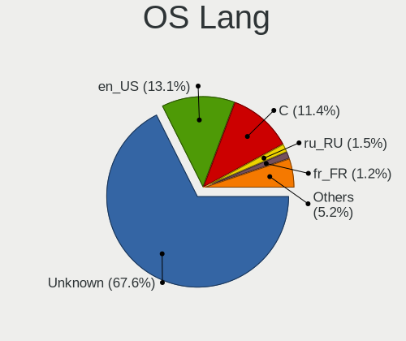
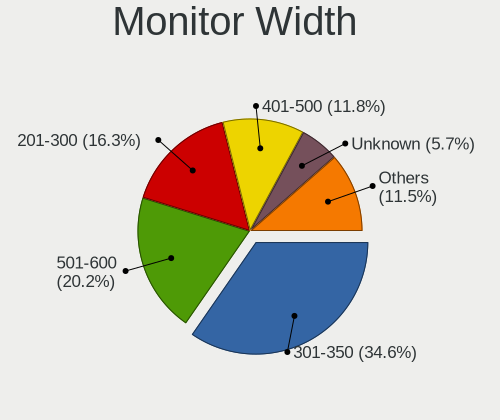
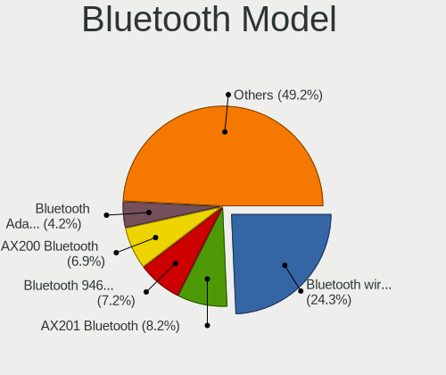
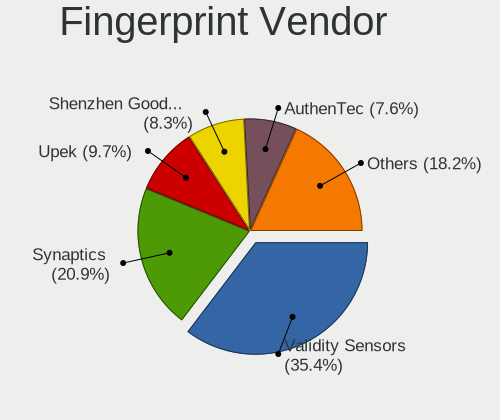

BSD - Tested Hardware & Statistics
----------------------------------

A project to collect tested hardware configurations for BSD.

Anyone can contribute to this report by the [hw-probe](https://github.com/linuxhw/hw-probe/blob/master/INSTALL.BSD.md) tool:

    hw-probe -all -upload

Please contribute! Especially if your hardware is rare.

This is a report for all computer types. See also reports for [desktops](/Desktop/README.md) and [notebooks](/Notebook/README.md).

OS-specific reports: [FreeBSD](/Dist/FreeBSD), [GhostBSD](/Dist/GhostBSD), [helloSystem](/Dist/helloSystem), [NetBSD](/Dist/NetBSD), [NomadBSD](/Dist/NomadBSD), [OpenBSD](/Dist/OpenBSD), [OPNsense](/Dist/OPNsense), [pfSense](/Dist/pfSense), [TrueNAS](/Dist/TrueNAS).

This report is for real hardware. Report for virtual hardware: [TestDays_VE](https://github.com/bsdhw/TestDays_VE)

Contents
--------

* [ Test Cases ](#test-cases)

* [ System ](#system)
  - [ OS                       ](#os)
  - [ OS Family                ](#os-family)
  - [ Arch                     ](#arch)
  - [ DE                       ](#de)
  - [ Display Server           ](#display-server)
  - [ Display Manager          ](#display-manager)
  - [ OS Lang                  ](#os-lang)
  - [ Boot Mode                ](#boot-mode)
  - [ Filesystem               ](#filesystem)
  - [ Part. scheme             ](#part-scheme)

* [ Board ](#board)
  - [ Vendor                   ](#vendor)
  - [ Model                    ](#model)
  - [ Model Family             ](#model-family)
  - [ MFG Year                 ](#mfg-year)
  - [ Form Factor              ](#form-factor)
  - [ Coreboot                 ](#coreboot)
  - [ RAM Size                 ](#ram-size)
  - [ RAM Used                 ](#ram-used)
  - [ Total Drives             ](#total-drives)
  - [ Has CD-ROM               ](#has-cd-rom)
  - [ Has Ethernet             ](#has-ethernet)
  - [ Has WiFi                 ](#has-wifi)
  - [ Has Bluetooth            ](#has-bluetooth)

* [ Location ](#location)
  - [ Country                  ](#country)
  - [ City                     ](#city)

* [ Drives ](#drives)
  - [ Drive Vendor             ](#drive-vendor)
  - [ Drive Model              ](#drive-model)
  - [ HDD Vendor               ](#hdd-vendor)
  - [ SSD Vendor               ](#ssd-vendor)
  - [ Drive Kind               ](#drive-kind)
  - [ Drive Connector          ](#drive-connector)
  - [ Drive Size               ](#drive-size)
  - [ Space Total              ](#space-total)
  - [ Space Used               ](#space-used)
  - [ Malfunc. Drives          ](#malfunc-drives)
  - [ Malfunc. Drive Vendor    ](#malfunc-drive-vendor)
  - [ Malfunc. HDD Vendor      ](#malfunc-hdd-vendor)
  - [ Malfunc. Drive Kind      ](#malfunc-drive-kind)
  - [ Failed Drives            ](#failed-drives)
  - [ Failed Drive Vendor      ](#failed-drive-vendor)
  - [ Drive Status             ](#drive-status)

* [ Storage controller ](#storage-controller)
  - [ Storage Vendor           ](#storage-vendor)
  - [ Storage Model            ](#storage-model)
  - [ Storage Kind             ](#storage-kind)

* [ Processor ](#processor)
  - [ CPU Vendor               ](#cpu-vendor)
  - [ CPU Model                ](#cpu-model)
  - [ CPU Model Family         ](#cpu-model-family)
  - [ CPU Cores                ](#cpu-cores)
  - [ CPU Sockets              ](#cpu-sockets)
  - [ CPU Threads              ](#cpu-threads)
  - [ CPU Microarch            ](#cpu-microarch)

* [ Graphics ](#graphics)
  - [ GPU Vendor               ](#gpu-vendor)
  - [ GPU Model                ](#gpu-model)
  - [ GPU Combo                ](#gpu-combo)
  - [ GPU Driver               ](#gpu-driver)
  - [ GPU Memory               ](#gpu-memory)

* [ Monitor ](#monitor)
  - [ Monitor Vendor           ](#monitor-vendor)
  - [ Monitor Model            ](#monitor-model)
  - [ Monitor Resolution       ](#monitor-resolution)
  - [ Monitor Diagonal         ](#monitor-diagonal)
  - [ Monitor Width            ](#monitor-width)
  - [ Aspect Ratio             ](#aspect-ratio)
  - [ Monitor Area             ](#monitor-area)
  - [ Pixel Density            ](#pixel-density)
  - [ Multiple Monitors        ](#multiple-monitors)

* [ Network ](#network)
  - [ Net Controller Vendor    ](#net-controller-vendor)
  - [ Net Controller Model     ](#net-controller-model)
  - [ Wireless Vendor          ](#wireless-vendor)
  - [ Wireless Model           ](#wireless-model)
  - [ Ethernet Vendor          ](#ethernet-vendor)
  - [ Ethernet Model           ](#ethernet-model)
  - [ Net Controller Kind      ](#net-controller-kind)
  - [ Used Controller          ](#used-controller)
  - [ NICs                     ](#nics)
  - [ IPv6                     ](#ipv6)

* [ Bluetooth ](#bluetooth)
  - [ Bluetooth Vendor         ](#bluetooth-vendor)
  - [ Bluetooth Model          ](#bluetooth-model)

* [ Sound ](#sound)
  - [ Sound Vendor             ](#sound-vendor)
  - [ Sound Model              ](#sound-model)

* [ Memory ](#memory)
  - [ Memory Vendor            ](#memory-vendor)
  - [ Memory Model             ](#memory-model)
  - [ Memory Kind              ](#memory-kind)
  - [ Memory Form Factor       ](#memory-form-factor)
  - [ Memory Size              ](#memory-size)
  - [ Memory Speed             ](#memory-speed)

* [ Printers & scanners ](#printers--scanners)
  - [ Printer Vendor           ](#printer-vendor)
  - [ Printer Model            ](#printer-model)
  - [ Scanner Vendor           ](#scanner-vendor)
  - [ Scanner Model            ](#scanner-model)

* [ Camera ](#camera)
  - [ Camera Vendor            ](#camera-vendor)
  - [ Camera Model             ](#camera-model)

* [ Security ](#security)
  - [ Fingerprint Vendor       ](#fingerprint-vendor)
  - [ Fingerprint Model        ](#fingerprint-model)
  - [ Chipcard Vendor          ](#chipcard-vendor)
  - [ Chipcard Model           ](#chipcard-model)

* [ Unsupported ](#unsupported)
  - [ Unsupported Devices      ](#unsupported-devices)
  - [ Unsupported Device Types ](#unsupported-device-types)

Test Cases
----------

Total: 18296

| Vendor        | Model                       | Form-Factor | Probe                                                     | Date         |
|---------------|-----------------------------|-------------|-----------------------------------------------------------|--------------|
| Techvision    | TVI7309X B0                 | Desktop     | [eff74e8df0](https://bsd-hardware.info/?probe=eff74e8df0) | Sep 07, 2023 |
| Unknown       | Unknown                     | Desktop     | [21e851e9e9](https://bsd-hardware.info/?probe=21e851e9e9) | Sep 07, 2023 |
| PAIQ          | PICO PC A1                  | Desktop     | [a88a2eb065](https://bsd-hardware.info/?probe=a88a2eb065) | Sep 07, 2023 |
| PC Engines    | APU3                        | Desktop     | [ad38dcf54a](https://bsd-hardware.info/?probe=ad38dcf54a) | Sep 07, 2023 |
| Unknown       | Unknown                     | Desktop     | [5ed026eccf](https://bsd-hardware.info/?probe=5ed026eccf) | Sep 07, 2023 |
| ASUSTek       | ASUS TUF Dash F15 FX517Z... | Notebook    | [cbde759aa2](https://bsd-hardware.info/?probe=cbde759aa2) | Sep 07, 2023 |
| ASUSTek       | ASUS TUF Dash F15 FX517Z... | Notebook    | [22ec8197cc](https://bsd-hardware.info/?probe=22ec8197cc) | Sep 07, 2023 |
| AAEON         | FWS-2280 V1.0               | Desktop     | [b5e0038e79](https://bsd-hardware.info/?probe=b5e0038e79) | Sep 07, 2023 |
| TYAN Compu... | S5510HE                     | Desktop     | [99d23c35ca](https://bsd-hardware.info/?probe=99d23c35ca) | Sep 07, 2023 |
| Dell          | 05XGC8 A01                  | Desktop     | [7c0acfa5b9](https://bsd-hardware.info/?probe=7c0acfa5b9) | Sep 07, 2023 |
| Unknown       | Unknown                     | Desktop     | [94d9b19ade](https://bsd-hardware.info/?probe=94d9b19ade) | Sep 07, 2023 |
| Lenovo        | 3136 SDK0J40697 WIN 3305... | Mini pc     | [b5aa3f010f](https://bsd-hardware.info/?probe=b5aa3f010f) | Sep 07, 2023 |
| Apple         | MacBookPro9,2               | Notebook    | [e011df1d78](https://bsd-hardware.info/?probe=e011df1d78) | Sep 07, 2023 |
| PAIQ          | PICO PC A1                  | Desktop     | [9e77e09181](https://bsd-hardware.info/?probe=9e77e09181) | Sep 07, 2023 |
| AMI           | Aptio CRB                   | Mini pc     | [12145f939b](https://bsd-hardware.info/?probe=12145f939b) | Sep 07, 2023 |
| Supermicro    | A2SDi-4C-HLN4F              | Server      | [8ce94dea6c](https://bsd-hardware.info/?probe=8ce94dea6c) | Sep 06, 2023 |
| IceWhale T... | ZimaBoard 432 ZMB           | Desktop     | [451cfdf64f](https://bsd-hardware.info/?probe=451cfdf64f) | Sep 06, 2023 |
| Lenovo        | ThinkPad X1 Nano Gen 1 2... | Notebook    | [68efc7ef8d](https://bsd-hardware.info/?probe=68efc7ef8d) | Sep 06, 2023 |
| Lenovo        | ThinkPad X1 Nano Gen 1 2... | Notebook    | [f42dfa2992](https://bsd-hardware.info/?probe=f42dfa2992) | Sep 06, 2023 |
| Dell          | 0KM5PX A01                  | Server      | [67f910daa9](https://bsd-hardware.info/?probe=67f910daa9) | Sep 06, 2023 |
| Unknown       | Unknown                     | Desktop     | [6361addd62](https://bsd-hardware.info/?probe=6361addd62) | Sep 06, 2023 |
| Fujitsu       | D3313-G1 S26361-D3313-G1    | Desktop     | [48ca84af37](https://bsd-hardware.info/?probe=48ca84af37) | Sep 06, 2023 |
| Lenovo        | 0B98401 PRO                 | Desktop     | [4397f70291](https://bsd-hardware.info/?probe=4397f70291) | Sep 06, 2023 |
| Dell          | 0NC2VH A01                  | Desktop     | [34a855cc56](https://bsd-hardware.info/?probe=34a855cc56) | Sep 06, 2023 |
| AZW           | MINI S 10                   | Desktop     | [2daf516a05](https://bsd-hardware.info/?probe=2daf516a05) | Sep 06, 2023 |
| Unknown       | Unknown                     | Notebook    | [516b89740b](https://bsd-hardware.info/?probe=516b89740b) | Sep 06, 2023 |
| AMI           | Aptio CRB                   | Mini pc     | [43aff23d91](https://bsd-hardware.info/?probe=43aff23d91) | Sep 06, 2023 |
| ASUSTek       | P8H61-M LE R2.0             | Desktop     | [7c08d4cfb1](https://bsd-hardware.info/?probe=7c08d4cfb1) | Sep 06, 2023 |
| AMI           | Aptio CRB                   | Mini pc     | [37be445dbe](https://bsd-hardware.info/?probe=37be445dbe) | Sep 06, 2023 |
| PC Engines    | APU2                        | Desktop     | [d582e62190](https://bsd-hardware.info/?probe=d582e62190) | Sep 06, 2023 |
| Unknown       | Unknown                     | Notebook    | [084127fd8b](https://bsd-hardware.info/?probe=084127fd8b) | Sep 06, 2023 |
| Raspberry ... | Raspberry Pi                | Soc         | [40b4e58c88](https://bsd-hardware.info/?probe=40b4e58c88) | Sep 06, 2023 |
| Techvision    | TVI7309X B0                 | Desktop     | [f04224b44a](https://bsd-hardware.info/?probe=f04224b44a) | Sep 06, 2023 |
| ASUSTek       | SABERTOOTH 990FX R2.0       | Desktop     | [0b7d85b124](https://bsd-hardware.info/?probe=0b7d85b124) | Sep 06, 2023 |
| Unknown       | Unknown                     | Desktop     | [19711ca08b](https://bsd-hardware.info/?probe=19711ca08b) | Sep 06, 2023 |
| LG Electro... | 16U70Q-K.AAS7U1             | Notebook    | [82e3b2e5f8](https://bsd-hardware.info/?probe=82e3b2e5f8) | Sep 06, 2023 |
| Supermicro    | X9SCL/X9SCMA                | Desktop     | [3af68f2594](https://bsd-hardware.info/?probe=3af68f2594) | Sep 06, 2023 |
| Gigabyte      | H61M-S1                     | Desktop     | [bd2df105c0](https://bsd-hardware.info/?probe=bd2df105c0) | Sep 06, 2023 |
| ASUSTek       | P8H67-M PRO                 | Desktop     | [c06ec95a55](https://bsd-hardware.info/?probe=c06ec95a55) | Sep 06, 2023 |
| Dell          | 096JG8 A01                  | Desktop     | [ec3e0338eb](https://bsd-hardware.info/?probe=ec3e0338eb) | Sep 06, 2023 |
| Unknown       | Unknown                     | Desktop     | [f757c58686](https://bsd-hardware.info/?probe=f757c58686) | Sep 05, 2023 |
| IceWhale T... | ZimaBoard 432 ZMB           | Desktop     | [6e458d22a3](https://bsd-hardware.info/?probe=6e458d22a3) | Sep 05, 2023 |
| Dell          | 096JG8 A01                  | Desktop     | [84d768ee15](https://bsd-hardware.info/?probe=84d768ee15) | Sep 05, 2023 |
| Intel         | Q3XXG4-P V1.0               | Desktop     | [3fb536ecce](https://bsd-hardware.info/?probe=3fb536ecce) | Sep 05, 2023 |
| Dell          | Inspiron 15 7000 Gaming     | Notebook    | [67e9eafa7e](https://bsd-hardware.info/?probe=67e9eafa7e) | Sep 05, 2023 |
| Dell          | 0X3D66 A02                  | Server      | [8dcfb77863](https://bsd-hardware.info/?probe=8dcfb77863) | Sep 05, 2023 |
| Unknown       | Unknown                     | Desktop     | [a27d64dbac](https://bsd-hardware.info/?probe=a27d64dbac) | Sep 05, 2023 |
| ASUSTek       | H97I-PLUS                   | Desktop     | [e92272bb87](https://bsd-hardware.info/?probe=e92272bb87) | Sep 05, 2023 |
| Unknown       | Unknown                     | Desktop     | [b95f409ccf](https://bsd-hardware.info/?probe=b95f409ccf) | Sep 05, 2023 |
| Lenovo        | ThinkPad X240 20AMA1Y3UK    | Notebook    | [8277297743](https://bsd-hardware.info/?probe=8277297743) | Sep 05, 2023 |
| Unknown       | Unknown                     | Desktop     | [50f509c032](https://bsd-hardware.info/?probe=50f509c032) | Sep 05, 2023 |
| Supermicro    | X11SSH-F                    | Desktop     | [bff90e93d0](https://bsd-hardware.info/?probe=bff90e93d0) | Sep 05, 2023 |
| Lenovo        | ThinkPad X61 Tablet 7762... | Notebook    | [00dd1bd84e](https://bsd-hardware.info/?probe=00dd1bd84e) | Sep 04, 2023 |
| HP            | G62                         | Notebook    | [b4777b6ba5](https://bsd-hardware.info/?probe=b4777b6ba5) | Sep 04, 2023 |
| Unknown       | Unknown                     | Desktop     | [a4796e8170](https://bsd-hardware.info/?probe=a4796e8170) | Sep 04, 2023 |
| Dell          | 0NC2VH A01                  | Desktop     | [8cc0358a69](https://bsd-hardware.info/?probe=8cc0358a69) | Sep 04, 2023 |
| CWWK          | CW-AD4L-N V1                | Desktop     | [dd32d9d4e1](https://bsd-hardware.info/?probe=dd32d9d4e1) | Sep 04, 2023 |
| Gigabyte      | P35C-DS3R                   | Desktop     | [4424751223](https://bsd-hardware.info/?probe=4424751223) | Sep 04, 2023 |
| Dell          | 0PRWNC A05                  | Server      | [ded67b8cd6](https://bsd-hardware.info/?probe=ded67b8cd6) | Sep 04, 2023 |
| HP            | EliteBook 8570p             | Notebook    | [cfecf51114](https://bsd-hardware.info/?probe=cfecf51114) | Sep 04, 2023 |
| ASUSTek       | P8Z77-V LX                  | Desktop     | [ed1fade3db](https://bsd-hardware.info/?probe=ed1fade3db) | Sep 04, 2023 |
| Toshiba       | QOSMIO X775                 | Notebook    | [d92a05ab1d](https://bsd-hardware.info/?probe=d92a05ab1d) | Sep 04, 2023 |
| Gigabyte      | H61M-S1                     | Desktop     | [5d1dbf86d9](https://bsd-hardware.info/?probe=5d1dbf86d9) | Sep 04, 2023 |
| ASUSTek       | K40IN                       | Notebook    | [00a4f6e5a0](https://bsd-hardware.info/?probe=00a4f6e5a0) | Sep 04, 2023 |
| Unknown       | Unknown                     | Desktop     | [7d95befe6e](https://bsd-hardware.info/?probe=7d95befe6e) | Sep 04, 2023 |
| Shuttle       | DS67U                       | Notebook    | [55c2922a25](https://bsd-hardware.info/?probe=55c2922a25) | Sep 04, 2023 |
| Intel         | S1200KP AAG34877-201        | Desktop     | [1b07865ce7](https://bsd-hardware.info/?probe=1b07865ce7) | Sep 04, 2023 |
| Dell          | 03X6X0 A02                  | Server      | [8d9b81f936](https://bsd-hardware.info/?probe=8d9b81f936) | Sep 04, 2023 |
| Dell          | 0NC2VH A01                  | Desktop     | [7209f86fed](https://bsd-hardware.info/?probe=7209f86fed) | Sep 04, 2023 |
| Samsung       | 270E5J/2570EJ               | Notebook    | [3feb685296](https://bsd-hardware.info/?probe=3feb685296) | Sep 03, 2023 |
| Supermicro    | X10SDV-TP8F                 | Server      | [25cc035e73](https://bsd-hardware.info/?probe=25cc035e73) | Sep 03, 2023 |
| ASRock        | X570 Steel Legend WiFi a... | Desktop     | [a98f0b3d67](https://bsd-hardware.info/?probe=a98f0b3d67) | Sep 03, 2023 |
| Lenovo        | SHARKBAY SDK0E50510 WIN     | Desktop     | [1bde5a65b6](https://bsd-hardware.info/?probe=1bde5a65b6) | Sep 03, 2023 |
| Lenovo        | ThinkPad X260 20F6006XUK    | Notebook    | [e4f0ac6bb9](https://bsd-hardware.info/?probe=e4f0ac6bb9) | Sep 03, 2023 |
| Lenovo        | ThinkPad X260 20F6006XUK    | Notebook    | [4bce25bd89](https://bsd-hardware.info/?probe=4bce25bd89) | Sep 03, 2023 |
| HP            | EliteBook 8570p             | Notebook    | [d240fba8b7](https://bsd-hardware.info/?probe=d240fba8b7) | Sep 03, 2023 |
| Gigabyte      | A520I AC                    | Desktop     | [58e061f420](https://bsd-hardware.info/?probe=58e061f420) | Sep 03, 2023 |
| ASRock        | H81M-DGS R2.0               | Desktop     | [1f823a8be7](https://bsd-hardware.info/?probe=1f823a8be7) | Sep 03, 2023 |
| ASRock        | H310CM-DVS                  | Desktop     | [604c9311bc](https://bsd-hardware.info/?probe=604c9311bc) | Sep 03, 2023 |
| ASRock        | X570 Steel Legend WiFi a... | Desktop     | [d352ea60cf](https://bsd-hardware.info/?probe=d352ea60cf) | Sep 03, 2023 |
| PC Engines    | APU2                        | Desktop     | [c9d2cfe6fa](https://bsd-hardware.info/?probe=c9d2cfe6fa) | Sep 03, 2023 |
| Unknown       | Unknown                     | Desktop     | [53cee3b3c8](https://bsd-hardware.info/?probe=53cee3b3c8) | Sep 03, 2023 |
| MSI           | PRO Z790-P WIFI             | Desktop     | [fe53c55492](https://bsd-hardware.info/?probe=fe53c55492) | Sep 03, 2023 |
| ASUSTek       | 1005PXD                     | Notebook    | [8dac93d19d](https://bsd-hardware.info/?probe=8dac93d19d) | Sep 03, 2023 |
| Biostar       | J4105NHU                    | Desktop     | [2ac770aa55](https://bsd-hardware.info/?probe=2ac770aa55) | Sep 03, 2023 |
| MSI           | H81M-P33                    | Desktop     | [b47290007a](https://bsd-hardware.info/?probe=b47290007a) | Sep 03, 2023 |
| ASUSTek       | P5Q-E                       | Desktop     | [ef4604a40f](https://bsd-hardware.info/?probe=ef4604a40f) | Sep 03, 2023 |
| ASUSTek       | ROG CROSSHAIR VIII HERO     | Desktop     | [8d37c44440](https://bsd-hardware.info/?probe=8d37c44440) | Sep 03, 2023 |
| ASUSTek       | K40IN                       | Notebook    | [df0a3f55c2](https://bsd-hardware.info/?probe=df0a3f55c2) | Sep 03, 2023 |
| Lenovo        | 30BC SDK0J40705 WIN 3425... | Desktop     | [a1c29072ea](https://bsd-hardware.info/?probe=a1c29072ea) | Sep 03, 2023 |
| Unknown       | Unknown                     | Desktop     | [9c1891cda7](https://bsd-hardware.info/?probe=9c1891cda7) | Sep 03, 2023 |
| AAEON         | FWS-2363 V1.0               | Desktop     | [098bc5466b](https://bsd-hardware.info/?probe=098bc5466b) | Sep 03, 2023 |
| Lenovo        | ThinkPad P50 20EN0012US     | Notebook    | [9d1b9e7af6](https://bsd-hardware.info/?probe=9d1b9e7af6) | Sep 03, 2023 |
| Shuttle       | DS20U                       | Desktop     | [d034a8e5b8](https://bsd-hardware.info/?probe=d034a8e5b8) | Sep 02, 2023 |
| Intel         | HM570                       | Desktop     | [de018603ae](https://bsd-hardware.info/?probe=de018603ae) | Sep 02, 2023 |
| Protectli     | FW6 Ver                     | Desktop     | [70992eb19b](https://bsd-hardware.info/?probe=70992eb19b) | Sep 02, 2023 |
| Lenovo        | ThinkPad T14 Gen 2i 20W1... | Notebook    | [1bfe26df6e](https://bsd-hardware.info/?probe=1bfe26df6e) | Sep 02, 2023 |
| ASUSTek       | M5A97 PLUS                  | Desktop     | [77b461d3ad](https://bsd-hardware.info/?probe=77b461d3ad) | Sep 02, 2023 |
| Raspberry ... | Raspberry Pi                | Soc         | [ecfa93eb95](https://bsd-hardware.info/?probe=ecfa93eb95) | Sep 02, 2023 |
| Fujitsu       | LIFEBOOK S935               | Notebook    | [a6cfe011fe](https://bsd-hardware.info/?probe=a6cfe011fe) | Sep 02, 2023 |
| Apple         | MacBookPro7,1               | Notebook    | [d49b8413db](https://bsd-hardware.info/?probe=d49b8413db) | Sep 02, 2023 |
| Dell          | 08NPPY A00                  | Desktop     | [1ae33cfe72](https://bsd-hardware.info/?probe=1ae33cfe72) | Sep 02, 2023 |
| Lenovo        | ThinkPad X1 Carbon 2nd 2... | Notebook    | [9b322dc202](https://bsd-hardware.info/?probe=9b322dc202) | Sep 02, 2023 |
| MSI           | CX62 6QD                    | Notebook    | [4356e5b30f](https://bsd-hardware.info/?probe=4356e5b30f) | Sep 02, 2023 |
| ASRock        | J3455M                      | Desktop     | [762d4d9370](https://bsd-hardware.info/?probe=762d4d9370) | Sep 02, 2023 |
| Dell          | 0XCR8D A00                  | Desktop     | [b89126c9d9](https://bsd-hardware.info/?probe=b89126c9d9) | Sep 02, 2023 |
| AMI           | Aptio CRB                   | Mini pc     | [b63ded7b81](https://bsd-hardware.info/?probe=b63ded7b81) | Sep 02, 2023 |
| MSI           | Z390-A PRO                  | Desktop     | [57925dc8bb](https://bsd-hardware.info/?probe=57925dc8bb) | Sep 02, 2023 |
| Unknown       | Unknown                     | Desktop     | [94487109c2](https://bsd-hardware.info/?probe=94487109c2) | Sep 01, 2023 |
| ASUSTek       | VivoBook_ASUSLaptop M150... | Notebook    | [044910f579](https://bsd-hardware.info/?probe=044910f579) | Sep 01, 2023 |
| Supermicro    | X9DRD-iF                    | Server      | [708af02c7b](https://bsd-hardware.info/?probe=708af02c7b) | Sep 01, 2023 |
| HP            | EliteBook 8540w             | Notebook    | [5e44dfed67](https://bsd-hardware.info/?probe=5e44dfed67) | Sep 01, 2023 |
| Deciso        | NetBoard-A10                | Notebook    | [f95d1da00c](https://bsd-hardware.info/?probe=f95d1da00c) | Sep 01, 2023 |
| Dell          | 042P49 A01                  | Desktop     | [383445ee26](https://bsd-hardware.info/?probe=383445ee26) | Sep 01, 2023 |
| Inventec      | Z CLASS A02                 | Desktop     | [1f4bf47cab](https://bsd-hardware.info/?probe=1f4bf47cab) | Sep 01, 2023 |
| Dell          | 0DRG19 A00                  | Mini pc     | [9e6cb6fe25](https://bsd-hardware.info/?probe=9e6cb6fe25) | Sep 01, 2023 |
| CompuLab      | fitlet2                     | Mini pc     | [525a1718ff](https://bsd-hardware.info/?probe=525a1718ff) | Sep 01, 2023 |
| Protectli     | FW6 Ver                     | Desktop     | [04de7aa059](https://bsd-hardware.info/?probe=04de7aa059) | Sep 01, 2023 |
| Shuttle       | FS77U                       | Desktop     | [149a8a1437](https://bsd-hardware.info/?probe=149a8a1437) | Sep 01, 2023 |
| Panasonic     | CFSX4-1                     | Notebook    | [8f54654916](https://bsd-hardware.info/?probe=8f54654916) | Sep 01, 2023 |
| Dell          | 0YXT71 A02                  | Desktop     | [b887caabe7](https://bsd-hardware.info/?probe=b887caabe7) | Aug 31, 2023 |
| Foxconn       | nT-A3000 series FAB         | Desktop     | [d9f360b4fe](https://bsd-hardware.info/?probe=d9f360b4fe) | Aug 31, 2023 |
| Dell          | 0WR7PY A02                  | Desktop     | [2557e04cf5](https://bsd-hardware.info/?probe=2557e04cf5) | Aug 31, 2023 |
| ASRockRack    | EPYC3101D4I-2T              | Desktop     | [82ac08abc0](https://bsd-hardware.info/?probe=82ac08abc0) | Aug 31, 2023 |
| Intel         | NUC11TNBi5 M11904-404       | Mini pc     | [d4a4a46409](https://bsd-hardware.info/?probe=d4a4a46409) | Aug 31, 2023 |
| Techvision    | TVI7309X B0                 | Desktop     | [6adab2354e](https://bsd-hardware.info/?probe=6adab2354e) | Aug 31, 2023 |
| Intel         | NUC8i7HNB J68197-602        | Mini pc     | [f2806a3c65](https://bsd-hardware.info/?probe=f2806a3c65) | Aug 31, 2023 |
| HP            | 2000                        | Notebook    | [6d9c442ae6](https://bsd-hardware.info/?probe=6d9c442ae6) | Aug 31, 2023 |
| Lenovo        | ThinkPad X1 Carbon Gen 9... | Notebook    | [0ebdda5146](https://bsd-hardware.info/?probe=0ebdda5146) | Aug 31, 2023 |
| ASUSTek       | PRIME H610M-E D4            | Desktop     | [9aafa8bedf](https://bsd-hardware.info/?probe=9aafa8bedf) | Aug 31, 2023 |
| Deciso        | NetBoard-A20                | Notebook    | [bf4ed827a5](https://bsd-hardware.info/?probe=bf4ed827a5) | Aug 31, 2023 |
| Gigabyte      | A520I AC                    | Desktop     | [e245a38088](https://bsd-hardware.info/?probe=e245a38088) | Aug 31, 2023 |
| VIA Techno... | VT8623-8235                 | Desktop     | [3274cd095e](https://bsd-hardware.info/?probe=3274cd095e) | Aug 31, 2023 |
| Biostar       | A68N-5545                   | Desktop     | [b2a1070e2d](https://bsd-hardware.info/?probe=b2a1070e2d) | Aug 31, 2023 |
| CWWK          | CW-AD4L-N V1                | Desktop     | [363a27fb74](https://bsd-hardware.info/?probe=363a27fb74) | Aug 31, 2023 |
| Acer          | Aspire A515-55              | Notebook    | [fcbd8a3f31](https://bsd-hardware.info/?probe=fcbd8a3f31) | Aug 31, 2023 |
| Lenovo        | IdeaPad Gaming 3 15IHU6 ... | Notebook    | [a308c3a87b](https://bsd-hardware.info/?probe=a308c3a87b) | Aug 31, 2023 |
| AMI           | Aptio CRB                   | Mini pc     | [97975e788b](https://bsd-hardware.info/?probe=97975e788b) | Aug 30, 2023 |
| ASRock        | H81M-VG4 R2.0               | Desktop     | [fd3a7c75de](https://bsd-hardware.info/?probe=fd3a7c75de) | Aug 30, 2023 |
| Supermicro    | X11SCL-IF                   | Server      | [b8c6daa2c4](https://bsd-hardware.info/?probe=b8c6daa2c4) | Aug 30, 2023 |
| Sophos        | UTM                         | Firewall    | [01a7eea7b9](https://bsd-hardware.info/?probe=01a7eea7b9) | Aug 30, 2023 |
| Deciso        | NetBoard-A20                | Notebook    | [0119402f80](https://bsd-hardware.info/?probe=0119402f80) | Aug 30, 2023 |
| Unknown       | Unknown                     | Desktop     | [b59ce07b49](https://bsd-hardware.info/?probe=b59ce07b49) | Aug 30, 2023 |
| MSI           | MS-7125                     | Desktop     | [3dfb767d80](https://bsd-hardware.info/?probe=3dfb767d80) | Aug 30, 2023 |
| HP            | 802F                        | Desktop     | [1f64f7e11f](https://bsd-hardware.info/?probe=1f64f7e11f) | Aug 30, 2023 |
| Unknown       | Unknown                     | Desktop     | [c0536b27d4](https://bsd-hardware.info/?probe=c0536b27d4) | Aug 30, 2023 |
| HP            | ProLiant DL360p Gen8        | Server      | [914608f1b7](https://bsd-hardware.info/?probe=914608f1b7) | Aug 30, 2023 |
| MW            | GMLK-2_5G4L                 | Desktop     | [56ac0149f8](https://bsd-hardware.info/?probe=56ac0149f8) | Aug 30, 2023 |
| Infoblox      | IB-810                      | Desktop     | [34c0fa6bec](https://bsd-hardware.info/?probe=34c0fa6bec) | Aug 30, 2023 |
| Supermicro    | X12SDV-8C-SPT8FA            | Server      | [c46557f737](https://bsd-hardware.info/?probe=c46557f737) | Aug 30, 2023 |
| Toshiba       | Satellite S55t-B            | Notebook    | [c2ed5fa6bd](https://bsd-hardware.info/?probe=c2ed5fa6bd) | Aug 30, 2023 |
| Techvision    | TVI7309X B0                 | Desktop     | [259a7ec99d](https://bsd-hardware.info/?probe=259a7ec99d) | Aug 30, 2023 |
| Techvision    | TVI7309X B0                 | Desktop     | [20946147de](https://bsd-hardware.info/?probe=20946147de) | Aug 30, 2023 |
| Unknown       | Unknown                     | Desktop     | [8cfa60050b](https://bsd-hardware.info/?probe=8cfa60050b) | Aug 30, 2023 |
| Dell          | Latitude E4310              | Notebook    | [7645de3654](https://bsd-hardware.info/?probe=7645de3654) | Aug 30, 2023 |
| Supermicro    | A1SRi-2758F                 | Desktop     | [c8b4f33fb1](https://bsd-hardware.info/?probe=c8b4f33fb1) | Aug 30, 2023 |
| Dell          | 0JCTF8 A00                  | Desktop     | [a2be5a5f0f](https://bsd-hardware.info/?probe=a2be5a5f0f) | Aug 30, 2023 |
| Dell          | 0NW6H5 A00                  | Desktop     | [8109e9f43f](https://bsd-hardware.info/?probe=8109e9f43f) | Aug 29, 2023 |
| PC Engines    | apu4                        | Desktop     | [2c5a47d3c4](https://bsd-hardware.info/?probe=2c5a47d3c4) | Aug 29, 2023 |
| SolidRun      | CEX7 Platform               | Desktop     | [b83ebfd33b](https://bsd-hardware.info/?probe=b83ebfd33b) | Aug 29, 2023 |
| CncTion       | N6000-4L B0                 | Desktop     | [81cbfbffca](https://bsd-hardware.info/?probe=81cbfbffca) | Aug 29, 2023 |
| HP            | EliteBook 8570p             | Notebook    | [0dda7a609c](https://bsd-hardware.info/?probe=0dda7a609c) | Aug 29, 2023 |
| Fujitsu       | D3090-A1 S26361-D3090-A1    | Server      | [f509d12cea](https://bsd-hardware.info/?probe=f509d12cea) | Aug 29, 2023 |
| HP            | Pavilion dv3500             | Notebook    | [0c3f84b285](https://bsd-hardware.info/?probe=0c3f84b285) | Aug 29, 2023 |
| Unknown       | YL-J3160L4                  | Desktop     | [6018dde257](https://bsd-hardware.info/?probe=6018dde257) | Aug 29, 2023 |
| Biostar       | A68N-5545                   | Desktop     | [c90edbc46a](https://bsd-hardware.info/?probe=c90edbc46a) | Aug 29, 2023 |
| Unknown       | Unknown                     | Desktop     | [f01bce7cd7](https://bsd-hardware.info/?probe=f01bce7cd7) | Aug 29, 2023 |
| AZW           | EQ                          | Desktop     | [fe5669c376](https://bsd-hardware.info/?probe=fe5669c376) | Aug 29, 2023 |
| Lenovo        | IdeaPad 110S-11IBR 80WG     | Notebook    | [e74ef1d37c](https://bsd-hardware.info/?probe=e74ef1d37c) | Aug 29, 2023 |
| Nvidia        | MCP79                       | Desktop     | [0897b3a117](https://bsd-hardware.info/?probe=0897b3a117) | Aug 29, 2023 |
| Intel         | SKYBAY                      | Desktop     | [9d49471591](https://bsd-hardware.info/?probe=9d49471591) | Aug 29, 2023 |
| Fujitsu       | FMVA0803D                   | Notebook    | [36528b957c](https://bsd-hardware.info/?probe=36528b957c) | Aug 28, 2023 |
| Supermicro    | X9DRD-iF                    | Desktop     | [be36f2fe2b](https://bsd-hardware.info/?probe=be36f2fe2b) | Aug 28, 2023 |
| Lenovo        | 30D2 SDK0J40697 WIN 3305... | Desktop     | [cda96eed7a](https://bsd-hardware.info/?probe=cda96eed7a) | Aug 28, 2023 |
| ATOPNUC       | MA90                        | Mini pc     | [e0d13077ea](https://bsd-hardware.info/?probe=e0d13077ea) | Aug 28, 2023 |
| Unknown       | Unknown                     | Desktop     | [c5068ec761](https://bsd-hardware.info/?probe=c5068ec761) | Aug 28, 2023 |
| Unknown       | Unknown                     | Desktop     | [fc384f5de7](https://bsd-hardware.info/?probe=fc384f5de7) | Aug 28, 2023 |
| Unknown       | Unknown                     | Desktop     | [fcc9bcdede](https://bsd-hardware.info/?probe=fcc9bcdede) | Aug 28, 2023 |
| CncTion       | N6000-4L B0                 | Desktop     | [0cab2e3af3](https://bsd-hardware.info/?probe=0cab2e3af3) | Aug 28, 2023 |
| ShenZhen M... | 3865U-6L                    | Desktop     | [2835cc7062](https://bsd-hardware.info/?probe=2835cc7062) | Aug 28, 2023 |
| Sophos        | XG                          | Firewall    | [29789e14c0](https://bsd-hardware.info/?probe=29789e14c0) | Aug 28, 2023 |
| AMI           | Aptio CRB                   | Mini pc     | [44afefb7c1](https://bsd-hardware.info/?probe=44afefb7c1) | Aug 28, 2023 |
| Lenovo        | ThinkPad T490 20RYS06R00    | Notebook    | [978cd1d6bc](https://bsd-hardware.info/?probe=978cd1d6bc) | Aug 28, 2023 |
| Lenovo        | ThinkPad T450 20BV000BUS    | Notebook    | [f0fb53394d](https://bsd-hardware.info/?probe=f0fb53394d) | Aug 28, 2023 |
| Lenovo        | ThinkPad T430 2347GR2       | Notebook    | [dc8ad6c7c5](https://bsd-hardware.info/?probe=dc8ad6c7c5) | Aug 28, 2023 |
| Lenovo        | ThinkPad T430 2347GR2       | Notebook    | [c8c17a9db2](https://bsd-hardware.info/?probe=c8c17a9db2) | Aug 28, 2023 |
| ASUSTek       | ROG STRIX B450-I GAMING     | Desktop     | [3dab6f4044](https://bsd-hardware.info/?probe=3dab6f4044) | Aug 28, 2023 |
| Intel         | Q3XXG4-P V1.0               | Desktop     | [2d0c639c61](https://bsd-hardware.info/?probe=2d0c639c61) | Aug 28, 2023 |
| MSI           | H110M PRO-VD                | Desktop     | [dcbd4ebf8f](https://bsd-hardware.info/?probe=dcbd4ebf8f) | Aug 27, 2023 |
| MSI           | AM1I                        | Desktop     | [50183030f8](https://bsd-hardware.info/?probe=50183030f8) | Aug 27, 2023 |
| Unknown       | Unknown                     | Desktop     | [f363eeaa25](https://bsd-hardware.info/?probe=f363eeaa25) | Aug 27, 2023 |
| IceWhale T... | ZimaBoard 432 ZMB           | Desktop     | [a47cd8ee32](https://bsd-hardware.info/?probe=a47cd8ee32) | Aug 27, 2023 |
| Gigabyte      | GA-890FXA-UD5               | Desktop     | [85b0bba1ea](https://bsd-hardware.info/?probe=85b0bba1ea) | Aug 27, 2023 |
| Dell          | 04Y8V0 A02                  | Desktop     | [a84c23941d](https://bsd-hardware.info/?probe=a84c23941d) | Aug 27, 2023 |
| AMI           | Aptio CRB                   | Mini pc     | [5025d5adb6](https://bsd-hardware.info/?probe=5025d5adb6) | Aug 27, 2023 |
| Toshiba       | Satellite S55t-B            | Notebook    | [eb85f0b975](https://bsd-hardware.info/?probe=eb85f0b975) | Aug 27, 2023 |
| Protectli     | FW6                         | Desktop     | [37b744ff79](https://bsd-hardware.info/?probe=37b744ff79) | Aug 27, 2023 |
| MSI           | PRESTIGE X570 CREATION      | Desktop     | [df915d5ab9](https://bsd-hardware.info/?probe=df915d5ab9) | Aug 27, 2023 |
| Fujitsu       | D3313-E1 S26361-D3313-E1    | Desktop     | [a684024d8e](https://bsd-hardware.info/?probe=a684024d8e) | Aug 27, 2023 |
| Unknown       | Unknown                     | Desktop     | [0de8fccd23](https://bsd-hardware.info/?probe=0de8fccd23) | Aug 27, 2023 |
| Dell          | Latitude 7280               | Notebook    | [c858f191cf](https://bsd-hardware.info/?probe=c858f191cf) | Aug 27, 2023 |
| MSI           | H81M-P33                    | Desktop     | [2e9a066a01](https://bsd-hardware.info/?probe=2e9a066a01) | Aug 27, 2023 |
| ASUSTek       | P5Q-E                       | Desktop     | [9898ae1ead](https://bsd-hardware.info/?probe=9898ae1ead) | Aug 27, 2023 |
| ASUSTek       | ROG CROSSHAIR VIII HERO     | Desktop     | [0bb56ff672](https://bsd-hardware.info/?probe=0bb56ff672) | Aug 27, 2023 |
| Gigabyte      | F2A88XM-D3H                 | Desktop     | [5f23f0620f](https://bsd-hardware.info/?probe=5f23f0620f) | Aug 27, 2023 |
| HP            | 8103 A01                    | Mini pc     | [484d82cac6](https://bsd-hardware.info/?probe=484d82cac6) | Aug 27, 2023 |
| PC Engines    | APU                         | Desktop     | [3b29671556](https://bsd-hardware.info/?probe=3b29671556) | Aug 26, 2023 |
| HP            | ProLiant DL380 G7           | Server      | [785043a723](https://bsd-hardware.info/?probe=785043a723) | Aug 26, 2023 |
| Gigabyte      | X570S UD                    | Desktop     | [ed6162710b](https://bsd-hardware.info/?probe=ed6162710b) | Aug 26, 2023 |
| Lenovo        | ThinkPad X230 2325IB1       | Notebook    | [41fbf7d1ca](https://bsd-hardware.info/?probe=41fbf7d1ca) | Aug 26, 2023 |
| Dell          | 042P49 A01                  | Desktop     | [a06ab2449f](https://bsd-hardware.info/?probe=a06ab2449f) | Aug 26, 2023 |
| PC Engines    | APU2                        | Desktop     | [ed6839f08c](https://bsd-hardware.info/?probe=ed6839f08c) | Aug 26, 2023 |
| Dell          | 0NC2VH A01                  | Desktop     | [46499d5075](https://bsd-hardware.info/?probe=46499d5075) | Aug 26, 2023 |
| Fujitsu       | FMVA0803D                   | Notebook    | [8ce6118bf4](https://bsd-hardware.info/?probe=8ce6118bf4) | Aug 26, 2023 |
| AMI           | Aptio CRB                   | Mini pc     | [ecd319ca19](https://bsd-hardware.info/?probe=ecd319ca19) | Aug 26, 2023 |
| IGEL Techn... | H830C                       | Notebook    | [da76c18be6](https://bsd-hardware.info/?probe=da76c18be6) | Aug 26, 2023 |
| IGEL Techn... | H830C                       | Notebook    | [9d25214ddb](https://bsd-hardware.info/?probe=9d25214ddb) | Aug 26, 2023 |
| Gigabyte      | H510M K                     | Desktop     | [17f15f19f4](https://bsd-hardware.info/?probe=17f15f19f4) | Aug 26, 2023 |
| Dell          | G5 5590                     | Notebook    | [2e496efada](https://bsd-hardware.info/?probe=2e496efada) | Aug 26, 2023 |
| Supermicro    | X11SDV-4C-TP8F-01           | Desktop     | [21e958a05d](https://bsd-hardware.info/?probe=21e958a05d) | Aug 26, 2023 |
| Dell          | G5 5590                     | Notebook    | [fd4f457391](https://bsd-hardware.info/?probe=fd4f457391) | Aug 26, 2023 |
| ASRock        | 970 Extreme3 R2.0           | Desktop     | [bf289c5941](https://bsd-hardware.info/?probe=bf289c5941) | Aug 26, 2023 |
| Unknown       | Unknown                     | Desktop     | [6619af0a29](https://bsd-hardware.info/?probe=6619af0a29) | Aug 26, 2023 |
| ASUSTek       | H110I-PLUS                  | Desktop     | [a487121854](https://bsd-hardware.info/?probe=a487121854) | Aug 26, 2023 |
| HP            | 8299                        | Desktop     | [77a077cb11](https://bsd-hardware.info/?probe=77a077cb11) | Aug 26, 2023 |
| Pegatron      | 2ACD                        | Desktop     | [c20fcb2b2f](https://bsd-hardware.info/?probe=c20fcb2b2f) | Aug 26, 2023 |
| HP            | ENVY Notebook 13-ab0XX      | Notebook    | [3d96f4d5b4](https://bsd-hardware.info/?probe=3d96f4d5b4) | Aug 26, 2023 |
| Intel         | D2500CC AAG43156-303        | Desktop     | [281e4a541b](https://bsd-hardware.info/?probe=281e4a541b) | Aug 26, 2023 |
| IGEL Techn... | D220                        | Desktop     | [a7686520e1](https://bsd-hardware.info/?probe=a7686520e1) | Aug 26, 2023 |
| Lenovo        | ThinkPad X1 Carbon 7th 2... | Notebook    | [c8e95f3772](https://bsd-hardware.info/?probe=c8e95f3772) | Aug 26, 2023 |
| Intel         | D2500CC AAG43156-303        | Desktop     | [c5745af495](https://bsd-hardware.info/?probe=c5745af495) | Aug 26, 2023 |
| HP            | ProLiant DL380 G7           | Server      | [3188f262e0](https://bsd-hardware.info/?probe=3188f262e0) | Aug 25, 2023 |
| Getac         | V110G2                      | Notebook    | [884803a6bd](https://bsd-hardware.info/?probe=884803a6bd) | Aug 25, 2023 |
| Dell          | Latitude E6420              | Notebook    | [a085ba3865](https://bsd-hardware.info/?probe=a085ba3865) | Aug 25, 2023 |
| ASUSTek       | P8H61-MX R2.0               | Desktop     | [d724e54fc4](https://bsd-hardware.info/?probe=d724e54fc4) | Aug 25, 2023 |
| Techvision    | TVI7309X B0                 | Desktop     | [ebb4e825a3](https://bsd-hardware.info/?probe=ebb4e825a3) | Aug 25, 2023 |
| ASUSTek       | P5M2-R                      | Desktop     | [73135bf26d](https://bsd-hardware.info/?probe=73135bf26d) | Aug 25, 2023 |
| NVN-ED01      | Unknown                     | Notebook    | [dba43e889a](https://bsd-hardware.info/?probe=dba43e889a) | Aug 25, 2023 |
| PC Engines    | APU2                        | Desktop     | [3d3b16c0cf](https://bsd-hardware.info/?probe=3d3b16c0cf) | Aug 25, 2023 |
| AZW           | U59                         | Desktop     | [e08540ab36](https://bsd-hardware.info/?probe=e08540ab36) | Aug 25, 2023 |
| Lenovo        | ThinkPad P50 20EN0009MS     | Notebook    | [4b3fcfa17e](https://bsd-hardware.info/?probe=4b3fcfa17e) | Aug 25, 2023 |
| Techvision    | TVI7309X B0                 | Desktop     | [662ce63a50](https://bsd-hardware.info/?probe=662ce63a50) | Aug 25, 2023 |
| MW            | GMLK-2_5G4L                 | Desktop     | [8c6f7098f9](https://bsd-hardware.info/?probe=8c6f7098f9) | Aug 25, 2023 |
| SolidRun      | CEX7 Platform               | Desktop     | [4d51e18ce4](https://bsd-hardware.info/?probe=4d51e18ce4) | Aug 25, 2023 |
| AMI           | Aptio CRB                   | Mini pc     | [b8f1609842](https://bsd-hardware.info/?probe=b8f1609842) | Aug 25, 2023 |
| ASUSTek       | S500CA                      | Notebook    | [019366a664](https://bsd-hardware.info/?probe=019366a664) | Aug 25, 2023 |
| Unknown       | Unknown                     | Desktop     | [aad81c60fa](https://bsd-hardware.info/?probe=aad81c60fa) | Aug 25, 2023 |
| Supermicro    | X10DRi-LN4+                 | Server      | [4978b62b97](https://bsd-hardware.info/?probe=4978b62b97) | Aug 24, 2023 |
| HP            | 8053                        | Desktop     | [1e99a9a6f6](https://bsd-hardware.info/?probe=1e99a9a6f6) | Aug 24, 2023 |
| Lenovo        | ThinkPad X1 Carbon Gen 9... | Notebook    | [f1a43ebe23](https://bsd-hardware.info/?probe=f1a43ebe23) | Aug 24, 2023 |
| Inventec      | Z CLASS A02                 | Desktop     | [8d7f83c319](https://bsd-hardware.info/?probe=8d7f83c319) | Aug 24, 2023 |
| CncTion       | N6000-4L B0                 | Desktop     | [d8a9af2435](https://bsd-hardware.info/?probe=d8a9af2435) | Aug 24, 2023 |
| Fujitsu       | D3313-A1 S26361-D3313-A1    | Desktop     | [a8fa821e5e](https://bsd-hardware.info/?probe=a8fa821e5e) | Aug 24, 2023 |
| YANYU         | R250                        | Desktop     | [69dbe1a014](https://bsd-hardware.info/?probe=69dbe1a014) | Aug 24, 2023 |
| Cisco         | ASA5515 A0                  | Desktop     | [d4540d9ae5](https://bsd-hardware.info/?probe=d4540d9ae5) | Aug 24, 2023 |
| Advantech     | FWA-3305U                   | Desktop     | [b83d93fa92](https://bsd-hardware.info/?probe=b83d93fa92) | Aug 24, 2023 |
| Advantech     | FWA-3305U                   | Desktop     | [aa39ffe903](https://bsd-hardware.info/?probe=aa39ffe903) | Aug 24, 2023 |
| CWWK          | MINIPC-G12                  | Desktop     | [036ece379c](https://bsd-hardware.info/?probe=036ece379c) | Aug 24, 2023 |
| Protectli     | FW4B                        | Desktop     | [4b358b0106](https://bsd-hardware.info/?probe=4b358b0106) | Aug 24, 2023 |
| Deciso        | NetBoard-A20                | Notebook    | [e9e295eae3](https://bsd-hardware.info/?probe=e9e295eae3) | Aug 24, 2023 |
| Unknown       | Unknown                     | Desktop     | [294eac42d4](https://bsd-hardware.info/?probe=294eac42d4) | Aug 24, 2023 |
| Dell          | Inspiron 15-7568            | Notebook    | [9e555f0b24](https://bsd-hardware.info/?probe=9e555f0b24) | Aug 24, 2023 |
| Dell          | Latitude 7490               | Notebook    | [0b05de2297](https://bsd-hardware.info/?probe=0b05de2297) | Aug 24, 2023 |
| Intel         | DQ67SW AAG12527-310         | Desktop     | [f07be9b690](https://bsd-hardware.info/?probe=f07be9b690) | Aug 24, 2023 |
| ASUSTek       | TUF Gaming B550M-PLUS       | Desktop     | [e5cae16104](https://bsd-hardware.info/?probe=e5cae16104) | Aug 23, 2023 |
| Lenovo        | SHARKBAY SDK0E50510 WIN     | Desktop     | [66f982c40b](https://bsd-hardware.info/?probe=66f982c40b) | Aug 23, 2023 |
| Datto         | Unknown                     | Notebook    | [418eab5eaa](https://bsd-hardware.info/?probe=418eab5eaa) | Aug 23, 2023 |
| Supermicro    | H12SSW-iN                   | Server      | [d0be592303](https://bsd-hardware.info/?probe=d0be592303) | Aug 23, 2023 |
| MW            | GMLK-2_5G4L                 | Desktop     | [d07ade15d2](https://bsd-hardware.info/?probe=d07ade15d2) | Aug 23, 2023 |
| PC Engines    | apu4                        | Desktop     | [18b0f5e948](https://bsd-hardware.info/?probe=18b0f5e948) | Aug 23, 2023 |
| Techvision    | TVI7309X B0                 | Desktop     | [c3d92d6d2d](https://bsd-hardware.info/?probe=c3d92d6d2d) | Aug 23, 2023 |
| ASRock        | H61M-VG3                    | Desktop     | [a86acb4ebe](https://bsd-hardware.info/?probe=a86acb4ebe) | Aug 23, 2023 |
| MSI           | PRO B550-VC                 | Desktop     | [005e9c7b4c](https://bsd-hardware.info/?probe=005e9c7b4c) | Aug 23, 2023 |
| AZW           | EQ                          | Desktop     | [a43bd92291](https://bsd-hardware.info/?probe=a43bd92291) | Aug 23, 2023 |
| MSI           | G31M3-L V2                  | Desktop     | [7335b3dea2](https://bsd-hardware.info/?probe=7335b3dea2) | Aug 22, 2023 |
| Lenovo        | 3102 SDK0J40705 WIN 3425... | Desktop     | [1fcc80636d](https://bsd-hardware.info/?probe=1fcc80636d) | Aug 22, 2023 |
| Dell          | 068CDY A01                  | Server      | [c3e69db640](https://bsd-hardware.info/?probe=c3e69db640) | Aug 22, 2023 |
| Dell          | 0KHP4K A03                  | Desktop     | [c54db98574](https://bsd-hardware.info/?probe=c54db98574) | Aug 22, 2023 |
| Dell          | 01PXF9 A00                  | Mini pc     | [f767bb3bed](https://bsd-hardware.info/?probe=f767bb3bed) | Aug 22, 2023 |
| MSI           | MAG B460M BAZOOKA           | Desktop     | [7cf9279c14](https://bsd-hardware.info/?probe=7cf9279c14) | Aug 22, 2023 |
| Supermicro    | X9DRD-iF                    | Server      | [962bf51507](https://bsd-hardware.info/?probe=962bf51507) | Aug 22, 2023 |
| MW            | GMLK-2_5G4L                 | Desktop     | [dcfa60a51c](https://bsd-hardware.info/?probe=dcfa60a51c) | Aug 22, 2023 |
| Dell          | 0KHP4K A03                  | Desktop     | [dd1ad7af32](https://bsd-hardware.info/?probe=dd1ad7af32) | Aug 22, 2023 |
| Protectli     | VP2420                      | Desktop     | [3bc5eb1186](https://bsd-hardware.info/?probe=3bc5eb1186) | Aug 22, 2023 |
| Unknown       | Unknown                     | Desktop     | [74a7137090](https://bsd-hardware.info/?probe=74a7137090) | Aug 22, 2023 |
| ASRock        | A520M-ITX/ac                | Desktop     | [8622d78a7c](https://bsd-hardware.info/?probe=8622d78a7c) | Aug 22, 2023 |
| Gigabyte      | H610I DDR4                  | Desktop     | [f4310832c2](https://bsd-hardware.info/?probe=f4310832c2) | Aug 22, 2023 |
| Intel         | JSL MRD                     | Desktop     | [56165c654b](https://bsd-hardware.info/?probe=56165c654b) | Aug 22, 2023 |
| Unknown       | Unknown                     | Desktop     | [03da20b37e](https://bsd-hardware.info/?probe=03da20b37e) | Aug 22, 2023 |
| Unknown       | MANIFOLD 2-C                | Desktop     | [71e00307ae](https://bsd-hardware.info/?probe=71e00307ae) | Aug 22, 2023 |
| Gigabyte      | C1037UN-EU                  | Desktop     | [76945fc8cb](https://bsd-hardware.info/?probe=76945fc8cb) | Aug 22, 2023 |
| Protectli     | VP2420                      | Desktop     | [c033157bb2](https://bsd-hardware.info/?probe=c033157bb2) | Aug 22, 2023 |
| Techvision    | TVI7309X B0                 | Desktop     | [ff55eb5161](https://bsd-hardware.info/?probe=ff55eb5161) | Aug 22, 2023 |
| PC Engines    | APU2                        | Desktop     | [3e32acfdc4](https://bsd-hardware.info/?probe=3e32acfdc4) | Aug 22, 2023 |
| Unknown       | Unknown                     | Desktop     | [341152089f](https://bsd-hardware.info/?probe=341152089f) | Aug 21, 2023 |
| Protectli     | FW4B                        | Desktop     | [6041b7e153](https://bsd-hardware.info/?probe=6041b7e153) | Aug 21, 2023 |
| Intel         | JSL MRD                     | Desktop     | [0f3ef76fb8](https://bsd-hardware.info/?probe=0f3ef76fb8) | Aug 21, 2023 |
| IceWhale T... | ZimaBoard 432 ZMB           | Desktop     | [6ecafa8a0d](https://bsd-hardware.info/?probe=6ecafa8a0d) | Aug 21, 2023 |
| Techvision    | TVI7309X B0                 | Desktop     | [e59ce0fb84](https://bsd-hardware.info/?probe=e59ce0fb84) | Aug 21, 2023 |
| Cisco         | ASA5525 A0                  | Desktop     | [7c88ca29f7](https://bsd-hardware.info/?probe=7c88ca29f7) | Aug 21, 2023 |
| MSI           | AM1I                        | Desktop     | [0f74a7c547](https://bsd-hardware.info/?probe=0f74a7c547) | Aug 21, 2023 |
| Dell          | 0PXXHP A03                  | Server      | [e8eef1fb22](https://bsd-hardware.info/?probe=e8eef1fb22) | Aug 21, 2023 |
| ASUSTek       | B85M-G R2.0                 | Desktop     | [3941ce5fae](https://bsd-hardware.info/?probe=3941ce5fae) | Aug 21, 2023 |
| ASRock        | X570M Pro4                  | Desktop     | [c03bc6fa91](https://bsd-hardware.info/?probe=c03bc6fa91) | Aug 21, 2023 |
| Techvision    | TVI7309X B0                 | Desktop     | [0643b0062f](https://bsd-hardware.info/?probe=0643b0062f) | Aug 21, 2023 |
| HP            | 82A5                        | Mini pc     | [4b56141a3b](https://bsd-hardware.info/?probe=4b56141a3b) | Aug 21, 2023 |
| Techvision    | TVI7309X B0                 | Desktop     | [ba3f84875e](https://bsd-hardware.info/?probe=ba3f84875e) | Aug 21, 2023 |
| Unknown       | Unknown                     | Desktop     | [a5535e9235](https://bsd-hardware.info/?probe=a5535e9235) | Aug 21, 2023 |
| MSI           | MEG X570 ACE                | Desktop     | [0d69491bdd](https://bsd-hardware.info/?probe=0d69491bdd) | Aug 21, 2023 |
| MSI           | MEG X570 ACE                | Desktop     | [913cc77381](https://bsd-hardware.info/?probe=913cc77381) | Aug 21, 2023 |
| Unknown       | Unknown                     | Desktop     | [e57d2d76d2](https://bsd-hardware.info/?probe=e57d2d76d2) | Aug 21, 2023 |
| Unknown       | J3160-4L                    | Desktop     | [cf30fa594f](https://bsd-hardware.info/?probe=cf30fa594f) | Aug 21, 2023 |
| Gigabyte      | H110M-D2P-WG-CF             | Desktop     | [a91c61e3e3](https://bsd-hardware.info/?probe=a91c61e3e3) | Aug 21, 2023 |
| Intel         | DQ67SW AAG12527-310         | Desktop     | [e6bfadb400](https://bsd-hardware.info/?probe=e6bfadb400) | Aug 21, 2023 |
| Unknown       | Unknown                     | Desktop     | [5ab27fdf53](https://bsd-hardware.info/?probe=5ab27fdf53) | Aug 21, 2023 |
| Unknown       | iKoolCore R1 iKoolCore R... | Desktop     | [ff47584ed9](https://bsd-hardware.info/?probe=ff47584ed9) | Aug 20, 2023 |
| Inventec      | Z CLASS A02                 | Desktop     | [3194978ea5](https://bsd-hardware.info/?probe=3194978ea5) | Aug 20, 2023 |
| HP            | 213D A01                    | Desktop     | [16e458bb75](https://bsd-hardware.info/?probe=16e458bb75) | Aug 20, 2023 |
| Advantech     | SYS-2USM02-6M01E            | Desktop     | [dd02b9879d](https://bsd-hardware.info/?probe=dd02b9879d) | Aug 20, 2023 |
| ASUSTek       | N751JK                      | Notebook    | [3ac93594a2](https://bsd-hardware.info/?probe=3ac93594a2) | Aug 20, 2023 |
| Lenovo        | ThinkPad T450 20BUS0370P    | Notebook    | [c32aad1b1f](https://bsd-hardware.info/?probe=c32aad1b1f) | Aug 20, 2023 |
| Intel         | Q3XXG4-P V1.0               | Desktop     | [ef28836f5c](https://bsd-hardware.info/?probe=ef28836f5c) | Aug 20, 2023 |
| Lenovo        | ThinkPad T450 20BUS0370P    | Notebook    | [5fefc051e1](https://bsd-hardware.info/?probe=5fefc051e1) | Aug 20, 2023 |
| HP            | 83EE                        | Desktop     | [6d5b431611](https://bsd-hardware.info/?probe=6d5b431611) | Aug 20, 2023 |
| IceWhale T... | ZimaBoard 832 ZMB           | Desktop     | [01d58784e6](https://bsd-hardware.info/?probe=01d58784e6) | Aug 20, 2023 |
| IceWhale T... | ZimaBoard 832 ZMB           | Desktop     | [97321f0843](https://bsd-hardware.info/?probe=97321f0843) | Aug 20, 2023 |
| HP            | 8594                        | Desktop     | [b3e5652c1b](https://bsd-hardware.info/?probe=b3e5652c1b) | Aug 20, 2023 |
| Lenovo        | ThinkCentre M90p 3853RN9    | Desktop     | [818c1b5f31](https://bsd-hardware.info/?probe=818c1b5f31) | Aug 20, 2023 |
| Dell          | 0D7449 A01                  | Server      | [33c9f97cb9](https://bsd-hardware.info/?probe=33c9f97cb9) | Aug 20, 2023 |
| Raspberry ... | Raspberry Pi 4 Model B      | Soc         | [2beb3e34d8](https://bsd-hardware.info/?probe=2beb3e34d8) | Aug 20, 2023 |
| Gigabyte      | GA-880GA-UD3H               | Desktop     | [35eb7df9a7](https://bsd-hardware.info/?probe=35eb7df9a7) | Aug 20, 2023 |
| MSI           | 990FXA-GD80                 | Desktop     | [70c65a5a34](https://bsd-hardware.info/?probe=70c65a5a34) | Aug 20, 2023 |
| Shuttle       | DS20U                       | Desktop     | [5c511e0613](https://bsd-hardware.info/?probe=5c511e0613) | Aug 20, 2023 |
| Unknown       | Unknown                     | Desktop     | [3296816fc1](https://bsd-hardware.info/?probe=3296816fc1) | Aug 20, 2023 |
| HP            | 8594                        | Desktop     | [77d6ac3f77](https://bsd-hardware.info/?probe=77d6ac3f77) | Aug 20, 2023 |
| AZW           | SER                         | Mini pc     | [db297e2cda](https://bsd-hardware.info/?probe=db297e2cda) | Aug 20, 2023 |
| ASRock        | H110M-STX                   | Desktop     | [5c819b9ff1](https://bsd-hardware.info/?probe=5c819b9ff1) | Aug 20, 2023 |
| ASUSTek       | TUF Gaming B450M-PLUS II    | Desktop     | [1b53079f34](https://bsd-hardware.info/?probe=1b53079f34) | Aug 19, 2023 |
| Supermicro    | X11SDW-8C-TP13F             | Desktop     | [da4385727b](https://bsd-hardware.info/?probe=da4385727b) | Aug 19, 2023 |
| MSI           | Sword 17 A11UD              | Notebook    | [4b101af84b](https://bsd-hardware.info/?probe=4b101af84b) | Aug 19, 2023 |
| ASRock        | J4105-ITX                   | Desktop     | [b7542c33b3](https://bsd-hardware.info/?probe=b7542c33b3) | Aug 19, 2023 |
| Protectli     | FW1 Ver                     | Desktop     | [8b49278bbd](https://bsd-hardware.info/?probe=8b49278bbd) | Aug 19, 2023 |
| Sophos        | XG                          | Firewall    | [2f35580968](https://bsd-hardware.info/?probe=2f35580968) | Aug 19, 2023 |
| Deciso        | NetBoard-A20                | Notebook    | [c38eb6b9bd](https://bsd-hardware.info/?probe=c38eb6b9bd) | Aug 19, 2023 |
| Lenovo        | ThinkPad T480s 20L8S0UD0... | Notebook    | [3c3610a93f](https://bsd-hardware.info/?probe=3c3610a93f) | Aug 19, 2023 |
| CompuLab      | fitlet2                     | Mini pc     | [4d1b602a0b](https://bsd-hardware.info/?probe=4d1b602a0b) | Aug 19, 2023 |
| Dell          | 04Y8V0 A02                  | Desktop     | [8f26de2199](https://bsd-hardware.info/?probe=8f26de2199) | Aug 19, 2023 |
| Lenovo        | ThinkPad T495s 20QKS1812... | Notebook    | [0238ea2cab](https://bsd-hardware.info/?probe=0238ea2cab) | Aug 19, 2023 |
| Lenovo        | Legion 5 Pro 16ACH6H 82J... | Notebook    | [26995b5321](https://bsd-hardware.info/?probe=26995b5321) | Aug 19, 2023 |
| Techvision    | TVI7309X B0                 | Desktop     | [93c70115bd](https://bsd-hardware.info/?probe=93c70115bd) | Aug 19, 2023 |
| Lenovo        | Legion 5 Pro 16ACH6H 82J... | Notebook    | [27cf2b3e46](https://bsd-hardware.info/?probe=27cf2b3e46) | Aug 19, 2023 |
| Unknown       | Unknown                     | Desktop     | [29fc7f6f45](https://bsd-hardware.info/?probe=29fc7f6f45) | Aug 19, 2023 |
| Supermicro    | A2SDi-4C-HLN4F              | Server      | [f5a3c00551](https://bsd-hardware.info/?probe=f5a3c00551) | Aug 19, 2023 |
| Supermicro    | A1SRi-2758F                 | Desktop     | [c9c0312302](https://bsd-hardware.info/?probe=c9c0312302) | Aug 19, 2023 |
| Acer          | Aspire A515-56              | Notebook    | [301a7c7b63](https://bsd-hardware.info/?probe=301a7c7b63) | Aug 19, 2023 |
| Sophos        | SG                          | Firewall    | [30708a275a](https://bsd-hardware.info/?probe=30708a275a) | Aug 18, 2023 |
| CncTion       | N5105-4L-I226 B0            | Desktop     | [40f2ba2800](https://bsd-hardware.info/?probe=40f2ba2800) | Aug 18, 2023 |
| Lenovo        | IdeaPad 330-15IKB 81DE      | Notebook    | [1bc7f67754](https://bsd-hardware.info/?probe=1bc7f67754) | Aug 18, 2023 |
| Gigabyte      | B550 AORUS ELITE V2         | Desktop     | [7e1d475356](https://bsd-hardware.info/?probe=7e1d475356) | Aug 18, 2023 |
| ASUSTek       | N751JK                      | Notebook    | [3b430afdad](https://bsd-hardware.info/?probe=3b430afdad) | Aug 18, 2023 |
| Protectli     | FW2B Ver                    | Desktop     | [b200aabc73](https://bsd-hardware.info/?probe=b200aabc73) | Aug 18, 2023 |
| HP            | 8103 A01                    | Mini pc     | [d4394bc192](https://bsd-hardware.info/?probe=d4394bc192) | Aug 18, 2023 |
| Unknown       | Unknown                     | Desktop     | [b5a786e411](https://bsd-hardware.info/?probe=b5a786e411) | Aug 18, 2023 |
| ASUSTek       | N751JK                      | Notebook    | [66449212d1](https://bsd-hardware.info/?probe=66449212d1) | Aug 18, 2023 |
| Unknown       | Unknown                     | Desktop     | [f7c887c84f](https://bsd-hardware.info/?probe=f7c887c84f) | Aug 18, 2023 |
| ASRock        | E3C224D2I                   | Desktop     | [93bf9586db](https://bsd-hardware.info/?probe=93bf9586db) | Aug 18, 2023 |
| MSI           | MPG Z390 GAMING PRO CARB... | Desktop     | [df095be4ba](https://bsd-hardware.info/?probe=df095be4ba) | Aug 18, 2023 |
| Star Labs     | Lite                        | Notebook    | [eabab74d7b](https://bsd-hardware.info/?probe=eabab74d7b) | Aug 18, 2023 |
| Dell          | 0GY6Y8 A00                  | Desktop     | [e982da98d2](https://bsd-hardware.info/?probe=e982da98d2) | Aug 18, 2023 |
| Dell          | Latitude 5591               | Notebook    | [972da999fb](https://bsd-hardware.info/?probe=972da999fb) | Aug 18, 2023 |
| HP            | EliteBook 8570p             | Notebook    | [434ec73823](https://bsd-hardware.info/?probe=434ec73823) | Aug 18, 2023 |
| BESSTAR Te... | IB9                         | Desktop     | [c9f5ede507](https://bsd-hardware.info/?probe=c9f5ede507) | Aug 18, 2023 |
| Dell          | Latitude 3420               | Notebook    | [0e171f3f87](https://bsd-hardware.info/?probe=0e171f3f87) | Aug 18, 2023 |
| Lenovo        | 30C7 SDK0J40700 WIN 3258... | Desktop     | [9e92903663](https://bsd-hardware.info/?probe=9e92903663) | Aug 18, 2023 |
| MSI           | MS-7721                     | Desktop     | [a577019634](https://bsd-hardware.info/?probe=a577019634) | Aug 18, 2023 |
| Fujitsu       | D3313-G1 S26361-D3313-G1    | Desktop     | [b3625ada4b](https://bsd-hardware.info/?probe=b3625ada4b) | Aug 18, 2023 |
| MSI           | MS-7721                     | Desktop     | [678c81c8c1](https://bsd-hardware.info/?probe=678c81c8c1) | Aug 18, 2023 |
| Intel         | SKYBAY                      | Desktop     | [53fb653186](https://bsd-hardware.info/?probe=53fb653186) | Aug 18, 2023 |
| Unknown       | Unknown                     | Desktop     | [3521bed0e8](https://bsd-hardware.info/?probe=3521bed0e8) | Aug 18, 2023 |
| Unknown       | QSKL01                      | Desktop     | [b768029249](https://bsd-hardware.info/?probe=b768029249) | Aug 18, 2023 |
| Daten Tecn... | DH110MXV                    | Desktop     | [bdd9c72e7c](https://bsd-hardware.info/?probe=bdd9c72e7c) | Aug 18, 2023 |
| ASRock        | B660M Steel Legend          | Desktop     | [c50e637bc2](https://bsd-hardware.info/?probe=c50e637bc2) | Aug 18, 2023 |
| Supermicro    | A1SRi-2758F                 | Desktop     | [71fff01c39](https://bsd-hardware.info/?probe=71fff01c39) | Aug 18, 2023 |
| Dell          | 0NC2VH A01                  | Desktop     | [7ea90d38d1](https://bsd-hardware.info/?probe=7ea90d38d1) | Aug 18, 2023 |
| Protectli     | FW4B                        | Desktop     | [880c0c7069](https://bsd-hardware.info/?probe=880c0c7069) | Aug 18, 2023 |
| Intel         | Q3XXG4-P V1.0               | Desktop     | [0836b029bc](https://bsd-hardware.info/?probe=0836b029bc) | Aug 17, 2023 |
| HP            | 1495                        | Desktop     | [556a339a7e](https://bsd-hardware.info/?probe=556a339a7e) | Aug 17, 2023 |
| Dell          | 05FT2M A04                  | Server      | [73afce6eeb](https://bsd-hardware.info/?probe=73afce6eeb) | Aug 17, 2023 |
| Supermicro    | X10SLM+-LN4F                | Server      | [05e32e30fd](https://bsd-hardware.info/?probe=05e32e30fd) | Aug 17, 2023 |
| HP            | 213D A01                    | Desktop     | [015beb30c7](https://bsd-hardware.info/?probe=015beb30c7) | Aug 17, 2023 |
| PICO PC       | MNHO-113                    | Desktop     | [95f3a15448](https://bsd-hardware.info/?probe=95f3a15448) | Aug 17, 2023 |
| ASUSTek       | VivoBook_ASUSLaptop M150... | Notebook    | [9beb5f6126](https://bsd-hardware.info/?probe=9beb5f6126) | Aug 17, 2023 |
| Unknown       | Unknown                     | Desktop     | [a574d1cce5](https://bsd-hardware.info/?probe=a574d1cce5) | Aug 17, 2023 |
| Intel         | NUC7JYB J67969-404          | Mini pc     | [7aa7ba9ea9](https://bsd-hardware.info/?probe=7aa7ba9ea9) | Aug 17, 2023 |
| CWWK          | MINIPC-G12                  | Desktop     | [473c64e07b](https://bsd-hardware.info/?probe=473c64e07b) | Aug 17, 2023 |
| Unknown       | Unknown                     | Desktop     | [20348d2f47](https://bsd-hardware.info/?probe=20348d2f47) | Aug 17, 2023 |
| Unknown       | YL-E3854L4-V2               | Desktop     | [6b85b4a31c](https://bsd-hardware.info/?probe=6b85b4a31c) | Aug 16, 2023 |
| Fujitsu       | D3313-B1 S26361-D3313-B1    | Desktop     | [87bc92631a](https://bsd-hardware.info/?probe=87bc92631a) | Aug 16, 2023 |
| Techvision    | TVI7309X B0                 | Desktop     | [e6f2e26b1d](https://bsd-hardware.info/?probe=e6f2e26b1d) | Aug 16, 2023 |
| MSI           | PRO Z790-P WIFI             | Desktop     | [fcb3075158](https://bsd-hardware.info/?probe=fcb3075158) | Aug 16, 2023 |
| ASRock        | B450 Pro4                   | Desktop     | [c12a76c083](https://bsd-hardware.info/?probe=c12a76c083) | Aug 16, 2023 |
| Dell          | 0F9NPY A00                  | Server      | [bc1b3da23f](https://bsd-hardware.info/?probe=bc1b3da23f) | Aug 16, 2023 |
| Dell          | 05KX61 A02                  | Server      | [2fe3211471](https://bsd-hardware.info/?probe=2fe3211471) | Aug 16, 2023 |
| Unknown       | Unknown                     | Desktop     | [e457a41b4a](https://bsd-hardware.info/?probe=e457a41b4a) | Aug 16, 2023 |
| Fujitsu       | D3313-B1 S26361-D3313-B1    | Desktop     | [ec68697ed9](https://bsd-hardware.info/?probe=ec68697ed9) | Aug 16, 2023 |
| Supermicro    | X11SDV-8C-TP8F              | Desktop     | [3b5ddbcb06](https://bsd-hardware.info/?probe=3b5ddbcb06) | Aug 16, 2023 |
| CncTion       | J4125-4L-I225               | Desktop     | [269cfa2253](https://bsd-hardware.info/?probe=269cfa2253) | Aug 16, 2023 |
| ASUSTek       | X553MA                      | Notebook    | [7334765d8a](https://bsd-hardware.info/?probe=7334765d8a) | Aug 16, 2023 |
| Techvision    | TVI7309X B0                 | Desktop     | [9e31a91e15](https://bsd-hardware.info/?probe=9e31a91e15) | Aug 16, 2023 |
| CWWK          | CW-AD4L-N V1                | Desktop     | [f710821a92](https://bsd-hardware.info/?probe=f710821a92) | Aug 16, 2023 |
| Unknown       | Unknown                     | Desktop     | [de9a146c44](https://bsd-hardware.info/?probe=de9a146c44) | Aug 16, 2023 |
| Unknown       | QGLK03                      | Desktop     | [bb622dd456](https://bsd-hardware.info/?probe=bb622dd456) | Aug 16, 2023 |
| Supermicro    | M12SWA-TF                   | Desktop     | [2e38f0b91a](https://bsd-hardware.info/?probe=2e38f0b91a) | Aug 16, 2023 |
| HP            | 18E7                        | Desktop     | [3c24defdf8](https://bsd-hardware.info/?probe=3c24defdf8) | Aug 16, 2023 |
| Acer          | Aspire A315-59              | Notebook    | [9a8ad54cd3](https://bsd-hardware.info/?probe=9a8ad54cd3) | Aug 16, 2023 |
| Gigabyte      | Z390 AORUS PRO WIFI-CF      | Desktop     | [fc152ce8d4](https://bsd-hardware.info/?probe=fc152ce8d4) | Aug 16, 2023 |
| Unknown       | Q2XX V1.0                   | Desktop     | [be1252b2ff](https://bsd-hardware.info/?probe=be1252b2ff) | Aug 16, 2023 |
| Unknown       | Unknown                     | Desktop     | [86c4d1f8cf](https://bsd-hardware.info/?probe=86c4d1f8cf) | Aug 15, 2023 |
| Gigabyte      | G41M-ES2L                   | Desktop     | [30c58f7403](https://bsd-hardware.info/?probe=30c58f7403) | Aug 15, 2023 |
| ASUSTek       | GL753VD                     | Notebook    | [8ccbffdd73](https://bsd-hardware.info/?probe=8ccbffdd73) | Aug 15, 2023 |
| Unknown       | MANIFOLD 2-C                | Desktop     | [18559e2fde](https://bsd-hardware.info/?probe=18559e2fde) | Aug 15, 2023 |
| Unknown       | MANIFOLD 2-C                | Desktop     | [73c35b0a8a](https://bsd-hardware.info/?probe=73c35b0a8a) | Aug 15, 2023 |
| Lenovo        | IdeaPad Slim 9 14ITL5 82... | Notebook    | [be7bd4b126](https://bsd-hardware.info/?probe=be7bd4b126) | Aug 15, 2023 |
| MSI           | A520M-A PRO                 | Desktop     | [cc946b2a89](https://bsd-hardware.info/?probe=cc946b2a89) | Aug 15, 2023 |
| Intel         | SKYBAY                      | Desktop     | [77fbc82e41](https://bsd-hardware.info/?probe=77fbc82e41) | Aug 15, 2023 |
| PC Engines    | APU2                        | Desktop     | [c11fdc1cf9](https://bsd-hardware.info/?probe=c11fdc1cf9) | Aug 15, 2023 |
| Unknown       | Unknown                     | Desktop     | [99fd3696dd](https://bsd-hardware.info/?probe=99fd3696dd) | Aug 15, 2023 |
| AZW           | EQ                          | Desktop     | [5393736ae4](https://bsd-hardware.info/?probe=5393736ae4) | Aug 15, 2023 |
| Intel         | Q3XXG4-P V1.0               | Desktop     | [d830d61109](https://bsd-hardware.info/?probe=d830d61109) | Aug 15, 2023 |
| Protectli     | VP4620                      | Desktop     | [0f0695d190](https://bsd-hardware.info/?probe=0f0695d190) | Aug 15, 2023 |
| Lenovo        | ThinkPad T460p 20FXS06A1... | Notebook    | [378d093019](https://bsd-hardware.info/?probe=378d093019) | Aug 15, 2023 |
| MW            | GMLK-2_5G4L                 | Desktop     | [bacf5acda2](https://bsd-hardware.info/?probe=bacf5acda2) | Aug 15, 2023 |
| Intel         | D34010WYK H14771-305        | Desktop     | [843c366f1e](https://bsd-hardware.info/?probe=843c366f1e) | Aug 15, 2023 |
| ASUSTek       | PRIME Z790M-PLUS D4         | Desktop     | [ad77aba442](https://bsd-hardware.info/?probe=ad77aba442) | Aug 15, 2023 |
| ASUSTek       | PRIME B450M-K               | Desktop     | [74bfa3e0cd](https://bsd-hardware.info/?probe=74bfa3e0cd) | Aug 15, 2023 |
| Protectli     | FW4B Ver                    | Desktop     | [dbbd82bd80](https://bsd-hardware.info/?probe=dbbd82bd80) | Aug 15, 2023 |
| ASUSTek       | P8Z68-V LE                  | Desktop     | [08061905f7](https://bsd-hardware.info/?probe=08061905f7) | Aug 15, 2023 |
| MSI           | B360M BAZOOKA               | Desktop     | [472c17f992](https://bsd-hardware.info/?probe=472c17f992) | Aug 15, 2023 |
| ASUSTek       | N751JK                      | Notebook    | [664ee85747](https://bsd-hardware.info/?probe=664ee85747) | Aug 15, 2023 |
| ASUSTek       | P5G41T-M LX2/BR             | Desktop     | [f25db83457](https://bsd-hardware.info/?probe=f25db83457) | Aug 15, 2023 |
| Protectli     | VP2420                      | Desktop     | [53aac49eee](https://bsd-hardware.info/?probe=53aac49eee) | Aug 14, 2023 |
| Dell          | 08NPPY A00                  | Desktop     | [aba7b573c1](https://bsd-hardware.info/?probe=aba7b573c1) | Aug 14, 2023 |
| AMI           | PICO PC E3845-4LAN VER1.... | Desktop     | [a45e2ba34b](https://bsd-hardware.info/?probe=a45e2ba34b) | Aug 14, 2023 |
| MSI           | 990FXA-GD80                 | Desktop     | [169da97c61](https://bsd-hardware.info/?probe=169da97c61) | Aug 14, 2023 |
| Acer          | TDPS05 R3700                | Desktop     | [5e3083a96d](https://bsd-hardware.info/?probe=5e3083a96d) | Aug 14, 2023 |
| HP            | ProLiant DL360 Gen9         | Server      | [680fdcd4f6](https://bsd-hardware.info/?probe=680fdcd4f6) | Aug 14, 2023 |
| PC Engines    | APU2                        | Desktop     | [bdd3050b5f](https://bsd-hardware.info/?probe=bdd3050b5f) | Aug 14, 2023 |
| Supermicro    | X9SCI/X9SCA                 | Desktop     | [4efedc24b0](https://bsd-hardware.info/?probe=4efedc24b0) | Aug 14, 2023 |
| PC Engines    | APU2                        | Desktop     | [d8f32b19ff](https://bsd-hardware.info/?probe=d8f32b19ff) | Aug 14, 2023 |
| ZOTAC         | ZBOX-CI329NANO              | Mini pc     | [4901a5bb16](https://bsd-hardware.info/?probe=4901a5bb16) | Aug 14, 2023 |
| Protectli     | FW4B                        | Desktop     | [417b740320](https://bsd-hardware.info/?probe=417b740320) | Aug 14, 2023 |
| Unknown       | Unknown                     | Desktop     | [52e07e7158](https://bsd-hardware.info/?probe=52e07e7158) | Aug 14, 2023 |
| Mini PC       | Rev JSL5 DDR4               | Mini pc     | [af1a82a2d6](https://bsd-hardware.info/?probe=af1a82a2d6) | Aug 14, 2023 |
| Dell          | 0HY9JP A00                  | Desktop     | [c09110c605](https://bsd-hardware.info/?probe=c09110c605) | Aug 13, 2023 |
| AMI           | Aptio CRB                   | Mini pc     | [b8e7299136](https://bsd-hardware.info/?probe=b8e7299136) | Aug 13, 2023 |
| Dell          | Latitude 5591               | Notebook    | [a599361016](https://bsd-hardware.info/?probe=a599361016) | Aug 13, 2023 |
| Protectli     | VP2420                      | Desktop     | [b4bed593e9](https://bsd-hardware.info/?probe=b4bed593e9) | Aug 13, 2023 |
| Protectli     | VP2420                      | Desktop     | [b81c163920](https://bsd-hardware.info/?probe=b81c163920) | Aug 13, 2023 |
| CncTion       | N5105-4L B0                 | Desktop     | [6c4364fe15](https://bsd-hardware.info/?probe=6c4364fe15) | Aug 13, 2023 |
| ASUSTek       | PRIME X370-PRO              | Desktop     | [2529ce32a7](https://bsd-hardware.info/?probe=2529ce32a7) | Aug 13, 2023 |
| ASRock        | X570 Phantom Gaming 4       | Desktop     | [80fbf43a6c](https://bsd-hardware.info/?probe=80fbf43a6c) | Aug 13, 2023 |
| ASUSTek       | P6X58D PREMIUM              | Desktop     | [946e123320](https://bsd-hardware.info/?probe=946e123320) | Aug 13, 2023 |
| ASUSTek       | P5Q-E                       | Desktop     | [fbb75a1ace](https://bsd-hardware.info/?probe=fbb75a1ace) | Aug 13, 2023 |
| MSI           | H81M-P33                    | Desktop     | [c7b0e4ca6c](https://bsd-hardware.info/?probe=c7b0e4ca6c) | Aug 13, 2023 |
| ASUSTek       | ROG CROSSHAIR VIII HERO     | Desktop     | [245d908d1a](https://bsd-hardware.info/?probe=245d908d1a) | Aug 13, 2023 |
| Dell          | 02YYK5 A00                  | Desktop     | [fecdfd45c7](https://bsd-hardware.info/?probe=fecdfd45c7) | Aug 13, 2023 |
| MSI           | MPG Z390 GAMING PRO CARB... | Desktop     | [9d53e56e92](https://bsd-hardware.info/?probe=9d53e56e92) | Aug 13, 2023 |
| BESSTAR Te... | GB7                         | Mini pc     | [b978121948](https://bsd-hardware.info/?probe=b978121948) | Aug 13, 2023 |
| Supermicro    | X11SSH-F                    | Desktop     | [deb4e10cd2](https://bsd-hardware.info/?probe=deb4e10cd2) | Aug 13, 2023 |
| Supermicro    | X11SSH-F                    | Desktop     | [947caf3be1](https://bsd-hardware.info/?probe=947caf3be1) | Aug 13, 2023 |
| Dell          | 00VTMF A01                  | Desktop     | [399fe2224c](https://bsd-hardware.info/?probe=399fe2224c) | Aug 13, 2023 |
| Unknown       | YL-E3854L4-V2               | Desktop     | [e21c4e8012](https://bsd-hardware.info/?probe=e21c4e8012) | Aug 13, 2023 |
| Unknown       | Unknown                     | Notebook    | [4176afcb0d](https://bsd-hardware.info/?probe=4176afcb0d) | Aug 13, 2023 |
| Dell          | 0NW6H5 A00                  | Desktop     | [b05547dfb4](https://bsd-hardware.info/?probe=b05547dfb4) | Aug 13, 2023 |
| Fujitsu Si... | LIFEBOOK P1610              | Notebook    | [bb055a94f0](https://bsd-hardware.info/?probe=bb055a94f0) | Aug 12, 2023 |
| PC Engines    | apu4                        | Desktop     | [24e025662c](https://bsd-hardware.info/?probe=24e025662c) | Aug 12, 2023 |
| Intel         | NUC8i7HVB J68196-602        | Mini pc     | [f805ae3b8b](https://bsd-hardware.info/?probe=f805ae3b8b) | Aug 12, 2023 |
| Protectli     | VP2410                      | Desktop     | [486f3d6dc6](https://bsd-hardware.info/?probe=486f3d6dc6) | Aug 12, 2023 |
| CncTion       | J4125-4L-I225               | Desktop     | [983bbef1fb](https://bsd-hardware.info/?probe=983bbef1fb) | Aug 12, 2023 |
| WeiBu         | ADL-N Prod                  | Desktop     | [26bbe26e7c](https://bsd-hardware.info/?probe=26bbe26e7c) | Aug 12, 2023 |
| Unknown       | YL-E3854L4-V2               | Desktop     | [2b24029c25](https://bsd-hardware.info/?probe=2b24029c25) | Aug 12, 2023 |
| Protectli     | FW6 Ver                     | Desktop     | [7e3965fa27](https://bsd-hardware.info/?probe=7e3965fa27) | Aug 12, 2023 |
| ASUSTek       | P8H61-MX R2.0               | Desktop     | [f281a47c21](https://bsd-hardware.info/?probe=f281a47c21) | Aug 12, 2023 |
| HP            | 8265                        | Desktop     | [cefac793c7](https://bsd-hardware.info/?probe=cefac793c7) | Aug 12, 2023 |
| MW            | GMLK-2_5G4L                 | Desktop     | [41f42269dc](https://bsd-hardware.info/?probe=41f42269dc) | Aug 12, 2023 |
| Protectli     | VP2410 10                   | Desktop     | [b4869eafb2](https://bsd-hardware.info/?probe=b4869eafb2) | Aug 12, 2023 |
| Lenovo        | ThinkPad X200 7458WNZ       | Notebook    | [3ac1d60240](https://bsd-hardware.info/?probe=3ac1d60240) | Aug 12, 2023 |
| Intel         | NUC8i7HVB J68196-602        | Mini pc     | [f0015faf42](https://bsd-hardware.info/?probe=f0015faf42) | Aug 12, 2023 |
| MSI           | Modern 14 B11SBL            | Notebook    | [1e02b41824](https://bsd-hardware.info/?probe=1e02b41824) | Aug 12, 2023 |
| CWWK          | MINIPC-G4                   | Desktop     | [fe5b20a178](https://bsd-hardware.info/?probe=fe5b20a178) | Aug 12, 2023 |
| Unknown       | Unknown                     | Desktop     | [81c0628f53](https://bsd-hardware.info/?probe=81c0628f53) | Aug 12, 2023 |
| Protectli     | FW6 Ver                     | Desktop     | [edc2f0f879](https://bsd-hardware.info/?probe=edc2f0f879) | Aug 12, 2023 |
| ASRockRack    | EPC621D8A                   | Server      | [aa4c98ea7d](https://bsd-hardware.info/?probe=aa4c98ea7d) | Aug 12, 2023 |
| Protectli     | FW4C Ver                    | Desktop     | [519987ec57](https://bsd-hardware.info/?probe=519987ec57) | Aug 12, 2023 |
| MW            | GMLK-2_5G4L                 | Desktop     | [2ee5b48d5c](https://bsd-hardware.info/?probe=2ee5b48d5c) | Aug 12, 2023 |
| Unknown       | Unknown                     | Desktop     | [ae3290dce1](https://bsd-hardware.info/?probe=ae3290dce1) | Aug 11, 2023 |
| HP            | 18E5                        | Desktop     | [61bde93177](https://bsd-hardware.info/?probe=61bde93177) | Aug 11, 2023 |
| HP            | ProLiant DL360 Gen9         | Server      | [63c10b6ae5](https://bsd-hardware.info/?probe=63c10b6ae5) | Aug 11, 2023 |
| Unknown       | Unknown                     | Desktop     | [d8ed693594](https://bsd-hardware.info/?probe=d8ed693594) | Aug 11, 2023 |
| Lenovo        | ThinkPad T60 1951CZ1        | Notebook    | [46766bc381](https://bsd-hardware.info/?probe=46766bc381) | Aug 11, 2023 |
| Unknown       | Unknown                     | Desktop     | [e310e0d309](https://bsd-hardware.info/?probe=e310e0d309) | Aug 11, 2023 |
| ASUSTek       | N751JK                      | Notebook    | [46a6b88b33](https://bsd-hardware.info/?probe=46a6b88b33) | Aug 11, 2023 |
| HP            | 8054                        | Desktop     | [05cae0efcc](https://bsd-hardware.info/?probe=05cae0efcc) | Aug 11, 2023 |
| CncTion       | N5105-4L B0                 | Desktop     | [27f84c75b5](https://bsd-hardware.info/?probe=27f84c75b5) | Aug 11, 2023 |
| Unknown       | Unknown                     | Desktop     | [faece39b99](https://bsd-hardware.info/?probe=faece39b99) | Aug 11, 2023 |
| ASUSTek       | 1001P                       | Notebook    | [ac53dba211](https://bsd-hardware.info/?probe=ac53dba211) | Aug 11, 2023 |
| Dell          | 01Y1CJ A00                  | Mini pc     | [df433ac9a8](https://bsd-hardware.info/?probe=df433ac9a8) | Aug 11, 2023 |
| HP            | 8055                        | Desktop     | [d686196496](https://bsd-hardware.info/?probe=d686196496) | Aug 11, 2023 |
| HP            | 1495                        | Desktop     | [7591160534](https://bsd-hardware.info/?probe=7591160534) | Aug 11, 2023 |
| Shuttle       | FH270                       | Desktop     | [8b697be8be](https://bsd-hardware.info/?probe=8b697be8be) | Aug 11, 2023 |
| MSI           | B560M-A PRO                 | Desktop     | [5d17cbf1da](https://bsd-hardware.info/?probe=5d17cbf1da) | Aug 11, 2023 |
| PC Engines    | APU2                        | Desktop     | [2e9106fc92](https://bsd-hardware.info/?probe=2e9106fc92) | Aug 11, 2023 |
| Gigabyte      | AX370M-DS3H-CF              | Desktop     | [7b00ddd0a1](https://bsd-hardware.info/?probe=7b00ddd0a1) | Aug 11, 2023 |
| PC Engines    | apu1                        | Desktop     | [0b3594d9a3](https://bsd-hardware.info/?probe=0b3594d9a3) | Aug 11, 2023 |
| Lenovo        | ThinkPad X220 4286CTO       | Notebook    | [2db86b4dff](https://bsd-hardware.info/?probe=2db86b4dff) | Aug 11, 2023 |
| ASUSTek       | 1001P                       | Notebook    | [2424d8acdc](https://bsd-hardware.info/?probe=2424d8acdc) | Aug 11, 2023 |
| PC Engines    | apu6                        | Desktop     | [65fda0fe1f](https://bsd-hardware.info/?probe=65fda0fe1f) | Aug 11, 2023 |
| Gigabyte      | G31M-ES2C                   | Desktop     | [6930fe4498](https://bsd-hardware.info/?probe=6930fe4498) | Aug 11, 2023 |
| Dell          | 0NC2VH A01                  | Desktop     | [0fd996a147](https://bsd-hardware.info/?probe=0fd996a147) | Aug 10, 2023 |
| MSI           | B560M-A PRO                 | Desktop     | [fc889ffd79](https://bsd-hardware.info/?probe=fc889ffd79) | Aug 10, 2023 |
| Unknown       | Unknown                     | Desktop     | [fdd28fbae2](https://bsd-hardware.info/?probe=fdd28fbae2) | Aug 10, 2023 |
| HP            | 83EE                        | Desktop     | [9ddbba5a62](https://bsd-hardware.info/?probe=9ddbba5a62) | Aug 10, 2023 |
| Techvision    | TVI7309X B0                 | Desktop     | [c20e0c5c41](https://bsd-hardware.info/?probe=c20e0c5c41) | Aug 10, 2023 |
| Intel         | JSL MRD                     | Desktop     | [ca7024f423](https://bsd-hardware.info/?probe=ca7024f423) | Aug 10, 2023 |
| Intel         | Q3XXG4-P V1.0               | Desktop     | [f0398bfb85](https://bsd-hardware.info/?probe=f0398bfb85) | Aug 10, 2023 |
| PC Engines    | apu4                        | Desktop     | [b81f51408d](https://bsd-hardware.info/?probe=b81f51408d) | Aug 10, 2023 |
| Protectli     | FW4B Ver                    | Desktop     | [064ee65b5c](https://bsd-hardware.info/?probe=064ee65b5c) | Aug 10, 2023 |
| Techvision    | TVI7309X B0                 | Desktop     | [bc83b25172](https://bsd-hardware.info/?probe=bc83b25172) | Aug 10, 2023 |
| HP            | ProLiant DL380 G7           | Server      | [5b327a0a32](https://bsd-hardware.info/?probe=5b327a0a32) | Aug 10, 2023 |
| Sophos        | SG                          | Firewall    | [ee7cfb0c22](https://bsd-hardware.info/?probe=ee7cfb0c22) | Aug 10, 2023 |
| MSI           | B360M BAZOOKA               | Desktop     | [4b0b4b88a7](https://bsd-hardware.info/?probe=4b0b4b88a7) | Aug 10, 2023 |
| HP            | ProLiant DL380p Gen8        | Server      | [6a511bf7ca](https://bsd-hardware.info/?probe=6a511bf7ca) | Aug 10, 2023 |
| Lenovo        | SHARKBAY 0B98401 WIN        | Desktop     | [a22e406f7c](https://bsd-hardware.info/?probe=a22e406f7c) | Aug 10, 2023 |
| Gigabyte      | X570 UD                     | Desktop     | [d4b7006d24](https://bsd-hardware.info/?probe=d4b7006d24) | Aug 10, 2023 |
| ATOPNUC       | MA90                        | Mini pc     | [4f4c550075](https://bsd-hardware.info/?probe=4f4c550075) | Aug 10, 2023 |
| Unknown       | Unknown                     | Desktop     | [7751768206](https://bsd-hardware.info/?probe=7751768206) | Aug 10, 2023 |
| Supermicro    | X12SDV-4C-SP6F              | Desktop     | [6a275811b8](https://bsd-hardware.info/?probe=6a275811b8) | Aug 10, 2023 |
| Supermicro    | A1SRi 123456789             | Mini pc     | [a66d0c2283](https://bsd-hardware.info/?probe=a66d0c2283) | Aug 10, 2023 |
| Acer          | Aspire V3-371               | Notebook    | [21c262aadb](https://bsd-hardware.info/?probe=21c262aadb) | Aug 09, 2023 |
| Acer          | Aspire V3-371               | Notebook    | [68bceee682](https://bsd-hardware.info/?probe=68bceee682) | Aug 09, 2023 |
| Sophos        | SG                          | Firewall    | [5d3b81800b](https://bsd-hardware.info/?probe=5d3b81800b) | Aug 09, 2023 |
| Sophos        | SG                          | Firewall    | [bcb2c49854](https://bsd-hardware.info/?probe=bcb2c49854) | Aug 09, 2023 |
| MSI           | PRESTIGE X570 CREATION      | Desktop     | [65092dde79](https://bsd-hardware.info/?probe=65092dde79) | Aug 09, 2023 |
| Techvision    | TVI7309X B0                 | Desktop     | [877307aa80](https://bsd-hardware.info/?probe=877307aa80) | Aug 09, 2023 |
| Notebook      | N7x0WU                      | Notebook    | [418b98798e](https://bsd-hardware.info/?probe=418b98798e) | Aug 09, 2023 |
| Sophos        | UTM                         | Firewall    | [e7e8344a31](https://bsd-hardware.info/?probe=e7e8344a31) | Aug 09, 2023 |
| Notebook      | N7x0WU                      | Notebook    | [60d49b408a](https://bsd-hardware.info/?probe=60d49b408a) | Aug 09, 2023 |
| IceWhale T... | ZimaBoard 832 ZMB           | Desktop     | [22edaf5c7d](https://bsd-hardware.info/?probe=22edaf5c7d) | Aug 09, 2023 |
| IceWhale T... | ZimaBoard 832 ZMB           | Desktop     | [48efdb6680](https://bsd-hardware.info/?probe=48efdb6680) | Aug 09, 2023 |
| PC Engines    | APU2                        | Desktop     | [be0e8bf959](https://bsd-hardware.info/?probe=be0e8bf959) | Aug 09, 2023 |
| Dell          | 04Y8V0 A02                  | Desktop     | [c693116826](https://bsd-hardware.info/?probe=c693116826) | Aug 09, 2023 |
| Dell          | 0CNWVK A00                  | Desktop     | [fdb03dc15f](https://bsd-hardware.info/?probe=fdb03dc15f) | Aug 09, 2023 |
| Lenovo        | SHARKBAY 0B98401 WIN        | Desktop     | [0c9251a971](https://bsd-hardware.info/?probe=0c9251a971) | Aug 09, 2023 |
| ASRock        | IMB-195                     | Desktop     | [7b5a73b87e](https://bsd-hardware.info/?probe=7b5a73b87e) | Aug 09, 2023 |
| ASUSTek       | M5A78L-M LE/USB3            | Desktop     | [4fc1fbaba1](https://bsd-hardware.info/?probe=4fc1fbaba1) | Aug 09, 2023 |
| Intel         | NUC5PPYB H76558-102         | Mini pc     | [ab14c7b62e](https://bsd-hardware.info/?probe=ab14c7b62e) | Aug 09, 2023 |
| Apple         | MacBookAir4,2               | Notebook    | [b1c97a3a9d](https://bsd-hardware.info/?probe=b1c97a3a9d) | Aug 09, 2023 |
| Unknown       | Unknown                     | Desktop     | [5398864ed6](https://bsd-hardware.info/?probe=5398864ed6) | Aug 09, 2023 |
| Supermicro    | M11SDV-8C-LN4F              | Server      | [4ad27059c2](https://bsd-hardware.info/?probe=4ad27059c2) | Aug 08, 2023 |
| MSI           | MPG X570 GAMING EDGE WIF... | Desktop     | [2f6574d368](https://bsd-hardware.info/?probe=2f6574d368) | Aug 08, 2023 |
| Premio        | BlueCat XMB3 00C            | Desktop     | [76abf23a1f](https://bsd-hardware.info/?probe=76abf23a1f) | Aug 08, 2023 |
| Fujitsu       | D3313-E1 S26361-D3313-E1    | Desktop     | [fac2fa5cbe](https://bsd-hardware.info/?probe=fac2fa5cbe) | Aug 08, 2023 |
| MSI           | Modern 14 B11SBL            | Notebook    | [ba3ab230dc](https://bsd-hardware.info/?probe=ba3ab230dc) | Aug 08, 2023 |
| Supermicro    | X10SLL-F                    | Server      | [8720a76ea8](https://bsd-hardware.info/?probe=8720a76ea8) | Aug 08, 2023 |
| Dell          | 08NPPY A00                  | Desktop     | [c0884d7f16](https://bsd-hardware.info/?probe=c0884d7f16) | Aug 08, 2023 |
| Fujitsu       | D3049-A1 S26361-D3049-A1... | Server      | [322b24ffa1](https://bsd-hardware.info/?probe=322b24ffa1) | Aug 08, 2023 |
| Supermicro    | X10SDV-4C-TLN2F             | Server      | [211a64ef6e](https://bsd-hardware.info/?probe=211a64ef6e) | Aug 08, 2023 |
| MSI           | MS-7623                     | Desktop     | [189fb4d7cc](https://bsd-hardware.info/?probe=189fb4d7cc) | Aug 08, 2023 |
| HP            | 158A                        | Desktop     | [cc13e81512](https://bsd-hardware.info/?probe=cc13e81512) | Aug 08, 2023 |
| Dell          | 00NH4P A07                  | Server      | [be1b164954](https://bsd-hardware.info/?probe=be1b164954) | Aug 08, 2023 |
| ASUSTek       | K30AD_M31AD_M51AD_M32AD     | Desktop     | [c54bdb8e4b](https://bsd-hardware.info/?probe=c54bdb8e4b) | Aug 08, 2023 |
| Acer          | Veriton N2620G              | Desktop     | [2acf1e4557](https://bsd-hardware.info/?probe=2acf1e4557) | Aug 08, 2023 |
| Intel         | DENLOW_WS                   | Desktop     | [73a37d9424](https://bsd-hardware.info/?probe=73a37d9424) | Aug 08, 2023 |
| ASUSTek       | PRIME Z590M-PLUS            | Desktop     | [87810aceef](https://bsd-hardware.info/?probe=87810aceef) | Aug 08, 2023 |
| Lenovo        | ThinkPad X1 Carbon 2nd 2... | Notebook    | [9693a5fc69](https://bsd-hardware.info/?probe=9693a5fc69) | Aug 08, 2023 |
| ASUSTek       | P10S-I Series               | Desktop     | [e8e8c9fed2](https://bsd-hardware.info/?probe=e8e8c9fed2) | Aug 07, 2023 |
| Techvision    | TVI7309X B0                 | Desktop     | [fd4046c4d9](https://bsd-hardware.info/?probe=fd4046c4d9) | Aug 07, 2023 |
| PC Engines    | apu4                        | Desktop     | [bb7ad49154](https://bsd-hardware.info/?probe=bb7ad49154) | Aug 07, 2023 |
| Hardkernel    | ODROID-H2                   | Desktop     | [a92e1efca1](https://bsd-hardware.info/?probe=a92e1efca1) | Aug 07, 2023 |
| Unknown       | Unknown                     | Desktop     | [28f0d503fd](https://bsd-hardware.info/?probe=28f0d503fd) | Aug 07, 2023 |
| Unknown       | Unknown                     | Desktop     | [6238337b24](https://bsd-hardware.info/?probe=6238337b24) | Aug 07, 2023 |
| Intel         | Q3XXG4-P V1.0               | Desktop     | [d880905ae7](https://bsd-hardware.info/?probe=d880905ae7) | Aug 07, 2023 |
| AMI           | Aptio CRB                   | Mini pc     | [891072999f](https://bsd-hardware.info/?probe=891072999f) | Aug 07, 2023 |
| Intel         | SHARKBAY                    | Desktop     | [2a8896bb78](https://bsd-hardware.info/?probe=2a8896bb78) | Aug 07, 2023 |
| HP            | 83EE                        | Desktop     | [c33d7d8cb3](https://bsd-hardware.info/?probe=c33d7d8cb3) | Aug 07, 2023 |
| HP            | 82C0                        | Mini pc     | [6ad9c871cb](https://bsd-hardware.info/?probe=6ad9c871cb) | Aug 07, 2023 |
| Intel         | Q3XXG4-P V1.0               | Desktop     | [5b58edb60b](https://bsd-hardware.info/?probe=5b58edb60b) | Aug 07, 2023 |
| Techvision    | TVI7309X B0                 | Desktop     | [aeccb6e70c](https://bsd-hardware.info/?probe=aeccb6e70c) | Aug 07, 2023 |
| HP            | 82C0                        | Mini pc     | [124e7b14df](https://bsd-hardware.info/?probe=124e7b14df) | Aug 07, 2023 |
| HPE           | ProLiant MicroServer Gen... | Desktop     | [d06166298c](https://bsd-hardware.info/?probe=d06166298c) | Aug 07, 2023 |
| Unknown       | Unknown                     | Desktop     | [16e7763338](https://bsd-hardware.info/?probe=16e7763338) | Aug 07, 2023 |
| Apple         | MacBookAir4,2               | Notebook    | [4fdd124b61](https://bsd-hardware.info/?probe=4fdd124b61) | Aug 07, 2023 |
| Supermicro    | X9SCL/X9SCMA                | Desktop     | [19e34e504c](https://bsd-hardware.info/?probe=19e34e504c) | Aug 07, 2023 |
| Unknown       | Unknown                     | Desktop     | [75e009424e](https://bsd-hardware.info/?probe=75e009424e) | Aug 07, 2023 |
| PC Engines    | apu4                        | Desktop     | [57e0cc469e](https://bsd-hardware.info/?probe=57e0cc469e) | Aug 07, 2023 |
| Intel         | H81                         | Desktop     | [80f40918ce](https://bsd-hardware.info/?probe=80f40918ce) | Aug 07, 2023 |
| Protectli     | FW6 Ver                     | Desktop     | [c05ddd6998](https://bsd-hardware.info/?probe=c05ddd6998) | Aug 07, 2023 |
| Protectli     | FW6 Ver                     | Desktop     | [4836027efd](https://bsd-hardware.info/?probe=4836027efd) | Aug 07, 2023 |
| Lenovo        | SHARKBAY 0B98401 WIN        | Desktop     | [ec37cc1ba1](https://bsd-hardware.info/?probe=ec37cc1ba1) | Aug 07, 2023 |
| Dell          | 01G5C3 A02                  | Server      | [da26fc11fd](https://bsd-hardware.info/?probe=da26fc11fd) | Aug 07, 2023 |
| Lenovo        | ThinkPad X1 Carbon 2nd 2... | Notebook    | [9c01814bdc](https://bsd-hardware.info/?probe=9c01814bdc) | Aug 07, 2023 |
| AMI           | PB_1900A                    | Desktop     | [791f6e0cb4](https://bsd-hardware.info/?probe=791f6e0cb4) | Aug 07, 2023 |
| Lenovo        | 30FD SDK0J40705 WIN 3425... | Mini pc     | [6a45c89f9c](https://bsd-hardware.info/?probe=6a45c89f9c) | Aug 06, 2023 |
| Lenovo        | 312D SDK0J40697 WIN 3305... | Mini pc     | [21c932d1ca](https://bsd-hardware.info/?probe=21c932d1ca) | Aug 06, 2023 |
| ZOTAC         | Unknown                     | Desktop     | [415f49b491](https://bsd-hardware.info/?probe=415f49b491) | Aug 06, 2023 |
| MSI           | Modern 14 B11SBL            | Notebook    | [48483213f9](https://bsd-hardware.info/?probe=48483213f9) | Aug 06, 2023 |
| Fujitsu       | D3313-G1 S26361-D3313-G1    | Desktop     | [d2ba7bbf34](https://bsd-hardware.info/?probe=d2ba7bbf34) | Aug 06, 2023 |
| Dell          | 0KWVT8 A03                  | Desktop     | [d203b32a8f](https://bsd-hardware.info/?probe=d203b32a8f) | Aug 06, 2023 |
| Supermicro    | X12SDV-4C-SP6F              | Desktop     | [5a87146725](https://bsd-hardware.info/?probe=5a87146725) | Aug 06, 2023 |
| Supermicro    | X10DRI-TB                   | Server      | [d4e7a4dde7](https://bsd-hardware.info/?probe=d4e7a4dde7) | Aug 06, 2023 |
| Acer          | Aspire XC-115               | Desktop     | [7a94fde347](https://bsd-hardware.info/?probe=7a94fde347) | Aug 06, 2023 |
| Lenovo        | 313C SDK0J40697 WIN 3305... | Desktop     | [f65647a6be](https://bsd-hardware.info/?probe=f65647a6be) | Aug 06, 2023 |
| Lenovo        | 3743 SDK0T76461 WIN 3422... | Desktop     | [d5675b5940](https://bsd-hardware.info/?probe=d5675b5940) | Aug 06, 2023 |
| HP            | 0AACh                       | Desktop     | [5997b1de3e](https://bsd-hardware.info/?probe=5997b1de3e) | Aug 06, 2023 |
| ASUSTek       | PRIME B450-PLUS             | Desktop     | [d3fac2e3fe](https://bsd-hardware.info/?probe=d3fac2e3fe) | Aug 06, 2023 |
| YANYU         | R250                        | Desktop     | [95a37ee143](https://bsd-hardware.info/?probe=95a37ee143) | Aug 06, 2023 |
| Supermicro    | X11SDV-8C-TP8F              | Desktop     | [0b5f437319](https://bsd-hardware.info/?probe=0b5f437319) | Aug 06, 2023 |
| MSI           | H81M-P33                    | Desktop     | [1f7493ada9](https://bsd-hardware.info/?probe=1f7493ada9) | Aug 06, 2023 |
| ASUSTek       | P5Q-E                       | Desktop     | [46b9ec2e56](https://bsd-hardware.info/?probe=46b9ec2e56) | Aug 06, 2023 |
| ASUSTek       | ROG CROSSHAIR VIII HERO     | Desktop     | [5bd8b552e6](https://bsd-hardware.info/?probe=5bd8b552e6) | Aug 06, 2023 |
| Sophos        | XG                          | Firewall    | [a452891edc](https://bsd-hardware.info/?probe=a452891edc) | Aug 06, 2023 |
| ASUSTek       | M4A88TD-M/USB3              | Desktop     | [ce95634a53](https://bsd-hardware.info/?probe=ce95634a53) | Aug 06, 2023 |
| Lanner        | FW-7543 B-GA                | Desktop     | [dadf592128](https://bsd-hardware.info/?probe=dadf592128) | Aug 06, 2023 |
| Dell          | 0KP561                      | Desktop     | [bff2760640](https://bsd-hardware.info/?probe=bff2760640) | Aug 06, 2023 |
| Fujitsu       | D3313-G1 S26361-D3313-G1    | Desktop     | [eceed9eb7a](https://bsd-hardware.info/?probe=eceed9eb7a) | Aug 05, 2023 |
| Acer          | Aspire TC-330               | Desktop     | [4d3de96309](https://bsd-hardware.info/?probe=4d3de96309) | Aug 05, 2023 |
| ZOTAC         | ZBOX-CI622/CI642/CI662NA... | Mini pc     | [68c43f27b1](https://bsd-hardware.info/?probe=68c43f27b1) | Aug 05, 2023 |
| Lenovo        | SDK0E50510 WIN              | Desktop     | [eee3c082b5](https://bsd-hardware.info/?probe=eee3c082b5) | Aug 05, 2023 |
| Dell          | 0782GW A00                  | Desktop     | [5288857ae9](https://bsd-hardware.info/?probe=5288857ae9) | Aug 05, 2023 |
| Hardkernel    | ODROID-H3                   | Desktop     | [3874b96551](https://bsd-hardware.info/?probe=3874b96551) | Aug 05, 2023 |
| Techvision    | TVI7309X B0                 | Desktop     | [86d5e86520](https://bsd-hardware.info/?probe=86d5e86520) | Aug 05, 2023 |
| Dell          | Inspiron 14-3467            | Notebook    | [5db7e9b7a1](https://bsd-hardware.info/?probe=5db7e9b7a1) | Aug 05, 2023 |
| HP            | 843F                        | Desktop     | [d192efba82](https://bsd-hardware.info/?probe=d192efba82) | Aug 05, 2023 |
| Unknown       | Unknown                     | Desktop     | [9c4dbcfd67](https://bsd-hardware.info/?probe=9c4dbcfd67) | Aug 05, 2023 |
| Lanner        | FW-7543 B-GA                | Desktop     | [6236e692de](https://bsd-hardware.info/?probe=6236e692de) | Aug 05, 2023 |
| Dell          | 07WP95 A02                  | Desktop     | [4213eff742](https://bsd-hardware.info/?probe=4213eff742) | Aug 05, 2023 |
| Fujitsu       | D3313-G1 S26361-D3313-G1    | Desktop     | [283fce4c68](https://bsd-hardware.info/?probe=283fce4c68) | Aug 05, 2023 |
| Unknown       | Unknown                     | Desktop     | [0f6e0d9566](https://bsd-hardware.info/?probe=0f6e0d9566) | Aug 05, 2023 |
| Protectli     | FW4B Ver                    | Desktop     | [8446d61b81](https://bsd-hardware.info/?probe=8446d61b81) | Aug 04, 2023 |
| Intel         | SKYBAY                      | Desktop     | [fde75b4094](https://bsd-hardware.info/?probe=fde75b4094) | Aug 04, 2023 |
| HPE           | ProLiant DL20 Gen10 Plus    | Server      | [7817db3082](https://bsd-hardware.info/?probe=7817db3082) | Aug 04, 2023 |
| CWWK          | MINIPC-G12                  | Desktop     | [c449203453](https://bsd-hardware.info/?probe=c449203453) | Aug 04, 2023 |
| Compaq        | Presario CQ-17              | Notebook    | [f97feb2db0](https://bsd-hardware.info/?probe=f97feb2db0) | Aug 04, 2023 |
| ASUSTek       | P5QL PRO                    | Desktop     | [dccefef8eb](https://bsd-hardware.info/?probe=dccefef8eb) | Aug 04, 2023 |
| AMI           | Aptio CRB                   | Mini pc     | [ea7a6fba73](https://bsd-hardware.info/?probe=ea7a6fba73) | Aug 04, 2023 |
| Dell          | 0NC2VH A01                  | Desktop     | [36d63888b2](https://bsd-hardware.info/?probe=36d63888b2) | Aug 04, 2023 |
| Dell          | 0NC2VH A01                  | Desktop     | [bee8eb05f2](https://bsd-hardware.info/?probe=bee8eb05f2) | Aug 04, 2023 |
| HP            | ProLiant DL380 G7           | Server      | [5ae4888d17](https://bsd-hardware.info/?probe=5ae4888d17) | Aug 04, 2023 |
| Unknown       | YL-SKUL6                    | Desktop     | [cdd90dd470](https://bsd-hardware.info/?probe=cdd90dd470) | Aug 04, 2023 |
| Lenovo        | SHARKBAY NO DPK             | Desktop     | [62ed2f59f6](https://bsd-hardware.info/?probe=62ed2f59f6) | Aug 04, 2023 |
| Lenovo        | SHARKBAY SDK0E50510 WIN     | Desktop     | [2de0d4d2fa](https://bsd-hardware.info/?probe=2de0d4d2fa) | Aug 04, 2023 |
| ASUSTek       | ROG Strix G513QC_G513QC     | Notebook    | [b90e62e27d](https://bsd-hardware.info/?probe=b90e62e27d) | Aug 04, 2023 |
| Intel         | S2600GZ G29051-355          | Server      | [33697196aa](https://bsd-hardware.info/?probe=33697196aa) | Aug 04, 2023 |
| CompuLab      | fitlet2                     | Mini pc     | [1c593bf547](https://bsd-hardware.info/?probe=1c593bf547) | Aug 04, 2023 |
| HP            | 83F3                        | Desktop     | [6130788afe](https://bsd-hardware.info/?probe=6130788afe) | Aug 04, 2023 |
| Apple         | MacBookPro11,1              | Notebook    | [4a2c98005b](https://bsd-hardware.info/?probe=4a2c98005b) | Aug 04, 2023 |
| Supermicro    | A2SDi-4C-HLN4F              | Server      | [b6aafbefd3](https://bsd-hardware.info/?probe=b6aafbefd3) | Aug 04, 2023 |
| Protectli     | VP4650                      | Desktop     | [94d2d08a9d](https://bsd-hardware.info/?probe=94d2d08a9d) | Aug 04, 2023 |
| ASRock        | 4X4-4000 Series             | Desktop     | [da7d5e31aa](https://bsd-hardware.info/?probe=da7d5e31aa) | Aug 03, 2023 |
| Dell          | 0T7D40 A00                  | Desktop     | [e903094a75](https://bsd-hardware.info/?probe=e903094a75) | Aug 03, 2023 |
| Supermicro    | X10SLL-F                    | Server      | [cbc7fc88d0](https://bsd-hardware.info/?probe=cbc7fc88d0) | Aug 03, 2023 |
| PC Engines    | APU2                        | Desktop     | [78c8ed6a89](https://bsd-hardware.info/?probe=78c8ed6a89) | Aug 03, 2023 |
| Gigabyte      | X570 UD                     | Desktop     | [2bef587ef1](https://bsd-hardware.info/?probe=2bef587ef1) | Aug 03, 2023 |
| Dell          | 0G7MDY A12                  | Server      | [3caa904aa3](https://bsd-hardware.info/?probe=3caa904aa3) | Aug 03, 2023 |
| Dell          | 0G7MDY A12                  | Server      | [4dfb2ccae6](https://bsd-hardware.info/?probe=4dfb2ccae6) | Aug 03, 2023 |
| Unknown       | Unknown                     | Desktop     | [803f6b50b3](https://bsd-hardware.info/?probe=803f6b50b3) | Aug 03, 2023 |
| Unknown       | Unknown                     | Desktop     | [91dd6813a1](https://bsd-hardware.info/?probe=91dd6813a1) | Aug 03, 2023 |
| Intel         | NUC5PPYB H76558-102         | Mini pc     | [5cab750b7b](https://bsd-hardware.info/?probe=5cab750b7b) | Aug 03, 2023 |
| HP            | 82C0                        | Mini pc     | [be2c1dd2f5](https://bsd-hardware.info/?probe=be2c1dd2f5) | Aug 03, 2023 |
| Dell          | 045M96 A02                  | Server      | [17cf8cd2f0](https://bsd-hardware.info/?probe=17cf8cd2f0) | Aug 03, 2023 |
| HP            | 82C0                        | Mini pc     | [6fa14d3439](https://bsd-hardware.info/?probe=6fa14d3439) | Aug 03, 2023 |
| Samsung       | Q210                        | Notebook    | [2e25c6d2ec](https://bsd-hardware.info/?probe=2e25c6d2ec) | Aug 03, 2023 |
| Samsung       | Q210                        | Notebook    | [d3c5ab902d](https://bsd-hardware.info/?probe=d3c5ab902d) | Aug 03, 2023 |
| HP            | EliteBook 840 G5            | Notebook    | [6496fe0cfe](https://bsd-hardware.info/?probe=6496fe0cfe) | Aug 03, 2023 |
| ASRock        | 4X4-4000 Series             | Desktop     | [d896138d30](https://bsd-hardware.info/?probe=d896138d30) | Aug 03, 2023 |
| HP            | 1495                        | Desktop     | [551688d163](https://bsd-hardware.info/?probe=551688d163) | Aug 03, 2023 |
| HP            | 82B4                        | Desktop     | [8c6b861a4d](https://bsd-hardware.info/?probe=8c6b861a4d) | Aug 03, 2023 |
| Intel         | NUC12WSBi3 M36953-303       | Mini pc     | [f809d834df](https://bsd-hardware.info/?probe=f809d834df) | Aug 03, 2023 |
| HP            | 339A                        | Desktop     | [b69db7c6e0](https://bsd-hardware.info/?probe=b69db7c6e0) | Aug 03, 2023 |
| Shuttle       | FH270                       | Desktop     | [92c45a20de](https://bsd-hardware.info/?probe=92c45a20de) | Aug 02, 2023 |
| AMI           | Aptio CRB                   | Mini pc     | [e0a72a6c82](https://bsd-hardware.info/?probe=e0a72a6c82) | Aug 02, 2023 |
| CncTion       | N5105-4L B0                 | Desktop     | [5310b151f0](https://bsd-hardware.info/?probe=5310b151f0) | Aug 02, 2023 |
| Unknown       | Unknown                     | Desktop     | [a9a3896275](https://bsd-hardware.info/?probe=a9a3896275) | Aug 02, 2023 |
| ASUSTek       | PRIME A320M-K               | Desktop     | [fa81dc0cd3](https://bsd-hardware.info/?probe=fa81dc0cd3) | Aug 02, 2023 |
| Dell          | 08NPPY A00                  | Desktop     | [249d4620d2](https://bsd-hardware.info/?probe=249d4620d2) | Aug 02, 2023 |
| Supermicro    | X12STL-IF                   | Server      | [e588cd796e](https://bsd-hardware.info/?probe=e588cd796e) | Aug 02, 2023 |
| ASRock        | B550 PG Velocita            | Desktop     | [3ff5fcfbc0](https://bsd-hardware.info/?probe=3ff5fcfbc0) | Aug 02, 2023 |
| ASUSTek       | PRIME H510M-A WIFI          | Desktop     | [9b09a89cc8](https://bsd-hardware.info/?probe=9b09a89cc8) | Aug 02, 2023 |
| Supermicro    | A2SDi-4C-HLN4F              | Server      | [b3fd8251db](https://bsd-hardware.info/?probe=b3fd8251db) | Aug 02, 2023 |
| Unknown       | Unknown                     | Desktop     | [e9977bfffe](https://bsd-hardware.info/?probe=e9977bfffe) | Aug 02, 2023 |
| ASRock        | B660-ITX                    | Desktop     | [c218c3c4d4](https://bsd-hardware.info/?probe=c218c3c4d4) | Aug 02, 2023 |
| Unknown       | Unknown                     | Desktop     | [b9f6337c0d](https://bsd-hardware.info/?probe=b9f6337c0d) | Aug 02, 2023 |
| Protectli     | VP2410 10                   | Desktop     | [3d653ab54c](https://bsd-hardware.info/?probe=3d653ab54c) | Aug 02, 2023 |
| Dell          | 0DRG19 A00                  | Mini pc     | [3962253bda](https://bsd-hardware.info/?probe=3962253bda) | Aug 02, 2023 |
| Dell          | 0WR7PY A01                  | Desktop     | [54388809cd](https://bsd-hardware.info/?probe=54388809cd) | Aug 02, 2023 |
| ASRock        | B550M Steel Legend          | Desktop     | [ffc50e224c](https://bsd-hardware.info/?probe=ffc50e224c) | Aug 01, 2023 |
| Shuttle       | DH610                       | Desktop     | [bbdd78fe4b](https://bsd-hardware.info/?probe=bbdd78fe4b) | Aug 01, 2023 |
| Unknown       | Unknown                     | Desktop     | [42c65b8b8b](https://bsd-hardware.info/?probe=42c65b8b8b) | Aug 01, 2023 |
| ASRock        | J3355B-ITX                  | Desktop     | [234f0fd8aa](https://bsd-hardware.info/?probe=234f0fd8aa) | Aug 01, 2023 |
| Intel BOX4... | Geminilake                  | Desktop     | [b833ada775](https://bsd-hardware.info/?probe=b833ada775) | Aug 01, 2023 |
| Chuwi         | CoreBook X                  | Notebook    | [2854f97c81](https://bsd-hardware.info/?probe=2854f97c81) | Aug 01, 2023 |
| Unknown       | Unknown                     | Notebook    | [09d17597cf](https://bsd-hardware.info/?probe=09d17597cf) | Aug 01, 2023 |
| Unknown       | 1.1                         | Desktop     | [745c09c8e7](https://bsd-hardware.info/?probe=745c09c8e7) | Aug 01, 2023 |
| HP            | 3031h                       | Desktop     | [19157ba305](https://bsd-hardware.info/?probe=19157ba305) | Aug 01, 2023 |
| Gigabyte      | Z170-HD3 DDR3-CF            | Desktop     | [f66f032ffe](https://bsd-hardware.info/?probe=f66f032ffe) | Aug 01, 2023 |
| MW            | GMLK-2_5G4L                 | Desktop     | [155f885c95](https://bsd-hardware.info/?probe=155f885c95) | Aug 01, 2023 |
| Unknown       | Unknown                     | Notebook    | [2a2e7a98e3](https://bsd-hardware.info/?probe=2a2e7a98e3) | Aug 01, 2023 |
| Deciso        | NetBoard-A10                | Notebook    | [65667b2f29](https://bsd-hardware.info/?probe=65667b2f29) | Aug 01, 2023 |
| Hardkernel    | ODROID-H3                   | Desktop     | [aa708122cf](https://bsd-hardware.info/?probe=aa708122cf) | Aug 01, 2023 |
| Intel         | NUC11TNBi3 M11908-404       | Mini pc     | [54ab213a82](https://bsd-hardware.info/?probe=54ab213a82) | Aug 01, 2023 |
| HP            | 8298                        | Desktop     | [961bfad69a](https://bsd-hardware.info/?probe=961bfad69a) | Aug 01, 2023 |
| Supermicro    | X7SPA-H                     | Desktop     | [de44613a90](https://bsd-hardware.info/?probe=de44613a90) | Aug 01, 2023 |
| Intel         | NUC5PPYB H76558-102         | Mini pc     | [d29e99dd04](https://bsd-hardware.info/?probe=d29e99dd04) | Aug 01, 2023 |
| Shuttle       | DH610                       | Desktop     | [e7c63c97d3](https://bsd-hardware.info/?probe=e7c63c97d3) | Aug 01, 2023 |
| Fujitsu       | D3433-S2 S26361-D3433-S2    | Desktop     | [bdb1c85615](https://bsd-hardware.info/?probe=bdb1c85615) | Aug 01, 2023 |
| CWWK          | CW-AD4L-N V1                | Desktop     | [9cf0b7fe7c](https://bsd-hardware.info/?probe=9cf0b7fe7c) | Aug 01, 2023 |
| Lenovo        | 312D SDK0J40697 WIN 3305... | Mini pc     | [1421e45cea](https://bsd-hardware.info/?probe=1421e45cea) | Aug 01, 2023 |
| AZW           | EQ                          | Desktop     | [24d56ab18f](https://bsd-hardware.info/?probe=24d56ab18f) | Aug 01, 2023 |
| Protectli     | VP2420                      | Desktop     | [2ec2033d58](https://bsd-hardware.info/?probe=2ec2033d58) | Aug 01, 2023 |
| Unknown       | Unknown                     | Desktop     | [080c931545](https://bsd-hardware.info/?probe=080c931545) | Jul 31, 2023 |
| Intel         | H61                         | Desktop     | [392e85e173](https://bsd-hardware.info/?probe=392e85e173) | Jul 31, 2023 |
| Unknown       | Unknown                     | Desktop     | [8b7315305c](https://bsd-hardware.info/?probe=8b7315305c) | Jul 31, 2023 |
| ASRockRack    | X470D4U                     | Desktop     | [f26504cb5b](https://bsd-hardware.info/?probe=f26504cb5b) | Jul 31, 2023 |
| ASUSTek       | K30AD_M31AD_M51AD_M32AD     | Desktop     | [c045012233](https://bsd-hardware.info/?probe=c045012233) | Jul 31, 2023 |
| Lenovo        | IdeaPad S210 Touch 20257    | Notebook    | [1e372622c1](https://bsd-hardware.info/?probe=1e372622c1) | Jul 31, 2023 |
| PC Engines    | apu4                        | Desktop     | [dbd2fc21bc](https://bsd-hardware.info/?probe=dbd2fc21bc) | Jul 31, 2023 |
| Shuttle       | DH370                       | Desktop     | [a3ab1c6344](https://bsd-hardware.info/?probe=a3ab1c6344) | Jul 31, 2023 |
| ASRockRack    | EPYC3101D4I-2T              | Desktop     | [be9b9caa66](https://bsd-hardware.info/?probe=be9b9caa66) | Jul 31, 2023 |
| Sophos        | XG                          | Firewall    | [629bf7a092](https://bsd-hardware.info/?probe=629bf7a092) | Jul 31, 2023 |
| CWWK          | MINIPC-G4                   | Desktop     | [8b928e3623](https://bsd-hardware.info/?probe=8b928e3623) | Jul 31, 2023 |
| Supermicro    | X7SLA                       | Desktop     | [c9a39071d0](https://bsd-hardware.info/?probe=c9a39071d0) | Jul 31, 2023 |
| Deciso        | NetBoard-A20                | Notebook    | [9bd5d8fd54](https://bsd-hardware.info/?probe=9bd5d8fd54) | Jul 31, 2023 |
| Dell          | 0PPTY2 A04                  | Server      | [9f70373453](https://bsd-hardware.info/?probe=9f70373453) | Jul 31, 2023 |
| Lenovo        | ThinkPad X270 20HNA04GCD    | Notebook    | [6547f4a73b](https://bsd-hardware.info/?probe=6547f4a73b) | Jul 31, 2023 |
| Deciso        | NetBoard-A10                | Notebook    | [42fcdacbf7](https://bsd-hardware.info/?probe=42fcdacbf7) | Jul 31, 2023 |
| HP            | 18E9                        | Desktop     | [04c971a0de](https://bsd-hardware.info/?probe=04c971a0de) | Jul 31, 2023 |
| Protectli     | FW6                         | Desktop     | [aa7b970016](https://bsd-hardware.info/?probe=aa7b970016) | Jul 31, 2023 |
| HP            | 8617                        | Desktop     | [7592f46fef](https://bsd-hardware.info/?probe=7592f46fef) | Jul 30, 2023 |
| AZW           | SER                         | Mini pc     | [287fdf7e70](https://bsd-hardware.info/?probe=287fdf7e70) | Jul 30, 2023 |
| Protectli     | FW1 Ver                     | Desktop     | [1d6213fd35](https://bsd-hardware.info/?probe=1d6213fd35) | Jul 30, 2023 |
| ChangWang     | CW56-58                     | Desktop     | [f418f5407c](https://bsd-hardware.info/?probe=f418f5407c) | Jul 30, 2023 |
| ASUSTek       | PRIME A320I-K               | Desktop     | [09f173d4b6](https://bsd-hardware.info/?probe=09f173d4b6) | Jul 30, 2023 |
| Lenovo        | ThinkPad X230 23202DG       | Notebook    | [f8ade878ce](https://bsd-hardware.info/?probe=f8ade878ce) | Jul 30, 2023 |
| Gigabyte      | B550M DS3H AC               | Desktop     | [01959d5703](https://bsd-hardware.info/?probe=01959d5703) | Jul 30, 2023 |
| Techvision    | TVI7309X B0                 | Desktop     | [6bd995374a](https://bsd-hardware.info/?probe=6bd995374a) | Jul 30, 2023 |
| ASUSTek       | P8H61-M LE R2.0             | Desktop     | [dc86bf45ba](https://bsd-hardware.info/?probe=dc86bf45ba) | Jul 30, 2023 |
| ASUSTek       | X555LD                      | Notebook    | [9c0c41b663](https://bsd-hardware.info/?probe=9c0c41b663) | Jul 30, 2023 |
| MSI           | H81M-P33                    | Desktop     | [9c27c27611](https://bsd-hardware.info/?probe=9c27c27611) | Jul 30, 2023 |
| ASUSTek       | P5Q-E                       | Desktop     | [a2dbe84ed3](https://bsd-hardware.info/?probe=a2dbe84ed3) | Jul 30, 2023 |
| ASUSTek       | ROG CROSSHAIR VIII HERO     | Desktop     | [591f8397a9](https://bsd-hardware.info/?probe=591f8397a9) | Jul 30, 2023 |
| Sophos        | XG                          | Firewall    | [a6fc41a58b](https://bsd-hardware.info/?probe=a6fc41a58b) | Jul 30, 2023 |
| Supermicro    | X10SDV-4C-TLN2F             | Server      | [72abf8e420](https://bsd-hardware.info/?probe=72abf8e420) | Jul 30, 2023 |
| Premio        | BlueCat XMB3 00C            | Desktop     | [c453573c71](https://bsd-hardware.info/?probe=c453573c71) | Jul 30, 2023 |
| Acer          | Aspire E5-511               | Notebook    | [93faaaff91](https://bsd-hardware.info/?probe=93faaaff91) | Jul 30, 2023 |
| Dell          | 05XGC8 A01                  | Desktop     | [38310a9c5e](https://bsd-hardware.info/?probe=38310a9c5e) | Jul 30, 2023 |
| ASRock        | J5040-ITX                   | Desktop     | [2fb0a9d679](https://bsd-hardware.info/?probe=2fb0a9d679) | Jul 30, 2023 |
| HP            | 213D A01                    | Desktop     | [802a71b9f6](https://bsd-hardware.info/?probe=802a71b9f6) | Jul 29, 2023 |
| HP            | EliteBook 8570p             | Notebook    | [2619fadb11](https://bsd-hardware.info/?probe=2619fadb11) | Jul 29, 2023 |
| Sophos        | SG                          | Firewall    | [07e908538b](https://bsd-hardware.info/?probe=07e908538b) | Jul 29, 2023 |
| ASRockRack    | X470D4U                     | Desktop     | [fc2a96cc75](https://bsd-hardware.info/?probe=fc2a96cc75) | Jul 29, 2023 |
| AMI           | Aptio CRB                   | Mini pc     | [71b3719bfe](https://bsd-hardware.info/?probe=71b3719bfe) | Jul 29, 2023 |
| ASUSTek       | P8P67                       | Desktop     | [0e10359af8](https://bsd-hardware.info/?probe=0e10359af8) | Jul 29, 2023 |
| Cisco Syst... | ENCS5412/K9 M3              | Server      | [4a34cf5294](https://bsd-hardware.info/?probe=4a34cf5294) | Jul 29, 2023 |
| Lenovo        | 312D SDK0J40697 WIN 3305... | Mini pc     | [a1380ccfe1](https://bsd-hardware.info/?probe=a1380ccfe1) | Jul 29, 2023 |
| ZOTAC         | ZBOX-CI323NANO              | Mini pc     | [76ce6888f7](https://bsd-hardware.info/?probe=76ce6888f7) | Jul 29, 2023 |
| AZW           | EQ                          | Desktop     | [a581a63aae](https://bsd-hardware.info/?probe=a581a63aae) | Jul 29, 2023 |
| GoWin Solu... | R86S                        | Desktop     | [51bb255924](https://bsd-hardware.info/?probe=51bb255924) | Jul 29, 2023 |
| Fujitsu Si... | AMILO Li3710                | Notebook    | [7a5d32eb7f](https://bsd-hardware.info/?probe=7a5d32eb7f) | Jul 29, 2023 |
| Fujitsu       | D3230-A1 S26361-D3230-A1    | Desktop     | [64137e0eec](https://bsd-hardware.info/?probe=64137e0eec) | Jul 29, 2023 |
| Techvision    | TVI7309X B0                 | Desktop     | [e06b70a370](https://bsd-hardware.info/?probe=e06b70a370) | Jul 29, 2023 |
| HP            | Notebook                    | Notebook    | [360790274a](https://bsd-hardware.info/?probe=360790274a) | Jul 29, 2023 |
| Dell          | 0HD5W2 A00                  | Desktop     | [ce83168854](https://bsd-hardware.info/?probe=ce83168854) | Jul 29, 2023 |
| AZW           | EQ                          | Desktop     | [1feeda5ce9](https://bsd-hardware.info/?probe=1feeda5ce9) | Jul 29, 2023 |
| Hardkernel    | ODROID-H2                   | Desktop     | [42a2958c35](https://bsd-hardware.info/?probe=42a2958c35) | Jul 29, 2023 |
| HP            | 2AF7                        | Desktop     | [fc495dc6c7](https://bsd-hardware.info/?probe=fc495dc6c7) | Jul 29, 2023 |
| Cisco Syst... | ENCS5412/K9 M3              | Server      | [2be0baa769](https://bsd-hardware.info/?probe=2be0baa769) | Jul 29, 2023 |
| AWOW          | AK34Pro                     | Mini pc     | [7c8e0ac36d](https://bsd-hardware.info/?probe=7c8e0ac36d) | Jul 29, 2023 |
| Apple         | MacBookPro9,2               | Notebook    | [53e133857b](https://bsd-hardware.info/?probe=53e133857b) | Jul 29, 2023 |
| PC Engines    | APU2                        | Desktop     | [5eddd5369a](https://bsd-hardware.info/?probe=5eddd5369a) | Jul 28, 2023 |
| Gigabyte      | B550M DS3H AC               | Desktop     | [20b6e3f827](https://bsd-hardware.info/?probe=20b6e3f827) | Jul 28, 2023 |
| Gigabyte      | A320M-H-CF                  | Desktop     | [d1a2b99edc](https://bsd-hardware.info/?probe=d1a2b99edc) | Jul 28, 2023 |
| Unknown       | Unknown                     | Desktop     | [18d7e21d10](https://bsd-hardware.info/?probe=18d7e21d10) | Jul 28, 2023 |
| Intel         | DQ965GF AAD41676-305        | Desktop     | [5f86754385](https://bsd-hardware.info/?probe=5f86754385) | Jul 28, 2023 |
| Dell          | 0GDG8Y A02                  | Desktop     | [651f6bf18f](https://bsd-hardware.info/?probe=651f6bf18f) | Jul 28, 2023 |
| ASUSTek       | PRIME B650-PLUS             | Desktop     | [e74d459c5a](https://bsd-hardware.info/?probe=e74d459c5a) | Jul 28, 2023 |
| Dell          | 05XGC8 A01                  | Desktop     | [06e6afb4f1](https://bsd-hardware.info/?probe=06e6afb4f1) | Jul 28, 2023 |
| Dell          | 0HD5W2 A01                  | Desktop     | [e26ef35879](https://bsd-hardware.info/?probe=e26ef35879) | Jul 28, 2023 |
| Hardkernel    | ODROID-H3                   | Desktop     | [0bb6b16689](https://bsd-hardware.info/?probe=0bb6b16689) | Jul 28, 2023 |
| HP            | 18E4                        | Desktop     | [6a0ce7d626](https://bsd-hardware.info/?probe=6a0ce7d626) | Jul 28, 2023 |
| Protectli     | FW4B Ver                    | Desktop     | [449a3e6015](https://bsd-hardware.info/?probe=449a3e6015) | Jul 28, 2023 |
| Unknown       | Unknown                     | Desktop     | [1c6ab6b999](https://bsd-hardware.info/?probe=1c6ab6b999) | Jul 28, 2023 |
| Sophos        | UTM                         | Firewall    | [c33c212896](https://bsd-hardware.info/?probe=c33c212896) | Jul 28, 2023 |
| HP            | Pavilion g6                 | Notebook    | [bdd2349f1c](https://bsd-hardware.info/?probe=bdd2349f1c) | Jul 28, 2023 |
| Dell          | 03X6X0 A03                  | Server      | [74ef7a9db3](https://bsd-hardware.info/?probe=74ef7a9db3) | Jul 28, 2023 |
| Techvision    | TVI7309X B0                 | Desktop     | [088f599199](https://bsd-hardware.info/?probe=088f599199) | Jul 28, 2023 |
| Dell          | 0NC2VH A01                  | Desktop     | [1595ce505c](https://bsd-hardware.info/?probe=1595ce505c) | Jul 28, 2023 |
| MW            | GMLK-2_5G4L                 | Desktop     | [c9ecdb6ecc](https://bsd-hardware.info/?probe=c9ecdb6ecc) | Jul 28, 2023 |
| Unknown       | Unknown                     | Desktop     | [836d435712](https://bsd-hardware.info/?probe=836d435712) | Jul 28, 2023 |
| Unknown       | Unknown                     | Desktop     | [6d6a8cb863](https://bsd-hardware.info/?probe=6d6a8cb863) | Jul 28, 2023 |
| PC Engines    | apu1                        | Desktop     | [8bc97daada](https://bsd-hardware.info/?probe=8bc97daada) | Jul 27, 2023 |
| Yanling       | YL-GML4 V1                  | Desktop     | [1cd38d4e93](https://bsd-hardware.info/?probe=1cd38d4e93) | Jul 27, 2023 |
| Dell          | 0KWVT8 A03                  | Desktop     | [fccf22f7a7](https://bsd-hardware.info/?probe=fccf22f7a7) | Jul 27, 2023 |
| ASUSTek       | P5B SE                      | Desktop     | [6361457008](https://bsd-hardware.info/?probe=6361457008) | Jul 27, 2023 |
| Gigabyte      | B150N Phoenix-WIFI-CF       | Desktop     | [64b577cd8e](https://bsd-hardware.info/?probe=64b577cd8e) | Jul 27, 2023 |
| HP            | 83E1                        | Desktop     | [b211795736](https://bsd-hardware.info/?probe=b211795736) | Jul 27, 2023 |
| Unknown       | Unknown                     | Desktop     | [9d078811ba](https://bsd-hardware.info/?probe=9d078811ba) | Jul 27, 2023 |
| Unknown       | Unknown                     | Desktop     | [dbb7d95d59](https://bsd-hardware.info/?probe=dbb7d95d59) | Jul 27, 2023 |
| Unknown       | Unknown                     | Desktop     | [7841057467](https://bsd-hardware.info/?probe=7841057467) | Jul 27, 2023 |
| NF541         | 1.0                         | Desktop     | [ba959613a5](https://bsd-hardware.info/?probe=ba959613a5) | Jul 26, 2023 |
| Protectli     | VP2420                      | Desktop     | [87d17e77a8](https://bsd-hardware.info/?probe=87d17e77a8) | Jul 26, 2023 |
| Dell          | Latitude 5480               | Notebook    | [e1521ed9d2](https://bsd-hardware.info/?probe=e1521ed9d2) | Jul 26, 2023 |
| Iwill Norg... | ecolan N12B - i210AT Rev... | Desktop     | [8ebe2f82f1](https://bsd-hardware.info/?probe=8ebe2f82f1) | Jul 26, 2023 |
| ASUSTek       | A8N-E                       | Desktop     | [274a1e508f](https://bsd-hardware.info/?probe=274a1e508f) | Jul 26, 2023 |
| IceWhale T... | ZimaBoard 832 ZMB           | Desktop     | [aeb59c510b](https://bsd-hardware.info/?probe=aeb59c510b) | Jul 26, 2023 |
| Cisco         | ASA5525 A0                  | Desktop     | [f4409bdc8f](https://bsd-hardware.info/?probe=f4409bdc8f) | Jul 26, 2023 |
| ATOPNUC       | MA90                        | Mini pc     | [e266a42fa5](https://bsd-hardware.info/?probe=e266a42fa5) | Jul 26, 2023 |
| CONTEC        | G1/EMB-CV1/iD2550           | Desktop     | [34f5c817fb](https://bsd-hardware.info/?probe=34f5c817fb) | Jul 26, 2023 |
| HP            | 17E2                        | Mini pc     | [61d1f4cd45](https://bsd-hardware.info/?probe=61d1f4cd45) | Jul 25, 2023 |
| Dell          | Inspiron 3180               | Notebook    | [e97b5d9219](https://bsd-hardware.info/?probe=e97b5d9219) | Jul 25, 2023 |
| HP            | 83EE                        | Desktop     | [fbf42f903b](https://bsd-hardware.info/?probe=fbf42f903b) | Jul 25, 2023 |
| Dell          | 0NC2VH A01                  | Desktop     | [103e75cb64](https://bsd-hardware.info/?probe=103e75cb64) | Jul 25, 2023 |
| Unknown       | Unknown                     | Desktop     | [468f7385c9](https://bsd-hardware.info/?probe=468f7385c9) | Jul 25, 2023 |
| CompuLab      | fitlet2                     | Mini pc     | [868671cb71](https://bsd-hardware.info/?probe=868671cb71) | Jul 25, 2023 |
| Sophos        | XG                          | Firewall    | [cbabf95078](https://bsd-hardware.info/?probe=cbabf95078) | Jul 25, 2023 |
| AZW           | Green G5                    | Desktop     | [97f934a02c](https://bsd-hardware.info/?probe=97f934a02c) | Jul 25, 2023 |
| Supermicro    | X10SDV-TP8F                 | Server      | [d9c7f4173a](https://bsd-hardware.info/?probe=d9c7f4173a) | Jul 25, 2023 |
| HP            | ProLiant DL360 Gen9         | Server      | [b536435f52](https://bsd-hardware.info/?probe=b536435f52) | Jul 25, 2023 |
| Sophos        | XG                          | Firewall    | [bcf0e85fdc](https://bsd-hardware.info/?probe=bcf0e85fdc) | Jul 25, 2023 |
| Unknown       | Unknown                     | Desktop     | [ebca9e6d70](https://bsd-hardware.info/?probe=ebca9e6d70) | Jul 25, 2023 |
| Lenovo        | ThinkPad T410 2522NP6       | Notebook    | [194b8efa98](https://bsd-hardware.info/?probe=194b8efa98) | Jul 25, 2023 |
| Lenovo        | IdeaPad S145-14AST 81ST     | Notebook    | [1b3ba2b86a](https://bsd-hardware.info/?probe=1b3ba2b86a) | Jul 25, 2023 |
| Unknown       | Unknown                     | Desktop     | [64c9b0f743](https://bsd-hardware.info/?probe=64c9b0f743) | Jul 25, 2023 |
| Unknown       | Unknown                     | Desktop     | [a483d8d32f](https://bsd-hardware.info/?probe=a483d8d32f) | Jul 25, 2023 |
| Unknown       | Unknown                     | Desktop     | [f7728cee03](https://bsd-hardware.info/?probe=f7728cee03) | Jul 25, 2023 |
| Deciso        | Netboard A20                | Notebook    | [9030d92418](https://bsd-hardware.info/?probe=9030d92418) | Jul 25, 2023 |
| Unknown       | MANIFOLD 2-C                | Desktop     | [8aa3f5491e](https://bsd-hardware.info/?probe=8aa3f5491e) | Jul 25, 2023 |
| HP            | 339A                        | Desktop     | [b770568bae](https://bsd-hardware.info/?probe=b770568bae) | Jul 25, 2023 |
| Dell          | 0WMJ54 A01                  | Desktop     | [e11855c762](https://bsd-hardware.info/?probe=e11855c762) | Jul 24, 2023 |
| ASUSTek       | 1015PX                      | Notebook    | [b0745153e4](https://bsd-hardware.info/?probe=b0745153e4) | Jul 24, 2023 |
| Fujitsu       | D3313-G1 S26361-D3313-G1    | Desktop     | [af215ad226](https://bsd-hardware.info/?probe=af215ad226) | Jul 24, 2023 |
| Lenovo        | SHARKBAY 0B98401 WIN        | Desktop     | [1cd9d4cb7f](https://bsd-hardware.info/?probe=1cd9d4cb7f) | Jul 24, 2023 |
| PC Engines    | apu4                        | Desktop     | [0aa9951131](https://bsd-hardware.info/?probe=0aa9951131) | Jul 24, 2023 |
| PC Engines    | apu4                        | Desktop     | [514dc1e9f9](https://bsd-hardware.info/?probe=514dc1e9f9) | Jul 24, 2023 |
| Dell          | 0TD1J8 A00                  | Desktop     | [c99bc29ce0](https://bsd-hardware.info/?probe=c99bc29ce0) | Jul 24, 2023 |
| MSI           | G41M-P33 Combo              | Desktop     | [d4a26f9214](https://bsd-hardware.info/?probe=d4a26f9214) | Jul 24, 2023 |
| Seeed Stud... | ODYSSEY-TGL-A               | Desktop     | [11ee31d0b3](https://bsd-hardware.info/?probe=11ee31d0b3) | Jul 24, 2023 |
| Panasonic     | CFSX4-1                     | Notebook    | [461ad23cc9](https://bsd-hardware.info/?probe=461ad23cc9) | Jul 24, 2023 |
| Intel         | S3210SH FRU Ver             | Server      | [b4112bd797](https://bsd-hardware.info/?probe=b4112bd797) | Jul 24, 2023 |
| AZW           | SER V2.0                    | Mini pc     | [14d1fdc0b1](https://bsd-hardware.info/?probe=14d1fdc0b1) | Jul 24, 2023 |
| Dell          | 0PTTT9 A01                  | Desktop     | [a3624fdcfc](https://bsd-hardware.info/?probe=a3624fdcfc) | Jul 24, 2023 |
| Protectli     | VP2420                      | Desktop     | [58aac88cc5](https://bsd-hardware.info/?probe=58aac88cc5) | Jul 24, 2023 |
| Lenovo        | IdeaPad 5 15ALC05 82LN      | Notebook    | [60dac781b2](https://bsd-hardware.info/?probe=60dac781b2) | Jul 24, 2023 |
| Fujitsu       | D3313-A1 S26361-D3313-A1    | Desktop     | [dec2c34899](https://bsd-hardware.info/?probe=dec2c34899) | Jul 24, 2023 |
| HP            | 1495                        | Desktop     | [3ddc49b877](https://bsd-hardware.info/?probe=3ddc49b877) | Jul 24, 2023 |
| Unknown       | Unknown                     | Desktop     | [aab49bd228](https://bsd-hardware.info/?probe=aab49bd228) | Jul 24, 2023 |
| ASRock        | H61M-VG3                    | Desktop     | [5cebf2275e](https://bsd-hardware.info/?probe=5cebf2275e) | Jul 24, 2023 |
| Lenovo        | B590 20208                  | Notebook    | [ce1aade2c0](https://bsd-hardware.info/?probe=ce1aade2c0) | Jul 24, 2023 |
| Sophos        | XGS                         | Firewall    | [77766c0688](https://bsd-hardware.info/?probe=77766c0688) | Jul 24, 2023 |
| Unknown       | Unknown                     | Desktop     | [3ca61a6a18](https://bsd-hardware.info/?probe=3ca61a6a18) | Jul 24, 2023 |
| Panasonic     | CFSX4-1                     | Notebook    | [1ac1ddd084](https://bsd-hardware.info/?probe=1ac1ddd084) | Jul 24, 2023 |
| Intel         | SKYBAY                      | Desktop     | [0c64b8a9be](https://bsd-hardware.info/?probe=0c64b8a9be) | Jul 24, 2023 |
| ASRock        | J4205-ITX                   | Desktop     | [90fc3f8e29](https://bsd-hardware.info/?probe=90fc3f8e29) | Jul 23, 2023 |
| Unknown       | Unknown                     | Desktop     | [bbae253aa2](https://bsd-hardware.info/?probe=bbae253aa2) | Jul 23, 2023 |
| HP            | 1495                        | Desktop     | [9de7021e50](https://bsd-hardware.info/?probe=9de7021e50) | Jul 23, 2023 |
| AZW           | U59                         | Desktop     | [1862cfda96](https://bsd-hardware.info/?probe=1862cfda96) | Jul 23, 2023 |
| Fujitsu       | D3313-E1 S26361-D3313-E1    | Desktop     | [8f918471aa](https://bsd-hardware.info/?probe=8f918471aa) | Jul 23, 2023 |
| AZW           | EQ                          | Desktop     | [7d2884120c](https://bsd-hardware.info/?probe=7d2884120c) | Jul 23, 2023 |
| Dell          | 0M877N A00                  | Server      | [905f826196](https://bsd-hardware.info/?probe=905f826196) | Jul 23, 2023 |
| HP            | Pavilion Gaming Laptop 1... | Notebook    | [173fe60308](https://bsd-hardware.info/?probe=173fe60308) | Jul 23, 2023 |
| Protectli     | VP2420                      | Desktop     | [7f388b0128](https://bsd-hardware.info/?probe=7f388b0128) | Jul 23, 2023 |
| HP            | Pavilion Gaming Laptop 1... | Notebook    | [26e44ab6e6](https://bsd-hardware.info/?probe=26e44ab6e6) | Jul 23, 2023 |
| Lenovo        | Yoga Slim 7 Pro 14ACH5 8... | Notebook    | [020e17c2f8](https://bsd-hardware.info/?probe=020e17c2f8) | Jul 23, 2023 |
| ASUSTek       | TUF Gaming B650M-PLUS       | Desktop     | [438424a9d9](https://bsd-hardware.info/?probe=438424a9d9) | Jul 23, 2023 |
| AMI           | Aptio CRB                   | Mini pc     | [9b7d3469cf](https://bsd-hardware.info/?probe=9b7d3469cf) | Jul 23, 2023 |
| Raspberry ... | Raspberry Pi                | Soc         | [f54cfd9d27](https://bsd-hardware.info/?probe=f54cfd9d27) | Jul 23, 2023 |
| PC Engines    | apu4                        | Desktop     | [ea9a81b423](https://bsd-hardware.info/?probe=ea9a81b423) | Jul 23, 2023 |
| MSI           | H81M-P33                    | Desktop     | [14b1509851](https://bsd-hardware.info/?probe=14b1509851) | Jul 23, 2023 |
| ASUSTek       | P5Q-E                       | Desktop     | [7b725a65c4](https://bsd-hardware.info/?probe=7b725a65c4) | Jul 23, 2023 |
| ASUSTek       | ROG CROSSHAIR VIII HERO     | Desktop     | [877ddd1995](https://bsd-hardware.info/?probe=877ddd1995) | Jul 23, 2023 |
| Dell          | 0C96W1 A03                  | Desktop     | [d343f3aff6](https://bsd-hardware.info/?probe=d343f3aff6) | Jul 23, 2023 |
| Premio        | BlueCat XMB3 00C            | Desktop     | [974c8673b7](https://bsd-hardware.info/?probe=974c8673b7) | Jul 23, 2023 |
| ASRock        | H570M-ITX/ac                | Desktop     | [8ac2939575](https://bsd-hardware.info/?probe=8ac2939575) | Jul 23, 2023 |
| Techvision    | TVI7309X B0                 | Desktop     | [65599626a9](https://bsd-hardware.info/?probe=65599626a9) | Jul 23, 2023 |
| Techvision    | TVI7309X B0                 | Desktop     | [a2f320b278](https://bsd-hardware.info/?probe=a2f320b278) | Jul 23, 2023 |
| Unknown       | Unknown                     | Desktop     | [4d91799b3c](https://bsd-hardware.info/?probe=4d91799b3c) | Jul 23, 2023 |
| PC Engines    | APU2                        | Desktop     | [e02df69b63](https://bsd-hardware.info/?probe=e02df69b63) | Jul 23, 2023 |
| Dell          | 0F3KHR A02                  | Desktop     | [8c9dfc9396](https://bsd-hardware.info/?probe=8c9dfc9396) | Jul 23, 2023 |
| Unknown       | Unknown                     | Desktop     | [fb0affa930](https://bsd-hardware.info/?probe=fb0affa930) | Jul 23, 2023 |
| HP            | 339A                        | Desktop     | [2e6c04a657](https://bsd-hardware.info/?probe=2e6c04a657) | Jul 22, 2023 |
| Intel         | S1200KP AAG34877-201        | Desktop     | [26d7c98e18](https://bsd-hardware.info/?probe=26d7c98e18) | Jul 22, 2023 |
| AMI           | Aptio CRB                   | Mini pc     | [6d25aa067d](https://bsd-hardware.info/?probe=6d25aa067d) | Jul 22, 2023 |
| Acer          | Spin SP314-21               | Convertible | [375c9f30cd](https://bsd-hardware.info/?probe=375c9f30cd) | Jul 22, 2023 |
| Dell          | 0W0CHX A01                  | Desktop     | [4af02be7b8](https://bsd-hardware.info/?probe=4af02be7b8) | Jul 22, 2023 |
| Unknown       | Unknown                     | Desktop     | [ba5b012aa5](https://bsd-hardware.info/?probe=ba5b012aa5) | Jul 22, 2023 |
| Unknown       | Unknown                     | Desktop     | [36ccde4a75](https://bsd-hardware.info/?probe=36ccde4a75) | Jul 22, 2023 |
| HP            | 339A                        | Desktop     | [c6385ca221](https://bsd-hardware.info/?probe=c6385ca221) | Jul 22, 2023 |
| Chuwi         | LarkBox X                   | Mini pc     | [f77e9a46c3](https://bsd-hardware.info/?probe=f77e9a46c3) | Jul 22, 2023 |
| Gigabyte      | B150N Phoenix-WIFI-CF       | Desktop     | [3b16dab962](https://bsd-hardware.info/?probe=3b16dab962) | Jul 22, 2023 |
| BESSTAR Te... | GB7                         | Mini pc     | [9b3502ffca](https://bsd-hardware.info/?probe=9b3502ffca) | Jul 22, 2023 |
| NEC Comput... | IS8XM                       | Desktop     | [9f50189f65](https://bsd-hardware.info/?probe=9f50189f65) | Jul 22, 2023 |
| IceWhale T... | ZimaBoard 832 ZMB           | Desktop     | [089574f60b](https://bsd-hardware.info/?probe=089574f60b) | Jul 22, 2023 |
| ASRock        | 970 Extreme3 R2.0           | Desktop     | [89f4d8e6a0](https://bsd-hardware.info/?probe=89f4d8e6a0) | Jul 22, 2023 |
| ASRock        | X300M-STX                   | Desktop     | [0487b62a15](https://bsd-hardware.info/?probe=0487b62a15) | Jul 22, 2023 |
| Intel         | H55                         | Desktop     | [11c9e5747f](https://bsd-hardware.info/?probe=11c9e5747f) | Jul 22, 2023 |
| Unknown       | Unknown                     | Desktop     | [267063ed35](https://bsd-hardware.info/?probe=267063ed35) | Jul 22, 2023 |
| Sophos        | XG                          | Firewall    | [70d9f6b732](https://bsd-hardware.info/?probe=70d9f6b732) | Jul 22, 2023 |
| HP            | ProBook x360 11 G7 Educa... | Convertible | [22e1b9f0d5](https://bsd-hardware.info/?probe=22e1b9f0d5) | Jul 22, 2023 |
| Lenovo        | ThinkPad E15 Gen 2 20TDS... | Notebook    | [56fc67d3eb](https://bsd-hardware.info/?probe=56fc67d3eb) | Jul 22, 2023 |
| Protectli     | FW6 Ver                     | Desktop     | [7e1b416d09](https://bsd-hardware.info/?probe=7e1b416d09) | Jul 21, 2023 |
| Lenovo        | SDK0E50510 WIN              | Desktop     | [63ab45fcb1](https://bsd-hardware.info/?probe=63ab45fcb1) | Jul 21, 2023 |
| Yanling       | YL-CLU6L-V1                 | Desktop     | [489c685ec4](https://bsd-hardware.info/?probe=489c685ec4) | Jul 21, 2023 |
| Dell          | 00V62H A00                  | Desktop     | [db56801c55](https://bsd-hardware.info/?probe=db56801c55) | Jul 21, 2023 |
| Unknown       | QGLK03                      | Desktop     | [d7396cc0e8](https://bsd-hardware.info/?probe=d7396cc0e8) | Jul 21, 2023 |
| NOBLEX        | SF20BA                      | Notebook    | [a6a17eb5ca](https://bsd-hardware.info/?probe=a6a17eb5ca) | Jul 21, 2023 |
| AZW           | EQ                          | Desktop     | [9883a89b8d](https://bsd-hardware.info/?probe=9883a89b8d) | Jul 21, 2023 |
| VSP           | 425-00118-01                | Server      | [71bc730f57](https://bsd-hardware.info/?probe=71bc730f57) | Jul 21, 2023 |
| Panasonic     | CF-F9JYFNDR                 | Notebook    | [be7b261f26](https://bsd-hardware.info/?probe=be7b261f26) | Jul 21, 2023 |
| Techvision    | TVI7309X B0                 | Desktop     | [154660fa30](https://bsd-hardware.info/?probe=154660fa30) | Jul 21, 2023 |
| HP            | EliteBook 8570p             | Notebook    | [9f4f71236e](https://bsd-hardware.info/?probe=9f4f71236e) | Jul 21, 2023 |
| AMI           | Aptio CRB                   | Mini pc     | [7d7e180d2e](https://bsd-hardware.info/?probe=7d7e180d2e) | Jul 21, 2023 |
| Lenovo        | ThinkPad T440s 20ARS1BK0... | Notebook    | [01f4886e09](https://bsd-hardware.info/?probe=01f4886e09) | Jul 21, 2023 |
| Shuttle       | FX48 V10                    | Desktop     | [c0ac40d196](https://bsd-hardware.info/?probe=c0ac40d196) | Jul 21, 2023 |
| Gigabyte      | B150N Phoenix-WIFI-CF       | Desktop     | [efe49f9e5d](https://bsd-hardware.info/?probe=efe49f9e5d) | Jul 20, 2023 |
| HP            | 83E9                        | Desktop     | [b6119d80e5](https://bsd-hardware.info/?probe=b6119d80e5) | Jul 20, 2023 |
| Unknown       | Unknown                     | Desktop     | [cce6d65dfb](https://bsd-hardware.info/?probe=cce6d65dfb) | Jul 20, 2023 |
| Lenovo        | ThinkPad T520 42435GG       | Notebook    | [f3aa06579e](https://bsd-hardware.info/?probe=f3aa06579e) | Jul 20, 2023 |
| ASUSTek       | P5QL PRO                    | Desktop     | [b51bcdf3a5](https://bsd-hardware.info/?probe=b51bcdf3a5) | Jul 20, 2023 |
| VSP           | 425-00118-01                | Server      | [78dca8da01](https://bsd-hardware.info/?probe=78dca8da01) | Jul 20, 2023 |
| ASUSTek       | 900                         | Notebook    | [2e55f5d4cc](https://bsd-hardware.info/?probe=2e55f5d4cc) | Jul 20, 2023 |
| AMI           | Aptio CRB                   | Mini pc     | [a441b76fb8](https://bsd-hardware.info/?probe=a441b76fb8) | Jul 20, 2023 |
| AZW           | EQ                          | Desktop     | [b96b847399](https://bsd-hardware.info/?probe=b96b847399) | Jul 20, 2023 |
| Acer          | Aspire 4736Z                | Notebook    | [bccf97f694](https://bsd-hardware.info/?probe=bccf97f694) | Jul 20, 2023 |
| Toshiba       | Satellite L655              | Notebook    | [67080aeb1d](https://bsd-hardware.info/?probe=67080aeb1d) | Jul 20, 2023 |
| HPE           | ProLiant DL360 Gen10        | Server      | [115edf7c58](https://bsd-hardware.info/?probe=115edf7c58) | Jul 20, 2023 |
| Dell          | Precision 5550              | Notebook    | [4c9dd227a7](https://bsd-hardware.info/?probe=4c9dd227a7) | Jul 20, 2023 |
| HP            | 3397                        | Desktop     | [c6d7ddd8e8](https://bsd-hardware.info/?probe=c6d7ddd8e8) | Jul 19, 2023 |
| Techvision    | TVI7309X B0                 | Desktop     | [38255b17fe](https://bsd-hardware.info/?probe=38255b17fe) | Jul 19, 2023 |
| IceWhale T... | ZimaBoard 432 ZMB           | Desktop     | [4625177bc3](https://bsd-hardware.info/?probe=4625177bc3) | Jul 19, 2023 |
| Dell          | 05XGC8 A00                  | Desktop     | [3a774e653a](https://bsd-hardware.info/?probe=3a774e653a) | Jul 19, 2023 |
| Dell          | 0T7D40 A00                  | Desktop     | [24e7268bbe](https://bsd-hardware.info/?probe=24e7268bbe) | Jul 19, 2023 |
| ASUSTek       | 1015PX                      | Notebook    | [dc06c76cf9](https://bsd-hardware.info/?probe=dc06c76cf9) | Jul 19, 2023 |
| Protectli     | FW4B Ver                    | Desktop     | [5b3f040896](https://bsd-hardware.info/?probe=5b3f040896) | Jul 19, 2023 |
| MSI           | Sword 17 A11UD              | Notebook    | [c9852c1ee3](https://bsd-hardware.info/?probe=c9852c1ee3) | Jul 19, 2023 |
| Lenovo        | Legion 5 15IMH05 82AU       | Notebook    | [5fcffa5bd6](https://bsd-hardware.info/?probe=5fcffa5bd6) | Jul 19, 2023 |
| Lenovo        | ThinkPad X260 20F5S10W0H    | Notebook    | [386a80104d](https://bsd-hardware.info/?probe=386a80104d) | Jul 19, 2023 |
| Dell          | 05XGC8 A00                  | Desktop     | [604ac1ea85](https://bsd-hardware.info/?probe=604ac1ea85) | Jul 19, 2023 |
| Dell          | 08CYF7 A03                  | Server      | [67e68a4ad9](https://bsd-hardware.info/?probe=67e68a4ad9) | Jul 19, 2023 |
| ZOTAC         | ZBOX-CI329NANO              | Mini pc     | [cbb13789d2](https://bsd-hardware.info/?probe=cbb13789d2) | Jul 19, 2023 |
| HP            | 81C5 MVB                    | Desktop     | [1a4fbc384d](https://bsd-hardware.info/?probe=1a4fbc384d) | Jul 19, 2023 |
| Intel         | HURONRIVER                  | Desktop     | [b7f28022b2](https://bsd-hardware.info/?probe=b7f28022b2) | Jul 19, 2023 |
| Techvision    | TVI7309X B0                 | Desktop     | [3e853472dc](https://bsd-hardware.info/?probe=3e853472dc) | Jul 19, 2023 |
| Dell          | 0MD99X A12                  | Server      | [eaabbf3ff3](https://bsd-hardware.info/?probe=eaabbf3ff3) | Jul 19, 2023 |
| Shuttle       | FS81                        | Desktop     | [4f242ff42d](https://bsd-hardware.info/?probe=4f242ff42d) | Jul 19, 2023 |
| Unknown       | Unknown                     | Desktop     | [e487955dea](https://bsd-hardware.info/?probe=e487955dea) | Jul 18, 2023 |
| HP            | 1495                        | Desktop     | [174216c4d3](https://bsd-hardware.info/?probe=174216c4d3) | Jul 18, 2023 |
| OEM           | ITX-SC3 V1.1                | Desktop     | [a58b6ba2d4](https://bsd-hardware.info/?probe=a58b6ba2d4) | Jul 18, 2023 |
| Dell          | 0WMJ54 A01                  | Desktop     | [fe07363baa](https://bsd-hardware.info/?probe=fe07363baa) | Jul 18, 2023 |
| OEM           | ITX-SC3 V1.1                | Desktop     | [7c550acc8c](https://bsd-hardware.info/?probe=7c550acc8c) | Jul 18, 2023 |
| ASUSTek       | PRIME B560M-A AC            | Desktop     | [13985f2c0c](https://bsd-hardware.info/?probe=13985f2c0c) | Jul 18, 2023 |
| IBM           | ThinkPad T43 1871F1G        | Notebook    | [d6fbc6ebfb](https://bsd-hardware.info/?probe=d6fbc6ebfb) | Jul 18, 2023 |
| ASUSTek       | K42Jr                       | Notebook    | [256168572a](https://bsd-hardware.info/?probe=256168572a) | Jul 18, 2023 |
| Deciso        | NetBoard-A20                | Notebook    | [c4a85b9853](https://bsd-hardware.info/?probe=c4a85b9853) | Jul 18, 2023 |
| Dell          | 04Y8V0 A02                  | Desktop     | [738b473ab6](https://bsd-hardware.info/?probe=738b473ab6) | Jul 18, 2023 |
| HP            | 8299                        | Desktop     | [74c24bcb16](https://bsd-hardware.info/?probe=74c24bcb16) | Jul 18, 2023 |
| Dell          | 01F7TF A03                  | Server      | [6d9d222d88](https://bsd-hardware.info/?probe=6d9d222d88) | Jul 18, 2023 |
| Intel         | DQ67EP AAG12529-308         | Desktop     | [f58fdceed1](https://bsd-hardware.info/?probe=f58fdceed1) | Jul 18, 2023 |
| MSI           | B450 GAMING PRO CARBON A... | Desktop     | [ce0f05e871](https://bsd-hardware.info/?probe=ce0f05e871) | Jul 18, 2023 |
| HP            | 2B52                        | Desktop     | [83547229c8](https://bsd-hardware.info/?probe=83547229c8) | Jul 17, 2023 |
| Supermicro    | A2SDV-4C-LN10PF             | Desktop     | [8be657ad15](https://bsd-hardware.info/?probe=8be657ad15) | Jul 17, 2023 |
| Unknown       | Q-790                       | Desktop     | [49f9861c7f](https://bsd-hardware.info/?probe=49f9861c7f) | Jul 17, 2023 |
| Dell          | 0VRWRC A00                  | Desktop     | [abec149182](https://bsd-hardware.info/?probe=abec149182) | Jul 17, 2023 |
| Samsung       | 100NZB                      | Notebook    | [5515e88fc1](https://bsd-hardware.info/?probe=5515e88fc1) | Jul 17, 2023 |
| ASUSTek       | Maximus VIII HERO           | Desktop     | [35ab9e002d](https://bsd-hardware.info/?probe=35ab9e002d) | Jul 17, 2023 |
| Unknown       | Unknown                     | Desktop     | [4a82a6a375](https://bsd-hardware.info/?probe=4a82a6a375) | Jul 17, 2023 |
| Lenovo        | ThinkServer TS140           | Desktop     | [b5f034579d](https://bsd-hardware.info/?probe=b5f034579d) | Jul 17, 2023 |
| Unknown       | Unknown                     | Desktop     | [cfdbed124e](https://bsd-hardware.info/?probe=cfdbed124e) | Jul 17, 2023 |
| Unknown       | Unknown                     | Desktop     | [5bea9c433e](https://bsd-hardware.info/?probe=5bea9c433e) | Jul 17, 2023 |
| Dell          | 00V62H A00                  | Desktop     | [976e8071a3](https://bsd-hardware.info/?probe=976e8071a3) | Jul 17, 2023 |
| Unknown       | Unknown                     | Desktop     | [8ced2a3a4d](https://bsd-hardware.info/?probe=8ced2a3a4d) | Jul 17, 2023 |
| Samsung       | RC530/RC730                 | Notebook    | [b76e5e8a87](https://bsd-hardware.info/?probe=b76e5e8a87) | Jul 17, 2023 |
| Intel         | CRESCENTBAY                 | Desktop     | [06ecd77b59](https://bsd-hardware.info/?probe=06ecd77b59) | Jul 17, 2023 |
| Dell          | 05XKKK A02                  | Server      | [38ccc77811](https://bsd-hardware.info/?probe=38ccc77811) | Jul 17, 2023 |
| Lenovo        | 312D SDK0J40697 WIN 3305... | Mini pc     | [aeb5bc8b52](https://bsd-hardware.info/?probe=aeb5bc8b52) | Jul 17, 2023 |
| Lenovo        | ThinkPad W530 2447GW3       | Notebook    | [57b4bfc1bf](https://bsd-hardware.info/?probe=57b4bfc1bf) | Jul 17, 2023 |
| Apple         | Mac-F221BEC8                | Desktop     | [3a5b0b3193](https://bsd-hardware.info/?probe=3a5b0b3193) | Jul 17, 2023 |
| Intel         | NUC5i7RYB H73774-101        | Mini pc     | [49d1520c4a](https://bsd-hardware.info/?probe=49d1520c4a) | Jul 17, 2023 |
| Lenovo        | ThinkPad X395 20NLCTO1WW    | Notebook    | [826ba238d8](https://bsd-hardware.info/?probe=826ba238d8) | Jul 16, 2023 |
| Lenovo        | ThinkPad X395 20NLCTO1WW    | Notebook    | [0273f2f271](https://bsd-hardware.info/?probe=0273f2f271) | Jul 16, 2023 |
| ASUSTek       | ROG STRIX B550-I GAMING     | Desktop     | [93dd663d57](https://bsd-hardware.info/?probe=93dd663d57) | Jul 16, 2023 |
| Techvision    | TVI7309X B0                 | Desktop     | [0a4400e550](https://bsd-hardware.info/?probe=0a4400e550) | Jul 16, 2023 |
| Unknown       | Unknown                     | Desktop     | [8d82f25df2](https://bsd-hardware.info/?probe=8d82f25df2) | Jul 16, 2023 |
| Dell          | 04YP6J A01                  | Desktop     | [f474b9f986](https://bsd-hardware.info/?probe=f474b9f986) | Jul 16, 2023 |
| Lenovo        | B590 20208                  | Notebook    | [f734b93999](https://bsd-hardware.info/?probe=f734b93999) | Jul 16, 2023 |
| Unknown       | Unknown                     | Firewall    | [af05859a76](https://bsd-hardware.info/?probe=af05859a76) | Jul 16, 2023 |
| HP            | 213D A01                    | Desktop     | [ae7b01c282](https://bsd-hardware.info/?probe=ae7b01c282) | Jul 16, 2023 |
| Fujitsu       | D3313-A1 S26361-D3313-A1    | Desktop     | [a2602b7fbf](https://bsd-hardware.info/?probe=a2602b7fbf) | Jul 16, 2023 |
| ASUSTek       | H97M-E                      | Desktop     | [82bc9b32bd](https://bsd-hardware.info/?probe=82bc9b32bd) | Jul 16, 2023 |
| CompuLab      | fitlet2                     | Mini pc     | [353e815397](https://bsd-hardware.info/?probe=353e815397) | Jul 16, 2023 |
| ASUSTek       | P5KPL-AM SE                 | Desktop     | [57f449130a](https://bsd-hardware.info/?probe=57f449130a) | Jul 16, 2023 |
| HP            | 8103 A01                    | Mini pc     | [17401bacdc](https://bsd-hardware.info/?probe=17401bacdc) | Jul 16, 2023 |
| AMI           | Aptio CRB                   | Mini pc     | [61f0b06d5f](https://bsd-hardware.info/?probe=61f0b06d5f) | Jul 16, 2023 |

...

System
------

OS
--

Installed operating systems

| Name                 | Computers | Percent |
|----------------------|-----------|---------|
| helloSystem 0.7.0    | 446       | 3.03%   |
| helloSystem 0.8.1    | 350       | 2.38%   |
| OPNsense 23.1.11     | 325       | 2.21%   |
| OPNsense 21.7.7      | 281       | 1.91%   |
| OPNsense 22.7.10     | 262       | 1.78%   |
| helloSystem 0.8.0    | 254       | 1.73%   |
| helloSystem 0.5.0    | 245       | 1.67%   |
| OPNsense 21.1        | 240       | 1.63%   |
| FreeBSD 13.1         | 232       | 1.58%   |
| OPNsense 23.1        | 229       | 1.56%   |
| OPNsense 21.7.1      | 229       | 1.56%   |
| OPNsense 22.1        | 227       | 1.54%   |
| OPNsense 21.7.3      | 225       | 1.53%   |
| OPNsense 21.1.5      | 225       | 1.53%   |
| FreeBSD 13.0         | 223       | 1.52%   |
| OPNsense 23.1.5      | 219       | 1.49%   |
| OPNsense 22.7.4      | 214       | 1.45%   |
| OPNsense 20.7.8      | 214       | 1.45%   |
| OpenBSD 6.8          | 208       | 1.41%   |
| OPNsense 21.1.3      | 205       | 1.39%   |
| OPNsense 23.1.7      | 196       | 1.33%   |
| OPNsense 23.1.1      | 192       | 1.31%   |
| OPNsense 22.1.6      | 192       | 1.31%   |
| helloSystem 0.4.0    | 190       | 1.29%   |
| OPNsense 22.1.8      | 187       | 1.27%   |
| OPNsense 22.7.6      | 183       | 1.24%   |
| OPNsense 22.1.10     | 183       | 1.24%   |
| OPNsense 21.1.4      | 175       | 1.19%   |
| OPNsense 22.7.9      | 174       | 1.18%   |
| OPNsense 23.7.1      | 164       | 1.11%   |
| OPNsense 23.1.9      | 160       | 1.09%   |
| OPNsense 21.1.1      | 157       | 1.07%   |
| FreeBSD 14.0-CURRENT | 152       | 1.03%   |
| OPNsense 23.1.6      | 148       | 1.01%   |
| OPNsense 21.1.2      | 147       | 1%      |
| FreeBSD 12.2         | 141       | 0.96%   |
| helloSystem 0.6.0    | 138       | 0.94%   |
| OPNsense 22.7.11     | 136       | 0.92%   |
| OPNsense 22.1.4      | 134       | 0.91%   |
| OPNsense 21.7.6      | 131       | 0.89%   |

OS Family
---------

OS without a version

| Name        | Computers | Percent |
|-------------|-----------|---------|
| OPNsense    | 6087      | 53.67%  |
| FreeBSD     | 2337      | 20.6%   |
| helloSystem | 1606      | 14.16%  |
| OpenBSD     | 580       | 5.11%   |
| GhostBSD    | 256       | 2.26%   |
| NomadBSD    | 173       | 1.53%   |
| NetBSD      | 68        | 0.6%    |
| TrueNAS     | 47        | 0.41%   |
| pfSense     | 32        | 0.28%   |
| FreeNAS     | 30        | 0.26%   |
| MyBee       | 23        | 0.2%    |
| HardenedBSD | 19        | 0.17%   |
| MidnightBSD | 18        | 0.16%   |
| DragonFly   | 16        | 0.14%   |
| XigmaNAS    | 13        | 0.11%   |
| FuryBSD     | 12        | 0.11%   |
| FuguIta     | 7         | 0.06%   |
| ClonOS      | 7         | 0.06%   |
| OS108       | 4         | 0.04%   |
| Ting        | 3         | 0.03%   |
| PC-BSD      | 3         | 0.03%   |
| LibertyBSD  | 1         | 0.01%   |

Arch
----

OS architecture (x86_64, i586, etc.)

| Name    | Computers | Percent |
|---------|-----------|---------|
| amd64   | 10888     | 97.3%   |
| i386    | 142       | 1.27%   |
| arm64   | 122       | 1.09%   |
| arm     | 12        | 0.11%   |
| evbarm  | 7         | 0.06%   |
| macppc  | 6         | 0.05%   |
| sparc64 | 4         | 0.04%   |
| powerpc | 4         | 0.04%   |
| octeon  | 2         | 0.02%   |
| armv7   | 2         | 0.02%   |
| riscv   | 1         | 0.01%   |

DE
--

Desktop Environment

| Name             | Computers | Percent |
|------------------|-----------|---------|
| Console          | 7182      | 62.7%   |
| helloDesktop     | 1787      | 15.6%   |
| XFCE             | 489       | 4.27%   |
| KDE5             | 422       | 3.68%   |
| MATE             | 338       | 2.95%   |
| fvwm             | 274       | 2.39%   |
| Openbox          | 211       | 1.84%   |
| GNOME            | 206       | 1.8%    |
| TWM              | 179       | 1.56%   |
| i3               | 115       | 1%      |
| Cinnamon         | 33        | 0.29%   |
| LXQt             | 30        | 0.26%   |
| AwesomeWM        | 28        | 0.24%   |
| Fluxbox          | 24        | 0.21%   |
| Enlightenment    | 21        | 0.18%   |
| LXDE             | 16        | 0.14%   |
| Lumina           | 12        | 0.1%    |
| DWM              | 11        | 0.1%    |
| xinitrc          | 7         | 0.06%   |
| GNUstep          | 6         | 0.05%   |
| Window Maker     | 5         | 0.04%   |
| CTWM             | 5         | 0.04%   |
| xfwm             | 4         | 0.03%   |
| X-Cinnamon       | 4         | 0.03%   |
| Picom            | 4         | 0.03%   |
| IceWM            | 4         | 0.03%   |
| CDE              | 4         | 0.03%   |
| spectrwm         | 3         | 0.03%   |
| KDE              | 3         | 0.03%   |
| Xfwm4            | 2         | 0.02%   |
| StumpWM          | 2         | 0.02%   |
| Mutter           | 2         | 0.02%   |
| Metacity (Marco) | 2         | 0.02%   |
| Compton          | 2         | 0.02%   |
| Budgie           | 2         | 0.02%   |
| Awesome          | 2         | 0.02%   |
| sway             | 1         | 0.01%   |
| sdorfehs         | 1         | 0.01%   |
| Ratpoison        | 1         | 0.01%   |
| Potato           | 1         | 0.01%   |

Display Server
--------------

X11 or Wayland

| Name    | Computers | Percent |
|---------|-----------|---------|
| Console | 7287      | 64.77%  |
| X11     | 3909      | 34.75%  |
| Wayland | 53        | 0.47%   |
| Tty     | 1         | 0.01%   |

Display Manager
---------------

SDDM, LightDM, etc.

| Name    | Computers | Percent |
|---------|-----------|---------|
| Console | 8181      | 71.99%  |
| SLiM    | 2021      | 17.78%  |
| SDDM    | 423       | 3.72%   |
| LightDM | 409       | 3.6%    |
| XDM     | 165       | 1.45%   |
| GDM     | 142       | 1.25%   |
| Ly      | 20        | 0.18%   |
| PCDM    | 2         | 0.02%   |
| WDM     | 1         | 0.01%   |

OS Lang
-------

Language

| Lang            | Computers | Percent |
|-----------------|-----------|---------|
| Unknown         | 7342      | 63.87%  |
| en_US           | 1883      | 16.38%  |
| C               | 1226      | 10.67%  |
| ru_RU           | 199       | 1.73%   |
| fr_FR           | 152       | 1.32%   |
| de_DE           | 117       | 1.02%   |
| en              | 92        | 0.8%    |
| en_GB           | 59        | 0.51%   |
| es_ES           | 50        | 0.43%   |
| pt_BR           | 32        | 0.28%   |
| zh_CN           | 26        | 0.23%   |
| pl_PL           | 26        | 0.23%   |
| it_IT           | 26        | 0.23%   |
| fr              | 17        | 0.15%   |
| en_CA           | 16        | 0.14%   |
| en_AU           | 15        | 0.13%   |
| ru              | 12        | 0.1%    |
| ja_JP           | 11        | 0.1%    |
| uk_UA           | 10        | 0.09%   |
| fi_FI           | 10        | 0.09%   |
| pt              | 9         | 0.08%   |
| es              | 9         | 0.08%   |
| en_IE           | 8         | 0.07%   |
| nb_NO           | 7         | 0.06%   |
| de              | 7         | 0.06%   |
| nl_NL           | 6         | 0.05%   |
| hu_HU           | 6         | 0.05%   |
| cs_CZ           | 6         | 0.05%   |
| zh_TW           | 5         | 0.04%   |
| es_AR           | 5         | 0.04%   |
| en_NZ           | 5         | 0.04%   |
| el_GR           | 5         | 0.04%   |
| tr_TR           | 4         | 0.03%   |
| sv_SE           | 4         | 0.03%   |
| ru_RU.KOI8-R    | 4         | 0.03%   |
| ko_KR           | 4         | 0.03%   |
| jp_JP           | 4         | 0.03%   |
| en_US.ISO8859-1 | 4         | 0.03%   |
| pt_PT           | 3         | 0.03%   |
| it              | 3         | 0.03%   |

Boot Mode
---------

EFI or BIOS

| Mode | Computers | Percent |
|------|-----------|---------|
| EFI  | 9373      | 82.86%  |
| BIOS | 1939      | 17.14%  |

Filesystem
----------

Type of filesystem

| Type    | Computers | Percent |
|---------|-----------|---------|
| Ufs     | 5473      | 47.53%  |
| Zfs     | 4801      | 41.69%  |
| Cd9660  | 625       | 5.43%   |
| Ffs     | 588       | 5.11%   |
| Hammer2 | 15        | 0.13%   |
| Unknown | 7         | 0.06%   |
| XXX     | 3         | 0.03%   |
| Nfs     | 2         | 0.02%   |
| Xfs     | 1         | 0.01%   |

Part. scheme
------------

Scheme of partitioning

| Type    | Computers | Percent |
|---------|-----------|---------|
| GPT     | 10187     | 90.4%   |
| MBR     | 941       | 8.35%   |
| Unknown | 126       | 1.12%   |
| BSD     | 15        | 0.13%   |

Board
-----

Vendor
------

Motherboard manufacturer

| Name                    | Computers | Percent |
|-------------------------|-----------|---------|
| Dell                    | 1272      | 11.37%  |
| Lenovo                  | 1153      | 10.31%  |
| Hewlett-Packard         | 981       | 8.77%   |
| ASUSTek Computer        | 956       | 8.55%   |
| Unknown                 | 919       | 8.22%   |
| Intel                   | 540       | 4.83%   |
| Supermicro              | 515       | 4.6%    |
| Gigabyte Technology     | 496       | 4.43%   |
| ASRock                  | 423       | 3.78%   |
| PC Engines              | 337       | 3.01%   |
| Protectli               | 334       | 2.99%   |
| MSI                     | 311       | 2.78%   |
| Fujitsu                 | 222       | 1.98%   |
| AMI                     | 211       | 1.89%   |
| Acer                    | 206       | 1.84%   |
| Apple                   | 173       | 1.55%   |
| Sophos                  | 150       | 1.34%   |
| Techvision              | 117       | 1.05%   |
| ZOTAC                   | 100       | 0.89%   |
| Deciso                  | 93        | 0.83%   |
| Shuttle                 | 74        | 0.66%   |
| BESSTAR Tech            | 70        | 0.63%   |
| Toshiba                 | 59        | 0.53%   |
| Samsung Electronics     | 53        | 0.47%   |
| MW                      | 48        | 0.43%   |
| AZW                     | 48        | 0.43%   |
| Biostar                 | 44        | 0.39%   |
| ASRockRack              | 40        | 0.36%   |
| IBM                     | 38        | 0.34%   |
| Sony                    | 36        | 0.32%   |
| AWOW                    | 35        | 0.31%   |
| HARDKERNEL              | 33        | 0.3%    |
| CncTion                 | 33        | 0.3%    |
| Raspberry Pi Foundation | 31        | 0.28%   |
| Google                  | 30        | 0.27%   |
| CompuLab                | 30        | 0.27%   |
| Foxconn                 | 26        | 0.23%   |
| Pegatron                | 24        | 0.21%   |
| IceWhale Technology     | 24        | 0.21%   |
| CWWK                    | 23        | 0.21%   |

Model
-----

Motherboard model

| Name                                | Computers | Percent |
|-------------------------------------|-----------|---------|
| Unknown                             | 959       | 8.57%   |
| PC Engines APU2                     | 165       | 1.48%   |
| AMI Aptio CRB                       | 159       | 1.42%   |
| Supermicro Super Server             | 144       | 1.29%   |
| Intel Q3XXG4-P V1.0                 | 123       | 1.1%    |
| Protectli FW4B                      | 122       | 1.09%   |
| Techvision TVI7309X                 | 117       | 1.05%   |
| PC Engines apu4                     | 107       | 0.96%   |
| Protectli FW6                       | 96        | 0.86%   |
| ASUS All Series                     | 89        | 0.8%    |
| Sophos SG                           | 82        | 0.73%   |
| Fujitsu FUTRO S920                  | 78        | 0.7%    |
| HP t620 PLUS Quad Core TC           | 55        | 0.49%   |
| HP t730 Thin Client                 | 50        | 0.45%   |
| Dell OptiPlex 9020                  | 49        | 0.44%   |
| MW GMLK-2_5G4L                      | 48        | 0.43%   |
| Dell PowerEdge R210 II              | 47        | 0.42%   |
| Dell OptiPlex 3020                  | 45        | 0.4%    |
| Dell OptiPlex 7010                  | 40        | 0.36%   |
| Sophos XG                           | 39        | 0.35%   |
| Supermicro X9SCL/X9SCM              | 28        | 0.25%   |
| Sophos UTM                          | 28        | 0.25%   |
| HARDKERNEL ODROID-H2                | 28        | 0.25%   |
| Protectli VP2410                    | 27        | 0.24%   |
| HP EliteDesk 800 G1 SFF             | 27        | 0.24%   |
| Supermicro X10SLH-N6-ST031          | 26        | 0.23%   |
| Supermicro A1SAi                    | 26        | 0.23%   |
| Dell Wyse 5070 Extended Thin Client | 26        | 0.23%   |
| Dell OptiPlex 7040                  | 25        | 0.22%   |
| PC Engines APU3                     | 23        | 0.21%   |
| PC Engines APU                      | 23        | 0.21%   |
| HP ProLiant MicroServer Gen8        | 23        | 0.21%   |
| CompuLab fitlet2                    | 23        | 0.21%   |
| ZOTAC ZBOX-CI329NANO                | 22        | 0.2%    |
| RPi Raspberry Pi                    | 22        | 0.2%    |
| Dell PowerEdge R710                 | 22        | 0.2%    |
| Deciso Netboard A20                 | 22        | 0.2%    |
| HP Compaq Elite 8300 SFF            | 21        | 0.19%   |
| Dell OptiPlex 790                   | 21        | 0.19%   |
| AWOW PC BOX                         | 21        | 0.19%   |

Model Family
------------

Motherboard model prefix

| Name                | Computers | Percent |
|---------------------|-----------|---------|
| Unknown             | 959       | 8.57%   |
| Lenovo ThinkPad     | 675       | 6.03%   |
| Dell OptiPlex       | 421       | 3.76%   |
| Dell PowerEdge      | 306       | 2.74%   |
| Lenovo ThinkCentre  | 211       | 1.89%   |
| Dell Latitude       | 167       | 1.49%   |
| PC Engines APU2     | 165       | 1.48%   |
| AMI Aptio           | 161       | 1.44%   |
| HP ProLiant         | 151       | 1.35%   |
| ASUS PRIME          | 149       | 1.33%   |
| Supermicro Super    | 144       | 1.29%   |
| Dell Inspiron       | 135       | 1.21%   |
| Acer Aspire         | 132       | 1.18%   |
| Intel Q3XXG4-P      | 124       | 1.11%   |
| Protectli FW4B      | 122       | 1.09%   |
| HP Compaq           | 121       | 1.08%   |
| Techvision TVI7309X | 117       | 1.05%   |
| PC Engines apu4     | 107       | 0.96%   |
| HP EliteDesk        | 107       | 0.96%   |
| Fujitsu FUTRO       | 103       | 0.92%   |
| HP ProDesk          | 97        | 0.87%   |
| Protectli FW6       | 96        | 0.86%   |
| Dell Precision      | 90        | 0.8%    |
| ASUS All            | 89        | 0.8%    |
| Sophos SG           | 82        | 0.73%   |
| Lenovo IdeaPad      | 77        | 0.69%   |
| ASUS ROG            | 76        | 0.68%   |
| ASUS TUF            | 64        | 0.57%   |
| HP t620             | 63        | 0.56%   |
| HP Pavilion         | 60        | 0.54%   |
| HP EliteBook        | 53        | 0.47%   |
| HP t730             | 51        | 0.46%   |
| MW GMLK-2           | 48        | 0.43%   |
| Deciso Netboard     | 43        | 0.38%   |
| Toshiba Satellite   | 39        | 0.35%   |
| Sophos XG           | 39        | 0.35%   |
| HP ProBook          | 37        | 0.33%   |
| Dell Wyse           | 35        | 0.31%   |
| Fujitsu ESPRIMO     | 34        | 0.3%    |
| HP Laptop           | 33        | 0.3%    |

MFG Year
--------

Motherboard manufacture year

| Year    | Computers | Percent |
|---------|-----------|---------|
| 2018    | 1257      | 11.24%  |
| 2019    | 1010      | 9.03%   |
| 2020    | 1007      | 9%      |
| 2021    | 918       | 8.21%   |
| 2022    | 875       | 7.82%   |
| 2016    | 850       | 7.6%    |
| 2014    | 817       | 7.3%    |
| 2013    | 696       | 6.22%   |
| 2017    | 644       | 5.76%   |
| 2012    | 583       | 5.21%   |
| 2011    | 557       | 4.98%   |
| 2015    | 543       | 4.85%   |
| 2010    | 397       | 3.55%   |
| 2009    | 281       | 2.51%   |
| 2008    | 212       | 1.9%    |
| Unknown | 185       | 1.65%   |
| 2023    | 155       | 1.39%   |
| 2007    | 103       | 0.92%   |
| 2006    | 55        | 0.49%   |
| 2005    | 13        | 0.12%   |
| 2004    | 12        | 0.11%   |
| 2003    | 8         | 0.07%   |
| 2002    | 5         | 0.04%   |
| 2001    | 3         | 0.03%   |

Form Factor
-----------

Physical design of the computer

| Name           | Computers | Percent |
|----------------|-----------|---------|
| Desktop        | 6731      | 60.17%  |
| Notebook       | 2538      | 22.69%  |
| Server         | 823       | 7.36%   |
| Mini pc        | 735       | 6.57%   |
| Firewall       | 176       | 1.57%   |
| All in one     | 63        | 0.56%   |
| System on chip | 61        | 0.55%   |
| Convertible    | 51        | 0.46%   |
| Tablet         | 8         | 0.07%   |

Coreboot
--------

Have coreboot on board

| Used | Computers | Percent |
|------|-----------|---------|
| No   | 10683     | 95.49%  |
| Yes  | 504       | 4.51%   |

RAM Size
--------

Total RAM memory

| Size in GB      | Computers | Percent |
|-----------------|-----------|---------|
| 8.01-16.0       | 4032      | 35.31%  |
| 16.01-24.0      | 2533      | 22.18%  |
| 4.01-8.0        | 2403      | 21.04%  |
| 32.01-64.0      | 1028      | 9%      |
| 64.01-256.0     | 457       | 4%      |
| 2.01-3.0        | 422       | 3.7%    |
| 3.01-4.0        | 174       | 1.52%   |
| 24.01-32.0      | 155       | 1.36%   |
| 0.51-1.0        | 90        | 0.79%   |
| 1.01-2.0        | 64        | 0.56%   |
| 0.01-0.5        | 31        | 0.27%   |
| More than 256.0 | 27        | 0.24%   |
| Unknown         | 2         | 0.02%   |
| 0               | 1         | 0.01%   |

RAM Used
--------

Used RAM memory

| Used GB         | Computers | Percent |
|-----------------|-----------|---------|
| 0.01-0.5        | 5879      | 50.69%  |
| 0.51-1.0        | 3363      | 29%     |
| 1.01-2.0        | 1267      | 10.93%  |
| 2.01-3.0        | 315       | 2.72%   |
| 4.01-8.0        | 206       | 1.78%   |
| 3.01-4.0        | 151       | 1.3%    |
| 8.01-16.0       | 105       | 0.91%   |
| Unknown         | 83        | 0.72%   |
| 0               | 69        | 0.59%   |
| 16.01-24.0      | 48        | 0.41%   |
| 24.01-32.0      | 47        | 0.41%   |
| 32.01-64.0      | 39        | 0.34%   |
| 64.01-256.0     | 24        | 0.21%   |
| More than 256.0 | 1         | 0.01%   |

Total Drives
------------

Number of drives on board

| Drives | Computers | Percent |
|--------|-----------|---------|
| 1      | 7747      | 67.26%  |
| 2      | 1644      | 14.27%  |
| 0      | 995       | 8.64%   |
| 3      | 472       | 4.1%    |
| 4      | 258       | 2.24%   |
| 5      | 130       | 1.13%   |
| 6      | 85        | 0.74%   |
| 7      | 46        | 0.4%    |
| 8      | 29        | 0.25%   |
| 10     | 18        | 0.16%   |
| 14     | 16        | 0.14%   |
| 9      | 15        | 0.13%   |
| 12     | 13        | 0.11%   |
| 11     | 10        | 0.09%   |
| 17     | 5         | 0.04%   |
| 25     | 4         | 0.03%   |
| 13     | 4         | 0.03%   |
| 18     | 3         | 0.03%   |
| 16     | 3         | 0.03%   |
| 15     | 3         | 0.03%   |
| 58     | 2         | 0.02%   |
| 40     | 2         | 0.02%   |
| 24     | 2         | 0.02%   |
| 23     | 2         | 0.02%   |
| 21     | 2         | 0.02%   |
| 19     | 2         | 0.02%   |
| 63     | 1         | 0.01%   |
| 30     | 1         | 0.01%   |
| 28     | 1         | 0.01%   |
| 27     | 1         | 0.01%   |
| 26     | 1         | 0.01%   |
| 22     | 1         | 0.01%   |

Has CD-ROM
----------

Has CD-ROM on board

| Presented | Computers | Percent |
|-----------|-----------|---------|
| No        | 9045      | 80.22%  |
| Yes       | 2230      | 19.78%  |

Has Ethernet
------------

Has Ethernet on board

| Presented | Computers | Percent |
|-----------|-----------|---------|
| Yes       | 10634     | 95.05%  |
| No        | 554       | 4.95%   |

Has WiFi
--------

Has WiFi module

| Presented | Computers | Percent |
|-----------|-----------|---------|
| No        | 6970      | 61.78%  |
| Yes       | 4312      | 38.22%  |

Has Bluetooth
-------------

Has Bluetooth module

| Presented | Computers | Percent |
|-----------|-----------|---------|
| No        | 8340      | 73.96%  |
| Yes       | 2937      | 26.04%  |

Location
--------

Country
-------

Geographic location (country)

| Country      | Computers | Percent |
|--------------|-----------|---------|
| USA          | 2878      | 25.61%  |
| Germany      | 1807      | 16.08%  |
| Russia       | 603       | 5.37%   |
| France       | 455       | 4.05%   |
| UK           | 451       | 4.01%   |
| Canada       | 437       | 3.89%   |
| Poland       | 302       | 2.69%   |
| Netherlands  | 292       | 2.6%    |
| Brazil       | 288       | 2.56%   |
| Australia    | 268       | 2.39%   |
| Italy        | 225       | 2%      |
| Switzerland  | 204       | 1.82%   |
| Austria      | 191       | 1.7%    |
| Spain        | 190       | 1.69%   |
| China        | 180       | 1.6%    |
| Sweden       | 168       | 1.5%    |
| Czechia      | 103       | 0.92%   |
| Ukraine      | 101       | 0.9%    |
| Romania      | 101       | 0.9%    |
| Norway       | 97        | 0.86%   |
| Belgium      | 96        | 0.85%   |
| Indonesia    | 94        | 0.84%   |
| India        | 93        | 0.83%   |
| Finland      | 93        | 0.83%   |
| Hungary      | 85        | 0.76%   |
| Japan        | 84        | 0.75%   |
| Denmark      | 74        | 0.66%   |
| Portugal     | 73        | 0.65%   |
| Taiwan       | 67        | 0.6%    |
| Mexico       | 63        | 0.56%   |
| South Korea  | 60        | 0.53%   |
| Bulgaria     | 55        | 0.49%   |
| New Zealand  | 54        | 0.48%   |
| Argentina    | 53        | 0.47%   |
| South Africa | 47        | 0.42%   |
| Greece       | 42        | 0.37%   |
| Turkey       | 39        | 0.35%   |
| Thailand     | 33        | 0.29%   |
| Singapore    | 31        | 0.28%   |
| Lithuania    | 30        | 0.27%   |

City
----

Geographic location (city)

| City              | Computers | Percent |
|-------------------|-----------|---------|
| Moscow            | 188       | 1.51%   |
| Berlin            | 160       | 1.28%   |
| Vienna            | 106       | 0.85%   |
| Paris             | 95        | 0.76%   |
| Sydney            | 78        | 0.63%   |
| St Petersburg     | 78        | 0.63%   |
| Munich            | 74        | 0.59%   |
| Hamburg           | 72        | 0.58%   |
| London            | 69        | 0.55%   |
| Amsterdam         | 59        | 0.47%   |
| Zurich            | 57        | 0.46%   |
| Montreal          | 54        | 0.43%   |
| Warsaw            | 51        | 0.41%   |
| Seattle           | 51        | 0.41%   |
| Melbourne         | 49        | 0.39%   |
| Cologne           | 48        | 0.39%   |
| Frankfurt am Main | 46        | 0.37%   |
| Brooklyn          | 46        | 0.37%   |
| Toronto           | 44        | 0.35%   |
| Chicago           | 44        | 0.35%   |
| Bucharest         | 44        | 0.35%   |
| New York          | 43        | 0.35%   |
| Jakarta           | 41        | 0.33%   |
| Denver            | 41        | 0.33%   |
| Madrid            | 40        | 0.32%   |
| Kyiv              | 37        | 0.3%    |
| Stuttgart         | 35        | 0.28%   |
| Perth             | 35        | 0.28%   |
| Los Angeles       | 35        | 0.28%   |
| Milan             | 34        | 0.27%   |
| Brisbane          | 34        | 0.27%   |
| Oslo              | 33        | 0.26%   |
| Helsinki          | 33        | 0.26%   |
| Prague            | 32        | 0.26%   |
| Portland          | 32        | 0.26%   |
| Dallas            | 31        | 0.25%   |
| Singapore         | 30        | 0.24%   |
| Sofia             | 29        | 0.23%   |
| Austin            | 29        | 0.23%   |
| Rome              | 27        | 0.22%   |

Drives
------

Drive Vendor
------------

Hard drive vendors

| Vendor              | Computers | Drives | Percent |
|---------------------|-----------|--------|---------|
| Samsung Electronics | 2014      | 3295   | 15.29%  |
| WDC                 | 1663      | 3615   | 12.63%  |
| Seagate             | 1287      | 2621   | 9.77%   |
| Kingston            | 1023      | 1438   | 7.77%   |
| Crucial             | 648       | 986    | 4.92%   |
| Toshiba             | 583       | 1041   | 4.43%   |
| SanDisk             | 543       | 717    | 4.12%   |
| Intel               | 543       | 876    | 4.12%   |
| Transcend           | 521       | 776    | 3.96%   |
| Hitachi             | 323       | 590    | 2.45%   |
| A-DATA Technology   | 267       | 374    | 2.03%   |
| China               | 229       | 322    | 1.74%   |
| Hoodisk             | 223       | 331    | 1.69%   |
| HGST                | 191       | 528    | 1.45%   |
| Phison              | 186       | 263    | 1.41%   |
| SK hynix            | 160       | 212    | 1.22%   |
| Micron Technology   | 156       | 232    | 1.18%   |
| Hewlett-Packard     | 133       | 373    | 1.01%   |
| NVMe                | 130       | 177    | 0.99%   |
| SPCC                | 123       | 191    | 0.93%   |
| PNY                 | 109       | 168    | 0.83%   |
| FORESEE             | 101       | 147    | 0.77%   |
| OCZ                 | 97        | 131    | 0.74%   |
| Apacer              | 84        | 109    | 0.64%   |
| Protectli           | 81        | 123    | 0.62%   |
| Patriot             | 75        | 102    | 0.57%   |
| Corsair             | 73        | 122    | 0.55%   |
| Apple               | 67        | 75     | 0.51%   |
| Intenso             | 64        | 104    | 0.49%   |
| Innodisk            | 63        | 78     | 0.48%   |
| Silicon Motion      | 60        | 74     | 0.46%   |
| Dogfish             | 60        | 103    | 0.46%   |
| KingSpec            | 56        | 71     | 0.43%   |
| LITEON              | 50        | 71     | 0.38%   |
| Gigabyte Technology | 50        | 68     | 0.38%   |
| BIWIN               | 45        | 66     | 0.34%   |
| KIOXIA              | 43        | 52     | 0.33%   |
| Team                | 38        | 59     | 0.29%   |
| LITEONIT            | 38        | 46     | 0.29%   |
| Fanxiang            | 38        | 45     | 0.29%   |

Drive Model
-----------

Hard drive models

| Model                              | Computers | Percent |
|------------------------------------|-----------|---------|
| Kingston SA400S37240G 240GB        | 167       | 1.16%   |
| Kingston SA400S37120G 120GB        | 126       | 0.88%   |
| Samsung SSD 850 EVO 250GB          | 123       | 0.86%   |
| Samsung SSD 860 EVO 500GB          | 91        | 0.63%   |
| Crucial CT240BX500SSD1 240GB       | 79        | 0.55%   |
| Seagate ST500DM002-1BD142 500GB    | 77        | 0.54%   |
| Samsung SSD 860 EVO 250GB          | 75        | 0.52%   |
| Phison SATA SSD 16GB               | 74        | 0.51%   |
| Kingston SUV500MS120G 120GB        | 70        | 0.49%   |
| Samsung SSD 850 EVO 500GB          | 65        | 0.45%   |
| Hoodisk SSD 32GB                   | 65        | 0.45%   |
| Crucial CT500MX500SSD1 500GB       | 65        | 0.45%   |
| Hoodisk SSD 64GB                   | 64        | 0.45%   |
| Kingston SV300S37A120G 120GB       | 61        | 0.42%   |
| Crucial CT250MX500SSD1 250GB       | 61        | 0.42%   |
| Hoodisk SSD 128GB                  | 57        | 0.4%    |
| Transcend TS128GMSA230S 128GB      | 55        | 0.38%   |
| Crucial CT120BX500SSD1 120GB       | 53        | 0.37%   |
| Seagate ST1000DM010-2EP102 1TB     | 52        | 0.36%   |
| Kingston SA400S37480G 480GB        | 52        | 0.36%   |
| FORESEE 128GB SSD                  | 52        | 0.36%   |
| Samsung SSD 970 EVO Plus 500GB     | 50        | 0.35%   |
| Seagate ST1000LM035-1RK172 1TB     | 47        | 0.33%   |
| HP RAID 1(1+0) 146GB               | 46        | 0.32%   |
| Toshiba DT01ACA100 1TB             | 45        | 0.31%   |
| Samsung SSD 970 EVO Plus 1TB       | 45        | 0.31%   |
| Samsung SSD 840 EVO 250GB          | 45        | 0.31%   |
| Samsung SSD 860 EVO 1TB            | 44        | 0.31%   |
| Seagate ST1000LM024 HN-M101MBB 1TB | 43        | 0.3%    |
| China SATA SSD 16GB                | 43        | 0.3%    |
| WDC WDS240G2G0A-00JH30 240GB       | 42        | 0.29%   |
| Toshiba MQ01ABD100 1TB             | 41        | 0.29%   |
| PNY CS900 120GB SSD                | 40        | 0.28%   |
| Samsung SSD 840 EVO 120GB          | 39        | 0.27%   |
| Crucial CT1000MX500SSD1 1TB        | 39        | 0.27%   |
| A-DATA SU650 120GB                 | 39        | 0.27%   |
| Samsung SSD 970 EVO Plus 250GB     | 38        | 0.26%   |
| Kingston SUV500MS240G 240GB        | 38        | 0.26%   |
| WDC WD40EFRX-68N32N0 4TB           | 37        | 0.26%   |
| Samsung SSD 850 EVO 120GB          | 37        | 0.26%   |

HDD Vendor
----------

Hard disk drive vendors

| Vendor                                 | Computers | Drives | Percent |
|----------------------------------------|-----------|--------|---------|
| WDC                                    | 1268      | 2911   | 31.35%  |
| Seagate                                | 1251      | 2549   | 30.93%  |
| Toshiba                                | 444       | 831    | 10.98%  |
| Hitachi                                | 320       | 584    | 7.91%   |
| HGST                                   | 190       | 523    | 4.7%    |
| Samsung Electronics                    | 172       | 246    | 4.25%   |
| Hewlett-Packard                        | 99        | 305    | 2.45%   |
| NVMe                                   | 84        | 113    | 2.08%   |
| Maxtor                                 | 35        | 42     | 0.87%   |
| Fujitsu                                | 35        | 45     | 0.87%   |
| Apple                                  | 24        | 27     | 0.59%   |
| OPENBSD                                | 16        | 26     | 0.4%    |
| Dell                                   | 13        | 68     | 0.32%   |
| HPE                                    | 8         | 34     | 0.2%    |
| USB                                    | 5         | 5      | 0.12%   |
| Lexar                                  | 5         | 6      | 0.12%   |
| JetFlash                               | 5         | 5      | 0.12%   |
| HPT                                    | 5         | 44     | 0.12%   |
| Generic                                | 5         | 5      | 0.12%   |
| Adaptec                                | 4         | 14     | 0.1%    |
| NETAPP                                 | 3         | 6      | 0.07%   |
| LSI                                    | 3         | 8      | 0.07%   |
| China                                  | 3         | 3      | 0.07%   |
| WD MediaMax                            | 2         | 5      | 0.05%   |
| StoreJet                               | 2         | 2      | 0.05%   |
| QUANTUM                                | 2         | 3      | 0.05%   |
| Product:              USB Flash Memory | 2         | 2      | 0.05%   |
| Multiple                               | 2         | 2      | 0.05%   |
| MaxDigital                             | 2         | 2      | 0.05%   |
| LSILOGIC                               | 2         | 5      | 0.05%   |
| Lenovo                                 | 2         | 4      | 0.05%   |
| IBM/Hitachi                            | 2         | 2      | 0.05%   |
| IBM                                    | 2         | 2      | 0.05%   |
| General                                | 2         | 2      | 0.05%   |
| Cisco                                  | 2         | 4      | 0.05%   |
| ASMT                                   | 2         | 2      | 0.05%   |
| Areca                                  | 2         | 3      | 0.05%   |
| Verbatim                               | 1         | 1      | 0.02%   |
| UFD 2.0                                | 1         | 1      | 0.02%   |
| SYNOLOGY                               | 1         | 1      | 0.02%   |

SSD Vendor
----------

Solid state drive vendors

| Vendor              | Computers | Drives | Percent |
|---------------------|-----------|--------|---------|
| Samsung Electronics | 1297      | 2102   | 17.74%  |
| Kingston            | 885       | 1253   | 12.11%  |
| Crucial             | 547       | 831    | 7.48%   |
| SanDisk             | 539       | 709    | 7.37%   |
| Transcend           | 472       | 717    | 6.46%   |
| Intel               | 417       | 711    | 5.7%    |
| WDC                 | 252       | 376    | 3.45%   |
| China               | 226       | 319    | 3.09%   |
| Hoodisk             | 221       | 329    | 3.02%   |
| A-DATA Technology   | 217       | 295    | 2.97%   |
| Phison              | 121       | 161    | 1.66%   |
| Micron Technology   | 112       | 171    | 1.53%   |
| SPCC                | 100       | 156    | 1.37%   |
| PNY                 | 99        | 155    | 1.35%   |
| OCZ                 | 97        | 131    | 1.33%   |
| FORESEE             | 92        | 137    | 1.26%   |
| Toshiba             | 85        | 117    | 1.16%   |
| Apacer              | 83        | 108    | 1.14%   |
| Protectli           | 81        | 123    | 1.11%   |
| SK hynix            | 77        | 102    | 1.05%   |
| Intenso             | 63        | 103    | 0.86%   |
| Innodisk            | 63        | 78     | 0.86%   |
| Patriot             | 61        | 87     | 0.83%   |
| Dogfish             | 60        | 103    | 0.82%   |
| KingSpec            | 56        | 71     | 0.77%   |
| Corsair             | 53        | 75     | 0.72%   |
| LITEON              | 46        | 66     | 0.63%   |
| NVMe                | 44        | 52     | 0.6%    |
| Apple               | 42        | 47     | 0.57%   |
| BIWIN               | 41        | 62     | 0.56%   |
| LITEONIT            | 38        | 46     | 0.52%   |
| Plextor             | 30        | 39     | 0.41%   |
| Gigabyte Technology | 29        | 40     | 0.4%    |
| GOODRAM             | 28        | 40     | 0.38%   |
| Seagate             | 25        | 51     | 0.34%   |
| Kston               | 25        | 33     | 0.34%   |
| Team                | 23        | 39     | 0.31%   |
| Hewlett-Packard     | 22        | 35     | 0.3%    |
| ShiJi               | 20        | 31     | 0.27%   |
| Mushkin             | 20        | 28     | 0.27%   |

Drive Kind
----------

HDD or SSD

| Kind | Computers | Drives | Percent |
|------|-----------|--------|---------|
| SSD  | 6632      | 10838  | 55.89%  |
| HDD  | 3353      | 8464   | 28.25%  |
| NVMe | 1882      | 2858   | 15.86%  |

Drive Connector
---------------

SATA, SAS, NVMe, etc.

| Type | Computers | Drives | Percent |
|------|-----------|--------|---------|
| SATA | 8974      | 19302  | 82.66%  |
| NVMe | 1882      | 2858   | 17.34%  |

Drive Size
----------

Size of hard drive

| Size in TB      | Computers | Drives | Percent |
|-----------------|-----------|--------|---------|
| 0.01-0.5        | 7698      | 12710  | 74.1%   |
| 0.51-1.0        | 1532      | 2706   | 14.75%  |
| 1.01-2.0        | 532       | 1254   | 5.12%   |
| 3.01-4.0        | 243       | 910    | 2.34%   |
| 4.01-10.0       | 189       | 988    | 1.82%   |
| 2.01-3.0        | 141       | 478    | 1.36%   |
| 10.01-20.0      | 47        | 246    | 0.45%   |
| More than 100.0 | 3         | 3      | 0.03%   |
| 20.01-50.0      | 3         | 6      | 0.03%   |
| 0               | 1         | 1      | 0.01%   |

Space Total
-----------

Amount of disk space available on the file system

| Size in GB     | Computers | Percent |
|----------------|-----------|---------|
| 101-250        | 4384      | 37.53%  |
| 251-500        | 1901      | 16.28%  |
| 1-20           | 1818      | 15.57%  |
| 51-100         | 1233      | 10.56%  |
| 21-50          | 1036      | 8.87%   |
| 501-1000       | 851       | 7.29%   |
| 1001-2000      | 229       | 1.96%   |
| More than 3000 | 110       | 0.94%   |
| Unknown        | 69        | 0.59%   |
| 2001-3000      | 49        | 0.42%   |

Space Used
----------

Amount of used disk space

| Used GB        | Computers | Percent |
|----------------|-----------|---------|
| 1-20           | 10195     | 88.25%  |
| 21-50          | 672       | 5.82%   |
| 51-100         | 247       | 2.14%   |
| 101-250        | 169       | 1.46%   |
| 251-500        | 76        | 0.66%   |
| Unknown        | 69        | 0.6%    |
| 501-1000       | 54        | 0.47%   |
| More than 3000 | 29        | 0.25%   |
| 1001-2000      | 26        | 0.23%   |
| 2001-3000      | 14        | 0.12%   |
| 0              | 2         | 0.02%   |

Malfunc. Drives
---------------

Drive models with a malfunction

| Model                               | Computers | Drives | Percent |
|-------------------------------------|-----------|--------|---------|
| Seagate ST500DM002-1BD142 500GB     | 30        | 47     | 1.72%   |
| HGST HTS725050A7E630 500GB          | 18        | 34     | 1.03%   |
| Kingston SV300S37A120G 120GB        | 17        | 21     | 0.97%   |
| Seagate ST1000LM024 HN-M101MBB 1TB  | 15        | 20     | 0.86%   |
| Seagate ST500LT012-9WS142 500GB     | 13        | 18     | 0.75%   |
| Seagate ST500LM021-1KJ152 500GB     | 13        | 13     | 0.75%   |
| Toshiba MQ01ABD100 1TB              | 12        | 13     | 0.69%   |
| Kingston SV300S37A60G 64GB          | 12        | 15     | 0.69%   |
| Kingston SMS200S3120G 120GB         | 12        | 13     | 0.69%   |
| Seagate ST3500418AS 500GB           | 11        | 20     | 0.63%   |
| WDC WDS240G2G0A-00JH30 240GB        | 10        | 17     | 0.57%   |
| Seagate ST9500420AS 500GB           | 10        | 13     | 0.57%   |
| Seagate ST500LT012-1DG142 500GB     | 10        | 11     | 0.57%   |
| WDC WD30EFRX-68EUZN0 3TB            | 9         | 26     | 0.52%   |
| Seagate ST9500325AS 500GB           | 9         | 11     | 0.52%   |
| Seagate ST3500413AS 500GB           | 9         | 23     | 0.52%   |
| Apacer 16GB SATA Flash Drive        | 9         | 13     | 0.52%   |
| Toshiba MQ01ABF050 500GB            | 8         | 10     | 0.46%   |
| Toshiba DT01ACA100 1TB              | 8         | 11     | 0.46%   |
| Seagate ST9320325AS 320GB           | 8         | 8      | 0.46%   |
| Kingston SMS200S360G 64GB           | 8         | 8      | 0.46%   |
| Intel SSDSA2M080G2GC 80GB           | 8         | 9      | 0.46%   |
| Seagate ST320LT007-9ZV142 320GB     | 7         | 7      | 0.4%    |
| SanDisk SSD PLUS 240GB              | 7         | 8      | 0.4%    |
| Samsung Electronics HM160HI 160GB   | 7         | 8      | 0.4%    |
| Samsung Electronics HD501LJ 500GB   | 7         | 9      | 0.4%    |
| Intel SSDSA2M160G2GC 160GB          | 7         | 9      | 0.4%    |
| Crucial CT525MX300SSD1 528GB        | 7         | 11     | 0.4%    |
| WDC WD5000AAKX-00ERMA0 500GB        | 6         | 6      | 0.34%   |
| WDC WD20EFRX-68EUZN0 2TB            | 6         | 14     | 0.34%   |
| Seagate ST9320423AS 320GB           | 6         | 6      | 0.34%   |
| Seagate ST3160815AS 160GB           | 6         | 7      | 0.34%   |
| Samsung Electronics SSD 870 EVO 1TB | 6         | 10     | 0.34%   |
| Kingston SA400S37240G 240GB         | 6         | 6      | 0.34%   |
| Intel SSDSC2CW120A3 120GB           | 6         | 6      | 0.34%   |
| Intel SSDSC2BF180A4L 180GB          | 6         | 6      | 0.34%   |
| Hitachi HTS545050A7E380 500GB       | 6         | 6      | 0.34%   |
| Hitachi HTS541612J9SA00 120GB       | 6         | 7      | 0.34%   |
| Crucial CT275MX300SSD1 275GB        | 6         | 9      | 0.34%   |
| WDC WD5000AAKX-60U6AA0 500GB        | 5         | 5      | 0.29%   |

Malfunc. Drive Vendor
---------------------

Vendors of faulty drives

| Vendor              | Computers | Drives | Percent |
|---------------------|-----------|--------|---------|
| Seagate             | 380       | 553    | 22.58%  |
| WDC                 | 305       | 471    | 18.12%  |
| Hitachi             | 138       | 181    | 8.2%    |
| Samsung Electronics | 131       | 188    | 7.78%   |
| Toshiba             | 120       | 174    | 7.13%   |
| Kingston            | 100       | 124    | 5.94%   |
| Intel               | 98        | 128    | 5.82%   |
| HGST                | 54        | 97     | 3.21%   |
| Crucial             | 51        | 83     | 3.03%   |
| SanDisk             | 42        | 62     | 2.5%    |
| A-DATA Technology   | 25        | 36     | 1.49%   |
| Micron Technology   | 20        | 28     | 1.19%   |
| OCZ                 | 18        | 23     | 1.07%   |
| SK hynix            | 17        | 22     | 1.01%   |
| Maxtor              | 17        | 22     | 1.01%   |
| Apacer              | 16        | 20     | 0.95%   |
| Corsair             | 12        | 17     | 0.71%   |
| China               | 11        | 12     | 0.65%   |
| Apple               | 9         | 9      | 0.53%   |
| LITEON              | 7         | 8      | 0.42%   |
| Hewlett-Packard     | 7         | 13     | 0.42%   |
| SPCC                | 6         | 8      | 0.36%   |
| Fujitsu             | 6         | 9      | 0.36%   |
| Dogfish             | 6         | 13     | 0.36%   |
| Transcend           | 5         | 10     | 0.3%    |
| Patriot             | 5         | 5      | 0.3%    |
| HP Phison           | 5         | 5      | 0.3%    |
| SSSTC               | 4         | 5      | 0.24%   |
| Phison              | 4         | 4      | 0.24%   |
| VisionTek           | 3         | 7      | 0.18%   |
| Plextor             | 3         | 3      | 0.18%   |
| KingSpec            | 3         | 3      | 0.18%   |
| KingDian            | 3         | 5      | 0.18%   |
| Intenso             | 3         | 3      | 0.18%   |
| BIWIN               | 3         | 5      | 0.18%   |
| SMI                 | 2         | 2      | 0.12%   |
| PNY                 | 2         | 2      | 0.12%   |
| MyDigitalSSD        | 2         | 4      | 0.12%   |
| GK                  | 2         | 3      | 0.12%   |
| ZTC                 | 1         | 3      | 0.06%   |

Malfunc. HDD Vendor
-------------------

Vendors of faulty HDD drives

| Vendor               | Computers | Drives | Percent |
|----------------------|-----------|--------|---------|
| Seagate              | 379       | 552    | 35.09%  |
| WDC                  | 288       | 445    | 26.67%  |
| Hitachi              | 138       | 181    | 12.78%  |
| Toshiba              | 112       | 161    | 10.37%  |
| Samsung Electronics  | 68        | 89     | 6.3%    |
| HGST                 | 53        | 96     | 4.91%   |
| Maxtor               | 17        | 22     | 1.57%   |
| Hewlett-Packard      | 6         | 11     | 0.56%   |
| Fujitsu              | 6         | 9      | 0.56%   |
| Apple                | 6         | 6      | 0.56%   |
| WD MediaMax          | 1         | 3      | 0.09%   |
| InnoLite             | 1         | 1      | 0.09%   |
| IBM/Hitachi          | 1         | 1      | 0.09%   |
| HPE                  | 1         | 3      | 0.09%   |
| ExcelStor Technology | 1         | 2      | 0.09%   |
| China                | 1         | 1      | 0.09%   |
| Cactus               | 1         | 1      | 0.09%   |

Malfunc. Drive Kind
-------------------

Kinds of faulty drives

| Kind | Computers | Drives | Percent |
|------|-----------|--------|---------|
| HDD  | 1015      | 1584   | 62.85%  |
| SSD  | 580       | 806    | 35.91%  |
| NVMe | 20        | 28     | 1.24%   |

Failed Drives
-------------

Failed drive models

| Model                                            | Computers | Drives | Percent |
|--------------------------------------------------|-----------|--------|---------|
| SanDisk pSSD 256GB                               | 5         | 5      | 9.8%    |
| Samsung Electronics MZYLN256HCHP-000L2 256GB     | 2         | 2      | 3.92%   |
| WDC WD7501AALS-00J7B0 752GB                      | 1         | 1      | 1.96%   |
| WDC WD6400AARS-00Y5B1 640GB                      | 1         | 2      | 1.96%   |
| WDC WD3200L 320GB                                | 1         | 1      | 1.96%   |
| WDC WD3200BPVT-16JJ5T0 320GB                     | 1         | 1      | 1.96%   |
| WDC WD3200AAJS-00YZCA0 320GB                     | 1         | 1      | 1.96%   |
| WDC WD20EARS-00MVWB0 2TB                         | 1         | 1      | 1.96%   |
| WDC WD1600BEVT-22ZCT0 160GB                      | 1         | 1      | 1.96%   |
| WDC WD10SPZX-00Z10T0 1TB                         | 1         | 1      | 1.96%   |
| WDC PC SN530 SDBPMPZ-256G-1101 256GB             | 1         | 1      | 1.96%   |
| Transcend TS32GSSD370S 32GB                      | 1         | 2      | 1.96%   |
| Toshiba MG05ACA800E 8TB                          | 1         | 1      | 1.96%   |
| Supermicro SSD 16GB                              | 1         | 1      | 1.96%   |
| SK hynix SC308 SATA 256GB                        | 1         | 1      | 1.96%   |
| SK hynix BC501 HFM256GDJTNG-8310A 256GB          | 1         | 1      | 1.96%   |
| Seagate ST4000NM0025 4TB                         | 1         | 2      | 1.96%   |
| Seagate ST3500418AS 500GB                        | 1         | 2      | 1.96%   |
| Seagate ST3250310AS 250GB                        | 1         | 1      | 1.96%   |
| Seagate ST3160318AS 160GB                        | 1         | 1      | 1.96%   |
| SanDisk SD9SN8W-256G-1006 256GB                  | 1         | 1      | 1.96%   |
| Samsung Electronics SSD PM830 2.5-inch 7mm 256GB | 1         | 1      | 1.96%   |
| Samsung Electronics SSD 980 250GB                | 1         | 2      | 1.96%   |
| Samsung Electronics SSD 970 EVO Plus 500GB       | 1         | 1      | 1.96%   |
| Samsung Electronics SSD 960 EVO 250GB            | 1         | 1      | 1.96%   |
| Samsung Electronics PM981 NVMe 256GB             | 1         | 1      | 1.96%   |
| Samsung Electronics MZVLW256HEHP-00000 256GB     | 1         | 1      | 1.96%   |
| Samsung Electronics MZALQ256HBJD-00BL2 256GB     | 1         | 1      | 1.96%   |
| Samsung Electronics HM500JJ 500GB                | 1         | 1      | 1.96%   |
| Samsung Electronics HM250JI 250GB                | 1         | 1      | 1.96%   |
| Samsung Electronics HD204UI 2TB                  | 1         | 2      | 1.96%   |
| Samsung Electronics HD103SJ 1TB                  | 1         | 1      | 1.96%   |
| Micron Technology 1100_MTFDDAV256TBN 64GB        | 1         | 1      | 1.96%   |
| Maxtor 6E040L0 41GB                              | 1         | 1      | 1.96%   |
| Kingston SV300S37A60G 64GB                       | 1         | 1      | 1.96%   |
| Kingston SMS200S360G 64GB                        | 1         | 1      | 1.96%   |
| Kingston SA2000M8500G 500GB                      | 1         | 1      | 1.96%   |
| Intel SSDSC2BW120H6 120GB                        | 1         | 1      | 1.96%   |
| HPE MK000480GWUGF 480GB                          | 1         | 1      | 1.96%   |
| Hitachi HUS724040ALE641 4TB                      | 1         | 14     | 1.96%   |

Failed Drive Vendor
-------------------

Failed drive vendors

| Vendor              | Computers | Drives | Percent |
|---------------------|-----------|--------|---------|
| Samsung Electronics | 13        | 15     | 25.49%  |
| WDC                 | 9         | 10     | 17.65%  |
| SanDisk             | 6         | 6      | 11.76%  |
| Seagate             | 4         | 6      | 7.84%   |
| Kingston            | 3         | 3      | 5.88%   |
| Hitachi             | 3         | 16     | 5.88%   |
| Crucial             | 3         | 3      | 5.88%   |
| SK hynix            | 2         | 2      | 3.92%   |
| Transcend           | 1         | 2      | 1.96%   |
| Toshiba             | 1         | 1      | 1.96%   |
| Supermicro          | 1         | 1      | 1.96%   |
| Micron Technology   | 1         | 1      | 1.96%   |
| Maxtor              | 1         | 1      | 1.96%   |
| Intel               | 1         | 1      | 1.96%   |
| HPE                 | 1         | 1      | 1.96%   |
| HGST                | 1         | 1      | 1.96%   |

Drive Status
------------

Number of failed and malfunc. drives

| Status   | Computers | Drives | Percent |
|----------|-----------|--------|---------|
| Works    | 9031      | 18835  | 81.51%  |
| Malfunc  | 1581      | 2418   | 14.27%  |
| Detected | 417       | 837    | 3.76%   |
| Failed   | 51        | 70     | 0.46%   |

Storage controller
------------------

Storage Vendor
--------------

Storage controller vendors

| Vendor                                  | Computers | Percent |
|-----------------------------------------|-----------|---------|
| Intel                                   | 8468      | 62.23%  |
| AMD                                     | 1814      | 13.33%  |
| Samsung Electronics                     | 721       | 5.3%    |
| Broadcom / LSI                          | 388       | 2.85%   |
| SanDisk                                 | 301       | 2.21%   |
| ASMedia Technology                      | 198       | 1.46%   |
| Silicon Motion                          | 172       | 1.26%   |
| Phison Electronics                      | 158       | 1.16%   |
| Kingston Technology Company             | 152       | 1.12%   |
| Marvell Technology Group                | 138       | 1.01%   |
| Micron/Crucial Technology               | 106       | 0.78%   |
| Nvidia                                  | 105       | 0.77%   |
| SK hynix                                | 92        | 0.68%   |
| Hewlett-Packard                         | 88        | 0.65%   |
| JMicron Technology                      | 72        | 0.53%   |
| Toshiba                                 | 59        | 0.43%   |
| KIOXIA                                  | 53        | 0.39%   |
| Micron Technology                       | 52        | 0.38%   |
| MAXIO Technology (Hangzhou)             | 52        | 0.38%   |
| ADATA Technology                        | 50        | 0.37%   |
| Transcend                               | 39        | 0.29%   |
| Chelsio Communications                  | 36        | 0.26%   |
| Adaptec                                 | 33        | 0.24%   |
| VIA Technologies                        | 28        | 0.21%   |
| Realtek Semiconductor                   | 26        | 0.19%   |
| Silicon Image                           | 24        | 0.18%   |
| Shenzhen Longsys Electronics            | 22        | 0.16%   |
| Seagate Technology                      | 18        | 0.13%   |
| Solid State Storage Technology          | 13        | 0.1%    |
| Silicon Integrated Systems [SiS]        | 13        | 0.1%    |
| Union Memory (Shenzhen)                 | 9         | 0.07%   |
| Lite-On Technology                      | 9         | 0.07%   |
| Lenovo                                  | 8         | 0.06%   |
| Areca Technology                        | 8         | 0.06%   |
| Shenzhen Unionmemory Information System | 7         | 0.05%   |
| Dell                                    | 7         | 0.05%   |
| Biwin Storage Technology                | 7         | 0.05%   |
| Integrated Technology Express           | 6         | 0.04%   |
| HighPoint Technologies                  | 6         | 0.04%   |
| 3ware                                   | 6         | 0.04%   |

Storage Model
-------------

Storage controller models

| Model                                                                            | Computers | Percent |
|----------------------------------------------------------------------------------|-----------|---------|
| AMD FCH SATA Controller [AHCI mode]                                              | 1208      | 7.81%   |
| Intel 8 Series/C220 Series Chipset Family 6-port SATA Controller 1 [AHCI mode]   | 748       | 4.83%   |
| Intel Sunrise Point-LP SATA Controller [AHCI mode]                               | 579       | 3.74%   |
| Intel Celeron/Pentium Silver Processor SATA Controller                           | 475       | 3.07%   |
| Intel Q170/Q150/B150/H170/H110/Z170/CM236 Chipset SATA Controller [AHCI Mode]    | 420       | 2.71%   |
| Intel 6 Series/C200 Series Chipset Family 6 port Desktop SATA AHCI Controller    | 407       | 2.63%   |
| Intel Atom/Celeron/Pentium Processor x5-E8000/J3xxx/N3xxx Series SATA Controller | 373       | 2.41%   |
| Samsung NVMe SSD Controller SM981/PM981/PM983                                    | 360       | 2.33%   |
| Intel Atom Processor E3800 Series SATA AHCI Controller                           | 359       | 2.32%   |
| Intel 7 Series Chipset Family 6-port SATA Controller [AHCI mode]                 | 302       | 1.95%   |
| Intel Jasper Lake SATA AHCI Controller                                           | 262       | 1.69%   |
| Intel 8 Series SATA Controller 1 [AHCI mode]                                     | 249       | 1.61%   |
| Intel Cannon Lake PCH SATA AHCI Controller                                       | 247       | 1.6%    |
| Intel Wildcat Point-LP SATA Controller [AHCI Mode]                               | 233       | 1.51%   |
| AMD SB7x0/SB8x0/SB9x0 SATA Controller [AHCI mode]                                | 233       | 1.51%   |
| Intel 7 Series/C210 Series Chipset Family 6-port SATA Controller [AHCI mode]     | 229       | 1.48%   |
| Intel Celeron N3350/Pentium N4200/Atom E3900 Series SATA AHCI Controller         | 221       | 1.43%   |
| Intel 200 Series PCH SATA controller [AHCI mode]                                 | 206       | 1.33%   |
| Intel 6 Series/C200 Series Chipset Family 6 port Mobile SATA AHCI Controller     | 204       | 1.32%   |
| Intel 82801G (ICH7 Family) IDE Controller                                        | 199       | 1.29%   |
| ASMedia ASM1062 Serial ATA Controller                                            | 180       | 1.16%   |
| AMD 400 Series Chipset SATA Controller                                           | 179       | 1.16%   |
| Intel NM10/ICH7 Family SATA Controller [IDE mode]                                | 171       | 1.11%   |
| Intel SATA Controller [RAID mode]                                                | 169       | 1.09%   |
| Silicon Motion SM2263EN/SM2263XT (DRAM-less) NVMe SSD Controllers                | 157       | 1.01%   |
| Intel 5 Series/3400 Series Chipset 6 port SATA AHCI Controller                   | 150       | 0.97%   |
| AMD FCH SATA Controller [IDE mode]                                               | 150       | 0.97%   |
| Intel 82801HM/HEM (ICH8M/ICH8M-E) IDE Controller                                 | 133       | 0.86%   |
| AMD SB7x0/SB8x0/SB9x0 IDE Controller                                             | 128       | 0.83%   |
| Samsung NVMe SSD Controller 980                                                  | 119       | 0.77%   |
| Samsung NVMe SSD Controller SM961/PM961/SM963                                    | 118       | 0.76%   |
| Intel Comet Lake SATA AHCI Controller                                            | 117       | 0.76%   |
| Intel C600/X79 series chipset 6-Port SATA AHCI Controller                        | 113       | 0.73%   |
| Intel 82801 Mobile SATA Controller [RAID mode]                                   | 112       | 0.72%   |
| Intel NM10/ICH7 Family SATA Controller [AHCI mode]                               | 108       | 0.7%    |
| AMD 500 Series Chipset SATA Controller                                           | 103       | 0.67%   |
| Intel 82801IBM/IEM (ICH9M/ICH9M-E) 4 port SATA Controller [AHCI mode]            | 101       | 0.65%   |
| Intel 82801HM/HEM (ICH8M/ICH8M-E) SATA Controller [AHCI mode]                    | 101       | 0.65%   |
| Intel 82801JI (ICH10 Family) SATA AHCI Controller                                | 96        | 0.62%   |
| Intel Atom processor C2000 AHCI SATA3 Controller                                 | 95        | 0.61%   |

Storage Kind
------------

Kind of storage controller (IDE, SATA, NVMe, SAS, ...)

| Kind | Computers | Percent |
|------|-----------|---------|
| SATA | 9065      | 65.94%  |
| NVMe | 2129      | 15.49%  |
| IDE  | 1506      | 10.96%  |
| RAID | 740       | 5.38%   |
| SAS  | 198       | 1.44%   |
| SCSI | 109       | 0.79%   |

Processor
---------

CPU Vendor
----------

Processor vendors

| Vendor             | Computers | Percent |
|--------------------|-----------|---------|
| Intel              | 9017      | 80.4%   |
| AMD                | 2025      | 18.06%  |
| ARM                | 122       | 1.09%   |
| Unknown            | 28        | 0.25%   |
| VIA                | 4         | 0.04%   |
| PowerPC            | 4         | 0.04%   |
| Rockchip           | 2         | 0.02%   |
| IBM                | 2         | 0.02%   |
| Broadcom           | 2         | 0.02%   |
| 11th               | 2         | 0.02%   |
| Sun                | 1         | 0.01%   |
| Research           | 1         | 0.01%   |
| NXP                | 1         | 0.01%   |
| Motorola           | 1         | 0.01%   |
| i                  | 1         | 0.01%   |
| Baikal Electronics | 1         | 0.01%   |
| 123456789ABC       | 1         | 0.01%   |

CPU Model
---------

Processor models

| Model                                    | Computers | Percent |
|------------------------------------------|-----------|---------|
| AMD GX-412TC SOC                         | 298       | 2.63%   |
| Intel Celeron J4125 CPU @ 2.00GHz        | 273       | 2.41%   |
| Intel Celeron N5105 @ 2.00GHz            | 219       | 1.93%   |
| Intel Celeron CPU J1900 @ 1.99GHz        | 188       | 1.66%   |
| Intel Celeron CPU J3160 @ 1.60GHz        | 177       | 1.56%   |
| Intel Core i5-7200U CPU @ 2.50GHz        | 99        | 0.87%   |
| Intel Core i5-6500 CPU @ 3.20GHz         | 98        | 0.86%   |
| Intel Core i5-3470 CPU @ 3.20GHz         | 80        | 0.71%   |
| Intel Core i5-8250U CPU @ 1.60GHz        | 79        | 0.7%    |
| Intel Celeron CPU J3455 @ 1.50GHz        | 71        | 0.63%   |
| Intel Core i5-4570 CPU @ 3.20GHz         | 70        | 0.62%   |
| Intel Core i5-2520M CPU @ 2.50GHz        | 66        | 0.58%   |
| Intel Core i7-8550U CPU @ 1.80GHz        | 61        | 0.54%   |
| AMD GX-420CA SOC with Radeon HD Graphics | 61        | 0.54%   |
| Intel Core i5-4590 CPU @ 3.30GHz         | 59        | 0.52%   |
| Intel Atom CPU D525 @ 1.80GHz            | 59        | 0.52%   |
| AMD GX-415GA SOC with Radeon HD Graphics | 58        | 0.51%   |
| Intel Celeron CPU N3450 @ 1.10GHz        | 57        | 0.5%    |
| Intel Core i7-7500U CPU @ 2.70GHz        | 56        | 0.49%   |
| Intel Core i3-7100U CPU @ 2.40GHz        | 55        | 0.49%   |
| Intel Core i5-5200U CPU @ 2.20GHz        | 54        | 0.48%   |
| Intel Core i7-3770 CPU @ 3.40GHz         | 53        | 0.47%   |
| Intel Celeron J4105 CPU @ 1.50GHz        | 53        | 0.47%   |
| AMD RX-427BB with AMD Radeon R7 Graphics | 53        | 0.47%   |
| Intel Core i5-3320M CPU @ 2.60GHz        | 52        | 0.46%   |
| Intel Core i5-6300U CPU @ 2.40GHz        | 51        | 0.45%   |
| Intel Core 2 Duo                         | 51        | 0.45%   |
| Intel Celeron CPU N3150 @ 1.60GHz        | 49        | 0.43%   |
| Intel Core i5-5300U CPU @ 2.30GHz        | 48        | 0.42%   |
| Intel Atom CPU C3558 @ 2.20GHz           | 48        | 0.42%   |
| Intel Pentium CPU N3700 @ 1.60GHz        | 44        | 0.39%   |
| ARM Cortex-A72 r0p3                      | 44        | 0.39%   |
| Intel CPU Version                        | 43        | 0.38%   |
| Intel Pentium Silver N6005 @ 2.00GHz     | 42        | 0.37%   |
| Intel Core i5-2400 CPU @ 3.10GHz         | 42        | 0.37%   |
| Intel Celeron CPU 3865U @ 1.80GHz        | 42        | 0.37%   |
| Intel Pentium Silver J5005 CPU @ 1.50GHz | 41        | 0.36%   |
| Intel Core i5-10210U CPU @ 1.60GHz       | 41        | 0.36%   |
| Intel Atom CPU E3845 @ 1.91GHz           | 41        | 0.36%   |
| Intel Xeon                               | 40        | 0.35%   |

CPU Model Family
----------------

Processor model prefix

| Model                   | Computers | Percent |
|-------------------------|-----------|---------|
| Intel Core i5           | 2133      | 18.91%  |
| Intel Celeron           | 1767      | 15.67%  |
| Intel Xeon              | 1153      | 10.22%  |
| Intel Core i7           | 1151      | 10.2%   |
| Intel Core i3           | 853       | 7.56%   |
| Intel Atom              | 510       | 4.52%   |
| AMD GX                  | 501       | 4.44%   |
| Other                   | 486       | 4.31%   |
| Intel Pentium           | 301       | 2.67%   |
| Intel Core 2 Duo        | 299       | 2.65%   |
| AMD Ryzen 5             | 258       | 2.29%   |
| AMD Ryzen 7             | 252       | 2.23%   |
| ARM Cortex              | 114       | 1.01%   |
| Intel Pentium Silver    | 108       | 0.96%   |
| AMD FX                  | 92        | 0.82%   |
| AMD Ryzen 3             | 80        | 0.71%   |
| Intel Core 2 Quad       | 78        | 0.69%   |
| Intel Pentium Dual-Core | 68        | 0.6%    |
| AMD Ryzen 9             | 68        | 0.6%    |
| AMD G                   | 68        | 0.6%    |
| AMD EPYC                | 65        | 0.58%   |
| AMD Ryzen Embedded      | 44        | 0.39%   |
| Intel Core 2            | 39        | 0.35%   |
| AMD Athlon              | 39        | 0.35%   |
| AMD Ryzen 5 PRO         | 35        | 0.31%   |
| AMD Phenom II X4        | 33        | 0.29%   |
| AMD A10                 | 33        | 0.29%   |
| AMD A4                  | 32        | 0.28%   |
| Intel Pentium Gold      | 31        | 0.27%   |
| Intel Genuine           | 31        | 0.27%   |
| Intel Xeon Silver       | 30        | 0.27%   |
| AMD A6                  | 30        | 0.27%   |
| Intel Pentium 4         | 29        | 0.26%   |
| AMD A8                  | 29        | 0.26%   |
| Intel Core i9           | 28        | 0.25%   |
| AMD E                   | 26        | 0.23%   |
| AMD Ryzen 7 PRO         | 24        | 0.21%   |
| Intel Pentium Dual      | 23        | 0.2%    |
| AMD Opteron             | 22        | 0.2%    |
| AMD Athlon 64 X2        | 22        | 0.2%    |

CPU Cores
---------

Number of processor cores

| Number  | Computers | Percent |
|---------|-----------|---------|
| 4       | 5258      | 46.6%   |
| 2       | 3335      | 29.56%  |
| 8       | 620       | 5.49%   |
| Unknown | 593       | 5.26%   |
| 6       | 499       | 4.42%   |
| 16      | 318       | 2.82%   |
| 12      | 304       | 2.69%   |
| 1       | 160       | 1.42%   |
| 24      | 56        | 0.5%    |
| 32      | 38        | 0.34%   |
| 10      | 37        | 0.33%   |
| 20      | 20        | 0.18%   |
| 64      | 11        | 0.1%    |
| 3       | 7         | 0.06%   |
| 48      | 6         | 0.05%   |
| 28      | 5         | 0.04%   |
| 14      | 5         | 0.04%   |
| 36      | 4         | 0.04%   |
| 128     | 2         | 0.02%   |
| 40      | 2         | 0.02%   |
| 18      | 2         | 0.02%   |
| 11      | 1         | 0.01%   |

CPU Sockets
-----------

Number of sockets

| Number  | Computers | Percent |
|---------|-----------|---------|
| 1       | 10552     | 94.1%   |
| 2       | 389       | 3.47%   |
| Unknown | 267       | 2.38%   |
| 4       | 5         | 0.04%   |
| 8       | 1         | 0.01%   |

CPU Threads
-----------

Threads per core (Hyper-Threading)

| Number  | Computers | Percent |
|---------|-----------|---------|
| 1       | 6147      | 54.66%  |
| 2       | 4437      | 39.45%  |
| Unknown | 661       | 5.88%   |
| 4       | 1         | 0.01%   |

CPU Microarch
-------------

Microarchitecture

| Name            | Computers | Percent |
|-----------------|-----------|---------|
| KabyLake        | 1388      | 12.31%  |
| Haswell         | 1158      | 10.27%  |
| Silvermont      | 860       | 7.63%   |
| IvyBridge       | 812       | 7.2%    |
| Unknown         | 793       | 7.03%   |
| Skylake         | 699       | 6.2%    |
| SandyBridge     | 680       | 6.03%   |
| Goldmont plus   | 483       | 4.28%   |
| Penryn          | 426       | 3.78%   |
| Puma            | 385       | 3.41%   |
| Broadwell       | 369       | 3.27%   |
| Goldmont        | 311       | 2.76%   |
| Westmere        | 278       | 2.47%   |
| Zen 2           | 235       | 2.08%   |
| Core            | 235       | 2.08%   |
| Zen             | 222       | 1.97%   |
| Bonnell         | 218       | 1.93%   |
| Zen+            | 200       | 1.77%   |
| Jaguar          | 190       | 1.68%   |
| CometLake       | 183       | 1.62%   |
| Zen 3           | 174       | 1.54%   |
| Nehalem         | 159       | 1.41%   |
| Piledriver      | 128       | 1.14%   |
| K10             | 118       | 1.05%   |
| TigerLake       | 114       | 1.01%   |
| Bobcat          | 114       | 1.01%   |
| Steamroller     | 72        | 0.64%   |
| Excavator       | 58        | 0.51%   |
| NetBurst        | 51        | 0.45%   |
| K8 Hammer       | 44        | 0.39%   |
| P6              | 42        | 0.37%   |
| IceLake         | 34        | 0.3%    |
| Bulldozer       | 18        | 0.16%   |
| K10 Llano       | 14        | 0.12%   |
| Geode           | 6         | 0.05%   |
| K8 & K10 hybrid | 3         | 0.03%   |
| K6              | 2         | 0.02%   |

Graphics
--------

GPU Vendor
----------

Vendors of graphics cards

| Vendor                                       | Computers | Percent |
|----------------------------------------------|-----------|---------|
| Intel                                        | 6860      | 61.66%  |
| AMD                                          | 1708      | 15.35%  |
| Nvidia                                       | 1386      | 12.46%  |
| Matrox Electronics Systems                   | 590       | 5.3%    |
| ASPEED Technology                            | 539       | 4.84%   |
| XGI Technology (eXtreme Graphics Innovation) | 10        | 0.09%   |
| Silicon Integrated Systems [SiS]             | 9         | 0.08%   |
| VIA Technologies                             | 7         | 0.06%   |
| S3 Graphics                                  | 5         | 0.04%   |
| Silicon Motion                               | 3         | 0.03%   |
| Cirrus Logic                                 | 2         | 0.02%   |
| Tseng Labs                                   | 1         | 0.01%   |
| Trident Microsystems                         | 1         | 0.01%   |
| NVidia / SGS Thomson (Joint Venture)         | 1         | 0.01%   |
| Huawei Technologies                          | 1         | 0.01%   |
| ATI                                          | 1         | 0.01%   |
| 3DLabs                                       | 1         | 0.01%   |

GPU Model
---------

Graphics card models

| Model                                                                                    | Computers | Percent |
|------------------------------------------------------------------------------------------|-----------|---------|
| ASPEED Technology ASPEED Graphics Family                                                 | 539       | 4.75%   |
| Intel 2nd Generation Core Processor Family Integrated Graphics Controller                | 441       | 3.89%   |
| Intel Xeon E3-1200 v3/4th Gen Core Processor Integrated Graphics Controller              | 435       | 3.83%   |
| Intel GeminiLake [UHD Graphics 600]                                                      | 423       | 3.73%   |
| Intel Atom/Celeron/Pentium Processor x5-E8000/J3xxx/N3xxx Integrated Graphics Controller | 390       | 3.44%   |
| Intel Atom Processor Z36xxx/Z37xxx Series Graphics & Display                             | 365       | 3.22%   |
| Intel JasperLake [UHD Graphics]                                                          | 306       | 2.7%    |
| Intel HD Graphics 530                                                                    | 291       | 2.57%   |
| Intel 3rd Gen Core processor Graphics Controller                                         | 276       | 2.43%   |
| Intel HD Graphics 620                                                                    | 249       | 2.19%   |
| Intel Haswell-ULT Integrated Graphics Controller                                         | 248       | 2.19%   |
| Matrox Electronics Systems MGA G200eW WPCM450                                            | 246       | 2.17%   |
| Intel Xeon E3-1200 v2/3rd Gen Core processor Graphics Controller                         | 208       | 1.83%   |
| Intel CoffeeLake-S GT2 [UHD Graphics 630]                                                | 206       | 1.82%   |
| Intel HD Graphics 500                                                                    | 197       | 1.74%   |
| Intel UHD Graphics 620                                                                   | 188       | 1.66%   |
| Intel HD Graphics 5500                                                                   | 180       | 1.59%   |
| Intel HD Graphics 630                                                                    | 158       | 1.39%   |
| Intel Skylake GT2 [HD Graphics 520]                                                      | 157       | 1.38%   |
| Intel 4 Series Chipset Integrated Graphics Controller                                    | 134       | 1.18%   |
| Matrox Electronics Systems G200eR2                                                       | 121       | 1.07%   |
| Intel Atom Processor D4xx/D5xx/N4xx/N5xx Integrated Graphics Controller                  | 112       | 0.99%   |
| AMD Picasso/Raven 2 [Radeon Vega Series / Radeon Vega Mobile Series]                     | 111       | 0.98%   |
| Intel Core Processor Integrated Graphics Controller                                      | 108       | 0.95%   |
| Intel 4th Generation Core Processor Family Integrated Graphics Controller                | 104       | 0.92%   |
| Intel WhiskeyLake-U GT2 [UHD Graphics 620]                                               | 103       | 0.91%   |
| Intel TigerLake-LP GT2 [Iris Xe Graphics]                                                | 102       | 0.9%    |
| Nvidia GK208B [GeForce GT 710]                                                           | 98        | 0.86%   |
| Intel CometLake-S GT2 [UHD Graphics 630]                                                 | 91        | 0.8%    |
| AMD Ellesmere [Radeon RX 470/480/570/570X/580/580X/590]                                  | 89        | 0.78%   |
| AMD ES1000                                                                               | 88        | 0.78%   |
| Intel CometLake-U GT2 [UHD Graphics]                                                     | 87        | 0.77%   |
| AMD Renoir                                                                               | 87        | 0.77%   |
| AMD Cezanne [Radeon Vega Series / Radeon Vega Mobile Series]                             | 86        | 0.76%   |
| Intel Mobile 4 Series Chipset Integrated Graphics Controller                             | 82        | 0.72%   |
| Matrox Electronics Systems MGA G200e [Pilot] ServerEngines (SEP1)                        | 80        | 0.71%   |
| Intel IvyBridge GT2 [HD Graphics 4000]                                                   | 80        | 0.71%   |
| Matrox Electronics Systems MGA G200EH                                                    | 79        | 0.7%    |
| Intel HD Graphics 610                                                                    | 69        | 0.61%   |
| AMD Raven Ridge [Radeon Vega Series / Radeon Vega Mobile Series]                         | 69        | 0.61%   |

GPU Combo
---------

Combinations of graphics cards

| Name                                     | Computers | Percent |
|------------------------------------------|-----------|---------|
| 1 x Intel                                | 5947      | 52.76%  |
| 1 x AMD                                  | 1512      | 13.41%  |
| 1 x Nvidia                               | 943       | 8.37%   |
| Other                                    | 726       | 6.44%   |
| 1 x Matrox                               | 584       | 5.18%   |
| 1 x ASPEED                               | 500       | 4.44%   |
| 2 x Intel                                | 386       | 3.42%   |
| Intel + Nvidia                           | 384       | 3.41%   |
| Intel + AMD                              | 119       | 1.06%   |
| 2 x AMD                                  | 37        | 0.33%   |
| AMD + Nvidia                             | 37        | 0.33%   |
| Intel + ASPEED                           | 25        | 0.22%   |
| Nvidia + ASPEED                          | 11        | 0.1%    |
| 1 x XGI                                  | 10        | 0.09%   |
| 2 x Nvidia                               | 9         | 0.08%   |
| 1 x SiS                                  | 9         | 0.08%   |
| 1 x VIA                                  | 7         | 0.06%   |
| 1 x S3 Graphics                          | 5         | 0.04%   |
| AMD + ASPEED                             | 4         | 0.04%   |
| 1 x Silicon Motion                       | 3         | 0.03%   |
| Intel + Matrox                           | 2         | 0.02%   |
| 1 x Cirrus Logic                         | 2         | 0.02%   |
| AMD + Matrox                             | 2         | 0.02%   |
| 2 x Intel + 1 x Nvidia                   | 1         | 0.01%   |
| 1 x Tseng Labs                           | 1         | 0.01%   |
| 1 x Trident Microsystems                 | 1         | 0.01%   |
| 1 x NVidia / SGS Thomson (Joint Venture) | 1         | 0.01%   |
| Nvidia + Matrox                          | 1         | 0.01%   |
| Nvidia + Huawei Technologies             | 1         | 0.01%   |
| Intel + AMD + 1 x Nvidia                 | 1         | 0.01%   |
| 1 x 3DLabs                               | 1         | 0.01%   |

GPU Driver
----------

Free vs proprietary

| Driver      | Computers | Percent |
|-------------|-----------|---------|
| Free        | 9676      | 85.92%  |
| Unknown     | 886       | 7.87%   |
| Proprietary | 699       | 6.21%   |

GPU Memory
----------

Total video memory

| Size in GB | Computers | Percent |
|------------|-----------|---------|
| Unknown    | 10091     | 89.33%  |
| 1.01-2.0   | 307       | 2.72%   |
| 0.01-0.5   | 272       | 2.41%   |
| 0.51-1.0   | 198       | 1.75%   |
| 3.01-4.0   | 178       | 1.58%   |
| 7.01-8.0   | 125       | 1.11%   |
| 5.01-6.0   | 74        | 0.66%   |
| 2.01-3.0   | 25        | 0.22%   |
| 8.01-16.0  | 25        | 0.22%   |
| 4.01-5.0   | 1         | 0.01%   |

Monitor
-------

Monitor Vendor
--------------

Monitor vendors

| Vendor                  | Computers | Percent |
|-------------------------|-----------|---------|
| AU Optronics            | 366       | 11.14%  |
| Samsung Electronics     | 358       | 10.89%  |
| LG Display              | 343       | 10.44%  |
| Chimei Innolux          | 231       | 7.03%   |
| Dell                    | 227       | 6.91%   |
| BOE                     | 211       | 6.42%   |
| Goldstar                | 178       | 5.42%   |
| Lenovo                  | 137       | 4.17%   |
| Acer                    | 110       | 3.35%   |
| Hewlett-Packard         | 108       | 3.29%   |
| BenQ                    | 87        | 2.65%   |
| Philips                 | 86        | 2.62%   |
| Apple                   | 85        | 2.59%   |
| AOC                     | 82        | 2.5%    |
| Ancor Communications    | 66        | 2.01%   |
| Sharp                   | 44        | 1.34%   |
| ViewSonic               | 43        | 1.31%   |
| Iiyama                  | 43        | 1.31%   |
| Chi Mei Optoelectronics | 39        | 1.19%   |
| LG Electronics          | 29        | 0.88%   |
| InfoVision              | 27        | 0.82%   |
| ASUSTek Computer        | 25        | 0.76%   |
| Sony                    | 21        | 0.64%   |
| NEC Computers           | 21        | 0.64%   |
| PANDA                   | 17        | 0.52%   |
| Eizo                    | 17        | 0.52%   |
| HannStar                | 15        | 0.46%   |
| LG Philips              | 14        | 0.43%   |
| Fujitsu Siemens         | 14        | 0.43%   |
| Toshiba                 | 12        | 0.37%   |
| MSI                     | 11        | 0.33%   |
| Idek Iiyama             | 11        | 0.33%   |
| Vizio                   | 10        | 0.3%    |
| CSO                     | 10        | 0.3%    |
| unknown                 | 9         | 0.27%   |
| Panasonic               | 9         | 0.27%   |
| LGD                     | 9         | 0.27%   |
| Unknown                 | 9         | 0.27%   |
| Sceptre Tech            | 8         | 0.24%   |
| Lenovo Group Limited    | 7         | 0.21%   |

Monitor Model
-------------

Monitor models

| Model                                                                | Computers | Percent |
|----------------------------------------------------------------------|-----------|---------|
| AU Optronics LCD Monitor AUO106C 1366x768 280x160mm 12.7-inch        | 23        | 0.68%   |
| LG Display LCD Monitor LGD02D8 1366x768 280x160mm 12.7-inch          | 15        | 0.44%   |
| Chimei Innolux LCD Monitor CMN14C9 1920x1080 310x170mm 13.9-inch     | 13        | 0.38%   |
| LG Display LCD Monitor LGD02DC 1366x768 340x190mm 15.3-inch          | 12        | 0.35%   |
| Goldstar LG FULL HD GSM5B55 1920x1080 480x270mm 21.7-inch            | 11        | 0.33%   |
| Philips 227E4LH PHLC0AC 1920x1080 480x270mm 21.7-inch                | 10        | 0.3%    |
| Lenovo LCD Monitor LEN4031 1280x800 300x190mm 14.0-inch              | 10        | 0.3%    |
| Lenovo LCD Monitor LEN4011 1280x800 260x160mm 12.0-inch              | 10        | 0.3%    |
| Chimei Innolux LCD Monitor CMN1132 1366x768 260x140mm 11.6-inch      | 10        | 0.3%    |
| AU Optronics LCD Monitor AUO226D 1920x1080 280x160mm 12.7-inch       | 10        | 0.3%    |
| Lenovo LCD Monitor LEN4035 1280x800 300x190mm 14.0-inch              | 9         | 0.27%   |
| Lenovo LCD Monitor LEN4010 1280x800 260x160mm 12.0-inch              | 9         | 0.27%   |
| Goldstar LG Ultra HD GSM5B09 3840x2160 600x340mm 27.2-inch           | 9         | 0.27%   |
| Dell U2412M DELA07A 1920x1200 520x320mm 24.0-inch                    | 9         | 0.27%   |
| AU Optronics LCD Monitor AUO71EC 1366x768 340x190mm 15.3-inch        | 9         | 0.27%   |
| AU Optronics LCD Monitor AUO313C 1366x768 310x170mm 13.9-inch        | 9         | 0.27%   |
| AU Optronics LCD Monitor AUO26EC 1366x768 340x190mm 15.3-inch        | 9         | 0.27%   |
| AU Optronics LCD Monitor AUO213E 1600x900 310x170mm 13.9-inch        | 9         | 0.27%   |
| Unknown                                                              | 9         | 0.27%   |
| Samsung Electronics LCD Monitor SEC5441 1366x768 340x190mm 15.3-inch | 8         | 0.24%   |
| Samsung Electronics LCD Monitor SEC3047 1366x768 280x160mm 12.7-inch | 8         | 0.24%   |
| LG Display LCD Monitor LGD0437 1920x1080 280x160mm 12.7-inch         | 8         | 0.24%   |
| LG Display LCD Monitor LGD03CD 1366x768 280x160mm 12.7-inch          | 8         | 0.24%   |
| Lenovo LCD Monitor LEN40B2 1920x1080 340x190mm 15.3-inch             | 8         | 0.24%   |
| Lenovo LCD Monitor LEN40B1 1600x900 340x190mm 15.3-inch              | 8         | 0.24%   |
| HannStar LCD Monitor HSD03E9 1024x600 220x130mm 10.1-inch            | 8         | 0.24%   |
| Chimei Innolux LCD Monitor CMN14D4 1920x1080 310x170mm 13.9-inch     | 8         | 0.24%   |
| Samsung Electronics LCD Monitor SEC324C 1600x900 310x170mm 13.9-inch | 7         | 0.21%   |
| Panasonic VVX13F009G00 MEI96A2 1920x1080 290x170mm 13.2-inch         | 7         | 0.21%   |
| LG Display LCD Monitor LGD0521 1920x1080 310x170mm 13.9-inch         | 7         | 0.21%   |
| Lenovo LCD Monitor LEN4036 1440x900 300x190mm 14.0-inch              | 7         | 0.21%   |
| Lenovo LCD Monitor LEN4000 1024x768 250x180mm 12.1-inch              | 7         | 0.21%   |
| Goldstar LG Ultra HD GSM5B08 3840x2160 600x340mm 27.2-inch           | 7         | 0.21%   |
| Goldstar LG HDR WFHD GSM7714 2560x1080 800x340mm 34.2-inch           | 7         | 0.21%   |
| Chimei Innolux LCD Monitor CMN15DB 1366x768 340x190mm 15.3-inch      | 7         | 0.21%   |
| Chimei Innolux LCD Monitor CMN14D5 1920x1080 310x170mm 13.9-inch     | 7         | 0.21%   |
| Chimei Innolux LCD Monitor CMN1482 1600x900 310x170mm 13.9-inch      | 7         | 0.21%   |
| BOE LCD Monitor BOE095F 2256x1504 280x190mm 13.3-inch                | 7         | 0.21%   |
| AU Optronics LCD Monitor AUO38ED 1920x1080 340x190mm 15.3-inch       | 7         | 0.21%   |
| AU Optronics LCD Monitor AUO315C 1366x768 260x140mm 11.6-inch        | 7         | 0.21%   |

Monitor Resolution
------------------

Monitor screen resolution

| Resolution         | Computers | Percent |
|--------------------|-----------|---------|
| 1920x1080 (FHD)    | 1290      | 39.98%  |
| 1366x768 (WXGA)    | 652       | 20.2%   |
| 2560x1440 (QHD)    | 170       | 5.27%   |
| 3840x2160 (4K)     | 169       | 5.24%   |
| 1600x900 (HD+)     | 147       | 4.56%   |
| 1280x1024 (SXGA)   | 122       | 3.78%   |
| 1280x800 (WXGA)    | 110       | 3.41%   |
| 1920x1200 (WUXGA)  | 91        | 2.82%   |
| 1440x900 (WXGA+)   | 81        | 2.51%   |
| 1680x1050 (WSXGA+) | 79        | 2.45%   |
| 2560x1080          | 35        | 1.08%   |
| Unknown            | 33        | 1.02%   |
| 3440x1440          | 32        | 0.99%   |
| 1024x600           | 32        | 0.99%   |
| 1024x768 (XGA)     | 19        | 0.59%   |
| 2560x1600          | 15        | 0.46%   |
| 1360x768           | 14        | 0.43%   |
| 3200x1800 (QHD+)   | 11        | 0.34%   |
| 1920x540           | 11        | 0.34%   |
| 1600x1200          | 11        | 0.34%   |
| 3840x1080          | 10        | 0.31%   |
| 2880x1800          | 9         | 0.28%   |
| 2256x1504          | 8         | 0.25%   |
| 2880x1620          | 7         | 0.22%   |
| 2160x1440          | 4         | 0.12%   |
| 1400x1050          | 4         | 0.12%   |
| 5760x2160          | 3         | 0.09%   |
| 3840x1600          | 3         | 0.09%   |
| 3840x1200          | 3         | 0.09%   |
| 3000x2000          | 3         | 0.09%   |
| 2736x1824          | 3         | 0.09%   |
| 2048x1152          | 3         | 0.09%   |
| 5760x1080          | 2         | 0.06%   |
| 3840x2400          | 2         | 0.06%   |
| 3520x1080          | 2         | 0.06%   |
| 1920x1280          | 2         | 0.06%   |
| 1280x720 (HD)      | 2         | 0.06%   |
| 9600x2160          | 1         | 0.03%   |
| 7680x2160          | 1         | 0.03%   |
| 720x1280           | 1         | 0.03%   |

Monitor Diagonal
----------------

Diagonal size in inches

| Inches  | Computers | Percent |
|---------|-----------|---------|
| 15      | 630       | 19.2%   |
| 13      | 583       | 17.76%  |
| 24      | 266       | 8.1%    |
| 27      | 239       | 7.28%   |
| Unknown | 211       | 6.43%   |
| 21      | 198       | 6.03%   |
| 12      | 170       | 5.18%   |
| 23      | 169       | 5.15%   |
| 19      | 144       | 4.39%   |
| 17      | 122       | 3.72%   |
| 14      | 82        | 2.5%    |
| 31      | 68        | 2.07%   |
| 11      | 68        | 2.07%   |
| 18      | 53        | 1.61%   |
| 34      | 46        | 1.4%    |
| 22      | 43        | 1.31%   |
| 10      | 31        | 0.94%   |
| 20      | 30        | 0.91%   |
| 29      | 11        | 0.34%   |
| 40      | 10        | 0.3%    |
| 16      | 9         | 0.27%   |
| 9       | 9         | 0.27%   |
| 42      | 8         | 0.24%   |
| 54      | 7         | 0.21%   |
| 26      | 7         | 0.21%   |
| 25      | 7         | 0.21%   |
| 64      | 6         | 0.18%   |
| 52      | 5         | 0.15%   |
| 39      | 5         | 0.15%   |
| 32      | 5         | 0.15%   |
| 28      | 5         | 0.15%   |
| 50      | 3         | 0.09%   |
| 49      | 3         | 0.09%   |
| 46      | 3         | 0.09%   |
| 43      | 3         | 0.09%   |
| 41      | 3         | 0.09%   |
| 37      | 3         | 0.09%   |
| 33      | 3         | 0.09%   |
| 48      | 2         | 0.06%   |
| 35      | 2         | 0.06%   |

Monitor Width
-------------

Physical width

| Width in mm | Computers | Percent |
|-------------|-----------|---------|
| 301-350     | 1111      | 34.24%  |
| 501-600     | 636       | 19.6%   |
| 201-300     | 516       | 15.9%   |
| 401-500     | 401       | 12.36%  |
| Unknown     | 211       | 6.5%    |
| 351-400     | 131       | 4.04%   |
| 601-700     | 109       | 3.36%   |
| 701-800     | 55        | 1.69%   |
| 1001-1500   | 34        | 1.05%   |
| 801-900     | 19        | 0.59%   |
| 901-1000    | 14        | 0.43%   |
| 101-200     | 6         | 0.18%   |
| 1501-2000   | 1         | 0.03%   |
| 1-100       | 1         | 0.03%   |

Aspect Ratio
------------

Proportional relationship between the width and the height

| Ratio   | Computers | Percent |
|---------|-----------|---------|
| 16/9    | 2267      | 73.48%  |
| 16/10   | 360       | 11.67%  |
| Unknown | 183       | 5.93%   |
| 5/4     | 108       | 3.5%    |
| 21/9    | 63        | 2.04%   |
| 3/2     | 50        | 1.62%   |
| 4/3     | 41        | 1.33%   |
| 6/5     | 4         | 0.13%   |
| 32/9    | 4         | 0.13%   |
| 3.18    | 1         | 0.03%   |
| 11/10   | 1         | 0.03%   |
| 1.96    | 1         | 0.03%   |
| 1.00    | 1         | 0.03%   |
| 0.46    | 1         | 0.03%   |

Monitor Area
------------

Area in inch

| Area in inch | Computers | Percent |
|----------------|-----------|---------|
| 201-250        | 573       | 17.59%  |
| 81-90          | 542       | 16.64%  |
| 91-100         | 496       | 15.22%  |
| 301-350        | 250       | 7.67%   |
| Unknown        | 211       | 6.48%   |
| 151-200        | 187       | 5.74%   |
| 61-70          | 169       | 5.19%   |
| 101-110        | 149       | 4.57%   |
| 351-500        | 131       | 4.02%   |
| 71-80          | 102       | 3.13%   |
| 141-150        | 99        | 3.04%   |
| 251-300        | 87        | 2.67%   |
| 51-60          | 67        | 2.06%   |
| 121-130        | 67        | 2.06%   |
| 501-1000       | 40        | 1.23%   |
| 41-50          | 35        | 1.07%   |
| More than 1000 | 27        | 0.83%   |
| 111-120        | 12        | 0.37%   |
| 131-140        | 8         | 0.25%   |
| 1-40           | 6         | 0.18%   |

Pixel Density
-------------

Pixels per inch

| Density       | Computers | Percent |
|---------------|-----------|---------|
| 51-100        | 1014      | 31.53%  |
| 101-120       | 844       | 26.24%  |
| 121-160       | 840       | 26.12%  |
| 161-240       | 225       | 7%      |
| Unknown       | 211       | 6.56%   |
| More than 240 | 60        | 1.87%   |
| 1-50          | 22        | 0.68%   |

Multiple Monitors
-----------------

Total monitors connected

| Total | Computers | Percent |
|-------|-----------|---------|
| 0     | 7810      | 69%     |
| 1     | 3163      | 27.94%  |
| 2     | 324       | 2.86%   |
| 3     | 21        | 0.19%   |
| 4     | 1         | 0.01%   |

Network
-------

Net Controller Vendor
---------------------

Controller vendors

| Vendor                            | Computers | Percent |
|-----------------------------------|-----------|---------|
| Intel                             | 8036      | 51.33%  |
| Realtek Semiconductor             | 4034      | 25.76%  |
| Broadcom                          | 1095      | 6.99%   |
| Qualcomm Atheros                  | 964       | 6.16%   |
| Marvell Technology Group          | 110       | 0.7%    |
| Ralink Technology                 | 100       | 0.64%   |
| Mellanox Technologies             | 90        | 0.57%   |
| TP-Link                           | 81        | 0.52%   |
| AMD                               | 73        | 0.47%   |
| IMC Networks                      | 66        | 0.42%   |
| Ralink                            | 65        | 0.42%   |
| Nvidia                            | 49        | 0.31%   |
| D-Link System                     | 49        | 0.31%   |
| Chelsio Communications            | 48        | 0.31%   |
| MediaTek                          | 43        | 0.27%   |
| Edimax Technology                 | 43        | 0.27%   |
| Samsung Electronics               | 38        | 0.24%   |
| Ericsson Business Mobile Networks | 35        | 0.22%   |
| U-Blox                            | 32        | 0.2%    |
| Sierra Wireless                   | 32        | 0.2%    |
| Aquantia                          | 28        | 0.18%   |
| Huawei Technologies               | 26        | 0.17%   |
| Qualcomm Atheros Communications   | 24        | 0.15%   |
| Xiaomi                            | 23        | 0.15%   |
| VIA Technologies                  | 23        | 0.15%   |
| Solarflare Communications         | 23        | 0.15%   |
| Dell                              | 23        | 0.15%   |
| American Megatrends               | 20        | 0.13%   |
| Google                            | 19        | 0.12%   |
| Emulex                            | 19        | 0.12%   |
| ASUSTek Computer                  | 18        | 0.11%   |
| Apple                             | 18        | 0.11%   |
| QLogic                            | 17        | 0.11%   |
| IBM                               | 15        | 0.1%    |
| 3Com                              | 15        | 0.1%    |
| Hewlett-Packard                   | 14        | 0.09%   |
| D-Link                            | 13        | 0.08%   |
| JMicron Technology                | 12        | 0.08%   |
| ZTE WCDMA Technologies MSM        | 11        | 0.07%   |
| NetGear                           | 11        | 0.07%   |

Net Controller Model
--------------------

Controller models

| Model                                                                         | Computers | Percent |
|-------------------------------------------------------------------------------|-----------|---------|
| Realtek RTL8111/8168/8411 PCI Express Gigabit Ethernet Controller             | 3257      | 16.74%  |
| Intel I211 Gigabit Network Connection                                         | 1273      | 6.54%   |
| Intel I210 Gigabit Network Connection                                         | 864       | 4.44%   |
| Intel I350 Gigabit Network Connection                                         | 584       | 3%      |
| Intel 82579LM Gigabit Network Connection (Lewisville)                         | 557       | 2.86%   |
| Intel 82574L Gigabit Network Connection                                       | 484       | 2.49%   |
| Intel Ethernet Controller I225-V                                              | 412       | 2.12%   |
| Intel Ethernet Connection I217-LM                                             | 302       | 1.55%   |
| Realtek RTL810xE PCI Express Fast Ethernet controller                         | 272       | 1.4%    |
| Intel Ethernet Controller I226-V                                              | 272       | 1.4%    |
| Intel 82576 Gigabit Network Connection                                        | 231       | 1.19%   |
| Intel 82583V Gigabit Network Connection                                       | 229       | 1.18%   |
| Intel Wi-Fi 6 AX200                                                           | 225       | 1.16%   |
| Intel Wireless 8265 / 8275                                                    | 212       | 1.09%   |
| Intel 82580 Gigabit Network Connection                                        | 205       | 1.05%   |
| Realtek RTL8125 2.5GbE Controller                                             | 204       | 1.05%   |
| Intel 82571EB/82571GB Gigabit Ethernet Controller D0/D1 (copper applications) | 202       | 1.04%   |
| Intel Wireless 7265                                                           | 192       | 0.99%   |
| Broadcom NetXtreme BCM5720 Gigabit Ethernet PCIe                              | 192       | 0.99%   |
| Intel 82599ES 10-Gigabit SFI/SFP+ Network Connection                          | 189       | 0.97%   |
| Intel Ethernet Connection (2) I219-LM                                         | 173       | 0.89%   |
| Intel Wireless 7260                                                           | 165       | 0.85%   |
| Intel Centrino Advanced-N 6205 [Taylor Peak]                                  | 161       | 0.83%   |
| Intel Wireless 8260                                                           | 158       | 0.81%   |
| Intel Wireless 3165                                                           | 152       | 0.78%   |
| Intel 82571EB/82571GB Gigabit Ethernet Controller (Copper)                    | 136       | 0.7%    |
| Broadcom NetXtreme II BCM5709 Gigabit Ethernet                                | 124       | 0.64%   |
| Intel Ethernet Controller 10-Gigabit X540-AT2                                 | 122       | 0.63%   |
| Intel Ethernet Connection (2) I219-V                                          | 119       | 0.61%   |
| Qualcomm Atheros AR9485 Wireless Network Adapter                              | 115       | 0.59%   |
| Qualcomm Atheros QCA9565 / AR9565 Wireless Network Adapter                    | 109       | 0.56%   |
| Qualcomm Atheros AR9285 Wireless Network Adapter (PCI-Express)                | 109       | 0.56%   |
| Realtek RTL8188EUS 802.11n Wireless Network Adapter                           | 102       | 0.52%   |
| Realtek RTL8821CE 802.11ac PCIe Wireless Network Adapter                      | 99        | 0.51%   |
| Intel Ethernet Connection I354                                                | 95        | 0.49%   |
| Qualcomm Atheros QCA9377 802.11ac Wireless Network Adapter                    | 92        | 0.47%   |
| Intel Ethernet Connection I219-LM                                             | 91        | 0.47%   |
| Intel Dual Band Wireless-AC 3168NGW [Stone Peak]                              | 91        | 0.47%   |
| Intel Ethernet Connection (7) I219-V                                          | 86        | 0.44%   |
| Intel Ethernet Connection (7) I219-LM                                         | 85        | 0.44%   |

Wireless Vendor
---------------

Wireless vendors

| Vendor                                | Computers | Percent |
|---------------------------------------|-----------|---------|
| Intel                                 | 2405      | 51.7%   |
| Qualcomm Atheros                      | 792       | 17.02%  |
| Realtek Semiconductor                 | 594       | 12.77%  |
| Broadcom                              | 331       | 7.12%   |
| Ralink Technology                     | 100       | 2.15%   |
| TP-Link                               | 80        | 1.72%   |
| IMC Networks                          | 66        | 1.42%   |
| Ralink                                | 65        | 1.4%    |
| Edimax Technology                     | 43        | 0.92%   |
| MediaTek                              | 37        | 0.8%    |
| Sierra Wireless                       | 24        | 0.52%   |
| Qualcomm Atheros Communications       | 24        | 0.52%   |
| ASUSTek Computer                      | 18        | 0.39%   |
| D-Link                                | 13        | 0.28%   |
| NetGear                               | 11        | 0.24%   |
| D-Link System                         | 11        | 0.24%   |
| Dell                                  | 7         | 0.15%   |
| Mercucys                              | 4         | 0.09%   |
| Atheros                               | 4         | 0.09%   |
| Belkin Components                     | 3         | 0.06%   |
| AboCom Systems                        | 3         | 0.06%   |
| Marvell Technology Group              | 2         | 0.04%   |
| Linksys                               | 2         | 0.04%   |
| BUFFALO                               | 2         | 0.04%   |
| Accton Technology                     | 2         | 0.04%   |
| ZyXEL Communications                  | 1         | 0.02%   |
| Sitecom Europe                        | 1         | 0.02%   |
| Senao                                 | 1         | 0.02%   |
| Sagem                                 | 1         | 0.02%   |
| Qualcomm Technologies                 | 1         | 0.02%   |
| Qcom                                  | 1         | 0.02%   |
| Micro Star International              | 1         | 0.02%   |
| Gemtek                                | 1         | 0.02%   |
| 802.11g Adapter [Linksys WUSB54GC v3] | 1         | 0.02%   |

Wireless Model
--------------

Wireless models

| Model                                                                   | Computers | Percent |
|-------------------------------------------------------------------------|-----------|---------|
| Intel Wi-Fi 6 AX200                                                     | 225       | 4.78%   |
| Intel Wireless 8265 / 8275                                              | 212       | 4.51%   |
| Intel Wireless 7265                                                     | 192       | 4.08%   |
| Intel Wireless 7260                                                     | 165       | 3.51%   |
| Intel Centrino Advanced-N 6205 [Taylor Peak]                            | 161       | 3.42%   |
| Intel Wireless 8260                                                     | 158       | 3.36%   |
| Intel Wireless 3165                                                     | 152       | 3.23%   |
| Qualcomm Atheros AR9485 Wireless Network Adapter                        | 115       | 2.45%   |
| Qualcomm Atheros QCA9565 / AR9565 Wireless Network Adapter              | 109       | 2.32%   |
| Qualcomm Atheros AR9285 Wireless Network Adapter (PCI-Express)          | 109       | 2.32%   |
| Realtek RTL8188EUS 802.11n Wireless Network Adapter                     | 102       | 2.17%   |
| Realtek RTL8821CE 802.11ac PCIe Wireless Network Adapter                | 99        | 2.11%   |
| Qualcomm Atheros QCA9377 802.11ac Wireless Network Adapter              | 92        | 1.96%   |
| Intel Dual Band Wireless-AC 3168NGW [Stone Peak]                        | 91        | 1.93%   |
| Qualcomm Atheros AR928X Wireless Network Adapter (PCI-Express)          | 80        | 1.7%    |
| Intel Wireless 3160                                                     | 72        | 1.53%   |
| Intel Wireless-AC 9260                                                  | 70        | 1.49%   |
| Intel Wi-Fi 6 AX201                                                     | 67        | 1.42%   |
| Intel Gemini Lake PCH CNVi WiFi                                         | 66        | 1.4%    |
| Intel Comet Lake PCH-LP CNVi WiFi                                       | 63        | 1.34%   |
| Intel Cannon Point-LP CNVi [Wireless-AC]                                | 62        | 1.32%   |
| IMC Networks 802.11 n/g/b Wireless LAN USB Mini-Card                    | 62        | 1.32%   |
| Intel Cannon Lake PCH CNVi WiFi                                         | 61        | 1.3%    |
| Intel Wi-Fi 6 AX210/AX211/AX411 160MHz                                  | 60        | 1.28%   |
| Qualcomm Atheros AR9462 Wireless Network Adapter                        | 51        | 1.08%   |
| Qualcomm Atheros AR93xx Wireless Network Adapter                        | 51        | 1.08%   |
| Realtek RTL8822CE 802.11ac PCIe Wireless Network Adapter                | 45        | 0.96%   |
| Qualcomm Atheros QCA6174 802.11ac Wireless Network Adapter              | 43        | 0.91%   |
| Intel Centrino Advanced-N 6235                                          | 43        | 0.91%   |
| Realtek RTL8188CE 802.11b/g/n WiFi Adapter                              | 42        | 0.89%   |
| Ralink RT5370 Wireless Adapter                                          | 42        | 0.89%   |
| Qualcomm Atheros AR242x / AR542x Wireless Network Adapter (PCI-Express) | 39        | 0.83%   |
| Intel PRO/Wireless 3945ABG [Golan] Network Connection                   | 39        | 0.83%   |
| Intel Centrino Ultimate-N 6300                                          | 39        | 0.83%   |
| Realtek RTL8723BE PCIe Wireless Network Adapter                         | 38        | 0.81%   |
| Qualcomm Atheros AR9287 Wireless Network Adapter (PCI-Express)          | 38        | 0.81%   |
| Broadcom BCM4322 802.11a/b/g/n Wireless LAN Controller                  | 38        | 0.81%   |
| Intel Centrino Advanced-N 6200                                          | 37        | 0.79%   |
| Broadcom BCM4331 802.11a/b/g/n                                          | 37        | 0.79%   |
| Broadcom BCM4360 802.11ac Wireless Network Adapter                      | 36        | 0.77%   |

Ethernet Vendor
---------------

Ethernet vendors

| Vendor                           | Computers | Percent |
|----------------------------------|-----------|---------|
| Intel                            | 6880      | 55.45%  |
| Realtek Semiconductor            | 3773      | 30.41%  |
| Broadcom                         | 846       | 6.82%   |
| Qualcomm Atheros                 | 250       | 2.01%   |
| Marvell Technology Group         | 106       | 0.85%   |
| AMD                              | 72        | 0.58%   |
| Nvidia                           | 49        | 0.39%   |
| Samsung Electronics              | 38        | 0.31%   |
| Chelsio Communications           | 36        | 0.29%   |
| D-Link System                    | 35        | 0.28%   |
| Aquantia                         | 27        | 0.22%   |
| Xiaomi                           | 23        | 0.19%   |
| VIA Technologies                 | 23        | 0.19%   |
| Solarflare Communications        | 23        | 0.19%   |
| American Megatrends              | 20        | 0.16%   |
| QLogic                           | 17        | 0.14%   |
| Emulex                           | 17        | 0.14%   |
| Apple                            | 16        | 0.13%   |
| 3Com                             | 14        | 0.11%   |
| JMicron Technology               | 12        | 0.1%    |
| Google                           | 12        | 0.1%    |
| Huawei Technologies              | 11        | 0.09%   |
| Qualcomm                         | 10        | 0.08%   |
| Silicon Integrated Systems [SiS] | 8         | 0.06%   |
| ICS Advent                       | 8         | 0.06%   |
| Novatel Wireless                 | 7         | 0.06%   |
| MediaTek                         | 6         | 0.05%   |
| Insyde Software                  | 6         | 0.05%   |
| National Semiconductor           | 4         | 0.03%   |
| Microsoft                        | 4         | 0.03%   |
| Silicom                          | 3         | 0.02%   |
| OPPO Electronics                 | 3         | 0.02%   |
| OnePlus Technology (Shenzhen)    | 3         | 0.02%   |
| MYRICOM                          | 3         | 0.02%   |
| Davicom Semiconductor            | 3         | 0.02%   |
| Cisco Systems                    | 3         | 0.02%   |
| ADMtek                           | 3         | 0.02%   |
| ZTE WCDMA Technologies MSM       | 2         | 0.02%   |
| TRENDnet                         | 2         | 0.02%   |
| Tehuti Networks                  | 2         | 0.02%   |

Ethernet Model
--------------

Ethernet models

| Model                                                                         | Computers | Percent |
|-------------------------------------------------------------------------------|-----------|---------|
| Realtek RTL8111/8168/8411 PCI Express Gigabit Ethernet Controller             | 3257      | 22.72%  |
| Intel I211 Gigabit Network Connection                                         | 1273      | 8.88%   |
| Intel I210 Gigabit Network Connection                                         | 864       | 6.03%   |
| Intel I350 Gigabit Network Connection                                         | 584       | 4.07%   |
| Intel 82579LM Gigabit Network Connection (Lewisville)                         | 557       | 3.89%   |
| Intel 82574L Gigabit Network Connection                                       | 484       | 3.38%   |
| Intel Ethernet Controller I225-V                                              | 412       | 2.87%   |
| Intel Ethernet Connection I217-LM                                             | 302       | 2.11%   |
| Realtek RTL810xE PCI Express Fast Ethernet controller                         | 272       | 1.9%    |
| Intel Ethernet Controller I226-V                                              | 272       | 1.9%    |
| Intel 82576 Gigabit Network Connection                                        | 231       | 1.61%   |
| Intel 82583V Gigabit Network Connection                                       | 229       | 1.6%    |
| Intel 82580 Gigabit Network Connection                                        | 205       | 1.43%   |
| Intel 82571EB/82571GB Gigabit Ethernet Controller D0/D1 (copper applications) | 202       | 1.41%   |
| Realtek RTL8125 2.5GbE Controller                                             | 194       | 1.35%   |
| Broadcom NetXtreme BCM5720 Gigabit Ethernet PCIe                              | 192       | 1.34%   |
| Intel 82599ES 10-Gigabit SFI/SFP+ Network Connection                          | 189       | 1.32%   |
| Intel Ethernet Connection (2) I219-LM                                         | 173       | 1.21%   |
| Intel 82571EB/82571GB Gigabit Ethernet Controller (Copper)                    | 136       | 0.95%   |
| Broadcom NetXtreme II BCM5709 Gigabit Ethernet                                | 124       | 0.86%   |
| Intel Ethernet Controller 10-Gigabit X540-AT2                                 | 122       | 0.85%   |
| Intel Ethernet Connection (2) I219-V                                          | 119       | 0.83%   |
| Intel Ethernet Connection I354                                                | 95        | 0.66%   |
| Intel Ethernet Connection I219-LM                                             | 91        | 0.63%   |
| Intel Ethernet Connection (7) I219-V                                          | 86        | 0.6%    |
| Intel Ethernet Connection (7) I219-LM                                         | 85        | 0.59%   |
| Broadcom NetXtreme II BCM5716 Gigabit Ethernet                                | 82        | 0.57%   |
| Intel Ethernet Connection X553 1GbE                                           | 76        | 0.53%   |
| Realtek RTL-8100/8101L/8139 PCI Fast Ethernet Adapter                         | 75        | 0.52%   |
| Intel 82579V Gigabit Network Connection                                       | 73        | 0.51%   |
| AMD Family 17h Processor 10 Gb Ethernet Controller Port 0                     | 71        | 0.5%    |
| Intel Ethernet Controller X550                                                | 70        | 0.49%   |
| Broadcom NetXtreme BCM5719 Gigabit Ethernet PCIe                              | 70        | 0.49%   |
| Intel Ethernet Connection I217-V                                              | 65        | 0.45%   |
| Intel Ethernet Connection (4) I219-LM                                         | 65        | 0.45%   |
| Intel Ethernet Connection (3) I218-LM                                         | 56        | 0.39%   |
| Intel 82577LM Gigabit Network Connection                                      | 56        | 0.39%   |
| Intel I210 Gigabit Fiber Network Connection                                   | 54        | 0.38%   |
| Intel Ethernet Controller X710 for 10GbE SFP+                                 | 53        | 0.37%   |
| Intel Ethernet Connection I218-LM                                             | 52        | 0.36%   |

Net Controller Kind
-------------------

Ethernet, WiFi or modem

| Kind     | Computers | Percent |
|----------|-----------|---------|
| Ethernet | 10634     | 69.23%  |
| WiFi     | 4312      | 28.07%  |
| Unknown  | 258       | 1.68%   |
| Modem    | 156       | 1.02%   |

Used Controller
---------------

Currently used network controller

| Kind     | Computers | Percent |
|----------|-----------|---------|
| Ethernet | 9774      | 82.78%  |
| WiFi     | 1995      | 16.9%   |
| Unknown  | 25        | 0.21%   |
| Modem    | 13        | 0.11%   |

NICs
----

Total network controllers on board

| Total | Computers | Percent |
|-------|-----------|---------|
| 2     | 3828      | 33.69%  |
| 1     | 1918      | 16.88%  |
| 4     | 1847      | 16.26%  |
| 3     | 1425      | 12.54%  |
| 6     | 895       | 7.88%   |
| 5     | 677       | 5.96%   |
| 8     | 236       | 2.08%   |
| 0     | 179       | 1.58%   |
| 7     | 146       | 1.29%   |
| 10    | 75        | 0.66%   |
| 9     | 67        | 0.59%   |
| 12    | 23        | 0.2%    |
| 14    | 12        | 0.11%   |
| 13    | 10        | 0.09%   |
| 11    | 9         | 0.08%   |
| 16    | 5         | 0.04%   |
| 15    | 5         | 0.04%   |
| 20    | 3         | 0.03%   |
| 17    | 1         | 0.01%   |

IPv6
----

IPv6 vs IPv4

| Used | Computers | Percent |
|------|-----------|---------|
| No   | 9840      | 85.21%  |
| Yes  | 1708      | 14.79%  |

Bluetooth
---------

Bluetooth Vendor
----------------

Controller vendors

| Vendor                          | Computers | Percent |
|---------------------------------|-----------|---------|
| Intel                           | 1700      | 57.12%  |
| Broadcom                        | 200       | 6.72%   |
| Realtek Semiconductor           | 186       | 6.25%   |
| Qualcomm Atheros Communications | 169       | 5.68%   |
| Apple                           | 164       | 5.51%   |
| IMC Networks                    | 132       | 4.44%   |
| Cambridge Silicon Radio         | 112       | 3.76%   |
| Foxconn / Hon Hai               | 63        | 2.12%   |
| Lite-On Technology              | 61        | 2.05%   |
| ASUSTek Computer                | 52        | 1.75%   |
| Dell                            | 34        | 1.14%   |
| Hewlett-Packard                 | 27        | 0.91%   |
| Alps Electric                   | 18        | 0.6%    |
| MediaTek                        | 13        | 0.44%   |
| Ralink                          | 11        | 0.37%   |
| Skylight Digital                | 6         | 0.2%    |
| TP-Link                         | 4         | 0.13%   |
| Toshiba                         | 3         | 0.1%    |
| Integrated System Solution      | 3         | 0.1%    |
| Taiyo Yuden                     | 2         | 0.07%   |
| HTC (High Tech Computer)        | 2         | 0.07%   |
| Fujitsu                         | 2         | 0.07%   |
| Creative Technology             | 2         | 0.07%   |
| Silicon Wave                    | 1         | 0.03%   |
| Ralink Technology               | 1         | 0.03%   |
| Qcom                            | 1         | 0.03%   |
| Primax Electronics              | 1         | 0.03%   |
| Opticis                         | 1         | 0.03%   |
| Micro Star International        | 1         | 0.03%   |
| Esel International              | 1         | 0.03%   |
| Edimax Technology               | 1         | 0.03%   |
| Dynex                           | 1         | 0.03%   |
| Askey Computer                  | 1         | 0.03%   |

Bluetooth Model
---------------

Controller models

| Model                                                       | Computers | Percent |
|-------------------------------------------------------------|-----------|---------|
| Intel Bluetooth wireless interface                          | 767       | 25.7%   |
| Intel Bluetooth 9460/9560 Jefferson Peak (JfP)              | 223       | 7.47%   |
| Intel AX200 Bluetooth                                       | 214       | 7.17%   |
| Intel AX201 Bluetooth                                       | 195       | 6.53%   |
| Cambridge Silicon Radio Bluetooth Dongle (HCI mode)         | 112       | 3.75%   |
| Intel Wireless-AC 3168 Bluetooth                            | 92        | 3.08%   |
| Apple Bluetooth Host Controller                             | 80        | 2.68%   |
| Realtek Bluetooth Adapter                                   | 78        | 2.61%   |
| Intel Centrino Bluetooth Wireless Transceiver               | 72        | 2.41%   |
| Intel Wireless-AC 9260 Bluetooth Adapter                    | 62        | 2.08%   |
| Broadcom BCM20702 Bluetooth 4.0 [ThinkPad]                  | 59        | 1.98%   |
| Intel AX210 Bluetooth                                       | 54        | 1.81%   |
| Broadcom BCM2045B (BDC-2.1)                                 | 52        | 1.74%   |
| Qualcomm Atheros AR3012 Bluetooth 4.0                       | 42        | 1.41%   |
| Realtek  Bluetooth 4.2 Adapter                              | 36        | 1.21%   |
| IMC Networks Realtek Bluetooth Adapter                      | 34        | 1.14%   |
| Apple Built-in Bluetooth 2.0+EDR HCI                        | 34        | 1.14%   |
| IMC Networks Qualcomm Atheros Bluetooth 4.1                 | 33        | 1.11%   |
| Apple Broadcom Built-in Bluetooth                           | 27        | 0.9%    |
| Qualcomm Atheros QCA9377 Bluetooth 4.1                      | 26        | 0.87%   |
| Qualcomm Atheros AR9462 Bluetooth                           | 21        | 0.7%    |
| Lite-On Atheros AR3012 Bluetooth                            | 20        | 0.67%   |
| Foxconn / Hon Hai Bluetooth USB Module                      | 20        | 0.67%   |
| Qualcomm Atheros Dell Wireless 1707 Bluetooth 4.0 LE Device | 18        | 0.6%    |
| Realtek Bluetooth 4.0 Adapter                               | 17        | 0.57%   |
| IMC Networks Realtek Bluetooth 4.0 + High Speed Chip        | 17        | 0.57%   |
| Broadcom BCM20702A0 Bluetooth 4.0                           | 17        | 0.57%   |
| Broadcom BCM2045B (BDC-2) [Bluetooth Controller]            | 17        | 0.57%   |
| Qualcomm Atheros QCA61x4 Bluetooth 4.0                      | 15        | 0.5%    |
| Apple Built-in iSight (no firmware loaded)                  | 15        | 0.5%    |
| Lite-On Qualcomm Atheros QCA9377 Bluetooth                  | 14        | 0.47%   |
| HP Bluetooth 2.0 Interface [Broadcom BCM2045]               | 14        | 0.47%   |
| Dell DW375 Bluetooth Module                                 | 14        | 0.47%   |
| Realtek Bluetooth 4.2 Adapter                               | 13        | 0.44%   |
| Intel Wireless Bluetooth                                    | 13        | 0.44%   |
| MediaTek RZ608 Bluetooth Adapter                            | 12        | 0.4%    |
| Intel Centrino Advanced-N 6230 Bluetooth adapter            | 12        | 0.4%    |
| Broadcom BCM2045B (BDC-2.1) [Bluetooth Controller]          | 12        | 0.4%    |
| Alps Electric UGTZ4 Bluetooth                               | 12        | 0.4%    |
| Ralink RT3290 Bluetooth                                     | 11        | 0.37%   |

Sound
-----

Sound Vendor
------------

Sound card vendors

| Vendor                                       | Computers | Percent |
|----------------------------------------------|-----------|---------|
| Intel                                        | 6774      | 67.14%  |
| AMD                                          | 1793      | 17.77%  |
| Nvidia                                       | 988       | 9.79%   |
| C-Media Electronics                          | 104       | 1.03%   |
| Logitech                                     | 36        | 0.36%   |
| Creative Labs                                | 32        | 0.32%   |
| Texas Instruments                            | 31        | 0.31%   |
| Zoran Co. Personal Media Division (Nogatech) | 18        | 0.18%   |
| Realtek Semiconductor                        | 18        | 0.18%   |
| Lenovo                                       | 17        | 0.17%   |
| GN Netcom                                    | 17        | 0.17%   |
| VIA Technologies                             | 15        | 0.15%   |
| Silicon Integrated Systems [SiS]             | 13        | 0.13%   |
| JMTek                                        | 13        | 0.13%   |
| Generalplus Technology                       | 13        | 0.13%   |
| SteelSeries ApS                              | 12        | 0.12%   |
| Creative Technology                          | 10        | 0.1%    |
| KTMicro                                      | 9         | 0.09%   |
| Kingston Technology                          | 9         | 0.09%   |
| ASUSTek Computer                             | 9         | 0.09%   |
| Focusrite-Novation                           | 7         | 0.07%   |
| BEHRINGER International                      | 7         | 0.07%   |
| Yamaha                                       | 6         | 0.06%   |
| Sony                                         | 6         | 0.06%   |
| Plantronics                                  | 6         | 0.06%   |
| ESS Technology                               | 6         | 0.06%   |
| Corsair                                      | 6         | 0.06%   |
| Blue Microphones                             | 6         | 0.06%   |
| Hewlett-Packard                              | 5         | 0.05%   |
| XMOS                                         | 4         | 0.04%   |
| Thesycon Systemsoftware & Consulting         | 4         | 0.04%   |
| Tenx Technology                              | 4         | 0.04%   |
| Cambridge Silicon Radio                      | 4         | 0.04%   |
| ULi Electronics                              | 3         | 0.03%   |
| RODE Microphones                             | 3         | 0.03%   |
| Razer USA                                    | 3         | 0.03%   |
| MosArt Semiconductor                         | 3         | 0.03%   |
| M-Audio                                      | 3         | 0.03%   |
| FiiO Electronics Technology                  | 3         | 0.03%   |
| Apple                                        | 3         | 0.03%   |

Sound Model
-----------

Sound card models

| Model                                                                                             | Computers | Percent |
|---------------------------------------------------------------------------------------------------|-----------|---------|
| Intel Sunrise Point-LP HD Audio                                                                   | 587       | 4.87%   |
| Intel Xeon E3-1200 v3/4th Gen Core Processor HD Audio Controller                                  | 558       | 4.63%   |
| Intel 7 Series/C216 Chipset Family High Definition Audio Controller                               | 546       | 4.53%   |
| Intel 8 Series/C220 Series Chipset High Definition Audio Controller                               | 512       | 4.25%   |
| Intel 6 Series/C200 Series Chipset Family High Definition Audio Controller                        | 494       | 4.1%    |
| Intel Celeron/Pentium Silver Processor High Definition Audio                                      | 436       | 3.62%   |
| AMD Family 17h/19h HD Audio Controller                                                            | 415       | 3.44%   |
| Intel Atom/Celeron/Pentium Processor x5-E8000/J3xxx/N3xxx Series High Definition Audio Controller | 344       | 2.85%   |
| Intel 100 Series/C230 Series Chipset Family HD Audio Controller                                   | 335       | 2.78%   |
| AMD FCH Azalia Controller                                                                         | 333       | 2.76%   |
| Intel Jasper Lake HD Audio                                                                        | 303       | 2.51%   |
| Intel Cannon Lake PCH cAVS                                                                        | 267       | 2.22%   |
| Intel Atom Processor Z36xxx/Z37xxx Series High Definition Audio Controller                        | 266       | 2.21%   |
| AMD Kabini HDMI/DP Audio                                                                          | 259       | 2.15%   |
| Intel 8 Series HD Audio Controller                                                                | 255       | 2.12%   |
| Intel Haswell-ULT HD Audio Controller                                                             | 254       | 2.11%   |
| Intel NM10/ICH7 Family High Definition Audio Controller                                           | 245       | 2.03%   |
| Intel Broadwell-U Audio Controller                                                                | 237       | 1.97%   |
| Intel Wildcat Point-LP High Definition Audio Controller                                           | 232       | 1.92%   |
| AMD SBx00 Azalia (Intel HDA)                                                                      | 215       | 1.78%   |
| AMD Renoir Radeon High Definition Audio Controller                                                | 203       | 1.68%   |
| AMD Starship/Matisse HD Audio Controller                                                          | 195       | 1.62%   |
| Intel 200 Series PCH HD Audio                                                                     | 193       | 1.6%    |
| AMD Raven/Raven2/Fenghuang HDMI/DP Audio Controller                                               | 173       | 1.44%   |
| Intel Celeron N3350/Pentium N4200/Atom E3900 Series Audio Cluster                                 | 170       | 1.41%   |
| AMD Family 17h (Models 00h-0fh) HD Audio Controller                                               | 170       | 1.41%   |
| Intel 82801I (ICH9 Family) HD Audio Controller                                                    | 160       | 1.33%   |
| Intel 5 Series/3400 Series Chipset High Definition Audio                                          | 158       | 1.31%   |
| Nvidia GK208 HDMI/DP Audio Controller                                                             | 126       | 1.05%   |
| Intel Cannon Point-LP High Definition Audio Controller                                            | 126       | 1.05%   |
| Intel 82801H (ICH8 Family) HD Audio Controller                                                    | 116       | 0.96%   |
| Intel Tiger Lake-LP Smart Sound Technology Audio Controller                                       | 112       | 0.93%   |
| Intel Comet Lake PCH-LP cAVS                                                                      | 100       | 0.83%   |
| AMD Ellesmere HDMI Audio [Radeon RX 470/480 / 570/580/590]                                        | 92        | 0.76%   |
| Intel 82801JI (ICH10 Family) HD Audio Controller                                                  | 83        | 0.69%   |
| Intel Comet Lake PCH cAVS                                                                         | 74        | 0.61%   |
| AMD Kaveri HDMI/DP Audio Controller                                                               | 67        | 0.56%   |
| Nvidia High Definition Audio Controller                                                           | 66        | 0.55%   |
| AMD Wrestler HDMI Audio                                                                           | 64        | 0.53%   |
| Nvidia GP107GL High Definition Audio Controller                                                   | 63        | 0.52%   |

Memory
------

Memory Vendor
-------------

Memory module vendors

| Vendor                                  | Computers | Percent |
|-----------------------------------------|-----------|---------|
| Samsung Electronics                     | 2150      | 18.37%  |
| SK hynix                                | 1607      | 13.73%  |
| Kingston                                | 1425      | 12.17%  |
| Unknown                                 | 1308      | 11.17%  |
| Micron Technology                       | 1021      | 8.72%   |
| Crucial                                 | 985       | 8.42%   |
| Corsair                                 | 499       | 4.26%   |
| G.Skill                                 | 371       | 3.17%   |
| Unknown                                 | 345       | 2.95%   |
| Transcend                               | 201       | 1.72%   |
| A-DATA Technology                       | 178       | 1.52%   |
| Unknown (ABCD)                          | 165       | 1.41%   |
| Ramaxel Technology                      | 151       | 1.29%   |
| Nanya Technology                        | 133       | 1.14%   |
| Elpida                                  | 104       | 0.89%   |
| Team                                    | 98        | 0.84%   |
| Patriot                                 | 85        | 0.73%   |
| Kimtigo                                 | 55        | 0.47%   |
| Apacer                                  | 52        | 0.44%   |
| Hewlett-Packard                         | 49        | 0.42%   |
| Smart                                   | 44        | 0.38%   |
| Toshiba                                 | 38        | 0.32%   |
| Goodram                                 | 34        | 0.29%   |
| PNY                                     | 31        | 0.26%   |
| Avant                                   | 28        | 0.24%   |
| TIMETEC                                 | 27        | 0.23%   |
| ATP                                     | 25        | 0.21%   |
| Teikon                                  | 21        | 0.18%   |
| Silicon Power                           | 17        | 0.15%   |
| AMD                                     | 17        | 0.15%   |
| Innodisk                                | 15        | 0.13%   |
| Super Talent                            | 14        | 0.12%   |
| tigo                                    | 12        | 0.1%    |
| Patriot Memory (PDP Systems)            | 12        | 0.1%    |
| HPE                                     | 12        | 0.1%    |
| GeIL                                    | 12        | 0.1%    |
| Unknown (AB)                            | 11        | 0.09%   |
| SK_Hynix                                | 11        | 0.09%   |
| Silicon Power Computer & Communications | 10        | 0.09%   |
| Atermiter                               | 9         | 0.08%   |

Memory Model
------------

Memory module models

| Model                                                          | Computers | Percent |
|----------------------------------------------------------------|-----------|---------|
| Unknown                                                        | 345       | 2.76%   |
| Unknown (ABCD) RAM 123456789012345678 2GB DIMM LPDDR4 2400MT/s | 152       | 1.21%   |
| Unknown RAM Module 4GB SODIMM DDR3 1333MT/s                    | 151       | 1.21%   |
| SK hynix RAM HMT451S6BFR8A-PB 4GB SODIMM DDR3 1600MT/s         | 95        | 0.76%   |
| Samsung RAM M471B5173QH0-YK0 4GB SODIMM DDR3 1600MT/s          | 92        | 0.74%   |
| Samsung RAM M471A1K43CB1-CTD 8GB SODIMM DDR4 2667MT/s          | 61        | 0.49%   |
| Samsung RAM M471B5273DH0-CH9 4GB SODIMM DDR3 1334MT/s          | 60        | 0.48%   |
| SK hynix RAM HMA81GS6AFR8N-UH 8GB SODIMM DDR4 2400MT/s         | 59        | 0.47%   |
| Unknown RAM Module 4GB DIMM DDR3 1333MT/s                      | 54        | 0.43%   |
| Samsung RAM M471B5173DB0-YK0 4GB SODIMM DDR3 1600MT/s          | 54        | 0.43%   |
| Unknown RAM Module 2GB SODIMM DDR2 667MT/s                     | 53        | 0.42%   |
| SK hynix RAM HMT41GS6BFR8A-PB 8GB SODIMM DDR3 1600MT/s         | 53        | 0.42%   |
| Samsung RAM M471B5173EB0-YK0 4GB SODIMM DDR3 1600MT/s          | 49        | 0.39%   |
| Unknown RAM Module 2GB DIMM DDR2 800MT/s                       | 48        | 0.38%   |
| SK hynix RAM HMT351S6CFR8C-PB 4GB SODIMM DDR3 1600MT/s         | 46        | 0.37%   |
| Samsung RAM M471B1G73QH0-YK0 8GB SODIMM DDR3 1867MT/s          | 43        | 0.34%   |
| Unknown RAM Module 8GB DIMM DDR3 1600MT/s                      | 42        | 0.34%   |
| Transcend RAM TS1GLH64V6BL 8GB SODIMM DDR4 2667MT/s            | 40        | 0.32%   |
| Samsung RAM M471A1K43CB1-CRC 8GB SODIMM DDR4 2667MT/s          | 40        | 0.32%   |
| Samsung RAM M471A5244CB0-CRC 4GB SODIMM DDR4 2400MT/s          | 39        | 0.31%   |
| Micron RAM 8JTF51264AZ-1G6E1 4GB DIMM DDR3 1600MT/s            | 37        | 0.3%    |
| Unknown RAM Module 4GB DIMM 1333MT/s                           | 36        | 0.29%   |
| Unknown RAM Module 8GB 1600MT/s                                | 35        | 0.28%   |
| Samsung RAM M471A5244CB0-CTD 4GB SODIMM DDR4 2667MT/s          | 35        | 0.28%   |
| Crucial RAM CT102464BF160B.M16 8GB SODIMM DDR3 1600MT/s        | 35        | 0.28%   |
| SK hynix RAM HMT351U6CFR8C-PB 4GB DIMM DDR3 1600MT/s           | 34        | 0.27%   |
| Samsung RAM M378B5173QH0-CK0 4GB DIMM DDR3 1600MT/s            | 34        | 0.27%   |
| Crucial RAM CT102464BF160B.C16 8GB SODIMM DDR3 1600MT/s        | 34        | 0.27%   |
| Samsung RAM M471B1G73EB0-YK0 8GB SODIMM DDR3 1600MT/s          | 33        | 0.26%   |
| Unknown RAM Module 4GB DIMM DDR3 1600MT/s                      | 32        | 0.26%   |
| Unknown RAM Module 2GB DIMM SDRAM                              | 32        | 0.26%   |
| Samsung RAM M471B5273CH0-CH9 4GB SODIMM DDR3 1334MT/s          | 32        | 0.26%   |
| Corsair RAM CMK16GX4M2B3200C16 8GB DIMM DDR4 3200MT/s          | 32        | 0.26%   |
| SK hynix RAM HMT451U6BFR8A-PB 4GB DIMM DDR3 1600MT/s           | 31        | 0.25%   |
| SK hynix RAM HMT451U6AFR8C-PB 4GB DIMM DDR3 1600MT/s           | 31        | 0.25%   |
| Samsung RAM M471B1G73DB0-YK0 8GB SODIMM DDR3 1600MT/s          | 31        | 0.25%   |
| Samsung RAM M471A1K43BB1-CRC 8GB SODIMM DDR4 2400MT/s          | 31        | 0.25%   |
| Unknown RAM Module 1GB DIMM SDRAM                              | 30        | 0.24%   |
| Samsung RAM M378B5173DB0-CK0 4GB DIMM DDR3 1600MT/s            | 30        | 0.24%   |
| Micron RAM 8KTF51264HZ-1G6E1 4GB SODIMM DDR3 1600MT/s          | 30        | 0.24%   |

Memory Kind
-----------

Memory module kinds

| Kind            | Computers | Percent |
|-----------------|-----------|---------|
| DDR3            | 4843      | 47.13%  |
| DDR4            | 3962      | 38.56%  |
| DDR2            | 525       | 5.11%   |
| Unknown         | 301       | 2.93%   |
| LPDDR4          | 259       | 2.52%   |
| SDRAM           | 140       | 1.36%   |
| LPDDR3          | 84        | 0.82%   |
| DDR             | 66        | 0.64%   |
| DDR5            | 56        | 0.55%   |
| DRAM            | 18        | 0.18%   |
| LPDDR5          | 14        | 0.14%   |
| RAM             | 4         | 0.04%   |
| SRAM            | 1         | 0.01%   |
| Logical non-vol | 1         | 0.01%   |
| DDR2 FB-DIMM    | 1         | 0.01%   |

Memory Form Factor
------------------

Physical design of the memory module

| Name         | Computers | Percent |
|--------------|-----------|---------|
| DIMM         | 5174      | 50.52%  |
| SODIMM       | 4688      | 45.78%  |
| Row Of Chips | 187       | 1.83%   |
| Unknown      | 87        | 0.85%   |
| Chip         | 63        | 0.62%   |
| FB-DIMM      | 29        | 0.28%   |
| RIMM         | 13        | 0.13%   |

Memory Size
-----------

Memory module size

| Size   | Computers | Percent |
|--------|-----------|---------|
| 8192   | 3989      | 36%     |
| 4096   | 3542      | 31.97%  |
| 2048   | 1468      | 13.25%  |
| 16384  | 1423      | 12.84%  |
| 1024   | 306       | 2.76%   |
| 32768  | 276       | 2.49%   |
| 512    | 44        | 0.4%    |
| 256    | 9         | 0.08%   |
| 65536  | 6         | 0.05%   |
| 128    | 4         | 0.04%   |
| 32767  | 2         | 0.02%   |
| 64     | 2         | 0.02%   |
| 131072 | 1         | 0.01%   |
| 129728 | 1         | 0.01%   |
| 6144   | 1         | 0.01%   |
| 4092   | 1         | 0.01%   |
| 3072   | 1         | 0.01%   |
| 2560   | 1         | 0.01%   |
| 1556   | 1         | 0.01%   |
| 32     | 1         | 0.01%   |
| 8      | 1         | 0.01%   |

Memory Speed
------------

Memory module speed

| Speed   | Computers | Percent |
|---------|-----------|---------|
| 1600    | 3101      | 28.37%  |
| 1333    | 1465      | 13.4%   |
| 2400    | 1316      | 12.04%  |
| 2667    | 1047      | 9.58%   |
| 3200    | 974       | 8.91%   |
| 2133    | 744       | 6.81%   |
| 800     | 344       | 3.15%   |
| 667     | 343       | 3.14%   |
| Unknown | 208       | 1.9%    |
| 2666    | 183       | 1.67%   |
| 1334    | 171       | 1.56%   |
| 1067    | 164       | 1.5%    |
| 1867    | 163       | 1.49%   |
| 1066    | 144       | 1.32%   |
| 1866    | 73        | 0.67%   |
| 3000    | 68        | 0.62%   |
| 2933    | 58        | 0.53%   |
| 3600    | 56        | 0.51%   |
| 4800    | 47        | 0.43%   |
| 533     | 46        | 0.42%   |
| 4267    | 33        | 0.3%    |
| 400     | 33        | 0.3%    |
| 6400    | 14        | 0.13%   |
| 975     | 11        | 0.1%    |
| 333     | 10        | 0.09%   |
| 2048    | 8         | 0.07%   |
| 1400    | 8         | 0.07%   |
| 266     | 8         | 0.07%   |
| 5600    | 7         | 0.06%   |
| 4000    | 7         | 0.06%   |
| 1033    | 7         | 0.06%   |
| 4266    | 6         | 0.05%   |
| 1332    | 6         | 0.05%   |
| 65535   | 5         | 0.05%   |
| 3400    | 5         | 0.05%   |
| 1639    | 5         | 0.05%   |
| 1200    | 5         | 0.05%   |
| 3733    | 4         | 0.04%   |
| 5200    | 3         | 0.03%   |
| 3534    | 3         | 0.03%   |

Printers & scanners
-------------------

Printer Vendor
--------------

Printer device vendors

| Vendor                | Computers | Percent |
|-----------------------|-----------|---------|
| Brother Industries    | 13        | 30.95%  |
| Hewlett-Packard       | 12        | 28.57%  |
| Prolific Technology   | 3         | 7.14%   |
| Seiko Epson           | 2         | 4.76%   |
| Lexmark International | 2         | 4.76%   |
| ELGIN                 | 2         | 4.76%   |
| Dymo-CoStar           | 2         | 4.76%   |
| Samsung Electronics   | 1         | 2.38%   |
| Ricoh                 | 1         | 2.38%   |
| QinHeng Electronics   | 1         | 2.38%   |
| Kyocera               | 1         | 2.38%   |
| Canon                 | 1         | 2.38%   |
| Apple                 | 1         | 2.38%   |

Printer Model
-------------

Printer device models

| Model                                                                                                             | Computers | Percent |
|-------------------------------------------------------------------------------------------------------------------|-----------|---------|
| Prolific PL2305 Parallel Port                                                                                     | 3         | 6.82%   |
| ELGIN L42PRO                                                                                                      | 2         | 4.55%   |
| Brother MFC-7360N                                                                                                 | 2         | 4.55%   |
| Brother HL-1430 Laser Printer                                                                                     | 2         | 4.55%   |
| Seiko Epson USB2.0 Printer (Hi-speed)                                                                             | 1         | 2.27%   |
| Seiko Epson Printer                                                                                               | 1         | 2.27%   |
| Samsung ML-1610 Mono Laser Printer                                                                                | 1         | 2.27%   |
| Ricoh SP 112                                                                                                      | 1         | 2.27%   |
| QinHeng CH340S                                                                                                    | 1         | 2.27%   |
| Lexmark International SINDOH A603_A608 Print                                                                      | 1         | 2.27%   |
| Lexmark International Lexmark MS710 Print                                                                         | 1         | 2.27%   |
| Kyocera FS-1025MFP                                                                                                | 1         | 2.27%   |
| HP PNP Fax Null                                                                                                   | 1         | 2.27%   |
| HP LaserJet P3005                                                                                                 | 1         | 2.27%   |
| HP LaserJet 3390                                                                                                  | 1         | 2.27%   |
| HP LaserJet 2200                                                                                                  | 1         | 2.27%   |
| HP LaserJet 1200                                                                                                  | 1         | 2.27%   |
| HP LaserJet 1020                                                                                                  | 1         | 2.27%   |
| HP LaserJet 1012                                                                                                  | 1         | 2.27%   |
| HP Laser 107a Printer                                                                                             | 1         | 2.27%   |
| HP HP LaserJet P2035 HP Print                                                                                     | 1         | 2.27%   |
| HP HP LaserJet MFP E52645 LaserJet 0 LaserJet 0 LaserJet 1 LaserJet 1 LaserJet 2 LaserJet 2 LaserJet 3 LaserJet 3 | 1         | 2.27%   |
| HP HP LaserJet M14-M17 Printer HP LEDM IPP Printer HP LEDM IPP Printer HP LEDM IPP Printer                        | 1         | 2.27%   |
| HP HP LaserJet M101-M106 Printer HP LEDM HP LEDM IPP Printer IPP Printer                                          | 1         | 2.27%   |
| HP DeskJet 5850c                                                                                                  | 1         | 2.27%   |
| HP Color LaserJet CP1215                                                                                          | 1         | 2.27%   |
| Dymo-CoStar LabelWriter 450                                                                                       | 1         | 2.27%   |
| Dymo-CoStar DYMO LabelWriter 450 DUO                                                                              | 1         | 2.27%   |
| Canon LBP2900                                                                                                     | 1         | 2.27%   |
| Brother MFC-L2685DW                                                                                               | 1         | 2.27%   |
| Brother MFC-J485DW                                                                                                | 1         | 2.27%   |
| Brother MFC-J200                                                                                                  | 1         | 2.27%   |
| Brother HL-L5200DW series                                                                                         | 1         | 2.27%   |
| Brother HL-L2310D series                                                                                          | 1         | 2.27%   |
| Brother HL-L2300D series                                                                                          | 1         | 2.27%   |
| Brother HL-2030 Laser Printer                                                                                     | 1         | 2.27%   |
| Brother DCP-J152W                                                                                                 | 1         | 2.27%   |
| Brother DCP-J100                                                                                                  | 1         | 2.27%   |
| Apple Gamesir-G3s 2.10                                                                                            | 1         | 2.27%   |

Scanner Vendor
--------------

Scanner device vendors

| Vendor          | Computers | Percent |
|-----------------|-----------|---------|
| Canon           | 13        | 81.25%  |
| Seiko Epson     | 2         | 12.5%   |
| Hewlett-Packard | 1         | 6.25%   |

Scanner Model
-------------

Scanner device models

| Model                                                                               | Computers | Percent |
|-------------------------------------------------------------------------------------|-----------|---------|
| Canon CanoScan LiDE 110                                                             | 4         | 25%     |
| Canon CanoScan LiDE 220                                                             | 2         | 12.5%   |
| Canon CanoScan LiDE 210                                                             | 2         | 12.5%   |
| Canon CanoScan LiDE 120                                                             | 2         | 12.5%   |
| Seiko Epson WF-2860 Series EPSON Scanner USB2.0 Printer EPSON Utility USB2.0 Faxout | 1         | 6.25%   |
| Seiko Epson WF-2850 Series EPSON Scanner USB2.0 Printer EPSON Utility USB2.0 Faxout | 1         | 6.25%   |
| HP ScanJet 5300c/5370c                                                              | 1         | 6.25%   |
| Canon CanoScan LiDE 700F                                                            | 1         | 6.25%   |
| Canon CanoScan LIDE 25                                                              | 1         | 6.25%   |
| Canon CanoScan LiDE 100                                                             | 1         | 6.25%   |

Camera
------

Camera Vendor
-------------

Camera device vendors

| Vendor                                 | Computers | Percent |
|----------------------------------------|-----------|---------|
| Chicony Electronics                    | 554       | 27.47%  |
| Bison Electronics                      | 207       | 10.26%  |
| IMC Networks                           | 183       | 9.07%   |
| Microdia                               | 166       | 8.23%   |
| Realtek Semiconductor                  | 162       | 8.03%   |
| Sunplus Innovation Technology          | 108       | 5.35%   |
| Logitech                               | 91        | 4.51%   |
| Suyin                                  | 63        | 3.12%   |
| Lite-On Technology                     | 63        | 3.12%   |
| Cheng Uei Precision Industry (Foxlink) | 44        | 2.18%   |
| Quanta                                 | 42        | 2.08%   |
| Apple                                  | 41        | 2.03%   |
| Syntek                                 | 40        | 1.98%   |
| Silicon Motion                         | 31        | 1.54%   |
| Lenovo                                 | 26        | 1.29%   |
| Alcor Micro                            | 26        | 1.29%   |
| Z-Star Microelectronics                | 21        | 1.04%   |
| Luxvisions Innotech Limited            | 21        | 1.04%   |
| ALi                                    | 14        | 0.69%   |
| Ricoh                                  | 12        | 0.59%   |
| Importek                               | 10        | 0.5%    |
| ARC International                      | 8         | 0.4%    |
| Supreme Electronics                    | 5         | 0.25%   |
| Intel                                  | 5         | 0.25%   |
| Trust                                  | 4         | 0.2%    |
| Shenzhen Kingcome Optoelectronic       | 4         | 0.2%    |
| Primax Electronics                     | 4         | 0.2%    |
| Genesys Logic                          | 4         | 0.2%    |
| Arkmicro Technologies                  | 4         | 0.2%    |
| OmniVision Technologies                | 3         | 0.15%   |
| Jiangxi Shinetech Optical              | 3         | 0.15%   |
| Generalplus Technology                 | 3         | 0.15%   |
| GEMBIRD                                | 3         | 0.15%   |
| DigiTech                               | 3         | 0.15%   |
| WCM_USB                                | 2         | 0.1%    |
| USB Camera                             | 2         | 0.1%    |
| Unknown                                | 2         | 0.1%    |
| Tripath Technology                     | 2         | 0.1%    |
| SHENZHEN EMEET TECHNOLOGY              | 2         | 0.1%    |
| Pixart Imaging                         | 2         | 0.1%    |

Camera Model
------------

Camera device models

| Model                                         | Computers | Percent |
|-----------------------------------------------|-----------|---------|
| Chicony Integrated Camera                     | 168       | 8.25%   |
| Bison Integrated Camera                       | 95        | 4.66%   |
| IMC Networks Integrated Camera                | 61        | 2.99%   |
| Realtek Integrated_Webcam_HD                  | 43        | 2.11%   |
| Microdia Integrated_Webcam_HD                 | 43        | 2.11%   |
| Lite-On Integrated Camera                     | 41        | 2.01%   |
| Chicony HD WebCam                             | 38        | 1.87%   |
| Chicony Lenovo Integrated Camera (0.3MP)      | 36        | 1.77%   |
| Microdia Integrated Webcam                    | 34        | 1.67%   |
| Sunplus Integrated_Webcam_HD                  | 31        | 1.52%   |
| Realtek USB 2.0 PC Camera                     | 26        | 1.28%   |
| Bison Lenovo EasyCamera                       | 25        | 1.23%   |
| Logitech Webcam C270                          | 24        | 1.18%   |
| Chicony Integrated Camera (1280x720@30)       | 24        | 1.18%   |
| Apple FaceTime HD Camera                      | 22        | 1.08%   |
| Logitech HD Pro Webcam C920                   | 21        | 1.03%   |
| IMC Networks Realtek PC Camera                | 20        | 0.98%   |
| Chicony Integrated Camera [ThinkPad]          | 20        | 0.98%   |
| IMC Networks EasyCamera                       | 19        | 0.93%   |
| Chicony Realtek DMFT RGB                      | 18        | 0.88%   |
| Bison SunplusIT Integrated Camera             | 17        | 0.83%   |
| Apple FaceTime HD Camera (Built-in)           | 16        | 0.79%   |
| Lenovo Integrated Webcam [R5U877]             | 15        | 0.74%   |
| Chicony Integrated IR Camera                  | 15        | 0.74%   |
| Chicony HP HD Webcam [Fixed]                  | 15        | 0.74%   |
| Syntek Lenovo EasyCamera                      | 14        | 0.69%   |
| Bison ThinkPad Integrated Camera              | 14        | 0.69%   |
| Syntek EasyCamera                             | 13        | 0.64%   |
| Sunplus Laptop_Integrated_Webcam_FHD          | 13        | 0.64%   |
| Realtek USB Camera                            | 13        | 0.64%   |
| Chicony Lenovo EasyCamera                     | 12        | 0.59%   |
| Chicony FJ Camera                             | 12        | 0.59%   |
| Chicony Chicony USB2.0 Camera                 | 12        | 0.59%   |
| Bison Lenovo Integrated Webcam                | 12        | 0.59%   |
| Microdia Dell Laptop Integrated Webcam HD     | 11        | 0.54%   |
| Luxvisions Innotech Limited Integrated Camera | 11        | 0.54%   |
| Chicony USB2.0 VGA UVC WebCam                 | 11        | 0.54%   |
| Chicony EasyCamera                            | 11        | 0.54%   |
| Bison HD Webcam                               | 11        | 0.54%   |
| Alcor Micro USB 2.0 Camera                    | 11        | 0.54%   |

Security
--------

Fingerprint Vendor
------------------

Fingerprint sensor vendors

| Vendor                     | Computers | Percent |
|----------------------------|-----------|---------|
| Validity Sensors           | 195       | 36.65%  |
| Synaptics                  | 105       | 19.74%  |
| Upek                       | 60        | 11.28%  |
| AuthenTec                  | 46        | 8.65%   |
| Shenzhen Goodix Technology | 41        | 7.71%   |
| STMicroelectronics         | 29        | 5.45%   |
| Broadcom                   | 18        | 3.38%   |
| LighTuning Technology      | 14        | 2.63%   |
| Elan Microelectronics      | 13        | 2.44%   |
| FocalTech Systems          | 6         | 1.13%   |
| Samsung Electronics        | 2         | 0.38%   |
| Next Biometrics            | 1         | 0.19%   |
| Fingerprint Cards          | 1         | 0.19%   |
| DigitalPersona             | 1         | 0.19%   |

Fingerprint Model
-----------------

Fingerprint sensor models

| Model                                                                        | Computers | Percent |
|------------------------------------------------------------------------------|-----------|---------|
| Validity Sensors VFS 5011 fingerprint sensor                                 | 66        | 12.41%  |
| Upek Biometric Touchchip/Touchstrip Fingerprint Sensor                       | 57        | 10.71%  |
| Synaptics Prometheus MIS Touch Fingerprint Reader                            | 43        | 8.08%   |
| Validity Sensors Synaptics WBDI                                              | 35        | 6.58%   |
| Synaptics Metallica MIS Touch Fingerprint Reader                             | 31        | 5.83%   |
| Shenzhen Goodix Fingerprint Reader                                           | 31        | 5.83%   |
| STMicroelectronics Fingerprint Reader                                        | 29        | 5.45%   |
| Validity Sensors VFS495 Fingerprint Reader                                   | 22        | 4.14%   |
| Validity Sensors VFS7500 Touch Fingerprint Sensor                            | 20        | 3.76%   |
| Broadcom BCM5880 Secure Applications Processor with fingerprint swipe sensor | 18        | 3.38%   |
| Validity Sensors VFS5011 Fingerprint Reader                                  | 15        | 2.82%   |
| AuthenTec AES2810                                                            | 14        | 2.63%   |
| Elan Fingerprint Sensor                                                      | 13        | 2.44%   |
| AuthenTec AES2501 Fingerprint Sensor                                         | 12        | 2.26%   |
| Synaptics WBDI                                                               | 8         | 1.5%    |
| LighTuning EgisTec Touch Fingerprint Sensor                                  | 8         | 1.5%    |
| AuthenTec AES1660                                                            | 8         | 1.5%    |
| Shenzhen Goodix  Fingerprint Device                                          | 7         | 1.32%   |
| Validity Sensors VFS491                                                      | 6         | 1.13%   |
| Validity Sensors VFS471 Fingerprint Reader                                   | 6         | 1.13%   |
| Synaptics FS7604 Touch Fingerprint Sensor with PurePrint                     | 6         | 1.13%   |
| AuthenTec AES1600                                                            | 6         | 1.13%   |
| Validity Sensors Fingerprint scanner                                         | 5         | 0.94%   |
| Synaptics Metallica MOH Touch Fingerprint Reader                             | 5         | 0.94%   |
| FocalTech Systems Fingerprint Reader                                         | 5         | 0.94%   |
| Validity Sensors VFS451 Fingerprint Reader                                   | 4         | 0.75%   |
| Validity Sensors Synaptics VFS7552 Touch Fingerprint Sensor with PurePrint   | 4         | 0.75%   |
| Validity Sensors Swipe Fingerprint Sensor                                    | 4         | 0.75%   |
| Synaptics WBDI Fingerprint Reader USB 086                                    | 4         | 0.75%   |
| LighTuning ES603 Swipe Fingerprint Sensor                                    | 4         | 0.75%   |
| Validity Sensors VFS Fingerprint sensor                                      | 3         | 0.56%   |
| Upek TCS5B Fingerprint sensor                                                | 3         | 0.56%   |
| Synaptics UWP WBDI                                                           | 3         | 0.56%   |
| Shenzhen Goodix Fingerprint Reader SGX                                       | 3         | 0.56%   |
| AuthenTec AES2660                                                            | 3         | 0.56%   |
| Validity Sensors VFS101 Fingerprint Reader                                   | 2         | 0.38%   |
| Synaptics UWP WBDI Device                                                    | 2         | 0.38%   |
| Samsung CanvasBio Fingerprint Reader                                         | 2         | 0.38%   |
| AuthenTec AES2550 Fingerprint Sensor                                         | 2         | 0.38%   |
| Validity Sensors VFS7552 Touch Fingerprint Sensor                            | 1         | 0.19%   |

Chipcard Vendor
---------------

Chipcard module vendors

Zero info for selected period =(

Chipcard Model
--------------

Chipcard module models

Zero info for selected period =(

Unsupported
-----------

Unsupported Devices
-------------------

Total unsupported devices on board

| Total | Computers | Percent |
|-------|-----------|---------|
| 1     | 4585      | 39.71%  |
| 0     | 3693      | 31.98%  |
| 2     | 2018      | 17.48%  |
| 3     | 851       | 7.37%   |
| 4     | 298       | 2.58%   |
| 5     | 69        | 0.6%    |
| 6     | 20        | 0.17%   |
| 7     | 9         | 0.08%   |
| 9     | 2         | 0.02%   |
| 8     | 2         | 0.02%   |

Unsupported Device Types
------------------------

Types of unsupported devices

| Type                     | Computers | Percent |
|--------------------------|-----------|---------|
| Communication controller | 6553      | 59.2%   |
| Bluetooth                | 1145      | 10.34%  |
| Net/wireless             | 1110      | 10.03%  |
| Card reader              | 711       | 6.42%   |
| Fingerprint reader       | 451       | 4.07%   |
| Firewire controller      | 357       | 3.22%   |
| Sound                    | 191       | 1.73%   |
| Network                  | 153       | 1.38%   |
| Net/ethernet             | 150       | 1.36%   |
| Graphics card            | 117       | 1.06%   |
| Storage                  | 50        | 0.45%   |
| Modem                    | 25        | 0.23%   |
| Storage/ata              | 20        | 0.18%   |
| Storage/raid             | 17        | 0.15%   |
| Dvb card                 | 10        | 0.09%   |
| Storage/ide              | 6         | 0.05%   |
| Storage/nvme             | 3         | 0.03%   |
| Wireless                 | 1         | 0.01%   |

