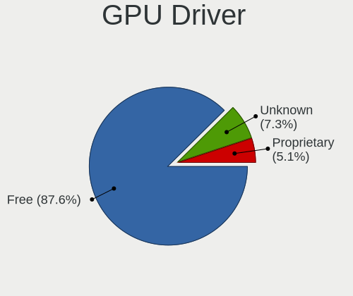
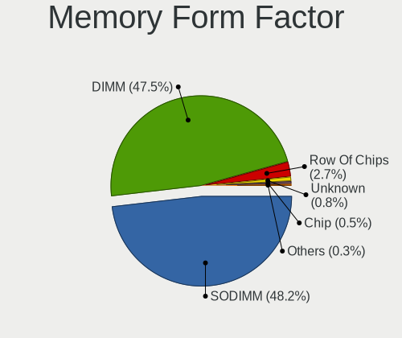

BSD - Tested Hardware & Statistics
----------------------------------

A project to collect tested hardware configurations for BSD.

Anyone can contribute to this report by the [hw-probe](https://github.com/linuxhw/hw-probe/blob/master/INSTALL.BSD.md) tool:

    hw-probe -all -upload

Please contribute! Especially if your hardware is rare.

This is a report for all computer types. See also reports for [desktops](/Desktop/README.md) and [notebooks](/Notebook/README.md).

OS-specific reports: [FreeBSD](/Dist/FreeBSD), [GhostBSD](/Dist/GhostBSD), [helloSystem](/Dist/helloSystem), [NetBSD](/Dist/NetBSD), [NomadBSD](/Dist/NomadBSD), [OpenBSD](/Dist/OpenBSD), [OPNsense](/Dist/OPNsense), [pfSense](/Dist/pfSense), [TrueNAS](/Dist/TrueNAS).

This report is for real hardware. Report for virtual hardware: [TestDays_VE](https://github.com/bsdhw/TestDays_VE)

Contents
--------

* [ Test Cases ](#test-cases)

* [ System ](#system)
  - [ OS                       ](#os)
  - [ OS Family                ](#os-family)
  - [ Arch                     ](#arch)
  - [ DE                       ](#de)
  - [ Display Server           ](#display-server)
  - [ Display Manager          ](#display-manager)
  - [ OS Lang                  ](#os-lang)
  - [ Boot Mode                ](#boot-mode)
  - [ Filesystem               ](#filesystem)
  - [ Part. scheme             ](#part-scheme)

* [ Board ](#board)
  - [ Vendor                   ](#vendor)
  - [ Model                    ](#model)
  - [ Model Family             ](#model-family)
  - [ MFG Year                 ](#mfg-year)
  - [ Form Factor              ](#form-factor)
  - [ Coreboot                 ](#coreboot)
  - [ RAM Size                 ](#ram-size)
  - [ RAM Used                 ](#ram-used)
  - [ Total Drives             ](#total-drives)
  - [ Has CD-ROM               ](#has-cd-rom)
  - [ Has Ethernet             ](#has-ethernet)
  - [ Has WiFi                 ](#has-wifi)
  - [ Has Bluetooth            ](#has-bluetooth)

* [ Location ](#location)
  - [ Country                  ](#country)
  - [ City                     ](#city)

* [ Drives ](#drives)
  - [ Drive Vendor             ](#drive-vendor)
  - [ Drive Model              ](#drive-model)
  - [ HDD Vendor               ](#hdd-vendor)
  - [ SSD Vendor               ](#ssd-vendor)
  - [ Drive Kind               ](#drive-kind)
  - [ Drive Connector          ](#drive-connector)
  - [ Drive Size               ](#drive-size)
  - [ Space Total              ](#space-total)
  - [ Space Used               ](#space-used)
  - [ Malfunc. Drives          ](#malfunc-drives)
  - [ Malfunc. Drive Vendor    ](#malfunc-drive-vendor)
  - [ Malfunc. HDD Vendor      ](#malfunc-hdd-vendor)
  - [ Malfunc. Drive Kind      ](#malfunc-drive-kind)
  - [ Failed Drives            ](#failed-drives)
  - [ Failed Drive Vendor      ](#failed-drive-vendor)
  - [ Drive Status             ](#drive-status)

* [ Storage controller ](#storage-controller)
  - [ Storage Vendor           ](#storage-vendor)
  - [ Storage Model            ](#storage-model)
  - [ Storage Kind             ](#storage-kind)

* [ Processor ](#processor)
  - [ CPU Vendor               ](#cpu-vendor)
  - [ CPU Model                ](#cpu-model)
  - [ CPU Model Family         ](#cpu-model-family)
  - [ CPU Cores                ](#cpu-cores)
  - [ CPU Sockets              ](#cpu-sockets)
  - [ CPU Threads              ](#cpu-threads)
  - [ CPU Microarch            ](#cpu-microarch)

* [ Graphics ](#graphics)
  - [ GPU Vendor               ](#gpu-vendor)
  - [ GPU Model                ](#gpu-model)
  - [ GPU Combo                ](#gpu-combo)
  - [ GPU Driver               ](#gpu-driver)
  - [ GPU Memory               ](#gpu-memory)

* [ Monitor ](#monitor)
  - [ Monitor Vendor           ](#monitor-vendor)
  - [ Monitor Model            ](#monitor-model)
  - [ Monitor Resolution       ](#monitor-resolution)
  - [ Monitor Diagonal         ](#monitor-diagonal)
  - [ Monitor Width            ](#monitor-width)
  - [ Aspect Ratio             ](#aspect-ratio)
  - [ Monitor Area             ](#monitor-area)
  - [ Pixel Density            ](#pixel-density)
  - [ Multiple Monitors        ](#multiple-monitors)

* [ Network ](#network)
  - [ Net Controller Vendor    ](#net-controller-vendor)
  - [ Net Controller Model     ](#net-controller-model)
  - [ Wireless Vendor          ](#wireless-vendor)
  - [ Wireless Model           ](#wireless-model)
  - [ Ethernet Vendor          ](#ethernet-vendor)
  - [ Ethernet Model           ](#ethernet-model)
  - [ Net Controller Kind      ](#net-controller-kind)
  - [ Used Controller          ](#used-controller)
  - [ NICs                     ](#nics)
  - [ IPv6                     ](#ipv6)

* [ Bluetooth ](#bluetooth)
  - [ Bluetooth Vendor         ](#bluetooth-vendor)
  - [ Bluetooth Model          ](#bluetooth-model)

* [ Sound ](#sound)
  - [ Sound Vendor             ](#sound-vendor)
  - [ Sound Model              ](#sound-model)

* [ Memory ](#memory)
  - [ Memory Vendor            ](#memory-vendor)
  - [ Memory Model             ](#memory-model)
  - [ Memory Kind              ](#memory-kind)
  - [ Memory Form Factor       ](#memory-form-factor)
  - [ Memory Size              ](#memory-size)
  - [ Memory Speed             ](#memory-speed)

* [ Printers & scanners ](#printers--scanners)
  - [ Printer Vendor           ](#printer-vendor)
  - [ Printer Model            ](#printer-model)
  - [ Scanner Vendor           ](#scanner-vendor)
  - [ Scanner Model            ](#scanner-model)

* [ Camera ](#camera)
  - [ Camera Vendor            ](#camera-vendor)
  - [ Camera Model             ](#camera-model)

* [ Security ](#security)
  - [ Fingerprint Vendor       ](#fingerprint-vendor)
  - [ Fingerprint Model        ](#fingerprint-model)
  - [ Chipcard Vendor          ](#chipcard-vendor)
  - [ Chipcard Model           ](#chipcard-model)

* [ Unsupported ](#unsupported)
  - [ Unsupported Devices      ](#unsupported-devices)
  - [ Unsupported Device Types ](#unsupported-device-types)

Test Cases
----------

Total: 21555

| Vendor        | Model                       | Form-Factor | Probe                                                     | Date         |
|---------------|-----------------------------|-------------|-----------------------------------------------------------|--------------|
| Unknown       | Unknown                     | Desktop     | [f4fa8cc2cd](https://bsd-hardware.info/?probe=f4fa8cc2cd) | Feb 18, 2024 |
| Unknown       | Unknown                     | Desktop     | [7d606ad1ef](https://bsd-hardware.info/?probe=7d606ad1ef) | Feb 18, 2024 |
| Unknown       | Unknown                     | Desktop     | [7a484b8933](https://bsd-hardware.info/?probe=7a484b8933) | Feb 18, 2024 |
| MW            | GMLK-2_5G4L                 | Desktop     | [23cb8e1723](https://bsd-hardware.info/?probe=23cb8e1723) | Feb 18, 2024 |
| Gigabyte      | H170-Gaming 3               | Desktop     | [5333db4eb9](https://bsd-hardware.info/?probe=5333db4eb9) | Feb 18, 2024 |
| CWWK          | CW-AD4L-N V1                | Desktop     | [6f933374c6](https://bsd-hardware.info/?probe=6f933374c6) | Feb 18, 2024 |
| Dell          | 0D28YY A00                  | Desktop     | [15db3df1ca](https://bsd-hardware.info/?probe=15db3df1ca) | Feb 18, 2024 |
| CWWK          | CW-AD4L-N V1                | Desktop     | [45450ec330](https://bsd-hardware.info/?probe=45450ec330) | Feb 18, 2024 |
| ASRock        | B450M Pro4 R2.0             | Desktop     | [007b93e5c0](https://bsd-hardware.info/?probe=007b93e5c0) | Feb 18, 2024 |
| Unknown       | Unknown                     | Desktop     | [882809e2c7](https://bsd-hardware.info/?probe=882809e2c7) | Feb 18, 2024 |
| Unknown       | Unknown                     | Desktop     | [db839aa12a](https://bsd-hardware.info/?probe=db839aa12a) | Feb 18, 2024 |
| Dell          | Latitude E6430              | Notebook    | [1f9f417c2f](https://bsd-hardware.info/?probe=1f9f417c2f) | Feb 18, 2024 |
| Protectli     | FW6 Ver                     | Desktop     | [35e8ff3d63](https://bsd-hardware.info/?probe=35e8ff3d63) | Feb 18, 2024 |
| Unknown       | J3160-4L                    | Desktop     | [e4b6344125](https://bsd-hardware.info/?probe=e4b6344125) | Feb 18, 2024 |
| Gigabyte      | H170-Gaming 3               | Desktop     | [4c03a20d4f](https://bsd-hardware.info/?probe=4c03a20d4f) | Feb 18, 2024 |
| Gigabyte      | Z590I VISION D              | Desktop     | [95add8c57a](https://bsd-hardware.info/?probe=95add8c57a) | Feb 18, 2024 |
| Sophos        | SG                          | Firewall    | [e38a7b380e](https://bsd-hardware.info/?probe=e38a7b380e) | Feb 18, 2024 |
| HPE           | ProLiant MicroServer Gen... | Server      | [0896863043](https://bsd-hardware.info/?probe=0896863043) | Feb 18, 2024 |
| HP            | 802E                        | Desktop     | [6ef690a057](https://bsd-hardware.info/?probe=6ef690a057) | Feb 17, 2024 |
| HP            | 829E                        | Mini pc     | [428159acc1](https://bsd-hardware.info/?probe=428159acc1) | Feb 17, 2024 |
| Intel         | CM8I7CB8N K53740-202        | Mini pc     | [4e34435ef4](https://bsd-hardware.info/?probe=4e34435ef4) | Feb 17, 2024 |
| HP            | 83E9                        | Desktop     | [f5a6f9001d](https://bsd-hardware.info/?probe=f5a6f9001d) | Feb 17, 2024 |
| PC Engines    | apu6                        | Desktop     | [9f618d2d95](https://bsd-hardware.info/?probe=9f618d2d95) | Feb 17, 2024 |
| Unknown       | Unknown                     | Desktop     | [0a1749e911](https://bsd-hardware.info/?probe=0a1749e911) | Feb 17, 2024 |
| Unknown       | Unknown                     | Desktop     | [0d6264dd51](https://bsd-hardware.info/?probe=0d6264dd51) | Feb 17, 2024 |
| Unknown       | Unknown                     | Desktop     | [ac788598a6](https://bsd-hardware.info/?probe=ac788598a6) | Feb 17, 2024 |
| Intel         | J1900                       | Desktop     | [2fe6c55315](https://bsd-hardware.info/?probe=2fe6c55315) | Feb 17, 2024 |
| Intel         | J1900                       | Desktop     | [0f27ae5c3e](https://bsd-hardware.info/?probe=0f27ae5c3e) | Feb 17, 2024 |
| Unknown       | Unknown                     | Desktop     | [51de6543fd](https://bsd-hardware.info/?probe=51de6543fd) | Feb 17, 2024 |
| ASUSTek       | B85M-G                      | Desktop     | [0fc891ba64](https://bsd-hardware.info/?probe=0fc891ba64) | Feb 17, 2024 |
| ASUSTek       | Q87T                        | Desktop     | [ca381bbbcc](https://bsd-hardware.info/?probe=ca381bbbcc) | Feb 17, 2024 |
| ASUSTek       | VivoBook_ASUSLaptop X350... | Notebook    | [a7aada8678](https://bsd-hardware.info/?probe=a7aada8678) | Feb 17, 2024 |
| Unknown       | Unknown                     | Desktop     | [ca03a6b3b5](https://bsd-hardware.info/?probe=ca03a6b3b5) | Feb 17, 2024 |
| Deciso        | NetBoard-A20                | Notebook    | [ebbe4a0d21](https://bsd-hardware.info/?probe=ebbe4a0d21) | Feb 17, 2024 |
| Unknown       | Unknown                     | Desktop     | [ebfcb0f78b](https://bsd-hardware.info/?probe=ebfcb0f78b) | Feb 17, 2024 |
| Biostar       | B450NH                      | Desktop     | [9f4dedfcd6](https://bsd-hardware.info/?probe=9f4dedfcd6) | Feb 17, 2024 |
| Dell          | 0CN7CM A04                  | Server      | [c090e35a9f](https://bsd-hardware.info/?probe=c090e35a9f) | Feb 17, 2024 |
| Unknown       | Unknown                     | Desktop     | [2926d6511f](https://bsd-hardware.info/?probe=2926d6511f) | Feb 17, 2024 |
| Techvision    | TVI7309X B0                 | Desktop     | [135d71a048](https://bsd-hardware.info/?probe=135d71a048) | Feb 17, 2024 |
| Foxconn       | 2ABF                        | Desktop     | [a7fb944efe](https://bsd-hardware.info/?probe=a7fb944efe) | Feb 17, 2024 |
| ASUSTek       | VivoBook_ASUS Laptop E21... | Notebook    | [fb1f5f8545](https://bsd-hardware.info/?probe=fb1f5f8545) | Feb 16, 2024 |
| Fujitsu       | D3313-E1 S26361-D3313-E1    | Desktop     | [8f0a5d2d0a](https://bsd-hardware.info/?probe=8f0a5d2d0a) | Feb 16, 2024 |
| CWWK          | CW-J6-6L                    | Desktop     | [ed704fa396](https://bsd-hardware.info/?probe=ed704fa396) | Feb 16, 2024 |
| GoWin Solu... | R86S                        | Desktop     | [1629545965](https://bsd-hardware.info/?probe=1629545965) | Feb 16, 2024 |
| AMI           | Aptio CRB                   | Mini pc     | [e9d1b23169](https://bsd-hardware.info/?probe=e9d1b23169) | Feb 16, 2024 |
| ASRock        | B360M Xtreme                | Desktop     | [e84af03816](https://bsd-hardware.info/?probe=e84af03816) | Feb 16, 2024 |
| Sophos        | SG                          | Firewall    | [5224c7efa3](https://bsd-hardware.info/?probe=5224c7efa3) | Feb 16, 2024 |
| Unknown       | Unknown                     | Desktop     | [e5e747ec86](https://bsd-hardware.info/?probe=e5e747ec86) | Feb 16, 2024 |
| Dell          | Vostro 15-3568              | Notebook    | [cc65de13e8](https://bsd-hardware.info/?probe=cc65de13e8) | Feb 16, 2024 |
| ECS           | APLD-MINI                   | Desktop     | [d0d3c5d2c3](https://bsd-hardware.info/?probe=d0d3c5d2c3) | Feb 16, 2024 |
| AMI           | Aptio CRB                   | Mini pc     | [85e7cae37d](https://bsd-hardware.info/?probe=85e7cae37d) | Feb 16, 2024 |
| Sophos        | SG                          | Firewall    | [6c3e05ea48](https://bsd-hardware.info/?probe=6c3e05ea48) | Feb 16, 2024 |
| HP            | 8AC4                        | Desktop     | [524b8cae7c](https://bsd-hardware.info/?probe=524b8cae7c) | Feb 16, 2024 |
| Biostar       | B450NH                      | Desktop     | [2db279db1d](https://bsd-hardware.info/?probe=2db279db1d) | Feb 16, 2024 |
| Supermicro    | X11SSQ-L-DE05BA             | Server      | [68029fc128](https://bsd-hardware.info/?probe=68029fc128) | Feb 16, 2024 |
| Lenovo        | 30D9 No DPK                 | Desktop     | [9c3c1f4f5d](https://bsd-hardware.info/?probe=9c3c1f4f5d) | Feb 16, 2024 |
| HP            | 304Bh                       | Desktop     | [d121a7198f](https://bsd-hardware.info/?probe=d121a7198f) | Feb 16, 2024 |
| Sophos        | XG                          | Firewall    | [740c7d4f5c](https://bsd-hardware.info/?probe=740c7d4f5c) | Feb 16, 2024 |
| Dell          | 0WMJ54 A01                  | Desktop     | [7ccce31d2d](https://bsd-hardware.info/?probe=7ccce31d2d) | Feb 16, 2024 |
| Unknown       | Unknown                     | Desktop     | [13c84b6db8](https://bsd-hardware.info/?probe=13c84b6db8) | Feb 16, 2024 |
| Unknown       | 0XFK4K A07                  | Server      | [fda628c852](https://bsd-hardware.info/?probe=fda628c852) | Feb 16, 2024 |
| Unknown       | Unknown                     | Desktop     | [a4781efc54](https://bsd-hardware.info/?probe=a4781efc54) | Feb 16, 2024 |
| BOSGAME       | DNB10M                      | Desktop     | [58f2362bf1](https://bsd-hardware.info/?probe=58f2362bf1) | Feb 16, 2024 |
| Dell          | 01Y1CJ A00                  | Mini pc     | [a3b94b00ad](https://bsd-hardware.info/?probe=a3b94b00ad) | Feb 15, 2024 |
| PC Engines    | APU2                        | Desktop     | [e2280e4159](https://bsd-hardware.info/?probe=e2280e4159) | Feb 15, 2024 |
| ASRock        | A320M-HDV R4.0              | Desktop     | [afe2427e9d](https://bsd-hardware.info/?probe=afe2427e9d) | Feb 15, 2024 |
| AWOW          | AK10                        | Desktop     | [4b512f8739](https://bsd-hardware.info/?probe=4b512f8739) | Feb 15, 2024 |
| Unknown       | Unknown                     | Desktop     | [b35fd5253d](https://bsd-hardware.info/?probe=b35fd5253d) | Feb 15, 2024 |
| Dell          | Latitude E7470              | Notebook    | [3a08bc08be](https://bsd-hardware.info/?probe=3a08bc08be) | Feb 15, 2024 |
| Unknown       | Unknown                     | Desktop     | [7dc7c39f38](https://bsd-hardware.info/?probe=7dc7c39f38) | Feb 15, 2024 |
| Gigabyte      | B360N WIFI-CF               | Desktop     | [65cc201af1](https://bsd-hardware.info/?probe=65cc201af1) | Feb 15, 2024 |
| AMI           | Aptio CRB                   | Mini pc     | [947eabeecc](https://bsd-hardware.info/?probe=947eabeecc) | Feb 15, 2024 |
| Google        | Ultima                      | Notebook    | [732adeb5e4](https://bsd-hardware.info/?probe=732adeb5e4) | Feb 15, 2024 |
| Intel         | SKYBAY                      | Desktop     | [5288673757](https://bsd-hardware.info/?probe=5288673757) | Feb 15, 2024 |
| ASUSTek       | H110M-K                     | Desktop     | [8ad1731687](https://bsd-hardware.info/?probe=8ad1731687) | Feb 15, 2024 |
| Intel         | BayTrail Platform           | Tablet      | [11ee2ab5d0](https://bsd-hardware.info/?probe=11ee2ab5d0) | Feb 15, 2024 |
| Fujitsu       | D3031 S26361-D3031-A100-... | Server      | [7fcc4087e9](https://bsd-hardware.info/?probe=7fcc4087e9) | Feb 15, 2024 |
| Fujitsu       | D3031 S26361-D3031-A100-... | Server      | [f9ad9d25e3](https://bsd-hardware.info/?probe=f9ad9d25e3) | Feb 14, 2024 |
| Hardkernel    | ODROID-H2                   | Desktop     | [a4045617ec](https://bsd-hardware.info/?probe=a4045617ec) | Feb 14, 2024 |
| Supermicro    | X9SCL/X9SCMA                | Desktop     | [53bdb73b74](https://bsd-hardware.info/?probe=53bdb73b74) | Feb 14, 2024 |
| Unknown       | Unknown                     | Desktop     | [ef910cb303](https://bsd-hardware.info/?probe=ef910cb303) | Feb 14, 2024 |
| ASUSTek       | Pro B560M-C                 | Desktop     | [fdeb2cee9d](https://bsd-hardware.info/?probe=fdeb2cee9d) | Feb 14, 2024 |
| ASRock        | B550 Taichi                 | Desktop     | [814a0aba66](https://bsd-hardware.info/?probe=814a0aba66) | Feb 14, 2024 |
| Unknown       | Unknown                     | Desktop     | [c2a87f002c](https://bsd-hardware.info/?probe=c2a87f002c) | Feb 14, 2024 |
| Supermicro    | X11SDV-8C-TP8F              | Desktop     | [6a026289ce](https://bsd-hardware.info/?probe=6a026289ce) | Feb 14, 2024 |
| HP            | ProLiant MicroServer Gen... | Desktop     | [ee68dade44](https://bsd-hardware.info/?probe=ee68dade44) | Feb 14, 2024 |
| AZW           | EQ                          | Desktop     | [cfdbc24520](https://bsd-hardware.info/?probe=cfdbc24520) | Feb 14, 2024 |
| Gigabyte      | IMB1900TN                   | Desktop     | [d0c6d1e44b](https://bsd-hardware.info/?probe=d0c6d1e44b) | Feb 14, 2024 |
| HP            | ProLiant DL320e Gen8 v2     | Server      | [c56fc3f2fc](https://bsd-hardware.info/?probe=c56fc3f2fc) | Feb 14, 2024 |
| Shuttle       | NC02U                       | Notebook    | [d559b380f0](https://bsd-hardware.info/?probe=d559b380f0) | Feb 14, 2024 |
| Dell          | 0WKGTH A02                  | Server      | [72aee7c16c](https://bsd-hardware.info/?probe=72aee7c16c) | Feb 14, 2024 |
| Unknown       | Unknown                     | Desktop     | [5da46d2f84](https://bsd-hardware.info/?probe=5da46d2f84) | Feb 14, 2024 |
| Protectli     | FW4B                        | Desktop     | [c9a2dee14e](https://bsd-hardware.info/?probe=c9a2dee14e) | Feb 14, 2024 |
| Sophos        | SG                          | Firewall    | [41c578e646](https://bsd-hardware.info/?probe=41c578e646) | Feb 14, 2024 |
| CncTion       | N5105-4L B0                 | Desktop     | [63fbf4cdbd](https://bsd-hardware.info/?probe=63fbf4cdbd) | Feb 14, 2024 |
| Dell          | 0YXT71 A00                  | Desktop     | [19c7684ced](https://bsd-hardware.info/?probe=19c7684ced) | Feb 14, 2024 |
| PC Engines    | APU2                        | Desktop     | [df18317865](https://bsd-hardware.info/?probe=df18317865) | Feb 14, 2024 |
| Gigabyte      | B550 AORUS ELITE V2         | Desktop     | [2159f2bebf](https://bsd-hardware.info/?probe=2159f2bebf) | Feb 14, 2024 |
| ASUSTek       | PRIME A520M-A II            | Desktop     | [acb70accb8](https://bsd-hardware.info/?probe=acb70accb8) | Feb 14, 2024 |
| HP            | 1998                        | Desktop     | [6895f365c7](https://bsd-hardware.info/?probe=6895f365c7) | Feb 14, 2024 |
| Unknown       | Unknown                     | Desktop     | [9c184fe6fa](https://bsd-hardware.info/?probe=9c184fe6fa) | Feb 14, 2024 |
| MSI           | H110M ECO                   | Desktop     | [74ec4ebb63](https://bsd-hardware.info/?probe=74ec4ebb63) | Feb 13, 2024 |
| Sophos        | SG                          | Firewall    | [b23c7b93a3](https://bsd-hardware.info/?probe=b23c7b93a3) | Feb 13, 2024 |
| ASRock        | A520M-ITX/ac                | Desktop     | [63408627d9](https://bsd-hardware.info/?probe=63408627d9) | Feb 13, 2024 |
| Shuttle       | FH170                       | Desktop     | [e7eaced298](https://bsd-hardware.info/?probe=e7eaced298) | Feb 13, 2024 |
| ASUSTek       | PRIME X370-PRO              | Desktop     | [7a18edf610](https://bsd-hardware.info/?probe=7a18edf610) | Feb 13, 2024 |
| ASRock        | X570 Phantom Gaming 4       | Desktop     | [d24c0ab2c0](https://bsd-hardware.info/?probe=d24c0ab2c0) | Feb 13, 2024 |
| Dell          | Inspiron 3558               | Notebook    | [e0e665c1b5](https://bsd-hardware.info/?probe=e0e665c1b5) | Feb 13, 2024 |
| Dell          | 0PC10G A00                  | Mini pc     | [836dac7d2c](https://bsd-hardware.info/?probe=836dac7d2c) | Feb 13, 2024 |
| Protectli     | FW2B                        | Desktop     | [09657632a4](https://bsd-hardware.info/?probe=09657632a4) | Feb 13, 2024 |
| IBM           | 94Y7614                     | Server      | [d2178f7e1a](https://bsd-hardware.info/?probe=d2178f7e1a) | Feb 13, 2024 |
| Lenovo        | ThinkPad T470 20HES0EV0A    | Notebook    | [05ecc99fe8](https://bsd-hardware.info/?probe=05ecc99fe8) | Feb 13, 2024 |
| Dell          | 02YYK5 A00                  | Desktop     | [47e43f818a](https://bsd-hardware.info/?probe=47e43f818a) | Feb 13, 2024 |
| AMI           | Aptio CRB                   | Mini pc     | [52d7bc4280](https://bsd-hardware.info/?probe=52d7bc4280) | Feb 13, 2024 |
| MSI           | MS-N014                     | Notebook    | [f731e6df0a](https://bsd-hardware.info/?probe=f731e6df0a) | Feb 13, 2024 |
| Deciso        | Netboard A10 V2.1           | Desktop     | [9f620acb22](https://bsd-hardware.info/?probe=9f620acb22) | Feb 13, 2024 |
| HP            | ProLiant MicroServer        | Desktop     | [ab0d1d0078](https://bsd-hardware.info/?probe=ab0d1d0078) | Feb 13, 2024 |
| AMI           | Aptio CRB                   | Mini pc     | [825087e77c](https://bsd-hardware.info/?probe=825087e77c) | Feb 13, 2024 |
| Intel         | S1200BTL E98681-352         | Server      | [c7dd68f8a0](https://bsd-hardware.info/?probe=c7dd68f8a0) | Feb 13, 2024 |
| Lenovo        | ThinkPad T450 20BU000GUS    | Notebook    | [e1d99a4966](https://bsd-hardware.info/?probe=e1d99a4966) | Feb 13, 2024 |
| ASRock        | Z590 Steel Legend           | Desktop     | [e7dfc1ffe5](https://bsd-hardware.info/?probe=e7dfc1ffe5) | Feb 13, 2024 |
| ASRock        | Z590 Steel Legend           | Desktop     | [30702fa4b5](https://bsd-hardware.info/?probe=30702fa4b5) | Feb 13, 2024 |
| HP            | 8103 A01                    | Mini pc     | [92bebda2d7](https://bsd-hardware.info/?probe=92bebda2d7) | Feb 12, 2024 |
| Dell          | 07WP95 A02                  | Desktop     | [aad51ede2a](https://bsd-hardware.info/?probe=aad51ede2a) | Feb 12, 2024 |
| HP            | 18E7                        | Desktop     | [ce1c65da2d](https://bsd-hardware.info/?probe=ce1c65da2d) | Feb 12, 2024 |
| Protectli     | FW2B Ver                    | Desktop     | [d2280903ce](https://bsd-hardware.info/?probe=d2280903ce) | Feb 12, 2024 |
| ASUSTek       | ASUS TUF Gaming A16 FA61... | Notebook    | [5306df5921](https://bsd-hardware.info/?probe=5306df5921) | Feb 12, 2024 |
| AMI           | Aptio CRB                   | Mini pc     | [a2205533c6](https://bsd-hardware.info/?probe=a2205533c6) | Feb 12, 2024 |
| ASUSTek       | A68HM-PLUS                  | Desktop     | [191c41587b](https://bsd-hardware.info/?probe=191c41587b) | Feb 12, 2024 |
| Intel         | SKYBAY                      | Desktop     | [7c8379fd02](https://bsd-hardware.info/?probe=7c8379fd02) | Feb 12, 2024 |
| Shenzhen M... | F6BFC                       | Desktop     | [ca7e1f0fae](https://bsd-hardware.info/?probe=ca7e1f0fae) | Feb 12, 2024 |
| AMI           | Aptio CRB                   | Mini pc     | [9376dd68e3](https://bsd-hardware.info/?probe=9376dd68e3) | Feb 12, 2024 |
| IceWhale T... | ZimaBoard 832 ZMB           | Desktop     | [5d8c1ea60c](https://bsd-hardware.info/?probe=5d8c1ea60c) | Feb 12, 2024 |
| ASUSTek       | M5A97 R2.0                  | Desktop     | [c3d95743df](https://bsd-hardware.info/?probe=c3d95743df) | Feb 12, 2024 |
| AZW           | EQ                          | Desktop     | [1f6f07cd11](https://bsd-hardware.info/?probe=1f6f07cd11) | Feb 12, 2024 |
| Notebook      | N960Kx                      | Notebook    | [4e83c12f96](https://bsd-hardware.info/?probe=4e83c12f96) | Feb 12, 2024 |
| Supermicro    | X10SLH-N6-ST031             | Server      | [ebb87f307e](https://bsd-hardware.info/?probe=ebb87f307e) | Feb 12, 2024 |
| Supermicro    | X10SLH-N6-ST031             | Server      | [4888597805](https://bsd-hardware.info/?probe=4888597805) | Feb 12, 2024 |
| Sony          | Unknown                     | Notebook    | [c0013719ab](https://bsd-hardware.info/?probe=c0013719ab) | Feb 12, 2024 |
| MSI           | 890GXM-G65                  | Desktop     | [96d9ab3e95](https://bsd-hardware.info/?probe=96d9ab3e95) | Feb 12, 2024 |
| Sony          | Unknown                     | Notebook    | [a17ecdd804](https://bsd-hardware.info/?probe=a17ecdd804) | Feb 12, 2024 |
| PC Engines    | APU2                        | Desktop     | [70927f49d1](https://bsd-hardware.info/?probe=70927f49d1) | Feb 12, 2024 |
| Lenovo        | ThinkPad T410 2522WAR       | Notebook    | [caccf07908](https://bsd-hardware.info/?probe=caccf07908) | Feb 12, 2024 |
| PC Engines    | APU2                        | Desktop     | [251265d29e](https://bsd-hardware.info/?probe=251265d29e) | Feb 12, 2024 |
| Gigabyte      | B760I AORUS PRO DDR4        | Desktop     | [0074d80aa1](https://bsd-hardware.info/?probe=0074d80aa1) | Feb 12, 2024 |
| HP            | 1998                        | Desktop     | [58de92b13d](https://bsd-hardware.info/?probe=58de92b13d) | Feb 11, 2024 |
| Unknown       | YL-J3160L4                  | Desktop     | [7bb2930dfa](https://bsd-hardware.info/?probe=7bb2930dfa) | Feb 11, 2024 |
| AMI           | Aptio CRB                   | Mini pc     | [1073b283ec](https://bsd-hardware.info/?probe=1073b283ec) | Feb 11, 2024 |
| Acer          | Veriton X4660G V:1.0        | Desktop     | [768778b955](https://bsd-hardware.info/?probe=768778b955) | Feb 11, 2024 |
| Acer          | Veriton X4660G V:1.0        | Desktop     | [e46456819b](https://bsd-hardware.info/?probe=e46456819b) | Feb 11, 2024 |
| Unknown       | Unknown                     | Desktop     | [d05beec487](https://bsd-hardware.info/?probe=d05beec487) | Feb 11, 2024 |
| Dell          | 0FF3FN A00                  | Desktop     | [56b53a9e68](https://bsd-hardware.info/?probe=56b53a9e68) | Feb 11, 2024 |
| Dell          | 0H634K A00                  | Desktop     | [a39d975ae9](https://bsd-hardware.info/?probe=a39d975ae9) | Feb 11, 2024 |
| ASUSTek       | TUF Gaming B550M-PLUS       | Desktop     | [fa2107c718](https://bsd-hardware.info/?probe=fa2107c718) | Feb 11, 2024 |
| Supermicro    | X10SLL-F                    | Server      | [d08cceec12](https://bsd-hardware.info/?probe=d08cceec12) | Feb 11, 2024 |
| Supermicro    | X10SDV-TP8F                 | Server      | [08e1a91501](https://bsd-hardware.info/?probe=08e1a91501) | Feb 11, 2024 |
| ASUSTek       | P5Q-E                       | Desktop     | [08506a1aff](https://bsd-hardware.info/?probe=08506a1aff) | Feb 11, 2024 |
| ASUSTek       | ROG CROSSHAIR VIII HERO     | Desktop     | [5f3d8e3288](https://bsd-hardware.info/?probe=5f3d8e3288) | Feb 11, 2024 |
| Unknown       | Unknown                     | Notebook    | [2af11d5bbf](https://bsd-hardware.info/?probe=2af11d5bbf) | Feb 11, 2024 |
| Unknown       | Unknown                     | Desktop     | [d447aefaf0](https://bsd-hardware.info/?probe=d447aefaf0) | Feb 11, 2024 |
| Protectli     | FW6 Ver                     | Desktop     | [9a3b41d070](https://bsd-hardware.info/?probe=9a3b41d070) | Feb 11, 2024 |
| Dell          | 0H4VK7 A00                  | Desktop     | [64725f3ed7](https://bsd-hardware.info/?probe=64725f3ed7) | Feb 11, 2024 |
| Lenovo        | Yoga 900S-12ISK 80ML        | Notebook    | [47f57b0893](https://bsd-hardware.info/?probe=47f57b0893) | Feb 11, 2024 |
| Lenovo        | Yoga 900S-12ISK 80ML        | Notebook    | [5315513827](https://bsd-hardware.info/?probe=5315513827) | Feb 11, 2024 |
| Unknown       | Unknown                     | Desktop     | [e4b4c15b64](https://bsd-hardware.info/?probe=e4b4c15b64) | Feb 11, 2024 |
| Sophos        | XG                          | Firewall    | [4037edf714](https://bsd-hardware.info/?probe=4037edf714) | Feb 11, 2024 |
| Dell          | 00V62H A01                  | Desktop     | [e583d1ae8c](https://bsd-hardware.info/?probe=e583d1ae8c) | Feb 11, 2024 |
| Dell          | 0H4VK7 A00                  | Desktop     | [c321c66eea](https://bsd-hardware.info/?probe=c321c66eea) | Feb 11, 2024 |
| Gigabyte      | H170-D3HP-CF                | Desktop     | [32822eef4c](https://bsd-hardware.info/?probe=32822eef4c) | Feb 11, 2024 |
| Unknown       | Unknown                     | Desktop     | [742f0ba15a](https://bsd-hardware.info/?probe=742f0ba15a) | Feb 11, 2024 |
| Intel         | HURONRIVER                  | Desktop     | [fd049a80db](https://bsd-hardware.info/?probe=fd049a80db) | Feb 10, 2024 |
| ASUSTek       | H97I-PLUS                   | Desktop     | [c5ca47db6b](https://bsd-hardware.info/?probe=c5ca47db6b) | Feb 10, 2024 |
| Advantech     | NAMB-3250 A102-1            | Desktop     | [09843ea5f1](https://bsd-hardware.info/?probe=09843ea5f1) | Feb 10, 2024 |
| AMI           | Aptio CRB                   | Mini pc     | [05fdd89379](https://bsd-hardware.info/?probe=05fdd89379) | Feb 10, 2024 |
| Sophos        | SG                          | Firewall    | [d2febdbbcd](https://bsd-hardware.info/?probe=d2febdbbcd) | Feb 10, 2024 |
| Gigabyte      | B760I AORUS PRO DDR4        | Desktop     | [ab109fa386](https://bsd-hardware.info/?probe=ab109fa386) | Feb 10, 2024 |
| Intel         | JSL MRD                     | Desktop     | [373f1bfecf](https://bsd-hardware.info/?probe=373f1bfecf) | Feb 10, 2024 |
| Techvision    | TVI7309X B0                 | Desktop     | [d4bdab4711](https://bsd-hardware.info/?probe=d4bdab4711) | Feb 10, 2024 |
| HP            | 339A                        | Desktop     | [5d1b482427](https://bsd-hardware.info/?probe=5d1b482427) | Feb 10, 2024 |
| Unknown       | Unknown                     | Desktop     | [ea4fe7a8cf](https://bsd-hardware.info/?probe=ea4fe7a8cf) | Feb 10, 2024 |
| Deciso        | NetBoard-A10                | Notebook    | [8403713b4f](https://bsd-hardware.info/?probe=8403713b4f) | Feb 10, 2024 |
| CWWK          | CW-J6-6L                    | Desktop     | [d859437053](https://bsd-hardware.info/?probe=d859437053) | Feb 10, 2024 |
| ASUSTek       | PRIME Z790M-PLUS D4         | Desktop     | [7f4338cdd1](https://bsd-hardware.info/?probe=7f4338cdd1) | Feb 10, 2024 |
| HP            | 8299                        | Desktop     | [2a8e07ec62](https://bsd-hardware.info/?probe=2a8e07ec62) | Feb 10, 2024 |
| Intel         | Q3XXG4-P V1.0               | Desktop     | [b3e9bf8bcd](https://bsd-hardware.info/?probe=b3e9bf8bcd) | Feb 10, 2024 |
| Dell          | 0F9NPY A02                  | Server      | [7298dc5ba3](https://bsd-hardware.info/?probe=7298dc5ba3) | Feb 10, 2024 |
| Dell          | Latitude 7490               | Notebook    | [32828d5d84](https://bsd-hardware.info/?probe=32828d5d84) | Feb 10, 2024 |
| Unknown       | Unknown                     | Desktop     | [b13923c3f1](https://bsd-hardware.info/?probe=b13923c3f1) | Feb 10, 2024 |
| Unknown       | Unknown                     | Desktop     | [d0bf9601a7](https://bsd-hardware.info/?probe=d0bf9601a7) | Feb 10, 2024 |
| Unknown       | Unknown                     | Desktop     | [c3f71c8e39](https://bsd-hardware.info/?probe=c3f71c8e39) | Feb 10, 2024 |
| Sophos        | SG                          | Firewall    | [06bd59ff02](https://bsd-hardware.info/?probe=06bd59ff02) | Feb 10, 2024 |
| Unknown       | Unknown                     | Desktop     | [ea0996b777](https://bsd-hardware.info/?probe=ea0996b777) | Feb 10, 2024 |
| Intel         | NUC11DBBi7 M17027-404       | Mini pc     | [4b3438a1eb](https://bsd-hardware.info/?probe=4b3438a1eb) | Feb 09, 2024 |
| HP            | 213D A01                    | Desktop     | [e80039f387](https://bsd-hardware.info/?probe=e80039f387) | Feb 09, 2024 |
| Cisco         | ASA5515 A0                  | Desktop     | [8374ec4cca](https://bsd-hardware.info/?probe=8374ec4cca) | Feb 09, 2024 |
| Intel         | DQ77KB AAG81483-501         | Desktop     | [96f998dae3](https://bsd-hardware.info/?probe=96f998dae3) | Feb 09, 2024 |
| Unknown       | Unknown                     | Desktop     | [19e59c140c](https://bsd-hardware.info/?probe=19e59c140c) | Feb 09, 2024 |
| HP            | 17E2                        | Desktop     | [946d33d274](https://bsd-hardware.info/?probe=946d33d274) | Feb 09, 2024 |
| Unknown       | Unknown                     | Desktop     | [d8f999e5ce](https://bsd-hardware.info/?probe=d8f999e5ce) | Feb 09, 2024 |
| Sophos        | SG                          | Firewall    | [1bb50b3634](https://bsd-hardware.info/?probe=1bb50b3634) | Feb 09, 2024 |
| Unknown       | Unknown                     | Desktop     | [61ddfb16f5](https://bsd-hardware.info/?probe=61ddfb16f5) | Feb 09, 2024 |
| HP            | 1495                        | Desktop     | [570b4899ea](https://bsd-hardware.info/?probe=570b4899ea) | Feb 09, 2024 |
| HP            | ProLiant MicroServer Gen... | Desktop     | [01a632e124](https://bsd-hardware.info/?probe=01a632e124) | Feb 09, 2024 |
| Unknown       | Unknown                     | Desktop     | [eb03c1914f](https://bsd-hardware.info/?probe=eb03c1914f) | Feb 09, 2024 |
| HP            | ProLiant DL380 G4           | Server      | [1d58307095](https://bsd-hardware.info/?probe=1d58307095) | Feb 09, 2024 |
| PC Engines    | APU2                        | Desktop     | [2741a6da81](https://bsd-hardware.info/?probe=2741a6da81) | Feb 09, 2024 |
| Gigabyte      | B550 UD AC-Y1               | Desktop     | [1e285504a6](https://bsd-hardware.info/?probe=1e285504a6) | Feb 09, 2024 |
| Unknown       | TB100                       | Desktop     | [9075923143](https://bsd-hardware.info/?probe=9075923143) | Feb 09, 2024 |
| Fujitsu       | D3067-A1 S26361-D3067-A1    | Desktop     | [08ee39a7cf](https://bsd-hardware.info/?probe=08ee39a7cf) | Feb 09, 2024 |
| Foxconn       | 2ABF                        | Desktop     | [25d0533779](https://bsd-hardware.info/?probe=25d0533779) | Feb 09, 2024 |
| AMI           | Aptio CRB                   | Mini pc     | [1ea9b4724a](https://bsd-hardware.info/?probe=1ea9b4724a) | Feb 09, 2024 |
| Unknown       | Unknown                     | Desktop     | [09beb1cb7a](https://bsd-hardware.info/?probe=09beb1cb7a) | Feb 08, 2024 |
| Dell          | 0X9X1W A00                  | Desktop     | [56e5a43171](https://bsd-hardware.info/?probe=56e5a43171) | Feb 08, 2024 |
| HP            | ProBook 440 G8 Notebook ... | Notebook    | [977c74f4c0](https://bsd-hardware.info/?probe=977c74f4c0) | Feb 08, 2024 |
| Unknown       | Unknown                     | Notebook    | [f5ad3c2512](https://bsd-hardware.info/?probe=f5ad3c2512) | Feb 08, 2024 |
| MSI           | B450M MORTAR MAX            | Desktop     | [1401e42d48](https://bsd-hardware.info/?probe=1401e42d48) | Feb 08, 2024 |
| HP            | ProLiant DL180 G6           | Server      | [bf8b98f373](https://bsd-hardware.info/?probe=bf8b98f373) | Feb 08, 2024 |
| Lenovo        | 3136 SDK0J40697 WIN 3305... | Mini pc     | [7e7a97b09f](https://bsd-hardware.info/?probe=7e7a97b09f) | Feb 08, 2024 |
| Protectli     | VP2420                      | Desktop     | [70f6cd6041](https://bsd-hardware.info/?probe=70f6cd6041) | Feb 08, 2024 |
| AMI           | Aptio CRB                   | Mini pc     | [7ec9f0596a](https://bsd-hardware.info/?probe=7ec9f0596a) | Feb 08, 2024 |
| Micro Comp... | Venus series                | Notebook    | [20e602834b](https://bsd-hardware.info/?probe=20e602834b) | Feb 08, 2024 |
| Fujitsu       | D3430-U1 S26361-D3430-U1    | Desktop     | [9778043e6f](https://bsd-hardware.info/?probe=9778043e6f) | Feb 08, 2024 |
| Micro Comp... | Venus series                | Notebook    | [3a2455558f](https://bsd-hardware.info/?probe=3a2455558f) | Feb 08, 2024 |
| Unknown       | Unknown                     | Desktop     | [5e402c524a](https://bsd-hardware.info/?probe=5e402c524a) | Feb 08, 2024 |
| Gigabyte      | X299 AORUS Gaming-CF        | Desktop     | [47e91ddd92](https://bsd-hardware.info/?probe=47e91ddd92) | Feb 08, 2024 |
| Intel         | Q3XXG4-P V1.0               | Desktop     | [34d8f9b987](https://bsd-hardware.info/?probe=34d8f9b987) | Feb 08, 2024 |
| GMKtec        | NucBox M5                   | Mini pc     | [2cdf090d24](https://bsd-hardware.info/?probe=2cdf090d24) | Feb 08, 2024 |
| Lenovo        | ThinkCentre M91p 7052C1G    | Desktop     | [3aeb926332](https://bsd-hardware.info/?probe=3aeb926332) | Feb 08, 2024 |
| CWWK          | CW-J6-6L                    | Desktop     | [dd96aebca7](https://bsd-hardware.info/?probe=dd96aebca7) | Feb 08, 2024 |
| Gigabyte      | H81M-D2V                    | Desktop     | [1b2b064c64](https://bsd-hardware.info/?probe=1b2b064c64) | Feb 08, 2024 |
| AZW           | EQ                          | Desktop     | [5b83388da9](https://bsd-hardware.info/?probe=5b83388da9) | Feb 08, 2024 |
| Unknown       | J3160-4L                    | Desktop     | [353ac982bf](https://bsd-hardware.info/?probe=353ac982bf) | Feb 07, 2024 |
| Lenovo        | ThinkPad T14s Gen 4 21F8... | Notebook    | [2a4911715a](https://bsd-hardware.info/?probe=2a4911715a) | Feb 07, 2024 |
| Cisco         | C170 A0                     | Desktop     | [5d0362fa16](https://bsd-hardware.info/?probe=5d0362fa16) | Feb 07, 2024 |
| Dell          | 0F0XJ6 A13                  | Server      | [0493961490](https://bsd-hardware.info/?probe=0493961490) | Feb 07, 2024 |
| Supermicro    | X11SSL-CF                   | Server      | [8fcaaf3025](https://bsd-hardware.info/?probe=8fcaaf3025) | Feb 07, 2024 |
| Unknown       | Unknown                     | Desktop     | [1d24f65624](https://bsd-hardware.info/?probe=1d24f65624) | Feb 07, 2024 |
| SHANGZHAOY... | B85M-PRO V1.1               | Desktop     | [79ec97854e](https://bsd-hardware.info/?probe=79ec97854e) | Feb 07, 2024 |
| AAEON         | FWS-2251 V1.0               | Desktop     | [17853848cd](https://bsd-hardware.info/?probe=17853848cd) | Feb 07, 2024 |
| ASUSTek       | EX-B760M-V5 D4              | Desktop     | [852818ab9b](https://bsd-hardware.info/?probe=852818ab9b) | Feb 07, 2024 |
| Lenovo        | ThinkPad T480 20L6SDA400    | Notebook    | [4934e88205](https://bsd-hardware.info/?probe=4934e88205) | Feb 07, 2024 |
| PC Engines    | APU2                        | Desktop     | [6d52e4dad5](https://bsd-hardware.info/?probe=6d52e4dad5) | Feb 07, 2024 |
| Apple         | Mac-031AEE4D24BFF0B1 Mac... | Mini pc     | [365bb9e521](https://bsd-hardware.info/?probe=365bb9e521) | Feb 07, 2024 |
| Lenovo        | 30FD SDK0J40705 WIN 3425... | Desktop     | [87313cc66c](https://bsd-hardware.info/?probe=87313cc66c) | Feb 07, 2024 |
| HP            | 8717                        | Desktop     | [de846f4d11](https://bsd-hardware.info/?probe=de846f4d11) | Feb 07, 2024 |
| OEM           | 1.0                         | Desktop     | [dd3228b447](https://bsd-hardware.info/?probe=dd3228b447) | Feb 07, 2024 |
| PC Engines    | apu4                        | Desktop     | [fb60f908ae](https://bsd-hardware.info/?probe=fb60f908ae) | Feb 07, 2024 |
| Gigabyte      | B450M DS3H-CF               | Desktop     | [4073dda626](https://bsd-hardware.info/?probe=4073dda626) | Feb 07, 2024 |
| Panasonic     | CF-52VDA131M                | Notebook    | [1ebdac9598](https://bsd-hardware.info/?probe=1ebdac9598) | Feb 07, 2024 |
| Inventec      | 0W63N3 A01                  | Mini pc     | [bcf9d3885f](https://bsd-hardware.info/?probe=bcf9d3885f) | Feb 07, 2024 |
| Unknown       | Unknown                     | Desktop     | [7b626b5a2c](https://bsd-hardware.info/?probe=7b626b5a2c) | Feb 07, 2024 |
| Datto         | SSD                         | Desktop     | [1d15370fce](https://bsd-hardware.info/?probe=1d15370fce) | Feb 07, 2024 |
| Inventec      | 0W63N3 A01                  | Mini pc     | [d2d44604ac](https://bsd-hardware.info/?probe=d2d44604ac) | Feb 07, 2024 |
| Fujitsu       | D3675-A1 S26361-D3675-A1... | Server      | [fd27edbdb6](https://bsd-hardware.info/?probe=fd27edbdb6) | Feb 07, 2024 |
| Fujitsu       | D3675-A1 S26361-D3675-A1... | Server      | [3b89904a49](https://bsd-hardware.info/?probe=3b89904a49) | Feb 07, 2024 |
| Unknown       | Unknown                     | Desktop     | [86614a836b](https://bsd-hardware.info/?probe=86614a836b) | Feb 07, 2024 |
| Deciso        | NetBoard-A10                | Notebook    | [6cfe3230e8](https://bsd-hardware.info/?probe=6cfe3230e8) | Feb 07, 2024 |
| AAEON         | FWS-2251 V1.0               | Desktop     | [1def0a68ec](https://bsd-hardware.info/?probe=1def0a68ec) | Feb 07, 2024 |
| Unknown       | Unknown                     | Desktop     | [9b6ebfd710](https://bsd-hardware.info/?probe=9b6ebfd710) | Feb 07, 2024 |
| Supermicro    | A1SAi 123456789             | Mini pc     | [ebb7e0a814](https://bsd-hardware.info/?probe=ebb7e0a814) | Feb 06, 2024 |
| NEOSMAY       | BQM5                        | Desktop     | [766c55f303](https://bsd-hardware.info/?probe=766c55f303) | Feb 06, 2024 |
| Unknown       | Unknown                     | Desktop     | [255257af13](https://bsd-hardware.info/?probe=255257af13) | Feb 06, 2024 |
| Unknown       | ROUTER                      | Desktop     | [b0ad906a1b](https://bsd-hardware.info/?probe=b0ad906a1b) | Feb 06, 2024 |
| Sophos        | SG                          | Firewall    | [5695f7cef3](https://bsd-hardware.info/?probe=5695f7cef3) | Feb 06, 2024 |
| Fujitsu       | D3313-A1 S26361-D3313-A1    | Desktop     | [ba3543c2a6](https://bsd-hardware.info/?probe=ba3543c2a6) | Feb 06, 2024 |
| ASUSTek       | STRIX H270I GAMING          | Desktop     | [852785036c](https://bsd-hardware.info/?probe=852785036c) | Feb 06, 2024 |
| Protectli     | FW1 Ver                     | Desktop     | [587c9145bc](https://bsd-hardware.info/?probe=587c9145bc) | Feb 06, 2024 |
| Fujitsu       | D3544-Sx S26361-D3544-Sx... | Mini pc     | [3f9cc1361f](https://bsd-hardware.info/?probe=3f9cc1361f) | Feb 06, 2024 |
| Unknown       | Unknown                     | Desktop     | [38a8200699](https://bsd-hardware.info/?probe=38a8200699) | Feb 06, 2024 |
| ASRock        | B450M-HDV                   | Desktop     | [841a005fc8](https://bsd-hardware.info/?probe=841a005fc8) | Feb 06, 2024 |
| Unknown       | Unknown                     | Desktop     | [aa8c9dbf54](https://bsd-hardware.info/?probe=aa8c9dbf54) | Feb 06, 2024 |
| Unknown       | ITX-M41V                    | Desktop     | [957fb292ad](https://bsd-hardware.info/?probe=957fb292ad) | Feb 06, 2024 |
| Unknown       | Unknown                     | Desktop     | [7f960ac536](https://bsd-hardware.info/?probe=7f960ac536) | Feb 06, 2024 |
| Apple         | Mac-8ED6AF5B48C039E1 Mac... | Mini pc     | [22274a8184](https://bsd-hardware.info/?probe=22274a8184) | Feb 06, 2024 |
| Lenovo        | ThinkPad Helix 2nd 20CHS... | Notebook    | [5b06b87ef0](https://bsd-hardware.info/?probe=5b06b87ef0) | Feb 06, 2024 |
| ASUSTek       | ROG ZENITH EXTREME ALPHA    | Desktop     | [37d30255bc](https://bsd-hardware.info/?probe=37d30255bc) | Feb 06, 2024 |
| Silver Pea... | Unknown                     | Firewall    | [30789cb5bd](https://bsd-hardware.info/?probe=30789cb5bd) | Feb 06, 2024 |
| Supermicro    | A1SRM-2758F                 | Server      | [aa8f6d0d16](https://bsd-hardware.info/?probe=aa8f6d0d16) | Feb 06, 2024 |
| Protectli     | FW4C Ver                    | Desktop     | [70908897af](https://bsd-hardware.info/?probe=70908897af) | Feb 06, 2024 |
| Unknown       | Unknown                     | Desktop     | [cf3dc1214b](https://bsd-hardware.info/?probe=cf3dc1214b) | Feb 06, 2024 |
| Intel         | STK1AW32SC H91596-303       | Desktop     | [14fcea4fb9](https://bsd-hardware.info/?probe=14fcea4fb9) | Feb 06, 2024 |
| Gigabyte      | Z68X-UD3H-B3                | Desktop     | [a2c1b1addb](https://bsd-hardware.info/?probe=a2c1b1addb) | Feb 06, 2024 |
| Unknown       | Unknown                     | Desktop     | [11b10e5acb](https://bsd-hardware.info/?probe=11b10e5acb) | Feb 06, 2024 |
| ASRock        | B450M Pro4 R2.0             | Desktop     | [55d74d88f2](https://bsd-hardware.info/?probe=55d74d88f2) | Feb 06, 2024 |
| MSI           | PRO B550M-P GEN3            | Desktop     | [6a6b1dbe8f](https://bsd-hardware.info/?probe=6a6b1dbe8f) | Feb 06, 2024 |
| ZOTAC         | ZBOX-CI329NANO              | Mini pc     | [411de8ca13](https://bsd-hardware.info/?probe=411de8ca13) | Feb 06, 2024 |
| OEM           | AR-B5800                    | Desktop     | [000d3c852f](https://bsd-hardware.info/?probe=000d3c852f) | Feb 05, 2024 |
| IceWhale T... | ZimaBoard 832 ZMB           | Desktop     | [a26afd4195](https://bsd-hardware.info/?probe=a26afd4195) | Feb 05, 2024 |
| ASRock        | Z390M-ITX/ac                | Desktop     | [d982b3a856](https://bsd-hardware.info/?probe=d982b3a856) | Feb 05, 2024 |
| Supermicro    | X9SCL/X9SCMA                | Desktop     | [494e0fc84e](https://bsd-hardware.info/?probe=494e0fc84e) | Feb 05, 2024 |
| Dell          | 086D43 A09                  | Server      | [e21f3074a6](https://bsd-hardware.info/?probe=e21f3074a6) | Feb 05, 2024 |
| Unknown       | Unknown                     | Desktop     | [4437069c86](https://bsd-hardware.info/?probe=4437069c86) | Feb 05, 2024 |
| Intel         | DENLOW_WS                   | Desktop     | [2d0479073b](https://bsd-hardware.info/?probe=2d0479073b) | Feb 05, 2024 |
| Lenovo        | IdeaPad 110-15ACL 80TJ      | Notebook    | [e7c9d50432](https://bsd-hardware.info/?probe=e7c9d50432) | Feb 05, 2024 |
| Unknown       | Unknown                     | Desktop     | [40908221ba](https://bsd-hardware.info/?probe=40908221ba) | Feb 05, 2024 |
| PC Engines    | apu4                        | Desktop     | [d0205e7f2b](https://bsd-hardware.info/?probe=d0205e7f2b) | Feb 05, 2024 |
| HP            | 83EE                        | Desktop     | [3fdb0e4625](https://bsd-hardware.info/?probe=3fdb0e4625) | Feb 05, 2024 |
| HP            | 83EE                        | Desktop     | [92258e181d](https://bsd-hardware.info/?probe=92258e181d) | Feb 05, 2024 |
| Lenovo        | ThinkCentre M90p 3853RN9    | Desktop     | [c0395ca728](https://bsd-hardware.info/?probe=c0395ca728) | Feb 05, 2024 |
| Supermicro    | X11SDV-4C-TP8F              | Desktop     | [112139bde4](https://bsd-hardware.info/?probe=112139bde4) | Feb 05, 2024 |
| Foxconn       | 2ABF                        | Desktop     | [6e35ed141f](https://bsd-hardware.info/?probe=6e35ed141f) | Feb 05, 2024 |
| Intel         | NUC7JYB J67969-404          | Mini pc     | [d5a88cb5c0](https://bsd-hardware.info/?probe=d5a88cb5c0) | Feb 05, 2024 |
| Silicom       | 80300-0134-g01              | Desktop     | [45cac52117](https://bsd-hardware.info/?probe=45cac52117) | Feb 05, 2024 |
| Unknown       | Unknown                     | Desktop     | [e217f9a442](https://bsd-hardware.info/?probe=e217f9a442) | Feb 05, 2024 |
| Unknown       | Unknown                     | Notebook    | [eec243257a](https://bsd-hardware.info/?probe=eec243257a) | Feb 05, 2024 |
| Unknown       | Unknown                     | Desktop     | [f206c1a24c](https://bsd-hardware.info/?probe=f206c1a24c) | Feb 05, 2024 |
| Unknown       | Unknown                     | Desktop     | [ff4514068b](https://bsd-hardware.info/?probe=ff4514068b) | Feb 05, 2024 |
| Protectli     | VP2410                      | Desktop     | [1e69300cbd](https://bsd-hardware.info/?probe=1e69300cbd) | Feb 05, 2024 |
| MSI           | A88XM-E45                   | Desktop     | [27c1aec350](https://bsd-hardware.info/?probe=27c1aec350) | Feb 04, 2024 |
| Lenovo        | 36C8 SDK0J40700 WIN 3258... | Desktop     | [ed12a75f82](https://bsd-hardware.info/?probe=ed12a75f82) | Feb 04, 2024 |
| ASRock        | H81M-ITX/WiFi               | Desktop     | [1b08d685ed](https://bsd-hardware.info/?probe=1b08d685ed) | Feb 04, 2024 |
| Unknown       | Unknown                     | Desktop     | [07bb97c05d](https://bsd-hardware.info/?probe=07bb97c05d) | Feb 04, 2024 |
| Lenovo        | 312D SDK0J40697 WIN 3305... | Mini pc     | [91937e4592](https://bsd-hardware.info/?probe=91937e4592) | Feb 04, 2024 |
| Apple         | MacBookPro11,1              | Notebook    | [c77173c2f3](https://bsd-hardware.info/?probe=c77173c2f3) | Feb 04, 2024 |
| ASRock        | N68-VS3 UCC                 | Desktop     | [082906c4f9](https://bsd-hardware.info/?probe=082906c4f9) | Feb 04, 2024 |
| ASUSTek       | TUF B365M-PLUS GAMING       | Desktop     | [61580db8d6](https://bsd-hardware.info/?probe=61580db8d6) | Feb 04, 2024 |
| Protectli     | FW4B Ver                    | Desktop     | [f41dea5706](https://bsd-hardware.info/?probe=f41dea5706) | Feb 04, 2024 |
| Dell          | 0M5DCD A00                  | Desktop     | [1ce2ca36bf](https://bsd-hardware.info/?probe=1ce2ca36bf) | Feb 04, 2024 |
| Dell          | 03NXH8 A00                  | Mini pc     | [7d16a53b54](https://bsd-hardware.info/?probe=7d16a53b54) | Feb 04, 2024 |
| Techvision    | TVI7309X B0                 | Desktop     | [fa94c9a549](https://bsd-hardware.info/?probe=fa94c9a549) | Feb 04, 2024 |
| Fujitsu       | D3313-E1 S26361-D3313-E1    | Desktop     | [9e7d881690](https://bsd-hardware.info/?probe=9e7d881690) | Feb 04, 2024 |
| MSI           | H81M-P33                    | Desktop     | [444eaddd27](https://bsd-hardware.info/?probe=444eaddd27) | Feb 04, 2024 |
| ASUSTek       | P5Q-E                       | Desktop     | [87358bcf94](https://bsd-hardware.info/?probe=87358bcf94) | Feb 04, 2024 |
| ASUSTek       | ROG CROSSHAIR VIII HERO     | Desktop     | [94f15f8857](https://bsd-hardware.info/?probe=94f15f8857) | Feb 04, 2024 |
| Supermicro    | A1SRi 123456789             | Mini pc     | [5b7342de3f](https://bsd-hardware.info/?probe=5b7342de3f) | Feb 04, 2024 |
| Unknown       | Unknown                     | Desktop     | [05745ae76a](https://bsd-hardware.info/?probe=05745ae76a) | Feb 04, 2024 |
| BESSTAR Te... | GK45                        | Convertible | [da0e40d971](https://bsd-hardware.info/?probe=da0e40d971) | Feb 04, 2024 |
| CWWK          | CW-AD4L-N V1                | Desktop     | [b578551813](https://bsd-hardware.info/?probe=b578551813) | Feb 04, 2024 |
| Intel         | MAHOBAY                     | Desktop     | [e2eba982ad](https://bsd-hardware.info/?probe=e2eba982ad) | Feb 04, 2024 |
| PC Engines    | APU2                        | Desktop     | [89f0caf8f9](https://bsd-hardware.info/?probe=89f0caf8f9) | Feb 04, 2024 |
| AMI           | Aptio CRB                   | Mini pc     | [93b7fdf97e](https://bsd-hardware.info/?probe=93b7fdf97e) | Feb 04, 2024 |
| Unknown       | Unknown                     | Desktop     | [aef9924665](https://bsd-hardware.info/?probe=aef9924665) | Feb 04, 2024 |
| Dell          | 00V62H A01                  | Desktop     | [307c51641d](https://bsd-hardware.info/?probe=307c51641d) | Feb 04, 2024 |
| AZW           | GK55                        | Desktop     | [1fee4341a2](https://bsd-hardware.info/?probe=1fee4341a2) | Feb 04, 2024 |
| PC Engines    | APU2                        | Desktop     | [82cc76def6](https://bsd-hardware.info/?probe=82cc76def6) | Feb 04, 2024 |
| ASUSTek       | K52F                        | Notebook    | [bc31c4707c](https://bsd-hardware.info/?probe=bc31c4707c) | Feb 04, 2024 |
| Lenovo        | ThinkPad X1 Carbon 4th 2... | Notebook    | [6a78256797](https://bsd-hardware.info/?probe=6a78256797) | Feb 04, 2024 |
| Sophos        | UTM                         | Firewall    | [743e074269](https://bsd-hardware.info/?probe=743e074269) | Feb 04, 2024 |
| AZW           | EQ                          | Desktop     | [13a1514ea5](https://bsd-hardware.info/?probe=13a1514ea5) | Feb 04, 2024 |
| ASUSTek       | H110I-PLUS                  | Desktop     | [4cb8c45861](https://bsd-hardware.info/?probe=4cb8c45861) | Feb 03, 2024 |
| Unknown       | Unknown                     | Desktop     | [b9f334a078](https://bsd-hardware.info/?probe=b9f334a078) | Feb 03, 2024 |
| Protectli     | FW6 Ver                     | Desktop     | [97176aa00a](https://bsd-hardware.info/?probe=97176aa00a) | Feb 03, 2024 |
| Deciso        | NetBoard-A10                | Notebook    | [118bac872e](https://bsd-hardware.info/?probe=118bac872e) | Feb 03, 2024 |
| AZW           | EQ                          | Desktop     | [53f9e8c700](https://bsd-hardware.info/?probe=53f9e8c700) | Feb 03, 2024 |
| Dell          | 0D6H9T A00                  | Desktop     | [9454913bf3](https://bsd-hardware.info/?probe=9454913bf3) | Feb 03, 2024 |
| Protectli     | FW4B                        | Desktop     | [28f07a1d8b](https://bsd-hardware.info/?probe=28f07a1d8b) | Feb 03, 2024 |
| ASUSTek       | Pro B560M-C                 | Desktop     | [676019447d](https://bsd-hardware.info/?probe=676019447d) | Feb 03, 2024 |
| ASRock        | H570M-ITX/ac                | Desktop     | [df0fcc7727](https://bsd-hardware.info/?probe=df0fcc7727) | Feb 03, 2024 |
| Panasonic     | CF-52PGNBX2M                | Notebook    | [401aeae642](https://bsd-hardware.info/?probe=401aeae642) | Feb 03, 2024 |
| Unknown       | Unknown                     | Desktop     | [0bf7e7f085](https://bsd-hardware.info/?probe=0bf7e7f085) | Feb 03, 2024 |
| ASUSTek       | F8Vr                        | Notebook    | [2f3b6a6089](https://bsd-hardware.info/?probe=2f3b6a6089) | Feb 03, 2024 |
| Cisco         | ASA5515 A0                  | Desktop     | [366c1acc24](https://bsd-hardware.info/?probe=366c1acc24) | Feb 03, 2024 |
| MSI           | MS-7D15                     | Desktop     | [a22ee27a4a](https://bsd-hardware.info/?probe=a22ee27a4a) | Feb 03, 2024 |
| Micro Comp... | Venus series                | Notebook    | [2fbda08743](https://bsd-hardware.info/?probe=2fbda08743) | Feb 03, 2024 |
| MSI           | MS-7D15                     | Desktop     | [476be56dc7](https://bsd-hardware.info/?probe=476be56dc7) | Feb 03, 2024 |
| ZOTAC         | ZBOX-CI329NANO              | Mini pc     | [a301eadff9](https://bsd-hardware.info/?probe=a301eadff9) | Feb 03, 2024 |
| AMI           | Aptio CRB                   | Mini pc     | [39e92446fc](https://bsd-hardware.info/?probe=39e92446fc) | Feb 03, 2024 |
| ETegro Tec... | ETRS130G3 31S98MB0020       | Server      | [fcd2bfeb09](https://bsd-hardware.info/?probe=fcd2bfeb09) | Feb 03, 2024 |
| AMI           | Aptio CRB                   | Mini pc     | [8bb4c09136](https://bsd-hardware.info/?probe=8bb4c09136) | Feb 03, 2024 |
| CncTion       | N5105-4L B0                 | Desktop     | [899469419b](https://bsd-hardware.info/?probe=899469419b) | Feb 03, 2024 |
| Micro Comp... | Venus series                | Notebook    | [e7693b7781](https://bsd-hardware.info/?probe=e7693b7781) | Feb 03, 2024 |
| PAIQ          | EC3-BT19D4L A1              | Desktop     | [fad5bfc4a3](https://bsd-hardware.info/?probe=fad5bfc4a3) | Feb 03, 2024 |
| Intel         | DQ77MK AAG39642-500         | Desktop     | [1c126af269](https://bsd-hardware.info/?probe=1c126af269) | Feb 03, 2024 |
| AZW           | EQ                          | Desktop     | [e3022ba227](https://bsd-hardware.info/?probe=e3022ba227) | Feb 03, 2024 |
| Intel         | N5095-AIO T1 E1.0G          | All in one  | [49642a16c3](https://bsd-hardware.info/?probe=49642a16c3) | Feb 03, 2024 |
| Dell          | 03NXH8 A00                  | Mini pc     | [81aed2cc10](https://bsd-hardware.info/?probe=81aed2cc10) | Feb 03, 2024 |
| HP            | 213D A01                    | Desktop     | [4fdc25bc68](https://bsd-hardware.info/?probe=4fdc25bc68) | Feb 03, 2024 |
| Gigabyte      | B150N Phoenix-WIFI-CF       | Desktop     | [e5d18ced76](https://bsd-hardware.info/?probe=e5d18ced76) | Feb 03, 2024 |
| Techvision    | TVI7309X B0                 | Desktop     | [b6b8dbf4f5](https://bsd-hardware.info/?probe=b6b8dbf4f5) | Feb 03, 2024 |
| Intel         | NUC11DBBi7 M17027-404       | Mini pc     | [c29c522ede](https://bsd-hardware.info/?probe=c29c522ede) | Feb 03, 2024 |
| HP            | ProLiant MicroServer Gen... | Desktop     | [d118552b57](https://bsd-hardware.info/?probe=d118552b57) | Feb 03, 2024 |
| ASUSTek       | K52F                        | Notebook    | [9022031518](https://bsd-hardware.info/?probe=9022031518) | Feb 03, 2024 |
| Apple         | MacBookPro8,2               | Notebook    | [95f19036db](https://bsd-hardware.info/?probe=95f19036db) | Feb 03, 2024 |
| Gigabyte      | Z77M-D3H-MVP                | Desktop     | [da4216fca7](https://bsd-hardware.info/?probe=da4216fca7) | Feb 03, 2024 |
| Fujitsu       | D3543-A1 S26361-D3543-A1... | Desktop     | [f6b0ead009](https://bsd-hardware.info/?probe=f6b0ead009) | Feb 02, 2024 |
| PAIQ          | EC3-BT19D4L A1              | Desktop     | [d27398772f](https://bsd-hardware.info/?probe=d27398772f) | Feb 02, 2024 |
| Intel         | HM570                       | Desktop     | [ecdee25f5b](https://bsd-hardware.info/?probe=ecdee25f5b) | Feb 02, 2024 |
| Gigabyte      | Z690 UD DDR4                | Desktop     | [f6f19ac329](https://bsd-hardware.info/?probe=f6f19ac329) | Feb 02, 2024 |
| Dell          | 03NVJ6 A02                  | Desktop     | [97d38286fb](https://bsd-hardware.info/?probe=97d38286fb) | Feb 02, 2024 |
| Unknown       | Unknown                     | Desktop     | [c02da607f1](https://bsd-hardware.info/?probe=c02da607f1) | Feb 02, 2024 |
| Gigabyte      | GA-880GM-UD2H               | Desktop     | [a531acf3f8](https://bsd-hardware.info/?probe=a531acf3f8) | Feb 02, 2024 |
| NU591         | 1.0                         | Desktop     | [deccea813e](https://bsd-hardware.info/?probe=deccea813e) | Feb 02, 2024 |
| Dell          | 06D7TR A00                  | Desktop     | [862dd029c4](https://bsd-hardware.info/?probe=862dd029c4) | Feb 02, 2024 |
| HP            | 8103 A01                    | Mini pc     | [57019ddd81](https://bsd-hardware.info/?probe=57019ddd81) | Feb 02, 2024 |
| Unknown       | ITX-M41V                    | Desktop     | [3ab7929f1b](https://bsd-hardware.info/?probe=3ab7929f1b) | Feb 02, 2024 |
| ASUSTek       | H110I-PLUS                  | Desktop     | [511747dd03](https://bsd-hardware.info/?probe=511747dd03) | Feb 02, 2024 |
| Deciso        | Netboard A20                | Notebook    | [53a429612f](https://bsd-hardware.info/?probe=53a429612f) | Feb 02, 2024 |
| Dell          | 00V62H A01                  | Desktop     | [dc3e12bf24](https://bsd-hardware.info/?probe=dc3e12bf24) | Feb 02, 2024 |
| ASUSTek       | Z97M-PLUS/BR                | Desktop     | [cb6b8e5aef](https://bsd-hardware.info/?probe=cb6b8e5aef) | Feb 02, 2024 |
| Acer          | Aspire A315-22              | Notebook    | [0bd7a59dfe](https://bsd-hardware.info/?probe=0bd7a59dfe) | Feb 02, 2024 |
| Silver Pea... | Unknown                     | Firewall    | [c3d1105cb3](https://bsd-hardware.info/?probe=c3d1105cb3) | Feb 02, 2024 |
| GoWin Solu... | R86S                        | Desktop     | [99d3c2805f](https://bsd-hardware.info/?probe=99d3c2805f) | Feb 02, 2024 |
| Supermicro    | X9SCL/X9SCMA                | Desktop     | [f6dcaf9519](https://bsd-hardware.info/?probe=f6dcaf9519) | Feb 02, 2024 |
| Unknown       | Unknown                     | Desktop     | [a33d1e3c29](https://bsd-hardware.info/?probe=a33d1e3c29) | Feb 02, 2024 |
| Lenovo        | IdeaPad 3 15ITL6 82H8       | Notebook    | [0e644c21cc](https://bsd-hardware.info/?probe=0e644c21cc) | Feb 02, 2024 |
| PC Engines    | APU2                        | Desktop     | [0c9724263b](https://bsd-hardware.info/?probe=0c9724263b) | Feb 02, 2024 |
| ASRock        | B660M Steel Legend          | Desktop     | [3a5ae5a649](https://bsd-hardware.info/?probe=3a5ae5a649) | Feb 02, 2024 |
| Intel         | QHSW02                      | Desktop     | [90e2883020](https://bsd-hardware.info/?probe=90e2883020) | Feb 02, 2024 |
| AAEON         | FWS-2251 V1.0               | Desktop     | [492271b0b3](https://bsd-hardware.info/?probe=492271b0b3) | Feb 02, 2024 |
| Unknown       | Unknown                     | Desktop     | [9336d525a4](https://bsd-hardware.info/?probe=9336d525a4) | Feb 02, 2024 |
| ASRock        | ALiveNF7G-HD720p            | Desktop     | [2bc3971f16](https://bsd-hardware.info/?probe=2bc3971f16) | Feb 02, 2024 |
| Dell          | XPS 15 9530                 | Notebook    | [f9481e59b6](https://bsd-hardware.info/?probe=f9481e59b6) | Feb 01, 2024 |
| Supermicro    | X11SDV-8C-TP8F              | Desktop     | [58701df17a](https://bsd-hardware.info/?probe=58701df17a) | Feb 01, 2024 |
| Fujitsu       | D3313-A1 S26361-D3313-A1    | Desktop     | [f3322d1b78](https://bsd-hardware.info/?probe=f3322d1b78) | Feb 01, 2024 |
| Lenovo        | V14 G2 ITL 82NM             | Notebook    | [952fa413fe](https://bsd-hardware.info/?probe=952fa413fe) | Feb 01, 2024 |
| PC Engines    | APU2                        | Desktop     | [36ea8d39d4](https://bsd-hardware.info/?probe=36ea8d39d4) | Feb 01, 2024 |
| AMI           | Aptio CRB                   | Mini pc     | [43d0551feb](https://bsd-hardware.info/?probe=43d0551feb) | Feb 01, 2024 |
| TUXEDO        | Aura 15 Gen1                | Notebook    | [4768e0001d](https://bsd-hardware.info/?probe=4768e0001d) | Feb 01, 2024 |
| Gigabyte      | IMB1900TN                   | Desktop     | [598cd03428](https://bsd-hardware.info/?probe=598cd03428) | Feb 01, 2024 |
| AMI           | Aptio CRB                   | Mini pc     | [98d2751465](https://bsd-hardware.info/?probe=98d2751465) | Feb 01, 2024 |
| HP            | 1495                        | Desktop     | [fc0f87fd50](https://bsd-hardware.info/?probe=fc0f87fd50) | Feb 01, 2024 |
| Unknown       | Unknown                     | Desktop     | [b8a094073a](https://bsd-hardware.info/?probe=b8a094073a) | Feb 01, 2024 |
| Protectli     | VP2410 10                   | Desktop     | [7d38bf7f11](https://bsd-hardware.info/?probe=7d38bf7f11) | Feb 01, 2024 |
| Gigabyte      | GA-MA78GM-S2HP              | Desktop     | [c0ca7a18ae](https://bsd-hardware.info/?probe=c0ca7a18ae) | Feb 01, 2024 |
| Unknown       | Unknown                     | Desktop     | [6755b6a350](https://bsd-hardware.info/?probe=6755b6a350) | Feb 01, 2024 |
| YANYU         | R250                        | Desktop     | [93dceedd1f](https://bsd-hardware.info/?probe=93dceedd1f) | Feb 01, 2024 |
| Unknown       | Unknown                     | Desktop     | [f8e937f20a](https://bsd-hardware.info/?probe=f8e937f20a) | Feb 01, 2024 |
| Unknown       | Unknown                     | Desktop     | [ddf7037afe](https://bsd-hardware.info/?probe=ddf7037afe) | Feb 01, 2024 |
| Foxconn       | 2ABF                        | Desktop     | [d145d7a650](https://bsd-hardware.info/?probe=d145d7a650) | Feb 01, 2024 |
| Gigabyte      | IMB1900TN                   | Desktop     | [60dd608790](https://bsd-hardware.info/?probe=60dd608790) | Feb 01, 2024 |
| HP            | 18E9                        | Desktop     | [ec3dc64c17](https://bsd-hardware.info/?probe=ec3dc64c17) | Feb 01, 2024 |
| Silver Pea... | Unknown                     | Firewall    | [49362ef497](https://bsd-hardware.info/?probe=49362ef497) | Feb 01, 2024 |
| Unknown       | Unknown                     | Desktop     | [925a562542](https://bsd-hardware.info/?probe=925a562542) | Feb 01, 2024 |
| Unknown       | QSKL01                      | Desktop     | [a61418dbc3](https://bsd-hardware.info/?probe=a61418dbc3) | Feb 01, 2024 |
| ASUSTek       | P5E3 PRO                    | Desktop     | [354299e930](https://bsd-hardware.info/?probe=354299e930) | Feb 01, 2024 |
| Gigabyte      | Z97-HD3                     | Desktop     | [b41ed8f957](https://bsd-hardware.info/?probe=b41ed8f957) | Feb 01, 2024 |
| Unknown       | Unknown                     | Desktop     | [fb9640755b](https://bsd-hardware.info/?probe=fb9640755b) | Feb 01, 2024 |
| Dell          | 04MFRM A02                  | Desktop     | [d5eb2fb3f3](https://bsd-hardware.info/?probe=d5eb2fb3f3) | Feb 01, 2024 |
| ASRock        | H310CM-ITX/ac               | Desktop     | [e253bc0eb8](https://bsd-hardware.info/?probe=e253bc0eb8) | Feb 01, 2024 |
| Intel         | NUC5i3RYB H41000-507        | Mini pc     | [ee974b7142](https://bsd-hardware.info/?probe=ee974b7142) | Feb 01, 2024 |
| Apple         | MacBookPro14,1              | Notebook    | [c8d68d0eec](https://bsd-hardware.info/?probe=c8d68d0eec) | Feb 01, 2024 |
| Supermicro    | X9SCL/X9SCMA                | Desktop     | [d372d51db1](https://bsd-hardware.info/?probe=d372d51db1) | Jan 31, 2024 |
| ASRock        | AB350 Pro4                  | Desktop     | [0847b0594d](https://bsd-hardware.info/?probe=0847b0594d) | Jan 31, 2024 |
| ASRockRack    | EPYC3101D4I-2T              | Desktop     | [aae98167a1](https://bsd-hardware.info/?probe=aae98167a1) | Jan 31, 2024 |
| Acer          | TravelMate P645-SG          | Notebook    | [5765a3732f](https://bsd-hardware.info/?probe=5765a3732f) | Jan 31, 2024 |
| Acer          | TravelMate P645-SG          | Notebook    | [32dc9a4b1b](https://bsd-hardware.info/?probe=32dc9a4b1b) | Jan 31, 2024 |
| ASUSTek       | K50IJ                       | Notebook    | [b5cc2ab7ff](https://bsd-hardware.info/?probe=b5cc2ab7ff) | Jan 31, 2024 |
| Gigabyte      | B760I AORUS PRO DDR4        | Desktop     | [ac68b46e30](https://bsd-hardware.info/?probe=ac68b46e30) | Jan 31, 2024 |
| Unknown       | Unknown                     | Desktop     | [d68431f0f2](https://bsd-hardware.info/?probe=d68431f0f2) | Jan 31, 2024 |
| Lenovo        | ThinkBook 14 G6 IRL 21KG    | Notebook    | [a1fc491614](https://bsd-hardware.info/?probe=a1fc491614) | Jan 31, 2024 |
| ASUSTek       | K50IJ                       | Notebook    | [a952b43f14](https://bsd-hardware.info/?probe=a952b43f14) | Jan 31, 2024 |
| OEM           | 1.0                         | Desktop     | [8029def9cd](https://bsd-hardware.info/?probe=8029def9cd) | Jan 31, 2024 |
| Gigabyte      | IMB1900TN                   | Desktop     | [99f34191a2](https://bsd-hardware.info/?probe=99f34191a2) | Jan 31, 2024 |
| HP            | 8054                        | Desktop     | [4404de3242](https://bsd-hardware.info/?probe=4404de3242) | Jan 31, 2024 |
| YANYU         | R250                        | Desktop     | [76a55db1e1](https://bsd-hardware.info/?probe=76a55db1e1) | Jan 31, 2024 |
| Lenovo        | V14 G2 ITL 82NM             | Notebook    | [b66edf2033](https://bsd-hardware.info/?probe=b66edf2033) | Jan 31, 2024 |
| AMI           | Aptio CRB                   | Mini pc     | [b553c8bdff](https://bsd-hardware.info/?probe=b553c8bdff) | Jan 31, 2024 |
| ASUSTek       | A68HM-K                     | Desktop     | [f321ac1114](https://bsd-hardware.info/?probe=f321ac1114) | Jan 31, 2024 |
| Unknown       | Unknown                     | Desktop     | [6970c7fca7](https://bsd-hardware.info/?probe=6970c7fca7) | Jan 31, 2024 |
| ASRock        | B450M Pro4                  | Desktop     | [6d300ab2b6](https://bsd-hardware.info/?probe=6d300ab2b6) | Jan 31, 2024 |
| NU591         | 1.0                         | Desktop     | [1a28ec7585](https://bsd-hardware.info/?probe=1a28ec7585) | Jan 31, 2024 |
| AZW           | EQ                          | Desktop     | [543a7683f5](https://bsd-hardware.info/?probe=543a7683f5) | Jan 31, 2024 |
| Dell          | 0WR7PY A02                  | Desktop     | [f0eb82f1f3](https://bsd-hardware.info/?probe=f0eb82f1f3) | Jan 31, 2024 |
| SHANGZHAOY... | B85M-PRO V1.1               | Desktop     | [2da6441f53](https://bsd-hardware.info/?probe=2da6441f53) | Jan 31, 2024 |
| Chuwi         | LarkBox X                   | Mini pc     | [b2ecf149ab](https://bsd-hardware.info/?probe=b2ecf149ab) | Jan 31, 2024 |
| Razer         | Blade 14 (2022) - RZ09-0... | Notebook    | [a2d3483ef9](https://bsd-hardware.info/?probe=a2d3483ef9) | Jan 30, 2024 |
| Dell          | 0NW6H5 A00                  | Desktop     | [043918562c](https://bsd-hardware.info/?probe=043918562c) | Jan 30, 2024 |
| Lenovo        | 3141 SDK0J40697 WIN 3305... | Desktop     | [08c2f02300](https://bsd-hardware.info/?probe=08c2f02300) | Jan 30, 2024 |
| Fujitsu       | D3313-A1 S26361-D3313-A1    | Desktop     | [101a551862](https://bsd-hardware.info/?probe=101a551862) | Jan 30, 2024 |
| GoWin Solu... | R86S                        | Desktop     | [048445952b](https://bsd-hardware.info/?probe=048445952b) | Jan 30, 2024 |
| LANCOM Sys... | UF-360                      | Desktop     | [c220e91992](https://bsd-hardware.info/?probe=c220e91992) | Jan 30, 2024 |
| FriendlyEl... | NanoPi-R4S                  | Desktop     | [6e0e965d05](https://bsd-hardware.info/?probe=6e0e965d05) | Jan 30, 2024 |
| CWWK          | MINIPC-G4                   | Desktop     | [dca38ae418](https://bsd-hardware.info/?probe=dca38ae418) | Jan 30, 2024 |
| PC Engines    | APU2                        | Desktop     | [591ead54fc](https://bsd-hardware.info/?probe=591ead54fc) | Jan 30, 2024 |
| Fujitsu       | D3313-A1 S26361-D3313-A1    | Desktop     | [eea1be78d8](https://bsd-hardware.info/?probe=eea1be78d8) | Jan 30, 2024 |
| AZW           | MINI S                      | Desktop     | [99c79c2cc8](https://bsd-hardware.info/?probe=99c79c2cc8) | Jan 30, 2024 |
| Fujitsu       | D3313-A1 S26361-D3313-A1    | Desktop     | [72acb76c3b](https://bsd-hardware.info/?probe=72acb76c3b) | Jan 30, 2024 |
| HP            | 1998                        | Desktop     | [990f0da29b](https://bsd-hardware.info/?probe=990f0da29b) | Jan 30, 2024 |
| Silver Pea... | Unknown                     | Firewall    | [f350553825](https://bsd-hardware.info/?probe=f350553825) | Jan 30, 2024 |
| Fujitsu       | D3313-A1 S26361-D3313-A1    | Desktop     | [57d4964d77](https://bsd-hardware.info/?probe=57d4964d77) | Jan 30, 2024 |
| Lenovo        | 312D SDK0J40697 WIN 3305... | Mini pc     | [1d2c689952](https://bsd-hardware.info/?probe=1d2c689952) | Jan 30, 2024 |
| Yanling       | YL-CLU6L-V1                 | Desktop     | [dc64c3b9e2](https://bsd-hardware.info/?probe=dc64c3b9e2) | Jan 30, 2024 |
| Fujitsu       | LIFEBOOK LH772              | Notebook    | [afe4fb6608](https://bsd-hardware.info/?probe=afe4fb6608) | Jan 30, 2024 |
| Fujitsu       | LIFEBOOK LH772              | Notebook    | [491823db1e](https://bsd-hardware.info/?probe=491823db1e) | Jan 30, 2024 |
| Unknown       | Unknown                     | Desktop     | [85ef70c2a7](https://bsd-hardware.info/?probe=85ef70c2a7) | Jan 30, 2024 |
| Raspberry ... | Raspberry Pi                | Soc         | [9b41695cf4](https://bsd-hardware.info/?probe=9b41695cf4) | Jan 30, 2024 |
| Protectli     | FW2B Ver                    | Desktop     | [f8ddfd0269](https://bsd-hardware.info/?probe=f8ddfd0269) | Jan 30, 2024 |
| Protectli     | FW4C Ver                    | Desktop     | [eb2da2c88f](https://bsd-hardware.info/?probe=eb2da2c88f) | Jan 30, 2024 |
| Supermicro    | X8DTU                       | Server      | [050407cac0](https://bsd-hardware.info/?probe=050407cac0) | Jan 30, 2024 |
| ASRock Ind... | NUC-1240P                   | Desktop     | [9d86991181](https://bsd-hardware.info/?probe=9d86991181) | Jan 30, 2024 |
| Acer          | Veriton X275                | Desktop     | [8df1ac0855](https://bsd-hardware.info/?probe=8df1ac0855) | Jan 30, 2024 |
| CncTion       | N4505-4L B0                 | Desktop     | [2c14913b53](https://bsd-hardware.info/?probe=2c14913b53) | Jan 29, 2024 |
| Gigabyte      | Z690 UD DDR4                | Desktop     | [8b93ca6177](https://bsd-hardware.info/?probe=8b93ca6177) | Jan 29, 2024 |
| Gigabyte      | Z690 UD DDR4                | Desktop     | [5d0e727014](https://bsd-hardware.info/?probe=5d0e727014) | Jan 29, 2024 |
| CWWK          | CW-AD4L-N V1                | Desktop     | [294a66e260](https://bsd-hardware.info/?probe=294a66e260) | Jan 29, 2024 |
| Lenovo        | 312D SDK0J40697 WIN 3305... | Mini pc     | [5f9cb35b4a](https://bsd-hardware.info/?probe=5f9cb35b4a) | Jan 29, 2024 |
| Dell          | 0T7D40 A01                  | Desktop     | [19ab947fb4](https://bsd-hardware.info/?probe=19ab947fb4) | Jan 29, 2024 |
| Gigabyte      | B550 AORUS ELITE V2         | Desktop     | [700681aa4a](https://bsd-hardware.info/?probe=700681aa4a) | Jan 29, 2024 |
| Unknown       | Unknown                     | Desktop     | [f2406d4352](https://bsd-hardware.info/?probe=f2406d4352) | Jan 29, 2024 |
| Lenovo        | ThinkPad T14 Gen 2i 20W0... | Notebook    | [e747b9066e](https://bsd-hardware.info/?probe=e747b9066e) | Jan 29, 2024 |
| Lenovo        | ThinkPad L14 Gen 1 20U6S... | Notebook    | [7e24e6c0f2](https://bsd-hardware.info/?probe=7e24e6c0f2) | Jan 29, 2024 |
| CWWK          | CW-J6-6L                    | Desktop     | [116847fccd](https://bsd-hardware.info/?probe=116847fccd) | Jan 29, 2024 |
| OEM           | 1.0                         | Desktop     | [e3fca3cbaf](https://bsd-hardware.info/?probe=e3fca3cbaf) | Jan 29, 2024 |
| HP            | 8054                        | Desktop     | [5878ff14cf](https://bsd-hardware.info/?probe=5878ff14cf) | Jan 29, 2024 |
| Unknown       | Unknown                     | Desktop     | [f758178121](https://bsd-hardware.info/?probe=f758178121) | Jan 29, 2024 |
| Unknown       | Unknown                     | Desktop     | [b43584c0b2](https://bsd-hardware.info/?probe=b43584c0b2) | Jan 29, 2024 |
| Unknown       | Unknown                     | Desktop     | [80f34deedc](https://bsd-hardware.info/?probe=80f34deedc) | Jan 29, 2024 |
| Unknown       | Unknown                     | Desktop     | [18168c211d](https://bsd-hardware.info/?probe=18168c211d) | Jan 29, 2024 |
| Unknown       | Unknown                     | Desktop     | [b5924182bf](https://bsd-hardware.info/?probe=b5924182bf) | Jan 29, 2024 |
| Unknown       | Unknown                     | Desktop     | [4331604969](https://bsd-hardware.info/?probe=4331604969) | Jan 29, 2024 |
| Unknown       | Unknown                     | Desktop     | [e78b565b31](https://bsd-hardware.info/?probe=e78b565b31) | Jan 29, 2024 |
| Unknown       | Unknown                     | Desktop     | [754c764123](https://bsd-hardware.info/?probe=754c764123) | Jan 29, 2024 |
| CncTion       | N4505-4L B0                 | Desktop     | [f242be3f80](https://bsd-hardware.info/?probe=f242be3f80) | Jan 28, 2024 |
| Unknown       | YL-J3160L4                  | Desktop     | [4eaf392351](https://bsd-hardware.info/?probe=4eaf392351) | Jan 28, 2024 |
| HP            | OMEN by Laptop 17-ck0xxx    | Notebook    | [8cad8e084d](https://bsd-hardware.info/?probe=8cad8e084d) | Jan 28, 2024 |
| Seco          | 0D02 A                      | Desktop     | [41fa3fa6ae](https://bsd-hardware.info/?probe=41fa3fa6ae) | Jan 28, 2024 |
| Seco          | 0D02 A                      | Desktop     | [076c8b8575](https://bsd-hardware.info/?probe=076c8b8575) | Jan 28, 2024 |
| Protectli     | FW1 Ver                     | Desktop     | [4b82e3a95d](https://bsd-hardware.info/?probe=4b82e3a95d) | Jan 28, 2024 |
| Unknown       | Unknown                     | Desktop     | [c28104b9b5](https://bsd-hardware.info/?probe=c28104b9b5) | Jan 28, 2024 |
| HP            | 17E2                        | Desktop     | [f5d50d721e](https://bsd-hardware.info/?probe=f5d50d721e) | Jan 28, 2024 |
| MSI           | H81M-P33                    | Desktop     | [d411f5eb4b](https://bsd-hardware.info/?probe=d411f5eb4b) | Jan 28, 2024 |
| ASUSTek       | P5Q-E                       | Desktop     | [22436fad84](https://bsd-hardware.info/?probe=22436fad84) | Jan 28, 2024 |
| ASUSTek       | ROG CROSSHAIR VIII HERO     | Desktop     | [ec38d3e15f](https://bsd-hardware.info/?probe=ec38d3e15f) | Jan 28, 2024 |
| Lenovo        | ThinkPad T460 20FMS1VA1D    | Notebook    | [03d11c45e9](https://bsd-hardware.info/?probe=03d11c45e9) | Jan 28, 2024 |
| Unknown       | Unknown                     | Desktop     | [4795bee2b6](https://bsd-hardware.info/?probe=4795bee2b6) | Jan 28, 2024 |
| Dell          | 0GDJXY A00                  | All in one  | [c7f489add0](https://bsd-hardware.info/?probe=c7f489add0) | Jan 28, 2024 |
| Dell          | 07HXY6 A01                  | Desktop     | [1f9ff2f86a](https://bsd-hardware.info/?probe=1f9ff2f86a) | Jan 28, 2024 |
| AMI           | Aptio CRB                   | Mini pc     | [41af949067](https://bsd-hardware.info/?probe=41af949067) | Jan 28, 2024 |
| Lenovo        | 312D SDK0J40697 WIN 3305... | Mini pc     | [8c7a8c5a07](https://bsd-hardware.info/?probe=8c7a8c5a07) | Jan 28, 2024 |
| Dell          | 07HXY6 A01                  | Desktop     | [55f2cc74d2](https://bsd-hardware.info/?probe=55f2cc74d2) | Jan 28, 2024 |
| Unknown       | QDNV01                      | Desktop     | [6e54e1cc98](https://bsd-hardware.info/?probe=6e54e1cc98) | Jan 28, 2024 |
| HP            | 8103 A01                    | Mini pc     | [cfd08a2707](https://bsd-hardware.info/?probe=cfd08a2707) | Jan 28, 2024 |
| ASRock        | H310M-ITX/ac                | Desktop     | [55ac417044](https://bsd-hardware.info/?probe=55ac417044) | Jan 28, 2024 |
| Gigabyte      | J3455N-D3H                  | Desktop     | [9a1adff9eb](https://bsd-hardware.info/?probe=9a1adff9eb) | Jan 28, 2024 |
| Unknown       | Unknown                     | Desktop     | [94fdaaffaf](https://bsd-hardware.info/?probe=94fdaaffaf) | Jan 27, 2024 |
| ASRock        | H310CM-HDV/M.2              | Desktop     | [4f45811a17](https://bsd-hardware.info/?probe=4f45811a17) | Jan 27, 2024 |
| Acer          | Nitro AN515-54              | Notebook    | [94f04895fe](https://bsd-hardware.info/?probe=94f04895fe) | Jan 27, 2024 |
| HP            | 8103 A01                    | Mini pc     | [6cde48b88b](https://bsd-hardware.info/?probe=6cde48b88b) | Jan 27, 2024 |
| ASUSTek       | PRIME A320M-K               | Desktop     | [eb8038d1b6](https://bsd-hardware.info/?probe=eb8038d1b6) | Jan 27, 2024 |
| Inventec      | Z CLASS A02                 | Desktop     | [7a16c15977](https://bsd-hardware.info/?probe=7a16c15977) | Jan 27, 2024 |
| Unknown       | Unknown                     | Desktop     | [9a629cc792](https://bsd-hardware.info/?probe=9a629cc792) | Jan 27, 2024 |
| MW            | GMLK-2_5G4L                 | Desktop     | [b6d9406a43](https://bsd-hardware.info/?probe=b6d9406a43) | Jan 27, 2024 |
| Unknown       | Unknown                     | Desktop     | [b1fc0c4096](https://bsd-hardware.info/?probe=b1fc0c4096) | Jan 27, 2024 |
| ECS           | H61H2-MV                    | Desktop     | [c67ef47dc8](https://bsd-hardware.info/?probe=c67ef47dc8) | Jan 27, 2024 |
| BESSTAR Te... | GB7                         | Mini pc     | [21fc9a3c78](https://bsd-hardware.info/?probe=21fc9a3c78) | Jan 27, 2024 |
| Unknown       | Unknown                     | Desktop     | [ac839a7f6c](https://bsd-hardware.info/?probe=ac839a7f6c) | Jan 27, 2024 |
| Unknown       | Unknown                     | Desktop     | [60507b5afd](https://bsd-hardware.info/?probe=60507b5afd) | Jan 27, 2024 |
| Dell          | 03X6X0 A00                  | Server      | [421497f7c6](https://bsd-hardware.info/?probe=421497f7c6) | Jan 26, 2024 |
| Unknown       | Unknown                     | Desktop     | [4ff002fe77](https://bsd-hardware.info/?probe=4ff002fe77) | Jan 26, 2024 |
| MW            | GMLK-2_5G4L                 | Desktop     | [41120c422b](https://bsd-hardware.info/?probe=41120c422b) | Jan 26, 2024 |
| Supermicro    | X10SDV-4C-TLN2F             | Server      | [47783e5e00](https://bsd-hardware.info/?probe=47783e5e00) | Jan 26, 2024 |
| ASRock        | B550M Steel Legend          | Desktop     | [fa494be63d](https://bsd-hardware.info/?probe=fa494be63d) | Jan 26, 2024 |
| ASUSTek       | TUF Gaming B560M-PLUS WI... | Desktop     | [713a924dbc](https://bsd-hardware.info/?probe=713a924dbc) | Jan 26, 2024 |
| AZW           | EQ                          | Desktop     | [a14d6a1470](https://bsd-hardware.info/?probe=a14d6a1470) | Jan 26, 2024 |
| Dell          | 06D7TR A00                  | Desktop     | [3ed86a4437](https://bsd-hardware.info/?probe=3ed86a4437) | Jan 26, 2024 |
| BESSTAR Te... | GB7                         | Mini pc     | [d280f919ce](https://bsd-hardware.info/?probe=d280f919ce) | Jan 26, 2024 |
| YANYU         | R250                        | Desktop     | [f6e4c67d9a](https://bsd-hardware.info/?probe=f6e4c67d9a) | Jan 26, 2024 |
| Unknown       | Unknown                     | Desktop     | [829691c455](https://bsd-hardware.info/?probe=829691c455) | Jan 26, 2024 |
| Dell          | 0WKGTH A02                  | Server      | [678374252e](https://bsd-hardware.info/?probe=678374252e) | Jan 26, 2024 |
| OEM           | 1.0                         | Desktop     | [a6c82ad3f1](https://bsd-hardware.info/?probe=a6c82ad3f1) | Jan 26, 2024 |
| NEXCOM        | NSA3110 B                   | Desktop     | [5ad36108e5](https://bsd-hardware.info/?probe=5ad36108e5) | Jan 26, 2024 |
| Unknown       | Unknown                     | Desktop     | [4b04b7d0f0](https://bsd-hardware.info/?probe=4b04b7d0f0) | Jan 26, 2024 |
| AZW           | EQ                          | Desktop     | [d278cdacc7](https://bsd-hardware.info/?probe=d278cdacc7) | Jan 26, 2024 |
| Dell          | 0JP3NX A01                  | Desktop     | [71b0b575da](https://bsd-hardware.info/?probe=71b0b575da) | Jan 26, 2024 |
| Unknown       | Unknown                     | Desktop     | [9d002ec65c](https://bsd-hardware.info/?probe=9d002ec65c) | Jan 25, 2024 |
| Unknown       | Q-790                       | Desktop     | [ec71672aed](https://bsd-hardware.info/?probe=ec71672aed) | Jan 25, 2024 |
| Unknown       | Unknown                     | Desktop     | [9cd2f0b2da](https://bsd-hardware.info/?probe=9cd2f0b2da) | Jan 25, 2024 |
| Unknown       | Unknown                     | Desktop     | [f67153fdd9](https://bsd-hardware.info/?probe=f67153fdd9) | Jan 25, 2024 |
| HC Technol... | HCAR5000-MI                 | Desktop     | [70f47b16e5](https://bsd-hardware.info/?probe=70f47b16e5) | Jan 25, 2024 |
| ASUSTek       | PN50                        | Mini pc     | [5e0f98bff5](https://bsd-hardware.info/?probe=5e0f98bff5) | Jan 25, 2024 |
| Unknown       | Unknown                     | Desktop     | [7c9b1e420d](https://bsd-hardware.info/?probe=7c9b1e420d) | Jan 25, 2024 |
| Dell          | 0VDX6J A01                  | Desktop     | [9b58c46acb](https://bsd-hardware.info/?probe=9b58c46acb) | Jan 25, 2024 |
| Intel         | CRESCENTBAY                 | Desktop     | [6d843bac76](https://bsd-hardware.info/?probe=6d843bac76) | Jan 25, 2024 |
| Gigabyte      | GA-970A-D3                  | Desktop     | [6aeb253575](https://bsd-hardware.info/?probe=6aeb253575) | Jan 25, 2024 |
| Panasonic     | CFSX4-1                     | Notebook    | [d998c9373a](https://bsd-hardware.info/?probe=d998c9373a) | Jan 25, 2024 |
| HP            | 8299                        | Desktop     | [1c2827051e](https://bsd-hardware.info/?probe=1c2827051e) | Jan 25, 2024 |
| Dell          | 0X9X1W A00                  | Desktop     | [e355ad49c0](https://bsd-hardware.info/?probe=e355ad49c0) | Jan 25, 2024 |
| Intel         | H81U                        | Notebook    | [9b68a7c006](https://bsd-hardware.info/?probe=9b68a7c006) | Jan 25, 2024 |
| Sophos        | SG                          | Firewall    | [7a20aae305](https://bsd-hardware.info/?probe=7a20aae305) | Jan 25, 2024 |
| HP            | 843F                        | Desktop     | [650b67d779](https://bsd-hardware.info/?probe=650b67d779) | Jan 25, 2024 |
| Unknown       | Q-790                       | Desktop     | [b94e9febe7](https://bsd-hardware.info/?probe=b94e9febe7) | Jan 24, 2024 |
| AZW           | EQ                          | Desktop     | [c49b4d4d49](https://bsd-hardware.info/?probe=c49b4d4d49) | Jan 24, 2024 |
| Lenovo        | 3141 SDK0J40697 WIN 3305... | Desktop     | [1d626439a4](https://bsd-hardware.info/?probe=1d626439a4) | Jan 24, 2024 |
| PC Engines    | apu4                        | Desktop     | [b3cc677cfa](https://bsd-hardware.info/?probe=b3cc677cfa) | Jan 24, 2024 |
| Unknown       | Unknown                     | Desktop     | [d4be439e34](https://bsd-hardware.info/?probe=d4be439e34) | Jan 24, 2024 |
| HP            | Pavilion x360 2-in-1 Lap... | Convertible | [f0db40d2f4](https://bsd-hardware.info/?probe=f0db40d2f4) | Jan 24, 2024 |
| ASRock        | J3455-ITX                   | Desktop     | [2aa7476d4f](https://bsd-hardware.info/?probe=2aa7476d4f) | Jan 24, 2024 |
| Fujitsu       | D3403-U1 S26361-D3403-U1    | Desktop     | [d1da11d4cd](https://bsd-hardware.info/?probe=d1da11d4cd) | Jan 24, 2024 |
| Dell          | 0X9X1W A00                  | Desktop     | [ca96f4a2e7](https://bsd-hardware.info/?probe=ca96f4a2e7) | Jan 24, 2024 |
| Dell          | Precision M4700             | Notebook    | [05a9a26c16](https://bsd-hardware.info/?probe=05a9a26c16) | Jan 24, 2024 |
| Unknown       | Unknown                     | Desktop     | [2cd92781d8](https://bsd-hardware.info/?probe=2cd92781d8) | Jan 24, 2024 |
| ASUSTek       | P8H61-M LE/USB3             | Desktop     | [ecf7e26444](https://bsd-hardware.info/?probe=ecf7e26444) | Jan 24, 2024 |
| Intel         | H81U                        | Notebook    | [c36eaa9c79](https://bsd-hardware.info/?probe=c36eaa9c79) | Jan 24, 2024 |
| PC Engines    | APU2                        | Desktop     | [4665b895f7](https://bsd-hardware.info/?probe=4665b895f7) | Jan 24, 2024 |
| HP            | ProLiant DL180 G6           | Server      | [8682cccdcb](https://bsd-hardware.info/?probe=8682cccdcb) | Jan 24, 2024 |
| Unknown       | Unknown                     | Desktop     | [d70b467db3](https://bsd-hardware.info/?probe=d70b467db3) | Jan 24, 2024 |
| HP            | ZBook 17 G2                 | Notebook    | [db2c57b081](https://bsd-hardware.info/?probe=db2c57b081) | Jan 24, 2024 |
| Acer          | Nitro AN515-54              | Notebook    | [28539d7eb4](https://bsd-hardware.info/?probe=28539d7eb4) | Jan 24, 2024 |
| ASRock        | B660M-STX                   | Desktop     | [5ee66bbf7a](https://bsd-hardware.info/?probe=5ee66bbf7a) | Jan 23, 2024 |
| Supermicro    | X11SDV-8C-TP8F              | Desktop     | [17c3586ebc](https://bsd-hardware.info/?probe=17c3586ebc) | Jan 23, 2024 |
| AMI           | PEISIA E3845 VER1.0         | Desktop     | [2448066e32](https://bsd-hardware.info/?probe=2448066e32) | Jan 23, 2024 |
| Unknown       | Unknown                     | Desktop     | [de7d99595c](https://bsd-hardware.info/?probe=de7d99595c) | Jan 23, 2024 |
| ASRock        | G31M-S                      | Desktop     | [68920e4c81](https://bsd-hardware.info/?probe=68920e4c81) | Jan 23, 2024 |
| ASUSTek       | M5A97 PLUS                  | Desktop     | [d4b4d2b0a5](https://bsd-hardware.info/?probe=d4b4d2b0a5) | Jan 23, 2024 |
| HP            | 339A                        | Desktop     | [c61c3c0b1b](https://bsd-hardware.info/?probe=c61c3c0b1b) | Jan 23, 2024 |
| Lenovo        | Legion Y9000X 2020 81TH     | Notebook    | [3711b11e8a](https://bsd-hardware.info/?probe=3711b11e8a) | Jan 23, 2024 |
| ASUSTek       | TUF Gaming B550M-PLUS       | Desktop     | [3b6a858906](https://bsd-hardware.info/?probe=3b6a858906) | Jan 23, 2024 |
| Lenovo        | 30D9 No DPK                 | Desktop     | [96a7f8e15d](https://bsd-hardware.info/?probe=96a7f8e15d) | Jan 23, 2024 |
| Dell          | 0CN7CM A04                  | Server      | [4f79959505](https://bsd-hardware.info/?probe=4f79959505) | Jan 23, 2024 |
| SolidRun      | CEX7 Platform               | Desktop     | [ae1a4bcbae](https://bsd-hardware.info/?probe=ae1a4bcbae) | Jan 23, 2024 |
| ASUSTek       | PRIME H310M-E R2.0          | Desktop     | [21e37fce27](https://bsd-hardware.info/?probe=21e37fce27) | Jan 23, 2024 |
| ASRock        | H81M-ITX/WiFi               | Desktop     | [e57514c59b](https://bsd-hardware.info/?probe=e57514c59b) | Jan 23, 2024 |
| ASRock        | AB350 Pro4                  | Desktop     | [20d9879f23](https://bsd-hardware.info/?probe=20d9879f23) | Jan 23, 2024 |
| ASRock        | H81M-ITX/WiFi               | Desktop     | [37e21779b0](https://bsd-hardware.info/?probe=37e21779b0) | Jan 23, 2024 |
| HP            | 2AF7                        | Desktop     | [b1eaa55d6c](https://bsd-hardware.info/?probe=b1eaa55d6c) | Jan 23, 2024 |
| Deciso        | Netboard A10                | Desktop     | [cf324e008b](https://bsd-hardware.info/?probe=cf324e008b) | Jan 22, 2024 |
| Lenovo        | SHARKBAY NOK                | Desktop     | [504b40ca9a](https://bsd-hardware.info/?probe=504b40ca9a) | Jan 22, 2024 |
| ZOTAC         | ZBOX-CI329NANO              | Mini pc     | [563d52f091](https://bsd-hardware.info/?probe=563d52f091) | Jan 22, 2024 |
| Acer          | TravelMate B115-M           | Notebook    | [d7a78aa2cf](https://bsd-hardware.info/?probe=d7a78aa2cf) | Jan 22, 2024 |
| Gigabyte      | X570S AORUS ELITE           | Desktop     | [5862d464ac](https://bsd-hardware.info/?probe=5862d464ac) | Jan 22, 2024 |
| HP            | ProLiant DL360 G7           | Server      | [b9ddf83ccb](https://bsd-hardware.info/?probe=b9ddf83ccb) | Jan 22, 2024 |
| ASUSTek       | X555LAB                     | Notebook    | [c396fcc8d9](https://bsd-hardware.info/?probe=c396fcc8d9) | Jan 22, 2024 |
| Intel         | NUC5PPYB H76558-102         | Mini pc     | [70673539c7](https://bsd-hardware.info/?probe=70673539c7) | Jan 22, 2024 |
| PC Engines    | apu4                        | Desktop     | [0e2082e8dc](https://bsd-hardware.info/?probe=0e2082e8dc) | Jan 22, 2024 |
| PC Engines    | apu4                        | Desktop     | [f36b7e423e](https://bsd-hardware.info/?probe=f36b7e423e) | Jan 22, 2024 |
| Fujitsu       | D3313-A1 S26361-D3313-A1    | Desktop     | [9c3c718fd6](https://bsd-hardware.info/?probe=9c3c718fd6) | Jan 22, 2024 |
| HP            | ProBook 650 G1              | Notebook    | [50888a6e05](https://bsd-hardware.info/?probe=50888a6e05) | Jan 22, 2024 |
| Intel         | D33217GKE G76540-205        | Desktop     | [a4e9b38ce9](https://bsd-hardware.info/?probe=a4e9b38ce9) | Jan 22, 2024 |
| Lenovo        | SKYBAY SDK0J40700 WIN 32... | Desktop     | [dced74ec00](https://bsd-hardware.info/?probe=dced74ec00) | Jan 22, 2024 |
| Supermicro    | X11SDV-4C-TP8F              | Desktop     | [649257b7d4](https://bsd-hardware.info/?probe=649257b7d4) | Jan 22, 2024 |
| Protectli     | FW4B Ver                    | Desktop     | [c948e4d72d](https://bsd-hardware.info/?probe=c948e4d72d) | Jan 22, 2024 |
| MiTAC         | PD11TI AAPD11TI-100         | Desktop     | [71d42d0c05](https://bsd-hardware.info/?probe=71d42d0c05) | Jan 21, 2024 |
| Dell          | 07WP95 A02                  | Desktop     | [76cdddf230](https://bsd-hardware.info/?probe=76cdddf230) | Jan 21, 2024 |
| IBM           | 830381U                     | Desktop     | [a3f2d51f21](https://bsd-hardware.info/?probe=a3f2d51f21) | Jan 21, 2024 |
| Unknown       | Unknown                     | Notebook    | [6fe553c729](https://bsd-hardware.info/?probe=6fe553c729) | Jan 21, 2024 |
| Unknown       | Unknown                     | Notebook    | [e85605ed72](https://bsd-hardware.info/?probe=e85605ed72) | Jan 21, 2024 |
| Gigabyte      | H87-D3H-CF                  | Desktop     | [60fb8ff088](https://bsd-hardware.info/?probe=60fb8ff088) | Jan 21, 2024 |
| Unknown       | Unknown                     | Desktop     | [2f9d003e12](https://bsd-hardware.info/?probe=2f9d003e12) | Jan 21, 2024 |
| HP            | 17E2                        | Desktop     | [970b437e61](https://bsd-hardware.info/?probe=970b437e61) | Jan 21, 2024 |
| SolidRun      | CEX7 Platform               | Desktop     | [d876c335eb](https://bsd-hardware.info/?probe=d876c335eb) | Jan 21, 2024 |
| Dell          | Latitude 7320 Detachable    | Notebook    | [d29b86c141](https://bsd-hardware.info/?probe=d29b86c141) | Jan 21, 2024 |
| Unknown       | Unknown                     | Desktop     | [546b4e7e84](https://bsd-hardware.info/?probe=546b4e7e84) | Jan 21, 2024 |
| ASUSTek       | PRIME A320M-K               | Desktop     | [e06f220272](https://bsd-hardware.info/?probe=e06f220272) | Jan 21, 2024 |
| Protectli     | FW4B Ver                    | Desktop     | [75746599d1](https://bsd-hardware.info/?probe=75746599d1) | Jan 21, 2024 |
| Protectli     | FW4B Ver                    | Desktop     | [4d272356f7](https://bsd-hardware.info/?probe=4d272356f7) | Jan 21, 2024 |
| Gigabyte      | GA-970A-D3                  | Desktop     | [838906ef1b](https://bsd-hardware.info/?probe=838906ef1b) | Jan 21, 2024 |
| Dell          | 0YNVJG A02                  | Desktop     | [82620ff3ea](https://bsd-hardware.info/?probe=82620ff3ea) | Jan 21, 2024 |
| AZW           | SER                         | Mini pc     | [be54157bac](https://bsd-hardware.info/?probe=be54157bac) | Jan 21, 2024 |
| AWOW          | AK10                        | Desktop     | [c64b3f1413](https://bsd-hardware.info/?probe=c64b3f1413) | Jan 21, 2024 |
| AZW           | EQ                          | Desktop     | [bcaa597224](https://bsd-hardware.info/?probe=bcaa597224) | Jan 21, 2024 |
| Apple         | MacBookAir4,1               | Notebook    | [f51a396e5e](https://bsd-hardware.info/?probe=f51a396e5e) | Jan 21, 2024 |
| Unknown       | Unknown                     | Desktop     | [4244a64777](https://bsd-hardware.info/?probe=4244a64777) | Jan 21, 2024 |
| Dell          | Latitude E7450              | Notebook    | [f2216c5d0f](https://bsd-hardware.info/?probe=f2216c5d0f) | Jan 21, 2024 |
| ZOTAC         | ZBOX-CI329NANO              | Mini pc     | [01499997cb](https://bsd-hardware.info/?probe=01499997cb) | Jan 21, 2024 |
| Lenovo        | 312D SDK0J40697 WIN 3305... | Mini pc     | [03397059f1](https://bsd-hardware.info/?probe=03397059f1) | Jan 21, 2024 |
| Protectli     | VP2410 10                   | Desktop     | [e6396f76a1](https://bsd-hardware.info/?probe=e6396f76a1) | Jan 21, 2024 |
| Protectli     | VP2420                      | Desktop     | [dd5215657f](https://bsd-hardware.info/?probe=dd5215657f) | Jan 20, 2024 |
| Unknown       | Unknown                     | Desktop     | [4bee671423](https://bsd-hardware.info/?probe=4bee671423) | Jan 20, 2024 |
| Fanless Mi... | Rev GMLR1                   | Mini pc     | [d238dc01c7](https://bsd-hardware.info/?probe=d238dc01c7) | Jan 20, 2024 |
| Unknown       | Unknown                     | Desktop     | [5eb0f3d517](https://bsd-hardware.info/?probe=5eb0f3d517) | Jan 20, 2024 |
| Unknown       | Unknown                     | Desktop     | [89747e3a92](https://bsd-hardware.info/?probe=89747e3a92) | Jan 20, 2024 |
| Techvision    | TVI7309X B0                 | Desktop     | [0a384151b6](https://bsd-hardware.info/?probe=0a384151b6) | Jan 20, 2024 |
| Fujitsu       | D3313-B1 S26361-D3313-B1    | Desktop     | [78dedcaac0](https://bsd-hardware.info/?probe=78dedcaac0) | Jan 20, 2024 |
| Unknown       | Unknown                     | Desktop     | [a56d0b3643](https://bsd-hardware.info/?probe=a56d0b3643) | Jan 20, 2024 |
| Dell          | 0YNVJG A01                  | Desktop     | [7c9f213d88](https://bsd-hardware.info/?probe=7c9f213d88) | Jan 20, 2024 |
| MSI           | PRO Z790-A WIFI DDR4        | Desktop     | [e52e1e182e](https://bsd-hardware.info/?probe=e52e1e182e) | Jan 20, 2024 |
| Raspberry ... | Raspberry Pi                | Soc         | [278905d855](https://bsd-hardware.info/?probe=278905d855) | Jan 20, 2024 |
| MSI           | Z370-A PRO                  | Desktop     | [2b442ae151](https://bsd-hardware.info/?probe=2b442ae151) | Jan 20, 2024 |
| Supermicro    | X13SAE-F                    | Server      | [3efe4df9e9](https://bsd-hardware.info/?probe=3efe4df9e9) | Jan 20, 2024 |
| Unknown       | Unknown                     | Desktop     | [492b9a5dd2](https://bsd-hardware.info/?probe=492b9a5dd2) | Jan 20, 2024 |
| Unknown       | Unknown                     | Desktop     | [c1a338bd53](https://bsd-hardware.info/?probe=c1a338bd53) | Jan 20, 2024 |
| AMD           | Inagua CRB                  | Desktop     | [57b700e854](https://bsd-hardware.info/?probe=57b700e854) | Jan 20, 2024 |
| CompuLab      | fitlet2                     | Mini pc     | [4602a02ddc](https://bsd-hardware.info/?probe=4602a02ddc) | Jan 20, 2024 |
| IBM           | 830381U                     | Desktop     | [e44647b8cd](https://bsd-hardware.info/?probe=e44647b8cd) | Jan 20, 2024 |
| AMI           | Aptio CRB                   | Mini pc     | [e2d19736de](https://bsd-hardware.info/?probe=e2d19736de) | Jan 20, 2024 |
| AWOW          | AK10                        | Desktop     | [29b6179b7a](https://bsd-hardware.info/?probe=29b6179b7a) | Jan 20, 2024 |
| CWWK          | CW-AD4L-N V1                | Desktop     | [2f576f617d](https://bsd-hardware.info/?probe=2f576f617d) | Jan 20, 2024 |
| Sophos        | SG                          | Firewall    | [1dd695d794](https://bsd-hardware.info/?probe=1dd695d794) | Jan 20, 2024 |
| Microsoft     | Windows Dev Kit 2023        | Desktop     | [2cd25bfacf](https://bsd-hardware.info/?probe=2cd25bfacf) | Jan 19, 2024 |
| HP            | ProLiant DL360 G7           | Server      | [5414d17be7](https://bsd-hardware.info/?probe=5414d17be7) | Jan 19, 2024 |
| HP            | s5-1210br                   | Desktop     | [9ce94bc2b7](https://bsd-hardware.info/?probe=9ce94bc2b7) | Jan 19, 2024 |
| HP            | 213D A01                    | Desktop     | [23ae22cd46](https://bsd-hardware.info/?probe=23ae22cd46) | Jan 19, 2024 |
| AWOW          | AZ51                        | Mini pc     | [f5ad8addfd](https://bsd-hardware.info/?probe=f5ad8addfd) | Jan 19, 2024 |
| Intel         | CRESCENTBAY                 | Desktop     | [a5936e1878](https://bsd-hardware.info/?probe=a5936e1878) | Jan 19, 2024 |
| Unknown       | Unknown                     | Desktop     | [a944f4d913](https://bsd-hardware.info/?probe=a944f4d913) | Jan 19, 2024 |
| Unknown       | Unknown                     | Desktop     | [0b0142d5dd](https://bsd-hardware.info/?probe=0b0142d5dd) | Jan 19, 2024 |
| Unknown       | Unknown                     | Desktop     | [b225f25bd6](https://bsd-hardware.info/?probe=b225f25bd6) | Jan 19, 2024 |
| Unknown       | Unknown                     | Desktop     | [dc8b338a3e](https://bsd-hardware.info/?probe=dc8b338a3e) | Jan 19, 2024 |
| GoWin Solu... | R86S                        | Desktop     | [43c637977a](https://bsd-hardware.info/?probe=43c637977a) | Jan 19, 2024 |
| ASUSTek       | TUF Gaming B550-PLUS        | Desktop     | [86b81c8374](https://bsd-hardware.info/?probe=86b81c8374) | Jan 19, 2024 |
| Unknown       | Unknown                     | Desktop     | [5e5a50f657](https://bsd-hardware.info/?probe=5e5a50f657) | Jan 19, 2024 |
| PC Engines    | APU2                        | Desktop     | [189362d834](https://bsd-hardware.info/?probe=189362d834) | Jan 19, 2024 |
| Unknown       | Unknown                     | Desktop     | [6afcd4a25f](https://bsd-hardware.info/?probe=6afcd4a25f) | Jan 19, 2024 |
| Dell          | 03X6X0 A00                  | Server      | [09718f21c0](https://bsd-hardware.info/?probe=09718f21c0) | Jan 19, 2024 |
| Supermicro    | A2SDi-4C-HLN4F              | Desktop     | [4f4dd028ff](https://bsd-hardware.info/?probe=4f4dd028ff) | Jan 19, 2024 |
| Gigabyte      | GA-78LMT-USB3 SEx           | Desktop     | [ebd5d3e03f](https://bsd-hardware.info/?probe=ebd5d3e03f) | Jan 19, 2024 |
| MSI           | PRO B660-A DDR4             | Desktop     | [494e5ac9b0](https://bsd-hardware.info/?probe=494e5ac9b0) | Jan 19, 2024 |
| Unknown       | Unknown                     | Desktop     | [d4754523f7](https://bsd-hardware.info/?probe=d4754523f7) | Jan 19, 2024 |
| Techvision    | TVI7309X B0                 | Desktop     | [b9e259b247](https://bsd-hardware.info/?probe=b9e259b247) | Jan 19, 2024 |
| Intel         | CD952                       | Desktop     | [8391836f3a](https://bsd-hardware.info/?probe=8391836f3a) | Jan 19, 2024 |
| Samsung       | 340XAA/350XAA/550XAA        | Notebook    | [2065609a0c](https://bsd-hardware.info/?probe=2065609a0c) | Jan 19, 2024 |
| Samsung       | 340XAA/350XAA/550XAA        | Notebook    | [62abffe402](https://bsd-hardware.info/?probe=62abffe402) | Jan 19, 2024 |
| HP            | 1494                        | Desktop     | [45c45d492a](https://bsd-hardware.info/?probe=45c45d492a) | Jan 18, 2024 |
| Dell          | 0F0XJ6 A11                  | Server      | [6b9538da44](https://bsd-hardware.info/?probe=6b9538da44) | Jan 18, 2024 |
| ASRock        | H81M-VG4 R2.0               | Desktop     | [ec9b6a27b9](https://bsd-hardware.info/?probe=ec9b6a27b9) | Jan 18, 2024 |
| CheckPoint    | T-140-00                    | Desktop     | [2e9240182d](https://bsd-hardware.info/?probe=2e9240182d) | Jan 18, 2024 |
| IceWhale T... | ZimaBoard 832 ZMB           | Desktop     | [9d74aa9072](https://bsd-hardware.info/?probe=9d74aa9072) | Jan 18, 2024 |
| HP            | ProLiant DL380 G7           | Server      | [58989c95cd](https://bsd-hardware.info/?probe=58989c95cd) | Jan 18, 2024 |
| BESSTAR Te... | U820                        | Notebook    | [9d1b8fbbd5](https://bsd-hardware.info/?probe=9d1b8fbbd5) | Jan 18, 2024 |
| Lenovo        | SHARKBAY 0B98401 WIN        | Desktop     | [3ac522759b](https://bsd-hardware.info/?probe=3ac522759b) | Jan 18, 2024 |
| BESSTAR Te... | U820                        | Notebook    | [7e38f4e795](https://bsd-hardware.info/?probe=7e38f4e795) | Jan 18, 2024 |
| Unknown       | Unknown                     | Desktop     | [609434dc71](https://bsd-hardware.info/?probe=609434dc71) | Jan 18, 2024 |
| Unknown       | QDNV01                      | Desktop     | [99d4f2dbf5](https://bsd-hardware.info/?probe=99d4f2dbf5) | Jan 18, 2024 |
| Unknown       | Unknown                     | Desktop     | [236d3f0732](https://bsd-hardware.info/?probe=236d3f0732) | Jan 18, 2024 |
| Ami Techno... | Unknown                     | Desktop     | [b1f54dcdf0](https://bsd-hardware.info/?probe=b1f54dcdf0) | Jan 18, 2024 |
| Supermicro    | X11SSH-F                    | Desktop     | [d273b1ed9f](https://bsd-hardware.info/?probe=d273b1ed9f) | Jan 18, 2024 |
| Sophos        | XG                          | Firewall    | [fc2835ce35](https://bsd-hardware.info/?probe=fc2835ce35) | Jan 18, 2024 |
| Dell          | Latitude 7320 Detachable    | Notebook    | [b1f9acd523](https://bsd-hardware.info/?probe=b1f9acd523) | Jan 18, 2024 |
| Unknown       | Unknown                     | Desktop     | [36e0f351c2](https://bsd-hardware.info/?probe=36e0f351c2) | Jan 18, 2024 |
| AZW           | EQ                          | Desktop     | [04e8043548](https://bsd-hardware.info/?probe=04e8043548) | Jan 17, 2024 |
| Dell          | Latitude 7480               | Notebook    | [d9b4d836e7](https://bsd-hardware.info/?probe=d9b4d836e7) | Jan 17, 2024 |
| Unknown       | Unknown                     | Desktop     | [ad20eaae94](https://bsd-hardware.info/?probe=ad20eaae94) | Jan 17, 2024 |
| Sophos        | SG                          | Firewall    | [f8a0334608](https://bsd-hardware.info/?probe=f8a0334608) | Jan 17, 2024 |
| Supermicro    | X10SLM+-LN4F                | Server      | [36584a392c](https://bsd-hardware.info/?probe=36584a392c) | Jan 17, 2024 |
| Protectli     | FW4C Ver                    | Desktop     | [fa84143aec](https://bsd-hardware.info/?probe=fa84143aec) | Jan 17, 2024 |
| Lenovo        | SHARKBAY NOK                | Desktop     | [fcd8f97c05](https://bsd-hardware.info/?probe=fcd8f97c05) | Jan 17, 2024 |
| AWOW          | MC02                        | Mini pc     | [35fa6243c5](https://bsd-hardware.info/?probe=35fa6243c5) | Jan 17, 2024 |
| Lenovo        | ThinkPad W520 4284GZ1       | Notebook    | [32bc5e823d](https://bsd-hardware.info/?probe=32bc5e823d) | Jan 17, 2024 |
| HP            | ProLiant DL120 Gen9         | Server      | [aa661caf4f](https://bsd-hardware.info/?probe=aa661caf4f) | Jan 17, 2024 |
| Lenovo        | ThinkPad X220 42912Z1       | Notebook    | [1abc94b4b1](https://bsd-hardware.info/?probe=1abc94b4b1) | Jan 17, 2024 |
| Intel         | Q3XXG4-P V1.0               | Desktop     | [d099195eba](https://bsd-hardware.info/?probe=d099195eba) | Jan 17, 2024 |
| Dell          | 03NXH8 A00                  | Mini pc     | [8634625b34](https://bsd-hardware.info/?probe=8634625b34) | Jan 16, 2024 |
| Lenovo        | G50-80 80E5                 | Notebook    | [2330f23f1a](https://bsd-hardware.info/?probe=2330f23f1a) | Jan 16, 2024 |
| ZX            | H610ITXG                    | Desktop     | [8add6c6c8c](https://bsd-hardware.info/?probe=8add6c6c8c) | Jan 16, 2024 |
| ASRockRack    | W680D4U-2L2T/G5             | Server      | [19838b7ccc](https://bsd-hardware.info/?probe=19838b7ccc) | Jan 16, 2024 |
| Dell          | Precision 7510              | Notebook    | [b5d52d8750](https://bsd-hardware.info/?probe=b5d52d8750) | Jan 16, 2024 |
| Razer         | Blade 16 - RZ09-0483        | Notebook    | [d81973c8bc](https://bsd-hardware.info/?probe=d81973c8bc) | Jan 16, 2024 |
| HP            | Mini 210-1000               | Notebook    | [f25c646418](https://bsd-hardware.info/?probe=f25c646418) | Jan 16, 2024 |
| Unknown       | Unknown                     | Desktop     | [8cb0bf9ef6](https://bsd-hardware.info/?probe=8cb0bf9ef6) | Jan 16, 2024 |
| Apple         | Mac-7BA5B2DFE22DDD8C Mac... | Mini pc     | [14e2e2c18c](https://bsd-hardware.info/?probe=14e2e2c18c) | Jan 16, 2024 |
| Star Labs     | StarBook                    | Notebook    | [1e903acb93](https://bsd-hardware.info/?probe=1e903acb93) | Jan 16, 2024 |
| Intel         | DH61AG AAG23736-400         | Desktop     | [89e63dd31d](https://bsd-hardware.info/?probe=89e63dd31d) | Jan 16, 2024 |
| ASUSTek       | TUF Gaming B560-PLUS WIF... | Desktop     | [5642aa5018](https://bsd-hardware.info/?probe=5642aa5018) | Jan 16, 2024 |
| Unknown       | Unknown                     | Desktop     | [3d15f64540](https://bsd-hardware.info/?probe=3d15f64540) | Jan 16, 2024 |
| Unknown       | Unknown                     | Desktop     | [6ef2456b35](https://bsd-hardware.info/?probe=6ef2456b35) | Jan 16, 2024 |
| HP            | 8103 A01                    | Mini pc     | [9d6f570421](https://bsd-hardware.info/?probe=9d6f570421) | Jan 16, 2024 |
| LG Electro... | 16UD70R-G.AX59B             | Notebook    | [0b08d5b203](https://bsd-hardware.info/?probe=0b08d5b203) | Jan 16, 2024 |
| Fujitsu       | D3313-A1 S26361-D3313-A1    | Desktop     | [53acaf27b3](https://bsd-hardware.info/?probe=53acaf27b3) | Jan 16, 2024 |
| Sophos        | UTM                         | Firewall    | [8d4898c463](https://bsd-hardware.info/?probe=8d4898c463) | Jan 16, 2024 |
| Supermicro    | X11SSH-F                    | Desktop     | [e6e1960214](https://bsd-hardware.info/?probe=e6e1960214) | Jan 16, 2024 |
| HP            | 3397                        | Desktop     | [201c3be92b](https://bsd-hardware.info/?probe=201c3be92b) | Jan 16, 2024 |
| ASUSTek       | P9X79 LE                    | Desktop     | [fc3b560a10](https://bsd-hardware.info/?probe=fc3b560a10) | Jan 15, 2024 |
| Lenovo        | 312A SDK0J40697 WIN 3305... | Desktop     | [1dfff45a5e](https://bsd-hardware.info/?probe=1dfff45a5e) | Jan 15, 2024 |
| ASUSTek       | TUF B450-PRO GAMING         | Desktop     | [d318950ac5](https://bsd-hardware.info/?probe=d318950ac5) | Jan 15, 2024 |
| CncTion       | N5105-4L B0                 | Desktop     | [de84a99395](https://bsd-hardware.info/?probe=de84a99395) | Jan 15, 2024 |
| HP            | Mini 210-1000               | Notebook    | [fb086c3baa](https://bsd-hardware.info/?probe=fb086c3baa) | Jan 15, 2024 |
| Lenovo        | IdeaPad 330-15IKB 81DE      | Notebook    | [20090cb5c6](https://bsd-hardware.info/?probe=20090cb5c6) | Jan 15, 2024 |
| Deciso        | NetBoard-A20                | Notebook    | [76f9a185fe](https://bsd-hardware.info/?probe=76f9a185fe) | Jan 15, 2024 |
| ASUSTek       | ROG STRIX Z370-G GAMING     | Desktop     | [e2053919c4](https://bsd-hardware.info/?probe=e2053919c4) | Jan 15, 2024 |
| HP            | 83E2                        | Desktop     | [f8de5b6abb](https://bsd-hardware.info/?probe=f8de5b6abb) | Jan 15, 2024 |
| Techvision    | TVI7309X B0                 | Desktop     | [a8dc13419d](https://bsd-hardware.info/?probe=a8dc13419d) | Jan 15, 2024 |
| CWWK          | CW-AD4L-N V1                | Desktop     | [c22ce22507](https://bsd-hardware.info/?probe=c22ce22507) | Jan 15, 2024 |
| PC Engines    | apu4                        | Desktop     | [2c857f37bd](https://bsd-hardware.info/?probe=2c857f37bd) | Jan 15, 2024 |
| Lenovo        | ThinkSystem ST50 V2 7D8J... | Desktop     | [8e68864915](https://bsd-hardware.info/?probe=8e68864915) | Jan 15, 2024 |
| AZW           | EQ                          | Desktop     | [16088b9f73](https://bsd-hardware.info/?probe=16088b9f73) | Jan 15, 2024 |
| Techvision    | TVI7309X B0                 | Desktop     | [0906af3cf9](https://bsd-hardware.info/?probe=0906af3cf9) | Jan 15, 2024 |
| Supermicro    | X11SSH-F                    | Server      | [530d4a5307](https://bsd-hardware.info/?probe=530d4a5307) | Jan 15, 2024 |
| HP            | 8299                        | Desktop     | [b9a3ce8513](https://bsd-hardware.info/?probe=b9a3ce8513) | Jan 15, 2024 |
| PC Engines    | APU2                        | Desktop     | [dd588cfada](https://bsd-hardware.info/?probe=dd588cfada) | Jan 15, 2024 |
| Lenovo        | ThinkPad E15 Gen 2 20TD0... | Notebook    | [fcc009f8ba](https://bsd-hardware.info/?probe=fcc009f8ba) | Jan 15, 2024 |
| Unknown       | QD-CMU01                    | Desktop     | [f5b7d0415b](https://bsd-hardware.info/?probe=f5b7d0415b) | Jan 15, 2024 |
| ASRock        | H81M-VG4 R2.0               | Desktop     | [bece75e284](https://bsd-hardware.info/?probe=bece75e284) | Jan 14, 2024 |
| Samsung       | N150/N210/N220              | Notebook    | [92c052e0d7](https://bsd-hardware.info/?probe=92c052e0d7) | Jan 14, 2024 |
| Fujitsu       | D3313-G1 S26361-D3313-G1    | Desktop     | [7640dd64be](https://bsd-hardware.info/?probe=7640dd64be) | Jan 14, 2024 |
| Unknown       | Unknown                     | Desktop     | [626aa9d90b](https://bsd-hardware.info/?probe=626aa9d90b) | Jan 14, 2024 |
| Dell          | 0F0XJ6 A13                  | Server      | [32b846d36d](https://bsd-hardware.info/?probe=32b846d36d) | Jan 14, 2024 |
| HP            | Pavilion x360 2-in-1 Lap... | Convertible | [b56a8b041a](https://bsd-hardware.info/?probe=b56a8b041a) | Jan 14, 2024 |
| Gigabyte      | Z590 AORUS PRO AX           | Desktop     | [96bd0ccc8b](https://bsd-hardware.info/?probe=96bd0ccc8b) | Jan 14, 2024 |
| Shuttle       | FS110                       | Desktop     | [48cc3837da](https://bsd-hardware.info/?probe=48cc3837da) | Jan 14, 2024 |
| HP            | ProLiant DL160 G6           | Server      | [f3a679b206](https://bsd-hardware.info/?probe=f3a679b206) | Jan 14, 2024 |
| Dell          | 0WMJ54 A01                  | Desktop     | [ded0ee10a9](https://bsd-hardware.info/?probe=ded0ee10a9) | Jan 14, 2024 |
| Supermicro    | A2SDi-H-TF                  | Server      | [e8c04a2779](https://bsd-hardware.info/?probe=e8c04a2779) | Jan 14, 2024 |
| Dell          | 06D7TR A00                  | Desktop     | [730d70fa6f](https://bsd-hardware.info/?probe=730d70fa6f) | Jan 14, 2024 |
| Lenovo        | ThinkPad E490 20N9S2H000    | Notebook    | [d2cef66241](https://bsd-hardware.info/?probe=d2cef66241) | Jan 14, 2024 |
| Dell          | 0FRVY0 A03                  | Server      | [2b11fb3a7a](https://bsd-hardware.info/?probe=2b11fb3a7a) | Jan 14, 2024 |
| Dell          | Latitude 7490               | Notebook    | [e2c44b78da](https://bsd-hardware.info/?probe=e2c44b78da) | Jan 14, 2024 |
| Supermicro    | X11SDV-8C-TP8F              | Server      | [686cce4b21](https://bsd-hardware.info/?probe=686cce4b21) | Jan 14, 2024 |
| Apple         | MacBookAir4,1               | Notebook    | [b9653bc7d3](https://bsd-hardware.info/?probe=b9653bc7d3) | Jan 14, 2024 |
| Protectli     | FW4C                        | Desktop     | [2c1c42d709](https://bsd-hardware.info/?probe=2c1c42d709) | Jan 14, 2024 |
| Gigabyte      | Z690I A ULTRA LITE D4       | Desktop     | [7a7a48463f](https://bsd-hardware.info/?probe=7a7a48463f) | Jan 14, 2024 |
| Lenovo        | 3106 NOK                    | Desktop     | [d85ecfe2d4](https://bsd-hardware.info/?probe=d85ecfe2d4) | Jan 14, 2024 |
| Protectli     | FW6                         | Desktop     | [b17885bbf5](https://bsd-hardware.info/?probe=b17885bbf5) | Jan 13, 2024 |
| Unknown       | Unknown                     | Desktop     | [ba1f11421d](https://bsd-hardware.info/?probe=ba1f11421d) | Jan 13, 2024 |
| Unknown       | Unknown                     | Desktop     | [f516302dc5](https://bsd-hardware.info/?probe=f516302dc5) | Jan 13, 2024 |
| Gigabyte      | B550 UD AC-Y1               | Desktop     | [4e7a1908b5](https://bsd-hardware.info/?probe=4e7a1908b5) | Jan 13, 2024 |
| Itautec       | ST 4271 ST-4271 Padrao 0... | Desktop     | [2fb631cb20](https://bsd-hardware.info/?probe=2fb631cb20) | Jan 13, 2024 |
| Unknown       | Unknown                     | Desktop     | [037f8126cc](https://bsd-hardware.info/?probe=037f8126cc) | Jan 13, 2024 |
| AMI           | Aptio CRB                   | Mini pc     | [cd134cd4b9](https://bsd-hardware.info/?probe=cd134cd4b9) | Jan 13, 2024 |
| ASUSTek       | TUF Gaming H470-PRO         | Desktop     | [e0d9f347e9](https://bsd-hardware.info/?probe=e0d9f347e9) | Jan 13, 2024 |
| ASUSTek       | PRIME X370-PRO              | Desktop     | [a95eae54ba](https://bsd-hardware.info/?probe=a95eae54ba) | Jan 13, 2024 |
| ASRock        | X570 Phantom Gaming 4       | Desktop     | [f1224c8ebd](https://bsd-hardware.info/?probe=f1224c8ebd) | Jan 13, 2024 |
| Gigabyte      | X570S AORUS ELITE           | Desktop     | [e013ea04db](https://bsd-hardware.info/?probe=e013ea04db) | Jan 13, 2024 |
| Dell          | Latitude 7490               | Notebook    | [ed2a38e9f5](https://bsd-hardware.info/?probe=ed2a38e9f5) | Jan 13, 2024 |
| HP            | ProLiant MicroServer        | Desktop     | [ef2e4270b2](https://bsd-hardware.info/?probe=ef2e4270b2) | Jan 13, 2024 |
| AWOW          | PC BOX                      | Mini pc     | [27eda7d921](https://bsd-hardware.info/?probe=27eda7d921) | Jan 13, 2024 |
| ZOTAC         | ZBOX-CI329NANO              | Mini pc     | [6f8d412846](https://bsd-hardware.info/?probe=6f8d412846) | Jan 13, 2024 |
| Dell          | 02YYK5 A00                  | Desktop     | [336d472712](https://bsd-hardware.info/?probe=336d472712) | Jan 13, 2024 |
| AWOW          | PC BOX                      | Mini pc     | [1793034ea7](https://bsd-hardware.info/?probe=1793034ea7) | Jan 13, 2024 |
| ASUSTek       | TUF Gaming X570-PLUS        | Desktop     | [699a750910](https://bsd-hardware.info/?probe=699a750910) | Jan 13, 2024 |
| Micro Comp... | Venus series                | Notebook    | [fc242d0e50](https://bsd-hardware.info/?probe=fc242d0e50) | Jan 13, 2024 |
| Dell          | Latitude E5420              | Notebook    | [eabdd44efe](https://bsd-hardware.info/?probe=eabdd44efe) | Jan 13, 2024 |
| Dell          | 01V648 A07                  | Server      | [2184f408a0](https://bsd-hardware.info/?probe=2184f408a0) | Jan 13, 2024 |
| Apple         | Mac-7BA5B2794B2CDB12 Mac... | Mini pc     | [c8a1dfc64e](https://bsd-hardware.info/?probe=c8a1dfc64e) | Jan 13, 2024 |
| Unknown       | Unknown                     | Desktop     | [f6388b9dc0](https://bsd-hardware.info/?probe=f6388b9dc0) | Jan 13, 2024 |
| maiyunda      | www.maiyunda.com            | Desktop     | [b9e2d9e273](https://bsd-hardware.info/?probe=b9e2d9e273) | Jan 13, 2024 |
| PC Engines    | apu4                        | Desktop     | [93f07ee3ad](https://bsd-hardware.info/?probe=93f07ee3ad) | Jan 13, 2024 |
| PC Engines    | apu4                        | Desktop     | [aabf377c9a](https://bsd-hardware.info/?probe=aabf377c9a) | Jan 13, 2024 |
| Unknown       | Unknown                     | Desktop     | [3687e92ca8](https://bsd-hardware.info/?probe=3687e92ca8) | Jan 12, 2024 |
| Unknown       | Unknown                     | Desktop     | [37558c7d54](https://bsd-hardware.info/?probe=37558c7d54) | Jan 12, 2024 |
| Dell          | 0F0XJ6 A11                  | Server      | [ee71a834fb](https://bsd-hardware.info/?probe=ee71a834fb) | Jan 12, 2024 |
| ASUSTek       | TUF Gaming X570-PLUS        | Desktop     | [a066488c25](https://bsd-hardware.info/?probe=a066488c25) | Jan 12, 2024 |
| Supermicro    | X11SSZ-TLN4F                | Server      | [7d665c2ac6](https://bsd-hardware.info/?probe=7d665c2ac6) | Jan 12, 2024 |
| ASUSTek       | ROG STRIX B550-F GAMING     | Desktop     | [9736c485c9](https://bsd-hardware.info/?probe=9736c485c9) | Jan 12, 2024 |
| Fujitsu       | D3675-A1 S26361-D3675-A1... | Server      | [c0221e7f65](https://bsd-hardware.info/?probe=c0221e7f65) | Jan 12, 2024 |
| HP            | 3031h                       | Desktop     | [9e089a221f](https://bsd-hardware.info/?probe=9e089a221f) | Jan 12, 2024 |
| Techvision    | TVI7309X B0                 | Desktop     | [f992fb318d](https://bsd-hardware.info/?probe=f992fb318d) | Jan 12, 2024 |
| JHZD          | BQM6                        | Desktop     | [da3f533607](https://bsd-hardware.info/?probe=da3f533607) | Jan 12, 2024 |
| Techvision    | TVI7309X B0                 | Desktop     | [023fd3c0ed](https://bsd-hardware.info/?probe=023fd3c0ed) | Jan 12, 2024 |
| Sophos        | SG                          | Firewall    | [6e5e687219](https://bsd-hardware.info/?probe=6e5e687219) | Jan 12, 2024 |
| ASUSTek       | Pro WS WRX80E-SAGE SE WI... | Desktop     | [33704d0025](https://bsd-hardware.info/?probe=33704d0025) | Jan 12, 2024 |
| Raspberry ... | Raspberry Pi                | Soc         | [c339ed2db4](https://bsd-hardware.info/?probe=c339ed2db4) | Jan 12, 2024 |
| Unknown       | Unknown                     | Desktop     | [4deb33f371](https://bsd-hardware.info/?probe=4deb33f371) | Jan 12, 2024 |
| ASRock        | Z97 Killer                  | Desktop     | [5dc4272ed5](https://bsd-hardware.info/?probe=5dc4272ed5) | Jan 12, 2024 |
| Protectli     | FW4C Ver                    | Desktop     | [e9903fc76b](https://bsd-hardware.info/?probe=e9903fc76b) | Jan 12, 2024 |
| Unknown       | Unknown                     | Desktop     | [3ba7f826bb](https://bsd-hardware.info/?probe=3ba7f826bb) | Jan 12, 2024 |
| Unknown       | Unknown                     | Desktop     | [54f9f65b05](https://bsd-hardware.info/?probe=54f9f65b05) | Jan 12, 2024 |
| Lenovo        | ThinkPad E14 Gen 4 21EBC... | Notebook    | [d08f6339ae](https://bsd-hardware.info/?probe=d08f6339ae) | Jan 12, 2024 |
| AZW           | EQ                          | Desktop     | [b80d010809](https://bsd-hardware.info/?probe=b80d010809) | Jan 12, 2024 |
| HP            | 805D                        | Desktop     | [24e12cd258](https://bsd-hardware.info/?probe=24e12cd258) | Jan 12, 2024 |
| Standard      | SFFGL Series                | Mini pc     | [6984816362](https://bsd-hardware.info/?probe=6984816362) | Jan 12, 2024 |
| ASUSTek       | P10S-M Series               | Desktop     | [e9c51e6d9a](https://bsd-hardware.info/?probe=e9c51e6d9a) | Jan 12, 2024 |
| Sophos        | XG                          | Firewall    | [6c7c337b46](https://bsd-hardware.info/?probe=6c7c337b46) | Jan 12, 2024 |
| PC Engines    | APU2                        | Desktop     | [a382f94e4c](https://bsd-hardware.info/?probe=a382f94e4c) | Jan 11, 2024 |
| Unknown       | Unknown                     | Notebook    | [4b22a105d7](https://bsd-hardware.info/?probe=4b22a105d7) | Jan 11, 2024 |
| ZOTAC         | ZBOX-CI329NANO              | Mini pc     | [494a88f1ca](https://bsd-hardware.info/?probe=494a88f1ca) | Jan 11, 2024 |
| PC Engines    | APU2                        | Desktop     | [59c447670f](https://bsd-hardware.info/?probe=59c447670f) | Jan 11, 2024 |
| ASUSTek       | Q87M-E                      | Desktop     | [47ef5800dc](https://bsd-hardware.info/?probe=47ef5800dc) | Jan 11, 2024 |
| Unknown       | Unknown                     | Desktop     | [cb1e244e33](https://bsd-hardware.info/?probe=cb1e244e33) | Jan 11, 2024 |
| PC Engines    | apu4                        | Desktop     | [0154684e8f](https://bsd-hardware.info/?probe=0154684e8f) | Jan 11, 2024 |
| CWWK          | CW-AD4L-N V1                | Desktop     | [2e9333aba4](https://bsd-hardware.info/?probe=2e9333aba4) | Jan 11, 2024 |
| ASRock        | AB350 Pro4                  | Desktop     | [b2f960c437](https://bsd-hardware.info/?probe=b2f960c437) | Jan 11, 2024 |
| MSI           | B450M MORTAR MAX            | Desktop     | [f85bbcd879](https://bsd-hardware.info/?probe=f85bbcd879) | Jan 11, 2024 |
| AMI           | Aptio CRB                   | Mini pc     | [eecfaf7563](https://bsd-hardware.info/?probe=eecfaf7563) | Jan 11, 2024 |
| CheckPoint    | T-140-00                    | Desktop     | [ce7285dced](https://bsd-hardware.info/?probe=ce7285dced) | Jan 11, 2024 |
| Lenovo        | ThinkPad T14s Gen 4 21F6... | Notebook    | [79707e220e](https://bsd-hardware.info/?probe=79707e220e) | Jan 11, 2024 |
| ASUSTek       | X441UV                      | Notebook    | [6cdd70da49](https://bsd-hardware.info/?probe=6cdd70da49) | Jan 11, 2024 |
| Techvision    | TVI7309X B0                 | Desktop     | [c642669941](https://bsd-hardware.info/?probe=c642669941) | Jan 11, 2024 |
| Dell          | 0XCR8D A03                  | Desktop     | [67a92b675d](https://bsd-hardware.info/?probe=67a92b675d) | Jan 11, 2024 |
| Dell          | Inspiron 1525               | Notebook    | [e6c13bf584](https://bsd-hardware.info/?probe=e6c13bf584) | Jan 11, 2024 |
| Dell          | 0MGK50 A02                  | Desktop     | [311083cbe9](https://bsd-hardware.info/?probe=311083cbe9) | Jan 11, 2024 |
| Dell          | 0MGK50 A02                  | Desktop     | [7c2faad499](https://bsd-hardware.info/?probe=7c2faad499) | Jan 11, 2024 |
| Lenovo        | 312D NOK                    | Mini pc     | [068f7a9c1c](https://bsd-hardware.info/?probe=068f7a9c1c) | Jan 11, 2024 |
| HP            | 255 G7 Notebook PC          | Notebook    | [2c7e743906](https://bsd-hardware.info/?probe=2c7e743906) | Jan 10, 2024 |
| Intel         | D410PT AAE76528-404         | Desktop     | [87da69a1ef](https://bsd-hardware.info/?probe=87da69a1ef) | Jan 10, 2024 |
| ASUSTek       | Q87M-E                      | Desktop     | [330076d1ca](https://bsd-hardware.info/?probe=330076d1ca) | Jan 10, 2024 |
| Protectli     | FW4C Ver                    | Desktop     | [62294dff5a](https://bsd-hardware.info/?probe=62294dff5a) | Jan 10, 2024 |
| Dell          | 05XKKK A05                  | Server      | [37c5277b8d](https://bsd-hardware.info/?probe=37c5277b8d) | Jan 10, 2024 |
| Foxconn       | 2ABF                        | Desktop     | [af74c92cd6](https://bsd-hardware.info/?probe=af74c92cd6) | Jan 10, 2024 |
| Deciso        | NetBoard-A20                | Notebook    | [aaadb904c1](https://bsd-hardware.info/?probe=aaadb904c1) | Jan 10, 2024 |
| Protectli     | FW2B Ver                    | Desktop     | [b628924ef5](https://bsd-hardware.info/?probe=b628924ef5) | Jan 10, 2024 |
| Intel         | S1200BTL E98681-352         | Server      | [9bf925dc48](https://bsd-hardware.info/?probe=9bf925dc48) | Jan 10, 2024 |
| AWOW          | AK10                        | Desktop     | [18ce2740c7](https://bsd-hardware.info/?probe=18ce2740c7) | Jan 10, 2024 |
| Sophos        | SG                          | Firewall    | [aa8ce9bcaa](https://bsd-hardware.info/?probe=aa8ce9bcaa) | Jan 10, 2024 |
| ASRock        | B450M-HDV                   | Desktop     | [c15701f2a9](https://bsd-hardware.info/?probe=c15701f2a9) | Jan 10, 2024 |
| ASRock        | B450M-HDV                   | Desktop     | [82d5d6af92](https://bsd-hardware.info/?probe=82d5d6af92) | Jan 10, 2024 |
| HP            | ProLiant DL360 Gen9         | Server      | [6d38562f32](https://bsd-hardware.info/?probe=6d38562f32) | Jan 10, 2024 |
| Unknown       | Unknown                     | Desktop     | [8f7bfe9126](https://bsd-hardware.info/?probe=8f7bfe9126) | Jan 10, 2024 |
| Unknown       | Unknown                     | Desktop     | [2885669c71](https://bsd-hardware.info/?probe=2885669c71) | Jan 10, 2024 |
| Unknown       | Unknown                     | Desktop     | [514b270501](https://bsd-hardware.info/?probe=514b270501) | Jan 10, 2024 |
| HP            | ProLiant MicroServer        | Desktop     | [7b04c4a5f6](https://bsd-hardware.info/?probe=7b04c4a5f6) | Jan 10, 2024 |
| HP            | 255 G7 Notebook PC          | Notebook    | [ef0d0a61f8](https://bsd-hardware.info/?probe=ef0d0a61f8) | Jan 10, 2024 |
| Protectli     | FW2B Ver                    | Desktop     | [8735484351](https://bsd-hardware.info/?probe=8735484351) | Jan 10, 2024 |
| Dell          | Inspiron 1525               | Notebook    | [fa7b4f0216](https://bsd-hardware.info/?probe=fa7b4f0216) | Jan 10, 2024 |
| PC Engines    | APU2                        | Desktop     | [3c3e3a1426](https://bsd-hardware.info/?probe=3c3e3a1426) | Jan 10, 2024 |
| Techvision    | TVI7309X B0                 | Desktop     | [c43a31cf9e](https://bsd-hardware.info/?probe=c43a31cf9e) | Jan 10, 2024 |
| Rembrandt     | ARB928                      | Notebook    | [47621d7796](https://bsd-hardware.info/?probe=47621d7796) | Jan 10, 2024 |
| Techvision    | TVI7309X B0                 | Desktop     | [1dd0e8fc68](https://bsd-hardware.info/?probe=1dd0e8fc68) | Jan 10, 2024 |
| Lenovo        | ThinkPad E14 Gen 3 20Y70... | Notebook    | [0f475f8e5d](https://bsd-hardware.info/?probe=0f475f8e5d) | Jan 10, 2024 |
| Gigabyte      | B450M DS3H-CF               | Desktop     | [67f7f97377](https://bsd-hardware.info/?probe=67f7f97377) | Jan 09, 2024 |
| Lenovo        | ThinkPad E14 Gen 3 20Y70... | Notebook    | [6b21d0ae92](https://bsd-hardware.info/?probe=6b21d0ae92) | Jan 09, 2024 |
| Unknown       | Unknown                     | Desktop     | [f2dc1aea59](https://bsd-hardware.info/?probe=f2dc1aea59) | Jan 09, 2024 |
| Dell          | Edge Gateway 5100           | Mini pc     | [908b67bf32](https://bsd-hardware.info/?probe=908b67bf32) | Jan 09, 2024 |
| Dell          | Inspiron 14-3452            | Notebook    | [47ac3f7eaa](https://bsd-hardware.info/?probe=47ac3f7eaa) | Jan 09, 2024 |
| Gigabyte      | GA-880GM-UD2H               | Desktop     | [a09dcb6d22](https://bsd-hardware.info/?probe=a09dcb6d22) | Jan 09, 2024 |
| Protectli     | FW6 Ver                     | Desktop     | [1d0dd537a8](https://bsd-hardware.info/?probe=1d0dd537a8) | Jan 09, 2024 |
| Protectli     | FW6                         | Desktop     | [ec96e60da6](https://bsd-hardware.info/?probe=ec96e60da6) | Jan 09, 2024 |
| Supermicro    | A2SDi-8C-HLN4F              | Server      | [d9e4994892](https://bsd-hardware.info/?probe=d9e4994892) | Jan 09, 2024 |
| MSI           | Z270M MORTAR                | Desktop     | [a359d80a45](https://bsd-hardware.info/?probe=a359d80a45) | Jan 09, 2024 |
| Unknown       | Unknown                     | Desktop     | [df4f6b185b](https://bsd-hardware.info/?probe=df4f6b185b) | Jan 09, 2024 |
| Techvision    | TVI7309X B0                 | Desktop     | [8e7dcc3e19](https://bsd-hardware.info/?probe=8e7dcc3e19) | Jan 09, 2024 |
| Unknown       | Unknown                     | Desktop     | [30e04b7a2a](https://bsd-hardware.info/?probe=30e04b7a2a) | Jan 09, 2024 |
| CWWK          | CW-AD4L-N V1                | Desktop     | [2dbe56a276](https://bsd-hardware.info/?probe=2dbe56a276) | Jan 09, 2024 |
| Dell          | 0NW6H5 A00                  | Desktop     | [77a712a874](https://bsd-hardware.info/?probe=77a712a874) | Jan 09, 2024 |
| HP            | Pavilion g7                 | Notebook    | [25ccdb00f6](https://bsd-hardware.info/?probe=25ccdb00f6) | Jan 09, 2024 |
| AMI           | Aptio CRB                   | Mini pc     | [c2ed266687](https://bsd-hardware.info/?probe=c2ed266687) | Jan 09, 2024 |
| Intel         | ChiefRiver D                | Desktop     | [32d696d7cd](https://bsd-hardware.info/?probe=32d696d7cd) | Jan 09, 2024 |
| Supermicro    | X10SLH-N6-ST031             | Desktop     | [c877bf8ec0](https://bsd-hardware.info/?probe=c877bf8ec0) | Jan 09, 2024 |
| HP            | 3641h                       | Desktop     | [90626880cf](https://bsd-hardware.info/?probe=90626880cf) | Jan 09, 2024 |
| Dell          | 0VRWRC A00                  | Desktop     | [9bcf37b043](https://bsd-hardware.info/?probe=9bcf37b043) | Jan 09, 2024 |
| ASUSTek       | P8B-E Series                | Server      | [32d763e38e](https://bsd-hardware.info/?probe=32d763e38e) | Jan 08, 2024 |
| Unknown       | Unknown                     | Desktop     | [80a25c3416](https://bsd-hardware.info/?probe=80a25c3416) | Jan 08, 2024 |
| Unknown       | Unknown                     | Desktop     | [548ff32772](https://bsd-hardware.info/?probe=548ff32772) | Jan 08, 2024 |
| Unknown       | Unknown                     | Desktop     | [ef57a8bf7f](https://bsd-hardware.info/?probe=ef57a8bf7f) | Jan 08, 2024 |
| HP            | Compaq 6510b (GM108UC#AB... | Notebook    | [7ed7da2383](https://bsd-hardware.info/?probe=7ed7da2383) | Jan 08, 2024 |
| Unknown       | Unknown                     | Desktop     | [821748c324](https://bsd-hardware.info/?probe=821748c324) | Jan 08, 2024 |
| Raspberry ... | Raspberry Pi                | Soc         | [1fd0c4124b](https://bsd-hardware.info/?probe=1fd0c4124b) | Jan 08, 2024 |
| HP            | ProLiant ML110 G7           | Desktop     | [57c773fdc1](https://bsd-hardware.info/?probe=57c773fdc1) | Jan 08, 2024 |
| MW            | GMLK-2_5G4L                 | Desktop     | [8707b73983](https://bsd-hardware.info/?probe=8707b73983) | Jan 08, 2024 |
| Sophos        | XG                          | Firewall    | [65b6c56556](https://bsd-hardware.info/?probe=65b6c56556) | Jan 08, 2024 |
| Lenovo        | IdeaPad 310-15IKB 80TV      | Notebook    | [dab1edae0c](https://bsd-hardware.info/?probe=dab1edae0c) | Jan 08, 2024 |
| Gigabyte      | Z690I A ULTRA LITE D4       | Desktop     | [a4f06776ee](https://bsd-hardware.info/?probe=a4f06776ee) | Jan 08, 2024 |
| Yanling       | YL-KBR6L Ver:1.00           | Desktop     | [f94d6ea323](https://bsd-hardware.info/?probe=f94d6ea323) | Jan 08, 2024 |
| Dell          | 0XFWHV A00                  | Desktop     | [41503413eb](https://bsd-hardware.info/?probe=41503413eb) | Jan 08, 2024 |
| Foxconn       | 2ABF                        | Desktop     | [69d3170ffd](https://bsd-hardware.info/?probe=69d3170ffd) | Jan 08, 2024 |
| ASRock        | H310M-ITX/ac                | Desktop     | [256c6f5e52](https://bsd-hardware.info/?probe=256c6f5e52) | Jan 07, 2024 |
| PC Engines    | APU2                        | Desktop     | [b08ca32731](https://bsd-hardware.info/?probe=b08ca32731) | Jan 07, 2024 |
| SHANGZHAOY... | B85M-PRO V1.1               | Desktop     | [aeed7e4a51](https://bsd-hardware.info/?probe=aeed7e4a51) | Jan 07, 2024 |
| CNCTION-IA... | Unknown                     | Desktop     | [52a8efdb73](https://bsd-hardware.info/?probe=52a8efdb73) | Jan 07, 2024 |
| Lenovo        | ThinkPad L450 20DSS1S402    | Notebook    | [40b8a056f7](https://bsd-hardware.info/?probe=40b8a056f7) | Jan 07, 2024 |
| Lenovo        | 312D SDK0J40697 WIN 3305... | Mini pc     | [36ab1d27f9](https://bsd-hardware.info/?probe=36ab1d27f9) | Jan 07, 2024 |
| Supermicro    | X10SDV-TLN4F                | Server      | [315bd14cff](https://bsd-hardware.info/?probe=315bd14cff) | Jan 07, 2024 |
| Unknown       | Unknown                     | Notebook    | [d840a2f953](https://bsd-hardware.info/?probe=d840a2f953) | Jan 07, 2024 |
| Lenovo        | 3136 SDK0J40697 WIN 3305... | Mini pc     | [e829cae9f1](https://bsd-hardware.info/?probe=e829cae9f1) | Jan 07, 2024 |
| Supermicro    | X10SDV-TP8F                 | Server      | [64fb8627ba](https://bsd-hardware.info/?probe=64fb8627ba) | Jan 07, 2024 |
| Dell          | Inspiron 5555               | Notebook    | [1449593b79](https://bsd-hardware.info/?probe=1449593b79) | Jan 07, 2024 |
| MSI           | B450-A PRO                  | Desktop     | [f7e3102e87](https://bsd-hardware.info/?probe=f7e3102e87) | Jan 07, 2024 |
| MSI           | H81M-P33                    | Desktop     | [e2407e0579](https://bsd-hardware.info/?probe=e2407e0579) | Jan 07, 2024 |
| ASUSTek       | P5Q-E                       | Desktop     | [e97b058f7c](https://bsd-hardware.info/?probe=e97b058f7c) | Jan 07, 2024 |
| ASUSTek       | ROG CROSSHAIR VIII HERO     | Desktop     | [d429a5298b](https://bsd-hardware.info/?probe=d429a5298b) | Jan 07, 2024 |
| BESSTAR Te... | GB7                         | Mini pc     | [d2f553598a](https://bsd-hardware.info/?probe=d2f553598a) | Jan 07, 2024 |
| Dell          | XPS 15 9530                 | Notebook    | [13f09671ce](https://bsd-hardware.info/?probe=13f09671ce) | Jan 07, 2024 |
| Yanling       | YL-KBR6L Ver:1.00           | Desktop     | [b594cce427](https://bsd-hardware.info/?probe=b594cce427) | Jan 07, 2024 |
| Unknown       | Unknown                     | Desktop     | [0ebacb4707](https://bsd-hardware.info/?probe=0ebacb4707) | Jan 07, 2024 |
| ASUSTek       | TUF Gaming B450M-PLUS II    | Desktop     | [eda92591b5](https://bsd-hardware.info/?probe=eda92591b5) | Jan 07, 2024 |
| ASUSTek       | TUF Gaming B450M-PLUS II    | Desktop     | [12ff062207](https://bsd-hardware.info/?probe=12ff062207) | Jan 07, 2024 |
| Unknown       | Unknown                     | Desktop     | [6564d3ecfe](https://bsd-hardware.info/?probe=6564d3ecfe) | Jan 07, 2024 |
| CWWK          | CW-J6-6L                    | Desktop     | [f4b8232caf](https://bsd-hardware.info/?probe=f4b8232caf) | Jan 07, 2024 |
| Lanner        | FW-7543 B-GA                | Desktop     | [6687c1ef69](https://bsd-hardware.info/?probe=6687c1ef69) | Jan 07, 2024 |
| Intel         | NUC6i3SYB H81132-505        | Mini pc     | [abe984f554](https://bsd-hardware.info/?probe=abe984f554) | Jan 07, 2024 |
| ZOTAC         | H67ITX-C-E 02/03/05         | Desktop     | [6aba0c53a6](https://bsd-hardware.info/?probe=6aba0c53a6) | Jan 06, 2024 |
| AMI           | Aptio CRB                   | Mini pc     | [e672a97121](https://bsd-hardware.info/?probe=e672a97121) | Jan 06, 2024 |
| HP            | Pavilion g6                 | Notebook    | [77f3d49b2e](https://bsd-hardware.info/?probe=77f3d49b2e) | Jan 06, 2024 |
| Intel         | NUC5i5RYB K44993-500        | Mini pc     | [d9d2cde207](https://bsd-hardware.info/?probe=d9d2cde207) | Jan 06, 2024 |
| BESSTAR Te... | VB9                         | All in one  | [e6148f7091](https://bsd-hardware.info/?probe=e6148f7091) | Jan 06, 2024 |
| Gigabyte      | J1900N-D3V                  | Desktop     | [4d9e3faf1d](https://bsd-hardware.info/?probe=4d9e3faf1d) | Jan 06, 2024 |
| Unknown       | Unknown                     | Desktop     | [3250ebf7f4](https://bsd-hardware.info/?probe=3250ebf7f4) | Jan 06, 2024 |
| ASUSTek       | PRIME Z690M-PLUS D4         | Desktop     | [73ab2e3765](https://bsd-hardware.info/?probe=73ab2e3765) | Jan 06, 2024 |
| MW            | GMLK-2_5G4L                 | Desktop     | [965838c7b3](https://bsd-hardware.info/?probe=965838c7b3) | Jan 06, 2024 |
| AMI           | Aptio CRB                   | Mini pc     | [8796820698](https://bsd-hardware.info/?probe=8796820698) | Jan 06, 2024 |
| Roqos         | Core RC10                   | Desktop     | [3f3aabf270](https://bsd-hardware.info/?probe=3f3aabf270) | Jan 06, 2024 |
| HP            | 8592                        | Desktop     | [3b487ce262](https://bsd-hardware.info/?probe=3b487ce262) | Jan 06, 2024 |
| ASUSTek       | X551MA                      | Notebook    | [63dc88d57d](https://bsd-hardware.info/?probe=63dc88d57d) | Jan 06, 2024 |
| ASUSTek       | X551MA                      | Notebook    | [91eda59c82](https://bsd-hardware.info/?probe=91eda59c82) | Jan 06, 2024 |
| ASRock        | B550M Steel Legend          | Desktop     | [d24b57f807](https://bsd-hardware.info/?probe=d24b57f807) | Jan 06, 2024 |
| CWWK          | MINIPC-G12                  | Desktop     | [cec3c2ba34](https://bsd-hardware.info/?probe=cec3c2ba34) | Jan 06, 2024 |
| Dell          | 0XFWHV A00                  | Desktop     | [ef7c13ea0e](https://bsd-hardware.info/?probe=ef7c13ea0e) | Jan 06, 2024 |
| Supermicro    | A2SDi-4C-HLN4F              | Server      | [0514d572ce](https://bsd-hardware.info/?probe=0514d572ce) | Jan 06, 2024 |
| Roqos         | Core RC10                   | Desktop     | [7561797db6](https://bsd-hardware.info/?probe=7561797db6) | Jan 06, 2024 |
| Protectli     | FW2B Ver                    | Desktop     | [4a60768833](https://bsd-hardware.info/?probe=4a60768833) | Jan 06, 2024 |
| HP            | 0AACh                       | Desktop     | [b5cfe77f02](https://bsd-hardware.info/?probe=b5cfe77f02) | Jan 06, 2024 |
| Unknown       | Unknown                     | Desktop     | [d9db00092e](https://bsd-hardware.info/?probe=d9db00092e) | Jan 05, 2024 |
| PC Engines    | APU2                        | Desktop     | [680567c89b](https://bsd-hardware.info/?probe=680567c89b) | Jan 05, 2024 |
| HP            | ProLiant ML110 G7           | Desktop     | [9939bc50d4](https://bsd-hardware.info/?probe=9939bc50d4) | Jan 05, 2024 |
| HP            | 3646h                       | Desktop     | [38cea44a78](https://bsd-hardware.info/?probe=38cea44a78) | Jan 05, 2024 |
| ASUSTek       | H97M-PLUS                   | Desktop     | [22f439df81](https://bsd-hardware.info/?probe=22f439df81) | Jan 05, 2024 |
| Silicom       | 80300-0214-G01 R407         | Desktop     | [bed6767a1f](https://bsd-hardware.info/?probe=bed6767a1f) | Jan 05, 2024 |
| Deciso        | NetBoard-A20                | Notebook    | [cfcb03c18a](https://bsd-hardware.info/?probe=cfcb03c18a) | Jan 05, 2024 |
| Lenovo        | 3138 SDK0J40697 WIN 3305... | Desktop     | [319f5b8358](https://bsd-hardware.info/?probe=319f5b8358) | Jan 05, 2024 |
| ASRock        | N100DC-ITX                  | Desktop     | [221546eb8c](https://bsd-hardware.info/?probe=221546eb8c) | Jan 05, 2024 |
| Supermicro    | X13SEI-TF                   | Server      | [9f4419e2cb](https://bsd-hardware.info/?probe=9f4419e2cb) | Jan 05, 2024 |
| HP            | 1905                        | Desktop     | [9e67ddf10b](https://bsd-hardware.info/?probe=9e67ddf10b) | Jan 05, 2024 |
| Unknown       | Unknown                     | Desktop     | [5deb235717](https://bsd-hardware.info/?probe=5deb235717) | Jan 05, 2024 |
| Intel         | NUC7JYB J67969-404          | Mini pc     | [5d4fc3e285](https://bsd-hardware.info/?probe=5d4fc3e285) | Jan 05, 2024 |
| HP            | 304Bh                       | Desktop     | [08b5bc9dc7](https://bsd-hardware.info/?probe=08b5bc9dc7) | Jan 05, 2024 |
| Unknown       | Unknown                     | Desktop     | [3ae4489483](https://bsd-hardware.info/?probe=3ae4489483) | Jan 05, 2024 |
| HP            | 83EE                        | Desktop     | [cbfaae0ca7](https://bsd-hardware.info/?probe=cbfaae0ca7) | Jan 05, 2024 |
| Azulle        | Access3                     | Stick pc    | [451d2b5708](https://bsd-hardware.info/?probe=451d2b5708) | Jan 05, 2024 |
| HP            | 843F                        | Desktop     | [a0a5abafb6](https://bsd-hardware.info/?probe=a0a5abafb6) | Jan 05, 2024 |
| Lenovo        | ThinkPad 11e 20D90020US     | Notebook    | [7d7f564886](https://bsd-hardware.info/?probe=7d7f564886) | Jan 05, 2024 |
| Unknown       | Unknown                     | Desktop     | [0d4b103495](https://bsd-hardware.info/?probe=0d4b103495) | Jan 04, 2024 |
| ZOTAC         | ZBOX-ID88/ID89/ID90         | Mini pc     | [b49d88d2ef](https://bsd-hardware.info/?probe=b49d88d2ef) | Jan 04, 2024 |
| Supermicro    | X10SLH-N6-ST031             | Server      | [677efc87c6](https://bsd-hardware.info/?probe=677efc87c6) | Jan 04, 2024 |
| Apple         | MacBook5,1                  | Notebook    | [90346c6fe3](https://bsd-hardware.info/?probe=90346c6fe3) | Jan 04, 2024 |
| Unknown       | Unknown                     | Desktop     | [4837846179](https://bsd-hardware.info/?probe=4837846179) | Jan 04, 2024 |
| Unknown       | Unknown                     | Desktop     | [0329eb81b9](https://bsd-hardware.info/?probe=0329eb81b9) | Jan 04, 2024 |
| Lenovo        | G50-80 80E5                 | Notebook    | [a678ec59e8](https://bsd-hardware.info/?probe=a678ec59e8) | Jan 04, 2024 |
| Unknown       | Unknown                     | Desktop     | [9fed9e1dd9](https://bsd-hardware.info/?probe=9fed9e1dd9) | Jan 04, 2024 |
| ASUSTek       | TUF Gaming FX505DY_FX505... | Notebook    | [5c583e5a9d](https://bsd-hardware.info/?probe=5c583e5a9d) | Jan 04, 2024 |
| Unknown       | MANIFOLD 2-C                | Desktop     | [02161442f5](https://bsd-hardware.info/?probe=02161442f5) | Jan 04, 2024 |
| Lenovo        | ThinkPad X250 20CMS01M00    | Notebook    | [1f52525bb9](https://bsd-hardware.info/?probe=1f52525bb9) | Jan 04, 2024 |
| Apple         | Mac-8ED6AF5B48C039E1 Mac... | Mini pc     | [fa6ca1d0f7](https://bsd-hardware.info/?probe=fa6ca1d0f7) | Jan 04, 2024 |
| Intel         | Q3XXG4-P V1.0               | Desktop     | [02a64e7c07](https://bsd-hardware.info/?probe=02a64e7c07) | Jan 04, 2024 |
| Lenovo        | SHARKBAY NOK                | Desktop     | [7aede6e8ce](https://bsd-hardware.info/?probe=7aede6e8ce) | Jan 04, 2024 |
| ASUSTek       | TUF Gaming X570-PLUS        | Desktop     | [bb0d74a396](https://bsd-hardware.info/?probe=bb0d74a396) | Jan 04, 2024 |
| ASRockRack    | EPYC3251D4I-2T              | Desktop     | [6e5054d1f1](https://bsd-hardware.info/?probe=6e5054d1f1) | Jan 04, 2024 |
| ASUSTek       | X441UV                      | Notebook    | [29b63ed6a8](https://bsd-hardware.info/?probe=29b63ed6a8) | Jan 04, 2024 |
| ASUSTek       | X555LB                      | Notebook    | [45a80466a3](https://bsd-hardware.info/?probe=45a80466a3) | Jan 04, 2024 |
| Lenovo        | SHARKBAY SDK0E50510 PRO     | Desktop     | [8ff2212812](https://bsd-hardware.info/?probe=8ff2212812) | Jan 04, 2024 |
| Intel         | QHSW02                      | Desktop     | [e505c16d73](https://bsd-hardware.info/?probe=e505c16d73) | Jan 04, 2024 |
| Sophos        | SG                          | Firewall    | [cd8c505af7](https://bsd-hardware.info/?probe=cd8c505af7) | Jan 04, 2024 |
| Dell          | XPS 15 7590                 | Notebook    | [67a65520e6](https://bsd-hardware.info/?probe=67a65520e6) | Jan 03, 2024 |

...

System
------

OS
--

Installed operating systems

| Name                 | Computers | Percent |
|----------------------|-----------|---------|
| helloSystem 0.7.0    | 449       | 2.59%   |
| helloSystem 0.8.1    | 438       | 2.53%   |
| OPNsense 23.1.11     | 354       | 2.04%   |
| OPNsense 21.7.7      | 281       | 1.62%   |
| OPNsense 23.7.10     | 267       | 1.54%   |
| OPNsense 22.7.10     | 262       | 1.51%   |
| helloSystem 0.8.0    | 254       | 1.47%   |
| helloSystem 0.5.0    | 245       | 1.41%   |
| OPNsense 21.1        | 240       | 1.39%   |
| FreeBSD 13.1         | 236       | 1.36%   |
| OPNsense 23.1        | 229       | 1.32%   |
| OPNsense 21.7.1      | 229       | 1.32%   |
| OPNsense 22.1        | 227       | 1.31%   |
| OPNsense 21.7.3      | 225       | 1.3%    |
| OPNsense 21.1.5      | 225       | 1.3%    |
| FreeBSD 13.0         | 223       | 1.29%   |
| OPNsense 23.1.5      | 220       | 1.27%   |
| OPNsense 23.7.9      | 219       | 1.26%   |
| OPNsense 22.7.4      | 214       | 1.24%   |
| OPNsense 20.7.8      | 214       | 1.24%   |
| OpenBSD 6.8          | 208       | 1.2%    |
| OPNsense 21.1.3      | 205       | 1.18%   |
| OPNsense 23.1.7      | 196       | 1.13%   |
| OPNsense 23.1.1      | 192       | 1.11%   |
| OPNsense 22.1.6      | 192       | 1.11%   |
| helloSystem 0.4.0    | 190       | 1.1%    |
| OPNsense 22.1.8      | 187       | 1.08%   |
| OPNsense 22.1.10     | 187       | 1.08%   |
| OPNsense 22.7.6      | 184       | 1.06%   |
| OPNsense 23.7.7      | 183       | 1.06%   |
| OPNsense 23.7.12     | 181       | 1.04%   |
| OPNsense 22.7.9      | 175       | 1.01%   |
| OPNsense 21.1.4      | 175       | 1.01%   |
| OPNsense 23.7.1      | 170       | 0.98%   |
| OPNsense 23.1.9      | 160       | 0.92%   |
| OPNsense 21.1.1      | 157       | 0.91%   |
| OPNsense 24.1.1      | 156       | 0.9%    |
| FreeBSD 14.0-CURRENT | 152       | 0.88%   |
| OPNsense 23.7.11     | 151       | 0.87%   |
| FreeBSD 13.2         | 151       | 0.87%   |

OS Family
---------

OS without a version

| Name        | Computers | Percent |
|-------------|-----------|---------|
| OPNsense    | 7366      | 55.96%  |
| FreeBSD     | 2582      | 19.61%  |
| helloSystem | 1751      | 13.3%   |
| OpenBSD     | 628       | 4.77%   |
| GhostBSD    | 299       | 2.27%   |
| NomadBSD    | 202       | 1.53%   |
| NetBSD      | 86        | 0.65%   |
| TrueNAS     | 51        | 0.39%   |
| pfSense     | 35        | 0.27%   |
| FreeNAS     | 30        | 0.23%   |
| MyBee       | 29        | 0.22%   |
| HardenedBSD | 19        | 0.14%   |
| MidnightBSD | 18        | 0.14%   |
| DragonFly   | 17        | 0.13%   |
| XigmaNAS    | 14        | 0.11%   |
| FuryBSD     | 12        | 0.09%   |
| FuguIta     | 7         | 0.05%   |
| ClonOS      | 7         | 0.05%   |
| OS108       | 4         | 0.03%   |
| Ting        | 3         | 0.02%   |
| PC-BSD      | 3         | 0.02%   |
| LibertyBSD  | 1         | 0.01%   |

Arch
----

OS architecture (x86_64, i586, etc.)

| Name    | Computers | Percent |
|---------|-----------|---------|
| amd64   | 12636     | 97.37%  |
| i386    | 151       | 1.16%   |
| arm64   | 139       | 1.07%   |
| arm     | 14        | 0.11%   |
| macppc  | 10        | 0.08%   |
| evbarm  | 10        | 0.08%   |
| sparc64 | 6         | 0.05%   |
| powerpc | 6         | 0.05%   |
| octeon  | 2         | 0.02%   |
| armv7   | 2         | 0.02%   |
| riscv   | 1         | 0.01%   |

DE
--

Desktop Environment

| Name             | Computers | Percent |
|------------------|-----------|---------|
| Console          | 8560      | 64.4%   |
| helloDesktop     | 1968      | 14.81%  |
| XFCE             | 547       | 4.12%   |
| KDE5             | 482       | 3.63%   |
| MATE             | 390       | 2.93%   |
| fvwm             | 276       | 2.08%   |
| Openbox          | 236       | 1.78%   |
| GNOME            | 229       | 1.72%   |
| TWM              | 197       | 1.48%   |
| i3               | 123       | 0.93%   |
| Cinnamon         | 37        | 0.28%   |
| LXQt             | 34        | 0.26%   |
| AwesomeWM        | 30        | 0.23%   |
| Fluxbox          | 25        | 0.19%   |
| Enlightenment    | 21        | 0.16%   |
| LXDE             | 16        | 0.12%   |
| xinitrc          | 13        | 0.1%    |
| DWM              | 13        | 0.1%    |
| Lumina           | 12        | 0.09%   |
| GNUstep          | 7         | 0.05%   |
| Window Maker     | 6         | 0.05%   |
| ctwm             | 6         | 0.05%   |
| X-Cinnamon       | 5         | 0.04%   |
| Picom            | 5         | 0.04%   |
| IceWM            | 5         | 0.04%   |
| xfwm             | 4         | 0.03%   |
| CDE              | 4         | 0.03%   |
| Budgie           | 4         | 0.03%   |
| spectrwm         | 3         | 0.02%   |
| KDE              | 3         | 0.02%   |
| Xfwm4            | 2         | 0.02%   |
| wlroots          | 2         | 0.02%   |
| sway             | 2         | 0.02%   |
| StumpWM          | 2         | 0.02%   |
| Mutter           | 2         | 0.02%   |
| Metacity (Marco) | 2         | 0.02%   |
| JWM              | 2         | 0.02%   |
| Compton          | 2         | 0.02%   |
| Awesome          | 2         | 0.02%   |
| sdorfehs         | 1         | 0.01%   |

Display Server
--------------

X11 or Wayland

| Name    | Computers | Percent |
|---------|-----------|---------|
| Console | 8675      | 66.48%  |
| X11     | 4305      | 32.99%  |
| Wayland | 68        | 0.52%   |
| Tty     | 1         | 0.01%   |

Display Manager
---------------

SDDM, LightDM, etc.

| Name    | Computers | Percent |
|---------|-----------|---------|
| Console | 9654      | 73.21%  |
| SLiM    | 2182      | 16.55%  |
| SDDM    | 508       | 3.85%   |
| LightDM | 488       | 3.7%    |
| XDM     | 177       | 1.34%   |
| GDM     | 151       | 1.15%   |
| Ly      | 23        | 0.17%   |
| PCDM    | 2         | 0.02%   |
| WDM     | 1         | 0.01%   |

OS Lang
-------

Language

| Lang            | Computers | Percent |
|-----------------|-----------|---------|
| Unknown         | 8736      | 65.47%  |
| en_US           | 2009      | 15.06%  |
| C               | 1452      | 10.88%  |
| ru_RU           | 216       | 1.62%   |
| fr_FR           | 169       | 1.27%   |
| de_DE           | 131       | 0.98%   |
| en              | 92        | 0.69%   |
| en_GB           | 61        | 0.46%   |
| es_ES           | 59        | 0.44%   |
| pt_BR           | 36        | 0.27%   |
| it_IT           | 32        | 0.24%   |
| pl_PL           | 31        | 0.23%   |
| zh_CN           | 28        | 0.21%   |
| fr              | 17        | 0.13%   |
| en_CA           | 16        | 0.12%   |
| en_AU           | 16        | 0.12%   |
| ru              | 13        | 0.1%    |
| fi_FI           | 13        | 0.1%    |
| ja_JP           | 12        | 0.09%   |
| zh_TW           | 10        | 0.07%   |
| uk_UA           | 10        | 0.07%   |
| pt              | 9         | 0.07%   |
| es              | 9         | 0.07%   |
| de              | 9         | 0.07%   |
| nl_NL           | 8         | 0.06%   |
| en_IE           | 8         | 0.06%   |
| nb_NO           | 7         | 0.05%   |
| cs_CZ           | 7         | 0.05%   |
| tr_TR           | 6         | 0.04%   |
| hu_HU           | 6         | 0.04%   |
| es_AR           | 6         | 0.04%   |
| sv_SE           | 5         | 0.04%   |
| en_US.ISO8859-1 | 5         | 0.04%   |
| en_NZ           | 5         | 0.04%   |
| el_GR           | 5         | 0.04%   |
| ru_RU.KOI8-R    | 4         | 0.03%   |
| ko_KR           | 4         | 0.03%   |
| jp_JP           | 4         | 0.03%   |
| de_CH           | 4         | 0.03%   |
| pt_PT           | 3         | 0.02%   |

Boot Mode
---------

EFI or BIOS

| Mode | Computers | Percent |
|------|-----------|---------|
| EFI  | 11039     | 84.16%  |
| BIOS | 2078      | 15.84%  |

Filesystem
----------

Type of filesystem

| Type    | Computers | Percent |
|---------|-----------|---------|
| Ufs     | 6295      | 47.09%  |
| Zfs     | 5703      | 42.66%  |
| Cd9660  | 704       | 5.27%   |
| Ffs     | 636       | 4.76%   |
| Hammer2 | 16        | 0.12%   |
| Unknown | 7         | 0.05%   |
| XXX     | 3         | 0.02%   |
| Nfs     | 2         | 0.01%   |
| Xfs     | 1         | 0.01%   |

Part. scheme
------------

Scheme of partitioning

| Type    | Computers | Percent |
|---------|-----------|---------|
| GPT     | 11900     | 91.06%  |
| MBR     | 1003      | 7.67%   |
| Unknown | 147       | 1.12%   |
| BSD     | 19        | 0.15%   |

Board
-----

Vendor
------

Motherboard manufacturer

| Name                    | Computers | Percent |
|-------------------------|-----------|---------|
| Dell                    | 1474      | 11.36%  |
| Lenovo                  | 1313      | 10.12%  |
| Unknown                 | 1188      | 9.16%   |
| Hewlett-Packard         | 1116      | 8.6%    |
| ASUSTek Computer        | 1067      | 8.23%   |
| Intel                   | 624       | 4.81%   |
| Supermicro              | 573       | 4.42%   |
| Gigabyte Technology     | 556       | 4.29%   |
| ASRock                  | 476       | 3.67%   |
| Protectli               | 386       | 2.98%   |
| PC Engines              | 379       | 2.92%   |
| MSI                     | 343       | 2.64%   |
| Fujitsu                 | 267       | 2.06%   |
| AMI                     | 249       | 1.92%   |
| Acer                    | 223       | 1.72%   |
| Apple                   | 202       | 1.56%   |
| Sophos                  | 195       | 1.5%    |
| Techvision              | 143       | 1.1%    |
| Deciso                  | 112       | 0.86%   |
| ZOTAC                   | 110       | 0.85%   |
| Shuttle                 | 79        | 0.61%   |
| BESSTAR Tech            | 78        | 0.6%    |
| AZW                     | 70        | 0.54%   |
| Toshiba                 | 64        | 0.49%   |
| MW                      | 60        | 0.46%   |
| Samsung Electronics     | 58        | 0.45%   |
| Biostar                 | 47        | 0.36%   |
| CWWK                    | 44        | 0.34%   |
| AWOW                    | 43        | 0.33%   |
| ASRockRack              | 43        | 0.33%   |
| Raspberry Pi Foundation | 42        | 0.32%   |
| IBM                     | 42        | 0.32%   |
| CncTion                 | 41        | 0.32%   |
| Sony                    | 38        | 0.29%   |
| Google                  | 37        | 0.29%   |
| Hardkernel              | 36        | 0.28%   |
| CompuLab                | 32        | 0.25%   |
| IceWhale Technology     | 31        | 0.24%   |
| Foxconn                 | 30        | 0.23%   |
| Pegatron                | 26        | 0.2%    |

Model
-----

Motherboard model

| Name                                | Computers | Percent |
|-------------------------------------|-----------|---------|
| Unknown                             | 1234      | 9.51%   |
| PC Engines APU2                     | 187       | 1.44%   |
| AMI Aptio CRB                       | 184       | 1.42%   |
| Supermicro Super Server             | 162       | 1.25%   |
| Techvision TVI7309X                 | 143       | 1.1%    |
| Intel Q3XXG4-P V1.0                 | 133       | 1.03%   |
| Protectli FW4B                      | 130       | 1%      |
| PC Engines apu4                     | 120       | 0.93%   |
| Sophos SG                           | 108       | 0.83%   |
| Protectli FW6                       | 104       | 0.8%    |
| ASUS All Series                     | 99        | 0.76%   |
| Fujitsu FUTRO S920                  | 91        | 0.7%    |
| HP t620 PLUS Quad Core TC           | 63        | 0.49%   |
| HP t730 Thin Client                 | 62        | 0.48%   |
| MW GMLK-2_5G4L                      | 60        | 0.46%   |
| Dell OptiPlex 9020                  | 57        | 0.44%   |
| Dell PowerEdge R210 II              | 53        | 0.41%   |
| Dell OptiPlex 3020                  | 52        | 0.4%    |
| Sophos XG                           | 51        | 0.39%   |
| Dell OptiPlex 7010                  | 45        | 0.35%   |
| Sophos UTM                          | 35        | 0.27%   |
| Dell Wyse 5070 Extended Thin Client | 35        | 0.27%   |
| RPi Raspberry Pi                    | 33        | 0.25%   |
| Protectli VP2420                    | 32        | 0.25%   |
| Supermicro X10SLH-N6-ST031          | 30        | 0.23%   |
| HP EliteDesk 800 G1 SFF             | 30        | 0.23%   |
| Dell OptiPlex 7040                  | 30        | 0.23%   |
| Supermicro X9SCL/X9SCM              | 29        | 0.22%   |
| Supermicro A1SAi                    | 29        | 0.22%   |
| Protectli VP2410                    | 29        | 0.22%   |
| Hardkernel ODROID-H2                | 29        | 0.22%   |
| PC Engines APU3                     | 27        | 0.21%   |
| HP Compaq Elite 8300 SFF            | 26        | 0.2%    |
| Deciso NetBoard-A10                 | 26        | 0.2%    |
| ZOTAC ZBOX-CI329NANO                | 25        | 0.19%   |
| Intel CRESCENTBAY                   | 25        | 0.19%   |
| HP ProLiant MicroServer Gen8        | 25        | 0.19%   |
| CompuLab fitlet2                    | 25        | 0.19%   |
| BESSTAR Tech GK41                   | 25        | 0.19%   |
| AZW EQ                              | 25        | 0.19%   |

Model Family
------------

Motherboard model prefix

| Name                | Computers | Percent |
|---------------------|-----------|---------|
| Unknown             | 1234      | 9.51%   |
| Lenovo ThinkPad     | 737       | 5.68%   |
| Dell OptiPlex       | 501       | 3.86%   |
| Dell PowerEdge      | 344       | 2.65%   |
| Lenovo ThinkCentre  | 271       | 2.09%   |
| Dell Latitude       | 192       | 1.48%   |
| PC Engines APU2     | 187       | 1.44%   |
| AMI Aptio           | 186       | 1.43%   |
| HP ProLiant         | 169       | 1.3%    |
| ASUS PRIME          | 165       | 1.27%   |
| Supermicro Super    | 162       | 1.25%   |
| Dell Inspiron       | 153       | 1.18%   |
| Techvision TVI7309X | 143       | 1.1%    |
| Acer Aspire         | 139       | 1.07%   |
| HP Compaq           | 136       | 1.05%   |
| Intel Q3XXG4-P      | 134       | 1.03%   |
| Protectli FW4B      | 130       | 1%      |
| Fujitsu FUTRO       | 129       | 0.99%   |
| HP EliteDesk        | 126       | 0.97%   |
| PC Engines apu4     | 120       | 0.93%   |
| HP ProDesk          | 117       | 0.9%    |
| Sophos SG           | 108       | 0.83%   |
| Protectli FW6       | 104       | 0.8%    |
| Dell Precision      | 101       | 0.78%   |
| ASUS All            | 99        | 0.76%   |
| Lenovo IdeaPad      | 89        | 0.69%   |
| ASUS ROG            | 85        | 0.66%   |
| ASUS TUF            | 78        | 0.6%    |
| HP t620             | 71        | 0.55%   |
| HP Pavilion         | 65        | 0.5%    |
| HP t730             | 63        | 0.49%   |
| MW GMLK-2           | 60        | 0.46%   |
| HP EliteBook        | 56        | 0.43%   |
| Sophos XG           | 51        | 0.39%   |
| Deciso Netboard     | 51        | 0.39%   |
| Dell Wyse           | 48        | 0.37%   |
| Toshiba Satellite   | 42        | 0.32%   |
| Dell XPS            | 42        | 0.32%   |
| RPi Raspberry       | 41        | 0.32%   |
| Fujitsu ESPRIMO     | 41        | 0.32%   |

MFG Year
--------

Motherboard manufacture year

| Year    | Computers | Percent |
|---------|-----------|---------|
| 2018    | 1388      | 10.7%   |
| 2022    | 1109      | 8.55%   |
| 2019    | 1099      | 8.47%   |
| 2020    | 1098      | 8.46%   |
| 2021    | 1063      | 8.19%   |
| 2016    | 1001      | 7.72%   |
| 2014    | 938       | 7.23%   |
| 2013    | 741       | 5.71%   |
| 2017    | 710       | 5.47%   |
| 2012    | 660       | 5.09%   |
| 2015    | 656       | 5.06%   |
| 2011    | 624       | 4.81%   |
| 2023    | 483       | 3.72%   |
| 2010    | 431       | 3.32%   |
| 2009    | 303       | 2.34%   |
| 2008    | 239       | 1.84%   |
| Unknown | 210       | 1.62%   |
| 2007    | 115       | 0.89%   |
| 2006    | 55        | 0.42%   |
| 2005    | 18        | 0.14%   |
| 2004    | 12        | 0.09%   |
| 2003    | 8         | 0.06%   |
| 2002    | 5         | 0.04%   |
| 2024    | 3         | 0.02%   |
| 2001    | 3         | 0.02%   |

Form Factor
-----------

Physical design of the computer

| Name           | Computers | Percent |
|----------------|-----------|---------|
| Desktop        | 7886      | 60.79%  |
| Notebook       | 2839      | 21.89%  |
| Server         | 929       | 7.16%   |
| Mini pc        | 889       | 6.85%   |
| Firewall       | 224       | 1.73%   |
| System on chip | 73        | 0.56%   |
| All in one     | 68        | 0.52%   |
| Convertible    | 54        | 0.42%   |
| Tablet         | 9         | 0.07%   |
| Stick pc       | 1         | 0.01%   |

Coreboot
--------

Have coreboot on board

| Used | Computers | Percent |
|------|-----------|---------|
| No   | 12403     | 95.61%  |
| Yes  | 570       | 4.39%   |

RAM Size
--------

Total RAM memory

| Size in GB      | Computers | Percent |
|-----------------|-----------|---------|
| 8.01-16.0       | 4694      | 35.42%  |
| 16.01-24.0      | 3062      | 23.1%   |
| 4.01-8.0        | 2655      | 20.03%  |
| 32.01-64.0      | 1227      | 9.26%   |
| 64.01-256.0     | 540       | 4.07%   |
| 2.01-3.0        | 465       | 3.51%   |
| 3.01-4.0        | 191       | 1.44%   |
| 24.01-32.0      | 175       | 1.32%   |
| 0.51-1.0        | 102       | 0.77%   |
| 1.01-2.0        | 68        | 0.51%   |
| 0.01-0.5        | 39        | 0.29%   |
| More than 256.0 | 33        | 0.25%   |
| Unknown         | 2         | 0.02%   |
| 0               | 1         | 0.01%   |

RAM Used
--------

Used RAM memory

| Used GB         | Computers | Percent |
|-----------------|-----------|---------|
| 0.01-0.5        | 6660      | 49.54%  |
| 0.51-1.0        | 4041      | 30.06%  |
| 1.01-2.0        | 1528      | 11.37%  |
| 2.01-3.0        | 374       | 2.78%   |
| 4.01-8.0        | 225       | 1.67%   |
| 3.01-4.0        | 168       | 1.25%   |
| 8.01-16.0       | 109       | 0.81%   |
| Unknown         | 101       | 0.75%   |
| 0               | 78        | 0.58%   |
| 16.01-24.0      | 49        | 0.36%   |
| 24.01-32.0      | 47        | 0.35%   |
| 32.01-64.0      | 39        | 0.29%   |
| 64.01-256.0     | 24        | 0.18%   |
| More than 256.0 | 1         | 0.01%   |

Total Drives
------------

Number of drives on board

| Drives | Computers | Percent |
|--------|-----------|---------|
| 1      | 9019      | 67.33%  |
| 2      | 1848      | 13.8%   |
| 0      | 1306      | 9.75%   |
| 3      | 522       | 3.9%    |
| 4      | 281       | 2.1%    |
| 5      | 138       | 1.03%   |
| 6      | 89        | 0.66%   |
| 7      | 48        | 0.36%   |
| 8      | 29        | 0.22%   |
| 10     | 18        | 0.13%   |
| 14     | 16        | 0.12%   |
| 9      | 16        | 0.12%   |
| 12     | 14        | 0.1%    |
| 11     | 10        | 0.07%   |
| 17     | 6         | 0.04%   |
| 25     | 4         | 0.03%   |
| 13     | 4         | 0.03%   |
| 18     | 3         | 0.02%   |
| 16     | 3         | 0.02%   |
| 15     | 3         | 0.02%   |
| 58     | 2         | 0.01%   |
| 40     | 2         | 0.01%   |
| 24     | 2         | 0.01%   |
| 23     | 2         | 0.01%   |
| 21     | 2         | 0.01%   |
| 19     | 2         | 0.01%   |
| 63     | 1         | 0.01%   |
| 30     | 1         | 0.01%   |
| 28     | 1         | 0.01%   |
| 27     | 1         | 0.01%   |
| 26     | 1         | 0.01%   |
| 22     | 1         | 0.01%   |

Has CD-ROM
----------

Has CD-ROM on board

| Presented | Computers | Percent |
|-----------|-----------|---------|
| No        | 10603     | 81.08%  |
| Yes       | 2475      | 18.92%  |

Has Ethernet
------------

Has Ethernet on board

| Presented | Computers | Percent |
|-----------|-----------|---------|
| Yes       | 12334     | 95.06%  |
| No        | 641       | 4.94%   |

Has WiFi
--------

Has WiFi module

| Presented | Computers | Percent |
|-----------|-----------|---------|
| No        | 8176      | 62.51%  |
| Yes       | 4903      | 37.49%  |

Has Bluetooth
-------------

Has Bluetooth module

| Presented | Computers | Percent |
|-----------|-----------|---------|
| No        | 9695      | 74.18%  |
| Yes       | 3375      | 25.82%  |

Location
--------

Country
-------

Geographic location (country)

| Country      | Computers | Percent |
|--------------|-----------|---------|
| USA          | 3343      | 25.65%  |
| Germany      | 2116      | 16.24%  |
| Russia       | 672       | 5.16%   |
| France       | 528       | 4.05%   |
| UK           | 523       | 4.01%   |
| Canada       | 517       | 3.97%   |
| Poland       | 340       | 2.61%   |
| Netherlands  | 339       | 2.6%    |
| Brazil       | 319       | 2.45%   |
| Australia    | 318       | 2.44%   |
| Italy        | 267       | 2.05%   |
| Switzerland  | 240       | 1.84%   |
| Austria      | 212       | 1.63%   |
| Spain        | 211       | 1.62%   |
| Sweden       | 206       | 1.58%   |
| China        | 199       | 1.53%   |
| Romania      | 118       | 0.91%   |
| Belgium      | 116       | 0.89%   |
| Norway       | 113       | 0.87%   |
| Finland      | 113       | 0.87%   |
| Czechia      | 112       | 0.86%   |
| Indonesia    | 106       | 0.81%   |
| India        | 105       | 0.81%   |
| Ukraine      | 104       | 0.8%    |
| Japan        | 94        | 0.72%   |
| Hungary      | 90        | 0.69%   |
| Taiwan       | 89        | 0.68%   |
| Portugal     | 80        | 0.61%   |
| Denmark      | 78        | 0.6%    |
| South Korea  | 77        | 0.59%   |
| Mexico       | 73        | 0.56%   |
| New Zealand  | 67        | 0.51%   |
| Bulgaria     | 64        | 0.49%   |
| Argentina    | 60        | 0.46%   |
| South Africa | 56        | 0.43%   |
| Turkey       | 53        | 0.41%   |
| Greece       | 49        | 0.38%   |
| Thailand     | 37        | 0.28%   |
| Singapore    | 37        | 0.28%   |
| Slovakia     | 36        | 0.28%   |

City
----

Geographic location (city)

| City              | Computers | Percent |
|-------------------|-----------|---------|
| Moscow            | 211       | 1.45%   |
| Berlin            | 186       | 1.28%   |
| Vienna            | 117       | 0.81%   |
| Paris             | 108       | 0.74%   |
| Sydney            | 98        | 0.68%   |
| St Petersburg     | 88        | 0.61%   |
| Munich            | 88        | 0.61%   |
| Hamburg           | 81        | 0.56%   |
| London            | 76        | 0.52%   |
| Zurich            | 66        | 0.45%   |
| Montreal          | 65        | 0.45%   |
| Amsterdam         | 65        | 0.45%   |
| Seattle           | 62        | 0.43%   |
| Melbourne         | 58        | 0.4%    |
| Frankfurt am Main | 58        | 0.4%    |
| Cologne           | 57        | 0.39%   |
| Warsaw            | 55        | 0.38%   |
| Toronto           | 54        | 0.37%   |
| Brooklyn          | 53        | 0.37%   |
| New York          | 50        | 0.34%   |
| Denver            | 49        | 0.34%   |
| Madrid            | 47        | 0.32%   |
| Chicago           | 47        | 0.32%   |
| Bucharest         | 47        | 0.32%   |
| Jakarta           | 44        | 0.3%    |
| Milan             | 43        | 0.3%    |
| Perth             | 42        | 0.29%   |
| Helsinki          | 41        | 0.28%   |
| Brisbane          | 40        | 0.28%   |
| Stuttgart         | 39        | 0.27%   |
| Los Angeles       | 39        | 0.27%   |
| Oslo              | 38        | 0.26%   |
| Portland          | 37        | 0.25%   |
| Kyiv              | 37        | 0.25%   |
| Singapore         | 36        | 0.25%   |
| Dallas            | 36        | 0.25%   |
| Sofia             | 35        | 0.24%   |
| Prague            | 35        | 0.24%   |
| Calgary           | 34        | 0.23%   |
| Stockholm         | 33        | 0.23%   |

Drives
------

Drive Vendor
------------

Hard drive vendors

| Vendor              | Computers | Drives | Percent |
|---------------------|-----------|--------|---------|
| Samsung Electronics | 2319      | 3850   | 15.5%   |
| WDC                 | 1791      | 3936   | 11.97%  |
| Seagate             | 1398      | 2841   | 9.34%   |
| Kingston            | 1167      | 1650   | 7.8%    |
| Crucial             | 734       | 1133   | 4.91%   |
| Toshiba             | 649       | 1141   | 4.34%   |
| Intel               | 626       | 1034   | 4.18%   |
| Transcend           | 612       | 923    | 4.09%   |
| SanDisk             | 608       | 823    | 4.06%   |
| Hitachi             | 352       | 638    | 2.35%   |
| A-DATA Technology   | 313       | 439    | 2.09%   |
| China               | 279       | 402    | 1.86%   |
| Hoodisk             | 251       | 374    | 1.68%   |
| HGST                | 207       | 556    | 1.38%   |
| Phison              | 203       | 290    | 1.36%   |
| SK hynix            | 200       | 274    | 1.34%   |
| Micron Technology   | 177       | 266    | 1.18%   |
| Hewlett-Packard     | 157       | 430    | 1.05%   |
| SPCC                | 152       | 242    | 1.02%   |
| NVMe                | 145       | 199    | 0.97%   |
| PNY                 | 125       | 198    | 0.84%   |
| FORESEE             | 116       | 168    | 0.78%   |
| OCZ                 | 108       | 149    | 0.72%   |
| Protectli           | 98        | 155    | 0.65%   |
| Apacer              | 93        | 124    | 0.62%   |
| Patriot             | 92        | 130    | 0.61%   |
| Silicon Motion      | 87        | 111    | 0.58%   |
| Apple               | 78        | 87     | 0.52%   |
| Corsair             | 76        | 135    | 0.51%   |
| Intenso             | 74        | 118    | 0.49%   |
| Innodisk            | 74        | 94     | 0.49%   |
| Dogfish             | 67        | 118    | 0.45%   |
| KingSpec            | 65        | 82     | 0.43%   |
| Gigabyte Technology | 63        | 87     | 0.42%   |
| LITEON              | 59        | 85     | 0.39%   |
| BIWIN               | 54        | 81     | 0.36%   |
| Team                | 52        | 85     | 0.35%   |
| KIOXIA              | 51        | 60     | 0.34%   |
| LITEONIT            | 44        | 53     | 0.29%   |
| Lexar               | 44        | 58     | 0.29%   |

Drive Model
-----------

Hard drive models

| Model                              | Computers | Percent |
|------------------------------------|-----------|---------|
| Kingston SA400S37240G 240GB        | 178       | 1.09%   |
| Kingston SA400S37120G 120GB        | 141       | 0.87%   |
| Samsung SSD 850 EVO 250GB          | 132       | 0.81%   |
| Samsung SSD 860 EVO 500GB          | 95        | 0.58%   |
| Crucial CT240BX500SSD1 240GB       | 89        | 0.55%   |
| Samsung SSD 860 EVO 250GB          | 86        | 0.53%   |
| Seagate ST500DM002-1BD142 500GB    | 84        | 0.52%   |
| Phison SATA SSD 16GB               | 74        | 0.45%   |
| Kingston SUV500MS120G 120GB        | 74        | 0.45%   |
| Hoodisk SSD 32GB                   | 72        | 0.44%   |
| Samsung SSD 850 EVO 500GB          | 71        | 0.44%   |
| Hoodisk SSD 128GB                  | 71        | 0.44%   |
| Kingston SV300S37A120G 120GB       | 70        | 0.43%   |
| Crucial CT500MX500SSD1 500GB       | 69        | 0.42%   |
| Hoodisk SSD 64GB                   | 68        | 0.42%   |
| Crucial CT250MX500SSD1 250GB       | 66        | 0.41%   |
| Kingston SA400S37480G 480GB        | 63        | 0.39%   |
| Transcend TS128GMSA230S 128GB      | 62        | 0.38%   |
| Samsung SSD 970 EVO Plus 500GB     | 58        | 0.36%   |
| Crucial CT120BX500SSD1 120GB       | 56        | 0.34%   |
| Samsung SSD 970 EVO Plus 1TB       | 54        | 0.33%   |
| Kingston SKC600MS256G 256GB        | 54        | 0.33%   |
| FORESEE 128GB SSD                  | 54        | 0.33%   |
| Seagate ST1000DM010-2EP102 1TB     | 53        | 0.33%   |
| China SATA SSD 16GB                | 53        | 0.33%   |
| Samsung SSD 840 EVO 250GB          | 52        | 0.32%   |
| HP RAID 1(1+0) 73GB                | 51        | 0.31%   |
| Samsung SSD 860 EVO 1TB            | 50        | 0.31%   |
| Seagate ST1000LM035-1RK172 1TB     | 49        | 0.3%    |
| Seagate ST1000LM024 HN-M101MBB 1TB | 49        | 0.3%    |
| Toshiba DT01ACA100 1TB             | 48        | 0.3%    |
| WDC WDS240G2G0A-00JH30 240GB       | 47        | 0.29%   |
| Toshiba MQ01ABD100 1TB             | 45        | 0.28%   |
| Samsung SSD 870 EVO 500GB          | 45        | 0.28%   |
| Samsung SSD 870 EVO 250GB          | 45        | 0.28%   |
| PNY CS900 120GB SSD                | 45        | 0.28%   |
| Samsung SSD 840 EVO 120GB          | 44        | 0.27%   |
| Samsung SSD 970 EVO Plus 250GB     | 42        | 0.26%   |
| A-DATA SU650 120GB                 | 42        | 0.26%   |
| Samsung SSD 850 EVO 120GB          | 41        | 0.25%   |

HDD Vendor
----------

Hard disk drive vendors

| Vendor                                 | Computers | Drives | Percent |
|----------------------------------------|-----------|--------|---------|
| WDC                                    | 1356      | 3151   | 30.87%  |
| Seagate                                | 1356      | 2759   | 30.87%  |
| Toshiba                                | 489       | 897    | 11.13%  |
| Hitachi                                | 349       | 630    | 7.94%   |
| HGST                                   | 206       | 551    | 4.69%   |
| Samsung Electronics                    | 185       | 263    | 4.21%   |
| Hewlett-Packard                        | 110       | 346    | 2.5%    |
| NVMe                                   | 93        | 127    | 2.12%   |
| Maxtor                                 | 40        | 47     | 0.91%   |
| Fujitsu                                | 39        | 50     | 0.89%   |
| Apple                                  | 29        | 32     | 0.66%   |
| OPENBSD                                | 16        | 27     | 0.36%   |
| LSI                                    | 13        | 20     | 0.3%    |
| Dell                                   | 13        | 68     | 0.3%    |
| HPE                                    | 9         | 38     | 0.2%    |
| USB                                    | 5         | 5      | 0.11%   |
| Lexar                                  | 5         | 6      | 0.11%   |
| JetFlash                               | 5         | 5      | 0.11%   |
| HPT                                    | 5         | 44     | 0.11%   |
| Generic                                | 5         | 5      | 0.11%   |
| China                                  | 5         | 7      | 0.11%   |
| Adaptec                                | 4         | 14     | 0.09%   |
| NETAPP                                 | 3         | 6      | 0.07%   |
| LSILOGIC                               | 3         | 6      | 0.07%   |
| IBM/Hitachi                            | 3         | 3      | 0.07%   |
| WD MediaMax                            | 2         | 6      | 0.05%   |
| StoreJet                               | 2         | 2      | 0.05%   |
| QUANTUM                                | 2         | 3      | 0.05%   |
| Product:              USB Flash Memory | 2         | 2      | 0.05%   |
| Multiple                               | 2         | 2      | 0.05%   |
| MaxDigital                             | 2         | 2      | 0.05%   |
| MARVELL                                | 2         | 2      | 0.05%   |
| Lenovo                                 | 2         | 4      | 0.05%   |
| IBM                                    | 2         | 2      | 0.05%   |
| General                                | 2         | 2      | 0.05%   |
| ExcelStor Technology                   | 2         | 5      | 0.05%   |
| Cisco                                  | 2         | 4      | 0.05%   |
| ASMT                                   | 2         | 2      | 0.05%   |
| Areca                                  | 2         | 3      | 0.05%   |
| Verbatim                               | 1         | 1      | 0.02%   |

SSD Vendor
----------

Solid state drive vendors

| Vendor              | Computers | Drives | Percent |
|---------------------|-----------|--------|---------|
| Samsung Electronics | 1468      | 2438   | 17.63%  |
| Kingston            | 1006      | 1436   | 12.08%  |
| SanDisk             | 604       | 815    | 7.25%   |
| Crucial             | 600       | 928    | 7.2%    |
| Transcend           | 550       | 843    | 6.6%    |
| Intel               | 479       | 835    | 5.75%   |
| WDC                 | 276       | 421    | 3.31%   |
| China               | 274       | 395    | 3.29%   |
| A-DATA Technology   | 258       | 353    | 3.1%    |
| Hoodisk             | 248       | 371    | 2.98%   |
| Micron Technology   | 129       | 198    | 1.55%   |
| Phison              | 121       | 161    | 1.45%   |
| SPCC                | 116       | 186    | 1.39%   |
| PNY                 | 114       | 181    | 1.37%   |
| OCZ                 | 108       | 149    | 1.3%    |
| FORESEE             | 101       | 152    | 1.21%   |
| Protectli           | 98        | 155    | 1.18%   |
| SK hynix            | 97        | 128    | 1.16%   |
| Toshiba             | 92        | 133    | 1.1%    |
| Apacer              | 91        | 121    | 1.09%   |
| Innodisk            | 74        | 94     | 0.89%   |
| Intenso             | 71        | 115    | 0.85%   |
| Patriot             | 68        | 101    | 0.82%   |
| Dogfish             | 67        | 118    | 0.8%    |
| KingSpec            | 65        | 82     | 0.78%   |
| Corsair             | 56        | 79     | 0.67%   |
| LITEON              | 55        | 80     | 0.66%   |
| NVMe                | 49        | 58     | 0.59%   |
| Apple               | 48        | 54     | 0.58%   |
| LITEONIT            | 44        | 53     | 0.53%   |
| BIWIN               | 43        | 70     | 0.52%   |
| Gigabyte Technology | 36        | 52     | 0.43%   |
| GOODRAM             | 32        | 46     | 0.38%   |
| Plextor             | 30        | 39     | 0.36%   |
| Hewlett-Packard     | 29        | 43     | 0.35%   |
| Team                | 28        | 53     | 0.34%   |
| Lexar               | 28        | 38     | 0.34%   |
| Seagate             | 27        | 57     | 0.32%   |
| Kston               | 26        | 34     | 0.31%   |
| ShiJi               | 25        | 37     | 0.3%    |

Drive Kind
----------

HDD or SSD

| Kind | Computers | Drives | Percent |
|------|-----------|--------|---------|
| SSD  | 7569      | 12557  | 55.91%  |
| HDD  | 3658      | 9168   | 27.02%  |
| NVMe | 2312      | 3534   | 17.08%  |

Drive Connector
---------------

SATA, SAS, NVMe, etc.

| Type | Computers | Drives | Percent |
|------|-----------|--------|---------|
| SATA | 10121     | 21725  | 81.4%   |
| NVMe | 2312      | 3534   | 18.6%   |

Drive Size
----------

Size of hard drive

| Size in TB      | Computers | Drives | Percent |
|-----------------|-----------|--------|---------|
| 0.01-0.5        | 8698      | 14618  | 74.65%  |
| 0.51-1.0        | 1704      | 2917   | 14.62%  |
| 1.01-2.0        | 587       | 1382   | 5.04%   |
| 3.01-4.0        | 260       | 967    | 2.23%   |
| 4.01-10.0       | 202       | 1084   | 1.73%   |
| 2.01-3.0        | 143       | 483    | 1.23%   |
| 10.01-20.0      | 51        | 264    | 0.44%   |
| More than 100.0 | 3         | 3      | 0.03%   |
| 20.01-50.0      | 3         | 6      | 0.03%   |
| 0               | 1         | 1      | 0.01%   |

Space Total
-----------

Amount of disk space available on the file system

| Size in GB     | Computers | Percent |
|----------------|-----------|---------|
| 101-250        | 5226      | 38.54%  |
| 251-500        | 2265      | 16.7%   |
| 1-20           | 1997      | 14.73%  |
| 51-100         | 1387      | 10.23%  |
| 21-50          | 1176      | 8.67%   |
| 501-1000       | 991       | 7.31%   |
| 1001-2000      | 265       | 1.95%   |
| More than 3000 | 123       | 0.91%   |
| Unknown        | 75        | 0.55%   |
| 2001-3000      | 54        | 0.4%    |

Space Used
----------

Amount of used disk space

| Used GB        | Computers | Percent |
|----------------|-----------|---------|
| 1-20           | 11872     | 88.44%  |
| 21-50          | 789       | 5.88%   |
| 51-100         | 275       | 2.05%   |
| 101-250        | 197       | 1.47%   |
| 251-500        | 83        | 0.62%   |
| Unknown        | 75        | 0.56%   |
| 501-1000       | 57        | 0.42%   |
| More than 3000 | 33        | 0.25%   |
| 1001-2000      | 27        | 0.2%    |
| 2001-3000      | 14        | 0.1%    |
| 0              | 2         | 0.01%   |

Malfunc. Drives
---------------

Drive models with a malfunction

| Model                                 | Computers | Drives | Percent |
|---------------------------------------|-----------|--------|---------|
| Seagate ST500DM002-1BD142 500GB       | 32        | 50     | 1.63%   |
| Kingston SV300S37A120G 120GB          | 21        | 26     | 1.07%   |
| HGST HTS725050A7E630 500GB            | 19        | 36     | 0.97%   |
| Seagate ST1000LM024 HN-M101MBB 1TB    | 16        | 21     | 0.82%   |
| Toshiba MQ01ABD100 1TB                | 14        | 15     | 0.71%   |
| Seagate ST500LM021-1KJ152 500GB       | 14        | 14     | 0.71%   |
| Seagate ST500LT012-9WS142 500GB       | 13        | 19     | 0.66%   |
| Kingston SMS200S3120G 120GB           | 13        | 15     | 0.66%   |
| Seagate ST3500418AS 500GB             | 12        | 21     | 0.61%   |
| Kingston SV300S37A60G 64GB            | 12        | 16     | 0.61%   |
| WDC WDS240G2G0A-00JH30 240GB          | 11        | 18     | 0.56%   |
| Seagate ST9500325AS 500GB             | 11        | 16     | 0.56%   |
| Seagate ST500LT012-1DG142 500GB       | 11        | 12     | 0.56%   |
| Hitachi HTS541612J9SA00 120GB         | 11        | 12     | 0.56%   |
| Seagate ST9500420AS 500GB             | 10        | 14     | 0.51%   |
| Apacer 16GB SATA Flash Drive          | 10        | 15     | 0.51%   |
| WDC WD30EFRX-68EUZN0 3TB              | 9         | 26     | 0.46%   |
| Seagate ST9320325AS 320GB             | 9         | 9      | 0.46%   |
| Seagate ST3500413AS 500GB             | 9         | 23     | 0.46%   |
| Intel SSDSA2M080G2GC 80GB             | 9         | 10     | 0.46%   |
| Toshiba MQ01ABF050 500GB              | 8         | 10     | 0.41%   |
| Toshiba DT01ACA100 1TB                | 8         | 11     | 0.41%   |
| Samsung Electronics SSD 870 EVO 1TB   | 8         | 12     | 0.41%   |
| Samsung Electronics HM160HI 160GB     | 8         | 9      | 0.41%   |
| Kingston SMS200S360G 64GB             | 8         | 10     | 0.41%   |
| Crucial CT525MX300SSD1 528GB          | 8         | 12     | 0.41%   |
| WDC WD5000AAKX-60U6AA0 500GB          | 7         | 8      | 0.36%   |
| WDC WD5000AAKX-00ERMA0 500GB          | 7         | 7      | 0.36%   |
| WDC WD40EFRX-68WT0N0 4TB              | 7         | 20     | 0.36%   |
| Seagate ST9320423AS 320GB             | 7         | 7      | 0.36%   |
| Seagate ST320LT007-9ZV142 320GB       | 7         | 7      | 0.36%   |
| SanDisk SSD PLUS 240GB                | 7         | 8      | 0.36%   |
| Samsung Electronics SSD 870 EVO 500GB | 7         | 9      | 0.36%   |
| Samsung Electronics HD501LJ 500GB     | 7         | 9      | 0.36%   |
| Kingston SA400S37240G 240GB           | 7         | 7      | 0.36%   |
| Intel SSDSC2BF180A4L 180GB            | 7         | 8      | 0.36%   |
| Intel SSDSA2M160G2GC 160GB            | 7         | 9      | 0.36%   |
| HGST HTS541010A9E680 1TB              | 7         | 8      | 0.36%   |
| Crucial CT275MX300SSD1 275GB          | 7         | 10     | 0.36%   |
| WDC WD20EFRX-68EUZN0 2TB              | 6         | 14     | 0.31%   |

Malfunc. Drive Vendor
---------------------

Vendors of faulty drives

| Vendor              | Computers | Drives | Percent |
|---------------------|-----------|--------|---------|
| Seagate             | 411       | 595    | 21.69%  |
| WDC                 | 338       | 518    | 17.84%  |
| Hitachi             | 151       | 196    | 7.97%   |
| Samsung Electronics | 149       | 215    | 7.86%   |
| Toshiba             | 138       | 195    | 7.28%   |
| Kingston            | 114       | 147    | 6.02%   |
| Intel               | 111       | 146    | 5.86%   |
| HGST                | 60        | 106    | 3.17%   |
| Crucial             | 59        | 95     | 3.11%   |
| SanDisk             | 48        | 69     | 2.53%   |
| A-DATA Technology   | 28        | 40     | 1.48%   |
| Micron Technology   | 23        | 32     | 1.21%   |
| SK hynix            | 22        | 29     | 1.16%   |
| OCZ                 | 21        | 28     | 1.11%   |
| Maxtor              | 18        | 23     | 0.95%   |
| China               | 17        | 21     | 0.9%    |
| Apacer              | 17        | 22     | 0.9%    |
| Corsair             | 14        | 19     | 0.74%   |
| Hewlett-Packard     | 10        | 17     | 0.53%   |
| Apple               | 10        | 10     | 0.53%   |
| SPCC                | 8         | 11     | 0.42%   |
| LITEON              | 8         | 9      | 0.42%   |
| Transcend           | 7         | 13     | 0.37%   |
| Patriot             | 7         | 11     | 0.37%   |
| Fujitsu             | 7         | 10     | 0.37%   |
| HP Phison           | 6         | 6      | 0.32%   |
| Dogfish             | 6         | 14     | 0.32%   |
| SSSTC               | 5         | 7      | 0.26%   |
| Plextor             | 5         | 5      | 0.26%   |
| KingSpec            | 5         | 6      | 0.26%   |
| Phison              | 4         | 4      | 0.21%   |
| VisionTek           | 3         | 7      | 0.16%   |
| KingDian            | 3         | 6      | 0.16%   |
| Intenso             | 3         | 3      | 0.16%   |
| BIWIN               | 3         | 5      | 0.16%   |
| SUNEAST             | 2         | 4      | 0.11%   |
| SMI                 | 2         | 2      | 0.11%   |
| ShiJi               | 2         | 3      | 0.11%   |
| PNY                 | 2         | 2      | 0.11%   |
| MyDigitalSSD        | 2         | 4      | 0.11%   |

Malfunc. HDD Vendor
-------------------

Vendors of faulty HDD drives

| Vendor               | Computers | Drives | Percent |
|----------------------|-----------|--------|---------|
| Seagate              | 410       | 594    | 34.42%  |
| WDC                  | 320       | 491    | 26.87%  |
| Hitachi              | 151       | 196    | 12.68%  |
| Toshiba              | 127       | 176    | 10.66%  |
| Samsung Electronics  | 75        | 98     | 6.3%    |
| HGST                 | 59        | 105    | 4.95%   |
| Maxtor               | 18        | 23     | 1.51%   |
| Hewlett-Packard      | 7         | 12     | 0.59%   |
| Fujitsu              | 7         | 10     | 0.59%   |
| Apple                | 6         | 6      | 0.5%    |
| China                | 3         | 5      | 0.25%   |
| IBM/Hitachi          | 2         | 2      | 0.17%   |
| HPE                  | 2         | 7      | 0.17%   |
| WD MediaMax          | 1         | 3      | 0.08%   |
| InnoLite             | 1         | 1      | 0.08%   |
| ExcelStor Technology | 1         | 2      | 0.08%   |
| Cactus               | 1         | 1      | 0.08%   |

Malfunc. Drive Kind
-------------------

Kinds of faulty drives

| Kind | Computers | Drives | Percent |
|------|-----------|--------|---------|
| HDD  | 1123      | 1732   | 61.57%  |
| SSD  | 672       | 950    | 36.84%  |
| NVMe | 29        | 38     | 1.59%   |

Failed Drives
-------------

Failed drive models

| Model                                            | Computers | Drives | Percent |
|--------------------------------------------------|-----------|--------|---------|
| SanDisk pSSD 16GB                                | 5         | 5      | 7.94%   |
| Samsung Electronics MZYLN256HCHP-000L2 256GB     | 2         | 2      | 3.17%   |
| WDC WD7501AALS-00J7B0 752GB                      | 1         | 1      | 1.59%   |
| WDC WD6400AARS-00Y5B1 640GB                      | 1         | 2      | 1.59%   |
| WDC WD3200L 320GB                                | 1         | 1      | 1.59%   |
| WDC WD3200BPVT-16JJ5T0 320GB                     | 1         | 1      | 1.59%   |
| WDC WD3200AAJS-00YZCA0 320GB                     | 1         | 1      | 1.59%   |
| WDC WD20EARS-00MVWB0 2TB                         | 1         | 1      | 1.59%   |
| WDC WD1600BEVT-22ZCT0 160GB                      | 1         | 1      | 1.59%   |
| WDC WD10SPZX-00Z10T0 1TB                         | 1         | 1      | 1.59%   |
| WDC PC SN530 SDBPMPZ-256G-1101 256GB             | 1         | 1      | 1.59%   |
| Transcend TS32GSSD370S 32GB                      | 1         | 2      | 1.59%   |
| Transcend TS128GMTE110S 128GB                    | 1         | 1      | 1.59%   |
| Toshiba MQ01ABD100 1TB                           | 1         | 1      | 1.59%   |
| Toshiba MG05ACA800E 8TB                          | 1         | 1      | 1.59%   |
| Supermicro SSD 16GB                              | 1         | 1      | 1.59%   |
| SK hynix SC308 SATA 256GB                        | 1         | 1      | 1.59%   |
| SK hynix BC501 HFM256GDJTNG-8310A 256GB          | 1         | 1      | 1.59%   |
| Seagate ST4000NM0025 4TB                         | 1         | 2      | 1.59%   |
| Seagate ST3500418AS 500GB                        | 1         | 2      | 1.59%   |
| Seagate ST3250310AS 250GB                        | 1         | 1      | 1.59%   |
| Seagate ST3160318AS 160GB                        | 1         | 1      | 1.59%   |
| SanDisk SD9SN8W-256G-1006 256GB                  | 1         | 1      | 1.59%   |
| SanDisk SD7TB6S256G1001 256GB                    | 1         | 2      | 1.59%   |
| Samsung Electronics SSD PM830 2.5-inch 7mm 256GB | 1         | 1      | 1.59%   |
| Samsung Electronics SSD 980 250GB                | 1         | 2      | 1.59%   |
| Samsung Electronics SSD 970 EVO Plus 500GB       | 1         | 1      | 1.59%   |
| Samsung Electronics SSD 960 EVO 250GB            | 1         | 1      | 1.59%   |
| Samsung Electronics PM981 NVMe 256GB             | 1         | 1      | 1.59%   |
| Samsung Electronics PM961 NVMe 256GB             | 1         | 1      | 1.59%   |
| Samsung Electronics MZVLW256HEHP-000H1 256GB     | 1         | 1      | 1.59%   |
| Samsung Electronics MZVLW256HEHP-00000 256GB     | 1         | 1      | 1.59%   |
| Samsung Electronics MZVLB256HBHQ-000H1 256GB     | 1         | 1      | 1.59%   |
| Samsung Electronics MZALQ256HBJD-00BL2 256GB     | 1         | 1      | 1.59%   |
| Samsung Electronics HM500JJ 500GB                | 1         | 1      | 1.59%   |
| Samsung Electronics HM250JI 250GB                | 1         | 1      | 1.59%   |
| Samsung Electronics HD204UI 2TB                  | 1         | 2      | 1.59%   |
| Samsung Electronics HD103SJ 1TB                  | 1         | 2      | 1.59%   |
| Micron Technology 1100_MTFDDAV256TBN 64GB        | 1         | 1      | 1.59%   |
| Maxtor 6E040L0 40GB                              | 1         | 1      | 1.59%   |

Failed Drive Vendor
-------------------

Failed drive vendors

| Vendor              | Computers | Drives | Percent |
|---------------------|-----------|--------|---------|
| Samsung Electronics | 16        | 19     | 25.4%   |
| WDC                 | 9         | 10     | 14.29%  |
| SanDisk             | 7         | 8      | 11.11%  |
| Kingston            | 5         | 6      | 7.94%   |
| Seagate             | 4         | 6      | 6.35%   |
| Intel               | 4         | 5      | 6.35%   |
| Hitachi             | 3         | 16     | 4.76%   |
| Crucial             | 3         | 3      | 4.76%   |
| Transcend           | 2         | 3      | 3.17%   |
| Toshiba             | 2         | 2      | 3.17%   |
| SK hynix            | 2         | 2      | 3.17%   |
| Supermicro          | 1         | 1      | 1.59%   |
| Micron Technology   | 1         | 1      | 1.59%   |
| Maxtor              | 1         | 1      | 1.59%   |
| HPE                 | 1         | 1      | 1.59%   |
| Hoodisk             | 1         | 1      | 1.59%   |
| HGST                | 1         | 1      | 1.59%   |

Drive Status
------------

Number of failed and malfunc. drives

| Status   | Computers | Drives | Percent |
|----------|-----------|--------|---------|
| Works    | 10368     | 21535  | 81.79%  |
| Malfunc  | 1784      | 2720   | 14.07%  |
| Detected | 462       | 918    | 3.64%   |
| Failed   | 63        | 86     | 0.5%    |

Storage controller
------------------

Storage Vendor
--------------

Storage controller vendors

| Vendor                                  | Computers | Percent |
|-----------------------------------------|-----------|---------|
| Intel                                   | 9814      | 61.75%  |
| AMD                                     | 2041      | 12.84%  |
| Samsung Electronics                     | 889       | 5.59%   |
| Broadcom / LSI                          | 430       | 2.71%   |
| SanDisk                                 | 366       | 2.3%    |
| Silicon Motion                          | 230       | 1.45%   |
| ASMedia Technology                      | 220       | 1.38%   |
| Phison Electronics                      | 194       | 1.22%   |
| Kingston Technology Company             | 180       | 1.13%   |
| Marvell Technology Group                | 148       | 0.93%   |
| Micron/Crucial Technology               | 146       | 0.92%   |
| SK hynix                                | 118       | 0.74%   |
| Nvidia                                  | 116       | 0.73%   |
| Hewlett-Packard                         | 96        | 0.6%    |
| MAXIO Technology (Hangzhou)             | 93        | 0.59%   |
| JMicron Technology                      | 79        | 0.5%    |
| Toshiba                                 | 77        | 0.48%   |
| KIOXIA                                  | 68        | 0.43%   |
| Micron Technology                       | 61        | 0.38%   |
| ADATA Technology                        | 54        | 0.34%   |
| Transcend                               | 51        | 0.32%   |
| Realtek Semiconductor                   | 43        | 0.27%   |
| Chelsio Communications                  | 41        | 0.26%   |
| Shenzhen Longsys Electronics            | 34        | 0.21%   |
| Adaptec                                 | 34        | 0.21%   |
| VIA Technologies                        | 30        | 0.19%   |
| Silicon Image                           | 24        | 0.15%   |
| Seagate Technology                      | 22        | 0.14%   |
| Solid State Storage Technology          | 18        | 0.11%   |
| Hosin Global Electronics                | 18        | 0.11%   |
| Silicon Integrated Systems [SiS]        | 14        | 0.09%   |
| Lite-On Technology                      | 12        | 0.08%   |
| Biwin Storage Technology                | 11        | 0.07%   |
| Union Memory (Shenzhen)                 | 10        | 0.06%   |
| Lenovo                                  | 9         | 0.06%   |
| Shenzhen Unionmemory Information System | 8         | 0.05%   |
| Integrated Technology Express           | 8         | 0.05%   |
| Areca Technology                        | 8         | 0.05%   |
| Dell                                    | 7         | 0.04%   |
| Netac Technology                        | 6         | 0.04%   |

Storage Model
-------------

Storage controller models

| Model                                                                            | Computers | Percent |
|----------------------------------------------------------------------------------|-----------|---------|
| AMD FCH SATA Controller [AHCI mode]                                              | 1352      | 7.52%   |
| Intel 8 Series/C220 Series Chipset Family 6-port SATA Controller 1 [AHCI mode]   | 848       | 4.72%   |
| Intel Sunrise Point-LP SATA Controller [AHCI mode]                               | 635       | 3.53%   |
| Intel Celeron/Pentium Silver Processor SATA Controller                           | 561       | 3.12%   |
| Intel Q170/Q150/B150/H170/H110/Z170/CM236 Chipset SATA Controller [AHCI Mode]    | 500       | 2.78%   |
| Intel 6 Series/C200 Series Chipset Family 6 port Desktop SATA AHCI Controller    | 454       | 2.53%   |
| Samsung NVMe SSD Controller SM981/PM981/PM983                                    | 426       | 2.37%   |
| Intel Atom/Celeron/Pentium Processor x5-E8000/J3xxx/N3xxx Series SATA Controller | 418       | 2.33%   |
| Intel Atom Processor E3800 Series SATA AHCI Controller                           | 413       | 2.3%    |
| Intel Jasper Lake SATA AHCI Controller                                           | 343       | 1.91%   |
| Intel 7 Series Chipset Family 6-port SATA Controller [AHCI mode]                 | 330       | 1.84%   |
| Intel Cannon Lake PCH SATA AHCI Controller                                       | 308       | 1.71%   |
| Intel 8 Series SATA Controller 1 [AHCI mode]                                     | 275       | 1.53%   |
| Intel Wildcat Point-LP SATA Controller [AHCI Mode]                               | 268       | 1.49%   |
| Intel 7 Series/C210 Series Chipset Family 6-port SATA Controller [AHCI mode]     | 256       | 1.42%   |
| Intel Celeron N3350/Pentium N4200/Atom E3900 Series SATA AHCI Controller         | 252       | 1.4%    |
| Intel 200 Series PCH SATA controller [AHCI mode]                                 | 251       | 1.4%    |
| AMD SB7x0/SB8x0/SB9x0 SATA Controller [AHCI mode]                                | 250       | 1.39%   |
| Intel SATA Controller [RAID mode]                                                | 243       | 1.35%   |
| Intel 6 Series/C200 Series Chipset Family 6 port Mobile SATA AHCI Controller     | 224       | 1.25%   |
| Silicon Motion SM2263EN/SM2263XT (DRAM-less) NVMe SSD Controllers                | 213       | 1.19%   |
| Intel 82801G (ICH7 Family) IDE Controller                                        | 210       | 1.17%   |
| AMD 400 Series Chipset SATA Controller                                           | 203       | 1.13%   |
| ASMedia ASM1061/ASM1062 Serial ATA Controller                                    | 196       | 1.09%   |
| Intel NM10/ICH7 Family SATA Controller [IDE mode]                                | 181       | 1.01%   |
| AMD FCH SATA Controller [IDE mode]                                               | 166       | 0.92%   |
| Samsung NVMe SSD Controller 980 (DRAM-less)                                      | 165       | 0.92%   |
| Intel 5 Series/3400 Series Chipset 6 port SATA AHCI Controller                   | 163       | 0.91%   |
| Intel 82801HM/HEM (ICH8M/ICH8M-E) IDE Controller                                 | 145       | 0.81%   |
| AMD SB7x0/SB8x0/SB9x0 IDE Controller                                             | 142       | 0.79%   |
| Intel Comet Lake SATA AHCI Controller                                            | 139       | 0.77%   |
| Intel unknown                                                                    | 137       | 0.76%   |
| Samsung NVMe SSD Controller SM961/PM961/SM963                                    | 135       | 0.75%   |
| Intel 82801 Mobile SATA Controller [RAID mode]                                   | 124       | 0.69%   |
| Intel C600/X79 series chipset 6-Port SATA AHCI Controller                        | 123       | 0.68%   |
| Intel NM10/ICH7 Family SATA Controller [AHCI mode]                               | 121       | 0.67%   |
| AMD 500 Series Chipset SATA Controller                                           | 121       | 0.67%   |
| Samsung NVMe SSD Controller PM9A1/PM9A3/980PRO                                   | 119       | 0.66%   |
| Intel 82801HM/HEM (ICH8M/ICH8M-E) SATA Controller [AHCI mode]                    | 112       | 0.62%   |
| Intel Atom processor C2000 AHCI SATA3 Controller                                 | 111       | 0.62%   |

Storage Kind
------------

Kind of storage controller (IDE, SATA, NVMe, SAS, ...)

| Kind | Computers | Percent |
|------|-----------|---------|
| SATA | 10511     | 65.53%  |
| NVMe | 2714      | 16.92%  |
| IDE  | 1649      | 10.28%  |
| RAID | 836       | 5.21%   |
| SAS  | 210       | 1.31%   |
| SCSI | 121       | 0.75%   |

Processor
---------

CPU Vendor
----------

Processor vendors

| Vendor             | Computers | Percent |
|--------------------|-----------|---------|
| Intel              | 10501     | 80.74%  |
| AMD                | 2300      | 17.68%  |
| ARM                | 140       | 1.08%   |
| Unknown            | 35        | 0.27%   |
| VIA                | 5         | 0.04%   |
| PowerPC            | 4         | 0.03%   |
| Rockchip           | 3         | 0.02%   |
| IBM                | 3         | 0.02%   |
| Broadcom           | 2         | 0.02%   |
| 7447A              | 2         | 0.02%   |
| 11th               | 2         | 0.02%   |
| SUNW,UltraAX-i2    | 1         | 0.01%   |
| Sun                | 1         | 0.01%   |
| Research           | 1         | 0.01%   |
| NXP                | 1         | 0.01%   |
| Motorola           | 1         | 0.01%   |
| i                  | 1         | 0.01%   |
| Bochs              | 1         | 0.01%   |
| Baikal Electronics | 1         | 0.01%   |
| 123456789ABC       | 1         | 0.01%   |

CPU Model
---------

Processor models

| Model                                    | Computers | Percent |
|------------------------------------------|-----------|---------|
| AMD GX-412TC SOC                         | 338       | 2.57%   |
| Intel Celeron J4125 CPU @ 2.00GHz        | 321       | 2.44%   |
| Intel Celeron N5105 @ 2.00GHz            | 279       | 2.12%   |
| Intel Celeron CPU J1900 @ 1.99GHz        | 219       | 1.67%   |
| Intel Celeron CPU J3160 @ 1.60GHz        | 191       | 1.45%   |
| Intel N100                               | 156       | 1.19%   |
| Intel Core i5-6500 CPU @ 3.20GHz         | 118       | 0.9%    |
| Intel Core i5-7200U CPU @ 2.50GHz        | 110       | 0.84%   |
| Intel Core i5-3470 CPU @ 3.20GHz         | 91        | 0.69%   |
| Intel Core i5-8250U CPU @ 1.60GHz        | 90        | 0.68%   |
| Intel Core i5-4570 CPU @ 3.20GHz         | 79        | 0.6%    |
| Intel Celeron CPU J3455 @ 1.50GHz        | 79        | 0.6%    |
| Intel Core i5-2520M CPU @ 2.50GHz        | 72        | 0.55%   |
| AMD GX-415GA SOC with Radeon HD Graphics | 71        | 0.54%   |
| Intel Core i5-4590 CPU @ 3.30GHz         | 69        | 0.53%   |
| AMD GX-420CA SOC with Radeon HD Graphics | 69        | 0.53%   |
| Intel Core i7-8550U CPU @ 1.80GHz        | 68        | 0.52%   |
| AMD RX-427BB with AMD Radeon R7 Graphics | 66        | 0.5%    |
| Intel Atom CPU D525 @ 1.80GHz            | 63        | 0.48%   |
| Intel Core i7-7500U CPU @ 2.70GHz        | 62        | 0.47%   |
| Intel Core i5-5200U CPU @ 2.20GHz        | 62        | 0.47%   |
| Intel Celeron CPU N3450 @ 1.10GHz        | 62        | 0.47%   |
| Intel Core i7-3770 CPU @ 3.40GHz         | 61        | 0.46%   |
| Intel Celeron J4105 CPU @ 1.50GHz        | 60        | 0.46%   |
| Intel Pentium Silver N6005 @ 2.00GHz     | 58        | 0.44%   |
| Intel Pentium Silver J5005 CPU @ 1.50GHz | 58        | 0.44%   |
| Intel Atom CPU C3558 @ 2.20GHz           | 57        | 0.43%   |
| Intel Core i5-6300U CPU @ 2.40GHz        | 56        | 0.43%   |
| Intel Core i3-7100U CPU @ 2.40GHz        | 56        | 0.43%   |
| Intel Core 2 Duo                         | 55        | 0.42%   |
| Intel Core i5-3320M CPU @ 2.60GHz        | 54        | 0.41%   |
| Intel Core i5-5300U CPU @ 2.30GHz        | 53        | 0.4%    |
| Intel Celeron CPU N3150 @ 1.60GHz        | 52        | 0.4%    |
| Intel Core i5-10210U CPU @ 1.60GHz       | 50        | 0.38%   |
| ARM Cortex-A72 r0p3                      | 49        | 0.37%   |
| Intel Pentium CPU N3700 @ 1.60GHz        | 48        | 0.37%   |
| Intel Atom CPU E3845 @ 1.91GHz           | 47        | 0.36%   |
| Intel CPU Version                        | 46        | 0.35%   |
| Intel Core i5-2400 CPU @ 3.10GHz         | 45        | 0.34%   |
| Intel Core i3-6100 CPU @ 3.70GHz         | 45        | 0.34%   |

CPU Model Family
----------------

Processor model prefix

| Model                   | Computers | Percent |
|-------------------------|-----------|---------|
| Intel Core i5           | 2457      | 18.78%  |
| Intel Celeron           | 2068      | 15.81%  |
| Intel Xeon              | 1296      | 9.91%   |
| Intel Core i7           | 1296      | 9.91%   |
| Intel Core i3           | 979       | 7.48%   |
| Other                   | 744       | 5.69%   |
| Intel Atom              | 591       | 4.52%   |
| AMD GX                  | 578       | 4.42%   |
| Intel Pentium           | 349       | 2.67%   |
| Intel Core 2 Duo        | 320       | 2.45%   |
| AMD Ryzen 5             | 298       | 2.28%   |
| AMD Ryzen 7             | 288       | 2.2%    |
| Intel Pentium Silver    | 144       | 1.1%    |
| ARM Cortex              | 130       | 0.99%   |
| AMD FX                  | 99        | 0.76%   |
| AMD Ryzen 3             | 89        | 0.68%   |
| Intel Core 2 Quad       | 84        | 0.64%   |
| AMD Ryzen 9             | 81        | 0.62%   |
| AMD EPYC                | 76        | 0.58%   |
| Intel Pentium Dual-Core | 74        | 0.57%   |
| AMD G                   | 74        | 0.57%   |
| AMD Ryzen Embedded      | 51        | 0.39%   |
| AMD Athlon              | 48        | 0.37%   |
| Intel Core 2            | 41        | 0.31%   |
| AMD Ryzen 5 PRO         | 40        | 0.31%   |
| Intel Pentium Gold      | 39        | 0.3%    |
| AMD A10                 | 38        | 0.29%   |
| AMD A4                  | 36        | 0.28%   |
| Intel Genuine           | 34        | 0.26%   |
| AMD Phenom II X4        | 34        | 0.26%   |
| Intel Xeon Silver       | 33        | 0.25%   |
| Intel Core i9           | 32        | 0.24%   |
| AMD A6                  | 32        | 0.24%   |
| Intel Pentium 4         | 30        | 0.23%   |
| AMD A8                  | 30        | 0.23%   |
| AMD Ryzen 7 PRO         | 27        | 0.21%   |
| AMD E                   | 26        | 0.2%    |
| AMD Athlon 64 X2        | 25        | 0.19%   |
| Intel Pentium M         | 24        | 0.18%   |
| Intel Pentium Dual      | 24        | 0.18%   |

CPU Cores
---------

Number of processor cores

| Number  | Computers | Percent |
|---------|-----------|---------|
| 4       | 6222      | 47.54%  |
| 2       | 3740      | 28.58%  |
| 8       | 718       | 5.49%   |
| Unknown | 646       | 4.94%   |
| 6       | 601       | 4.59%   |
| 16      | 373       | 2.85%   |
| 12      | 364       | 2.78%   |
| 1       | 179       | 1.37%   |
| 24      | 65        | 0.5%    |
| 10      | 50        | 0.38%   |
| 32      | 49        | 0.37%   |
| 20      | 25        | 0.19%   |
| 64      | 11        | 0.08%   |
| 14      | 9         | 0.07%   |
| 3       | 9         | 0.07%   |
| 48      | 6         | 0.05%   |
| 36      | 5         | 0.04%   |
| 28      | 5         | 0.04%   |
| 128     | 2         | 0.02%   |
| 40      | 2         | 0.02%   |
| 22      | 2         | 0.02%   |
| 18      | 2         | 0.02%   |
| 5       | 2         | 0.02%   |
| 11      | 1         | 0.01%   |

CPU Sockets
-----------

Number of sockets

| Number  | Computers | Percent |
|---------|-----------|---------|
| 1       | 12261     | 94.3%   |
| 2       | 429       | 3.3%    |
| Unknown | 305       | 2.35%   |
| 4       | 5         | 0.04%   |
| 8       | 2         | 0.02%   |

CPU Threads
-----------

Threads per core (Hyper-Threading)

| Number  | Computers | Percent |
|---------|-----------|---------|
| 1       | 7292      | 55.91%  |
| 2       | 5030      | 38.57%  |
| Unknown | 719       | 5.51%   |
| 4       | 1         | 0.01%   |

CPU Microarch
-------------

Microarchitecture

| Name            | Computers | Percent |
|-----------------|-----------|---------|
| KabyLake        | 1612      | 12.33%  |
| Haswell         | 1304      | 9.97%   |
| Unknown         | 1203      | 9.2%    |
| Silvermont      | 981       | 7.5%    |
| IvyBridge       | 898       | 6.87%   |
| Skylake         | 816       | 6.24%   |
| SandyBridge     | 759       | 5.8%    |
| Goldmont plus   | 570       | 4.36%   |
| Penryn          | 463       | 3.54%   |
| Puma            | 440       | 3.36%   |
| Broadwell       | 416       | 3.18%   |
| Goldmont        | 363       | 2.78%   |
| Westmere        | 314       | 2.4%    |
| Zen 2           | 256       | 1.96%   |
| Zen             | 253       | 1.93%   |
| Core            | 251       | 1.92%   |
| Bonnell         | 237       | 1.81%   |
| Zen+            | 220       | 1.68%   |
| Jaguar          | 217       | 1.66%   |
| Zen 3           | 211       | 1.61%   |
| CometLake       | 211       | 1.61%   |
| Nehalem         | 171       | 1.31%   |
| TigerLake       | 142       | 1.09%   |
| Piledriver      | 140       | 1.07%   |
| K10             | 129       | 0.99%   |
| Bobcat          | 122       | 0.93%   |
| Steamroller     | 87        | 0.67%   |
| Excavator       | 63        | 0.48%   |
| NetBurst        | 54        | 0.41%   |
| K8 Hammer       | 48        | 0.37%   |
| P6              | 45        | 0.34%   |
| IceLake         | 35        | 0.27%   |
| Bulldozer       | 21        | 0.16%   |
| K10 Llano       | 16        | 0.12%   |
| Geode           | 6         | 0.05%   |
| K8 & K10 hybrid | 3         | 0.02%   |
| K6              | 2         | 0.02%   |

Graphics
--------

GPU Vendor
----------

Vendors of graphics cards

| Vendor                                       | Computers | Percent |
|----------------------------------------------|-----------|---------|
| Intel                                        | 8104      | 62.91%  |
| AMD                                          | 1930      | 14.98%  |
| Nvidia                                       | 1519      | 11.79%  |
| Matrox Electronics Systems                   | 658       | 5.11%   |
| ASPEED Technology                            | 625       | 4.85%   |
| XGI Technology (eXtreme Graphics Innovation) | 10        | 0.08%   |
| Silicon Integrated Systems [SiS]             | 10        | 0.08%   |
| VIA Technologies                             | 8         | 0.06%   |
| S3 Graphics                                  | 5         | 0.04%   |
| Silicon Motion                               | 3         | 0.02%   |
| Cirrus Logic                                 | 2         | 0.02%   |
| Tseng Labs                                   | 1         | 0.01%   |
| Trident Microsystems                         | 1         | 0.01%   |
| Red Hat                                      | 1         | 0.01%   |
| NVidia / SGS Thomson (Joint Venture)         | 1         | 0.01%   |
| Huawei Technologies                          | 1         | 0.01%   |
| ATI                                          | 1         | 0.01%   |
| 3DLabs                                       | 1         | 0.01%   |

GPU Model
---------

Graphics card models

| Model                                                                                    | Computers | Percent |
|------------------------------------------------------------------------------------------|-----------|---------|
| ASPEED Technology ASPEED Graphics Family                                                 | 625       | 4.76%   |
| Intel Xeon E3-1200 v3/4th Gen Core Processor Integrated Graphics Controller              | 501       | 3.81%   |
| Intel 2nd Generation Core Processor Family Integrated Graphics Controller                | 494       | 3.76%   |
| Intel GeminiLake [UHD Graphics 600]                                                      | 491       | 3.74%   |
| Intel Atom/Celeron/Pentium Processor x5-E8000/J3xxx/N3xxx Integrated Graphics Controller | 438       | 3.33%   |
| Intel Atom Processor Z36xxx/Z37xxx Series Graphics & Display                             | 421       | 3.21%   |
| Intel JasperLake [UHD Graphics]                                                          | 400       | 3.05%   |
| Intel HD Graphics 530                                                                    | 354       | 2.7%    |
| Intel 3rd Gen Core processor Graphics Controller                                         | 304       | 2.31%   |
| Intel Haswell-ULT Integrated Graphics Controller                                         | 277       | 2.11%   |
| Intel CoffeeLake-S GT2 [UHD Graphics 630]                                                | 274       | 2.09%   |
| Intel HD Graphics 620                                                                    | 272       | 2.07%   |
| Matrox Electronics Systems MGA G200eW WPCM450                                            | 268       | 2.04%   |
| Intel Xeon E3-1200 v2/3rd Gen Core processor Graphics Controller                         | 232       | 1.77%   |
| Intel HD Graphics 500                                                                    | 224       | 1.71%   |
| Intel UHD Graphics 620                                                                   | 212       | 1.61%   |
| Intel HD Graphics 5500                                                                   | 205       | 1.56%   |
| Intel Alder Lake-N [UHD Graphics]                                                        | 205       | 1.56%   |
| Intel HD Graphics 630                                                                    | 194       | 1.48%   |
| Intel Skylake GT2 [HD Graphics 520]                                                      | 173       | 1.32%   |
| Intel 4 Series Chipset Integrated Graphics Controller                                    | 149       | 1.13%   |
| Matrox Electronics Systems G200eR2                                                       | 134       | 1.02%   |
| Intel Atom Processor D4xx/D5xx/N4xx/N5xx Integrated Graphics Controller                  | 126       | 0.96%   |
| AMD Picasso/Raven 2 [Radeon Vega Series / Radeon Vega Mobile Series]                     | 126       | 0.96%   |
| Intel TigerLake-LP GT2 [Iris Xe Graphics]                                                | 123       | 0.94%   |
| Intel Core Processor Integrated Graphics Controller                                      | 120       | 0.91%   |
| Intel 4th Generation Core Processor Family Integrated Graphics Controller                | 117       | 0.89%   |
| Intel WhiskeyLake-U GT2 [UHD Graphics 620]                                               | 114       | 0.87%   |
| Intel CometLake-S GT2 [UHD Graphics 630]                                                 | 108       | 0.82%   |
| AMD Cezanne [Radeon Vega Series / Radeon Vega Mobile Series]                             | 107       | 0.81%   |
| Nvidia GK208B [GeForce GT 710]                                                           | 102       | 0.78%   |
| Intel CometLake-U GT2 [UHD Graphics]                                                     | 99        | 0.75%   |
| AMD Ellesmere [Radeon RX 470/480/570/570X/580/580X/590]                                  | 98        | 0.75%   |
| AMD ES1000                                                                               | 94        | 0.72%   |
| AMD Renoir [Radeon RX Vega 6 (Ryzen 4000/5000 Mobile Series)]                            | 93        | 0.71%   |
| Matrox Electronics Systems MGA G200EH                                                    | 92        | 0.7%    |
| Matrox Electronics Systems MGA G200e [Pilot] ServerEngines (SEP1)                        | 91        | 0.69%   |
| Intel IvyBridge GT2 [HD Graphics 4000]                                                   | 91        | 0.69%   |
| Intel Mobile 4 Series Chipset Integrated Graphics Controller                             | 89        | 0.68%   |
| AMD Kaveri [Radeon R7 Graphics]                                                          | 81        | 0.62%   |

GPU Combo
---------

Combinations of graphics cards

| Name                                     | Computers | Percent |
|------------------------------------------|-----------|---------|
| 1 x Intel                                | 7095      | 54.28%  |
| 1 x AMD                                  | 1710      | 13.08%  |
| 1 x Nvidia                               | 1023      | 7.83%   |
| Other                                    | 838       | 6.41%   |
| 1 x Matrox                               | 652       | 4.99%   |
| 1 x ASPEED                               | 575       | 4.4%    |
| Intel + Nvidia                           | 426       | 3.26%   |
| 2 x Intel                                | 424       | 3.24%   |
| Intel + AMD                              | 126       | 0.96%   |
| 2 x AMD                                  | 46        | 0.35%   |
| AMD + Nvidia                             | 44        | 0.34%   |
| Intel + ASPEED                           | 32        | 0.24%   |
| Nvidia + ASPEED                          | 14        | 0.11%   |
| 1 x XGI                                  | 10        | 0.08%   |
| 1 x SiS                                  | 10        | 0.08%   |
| 2 x Nvidia                               | 9         | 0.07%   |
| 1 x VIA                                  | 8         | 0.06%   |
| 1 x S3 Graphics                          | 5         | 0.04%   |
| AMD + ASPEED                             | 5         | 0.04%   |
| 1 x Silicon Motion                       | 3         | 0.02%   |
| Intel + Matrox                           | 2         | 0.02%   |
| Intel + AMD + 1 x Nvidia                 | 2         | 0.02%   |
| 1 x Cirrus Logic                         | 2         | 0.02%   |
| AMD + Matrox                             | 2         | 0.02%   |
| 2 x Intel + 1 x Nvidia                   | 1         | 0.01%   |
| 1 x Tseng Labs                           | 1         | 0.01%   |
| 1 x Trident Microsystems                 | 1         | 0.01%   |
| 1 x Red Hat                              | 1         | 0.01%   |
| 1 x NVidia / SGS Thomson (Joint Venture) | 1         | 0.01%   |
| Nvidia + Matrox                          | 1         | 0.01%   |
| Nvidia + Huawei Technologies             | 1         | 0.01%   |
| Intel + 2 x AMD                          | 1         | 0.01%   |
| 1 x 3DLabs                               | 1         | 0.01%   |

GPU Driver
----------

Free vs proprietary

| Driver      | Computers | Percent |
|-------------|-----------|---------|
| Free        | 11297     | 86.49%  |
| Unknown     | 1014      | 7.76%   |
| Proprietary | 750       | 5.74%   |

GPU Memory
----------

Total video memory

| Size in GB | Computers | Percent |
|------------|-----------|---------|
| Unknown    | 11782     | 89.93%  |
| 1.01-2.0   | 320       | 2.44%   |
| 0.01-0.5   | 301       | 2.3%    |
| 0.51-1.0   | 213       | 1.63%   |
| 3.01-4.0   | 199       | 1.52%   |
| 7.01-8.0   | 145       | 1.11%   |
| 5.01-6.0   | 80        | 0.61%   |
| 8.01-16.0  | 30        | 0.23%   |
| 2.01-3.0   | 27        | 0.21%   |
| 4.01-5.0   | 3         | 0.02%   |
| 16.01-24.0 | 1         | 0.01%   |

Monitor
-------

Monitor Vendor
--------------

Monitor vendors

| Vendor                  | Computers | Percent |
|-------------------------|-----------|---------|
| AU Optronics            | 405       | 11.05%  |
| Samsung Electronics     | 401       | 10.94%  |
| LG Display              | 373       | 10.17%  |
| Chimei Innolux          | 264       | 7.2%    |
| Dell                    | 252       | 6.87%   |
| BOE                     | 249       | 6.79%   |
| Goldstar                | 195       | 5.32%   |
| Lenovo                  | 150       | 4.09%   |
| Acer                    | 120       | 3.27%   |
| Hewlett-Packard         | 119       | 3.25%   |
| Apple                   | 95        | 2.59%   |
| BenQ                    | 94        | 2.56%   |
| Philips                 | 90        | 2.45%   |
| AOC                     | 86        | 2.35%   |
| Ancor Communications    | 71        | 1.94%   |
| ViewSonic               | 51        | 1.39%   |
| Sharp                   | 51        | 1.39%   |
| Iiyama                  | 47        | 1.28%   |
| Chi Mei Optoelectronics | 43        | 1.17%   |
| InfoVision              | 31        | 0.85%   |
| LG Electronics          | 30        | 0.82%   |
| ASUSTek Computer        | 29        | 0.79%   |
| NEC Computers           | 25        | 0.68%   |
| Sony                    | 23        | 0.63%   |
| Fujitsu Siemens         | 19        | 0.52%   |
| Eizo                    | 19        | 0.52%   |
| PANDA                   | 18        | 0.49%   |
| LG Philips              | 16        | 0.44%   |
| HannStar                | 16        | 0.44%   |
| MSI                     | 15        | 0.41%   |
| Toshiba                 | 12        | 0.33%   |
| Idek Iiyama             | 12        | 0.33%   |
| CSO                     | 12        | 0.33%   |
| Unknown                 | 12        | 0.33%   |
| Vizio                   | 10        | 0.27%   |
| Panasonic               | 10        | 0.27%   |
| Unknown                 | 9         | 0.25%   |
| LGD                     | 9         | 0.25%   |
| Sceptre Tech            | 8         | 0.22%   |
| Lenovo Group Limited    | 7         | 0.19%   |

Monitor Model
-------------

Monitor models

| Model                                                                | Computers | Percent |
|----------------------------------------------------------------------|-----------|---------|
| AU Optronics LCD Monitor AUO106C 1366x768 280x160mm 12.7-inch        | 26        | 0.69%   |
| LG Display LCD Monitor LGD02D8 1366x768 280x160mm 12.7-inch          | 17        | 0.45%   |
| Chimei Innolux LCD Monitor CMN14C9 1920x1080 310x170mm 13.9-inch     | 14        | 0.37%   |
| Philips 227E4LH PHLC0AC 1920x1080 480x270mm 21.7-inch                | 12        | 0.32%   |
| LG Display LCD Monitor LGD02DC 1366x768 340x190mm 15.3-inch          | 12        | 0.32%   |
| Goldstar LG FULL HD GSM5B55 1920x1080 480x270mm 21.7-inch            | 12        | 0.32%   |
| Chimei Innolux LCD Monitor CMN1132 1366x768 260x140mm 11.6-inch      | 12        | 0.32%   |
| Unknown                                                              | 12        | 0.32%   |
| Lenovo LCD Monitor LEN4035 1280x800 300x190mm 14.0-inch              | 10        | 0.26%   |
| Lenovo LCD Monitor LEN4031 1280x800 300x190mm 14.0-inch              | 10        | 0.26%   |
| Lenovo LCD Monitor LEN4011 1280x800 260x160mm 12.0-inch              | 10        | 0.26%   |
| AU Optronics LCD Monitor AUO226D 1920x1080 280x160mm 12.7-inch       | 10        | 0.26%   |
| Samsung Electronics LCD Monitor SEC5441 1366x768 340x190mm 15.3-inch | 9         | 0.24%   |
| Samsung Electronics LCD Monitor SEC3047 1366x768 280x160mm 12.7-inch | 9         | 0.24%   |
| Lenovo LCD Monitor LEN40B2 1920x1080 340x190mm 15.3-inch             | 9         | 0.24%   |
| Lenovo LCD Monitor LEN40B1 1600x900 340x190mm 15.3-inch              | 9         | 0.24%   |
| Lenovo LCD Monitor LEN4010 1280x800 260x160mm 12.0-inch              | 9         | 0.24%   |
| Goldstar LG Ultra HD GSM5B09 3840x2160 600x340mm 27.2-inch           | 9         | 0.24%   |
| Dell U2412M DELA07A 1920x1200 520x320mm 24.0-inch                    | 9         | 0.24%   |
| Chimei Innolux LCD Monitor CMN14D4 1920x1080 310x170mm 13.9-inch     | 9         | 0.24%   |
| AU Optronics LCD Monitor AUO71EC 1366x768 340x190mm 15.3-inch        | 9         | 0.24%   |
| AU Optronics LCD Monitor AUO38ED 1920x1080 340x190mm 15.3-inch       | 9         | 0.24%   |
| AU Optronics LCD Monitor AUO313C 1366x768 310x170mm 13.9-inch        | 9         | 0.24%   |
| AU Optronics LCD Monitor AUO26EC 1366x768 340x190mm 15.3-inch        | 9         | 0.24%   |
| AU Optronics LCD Monitor AUO243D 1920x1080 310x170mm 13.9-inch       | 9         | 0.24%   |
| AU Optronics LCD Monitor AUO213E 1600x900 310x170mm 13.9-inch        | 9         | 0.24%   |
| Panasonic LCD Monitor MEI96A2 3840x2160 380x210mm 17.1-inch          | 8         | 0.21%   |
| LG Display LCD Monitor LGD0521 1920x1080 310x170mm 13.9-inch         | 8         | 0.21%   |
| LG Display LCD Monitor LGD0437 1920x1080 280x160mm 12.7-inch         | 8         | 0.21%   |
| LG Display LCD Monitor LGD03CD 1366x768 280x160mm 12.7-inch          | 8         | 0.21%   |
| HannStar LCD Monitor HSD03E9 1024x600 220x130mm 10.1-inch            | 8         | 0.21%   |
| AU Optronics LCD Monitor AUO133D 1920x1080 310x170mm 13.9-inch       | 8         | 0.21%   |
| Samsung Electronics LCD Monitor SEC324C 1600x900 310x170mm 13.9-inch | 7         | 0.19%   |
| LG Display LCD Monitor LGD03ED 1366x768 280x160mm 12.7-inch          | 7         | 0.19%   |
| Lenovo LCD Monitor LEN4036 1440x900 300x190mm 14.0-inch              | 7         | 0.19%   |
| Lenovo LCD Monitor LEN4000 1024x768 250x180mm 12.1-inch              | 7         | 0.19%   |
| Goldstar LG Ultra HD GSM5B08 3840x2160 600x340mm 27.2-inch           | 7         | 0.19%   |
| Goldstar LG HDR WFHD GSM7714 2560x1080 800x340mm 34.2-inch           | 7         | 0.19%   |
| Chimei Innolux LCD Monitor CMN15DB 1366x768 340x190mm 15.3-inch      | 7         | 0.19%   |
| Chimei Innolux LCD Monitor CMN14D5 1920x1080 310x170mm 13.9-inch     | 7         | 0.19%   |

Monitor Resolution
------------------

Monitor screen resolution

| Resolution         | Computers | Percent |
|--------------------|-----------|---------|
| 1920x1080 (FHD)    | 1445      | 40.18%  |
| 1366x768 (WXGA)    | 726       | 20.19%  |
| 3840x2160 (4K)     | 186       | 5.17%   |
| 2560x1440 (QHD)    | 186       | 5.17%   |
| 1600x900 (HD+)     | 156       | 4.34%   |
| 1280x1024 (SXGA)   | 132       | 3.67%   |
| 1280x800 (WXGA)    | 117       | 3.25%   |
| 1920x1200 (WUXGA)  | 110       | 3.06%   |
| 1440x900 (WXGA+)   | 93        | 2.59%   |
| 1680x1050 (WSXGA+) | 87        | 2.42%   |
| 2560x1080          | 41        | 1.14%   |
| Unknown            | 39        | 1.08%   |
| 1024x600           | 36        | 1%      |
| 3440x1440          | 34        | 0.95%   |
| 2560x1600          | 23        | 0.64%   |
| 1024x768 (XGA)     | 21        | 0.58%   |
| 1360x768           | 16        | 0.44%   |
| 3840x1080          | 13        | 0.36%   |
| 3200x1800 (QHD+)   | 13        | 0.36%   |
| 1600x1200          | 13        | 0.36%   |
| 1920x540           | 12        | 0.33%   |
| 2880x1800          | 10        | 0.28%   |
| 2256x1504          | 8         | 0.22%   |
| 3840x1600          | 4         | 0.11%   |
| 2160x1440          | 4         | 0.11%   |
| 1400x1050          | 4         | 0.11%   |
| 5760x2160          | 3         | 0.08%   |
| 3840x1200          | 3         | 0.08%   |
| 3000x2000          | 3         | 0.08%   |
| 2736x1824          | 3         | 0.08%   |
| 2048x1152          | 3         | 0.08%   |
| 1920x1280          | 3         | 0.08%   |
| 5760x1080          | 2         | 0.06%   |
| 5120x1440          | 2         | 0.06%   |
| 3840x2400          | 2         | 0.06%   |
| 3520x1080          | 2         | 0.06%   |
| 1280x854           | 2         | 0.06%   |
| 1280x720 (HD)      | 2         | 0.06%   |
| 9600x2160          | 1         | 0.03%   |
| 8960x1440          | 1         | 0.03%   |

Monitor Diagonal
----------------

Diagonal size in inches

| Inches  | Computers | Percent |
|---------|-----------|---------|
| 15      | 701       | 19.18%  |
| 13      | 660       | 18.06%  |
| 24      | 303       | 8.29%   |
| 27      | 264       | 7.22%   |
| Unknown | 225       | 6.16%   |
| 21      | 221       | 6.05%   |
| 12      | 187       | 5.12%   |
| 23      | 182       | 4.98%   |
| 19      | 154       | 4.21%   |
| 17      | 141       | 3.86%   |
| 14      | 89        | 2.44%   |
| 11      | 80        | 2.19%   |
| 31      | 75        | 2.05%   |
| 18      | 61        | 1.67%   |
| 34      | 49        | 1.34%   |
| 22      | 47        | 1.29%   |
| 20      | 34        | 0.93%   |
| 10      | 34        | 0.93%   |
| 29      | 14        | 0.38%   |
| 40      | 11        | 0.3%    |
| 16      | 10        | 0.27%   |
| 9       | 10        | 0.27%   |
| 42      | 9         | 0.25%   |
| 28      | 8         | 0.22%   |
| 25      | 8         | 0.22%   |
| 54      | 7         | 0.19%   |
| 26      | 7         | 0.19%   |
| 64      | 6         | 0.16%   |
| 52      | 6         | 0.16%   |
| 39      | 5         | 0.14%   |
| 32      | 5         | 0.14%   |
| 49      | 4         | 0.11%   |
| 46      | 4         | 0.11%   |
| 43      | 4         | 0.11%   |
| 33      | 4         | 0.11%   |
| 50      | 3         | 0.08%   |
| 48      | 3         | 0.08%   |
| 41      | 3         | 0.08%   |
| 37      | 3         | 0.08%   |
| 35      | 3         | 0.08%   |

Monitor Width
-------------

Physical width

| Width in mm | Computers | Percent |
|-------------|-----------|---------|
| 301-350     | 1241      | 34.36%  |
| 501-600     | 709       | 19.63%  |
| 201-300     | 574       | 15.89%  |
| 401-500     | 446       | 12.35%  |
| Unknown     | 225       | 6.23%   |
| 351-400     | 154       | 4.26%   |
| 601-700     | 121       | 3.35%   |
| 701-800     | 59        | 1.63%   |
| 1001-1500   | 37        | 1.02%   |
| 801-900     | 21        | 0.58%   |
| 901-1000    | 17        | 0.47%   |
| 101-200     | 6         | 0.17%   |
| 1501-2000   | 1         | 0.03%   |
| 1-100       | 1         | 0.03%   |

Aspect Ratio
------------

Proportional relationship between the width and the height

| Ratio   | Computers | Percent |
|---------|-----------|---------|
| 16/9    | 2525      | 73.32%  |
| 16/10   | 416       | 12.08%  |
| Unknown | 195       | 5.66%   |
| 5/4     | 114       | 3.31%   |
| 21/9    | 70        | 2.03%   |
| 3/2     | 58        | 1.68%   |
| 4/3     | 49        | 1.42%   |
| 32/9    | 6         | 0.17%   |
| 6/5     | 5         | 0.15%   |
| 3.88    | 1         | 0.03%   |
| 3.18    | 1         | 0.03%   |
| 11/10   | 1         | 0.03%   |
| 1.96    | 1         | 0.03%   |
| 1.00    | 1         | 0.03%   |
| 0.46    | 1         | 0.03%   |

Monitor Area
------------

Area in inch

| Area in inch | Computers | Percent |
|----------------|-----------|---------|
| 201-250        | 633       | 17.45%  |
| 81-90          | 611       | 16.84%  |
| 91-100         | 536       | 14.77%  |
| 301-350        | 276       | 7.61%   |
| Unknown        | 225       | 6.2%    |
| 151-200        | 205       | 5.65%   |
| 61-70          | 184       | 5.07%   |
| 101-110        | 176       | 4.85%   |
| 351-500        | 146       | 4.02%   |
| 71-80          | 113       | 3.11%   |
| 141-150        | 108       | 2.98%   |
| 251-300        | 103       | 2.84%   |
| 121-130        | 82        | 2.26%   |
| 51-60          | 79        | 2.18%   |
| 501-1000       | 46        | 1.27%   |
| 41-50          | 39        | 1.07%   |
| More than 1000 | 28        | 0.77%   |
| 111-120        | 21        | 0.58%   |
| 131-140        | 10        | 0.28%   |
| 1-40           | 7         | 0.19%   |

Pixel Density
-------------

Pixels per inch

| Density       | Computers | Percent |
|---------------|-----------|---------|
| 51-100        | 1132      | 31.6%   |
| 121-160       | 957       | 26.72%  |
| 101-120       | 930       | 25.96%  |
| 161-240       | 239       | 6.67%   |
| Unknown       | 225       | 6.28%   |
| More than 240 | 74        | 2.07%   |
| 1-50          | 25        | 0.7%    |

Multiple Monitors
-----------------

Total monitors connected

| Total | Computers | Percent |
|-------|-----------|---------|
| 0     | 9262      | 70.56%  |
| 1     | 3491      | 26.59%  |
| 2     | 347       | 2.64%   |
| 3     | 25        | 0.19%   |
| 4     | 2         | 0.02%   |

Network
-------

Net Controller Vendor
---------------------

Controller vendors

| Vendor                            | Computers | Percent |
|-----------------------------------|-----------|---------|
| Intel                             | 9423      | 52.05%  |
| Realtek Semiconductor             | 4589      | 25.35%  |
| Broadcom                          | 1248      | 6.89%   |
| Qualcomm Atheros                  | 1068      | 5.9%    |
| Mellanox Technologies             | 121       | 0.67%   |
| Marvell Technology Group          | 118       | 0.65%   |
| Ralink Technology                 | 115       | 0.64%   |
| TP-Link                           | 98        | 0.54%   |
| AMD                               | 86        | 0.48%   |
| IMC Networks                      | 80        | 0.44%   |
| Ralink                            | 71        | 0.39%   |
| MediaTek                          | 59        | 0.33%   |
| Chelsio Communications            | 56        | 0.31%   |
| D-Link System                     | 55        | 0.3%    |
| Nvidia                            | 54        | 0.3%    |
| Samsung Electronics               | 53        | 0.29%   |
| Edimax Technology                 | 44        | 0.24%   |
| U-Blox                            | 38        | 0.21%   |
| Sierra Wireless                   | 37        | 0.2%    |
| Ericsson Business Mobile Networks | 37        | 0.2%    |
| Huawei Technologies               | 33        | 0.18%   |
| Aquantia                          | 32        | 0.18%   |
| Dell                              | 28        | 0.15%   |
| Xiaomi                            | 26        | 0.14%   |
| Qualcomm Atheros Communications   | 25        | 0.14%   |
| American Megatrends               | 25        | 0.14%   |
| VIA Technologies                  | 24        | 0.13%   |
| ASUSTek Computer                  | 24        | 0.13%   |
| Solarflare Communications         | 23        | 0.13%   |
| Google                            | 22        | 0.12%   |
| Apple                             | 21        | 0.12%   |
| Emulex                            | 19        | 0.1%    |
| QLogic                            | 18        | 0.1%    |
| IBM                               | 16        | 0.09%   |
| 3Com                              | 16        | 0.09%   |
| Hewlett-Packard                   | 15        | 0.08%   |
| JMicron Technology                | 14        | 0.08%   |
| D-Link                            | 14        | 0.08%   |
| Qualcomm                          | 13        | 0.07%   |
| NetGear                           | 13        | 0.07%   |

Net Controller Model
--------------------

Controller models

| Model                                                                         | Computers | Percent |
|-------------------------------------------------------------------------------|-----------|---------|
| Realtek RTL8111/8168/8211/8411 PCI Express Gigabit Ethernet Controller        | 3647      | 16.12%  |
| Intel I211 Gigabit Network Connection                                         | 1448      | 6.4%    |
| Intel I210 Gigabit Network Connection                                         | 983       | 4.34%   |
| Intel I350 Gigabit Network Connection                                         | 674       | 2.98%   |
| Intel 82579LM Gigabit Network Connection (Lewisville)                         | 604       | 2.67%   |
| Intel Ethernet Controller I225-V                                              | 567       | 2.51%   |
| Intel 82574L Gigabit Network Connection                                       | 541       | 2.39%   |
| Intel Ethernet Controller I226-V                                              | 499       | 2.21%   |
| Intel Ethernet Connection I217-LM                                             | 348       | 1.54%   |
| Realtek RTL810xE PCI Express Fast Ethernet controller                         | 297       | 1.31%   |
| Intel 82576 Gigabit Network Connection                                        | 270       | 1.19%   |
| Realtek RTL8125 2.5GbE Controller                                             | 262       | 1.16%   |
| Intel 82583V Gigabit Network Connection                                       | 259       | 1.14%   |
| Intel 82599ES 10-Gigabit SFI/SFP+ Network Connection                          | 253       | 1.12%   |
| Intel Wi-Fi 6 AX200                                                           | 252       | 1.11%   |
| Intel Wireless 8265 / 8275                                                    | 243       | 1.07%   |
| Intel 82571EB/82571GB Gigabit Ethernet Controller D0/D1 (copper applications) | 231       | 1.02%   |
| Intel 82580 Gigabit Network Connection                                        | 227       | 1%      |
| Broadcom NetXtreme BCM5720 Gigabit Ethernet PCIe                              | 223       | 0.99%   |
| Intel Wireless 7265                                                           | 219       | 0.97%   |
| Intel Ethernet Connection (2) I219-LM                                         | 202       | 0.89%   |
| Intel Wireless 7260                                                           | 184       | 0.81%   |
| Intel Wireless 8260                                                           | 177       | 0.78%   |
| Intel Centrino Advanced-N 6205 [Taylor Peak]                                  | 175       | 0.77%   |
| Intel Wireless 3165                                                           | 164       | 0.72%   |
| Intel Ethernet Controller 10-Gigabit X540-AT2                                 | 160       | 0.71%   |
| Intel 82571EB/82571GB Gigabit Ethernet Controller (Copper)                    | 160       | 0.71%   |
| Intel Ethernet Connection (2) I219-V                                          | 146       | 0.65%   |
| Broadcom NetXtreme II BCM5709 Gigabit Ethernet                                | 137       | 0.61%   |
| Qualcomm Atheros AR9485 Wireless Network Adapter                              | 127       | 0.56%   |
| Realtek RTL8821CE 802.11ac PCIe Wireless Network Adapter                      | 123       | 0.54%   |
| Qualcomm Atheros AR9285 Wireless Network Adapter (PCI-Express)                | 121       | 0.53%   |
| Qualcomm Atheros QCA9565 / AR9565 Wireless Network Adapter                    | 118       | 0.52%   |
| Intel Ethernet Connection (7) I219-V                                          | 116       | 0.51%   |
| Intel Ethernet Connection I354                                                | 111       | 0.49%   |
| Realtek RTL8188EUS 802.11n Wireless Network Adapter                           | 110       | 0.49%   |
| Realtek RTL8111/8168/8411 PCI Express Gigabit Ethernet Controller             | 110       | 0.49%   |
| Intel Ethernet Connection (7) I219-LM                                         | 109       | 0.48%   |
| Qualcomm Atheros QCA9377 802.11ac Wireless Network Adapter                    | 106       | 0.47%   |
| Intel Ethernet Connection I219-LM                                             | 100       | 0.44%   |

Wireless Vendor
---------------

Wireless vendors

| Vendor                                | Computers | Percent |
|---------------------------------------|-----------|---------|
| Intel                                 | 2721      | 51.48%  |
| Qualcomm Atheros                      | 882       | 16.69%  |
| Realtek Semiconductor                 | 680       | 12.86%  |
| Broadcom                              | 379       | 7.17%   |
| Ralink Technology                     | 115       | 2.18%   |
| TP-Link                               | 97        | 1.84%   |
| IMC Networks                          | 80        | 1.51%   |
| Ralink                                | 71        | 1.34%   |
| MediaTek                              | 53        | 1%      |
| Edimax Technology                     | 44        | 0.83%   |
| Sierra Wireless                       | 27        | 0.51%   |
| Qualcomm Atheros Communications       | 25        | 0.47%   |
| ASUSTek Computer                      | 24        | 0.45%   |
| D-Link                                | 14        | 0.26%   |
| NetGear                               | 13        | 0.25%   |
| D-Link System                         | 13        | 0.25%   |
| Dell                                  | 9         | 0.17%   |
| Qualcomm Technologies                 | 6         | 0.11%   |
| Mercucys                              | 4         | 0.08%   |
| Belkin Components                     | 4         | 0.08%   |
| Atheros                               | 4         | 0.08%   |
| AboCom Systems                        | 3         | 0.06%   |
| ZyXEL Communications                  | 2         | 0.04%   |
| Marvell Technology Group              | 2         | 0.04%   |
| Linksys                               | 2         | 0.04%   |
| BUFFALO                               | 2         | 0.04%   |
| Accton Technology                     | 2         | 0.04%   |
| 802.11g Adapter [Linksys WUSB54GC v3] | 2         | 0.04%   |
| Sitecom Europe                        | 1         | 0.02%   |
| Senao                                 | 1         | 0.02%   |
| Sagem                                 | 1         | 0.02%   |
| Qcom                                  | 1         | 0.02%   |
| Micro Star International              | 1         | 0.02%   |
| Gemtek                                | 1         | 0.02%   |

Wireless Model
--------------

Wireless models

| Model                                                                   | Computers | Percent |
|-------------------------------------------------------------------------|-----------|---------|
| Intel Wi-Fi 6 AX200                                                     | 252       | 4.71%   |
| Intel Wireless 8265 / 8275                                              | 243       | 4.54%   |
| Intel Wireless 7265                                                     | 219       | 4.09%   |
| Intel Wireless 7260                                                     | 184       | 3.44%   |
| Intel Wireless 8260                                                     | 177       | 3.31%   |
| Intel Centrino Advanced-N 6205 [Taylor Peak]                            | 175       | 3.27%   |
| Intel Wireless 3165                                                     | 164       | 3.07%   |
| Qualcomm Atheros AR9485 Wireless Network Adapter                        | 127       | 2.37%   |
| Realtek RTL8821CE 802.11ac PCIe Wireless Network Adapter                | 123       | 2.3%    |
| Qualcomm Atheros AR9285 Wireless Network Adapter (PCI-Express)          | 121       | 2.26%   |
| Qualcomm Atheros QCA9565 / AR9565 Wireless Network Adapter              | 118       | 2.21%   |
| Realtek RTL8188EUS 802.11n Wireless Network Adapter                     | 110       | 2.06%   |
| Qualcomm Atheros QCA9377 802.11ac Wireless Network Adapter              | 106       | 1.98%   |
| Intel Dual Band Wireless-AC 3168NGW [Stone Peak]                        | 98        | 1.83%   |
| Qualcomm Atheros AR928X Wireless Network Adapter (PCI-Express)          | 88        | 1.65%   |
| Intel Wi-Fi 6 AX201                                                     | 84        | 1.57%   |
| Intel Wireless 3160                                                     | 79        | 1.48%   |
| Intel Wi-Fi 6E(802.11ax) AX210/AX1675* 2x2 [Typhoon Peak]               | 78        | 1.46%   |
| Intel Wi-Fi 5(802.11ac) Wireless-AC 9x6x [Thunder Peak]                 | 77        | 1.44%   |
| IMC Networks 802.11 n/g/b Wireless LAN USB Mini-Card                    | 76        | 1.42%   |
| Intel Gemini Lake PCH CNVi WiFi                                         | 74        | 1.38%   |
| Intel Cannon Point-LP CNVi [Wireless-AC]                                | 72        | 1.35%   |
| Intel Comet Lake PCH-LP CNVi WiFi                                       | 69        | 1.29%   |
| Intel Cannon Lake PCH CNVi WiFi                                         | 69        | 1.29%   |
| Qualcomm Atheros AR9462 Wireless Network Adapter                        | 60        | 1.12%   |
| Qualcomm Atheros AR93xx Wireless Network Adapter                        | 58        | 1.08%   |
| Realtek RTL8822CE 802.11ac PCIe Wireless Network Adapter                | 52        | 0.97%   |
| Qualcomm Atheros QCA6174 802.11ac Wireless Network Adapter              | 49        | 0.92%   |
| Broadcom BCM4331 802.11a/b/g/n                                          | 48        | 0.9%    |
| Ralink RT5370 Wireless Adapter                                          | 47        | 0.88%   |
| Intel Centrino Advanced-N 6235                                          | 45        | 0.84%   |
| Broadcom BCM4313 802.11bgn Wireless Network Adapter                     | 45        | 0.84%   |
| Broadcom BCM4360 802.11ac Dual Band Wireless Network Adapter            | 44        | 0.82%   |
| Realtek RTL8723BE PCIe Wireless Network Adapter                         | 43        | 0.8%    |
| Intel PRO/Wireless 3945ABG [Golan] Network Connection                   | 43        | 0.8%    |
| Realtek RTL8188CE 802.11b/g/n WiFi Adapter                              | 42        | 0.79%   |
| Qualcomm Atheros AR9287 Wireless Network Adapter (PCI-Express)          | 42        | 0.79%   |
| Broadcom BCM43224 802.11a/b/g/n                                         | 42        | 0.79%   |
| Broadcom BCM4322 802.11a/b/g/n Wireless LAN Controller                  | 42        | 0.79%   |
| Qualcomm Atheros AR242x / AR542x Wireless Network Adapter (PCI-Express) | 41        | 0.77%   |

Ethernet Vendor
---------------

Ethernet vendors

| Vendor                            | Computers | Percent |
|-----------------------------------|-----------|---------|
| Intel                             | 8120      | 56.4%   |
| Realtek Semiconductor             | 4294      | 29.83%  |
| Broadcom                          | 970       | 6.74%   |
| Qualcomm Atheros                  | 267       | 1.85%   |
| Marvell Technology Group          | 114       | 0.79%   |
| AMD                               | 85        | 0.59%   |
| Nvidia                            | 54        | 0.38%   |
| Samsung Electronics               | 53        | 0.37%   |
| Chelsio Communications            | 41        | 0.28%   |
| D-Link System                     | 39        | 0.27%   |
| Aquantia                          | 31        | 0.22%   |
| Xiaomi                            | 26        | 0.18%   |
| American Megatrends               | 25        | 0.17%   |
| VIA Technologies                  | 24        | 0.17%   |
| Solarflare Communications         | 23        | 0.16%   |
| QLogic                            | 18        | 0.13%   |
| Apple                             | 18        | 0.13%   |
| Emulex                            | 17        | 0.12%   |
| JMicron Technology                | 14        | 0.1%    |
| 3Com                              | 14        | 0.1%    |
| Qualcomm                          | 13        | 0.09%   |
| Google                            | 13        | 0.09%   |
| Huawei Technologies               | 11        | 0.08%   |
| Insyde Software                   | 9         | 0.06%   |
| ICS Advent                        | 9         | 0.06%   |
| Silicon Integrated Systems [SiS]  | 8         | 0.06%   |
| Novatel Wireless                  | 7         | 0.05%   |
| MediaTek                          | 6         | 0.04%   |
| OPPO Electronics                  | 5         | 0.03%   |
| Davicom Semiconductor             | 5         | 0.03%   |
| National Semiconductor            | 4         | 0.03%   |
| Microsoft                         | 4         | 0.03%   |
| T & A Mobile Phones               | 3         | 0.02%   |
| Sundance Technology Inc / IC Plus | 3         | 0.02%   |
| Silicom                           | 3         | 0.02%   |
| OnePlus Technology (Shenzhen)     | 3         | 0.02%   |
| MYRICOM                           | 3         | 0.02%   |
| Lenovo                            | 3         | 0.02%   |
| Cisco Systems                     | 3         | 0.02%   |
| ADMtek                            | 3         | 0.02%   |

Ethernet Model
--------------

Ethernet models

| Model                                                                         | Computers | Percent |
|-------------------------------------------------------------------------------|-----------|---------|
| Realtek RTL8111/8168/8211/8411 PCI Express Gigabit Ethernet Controller        | 3647      | 21.74%  |
| Intel I211 Gigabit Network Connection                                         | 1448      | 8.63%   |
| Intel I210 Gigabit Network Connection                                         | 983       | 5.86%   |
| Intel I350 Gigabit Network Connection                                         | 674       | 4.02%   |
| Intel 82579LM Gigabit Network Connection (Lewisville)                         | 604       | 3.6%    |
| Intel Ethernet Controller I225-V                                              | 567       | 3.38%   |
| Intel 82574L Gigabit Network Connection                                       | 541       | 3.22%   |
| Intel Ethernet Controller I226-V                                              | 499       | 2.97%   |
| Intel Ethernet Connection I217-LM                                             | 348       | 2.07%   |
| Realtek RTL810xE PCI Express Fast Ethernet controller                         | 297       | 1.77%   |
| Intel 82576 Gigabit Network Connection                                        | 270       | 1.61%   |
| Intel 82583V Gigabit Network Connection                                       | 259       | 1.54%   |
| Realtek RTL8125 2.5GbE Controller                                             | 253       | 1.51%   |
| Intel 82599ES 10-Gigabit SFI/SFP+ Network Connection                          | 253       | 1.51%   |
| Intel 82571EB/82571GB Gigabit Ethernet Controller D0/D1 (copper applications) | 231       | 1.38%   |
| Intel 82580 Gigabit Network Connection                                        | 227       | 1.35%   |
| Broadcom NetXtreme BCM5720 Gigabit Ethernet PCIe                              | 223       | 1.33%   |
| Intel Ethernet Connection (2) I219-LM                                         | 202       | 1.2%    |
| Intel Ethernet Controller 10-Gigabit X540-AT2                                 | 160       | 0.95%   |
| Intel 82571EB/82571GB Gigabit Ethernet Controller (Copper)                    | 160       | 0.95%   |
| Intel Ethernet Connection (2) I219-V                                          | 146       | 0.87%   |
| Broadcom NetXtreme II BCM5709 Gigabit Ethernet                                | 137       | 0.82%   |
| Intel Ethernet Connection (7) I219-V                                          | 116       | 0.69%   |
| Intel Ethernet Connection I354                                                | 111       | 0.66%   |
| Realtek RTL8111/8168/8411 PCI Express Gigabit Ethernet Controller             | 110       | 0.66%   |
| Intel Ethernet Connection (7) I219-LM                                         | 109       | 0.65%   |
| Intel Ethernet Connection I219-LM                                             | 100       | 0.6%    |
| Broadcom NetXtreme II BCM5716 Gigabit Ethernet                                | 93        | 0.55%   |
| Intel Ethernet Connection X553 1GbE                                           | 90        | 0.54%   |
| Intel Ethernet Controller X550                                                | 89        | 0.53%   |
| Broadcom NetXtreme BCM5719 Gigabit Ethernet PCIe                              | 85        | 0.51%   |
| AMD XGMAC 10GbE Controller                                                    | 84        | 0.5%    |
| Realtek RTL-8100/8101L/8139 PCI Fast Ethernet Adapter                         | 83        | 0.49%   |
| Intel 82579V Gigabit Network Connection                                       | 80        | 0.48%   |
| Intel Ethernet Connection (4) I219-LM                                         | 74        | 0.44%   |
| Intel I210 Gigabit Fiber Network Connection                                   | 72        | 0.43%   |
| Intel Ethernet Connection I217-V                                              | 71        | 0.42%   |
| Intel Ethernet Connection (5) I219-LM                                         | 66        | 0.39%   |
| Intel Ethernet Controller X710 for 10GbE SFP+                                 | 64        | 0.38%   |
| Intel Ethernet Connection (3) I218-LM                                         | 63        | 0.38%   |

Net Controller Kind
-------------------

Ethernet, WiFi or modem

| Kind     | Computers | Percent |
|----------|-----------|---------|
| Ethernet | 12333     | 69.57%  |
| WiFi     | 4903      | 27.66%  |
| Unknown  | 319       | 1.8%    |
| Modem    | 172       | 0.97%   |

Used Controller
---------------

Currently used network controller

| Kind     | Computers | Percent |
|----------|-----------|---------|
| Ethernet | 11314     | 83.79%  |
| WiFi     | 2150      | 15.92%  |
| Unknown  | 25        | 0.19%   |
| Modem    | 13        | 0.1%    |

NICs
----

Total network controllers on board

| Total | Computers | Percent |
|-------|-----------|---------|
| 2     | 4279      | 32.48%  |
| 4     | 2246      | 17.05%  |
| 1     | 2149      | 16.31%  |
| 3     | 1691      | 12.83%  |
| 6     | 1080      | 8.2%    |
| 5     | 810       | 6.15%   |
| 8     | 285       | 2.16%   |
| 0     | 209       | 1.59%   |
| 7     | 166       | 1.26%   |
| 10    | 90        | 0.68%   |
| 9     | 86        | 0.65%   |
| 12    | 29        | 0.22%   |
| 14    | 14        | 0.11%   |
| 13    | 12        | 0.09%   |
| 11    | 10        | 0.08%   |
| 16    | 6         | 0.05%   |
| 15    | 6         | 0.05%   |
| 20    | 4         | 0.03%   |
| 17    | 3         | 0.02%   |

IPv6
----

IPv6 vs IPv4

| Used | Computers | Percent |
|------|-----------|---------|
| No   | 11347     | 84.63%  |
| Yes  | 2060      | 15.37%  |

Bluetooth
---------

Bluetooth Vendor
----------------

Controller vendors

| Vendor                          | Computers | Percent |
|---------------------------------|-----------|---------|
| Intel                           | 1966      | 57.42%  |
| Realtek Semiconductor           | 235       | 6.86%   |
| Broadcom                        | 215       | 6.28%   |
| Apple                           | 192       | 5.61%   |
| Qualcomm Atheros Communications | 189       | 5.52%   |
| IMC Networks                    | 149       | 4.35%   |
| Cambridge Silicon Radio         | 118       | 3.45%   |
| Foxconn / Hon Hai               | 75        | 2.19%   |
| Lite-On Technology              | 67        | 1.96%   |
| ASUSTek Computer                | 55        | 1.61%   |
| Dell                            | 39        | 1.14%   |
| Hewlett-Packard                 | 30        | 0.88%   |
| MediaTek                        | 21        | 0.61%   |
| Alps Electric                   | 18        | 0.53%   |
| Ralink                          | 12        | 0.35%   |
| TP-Link                         | 7         | 0.2%    |
| Skylight Digital                | 6         | 0.18%   |
| USI                             | 3         | 0.09%   |
| Toshiba                         | 3         | 0.09%   |
| Integrated System Solution      | 3         | 0.09%   |
| Fujitsu                         | 3         | 0.09%   |
| Taiyo Yuden                     | 2         | 0.06%   |
| HTC (High Tech Computer)        | 2         | 0.06%   |
| Creative Technology             | 2         | 0.06%   |
| Silicon Wave                    | 1         | 0.03%   |
| Ralink Technology               | 1         | 0.03%   |
| Qcom                            | 1         | 0.03%   |
| Primax Electronics              | 1         | 0.03%   |
| Opticis                         | 1         | 0.03%   |
| Micro Star International        | 1         | 0.03%   |
| Esel International              | 1         | 0.03%   |
| Edimax Technology               | 1         | 0.03%   |
| Dynex                           | 1         | 0.03%   |
| Corsair                         | 1         | 0.03%   |
| Askey Computer                  | 1         | 0.03%   |
| Unknown                         | 1         | 0.03%   |

Bluetooth Model
---------------

Controller models

| Model                                                       | Computers | Percent |
|-------------------------------------------------------------|-----------|---------|
| Intel Bluetooth wireless interface                          | 874       | 25.44%  |
| Intel AX201 Bluetooth                                       | 254       | 7.39%   |
| Intel Bluetooth 9460/9560 Jefferson Peak (JfP)              | 251       | 7.31%   |
| Intel AX200 Bluetooth                                       | 242       | 7.05%   |
| Cambridge Silicon Radio Bluetooth Dongle (HCI mode)         | 118       | 3.44%   |
| Realtek Bluetooth Adapter                                   | 112       | 3.26%   |
| Intel Wireless-AC 3168 Bluetooth                            | 99        | 2.88%   |
| Apple Bluetooth Host Controller                             | 97        | 2.82%   |
| Intel Centrino Bluetooth Wireless Transceiver               | 76        | 2.21%   |
| Intel AX210 Bluetooth                                       | 70        | 2.04%   |
| Intel Wireless-AC 9260 Bluetooth Adapter                    | 69        | 2.01%   |
| Broadcom BCM20702 Bluetooth 4.0 [ThinkPad]                  | 61        | 1.78%   |
| Broadcom BCM2045B (BDC-2.1)                                 | 56        | 1.63%   |
| Qualcomm Atheros AR3012 Bluetooth 4.0                       | 47        | 1.37%   |
| Realtek  Bluetooth 4.2 Adapter                              | 39        | 1.14%   |
| IMC Networks Realtek Bluetooth Adapter                      | 39        | 1.14%   |
| Apple Built-in Bluetooth 2.0+EDR HCI                        | 39        | 1.14%   |
| IMC Networks Qualcomm Atheros Bluetooth 4.1                 | 37        | 1.08%   |
| Apple Broadcom Built-in Bluetooth                           | 34        | 0.99%   |
| Qualcomm Atheros QCA9377 Bluetooth 4.1                      | 30        | 0.87%   |
| Intel AX211 Bluetooth                                       | 24        | 0.7%    |
| Foxconn / Hon Hai Bluetooth USB Module                      | 24        | 0.7%    |
| Qualcomm Atheros AR9462 Bluetooth                           | 22        | 0.64%   |
| Lite-On Atheros AR3012 Bluetooth                            | 21        | 0.61%   |
| Realtek Bluetooth 4.2 Adapter                               | 19        | 0.55%   |
| Realtek Bluetooth 4.0 Adapter                               | 19        | 0.55%   |
| MediaTek RZ608 Bluetooth Adapter                            | 19        | 0.55%   |
| IMC Networks Realtek Bluetooth 4.0 + High Speed Chip        | 19        | 0.55%   |
| Qualcomm Atheros QCA61x4 Bluetooth 4.0                      | 18        | 0.52%   |
| Qualcomm Atheros Dell Wireless 1707 Bluetooth 4.0 LE Device | 18        | 0.52%   |
| Broadcom BCM2045B (BDC-2) [Bluetooth Controller]            | 18        | 0.52%   |
| Lite-On Qualcomm Atheros QCA9377 Bluetooth                  | 17        | 0.49%   |
| Broadcom BCM20702A0 Bluetooth 4.0                           | 17        | 0.49%   |
| HP Bluetooth 2.0 Interface [Broadcom BCM2045]               | 16        | 0.47%   |
| Apple Built-in iSight (no firmware loaded)                  | 16        | 0.47%   |
| Dell DW375 Bluetooth Module                                 | 15        | 0.44%   |
| Dell Dell Wireless 380 Bluetooth 4.0 Module                 | 14        | 0.41%   |
| Broadcom BCM2045B (BDC-2.1) [Bluetooth Controller]          | 13        | 0.38%   |
| Ralink RT3290 Bluetooth                                     | 12        | 0.35%   |
| Intel Centrino Advanced-N 6230 Bluetooth adapter            | 12        | 0.35%   |

Sound
-----

Sound Vendor
------------

Sound card vendors

| Vendor                                       | Computers | Percent |
|----------------------------------------------|-----------|---------|
| Intel                                        | 7939      | 68.02%  |
| AMD                                          | 2027      | 17.37%  |
| Nvidia                                       | 1080      | 9.25%   |
| C-Media Electronics                          | 123       | 1.05%   |
| Logitech                                     | 41        | 0.35%   |
| Creative Labs                                | 37        | 0.32%   |
| Texas Instruments                            | 35        | 0.3%    |
| Zoran Co. Personal Media Division (Nogatech) | 34        | 0.29%   |
| Realtek Semiconductor                        | 22        | 0.19%   |
| Lenovo                                       | 18        | 0.15%   |
| GN Netcom                                    | 17        | 0.15%   |
| VIA Technologies                             | 16        | 0.14%   |
| Generalplus Technology                       | 16        | 0.14%   |
| SteelSeries ApS                              | 14        | 0.12%   |
| JMTek                                        | 14        | 0.12%   |
| Silicon Integrated Systems [SiS]             | 13        | 0.11%   |
| Creative Technology                          | 13        | 0.11%   |
| KTMicro                                      | 11        | 0.09%   |
| ASUSTek Computer                             | 11        | 0.09%   |
| Kingston Technology                          | 9         | 0.08%   |
| BEHRINGER International                      | 9         | 0.08%   |
| Focusrite-Novation                           | 8         | 0.07%   |
| Plantronics                                  | 7         | 0.06%   |
| Yamaha                                       | 6         | 0.05%   |
| Sony                                         | 6         | 0.05%   |
| MosArt Semiconductor                         | 6         | 0.05%   |
| ESS Technology                               | 6         | 0.05%   |
| Corsair                                      | 6         | 0.05%   |
| Blue Microphones                             | 6         | 0.05%   |
| Hewlett-Packard                              | 5         | 0.04%   |
| Cambridge Silicon Radio                      | 5         | 0.04%   |
| XMOS                                         | 4         | 0.03%   |
| Thesycon Systemsoftware & Consulting         | 4         | 0.03%   |
| Tenx Technology                              | 4         | 0.03%   |
| Razer USA                                    | 4         | 0.03%   |
| Micro Star International                     | 4         | 0.03%   |
| M-Audio                                      | 4         | 0.03%   |
| Apple                                        | 4         | 0.03%   |
| ULi Electronics                              | 3         | 0.03%   |
| RODE Microphones                             | 3         | 0.03%   |

Sound Model
-----------

Sound card models

| Model                                                                                             | Computers | Percent |
|---------------------------------------------------------------------------------------------------|-----------|---------|
| Intel Sunrise Point-LP HD Audio                                                                   | 652       | 4.68%   |
| Intel Xeon E3-1200 v3/4th Gen Core Processor HD Audio Controller                                  | 631       | 4.53%   |
| Intel 7 Series/C216 Chipset Family High Definition Audio Controller                               | 607       | 4.36%   |
| Intel 8 Series/C220 Series Chipset High Definition Audio Controller                               | 574       | 4.12%   |
| Intel 6 Series/C200 Series Chipset Family High Definition Audio Controller                        | 545       | 3.91%   |
| Intel Celeron/Pentium Silver Processor High Definition Audio                                      | 512       | 3.68%   |
| AMD Family 17h/19h HD Audio Controller                                                            | 503       | 3.61%   |
| Intel 100 Series/C230 Series Chipset Family HD Audio Controller                                   | 399       | 2.86%   |
| Intel Jasper Lake HD Audio                                                                        | 396       | 2.84%   |
| Intel Atom/Celeron/Pentium Processor x5-E8000/J3xxx/N3xxx Series High Definition Audio Controller | 387       | 2.78%   |
| AMD FCH Azalia Controller                                                                         | 385       | 2.76%   |
| Intel Cannon Lake PCH cAVS                                                                        | 326       | 2.34%   |
| Intel Atom Processor Z36xxx/Z37xxx Series High Definition Audio Controller                        | 311       | 2.23%   |
| AMD Kabini HDMI/DP Audio                                                                          | 295       | 2.12%   |
| Intel 8 Series HD Audio Controller                                                                | 286       | 2.05%   |
| Intel Haswell-ULT HD Audio Controller                                                             | 282       | 2.02%   |
| Intel Broadwell-U Audio Controller                                                                | 272       | 1.95%   |
| Intel Wildcat Point-LP High Definition Audio Controller                                           | 266       | 1.91%   |
| Intel NM10/ICH7 Family High Definition Audio Controller                                           | 260       | 1.87%   |
| AMD Renoir Radeon High Definition Audio Controller                                                | 243       | 1.74%   |
| Intel 200 Series PCH HD Audio                                                                     | 237       | 1.7%    |
| AMD SBx00 Azalia (Intel HDA)                                                                      | 236       | 1.69%   |
| AMD Starship/Matisse HD Audio Controller                                                          | 215       | 1.54%   |
| AMD Raven/Raven2/Fenghuang HDMI/DP Audio Controller                                               | 198       | 1.42%   |
| Intel Alder Lake-N PCH High Definition Audio Controller                                           | 191       | 1.37%   |
| Intel Celeron N3350/Pentium N4200/Atom E3900 Series Audio Cluster                                 | 188       | 1.35%   |
| AMD Family 17h (Models 00h-0fh) HD Audio Controller                                               | 181       | 1.3%    |
| Intel 5 Series/3400 Series Chipset High Definition Audio                                          | 176       | 1.26%   |
| Intel 82801I (ICH9 Family) HD Audio Controller                                                    | 173       | 1.24%   |
| Intel Cannon Point-LP High Definition Audio Controller                                            | 144       | 1.03%   |
| Intel Tiger Lake-LP Smart Sound Technology Audio Controller                                       | 139       | 1%      |
| Nvidia GK208 HDMI/DP Audio Controller                                                             | 134       | 0.96%   |
| Intel 82801H (ICH8 Family) HD Audio Controller                                                    | 122       | 0.88%   |
| Intel Comet Lake PCH-LP cAVS                                                                      | 118       | 0.85%   |
| AMD Ellesmere HDMI Audio [Radeon RX 470/480 / 570/580/590]                                        | 101       | 0.73%   |
| Intel 82801JI (ICH10 Family) HD Audio Controller                                                  | 89        | 0.64%   |
| Intel Comet Lake PCH cAVS                                                                         | 82        | 0.59%   |
| AMD Kaveri HDMI/DP Audio Controller                                                               | 81        | 0.58%   |
| Nvidia GP107GL High Definition Audio Controller                                                   | 71        | 0.51%   |
| Intel Elkhart Lake High Density Audio bus interface                                               | 71        | 0.51%   |

Memory
------

Memory Vendor
-------------

Memory module vendors

| Vendor                       | Computers | Percent |
|------------------------------|-----------|---------|
| Samsung Electronics          | 2541      | 18.71%  |
| SK hynix                     | 1840      | 13.55%  |
| Kingston                     | 1581      | 11.64%  |
| Unknown                      | 1437      | 10.58%  |
| Crucial                      | 1202      | 8.85%   |
| Micron Technology            | 1188      | 8.75%   |
| Corsair                      | 587       | 4.32%   |
| G.Skill                      | 439       | 3.23%   |
| Unknown                      | 411       | 3.03%   |
| Transcend                    | 236       | 1.74%   |
| A-DATA Technology            | 225       | 1.66%   |
| Unknown (ABCD)               | 189       | 1.39%   |
| Ramaxel Technology           | 175       | 1.29%   |
| Nanya Technology             | 148       | 1.09%   |
| Team                         | 127       | 0.94%   |
| Elpida                       | 117       | 0.86%   |
| Patriot                      | 96        | 0.71%   |
| Kimtigo                      | 66        | 0.49%   |
| Apacer                       | 65        | 0.48%   |
| Hewlett-Packard              | 58        | 0.43%   |
| Smart                        | 50        | 0.37%   |
| Toshiba                      | 47        | 0.35%   |
| GOODRAM                      | 37        | 0.27%   |
| PNY                          | 33        | 0.24%   |
| ATP                          | 33        | 0.24%   |
| TIMETEC                      | 30        | 0.22%   |
| Avant                        | 29        | 0.21%   |
| Teikon                       | 26        | 0.19%   |
| Silicon Power                | 20        | 0.15%   |
| SK_Hynix                     | 18        | 0.13%   |
| AMD                          | 18        | 0.13%   |
| Innodisk                     | 16        | 0.12%   |
| Patriot Memory (PDP Systems) | 15        | 0.11%   |
| Unknown (AB)                 | 14        | 0.1%    |
| Super Talent                 | 14        | 0.1%    |
| GeIL                         | 14        | 0.1%    |
| Wodposit                     | 13        | 0.1%    |
| Tigo                         | 13        | 0.1%    |
| HPE                          | 13        | 0.1%    |
| 48spaces                     | 13        | 0.1%    |

Memory Model
------------

Memory module models

| Model                                                        | Computers | Percent |
|--------------------------------------------------------------|-----------|---------|
| Unknown                                                      | 411       | 2.83%   |
| Unknown RAM Module 4GB SODIMM DDR3 1333MT/s                  | 176       | 1.21%   |
| Unknown (ABCD) RAM 123456789012345678 4GB DIMM DDR4 2400MT/s | 173       | 1.19%   |
| SK hynix RAM HMT451S6BFR8A-PB 4GB SODIMM DDR3 1600MT/s       | 114       | 0.79%   |
| Samsung RAM M471B5173QH0-YK0 4GB SODIMM DDR3 1600MT/s        | 104       | 0.72%   |
| Samsung RAM M471A1K43CB1-CTD 8GB SODIMM DDR4 2667MT/s        | 74        | 0.51%   |
| SK hynix RAM HMA81GS6AFR8N-UH 8GB SODIMM DDR4 2400MT/s       | 68        | 0.47%   |
| Samsung RAM M471B5273DH0-CH9 4GB SODIMM DDR3 1334MT/s        | 65        | 0.45%   |
| Samsung RAM M471B5173DB0-YK0 4GB SODIMM DDR3 1600MT/s        | 64        | 0.44%   |
| Unknown RAM Module 4GB DIMM DDR3 1333MT/s                    | 60        | 0.41%   |
| Samsung RAM M471B5173EB0-YK0 4GB SODIMM DDR3 1600MT/s        | 60        | 0.41%   |
| Unknown RAM Module 2GB SODIMM DDR2 667MT/s                   | 59        | 0.41%   |
| SK hynix RAM HMT41GS6BFR8A-PB 8GB SODIMM DDR3 1600MT/s       | 56        | 0.39%   |
| Unknown RAM Module 2GB DIMM DDR2 800MT/s                     | 54        | 0.37%   |
| Samsung RAM M471A1K43CB1-CRC 8GB SODIMM DDR4 2667MT/s        | 52        | 0.36%   |
| SK hynix RAM HMT351S6CFR8C-PB 4GB SODIMM DDR3 1600MT/s       | 50        | 0.34%   |
| Unknown RAM Module 8GB DIMM DDR3 1600MT/s                    | 49        | 0.34%   |
| Transcend RAM TS1GLH64V6BL 8GB SODIMM DDR4 2667MT/s          | 48        | 0.33%   |
| Unknown RAM Module 4GB DIMM 1333MT/s                         | 45        | 0.31%   |
| Samsung RAM M471B1G73QH0-YK0 8GB SODIMM DDR3 1867MT/s        | 45        | 0.31%   |
| Samsung RAM M471A5244CB0-CRC 4GB SODIMM DDR4 2400MT/s        | 44        | 0.3%    |
| Samsung RAM M471A5244CB0-CTD 4GB SODIMM DDR4 2667MT/s        | 43        | 0.3%    |
| Crucial RAM CT102464BF160B.M16 8GB SODIMM DDR3 1600MT/s      | 43        | 0.3%    |
| Micron RAM 8JTF51264AZ-1G6E1 4GB DIMM DDR3 1600MT/s          | 42        | 0.29%   |
| Unknown RAM Module 8GB 1600MT/s                              | 39        | 0.27%   |
| Samsung RAM M378B5173DB0-CK0 4GB DIMM DDR3 1600MT/s          | 38        | 0.26%   |
| SK hynix RAM HMT451U6BFR8A-PB 4GB DIMM DDR3 1600MT/s         | 37        | 0.25%   |
| Samsung RAM M471B1G73EB0-YK0 8GB SODIMM DDR3 1600MT/s        | 37        | 0.25%   |
| Crucial RAM CT102464BF160B.C16 8GB SODIMM DDR3 1600MT/s      | 37        | 0.25%   |
| Corsair RAM CMK16GX4M2B3200C16 8GB DIMM DDR4 3200MT/s        | 37        | 0.25%   |
| Samsung RAM M378B5173QH0-CK0 4GB DIMM DDR3 1600MT/s          | 36        | 0.25%   |
| Kimtigo RAM KT8GS3EDF 8GB SODIMM DDR3 1600MT/s               | 36        | 0.25%   |
| SK hynix RAM HMT351U6CFR8C-PB 4GB DIMM DDR3 1600MT/s         | 35        | 0.24%   |
| SK hynix RAM HMA81GS6CJR8N-VK 8GB SODIMM DDR4 2667MT/s       | 35        | 0.24%   |
| Samsung RAM M471B1G73DB0-YK0 8GB SODIMM DDR3 1600MT/s        | 35        | 0.24%   |
| SK hynix RAM HMA851S6AFR6N-UH 4GB SODIMM DDR4 2400MT/s       | 34        | 0.23%   |
| Samsung RAM M471B5273CH0-CH9 4GB SODIMM DDR3 1334MT/s        | 34        | 0.23%   |
| Samsung RAM M471A1K43BB1-CRC 8GB SODIMM DDR4 2400MT/s        | 34        | 0.23%   |
| Micron RAM 8KTF51264HZ-1G9P1 4GB SODIMM DDR3 1867MT/s        | 34        | 0.23%   |
| Crucial RAM CT16G48C40S5.M8A1 16GB SODIMM DDR5 4800MT/s      | 34        | 0.23%   |

Memory Kind
-----------

Memory module kinds

| Kind            | Computers | Percent |
|-----------------|-----------|---------|
| DDR3            | 5451      | 45.58%  |
| DDR4            | 4693      | 39.25%  |
| DDR2            | 574       | 4.8%    |
| Unknown         | 328       | 2.74%   |
| LPDDR4          | 307       | 2.57%   |
| DDR5            | 211       | 1.76%   |
| SDRAM           | 149       | 1.25%   |
| LPDDR3          | 97        | 0.81%   |
| DDR             | 72        | 0.6%    |
| LPDDR5          | 50        | 0.42%   |
| DRAM            | 18        | 0.15%   |
| RAM             | 5         | 0.04%   |
| SRAM            | 1         | 0.01%   |
| Logical non-vol | 1         | 0.01%   |
| DDR2 FB-DIMM    | 1         | 0.01%   |

Memory Form Factor
------------------

Physical design of the memory module

| Name         | Computers | Percent |
|--------------|-----------|---------|
| DIMM         | 5882      | 49.34%  |
| SODIMM       | 5571      | 46.73%  |
| Row Of Chips | 254       | 2.13%   |
| Unknown      | 99        | 0.83%   |
| Chip         | 68        | 0.57%   |
| FB-DIMM      | 34        | 0.29%   |
| RIMM         | 14        | 0.12%   |

Memory Size
-----------

Memory module size

| Size   | Computers | Percent |
|--------|-----------|---------|
| 8192   | 4693      | 36.44%  |
| 4096   | 4015      | 31.18%  |
| 16384  | 1732      | 13.45%  |
| 2048   | 1641      | 12.74%  |
| 32768  | 380       | 2.95%   |
| 1024   | 334       | 2.59%   |
| 512    | 46        | 0.36%   |
| 256    | 9         | 0.07%   |
| 65536  | 7         | 0.05%   |
| 128    | 4         | 0.03%   |
| 3072   | 3         | 0.02%   |
| 32767  | 2         | 0.02%   |
| 64     | 2         | 0.02%   |
| 131072 | 1         | 0.01%   |
| 129728 | 1         | 0.01%   |
| 6144   | 1         | 0.01%   |
| 4092   | 1         | 0.01%   |
| 2560   | 1         | 0.01%   |
| 1556   | 1         | 0.01%   |
| 1491   | 1         | 0.01%   |
| 32     | 1         | 0.01%   |
| 8      | 1         | 0.01%   |

Memory Speed
------------

Memory module speed

| Speed   | Computers | Percent |
|---------|-----------|---------|
| 1600    | 3548      | 27.93%  |
| 1333    | 1627      | 12.81%  |
| 2400    | 1502      | 11.82%  |
| 3200    | 1247      | 9.82%   |
| 2667    | 1240      | 9.76%   |
| 2133    | 825       | 6.5%    |
| 800     | 382       | 3.01%   |
| 667     | 366       | 2.88%   |
| Unknown | 219       | 1.72%   |
| 2666    | 209       | 1.65%   |
| 1867    | 182       | 1.43%   |
| 1334    | 181       | 1.42%   |
| 1067    | 181       | 1.42%   |
| 4800    | 174       | 1.37%   |
| 1066    | 158       | 1.24%   |
| 3000    | 86        | 0.68%   |
| 2933    | 83        | 0.65%   |
| 1866    | 79        | 0.62%   |
| 3600    | 66        | 0.52%   |
| 6400    | 51        | 0.4%    |
| 533     | 47        | 0.37%   |
| 4267    | 38        | 0.3%    |
| 400     | 36        | 0.28%   |
| 5600    | 29        | 0.23%   |
| 975     | 12        | 0.09%   |
| 4000    | 10        | 0.08%   |
| 2048    | 10        | 0.08%   |
| 333     | 10        | 0.08%   |
| 4266    | 8         | 0.06%   |
| 3733    | 8         | 0.06%   |
| 1033    | 8         | 0.06%   |
| 266     | 8         | 0.06%   |
| 5200    | 7         | 0.06%   |
| 1400    | 7         | 0.06%   |
| 1332    | 7         | 0.06%   |
| 1639    | 6         | 0.05%   |
| 65535   | 5         | 0.04%   |
| 3400    | 5         | 0.04%   |
| 1200    | 5         | 0.04%   |
| 3534    | 3         | 0.02%   |

Printers & scanners
-------------------

Printer Vendor
--------------

Printer device vendors

| Vendor                | Computers | Percent |
|-----------------------|-----------|---------|
| Brother Industries    | 15        | 33.33%  |
| Hewlett-Packard       | 12        | 26.67%  |
| Prolific Technology   | 4         | 8.89%   |
| Seiko Epson           | 2         | 4.44%   |
| Lexmark International | 2         | 4.44%   |
| ELGIN                 | 2         | 4.44%   |
| Dymo-CoStar           | 2         | 4.44%   |
| Samsung Electronics   | 1         | 2.22%   |
| Ricoh                 | 1         | 2.22%   |
| QinHeng Electronics   | 1         | 2.22%   |
| Kyocera               | 1         | 2.22%   |
| Canon                 | 1         | 2.22%   |
| Apple                 | 1         | 2.22%   |

Printer Model
-------------

Printer device models

| Model                                                                                                             | Computers | Percent |
|-------------------------------------------------------------------------------------------------------------------|-----------|---------|
| Prolific PL2305 Parallel Port                                                                                     | 4         | 8.51%   |
| ELGIN L42PRO                                                                                                      | 2         | 4.26%   |
| Brother MFC-7360N                                                                                                 | 2         | 4.26%   |
| Brother HL-1430 Laser Printer                                                                                     | 2         | 4.26%   |
| Seiko Epson USB2.0 Printer (Hi-speed)                                                                             | 1         | 2.13%   |
| Seiko Epson Printer                                                                                               | 1         | 2.13%   |
| Samsung ML-1610 Mono Laser Printer                                                                                | 1         | 2.13%   |
| Ricoh SP 112                                                                                                      | 1         | 2.13%   |
| QinHeng CH340S                                                                                                    | 1         | 2.13%   |
| Lexmark International SINDOH A603_A608 Print                                                                      | 1         | 2.13%   |
| Lexmark International Lexmark MS710 Print                                                                         | 1         | 2.13%   |
| Kyocera FS-1025MFP                                                                                                | 1         | 2.13%   |
| HP PNP Fax Null                                                                                                   | 1         | 2.13%   |
| HP LaserJet P3005                                                                                                 | 1         | 2.13%   |
| HP LaserJet 3390                                                                                                  | 1         | 2.13%   |
| HP LaserJet 2200                                                                                                  | 1         | 2.13%   |
| HP LaserJet 1200                                                                                                  | 1         | 2.13%   |
| HP LaserJet 1020                                                                                                  | 1         | 2.13%   |
| HP LaserJet 1012                                                                                                  | 1         | 2.13%   |
| HP Laser 107a Printer                                                                                             | 1         | 2.13%   |
| HP HP LaserJet P2035 HP Print                                                                                     | 1         | 2.13%   |
| HP HP LaserJet MFP E52645 LaserJet 0 LaserJet 0 LaserJet 1 LaserJet 1 LaserJet 2 LaserJet 2 LaserJet 3 LaserJet 3 | 1         | 2.13%   |
| HP HP LaserJet M14-M17 Printer HP LEDM IPP Printer HP LEDM IPP Printer HP LEDM IPP Printer                        | 1         | 2.13%   |
| HP HP LaserJet M101-M106 Printer HP LEDM HP LEDM IPP Printer IPP Printer                                          | 1         | 2.13%   |
| HP DeskJet 5850c                                                                                                  | 1         | 2.13%   |
| HP Color LaserJet CP1215                                                                                          | 1         | 2.13%   |
| Dymo-CoStar LabelWriter 450                                                                                       | 1         | 2.13%   |
| Dymo-CoStar DYMO LabelWriter 450 DUO                                                                              | 1         | 2.13%   |
| Canon LBP2900                                                                                                     | 1         | 2.13%   |
| Brother MFC-L2685DW                                                                                               | 1         | 2.13%   |
| Brother MFC-J485DW                                                                                                | 1         | 2.13%   |
| Brother MFC-J200                                                                                                  | 1         | 2.13%   |
| Brother HL-L5200DW series                                                                                         | 1         | 2.13%   |
| Brother HL-L3270CDW series                                                                                        | 1         | 2.13%   |
| Brother HL-L2340D series                                                                                          | 1         | 2.13%   |
| Brother HL-L2310D series                                                                                          | 1         | 2.13%   |
| Brother HL-L2300D series                                                                                          | 1         | 2.13%   |
| Brother HL-2030 Laser Printer                                                                                     | 1         | 2.13%   |
| Brother DCP-J152W                                                                                                 | 1         | 2.13%   |
| Brother DCP-J100                                                                                                  | 1         | 2.13%   |

Scanner Vendor
--------------

Scanner device vendors

| Vendor          | Computers | Percent |
|-----------------|-----------|---------|
| Canon           | 13        | 76.47%  |
| Seiko Epson     | 3         | 17.65%  |
| Hewlett-Packard | 1         | 5.88%   |

Scanner Model
-------------

Scanner device models

| Model                                                                               | Computers | Percent |
|-------------------------------------------------------------------------------------|-----------|---------|
| Canon CanoScan LiDE 110                                                             | 4         | 23.53%  |
| Seiko Epson WF-2850 Series EPSON Scanner USB2.0 Printer EPSON Utility USB2.0 Faxout | 2         | 11.76%  |
| Canon CanoScan LiDE 220                                                             | 2         | 11.76%  |
| Canon CanoScan LiDE 210                                                             | 2         | 11.76%  |
| Canon CanoScan LiDE 120                                                             | 2         | 11.76%  |
| Seiko Epson WF-2860 Series EPSON Scanner USB2.0 Printer EPSON Utility USB2.0 Faxout | 1         | 5.88%   |
| HP ScanJet 5300c/5370c                                                              | 1         | 5.88%   |
| Canon CanoScan LiDE 700F                                                            | 1         | 5.88%   |
| Canon CanoScan LIDE 25                                                              | 1         | 5.88%   |
| Canon CanoScan LiDE 100                                                             | 1         | 5.88%   |

Camera
------

Camera Vendor
-------------

Camera device vendors

| Vendor                                 | Computers | Percent |
|----------------------------------------|-----------|---------|
| Chicony Electronics                    | 611       | 27.14%  |
| Bison Electronics                      | 231       | 10.26%  |
| IMC Networks                           | 200       | 8.88%   |
| Microdia                               | 197       | 8.75%   |
| Realtek Semiconductor                  | 180       | 8%      |
| Sunplus Innovation Technology          | 122       | 5.42%   |
| Logitech                               | 99        | 4.4%    |
| Lite-On Technology                     | 69        | 3.07%   |
| Suyin                                  | 68        | 3.02%   |
| Apple                                  | 50        | 2.22%   |
| Quanta                                 | 48        | 2.13%   |
| Cheng Uei Precision Industry (Foxlink) | 48        | 2.13%   |
| Syntek                                 | 47        | 2.09%   |
| Silicon Motion                         | 32        | 1.42%   |
| Lenovo                                 | 28        | 1.24%   |
| Luxvisions Innotech Limited            | 26        | 1.16%   |
| Alcor Micro                            | 26        | 1.16%   |
| Z-Star Microelectronics                | 25        | 1.11%   |
| ALi                                    | 15        | 0.67%   |
| Ricoh                                  | 13        | 0.58%   |
| Importek                               | 11        | 0.49%   |
| Shenzhen Kingcome Optoelectronic       | 8         | 0.36%   |
| ARC International                      | 8         | 0.36%   |
| Intel                                  | 6         | 0.27%   |
| Supreme Electronics                    | 5         | 0.22%   |
| Trust                                  | 4         | 0.18%   |
| Primax Electronics                     | 4         | 0.18%   |
| OmniVision Technologies                | 4         | 0.18%   |
| Jiangxi Shinetech Optical              | 4         | 0.18%   |
| Genesys Logic                          | 4         | 0.18%   |
| GEMBIRD                                | 4         | 0.18%   |
| Arkmicro Technologies                  | 4         | 0.18%   |
| Unknown                                | 3         | 0.13%   |
| Tripath Technology                     | 3         | 0.13%   |
| Pixart Imaging                         | 3         | 0.13%   |
| Generalplus Technology                 | 3         | 0.13%   |
| DigiTech                               | 3         | 0.13%   |
| Cubeternet                             | 3         | 0.13%   |
| WCM_USB                                | 2         | 0.09%   |
| USB Camera                             | 2         | 0.09%   |

Camera Model
------------

Camera device models

| Model                                         | Computers | Percent |
|-----------------------------------------------|-----------|---------|
| Chicony Integrated Camera                     | 188       | 8.27%   |
| Bison Integrated Camera                       | 108       | 4.75%   |
| IMC Networks Integrated Camera                | 64        | 2.82%   |
| Microdia Integrated_Webcam_HD                 | 57        | 2.51%   |
| Lite-On Integrated Camera                     | 45        | 1.98%   |
| Realtek Integrated_Webcam_HD                  | 44        | 1.94%   |
| Chicony Lenovo Integrated Camera (0.3MP)      | 41        | 1.8%    |
| Microdia Integrated Webcam                    | 40        | 1.76%   |
| Chicony HD WebCam                             | 40        | 1.76%   |
| Sunplus Integrated_Webcam_HD                  | 35        | 1.54%   |
| Realtek USB 2.0 PC Camera                     | 29        | 1.28%   |
| Chicony Integrated Camera (1280x720@30)       | 28        | 1.23%   |
| Logitech Webcam C270                          | 26        | 1.14%   |
| Apple FaceTime HD Camera                      | 26        | 1.14%   |
| Bison Lenovo EasyCamera                       | 25        | 1.1%    |
| IMC Networks Realtek PC Camera                | 23        | 1.01%   |
| Bison SunplusIT Integrated Camera             | 23        | 1.01%   |
| Logitech HD Pro Webcam C920                   | 21        | 0.92%   |
| IMC Networks EasyCamera                       | 21        | 0.92%   |
| Chicony Integrated Camera [ThinkPad]          | 21        | 0.92%   |
| Apple FaceTime HD Camera (Built-in)           | 19        | 0.84%   |
| Chicony Realtek DMFT RGB                      | 18        | 0.79%   |
| Realtek USB Camera                            | 17        | 0.75%   |
| Syntek Lenovo EasyCamera                      | 16        | 0.7%    |
| Lenovo Integrated Webcam [R5U877]             | 16        | 0.7%    |
| Chicony Integrated IR Camera                  | 16        | 0.7%    |
| Bison ThinkPad Integrated Camera              | 16        | 0.7%    |
| Chicony HP HD Webcam [Fixed]                  | 15        | 0.66%   |
| Chicony EasyCamera                            | 15        | 0.66%   |
| Syntek EasyCamera                             | 14        | 0.62%   |
| Syntek Integrated Camera                      | 13        | 0.57%   |
| Sunplus Laptop_Integrated_Webcam_FHD          | 13        | 0.57%   |
| Luxvisions Innotech Limited Integrated Camera | 13        | 0.57%   |
| Chicony FJ Camera                             | 13        | 0.57%   |
| Bison Lenovo Integrated Webcam                | 13        | 0.57%   |
| Chicony USB2.0 VGA UVC WebCam                 | 12        | 0.53%   |
| Chicony Lenovo EasyCamera                     | 12        | 0.53%   |
| Chicony Chicony USB2.0 Camera                 | 12        | 0.53%   |
| Microdia Dell Laptop Integrated Webcam HD     | 11        | 0.48%   |
| IMC Networks UVC VGA Webcam                   | 11        | 0.48%   |

Security
--------

Fingerprint Vendor
------------------

Fingerprint sensor vendors

| Vendor                     | Computers | Percent |
|----------------------------|-----------|---------|
| Validity Sensors           | 212       | 36.05%  |
| Synaptics                  | 116       | 19.73%  |
| Upek                       | 64        | 10.88%  |
| Shenzhen Goodix Technology | 48        | 8.16%   |
| AuthenTec                  | 48        | 8.16%   |
| STMicroelectronics         | 32        | 5.44%   |
| Elan Microelectronics      | 21        | 3.57%   |
| Broadcom                   | 18        | 3.06%   |
| LighTuning Technology      | 16        | 2.72%   |
| FocalTech Systems          | 8         | 1.36%   |
| Samsung Electronics        | 2         | 0.34%   |
| Next Biometrics            | 1         | 0.17%   |
| Fingerprint Cards          | 1         | 0.17%   |
| DigitalPersona             | 1         | 0.17%   |

Fingerprint Model
-----------------

Fingerprint sensor models

| Model                                                                        | Computers | Percent |
|------------------------------------------------------------------------------|-----------|---------|
| Validity Sensors VFS 5011 fingerprint sensor                                 | 71        | 12.07%  |
| Upek Biometric Touchchip/Touchstrip Fingerprint Sensor                       | 61        | 10.37%  |
| Synaptics Prometheus MIS Touch Fingerprint Reader                            | 48        | 8.16%   |
| Validity Sensors Synaptics WBDI                                              | 37        | 6.29%   |
| Shenzhen Goodix Fingerprint Reader                                           | 36        | 6.12%   |
| Synaptics Metallica MIS Touch Fingerprint Reader                             | 35        | 5.95%   |
| STMicroelectronics Fingerprint Reader                                        | 32        | 5.44%   |
| Validity Sensors VFS7500 Touch Fingerprint Sensor                            | 24        | 4.08%   |
| Validity Sensors VFS495 Fingerprint Reader                                   | 24        | 4.08%   |
| Elan Fingerprint Sensor                                                      | 21        | 3.57%   |
| Broadcom BCM5880 Secure Applications Processor with fingerprint swipe sensor | 18        | 3.06%   |
| Validity Sensors VFS5011 Fingerprint Reader                                  | 17        | 2.89%   |
| AuthenTec AES2810                                                            | 14        | 2.38%   |
| AuthenTec AES2501 Fingerprint Sensor                                         | 13        | 2.21%   |
| Synaptics WBDI                                                               | 8         | 1.36%   |
| LighTuning EgisTec Touch Fingerprint Sensor                                  | 8         | 1.36%   |
| AuthenTec AES1660                                                            | 8         | 1.36%   |
| Synaptics Metallica MOH Touch Fingerprint Reader                             | 7         | 1.19%   |
| Shenzhen Goodix  Fingerprint Device                                          | 7         | 1.19%   |
| AuthenTec AES1600                                                            | 7         | 1.19%   |
| Validity Sensors VFS491                                                      | 6         | 1.02%   |
| Validity Sensors VFS471 Fingerprint Reader                                   | 6         | 1.02%   |
| Synaptics FS7604 Touch Fingerprint Sensor with PurePrint                     | 6         | 1.02%   |
| LighTuning ES603 Swipe Fingerprint Sensor                                    | 6         | 1.02%   |
| FocalTech Systems Fingerprint Reader                                         | 6         | 1.02%   |
| Validity Sensors Fingerprint scanner                                         | 5         | 0.85%   |
| Shenzhen Goodix Fingerprint Reader SGX                                       | 5         | 0.85%   |
| Validity Sensors VFS451 Fingerprint Reader                                   | 4         | 0.68%   |
| Validity Sensors Synaptics VFS7552 Touch Fingerprint Sensor with PurePrint   | 4         | 0.68%   |
| Validity Sensors Swipe Fingerprint Sensor                                    | 4         | 0.68%   |
| Synaptics WBDI Fingerprint Reader USB 086                                    | 4         | 0.68%   |
| Validity Sensors VFS101 Fingerprint Reader                                   | 3         | 0.51%   |
| Validity Sensors VFS Fingerprint sensor                                      | 3         | 0.51%   |
| Upek TCS5B Fingerprint sensor                                                | 3         | 0.51%   |
| AuthenTec AES2660                                                            | 3         | 0.51%   |
| Validity Sensors VFS7552 Touch Fingerprint Sensor                            | 2         | 0.34%   |
| Synaptics UWP WBDI Device                                                    | 2         | 0.34%   |
| Synaptics UWP WBDI                                                           | 2         | 0.34%   |
| Samsung CanvasBio Fingerprint Reader                                         | 2         | 0.34%   |
| AuthenTec AES2550 Fingerprint Sensor                                         | 2         | 0.34%   |

Chipcard Vendor
---------------

Chipcard module vendors

Zero info for selected period =(

Chipcard Model
--------------

Chipcard module models

Zero info for selected period =(

Unsupported
-----------

Unsupported Devices
-------------------

Total unsupported devices on board

| Total | Computers | Percent |
|-------|-----------|---------|
| 1     | 5439      | 40.62%  |
| 0     | 4170      | 31.14%  |
| 2     | 2359      | 17.62%  |
| 3     | 971       | 7.25%   |
| 4     | 339       | 2.53%   |
| 5     | 78        | 0.58%   |
| 6     | 20        | 0.15%   |
| 7     | 9         | 0.07%   |
| 9     | 2         | 0.01%   |
| 8     | 2         | 0.01%   |

Unsupported Device Types
------------------------

Types of unsupported devices

| Type                     | Computers | Percent |
|--------------------------|-----------|---------|
| Communication controller | 7746      | 60.31%  |
| Bluetooth                | 1355      | 10.55%  |
| Net/wireless             | 1254      | 9.76%   |
| Card reader              | 770       | 6%      |
| Fingerprint reader       | 501       | 3.9%    |
| Firewire controller      | 393       | 3.06%   |
| Sound                    | 211       | 1.64%   |
| Net/ethernet             | 177       | 1.38%   |
| Network                  | 170       | 1.32%   |
| Graphics card            | 124       | 0.97%   |
| Storage                  | 55        | 0.43%   |
| Modem                    | 26        | 0.2%    |
| Storage/ata              | 21        | 0.16%   |
| Storage/raid             | 19        | 0.15%   |
| Dvb card                 | 10        | 0.08%   |
| Storage/ide              | 6         | 0.05%   |
| Storage/nvme             | 4         | 0.03%   |
| Wireless                 | 1         | 0.01%   |

