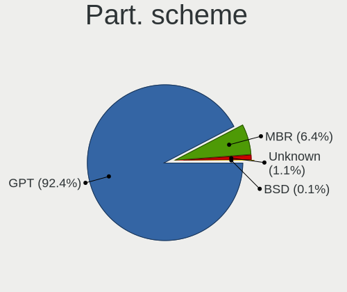
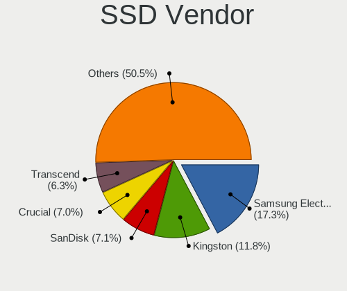
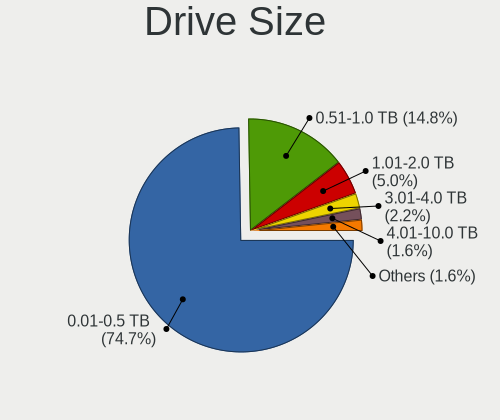
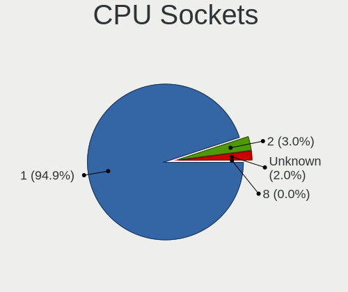
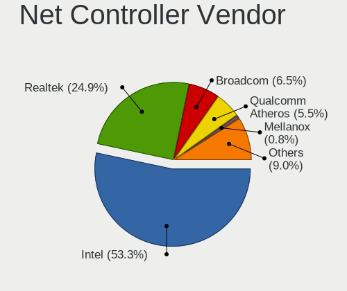

BSD - Tested Hardware & Statistics
----------------------------------

A project to collect tested hardware configurations for BSD.

Anyone can contribute to this report by the [hw-probe](https://github.com/linuxhw/hw-probe/blob/master/INSTALL.BSD.md) tool:

    hw-probe -all -upload

Please contribute! Especially if your hardware is rare.

This is a report for all computer types. See also reports for [desktops](/Desktop/README.md) and [notebooks](/Notebook/README.md).

OS-specific reports: [FreeBSD](/Dist/FreeBSD), [GhostBSD](/Dist/GhostBSD), [helloSystem](/Dist/helloSystem), [NetBSD](/Dist/NetBSD), [NomadBSD](/Dist/NomadBSD), [OpenBSD](/Dist/OpenBSD), [OPNsense](/Dist/OPNsense), [pfSense](/Dist/pfSense), [TrueNAS](/Dist/TrueNAS).

This report is for real hardware. Report for virtual hardware: [TestDays_VE](https://github.com/bsdhw/TestDays_VE)

Contents
--------

* [ Test Cases ](#test-cases)

* [ System ](#system)
  - [ OS                       ](#os)
  - [ OS Family                ](#os-family)
  - [ Arch                     ](#arch)
  - [ DE                       ](#de)
  - [ Display Server           ](#display-server)
  - [ Display Manager          ](#display-manager)
  - [ OS Lang                  ](#os-lang)
  - [ Boot Mode                ](#boot-mode)
  - [ Filesystem               ](#filesystem)
  - [ Part. scheme             ](#part-scheme)

* [ Board ](#board)
  - [ Vendor                   ](#vendor)
  - [ Model                    ](#model)
  - [ Model Family             ](#model-family)
  - [ MFG Year                 ](#mfg-year)
  - [ Form Factor              ](#form-factor)
  - [ Coreboot                 ](#coreboot)
  - [ RAM Size                 ](#ram-size)
  - [ RAM Used                 ](#ram-used)
  - [ Total Drives             ](#total-drives)
  - [ Has CD-ROM               ](#has-cd-rom)
  - [ Has Ethernet             ](#has-ethernet)
  - [ Has WiFi                 ](#has-wifi)
  - [ Has Bluetooth            ](#has-bluetooth)

* [ Location ](#location)
  - [ Country                  ](#country)
  - [ City                     ](#city)

* [ Drives ](#drives)
  - [ Drive Vendor             ](#drive-vendor)
  - [ Drive Model              ](#drive-model)
  - [ HDD Vendor               ](#hdd-vendor)
  - [ SSD Vendor               ](#ssd-vendor)
  - [ Drive Kind               ](#drive-kind)
  - [ Drive Connector          ](#drive-connector)
  - [ Drive Size               ](#drive-size)
  - [ Space Total              ](#space-total)
  - [ Space Used               ](#space-used)
  - [ Malfunc. Drives          ](#malfunc-drives)
  - [ Malfunc. Drive Vendor    ](#malfunc-drive-vendor)
  - [ Malfunc. HDD Vendor      ](#malfunc-hdd-vendor)
  - [ Malfunc. Drive Kind      ](#malfunc-drive-kind)
  - [ Failed Drives            ](#failed-drives)
  - [ Failed Drive Vendor      ](#failed-drive-vendor)
  - [ Drive Status             ](#drive-status)

* [ Storage controller ](#storage-controller)
  - [ Storage Vendor           ](#storage-vendor)
  - [ Storage Model            ](#storage-model)
  - [ Storage Kind             ](#storage-kind)

* [ Processor ](#processor)
  - [ CPU Vendor               ](#cpu-vendor)
  - [ CPU Model                ](#cpu-model)
  - [ CPU Model Family         ](#cpu-model-family)
  - [ CPU Cores                ](#cpu-cores)
  - [ CPU Sockets              ](#cpu-sockets)
  - [ CPU Threads              ](#cpu-threads)
  - [ CPU Microarch            ](#cpu-microarch)

* [ Graphics ](#graphics)
  - [ GPU Vendor               ](#gpu-vendor)
  - [ GPU Model                ](#gpu-model)
  - [ GPU Combo                ](#gpu-combo)
  - [ GPU Driver               ](#gpu-driver)
  - [ GPU Memory               ](#gpu-memory)

* [ Monitor ](#monitor)
  - [ Monitor Vendor           ](#monitor-vendor)
  - [ Monitor Model            ](#monitor-model)
  - [ Monitor Resolution       ](#monitor-resolution)
  - [ Monitor Diagonal         ](#monitor-diagonal)
  - [ Monitor Width            ](#monitor-width)
  - [ Aspect Ratio             ](#aspect-ratio)
  - [ Monitor Area             ](#monitor-area)
  - [ Pixel Density            ](#pixel-density)
  - [ Multiple Monitors        ](#multiple-monitors)

* [ Network ](#network)
  - [ Net Controller Vendor    ](#net-controller-vendor)
  - [ Net Controller Model     ](#net-controller-model)
  - [ Wireless Vendor          ](#wireless-vendor)
  - [ Wireless Model           ](#wireless-model)
  - [ Ethernet Vendor          ](#ethernet-vendor)
  - [ Ethernet Model           ](#ethernet-model)
  - [ Net Controller Kind      ](#net-controller-kind)
  - [ Used Controller          ](#used-controller)
  - [ NICs                     ](#nics)
  - [ IPv6                     ](#ipv6)

* [ Bluetooth ](#bluetooth)
  - [ Bluetooth Vendor         ](#bluetooth-vendor)
  - [ Bluetooth Model          ](#bluetooth-model)

* [ Sound ](#sound)
  - [ Sound Vendor             ](#sound-vendor)
  - [ Sound Model              ](#sound-model)

* [ Memory ](#memory)
  - [ Memory Vendor            ](#memory-vendor)
  - [ Memory Model             ](#memory-model)
  - [ Memory Kind              ](#memory-kind)
  - [ Memory Form Factor       ](#memory-form-factor)
  - [ Memory Size              ](#memory-size)
  - [ Memory Speed             ](#memory-speed)

* [ Printers & scanners ](#printers--scanners)
  - [ Printer Vendor           ](#printer-vendor)
  - [ Printer Model            ](#printer-model)
  - [ Scanner Vendor           ](#scanner-vendor)
  - [ Scanner Model            ](#scanner-model)

* [ Camera ](#camera)
  - [ Camera Vendor            ](#camera-vendor)
  - [ Camera Model             ](#camera-model)

* [ Security ](#security)
  - [ Fingerprint Vendor       ](#fingerprint-vendor)
  - [ Fingerprint Model        ](#fingerprint-model)
  - [ Chipcard Vendor          ](#chipcard-vendor)
  - [ Chipcard Model           ](#chipcard-model)

* [ Unsupported ](#unsupported)
  - [ Unsupported Devices      ](#unsupported-devices)
  - [ Unsupported Device Types ](#unsupported-device-types)

Test Cases
----------

Total: 15420

| Vendor        | Model                       | Form-Factor | Probe                                                     | Date         |
|---------------|-----------------------------|-------------|-----------------------------------------------------------|--------------|
| Intel         | MAHOBAY                     | Desktop     | [6e8443e9f4](https://bsd-hardware.info/?probe=6e8443e9f4) | Apr 01, 2023 |
| ASUSTek       | X58C                        | Notebook    | [dad28a9d36](https://bsd-hardware.info/?probe=dad28a9d36) | Apr 01, 2023 |
| Sophos        | SG                          | Firewall    | [350970e2eb](https://bsd-hardware.info/?probe=350970e2eb) | Apr 01, 2023 |
| Chuwi         | Unknown                     | Notebook    | [5e687fcc83](https://bsd-hardware.info/?probe=5e687fcc83) | Apr 01, 2023 |
| Dell          | 0N4YC8 A00                  | Desktop     | [bd01e6e577](https://bsd-hardware.info/?probe=bd01e6e577) | Apr 01, 2023 |
| Gigabyte      | F2A85X-UP4                  | Desktop     | [068773e0e8](https://bsd-hardware.info/?probe=068773e0e8) | Apr 01, 2023 |
| ASRock        | X570S PG Riptide            | Desktop     | [8ccb321056](https://bsd-hardware.info/?probe=8ccb321056) | Apr 01, 2023 |
| Sophos        | SG                          | Firewall    | [b3328d5498](https://bsd-hardware.info/?probe=b3328d5498) | Apr 01, 2023 |
| ASUSTek       | P8H61-M LX PLUS R2.0        | Desktop     | [3bb60897ff](https://bsd-hardware.info/?probe=3bb60897ff) | Apr 01, 2023 |
| Supermicro    | X11SDV-4C-TP8F              | Desktop     | [b41b088f96](https://bsd-hardware.info/?probe=b41b088f96) | Apr 01, 2023 |
| Fujitsu       | D3313-G1 S26361-D3313-G1    | Desktop     | [1122cabca9](https://bsd-hardware.info/?probe=1122cabca9) | Apr 01, 2023 |
| Fujitsu       | CELSIUS H920                | Notebook    | [e6300dc691](https://bsd-hardware.info/?probe=e6300dc691) | Mar 31, 2023 |
| MSI           | B450 GAMING PLUS MAX        | Desktop     | [c7944c3ce9](https://bsd-hardware.info/?probe=c7944c3ce9) | Mar 31, 2023 |
| Supermicro    | X9SCL/X9SCMA                | Desktop     | [31ed779fdc](https://bsd-hardware.info/?probe=31ed779fdc) | Mar 31, 2023 |
| ASUSTek       | ROG STRIX B450-F GAMING     | Desktop     | [bcaaed4d6d](https://bsd-hardware.info/?probe=bcaaed4d6d) | Mar 31, 2023 |
| SolidRun      | CEX7 Platform               | Desktop     | [8e2e4d6686](https://bsd-hardware.info/?probe=8e2e4d6686) | Mar 31, 2023 |
| ASRockRack    | EPYC3101D4I-2T              | Desktop     | [3c3a780d95](https://bsd-hardware.info/?probe=3c3a780d95) | Mar 31, 2023 |
| Dell          | 0F0XJ6 A11                  | Server      | [99f769056a](https://bsd-hardware.info/?probe=99f769056a) | Mar 31, 2023 |
| ASRockRack    | EPYCD8-2T                   | Desktop     | [75f414997a](https://bsd-hardware.info/?probe=75f414997a) | Mar 31, 2023 |
| HP            | 339A                        | Desktop     | [ad10416fe3](https://bsd-hardware.info/?probe=ad10416fe3) | Mar 31, 2023 |
| HP            | ProLiant ML30 Gen9          | Desktop     | [eabda4cb6b](https://bsd-hardware.info/?probe=eabda4cb6b) | Mar 31, 2023 |
| Biostar       | TH67B                       | Desktop     | [234c5e0b83](https://bsd-hardware.info/?probe=234c5e0b83) | Mar 31, 2023 |
| Unknown       | Unknown                     | Desktop     | [a0548bbb6e](https://bsd-hardware.info/?probe=a0548bbb6e) | Mar 31, 2023 |
| Unknown       | Unknown                     | Desktop     | [4e1a7e6b4a](https://bsd-hardware.info/?probe=4e1a7e6b4a) | Mar 31, 2023 |
| DNS           | W9x0LU                      | Notebook    | [6539659387](https://bsd-hardware.info/?probe=6539659387) | Mar 31, 2023 |
| Fujitsu       | D3313-A1 S26361-D3313-A1    | Desktop     | [fb6477d43e](https://bsd-hardware.info/?probe=fb6477d43e) | Mar 31, 2023 |
| HP            | 1495                        | Desktop     | [a916ab2122](https://bsd-hardware.info/?probe=a916ab2122) | Mar 31, 2023 |
| HMT           | W041-TF-A-45                | Notebook    | [666df5a7e0](https://bsd-hardware.info/?probe=666df5a7e0) | Mar 31, 2023 |
| Unknown       | Unknown                     | Desktop     | [cc090cca30](https://bsd-hardware.info/?probe=cc090cca30) | Mar 31, 2023 |
| Acer          | Aspire 5745DG               | Notebook    | [2b8bf9802e](https://bsd-hardware.info/?probe=2b8bf9802e) | Mar 31, 2023 |
| Techvision    | TVI7309X B0                 | Desktop     | [837fdf1a2c](https://bsd-hardware.info/?probe=837fdf1a2c) | Mar 31, 2023 |
| Intel         | DENLOW_REFRESH_WS           | Desktop     | [1285cbe6ca](https://bsd-hardware.info/?probe=1285cbe6ca) | Mar 31, 2023 |
| Protectli     | FW4B Ver                    | Desktop     | [cc6e076383](https://bsd-hardware.info/?probe=cc6e076383) | Mar 31, 2023 |
| Lenovo        | ThinkPad X220 4290DK6       | Notebook    | [96c83a2846](https://bsd-hardware.info/?probe=96c83a2846) | Mar 31, 2023 |
| Gigabyte      | GA-880GM-USB3               | Desktop     | [a9bc1579c1](https://bsd-hardware.info/?probe=a9bc1579c1) | Mar 31, 2023 |
| ZOTAC         | ZBOX-ID91                   | Mini pc     | [d7bb801369](https://bsd-hardware.info/?probe=d7bb801369) | Mar 31, 2023 |
| Gigabyte      | X570 UD                     | Desktop     | [a71a4da74b](https://bsd-hardware.info/?probe=a71a4da74b) | Mar 31, 2023 |
| ASUSTek       | P5G41T-M LX2/BR             | Desktop     | [16d1e0aa3e](https://bsd-hardware.info/?probe=16d1e0aa3e) | Mar 31, 2023 |
| Gigabyte      | H55M-S2H                    | Desktop     | [60c66c5066](https://bsd-hardware.info/?probe=60c66c5066) | Mar 30, 2023 |
| Lenovo        | 30D0 SDK0J40697 WIN 3305... | Desktop     | [bde9fd671b](https://bsd-hardware.info/?probe=bde9fd671b) | Mar 30, 2023 |
| Foxconn       | nT-A3000 series FAB         | Desktop     | [c13f32c492](https://bsd-hardware.info/?probe=c13f32c492) | Mar 30, 2023 |
| Fujitsu       | D3313-A1 S26361-D3313-A1    | Desktop     | [a160027cc2](https://bsd-hardware.info/?probe=a160027cc2) | Mar 30, 2023 |
| Deciso        | NetBoard-A20                | Notebook    | [33ca458105](https://bsd-hardware.info/?probe=33ca458105) | Mar 30, 2023 |
| Fujitsu       | D3061-A1 S26361-D3061-A1    | Desktop     | [ca6badc637](https://bsd-hardware.info/?probe=ca6badc637) | Mar 30, 2023 |
| Intel         | Intel                       | Notebook    | [75e9733afd](https://bsd-hardware.info/?probe=75e9733afd) | Mar 30, 2023 |
| Dell          | Inspiron 3195               | Convertible | [2afbb563b7](https://bsd-hardware.info/?probe=2afbb563b7) | Mar 30, 2023 |
| Dell          | 0VG93V A00                  | Desktop     | [1f3e086401](https://bsd-hardware.info/?probe=1f3e086401) | Mar 30, 2023 |
| Gigabyte      | H81M-DS2V                   | Desktop     | [a69c208286](https://bsd-hardware.info/?probe=a69c208286) | Mar 30, 2023 |
| HP            | 0AA0h                       | Desktop     | [9f8c7ed2d7](https://bsd-hardware.info/?probe=9f8c7ed2d7) | Mar 30, 2023 |
| Inventec      | Z CLASS A02                 | Desktop     | [c654ef10d6](https://bsd-hardware.info/?probe=c654ef10d6) | Mar 30, 2023 |
| Dell          | 0M877N A01                  | Server      | [dabe853e69](https://bsd-hardware.info/?probe=dabe853e69) | Mar 30, 2023 |
| Protectli     | FW4B Ver                    | Desktop     | [27d9a92cda](https://bsd-hardware.info/?probe=27d9a92cda) | Mar 30, 2023 |
| Toshiba       | Satellite L675D             | Notebook    | [0bf578daec](https://bsd-hardware.info/?probe=0bf578daec) | Mar 30, 2023 |
| Unknown       | Unknown                     | Desktop     | [44da021f65](https://bsd-hardware.info/?probe=44da021f65) | Mar 29, 2023 |
| Seeed Stud... | ODYSSEY-X86J4105 SD-BS-C... | Desktop     | [dc06ff6076](https://bsd-hardware.info/?probe=dc06ff6076) | Mar 29, 2023 |
| ASUSTek       | VivoBook_ASUS Laptop X50... | Notebook    | [ff14982ad9](https://bsd-hardware.info/?probe=ff14982ad9) | Mar 29, 2023 |
| ASRock        | Z97 Killer                  | Desktop     | [4e527312a1](https://bsd-hardware.info/?probe=4e527312a1) | Mar 29, 2023 |
| ASRock        | B550M Steel Legend          | Desktop     | [06a2d12cbe](https://bsd-hardware.info/?probe=06a2d12cbe) | Mar 29, 2023 |
| Dell          | Latitude 5590               | Notebook    | [7e87d436df](https://bsd-hardware.info/?probe=7e87d436df) | Mar 29, 2023 |
| ASRock        | X570M Pro4                  | Desktop     | [1d7c737c38](https://bsd-hardware.info/?probe=1d7c737c38) | Mar 29, 2023 |
| Supermicro    | C7SIM-Q                     | Desktop     | [47ce885e13](https://bsd-hardware.info/?probe=47ce885e13) | Mar 29, 2023 |
| Dell          | 0DRG19 A00                  | Mini pc     | [34ad91005f](https://bsd-hardware.info/?probe=34ad91005f) | Mar 29, 2023 |
| Lenovo        | SDK0J40700 WIN              | Desktop     | [36192ec5c8](https://bsd-hardware.info/?probe=36192ec5c8) | Mar 29, 2023 |
| Dell          | 0KM5PX A02                  | Server      | [baf6ac9c00](https://bsd-hardware.info/?probe=baf6ac9c00) | Mar 29, 2023 |
| Google        | Stout                       | Notebook    | [d8346bb5da](https://bsd-hardware.info/?probe=d8346bb5da) | Mar 29, 2023 |
| Dell          | 0MX4YF A01                  | Server      | [6a6b7d1e6d](https://bsd-hardware.info/?probe=6a6b7d1e6d) | Mar 29, 2023 |
| Fujitsu       | D3049-A1 S26361-D3049-A1... | Server      | [0eb67759f0](https://bsd-hardware.info/?probe=0eb67759f0) | Mar 29, 2023 |
| Lenovo        | Yoga Slim 7 Pro 14ACH5 8... | Notebook    | [0af5cebe20](https://bsd-hardware.info/?probe=0af5cebe20) | Mar 29, 2023 |
| Lenovo        | ThinkPad X230 23255NG       | Notebook    | [2ef93a7621](https://bsd-hardware.info/?probe=2ef93a7621) | Mar 29, 2023 |
| Dell          | Inspiron 5547               | Notebook    | [4f4f6e06d7](https://bsd-hardware.info/?probe=4f4f6e06d7) | Mar 29, 2023 |
| Unknown       | Unknown                     | Notebook    | [2a50573c9f](https://bsd-hardware.info/?probe=2a50573c9f) | Mar 29, 2023 |
| Lenovo        | ThinkPad T540p 20BFS10W0... | Notebook    | [30c5fc2625](https://bsd-hardware.info/?probe=30c5fc2625) | Mar 29, 2023 |
| ASRockRack    | X470D4U                     | Desktop     | [675bcfa82d](https://bsd-hardware.info/?probe=675bcfa82d) | Mar 29, 2023 |
| Dell          | 0T1D10 A01                  | Desktop     | [2f5592023f](https://bsd-hardware.info/?probe=2f5592023f) | Mar 29, 2023 |
| Unknown       | Unknown                     | Desktop     | [9696e7d17f](https://bsd-hardware.info/?probe=9696e7d17f) | Mar 29, 2023 |
| Dell          | 0T1D10 A01                  | Desktop     | [6316b108be](https://bsd-hardware.info/?probe=6316b108be) | Mar 29, 2023 |
| ASRock        | H510M-HVS R2.0              | Desktop     | [38a784fcd8](https://bsd-hardware.info/?probe=38a784fcd8) | Mar 29, 2023 |
| BESSTAR Te... | GB7                         | Mini pc     | [3a5111c467](https://bsd-hardware.info/?probe=3a5111c467) | Mar 29, 2023 |
| Alienware     | 049PDM A00                  | Desktop     | [139d115cdb](https://bsd-hardware.info/?probe=139d115cdb) | Mar 29, 2023 |
| Unknown       | Unknown                     | Desktop     | [723e81c698](https://bsd-hardware.info/?probe=723e81c698) | Mar 29, 2023 |
| Irbis         | NB78                        | Notebook    | [471efbc788](https://bsd-hardware.info/?probe=471efbc788) | Mar 29, 2023 |
| HP            | 843F                        | Desktop     | [ba9d2ef26c](https://bsd-hardware.info/?probe=ba9d2ef26c) | Mar 29, 2023 |
| Gigabyte      | X570S AORUS ELITE           | Desktop     | [3895705bbd](https://bsd-hardware.info/?probe=3895705bbd) | Mar 29, 2023 |
| Apple         | Mac-F221BEC8                | Desktop     | [b2a2fc8fe6](https://bsd-hardware.info/?probe=b2a2fc8fe6) | Mar 29, 2023 |
| Unknown       | Unknown                     | Notebook    | [ee06e14aa2](https://bsd-hardware.info/?probe=ee06e14aa2) | Mar 29, 2023 |
| ASUSTek       | TUF Gaming B450M-PLUS II    | Desktop     | [2c6fc04801](https://bsd-hardware.info/?probe=2c6fc04801) | Mar 29, 2023 |
| Lenovo        | Yoga Slim 7 Pro 14ACH5 8... | Notebook    | [f4e450fed1](https://bsd-hardware.info/?probe=f4e450fed1) | Mar 29, 2023 |
| Unknown       | Unknown                     | Desktop     | [c6c33779dc](https://bsd-hardware.info/?probe=c6c33779dc) | Mar 29, 2023 |
| Supermicro    | X11SSL-F                    | Server      | [ac9e97cf34](https://bsd-hardware.info/?probe=ac9e97cf34) | Mar 28, 2023 |
| ETegro Tec... | ETRS130G3 31S98MB0020       | Server      | [94addf97d5](https://bsd-hardware.info/?probe=94addf97d5) | Mar 28, 2023 |
| Shuttle       | FH110                       | Desktop     | [4fa8a9cc08](https://bsd-hardware.info/?probe=4fa8a9cc08) | Mar 28, 2023 |
| Intel         | S2600GZ G29051-355          | Server      | [6bc00cde60](https://bsd-hardware.info/?probe=6bc00cde60) | Mar 28, 2023 |
| MW            | GMLK-2_5G4L                 | Desktop     | [459fdd8cdd](https://bsd-hardware.info/?probe=459fdd8cdd) | Mar 28, 2023 |
| Intel         | JSL MRD                     | Desktop     | [07adf23a3d](https://bsd-hardware.info/?probe=07adf23a3d) | Mar 28, 2023 |
| HP            | 18E7                        | Desktop     | [f83e0bbd69](https://bsd-hardware.info/?probe=f83e0bbd69) | Mar 28, 2023 |
| Lenovo        | ThinkCentre M58 7360EUU     | Desktop     | [b86ffef220](https://bsd-hardware.info/?probe=b86ffef220) | Mar 28, 2023 |
| Lenovo        | IdeaPad 320-15ISK 80XH      | Notebook    | [dddf27cde4](https://bsd-hardware.info/?probe=dddf27cde4) | Mar 28, 2023 |
| Lenovo        | IdeaPad 320-15ISK 80XH      | Notebook    | [c2ba6aca7d](https://bsd-hardware.info/?probe=c2ba6aca7d) | Mar 28, 2023 |
| BESSTAR Te... | UM700                       | Desktop     | [78ee14c1a5](https://bsd-hardware.info/?probe=78ee14c1a5) | Mar 28, 2023 |
| Protectli     | FW4B                        | Desktop     | [17c0040b42](https://bsd-hardware.info/?probe=17c0040b42) | Mar 28, 2023 |
| Unknown       | Unknown                     | Firewall    | [c2c2b195e4](https://bsd-hardware.info/?probe=c2c2b195e4) | Mar 28, 2023 |
| Lenovo        | SHARKBAY 0B98405 STD        | Desktop     | [29c6f5f74c](https://bsd-hardware.info/?probe=29c6f5f74c) | Mar 28, 2023 |
| Dell          | 0CNCJW A10                  | Server      | [f912d933df](https://bsd-hardware.info/?probe=f912d933df) | Mar 27, 2023 |
| Lenovo        | IdeaPad Gaming 3 15ACH6 ... | Notebook    | [fb4eec9c34](https://bsd-hardware.info/?probe=fb4eec9c34) | Mar 27, 2023 |
| ASRock        | H61M-HVS                    | Desktop     | [98777ba333](https://bsd-hardware.info/?probe=98777ba333) | Mar 27, 2023 |
| HP            | Pavilion dv6                | Notebook    | [ce2cc6852d](https://bsd-hardware.info/?probe=ce2cc6852d) | Mar 27, 2023 |
| Lenovo        | ThinkPad X1 Extreme 20MF... | Notebook    | [b4805cd318](https://bsd-hardware.info/?probe=b4805cd318) | Mar 27, 2023 |
| LG Electro... | COLUMBIA                    | Notebook    | [4872f6c377](https://bsd-hardware.info/?probe=4872f6c377) | Mar 27, 2023 |
| Sophos        | SG                          | Firewall    | [b3346fe828](https://bsd-hardware.info/?probe=b3346fe828) | Mar 27, 2023 |
| Dell          | Inspiron 7437               | Notebook    | [2c4de59558](https://bsd-hardware.info/?probe=2c4de59558) | Mar 27, 2023 |
| HP            | 8054                        | Desktop     | [6c82269548](https://bsd-hardware.info/?probe=6c82269548) | Mar 27, 2023 |
| Techvision    | TVI7309X B0                 | Desktop     | [30e6aeb9bb](https://bsd-hardware.info/?probe=30e6aeb9bb) | Mar 27, 2023 |
| HP            | 213D A01                    | Desktop     | [d5efcf6e96](https://bsd-hardware.info/?probe=d5efcf6e96) | Mar 27, 2023 |
| ASUSTek       | Z97-E/USB                   | Desktop     | [e5a3f523a6](https://bsd-hardware.info/?probe=e5a3f523a6) | Mar 27, 2023 |
| CncTion       | N5105-4L B0                 | Desktop     | [b6fd7cd6ae](https://bsd-hardware.info/?probe=b6fd7cd6ae) | Mar 27, 2023 |
| Lenovo        | IdeaPad S210 20256          | Notebook    | [2e22ee87c3](https://bsd-hardware.info/?probe=2e22ee87c3) | Mar 27, 2023 |
| WeiBu         | ADL-N Prod                  | Desktop     | [1d0a4ac0a1](https://bsd-hardware.info/?probe=1d0a4ac0a1) | Mar 27, 2023 |
| WeiBu         | ADL-N Prod                  | Desktop     | [91759ff33b](https://bsd-hardware.info/?probe=91759ff33b) | Mar 27, 2023 |
| Lenovo        | ThinkPad T410 2518A37       | Notebook    | [f5537face6](https://bsd-hardware.info/?probe=f5537face6) | Mar 27, 2023 |
| Acer          | WG43M                       | Desktop     | [c8f2a03a08](https://bsd-hardware.info/?probe=c8f2a03a08) | Mar 27, 2023 |
| ASRock        | X570S PG Riptide            | Desktop     | [0d66edbd38](https://bsd-hardware.info/?probe=0d66edbd38) | Mar 27, 2023 |
| Lenovo        | ThinkPad T430 2349G5P       | Notebook    | [9ea67d3893](https://bsd-hardware.info/?probe=9ea67d3893) | Mar 27, 2023 |
| Lenovo        | MAHOBAY NO DPK              | Desktop     | [0eab0142d5](https://bsd-hardware.info/?probe=0eab0142d5) | Mar 26, 2023 |
| HP            | 2820h                       | Desktop     | [58d6933119](https://bsd-hardware.info/?probe=58d6933119) | Mar 26, 2023 |
| Acer          | WG43M                       | Desktop     | [5e154dc7cf](https://bsd-hardware.info/?probe=5e154dc7cf) | Mar 26, 2023 |
| CWWK          | MINIPC-G4                   | Desktop     | [06e3c70f23](https://bsd-hardware.info/?probe=06e3c70f23) | Mar 26, 2023 |
| CWWK          | MINIPC-G4                   | Desktop     | [8f47736c3b](https://bsd-hardware.info/?probe=8f47736c3b) | Mar 26, 2023 |
| Dell          | 0VD5HY A00                  | Desktop     | [1b54a68123](https://bsd-hardware.info/?probe=1b54a68123) | Mar 26, 2023 |
| Dell          | 0C2GT0 A05                  | Server      | [2d32ae23e6](https://bsd-hardware.info/?probe=2d32ae23e6) | Mar 26, 2023 |
| MSI           | PRO B660-A DDR4             | Desktop     | [735a5cc6a2](https://bsd-hardware.info/?probe=735a5cc6a2) | Mar 26, 2023 |
| Dell          | Latitude 5420               | Notebook    | [4e22bbc131](https://bsd-hardware.info/?probe=4e22bbc131) | Mar 26, 2023 |
| ChangWang     | CW56-58                     | Desktop     | [39410cb2dd](https://bsd-hardware.info/?probe=39410cb2dd) | Mar 26, 2023 |
| Shuttle       | FS81                        | Desktop     | [b80626e045](https://bsd-hardware.info/?probe=b80626e045) | Mar 26, 2023 |
| Lanner        | FW-7543 B-GA                | Desktop     | [3ed4cfc9c8](https://bsd-hardware.info/?probe=3ed4cfc9c8) | Mar 26, 2023 |
| Sophos        | UTM                         | Firewall    | [99af1f0a15](https://bsd-hardware.info/?probe=99af1f0a15) | Mar 26, 2023 |
| Unknown       | Unknown                     | Desktop     | [003e1396f6](https://bsd-hardware.info/?probe=003e1396f6) | Mar 26, 2023 |
| YANYU         | H17SL                       | Desktop     | [0f9829ebe4](https://bsd-hardware.info/?probe=0f9829ebe4) | Mar 26, 2023 |
| ASUSTek       | P11C-M Series               | Desktop     | [15e452d25d](https://bsd-hardware.info/?probe=15e452d25d) | Mar 26, 2023 |
| Intel         | Q3XXG4-P V1.0               | Desktop     | [2f16e29f78](https://bsd-hardware.info/?probe=2f16e29f78) | Mar 26, 2023 |
| Protectli     | FW4B Ver                    | Desktop     | [fc5ab682fc](https://bsd-hardware.info/?probe=fc5ab682fc) | Mar 26, 2023 |
| MSI           | 870-G45                     | Desktop     | [19cbb6e0f3](https://bsd-hardware.info/?probe=19cbb6e0f3) | Mar 26, 2023 |
| LG Electro... | E500-L.A2M4A2               | Notebook    | [8dab794233](https://bsd-hardware.info/?probe=8dab794233) | Mar 26, 2023 |
| Dell          | Inspiron 5559               | Notebook    | [7652c9891e](https://bsd-hardware.info/?probe=7652c9891e) | Mar 26, 2023 |
| MSI           | H81M-P33                    | Desktop     | [f07e9fd36c](https://bsd-hardware.info/?probe=f07e9fd36c) | Mar 26, 2023 |
| ASUSTek       | P5Q-E                       | Desktop     | [3f21567fdf](https://bsd-hardware.info/?probe=3f21567fdf) | Mar 26, 2023 |
| ASUSTek       | ROG CROSSHAIR VIII HERO     | Desktop     | [38a22651c6](https://bsd-hardware.info/?probe=38a22651c6) | Mar 26, 2023 |
| Lenovo        | 312D SDK0L22692 WIN 3306... | Mini pc     | [73519e765c](https://bsd-hardware.info/?probe=73519e765c) | Mar 26, 2023 |
| ASRock        | H510M-HVS R2.0              | Desktop     | [3db3c8f002](https://bsd-hardware.info/?probe=3db3c8f002) | Mar 26, 2023 |
| HP            | EliteBook Folio 9470m       | Notebook    | [ea2865cbf5](https://bsd-hardware.info/?probe=ea2865cbf5) | Mar 26, 2023 |
| Dell          | 0HD5W2 A01                  | Desktop     | [284c499b74](https://bsd-hardware.info/?probe=284c499b74) | Mar 26, 2023 |
| Unknown       | Unknown                     | Firewall    | [e17beb7d4c](https://bsd-hardware.info/?probe=e17beb7d4c) | Mar 26, 2023 |
| Dell          | 0654JC A02                  | Desktop     | [373d1bc62b](https://bsd-hardware.info/?probe=373d1bc62b) | Mar 26, 2023 |
| Intel         | Q3XXG4-P V1.0               | Desktop     | [2634ccb935](https://bsd-hardware.info/?probe=2634ccb935) | Mar 26, 2023 |
| Acer          | Aspire XC-830               | Desktop     | [bc1cc29291](https://bsd-hardware.info/?probe=bc1cc29291) | Mar 26, 2023 |
| Acer          | Aspire XC-830               | Desktop     | [2affd2540a](https://bsd-hardware.info/?probe=2affd2540a) | Mar 26, 2023 |
| CheckPoint    | T-110-00                    | Desktop     | [eecf6b8096](https://bsd-hardware.info/?probe=eecf6b8096) | Mar 25, 2023 |
| Protectli     | FW4B                        | Desktop     | [3c333bad9c](https://bsd-hardware.info/?probe=3c333bad9c) | Mar 25, 2023 |
| Protectli     | VP2410                      | Desktop     | [a52038d49d](https://bsd-hardware.info/?probe=a52038d49d) | Mar 25, 2023 |
| Gigabyte      | F2A85X-UP4                  | Desktop     | [97d37b6e2f](https://bsd-hardware.info/?probe=97d37b6e2f) | Mar 25, 2023 |
| ASRock        | B450 Steel Legend           | Desktop     | [0f0f389db4](https://bsd-hardware.info/?probe=0f0f389db4) | Mar 25, 2023 |
| ASUSTek       | F1A55                       | Desktop     | [91ad5bab75](https://bsd-hardware.info/?probe=91ad5bab75) | Mar 25, 2023 |
| Samsung       | R468/R418                   | Notebook    | [f620a5c6ec](https://bsd-hardware.info/?probe=f620a5c6ec) | Mar 25, 2023 |
| Unknown       | Unknown                     | Desktop     | [c7c5a8ae97](https://bsd-hardware.info/?probe=c7c5a8ae97) | Mar 25, 2023 |
| Unknown       | iKoolCore R1 iKoolCore R... | Desktop     | [20dc598eb3](https://bsd-hardware.info/?probe=20dc598eb3) | Mar 25, 2023 |
| Protectli     | FW4B Ver                    | Desktop     | [5082d62025](https://bsd-hardware.info/?probe=5082d62025) | Mar 25, 2023 |
| MSI           | PRO H610M-B DDR4            | Desktop     | [ee01b690bc](https://bsd-hardware.info/?probe=ee01b690bc) | Mar 25, 2023 |
| MouseCompu... | X5-aR5CEZAR-WA              | Notebook    | [b960dc3bde](https://bsd-hardware.info/?probe=b960dc3bde) | Mar 25, 2023 |
| HP            | 82B4                        | Desktop     | [6edc033f79](https://bsd-hardware.info/?probe=6edc033f79) | Mar 25, 2023 |
| Lenovo        | ThinkPad X220 4291AN9       | Notebook    | [1646bb53ab](https://bsd-hardware.info/?probe=1646bb53ab) | Mar 25, 2023 |
| Apple         | Mac-F22C86C8                | Mini pc     | [7945f26073](https://bsd-hardware.info/?probe=7945f26073) | Mar 25, 2023 |
| MW            | GMLK-2_5G4L                 | Desktop     | [41fa3f51d3](https://bsd-hardware.info/?probe=41fa3f51d3) | Mar 25, 2023 |
| Lenovo        | ThinkPad T470 W10DG 20JN... | Notebook    | [7df625b1df](https://bsd-hardware.info/?probe=7df625b1df) | Mar 25, 2023 |
| MSI           | 870-G45                     | Desktop     | [14e990c885](https://bsd-hardware.info/?probe=14e990c885) | Mar 25, 2023 |
| ASRock        | B450 Steel Legend           | Desktop     | [72a2bf0c68](https://bsd-hardware.info/?probe=72a2bf0c68) | Mar 25, 2023 |
| Hardkernel    | ODROID-H3                   | Desktop     | [312a9b3461](https://bsd-hardware.info/?probe=312a9b3461) | Mar 25, 2023 |
| Techvision    | TVI7309X B0                 | Desktop     | [40c71ed805](https://bsd-hardware.info/?probe=40c71ed805) | Mar 25, 2023 |
| ASUSTek       | ASUS TUF Gaming A15 FA50... | Notebook    | [a46f77ccdc](https://bsd-hardware.info/?probe=a46f77ccdc) | Mar 25, 2023 |
| ASUSTek       | ASUS TUF Gaming A15 FA50... | Notebook    | [b64571464f](https://bsd-hardware.info/?probe=b64571464f) | Mar 25, 2023 |
| Gigabyte      | F2A85X-UP4                  | Desktop     | [c0b8eb494e](https://bsd-hardware.info/?probe=c0b8eb494e) | Mar 25, 2023 |
| Protectli     | FW6 Ver                     | Desktop     | [5444aee217](https://bsd-hardware.info/?probe=5444aee217) | Mar 25, 2023 |
| ASUSTek       | P5K SE                      | Desktop     | [646eff3292](https://bsd-hardware.info/?probe=646eff3292) | Mar 25, 2023 |
| ASUSTek       | Z97-E/USB                   | Desktop     | [9aa3b17016](https://bsd-hardware.info/?probe=9aa3b17016) | Mar 25, 2023 |
| Lenovo        | ThinkPad X230 Tablet 343... | Notebook    | [8e798ca6ef](https://bsd-hardware.info/?probe=8e798ca6ef) | Mar 25, 2023 |
| Unknown       | Unknown                     | Desktop     | [387c27f1d7](https://bsd-hardware.info/?probe=387c27f1d7) | Mar 25, 2023 |
| HP            | 1497                        | Desktop     | [08daaf3be1](https://bsd-hardware.info/?probe=08daaf3be1) | Mar 25, 2023 |
| HP            | 21B4 A01                    | Desktop     | [8de4b8231a](https://bsd-hardware.info/?probe=8de4b8231a) | Mar 25, 2023 |
| HP            | 1497                        | Desktop     | [fc6a7ebc91](https://bsd-hardware.info/?probe=fc6a7ebc91) | Mar 25, 2023 |
| eMachines     | eM350                       | Notebook    | [bb900ace2d](https://bsd-hardware.info/?probe=bb900ace2d) | Mar 25, 2023 |
| HP            | 1497                        | Desktop     | [e98b5284d9](https://bsd-hardware.info/?probe=e98b5284d9) | Mar 25, 2023 |
| Alienware     | 14                          | Notebook    | [742d648570](https://bsd-hardware.info/?probe=742d648570) | Mar 25, 2023 |
| Acer          | AOD270                      | Notebook    | [73877008e9](https://bsd-hardware.info/?probe=73877008e9) | Mar 25, 2023 |
| Unknown       | Unknown                     | Desktop     | [55c708e91a](https://bsd-hardware.info/?probe=55c708e91a) | Mar 24, 2023 |
| PC Engines    | APU2                        | Desktop     | [4e4a81e456](https://bsd-hardware.info/?probe=4e4a81e456) | Mar 24, 2023 |
| Lex           | Pineview-D                  | Desktop     | [ca2fbb614d](https://bsd-hardware.info/?probe=ca2fbb614d) | Mar 24, 2023 |
| Stonesoft     | DEV-1301-2-C1-R             | Desktop     | [3bc0fc5d63](https://bsd-hardware.info/?probe=3bc0fc5d63) | Mar 24, 2023 |
| CncTion       | N5105-4L B0                 | Desktop     | [9561c72b9c](https://bsd-hardware.info/?probe=9561c72b9c) | Mar 24, 2023 |
| Lenovo        | ThinkPad W541 20EF000NUS    | Notebook    | [34b156c20c](https://bsd-hardware.info/?probe=34b156c20c) | Mar 24, 2023 |
| Intel         | Q3XXG4-P V1.0               | Desktop     | [083d2e65da](https://bsd-hardware.info/?probe=083d2e65da) | Mar 24, 2023 |
| Stonesoft     | DEV-1301-2-C1-R             | Desktop     | [2699b59d1b](https://bsd-hardware.info/?probe=2699b59d1b) | Mar 24, 2023 |
| Gigabyte      | MX31-BS0 01234567           | Server      | [b9956d8d91](https://bsd-hardware.info/?probe=b9956d8d91) | Mar 24, 2023 |
| HP            | 8055                        | Desktop     | [03930fa6c3](https://bsd-hardware.info/?probe=03930fa6c3) | Mar 24, 2023 |
| MouseCompu... | X5-aR5CEZAR-WA              | Notebook    | [4cd1097c65](https://bsd-hardware.info/?probe=4cd1097c65) | Mar 24, 2023 |
| Intel         | H81U                        | Notebook    | [af9a6469c9](https://bsd-hardware.info/?probe=af9a6469c9) | Mar 24, 2023 |
| Dell          | G5 5587                     | Notebook    | [9b7714cbab](https://bsd-hardware.info/?probe=9b7714cbab) | Mar 24, 2023 |
| HP            | 8350                        | Desktop     | [46dedb22a0](https://bsd-hardware.info/?probe=46dedb22a0) | Mar 24, 2023 |
| HP            | 2820h                       | Desktop     | [7df9c94771](https://bsd-hardware.info/?probe=7df9c94771) | Mar 24, 2023 |
| Intel         | Q3XXG4-P V1.0               | Desktop     | [56c12d6bf6](https://bsd-hardware.info/?probe=56c12d6bf6) | Mar 24, 2023 |
| Dell          | G5 5587                     | Notebook    | [c118e0665f](https://bsd-hardware.info/?probe=c118e0665f) | Mar 24, 2023 |
| Dell          | Latitude 5500               | Notebook    | [8db518ef3d](https://bsd-hardware.info/?probe=8db518ef3d) | Mar 24, 2023 |
| Acer          | Aspire F5-573G              | Notebook    | [a8f794f3fb](https://bsd-hardware.info/?probe=a8f794f3fb) | Mar 24, 2023 |
| ASUSTek       | Z97-E/USB                   | Desktop     | [e9cbfc666b](https://bsd-hardware.info/?probe=e9cbfc666b) | Mar 24, 2023 |
| Intel         | Q3XXG4-P V1.0               | Desktop     | [e99acbbc10](https://bsd-hardware.info/?probe=e99acbbc10) | Mar 24, 2023 |
| ASRock        | A520M-ITX/ac                | Desktop     | [18877701a6](https://bsd-hardware.info/?probe=18877701a6) | Mar 24, 2023 |
| HP            | 213D A01                    | Desktop     | [c942b222fa](https://bsd-hardware.info/?probe=c942b222fa) | Mar 24, 2023 |
| HP            | 8103 A01                    | Mini pc     | [23f893285e](https://bsd-hardware.info/?probe=23f893285e) | Mar 24, 2023 |
| CncTion       | J4125-4L-I225               | Desktop     | [5e63c02cde](https://bsd-hardware.info/?probe=5e63c02cde) | Mar 23, 2023 |
| Supermicro    | A1SAi 123456789             | Mini pc     | [72e4bf10a6](https://bsd-hardware.info/?probe=72e4bf10a6) | Mar 23, 2023 |
| Unknown       | Unknown                     | Desktop     | [a66dffcb5c](https://bsd-hardware.info/?probe=a66dffcb5c) | Mar 23, 2023 |
| Acer          | Nitro AN515-53              | Notebook    | [a46e065fac](https://bsd-hardware.info/?probe=a46e065fac) | Mar 23, 2023 |
| Intel         | DB85FL AAG89861-203         | Desktop     | [ff97717798](https://bsd-hardware.info/?probe=ff97717798) | Mar 23, 2023 |
| Protectli     | VP2420                      | Desktop     | [f07553b02c](https://bsd-hardware.info/?probe=f07553b02c) | Mar 23, 2023 |
| ASUSTek       | H81M-K                      | Desktop     | [c45489c043](https://bsd-hardware.info/?probe=c45489c043) | Mar 23, 2023 |
| Gigabyte      | H81M-H                      | Desktop     | [e7cadcdae1](https://bsd-hardware.info/?probe=e7cadcdae1) | Mar 23, 2023 |
| IceWhale T... | ZimaBoard 832 ZMB           | Desktop     | [3c4f4abe16](https://bsd-hardware.info/?probe=3c4f4abe16) | Mar 23, 2023 |
| Protectli     | VP2420                      | Desktop     | [dfad78899e](https://bsd-hardware.info/?probe=dfad78899e) | Mar 23, 2023 |
| Dell          | Inspiron 5559               | Notebook    | [f294f7ae04](https://bsd-hardware.info/?probe=f294f7ae04) | Mar 23, 2023 |
| ShenZhen M... | MW-GMLK-2.5G6L              | Desktop     | [720f15a1ce](https://bsd-hardware.info/?probe=720f15a1ce) | Mar 23, 2023 |
| Lenovo        | SHARKBAY 0B98401 WIN        | Desktop     | [f8f04980fb](https://bsd-hardware.info/?probe=f8f04980fb) | Mar 23, 2023 |
| Acer          | Revo 70                     | Desktop     | [50d93bea69](https://bsd-hardware.info/?probe=50d93bea69) | Mar 23, 2023 |
| HP            | 3397                        | Desktop     | [a3a77965fc](https://bsd-hardware.info/?probe=a3a77965fc) | Mar 23, 2023 |
| Sony          | VAIO                        | All in one  | [ef7c622d8d](https://bsd-hardware.info/?probe=ef7c622d8d) | Mar 23, 2023 |
| ASUSTek       | P11C-M Series               | Desktop     | [b0079291db](https://bsd-hardware.info/?probe=b0079291db) | Mar 23, 2023 |
| Sony          | VAIO                        | All in one  | [ededfcfd39](https://bsd-hardware.info/?probe=ededfcfd39) | Mar 23, 2023 |
| BROUNION      | R86S                        | Desktop     | [4fc5a71125](https://bsd-hardware.info/?probe=4fc5a71125) | Mar 23, 2023 |
| Intel         | SandyBridge Platform        | Notebook    | [954a21f7de](https://bsd-hardware.info/?probe=954a21f7de) | Mar 23, 2023 |
| Lenovo        | ThinkPad T410 2518A37       | Notebook    | [42fffdf3f2](https://bsd-hardware.info/?probe=42fffdf3f2) | Mar 23, 2023 |
| Dell          | Edge Gateway 5100           | Mini pc     | [7cb4288db0](https://bsd-hardware.info/?probe=7cb4288db0) | Mar 23, 2023 |
| Lenovo        | ThinkPad T61 7658CTO        | Notebook    | [f00e571f76](https://bsd-hardware.info/?probe=f00e571f76) | Mar 23, 2023 |
| Supermicro    | X9SRE/X9SRE-3F/X9SRi/X9S... | Server      | [bff3fc8a58](https://bsd-hardware.info/?probe=bff3fc8a58) | Mar 23, 2023 |
| Unknown       | T360D11                     | Desktop     | [d4d69405c5](https://bsd-hardware.info/?probe=d4d69405c5) | Mar 23, 2023 |
| Unknown       | Unknown                     | Desktop     | [a7e98f9a10](https://bsd-hardware.info/?probe=a7e98f9a10) | Mar 23, 2023 |
| T-bao         | MINI PC V1.0                | Desktop     | [eb2bc1cd51](https://bsd-hardware.info/?probe=eb2bc1cd51) | Mar 23, 2023 |
| ASUSTek       | CROSSHAIR V FORMULA-Z       | Desktop     | [491c0ca78a](https://bsd-hardware.info/?probe=491c0ca78a) | Mar 22, 2023 |
| Intel         | Q3XXG4-P V1.0               | Desktop     | [680002292e](https://bsd-hardware.info/?probe=680002292e) | Mar 22, 2023 |
| Lenovo        | ThinkCentre M910q 10MVCT... | Desktop     | [5459ed9c31](https://bsd-hardware.info/?probe=5459ed9c31) | Mar 22, 2023 |
| Dell          | 0WWJRX A00                  | Desktop     | [b016b1fb3c](https://bsd-hardware.info/?probe=b016b1fb3c) | Mar 22, 2023 |
| HP            | 18E5                        | Desktop     | [1f402a50e7](https://bsd-hardware.info/?probe=1f402a50e7) | Mar 22, 2023 |
| Lenovo        | ThinkPad T430s 2356CV6      | Notebook    | [d9efc1e30b](https://bsd-hardware.info/?probe=d9efc1e30b) | Mar 22, 2023 |
| Supermicro    | X10SDV-4C-TLN4F             | Server      | [7b22e68dea](https://bsd-hardware.info/?probe=7b22e68dea) | Mar 22, 2023 |
| Protectli     | FW4C Ver                    | Desktop     | [73ecb1afc1](https://bsd-hardware.info/?probe=73ecb1afc1) | Mar 22, 2023 |
| ASUSTek       | X71Vn                       | Notebook    | [6e96ea55ee](https://bsd-hardware.info/?probe=6e96ea55ee) | Mar 22, 2023 |
| Gigabyte      | F2A55-DS3                   | Desktop     | [ce8775fbe5](https://bsd-hardware.info/?probe=ce8775fbe5) | Mar 22, 2023 |
| ASRock        | B450M Pro4                  | Desktop     | [e2d0aa1444](https://bsd-hardware.info/?probe=e2d0aa1444) | Mar 22, 2023 |
| Protectli     | FW4B Ver                    | Desktop     | [c2546b211b](https://bsd-hardware.info/?probe=c2546b211b) | Mar 22, 2023 |
| MW            | GMLK-2_5G4L                 | Desktop     | [b3f0879ebf](https://bsd-hardware.info/?probe=b3f0879ebf) | Mar 22, 2023 |
| Biostar       | H61MGC                      | Desktop     | [94e565457c](https://bsd-hardware.info/?probe=94e565457c) | Mar 22, 2023 |
| ASUSTek       | M4A88TD-V EVO/USB3          | Desktop     | [c486bbb209](https://bsd-hardware.info/?probe=c486bbb209) | Mar 22, 2023 |
| ASUSTek       | PRIME H410M-A               | Desktop     | [cbbeb5c41c](https://bsd-hardware.info/?probe=cbbeb5c41c) | Mar 22, 2023 |
| NF596         | 1.0                         | Desktop     | [9de0fd33a4](https://bsd-hardware.info/?probe=9de0fd33a4) | Mar 22, 2023 |
| Protectli     | VP2410 10                   | Desktop     | [491f4cc780](https://bsd-hardware.info/?probe=491f4cc780) | Mar 22, 2023 |
| HP            | ProLiant DL360 G7           | Server      | [1f8be65019](https://bsd-hardware.info/?probe=1f8be65019) | Mar 22, 2023 |
| ASRock        | B460M-HDV                   | Desktop     | [e1ee6d8a11](https://bsd-hardware.info/?probe=e1ee6d8a11) | Mar 22, 2023 |
| MSI           | H81I                        | Desktop     | [4983a6a077](https://bsd-hardware.info/?probe=4983a6a077) | Mar 22, 2023 |
| Lenovo        | SDK0J40700 WIN              | Desktop     | [dccfb64926](https://bsd-hardware.info/?probe=dccfb64926) | Mar 22, 2023 |
| ASUSTek       | M5A97 R2.0                  | Desktop     | [840a902d2b](https://bsd-hardware.info/?probe=840a902d2b) | Mar 22, 2023 |
| ASRockRack    | E3C236D2I                   | Desktop     | [e407119ecf](https://bsd-hardware.info/?probe=e407119ecf) | Mar 22, 2023 |
| Dell          | 081N4V A04                  | Server      | [d8a5f43d05](https://bsd-hardware.info/?probe=d8a5f43d05) | Mar 21, 2023 |
| Foxconn       | M61PMV FAB                  | Desktop     | [197d75cbaa](https://bsd-hardware.info/?probe=197d75cbaa) | Mar 21, 2023 |
| Lenovo        | Yoga Slim 7 Pro 14ACH5 8... | Notebook    | [136a6641be](https://bsd-hardware.info/?probe=136a6641be) | Mar 21, 2023 |
| Lenovo        | 3106 SDK0J40697 WIN 3305... | Desktop     | [283fe42941](https://bsd-hardware.info/?probe=283fe42941) | Mar 21, 2023 |
| ASRockRack    | E3C236D2I                   | Desktop     | [0854f96185](https://bsd-hardware.info/?probe=0854f96185) | Mar 21, 2023 |
| Intel         | SKYBAY                      | Desktop     | [83ea0b27b1](https://bsd-hardware.info/?probe=83ea0b27b1) | Mar 21, 2023 |
| ASRock        | J5040-ITX                   | Desktop     | [56a3214f4b](https://bsd-hardware.info/?probe=56a3214f4b) | Mar 21, 2023 |
| Dell          | 03X6X0 A02                  | Server      | [7edb868404](https://bsd-hardware.info/?probe=7edb868404) | Mar 21, 2023 |
| ASRock        | X570M Pro4                  | Desktop     | [e405ff5adf](https://bsd-hardware.info/?probe=e405ff5adf) | Mar 21, 2023 |
| ASUSTek       | Rampage II Extreme          | Desktop     | [45fd7b7b5f](https://bsd-hardware.info/?probe=45fd7b7b5f) | Mar 21, 2023 |
| Supermicro    | X9SCL/X9SCMA                | Desktop     | [7bac9347ec](https://bsd-hardware.info/?probe=7bac9347ec) | Mar 21, 2023 |
| ASRock        | G31M-S                      | Desktop     | [60b239d5c0](https://bsd-hardware.info/?probe=60b239d5c0) | Mar 21, 2023 |
| Sophos        | SG                          | Firewall    | [4f818307ff](https://bsd-hardware.info/?probe=4f818307ff) | Mar 21, 2023 |
| Fujitsu Si... | D2824-A1 S26361-D2824-A1    | Desktop     | [bcada44b09](https://bsd-hardware.info/?probe=bcada44b09) | Mar 21, 2023 |
| Intel         | X99                         | Desktop     | [a74c2b96ff](https://bsd-hardware.info/?probe=a74c2b96ff) | Mar 21, 2023 |
| Techvision    | TVI7309X B0                 | Desktop     | [8d84f81be3](https://bsd-hardware.info/?probe=8d84f81be3) | Mar 21, 2023 |
| Dell          | 0DRG19 A00                  | Mini pc     | [0fe355f959](https://bsd-hardware.info/?probe=0fe355f959) | Mar 21, 2023 |
| Dell          | 0GM819                      | Desktop     | [9d5996dd7a](https://bsd-hardware.info/?probe=9d5996dd7a) | Mar 21, 2023 |
| HP            | 805A                        | Desktop     | [d90c74af40](https://bsd-hardware.info/?probe=d90c74af40) | Mar 21, 2023 |
| Lenovo        | ThinkPad X230 232578G       | Notebook    | [edf47cb2d4](https://bsd-hardware.info/?probe=edf47cb2d4) | Mar 21, 2023 |
| Intel         | DENLOW_WS                   | Desktop     | [6a352d6a07](https://bsd-hardware.info/?probe=6a352d6a07) | Mar 21, 2023 |
| Supermicro    | X11SDV-8C-TP8F              | Desktop     | [7ae004c035](https://bsd-hardware.info/?probe=7ae004c035) | Mar 21, 2023 |
| AMI           | Aptio CRB                   | Mini pc     | [5193764df7](https://bsd-hardware.info/?probe=5193764df7) | Mar 20, 2023 |
| Lenovo        | ThinkPad T61 7659CA1        | Notebook    | [bba228ddc9](https://bsd-hardware.info/?probe=bba228ddc9) | Mar 20, 2023 |
| HP            | 8054                        | Desktop     | [6e5a18f346](https://bsd-hardware.info/?probe=6e5a18f346) | Mar 20, 2023 |
| Lenovo        | 30BC SDK0J40705 WIN 3425... | Desktop     | [33b600b436](https://bsd-hardware.info/?probe=33b600b436) | Mar 20, 2023 |
| Lenovo        | G500 20236                  | Notebook    | [55dc82af1c](https://bsd-hardware.info/?probe=55dc82af1c) | Mar 20, 2023 |
| Supermicro    | X11SSL-F                    | Server      | [1aab89d35b](https://bsd-hardware.info/?probe=1aab89d35b) | Mar 20, 2023 |
| ASUSTek       | PRIME B350-PLUS             | Desktop     | [8d0e6be5da](https://bsd-hardware.info/?probe=8d0e6be5da) | Mar 20, 2023 |
| Apple         | iMac18,1                    | All in one  | [c6c12705af](https://bsd-hardware.info/?probe=c6c12705af) | Mar 20, 2023 |
| Techvision    | TVI7309X B0                 | Desktop     | [c3871d22c6](https://bsd-hardware.info/?probe=c3871d22c6) | Mar 20, 2023 |
| HUAWEI        | HVY-WXX9                    | Notebook    | [e1b5d66244](https://bsd-hardware.info/?probe=e1b5d66244) | Mar 20, 2023 |
| Dell          | 00NH4P A03                  | Server      | [0d29dd3a66](https://bsd-hardware.info/?probe=0d29dd3a66) | Mar 20, 2023 |
| Silicom       | 80300-0134-g01              | Desktop     | [3cd6c5ba13](https://bsd-hardware.info/?probe=3cd6c5ba13) | Mar 20, 2023 |
| ASUSTek       | 1015PX                      | Notebook    | [d6c1199165](https://bsd-hardware.info/?probe=d6c1199165) | Mar 20, 2023 |
| Dell          | 0GM819                      | Desktop     | [da7c02c542](https://bsd-hardware.info/?probe=da7c02c542) | Mar 20, 2023 |
| Techvision    | TVI7309X B0                 | Desktop     | [10f3485393](https://bsd-hardware.info/?probe=10f3485393) | Mar 20, 2023 |
| Lenovo        | ThinkPad E595 20NF0002BM    | Notebook    | [83ee1d297d](https://bsd-hardware.info/?probe=83ee1d297d) | Mar 20, 2023 |
| ASUSTek       | TUF Gaming B550M-PLUS       | Desktop     | [c07b0a75e5](https://bsd-hardware.info/?probe=c07b0a75e5) | Mar 20, 2023 |
| Sophos        | SG                          | Firewall    | [e0ac090471](https://bsd-hardware.info/?probe=e0ac090471) | Mar 20, 2023 |
| Unknown       | Unknown                     | Desktop     | [e4365dfa60](https://bsd-hardware.info/?probe=e4365dfa60) | Mar 20, 2023 |
| ASUSTek       | TUF Gaming B550M-PLUS       | Desktop     | [71d2b7317c](https://bsd-hardware.info/?probe=71d2b7317c) | Mar 19, 2023 |
| ASUSTek       | K501UQ                      | Notebook    | [b7256fddbb](https://bsd-hardware.info/?probe=b7256fddbb) | Mar 19, 2023 |
| Lenovo        | 3102 SDK0J40700 WIN 3258... | Desktop     | [1ffbf45d40](https://bsd-hardware.info/?probe=1ffbf45d40) | Mar 19, 2023 |
| ASRock        | H61M-DGS                    | Desktop     | [36348fa16f](https://bsd-hardware.info/?probe=36348fa16f) | Mar 19, 2023 |
| Apple         | MacBookPro5,1               | Notebook    | [9e300b5797](https://bsd-hardware.info/?probe=9e300b5797) | Mar 19, 2023 |
| MSI           | H81I                        | Desktop     | [a1981bf557](https://bsd-hardware.info/?probe=a1981bf557) | Mar 19, 2023 |
| ASRock        | B550M Pro4                  | Desktop     | [4dc54510d2](https://bsd-hardware.info/?probe=4dc54510d2) | Mar 19, 2023 |
| Unknown       | Unknown                     | Desktop     | [91b5500917](https://bsd-hardware.info/?probe=91b5500917) | Mar 19, 2023 |
| ASUSTek       | PRO B460M-C                 | Desktop     | [cab50cddd5](https://bsd-hardware.info/?probe=cab50cddd5) | Mar 19, 2023 |
| MECHREVO S... | S1 Series                   | Notebook    | [58ae2c4605](https://bsd-hardware.info/?probe=58ae2c4605) | Mar 19, 2023 |
| ASUSTek       | PRO B460M-C                 | Desktop     | [ff4dda40eb](https://bsd-hardware.info/?probe=ff4dda40eb) | Mar 19, 2023 |
| Toshiba       | Satellite P300              | Notebook    | [81b7ca608e](https://bsd-hardware.info/?probe=81b7ca608e) | Mar 19, 2023 |
| Lenovo        | ThinkPad T520 4242PN3       | Notebook    | [3ea33f0cad](https://bsd-hardware.info/?probe=3ea33f0cad) | Mar 19, 2023 |
| CNCTION-IA... | Unknown                     | Desktop     | [ba5de75eaa](https://bsd-hardware.info/?probe=ba5de75eaa) | Mar 19, 2023 |
| ASUSTek       | G750JS                      | Notebook    | [bb6117addd](https://bsd-hardware.info/?probe=bb6117addd) | Mar 19, 2023 |
| Lenovo        | ThinkPad T470 W10DG 20JN... | Notebook    | [e35600705f](https://bsd-hardware.info/?probe=e35600705f) | Mar 19, 2023 |
| ASRock        | H610M-HDV/M.2               | Desktop     | [5494c32f7a](https://bsd-hardware.info/?probe=5494c32f7a) | Mar 19, 2023 |
| MSI           | H81M-P33                    | Desktop     | [17f0f138ee](https://bsd-hardware.info/?probe=17f0f138ee) | Mar 19, 2023 |
| ASUSTek       | P5Q-E                       | Desktop     | [da50d91be4](https://bsd-hardware.info/?probe=da50d91be4) | Mar 19, 2023 |
| ASUSTek       | ROG CROSSHAIR VIII HERO     | Desktop     | [726abe2f1d](https://bsd-hardware.info/?probe=726abe2f1d) | Mar 19, 2023 |
| Lenovo        | ThinkPad L380 Yoga 20M8S... | Convertible | [40a4d98b9c](https://bsd-hardware.info/?probe=40a4d98b9c) | Mar 19, 2023 |
| Protectli     | FW4B Ver                    | Desktop     | [317c44acd2](https://bsd-hardware.info/?probe=317c44acd2) | Mar 19, 2023 |
| Intel         | DENLOW_WS                   | Desktop     | [8b3bb4ee24](https://bsd-hardware.info/?probe=8b3bb4ee24) | Mar 19, 2023 |
| ASUSTek       | Z97I-PLUS                   | Desktop     | [cdbc1b0031](https://bsd-hardware.info/?probe=cdbc1b0031) | Mar 19, 2023 |
| CNCTION-IA... | Unknown                     | Desktop     | [914c4aad57](https://bsd-hardware.info/?probe=914c4aad57) | Mar 19, 2023 |
| Datto         | SSD                         | Desktop     | [40831257b2](https://bsd-hardware.info/?probe=40831257b2) | Mar 19, 2023 |
| ASUSTek       | M5A78L-M PLUS/USB3          | Desktop     | [3bb2c5733d](https://bsd-hardware.info/?probe=3bb2c5733d) | Mar 19, 2023 |
| HP            | 212B                        | Desktop     | [d4d93ad679](https://bsd-hardware.info/?probe=d4d93ad679) | Mar 19, 2023 |
| GVC           | DR 738                      | Desktop     | [88455ed9e7](https://bsd-hardware.info/?probe=88455ed9e7) | Mar 18, 2023 |
| Samsung       | R520/R522/R620              | Notebook    | [096d52b83d](https://bsd-hardware.info/?probe=096d52b83d) | Mar 18, 2023 |
| Lenovo        | IdeaPad 330-15IKB 81DE      | Notebook    | [be9a45f529](https://bsd-hardware.info/?probe=be9a45f529) | Mar 18, 2023 |
| HP            | ProBook 640 G3              | Notebook    | [860471150b](https://bsd-hardware.info/?probe=860471150b) | Mar 18, 2023 |
| Intel         | SKYBAY                      | Desktop     | [7bd7f393b1](https://bsd-hardware.info/?probe=7bd7f393b1) | Mar 18, 2023 |
| ASUSTek       | PRIME B350-PLUS             | Desktop     | [acc1970543](https://bsd-hardware.info/?probe=acc1970543) | Mar 18, 2023 |
| Lenovo        | IdeaPad 330-15IKB 81DE      | Notebook    | [a365a5b411](https://bsd-hardware.info/?probe=a365a5b411) | Mar 18, 2023 |
| ASUSTek       | CM6330_CM6630_CM6730_CM6... | Desktop     | [4e1fe3a676](https://bsd-hardware.info/?probe=4e1fe3a676) | Mar 18, 2023 |
| Apple         | MacBook4,1                  | Notebook    | [6f2790802d](https://bsd-hardware.info/?probe=6f2790802d) | Mar 18, 2023 |
| HP            | 18E7                        | Desktop     | [d3b280214a](https://bsd-hardware.info/?probe=d3b280214a) | Mar 18, 2023 |
| AMI           | Aptio CRB                   | Mini pc     | [e726d886c8](https://bsd-hardware.info/?probe=e726d886c8) | Mar 18, 2023 |
| ASUSTek       | M5A78L-M LX3                | Desktop     | [3f78d8f1ae](https://bsd-hardware.info/?probe=3f78d8f1ae) | Mar 18, 2023 |
| Intel         | SKYBAY                      | Desktop     | [a8f1d29e24](https://bsd-hardware.info/?probe=a8f1d29e24) | Mar 18, 2023 |
| Lenovo        | ThinkPad A275 20KCS07010    | Notebook    | [4d6daf66c1](https://bsd-hardware.info/?probe=4d6daf66c1) | Mar 18, 2023 |
| MSI           | X299 PRO                    | Desktop     | [a26d096ecb](https://bsd-hardware.info/?probe=a26d096ecb) | Mar 18, 2023 |
| ASUSTek       | P6X58D-E                    | Desktop     | [ec05209185](https://bsd-hardware.info/?probe=ec05209185) | Mar 18, 2023 |
| Unknown       | QD-CMU01                    | Desktop     | [c6ddfac225](https://bsd-hardware.info/?probe=c6ddfac225) | Mar 18, 2023 |
| HP            | ProBook 450 G8 Notebook ... | Notebook    | [c83b0dda87](https://bsd-hardware.info/?probe=c83b0dda87) | Mar 18, 2023 |
| Fujitsu       | LIFEBOOK AH530              | Notebook    | [50a5ed6b41](https://bsd-hardware.info/?probe=50a5ed6b41) | Mar 18, 2023 |
| HP            | ProBook 450 G8 Notebook ... | Notebook    | [9ac4738956](https://bsd-hardware.info/?probe=9ac4738956) | Mar 18, 2023 |
| Dell          | 0Y5DDC A00                  | Desktop     | [f26bbd9dde](https://bsd-hardware.info/?probe=f26bbd9dde) | Mar 18, 2023 |
| Dell          | Inspiron 5559               | Notebook    | [705ac0b37f](https://bsd-hardware.info/?probe=705ac0b37f) | Mar 18, 2023 |
| IGEL Techn... | M350C                       | Notebook    | [a04efafd2e](https://bsd-hardware.info/?probe=a04efafd2e) | Mar 18, 2023 |
| Intel         | B75                         | Desktop     | [11bcf42a35](https://bsd-hardware.info/?probe=11bcf42a35) | Mar 18, 2023 |
| Dell          | Inspiron 5559               | Notebook    | [dcab531d1e](https://bsd-hardware.info/?probe=dcab531d1e) | Mar 18, 2023 |
| Dell          | 03X6X0 A01                  | Server      | [6366bfde8d](https://bsd-hardware.info/?probe=6366bfde8d) | Mar 18, 2023 |
| HP            | Pavilion dv5                | Notebook    | [113fe74799](https://bsd-hardware.info/?probe=113fe74799) | Mar 18, 2023 |
| ZOTAC         | ZBOX-ID91                   | Mini pc     | [4bbec4b82a](https://bsd-hardware.info/?probe=4bbec4b82a) | Mar 18, 2023 |
| IP3 Techno... | ACN1S                       | Notebook    | [d0761f4192](https://bsd-hardware.info/?probe=d0761f4192) | Mar 18, 2023 |
| Gigabyte      | H110M-H-CF                  | Desktop     | [29b3a70374](https://bsd-hardware.info/?probe=29b3a70374) | Mar 18, 2023 |
| Unknown       | Unknown                     | Desktop     | [dd8a64237a](https://bsd-hardware.info/?probe=dd8a64237a) | Mar 18, 2023 |
| HP            | EliteBook 850 G2            | Notebook    | [653dbe54a4](https://bsd-hardware.info/?probe=653dbe54a4) | Mar 18, 2023 |
| Fujitsu       | D3313-S3 S26361-D3313-S3    | Desktop     | [1bf34a929a](https://bsd-hardware.info/?probe=1bf34a929a) | Mar 18, 2023 |
| ASUSTek       | TUF Gaming X570-PLUS        | Desktop     | [2ceda5b586](https://bsd-hardware.info/?probe=2ceda5b586) | Mar 17, 2023 |
| HP            | 2175                        | Desktop     | [d0627c1360](https://bsd-hardware.info/?probe=d0627c1360) | Mar 17, 2023 |
| Supermicro    | X10SLH-F/X10SLM+-F          | Server      | [17516fffcf](https://bsd-hardware.info/?probe=17516fffcf) | Mar 17, 2023 |
| Protectli     | FW6                         | Desktop     | [f24f1a8a3e](https://bsd-hardware.info/?probe=f24f1a8a3e) | Mar 17, 2023 |
| Unknown       | Unknown                     | Desktop     | [03cf8c47dc](https://bsd-hardware.info/?probe=03cf8c47dc) | Mar 17, 2023 |
| Lenovo        | ThinkPad X1 Carbon 6th 2... | Notebook    | [6d9c564a33](https://bsd-hardware.info/?probe=6d9c564a33) | Mar 17, 2023 |
| Dell          | 0D28YY A00                  | Desktop     | [15e8aedcb6](https://bsd-hardware.info/?probe=15e8aedcb6) | Mar 17, 2023 |
| ASUSTek       | P8H67-M                     | Desktop     | [5c1b721c75](https://bsd-hardware.info/?probe=5c1b721c75) | Mar 17, 2023 |
| Intel         | S1200RP_SE                  | Notebook    | [5ae9400f0b](https://bsd-hardware.info/?probe=5ae9400f0b) | Mar 17, 2023 |
| Lenovo        | ThinkPad T440p              | Notebook    | [575123c3ac](https://bsd-hardware.info/?probe=575123c3ac) | Mar 17, 2023 |
| Dell          | Inspiron 3442               | Notebook    | [cbb9f6bfbb](https://bsd-hardware.info/?probe=cbb9f6bfbb) | Mar 17, 2023 |
| ASUSTek       | ROG STRIX B450-F GAMING ... | Desktop     | [74cf75116d](https://bsd-hardware.info/?probe=74cf75116d) | Mar 17, 2023 |
| ASUSTek       | TUF B360M-PLUS GAMING       | Desktop     | [ebbd75883c](https://bsd-hardware.info/?probe=ebbd75883c) | Mar 17, 2023 |
| Dell          | Latitude E5570              | Notebook    | [8b9aa95420](https://bsd-hardware.info/?probe=8b9aa95420) | Mar 17, 2023 |
| Toshiba       | Satellite L40               | Notebook    | [2297dcb7e7](https://bsd-hardware.info/?probe=2297dcb7e7) | Mar 17, 2023 |
| Positivo      | POS-PIB150DT                | Desktop     | [f0158da9e1](https://bsd-hardware.info/?probe=f0158da9e1) | Mar 17, 2023 |
| Dell          | Latitude E5570              | Notebook    | [937a7c9385](https://bsd-hardware.info/?probe=937a7c9385) | Mar 17, 2023 |
| Unknown       | Unknown                     | Desktop     | [9a5ccefb18](https://bsd-hardware.info/?probe=9a5ccefb18) | Mar 17, 2023 |
| Techvision    | TVI7309X B0                 | Desktop     | [7db8753b08](https://bsd-hardware.info/?probe=7db8753b08) | Mar 17, 2023 |
| SiComputer    | Embedded                    | Soc         | [9d6aa61a5c](https://bsd-hardware.info/?probe=9d6aa61a5c) | Mar 17, 2023 |
| ASUSTek       | P8H67-M                     | Desktop     | [3f62e2568b](https://bsd-hardware.info/?probe=3f62e2568b) | Mar 17, 2023 |
| ASUSTek       | P10S-I Series               | Desktop     | [f0e7508425](https://bsd-hardware.info/?probe=f0e7508425) | Mar 17, 2023 |
| Unknown       | Unknown                     | Desktop     | [daaa6c0069](https://bsd-hardware.info/?probe=daaa6c0069) | Mar 17, 2023 |
| Protectli     | FW4B                        | Desktop     | [fd65403ca2](https://bsd-hardware.info/?probe=fd65403ca2) | Mar 17, 2023 |
| Unknown       | SKYBAY                      | Desktop     | [7399558d80](https://bsd-hardware.info/?probe=7399558d80) | Mar 17, 2023 |
| Unknown       | SKYBAY                      | Desktop     | [3fb2d0d992](https://bsd-hardware.info/?probe=3fb2d0d992) | Mar 17, 2023 |
| Unknown       | Unknown                     | Desktop     | [f641e1207a](https://bsd-hardware.info/?probe=f641e1207a) | Mar 17, 2023 |
| Lenovo        | ThinkPad X201 36801T6       | Notebook    | [decaf0c347](https://bsd-hardware.info/?probe=decaf0c347) | Mar 17, 2023 |
| HP            | 3397                        | Desktop     | [2851f91f5f](https://bsd-hardware.info/?probe=2851f91f5f) | Mar 17, 2023 |
| OEGStone      | W54_55SU1,SUW               | Notebook    | [7a2b28c47f](https://bsd-hardware.info/?probe=7a2b28c47f) | Mar 17, 2023 |
| HP            | 1632                        | Desktop     | [8f3bb99bb4](https://bsd-hardware.info/?probe=8f3bb99bb4) | Mar 17, 2023 |
| Lenovo        | ThinkPad X61s 7667WQS       | Notebook    | [f1351003d1](https://bsd-hardware.info/?probe=f1351003d1) | Mar 17, 2023 |
| Intel         | DG35EC AAE29266-205         | Desktop     | [0ab42ce2ee](https://bsd-hardware.info/?probe=0ab42ce2ee) | Mar 16, 2023 |
| Dell          | Inspiron 5557               | Notebook    | [ff199c6d21](https://bsd-hardware.info/?probe=ff199c6d21) | Mar 16, 2023 |
| HP            | 8103 A01                    | Mini pc     | [5898916fc9](https://bsd-hardware.info/?probe=5898916fc9) | Mar 16, 2023 |
| HP            | Unknown                     | Notebook    | [0b79535c7f](https://bsd-hardware.info/?probe=0b79535c7f) | Mar 16, 2023 |
| Intel         | SHARKBAY                    | Desktop     | [6c2382fa44](https://bsd-hardware.info/?probe=6c2382fa44) | Mar 16, 2023 |
| Gigabyte      | F2A68HM-HD2                 | Desktop     | [da2b96de55](https://bsd-hardware.info/?probe=da2b96de55) | Mar 16, 2023 |
| Gigabyte      | Z87X-UD4H-CF                | Desktop     | [0bae1528b9](https://bsd-hardware.info/?probe=0bae1528b9) | Mar 16, 2023 |
| AWOW          | PC BOX                      | Mini pc     | [fcbdcaff04](https://bsd-hardware.info/?probe=fcbdcaff04) | Mar 16, 2023 |
| ASUSTek       | PRIME B660M-A D4            | Desktop     | [eb6b70b310](https://bsd-hardware.info/?probe=eb6b70b310) | Mar 16, 2023 |
| Intel         | NUC7i5BNB J31144-310        | Mini pc     | [c1c53bb88b](https://bsd-hardware.info/?probe=c1c53bb88b) | Mar 16, 2023 |
| Unknown       | Unknown                     | Desktop     | [d0a9398982](https://bsd-hardware.info/?probe=d0a9398982) | Mar 16, 2023 |
| Unknown       | Unknown                     | Desktop     | [19fc3562d9](https://bsd-hardware.info/?probe=19fc3562d9) | Mar 16, 2023 |
| Lenovo        | SHARKBAY NOK                | Desktop     | [f14a448799](https://bsd-hardware.info/?probe=f14a448799) | Mar 16, 2023 |
| ASUSTek       | PRIME B660M-A WIFI D4       | Desktop     | [44c7f21a07](https://bsd-hardware.info/?probe=44c7f21a07) | Mar 16, 2023 |
| Fujitsu       | D3313-G1 S26361-D3313-G1    | Desktop     | [652100bcac](https://bsd-hardware.info/?probe=652100bcac) | Mar 16, 2023 |
| ASUSTek       | 1001P                       | Notebook    | [76eae56ba3](https://bsd-hardware.info/?probe=76eae56ba3) | Mar 15, 2023 |
| Gigabyte      | B450M S2H                   | Desktop     | [dfa4f43317](https://bsd-hardware.info/?probe=dfa4f43317) | Mar 15, 2023 |
| YENTEK        | R250                        | Desktop     | [fc42406b39](https://bsd-hardware.info/?probe=fc42406b39) | Mar 15, 2023 |
| Dell          | 0WMJ54 A01                  | Desktop     | [c823742fdc](https://bsd-hardware.info/?probe=c823742fdc) | Mar 15, 2023 |
| OEGStone      | W54_55SU1,SUW               | Notebook    | [64316408f0](https://bsd-hardware.info/?probe=64316408f0) | Mar 15, 2023 |
| Samsung       | 305E4A/305E5A/305E7A        | Notebook    | [564b1ccce1](https://bsd-hardware.info/?probe=564b1ccce1) | Mar 15, 2023 |
| Unknown       | Unknown                     | Desktop     | [f80047716b](https://bsd-hardware.info/?probe=f80047716b) | Mar 15, 2023 |
| Gigabyte      | H61M-S2P-B3                 | Desktop     | [864a4017cb](https://bsd-hardware.info/?probe=864a4017cb) | Mar 15, 2023 |
| HP            | 3398                        | Desktop     | [b14de43688](https://bsd-hardware.info/?probe=b14de43688) | Mar 15, 2023 |
| ASRock        | J5040-ITX                   | Desktop     | [435dc7ee7b](https://bsd-hardware.info/?probe=435dc7ee7b) | Mar 15, 2023 |
| Acer          | Aspire E5-571G              | Notebook    | [ca34dac813](https://bsd-hardware.info/?probe=ca34dac813) | Mar 15, 2023 |
| Silicom       | 80300-0134-g01              | Desktop     | [228e446ed5](https://bsd-hardware.info/?probe=228e446ed5) | Mar 15, 2023 |
| DFI           | CM100-C                     | Desktop     | [c34832095b](https://bsd-hardware.info/?probe=c34832095b) | Mar 15, 2023 |
| Samsung       | 275E4E/275E5E               | Notebook    | [dd4f7ef594](https://bsd-hardware.info/?probe=dd4f7ef594) | Mar 15, 2023 |
| Dell          | 0M9KCM A00                  | Desktop     | [27a1ab8450](https://bsd-hardware.info/?probe=27a1ab8450) | Mar 15, 2023 |
| Intel         | Q3XXG4-P V1.0               | Desktop     | [65dca4c66b](https://bsd-hardware.info/?probe=65dca4c66b) | Mar 15, 2023 |
| HP            | 81B7                        | All in one  | [fa5eb6a694](https://bsd-hardware.info/?probe=fa5eb6a694) | Mar 15, 2023 |
| HP            | Pavilion TS Sleekbook 14    | Notebook    | [d57e5b1b88](https://bsd-hardware.info/?probe=d57e5b1b88) | Mar 15, 2023 |
| Unknown       | Unknown                     | Desktop     | [68b45d5083](https://bsd-hardware.info/?probe=68b45d5083) | Mar 15, 2023 |
| Fujitsu       | D3313-A1 S26361-D3313-A1    | Desktop     | [b8404f57ba](https://bsd-hardware.info/?probe=b8404f57ba) | Mar 15, 2023 |
| ASUSTek       | ROG STRIX B560-F GAMING ... | Desktop     | [c4798050c6](https://bsd-hardware.info/?probe=c4798050c6) | Mar 15, 2023 |
| Fujitsu       | D3313-A1 S26361-D3313-A1    | Desktop     | [2d5e8056c0](https://bsd-hardware.info/?probe=2d5e8056c0) | Mar 15, 2023 |
| ASRock        | A520M-ITX/ac                | Desktop     | [1ccc8081fd](https://bsd-hardware.info/?probe=1ccc8081fd) | Mar 15, 2023 |
| Dell          | 03X6X0 A09                  | Server      | [a862402da9](https://bsd-hardware.info/?probe=a862402da9) | Mar 14, 2023 |
| Acer          | Aspire V3-112P              | Notebook    | [104c10f9b0](https://bsd-hardware.info/?probe=104c10f9b0) | Mar 14, 2023 |
| Dell          | 078NPM A00                  | Desktop     | [234e8a451a](https://bsd-hardware.info/?probe=234e8a451a) | Mar 14, 2023 |
| ASUSTek       | Pro B550M-C                 | Desktop     | [a0e38ad11b](https://bsd-hardware.info/?probe=a0e38ad11b) | Mar 14, 2023 |
| Gigabyte      | H370M D3H-CF                | Desktop     | [8025ea3b29](https://bsd-hardware.info/?probe=8025ea3b29) | Mar 14, 2023 |
| Dell          | 00V62H A00                  | Desktop     | [ecb9b5d004](https://bsd-hardware.info/?probe=ecb9b5d004) | Mar 14, 2023 |
| Intel         | NUC8BEB J72692-308          | Mini pc     | [25256b1698](https://bsd-hardware.info/?probe=25256b1698) | Mar 14, 2023 |
| Lenovo        | ThinkPad X270 W10DG 20K5... | Notebook    | [89a5ee25f9](https://bsd-hardware.info/?probe=89a5ee25f9) | Mar 14, 2023 |
| Acer          | TravelMate P249-G2-M        | Notebook    | [090f37a821](https://bsd-hardware.info/?probe=090f37a821) | Mar 14, 2023 |
| Protectli     | FW4C Ver                    | Desktop     | [6b260b1da3](https://bsd-hardware.info/?probe=6b260b1da3) | Mar 14, 2023 |
| ASRock        | G31M-S                      | Desktop     | [82620884d3](https://bsd-hardware.info/?probe=82620884d3) | Mar 14, 2023 |
| Foxconn       | H61M/H61M-S                 | Desktop     | [865fbff42a](https://bsd-hardware.info/?probe=865fbff42a) | Mar 14, 2023 |
| YANYU         | H17SL                       | Desktop     | [37a549331f](https://bsd-hardware.info/?probe=37a549331f) | Mar 14, 2023 |
| MSI           | MAG B550 TOMAHAWK           | Desktop     | [cb6b586564](https://bsd-hardware.info/?probe=cb6b586564) | Mar 14, 2023 |
| Fujitsu Si... | D2804-A1 S26361-D2804-A1    | Desktop     | [34c4bab715](https://bsd-hardware.info/?probe=34c4bab715) | Mar 14, 2023 |
| MSI           | 0A48                        | Desktop     | [815f019a8c](https://bsd-hardware.info/?probe=815f019a8c) | Mar 14, 2023 |
| Dell          | Latitude D630               | Notebook    | [da1fa73418](https://bsd-hardware.info/?probe=da1fa73418) | Mar 14, 2023 |
| HP            | Laptop 14-bs0xx             | Notebook    | [cd76713b75](https://bsd-hardware.info/?probe=cd76713b75) | Mar 14, 2023 |
| Dynabook E... | Satellite Pro E10-G-101     | Notebook    | [c58a37ef03](https://bsd-hardware.info/?probe=c58a37ef03) | Mar 14, 2023 |
| Lenovo        | NO DPK                      | Desktop     | [8a38ed8d33](https://bsd-hardware.info/?probe=8a38ed8d33) | Mar 14, 2023 |
| ASUSTek       | B85M-G                      | Desktop     | [6401dd52d2](https://bsd-hardware.info/?probe=6401dd52d2) | Mar 14, 2023 |
| AZW           | U59                         | Desktop     | [5a6ef3fb8d](https://bsd-hardware.info/?probe=5a6ef3fb8d) | Mar 14, 2023 |
| PAIQ          | EC3-BT19D4L A1              | Desktop     | [7a51da97c2](https://bsd-hardware.info/?probe=7a51da97c2) | Mar 14, 2023 |
| Lenovo        | ThinkPad X1 Carbon 3448A... | Notebook    | [eaaf0fc8c7](https://bsd-hardware.info/?probe=eaaf0fc8c7) | Mar 14, 2023 |
| Toshiba       | Satellite L50-B             | Notebook    | [7052b38ba8](https://bsd-hardware.info/?probe=7052b38ba8) | Mar 14, 2023 |
| Intel         | HURONRIVER                  | Desktop     | [06f89fc17d](https://bsd-hardware.info/?probe=06f89fc17d) | Mar 14, 2023 |
| PAIQ          | EC3-BT19D4L A1              | Desktop     | [303f8c77c0](https://bsd-hardware.info/?probe=303f8c77c0) | Mar 14, 2023 |
| Lenovo        | ThinkCentre M58p 6138DK1    | Desktop     | [293de8b0fd](https://bsd-hardware.info/?probe=293de8b0fd) | Mar 14, 2023 |
| Lenovo        | ThinkPad L450 20DSS1S402    | Notebook    | [b4893ae18f](https://bsd-hardware.info/?probe=b4893ae18f) | Mar 14, 2023 |
| ASRock        | Q1900M                      | Desktop     | [9570525d52](https://bsd-hardware.info/?probe=9570525d52) | Mar 14, 2023 |
| Apple         | Mac-4BC72D62AD45599E Mac... | Mini pc     | [80e3f3f6cf](https://bsd-hardware.info/?probe=80e3f3f6cf) | Mar 14, 2023 |
| MW            | GMLK-2_5G4L                 | Desktop     | [5211185a2a](https://bsd-hardware.info/?probe=5211185a2a) | Mar 14, 2023 |
| Lenovo        | 0B98401 PRO                 | Desktop     | [4e27c68fa1](https://bsd-hardware.info/?probe=4e27c68fa1) | Mar 14, 2023 |
| Toshiba       | Satellite A200              | Notebook    | [c49985d00b](https://bsd-hardware.info/?probe=c49985d00b) | Mar 13, 2023 |
| Unknown       | J3160-4L                    | Desktop     | [bc21ae472e](https://bsd-hardware.info/?probe=bc21ae472e) | Mar 13, 2023 |
| Lenovo        | ThinkPad P51 20HH001RMX     | Notebook    | [d9d7368322](https://bsd-hardware.info/?probe=d9d7368322) | Mar 13, 2023 |
| Dell          | Inspiron 5567               | Notebook    | [b878473783](https://bsd-hardware.info/?probe=b878473783) | Mar 13, 2023 |
| Apple         | Mac-4BC72D62AD45599E Mac... | Mini pc     | [7db8571228](https://bsd-hardware.info/?probe=7db8571228) | Mar 13, 2023 |
| Google        | Panther                     | Desktop     | [3577da7e53](https://bsd-hardware.info/?probe=3577da7e53) | Mar 13, 2023 |
| Unknown       | Unknown                     | Desktop     | [51bc37434e](https://bsd-hardware.info/?probe=51bc37434e) | Mar 13, 2023 |
| Dell          | 01TN68 A02                  | Desktop     | [cb6c76df00](https://bsd-hardware.info/?probe=cb6c76df00) | Mar 13, 2023 |
| Sophos        | SG                          | Firewall    | [77db75effb](https://bsd-hardware.info/?probe=77db75effb) | Mar 13, 2023 |
| Acer          | Swift SF314-56              | Notebook    | [94c7da1b3f](https://bsd-hardware.info/?probe=94c7da1b3f) | Mar 13, 2023 |
| Acer          | Nitro AN515-55              | Notebook    | [e023282dcd](https://bsd-hardware.info/?probe=e023282dcd) | Mar 13, 2023 |
| Intel         | QHSW02                      | Desktop     | [ccfc6d4abf](https://bsd-hardware.info/?probe=ccfc6d4abf) | Mar 13, 2023 |
| Lenovo        | 3102 SDK0J40697 WIN 3305... | Desktop     | [b337baf50e](https://bsd-hardware.info/?probe=b337baf50e) | Mar 13, 2023 |
| Samsung       | R468/R418                   | Notebook    | [af44a29d38](https://bsd-hardware.info/?probe=af44a29d38) | Mar 13, 2023 |
| Dell          | Inspiron 7520               | Notebook    | [8b259d99ec](https://bsd-hardware.info/?probe=8b259d99ec) | Mar 13, 2023 |
| Gigabyte      | B365M H                     | Desktop     | [7acb7cb65f](https://bsd-hardware.info/?probe=7acb7cb65f) | Mar 13, 2023 |
| Techvision    | TVI7309X B0                 | Desktop     | [04f26bf0ba](https://bsd-hardware.info/?probe=04f26bf0ba) | Mar 13, 2023 |
| Intel         | QHSW02                      | Desktop     | [b56a128e7e](https://bsd-hardware.info/?probe=b56a128e7e) | Mar 13, 2023 |
| MSI           | Z87-G41 PC Mate             | Desktop     | [f1dc71b749](https://bsd-hardware.info/?probe=f1dc71b749) | Mar 13, 2023 |
| ASUSTek       | PRIME H310M-A R2.0          | Desktop     | [e96ecce822](https://bsd-hardware.info/?probe=e96ecce822) | Mar 13, 2023 |
| ASUSTek       | PRIME X370-PRO              | Desktop     | [49764ec5fa](https://bsd-hardware.info/?probe=49764ec5fa) | Mar 13, 2023 |
| ASRock        | X570 Phantom Gaming 4       | Desktop     | [a8a9ed7f9e](https://bsd-hardware.info/?probe=a8a9ed7f9e) | Mar 13, 2023 |
| MSI           | Z87-G41 PC Mate             | Desktop     | [8f819aa5b0](https://bsd-hardware.info/?probe=8f819aa5b0) | Mar 13, 2023 |
| HP            | 8056                        | Desktop     | [164b3e5c3f](https://bsd-hardware.info/?probe=164b3e5c3f) | Mar 13, 2023 |
| T-bao         | MINI PC                     | Desktop     | [d4440566b0](https://bsd-hardware.info/?probe=d4440566b0) | Mar 13, 2023 |
| HP            | 8056                        | Desktop     | [e1d2423153](https://bsd-hardware.info/?probe=e1d2423153) | Mar 13, 2023 |
| ASRock        | J4005M                      | Desktop     | [9d9e2c67e2](https://bsd-hardware.info/?probe=9d9e2c67e2) | Mar 13, 2023 |
| HP            | 8056                        | Desktop     | [d89b45ea6d](https://bsd-hardware.info/?probe=d89b45ea6d) | Mar 13, 2023 |
| Gigabyte      | G31M-S2L                    | Desktop     | [d210b12607](https://bsd-hardware.info/?probe=d210b12607) | Mar 13, 2023 |
| Lenovo        | ThinkPad X220 4286CTO       | Notebook    | [5ce3dfe4a2](https://bsd-hardware.info/?probe=5ce3dfe4a2) | Mar 13, 2023 |
| HP            | 18E7                        | Desktop     | [a5f169c741](https://bsd-hardware.info/?probe=a5f169c741) | Mar 13, 2023 |
| Dell          | 02YYK5 A00                  | Desktop     | [82ec8cfd3b](https://bsd-hardware.info/?probe=82ec8cfd3b) | Mar 13, 2023 |
| Gigabyte      | H110M-S2-CF                 | Desktop     | [6afb777789](https://bsd-hardware.info/?probe=6afb777789) | Mar 13, 2023 |
| Lenovo        | ThinkPad X200 74591P0       | Notebook    | [882cc7fc62](https://bsd-hardware.info/?probe=882cc7fc62) | Mar 13, 2023 |
| HP            | 1495                        | Desktop     | [840b4864ab](https://bsd-hardware.info/?probe=840b4864ab) | Mar 13, 2023 |
| Unknown       | Unknown                     | Desktop     | [1bff43fa4b](https://bsd-hardware.info/?probe=1bff43fa4b) | Mar 13, 2023 |
| Unknown       | Unknown                     | Desktop     | [2b318d15c4](https://bsd-hardware.info/?probe=2b318d15c4) | Mar 13, 2023 |
| ASUSTek       | G74Sx                       | Notebook    | [6b7cf8fcac](https://bsd-hardware.info/?probe=6b7cf8fcac) | Mar 13, 2023 |
| Lenovo        | ThinkPad E495 20NEA00QUS    | Notebook    | [8b112aa100](https://bsd-hardware.info/?probe=8b112aa100) | Mar 13, 2023 |
| Protectli     | FW4B Ver                    | Desktop     | [a81fd51eee](https://bsd-hardware.info/?probe=a81fd51eee) | Mar 13, 2023 |
| Techvision    | TVI7309X B0                 | Desktop     | [23f9004191](https://bsd-hardware.info/?probe=23f9004191) | Mar 13, 2023 |
| HP            | 213D A01                    | Desktop     | [7021648a32](https://bsd-hardware.info/?probe=7021648a32) | Mar 13, 2023 |
| Toshiba       | Satellite C845              | Notebook    | [0b680543b7](https://bsd-hardware.info/?probe=0b680543b7) | Mar 13, 2023 |
| Unknown       | Unknown                     | Desktop     | [8f9638d0c7](https://bsd-hardware.info/?probe=8f9638d0c7) | Mar 13, 2023 |
| Lenovo        | SHARKBAY SDK0K17763 WIN ... | Desktop     | [c9279ce424](https://bsd-hardware.info/?probe=c9279ce424) | Mar 13, 2023 |
| Dell          | 02YYK5 A01                  | Desktop     | [fe42d48be1](https://bsd-hardware.info/?probe=fe42d48be1) | Mar 13, 2023 |
| Sony          | VGN-FZ19VN                  | Notebook    | [73809d943a](https://bsd-hardware.info/?probe=73809d943a) | Mar 13, 2023 |
| Positivo      | POS-PIB150DT                | Desktop     | [5f39c02bc9](https://bsd-hardware.info/?probe=5f39c02bc9) | Mar 13, 2023 |
| Dell          | 0W0CHX A00                  | Desktop     | [85a9fddd44](https://bsd-hardware.info/?probe=85a9fddd44) | Mar 12, 2023 |
| MSI           | Z270-A PRO                  | Desktop     | [9e607b3b16](https://bsd-hardware.info/?probe=9e607b3b16) | Mar 12, 2023 |
| Intel         | NUC7i5BNB J31144-310        | Mini pc     | [de20e463ea](https://bsd-hardware.info/?probe=de20e463ea) | Mar 12, 2023 |
| MSI           | H310M PRO-VDH PLUS          | Desktop     | [0eeb0661dd](https://bsd-hardware.info/?probe=0eeb0661dd) | Mar 12, 2023 |
| AMI           | MNHO-048                    | Desktop     | [ebd90b78c1](https://bsd-hardware.info/?probe=ebd90b78c1) | Mar 12, 2023 |
| Dell          | Inspiron 5567               | Notebook    | [b2ef9ff3dc](https://bsd-hardware.info/?probe=b2ef9ff3dc) | Mar 12, 2023 |
| MW            | GMLK-2_5G4L                 | Desktop     | [fee0ff7804](https://bsd-hardware.info/?probe=fee0ff7804) | Mar 12, 2023 |
| Dell          | 0DRG19 A00                  | Mini pc     | [8fb58149ab](https://bsd-hardware.info/?probe=8fb58149ab) | Mar 12, 2023 |
| GoWin Solu... | R86S                        | Desktop     | [44f983da74](https://bsd-hardware.info/?probe=44f983da74) | Mar 12, 2023 |
| Fujitsu       | LIFEBOOK E736               | Notebook    | [1040a34321](https://bsd-hardware.info/?probe=1040a34321) | Mar 12, 2023 |
| Dell          | 0WMJ54 A00                  | Desktop     | [8a41ff57c2](https://bsd-hardware.info/?probe=8a41ff57c2) | Mar 12, 2023 |
| ASUSTek       | ROG Zephyrus G14 GA402RK... | Notebook    | [9c1172aa29](https://bsd-hardware.info/?probe=9c1172aa29) | Mar 12, 2023 |
| HP            | Laptop 14-bs1xx             | Notebook    | [99446c8dd0](https://bsd-hardware.info/?probe=99446c8dd0) | Mar 12, 2023 |
| Dell          | 0WMJ54 A01                  | Desktop     | [7949f20162](https://bsd-hardware.info/?probe=7949f20162) | Mar 12, 2023 |
| Fujitsu       | D3313-A1 S26361-D3313-A1    | Desktop     | [a3f921de9a](https://bsd-hardware.info/?probe=a3f921de9a) | Mar 12, 2023 |
| MSI           | B450-A PRO                  | Desktop     | [b2d29a5bbc](https://bsd-hardware.info/?probe=b2d29a5bbc) | Mar 12, 2023 |
| Sophos        | SG                          | Firewall    | [c671946961](https://bsd-hardware.info/?probe=c671946961) | Mar 12, 2023 |
| Gigabyte      | H61M-DS2 x.x                | Desktop     | [a39b128f44](https://bsd-hardware.info/?probe=a39b128f44) | Mar 12, 2023 |
| Unknown       | Unknown                     | Desktop     | [e4b3ce78e1](https://bsd-hardware.info/?probe=e4b3ce78e1) | Mar 12, 2023 |
| Lenovo        | ThinkPad X200 2024AY7       | Notebook    | [bb432faf36](https://bsd-hardware.info/?probe=bb432faf36) | Mar 12, 2023 |
| Fujitsu       | D3313-A1 S26361-D3313-A1    | Desktop     | [2050921c3d](https://bsd-hardware.info/?probe=2050921c3d) | Mar 12, 2023 |
| Lenovo        | ZIUS6                       | Notebook    | [d387825f01](https://bsd-hardware.info/?probe=d387825f01) | Mar 12, 2023 |
| Gigabyte      | B250M-DS3H-CF               | Desktop     | [34afe9e044](https://bsd-hardware.info/?probe=34afe9e044) | Mar 12, 2023 |
| HP            | 0AA8h                       | Desktop     | [15ddd97321](https://bsd-hardware.info/?probe=15ddd97321) | Mar 12, 2023 |
| Axiomtek      | IMB211                      | Desktop     | [aebf680e82](https://bsd-hardware.info/?probe=aebf680e82) | Mar 12, 2023 |
| Dell          | Latitude E6330              | Notebook    | [5c60cd3d04](https://bsd-hardware.info/?probe=5c60cd3d04) | Mar 12, 2023 |
| Axiomtek      | IMB211                      | Desktop     | [6c50fda85b](https://bsd-hardware.info/?probe=6c50fda85b) | Mar 12, 2023 |
| AWOW          | PC BOX                      | Mini pc     | [cdccf8cecb](https://bsd-hardware.info/?probe=cdccf8cecb) | Mar 12, 2023 |
| Supermicro    | X7DWE                       | Desktop     | [e40b569ff7](https://bsd-hardware.info/?probe=e40b569ff7) | Mar 12, 2023 |
| MW            | GMLK-2_5G4L                 | Desktop     | [ad6f854637](https://bsd-hardware.info/?probe=ad6f854637) | Mar 12, 2023 |
| Dell          | 09T7VV A05                  | Server      | [e975d67484](https://bsd-hardware.info/?probe=e975d67484) | Mar 12, 2023 |
| AMI           | MNHO-048                    | Desktop     | [52cdeb023e](https://bsd-hardware.info/?probe=52cdeb023e) | Mar 12, 2023 |
| Lenovo        | ThinkPad T440p              | Notebook    | [6d372db804](https://bsd-hardware.info/?probe=6d372db804) | Mar 12, 2023 |
| Supermicro    | X11SSL-F                    | Server      | [c9ddd32406](https://bsd-hardware.info/?probe=c9ddd32406) | Mar 12, 2023 |
| Samsung       | 305E4A/305E5A/305E7A        | Notebook    | [5bcd236c4a](https://bsd-hardware.info/?probe=5bcd236c4a) | Mar 12, 2023 |
| ASUSTek       | A8N-E                       | Desktop     | [5fc3d86bac](https://bsd-hardware.info/?probe=5fc3d86bac) | Mar 12, 2023 |
| MSI           | H61M-E22                    | Desktop     | [227c78f3c1](https://bsd-hardware.info/?probe=227c78f3c1) | Mar 12, 2023 |
| MSI           | H81M-P33                    | Desktop     | [12dbc1a2b3](https://bsd-hardware.info/?probe=12dbc1a2b3) | Mar 12, 2023 |
| ASUSTek       | P5Q-E                       | Desktop     | [bcd9058821](https://bsd-hardware.info/?probe=bcd9058821) | Mar 12, 2023 |
| ASUSTek       | ROG CROSSHAIR VIII HERO     | Desktop     | [d93ae717cc](https://bsd-hardware.info/?probe=d93ae717cc) | Mar 12, 2023 |
| ASRock        | Q1900M                      | Desktop     | [5d0f6c2276](https://bsd-hardware.info/?probe=5d0f6c2276) | Mar 12, 2023 |
| ASUSTek       | M5A78L-M PLUS/USB3          | Desktop     | [b297748cdf](https://bsd-hardware.info/?probe=b297748cdf) | Mar 12, 2023 |
| Deciso        | OPNsense Appliance          | Notebook    | [faebab61f2](https://bsd-hardware.info/?probe=faebab61f2) | Mar 12, 2023 |
| HP            | 8768 A                      | Desktop     | [5ab1dadbab](https://bsd-hardware.info/?probe=5ab1dadbab) | Mar 12, 2023 |
| Lenovo        | SHARKBAY NOK                | Desktop     | [ad604088a2](https://bsd-hardware.info/?probe=ad604088a2) | Mar 12, 2023 |
| ASRock        | 4X4-V1000                   | Desktop     | [f0582d78bf](https://bsd-hardware.info/?probe=f0582d78bf) | Mar 12, 2023 |
| Dell          | 0WMJ54 A01                  | Desktop     | [38af3096a6](https://bsd-hardware.info/?probe=38af3096a6) | Mar 12, 2023 |
| HP            | 18E9                        | Desktop     | [bd041b2e20](https://bsd-hardware.info/?probe=bd041b2e20) | Mar 12, 2023 |
| Google        | Kohaku                      | Notebook    | [88491d298e](https://bsd-hardware.info/?probe=88491d298e) | Mar 12, 2023 |
| Acer          | Nitro AN515-54              | Notebook    | [6e97a003ec](https://bsd-hardware.info/?probe=6e97a003ec) | Mar 12, 2023 |
| Dell          | 0KYJ8C A02                  | Desktop     | [53fa01007b](https://bsd-hardware.info/?probe=53fa01007b) | Mar 12, 2023 |
| Dell          | 02YYK5 A01                  | Desktop     | [69db0ac0a4](https://bsd-hardware.info/?probe=69db0ac0a4) | Mar 12, 2023 |
| Acer          | Veriton N2620G              | Desktop     | [fa57448331](https://bsd-hardware.info/?probe=fa57448331) | Mar 12, 2023 |
| MSI           | A320M-A PRO                 | Desktop     | [593f6ff02d](https://bsd-hardware.info/?probe=593f6ff02d) | Mar 12, 2023 |
| Dell          | 07WP95 A02                  | Desktop     | [f45a92348a](https://bsd-hardware.info/?probe=f45a92348a) | Mar 12, 2023 |
| Unknown       | Unknown                     | Desktop     | [83fa5b5a27](https://bsd-hardware.info/?probe=83fa5b5a27) | Mar 12, 2023 |
| Lenovo        | ThinkPad P52s 20LBS0FH00    | Notebook    | [80dd48bca9](https://bsd-hardware.info/?probe=80dd48bca9) | Mar 12, 2023 |
| Dell          | Precision 7720              | Notebook    | [01f5f21b76](https://bsd-hardware.info/?probe=01f5f21b76) | Mar 12, 2023 |
| Fujitsu       | D3313-A1 S26361-D3313-A1    | Desktop     | [e8204efca6](https://bsd-hardware.info/?probe=e8204efca6) | Mar 12, 2023 |
| Acer          | Swift SF314-42              | Notebook    | [aa89c48cb7](https://bsd-hardware.info/?probe=aa89c48cb7) | Mar 12, 2023 |
| Apple         | MacBookAir1,1               | Notebook    | [2142f08b3f](https://bsd-hardware.info/?probe=2142f08b3f) | Mar 12, 2023 |
| MSI           | B550M PRO-VDH WIFI          | Desktop     | [ededc04017](https://bsd-hardware.info/?probe=ededc04017) | Mar 12, 2023 |
| ASUSTek       | ROG STRIX B550-F GAMING     | Desktop     | [37ee7b4f47](https://bsd-hardware.info/?probe=37ee7b4f47) | Mar 12, 2023 |
| Fujitsu       | JIM86YD                     | Desktop     | [7a69b91093](https://bsd-hardware.info/?probe=7a69b91093) | Mar 12, 2023 |
| MSI           | H61M-P31/W8                 | Desktop     | [5ae8ebe3cd](https://bsd-hardware.info/?probe=5ae8ebe3cd) | Mar 11, 2023 |
| Techvision    | TVI7309X B0                 | Desktop     | [f07e092146](https://bsd-hardware.info/?probe=f07e092146) | Mar 11, 2023 |
| HP            | 843B                        | Desktop     | [c1886bcd29](https://bsd-hardware.info/?probe=c1886bcd29) | Mar 11, 2023 |
| HP            | Laptop 15-bs1xx             | Notebook    | [1df045ffd0](https://bsd-hardware.info/?probe=1df045ffd0) | Mar 11, 2023 |
| Lenovo        | ThinkPad T480s 20L8002WM... | Notebook    | [aa70f61a87](https://bsd-hardware.info/?probe=aa70f61a87) | Mar 11, 2023 |
| Lenovo        | ThinkPad T460s 20FAS2BR0... | Notebook    | [56fa0d4656](https://bsd-hardware.info/?probe=56fa0d4656) | Mar 11, 2023 |
| HP            | 802E                        | Desktop     | [914384fca0](https://bsd-hardware.info/?probe=914384fca0) | Mar 11, 2023 |
| Dell          | Latitude E5450              | Notebook    | [4bb2040221](https://bsd-hardware.info/?probe=4bb2040221) | Mar 11, 2023 |
| HP            | 3398                        | Desktop     | [20bcb682d8](https://bsd-hardware.info/?probe=20bcb682d8) | Mar 11, 2023 |
| Dell EMC      | VEP1425-V210-CPU A00        | Desktop     | [6faf4aed53](https://bsd-hardware.info/?probe=6faf4aed53) | Mar 11, 2023 |
| Gigabyte      | B450M K                     | Desktop     | [0d0433284e](https://bsd-hardware.info/?probe=0d0433284e) | Mar 11, 2023 |
| ASUSTek       | P8Z68-V                     | Desktop     | [3d8ef63e18](https://bsd-hardware.info/?probe=3d8ef63e18) | Mar 11, 2023 |
| Lenovo        | ThinkPad L590 20Q7U04602    | Notebook    | [64a11e18da](https://bsd-hardware.info/?probe=64a11e18da) | Mar 11, 2023 |
| NF692         | 1.0                         | Desktop     | [16fa0b0102](https://bsd-hardware.info/?probe=16fa0b0102) | Mar 11, 2023 |
| ASUSTek       | M5A97 LE R2.0               | Desktop     | [c8abf1f5bf](https://bsd-hardware.info/?probe=c8abf1f5bf) | Mar 11, 2023 |
| ASUSTek       | P5G41T-M LX2/GB             | Desktop     | [29ad0e1044](https://bsd-hardware.info/?probe=29ad0e1044) | Mar 11, 2023 |
| Techvision    | TVI7309X B0                 | Desktop     | [85cb22f506](https://bsd-hardware.info/?probe=85cb22f506) | Mar 11, 2023 |
| Unknown       | Unknown                     | Desktop     | [82759eff54](https://bsd-hardware.info/?probe=82759eff54) | Mar 11, 2023 |
| ASUSTek       | TUF Gaming B550-PLUS        | Desktop     | [3548f4efa2](https://bsd-hardware.info/?probe=3548f4efa2) | Mar 11, 2023 |
| HP            | 1495                        | Desktop     | [a8b5c70376](https://bsd-hardware.info/?probe=a8b5c70376) | Mar 11, 2023 |
| ASUSTek       | H110I-PLUS                  | Desktop     | [8736b12c9a](https://bsd-hardware.info/?probe=8736b12c9a) | Mar 11, 2023 |
| HP            | 1495                        | Desktop     | [f238006f2e](https://bsd-hardware.info/?probe=f238006f2e) | Mar 11, 2023 |
| Star Labs     | StarBook                    | Notebook    | [80f6445f54](https://bsd-hardware.info/?probe=80f6445f54) | Mar 10, 2023 |
| MSI           | X299 PRO                    | Desktop     | [0cebc094ca](https://bsd-hardware.info/?probe=0cebc094ca) | Mar 10, 2023 |
| MSI           | PRO H610M-B DDR4            | Desktop     | [b08fd92e36](https://bsd-hardware.info/?probe=b08fd92e36) | Mar 10, 2023 |
| Unknown       | Unknown                     | Desktop     | [2a55137e71](https://bsd-hardware.info/?probe=2a55137e71) | Mar 10, 2023 |
| Lenovo        | ThinkPad P52s 20LBS0FH00    | Notebook    | [a4366e53ba](https://bsd-hardware.info/?probe=a4366e53ba) | Mar 10, 2023 |
| Intel         | DP55WB AAE64798-207         | Desktop     | [1c8295549c](https://bsd-hardware.info/?probe=1c8295549c) | Mar 10, 2023 |
| MSI           | PRO H610M-B DDR4            | Desktop     | [654bdb4eb2](https://bsd-hardware.info/?probe=654bdb4eb2) | Mar 10, 2023 |
| Fujitsu       | FMVA532BSJ                  | Notebook    | [695e38d0ea](https://bsd-hardware.info/?probe=695e38d0ea) | Mar 10, 2023 |
| Raspberry ... | Raspberry Pi                | Soc         | [62c09245a4](https://bsd-hardware.info/?probe=62c09245a4) | Mar 10, 2023 |
| Gigabyte      | B360M D2V                   | Desktop     | [6ac60b8104](https://bsd-hardware.info/?probe=6ac60b8104) | Mar 10, 2023 |
| ASUSTek       | P11C-M Series               | Desktop     | [80814c04b6](https://bsd-hardware.info/?probe=80814c04b6) | Mar 10, 2023 |
| Intel         | Jasper Lake Client Platf... | Notebook    | [88de48013c](https://bsd-hardware.info/?probe=88de48013c) | Mar 10, 2023 |
| Techvision    | TVI7309X B0                 | Desktop     | [5cdfb9cc34](https://bsd-hardware.info/?probe=5cdfb9cc34) | Mar 10, 2023 |
| Intel         | Jasper Lake Client Platf... | Notebook    | [de93a79b7d](https://bsd-hardware.info/?probe=de93a79b7d) | Mar 10, 2023 |
| Lenovo        | ThinkPad T495 20NKS0HN1N    | Notebook    | [af190c38e9](https://bsd-hardware.info/?probe=af190c38e9) | Mar 10, 2023 |
| Lenovo        | ThinkPad T470 20HES0EV0A    | Notebook    | [dd6c3fa0f7](https://bsd-hardware.info/?probe=dd6c3fa0f7) | Mar 10, 2023 |
| Fujitsu       | CELSIUS H730                | Notebook    | [d2292bbcda](https://bsd-hardware.info/?probe=d2292bbcda) | Mar 10, 2023 |
| Fujitsu       | CELSIUS H730                | Notebook    | [223879138d](https://bsd-hardware.info/?probe=223879138d) | Mar 10, 2023 |
| ASUSTek       | SABERTOOTH X58              | Desktop     | [37e1562772](https://bsd-hardware.info/?probe=37e1562772) | Mar 10, 2023 |
| Protectli     | FW6                         | Desktop     | [ddf2bcb808](https://bsd-hardware.info/?probe=ddf2bcb808) | Mar 10, 2023 |
| GoWin Solu... | R86S                        | Desktop     | [b815ae3950](https://bsd-hardware.info/?probe=b815ae3950) | Mar 10, 2023 |
| Lenovo        | ThinkPad X230 23252G8       | Notebook    | [2ff46d6b7c](https://bsd-hardware.info/?probe=2ff46d6b7c) | Mar 10, 2023 |
| Dell          | 03X6X0 A02                  | Server      | [a61aa56ca8](https://bsd-hardware.info/?probe=a61aa56ca8) | Mar 10, 2023 |
| Unknown       | Unknown                     | Desktop     | [0fc6796cea](https://bsd-hardware.info/?probe=0fc6796cea) | Mar 10, 2023 |
| maiyunda      | www.maiyunda.com            | Desktop     | [e09800b936](https://bsd-hardware.info/?probe=e09800b936) | Mar 10, 2023 |
| Lenovo        | ThinkPad X220 4286CTO       | Notebook    | [e5a43dd311](https://bsd-hardware.info/?probe=e5a43dd311) | Mar 10, 2023 |
| Lenovo        | ThinkPad P52s 20LBS0FH00    | Notebook    | [44a8bf8fbc](https://bsd-hardware.info/?probe=44a8bf8fbc) | Mar 10, 2023 |
| Elpitech      | ET101-A1                    | Desktop     | [0172697883](https://bsd-hardware.info/?probe=0172697883) | Mar 10, 2023 |
| Supermicro    | X9SCL/X9SCMA                | Desktop     | [904fde472a](https://bsd-hardware.info/?probe=904fde472a) | Mar 10, 2023 |
| Dell          | 07F37C A01                  | Desktop     | [6819027308](https://bsd-hardware.info/?probe=6819027308) | Mar 10, 2023 |
| Acer          | TDPS05 R3700                | Desktop     | [6ee4404ee0](https://bsd-hardware.info/?probe=6ee4404ee0) | Mar 09, 2023 |
| Apple         | Mac-F2268CC8                | All in one  | [970f35af17](https://bsd-hardware.info/?probe=970f35af17) | Mar 09, 2023 |
| Unknown       | Unknown                     | Desktop     | [5082b8203b](https://bsd-hardware.info/?probe=5082b8203b) | Mar 09, 2023 |
| CheckPoint    | PH-30-00                    | Desktop     | [ec7a5f05fd](https://bsd-hardware.info/?probe=ec7a5f05fd) | Mar 09, 2023 |
| HP            | EliteBook 2530p             | Notebook    | [e70d97f7d6](https://bsd-hardware.info/?probe=e70d97f7d6) | Mar 09, 2023 |
| Lenovo        | ThinkPad E14 Gen 3 20Y70... | Notebook    | [278a2a11cd](https://bsd-hardware.info/?probe=278a2a11cd) | Mar 09, 2023 |
| Lenovo        | ThinkPad E14 Gen 3 20Y70... | Notebook    | [ef85735453](https://bsd-hardware.info/?probe=ef85735453) | Mar 09, 2023 |
| maiyunda      | www.maiyunda.com            | Desktop     | [8687dfb1bb](https://bsd-hardware.info/?probe=8687dfb1bb) | Mar 09, 2023 |
| AMI           | Aptio CRB                   | Mini pc     | [57f357784c](https://bsd-hardware.info/?probe=57f357784c) | Mar 09, 2023 |
| PC Engines    | APU3                        | Desktop     | [c8008161b0](https://bsd-hardware.info/?probe=c8008161b0) | Mar 09, 2023 |
| ASUSTek       | P11C-M Series               | Desktop     | [242677230a](https://bsd-hardware.info/?probe=242677230a) | Mar 09, 2023 |
| Fujitsu       | D3313-A1 S26361-D3313-A1    | Desktop     | [6729453203](https://bsd-hardware.info/?probe=6729453203) | Mar 09, 2023 |
| Huanan        | X99-QD4 V1.0                | Desktop     | [58090b9dbf](https://bsd-hardware.info/?probe=58090b9dbf) | Mar 09, 2023 |
| Dell          | Latitude D620               | Notebook    | [8b3ad4e8b9](https://bsd-hardware.info/?probe=8b3ad4e8b9) | Mar 09, 2023 |
| Dell          | 0KYJ8C A02                  | Desktop     | [ea8759f206](https://bsd-hardware.info/?probe=ea8759f206) | Mar 09, 2023 |
| Dell          | Latitude D620               | Notebook    | [d42a8ee079](https://bsd-hardware.info/?probe=d42a8ee079) | Mar 09, 2023 |
| Fujitsu       | D3313-A1 S26361-D3313-A1    | Desktop     | [12990e3b0f](https://bsd-hardware.info/?probe=12990e3b0f) | Mar 09, 2023 |
| ASUSTek       | P8Z77-V PREMIUM             | Desktop     | [a2873d7c87](https://bsd-hardware.info/?probe=a2873d7c87) | Mar 09, 2023 |
| ASRock        | H610M-HVS/M.2 R2.0          | Desktop     | [98fe8cc428](https://bsd-hardware.info/?probe=98fe8cc428) | Mar 09, 2023 |
| Unknown       | Unknown                     | Desktop     | [898095b140](https://bsd-hardware.info/?probe=898095b140) | Mar 09, 2023 |
| CompuLab      | fitlet2                     | Mini pc     | [2e616f1ad4](https://bsd-hardware.info/?probe=2e616f1ad4) | Mar 09, 2023 |
| ASUSTek       | P8H61-M LX PLUS R2.0        | Desktop     | [6a15f7d4a1](https://bsd-hardware.info/?probe=6a15f7d4a1) | Mar 09, 2023 |
| Supermicro    | X11SPW-TF                   | Server      | [09e5fc33ad](https://bsd-hardware.info/?probe=09e5fc33ad) | Mar 09, 2023 |
| Unknown       | Unknown                     | Desktop     | [12ac44cbf7](https://bsd-hardware.info/?probe=12ac44cbf7) | Mar 09, 2023 |
| Unknown       | Unknown                     | Desktop     | [486646710b](https://bsd-hardware.info/?probe=486646710b) | Mar 09, 2023 |
| Supermicro    | X9SCL/X9SCMA                | Desktop     | [bfa33e378d](https://bsd-hardware.info/?probe=bfa33e378d) | Mar 09, 2023 |
| Dell          | 0DRG19 A00                  | Mini pc     | [df7a30fc45](https://bsd-hardware.info/?probe=df7a30fc45) | Mar 09, 2023 |
| Unknown       | Unknown                     | Desktop     | [d7b171d0bb](https://bsd-hardware.info/?probe=d7b171d0bb) | Mar 09, 2023 |
| AMI           | Aptio CRB                   | Mini pc     | [b6c9cc9c20](https://bsd-hardware.info/?probe=b6c9cc9c20) | Mar 08, 2023 |
| Samsung       | 750XEE                      | Notebook    | [47d2204f58](https://bsd-hardware.info/?probe=47d2204f58) | Mar 08, 2023 |
| Lenovo        | ThinkPad X230 2324A14       | Notebook    | [124b3bdb95](https://bsd-hardware.info/?probe=124b3bdb95) | Mar 08, 2023 |
| Protectli     | VP2420                      | Desktop     | [21d2214da6](https://bsd-hardware.info/?probe=21d2214da6) | Mar 08, 2023 |
| Fujitsu       | D3544-Sx S26361-D3544-Sx... | Mini pc     | [3ad95b9444](https://bsd-hardware.info/?probe=3ad95b9444) | Mar 08, 2023 |
| Clevo         | W240EL/W250ELQ/W270ELQ      | Notebook    | [aafc670aa7](https://bsd-hardware.info/?probe=aafc670aa7) | Mar 08, 2023 |
| BYTENUC       | AZ51                        | Mini pc     | [b6909ae507](https://bsd-hardware.info/?probe=b6909ae507) | Mar 08, 2023 |
| Lenovo        | SHARKBAY 0B98401 WIN        | Desktop     | [61c0604160](https://bsd-hardware.info/?probe=61c0604160) | Mar 08, 2023 |
| Lenovo        | SHARKBAY SDK0E50510 WIN     | Desktop     | [d05a143723](https://bsd-hardware.info/?probe=d05a143723) | Mar 08, 2023 |
| PC Engines    | APU2                        | Desktop     | [bd7676affa](https://bsd-hardware.info/?probe=bd7676affa) | Mar 08, 2023 |
| Techvision    | TVI7309X B0                 | Desktop     | [f263d6d87a](https://bsd-hardware.info/?probe=f263d6d87a) | Mar 08, 2023 |
| GoWin Solu... | R86S                        | Desktop     | [35e1503946](https://bsd-hardware.info/?probe=35e1503946) | Mar 08, 2023 |
| Lenovo        | ThinkPad X1 Carbon 3444F... | Notebook    | [1a31b27b2a](https://bsd-hardware.info/?probe=1a31b27b2a) | Mar 08, 2023 |
| Unknown       | Unknown                     | Desktop     | [e4b77410c6](https://bsd-hardware.info/?probe=e4b77410c6) | Mar 08, 2023 |
| Techvision    | TVI7309X B0                 | Desktop     | [f6d1bd5479](https://bsd-hardware.info/?probe=f6d1bd5479) | Mar 07, 2023 |
| BESSTAR Te... | TH50                        | Desktop     | [e27931f082](https://bsd-hardware.info/?probe=e27931f082) | Mar 07, 2023 |
| Lenovo        | IdeaPad 5 15ALC05 82LN      | Notebook    | [9466e6d4f4](https://bsd-hardware.info/?probe=9466e6d4f4) | Mar 07, 2023 |
| Hardkernel    | ODROID-H3                   | Desktop     | [34cf4827d7](https://bsd-hardware.info/?probe=34cf4827d7) | Mar 07, 2023 |
| Fujitsu       | D3313-A1 S26361-D3313-A1    | Desktop     | [6dee276a48](https://bsd-hardware.info/?probe=6dee276a48) | Mar 07, 2023 |
| HP            | ProLiant DL160 Gen8         | Server      | [43c3eafd9d](https://bsd-hardware.info/?probe=43c3eafd9d) | Mar 07, 2023 |
| Intel         | CRESCENTBAY                 | Desktop     | [3c5f826544](https://bsd-hardware.info/?probe=3c5f826544) | Mar 07, 2023 |
| Deciso        | OPNsense Appliance          | Notebook    | [1cca4a556d](https://bsd-hardware.info/?probe=1cca4a556d) | Mar 07, 2023 |
| ASRock        | X300M-STX                   | Desktop     | [2a6207fb45](https://bsd-hardware.info/?probe=2a6207fb45) | Mar 07, 2023 |
| Unknown       | Unknown                     | Desktop     | [86c132c242](https://bsd-hardware.info/?probe=86c132c242) | Mar 07, 2023 |
| Pegatron      | 2ACD                        | Desktop     | [7058138064](https://bsd-hardware.info/?probe=7058138064) | Mar 07, 2023 |
| HPE           | ML10Gen9                    | Server      | [6283151877](https://bsd-hardware.info/?probe=6283151877) | Mar 07, 2023 |
| Dell          | 0DRG19 A00                  | Mini pc     | [724809078f](https://bsd-hardware.info/?probe=724809078f) | Mar 07, 2023 |
| Supermicro    | X11SBA-LN4F                 | Server      | [1a107a7c43](https://bsd-hardware.info/?probe=1a107a7c43) | Mar 07, 2023 |
| Intel         | MAHOBAY                     | Desktop     | [b2176fafcf](https://bsd-hardware.info/?probe=b2176fafcf) | Mar 07, 2023 |
| Supermicro    | X10SLH-N6-ST031             | Server      | [64d844777a](https://bsd-hardware.info/?probe=64d844777a) | Mar 07, 2023 |
| Dell          | 0RC130 A03                  | Server      | [f59f5613b3](https://bsd-hardware.info/?probe=f59f5613b3) | Mar 06, 2023 |
| AMI           | Aptio CRB                   | Mini pc     | [8d052cbf4c](https://bsd-hardware.info/?probe=8d052cbf4c) | Mar 06, 2023 |
| Lenovo        | 7D1XCTO1WW                  | Desktop     | [268eae0097](https://bsd-hardware.info/?probe=268eae0097) | Mar 06, 2023 |
| Supermicro    | X11SDV-4C-TP8F              | Desktop     | [d0bf3eb35d](https://bsd-hardware.info/?probe=d0bf3eb35d) | Mar 06, 2023 |
| HP            | 8103 A01                    | Mini pc     | [acb993fd8a](https://bsd-hardware.info/?probe=acb993fd8a) | Mar 06, 2023 |
| Fujitsu       | D3049-A1 S26361-D3049-A1... | Server      | [b077e8e71a](https://bsd-hardware.info/?probe=b077e8e71a) | Mar 06, 2023 |
| Dell          | 0WMJ54 A01                  | Desktop     | [31ed952f9c](https://bsd-hardware.info/?probe=31ed952f9c) | Mar 06, 2023 |
| Dell          | 0WMJ54 A01                  | Desktop     | [732a635016](https://bsd-hardware.info/?probe=732a635016) | Mar 06, 2023 |
| Lenovo        | ThinkPad T16 Gen 1 21BVC... | Notebook    | [1a2543f92f](https://bsd-hardware.info/?probe=1a2543f92f) | Mar 06, 2023 |
| HP            | 1495                        | Desktop     | [4a91a0efd9](https://bsd-hardware.info/?probe=4a91a0efd9) | Mar 06, 2023 |
| HP            | 1495                        | Desktop     | [1379869eeb](https://bsd-hardware.info/?probe=1379869eeb) | Mar 06, 2023 |
| Supermicro    | X12SDV-8C-SPT8FA            | Server      | [1cfe8960a1](https://bsd-hardware.info/?probe=1cfe8960a1) | Mar 06, 2023 |
| MW            | GMLK-2_5G4L                 | Desktop     | [b91b7cf52d](https://bsd-hardware.info/?probe=b91b7cf52d) | Mar 06, 2023 |
| Acer          | Veriton X2120G v1.0         | Desktop     | [f5acb2d032](https://bsd-hardware.info/?probe=f5acb2d032) | Mar 06, 2023 |
| Unknown       | N4000                       | Desktop     | [12afb5cc25](https://bsd-hardware.info/?probe=12afb5cc25) | Mar 06, 2023 |
| Protectli     | FW4B Ver                    | Desktop     | [98f6c8f34b](https://bsd-hardware.info/?probe=98f6c8f34b) | Mar 06, 2023 |
| Intel         | S1200RP_SE G62252-406       | Server      | [2b2b508432](https://bsd-hardware.info/?probe=2b2b508432) | Mar 05, 2023 |
| ASUSTek       | 1201N                       | Notebook    | [5dc595eb79](https://bsd-hardware.info/?probe=5dc595eb79) | Mar 05, 2023 |
| ASUSTek       | 1201N                       | Notebook    | [daa787f637](https://bsd-hardware.info/?probe=daa787f637) | Mar 05, 2023 |
| Techvision    | TVI7309X B0                 | Desktop     | [789ae683f7](https://bsd-hardware.info/?probe=789ae683f7) | Mar 05, 2023 |
| Apple         | Mac-F2268CC8                | All in one  | [2ba0e18863](https://bsd-hardware.info/?probe=2ba0e18863) | Mar 05, 2023 |
| ASUSTek       | PRO B460M-C                 | Desktop     | [a3f77b82cc](https://bsd-hardware.info/?probe=a3f77b82cc) | Mar 05, 2023 |
| Lenovo        | G400s 20244                 | Notebook    | [215f16c5d9](https://bsd-hardware.info/?probe=215f16c5d9) | Mar 05, 2023 |
| Gigabyte      | X570 UD                     | Desktop     | [13e4d3ce10](https://bsd-hardware.info/?probe=13e4d3ce10) | Mar 05, 2023 |
| Dell          | VEP-4600-V910 0PDG1JA02     | Desktop     | [5070c11c54](https://bsd-hardware.info/?probe=5070c11c54) | Mar 05, 2023 |
| Lenovo        | IdeaPad 310-14IKB 80TU      | Notebook    | [8037475831](https://bsd-hardware.info/?probe=8037475831) | Mar 05, 2023 |
| MW            | GMLK-2_5G4L                 | Desktop     | [8e9e9d3ce2](https://bsd-hardware.info/?probe=8e9e9d3ce2) | Mar 05, 2023 |
| HP            | EliteBook 2730p             | Notebook    | [3c404c9d20](https://bsd-hardware.info/?probe=3c404c9d20) | Mar 05, 2023 |
| MSI           | H81M-P33                    | Desktop     | [dfa124b6f9](https://bsd-hardware.info/?probe=dfa124b6f9) | Mar 05, 2023 |
| ASUSTek       | P5Q-E                       | Desktop     | [64513c0ff5](https://bsd-hardware.info/?probe=64513c0ff5) | Mar 05, 2023 |
| ASUSTek       | ROG CROSSHAIR VIII HERO     | Desktop     | [ebba69095d](https://bsd-hardware.info/?probe=ebba69095d) | Mar 05, 2023 |
| Dell          | 0D02VH A01                  | Desktop     | [0a9a676d17](https://bsd-hardware.info/?probe=0a9a676d17) | Mar 05, 2023 |
| Acer          | TravelMate TX50-G2          | Notebook    | [81ab6d240f](https://bsd-hardware.info/?probe=81ab6d240f) | Mar 05, 2023 |
| Unknown       | YL-J3160L4                  | Desktop     | [f75fee2a2d](https://bsd-hardware.info/?probe=f75fee2a2d) | Mar 05, 2023 |
| ASUSTek       | PRIME A320M-E               | Desktop     | [ca70bceb83](https://bsd-hardware.info/?probe=ca70bceb83) | Mar 05, 2023 |
| Dell          | 0KV62T A02                  | Desktop     | [986f18fa08](https://bsd-hardware.info/?probe=986f18fa08) | Mar 05, 2023 |
| Fujitsu       | D3313-A1 S26361-D3313-A1    | Desktop     | [3d912f92aa](https://bsd-hardware.info/?probe=3d912f92aa) | Mar 05, 2023 |
| PC Engines    | APU2                        | Desktop     | [fd6e7fa3af](https://bsd-hardware.info/?probe=fd6e7fa3af) | Mar 05, 2023 |
| Supermicro    | X11SPW-TF                   | Server      | [5e615ed399](https://bsd-hardware.info/?probe=5e615ed399) | Mar 05, 2023 |
| Dell          | 08VT7V A05                  | Server      | [8783f6ce77](https://bsd-hardware.info/?probe=8783f6ce77) | Mar 05, 2023 |
| ASUSTek       | P7H55                       | Desktop     | [3c78171104](https://bsd-hardware.info/?probe=3c78171104) | Mar 04, 2023 |
| Unknown       | Unknown                     | Desktop     | [8c93a7e552](https://bsd-hardware.info/?probe=8c93a7e552) | Mar 04, 2023 |
| Gigabyte      | Z390 UD                     | Desktop     | [8d278732dd](https://bsd-hardware.info/?probe=8d278732dd) | Mar 04, 2023 |
| ASRock        | E350M1                      | Desktop     | [461f8cca23](https://bsd-hardware.info/?probe=461f8cca23) | Mar 04, 2023 |
| ASUSTek       | P7H55                       | Desktop     | [5ce8dbf5f3](https://bsd-hardware.info/?probe=5ce8dbf5f3) | Mar 04, 2023 |
| HP            | 8158 A01                    | Mini pc     | [021f9a6e74](https://bsd-hardware.info/?probe=021f9a6e74) | Mar 04, 2023 |
| Protectli     | FW4C Ver                    | Desktop     | [d93437d96b](https://bsd-hardware.info/?probe=d93437d96b) | Mar 04, 2023 |
| Unknown       | Unknown                     | Desktop     | [a9e37e0391](https://bsd-hardware.info/?probe=a9e37e0391) | Mar 04, 2023 |
| Lenovo        | 7D1XCTO1WW                  | Desktop     | [3da1b93f09](https://bsd-hardware.info/?probe=3da1b93f09) | Mar 04, 2023 |
| Dell          | 0W23H8 A03                  | Server      | [7e2a57616b](https://bsd-hardware.info/?probe=7e2a57616b) | Mar 04, 2023 |
| HP            | 2175                        | Desktop     | [c2a849d205](https://bsd-hardware.info/?probe=c2a849d205) | Mar 04, 2023 |
| ASUSTek       | Rampage II Extreme          | Desktop     | [3d9994d5c4](https://bsd-hardware.info/?probe=3d9994d5c4) | Mar 04, 2023 |
| HP            | 2175                        | Desktop     | [e38c7022c3](https://bsd-hardware.info/?probe=e38c7022c3) | Mar 04, 2023 |
| Intel         | D510MO AAE76523-403         | Desktop     | [0da634580f](https://bsd-hardware.info/?probe=0da634580f) | Mar 03, 2023 |
| Lenovo        | ThinkPad T480 20L6S29E0T    | Notebook    | [6d7b30d2c4](https://bsd-hardware.info/?probe=6d7b30d2c4) | Mar 03, 2023 |
| AZW           | GK55                        | Desktop     | [c22ee2e279](https://bsd-hardware.info/?probe=c22ee2e279) | Mar 03, 2023 |
| Fujitsu       | D3049-A1 S26361-D3049-A1... | Server      | [5416a8e0b5](https://bsd-hardware.info/?probe=5416a8e0b5) | Mar 03, 2023 |
| Techvision    | TVI7309X B0                 | Desktop     | [6067b3f58d](https://bsd-hardware.info/?probe=6067b3f58d) | Mar 03, 2023 |
| Techvision    | TVI7309X B0                 | Desktop     | [bbbd05a4c3](https://bsd-hardware.info/?probe=bbbd05a4c3) | Mar 03, 2023 |
| Techvision    | TVI7309X B0                 | Desktop     | [9ab07ae7f1](https://bsd-hardware.info/?probe=9ab07ae7f1) | Mar 03, 2023 |
| AMD           | Kabini CRB                  | Desktop     | [c9e69ff953](https://bsd-hardware.info/?probe=c9e69ff953) | Mar 03, 2023 |
| Fujitsu       | D3313-G1 S26361-D3313-G1    | Desktop     | [dfbd35d47f](https://bsd-hardware.info/?probe=dfbd35d47f) | Mar 03, 2023 |
| Gigabyte      | H77N-WIFI                   | Desktop     | [d8c78b92a7](https://bsd-hardware.info/?probe=d8c78b92a7) | Mar 03, 2023 |
| Techvision    | TVI7309X B0                 | Desktop     | [228816d44e](https://bsd-hardware.info/?probe=228816d44e) | Mar 03, 2023 |
| Unknown       | Unknown                     | Desktop     | [85fdc49ec4](https://bsd-hardware.info/?probe=85fdc49ec4) | Mar 03, 2023 |
| HP            | ProLiant DL360 G7           | Server      | [b281eec189](https://bsd-hardware.info/?probe=b281eec189) | Mar 03, 2023 |
| Protectli     | VP2410 10                   | Desktop     | [74eedb42ea](https://bsd-hardware.info/?probe=74eedb42ea) | Mar 03, 2023 |
| Unknown       | Unknown                     | Desktop     | [81bf3cf726](https://bsd-hardware.info/?probe=81bf3cf726) | Mar 03, 2023 |
| ASUSTek       | ASUS TUF Gaming F15 FX50... | Notebook    | [f9db95d778](https://bsd-hardware.info/?probe=f9db95d778) | Mar 03, 2023 |
| ASUSTek       | H97-PRO                     | Desktop     | [ec33f29dc0](https://bsd-hardware.info/?probe=ec33f29dc0) | Mar 03, 2023 |
| Dell          | 06X1TJ A00                  | Desktop     | [ac0118b05e](https://bsd-hardware.info/?probe=ac0118b05e) | Mar 03, 2023 |
| ASUSTek       | P11C-M Series               | Desktop     | [866573ffa0](https://bsd-hardware.info/?probe=866573ffa0) | Mar 03, 2023 |
| Fujitsu       | D3183-A1 S26361-D3183-A1    | Desktop     | [dfd6407d4b](https://bsd-hardware.info/?probe=dfd6407d4b) | Mar 02, 2023 |
| HP            | 1496                        | Desktop     | [f2acf09862](https://bsd-hardware.info/?probe=f2acf09862) | Mar 02, 2023 |
| HP            | G62                         | Notebook    | [18487b3ab2](https://bsd-hardware.info/?probe=18487b3ab2) | Mar 02, 2023 |
| Intel         | DENLOW_WS                   | Desktop     | [2b70fdb96a](https://bsd-hardware.info/?probe=2b70fdb96a) | Mar 02, 2023 |
| Raspberry ... | Raspberry Pi                | Soc         | [3daad10634](https://bsd-hardware.info/?probe=3daad10634) | Mar 02, 2023 |
| AMI           | PB_1900A                    | Desktop     | [79504fcf66](https://bsd-hardware.info/?probe=79504fcf66) | Mar 02, 2023 |
| Huanan        | X99-QD4 V1.0                | Desktop     | [8404060d9e](https://bsd-hardware.info/?probe=8404060d9e) | Mar 02, 2023 |
| Dell          | 0M877N A02                  | Server      | [a69882ae55](https://bsd-hardware.info/?probe=a69882ae55) | Mar 02, 2023 |
| Techvision    | TVI7309X B0                 | Desktop     | [fb5b37bff5](https://bsd-hardware.info/?probe=fb5b37bff5) | Mar 02, 2023 |
| HP            | 212B                        | Desktop     | [185934706d](https://bsd-hardware.info/?probe=185934706d) | Mar 02, 2023 |
| Dell          | 0YDJK3 A10                  | Server      | [5d6babda3e](https://bsd-hardware.info/?probe=5d6babda3e) | Mar 02, 2023 |
| Unknown       | Unknown                     | Desktop     | [a6f56cd40b](https://bsd-hardware.info/?probe=a6f56cd40b) | Mar 02, 2023 |
| IceWhale T... | ZimaBoard 832 ZMB           | Desktop     | [e9e179e9ac](https://bsd-hardware.info/?probe=e9e179e9ac) | Mar 02, 2023 |
| ASUSTek       | PRIME A320I-K               | Desktop     | [9fa1054078](https://bsd-hardware.info/?probe=9fa1054078) | Mar 02, 2023 |
| Sony          | SVE1511C5E                  | Notebook    | [0e972db389](https://bsd-hardware.info/?probe=0e972db389) | Mar 02, 2023 |
| Dell          | 06X1TJ A00                  | Desktop     | [b663ccd3cb](https://bsd-hardware.info/?probe=b663ccd3cb) | Mar 01, 2023 |
| Unknown       | Unknown                     | Desktop     | [78d56cd69d](https://bsd-hardware.info/?probe=78d56cd69d) | Mar 01, 2023 |
| Gigabyte      | H97M-HD3                    | Desktop     | [77a58527da](https://bsd-hardware.info/?probe=77a58527da) | Mar 01, 2023 |
| Apple         | PowerMac10,1                | Desktop     | [13ac9d6b7e](https://bsd-hardware.info/?probe=13ac9d6b7e) | Mar 01, 2023 |
| Techvision    | TVI7309X B0                 | Desktop     | [822db616e5](https://bsd-hardware.info/?probe=822db616e5) | Mar 01, 2023 |
| ASRock        | H470M-STX                   | Desktop     | [98096adfaa](https://bsd-hardware.info/?probe=98096adfaa) | Mar 01, 2023 |
| Techvision    | TVI7309X B0                 | Desktop     | [dd33df7696](https://bsd-hardware.info/?probe=dd33df7696) | Mar 01, 2023 |
| Sophos        | SG                          | Firewall    | [19b95b3238](https://bsd-hardware.info/?probe=19b95b3238) | Mar 01, 2023 |
| Sophos        | SG                          | Firewall    | [26cd20e559](https://bsd-hardware.info/?probe=26cd20e559) | Mar 01, 2023 |
| Gigabyte      | GA-78LMT-S2P                | Desktop     | [29290b1b9c](https://bsd-hardware.info/?probe=29290b1b9c) | Mar 01, 2023 |
| Gigabyte      | GA-78LMT-S2P                | Desktop     | [5eb87a21db](https://bsd-hardware.info/?probe=5eb87a21db) | Mar 01, 2023 |
| Arctic Wol... | AWN101                      | Desktop     | [e0f187e449](https://bsd-hardware.info/?probe=e0f187e449) | Mar 01, 2023 |
| Techvision    | TVI7309X B0                 | Desktop     | [5b6dd24e9a](https://bsd-hardware.info/?probe=5b6dd24e9a) | Mar 01, 2023 |
| Inventec      | Z CLASS A02                 | Desktop     | [2e40df5a32](https://bsd-hardware.info/?probe=2e40df5a32) | Mar 01, 2023 |
| Dell          | 0D24M8 A01                  | Desktop     | [22a1b812f8](https://bsd-hardware.info/?probe=22a1b812f8) | Mar 01, 2023 |
| Lenovo        | 3136 SDK0J40697 WIN 3305... | Mini pc     | [084e395665](https://bsd-hardware.info/?probe=084e395665) | Mar 01, 2023 |
| Sony          | SVE1511C5E                  | Notebook    | [6aa87871c2](https://bsd-hardware.info/?probe=6aa87871c2) | Mar 01, 2023 |
| Supermicro    | X11SBA-LN4F                 | Server      | [1f530ffbc8](https://bsd-hardware.info/?probe=1f530ffbc8) | Mar 01, 2023 |
| Intel         | S1200RP                     | Server      | [176c42716f](https://bsd-hardware.info/?probe=176c42716f) | Mar 01, 2023 |
| AMI           | Aptio CRB                   | Mini pc     | [6d1d3ded0d](https://bsd-hardware.info/?probe=6d1d3ded0d) | Feb 28, 2023 |
| MSI           | PRO H610M-B DDR4            | Desktop     | [2072e8fac6](https://bsd-hardware.info/?probe=2072e8fac6) | Feb 28, 2023 |
| Fujitsu       | D3313-E1 S26361-D3313-E1    | Desktop     | [39d5f658ce](https://bsd-hardware.info/?probe=39d5f658ce) | Feb 28, 2023 |
| CWWK          | CW-J6-6L                    | Desktop     | [a9202eee26](https://bsd-hardware.info/?probe=a9202eee26) | Feb 28, 2023 |
| ASRockRack    | EPYC3101D4I-2T              | Desktop     | [d675a5bab2](https://bsd-hardware.info/?probe=d675a5bab2) | Feb 28, 2023 |
| Deciso        | NetBoard-A10                | Notebook    | [ca59a5e6f4](https://bsd-hardware.info/?probe=ca59a5e6f4) | Feb 28, 2023 |
| HP            | ProLiant DL360 G7           | Server      | [dd8749ed6a](https://bsd-hardware.info/?probe=dd8749ed6a) | Feb 28, 2023 |
| Dell          | 0GY6Y8 A00                  | Desktop     | [72d45455a5](https://bsd-hardware.info/?probe=72d45455a5) | Feb 28, 2023 |
| Lenovo        | IdeaPadFlex 5 14ITL05 82... | Convertible | [a919e85270](https://bsd-hardware.info/?probe=a919e85270) | Feb 28, 2023 |
| Fujitsu       | D3313-E1 S26361-D3313-E1    | Desktop     | [dcf3f03ddc](https://bsd-hardware.info/?probe=dcf3f03ddc) | Feb 28, 2023 |
| Intel         | NUC7i3BNB J22859-307        | Mini pc     | [aca9e2885d](https://bsd-hardware.info/?probe=aca9e2885d) | Feb 28, 2023 |
| HP            | 240 G6 Notebook PC          | Notebook    | [d872652e25](https://bsd-hardware.info/?probe=d872652e25) | Feb 28, 2023 |
| Lenovo        | ThinkPad T430 2349S31       | Notebook    | [2b13f68cd6](https://bsd-hardware.info/?probe=2b13f68cd6) | Feb 28, 2023 |
| HP            | 8522 A01                    | Mini pc     | [9cc3faa610](https://bsd-hardware.info/?probe=9cc3faa610) | Feb 28, 2023 |
| Lenovo        | Kabini CRB 31900058 STD     | Desktop     | [735f2f3ece](https://bsd-hardware.info/?probe=735f2f3ece) | Feb 28, 2023 |
| Stonesoft     | FW-315-C1                   | Desktop     | [e8a2206ad2](https://bsd-hardware.info/?probe=e8a2206ad2) | Feb 28, 2023 |
| Lenovo        | ThinkPad T480s 20L7002CU... | Notebook    | [0e051e7291](https://bsd-hardware.info/?probe=0e051e7291) | Feb 27, 2023 |
| Dell          | 0HHV7N A00                  | Desktop     | [ffbb7e1a96](https://bsd-hardware.info/?probe=ffbb7e1a96) | Feb 27, 2023 |
| Inventec      | Z CLASS A02                 | Desktop     | [1b11bb9003](https://bsd-hardware.info/?probe=1b11bb9003) | Feb 27, 2023 |
| Techvision    | TVI7309X B0                 | Desktop     | [1758c6207c](https://bsd-hardware.info/?probe=1758c6207c) | Feb 27, 2023 |
| Unknown       | Unknown                     | Desktop     | [f06fbcd503](https://bsd-hardware.info/?probe=f06fbcd503) | Feb 27, 2023 |
| ASUSTek       | PRIME A320M-R               | Desktop     | [652b3323c6](https://bsd-hardware.info/?probe=652b3323c6) | Feb 27, 2023 |
| Lenovo        | Kabini CRB 31900058 STD     | Desktop     | [b0fcea0c90](https://bsd-hardware.info/?probe=b0fcea0c90) | Feb 27, 2023 |
| Dell          | 0M877N A01                  | Server      | [8037b5a26c](https://bsd-hardware.info/?probe=8037b5a26c) | Feb 27, 2023 |
| HP            | Pavilion g6                 | Desktop     | [39a7b609d6](https://bsd-hardware.info/?probe=39a7b609d6) | Feb 27, 2023 |
| Lenovo        | 3098 0B98401 PRO            | Desktop     | [40d63fc1f7](https://bsd-hardware.info/?probe=40d63fc1f7) | Feb 27, 2023 |
| HP            | 17E2                        | Mini pc     | [12fde81dce](https://bsd-hardware.info/?probe=12fde81dce) | Feb 27, 2023 |
| Intel         | HM570                       | Desktop     | [2588c37fc2](https://bsd-hardware.info/?probe=2588c37fc2) | Feb 27, 2023 |
| HP            | 2215                        | Desktop     | [33881e14ce](https://bsd-hardware.info/?probe=33881e14ce) | Feb 27, 2023 |
| MSI           | PRO H610M-B DDR4            | Desktop     | [e85ed3f609](https://bsd-hardware.info/?probe=e85ed3f609) | Feb 27, 2023 |
| Notebook      | N2x0WU                      | Notebook    | [9545f36dee](https://bsd-hardware.info/?probe=9545f36dee) | Feb 27, 2023 |
| Unknown       | YL-J3160L4                  | Desktop     | [562013de32](https://bsd-hardware.info/?probe=562013de32) | Feb 27, 2023 |
| Dell          | 01TKCC A01                  | Desktop     | [42da900d88](https://bsd-hardware.info/?probe=42da900d88) | Feb 26, 2023 |
| Intel         | NUC11PABi3 M11790-302       | Mini pc     | [3971f7a856](https://bsd-hardware.info/?probe=3971f7a856) | Feb 26, 2023 |
| ASUSTek       | TUF Gaming Z590-PLUS        | Desktop     | [55afde6894](https://bsd-hardware.info/?probe=55afde6894) | Feb 26, 2023 |
| ASRock        | Z690M-ITX/ax                | Desktop     | [a859968882](https://bsd-hardware.info/?probe=a859968882) | Feb 26, 2023 |
| Supermicro    | PDSBM                       | Desktop     | [1dea83dd64](https://bsd-hardware.info/?probe=1dea83dd64) | Feb 26, 2023 |
| Fujitsu       | D3313-A1 S26361-D3313-A1    | Desktop     | [27e756f63d](https://bsd-hardware.info/?probe=27e756f63d) | Feb 26, 2023 |
| ASUSTek       | X541SA                      | Notebook    | [9d406d735e](https://bsd-hardware.info/?probe=9d406d735e) | Feb 26, 2023 |
| Shuttle       | FS81                        | Desktop     | [5787eda5ac](https://bsd-hardware.info/?probe=5787eda5ac) | Feb 26, 2023 |
| HP            | 8055                        | Desktop     | [faadcd3e41](https://bsd-hardware.info/?probe=faadcd3e41) | Feb 26, 2023 |
| Dell          | 0N5JWR A00                  | Mini pc     | [d6f24a2c50](https://bsd-hardware.info/?probe=d6f24a2c50) | Feb 26, 2023 |
| MSI           | B450M PRO-VDH MAX           | Desktop     | [85aecf8c3f](https://bsd-hardware.info/?probe=85aecf8c3f) | Feb 26, 2023 |
| HP            | 1495                        | Desktop     | [70c761d6fe](https://bsd-hardware.info/?probe=70c761d6fe) | Feb 26, 2023 |
| Foxconn       | 2A8Ch                       | Desktop     | [96a8673b26](https://bsd-hardware.info/?probe=96a8673b26) | Feb 26, 2023 |
| Sophos        | SG                          | Firewall    | [6f8d299ffb](https://bsd-hardware.info/?probe=6f8d299ffb) | Feb 26, 2023 |
| Lenovo        | 30D9 No DPK                 | Desktop     | [c3864d9d51](https://bsd-hardware.info/?probe=c3864d9d51) | Feb 26, 2023 |
| ASUSTek       | VivoBook_ASUSLaptop X509... | Notebook    | [115bd3bc38](https://bsd-hardware.info/?probe=115bd3bc38) | Feb 26, 2023 |
| HP            | EliteBook 8570p             | Notebook    | [1a4897cb53](https://bsd-hardware.info/?probe=1a4897cb53) | Feb 26, 2023 |
| Fujitsu       | D3009-A1 S26361-D3009-A1    | Desktop     | [66739867ed](https://bsd-hardware.info/?probe=66739867ed) | Feb 26, 2023 |
| MSI           | H81M-P33                    | Desktop     | [806efadc12](https://bsd-hardware.info/?probe=806efadc12) | Feb 26, 2023 |
| ASUSTek       | P5Q-E                       | Desktop     | [efb350b5f2](https://bsd-hardware.info/?probe=efb350b5f2) | Feb 26, 2023 |
| ASUSTek       | ROG CROSSHAIR VIII HERO     | Desktop     | [62567aa5d4](https://bsd-hardware.info/?probe=62567aa5d4) | Feb 26, 2023 |
| Gigabyte      | Z390 I AORUS PRO WIFI-CF    | Desktop     | [2e3026e0fd](https://bsd-hardware.info/?probe=2e3026e0fd) | Feb 26, 2023 |
| Techvision    | TVI7309X B0                 | Desktop     | [d558069dea](https://bsd-hardware.info/?probe=d558069dea) | Feb 26, 2023 |
| AZW           | U59                         | Desktop     | [a4e906c608](https://bsd-hardware.info/?probe=a4e906c608) | Feb 26, 2023 |
| Dell          | Inspiron 15 3515            | Notebook    | [b480a98b22](https://bsd-hardware.info/?probe=b480a98b22) | Feb 26, 2023 |
| Acer          | Aspire ES1-571              | Notebook    | [d736d59649](https://bsd-hardware.info/?probe=d736d59649) | Feb 26, 2023 |
| Acer          | Aspire ES1-571              | Notebook    | [48aa652a09](https://bsd-hardware.info/?probe=48aa652a09) | Feb 26, 2023 |
| Unknown       | Unknown                     | Desktop     | [d690aee80e](https://bsd-hardware.info/?probe=d690aee80e) | Feb 26, 2023 |
| AMI           | Aptio CRB                   | Mini pc     | [f4b0301fe5](https://bsd-hardware.info/?probe=f4b0301fe5) | Feb 26, 2023 |
| NF541         | 1.0                         | Desktop     | [863e6235d4](https://bsd-hardware.info/?probe=863e6235d4) | Feb 26, 2023 |
| Dell          | 088DT1 A01                  | Desktop     | [d13b4a674b](https://bsd-hardware.info/?probe=d13b4a674b) | Feb 26, 2023 |
| Supermicro    | X11SCL-IF                   | Server      | [febc7f7a94](https://bsd-hardware.info/?probe=febc7f7a94) | Feb 26, 2023 |
| Dell          | 0WMJ54 A01                  | Desktop     | [263be0365a](https://bsd-hardware.info/?probe=263be0365a) | Feb 26, 2023 |
| Lenovo        | ThinkPad P51 20HH001RMX     | Notebook    | [59e609fbb2](https://bsd-hardware.info/?probe=59e609fbb2) | Feb 26, 2023 |
| Lenovo        | ThinkPad L14 Gen 3 21C5C... | Notebook    | [2ab690000c](https://bsd-hardware.info/?probe=2ab690000c) | Feb 25, 2023 |
| Unknown       | Unknown                     | Desktop     | [815cd70e71](https://bsd-hardware.info/?probe=815cd70e71) | Feb 25, 2023 |
| Lenovo        | ThinkPad L14 Gen 3 21C5C... | Notebook    | [ae0dc68ba6](https://bsd-hardware.info/?probe=ae0dc68ba6) | Feb 25, 2023 |
| Intel         | NUC11PABi5 K90634-305       | Mini pc     | [33330ade31](https://bsd-hardware.info/?probe=33330ade31) | Feb 25, 2023 |
| Unknown       | YL-J3160L4                  | Desktop     | [b774e80761](https://bsd-hardware.info/?probe=b774e80761) | Feb 25, 2023 |
| Sophos        | SG                          | Firewall    | [7e05fcaf2b](https://bsd-hardware.info/?probe=7e05fcaf2b) | Feb 25, 2023 |
| Unknown       | Unknown                     | Desktop     | [95c62844de](https://bsd-hardware.info/?probe=95c62844de) | Feb 25, 2023 |
| Unknown       | Unknown                     | Desktop     | [913946ccc9](https://bsd-hardware.info/?probe=913946ccc9) | Feb 25, 2023 |
| AWOW          | PC BOX                      | Mini pc     | [54d8b7446b](https://bsd-hardware.info/?probe=54d8b7446b) | Feb 25, 2023 |
| Samsung       | 270E5K/270E5Q/271E5K/257... | Notebook    | [45549e4faf](https://bsd-hardware.info/?probe=45549e4faf) | Feb 25, 2023 |
| ASUSTek       | ROG STRIX Z390-E GAMING     | Desktop     | [be81f2675f](https://bsd-hardware.info/?probe=be81f2675f) | Feb 25, 2023 |
| Techvision    | TVI7309X B0                 | Desktop     | [0e62dfc436](https://bsd-hardware.info/?probe=0e62dfc436) | Feb 25, 2023 |
| Toshiba       | dynabook R63/P              | Notebook    | [c41c3adfa4](https://bsd-hardware.info/?probe=c41c3adfa4) | Feb 25, 2023 |
| Lenovo        | ThinkPad T440s 20AQ005SU... | Notebook    | [7750c38cd0](https://bsd-hardware.info/?probe=7750c38cd0) | Feb 25, 2023 |
| Lenovo        | ThinkPad X1 Carbon 2nd 2... | Notebook    | [b3e56e9656](https://bsd-hardware.info/?probe=b3e56e9656) | Feb 25, 2023 |
| ASRock        | X470 Gaming K4              | Desktop     | [fbff29a62a](https://bsd-hardware.info/?probe=fbff29a62a) | Feb 25, 2023 |
| Dell          | Latitude 5591               | Notebook    | [fb33d7a0c4](https://bsd-hardware.info/?probe=fb33d7a0c4) | Feb 25, 2023 |
| Dell          | 0M877N A01                  | Server      | [cfae198d09](https://bsd-hardware.info/?probe=cfae198d09) | Feb 25, 2023 |
| HP            | 18E9                        | Desktop     | [9263c4b548](https://bsd-hardware.info/?probe=9263c4b548) | Feb 25, 2023 |
| Unknown       | Unknown                     | Desktop     | [87ad08a144](https://bsd-hardware.info/?probe=87ad08a144) | Feb 25, 2023 |
| Techvision    | TVI7309X B0                 | Desktop     | [8a16d2e606](https://bsd-hardware.info/?probe=8a16d2e606) | Feb 24, 2023 |
| Lenovo        | ThinkCentre M91p 7033A2G    | Desktop     | [25528a00f3](https://bsd-hardware.info/?probe=25528a00f3) | Feb 24, 2023 |
| MSI           | X299 PRO                    | Desktop     | [3ca12f88d9](https://bsd-hardware.info/?probe=3ca12f88d9) | Feb 24, 2023 |
| Unknown       | Unknown                     | Desktop     | [efab6dedba](https://bsd-hardware.info/?probe=efab6dedba) | Feb 24, 2023 |
| Gigabyte      | H77N-WIFI                   | Desktop     | [cd96288347](https://bsd-hardware.info/?probe=cd96288347) | Feb 24, 2023 |
| HP            | EliteBook 840 G1            | Notebook    | [0480ce43f2](https://bsd-hardware.info/?probe=0480ce43f2) | Feb 24, 2023 |
| Lenovo        | ThinkPad T530 24297XG       | Notebook    | [97d9b10c8a](https://bsd-hardware.info/?probe=97d9b10c8a) | Feb 24, 2023 |
| AZW           | U59                         | Desktop     | [4dad05a05a](https://bsd-hardware.info/?probe=4dad05a05a) | Feb 24, 2023 |
| HP            | EliteBook 8570p             | Notebook    | [1e548fa114](https://bsd-hardware.info/?probe=1e548fa114) | Feb 24, 2023 |
| AZW           | U59                         | Desktop     | [638aa3ff8e](https://bsd-hardware.info/?probe=638aa3ff8e) | Feb 24, 2023 |
| MW            | GMLK-2_5G4L                 | Desktop     | [bf21395f79](https://bsd-hardware.info/?probe=bf21395f79) | Feb 24, 2023 |
| ASUSTek       | VivoBook_ASUSLaptop E410... | Notebook    | [95c66df5a4](https://bsd-hardware.info/?probe=95c66df5a4) | Feb 24, 2023 |
| Lenovo        | 312D SDK0J40697 WIN 3305... | Mini pc     | [867c14f8d1](https://bsd-hardware.info/?probe=867c14f8d1) | Feb 24, 2023 |
| Unknown       | Unknown                     | Desktop     | [efce6f6c1e](https://bsd-hardware.info/?probe=efce6f6c1e) | Feb 24, 2023 |
| Supermicro    | X11SSH-LN4F                 | Server      | [7ab6080dfe](https://bsd-hardware.info/?probe=7ab6080dfe) | Feb 24, 2023 |
| Protectli     | VP2420                      | Desktop     | [ac2228fa2b](https://bsd-hardware.info/?probe=ac2228fa2b) | Feb 24, 2023 |
| Lenovo        | SHARKBAY SDK0E50510 WIN     | Desktop     | [31122bd298](https://bsd-hardware.info/?probe=31122bd298) | Feb 24, 2023 |
| Dell          | 05XGC8 A01                  | Desktop     | [c51a264e20](https://bsd-hardware.info/?probe=c51a264e20) | Feb 23, 2023 |
| Seeed Stud... | ODYSSEY-X86J4105 SD-BS-C... | Desktop     | [b2681fdfb4](https://bsd-hardware.info/?probe=b2681fdfb4) | Feb 23, 2023 |
| Lenovo        | ThinkPad L14 Gen 3 21C5C... | Notebook    | [aef791947c](https://bsd-hardware.info/?probe=aef791947c) | Feb 23, 2023 |
| Lenovo        | ThinkPad X280 20KFCTO1WW    | Notebook    | [3dae7e3ebb](https://bsd-hardware.info/?probe=3dae7e3ebb) | Feb 23, 2023 |
| Supermicro    | X10SBAA                     | Server      | [d22806833a](https://bsd-hardware.info/?probe=d22806833a) | Feb 23, 2023 |
| Lenovo        | ThinkPad L14 Gen 3 21C5C... | Notebook    | [6669622646](https://bsd-hardware.info/?probe=6669622646) | Feb 23, 2023 |
| Gigabyte      | Z87X-OC-CF                  | Desktop     | [dca82c50d0](https://bsd-hardware.info/?probe=dca82c50d0) | Feb 23, 2023 |
| HP            | 3031h                       | Desktop     | [7324a71ceb](https://bsd-hardware.info/?probe=7324a71ceb) | Feb 23, 2023 |
| PC Engines    | apu4                        | Desktop     | [410a7ff78e](https://bsd-hardware.info/?probe=410a7ff78e) | Feb 23, 2023 |
| CNCTION-IA... | Unknown                     | Desktop     | [52186b4343](https://bsd-hardware.info/?probe=52186b4343) | Feb 23, 2023 |
| Deciso        | NetBoard-A20                | Notebook    | [d23ae47425](https://bsd-hardware.info/?probe=d23ae47425) | Feb 23, 2023 |
| Gigabyte      | X670E AORUS MASTER          | Desktop     | [e55635df08](https://bsd-hardware.info/?probe=e55635df08) | Feb 23, 2023 |
| Plaisio       | Turbo X                     | Notebook    | [e0a8a02bb9](https://bsd-hardware.info/?probe=e0a8a02bb9) | Feb 23, 2023 |
| Intel         | DENLOW_WS                   | Desktop     | [f6f5953979](https://bsd-hardware.info/?probe=f6f5953979) | Feb 23, 2023 |
| Unknown       | Unknown                     | Desktop     | [866ff788f9](https://bsd-hardware.info/?probe=866ff788f9) | Feb 23, 2023 |
| Gigabyte      | G31M-ES2L                   | Desktop     | [c55b1dd170](https://bsd-hardware.info/?probe=c55b1dd170) | Feb 23, 2023 |
| Supermicro    | X10SDV-6C-TLN4F             | Desktop     | [d6ab3464c6](https://bsd-hardware.info/?probe=d6ab3464c6) | Feb 23, 2023 |
| Dell          | 0WMJ54 A01                  | Desktop     | [26b7986e0b](https://bsd-hardware.info/?probe=26b7986e0b) | Feb 23, 2023 |
| Supermicro    | X9SCL/X9SCMA                | Desktop     | [96aceb6d32](https://bsd-hardware.info/?probe=96aceb6d32) | Feb 23, 2023 |
| ASRock        | X300M-STX                   | Desktop     | [fb908ee344](https://bsd-hardware.info/?probe=fb908ee344) | Feb 23, 2023 |
| ASUSTek       | Pro A520M-C II              | Desktop     | [542b244f4b](https://bsd-hardware.info/?probe=542b244f4b) | Feb 23, 2023 |
| Dell          | 0C27VV A02                  | Desktop     | [5899533edd](https://bsd-hardware.info/?probe=5899533edd) | Feb 23, 2023 |
| Lenovo        | ThinkPad T440 20B60061MB    | Notebook    | [16a141cc35](https://bsd-hardware.info/?probe=16a141cc35) | Feb 23, 2023 |
| Intel         | NUC11TNBi3 M11908-404       | Mini pc     | [6061a0f9c4](https://bsd-hardware.info/?probe=6061a0f9c4) | Feb 23, 2023 |
| ASRock        | N68-S UCC                   | Desktop     | [04f43c3d70](https://bsd-hardware.info/?probe=04f43c3d70) | Feb 23, 2023 |
| Dell          | 0WR7PY A00                  | Desktop     | [70b222c73b](https://bsd-hardware.info/?probe=70b222c73b) | Feb 23, 2023 |
| Fujitsu       | D3543-A2 S26361-D3543-A2... | Desktop     | [68165a639f](https://bsd-hardware.info/?probe=68165a639f) | Feb 22, 2023 |
| PC Engines    | APU2                        | Desktop     | [05966fb4dc](https://bsd-hardware.info/?probe=05966fb4dc) | Feb 22, 2023 |
| MSI           | MS-92E3 0A                  | Desktop     | [683ff1f7d0](https://bsd-hardware.info/?probe=683ff1f7d0) | Feb 22, 2023 |
| Intel         | DG41TY AAE47335-300         | Desktop     | [7c1727d55a](https://bsd-hardware.info/?probe=7c1727d55a) | Feb 22, 2023 |
| ASRock        | H610M-HDV/M.2               | Desktop     | [cf4d400cb0](https://bsd-hardware.info/?probe=cf4d400cb0) | Feb 22, 2023 |
| HP            | EliteBook 840 G1            | Notebook    | [77c17e4a2f](https://bsd-hardware.info/?probe=77c17e4a2f) | Feb 22, 2023 |
| Protectli     | VP2420                      | Desktop     | [541c13b778](https://bsd-hardware.info/?probe=541c13b778) | Feb 22, 2023 |
| Techvision    | TVI7309X B0                 | Desktop     | [765b1a8064](https://bsd-hardware.info/?probe=765b1a8064) | Feb 22, 2023 |
| Intel         | Q3XXG4-P V1.0               | Desktop     | [639886b591](https://bsd-hardware.info/?probe=639886b591) | Feb 22, 2023 |
| Gigabyte      | X570S AORUS ELITE           | Desktop     | [8d1496f3a9](https://bsd-hardware.info/?probe=8d1496f3a9) | Feb 22, 2023 |
| Dell          | 0C27VV A02                  | Desktop     | [a10df954b7](https://bsd-hardware.info/?probe=a10df954b7) | Feb 22, 2023 |
| Lenovo        | ThinkPad T460 20FMS06V00    | Notebook    | [7d7fa2bbc9](https://bsd-hardware.info/?probe=7d7fa2bbc9) | Feb 22, 2023 |
| Intel         | CW-J6-5L 2C                 | Desktop     | [442643937e](https://bsd-hardware.info/?probe=442643937e) | Feb 22, 2023 |
| Techvision    | TVI7309X B0                 | Desktop     | [3e1b050969](https://bsd-hardware.info/?probe=3e1b050969) | Feb 22, 2023 |
| Protectli     | VP2410                      | Desktop     | [b31bcf2087](https://bsd-hardware.info/?probe=b31bcf2087) | Feb 22, 2023 |
| Protectli     | VP2410                      | Desktop     | [8dff61bc43](https://bsd-hardware.info/?probe=8dff61bc43) | Feb 22, 2023 |
| PC Engines    | apu1                        | Desktop     | [41fe7362c4](https://bsd-hardware.info/?probe=41fe7362c4) | Feb 22, 2023 |
| Unknown       | Unknown                     | Desktop     | [9e92cf3575](https://bsd-hardware.info/?probe=9e92cf3575) | Feb 22, 2023 |
| Dell          | 0DRG19 A00                  | Mini pc     | [25a3e5cea1](https://bsd-hardware.info/?probe=25a3e5cea1) | Feb 22, 2023 |
| Acer          | Aspire TC-230               | Desktop     | [f3f963fb6a](https://bsd-hardware.info/?probe=f3f963fb6a) | Feb 22, 2023 |
| Intel         | CW-J6-5L 2C                 | Desktop     | [90fc1b74e6](https://bsd-hardware.info/?probe=90fc1b74e6) | Feb 22, 2023 |
| Lenovo        | ThinkPad T440 20B60061MB    | Notebook    | [4867945cfb](https://bsd-hardware.info/?probe=4867945cfb) | Feb 22, 2023 |
| Intel         | NUC12WSBi3 M36953-303       | Mini pc     | [727ca24f1c](https://bsd-hardware.info/?probe=727ca24f1c) | Feb 22, 2023 |
| Intel         | QHSW02                      | Desktop     | [6bec4024a8](https://bsd-hardware.info/?probe=6bec4024a8) | Feb 22, 2023 |
| Huanan        | X99-TF GAMING V3.0          | Desktop     | [59db63fd9d](https://bsd-hardware.info/?probe=59db63fd9d) | Feb 22, 2023 |
| Supermicro    | X7SLA                       | Desktop     | [80d6f2c0f8](https://bsd-hardware.info/?probe=80d6f2c0f8) | Feb 21, 2023 |
| Lenovo        | IdeaPad 3 14IML05 81WA      | Notebook    | [d04d402809](https://bsd-hardware.info/?probe=d04d402809) | Feb 21, 2023 |
| AMI           | Aptio CRB                   | Mini pc     | [5b8fdd6349](https://bsd-hardware.info/?probe=5b8fdd6349) | Feb 21, 2023 |
| Deciso        | Netboard A20                | Notebook    | [25077b7e64](https://bsd-hardware.info/?probe=25077b7e64) | Feb 21, 2023 |
| HP            | ZBook 15 G3                 | Notebook    | [ff6ddb74bb](https://bsd-hardware.info/?probe=ff6ddb74bb) | Feb 21, 2023 |
| Protectli     | FW2B                        | Desktop     | [34b349eead](https://bsd-hardware.info/?probe=34b349eead) | Feb 21, 2023 |
| Gigabyte      | A320M-H-CF                  | Desktop     | [02970305db](https://bsd-hardware.info/?probe=02970305db) | Feb 21, 2023 |
| Dell          | 01V648 A01                  | Server      | [51fbbaf053](https://bsd-hardware.info/?probe=51fbbaf053) | Feb 21, 2023 |
| Dell          | 0GY6Y8 A00                  | Desktop     | [9a3d7de5ff](https://bsd-hardware.info/?probe=9a3d7de5ff) | Feb 21, 2023 |
| HP            | Victus by Laptop 16-e0xx... | Notebook    | [b2ed608da5](https://bsd-hardware.info/?probe=b2ed608da5) | Feb 21, 2023 |
| ASUSTek       | TUF Gaming Z590-PLUS        | Desktop     | [da5536f58a](https://bsd-hardware.info/?probe=da5536f58a) | Feb 21, 2023 |
| Unknown       | Unknown                     | Desktop     | [67c7a561a9](https://bsd-hardware.info/?probe=67c7a561a9) | Feb 21, 2023 |
| Unknown       | V0.9x                       | Desktop     | [21243cad5f](https://bsd-hardware.info/?probe=21243cad5f) | Feb 21, 2023 |
| Dell          | 01V648 A01                  | Server      | [fa7b2a91e8](https://bsd-hardware.info/?probe=fa7b2a91e8) | Feb 21, 2023 |
| Unknown       | Unknown                     | Desktop     | [8c063582d4](https://bsd-hardware.info/?probe=8c063582d4) | Feb 20, 2023 |
| Supermicro    | X11SDV-4C-TP8F              | Server      | [43147a0d7b](https://bsd-hardware.info/?probe=43147a0d7b) | Feb 20, 2023 |
| ASUSTek       | Pro A520M-C II              | Desktop     | [205bf8b29d](https://bsd-hardware.info/?probe=205bf8b29d) | Feb 20, 2023 |
| Fujitsu       | D3543-A1 S26361-D3543-A1... | Desktop     | [3f78b1a6c7](https://bsd-hardware.info/?probe=3f78b1a6c7) | Feb 20, 2023 |
| Hardkernel    | ODROID-H2                   | Desktop     | [bd675a503d](https://bsd-hardware.info/?probe=bd675a503d) | Feb 20, 2023 |
| Lenovo        | ThinkPad L450 20DSS1S402    | Notebook    | [06e5309c55](https://bsd-hardware.info/?probe=06e5309c55) | Feb 20, 2023 |
| Dell          | 0HHV7N A00                  | Desktop     | [50f39ca7e0](https://bsd-hardware.info/?probe=50f39ca7e0) | Feb 20, 2023 |
| Apple         | PowerMac3,6                 | Desktop     | [f31181f95c](https://bsd-hardware.info/?probe=f31181f95c) | Feb 20, 2023 |
| Dell          | 09KPNV A00                  | Desktop     | [05cf3daf4e](https://bsd-hardware.info/?probe=05cf3daf4e) | Feb 20, 2023 |
| Lenovo        | 32E1 SDK0J40697 WIN 3305... | Desktop     | [820b3d1a1b](https://bsd-hardware.info/?probe=820b3d1a1b) | Feb 20, 2023 |
| Protectli     | VP4650                      | Desktop     | [44b691e7b8](https://bsd-hardware.info/?probe=44b691e7b8) | Feb 20, 2023 |
| Lenovo        | 3136 SDK0J40697 WIN 3305... | Mini pc     | [648e3b6a57](https://bsd-hardware.info/?probe=648e3b6a57) | Feb 20, 2023 |
| Protectli     | VP4650                      | Desktop     | [a3011cc486](https://bsd-hardware.info/?probe=a3011cc486) | Feb 20, 2023 |
| ASRock        | X570 Taichi                 | Desktop     | [8eb068a097](https://bsd-hardware.info/?probe=8eb068a097) | Feb 20, 2023 |
| Lenovo        | ThinkPad T410 2537B94       | Notebook    | [9f9cb3e201](https://bsd-hardware.info/?probe=9f9cb3e201) | Feb 19, 2023 |
| HP            | 3397                        | Desktop     | [8b231fd832](https://bsd-hardware.info/?probe=8b231fd832) | Feb 19, 2023 |
| HP            | 8076 MVB,A                  | Desktop     | [7743861bae](https://bsd-hardware.info/?probe=7743861bae) | Feb 19, 2023 |
| Lenovo        | ThinkPad T460 20FMS3320G    | Notebook    | [c85f94d574](https://bsd-hardware.info/?probe=c85f94d574) | Feb 19, 2023 |
| ZOTAC         | ZBOX-CI329NANO              | Mini pc     | [9aec93f312](https://bsd-hardware.info/?probe=9aec93f312) | Feb 19, 2023 |
| Acer          | Aspire E1-421               | Notebook    | [db00abb833](https://bsd-hardware.info/?probe=db00abb833) | Feb 19, 2023 |
| Protectli     | VP2420                      | Desktop     | [5d8285d184](https://bsd-hardware.info/?probe=5d8285d184) | Feb 19, 2023 |
| Fujitsu Si... | ESPRIMO Mobile V5535        | Notebook    | [92bca4d026](https://bsd-hardware.info/?probe=92bca4d026) | Feb 19, 2023 |
| CncTion       | J4125-4L-I225               | Desktop     | [6d2c693305](https://bsd-hardware.info/?probe=6d2c693305) | Feb 19, 2023 |
| Huanan        | X99-TF GAMING V3.0          | Desktop     | [50dce9bf96](https://bsd-hardware.info/?probe=50dce9bf96) | Feb 19, 2023 |
| Yanling       | YL-CLU6L-V1                 | Desktop     | [8d1fa6606b](https://bsd-hardware.info/?probe=8d1fa6606b) | Feb 19, 2023 |
| Lenovo        | G400s 20244                 | Notebook    | [f2c258a0ae](https://bsd-hardware.info/?probe=f2c258a0ae) | Feb 19, 2023 |
| Lenovo        | ThinkPad T520 4243F39       | Notebook    | [d8ba5b3157](https://bsd-hardware.info/?probe=d8ba5b3157) | Feb 19, 2023 |
| Intel         | NUC12WSBi3 M36953-303       | Mini pc     | [9bdcc78235](https://bsd-hardware.info/?probe=9bdcc78235) | Feb 19, 2023 |
| MSI           | H81M-P33                    | Desktop     | [28f48b7936](https://bsd-hardware.info/?probe=28f48b7936) | Feb 19, 2023 |
| ASUSTek       | P5Q-E                       | Desktop     | [b3525afaa7](https://bsd-hardware.info/?probe=b3525afaa7) | Feb 19, 2023 |
| ASUSTek       | ROG CROSSHAIR VIII HERO     | Desktop     | [19c7044a7d](https://bsd-hardware.info/?probe=19c7044a7d) | Feb 19, 2023 |
| Unknown       | Unknown                     | Desktop     | [1d67639caa](https://bsd-hardware.info/?probe=1d67639caa) | Feb 19, 2023 |
| Gigabyte      | GB-BSi3A-6100               | Notebook    | [e7ef795b9b](https://bsd-hardware.info/?probe=e7ef795b9b) | Feb 19, 2023 |
| Gigabyte      | GB-BSi3A-6100               | Notebook    | [cd2273037f](https://bsd-hardware.info/?probe=cd2273037f) | Feb 19, 2023 |

...

System
------

OS
--

Installed operating systems

| Name                 | Computers | Percent |
|----------------------|-----------|---------|
| helloSystem 0.7.0    | 445       | 3.58%   |
| OPNsense 21.7.7      | 281       | 2.26%   |
| OPNsense 22.7.10     | 261       | 2.1%    |
| helloSystem 0.5.0    | 245       | 1.97%   |
| helloSystem 0.8.0    | 244       | 1.97%   |
| OPNsense 21.1        | 240       | 1.93%   |
| OPNsense 21.7.1      | 229       | 1.84%   |
| OPNsense 22.1        | 227       | 1.83%   |
| FreeBSD 13.1         | 226       | 1.82%   |
| OPNsense 21.7.3      | 225       | 1.81%   |
| OPNsense 21.1.5      | 225       | 1.81%   |
| FreeBSD 13.0         | 222       | 1.79%   |
| OPNsense 23.1        | 220       | 1.77%   |
| OPNsense 22.7.4      | 214       | 1.72%   |
| OPNsense 20.7.8      | 214       | 1.72%   |
| OpenBSD 6.8          | 208       | 1.68%   |
| OPNsense 21.1.3      | 205       | 1.65%   |
| OPNsense 22.1.6      | 192       | 1.55%   |
| helloSystem 0.4.0    | 190       | 1.53%   |
| OPNsense 23.1.1      | 189       | 1.52%   |
| OPNsense 22.1.8      | 187       | 1.51%   |
| helloSystem 0.8.1    | 187       | 1.51%   |
| OPNsense 22.7.6      | 182       | 1.47%   |
| OPNsense 22.1.10     | 180       | 1.45%   |
| OPNsense 21.1.4      | 175       | 1.41%   |
| OPNsense 22.7.9      | 172       | 1.39%   |
| OPNsense 21.1.1      | 157       | 1.26%   |
| OPNsense 21.1.2      | 147       | 1.18%   |
| FreeBSD 12.2         | 141       | 1.14%   |
| helloSystem 0.6.0    | 137       | 1.1%    |
| OPNsense 22.1.4      | 134       | 1.08%   |
| OPNsense 21.7.6      | 131       | 1.06%   |
| OPNsense 22.7        | 129       | 1.04%   |
| OPNsense 21.1.6      | 129       | 1.04%   |
| OPNsense 21.1.7      | 127       | 1.02%   |
| FreeBSD 14.0-CURRENT | 126       | 1.01%   |
| OPNsense 22.7.8      | 124       | 1%      |
| OPNsense 22.7.2      | 123       | 0.99%   |
| OPNsense 21.1.8      | 122       | 0.98%   |
| OPNsense 22.1.2      | 120       | 0.97%   |

OS Family
---------

OS without a version

| Name        | Computers | Percent |
|-------------|-----------|---------|
| OPNsense    | 5006      | 51.52%  |
| FreeBSD     | 2130      | 21.92%  |
| helloSystem | 1392      | 14.33%  |
| OpenBSD     | 532       | 5.47%   |
| GhostBSD    | 227       | 2.34%   |
| NomadBSD    | 160       | 1.65%   |
| NetBSD      | 59        | 0.61%   |
| TrueNAS     | 46        | 0.47%   |
| FreeNAS     | 30        | 0.31%   |
| pfSense     | 29        | 0.3%    |
| HardenedBSD | 19        | 0.2%    |
| MyBee       | 16        | 0.16%   |
| DragonFly   | 16        | 0.16%   |
| MidnightBSD | 15        | 0.15%   |
| FuryBSD     | 12        | 0.12%   |
| XigmaNAS    | 10        | 0.1%    |
| OS108       | 4         | 0.04%   |
| FuguIta     | 4         | 0.04%   |
| ClonOS      | 4         | 0.04%   |
| PC-BSD      | 3         | 0.03%   |
| Ting        | 2         | 0.02%   |
| LibertyBSD  | 1         | 0.01%   |

Arch
----

OS architecture (x86_64, i586, etc.)

| Name    | Computers | Percent |
|---------|-----------|---------|
| amd64   | 9318      | 97.27%  |
| i386    | 127       | 1.33%   |
| arm64   | 100       | 1.04%   |
| arm     | 12        | 0.13%   |
| macppc  | 6         | 0.06%   |
| evbarm  | 6         | 0.06%   |
| sparc64 | 3         | 0.03%   |
| powerpc | 3         | 0.03%   |
| octeon  | 2         | 0.02%   |
| armv7   | 2         | 0.02%   |
| riscv   | 1         | 0.01%   |

DE
--

Desktop Environment

| Name             | Computers | Percent |
|------------------|-----------|---------|
| Console          | 6020      | 61.35%  |
| helloDesktop     | 1535      | 15.64%  |
| XFCE             | 445       | 4.53%   |
| KDE5             | 373       | 3.8%    |
| MATE             | 305       | 3.11%   |
| fvwm             | 274       | 2.79%   |
| Openbox          | 200       | 2.04%   |
| GNOME            | 170       | 1.73%   |
| TWM              | 162       | 1.65%   |
| i3               | 107       | 1.09%   |
| Cinnamon         | 32        | 0.33%   |
| AwesomeWM        | 27        | 0.28%   |
| LXQt             | 23        | 0.23%   |
| Fluxbox          | 22        | 0.22%   |
| Enlightenment    | 19        | 0.19%   |
| LXDE             | 15        | 0.15%   |
| Lumina           | 12        | 0.12%   |
| DWM              | 10        | 0.1%    |
| GNUstep          | 6         | 0.06%   |
| xinitrc          | 5         | 0.05%   |
| CTWM             | 5         | 0.05%   |
| xfwm             | 4         | 0.04%   |
| Window Maker     | 4         | 0.04%   |
| IceWM            | 4         | 0.04%   |
| CDE              | 4         | 0.04%   |
| X-Cinnamon       | 3         | 0.03%   |
| spectrwm         | 3         | 0.03%   |
| Picom            | 3         | 0.03%   |
| Xfwm4            | 2         | 0.02%   |
| Mutter           | 2         | 0.02%   |
| Metacity (Marco) | 2         | 0.02%   |
| Compton          | 2         | 0.02%   |
| awesome          | 2         | 0.02%   |
| sway             | 1         | 0.01%   |
| StumpWM          | 1         | 0.01%   |
| Ratpoison        | 1         | 0.01%   |
| plasma           | 1         | 0.01%   |
| PekWM            | 1         | 0.01%   |
| KWin             | 1         | 0.01%   |
| KDE              | 1         | 0.01%   |

Display Server
--------------

X11 or Wayland

| Name    | Computers | Percent |
|---------|-----------|---------|
| Console | 6113      | 63.47%  |
| X11     | 3475      | 36.08%  |
| Wayland | 42        | 0.44%   |
| Tty     | 1         | 0.01%   |

Display Manager
---------------

SDDM, LightDM, etc.

| Name    | Computers | Percent |
|---------|-----------|---------|
| Console | 6923      | 71.13%  |
| SLiM    | 1795      | 18.44%  |
| SDDM    | 368       | 3.78%   |
| LightDM | 357       | 3.67%   |
| XDM     | 147       | 1.51%   |
| GDM     | 122       | 1.25%   |
| Ly      | 18        | 0.18%   |
| PCDM    | 2         | 0.02%   |
| WDM     | 1         | 0.01%   |

OS Lang
-------

Language

| Lang            | Computers | Percent |
|-----------------|-----------|---------|
| Unknown         | 6182      | 62.84%  |
| en_US           | 1719      | 17.47%  |
| C               | 1049      | 10.66%  |
| ru_RU           | 174       | 1.77%   |
| fr_FR           | 109       | 1.11%   |
| de_DE           | 102       | 1.04%   |
| en              | 84        | 0.85%   |
| en_GB           | 54        | 0.55%   |
| es_ES           | 39        | 0.4%    |
| zh_CN           | 24        | 0.24%   |
| pt_BR           | 22        | 0.22%   |
| pl_PL           | 19        | 0.19%   |
| it_IT           | 17        | 0.17%   |
| en_CA           | 16        | 0.16%   |
| fr              | 15        | 0.15%   |
| ru              | 12        | 0.12%   |
| en_AU           | 12        | 0.12%   |
| ja_JP           | 11        | 0.11%   |
| uk_UA           | 10        | 0.1%    |
| pt              | 9         | 0.09%   |
| es              | 9         | 0.09%   |
| fi_FI           | 8         | 0.08%   |
| nb_NO           | 7         | 0.07%   |
| de              | 7         | 0.07%   |
| hu_HU           | 6         | 0.06%   |
| en_IE           | 6         | 0.06%   |
| cs_CZ           | 6         | 0.06%   |
| es_AR           | 5         | 0.05%   |
| en_NZ           | 5         | 0.05%   |
| el_GR           | 5         | 0.05%   |
| tr_TR           | 4         | 0.04%   |
| sv_SE           | 4         | 0.04%   |
| ru_RU.KOI8-R    | 4         | 0.04%   |
| ko_KR           | 4         | 0.04%   |
| en_US.ISO8859-1 | 4         | 0.04%   |
| zh_TW           | 3         | 0.03%   |
| nl_NL           | 3         | 0.03%   |
| it              | 3         | 0.03%   |
| en_US.US-ASCII  | 3         | 0.03%   |
| de_DE.ISO8859-1 | 3         | 0.03%   |

Boot Mode
---------

EFI or BIOS

| Mode | Computers | Percent |
|------|-----------|---------|
| EFI  | 7894      | 81.44%  |
| BIOS | 1799      | 18.56%  |

Filesystem
----------

Type of filesystem

| Type    | Computers | Percent |
|---------|-----------|---------|
| Ufs     | 4783      | 48.62%  |
| Zfs     | 3981      | 40.47%  |
| Ffs     | 537       | 5.46%   |
| Cd9660  | 509       | 5.17%   |
| Hammer2 | 15        | 0.15%   |
| Unknown | 7         | 0.07%   |
| XXX     | 3         | 0.03%   |
| Nfs     | 2         | 0.02%   |
| Xfs     | 1         | 0.01%   |

Part. scheme
------------

Scheme of partitioning

| Type    | Computers | Percent |
|---------|-----------|---------|
| GPT     | 8657      | 89.7%   |
| MBR     | 870       | 9.01%   |
| Unknown | 110       | 1.14%   |
| BSD     | 14        | 0.15%   |

Board
-----

Vendor
------

Motherboard manufacturer

| Name                       | Computers | Percent |
|----------------------------|-----------|---------|
| Dell                       | 1130      | 11.8%   |
| Lenovo                     | 999       | 10.43%  |
| Hewlett-Packard            | 847       | 8.84%   |
| ASUSTek Computer           | 846       | 8.83%   |
| Unknown                    | 730       | 7.62%   |
| Intel                      | 458       | 4.78%   |
| Supermicro                 | 454       | 4.74%   |
| Gigabyte Technology        | 430       | 4.49%   |
| ASRock                     | 380       | 3.97%   |
| PC Engines                 | 292       | 3.05%   |
| MSI                        | 276       | 2.88%   |
| Protectli                  | 270       | 2.82%   |
| Fujitsu                    | 185       | 1.93%   |
| AMI                        | 183       | 1.91%   |
| Acer                       | 181       | 1.89%   |
| Apple                      | 157       | 1.64%   |
| Sophos                     | 125       | 1.31%   |
| ZOTAC                      | 90        | 0.94%   |
| Deciso                     | 75        | 0.78%   |
| Techvision                 | 67        | 0.7%    |
| Shuttle                    | 65        | 0.68%   |
| BESSTAR Tech               | 63        | 0.66%   |
| Toshiba                    | 55        | 0.57%   |
| Samsung Electronics        | 44        | 0.46%   |
| Biostar                    | 43        | 0.45%   |
| IBM                        | 35        | 0.37%   |
| Sony                       | 33        | 0.34%   |
| MW                         | 32        | 0.33%   |
| AWOW                       | 32        | 0.33%   |
| ASRockRack                 | 32        | 0.33%   |
| HARDKERNEL                 | 29        | 0.3%    |
| AZW                        | 29        | 0.3%    |
| CompuLab                   | 27        | 0.28%   |
| Raspberry Pi Foundation    | 25        | 0.26%   |
| Foxconn                    | 25        | 0.26%   |
| Google                     | 24        | 0.25%   |
| Pegatron                   | 22        | 0.23%   |
| CncTion                    | 20        | 0.21%   |
| ShenZhen MinWin Technology | 18        | 0.19%   |
| HPE                        | 18        | 0.19%   |

Model
-----

Motherboard model

| Name                                | Computers | Percent |
|-------------------------------------|-----------|---------|
| Unknown                             | 763       | 7.97%   |
| PC Engines APU2                     | 144       | 1.5%    |
| AMI Aptio CRB                       | 138       | 1.44%   |
| Supermicro Super Server             | 127       | 1.33%   |
| Protectli FW4B                      | 106       | 1.11%   |
| Intel Q3XXG4-P V1.0                 | 106       | 1.11%   |
| PC Engines apu4                     | 94        | 0.98%   |
| ASUS All Series                     | 84        | 0.88%   |
| Protectli FW6                       | 82        | 0.86%   |
| Sophos SG                           | 69        | 0.72%   |
| Techvision TVI7309X                 | 67        | 0.7%    |
| Fujitsu FUTRO S920                  | 57        | 0.6%    |
| HP t620 PLUS Quad Core TC           | 53        | 0.55%   |
| Dell PowerEdge R210 II              | 44        | 0.46%   |
| Dell OptiPlex 9020                  | 43        | 0.45%   |
| HP t730 Thin Client                 | 42        | 0.44%   |
| Dell OptiPlex 3020                  | 42        | 0.44%   |
| Dell OptiPlex 7010                  | 34        | 0.35%   |
| MW GMLK-2_5G4L                      | 32        | 0.33%   |
| Sophos XG                           | 31        | 0.32%   |
| Supermicro X9SCL/X9SCM              | 28        | 0.29%   |
| HARDKERNEL ODROID-H2                | 27        | 0.28%   |
| Sophos UTM                          | 25        | 0.26%   |
| HP EliteDesk 800 G1 SFF             | 24        | 0.25%   |
| HP ProLiant MicroServer Gen8        | 23        | 0.24%   |
| Dell Wyse 5070 Extended Thin Client | 23        | 0.24%   |
| Supermicro A1SAi                    | 22        | 0.23%   |
| Protectli VP2410                    | 22        | 0.23%   |
| Supermicro X10SLH-N6-ST031          | 21        | 0.22%   |
| PC Engines APU                      | 21        | 0.22%   |
| Deciso Netboard A20                 | 21        | 0.22%   |
| AWOW PC BOX                         | 21        | 0.22%   |
| ZOTAC ZBOX-CI329NANO                | 20        | 0.21%   |
| PC Engines APU3                     | 20        | 0.21%   |
| Dell PowerEdge R710                 | 20        | 0.21%   |
| CompuLab fitlet2                    | 20        | 0.21%   |
| Dell OptiPlex 790                   | 19        | 0.2%    |
| HP ProDesk 600 G1 SFF               | 18        | 0.19%   |
| HP Compaq Elite 8300 SFF            | 18        | 0.19%   |
| Dell PowerEdge R610                 | 18        | 0.19%   |

Model Family
------------

Motherboard model prefix

| Name                | Computers | Percent |
|---------------------|-----------|---------|
| Unknown             | 763       | 7.97%   |
| Lenovo ThinkPad     | 601       | 6.27%   |
| Dell OptiPlex       | 356       | 3.72%   |
| Dell PowerEdge      | 276       | 2.88%   |
| Lenovo ThinkCentre  | 169       | 1.76%   |
| Dell Latitude       | 153       | 1.6%    |
| PC Engines APU2     | 144       | 1.5%    |
| AMI Aptio           | 140       | 1.46%   |
| HP ProLiant         | 139       | 1.45%   |
| Supermicro Super    | 127       | 1.33%   |
| Dell Inspiron       | 123       | 1.28%   |
| ASUS PRIME          | 120       | 1.25%   |
| Acer Aspire         | 114       | 1.19%   |
| Intel Q3XXG4-P      | 107       | 1.12%   |
| HP Compaq           | 107       | 1.12%   |
| Protectli FW4B      | 106       | 1.11%   |
| PC Engines apu4     | 94        | 0.98%   |
| Dell Precision      | 84        | 0.88%   |
| ASUS All            | 84        | 0.88%   |
| Protectli FW6       | 82        | 0.86%   |
| Fujitsu FUTRO       | 79        | 0.82%   |
| HP EliteDesk        | 78        | 0.81%   |
| HP ProDesk          | 75        | 0.78%   |
| Sophos SG           | 69        | 0.72%   |
| Techvision TVI7309X | 67        | 0.7%    |
| Lenovo IdeaPad      | 67        | 0.7%    |
| ASUS ROG            | 63        | 0.66%   |
| HP t620             | 61        | 0.64%   |
| ASUS TUF            | 55        | 0.57%   |
| HP Pavilion         | 52        | 0.54%   |
| HP EliteBook        | 45        | 0.47%   |
| HP t730             | 43        | 0.45%   |
| Deciso Netboard     | 41        | 0.43%   |
| Toshiba Satellite   | 37        | 0.39%   |
| HP ProBook          | 34        | 0.35%   |
| MW GMLK-2           | 32        | 0.33%   |
| Sophos XG           | 31        | 0.32%   |
| Fujitsu ESPRIMO     | 30        | 0.31%   |
| Dell XPS            | 29        | 0.3%    |
| Dell Wyse           | 29        | 0.3%    |

MFG Year
--------

Motherboard manufacture year

| Year    | Computers | Percent |
|---------|-----------|---------|
| 2018    | 1090      | 11.38%  |
| 2019    | 980       | 10.23%  |
| 2020    | 927       | 9.68%   |
| 2021    | 767       | 8.01%   |
| 2016    | 723       | 7.55%   |
| 2014    | 718       | 7.5%    |
| 2013    | 607       | 6.34%   |
| 2022    | 568       | 5.93%   |
| 2017    | 538       | 5.62%   |
| 2012    | 505       | 5.27%   |
| 2015    | 504       | 5.26%   |
| 2011    | 504       | 5.26%   |
| 2010    | 352       | 3.68%   |
| 2009    | 260       | 2.71%   |
| 2008    | 181       | 1.89%   |
| Unknown | 160       | 1.67%   |
| 2007    | 94        | 0.98%   |
| 2006    | 46        | 0.48%   |
| 2023    | 16        | 0.17%   |
| 2005    | 12        | 0.13%   |
| 2004    | 11        | 0.11%   |
| 2003    | 8         | 0.08%   |
| 2002    | 5         | 0.05%   |
| 2001    | 2         | 0.02%   |

Form Factor
-----------

Physical design of the computer

| Name           | Computers | Percent |
|----------------|-----------|---------|
| Desktop        | 5659      | 59.08%  |
| Notebook       | 2236      | 23.35%  |
| Server         | 733       | 7.65%   |
| Mini pc        | 636       | 6.64%   |
| Firewall       | 148       | 1.55%   |
| All in one     | 61        | 0.64%   |
| System on chip | 54        | 0.56%   |
| Convertible    | 45        | 0.47%   |
| Tablet         | 6         | 0.06%   |

Coreboot
--------

Have coreboot on board

| Used | Computers | Percent |
|------|-----------|---------|
| No   | 9137      | 95.4%   |
| Yes  | 441       | 4.6%    |

RAM Size
--------

Total RAM memory

| Size in GB      | Computers | Percent |
|-----------------|-----------|---------|
| 8.01-16.0       | 3440      | 35.24%  |
| 4.01-8.0        | 2127      | 21.79%  |
| 16.01-24.0      | 2066      | 21.17%  |
| 32.01-64.0      | 876       | 8.97%   |
| 64.01-256.0     | 385       | 3.94%   |
| 2.01-3.0        | 374       | 3.83%   |
| 3.01-4.0        | 157       | 1.61%   |
| 24.01-32.0      | 139       | 1.42%   |
| 0.51-1.0        | 82        | 0.84%   |
| 1.01-2.0        | 63        | 0.65%   |
| 0.01-0.5        | 27        | 0.28%   |
| More than 256.0 | 22        | 0.23%   |
| Unknown         | 2         | 0.02%   |
| 0               | 1         | 0.01%   |

RAM Used
--------

Used RAM memory

| Used GB         | Computers | Percent |
|-----------------|-----------|---------|
| 0.01-0.5        | 5109      | 51.43%  |
| 0.51-1.0        | 2769      | 27.88%  |
| 1.01-2.0        | 1071      | 10.78%  |
| 2.01-3.0        | 268       | 2.7%    |
| 4.01-8.0        | 188       | 1.89%   |
| 3.01-4.0        | 139       | 1.4%    |
| 8.01-16.0       | 98        | 0.99%   |
| Unknown         | 73        | 0.73%   |
| 0               | 62        | 0.62%   |
| 16.01-24.0      | 48        | 0.48%   |
| 24.01-32.0      | 47        | 0.47%   |
| 32.01-64.0      | 36        | 0.36%   |
| 64.01-256.0     | 24        | 0.24%   |
| More than 256.0 | 1         | 0.01%   |

Total Drives
------------

Number of drives on board

| Drives | Computers | Percent |
|--------|-----------|---------|
| 1      | 6568      | 66.64%  |
| 2      | 1446      | 14.67%  |
| 0      | 811       | 8.23%   |
| 3      | 419       | 4.25%   |
| 4      | 241       | 2.45%   |
| 5      | 120       | 1.22%   |
| 6      | 79        | 0.8%    |
| 7      | 42        | 0.43%   |
| 8      | 25        | 0.25%   |
| 14     | 16        | 0.16%   |
| 10     | 16        | 0.16%   |
| 9      | 14        | 0.14%   |
| 12     | 12        | 0.12%   |
| 11     | 10        | 0.1%    |
| 17     | 5         | 0.05%   |
| 25     | 4         | 0.04%   |
| 18     | 3         | 0.03%   |
| 16     | 3         | 0.03%   |
| 15     | 3         | 0.03%   |
| 13     | 3         | 0.03%   |
| 58     | 2         | 0.02%   |
| 40     | 2         | 0.02%   |
| 23     | 2         | 0.02%   |
| 21     | 2         | 0.02%   |
| 19     | 2         | 0.02%   |
| 63     | 1         | 0.01%   |
| 28     | 1         | 0.01%   |
| 27     | 1         | 0.01%   |
| 26     | 1         | 0.01%   |
| 24     | 1         | 0.01%   |
| 22     | 1         | 0.01%   |

Has CD-ROM
----------

Has CD-ROM on board

| Presented | Computers | Percent |
|-----------|-----------|---------|
| No        | 7672      | 79.48%  |
| Yes       | 1981      | 20.52%  |

Has Ethernet
------------

Has Ethernet on board

| Presented | Computers | Percent |
|-----------|-----------|---------|
| Yes       | 9099      | 94.98%  |
| No        | 481       | 5.02%   |

Has WiFi
--------

Has WiFi module

| Presented | Computers | Percent |
|-----------|-----------|---------|
| No        | 5919      | 61.31%  |
| Yes       | 3735      | 38.69%  |

Has Bluetooth
-------------

Has Bluetooth module

| Presented | Computers | Percent |
|-----------|-----------|---------|
| No        | 7154      | 74.11%  |
| Yes       | 2499      | 25.89%  |

Location
--------

Country
-------

Geographic location (country)

| Country      | Computers | Percent |
|--------------|-----------|---------|
| USA          | 2420      | 25.15%  |
| Germany      | 1590      | 16.53%  |
| Russia       | 520       | 5.4%    |
| France       | 398       | 4.14%   |
| UK           | 381       | 3.96%   |
| Canada       | 369       | 3.84%   |
| Netherlands  | 253       | 2.63%   |
| Poland       | 247       | 2.57%   |
| Brazil       | 231       | 2.4%    |
| Australia    | 217       | 2.26%   |
| Italy        | 193       | 2.01%   |
| Switzerland  | 178       | 1.85%   |
| Spain        | 172       | 1.79%   |
| Austria      | 169       | 1.76%   |
| China        | 155       | 1.61%   |
| Sweden       | 149       | 1.55%   |
| Ukraine      | 97        | 1.01%   |
| Czechia      | 92        | 0.96%   |
| Norway       | 85        | 0.88%   |
| Indonesia    | 83        | 0.86%   |
| Finland      | 83        | 0.86%   |
| Romania      | 80        | 0.83%   |
| India        | 79        | 0.82%   |
| Japan        | 76        | 0.79%   |
| Hungary      | 73        | 0.76%   |
| Belgium      | 68        | 0.71%   |
| Portugal     | 67        | 0.7%    |
| Denmark      | 59        | 0.61%   |
| Taiwan       | 56        | 0.58%   |
| Mexico       | 53        | 0.55%   |
| Bulgaria     | 51        | 0.53%   |
| South Korea  | 50        | 0.52%   |
| New Zealand  | 46        | 0.48%   |
| Greece       | 41        | 0.43%   |
| Argentina    | 40        | 0.42%   |
| South Africa | 39        | 0.41%   |
| Turkey       | 33        | 0.34%   |
| Thailand     | 31        | 0.32%   |
| Lithuania    | 28        | 0.29%   |
| Colombia     | 27        | 0.28%   |

City
----

Geographic location (city)

| City              | Computers | Percent |
|-------------------|-----------|---------|
| Moscow            | 173       | 1.64%   |
| Berlin            | 146       | 1.38%   |
| Vienna            | 98        | 0.93%   |
| Paris             | 87        | 0.82%   |
| Munich            | 68        | 0.64%   |
| Hamburg           | 63        | 0.6%    |
| London            | 58        | 0.55%   |
| Sydney            | 57        | 0.54%   |
| Amsterdam         | 53        | 0.5%    |
| St Petersburg     | 52        | 0.49%   |
| Zurich            | 51        | 0.48%   |
| Montreal          | 47        | 0.44%   |
| Warsaw            | 44        | 0.42%   |
| Frankfurt am Main | 40        | 0.38%   |
| Chicago           | 40        | 0.38%   |
| Brooklyn          | 40        | 0.38%   |
| Seattle           | 39        | 0.37%   |
| Jakarta           | 39        | 0.37%   |
| Melbourne         | 38        | 0.36%   |
| Cologne           | 38        | 0.36%   |
| Kyiv              | 37        | 0.35%   |
| Bucharest         | 37        | 0.35%   |
| Madrid            | 36        | 0.34%   |
| Toronto           | 35        | 0.33%   |
| New York          | 35        | 0.33%   |
| Denver            | 32        | 0.3%    |
| Perth             | 30        | 0.28%   |
| Helsinki          | 30        | 0.28%   |
| Stuttgart         | 29        | 0.27%   |
| Prague            | 29        | 0.27%   |
| Portland          | 29        | 0.27%   |
| Oslo              | 28        | 0.27%   |
| Dallas            | 28        | 0.27%   |
| Sofia             | 27        | 0.26%   |
| Los Angeles       | 27        | 0.26%   |
| Brisbane          | 27        | 0.26%   |
| Milan             | 26        | 0.25%   |
| Singapore         | 24        | 0.23%   |
| Rome              | 24        | 0.23%   |
| Austin            | 24        | 0.23%   |

Drives
------

Drive Vendor
------------

Hard drive vendors

| Vendor              | Computers | Drives | Percent |
|---------------------|-----------|--------|---------|
| Samsung Electronics | 1720      | 2764   | 15.09%  |
| WDC                 | 1513      | 3218   | 13.27%  |
| Seagate             | 1163      | 2381   | 10.2%   |
| Kingston            | 861       | 1192   | 7.55%   |
| Crucial             | 552       | 821    | 4.84%   |
| Toshiba             | 522       | 923    | 4.58%   |
| SanDisk             | 484       | 641    | 4.25%   |
| Intel               | 472       | 761    | 4.14%   |
| Transcend           | 444       | 644    | 3.9%    |
| Hitachi             | 286       | 537    | 2.51%   |
| A-DATA Technology   | 233       | 325    | 2.04%   |
| Hoodisk             | 197       | 285    | 1.73%   |
| HGST                | 174       | 482    | 1.53%   |
| Phison              | 173       | 243    | 1.52%   |
| China               | 171       | 241    | 1.5%    |
| Micron Technology   | 130       | 193    | 1.14%   |
| SK hynix            | 125       | 162    | 1.1%    |
| Hewlett-Packard     | 121       | 341    | 1.06%   |
| NVMe                | 117       | 155    | 1.03%   |
| SPCC                | 98        | 144    | 0.86%   |
| PNY                 | 92        | 145    | 0.81%   |
| OCZ                 | 87        | 119    | 0.76%   |
| FORESEE             | 86        | 125    | 0.75%   |
| Apacer              | 76        | 90     | 0.67%   |
| Corsair             | 68        | 106    | 0.6%    |
| Protectli           | 62        | 97     | 0.54%   |
| Intenso             | 58        | 90     | 0.51%   |
| Apple               | 56        | 63     | 0.49%   |
| Dogfish             | 55        | 91     | 0.48%   |
| Patriot             | 54        | 70     | 0.47%   |
| KingSpec            | 49        | 60     | 0.43%   |
| Innodisk            | 48        | 60     | 0.42%   |
| LITEON              | 44        | 63     | 0.39%   |
| Gigabyte Technology | 42        | 57     | 0.37%   |
| BIWIN               | 41        | 60     | 0.36%   |
| Silicon Motion      | 39        | 49     | 0.34%   |
| LITEONIT            | 34        | 40     | 0.3%    |
| Fujitsu             | 32        | 43     | 0.28%   |
| Plextor             | 31        | 44     | 0.27%   |
| Maxtor              | 30        | 36     | 0.26%   |

Drive Model
-----------

Hard drive models

| Model                              | Computers | Percent |
|------------------------------------|-----------|---------|
| Kingston SA400S37240G 240GB        | 140       | 1.12%   |
| Samsung SSD 850 EVO 250GB          | 114       | 0.91%   |
| Kingston SA400S37120G 120GB        | 107       | 0.86%   |
| Samsung SSD 860 EVO 500GB          | 78        | 0.63%   |
| Phison SATA SSD 16GB               | 74        | 0.59%   |
| Seagate ST500DM002-1BD142 500GB    | 70        | 0.56%   |
| Crucial CT240BX500SSD1 240GB       | 68        | 0.55%   |
| Samsung SSD 860 EVO 250GB          | 67        | 0.54%   |
| Kingston SUV500MS120G 120GB        | 66        | 0.53%   |
| Samsung SSD 850 EVO 500GB          | 56        | 0.45%   |
| Hoodisk SSD 32GB                   | 56        | 0.45%   |
| Kingston SV300S37A120G 120GB       | 55        | 0.44%   |
| Crucial CT250MX500SSD1 250GB       | 55        | 0.44%   |
| Hoodisk SSD 64GB                   | 54        | 0.43%   |
| Crucial CT500MX500SSD1 500GB       | 54        | 0.43%   |
| Hoodisk SSD 128GB                  | 52        | 0.42%   |
| Crucial CT120BX500SSD1 120GB       | 49        | 0.39%   |
| Transcend TS128GMSA230S 128GB      | 47        | 0.38%   |
| Seagate ST1000DM010-2EP102 1TB     | 47        | 0.38%   |
| Seagate ST1000LM035-1RK172 1TB     | 46        | 0.37%   |
| FORESEE 128GB SSD                  | 45        | 0.36%   |
| Toshiba DT01ACA100 1TB             | 42        | 0.34%   |
| HP RAID 1(1+0) 240GB               | 42        | 0.34%   |
| Samsung SSD 860 EVO 1TB            | 41        | 0.33%   |
| Toshiba MQ01ABD100 1TB             | 40        | 0.32%   |
| WDC WDS240G2G0A-00JH30 240GB       | 39        | 0.31%   |
| Seagate ST1000LM024 HN-M101MBB 1TB | 38        | 0.3%    |
| Samsung SSD 970 EVO Plus 500GB     | 38        | 0.3%    |
| A-DATA SU650 120GB                 | 38        | 0.3%    |
| WDC WDS120G2G0A-00JH30 120GB       | 36        | 0.29%   |
| Samsung SSD 840 EVO 250GB          | 36        | 0.29%   |
| Samsung SSD 840 EVO 120GB          | 36        | 0.29%   |
| Kingston SUV500MS240G 240GB        | 35        | 0.28%   |
| Kingston SA400S37480G 480GB        | 35        | 0.28%   |
| Crucial CT1000MX500SSD1 1TB        | 35        | 0.28%   |
| WDC WD40EFRX-68N32N0 4TB           | 34        | 0.27%   |
| PNY CS900 120GB SSD                | 34        | 0.27%   |
| Samsung SSD 970 EVO Plus 1TB       | 33        | 0.26%   |
| Samsung SSD 850 EVO 120GB          | 32        | 0.26%   |
| WDC WD30EFRX-68EUZN0 3TB           | 31        | 0.25%   |

HDD Vendor
----------

Hard disk drive vendors

| Vendor                                 | Computers | Drives | Percent |
|----------------------------------------|-----------|--------|---------|
| WDC                                    | 1168      | 2615   | 31.65%  |
| Seagate                                | 1132      | 2320   | 30.68%  |
| Toshiba                                | 402       | 743    | 10.89%  |
| Hitachi                                | 284       | 532    | 7.7%    |
| HGST                                   | 173       | 481    | 4.69%   |
| Samsung Electronics                    | 162       | 227    | 4.39%   |
| Hewlett-Packard                        | 92        | 285    | 2.49%   |
| NVMe                                   | 75        | 97     | 2.03%   |
| Fujitsu                                | 31        | 41     | 0.84%   |
| Maxtor                                 | 30        | 36     | 0.81%   |
| Apple                                  | 20        | 23     | 0.54%   |
| OPENBSD                                | 16        | 24     | 0.43%   |
| Dell                                   | 13        | 68     | 0.35%   |
| LSI                                    | 10        | 16     | 0.27%   |
| HPE                                    | 8         | 34     | 0.22%   |
| USB                                    | 5         | 5      | 0.14%   |
| HPT                                    | 5         | 44     | 0.14%   |
| Generic                                | 5         | 5      | 0.14%   |
| Adaptec                                | 4         | 14     | 0.11%   |
| NETAPP                                 | 3         | 6      | 0.08%   |
| Lexar                                  | 3         | 3      | 0.08%   |
| Jetflash                               | 3         | 3      | 0.08%   |
| WD MediaMax                            | 2         | 5      | 0.05%   |
| StoreJet                               | 2         | 2      | 0.05%   |
| QUANTUM                                | 2         | 3      | 0.05%   |
| Product:              USB Flash Memory | 2         | 2      | 0.05%   |
| Multiple                               | 2         | 2      | 0.05%   |
| MaxDigital                             | 2         | 2      | 0.05%   |
| LSILOGIC                               | 2         | 5      | 0.05%   |
| Lenovo                                 | 2         | 4      | 0.05%   |
| IBM/Hitachi                            | 2         | 2      | 0.05%   |
| IBM                                    | 2         | 2      | 0.05%   |
| General                                | 2         | 2      | 0.05%   |
| Cisco                                  | 2         | 4      | 0.05%   |
| China                                  | 2         | 2      | 0.05%   |
| ASMT                                   | 2         | 2      | 0.05%   |
| Areca                                  | 2         | 3      | 0.05%   |
| UFD 2.0                                | 1         | 1      | 0.03%   |
| SYNOLOGY                               | 1         | 1      | 0.03%   |
| SSDPR-CX                               | 1         | 1      | 0.03%   |

SSD Vendor
----------

Solid state drive vendors

| Vendor              | Computers | Drives | Percent |
|---------------------|-----------|--------|---------|
| Samsung Electronics | 1123      | 1764   | 17.82%  |
| Kingston            | 754       | 1046   | 11.97%  |
| SanDisk             | 482       | 636    | 7.65%   |
| Crucial             | 479       | 716    | 7.6%    |
| Transcend           | 406       | 599    | 6.44%   |
| Intel               | 374       | 634    | 5.94%   |
| WDC                 | 221       | 335    | 3.51%   |
| Hoodisk             | 195       | 283    | 3.09%   |
| A-DATA Technology   | 190       | 257    | 3.02%   |
| China               | 169       | 239    | 2.68%   |
| Phison              | 120       | 159    | 1.9%    |
| Micron Technology   | 97        | 148    | 1.54%   |
| OCZ                 | 87        | 119    | 1.38%   |
| PNY                 | 85        | 135    | 1.35%   |
| SPCC                | 81        | 119    | 1.29%   |
| Toshiba             | 79        | 107    | 1.25%   |
| FORESEE             | 79        | 117    | 1.25%   |
| Apacer              | 76        | 90     | 1.21%   |
| SK hynix            | 62        | 79     | 0.98%   |
| Protectli           | 62        | 97     | 0.98%   |
| Intenso             | 57        | 89     | 0.9%    |
| Dogfish             | 55        | 91     | 0.87%   |
| KingSpec            | 49        | 60     | 0.78%   |
| Corsair             | 49        | 66     | 0.78%   |
| Patriot             | 48        | 63     | 0.76%   |
| Innodisk            | 48        | 60     | 0.76%   |
| LITEON              | 41        | 59     | 0.65%   |
| NVMe                | 39        | 46     | 0.62%   |
| BIWIN               | 37        | 56     | 0.59%   |
| Apple               | 35        | 39     | 0.56%   |
| LITEONIT            | 34        | 40     | 0.54%   |
| Plextor             | 28        | 37     | 0.44%   |
| Goodram             | 25        | 37     | 0.4%    |
| Kston               | 23        | 29     | 0.37%   |
| Gigabyte Technology | 23        | 34     | 0.37%   |
| Seagate             | 22        | 43     | 0.35%   |
| Team                | 20        | 29     | 0.32%   |
| Hewlett-Packard     | 19        | 27     | 0.3%    |
| ShiJi               | 17        | 26     | 0.27%   |
| Netac               | 17        | 21     | 0.27%   |

Drive Kind
----------

HDD or SSD

| Kind | Computers | Drives | Percent |
|------|-----------|--------|---------|
| SSD  | 5721      | 9181   | 55.8%   |
| HDD  | 3059      | 7683   | 29.84%  |
| NVMe | 1473      | 2236   | 14.37%  |

Drive Connector
---------------

SATA, SAS, NVMe, etc.

| Type | Computers | Drives | Percent |
|------|-----------|--------|---------|
| SATA | 7859      | 16864  | 84.22%  |
| NVMe | 1473      | 2236   | 15.78%  |

Drive Size
----------

Size of hard drive

| Size in TB      | Computers | Drives | Percent |
|-----------------|-----------|--------|---------|
| 0.01-0.5        | 6745      | 11092  | 73.72%  |
| 0.51-1.0        | 1349      | 2296   | 14.74%  |
| 1.01-2.0        | 473       | 1096   | 5.17%   |
| 3.01-4.0        | 223       | 834    | 2.44%   |
| 4.01-10.0       | 178       | 890    | 1.95%   |
| 2.01-3.0        | 132       | 437    | 1.44%   |
| 10.01-20.0      | 43        | 210    | 0.47%   |
| 20.01-50.0      | 3         | 6      | 0.03%   |
| More than 100.0 | 2         | 2      | 0.02%   |
| 0               | 1         | 1      | 0.01%   |

Space Total
-----------

Amount of disk space available on the file system

| Size in GB     | Computers | Percent |
|----------------|-----------|---------|
| 101-250        | 3684      | 36.92%  |
| 1-20           | 1625      | 16.29%  |
| 251-500        | 1586      | 15.89%  |
| 51-100         | 1067      | 10.69%  |
| 21-50          | 909       | 9.11%   |
| 501-1000       | 702       | 7.04%   |
| 1001-2000      | 196       | 1.96%   |
| More than 3000 | 100       | 1%      |
| Unknown        | 65        | 0.65%   |
| 2001-3000      | 44        | 0.44%   |

Space Used
----------

Amount of used disk space

| Used GB        | Computers | Percent |
|----------------|-----------|---------|
| 1-20           | 8697      | 88.01%  |
| 21-50          | 579       | 5.86%   |
| 51-100         | 222       | 2.25%   |
| 101-250        | 149       | 1.51%   |
| Unknown        | 65        | 0.66%   |
| 251-500        | 59        | 0.6%    |
| 501-1000       | 46        | 0.47%   |
| More than 3000 | 26        | 0.26%   |
| 1001-2000      | 24        | 0.24%   |
| 2001-3000      | 14        | 0.14%   |
| 0              | 1         | 0.01%   |

Malfunc. Drives
---------------

Drive models with a malfunction

| Model                               | Computers | Drives | Percent |
|-------------------------------------|-----------|--------|---------|
| Seagate ST500DM002-1BD142 500GB     | 26        | 40     | 1.68%   |
| HGST HTS725050A7E630 500GB          | 17        | 33     | 1.1%    |
| Kingston SV300S37A120G 120GB        | 15        | 18     | 0.97%   |
| Seagate ST1000LM024 HN-M101MBB 1TB  | 14        | 18     | 0.91%   |
| Toshiba MQ01ABD100 1TB              | 12        | 13     | 0.78%   |
| Seagate ST500LT012-9WS142 500GB     | 12        | 17     | 0.78%   |
| Seagate ST500LM021-1KJ152 500GB     | 11        | 11     | 0.71%   |
| Kingston SV300S37A60G 64GB          | 11        | 14     | 0.71%   |
| Seagate ST500LT012-1DG142 500GB     | 10        | 11     | 0.65%   |
| Seagate ST3500418AS 500GB           | 10        | 19     | 0.65%   |
| Kingston SMS200S3120G 120GB         | 10        | 11     | 0.65%   |
| WDC WDS240G2G0A-00JH30 240GB        | 9         | 13     | 0.58%   |
| Seagate ST9500420AS 500GB           | 9         | 12     | 0.58%   |
| Seagate ST9500325AS 500GB           | 9         | 11     | 0.58%   |
| Seagate ST3500413AS 500GB           | 9         | 23     | 0.58%   |
| WDC WD30EFRX-68EUZN0 3TB            | 8         | 20     | 0.52%   |
| Toshiba DT01ACA100 1TB              | 8         | 11     | 0.52%   |
| Intel SSDSA2M080G2GC 80GB           | 8         | 9      | 0.52%   |
| Apacer 16GB SATA Flash Drive        | 8         | 11     | 0.52%   |
| Toshiba MQ01ABF050 500GB            | 7         | 9      | 0.45%   |
| Seagate ST320LT007-9ZV142 320GB     | 7         | 7      | 0.45%   |
| Samsung Electronics HM160HI 160GB   | 7         | 7      | 0.45%   |
| Samsung Electronics HD501LJ 500GB   | 7         | 9      | 0.45%   |
| WDC WD20EFRX-68EUZN0 2TB            | 6         | 14     | 0.39%   |
| Seagate ST9320423AS 320GB           | 6         | 6      | 0.39%   |
| Seagate ST9320325AS 320GB           | 6         | 6      | 0.39%   |
| Seagate ST3160815AS 160GB           | 6         | 7      | 0.39%   |
| Samsung Electronics SSD 870 EVO 1TB | 6         | 10     | 0.39%   |
| Kingston SMS200S360G 64GB           | 6         | 6      | 0.39%   |
| Intel SSDSA2M160G2GC 160GB          | 6         | 8      | 0.39%   |
| Hitachi HTS541612J9SA00 120GB       | 6         | 7      | 0.39%   |
| Crucial CT525MX300SSD1 528GB        | 6         | 10     | 0.39%   |
| Crucial CT275MX300SSD1 275GB        | 6         | 9      | 0.39%   |
| WDC WD5000AAKX-00ERMA0 500GB        | 5         | 5      | 0.32%   |
| WDC WD40EFRX-68WT0N0 4TB            | 5         | 13     | 0.32%   |
| Toshiba MQ01ABD075 752GB            | 5         | 5      | 0.32%   |
| Toshiba MK3261GSYN 320GB            | 5         | 7      | 0.32%   |
| Seagate ST380815AS 80GB             | 5         | 5      | 0.32%   |
| Seagate ST3250310AS 250GB           | 5         | 5      | 0.32%   |
| Seagate ST31000528AS 1TB            | 5         | 6      | 0.32%   |

Malfunc. Drive Vendor
---------------------

Vendors of faulty drives

| Vendor              | Computers | Drives | Percent |
|---------------------|-----------|--------|---------|
| Seagate             | 338       | 494    | 22.65%  |
| WDC                 | 280       | 421    | 18.77%  |
| Hitachi             | 124       | 165    | 8.31%   |
| Samsung Electronics | 117       | 162    | 7.84%   |
| Toshiba             | 109       | 159    | 7.31%   |
| Kingston            | 86        | 105    | 5.76%   |
| Intel               | 86        | 115    | 5.76%   |
| HGST                | 46        | 82     | 3.08%   |
| Crucial             | 44        | 70     | 2.95%   |
| SanDisk             | 35        | 52     | 2.35%   |
| A-DATA Technology   | 22        | 32     | 1.47%   |
| OCZ                 | 17        | 22     | 1.14%   |
| Micron Technology   | 17        | 23     | 1.14%   |
| SK hynix            | 14        | 18     | 0.94%   |
| Maxtor              | 14        | 18     | 0.94%   |
| Apacer              | 14        | 17     | 0.94%   |
| Corsair             | 12        | 17     | 0.8%    |
| China               | 9         | 10     | 0.6%    |
| LITEON              | 7         | 8      | 0.47%   |
| Hewlett-Packard     | 7         | 13     | 0.47%   |
| Apple               | 7         | 7      | 0.47%   |
| Fujitsu             | 6         | 9      | 0.4%    |
| Dogfish             | 6         | 12     | 0.4%    |
| Transcend           | 4         | 8      | 0.27%   |
| Phison              | 4         | 4      | 0.27%   |
| HP Phison           | 4         | 4      | 0.27%   |
| VisionTek           | 3         | 7      | 0.2%    |
| SPCC                | 3         | 5      | 0.2%    |
| KingSpec            | 3         | 3      | 0.2%    |
| KingDian            | 3         | 4      | 0.2%    |
| Intenso             | 3         | 3      | 0.2%    |
| BIWIN               | 3         | 5      | 0.2%    |
| SSSTC               | 2         | 2      | 0.13%   |
| SMI                 | 2         | 2      | 0.13%   |
| Plextor             | 2         | 2      | 0.13%   |
| Patriot             | 2         | 2      | 0.13%   |
| MyDigitalSSD        | 2         | 4      | 0.13%   |
| ZTC                 | 1         | 3      | 0.07%   |
| XrayDisk            | 1         | 1      | 0.07%   |
| XPG                 | 1         | 1      | 0.07%   |

Malfunc. HDD Vendor
-------------------

Vendors of faulty HDD drives

| Vendor               | Computers | Drives | Percent |
|----------------------|-----------|--------|---------|
| Seagate              | 337       | 493    | 34.67%  |
| WDC                  | 264       | 399    | 27.16%  |
| Hitachi              | 124       | 165    | 12.76%  |
| Toshiba              | 101       | 147    | 10.39%  |
| Samsung Electronics  | 63        | 80     | 6.48%   |
| HGST                 | 45        | 81     | 4.63%   |
| Maxtor               | 14        | 18     | 1.44%   |
| Hewlett-Packard      | 6         | 11     | 0.62%   |
| Fujitsu              | 6         | 9      | 0.62%   |
| Apple                | 5         | 5      | 0.51%   |
| WD MediaMax          | 1         | 3      | 0.1%    |
| InnoLite             | 1         | 1      | 0.1%    |
| IBM/Hitachi          | 1         | 1      | 0.1%    |
| HPE                  | 1         | 3      | 0.1%    |
| ExcelStor Technology | 1         | 2      | 0.1%    |
| China                | 1         | 1      | 0.1%    |
| Cactus               | 1         | 1      | 0.1%    |

Malfunc. Drive Kind
-------------------

Kinds of faulty drives

| Kind | Computers | Drives | Percent |
|------|-----------|--------|---------|
| HDD  | 919       | 1420   | 63.95%  |
| SSD  | 501       | 687    | 34.86%  |
| NVMe | 17        | 24     | 1.18%   |

Failed Drives
-------------

Failed drive models

| Model                                        | Computers | Drives | Percent |
|----------------------------------------------|-----------|--------|---------|
| SanDisk pSSD 128GB                           | 4         | 4      | 11.11%  |
| Samsung Electronics MZYLN256HCHP-000L2 256GB | 2         | 2      | 5.56%   |
| WDC WD7501AALS-00J7B0 752GB                  | 1         | 1      | 2.78%   |
| WDC WD6400AARS-00Y5B1 640GB                  | 1         | 2      | 2.78%   |
| WDC WD3200BPVT-16JJ5T0 320GB                 | 1         | 1      | 2.78%   |
| WDC WD3200AAJS-00YZCA0 320GB                 | 1         | 1      | 2.78%   |
| WDC WD20EARS-00MVWB0 2TB                     | 1         | 1      | 2.78%   |
| WDC WD10SPZX-00Z10T0 1TB                     | 1         | 1      | 2.78%   |
| WDC PC SN530 SDBPMPZ-256G-1101 256GB         | 1         | 1      | 2.78%   |
| Transcend TS32GSSD370S 32GB                  | 1         | 1      | 2.78%   |
| Toshiba MG05ACA800E 8TB                      | 1         | 1      | 2.78%   |
| SK hynix SC308 SATA 256GB                    | 1         | 1      | 2.78%   |
| Seagate ST4000NM0025 4TB                     | 1         | 2      | 2.78%   |
| Seagate ST3500418AS 500GB                    | 1         | 2      | 2.78%   |
| Seagate ST3250310AS 250GB                    | 1         | 1      | 2.78%   |
| Samsung Electronics SSD 980 250GB            | 1         | 2      | 2.78%   |
| Samsung Electronics SSD 970 EVO Plus 500GB   | 1         | 1      | 2.78%   |
| Samsung Electronics SSD 960 EVO 250GB        | 1         | 1      | 2.78%   |
| Samsung Electronics HM250JI 250GB            | 1         | 1      | 2.78%   |
| Samsung Electronics HD204UI 2TB              | 1         | 2      | 2.78%   |
| Samsung Electronics HD103SJ 1TB              | 1         | 1      | 2.78%   |
| Micron Technology 1100_MTFDDAV256TBN 256GB   | 1         | 1      | 2.78%   |
| Maxtor 6E040L0 41GB                          | 1         | 1      | 2.78%   |
| Kingston SV300S37A60G 64GB                   | 1         | 1      | 2.78%   |
| Kingston SA2000M8500G 500GB                  | 1         | 1      | 2.78%   |
| Intel SSDSC2BW120H6 120GB                    | 1         | 1      | 2.78%   |
| HPE MK000480GWUGF 480GB                      | 1         | 1      | 2.78%   |
| Hitachi HUS724040ALE641 4TB                  | 1         | 14     | 2.78%   |
| Hitachi HTS545025B9A300 250GB                | 1         | 1      | 2.78%   |
| HGST HTS725050A7E630 500GB                   | 1         | 1      | 2.78%   |
| Crucial M4-CT256M4SSD1 256GB                 | 1         | 1      | 2.78%   |
| Crucial CT250P2SSD8 250GB                    | 1         | 1      | 2.78%   |

Failed Drive Vendor
-------------------

Failed drive vendors

| Vendor              | Computers | Drives | Percent |
|---------------------|-----------|--------|---------|
| Samsung Electronics | 8         | 10     | 22.22%  |
| WDC                 | 7         | 8      | 19.44%  |
| SanDisk             | 4         | 4      | 11.11%  |
| Seagate             | 3         | 5      | 8.33%   |
| Kingston            | 2         | 2      | 5.56%   |
| Hitachi             | 2         | 15     | 5.56%   |
| Crucial             | 2         | 2      | 5.56%   |
| Transcend           | 1         | 1      | 2.78%   |
| Toshiba             | 1         | 1      | 2.78%   |
| SK hynix            | 1         | 1      | 2.78%   |
| Micron Technology   | 1         | 1      | 2.78%   |
| Maxtor              | 1         | 1      | 2.78%   |
| Intel               | 1         | 1      | 2.78%   |
| HPE                 | 1         | 1      | 2.78%   |
| HGST                | 1         | 1      | 2.78%   |

Drive Status
------------

Number of failed and malfunc. drives

| Status   | Computers | Drives | Percent |
|----------|-----------|--------|---------|
| Works    | 7730      | 16149  | 80.94%  |
| Malfunc  | 1405      | 2131   | 14.71%  |
| Detected | 379       | 766    | 3.97%   |
| Failed   | 36        | 54     | 0.38%   |

Storage controller
------------------

Storage Vendor
--------------

Storage controller vendors

| Vendor                           | Computers | Percent |
|----------------------------------|-----------|---------|
| Intel                            | 7238      | 62.68%  |
| AMD                              | 1585      | 13.73%  |
| Samsung Electronics              | 589       | 5.1%    |
| Broadcom / LSI                   | 353       | 3.06%   |
| SanDisk                          | 241       | 2.09%   |
| ASMedia Technology               | 177       | 1.53%   |
| Phison Electronics               | 130       | 1.13%   |
| Marvell Technology Group         | 122       | 1.06%   |
| Silicon Motion                   | 121       | 1.05%   |
| Kingston Technology Company      | 116       | 1%      |
| Nvidia                           | 97        | 0.84%   |
| Hewlett-Packard                  | 78        | 0.68%   |
| Micron/Crucial Technology        | 74        | 0.64%   |
| SK hynix                         | 71        | 0.61%   |
| JMicron Technology               | 61        | 0.53%   |
| Toshiba                          | 45        | 0.39%   |
| ADATA Technology                 | 44        | 0.38%   |
| KIOXIA                           | 41        | 0.36%   |
| Micron Technology                | 40        | 0.35%   |
| Chelsio Communications           | 32        | 0.28%   |
| Transcend                        | 30        | 0.26%   |
| Adaptec                          | 30        | 0.26%   |
| VIA Technologies                 | 23        | 0.2%    |
| Silicon Image                    | 23        | 0.2%    |
| Realtek Semiconductor            | 20        | 0.17%   |
| MAXIO Technology (Hangzhou)      | 17        | 0.15%   |
| Shenzhen Longsys Electronics     | 16        | 0.14%   |
| Seagate Technology               | 16        | 0.14%   |
| Solid State Storage Technology   | 12        | 0.1%    |
| Silicon Integrated Systems [SiS] | 12        | 0.1%    |
| Lite-On Technology               | 8         | 0.07%   |
| Lenovo                           | 8         | 0.07%   |
| Areca Technology                 | 8         | 0.07%   |
| Union Memory (Shenzhen)          | 7         | 0.06%   |
| Biwin Storage Technology         | 7         | 0.06%   |
| Integrated Technology Express    | 6         | 0.05%   |
| HighPoint Technologies           | 6         | 0.05%   |
| 3ware                            | 6         | 0.05%   |
| Dell                             | 5         | 0.04%   |
| ATP ELECTRONICS                  | 5         | 0.04%   |

Storage Model
-------------

Storage controller models

| Model                                                                            | Computers | Percent |
|----------------------------------------------------------------------------------|-----------|---------|
| AMD FCH SATA Controller [AHCI mode]                                              | 1055      | 7.99%   |
| Intel 8 Series/C220 Series Chipset Family 6-port SATA Controller 1 [AHCI mode]   | 661       | 5%      |
| Intel Sunrise Point-LP SATA Controller [AHCI mode]                               | 530       | 4.01%   |
| Intel Celeron/Pentium Silver Processor SATA Controller                           | 384       | 2.91%   |
| Intel 6 Series/C200 Series Chipset Family 6 port Desktop SATA AHCI Controller    | 370       | 2.8%    |
| Intel Q170/Q150/B150/H170/H110/Z170/CM236 Chipset SATA Controller [AHCI Mode]    | 349       | 2.64%   |
| Intel Atom/Celeron/Pentium Processor x5-E8000/J3xxx/N3xxx Series SATA Controller | 324       | 2.45%   |
| Intel Atom Processor E3800 Series SATA AHCI Controller                           | 314       | 2.38%   |
| Samsung NVMe SSD Controller SM981/PM981/PM983                                    | 294       | 2.23%   |
| Intel 7 Series Chipset Family 6-port SATA Controller [AHCI mode]                 | 275       | 2.08%   |
| Intel 8 Series SATA Controller 1 [AHCI mode]                                     | 220       | 1.67%   |
| AMD SB7x0/SB8x0/SB9x0 SATA Controller [AHCI mode]                                | 214       | 1.62%   |
| Intel 7 Series/C210 Series Chipset Family 6-port SATA Controller [AHCI mode]     | 208       | 1.57%   |
| Intel Wildcat Point-LP SATA Controller [AHCI Mode]                               | 201       | 1.52%   |
| Intel Cannon Lake PCH SATA AHCI Controller                                       | 197       | 1.49%   |
| Intel Celeron N3350/Pentium N4200/Atom E3900 Series SATA AHCI Controller         | 191       | 1.45%   |
| Intel 6 Series/C200 Series Chipset Family 6 port Mobile SATA AHCI Controller     | 186       | 1.41%   |
| Intel 82801G (ICH7 Family) IDE Controller                                        | 178       | 1.35%   |
| ASMedia ASM1062 Serial ATA Controller                                            | 165       | 1.25%   |
| Intel 200 Series PCH SATA controller [AHCI mode]                                 | 162       | 1.23%   |
| AMD 400 Series Chipset SATA Controller                                           | 161       | 1.22%   |
| Intel Jasper Lake SATA AHCI Controller                                           | 157       | 1.19%   |
| Intel NM10/ICH7 Family SATA Controller [IDE mode]                                | 153       | 1.16%   |
| Intel SATA Controller [RAID mode]                                                | 141       | 1.07%   |
| AMD FCH SATA Controller [IDE mode]                                               | 136       | 1.03%   |
| Intel 5 Series/3400 Series Chipset 6 port SATA AHCI Controller                   | 135       | 1.02%   |
| Unknown                                                                          | 128       | 0.97%   |
| Intel 82801HM/HEM (ICH8M/ICH8M-E) IDE Controller                                 | 122       | 0.92%   |
| AMD SB7x0/SB8x0/SB9x0 IDE Controller                                             | 116       | 0.88%   |
| Silicon Motion SM2263EN/SM2263XT SSD Controller                                  | 108       | 0.82%   |
| Samsung NVMe SSD Controller SM961/PM961/SM963                                    | 102       | 0.77%   |
| Intel 82801 Mobile SATA Controller [RAID mode]                                   | 101       | 0.76%   |
| Intel Comet Lake SATA AHCI Controller                                            | 100       | 0.76%   |
| Intel C600/X79 series chipset 6-Port SATA AHCI Controller                        | 99        | 0.75%   |
| Samsung NVMe SSD Controller 980                                                  | 93        | 0.7%    |
| Intel 82801HM/HEM (ICH8M/ICH8M-E) SATA Controller [AHCI mode]                    | 93        | 0.7%    |
| Intel 82801JI (ICH10 Family) SATA AHCI Controller                                | 91        | 0.69%   |
| Intel NM10/ICH7 Family SATA Controller [AHCI mode]                               | 90        | 0.68%   |
| Intel 82801IBM/IEM (ICH9M/ICH9M-E) 4 port SATA Controller [AHCI mode]            | 89        | 0.67%   |
| Broadcom / LSI SAS2008 PCI-Express Fusion-MPT SAS-2 [Falcon]                     | 89        | 0.67%   |

Storage Kind
------------

Kind of storage controller (IDE, SATA, NVMe, SAS, ...)

| Kind | Computers | Percent |
|------|-----------|---------|
| SATA | 7758      | 66.35%  |
| NVMe | 1655      | 14.15%  |
| IDE  | 1357      | 11.61%  |
| RAID | 646       | 5.52%   |
| SAS  | 177       | 1.51%   |
| SCSI | 100       | 0.86%   |

Processor
---------

CPU Vendor
----------

Processor vendors

| Vendor             | Computers | Percent |
|--------------------|-----------|---------|
| Intel              | 7695      | 80.18%  |
| AMD                | 1756      | 18.3%   |
| ARM                | 101       | 1.05%   |
| Unknown            | 25        | 0.26%   |
| PowerPC            | 4         | 0.04%   |
| VIA                | 3         | 0.03%   |
| Rockchip           | 2         | 0.02%   |
| IBM                | 2         | 0.02%   |
| Sun                | 1         | 0.01%   |
| Research           | 1         | 0.01%   |
| NXP                | 1         | 0.01%   |
| Motorola           | 1         | 0.01%   |
| i                  | 1         | 0.01%   |
| Broadcom           | 1         | 0.01%   |
| Baikal Electronics | 1         | 0.01%   |
| 123456789ABC       | 1         | 0.01%   |
| 11th               | 1         | 0.01%   |

CPU Model
---------

Processor models

| Model                                    | Computers | Percent |
|------------------------------------------|-----------|---------|
| AMD GX-412TC SOC                         | 259       | 2.67%   |
| Intel Celeron J4125 CPU @ 2.00GHz        | 205       | 2.12%   |
| Intel Celeron CPU J1900 @ 1.99GHz        | 163       | 1.68%   |
| Intel Celeron CPU J3160 @ 1.60GHz        | 158       | 1.63%   |
| Intel Celeron N5105 @ 2.00GHz            | 133       | 1.37%   |
| Intel Core i5-7200U CPU @ 2.50GHz        | 91        | 0.94%   |
| Intel Core i5-6500 CPU @ 3.20GHz         | 73        | 0.75%   |
| Intel Core i5-8250U CPU @ 1.60GHz        | 71        | 0.73%   |
| Intel Core i5-3470 CPU @ 3.20GHz         | 69        | 0.71%   |
| Intel Celeron CPU J3455 @ 1.50GHz        | 66        | 0.68%   |
| Intel Core i5-2520M CPU @ 2.50GHz        | 64        | 0.66%   |
| Intel Core i5-4570 CPU @ 3.20GHz         | 63        | 0.65%   |
| AMD GX-420CA SOC with Radeon HD Graphics | 58        | 0.6%    |
| Intel Core i7-7500U CPU @ 2.70GHz        | 53        | 0.55%   |
| Intel Core i7-8550U CPU @ 1.80GHz        | 52        | 0.54%   |
| Intel Atom CPU D525 @ 1.80GHz            | 52        | 0.54%   |
| Intel Core i5-4590 CPU @ 3.30GHz         | 51        | 0.53%   |
| Intel Core i3-7100U CPU @ 2.40GHz        | 51        | 0.53%   |
| Intel Core i5-3320M CPU @ 2.60GHz        | 48        | 0.5%    |
| Intel Core 2 Duo                         | 48        | 0.5%    |
| Intel Celeron J4105 CPU @ 1.50GHz        | 48        | 0.5%    |
| Intel Core i5-6300U CPU @ 2.40GHz        | 47        | 0.48%   |
| Intel Core i5-5200U CPU @ 2.20GHz        | 46        | 0.47%   |
| AMD GX-415GA SOC with Radeon HD Graphics | 46        | 0.47%   |
| Intel Core i7-3770 CPU @ 3.40GHz         | 45        | 0.46%   |
| AMD RX-427BB with AMD Radeon R7 Graphics | 45        | 0.46%   |
| Intel Celeron CPU N3150 @ 1.60GHz        | 43        | 0.44%   |
| Intel Celeron CPU N3450 @ 1.10GHz        | 42        | 0.43%   |
| Intel Core i5-5300U CPU @ 2.30GHz        | 41        | 0.42%   |
| Intel Pentium CPU N3700 @ 1.60GHz        | 40        | 0.41%   |
| Intel CPU Version                        | 40        | 0.41%   |
| Intel Atom CPU C3558 @ 2.20GHz           | 39        | 0.4%    |
| Intel Celeron CPU 3865U @ 1.80GHz        | 38        | 0.39%   |
| ARM Cortex-A72 r0p3                      | 38        | 0.39%   |
| Intel Core i5-2400 CPU @ 3.10GHz         | 37        | 0.38%   |
| Intel Atom CPU E3845 @ 1.91GHz           | 37        | 0.38%   |
| Intel Xeon                               | 36        | 0.37%   |
| Intel Core i5-6200U CPU @ 2.30GHz        | 36        | 0.37%   |
| Intel Core i5-10210U CPU @ 1.60GHz       | 36        | 0.37%   |
| Intel Pentium Silver J5005 CPU @ 1.50GHz | 35        | 0.36%   |

CPU Model Family
----------------

Processor model prefix

| Model                   | Computers | Percent |
|-------------------------|-----------|---------|
| Intel Core i5           | 1841      | 19.08%  |
| Intel Celeron           | 1420      | 14.72%  |
| Intel Xeon              | 1037      | 10.75%  |
| Intel Core i7           | 1016      | 10.53%  |
| Intel Core i3           | 752       | 7.79%   |
| Intel Atom              | 442       | 4.58%   |
| AMD GX                  | 430       | 4.46%   |
| Other                   | 339       | 3.51%   |
| Intel Core 2 Duo        | 272       | 2.82%   |
| Intel Pentium           | 261       | 2.7%    |
| AMD Ryzen 5             | 229       | 2.37%   |
| AMD Ryzen 7             | 211       | 2.19%   |
| ARM Cortex              | 93        | 0.96%   |
| AMD FX                  | 87        | 0.9%    |
| Intel Pentium Silver    | 78        | 0.81%   |
| Intel Core 2 Quad       | 69        | 0.72%   |
| AMD Ryzen 3             | 68        | 0.7%    |
| AMD G                   | 61        | 0.63%   |
| AMD Ryzen 9             | 58        | 0.6%    |
| Intel Pentium Dual-Core | 55        | 0.57%   |
| AMD EPYC                | 51        | 0.53%   |
| AMD Ryzen Embedded      | 36        | 0.37%   |
| Intel Core 2            | 35        | 0.36%   |
| AMD Athlon              | 34        | 0.35%   |
| AMD Ryzen 5 PRO         | 31        | 0.32%   |
| AMD A4                  | 30        | 0.31%   |
| AMD Phenom II X4        | 29        | 0.3%    |
| AMD A10                 | 29        | 0.3%    |
| Intel Pentium 4         | 28        | 0.29%   |
| Intel Pentium Gold      | 27        | 0.28%   |
| AMD A6                  | 27        | 0.28%   |
| Intel Xeon Silver       | 26        | 0.27%   |
| AMD A8                  | 26        | 0.27%   |
| Intel Genuine           | 25        | 0.26%   |
| Intel Core i9           | 25        | 0.26%   |
| AMD E                   | 24        | 0.25%   |
| Intel Pentium Dual      | 23        | 0.24%   |
| AMD Ryzen 7 PRO         | 21        | 0.22%   |
| AMD Opteron             | 21        | 0.22%   |
| AMD Athlon 64 X2        | 21        | 0.22%   |

CPU Cores
---------

Number of processor cores

| Number  | Computers | Percent |
|---------|-----------|---------|
| 4       | 4360      | 45.16%  |
| 2       | 2959      | 30.65%  |
| 8       | 540       | 5.59%   |
| Unknown | 534       | 5.53%   |
| 6       | 422       | 4.37%   |
| 16      | 268       | 2.78%   |
| 12      | 263       | 2.72%   |
| 1       | 144       | 1.49%   |
| 24      | 48        | 0.5%    |
| 32      | 31        | 0.32%   |
| 10      | 29        | 0.3%    |
| 20      | 16        | 0.17%   |
| 64      | 10        | 0.1%    |
| 3       | 7         | 0.07%   |
| 48      | 6         | 0.06%   |
| 28      | 5         | 0.05%   |
| 14      | 4         | 0.04%   |
| 36      | 3         | 0.03%   |
| 128     | 2         | 0.02%   |
| 18      | 2         | 0.02%   |
| 40      | 1         | 0.01%   |
| 11      | 1         | 0.01%   |

CPU Sockets
-----------

Number of sockets

| Number  | Computers | Percent |
|---------|-----------|---------|
| 1       | 9009      | 93.81%  |
| 2       | 356       | 3.71%   |
| Unknown | 232       | 2.42%   |
| 4       | 5         | 0.05%   |
| 8       | 1         | 0.01%   |

CPU Threads
-----------

Threads per core (Hyper-Threading)

| Number  | Computers | Percent |
|---------|-----------|---------|
| 1       | 5144      | 53.44%  |
| 2       | 3887      | 40.38%  |
| Unknown | 594       | 6.17%   |
| 4       | 1         | 0.01%   |

CPU Microarch
-------------

Microarchitecture

| Name            | Computers | Percent |
|-----------------|-----------|---------|
| KabyLake        | 1208      | 12.52%  |
| Haswell         | 1032      | 10.7%   |
| Silvermont      | 750       | 7.78%   |
| IvyBridge       | 729       | 7.56%   |
| SandyBridge     | 618       | 6.41%   |
| Skylake         | 584       | 6.05%   |
| Unknown         | 493       | 5.11%   |
| Goldmont plus   | 392       | 4.06%   |
| Penryn          | 385       | 3.99%   |
| Puma            | 329       | 3.41%   |
| Broadwell       | 321       | 3.33%   |
| Goldmont        | 266       | 2.76%   |
| Westmere        | 256       | 2.65%   |
| Zen 2           | 215       | 2.23%   |
| Core            | 212       | 2.2%    |
| Bonnell         | 192       | 1.99%   |
| Zen             | 189       | 1.96%   |
| Zen+            | 178       | 1.85%   |
| Jaguar          | 169       | 1.75%   |
| CometLake       | 147       | 1.52%   |
| Nehalem         | 145       | 1.5%    |
| Zen 3           | 132       | 1.37%   |
| Piledriver      | 120       | 1.24%   |
| K10             | 103       | 1.07%   |
| Bobcat          | 103       | 1.07%   |
| TigerLake       | 76        | 0.79%   |
| Steamroller     | 60        | 0.62%   |
| NetBurst        | 48        | 0.5%    |
| Excavator       | 48        | 0.5%    |
| K8 Hammer       | 40        | 0.41%   |
| P6              | 38        | 0.39%   |
| IceLake         | 29        | 0.3%    |
| Bulldozer       | 16        | 0.17%   |
| K10 Llano       | 14        | 0.15%   |
| Geode           | 5         | 0.05%   |
| K8 & K10 hybrid | 3         | 0.03%   |
| K6              | 1         | 0.01%   |

Graphics
--------

GPU Vendor
----------

Vendors of graphics cards

| Vendor                                       | Computers | Percent |
|----------------------------------------------|-----------|---------|
| Intel                                        | 5763      | 60.44%  |
| AMD                                          | 1490      | 15.63%  |
| Nvidia                                       | 1244      | 13.05%  |
| Matrox Electronics Systems                   | 536       | 5.62%   |
| ASPEED Technology                            | 463       | 4.86%   |
| XGI Technology (eXtreme Graphics Innovation) | 9         | 0.09%   |
| Silicon Integrated Systems [SiS]             | 8         | 0.08%   |
| VIA Technologies                             | 6         | 0.06%   |
| S3 Graphics                                  | 5         | 0.05%   |
| Silicon Motion                               | 3         | 0.03%   |
| Cirrus Logic                                 | 2         | 0.02%   |
| Tseng Labs                                   | 1         | 0.01%   |
| Trident Microsystems                         | 1         | 0.01%   |
| NVidia / SGS Thomson (Joint Venture)         | 1         | 0.01%   |
| Huawei Technologies                          | 1         | 0.01%   |
| ATI                                          | 1         | 0.01%   |
| 3DLabs                                       | 1         | 0.01%   |

GPU Model
---------

Graphics card models

| Model                                                                                    | Computers | Percent |
|------------------------------------------------------------------------------------------|-----------|---------|
| ASPEED Technology ASPEED Graphics Family                                                 | 463       | 4.76%   |
| Intel 2nd Generation Core Processor Family Integrated Graphics Controller                | 396       | 4.07%   |
| Intel Xeon E3-1200 v3/4th Gen Core Processor Integrated Graphics Controller              | 385       | 3.96%   |
| Intel GeminiLake [UHD Graphics 600]                                                      | 339       | 3.49%   |
| Intel Atom/Celeron/Pentium Processor x5-E8000/J3xxx/N3xxx Integrated Graphics Controller | 339       | 3.49%   |
| Intel Atom Processor Z36xxx/Z37xxx Series Graphics & Display                             | 319       | 3.28%   |
| Intel 3rd Gen Core processor Graphics Controller                                         | 253       | 2.6%    |
| Matrox Electronics Systems MGA G200eW WPCM450                                            | 230       | 2.37%   |
| Intel HD Graphics 620                                                                    | 229       | 2.36%   |
| Intel HD Graphics 530                                                                    | 226       | 2.32%   |
| Intel Haswell-ULT Integrated Graphics Controller                                         | 219       | 2.25%   |
| Intel Xeon E3-1200 v2/3rd Gen Core processor Graphics Controller                         | 182       | 1.87%   |
| Intel JasperLake [UHD Graphics]                                                          | 179       | 1.84%   |
| Intel HD Graphics 500                                                                    | 171       | 1.76%   |
| Intel UHD Graphics 620                                                                   | 162       | 1.67%   |
| Intel CoffeeLake-S GT2 [UHD Graphics 630]                                                | 162       | 1.67%   |
| Intel HD Graphics 5500                                                                   | 155       | 1.59%   |
| Intel Skylake GT2 [HD Graphics 520]                                                      | 145       | 1.49%   |
| Intel HD Graphics 630                                                                    | 121       | 1.24%   |
| Intel 4 Series Chipset Integrated Graphics Controller                                    | 121       | 1.24%   |
| Matrox Electronics Systems G200eR2                                                       | 111       | 1.14%   |
| Intel Atom Processor D4xx/D5xx/N4xx/N5xx Integrated Graphics Controller                  | 97        | 1%      |
| Intel WhiskeyLake-U GT2 [UHD Graphics 620]                                               | 96        | 0.99%   |
| Intel Core Processor Integrated Graphics Controller                                      | 96        | 0.99%   |
| Intel 4th Generation Core Processor Family Integrated Graphics Controller                | 95        | 0.98%   |
| AMD Picasso/Raven 2 [Radeon Vega Series / Radeon Vega Mobile Series]                     | 95        | 0.98%   |
| Nvidia GK208B [GeForce GT 710]                                                           | 88        | 0.91%   |
| AMD Ellesmere [Radeon RX 470/480/570/570X/580/580X/590]                                  | 85        | 0.87%   |
| AMD ES1000                                                                               | 83        | 0.85%   |
| Intel CometLake-U GT2 [UHD Graphics]                                                     | 79        | 0.81%   |
| Intel CometLake-S GT2 [UHD Graphics 630]                                                 | 75        | 0.77%   |
| AMD Renoir                                                                               | 74        | 0.76%   |
| Intel Mobile 4 Series Chipset Integrated Graphics Controller                             | 73        | 0.75%   |
| Intel IvyBridge GT2 [HD Graphics 4000]                                                   | 73        | 0.75%   |
| Matrox Electronics Systems MGA G200e [Pilot] ServerEngines (SEP1)                        | 72        | 0.74%   |
| Matrox Electronics Systems MGA G200EH                                                    | 71        | 0.73%   |
| Intel TigerLake-LP GT2 [Iris Xe Graphics]                                                | 70        | 0.72%   |
| AMD Cezanne [Radeon Vega Series / Radeon Vega Mobile Series]                             | 66        | 0.68%   |
| AMD Raven Ridge [Radeon Vega Series / Radeon Vega Mobile Series]                         | 63        | 0.65%   |
| Intel HD Graphics 610                                                                    | 61        | 0.63%   |

GPU Combo
---------

Combinations of graphics cards

| Name                                     | Computers | Percent |
|------------------------------------------|-----------|---------|
| 1 x Intel                                | 4959      | 51.42%  |
| 1 x AMD                                  | 1321      | 13.7%   |
| 1 x Nvidia                               | 855       | 8.87%   |
| Other                                    | 618       | 6.41%   |
| 1 x Matrox                               | 530       | 5.5%    |
| 1 x ASPEED                               | 429       | 4.45%   |
| 2 x Intel                                | 341       | 3.54%   |
| Intel + Nvidia                           | 336       | 3.48%   |
| Intel + AMD                              | 103       | 1.07%   |
| AMD + Nvidia                             | 33        | 0.34%   |
| 2 x AMD                                  | 30        | 0.31%   |
| Intel + ASPEED                           | 22        | 0.23%   |
| 2 x Nvidia                               | 9         | 0.09%   |
| 1 x XGI                                  | 9         | 0.09%   |
| Nvidia + ASPEED                          | 9         | 0.09%   |
| 1 x SiS                                  | 8         | 0.08%   |
| 1 x VIA                                  | 6         | 0.06%   |
| 1 x S3 Graphics                          | 5         | 0.05%   |
| AMD + ASPEED                             | 4         | 0.04%   |
| 1 x Silicon Motion                       | 3         | 0.03%   |
| Intel + Matrox                           | 2         | 0.02%   |
| 1 x Cirrus Logic                         | 2         | 0.02%   |
| AMD + Matrox                             | 2         | 0.02%   |
| 2 x Intel + 1 x Nvidia                   | 1         | 0.01%   |
| 1 x Tseng Labs                           | 1         | 0.01%   |
| 1 x Trident Microsystems                 | 1         | 0.01%   |
| 1 x NVidia / SGS Thomson (Joint Venture) | 1         | 0.01%   |
| Nvidia + Matrox                          | 1         | 0.01%   |
| Nvidia + Huawei Technologies             | 1         | 0.01%   |
| Intel + AMD + 1 x Nvidia                 | 1         | 0.01%   |
| 1 x 3DLabs                               | 1         | 0.01%   |

GPU Driver
----------

Free vs proprietary

| Driver      | Computers | Percent |
|-------------|-----------|---------|
| Free        | 8248      | 85.57%  |
| Unknown     | 762       | 7.91%   |
| Proprietary | 629       | 6.53%   |

GPU Memory
----------

Total video memory

| Size in GB | Computers | Percent |
|------------|-----------|---------|
| Unknown    | 8593      | 88.84%  |
| 1.01-2.0   | 284       | 2.94%   |
| 0.01-0.5   | 239       | 2.47%   |
| 0.51-1.0   | 182       | 1.88%   |
| 3.01-4.0   | 160       | 1.65%   |
| 7.01-8.0   | 107       | 1.11%   |
| 5.01-6.0   | 64        | 0.66%   |
| 2.01-3.0   | 23        | 0.24%   |
| 8.01-16.0  | 19        | 0.2%    |
| 4.01-5.0   | 1         | 0.01%   |

Monitor
-------

Monitor Vendor
--------------

Monitor vendors

| Vendor                  | Computers | Percent |
|-------------------------|-----------|---------|
| LG Display              | 323       | 11.01%  |
| Samsung Electronics     | 319       | 10.87%  |
| AU Optronics            | 315       | 10.74%  |
| Dell                    | 209       | 7.12%   |
| Chimei Innolux          | 200       | 6.82%   |
| BOE                     | 189       | 6.44%   |
| Goldstar                | 160       | 5.45%   |
| Lenovo                  | 126       | 4.29%   |
| Acer                    | 99        | 3.37%   |
| Hewlett-Packard         | 93        | 3.17%   |
| BenQ                    | 78        | 2.66%   |
| Apple                   | 76        | 2.59%   |
| AOC                     | 75        | 2.56%   |
| Philips                 | 74        | 2.52%   |
| Ancor Communications    | 63        | 2.15%   |
| Sharp                   | 39        | 1.33%   |
| Chi Mei Optoelectronics | 35        | 1.19%   |
| ViewSonic               | 34        | 1.16%   |
| Iiyama                  | 34        | 1.16%   |
| LG Electronics          | 28        | 0.95%   |
| InfoVision              | 23        | 0.78%   |
| ASUSTek Computer        | 23        | 0.78%   |
| Sony                    | 21        | 0.72%   |
| NEC Computers           | 20        | 0.68%   |
| PANDA                   | 17        | 0.58%   |
| Eizo                    | 16        | 0.55%   |
| Fujitsu Siemens         | 14        | 0.48%   |
| LG Philips              | 13        | 0.44%   |
| Toshiba                 | 12        | 0.41%   |
| HannStar                | 12        | 0.41%   |
| Idek Iiyama             | 10        | 0.34%   |
| Vizio                   | 9         | 0.31%   |
| Unknown                 | 9         | 0.31%   |
| Panasonic               | 9         | 0.31%   |
| Sceptre Tech            | 8         | 0.27%   |
| LGD                     | 8         | 0.27%   |
| MSI                     | 7         | 0.24%   |
| CSO                     | 7         | 0.24%   |
| CPT                     | 6         | 0.2%    |
| Lenovo Group Limited    | 5         | 0.17%   |

Monitor Model
-------------

Monitor models

| Model                                                                | Computers | Percent |
|----------------------------------------------------------------------|-----------|---------|
| AU Optronics LCD Monitor AUO106C 1366x768 280x160mm 12.7-inch        | 21        | 0.7%    |
| LG Display LCD Monitor LGD02D8 1366x768 280x160mm 12.7-inch          | 15        | 0.5%    |
| LG Display LCD Monitor LGD02DC 1366x768 340x190mm 15.3-inch          | 11        | 0.36%   |
| Chimei Innolux LCD Monitor CMN14C9 1920x1080 310x170mm 13.9-inch     | 11        | 0.36%   |
| Lenovo LCD Monitor LEN4031 1280x800 300x190mm 14.0-inch              | 10        | 0.33%   |
| Lenovo LCD Monitor LEN4011 1280x800 260x160mm 12.0-inch              | 10        | 0.33%   |
| Goldstar LG FULL HD GSM5B55 1920x1080 480x270mm 21.7-inch            | 10        | 0.33%   |
| Philips 227E4LH PHLC0AC 1920x1080 480x270mm 21.7-inch                | 9         | 0.3%    |
| Lenovo LCD Monitor LEN4035 1280x800 300x190mm 14.0-inch              | 9         | 0.3%    |
| Goldstar LG Ultra HD GSM5B09 3840x2160 600x340mm 27.2-inch           | 9         | 0.3%    |
| Chimei Innolux LCD Monitor CMN1132 1366x768 260x140mm 11.6-inch      | 9         | 0.3%    |
| AU Optronics LCD Monitor AUO26EC 1366x768 340x190mm 15.3-inch        | 9         | 0.3%    |
| AU Optronics LCD Monitor AUO226D 1920x1080 280x160mm 12.7-inch       | 9         | 0.3%    |
| Samsung Electronics LCD Monitor SEC5441 1366x768 340x190mm 15.3-inch | 8         | 0.26%   |
| Samsung Electronics LCD Monitor SEC3047 1366x768 280x160mm 12.7-inch | 8         | 0.26%   |
| LG Display LCD Monitor LGD0437 1920x1080 280x160mm 12.7-inch         | 8         | 0.26%   |
| LG Display LCD Monitor LGD03CD 1366x768 280x160mm 12.7-inch          | 8         | 0.26%   |
| Lenovo LCD Monitor LEN40B2 1920x1080 340x190mm 15.3-inch             | 8         | 0.26%   |
| Lenovo LCD Monitor LEN40B1 1600x900 340x190mm 15.3-inch              | 8         | 0.26%   |
| Lenovo LCD Monitor LEN4010 1280x800 260x160mm 12.0-inch              | 8         | 0.26%   |
| Dell U2412M DELA07A 1920x1200 520x320mm 24.0-inch                    | 8         | 0.26%   |
| Chimei Innolux LCD Monitor CMN14D4 1920x1080 310x170mm 13.9-inch     | 8         | 0.26%   |
| AU Optronics LCD Monitor AUO71EC 1366x768 340x190mm 15.3-inch        | 8         | 0.26%   |
| AU Optronics LCD Monitor AUO313C 1366x768 310x170mm 13.9-inch        | 8         | 0.26%   |
| AU Optronics LCD Monitor AUO213E 1600x900 310x170mm 13.9-inch        | 8         | 0.26%   |
| Panasonic VVX13F009G00 MEI96A2 1920x1080 290x170mm 13.2-inch         | 7         | 0.23%   |
| LG Display LCD Monitor LGD0521 1920x1080 310x170mm 13.9-inch         | 7         | 0.23%   |
| Lenovo LCD Monitor LEN4036 1440x900 300x190mm 14.0-inch              | 7         | 0.23%   |
| Lenovo LCD Monitor LEN4000 1024x768 250x180mm 12.1-inch              | 7         | 0.23%   |
| Goldstar LG Ultra HD GSM5B08 3840x2160 600x340mm 27.2-inch           | 7         | 0.23%   |
| Chimei Innolux LCD Monitor CMN14D5 1920x1080 310x170mm 13.9-inch     | 7         | 0.23%   |
| Chimei Innolux LCD Monitor CMN1482 1600x900 310x170mm 13.9-inch      | 7         | 0.23%   |
| BOE LCD Monitor BOE095F 2256x1504 280x190mm 13.3-inch                | 7         | 0.23%   |
| AU Optronics LCD Monitor AUO38ED 1920x1080 340x190mm 15.3-inch       | 7         | 0.23%   |
| Samsung Electronics LCD Monitor SEC324C 1600x900 310x170mm 13.9-inch | 6         | 0.2%    |
| LG Display LCD Monitor LGD03ED 1366x768 280x160mm 12.7-inch          | 6         | 0.2%    |
| Lenovo LCD Monitor LEN40B0 1366x768 340x190mm 15.3-inch              | 6         | 0.2%    |
| Goldstar LG HDR WFHD GSM7714 2560x1080 800x340mm 34.2-inch           | 6         | 0.2%    |
| Chimei Innolux LCD Monitor CMN15DB 1366x768 340x190mm 15.3-inch      | 6         | 0.2%    |
| Chimei Innolux LCD Monitor CMN14B1 1920x1080 310x170mm 13.9-inch     | 6         | 0.2%    |

Monitor Resolution
------------------

Monitor screen resolution

| Resolution         | Computers | Percent |
|--------------------|-----------|---------|
| 1920x1080 (FHD)    | 1126      | 39.06%  |
| 1366x768 (WXGA)    | 581       | 20.15%  |
| 2560x1440 (QHD)    | 155       | 5.38%   |
| 3840x2160 (4K)     | 154       | 5.34%   |
| 1600x900 (HD+)     | 135       | 4.68%   |
| 1280x1024 (SXGA)   | 114       | 3.95%   |
| 1280x800 (WXGA)    | 107       | 3.71%   |
| 1920x1200 (WUXGA)  | 80        | 2.77%   |
| 1440x900 (WXGA+)   | 75        | 2.6%    |
| 1680x1050 (WSXGA+) | 74        | 2.57%   |
| 2560x1080          | 32        | 1.11%   |
| Unknown            | 32        | 1.11%   |
| 3440x1440          | 29        | 1.01%   |
| 1024x600           | 27        | 0.94%   |
| 1024x768 (XGA)     | 16        | 0.55%   |
| 1360x768           | 13        | 0.45%   |
| 1920x540           | 11        | 0.38%   |
| 1600x1200          | 11        | 0.38%   |
| 3200x1800 (QHD+)   | 10        | 0.35%   |
| 3840x1080          | 9         | 0.31%   |
| 2560x1600          | 9         | 0.31%   |
| 2256x1504          | 8         | 0.28%   |
| 2880x1620          | 7         | 0.24%   |
| 2880x1800          | 6         | 0.21%   |
| 2160x1440          | 4         | 0.14%   |
| 5760x2160          | 3         | 0.1%    |
| 3840x1600          | 3         | 0.1%    |
| 3840x1200          | 3         | 0.1%    |
| 3000x2000          | 3         | 0.1%    |
| 2048x1152          | 3         | 0.1%    |
| 1400x1050          | 3         | 0.1%    |
| 5760x1080          | 2         | 0.07%   |
| 3840x2400          | 2         | 0.07%   |
| 3520x1080          | 2         | 0.07%   |
| 2736x1824          | 2         | 0.07%   |
| 1280x720 (HD)      | 2         | 0.07%   |
| 9600x2160          | 1         | 0.03%   |
| 7680x2160          | 1         | 0.03%   |
| 720x1280           | 1         | 0.03%   |
| 7040x1440          | 1         | 0.03%   |

Monitor Diagonal
----------------

Diagonal size in inches

| Inches  | Computers | Percent |
|---------|-----------|---------|
| 15      | 565       | 19.29%  |
| 13      | 517       | 17.65%  |
| 24      | 233       | 7.95%   |
| 27      | 205       | 7%      |
| Unknown | 186       | 6.35%   |
| 21      | 177       | 6.04%   |
| 12      | 161       | 5.5%    |
| 23      | 152       | 5.19%   |
| 19      | 135       | 4.61%   |
| 17      | 108       | 3.69%   |
| 14      | 70        | 2.39%   |
| 31      | 62        | 2.12%   |
| 11      | 59        | 2.01%   |
| 18      | 47        | 1.6%    |
| 34      | 40        | 1.37%   |
| 22      | 38        | 1.3%    |
| 20      | 28        | 0.96%   |
| 10      | 26        | 0.89%   |
| 29      | 10        | 0.34%   |
| 40      | 9         | 0.31%   |
| 16      | 9         | 0.31%   |
| 9       | 8         | 0.27%   |
| 54      | 7         | 0.24%   |
| 42      | 7         | 0.24%   |
| 64      | 6         | 0.2%    |
| 26      | 6         | 0.2%    |
| 39      | 5         | 0.17%   |
| 32      | 5         | 0.17%   |
| 28      | 5         | 0.17%   |
| 25      | 5         | 0.17%   |
| 52      | 4         | 0.14%   |
| 50      | 3         | 0.1%    |
| 49      | 3         | 0.1%    |
| 46      | 3         | 0.1%    |
| 41      | 3         | 0.1%    |
| 37      | 3         | 0.1%    |
| 33      | 3         | 0.1%    |
| 48      | 2         | 0.07%   |
| 43      | 2         | 0.07%   |
| 35      | 2         | 0.07%   |

Monitor Width
-------------

Physical width

| Width in mm | Computers | Percent |
|-------------|-----------|---------|
| 301-350     | 988       | 34.13%  |
| 501-600     | 553       | 19.1%   |
| 201-300     | 465       | 16.06%  |
| 401-500     | 360       | 12.44%  |
| Unknown     | 186       | 6.42%   |
| 351-400     | 123       | 4.25%   |
| 601-700     | 100       | 3.45%   |
| 701-800     | 49        | 1.69%   |
| 1001-1500   | 33        | 1.14%   |
| 801-900     | 18        | 0.62%   |
| 901-1000    | 12        | 0.41%   |
| 101-200     | 6         | 0.21%   |
| 1501-2000   | 1         | 0.03%   |
| 1-100       | 1         | 0.03%   |

Aspect Ratio
------------

Proportional relationship between the width and the height

| Ratio   | Computers | Percent |
|---------|-----------|---------|
| 16/9    | 2009      | 73.03%  |
| 16/10   | 330       | 12%     |
| Unknown | 160       | 5.82%   |
| 5/4     | 100       | 3.64%   |
| 21/9    | 57        | 2.07%   |
| 3/2     | 45        | 1.64%   |
| 4/3     | 37        | 1.34%   |
| 6/5     | 4         | 0.15%   |
| 32/9    | 4         | 0.15%   |
| 3.18    | 1         | 0.04%   |
| 11/10   | 1         | 0.04%   |
| 1.96    | 1         | 0.04%   |
| 1.00    | 1         | 0.04%   |
| 0.46    | 1         | 0.04%   |

Monitor Area
------------

Area in inch

| Area in inch | Computers | Percent |
|----------------|-----------|---------|
| 201-250        | 506       | 17.39%  |
| 81-90          | 482       | 16.57%  |
| 91-100         | 442       | 15.19%  |
| 301-350        | 215       | 7.39%   |
| Unknown        | 186       | 6.39%   |
| 151-200        | 176       | 6.05%   |
| 61-70          | 162       | 5.57%   |
| 101-110        | 135       | 4.64%   |
| 351-500        | 118       | 4.06%   |
| 71-80          | 88        | 3.03%   |
| 141-150        | 86        | 2.96%   |
| 251-300        | 80        | 2.75%   |
| 121-130        | 60        | 2.06%   |
| 51-60          | 57        | 1.96%   |
| 501-1000       | 37        | 1.27%   |
| 41-50          | 30        | 1.03%   |
| More than 1000 | 26        | 0.89%   |
| 111-120        | 9         | 0.31%   |
| 131-140        | 8         | 0.28%   |
| 1-40           | 6         | 0.21%   |

Pixel Density
-------------

Pixels per inch

| Density       | Computers | Percent |
|---------------|-----------|---------|
| 51-100        | 904       | 31.52%  |
| 101-120       | 757       | 26.39%  |
| 121-160       | 743       | 25.91%  |
| 161-240       | 206       | 7.18%   |
| Unknown       | 186       | 6.49%   |
| More than 240 | 51        | 1.78%   |
| 1-50          | 21        | 0.73%   |

Multiple Monitors
-----------------

Total monitors connected

| Total | Computers | Percent |
|-------|-----------|---------|
| 0     | 6582      | 67.9%   |
| 1     | 2794      | 28.82%  |
| 2     | 297       | 3.06%   |
| 3     | 20        | 0.21%   |
| 4     | 1         | 0.01%   |

Network
-------

Net Controller Vendor
---------------------

Controller vendors

| Vendor                            | Computers | Percent |
|-----------------------------------|-----------|---------|
| Intel                             | 6828      | 50.84%  |
| Realtek Semiconductor             | 3480      | 25.91%  |
| Broadcom                          | 984       | 7.33%   |
| Qualcomm Atheros                  | 844       | 6.28%   |
| Marvell Technology Group          | 95        | 0.71%   |
| Ralink Technology                 | 89        | 0.66%   |
| Mellanox Technologies             | 69        | 0.51%   |
| TP-Link                           | 68        | 0.51%   |
| Ralink                            | 58        | 0.43%   |
| IMC Networks                      | 58        | 0.43%   |
| AMD                               | 56        | 0.42%   |
| Nvidia                            | 45        | 0.34%   |
| Chelsio Communications            | 43        | 0.32%   |
| D-Link System                     | 42        | 0.31%   |
| Edimax Technology                 | 37        | 0.28%   |
| Ericsson Business Mobile Networks | 33        | 0.25%   |
| MediaTek                          | 32        | 0.24%   |
| Sierra Wireless                   | 28        | 0.21%   |
| Aquantia                          | 23        | 0.17%   |
| Samsung Electronics               | 22        | 0.16%   |
| Qualcomm Atheros Communications   | 22        | 0.16%   |
| Huawei Technologies               | 22        | 0.16%   |
| VIA Technologies                  | 21        | 0.16%   |
| U-Blox                            | 21        | 0.16%   |
| Solarflare Communications         | 20        | 0.15%   |
| Dell                              | 20        | 0.15%   |
| Xiaomi                            | 19        | 0.14%   |
| Apple                             | 17        | 0.13%   |
| QLogic                            | 16        | 0.12%   |
| Emulex                            | 16        | 0.12%   |
| American Megatrends               | 16        | 0.12%   |
| Google                            | 15        | 0.11%   |
| ASUSTek Computer                  | 15        | 0.11%   |
| IBM                               | 14        | 0.1%    |
| Hewlett-Packard                   | 13        | 0.1%    |
| 3Com                              | 13        | 0.1%    |
| D-Link                            | 11        | 0.08%   |
| ZTE WCDMA Technologies MSM        | 10        | 0.07%   |
| NetGear                           | 10        | 0.07%   |
| JMicron Technology                | 10        | 0.07%   |

Net Controller Model
--------------------

Controller models

| Model                                                                         | Computers | Percent |
|-------------------------------------------------------------------------------|-----------|---------|
| Realtek RTL8111/8168/8411 PCI Express Gigabit Ethernet Controller             | 2831      | 17.01%  |
| Intel I211 Gigabit Network Connection                                         | 1111      | 6.68%   |
| Intel I210 Gigabit Network Connection                                         | 756       | 4.54%   |
| Intel I350 Gigabit Network Connection                                         | 514       | 3.09%   |
| Intel 82579LM Gigabit Network Connection (Lewisville)                         | 505       | 3.03%   |
| Intel 82574L Gigabit Network Connection                                       | 441       | 2.65%   |
| Intel Ethernet Controller I225-V                                              | 276       | 1.66%   |
| Intel Ethernet Connection I217-LM                                             | 263       | 1.58%   |
| Realtek RTL810xE PCI Express Fast Ethernet controller                         | 237       | 1.42%   |
| Intel 82583V Gigabit Network Connection                                       | 201       | 1.21%   |
| Intel 82576 Gigabit Network Connection                                        | 198       | 1.19%   |
| Intel Wi-Fi 6 AX200                                                           | 193       | 1.16%   |
| Intel Wireless 8265 / 8275                                                    | 182       | 1.09%   |
| Intel 82580 Gigabit Network Connection                                        | 181       | 1.09%   |
| Intel 82571EB/82571GB Gigabit Ethernet Controller D0/D1 (copper applications) | 180       | 1.08%   |
| Broadcom NetXtreme BCM5720 Gigabit Ethernet PCIe                              | 169       | 1.02%   |
| Intel Wireless 7265                                                           | 166       | 1%      |
| Realtek RTL8125 2.5GbE Controller                                             | 157       | 0.94%   |
| Intel Wireless 7260                                                           | 149       | 0.9%    |
| Intel Centrino Advanced-N 6205 [Taylor Peak]                                  | 149       | 0.9%    |
| Intel 82599ES 10-Gigabit SFI/SFP+ Network Connection                          | 144       | 0.87%   |
| Intel Ethernet Connection (2) I219-LM                                         | 139       | 0.84%   |
| Intel Wireless 8260                                                           | 137       | 0.82%   |
| Intel Wireless 3165                                                           | 135       | 0.81%   |
| Intel 82571EB/82571GB Gigabit Ethernet Controller (Copper)                    | 121       | 0.73%   |
| Broadcom NetXtreme II BCM5709 Gigabit Ethernet                                | 112       | 0.67%   |
| Intel Ethernet Controller I226-V                                              | 105       | 0.63%   |
| Qualcomm Atheros AR9485 Wireless Network Adapter                              | 102       | 0.61%   |
| Intel Ethernet Controller 10-Gigabit X540-AT2                                 | 101       | 0.61%   |
| Qualcomm Atheros QCA9565 / AR9565 Wireless Network Adapter                    | 99        | 0.59%   |
| Intel Ethernet Connection (2) I219-V                                          | 97        | 0.58%   |
| Realtek RTL8188EUS 802.11n Wireless Network Adapter                           | 94        | 0.56%   |
| Qualcomm Atheros AR9285 Wireless Network Adapter (PCI-Express)                | 93        | 0.56%   |
| Intel Ethernet Connection I219-LM                                             | 85        | 0.51%   |
| Intel Dual Band Wireless-AC 3168NGW [Stone Peak]                              | 83        | 0.5%    |
| Intel Ethernet Connection I354                                                | 82        | 0.49%   |
| Qualcomm Atheros QCA9377 802.11ac Wireless Network Adapter                    | 80        | 0.48%   |
| Qualcomm Atheros AR928X Wireless Network Adapter (PCI-Express)                | 75        | 0.45%   |
| Broadcom NetXtreme II BCM5716 Gigabit Ethernet                                | 75        | 0.45%   |
| Realtek RTL8821CE 802.11ac PCIe Wireless Network Adapter                      | 72        | 0.43%   |

Wireless Vendor
---------------

Wireless vendors

| Vendor                                | Computers | Percent |
|---------------------------------------|-----------|---------|
| Intel                                 | 2087      | 51.7%   |
| Qualcomm Atheros                      | 689       | 17.07%  |
| Realtek Semiconductor                 | 498       | 12.34%  |
| Broadcom                              | 302       | 7.48%   |
| Ralink Technology                     | 89        | 2.2%    |
| TP-Link                               | 68        | 1.68%   |
| Ralink                                | 58        | 1.44%   |
| IMC Networks                          | 58        | 1.44%   |
| Edimax Technology                     | 37        | 0.92%   |
| MediaTek                              | 28        | 0.69%   |
| Sierra Wireless                       | 22        | 0.54%   |
| Qualcomm Atheros Communications       | 22        | 0.54%   |
| ASUSTek Computer                      | 15        | 0.37%   |
| D-Link                                | 11        | 0.27%   |
| NetGear                               | 10        | 0.25%   |
| D-Link System                         | 10        | 0.25%   |
| Dell                                  | 6         | 0.15%   |
| Atheros                               | 4         | 0.1%    |
| Mercucys                              | 3         | 0.07%   |
| AboCom Systems                        | 3         | 0.07%   |
| Marvell Technology Group              | 2         | 0.05%   |
| BUFFALO                               | 2         | 0.05%   |
| Belkin Components                     | 2         | 0.05%   |
| Accton Technology                     | 2         | 0.05%   |
| ZyXEL Communications                  | 1         | 0.02%   |
| Sitecom Europe                        | 1         | 0.02%   |
| Senao                                 | 1         | 0.02%   |
| Sagem                                 | 1         | 0.02%   |
| Qcom                                  | 1         | 0.02%   |
| Micro Star International              | 1         | 0.02%   |
| Linksys                               | 1         | 0.02%   |
| Gemtek                                | 1         | 0.02%   |
| 802.11g Adapter [Linksys WUSB54GC v3] | 1         | 0.02%   |

Wireless Model
--------------

Wireless models

| Model                                                                   | Computers | Percent |
|-------------------------------------------------------------------------|-----------|---------|
| Intel Wi-Fi 6 AX200                                                     | 193       | 4.73%   |
| Intel Wireless 8265 / 8275                                              | 182       | 4.46%   |
| Intel Wireless 7265                                                     | 166       | 4.07%   |
| Intel Wireless 7260                                                     | 149       | 3.65%   |
| Intel Centrino Advanced-N 6205 [Taylor Peak]                            | 149       | 3.65%   |
| Intel Wireless 8260                                                     | 137       | 3.36%   |
| Intel Wireless 3165                                                     | 135       | 3.31%   |
| Qualcomm Atheros AR9485 Wireless Network Adapter                        | 102       | 2.5%    |
| Qualcomm Atheros QCA9565 / AR9565 Wireless Network Adapter              | 99        | 2.43%   |
| Realtek RTL8188EUS 802.11n Wireless Network Adapter                     | 94        | 2.3%    |
| Qualcomm Atheros AR9285 Wireless Network Adapter (PCI-Express)          | 93        | 2.28%   |
| Intel Dual Band Wireless-AC 3168NGW [Stone Peak]                        | 83        | 2.03%   |
| Qualcomm Atheros QCA9377 802.11ac Wireless Network Adapter              | 80        | 1.96%   |
| Qualcomm Atheros AR928X Wireless Network Adapter (PCI-Express)          | 75        | 1.84%   |
| Realtek RTL8821CE 802.11ac PCIe Wireless Network Adapter                | 72        | 1.76%   |
| Intel Wireless-AC 9260                                                  | 63        | 1.54%   |
| Intel Wireless 3160                                                     | 63        | 1.54%   |
| Intel Gemini Lake PCH CNVi WiFi                                         | 62        | 1.52%   |
| Intel Cannon Point-LP CNVi [Wireless-AC]                                | 58        | 1.42%   |
| Intel Comet Lake PCH-LP CNVi WiFi                                       | 57        | 1.4%    |
| IMC Networks 802.11 n/g/b Wireless LAN USB Mini-Card                    | 54        | 1.32%   |
| Intel Wi-Fi 6 AX210/AX211/AX411 160MHz                                  | 51        | 1.25%   |
| Intel Wi-Fi 6 AX201                                                     | 46        | 1.13%   |
| Intel Cannon Lake PCH CNVi WiFi                                         | 46        | 1.13%   |
| Qualcomm Atheros AR9462 Wireless Network Adapter                        | 43        | 1.05%   |
| Ralink RT5370 Wireless Adapter                                          | 41        | 1%      |
| Qualcomm Atheros AR93xx Wireless Network Adapter                        | 41        | 1%      |
| Intel Centrino Advanced-N 6235                                          | 41        | 1%      |
| Realtek RTL8822CE 802.11ac PCIe Wireless Network Adapter                | 37        | 0.91%   |
| Realtek RTL8188CE 802.11b/g/n WiFi Adapter                              | 37        | 0.91%   |
| Intel PRO/Wireless 3945ABG [Golan] Network Connection                   | 36        | 0.88%   |
| Broadcom BCM4322 802.11a/b/g/n Wireless LAN Controller                  | 35        | 0.86%   |
| Realtek RTL8723BE PCIe Wireless Network Adapter                         | 34        | 0.83%   |
| Qualcomm Atheros AR242x / AR542x Wireless Network Adapter (PCI-Express) | 34        | 0.83%   |
| Broadcom BCM4313 802.11bgn Wireless Network Adapter                     | 34        | 0.83%   |
| Qualcomm Atheros QCA6174 802.11ac Wireless Network Adapter              | 33        | 0.81%   |
| Intel Centrino Advanced-N 6200                                          | 33        | 0.81%   |
| Broadcom BCM4360 802.11ac Wireless Network Adapter                      | 33        | 0.81%   |
| Broadcom BCM43224 802.11a/b/g/n                                         | 33        | 0.81%   |
| Qualcomm Atheros AR9287 Wireless Network Adapter (PCI-Express)          | 32        | 0.78%   |

Ethernet Vendor
---------------

Ethernet vendors

| Vendor                           | Computers | Percent |
|----------------------------------|-----------|---------|
| Intel                            | 5805      | 54.82%  |
| Realtek Semiconductor            | 3262      | 30.8%   |
| Broadcom                         | 754       | 7.12%   |
| Qualcomm Atheros                 | 220       | 2.08%   |
| Marvell Technology Group         | 93        | 0.88%   |
| AMD                              | 55        | 0.52%   |
| Nvidia                           | 45        | 0.42%   |
| Chelsio Communications           | 32        | 0.3%    |
| D-Link System                    | 29        | 0.27%   |
| Aquantia                         | 23        | 0.22%   |
| Samsung Electronics              | 22        | 0.21%   |
| VIA Technologies                 | 21        | 0.2%    |
| Solarflare Communications        | 20        | 0.19%   |
| Xiaomi                           | 19        | 0.18%   |
| QLogic                           | 16        | 0.15%   |
| American Megatrends              | 16        | 0.15%   |
| Emulex                           | 15        | 0.14%   |
| Apple                            | 15        | 0.14%   |
| 3Com                             | 12        | 0.11%   |
| Google                           | 11        | 0.1%    |
| JMicron Technology               | 10        | 0.09%   |
| Huawei Technologies              | 9         | 0.08%   |
| Silicon Integrated Systems [SiS] | 8         | 0.08%   |
| Qualcomm                         | 8         | 0.08%   |
| Novatel Wireless                 | 7         | 0.07%   |
| ICS Advent                       | 6         | 0.06%   |
| Insyde Software                  | 5         | 0.05%   |
| OPPO Electronics                 | 3         | 0.03%   |
| OnePlus Technology (Shenzhen)    | 3         | 0.03%   |
| National Semiconductor           | 3         | 0.03%   |
| Microsoft                        | 3         | 0.03%   |
| Davicom Semiconductor            | 3         | 0.03%   |
| Cisco Systems                    | 3         | 0.03%   |
| ADMtek                           | 3         | 0.03%   |
| ZTE WCDMA Technologies MSM       | 2         | 0.02%   |
| Tehuti Networks                  | 2         | 0.02%   |
| SysKonnect                       | 2         | 0.02%   |
| Silicom                          | 2         | 0.02%   |
| Realtek                          | 2         | 0.02%   |
| MYRICOM                          | 2         | 0.02%   |

Ethernet Model
--------------

Ethernet models

| Model                                                                         | Computers | Percent |
|-------------------------------------------------------------------------------|-----------|---------|
| Realtek RTL8111/8168/8411 PCI Express Gigabit Ethernet Controller             | 2831      | 23.18%  |
| Intel I211 Gigabit Network Connection                                         | 1111      | 9.1%    |
| Intel I210 Gigabit Network Connection                                         | 756       | 6.19%   |
| Intel I350 Gigabit Network Connection                                         | 514       | 4.21%   |
| Intel 82579LM Gigabit Network Connection (Lewisville)                         | 505       | 4.14%   |
| Intel 82574L Gigabit Network Connection                                       | 441       | 3.61%   |
| Intel Ethernet Controller I225-V                                              | 276       | 2.26%   |
| Intel Ethernet Connection I217-LM                                             | 263       | 2.15%   |
| Realtek RTL810xE PCI Express Fast Ethernet controller                         | 237       | 1.94%   |
| Intel 82583V Gigabit Network Connection                                       | 201       | 1.65%   |
| Intel 82576 Gigabit Network Connection                                        | 198       | 1.62%   |
| Intel 82580 Gigabit Network Connection                                        | 181       | 1.48%   |
| Intel 82571EB/82571GB Gigabit Ethernet Controller D0/D1 (copper applications) | 180       | 1.47%   |
| Broadcom NetXtreme BCM5720 Gigabit Ethernet PCIe                              | 169       | 1.38%   |
| Realtek RTL8125 2.5GbE Controller                                             | 150       | 1.23%   |
| Intel 82599ES 10-Gigabit SFI/SFP+ Network Connection                          | 144       | 1.18%   |
| Intel Ethernet Connection (2) I219-LM                                         | 139       | 1.14%   |
| Intel 82571EB/82571GB Gigabit Ethernet Controller (Copper)                    | 121       | 0.99%   |
| Broadcom NetXtreme II BCM5709 Gigabit Ethernet                                | 112       | 0.92%   |
| Intel Ethernet Controller I226-V                                              | 105       | 0.86%   |
| Intel Ethernet Controller 10-Gigabit X540-AT2                                 | 101       | 0.83%   |
| Intel Ethernet Connection (2) I219-V                                          | 97        | 0.79%   |
| Intel Ethernet Connection I219-LM                                             | 85        | 0.7%    |
| Intel Ethernet Connection I354                                                | 82        | 0.67%   |
| Broadcom NetXtreme II BCM5716 Gigabit Ethernet                                | 75        | 0.61%   |
| Intel Ethernet Connection (7) I219-V                                          | 72        | 0.59%   |
| Intel 82579V Gigabit Network Connection                                       | 70        | 0.57%   |
| Realtek RTL-8100/8101L/8139 PCI Fast Ethernet Adapter                         | 65        | 0.53%   |
| Intel Ethernet Connection (7) I219-LM                                         | 64        | 0.52%   |
| Intel Ethernet Connection X553 1GbE                                           | 63        | 0.52%   |
| Intel Ethernet Connection I217-V                                              | 60        | 0.49%   |
| Intel Ethernet Controller X550                                                | 54        | 0.44%   |
| AMD Family 17h Processor 10 Gb Ethernet Controller Port 0                     | 54        | 0.44%   |
| Broadcom NetXtreme BCM5719 Gigabit Ethernet PCIe                              | 53        | 0.43%   |
| Intel Ethernet Connection (4) I219-LM                                         | 52        | 0.43%   |
| Intel Ethernet Connection (3) I218-LM                                         | 50        | 0.41%   |
| Intel 82577LM Gigabit Network Connection                                      | 49        | 0.4%    |
| Intel Ethernet Connection (4) I219-V                                          | 45        | 0.37%   |
| Intel Ethernet Connection I218-LM                                             | 44        | 0.36%   |
| Realtek RTL8169 PCI Gigabit Ethernet Controller                               | 43        | 0.35%   |

Net Controller Kind
-------------------

Ethernet, WiFi or modem

| Kind     | Computers | Percent |
|----------|-----------|---------|
| Ethernet | 9099      | 69.03%  |
| WiFi     | 3735      | 28.34%  |
| Unknown  | 206       | 1.56%   |
| Modem    | 141       | 1.07%   |

Used Controller
---------------

Currently used network controller

| Kind     | Computers | Percent |
|----------|-----------|---------|
| Ethernet | 8412      | 81.84%  |
| WiFi     | 1830      | 17.8%   |
| Unknown  | 24        | 0.23%   |
| Modem    | 13        | 0.13%   |

NICs
----

Total network controllers on board

| Total | Computers | Percent |
|-------|-----------|---------|
| 2     | 3396      | 34.96%  |
| 1     | 1697      | 17.47%  |
| 4     | 1480      | 15.24%  |
| 3     | 1173      | 12.08%  |
| 6     | 739       | 7.61%   |
| 5     | 565       | 5.82%   |
| 8     | 210       | 2.16%   |
| 0     | 156       | 1.61%   |
| 7     | 124       | 1.28%   |
| 10    | 62        | 0.64%   |
| 9     | 58        | 0.6%    |
| 12    | 19        | 0.2%    |
| 14    | 11        | 0.11%   |
| 13    | 7         | 0.07%   |
| 11    | 7         | 0.07%   |
| 16    | 4         | 0.04%   |
| 15    | 3         | 0.03%   |
| 20    | 2         | 0.02%   |

IPv6
----

IPv6 vs IPv4

| Used | Computers | Percent |
|------|-----------|---------|
| No   | 8474      | 85.86%  |
| Yes  | 1395      | 14.14%  |

Bluetooth
---------

Bluetooth Vendor
----------------

Controller vendors

| Vendor                          | Computers | Percent |
|---------------------------------|-----------|---------|
| Intel                           | 1431      | 56.52%  |
| Broadcom                        | 180       | 7.11%   |
| Qualcomm Atheros Communications | 150       | 5.92%   |
| Apple                           | 146       | 5.77%   |
| Realtek Semiconductor           | 140       | 5.53%   |
| IMC Networks                    | 115       | 4.54%   |
| Cambridge Silicon Radio         | 103       | 4.07%   |
| Foxconn / Hon Hai               | 53        | 2.09%   |
| Lite-On Technology              | 48        | 1.9%    |
| ASUSTek Computer                | 44        | 1.74%   |
| Dell                            | 32        | 1.26%   |
| Hewlett-Packard                 | 25        | 0.99%   |
| Alps Electric                   | 17        | 0.67%   |
| MediaTek                        | 10        | 0.39%   |
| Ralink                          | 9         | 0.36%   |
| Skylight Digital                | 6         | 0.24%   |
| TP-Link                         | 3         | 0.12%   |
| Toshiba                         | 3         | 0.12%   |
| Integrated System Solution      | 3         | 0.12%   |
| HTC (High Tech Computer)        | 2         | 0.08%   |
| Creative Technology             | 2         | 0.08%   |
| Silicon Wave                    | 1         | 0.04%   |
| Qcom                            | 1         | 0.04%   |
| Primax Electronics              | 1         | 0.04%   |
| Opticis                         | 1         | 0.04%   |
| Micro Star International        | 1         | 0.04%   |
| Fujitsu                         | 1         | 0.04%   |
| Esel International              | 1         | 0.04%   |
| Edimax Technology               | 1         | 0.04%   |
| Dynex                           | 1         | 0.04%   |
| Askey Computer                  | 1         | 0.04%   |

Bluetooth Model
---------------

Controller models

| Model                                                       | Computers | Percent |
|-------------------------------------------------------------|-----------|---------|
| Intel Bluetooth wireless interface                          | 650       | 25.59%  |
| Intel Bluetooth 9460/9560 Jefferson Peak (JfP)              | 190       | 7.48%   |
| Intel AX200 Bluetooth                                       | 182       | 7.17%   |
| Intel AX201 Bluetooth                                       | 140       | 5.51%   |
| Cambridge Silicon Radio Bluetooth Dongle (HCI mode)         | 103       | 4.06%   |
| Intel Wireless-AC 3168 Bluetooth                            | 82        | 3.23%   |
| Apple Bluetooth Host Controller                             | 69        | 2.72%   |
| Intel Centrino Bluetooth Wireless Transceiver               | 68        | 2.68%   |
| Intel Wireless-AC 9260 Bluetooth Adapter                    | 55        | 2.17%   |
| Broadcom BCM20702 Bluetooth 4.0 [ThinkPad]                  | 53        | 2.09%   |
| Broadcom BCM2045B (BDC-2.1)                                 | 50        | 1.97%   |
| Intel AX210 Bluetooth                                       | 46        | 1.81%   |
| Realtek Bluetooth Adapter                                   | 43        | 1.69%   |
| Qualcomm Atheros AR3012 Bluetooth 4.0                       | 35        | 1.38%   |
| Realtek  Bluetooth 4.2 Adapter                              | 32        | 1.26%   |
| Apple Built-in Bluetooth 2.0+EDR HCI                        | 32        | 1.26%   |
| IMC Networks Realtek Bluetooth Adapter                      | 28        | 1.1%    |
| IMC Networks Qualcomm Atheros Bluetooth 4.1                 | 28        | 1.1%    |
| Qualcomm Atheros QCA9377 Bluetooth 4.1                      | 25        | 0.98%   |
| Apple Broadcom Built-in Bluetooth                           | 24        | 0.94%   |
| Qualcomm Atheros AR9462 Bluetooth                           | 20        | 0.79%   |
| Foxconn / Hon Hai Bluetooth USB Module                      | 19        | 0.75%   |
| Qualcomm Atheros Dell Wireless 1707 Bluetooth 4.0 LE Device | 17        | 0.67%   |
| Lite-On Atheros AR3012 Bluetooth                            | 16        | 0.63%   |
| IMC Networks Realtek Bluetooth 4.0 + High Speed Chip        | 16        | 0.63%   |
| Broadcom BCM2045B (BDC-2) [Bluetooth Controller]            | 15        | 0.59%   |
| Realtek Bluetooth 4.0 Adapter                               | 14        | 0.55%   |
| Broadcom BCM20702A0 Bluetooth 4.0                           | 14        | 0.55%   |
| Apple Built-in iSight (no firmware loaded)                  | 13        | 0.51%   |
| Realtek Bluetooth 4.2 Adapter                               | 12        | 0.47%   |
| Qualcomm Atheros QCA61x4 Bluetooth 4.0                      | 12        | 0.47%   |
| Lite-On Qualcomm Atheros QCA9377 Bluetooth                  | 12        | 0.47%   |
| HP Bluetooth 2.0 Interface [Broadcom BCM2045]               | 12        | 0.47%   |
| Dell DW375 Bluetooth Module                                 | 12        | 0.47%   |
| Intel Wireless Bluetooth                                    | 11        | 0.43%   |
| Intel Centrino Advanced-N 6230 Bluetooth adapter            | 11        | 0.43%   |
| Dell Dell Wireless 380 Bluetooth 4.0 Module                 | 11        | 0.43%   |
| Alps Electric UGTZ4 Bluetooth                               | 11        | 0.43%   |
| Realtek RTL8723B Bluetooth                                  | 10        | 0.39%   |
| MediaTek RZ608 Bluetooth Adapter                            | 10        | 0.39%   |

Sound
-----

Sound Vendor
------------

Sound card vendors

| Vendor                                       | Computers | Percent |
|----------------------------------------------|-----------|---------|
| Intel                                        | 5707      | 66.36%  |
| AMD                                          | 1552      | 18.05%  |
| Nvidia                                       | 891       | 10.36%  |
| C-Media Electronics                          | 83        | 0.97%   |
| Logitech                                     | 34        | 0.4%    |
| Creative Labs                                | 29        | 0.34%   |
| Texas Instruments                            | 26        | 0.3%    |
| Realtek Semiconductor                        | 16        | 0.19%   |
| GN Netcom                                    | 16        | 0.19%   |
| Lenovo                                       | 14        | 0.16%   |
| VIA Technologies                             | 13        | 0.15%   |
| SteelSeries ApS                              | 12        | 0.14%   |
| Silicon Integrated Systems [SiS]             | 12        | 0.14%   |
| JMTek                                        | 12        | 0.14%   |
| Generalplus Technology                       | 10        | 0.12%   |
| Kingston Technology                          | 9         | 0.1%    |
| Creative Technology                          | 9         | 0.1%    |
| Zoran Co. Personal Media Division (Nogatech) | 8         | 0.09%   |
| KTMicro                                      | 7         | 0.08%   |
| Focusrite-Novation                           | 7         | 0.08%   |
| BEHRINGER International                      | 7         | 0.08%   |
| Yamaha                                       | 6         | 0.07%   |
| Sony                                         | 6         | 0.07%   |
| Corsair                                      | 6         | 0.07%   |
| Blue Microphones                             | 6         | 0.07%   |
| ASUSTek Computer                             | 6         | 0.07%   |
| ESS Technology                               | 5         | 0.06%   |
| XMOS                                         | 4         | 0.05%   |
| Thesycon Systemsoftware & Consulting         | 4         | 0.05%   |
| Plantronics                                  | 4         | 0.05%   |
| Hewlett-Packard                              | 4         | 0.05%   |
| Cambridge Silicon Radio                      | 4         | 0.05%   |
| ULi Electronics                              | 3         | 0.03%   |
| M-Audio                                      | 3         | 0.03%   |
| FiiO Electronics Technology                  | 3         | 0.03%   |
| Trust                                        | 2         | 0.02%   |
| Tenx Technology                              | 2         | 0.02%   |
| RODE Microphones                             | 2         | 0.02%   |
| Razer USA                                    | 2         | 0.02%   |
| Microsoft                                    | 2         | 0.02%   |

Sound Model
-----------

Sound card models

| Model                                                                                             | Computers | Percent |
|---------------------------------------------------------------------------------------------------|-----------|---------|
| Intel Sunrise Point-LP HD Audio                                                                   | 525       | 5.09%   |
| Intel Xeon E3-1200 v3/4th Gen Core Processor HD Audio Controller                                  | 495       | 4.8%    |
| Intel 7 Series/C216 Chipset Family High Definition Audio Controller                               | 492       | 4.77%   |
| Intel 8 Series/C220 Series Chipset High Definition Audio Controller                               | 451       | 4.38%   |
| Intel 6 Series/C200 Series Chipset Family High Definition Audio Controller                        | 447       | 4.34%   |
| Intel Celeron/Pentium Silver Processor High Definition Audio                                      | 352       | 3.41%   |
| AMD Family 17h/19h HD Audio Controller                                                            | 342       | 3.32%   |
| Intel Atom/Celeron/Pentium Processor x5-E8000/J3xxx/N3xxx Series High Definition Audio Controller | 295       | 2.86%   |
| AMD FCH Azalia Controller                                                                         | 293       | 2.84%   |
| Intel 100 Series/C230 Series Chipset Family HD Audio Controller                                   | 272       | 2.64%   |
| Intel Atom Processor Z36xxx/Z37xxx Series High Definition Audio Controller                        | 233       | 2.26%   |
| Intel Haswell-ULT HD Audio Controller                                                             | 226       | 2.19%   |
| Intel 8 Series HD Audio Controller                                                                | 226       | 2.19%   |
| Intel Cannon Lake PCH cAVS                                                                        | 221       | 2.14%   |
| AMD Kabini HDMI/DP Audio                                                                          | 221       | 2.14%   |
| Intel NM10/ICH7 Family High Definition Audio Controller                                           | 218       | 2.11%   |
| Intel Broadwell-U Audio Controller                                                                | 205       | 1.99%   |
| Intel Wildcat Point-LP High Definition Audio Controller                                           | 198       | 1.92%   |
| AMD SBx00 Azalia (Intel HDA)                                                                      | 196       | 1.9%    |
| Intel Jasper Lake HD Audio                                                                        | 178       | 1.73%   |
| AMD Starship/Matisse HD Audio Controller                                                          | 178       | 1.73%   |
| AMD Renoir Radeon High Definition Audio Controller                                                | 163       | 1.58%   |
| AMD Raven/Raven2/Fenghuang HDMI/DP Audio Controller                                               | 151       | 1.46%   |
| Intel 200 Series PCH HD Audio                                                                     | 150       | 1.46%   |
| Intel Celeron N3350/Pentium N4200/Atom E3900 Series Audio Cluster                                 | 147       | 1.43%   |
| AMD Family 17h (Models 00h-0fh) HD Audio Controller                                               | 147       | 1.43%   |
| Intel 5 Series/3400 Series Chipset High Definition Audio                                          | 144       | 1.4%    |
| Intel 82801I (ICH9 Family) HD Audio Controller                                                    | 140       | 1.36%   |
| Intel Cannon Point-LP High Definition Audio Controller                                            | 116       | 1.13%   |
| Nvidia GK208 HDMI/DP Audio Controller                                                             | 111       | 1.08%   |
| Intel 82801H (ICH8 Family) HD Audio Controller                                                    | 107       | 1.04%   |
| AMD Ellesmere HDMI Audio [Radeon RX 470/480 / 570/580/590]                                        | 88        | 0.85%   |
| Intel Comet Lake PCH-LP cAVS                                                                      | 84        | 0.81%   |
| Intel 82801JI (ICH10 Family) HD Audio Controller                                                  | 77        | 0.75%   |
| Intel Tiger Lake-LP Smart Sound Technology Audio Controller                                       | 76        | 0.74%   |
| Intel Comet Lake PCH cAVS                                                                         | 68        | 0.66%   |
| Nvidia High Definition Audio Controller                                                           | 61        | 0.59%   |
| AMD Wrestler HDMI Audio                                                                           | 61        | 0.59%   |
| Nvidia GP107GL High Definition Audio Controller                                                   | 60        | 0.58%   |
| AMD Kaveri HDMI/DP Audio Controller                                                               | 57        | 0.55%   |

Memory
------

Memory Vendor
-------------

Memory module vendors

| Vendor                                  | Computers | Percent |
|-----------------------------------------|-----------|---------|
| Samsung Electronics                     | 1836      | 18.41%  |
| SK hynix                                | 1388      | 13.92%  |
| Kingston                                | 1262      | 12.65%  |
| Unknown                                 | 1174      | 11.77%  |
| Micron Technology                       | 848       | 8.5%    |
| Crucial                                 | 799       | 8.01%   |
| Corsair                                 | 419       | 4.2%    |
| G.Skill                                 | 314       | 3.15%   |
| Unknown                                 | 271       | 2.72%   |
| Transcend                               | 163       | 1.63%   |
| A-DATA Technology                       | 149       | 1.49%   |
| Unknown (ABCD)                          | 134       | 1.34%   |
| Ramaxel Technology                      | 133       | 1.33%   |
| Nanya Technology                        | 119       | 1.19%   |
| Elpida                                  | 96        | 0.96%   |
| Team                                    | 75        | 0.75%   |
| Patriot                                 | 72        | 0.72%   |
| Apacer                                  | 47        | 0.47%   |
| Hewlett-Packard                         | 43        | 0.43%   |
| Smart                                   | 38        | 0.38%   |
| Kimtigo                                 | 38        | 0.38%   |
| Toshiba                                 | 33        | 0.33%   |
| GOODRAM                                 | 30        | 0.3%    |
| PNY                                     | 29        | 0.29%   |
| Avant                                   | 25        | 0.25%   |
| TIMETEC                                 | 21        | 0.21%   |
| ATP                                     | 21        | 0.21%   |
| Teikon                                  | 20        | 0.2%    |
| Super Talent                            | 14        | 0.14%   |
| Silicon Power                           | 14        | 0.14%   |
| AMD                                     | 14        | 0.14%   |
| Innodisk                                | 12        | 0.12%   |
| Tigo                                    | 10        | 0.1%    |
| HPE                                     | 10        | 0.1%    |
| GeIL                                    | 10        | 0.1%    |
| SK_Hynix                                | 8         | 0.08%   |
| Atermiter                               | 8         | 0.08%   |
| 48spaces                                | 8         | 0.08%   |
| Silicon Power Computer & Communications | 7         | 0.07%   |
| Qimonda                                 | 7         | 0.07%   |

Memory Model
------------

Memory module models

| Model                                                          | Computers | Percent |
|----------------------------------------------------------------|-----------|---------|
| Unknown                                                        | 271       | 2.53%   |
| Unknown RAM Module 4GB SODIMM DDR3 1333MT/s                    | 126       | 1.18%   |
| Unknown (ABCD) RAM 123456789012345678 2GB DIMM LPDDR4 2400MT/s | 124       | 1.16%   |
| Samsung RAM M471B5173QH0-YK0 4GB SODIMM DDR3 1600MT/s          | 82        | 0.77%   |
| SK hynix RAM HMT451S6BFR8A-PB 4GB SODIMM DDR3 1600MT/s         | 81        | 0.76%   |
| Samsung RAM M471B5273DH0-CH9 4GB SODIMM DDR3 1334MT/s          | 54        | 0.5%    |
| Samsung RAM M471A1K43CB1-CTD 8GB SODIMM DDR4 2667MT/s          | 54        | 0.5%    |
| Unknown RAM Module 4GB DIMM DDR3 1333MT/s                      | 53        | 0.5%    |
| Samsung RAM M471B5173DB0-YK0 4GB SODIMM DDR3 1600MT/s          | 49        | 0.46%   |
| Unknown RAM Module 2GB SODIMM DDR2 667MT/s                     | 48        | 0.45%   |
| SK hynix RAM HMT41GS6BFR8A-PB 8GB SODIMM DDR3 1600MT/s         | 47        | 0.44%   |
| SK hynix RAM HMA81GS6AFR8N-UH 8GB SODIMM DDR4 2400MT/s         | 47        | 0.44%   |
| Unknown RAM Module 2GB DIMM DDR2 800MT/s                       | 43        | 0.4%    |
| SK hynix RAM HMT351S6CFR8C-PB 4GB SODIMM DDR3 1600MT/s         | 43        | 0.4%    |
| Unknown RAM Module 8GB DIMM DDR3 1600MT/s                      | 38        | 0.36%   |
| Samsung RAM M471B5173EB0-YK0 4GB SODIMM DDR3 1600MT/s          | 38        | 0.36%   |
| Samsung RAM M471B1G73QH0-YK0 8GB SODIMM DDR3 1867MT/s          | 38        | 0.36%   |
| Unknown RAM Module 4GB DIMM 1333MT/s                           | 35        | 0.33%   |
| Samsung RAM M471A5244CB0-CTD 4GB SODIMM DDR4 2667MT/s          | 33        | 0.31%   |
| SK hynix RAM HMT351U6CFR8C-PB 4GB DIMM DDR3                    | 32        | 0.3%    |
| Samsung RAM M471B1G73EB0-YK0 8GB SODIMM DDR3 1600MT/s          | 32        | 0.3%    |
| Samsung RAM M471A1K43CB1-CRC 8GB SODIMM DDR4 2400MT/s          | 32        | 0.3%    |
| Samsung RAM M471B5273CH0-CH9 4GB SODIMM DDR3 1334MT/s          | 31        | 0.29%   |
| Crucial RAM CT102464BF160B.M16 8GB SODIMM DDR3 1600MT/s        | 31        | 0.29%   |
| Unknown RAM Module 4GB DIMM DDR3 1600MT/s                      | 30        | 0.28%   |
| SK hynix RAM HMT451U6AFR8C-PB 4GB DIMM DDR3 1600MT/s           | 29        | 0.27%   |
| Micron RAM 8JTF51264AZ-1G6E1 4GB DIMM DDR3 1600MT/s            | 29        | 0.27%   |
| Unknown RAM Module 2GB DIMM SDRAM                              | 28        | 0.26%   |
| SK hynix RAM HMT451U6BFR8A-PB 4GB DIMM DDR3 1600MT/s           | 28        | 0.26%   |
| Samsung RAM M471B1G73DB0-YK0 8GB SODIMM DDR3 1600MT/s          | 28        | 0.26%   |
| Samsung RAM M471A5244CB0-CRC 4GB SODIMM DDR4 2400MT/s          | 28        | 0.26%   |
| Samsung RAM M378B5173QH0-CK0 4GB DIMM DDR3 1600MT/s            | 28        | 0.26%   |
| Crucial RAM CT102464BF160B.C16 8GB SODIMM DDR3 1600MT/s        | 28        | 0.26%   |
| Transcend RAM TS1GLH64V6BL 8GB SODIMM DDR4 2667MT/s            | 27        | 0.25%   |
| Unknown RAM Module 8GB 1600MT/s                                | 26        | 0.24%   |
| SK hynix RAM HMT451S6AFR8A-PB 4GB SODIMM DDR3 1600MT/s         | 26        | 0.24%   |
| Samsung RAM M471A1K43BB1-CRC 8GB SODIMM DDR4 2400MT/s          | 26        | 0.24%   |
| Micron RAM 8KTF51264HZ-1G6E1 4GB SODIMM DDR3 1600MT/s          | 26        | 0.24%   |
| Corsair RAM CMK16GX4M2B3200C16 8GB DIMM DDR4 3200MT/s          | 26        | 0.24%   |
| Unknown RAM Module 1GB DIMM SDRAM                              | 24        | 0.22%   |

Memory Kind
-----------

Memory module kinds

| Kind            | Computers | Percent |
|-----------------|-----------|---------|
| DDR3            | 4300      | 49.23%  |
| DDR4            | 3215      | 36.81%  |
| DDR2            | 474       | 5.43%   |
| Unknown         | 266       | 3.05%   |
| LPDDR4          | 195       | 2.23%   |
| SDRAM           | 108       | 1.24%   |
| LPDDR3          | 76        | 0.87%   |
| DDR             | 64        | 0.73%   |
| DRAM            | 16        | 0.18%   |
| DDR5            | 10        | 0.11%   |
| RAM             | 4         | 0.05%   |
| LPDDR5          | 4         | 0.05%   |
| SRAM            | 1         | 0.01%   |
| Logical non-vol | 1         | 0.01%   |
| DDR2 FB-DIMM    | 1         | 0.01%   |

Memory Form Factor
------------------

Physical design of the memory module

| Name         | Computers | Percent |
|--------------|-----------|---------|
| DIMM         | 4509      | 51.73%  |
| SODIMM       | 3904      | 44.79%  |
| Row Of Chips | 133       | 1.53%   |
| Unknown      | 73        | 0.84%   |
| Chip         | 57        | 0.65%   |
| FB-DIMM      | 28        | 0.32%   |
| RIMM         | 12        | 0.14%   |

Memory Size
-----------

Memory module size

| Size   | Computers | Percent |
|--------|-----------|---------|
| 8192   | 3297      | 34.99%  |
| 4096   | 3125      | 33.17%  |
| 2048   | 1308      | 13.88%  |
| 16384  | 1151      | 12.22%  |
| 1024   | 273       | 2.9%    |
| 32768  | 198       | 2.1%    |
| 512    | 42        | 0.45%   |
| 256    | 8         | 0.08%   |
| 65536  | 5         | 0.05%   |
| 128    | 4         | 0.04%   |
| 32767  | 2         | 0.02%   |
| 131072 | 1         | 0.01%   |
| 129728 | 1         | 0.01%   |
| 6144   | 1         | 0.01%   |
| 4092   | 1         | 0.01%   |
| 2560   | 1         | 0.01%   |
| 1556   | 1         | 0.01%   |
| 64     | 1         | 0.01%   |
| 32     | 1         | 0.01%   |
| 8      | 1         | 0.01%   |

Memory Speed
------------

Memory module speed

| Speed   | Computers | Percent |
|---------|-----------|---------|
| 1600    | 2709      | 29.13%  |
| 1333    | 1331      | 14.31%  |
| 2400    | 1122      | 12.07%  |
| 2667    | 840       | 9.03%   |
| 3200    | 689       | 7.41%   |
| 2133    | 643       | 6.91%   |
| 800     | 307       | 3.3%    |
| 667     | 307       | 3.3%    |
| Unknown | 185       | 1.99%   |
| 1334    | 161       | 1.73%   |
| 2666    | 154       | 1.66%   |
| 1067    | 147       | 1.58%   |
| 1867    | 143       | 1.54%   |
| 1066    | 129       | 1.39%   |
| 1866    | 61        | 0.66%   |
| 3000    | 60        | 0.65%   |
| 3600    | 47        | 0.51%   |
| 533     | 44        | 0.47%   |
| 2933    | 43        | 0.46%   |
| 400     | 28        | 0.3%    |
| 4267    | 21        | 0.23%   |
| 975     | 11        | 0.12%   |
| 333     | 9         | 0.1%    |
| 4800    | 7         | 0.08%   |
| 2048    | 7         | 0.08%   |
| 1400    | 7         | 0.08%   |
| 266     | 7         | 0.08%   |
| 4000    | 6         | 0.06%   |
| 1332    | 6         | 0.06%   |
| 65535   | 5         | 0.05%   |
| 6400    | 5         | 0.05%   |
| 3400    | 5         | 0.05%   |
| 2134    | 5         | 0.05%   |
| 1033    | 5         | 0.05%   |
| 4266    | 4         | 0.04%   |
| 1200    | 4         | 0.04%   |
| 5200    | 3         | 0.03%   |
| 3534    | 3         | 0.03%   |
| 1639    | 3         | 0.03%   |
| 3733    | 2         | 0.02%   |

Printers & scanners
-------------------

Printer Vendor
--------------

Printer device vendors

| Vendor                | Computers | Percent |
|-----------------------|-----------|---------|
| Hewlett-Packard       | 11        | 28.95%  |
| Brother Industries    | 11        | 28.95%  |
| Seiko Epson           | 2         | 5.26%   |
| Prolific Technology   | 2         | 5.26%   |
| Lexmark International | 2         | 5.26%   |
| ELGIN                 | 2         | 5.26%   |
| Dymo-CoStar           | 2         | 5.26%   |
| Samsung Electronics   | 1         | 2.63%   |
| Ricoh                 | 1         | 2.63%   |
| QinHeng Electronics   | 1         | 2.63%   |
| Kyocera               | 1         | 2.63%   |
| Canon                 | 1         | 2.63%   |
| Apple                 | 1         | 2.63%   |

Printer Model
-------------

Printer device models

| Model                                                                                                             | Computers | Percent |
|-------------------------------------------------------------------------------------------------------------------|-----------|---------|
| Prolific PL2305 Parallel Port                                                                                     | 2         | 5%      |
| ELGIN L42PRO                                                                                                      | 2         | 5%      |
| Brother MFC-7360N                                                                                                 | 2         | 5%      |
| Brother HL-1430 Laser Printer                                                                                     | 2         | 5%      |
| Seiko Epson USB2.0 Printer (Hi-speed)                                                                             | 1         | 2.5%    |
| Seiko Epson Printer                                                                                               | 1         | 2.5%    |
| Samsung ML-1610 Mono Laser Printer                                                                                | 1         | 2.5%    |
| Ricoh SP 112                                                                                                      | 1         | 2.5%    |
| QinHeng CH340S                                                                                                    | 1         | 2.5%    |
| Lexmark International SINDOH A603_A608 Print                                                                      | 1         | 2.5%    |
| Lexmark International Lexmark MS710 Print                                                                         | 1         | 2.5%    |
| Kyocera FS-1025MFP                                                                                                | 1         | 2.5%    |
| HP PNP Fax Null                                                                                                   | 1         | 2.5%    |
| HP LaserJet P3005                                                                                                 | 1         | 2.5%    |
| HP LaserJet 2200                                                                                                  | 1         | 2.5%    |
| HP LaserJet 1200                                                                                                  | 1         | 2.5%    |
| HP LaserJet 1020                                                                                                  | 1         | 2.5%    |
| HP LaserJet 1012                                                                                                  | 1         | 2.5%    |
| HP Laser 107a Printer                                                                                             | 1         | 2.5%    |
| HP HP LaserJet P2035 HP Print                                                                                     | 1         | 2.5%    |
| HP HP LaserJet MFP E52645 LaserJet 0 LaserJet 0 LaserJet 1 LaserJet 1 LaserJet 2 LaserJet 2 LaserJet 3 LaserJet 3 | 1         | 2.5%    |
| HP HP LaserJet M14-M17 Printer HP LEDM IPP Printer HP LEDM IPP Printer HP LEDM IPP Printer                        | 1         | 2.5%    |
| HP HP LaserJet M101-M106 Printer HP LEDM HP LEDM IPP Printer IPP Printer                                          | 1         | 2.5%    |
| HP DeskJet 5850c                                                                                                  | 1         | 2.5%    |
| HP Color LaserJet CP1215                                                                                          | 1         | 2.5%    |
| Dymo-CoStar LabelWriter 450                                                                                       | 1         | 2.5%    |
| Dymo-CoStar DYMO LabelWriter 450 DUO                                                                              | 1         | 2.5%    |
| Canon LBP2900                                                                                                     | 1         | 2.5%    |
| Brother MFC-L2685DW                                                                                               | 1         | 2.5%    |
| Brother MFC-J485DW                                                                                                | 1         | 2.5%    |
| Brother MFC-J200                                                                                                  | 1         | 2.5%    |
| Brother HL-L5200DW series                                                                                         | 1         | 2.5%    |
| Brother HL-L2310D series                                                                                          | 1         | 2.5%    |
| Brother HL-2030 Laser Printer                                                                                     | 1         | 2.5%    |
| Brother DCP-J100                                                                                                  | 1         | 2.5%    |
| Apple Gamesir-G3s 2.10                                                                                            | 1         | 2.5%    |

Scanner Vendor
--------------

Scanner device vendors

| Vendor          | Computers | Percent |
|-----------------|-----------|---------|
| Canon           | 10        | 76.92%  |
| Seiko Epson     | 2         | 15.38%  |
| Hewlett-Packard | 1         | 7.69%   |

Scanner Model
-------------

Scanner device models

| Model                                                                               | Computers | Percent |
|-------------------------------------------------------------------------------------|-----------|---------|
| Canon CanoScan LiDE 110                                                             | 4         | 30.77%  |
| Canon CanoScan LiDE 220                                                             | 2         | 15.38%  |
| Seiko Epson WF-2860 Series EPSON Scanner USB2.0 Printer EPSON Utility USB2.0 Faxout | 1         | 7.69%   |
| Seiko Epson WF-2850 Series EPSON Scanner USB2.0 Printer EPSON Utility USB2.0 Faxout | 1         | 7.69%   |
| HP ScanJet 5300c/5370c                                                              | 1         | 7.69%   |
| Canon CanoScan LIDE 25                                                              | 1         | 7.69%   |
| Canon CanoScan LiDE 210                                                             | 1         | 7.69%   |
| Canon CanoScan LiDE 120                                                             | 1         | 7.69%   |
| Canon CanoScan LiDE 100                                                             | 1         | 7.69%   |

Camera
------

Camera Vendor
-------------

Camera device vendors

| Vendor                                 | Computers | Percent |
|----------------------------------------|-----------|---------|
| Chicony Electronics                    | 493       | 27.5%   |
| Bison Electronics                      | 179       | 9.98%   |
| IMC Networks                           | 163       | 9.09%   |
| Microdia                               | 156       | 8.7%    |
| Realtek Semiconductor                  | 144       | 8.03%   |
| Sunplus Innovation Technology          | 93        | 5.19%   |
| Logitech                               | 84        | 4.68%   |
| Suyin                                  | 59        | 3.29%   |
| Lite-On Technology                     | 54        | 3.01%   |
| Syntek                                 | 37        | 2.06%   |
| Quanta                                 | 37        | 2.06%   |
| Cheng Uei Precision Industry (Foxlink) | 36        | 2.01%   |
| Apple                                  | 36        | 2.01%   |
| Silicon Motion                         | 26        | 1.45%   |
| Lenovo                                 | 24        | 1.34%   |
| Alcor Micro                            | 22        | 1.23%   |
| Z-Star Microelectronics                | 18        | 1%      |
| Luxvisions Innotech Limited            | 17        | 0.95%   |
| ALi                                    | 13        | 0.73%   |
| Ricoh                                  | 12        | 0.67%   |
| Importek                               | 9         | 0.5%    |
| ARC International                      | 8         | 0.45%   |
| Intel                                  | 5         | 0.28%   |
| Supreme Electronics                    | 4         | 0.22%   |
| Arkmicro Technologies                  | 4         | 0.22%   |
| Trust                                  | 3         | 0.17%   |
| Shenzhen Kingcome Optoelectronic       | 3         | 0.17%   |
| Primax Electronics                     | 3         | 0.17%   |
| OmniVision Technologies                | 3         | 0.17%   |
| Genesys Logic                          | 3         | 0.17%   |
| GEMBIRD                                | 3         | 0.17%   |
| WCM_USB                                | 2         | 0.11%   |
| USB Camera                             | 2         | 0.11%   |
| Unknown                                | 2         | 0.11%   |
| Tripath Technology                     | 2         | 0.11%   |
| SHENZHEN EMEET TECHNOLOGY              | 2         | 0.11%   |
| Pixart Imaging                         | 2         | 0.11%   |
| Jiangxi Shinetech Optical              | 2         | 0.11%   |
| Hewlett-Packard                        | 2         | 0.11%   |
| Generalplus Technology                 | 2         | 0.11%   |

Camera Model
------------

Camera device models

| Model                                     | Computers | Percent |
|-------------------------------------------|-----------|---------|
| Chicony Integrated Camera                 | 149       | 8.23%   |
| Bison Integrated Camera                   | 86        | 4.75%   |
| IMC Networks Integrated Camera            | 51        | 2.82%   |
| Microdia Integrated_Webcam_HD             | 40        | 2.21%   |
| Realtek Integrated_Webcam_HD              | 38        | 2.1%    |
| Chicony HD WebCam                         | 37        | 2.04%   |
| Lite-On Integrated Camera                 | 35        | 1.93%   |
| Microdia Integrated Webcam                | 34        | 1.88%   |
| Chicony Lenovo Integrated Camera (0.3MP)  | 33        | 1.82%   |
| Sunplus Integrated_Webcam_HD              | 28        | 1.55%   |
| Realtek USB 2.0 PC Camera                 | 24        | 1.33%   |
| Logitech Webcam C270                      | 22        | 1.21%   |
| Bison Lenovo EasyCamera                   | 22        | 1.21%   |
| Logitech HD Pro Webcam C920               | 21        | 1.16%   |
| Chicony Integrated Camera (1280x720@30)   | 21        | 1.16%   |
| IMC Networks Realtek PC Camera            | 20        | 1.1%    |
| Apple FaceTime HD Camera                  | 19        | 1.05%   |
| IMC Networks EasyCamera                   | 18        | 0.99%   |
| Chicony Realtek DMFT RGB                  | 18        | 0.99%   |
| Chicony Integrated Camera [ThinkPad]      | 17        | 0.94%   |
| Chicony HP HD Webcam [Fixed]              | 15        | 0.83%   |
| Apple FaceTime HD Camera (Built-in)       | 15        | 0.83%   |
| Syntek Lenovo EasyCamera                  | 14        | 0.77%   |
| Lenovo Integrated Webcam [R5U877]         | 14        | 0.77%   |
| Bison SunplusIT Integrated Camera         | 14        | 0.77%   |
| Chicony Integrated IR Camera              | 13        | 0.72%   |
| Syntek EasyCamera                         | 12        | 0.66%   |
| Sunplus Laptop_Integrated_Webcam_FHD      | 12        | 0.66%   |
| Chicony Chicony USB2.0 Camera             | 12        | 0.66%   |
| Bison ThinkPad Integrated Camera          | 12        | 0.66%   |
| Realtek USB Camera                        | 11        | 0.61%   |
| Microdia Dell Laptop Integrated Webcam HD | 10        | 0.55%   |
| IMC Networks Realtek DMFT RGB             | 10        | 0.55%   |
| Chicony Lenovo EasyCamera                 | 10        | 0.55%   |
| Chicony FJ Camera                         | 10        | 0.55%   |
| Bison Lenovo Integrated Webcam            | 10        | 0.55%   |
| Suyin Integrated_Webcam_HD                | 9         | 0.5%    |
| Microdia Laptop_Integrated_Webcam_HD      | 9         | 0.5%    |
| IMC Networks Integrated Webcam            | 9         | 0.5%    |
| Chicony USB2.0 VGA UVC WebCam             | 9         | 0.5%    |

Security
--------

Fingerprint Vendor
------------------

Fingerprint sensor vendors

| Vendor                     | Computers | Percent |
|----------------------------|-----------|---------|
| Validity Sensors           | 177       | 37.82%  |
| Synaptics                  | 90        | 19.23%  |
| Upek                       | 55        | 11.75%  |
| AuthenTec                  | 41        | 8.76%   |
| Shenzhen Goodix Technology | 36        | 7.69%   |
| STMicroelectronics         | 27        | 5.77%   |
| Broadcom                   | 15        | 3.21%   |
| LighTuning Technology      | 13        | 2.78%   |
| FocalTech Systems          | 5         | 1.07%   |
| Elan Microelectronics      | 5         | 1.07%   |
| Samsung Electronics        | 2         | 0.43%   |
| Next Biometrics            | 1         | 0.21%   |
| DigitalPersona             | 1         | 0.21%   |

Fingerprint Model
-----------------

Fingerprint sensor models

| Model                                                                        | Computers | Percent |
|------------------------------------------------------------------------------|-----------|---------|
| Validity Sensors VFS 5011 fingerprint sensor                                 | 59        | 12.61%  |
| Upek Biometric Touchchip/Touchstrip Fingerprint Sensor                       | 52        | 11.11%  |
| Synaptics Prometheus MIS Touch Fingerprint Reader                            | 34        | 7.26%   |
| Validity Sensors Synaptics WBDI                                              | 32        | 6.84%   |
| Shenzhen Goodix Fingerprint Reader                                           | 29        | 6.2%    |
| Synaptics Metallica MIS Touch Fingerprint Reader                             | 27        | 5.77%   |
| STMicroelectronics Fingerprint Reader                                        | 27        | 5.77%   |
| Validity Sensors VFS495 Fingerprint Reader                                   | 20        | 4.27%   |
| Validity Sensors VFS7500 Touch Fingerprint Sensor                            | 18        | 3.85%   |
| Validity Sensors VFS5011 Fingerprint Reader                                  | 15        | 3.21%   |
| Broadcom BCM5880 Secure Applications Processor with fingerprint swipe sensor | 15        | 3.21%   |
| AuthenTec AES2810                                                            | 11        | 2.35%   |
| AuthenTec AES2501 Fingerprint Sensor                                         | 10        | 2.14%   |
| LighTuning EgisTec Touch Fingerprint Sensor                                  | 8         | 1.71%   |
| AuthenTec AES1660                                                            | 8         | 1.71%   |
| Synaptics WBDI                                                               | 7         | 1.5%    |
| Validity Sensors VFS471 Fingerprint Reader                                   | 6         | 1.28%   |
| Synaptics FS7604 Touch Fingerprint Sensor with PurePrint                     | 6         | 1.28%   |
| AuthenTec AES1600                                                            | 6         | 1.28%   |
| Validity Sensors VFS491                                                      | 5         | 1.07%   |
| Validity Sensors Fingerprint scanner                                         | 5         | 1.07%   |
| Synaptics Metallica MOH Touch Fingerprint Reader                             | 5         | 1.07%   |
| Shenzhen Goodix  Fingerprint Device                                          | 5         | 1.07%   |
| Elan Fingerprint Sensor                                                      | 5         | 1.07%   |
| Validity Sensors VFS451 Fingerprint Reader                                   | 4         | 0.85%   |
| Validity Sensors Synaptics VFS7552 Touch Fingerprint Sensor with PurePrint   | 4         | 0.85%   |
| Synaptics WBDI Fingerprint Reader USB 086                                    | 4         | 0.85%   |
| FocalTech Systems Fingerprint Reader                                         | 4         | 0.85%   |
| Validity Sensors VFS Fingerprint sensor                                      | 3         | 0.64%   |
| Validity Sensors Swipe Fingerprint Sensor                                    | 3         | 0.64%   |
| Upek TCS5B Fingerprint sensor                                                | 3         | 0.64%   |
| Synaptics UWP WBDI                                                           | 3         | 0.64%   |
| LighTuning ES603 Swipe Fingerprint Sensor                                    | 3         | 0.64%   |
| AuthenTec AES2660                                                            | 3         | 0.64%   |
| Synaptics UWP WBDI Device                                                    | 2         | 0.43%   |
| Shenzhen Goodix Fingerprint Reader SGX                                       | 2         | 0.43%   |
| Samsung CanvasBio Fingerprint Reader                                         | 2         | 0.43%   |
| AuthenTec AES2550 Fingerprint Sensor                                         | 2         | 0.43%   |
| Validity Sensors VFS301 Fingerprint Reader                                   | 1         | 0.21%   |
| Validity Sensors VFS101 Fingerprint Reader                                   | 1         | 0.21%   |

Chipcard Vendor
---------------

Chipcard module vendors

Zero info for selected period =(

Chipcard Model
--------------

Chipcard module models

Zero info for selected period =(

Unsupported
-----------

Unsupported Devices
-------------------

Total unsupported devices on board

| Total | Computers | Percent |
|-------|-----------|---------|
| 1     | 3828      | 38.73%  |
| 0     | 3247      | 32.85%  |
| 2     | 1726      | 17.46%  |
| 3     | 727       | 7.36%   |
| 4     | 263       | 2.66%   |
| 5     | 65        | 0.66%   |
| 6     | 18        | 0.18%   |
| 7     | 8         | 0.08%   |
| 9     | 1         | 0.01%   |
| 8     | 1         | 0.01%   |

Unsupported Device Types
------------------------

Types of unsupported devices

| Type                     | Computers | Percent |
|--------------------------|-----------|---------|
| Communication controller | 5494      | 58.1%   |
| Net/wireless             | 968       | 10.24%  |
| Bluetooth                | 962       | 10.17%  |
| Card reader              | 659       | 6.97%   |
| Fingerprint reader       | 398       | 4.21%   |
| Firewire controller      | 328       | 3.47%   |
| Sound                    | 169       | 1.79%   |
| Network                  | 128       | 1.35%   |
| Net/ethernet             | 124       | 1.31%   |
| Graphics card            | 105       | 1.11%   |
| Storage                  | 46        | 0.49%   |
| Modem                    | 24        | 0.25%   |
| Storage/ata              | 18        | 0.19%   |
| Storage/raid             | 14        | 0.15%   |
| Dvb card                 | 9         | 0.1%    |
| Storage/ide              | 6         | 0.06%   |
| Storage/nvme             | 3         | 0.03%   |
| Wireless                 | 1         | 0.01%   |

