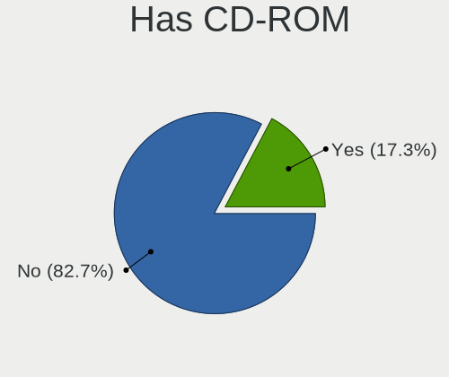
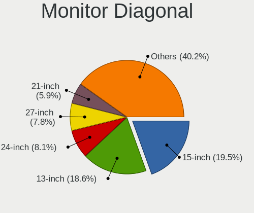
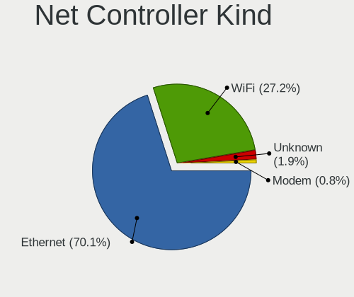
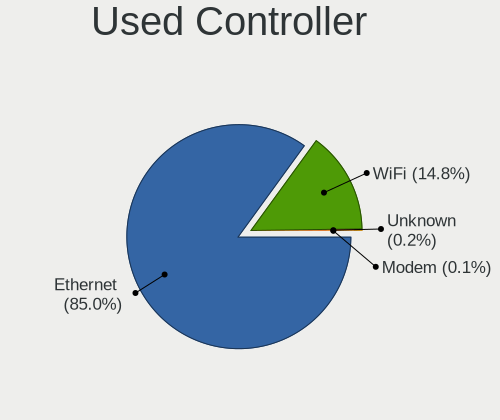

BSD - Tested Hardware & Statistics
----------------------------------

A project to collect tested hardware configurations for BSD.

Anyone can contribute to this report by the [hw-probe](https://github.com/linuxhw/hw-probe/blob/master/INSTALL.BSD.md) tool:

    hw-probe -all -upload

Please contribute! Especially if your hardware is rare.

This is a report for all computer types. See also reports for [desktops](/Desktop/README.md) and [notebooks](/Notebook/README.md).

OS-specific reports: [FreeBSD](/Dist/FreeBSD), [GhostBSD](/Dist/GhostBSD), [helloSystem](/Dist/helloSystem), [NetBSD](/Dist/NetBSD), [NomadBSD](/Dist/NomadBSD), [OpenBSD](/Dist/OpenBSD), [OPNsense](/Dist/OPNsense), [pfSense](/Dist/pfSense), [TrueNAS](/Dist/TrueNAS).

This report is for real hardware. Report for virtual hardware: [TestCoverage_VE](https://github.com/bsdhw/TestCoverage_VE)

Contents
--------

* [ Test Cases ](#test-cases)

* [ System ](#system)
  - [ OS                       ](#os)
  - [ OS Family                ](#os-family)
  - [ Arch                     ](#arch)
  - [ DE                       ](#de)
  - [ Display Server           ](#display-server)
  - [ Display Manager          ](#display-manager)
  - [ OS Lang                  ](#os-lang)
  - [ Boot Mode                ](#boot-mode)
  - [ Filesystem               ](#filesystem)
  - [ Part. scheme             ](#part-scheme)

* [ Board ](#board)
  - [ Vendor                   ](#vendor)
  - [ Model                    ](#model)
  - [ Model Family             ](#model-family)
  - [ MFG Year                 ](#mfg-year)
  - [ Form Factor              ](#form-factor)
  - [ Coreboot                 ](#coreboot)
  - [ RAM Size                 ](#ram-size)
  - [ RAM Used                 ](#ram-used)
  - [ Total Drives             ](#total-drives)
  - [ Has CD-ROM               ](#has-cd-rom)
  - [ Has Ethernet             ](#has-ethernet)
  - [ Has WiFi                 ](#has-wifi)
  - [ Has Bluetooth            ](#has-bluetooth)

* [ Location ](#location)
  - [ Country                  ](#country)
  - [ City                     ](#city)

* [ Drives ](#drives)
  - [ Drive Vendor             ](#drive-vendor)
  - [ Drive Model              ](#drive-model)
  - [ HDD Vendor               ](#hdd-vendor)
  - [ SSD Vendor               ](#ssd-vendor)
  - [ Drive Kind               ](#drive-kind)
  - [ Drive Connector          ](#drive-connector)
  - [ Drive Size               ](#drive-size)
  - [ Space Total              ](#space-total)
  - [ Space Used               ](#space-used)
  - [ Malfunc. Drives          ](#malfunc-drives)
  - [ Malfunc. Drive Vendor    ](#malfunc-drive-vendor)
  - [ Malfunc. HDD Vendor      ](#malfunc-hdd-vendor)
  - [ Malfunc. Drive Kind      ](#malfunc-drive-kind)
  - [ Failed Drives            ](#failed-drives)
  - [ Failed Drive Vendor      ](#failed-drive-vendor)
  - [ Drive Status             ](#drive-status)

* [ Storage controller ](#storage-controller)
  - [ Storage Vendor           ](#storage-vendor)
  - [ Storage Model            ](#storage-model)
  - [ Storage Kind             ](#storage-kind)

* [ Processor ](#processor)
  - [ CPU Vendor               ](#cpu-vendor)
  - [ CPU Model                ](#cpu-model)
  - [ CPU Model Family         ](#cpu-model-family)
  - [ CPU Cores                ](#cpu-cores)
  - [ CPU Sockets              ](#cpu-sockets)
  - [ CPU Threads              ](#cpu-threads)
  - [ CPU Microarch            ](#cpu-microarch)

* [ Graphics ](#graphics)
  - [ GPU Vendor               ](#gpu-vendor)
  - [ GPU Model                ](#gpu-model)
  - [ GPU Combo                ](#gpu-combo)
  - [ GPU Driver               ](#gpu-driver)
  - [ GPU Memory               ](#gpu-memory)

* [ Monitor ](#monitor)
  - [ Monitor Vendor           ](#monitor-vendor)
  - [ Monitor Model            ](#monitor-model)
  - [ Monitor Resolution       ](#monitor-resolution)
  - [ Monitor Diagonal         ](#monitor-diagonal)
  - [ Monitor Width            ](#monitor-width)
  - [ Aspect Ratio             ](#aspect-ratio)
  - [ Monitor Area             ](#monitor-area)
  - [ Pixel Density            ](#pixel-density)
  - [ Multiple Monitors        ](#multiple-monitors)

* [ Network ](#network)
  - [ Net Controller Vendor    ](#net-controller-vendor)
  - [ Net Controller Model     ](#net-controller-model)
  - [ Wireless Vendor          ](#wireless-vendor)
  - [ Wireless Model           ](#wireless-model)
  - [ Ethernet Vendor          ](#ethernet-vendor)
  - [ Ethernet Model           ](#ethernet-model)
  - [ Net Controller Kind      ](#net-controller-kind)
  - [ Used Controller          ](#used-controller)
  - [ NICs                     ](#nics)
  - [ IPv6                     ](#ipv6)

* [ Bluetooth ](#bluetooth)
  - [ Bluetooth Vendor         ](#bluetooth-vendor)
  - [ Bluetooth Model          ](#bluetooth-model)

* [ Sound ](#sound)
  - [ Sound Vendor             ](#sound-vendor)
  - [ Sound Model              ](#sound-model)

* [ Memory ](#memory)
  - [ Memory Vendor            ](#memory-vendor)
  - [ Memory Model             ](#memory-model)
  - [ Memory Kind              ](#memory-kind)
  - [ Memory Form Factor       ](#memory-form-factor)
  - [ Memory Size              ](#memory-size)
  - [ Memory Speed             ](#memory-speed)

* [ Printers & scanners ](#printers--scanners)
  - [ Printer Vendor           ](#printer-vendor)
  - [ Printer Model            ](#printer-model)
  - [ Scanner Vendor           ](#scanner-vendor)
  - [ Scanner Model            ](#scanner-model)

* [ Camera ](#camera)
  - [ Camera Vendor            ](#camera-vendor)
  - [ Camera Model             ](#camera-model)

* [ Security ](#security)
  - [ Fingerprint Vendor       ](#fingerprint-vendor)
  - [ Fingerprint Model        ](#fingerprint-model)
  - [ Chipcard Vendor          ](#chipcard-vendor)
  - [ Chipcard Model           ](#chipcard-model)

* [ Unsupported ](#unsupported)
  - [ Unsupported Devices      ](#unsupported-devices)
  - [ Unsupported Device Types ](#unsupported-device-types)

Test Cases
----------

Total: 10115

| Vendor        | Model                       | Form-Factor | Probe                                                     | Date         |
|---------------|-----------------------------|-------------|-----------------------------------------------------------|--------------|
| Lenovo        | MAHOBAY                     | Desktop     | [b54df77b59](https://bsd-hardware.info/?probe=b54df77b59) | May 07, 2022 |
| Unknown       | W1415A                      | Notebook    | [1b2c63a845](https://bsd-hardware.info/?probe=1b2c63a845) | May 07, 2022 |
| AZW           | GK55                        | Desktop     | [4d1aea90c4](https://bsd-hardware.info/?probe=4d1aea90c4) | May 07, 2022 |
| AMI           | Aptio CRB                   | Mini pc     | [49b3bb1e1c](https://bsd-hardware.info/?probe=49b3bb1e1c) | May 06, 2022 |
| Dell          | Inspiron 15-7568            | Notebook    | [850df51257](https://bsd-hardware.info/?probe=850df51257) | May 06, 2022 |
| HP            | 8054                        | Desktop     | [6c53f040f5](https://bsd-hardware.info/?probe=6c53f040f5) | May 06, 2022 |
| Raspberry ... | Raspberry Pi                | Soc         | [659e98fd68](https://bsd-hardware.info/?probe=659e98fd68) | May 06, 2022 |
| Supermicro    | A1SAM-2550F                 | Server      | [919195c544](https://bsd-hardware.info/?probe=919195c544) | May 06, 2022 |
| Sophos        | SG                          | Firewall    | [9e16039d35](https://bsd-hardware.info/?probe=9e16039d35) | May 06, 2022 |
| Fujitsu       | LIFEBOOK E752               | Notebook    | [3e60a82218](https://bsd-hardware.info/?probe=3e60a82218) | May 06, 2022 |
| Gigabyte      | F2A68HM-H                   | Desktop     | [daed3f9401](https://bsd-hardware.info/?probe=daed3f9401) | May 06, 2022 |
| BESSTAR Te... | DMAF5 V1.0                  | Desktop     | [dc534266df](https://bsd-hardware.info/?probe=dc534266df) | May 06, 2022 |
| BESSTAR Te... | IB9                         | Desktop     | [4a4e45585d](https://bsd-hardware.info/?probe=4a4e45585d) | May 06, 2022 |
| Gigabyte      | H81N                        | Desktop     | [d922327cdd](https://bsd-hardware.info/?probe=d922327cdd) | May 06, 2022 |
| MW            | GMLK-2_5G4L                 | Desktop     | [59083ac5ac](https://bsd-hardware.info/?probe=59083ac5ac) | May 06, 2022 |
| ASUSTek       | P8Z77-V LX                  | Desktop     | [bf3d4941a2](https://bsd-hardware.info/?probe=bf3d4941a2) | May 06, 2022 |
| ASUSTek       | P8Z77-V LX                  | Desktop     | [dd3afff7f0](https://bsd-hardware.info/?probe=dd3afff7f0) | May 06, 2022 |
| HP            | 17E2                        | Mini pc     | [ac74e1cc65](https://bsd-hardware.info/?probe=ac74e1cc65) | May 06, 2022 |
| ASUSTek       | P5Q-E                       | Desktop     | [d90bbcf4da](https://bsd-hardware.info/?probe=d90bbcf4da) | May 06, 2022 |
| Dell          | 0Y7WYT A00                  | Desktop     | [76674e4d62](https://bsd-hardware.info/?probe=76674e4d62) | May 06, 2022 |
| Sony          | VGN-NW25GF_S                | Notebook    | [84b50ca3f1](https://bsd-hardware.info/?probe=84b50ca3f1) | May 06, 2022 |
| Lenovo        | ThinkPad X1 Carbon 3rd 2... | Notebook    | [015bf0fea4](https://bsd-hardware.info/?probe=015bf0fea4) | May 06, 2022 |
| Protectli     | FW2B Ver                    | Desktop     | [6c7485ba6b](https://bsd-hardware.info/?probe=6c7485ba6b) | May 06, 2022 |
| Lenovo        | ThinkPad X220 42872WU       | Notebook    | [e99738632d](https://bsd-hardware.info/?probe=e99738632d) | May 06, 2022 |
| Unknown       | J3160-4L                    | Desktop     | [13815ff079](https://bsd-hardware.info/?probe=13815ff079) | May 06, 2022 |
| Intel         | CARLOW                      | Desktop     | [6f185d9b30](https://bsd-hardware.info/?probe=6f185d9b30) | May 06, 2022 |
| Supermicro    | A1SAM-2550F                 | Server      | [e797df7273](https://bsd-hardware.info/?probe=e797df7273) | May 05, 2022 |
| AWOW          | PC BOX                      | Mini pc     | [52b6c326c8](https://bsd-hardware.info/?probe=52b6c326c8) | May 05, 2022 |
| Intel         | H81U                        | Notebook    | [04646d1cc7](https://bsd-hardware.info/?probe=04646d1cc7) | May 05, 2022 |
| Supermicro    | X7SPA-HF                    | Desktop     | [990036445e](https://bsd-hardware.info/?probe=990036445e) | May 05, 2022 |
| BESSTAR Te... | GB1B                        | Mini pc     | [407fc42fad](https://bsd-hardware.info/?probe=407fc42fad) | May 05, 2022 |
| Fujitsu       | D3041-A1 S26361-D3041-A1    | Desktop     | [5ff176fff8](https://bsd-hardware.info/?probe=5ff176fff8) | May 05, 2022 |
| Protectli     | VP2410                      | Desktop     | [d80da79148](https://bsd-hardware.info/?probe=d80da79148) | May 05, 2022 |
| ASUSTek       | 1000HE                      | Notebook    | [a6393754b4](https://bsd-hardware.info/?probe=a6393754b4) | May 05, 2022 |
| Intel         | DENLOW_WS                   | Desktop     | [f2d69d582a](https://bsd-hardware.info/?probe=f2d69d582a) | May 05, 2022 |
| Intel         | CARLOW                      | Desktop     | [2240df9d2d](https://bsd-hardware.info/?probe=2240df9d2d) | May 04, 2022 |
| Acer          | Aspire E1-570G              | Notebook    | [7fd31252a2](https://bsd-hardware.info/?probe=7fd31252a2) | May 04, 2022 |
| Lenovo        | 312D SDK0J40697 WIN 3305... | Mini pc     | [59a9f35c23](https://bsd-hardware.info/?probe=59a9f35c23) | May 04, 2022 |
| ASRock        | H81M-DGS R2.0               | Desktop     | [f623e268d9](https://bsd-hardware.info/?probe=f623e268d9) | May 04, 2022 |
| ASUSTek       | TUF Gaming Z590-PLUS        | Desktop     | [5f9e266167](https://bsd-hardware.info/?probe=5f9e266167) | May 04, 2022 |
| ASUSTek       | TUF Gaming Z590-PLUS        | Desktop     | [7d4dd8ba29](https://bsd-hardware.info/?probe=7d4dd8ba29) | May 04, 2022 |
| friendlyel... | nanopi-r4s                  | Desktop     | [3db2ec8973](https://bsd-hardware.info/?probe=3db2ec8973) | May 04, 2022 |
| Toshiba       | Satellite P300              | Notebook    | [fca7b38039](https://bsd-hardware.info/?probe=fca7b38039) | May 04, 2022 |
| Protectli     | FW2B Ver                    | Desktop     | [b2eb9a10fa](https://bsd-hardware.info/?probe=b2eb9a10fa) | May 04, 2022 |
| Unknown       | Unknown                     | Desktop     | [cc25e2d869](https://bsd-hardware.info/?probe=cc25e2d869) | May 04, 2022 |
| ASUSTek       | H81M-E                      | Desktop     | [cf2f288b93](https://bsd-hardware.info/?probe=cf2f288b93) | May 04, 2022 |
| Lenovo        | B470 HuronRiver Platform    | Notebook    | [e0ef68c720](https://bsd-hardware.info/?probe=e0ef68c720) | May 04, 2022 |
| Gigabyte      | B550 AORUS ELITE V2         | Desktop     | [01a89aa67c](https://bsd-hardware.info/?probe=01a89aa67c) | May 04, 2022 |
| Intel         | DENLOW_WS                   | Desktop     | [bdf2b37260](https://bsd-hardware.info/?probe=bdf2b37260) | May 04, 2022 |
| Dell          | Vostro 5590                 | Notebook    | [1f23973fb4](https://bsd-hardware.info/?probe=1f23973fb4) | May 04, 2022 |
| Protectli     | FW4B Ver                    | Desktop     | [d4606bfb1a](https://bsd-hardware.info/?probe=d4606bfb1a) | May 04, 2022 |
| Protectli     | FW2B Ver                    | Desktop     | [632c881ec8](https://bsd-hardware.info/?probe=632c881ec8) | May 04, 2022 |
| Matsushita... | CF-48V4KNDQM                | Notebook    | [774cab5326](https://bsd-hardware.info/?probe=774cab5326) | May 03, 2022 |
| Unknown       | Unknown                     | Desktop     | [b96fd74ab0](https://bsd-hardware.info/?probe=b96fd74ab0) | May 03, 2022 |
| Fujitsu       | D3224-A1 S26361-D3224-A1    | Desktop     | [54ead4b762](https://bsd-hardware.info/?probe=54ead4b762) | May 03, 2022 |
| Sophos        | XG                          | Firewall    | [19b1a90a3c](https://bsd-hardware.info/?probe=19b1a90a3c) | May 03, 2022 |
| Dell          | 0782GW A00                  | Desktop     | [3481513b0f](https://bsd-hardware.info/?probe=3481513b0f) | May 03, 2022 |
| Unknown       | Unknown                     | Desktop     | [75f07f113e](https://bsd-hardware.info/?probe=75f07f113e) | May 03, 2022 |
| Matsushita... | CF-51RCVDNLM                | Notebook    | [4b1abdd507](https://bsd-hardware.info/?probe=4b1abdd507) | May 03, 2022 |
| Sophos        | SG                          | Firewall    | [5109c6e2e4](https://bsd-hardware.info/?probe=5109c6e2e4) | May 03, 2022 |
| Intel         | NUC10i7FNB K61360-303       | Mini pc     | [86ea07c719](https://bsd-hardware.info/?probe=86ea07c719) | May 03, 2022 |
| ASRock        | J4125B-ITX                  | Desktop     | [14d02a8209](https://bsd-hardware.info/?probe=14d02a8209) | May 03, 2022 |
| MSI           | 2A9C                        | Desktop     | [506b970279](https://bsd-hardware.info/?probe=506b970279) | May 03, 2022 |
| HP            | Pavilion m6                 | Notebook    | [c720817018](https://bsd-hardware.info/?probe=c720817018) | May 03, 2022 |
| iEi           | SAE1 V1.04                  | Desktop     | [fe3f27de60](https://bsd-hardware.info/?probe=fe3f27de60) | May 03, 2022 |
| AMI           | PEISIA E3845 VER1.0         | Desktop     | [57a2104026](https://bsd-hardware.info/?probe=57a2104026) | May 03, 2022 |
| Intel         | SKYBAY                      | Desktop     | [f29a8e96c3](https://bsd-hardware.info/?probe=f29a8e96c3) | May 03, 2022 |
| NEXCOM        | NSA3110 B                   | Desktop     | [1ad2c05c6c](https://bsd-hardware.info/?probe=1ad2c05c6c) | May 03, 2022 |
| Lenovo        | ThinkPad T410 2537N24       | Notebook    | [2884106c6b](https://bsd-hardware.info/?probe=2884106c6b) | May 03, 2022 |
| Lenovo        | ThinkPad T430 2347GZU       | Notebook    | [00ba6ca9f8](https://bsd-hardware.info/?probe=00ba6ca9f8) | May 03, 2022 |
| Acer          | Aspire XC-1660G V:1.1       | Desktop     | [441a5f4a89](https://bsd-hardware.info/?probe=441a5f4a89) | May 03, 2022 |
| OEM           | B85 JHS359                  | Desktop     | [c5d29cc6b3](https://bsd-hardware.info/?probe=c5d29cc6b3) | May 03, 2022 |
| HP            | EliteBook 820 G2            | Notebook    | [3997ff79e4](https://bsd-hardware.info/?probe=3997ff79e4) | May 03, 2022 |
| Intel         | Q3XXG4-P                    | Desktop     | [ed04988a23](https://bsd-hardware.info/?probe=ed04988a23) | May 03, 2022 |
| Lenovo        | ThinkPad T420s 41742BU      | Notebook    | [6b77fe651f](https://bsd-hardware.info/?probe=6b77fe651f) | May 03, 2022 |
| Sophos        | XG                          | Firewall    | [bec4979a46](https://bsd-hardware.info/?probe=bec4979a46) | May 03, 2022 |
| SIEMENS       | SIMATIC IPC127E             | Notebook    | [334103ab86](https://bsd-hardware.info/?probe=334103ab86) | May 02, 2022 |
| Lenovo        | ThinkPad X220 429043U       | Notebook    | [f3c30a6190](https://bsd-hardware.info/?probe=f3c30a6190) | May 02, 2022 |
| AMI           | PEISIA E3845 VER1.0         | Desktop     | [dc9e80852d](https://bsd-hardware.info/?probe=dc9e80852d) | May 02, 2022 |
| Acer          | Aspire ES1-132              | Notebook    | [18426698ad](https://bsd-hardware.info/?probe=18426698ad) | May 02, 2022 |
| Deciso        | OPNsense Appliance          | Notebook    | [8a8db12cf2](https://bsd-hardware.info/?probe=8a8db12cf2) | May 02, 2022 |
| HP            | Pavilion g6                 | Notebook    | [4b8ee6729a](https://bsd-hardware.info/?probe=4b8ee6729a) | May 02, 2022 |
| Gigabyte      | A320M-H-CF                  | Desktop     | [24d308754b](https://bsd-hardware.info/?probe=24d308754b) | May 02, 2022 |
| Dell          | Latitude 7490               | Notebook    | [0d5b872ec1](https://bsd-hardware.info/?probe=0d5b872ec1) | May 02, 2022 |
| Dell          | Latitude 7490               | Notebook    | [03c97fe4d9](https://bsd-hardware.info/?probe=03c97fe4d9) | May 02, 2022 |
| HP            | ZBook 14                    | Notebook    | [a646255b51](https://bsd-hardware.info/?probe=a646255b51) | May 02, 2022 |
| Supermicro    | X9SCL/X9SCMA                | Desktop     | [478294cdd3](https://bsd-hardware.info/?probe=478294cdd3) | May 02, 2022 |
| AMI           | Aptio CRB                   | Mini pc     | [128b461a84](https://bsd-hardware.info/?probe=128b461a84) | May 02, 2022 |
| Intel         | Q3XXG4-P V1.0               | Desktop     | [e4c8d6c787](https://bsd-hardware.info/?probe=e4c8d6c787) | May 01, 2022 |
| ASUSTek       | H97I-PLUS                   | Desktop     | [1fde9daf7d](https://bsd-hardware.info/?probe=1fde9daf7d) | May 01, 2022 |
| Dell          | Latitude E5570              | Notebook    | [c214ce4ab0](https://bsd-hardware.info/?probe=c214ce4ab0) | May 01, 2022 |
| HP            | 0B4Ch D                     | Desktop     | [3f170bdee6](https://bsd-hardware.info/?probe=3f170bdee6) | May 01, 2022 |
| Acer          | Aspire A315-41              | Notebook    | [c59d8482e8](https://bsd-hardware.info/?probe=c59d8482e8) | May 01, 2022 |
| Supermicro    | X11SDV-4C-TP8F              | Desktop     | [6ccb91cdfe](https://bsd-hardware.info/?probe=6ccb91cdfe) | May 01, 2022 |
| Supermicro    | X11SDV-4C-TP8F              | Desktop     | [46c2b63c32](https://bsd-hardware.info/?probe=46c2b63c32) | May 01, 2022 |
| ASUSTek       | P5Q-E                       | Desktop     | [a28d0e9c9d](https://bsd-hardware.info/?probe=a28d0e9c9d) | May 01, 2022 |
| ASUSTek       | ROG CROSSHAIR VIII HERO     | Desktop     | [7b1cd9e231](https://bsd-hardware.info/?probe=7b1cd9e231) | May 01, 2022 |
| MSI           | H81M-P33                    | Desktop     | [30d7aec5a0](https://bsd-hardware.info/?probe=30d7aec5a0) | May 01, 2022 |
| Panasonic     | CF-53AAGHYDM                | Notebook    | [abd8754907](https://bsd-hardware.info/?probe=abd8754907) | May 01, 2022 |
| CompuLab      | fitlet                      | Mini pc     | [72072168ce](https://bsd-hardware.info/?probe=72072168ce) | May 01, 2022 |
| Unknown       | J3160-4L                    | Desktop     | [7ceaeb49f9](https://bsd-hardware.info/?probe=7ceaeb49f9) | May 01, 2022 |
| Lenovo        | 32E1 SDK0J40697 WIN 3305... | Desktop     | [a8c820c8c2](https://bsd-hardware.info/?probe=a8c820c8c2) | May 01, 2022 |
| Toshiba       | Satellite P25               | Notebook    | [6a920e9c8a](https://bsd-hardware.info/?probe=6a920e9c8a) | May 01, 2022 |
| Lenovo        | ThinkPad X240 20AMS1YG01    | Notebook    | [6e38eb1a4e](https://bsd-hardware.info/?probe=6e38eb1a4e) | May 01, 2022 |
| Lenovo        | 32E1 SDK0J40697 WIN 3305... | Desktop     | [e4970bf75f](https://bsd-hardware.info/?probe=e4970bf75f) | Apr 30, 2022 |
| MSI           | MEG X570 UNIFY              | Desktop     | [5e8168a980](https://bsd-hardware.info/?probe=5e8168a980) | Apr 30, 2022 |
| Sophos        | SG                          | Firewall    | [ca2608d67f](https://bsd-hardware.info/?probe=ca2608d67f) | Apr 30, 2022 |
| Lenovo        | B50-30 20382                | Notebook    | [5701dac149](https://bsd-hardware.info/?probe=5701dac149) | Apr 30, 2022 |
| MSI           | 2AE0                        | Desktop     | [9ff97b3d86](https://bsd-hardware.info/?probe=9ff97b3d86) | Apr 30, 2022 |
| HP            | 0AA8h                       | Desktop     | [f9b906ea47](https://bsd-hardware.info/?probe=f9b906ea47) | Apr 30, 2022 |
| Dell          | Precision 7730              | Notebook    | [bdb3e3d4ce](https://bsd-hardware.info/?probe=bdb3e3d4ce) | Apr 30, 2022 |
| IceWhale T... | ZimaBoard 832 ZMB           | Desktop     | [e16c0616d6](https://bsd-hardware.info/?probe=e16c0616d6) | Apr 30, 2022 |
| Dell          | Latitude 7490               | Notebook    | [1586880dd7](https://bsd-hardware.info/?probe=1586880dd7) | Apr 30, 2022 |
| HP            | 213D A01                    | Desktop     | [562722ac56](https://bsd-hardware.info/?probe=562722ac56) | Apr 30, 2022 |
| Lenovo        | ThinkPad X270 W10DG 20K5... | Notebook    | [f02e4345ff](https://bsd-hardware.info/?probe=f02e4345ff) | Apr 30, 2022 |
| Intel         | NUC6CAYB J23203-405         | Mini pc     | [86ade7ce4b](https://bsd-hardware.info/?probe=86ade7ce4b) | Apr 30, 2022 |
| Apple         | MacBookPro5,5               | Notebook    | [807676e010](https://bsd-hardware.info/?probe=807676e010) | Apr 30, 2022 |
| Apple         | MacBookPro5,5               | Notebook    | [4b5603b38b](https://bsd-hardware.info/?probe=4b5603b38b) | Apr 29, 2022 |
| Panasonic     | CF-52PFPBSFQ                | Notebook    | [1ce63e2214](https://bsd-hardware.info/?probe=1ce63e2214) | Apr 29, 2022 |
| OEM           | 1.0                         | Desktop     | [36e78ab638](https://bsd-hardware.info/?probe=36e78ab638) | Apr 29, 2022 |
| HP            | 8158 A01                    | Mini pc     | [de45e5a021](https://bsd-hardware.info/?probe=de45e5a021) | Apr 29, 2022 |
| PC Engines    | APU3                        | Desktop     | [2c9f328835](https://bsd-hardware.info/?probe=2c9f328835) | Apr 29, 2022 |
| HP            | Laptop 15-dw1xxx            | Notebook    | [7a212b5833](https://bsd-hardware.info/?probe=7a212b5833) | Apr 29, 2022 |
| Intel         | X79 V2.72A                  | Desktop     | [45677effb0](https://bsd-hardware.info/?probe=45677effb0) | Apr 29, 2022 |
| HP            | 1495                        | Desktop     | [6e0f1cc72e](https://bsd-hardware.info/?probe=6e0f1cc72e) | Apr 29, 2022 |
| Dell          | 02C2CP A04                  | Server      | [6ea07b9e6c](https://bsd-hardware.info/?probe=6ea07b9e6c) | Apr 29, 2022 |
| Unknown       | YL-J1900-V1                 | Desktop     | [54fe9e7529](https://bsd-hardware.info/?probe=54fe9e7529) | Apr 29, 2022 |
| Deciso        | DEC2700 - OPNsense Appli... | Notebook    | [22b192afca](https://bsd-hardware.info/?probe=22b192afca) | Apr 28, 2022 |
| PC Engines    | APU2                        | Desktop     | [26be7dfcb8](https://bsd-hardware.info/?probe=26be7dfcb8) | Apr 28, 2022 |
| Winston Ma... | PICO PC                     | Desktop     | [62ac33569f](https://bsd-hardware.info/?probe=62ac33569f) | Apr 28, 2022 |
| MSI           | A520M-A PRO                 | Desktop     | [336add4fcb](https://bsd-hardware.info/?probe=336add4fcb) | Apr 28, 2022 |
| Apple         | MacBookPro3,1               | Notebook    | [912d02aec2](https://bsd-hardware.info/?probe=912d02aec2) | Apr 28, 2022 |
| HP            | 1588h                       | Desktop     | [51ce2c6d49](https://bsd-hardware.info/?probe=51ce2c6d49) | Apr 28, 2022 |
| Protectli     | FW6 Ver                     | Desktop     | [2bd964cc84](https://bsd-hardware.info/?probe=2bd964cc84) | Apr 28, 2022 |
| Unknown       | Unknown                     | Desktop     | [d036c00d6c](https://bsd-hardware.info/?probe=d036c00d6c) | Apr 28, 2022 |
| PC Engines    | APU2                        | Desktop     | [4405a65be4](https://bsd-hardware.info/?probe=4405a65be4) | Apr 28, 2022 |
| ASRock        | J3355B-ITX                  | Desktop     | [c0739686fb](https://bsd-hardware.info/?probe=c0739686fb) | Apr 28, 2022 |
| ASRock        | B450M-HDV R4.0              | Desktop     | [6ce315ed5c](https://bsd-hardware.info/?probe=6ce315ed5c) | Apr 28, 2022 |
| Lenovo        | ThinkPad T470 20HES0ES1F    | Notebook    | [f1f0676663](https://bsd-hardware.info/?probe=f1f0676663) | Apr 28, 2022 |
| Sophos        | SG                          | Firewall    | [dd94f9dfe6](https://bsd-hardware.info/?probe=dd94f9dfe6) | Apr 28, 2022 |
| Supermicro    | X10SLH-N6-ST031             | Server      | [586d311314](https://bsd-hardware.info/?probe=586d311314) | Apr 28, 2022 |
| Supermicro    | X10DRi-T                    | Desktop     | [dcd02e012d](https://bsd-hardware.info/?probe=dcd02e012d) | Apr 28, 2022 |
| Unknown       | X79-P3                      | Desktop     | [337d593ce0](https://bsd-hardware.info/?probe=337d593ce0) | Apr 28, 2022 |
| Lenovo        | 32E1 SDK0J40697 WIN 3305... | Desktop     | [a4fa09b7c1](https://bsd-hardware.info/?probe=a4fa09b7c1) | Apr 28, 2022 |
| Seeed Stud... | ODYSSEY-X86J41X5 SD-BS-C... | Desktop     | [c1df1360a2](https://bsd-hardware.info/?probe=c1df1360a2) | Apr 28, 2022 |
| MSI           | MS-7C37                     | Desktop     | [aaab7cf22a](https://bsd-hardware.info/?probe=aaab7cf22a) | Apr 28, 2022 |
| AMI           | Aptio CRB                   | Mini pc     | [60932d337b](https://bsd-hardware.info/?probe=60932d337b) | Apr 28, 2022 |
| Supermicro    | X9SCL/X9SCMA                | Desktop     | [0d32ec9fe4](https://bsd-hardware.info/?probe=0d32ec9fe4) | Apr 27, 2022 |
| MSI           | A520M-A PRO                 | Desktop     | [34f2ba40e7](https://bsd-hardware.info/?probe=34f2ba40e7) | Apr 27, 2022 |
| Lenovo        | IdeaPadFlex 5 14ALC05 82... | Convertible | [0750e29d3c](https://bsd-hardware.info/?probe=0750e29d3c) | Apr 27, 2022 |
| Lenovo        | ThinkPad E490 20N8CTO1WW    | Notebook    | [30e267dd51](https://bsd-hardware.info/?probe=30e267dd51) | Apr 27, 2022 |
| Supermicro    | X8SIL                       | Desktop     | [ea89820a66](https://bsd-hardware.info/?probe=ea89820a66) | Apr 27, 2022 |
| PC Engines    | APU2                        | Desktop     | [920eae6f2e](https://bsd-hardware.info/?probe=920eae6f2e) | Apr 27, 2022 |
| HP            | Notebook                    | Notebook    | [eea4cff90b](https://bsd-hardware.info/?probe=eea4cff90b) | Apr 27, 2022 |
| PC Engines    | APU2                        | Desktop     | [a2b68686f0](https://bsd-hardware.info/?probe=a2b68686f0) | Apr 27, 2022 |
| PC Engines    | APU2                        | Desktop     | [5d79f85176](https://bsd-hardware.info/?probe=5d79f85176) | Apr 27, 2022 |
| HP            | ProLiant DL380 G6           | Server      | [718c945868](https://bsd-hardware.info/?probe=718c945868) | Apr 27, 2022 |
| Sophos        | SG                          | Firewall    | [92a32f4608](https://bsd-hardware.info/?probe=92a32f4608) | Apr 27, 2022 |
| Supermicro    | A1SRi-2558F                 | Mini pc     | [91f8607bd5](https://bsd-hardware.info/?probe=91f8607bd5) | Apr 27, 2022 |
| Lenovo        | ThinkPad T420 4236BD5       | Notebook    | [867ed989e2](https://bsd-hardware.info/?probe=867ed989e2) | Apr 27, 2022 |
| HP            | 17E2                        | Mini pc     | [4cd954cab1](https://bsd-hardware.info/?probe=4cd954cab1) | Apr 27, 2022 |
| Notebook      | N7x0WU                      | Notebook    | [b7c06932a3](https://bsd-hardware.info/?probe=b7c06932a3) | Apr 27, 2022 |
| Gigabyte      | X470 AORUS ULTRA GAMING-... | Desktop     | [1a475f0939](https://bsd-hardware.info/?probe=1a475f0939) | Apr 27, 2022 |
| HP            | 1998                        | Desktop     | [1244e0583b](https://bsd-hardware.info/?probe=1244e0583b) | Apr 27, 2022 |
| MSI           | 970A GAMING PRO CARBON      | Desktop     | [c36f9d6c1d](https://bsd-hardware.info/?probe=c36f9d6c1d) | Apr 26, 2022 |
| ASRock        | X570S PG Riptide            | Desktop     | [928d2abb5e](https://bsd-hardware.info/?probe=928d2abb5e) | Apr 26, 2022 |
| HP            | 8103 A01                    | Mini pc     | [d3234681fe](https://bsd-hardware.info/?probe=d3234681fe) | Apr 26, 2022 |
| Unknown       | Unknown                     | Desktop     | [b3d5defed1](https://bsd-hardware.info/?probe=b3d5defed1) | Apr 26, 2022 |
| Protectli     | VP2410                      | Desktop     | [481fce8e01](https://bsd-hardware.info/?probe=481fce8e01) | Apr 26, 2022 |
| Intel         | X79 V2.72A                  | Desktop     | [2f179ec7f7](https://bsd-hardware.info/?probe=2f179ec7f7) | Apr 26, 2022 |
| Protectli     | FW6 Ver                     | Desktop     | [8d2ca89ae5](https://bsd-hardware.info/?probe=8d2ca89ae5) | Apr 26, 2022 |
| Supermicro    | X9DAL                       | Desktop     | [ef1f3da3ce](https://bsd-hardware.info/?probe=ef1f3da3ce) | Apr 26, 2022 |
| MSI           | GF65 Thin 10SER             | Notebook    | [cedf98c955](https://bsd-hardware.info/?probe=cedf98c955) | Apr 26, 2022 |
| PC Engines    | APU2                        | Desktop     | [3fe99889aa](https://bsd-hardware.info/?probe=3fe99889aa) | Apr 26, 2022 |
| AMI           | Aptio CRB                   | Mini pc     | [0ac430c0c9](https://bsd-hardware.info/?probe=0ac430c0c9) | Apr 25, 2022 |
| Framework     | Laptop                      | Notebook    | [5d6cb039ea](https://bsd-hardware.info/?probe=5d6cb039ea) | Apr 25, 2022 |
| Fujitsu       | D3313-B1 S26361-D3313-B1    | Desktop     | [0d46ae5678](https://bsd-hardware.info/?probe=0d46ae5678) | Apr 25, 2022 |
| Lenovo        | 32E1 SDK0J40697 WIN 3305... | Desktop     | [b6b5897fb7](https://bsd-hardware.info/?probe=b6b5897fb7) | Apr 25, 2022 |
| Intel         | S3420GP E77063-304          | Server      | [09a475e0bc](https://bsd-hardware.info/?probe=09a475e0bc) | Apr 25, 2022 |
| Lenovo        | 3141 SDK0J40697 WIN 3305... | Desktop     | [cec7b77d55](https://bsd-hardware.info/?probe=cec7b77d55) | Apr 25, 2022 |
| HP            | ProLiant DL180 G6           | Server      | [3834dccb1f](https://bsd-hardware.info/?probe=3834dccb1f) | Apr 25, 2022 |
| Unknown       | Unknown                     | Desktop     | [095a279c7b](https://bsd-hardware.info/?probe=095a279c7b) | Apr 25, 2022 |
| MSI           | Modern 14 B11MOL            | Notebook    | [9a61443be9](https://bsd-hardware.info/?probe=9a61443be9) | Apr 25, 2022 |
| Unknown       | MANIFOLD 2-C                | Desktop     | [637c28d728](https://bsd-hardware.info/?probe=637c28d728) | Apr 25, 2022 |
| Dell          | 0TP406                      | Desktop     | [775061bc83](https://bsd-hardware.info/?probe=775061bc83) | Apr 25, 2022 |
| Raspberry ... | Raspberry Pi                | Soc         | [2a8ebfdb92](https://bsd-hardware.info/?probe=2a8ebfdb92) | Apr 25, 2022 |
| Gigabyte      | H310M S2 x.x                | Desktop     | [549053284c](https://bsd-hardware.info/?probe=549053284c) | Apr 25, 2022 |
| MSI           | X399 GAMING PRO CARBON A... | Desktop     | [86c4af7ca4](https://bsd-hardware.info/?probe=86c4af7ca4) | Apr 25, 2022 |
| ASUSTek       | X550CC                      | Notebook    | [ece6d63cfb](https://bsd-hardware.info/?probe=ece6d63cfb) | Apr 25, 2022 |
| ASUSTek       | AM1I-A                      | Desktop     | [8fce57c9e4](https://bsd-hardware.info/?probe=8fce57c9e4) | Apr 25, 2022 |
| Dell          | Inspiron 5437               | Notebook    | [830ea686ab](https://bsd-hardware.info/?probe=830ea686ab) | Apr 24, 2022 |
| MSI           | B450 GAMING PRO CARBON M... | Desktop     | [544b83da9f](https://bsd-hardware.info/?probe=544b83da9f) | Apr 24, 2022 |
| MSI           | MEG X570 UNIFY              | Desktop     | [6afa33e8f8](https://bsd-hardware.info/?probe=6afa33e8f8) | Apr 24, 2022 |
| Gigabyte      | B250M-D2V-CF                | Desktop     | [b66d0955eb](https://bsd-hardware.info/?probe=b66d0955eb) | Apr 24, 2022 |
| Supermicro    | X10SLQ                      | Server      | [94e031b1e8](https://bsd-hardware.info/?probe=94e031b1e8) | Apr 24, 2022 |
| Lenovo        | SKYBAY SDK0J40705 WIN 34... | Desktop     | [1ce660f88e](https://bsd-hardware.info/?probe=1ce660f88e) | Apr 24, 2022 |
| ASUSTek       | PRIME B350-PLUS             | Desktop     | [271f1aa4d1](https://bsd-hardware.info/?probe=271f1aa4d1) | Apr 24, 2022 |
| MSI           | H81M-P33                    | Desktop     | [d14d6194ed](https://bsd-hardware.info/?probe=d14d6194ed) | Apr 24, 2022 |
| ASUSTek       | P5Q-E                       | Desktop     | [27a4680bec](https://bsd-hardware.info/?probe=27a4680bec) | Apr 24, 2022 |
| ASUSTek       | ROG CROSSHAIR VIII HERO     | Desktop     | [76580a0375](https://bsd-hardware.info/?probe=76580a0375) | Apr 24, 2022 |
| Lenovo        | 32E1 SDK0J40697 WIN 3305... | Desktop     | [10ca96dd0a](https://bsd-hardware.info/?probe=10ca96dd0a) | Apr 24, 2022 |
| Apple         | MacBookPro8,3               | Notebook    | [e588c93d54](https://bsd-hardware.info/?probe=e588c93d54) | Apr 24, 2022 |
| AMI           | Aptio CRB 5A3               | Mini pc     | [d5e081498d](https://bsd-hardware.info/?probe=d5e081498d) | Apr 24, 2022 |
| PC Engines    | apu4                        | Desktop     | [2de45511cd](https://bsd-hardware.info/?probe=2de45511cd) | Apr 24, 2022 |
| Lenovo        | ThinkPad 11e Yoga Gen 6 ... | Convertible | [fd100bcc6a](https://bsd-hardware.info/?probe=fd100bcc6a) | Apr 24, 2022 |
| Supermicro    | X7SPA-HF                    | Desktop     | [7de2e80795](https://bsd-hardware.info/?probe=7de2e80795) | Apr 23, 2022 |
| ASUSTek       | M4A88TD-V EVO/USB3          | Desktop     | [12cc40cc60](https://bsd-hardware.info/?probe=12cc40cc60) | Apr 23, 2022 |
| Lenovo        | 30C7 SDK0J40700 WIN 3258... | Desktop     | [66f185a3e5](https://bsd-hardware.info/?probe=66f185a3e5) | Apr 23, 2022 |
| AMI           | Aptio CRB                   | Mini pc     | [7dde4d8c3e](https://bsd-hardware.info/?probe=7dde4d8c3e) | Apr 23, 2022 |
| Dell          | 0T7D40 A01                  | Desktop     | [7a43bfada9](https://bsd-hardware.info/?probe=7a43bfada9) | Apr 23, 2022 |
| AMI           | Aptio CRB                   | Mini pc     | [0c01c184d4](https://bsd-hardware.info/?probe=0c01c184d4) | Apr 23, 2022 |
| Dell          | Latitude E6520              | Notebook    | [c4ae703add](https://bsd-hardware.info/?probe=c4ae703add) | Apr 23, 2022 |
| Supermicro    | X12SCZ-TLN4FA               | Server      | [2a9ac1e6ee](https://bsd-hardware.info/?probe=2a9ac1e6ee) | Apr 23, 2022 |
| ASUSTek       | P5KR                        | Desktop     | [cf745ca0da](https://bsd-hardware.info/?probe=cf745ca0da) | Apr 23, 2022 |
| PC Engines    | APU2                        | Desktop     | [04a6549c99](https://bsd-hardware.info/?probe=04a6549c99) | Apr 23, 2022 |
| Dell          | 0HD5W2 A00                  | Desktop     | [955922ebe2](https://bsd-hardware.info/?probe=955922ebe2) | Apr 23, 2022 |
| Dell          | 0HD5W2 A00                  | Desktop     | [4d66b2b328](https://bsd-hardware.info/?probe=4d66b2b328) | Apr 23, 2022 |
| Sophos        | SG                          | Firewall    | [cbd2585bf3](https://bsd-hardware.info/?probe=cbd2585bf3) | Apr 23, 2022 |
| HP            | 82B4                        | Desktop     | [6b735a0f9f](https://bsd-hardware.info/?probe=6b735a0f9f) | Apr 23, 2022 |
| BESSTAR Te... | GB7                         | Mini pc     | [788d44f47d](https://bsd-hardware.info/?probe=788d44f47d) | Apr 23, 2022 |
| ASUSTek       | A55BM-E                     | Desktop     | [9758c067ec](https://bsd-hardware.info/?probe=9758c067ec) | Apr 23, 2022 |
| Dell          | Latitude 5290               | Notebook    | [11c3db8f1b](https://bsd-hardware.info/?probe=11c3db8f1b) | Apr 23, 2022 |
| Notebook      | W650DC,DD                   | Notebook    | [0f474b9ebb](https://bsd-hardware.info/?probe=0f474b9ebb) | Apr 23, 2022 |
| Unknown       | Unknown                     | Desktop     | [3b256304a0](https://bsd-hardware.info/?probe=3b256304a0) | Apr 23, 2022 |
| Apple         | PowerMac10,1                | Desktop     | [e054e605fa](https://bsd-hardware.info/?probe=e054e605fa) | Apr 23, 2022 |
| Shuttle       | FH61V                       | Desktop     | [6f4c78b7db](https://bsd-hardware.info/?probe=6f4c78b7db) | Apr 23, 2022 |
| MSI           | X570-A PRO                  | Desktop     | [89fcee49d9](https://bsd-hardware.info/?probe=89fcee49d9) | Apr 22, 2022 |
| HP            | 2000                        | Notebook    | [e9599a9bc3](https://bsd-hardware.info/?probe=e9599a9bc3) | Apr 22, 2022 |
| HP            | ProBook 450 G2              | Notebook    | [c4f7b8a774](https://bsd-hardware.info/?probe=c4f7b8a774) | Apr 22, 2022 |
| Intel         | DH67BL                      | Desktop     | [3c3c9e12da](https://bsd-hardware.info/?probe=3c3c9e12da) | Apr 22, 2022 |
| HP            | 2820h                       | Desktop     | [d888b8b775](https://bsd-hardware.info/?probe=d888b8b775) | Apr 22, 2022 |
| Lenovo        | B570 1068FQG                | Notebook    | [a0d1f01226](https://bsd-hardware.info/?probe=a0d1f01226) | Apr 22, 2022 |
| Supermicro    | X9SCL/X9SCM                 | Desktop     | [947038b1f9](https://bsd-hardware.info/?probe=947038b1f9) | Apr 22, 2022 |
| Unknown       | Unknown                     | Desktop     | [3c5fcc2377](https://bsd-hardware.info/?probe=3c5fcc2377) | Apr 22, 2022 |
| MSI           | PRESTIGE X570 CREATION      | Desktop     | [28c8d07136](https://bsd-hardware.info/?probe=28c8d07136) | Apr 22, 2022 |
| Dell          | 0N051F A01                  | Server      | [0784468d7a](https://bsd-hardware.info/?probe=0784468d7a) | Apr 22, 2022 |
| KOHJINSHA     | SH series                   | Desktop     | [3136a0ca03](https://bsd-hardware.info/?probe=3136a0ca03) | Apr 22, 2022 |
| Lenovo        | ThinkPad X240 20ALA0AHRT    | Desktop     | [062a08c811](https://bsd-hardware.info/?probe=062a08c811) | Apr 22, 2022 |
| Gigabyte      | B450 AORUS M                | Desktop     | [427cf12b45](https://bsd-hardware.info/?probe=427cf12b45) | Apr 22, 2022 |
| DEXP          | NAVIS P100                  | Notebook    | [a9c8814bf8](https://bsd-hardware.info/?probe=a9c8814bf8) | Apr 22, 2022 |
| Sony          | VPCL22Z1R                   | Desktop     | [f199d57905](https://bsd-hardware.info/?probe=f199d57905) | Apr 22, 2022 |
| Lenovo        | ThinkPad X121e 3053A52      | Notebook    | [68d0bf2a99](https://bsd-hardware.info/?probe=68d0bf2a99) | Apr 22, 2022 |
| Gigabyte      | 990FXA-UD3                  | Desktop     | [3813b46bc1](https://bsd-hardware.info/?probe=3813b46bc1) | Apr 22, 2022 |
| Samsung       | DP700A3D-X01RU SEC_SW_RE... | All in one  | [22febd212f](https://bsd-hardware.info/?probe=22febd212f) | Apr 22, 2022 |
| Dell          | Studio 1555                 | Notebook    | [6da8f97bcd](https://bsd-hardware.info/?probe=6da8f97bcd) | Apr 22, 2022 |
| ASUSTek       | Z170-K                      | Desktop     | [b16705bbbd](https://bsd-hardware.info/?probe=b16705bbbd) | Apr 22, 2022 |
| ASUSTek       | P9D-C Series                | Server      | [ac16999995](https://bsd-hardware.info/?probe=ac16999995) | Apr 22, 2022 |
| Lenovo        | 32E1 SDK0J40697 WIN 3305... | Desktop     | [362ff46a0a](https://bsd-hardware.info/?probe=362ff46a0a) | Apr 22, 2022 |
| ASUSTek       | AM1M-A                      | Desktop     | [76a2d4f148](https://bsd-hardware.info/?probe=76a2d4f148) | Apr 22, 2022 |
| AMI           | Aptio CRB                   | Mini pc     | [a2fc9672d6](https://bsd-hardware.info/?probe=a2fc9672d6) | Apr 22, 2022 |
| PC Engines    | apu4                        | Desktop     | [ae39e5adc0](https://bsd-hardware.info/?probe=ae39e5adc0) | Apr 22, 2022 |
| MSI           | H310M PRO-VDH PLUS          | Desktop     | [875d6b2da3](https://bsd-hardware.info/?probe=875d6b2da3) | Apr 22, 2022 |
| ASUSTek       | P10S-I Series               | Desktop     | [aca13dba36](https://bsd-hardware.info/?probe=aca13dba36) | Apr 22, 2022 |
| Intel         | CRESCENTBAY                 | Desktop     | [0d11258d3a](https://bsd-hardware.info/?probe=0d11258d3a) | Apr 22, 2022 |
| HP            | EliteBook 8570p             | Notebook    | [c4dee3f070](https://bsd-hardware.info/?probe=c4dee3f070) | Apr 21, 2022 |
| TUXEDO        | Pulse 15 Gen1               | Notebook    | [b4a6761ab3](https://bsd-hardware.info/?probe=b4a6761ab3) | Apr 21, 2022 |
| ASUSTek       | TUF B450-PRO GAMING         | Desktop     | [f7a3f1dfd3](https://bsd-hardware.info/?probe=f7a3f1dfd3) | Apr 21, 2022 |
| Supermicro    | X10SLH-N6-ST031             | Server      | [1365bb4de7](https://bsd-hardware.info/?probe=1365bb4de7) | Apr 21, 2022 |
| PC Engines    | APU2                        | Desktop     | [42f7130b57](https://bsd-hardware.info/?probe=42f7130b57) | Apr 21, 2022 |
| Dell          | 0TY179 A05                  | Server      | [124e42e2c1](https://bsd-hardware.info/?probe=124e42e2c1) | Apr 21, 2022 |
| ASRock        | X570 Phantom Gaming 4       | Desktop     | [2fd6d176ce](https://bsd-hardware.info/?probe=2fd6d176ce) | Apr 21, 2022 |
| Intel         | NUC5i5RYB H40999-502        | Mini pc     | [9a50fe43a7](https://bsd-hardware.info/?probe=9a50fe43a7) | Apr 21, 2022 |
| Biostar       | H61MHV2                     | Desktop     | [7d9806d719](https://bsd-hardware.info/?probe=7d9806d719) | Apr 21, 2022 |
| Fujitsu       | D3891-A1 S26361-D3891-A1... | Server      | [1e2811020e](https://bsd-hardware.info/?probe=1e2811020e) | Apr 21, 2022 |
| Supermicro    | X11SAT                      | Server      | [a888ae8488](https://bsd-hardware.info/?probe=a888ae8488) | Apr 21, 2022 |
| ASRock        | X79 Extreme6/GB             | Desktop     | [cd85d68dcd](https://bsd-hardware.info/?probe=cd85d68dcd) | Apr 21, 2022 |
| Lenovo        | 312D SDK0J40697 WIN 3305... | Mini pc     | [bae3bbc2be](https://bsd-hardware.info/?probe=bae3bbc2be) | Apr 21, 2022 |
| Intel         | Q3XXG4-P V1.0               | Desktop     | [a278852381](https://bsd-hardware.info/?probe=a278852381) | Apr 21, 2022 |
| Unknown       | Unknown                     | Desktop     | [4166c67369](https://bsd-hardware.info/?probe=4166c67369) | Apr 20, 2022 |
| Dell          | 03XKDV A02                  | Server      | [83ed89069c](https://bsd-hardware.info/?probe=83ed89069c) | Apr 20, 2022 |
| Lenovo        | 32E1 SDK0J40697 WIN 3305... | Desktop     | [9853d461a3](https://bsd-hardware.info/?probe=9853d461a3) | Apr 20, 2022 |
| HPE           | ProLiant ML110 Gen10        | Server      | [3a932d738c](https://bsd-hardware.info/?probe=3a932d738c) | Apr 20, 2022 |
| Dell          | 06JWJY A01                  | Desktop     | [16f4cc5d53](https://bsd-hardware.info/?probe=16f4cc5d53) | Apr 20, 2022 |
| Lenovo        | MAHOBAY 0B98401 PRO         | Desktop     | [fc1611a3bf](https://bsd-hardware.info/?probe=fc1611a3bf) | Apr 20, 2022 |
| Lenovo        | 3132 SDK0J40697 WIN 3305... | Desktop     | [3322ad9dac](https://bsd-hardware.info/?probe=3322ad9dac) | Apr 20, 2022 |
| Lenovo        | 3132 SDK0J40697 WIN 3305... | Desktop     | [aa48329066](https://bsd-hardware.info/?probe=aa48329066) | Apr 20, 2022 |
| Intel         | H55                         | Desktop     | [1478e4af73](https://bsd-hardware.info/?probe=1478e4af73) | Apr 20, 2022 |
| Protectli     | FW4B Ver                    | Desktop     | [da5f95b60d](https://bsd-hardware.info/?probe=da5f95b60d) | Apr 20, 2022 |
| HP            | EliteBook 8570p             | Notebook    | [d9acb17caf](https://bsd-hardware.info/?probe=d9acb17caf) | Apr 20, 2022 |
| Dell          | 0T7D40 A01                  | Desktop     | [4ad1c07aa5](https://bsd-hardware.info/?probe=4ad1c07aa5) | Apr 19, 2022 |
| CheckPoint    | T-140-00                    | Desktop     | [8e2c861ecf](https://bsd-hardware.info/?probe=8e2c861ecf) | Apr 19, 2022 |
| CheckPoint    | T-140-00                    | Desktop     | [8f0c5b5334](https://bsd-hardware.info/?probe=8f0c5b5334) | Apr 19, 2022 |
| Fujitsu       | D3891-A1 S26361-D3891-A1... | Server      | [0a8c9668d8](https://bsd-hardware.info/?probe=0a8c9668d8) | Apr 19, 2022 |
| PC Engines    | APU2                        | Desktop     | [47ddf6b2bd](https://bsd-hardware.info/?probe=47ddf6b2bd) | Apr 19, 2022 |
| Protectli     | FW6 Ver                     | Desktop     | [5616eb125e](https://bsd-hardware.info/?probe=5616eb125e) | Apr 19, 2022 |
| Dell          | 0FKD45 A03                  | Server      | [dde6af4613](https://bsd-hardware.info/?probe=dde6af4613) | Apr 19, 2022 |
| Lenovo        | SHARKBAY SDK0E50510 WIN     | Desktop     | [771bcda178](https://bsd-hardware.info/?probe=771bcda178) | Apr 19, 2022 |
| Protectli     | FW4B Ver                    | Desktop     | [c0c3696eab](https://bsd-hardware.info/?probe=c0c3696eab) | Apr 19, 2022 |
| ASUSTek       | X556UJ                      | Notebook    | [ca63749774](https://bsd-hardware.info/?probe=ca63749774) | Apr 19, 2022 |
| Dell          | 0PM2CW A04                  | Server      | [7a591def91](https://bsd-hardware.info/?probe=7a591def91) | Apr 19, 2022 |
| ASUSTek       | PRIME H310M-K R2.0          | Desktop     | [8e64404e52](https://bsd-hardware.info/?probe=8e64404e52) | Apr 19, 2022 |
| ASUSTek       | ROG STRIX B550-F GAMING     | Desktop     | [6fc3367b15](https://bsd-hardware.info/?probe=6fc3367b15) | Apr 19, 2022 |
| HP            | Notebook                    | Notebook    | [eaff4f0fbf](https://bsd-hardware.info/?probe=eaff4f0fbf) | Apr 19, 2022 |
| Dell          | 0D28YY A01                  | Desktop     | [43610d2f8b](https://bsd-hardware.info/?probe=43610d2f8b) | Apr 19, 2022 |
| Unknown       | YL-SKUL6                    | Desktop     | [8e2a35a0c8](https://bsd-hardware.info/?probe=8e2a35a0c8) | Apr 19, 2022 |
| Gigabyte      | B85M-D3H                    | Desktop     | [8d7236247d](https://bsd-hardware.info/?probe=8d7236247d) | Apr 18, 2022 |
| Gigabyte      | X570 AORUS PRO              | Desktop     | [4e7d57df3b](https://bsd-hardware.info/?probe=4e7d57df3b) | Apr 18, 2022 |
| ASUSTek       | ROG STRIX B550-F GAMING     | Desktop     | [b16f95dfea](https://bsd-hardware.info/?probe=b16f95dfea) | Apr 18, 2022 |
| Unknown       | Unknown                     | Desktop     | [fc6d1276b3](https://bsd-hardware.info/?probe=fc6d1276b3) | Apr 18, 2022 |
| ASRock        | B85M Pro3                   | Desktop     | [9ff2cbdcf1](https://bsd-hardware.info/?probe=9ff2cbdcf1) | Apr 18, 2022 |
| MSI           | 2A9C                        | Desktop     | [9417bdd744](https://bsd-hardware.info/?probe=9417bdd744) | Apr 18, 2022 |
| ASRock        | E350M1                      | Desktop     | [2257af75d3](https://bsd-hardware.info/?probe=2257af75d3) | Apr 18, 2022 |
| Supermicro    | X11SCL-IF                   | Server      | [9a63b99387](https://bsd-hardware.info/?probe=9a63b99387) | Apr 18, 2022 |
| MSI           | 2A9C                        | Desktop     | [595c9a1da2](https://bsd-hardware.info/?probe=595c9a1da2) | Apr 18, 2022 |
| Supermicro    | A2SDi-2C-HLN4F              | Server      | [3ac63aed2d](https://bsd-hardware.info/?probe=3ac63aed2d) | Apr 18, 2022 |
| MSI           | MAG B550 TOMAHAWK           | Desktop     | [bd82ff2e7e](https://bsd-hardware.info/?probe=bd82ff2e7e) | Apr 18, 2022 |
| HP            | 1998                        | Desktop     | [4f15447536](https://bsd-hardware.info/?probe=4f15447536) | Apr 18, 2022 |
| Deciso        | OPNsense Appliance          | Notebook    | [c78d18300d](https://bsd-hardware.info/?probe=c78d18300d) | Apr 18, 2022 |
| Packard Be... | APL00 PCB                   | Desktop     | [5a167ebb5d](https://bsd-hardware.info/?probe=5a167ebb5d) | Apr 17, 2022 |
| Unknown       | J3160-4L                    | Desktop     | [f76a36ab66](https://bsd-hardware.info/?probe=f76a36ab66) | Apr 17, 2022 |
| ASUSTek       | CROSSHAIR V FORMULA-Z       | Desktop     | [ab8aea2f5c](https://bsd-hardware.info/?probe=ab8aea2f5c) | Apr 17, 2022 |
| Protectli     | FW4B                        | Desktop     | [57bf44d58d](https://bsd-hardware.info/?probe=57bf44d58d) | Apr 17, 2022 |
| Dell          | 0PC5F7 A02                  | Desktop     | [58b39b90ba](https://bsd-hardware.info/?probe=58b39b90ba) | Apr 17, 2022 |
| Gigabyte      | 990FXA-UD3                  | Desktop     | [378021707a](https://bsd-hardware.info/?probe=378021707a) | Apr 17, 2022 |
| Dell          | G5 5090                     | Desktop     | [8b24170852](https://bsd-hardware.info/?probe=8b24170852) | Apr 17, 2022 |
| ASUSTek       | PRIME X470-PRO              | Desktop     | [bb8e87daca](https://bsd-hardware.info/?probe=bb8e87daca) | Apr 17, 2022 |
| Gigabyte      | N3160ND3V                   | Desktop     | [eb3d850e0a](https://bsd-hardware.info/?probe=eb3d850e0a) | Apr 17, 2022 |
| PC Engines    | APU3                        | Desktop     | [6874043930](https://bsd-hardware.info/?probe=6874043930) | Apr 17, 2022 |
| Gigabyte      | H81N                        | Desktop     | [aab74ddefb](https://bsd-hardware.info/?probe=aab74ddefb) | Apr 17, 2022 |
| MSI           | H81M-P33                    | Desktop     | [4bc268cc37](https://bsd-hardware.info/?probe=4bc268cc37) | Apr 17, 2022 |
| ASUSTek       | P5Q-E                       | Desktop     | [1c967bd89f](https://bsd-hardware.info/?probe=1c967bd89f) | Apr 17, 2022 |
| ASUSTek       | ROG CROSSHAIR VIII HERO     | Desktop     | [c8badc9bc6](https://bsd-hardware.info/?probe=c8badc9bc6) | Apr 17, 2022 |
| Unknown       | J3160-4L                    | Desktop     | [54690d09fa](https://bsd-hardware.info/?probe=54690d09fa) | Apr 17, 2022 |
| HP            | ProLiant DL360p Gen8        | Server      | [01945539d9](https://bsd-hardware.info/?probe=01945539d9) | Apr 17, 2022 |
| ASRockRack    | C3758D4I-4L                 | Desktop     | [0a550ec649](https://bsd-hardware.info/?probe=0a550ec649) | Apr 17, 2022 |
| ASRockRack    | C3758D4I-4L                 | Desktop     | [c1e6f095a8](https://bsd-hardware.info/?probe=c1e6f095a8) | Apr 17, 2022 |
| System76      | Lemur Pro                   | Notebook    | [bbeb7d48fa](https://bsd-hardware.info/?probe=bbeb7d48fa) | Apr 17, 2022 |
| Unknown       | YL-SKUL6-7 Series           | Desktop     | [8576efc312](https://bsd-hardware.info/?probe=8576efc312) | Apr 16, 2022 |
| Protectli     | FW6                         | Desktop     | [6f77a10d74](https://bsd-hardware.info/?probe=6f77a10d74) | Apr 16, 2022 |
| HP            | 8103 A01                    | Mini pc     | [b3d4d3c2db](https://bsd-hardware.info/?probe=b3d4d3c2db) | Apr 16, 2022 |
| HP            | 82B4                        | Desktop     | [99f1158234](https://bsd-hardware.info/?probe=99f1158234) | Apr 16, 2022 |
| Shuttle       | DS20U                       | Desktop     | [f01372719f](https://bsd-hardware.info/?probe=f01372719f) | Apr 16, 2022 |
| Pegatron      | Benicia                     | Desktop     | [9045b4f449](https://bsd-hardware.info/?probe=9045b4f449) | Apr 16, 2022 |
| Sophos        | SG                          | Firewall    | [ed297e4274](https://bsd-hardware.info/?probe=ed297e4274) | Apr 16, 2022 |
| Unknown       | Unknown                     | Desktop     | [979e868c51](https://bsd-hardware.info/?probe=979e868c51) | Apr 16, 2022 |
| Unknown       | Unknown                     | Desktop     | [0914d63c72](https://bsd-hardware.info/?probe=0914d63c72) | Apr 16, 2022 |
| Unknown       | Unknown                     | Desktop     | [f58e088df2](https://bsd-hardware.info/?probe=f58e088df2) | Apr 16, 2022 |
| Lenovo        | G51-35 80M8                 | Notebook    | [285328cb61](https://bsd-hardware.info/?probe=285328cb61) | Apr 16, 2022 |
| ASUSTek       | PRIME Z390M-PLUS            | Desktop     | [680303f943](https://bsd-hardware.info/?probe=680303f943) | Apr 16, 2022 |
| HP            | 82B4                        | Desktop     | [ee36840f5a](https://bsd-hardware.info/?probe=ee36840f5a) | Apr 16, 2022 |
| HUAWEI        | NBLL-WXX9                   | Notebook    | [d259128717](https://bsd-hardware.info/?probe=d259128717) | Apr 16, 2022 |
| Unknown       | YL-SKUL6-7 Series           | Desktop     | [b547b5fbb9](https://bsd-hardware.info/?probe=b547b5fbb9) | Apr 16, 2022 |
| Dell          | Latitude E5450              | Notebook    | [ca5eb083f9](https://bsd-hardware.info/?probe=ca5eb083f9) | Apr 16, 2022 |
| Protectli     | FW6 Ver                     | Desktop     | [a9702df869](https://bsd-hardware.info/?probe=a9702df869) | Apr 16, 2022 |
| Shuttle       | SH570                       | Desktop     | [08e2af8890](https://bsd-hardware.info/?probe=08e2af8890) | Apr 16, 2022 |
| Sophos        | SG                          | Firewall    | [cdf2f7cd49](https://bsd-hardware.info/?probe=cdf2f7cd49) | Apr 16, 2022 |
| Deciso        | Netboard A10                | Desktop     | [6e0b916230](https://bsd-hardware.info/?probe=6e0b916230) | Apr 16, 2022 |
| ASUSTek       | AT5NM10T-I                  | Desktop     | [211c3291dd](https://bsd-hardware.info/?probe=211c3291dd) | Apr 15, 2022 |
| Dell          | 0Y7WYT A00                  | Desktop     | [399a4fb92e](https://bsd-hardware.info/?probe=399a4fb92e) | Apr 15, 2022 |
| Sony          | SVZ1311C5E                  | Notebook    | [c1c429a7e6](https://bsd-hardware.info/?probe=c1c429a7e6) | Apr 15, 2022 |
| ASUSTek       | PRIME Z390M-PLUS            | Desktop     | [47d17d48a7](https://bsd-hardware.info/?probe=47d17d48a7) | Apr 15, 2022 |
| Dell          | 0DXJD9 A01                  | Desktop     | [4023d86091](https://bsd-hardware.info/?probe=4023d86091) | Apr 15, 2022 |
| Lenovo        | ThinkPad X1 Carbon 3rd 2... | Notebook    | [eda0880c67](https://bsd-hardware.info/?probe=eda0880c67) | Apr 15, 2022 |
| Supermicro    | M11SDV-4C-LN4F              | Server      | [e398b10cea](https://bsd-hardware.info/?probe=e398b10cea) | Apr 15, 2022 |
| Gigabyte      | B85M-D3H                    | Desktop     | [5502c7fd2f](https://bsd-hardware.info/?probe=5502c7fd2f) | Apr 15, 2022 |
| Unknown       | Unknown                     | Desktop     | [24151da6a7](https://bsd-hardware.info/?probe=24151da6a7) | Apr 15, 2022 |
| Sophos        | UTM                         | Firewall    | [00731ba6eb](https://bsd-hardware.info/?probe=00731ba6eb) | Apr 15, 2022 |
| Dell          | Latitude E6540              | Notebook    | [a3da09ae5e](https://bsd-hardware.info/?probe=a3da09ae5e) | Apr 15, 2022 |
| ASRock        | J3455B-ITX                  | Desktop     | [29be552d6a](https://bsd-hardware.info/?probe=29be552d6a) | Apr 15, 2022 |
| MSI           | 2A9C                        | Desktop     | [7f44d30f83](https://bsd-hardware.info/?probe=7f44d30f83) | Apr 15, 2022 |
| Protectli     | FW1 Ver                     | Desktop     | [09f1805532](https://bsd-hardware.info/?probe=09f1805532) | Apr 15, 2022 |
| AMI           | Intel                       | Notebook    | [db87d63d35](https://bsd-hardware.info/?probe=db87d63d35) | Apr 15, 2022 |
| Biostar       | H410MH S2                   | Desktop     | [d045a4acad](https://bsd-hardware.info/?probe=d045a4acad) | Apr 14, 2022 |
| Intel         | NUC7JYB J67967-402          | Mini pc     | [e94a3a5a08](https://bsd-hardware.info/?probe=e94a3a5a08) | Apr 14, 2022 |
| AMI           | Intel                       | Notebook    | [8dc710d126](https://bsd-hardware.info/?probe=8dc710d126) | Apr 14, 2022 |
| Unknown       | Unknown                     | Desktop     | [2e4a7843ab](https://bsd-hardware.info/?probe=2e4a7843ab) | Apr 14, 2022 |
| BESSTAR Te... | GB1B                        | Mini pc     | [0aa324c0d5](https://bsd-hardware.info/?probe=0aa324c0d5) | Apr 14, 2022 |
| Gigabyte      | B85M-D3H                    | Desktop     | [3365444265](https://bsd-hardware.info/?probe=3365444265) | Apr 14, 2022 |
| ASUSTek       | PRIME X399-A                | Desktop     | [3d26c05fda](https://bsd-hardware.info/?probe=3d26c05fda) | Apr 14, 2022 |
| HP            | 86E9 A                      | Desktop     | [be43a8efde](https://bsd-hardware.info/?probe=be43a8efde) | Apr 14, 2022 |
| ASUSTek       | P8Z77-V LX                  | Desktop     | [562a4d0421](https://bsd-hardware.info/?probe=562a4d0421) | Apr 14, 2022 |
| ASUSTek       | P8Z77-V LX                  | Desktop     | [9f70756cb2](https://bsd-hardware.info/?probe=9f70756cb2) | Apr 14, 2022 |
| Unknown       | Unknown                     | Desktop     | [4ec1e3548c](https://bsd-hardware.info/?probe=4ec1e3548c) | Apr 14, 2022 |
| Seeed Stud... | ODYSSEY-X86J4105 SD-BS-C... | Desktop     | [33bcf18e8d](https://bsd-hardware.info/?probe=33bcf18e8d) | Apr 14, 2022 |
| Dell          | 0J3C2F A00                  | Desktop     | [8188392376](https://bsd-hardware.info/?probe=8188392376) | Apr 14, 2022 |
| Intel         | CRESCENTBAY                 | Desktop     | [7810c76897](https://bsd-hardware.info/?probe=7810c76897) | Apr 14, 2022 |
| HP            | ProLiant MicroServer        | Desktop     | [fa76da045a](https://bsd-hardware.info/?probe=fa76da045a) | Apr 13, 2022 |
| Lenovo        | ThinkPad X220 4291QT1       | Notebook    | [f7aa3576ae](https://bsd-hardware.info/?probe=f7aa3576ae) | Apr 13, 2022 |
| Unknown       | J3160-4L                    | Desktop     | [4b981630d7](https://bsd-hardware.info/?probe=4b981630d7) | Apr 13, 2022 |
| Acer          | Veriton X275                | Desktop     | [06390b6cb1](https://bsd-hardware.info/?probe=06390b6cb1) | Apr 13, 2022 |
| Intel         | Q3XXG4-P V1.0               | Desktop     | [efb76ec7fe](https://bsd-hardware.info/?probe=efb76ec7fe) | Apr 13, 2022 |
| Unknown       | Unknown                     | Desktop     | [ad14582532](https://bsd-hardware.info/?probe=ad14582532) | Apr 13, 2022 |
| Dell          | 04JGCK A01                  | Desktop     | [c3d7d0828b](https://bsd-hardware.info/?probe=c3d7d0828b) | Apr 13, 2022 |
| Dell          | 0T10XW A02                  | Desktop     | [06720f3c57](https://bsd-hardware.info/?probe=06720f3c57) | Apr 13, 2022 |
| ASUSTek       | PRIME X370-PRO              | Desktop     | [f6bc20d345](https://bsd-hardware.info/?probe=f6bc20d345) | Apr 13, 2022 |
| Dell          | 01Y1CJ A00                  | Mini pc     | [01ffcc9ca5](https://bsd-hardware.info/?probe=01ffcc9ca5) | Apr 13, 2022 |
| System76      | Lemur Pro                   | Notebook    | [276ee4e96e](https://bsd-hardware.info/?probe=276ee4e96e) | Apr 13, 2022 |
| Lenovo        | 3141 SDK0J40697 WIN 3305... | Desktop     | [828beb73ef](https://bsd-hardware.info/?probe=828beb73ef) | Apr 13, 2022 |
| Intel         | D53427RKE G87971-403        | Desktop     | [1a1de076c7](https://bsd-hardware.info/?probe=1a1de076c7) | Apr 13, 2022 |
| Unknown       | Unknown                     | Desktop     | [1173feae11](https://bsd-hardware.info/?probe=1173feae11) | Apr 13, 2022 |
| ASRock        | X570 Phantom Gaming 4       | Desktop     | [bb9129d4df](https://bsd-hardware.info/?probe=bb9129d4df) | Apr 13, 2022 |
| MW            | GMLK-2_5G4L                 | Desktop     | [fd04d22de9](https://bsd-hardware.info/?probe=fd04d22de9) | Apr 13, 2022 |
| Supermicro    | X11SDV-4C-TP8F              | Server      | [872a05c140](https://bsd-hardware.info/?probe=872a05c140) | Apr 13, 2022 |
| Alienware     | 0KM92T A00                  | Desktop     | [e96f2905eb](https://bsd-hardware.info/?probe=e96f2905eb) | Apr 13, 2022 |
| ASUSTek       | Maximus VIII HERO           | Desktop     | [c776760a11](https://bsd-hardware.info/?probe=c776760a11) | Apr 13, 2022 |
| Lenovo        | 3141 SDK0J40697 WIN 3305... | Desktop     | [f96c32e29c](https://bsd-hardware.info/?probe=f96c32e29c) | Apr 13, 2022 |
| OEM           | NU93 Series                 | Desktop     | [e558435c70](https://bsd-hardware.info/?probe=e558435c70) | Apr 12, 2022 |
| Lenovo        | ThinkPad X1 Yoga 1st 20F... | Convertible | [4cbd9f9314](https://bsd-hardware.info/?probe=4cbd9f9314) | Apr 12, 2022 |
| Dell          | 0J3C2F A00                  | Desktop     | [b875a50291](https://bsd-hardware.info/?probe=b875a50291) | Apr 12, 2022 |
| HP            | 213D A01                    | Desktop     | [4dea775e1b](https://bsd-hardware.info/?probe=4dea775e1b) | Apr 12, 2022 |
| Dell          | 0Y56T3 A00                  | Desktop     | [d9d86d5bfd](https://bsd-hardware.info/?probe=d9d86d5bfd) | Apr 12, 2022 |
| OEM           | NU93 Series                 | Desktop     | [505cbbac5d](https://bsd-hardware.info/?probe=505cbbac5d) | Apr 12, 2022 |
| Deciso        | Netboard A20                | Notebook    | [aa1f373bfb](https://bsd-hardware.info/?probe=aa1f373bfb) | Apr 12, 2022 |
| Unknown       | Unknown                     | Desktop     | [e6ba291c2d](https://bsd-hardware.info/?probe=e6ba291c2d) | Apr 12, 2022 |
| Dell          | Latitude E6440              | Notebook    | [eea29a3895](https://bsd-hardware.info/?probe=eea29a3895) | Apr 12, 2022 |
| AWOW          | PC BOX                      | Mini pc     | [880174cb9b](https://bsd-hardware.info/?probe=880174cb9b) | Apr 12, 2022 |
| Intel         | DH67CL AAG10212-205         | Desktop     | [ecbb820987](https://bsd-hardware.info/?probe=ecbb820987) | Apr 12, 2022 |
| Lenovo        | 3141 SDK0J40697 WIN 3305... | Desktop     | [3e53ac9f18](https://bsd-hardware.info/?probe=3e53ac9f18) | Apr 12, 2022 |
| Supermicro    | X10SRi-FB                   | Server      | [970fa01d42](https://bsd-hardware.info/?probe=970fa01d42) | Apr 11, 2022 |
| Lenovo        | 3136 SDK0J40697 WIN 3305... | Mini pc     | [e0f42a2bb2](https://bsd-hardware.info/?probe=e0f42a2bb2) | Apr 11, 2022 |
| AMI           | Aptio CRB                   | Mini pc     | [87306109c8](https://bsd-hardware.info/?probe=87306109c8) | Apr 11, 2022 |
| TUXEDO        | Pulse 15 Gen1               | Notebook    | [0e836941e0](https://bsd-hardware.info/?probe=0e836941e0) | Apr 11, 2022 |
| Gigabyte      | Z87X-UD5H-CF                | Desktop     | [4a23ea31be](https://bsd-hardware.info/?probe=4a23ea31be) | Apr 11, 2022 |
| Dell          | 0DXJD9 A01                  | Desktop     | [6dac56f3bb](https://bsd-hardware.info/?probe=6dac56f3bb) | Apr 11, 2022 |
| Lenovo        | ThinkPad X201 3680MG1       | Notebook    | [a2b9975fe2](https://bsd-hardware.info/?probe=a2b9975fe2) | Apr 11, 2022 |
| ASRock        | H310CM-DVS                  | Desktop     | [63be5bc0bc](https://bsd-hardware.info/?probe=63be5bc0bc) | Apr 11, 2022 |
| Intel         | NUC6CAYB J26842-405         | Mini pc     | [534af14a9f](https://bsd-hardware.info/?probe=534af14a9f) | Apr 11, 2022 |
| Datto         | SSD                         | Desktop     | [f69d873f87](https://bsd-hardware.info/?probe=f69d873f87) | Apr 11, 2022 |
| ASUSTek       | AM1M-A                      | Desktop     | [754d45f24f](https://bsd-hardware.info/?probe=754d45f24f) | Apr 11, 2022 |
| Lenovo        | ThinkPad T460p 20FXS09D1... | Notebook    | [edbde611c3](https://bsd-hardware.info/?probe=edbde611c3) | Apr 11, 2022 |
| Dell          | 0WR7PY A03                  | Desktop     | [641d1574ce](https://bsd-hardware.info/?probe=641d1574ce) | Apr 11, 2022 |
| Seeed Stud... | ODYSSEY-X86J4105 SD-BS-C... | Desktop     | [39ad080dfb](https://bsd-hardware.info/?probe=39ad080dfb) | Apr 11, 2022 |
| Deciso        | Netboard A20                | Notebook    | [d12cd9d1a1](https://bsd-hardware.info/?probe=d12cd9d1a1) | Apr 11, 2022 |
| Toshiba       | Satellite Pro T130          | Notebook    | [62dd51afcf](https://bsd-hardware.info/?probe=62dd51afcf) | Apr 11, 2022 |
| Datto         | 1000                        | Notebook    | [745e356caa](https://bsd-hardware.info/?probe=745e356caa) | Apr 11, 2022 |
| Intel         | SKYBAY                      | Desktop     | [5f2a882529](https://bsd-hardware.info/?probe=5f2a882529) | Apr 11, 2022 |
| Jetway        | 1.0                         | Desktop     | [ac2ab09363](https://bsd-hardware.info/?probe=ac2ab09363) | Apr 11, 2022 |
| Jetway        | 1.0                         | Desktop     | [0048067292](https://bsd-hardware.info/?probe=0048067292) | Apr 11, 2022 |
| HP            | Notebook                    | Notebook    | [6a112cfe6c](https://bsd-hardware.info/?probe=6a112cfe6c) | Apr 11, 2022 |
| HP            | ProLiant DL380 G6           | Server      | [cb69d0d6cd](https://bsd-hardware.info/?probe=cb69d0d6cd) | Apr 11, 2022 |
| Dell          | 04YP6J A02                  | Desktop     | [f638ef3cbe](https://bsd-hardware.info/?probe=f638ef3cbe) | Apr 11, 2022 |
| HP            | Notebook                    | Notebook    | [a31dd5f48d](https://bsd-hardware.info/?probe=a31dd5f48d) | Apr 11, 2022 |
| ASUSTek       | CP6230                      | Desktop     | [a407409700](https://bsd-hardware.info/?probe=a407409700) | Apr 11, 2022 |
| HP            | ProLiant DL360 Gen9         | Server      | [f4098d352f](https://bsd-hardware.info/?probe=f4098d352f) | Apr 11, 2022 |
| ASUSTek       | M5A97 LE R2.0               | Desktop     | [11ec99d4b7](https://bsd-hardware.info/?probe=11ec99d4b7) | Apr 11, 2022 |
| Unknown       | Unknown                     | Desktop     | [4e208e9425](https://bsd-hardware.info/?probe=4e208e9425) | Apr 10, 2022 |
| Dell          | 04415J A00                  | Mini pc     | [82fc6dbaab](https://bsd-hardware.info/?probe=82fc6dbaab) | Apr 10, 2022 |
| ASRock        | X370 Taichi                 | Desktop     | [7f156a0671](https://bsd-hardware.info/?probe=7f156a0671) | Apr 10, 2022 |
| Gigabyte      | MZBSWAP-K4                  | Desktop     | [752f962123](https://bsd-hardware.info/?probe=752f962123) | Apr 10, 2022 |
| Datto         | SSD                         | Desktop     | [6cd7c93838](https://bsd-hardware.info/?probe=6cd7c93838) | Apr 10, 2022 |
| ASRock        | X370 Taichi                 | Desktop     | [a006c9e999](https://bsd-hardware.info/?probe=a006c9e999) | Apr 10, 2022 |
| Dell          | 0PC5F7 A02                  | Desktop     | [6c09c89949](https://bsd-hardware.info/?probe=6c09c89949) | Apr 10, 2022 |
| AWOW          | PC BOX                      | Mini pc     | [e2aa6d2b4d](https://bsd-hardware.info/?probe=e2aa6d2b4d) | Apr 10, 2022 |
| MSI           | H81M-P33                    | Desktop     | [52abbcbc5b](https://bsd-hardware.info/?probe=52abbcbc5b) | Apr 10, 2022 |
| ASUSTek       | P5Q-E                       | Desktop     | [0cbb5faa2e](https://bsd-hardware.info/?probe=0cbb5faa2e) | Apr 10, 2022 |
| ASUSTek       | ROG CROSSHAIR VIII HERO     | Desktop     | [5d759d6436](https://bsd-hardware.info/?probe=5d759d6436) | Apr 10, 2022 |
| Apple         | MacBook5,1                  | Notebook    | [41d62dde7d](https://bsd-hardware.info/?probe=41d62dde7d) | Apr 10, 2022 |
| Apple         | MacBook5,1                  | Notebook    | [c5f7b5499a](https://bsd-hardware.info/?probe=c5f7b5499a) | Apr 10, 2022 |
| Protectli     | FW4B Ver                    | Desktop     | [7b790f0366](https://bsd-hardware.info/?probe=7b790f0366) | Apr 10, 2022 |
| Lenovo        | ThinkPad X61 7675K2U        | Notebook    | [24f93b9532](https://bsd-hardware.info/?probe=24f93b9532) | Apr 10, 2022 |
| PC Engines    | APU2                        | Desktop     | [ae2d120c7c](https://bsd-hardware.info/?probe=ae2d120c7c) | Apr 10, 2022 |
| Supermicro    | X10SRL-FB                   | Server      | [3045542a60](https://bsd-hardware.info/?probe=3045542a60) | Apr 10, 2022 |
| Intel         | DH67CL AAG10212-205         | Desktop     | [de2cd29be6](https://bsd-hardware.info/?probe=de2cd29be6) | Apr 10, 2022 |
| Supermicro    | X10SRL-FB                   | Server      | [58223e52f7](https://bsd-hardware.info/?probe=58223e52f7) | Apr 10, 2022 |
| Shuttle       | DS10U                       | Desktop     | [7d5919eb2b](https://bsd-hardware.info/?probe=7d5919eb2b) | Apr 10, 2022 |
| Lenovo        | ThinkPad X220 42872WU       | Notebook    | [3b7da460a2](https://bsd-hardware.info/?probe=3b7da460a2) | Apr 10, 2022 |
| Intel         | DH67BL AAG10189-211         | Desktop     | [2a03c05cce](https://bsd-hardware.info/?probe=2a03c05cce) | Apr 10, 2022 |
| ASUSTek       | A55BM-E                     | Desktop     | [907da6ea08](https://bsd-hardware.info/?probe=907da6ea08) | Apr 10, 2022 |
| HP            | 1998                        | Desktop     | [06f0a28858](https://bsd-hardware.info/?probe=06f0a28858) | Apr 10, 2022 |
| Protectli     | FW6E                        | Desktop     | [0a529f5f09](https://bsd-hardware.info/?probe=0a529f5f09) | Apr 10, 2022 |
| ASUSTek       | A55BM-E                     | Desktop     | [f71ea0931e](https://bsd-hardware.info/?probe=f71ea0931e) | Apr 10, 2022 |
| PC Engines    | APU2                        | Desktop     | [074d4aa53c](https://bsd-hardware.info/?probe=074d4aa53c) | Apr 10, 2022 |
| PC Engines    | apu4                        | Desktop     | [3cc45d9603](https://bsd-hardware.info/?probe=3cc45d9603) | Apr 09, 2022 |
| Intel         | DH61CR AAG14064-204         | Desktop     | [fa4b6b0257](https://bsd-hardware.info/?probe=fa4b6b0257) | Apr 09, 2022 |
| Intel         | DH61CR AAG14064-205         | Desktop     | [4436915ba0](https://bsd-hardware.info/?probe=4436915ba0) | Apr 09, 2022 |
| BESSTAR Te... | UM250 V1.0                  | Desktop     | [844323ad2d](https://bsd-hardware.info/?probe=844323ad2d) | Apr 09, 2022 |
| Intel         | DH61CR AAG14064-210         | Desktop     | [a01376dfc5](https://bsd-hardware.info/?probe=a01376dfc5) | Apr 09, 2022 |
| ASUSTek       | P5G41T-M LX3                | Desktop     | [ded0d1a114](https://bsd-hardware.info/?probe=ded0d1a114) | Apr 09, 2022 |
| Intel         | DH61CR AAG14064-205         | Desktop     | [85a5d08117](https://bsd-hardware.info/?probe=85a5d08117) | Apr 09, 2022 |
| Sophos        | SG                          | Firewall    | [2b5126d5a1](https://bsd-hardware.info/?probe=2b5126d5a1) | Apr 09, 2022 |
| ASUSTek       | P5G41T-M LX3                | Desktop     | [14a6449380](https://bsd-hardware.info/?probe=14a6449380) | Apr 09, 2022 |
| Dell          | 0T7D40 A01                  | Desktop     | [ef224ffce0](https://bsd-hardware.info/?probe=ef224ffce0) | Apr 09, 2022 |
| Gigabyte      | B560M DS3H                  | Desktop     | [a7470aa647](https://bsd-hardware.info/?probe=a7470aa647) | Apr 09, 2022 |
| Sophos        | SG                          | Firewall    | [53ba75464f](https://bsd-hardware.info/?probe=53ba75464f) | Apr 09, 2022 |
| Intel         | DH67BL AAG10189-211         | Desktop     | [689ff6c484](https://bsd-hardware.info/?probe=689ff6c484) | Apr 09, 2022 |
| Protectli     | VP2410 10                   | Desktop     | [e128e81c96](https://bsd-hardware.info/?probe=e128e81c96) | Apr 09, 2022 |
| ASUSTek       | M4A88T-M                    | Desktop     | [9d1a8b4886](https://bsd-hardware.info/?probe=9d1a8b4886) | Apr 09, 2022 |
| ASRock        | B450 Steel Legend           | Desktop     | [c0528672e3](https://bsd-hardware.info/?probe=c0528672e3) | Apr 09, 2022 |
| Unknown       | Unknown                     | Desktop     | [6835aa43e3](https://bsd-hardware.info/?probe=6835aa43e3) | Apr 09, 2022 |
| Lenovo        | ThinkPad T495 20NJ0000US    | Notebook    | [c626b32508](https://bsd-hardware.info/?probe=c626b32508) | Apr 09, 2022 |
| Supermicro    | A2SDi-4C-HLN4F              | Server      | [d60f555cb9](https://bsd-hardware.info/?probe=d60f555cb9) | Apr 09, 2022 |
| PC Engines    | apu4                        | Desktop     | [62df504364](https://bsd-hardware.info/?probe=62df504364) | Apr 09, 2022 |
| PC Engines    | APU2                        | Desktop     | [e2504ac9dc](https://bsd-hardware.info/?probe=e2504ac9dc) | Apr 09, 2022 |
| Dell          | 08VT7V A05                  | Server      | [0026813838](https://bsd-hardware.info/?probe=0026813838) | Apr 09, 2022 |
| ASRock        | X570 Steel Legend WiFi a... | Desktop     | [703e042cfe](https://bsd-hardware.info/?probe=703e042cfe) | Apr 09, 2022 |
| Dell          | 0D6H9T A00                  | Desktop     | [e58bc4937d](https://bsd-hardware.info/?probe=e58bc4937d) | Apr 09, 2022 |
| Intel         | DH55TC AAE70932-302         | Desktop     | [b9a45002ae](https://bsd-hardware.info/?probe=b9a45002ae) | Apr 09, 2022 |
| Intel         | DH67CL AAG10212-205         | Desktop     | [68f10ed8de](https://bsd-hardware.info/?probe=68f10ed8de) | Apr 09, 2022 |
| Intel         | DH67CL AAG10212-205         | Desktop     | [092643d1c3](https://bsd-hardware.info/?probe=092643d1c3) | Apr 09, 2022 |
| Intel         | DH61CR AAG14064-205         | Desktop     | [02b581994b](https://bsd-hardware.info/?probe=02b581994b) | Apr 08, 2022 |
| Acer          | Swift SF114-32              | Notebook    | [7bc748ce7c](https://bsd-hardware.info/?probe=7bc748ce7c) | Apr 08, 2022 |
| Sophos        | UTM                         | Firewall    | [37af5c0425](https://bsd-hardware.info/?probe=37af5c0425) | Apr 08, 2022 |
| ASUSTek       | 1001PX                      | Notebook    | [b47a498f2e](https://bsd-hardware.info/?probe=b47a498f2e) | Apr 08, 2022 |
| Lenovo        | MAHOBAY NO DPK              | Desktop     | [840805d1fa](https://bsd-hardware.info/?probe=840805d1fa) | Apr 08, 2022 |
| Panasonic     | CF-B11JWCYS                 | Notebook    | [6699d408ad](https://bsd-hardware.info/?probe=6699d408ad) | Apr 08, 2022 |
| ASUSTek       | 1001PX                      | Notebook    | [289521c6cb](https://bsd-hardware.info/?probe=289521c6cb) | Apr 08, 2022 |
| ASRock        | B450 Steel Legend           | Desktop     | [5465a3f16c](https://bsd-hardware.info/?probe=5465a3f16c) | Apr 08, 2022 |
| BESSTAR Te... | GB7                         | Mini pc     | [2f24f06f29](https://bsd-hardware.info/?probe=2f24f06f29) | Apr 08, 2022 |
| Supermicro    | X10SLH-N6-ST031             | Server      | [32db8548c0](https://bsd-hardware.info/?probe=32db8548c0) | Apr 08, 2022 |
| Lenovo        | SHARKBAY NOK                | Desktop     | [e32f0f2130](https://bsd-hardware.info/?probe=e32f0f2130) | Apr 08, 2022 |
| Gigabyte      | E3000N                      | Desktop     | [7169c296cc](https://bsd-hardware.info/?probe=7169c296cc) | Apr 08, 2022 |
| Dell          | Vostro 1400                 | Notebook    | [7e0964d31d](https://bsd-hardware.info/?probe=7e0964d31d) | Apr 08, 2022 |
| Lenovo        | 7X08CTO1WW                  | Server      | [46c59d0de8](https://bsd-hardware.info/?probe=46c59d0de8) | Apr 08, 2022 |
| Intel         | MAHOBAY                     | Desktop     | [8b21109cd4](https://bsd-hardware.info/?probe=8b21109cd4) | Apr 08, 2022 |
| MSI           | MS-7369                     | Desktop     | [25f2161cac](https://bsd-hardware.info/?probe=25f2161cac) | Apr 08, 2022 |
| Protectli     | FW2 Ver                     | Desktop     | [9f73c4b7e5](https://bsd-hardware.info/?probe=9f73c4b7e5) | Apr 08, 2022 |
| Unknown       | J3160-4L                    | Desktop     | [e97a752648](https://bsd-hardware.info/?probe=e97a752648) | Apr 08, 2022 |
| ASUSTek       | TUF Gaming B450M-PLUS II    | Desktop     | [50d12f98fc](https://bsd-hardware.info/?probe=50d12f98fc) | Apr 08, 2022 |
| ASRock        | B550M Steel Legend          | Desktop     | [ad0ab01ca8](https://bsd-hardware.info/?probe=ad0ab01ca8) | Apr 08, 2022 |
| ASRock        | H570M-ITX/ac                | Desktop     | [44327ad768](https://bsd-hardware.info/?probe=44327ad768) | Apr 07, 2022 |
| Protectli     | FW6 Ver                     | Desktop     | [b3acaf2f6d](https://bsd-hardware.info/?probe=b3acaf2f6d) | Apr 07, 2022 |
| ASUSTek       | A55BM-A/USB3                | Desktop     | [d3446cc96e](https://bsd-hardware.info/?probe=d3446cc96e) | Apr 07, 2022 |
| HP            | 829A                        | Mini pc     | [22070dd05c](https://bsd-hardware.info/?probe=22070dd05c) | Apr 07, 2022 |
| Deciso        | Netboard A20                | Notebook    | [c6217643cc](https://bsd-hardware.info/?probe=c6217643cc) | Apr 07, 2022 |
| Protectli     | VP2410 10                   | Desktop     | [d24fcb00e2](https://bsd-hardware.info/?probe=d24fcb00e2) | Apr 07, 2022 |
| Gigabyte      | MMLP7AP-00                  | Notebook    | [8116ea4eac](https://bsd-hardware.info/?probe=8116ea4eac) | Apr 07, 2022 |
| Sophos        | UTM                         | Firewall    | [8e79b3e5bf](https://bsd-hardware.info/?probe=8e79b3e5bf) | Apr 07, 2022 |
| Supermicro    | H12SSW-iN                   | Server      | [2e389db2dd](https://bsd-hardware.info/?probe=2e389db2dd) | Apr 07, 2022 |
| Dell          | 07YXFK A00                  | Server      | [de85a76391](https://bsd-hardware.info/?probe=de85a76391) | Apr 07, 2022 |
| Gigabyte      | B450M S2H                   | Desktop     | [ee73e0cddb](https://bsd-hardware.info/?probe=ee73e0cddb) | Apr 07, 2022 |
| Dell          | 0RMRF7 A06                  | Server      | [3b18b65e78](https://bsd-hardware.info/?probe=3b18b65e78) | Apr 07, 2022 |
| Unknown       | Unknown                     | Desktop     | [7d4820d983](https://bsd-hardware.info/?probe=7d4820d983) | Apr 07, 2022 |
| Unknown       | Unknown                     | Desktop     | [50833ab257](https://bsd-hardware.info/?probe=50833ab257) | Apr 07, 2022 |
| Protectli     | VP2410 10                   | Desktop     | [a083074e9a](https://bsd-hardware.info/?probe=a083074e9a) | Apr 07, 2022 |
| Intel         | NUC8BEB J72692-308          | Mini pc     | [7d620a78e7](https://bsd-hardware.info/?probe=7d620a78e7) | Apr 07, 2022 |
| Acer          | Veriton X275                | Desktop     | [412c31c1a9](https://bsd-hardware.info/?probe=412c31c1a9) | Apr 07, 2022 |
| HP            | 213D A01                    | Desktop     | [3f6e05c14d](https://bsd-hardware.info/?probe=3f6e05c14d) | Apr 07, 2022 |
| Supermicro    | X9SCL/X9SCMA                | Desktop     | [6328e7e06d](https://bsd-hardware.info/?probe=6328e7e06d) | Apr 07, 2022 |
| ASUSTek       | SABERTOOTH X99              | Desktop     | [8b56642d2d](https://bsd-hardware.info/?probe=8b56642d2d) | Apr 07, 2022 |
| PC Engines    | apu4                        | Desktop     | [beb62ed999](https://bsd-hardware.info/?probe=beb62ed999) | Apr 07, 2022 |
| Protectli     | FW6D                        | Desktop     | [e79304e1dc](https://bsd-hardware.info/?probe=e79304e1dc) | Apr 07, 2022 |
| Protectli     | FW4B                        | Desktop     | [f469a5ab23](https://bsd-hardware.info/?probe=f469a5ab23) | Apr 07, 2022 |
| Protectli     | FW1 Ver                     | Desktop     | [183df9ebd2](https://bsd-hardware.info/?probe=183df9ebd2) | Apr 07, 2022 |
| HP            | Pavilion 11                 | Notebook    | [a13373b255](https://bsd-hardware.info/?probe=a13373b255) | Apr 07, 2022 |
| Deciso        | DEC2700 - OPNsense Appli... | Notebook    | [926afc7ac8](https://bsd-hardware.info/?probe=926afc7ac8) | Apr 07, 2022 |
| MSI           | A78M-E45                    | Desktop     | [6db716258a](https://bsd-hardware.info/?probe=6db716258a) | Apr 07, 2022 |
| ASRock        | 970 Pro3 R2.0               | Desktop     | [c807e1d8eb](https://bsd-hardware.info/?probe=c807e1d8eb) | Apr 07, 2022 |
| ASUSTek       | PRIME H310M-D R2.0          | Desktop     | [da64cbb0d1](https://bsd-hardware.info/?probe=da64cbb0d1) | Apr 07, 2022 |
| Supermicro    | X10SLL-F                    | Desktop     | [6e07653d46](https://bsd-hardware.info/?probe=6e07653d46) | Apr 07, 2022 |
| MSI           | MAG B550M MORTAR            | Desktop     | [d9ef1569d2](https://bsd-hardware.info/?probe=d9ef1569d2) | Apr 07, 2022 |
| HP            | EliteBook 755 G3            | Notebook    | [f14d35a9d5](https://bsd-hardware.info/?probe=f14d35a9d5) | Apr 07, 2022 |
| AMI           | Aptio CRB                   | Mini pc     | [ceb43864a9](https://bsd-hardware.info/?probe=ceb43864a9) | Apr 06, 2022 |
| Sophos        | XG                          | Firewall    | [c98fff0cf2](https://bsd-hardware.info/?probe=c98fff0cf2) | Apr 06, 2022 |
| CompuLab      | fitlet2                     | Mini pc     | [0cee018772](https://bsd-hardware.info/?probe=0cee018772) | Apr 06, 2022 |
| Gigabyte      | D525TUD                     | Desktop     | [96b6671923](https://bsd-hardware.info/?probe=96b6671923) | Apr 06, 2022 |
| Gigabyte      | B560M D3H                   | Desktop     | [99343fc0da](https://bsd-hardware.info/?probe=99343fc0da) | Apr 06, 2022 |
| ZOTAC         | ZBOX-CI327NANO-GS-01        | Mini pc     | [3271551472](https://bsd-hardware.info/?probe=3271551472) | Apr 06, 2022 |
| HPE           | ProLiant MicroServer Gen... | Desktop     | [7db1501c5c](https://bsd-hardware.info/?probe=7db1501c5c) | Apr 06, 2022 |
| ASUSTek       | TUF Gaming X570-PLUS        | Desktop     | [2d04e83ea4](https://bsd-hardware.info/?probe=2d04e83ea4) | Apr 06, 2022 |
| ASRock        | X570M Pro4                  | Desktop     | [e245cecbe8](https://bsd-hardware.info/?probe=e245cecbe8) | Apr 06, 2022 |
| ASRock        | AM1H-ITX                    | Desktop     | [5556bf474c](https://bsd-hardware.info/?probe=5556bf474c) | Apr 06, 2022 |
| Dell          | 081N4V A12                  | Server      | [20f8611419](https://bsd-hardware.info/?probe=20f8611419) | Apr 06, 2022 |
| ZOTAC         | ZBOX-CI323NANO              | Mini pc     | [5ed8eb5a88](https://bsd-hardware.info/?probe=5ed8eb5a88) | Apr 06, 2022 |
| Unknown       | Unknown                     | Desktop     | [27f9e39f9b](https://bsd-hardware.info/?probe=27f9e39f9b) | Apr 06, 2022 |
| Intel         | Q3XXG4-P V1.0               | Desktop     | [e44ebcb340](https://bsd-hardware.info/?probe=e44ebcb340) | Apr 06, 2022 |
| HP            | 8103 A01                    | Mini pc     | [60580ff26b](https://bsd-hardware.info/?probe=60580ff26b) | Apr 06, 2022 |
| Unknown       | Raspberry Pi 3 Model B R... | Desktop     | [040f37113c](https://bsd-hardware.info/?probe=040f37113c) | Apr 06, 2022 |
| ASRock        | B660M-HDV                   | Desktop     | [9ffa0cc352](https://bsd-hardware.info/?probe=9ffa0cc352) | Apr 06, 2022 |
| Unknown       | Unknown                     | Desktop     | [821456e342](https://bsd-hardware.info/?probe=821456e342) | Apr 06, 2022 |
| Unknown       | Unknown                     | Desktop     | [6955791aa5](https://bsd-hardware.info/?probe=6955791aa5) | Apr 06, 2022 |
| Raspberry ... | Raspberry Pi                | Soc         | [debc9ceac3](https://bsd-hardware.info/?probe=debc9ceac3) | Apr 06, 2022 |
| Supermicro    | X10SLH-N6-ST031             | Server      | [cd798576f8](https://bsd-hardware.info/?probe=cd798576f8) | Apr 06, 2022 |
| Dell          | 0TP406                      | Desktop     | [9a29305ef1](https://bsd-hardware.info/?probe=9a29305ef1) | Apr 06, 2022 |
| Deciso        | Netboard A20                | Notebook    | [0829d5a85d](https://bsd-hardware.info/?probe=0829d5a85d) | Apr 06, 2022 |
| Protectli     | FW1 Ver                     | Desktop     | [a3af5d0e88](https://bsd-hardware.info/?probe=a3af5d0e88) | Apr 06, 2022 |
| Unknown       | Unknown                     | Desktop     | [7644cc6811](https://bsd-hardware.info/?probe=7644cc6811) | Apr 06, 2022 |
| Protectli     | FW4B                        | Desktop     | [a2f902524b](https://bsd-hardware.info/?probe=a2f902524b) | Apr 06, 2022 |
| Dell          | 0PC5F7 A02                  | Desktop     | [e77c0c0cf7](https://bsd-hardware.info/?probe=e77c0c0cf7) | Apr 06, 2022 |
| Dell          | Precision M4800             | Notebook    | [7a7968204a](https://bsd-hardware.info/?probe=7a7968204a) | Apr 06, 2022 |
| Dell          | 07978V A08                  | Server      | [f315c33e95](https://bsd-hardware.info/?probe=f315c33e95) | Apr 06, 2022 |
| PC Engines    | APU2                        | Desktop     | [69304a74cc](https://bsd-hardware.info/?probe=69304a74cc) | Apr 06, 2022 |
| Protectli     | FW4B                        | Desktop     | [af9f2d81b5](https://bsd-hardware.info/?probe=af9f2d81b5) | Apr 06, 2022 |
| Supermicro    | X9SAE                       | Desktop     | [a800ac2857](https://bsd-hardware.info/?probe=a800ac2857) | Apr 06, 2022 |
| HP            | 1998                        | Desktop     | [bf9a8c9cb2](https://bsd-hardware.info/?probe=bf9a8c9cb2) | Apr 06, 2022 |
| DNS           | W9x0LU                      | Notebook    | [8ac57e3b59](https://bsd-hardware.info/?probe=8ac57e3b59) | Apr 06, 2022 |
| AMI           | Aptio CRB                   | Mini pc     | [7eee3bb3d8](https://bsd-hardware.info/?probe=7eee3bb3d8) | Apr 06, 2022 |
| AZW           | GK55                        | Desktop     | [9b22094ce6](https://bsd-hardware.info/?probe=9b22094ce6) | Apr 06, 2022 |
| MSI           | 990FXA-GD80                 | Desktop     | [1581e2f112](https://bsd-hardware.info/?probe=1581e2f112) | Apr 06, 2022 |
| MSI           | 990FXA-GD80                 | Desktop     | [9c0d3e7793](https://bsd-hardware.info/?probe=9c0d3e7793) | Apr 06, 2022 |
| HP            | 213D A01                    | Desktop     | [50a1e22c1d](https://bsd-hardware.info/?probe=50a1e22c1d) | Apr 06, 2022 |
| Unknown       | Unknown                     | Desktop     | [4cf896e25a](https://bsd-hardware.info/?probe=4cf896e25a) | Apr 06, 2022 |
| Supermicro    | X10SLL-F                    | Desktop     | [7b901b1d99](https://bsd-hardware.info/?probe=7b901b1d99) | Apr 05, 2022 |
| ASUSTek       | P5WD2-Premium               | Desktop     | [a2b5067552](https://bsd-hardware.info/?probe=a2b5067552) | Apr 05, 2022 |
| ShenZhen M... | MW-NANO-APL-4L              | Desktop     | [fbdd8d4f48](https://bsd-hardware.info/?probe=fbdd8d4f48) | Apr 05, 2022 |
| Protectli     | FW6                         | Desktop     | [9ab59de1ca](https://bsd-hardware.info/?probe=9ab59de1ca) | Apr 05, 2022 |
| Unknown       | Unknown                     | Desktop     | [3df3fa69b8](https://bsd-hardware.info/?probe=3df3fa69b8) | Apr 05, 2022 |
| AMI           | Aptio CRB                   | Mini pc     | [0911185155](https://bsd-hardware.info/?probe=0911185155) | Apr 05, 2022 |
| ASRock        | H61DE/S3                    | Desktop     | [00183a69ec](https://bsd-hardware.info/?probe=00183a69ec) | Apr 05, 2022 |
| Dell          | Latitude E5470              | Notebook    | [a7d087a428](https://bsd-hardware.info/?probe=a7d087a428) | Apr 05, 2022 |
| Supermicro    | X10DRi-T                    | Desktop     | [e17bbe2186](https://bsd-hardware.info/?probe=e17bbe2186) | Apr 05, 2022 |
| Lenovo        | 319E SEK0T35577 IOT 4247... | Mini pc     | [634f184200](https://bsd-hardware.info/?probe=634f184200) | Apr 05, 2022 |
| Timi          | TM1612                      | Notebook    | [0389c8d487](https://bsd-hardware.info/?probe=0389c8d487) | Apr 05, 2022 |
| ASUSTek       | PRIME B360M-A               | Desktop     | [90663f7aa0](https://bsd-hardware.info/?probe=90663f7aa0) | Apr 05, 2022 |
| HP            | 213D A01                    | Desktop     | [0c24a77be7](https://bsd-hardware.info/?probe=0c24a77be7) | Apr 05, 2022 |
| Lenovo        | ThinkPad X1 Yoga 3rd 20L... | Convertible | [64d42b9c5f](https://bsd-hardware.info/?probe=64d42b9c5f) | Apr 05, 2022 |
| Fujitsu       | D3222-A1 S26361-D3222-A1    | Desktop     | [9a260e4d21](https://bsd-hardware.info/?probe=9a260e4d21) | Apr 05, 2022 |
| Protectli     | FW4B                        | Desktop     | [f51cc63f72](https://bsd-hardware.info/?probe=f51cc63f72) | Apr 05, 2022 |
| BESSTAR Te... | GB7                         | Mini pc     | [35dcbd74e9](https://bsd-hardware.info/?probe=35dcbd74e9) | Apr 05, 2022 |
| ASRock        | H110M-ITX                   | Desktop     | [946c8fd467](https://bsd-hardware.info/?probe=946c8fd467) | Apr 04, 2022 |
| Apple         | Mac-F4238CC8 PVT            | All in one  | [1dd1823662](https://bsd-hardware.info/?probe=1dd1823662) | Apr 04, 2022 |
| Unknown       | Unknown                     | Desktop     | [4d52408404](https://bsd-hardware.info/?probe=4d52408404) | Apr 04, 2022 |
| TUXEDO        | Aura 15 Gen1                | Notebook    | [e72b47b6de](https://bsd-hardware.info/?probe=e72b47b6de) | Apr 04, 2022 |
| Gigabyte      | H61M-DS2 x.x                | Desktop     | [2a7de69b4b](https://bsd-hardware.info/?probe=2a7de69b4b) | Apr 04, 2022 |
| Gigabyte      | H310M S2 x.x                | Desktop     | [29a9462f72](https://bsd-hardware.info/?probe=29a9462f72) | Apr 04, 2022 |
| Quanmax       | spo-book TECH QUAD B1       | Desktop     | [1b382db711](https://bsd-hardware.info/?probe=1b382db711) | Apr 04, 2022 |
| Dell          | 05GD68 A00                  | Desktop     | [d7efc57aa2](https://bsd-hardware.info/?probe=d7efc57aa2) | Apr 04, 2022 |
| ASUSTek       | UX305UA                     | Notebook    | [3fb1786193](https://bsd-hardware.info/?probe=3fb1786193) | Apr 04, 2022 |
| HP            | 212B                        | Desktop     | [33e7c65907](https://bsd-hardware.info/?probe=33e7c65907) | Apr 04, 2022 |
| HP            | EliteBook 8570p             | Notebook    | [0c73871c49](https://bsd-hardware.info/?probe=0c73871c49) | Apr 04, 2022 |
| ASUSTek       | M5A97 R2.0                  | Desktop     | [06bad6f773](https://bsd-hardware.info/?probe=06bad6f773) | Apr 04, 2022 |
| HP            | 8103 A01                    | Mini pc     | [1fa67a8d17](https://bsd-hardware.info/?probe=1fa67a8d17) | Apr 04, 2022 |
| HP            | 213D A01                    | Desktop     | [238d8bbcde](https://bsd-hardware.info/?probe=238d8bbcde) | Apr 04, 2022 |
| ASRock        | B450 Steel Legend           | Desktop     | [36a859ddb8](https://bsd-hardware.info/?probe=36a859ddb8) | Apr 03, 2022 |
| Protectli     | FW4B Ver                    | Desktop     | [746d840530](https://bsd-hardware.info/?probe=746d840530) | Apr 03, 2022 |
| Sony          | VGN-AW21S_B                 | Notebook    | [11edcb4e82](https://bsd-hardware.info/?probe=11edcb4e82) | Apr 03, 2022 |
| HP            | 1495                        | Desktop     | [5e4e29bf54](https://bsd-hardware.info/?probe=5e4e29bf54) | Apr 03, 2022 |
| Lenovo        | ThinkPad X260 20F5S08Q00    | Notebook    | [1d1db3eab4](https://bsd-hardware.info/?probe=1d1db3eab4) | Apr 03, 2022 |
| Dell          | 0GTK4K A02                  | Desktop     | [ebd8923391](https://bsd-hardware.info/?probe=ebd8923391) | Apr 03, 2022 |
| Biostar       | H61MGV3                     | Desktop     | [1ef10e5e36](https://bsd-hardware.info/?probe=1ef10e5e36) | Apr 03, 2022 |
| ASUSTek       | ROG CROSSHAIR VIII HERO     | Desktop     | [1043649da9](https://bsd-hardware.info/?probe=1043649da9) | Apr 03, 2022 |
| MSI           | H81M-P33                    | Desktop     | [b0d11aabb7](https://bsd-hardware.info/?probe=b0d11aabb7) | Apr 03, 2022 |
| ASUSTek       | P5Q-E                       | Desktop     | [dbaaa0dcda](https://bsd-hardware.info/?probe=dbaaa0dcda) | Apr 03, 2022 |
| BESSTAR Te... | U820                        | Notebook    | [91486df199](https://bsd-hardware.info/?probe=91486df199) | Apr 03, 2022 |
| HP            | 8054                        | Desktop     | [ea77aa3506](https://bsd-hardware.info/?probe=ea77aa3506) | Apr 03, 2022 |
| Gigabyte      | X570S I AORUS PRO AX        | Desktop     | [82e48f7eb4](https://bsd-hardware.info/?probe=82e48f7eb4) | Apr 03, 2022 |
| Dell          | 0PC5F7 A02                  | Desktop     | [93d77b3755](https://bsd-hardware.info/?probe=93d77b3755) | Apr 03, 2022 |
| Lenovo        | 30D9 SDK0J40705 WIN 3425... | Desktop     | [964ceb3616](https://bsd-hardware.info/?probe=964ceb3616) | Apr 03, 2022 |
| Intel         | DCP847SKE                   | Desktop     | [a79e298be3](https://bsd-hardware.info/?probe=a79e298be3) | Apr 03, 2022 |
| VIT           | M2420                       | Notebook    | [108b4d79a6](https://bsd-hardware.info/?probe=108b4d79a6) | Apr 03, 2022 |
| Dell          | 096JG8 A01                  | Desktop     | [7ee68eb371](https://bsd-hardware.info/?probe=7ee68eb371) | Apr 02, 2022 |
| Fujitsu       | D3230-A1 S26361-D3230-A1    | Desktop     | [6274858d8d](https://bsd-hardware.info/?probe=6274858d8d) | Apr 02, 2022 |
| PC Engines    | APU2                        | Desktop     | [69cb42c07b](https://bsd-hardware.info/?probe=69cb42c07b) | Apr 02, 2022 |
| Lenovo        | 30D9 SDK0J40705 WIN 3425... | Desktop     | [5038186437](https://bsd-hardware.info/?probe=5038186437) | Apr 02, 2022 |
| LG Electro... | E300-A.CP20T                | Notebook    | [304701f666](https://bsd-hardware.info/?probe=304701f666) | Apr 02, 2022 |
| PC Engines    | APU2                        | Desktop     | [5eb2e04d11](https://bsd-hardware.info/?probe=5eb2e04d11) | Apr 02, 2022 |
| BESSTAR Te... | GB7                         | Mini pc     | [43cbc2ef2c](https://bsd-hardware.info/?probe=43cbc2ef2c) | Apr 02, 2022 |
| Dell          | 096JG8 A01                  | Desktop     | [657c893958](https://bsd-hardware.info/?probe=657c893958) | Apr 02, 2022 |
| ASUSTek       | P5WD2-Premium               | Desktop     | [0511f92a0b](https://bsd-hardware.info/?probe=0511f92a0b) | Apr 02, 2022 |
| Gigabyte      | X570 AORUS PRO              | Desktop     | [3877a33214](https://bsd-hardware.info/?probe=3877a33214) | Apr 02, 2022 |
| Gigabyte      | X570 AORUS PRO              | Desktop     | [3da637e3c6](https://bsd-hardware.info/?probe=3da637e3c6) | Apr 02, 2022 |
| eMachines     | EL1360G                     | Desktop     | [0443d39e17](https://bsd-hardware.info/?probe=0443d39e17) | Apr 02, 2022 |
| PC Engines    | APU2                        | Desktop     | [439ce98ea1](https://bsd-hardware.info/?probe=439ce98ea1) | Apr 02, 2022 |
| PC Engines    | APU2                        | Desktop     | [d40e9ca10a](https://bsd-hardware.info/?probe=d40e9ca10a) | Apr 02, 2022 |
| PC Engines    | apu4                        | Desktop     | [00e4f2931b](https://bsd-hardware.info/?probe=00e4f2931b) | Apr 02, 2022 |
| Supermicro    | X11SCL-LN4F                 | Server      | [bc53356d96](https://bsd-hardware.info/?probe=bc53356d96) | Apr 02, 2022 |
| MSI           | Bravo 15 A4DDR              | Notebook    | [1868573e9a](https://bsd-hardware.info/?probe=1868573e9a) | Apr 02, 2022 |
| Lenovo        | ThinkPad T490s 20NX000DR... | Notebook    | [c052d7cab0](https://bsd-hardware.info/?probe=c052d7cab0) | Apr 01, 2022 |
| TUXEDO        | Aura 15 Gen1                | Notebook    | [1be95af210](https://bsd-hardware.info/?probe=1be95af210) | Apr 01, 2022 |
| ASUSTek       | SABERTOOTH X99              | Desktop     | [eed228bca8](https://bsd-hardware.info/?probe=eed228bca8) | Apr 01, 2022 |
| Fujitsu       | D3313-A1 S26361-D3313-A1    | Desktop     | [1bdaf4bb77](https://bsd-hardware.info/?probe=1bdaf4bb77) | Apr 01, 2022 |
| Apple         | Mac-F2218EA9                | All in one  | [e0c61311da](https://bsd-hardware.info/?probe=e0c61311da) | Apr 01, 2022 |
| HP            | 3396                        | Desktop     | [7a60daeaef](https://bsd-hardware.info/?probe=7a60daeaef) | Apr 01, 2022 |
| Supermicro    | X8DTU-LN4+                  | Server      | [99a1843021](https://bsd-hardware.info/?probe=99a1843021) | Apr 01, 2022 |
| Acidanther... | Mac-F60DEB81FF30ACF6 Mac... | Desktop     | [9b6f9eac6f](https://bsd-hardware.info/?probe=9b6f9eac6f) | Apr 01, 2022 |
| Dell          | 04YP6J A02                  | Desktop     | [8be7c68dfb](https://bsd-hardware.info/?probe=8be7c68dfb) | Apr 01, 2022 |
| ASUSTek       | P8Z77-V LX                  | Desktop     | [42419abab8](https://bsd-hardware.info/?probe=42419abab8) | Apr 01, 2022 |
| AWOW          | PC BOX                      | Mini pc     | [e79f120d82](https://bsd-hardware.info/?probe=e79f120d82) | Apr 01, 2022 |
| PC Engines    | APU                         | Desktop     | [c71152505f](https://bsd-hardware.info/?probe=c71152505f) | Apr 01, 2022 |
| Dell          | 0782GW A00                  | Desktop     | [c83fab9193](https://bsd-hardware.info/?probe=c83fab9193) | Apr 01, 2022 |
| Dell          | 0D6H9T A00                  | Desktop     | [7daab72741](https://bsd-hardware.info/?probe=7daab72741) | Apr 01, 2022 |
| AMI           | Aptio CRB                   | Mini pc     | [f3d26bfb04](https://bsd-hardware.info/?probe=f3d26bfb04) | Apr 01, 2022 |
| AMI           | Aptio CRB                   | Mini pc     | [6db000af8e](https://bsd-hardware.info/?probe=6db000af8e) | Apr 01, 2022 |
| Gigabyte      | GA-78LMT-S2P                | Desktop     | [01dcca775c](https://bsd-hardware.info/?probe=01dcca775c) | Apr 01, 2022 |
| Dell          | 081N4V A06                  | Server      | [700e5de168](https://bsd-hardware.info/?probe=700e5de168) | Apr 01, 2022 |
| Dell          | 05GD68 A00                  | Desktop     | [94d3e8af32](https://bsd-hardware.info/?probe=94d3e8af32) | Apr 01, 2022 |
| Dell          | 0GXM1W A00                  | Desktop     | [5bdcde54b1](https://bsd-hardware.info/?probe=5bdcde54b1) | Apr 01, 2022 |
| Fujitsu       | D3041-A1 S26361-D3041-A1    | Desktop     | [7b79164c18](https://bsd-hardware.info/?probe=7b79164c18) | Apr 01, 2022 |
| Datto         | 1000                        | Notebook    | [5974640141](https://bsd-hardware.info/?probe=5974640141) | Mar 31, 2022 |
| AMI           | Aptio CRB                   | Mini pc     | [137a301b9b](https://bsd-hardware.info/?probe=137a301b9b) | Mar 31, 2022 |
| ASRock        | H81M-DGS R2.0               | Desktop     | [395c6a87fd](https://bsd-hardware.info/?probe=395c6a87fd) | Mar 31, 2022 |
| Dell          | 0G261D A00                  | Desktop     | [b64ddb6733](https://bsd-hardware.info/?probe=b64ddb6733) | Mar 31, 2022 |
| ASUSTek       | SABERTOOTH X99              | Desktop     | [ab8fc5f359](https://bsd-hardware.info/?probe=ab8fc5f359) | Mar 31, 2022 |
| Deciso        | OPNsense Appliance          | Notebook    | [cdd056df79](https://bsd-hardware.info/?probe=cdd056df79) | Mar 31, 2022 |
| HP            | Compaq 6510b (GF910AW#AB... | Notebook    | [a7bccf74e4](https://bsd-hardware.info/?probe=a7bccf74e4) | Mar 31, 2022 |
| HP            | 158A                        | Desktop     | [5d463584db](https://bsd-hardware.info/?probe=5d463584db) | Mar 31, 2022 |
| Fujitsu       | D3230-A1 S26361-D3230-A1    | Desktop     | [3df6a01030](https://bsd-hardware.info/?probe=3df6a01030) | Mar 31, 2022 |
| Supermicro    | X10DRi-T                    | Desktop     | [eae4612261](https://bsd-hardware.info/?probe=eae4612261) | Mar 31, 2022 |
| ASUSTek       | P8Z77-V LX                  | Desktop     | [49627775f3](https://bsd-hardware.info/?probe=49627775f3) | Mar 31, 2022 |
| Seeed Stud... | ODYSSEY-X86J4105 SD-BS-C... | Desktop     | [b5ea7eaeb0](https://bsd-hardware.info/?probe=b5ea7eaeb0) | Mar 31, 2022 |
| ASUSTek       | PRIME A320I-K               | Desktop     | [bd9d4bb7a3](https://bsd-hardware.info/?probe=bd9d4bb7a3) | Mar 31, 2022 |
| Foxconn       | 2ADA                        | Desktop     | [9fae64765f](https://bsd-hardware.info/?probe=9fae64765f) | Mar 31, 2022 |
| Intel         | NUC8i7HVB J68196-502        | Mini pc     | [c84f270fba](https://bsd-hardware.info/?probe=c84f270fba) | Mar 31, 2022 |
| Protectli     | FW6 Ver                     | Desktop     | [bffcfb13e3](https://bsd-hardware.info/?probe=bffcfb13e3) | Mar 31, 2022 |
| Supermicro    | X9SAEA                      | Desktop     | [bdb1c8e931](https://bsd-hardware.info/?probe=bdb1c8e931) | Mar 31, 2022 |
| ASUSTek       | P6-P8H61E                   | Desktop     | [11664cd9d7](https://bsd-hardware.info/?probe=11664cd9d7) | Mar 30, 2022 |
| Lenovo        | ThinkPad X260 20F5A28AUK    | Notebook    | [f53c625efd](https://bsd-hardware.info/?probe=f53c625efd) | Mar 30, 2022 |
| Sophos        | XG                          | Firewall    | [59d01ec60e](https://bsd-hardware.info/?probe=59d01ec60e) | Mar 30, 2022 |
| HP            | 17E2                        | Mini pc     | [f94c61b51a](https://bsd-hardware.info/?probe=f94c61b51a) | Mar 30, 2022 |
| Gigabyte      | GA-78LMT-S2P                | Desktop     | [653bba75e9](https://bsd-hardware.info/?probe=653bba75e9) | Mar 30, 2022 |
| Gigabyte      | GA-78LMT-S2P                | Desktop     | [cb50918ca3](https://bsd-hardware.info/?probe=cb50918ca3) | Mar 30, 2022 |
| ASUSTek       | SABERTOOTH X99              | Desktop     | [de37d9ad8c](https://bsd-hardware.info/?probe=de37d9ad8c) | Mar 30, 2022 |
| ASUSTek       | M4A88T-M                    | Desktop     | [6a615f6be5](https://bsd-hardware.info/?probe=6a615f6be5) | Mar 30, 2022 |
| ASUSTek       | SABERTOOTH X99              | Desktop     | [c0da556bb3](https://bsd-hardware.info/?probe=c0da556bb3) | Mar 30, 2022 |
| MSI           | Z97 PC Mate                 | Desktop     | [6a276beb82](https://bsd-hardware.info/?probe=6a276beb82) | Mar 30, 2022 |
| PAIQ          | EC3-BT19D4L A1              | Desktop     | [9642cf3129](https://bsd-hardware.info/?probe=9642cf3129) | Mar 30, 2022 |
| Dell          | 0G261D A00                  | Desktop     | [97f0250f90](https://bsd-hardware.info/?probe=97f0250f90) | Mar 30, 2022 |
| ASUSTek       | A55BM-E                     | Desktop     | [eaa8d1a7d7](https://bsd-hardware.info/?probe=eaa8d1a7d7) | Mar 30, 2022 |
| Supermicro    | X10SLL-F                    | Server      | [ecb92e497e](https://bsd-hardware.info/?probe=ecb92e497e) | Mar 30, 2022 |
| Unknown       | Unknown                     | Desktop     | [b6b1ec9dc1](https://bsd-hardware.info/?probe=b6b1ec9dc1) | Mar 30, 2022 |
| Dell          | 0G261D A00                  | Desktop     | [91df634364](https://bsd-hardware.info/?probe=91df634364) | Mar 29, 2022 |
| AMI           | Aptio CRB                   | Mini pc     | [c597fb4337](https://bsd-hardware.info/?probe=c597fb4337) | Mar 29, 2022 |
| ASUSTek       | P6-P8H61E                   | Desktop     | [540f66f678](https://bsd-hardware.info/?probe=540f66f678) | Mar 29, 2022 |
| ASUSTek       | PRO B460M-C                 | Desktop     | [0542f7a16d](https://bsd-hardware.info/?probe=0542f7a16d) | Mar 29, 2022 |
| HUAWEI        | CREM-WXX9                   | Notebook    | [e750905413](https://bsd-hardware.info/?probe=e750905413) | Mar 29, 2022 |
| Dell          | 0GFKVD A00                  | Server      | [2b14dd2a23](https://bsd-hardware.info/?probe=2b14dd2a23) | Mar 29, 2022 |
| Unknown       | Unknown                     | Desktop     | [4383e28183](https://bsd-hardware.info/?probe=4383e28183) | Mar 29, 2022 |
| PC Engines    | APU                         | Desktop     | [e266947055](https://bsd-hardware.info/?probe=e266947055) | Mar 29, 2022 |
| Unknown       | Unknown                     | Firewall    | [b5c3949db8](https://bsd-hardware.info/?probe=b5c3949db8) | Mar 29, 2022 |
| Supermicro    | X8DTU-LN4+                  | Server      | [efd40250a4](https://bsd-hardware.info/?probe=efd40250a4) | Mar 29, 2022 |
| Dell          | 0GXM1W A00                  | Desktop     | [717721a634](https://bsd-hardware.info/?probe=717721a634) | Mar 29, 2022 |
| Intel         | DENLOW_REFRESH_WS           | Desktop     | [36896a719d](https://bsd-hardware.info/?probe=36896a719d) | Mar 29, 2022 |
| Fujitsu       | LIFEBOOK A544               | Notebook    | [e363c95c1c](https://bsd-hardware.info/?probe=e363c95c1c) | Mar 29, 2022 |
| BESSTAR Te... | GB7                         | Mini pc     | [a4382a2a0b](https://bsd-hardware.info/?probe=a4382a2a0b) | Mar 29, 2022 |
| ASUSTek       | VX6                         | Notebook    | [c077198e38](https://bsd-hardware.info/?probe=c077198e38) | Mar 29, 2022 |
| ASRock        | Q1900M                      | Desktop     | [e2473b7f22](https://bsd-hardware.info/?probe=e2473b7f22) | Mar 29, 2022 |
| ASUSTek       | M5A78L-M LX3                | Desktop     | [0906d116eb](https://bsd-hardware.info/?probe=0906d116eb) | Mar 29, 2022 |
| Dell          | 0HN7XN A01                  | Desktop     | [3e4a718671](https://bsd-hardware.info/?probe=3e4a718671) | Mar 29, 2022 |
| Unknown       | Unknown                     | Firewall    | [458ab5e193](https://bsd-hardware.info/?probe=458ab5e193) | Mar 29, 2022 |
| PCSTICK       | Unknown                     | Notebook    | [6f9f24b262](https://bsd-hardware.info/?probe=6f9f24b262) | Mar 29, 2022 |
| Gigabyte      | H110N-CF                    | Desktop     | [89593af061](https://bsd-hardware.info/?probe=89593af061) | Mar 29, 2022 |
| ZOTAC         | ZBOX-CI323NANO              | Mini pc     | [c24c0076af](https://bsd-hardware.info/?probe=c24c0076af) | Mar 29, 2022 |
| Protectli     | FW4B                        | Desktop     | [e140c22680](https://bsd-hardware.info/?probe=e140c22680) | Mar 29, 2022 |
| Supermicro    | X10SLH-N6-ST031             | Server      | [a51ca89399](https://bsd-hardware.info/?probe=a51ca89399) | Mar 28, 2022 |
| IBM           | 2658MNG                     | Notebook    | [e3a5a587fa](https://bsd-hardware.info/?probe=e3a5a587fa) | Mar 28, 2022 |
| ASUSTek       | D700SA                      | Desktop     | [e0d66ad9cf](https://bsd-hardware.info/?probe=e0d66ad9cf) | Mar 28, 2022 |
| ASRock        | X79 Extreme6/GB             | Desktop     | [0646607953](https://bsd-hardware.info/?probe=0646607953) | Mar 28, 2022 |
| Supermicro    | X12STL-IF                   | Server      | [87912d52e4](https://bsd-hardware.info/?probe=87912d52e4) | Mar 28, 2022 |
| PC Engines    | apu4                        | Desktop     | [a35c56ca36](https://bsd-hardware.info/?probe=a35c56ca36) | Mar 28, 2022 |
| ShenZhen M... | MW-NANO-APL-4L              | Desktop     | [97f4960723](https://bsd-hardware.info/?probe=97f4960723) | Mar 28, 2022 |
| Intel         | Q3XXG4-P V1.0               | Desktop     | [730dd09705](https://bsd-hardware.info/?probe=730dd09705) | Mar 28, 2022 |
| ASUSTek       | X555LJ                      | Notebook    | [6bf51cc915](https://bsd-hardware.info/?probe=6bf51cc915) | Mar 28, 2022 |
| Gigabyte      | Z87N-WIFI                   | Desktop     | [1800a41f61](https://bsd-hardware.info/?probe=1800a41f61) | Mar 28, 2022 |
| Inventec      | D CLASS A02                 | Desktop     | [2ea328c95d](https://bsd-hardware.info/?probe=2ea328c95d) | Mar 28, 2022 |
| Supermicro    | X10SRi-FB                   | Server      | [0467221645](https://bsd-hardware.info/?probe=0467221645) | Mar 28, 2022 |
| Unknown       | Unknown                     | Desktop     | [ef1a743845](https://bsd-hardware.info/?probe=ef1a743845) | Mar 28, 2022 |
| HP            | 8103 A01                    | Mini pc     | [5d554517f2](https://bsd-hardware.info/?probe=5d554517f2) | Mar 28, 2022 |
| Lenovo        | SHARKBAY 0B98401 WIN        | Desktop     | [1176fca4ab](https://bsd-hardware.info/?probe=1176fca4ab) | Mar 27, 2022 |
| Gigabyte      | H61M-S2PV                   | Desktop     | [553f2beb91](https://bsd-hardware.info/?probe=553f2beb91) | Mar 27, 2022 |
| Foxconn       | 2ADA                        | Desktop     | [8f507fcb9a](https://bsd-hardware.info/?probe=8f507fcb9a) | Mar 27, 2022 |
| Dell          | 0NC2VH A02                  | Desktop     | [2593acccf3](https://bsd-hardware.info/?probe=2593acccf3) | Mar 27, 2022 |
| PC Engines    | apu4                        | Desktop     | [618b2c7955](https://bsd-hardware.info/?probe=618b2c7955) | Mar 27, 2022 |
| MSI           | H61M-P25                    | Desktop     | [123cb1174a](https://bsd-hardware.info/?probe=123cb1174a) | Mar 27, 2022 |
| PC Engines    | APU                         | Desktop     | [941b9801bc](https://bsd-hardware.info/?probe=941b9801bc) | Mar 27, 2022 |
| Protectli     | FW6 Ver                     | Desktop     | [f09a26de6f](https://bsd-hardware.info/?probe=f09a26de6f) | Mar 27, 2022 |
| MSI           | H81M-P33                    | Desktop     | [823d2d7336](https://bsd-hardware.info/?probe=823d2d7336) | Mar 27, 2022 |
| ASUSTek       | P5Q-E                       | Desktop     | [4e44bfd765](https://bsd-hardware.info/?probe=4e44bfd765) | Mar 27, 2022 |
| ASUSTek       | ROG CROSSHAIR VIII HERO     | Desktop     | [51507583f6](https://bsd-hardware.info/?probe=51507583f6) | Mar 27, 2022 |
| AMI           | Aptio CRB                   | Mini pc     | [e67af6e204](https://bsd-hardware.info/?probe=e67af6e204) | Mar 27, 2022 |
| Supermicro    | X11SDV-4C-TP8F              | Server      | [38c2741e61](https://bsd-hardware.info/?probe=38c2741e61) | Mar 27, 2022 |
| Lenovo        | 312D NOK                    | Mini pc     | [47ef9ef91a](https://bsd-hardware.info/?probe=47ef9ef91a) | Mar 27, 2022 |
| Dell          | 0M5DCD A00                  | Desktop     | [4c03d19a48](https://bsd-hardware.info/?probe=4c03d19a48) | Mar 27, 2022 |
| Dell          | 03KWTV A02                  | Desktop     | [7a341728eb](https://bsd-hardware.info/?probe=7a341728eb) | Mar 27, 2022 |
| Supermicro    | X11SDV-4C-TP8F              | Server      | [d7e343be80](https://bsd-hardware.info/?probe=d7e343be80) | Mar 27, 2022 |
| Protectli     | FW4A Ver                    | Desktop     | [32d9eff6fb](https://bsd-hardware.info/?probe=32d9eff6fb) | Mar 27, 2022 |
| Dell          | 05GD68 A00                  | Desktop     | [28f9e0596c](https://bsd-hardware.info/?probe=28f9e0596c) | Mar 27, 2022 |
| HP            | 829A                        | Mini pc     | [24de20b00b](https://bsd-hardware.info/?probe=24de20b00b) | Mar 27, 2022 |
| Supermicro    | A1SRi 123456789             | Mini pc     | [0a90b33ac1](https://bsd-hardware.info/?probe=0a90b33ac1) | Mar 26, 2022 |
| Sophos        | UTM                         | Firewall    | [6362bd5137](https://bsd-hardware.info/?probe=6362bd5137) | Mar 26, 2022 |
| AMI           | Aptio CRB                   | Mini pc     | [19ff042007](https://bsd-hardware.info/?probe=19ff042007) | Mar 26, 2022 |
| AMI           | Aptio CRB                   | Mini pc     | [92b08cda4a](https://bsd-hardware.info/?probe=92b08cda4a) | Mar 26, 2022 |
| ASRock        | A320M-HDV R4.0              | Desktop     | [8c89faeb24](https://bsd-hardware.info/?probe=8c89faeb24) | Mar 26, 2022 |
| Gigabyte      | MZBSWBP-00                  | Desktop     | [9e5d1c9daa](https://bsd-hardware.info/?probe=9e5d1c9daa) | Mar 26, 2022 |
| ASRock        | A320M-HDV R4.0              | Desktop     | [ae1fa6cbce](https://bsd-hardware.info/?probe=ae1fa6cbce) | Mar 26, 2022 |
| AZW           | GK mini                     | Mini pc     | [c50b531526](https://bsd-hardware.info/?probe=c50b531526) | Mar 26, 2022 |
| Deciso        | Netboard A20                | Notebook    | [51a8ceefee](https://bsd-hardware.info/?probe=51a8ceefee) | Mar 26, 2022 |
| Deciso        | Netboard A20                | Notebook    | [43a1f11ae0](https://bsd-hardware.info/?probe=43a1f11ae0) | Mar 26, 2022 |
| Unknown       | Unknown                     | Desktop     | [bd9b55ea13](https://bsd-hardware.info/?probe=bd9b55ea13) | Mar 26, 2022 |
| Dell          | Latitude E6540              | Notebook    | [41e5f63a69](https://bsd-hardware.info/?probe=41e5f63a69) | Mar 26, 2022 |
| Dell          | Latitude E6540              | Notebook    | [0ac0f8f1d8](https://bsd-hardware.info/?probe=0ac0f8f1d8) | Mar 26, 2022 |
| HP            | ProLiant ML150 G6           | Desktop     | [1e72ce88db](https://bsd-hardware.info/?probe=1e72ce88db) | Mar 26, 2022 |
| Lenovo        | MAHOBAY Win8 Pro DPK MM ... | Desktop     | [3c86d96e65](https://bsd-hardware.info/?probe=3c86d96e65) | Mar 26, 2022 |
| ASUSTek       | ET2411_W8                   | All in one  | [fb186da68e](https://bsd-hardware.info/?probe=fb186da68e) | Mar 26, 2022 |
| AMI           | Aptio CRB                   | Mini pc     | [a25c6f603c](https://bsd-hardware.info/?probe=a25c6f603c) | Mar 26, 2022 |
| Unknown       | Unknown                     | Desktop     | [da94141898](https://bsd-hardware.info/?probe=da94141898) | Mar 26, 2022 |
| PC Engines    | APU2                        | Desktop     | [5aef21bfc3](https://bsd-hardware.info/?probe=5aef21bfc3) | Mar 26, 2022 |
| Dell          | 0PU052                      | Desktop     | [000406d9a1](https://bsd-hardware.info/?probe=000406d9a1) | Mar 26, 2022 |
| PC Engines    | apu4                        | Desktop     | [d95599aa97](https://bsd-hardware.info/?probe=d95599aa97) | Mar 25, 2022 |
| Deciso        | Netboard A20                | Notebook    | [835d6c060f](https://bsd-hardware.info/?probe=835d6c060f) | Mar 25, 2022 |
| Intel         | NUC6i5SYB H81131-502        | Mini pc     | [95646c7b48](https://bsd-hardware.info/?probe=95646c7b48) | Mar 25, 2022 |
| Biostar       | NM70I-1037U                 | Desktop     | [d2c51a35cf](https://bsd-hardware.info/?probe=d2c51a35cf) | Mar 25, 2022 |
| Lenovo        | ThinkBook 14 G2 ARE 20VF    | Notebook    | [00213ecee9](https://bsd-hardware.info/?probe=00213ecee9) | Mar 25, 2022 |
| Dell          | 0F0XJ6 A02                  | Server      | [def561d940](https://bsd-hardware.info/?probe=def561d940) | Mar 25, 2022 |
| Dell          | 09M8Y8 A01                  | Desktop     | [cb2d8d3a35](https://bsd-hardware.info/?probe=cb2d8d3a35) | Mar 25, 2022 |
| Lenovo        | 3098 0B98401 PRO            | Desktop     | [baae5fa37e](https://bsd-hardware.info/?probe=baae5fa37e) | Mar 25, 2022 |
| Lenovo        | 3098 0B98401 PRO            | Desktop     | [d47aafa608](https://bsd-hardware.info/?probe=d47aafa608) | Mar 25, 2022 |
| Dell          | 0N83VF A03                  | Server      | [c9ac400f6a](https://bsd-hardware.info/?probe=c9ac400f6a) | Mar 25, 2022 |
| Gigabyte      | 970A-D3P                    | Desktop     | [bf9b1d1835](https://bsd-hardware.info/?probe=bf9b1d1835) | Mar 25, 2022 |
| ASUSTek       | P8Z77-V LX                  | Desktop     | [70d10ce47c](https://bsd-hardware.info/?probe=70d10ce47c) | Mar 25, 2022 |
| MSI           | B85-G43                     | Desktop     | [f0a919c35f](https://bsd-hardware.info/?probe=f0a919c35f) | Mar 25, 2022 |
| ASRockRack    | X570D4U-2L2T                | Desktop     | [7e042aa70d](https://bsd-hardware.info/?probe=7e042aa70d) | Mar 25, 2022 |
| ASUSTek       | P8Z77-V LX                  | Desktop     | [99d079bd5a](https://bsd-hardware.info/?probe=99d079bd5a) | Mar 25, 2022 |
| Unknown       | Unknown                     | Firewall    | [55b930eb8f](https://bsd-hardware.info/?probe=55b930eb8f) | Mar 25, 2022 |
| PC Engines    | apu4                        | Desktop     | [bd2da0d21c](https://bsd-hardware.info/?probe=bd2da0d21c) | Mar 25, 2022 |
| MSI           | B85-G43                     | Desktop     | [7bd545fda8](https://bsd-hardware.info/?probe=7bd545fda8) | Mar 25, 2022 |
| Intel         | NUC6i5SYB H81131-502        | Mini pc     | [94f78425f1](https://bsd-hardware.info/?probe=94f78425f1) | Mar 25, 2022 |
| Gigabyte      | Z87N-WIFI                   | Desktop     | [8f20a3214b](https://bsd-hardware.info/?probe=8f20a3214b) | Mar 25, 2022 |
| Protectli     | FW4B                        | Desktop     | [9a1d787beb](https://bsd-hardware.info/?probe=9a1d787beb) | Mar 25, 2022 |
| MSI           | G41M-P33 Combo              | Desktop     | [03d5b67d7b](https://bsd-hardware.info/?probe=03d5b67d7b) | Mar 25, 2022 |
| Supermicro    | X10SLL-F                    | Server      | [723f46ef7a](https://bsd-hardware.info/?probe=723f46ef7a) | Mar 25, 2022 |
| Unknown       | Unknown                     | Desktop     | [d0e7b62eda](https://bsd-hardware.info/?probe=d0e7b62eda) | Mar 25, 2022 |
| Gigabyte      | N3150ND3V                   | Desktop     | [f1b5190363](https://bsd-hardware.info/?probe=f1b5190363) | Mar 25, 2022 |
| Dell          | 0GTK4K A02                  | Desktop     | [352f47226a](https://bsd-hardware.info/?probe=352f47226a) | Mar 25, 2022 |
| HP            | 213D A01                    | Desktop     | [b8b1c05451](https://bsd-hardware.info/?probe=b8b1c05451) | Mar 25, 2022 |
| Gigabyte      | H270N-WIFI-CF               | Desktop     | [07af378490](https://bsd-hardware.info/?probe=07af378490) | Mar 25, 2022 |
| HPE           | ProLiant MicroServer Gen... | Desktop     | [04e77555a2](https://bsd-hardware.info/?probe=04e77555a2) | Mar 24, 2022 |
| ASUSTek       | P5G41T-M LX V2              | Desktop     | [64de6d6bb9](https://bsd-hardware.info/?probe=64de6d6bb9) | Mar 24, 2022 |
| HP            | ProLiant MicroServer Gen... | Desktop     | [7a991e2f31](https://bsd-hardware.info/?probe=7a991e2f31) | Mar 24, 2022 |
| Deciso        | Netboard A20                | Notebook    | [5a6b66aa01](https://bsd-hardware.info/?probe=5a6b66aa01) | Mar 24, 2022 |
| AMI           | Aptio CRB                   | Mini pc     | [9913acc698](https://bsd-hardware.info/?probe=9913acc698) | Mar 24, 2022 |
| Lenovo        | ThinkPad X200 745969G       | Notebook    | [086a58a68f](https://bsd-hardware.info/?probe=086a58a68f) | Mar 24, 2022 |
| ASUSTek       | P5KPL-CM                    | Desktop     | [d9e74758f3](https://bsd-hardware.info/?probe=d9e74758f3) | Mar 24, 2022 |
| AMI           | Aptio CRB                   | Mini pc     | [e58663aeb0](https://bsd-hardware.info/?probe=e58663aeb0) | Mar 24, 2022 |
| Lenovo        | ThinkPad R60e 0658W2M       | Notebook    | [315573b63e](https://bsd-hardware.info/?probe=315573b63e) | Mar 24, 2022 |
| ASUSTek       | P8Z77-V LX                  | Desktop     | [c76aa38baf](https://bsd-hardware.info/?probe=c76aa38baf) | Mar 24, 2022 |
| ASUSTek       | P8Z77-V LX                  | Desktop     | [8696405d09](https://bsd-hardware.info/?probe=8696405d09) | Mar 24, 2022 |
| Secudos       | Unknown                     | Desktop     | [970e9962ff](https://bsd-hardware.info/?probe=970e9962ff) | Mar 24, 2022 |
| Lenovo        | 312D NOK                    | Mini pc     | [9b3dac520a](https://bsd-hardware.info/?probe=9b3dac520a) | Mar 24, 2022 |
| ASUSTek       | P10S-I Series               | Desktop     | [190fe4d13f](https://bsd-hardware.info/?probe=190fe4d13f) | Mar 24, 2022 |
| Supermicro    | X10SLM-F                    | Server      | [4ade9fbcf8](https://bsd-hardware.info/?probe=4ade9fbcf8) | Mar 24, 2022 |
| Gigabyte      | GA-78LMT-S2P                | Desktop     | [574b11983b](https://bsd-hardware.info/?probe=574b11983b) | Mar 24, 2022 |
| Dell          | 0W0CHX A00                  | Desktop     | [9e9d0f7cb6](https://bsd-hardware.info/?probe=9e9d0f7cb6) | Mar 24, 2022 |
| Unknown       | J3160-4L                    | Desktop     | [e2717ea0eb](https://bsd-hardware.info/?probe=e2717ea0eb) | Mar 24, 2022 |
| Lenovo        | XiaoXinPro-13ARE 2020 82... | Notebook    | [859a429ad0](https://bsd-hardware.info/?probe=859a429ad0) | Mar 24, 2022 |
| ASRock        | D1800B-ITX                  | Desktop     | [d8a34a86be](https://bsd-hardware.info/?probe=d8a34a86be) | Mar 24, 2022 |
| Supermicro    | M11SDV-4CT-LN4FA            | Server      | [2c44e568ea](https://bsd-hardware.info/?probe=2c44e568ea) | Mar 24, 2022 |
| Supermicro    | M11SDV-8C-LN4F              | Server      | [15acb1b742](https://bsd-hardware.info/?probe=15acb1b742) | Mar 24, 2022 |
| Intel         | NUC6i5SYB H81131-502        | Mini pc     | [09116f9139](https://bsd-hardware.info/?probe=09116f9139) | Mar 24, 2022 |
| HP            | EliteBook 8570p             | Notebook    | [e9f59e748e](https://bsd-hardware.info/?probe=e9f59e748e) | Mar 24, 2022 |
| HP            | 158A                        | Desktop     | [53c2f25159](https://bsd-hardware.info/?probe=53c2f25159) | Mar 24, 2022 |
| Lenovo        | ThinkPad X1 Extreme 20MF... | Notebook    | [1af600b3ae](https://bsd-hardware.info/?probe=1af600b3ae) | Mar 24, 2022 |
| AMI           | Aptio CRB                   | Mini pc     | [e22897d1dd](https://bsd-hardware.info/?probe=e22897d1dd) | Mar 23, 2022 |
| Lenovo        | ThinkPad X230 2325BV9       | Notebook    | [d2a16f6102](https://bsd-hardware.info/?probe=d2a16f6102) | Mar 23, 2022 |
| Dell          | 0DNFFW A00                  | All in one  | [30432daccb](https://bsd-hardware.info/?probe=30432daccb) | Mar 23, 2022 |
| Dell          | 0WMJ54 A00                  | Desktop     | [c9114be51e](https://bsd-hardware.info/?probe=c9114be51e) | Mar 23, 2022 |
| MSI           | MS-A6221 100                | Desktop     | [ba62f48990](https://bsd-hardware.info/?probe=ba62f48990) | Mar 23, 2022 |
| Unknown       | Unknown                     | Desktop     | [9b49ac0cf2](https://bsd-hardware.info/?probe=9b49ac0cf2) | Mar 23, 2022 |
| PC Engines    | APU3                        | Desktop     | [0a68bdf721](https://bsd-hardware.info/?probe=0a68bdf721) | Mar 23, 2022 |
| Fujitsu       | D3064-A1 S26361-D3064-A1    | Desktop     | [e0a7c6b62f](https://bsd-hardware.info/?probe=e0a7c6b62f) | Mar 23, 2022 |
| MSI           | 2A78h                       | Desktop     | [ed7c96aade](https://bsd-hardware.info/?probe=ed7c96aade) | Mar 23, 2022 |
| Supermicro    | X11SCL-IF                   | Server      | [0d1efa6544](https://bsd-hardware.info/?probe=0d1efa6544) | Mar 23, 2022 |
| Dell          | 09M8Y8 A01                  | Desktop     | [b2b3660a7d](https://bsd-hardware.info/?probe=b2b3660a7d) | Mar 23, 2022 |
| Dell          | 0782GW A00                  | Desktop     | [acb99d63ce](https://bsd-hardware.info/?probe=acb99d63ce) | Mar 23, 2022 |
| Lenovo        | ThinkPad X13 Gen 1 20UF0... | Notebook    | [693d365311](https://bsd-hardware.info/?probe=693d365311) | Mar 23, 2022 |
| ASUSTek       | M4A78T-E                    | Desktop     | [7c46c8e712](https://bsd-hardware.info/?probe=7c46c8e712) | Mar 23, 2022 |
| Intel         | DH61CR AAG14064-209         | Desktop     | [3812666505](https://bsd-hardware.info/?probe=3812666505) | Mar 23, 2022 |
| Fujitsu Si... | D2811-A1 S26361-D2811-A1    | Desktop     | [23055a27d9](https://bsd-hardware.info/?probe=23055a27d9) | Mar 23, 2022 |
| Unknown       | Unknown                     | Desktop     | [b7caab74c8](https://bsd-hardware.info/?probe=b7caab74c8) | Mar 22, 2022 |
| Unknown       | Unknown                     | Desktop     | [38c71bac61](https://bsd-hardware.info/?probe=38c71bac61) | Mar 22, 2022 |
| Notebook      | N13xWU                      | Notebook    | [8986953acd](https://bsd-hardware.info/?probe=8986953acd) | Mar 22, 2022 |
| Notebook      | N7x0WU                      | Notebook    | [b80f84aef1](https://bsd-hardware.info/?probe=b80f84aef1) | Mar 22, 2022 |
| Notebook      | N8xEJEK                     | Notebook    | [9a62677ea8](https://bsd-hardware.info/?probe=9a62677ea8) | Mar 22, 2022 |
| Lenovo        | ThinkPad Yoga 460 20ELS1... | Convertible | [c216d655ae](https://bsd-hardware.info/?probe=c216d655ae) | Mar 22, 2022 |
| Supermicro    | X9SCL/X9SCMA                | Desktop     | [aebf58c95d](https://bsd-hardware.info/?probe=aebf58c95d) | Mar 22, 2022 |
| PC Engines    | apu4                        | Desktop     | [4f2d362dd2](https://bsd-hardware.info/?probe=4f2d362dd2) | Mar 22, 2022 |
| HP            | 1495                        | Desktop     | [af6b21fdff](https://bsd-hardware.info/?probe=af6b21fdff) | Mar 22, 2022 |
| Dell          | Latitude E6500              | Notebook    | [5fad69bbf0](https://bsd-hardware.info/?probe=5fad69bbf0) | Mar 22, 2022 |
| Dell          | Latitude E6510              | Notebook    | [a040a1a04b](https://bsd-hardware.info/?probe=a040a1a04b) | Mar 22, 2022 |
| Dell          | Vostro 3490                 | Notebook    | [34956934f5](https://bsd-hardware.info/?probe=34956934f5) | Mar 22, 2022 |
| Dell          | Latitude E6530              | Notebook    | [9bc5fc70a7](https://bsd-hardware.info/?probe=9bc5fc70a7) | Mar 22, 2022 |
| Gateway       | NV55C                       | Notebook    | [a63381d681](https://bsd-hardware.info/?probe=a63381d681) | Mar 22, 2022 |
| Lenovo        | ThinkPad T14s Gen 2i 20W... | Notebook    | [6858ad2b12](https://bsd-hardware.info/?probe=6858ad2b12) | Mar 22, 2022 |
| Protectli     | FW4B Ver                    | Desktop     | [cf576c571d](https://bsd-hardware.info/?probe=cf576c571d) | Mar 22, 2022 |
| Gigabyte      | GA-78LMT-USB3 SEx           | Desktop     | [4a9a28c612](https://bsd-hardware.info/?probe=4a9a28c612) | Mar 22, 2022 |
| HP            | 8103 A01                    | Mini pc     | [f30a0c8dd5](https://bsd-hardware.info/?probe=f30a0c8dd5) | Mar 22, 2022 |
| ASRock        | H61M-VG3                    | Desktop     | [543bcf2d09](https://bsd-hardware.info/?probe=543bcf2d09) | Mar 22, 2022 |
| Unknown       | Unknown                     | Desktop     | [05a81cb5d5](https://bsd-hardware.info/?probe=05a81cb5d5) | Mar 22, 2022 |
| ASRock        | B550M Steel Legend          | Desktop     | [a752b8b4d6](https://bsd-hardware.info/?probe=a752b8b4d6) | Mar 22, 2022 |
| Supermicro    | X7SPA-H                     | Desktop     | [c0415b128f](https://bsd-hardware.info/?probe=c0415b128f) | Mar 22, 2022 |
| Beckhoff A... | CB6464 G3                   | Desktop     | [6d49d88259](https://bsd-hardware.info/?probe=6d49d88259) | Mar 21, 2022 |
| Deciso        | Netboard A20                | Notebook    | [8ded6d9af6](https://bsd-hardware.info/?probe=8ded6d9af6) | Mar 21, 2022 |
| AWOW          | AK34Pro                     | Mini pc     | [82c6ad104b](https://bsd-hardware.info/?probe=82c6ad104b) | Mar 21, 2022 |
| ASUSTek       | PRO B460M-C                 | Desktop     | [6ceff4eca1](https://bsd-hardware.info/?probe=6ceff4eca1) | Mar 21, 2022 |
| ASUSTek       | UX31E                       | Notebook    | [93655cdd83](https://bsd-hardware.info/?probe=93655cdd83) | Mar 21, 2022 |
| Dell          | 0F0XJ6 A06                  | Server      | [e0599f5c69](https://bsd-hardware.info/?probe=e0599f5c69) | Mar 21, 2022 |
| ZOTAC         | ZBOX-CI341                  | Mini pc     | [fc5d42c3b7](https://bsd-hardware.info/?probe=fc5d42c3b7) | Mar 21, 2022 |
| Protectli     | FW6 Ver                     | Desktop     | [483cf54bfc](https://bsd-hardware.info/?probe=483cf54bfc) | Mar 21, 2022 |
| BESSTAR Te... | GB1B                        | Mini pc     | [9f760529c1](https://bsd-hardware.info/?probe=9f760529c1) | Mar 21, 2022 |
| Unknown       | Unknown                     | Desktop     | [c4ffde79eb](https://bsd-hardware.info/?probe=c4ffde79eb) | Mar 21, 2022 |
| HP            | 1495                        | Desktop     | [ddcc87225d](https://bsd-hardware.info/?probe=ddcc87225d) | Mar 21, 2022 |
| HARDKERNEL    | ODROID-H2                   | Desktop     | [a1700b0347](https://bsd-hardware.info/?probe=a1700b0347) | Mar 21, 2022 |
| Gigabyte      | 970A-D3P                    | Desktop     | [3c22c57627](https://bsd-hardware.info/?probe=3c22c57627) | Mar 21, 2022 |
| Supermicro    | A1SRi 123456789             | Mini pc     | [3df56777e3](https://bsd-hardware.info/?probe=3df56777e3) | Mar 21, 2022 |
| MSI           | A78M-E45                    | Desktop     | [191e17803a](https://bsd-hardware.info/?probe=191e17803a) | Mar 21, 2022 |
| Unknown       | Unknown                     | Desktop     | [abb17bcb42](https://bsd-hardware.info/?probe=abb17bcb42) | Mar 21, 2022 |
| ECS           | G41T-M9                     | Desktop     | [9ef50c47da](https://bsd-hardware.info/?probe=9ef50c47da) | Mar 21, 2022 |
| ASUSTek       | PRIME B550M-A               | Desktop     | [d0946bc53f](https://bsd-hardware.info/?probe=d0946bc53f) | Mar 21, 2022 |
| Deciso        | Netboard A10 V2.1           | Desktop     | [671c66ca19](https://bsd-hardware.info/?probe=671c66ca19) | Mar 21, 2022 |
| Dell          | 02YYK5 A01                  | Desktop     | [cddd1bf6a8](https://bsd-hardware.info/?probe=cddd1bf6a8) | Mar 20, 2022 |
| Seeed Stud... | ODYSSEY-X86J4105 SD-BS-C... | Desktop     | [87289f0c36](https://bsd-hardware.info/?probe=87289f0c36) | Mar 20, 2022 |
| MSI           | X79A-GD45 Plus              | Desktop     | [47e069c6d9](https://bsd-hardware.info/?probe=47e069c6d9) | Mar 20, 2022 |
| Unknown       | Unknown                     | Desktop     | [1d97ecbc95](https://bsd-hardware.info/?probe=1d97ecbc95) | Mar 20, 2022 |
| HP            | EliteBook 850 G3            | Notebook    | [1ae8321767](https://bsd-hardware.info/?probe=1ae8321767) | Mar 20, 2022 |
| Unknown       | Unknown                     | Desktop     | [91d8f0be69](https://bsd-hardware.info/?probe=91d8f0be69) | Mar 20, 2022 |
| MSI           | B450 TOMAHAWK MAX           | Desktop     | [d2ecb6259c](https://bsd-hardware.info/?probe=d2ecb6259c) | Mar 20, 2022 |
| HP            | EliteBook 8570p             | Notebook    | [7e1e137c8f](https://bsd-hardware.info/?probe=7e1e137c8f) | Mar 20, 2022 |
| Acer          | Swift SF314-42              | Notebook    | [6a579dca44](https://bsd-hardware.info/?probe=6a579dca44) | Mar 20, 2022 |
| HP            | EliteBook 8570p             | Notebook    | [dafb1bbb92](https://bsd-hardware.info/?probe=dafb1bbb92) | Mar 20, 2022 |
| Supermicro    | A1SRi-2758F                 | Mini pc     | [afbf43e038](https://bsd-hardware.info/?probe=afbf43e038) | Mar 20, 2022 |
| Sophos        | SG                          | Firewall    | [866eb3c9cb](https://bsd-hardware.info/?probe=866eb3c9cb) | Mar 20, 2022 |
| ASRock        | X570 Pro4                   | Desktop     | [2aeeaaacfc](https://bsd-hardware.info/?probe=2aeeaaacfc) | Mar 20, 2022 |
| ASRock        | X570 Pro4                   | Desktop     | [4b6df22ff5](https://bsd-hardware.info/?probe=4b6df22ff5) | Mar 20, 2022 |
| Unknown       | Unknown                     | Desktop     | [8870903766](https://bsd-hardware.info/?probe=8870903766) | Mar 20, 2022 |
| ASRock        | AM1B-MDH                    | Desktop     | [2cd18e1270](https://bsd-hardware.info/?probe=2cd18e1270) | Mar 20, 2022 |
| MSI           | H81M-P33                    | Desktop     | [d9421c2715](https://bsd-hardware.info/?probe=d9421c2715) | Mar 20, 2022 |
| ASUSTek       | P5Q-E                       | Desktop     | [5a6cb7ab07](https://bsd-hardware.info/?probe=5a6cb7ab07) | Mar 20, 2022 |
| ASUSTek       | ROG CROSSHAIR VIII HERO     | Desktop     | [12814be80b](https://bsd-hardware.info/?probe=12814be80b) | Mar 20, 2022 |
| Unknown       | J3160-4L                    | Desktop     | [848b4d2d85](https://bsd-hardware.info/?probe=848b4d2d85) | Mar 20, 2022 |
| Unknown       | Unknown                     | Desktop     | [b137fe659e](https://bsd-hardware.info/?probe=b137fe659e) | Mar 20, 2022 |
| ASUSTek       | H81M-A                      | Desktop     | [89a5b0a1e2](https://bsd-hardware.info/?probe=89a5b0a1e2) | Mar 20, 2022 |
| Acer          | Aptio CRB                   | Mini pc     | [f38b7df811](https://bsd-hardware.info/?probe=f38b7df811) | Mar 20, 2022 |
| HP            | 213D A01                    | Desktop     | [6baba4f9c1](https://bsd-hardware.info/?probe=6baba4f9c1) | Mar 20, 2022 |
| Gateway       | NE56R                       | Notebook    | [87d177b9da](https://bsd-hardware.info/?probe=87d177b9da) | Mar 20, 2022 |
| Supermicro    | X11SDV-4C-TP8F              | Server      | [ee37b7abf2](https://bsd-hardware.info/?probe=ee37b7abf2) | Mar 19, 2022 |
| GEEK+         | Mini PC                     | Mini pc     | [74c2f601fd](https://bsd-hardware.info/?probe=74c2f601fd) | Mar 19, 2022 |
| Unknown       | Unknown                     | Desktop     | [4aabccc99e](https://bsd-hardware.info/?probe=4aabccc99e) | Mar 19, 2022 |
| Lenovo        | ThinkPad E490 20N8CTO1WW    | Notebook    | [0dbac1ca61](https://bsd-hardware.info/?probe=0dbac1ca61) | Mar 19, 2022 |
| Intel         | Q3XXG4-P V1.0               | Desktop     | [1e9ea7cdbc](https://bsd-hardware.info/?probe=1e9ea7cdbc) | Mar 19, 2022 |
| MSI           | B250 PC MATE                | Desktop     | [612b0f0a34](https://bsd-hardware.info/?probe=612b0f0a34) | Mar 19, 2022 |
| ASUSTek       | PRIME Z590-P                | Desktop     | [054946738a](https://bsd-hardware.info/?probe=054946738a) | Mar 19, 2022 |
| Unknown       | Unknown                     | Desktop     | [f25a608944](https://bsd-hardware.info/?probe=f25a608944) | Mar 19, 2022 |
| Dell          | Latitude E7440              | Notebook    | [a776ebf7f4](https://bsd-hardware.info/?probe=a776ebf7f4) | Mar 19, 2022 |
| Toshiba       | Satellite Pro L40           | Notebook    | [5ff92a5bb3](https://bsd-hardware.info/?probe=5ff92a5bb3) | Mar 19, 2022 |
| Toshiba       | Satellite Pro L40           | Notebook    | [71a7b43ec6](https://bsd-hardware.info/?probe=71a7b43ec6) | Mar 19, 2022 |
| Lenovo        | ThinkCentre M93p 10AAS25... | Desktop     | [32d27b9404](https://bsd-hardware.info/?probe=32d27b9404) | Mar 19, 2022 |
| Lenovo        | ThinkCentre M93p 10AAS25... | Desktop     | [7361628ed9](https://bsd-hardware.info/?probe=7361628ed9) | Mar 19, 2022 |
| Protectli     | FW4B                        | Desktop     | [0fc7d5fb74](https://bsd-hardware.info/?probe=0fc7d5fb74) | Mar 19, 2022 |
| ASUSTek       | P8Z68-V LE                  | Desktop     | [3727ba82af](https://bsd-hardware.info/?probe=3727ba82af) | Mar 19, 2022 |
| Seeed Stud... | ODYSSEY-X86J4105 SD-BS-C... | Desktop     | [c9fb46b179](https://bsd-hardware.info/?probe=c9fb46b179) | Mar 19, 2022 |
| ASUSTek       | PRIME B550M-A               | Desktop     | [40cd6d1472](https://bsd-hardware.info/?probe=40cd6d1472) | Mar 19, 2022 |
| Gigabyte      | H81N                        | Desktop     | [afffe00b26](https://bsd-hardware.info/?probe=afffe00b26) | Mar 19, 2022 |
| HP            | 213D A01                    | Desktop     | [88eb5a2df5](https://bsd-hardware.info/?probe=88eb5a2df5) | Mar 18, 2022 |
| Unknown       | Unknown                     | Desktop     | [bddd5d8963](https://bsd-hardware.info/?probe=bddd5d8963) | Mar 18, 2022 |
| Protectli     | FW6 Ver                     | Desktop     | [a4a1c8e5ca](https://bsd-hardware.info/?probe=a4a1c8e5ca) | Mar 18, 2022 |
| Unknown       | Unknown                     | Desktop     | [e169892276](https://bsd-hardware.info/?probe=e169892276) | Mar 18, 2022 |
| Unknown       | Unknown                     | Desktop     | [57765224eb](https://bsd-hardware.info/?probe=57765224eb) | Mar 18, 2022 |
| Lenovo        | ThinkPad X200 745969G       | Notebook    | [e973d1e806](https://bsd-hardware.info/?probe=e973d1e806) | Mar 18, 2022 |
| Dell          | 00V62H A00                  | Desktop     | [8da46f8dd0](https://bsd-hardware.info/?probe=8da46f8dd0) | Mar 18, 2022 |
| Lenovo        | 3098 0B98401 PRO            | Desktop     | [48dfdcf313](https://bsd-hardware.info/?probe=48dfdcf313) | Mar 18, 2022 |
| ASUSTek       | PRIME B350M-A               | Desktop     | [753af67ffa](https://bsd-hardware.info/?probe=753af67ffa) | Mar 18, 2022 |
| CNCTION-IA... | Unknown                     | Desktop     | [e3f0b82fea](https://bsd-hardware.info/?probe=e3f0b82fea) | Mar 18, 2022 |
| Unknown       | Unknown                     | Desktop     | [a54ee6f019](https://bsd-hardware.info/?probe=a54ee6f019) | Mar 18, 2022 |
| ASUSTek       | PRIME B550M-A               | Desktop     | [b23ab09f52](https://bsd-hardware.info/?probe=b23ab09f52) | Mar 18, 2022 |
| ASRock        | H270M-ITX/ac                | Desktop     | [2ea4f88d47](https://bsd-hardware.info/?probe=2ea4f88d47) | Mar 18, 2022 |
| Protectli     | FW6 Ver                     | Desktop     | [b9475ed44d](https://bsd-hardware.info/?probe=b9475ed44d) | Mar 18, 2022 |
| ASUSTek       | PRIME B550M-A               | Desktop     | [545e5ebfc9](https://bsd-hardware.info/?probe=545e5ebfc9) | Mar 18, 2022 |
| Gigabyte      | GA-78LMT-USB3 SEx           | Desktop     | [6d4ac7f6f5](https://bsd-hardware.info/?probe=6d4ac7f6f5) | Mar 18, 2022 |
| Supermicro    | M11SDV-4CT-LN4FA            | Server      | [16e7b1456b](https://bsd-hardware.info/?probe=16e7b1456b) | Mar 18, 2022 |
| ASRock        | H570M-ITX/ac                | Desktop     | [c81d79bbe7](https://bsd-hardware.info/?probe=c81d79bbe7) | Mar 18, 2022 |
| Intel         | Q3XXG4-P V1.0               | Desktop     | [fb3fd7ea82](https://bsd-hardware.info/?probe=fb3fd7ea82) | Mar 17, 2022 |
| MSI           | X79A-GD45 Plus              | Desktop     | [8aee77286e](https://bsd-hardware.info/?probe=8aee77286e) | Mar 17, 2022 |
| HP            | Pavilion dv6                | Notebook    | [dee0853f4b](https://bsd-hardware.info/?probe=dee0853f4b) | Mar 17, 2022 |
| Dell          | 0X4N41 A01                  | Desktop     | [456b55de38](https://bsd-hardware.info/?probe=456b55de38) | Mar 17, 2022 |
| CNCTION-IA... | Unknown                     | Desktop     | [70bce2e7f3](https://bsd-hardware.info/?probe=70bce2e7f3) | Mar 17, 2022 |
| Packard Be... | EasyNote TE69HW             | Notebook    | [851eea349f](https://bsd-hardware.info/?probe=851eea349f) | Mar 17, 2022 |
| Unknown       | Unknown                     | Desktop     | [1ed23967fd](https://bsd-hardware.info/?probe=1ed23967fd) | Mar 17, 2022 |
| Lenovo        | ThinkPad T460s 20FAS4KH0... | Notebook    | [dbb0e378d5](https://bsd-hardware.info/?probe=dbb0e378d5) | Mar 17, 2022 |
| ASUSTek       | ET2411_W8                   | All in one  | [b95da98f21](https://bsd-hardware.info/?probe=b95da98f21) | Mar 17, 2022 |
| Gigabyte      | GA-78LMT-USB3 SEx           | Desktop     | [3f94a005a7](https://bsd-hardware.info/?probe=3f94a005a7) | Mar 17, 2022 |
| friendlyel... | nanopi-r2s                  | Desktop     | [f41d89a7e9](https://bsd-hardware.info/?probe=f41d89a7e9) | Mar 17, 2022 |
| ASRock        | B450M Steel Legend          | Desktop     | [ebdfd000c6](https://bsd-hardware.info/?probe=ebdfd000c6) | Mar 17, 2022 |
| Dell          | 0GXM1W A02                  | Desktop     | [d28bef2c37](https://bsd-hardware.info/?probe=d28bef2c37) | Mar 17, 2022 |
| Dell          | 0X4N41 A01                  | Desktop     | [4d7d8fd92b](https://bsd-hardware.info/?probe=4d7d8fd92b) | Mar 17, 2022 |
| Supermicro    | A1SAi 123456789             | Mini pc     | [0f1362e9a9](https://bsd-hardware.info/?probe=0f1362e9a9) | Mar 16, 2022 |
| ASRock        | B75M R2.0                   | Desktop     | [7aac0f4b94](https://bsd-hardware.info/?probe=7aac0f4b94) | Mar 16, 2022 |
| Acer          | Aspire 4820T                | Notebook    | [1617262a28](https://bsd-hardware.info/?probe=1617262a28) | Mar 16, 2022 |
| Fujitsu       | D3313-A1 S26361-D3313-A1    | Desktop     | [aa18c11016](https://bsd-hardware.info/?probe=aa18c11016) | Mar 16, 2022 |
| Unknown       | YL-E3854L4-V2               | Desktop     | [c3d9e88b9d](https://bsd-hardware.info/?probe=c3d9e88b9d) | Mar 16, 2022 |
| Lenovo        | ThinkPad X220 4293B43       | Notebook    | [148a268a0f](https://bsd-hardware.info/?probe=148a268a0f) | Mar 16, 2022 |
| Thomas-Kre... | P9A-I/C2750/4L              | Firewall    | [e2d107e38a](https://bsd-hardware.info/?probe=e2d107e38a) | Mar 16, 2022 |
| Unknown       | Unknown                     | Desktop     | [ac3c38d51b](https://bsd-hardware.info/?probe=ac3c38d51b) | Mar 16, 2022 |
| Protectli     | FW6 Ver                     | Desktop     | [147ada1c7f](https://bsd-hardware.info/?probe=147ada1c7f) | Mar 16, 2022 |
| Lenovo        | 3098 0B98401 PRO            | Desktop     | [89f64e5fdd](https://bsd-hardware.info/?probe=89f64e5fdd) | Mar 16, 2022 |
| BESSTAR Te... | GB1B                        | Mini pc     | [bb895c5df3](https://bsd-hardware.info/?probe=bb895c5df3) | Mar 16, 2022 |
| Unknown       | Unknown                     | Desktop     | [95154c4898](https://bsd-hardware.info/?probe=95154c4898) | Mar 16, 2022 |
| ASRock        | B450M Pro4                  | Desktop     | [5cf613062c](https://bsd-hardware.info/?probe=5cf613062c) | Mar 16, 2022 |
| PC Engines    | APU2                        | Desktop     | [ff8dfbf357](https://bsd-hardware.info/?probe=ff8dfbf357) | Mar 16, 2022 |
| Supermicro    | X10SLH-F/X10SLM+-F          | Server      | [e9dcb4c3da](https://bsd-hardware.info/?probe=e9dcb4c3da) | Mar 16, 2022 |
| HP            | 8299                        | Desktop     | [6876d2d37d](https://bsd-hardware.info/?probe=6876d2d37d) | Mar 16, 2022 |
| PC Engines    | APU2                        | Desktop     | [6ea85fac4f](https://bsd-hardware.info/?probe=6ea85fac4f) | Mar 15, 2022 |
| Supermicro    | X10SLH-F/X10SLM+-F          | Server      | [660c9f4c3d](https://bsd-hardware.info/?probe=660c9f4c3d) | Mar 15, 2022 |
| Acer          | Aspire A315-23              | Notebook    | [7fb743c654](https://bsd-hardware.info/?probe=7fb743c654) | Mar 15, 2022 |
| Protectli     | VP2410                      | Desktop     | [be162c6555](https://bsd-hardware.info/?probe=be162c6555) | Mar 15, 2022 |
| Gigabyte      | H270-Gaming 3               | Desktop     | [2727a8e439](https://bsd-hardware.info/?probe=2727a8e439) | Mar 15, 2022 |
| PC Engines    | APU2                        | Desktop     | [e56b256787](https://bsd-hardware.info/?probe=e56b256787) | Mar 15, 2022 |
| ZOTAC         | ZBOX-ID92/ZBOX-IQ01         | Mini pc     | [2c65cbd768](https://bsd-hardware.info/?probe=2c65cbd768) | Mar 15, 2022 |
| ASUSTek       | N50Vc                       | Notebook    | [883ded6cb1](https://bsd-hardware.info/?probe=883ded6cb1) | Mar 15, 2022 |
| Fujitsu       | D3313-B1 S26361-D3313-B1    | Desktop     | [55515325c4](https://bsd-hardware.info/?probe=55515325c4) | Mar 15, 2022 |
| Lenovo        | IdeaPad Y700-15ISK 80NV     | Notebook    | [dd57366224](https://bsd-hardware.info/?probe=dd57366224) | Mar 15, 2022 |
| ZOTAC         | ZBOX-CI329NANO              | Mini pc     | [73726dfe1a](https://bsd-hardware.info/?probe=73726dfe1a) | Mar 15, 2022 |
| Lenovo        | 3098 0B98401 PRO            | Desktop     | [4d72d6ebc0](https://bsd-hardware.info/?probe=4d72d6ebc0) | Mar 15, 2022 |
| Intel         | NUC8BEB J72692-308          | Mini pc     | [b137b25594](https://bsd-hardware.info/?probe=b137b25594) | Mar 15, 2022 |
| Intel         | SHARKBAY                    | Desktop     | [f22a45488b](https://bsd-hardware.info/?probe=f22a45488b) | Mar 15, 2022 |
| Unknown       | Unknown                     | Desktop     | [6e7384f4cc](https://bsd-hardware.info/?probe=6e7384f4cc) | Mar 15, 2022 |
| Lenovo        | ThinkPad T420 4236MBU       | Notebook    | [8bd2318fb6](https://bsd-hardware.info/?probe=8bd2318fb6) | Mar 15, 2022 |
| Gigabyte      | 970A-D3P                    | Desktop     | [fa03bdabb6](https://bsd-hardware.info/?probe=fa03bdabb6) | Mar 15, 2022 |
| Dell          | OptiPlex 980                | Desktop     | [49579d1cb3](https://bsd-hardware.info/?probe=49579d1cb3) | Mar 15, 2022 |
| Intel         | Q3XXG4-P V1.0               | Desktop     | [0bd1ef2b48](https://bsd-hardware.info/?probe=0bd1ef2b48) | Mar 15, 2022 |
| Lenovo        | ThinkPad T410 2537BN8       | Notebook    | [bcd5bea2b7](https://bsd-hardware.info/?probe=bcd5bea2b7) | Mar 15, 2022 |
| Unknown       | YL-J3160L4                  | Desktop     | [2c002dc6a8](https://bsd-hardware.info/?probe=2c002dc6a8) | Mar 15, 2022 |
| Gigabyte      | B550I AORUS PRO AX          | Desktop     | [a5fd383c40](https://bsd-hardware.info/?probe=a5fd383c40) | Mar 14, 2022 |
| HP            | ProLiant MicroServer Gen... | Desktop     | [b652261bda](https://bsd-hardware.info/?probe=b652261bda) | Mar 14, 2022 |
| PC Engines    | apu4                        | Desktop     | [395eb04c69](https://bsd-hardware.info/?probe=395eb04c69) | Mar 14, 2022 |
| Unknown       | Unknown                     | Desktop     | [c2b8c7eebb](https://bsd-hardware.info/?probe=c2b8c7eebb) | Mar 14, 2022 |
| Lenovo        | 312D SDK0J40697 WIN 3305... | Mini pc     | [72b461ded3](https://bsd-hardware.info/?probe=72b461ded3) | Mar 14, 2022 |
| Dell          | 0GXM1W A00                  | Desktop     | [a488c9af25](https://bsd-hardware.info/?probe=a488c9af25) | Mar 14, 2022 |
| PC Engines    | APU3                        | Desktop     | [f9531ab4ce](https://bsd-hardware.info/?probe=f9531ab4ce) | Mar 14, 2022 |
| BESSTAR Te... | GB7                         | Mini pc     | [23faf80bfe](https://bsd-hardware.info/?probe=23faf80bfe) | Mar 14, 2022 |
| Dell          | 09M8Y8 A01                  | Desktop     | [91f35751a8](https://bsd-hardware.info/?probe=91f35751a8) | Mar 14, 2022 |
| HASEE Comp... | CW35S                       | Notebook    | [737c8bb48a](https://bsd-hardware.info/?probe=737c8bb48a) | Mar 14, 2022 |
| Lenovo        | ThinkPad T410 2537BN8       | Notebook    | [086f304f6d](https://bsd-hardware.info/?probe=086f304f6d) | Mar 14, 2022 |
| Unknown       | Unknown                     | Desktop     | [d08da1541a](https://bsd-hardware.info/?probe=d08da1541a) | Mar 14, 2022 |
| BESSTAR Te... | GB7                         | Mini pc     | [6d6b13abf9](https://bsd-hardware.info/?probe=6d6b13abf9) | Mar 14, 2022 |
| Dell          | 0PU052                      | Desktop     | [0f75361707](https://bsd-hardware.info/?probe=0f75361707) | Mar 14, 2022 |
| Gateway       | LT27                        | Notebook    | [6d1c6f8215](https://bsd-hardware.info/?probe=6d1c6f8215) | Mar 14, 2022 |
| MSI           | B75MA-E33                   | Desktop     | [b0cd41d08a](https://bsd-hardware.info/?probe=b0cd41d08a) | Mar 14, 2022 |
| Intel         | D2500CC AAG81477-401        | Desktop     | [891baf81f6](https://bsd-hardware.info/?probe=891baf81f6) | Mar 14, 2022 |
| Protectli     | FW6 Ver                     | Desktop     | [c5d261e811](https://bsd-hardware.info/?probe=c5d261e811) | Mar 14, 2022 |
| HP            | Pavilion Laptop 15-cs0xx... | Notebook    | [ed0add65a3](https://bsd-hardware.info/?probe=ed0add65a3) | Mar 14, 2022 |
| Lenovo        | ThinkPad L440 20ASS0FP00    | Notebook    | [0fbc782835](https://bsd-hardware.info/?probe=0fbc782835) | Mar 14, 2022 |
| Dell          | 05GD68 A00                  | Desktop     | [5426ab5339](https://bsd-hardware.info/?probe=5426ab5339) | Mar 13, 2022 |
| HP            | ProLiant MicroServer Gen... | Desktop     | [0a2a94839d](https://bsd-hardware.info/?probe=0a2a94839d) | Mar 13, 2022 |
| Intel         | DH67BL AAG10189-211         | Desktop     | [10a235fe8f](https://bsd-hardware.info/?probe=10a235fe8f) | Mar 13, 2022 |
| Dell          | Latitude E6540              | Notebook    | [e0576dd008](https://bsd-hardware.info/?probe=e0576dd008) | Mar 13, 2022 |
| HP            | ProLiant DL380 G7           | Server      | [fc82e541dc](https://bsd-hardware.info/?probe=fc82e541dc) | Mar 13, 2022 |
| Dell          | Inspiron 5502               | Notebook    | [9e440b5500](https://bsd-hardware.info/?probe=9e440b5500) | Mar 13, 2022 |
| HP            | ProLiant MicroServer Gen... | Desktop     | [f9045f060a](https://bsd-hardware.info/?probe=f9045f060a) | Mar 13, 2022 |
| BESSTAR Te... | IB9                         | Desktop     | [d60b00e2c6](https://bsd-hardware.info/?probe=d60b00e2c6) | Mar 13, 2022 |
| ASUSTek       | PRIME X370-PRO              | Desktop     | [3c28521de5](https://bsd-hardware.info/?probe=3c28521de5) | Mar 13, 2022 |
| Supermicro    | X9SCAA/-L                   | Desktop     | [fe27eac86a](https://bsd-hardware.info/?probe=fe27eac86a) | Mar 13, 2022 |
| Lenovo        | ThinkPad X201 32492EU       | Notebook    | [4a5ba4f3e4](https://bsd-hardware.info/?probe=4a5ba4f3e4) | Mar 13, 2022 |
| Protectli     | FW4B                        | Desktop     | [5323027ba0](https://bsd-hardware.info/?probe=5323027ba0) | Mar 13, 2022 |
| ASUSTek       | ROG CROSSHAIR VIII HERO     | Desktop     | [d01a922777](https://bsd-hardware.info/?probe=d01a922777) | Mar 13, 2022 |
| ASRock        | B450M Pro4                  | Desktop     | [0e6ba0e5bc](https://bsd-hardware.info/?probe=0e6ba0e5bc) | Mar 13, 2022 |
| ASRock        | X570 Phantom Gaming 4       | Desktop     | [3b2e18a52e](https://bsd-hardware.info/?probe=3b2e18a52e) | Mar 13, 2022 |
| Dell          | 0FDY5C A00                  | Desktop     | [2ac306b67f](https://bsd-hardware.info/?probe=2ac306b67f) | Mar 13, 2022 |
| Dell          | 0PV3YR A05                  | Server      | [8460816b1f](https://bsd-hardware.info/?probe=8460816b1f) | Mar 13, 2022 |
| ASUSTek       | Q87T                        | Desktop     | [e407674aba](https://bsd-hardware.info/?probe=e407674aba) | Mar 13, 2022 |
| Huanan        | X99-F8D V2.4                | Desktop     | [4ef193841e](https://bsd-hardware.info/?probe=4ef193841e) | Mar 13, 2022 |
| Dell          | 0FDY5C A00                  | Desktop     | [0baa77a129](https://bsd-hardware.info/?probe=0baa77a129) | Mar 13, 2022 |
| Unknown       | Unknown                     | Desktop     | [8152ca0911](https://bsd-hardware.info/?probe=8152ca0911) | Mar 13, 2022 |
| Gigabyte      | N3150ND3V                   | Desktop     | [382a3e1fbb](https://bsd-hardware.info/?probe=382a3e1fbb) | Mar 12, 2022 |
| MSI           | H81TI                       | Desktop     | [71d1d55fdc](https://bsd-hardware.info/?probe=71d1d55fdc) | Mar 12, 2022 |
| ASRock        | Z77 Extreme6                | Desktop     | [19ba4d2ee9](https://bsd-hardware.info/?probe=19ba4d2ee9) | Mar 12, 2022 |
| Unknown       | YL-J3160L4                  | Desktop     | [592ff80875](https://bsd-hardware.info/?probe=592ff80875) | Mar 12, 2022 |
| HP            | EliteBook x360 1030 G3      | Convertible | [130803fad8](https://bsd-hardware.info/?probe=130803fad8) | Mar 12, 2022 |
| AMI           | Aptio CRB                   | Mini pc     | [25f6419f30](https://bsd-hardware.info/?probe=25f6419f30) | Mar 12, 2022 |
| Gigabyte      | G31M-S2C                    | Desktop     | [5a22bb6991](https://bsd-hardware.info/?probe=5a22bb6991) | Mar 12, 2022 |
| Lenovo        | IdeaCentre B545 10100       | Desktop     | [2f13d4a946](https://bsd-hardware.info/?probe=2f13d4a946) | Mar 12, 2022 |
| HP            | EliteBook 2530p             | Notebook    | [e5c8017afb](https://bsd-hardware.info/?probe=e5c8017afb) | Mar 12, 2022 |
| PC Engines    | APU2                        | Desktop     | [b8303d5089](https://bsd-hardware.info/?probe=b8303d5089) | Mar 12, 2022 |
| Inventec      | DQ Class A02                | Desktop     | [f617253042](https://bsd-hardware.info/?probe=f617253042) | Mar 12, 2022 |
| Supermicro    | X11SPA-TF                   | Server      | [ce8759e747](https://bsd-hardware.info/?probe=ce8759e747) | Mar 12, 2022 |
| MSI           | MS-B1831                    | Desktop     | [346c445c21](https://bsd-hardware.info/?probe=346c445c21) | Mar 12, 2022 |
| Fujitsu       | D3373-A1 S26361-D3373-A1... | Server      | [c9b02e5d7b](https://bsd-hardware.info/?probe=c9b02e5d7b) | Mar 12, 2022 |
| Fujitsu       | D3373-A1 S26361-D3373-A1... | Server      | [d93bb959f3](https://bsd-hardware.info/?probe=d93bb959f3) | Mar 12, 2022 |
| Unknown       | Unknown                     | Desktop     | [65ada9d5da](https://bsd-hardware.info/?probe=65ada9d5da) | Mar 11, 2022 |
| Dell          | 0YF8P5 A00                  | Desktop     | [b55a699934](https://bsd-hardware.info/?probe=b55a699934) | Mar 11, 2022 |
| Cisco         | ASA5525 A0                  | Desktop     | [53a51ec160](https://bsd-hardware.info/?probe=53a51ec160) | Mar 11, 2022 |
| ASUSTek       | P5G41T-M LX V2              | Desktop     | [99ab8e7989](https://bsd-hardware.info/?probe=99ab8e7989) | Mar 11, 2022 |
| Apple         | MacBookPro12,1              | Notebook    | [e04a1b354c](https://bsd-hardware.info/?probe=e04a1b354c) | Mar 11, 2022 |
| ASUSTek       | P5K PRO                     | Desktop     | [fbde5657e8](https://bsd-hardware.info/?probe=fbde5657e8) | Mar 11, 2022 |
| Unknown       | Unknown                     | Desktop     | [a556350922](https://bsd-hardware.info/?probe=a556350922) | Mar 11, 2022 |
| MSI           | B350M BAZOOKA               | Desktop     | [bac8d0bdb7](https://bsd-hardware.info/?probe=bac8d0bdb7) | Mar 11, 2022 |
| Intel         | Q3XXG4-P V1.0               | Desktop     | [b2653f69b2](https://bsd-hardware.info/?probe=b2653f69b2) | Mar 11, 2022 |
| Unknown       | Unknown                     | Desktop     | [d4c36f39a9](https://bsd-hardware.info/?probe=d4c36f39a9) | Mar 11, 2022 |
| ASRock        | X570 PG Velocita            | Desktop     | [d3596dff89](https://bsd-hardware.info/?probe=d3596dff89) | Mar 11, 2022 |
| Protectli     | VP2410 10                   | Desktop     | [4a7894f2d8](https://bsd-hardware.info/?probe=4a7894f2d8) | Mar 11, 2022 |
| Dell          | 0TDG4V A01                  | Desktop     | [097850ccbd](https://bsd-hardware.info/?probe=097850ccbd) | Mar 11, 2022 |
| Acer          | Aspire E1-421               | Notebook    | [cc83218496](https://bsd-hardware.info/?probe=cc83218496) | Mar 10, 2022 |
| Supermicro    | X10SLH-F/X10SLM+-F          | Server      | [5c8df4dcad](https://bsd-hardware.info/?probe=5c8df4dcad) | Mar 10, 2022 |
| Apple         | MacBookPro12,1              | Notebook    | [ac59621182](https://bsd-hardware.info/?probe=ac59621182) | Mar 10, 2022 |
| Supermicro    | X10SLL-F                    | Server      | [045fa8357e](https://bsd-hardware.info/?probe=045fa8357e) | Mar 10, 2022 |
| MSI           | X79A-GD45 Plus              | Desktop     | [4f526205fb](https://bsd-hardware.info/?probe=4f526205fb) | Mar 10, 2022 |
| MSI           | X79A-GD45 Plus              | Desktop     | [dc59c075e8](https://bsd-hardware.info/?probe=dc59c075e8) | Mar 10, 2022 |
| HP            | 8103 A01                    | Mini pc     | [23b35e5b18](https://bsd-hardware.info/?probe=23b35e5b18) | Mar 10, 2022 |
| ASUSTek       | M51Sr                       | Notebook    | [936a577d1a](https://bsd-hardware.info/?probe=936a577d1a) | Mar 10, 2022 |
| ASRock        | Q1900B-ITX                  | Desktop     | [b4142103cb](https://bsd-hardware.info/?probe=b4142103cb) | Mar 10, 2022 |
| ASUSTek       | P5Q DELUXE                  | Desktop     | [b4234170e8](https://bsd-hardware.info/?probe=b4234170e8) | Mar 10, 2022 |
| Lenovo        | ThinkPad E580 20KSCTO1WW    | Notebook    | [be311b6a34](https://bsd-hardware.info/?probe=be311b6a34) | Mar 10, 2022 |
| Supermicro    | X9SCAA/-L                   | Desktop     | [f7d3072736](https://bsd-hardware.info/?probe=f7d3072736) | Mar 10, 2022 |
| Dell          | 075CGM A00                  | Mini pc     | [ac38d3156d](https://bsd-hardware.info/?probe=ac38d3156d) | Mar 10, 2022 |
| Inventec      | 0VKXH3 A01                  | Mini pc     | [d018e86ea8](https://bsd-hardware.info/?probe=d018e86ea8) | Mar 10, 2022 |
| Unknown       | Unknown                     | Desktop     | [78b36d5068](https://bsd-hardware.info/?probe=78b36d5068) | Mar 10, 2022 |
| Lenovo        | Yoga 330-11IGM 81A6         | Notebook    | [621ae0501b](https://bsd-hardware.info/?probe=621ae0501b) | Mar 10, 2022 |
| Lenovo        | Z50-70 20354                | Notebook    | [a1f85aff27](https://bsd-hardware.info/?probe=a1f85aff27) | Mar 10, 2022 |
| Unknown       | Unknown                     | Desktop     | [5a22c1d4ab](https://bsd-hardware.info/?probe=5a22c1d4ab) | Mar 10, 2022 |
| AOPEN         | iBTMx-DS R1.04 55DED10A0... | Desktop     | [8faec8e7ed](https://bsd-hardware.info/?probe=8faec8e7ed) | Mar 10, 2022 |
| Lenovo        | IdeaPad N585                | Notebook    | [e22da97709](https://bsd-hardware.info/?probe=e22da97709) | Mar 10, 2022 |
| Lenovo        | Z50-70 20354                | Notebook    | [ab71ed7239](https://bsd-hardware.info/?probe=ab71ed7239) | Mar 10, 2022 |
| Pegatron      | IPM41-D3                    | Desktop     | [a58b9a4f8f](https://bsd-hardware.info/?probe=a58b9a4f8f) | Mar 09, 2022 |
| Dell          | 0GTK4K A02                  | Desktop     | [fb5e4dc5b1](https://bsd-hardware.info/?probe=fb5e4dc5b1) | Mar 09, 2022 |
| NF541         | 1.0                         | Desktop     | [fc2b2bb98d](https://bsd-hardware.info/?probe=fc2b2bb98d) | Mar 09, 2022 |
| Supermicro    | X9DRD-iF                    | Server      | [2475a7b110](https://bsd-hardware.info/?probe=2475a7b110) | Mar 09, 2022 |
| MSI           | H81TI                       | Desktop     | [181123c364](https://bsd-hardware.info/?probe=181123c364) | Mar 09, 2022 |
| ASUSTek       | P8H61-M LX3 PLUS R2.0       | Desktop     | [62474001e3](https://bsd-hardware.info/?probe=62474001e3) | Mar 09, 2022 |
| Itautec       | Infoway w7535               | Notebook    | [b55f9d1bfb](https://bsd-hardware.info/?probe=b55f9d1bfb) | Mar 09, 2022 |
| Unknown       | Unknown                     | Desktop     | [3ee10c1ab2](https://bsd-hardware.info/?probe=3ee10c1ab2) | Mar 09, 2022 |
| Koloe         | X58                         | Desktop     | [58e098eca2](https://bsd-hardware.info/?probe=58e098eca2) | Mar 09, 2022 |
| Protectli     | VP2410 10                   | Desktop     | [0b2fc3b509](https://bsd-hardware.info/?probe=0b2fc3b509) | Mar 09, 2022 |
| Protectli     | FW4A Ver                    | Desktop     | [9d724e72c3](https://bsd-hardware.info/?probe=9d724e72c3) | Mar 09, 2022 |
| Intel         | DENLOW_REFRESH_WS           | Desktop     | [a64041317e](https://bsd-hardware.info/?probe=a64041317e) | Mar 09, 2022 |
| Intel         | DENLOW_REFRESH_WS           | Desktop     | [c95222f0be](https://bsd-hardware.info/?probe=c95222f0be) | Mar 09, 2022 |
| HP            | 8103 A01                    | Mini pc     | [364241899f](https://bsd-hardware.info/?probe=364241899f) | Mar 09, 2022 |
| Intel         | Q3XXG4-P V1.0               | Desktop     | [4774a3bc2f](https://bsd-hardware.info/?probe=4774a3bc2f) | Mar 09, 2022 |
| Unknown       | Unknown                     | Desktop     | [fea4a692a9](https://bsd-hardware.info/?probe=fea4a692a9) | Mar 09, 2022 |
| Unknown       | Unknown                     | Desktop     | [e89b377c53](https://bsd-hardware.info/?probe=e89b377c53) | Mar 08, 2022 |
| Dell          | 01G5C3 A02                  | Server      | [da98b2ad6b](https://bsd-hardware.info/?probe=da98b2ad6b) | Mar 08, 2022 |
| Dell          | 03X6X0 A01                  | Server      | [00ccb7abb3](https://bsd-hardware.info/?probe=00ccb7abb3) | Mar 08, 2022 |
| HP            | 8054                        | Desktop     | [86b6b8373c](https://bsd-hardware.info/?probe=86b6b8373c) | Mar 08, 2022 |
| SIEMENS       | SIMATIC IPC127E             | Notebook    | [d1eb8226eb](https://bsd-hardware.info/?probe=d1eb8226eb) | Mar 08, 2022 |
| Gigabyte      | C246-WU4-CF                 | Desktop     | [17b3590a3f](https://bsd-hardware.info/?probe=17b3590a3f) | Mar 08, 2022 |
| HP            | 8054                        | Desktop     | [00078554d2](https://bsd-hardware.info/?probe=00078554d2) | Mar 08, 2022 |
| Supermicro    | X11SDV-8C-TLN2F             | Server      | [e1fceaabc0](https://bsd-hardware.info/?probe=e1fceaabc0) | Mar 08, 2022 |
| Protectli     | FW6 Ver                     | Desktop     | [41a8089cbe](https://bsd-hardware.info/?probe=41a8089cbe) | Mar 08, 2022 |
| PC Engines    | apu4                        | Desktop     | [4d2e92a444](https://bsd-hardware.info/?probe=4d2e92a444) | Mar 08, 2022 |
| HPE           | ProLiant MicroServer Gen... | Desktop     | [a2c59d02ee](https://bsd-hardware.info/?probe=a2c59d02ee) | Mar 08, 2022 |
| Fujitsu       | D3064-A1 S26361-D3064-A1    | Desktop     | [bc73c8dc68](https://bsd-hardware.info/?probe=bc73c8dc68) | Mar 08, 2022 |
| MW            | GMLK-2_5G4L                 | Desktop     | [0902e5400a](https://bsd-hardware.info/?probe=0902e5400a) | Mar 08, 2022 |
| Gigabyte      | J1900N-D3V                  | Desktop     | [ec336ddab4](https://bsd-hardware.info/?probe=ec336ddab4) | Mar 08, 2022 |
| Gigabyte      | P85-D3                      | Desktop     | [cecac43923](https://bsd-hardware.info/?probe=cecac43923) | Mar 08, 2022 |
| Unknown       | Unknown                     | Desktop     | [359e795db4](https://bsd-hardware.info/?probe=359e795db4) | Mar 08, 2022 |
| Intel         | DENLOW_WS                   | Desktop     | [bab9d9dd6d](https://bsd-hardware.info/?probe=bab9d9dd6d) | Mar 08, 2022 |
| Biostar       | A68N-5545                   | Desktop     | [33b05fc05a](https://bsd-hardware.info/?probe=33b05fc05a) | Mar 08, 2022 |
| HPE           | ProLiant MicroServer Gen... | Desktop     | [099edf57ae](https://bsd-hardware.info/?probe=099edf57ae) | Mar 08, 2022 |
| ASRockRack    | C3558D4I-4L                 | Desktop     | [b35ba41e9a](https://bsd-hardware.info/?probe=b35ba41e9a) | Mar 07, 2022 |
| Sophos        | SG                          | Firewall    | [70d42d9a3a](https://bsd-hardware.info/?probe=70d42d9a3a) | Mar 07, 2022 |
| Lenovo        | Flex 2-15 20405             | Notebook    | [3b77055bd4](https://bsd-hardware.info/?probe=3b77055bd4) | Mar 07, 2022 |
| AEWIN         | CB-7979                     | Notebook    | [ec1e865bbd](https://bsd-hardware.info/?probe=ec1e865bbd) | Mar 07, 2022 |
| Intel         | SKYBAY                      | Desktop     | [a3366b0902](https://bsd-hardware.info/?probe=a3366b0902) | Mar 07, 2022 |
| ASUSTek       | TUF GAMING X570-PRO         | Desktop     | [8307275b2e](https://bsd-hardware.info/?probe=8307275b2e) | Mar 07, 2022 |
| Protectli     | FW2B                        | Desktop     | [f8f7cd07ed](https://bsd-hardware.info/?probe=f8f7cd07ed) | Mar 07, 2022 |
| Fujitsu       | D3064-A1 S26361-D3064-A1    | Desktop     | [e3698a706b](https://bsd-hardware.info/?probe=e3698a706b) | Mar 07, 2022 |
| Dell          | G5 5590                     | Notebook    | [0871c1269b](https://bsd-hardware.info/?probe=0871c1269b) | Mar 07, 2022 |
| Lenovo        | ThinkServer RS140           | Desktop     | [51ebc2c3fd](https://bsd-hardware.info/?probe=51ebc2c3fd) | Mar 07, 2022 |
| Unknown       | Unknown                     | Desktop     | [ce3fedcbaf](https://bsd-hardware.info/?probe=ce3fedcbaf) | Mar 07, 2022 |
| Cisco Syst... | UCSC-C3K-M4SRB 73-17622-... | Server      | [f168e21dd6](https://bsd-hardware.info/?probe=f168e21dd6) | Mar 07, 2022 |
| Lenovo        | ThinkPad T410 2537WEE       | Notebook    | [973ade9e4a](https://bsd-hardware.info/?probe=973ade9e4a) | Mar 07, 2022 |
| Koloe         | X58                         | Desktop     | [c501dfa5c8](https://bsd-hardware.info/?probe=c501dfa5c8) | Mar 07, 2022 |
| CNCTION-IA... | Unknown                     | Desktop     | [0051c86e4c](https://bsd-hardware.info/?probe=0051c86e4c) | Mar 07, 2022 |
| Lenovo        | ThinkPad X220 Tablet 429... | Notebook    | [dbd5c6e5e3](https://bsd-hardware.info/?probe=dbd5c6e5e3) | Mar 07, 2022 |
| ASRock        | B550M Steel Legend          | Desktop     | [79d8e655a3](https://bsd-hardware.info/?probe=79d8e655a3) | Mar 06, 2022 |
| Intel         | DX79TO AAG28805-401         | Desktop     | [431b37f050](https://bsd-hardware.info/?probe=431b37f050) | Mar 06, 2022 |
| BESSTAR Te... | GB7                         | Mini pc     | [6044bde4fa](https://bsd-hardware.info/?probe=6044bde4fa) | Mar 06, 2022 |
| HUAWEI        | BOD-WXX9                    | Notebook    | [65454bcc92](https://bsd-hardware.info/?probe=65454bcc92) | Mar 06, 2022 |
| Dell          | 0GTK4K A02                  | Desktop     | [dda8f95842](https://bsd-hardware.info/?probe=dda8f95842) | Mar 06, 2022 |
| Apple         | Mac-F2218EA9                | All in one  | [8b51036856](https://bsd-hardware.info/?probe=8b51036856) | Mar 06, 2022 |
| Unknown       | 0H47HH A07                  | Server      | [7cd73d4820](https://bsd-hardware.info/?probe=7cd73d4820) | Mar 06, 2022 |
| Supermicro    | X12STL-IF                   | Server      | [5054f03888](https://bsd-hardware.info/?probe=5054f03888) | Mar 06, 2022 |
| ASUSTek       | ROG Zephyrus G14 GA402RJ... | Notebook    | [20cdc9d999](https://bsd-hardware.info/?probe=20cdc9d999) | Mar 06, 2022 |
| AWOW          | PC BOX                      | Mini pc     | [6024b9491d](https://bsd-hardware.info/?probe=6024b9491d) | Mar 06, 2022 |
| ASUSTek       | ROG CROSSHAIR VIII HERO     | Desktop     | [c2051f121a](https://bsd-hardware.info/?probe=c2051f121a) | Mar 06, 2022 |
| ASUSTek       | M5A88-M                     | Desktop     | [0404fcfc3b](https://bsd-hardware.info/?probe=0404fcfc3b) | Mar 06, 2022 |
| HP            | 1589                        | Desktop     | [8bd32670c2](https://bsd-hardware.info/?probe=8bd32670c2) | Mar 06, 2022 |
| Barracuda ... | Barracuda Firewall X50      | Firewall    | [9097f70cc6](https://bsd-hardware.info/?probe=9097f70cc6) | Mar 06, 2022 |
| Protectli     | VP2410                      | Desktop     | [3b3ae27cb3](https://bsd-hardware.info/?probe=3b3ae27cb3) | Mar 06, 2022 |
| Cisco         | ASA5525 A0                  | Desktop     | [dcd3ccf4bf](https://bsd-hardware.info/?probe=dcd3ccf4bf) | Mar 06, 2022 |
| Lenovo        | ThinkPad X1 Yoga 3rd 20L... | Convertible | [f8801c62bc](https://bsd-hardware.info/?probe=f8801c62bc) | Mar 05, 2022 |
| Protectli     | FW2 Ver                     | Desktop     | [a2ef313477](https://bsd-hardware.info/?probe=a2ef313477) | Mar 05, 2022 |
| CheckPoint    | T-110-00                    | Desktop     | [ecbdeaf92b](https://bsd-hardware.info/?probe=ecbdeaf92b) | Mar 05, 2022 |
| MSI           | MS-7388                     | Desktop     | [ad8209dbdb](https://bsd-hardware.info/?probe=ad8209dbdb) | Mar 05, 2022 |
| MSI           | MS-7388                     | Desktop     | [a59bca8bde](https://bsd-hardware.info/?probe=a59bca8bde) | Mar 05, 2022 |
| PC Engines    | APU2                        | Desktop     | [c5ed9017c3](https://bsd-hardware.info/?probe=c5ed9017c3) | Mar 05, 2022 |
| MSI           | H81TI                       | Desktop     | [153dcd203c](https://bsd-hardware.info/?probe=153dcd203c) | Mar 05, 2022 |
| Unknown       | LeMaker Banana Pi           | Desktop     | [37e7d1912b](https://bsd-hardware.info/?probe=37e7d1912b) | Mar 05, 2022 |
| MSI           | H81TI                       | Desktop     | [3ee80df440](https://bsd-hardware.info/?probe=3ee80df440) | Mar 05, 2022 |
| MSI           | X79A-GD45 Plus              | Desktop     | [7835f12a48](https://bsd-hardware.info/?probe=7835f12a48) | Mar 05, 2022 |
| Supermicro    | X11SDV-4C-TP8F              | Server      | [68b13705c8](https://bsd-hardware.info/?probe=68b13705c8) | Mar 05, 2022 |
| AAEON         | UP-CHT01 V0.4               | Desktop     | [9aaa7c7a32](https://bsd-hardware.info/?probe=9aaa7c7a32) | Mar 05, 2022 |
| HP            | 1589                        | Desktop     | [ac5534a122](https://bsd-hardware.info/?probe=ac5534a122) | Mar 05, 2022 |
| AMI           | Aptio CRB                   | Mini pc     | [2ecb6faba3](https://bsd-hardware.info/?probe=2ecb6faba3) | Mar 05, 2022 |
| HP            | 805D                        | Desktop     | [629ff57837](https://bsd-hardware.info/?probe=629ff57837) | Mar 05, 2022 |
| ASRockRack    | X470D4U                     | Desktop     | [606d3086ce](https://bsd-hardware.info/?probe=606d3086ce) | Mar 05, 2022 |
| Dell          | 0WMJ54 A01                  | Desktop     | [77c308e93e](https://bsd-hardware.info/?probe=77c308e93e) | Mar 05, 2022 |
| Protectli     | VP2410                      | Desktop     | [1f650fc994](https://bsd-hardware.info/?probe=1f650fc994) | Mar 05, 2022 |
| Apple         | Mac-4BC72D62AD45599E Mac... | Mini pc     | [d73d3760ce](https://bsd-hardware.info/?probe=d73d3760ce) | Mar 04, 2022 |
| ASRock        | B460M-ITX/ac                | Desktop     | [b6d242a90e](https://bsd-hardware.info/?probe=b6d242a90e) | Mar 04, 2022 |
| Unknown       | Unknown                     | Desktop     | [61eee68565](https://bsd-hardware.info/?probe=61eee68565) | Mar 04, 2022 |
| HP            | ProLiant DL360 G7           | Server      | [a3611d42bc](https://bsd-hardware.info/?probe=a3611d42bc) | Mar 04, 2022 |
| ASRock        | B550M Steel Legend          | Desktop     | [91a52ea2f4](https://bsd-hardware.info/?probe=91a52ea2f4) | Mar 04, 2022 |
| Protectli     | FW2B                        | Desktop     | [d1feb95382](https://bsd-hardware.info/?probe=d1feb95382) | Mar 04, 2022 |
| HP            | 213D A01                    | Desktop     | [abd079ec21](https://bsd-hardware.info/?probe=abd079ec21) | Mar 04, 2022 |
| Dell          | 04JN2K A11                  | Server      | [e69ed4862d](https://bsd-hardware.info/?probe=e69ed4862d) | Mar 04, 2022 |
| Lenovo        | SHARKBAY 0B98401 WIN        | Desktop     | [a6abb45607](https://bsd-hardware.info/?probe=a6abb45607) | Mar 04, 2022 |
| HP            | 8054                        | Desktop     | [eb936bebde](https://bsd-hardware.info/?probe=eb936bebde) | Mar 04, 2022 |
| Dell          | 0GXM1W A00                  | Desktop     | [c4d10a26fd](https://bsd-hardware.info/?probe=c4d10a26fd) | Mar 04, 2022 |
| ASUSTek       | PRIME B550M-A               | Desktop     | [0d2956a144](https://bsd-hardware.info/?probe=0d2956a144) | Mar 04, 2022 |
| PC Engines    | APU2                        | Desktop     | [6e5badb880](https://bsd-hardware.info/?probe=6e5badb880) | Mar 04, 2022 |
| Gigabyte      | AB350M-Gaming 3-CF          | Desktop     | [1daab68f1f](https://bsd-hardware.info/?probe=1daab68f1f) | Mar 04, 2022 |
| Intel         | D865PERL AAC27646-213       | Desktop     | [4e11b970ab](https://bsd-hardware.info/?probe=4e11b970ab) | Mar 03, 2022 |
| ASUSTek       | PRIME H510M-E               | Desktop     | [4e352ae90e](https://bsd-hardware.info/?probe=4e352ae90e) | Mar 03, 2022 |
| AMI           | Aptio CRB                   | Mini pc     | [19ed08c39c](https://bsd-hardware.info/?probe=19ed08c39c) | Mar 03, 2022 |
| Dell          | 0WMJ54 A01                  | Desktop     | [1ffc0a0805](https://bsd-hardware.info/?probe=1ffc0a0805) | Mar 03, 2022 |
| MSI           | U-100 Ver.001               | Desktop     | [50aba1dee8](https://bsd-hardware.info/?probe=50aba1dee8) | Mar 03, 2022 |
| HP            | 8103 A01                    | Mini pc     | [6a0515c9ea](https://bsd-hardware.info/?probe=6a0515c9ea) | Mar 03, 2022 |
| Lanner        | FW-7543 B-GA                | Desktop     | [8ae57434a2](https://bsd-hardware.info/?probe=8ae57434a2) | Mar 03, 2022 |
| Lenovo        | ThinkPad T440s 20AQ006HU... | Notebook    | [2af47b6502](https://bsd-hardware.info/?probe=2af47b6502) | Mar 03, 2022 |
| PC Engines    | apu1                        | Desktop     | [177dc1fbc8](https://bsd-hardware.info/?probe=177dc1fbc8) | Mar 03, 2022 |
| AMI           | Aptio CRB                   | Mini pc     | [3cfeb5c1b0](https://bsd-hardware.info/?probe=3cfeb5c1b0) | Mar 03, 2022 |
| Unknown       | Unknown                     | Desktop     | [c91c5fe588](https://bsd-hardware.info/?probe=c91c5fe588) | Mar 03, 2022 |
| Unknown       | Unknown                     | Desktop     | [05a41a936d](https://bsd-hardware.info/?probe=05a41a936d) | Mar 03, 2022 |
| MSI           | X79A-GD45 Plus              | Desktop     | [8f059f2995](https://bsd-hardware.info/?probe=8f059f2995) | Mar 03, 2022 |
| MSI           | X79A-GD45 Plus              | Desktop     | [72a3c4a9e8](https://bsd-hardware.info/?probe=72a3c4a9e8) | Mar 03, 2022 |
| Unknown       | Unknown                     | Desktop     | [bad54472f3](https://bsd-hardware.info/?probe=bad54472f3) | Mar 03, 2022 |
| ShenZhen M... | MW-NANO-APL-4L              | Desktop     | [b54ace2a34](https://bsd-hardware.info/?probe=b54ace2a34) | Mar 03, 2022 |
| Raspberry ... | Raspberry Pi 4 Model B      | Soc         | [0394e3272e](https://bsd-hardware.info/?probe=0394e3272e) | Mar 03, 2022 |
| Supermicro    | X10SDV-4C-TLN2F             | Server      | [e7b4f8151a](https://bsd-hardware.info/?probe=e7b4f8151a) | Mar 03, 2022 |
| HP            | 1998                        | Desktop     | [4d90be9b25](https://bsd-hardware.info/?probe=4d90be9b25) | Mar 03, 2022 |
| ASRock        | G41C-VS                     | Desktop     | [a9a1b1a493](https://bsd-hardware.info/?probe=a9a1b1a493) | Mar 03, 2022 |
| Gigabyte      | N3150ND3V                   | Desktop     | [bdf7beae56](https://bsd-hardware.info/?probe=bdf7beae56) | Mar 03, 2022 |
| AMI           | Aptio CRB                   | Mini pc     | [ea5f9680c5](https://bsd-hardware.info/?probe=ea5f9680c5) | Mar 03, 2022 |
| Dell          | Vostro 3550                 | Notebook    | [4bc5573cf5](https://bsd-hardware.info/?probe=4bc5573cf5) | Mar 02, 2022 |
| Protectli     | FW6                         | Desktop     | [c4aa8d3b10](https://bsd-hardware.info/?probe=c4aa8d3b10) | Mar 02, 2022 |
| BESSTAR Te... | GB7                         | Mini pc     | [b11757993d](https://bsd-hardware.info/?probe=b11757993d) | Mar 02, 2022 |
| Fujitsu       | D3222-A1 S26361-D3222-A1    | Desktop     | [43bfceb19d](https://bsd-hardware.info/?probe=43bfceb19d) | Mar 02, 2022 |
| Intel         | Q3XXG4-P V1.0               | Desktop     | [f5eef026f2](https://bsd-hardware.info/?probe=f5eef026f2) | Mar 02, 2022 |
| HP            | 3397                        | Desktop     | [841ed56816](https://bsd-hardware.info/?probe=841ed56816) | Mar 02, 2022 |
| Dell          | 08V001 A03                  | Server      | [6039440ce8](https://bsd-hardware.info/?probe=6039440ce8) | Mar 02, 2022 |
| ZOTAC         | ZBOX-CI329NANO              | Mini pc     | [8611347484](https://bsd-hardware.info/?probe=8611347484) | Mar 02, 2022 |
| Gigabyte      | GA-78LMT-S2                 | Desktop     | [155c7e0b49](https://bsd-hardware.info/?probe=155c7e0b49) | Mar 02, 2022 |
| Gigabyte      | GA-78LMT-S2                 | Desktop     | [8b7ce83baf](https://bsd-hardware.info/?probe=8b7ce83baf) | Mar 02, 2022 |
| MSI           | MS-B1831                    | Desktop     | [572bb2c98c](https://bsd-hardware.info/?probe=572bb2c98c) | Mar 02, 2022 |
| Intel         | DN2800MT AAG23738-600       | Desktop     | [8ecf2d023f](https://bsd-hardware.info/?probe=8ecf2d023f) | Mar 02, 2022 |
| MSI           | U-100 Ver.001               | Desktop     | [6859308aa9](https://bsd-hardware.info/?probe=6859308aa9) | Mar 01, 2022 |
| ASUSTek       | H110M-D                     | Desktop     | [db5d59eb88](https://bsd-hardware.info/?probe=db5d59eb88) | Mar 01, 2022 |
| Framework     | Laptop                      | Notebook    | [1f58e0594f](https://bsd-hardware.info/?probe=1f58e0594f) | Mar 01, 2022 |
| Protectli     | VP2410                      | Desktop     | [880c57201a](https://bsd-hardware.info/?probe=880c57201a) | Mar 01, 2022 |
| Raspberry ... | Raspberry Pi                | Soc         | [3f1d5448b3](https://bsd-hardware.info/?probe=3f1d5448b3) | Mar 01, 2022 |
| HP            | 1905                        | Desktop     | [e271589365](https://bsd-hardware.info/?probe=e271589365) | Mar 01, 2022 |
| ASUSTek       | H81M-PLUS                   | Desktop     | [26565f3d84](https://bsd-hardware.info/?probe=26565f3d84) | Mar 01, 2022 |
| Supermicro    | A2SDi-LN4F                  | Desktop     | [b10f6655d9](https://bsd-hardware.info/?probe=b10f6655d9) | Mar 01, 2022 |
| ZOTAC         | ZBOX-CI323NANO              | Mini pc     | [59cee41440](https://bsd-hardware.info/?probe=59cee41440) | Mar 01, 2022 |
| Dell          | 0GDJXY A00                  | All in one  | [589f10057f](https://bsd-hardware.info/?probe=589f10057f) | Mar 01, 2022 |
| BESSTAR Te... | HM90                        | Desktop     | [2d1bf5a79a](https://bsd-hardware.info/?probe=2d1bf5a79a) | Mar 01, 2022 |
| Intel         | H81U                        | Notebook    | [71068a0577](https://bsd-hardware.info/?probe=71068a0577) | Mar 01, 2022 |
| Supermicro    | X9SCL/X9SCMA                | Desktop     | [042c1efac3](https://bsd-hardware.info/?probe=042c1efac3) | Mar 01, 2022 |
| BESSTAR Te... | GB7                         | Mini pc     | [4367711bff](https://bsd-hardware.info/?probe=4367711bff) | Mar 01, 2022 |
| Dell          | Latitude D630               | Notebook    | [ae56d2cedd](https://bsd-hardware.info/?probe=ae56d2cedd) | Feb 28, 2022 |
| HARDKERNEL    | ODROID-H2                   | Desktop     | [df62b83093](https://bsd-hardware.info/?probe=df62b83093) | Feb 28, 2022 |
| Shuttle       | DS10U                       | Desktop     | [1300217458](https://bsd-hardware.info/?probe=1300217458) | Feb 28, 2022 |
| Gigabyte      | B450M S2H                   | Desktop     | [78f79fab6f](https://bsd-hardware.info/?probe=78f79fab6f) | Feb 28, 2022 |
| HP            | EliteBook Folio 9470m       | Notebook    | [e2cc942e3e](https://bsd-hardware.info/?probe=e2cc942e3e) | Feb 28, 2022 |
| Supermicro    | X9SCL/X9SCMA                | Desktop     | [6f5348ed15](https://bsd-hardware.info/?probe=6f5348ed15) | Feb 28, 2022 |
| AMI           | Aptio CRB                   | Mini pc     | [c6caefebe6](https://bsd-hardware.info/?probe=c6caefebe6) | Feb 28, 2022 |
| ECS           | H61H2-MV                    | Desktop     | [876aac7da3](https://bsd-hardware.info/?probe=876aac7da3) | Feb 28, 2022 |
| HP            | 805D                        | Desktop     | [4c07559a11](https://bsd-hardware.info/?probe=4c07559a11) | Feb 28, 2022 |
| Dell          | 0KV62T A00                  | Desktop     | [0541a207c7](https://bsd-hardware.info/?probe=0541a207c7) | Feb 28, 2022 |
| AMI           | Aptio CRB                   | Mini pc     | [c6a8bef94c](https://bsd-hardware.info/?probe=c6a8bef94c) | Feb 28, 2022 |
| Supermicro    | M11SDV-8C-LN4F              | Desktop     | [e4f7f31828](https://bsd-hardware.info/?probe=e4f7f31828) | Feb 28, 2022 |
| Supermicro    | X11SDW-4C-TP13F             | Desktop     | [30789867a9](https://bsd-hardware.info/?probe=30789867a9) | Feb 28, 2022 |
| HP            | 1905                        | Desktop     | [aa010e00f2](https://bsd-hardware.info/?probe=aa010e00f2) | Feb 28, 2022 |
| Unknown       | YL-SKUL6-7 Series           | Desktop     | [6f969a5cf2](https://bsd-hardware.info/?probe=6f969a5cf2) | Feb 27, 2022 |
| ZOTAC         | ZBOX-CI329NANO              | Mini pc     | [a7e26ec0f5](https://bsd-hardware.info/?probe=a7e26ec0f5) | Feb 27, 2022 |
| Intel         | Q3XXG4-P V1.0               | Desktop     | [7da5182091](https://bsd-hardware.info/?probe=7da5182091) | Feb 27, 2022 |
| Dell          | 0DNFFW A00                  | All in one  | [2db3ec9574](https://bsd-hardware.info/?probe=2db3ec9574) | Feb 27, 2022 |
| Lenovo        | ThinkPad T440p 20AWS1JN0... | Notebook    | [cba9255f4a](https://bsd-hardware.info/?probe=cba9255f4a) | Feb 27, 2022 |
| ASUSTek       | ROG CROSSHAIR VIII HERO     | Desktop     | [dd3af3538c](https://bsd-hardware.info/?probe=dd3af3538c) | Feb 27, 2022 |
| Dell          | 0GDJXY A00                  | All in one  | [e14fd85d4a](https://bsd-hardware.info/?probe=e14fd85d4a) | Feb 27, 2022 |
| Sophos        | SG                          | Firewall    | [52b212df0e](https://bsd-hardware.info/?probe=52b212df0e) | Feb 27, 2022 |
| Dell          | 018D1Y A00                  | Desktop     | [56af4744a5](https://bsd-hardware.info/?probe=56af4744a5) | Feb 27, 2022 |
| Cisco Syst... | UCSC-C240-M4L 74-12420-0... | Server      | [5d94552e31](https://bsd-hardware.info/?probe=5d94552e31) | Feb 27, 2022 |
| AMI           | Aptio CRB                   | Mini pc     | [d5220b5a97](https://bsd-hardware.info/?probe=d5220b5a97) | Feb 27, 2022 |
| Intel         | Q3XXG4-P V1.0               | Desktop     | [74f28d34fd](https://bsd-hardware.info/?probe=74f28d34fd) | Feb 27, 2022 |
| Acer          | V5-131                      | Notebook    | [d175137636](https://bsd-hardware.info/?probe=d175137636) | Feb 27, 2022 |
| SeeedStudi... | ODYSSEY-X86J4105 SD-BS-C... | Desktop     | [1e8ac02926](https://bsd-hardware.info/?probe=1e8ac02926) | Feb 26, 2022 |
| Dell          | 0GTK4K A02                  | Desktop     | [f0b1e3ec26](https://bsd-hardware.info/?probe=f0b1e3ec26) | Feb 26, 2022 |
| Intel         | D945GSEJT                   | Desktop     | [bf6a38dfcb](https://bsd-hardware.info/?probe=bf6a38dfcb) | Feb 26, 2022 |
| Supermicro    | X7SPA-H                     | Desktop     | [96f96ca6c8](https://bsd-hardware.info/?probe=96f96ca6c8) | Feb 26, 2022 |
| PC Engines    | apu4                        | Desktop     | [606d9c838c](https://bsd-hardware.info/?probe=606d9c838c) | Feb 26, 2022 |
| KLLISRE       | X99-B5 V1.0                 | Desktop     | [5dea1304b9](https://bsd-hardware.info/?probe=5dea1304b9) | Feb 26, 2022 |
| Dell          | Latitude E5440              | Notebook    | [b0314f9200](https://bsd-hardware.info/?probe=b0314f9200) | Feb 26, 2022 |
| ASRock        | TRX40 Taichi                | Desktop     | [a2df68e1d1](https://bsd-hardware.info/?probe=a2df68e1d1) | Feb 26, 2022 |
| AAEON         | FWS-2280 V1.0               | Desktop     | [9fba128986](https://bsd-hardware.info/?probe=9fba128986) | Feb 26, 2022 |
| Lenovo        | ThinkStation S30 056839G    | Desktop     | [a341119c3e](https://bsd-hardware.info/?probe=a341119c3e) | Feb 26, 2022 |
| Dell          | 0782GW A00                  | Desktop     | [7b19f71ce1](https://bsd-hardware.info/?probe=7b19f71ce1) | Feb 26, 2022 |
| Dell          | Inspiron 5559               | Notebook    | [c34e21ffd5](https://bsd-hardware.info/?probe=c34e21ffd5) | Feb 26, 2022 |
| PC Engines    | APU2                        | Desktop     | [7daa150308](https://bsd-hardware.info/?probe=7daa150308) | Feb 26, 2022 |
| HP            | Pavilion Notebook           | Notebook    | [e27a6f46fc](https://bsd-hardware.info/?probe=e27a6f46fc) | Feb 26, 2022 |
| Protectli     | VP2410 10                   | Desktop     | [8d5986c1f4](https://bsd-hardware.info/?probe=8d5986c1f4) | Feb 26, 2022 |
| ASRock        | B85M-ITX                    | Desktop     | [da796979ac](https://bsd-hardware.info/?probe=da796979ac) | Feb 26, 2022 |
| Unknown       | Unknown                     | Desktop     | [a771f78447](https://bsd-hardware.info/?probe=a771f78447) | Feb 26, 2022 |
| AZW           | GK55                        | Desktop     | [37a7a11604](https://bsd-hardware.info/?probe=37a7a11604) | Feb 25, 2022 |
| Dell          | 0GTK4K A02                  | Desktop     | [90b1e3818f](https://bsd-hardware.info/?probe=90b1e3818f) | Feb 25, 2022 |
| PC Engines    | apu4                        | Desktop     | [8b42751f17](https://bsd-hardware.info/?probe=8b42751f17) | Feb 25, 2022 |
| Protectli     | FW1 Ver                     | Desktop     | [67dc6e81cb](https://bsd-hardware.info/?probe=67dc6e81cb) | Feb 25, 2022 |
| Acer          | V5-131                      | Notebook    | [076ca78b3f](https://bsd-hardware.info/?probe=076ca78b3f) | Feb 25, 2022 |
| PC Engines    | apu4                        | Desktop     | [74c708a6cf](https://bsd-hardware.info/?probe=74c708a6cf) | Feb 25, 2022 |
| Unknown       | Unknown                     | Desktop     | [2bbb963d9f](https://bsd-hardware.info/?probe=2bbb963d9f) | Feb 25, 2022 |
| Shuttle       | FS77U                       | Desktop     | [11d762ad87](https://bsd-hardware.info/?probe=11d762ad87) | Feb 25, 2022 |
| ASRock        | 4X4-4000 Series             | Desktop     | [f80d11c4a6](https://bsd-hardware.info/?probe=f80d11c4a6) | Feb 25, 2022 |
| Protectli     | FW4B Ver                    | Desktop     | [2165adbc0b](https://bsd-hardware.info/?probe=2165adbc0b) | Feb 25, 2022 |
| Unknown       | Unknown                     | Desktop     | [c559dbe233](https://bsd-hardware.info/?probe=c559dbe233) | Feb 25, 2022 |
| Unknown       | Unknown                     | Desktop     | [85f4efdcce](https://bsd-hardware.info/?probe=85f4efdcce) | Feb 25, 2022 |
| Intel         | H81                         | Desktop     | [dd19abd47d](https://bsd-hardware.info/?probe=dd19abd47d) | Feb 25, 2022 |
| Intel         | H81                         | Desktop     | [04d2739bdc](https://bsd-hardware.info/?probe=04d2739bdc) | Feb 25, 2022 |
| HP            | 213D A01                    | Desktop     | [b9560ec339](https://bsd-hardware.info/?probe=b9560ec339) | Feb 24, 2022 |
| Seeed Stud... | ODYSSEY-X86J41X5 SD-BS-C... | Desktop     | [4c1f624666](https://bsd-hardware.info/?probe=4c1f624666) | Feb 24, 2022 |
| ASRock        | 4X4-V1000                   | Desktop     | [78d2871c20](https://bsd-hardware.info/?probe=78d2871c20) | Feb 24, 2022 |
| MSI           | B365M PRO-VDH               | Desktop     | [d45ca02f84](https://bsd-hardware.info/?probe=d45ca02f84) | Feb 24, 2022 |
| Dell          | OptiPlex 755                | Desktop     | [9ddfe010c4](https://bsd-hardware.info/?probe=9ddfe010c4) | Feb 24, 2022 |
| PC Engines    | APU2                        | Desktop     | [40ba1b35da](https://bsd-hardware.info/?probe=40ba1b35da) | Feb 24, 2022 |
| Dell          | 0M877N A01                  | Server      | [af93606e74](https://bsd-hardware.info/?probe=af93606e74) | Feb 24, 2022 |
| AMI           | Aptio CRB                   | Mini pc     | [e9bf3549fe](https://bsd-hardware.info/?probe=e9bf3549fe) | Feb 24, 2022 |
| Sophos        | UTM                         | Firewall    | [49c7a56907](https://bsd-hardware.info/?probe=49c7a56907) | Feb 24, 2022 |
| PC Engines    | apu1                        | Desktop     | [d904aa7790](https://bsd-hardware.info/?probe=d904aa7790) | Feb 24, 2022 |
| PC Engines    | apu4                        | Desktop     | [ed16e6ac1f](https://bsd-hardware.info/?probe=ed16e6ac1f) | Feb 24, 2022 |
| HPE           | ProLiant MicroServer Gen... | Desktop     | [8016115ff1](https://bsd-hardware.info/?probe=8016115ff1) | Feb 24, 2022 |
| Supermicro    | X9SCL/X9SCMA                | Desktop     | [e39bea0ecc](https://bsd-hardware.info/?probe=e39bea0ecc) | Feb 24, 2022 |
| Intel         | NUC8i7HNB J68197-502        | Mini pc     | [7467d71c8d](https://bsd-hardware.info/?probe=7467d71c8d) | Feb 24, 2022 |
| YANYU         | M9F baytrail                | Desktop     | [3804d3fb1d](https://bsd-hardware.info/?probe=3804d3fb1d) | Feb 24, 2022 |
| Dell          | Latitude E6430              | Notebook    | [fdde41404d](https://bsd-hardware.info/?probe=fdde41404d) | Feb 24, 2022 |
| Unknown       | Unknown                     | Desktop     | [96bae6432b](https://bsd-hardware.info/?probe=96bae6432b) | Feb 24, 2022 |
| Protectli     | FW2 Ver                     | Desktop     | [0dcaab5517](https://bsd-hardware.info/?probe=0dcaab5517) | Feb 23, 2022 |
| Intel         | DCP847SKE G80890-107        | Desktop     | [f9d33f1ab1](https://bsd-hardware.info/?probe=f9d33f1ab1) | Feb 23, 2022 |
| Biostar       | J3160NH                     | Desktop     | [536f856d94](https://bsd-hardware.info/?probe=536f856d94) | Feb 23, 2022 |
| Supermicro    | X11SBA-LN4F                 | Server      | [b64aeb3448](https://bsd-hardware.info/?probe=b64aeb3448) | Feb 23, 2022 |
| Intel         | CARLOW                      | Desktop     | [d46b68cc28](https://bsd-hardware.info/?probe=d46b68cc28) | Feb 23, 2022 |
| Dell          | Latitude 7480               | Notebook    | [8a0388b49d](https://bsd-hardware.info/?probe=8a0388b49d) | Feb 23, 2022 |
| Protectli     | FW4B Ver                    | Desktop     | [db40fbe7ff](https://bsd-hardware.info/?probe=db40fbe7ff) | Feb 23, 2022 |
| Lenovo        | ThinkPad X200 745969G       | Notebook    | [a4341268d0](https://bsd-hardware.info/?probe=a4341268d0) | Feb 23, 2022 |
| ASUSTek       | P11C-I Series               | Desktop     | [f768f45dc2](https://bsd-hardware.info/?probe=f768f45dc2) | Feb 23, 2022 |
| Supermicro    | X10SDV-4C-TLN2F             | Server      | [9e5baf5188](https://bsd-hardware.info/?probe=9e5baf5188) | Feb 23, 2022 |
| Medion        | H61H2-LM3                   | Desktop     | [beb12f2884](https://bsd-hardware.info/?probe=beb12f2884) | Feb 23, 2022 |
| Supermicro    | X9DRD-iF                    | Server      | [c810986bda](https://bsd-hardware.info/?probe=c810986bda) | Feb 23, 2022 |
| Shuttle       | DS77U                       | Notebook    | [1ca3d58dfc](https://bsd-hardware.info/?probe=1ca3d58dfc) | Feb 23, 2022 |
| ASRock        | H81M-DG4                    | Desktop     | [e20db6ad83](https://bsd-hardware.info/?probe=e20db6ad83) | Feb 23, 2022 |
| MSI           | MAG B550M BAZOOKA           | Desktop     | [68f6eb4328](https://bsd-hardware.info/?probe=68f6eb4328) | Feb 23, 2022 |
| Lenovo        | SHARKBAY 0B98401 WIN        | Desktop     | [6b2550968e](https://bsd-hardware.info/?probe=6b2550968e) | Feb 23, 2022 |
| HP            | 213D A01                    | Desktop     | [22c937b261](https://bsd-hardware.info/?probe=22c937b261) | Feb 23, 2022 |
| HP            | 1998                        | Desktop     | [485d417a2e](https://bsd-hardware.info/?probe=485d417a2e) | Feb 23, 2022 |
| HP            | 8169                        | Desktop     | [f449b4cd6c](https://bsd-hardware.info/?probe=f449b4cd6c) | Feb 23, 2022 |
| ASRock        | ConRoe1333-D667             | Desktop     | [624b4f4de7](https://bsd-hardware.info/?probe=624b4f4de7) | Feb 23, 2022 |
| Sophos        | UTM                         | Firewall    | [516b85a53e](https://bsd-hardware.info/?probe=516b85a53e) | Feb 22, 2022 |
| AAEON         | FWS-2350 V1.0               | Desktop     | [370a1d5b35](https://bsd-hardware.info/?probe=370a1d5b35) | Feb 22, 2022 |
| Shuttle       | FZ270                       | Desktop     | [7e0eb61342](https://bsd-hardware.info/?probe=7e0eb61342) | Feb 22, 2022 |
| Apple         | Mac-F2218EA9                | All in one  | [feb7882341](https://bsd-hardware.info/?probe=feb7882341) | Feb 22, 2022 |
| Dell          | 0VD5HY A07                  | Desktop     | [bb86fb3e67](https://bsd-hardware.info/?probe=bb86fb3e67) | Feb 22, 2022 |
| Dell          | Latitude E4310              | Notebook    | [ba69f80b7f](https://bsd-hardware.info/?probe=ba69f80b7f) | Feb 22, 2022 |
| CompuLab      | fitlet2                     | Mini pc     | [fd3cf39d29](https://bsd-hardware.info/?probe=fd3cf39d29) | Feb 22, 2022 |
| BESSTAR Te... | JB9                         | Desktop     | [e788cec5f5](https://bsd-hardware.info/?probe=e788cec5f5) | Feb 22, 2022 |
| Apple         | MacBook4,1                  | Notebook    | [e0cf5200de](https://bsd-hardware.info/?probe=e0cf5200de) | Feb 22, 2022 |
| Dell          | 0W13NR A07                  | Server      | [22846d44fb](https://bsd-hardware.info/?probe=22846d44fb) | Feb 22, 2022 |
| Lenovo        | ThinkPad T61 766301U        | Notebook    | [f5f25efdcc](https://bsd-hardware.info/?probe=f5f25efdcc) | Feb 22, 2022 |
| MSI           | MAG B550M BAZOOKA           | Desktop     | [c1397b851e](https://bsd-hardware.info/?probe=c1397b851e) | Feb 22, 2022 |
| Dell          | Latitude 5591               | Notebook    | [d4d653fba8](https://bsd-hardware.info/?probe=d4d653fba8) | Feb 22, 2022 |
| Dell          | 0XCR8D A03                  | Desktop     | [2cdec939c5](https://bsd-hardware.info/?probe=2cdec939c5) | Feb 22, 2022 |
| Apple         | MacBook6,1                  | Notebook    | [d680290d84](https://bsd-hardware.info/?probe=d680290d84) | Feb 22, 2022 |
| GALAX         | B365M G10b                  | Desktop     | [ceb2291168](https://bsd-hardware.info/?probe=ceb2291168) | Feb 22, 2022 |
| Samsung       | 350V5C/350V5X/350V4C/350... | Notebook    | [51b0a953b5](https://bsd-hardware.info/?probe=51b0a953b5) | Feb 22, 2022 |
| Sophos        | XG                          | Firewall    | [44c92baffd](https://bsd-hardware.info/?probe=44c92baffd) | Feb 22, 2022 |
| Supermicro    | A1SRi 123456789             | Mini pc     | [7e87ceea76](https://bsd-hardware.info/?probe=7e87ceea76) | Feb 22, 2022 |
| ASUSTek       | CROSSHAIR VI HERO           | Desktop     | [1e6ff84e5d](https://bsd-hardware.info/?probe=1e6ff84e5d) | Feb 21, 2022 |
| ASRock        | A88M-G                      | Desktop     | [14fcd1e849](https://bsd-hardware.info/?probe=14fcd1e849) | Feb 21, 2022 |
| Apple         | MacBook6,1                  | Notebook    | [304508ed18](https://bsd-hardware.info/?probe=304508ed18) | Feb 21, 2022 |
| Fujitsu       | D3313-A1 S26361-D3313-A1    | Desktop     | [e55cb672b2](https://bsd-hardware.info/?probe=e55cb672b2) | Feb 21, 2022 |
| Unknown       | Unknown                     | Desktop     | [db8e4dc1f5](https://bsd-hardware.info/?probe=db8e4dc1f5) | Feb 21, 2022 |
| PC Engines    | APU2                        | Desktop     | [3ac0b6f7c4](https://bsd-hardware.info/?probe=3ac0b6f7c4) | Feb 21, 2022 |
| Dell          | Vostro 3550                 | Notebook    | [11bed21472](https://bsd-hardware.info/?probe=11bed21472) | Feb 21, 2022 |
| Dell          | Latitude E5470              | Notebook    | [9e479e9c50](https://bsd-hardware.info/?probe=9e479e9c50) | Feb 21, 2022 |
| Unknown       | Unknown                     | Desktop     | [62f4e0a060](https://bsd-hardware.info/?probe=62f4e0a060) | Feb 21, 2022 |
| AMI           | Aptio CRB                   | Mini pc     | [5d39002367](https://bsd-hardware.info/?probe=5d39002367) | Feb 21, 2022 |
| Samsung       | 350V5C/350V5X/350V4C/350... | Notebook    | [85441a65a9](https://bsd-hardware.info/?probe=85441a65a9) | Feb 21, 2022 |
| Supermicro    | X9SCL/X9SCMA                | Desktop     | [e0d9870e0d](https://bsd-hardware.info/?probe=e0d9870e0d) | Feb 21, 2022 |
| Intel         | NUC8i7HVB J68196-502        | Mini pc     | [3ab33909b0](https://bsd-hardware.info/?probe=3ab33909b0) | Feb 21, 2022 |
| HP            | 8299                        | Desktop     | [d0295b3c4c](https://bsd-hardware.info/?probe=d0295b3c4c) | Feb 21, 2022 |
| PCSTICK       | Unknown                     | Notebook    | [b76b5c9670](https://bsd-hardware.info/?probe=b76b5c9670) | Feb 21, 2022 |
| Acer          | Aspire A514-52              | Notebook    | [60f9683fb1](https://bsd-hardware.info/?probe=60f9683fb1) | Feb 21, 2022 |
| MSI           | H110I PRO                   | Desktop     | [40407ebfea](https://bsd-hardware.info/?probe=40407ebfea) | Feb 21, 2022 |
| Unknown       | Unknown                     | Desktop     | [9a280f5e25](https://bsd-hardware.info/?probe=9a280f5e25) | Feb 21, 2022 |
| Dell          | Latitude 7480               | Notebook    | [f0e8e4a30a](https://bsd-hardware.info/?probe=f0e8e4a30a) | Feb 21, 2022 |
| Protectli     | FW4B                        | Desktop     | [a2d15f4ab8](https://bsd-hardware.info/?probe=a2d15f4ab8) | Feb 21, 2022 |
| Protectli     | FW6                         | Desktop     | [3890615c33](https://bsd-hardware.info/?probe=3890615c33) | Feb 21, 2022 |
| Gigabyte      | X58A-UD5                    | Desktop     | [58d57520c1](https://bsd-hardware.info/?probe=58d57520c1) | Feb 20, 2022 |
| Protectli     | FW4A Ver                    | Desktop     | [0b51b7c3c2](https://bsd-hardware.info/?probe=0b51b7c3c2) | Feb 20, 2022 |
| Dell          | 07T4MC A02                  | Desktop     | [4503bc72fa](https://bsd-hardware.info/?probe=4503bc72fa) | Feb 20, 2022 |
| Protectli     | FW4B Ver                    | Desktop     | [08699b2a14](https://bsd-hardware.info/?probe=08699b2a14) | Feb 20, 2022 |
| MSI           | MS-AEC11                    | All in one  | [7863616b75](https://bsd-hardware.info/?probe=7863616b75) | Feb 20, 2022 |
| ASUSTek       | ROG CROSSHAIR VIII HERO     | Desktop     | [4380b61b37](https://bsd-hardware.info/?probe=4380b61b37) | Feb 20, 2022 |
| Unknown       | Unknown                     | Desktop     | [da786acd84](https://bsd-hardware.info/?probe=da786acd84) | Feb 20, 2022 |
| Dell          | Inspiron 3537               | Notebook    | [932550132e](https://bsd-hardware.info/?probe=932550132e) | Feb 20, 2022 |
| Dell          | 0TY019 A00                  | Server      | [5f750e021e](https://bsd-hardware.info/?probe=5f750e021e) | Feb 20, 2022 |
| Supermicro    | A1SRi-2358F                 | Mini pc     | [3385145494](https://bsd-hardware.info/?probe=3385145494) | Feb 20, 2022 |
| Unknown       | Unknown                     | Desktop     | [566fd652e7](https://bsd-hardware.info/?probe=566fd652e7) | Feb 20, 2022 |
| Lenovo        | ThinkPad T61 766301U        | Notebook    | [6eec3232e2](https://bsd-hardware.info/?probe=6eec3232e2) | Feb 19, 2022 |
| Lenovo        | ThinkPad T460 20FNCTO1WW    | Notebook    | [deac163b52](https://bsd-hardware.info/?probe=deac163b52) | Feb 19, 2022 |
| AMI           | Aptio CRB                   | Mini pc     | [0ea56ed26f](https://bsd-hardware.info/?probe=0ea56ed26f) | Feb 19, 2022 |
| Unknown       | Raspberry Pi 4 Model B R... | Desktop     | [04e528ca9f](https://bsd-hardware.info/?probe=04e528ca9f) | Feb 19, 2022 |
| Fujitsu       | D3003-A1 S26361-D3003-A1    | Desktop     | [57e2086302](https://bsd-hardware.info/?probe=57e2086302) | Feb 19, 2022 |
| BESSTAR Te... | JB9                         | Desktop     | [7df0c12efe](https://bsd-hardware.info/?probe=7df0c12efe) | Feb 19, 2022 |
| ASUSTek       | ROG STRIX X570-F GAMING     | Desktop     | [807a29112e](https://bsd-hardware.info/?probe=807a29112e) | Feb 19, 2022 |
| Dell          | 0X4N41 A01                  | Desktop     | [fea17bcf92](https://bsd-hardware.info/?probe=fea17bcf92) | Feb 19, 2022 |
| ASUSTek       | D500SA                      | Desktop     | [bc5703b5bb](https://bsd-hardware.info/?probe=bc5703b5bb) | Feb 19, 2022 |
| Intel         | CARLOW                      | Desktop     | [b64bf97293](https://bsd-hardware.info/?probe=b64bf97293) | Feb 19, 2022 |
| PC Engines    | APU2                        | Desktop     | [547be2fb61](https://bsd-hardware.info/?probe=547be2fb61) | Feb 19, 2022 |
| BESSTAR Te... | GB1B                        | Mini pc     | [6696106165](https://bsd-hardware.info/?probe=6696106165) | Feb 19, 2022 |
| ASUSTek       | D500SA                      | Desktop     | [cd9b485fa1](https://bsd-hardware.info/?probe=cd9b485fa1) | Feb 19, 2022 |
| Pegatron      | 2ACF                        | Desktop     | [e098f52d51](https://bsd-hardware.info/?probe=e098f52d51) | Feb 19, 2022 |
| Acer          | AO725                       | Notebook    | [f53f627e62](https://bsd-hardware.info/?probe=f53f627e62) | Feb 19, 2022 |
| Intel         | NUC5CPYB H61145-404         | Mini pc     | [5f4e1c30b8](https://bsd-hardware.info/?probe=5f4e1c30b8) | Feb 19, 2022 |
| Dell          | 0M5DCD A00                  | Desktop     | [cb96e68e6e](https://bsd-hardware.info/?probe=cb96e68e6e) | Feb 19, 2022 |
| Protectli     | FW6E                        | Desktop     | [7b7cab7a5d](https://bsd-hardware.info/?probe=7b7cab7a5d) | Feb 19, 2022 |
| Fujitsu       | D3128-A1 S26361-D3128-A1    | Desktop     | [0f3ee4caab](https://bsd-hardware.info/?probe=0f3ee4caab) | Feb 18, 2022 |
| Dell          | 01W23F A00                  | Server      | [f884c19600](https://bsd-hardware.info/?probe=f884c19600) | Feb 18, 2022 |
| Apple         | Mac-8ED6AF5B48C039E1 Mac... | Mini pc     | [8cd83326f3](https://bsd-hardware.info/?probe=8cd83326f3) | Feb 18, 2022 |
| Gigabyte      | C1037UN-EU                  | Desktop     | [5b6dd82da8](https://bsd-hardware.info/?probe=5b6dd82da8) | Feb 18, 2022 |
| Shuttle       | FH170                       | Desktop     | [5fd212645c](https://bsd-hardware.info/?probe=5fd212645c) | Feb 18, 2022 |
| ASUSTek       | AM1I-A                      | Desktop     | [abed13fd92](https://bsd-hardware.info/?probe=abed13fd92) | Feb 18, 2022 |
| HP            | 82B4                        | Desktop     | [82f060c834](https://bsd-hardware.info/?probe=82f060c834) | Feb 18, 2022 |
| Gigabyte      | P41T-D3                     | Desktop     | [e5417931a7](https://bsd-hardware.info/?probe=e5417931a7) | Feb 18, 2022 |
| AMI           | Aptio CRB                   | Mini pc     | [a5a8c71167](https://bsd-hardware.info/?probe=a5a8c71167) | Feb 18, 2022 |
| Lenovo        | IdeaPad 110S-11IBR 80WG     | Notebook    | [2f90d5c2bd](https://bsd-hardware.info/?probe=2f90d5c2bd) | Feb 18, 2022 |
| Protectli     | FW4B Ver                    | Desktop     | [e5148fc2d1](https://bsd-hardware.info/?probe=e5148fc2d1) | Feb 18, 2022 |
| ASRock        | AM1H-ITX                    | Desktop     | [03741351c2](https://bsd-hardware.info/?probe=03741351c2) | Feb 18, 2022 |
| HP            | 8103 A01                    | Mini pc     | [7c1d2a2218](https://bsd-hardware.info/?probe=7c1d2a2218) | Feb 18, 2022 |
| Protectli     | VP2410 10                   | Desktop     | [1d9eaaaf62](https://bsd-hardware.info/?probe=1d9eaaaf62) | Feb 18, 2022 |
| ASRock        | FM2A88X Extreme6+           | Desktop     | [07546b5925](https://bsd-hardware.info/?probe=07546b5925) | Feb 18, 2022 |
| Supermicro    | X10SDV-4C-TLN2F             | Server      | [aeb1ea5ad2](https://bsd-hardware.info/?probe=aeb1ea5ad2) | Feb 18, 2022 |
| Apple         | MacBookPro10,1              | Notebook    | [64ccf1e6a0](https://bsd-hardware.info/?probe=64ccf1e6a0) | Feb 18, 2022 |
| Sophos        | XG                          | Firewall    | [c5cdb64fd0](https://bsd-hardware.info/?probe=c5cdb64fd0) | Feb 17, 2022 |
| Dell          | 05KX61 A02                  | Server      | [5e72ec3104](https://bsd-hardware.info/?probe=5e72ec3104) | Feb 17, 2022 |
| Unknown       | Unknown                     | Desktop     | [883cf2382b](https://bsd-hardware.info/?probe=883cf2382b) | Feb 17, 2022 |
| ASRock        | H570M-ITX/ac                | Desktop     | [1e54f9ca54](https://bsd-hardware.info/?probe=1e54f9ca54) | Feb 17, 2022 |
| Protectli     | FW6 Ver                     | Desktop     | [55f90719ee](https://bsd-hardware.info/?probe=55f90719ee) | Feb 17, 2022 |
| ASRock        | B460M Pro4                  | Desktop     | [7a2781344f](https://bsd-hardware.info/?probe=7a2781344f) | Feb 17, 2022 |
| Dell          | 096JG8 A01                  | Desktop     | [6baeaf5d48](https://bsd-hardware.info/?probe=6baeaf5d48) | Feb 17, 2022 |
| TUXEDO        | InfinityBook13V3            | Notebook    | [5a75db9142](https://bsd-hardware.info/?probe=5a75db9142) | Feb 17, 2022 |
| ASRock        | 4X4-R1000                   | Desktop     | [c25f53782a](https://bsd-hardware.info/?probe=c25f53782a) | Feb 17, 2022 |
| TUXEDO        | InfinityBook13V3            | Notebook    | [edc2c4ec36](https://bsd-hardware.info/?probe=edc2c4ec36) | Feb 17, 2022 |
| Dell          | 0R230R A00                  | Desktop     | [f3444924fd](https://bsd-hardware.info/?probe=f3444924fd) | Feb 17, 2022 |
| ASUSTek       | 1001PX                      | Notebook    | [d171d1ec99](https://bsd-hardware.info/?probe=d171d1ec99) | Feb 17, 2022 |
| Lenovo        | ThinkPad X250 20CLS59400    | Notebook    | [92333ad60b](https://bsd-hardware.info/?probe=92333ad60b) | Feb 17, 2022 |
| Dell          | 0782GW A00                  | Desktop     | [ef5cc6be72](https://bsd-hardware.info/?probe=ef5cc6be72) | Feb 17, 2022 |
| Unknown       | Unknown                     | Desktop     | [f172be6fb0](https://bsd-hardware.info/?probe=f172be6fb0) | Feb 17, 2022 |
| Supermicro    | X11SDV-8C-TP8F              | Desktop     | [18576ef86c](https://bsd-hardware.info/?probe=18576ef86c) | Feb 17, 2022 |
| Supermicro    | A1SAi 123456789             | Mini pc     | [98a6e928d3](https://bsd-hardware.info/?probe=98a6e928d3) | Feb 17, 2022 |
| Lenovo        | 3136 SDK0J40697 WIN 3305... | Mini pc     | [f1892cd12c](https://bsd-hardware.info/?probe=f1892cd12c) | Feb 17, 2022 |
| Lenovo        | ThinkPad T450 20BUS0VH08    | Notebook    | [bc2860431e](https://bsd-hardware.info/?probe=bc2860431e) | Feb 17, 2022 |
| Lenovo        | ThinkPad T450 20BUS0VH08    | Notebook    | [fa2cd8964e](https://bsd-hardware.info/?probe=fa2cd8964e) | Feb 17, 2022 |
| AMI           | Aptio CRB                   | Mini pc     | [36eba989d9](https://bsd-hardware.info/?probe=36eba989d9) | Feb 17, 2022 |
| Unknown       | Unknown                     | Desktop     | [d18945180c](https://bsd-hardware.info/?probe=d18945180c) | Feb 17, 2022 |
| HP            | 82B4                        | Desktop     | [d2815ddb5e](https://bsd-hardware.info/?probe=d2815ddb5e) | Feb 17, 2022 |
| Protectli     | FW4B Ver                    | Desktop     | [42fbb50b19](https://bsd-hardware.info/?probe=42fbb50b19) | Feb 17, 2022 |
| HP            | 213D A01                    | Desktop     | [1506ef3d9c](https://bsd-hardware.info/?probe=1506ef3d9c) | Feb 17, 2022 |
| Intel         | Q3XXG4-P V1.0               | Desktop     | [fbc24f90e5](https://bsd-hardware.info/?probe=fbc24f90e5) | Feb 17, 2022 |
| YANYU         | M9F baytrail                | Desktop     | [a568d8241d](https://bsd-hardware.info/?probe=a568d8241d) | Feb 16, 2022 |
| ASUSTek       | P11C-M Series               | Desktop     | [459ff0f748](https://bsd-hardware.info/?probe=459ff0f748) | Feb 16, 2022 |
| Samsung       | N100                        | Notebook    | [3125d76ba4](https://bsd-hardware.info/?probe=3125d76ba4) | Feb 16, 2022 |
| MSI           | MS-7253                     | Desktop     | [c4e971ea82](https://bsd-hardware.info/?probe=c4e971ea82) | Feb 16, 2022 |
| Dell          | 03X6X0 A02                  | Server      | [db0e0dbb14](https://bsd-hardware.info/?probe=db0e0dbb14) | Feb 16, 2022 |
| Intel         | Q3XXG4-P V1.0               | Desktop     | [df529a84b9](https://bsd-hardware.info/?probe=df529a84b9) | Feb 16, 2022 |
| Lenovo        | V145-15AST 81MT             | Notebook    | [bc5296ee7d](https://bsd-hardware.info/?probe=bc5296ee7d) | Feb 16, 2022 |
| HARDKERNEL    | ODROID-H2                   | Desktop     | [adcfe67709](https://bsd-hardware.info/?probe=adcfe67709) | Feb 16, 2022 |
| Lenovo        | Legion 5 15ARH05 82B5       | Notebook    | [1a13b7bfd1](https://bsd-hardware.info/?probe=1a13b7bfd1) | Feb 16, 2022 |
| Lenovo        | E31-80 80MX                 | Notebook    | [098afac660](https://bsd-hardware.info/?probe=098afac660) | Feb 16, 2022 |
| Lenovo        | ThinkPad T430 2349AK1       | Notebook    | [86fd351c81](https://bsd-hardware.info/?probe=86fd351c81) | Feb 16, 2022 |
| ASUSTek       | PRIME Z390-P                | Desktop     | [3a72227408](https://bsd-hardware.info/?probe=3a72227408) | Feb 16, 2022 |
| Gigabyte      | X570S GAMING X              | Desktop     | [ff39ace6ec](https://bsd-hardware.info/?probe=ff39ace6ec) | Feb 16, 2022 |
| Cisco Syst... | UCSC-C3K-M4SRB 73-17622-... | Server      | [95c7aed281](https://bsd-hardware.info/?probe=95c7aed281) | Feb 16, 2022 |
| SeeedStudi... | ODYSSEY-X86J4105 SD-BS-C... | Desktop     | [f1dd03cdcb](https://bsd-hardware.info/?probe=f1dd03cdcb) | Feb 16, 2022 |
| HPE           | ProLiant MicroServer Gen... | Server      | [57721bf0f2](https://bsd-hardware.info/?probe=57721bf0f2) | Feb 16, 2022 |
| Intel         | Q3XXG4-P V1.0               | Desktop     | [b69015f0e0](https://bsd-hardware.info/?probe=b69015f0e0) | Feb 16, 2022 |
| ASUSTek       | TUF GAMING X570-PLUS        | Desktop     | [64999a24c1](https://bsd-hardware.info/?probe=64999a24c1) | Feb 16, 2022 |
| Sophos        | XG                          | Firewall    | [666d1539ee](https://bsd-hardware.info/?probe=666d1539ee) | Feb 15, 2022 |
| Gigabyte      | C246M-WU4-CF                | Desktop     | [4b6c6d8bde](https://bsd-hardware.info/?probe=4b6c6d8bde) | Feb 15, 2022 |
| MSI           | B450 GAMING PLUS MAX        | Desktop     | [df6278638e](https://bsd-hardware.info/?probe=df6278638e) | Feb 15, 2022 |
| ASRockRack    | EPYC3101D4I-2T              | Desktop     | [e506cf84f4](https://bsd-hardware.info/?probe=e506cf84f4) | Feb 15, 2022 |
| Supermicro    | X9SCL/X9SCM                 | Desktop     | [2b58423bfe](https://bsd-hardware.info/?probe=2b58423bfe) | Feb 15, 2022 |
| Acer          | Aspire 5750G                | Notebook    | [bd22fc8a49](https://bsd-hardware.info/?probe=bd22fc8a49) | Feb 15, 2022 |
| Unknown       | Unknown                     | Desktop     | [06887b10fd](https://bsd-hardware.info/?probe=06887b10fd) | Feb 15, 2022 |
| Unknown       | Unknown                     | Desktop     | [756ecc26dc](https://bsd-hardware.info/?probe=756ecc26dc) | Feb 15, 2022 |
| Supermicro    | X9DRD-7LN4F                 | Desktop     | [ea62f49750](https://bsd-hardware.info/?probe=ea62f49750) | Feb 15, 2022 |
| Supermicro    | X8STi                       | Desktop     | [970e2c91ec](https://bsd-hardware.info/?probe=970e2c91ec) | Feb 15, 2022 |
| Supermicro    | X9DRD-7LN4F                 | Desktop     | [74dffd5c4f](https://bsd-hardware.info/?probe=74dffd5c4f) | Feb 15, 2022 |
| ASUSTek       | ROG STRIX Z590-I GAMING ... | Desktop     | [39b116ccfc](https://bsd-hardware.info/?probe=39b116ccfc) | Feb 15, 2022 |
| Intel         | Q3XXG4-P V1.0               | Desktop     | [cb2ab6f97a](https://bsd-hardware.info/?probe=cb2ab6f97a) | Feb 15, 2022 |
| Unknown       | MANIFOLD 2-C                | Desktop     | [4980cae3eb](https://bsd-hardware.info/?probe=4980cae3eb) | Feb 15, 2022 |
| Lenovo        | Flex 2-15 20405             | Notebook    | [1e8904f4fc](https://bsd-hardware.info/?probe=1e8904f4fc) | Feb 15, 2022 |
| AMD           | X64                         | Desktop     | [e5a9ff1138](https://bsd-hardware.info/?probe=e5a9ff1138) | Feb 15, 2022 |
| Protectli     | FW6 Ver                     | Desktop     | [99ffe0bf41](https://bsd-hardware.info/?probe=99ffe0bf41) | Feb 15, 2022 |
| ASRock        | H370M-ITX/ac                | Desktop     | [44fd3cd83c](https://bsd-hardware.info/?probe=44fd3cd83c) | Feb 15, 2022 |
| Protectli     | FW4A Ver                    | Desktop     | [8233c5f8f1](https://bsd-hardware.info/?probe=8233c5f8f1) | Feb 15, 2022 |
| MSI           | A320M-A PRO MAX             | Desktop     | [96015c2d83](https://bsd-hardware.info/?probe=96015c2d83) | Feb 15, 2022 |
| HP            | EliteBook 2530p             | Notebook    | [dd52bb1163](https://bsd-hardware.info/?probe=dd52bb1163) | Feb 15, 2022 |
| Acer          | V5-131                      | Notebook    | [2d5bfae3b4](https://bsd-hardware.info/?probe=2d5bfae3b4) | Feb 15, 2022 |
| Biostar       | TZ77XE3                     | Desktop     | [404f794f29](https://bsd-hardware.info/?probe=404f794f29) | Feb 15, 2022 |
| Dell          | Latitude 3420               | Notebook    | [f1796d75ed](https://bsd-hardware.info/?probe=f1796d75ed) | Feb 14, 2022 |
| Jumper        | EZbook                      | Notebook    | [35869ff0db](https://bsd-hardware.info/?probe=35869ff0db) | Feb 14, 2022 |
| Sophos        | UTM                         | Firewall    | [03a19078c1](https://bsd-hardware.info/?probe=03a19078c1) | Feb 14, 2022 |
| Sophos        | SG                          | Firewall    | [80702937ff](https://bsd-hardware.info/?probe=80702937ff) | Feb 14, 2022 |
| WOOKING       | X5                          | Notebook    | [1099e6c574](https://bsd-hardware.info/?probe=1099e6c574) | Feb 14, 2022 |
| Protectli     | FW4B Ver                    | Desktop     | [2b1c9c2ac9](https://bsd-hardware.info/?probe=2b1c9c2ac9) | Feb 14, 2022 |
| Timi          | RedmiBook Pro 15            | Notebook    | [7716f59380](https://bsd-hardware.info/?probe=7716f59380) | Feb 14, 2022 |
| Apple         | Mac-F4238CC8 PVT            | All in one  | [99f564e44a](https://bsd-hardware.info/?probe=99f564e44a) | Feb 14, 2022 |
| HP            | EliteBook 840 G3            | Notebook    | [f259f73c17](https://bsd-hardware.info/?probe=f259f73c17) | Feb 14, 2022 |
| Timi          | RedmiBook Pro 15            | Notebook    | [fdd0ab95ed](https://bsd-hardware.info/?probe=fdd0ab95ed) | Feb 14, 2022 |
| HP            | 8768 A                      | Desktop     | [65fbd31da1](https://bsd-hardware.info/?probe=65fbd31da1) | Feb 14, 2022 |
| PC Engines    | apu4                        | Desktop     | [09f27a0f23](https://bsd-hardware.info/?probe=09f27a0f23) | Feb 14, 2022 |
| Gigabyte      | H81N                        | Desktop     | [fc273bb51a](https://bsd-hardware.info/?probe=fc273bb51a) | Feb 14, 2022 |
| Supermicro    | X9SCL/X9SCMA                | Desktop     | [895aedc31f](https://bsd-hardware.info/?probe=895aedc31f) | Feb 14, 2022 |
| Intel         | Q3XXG4-P V1.0               | Desktop     | [53ec9f2960](https://bsd-hardware.info/?probe=53ec9f2960) | Feb 14, 2022 |
| Protectli     | VP2410 10                   | Desktop     | [c3badf2478](https://bsd-hardware.info/?probe=c3badf2478) | Feb 14, 2022 |
| Raspberry ... | Raspberry Pi 400            | Desktop     | [dd56609ceb](https://bsd-hardware.info/?probe=dd56609ceb) | Feb 14, 2022 |
| Intel         | Q3XXG4-P V1.0               | Desktop     | [ea7cf2885f](https://bsd-hardware.info/?probe=ea7cf2885f) | Feb 13, 2022 |
| Lenovo        | SHARKBAY SDK0E50510 WIN     | Desktop     | [eddeb5c246](https://bsd-hardware.info/?probe=eddeb5c246) | Feb 13, 2022 |
| AAEON         | FWS-2350 V1.0               | Desktop     | [5e3ad5c095](https://bsd-hardware.info/?probe=5e3ad5c095) | Feb 13, 2022 |
| Apple         | Mac-8ED6AF5B48C039E1 Mac... | Mini pc     | [a1815b16c8](https://bsd-hardware.info/?probe=a1815b16c8) | Feb 13, 2022 |
| Apple         | Mac-8ED6AF5B48C039E1 Mac... | Mini pc     | [a624c1601d](https://bsd-hardware.info/?probe=a624c1601d) | Feb 13, 2022 |
| Dell          | 02YYK5 A01                  | Desktop     | [11123031c6](https://bsd-hardware.info/?probe=11123031c6) | Feb 13, 2022 |
| Firefly       | ROC-RK3566-PC               | Soc         | [b5c6aa26de](https://bsd-hardware.info/?probe=b5c6aa26de) | Feb 13, 2022 |
| BESSTAR Te... | GB7                         | Mini pc     | [ee3a7740ec](https://bsd-hardware.info/?probe=ee3a7740ec) | Feb 13, 2022 |
| Lenovo        | ThinkPad T400 2768W3A       | Desktop     | [4691fdb146](https://bsd-hardware.info/?probe=4691fdb146) | Feb 13, 2022 |
| Lenovo        | ThinkPad T400 2768W3A       | Desktop     | [97788dfb1a](https://bsd-hardware.info/?probe=97788dfb1a) | Feb 13, 2022 |
| Apple         | MacBook5,2                  | Notebook    | [29756c2371](https://bsd-hardware.info/?probe=29756c2371) | Feb 13, 2022 |
| Gigabyte      | H81N                        | Desktop     | [5accd7ce0d](https://bsd-hardware.info/?probe=5accd7ce0d) | Feb 13, 2022 |
| Lenovo        | Flex 2-15 20405             | Notebook    | [b77b926f9b](https://bsd-hardware.info/?probe=b77b926f9b) | Feb 13, 2022 |
| ASUSTek       | PRIME X370-PRO              | Desktop     | [7c826b01b0](https://bsd-hardware.info/?probe=7c826b01b0) | Feb 13, 2022 |
| Lenovo        | ThinkPad X240 20AMS2QD0C    | Notebook    | [ae597455a4](https://bsd-hardware.info/?probe=ae597455a4) | Feb 13, 2022 |
| Lenovo        | ThinkPad X200 745969G       | Notebook    | [c024d383e7](https://bsd-hardware.info/?probe=c024d383e7) | Feb 13, 2022 |
| Intel         | MAHOBAY                     | Desktop     | [d3d818c49f](https://bsd-hardware.info/?probe=d3d818c49f) | Feb 13, 2022 |
| CompuLab      | fitlet2                     | Mini pc     | [038b174183](https://bsd-hardware.info/?probe=038b174183) | Feb 13, 2022 |
| ASUSTek       | ROG CROSSHAIR VIII HERO     | Desktop     | [d480af922b](https://bsd-hardware.info/?probe=d480af922b) | Feb 13, 2022 |
| Intel         | Q3XXG4-P V1.0               | Desktop     | [73dca762ce](https://bsd-hardware.info/?probe=73dca762ce) | Feb 13, 2022 |
| ASRock        | X570 Phantom Gaming 4       | Desktop     | [60d6f27545](https://bsd-hardware.info/?probe=60d6f27545) | Feb 13, 2022 |
| ASRock        | H370M-ITX/ac                | Desktop     | [b008b252ec](https://bsd-hardware.info/?probe=b008b252ec) | Feb 13, 2022 |
| HP            | 18E9                        | Desktop     | [26b5a034ef](https://bsd-hardware.info/?probe=26b5a034ef) | Feb 13, 2022 |
| Protectli     | FW6                         | Desktop     | [d33b2f1244](https://bsd-hardware.info/?probe=d33b2f1244) | Feb 13, 2022 |
| ASRock        | C70M1                       | Desktop     | [bbb1e3ea53](https://bsd-hardware.info/?probe=bbb1e3ea53) | Feb 12, 2022 |
| ASRock        | H61M/U3S3                   | Desktop     | [257e13f206](https://bsd-hardware.info/?probe=257e13f206) | Feb 12, 2022 |
| Supermicro    | X11SDV-8C-TP8F              | Desktop     | [09a6920a4f](https://bsd-hardware.info/?probe=09a6920a4f) | Feb 12, 2022 |
| Intel         | Q3XXG4-P V1.0               | Desktop     | [6453c38c02](https://bsd-hardware.info/?probe=6453c38c02) | Feb 12, 2022 |
| Biostar       | X470GTA                     | Desktop     | [b7fc5ef684](https://bsd-hardware.info/?probe=b7fc5ef684) | Feb 12, 2022 |
| HP            | 339A                        | Desktop     | [5364f6e168](https://bsd-hardware.info/?probe=5364f6e168) | Feb 12, 2022 |
| HP            | 213D A01                    | Desktop     | [0171663489](https://bsd-hardware.info/?probe=0171663489) | Feb 12, 2022 |
| HP            | ProLiant DL380 G6           | Server      | [7e329c839e](https://bsd-hardware.info/?probe=7e329c839e) | Feb 12, 2022 |
| Unknown       | LeMaker Banana Pi           | Desktop     | [77413a3d9d](https://bsd-hardware.info/?probe=77413a3d9d) | Feb 12, 2022 |
| AWOW          | PC BOX                      | Mini pc     | [04bee98c7e](https://bsd-hardware.info/?probe=04bee98c7e) | Feb 12, 2022 |
| HP            | t620 Quad Core TC           | Desktop     | [965ced51e6](https://bsd-hardware.info/?probe=965ced51e6) | Feb 12, 2022 |
| Unknown       | Unknown                     | Desktop     | [923aba4efb](https://bsd-hardware.info/?probe=923aba4efb) | Feb 12, 2022 |
| AOpen         | i67QMx-DV R1.00TS2 55MP6... | Desktop     | [c3b6cdf519](https://bsd-hardware.info/?probe=c3b6cdf519) | Feb 12, 2022 |
| HP            | 8103 A01                    | Mini pc     | [d9222c59e5](https://bsd-hardware.info/?probe=d9222c59e5) | Feb 12, 2022 |
| ASUSTek       | PRIME Z390-P                | Desktop     | [abf34bbc7e](https://bsd-hardware.info/?probe=abf34bbc7e) | Feb 12, 2022 |
| CompuLab      | uSVR                        | Mini pc     | [9afa228b2a](https://bsd-hardware.info/?probe=9afa228b2a) | Feb 12, 2022 |
| HP            | Laptop 15-db0xxx            | Notebook    | [766e62f699](https://bsd-hardware.info/?probe=766e62f699) | Feb 12, 2022 |
| HP            | Notebook                    | Notebook    | [1758596e26](https://bsd-hardware.info/?probe=1758596e26) | Feb 12, 2022 |
| Apple         | MacBookPro8,1               | Notebook    | [aa484c30a8](https://bsd-hardware.info/?probe=aa484c30a8) | Feb 12, 2022 |
| Dell          | 07T4MC A02                  | Desktop     | [1945d30389](https://bsd-hardware.info/?probe=1945d30389) | Feb 12, 2022 |
| ASRock        | H61M/U3S3                   | Desktop     | [34dac4c0cd](https://bsd-hardware.info/?probe=34dac4c0cd) | Feb 11, 2022 |
| MSI           | H81M-P33                    | Desktop     | [5b4505d25e](https://bsd-hardware.info/?probe=5b4505d25e) | Feb 11, 2022 |
| ASUSTek       | P5Q-E                       | Desktop     | [42c29744d6](https://bsd-hardware.info/?probe=42c29744d6) | Feb 11, 2022 |
| ASUSTek       | ROG CROSSHAIR VIII HERO     | Desktop     | [1b042ff2e0](https://bsd-hardware.info/?probe=1b042ff2e0) | Feb 11, 2022 |
| MW            | GMLK-2_5G4L                 | Desktop     | [2dd03795ba](https://bsd-hardware.info/?probe=2dd03795ba) | Feb 11, 2022 |
| Protectli     | FW6                         | Desktop     | [c68808d3b4](https://bsd-hardware.info/?probe=c68808d3b4) | Feb 11, 2022 |
| CheckPoint    | T-140-00                    | Desktop     | [e41ba68aa2](https://bsd-hardware.info/?probe=e41ba68aa2) | Feb 11, 2022 |
| AWOW          | PC BOX                      | Mini pc     | [bd63b06ea9](https://bsd-hardware.info/?probe=bd63b06ea9) | Feb 11, 2022 |
| Dell          | 0X4N41 A01                  | Desktop     | [a62eea5e4e](https://bsd-hardware.info/?probe=a62eea5e4e) | Feb 11, 2022 |
| Unknown       | Unknown                     | Desktop     | [64cb6534ff](https://bsd-hardware.info/?probe=64cb6534ff) | Feb 11, 2022 |
| Intel         | NUC6i5SYB H81131-503        | Mini pc     | [946c9acc2e](https://bsd-hardware.info/?probe=946c9acc2e) | Feb 11, 2022 |
| Dell          | 0X4N41 A01                  | Desktop     | [55b7348a0c](https://bsd-hardware.info/?probe=55b7348a0c) | Feb 11, 2022 |
| MSI           | B450 GAMING PLUS MAX        | Desktop     | [6997de25f9](https://bsd-hardware.info/?probe=6997de25f9) | Feb 11, 2022 |
| BESSTAR Te... | GB7                         | Mini pc     | [61c103f80d](https://bsd-hardware.info/?probe=61c103f80d) | Feb 11, 2022 |
| ZOTAC         | ZBOX-CA621NANO              | Mini pc     | [9cf5790022](https://bsd-hardware.info/?probe=9cf5790022) | Feb 11, 2022 |
| Deciso        | Netboard A20                | Notebook    | [4d8f19ba12](https://bsd-hardware.info/?probe=4d8f19ba12) | Feb 11, 2022 |
| CheckPoint    | T-110-00                    | Desktop     | [d39b9bfdb5](https://bsd-hardware.info/?probe=d39b9bfdb5) | Feb 11, 2022 |
| Dell          | 0F0XJ6 A11                  | Server      | [924a792460](https://bsd-hardware.info/?probe=924a792460) | Feb 11, 2022 |
| Supermicro    | X11SBA-LN4FA                | Desktop     | [e547e2343a](https://bsd-hardware.info/?probe=e547e2343a) | Feb 10, 2022 |
| ASUSTek       | AM1I-A                      | Desktop     | [5f27a360e4](https://bsd-hardware.info/?probe=5f27a360e4) | Feb 10, 2022 |
| Lenovo        | ThinkPad P51 20HHCTO1WW     | Notebook    | [e4f43cfcad](https://bsd-hardware.info/?probe=e4f43cfcad) | Feb 10, 2022 |
| Sophos        | XG                          | Firewall    | [31a8174933](https://bsd-hardware.info/?probe=31a8174933) | Feb 10, 2022 |
| HP            | 83E1                        | Desktop     | [d8e995126f](https://bsd-hardware.info/?probe=d8e995126f) | Feb 10, 2022 |
| ASRock        | H97M Pro4                   | Desktop     | [bf3238a37a](https://bsd-hardware.info/?probe=bf3238a37a) | Feb 10, 2022 |
| MACHINIST     | X99-k9 V2.0                 | Desktop     | [0a36d71db1](https://bsd-hardware.info/?probe=0a36d71db1) | Feb 10, 2022 |
| Thomas-Kre... | LES network 6L              | Desktop     | [18df27c327](https://bsd-hardware.info/?probe=18df27c327) | Feb 10, 2022 |
| MiTAC         | 5033                        | Notebook    | [54df5c9e9e](https://bsd-hardware.info/?probe=54df5c9e9e) | Feb 10, 2022 |
| ASUSTek       | X555LA                      | Notebook    | [28b3002182](https://bsd-hardware.info/?probe=28b3002182) | Feb 10, 2022 |
| ASRock        | H97M Pro4                   | Desktop     | [a40da76ccc](https://bsd-hardware.info/?probe=a40da76ccc) | Feb 10, 2022 |
| Supermicro    | M11SDV-4CT-LN4FA            | Server      | [7326628267](https://bsd-hardware.info/?probe=7326628267) | Feb 10, 2022 |
| ASUSTek       | AM1I-A                      | Desktop     | [e5c942af98](https://bsd-hardware.info/?probe=e5c942af98) | Feb 10, 2022 |
| HP            | 213D A01                    | Desktop     | [55ddc2a2c8](https://bsd-hardware.info/?probe=55ddc2a2c8) | Feb 10, 2022 |
| MSI           | MS-B1831                    | Desktop     | [5bdc589f33](https://bsd-hardware.info/?probe=5bdc589f33) | Feb 10, 2022 |
| Pegatron      | 2AD5                        | Desktop     | [84219d3418](https://bsd-hardware.info/?probe=84219d3418) | Feb 10, 2022 |
| ASUSTek       | 1215B                       | Notebook    | [1ccf85f60d](https://bsd-hardware.info/?probe=1ccf85f60d) | Feb 10, 2022 |
| ASUSTek       | X555LA                      | Notebook    | [9aa18b2e33](https://bsd-hardware.info/?probe=9aa18b2e33) | Feb 09, 2022 |
| ZOTAC         | ZBOX-MI623/MI643 Rev.00     | Mini pc     | [3a72557967](https://bsd-hardware.info/?probe=3a72557967) | Feb 09, 2022 |
| PC Engines    | APU2                        | Desktop     | [566948b2c1](https://bsd-hardware.info/?probe=566948b2c1) | Feb 09, 2022 |
| AZW           | GK55                        | Desktop     | [96d4d3850b](https://bsd-hardware.info/?probe=96d4d3850b) | Feb 09, 2022 |
| Acer          | Aspire XC-885 V:1.1         | Desktop     | [76fadb9527](https://bsd-hardware.info/?probe=76fadb9527) | Feb 09, 2022 |
| Lenovo        | ThinkCentre M81 5048WG6     | Desktop     | [b127649e31](https://bsd-hardware.info/?probe=b127649e31) | Feb 09, 2022 |
| Seeed Stud... | ODYSSEY-X86J4105 SD-BS-C... | Desktop     | [837b90fc3d](https://bsd-hardware.info/?probe=837b90fc3d) | Feb 09, 2022 |
| Intel         | NUC5i5MYBE H47797-205       | Mini pc     | [8be9390356](https://bsd-hardware.info/?probe=8be9390356) | Feb 09, 2022 |
| Gigabyte      | 990FXA-UD3                  | Desktop     | [3c315d0c15](https://bsd-hardware.info/?probe=3c315d0c15) | Feb 09, 2022 |
| Supermicro    | X9DRD-iF                    | Server      | [b1f78d8320](https://bsd-hardware.info/?probe=b1f78d8320) | Feb 09, 2022 |
| Intel         | X58                         | Desktop     | [f7075908f6](https://bsd-hardware.info/?probe=f7075908f6) | Feb 09, 2022 |
| Gigabyte      | Z390 GAMING X-CF            | Desktop     | [ba4779341e](https://bsd-hardware.info/?probe=ba4779341e) | Feb 09, 2022 |
| HP            | 82B4                        | Desktop     | [d800143bf8](https://bsd-hardware.info/?probe=d800143bf8) | Feb 09, 2022 |
| ASUSTek       | A9T                         | Notebook    | [2962e2b02f](https://bsd-hardware.info/?probe=2962e2b02f) | Feb 09, 2022 |
| ASUSTek       | PRIME Z390-P                | Desktop     | [b1931633be](https://bsd-hardware.info/?probe=b1931633be) | Feb 09, 2022 |
| ASRock        | X370 Gaming X               | Desktop     | [22f8d133d4](https://bsd-hardware.info/?probe=22f8d133d4) | Feb 09, 2022 |
| Supermicro    | X10SBA-LA                   | Server      | [9972006bf4](https://bsd-hardware.info/?probe=9972006bf4) | Feb 09, 2022 |
| ASUSTek       | PRIME Z270-P                | Desktop     | [ae4f0642fd](https://bsd-hardware.info/?probe=ae4f0642fd) | Feb 09, 2022 |
| Supermicro    | X8SIL                       | Desktop     | [76eb037c56](https://bsd-hardware.info/?probe=76eb037c56) | Feb 09, 2022 |
| Supermicro    | X8DTU-LN4+                  | Server      | [4a59c164c3](https://bsd-hardware.info/?probe=4a59c164c3) | Feb 09, 2022 |
| HP            | 83EE                        | Desktop     | [b7a03a99a8](https://bsd-hardware.info/?probe=b7a03a99a8) | Feb 09, 2022 |
| Unknown       | Q2XX V1.0                   | Desktop     | [1e3cfd4559](https://bsd-hardware.info/?probe=1e3cfd4559) | Feb 09, 2022 |
| ASUSTek       | PRIME Z390-P                | Desktop     | [f9c1e787a9](https://bsd-hardware.info/?probe=f9c1e787a9) | Feb 09, 2022 |
| Fujitsu Si... | D1859 S26361-D1859          | Server      | [dd33780e1b](https://bsd-hardware.info/?probe=dd33780e1b) | Feb 09, 2022 |
| AMI           | Aptio CRB                   | Mini pc     | [1d5147686f](https://bsd-hardware.info/?probe=1d5147686f) | Feb 09, 2022 |
| Notebook      | N7x0WU                      | Notebook    | [5063e8f546](https://bsd-hardware.info/?probe=5063e8f546) | Feb 08, 2022 |
| ASRock        | D1800M                      | Desktop     | [0902154c8e](https://bsd-hardware.info/?probe=0902154c8e) | Feb 08, 2022 |
| ASRock        | J5040-ITX                   | Desktop     | [5a614c6238](https://bsd-hardware.info/?probe=5a614c6238) | Feb 08, 2022 |
| ASRock        | AM1H-ITX                    | Desktop     | [12ccb8699b](https://bsd-hardware.info/?probe=12ccb8699b) | Feb 08, 2022 |
| HP            | 0AA8h                       | Desktop     | [d92d840e17](https://bsd-hardware.info/?probe=d92d840e17) | Feb 08, 2022 |
| Sophos        | XG                          | Firewall    | [335e21cbaf](https://bsd-hardware.info/?probe=335e21cbaf) | Feb 08, 2022 |
| Dell          | 00NH4P A02                  | Server      | [5c1ea00df3](https://bsd-hardware.info/?probe=5c1ea00df3) | Feb 08, 2022 |
| Dell          | 0654JC A01                  | Desktop     | [bbcf2bad96](https://bsd-hardware.info/?probe=bbcf2bad96) | Feb 08, 2022 |
| ASRock        | AM1H-ITX                    | Desktop     | [0d3b560aad](https://bsd-hardware.info/?probe=0d3b560aad) | Feb 08, 2022 |
| MSI           | X470 GAMING PLUS MAX        | Desktop     | [3dabf0503d](https://bsd-hardware.info/?probe=3dabf0503d) | Feb 08, 2022 |
| Sophos        | XG                          | Firewall    | [365e4cfbea](https://bsd-hardware.info/?probe=365e4cfbea) | Feb 08, 2022 |
| Apple         | MacBookPro4,1               | Notebook    | [d852363467](https://bsd-hardware.info/?probe=d852363467) | Feb 08, 2022 |
| Apple         | MacBookPro4,1               | Notebook    | [f05ce66a9a](https://bsd-hardware.info/?probe=f05ce66a9a) | Feb 08, 2022 |
| HP            | ProBook 445 G7              | Notebook    | [494195b923](https://bsd-hardware.info/?probe=494195b923) | Feb 08, 2022 |
| MSI           | B75A-G43                    | Desktop     | [8e445eb2d4](https://bsd-hardware.info/?probe=8e445eb2d4) | Feb 08, 2022 |
| AMI           | Aptio CRB                   | Mini pc     | [b8bf99287a](https://bsd-hardware.info/?probe=b8bf99287a) | Feb 07, 2022 |
| BESSTAR Te... | GB7                         | Mini pc     | [8342bcccf5](https://bsd-hardware.info/?probe=8342bcccf5) | Feb 07, 2022 |
| MW            | GMLK-2_5G4L                 | Desktop     | [7a3744a41a](https://bsd-hardware.info/?probe=7a3744a41a) | Feb 07, 2022 |
| PC Engines    | APU2                        | Desktop     | [7dd667f7a7](https://bsd-hardware.info/?probe=7dd667f7a7) | Feb 07, 2022 |
| Fujitsu       | D3224-A1 S26361-D3224-A1    | Desktop     | [0117d61d81](https://bsd-hardware.info/?probe=0117d61d81) | Feb 07, 2022 |
| ASUSTek       | PRIME B450M-GAMING/BR       | Desktop     | [d57de875a6](https://bsd-hardware.info/?probe=d57de875a6) | Feb 07, 2022 |
| Unknown       | Unknown                     | Desktop     | [aff2852632](https://bsd-hardware.info/?probe=aff2852632) | Feb 07, 2022 |
| HP            | Pavilion Notebook           | Notebook    | [24f3a7da57](https://bsd-hardware.info/?probe=24f3a7da57) | Feb 07, 2022 |
| BESSTAR Te... | HM90                        | Desktop     | [619b239937](https://bsd-hardware.info/?probe=619b239937) | Feb 07, 2022 |
| Lenovo        | G580 20150                  | Notebook    | [478714c7c9](https://bsd-hardware.info/?probe=478714c7c9) | Feb 07, 2022 |
| HP            | 0B54h D                     | Desktop     | [c2b43efb8f](https://bsd-hardware.info/?probe=c2b43efb8f) | Feb 07, 2022 |
| ASRock        | Q1900M                      | Desktop     | [1bb0094772](https://bsd-hardware.info/?probe=1bb0094772) | Feb 07, 2022 |
| Fujitsu       | D3544-Sx S26361-D3544-Sx... | Desktop     | [e279b10250](https://bsd-hardware.info/?probe=e279b10250) | Feb 07, 2022 |
| ASUSTek       | P5G41T-M                    | Desktop     | [a7d5b65ba1](https://bsd-hardware.info/?probe=a7d5b65ba1) | Feb 07, 2022 |
| HP            | ProLiant MicroServer Gen... | Desktop     | [0cc80ca4ec](https://bsd-hardware.info/?probe=0cc80ca4ec) | Feb 07, 2022 |
| Acer          | Aspire E5-511G              | Notebook    | [b14c4c1ac5](https://bsd-hardware.info/?probe=b14c4c1ac5) | Feb 07, 2022 |
| SeeedStudi... | ODYSSEY-X86J4105 SD-BS-C... | Desktop     | [53abdfa3b1](https://bsd-hardware.info/?probe=53abdfa3b1) | Feb 07, 2022 |
| PC Engines    | APU2                        | Desktop     | [ce4c04cb13](https://bsd-hardware.info/?probe=ce4c04cb13) | Feb 06, 2022 |
| Supermicro    | X10SLL-F                    | Server      | [0fa41ad797](https://bsd-hardware.info/?probe=0fa41ad797) | Feb 06, 2022 |
| TWINHEAD      | U12CT                       | Notebook    | [32247012ca](https://bsd-hardware.info/?probe=32247012ca) | Feb 06, 2022 |
| PC Engines    | apu4                        | Desktop     | [1bde386ab2](https://bsd-hardware.info/?probe=1bde386ab2) | Feb 06, 2022 |
| Protectli     | FW6                         | Desktop     | [991d3c3dd1](https://bsd-hardware.info/?probe=991d3c3dd1) | Feb 06, 2022 |
| Gigabyte      | X570 GAMING X               | Desktop     | [0eb520b964](https://bsd-hardware.info/?probe=0eb520b964) | Feb 06, 2022 |
| MSI           | MS-7C96                     | Desktop     | [c08331ad58](https://bsd-hardware.info/?probe=c08331ad58) | Feb 06, 2022 |
| ASRock        | Q1900M                      | Desktop     | [1840d289c9](https://bsd-hardware.info/?probe=1840d289c9) | Feb 06, 2022 |
| MSI           | H61M-P20                    | Desktop     | [98ec852f90](https://bsd-hardware.info/?probe=98ec852f90) | Feb 06, 2022 |
| Lenovo        | ThinkPad X200 745969G       | Notebook    | [f107f7c1b1](https://bsd-hardware.info/?probe=f107f7c1b1) | Feb 06, 2022 |
| Gigabyte      | X570 I AORUS PRO WIFI       | Desktop     | [91b1ec3b93](https://bsd-hardware.info/?probe=91b1ec3b93) | Feb 06, 2022 |
| Deciso        | Netboard A20                | Notebook    | [a6b7d2d5e8](https://bsd-hardware.info/?probe=a6b7d2d5e8) | Feb 06, 2022 |
| Intel         | CRESCENTBAY                 | Desktop     | [2764fb2282](https://bsd-hardware.info/?probe=2764fb2282) | Feb 06, 2022 |
| MSI           | MS-B1831                    | Desktop     | [c8072d090e](https://bsd-hardware.info/?probe=c8072d090e) | Feb 06, 2022 |
| Lenovo        | ThinkPad X250 20CMCTO1WW    | Notebook    | [4ba527dc9b](https://bsd-hardware.info/?probe=4ba527dc9b) | Feb 06, 2022 |
| HP            | 8522 A01                    | Mini pc     | [3cc1ba3677](https://bsd-hardware.info/?probe=3cc1ba3677) | Feb 06, 2022 |
| HP            | ProLiant DL20 Gen9          | Server      | [5b1ca4533f](https://bsd-hardware.info/?probe=5b1ca4533f) | Feb 06, 2022 |
| Unknown       | Unknown                     | Desktop     | [29fa6bef41](https://bsd-hardware.info/?probe=29fa6bef41) | Feb 06, 2022 |
| Unknown       | Unknown                     | Desktop     | [8d38089ced](https://bsd-hardware.info/?probe=8d38089ced) | Feb 06, 2022 |
| HP            | 8522 A01                    | Mini pc     | [cae055641a](https://bsd-hardware.info/?probe=cae055641a) | Feb 06, 2022 |
| Raspberry ... | Raspberry Pi                | Soc         | [d04ab1a7bf](https://bsd-hardware.info/?probe=d04ab1a7bf) | Feb 06, 2022 |
| HP            | ProLiant ML350p Gen8        | Desktop     | [7987f643d7](https://bsd-hardware.info/?probe=7987f643d7) | Feb 06, 2022 |
| Supermicro    | X9SCL/X9SCMA                | Desktop     | [cc8df9973a](https://bsd-hardware.info/?probe=cc8df9973a) | Feb 06, 2022 |
| Unknown       | Unknown                     | Desktop     | [12e979c82a](https://bsd-hardware.info/?probe=12e979c82a) | Feb 06, 2022 |
| HP            | 0B54h D                     | Desktop     | [1878f5822c](https://bsd-hardware.info/?probe=1878f5822c) | Feb 06, 2022 |
| Raspberry ... | Raspberry Pi                | Soc         | [b9ed6f82cc](https://bsd-hardware.info/?probe=b9ed6f82cc) | Feb 06, 2022 |
| HP            | ProLiant ML350p Gen8        | Desktop     | [b9e0021bfb](https://bsd-hardware.info/?probe=b9e0021bfb) | Feb 06, 2022 |
| Kontron       | KT965/ATXP 61420000         | Desktop     | [b5389bbf43](https://bsd-hardware.info/?probe=b5389bbf43) | Feb 06, 2022 |
| ASUSTek       | ROG CROSSHAIR VIII HERO     | Desktop     | [e41d9cff21](https://bsd-hardware.info/?probe=e41d9cff21) | Feb 06, 2022 |
| MSI           | H81M-P33                    | Desktop     | [049a615166](https://bsd-hardware.info/?probe=049a615166) | Feb 06, 2022 |
| ASUSTek       | P5Q-E                       | Desktop     | [5afa08fe32](https://bsd-hardware.info/?probe=5afa08fe32) | Feb 06, 2022 |
| Dell          | 0R230R A00                  | Desktop     | [91870de9fe](https://bsd-hardware.info/?probe=91870de9fe) | Feb 06, 2022 |
| Unknown       | Unknown                     | Desktop     | [2a3867a849](https://bsd-hardware.info/?probe=2a3867a849) | Feb 06, 2022 |
| System76      | Lemur Pro                   | Notebook    | [713b33351f](https://bsd-hardware.info/?probe=713b33351f) | Feb 06, 2022 |
| Protectli     | FW2B Ver                    | Desktop     | [786c38a432](https://bsd-hardware.info/?probe=786c38a432) | Feb 06, 2022 |
| Acidanther... | Mac-7BA5B2D9E42DDD94 iMa... | All in one  | [b6329aa072](https://bsd-hardware.info/?probe=b6329aa072) | Feb 06, 2022 |
| PC Engines    | APU2                        | Desktop     | [5dd41603ad](https://bsd-hardware.info/?probe=5dd41603ad) | Feb 06, 2022 |
| MSI           | H310M PRO-VDH PLUS          | Desktop     | [2accc42e21](https://bsd-hardware.info/?probe=2accc42e21) | Feb 06, 2022 |
| Unknown       | Q2XX V1.0                   | Desktop     | [633ad33c05](https://bsd-hardware.info/?probe=633ad33c05) | Feb 06, 2022 |
| Supermicro    | X10SLM+-LN4F                | Server      | [b35fe0072b](https://bsd-hardware.info/?probe=b35fe0072b) | Feb 06, 2022 |
| ASUSTek       | P6-P8H61E                   | Desktop     | [e838981914](https://bsd-hardware.info/?probe=e838981914) | Feb 06, 2022 |
| Dell          | 03X6X0 A03                  | Server      | [08e48565c1](https://bsd-hardware.info/?probe=08e48565c1) | Feb 06, 2022 |
| Notebook      | NS50_70MU                   | Notebook    | [3b3ff8b95d](https://bsd-hardware.info/?probe=3b3ff8b95d) | Feb 05, 2022 |
| Dell          | Latitude D630               | Notebook    | [b34db656b5](https://bsd-hardware.info/?probe=b34db656b5) | Feb 05, 2022 |
| Lenovo        | ThinkPad T440p 20AWS3RH0... | Notebook    | [a6c02e440b](https://bsd-hardware.info/?probe=a6c02e440b) | Feb 05, 2022 |
| HP            | ProLiant DL20 Gen9          | Server      | [8454a78fb4](https://bsd-hardware.info/?probe=8454a78fb4) | Feb 05, 2022 |
| Raspberry ... | Raspberry Pi                | Soc         | [840c7f2142](https://bsd-hardware.info/?probe=840c7f2142) | Feb 05, 2022 |
| Gateway       | DX4870                      | Desktop     | [5035507c5c](https://bsd-hardware.info/?probe=5035507c5c) | Feb 05, 2022 |
| HP            | 802E                        | Desktop     | [e23b3e314a](https://bsd-hardware.info/?probe=e23b3e314a) | Feb 05, 2022 |
| Dell          | 075CGM A00                  | Mini pc     | [5a9e6ea87f](https://bsd-hardware.info/?probe=5a9e6ea87f) | Feb 05, 2022 |
| Lenovo        | Yoga S730-13IWL 81J0        | Notebook    | [f333ed9201](https://bsd-hardware.info/?probe=f333ed9201) | Feb 05, 2022 |
| Dell          | 0T10XW A02                  | Desktop     | [9213769810](https://bsd-hardware.info/?probe=9213769810) | Feb 05, 2022 |
| PAIQ          | EC3-BT19D4L A1              | Desktop     | [a3843d55ca](https://bsd-hardware.info/?probe=a3843d55ca) | Feb 05, 2022 |
| Sony          | VPCEB1J1E                   | Notebook    | [04c5ee02da](https://bsd-hardware.info/?probe=04c5ee02da) | Feb 05, 2022 |
| ASUSTek       | PRIME H410M-A               | Desktop     | [1dafdcc71a](https://bsd-hardware.info/?probe=1dafdcc71a) | Feb 05, 2022 |
| BESSTAR Te... | GB7                         | Mini pc     | [c0d2abfe5c](https://bsd-hardware.info/?probe=c0d2abfe5c) | Feb 05, 2022 |
| BESSTAR Te... | GB7                         | Mini pc     | [00cabbe0bf](https://bsd-hardware.info/?probe=00cabbe0bf) | Feb 05, 2022 |
| Protectli     | FW4B                        | Desktop     | [0cb1d3159c](https://bsd-hardware.info/?probe=0cb1d3159c) | Feb 05, 2022 |
| Dell          | 0PV3YR A05                  | Server      | [5606f6d091](https://bsd-hardware.info/?probe=5606f6d091) | Feb 05, 2022 |
| Gateway       | DX4870                      | Desktop     | [1f31c4a99b](https://bsd-hardware.info/?probe=1f31c4a99b) | Feb 05, 2022 |
| Intel         | S1200BTL E98681-353         | Server      | [d1ca9353b9](https://bsd-hardware.info/?probe=d1ca9353b9) | Feb 05, 2022 |
| Protectli     | FW4B Ver                    | Desktop     | [6eecbfde04](https://bsd-hardware.info/?probe=6eecbfde04) | Feb 05, 2022 |
| PC Engines    | APU2                        | Desktop     | [406df317c4](https://bsd-hardware.info/?probe=406df317c4) | Feb 05, 2022 |
| MSI           | H81I                        | Desktop     | [fe3a834f0b](https://bsd-hardware.info/?probe=fe3a834f0b) | Feb 05, 2022 |
| MSI           | Z87-G41 PC Mate             | Desktop     | [2812aba400](https://bsd-hardware.info/?probe=2812aba400) | Feb 05, 2022 |
| Lenovo        | ThinkCentre M91p 4480B2G    | Desktop     | [70fe6236b4](https://bsd-hardware.info/?probe=70fe6236b4) | Feb 04, 2022 |
| Dell          | Venue 11 Pro 7140           | Notebook    | [328f9e8d94](https://bsd-hardware.info/?probe=328f9e8d94) | Feb 04, 2022 |
| Intel         | J1900                       | Desktop     | [3b4b841677](https://bsd-hardware.info/?probe=3b4b841677) | Feb 04, 2022 |
| AMI           | Aptio CRB                   | Mini pc     | [77708f4e37](https://bsd-hardware.info/?probe=77708f4e37) | Feb 04, 2022 |
| ASRock        | H81M-VG4 R2.0               | Desktop     | [8af8b5270e](https://bsd-hardware.info/?probe=8af8b5270e) | Feb 04, 2022 |
| ASUSTek       | P4P800-VM                   | Desktop     | [2343c503a7](https://bsd-hardware.info/?probe=2343c503a7) | Feb 04, 2022 |
| Gigabyte      | H110M-S2H-CF                | Desktop     | [7987a8b851](https://bsd-hardware.info/?probe=7987a8b851) | Feb 04, 2022 |
| CheckPoint    | T-140-00                    | Desktop     | [92af3888c0](https://bsd-hardware.info/?probe=92af3888c0) | Feb 04, 2022 |
| Lenovo        | G500s 20245                 | Notebook    | [41f9f804ac](https://bsd-hardware.info/?probe=41f9f804ac) | Feb 04, 2022 |
| CheckPoint    | T-110-00                    | Desktop     | [65f271c2c8](https://bsd-hardware.info/?probe=65f271c2c8) | Feb 04, 2022 |
| HP            | EliteBook 6930p             | Notebook    | [d8fb34de12](https://bsd-hardware.info/?probe=d8fb34de12) | Feb 04, 2022 |
| ASUSTek       | H81M-A                      | Desktop     | [d0c6e027a0](https://bsd-hardware.info/?probe=d0c6e027a0) | Feb 04, 2022 |
| ZOTAC         | ZBOX-MI522NANO/MI542NANO    | Mini pc     | [4cf0ffcbf6](https://bsd-hardware.info/?probe=4cf0ffcbf6) | Feb 04, 2022 |
| Dell          | 04YP6J A02                  | Desktop     | [c010a04c70](https://bsd-hardware.info/?probe=c010a04c70) | Feb 04, 2022 |
| Apple         | Mac-F221BEC8                | Desktop     | [e5043f0af4](https://bsd-hardware.info/?probe=e5043f0af4) | Feb 04, 2022 |
| Shuttle       | FS77U                       | Desktop     | [9c9ca91062](https://bsd-hardware.info/?probe=9c9ca91062) | Feb 04, 2022 |
| MW            | GMLK-2_5G4L                 | Desktop     | [f785bcb17a](https://bsd-hardware.info/?probe=f785bcb17a) | Feb 04, 2022 |
| Supermicro    | X10SLH-F/X10SLM+-F          | Server      | [0d9e3c927f](https://bsd-hardware.info/?probe=0d9e3c927f) | Feb 04, 2022 |
| Dell          | 05DN3X A00                  | Desktop     | [edef5c789d](https://bsd-hardware.info/?probe=edef5c789d) | Feb 04, 2022 |
| PC Engines    | APU2                        | Desktop     | [7a73397b78](https://bsd-hardware.info/?probe=7a73397b78) | Feb 04, 2022 |
| Biostar       | Hi-Fi B85N 3D               | Desktop     | [42edcad649](https://bsd-hardware.info/?probe=42edcad649) | Feb 03, 2022 |
| ASRock        | A520M-ITX/ac                | Desktop     | [45d4853cd4](https://bsd-hardware.info/?probe=45d4853cd4) | Feb 03, 2022 |
| MW            | GMLK-2_5G4L                 | Desktop     | [96436a1882](https://bsd-hardware.info/?probe=96436a1882) | Feb 03, 2022 |
| Dell          | 04YP6J A02                  | Desktop     | [550e7feb7f](https://bsd-hardware.info/?probe=550e7feb7f) | Feb 03, 2022 |
| Dell          | 0W13NR A07                  | Server      | [1582d0700a](https://bsd-hardware.info/?probe=1582d0700a) | Feb 03, 2022 |
| Lenovo        | IdeaPad Gaming 3 15ARH05... | Notebook    | [e660899158](https://bsd-hardware.info/?probe=e660899158) | Feb 03, 2022 |
| Protectli     | FW6                         | Desktop     | [3623aa027a](https://bsd-hardware.info/?probe=3623aa027a) | Feb 03, 2022 |
| Intel         | Q3XXG4-P V1.0               | Desktop     | [84499af7c2](https://bsd-hardware.info/?probe=84499af7c2) | Feb 03, 2022 |
| Dell          | Latitude E7450              | Notebook    | [8a3867f171](https://bsd-hardware.info/?probe=8a3867f171) | Feb 03, 2022 |
| Supermicro    | H11DSi                      | Server      | [4e41dc7f8b](https://bsd-hardware.info/?probe=4e41dc7f8b) | Feb 03, 2022 |
| Intel         | NUC7i3BNB J22859-313        | Mini pc     | [bf63607cd6](https://bsd-hardware.info/?probe=bf63607cd6) | Feb 03, 2022 |
| ASRock        | J4105M                      | Desktop     | [09b9d104b9](https://bsd-hardware.info/?probe=09b9d104b9) | Feb 03, 2022 |
| Deciso        | Netboard A20                | Notebook    | [8cd43fcfd1](https://bsd-hardware.info/?probe=8cd43fcfd1) | Feb 03, 2022 |
| ASRock        | E3C224D2I                   | Desktop     | [392d132699](https://bsd-hardware.info/?probe=392d132699) | Feb 03, 2022 |
| Intel         | NUC5i3RYB K23918-501        | Mini pc     | [342915fccd](https://bsd-hardware.info/?probe=342915fccd) | Feb 03, 2022 |
| Apple         | Mac-7BA5B2794B2CDB12 Mac... | Mini pc     | [c3394665a0](https://bsd-hardware.info/?probe=c3394665a0) | Feb 03, 2022 |
| Intel         | SKYBAY                      | Desktop     | [95c3231a3a](https://bsd-hardware.info/?probe=95c3231a3a) | Feb 03, 2022 |
| Unknown       | YL-E3845L4-V2               | Desktop     | [24e60f4686](https://bsd-hardware.info/?probe=24e60f4686) | Feb 02, 2022 |
| Supermicro    | X11SBA-LN4F                 | Server      | [5c5acbbb42](https://bsd-hardware.info/?probe=5c5acbbb42) | Feb 02, 2022 |
| ASRock        | 4X4-4000 Series             | Desktop     | [b686c6eaed](https://bsd-hardware.info/?probe=b686c6eaed) | Feb 02, 2022 |
| HUAWEI        | MACHD-WXX9                  | Notebook    | [3debf6433b](https://bsd-hardware.info/?probe=3debf6433b) | Feb 02, 2022 |
| ASRock        | B450M-HDV R4.0              | Desktop     | [ee6e671e36](https://bsd-hardware.info/?probe=ee6e671e36) | Feb 02, 2022 |
| PAIQ          | EC3-BT19D4L A1              | Desktop     | [86cb857d00](https://bsd-hardware.info/?probe=86cb857d00) | Feb 02, 2022 |
| Lenovo        | ThinkPad X220 4291H77       | Notebook    | [dd4d3a9dcc](https://bsd-hardware.info/?probe=dd4d3a9dcc) | Feb 02, 2022 |
| ASRock        | B85M Pro3                   | Desktop     | [6d1223c3d1](https://bsd-hardware.info/?probe=6d1223c3d1) | Feb 02, 2022 |
| Dell          | 0CN7CM A06                  | Server      | [b0af5d8891](https://bsd-hardware.info/?probe=b0af5d8891) | Feb 02, 2022 |
| PC Engines    | APU2                        | Desktop     | [c2337ada02](https://bsd-hardware.info/?probe=c2337ada02) | Feb 02, 2022 |
| Protectli     | FW4B Ver                    | Desktop     | [1b31ea8d07](https://bsd-hardware.info/?probe=1b31ea8d07) | Feb 02, 2022 |
| Intel         | DN2800MT AAG23738-800       | Desktop     | [ddf9b9d97d](https://bsd-hardware.info/?probe=ddf9b9d97d) | Feb 02, 2022 |
| ASRock        | J3455B-ITX                  | Desktop     | [3e1591e714](https://bsd-hardware.info/?probe=3e1591e714) | Feb 02, 2022 |
| Protectli     | FW6 Ver                     | Desktop     | [0f0f9b9a98](https://bsd-hardware.info/?probe=0f0f9b9a98) | Feb 02, 2022 |
| Dell          | 0PV3YR A05                  | Server      | [a07a15f667](https://bsd-hardware.info/?probe=a07a15f667) | Feb 02, 2022 |
| Protectli     | FW6 Ver                     | Desktop     | [d5118ab7e5](https://bsd-hardware.info/?probe=d5118ab7e5) | Feb 02, 2022 |
| Pegatron      | NARRA5                      | Desktop     | [64d4fb9b97](https://bsd-hardware.info/?probe=64d4fb9b97) | Feb 02, 2022 |
| HP            | Mini 210-1000               | Notebook    | [8a8bfdaee1](https://bsd-hardware.info/?probe=8a8bfdaee1) | Feb 02, 2022 |
| ASUSTek       | PRIME B460M-A R2.0          | Desktop     | [b60a9dd4e3](https://bsd-hardware.info/?probe=b60a9dd4e3) | Feb 02, 2022 |
| Dell          | Vostro 3550                 | Notebook    | [0b290f2ac3](https://bsd-hardware.info/?probe=0b290f2ac3) | Feb 02, 2022 |
| Dell          | 0GM819                      | Desktop     | [bcacb06b06](https://bsd-hardware.info/?probe=bcacb06b06) | Feb 02, 2022 |
| Intel         | Q3XXG4-P V1.0               | Desktop     | [07d565ad8c](https://bsd-hardware.info/?probe=07d565ad8c) | Feb 02, 2022 |
| Sophos        | XG                          | Firewall    | [ea23451576](https://bsd-hardware.info/?probe=ea23451576) | Feb 01, 2022 |
| Unknown       | MANIFOLD 2-C                | Desktop     | [faff4c7609](https://bsd-hardware.info/?probe=faff4c7609) | Feb 01, 2022 |
| Supermicro    | X10SLH-N6-ST031             | Server      | [1b52653153](https://bsd-hardware.info/?probe=1b52653153) | Feb 01, 2022 |
| ZOTAC         | ZBOX-MI522NANO/MI542NANO    | Mini pc     | [8485be3985](https://bsd-hardware.info/?probe=8485be3985) | Feb 01, 2022 |
| Dell          | 00NH4P A03                  | Server      | [1fe915b90a](https://bsd-hardware.info/?probe=1fe915b90a) | Feb 01, 2022 |
| HP            | G62                         | Notebook    | [476193bfd0](https://bsd-hardware.info/?probe=476193bfd0) | Feb 01, 2022 |
| Unknown       | Unknown                     | Desktop     | [82d9df0427](https://bsd-hardware.info/?probe=82d9df0427) | Feb 01, 2022 |
| Gigabyte      | Z390 GAMING X-CF            | Desktop     | [ee05643521](https://bsd-hardware.info/?probe=ee05643521) | Feb 01, 2022 |
| Supermicro    | X10SDV-TP8F                 | Server      | [ecaeff1a79](https://bsd-hardware.info/?probe=ecaeff1a79) | Feb 01, 2022 |
| PC Engines    | APU2                        | Desktop     | [0409aa82c2](https://bsd-hardware.info/?probe=0409aa82c2) | Feb 01, 2022 |
| Pegatron      | 2AD5                        | Desktop     | [2fe214dc2b](https://bsd-hardware.info/?probe=2fe214dc2b) | Feb 01, 2022 |
| Lenovo        | Yoga S730-13IWL 81J0        | Notebook    | [c03bfe6a21](https://bsd-hardware.info/?probe=c03bfe6a21) | Feb 01, 2022 |
| PC Engines    | apu4                        | Desktop     | [992f4b4d14](https://bsd-hardware.info/?probe=992f4b4d14) | Feb 01, 2022 |
| Lenovo        | ThinkPad X200 745969G       | Notebook    | [f8476c0ea7](https://bsd-hardware.info/?probe=f8476c0ea7) | Feb 01, 2022 |
| Dell          | Vostro 3550                 | Notebook    | [97ef0862c2](https://bsd-hardware.info/?probe=97ef0862c2) | Feb 01, 2022 |
| Dell          | 0GDG8Y A02                  | Desktop     | [343129f659](https://bsd-hardware.info/?probe=343129f659) | Feb 01, 2022 |
| Intel         | MAHOBAY                     | Desktop     | [020a9098cd](https://bsd-hardware.info/?probe=020a9098cd) | Feb 01, 2022 |
| Dell          | 0J3C2F A02                  | Desktop     | [4b4b77d8f3](https://bsd-hardware.info/?probe=4b4b77d8f3) | Feb 01, 2022 |
| ZOTAC         | ZBOX-CI327NANO-GS-01        | Mini pc     | [c6a0bd2277](https://bsd-hardware.info/?probe=c6a0bd2277) | Feb 01, 2022 |
| Lenovo        | IdeaPad Gaming 3 15ARH05... | Notebook    | [cb0ebb96d5](https://bsd-hardware.info/?probe=cb0ebb96d5) | Feb 01, 2022 |
| ASRock        | B85M-ITX                    | Desktop     | [44e0dc9745](https://bsd-hardware.info/?probe=44e0dc9745) | Feb 01, 2022 |
| Dell          | 0H7TGR A00                  | Desktop     | [7201173441](https://bsd-hardware.info/?probe=7201173441) | Feb 01, 2022 |
| MSI           | MS-9A45 0A                  | Desktop     | [cfbfdf0e55](https://bsd-hardware.info/?probe=cfbfdf0e55) | Jan 31, 2022 |
| BESSTAR Te... | JB9                         | Desktop     | [8f1ac8e4bc](https://bsd-hardware.info/?probe=8f1ac8e4bc) | Jan 31, 2022 |
| Unknown       | YL-1900L4-V2                | Desktop     | [fccaf1b541](https://bsd-hardware.info/?probe=fccaf1b541) | Jan 31, 2022 |
| Dell          | G3 3500                     | Notebook    | [536a7a1b38](https://bsd-hardware.info/?probe=536a7a1b38) | Jan 31, 2022 |
| Supermicro    | X11SBA-LN4FA                | Desktop     | [d040ad4922](https://bsd-hardware.info/?probe=d040ad4922) | Jan 31, 2022 |
| ASUSTek       | P5P43TD PRO                 | Desktop     | [5999e0ebfb](https://bsd-hardware.info/?probe=5999e0ebfb) | Jan 31, 2022 |
| Lenovo        | ThinkPad T480s 20L8S1GX0... | Notebook    | [556fcb7e5e](https://bsd-hardware.info/?probe=556fcb7e5e) | Jan 31, 2022 |
| MSI           | Summit E13FlipEvo A11MT     | Notebook    | [61e3f35ee8](https://bsd-hardware.info/?probe=61e3f35ee8) | Jan 31, 2022 |
| Yanling       | YL-KBR6L Ver:1.01           | Desktop     | [a65a16decd](https://bsd-hardware.info/?probe=a65a16decd) | Jan 31, 2022 |
| Supermicro    | A2SDi-4C-HLN4F              | Server      | [67a2a6ba3e](https://bsd-hardware.info/?probe=67a2a6ba3e) | Jan 31, 2022 |
| Supermicro    | A2SDi-4C-HLN4F              | Server      | [1c6453e2e4](https://bsd-hardware.info/?probe=1c6453e2e4) | Jan 31, 2022 |
| Lenovo        | ThinkPad T510 4384AJ6       | Notebook    | [70a56029e7](https://bsd-hardware.info/?probe=70a56029e7) | Jan 31, 2022 |
| Intel         | H81                         | Desktop     | [c2f3025900](https://bsd-hardware.info/?probe=c2f3025900) | Jan 31, 2022 |
| Unknown       | Unknown                     | Desktop     | [000331f38e](https://bsd-hardware.info/?probe=000331f38e) | Jan 31, 2022 |
| HP            | 8169                        | Desktop     | [b03fb5d21a](https://bsd-hardware.info/?probe=b03fb5d21a) | Jan 31, 2022 |
| HP            | Laptop 15-rb0xx             | Notebook    | [8e9a6cff62](https://bsd-hardware.info/?probe=8e9a6cff62) | Jan 31, 2022 |
| Protectli     | FW4B Ver                    | Desktop     | [b4cafacaa9](https://bsd-hardware.info/?probe=b4cafacaa9) | Jan 31, 2022 |
| Dell          | 0D28YY A02                  | Desktop     | [8eb27db8c9](https://bsd-hardware.info/?probe=8eb27db8c9) | Jan 31, 2022 |
| Dell          | 0J37VM A01                  | Desktop     | [47061377bd](https://bsd-hardware.info/?probe=47061377bd) | Jan 31, 2022 |
| NU591         | 1.0                         | Desktop     | [64707b8717](https://bsd-hardware.info/?probe=64707b8717) | Jan 31, 2022 |
| Lenovo        | ThinkCentre M58 7360BB6     | Desktop     | [8751a2776e](https://bsd-hardware.info/?probe=8751a2776e) | Jan 31, 2022 |
| Supermicro    | A1SRi-2758F                 | Mini pc     | [bab9a21997](https://bsd-hardware.info/?probe=bab9a21997) | Jan 31, 2022 |
| Intel         | Q3XXG4-P V1.0               | Desktop     | [8bbeb73a52](https://bsd-hardware.info/?probe=8bbeb73a52) | Jan 31, 2022 |
| Unknown       | Unknown                     | Desktop     | [df6e313377](https://bsd-hardware.info/?probe=df6e313377) | Jan 31, 2022 |
| ASUSTek       | 1015PEM                     | Notebook    | [efea0efb2b](https://bsd-hardware.info/?probe=efea0efb2b) | Jan 31, 2022 |
| PC Engines    | APU3                        | Desktop     | [b03f53313d](https://bsd-hardware.info/?probe=b03f53313d) | Jan 31, 2022 |
| Dell          | 0TK7TF A00                  | Desktop     | [d13ca7163c](https://bsd-hardware.info/?probe=d13ca7163c) | Jan 30, 2022 |
| Unknown       | Unknown                     | Desktop     | [74b8fc0269](https://bsd-hardware.info/?probe=74b8fc0269) | Jan 30, 2022 |
| PC Engines    | apu4                        | Desktop     | [1f02497c18](https://bsd-hardware.info/?probe=1f02497c18) | Jan 30, 2022 |
| Supermicro    | X10SLH-F/X10SLM+-F          | Server      | [b90289bdfa](https://bsd-hardware.info/?probe=b90289bdfa) | Jan 30, 2022 |
| Intel         | NUC8BEB J72688-306          | Mini pc     | [ccda2302cf](https://bsd-hardware.info/?probe=ccda2302cf) | Jan 30, 2022 |
| Unknown       | Unknown                     | Desktop     | [2b6e82eb62](https://bsd-hardware.info/?probe=2b6e82eb62) | Jan 30, 2022 |
| HP            | 8169                        | Desktop     | [26c7800ed9](https://bsd-hardware.info/?probe=26c7800ed9) | Jan 30, 2022 |
| Supermicro    | A2SDi-4C-HLN4F              | Server      | [10649d7543](https://bsd-hardware.info/?probe=10649d7543) | Jan 30, 2022 |
| GPD           | G1621-02                    | Notebook    | [1970f517fd](https://bsd-hardware.info/?probe=1970f517fd) | Jan 30, 2022 |
| SIEMENS       | A5E38156881 RS-AE           | Desktop     | [d1d16a420e](https://bsd-hardware.info/?probe=d1d16a420e) | Jan 30, 2022 |
| Dell          | 0NKW6Y A00                  | Desktop     | [1ea6d60d70](https://bsd-hardware.info/?probe=1ea6d60d70) | Jan 30, 2022 |
| Intel         | D2500CC AAG81477-401        | Desktop     | [f4d8bd7979](https://bsd-hardware.info/?probe=f4d8bd7979) | Jan 30, 2022 |
| Sony          | VPCEB1J1E                   | Notebook    | [9151a22f13](https://bsd-hardware.info/?probe=9151a22f13) | Jan 30, 2022 |
| ZOTAC         | ZBOX-CI327NANO-GS-01        | Mini pc     | [3e78e7eb38](https://bsd-hardware.info/?probe=3e78e7eb38) | Jan 30, 2022 |
| HARDKERNEL    | ODROID-H2                   | Desktop     | [b27a7274cf](https://bsd-hardware.info/?probe=b27a7274cf) | Jan 30, 2022 |
| HARDKERNEL    | ODROID-H2                   | Desktop     | [292cb706a0](https://bsd-hardware.info/?probe=292cb706a0) | Jan 30, 2022 |
| HP            | 805D                        | Desktop     | [d7e312307f](https://bsd-hardware.info/?probe=d7e312307f) | Jan 30, 2022 |
| ASUSTek       | ROG CROSSHAIR VIII HERO     | Desktop     | [03824075b4](https://bsd-hardware.info/?probe=03824075b4) | Jan 30, 2022 |
| Pegatron      | 2A99h                       | Desktop     | [e34b6118a2](https://bsd-hardware.info/?probe=e34b6118a2) | Jan 30, 2022 |
| ASUSTek       | Z97-A                       | Desktop     | [84d7fb3f1e](https://bsd-hardware.info/?probe=84d7fb3f1e) | Jan 30, 2022 |
| Dell          | 04YP6J A02                  | Desktop     | [2958542bdc](https://bsd-hardware.info/?probe=2958542bdc) | Jan 30, 2022 |
| HP            | ProLiant DL360e Gen8        | Server      | [f97e208e22](https://bsd-hardware.info/?probe=f97e208e22) | Jan 30, 2022 |
| HP            | ProLiant DL360e Gen8        | Server      | [c2431ee491](https://bsd-hardware.info/?probe=c2431ee491) | Jan 30, 2022 |
| Dell          | 0PM2CW A02                  | Server      | [74a0f773fb](https://bsd-hardware.info/?probe=74a0f773fb) | Jan 30, 2022 |
| Fujitsu       | D3028-A1 S26361-D3028-A1    | Desktop     | [f7e7df9416](https://bsd-hardware.info/?probe=f7e7df9416) | Jan 30, 2022 |
| HP            | Notebook                    | Notebook    | [b0e0bc12c8](https://bsd-hardware.info/?probe=b0e0bc12c8) | Jan 30, 2022 |
| Supermicro    | A1SRi 123456789             | Mini pc     | [f13e7340b1](https://bsd-hardware.info/?probe=f13e7340b1) | Jan 30, 2022 |
| Protectli     | FW6                         | Desktop     | [c5df895745](https://bsd-hardware.info/?probe=c5df895745) | Jan 30, 2022 |
| BESSTAR Te... | HM90                        | Desktop     | [74c01cf184](https://bsd-hardware.info/?probe=74c01cf184) | Jan 30, 2022 |
| ECS           | APLD-MINI                   | Desktop     | [e64118d206](https://bsd-hardware.info/?probe=e64118d206) | Jan 30, 2022 |
| PC Engines    | APU2                        | Desktop     | [f65e5a625b](https://bsd-hardware.info/?probe=f65e5a625b) | Jan 30, 2022 |
| Unknown       | YL-1900L4-V2                | Desktop     | [7b5649e83f](https://bsd-hardware.info/?probe=7b5649e83f) | Jan 29, 2022 |
| PC Engines    | APU2                        | Desktop     | [64708a6f30](https://bsd-hardware.info/?probe=64708a6f30) | Jan 29, 2022 |
| Dell          | 0CN7CM A09                  | Server      | [3ec53e21df](https://bsd-hardware.info/?probe=3ec53e21df) | Jan 29, 2022 |
| CheckPoint    | T-120-00                    | Desktop     | [8777e1a17d](https://bsd-hardware.info/?probe=8777e1a17d) | Jan 29, 2022 |
| Fujitsu       | D3161-A1 S26361-D3161-A1    | Desktop     | [58ea01e4e6](https://bsd-hardware.info/?probe=58ea01e4e6) | Jan 29, 2022 |
| HP            | 213D A01                    | Desktop     | [8419869d89](https://bsd-hardware.info/?probe=8419869d89) | Jan 29, 2022 |
| Unknown       | Unknown                     | Desktop     | [e23e51fc4d](https://bsd-hardware.info/?probe=e23e51fc4d) | Jan 29, 2022 |
| Protectli     | FW6                         | Desktop     | [dd3d00835b](https://bsd-hardware.info/?probe=dd3d00835b) | Jan 29, 2022 |
| Supermicro    | A2SAN-Ha                    | Server      | [cbb110122a](https://bsd-hardware.info/?probe=cbb110122a) | Jan 29, 2022 |
| Unknown       | J3160-4L                    | Desktop     | [9dc53740a9](https://bsd-hardware.info/?probe=9dc53740a9) | Jan 29, 2022 |
| Lenovo        | 30C9 NOK                    | Desktop     | [7169d2989c](https://bsd-hardware.info/?probe=7169d2989c) | Jan 29, 2022 |
| HP            | EliteBook 8570p             | Notebook    | [f47789d894](https://bsd-hardware.info/?probe=f47789d894) | Jan 29, 2022 |
| ASRock        | J3455B-ITX                  | Desktop     | [83975bd2b1](https://bsd-hardware.info/?probe=83975bd2b1) | Jan 29, 2022 |
| Apple         | MacBook4,1                  | Notebook    | [e89404ebed](https://bsd-hardware.info/?probe=e89404ebed) | Jan 29, 2022 |
| Dell          | 0NC2VH A01                  | Desktop     | [21e1806645](https://bsd-hardware.info/?probe=21e1806645) | Jan 29, 2022 |
| Yanling       | YL-KBR6L Ver:1.00           | Desktop     | [50b7edb511](https://bsd-hardware.info/?probe=50b7edb511) | Jan 29, 2022 |
| Protectli     | FW4B Ver                    | Desktop     | [cee618086f](https://bsd-hardware.info/?probe=cee618086f) | Jan 29, 2022 |
| Samsung       | N150P/N210P/N220P           | Notebook    | [901a483718](https://bsd-hardware.info/?probe=901a483718) | Jan 29, 2022 |
| Raspberry ... | Raspberry Pi 400            | Desktop     | [b35265f8f4](https://bsd-hardware.info/?probe=b35265f8f4) | Jan 29, 2022 |
| HARDKERNEL    | ODROID-H2                   | Desktop     | [540757d1b7](https://bsd-hardware.info/?probe=540757d1b7) | Jan 29, 2022 |
| Dell          | 0NC2VH A01                  | Desktop     | [8587a16b51](https://bsd-hardware.info/?probe=8587a16b51) | Jan 29, 2022 |
| PC Engines    | APU2                        | Desktop     | [0a504f17ee](https://bsd-hardware.info/?probe=0a504f17ee) | Jan 29, 2022 |
| Intel         | DH77EB AAG39073-400         | Desktop     | [bfe6ef301b](https://bsd-hardware.info/?probe=bfe6ef301b) | Jan 29, 2022 |
| Supermicro    | A1SRi-2758F                 | Mini pc     | [7bb8b3aeff](https://bsd-hardware.info/?probe=7bb8b3aeff) | Jan 29, 2022 |
| Lenovo        | ThinkPad X1 Carbon Gen 9... | Notebook    | [2d65265b52](https://bsd-hardware.info/?probe=2d65265b52) | Jan 29, 2022 |
| Apple         | MacBook5,2                  | Notebook    | [ee6e794728](https://bsd-hardware.info/?probe=ee6e794728) | Jan 29, 2022 |
| Sophos        | UTM                         | Firewall    | [a85512e02c](https://bsd-hardware.info/?probe=a85512e02c) | Jan 29, 2022 |
| Protectli     | FW6                         | Desktop     | [4578cb668d](https://bsd-hardware.info/?probe=4578cb668d) | Jan 29, 2022 |
| Gigabyte      | X570 I AORUS PRO WIFI       | Desktop     | [e0c2a150f7](https://bsd-hardware.info/?probe=e0c2a150f7) | Jan 29, 2022 |
| Gigabyte      | J4005ND2P-CF                | Desktop     | [2acf9ac926](https://bsd-hardware.info/?probe=2acf9ac926) | Jan 29, 2022 |
| Intel         | D2500HN AAG81480-500        | Desktop     | [3a39fe5ec2](https://bsd-hardware.info/?probe=3a39fe5ec2) | Jan 29, 2022 |
| BESSTAR Te... | GB7                         | Mini pc     | [adb4b0f727](https://bsd-hardware.info/?probe=adb4b0f727) | Jan 29, 2022 |
| Lenovo        | SHARKBAY NOK                | Desktop     | [6ea3284f28](https://bsd-hardware.info/?probe=6ea3284f28) | Jan 29, 2022 |
| Gigabyte      | J4005ND2P-CF                | Desktop     | [268906bcbe](https://bsd-hardware.info/?probe=268906bcbe) | Jan 29, 2022 |
| Intel         | Q3XXG4-P V1.0               | Desktop     | [ff629a490d](https://bsd-hardware.info/?probe=ff629a490d) | Jan 29, 2022 |
| Protectli     | FW1 Ver                     | Desktop     | [e75384ef30](https://bsd-hardware.info/?probe=e75384ef30) | Jan 29, 2022 |
| AMI           | PEISIA E3845 VER1.0         | Desktop     | [227918cea2](https://bsd-hardware.info/?probe=227918cea2) | Jan 29, 2022 |
| ASRock        | B460M-HDV                   | Desktop     | [8a34a202ba](https://bsd-hardware.info/?probe=8a34a202ba) | Jan 29, 2022 |
| Acer          | Aspire 5930                 | Notebook    | [754db09c98](https://bsd-hardware.info/?probe=754db09c98) | Jan 28, 2022 |
| ASRock        | B85M-ITX                    | Desktop     | [3b9da2808d](https://bsd-hardware.info/?probe=3b9da2808d) | Jan 28, 2022 |
| Unknown       | YL-J3160L4                  | Desktop     | [763dc53716](https://bsd-hardware.info/?probe=763dc53716) | Jan 28, 2022 |
| Dell          | 014GRG A03                  | Desktop     | [8e0a22c065](https://bsd-hardware.info/?probe=8e0a22c065) | Jan 28, 2022 |
| AZW           | GK55                        | Desktop     | [8eb99ff408](https://bsd-hardware.info/?probe=8eb99ff408) | Jan 28, 2022 |
| ASUSTek       | PRIME Z490M-PLUS            | Desktop     | [d08074d468](https://bsd-hardware.info/?probe=d08074d468) | Jan 28, 2022 |
| BESSTAR Te... | GB7                         | Mini pc     | [eeb7cd8aa9](https://bsd-hardware.info/?probe=eeb7cd8aa9) | Jan 28, 2022 |
| Protectli     | FW4B Ver                    | Desktop     | [7a18839e8f](https://bsd-hardware.info/?probe=7a18839e8f) | Jan 28, 2022 |
| Deciso        | Netboard A20                | Notebook    | [43addbbe84](https://bsd-hardware.info/?probe=43addbbe84) | Jan 28, 2022 |
| Gigabyte      | Z590 VISION G               | Desktop     | [9c73c01062](https://bsd-hardware.info/?probe=9c73c01062) | Jan 28, 2022 |
| PC Engines    | apu4                        | Desktop     | [c98754b292](https://bsd-hardware.info/?probe=c98754b292) | Jan 28, 2022 |
| Dell          | 0R230R A00                  | Desktop     | [cb50949dca](https://bsd-hardware.info/?probe=cb50949dca) | Jan 28, 2022 |
| Gigabyte      | Z68X-UD7-B3                 | Desktop     | [37cc045649](https://bsd-hardware.info/?probe=37cc045649) | Jan 28, 2022 |
| Unknown       | Unknown                     | Desktop     | [aa4134c7e1](https://bsd-hardware.info/?probe=aa4134c7e1) | Jan 28, 2022 |
| Dell          | 05GD68 A00                  | Desktop     | [cbc57e2c23](https://bsd-hardware.info/?probe=cbc57e2c23) | Jan 28, 2022 |
| AWOW          | PC BOX                      | Mini pc     | [4e40830faa](https://bsd-hardware.info/?probe=4e40830faa) | Jan 28, 2022 |
| ASRock        | B460M-HDV                   | Desktop     | [4820df7f82](https://bsd-hardware.info/?probe=4820df7f82) | Jan 28, 2022 |
| Pegatron      | IPPPV-D3G                   | Desktop     | [d5e44ccf6b](https://bsd-hardware.info/?probe=d5e44ccf6b) | Jan 28, 2022 |
| Dell          | 00NH4P A02                  | Server      | [b456eb04b7](https://bsd-hardware.info/?probe=b456eb04b7) | Jan 28, 2022 |
| Protectli     | FW4B Ver                    | Desktop     | [ba4865faf2](https://bsd-hardware.info/?probe=ba4865faf2) | Jan 28, 2022 |
| Gigabyte      | J3455N-D3H                  | Desktop     | [461b538b72](https://bsd-hardware.info/?probe=461b538b72) | Jan 28, 2022 |
| AMD           | Larne CRB                   | Desktop     | [c6a85da1d5](https://bsd-hardware.info/?probe=c6a85da1d5) | Jan 28, 2022 |
| HP            | 82B4                        | Desktop     | [6db24ee866](https://bsd-hardware.info/?probe=6db24ee866) | Jan 28, 2022 |
| HPE           | ProLiant MicroServer Gen... | Desktop     | [502af52245](https://bsd-hardware.info/?probe=502af52245) | Jan 27, 2022 |
| Unknown       | PICO PC                     | Desktop     | [538ca6b389](https://bsd-hardware.info/?probe=538ca6b389) | Jan 27, 2022 |
| ASUSTek       | PRIME H410M-A               | Desktop     | [c7ef0e518f](https://bsd-hardware.info/?probe=c7ef0e518f) | Jan 27, 2022 |
| ASUSTek       | PRIME H410M-A               | Desktop     | [c2d7238521](https://bsd-hardware.info/?probe=c2d7238521) | Jan 27, 2022 |
| Deciso        | Netboard A20                | Notebook    | [5f9588cc87](https://bsd-hardware.info/?probe=5f9588cc87) | Jan 27, 2022 |
| Dell          | 0PC5F7 A03                  | Desktop     | [7a5d842d33](https://bsd-hardware.info/?probe=7a5d842d33) | Jan 27, 2022 |
| Intel         | Q3XXG4-P V1.0               | Desktop     | [d3de541d90](https://bsd-hardware.info/?probe=d3de541d90) | Jan 27, 2022 |
| Fujitsu       | D3028-A1 S26361-D3028-A1    | Desktop     | [fc63aa695e](https://bsd-hardware.info/?probe=fc63aa695e) | Jan 27, 2022 |
| Dell          | 014GRG A03                  | Desktop     | [5996ba19b1](https://bsd-hardware.info/?probe=5996ba19b1) | Jan 27, 2022 |
| Silicom       | 80300-0134-g01              | Desktop     | [629b185e76](https://bsd-hardware.info/?probe=629b185e76) | Jan 27, 2022 |
| PC Engines    | apu1                        | Desktop     | [33819c7652](https://bsd-hardware.info/?probe=33819c7652) | Jan 27, 2022 |
| HP            | 17E2                        | Mini pc     | [fcb0a5ff87](https://bsd-hardware.info/?probe=fcb0a5ff87) | Jan 27, 2022 |
| MSI           | A520M PRO                   | Desktop     | [eab7272687](https://bsd-hardware.info/?probe=eab7272687) | Jan 27, 2022 |
| ASUSTek       | P7H55-M LX                  | Desktop     | [72630c073d](https://bsd-hardware.info/?probe=72630c073d) | Jan 27, 2022 |
| Supermicro    | A2SDi-LN4F                  | Desktop     | [38f999c445](https://bsd-hardware.info/?probe=38f999c445) | Jan 27, 2022 |
| MSI           | GE76 Raider 10UG            | Notebook    | [b48b628936](https://bsd-hardware.info/?probe=b48b628936) | Jan 27, 2022 |
| HP            | 18E4                        | Desktop     | [67080049c6](https://bsd-hardware.info/?probe=67080049c6) | Jan 27, 2022 |
| Lenovo        | ThinkCentre M58 7360BB6     | Desktop     | [f53622f02b](https://bsd-hardware.info/?probe=f53622f02b) | Jan 27, 2022 |
| ASUSTek       | ASUS TUF Gaming A15 FA50... | Notebook    | [11bbfce5d4](https://bsd-hardware.info/?probe=11bbfce5d4) | Jan 27, 2022 |
| ASUSTek       | P5GC-MX                     | Desktop     | [372749f9d7](https://bsd-hardware.info/?probe=372749f9d7) | Jan 27, 2022 |
| Gigabyte      | X470 AORUS ULTRA GAMING-... | Desktop     | [eb44c8d7e1](https://bsd-hardware.info/?probe=eb44c8d7e1) | Jan 27, 2022 |
| Intel         | SHARKBAY                    | Desktop     | [3c34ac69a8](https://bsd-hardware.info/?probe=3c34ac69a8) | Jan 27, 2022 |
| Unknown       | Unknown                     | Desktop     | [a9d799ca71](https://bsd-hardware.info/?probe=a9d799ca71) | Jan 27, 2022 |
| Dell          | 0WMJ54 A01                  | Desktop     | [4b17ef7a18](https://bsd-hardware.info/?probe=4b17ef7a18) | Jan 27, 2022 |
| Intel         | SHARKBAY                    | Desktop     | [96c8f9bd7f](https://bsd-hardware.info/?probe=96c8f9bd7f) | Jan 27, 2022 |
| Apple         | MacBookPro9,2               | Notebook    | [208819a667](https://bsd-hardware.info/?probe=208819a667) | Jan 27, 2022 |
| Dell          | Latitude 7280               | Notebook    | [089b61bb38](https://bsd-hardware.info/?probe=089b61bb38) | Jan 27, 2022 |
| Firefly       | ROC-RK3566-PC               | Soc         | [aac0cd5332](https://bsd-hardware.info/?probe=aac0cd5332) | Jan 27, 2022 |
| Supermicro    | X8DTU-LN4+                  | Server      | [fd60686ce0](https://bsd-hardware.info/?probe=fd60686ce0) | Jan 26, 2022 |
| PC Engines    | APU2                        | Desktop     | [52bd5dc1ce](https://bsd-hardware.info/?probe=52bd5dc1ce) | Jan 26, 2022 |
| PC Engines    | APU2                        | Desktop     | [54ada090c6](https://bsd-hardware.info/?probe=54ada090c6) | Jan 26, 2022 |
| ASUSTek       | P5B SE                      | Desktop     | [f97fba19c1](https://bsd-hardware.info/?probe=f97fba19c1) | Jan 26, 2022 |
| Dell          | 014GRG A03                  | Desktop     | [223d955a90](https://bsd-hardware.info/?probe=223d955a90) | Jan 26, 2022 |
| Apple         | Mac-DB15BD556843C820 iMa... | All in one  | [2506316700](https://bsd-hardware.info/?probe=2506316700) | Jan 26, 2022 |
| HP            | 213D A01                    | Desktop     | [659a73beac](https://bsd-hardware.info/?probe=659a73beac) | Jan 26, 2022 |
| ASRock        | Z97 Killer                  | Desktop     | [2e715b6905](https://bsd-hardware.info/?probe=2e715b6905) | Jan 26, 2022 |
| Unknown       | Unknown                     | Desktop     | [6831896a2b](https://bsd-hardware.info/?probe=6831896a2b) | Jan 26, 2022 |
| Kontron       | KT965/ATXP 61420000         | Desktop     | [36109b09ca](https://bsd-hardware.info/?probe=36109b09ca) | Jan 26, 2022 |
| Dell          | Inspiron 15 7000 Gaming     | Notebook    | [652e2e284f](https://bsd-hardware.info/?probe=652e2e284f) | Jan 26, 2022 |
| HP            | 8103 A01                    | Mini pc     | [add1419968](https://bsd-hardware.info/?probe=add1419968) | Jan 26, 2022 |
| HP            | ProLiant MicroServer        | Desktop     | [b62251041b](https://bsd-hardware.info/?probe=b62251041b) | Jan 26, 2022 |
| Dell          | 0XCR8D A01                  | Desktop     | [d8f0949991](https://bsd-hardware.info/?probe=d8f0949991) | Jan 26, 2022 |
| Intel         | SKYBAY                      | Desktop     | [f1c7ee0712](https://bsd-hardware.info/?probe=f1c7ee0712) | Jan 26, 2022 |
| Lenovo        | IdeaPad L340-17IRH Gamin... | Notebook    | [b1d702812e](https://bsd-hardware.info/?probe=b1d702812e) | Jan 26, 2022 |
| Raspberry ... | Raspberry Pi                | Soc         | [4df3db0379](https://bsd-hardware.info/?probe=4df3db0379) | Jan 26, 2022 |
| HP            | 82B4                        | Desktop     | [67767fd5e2](https://bsd-hardware.info/?probe=67767fd5e2) | Jan 25, 2022 |
| MSI           | GE75 Raider 10SFS           | Notebook    | [48b172bfe8](https://bsd-hardware.info/?probe=48b172bfe8) | Jan 25, 2022 |
| Fujitsu       | D3161-A1 S26361-D3161-A1    | Desktop     | [9f0a000ceb](https://bsd-hardware.info/?probe=9f0a000ceb) | Jan 25, 2022 |
| MSI           | GE75 Raider 10SFS           | Notebook    | [306f312c47](https://bsd-hardware.info/?probe=306f312c47) | Jan 25, 2022 |
| ASRock        | IMB-1211-D                  | Desktop     | [f0e0f03e6d](https://bsd-hardware.info/?probe=f0e0f03e6d) | Jan 25, 2022 |
| Protectli     | FW1 Ver                     | Desktop     | [c9a7dc718b](https://bsd-hardware.info/?probe=c9a7dc718b) | Jan 25, 2022 |
| ASUSTek       | P5B SE                      | Desktop     | [e3332e7b94](https://bsd-hardware.info/?probe=e3332e7b94) | Jan 25, 2022 |
| Dell          | 0HN7XN A01                  | Desktop     | [17a2e12924](https://bsd-hardware.info/?probe=17a2e12924) | Jan 25, 2022 |
| CheckPoint    | PB-10-00                    | Firewall    | [68b230df84](https://bsd-hardware.info/?probe=68b230df84) | Jan 25, 2022 |
| CheckPoint    | PB-10-00                    | Firewall    | [ef85ae90b3](https://bsd-hardware.info/?probe=ef85ae90b3) | Jan 25, 2022 |
| ASRock        | B460M Pro4                  | Desktop     | [107a1e59f5](https://bsd-hardware.info/?probe=107a1e59f5) | Jan 25, 2022 |
| PC Engines    | APU                         | Desktop     | [5d88e3054b](https://bsd-hardware.info/?probe=5d88e3054b) | Jan 25, 2022 |
| ASRock        | Z97 Killer                  | Desktop     | [d64f8230ff](https://bsd-hardware.info/?probe=d64f8230ff) | Jan 25, 2022 |
| Lenovo        | Y50-70 20378                | Notebook    | [1feb455e8c](https://bsd-hardware.info/?probe=1feb455e8c) | Jan 25, 2022 |
| PC Engines    | apu4                        | Desktop     | [4f6a1c9c9a](https://bsd-hardware.info/?probe=4f6a1c9c9a) | Jan 25, 2022 |
| MSI           | G31TM-P21                   | Desktop     | [10ca6492c1](https://bsd-hardware.info/?probe=10ca6492c1) | Jan 25, 2022 |
| MSI           | G31TM-P21                   | Desktop     | [7563c4cf09](https://bsd-hardware.info/?probe=7563c4cf09) | Jan 25, 2022 |
| ASRock        | A300M-STX                   | Desktop     | [8edf072b67](https://bsd-hardware.info/?probe=8edf072b67) | Jan 25, 2022 |
| Intel         | MAHOBAY                     | Desktop     | [2036093b68](https://bsd-hardware.info/?probe=2036093b68) | Jan 25, 2022 |
| ASUSTek       | BM6835_BM6635_BP6335        | Desktop     | [73562aa169](https://bsd-hardware.info/?probe=73562aa169) | Jan 25, 2022 |
| HP            | ProLiant DL180 G6           | Server      | [28f84e935f](https://bsd-hardware.info/?probe=28f84e935f) | Jan 25, 2022 |
| Fujitsu       | D3313-E1 S26361-D3313-E1    | Desktop     | [c9f915399a](https://bsd-hardware.info/?probe=c9f915399a) | Jan 25, 2022 |
| Kontron       | KT965/ATXP 61420000         | Desktop     | [db757ea2ef](https://bsd-hardware.info/?probe=db757ea2ef) | Jan 25, 2022 |
| Gigabyte      | H310M S2 x.x                | Desktop     | [b0aeac1ef8](https://bsd-hardware.info/?probe=b0aeac1ef8) | Jan 25, 2022 |
| AMI           | Aptio CRB                   | Mini pc     | [d180b0d394](https://bsd-hardware.info/?probe=d180b0d394) | Jan 25, 2022 |
| Dell          | Inspiron 5555               | Notebook    | [e54be582a7](https://bsd-hardware.info/?probe=e54be582a7) | Jan 25, 2022 |
| Fujitsu       | D3313-E1 S26361-D3313-E1    | Desktop     | [6ca20b88e7](https://bsd-hardware.info/?probe=6ca20b88e7) | Jan 25, 2022 |
| MSI           | GT75VR 7RF                  | Notebook    | [db276eaa53](https://bsd-hardware.info/?probe=db276eaa53) | Jan 25, 2022 |
| Intel         | S3420GP E77063-304          | Server      | [acaa85b561](https://bsd-hardware.info/?probe=acaa85b561) | Jan 25, 2022 |
| ASRock        | H110M-ITX                   | Desktop     | [5c58d01f2d](https://bsd-hardware.info/?probe=5c58d01f2d) | Jan 25, 2022 |
| Protectli     | FW6                         | Desktop     | [b156e329de](https://bsd-hardware.info/?probe=b156e329de) | Jan 24, 2022 |
| Gigabyte      | C847N                       | Desktop     | [0d62b7756c](https://bsd-hardware.info/?probe=0d62b7756c) | Jan 24, 2022 |
| ASUSTek       | P8H61-M LX3 PLUS R2.0       | Desktop     | [df08e2e8f0](https://bsd-hardware.info/?probe=df08e2e8f0) | Jan 24, 2022 |
| Deciso        | Netboard A10 V2.1           | Desktop     | [f4e3c83813](https://bsd-hardware.info/?probe=f4e3c83813) | Jan 24, 2022 |
| Dell          | 0CN7CM A06                  | Server      | [7c53db72f9](https://bsd-hardware.info/?probe=7c53db72f9) | Jan 24, 2022 |
| HP            | Laptop 15-bw0xx             | Notebook    | [1c8f50f7eb](https://bsd-hardware.info/?probe=1c8f50f7eb) | Jan 24, 2022 |
| Supermicro    | A1SAi 123456789             | Mini pc     | [83d1798c6e](https://bsd-hardware.info/?probe=83d1798c6e) | Jan 24, 2022 |
| Wistron       | ProLiant DL120 G6           | Server      | [379fcf9804](https://bsd-hardware.info/?probe=379fcf9804) | Jan 24, 2022 |
| ASUSTek       | P5M2                        | Desktop     | [f2d4eccf4d](https://bsd-hardware.info/?probe=f2d4eccf4d) | Jan 24, 2022 |
| Biostar       | J4105NHU                    | Desktop     | [8513067567](https://bsd-hardware.info/?probe=8513067567) | Jan 24, 2022 |
| HP            | 1998                        | Desktop     | [ae736675f7](https://bsd-hardware.info/?probe=ae736675f7) | Jan 24, 2022 |
| Dell          | 0CNCJW A05                  | Server      | [3e35020209](https://bsd-hardware.info/?probe=3e35020209) | Jan 24, 2022 |
| WYSE          | D CLASS                     | Desktop     | [5f31ae866c](https://bsd-hardware.info/?probe=5f31ae866c) | Jan 24, 2022 |
| Intel         | SHARKBAY                    | Desktop     | [e2493d7e67](https://bsd-hardware.info/?probe=e2493d7e67) | Jan 24, 2022 |
| RUNING        | B75M INTEL H3V              | Desktop     | [9a060df0a2](https://bsd-hardware.info/?probe=9a060df0a2) | Jan 23, 2022 |
| AWOW          | PC BOX                      | Mini pc     | [bb741e1b8a](https://bsd-hardware.info/?probe=bb741e1b8a) | Jan 23, 2022 |
| Dell          | 05DN3X A00                  | Desktop     | [e0e63e69ef](https://bsd-hardware.info/?probe=e0e63e69ef) | Jan 23, 2022 |
| Intel         | MAHOBAY                     | Desktop     | [9ad0c66586](https://bsd-hardware.info/?probe=9ad0c66586) | Jan 23, 2022 |
| MSI           | MS-S0891                    | Desktop     | [6c4c4ff2d3](https://bsd-hardware.info/?probe=6c4c4ff2d3) | Jan 23, 2022 |
| MSI           | Z170A MPOWER GAMING TITA... | Desktop     | [688b39ccd4](https://bsd-hardware.info/?probe=688b39ccd4) | Jan 23, 2022 |
| BESSTAR Te... | GB1B                        | Mini pc     | [cd745d6377](https://bsd-hardware.info/?probe=cd745d6377) | Jan 23, 2022 |
| ASUSTek       | P7H55-M                     | Desktop     | [fb73c2f7dc](https://bsd-hardware.info/?probe=fb73c2f7dc) | Jan 23, 2022 |
| HP            | ProLiant MicroServer Gen... | Desktop     | [1f8161c0ae](https://bsd-hardware.info/?probe=1f8161c0ae) | Jan 23, 2022 |
| HP            | 8648                        | Desktop     | [b0adf55067](https://bsd-hardware.info/?probe=b0adf55067) | Jan 23, 2022 |
| ASRock        | X570 Pro4                   | Desktop     | [d77aae8064](https://bsd-hardware.info/?probe=d77aae8064) | Jan 23, 2022 |
| Intel         | Q3XXG4-P V1.0               | Desktop     | [04afa3aa4f](https://bsd-hardware.info/?probe=04afa3aa4f) | Jan 23, 2022 |
| ASUSTek       | ROG CROSSHAIR VIII HERO     | Desktop     | [a90b68e57b](https://bsd-hardware.info/?probe=a90b68e57b) | Jan 23, 2022 |
| MSI           | H81M-P33                    | Desktop     | [9d6207401e](https://bsd-hardware.info/?probe=9d6207401e) | Jan 23, 2022 |
| ASUSTek       | P5Q-E                       | Desktop     | [691f4c1a9a](https://bsd-hardware.info/?probe=691f4c1a9a) | Jan 23, 2022 |
| HP            | 1998                        | Desktop     | [b59dbcdc9c](https://bsd-hardware.info/?probe=b59dbcdc9c) | Jan 23, 2022 |
| Dell          | 0WR7PY A01                  | Desktop     | [cbf65c8423](https://bsd-hardware.info/?probe=cbf65c8423) | Jan 23, 2022 |
| Lenovo        | IdeaPad L340-15IWL 81LG     | Notebook    | [bb6cc55d53](https://bsd-hardware.info/?probe=bb6cc55d53) | Jan 23, 2022 |
| Dell          | 05DN3X A00                  | Desktop     | [460ea5c41d](https://bsd-hardware.info/?probe=460ea5c41d) | Jan 23, 2022 |
| Dell          | 0593VH A00                  | Desktop     | [484d14dbef](https://bsd-hardware.info/?probe=484d14dbef) | Jan 22, 2022 |
| ASRock        | J3455-ITX                   | Desktop     | [55d70a3070](https://bsd-hardware.info/?probe=55d70a3070) | Jan 22, 2022 |
| Deciso        | Netboard A20                | Notebook    | [a25a10c535](https://bsd-hardware.info/?probe=a25a10c535) | Jan 22, 2022 |
| AAEON         | FWS-2362 V1.0               | Desktop     | [cf4c3dfc20](https://bsd-hardware.info/?probe=cf4c3dfc20) | Jan 22, 2022 |
| ASRock        | J3455-ITX                   | Desktop     | [bf033b6b9f](https://bsd-hardware.info/?probe=bf033b6b9f) | Jan 22, 2022 |
| ASUSTek       | TUF GAMING Z690-PLUS WIF... | Desktop     | [20987053d9](https://bsd-hardware.info/?probe=20987053d9) | Jan 22, 2022 |
| HP            | 8103 A01                    | Mini pc     | [e55bb9f973](https://bsd-hardware.info/?probe=e55bb9f973) | Jan 22, 2022 |
| Unknown       | Unknown                     | Desktop     | [a7f37d93b9](https://bsd-hardware.info/?probe=a7f37d93b9) | Jan 22, 2022 |
| AMD           | Larne CRB                   | Desktop     | [6c37b91111](https://bsd-hardware.info/?probe=6c37b91111) | Jan 22, 2022 |
| Lenovo        | 0B98401 WIN                 | Desktop     | [c5430f00cf](https://bsd-hardware.info/?probe=c5430f00cf) | Jan 22, 2022 |
| Dell          | 0T10XW A02                  | Desktop     | [b01e6eb706](https://bsd-hardware.info/?probe=b01e6eb706) | Jan 22, 2022 |
| HP            | Pavilion Gaming Laptop 1... | Notebook    | [7859f220b9](https://bsd-hardware.info/?probe=7859f220b9) | Jan 22, 2022 |
| HP            | 8103 A01                    | Mini pc     | [147f49ca42](https://bsd-hardware.info/?probe=147f49ca42) | Jan 22, 2022 |
| Acer          | Aspire ES1-311              | Notebook    | [83addddaa5](https://bsd-hardware.info/?probe=83addddaa5) | Jan 22, 2022 |
| Fujitsu       | D3230-A1 S26361-D3230-A1    | Desktop     | [277f5bacdd](https://bsd-hardware.info/?probe=277f5bacdd) | Jan 22, 2022 |
| Fujitsu       | D3313-A1 S26361-D3313-A1    | Desktop     | [8597e1c1e4](https://bsd-hardware.info/?probe=8597e1c1e4) | Jan 22, 2022 |
| MSI           | GF63 Thin 10SCSR            | Notebook    | [5b9c617dc8](https://bsd-hardware.info/?probe=5b9c617dc8) | Jan 22, 2022 |
| Dell          | VEP-4600-V910 0PDG1JA02     | Desktop     | [63699d431a](https://bsd-hardware.info/?probe=63699d431a) | Jan 21, 2022 |
| Gigabyte      | B365M DS3H                  | Desktop     | [d2d10a1ffc](https://bsd-hardware.info/?probe=d2d10a1ffc) | Jan 21, 2022 |
| ASRock        | QC5000M-ITX/PH              | Desktop     | [6ea5e898fa](https://bsd-hardware.info/?probe=6ea5e898fa) | Jan 21, 2022 |
| Dell          | Latitude E6540              | Notebook    | [529768f8c8](https://bsd-hardware.info/?probe=529768f8c8) | Jan 21, 2022 |
| Apple         | MacBookPro11,4              | Notebook    | [6d580e8270](https://bsd-hardware.info/?probe=6d580e8270) | Jan 21, 2022 |
| Apple         | Mac-35C5E08120C7EEAF Mac... | Mini pc     | [52f4bdd7d0](https://bsd-hardware.info/?probe=52f4bdd7d0) | Jan 21, 2022 |
| Supermicro    | X10DRiB                     | Server      | [b4999ca89f](https://bsd-hardware.info/?probe=b4999ca89f) | Jan 21, 2022 |
| Dell          | 0NNNCT A01                  | Desktop     | [290f10c785](https://bsd-hardware.info/?probe=290f10c785) | Jan 21, 2022 |
| Sophos        | SG                          | Firewall    | [4dbab1cdde](https://bsd-hardware.info/?probe=4dbab1cdde) | Jan 21, 2022 |
| Dell          | Latitude E6540              | Notebook    | [f13972c935](https://bsd-hardware.info/?probe=f13972c935) | Jan 21, 2022 |
| Fujitsu       | CELSIUS H780                | Notebook    | [a173366c78](https://bsd-hardware.info/?probe=a173366c78) | Jan 21, 2022 |
| Toshiba       | Satellite L50-A             | Notebook    | [94b87158aa](https://bsd-hardware.info/?probe=94b87158aa) | Jan 21, 2022 |
| Unknown       | Unknown                     | Desktop     | [ce8b8ddfea](https://bsd-hardware.info/?probe=ce8b8ddfea) | Jan 21, 2022 |
| ASUSTek       | J1800I-C/BR                 | Desktop     | [13d6d1ed51](https://bsd-hardware.info/?probe=13d6d1ed51) | Jan 21, 2022 |
| ASUSTek       | ROG STRIX B450-F GAMING     | Desktop     | [670e41ed41](https://bsd-hardware.info/?probe=670e41ed41) | Jan 21, 2022 |
| MSI           | PRO Z690-A WIFI DDR4        | Desktop     | [04abd226f3](https://bsd-hardware.info/?probe=04abd226f3) | Jan 21, 2022 |
| HARDKERNEL    | ODROID-H2                   | Desktop     | [61588fee59](https://bsd-hardware.info/?probe=61588fee59) | Jan 20, 2022 |
| MSI           | MS-7C56                     | Desktop     | [962ac1c7b0](https://bsd-hardware.info/?probe=962ac1c7b0) | Jan 20, 2022 |
| Intel         | DCP847SKE                   | Desktop     | [2828ef2a6d](https://bsd-hardware.info/?probe=2828ef2a6d) | Jan 20, 2022 |
| ASRock        | 4X4-V1000                   | Desktop     | [5cce725cf3](https://bsd-hardware.info/?probe=5cce725cf3) | Jan 20, 2022 |
| HP            | ProLiant ML350 G6           | Desktop     | [4e059e9162](https://bsd-hardware.info/?probe=4e059e9162) | Jan 20, 2022 |
| ASUSTek       | PRIME Z590-P                | Desktop     | [0473b57d99](https://bsd-hardware.info/?probe=0473b57d99) | Jan 19, 2022 |
| HP            | 805D                        | Desktop     | [9f0932c9ca](https://bsd-hardware.info/?probe=9f0932c9ca) | Jan 19, 2022 |
| Deciso        | Netboard A10 V2.1           | Desktop     | [cd3e8f425a](https://bsd-hardware.info/?probe=cd3e8f425a) | Jan 19, 2022 |
| ASUSTek       | D630MT                      | Desktop     | [b28e457b24](https://bsd-hardware.info/?probe=b28e457b24) | Jan 19, 2022 |
| HP            | EliteBook 2560p             | Notebook    | [4d04ececbb](https://bsd-hardware.info/?probe=4d04ececbb) | Jan 19, 2022 |
| Unknown       | PICO PC                     | Desktop     | [70dca31596](https://bsd-hardware.info/?probe=70dca31596) | Jan 19, 2022 |
| Gigabyte      | Z68X-UD7-B3                 | Desktop     | [082da3ef7f](https://bsd-hardware.info/?probe=082da3ef7f) | Jan 19, 2022 |
| ASUSTek       | TUF GAMING Z690-PLUS WIF... | Desktop     | [5efec69038](https://bsd-hardware.info/?probe=5efec69038) | Jan 19, 2022 |
| AZW           | GK55                        | Desktop     | [c0727a2a34](https://bsd-hardware.info/?probe=c0727a2a34) | Jan 19, 2022 |
| Protectli     | FW6                         | Desktop     | [27d90b39b2](https://bsd-hardware.info/?probe=27d90b39b2) | Jan 19, 2022 |
| Gigabyte      | Z390 GAMING X-CF            | Desktop     | [b6c9853b57](https://bsd-hardware.info/?probe=b6c9853b57) | Jan 19, 2022 |
| Protectli     | FW6                         | Desktop     | [8cc5732c04](https://bsd-hardware.info/?probe=8cc5732c04) | Jan 19, 2022 |
| Unknown       | Unknown                     | Desktop     | [b572e30460](https://bsd-hardware.info/?probe=b572e30460) | Jan 19, 2022 |
| Dell          | 03X6X0 A01                  | Server      | [1c3abdddf5](https://bsd-hardware.info/?probe=1c3abdddf5) | Jan 19, 2022 |
| ASUSTek       | AT5NM10-I                   | Desktop     | [dea1ec292d](https://bsd-hardware.info/?probe=dea1ec292d) | Jan 18, 2022 |
| ASUSTek       | Maximus VIII HERO           | Desktop     | [a780a7bab2](https://bsd-hardware.info/?probe=a780a7bab2) | Jan 18, 2022 |
| Fujitsu Si... | AMILO Li 2727               | Notebook    | [268e1621eb](https://bsd-hardware.info/?probe=268e1621eb) | Jan 18, 2022 |
| AMI           | Aptio CRB                   | Mini pc     | [64105513c3](https://bsd-hardware.info/?probe=64105513c3) | Jan 18, 2022 |
| Cisco         | ASA5512 A0                  | Desktop     | [99d276f574](https://bsd-hardware.info/?probe=99d276f574) | Jan 18, 2022 |
| HP            | EliteBook 8570p             | Notebook    | [61406080a7](https://bsd-hardware.info/?probe=61406080a7) | Jan 18, 2022 |
| PC Engines    | apu1                        | Desktop     | [91324bc10a](https://bsd-hardware.info/?probe=91324bc10a) | Jan 18, 2022 |
| PC Engines    | apu4                        | Desktop     | [34de0caee1](https://bsd-hardware.info/?probe=34de0caee1) | Jan 18, 2022 |
| Lenovo        | Legion Y540-15IRH 81SX      | Notebook    | [384d2f888b](https://bsd-hardware.info/?probe=384d2f888b) | Jan 18, 2022 |
| Unknown       | Unknown                     | Desktop     | [9c34dd06dc](https://bsd-hardware.info/?probe=9c34dd06dc) | Jan 18, 2022 |
| ASRock        | B365M Pro4                  | Desktop     | [8449bd20c1](https://bsd-hardware.info/?probe=8449bd20c1) | Jan 18, 2022 |
| Dell          | 0YF8P5 A00                  | Desktop     | [913b2a7483](https://bsd-hardware.info/?probe=913b2a7483) | Jan 18, 2022 |
| Acer          | V5-131                      | Notebook    | [ff427cb0c9](https://bsd-hardware.info/?probe=ff427cb0c9) | Jan 18, 2022 |
| Supermicro    | X11SDV-4C-TP8F              | Desktop     | [3e4e829ec5](https://bsd-hardware.info/?probe=3e4e829ec5) | Jan 18, 2022 |
| HP            | Pavilion Gaming Laptop 1... | Notebook    | [1763a44db9](https://bsd-hardware.info/?probe=1763a44db9) | Jan 18, 2022 |
| Gateway       | NE56R                       | Notebook    | [a5aa8aa49a](https://bsd-hardware.info/?probe=a5aa8aa49a) | Jan 18, 2022 |
| Deciso        | Netboard A20                | Notebook    | [3559282047](https://bsd-hardware.info/?probe=3559282047) | Jan 18, 2022 |
| Intel CNCT... | Unknown                     | Desktop     | [0debf023f1](https://bsd-hardware.info/?probe=0debf023f1) | Jan 18, 2022 |
| ASUSTek       | TUF GAMING X570-PLUS        | Desktop     | [9cd2758a5f](https://bsd-hardware.info/?probe=9cd2758a5f) | Jan 18, 2022 |
| Jumper        | EZbook                      | Notebook    | [7d648bcdc7](https://bsd-hardware.info/?probe=7d648bcdc7) | Jan 17, 2022 |
| ASRockRack    | X570D4I-2T                  | Desktop     | [9f06290060](https://bsd-hardware.info/?probe=9f06290060) | Jan 17, 2022 |
| Lenovo        | ThinkPad T410 2522E38       | Notebook    | [2dbb2679f1](https://bsd-hardware.info/?probe=2dbb2679f1) | Jan 17, 2022 |
| HP            | EliteBook 8570p             | Notebook    | [1520fece28](https://bsd-hardware.info/?probe=1520fece28) | Jan 17, 2022 |
| Lenovo        | ThinkPad L570 W10DG 20JR... | Notebook    | [2aea9384ac](https://bsd-hardware.info/?probe=2aea9384ac) | Jan 17, 2022 |
| ASRock        | H570M-ITX/ac                | Desktop     | [a188e2d1bc](https://bsd-hardware.info/?probe=a188e2d1bc) | Jan 17, 2022 |
| MSI           | A320M-A PRO MAX             | Desktop     | [34805f5f83](https://bsd-hardware.info/?probe=34805f5f83) | Jan 17, 2022 |
| Dell          | 0CN7CM A06                  | Server      | [b315e32645](https://bsd-hardware.info/?probe=b315e32645) | Jan 17, 2022 |
| ASUSTek       | M5A97 R2.0                  | Desktop     | [9f442754d0](https://bsd-hardware.info/?probe=9f442754d0) | Jan 17, 2022 |
| ASUSTek       | N50Vc                       | Notebook    | [468a2d7ab8](https://bsd-hardware.info/?probe=468a2d7ab8) | Jan 17, 2022 |
| HP            | ProLiant DL160 Gen9         | Server      | [f91d50ab48](https://bsd-hardware.info/?probe=f91d50ab48) | Jan 17, 2022 |
| Lenovo        | ThinkPad X1 Carbon 5th 2... | Notebook    | [c36023a724](https://bsd-hardware.info/?probe=c36023a724) | Jan 17, 2022 |
| Dell          | Latitude E5430 non-vPro     | Notebook    | [e795c7ec91](https://bsd-hardware.info/?probe=e795c7ec91) | Jan 17, 2022 |
| Unknown       | Unknown                     | Desktop     | [92ee8c8c45](https://bsd-hardware.info/?probe=92ee8c8c45) | Jan 17, 2022 |
| HP            | ProLiant DL380 G7           | Server      | [55716e7c8b](https://bsd-hardware.info/?probe=55716e7c8b) | Jan 17, 2022 |
| Supermicro    | X10SLL-F                    | Server      | [b11f87a501](https://bsd-hardware.info/?probe=b11f87a501) | Jan 16, 2022 |
| Fujitsu Si... | ESPRIMO Mobile V5535        | Notebook    | [f4c9b911fe](https://bsd-hardware.info/?probe=f4c9b911fe) | Jan 16, 2022 |
| Lenovo        | ThinkPad T440 20B7000PHV    | Notebook    | [9584ae69fa](https://bsd-hardware.info/?probe=9584ae69fa) | Jan 16, 2022 |
| Microsoft     | Surface Pro 7               | Tablet      | [26ccd8e3c5](https://bsd-hardware.info/?probe=26ccd8e3c5) | Jan 16, 2022 |
| Unknown       | Unknown                     | Notebook    | [699e8fdf32](https://bsd-hardware.info/?probe=699e8fdf32) | Jan 16, 2022 |
| HP            | 18E9                        | Desktop     | [42faa6b9cc](https://bsd-hardware.info/?probe=42faa6b9cc) | Jan 16, 2022 |
| HP            | 18E9                        | Desktop     | [6002f6df46](https://bsd-hardware.info/?probe=6002f6df46) | Jan 16, 2022 |
| ASUSTek       | VivoBook_ASUSLaptop X515... | Notebook    | [cf360a6098](https://bsd-hardware.info/?probe=cf360a6098) | Jan 16, 2022 |
| Acer          | Extensa 5635Z               | Notebook    | [d76873c5dd](https://bsd-hardware.info/?probe=d76873c5dd) | Jan 16, 2022 |
| Gigabyte      | MZBSWBP-00                  | Desktop     | [5e980b75bc](https://bsd-hardware.info/?probe=5e980b75bc) | Jan 16, 2022 |
| MSI           | H81M-P33                    | Desktop     | [4cc0e9443d](https://bsd-hardware.info/?probe=4cc0e9443d) | Jan 16, 2022 |
| ASUSTek       | ROG CROSSHAIR VIII HERO     | Desktop     | [7307e3e0be](https://bsd-hardware.info/?probe=7307e3e0be) | Jan 16, 2022 |
| ASUSTek       | P5Q-E                       | Desktop     | [d9f18d4d56](https://bsd-hardware.info/?probe=d9f18d4d56) | Jan 16, 2022 |
| HP            | 3396                        | Desktop     | [020ccd74d8](https://bsd-hardware.info/?probe=020ccd74d8) | Jan 16, 2022 |
| Supermicro    | X8DTH                       | Server      | [2f589abf33](https://bsd-hardware.info/?probe=2f589abf33) | Jan 16, 2022 |
| Supermicro    | X8SIL                       | Desktop     | [b7d91f388e](https://bsd-hardware.info/?probe=b7d91f388e) | Jan 16, 2022 |
| Apple         | MacBookPro5,5               | Notebook    | [53b106bbb6](https://bsd-hardware.info/?probe=53b106bbb6) | Jan 16, 2022 |
| Dell          | 0599V5 A06                  | Server      | [ba13bbecfd](https://bsd-hardware.info/?probe=ba13bbecfd) | Jan 16, 2022 |
| Dell          | 0599V5 A06                  | Server      | [5d84fb4075](https://bsd-hardware.info/?probe=5d84fb4075) | Jan 16, 2022 |
| AMI           | Aptio CRB                   | Mini pc     | [face78ad45](https://bsd-hardware.info/?probe=face78ad45) | Jan 16, 2022 |
| Gigabyte      | E2500N                      | Desktop     | [24e23f5911](https://bsd-hardware.info/?probe=24e23f5911) | Jan 16, 2022 |
| Lenovo        | ThinkPad R61 8935WCS        | Notebook    | [9cc0f26f6f](https://bsd-hardware.info/?probe=9cc0f26f6f) | Jan 16, 2022 |
| Unknown       | Unknown                     | Desktop     | [bd78c2db3d](https://bsd-hardware.info/?probe=bd78c2db3d) | Jan 16, 2022 |
| ASUSTek       | PRIME X570-P                | Desktop     | [3dead218e1](https://bsd-hardware.info/?probe=3dead218e1) | Jan 16, 2022 |
| Unknown       | Unknown                     | Desktop     | [6baaab27fd](https://bsd-hardware.info/?probe=6baaab27fd) | Jan 15, 2022 |
| Unknown       | Unknown                     | Desktop     | [e5e7630114](https://bsd-hardware.info/?probe=e5e7630114) | Jan 15, 2022 |
| Sophos        | SG                          | Firewall    | [3c6601bf94](https://bsd-hardware.info/?probe=3c6601bf94) | Jan 15, 2022 |
| ASUSTek       | TUF Gaming B450M-PLUS II    | Desktop     | [ab838523ad](https://bsd-hardware.info/?probe=ab838523ad) | Jan 15, 2022 |
| Intel         | Q3XXG4-P V1.0               | Desktop     | [d717550aab](https://bsd-hardware.info/?probe=d717550aab) | Jan 15, 2022 |
| Gigabyte      | B365 HD3                    | Desktop     | [62fc48bd99](https://bsd-hardware.info/?probe=62fc48bd99) | Jan 15, 2022 |
| Acer          | TravelMate 8481TG           | Notebook    | [fae71f7e35](https://bsd-hardware.info/?probe=fae71f7e35) | Jan 15, 2022 |
| Dell          | 0XCR8D A03                  | Desktop     | [48e9447b37](https://bsd-hardware.info/?probe=48e9447b37) | Jan 15, 2022 |
| Unknown       | Unknown                     | Desktop     | [010c0f9489](https://bsd-hardware.info/?probe=010c0f9489) | Jan 15, 2022 |
| MSI           | MS-98C8                     | Desktop     | [0102557f05](https://bsd-hardware.info/?probe=0102557f05) | Jan 15, 2022 |
| HP            | ProLiant DL160 Gen9         | Server      | [afafc15a7b](https://bsd-hardware.info/?probe=afafc15a7b) | Jan 15, 2022 |
| ASUSTek       | ROG STRIX Z390-E GAMING     | Desktop     | [d377e06101](https://bsd-hardware.info/?probe=d377e06101) | Jan 15, 2022 |
| Lenovo        | ThinkPad X220 Tablet 429... | Notebook    | [5a585443b2](https://bsd-hardware.info/?probe=5a585443b2) | Jan 15, 2022 |
| HP            | EliteBook 8570p             | Notebook    | [5f106ee686](https://bsd-hardware.info/?probe=5f106ee686) | Jan 15, 2022 |
| Unknown       | Unknown                     | Desktop     | [0749412e04](https://bsd-hardware.info/?probe=0749412e04) | Jan 15, 2022 |
| Fujitsu       | D3041-A1 S26361-D3041-A1    | Desktop     | [ed9f5d1a27](https://bsd-hardware.info/?probe=ed9f5d1a27) | Jan 15, 2022 |
| Gigabyte      | H61M-S2V-B3                 | Desktop     | [6c32638baf](https://bsd-hardware.info/?probe=6c32638baf) | Jan 14, 2022 |
| PC Engines    | APU2                        | Desktop     | [c2b05fc937](https://bsd-hardware.info/?probe=c2b05fc937) | Jan 14, 2022 |
| PC Engines    | APU2                        | Desktop     | [7062b84459](https://bsd-hardware.info/?probe=7062b84459) | Jan 14, 2022 |
| Acer          | Veriton N4640G              | Desktop     | [5b25e24ac7](https://bsd-hardware.info/?probe=5b25e24ac7) | Jan 14, 2022 |
| ASUSTek       | PRIME H310M-K R2.0          | Desktop     | [8b55745b6f](https://bsd-hardware.info/?probe=8b55745b6f) | Jan 14, 2022 |
| ASUSTek       | PRIME H410M-A               | Desktop     | [625c8f0f2c](https://bsd-hardware.info/?probe=625c8f0f2c) | Jan 14, 2022 |
| Apple         | Mac-35C5E08120C7EEAF Mac... | Mini pc     | [3adbeee734](https://bsd-hardware.info/?probe=3adbeee734) | Jan 14, 2022 |
| ASUSTek       | PRIME H410M-A               | Desktop     | [d09cf2e0a7](https://bsd-hardware.info/?probe=d09cf2e0a7) | Jan 14, 2022 |
| Intel         | SHARKBAY                    | Desktop     | [6bde480ecd](https://bsd-hardware.info/?probe=6bde480ecd) | Jan 14, 2022 |
| Supermicro    | X11SCM-LN8F                 | Server      | [bffb7756e2](https://bsd-hardware.info/?probe=bffb7756e2) | Jan 14, 2022 |
| Yanling       | YL-KBR6L Ver:1.01           | Desktop     | [1e5ce31a80](https://bsd-hardware.info/?probe=1e5ce31a80) | Jan 14, 2022 |
| Dell          | 0VNP2H A00                  | Desktop     | [f4d8160d05](https://bsd-hardware.info/?probe=f4d8160d05) | Jan 14, 2022 |
| ASUSTek       | Z87-PRO                     | Desktop     | [280ea0618b](https://bsd-hardware.info/?probe=280ea0618b) | Jan 14, 2022 |
| Sophos        | SG                          | Firewall    | [b3eb53964e](https://bsd-hardware.info/?probe=b3eb53964e) | Jan 14, 2022 |
| Gigabyte      | B450M DS3H-CF               | Desktop     | [825d20fcf7](https://bsd-hardware.info/?probe=825d20fcf7) | Jan 14, 2022 |
| ASRock        | 4X4-V1000                   | Desktop     | [d7c01566db](https://bsd-hardware.info/?probe=d7c01566db) | Jan 14, 2022 |
| ASRock        | 4X4-V1000                   | Desktop     | [22385dbd49](https://bsd-hardware.info/?probe=22385dbd49) | Jan 13, 2022 |
| HP            | Laptop 15-dw2xxx            | Notebook    | [a6d7796cea](https://bsd-hardware.info/?probe=a6d7796cea) | Jan 13, 2022 |
| Lenovo        | ThinkPad T460p 20FXS09D1... | Notebook    | [3ef1595af6](https://bsd-hardware.info/?probe=3ef1595af6) | Jan 13, 2022 |
| Winston Ma... | PICO PC                     | Desktop     | [ac1014aab2](https://bsd-hardware.info/?probe=ac1014aab2) | Jan 13, 2022 |
| Gigabyte      | B450M DS3H-CF               | Desktop     | [b953d9d2e6](https://bsd-hardware.info/?probe=b953d9d2e6) | Jan 13, 2022 |
| ASUSTek       | TUF B365M-PLUS GAMING       | Desktop     | [384cbe9714](https://bsd-hardware.info/?probe=384cbe9714) | Jan 13, 2022 |
| ASRock        | IMB-1211-D                  | Desktop     | [47c6e8a0bd](https://bsd-hardware.info/?probe=47c6e8a0bd) | Jan 13, 2022 |
| OEM           | 1.0                         | Desktop     | [2bc6be75f3](https://bsd-hardware.info/?probe=2bc6be75f3) | Jan 13, 2022 |
| Unknown       | Unknown                     | Desktop     | [f91f1d8ef0](https://bsd-hardware.info/?probe=f91f1d8ef0) | Jan 13, 2022 |
| Protectli     | FW1 Ver                     | Desktop     | [3e53a2000f](https://bsd-hardware.info/?probe=3e53a2000f) | Jan 13, 2022 |
| ASUSTek       | PRIME X370-PRO              | Desktop     | [1d7c4c096e](https://bsd-hardware.info/?probe=1d7c4c096e) | Jan 13, 2022 |
| ZOTAC         | Unknown                     | Desktop     | [5a4f0231bd](https://bsd-hardware.info/?probe=5a4f0231bd) | Jan 13, 2022 |
| Protectli     | FW6 Ver                     | Desktop     | [68a4f78572](https://bsd-hardware.info/?probe=68a4f78572) | Jan 13, 2022 |
| ASRock        | X570 Phantom Gaming 4       | Desktop     | [05903427da](https://bsd-hardware.info/?probe=05903427da) | Jan 13, 2022 |
| MW            | GMLK-2_5G4L                 | Desktop     | [cb82c20c5a](https://bsd-hardware.info/?probe=cb82c20c5a) | Jan 13, 2022 |
| Acer          | V5-131                      | Notebook    | [e4d0f66ff8](https://bsd-hardware.info/?probe=e4d0f66ff8) | Jan 13, 2022 |
| Acer          | Veriton N4640G              | Desktop     | [83d81ff445](https://bsd-hardware.info/?probe=83d81ff445) | Jan 13, 2022 |
| Gigabyte      | Z77N-WIFI                   | Desktop     | [459bb6486d](https://bsd-hardware.info/?probe=459bb6486d) | Jan 13, 2022 |
| Lenovo        | ThinkCentre M71e 3134C3U    | Desktop     | [b68c6c249d](https://bsd-hardware.info/?probe=b68c6c249d) | Jan 13, 2022 |
| Protectli     | VP2410                      | Desktop     | [4dd1b9065c](https://bsd-hardware.info/?probe=4dd1b9065c) | Jan 13, 2022 |
| PC Engines    | APU2                        | Desktop     | [5ea082ddf9](https://bsd-hardware.info/?probe=5ea082ddf9) | Jan 13, 2022 |
| Biostar       | Hi-Fi B85N 3D               | Desktop     | [0c766195f9](https://bsd-hardware.info/?probe=0c766195f9) | Jan 13, 2022 |
| Acer          | Aspire ES1-533              | Notebook    | [a9d2458de5](https://bsd-hardware.info/?probe=a9d2458de5) | Jan 13, 2022 |
| Protectli     | FW4B Ver                    | Desktop     | [e0eb7a3239](https://bsd-hardware.info/?probe=e0eb7a3239) | Jan 13, 2022 |
| PC Engines    | APU2                        | Desktop     | [b1f37f5ec0](https://bsd-hardware.info/?probe=b1f37f5ec0) | Jan 12, 2022 |
| Sophos        | XG                          | Firewall    | [be5bc3fcb9](https://bsd-hardware.info/?probe=be5bc3fcb9) | Jan 12, 2022 |
| Unknown       | YL-1900L4-V2                | Desktop     | [ec13024551](https://bsd-hardware.info/?probe=ec13024551) | Jan 12, 2022 |
| AMI           | Aptio CRB                   | Mini pc     | [1ff4a66d03](https://bsd-hardware.info/?probe=1ff4a66d03) | Jan 12, 2022 |
| Dell          | Latitude 5510               | Notebook    | [a620d284cb](https://bsd-hardware.info/?probe=a620d284cb) | Jan 12, 2022 |
| SIEMENS       | A5E38156881 RS-AE           | Desktop     | [9940cdeaae](https://bsd-hardware.info/?probe=9940cdeaae) | Jan 12, 2022 |
| Foxconn       | 2A8C                        | Desktop     | [5b945151eb](https://bsd-hardware.info/?probe=5b945151eb) | Jan 12, 2022 |
| AMI           | Aptio CRB                   | Mini pc     | [61aaf6e1c9](https://bsd-hardware.info/?probe=61aaf6e1c9) | Jan 12, 2022 |
| ASUSTek       | P5G41T-M LX2/GB             | Desktop     | [1527560bbd](https://bsd-hardware.info/?probe=1527560bbd) | Jan 11, 2022 |
| Dell          | 0X4N41 A01                  | Desktop     | [87000234dc](https://bsd-hardware.info/?probe=87000234dc) | Jan 11, 2022 |
| HP            | ProLiant DL380 G7           | Server      | [e85c24b03a](https://bsd-hardware.info/?probe=e85c24b03a) | Jan 11, 2022 |
| Dell          | 05GD68 A00                  | Desktop     | [ed773887d5](https://bsd-hardware.info/?probe=ed773887d5) | Jan 11, 2022 |
| HP            | ProLiant MicroServer        | Desktop     | [0da2a93271](https://bsd-hardware.info/?probe=0da2a93271) | Jan 11, 2022 |
| ZOTAC         | ZBOX-CI327NANO-GS-01        | Mini pc     | [462b721778](https://bsd-hardware.info/?probe=462b721778) | Jan 11, 2022 |
| Lenovo        | ThinkPad E480 20KN0048IA    | Notebook    | [1a2f28f5cc](https://bsd-hardware.info/?probe=1a2f28f5cc) | Jan 11, 2022 |
| AWOW          | PC BOX                      | Mini pc     | [3ed918615d](https://bsd-hardware.info/?probe=3ed918615d) | Jan 11, 2022 |
| HP            | 1589                        | Desktop     | [280cb294a5](https://bsd-hardware.info/?probe=280cb294a5) | Jan 11, 2022 |
| HP            | 3396                        | Desktop     | [236ed20a86](https://bsd-hardware.info/?probe=236ed20a86) | Jan 11, 2022 |
| Lenovo        | ThinkPad X250 20CL001GUS    | Notebook    | [4ae2360503](https://bsd-hardware.info/?probe=4ae2360503) | Jan 11, 2022 |
| HP            | EliteBook 2530p             | Notebook    | [42eb986a58](https://bsd-hardware.info/?probe=42eb986a58) | Jan 11, 2022 |
| Intel         | S3000AH D40859-208          | Desktop     | [c0f7d05243](https://bsd-hardware.info/?probe=c0f7d05243) | Jan 11, 2022 |
| Supermicro    | X7SBL                       | Desktop     | [c7d877a988](https://bsd-hardware.info/?probe=c7d877a988) | Jan 11, 2022 |
| Supermicro    | X10SRi-FB                   | Server      | [b5cf5a33a0](https://bsd-hardware.info/?probe=b5cf5a33a0) | Jan 11, 2022 |
| Lanner        | FW-7543 B-GA                | Desktop     | [20834b9ab3](https://bsd-hardware.info/?probe=20834b9ab3) | Jan 11, 2022 |
| Intel         | DH61CR AAG14064-210         | Desktop     | [15bb78bf9a](https://bsd-hardware.info/?probe=15bb78bf9a) | Jan 11, 2022 |
| Intel         | DQ35JO AAD82085-804         | Desktop     | [117b469a53](https://bsd-hardware.info/?probe=117b469a53) | Jan 11, 2022 |
| Lenovo        | ThinkPad T470s W10DG 20J... | Notebook    | [6c895cb96f](https://bsd-hardware.info/?probe=6c895cb96f) | Jan 10, 2022 |
| Supermicro    | X11SSL-F                    | Server      | [7e51dd7048](https://bsd-hardware.info/?probe=7e51dd7048) | Jan 10, 2022 |
| Dell          | Latitude E6430              | Notebook    | [e18a4bc564](https://bsd-hardware.info/?probe=e18a4bc564) | Jan 10, 2022 |
| Dell          | Latitude E5430 non-vPro     | Notebook    | [877bb1b29f](https://bsd-hardware.info/?probe=877bb1b29f) | Jan 10, 2022 |
| Lenovo        | ThinkPad T440 20B7A0B7MS    | Notebook    | [be30041f4e](https://bsd-hardware.info/?probe=be30041f4e) | Jan 10, 2022 |
| HP            | ProLiant MicroServer        | Desktop     | [e95a3dd5ec](https://bsd-hardware.info/?probe=e95a3dd5ec) | Jan 10, 2022 |
| PC Engines    | apu1                        | Desktop     | [1d0acc276d](https://bsd-hardware.info/?probe=1d0acc276d) | Jan 10, 2022 |
| Acer          | Aspire E5-476G              | Notebook    | [2a8624ee35](https://bsd-hardware.info/?probe=2a8624ee35) | Jan 10, 2022 |
| HP            | 17E2                        | Mini pc     | [d394a8bcc5](https://bsd-hardware.info/?probe=d394a8bcc5) | Jan 10, 2022 |
| ASRock        | B75M R2.0                   | Desktop     | [7b99b0eaa6](https://bsd-hardware.info/?probe=7b99b0eaa6) | Jan 10, 2022 |
| ASUSTek       | A68HM-PLUS                  | Desktop     | [650628a974](https://bsd-hardware.info/?probe=650628a974) | Jan 10, 2022 |
| HP            | 8103 A01                    | Mini pc     | [2f22679aa6](https://bsd-hardware.info/?probe=2f22679aa6) | Jan 10, 2022 |
| ASUSTek       | P8Z68-M PRO                 | Desktop     | [a0885f4f44](https://bsd-hardware.info/?probe=a0885f4f44) | Jan 10, 2022 |
| Dell          | 0TDG4V A01                  | Desktop     | [be6c67c620](https://bsd-hardware.info/?probe=be6c67c620) | Jan 10, 2022 |
| ASUSTek       | P5G41T-M LX2/GB             | Desktop     | [d914e4c500](https://bsd-hardware.info/?probe=d914e4c500) | Jan 10, 2022 |
| HP            | 213D A01                    | Desktop     | [3cbb73fdae](https://bsd-hardware.info/?probe=3cbb73fdae) | Jan 10, 2022 |
| HP            | 8169                        | Desktop     | [85e0cf058c](https://bsd-hardware.info/?probe=85e0cf058c) | Jan 10, 2022 |
| Lenovo        | ThinkPad X13 Gen 1 20T20... | Notebook    | [6836fc60f6](https://bsd-hardware.info/?probe=6836fc60f6) | Jan 09, 2022 |
| Dell          | 0DT021 A02                  | Server      | [d1fdef3d4d](https://bsd-hardware.info/?probe=d1fdef3d4d) | Jan 09, 2022 |
| AMI           | Aptio CRB                   | Mini pc     | [7863226bbe](https://bsd-hardware.info/?probe=7863226bbe) | Jan 09, 2022 |
| Dell          | Latitude E5510              | Notebook    | [5c6b94df97](https://bsd-hardware.info/?probe=5c6b94df97) | Jan 09, 2022 |
| Dell          | 05GD68 A00                  | Desktop     | [31b12dfd68](https://bsd-hardware.info/?probe=31b12dfd68) | Jan 09, 2022 |
| ASUSTek       | PRIME H310-PLUS             | Desktop     | [03252493ce](https://bsd-hardware.info/?probe=03252493ce) | Jan 09, 2022 |
| Apple         | Mac-F2218EA9                | All in one  | [5de4d8c93e](https://bsd-hardware.info/?probe=5de4d8c93e) | Jan 09, 2022 |
| Lenovo        | V130-15IGM 81HL             | Notebook    | [e0e7b21668](https://bsd-hardware.info/?probe=e0e7b21668) | Jan 09, 2022 |
| Sony          | VPCYB45JB                   | Notebook    | [cd18905620](https://bsd-hardware.info/?probe=cd18905620) | Jan 09, 2022 |
| Lenovo        | ThinkPad L450 20DSS1S402    | Notebook    | [3c27c8bf31](https://bsd-hardware.info/?probe=3c27c8bf31) | Jan 09, 2022 |
| Dell          | Inspiron N5110              | Notebook    | [19be37f181](https://bsd-hardware.info/?probe=19be37f181) | Jan 09, 2022 |
| ASUSTek       | ROG CROSSHAIR VIII HERO     | Desktop     | [3e2010c5d6](https://bsd-hardware.info/?probe=3e2010c5d6) | Jan 09, 2022 |
| Lenovo        | G480 20149                  | Notebook    | [adc6b44cc8](https://bsd-hardware.info/?probe=adc6b44cc8) | Jan 09, 2022 |
| Fanless Mi... | Rev GMLR1                   | Mini pc     | [a9fc936957](https://bsd-hardware.info/?probe=a9fc936957) | Jan 09, 2022 |
| HP            | 3397                        | Desktop     | [7740208542](https://bsd-hardware.info/?probe=7740208542) | Jan 09, 2022 |
| ASRock        | FM2A85X Extreme6            | Desktop     | [c87969f2d8](https://bsd-hardware.info/?probe=c87969f2d8) | Jan 09, 2022 |
| HP            | ProLiant MicroServer Gen... | Desktop     | [9a24935dab](https://bsd-hardware.info/?probe=9a24935dab) | Jan 09, 2022 |
| ASRock        | Z170M Extreme4              | Desktop     | [c518ded272](https://bsd-hardware.info/?probe=c518ded272) | Jan 09, 2022 |
| Unknown       | Unknown                     | Desktop     | [ded64258b4](https://bsd-hardware.info/?probe=ded64258b4) | Jan 09, 2022 |
| Unknown       | Unknown                     | Firewall    | [ac861c4550](https://bsd-hardware.info/?probe=ac861c4550) | Jan 09, 2022 |
| Fujitsu       | D3230-A1 S26361-D3230-A1    | Desktop     | [ce54324df7](https://bsd-hardware.info/?probe=ce54324df7) | Jan 09, 2022 |
| ASUSTek       | ROG STRIX B550-I GAMING     | Desktop     | [2cc4698cbc](https://bsd-hardware.info/?probe=2cc4698cbc) | Jan 09, 2022 |
| ASUSTek       | ROG STRIX B550-I GAMING     | Desktop     | [2481037b2a](https://bsd-hardware.info/?probe=2481037b2a) | Jan 09, 2022 |
| Dell          | 0F0XJ6 A11                  | Server      | [0c84a2db52](https://bsd-hardware.info/?probe=0c84a2db52) | Jan 09, 2022 |
| Sophos        | SG                          | Firewall    | [82177170e4](https://bsd-hardware.info/?probe=82177170e4) | Jan 09, 2022 |
| Dell          | Latitude E6530              | Notebook    | [0fa21bcf23](https://bsd-hardware.info/?probe=0fa21bcf23) | Jan 09, 2022 |
| Lenovo        | ThinkCentre M71e 3134C3U    | Desktop     | [70729c458c](https://bsd-hardware.info/?probe=70729c458c) | Jan 09, 2022 |
| Unknown       | Unknown                     | Firewall    | [e8bcef29fc](https://bsd-hardware.info/?probe=e8bcef29fc) | Jan 09, 2022 |
| HP            | 213D A01                    | Desktop     | [458ac2a375](https://bsd-hardware.info/?probe=458ac2a375) | Jan 09, 2022 |
| Dell          | Inspiron 3505               | Notebook    | [8d4b342fda](https://bsd-hardware.info/?probe=8d4b342fda) | Jan 08, 2022 |
| Dell          | Inspiron 3505               | Notebook    | [8cbe3d4581](https://bsd-hardware.info/?probe=8cbe3d4581) | Jan 08, 2022 |
| Cisco Syst... | UCSC-C240-M4L 74-12420-0... | Server      | [1b3588ab2f](https://bsd-hardware.info/?probe=1b3588ab2f) | Jan 08, 2022 |
| Lenovo        | ThinkPad X1 Carbon 5th 2... | Notebook    | [7aea2ccaa7](https://bsd-hardware.info/?probe=7aea2ccaa7) | Jan 08, 2022 |
| Apple         | Mac-F2218EA9                | All in one  | [7c49bc84a7](https://bsd-hardware.info/?probe=7c49bc84a7) | Jan 08, 2022 |
| Gigabyte      | H470 HD3                    | Desktop     | [afa675e7a7](https://bsd-hardware.info/?probe=afa675e7a7) | Jan 08, 2022 |
| Fujitsu       | D3313-B1 S26361-D3313-B1    | Desktop     | [db01451a9c](https://bsd-hardware.info/?probe=db01451a9c) | Jan 08, 2022 |
| Intel         | DH67CL AAG10212-205         | Desktop     | [1b0837ff84](https://bsd-hardware.info/?probe=1b0837ff84) | Jan 08, 2022 |
| Sophos        | UTM                         | Firewall    | [fab7b9a634](https://bsd-hardware.info/?probe=fab7b9a634) | Jan 08, 2022 |
| Unknown       | Unknown                     | Desktop     | [e38915ac8c](https://bsd-hardware.info/?probe=e38915ac8c) | Jan 08, 2022 |
| ASRock        | Q1900M                      | Desktop     | [c10bf0783b](https://bsd-hardware.info/?probe=c10bf0783b) | Jan 08, 2022 |
| Unknown       | Unknown                     | Desktop     | [0a82e095ee](https://bsd-hardware.info/?probe=0a82e095ee) | Jan 08, 2022 |
| ASUSTek       | P8H77-I                     | Desktop     | [e15d67e8db](https://bsd-hardware.info/?probe=e15d67e8db) | Jan 08, 2022 |
| MSI           | GT75VR 7RF                  | Notebook    | [cca6cc3c0b](https://bsd-hardware.info/?probe=cca6cc3c0b) | Jan 07, 2022 |
| Lenovo        | G550 2958                   | Notebook    | [21407195e3](https://bsd-hardware.info/?probe=21407195e3) | Jan 07, 2022 |
| ASUSTek       | F1A55-M LX3 R2.0            | Desktop     | [5dfd3a1f1b](https://bsd-hardware.info/?probe=5dfd3a1f1b) | Jan 07, 2022 |
| ASUSTek       | K30AD_M31AD_M51AD_M32AD     | Desktop     | [7fb4c35298](https://bsd-hardware.info/?probe=7fb4c35298) | Jan 07, 2022 |
| PC Engines    | apu4                        | Desktop     | [53226e69c7](https://bsd-hardware.info/?probe=53226e69c7) | Jan 07, 2022 |
| Lenovo        | ThinkPad E15 20RD0011MX     | Notebook    | [0fa4700d17](https://bsd-hardware.info/?probe=0fa4700d17) | Jan 07, 2022 |
| ASRock        | E3C226D2I                   | Desktop     | [a31265ae13](https://bsd-hardware.info/?probe=a31265ae13) | Jan 07, 2022 |
| Dell          | Precision 7530              | Notebook    | [498bfe852c](https://bsd-hardware.info/?probe=498bfe852c) | Jan 07, 2022 |
| Unknown       | Unknown                     | Notebook    | [974e1f4e5e](https://bsd-hardware.info/?probe=974e1f4e5e) | Jan 07, 2022 |
| HP            | 213D A01                    | Desktop     | [b11b8d0a83](https://bsd-hardware.info/?probe=b11b8d0a83) | Jan 06, 2022 |
| Biostar       | N3050NH                     | Desktop     | [31e33326fa](https://bsd-hardware.info/?probe=31e33326fa) | Jan 06, 2022 |
| Gigabyte      | B150-HD3P-CF                | Desktop     | [9752eae10b](https://bsd-hardware.info/?probe=9752eae10b) | Jan 06, 2022 |
| Supermicro    | X11SCM-LN8F                 | Server      | [f9101a24aa](https://bsd-hardware.info/?probe=f9101a24aa) | Jan 06, 2022 |
| ASRock        | C70M1                       | Desktop     | [36ad38fdcf](https://bsd-hardware.info/?probe=36ad38fdcf) | Jan 06, 2022 |
| Dell          | 0XCR8D A02                  | Desktop     | [e099f48d64](https://bsd-hardware.info/?probe=e099f48d64) | Jan 06, 2022 |
| TUXEDO        | N14xWU                      | Notebook    | [4ac0707c49](https://bsd-hardware.info/?probe=4ac0707c49) | Jan 06, 2022 |
| HP            | Laptop 14-dk0xxx            | Notebook    | [e7b40f6e3b](https://bsd-hardware.info/?probe=e7b40f6e3b) | Jan 06, 2022 |
| ASRock        | 4X4-R1000                   | Desktop     | [52887278d6](https://bsd-hardware.info/?probe=52887278d6) | Jan 06, 2022 |
| Intel         | DENLOW_REFRESH_WS           | Desktop     | [a116296e11](https://bsd-hardware.info/?probe=a116296e11) | Jan 06, 2022 |
| Lenovo        | ThinkPad E14 Gen 3 20Y70... | Notebook    | [6c208c85a5](https://bsd-hardware.info/?probe=6c208c85a5) | Jan 06, 2022 |
| Unknown       | Phitronics G31VS-M          | Desktop     | [820f706b46](https://bsd-hardware.info/?probe=820f706b46) | Jan 06, 2022 |
| ASUSTek       | TUF GAMING Z690-PLUS WIF... | Desktop     | [214026fb71](https://bsd-hardware.info/?probe=214026fb71) | Jan 05, 2022 |
| ASRock        | B85M-ITX                    | Desktop     | [949d453138](https://bsd-hardware.info/?probe=949d453138) | Jan 05, 2022 |
| HP            | ProLiant DL360 G7           | Server      | [8a79b30384](https://bsd-hardware.info/?probe=8a79b30384) | Jan 05, 2022 |
| Unknown       | Unknown                     | Desktop     | [7367c82ceb](https://bsd-hardware.info/?probe=7367c82ceb) | Jan 05, 2022 |
| Unknown       | Unknown                     | Desktop     | [54ba0d5236](https://bsd-hardware.info/?probe=54ba0d5236) | Jan 05, 2022 |
| Raspberry ... | Raspberry Pi                | Soc         | [6a1fe572b1](https://bsd-hardware.info/?probe=6a1fe572b1) | Jan 05, 2022 |
| ASUSTek       | TUF GAMING Z690-PLUS WIF... | Desktop     | [340bebd4bd](https://bsd-hardware.info/?probe=340bebd4bd) | Jan 05, 2022 |
| Apple         | MacBook5,1                  | Notebook    | [f0aeeb7f3c](https://bsd-hardware.info/?probe=f0aeeb7f3c) | Jan 05, 2022 |
| ASUSTek       | GA35DX                      | Desktop     | [eccb947ae4](https://bsd-hardware.info/?probe=eccb947ae4) | Jan 05, 2022 |
| Notebook      | N15_17RD                    | Notebook    | [47c30b962d](https://bsd-hardware.info/?probe=47c30b962d) | Jan 05, 2022 |
| ASUSTek       | PN50                        | Mini pc     | [7ea8daae8d](https://bsd-hardware.info/?probe=7ea8daae8d) | Jan 05, 2022 |
| ASUSTek       | P8H77-I                     | Desktop     | [27960088a3](https://bsd-hardware.info/?probe=27960088a3) | Jan 05, 2022 |
| HP            | ENVY x360 Convertible 15... | Convertible | [40a0d1e964](https://bsd-hardware.info/?probe=40a0d1e964) | Jan 05, 2022 |
| Dell          | XPS 15 9575                 | Notebook    | [e7925aa387](https://bsd-hardware.info/?probe=e7925aa387) | Jan 05, 2022 |
| ZOTAC         | ZBOXNANO-ID63/ID64/ID65     | Mini pc     | [d8d2cea545](https://bsd-hardware.info/?probe=d8d2cea545) | Jan 05, 2022 |
| Dell          | 0MN1TX A03                  | Desktop     | [89308fe374](https://bsd-hardware.info/?probe=89308fe374) | Jan 05, 2022 |
| Dell          | Latitude E5450              | Notebook    | [a05fbe1c26](https://bsd-hardware.info/?probe=a05fbe1c26) | Jan 05, 2022 |
| ASUSTek       | TUF GAMING B550-PLUS        | Desktop     | [ea4719600a](https://bsd-hardware.info/?probe=ea4719600a) | Jan 05, 2022 |
| Fujitsu       | D3230-A1 S26361-D3230-A1    | Desktop     | [de6d713222](https://bsd-hardware.info/?probe=de6d713222) | Jan 05, 2022 |
| Framework     | Laptop                      | Notebook    | [324f0fdebc](https://bsd-hardware.info/?probe=324f0fdebc) | Jan 05, 2022 |
| Framework     | Laptop                      | Notebook    | [ba81f48282](https://bsd-hardware.info/?probe=ba81f48282) | Jan 05, 2022 |
| MSI           | H61I-E35 V2/W8              | Desktop     | [8ae05f9d72](https://bsd-hardware.info/?probe=8ae05f9d72) | Jan 05, 2022 |
| Lenovo        | ThinkPad L450 20DSS1S402    | Notebook    | [bf95cdeb53](https://bsd-hardware.info/?probe=bf95cdeb53) | Jan 04, 2022 |
| Unknown       | Unknown                     | Notebook    | [341401bb02](https://bsd-hardware.info/?probe=341401bb02) | Jan 04, 2022 |
| ZOTAC         | ZBOXNANO-ID67/ID68/ID69     | Mini pc     | [9bcbd09882](https://bsd-hardware.info/?probe=9bcbd09882) | Jan 04, 2022 |
| PC Engines    | APU                         | Desktop     | [efe2fbd850](https://bsd-hardware.info/?probe=efe2fbd850) | Jan 04, 2022 |
| Supermicro    | X9SCI/X9SCA                 | Desktop     | [bb6e24109b](https://bsd-hardware.info/?probe=bb6e24109b) | Jan 04, 2022 |
| Dell          | Latitude E5450              | Notebook    | [c2ef231757](https://bsd-hardware.info/?probe=c2ef231757) | Jan 04, 2022 |
| Unknown       | Unknown                     | Desktop     | [8eda642f6a](https://bsd-hardware.info/?probe=8eda642f6a) | Jan 04, 2022 |
| XtReAmEr      | Unknown                     | Desktop     | [bd1315aa70](https://bsd-hardware.info/?probe=bd1315aa70) | Jan 04, 2022 |
| Deciso        | Netboard A20                | Notebook    | [7d859a2d87](https://bsd-hardware.info/?probe=7d859a2d87) | Jan 04, 2022 |
| ASRock        | H97M Pro4                   | Desktop     | [1b839c8bea](https://bsd-hardware.info/?probe=1b839c8bea) | Jan 04, 2022 |
| Deciso        | Netboard A20                | Notebook    | [3896ed1da8](https://bsd-hardware.info/?probe=3896ed1da8) | Jan 04, 2022 |
| Dell          | 0D28YY A03                  | Desktop     | [344b9070be](https://bsd-hardware.info/?probe=344b9070be) | Jan 04, 2022 |
| Deciso        | Netboard A20                | Notebook    | [c092bc0341](https://bsd-hardware.info/?probe=c092bc0341) | Jan 04, 2022 |
| ASRock        | N3700-ITX                   | Desktop     | [fb058e0b37](https://bsd-hardware.info/?probe=fb058e0b37) | Jan 03, 2022 |
| ASUSTek       | TUF GAMING Z690-PLUS WIF... | Desktop     | [3bec70e797](https://bsd-hardware.info/?probe=3bec70e797) | Jan 03, 2022 |
| Unknown       | Unknown                     | Desktop     | [8d607c1d19](https://bsd-hardware.info/?probe=8d607c1d19) | Jan 03, 2022 |
| Supermicro    | X10SDV-TP8F                 | Server      | [83610f9295](https://bsd-hardware.info/?probe=83610f9295) | Jan 03, 2022 |
| ASUSTek       | P8Z77-V LX2                 | Desktop     | [b4c202e009](https://bsd-hardware.info/?probe=b4c202e009) | Jan 03, 2022 |
| Apple         | Mac-F22C86C8                | Mini pc     | [3ada7b4079](https://bsd-hardware.info/?probe=3ada7b4079) | Jan 03, 2022 |
| HP            | EliteBook 8570p             | Notebook    | [1bbb37d4c6](https://bsd-hardware.info/?probe=1bbb37d4c6) | Jan 03, 2022 |
| HP            | 1998                        | Desktop     | [1d46974005](https://bsd-hardware.info/?probe=1d46974005) | Jan 03, 2022 |
| HP            | EliteBook 8570p             | Notebook    | [0a180d834c](https://bsd-hardware.info/?probe=0a180d834c) | Jan 03, 2022 |
| HP            | EliteBook 820 G1            | Notebook    | [362940acbb](https://bsd-hardware.info/?probe=362940acbb) | Jan 03, 2022 |
| Unknown       | G31T-M7                     | Desktop     | [ed7d80e01a](https://bsd-hardware.info/?probe=ed7d80e01a) | Jan 03, 2022 |
| HP            | 8054                        | Desktop     | [cfe68ed04d](https://bsd-hardware.info/?probe=cfe68ed04d) | Jan 03, 2022 |
| Supermicro    | X10SDV-4C-TLN2F             | Server      | [430341d742](https://bsd-hardware.info/?probe=430341d742) | Jan 03, 2022 |
| Unknown       | YL-E3854L4-V2               | Desktop     | [4991f69260](https://bsd-hardware.info/?probe=4991f69260) | Jan 02, 2022 |
| Gigabyte      | GA-78LMT-USB3               | Desktop     | [f0e29c5f4a](https://bsd-hardware.info/?probe=f0e29c5f4a) | Jan 02, 2022 |
| Dell          | Latitude 3400               | Notebook    | [41bf32aff1](https://bsd-hardware.info/?probe=41bf32aff1) | Jan 02, 2022 |
| Toshiba       | TECRA Z40-B                 | Notebook    | [d498fcd3f8](https://bsd-hardware.info/?probe=d498fcd3f8) | Jan 02, 2022 |
| ASUSTek       | U31SD                       | Notebook    | [a07366611d](https://bsd-hardware.info/?probe=a07366611d) | Jan 02, 2022 |
| Dell          | Inspiron 5558               | Notebook    | [3a239ea97a](https://bsd-hardware.info/?probe=3a239ea97a) | Jan 02, 2022 |
| ASUSTek       | P8H67-M PRO                 | Desktop     | [d789a35c01](https://bsd-hardware.info/?probe=d789a35c01) | Jan 02, 2022 |
| Dell          | Latitude 7380               | Notebook    | [590b374836](https://bsd-hardware.info/?probe=590b374836) | Jan 02, 2022 |
| Supermicro    | X9DRD-iF                    | Server      | [4cbf240a3c](https://bsd-hardware.info/?probe=4cbf240a3c) | Jan 02, 2022 |
| Dell          | Latitude E6540              | Notebook    | [f5a43a9f8b](https://bsd-hardware.info/?probe=f5a43a9f8b) | Jan 02, 2022 |
| MSI           | H81M-P33                    | Desktop     | [759c219ace](https://bsd-hardware.info/?probe=759c219ace) | Jan 02, 2022 |
| ASUSTek       | ROG CROSSHAIR VIII HERO     | Desktop     | [cc32542766](https://bsd-hardware.info/?probe=cc32542766) | Jan 02, 2022 |
| Unknown       | YL-J3160L4                  | Desktop     | [28cc7e5002](https://bsd-hardware.info/?probe=28cc7e5002) | Jan 02, 2022 |
| Intel CNCT... | Unknown                     | Desktop     | [a5359393bb](https://bsd-hardware.info/?probe=a5359393bb) | Jan 02, 2022 |
| Dell          | 0XCR8D A01                  | Desktop     | [f786a17641](https://bsd-hardware.info/?probe=f786a17641) | Jan 02, 2022 |
| Lenovo        | ThinkPad A485 20MU000VUS    | Notebook    | [0c153d0c98](https://bsd-hardware.info/?probe=0c153d0c98) | Jan 02, 2022 |
| Apple         | Mac-F2208EC8                | Mini pc     | [4979175779](https://bsd-hardware.info/?probe=4979175779) | Jan 01, 2022 |
| Unknown       | Unknown                     | Desktop     | [c183bdd5af](https://bsd-hardware.info/?probe=c183bdd5af) | Jan 01, 2022 |
| Dell          | 0NC2VH A02                  | Desktop     | [da970c0503](https://bsd-hardware.info/?probe=da970c0503) | Jan 01, 2022 |
| ASUSTek       | PRIME H310-PLUS             | Desktop     | [82256452fe](https://bsd-hardware.info/?probe=82256452fe) | Jan 01, 2022 |
| ASRock        | B450 Steel Legend           | Desktop     | [e67007df20](https://bsd-hardware.info/?probe=e67007df20) | Jan 01, 2022 |
| Gigabyte      | GA-78LMT-USB3               | Desktop     | [6bf364954f](https://bsd-hardware.info/?probe=6bf364954f) | Jan 01, 2022 |
| Framework     | Laptop                      | Notebook    | [9c201bb573](https://bsd-hardware.info/?probe=9c201bb573) | Jan 01, 2022 |
| Lenovo        | ThinkPad X220 4293AF4       | Notebook    | [8c7992e557](https://bsd-hardware.info/?probe=8c7992e557) | Jan 01, 2022 |
| Fujitsu       | D3221-A1 S26361-D3221-A1    | Desktop     | [1684618e22](https://bsd-hardware.info/?probe=1684618e22) | Jan 01, 2022 |
| Dell          | 0GXM1W A02                  | Desktop     | [913ad0dfdb](https://bsd-hardware.info/?probe=913ad0dfdb) | Jan 01, 2022 |
| Intel         | SKYBAY                      | Desktop     | [64db889658](https://bsd-hardware.info/?probe=64db889658) | Jan 01, 2022 |
| Intel         | Q3XXG4-P V1.0               | Desktop     | [98ed242ae0](https://bsd-hardware.info/?probe=98ed242ae0) | Jan 01, 2022 |
| Dell          | 0JD6X3 A05                  | Server      | [9eebd2154d](https://bsd-hardware.info/?probe=9eebd2154d) | Jan 01, 2022 |
| Unknown       | Unknown                     | Desktop     | [4848e4009f](https://bsd-hardware.info/?probe=4848e4009f) | Jan 01, 2022 |
| ASUSTek       | D630MT                      | Desktop     | [3aac086d96](https://bsd-hardware.info/?probe=3aac086d96) | Dec 31, 2021 |
| ASUSTek       | TUF GAMING X570-PLUS        | Desktop     | [a671e3eb04](https://bsd-hardware.info/?probe=a671e3eb04) | Dec 31, 2021 |
| Supermicro    | A2SDi-8C-HLN4F              | Desktop     | [6aeb9adadb](https://bsd-hardware.info/?probe=6aeb9adadb) | Dec 31, 2021 |
| Deciso        | DEC2700 - OPNsense Appli... | Notebook    | [30590e8ccf](https://bsd-hardware.info/?probe=30590e8ccf) | Dec 31, 2021 |
| Lenovo        | IdeaPad 330-15IGM 81D1      | Notebook    | [87c8ee9b4c](https://bsd-hardware.info/?probe=87c8ee9b4c) | Dec 31, 2021 |
| Lenovo        | ThinkPad T480 20L5S1S000    | Notebook    | [0925acabe4](https://bsd-hardware.info/?probe=0925acabe4) | Dec 31, 2021 |
| Lenovo        | Yoga 720-15IKB 80X7         | Convertible | [7782674614](https://bsd-hardware.info/?probe=7782674614) | Dec 31, 2021 |
| AWOW          | PC BOX                      | Mini pc     | [5d8397efae](https://bsd-hardware.info/?probe=5d8397efae) | Dec 31, 2021 |
| Lenovo        | SHARKBAY NOK                | Desktop     | [00a423476f](https://bsd-hardware.info/?probe=00a423476f) | Dec 31, 2021 |
| Dell          | Latitude E6540              | Notebook    | [97d152656e](https://bsd-hardware.info/?probe=97d152656e) | Dec 31, 2021 |
| Intel         | Q3XXG4-P V1.0               | Desktop     | [410227a724](https://bsd-hardware.info/?probe=410227a724) | Dec 31, 2021 |
| ASUSTek       | P8Z77-V PRO                 | Desktop     | [6ceee057d4](https://bsd-hardware.info/?probe=6ceee057d4) | Dec 31, 2021 |
| Deciso        | Netboard A20                | Notebook    | [3499735c40](https://bsd-hardware.info/?probe=3499735c40) | Dec 31, 2021 |
| Protectli     | FW4A Ver                    | Desktop     | [fb9459221a](https://bsd-hardware.info/?probe=fb9459221a) | Dec 31, 2021 |
| Unknown       | Unknown                     | Desktop     | [0efa2c0531](https://bsd-hardware.info/?probe=0efa2c0531) | Dec 31, 2021 |
| Intel         | S1200KP AAG34877-201        | Desktop     | [92db3ec130](https://bsd-hardware.info/?probe=92db3ec130) | Dec 31, 2021 |
| Deciso        | Netboard A20                | Notebook    | [9d39675350](https://bsd-hardware.info/?probe=9d39675350) | Dec 30, 2021 |
| Deciso        | Netboard A20                | Notebook    | [41bc512034](https://bsd-hardware.info/?probe=41bc512034) | Dec 30, 2021 |
| AMI           | Cherry Trail CR             | Desktop     | [7d47d0db05](https://bsd-hardware.info/?probe=7d47d0db05) | Dec 30, 2021 |
| Deciso        | Netboard A20                | Notebook    | [291b7f2750](https://bsd-hardware.info/?probe=291b7f2750) | Dec 30, 2021 |
| Unknown       | Unknown                     | Desktop     | [8cc06cf106](https://bsd-hardware.info/?probe=8cc06cf106) | Dec 30, 2021 |
| Intel         | S1200KP AAG34877-201        | Desktop     | [307194cefa](https://bsd-hardware.info/?probe=307194cefa) | Dec 30, 2021 |
| ASUSTek       | M5A78L/USB3                 | Desktop     | [f1fe3fe225](https://bsd-hardware.info/?probe=f1fe3fe225) | Dec 30, 2021 |
| Dell          | 0V52N7 A00                  | Server      | [b6139f57b9](https://bsd-hardware.info/?probe=b6139f57b9) | Dec 30, 2021 |
| Supermicro    | A2SDi-8C+-HLN4F             | Server      | [b9b71bfb18](https://bsd-hardware.info/?probe=b9b71bfb18) | Dec 30, 2021 |
| Lenovo        | SHARKBAY NOK                | Desktop     | [a5cc2ac2e5](https://bsd-hardware.info/?probe=a5cc2ac2e5) | Dec 30, 2021 |
| AMI           | Aptio CRB                   | Mini pc     | [6e8466b477](https://bsd-hardware.info/?probe=6e8466b477) | Dec 30, 2021 |
| HP            | ProBook 655 G1              | Notebook    | [da312d7c14](https://bsd-hardware.info/?probe=da312d7c14) | Dec 30, 2021 |
| HP            | ProLiant MicroServer        | Desktop     | [d641a4bea9](https://bsd-hardware.info/?probe=d641a4bea9) | Dec 30, 2021 |
| ASUSTek       | P8B75-M                     | Desktop     | [c3884fac44](https://bsd-hardware.info/?probe=c3884fac44) | Dec 30, 2021 |
| Acer          | Aspire 5742G                | Notebook    | [b77a4ee97c](https://bsd-hardware.info/?probe=b77a4ee97c) | Dec 30, 2021 |
| Unknown       | Unknown                     | Desktop     | [9c67eb6ecd](https://bsd-hardware.info/?probe=9c67eb6ecd) | Dec 30, 2021 |
| Supermicro    | X8SIL                       | Desktop     | [447f2bd30c](https://bsd-hardware.info/?probe=447f2bd30c) | Dec 30, 2021 |
| ASRock        | B85M-ITX                    | Desktop     | [98eddbfc3b](https://bsd-hardware.info/?probe=98eddbfc3b) | Dec 29, 2021 |
| ASUSTek       | S550CA                      | Notebook    | [1263a5fb37](https://bsd-hardware.info/?probe=1263a5fb37) | Dec 29, 2021 |
| Lenovo        | ThinkPad E580 20KS005BRI    | Notebook    | [b533989df5](https://bsd-hardware.info/?probe=b533989df5) | Dec 29, 2021 |
| Unknown       | Unknown                     | Desktop     | [1c45cd1b45](https://bsd-hardware.info/?probe=1c45cd1b45) | Dec 29, 2021 |
| Gigabyte      | B550M AORUS PRO-P           | Desktop     | [dd62d57a45](https://bsd-hardware.info/?probe=dd62d57a45) | Dec 29, 2021 |
| Supermicro    | M11SDV-4CT-LN4FA            | Server      | [7796ea242e](https://bsd-hardware.info/?probe=7796ea242e) | Dec 29, 2021 |
| Supermicro    | M11SDV-4CT-LN4FA            | Server      | [e9d4af462c](https://bsd-hardware.info/?probe=e9d4af462c) | Dec 29, 2021 |
| ASRock        | N3700-ITX                   | Desktop     | [dda4b4e02b](https://bsd-hardware.info/?probe=dda4b4e02b) | Dec 29, 2021 |
| HP            | ProLiant DL360 G5           | Server      | [8eaea61913](https://bsd-hardware.info/?probe=8eaea61913) | Dec 29, 2021 |
| ASUSTek       | TUF GAMING Z690-PLUS WIF... | Desktop     | [a97f7ba585](https://bsd-hardware.info/?probe=a97f7ba585) | Dec 29, 2021 |
| Unknown       | Unknown                     | Desktop     | [f3b41be5e0](https://bsd-hardware.info/?probe=f3b41be5e0) | Dec 29, 2021 |
| Advantech     | SYS-2USM02-6M01E            | Desktop     | [6952d74233](https://bsd-hardware.info/?probe=6952d74233) | Dec 29, 2021 |
| HP            | 8768 A                      | Desktop     | [c9e43a99bd](https://bsd-hardware.info/?probe=c9e43a99bd) | Dec 29, 2021 |
| Dell          | 0F9NPY A02                  | Server      | [1e0e3c3739](https://bsd-hardware.info/?probe=1e0e3c3739) | Dec 29, 2021 |
| Deciso        | DEC2700 - OPNsense Appli... | Notebook    | [41aa655316](https://bsd-hardware.info/?probe=41aa655316) | Dec 29, 2021 |
| Unknown       | Unknown                     | Notebook    | [46e5f9b021](https://bsd-hardware.info/?probe=46e5f9b021) | Dec 29, 2021 |
| Dell          | 00V62H A01                  | Desktop     | [c44dcd591f](https://bsd-hardware.info/?probe=c44dcd591f) | Dec 29, 2021 |
| ASRock        | X470 Gaming-ITX/ac          | Desktop     | [18eeaf2963](https://bsd-hardware.info/?probe=18eeaf2963) | Dec 29, 2021 |
| Gigabyte      | B550I AORUS PRO AX          | Desktop     | [8c3181ee8d](https://bsd-hardware.info/?probe=8c3181ee8d) | Dec 29, 2021 |
| ASUSTek       | AT5NM10-I                   | Desktop     | [726da55b5c](https://bsd-hardware.info/?probe=726da55b5c) | Dec 28, 2021 |
| ASUSTek       | AT5NM10-I                   | Desktop     | [07903fe3b2](https://bsd-hardware.info/?probe=07903fe3b2) | Dec 28, 2021 |
| ASRock        | X570 Phantom Gaming 4       | Desktop     | [15211db056](https://bsd-hardware.info/?probe=15211db056) | Dec 28, 2021 |
| Dell          | Inspiron 3521               | Notebook    | [b246d110af](https://bsd-hardware.info/?probe=b246d110af) | Dec 28, 2021 |
| ASRock        | B85M-ITX                    | Desktop     | [006bf61dfe](https://bsd-hardware.info/?probe=006bf61dfe) | Dec 28, 2021 |
| Dell          | 0200DY A01                  | Desktop     | [fb37dcbb93](https://bsd-hardware.info/?probe=fb37dcbb93) | Dec 28, 2021 |
| Chuwi         | HeroBox                     | Mini pc     | [f6164bce3e](https://bsd-hardware.info/?probe=f6164bce3e) | Dec 28, 2021 |
| Intel         | NUC8BEB J72693-306          | Mini pc     | [07221fc111](https://bsd-hardware.info/?probe=07221fc111) | Dec 28, 2021 |
| Pegatron      | IPM41-D3                    | Desktop     | [6829928dad](https://bsd-hardware.info/?probe=6829928dad) | Dec 28, 2021 |
| Unknown       | Unknown                     | Desktop     | [79370c33df](https://bsd-hardware.info/?probe=79370c33df) | Dec 28, 2021 |
| Fujitsu       | D3164-C2 S26361-D3164-C2    | Desktop     | [765210be77](https://bsd-hardware.info/?probe=765210be77) | Dec 28, 2021 |
| NEXCOM        | NSA3110 B                   | Desktop     | [213dc9c3ef](https://bsd-hardware.info/?probe=213dc9c3ef) | Dec 28, 2021 |
| Dell          | 03X6X0 A03                  | Server      | [2a59c1bfa2](https://bsd-hardware.info/?probe=2a59c1bfa2) | Dec 28, 2021 |
| Dell          | 0VV3F2 A02                  | Server      | [2897e61a2f](https://bsd-hardware.info/?probe=2897e61a2f) | Dec 28, 2021 |
| HP            | EliteBook 8570p             | Notebook    | [b956c2a933](https://bsd-hardware.info/?probe=b956c2a933) | Dec 28, 2021 |
| Intel         | DQ67OW AAG12528-310         | Desktop     | [7a41b1560b](https://bsd-hardware.info/?probe=7a41b1560b) | Dec 28, 2021 |
| Dell          | 0H9KW5 A00                  | Desktop     | [e962ca25b3](https://bsd-hardware.info/?probe=e962ca25b3) | Dec 28, 2021 |
| ASUSTek       | TUF GAMING FX504GD_FX80G... | Notebook    | [259b5cc7b2](https://bsd-hardware.info/?probe=259b5cc7b2) | Dec 28, 2021 |
| Unknown       | Unknown                     | Desktop     | [a3bbd9d497](https://bsd-hardware.info/?probe=a3bbd9d497) | Dec 28, 2021 |
| Unknown       | Unknown                     | Desktop     | [c5e31aaf52](https://bsd-hardware.info/?probe=c5e31aaf52) | Dec 28, 2021 |
| Unknown       | 1.21                        | Desktop     | [6f621660dc](https://bsd-hardware.info/?probe=6f621660dc) | Dec 27, 2021 |
| friendlyel... | nanopi-m4                   | Desktop     | [bb29e50061](https://bsd-hardware.info/?probe=bb29e50061) | Dec 27, 2021 |
| Unknown       | Unknown                     | Desktop     | [7cf18a3149](https://bsd-hardware.info/?probe=7cf18a3149) | Dec 27, 2021 |
| Lenovo        | ThinkBook 14 G3 ACL 21A2    | Notebook    | [42b4bcbcc2](https://bsd-hardware.info/?probe=42b4bcbcc2) | Dec 27, 2021 |
| Unknown       | TI AM335x BeagleBone Bla... | Desktop     | [14d6cfb7a4](https://bsd-hardware.info/?probe=14d6cfb7a4) | Dec 27, 2021 |
| Unknown       | TI AM335x BeagleBone Bla... | Desktop     | [ce75fa56bd](https://bsd-hardware.info/?probe=ce75fa56bd) | Dec 27, 2021 |
| Unknown       | TI AM335x BeagleBone Bla... | Desktop     | [612825abe3](https://bsd-hardware.info/?probe=612825abe3) | Dec 27, 2021 |
| Unknown       | Unknown                     | Desktop     | [e8ea8ca2d4](https://bsd-hardware.info/?probe=e8ea8ca2d4) | Dec 27, 2021 |
| Unknown       | Unknown                     | Desktop     | [8081818610](https://bsd-hardware.info/?probe=8081818610) | Dec 27, 2021 |
| Intel         | Q3XXG4-P V1.0               | Desktop     | [cdb5578df8](https://bsd-hardware.info/?probe=cdb5578df8) | Dec 27, 2021 |
| Unknown       | Unknown                     | Desktop     | [ad85192939](https://bsd-hardware.info/?probe=ad85192939) | Dec 27, 2021 |
| Gigabyte      | X470 AORUS ULTRA GAMING     | Desktop     | [2ee4c7fefe](https://bsd-hardware.info/?probe=2ee4c7fefe) | Dec 27, 2021 |
| Supermicro    | X10SLH-N6-ST031             | Server      | [16152e4bec](https://bsd-hardware.info/?probe=16152e4bec) | Dec 27, 2021 |
| Lenovo        | ThinkPad T460 20FMS75800    | Notebook    | [5f17e74f2f](https://bsd-hardware.info/?probe=5f17e74f2f) | Dec 27, 2021 |
| Lenovo        | ThinkBook 14 G3 ACL 21A2    | Notebook    | [695d7201d4](https://bsd-hardware.info/?probe=695d7201d4) | Dec 27, 2021 |
| HP            | 8103 A01                    | Mini pc     | [ef3e506a31](https://bsd-hardware.info/?probe=ef3e506a31) | Dec 27, 2021 |
| Unknown       | Unknown                     | Desktop     | [4c5ee75776](https://bsd-hardware.info/?probe=4c5ee75776) | Dec 26, 2021 |
| MSI           | H81TI                       | Desktop     | [3dd9949ada](https://bsd-hardware.info/?probe=3dd9949ada) | Dec 26, 2021 |
| AMI           | PEISIA E3845 VER1.0         | Desktop     | [d19f149583](https://bsd-hardware.info/?probe=d19f149583) | Dec 26, 2021 |
| Supermicro    | X11SPA-TF                   | Server      | [c2fafbf517](https://bsd-hardware.info/?probe=c2fafbf517) | Dec 26, 2021 |
| Lenovo        | IdeaPad 330-15ARR 81D2      | Notebook    | [4bb84a33fa](https://bsd-hardware.info/?probe=4bb84a33fa) | Dec 26, 2021 |
| Biostar       | A68N-5545                   | Desktop     | [d15662b69a](https://bsd-hardware.info/?probe=d15662b69a) | Dec 26, 2021 |
| Unknown       | Unknown                     | Desktop     | [2abd104d14](https://bsd-hardware.info/?probe=2abd104d14) | Dec 26, 2021 |
| Gigabyte      | P67A-D3-B3                  | Desktop     | [62f424cac5](https://bsd-hardware.info/?probe=62f424cac5) | Dec 26, 2021 |
| ASUSTek       | ROG CROSSHAIR VIII HERO     | Desktop     | [ffd55bcd2b](https://bsd-hardware.info/?probe=ffd55bcd2b) | Dec 26, 2021 |
| khadas        | edge-v                      | Desktop     | [42c428aac0](https://bsd-hardware.info/?probe=42c428aac0) | Dec 26, 2021 |
| AMI           | Aptio CRB                   | Mini pc     | [c84b5f57a1](https://bsd-hardware.info/?probe=c84b5f57a1) | Dec 26, 2021 |
| Dell          | 05GD68 A00                  | Desktop     | [8d388da134](https://bsd-hardware.info/?probe=8d388da134) | Dec 26, 2021 |
| Protectli     | FW6 Ver                     | Desktop     | [d6117ddfaf](https://bsd-hardware.info/?probe=d6117ddfaf) | Dec 26, 2021 |
| Sophos        | UTM                         | Firewall    | [cbbe4c292d](https://bsd-hardware.info/?probe=cbbe4c292d) | Dec 25, 2021 |
| ASRock        | J4105-ITX                   | Desktop     | [b1df0004ae](https://bsd-hardware.info/?probe=b1df0004ae) | Dec 25, 2021 |
| Gigabyte      | 970A-DS3P                   | Desktop     | [0918f0a5b9](https://bsd-hardware.info/?probe=0918f0a5b9) | Dec 25, 2021 |
| HP            | 1998                        | Desktop     | [fd5a36d128](https://bsd-hardware.info/?probe=fd5a36d128) | Dec 25, 2021 |
| ASUSTek       | PRIME B350M-A               | Desktop     | [b0aa3885bb](https://bsd-hardware.info/?probe=b0aa3885bb) | Dec 25, 2021 |
| Protectli     | FW6                         | Desktop     | [f9d06b6be7](https://bsd-hardware.info/?probe=f9d06b6be7) | Dec 25, 2021 |
| ASUSTek       | Z170-P                      | Desktop     | [bde74629f9](https://bsd-hardware.info/?probe=bde74629f9) | Dec 25, 2021 |
| MSI           | PRESTIGE X570 CREATION      | Desktop     | [afc3e2a972](https://bsd-hardware.info/?probe=afc3e2a972) | Dec 25, 2021 |
| Unknown       | Unknown                     | Desktop     | [3628aecb52](https://bsd-hardware.info/?probe=3628aecb52) | Dec 25, 2021 |
| Advantech     | SYS-2USM02-6M01E            | Desktop     | [11ac580b34](https://bsd-hardware.info/?probe=11ac580b34) | Dec 25, 2021 |
| Acer          | Aspire 5742G                | Notebook    | [b650885b00](https://bsd-hardware.info/?probe=b650885b00) | Dec 24, 2021 |
| ASUSTek       | H81M-A                      | Desktop     | [2197e2ef44](https://bsd-hardware.info/?probe=2197e2ef44) | Dec 24, 2021 |
| Unknown       | SKYBAY                      | Desktop     | [360ea3b215](https://bsd-hardware.info/?probe=360ea3b215) | Dec 24, 2021 |
| NEXCOM        | NDIS B322                   | Desktop     | [d7bcdf16f2](https://bsd-hardware.info/?probe=d7bcdf16f2) | Dec 24, 2021 |
| Apple         | Mac-F2218EA9                | All in one  | [ea002bb42a](https://bsd-hardware.info/?probe=ea002bb42a) | Dec 24, 2021 |
| Protectli     | FW4B Ver                    | Desktop     | [02cf0125f4](https://bsd-hardware.info/?probe=02cf0125f4) | Dec 24, 2021 |
| Acer          | TravelMate 5760G            | Notebook    | [46204b90d0](https://bsd-hardware.info/?probe=46204b90d0) | Dec 24, 2021 |
| Intel         | Q3XXG4-P V1.0               | Desktop     | [30aab74fbc](https://bsd-hardware.info/?probe=30aab74fbc) | Dec 24, 2021 |
| Casper        | EXCALIBUR G900              | Notebook    | [539cf08655](https://bsd-hardware.info/?probe=539cf08655) | Dec 24, 2021 |
| Protectli     | FW6E                        | Desktop     | [96ae182705](https://bsd-hardware.info/?probe=96ae182705) | Dec 24, 2021 |
| ASUSTek       | TUF GAMING X570-PLUS        | Desktop     | [8ac48ba9c3](https://bsd-hardware.info/?probe=8ac48ba9c3) | Dec 23, 2021 |
| Unknown       | Unknown                     | Desktop     | [6d184a1e62](https://bsd-hardware.info/?probe=6d184a1e62) | Dec 23, 2021 |
| Unknown       | J3160-4L                    | Desktop     | [e6a780468e](https://bsd-hardware.info/?probe=e6a780468e) | Dec 23, 2021 |
| Biostar       | A68N-2100                   | Desktop     | [ee2c42c12e](https://bsd-hardware.info/?probe=ee2c42c12e) | Dec 23, 2021 |
| Dell          | 0T10XW A01                  | Desktop     | [e28b542e9e](https://bsd-hardware.info/?probe=e28b542e9e) | Dec 23, 2021 |
| Dell          | 0XCR8D A01                  | Desktop     | [d2706bf513](https://bsd-hardware.info/?probe=d2706bf513) | Dec 23, 2021 |
| ASRock        | X570 Steel Legend WiFi a... | Desktop     | [c13b78e6d5](https://bsd-hardware.info/?probe=c13b78e6d5) | Dec 23, 2021 |
| Unknown       | Unknown                     | Notebook    | [db4d12babd](https://bsd-hardware.info/?probe=db4d12babd) | Dec 23, 2021 |
| Intel         | D54250WYK H13922-304        | Desktop     | [61acc33619](https://bsd-hardware.info/?probe=61acc33619) | Dec 22, 2021 |
| Lenovo        | ThinkPad SL510 2847R96      | Notebook    | [b0a9802877](https://bsd-hardware.info/?probe=b0a9802877) | Dec 22, 2021 |
| Lenovo        | ThinkPad T410 2537EA8       | Notebook    | [8b457cd635](https://bsd-hardware.info/?probe=8b457cd635) | Dec 22, 2021 |
| Gigabyte      | E3000N                      | Desktop     | [eb0ba1b296](https://bsd-hardware.info/?probe=eb0ba1b296) | Dec 22, 2021 |
| Dell          | 05GD68 A00                  | Desktop     | [12890f068e](https://bsd-hardware.info/?probe=12890f068e) | Dec 22, 2021 |
| Lenovo        | ThinkPad X250 20CLS1WP01    | Notebook    | [87bc0b8924](https://bsd-hardware.info/?probe=87bc0b8924) | Dec 22, 2021 |
| Unknown       | Unknown                     | Desktop     | [98970512b2](https://bsd-hardware.info/?probe=98970512b2) | Dec 22, 2021 |
| ASRock        | J3355B-ITX                  | Desktop     | [f4648747b0](https://bsd-hardware.info/?probe=f4648747b0) | Dec 22, 2021 |
| Protectli     | FW6 Ver                     | Desktop     | [c3c1529f86](https://bsd-hardware.info/?probe=c3c1529f86) | Dec 22, 2021 |
| Toshiba       | Satellite C50-B             | Notebook    | [6b03a2c4c2](https://bsd-hardware.info/?probe=6b03a2c4c2) | Dec 22, 2021 |
| HP            | 1850                        | Desktop     | [aa737033c4](https://bsd-hardware.info/?probe=aa737033c4) | Dec 21, 2021 |
| ASUSTek       | ROG STRIX Z370-E GAMING     | Desktop     | [936afa4de3](https://bsd-hardware.info/?probe=936afa4de3) | Dec 21, 2021 |
| Samsung       | 305E4A/305E5A/305E7A        | Notebook    | [5188a12b26](https://bsd-hardware.info/?probe=5188a12b26) | Dec 21, 2021 |
| Unknown       | MANIFOLD 2-C                | Desktop     | [1008aaa183](https://bsd-hardware.info/?probe=1008aaa183) | Dec 21, 2021 |
| Intel         | NUC10i7FNB K61360-304       | Mini pc     | [839eed529d](https://bsd-hardware.info/?probe=839eed529d) | Dec 21, 2021 |
| ASUSTek       | PRIME A320M-K               | Desktop     | [42599b554e](https://bsd-hardware.info/?probe=42599b554e) | Dec 21, 2021 |
| Lenovo        | ThinkPad X270 W10DG 20K5... | Notebook    | [2e1c585715](https://bsd-hardware.info/?probe=2e1c585715) | Dec 21, 2021 |
| Intel         | SKYBAY                      | Desktop     | [eb8da01f85](https://bsd-hardware.info/?probe=eb8da01f85) | Dec 21, 2021 |
| Sophos        | XG                          | Firewall    | [35f890b945](https://bsd-hardware.info/?probe=35f890b945) | Dec 21, 2021 |
| Acidanther... | Mac-AA95B1DDAB278B95 iMa... | All in one  | [73076dd5de](https://bsd-hardware.info/?probe=73076dd5de) | Dec 21, 2021 |
| HP            | 1850                        | Desktop     | [17f42cda78](https://bsd-hardware.info/?probe=17f42cda78) | Dec 21, 2021 |
| ASUSTek       | TUF GAMING Z690-PLUS WIF... | Desktop     | [fe32734b19](https://bsd-hardware.info/?probe=fe32734b19) | Dec 21, 2021 |
| Gigabyte      | X58A-UD5                    | Desktop     | [62b94dd372](https://bsd-hardware.info/?probe=62b94dd372) | Dec 21, 2021 |
| Lenovo        | ThinkPad X270 20HMCTO1WW    | Notebook    | [efccc9b019](https://bsd-hardware.info/?probe=efccc9b019) | Dec 21, 2021 |
| Acer          | Aspire E1-421               | Notebook    | [b2aea3de1b](https://bsd-hardware.info/?probe=b2aea3de1b) | Dec 21, 2021 |
| HARDKERNEL    | ODROID-H2                   | Desktop     | [50b4c0c3d8](https://bsd-hardware.info/?probe=50b4c0c3d8) | Dec 21, 2021 |
| ASUSTek       | ROG STRIX X570-E GAMING     | Desktop     | [5cc62c68f9](https://bsd-hardware.info/?probe=5cc62c68f9) | Dec 21, 2021 |
| Gigabyte      | H170-D3HP-CF                | Desktop     | [a490614a39](https://bsd-hardware.info/?probe=a490614a39) | Dec 21, 2021 |
| ASRock        | H110M-DGS                   | Desktop     | [40c4553adb](https://bsd-hardware.info/?probe=40c4553adb) | Dec 21, 2021 |
| Lenovo        | 312D SDK0J40697 WIN 3305... | Mini pc     | [90919a642f](https://bsd-hardware.info/?probe=90919a642f) | Dec 21, 2021 |
| ZOTAC         | ZBOX-CI327NANO-GS-01        | Mini pc     | [6529da52dc](https://bsd-hardware.info/?probe=6529da52dc) | Dec 21, 2021 |
| HP            | Pavilion Gaming Laptop 1... | Notebook    | [4c22212c20](https://bsd-hardware.info/?probe=4c22212c20) | Dec 20, 2021 |
| HP            | Pavilion Gaming Laptop 1... | Notebook    | [1a193c7bf9](https://bsd-hardware.info/?probe=1a193c7bf9) | Dec 20, 2021 |
| Toshiba       | Satellite L550              | Notebook    | [977298a601](https://bsd-hardware.info/?probe=977298a601) | Dec 20, 2021 |
| ASUSTek       | N56VB                       | Notebook    | [f53b3fba5c](https://bsd-hardware.info/?probe=f53b3fba5c) | Dec 20, 2021 |
| HP            | 15 Notebook PC              | Notebook    | [1e888f2278](https://bsd-hardware.info/?probe=1e888f2278) | Dec 20, 2021 |
| ASUSTek       | P5VD2-VM                    | Desktop     | [7e8f3cf783](https://bsd-hardware.info/?probe=7e8f3cf783) | Dec 20, 2021 |
| MSI           | H81M-P32                    | Desktop     | [bb4e756ca9](https://bsd-hardware.info/?probe=bb4e756ca9) | Dec 20, 2021 |
| Supermicro    | X11SSN-L-VDCA               | Server      | [2efe92bba7](https://bsd-hardware.info/?probe=2efe92bba7) | Dec 20, 2021 |
| Lenovo        | ThinkPad X280 20KF001UUS    | Notebook    | [5b9001009e](https://bsd-hardware.info/?probe=5b9001009e) | Dec 20, 2021 |
| Purism        | Librem Mini v2              | Desktop     | [528ef01c87](https://bsd-hardware.info/?probe=528ef01c87) | Dec 20, 2021 |
| ASUSTek       | Q170M-C                     | Desktop     | [7f9e35a31c](https://bsd-hardware.info/?probe=7f9e35a31c) | Dec 20, 2021 |
| Samsung       | 530XBB                      | Notebook    | [fe0adb59d8](https://bsd-hardware.info/?probe=fe0adb59d8) | Dec 20, 2021 |
| OEM           | AR-B5800                    | Desktop     | [90f43e277a](https://bsd-hardware.info/?probe=90f43e277a) | Dec 20, 2021 |
| Samsung       | R720                        | Notebook    | [620195d4aa](https://bsd-hardware.info/?probe=620195d4aa) | Dec 20, 2021 |
| HP            | Compaq 15                   | Notebook    | [1e8b1ce39b](https://bsd-hardware.info/?probe=1e8b1ce39b) | Dec 20, 2021 |
| ASUSTek       | X99-E-10G WS                | Desktop     | [dacf7f604c](https://bsd-hardware.info/?probe=dacf7f604c) | Dec 20, 2021 |
| Raspberry ... | Raspberry Pi                | Soc         | [69bf80f0c6](https://bsd-hardware.info/?probe=69bf80f0c6) | Dec 20, 2021 |
| Raspberry ... | Raspberry Pi                | Soc         | [ef0dcfaccf](https://bsd-hardware.info/?probe=ef0dcfaccf) | Dec 20, 2021 |
| TOXIC by B... | 15CL872 1050TI              | Notebook    | [0a1683170a](https://bsd-hardware.info/?probe=0a1683170a) | Dec 20, 2021 |
| HP            | 1998                        | Desktop     | [2f41a15a89](https://bsd-hardware.info/?probe=2f41a15a89) | Dec 20, 2021 |
| HP            | ProLiant DL360p Gen8        | Server      | [fda420b944](https://bsd-hardware.info/?probe=fda420b944) | Dec 20, 2021 |
| ASUSTek       | TUF GAMING Z690-PLUS WIF... | Desktop     | [acc21bb25e](https://bsd-hardware.info/?probe=acc21bb25e) | Dec 20, 2021 |
| Dell          | 0TDG4V A00                  | Desktop     | [3ce808c135](https://bsd-hardware.info/?probe=3ce808c135) | Dec 20, 2021 |
| Dell          | 0TDG4V A00                  | Desktop     | [5292ad64ef](https://bsd-hardware.info/?probe=5292ad64ef) | Dec 20, 2021 |
| Supermicro    | X11SSL-F                    | Server      | [a5a440a7a7](https://bsd-hardware.info/?probe=a5a440a7a7) | Dec 20, 2021 |
| Lenovo        | IdeaPad 510-15IKB 80SV      | Notebook    | [6321f4bd3a](https://bsd-hardware.info/?probe=6321f4bd3a) | Dec 20, 2021 |
| Intel         | NUC7JYB J67969-400          | Mini pc     | [5f657bdb2a](https://bsd-hardware.info/?probe=5f657bdb2a) | Dec 20, 2021 |
| HP            | EliteBook 8570p             | Notebook    | [44d3e7366c](https://bsd-hardware.info/?probe=44d3e7366c) | Dec 20, 2021 |
| Gigabyte      | X470 AORUS ULTRA GAMING-... | Desktop     | [bc55ac50d1](https://bsd-hardware.info/?probe=bc55ac50d1) | Dec 20, 2021 |
| Supermicro    | A1SRi-2758F                 | Mini pc     | [dbbd0ceebf](https://bsd-hardware.info/?probe=dbbd0ceebf) | Dec 20, 2021 |
| ASUSTek       | P8Z77-V LX                  | Desktop     | [3c71a8ba4e](https://bsd-hardware.info/?probe=3c71a8ba4e) | Dec 20, 2021 |
| Unknown       | Unknown                     | Desktop     | [68541bb331](https://bsd-hardware.info/?probe=68541bb331) | Dec 20, 2021 |
| Acer          | Aspire XC-895 V:1.0         | Desktop     | [58440d7663](https://bsd-hardware.info/?probe=58440d7663) | Dec 20, 2021 |
| HP            | 213D A01                    | Desktop     | [8142963322](https://bsd-hardware.info/?probe=8142963322) | Dec 20, 2021 |
| HPE           | ProLiant DL380 Gen10        | Server      | [d1e6144816](https://bsd-hardware.info/?probe=d1e6144816) | Dec 20, 2021 |
| Intel         | SKYBAY                      | Desktop     | [40d8768e52](https://bsd-hardware.info/?probe=40d8768e52) | Dec 20, 2021 |
| Dell          | 0D28YY A03                  | Desktop     | [cee408e7b3](https://bsd-hardware.info/?probe=cee408e7b3) | Dec 20, 2021 |
| ASRock        | Z590M-ITX/ax                | Desktop     | [124ac672b0](https://bsd-hardware.info/?probe=124ac672b0) | Dec 20, 2021 |
| ZOTAC         | ZBOX-CI327NANO-GS-01        | Mini pc     | [b099f26b73](https://bsd-hardware.info/?probe=b099f26b73) | Dec 20, 2021 |
| Dell          | Latitude E5470              | Notebook    | [18470afd9d](https://bsd-hardware.info/?probe=18470afd9d) | Dec 19, 2021 |
| Gigabyte      | X570 AORUS PRO              | Desktop     | [17cad87a0d](https://bsd-hardware.info/?probe=17cad87a0d) | Dec 19, 2021 |
| Apple         | Mac-F2218EA9                | All in one  | [510b7cb091](https://bsd-hardware.info/?probe=510b7cb091) | Dec 19, 2021 |
| MSI           | MS-9852 10                  | Desktop     | [4b851eef0a](https://bsd-hardware.info/?probe=4b851eef0a) | Dec 19, 2021 |
| MSI           | X370 SLI PLUS               | Desktop     | [73853f1fc2](https://bsd-hardware.info/?probe=73853f1fc2) | Dec 19, 2021 |
| Lenovo        | G500 20236                  | Notebook    | [350def9eca](https://bsd-hardware.info/?probe=350def9eca) | Dec 19, 2021 |
| PC Engines    | apu4                        | Desktop     | [f72343bec1](https://bsd-hardware.info/?probe=f72343bec1) | Dec 19, 2021 |
| Fujitsu       | D3313-E1 S26361-D3313-E1    | Desktop     | [7e2700c4da](https://bsd-hardware.info/?probe=7e2700c4da) | Dec 19, 2021 |
| MSI           | G41M-P25                    | Desktop     | [841cce11e6](https://bsd-hardware.info/?probe=841cce11e6) | Dec 19, 2021 |
| HP            | 1998                        | Desktop     | [670cb75f92](https://bsd-hardware.info/?probe=670cb75f92) | Dec 19, 2021 |
| PC Engines    | APU                         | Desktop     | [a80dfddf5d](https://bsd-hardware.info/?probe=a80dfddf5d) | Dec 19, 2021 |
| ASUSTek       | ROG CROSSHAIR VIII HERO     | Desktop     | [aad4c49e2c](https://bsd-hardware.info/?probe=aad4c49e2c) | Dec 19, 2021 |
| MSI           | B360I GMAING PRO AC         | Desktop     | [bd61cdb712](https://bsd-hardware.info/?probe=bd61cdb712) | Dec 19, 2021 |
| Elitegroup... | Ultra Tiny PC               | Mini pc     | [8c6988dbe2](https://bsd-hardware.info/?probe=8c6988dbe2) | Dec 19, 2021 |
| Dell          | 042P49 A01                  | Desktop     | [d699c3e5cc](https://bsd-hardware.info/?probe=d699c3e5cc) | Dec 19, 2021 |
| Unknown       | Unknown                     | Desktop     | [721fb907d6](https://bsd-hardware.info/?probe=721fb907d6) | Dec 19, 2021 |
| Unknown       | Unknown                     | Desktop     | [1fdba3066a](https://bsd-hardware.info/?probe=1fdba3066a) | Dec 19, 2021 |
| PC Engines    | APU                         | Desktop     | [062a321fcc](https://bsd-hardware.info/?probe=062a321fcc) | Dec 19, 2021 |
| Lenovo        | ThinkPad X380 Yoga S1 20... | Convertible | [c27ba488aa](https://bsd-hardware.info/?probe=c27ba488aa) | Dec 18, 2021 |
| Gigabyte      | H110TN                      | Desktop     | [8b6f0f839d](https://bsd-hardware.info/?probe=8b6f0f839d) | Dec 18, 2021 |
| Lenovo        | ThinkPad X380 Yoga S1 20... | Convertible | [92a28500da](https://bsd-hardware.info/?probe=92a28500da) | Dec 18, 2021 |
| Supermicro    | A2SDi-4C-HLN4F              | Server      | [e393b30056](https://bsd-hardware.info/?probe=e393b30056) | Dec 18, 2021 |
| Lenovo        | IdeaPad 320S-13IKB 81AK     | Notebook    | [66b8fc8279](https://bsd-hardware.info/?probe=66b8fc8279) | Dec 18, 2021 |
| Unknown       | Unknown                     | Desktop     | [a684bd3927](https://bsd-hardware.info/?probe=a684bd3927) | Dec 18, 2021 |
| ASRock        | X570 Steel Legend WiFi a... | Desktop     | [7bf6ec598f](https://bsd-hardware.info/?probe=7bf6ec598f) | Dec 18, 2021 |
| HP            | 8103 A01                    | Mini pc     | [0138a82561](https://bsd-hardware.info/?probe=0138a82561) | Dec 18, 2021 |
| Supermicro    | X11SSN-L-VDCA               | Server      | [5f9458870a](https://bsd-hardware.info/?probe=5f9458870a) | Dec 18, 2021 |
| Unknown       | MANIFOLD 2-C                | Desktop     | [2c117a5a05](https://bsd-hardware.info/?probe=2c117a5a05) | Dec 18, 2021 |
| HP            | EliteBook Folio 9470m       | Notebook    | [b872e9b044](https://bsd-hardware.info/?probe=b872e9b044) | Dec 18, 2021 |
| Dell          | 0XCR8D A01                  | Desktop     | [7f93c3a163](https://bsd-hardware.info/?probe=7f93c3a163) | Dec 18, 2021 |
| Dell          | 0XCR8D A01                  | Desktop     | [87d334a369](https://bsd-hardware.info/?probe=87d334a369) | Dec 18, 2021 |
| Quanta        | 2AC7 011                    | Desktop     | [1a831a1d34](https://bsd-hardware.info/?probe=1a831a1d34) | Dec 18, 2021 |
| Dell          | 0HD5W2 A00                  | Desktop     | [a96da2b00a](https://bsd-hardware.info/?probe=a96da2b00a) | Dec 17, 2021 |
| ZOTAC         | ZBOX-CI323NANO              | Mini pc     | [02d347af7f](https://bsd-hardware.info/?probe=02d347af7f) | Dec 17, 2021 |
| Unknown       | Unknown                     | Desktop     | [cd27dd3e2b](https://bsd-hardware.info/?probe=cd27dd3e2b) | Dec 17, 2021 |
| MSI           | B360I GMAING PRO AC         | Desktop     | [fe1f843bb8](https://bsd-hardware.info/?probe=fe1f843bb8) | Dec 17, 2021 |
| Apple         | Mac-F22C86C8                | Mini pc     | [7daf32eb4f](https://bsd-hardware.info/?probe=7daf32eb4f) | Dec 17, 2021 |
| Intel         | Q3XXG4-P V1.0               | Desktop     | [9e0ffaee60](https://bsd-hardware.info/?probe=9e0ffaee60) | Dec 17, 2021 |
| Dell          | 08NPPY A00                  | Desktop     | [40df9fcb1c](https://bsd-hardware.info/?probe=40df9fcb1c) | Dec 17, 2021 |
| Jetway        | 1.0                         | Desktop     | [da30ee0b65](https://bsd-hardware.info/?probe=da30ee0b65) | Dec 17, 2021 |
| HPE           | ProLiant MicroServer Gen... | Desktop     | [eb69483087](https://bsd-hardware.info/?probe=eb69483087) | Dec 17, 2021 |
| Protectli     | FW4B Ver                    | Desktop     | [4f57567b6d](https://bsd-hardware.info/?probe=4f57567b6d) | Dec 17, 2021 |
| Dell          | 0YY821 A00                  | Desktop     | [5de293a0be](https://bsd-hardware.info/?probe=5de293a0be) | Dec 17, 2021 |
| Protectli     | FW6 Ver                     | Desktop     | [52ba0807f9](https://bsd-hardware.info/?probe=52ba0807f9) | Dec 17, 2021 |
| Unknown       | Unknown                     | Desktop     | [bb3183702b](https://bsd-hardware.info/?probe=bb3183702b) | Dec 17, 2021 |
| Supermicro    | X10SLM+-LN4F                | Server      | [b0b70293ca](https://bsd-hardware.info/?probe=b0b70293ca) | Dec 17, 2021 |
| Lenovo        | ThinkPad T440p 20AW007QM... | Notebook    | [9efeb9ee24](https://bsd-hardware.info/?probe=9efeb9ee24) | Dec 16, 2021 |
| Lenovo        | ThinkPad T590 20N4CTO1WW    | Notebook    | [4147a5824d](https://bsd-hardware.info/?probe=4147a5824d) | Dec 16, 2021 |
| Sophos        | SG                          | Firewall    | [14bc5a144f](https://bsd-hardware.info/?probe=14bc5a144f) | Dec 16, 2021 |
| Supermicro    | A1SRi-2758F                 | Mini pc     | [b6faea1d9a](https://bsd-hardware.info/?probe=b6faea1d9a) | Dec 16, 2021 |
| ASRock        | J5005-ITX                   | Desktop     | [8da08352a2](https://bsd-hardware.info/?probe=8da08352a2) | Dec 16, 2021 |
| PC Engines    | apu4                        | Desktop     | [3b69286939](https://bsd-hardware.info/?probe=3b69286939) | Dec 16, 2021 |
| Dell          | 0RC130 A03                  | Server      | [04f654ae47](https://bsd-hardware.info/?probe=04f654ae47) | Dec 16, 2021 |
| Sophos        | XG                          | Firewall    | [0108191dec](https://bsd-hardware.info/?probe=0108191dec) | Dec 15, 2021 |
| HP            | ProBook 650 G5              | Notebook    | [d4ffc24c6f](https://bsd-hardware.info/?probe=d4ffc24c6f) | Dec 15, 2021 |
| Sophos        | XG                          | Firewall    | [3403234de3](https://bsd-hardware.info/?probe=3403234de3) | Dec 15, 2021 |
| HP            | 0A80h                       | Desktop     | [14fae8edd1](https://bsd-hardware.info/?probe=14fae8edd1) | Dec 15, 2021 |
| Gigabyte      | Z77X-UD3H                   | Desktop     | [759ce775c9](https://bsd-hardware.info/?probe=759ce775c9) | Dec 15, 2021 |
| ASUSTek       | M4A785TD-V EVO              | Desktop     | [848e618f87](https://bsd-hardware.info/?probe=848e618f87) | Dec 15, 2021 |
| Apple         | Mac-F223BEC8                | Desktop     | [7b2de50c60](https://bsd-hardware.info/?probe=7b2de50c60) | Dec 15, 2021 |
| Protectli     | FW4B Ver                    | Desktop     | [eb90b5c86c](https://bsd-hardware.info/?probe=eb90b5c86c) | Dec 15, 2021 |
| YANYU         | H67SL                       | Desktop     | [5ea6102b41](https://bsd-hardware.info/?probe=5ea6102b41) | Dec 15, 2021 |
| PC Engines    | APU2                        | Desktop     | [d271c4a29f](https://bsd-hardware.info/?probe=d271c4a29f) | Dec 15, 2021 |
| HP            | ProLiant MicroServer Gen... | Desktop     | [943e54b8aa](https://bsd-hardware.info/?probe=943e54b8aa) | Dec 15, 2021 |
| Fujitsu       | D2990-A3 S26361-D2990-A3    | Desktop     | [cd29b33f3b](https://bsd-hardware.info/?probe=cd29b33f3b) | Dec 15, 2021 |
| ASRock        | 4X4-4000 Series             | Desktop     | [4ceebfc921](https://bsd-hardware.info/?probe=4ceebfc921) | Dec 15, 2021 |
| Lenovo        | ThinkPad L470 20J40013US    | Notebook    | [32080a81c5](https://bsd-hardware.info/?probe=32080a81c5) | Dec 15, 2021 |
| Lenovo        | ThinkPad L470 20J40013US    | Notebook    | [e517ae0a82](https://bsd-hardware.info/?probe=e517ae0a82) | Dec 15, 2021 |
| Unknown       | Unknown                     | Notebook    | [aa872042e3](https://bsd-hardware.info/?probe=aa872042e3) | Dec 15, 2021 |
| Gigabyte      | H97N-WIFI                   | Desktop     | [3ccd5eace4](https://bsd-hardware.info/?probe=3ccd5eace4) | Dec 15, 2021 |
| Dell          | Inspiron 3521               | Notebook    | [d8bcea438a](https://bsd-hardware.info/?probe=d8bcea438a) | Dec 15, 2021 |
| Intel         | DH61AG AAG81491-600         | Desktop     | [fd9659a9fe](https://bsd-hardware.info/?probe=fd9659a9fe) | Dec 15, 2021 |
| ASUSTek       | TUF GAMING X570-PLUS        | Desktop     | [32d20b9b8e](https://bsd-hardware.info/?probe=32d20b9b8e) | Dec 14, 2021 |
| Unknown       | J3160-4L                    | Desktop     | [146a32975f](https://bsd-hardware.info/?probe=146a32975f) | Dec 14, 2021 |
| ASUSTek       | 1005P                       | Notebook    | [4c43bd561f](https://bsd-hardware.info/?probe=4c43bd561f) | Dec 14, 2021 |
| HP            | 18E6                        | All in one  | [dbee391b8d](https://bsd-hardware.info/?probe=dbee391b8d) | Dec 14, 2021 |
| Dell          | 0G261D A00                  | Desktop     | [aaa78b90c6](https://bsd-hardware.info/?probe=aaa78b90c6) | Dec 14, 2021 |
| Apple         | Mac-F2218EA9                | All in one  | [34ba809dc2](https://bsd-hardware.info/?probe=34ba809dc2) | Dec 14, 2021 |
| Deciso        | Netboard A20                | Notebook    | [22eae64139](https://bsd-hardware.info/?probe=22eae64139) | Dec 14, 2021 |
| HP            | ZBook Studio G4             | Notebook    | [cdc6f54d97](https://bsd-hardware.info/?probe=cdc6f54d97) | Dec 14, 2021 |
| ASUSTek       | X502CA                      | Notebook    | [45f61ab19e](https://bsd-hardware.info/?probe=45f61ab19e) | Dec 14, 2021 |
| Gigabyte      | MZ32-AR0-00 01000100        | Server      | [15b7679ca1](https://bsd-hardware.info/?probe=15b7679ca1) | Dec 14, 2021 |
| Supermicro    | X11SDV-8C-TP8F              | Desktop     | [62d5dfc3bc](https://bsd-hardware.info/?probe=62d5dfc3bc) | Dec 14, 2021 |
| Intel         | SharkBay Platform           | Notebook    | [383d1e31c9](https://bsd-hardware.info/?probe=383d1e31c9) | Dec 14, 2021 |
| Apple         | Mac-F2218EA9                | All in one  | [e77489ad74](https://bsd-hardware.info/?probe=e77489ad74) | Dec 14, 2021 |
| ASRock        | B550 Taichi                 | Desktop     | [ed2fd72332](https://bsd-hardware.info/?probe=ed2fd72332) | Dec 14, 2021 |
| AWOW          | PC BOX                      | Mini pc     | [cc25ac7ea0](https://bsd-hardware.info/?probe=cc25ac7ea0) | Dec 13, 2021 |
| AMI           | Aptio CRB                   | Mini pc     | [53546180ba](https://bsd-hardware.info/?probe=53546180ba) | Dec 13, 2021 |
| ShenZhen M... | 3865U-6L                    | Desktop     | [09d0d26857](https://bsd-hardware.info/?probe=09d0d26857) | Dec 13, 2021 |
| HP            | 843B                        | Desktop     | [f0d279747f](https://bsd-hardware.info/?probe=f0d279747f) | Dec 13, 2021 |
| HP            | 843B                        | Desktop     | [56400d3999](https://bsd-hardware.info/?probe=56400d3999) | Dec 13, 2021 |
| ASUSTek       | PRIME X370-PRO              | Desktop     | [d46498baa7](https://bsd-hardware.info/?probe=d46498baa7) | Dec 13, 2021 |
| ASUSTek       | P5G41T-M                    | Desktop     | [44bba395e8](https://bsd-hardware.info/?probe=44bba395e8) | Dec 13, 2021 |
| HP            | ProBook 440 G6              | Notebook    | [7a8a66430a](https://bsd-hardware.info/?probe=7a8a66430a) | Dec 13, 2021 |
| Lenovo        | ThinkPad Edge E430 3254A... | Notebook    | [0215354bfc](https://bsd-hardware.info/?probe=0215354bfc) | Dec 13, 2021 |
| Fujitsu       | D3041-A1 S26361-D3041-A1    | Desktop     | [7a43524381](https://bsd-hardware.info/?probe=7a43524381) | Dec 13, 2021 |
| AMI           | Aptio CRB                   | Mini pc     | [0dd02a3ddf](https://bsd-hardware.info/?probe=0dd02a3ddf) | Dec 13, 2021 |
| ASUSTek       | PRIME B450M-A               | Desktop     | [aea4a33dee](https://bsd-hardware.info/?probe=aea4a33dee) | Dec 13, 2021 |
| ASRock        | X570 Phantom Gaming 4       | Desktop     | [e19753a0ea](https://bsd-hardware.info/?probe=e19753a0ea) | Dec 13, 2021 |
| Unknown       | Unknown                     | Notebook    | [eab0d6c6d3](https://bsd-hardware.info/?probe=eab0d6c6d3) | Dec 12, 2021 |
| Unknown       | Unknown                     | Desktop     | [225298bcd6](https://bsd-hardware.info/?probe=225298bcd6) | Dec 12, 2021 |
| Protectli     | FW4B                        | Desktop     | [10b5268650](https://bsd-hardware.info/?probe=10b5268650) | Dec 12, 2021 |
| Supermicro    | A2SDi-2C-HLN4F              | Server      | [92977964d1](https://bsd-hardware.info/?probe=92977964d1) | Dec 12, 2021 |
| Lenovo        | ThinkPad A285 20MW000JMH    | Notebook    | [ff53f0763c](https://bsd-hardware.info/?probe=ff53f0763c) | Dec 12, 2021 |
| Packard Be... | EasyNote_MX61-B-038         | Notebook    | [235d60060d](https://bsd-hardware.info/?probe=235d60060d) | Dec 12, 2021 |
| HP            | ProBook 440 G6              | Notebook    | [f3c014b120](https://bsd-hardware.info/?probe=f3c014b120) | Dec 12, 2021 |
| Intel         | Q3XXG4-P V1.0               | Desktop     | [bc910b229a](https://bsd-hardware.info/?probe=bc910b229a) | Dec 12, 2021 |
| HP            | EliteBook 8570p             | Notebook    | [045ffeb9b3](https://bsd-hardware.info/?probe=045ffeb9b3) | Dec 12, 2021 |
| HP            | 805D                        | Desktop     | [324b4670b6](https://bsd-hardware.info/?probe=324b4670b6) | Dec 12, 2021 |
| Lenovo        | 3102 SDK0J40697 WIN 3305... | Desktop     | [0deb00b6e3](https://bsd-hardware.info/?probe=0deb00b6e3) | Dec 12, 2021 |
| ZOTAC         | ZBOX-CI327NANO-GS-01        | Mini pc     | [36edae9dff](https://bsd-hardware.info/?probe=36edae9dff) | Dec 12, 2021 |
| ASUSTek       | ROG CROSSHAIR VIII HERO     | Desktop     | [8ba9932299](https://bsd-hardware.info/?probe=8ba9932299) | Dec 12, 2021 |
| MSI           | H81M-P33                    | Desktop     | [fe193c863a](https://bsd-hardware.info/?probe=fe193c863a) | Dec 12, 2021 |
| Dell          | 00V62H A01                  | Desktop     | [f506647253](https://bsd-hardware.info/?probe=f506647253) | Dec 12, 2021 |
| Unknown       | Unknown                     | Desktop     | [170ca711c2](https://bsd-hardware.info/?probe=170ca711c2) | Dec 12, 2021 |
| Intel         | NUC7JYB J67970-400          | Mini pc     | [c55f468566](https://bsd-hardware.info/?probe=c55f468566) | Dec 12, 2021 |
| ASUSTek       | H110M-K                     | Desktop     | [2921401f70](https://bsd-hardware.info/?probe=2921401f70) | Dec 12, 2021 |
| ASRock        | J4105-ITX                   | Desktop     | [48104dd7c0](https://bsd-hardware.info/?probe=48104dd7c0) | Dec 12, 2021 |
| Unknown       | Unknown                     | Notebook    | [8c3ba89ddd](https://bsd-hardware.info/?probe=8c3ba89ddd) | Dec 12, 2021 |
| Sophos        | UTM                         | Firewall    | [1072acecfd](https://bsd-hardware.info/?probe=1072acecfd) | Dec 12, 2021 |
| Gigabyte      | H270M-DS3H-CF               | Desktop     | [50fba6deda](https://bsd-hardware.info/?probe=50fba6deda) | Dec 11, 2021 |
| MSI           | H81TI                       | Desktop     | [7765c0b5c2](https://bsd-hardware.info/?probe=7765c0b5c2) | Dec 11, 2021 |
| Fujitsu       | D3003-A1 S26361-D3003-A1    | Desktop     | [e4bc8f2f5e](https://bsd-hardware.info/?probe=e4bc8f2f5e) | Dec 11, 2021 |
| Protectli     | FW4B Ver                    | Desktop     | [88467fcb17](https://bsd-hardware.info/?probe=88467fcb17) | Dec 11, 2021 |
| Unknown       | Unknown                     | Desktop     | [b726a1b3e3](https://bsd-hardware.info/?probe=b726a1b3e3) | Dec 11, 2021 |
| ASUSTek       | PRIME X570-PRO              | Desktop     | [9a8d19aa04](https://bsd-hardware.info/?probe=9a8d19aa04) | Dec 11, 2021 |
| PC Engines    | apu4                        | Desktop     | [826a08be25](https://bsd-hardware.info/?probe=826a08be25) | Dec 11, 2021 |
| Unknown       | Unknown                     | Desktop     | [7633cb9296](https://bsd-hardware.info/?probe=7633cb9296) | Dec 11, 2021 |
| Dell          | Inspiron 3195               | Convertible | [8bbd2c16f7](https://bsd-hardware.info/?probe=8bbd2c16f7) | Dec 11, 2021 |
| ZOTAC         | ZBOX-CI323NANO              | Mini pc     | [192f80dc2f](https://bsd-hardware.info/?probe=192f80dc2f) | Dec 11, 2021 |
| ASUSTek       | M5A99X EVO                  | Desktop     | [2e3b493ba3](https://bsd-hardware.info/?probe=2e3b493ba3) | Dec 11, 2021 |
| Lenovo        | ThinkPad Edge E430 3254A... | Notebook    | [990e05c219](https://bsd-hardware.info/?probe=990e05c219) | Dec 11, 2021 |
| Unknown       | Unknown                     | Desktop     | [943365b2f1](https://bsd-hardware.info/?probe=943365b2f1) | Dec 11, 2021 |
| HP            | 82B4                        | Desktop     | [45e43510de](https://bsd-hardware.info/?probe=45e43510de) | Dec 11, 2021 |
| Fujitsu       | D3313-A1 S26361-D3313-A1    | Desktop     | [fd05f5bf41](https://bsd-hardware.info/?probe=fd05f5bf41) | Dec 11, 2021 |
| HP            | 8105                        | Desktop     | [e38c91e91e](https://bsd-hardware.info/?probe=e38c91e91e) | Dec 11, 2021 |
| HP            | 8105                        | Desktop     | [0b923d55bc](https://bsd-hardware.info/?probe=0b923d55bc) | Dec 11, 2021 |
| Sophos        | UTM                         | Firewall    | [f922a987e6](https://bsd-hardware.info/?probe=f922a987e6) | Dec 11, 2021 |
| Sophos        | XG                          | Firewall    | [59485a80e1](https://bsd-hardware.info/?probe=59485a80e1) | Dec 11, 2021 |
| Gigabyte      | B450 I AORUS PRO WIFI-CF    | Desktop     | [6a1100cfdb](https://bsd-hardware.info/?probe=6a1100cfdb) | Dec 11, 2021 |
| Lenovo        | ThinkPad T420s 41742BU      | Notebook    | [a86326d049](https://bsd-hardware.info/?probe=a86326d049) | Dec 11, 2021 |
| HUAWEI        | KLVL-WXX9                   | Notebook    | [b7841e03f5](https://bsd-hardware.info/?probe=b7841e03f5) | Dec 11, 2021 |
| Biostar       | A68N-5000                   | Desktop     | [5addbf0528](https://bsd-hardware.info/?probe=5addbf0528) | Dec 11, 2021 |
| HP            | 802E                        | Desktop     | [c2f79041a2](https://bsd-hardware.info/?probe=c2f79041a2) | Dec 11, 2021 |
| CheckPoint    | T-120-00                    | Desktop     | [39b54429ed](https://bsd-hardware.info/?probe=39b54429ed) | Dec 11, 2021 |
| Protectli     | FW6D                        | Desktop     | [33731d5933](https://bsd-hardware.info/?probe=33731d5933) | Dec 11, 2021 |
| ASUSTek       | ROG Maximus X FORMULA       | Desktop     | [8a9387c5da](https://bsd-hardware.info/?probe=8a9387c5da) | Dec 11, 2021 |
| Dell          | 042P49 A01                  | Desktop     | [1d6991f838](https://bsd-hardware.info/?probe=1d6991f838) | Dec 11, 2021 |
| ASUSTek       | ROG Maximus X FORMULA       | Desktop     | [9762ebd7c7](https://bsd-hardware.info/?probe=9762ebd7c7) | Dec 10, 2021 |
| ASUSTek       | AT5NM10-I                   | Desktop     | [99395ceca8](https://bsd-hardware.info/?probe=99395ceca8) | Dec 10, 2021 |
| Acer          | RevoOne RL85                | Desktop     | [a1e32de7da](https://bsd-hardware.info/?probe=a1e32de7da) | Dec 10, 2021 |
| Gigabyte      | B450 I AORUS PRO WIFI-CF    | Desktop     | [b900b364f6](https://bsd-hardware.info/?probe=b900b364f6) | Dec 10, 2021 |
| Unknown       | Unknown                     | Notebook    | [48d1f61478](https://bsd-hardware.info/?probe=48d1f61478) | Dec 10, 2021 |
| HP            | 8054                        | Desktop     | [de953100f6](https://bsd-hardware.info/?probe=de953100f6) | Dec 10, 2021 |
| Unknown       | Unknown                     | Notebook    | [46b91a9c0c](https://bsd-hardware.info/?probe=46b91a9c0c) | Dec 10, 2021 |
| ASUSTek       | D630MT                      | Desktop     | [c2137625b6](https://bsd-hardware.info/?probe=c2137625b6) | Dec 10, 2021 |
| BESSTAR Te... | IB9                         | Desktop     | [26717d3708](https://bsd-hardware.info/?probe=26717d3708) | Dec 10, 2021 |
| Dell          | 0T10XW A01                  | Desktop     | [dafed49b86](https://bsd-hardware.info/?probe=dafed49b86) | Dec 10, 2021 |
| HPE           | ProLiant MicroServer Gen... | Desktop     | [685a5fbe2b](https://bsd-hardware.info/?probe=685a5fbe2b) | Dec 10, 2021 |
| ASUSTek       | ROG Maximus XI HERO         | Desktop     | [74538b669d](https://bsd-hardware.info/?probe=74538b669d) | Dec 10, 2021 |
| HP            | EliteBook 2560p             | Notebook    | [a064edad4b](https://bsd-hardware.info/?probe=a064edad4b) | Dec 10, 2021 |
| Lenovo        | ThinkPad T430s 2356JH4      | Notebook    | [0b6ab3ba1b](https://bsd-hardware.info/?probe=0b6ab3ba1b) | Dec 09, 2021 |
| PC Engines    | APU2                        | Desktop     | [4f7fed5b1e](https://bsd-hardware.info/?probe=4f7fed5b1e) | Dec 09, 2021 |
| Unknown       | YL-J3160L4                  | Desktop     | [51a0e11a8e](https://bsd-hardware.info/?probe=51a0e11a8e) | Dec 09, 2021 |
| HPE           | ProLiant MicroServer Gen... | Server      | [26220d3f14](https://bsd-hardware.info/?probe=26220d3f14) | Dec 09, 2021 |
| Lenovo        | ThinkPad T590 20N4CTO1WW    | Notebook    | [eb69e83fbf](https://bsd-hardware.info/?probe=eb69e83fbf) | Dec 09, 2021 |
| MSI           | MPG B550 GAMING EDGE WIF... | Desktop     | [a9423b3232](https://bsd-hardware.info/?probe=a9423b3232) | Dec 09, 2021 |
| Acer          | Aspire 5749Z                | Notebook    | [60a25af38c](https://bsd-hardware.info/?probe=60a25af38c) | Dec 09, 2021 |
| ASUSTek       | P5G41T-M                    | Desktop     | [1fb865c4ae](https://bsd-hardware.info/?probe=1fb865c4ae) | Dec 09, 2021 |
| Unknown       | Unknown                     | Desktop     | [40cfa0e9f4](https://bsd-hardware.info/?probe=40cfa0e9f4) | Dec 09, 2021 |
| HP            | 339A                        | Desktop     | [991a4941b4](https://bsd-hardware.info/?probe=991a4941b4) | Dec 09, 2021 |
| Intel         | NUC7JYB J67970-400          | Mini pc     | [82c010f13c](https://bsd-hardware.info/?probe=82c010f13c) | Dec 09, 2021 |
| OEM           | AR-B5800                    | Desktop     | [e4cff5e907](https://bsd-hardware.info/?probe=e4cff5e907) | Dec 09, 2021 |
| ASUSTek       | ROG STRIX X570-E GAMING     | Desktop     | [c83118d6d0](https://bsd-hardware.info/?probe=c83118d6d0) | Dec 09, 2021 |
| PC Engines    | apu4                        | Desktop     | [6e60c7097a](https://bsd-hardware.info/?probe=6e60c7097a) | Dec 09, 2021 |
| Dell          | 0YF8P5 A00                  | Desktop     | [0f03a66475](https://bsd-hardware.info/?probe=0f03a66475) | Dec 09, 2021 |
| PC Engines    | apu4                        | Desktop     | [a06765ebb1](https://bsd-hardware.info/?probe=a06765ebb1) | Dec 09, 2021 |
| Dell          | 0YF8P5 A00                  | Desktop     | [83b36f7c3d](https://bsd-hardware.info/?probe=83b36f7c3d) | Dec 09, 2021 |
| MSI           | H81M-P33                    | Desktop     | [237b84b5fc](https://bsd-hardware.info/?probe=237b84b5fc) | Dec 09, 2021 |
| Gigabyte      | H270M-DS3H-CF               | Desktop     | [a084ff48c2](https://bsd-hardware.info/?probe=a084ff48c2) | Dec 09, 2021 |
| AMI           | Cherry Trail CR             | Desktop     | [624041b5db](https://bsd-hardware.info/?probe=624041b5db) | Dec 09, 2021 |
| Cisco Syst... | UCSC-C240-M3L 74-10443-0... | Desktop     | [3956ad0525](https://bsd-hardware.info/?probe=3956ad0525) | Dec 09, 2021 |
| Framework     | Laptop                      | Notebook    | [46dec0c088](https://bsd-hardware.info/?probe=46dec0c088) | Dec 08, 2021 |
| Dell          | 0T10XW A01                  | Desktop     | [6263b9bb54](https://bsd-hardware.info/?probe=6263b9bb54) | Dec 08, 2021 |
| NU591         | 1.0                         | Desktop     | [4294dc97ee](https://bsd-hardware.info/?probe=4294dc97ee) | Dec 08, 2021 |
| Dell          | 0X4N41 A01                  | Desktop     | [015319ce8c](https://bsd-hardware.info/?probe=015319ce8c) | Dec 08, 2021 |
| PC Engines    | APU2                        | Desktop     | [dd0f74fd49](https://bsd-hardware.info/?probe=dd0f74fd49) | Dec 08, 2021 |
| Gigabyte      | H270M-DS3H-CF               | Desktop     | [17b557d792](https://bsd-hardware.info/?probe=17b557d792) | Dec 08, 2021 |
| Lex           | Pineview-D                  | Desktop     | [6cdb060f85](https://bsd-hardware.info/?probe=6cdb060f85) | Dec 08, 2021 |
| Supermicro    | A2SDi-8C-HLN4F              | Server      | [bb5a9b3a6f](https://bsd-hardware.info/?probe=bb5a9b3a6f) | Dec 08, 2021 |
| Framework     | Laptop                      | Notebook    | [a8cd4dc680](https://bsd-hardware.info/?probe=a8cd4dc680) | Dec 08, 2021 |
| Unknown       | J3160-4L                    | Desktop     | [041d4640ec](https://bsd-hardware.info/?probe=041d4640ec) | Dec 08, 2021 |
| Gigabyte      | Z68XP-UD3                   | Desktop     | [9fca53da56](https://bsd-hardware.info/?probe=9fca53da56) | Dec 08, 2021 |
| ASUSTek       | 1000                        | Notebook    | [da8689c840](https://bsd-hardware.info/?probe=da8689c840) | Dec 08, 2021 |
| OEM           | AR-B5800                    | Desktop     | [ec11b97e0e](https://bsd-hardware.info/?probe=ec11b97e0e) | Dec 08, 2021 |
| ZOTAC         | ZBOX-CI327NANO-GS-01        | Mini pc     | [6adb4ed848](https://bsd-hardware.info/?probe=6adb4ed848) | Dec 08, 2021 |
| Dell          | 00V62H A01                  | Desktop     | [32b2c0b8a9](https://bsd-hardware.info/?probe=32b2c0b8a9) | Dec 08, 2021 |
| Dell          | Precision M4300             | Notebook    | [08fe78379d](https://bsd-hardware.info/?probe=08fe78379d) | Dec 08, 2021 |
| Dell          | 0PV3YR A05                  | Server      | [ad308cc715](https://bsd-hardware.info/?probe=ad308cc715) | Dec 08, 2021 |
| Lenovo        | SHARKBAY SDK0J40700 WIN ... | Desktop     | [88be707589](https://bsd-hardware.info/?probe=88be707589) | Dec 08, 2021 |
| Intel         | D34010WYK H14771-304        | Desktop     | [49e201295e](https://bsd-hardware.info/?probe=49e201295e) | Dec 08, 2021 |
| Lenovo        | ThinkPad X220 42915CG       | Notebook    | [088facef28](https://bsd-hardware.info/?probe=088facef28) | Dec 08, 2021 |
| Intel         | Q3XXG4-P V1.0               | Desktop     | [320af631dc](https://bsd-hardware.info/?probe=320af631dc) | Dec 08, 2021 |
| Toshiba       | Satellite P755              | Notebook    | [44818070a2](https://bsd-hardware.info/?probe=44818070a2) | Dec 08, 2021 |
| Protectli     | FW4B                        | Desktop     | [6d9bf9e26b](https://bsd-hardware.info/?probe=6d9bf9e26b) | Dec 07, 2021 |
| Sophos        | XG                          | Firewall    | [09b35133c9](https://bsd-hardware.info/?probe=09b35133c9) | Dec 07, 2021 |
| Dell          | 07T4MC A01                  | Desktop     | [90a1fd1c58](https://bsd-hardware.info/?probe=90a1fd1c58) | Dec 07, 2021 |
| Dell          | G15 5510                    | Notebook    | [2da7a07664](https://bsd-hardware.info/?probe=2da7a07664) | Dec 07, 2021 |
| HP            | 18E7                        | Desktop     | [2390011492](https://bsd-hardware.info/?probe=2390011492) | Dec 07, 2021 |
| Deciso        | Netboard A20                | Notebook    | [593d123f0c](https://bsd-hardware.info/?probe=593d123f0c) | Dec 07, 2021 |
| Apple         | MacBookAir1,1               | Notebook    | [61c7028e83](https://bsd-hardware.info/?probe=61c7028e83) | Dec 07, 2021 |
| HP            | ProLiant ML110 G7           | Desktop     | [f6d030e05d](https://bsd-hardware.info/?probe=f6d030e05d) | Dec 07, 2021 |
| Lenovo        | SHARKBAY SDK0E50510 WIN     | Desktop     | [dae7bbc334](https://bsd-hardware.info/?probe=dae7bbc334) | Dec 07, 2021 |
| HP            | 18E7                        | Desktop     | [5230b66421](https://bsd-hardware.info/?probe=5230b66421) | Dec 07, 2021 |
| ZOTAC         | ZBOX-CI527/CI547            | Mini pc     | [c301b3f8f3](https://bsd-hardware.info/?probe=c301b3f8f3) | Dec 06, 2021 |
| Lenovo        | ThinkPad X61 7675H7U        | Notebook    | [545cbe065d](https://bsd-hardware.info/?probe=545cbe065d) | Dec 06, 2021 |
| Raspberry ... | Raspberry Pi                | Soc         | [5dbff17614](https://bsd-hardware.info/?probe=5dbff17614) | Dec 06, 2021 |
| Raspberry ... | Raspberry Pi                | Soc         | [646ca92a69](https://bsd-hardware.info/?probe=646ca92a69) | Dec 06, 2021 |
| Alienware     | 01NYPT A00                  | Desktop     | [75aa0c00fb](https://bsd-hardware.info/?probe=75aa0c00fb) | Dec 06, 2021 |
| Dell          | 0M9KCM A01                  | Desktop     | [4db0a0ea05](https://bsd-hardware.info/?probe=4db0a0ea05) | Dec 06, 2021 |
| Unknown       | MANIFOLD 2-C                | Desktop     | [0b875499eb](https://bsd-hardware.info/?probe=0b875499eb) | Dec 06, 2021 |
| ASUSTek       | P5B                         | Desktop     | [93b542ab79](https://bsd-hardware.info/?probe=93b542ab79) | Dec 06, 2021 |
| MSI           | G41M-P25                    | Desktop     | [c123efb259](https://bsd-hardware.info/?probe=c123efb259) | Dec 06, 2021 |
| Lenovo        | ThinkPad T470s 20HGS18V0... | Notebook    | [a7b9f4a7f8](https://bsd-hardware.info/?probe=a7b9f4a7f8) | Dec 06, 2021 |
| ASRock        | IMB-181-L                   | Desktop     | [7f8235bd74](https://bsd-hardware.info/?probe=7f8235bd74) | Dec 06, 2021 |
| Lenovo        | ThinkPad X1 Yoga 1st 20F... | Convertible | [9c85f07244](https://bsd-hardware.info/?probe=9c85f07244) | Dec 06, 2021 |
| Philco        | 10B                         | Notebook    | [a27148f35d](https://bsd-hardware.info/?probe=a27148f35d) | Dec 06, 2021 |
| Protectli     | FW6D                        | Desktop     | [df9a7afeb0](https://bsd-hardware.info/?probe=df9a7afeb0) | Dec 06, 2021 |
| Netgate       | SG-5100 1                   | Desktop     | [f3d0538565](https://bsd-hardware.info/?probe=f3d0538565) | Dec 06, 2021 |
| Gigabyte      | GA-8S661FXM-775             | Desktop     | [3a64909558](https://bsd-hardware.info/?probe=3a64909558) | Dec 06, 2021 |
| ASRock        | B460M-HDV                   | Desktop     | [4ab0c0291b](https://bsd-hardware.info/?probe=4ab0c0291b) | Dec 05, 2021 |
| Gigabyte      | B550M AORUS ELITE           | Desktop     | [66ed413cab](https://bsd-hardware.info/?probe=66ed413cab) | Dec 05, 2021 |
| Positivo      | C14CR01                     | Notebook    | [a33c158f9f](https://bsd-hardware.info/?probe=a33c158f9f) | Dec 05, 2021 |
| ASUSTek       | X202E                       | Notebook    | [7f4e6f4541](https://bsd-hardware.info/?probe=7f4e6f4541) | Dec 05, 2021 |
| ASUSTek       | Pro WS X570-ACE             | Desktop     | [35b01f0f56](https://bsd-hardware.info/?probe=35b01f0f56) | Dec 05, 2021 |
| ASUSTek       | ROG CROSSHAIR VIII HERO     | Desktop     | [4f463cab29](https://bsd-hardware.info/?probe=4f463cab29) | Dec 05, 2021 |
| ASUSTek       | UX31A                       | Notebook    | [9febab6c01](https://bsd-hardware.info/?probe=9febab6c01) | Dec 05, 2021 |
| Protectli     | FW6E                        | Desktop     | [eae3fddb05](https://bsd-hardware.info/?probe=eae3fddb05) | Dec 05, 2021 |
| HP            | 3397                        | Desktop     | [ac295c89b0](https://bsd-hardware.info/?probe=ac295c89b0) | Dec 05, 2021 |
| HP            | Laptop 15-dw0xxx            | Notebook    | [4903f23b62](https://bsd-hardware.info/?probe=4903f23b62) | Dec 05, 2021 |
| Gigabyte      | MZGLKBP-00                  | Desktop     | [e713e3adee](https://bsd-hardware.info/?probe=e713e3adee) | Dec 05, 2021 |
| Sophos        | XG                          | Firewall    | [d2e102174c](https://bsd-hardware.info/?probe=d2e102174c) | Dec 05, 2021 |
| TOXIC by B... | 15CL872 1050TI              | Notebook    | [4fbb430947](https://bsd-hardware.info/?probe=4fbb430947) | Dec 05, 2021 |
| Supermicro    | A1SAi 123456789             | Mini pc     | [0908aa7f42](https://bsd-hardware.info/?probe=0908aa7f42) | Dec 04, 2021 |
| Lenovo        | SHARKBAY SDK0J40700 WIN ... | Desktop     | [3471cccc2f](https://bsd-hardware.info/?probe=3471cccc2f) | Dec 04, 2021 |
| MSI           | X99S MPOWER                 | Desktop     | [ba0ac00cf6](https://bsd-hardware.info/?probe=ba0ac00cf6) | Dec 04, 2021 |
| MSI           | B450 TOMAHAWK MAX           | Desktop     | [14f1956220](https://bsd-hardware.info/?probe=14f1956220) | Dec 04, 2021 |
| Fujitsu       | D3041-A1 S26361-D3041-A1    | Desktop     | [8812a8e8c8](https://bsd-hardware.info/?probe=8812a8e8c8) | Dec 04, 2021 |
| Lenovo        | ThinkPad T430s 2356JH4      | Notebook    | [bd49fb21be](https://bsd-hardware.info/?probe=bd49fb21be) | Dec 04, 2021 |
| Unknown       | Q2XX V1.1                   | Desktop     | [66d6a26e35](https://bsd-hardware.info/?probe=66d6a26e35) | Dec 04, 2021 |
| ASUSTek       | 1215B                       | Notebook    | [6dbcac684f](https://bsd-hardware.info/?probe=6dbcac684f) | Dec 04, 2021 |
| ASRock        | 970 Extreme3                | Desktop     | [14907c62f1](https://bsd-hardware.info/?probe=14907c62f1) | Dec 04, 2021 |
| HP            | 213D A01                    | Desktop     | [0d4e3746df](https://bsd-hardware.info/?probe=0d4e3746df) | Dec 04, 2021 |
| Fujitsu       | LIFEBOOK A555               | Notebook    | [c501c5c75e](https://bsd-hardware.info/?probe=c501c5c75e) | Dec 04, 2021 |
| PC Engines    | apu4                        | Desktop     | [044ab6e8f7](https://bsd-hardware.info/?probe=044ab6e8f7) | Dec 04, 2021 |
| Dell          | 042P49 A01                  | Desktop     | [80187abb53](https://bsd-hardware.info/?probe=80187abb53) | Dec 04, 2021 |
| Dell          | 0PV3YR A05                  | Server      | [df981410a9](https://bsd-hardware.info/?probe=df981410a9) | Dec 04, 2021 |
| ASUSTek       | X540LA                      | Notebook    | [fa809be73f](https://bsd-hardware.info/?probe=fa809be73f) | Dec 04, 2021 |
| ASUSTek       | X540LA                      | Notebook    | [cf5fd87781](https://bsd-hardware.info/?probe=cf5fd87781) | Dec 04, 2021 |
| ASUSTek       | P7P55D                      | Desktop     | [73373c3c65](https://bsd-hardware.info/?probe=73373c3c65) | Dec 04, 2021 |
| Unknown       | Unknown                     | Desktop     | [a91c9ec877](https://bsd-hardware.info/?probe=a91c9ec877) | Dec 04, 2021 |
| Protectli     | FW6 Ver                     | Desktop     | [f7d098dd21](https://bsd-hardware.info/?probe=f7d098dd21) | Dec 04, 2021 |
| Fujitsu       | D3041-A1 S26361-D3041-A1    | Desktop     | [ddcab97db2](https://bsd-hardware.info/?probe=ddcab97db2) | Dec 03, 2021 |
| Acer          | Swift SF314-52              | Notebook    | [e3ece211a0](https://bsd-hardware.info/?probe=e3ece211a0) | Dec 03, 2021 |
| Samsung       | 530XBB                      | Notebook    | [8387645312](https://bsd-hardware.info/?probe=8387645312) | Dec 03, 2021 |
| Sophos        | SG                          | Firewall    | [ef2f5519d8](https://bsd-hardware.info/?probe=ef2f5519d8) | Dec 03, 2021 |
| Samsung       | 530XBB                      | Notebook    | [41d5f95889](https://bsd-hardware.info/?probe=41d5f95889) | Dec 03, 2021 |
| ASRockRack    | D1541D4U-2T8R               | Desktop     | [c04bbd635b](https://bsd-hardware.info/?probe=c04bbd635b) | Dec 03, 2021 |
| Supermicro    | X11SDW-4C-TP13F             | Desktop     | [f424260bfa](https://bsd-hardware.info/?probe=f424260bfa) | Dec 03, 2021 |
| Lenovo        | ThinkPad T430s 2356JH4      | Notebook    | [b1377872cd](https://bsd-hardware.info/?probe=b1377872cd) | Dec 03, 2021 |
| ASUSTek       | SABERTOOTH X79              | Desktop     | [a4964a3ce6](https://bsd-hardware.info/?probe=a4964a3ce6) | Dec 03, 2021 |
| ZOTAC         | ZBOX-CI321NANO              | Mini pc     | [f3e8035461](https://bsd-hardware.info/?probe=f3e8035461) | Dec 03, 2021 |
| PC Engines    | apu4                        | Desktop     | [b30e9d3491](https://bsd-hardware.info/?probe=b30e9d3491) | Dec 03, 2021 |
| Gigabyte      | GA-78LMT-USB3               | Desktop     | [13491e4533](https://bsd-hardware.info/?probe=13491e4533) | Dec 03, 2021 |
| Samsung       | 530XBB                      | Notebook    | [e1983c2353](https://bsd-hardware.info/?probe=e1983c2353) | Dec 03, 2021 |
| Unknown       | Unknown                     | Desktop     | [dcf2bc4856](https://bsd-hardware.info/?probe=dcf2bc4856) | Dec 03, 2021 |
| Lenovo        | ThinkPad 13 20GJCTO1WW      | Notebook    | [e4b923d500](https://bsd-hardware.info/?probe=e4b923d500) | Dec 02, 2021 |
| Protectli     | FW6E                        | Desktop     | [3ddd9d297c](https://bsd-hardware.info/?probe=3ddd9d297c) | Dec 02, 2021 |
| PC Engines    | apu4                        | Desktop     | [fa4c280ef5](https://bsd-hardware.info/?probe=fa4c280ef5) | Dec 02, 2021 |
| HP            | 0B54h D                     | Desktop     | [5186b81327](https://bsd-hardware.info/?probe=5186b81327) | Dec 02, 2021 |
| Lenovo        | ThinkPad X1 Carbon Gen 9... | Notebook    | [8f9e9ddde5](https://bsd-hardware.info/?probe=8f9e9ddde5) | Dec 02, 2021 |
| ASRock        | N68-VS3 FX                  | Desktop     | [5d447c8fcf](https://bsd-hardware.info/?probe=5d447c8fcf) | Dec 02, 2021 |
| AWOW          | PC BOX                      | Mini pc     | [79d9964300](https://bsd-hardware.info/?probe=79d9964300) | Dec 02, 2021 |
| ASUSTek       | Rampage Formula             | Desktop     | [34633c2ca8](https://bsd-hardware.info/?probe=34633c2ca8) | Dec 02, 2021 |
| ASUSTek       | PRIME Z270-K                | Desktop     | [a2270b6f09](https://bsd-hardware.info/?probe=a2270b6f09) | Dec 02, 2021 |
| Dell          | 0Y5DDC A00                  | Desktop     | [888de14ef5](https://bsd-hardware.info/?probe=888de14ef5) | Dec 02, 2021 |
| HP            | 1495                        | Desktop     | [dfb22f2bfa](https://bsd-hardware.info/?probe=dfb22f2bfa) | Dec 02, 2021 |
| Samsung       | 530XBB                      | Notebook    | [b344605891](https://bsd-hardware.info/?probe=b344605891) | Dec 02, 2021 |
| HP            | 805D                        | Desktop     | [9213803dc1](https://bsd-hardware.info/?probe=9213803dc1) | Dec 01, 2021 |
| Dell          | 051FJ8 A01                  | Desktop     | [ccfb8336a0](https://bsd-hardware.info/?probe=ccfb8336a0) | Dec 01, 2021 |
| Dell          | 0N051F A01                  | Server      | [071ad110ab](https://bsd-hardware.info/?probe=071ad110ab) | Dec 01, 2021 |
| ASRock        | B450 Steel Legend           | Desktop     | [f3a11b2c2d](https://bsd-hardware.info/?probe=f3a11b2c2d) | Dec 01, 2021 |
| Intel         | ChiefRiver                  | Desktop     | [7476671b73](https://bsd-hardware.info/?probe=7476671b73) | Dec 01, 2021 |
| Sophos        | XG                          | Firewall    | [96c65be177](https://bsd-hardware.info/?probe=96c65be177) | Dec 01, 2021 |
| ASUSTek       | X540LA                      | Notebook    | [0680188ca4](https://bsd-hardware.info/?probe=0680188ca4) | Dec 01, 2021 |
| Dell          | 01V648 A02                  | Server      | [376ad93033](https://bsd-hardware.info/?probe=376ad93033) | Dec 01, 2021 |
| Gigabyte      | X570 AORUS ELITE            | Desktop     | [8cfe11fe93](https://bsd-hardware.info/?probe=8cfe11fe93) | Nov 30, 2021 |
| MSI           | Z270-A PRO                  | Desktop     | [1815adc011](https://bsd-hardware.info/?probe=1815adc011) | Nov 30, 2021 |
| HP            | 843B                        | Desktop     | [376e006a40](https://bsd-hardware.info/?probe=376e006a40) | Nov 30, 2021 |
| HP            | ProLiant DL320e Gen8 v2     | Server      | [1480b8611e](https://bsd-hardware.info/?probe=1480b8611e) | Nov 30, 2021 |
| Colorful Y... | C.J1900A-BTC PLUS YV20      | Desktop     | [e115f87ef7](https://bsd-hardware.info/?probe=e115f87ef7) | Nov 30, 2021 |
| ASUSTek       | P8B-M Series                | Server      | [1347f15b56](https://bsd-hardware.info/?probe=1347f15b56) | Nov 30, 2021 |
| Inventec      | Z CLASS A02                 | Desktop     | [67556468e3](https://bsd-hardware.info/?probe=67556468e3) | Nov 30, 2021 |
| Dell          | 01CTXG A14                  | Server      | [b54739f9fa](https://bsd-hardware.info/?probe=b54739f9fa) | Nov 30, 2021 |
| ASUSTek       | E45M1-I DELUXE              | Desktop     | [733cb90db6](https://bsd-hardware.info/?probe=733cb90db6) | Nov 30, 2021 |
| Unknown       | Unknown                     | Notebook    | [5d1a3bbfe3](https://bsd-hardware.info/?probe=5d1a3bbfe3) | Nov 30, 2021 |
| Intel         | DG41TY AAE47335-300         | Desktop     | [dd357bcaa5](https://bsd-hardware.info/?probe=dd357bcaa5) | Nov 30, 2021 |
| RUNING        | B75M INTEL H3V              | Desktop     | [61312aa506](https://bsd-hardware.info/?probe=61312aa506) | Nov 30, 2021 |
| ASUSTek       | P10S-I Series               | Desktop     | [f9eb65c467](https://bsd-hardware.info/?probe=f9eb65c467) | Nov 30, 2021 |
| PC Engines    | APU2                        | Desktop     | [9d8179e835](https://bsd-hardware.info/?probe=9d8179e835) | Nov 30, 2021 |
| Gigabyte      | H81M-S2PV                   | Desktop     | [0d4c532744](https://bsd-hardware.info/?probe=0d4c532744) | Nov 29, 2021 |
| Shuttle       | DS437                       | Notebook    | [b5d1bcffdb](https://bsd-hardware.info/?probe=b5d1bcffdb) | Nov 29, 2021 |
| ASUSTek       | 1015BX                      | Notebook    | [9e57263095](https://bsd-hardware.info/?probe=9e57263095) | Nov 29, 2021 |
| Alienware     | m15 R4                      | Notebook    | [a724a7d7c7](https://bsd-hardware.info/?probe=a724a7d7c7) | Nov 29, 2021 |
| Gigabyte      | B75N                        | Desktop     | [5d89829097](https://bsd-hardware.info/?probe=5d89829097) | Nov 29, 2021 |
| Shuttle       | DH370                       | Desktop     | [1bb8118acd](https://bsd-hardware.info/?probe=1bb8118acd) | Nov 29, 2021 |
| AMI           | Aptio CRB                   | Mini pc     | [1e7eb2056b](https://bsd-hardware.info/?probe=1e7eb2056b) | Nov 29, 2021 |
| HP            | 843B                        | Desktop     | [404224439d](https://bsd-hardware.info/?probe=404224439d) | Nov 29, 2021 |
| HP            | Laptop 15-db0xxx            | Notebook    | [812c7f3e36](https://bsd-hardware.info/?probe=812c7f3e36) | Nov 29, 2021 |
| ASRock        | H570M-ITX/ac                | Desktop     | [015b50de55](https://bsd-hardware.info/?probe=015b50de55) | Nov 29, 2021 |
| Dell          | 040DDP A01                  | Desktop     | [82b5746428](https://bsd-hardware.info/?probe=82b5746428) | Nov 29, 2021 |
| ASRockRack    | X570D4I-2T                  | Desktop     | [7e937017e8](https://bsd-hardware.info/?probe=7e937017e8) | Nov 29, 2021 |
| Lenovo        | ThinkPad T520 4243E51       | Notebook    | [82f5612822](https://bsd-hardware.info/?probe=82f5612822) | Nov 29, 2021 |
| HP            | 843B                        | Desktop     | [a8ac0e9efb](https://bsd-hardware.info/?probe=a8ac0e9efb) | Nov 29, 2021 |
| ASUSTek       | P7P55D                      | Desktop     | [540d2ef68c](https://bsd-hardware.info/?probe=540d2ef68c) | Nov 29, 2021 |
| Fujitsu       | D3220-A1 S26361-D3220-A1    | Desktop     | [bc3b65334e](https://bsd-hardware.info/?probe=bc3b65334e) | Nov 29, 2021 |
| HARDKERNEL    | ODROID-H2                   | Desktop     | [090f75c486](https://bsd-hardware.info/?probe=090f75c486) | Nov 28, 2021 |
| Fujitsu       | D3313-G1 S26361-D3313-G1    | Desktop     | [d5adfcc6da](https://bsd-hardware.info/?probe=d5adfcc6da) | Nov 28, 2021 |
| Toshiba       | Satellite S55t-B            | Notebook    | [f6983391aa](https://bsd-hardware.info/?probe=f6983391aa) | Nov 28, 2021 |
| PC Engines    | apu4                        | Desktop     | [ecf1eda1a7](https://bsd-hardware.info/?probe=ecf1eda1a7) | Nov 28, 2021 |
| ASRock        | B85M-ITX                    | Desktop     | [7b90c75f03](https://bsd-hardware.info/?probe=7b90c75f03) | Nov 28, 2021 |
| PC Engines    | APU2                        | Desktop     | [93d5a9f80b](https://bsd-hardware.info/?probe=93d5a9f80b) | Nov 28, 2021 |
| MSI           | H81M-P33                    | Desktop     | [effc42884a](https://bsd-hardware.info/?probe=effc42884a) | Nov 28, 2021 |
| ASUSTek       | ROG CROSSHAIR VIII HERO     | Desktop     | [67ba2e6efa](https://bsd-hardware.info/?probe=67ba2e6efa) | Nov 28, 2021 |
| ASUSTek       | P5Q-E                       | Desktop     | [158a4879ac](https://bsd-hardware.info/?probe=158a4879ac) | Nov 28, 2021 |
| Dell          | 051FJ8 A00                  | Desktop     | [011566c962](https://bsd-hardware.info/?probe=011566c962) | Nov 28, 2021 |
| HP            | 1825                        | Desktop     | [32f07d2ba3](https://bsd-hardware.info/?probe=32f07d2ba3) | Nov 28, 2021 |
| Dell          | 040DDP A01                  | Desktop     | [af013c7319](https://bsd-hardware.info/?probe=af013c7319) | Nov 28, 2021 |
| Dell          | 0F0XJ6 A11                  | Server      | [e5049a7fd4](https://bsd-hardware.info/?probe=e5049a7fd4) | Nov 28, 2021 |
| Lenovo        | ThinkPad X240 20AMS2QDOC    | Notebook    | [66cfdd2419](https://bsd-hardware.info/?probe=66cfdd2419) | Nov 27, 2021 |
| Dell          | 0DR845                      | Desktop     | [4d07453a93](https://bsd-hardware.info/?probe=4d07453a93) | Nov 27, 2021 |
| HPE           | ProLiant MicroServer Gen... | Desktop     | [d4146fde77](https://bsd-hardware.info/?probe=d4146fde77) | Nov 27, 2021 |
| Gigabyte      | B450 I AORUS PRO WIFI-CF    | Desktop     | [4cd5e5166a](https://bsd-hardware.info/?probe=4cd5e5166a) | Nov 27, 2021 |
| Lenovo        | ThinkPad R60e 0658W2M       | Notebook    | [91d67ba784](https://bsd-hardware.info/?probe=91d67ba784) | Nov 27, 2021 |
| Dell          | G15 5510                    | Notebook    | [8846b3fd69](https://bsd-hardware.info/?probe=8846b3fd69) | Nov 27, 2021 |
| Unknown       | YL-J3160L4                  | Desktop     | [08e05cb54f](https://bsd-hardware.info/?probe=08e05cb54f) | Nov 27, 2021 |
| Sony          | SVP13225SCBI                | Notebook    | [03ef84679c](https://bsd-hardware.info/?probe=03ef84679c) | Nov 27, 2021 |
| Dell          | Vostro 3500                 | Notebook    | [923a99fade](https://bsd-hardware.info/?probe=923a99fade) | Nov 27, 2021 |
| Apple         | Mac-F2218FA9                | All in one  | [7154bea350](https://bsd-hardware.info/?probe=7154bea350) | Nov 27, 2021 |
| Lenovo        | ThinkPad W530 2447AV9       | Notebook    | [4e7fc367bc](https://bsd-hardware.info/?probe=4e7fc367bc) | Nov 27, 2021 |
| Unknown       | Unknown                     | Desktop     | [5b6fe36e9f](https://bsd-hardware.info/?probe=5b6fe36e9f) | Nov 27, 2021 |
| HP            | EliteBook 8570p             | Notebook    | [92fc69392b](https://bsd-hardware.info/?probe=92fc69392b) | Nov 27, 2021 |
| Dell          | 0TT6JF A08                  | Server      | [9db6b9cb7f](https://bsd-hardware.info/?probe=9db6b9cb7f) | Nov 27, 2021 |
| Dell          | 0TT6JF A08                  | Server      | [b6682d9527](https://bsd-hardware.info/?probe=b6682d9527) | Nov 27, 2021 |
| Gigabyte      | Z97X-SLI-CF                 | Desktop     | [dc9d060c7f](https://bsd-hardware.info/?probe=dc9d060c7f) | Nov 27, 2021 |
| HP            | 802E                        | Desktop     | [241a5411df](https://bsd-hardware.info/?probe=241a5411df) | Nov 27, 2021 |
| Shuttle       | DS437                       | Notebook    | [687fc514ba](https://bsd-hardware.info/?probe=687fc514ba) | Nov 27, 2021 |
| HP            | ProBook x360 11 G6 EE       | Convertible | [7eaff44a64](https://bsd-hardware.info/?probe=7eaff44a64) | Nov 27, 2021 |
| Unknown       | Unknown                     | Notebook    | [6d1fb7b4bb](https://bsd-hardware.info/?probe=6d1fb7b4bb) | Nov 27, 2021 |
| Shuttle       | DS437                       | Notebook    | [e65a62f5a5](https://bsd-hardware.info/?probe=e65a62f5a5) | Nov 27, 2021 |
| MSI           | MS-S0891                    | Desktop     | [e397bed490](https://bsd-hardware.info/?probe=e397bed490) | Nov 27, 2021 |
| Fujitsu       | D3402-B2 S26361-D3402-B2    | Desktop     | [d7adca8cac](https://bsd-hardware.info/?probe=d7adca8cac) | Nov 27, 2021 |
| MSI           | MS-9899 11                  | Desktop     | [8fa11e9966](https://bsd-hardware.info/?probe=8fa11e9966) | Nov 27, 2021 |
| Supermicro    | X8DTU-LN4+                  | Server      | [5765e2e263](https://bsd-hardware.info/?probe=5765e2e263) | Nov 26, 2021 |
| ASRock        | 775i945GZ                   | Desktop     | [16fc4ee10d](https://bsd-hardware.info/?probe=16fc4ee10d) | Nov 26, 2021 |
| HP            | EliteBook 2560p             | Notebook    | [41c04c8449](https://bsd-hardware.info/?probe=41c04c8449) | Nov 26, 2021 |
| Shuttle       | FH270                       | Desktop     | [81643d52fd](https://bsd-hardware.info/?probe=81643d52fd) | Nov 26, 2021 |
| Dell          | 0VRCY5 A14                  | Server      | [5add1e88aa](https://bsd-hardware.info/?probe=5add1e88aa) | Nov 26, 2021 |
| Dell          | 0VRCY5 A14                  | Server      | [23281cbd58](https://bsd-hardware.info/?probe=23281cbd58) | Nov 26, 2021 |
| Dell          | 0VRCY5 A14                  | Server      | [f092d1f57b](https://bsd-hardware.info/?probe=f092d1f57b) | Nov 26, 2021 |
| ASRock        | Q1900B-ITX                  | Desktop     | [7f32937b2c](https://bsd-hardware.info/?probe=7f32937b2c) | Nov 26, 2021 |
| Shuttle       | FZ270                       | Desktop     | [309687b5be](https://bsd-hardware.info/?probe=309687b5be) | Nov 26, 2021 |
| ASRock        | Q1900B-ITX                  | Desktop     | [4df18caa5f](https://bsd-hardware.info/?probe=4df18caa5f) | Nov 26, 2021 |
| ASUSTek       | ROG CROSSHAIR VIII HERO     | Desktop     | [a915598e32](https://bsd-hardware.info/?probe=a915598e32) | Nov 26, 2021 |
| Lenovo        | ThinkPad X220 429043U       | Notebook    | [339779baad](https://bsd-hardware.info/?probe=339779baad) | Nov 26, 2021 |
| Dell          | Inspiron 3195               | Convertible | [5680c947ae](https://bsd-hardware.info/?probe=5680c947ae) | Nov 26, 2021 |
| Unknown       | Unknown                     | Desktop     | [e1b80e8633](https://bsd-hardware.info/?probe=e1b80e8633) | Nov 26, 2021 |
| ASRock        | AB350 Pro4                  | Desktop     | [ef35dd084e](https://bsd-hardware.info/?probe=ef35dd084e) | Nov 26, 2021 |
| Unknown       | YL-SKUL6-7 Series           | Desktop     | [8a0b8d84c8](https://bsd-hardware.info/?probe=8a0b8d84c8) | Nov 26, 2021 |
| Lenovo        | IdeaPad 330-15ARR 81D2      | Notebook    | [ade9f77281](https://bsd-hardware.info/?probe=ade9f77281) | Nov 25, 2021 |
| Dell          | Inspiron 3195               | Convertible | [909ab22d27](https://bsd-hardware.info/?probe=909ab22d27) | Nov 25, 2021 |
| Unknown       | Unknown                     | Desktop     | [349ba79d0f](https://bsd-hardware.info/?probe=349ba79d0f) | Nov 25, 2021 |
| HP            | ProLiant DL360p Gen8        | Server      | [74a4364a7f](https://bsd-hardware.info/?probe=74a4364a7f) | Nov 25, 2021 |
| Lenovo        | MAHOBAY                     | Desktop     | [b77016bee5](https://bsd-hardware.info/?probe=b77016bee5) | Nov 25, 2021 |
| Dell          | 012KND A00                  | Mini pc     | [71f763e932](https://bsd-hardware.info/?probe=71f763e932) | Nov 25, 2021 |
| Dell          | VEP-4600-V930 034R2CA03     | Desktop     | [313d1b7032](https://bsd-hardware.info/?probe=313d1b7032) | Nov 25, 2021 |
| Dell          | 0YNVJG A01                  | Desktop     | [d42bf7df26](https://bsd-hardware.info/?probe=d42bf7df26) | Nov 25, 2021 |
| Gigabyte      | G41M-Combo                  | Desktop     | [d227ad0b48](https://bsd-hardware.info/?probe=d227ad0b48) | Nov 25, 2021 |
| Gigabyte      | G41M-Combo                  | Desktop     | [3a4a54eed4](https://bsd-hardware.info/?probe=3a4a54eed4) | Nov 25, 2021 |
| ASRock        | J4105-ITX                   | Desktop     | [dc01455b5c](https://bsd-hardware.info/?probe=dc01455b5c) | Nov 25, 2021 |
| Protectli     | FW2B                        | Desktop     | [d71495354f](https://bsd-hardware.info/?probe=d71495354f) | Nov 25, 2021 |
| AMI           | Aptio CRB                   | Mini pc     | [49a0a07721](https://bsd-hardware.info/?probe=49a0a07721) | Nov 25, 2021 |
| Protectli     | FW2B                        | Desktop     | [6eade3df28](https://bsd-hardware.info/?probe=6eade3df28) | Nov 25, 2021 |
| Dell          | 01V648 A04                  | Server      | [0f0265d958](https://bsd-hardware.info/?probe=0f0265d958) | Nov 25, 2021 |
| Gigabyte      | MZBSWBP-00                  | Desktop     | [9e7a72d920](https://bsd-hardware.info/?probe=9e7a72d920) | Nov 24, 2021 |
| Supermicro    | A2SDi-8C-HLN4F              | Desktop     | [18fea5f65d](https://bsd-hardware.info/?probe=18fea5f65d) | Nov 24, 2021 |
| Supermicro    | A2SDi-8C-HLN4F              | Desktop     | [6b5b37db47](https://bsd-hardware.info/?probe=6b5b37db47) | Nov 24, 2021 |
| HP            | 18E7                        | Desktop     | [6baaa1e265](https://bsd-hardware.info/?probe=6baaa1e265) | Nov 24, 2021 |
| Unknown       | YL-J1900L4-V2               | Desktop     | [62b059e980](https://bsd-hardware.info/?probe=62b059e980) | Nov 24, 2021 |
| Unknown       | Unknown                     | Desktop     | [47b9ef1995](https://bsd-hardware.info/?probe=47b9ef1995) | Nov 24, 2021 |
| Intel         | NUC7i3BNB J22859-312        | Mini pc     | [f9af97f07a](https://bsd-hardware.info/?probe=f9af97f07a) | Nov 24, 2021 |
| Intel         | NUC7i3BNB J22859-312        | Mini pc     | [fdeae82fab](https://bsd-hardware.info/?probe=fdeae82fab) | Nov 24, 2021 |
| ASRock        | IMB-195                     | Desktop     | [58e7426808](https://bsd-hardware.info/?probe=58e7426808) | Nov 24, 2021 |
| Supermicro    | X12SCZ-TLN4FA               | Server      | [3debb4fe22](https://bsd-hardware.info/?probe=3debb4fe22) | Nov 24, 2021 |
| Dell          | 0WMJ54 A00                  | Desktop     | [5d25853298](https://bsd-hardware.info/?probe=5d25853298) | Nov 24, 2021 |
| Protectli     | FW6 Ver                     | Desktop     | [ed5e8a7247](https://bsd-hardware.info/?probe=ed5e8a7247) | Nov 24, 2021 |
| Dell          | Latitude 5510               | Notebook    | [3da78c9445](https://bsd-hardware.info/?probe=3da78c9445) | Nov 24, 2021 |
| Intel         | Q3XXG4-P V1.0               | Desktop     | [16206960c4](https://bsd-hardware.info/?probe=16206960c4) | Nov 24, 2021 |
| Acer          | Aspire E5-521G              | Notebook    | [5306253276](https://bsd-hardware.info/?probe=5306253276) | Nov 23, 2021 |
| Intel         | Q3XXG4-P V1.0               | Desktop     | [ab56e6eca2](https://bsd-hardware.info/?probe=ab56e6eca2) | Nov 23, 2021 |
| Lenovo        | ThinkPad T430 2347G7G       | Notebook    | [66c64c1af9](https://bsd-hardware.info/?probe=66c64c1af9) | Nov 23, 2021 |
| friendlyel... | nanopi-r4s                  | Desktop     | [b3749cdb3a](https://bsd-hardware.info/?probe=b3749cdb3a) | Nov 23, 2021 |
| MSI           | MS-7C56                     | Desktop     | [d4e3f14ad4](https://bsd-hardware.info/?probe=d4e3f14ad4) | Nov 23, 2021 |
| Gigabyte      | B365M DS3H                  | Desktop     | [69194e4ead](https://bsd-hardware.info/?probe=69194e4ead) | Nov 23, 2021 |
| ASRock        | X570M Pro4                  | Desktop     | [b10f02e887](https://bsd-hardware.info/?probe=b10f02e887) | Nov 23, 2021 |
| ASUSTek       | H110M-C/HDMI                | Desktop     | [b75827f3b9](https://bsd-hardware.info/?probe=b75827f3b9) | Nov 23, 2021 |
| Lenovo        | ThinkPad R60e 0658W2M       | Notebook    | [1827cc60df](https://bsd-hardware.info/?probe=1827cc60df) | Nov 23, 2021 |
| HP            | 213D A01                    | Desktop     | [0059e5b645](https://bsd-hardware.info/?probe=0059e5b645) | Nov 23, 2021 |
| Unknown       | Unknown                     | Desktop     | [f104baa11a](https://bsd-hardware.info/?probe=f104baa11a) | Nov 23, 2021 |
| Lenovo        | V310-14IKB 80T2             | Notebook    | [f5421b8fe0](https://bsd-hardware.info/?probe=f5421b8fe0) | Nov 23, 2021 |
| ASRock        | 4X4-4000 Series             | Desktop     | [d4b7282fa9](https://bsd-hardware.info/?probe=d4b7282fa9) | Nov 23, 2021 |
| MSI           | A78M-E35                    | Desktop     | [888be0d69e](https://bsd-hardware.info/?probe=888be0d69e) | Nov 22, 2021 |
| Unknown       | Unknown                     | Desktop     | [8a14d605ba](https://bsd-hardware.info/?probe=8a14d605ba) | Nov 22, 2021 |
| AWOW          | PC BOX                      | Mini pc     | [f922794063](https://bsd-hardware.info/?probe=f922794063) | Nov 22, 2021 |
| ASRockRack    | X570D4U-2L2T                | Desktop     | [b35a4b529c](https://bsd-hardware.info/?probe=b35a4b529c) | Nov 22, 2021 |
| BESSTAR Te... | GB7                         | Mini pc     | [940ea811ad](https://bsd-hardware.info/?probe=940ea811ad) | Nov 22, 2021 |
| HP            | 0A80h                       | Desktop     | [1e1153ee69](https://bsd-hardware.info/?probe=1e1153ee69) | Nov 22, 2021 |
| Acer          | Aspire 5560                 | Notebook    | [e117631726](https://bsd-hardware.info/?probe=e117631726) | Nov 22, 2021 |
| Lenovo        | ThinkPad E490 20N8CTO1WW    | Notebook    | [8b178d13c7](https://bsd-hardware.info/?probe=8b178d13c7) | Nov 22, 2021 |
| Supermicro    | X9DRD-iF                    | Server      | [4e91b82819](https://bsd-hardware.info/?probe=4e91b82819) | Nov 21, 2021 |
| HP            | EliteBook 2560p             | Notebook    | [8fe8caf37d](https://bsd-hardware.info/?probe=8fe8caf37d) | Nov 21, 2021 |
| Apple         | Mac-F2218FA9                | All in one  | [1802f6c891](https://bsd-hardware.info/?probe=1802f6c891) | Nov 21, 2021 |
| HP            | EliteBook 8570p             | Notebook    | [d3888a4c7d](https://bsd-hardware.info/?probe=d3888a4c7d) | Nov 21, 2021 |
| Unknown       | Unknown                     | Desktop     | [08f546f789](https://bsd-hardware.info/?probe=08f546f789) | Nov 21, 2021 |
| PC Engines    | APU2                        | Desktop     | [da1aa55106](https://bsd-hardware.info/?probe=da1aa55106) | Nov 21, 2021 |
| ASRock        | B450M-HDV R4.0              | Desktop     | [ab4be190bd](https://bsd-hardware.info/?probe=ab4be190bd) | Nov 21, 2021 |
| Dell          | 0020HJ A01                  | Server      | [6927503936](https://bsd-hardware.info/?probe=6927503936) | Nov 21, 2021 |
| Supermicro    | X7SPA-HF                    | Desktop     | [0ed5f516f4](https://bsd-hardware.info/?probe=0ed5f516f4) | Nov 21, 2021 |
| ASUSTek       | P5Q-E                       | Desktop     | [60ccf13a97](https://bsd-hardware.info/?probe=60ccf13a97) | Nov 21, 2021 |
| Gigabyte      | Z170-Gaming K3-CF           | Desktop     | [716ff29660](https://bsd-hardware.info/?probe=716ff29660) | Nov 21, 2021 |
| SeeedStudi... | ODYSSEY-X86J41X5 SD-BS-C... | Desktop     | [645f845f43](https://bsd-hardware.info/?probe=645f845f43) | Nov 21, 2021 |
| HP            | 3031h                       | Desktop     | [056352a663](https://bsd-hardware.info/?probe=056352a663) | Nov 21, 2021 |
| ASUSTek       | ROG STRIX Z590-F GAMING ... | Desktop     | [94dce45210](https://bsd-hardware.info/?probe=94dce45210) | Nov 21, 2021 |

...

System
------

OS
--

Installed operating systems

| Name                 | Computers | Percent |
|----------------------|-----------|---------|
| OPNsense 21.7.7      | 280       | 3.55%   |
| helloSystem 0.7.0    | 254       | 3.22%   |
| helloSystem 0.5.0    | 242       | 3.07%   |
| OPNsense 21.1        | 238       | 3.02%   |
| OPNsense 21.7.1      | 229       | 2.9%    |
| OPNsense 21.7.3      | 225       | 2.85%   |
| OPNsense 21.1.5      | 225       | 2.85%   |
| OPNsense 22.1        | 223       | 2.83%   |
| OPNsense 20.7.8      | 214       | 2.71%   |
| FreeBSD 13.0         | 214       | 2.71%   |
| OpenBSD 6.8          | 208       | 2.64%   |
| OPNsense 21.1.3      | 205       | 2.6%    |
| helloSystem 0.4.0    | 190       | 2.41%   |
| OPNsense 21.1.4      | 175       | 2.22%   |
| OPNsense 22.1.6      | 165       | 2.09%   |
| OPNsense 21.1.1      | 157       | 1.99%   |
| OPNsense 21.1.2      | 147       | 1.86%   |
| FreeBSD 12.2         | 141       | 1.79%   |
| helloSystem 0.6.0    | 136       | 1.72%   |
| OPNsense 22.1.4      | 132       | 1.67%   |
| OPNsense 21.7.6      | 129       | 1.63%   |
| OPNsense 21.1.6      | 129       | 1.63%   |
| OPNsense 21.1.7      | 127       | 1.61%   |
| OPNsense 21.1.8      | 122       | 1.55%   |
| OPNsense 22.1.2      | 119       | 1.51%   |
| OPNsense 22.1.1      | 115       | 1.46%   |
| OPNsense 21.7.5      | 113       | 1.43%   |
| GhostBSD 20.04.02    | 109       | 1.38%   |
| FreeBSD 12.2-p2      | 96        | 1.22%   |
| OPNsense 21.7.2      | 95        | 1.2%    |
| OPNsense 21.7.4      | 93        | 1.18%   |
| OPNsense 21.7        | 92        | 1.17%   |
| FreeBSD 14.0-CURRENT | 90        | 1.14%   |
| OpenBSD 6.9          | 89        | 1.13%   |
| FreeBSD 13.0-p4      | 85        | 1.08%   |
| OpenBSD 7.0          | 84        | 1.06%   |
| FreeBSD 12.1-p10     | 79        | 1%      |
| OPNsense 22.1.3      | 76        | 0.96%   |
| FreeBSD 13.0-p5      | 76        | 0.96%   |
| FreeBSD 13.0-STABLE  | 71        | 0.9%    |
| OPNsense 21.7.8      | 70        | 0.89%   |
| FreeBSD 12.1-p8      | 69        | 0.87%   |
| FreeBSD 13.0-CURRENT | 66        | 0.84%   |
| OPNsense 22.1.5      | 61        | 0.77%   |
| FreeBSD 12.1         | 58        | 0.74%   |
| FreeBSD 12.1-p5      | 55        | 0.7%    |
| NomadBSD 1.3.2       | 52        | 0.66%   |
| FreeBSD 12.2-p3      | 52        | 0.66%   |
| OpenBSD 6.7          | 50        | 0.63%   |
| FreeBSD 12.1-STABLE  | 49        | 0.62%   |
| FreeBSD 12.1-p7      | 48        | 0.61%   |
| FreeBSD 13.0-p3      | 47        | 0.6%    |
| FreeBSD 12.2-p4      | 47        | 0.6%    |
| NomadBSD 5806f915    | 45        | 0.57%   |
| FreeBSD 13.0-p7      | 44        | 0.56%   |
| OPNsense 21.1.9      | 41        | 0.52%   |
| GhostBSD 21.08.27    | 40        | 0.51%   |
| OpenBSD 7.1          | 35        | 0.44%   |
| helloSystem 0.8.0    | 35        | 0.44%   |
| FreeBSD 12.2-p6      | 35        | 0.44%   |

OS Family
---------

OS without a version

| Name        | Computers | Percent |
|-------------|-----------|---------|
| OPNsense    | 3034      | 47.22%  |
| FreeBSD     | 1627      | 25.32%  |
| helloSystem | 831       | 12.93%  |
| OpenBSD     | 410       | 6.38%   |
| GhostBSD    | 173       | 2.69%   |
| NomadBSD    | 137       | 2.13%   |
| NetBSD      | 50        | 0.78%   |
| TrueNAS     | 38        | 0.59%   |
| FreeNAS     | 30        | 0.47%   |
| pfSense     | 23        | 0.36%   |
| HardenedBSD | 19        | 0.3%    |
| DragonFly   | 13        | 0.2%    |
| FuryBSD     | 11        | 0.17%   |
| MidnightBSD | 10        | 0.16%   |
| XigmaNAS    | 6         | 0.09%   |
| OS108       | 4         | 0.06%   |
| PC-BSD      | 3         | 0.05%   |
| ClonOS      | 3         | 0.05%   |
| Ting        | 1         | 0.02%   |
| LibertyBSD  | 1         | 0.02%   |
| FuguIta     | 1         | 0.02%   |

Arch
----

OS architecture (x86_64, i586, etc.)

| Name    | Computers | Percent |
|---------|-----------|---------|
| amd64   | 6124      | 96.56%  |
| i386    | 109       | 1.72%   |
| arm64   | 80        | 1.26%   |
| arm     | 8         | 0.13%   |
| evbarm  | 6         | 0.09%   |
| macppc  | 5         | 0.08%   |
| sparc64 | 3         | 0.05%   |
| powerpc | 2         | 0.03%   |
| octeon  | 2         | 0.03%   |
| armv7   | 2         | 0.03%   |
| riscv   | 1         | 0.02%   |

DE
--

Desktop Environment

| Name             | Computers | Percent |
|------------------|-----------|---------|
| Console          | 3846      | 59.22%  |
| helloDesktop     | 865       | 13.32%  |
| XFCE             | 314       | 4.84%   |
| KDE5             | 274       | 4.22%   |
| fvwm             | 273       | 4.2%    |
| MATE             | 234       | 3.6%    |
| Openbox          | 172       | 2.65%   |
| TWM              | 130       | 2%      |
| GNOME            | 130       | 2%      |
| i3               | 87        | 1.34%   |
| Cinnamon         | 24        | 0.37%   |
| AwesomeWM        | 23        | 0.35%   |
| Fluxbox          | 19        | 0.29%   |
| LXQt             | 16        | 0.25%   |
| Enlightenment    | 13        | 0.2%    |
| LXDE             | 12        | 0.18%   |
| Lumina           | 10        | 0.15%   |
| DWM              | 7         | 0.11%   |
| GNUstep          | 5         | 0.08%   |
| CTWM             | 4         | 0.06%   |
| CDE              | 4         | 0.06%   |
| xfwm             | 3         | 0.05%   |
| Picom            | 3         | 0.05%   |
| Xfwm4            | 2         | 0.03%   |
| Window Maker     | 2         | 0.03%   |
| spectrwm         | 2         | 0.03%   |
| Mutter           | 2         | 0.03%   |
| Metacity (Marco) | 2         | 0.03%   |
| IceWM            | 2         | 0.03%   |
| awesome          | 2         | 0.03%   |
| akonadi_newm     | 2         | 0.03%   |
| xinitrc          | 1         | 0.02%   |
| X-Cinnamon       | 1         | 0.02%   |
| StumpWM          | 1         | 0.02%   |
| Ratpoison        | 1         | 0.02%   |
| PekWM            | 1         | 0.02%   |
| KWin             | 1         | 0.02%   |
| KDE              | 1         | 0.02%   |
| iwm              | 1         | 0.02%   |
| filer            | 1         | 0.02%   |
| Compton          | 1         | 0.02%   |

Display Server
--------------

X11 or Wayland

| Name    | Computers | Percent |
|---------|-----------|---------|
| Console | 3911      | 61.35%  |
| X11     | 2440      | 38.27%  |
| Wayland | 24        | 0.38%   |

Display Manager
---------------

SDDM, LightDM, etc.

| Name    | Computers | Percent |
|---------|-----------|---------|
| Console | 4518      | 70.17%  |
| SLiM    | 1169      | 18.15%  |
| LightDM | 266       | 4.13%   |
| SDDM    | 259       | 4.02%   |
| XDM     | 117       | 1.82%   |
| GDM     | 97        | 1.51%   |
| Ly      | 10        | 0.16%   |
| PCDM    | 2         | 0.03%   |
| WDM     | 1         | 0.02%   |

OS Lang
-------

Language

| Lang             | Computers | Percent |
|------------------|-----------|---------|
| Unknown          | 4053      | 62.44%  |
| en_US            | 1299      | 20.01%  |
| C                | 628       | 9.67%   |
| ru_RU            | 135       | 2.08%   |
| de_DE            | 72        | 1.11%   |
| en_GB            | 44        | 0.68%   |
| fr_FR            | 41        | 0.63%   |
| es_ES            | 17        | 0.26%   |
| pt_BR            | 14        | 0.22%   |
| it_IT            | 14        | 0.22%   |
| zh_CN            | 12        | 0.18%   |
| pl_PL            | 12        | 0.18%   |
| en_CA            | 11        | 0.17%   |
| en_AU            | 11        | 0.17%   |
| uk_UA            | 10        | 0.15%   |
| ja_JP            | 9         | 0.14%   |
| nb_NO            | 7         | 0.11%   |
| hu_HU            | 6         | 0.09%   |
| fi_FI            | 6         | 0.09%   |
| en_IE            | 6         | 0.09%   |
| en_NZ            | 5         | 0.08%   |
| el_GR            | 5         | 0.08%   |
| es_AR            | 4         | 0.06%   |
| en_US.ISO8859-1  | 4         | 0.06%   |
| tr_TR            | 3         | 0.05%   |
| sv_SE            | 3         | 0.05%   |
| ru_RU.KOI8-R     | 3         | 0.05%   |
| en_US.US-ASCII   | 3         | 0.05%   |
| de_DE.ISO8859-1  | 3         | 0.05%   |
| de_CH            | 3         | 0.05%   |
| cs_CZ            | 3         | 0.05%   |
| sl_SI            | 2         | 0.03%   |
| sk_SK            | 2         | 0.03%   |
| pt_PT            | 2         | 0.03%   |
| nl_NL            | 2         | 0.03%   |
| it_IT.ISO8859-15 | 2         | 0.03%   |
| es_CO            | 2         | 0.03%   |
| en_SG            | 2         | 0.03%   |
| en_GB.US-ASCII   | 2         | 0.03%   |
| zh_TW            | 1         | 0.02%   |
| zh_CN.GB2312     | 1         | 0.02%   |
| sv_SE.US-ASCII   | 1         | 0.02%   |
| POSIX            | 1         | 0.02%   |
| no_NO.ISO8859-15 | 1         | 0.02%   |
| ko_KR            | 1         | 0.02%   |
| it_IT.ISO8859-1  | 1         | 0.02%   |
| it_CH            | 1         | 0.02%   |
| hu_HU.US-ASCII   | 1         | 0.02%   |
| fr_FR.US-ASCII   | 1         | 0.02%   |
| fr_CA            | 1         | 0.02%   |
| fi_FI.ISO8859-15 | 1         | 0.02%   |
| et_EE.US-ASCII   | 1         | 0.02%   |
| et_EE            | 1         | 0.02%   |
| es_MX            | 1         | 0.02%   |
| es_ES.ISO8859-15 | 1         | 0.02%   |
| en_US.utf-8      | 1         | 0.02%   |
| en_PH            | 1         | 0.02%   |
| en_NZ.US-ASCII   | 1         | 0.02%   |
| en_NL            | 1         | 0.02%   |
| en_GB.ISO8859-1  | 1         | 0.02%   |

Boot Mode
---------

EFI or BIOS

| Mode | Computers | Percent |
|------|-----------|---------|
| EFI  | 4939      | 76.94%  |
| BIOS | 1480      | 23.06%  |

Filesystem
----------

Type of filesystem

| Type    | Computers | Percent |
|---------|-----------|---------|
| Ufs     | 3380      | 52.23%  |
| Zfs     | 2491      | 38.49%  |
| Ffs     | 412       | 6.37%   |
| Cd9660  | 166       | 2.57%   |
| Hammer2 | 12        | 0.19%   |
| Unknown | 6         | 0.09%   |
| XXX     | 2         | 0.03%   |
| Xfs     | 1         | 0.02%   |
| Nfs     | 1         | 0.02%   |

Part. scheme
------------

Scheme of partitioning

| Type    | Computers | Percent |
|---------|-----------|---------|
| GPT     | 5567      | 87.08%  |
| MBR     | 729       | 11.4%   |
| Unknown | 84        | 1.31%   |
| BSD     | 13        | 0.2%    |

Board
-----

Vendor
------

Motherboard manufacturer

| Name                       | Computers | Percent |
|----------------------------|-----------|---------|
| Dell                       | 746       | 11.77%  |
| Lenovo                     | 686       | 10.82%  |
| ASUSTek Computer           | 591       | 9.32%   |
| Hewlett-Packard            | 548       | 8.64%   |
| Unknown                    | 432       | 6.81%   |
| Supermicro                 | 325       | 5.13%   |
| Intel                      | 301       | 4.75%   |
| Gigabyte Technology        | 287       | 4.53%   |
| ASRock                     | 282       | 4.45%   |
| PC Engines                 | 241       | 3.8%    |
| MSI                        | 199       | 3.14%   |
| Protectli                  | 185       | 2.92%   |
| AMI                        | 117       | 1.85%   |
| Apple                      | 115       | 1.81%   |
| Acer                       | 114       | 1.8%    |
| Fujitsu                    | 93        | 1.47%   |
| Sophos                     | 73        | 1.15%   |
| ZOTAC                      | 61        | 0.96%   |
| Shuttle                    | 51        | 0.8%    |
| BESSTAR Tech               | 46        | 0.73%   |
| Toshiba                    | 38        | 0.6%    |
| Deciso                     | 33        | 0.52%   |
| IBM                        | 29        | 0.46%   |
| Samsung Electronics        | 28        | 0.44%   |
| Sony                       | 26        | 0.41%   |
| HARDKERNEL                 | 25        | 0.39%   |
| Biostar                    | 25        | 0.39%   |
| AWOW                       | 21        | 0.33%   |
| ASRockRack                 | 21        | 0.33%   |
| Raspberry Pi Foundation    | 20        | 0.32%   |
| HPE                        | 18        | 0.28%   |
| Foxconn                    | 18        | 0.28%   |
| CompuLab                   | 18        | 0.28%   |
| Pegatron                   | 17        | 0.27%   |
| System76                   | 13        | 0.21%   |
| Notebook                   | 13        | 0.21%   |
| Panasonic                  | 12        | 0.19%   |
| CheckPoint                 | 12        | 0.19%   |
| AZW                        | 12        | 0.19%   |
| Huawei                     | 11        | 0.17%   |
| ShenZhen MinWin Technology | 10        | 0.16%   |
| SeeedStudio                | 10        | 0.16%   |
| Google                     | 10        | 0.16%   |
| ECS                        | 10        | 0.16%   |
| AAEON                      | 10        | 0.16%   |
| TUXEDO                     | 9         | 0.14%   |
| Thomas-Krenn.AG            | 9         | 0.14%   |
| Alienware                  | 9         | 0.14%   |
| Yanling                    | 8         | 0.13%   |
| Sun Microsystems           | 8         | 0.13%   |
| Packard Bell               | 8         | 0.13%   |
| NF541                      | 8         | 0.13%   |
| Inventec                   | 8         | 0.13%   |
| Gateway                    | 8         | 0.13%   |
| YANYU                      | 7         | 0.11%   |
| NEXCOM                     | 7         | 0.11%   |
| MW                         | 7         | 0.11%   |
| Framework                  | 7         | 0.11%   |
| Wistron                    | 6         | 0.09%   |
| OEM                        | 6         | 0.09%   |

Model
-----

Motherboard model

| Name                           | Computers | Percent |
|--------------------------------|-----------|---------|
| Unknown                        | 455       | 7.18%   |
| PC Engines APU2                | 116       | 1.83%   |
| AMI Aptio CRB                  | 95        | 1.5%    |
| Supermicro Super Server        | 90        | 1.42%   |
| PC Engines apu4                | 79        | 1.25%   |
| Intel Q3XXG4-P V1.0            | 79        | 1.25%   |
| Protectli FW4B                 | 72        | 1.14%   |
| ASUS All Series                | 61        | 0.96%   |
| Protectli FW6                  | 60        | 0.95%   |
| HP t620 PLUS Quad Core TC      | 37        | 0.58%   |
| Sophos SG                      | 33        | 0.52%   |
| Dell OptiPlex 9020             | 32        | 0.5%    |
| Dell PowerEdge R210 II         | 31        | 0.49%   |
| HP t730 Thin Client            | 29        | 0.46%   |
| HARDKERNEL ODROID-H2           | 25        | 0.39%   |
| Sophos XG                      | 23        | 0.36%   |
| Dell OptiPlex 7010             | 21        | 0.33%   |
| Supermicro X9SCL/X9SCM         | 20        | 0.32%   |
| Dell OptiPlex 3020             | 20        | 0.32%   |
| Supermicro A1SAi               | 19        | 0.3%    |
| HP ProLiant MicroServer Gen8   | 19        | 0.3%    |
| AWOW PC BOX                    | 19        | 0.3%    |
| PC Engines apu3                | 18        | 0.28%   |
| PC Engines APU                 | 18        | 0.28%   |
| Sophos UTM                     | 17        | 0.27%   |
| Dell PowerEdge R610            | 16        | 0.25%   |
| Deciso Netboard A20            | 16        | 0.25%   |
| Supermicro X10SLH-N6-ST031     | 15        | 0.24%   |
| HP EliteDesk 800 G1 SFF        | 15        | 0.24%   |
| RPi Raspberry Pi               | 14        | 0.22%   |
| Compulab fitlet2               | 14        | 0.22%   |
| Dell OptiPlex 790              | 13        | 0.21%   |
| ZOTAC ZBOX-CI327NANO-GS-01     | 12        | 0.19%   |
| ZOTAC ZBOX-CI323NANO           | 12        | 0.19%   |
| Protectli FW2B                 | 12        | 0.19%   |
| HP Compaq Elite 8300 SFF       | 12        | 0.19%   |
| Fujitsu FUTRO S920             | 12        | 0.19%   |
| Dell PowerEdge R710            | 12        | 0.19%   |
| BESSTAR Tech GK41              | 12        | 0.19%   |
| ZOTAC ZBOX-CI329NANO           | 11        | 0.17%   |
| Protectli VP2410               | 11        | 0.17%   |
| Dell OptiPlex 990              | 11        | 0.17%   |
| Dell OptiPlex 390              | 11        | 0.17%   |
| Dell OEM-R 720xd               | 11        | 0.17%   |
| BESSTAR Tech X35G              | 11        | 0.17%   |
| Supermicro X7SPA-HF            | 10        | 0.16%   |
| Dell OptiPlex 9010             | 10        | 0.16%   |
| Dell OptiPlex 3010             | 10        | 0.16%   |
| ShenZhen MinWin MW-NANO-APL-4L | 9         | 0.14%   |
| Protectli FW6E                 | 9         | 0.14%   |
| PC Engines apu1                | 9         | 0.14%   |
| Intel CRESCENTBAY              | 9         | 0.14%   |
| HP ProDesk 600 G1 SFF          | 9         | 0.14%   |
| HP EliteDesk 800 G2 SFF        | 9         | 0.14%   |
| Dell PowerEdge R220            | 9         | 0.14%   |
| Dell OptiPlex 755              | 9         | 0.14%   |
| ASUS TUF GAMING X570-PLUS      | 9         | 0.14%   |
| ASRock B450M Pro4              | 9         | 0.14%   |
| Supermicro X8SIL               | 8         | 0.13%   |
| HPE ProLiant MicroServer Gen10 | 8         | 0.13%   |

Model Family
------------

Motherboard model prefix

| Name                       | Computers | Percent |
|----------------------------|-----------|---------|
| Unknown                    | 455       | 7.18%   |
| Lenovo ThinkPad            | 444       | 7%      |
| Dell OptiPlex              | 220       | 3.47%   |
| Dell PowerEdge             | 190       | 3%      |
| PC Engines APU2            | 116       | 1.83%   |
| Dell Latitude              | 114       | 1.8%    |
| HP ProLiant                | 105       | 1.66%   |
| Lenovo ThinkCentre         | 97        | 1.53%   |
| AMI Aptio                  | 97        | 1.53%   |
| Supermicro Super           | 90        | 1.42%   |
| Dell Inspiron              | 83        | 1.31%   |
| Intel Q3XXG4-P             | 80        | 1.26%   |
| PC Engines apu4            | 79        | 1.25%   |
| ASUS PRIME                 | 77        | 1.21%   |
| Protectli FW4B             | 72        | 1.14%   |
| Acer Aspire                | 72        | 1.14%   |
| HP Compaq                  | 68        | 1.07%   |
| ASUS All                   | 61        | 0.96%   |
| Protectli FW6              | 60        | 0.95%   |
| Dell Precision             | 51        | 0.8%    |
| HP EliteDesk               | 44        | 0.69%   |
| HP t620                    | 39        | 0.62%   |
| HP ProDesk                 | 39        | 0.62%   |
| ASUS ROG                   | 38        | 0.6%    |
| Lenovo IdeaPad             | 34        | 0.54%   |
| ASUS TUF                   | 34        | 0.54%   |
| Sophos SG                  | 33        | 0.52%   |
| HP EliteBook               | 31        | 0.49%   |
| HP t730                    | 29        | 0.46%   |
| HP Pavilion                | 29        | 0.46%   |
| Toshiba Satellite          | 27        | 0.43%   |
| Fujitsu FUTRO              | 26        | 0.41%   |
| HARDKERNEL ODROID-H2       | 25        | 0.39%   |
| Deciso Netboard            | 25        | 0.39%   |
| Sophos XG                  | 23        | 0.36%   |
| Fujitsu ESPRIMO            | 23        | 0.36%   |
| HP ProBook                 | 21        | 0.33%   |
| Dell XPS                   | 21        | 0.33%   |
| Supermicro X9SCL           | 20        | 0.32%   |
| Supermicro A1SAi           | 19        | 0.3%    |
| RPi Raspberry              | 19        | 0.3%    |
| Dell Vostro                | 19        | 0.3%    |
| AWOW PC                    | 19        | 0.3%    |
| PC Engines APU3            | 18        | 0.28%   |
| PC Engines APU             | 18        | 0.28%   |
| ASRock X570                | 18        | 0.28%   |
| Sophos UTM                 | 17        | 0.27%   |
| HPE ProLiant               | 17        | 0.27%   |
| HP Laptop                  | 17        | 0.27%   |
| Gigabyte X570              | 17        | 0.27%   |
| IBM System                 | 16        | 0.25%   |
| Supermicro X10SLH-N6-ST031 | 15        | 0.24%   |
| Fujitsu PRIMERGY           | 14        | 0.22%   |
| CompuLab fitlet2           | 14        | 0.22%   |
| ASUS M5A78L-M              | 14        | 0.22%   |
| Lenovo ThinkStation        | 13        | 0.21%   |
| Fujitsu LIFEBOOK           | 13        | 0.21%   |
| ASUS P8Z77-V               | 13        | 0.21%   |
| ZOTAC ZBOX-CI327NANO-GS-01 | 12        | 0.19%   |
| ZOTAC ZBOX-CI323NANO       | 12        | 0.19%   |

MFG Year
--------

Motherboard manufacture year

| Year    | Computers | Percent |
|---------|-----------|---------|
| 2018    | 794       | 12.52%  |
| 2020    | 733       | 11.56%  |
| 2019    | 730       | 11.51%  |
| 2016    | 509       | 8.03%   |
| 2014    | 472       | 7.44%   |
| 2021    | 432       | 6.81%   |
| 2013    | 414       | 6.53%   |
| 2015    | 367       | 5.79%   |
| 2017    | 351       | 5.54%   |
| 2011    | 350       | 5.52%   |
| 2012    | 335       | 5.28%   |
| 2010    | 249       | 3.93%   |
| 2009    | 190       | 3%      |
| Unknown | 129       | 2.03%   |
| 2008    | 120       | 1.89%   |
| 2007    | 69        | 1.09%   |
| 2006    | 37        | 0.58%   |
| 2022    | 25        | 0.39%   |
| 2005    | 11        | 0.17%   |
| 2004    | 10        | 0.16%   |
| 2003    | 6         | 0.09%   |
| 2002    | 5         | 0.08%   |
| 2001    | 2         | 0.03%   |

Form Factor
-----------

Physical design of the computer

| Name           | Computers | Percent |
|----------------|-----------|---------|
| Desktop        | 3648      | 57.54%  |
| Notebook       | 1546      | 24.38%  |
| Server         | 511       | 8.06%   |
| Mini pc        | 414       | 6.53%   |
| Firewall       | 90        | 1.42%   |
| System on chip | 51        | 0.8%    |
| All in one     | 41        | 0.65%   |
| Convertible    | 34        | 0.54%   |
| Tablet         | 5         | 0.08%   |

Coreboot
--------

Have coreboot on board

| Used | Computers | Percent |
|------|-----------|---------|
| No   | 6003      | 94.68%  |
| Yes  | 337       | 5.32%   |

RAM Size
--------

Total RAM memory

| Size in GB      | Computers | Percent |
|-----------------|-----------|---------|
| 8.01-16.0       | 2176      | 33.89%  |
| 4.01-8.0        | 1470      | 22.9%   |
| 16.01-24.0      | 1305      | 20.33%  |
| 32.01-64.0      | 583       | 9.08%   |
| 64.01-256.0     | 255       | 3.97%   |
| 2.01-3.0        | 253       | 3.94%   |
| 3.01-4.0        | 119       | 1.85%   |
| 24.01-32.0      | 93        | 1.45%   |
| 0.51-1.0        | 71        | 1.11%   |
| 1.01-2.0        | 54        | 0.84%   |
| 0.01-0.5        | 23        | 0.36%   |
| More than 256.0 | 15        | 0.23%   |
| Unknown         | 2         | 0.03%   |
| 0               | 1         | 0.02%   |

RAM Used
--------

Used RAM memory

| Used GB         | Computers | Percent |
|-----------------|-----------|---------|
| 0.01-0.5        | 3363      | 51.11%  |
| 0.51-1.0        | 1741      | 26.46%  |
| 1.01-2.0        | 682       | 10.36%  |
| 2.01-3.0        | 174       | 2.64%   |
| 4.01-8.0        | 160       | 2.43%   |
| 3.01-4.0        | 109       | 1.66%   |
| 8.01-16.0       | 91        | 1.38%   |
| Unknown         | 62        | 0.94%   |
| 0               | 55        | 0.84%   |
| 24.01-32.0      | 41        | 0.62%   |
| 16.01-24.0      | 41        | 0.62%   |
| 32.01-64.0      | 37        | 0.56%   |
| 64.01-256.0     | 23        | 0.35%   |
| More than 256.0 | 1         | 0.02%   |

Total Drives
------------

Number of drives on board

| Drives | Computers | Percent |
|--------|-----------|---------|
| 1      | 4243      | 65.25%  |
| 2      | 1004      | 15.44%  |
| 0      | 490       | 7.53%   |
| 3      | 290       | 4.46%   |
| 4      | 187       | 2.88%   |
| 5      | 91        | 1.4%    |
| 6      | 61        | 0.94%   |
| 7      | 36        | 0.55%   |
| 8      | 17        | 0.26%   |
| 14     | 15        | 0.23%   |
| 12     | 12        | 0.18%   |
| 9      | 11        | 0.17%   |
| 10     | 10        | 0.15%   |
| 11     | 7         | 0.11%   |
| 17     | 5         | 0.08%   |
| 25     | 3         | 0.05%   |
| 13     | 3         | 0.05%   |
| 40     | 2         | 0.03%   |
| 23     | 2         | 0.03%   |
| 21     | 2         | 0.03%   |
| 18     | 2         | 0.03%   |
| 15     | 2         | 0.03%   |
| 63     | 1         | 0.02%   |
| 58     | 1         | 0.02%   |
| 28     | 1         | 0.02%   |
| 27     | 1         | 0.02%   |
| 26     | 1         | 0.02%   |
| 24     | 1         | 0.02%   |
| 19     | 1         | 0.02%   |
| 16     | 1         | 0.02%   |

Has CD-ROM
----------

Has CD-ROM on board

| Presented | Computers | Percent |
|-----------|-----------|---------|
| No        | 5004      | 78.33%  |
| Yes       | 1384      | 21.67%  |

Has Ethernet
------------

Has Ethernet on board

| Presented | Computers | Percent |
|-----------|-----------|---------|
| Yes       | 6031      | 95.11%  |
| No        | 310       | 4.89%   |

Has WiFi
--------

Has WiFi module

| Presented | Computers | Percent |
|-----------|-----------|---------|
| No        | 3845      | 60.3%   |
| Yes       | 2531      | 39.7%   |

Has Bluetooth
-------------

Has Bluetooth module

| Presented | Computers | Percent |
|-----------|-----------|---------|
| No        | 4762      | 74.63%  |
| Yes       | 1619      | 25.37%  |

Location
--------

Country
-------

Geographic location (country)

| Country      | Computers | Percent |
|--------------|-----------|---------|
| USA          | 1589      | 25%     |
| Germany      | 1070      | 16.83%  |
| Russia       | 347       | 5.46%   |
| UK           | 265       | 4.17%   |
| France       | 264       | 4.15%   |
| Canada       | 218       | 3.43%   |
| Netherlands  | 181       | 2.85%   |
| Poland       | 164       | 2.58%   |
| Australia    | 149       | 2.34%   |
| Brazil       | 146       | 2.3%    |
| Switzerland  | 132       | 2.08%   |
| Italy        | 116       | 1.82%   |
| Austria      | 110       | 1.73%   |
| Sweden       | 106       | 1.67%   |
| China        | 103       | 1.62%   |
| Spain        | 96        | 1.51%   |
| Ukraine      | 92        | 1.45%   |
| Czechia      | 68        | 1.07%   |
| Norway       | 62        | 0.98%   |
| Japan        | 59        | 0.93%   |
| Finland      | 55        | 0.87%   |
| Hungary      | 54        | 0.85%   |
| Romania      | 49        | 0.77%   |
| India        | 49        | 0.77%   |
| Portugal     | 47        | 0.74%   |
| Indonesia    | 45        | 0.71%   |
| Belgium      | 37        | 0.58%   |
| Taiwan       | 36        | 0.57%   |
| Denmark      | 36        | 0.57%   |
| Mexico       | 34        | 0.53%   |
| New Zealand  | 31        | 0.49%   |
| South Africa | 28        | 0.44%   |
| Argentina    | 27        | 0.42%   |
| Greece       | 25        | 0.39%   |
| Bulgaria     | 25        | 0.39%   |
| South Korea  | 22        | 0.35%   |
| Turkey       | 21        | 0.33%   |
| Thailand     | 21        | 0.33%   |
| Singapore    | 19        | 0.3%    |
| Ireland      | 17        | 0.27%   |
| Hong Kong    | 17        | 0.27%   |
| Colombia     | 17        | 0.27%   |
| Slovenia     | 16        | 0.25%   |
| Slovakia     | 16        | 0.25%   |
| Latvia       | 15        | 0.24%   |
| Chile        | 15        | 0.24%   |
| Croatia      | 14        | 0.22%   |
| Vietnam      | 13        | 0.2%    |
| Lithuania    | 12        | 0.19%   |
| Estonia      | 12        | 0.19%   |
| Philippines  | 11        | 0.17%   |
| Malaysia     | 11        | 0.17%   |
| Israel       | 11        | 0.17%   |
| Belarus      | 10        | 0.16%   |
| UAE          | 9         | 0.14%   |
| Serbia       | 9         | 0.14%   |
| Peru         | 9         | 0.14%   |
| Egypt        | 7         | 0.11%   |
| Luxembourg   | 6         | 0.09%   |
| Saudi Arabia | 5         | 0.08%   |

City
----

Geographic location (city)

| City              | Computers | Percent |
|-------------------|-----------|---------|
| Moscow            | 116       | 1.68%   |
| Berlin            | 110       | 1.6%    |
| Vienna            | 64        | 0.93%   |
| Paris             | 59        | 0.86%   |
| Munich            | 49        | 0.71%   |
| Hamburg           | 45        | 0.65%   |
| Zurich            | 42        | 0.61%   |
| Amsterdam         | 39        | 0.57%   |
| Sydney            | 37        | 0.54%   |
| Kyiv              | 35        | 0.51%   |
| Brooklyn          | 34        | 0.49%   |
| London            | 33        | 0.48%   |
| St Petersburg     | 29        | 0.42%   |
| Frankfurt am Main | 29        | 0.42%   |
| Cologne           | 29        | 0.42%   |
| Chicago           | 29        | 0.42%   |
| Jakarta           | 27        | 0.39%   |
| Warsaw            | 26        | 0.38%   |
| Bucharest         | 26        | 0.38%   |
| Prague            | 25        | 0.36%   |
| Montreal          | 25        | 0.36%   |
| Seattle           | 24        | 0.35%   |
| Oslo              | 23        | 0.33%   |
| Helsinki          | 23        | 0.33%   |
| Melbourne         | 22        | 0.32%   |
| Denver            | 22        | 0.32%   |
| Stuttgart         | 21        | 0.3%    |
| Portland          | 21        | 0.3%    |
| Brisbane          | 21        | 0.3%    |
| Toronto           | 20        | 0.29%   |
| New York          | 20        | 0.29%   |
| So Paulo      | 19        | 0.28%   |
| Dallas            | 19        | 0.28%   |
| Singapore         | 18        | 0.26%   |
| Perth             | 18        | 0.26%   |
| Milan             | 18        | 0.26%   |
| Rome              | 17        | 0.25%   |
| Rochester         | 17        | 0.25%   |
| Madrid            | 17        | 0.25%   |
| Krakow            | 17        | 0.25%   |
| Athens            | 17        | 0.25%   |
| Yekaterinburg     | 16        | 0.23%   |
| Los Angeles       | 16        | 0.23%   |
| Gdansk            | 16        | 0.23%   |
| Sofia             | 15        | 0.22%   |
| Shanghai          | 14        | 0.2%    |
| Gdynia            | 14        | 0.2%    |
| Columbus          | 14        | 0.2%    |
| Victoria          | 13        | 0.19%   |
| Stockholm         | 13        | 0.19%   |
| Riga              | 13        | 0.19%   |
| Grand Rapids      | 13        | 0.19%   |
| Beijing           | 13        | 0.19%   |
| Bangkok           | 13        | 0.19%   |
| Vladivostok       | 12        | 0.17%   |
| Tuklaty           | 12        | 0.17%   |
| Rio de Janeiro    | 12        | 0.17%   |
| New Taipei        | 12        | 0.17%   |
| Karlsruhe         | 12        | 0.17%   |
| Hanover           | 12        | 0.17%   |

Drives
------

Drive Vendor
------------

Hard drive vendors

| Vendor              | Computers | Drives | Percent |
|---------------------|-----------|--------|---------|
| Samsung Electronics | 1195      | 1833   | 15.5%   |
| WDC                 | 1097      | 2345   | 14.23%  |
| Seagate             | 847       | 1767   | 10.98%  |
| Kingston            | 554       | 758    | 7.18%   |
| Toshiba             | 373       | 653    | 4.84%   |
| Crucial             | 369       | 530    | 4.79%   |
| SanDisk             | 347       | 449    | 4.5%    |
| Intel               | 321       | 502    | 4.16%   |
| Transcend           | 277       | 367    | 3.59%   |
| Hitachi             | 202       | 402    | 2.62%   |
| Phison              | 145       | 202    | 1.88%   |
| A-DATA Technology   | 140       | 191    | 1.82%   |
| Hoodisk             | 139       | 191    | 1.8%    |
| HGST                | 138       | 367    | 1.79%   |
| Hewlett-Packard     | 88        | 282    | 1.14%   |
| Micron Technology   | 81        | 127    | 1.05%   |
| SK Hynix            | 78        | 95     | 1.01%   |
| China               | 77        | 107    | 1%      |
| NVMe                | 73        | 96     | 0.95%   |
| SPCC                | 67        | 100    | 0.87%   |
| OCZ                 | 59        | 78     | 0.77%   |
| FORESEE             | 52        | 71     | 0.67%   |
| PNY                 | 49        | 81     | 0.64%   |
| Corsair             | 45        | 74     | 0.58%   |
| Apacer              | 44        | 50     | 0.57%   |
| Apple               | 43        | 47     | 0.56%   |
| Protectli           | 41        | 57     | 0.53%   |
| DOGFISH             | 40        | 55     | 0.52%   |
| Intenso             | 37        | 53     | 0.48%   |
| LITEON              | 32        | 45     | 0.41%   |
| KingSpec            | 30        | 37     | 0.39%   |
| Patriot             | 28        | 40     | 0.36%   |
| LITEONIT            | 26        | 28     | 0.34%   |
| Gigabyte Technology | 26        | 35     | 0.34%   |
| Fujitsu             | 25        | 36     | 0.32%   |
| BIWIN               | 25        | 36     | 0.32%   |
| PLEXTOR             | 23        | 33     | 0.3%    |
| Maxtor              | 20        | 25     | 0.26%   |
| Kston               | 19        | 24     | 0.25%   |
| GOODRAM             | 19        | 28     | 0.25%   |
| ATP                 | 17        | 20     | 0.22%   |
| InnoDisk            | 16        | 19     | 0.21%   |
| Mushkin             | 15        | 20     | 0.19%   |
| HPE                 | 14        | 43     | 0.18%   |
| Silicon Motion      | 12        | 12     | 0.16%   |
| Netac               | 12        | 13     | 0.16%   |
| Lexar               | 12        | 14     | 0.16%   |
| KIOXIA              | 12        | 13     | 0.16%   |
| Dell                | 12        | 45     | 0.16%   |
| OPENBSD             | 11        | 15     | 0.14%   |
| KingDian            | 11        | 18     | 0.14%   |
| Team                | 9         | 11     | 0.12%   |
| OWC                 | 9         | 13     | 0.12%   |
| Zheino              | 8         | 15     | 0.1%    |
| TCSUNBOW            | 8         | 13     | 0.1%    |
| Lenovo              | 8         | 10     | 0.1%    |
| Verbatim            | 6         | 6      | 0.08%   |
| MEMXPRO             | 6         | 8      | 0.08%   |
| LSI                 | 6         | 11     | 0.08%   |
| EMTEC               | 6         | 7      | 0.08%   |

Drive Model
-----------

Hard drive models

| Model                              | Computers | Percent |
|------------------------------------|-----------|---------|
| Kingston SA400S37240G 240GB        | 82        | 0.96%   |
| Samsung SSD 850 EVO 250GB          | 81        | 0.95%   |
| Kingston SA400S37120G 120GB        | 75        | 0.88%   |
| Phison SATA SSD 16GB               | 74        | 0.87%   |
| Samsung SSD 860 EVO 500GB          | 58        | 0.68%   |
| Kingston SUV500MS120G 120GB        | 57        | 0.67%   |
| Samsung SSD 860 EVO 250GB          | 53        | 0.62%   |
| Seagate ST500DM002-1BD142 500GB    | 44        | 0.52%   |
| Crucial CT240BX500SSD1 240GB       | 44        | 0.52%   |
| Samsung SSD 850 EVO 500GB          | 40        | 0.47%   |
| Hoodisk SSD 64GB                   | 40        | 0.47%   |
| Crucial CT250MX500SSD1 250GB       | 40        | 0.47%   |
| Crucial CT120BX500SSD1 120GB       | 38        | 0.45%   |
| Crucial CT500MX500SSD1 500GB       | 37        | 0.43%   |
| Kingston SV300S37A120G 120GB       | 36        | 0.42%   |
| Hoodisk SSD 32GB                   | 36        | 0.42%   |
| Hoodisk SSD 128GB                  | 36        | 0.42%   |
| Toshiba DT01ACA100 1TB             | 33        | 0.39%   |
| Samsung SSD 840 EVO 250GB          | 33        | 0.39%   |
| HP RAID 1(1+0) 146GB               | 33        | 0.39%   |
| WDC WD40EFRX-68N32N0 4TB           | 32        | 0.38%   |
| WDC WDS240G2G0A-00JH30 240GB       | 31        | 0.36%   |
| Transcend TS128GMSA230S 128GB      | 31        | 0.36%   |
| Samsung SSD 860 EVO 1TB            | 31        | 0.36%   |
| Kingston SUV500MS240G 240GB        | 31        | 0.36%   |
| FORESEE 128GB SSD                  | 31        | 0.36%   |
| Toshiba MQ01ABD100 1TB             | 29        | 0.34%   |
| Seagate ST1000LM035-1RK172 1TB     | 29        | 0.34%   |
| Seagate ST1000LM024 HN-M101MBB 1TB | 29        | 0.34%   |
| Seagate ST1000DM010-2EP102 1TB     | 29        | 0.34%   |
| Kingston SA400S37480G 480GB        | 25        | 0.29%   |
| A-DATA SU650 120GB                 | 24        | 0.28%   |
| WDC WDS120G2G0A-00JH30 120GB       | 23        | 0.27%   |
| WDC WD30EFRX-68EUZN0 3TB           | 23        | 0.27%   |
| Samsung SSD 970 EVO Plus 500GB     | 23        | 0.27%   |
| Samsung SSD 970 EVO Plus 250GB     | 23        | 0.27%   |
| WDC WD10EZEX-08WN4A0 1TB           | 22        | 0.26%   |
| Samsung SSD 840 EVO 120GB          | 22        | 0.26%   |
| Toshiba MQ01ABF050 500GB           | 21        | 0.25%   |
| Seagate ST4000DM000-1F2168 4TB     | 21        | 0.25%   |
| SanDisk SDSSDA120G 120GB           | 21        | 0.25%   |
| Crucial CT1000MX500SSD1 1TB        | 21        | 0.25%   |
| Seagate ST1000DM003-1ER162 1TB     | 20        | 0.24%   |
| Seagate ST1000DM003-1CH162 1TB     | 20        | 0.24%   |
| SanDisk SSD PLUS 120GB             | 20        | 0.24%   |
| Samsung SSD 970 EVO Plus 1TB       | 20        | 0.24%   |
| Samsung SSD 970 EVO 500GB          | 20        | 0.24%   |
| Samsung SSD 960 EVO 250GB          | 20        | 0.24%   |
| HGST HTS725050A7E630 500GB         | 20        | 0.24%   |
| Transcend TS64GMSA230S 64GB        | 19        | 0.22%   |
| Seagate ST3500418AS 500GB          | 19        | 0.22%   |
| Seagate ST2000DM008-2FR102 2TB     | 19        | 0.22%   |
| SanDisk SSD PLUS 240GB             | 19        | 0.22%   |
| Samsung SSD 850 PRO 256GB          | 19        | 0.22%   |
| HGST HTS721010A9E630 1TB           | 19        | 0.22%   |
| WDC WD40EFRX-68WT0N0 4TB           | 18        | 0.21%   |
| Transcend TS256GMSA230S 256GB      | 18        | 0.21%   |
| Toshiba DT01ACA050 500GB           | 18        | 0.21%   |
| SPCC Solid State Disk 128GB        | 18        | 0.21%   |
| Protectli 120GB mSATA              | 18        | 0.21%   |

HDD Vendor
----------

Hard disk drive vendors

| Vendor                             | Computers | Drives | Percent |
|------------------------------------|-----------|--------|---------|
| WDC                                | 868       | 1946   | 32.14%  |
| Seagate                            | 825       | 1724   | 30.54%  |
| Toshiba                            | 293       | 531    | 10.85%  |
| Hitachi                            | 202       | 402    | 7.48%   |
| HGST                               | 138       | 367    | 5.11%   |
| Samsung Electronics                | 125       | 175    | 4.63%   |
| Hewlett-Packard                    | 56        | 115    | 2.07%   |
| NVMe                               | 48        | 63     | 1.78%   |
| Fujitsu                            | 24        | 34     | 0.89%   |
| Maxtor                             | 20        | 25     | 0.74%   |
| Apple                              | 15        | 18     | 0.56%   |
| OPENBSD                            | 11        | 15     | 0.41%   |
| Dell                               | 11        | 43     | 0.41%   |
| HPE                                | 7         | 26     | 0.26%   |
| Generic                            | 4         | 4      | 0.15%   |
| Adaptec                            | 4         | 14     | 0.15%   |
| USB                                | 3         | 3      | 0.11%   |
| Lexar                              | 3         | 3      | 0.11%   |
| HPT                                | 3         | 35     | 0.11%   |
| WD MediaMax                        | 2         | 4      | 0.07%   |
| NETAPP                             | 2         | 4      | 0.07%   |
| Multiple                           | 2         | 2      | 0.07%   |
| MaxDigital                         | 2         | 2      | 0.07%   |
| LSILOGIC                           | 2         | 5      | 0.07%   |
| LSI                                | 2         | 6      | 0.07%   |
| Lenovo                             | 2         | 4      | 0.07%   |
| JetFlash                           | 2         | 2      | 0.07%   |
| IBM/Hitachi                        | 2         | 2      | 0.07%   |
| IBM                                | 2         | 2      | 0.07%   |
| China                              | 2         | 2      | 0.07%   |
| ASMT                               | 2         | 2      | 0.07%   |
| Areca                              | 2         | 3      | 0.07%   |
| UFD 2.0                            | 1         | 1      | 0.04%   |
| SYNOLOGY                           | 1         | 1      | 0.04%   |
| StoreJet                           | 1         | 1      | 0.04%   |
| SSDPR-CX                           | 1         | 1      | 0.04%   |
| SABRENT                            | 1         | 1      | 0.04%   |
| QUANTUM                            | 1         | 1      | 0.04%   |
| Product:              USB DISK 3.0 | 1         | 1      | 0.04%   |
| Product:              USB DISK 2.0 | 1         | 1      | 0.04%   |
| Product:                           | 1         | 1      | 0.04%   |
| InnoLite                           | 1         | 1      | 0.04%   |
| IBM-207x                           | 1         | 1      | 0.04%   |
| General                            | 1         | 1      | 0.04%   |
| ExcelStor Technology               | 1         | 4      | 0.04%   |
| CLOVER                             | 1         | 1      | 0.04%   |
| Cactus                             | 1         | 1      | 0.04%   |

SSD Vendor
----------

Solid state drive vendors

| Vendor              | Computers | Drives | Percent |
|---------------------|-----------|--------|---------|
| Samsung Electronics | 798       | 1195   | 18.79%  |
| Kingston            | 502       | 686    | 11.82%  |
| SanDisk             | 345       | 444    | 8.12%   |
| Crucial             | 330       | 478    | 7.77%   |
| Transcend           | 264       | 351    | 6.22%   |
| Intel               | 263       | 426    | 6.19%   |
| WDC                 | 157       | 244    | 3.7%    |
| Hoodisk             | 139       | 191    | 3.27%   |
| Phison              | 117       | 156    | 2.75%   |
| A-DATA Technology   | 112       | 144    | 2.64%   |
| China               | 75        | 105    | 1.77%   |
| Micron Technology   | 68        | 104    | 1.6%    |
| SPCC                | 59        | 86     | 1.39%   |
| OCZ                 | 59        | 78     | 1.39%   |
| Toshiba             | 53        | 73     | 1.25%   |
| FORESEE             | 51        | 70     | 1.2%    |
| PNY                 | 45        | 74     | 1.06%   |
| Apacer              | 44        | 50     | 1.04%   |
| Protectli           | 41        | 57     | 0.97%   |
| Dogfish             | 40        | 55     | 0.94%   |
| SK Hynix            | 38        | 44     | 0.89%   |
| Intenso             | 37        | 53     | 0.87%   |
| Corsair             | 35        | 49     | 0.82%   |
| LITEON              | 30        | 43     | 0.71%   |
| KingSpec            | 30        | 37     | 0.71%   |
| Hewlett-Packard     | 30        | 141    | 0.71%   |
| Patriot             | 27        | 39     | 0.64%   |
| Apple               | 27        | 28     | 0.64%   |
| LITEONIT            | 26        | 28     | 0.61%   |
| BIWIN               | 23        | 34     | 0.54%   |
| NVMe                | 22        | 25     | 0.52%   |
| PLEXTOR             | 21        | 28     | 0.49%   |
| Kston               | 19        | 24     | 0.45%   |
| Innodisk            | 16        | 19     | 0.38%   |
| GOODRAM             | 16        | 24     | 0.38%   |
| Gigabyte Technology | 16        | 24     | 0.38%   |
| Seagate             | 15        | 30     | 0.35%   |
| ATP                 | 14        | 14     | 0.33%   |
| Netac               | 12        | 13     | 0.28%   |
| Mushkin             | 12        | 16     | 0.28%   |
| KingDian            | 11        | 18     | 0.26%   |
| OWC                 | 9         | 13     | 0.21%   |
| Lexar               | 9         | 10     | 0.21%   |
| Zheino              | 8         | 15     | 0.19%   |
| Team                | 8         | 10     | 0.19%   |
| TCSUNBOW            | 8         | 13     | 0.19%   |
| HPE                 | 7         | 17     | 0.16%   |
| Verbatim            | 6         | 6      | 0.14%   |
| MEMXPRO             | 6         | 8      | 0.14%   |
| Vaseky              | 5         | 5      | 0.12%   |
| Smartbuy            | 5         | 5      | 0.12%   |
| MyDigitalSSD        | 5         | 6      | 0.12%   |
| Leven               | 5         | 8      | 0.12%   |
| faspeed             | 5         | 8      | 0.12%   |
| EMTEC               | 5         | 6      | 0.12%   |
| AMD                 | 5         | 7      | 0.12%   |
| UDinfo              | 4         | 4      | 0.09%   |
| SuperMicro          | 4         | 4      | 0.09%   |
| SATADOM             | 4         | 8      | 0.09%   |
| LSI                 | 4         | 5      | 0.09%   |

Drive Kind
----------

HDD or SSD

| Kind | Computers | Drives | Percent |
|------|-----------|--------|---------|
| SSD  | 3855      | 6097   | 55.92%  |
| HDD  | 2210      | 5601   | 32.06%  |
| NVMe | 829       | 1248   | 12.02%  |

Drive Connector
---------------

SATA, SAS, NVMe, etc.

| Type | Computers | Drives | Percent |
|------|-----------|--------|---------|
| SATA | 5377      | 11698  | 86.64%  |
| NVMe | 829       | 1248   | 13.36%  |

Drive Size
----------

Size of hard drive

| Size in TB      | Computers | Drives | Percent |
|-----------------|-----------|--------|---------|
| 0.01-0.5        | 4616      | 7451   | 72.59%  |
| 0.51-1.0        | 938       | 1589   | 14.75%  |
| 1.01-2.0        | 344       | 795    | 5.41%   |
| 3.01-4.0        | 166       | 624    | 2.61%   |
| 4.01-10.0       | 150       | 713    | 2.36%   |
| 2.01-3.0        | 108       | 374    | 1.7%    |
| 10.01-20.0      | 31        | 143    | 0.49%   |
| 20.01-50.0      | 3         | 6      | 0.05%   |
| More than 100.0 | 2         | 2      | 0.03%   |
| 0               | 1         | 1      | 0.02%   |

Space Total
-----------

Amount of disk space available on the file system

| Size in GB     | Computers | Percent |
|----------------|-----------|---------|
| 101-250        | 2303      | 35.12%  |
| 1-20           | 1107      | 16.88%  |
| 251-500        | 1037      | 15.81%  |
| 51-100         | 732       | 11.16%  |
| 21-50          | 639       | 9.74%   |
| 501-1000       | 461       | 7.03%   |
| 1001-2000      | 134       | 2.04%   |
| More than 3000 | 70        | 1.07%   |
| Unknown        | 44        | 0.67%   |
| 2001-3000      | 31        | 0.47%   |

Space Used
----------

Amount of used disk space

| Used GB        | Computers | Percent |
|----------------|-----------|---------|
| 1-20           | 5657      | 86.88%  |
| 21-50          | 402       | 6.17%   |
| 51-100         | 159       | 2.44%   |
| 101-250        | 116       | 1.78%   |
| 251-500        | 48        | 0.74%   |
| Unknown        | 44        | 0.68%   |
| 501-1000       | 35        | 0.54%   |
| 1001-2000      | 20        | 0.31%   |
| More than 3000 | 17        | 0.26%   |
| 2001-3000      | 12        | 0.18%   |
| 0              | 1         | 0.02%   |

Malfunc. Drives
---------------

Drive models with a malfunction

| Model                              | Computers | Drives | Percent |
|------------------------------------|-----------|--------|---------|
| Seagate ST500DM002-1BD142 500GB    | 17        | 25     | 1.59%   |
| Kingston SV300S37A120G 120GB       | 11        | 13     | 1.03%   |
| HGST HTS725050A7E630 500GB         | 11        | 21     | 1.03%   |
| Seagate ST500LT012-9WS142 500GB    | 10        | 14     | 0.93%   |
| Seagate ST500LM021-1KJ152 500GB    | 9         | 9      | 0.84%   |
| Seagate ST3500413AS 500GB          | 9         | 19     | 0.84%   |
| Seagate ST9500420AS 500GB          | 8         | 11     | 0.75%   |
| Seagate ST1000LM024 HN-M101MBB 1TB | 8         | 10     | 0.75%   |
| Toshiba MQ01ABD100 1TB             | 7         | 7      | 0.65%   |
| Seagate ST500LT012-1DG142 500GB    | 7         | 8      | 0.65%   |
| Seagate ST3500418AS 500GB          | 7         | 16     | 0.65%   |
| Kingston SMS200S3120G 120GB        | 7         | 8      | 0.65%   |
| Seagate ST9500325AS 500GB          | 6         | 7      | 0.56%   |
| Seagate ST320LT007-9ZV142 320GB    | 6         | 6      | 0.56%   |
| Seagate ST3160815AS 160GB          | 6         | 7      | 0.56%   |
| Intel SSDSA2M080G2GC 80GB          | 6         | 6      | 0.56%   |
| Hitachi HTS541612J9SA00 120GB      | 6         | 7      | 0.56%   |
| Crucial CT525MX300SSD1 528GB       | 6         | 10     | 0.56%   |
| WDC WDS240G2G0A-00JH30 240GB       | 5         | 5      | 0.47%   |
| WDC WD40EFRX-68WT0N0 4TB           | 5         | 13     | 0.47%   |
| WDC WD30EFRX-68EUZN0 3TB           | 5         | 14     | 0.47%   |
| Toshiba MQ01ABF050 500GB           | 5         | 6      | 0.47%   |
| Seagate ST9320423AS 320GB          | 5         | 5      | 0.47%   |
| Seagate ST9320325AS 320GB          | 5         | 5      | 0.47%   |
| Seagate ST31000528AS 1TB           | 5         | 6      | 0.47%   |
| Seagate ST2000DL003-9VT166 2TB     | 5         | 16     | 0.47%   |
| Samsung Electronics HM160HI 160GB  | 5         | 5      | 0.47%   |
| WDC WD20EFRX-68EUZN0 2TB           | 4         | 10     | 0.37%   |
| Toshiba MK3261GSYN 320GB           | 4         | 6      | 0.37%   |
| Seagate ST3320418AS 320GB          | 4         | 5      | 0.37%   |
| Seagate ST3250310AS 250GB          | 4         | 4      | 0.37%   |
| Seagate ST1000LM035-1RK172 1TB     | 4         | 4      | 0.37%   |
| Samsung Electronics HD501LJ 500GB  | 4         | 6      | 0.37%   |
| Samsung Electronics HD322HJ 320GB  | 4         | 4      | 0.37%   |
| Samsung Electronics HD103UJ 1TB    | 4         | 7      | 0.37%   |
| Micron Technology 1100 SATA 256GB  | 4         | 4      | 0.37%   |
| LITEON CV8-8E128-HP 128GB          | 4         | 5      | 0.37%   |
| Kingston SNS4151S316G 16GB         | 4         | 5      | 0.37%   |
| Kingston SMS200S360G 64GB          | 4         | 4      | 0.37%   |
| Intel SSDSC2CW120A3 120GB          | 4         | 4      | 0.37%   |
| Intel SSDSC2CW060A3 64GB           | 4         | 5      | 0.37%   |
| Intel SSDSA2M160G2GC 160GB         | 4         | 5      | 0.37%   |
| Hitachi HTS723232A7A364 320GB      | 4         | 4      | 0.37%   |
| Hitachi HTS545032B9A300 320GB      | 4         | 6      | 0.37%   |
| Hitachi HTS543232A7A384 320GB      | 4         | 4      | 0.37%   |
| HGST HTS545032A7E380 320GB         | 4         | 4      | 0.37%   |
| Crucial CT275MX300SSD1 275GB       | 4         | 7      | 0.37%   |
| Apacer 16GB SATA Flash Drive       | 4         | 6      | 0.37%   |
| WDC WD5000AAKX-00ERMA0 500GB       | 3         | 3      | 0.28%   |
| WDC WD30EFRX-68AX9N0 3TB           | 3         | 9      | 0.28%   |
| WDC WD20EARS-00MVWB0 2TB           | 3         | 3      | 0.28%   |
| WDC WD1600AAJS-75M0A0 160GB        | 3         | 3      | 0.28%   |
| VisionTek mSATA 120GB              | 3         | 7      | 0.28%   |
| Toshiba MQ04ABF100 1TB             | 3         | 3      | 0.28%   |
| Toshiba MQ01ABD075 752GB           | 3         | 3      | 0.28%   |
| Toshiba DT01ACA050 500GB           | 3         | 4      | 0.28%   |
| Seagate ST9250827AS 250GB          | 3         | 4      | 0.28%   |
| Seagate ST500DM002-1BC142 500GB    | 3         | 3      | 0.28%   |
| Seagate ST380815AS 80GB            | 3         | 3      | 0.28%   |
| Seagate ST380013AS 80GB            | 3         | 4      | 0.28%   |

Malfunc. Drive Vendor
---------------------

Vendors of faulty drives

| Vendor               | Computers | Drives | Percent |
|----------------------|-----------|--------|---------|
| Seagate              | 248       | 365    | 24.08%  |
| WDC                  | 203       | 303    | 19.71%  |
| Hitachi              | 87        | 118    | 8.45%   |
| Samsung Electronics  | 78        | 99     | 7.57%   |
| Toshiba              | 68        | 108    | 6.6%    |
| Intel                | 63        | 83     | 6.12%   |
| Kingston             | 46        | 56     | 4.47%   |
| HGST                 | 33        | 55     | 3.2%    |
| Crucial              | 33        | 50     | 3.2%    |
| SanDisk              | 26        | 35     | 2.52%   |
| A-DATA Technology    | 13        | 19     | 1.26%   |
| OCZ                  | 12        | 14     | 1.17%   |
| Micron Technology    | 12        | 16     | 1.17%   |
| SK Hynix             | 8         | 9      | 0.78%   |
| MAXTOR               | 8         | 12     | 0.78%   |
| Apacer               | 8         | 10     | 0.78%   |
| Corsair              | 7         | 12     | 0.68%   |
| Apple                | 6         | 6      | 0.58%   |
| LITEON               | 5         | 6      | 0.49%   |
| Hewlett-Packard      | 5         | 10     | 0.49%   |
| China                | 5         | 5      | 0.49%   |
| Transcend            | 4         | 8      | 0.39%   |
| Fujitsu              | 4         | 7      | 0.39%   |
| DOGFISH              | 4         | 7      | 0.39%   |
| VisionTek            | 3         | 7      | 0.29%   |
| Intenso              | 3         | 3      | 0.29%   |
| SSSTC                | 2         | 2      | 0.19%   |
| SPCC                 | 2         | 3      | 0.19%   |
| SMI                  | 2         | 2      | 0.19%   |
| PLEXTOR              | 2         | 2      | 0.19%   |
| Phison               | 2         | 2      | 0.19%   |
| MyDigitalSSD         | 2         | 3      | 0.19%   |
| BIWIN                | 2         | 4      | 0.19%   |
| ZTC                  | 1         | 3      | 0.1%    |
| XPG                  | 1         | 1      | 0.1%    |
| Wintec               | 1         | 1      | 0.1%    |
| WD MediaMax          | 1         | 3      | 0.1%    |
| V-GeN                | 1         | 1      | 0.1%    |
| Terabit              | 1         | 1      | 0.1%    |
| Marvell              | 1         | 1      | 0.1%    |
| Lexar                | 1         | 1      | 0.1%    |
| Kston                | 1         | 1      | 0.1%    |
| KingSpec             | 1         | 1      | 0.1%    |
| KingDian             | 1         | 1      | 0.1%    |
| Kingchuxing          | 1         | 1      | 0.1%    |
| InnoLite             | 1         | 1      | 0.1%    |
| Innodisk             | 1         | 1      | 0.1%    |
| IBM/Hitachi          | 1         | 1      | 0.1%    |
| HPE                  | 1         | 2      | 0.1%    |
| HP Phison            | 1         | 1      | 0.1%    |
| GLOWAY               | 1         | 1      | 0.1%    |
| GK                   | 1         | 1      | 0.1%    |
| ExcelStor Technology | 1         | 2      | 0.1%    |
| Colorful             | 1         | 1      | 0.1%    |
| Cactus               | 1         | 1      | 0.1%    |
| AMD                  | 1         | 2      | 0.1%    |
| AGI                  | 1         | 1      | 0.1%    |

Malfunc. HDD Vendor
-------------------

Vendors of faulty HDD drives

| Vendor               | Computers | Drives | Percent |
|----------------------|-----------|--------|---------|
| Seagate              | 247       | 364    | 35.39%  |
| WDC                  | 195       | 295    | 27.94%  |
| Hitachi              | 87        | 118    | 12.46%  |
| Toshiba              | 64        | 101    | 9.17%   |
| Samsung Electronics  | 45        | 59     | 6.45%   |
| HGST                 | 33        | 55     | 4.73%   |
| Maxtor               | 8         | 12     | 1.15%   |
| Hewlett-Packard      | 4         | 8      | 0.57%   |
| Fujitsu              | 4         | 7      | 0.57%   |
| Apple                | 4         | 4      | 0.57%   |
| WD MediaMax          | 1         | 3      | 0.14%   |
| InnoLite             | 1         | 1      | 0.14%   |
| IBM/Hitachi          | 1         | 1      | 0.14%   |
| HPE                  | 1         | 2      | 0.14%   |
| ExcelStor Technology | 1         | 2      | 0.14%   |
| China                | 1         | 1      | 0.14%   |
| Cactus               | 1         | 1      | 0.14%   |

Malfunc. Drive Kind
-------------------

Kinds of faulty drives

| Kind | Computers | Drives | Percent |
|------|-----------|--------|---------|
| HDD  | 657       | 1034   | 66.5%   |
| SSD  | 323       | 428    | 32.69%  |
| NVMe | 8         | 10     | 0.81%   |

Failed Drives
-------------

Failed drive models

| Model                                      | Computers | Drives | Percent |
|--------------------------------------------|-----------|--------|---------|
| WDC WD6400AARS-00Y5B1 640GB                | 1         | 1      | 5.56%   |
| WDC WD3200AAJS-00YZCA0 320GB               | 1         | 1      | 5.56%   |
| WDC WD20EARS-00MVWB0 2TB                   | 1         | 1      | 5.56%   |
| WDC WD10SPZX-00Z10T0 1TB                   | 1         | 1      | 5.56%   |
| Seagate ST4000NM0025 4TB                   | 1         | 2      | 5.56%   |
| SanDisk pSSD 256GB                         | 1         | 1      | 5.56%   |
| Samsung Electronics SSD 960 EVO 250GB      | 1         | 1      | 5.56%   |
| Samsung Electronics HM250JI 250GB          | 1         | 1      | 5.56%   |
| Samsung Electronics HD204UI 2TB            | 1         | 2      | 5.56%   |
| Micron Technology 1100_MTFDDAV256TBN 256GB | 1         | 1      | 5.56%   |
| Maxtor 6E040L0 41GB                        | 1         | 1      | 5.56%   |
| Kingston SV300S37A60G 64GB                 | 1         | 1      | 5.56%   |
| Intel SSDSC2BW120H6 120GB                  | 1         | 1      | 5.56%   |
| HPE MK000480GWUGF 480GB                    | 1         | 1      | 5.56%   |
| Hitachi HUS724040ALE641 4TB                | 1         | 7      | 5.56%   |
| Hitachi HTS545025B9A300 250GB              | 1         | 1      | 5.56%   |
| HGST HTS725050A7E630 500GB                 | 1         | 1      | 5.56%   |
| Crucial M4-CT256M4SSD1 256GB               | 1         | 1      | 5.56%   |

Failed Drive Vendor
-------------------

Failed drive vendors

| Vendor              | Computers | Drives | Percent |
|---------------------|-----------|--------|---------|
| WDC                 | 4         | 4      | 22.22%  |
| Samsung Electronics | 3         | 4      | 16.67%  |
| Hitachi             | 2         | 8      | 11.11%  |
| Seagate             | 1         | 2      | 5.56%   |
| SanDisk             | 1         | 1      | 5.56%   |
| Micron Technology   | 1         | 1      | 5.56%   |
| Maxtor              | 1         | 1      | 5.56%   |
| Kingston            | 1         | 1      | 5.56%   |
| Intel               | 1         | 1      | 5.56%   |
| HPE                 | 1         | 1      | 5.56%   |
| HGST                | 1         | 1      | 5.56%   |
| Crucial             | 1         | 1      | 5.56%   |

Drive Status
------------

Number of failed and malfunc. drives

| Status   | Computers | Drives | Percent |
|----------|-----------|--------|---------|
| Works    | 5130      | 10890  | 80.42%  |
| Malfunc  | 966       | 1472   | 15.14%  |
| Detected | 265       | 558    | 4.15%   |
| Failed   | 18        | 26     | 0.28%   |

Storage controller
------------------

Storage Vendor
--------------

Storage controller vendors

| Vendor                           | Computers | Percent |
|----------------------------------|-----------|---------|
| Intel                            | 4767      | 62.93%  |
| AMD                              | 1084      | 14.31%  |
| Samsung Electronics              | 378       | 4.99%   |
| Broadcom / LSI                   | 261       | 3.45%   |
| Sandisk                          | 136       | 1.8%    |
| ASMedia Technology               | 131       | 1.73%   |
| Marvell Technology Group         | 91        | 1.2%    |
| Phison Electronics               | 69        | 0.91%   |
| Nvidia                           | 63        | 0.83%   |
| Kingston Technology Company      | 60        | 0.79%   |
| Hewlett-Packard                  | 60        | 0.79%   |
| Silicon Motion                   | 47        | 0.62%   |
| SK Hynix                         | 46        | 0.61%   |
| JMicron Technology               | 45        | 0.59%   |
| Micron/Crucial Technology        | 34        | 0.45%   |
| Toshiba                          | 30        | 0.4%    |
| ADATA Technology                 | 26        | 0.34%   |
| Adaptec                          | 26        | 0.34%   |
| KIOXIA                           | 22        | 0.29%   |
| Chelsio Communications           | 21        | 0.28%   |
| VIA Technologies                 | 20        | 0.26%   |
| Silicon Image                    | 19        | 0.25%   |
| Micron Technology                | 18        | 0.24%   |
| Seagate Technology               | 11        | 0.15%   |
| Realtek Semiconductor            | 10        | 0.13%   |
| Silicon Integrated Systems [SiS] | 9         | 0.12%   |
| Unknown                          | 9         | 0.12%   |
| Areca Technology                 | 8         | 0.11%   |
| Union Memory (Shenzhen)          | 6         | 0.08%   |
| Shenzhen Longsys Electronics     | 6         | 0.08%   |
| Lite-On Technology               | 6         | 0.08%   |
| Integrated Technology Express    | 6         | 0.08%   |
| Lenovo                           | 5         | 0.07%   |
| Dell                             | 5         | 0.07%   |
| ATP ELECTRONICS                  | 5         | 0.07%   |
| ULi Electronics                  | 4         | 0.05%   |
| Solid State Storage Technology   | 4         | 0.05%   |
| HighPoint Technologies           | 4         | 0.05%   |
| Broadcom                         | 4         | 0.05%   |
| 3ware                            | 3         | 0.04%   |
| XenSource                        | 2         | 0.03%   |
| Promise Technology               | 2         | 0.03%   |
| MAXIO Technology (Hangzhou)      | 2         | 0.03%   |
| Biwin Storage Technology         | 2         | 0.03%   |
| Apple                            | 2         | 0.03%   |
| Unknown                          | 1         | 0.01%   |
| QLogic                           | 1         | 0.01%   |
| OCZ Technology Group             | 1         | 0.01%   |
| Lite-On IT Corp. / Plextor       | 1         | 0.01%   |
| Enmotus                          | 1         | 0.01%   |
| Amazon.com                       | 1         | 0.01%   |

Storage Model
-------------

Storage controller models

| Model                                                                                   | Computers | Percent |
|-----------------------------------------------------------------------------------------|-----------|---------|
| AMD FCH SATA Controller [AHCI mode]                                                     | 723       | 8.31%   |
| Intel 8 Series/C220 Series Chipset Family 6-port SATA Controller 1 [AHCI mode]          | 432       | 4.96%   |
| Intel Sunrise Point-LP SATA Controller [AHCI mode]                                      | 381       | 4.38%   |
| Intel 6 Series/C200 Series Chipset Family 6 port Desktop SATA AHCI Controller           | 260       | 2.99%   |
| Intel Atom/Celeron/Pentium Processor x5-E8000/J3xxx/N3xxx Series SATA Controller        | 225       | 2.59%   |
| Intel Q170/Q150/B150/H170/H110/Z170/CM236 Chipset SATA Controller [AHCI Mode]           | 221       | 2.54%   |
| Intel Atom Processor E3800 Series SATA AHCI Controller                                  | 217       | 2.49%   |
| Samsung NVMe SSD Controller SM981/PM981/PM983                                           | 205       | 2.36%   |
| Intel 7 Series Chipset Family 6-port SATA Controller [AHCI mode]                        | 193       | 2.22%   |
| Intel Celeron/Pentium Silver Processor SATA Controller                                  | 173       | 1.99%   |
| Intel 8 Series SATA Controller 1 [AHCI mode]                                            | 157       | 1.8%    |
| AMD SB7x0/SB8x0/SB9x0 SATA Controller [AHCI mode]                                       | 156       | 1.79%   |
| Intel Wildcat Point-LP SATA Controller [AHCI Mode]                                      | 151       | 1.74%   |
| Intel 7 Series/C210 Series Chipset Family 6-port SATA Controller [AHCI mode]            | 145       | 1.67%   |
| Intel 6 Series/C200 Series Chipset Family 6 port Mobile SATA AHCI Controller            | 140       | 1.61%   |
| Intel 82801G (ICH7 Family) IDE Controller                                               | 137       | 1.57%   |
| Intel Celeron N3350/Pentium N4200/Atom E3900 Series SATA AHCI Controller                | 131       | 1.51%   |
| ASMedia ASM1062 Serial ATA Controller                                                   | 124       | 1.42%   |
| Intel Cannon Lake PCH SATA AHCI Controller                                              | 118       | 1.36%   |
| AMD 400 Series Chipset SATA Controller                                                  | 112       | 1.29%   |
| Intel NM10/ICH7 Family SATA Controller [IDE mode]                                       | 109       | 1.25%   |
| AMD FCH SATA Controller [IDE mode]                                                      | 105       | 1.21%   |
| Intel SATA Controller [RAID mode]                                                       | 94        | 1.08%   |
| Intel 200 Series PCH SATA controller [AHCI mode]                                        | 93        | 1.07%   |
| Intel 5 Series/3400 Series Chipset 6 port SATA AHCI Controller                          | 90        | 1.03%   |
| Unknown                                                                                 | 87        | 1%      |
| Intel 82801 Mobile SATA Controller [RAID mode]                                          | 83        | 0.95%   |
| Intel 82801HM/HEM (ICH8M/ICH8M-E) IDE Controller                                        | 81        | 0.93%   |
| AMD SB7x0/SB8x0/SB9x0 IDE Controller                                                    | 77        | 0.88%   |
| Samsung NVMe SSD Controller SM961/PM961/SM963                                           | 75        | 0.86%   |
| Intel NM10/ICH7 Family SATA Controller [AHCI mode]                                      | 73        | 0.84%   |
| Broadcom / LSI SAS2008 PCI-Express Fusion-MPT SAS-2 [Falcon]                            | 70        | 0.8%    |
| Intel Comet Lake SATA AHCI Controller                                                   | 68        | 0.78%   |
| Intel C600/X79 series chipset 6-Port SATA AHCI Controller                               | 68        | 0.78%   |
| Intel 82801JI (ICH10 Family) SATA AHCI Controller                                       | 66        | 0.76%   |
| Intel 82801IBM/IEM (ICH9M/ICH9M-E) 4 port SATA Controller [AHCI mode]                   | 63        | 0.72%   |
| Intel 82801HM/HEM (ICH8M/ICH8M-E) SATA Controller [AHCI mode]                           | 60        | 0.69%   |
| Intel Atom processor C2000 AHCI SATA3 Controller                                        | 59        | 0.68%   |
| Intel Cannon Point-LP SATA Controller [AHCI Mode]                                       | 57        | 0.65%   |
| Sandisk WD Black SN750 / PC SN730 NVMe SSD                                              | 52        | 0.6%    |
| Intel C610/X99 series chipset 6-Port SATA Controller [AHCI mode]                        | 52        | 0.6%    |
| Intel 6 Series/C200 Series Chipset Family Desktop SATA Controller (IDE mode, ports 0-3) | 48        | 0.55%   |
| Intel 6 Series/C200 Series Chipset Family Desktop SATA Controller (IDE mode, ports 4-5) | 47        | 0.54%   |
| Intel C610/X99 series chipset sSATA Controller [AHCI mode]                              | 46        | 0.53%   |
| Intel 82801JI (ICH10 Family) 4 port SATA IDE Controller #1                              | 46        | 0.53%   |
| AMD FCH IDE Controller                                                                  | 43        | 0.49%   |
| Intel Atom processor C2000 AHCI SATA2 Controller                                        | 42        | 0.48%   |
| Phison E12 NVMe Controller                                                              | 40        | 0.46%   |
| Intel C620 Series Chipset Family SSATA Controller [AHCI mode]                           | 40        | 0.46%   |
| Intel Atom Processor C3000 Series SATA Controller 1                                     | 40        | 0.46%   |
| Samsung NVMe SSD Controller 980                                                         | 39        | 0.45%   |
| AMD 500 Series Chipset SATA Controller                                                  | 38        | 0.44%   |
| Silicon Motion SM2263EN/SM2263XT SSD Controller                                         | 37        | 0.43%   |
| Samsung NVMe SSD Controller PM9A1/PM9A3/980PRO                                          | 37        | 0.43%   |
| Intel Atom Processor C3000 Series SATA Controller 0                                     | 37        | 0.43%   |
| Intel Cannon Lake Mobile PCH SATA AHCI Controller                                       | 36        | 0.41%   |
| Intel C620 Series Chipset Family SATA Controller [AHCI mode]                            | 36        | 0.41%   |
| AMD SB7x0/SB8x0/SB9x0 SATA Controller [IDE mode]                                        | 36        | 0.41%   |
| Intel 82801JI (ICH10 Family) 2 port SATA IDE Controller #2                              | 34        | 0.39%   |
| Sandisk WD Blue SN550 NVMe SSD                                                          | 33        | 0.38%   |

Storage Kind
------------

Kind of storage controller (IDE, SATA, NVMe, SAS, ...)

| Kind | Computers | Percent |
|------|-----------|---------|
| SATA | 5077      | 66.27%  |
| IDE  | 977       | 12.75%  |
| NVMe | 938       | 12.24%  |
| RAID | 457       | 5.97%   |
| SAS  | 138       | 1.8%    |
| SCSI | 74        | 0.97%   |

Processor
---------

CPU Vendor
----------

Processor vendors

| Vendor             | Computers | Percent |
|--------------------|-----------|---------|
| Intel              | 5057      | 79.65%  |
| AMD                | 1174      | 18.49%  |
| ARM                | 78        | 1.23%   |
| Unknown            | 24        | 0.38%   |
| PowerPC            | 4         | 0.06%   |
| VIA                | 2         | 0.03%   |
| Rockchip           | 2         | 0.03%   |
| Sun                | 1         | 0.02%   |
| Motorola           | 1         | 0.02%   |
| IBM                | 1         | 0.02%   |
| i                  | 1         | 0.02%   |
| Broadcom           | 1         | 0.02%   |
| Baikal Electronics | 1         | 0.02%   |
| 123456789ABC       | 1         | 0.02%   |
| 11th               | 1         | 0.02%   |

CPU Model
---------

Processor models

| Model                                    | Computers | Percent |
|------------------------------------------|-----------|---------|
| AMD GX-412TC SOC                         | 213       | 3.33%   |
| Intel Celeron CPU J1900 @ 1.99GHz        | 117       | 1.83%   |
| Intel Celeron CPU J3160 @ 1.60GHz        | 115       | 1.8%    |
| Intel Celeron J4125 CPU @ 2.00GHz        | 70        | 1.09%   |
| Intel Core i5-7200U CPU @ 2.50GHz        | 67        | 1.05%   |
| Intel Core i5-8250U CPU @ 1.60GHz        | 51        | 0.8%    |
| Intel Celeron CPU J3455 @ 1.50GHz        | 50        | 0.78%   |
| Intel Core i5-2520M CPU @ 2.50GHz        | 48        | 0.75%   |
| Intel Core i5-3470 CPU @ 3.20GHz         | 46        | 0.72%   |
| Intel Core i5-6500 CPU @ 3.20GHz         | 45        | 0.7%    |
| Intel Core i7-8550U CPU @ 1.80GHz        | 40        | 0.63%   |
| Intel Core i7-7500U CPU @ 2.70GHz        | 40        | 0.63%   |
| Intel Core i5-4570 CPU @ 3.20GHz         | 40        | 0.63%   |
| Intel Atom CPU D525 @ 1.80GHz            | 40        | 0.63%   |
| Intel Core i3-7100U CPU @ 2.40GHz        | 39        | 0.61%   |
| AMD GX-420CA SOC with Radeon HD Graphics | 39        | 0.61%   |
| Intel Core i5-3320M CPU @ 2.60GHz        | 36        | 0.56%   |
| Intel Core 2 Duo                         | 36        | 0.56%   |
| Intel Core i7-3770 CPU @ 3.40GHz         | 35        | 0.55%   |
| Intel Core i5-5200U CPU @ 2.20GHz        | 33        | 0.52%   |
| Intel CPU Version                        | 32        | 0.5%    |
| Intel Core i5-5300U CPU @ 2.30GHz        | 32        | 0.5%    |
| Intel Celeron CPU N3150 @ 1.60GHz        | 32        | 0.5%    |
| Intel Celeron CPU 3865U @ 1.80GHz        | 32        | 0.5%    |
| Intel Core i5-4590 CPU @ 3.30GHz         | 31        | 0.48%   |
| AMD RX-427BB with AMD Radeon R7 Graphics | 30        | 0.47%   |
| Intel Atom CPU C3558 @ 2.20GHz           | 29        | 0.45%   |
| Intel Core i5-6300U CPU @ 2.40GHz        | 28        | 0.44%   |
| Intel Core i5-2400 CPU @ 3.10GHz         | 28        | 0.44%   |
| ARM Cortex-A72 r0p3                      | 28        | 0.44%   |
| Intel Celeron J4105 CPU @ 1.50GHz        | 27        | 0.42%   |
| AMD G-T40E Processor                     | 27        | 0.42%   |
| Intel Celeron CPU N3450 @ 1.10GHz        | 26        | 0.41%   |
| ARM Cortex-A53 r0p4                      | 26        | 0.41%   |
| Intel Xeon                               | 25        | 0.39%   |
| Intel Core i5-6200U CPU @ 2.30GHz        | 25        | 0.39%   |
| Intel Core i5-10210U CPU @ 1.60GHz       | 25        | 0.39%   |
| Intel Atom CPU E3845 @ 1.91GHz           | 25        | 0.39%   |
|                                          | 24        | 0.38%   |
| Intel Core i7-8565U CPU @ 1.80GHz        | 23        | 0.36%   |
| AMD Ryzen 5 3600 6-Core Processor        | 23        | 0.36%   |
| Intel Pentium CPU N3700 @ 1.60GHz        | 22        | 0.34%   |
| Intel Core i7-4770 CPU @ 3.40GHz         | 21        | 0.33%   |
| Intel Celeron J4115 CPU @ 1.80GHz        | 21        | 0.33%   |
| Intel Celeron CPU J1800 @ 2.41GHz        | 21        | 0.33%   |
| AMD FX-8350 Eight-Core Processor         | 21        | 0.33%   |
| Intel Xeon CPU D-1518 @ 2.20GHz          | 20        | 0.31%   |
| Intel Core i5-4200U CPU @ 1.60GHz        | 20        | 0.31%   |
| Intel Celeron CPU N3160 @ 1.60GHz        | 20        | 0.31%   |
| AMD Ryzen 7 3700X 8-Core Processor       | 20        | 0.31%   |
| Intel Core i7-10510U CPU @ 1.80GHz       | 19        | 0.3%    |
| Intel Core i5-8265U CPU @ 1.60GHz        | 19        | 0.3%    |
| Intel Core i5-5250U CPU @ 1.60GHz        | 19        | 0.3%    |
| Intel Core i3-6100 CPU @ 3.70GHz         | 19        | 0.3%    |
| Intel Xeon CPU E5-2650 v2 @ 2.60GHz      | 18        | 0.28%   |
| Intel Core i7-3520M CPU @ 2.90GHz        | 18        | 0.28%   |
| Intel Core i3-3220 CPU @ 3.30GHz         | 18        | 0.28%   |
| Intel Xeon CPU X3430 @ 2.40GHz           | 17        | 0.27%   |
| Intel Core i7-6700 CPU @ 3.40GHz         | 17        | 0.27%   |
| Intel Core i5-4300U CPU @ 1.90GHz        | 17        | 0.27%   |

CPU Model Family
----------------

Processor model prefix

| Model                   | Computers | Percent |
|-------------------------|-----------|---------|
| Intel Core i5           | 1257      | 19.72%  |
| Intel Celeron           | 805       | 12.63%  |
| Intel Core i7           | 740       | 11.61%  |
| Intel Xeon              | 695       | 10.9%   |
| Intel Core i3           | 491       | 7.7%    |
| Intel Atom              | 308       | 4.83%   |
| AMD GX                  | 289       | 4.53%   |
| Intel Core 2 Duo        | 197       | 3.09%   |
| Other                   | 189       | 2.97%   |
| Intel Pentium           | 168       | 2.64%   |
| AMD Ryzen 5             | 144       | 2.26%   |
| AMD Ryzen 7             | 140       | 2.2%    |
| ARM Cortex              | 73        | 1.15%   |
| AMD FX                  | 67        | 1.05%   |
| Intel Core 2 Quad       | 49        | 0.77%   |
| AMD Ryzen 3             | 48        | 0.75%   |
| AMD G                   | 44        | 0.69%   |
| Intel Pentium Dual-Core | 38        | 0.6%    |
| AMD Ryzen 9             | 37        | 0.58%   |
| AMD EPYC                | 31        | 0.49%   |
| Intel Core 2            | 28        | 0.44%   |
| Intel Pentium Silver    | 25        | 0.39%   |
| AMD Athlon              | 23        | 0.36%   |
| Intel Pentium 4         | 22        | 0.35%   |
| AMD A4                  | 22        | 0.35%   |
| Intel Xeon Silver       | 21        | 0.33%   |
| AMD A6                  | 21        | 0.33%   |
| Intel Genuine           | 18        | 0.28%   |
| Intel Core i9           | 18        | 0.28%   |
| AMD Ryzen 5 PRO         | 18        | 0.28%   |
| AMD Opteron             | 18        | 0.28%   |
| AMD E                   | 18        | 0.28%   |
| AMD A10                 | 18        | 0.28%   |
| Intel Pentium Gold      | 16        | 0.25%   |
| AMD Ryzen Embedded      | 16        | 0.25%   |
| AMD Phenom II X4        | 16        | 0.25%   |
| Intel Pentium M         | 15        | 0.24%   |
| Intel Pentium Dual      | 15        | 0.24%   |
| AMD Ryzen 7 PRO         | 15        | 0.24%   |
| AMD A8                  | 15        | 0.24%   |
| AMD Athlon 64 X2        | 14        | 0.22%   |
| AMD E1                  | 13        | 0.2%    |
| AMD Phenom II X6        | 12        | 0.19%   |
| Intel 686-class         | 11        | 0.17%   |
| AMD Ryzen Threadripper  | 11        | 0.17%   |
| AMD E2                  | 11        | 0.17%   |
| AMD Turion II Neo       | 9         | 0.14%   |
| Intel Core m3           | 7         | 0.11%   |
| AMD Sempron             | 6         | 0.09%   |
| AMD Athlon II X2        | 6         | 0.09%   |
| Intel Pentium D         | 5         | 0.08%   |
| AMD Phenom              | 5         | 0.08%   |
| Intel Core M            | 4         | 0.06%   |
| Intel Celeron M         | 4         | 0.06%   |
| AMD Athlon X4           | 4         | 0.06%   |
| AMD Athlon II X4        | 4         | 0.06%   |
| Intel Xeon Gold         | 3         | 0.05%   |
| Intel Xeon Bronze       | 3         | 0.05%   |
| Intel Pentium III       | 3         | 0.05%   |
| AMD PRO A10             | 3         | 0.05%   |

CPU Cores
---------

Number of processor cores

| Number  | Computers | Percent |
|---------|-----------|---------|
| 4       | 2736      | 42.91%  |
| 2       | 2055      | 32.23%  |
| Unknown | 411       | 6.45%   |
| 8       | 376       | 5.9%    |
| 6       | 267       | 4.19%   |
| 16      | 170       | 2.67%   |
| 12      | 150       | 2.35%   |
| 1       | 109       | 1.71%   |
| 24      | 34        | 0.53%   |
| 32      | 16        | 0.25%   |
| 10      | 16        | 0.25%   |
| 20      | 9         | 0.14%   |
| 64      | 7         | 0.11%   |
| 3       | 5         | 0.08%   |
| 48      | 4         | 0.06%   |
| 28      | 4         | 0.06%   |
| 14      | 4         | 0.06%   |
| 128     | 2         | 0.03%   |
| 36      | 1         | 0.02%   |

CPU Sockets
-----------

Number of sockets

| Number  | Computers | Percent |
|---------|-----------|---------|
| 1       | 5919      | 93.05%  |
| 2       | 252       | 3.96%   |
| Unknown | 186       | 2.92%   |
| 4       | 3         | 0.05%   |
| 8       | 1         | 0.02%   |

CPU Threads
-----------

Threads per core (Hyper-Threading)

| Number  | Computers | Percent |
|---------|-----------|---------|
| 1       | 3235      | 50.86%  |
| 2       | 2663      | 41.86%  |
| Unknown | 462       | 7.26%   |
| 4       | 1         | 0.02%   |

CPU Microarch
-------------

Microarchitecture

| Name            | Computers | Percent |
|-----------------|-----------|---------|
| KabyLake        | 822       | 12.91%  |
| Haswell         | 686       | 10.78%  |
| Silvermont      | 521       | 8.18%   |
| IvyBridge       | 504       | 7.92%   |
| SandyBridge     | 449       | 7.05%   |
| Skylake         | 379       | 5.95%   |
| Penryn          | 271       | 4.26%   |
| Puma            | 240       | 3.77%   |
| Broadwell       | 229       | 3.6%    |
| Goldmont        | 183       | 2.87%   |
| Unknown         | 183       | 2.87%   |
| Westmere        | 181       | 2.84%   |
| Goldmont plus   | 178       | 2.8%    |
| Core            | 159       | 2.5%    |
| Zen 2           | 156       | 2.45%   |
| Bonnell         | 146       | 2.29%   |
| Zen             | 127       | 1.99%   |
| Zen+            | 122       | 1.92%   |
| Nehalem         | 104       | 1.63%   |
| Jaguar          | 97        | 1.52%   |
| Piledriver      | 91        | 1.43%   |
| CometLake       | 90        | 1.41%   |
| Bobcat          | 78        | 1.23%   |
| K10             | 67        | 1.05%   |
| Zen 3           | 56        | 0.88%   |
| Steamroller     | 39        | 0.61%   |
| NetBurst        | 39        | 0.61%   |
| Excavator       | 35        | 0.55%   |
| P6              | 31        | 0.49%   |
| K8 Hammer       | 29        | 0.46%   |
| TigerLake       | 26        | 0.41%   |
| IceLake         | 22        | 0.35%   |
| Bulldozer       | 11        | 0.17%   |
| K10 Llano       | 9         | 0.14%   |
| Geode           | 4         | 0.06%   |
| K8 & K10 hybrid | 1         | 0.02%   |
| K6              | 1         | 0.02%   |

Graphics
--------

GPU Vendor
----------

Vendors of graphics cards

| Vendor                                       | Computers | Percent |
|----------------------------------------------|-----------|---------|
| Intel                                        | 3699      | 58.99%  |
| AMD                                          | 981       | 15.64%  |
| Nvidia                                       | 885       | 14.11%  |
| Matrox Electronics Systems                   | 373       | 5.95%   |
| ASPEED Technology                            | 303       | 4.83%   |
| XGI Technology (eXtreme Graphics Innovation) | 6         | 0.1%    |
| Silicon Integrated Systems [SiS]             | 6         | 0.1%    |
| VIA Technologies                             | 5         | 0.08%   |
| S3 Graphics                                  | 4         | 0.06%   |
| Cirrus Logic                                 | 2         | 0.03%   |
| Tseng Labs                                   | 1         | 0.02%   |
| Trident Microsystems                         | 1         | 0.02%   |
| Silicon Motion                               | 1         | 0.02%   |
| NVidia / SGS Thomson (Joint Venture)         | 1         | 0.02%   |
| Huawei Technologies                          | 1         | 0.02%   |
| ATI                                          | 1         | 0.02%   |
| 3DLabs                                       | 1         | 0.02%   |

GPU Model
---------

Graphics card models

| Model                                                                                    | Computers | Percent |
|------------------------------------------------------------------------------------------|-----------|---------|
| ASPEED Technology ASPEED Graphics Family                                                 | 303       | 4.75%   |
| Intel 2nd Generation Core Processor Family Integrated Graphics Controller                | 286       | 4.48%   |
| Intel Xeon E3-1200 v3/4th Gen Core Processor Integrated Graphics Controller              | 240       | 3.76%   |
| Intel Atom/Celeron/Pentium Processor x5-E8000/J3xxx/N3xxx Integrated Graphics Controller | 234       | 3.67%   |
| Intel Atom Processor Z36xxx/Z37xxx Series Graphics & Display                             | 223       | 3.49%   |
| Intel 3rd Gen Core processor Graphics Controller                                         | 180       | 2.82%   |
| Intel HD Graphics 620                                                                    | 170       | 2.66%   |
| Matrox Electronics Systems MGA G200eW WPCM450                                            | 167       | 2.62%   |
| Intel Haswell-ULT Integrated Graphics Controller                                         | 157       | 2.46%   |
| Intel GeminiLake [UHD Graphics 600]                                                      | 154       | 2.41%   |
| Intel HD Graphics 530                                                                    | 134       | 2.1%    |
| Intel HD Graphics 500                                                                    | 118       | 1.85%   |
| Intel Xeon E3-1200 v2/3rd Gen Core processor Graphics Controller                         | 114       | 1.79%   |
| Intel HD Graphics 5500                                                                   | 113       | 1.77%   |
| Intel UHD Graphics 620                                                                   | 112       | 1.76%   |
| Intel Skylake GT2 [HD Graphics 520]                                                      | 100       | 1.57%   |
| Intel CoffeeLake-S GT2 [UHD Graphics 630]                                                | 88        | 1.38%   |
| Intel 4 Series Chipset Integrated Graphics Controller                                    | 85        | 1.33%   |
| Intel WhiskeyLake-U GT2 [UHD Graphics 620]                                               | 75        | 1.18%   |
| Intel Core Processor Integrated Graphics Controller                                      | 73        | 1.14%   |
| Matrox Electronics Systems G200eR2                                                       | 71        | 1.11%   |
| Nvidia GK208B [GeForce GT 710]                                                           | 70        | 1.1%    |
| Intel Atom Processor D4xx/D5xx/N4xx/N5xx Integrated Graphics Controller                  | 69        | 1.08%   |
| Intel HD Graphics 630                                                                    | 66        | 1.03%   |
| AMD Ellesmere [Radeon RX 470/480/570/570X/580/580X/590]                                  | 66        | 1.03%   |
| AMD ES1000                                                                               | 63        | 0.99%   |
| Intel 4th Generation Core Processor Family Integrated Graphics Controller                | 61        | 0.96%   |
| AMD Picasso/Raven 2 [Radeon Vega Series / Radeon Vega Mobile Series]                     | 61        | 0.96%   |
| Intel IvyBridge GT2 [HD Graphics 4000]                                                   | 59        | 0.92%   |
| Intel CometLake-U GT2 [UHD Graphics]                                                     | 55        | 0.86%   |
| Matrox Electronics Systems MGA G200EH                                                    | 54        | 0.85%   |
| Intel Mobile 4 Series Chipset Integrated Graphics Controller                             | 53        | 0.83%   |
| AMD Renoir                                                                               | 52        | 0.81%   |
| AMD Raven Ridge [Radeon Vega Series / Radeon Vega Mobile Series]                         | 48        | 0.75%   |
| Intel CometLake-S GT2 [UHD Graphics 630]                                                 | 47        | 0.74%   |
| Intel 4th Gen Core Processor Integrated Graphics Controller                              | 45        | 0.71%   |
| Intel Mobile 945GM/GMS/GME, 943/940GML Express Integrated Graphics Controller            | 41        | 0.64%   |
| Matrox Electronics Systems MGA G200e [Pilot] ServerEngines (SEP1)                        | 40        | 0.63%   |
| AMD Kabini [Radeon HD 8400E]                                                             | 39        | 0.61%   |
| Intel Kaby Lake-U GT1 Integrated Graphics Controller                                     | 37        | 0.58%   |
| AMD Kaveri [Radeon R7 Graphics]                                                          | 37        | 0.58%   |
| Intel CoffeeLake-H GT2 [UHD Graphics 630]                                                | 35        | 0.55%   |
| Nvidia GP108 [GeForce GT 1030]                                                           | 32        | 0.5%    |
| Intel HD Graphics 6000                                                                   | 29        | 0.45%   |
| Intel Mobile GM965/GL960 Integrated Graphics Controller (secondary)                      | 28        | 0.44%   |
| Intel Mobile GM965/GL960 Integrated Graphics Controller (primary)                        | 28        | 0.44%   |
| Intel HD Graphics 510                                                                    | 27        | 0.42%   |
| Intel TigerLake-LP GT2 [Iris Xe Graphics]                                                | 26        | 0.41%   |
| Intel Mobile 945GSE Express Integrated Graphics Controller                               | 26        | 0.41%   |
| Intel Atom Processor D2xxx/N2xxx Integrated Graphics Controller                          | 26        | 0.41%   |
| AMD Cezanne                                                                              | 26        | 0.41%   |
| Nvidia GT218 [GeForce 210]                                                               | 24        | 0.38%   |
| Intel GeminiLake [UHD Graphics 605]                                                      | 24        | 0.38%   |
| Intel 82G33/G31 Express Integrated Graphics Controller                                   | 24        | 0.38%   |
| Nvidia GP107 [GeForce GTX 1050 Ti]                                                       | 23        | 0.36%   |
| Matrox Electronics Systems Integrated Matrox G200eW3 Graphics Controller                 | 23        | 0.36%   |
| Intel Xeon E3-1200 v3 Processor Integrated Graphics Controller                           | 21        | 0.33%   |
| AMD Lexa PRO [Radeon 540/540X/550/550X / RX 540X/550/550X]                               | 20        | 0.31%   |
| Nvidia GF117M [GeForce 610M/710M/810M/820M / GT 620M/625M/630M/720M]                     | 19        | 0.3%    |
| Nvidia GF119 [GeForce GT 610]                                                            | 18        | 0.28%   |

GPU Combo
---------

Combinations of graphics cards

| Name                                     | Computers | Percent |
|------------------------------------------|-----------|---------|
| 1 x Intel                                | 3138      | 49.23%  |
| 1 x AMD                                  | 870       | 13.65%  |
| 1 x Nvidia                               | 620       | 9.73%   |
| Other                                    | 449       | 7.04%   |
| 1 x Matrox                               | 370       | 5.8%    |
| 1 x ASPEED                               | 279       | 4.38%   |
| 2 x Intel                                | 243       | 3.81%   |
| Intel + Nvidia                           | 233       | 3.66%   |
| Intel + AMD                              | 71        | 1.11%   |
| 2 x AMD                                  | 21        | 0.33%   |
| AMD + Nvidia                             | 18        | 0.28%   |
| Intel + ASPEED                           | 14        | 0.22%   |
| Nvidia + ASPEED                          | 7         | 0.11%   |
| 2 x Nvidia                               | 6         | 0.09%   |
| 1 x XGI                                  | 6         | 0.09%   |
| 1 x SiS                                  | 6         | 0.09%   |
| 1 x VIA                                  | 5         | 0.08%   |
| 1 x S3 Graphics                          | 4         | 0.06%   |
| AMD + ASPEED                             | 3         | 0.05%   |
| 1 x Cirrus Logic                         | 2         | 0.03%   |
| 2 x Intel + 1 x Nvidia                   | 1         | 0.02%   |
| 1 x Tseng Labs                           | 1         | 0.02%   |
| 1 x Trident Microsystems                 | 1         | 0.02%   |
| 1 x Silicon Motion                       | 1         | 0.02%   |
| 1 x NVidia / SGS Thomson (Joint Venture) | 1         | 0.02%   |
| Nvidia + Matrox                          | 1         | 0.02%   |
| Nvidia + Huawei Technologies             | 1         | 0.02%   |
| AMD + Matrox                             | 1         | 0.02%   |
| 1 x 3DLabs                               | 1         | 0.02%   |

GPU Driver
----------

Free vs proprietary

| Driver      | Computers | Percent |
|-------------|-----------|---------|
| Free        | 5359      | 84.02%  |
| Unknown     | 563       | 8.83%   |
| Proprietary | 456       | 7.15%   |

GPU Memory
----------

Total video memory

| Size in GB | Computers | Percent |
|------------|-----------|---------|
| Unknown    | 5621      | 87.88%  |
| 1.01-2.0   | 222       | 3.47%   |
| 0.01-0.5   | 158       | 2.47%   |
| 0.51-1.0   | 129       | 2.02%   |
| 3.01-4.0   | 115       | 1.8%    |
| 7.01-8.0   | 79        | 1.24%   |
| 5.01-6.0   | 44        | 0.69%   |
| 2.01-3.0   | 16        | 0.25%   |
| 8.01-16.0  | 11        | 0.17%   |
| 4.01-5.0   | 1         | 0.02%   |

Monitor
-------

Monitor Vendor
--------------

Monitor vendors

| Vendor                  | Computers | Percent |
|-------------------------|-----------|---------|
| LG Display              | 257       | 11.52%  |
| Samsung Electronics     | 253       | 11.35%  |
| AU Optronics            | 242       | 10.85%  |
| Dell                    | 159       | 7.13%   |
| Chimei Innolux          | 147       | 6.59%   |
| BOE                     | 131       | 5.87%   |
| Goldstar                | 129       | 5.78%   |
| Lenovo                  | 103       | 4.62%   |
| Hewlett-Packard         | 75        | 3.36%   |
| Acer                    | 71        | 3.18%   |
| BenQ                    | 57        | 2.56%   |
| AOC                     | 57        | 2.56%   |
| Apple                   | 54        | 2.42%   |
| Ancor Communications    | 50        | 2.24%   |
| Philips                 | 44        | 1.97%   |
| ViewSonic               | 30        | 1.35%   |
| Iiyama                  | 30        | 1.35%   |
| Sharp                   | 29        | 1.3%    |
| Chi Mei Optoelectronics | 27        | 1.21%   |
| InfoVision              | 20        | 0.9%    |
| Sony                    | 19        | 0.85%   |
| LG Electronics          | 19        | 0.85%   |
| NEC Computers           | 16        | 0.72%   |
| Eizo                    | 16        | 0.72%   |
| ASUSTek Computer        | 14        | 0.63%   |
| PANDA                   | 12        | 0.54%   |
| HannStar                | 11        | 0.49%   |
| Toshiba                 | 9         | 0.4%    |
| LG Philips              | 9         | 0.4%    |
| Fujitsu Siemens         | 9         | 0.4%    |
| Unknown                 | 8         | 0.36%   |
| Panasonic               | 8         | 0.36%   |
| Vizio                   | 6         | 0.27%   |
| Sceptre Tech            | 5         | 0.22%   |
| LGD                     | 5         | 0.22%   |
| IBM                     | 5         | 0.22%   |
| CPT                     | 5         | 0.22%   |
| Medion                  | 4         | 0.18%   |
| JDI                     | 4         | 0.18%   |
| Idek Iiyama             | 4         | 0.18%   |
| CSO                     | 4         | 0.18%   |
| Vestel Elektronik       | 3         | 0.13%   |
| RTK                     | 3         | 0.13%   |
| Packard Bell            | 3         | 0.13%   |
| Insignia                | 3         | 0.13%   |
| ___                     | 2         | 0.09%   |
| Westinghouse            | 2         | 0.09%   |
| VIE                     | 2         | 0.09%   |
| Pixio                   | 2         | 0.09%   |
| Nvidia                  | 2         | 0.09%   |
| Mi                      | 2         | 0.09%   |
| Lenovo Group Limited    | 2         | 0.09%   |
| LED                     | 2         | 0.09%   |
| HPN                     | 2         | 0.09%   |
| Hitachi                 | 2         | 0.09%   |
| Gateway                 | 2         | 0.09%   |
| YTH                     | 1         | 0.04%   |
| WYT                     | 1         | 0.04%   |
| Videoseven              | 1         | 0.04%   |
| Unknown (CDD)           | 1         | 0.04%   |

Monitor Model
-------------

Monitor models

| Model                                                                 | Computers | Percent |
|-----------------------------------------------------------------------|-----------|---------|
| AU Optronics LCD Monitor AUO106C 1366x768 280x160mm 12.7-inch         | 19        | 0.83%   |
| LG Display LCD Monitor LGD02D8 1366x768 280x160mm 12.7-inch           | 14        | 0.61%   |
| LG Display LCD Monitor LGD02DC 1366x768 340x190mm 15.3-inch           | 11        | 0.48%   |
| Goldstar LG FULL HD GSM5B55 1920x1080 480x270mm 21.7-inch             | 10        | 0.44%   |
| Goldstar LG Ultra HD GSM5B09 3840x2160 600x340mm 27.2-inch            | 9         | 0.39%   |
| Samsung Electronics LCD Monitor SEC3047 1366x768 280x160mm 12.7-inch  | 8         | 0.35%   |
| LG Display LCD Monitor LGD0437 1920x1080 280x160mm 12.7-inch          | 8         | 0.35%   |
| Lenovo LCD Monitor LEN4011 1280x800 260x160mm 12.0-inch               | 8         | 0.35%   |
| Lenovo LCD Monitor LEN4010 1280x800 260x160mm 12.0-inch               | 8         | 0.35%   |
| Chimei Innolux LCD Monitor CMN14C9 1920x1080 310x170mm 13.9-inch      | 8         | 0.35%   |
| Panasonic VVX13F009G00 MEI96A2 1920x1080 290x170mm 13.2-inch          | 7         | 0.3%    |
| Lenovo LCD Monitor LEN40B2 1920x1080 340x190mm 15.3-inch              | 7         | 0.3%    |
| Lenovo LCD Monitor LEN4036 1440x900 300x190mm 14.0-inch               | 7         | 0.3%    |
| Lenovo LCD Monitor LEN4035 1280x800 300x190mm 14.0-inch               | 7         | 0.3%    |
| Lenovo LCD Monitor LEN4031 1280x800 290x180mm 13.4-inch               | 7         | 0.3%    |
| Goldstar LG Ultra HD GSM5B08 3840x2160 600x340mm 27.2-inch            | 7         | 0.3%    |
| Chimei Innolux LCD Monitor CMN14D4 1920x1080 310x170mm 13.9-inch      | 7         | 0.3%    |
| Chimei Innolux LCD Monitor CMN1482 1600x900 310x170mm 13.9-inch       | 7         | 0.3%    |
| Chimei Innolux LCD Monitor CMN1132 1366x768 260x140mm 11.6-inch       | 7         | 0.3%    |
| AU Optronics LCD Monitor AUO38ED 1920x1080 340x190mm 15.3-inch        | 7         | 0.3%    |
| AU Optronics LCD Monitor AUO313C 1366x768 310x170mm 13.9-inch         | 7         | 0.3%    |
| LG Display LCD Monitor LGD0521 1920x1080 310x170mm 13.9-inch          | 6         | 0.26%   |
| Lenovo LCD Monitor LEN40B1 1600x900 340x190mm 15.3-inch               | 6         | 0.26%   |
| Lenovo LCD Monitor LEN40B0 1366x768 340x190mm 15.3-inch               | 6         | 0.26%   |
| Lenovo LCD Monitor LEN4000 1024x768 250x180mm 12.1-inch               | 6         | 0.26%   |
| Goldstar LG HDR WFHD GSM7714 2560x1080 800x340mm 34.2-inch            | 6         | 0.26%   |
| Dell U2412M DELA07A 1920x1200 520x320mm 24.0-inch                     | 6         | 0.26%   |
| Chimei Innolux LCD Monitor CMN14D5 1920x1080 310x170mm 13.9-inch      | 6         | 0.26%   |
| BOE LCD Monitor BOE095F 2256x1504 280x190mm 13.3-inch                 | 6         | 0.26%   |
| AU Optronics LCD Monitor AUO26EC 1366x768 340x190mm 15.3-inch         | 6         | 0.26%   |
| AU Optronics LCD Monitor AUO226D 1920x1080 280x160mm 12.7-inch        | 6         | 0.26%   |
| Samsung Electronics LCD Monitor SEC324C 1600x900 310x170mm 13.9-inch  | 5         | 0.22%   |
| LG Display LCD Monitor LGD0456 1366x768 340x190mm 15.3-inch           | 5         | 0.22%   |
| LG Display LCD Monitor LGD03ED 1366x768 280x160mm 12.7-inch           | 5         | 0.22%   |
| LG Display LCD Monitor LGD03CD 1366x768 280x160mm 12.7-inch           | 5         | 0.22%   |
| LG Display LCD Monitor LGD03AB 1366x768 340x190mm 15.3-inch           | 5         | 0.22%   |
| HannStar LCD Monitor HSD03E9 1024x600 220x130mm 10.1-inch             | 5         | 0.22%   |
| Dell U2414H DELA0A2 1920x1080 530x300mm 24.0-inch                     | 5         | 0.22%   |
| Dell U2412M DELA07B 1920x1200 520x320mm 24.0-inch                     | 5         | 0.22%   |
| Chimei Innolux LCD Monitor CMN15DB 1366x768 340x190mm 15.3-inch       | 5         | 0.22%   |
| Chimei Innolux LCD Monitor CMN15AB 1366x768 340x190mm 15.3-inch       | 5         | 0.22%   |
| BOE LCD Monitor BOE0742 1920x1080 310x170mm 13.9-inch                 | 5         | 0.22%   |
| AU Optronics LCD Monitor AUO71EC 1366x768 340x190mm 15.3-inch         | 5         | 0.22%   |
| AU Optronics LCD Monitor AUO303E 1600x900 310x170mm 13.9-inch         | 5         | 0.22%   |
| AU Optronics LCD Monitor AUO22EC 1366x768 340x190mm 15.3-inch         | 5         | 0.22%   |
| AU Optronics LCD Monitor AUO213E 1600x900 310x170mm 13.9-inch         | 5         | 0.22%   |
| AU Optronics LCD Monitor AUO133D 1920x1080 310x170mm 13.9-inch        | 5         | 0.22%   |
| AOC 24G2W1G4 AOC2402 1920x1080 530x300mm 24.0-inch                    | 5         | 0.22%   |
| Samsung Electronics U28E590 SAM0C4D 3840x2160 610x350mm 27.7-inch     | 4         | 0.17%   |
| Samsung Electronics S24F350 SAM0D20 1920x1080 520x290mm 23.4-inch     | 4         | 0.17%   |
| Samsung Electronics LCD Monitor SDC5441 1366x768 310x170mm 13.9-inch  | 4         | 0.17%   |
| Samsung Electronics LCD Monitor SDC4C48 1920x1080 340x190mm 15.3-inch | 4         | 0.17%   |
| LG Display LCD Monitor LGD039F 1366x768 350x190mm 15.7-inch           | 4         | 0.17%   |
| Lenovo LEN X24A LEN60CF 1920x1080 530x300mm 24.0-inch                 | 4         | 0.17%   |
| Lenovo LCD Monitor LEN40BA 1920x1080 340x190mm 15.3-inch              | 4         | 0.17%   |
| InfoVision LCD Monitor IVO057D 1920x1080 310x170mm 13.9-inch          | 4         | 0.17%   |
| InfoVision LCD Monitor IVO04E3 1366x768 280x160mm 12.7-inch           | 4         | 0.17%   |
| IBM LCD Monitor IBM2887 1680x1050 330x210mm 15.4-inch                 | 4         | 0.17%   |
| Dell P2715Q DEL40BD 3840x2160 600x340mm 27.2-inch                     | 4         | 0.17%   |
| Chimei Innolux LCD Monitor CMN1239 1920x1080 280x160mm 12.7-inch      | 4         | 0.17%   |

Monitor Resolution
------------------

Monitor screen resolution

| Resolution         | Computers | Percent |
|--------------------|-----------|---------|
| 1920x1080 (FHD)    | 837       | 38.1%   |
| 1366x768 (WXGA)    | 452       | 20.57%  |
| 3840x2160 (4K)     | 122       | 5.55%   |
| 2560x1440 (QHD)    | 112       | 5.1%    |
| 1600x900 (HD+)     | 108       | 4.92%   |
| 1280x1024 (SXGA)   | 91        | 4.14%   |
| 1280x800 (WXGA)    | 81        | 3.69%   |
| 1920x1200 (WUXGA)  | 65        | 2.96%   |
| 1440x900 (WXGA+)   | 59        | 2.69%   |
| 1680x1050 (WSXGA+) | 57        | 2.59%   |
| 3440x1440          | 25        | 1.14%   |
| 1024x600           | 24        | 1.09%   |
| Unknown            | 22        | 1%      |
| 2560x1080          | 20        | 0.91%   |
| 1360x768           | 11        | 0.5%    |
| 1024x768 (XGA)     | 11        | 0.5%    |
| 1920x540           | 10        | 0.46%   |
| 3200x1800 (QHD+)   | 8         | 0.36%   |
| 1600x1200          | 8         | 0.36%   |
| 2880x1620          | 7         | 0.32%   |
| 3840x1080          | 6         | 0.27%   |
| 2560x1600          | 6         | 0.27%   |
| 2256x1504          | 6         | 0.27%   |
| 3840x1600          | 3         | 0.14%   |
| 3000x2000          | 3         | 0.14%   |
| 2880x1800          | 3         | 0.14%   |
| 2048x1152          | 3         | 0.14%   |
| 5760x2160          | 2         | 0.09%   |
| 3840x1200          | 2         | 0.09%   |
| 2736x1824          | 2         | 0.09%   |
| 2160x1440          | 2         | 0.09%   |
| 1400x1050          | 2         | 0.09%   |
| 1280x720 (HD)      | 2         | 0.09%   |
| 7680x2160          | 1         | 0.05%   |
| 720x1280           | 1         | 0.05%   |
| 5760x1256          | 1         | 0.05%   |
| 5760x1200          | 1         | 0.05%   |
| 5760x1080          | 1         | 0.05%   |
| 5120x1440          | 1         | 0.05%   |
| 4480x1080          | 1         | 0.05%   |
| 3840x2400          | 1         | 0.05%   |
| 3640x1920          | 1         | 0.05%   |
| 3600x1080          | 1         | 0.05%   |
| 3520x1200          | 1         | 0.05%   |
| 3520x1080          | 1         | 0.05%   |
| 3360x1050          | 1         | 0.05%   |
| 3200x2000          | 1         | 0.05%   |
| 3200x1080          | 1         | 0.05%   |
| 2880x1920          | 1         | 0.05%   |
| 2806x900           | 1         | 0.05%   |
| 2648x1024          | 1         | 0.05%   |
| 2560x2520          | 1         | 0.05%   |
| 1920x1920          | 1         | 0.05%   |
| 1920x1280          | 1         | 0.05%   |
| 1800x1200          | 1         | 0.05%   |
| 1440x960           | 1         | 0.05%   |
| 1280x854           | 1         | 0.05%   |
| 11520x2160         | 1         | 0.05%   |

Monitor Diagonal
----------------

Diagonal size in inches

| Inches  | Computers | Percent |
|---------|-----------|---------|
| 15      | 414       | 18.57%  |
| 13      | 401       | 17.99%  |
| 24      | 175       | 7.85%   |
| 27      | 161       | 7.22%   |
| 21      | 138       | 6.19%   |
| 12      | 131       | 5.88%   |
| 23      | 124       | 5.56%   |
| Unknown | 120       | 5.38%   |
| 19      | 102       | 4.58%   |
| 17      | 90        | 4.04%   |
| 14      | 50        | 2.24%   |
| 31      | 43        | 1.93%   |
| 11      | 42        | 1.88%   |
| 18      | 40        | 1.79%   |
| 22      | 31        | 1.39%   |
| 34      | 28        | 1.26%   |
| 10      | 24        | 1.08%   |
| 20      | 20        | 0.9%    |
| 40      | 9         | 0.4%    |
| 54      | 8         | 0.36%   |
| 16      | 7         | 0.31%   |
| 29      | 6         | 0.27%   |
| 28      | 6         | 0.27%   |
| 9       | 6         | 0.27%   |
| 42      | 5         | 0.22%   |
| 52      | 4         | 0.18%   |
| 32      | 4         | 0.18%   |
| 25      | 4         | 0.18%   |
| 64      | 3         | 0.13%   |
| 50      | 3         | 0.13%   |
| 49      | 3         | 0.13%   |
| 39      | 3         | 0.13%   |
| 37      | 3         | 0.13%   |
| 26      | 3         | 0.13%   |
| 48      | 2         | 0.09%   |
| 46      | 2         | 0.09%   |
| 43      | 2         | 0.09%   |
| 41      | 2         | 0.09%   |
| 33      | 2         | 0.09%   |
| 65      | 1         | 0.04%   |
| 55      | 1         | 0.04%   |
| 47      | 1         | 0.04%   |
| 36      | 1         | 0.04%   |
| 35      | 1         | 0.04%   |
| 30      | 1         | 0.04%   |
| 8       | 1         | 0.04%   |
| 6       | 1         | 0.04%   |

Monitor Width
-------------

Physical width

| Width in mm | Computers | Percent |
|-------------|-----------|---------|
| 301-350     | 746       | 33.85%  |
| 501-600     | 433       | 19.65%  |
| 201-300     | 362       | 16.42%  |
| 401-500     | 281       | 12.75%  |
| Unknown     | 120       | 5.44%   |
| 351-400     | 94        | 4.26%   |
| 601-700     | 75        | 3.4%    |
| 701-800     | 35        | 1.59%   |
| 1001-1500   | 29        | 1.32%   |
| 801-900     | 16        | 0.73%   |
| 901-1000    | 8         | 0.36%   |
| 101-200     | 5         | 0.23%   |

Aspect Ratio
------------

Proportional relationship between the width and the height

| Ratio   | Computers | Percent |
|---------|-----------|---------|
| 16/9    | 1555      | 74.26%  |
| 16/10   | 258       | 12.32%  |
| Unknown | 98        | 4.68%   |
| 5/4     | 81        | 3.87%   |
| 21/9    | 42        | 2.01%   |
| 3/2     | 26        | 1.24%   |
| 4/3     | 25        | 1.19%   |
| 32/9    | 4         | 0.19%   |
| 6/5     | 1         | 0.05%   |
| 3.18    | 1         | 0.05%   |
| 11/10   | 1         | 0.05%   |
| 1.96    | 1         | 0.05%   |
| 1.00    | 1         | 0.05%   |

Monitor Area
------------

Area in inch

| Area in inch | Computers | Percent |
|----------------|-----------|---------|
| 201-250        | 396       | 17.89%  |
| 81-90          | 370       | 16.71%  |
| 91-100         | 322       | 14.54%  |
| 301-350        | 166       | 7.5%    |
| 61-70          | 132       | 5.96%   |
| 151-200        | 131       | 5.92%   |
| Unknown        | 120       | 5.42%   |
| 101-110        | 99        | 4.47%   |
| 351-500        | 82        | 3.7%    |
| 141-150        | 75        | 3.39%   |
| 71-80          | 69        | 3.12%   |
| 251-300        | 67        | 3.03%   |
| 121-130        | 45        | 2.03%   |
| 51-60          | 42        | 1.9%    |
| 501-1000       | 31        | 1.4%    |
| 41-50          | 26        | 1.17%   |
| More than 1000 | 22        | 0.99%   |
| 111-120        | 8         | 0.36%   |
| 131-140        | 6         | 0.27%   |
| 1-40           | 5         | 0.23%   |

Pixel Density
-------------

Pixels per inch

| Density       | Computers | Percent |
|---------------|-----------|---------|
| 51-100        | 686       | 31.47%  |
| 101-120       | 584       | 26.79%  |
| 121-160       | 577       | 26.47%  |
| 161-240       | 159       | 7.29%   |
| Unknown       | 120       | 5.5%    |
| More than 240 | 35        | 1.61%   |
| 1-50          | 19        | 0.87%   |

Multiple Monitors
-----------------

Total monitors connected

| Total | Computers | Percent |
|-------|-----------|---------|
| 0     | 4261      | 66.47%  |
| 1     | 1905      | 29.72%  |
| 2     | 229       | 3.57%   |
| 3     | 15        | 0.23%   |

Network
-------

Net Controller Vendor
---------------------

Controller vendors

| Vendor                            | Computers | Percent |
|-----------------------------------|-----------|---------|
| Intel                             | 4447      | 50.27%  |
| Realtek Semiconductor             | 2266      | 25.61%  |
| Broadcom                          | 686       | 7.75%   |
| Qualcomm Atheros                  | 600       | 6.78%   |
| Marvell Technology Group          | 69        | 0.78%   |
| Ralink Technology                 | 67        | 0.76%   |
| TP-Link                           | 46        | 0.52%   |
| Ralink                            | 46        | 0.52%   |
| IMC Networks                      | 40        | 0.45%   |
| Mellanox Technologies             | 39        | 0.44%   |
| Edimax Technology                 | 31        | 0.35%   |
| Nvidia                            | 30        | 0.34%   |
| D-Link System                     | 28        | 0.32%   |
| Chelsio Communications            | 28        | 0.32%   |
| Ericsson Business Mobile Networks | 26        | 0.29%   |
| AMD                               | 24        | 0.27%   |
| VIA Technologies                  | 19        | 0.21%   |
| U-Blox                            | 15        | 0.17%   |
| Huawei Technologies               | 15        | 0.17%   |
| Sierra Wireless                   | 14        | 0.16%   |
| Qualcomm Atheros Communications   | 14        | 0.16%   |
| MEDIATEK                          | 13        | 0.15%   |
| Aquantia                          | 13        | 0.15%   |
| Apple                             | 13        | 0.15%   |
| Emulex                            | 12        | 0.14%   |
| IBM                               | 11        | 0.12%   |
| Hewlett-Packard                   | 11        | 0.12%   |
| American Megatrends               | 11        | 0.12%   |
| Dell                              | 10        | 0.11%   |
| ASUSTek Computer                  | 10        | 0.11%   |
| 3Com                              | 10        | 0.11%   |
| Samsung Electronics               | 9         | 0.1%    |
| JMicron Technology                | 9         | 0.1%    |
| Xiaomi                            | 8         | 0.09%   |
| Solarflare Communications         | 8         | 0.09%   |
| QLogic                            | 8         | 0.09%   |
| D-Link                            | 8         | 0.09%   |
| NetGear                           | 7         | 0.08%   |
| Silicon Integrated Systems [SiS]  | 6         | 0.07%   |
| Qualcomm                          | 6         | 0.07%   |
| Google                            | 6         | 0.07%   |
| ICS Advent                        | 5         | 0.06%   |
| ZTE WCDMA Technologies MSM        | 4         | 0.05%   |
| NetXen Incorporated               | 4         | 0.05%   |
| Microchip Technology              | 4         | 0.05%   |
| Fibocom                           | 4         | 0.05%   |
| Seeed Technology                  | 3         | 0.03%   |
| Novatel Wireless                  | 3         | 0.03%   |
| National Semiconductor            | 3         | 0.03%   |
| Microsoft                         | 3         | 0.03%   |
| Insyde Software                   | 3         | 0.03%   |
| Davicom Semiconductor             | 3         | 0.03%   |
| Cisco Systems                     | 3         | 0.03%   |
| Atheros                           | 3         | 0.03%   |
| Arduino SA                        | 3         | 0.03%   |
| Accton Technology                 | 3         | 0.03%   |
| AboCom Systems                    | 3         | 0.03%   |
| Realtek                           | 2         | 0.02%   |
| OPPO Electronics                  | 2         | 0.02%   |
| Mercucys                          | 2         | 0.02%   |

Net Controller Model
--------------------

Controller models

| Model                                                                         | Computers | Percent |
|-------------------------------------------------------------------------------|-----------|---------|
| Realtek RTL8111/8168/8411 PCI Express Gigabit Ethernet Controller             | 1840      | 16.78%  |
| Intel I211 Gigabit Network Connection                                         | 770       | 7.02%   |
| Intel I210 Gigabit Network Connection                                         | 547       | 4.99%   |
| Intel 82579LM Gigabit Network Connection (Lewisville)                         | 343       | 3.13%   |
| Intel I350 Gigabit Network Connection                                         | 332       | 3.03%   |
| Intel 82574L Gigabit Network Connection                                       | 301       | 2.75%   |
| Intel Ethernet Connection I217-LM                                             | 181       | 1.65%   |
| Realtek RTL810xE PCI Express Fast Ethernet controller                         | 164       | 1.5%    |
| Intel 82583V Gigabit Network Connection                                       | 140       | 1.28%   |
| Intel 82576 Gigabit Network Connection                                        | 134       | 1.22%   |
| Intel Wi-Fi 6 AX200                                                           | 132       | 1.2%    |
| Intel Wireless 8265 / 8275                                                    | 127       | 1.16%   |
| Intel Wireless 7265                                                           | 121       | 1.1%    |
| Broadcom NetXtreme BCM5720 Gigabit Ethernet PCIe                              | 121       | 1.1%    |
| Intel 82571EB/82571GB Gigabit Ethernet Controller D0/D1 (copper applications) | 118       | 1.08%   |
| Intel Centrino Advanced-N 6205 [Taylor Peak]                                  | 115       | 1.05%   |
| Intel 82580 Gigabit Network Connection                                        | 115       | 1.05%   |
| Intel Wireless 7260                                                           | 110       | 1%      |
| Intel Wireless 8260                                                           | 89        | 0.81%   |
| Intel Wireless 3165                                                           | 87        | 0.79%   |
| Realtek RTL8125 2.5GbE Controller                                             | 86        | 0.78%   |
| Intel Ethernet Connection (2) I219-LM                                         | 81        | 0.74%   |
| Intel 82571EB/82571GB Gigabit Ethernet Controller (Copper)                    | 81        | 0.74%   |
| Broadcom NetXtreme II BCM5709 Gigabit Ethernet                                | 80        | 0.73%   |
| Intel 82599ES 10-Gigabit SFI/SFP+ Network Connection                          | 78        | 0.71%   |
| Qualcomm Atheros AR9485 Wireless Network Adapter                              | 73        | 0.67%   |
| Intel Ethernet Connection (2) I219-V                                          | 72        | 0.66%   |
| Qualcomm Atheros AR9285 Wireless Network Adapter (PCI-Express)                | 71        | 0.65%   |
| Realtek RTL8188EUS 802.11n Wireless Network Adapter                           | 62        | 0.57%   |
| Intel Ethernet Controller 10-Gigabit X540-AT2                                 | 60        | 0.55%   |
| Qualcomm Atheros AR928X Wireless Network Adapter (PCI-Express)                | 59        | 0.54%   |
| Qualcomm Atheros QCA9565 / AR9565 Wireless Network Adapter                    | 58        | 0.53%   |
| Intel Ethernet Connection I354                                                | 58        | 0.53%   |
| Intel Ethernet Connection I219-LM                                             | 58        | 0.53%   |
| Qualcomm Atheros QCA9377 802.11ac Wireless Network Adapter                    | 56        | 0.51%   |
| Intel Dual Band Wireless-AC 3168NGW [Stone Peak]                              | 55        | 0.5%    |
| Intel 82579V Gigabit Network Connection                                       | 54        | 0.49%   |
| Broadcom NetXtreme II BCM5716 Gigabit Ethernet                                | 53        | 0.48%   |
| Intel Ethernet Connection (7) I219-V                                          | 48        | 0.44%   |
| Realtek RTL-8100/8101L/8139 PCI Fast Ethernet Adapter                         | 47        | 0.43%   |
| Intel Wireless 3160                                                           | 47        | 0.43%   |
| Intel Wireless-AC 9260                                                        | 46        | 0.42%   |
| Realtek RTL8821CE 802.11ac PCIe Wireless Network Adapter                      | 45        | 0.41%   |
| Intel Ethernet Connection X553 1GbE                                           | 42        | 0.38%   |
| Intel Ethernet Connection I217-V                                              | 41        | 0.37%   |
| Intel Cannon Point-LP CNVi [Wireless-AC]                                      | 41        | 0.37%   |
| Intel Ethernet Connection (7) I219-LM                                         | 40        | 0.36%   |
| Intel Comet Lake PCH-LP CNVi WiFi                                             | 40        | 0.36%   |
| Intel 82577LM Gigabit Network Connection                                      | 39        | 0.36%   |
| Intel Ethernet Connection (3) I218-LM                                         | 38        | 0.35%   |
| Intel Ethernet Connection I218-LM                                             | 37        | 0.34%   |
| Intel Gemini Lake PCH CNVi WiFi                                               | 36        | 0.33%   |
| Intel Ethernet Controller X550                                                | 36        | 0.33%   |
| Intel Ethernet Connection (4) I219-LM                                         | 36        | 0.33%   |
| IMC Networks 802.11 n/g/b Wireless LAN USB Mini-Card                          | 36        | 0.33%   |
| Qualcomm Atheros AR93xx Wireless Network Adapter                              | 34        | 0.31%   |
| Intel Ethernet Connection (4) I219-V                                          | 34        | 0.31%   |
| Ralink RT5370 Wireless Adapter                                                | 32        | 0.29%   |
| Intel Cannon Lake PCH CNVi WiFi                                               | 32        | 0.29%   |
| Qualcomm Atheros AR8151 v2.0 Gigabit Ethernet                                 | 31        | 0.28%   |

Wireless Vendor
---------------

Wireless vendors

| Vendor                                | Computers | Percent |
|---------------------------------------|-----------|---------|
| Intel                                 | 1405      | 51.26%  |
| Qualcomm Atheros                      | 484       | 17.66%  |
| Realtek Semiconductor                 | 322       | 11.75%  |
| Broadcom                              | 211       | 7.7%    |
| Ralink Technology                     | 67        | 2.44%   |
| TP-Link                               | 46        | 1.68%   |
| Ralink                                | 46        | 1.68%   |
| IMC Networks                          | 40        | 1.46%   |
| Edimax Technology                     | 31        | 1.13%   |
| Qualcomm Atheros Communications       | 14        | 0.51%   |
| Sierra Wireless                       | 13        | 0.47%   |
| ASUSTek Computer                      | 10        | 0.36%   |
| MEDIATEK                              | 8         | 0.29%   |
| D-Link                                | 8         | 0.29%   |
| NetGear                               | 7         | 0.26%   |
| D-Link System                         | 7         | 0.26%   |
| Dell                                  | 6         | 0.22%   |
| Atheros                               | 3         | 0.11%   |
| AboCom Systems                        | 3         | 0.11%   |
| Mercucys                              | 2         | 0.07%   |
| Belkin Components                     | 2         | 0.07%   |
| Qcom                                  | 1         | 0.04%   |
| Micro Star International              | 1         | 0.04%   |
| Linksys                               | 1         | 0.04%   |
| Gemtek                                | 1         | 0.04%   |
| BUFFALO                               | 1         | 0.04%   |
| 802.11g Adapter [Linksys WUSB54GC v3] | 1         | 0.04%   |

Wireless Model
--------------

Wireless models

| Model                                                                   | Computers | Percent |
|-------------------------------------------------------------------------|-----------|---------|
| Intel Wi-Fi 6 AX200                                                     | 132       | 4.77%   |
| Intel Wireless 8265 / 8275                                              | 127       | 4.59%   |
| Intel Wireless 7265                                                     | 121       | 4.37%   |
| Intel Centrino Advanced-N 6205 [Taylor Peak]                            | 115       | 4.16%   |
| Intel Wireless 7260                                                     | 110       | 3.98%   |
| Intel Wireless 8260                                                     | 89        | 3.22%   |
| Intel Wireless 3165                                                     | 87        | 3.14%   |
| Qualcomm Atheros AR9485 Wireless Network Adapter                        | 73        | 2.64%   |
| Qualcomm Atheros AR9285 Wireless Network Adapter (PCI-Express)          | 71        | 2.57%   |
| Realtek RTL8188EUS 802.11n Wireless Network Adapter                     | 62        | 2.24%   |
| Qualcomm Atheros AR928X Wireless Network Adapter (PCI-Express)          | 59        | 2.13%   |
| Qualcomm Atheros QCA9565 / AR9565 Wireless Network Adapter              | 58        | 2.1%    |
| Qualcomm Atheros QCA9377 802.11ac Wireless Network Adapter              | 56        | 2.02%   |
| Intel Dual Band Wireless-AC 3168NGW [Stone Peak]                        | 55        | 1.99%   |
| Intel Wireless 3160                                                     | 47        | 1.7%    |
| Intel Wireless-AC 9260                                                  | 46        | 1.66%   |
| Realtek RTL8821CE 802.11ac PCIe Wireless Network Adapter                | 45        | 1.63%   |
| Intel Cannon Point-LP CNVi [Wireless-AC]                                | 41        | 1.48%   |
| Intel Comet Lake PCH-LP CNVi WiFi                                       | 40        | 1.45%   |
| Intel Gemini Lake PCH CNVi WiFi                                         | 36        | 1.3%    |
| IMC Networks 802.11 n/g/b Wireless LAN USB Mini-Card                    | 36        | 1.3%    |
| Qualcomm Atheros AR93xx Wireless Network Adapter                        | 34        | 1.23%   |
| Ralink RT5370 Wireless Adapter                                          | 32        | 1.16%   |
| Intel Cannon Lake PCH CNVi WiFi                                         | 32        | 1.16%   |
| Realtek RTL8188CE 802.11b/g/n WiFi Adapter                              | 29        | 1.05%   |
| Broadcom BCM4331 802.11a/b/g/n                                          | 28        | 1.01%   |
| Realtek RTL8723BE PCIe Wireless Network Adapter                         | 27        | 0.98%   |
| Qualcomm Atheros AR9462 Wireless Network Adapter                        | 26        | 0.94%   |
| Intel Centrino Advanced-N 6200                                          | 26        | 0.94%   |
| Qualcomm Atheros AR242x / AR542x Wireless Network Adapter (PCI-Express) | 25        | 0.9%    |
| Intel PRO/Wireless 3945ABG [Golan] Network Connection                   | 25        | 0.9%    |
| Intel Centrino Ultimate-N 6300                                          | 25        | 0.9%    |
| Broadcom BCM4360 802.11ac Wireless Network Adapter                      | 24        | 0.87%   |
| Qualcomm Atheros QCA6174 802.11ac Wireless Network Adapter              | 23        | 0.83%   |
| Intel Dual Band Wireless-AC 3165 Plus Bluetooth                         | 23        | 0.83%   |
| Edimax EW-7811Un 802.11n Wireless Adapter [Realtek RTL8188CUS]          | 23        | 0.83%   |
| Broadcom BCM4313 802.11bgn Wireless Network Adapter                     | 23        | 0.83%   |
| Broadcom BCM4322 802.11a/b/g/n Wireless LAN Controller                  | 22        | 0.8%    |
| Realtek RTL8822CE 802.11ac PCIe Wireless Network Adapter                | 21        | 0.76%   |
| Intel WiFi Link 5100                                                    | 21        | 0.76%   |
| Intel Comet Lake PCH CNVi WiFi                                          | 21        | 0.76%   |
| Broadcom BCM43224 802.11a/b/g/n                                         | 21        | 0.76%   |
| Intel Centrino Advanced-N 6235                                          | 20        | 0.72%   |
| Realtek RTL8188EE Wireless Network Adapter                              | 19        | 0.69%   |
| Qualcomm Atheros AR9287 Wireless Network Adapter (PCI-Express)          | 19        | 0.69%   |
| Intel PRO/Wireless 4965 AG or AGN [Kedron] Network Connection           | 19        | 0.69%   |
| Broadcom BCM4321 802.11a/b/g/n                                          | 19        | 0.69%   |
| Realtek RTL8821AE 802.11ac PCIe Wireless Network Adapter                | 17        | 0.61%   |
| Intel Centrino Wireless-N 2230                                          | 17        | 0.61%   |
| Intel Centrino Wireless-N 1000 [Condor Peak]                            | 17        | 0.61%   |
| Broadcom BCM43228 802.11a/b/g/n                                         | 16        | 0.58%   |
| Intel Wi-Fi 6 AX201                                                     | 15        | 0.54%   |
| Intel Ultimate N WiFi Link 5300                                         | 15        | 0.54%   |
| Intel PRO/Wireless 5100 AGN [Shiloh] Network Connection                 | 15        | 0.54%   |
| TP-Link AC600 wireless Realtek RTL8811AU [Archer T2U Nano]              | 14        | 0.51%   |
| Intel Wi-Fi 6 AX210/AX211/AX411 160MHz                                  | 13        | 0.47%   |
| Broadcom BCM4352 802.11ac Wireless Network Adapter                      | 13        | 0.47%   |
| Realtek RTL8188CUS 802.11n WLAN Adapter                                 | 12        | 0.43%   |
| Qualcomm Atheros QCA986x/988x 802.11ac Wireless Network Adapter         | 12        | 0.43%   |
| Realtek RTL8822BE 802.11a/b/g/n/ac WiFi adapter                         | 11        | 0.4%    |

Ethernet Vendor
---------------

Ethernet vendors

| Vendor                            | Computers | Percent |
|-----------------------------------|-----------|---------|
| Intel                             | 3756      | 54.2%   |
| Realtek Semiconductor             | 2126      | 30.68%  |
| Broadcom                          | 532       | 7.68%   |
| Qualcomm Atheros                  | 170       | 2.45%   |
| Marvell Technology Group          | 69        | 1%      |
| Nvidia                            | 30        | 0.43%   |
| AMD                               | 24        | 0.35%   |
| Chelsio Communications            | 21        | 0.3%    |
| VIA Technologies                  | 19        | 0.27%   |
| D-Link System                     | 18        | 0.26%   |
| Aquantia                          | 13        | 0.19%   |
| Emulex                            | 12        | 0.17%   |
| Apple                             | 11        | 0.16%   |
| American Megatrends               | 11        | 0.16%   |
| Samsung Electronics               | 9         | 0.13%   |
| JMicron Technology                | 9         | 0.13%   |
| 3Com                              | 9         | 0.13%   |
| Xiaomi                            | 8         | 0.12%   |
| Solarflare Communications         | 8         | 0.12%   |
| QLogic                            | 8         | 0.12%   |
| Qualcomm                          | 6         | 0.09%   |
| Huawei Technologies               | 6         | 0.09%   |
| Google                            | 6         | 0.09%   |
| Silicon Integrated Systems [SiS]  | 5         | 0.07%   |
| ICS Advent                        | 5         | 0.07%   |
| Novatel Wireless                  | 3         | 0.04%   |
| National Semiconductor            | 3         | 0.04%   |
| Microsoft                         | 3         | 0.04%   |
| Insyde Software                   | 3         | 0.04%   |
| Davicom Semiconductor             | 3         | 0.04%   |
| Cisco Systems                     | 3         | 0.04%   |
| Realtek                           | 2         | 0.03%   |
| OPPO Electronics                  | 2         | 0.03%   |
| Lenovo                            | 2         | 0.03%   |
| Digital Equipment                 | 2         | 0.03%   |
| ADMtek                            | 2         | 0.03%   |
| Accton Technology                 | 2         | 0.03%   |
| U.S. Robotics                     | 1         | 0.01%   |
| Tehuti Networks                   | 1         | 0.01%   |
| Sundance Technology Inc / IC Plus | 1         | 0.01%   |
| Standard Microsystems [SMC]       | 1         | 0.01%   |
| Silicom                           | 1         | 0.01%   |
| Oracle/SUN                        | 1         | 0.01%   |
| MediaTek                          | 1         | 0.01%   |
| Attansic                          | 1         | 0.01%   |
| Amazon.com                        | 1         | 0.01%   |

Ethernet Model
--------------

Ethernet models

| Model                                                                         | Computers | Percent |
|-------------------------------------------------------------------------------|-----------|---------|
| Realtek RTL8111/8168/8411 PCI Express Gigabit Ethernet Controller             | 1840      | 23.11%  |
| Intel I211 Gigabit Network Connection                                         | 770       | 9.67%   |
| Intel I210 Gigabit Network Connection                                         | 547       | 6.87%   |
| Intel 82579LM Gigabit Network Connection (Lewisville)                         | 343       | 4.31%   |
| Intel I350 Gigabit Network Connection                                         | 332       | 4.17%   |
| Intel 82574L Gigabit Network Connection                                       | 301       | 3.78%   |
| Intel Ethernet Connection I217-LM                                             | 181       | 2.27%   |
| Realtek RTL810xE PCI Express Fast Ethernet controller                         | 164       | 2.06%   |
| Intel 82583V Gigabit Network Connection                                       | 140       | 1.76%   |
| Intel 82576 Gigabit Network Connection                                        | 134       | 1.68%   |
| Broadcom NetXtreme BCM5720 Gigabit Ethernet PCIe                              | 121       | 1.52%   |
| Intel 82571EB/82571GB Gigabit Ethernet Controller D0/D1 (copper applications) | 118       | 1.48%   |
| Intel 82580 Gigabit Network Connection                                        | 115       | 1.44%   |
| Intel Ethernet Connection (2) I219-LM                                         | 81        | 1.02%   |
| Intel 82571EB/82571GB Gigabit Ethernet Controller (Copper)                    | 81        | 1.02%   |
| Realtek RTL8125 2.5GbE Controller                                             | 80        | 1%      |
| Broadcom NetXtreme II BCM5709 Gigabit Ethernet                                | 80        | 1%      |
| Intel 82599ES 10-Gigabit SFI/SFP+ Network Connection                          | 78        | 0.98%   |
| Intel Ethernet Connection (2) I219-V                                          | 72        | 0.9%    |
| Intel Ethernet Controller 10-Gigabit X540-AT2                                 | 60        | 0.75%   |
| Intel Ethernet Connection I354                                                | 58        | 0.73%   |
| Intel Ethernet Connection I219-LM                                             | 58        | 0.73%   |
| Intel 82579V Gigabit Network Connection                                       | 54        | 0.68%   |
| Broadcom NetXtreme II BCM5716 Gigabit Ethernet                                | 53        | 0.67%   |
| Intel Ethernet Connection (7) I219-V                                          | 48        | 0.6%    |
| Realtek RTL-8100/8101L/8139 PCI Fast Ethernet Adapter                         | 47        | 0.59%   |
| Intel Ethernet Connection X553 1GbE                                           | 42        | 0.53%   |
| Intel Ethernet Connection I217-V                                              | 41        | 0.51%   |
| Intel Ethernet Connection (7) I219-LM                                         | 40        | 0.5%    |
| Intel 82577LM Gigabit Network Connection                                      | 39        | 0.49%   |
| Intel Ethernet Connection (3) I218-LM                                         | 38        | 0.48%   |
| Intel Ethernet Connection I218-LM                                             | 37        | 0.46%   |
| Intel Ethernet Controller X550                                                | 36        | 0.45%   |
| Intel Ethernet Connection (4) I219-LM                                         | 36        | 0.45%   |
| Intel Ethernet Connection (4) I219-V                                          | 34        | 0.43%   |
| Qualcomm Atheros AR8151 v2.0 Gigabit Ethernet                                 | 31        | 0.39%   |
| Intel 82572EI Gigabit Ethernet Controller (Copper)                            | 30        | 0.38%   |
| Intel 82567LM Gigabit Network Connection                                      | 30        | 0.38%   |
| Broadcom NetXtreme BCM5719 Gigabit Ethernet PCIe                              | 30        | 0.38%   |
| Realtek RTL8169 PCI Gigabit Ethernet Controller                               | 29        | 0.36%   |
| Intel Ethernet Controller X710 for 10GbE SFP+                                 | 27        | 0.34%   |
| Broadcom NetXtreme II BCM57810 10 Gigabit Ethernet                            | 26        | 0.33%   |
| Nvidia MCP79 Ethernet                                                         | 25        | 0.31%   |
| Intel Ethernet Connection (6) I219-V                                          | 25        | 0.31%   |
| Intel I210 Gigabit Fiber Network Connection                                   | 24        | 0.3%    |
| Intel Ethernet Controller I225-V                                              | 24        | 0.3%    |
| Broadcom NetXtreme BCM57765 Gigabit Ethernet PCIe                             | 24        | 0.3%    |
| Intel 82573L Gigabit Ethernet Controller                                      | 23        | 0.29%   |
| AMD Family 17h Processor 10 Gb Ethernet Controller Port 0                     | 23        | 0.29%   |
| Qualcomm Atheros AR8161 Gigabit Ethernet                                      | 22        | 0.28%   |
| Intel Ethernet Connection X552 10 GbE SFP+                                    | 21        | 0.26%   |
| Intel Ethernet Connection X722 for 10GBASE-T                                  | 20        | 0.25%   |
| Intel 82567LM-3 Gigabit Network Connection                                    | 20        | 0.25%   |
| Intel 82557/8/9/0/1 Ethernet Pro 100                                          | 20        | 0.25%   |
| Broadcom NetXtreme II BCM5708 Gigabit Ethernet                                | 20        | 0.25%   |
| Intel NM10/ICH7 Family LAN Controller                                         | 19        | 0.24%   |
| Intel Ethernet Connection (2) I218-V                                          | 19        | 0.24%   |
| Qualcomm Atheros AR8121/AR8113/AR8114 Gigabit or Fast Ethernet                | 18        | 0.23%   |
| Intel Ethernet Connection X722 for 10GbE SFP+                                 | 18        | 0.23%   |
| Intel Ethernet Connection X552/X557-AT 10GBASE-T                              | 18        | 0.23%   |

Net Controller Kind
-------------------

Ethernet, WiFi or modem

| Kind     | Computers | Percent |
|----------|-----------|---------|
| Ethernet | 6031      | 68.57%  |
| WiFi     | 2531      | 28.78%  |
| Unknown  | 130       | 1.48%   |
| Modem    | 103       | 1.17%   |

Used Controller
---------------

Currently used network controller

| Kind     | Computers | Percent |
|----------|-----------|---------|
| Ethernet | 5709      | 79.52%  |
| WiFi     | 1433      | 19.96%  |
| Unknown  | 24        | 0.33%   |
| Modem    | 13        | 0.18%   |

NICs
----

Total network controllers on board

| Total | Computers | Percent |
|-------|-----------|---------|
| 2     | 2408      | 37.65%  |
| 1     | 1140      | 17.83%  |
| 4     | 856       | 13.39%  |
| 3     | 763       | 11.93%  |
| 6     | 488       | 7.63%   |
| 5     | 318       | 4.97%   |
| 8     | 125       | 1.95%   |
| 0     | 107       | 1.67%   |
| 7     | 79        | 1.24%   |
| 10    | 42        | 0.66%   |
| 9     | 28        | 0.44%   |
| 12    | 16        | 0.25%   |
| 14    | 9         | 0.14%   |
| 11    | 6         | 0.09%   |
| 13    | 5         | 0.08%   |
| 15    | 3         | 0.05%   |
| 16    | 2         | 0.03%   |

IPv6
----

IPv6 vs IPv4

| Used | Computers | Percent |
|------|-----------|---------|
| No   | 5741      | 88.15%  |
| Yes  | 772       | 11.85%  |

Bluetooth
---------

Bluetooth Vendor
----------------

Controller vendors

| Vendor                          | Computers | Percent |
|---------------------------------|-----------|---------|
| Intel                           | 900       | 55.05%  |
| Broadcom                        | 132       | 8.07%   |
| Apple                           | 109       | 6.67%   |
| Qualcomm Atheros Communications | 93        | 5.69%   |
| IMC Networks                    | 86        | 5.26%   |
| Realtek Semiconductor           | 79        | 4.83%   |
| Cambridge Silicon Radio         | 66        | 4.04%   |
| Lite-On Technology              | 33        | 2.02%   |
| ASUSTek Computer                | 32        | 1.96%   |
| Foxconn / Hon Hai               | 26        | 1.59%   |
| Dell                            | 25        | 1.53%   |
| Hewlett-Packard                 | 16        | 0.98%   |
| Alps Electric                   | 14        | 0.86%   |
| Ralink                          | 5         | 0.31%   |
| Realtek                         | 4         | 0.24%   |
| MediaTek                        | 3         | 0.18%   |
| Integrated System Solution      | 3         | 0.18%   |
| Toshiba                         | 2         | 0.12%   |
| HTC (High Tech Computer)        | 2         | 0.12%   |
| Qcom                            | 1         | 0.06%   |
| Micro Star International        | 1         | 0.06%   |
| Edimax Technology               | 1         | 0.06%   |
| Dynex                           | 1         | 0.06%   |
| Creative Technology             | 1         | 0.06%   |

Bluetooth Model
---------------

Controller models

| Model                                                       | Computers | Percent |
|-------------------------------------------------------------|-----------|---------|
| Intel Bluetooth wireless interface                          | 429       | 26.17%  |
| Intel AX200 Bluetooth                                       | 129       | 7.87%   |
| Intel Bluetooth 9460/9560 Jefferson Peak (JfP)              | 119       | 7.26%   |
| Intel AX201 Bluetooth                                       | 70        | 4.27%   |
| Cambridge Silicon Radio Bluetooth Dongle (HCI mode)         | 66        | 4.03%   |
| Intel Wireless-AC 3168 Bluetooth                            | 55        | 3.36%   |
| Apple Bluetooth Host Controller                             | 46        | 2.81%   |
| Broadcom BCM20702 Bluetooth 4.0 [ThinkPad]                  | 39        | 2.38%   |
| Intel Wireless-AC 9260 Bluetooth Adapter                    | 38        | 2.32%   |
| Intel Centrino Bluetooth Wireless Transceiver               | 38        | 2.32%   |
| Broadcom BCM2045B (BDC-2.1)                                 | 38        | 2.32%   |
| Realtek  Bluetooth 4.2 Adapter                              | 27        | 1.65%   |
| Apple Apple Broadcom Built-in Bluetooth                     | 26        | 1.59%   |
| IMC Networks Qualcomm Atheros Bluetooth 4.1                 | 23        | 1.4%    |
| Apple Built-in Bluetooth 2.0+EDR HCI                        | 20        | 1.22%   |
| Qualcomm Atheros AR3012 Bluetooth 4.0                       | 18        | 1.1%    |
| Realtek  Bluetooth Adapter                                  | 15        | 0.92%   |
| Qualcomm Atheros  QCA9377 Bluetooth 4.1                     | 15        | 0.92%   |
| Intel AX210 Bluetooth                                       | 14        | 0.85%   |
| IMC Networks Realtek Bluetooth Adapter                      | 14        | 0.85%   |
| IMC Networks Realtek Bluetooth 4.0 + High Speed Chip        | 14        | 0.85%   |
| Qualcomm Atheros AR9462 Bluetooth                           | 13        | 0.79%   |
| Foxconn / Hon Hai Bluetooth USB Module                      | 12        | 0.73%   |
| Broadcom BCM20702A0 Bluetooth 4.0                           | 12        | 0.73%   |
| Lite-On Atheros AR3012 Bluetooth                            | 11        | 0.67%   |
| Realtek  Bluetooth 4.0 Adapter                              | 10        | 0.61%   |
| Dell DW375 Bluetooth Module                                 | 10        | 0.61%   |
| Apple Built-in iSight (no firmware loaded)                  | 10        | 0.61%   |
| Qualcomm Atheros QCA61x4 Bluetooth 4.0                      | 9         | 0.55%   |
| Intel Centrino Advanced-N 6230 Bluetooth adapter            | 9         | 0.55%   |
| Dell Dell Wireless 380 Bluetooth 4.0 Module                 | 9         | 0.55%   |
| Alps Electric UGTZ4 Bluetooth                               | 9         | 0.55%   |
| Qualcomm Atheros Dell Wireless 1707 Bluetooth 4.0 LE Device | 8         | 0.49%   |
| Lite-On Qualcomm Atheros QCA9377 Bluetooth                  | 8         | 0.49%   |
| IMC Networks Atheros AR3012 Bluetooth 4.0 Adapter           | 8         | 0.49%   |
| Broadcom BCM2045B (BDC-2.1) [Bluetooth Controller]          | 8         | 0.49%   |
| Broadcom BCM2045B (BDC-2) [Bluetooth Controller]            | 8         | 0.49%   |
| ASUS Broadcom BCM20702A0 Bluetooth                          | 8         | 0.49%   |
| Realtek Bluetooth Radio                                     | 7         | 0.43%   |
| HP Bluetooth 2.0 Interface [Broadcom BCM2045]               | 7         | 0.43%   |
| Realtek RTL8723B Bluetooth                                  | 6         | 0.37%   |
| Qualcomm Atheros Dell Wireless 1820 Bluetooth 4.1LE         | 6         | 0.37%   |
| Qualcomm Atheros AR3011 Bluetooth (no firmware)             | 6         | 0.37%   |
| IMC Networks Bluetooth module                               | 6         | 0.37%   |
| HP Broadcom 2070 Bluetooth Combo                            | 6         | 0.37%   |
| Realtek RTL8821A Bluetooth                                  | 5         | 0.31%   |
| Ralink RT3290 Bluetooth                                     | 5         | 0.31%   |
| IMC Networks Bluetooth Radio                                | 5         | 0.31%   |
| Broadcom BCM2045 Bluetooth                                  | 5         | 0.31%   |
| ASUS ASUS USB-BT500                                         | 5         | 0.31%   |
| Apple Bluetooth USB Host Controller                         | 5         | 0.31%   |
| Realtek  Bluetooth 4.0 + High Speed Chip                    | 4         | 0.24%   |
| Realtek Bluetooth Radio                                     | 4         | 0.24%   |
| Qualcomm Atheros Dell Wireless 1703 Bluetooth               | 4         | 0.24%   |
| Qualcomm Atheros Atheros AR9462 Bluetooth 3.0 + HS Adapter  | 4         | 0.24%   |
| Lite-On Qualcomm Atheros Bluetooth 4.0 + HS                 | 4         | 0.24%   |
| IMC Networks Qualcomm Atheros Bluetooth 4.0 + HS            | 4         | 0.24%   |
| ASUS Bluetooth Controller                                   | 4         | 0.24%   |
| Alps Electric BCM2046 Bluetooth Device                      | 4         | 0.24%   |
| Realtek RTL8822BE Bluetooth 4.2 Adapter                     | 3         | 0.18%   |

Sound
-----

Sound Vendor
------------

Sound card vendors

| Vendor                                          | Computers | Percent |
|-------------------------------------------------|-----------|---------|
| Intel                                           | 3685      | 65.62%  |
| AMD                                             | 998       | 17.77%  |
| Nvidia                                          | 629       | 11.2%   |
| C-Media Electronics                             | 55        | 0.98%   |
| Logitech                                        | 28        | 0.5%    |
| Creative Labs                                   | 23        | 0.41%   |
| Texas Instruments                               | 18        | 0.32%   |
| Realtek Semiconductor                           | 11        | 0.2%    |
| Lenovo                                          | 11        | 0.2%    |
| GN Netcom                                       | 11        | 0.2%    |
| VIA Technologies                                | 10        | 0.18%   |
| SteelSeries ApS                                 | 10        | 0.18%   |
| Silicon Integrated Systems [SiS]                | 9         | 0.16%   |
| JMTek                                           | 9         | 0.16%   |
| Creative Technology                             | 8         | 0.14%   |
| Sony                                            | 6         | 0.11%   |
| Yamaha                                          | 5         | 0.09%   |
| Blue Microphones                                | 5         | 0.09%   |
| Kingston Technology                             | 4         | 0.07%   |
| Focusrite-Novation                              | 4         | 0.07%   |
| Corsair                                         | 4         | 0.07%   |
| Cambridge Silicon Radio                         | 4         | 0.07%   |
| BEHRINGER International                         | 4         | 0.07%   |
| XMOS                                            | 3         | 0.05%   |
| ULi Electronics                                 | 3         | 0.05%   |
| Thesycon Systemsoftware & Consulting            | 3         | 0.05%   |
| M-Audio                                         | 3         | 0.05%   |
| Generalplus Technology                          | 3         | 0.05%   |
| ESS Technology                                  | 3         | 0.05%   |
| Zoran Co. Personal Media Division (Nogatech)    | 2         | 0.04%   |
| Trust                                           | 2         | 0.04%   |
| Sennheiser Communications                       | 2         | 0.04%   |
| Plantronics                                     | 2         | 0.04%   |
| Microsoft                                       | 2         | 0.04%   |
| Ensoniq                                         | 2         | 0.04%   |
| Audio-Technica                                  | 2         | 0.04%   |
| ASUSTek Computer                                | 2         | 0.04%   |
| ZOOM                                            | 1         | 0.02%   |
| Tenx Technology                                 | 1         | 0.02%   |
| Steinberg Soft-und Hardware                     | 1         | 0.02%   |
| Samsung Electronics                             | 1         | 0.02%   |
| ROCCAT                                          | 1         | 0.02%   |
| Quanta                                          | 1         | 0.02%   |
| Philips (or NXP)                                | 1         | 0.02%   |
| Nektar                                          | 1         | 0.02%   |
| Nam Tai E&E Products                            | 1         | 0.02%   |
| Micronas                                        | 1         | 0.02%   |
| Licensed by Sony Computer Entertainment America | 1         | 0.02%   |
| LG Electronics                                  | 1         | 0.02%   |
| KORG                                            | 1         | 0.02%   |
| iCreate Technologies                            | 1         | 0.02%   |
| Huawei Technologies                             | 1         | 0.02%   |
| Hewlett-Packard                                 | 1         | 0.02%   |
| Griffin Technology                              | 1         | 0.02%   |
| Giga-Byte Technology                            | 1         | 0.02%   |
| Genesys Logic                                   | 1         | 0.02%   |
| FiiO Electronics Technology                     | 1         | 0.02%   |
| Elgato Systems                                  | 1         | 0.02%   |
| EGO SYStems                                     | 1         | 0.02%   |
| Dell                                            | 1         | 0.02%   |

Sound Model
-----------

Sound card models

| Model                                                                                             | Computers | Percent |
|---------------------------------------------------------------------------------------------------|-----------|---------|
| Intel Sunrise Point-LP HD Audio                                                                   | 368       | 5.47%   |
| Intel 7 Series/C216 Chipset Family High Definition Audio Controller                               | 342       | 5.08%   |
| Intel 6 Series/C200 Series Chipset Family High Definition Audio Controller                        | 324       | 4.81%   |
| Intel Xeon E3-1200 v3/4th Gen Core Processor HD Audio Controller                                  | 321       | 4.77%   |
| Intel 8 Series/C220 Series Chipset High Definition Audio Controller                               | 301       | 4.47%   |
| Intel Atom/Celeron/Pentium Processor x5-E8000/J3xxx/N3xxx Series High Definition Audio Controller | 201       | 2.99%   |
| AMD Family 17h/19h HD Audio Controller                                                            | 191       | 2.84%   |
| Intel 100 Series/C230 Series Chipset Family HD Audio Controller                                   | 177       | 2.63%   |
| AMD FCH Azalia Controller                                                                         | 177       | 2.63%   |
| Intel NM10/ICH7 Family High Definition Audio Controller                                           | 163       | 2.42%   |
| Intel Atom Processor Z36xxx/Z37xxx Series High Definition Audio Controller                        | 163       | 2.42%   |
| Intel Haswell-ULT HD Audio Controller                                                             | 162       | 2.41%   |
| Intel 8 Series HD Audio Controller                                                                | 161       | 2.39%   |
| Intel Celeron/Pentium Silver Processor High Definition Audio                                      | 158       | 2.35%   |
| Intel Broadwell-U Audio Controller                                                                | 153       | 2.27%   |
| Intel Wildcat Point-LP High Definition Audio Controller                                           | 149       | 2.21%   |
| AMD SBx00 Azalia (Intel HDA)                                                                      | 145       | 2.15%   |
| Intel Cannon Lake PCH cAVS                                                                        | 139       | 2.07%   |
| AMD Starship/Matisse HD Audio Controller                                                          | 121       | 1.8%    |
| AMD Kabini HDMI/DP Audio                                                                          | 115       | 1.71%   |
| Intel 5 Series/3400 Series Chipset High Definition Audio                                          | 109       | 1.62%   |
| AMD Family 17h (Models 00h-0fh) HD Audio Controller                                               | 105       | 1.56%   |
| AMD Raven/Raven2/Fenghuang HDMI/DP Audio Controller                                               | 104       | 1.55%   |
| Intel 82801I (ICH9 Family) HD Audio Controller                                                    | 101       | 1.5%    |
| Intel Celeron N3350/Pentium N4200/Atom E3900 Series Audio Cluster                                 | 100       | 1.49%   |
| Nvidia GK208 HDMI/DP Audio Controller                                                             | 88        | 1.31%   |
| Intel Cannon Point-LP High Definition Audio Controller                                            | 87        | 1.29%   |
| Intel 200 Series PCH HD Audio                                                                     | 85        | 1.26%   |
| AMD Renoir Radeon High Definition Audio Controller                                                | 78        | 1.16%   |
| Intel 82801H (ICH8 Family) HD Audio Controller                                                    | 75        | 1.11%   |
| AMD Ellesmere HDMI Audio [Radeon RX 470/480 / 570/580/590]                                        | 68        | 1.01%   |
| Intel 82801JI (ICH10 Family) HD Audio Controller                                                  | 58        | 0.86%   |
| Intel Comet Lake PCH-LP cAVS                                                                      | 56        | 0.83%   |
| Intel Comet Lake PCH cAVS                                                                         | 46        | 0.68%   |
| Nvidia High Definition Audio Controller                                                           | 44        | 0.65%   |
| AMD Wrestler HDMI Audio                                                                           | 44        | 0.65%   |
| Nvidia TU116 High Definition Audio Controller                                                     | 42        | 0.62%   |
| Nvidia GP107GL High Definition Audio Controller                                                   | 38        | 0.56%   |
| AMD Kaveri HDMI/DP Audio Controller                                                               | 37        | 0.55%   |
| AMD Baffin HDMI/DP Audio [Radeon RX 550 640SP / RX 560/560X]                                      | 37        | 0.55%   |
| Nvidia GK107 HDMI Audio Controller                                                                | 36        | 0.53%   |
| Nvidia GP108 High Definition Audio Controller                                                     | 32        | 0.48%   |
| Nvidia GF119 HDMI Audio Controller                                                                | 32        | 0.48%   |
| AMD RV710/730 HDMI Audio [Radeon HD 4000 series]                                                  | 32        | 0.48%   |
| Nvidia TU107 GeForce GTX 1650 High Definition Audio Controller                                    | 31        | 0.46%   |
| Intel C600/X79 series chipset High Definition Audio Controller                                    | 31        | 0.46%   |
| AMD Oland/Hainan/Cape Verde/Pitcairn HDMI Audio [Radeon HD 7000 Series]                           | 30        | 0.45%   |
| Intel 9 Series Chipset Family HD Audio Controller                                                 | 29        | 0.43%   |
| AMD Caicos HDMI Audio [Radeon HD 6450 / 7450/8450/8490 OEM / R5 230/235/235X OEM]                 | 29        | 0.43%   |
| Nvidia GP106 High Definition Audio Controller                                                     | 27        | 0.4%    |
| Intel Tiger Lake-LP Smart Sound Technology Audio Controller                                       | 27        | 0.4%    |
| Nvidia MCP79 High Definition Audio                                                                | 26        | 0.39%   |
| Nvidia GF108 High Definition Audio Controller                                                     | 26        | 0.39%   |
| AMD Family 15h (Models 60h-6fh) Audio Controller                                                  | 25        | 0.37%   |
| AMD Cedar HDMI Audio [Radeon HD 5400/6300/7300 Series]                                            | 24        | 0.36%   |
| Intel Ice Lake-LP Smart Sound Technology Audio Controller                                         | 23        | 0.34%   |
| Intel CM238 HD Audio Controller                                                                   | 23        | 0.34%   |
| Nvidia GP104 High Definition Audio Controller                                                     | 22        | 0.33%   |
| AMD Turks HDMI Audio [Radeon HD 6500/6600 / 6700M Series]                                         | 22        | 0.33%   |
| AMD Navi 10 HDMI Audio                                                                            | 22        | 0.33%   |

Memory
------

Memory Vendor
-------------

Memory module vendors

| Vendor                       | Computers | Percent |
|------------------------------|-----------|---------|
| Samsung Electronics          | 1219      | 18.87%  |
| Unknown                      | 906       | 14.03%  |
| SK Hynix                     | 867       | 13.42%  |
| Kingston                     | 854       | 13.22%  |
| Crucial                      | 512       | 7.93%   |
| Micron Technology            | 510       | 7.9%    |
| Corsair                      | 294       | 4.55%   |
| G.Skill                      | 211       | 3.27%   |
| Transcend                    | 93        | 1.44%   |
| Unknown                      | 91        | 1.41%   |
| Unknown (ABCD)               | 87        | 1.35%   |
| Nanya Technology             | 81        | 1.25%   |
| Ramaxel Technology           | 77        | 1.19%   |
| A-DATA Technology            | 77        | 1.19%   |
| Elpida                       | 70        | 1.08%   |
| Patriot                      | 44        | 0.68%   |
| Team                         | 39        | 0.6%    |
| Apacer                       | 31        | 0.48%   |
| Hewlett-Packard              | 30        | 0.46%   |
| Toshiba                      | 25        | 0.39%   |
| Smart                        | 23        | 0.36%   |
| Kimtigo                      | 19        | 0.29%   |
| GOODRAM                      | 19        | 0.29%   |
| PNY                          | 18        | 0.28%   |
| ATP                          | 17        | 0.26%   |
| Teikon                       | 14        | 0.22%   |
| Avant                        | 14        | 0.22%   |
| TIMETEC                      | 11        | 0.17%   |
| Super Talent                 | 11        | 0.17%   |
| Innodisk                     | 10        | 0.15%   |
| HPE                          | 9         | 0.14%   |
| Tigo                         | 8         | 0.12%   |
| AMD                          | 8         | 0.12%   |
| Silicon Power                | 7         | 0.11%   |
| 48spaces                     | 7         | 0.11%   |
| Qimonda                      | 6         | 0.09%   |
| GeIL                         | 6         | 0.09%   |
| Neo Forza                    | 5         | 0.08%   |
| Kingmax                      | 5         | 0.08%   |
| Goldkey                      | 5         | 0.08%   |
| Goldenmars                   | 5         | 0.08%   |
| CSX                          | 4         | 0.06%   |
| Atermiter                    | 4         | 0.06%   |
| V-GeN                        | 3         | 0.05%   |
| Unknown (07FB)               | 3         | 0.05%   |
| SHARETRONIC                  | 3         | 0.05%   |
| Sesame                       | 3         | 0.05%   |
| Patriot Memory (PDP Systems) | 3         | 0.05%   |
| Magnum Tech                  | 3         | 0.05%   |
| Klevv                        | 3         | 0.05%   |
| High Bridge                  | 3         | 0.05%   |
| ASint Technology             | 3         | 0.05%   |
| V-Color                      | 2         | 0.03%   |
| Unknown (0x7F7F7F94FFFFFFFF) | 2         | 0.03%   |
| Unifosa                      | 2         | 0.03%   |
| TakeMS                       | 2         | 0.03%   |
| Smart Brazil                 | 2         | 0.03%   |
| S                            | 2         | 0.03%   |
| Ramos Technology             | 2         | 0.03%   |
| PUSKILL                      | 2         | 0.03%   |

Memory Model
------------

Memory module models

| Model                                                             | Computers | Percent |
|-------------------------------------------------------------------|-----------|---------|
| Unknown RAM Module 4GB SODIMM DDR3 1333MT/s                       | 103       | 1.48%   |
| Unknown                                                           | 91        | 1.31%   |
| Unknown (ABCD) RAM 123456789012345678 1536MB DIMM LPDDR4 2400MT/s | 82        | 1.18%   |
| Samsung RAM M471B5173QH0-YK0 4GB SODIMM DDR3 1600MT/s             | 58        | 0.84%   |
| Samsung RAM M471B5273DH0-CH9 4GB SODIMM DDR3 1334MT/s             | 48        | 0.69%   |
| SK Hynix RAM HMT451S6BFR8A-PB 4GB SODIMM DDR3 1600MT/s            | 45        | 0.65%   |
| Unknown RAM Module 4GB DIMM DDR3 1333MT/s                         | 42        | 0.6%    |
| Samsung RAM M471A1K43CB1-CTD 8GB SODIMM DDR4 2667MT/s             | 36        | 0.52%   |
| Samsung RAM M471B5173DB0-YK0 4GB SODIMM DDR3 1600MT/s             | 34        | 0.49%   |
| SK Hynix RAM HMT41GS6BFR8A-PB 8GB SODIMM DDR3 1600MT/s            | 32        | 0.46%   |
| Unknown RAM Module 2GB DIMM DDR2 800MT/s                          | 29        | 0.42%   |
| Unknown RAM Module 2GB SODIMM DDR2 667MT/s                        | 28        | 0.4%    |
| SK Hynix RAM HMT351S6CFR8C-PB 4GB SODIMM DDR3 1600MT/s            | 28        | 0.4%    |
| SK Hynix RAM HMA81GS6AFR8N-UH 8GB SODIMM DDR4 2400MT/s            | 28        | 0.4%    |
| Samsung RAM M471B5273CH0-CH9 4GB SODIMM DDR3 1334MT/s             | 28        | 0.4%    |
| Unknown RAM Module 8GB DIMM DDR3 1600MT/s                         | 27        | 0.39%   |
| Samsung RAM M471B5173EB0-YK0 4GB SODIMM DDR3 1600MT/s             | 25        | 0.36%   |
| SK Hynix RAM HMT351U6CFR8C-PB 4GB DIMM DDR3 1600MT/s              | 24        | 0.35%   |
| Samsung RAM M471B1G73QH0-YK0 8GB SODIMM DDR3 1600MT/s             | 23        | 0.33%   |
| Samsung RAM M471B1G73DB0-YK0 8GB SODIMM DDR3 1600MT/s             | 23        | 0.33%   |
| Samsung RAM M471A5244CB0-CTD 4GB SODIMM DDR4 2667MT/s             | 23        | 0.33%   |
| Samsung RAM M378B5173QH0-CK0 4GB DIMM DDR3 1600MT/s               | 23        | 0.33%   |
| Unknown RAM Module 2GB DIMM SDRAM                                 | 21        | 0.3%    |
| Samsung RAM M471B1G73EB0-YK0 8GB SODIMM DDR3 1600MT/s             | 21        | 0.3%    |
| Crucial RAM CT102464BF160B.C16 8GB SODIMM DDR3 1600MT/s           | 21        | 0.3%    |
| Unknown RAM Module 4GB DIMM 1333MT/s                              | 20        | 0.29%   |
| Crucial RAM CT102464BF160B.M16 8GB SODIMM DDR3 1600MT/s           | 20        | 0.29%   |
| Unknown RAM Module 8GB 1600MT/s                                   | 19        | 0.27%   |
| Unknown RAM Module 4GB SODIMM DDR3 667MT/s                        | 19        | 0.27%   |
| SK Hynix RAM HMT451U6AFR8C-PB 4GB DIMM DDR3 1600MT/s              | 19        | 0.27%   |
| SK Hynix RAM HMT451S6AFR8A-PB 4GB SODIMM DDR3 1600MT/s            | 19        | 0.27%   |
| Samsung RAM M471A1K43CB1-CRC 8GB SODIMM DDR4 2400MT/s             | 19        | 0.27%   |
| Unknown RAM Module 1GB DIMM SDRAM                                 | 18        | 0.26%   |
| Samsung RAM M378B5173DB0-CK0 4GB DIMM DDR3 1600MT/s               | 18        | 0.26%   |
| Corsair RAM CMK16GX4M2B3200C16 8GB DIMM DDR4 3200MT/s             | 18        | 0.26%   |
| Samsung RAM M471B5773CHS-CH9 2GB SODIMM DDR3 1333MT/s             | 17        | 0.24%   |
| Samsung RAM M471B5273DH0-CK0 4GB SODIMM DDR3 1600MT/s             | 17        | 0.24%   |
| Samsung RAM M471A5244CB0-CRC 4GB SODIMM DDR4 2400MT/s             | 17        | 0.24%   |
| Samsung RAM M471A2K43CB1-CTD 16GB SODIMM DDR4 2667MT/s            | 17        | 0.24%   |
| Micron RAM 8JTF51264AZ-1G6E1 4GB DIMM DDR3 1600MT/s               | 17        | 0.24%   |
| Crucial RAM CT102464BF160B.M16 8GB DIMM DDR3 1600MT/s             | 17        | 0.24%   |
| Crucial RAM CT102464BF160B.C16 8GB DIMM DDR3 1600MT/s             | 17        | 0.24%   |
| Unknown RAM Module 2GB DIMM DDR3 1333MT/s                         | 16        | 0.23%   |
| Samsung RAM M471B5773DH0-CH9 2GB SODIMM DDR3 1334MT/s             | 16        | 0.23%   |
| Samsung RAM M471B1G73QH0-YK0 8GB DIMM DDR3 1600MT/s               | 16        | 0.23%   |
| Micron RAM 8KTF51264HZ-1G6E1 4GB SODIMM DDR3 1600MT/s             | 16        | 0.23%   |
| Unknown RAM Module 4GB DIMM DDR3 1600MT/s                         | 15        | 0.22%   |
| SK Hynix RAM HMT451U6BFR8A-PB 4GB DIMM DDR3 1600MT/s              | 15        | 0.22%   |
| Samsung RAM M471B5173QH0-YK0 4GB DIMM DDR3 1600MT/s               | 15        | 0.22%   |
| Kingston RAM 99U5428-018.A00LF 8GB SODIMM DDR3 1600MT/s           | 15        | 0.22%   |
| Unknown RAM Module 8GB SODIMM DDR3 1600MT/s                       | 14        | 0.2%    |
| Unknown RAM Module 8GB DIMM DDR3 1333MT/s                         | 14        | 0.2%    |
| Unknown RAM Module 2GB SODIMM DDR3 800MT/s                        | 14        | 0.2%    |
| Unknown RAM Module 2GB DIMM DDR2 667MT/s                          | 14        | 0.2%    |
| Samsung RAM M393B1G70QH0-YK0 8GB DIMM DDR3 1600MT/s               | 14        | 0.2%    |
| Kingston RAM 99U5469-045.A00LF 4GB DIMM DDR3 1600MT/s             | 14        | 0.2%    |
| Crucial RAM CT102464BA160B.C16 8GB DIMM DDR3 1600MT/s             | 14        | 0.2%    |
| Unknown RAM Module 2048MB DIMM DDR2 800MT/s                       | 13        | 0.19%   |
| SK Hynix RAM HMT351S6CFR8C-H9 4GB SODIMM DDR3 1333MT/s            | 13        | 0.19%   |
| Samsung RAM M471A1K43BB1-CRC 8GB SODIMM DDR4 2400MT/s             | 13        | 0.19%   |

Memory Kind
-----------

Memory module kinds

| Kind            | Computers | Percent |
|-----------------|-----------|---------|
| DDR3            | 2986      | 52.49%  |
| DDR4            | 1859      | 32.68%  |
| DDR2            | 334       | 5.87%   |
| Unknown         | 181       | 3.18%   |
| LPDDR4          | 117       | 2.06%   |
| SDRAM           | 82        | 1.44%   |
| LPDDR3          | 56        | 0.98%   |
| DDR             | 53        | 0.93%   |
| DRAM            | 15        | 0.26%   |
| RAM             | 4         | 0.07%   |
| SRAM            | 1         | 0.02%   |
| Logical non-vol | 1         | 0.02%   |

Memory Form Factor
------------------

Physical design of the memory module

| Name         | Computers | Percent |
|--------------|-----------|---------|
| DIMM         | 3045      | 53.63%  |
| SODIMM       | 2448      | 43.11%  |
| Row Of Chips | 74        | 1.3%    |
| Unknown      | 47        | 0.83%   |
| Chip         | 41        | 0.72%   |
| FB-DIMM      | 17        | 0.3%    |
| RIMM         | 6         | 0.11%   |

Memory Size
-----------

Memory module size

| Size   | Computers | Percent |
|--------|-----------|---------|
| 4096   | 2121      | 34.61%  |
| 8192   | 2038      | 33.26%  |
| 2048   | 892       | 14.56%  |
| 16384  | 716       | 11.68%  |
| 1024   | 193       | 3.15%   |
| 32768  | 112       | 1.83%   |
| 512    | 35        | 0.57%   |
| 256    | 8         | 0.13%   |
| 128    | 4         | 0.07%   |
| 65536  | 2         | 0.03%   |
| 129728 | 1         | 0.02%   |
| 32767  | 1         | 0.02%   |
| 4092   | 1         | 0.02%   |
| 2560   | 1         | 0.02%   |
| 1556   | 1         | 0.02%   |
| 64     | 1         | 0.02%   |
| 32     | 1         | 0.02%   |

Memory Speed
------------

Memory module speed

| Speed   | Computers | Percent |
|---------|-----------|---------|
| 1600    | 1837      | 30.54%  |
| 1333    | 987       | 16.41%  |
| 2400    | 691       | 11.49%  |
| 2667    | 491       | 8.16%   |
| 2133    | 414       | 6.88%   |
| 3200    | 285       | 4.74%   |
| 800     | 224       | 3.72%   |
| 667     | 212       | 3.52%   |
| Unknown | 141       | 2.34%   |
| 1334    | 117       | 1.94%   |
| 2666    | 103       | 1.71%   |
| 1066    | 97        | 1.61%   |
| 1067    | 90        | 1.5%    |
| 1867    | 67        | 1.11%   |
| 2933    | 38        | 0.63%   |
| 533     | 34        | 0.57%   |
| 1866    | 29        | 0.48%   |
| 3600    | 26        | 0.43%   |
| 400     | 22        | 0.37%   |
| 3000    | 17        | 0.28%   |
| 4267    | 11        | 0.18%   |
| 1400    | 6         | 0.1%    |
| 975     | 6         | 0.1%    |
| 333     | 6         | 0.1%    |
| 266     | 6         | 0.1%    |
| 2134    | 5         | 0.08%   |
| 1033    | 5         | 0.08%   |
| 65535   | 4         | 0.07%   |
| 1332    | 4         | 0.07%   |
| 3534    | 3         | 0.05%   |
| 3400    | 3         | 0.05%   |
| 1777    | 3         | 0.05%   |
| 1200    | 3         | 0.05%   |
| 2800    | 2         | 0.03%   |
| 2600    | 2         | 0.03%   |
| 2048    | 2         | 0.03%   |
| 1800    | 2         | 0.03%   |
| 1639    | 2         | 0.03%   |
| 200     | 2         | 0.03%   |
| 166     | 2         | 0.03%   |
| 133     | 2         | 0.03%   |
| 59392   | 1         | 0.02%   |
| 6400    | 1         | 0.02%   |
| 4800    | 1         | 0.02%   |
| 4266    | 1         | 0.02%   |
| 4133    | 1         | 0.02%   |
| 3733    | 1         | 0.02%   |
| 3500    | 1         | 0.02%   |
| 3333    | 1         | 0.02%   |
| 3066    | 1         | 0.02%   |
| 1419    | 1         | 0.02%   |
| 933     | 1         | 0.02%   |
| 666     | 1         | 0.02%   |
| 100     | 1         | 0.02%   |

Printers & scanners
-------------------

Printer Vendor
--------------

Printer device vendors

| Vendor                | Computers | Percent |
|-----------------------|-----------|---------|
| Hewlett-Packard       | 9         | 28.13%  |
| Brother Industries    | 8         | 25%     |
| Seiko Epson           | 2         | 6.25%   |
| Prolific Technology   | 2         | 6.25%   |
| Lexmark International | 2         | 6.25%   |
| ELGIN                 | 2         | 6.25%   |
| Samsung Electronics   | 1         | 3.13%   |
| Ricoh                 | 1         | 3.13%   |
| QinHeng Electronics   | 1         | 3.13%   |
| Kyocera               | 1         | 3.13%   |
| Dymo-CoStar           | 1         | 3.13%   |
| Canon                 | 1         | 3.13%   |
| Apple                 | 1         | 3.13%   |

Printer Model
-------------

Printer device models

| Model                                                                                                             | Computers | Percent |
|-------------------------------------------------------------------------------------------------------------------|-----------|---------|
| Prolific PL2305 Parallel Port                                                                                     | 2         | 5.88%   |
| ELGIN L42PRO                                                                                                      | 2         | 5.88%   |
| Brother MFC-7360N                                                                                                 | 2         | 5.88%   |
| Seiko Epson USB2.0 Printer (Hi-speed)                                                                             | 1         | 2.94%   |
| Seiko Epson Printer                                                                                               | 1         | 2.94%   |
| Samsung ML-1610 Mono Laser Printer                                                                                | 1         | 2.94%   |
| Ricoh SP 112                                                                                                      | 1         | 2.94%   |
| QinHeng CH340S                                                                                                    | 1         | 2.94%   |
| Lexmark International SINDOH A603_A608 Print                                                                      | 1         | 2.94%   |
| Lexmark International Lexmark MS710 Print                                                                         | 1         | 2.94%   |
| Kyocera FS-1025MFP                                                                                                | 1         | 2.94%   |
| HP PNP Fax Null                                                                                                   | 1         | 2.94%   |
| HP LaserJet P3005                                                                                                 | 1         | 2.94%   |
| HP LaserJet 2200                                                                                                  | 1         | 2.94%   |
| HP LaserJet 1200                                                                                                  | 1         | 2.94%   |
| HP HP LaserJet P2035 HP Print                                                                                     | 1         | 2.94%   |
| HP HP LaserJet MFP E52645 LaserJet 0 LaserJet 0 LaserJet 1 LaserJet 1 LaserJet 2 LaserJet 2 LaserJet 3 LaserJet 3 | 1         | 2.94%   |
| HP HP LaserJet M14-M17 Printer HP LEDM IPP Printer HP LEDM IPP Printer HP LEDM IPP Printer                        | 1         | 2.94%   |
| HP HP LaserJet M101-M106 Printer HP LEDM HP LEDM IPP Printer IPP Printer                                          | 1         | 2.94%   |
| HP HP Laser 107w                                                                                                  | 1         | 2.94%   |
| HP DeskJet 5850c                                                                                                  | 1         | 2.94%   |
| HP Color LaserJet CP1215                                                                                          | 1         | 2.94%   |
| Dymo-CoStar DYMO LabelWriter 450 DUO                                                                              | 1         | 2.94%   |
| Canon LBP2900                                                                                                     | 1         | 2.94%   |
| Brother MFC-J200                                                                                                  | 1         | 2.94%   |
| Brother HL-L5200DW series                                                                                         | 1         | 2.94%   |
| Brother HL-L2310D series                                                                                          | 1         | 2.94%   |
| Brother HL-2030 Laser Printer                                                                                     | 1         | 2.94%   |
| Brother HL-1430 Laser Printer                                                                                     | 1         | 2.94%   |
| Brother DCP-J100                                                                                                  | 1         | 2.94%   |
| Apple Gamesir-G3s 2.10                                                                                            | 1         | 2.94%   |

Scanner Vendor
--------------

Scanner device vendors

| Vendor          | Computers | Percent |
|-----------------|-----------|---------|
| Canon           | 5         | 71.43%  |
| Seiko Epson     | 1         | 14.29%  |
| Hewlett-Packard | 1         | 14.29%  |

Scanner Model
-------------

Scanner device models

| Model                                                                               | Computers | Percent |
|-------------------------------------------------------------------------------------|-----------|---------|
| Canon CanoScan LiDE 110                                                             | 3         | 42.86%  |
| Seiko Epson WF-2860 Series EPSON Scanner USB2.0 Printer EPSON Utility USB2.0 Faxout | 1         | 14.29%  |
| HP ScanJet 5300c/5370c                                                              | 1         | 14.29%  |
| Canon CanoScan LIDE 25                                                              | 1         | 14.29%  |
| Canon CanoScan LiDE 210                                                             | 1         | 14.29%  |

Camera
------

Camera Vendor
-------------

Camera device vendors

| Vendor                                 | Computers | Percent |
|----------------------------------------|-----------|---------|
| Chicony Electronics                    | 352       | 28.09%  |
| Acer                                   | 122       | 9.74%   |
| Realtek Semiconductor                  | 109       | 8.7%    |
| IMC Networks                           | 108       | 8.62%   |
| Microdia                               | 99        | 7.9%    |
| Sunplus Innovation Technology          | 60        | 4.79%   |
| Logitech                               | 60        | 4.79%   |
| Suyin                                  | 45        | 3.59%   |
| Lite-On Technology                     | 43        | 3.43%   |
| Cheng Uei Precision Industry (Foxlink) | 28        | 2.23%   |
| Apple                                  | 28        | 2.23%   |
| Quanta                                 | 27        | 2.15%   |
| Syntek                                 | 19        | 1.52%   |
| Silicon Motion                         | 19        | 1.52%   |
| Lenovo                                 | 19        | 1.52%   |
| Alcor Micro                            | 16        | 1.28%   |
| Z-Star Microelectronics                | 13        | 1.04%   |
| Ricoh                                  | 9         | 0.72%   |
| Importek                               | 8         | 0.64%   |
| Luxvisions Innotech Limited            | 7         | 0.56%   |
| ARC International                      | 7         | 0.56%   |
| ALi                                    | 7         | 0.56%   |
| Intel                                  | 4         | 0.32%   |
| Primax Electronics                     | 3         | 0.24%   |
| WCM_USB                                | 2         | 0.16%   |
| Unknown                                | 2         | 0.16%   |
| Sonix Technology                       | 2         | 0.16%   |
| Pixart Imaging                         | 2         | 0.16%   |
| OmniVision Technologies                | 2         | 0.16%   |
| Hewlett-Packard                        | 2         | 0.16%   |
| Genesys Logic                          | 2         | 0.16%   |
| Generalplus Technology                 | 2         | 0.16%   |
| GEMBIRD                                | 2         | 0.16%   |
| Cubeternet                             | 2         | 0.16%   |
| Aveo Technology                        | 2         | 0.16%   |
| Arkmicro Technologies                  | 2         | 0.16%   |
| YGTek                                  | 1         | 0.08%   |
| Xiongmai                               | 1         | 0.08%   |
| Valve Software                         | 1         | 0.08%   |
| Trust                                  | 1         | 0.08%   |
| Tripath Technology                     | 1         | 0.08%   |
| ShineTech                              | 1         | 0.08%   |
| SHENZHEN EMEET TECHNOLOGY              | 1         | 0.08%   |
| Novatek Microelectronics               | 1         | 0.08%   |
| Linux Foundation                       | 1         | 0.08%   |
| KYE Systems (Mouse Systems)            | 1         | 0.08%   |
| Huawei Technologies                    | 1         | 0.08%   |
| Holitech                               | 1         | 0.08%   |
| HD WEBCAM                              | 1         | 0.08%   |
| Foxconn / Hon Hai                      | 1         | 0.08%   |
| Denron                                 | 1         | 0.08%   |
| Creative Technology                    | 1         | 0.08%   |
| A4Tech                                 | 1         | 0.08%   |

Camera Model
------------

Camera device models

| Model                                     | Computers | Percent |
|-------------------------------------------|-----------|---------|
| Chicony integrated camera                 | 111       | 8.77%   |
| Acer Integrated Camera                    | 55        | 4.35%   |
| IMC Networks Integrated Camera            | 34        | 2.69%   |
| Realtek Integrated_Webcam_HD              | 33        | 2.61%   |
| Lite-On Integrated Camera                 | 28        | 2.21%   |
| Chicony HD Webcam                         | 26        | 2.06%   |
| Chicony Lenovo Integrated Camera (0.3MP)  | 25        | 1.98%   |
| Microdia Integrated Webcam                | 23        | 1.82%   |
| Microdia Integrated_Webcam_HD             | 20        | 1.58%   |
| Realtek Realtek USB2.0 PC Camera          | 19        | 1.5%    |
| Sunplus Integrated_Webcam_HD              | 18        | 1.42%   |
| Apple FaceTime HD Camera                  | 17        | 1.34%   |
| Acer Lenovo EasyCamera                    | 17        | 1.34%   |
| Logitech Webcam C270                      | 16        | 1.26%   |
| Logitech HD Pro Webcam C920               | 16        | 1.26%   |
| IMC Networks USB2.0 HD UVC WebCam         | 16        | 1.26%   |
| Chicony Integrated Camera (1280x720@30)   | 16        | 1.26%   |
| Chicony Chicony USB2.0 Camera             | 15        | 1.19%   |
| Syntek Lenovo EasyCamera                  | 11        | 0.87%   |
| Lenovo Integrated Webcam [R5U877]         | 11        | 0.87%   |
| Chicony Integrated Camera [ThinkPad]      | 11        | 0.87%   |
| IMC Networks EasyCamera                   | 10        | 0.79%   |
| Chicony HP HD Webcam [Fixed]              | 10        | 0.79%   |
| Chicony Lenovo EasyCamera                 | 9         | 0.71%   |
| Apple FaceTime HD Camera (Built-in)       | 9         | 0.71%   |
| Sunplus Laptop_Integrated_Webcam_FHD      | 8         | 0.63%   |
| Realtek USB Camera                        | 8         | 0.63%   |
| Microdia Laptop_Integrated_Webcam_HD      | 8         | 0.63%   |
| Microdia Dell Laptop Integrated Webcam HD | 8         | 0.63%   |
| IMC Networks USB2.0 UVC HD Webcam         | 8         | 0.63%   |
| Chicony ThinkPad T490 Webcam              | 8         | 0.63%   |
| Chicony EasyCamera                        | 8         | 0.63%   |
| Acer ThinkPad Integrated Camera           | 8         | 0.63%   |
| Acer SunplusIT Integrated Camera          | 8         | 0.63%   |
| Realtek Integrated Webcam                 | 7         | 0.55%   |
| Logitech Webcam C310                      | 7         | 0.55%   |
| IMC Networks USB2.0 VGA UVC WebCam        | 7         | 0.55%   |
| Chicony USB2.0 VGA UVC WebCam             | 7         | 0.55%   |
| Chicony USB2.0 HD UVC WebCam              | 7         | 0.55%   |
| ARC International Camera                  | 7         | 0.55%   |
| Acer Lenovo Integrated Webcam             | 7         | 0.55%   |
| Acer HD Webcam                            | 7         | 0.55%   |
| Realtek Lenovo EasyCamera                 | 6         | 0.47%   |
| Microdia Sonix USB 2.0 Camera             | 6         | 0.47%   |
| Microdia Integrated Webcam HD             | 6         | 0.47%   |
| Lenovo Integrated Webcam                  | 6         | 0.47%   |
| IMC Networks UVC VGA Webcam               | 6         | 0.47%   |
| IMC Networks Integrated Webcam            | 6         | 0.47%   |
| Chicony FJ Camera                         | 6         | 0.47%   |
| Chicony Chicony USB 2.0 Camera            | 6         | 0.47%   |
| Acer EasyCamera                           | 6         | 0.47%   |
| Syntek EasyCamera                         | 5         | 0.4%    |
| Suyin Integrated_Webcam_HD                | 5         | 0.4%    |
| Sunplus Asus Webcam                       | 5         | 0.4%    |
| Realtek Integrated Webcam HD              | 5         | 0.4%    |
| Quanta VGA WebCam                         | 5         | 0.4%    |
| Quanta HP TrueVision HD Camera            | 5         | 0.4%    |
| Quanta HD WebCam                          | 5         | 0.4%    |
| Logitech C922 Pro Stream Webcam           | 5         | 0.4%    |
| Lite-On HP HD Camera                      | 5         | 0.4%    |

Security
--------

Fingerprint Vendor
------------------

Fingerprint sensor vendors

| Vendor                     | Computers | Percent |
|----------------------------|-----------|---------|
| Validity Sensors           | 133       | 39.58%  |
| Synaptics                  | 61        | 18.15%  |
| Upek                       | 43        | 12.8%   |
| AuthenTec                  | 28        | 8.33%   |
| Shenzhen Goodix Technology | 24        | 7.14%   |
| STMicroelectronics         | 21        | 6.25%   |
| Broadcom                   | 13        | 3.87%   |
| LighTuning Technology      | 5         | 1.49%   |
| Elan Microelectronics      | 4         | 1.19%   |
| Samsung Electronics        | 2         | 0.6%    |
| Next Biometrics            | 1         | 0.3%    |
| Focal-systems.Corp         | 1         | 0.3%    |

Fingerprint Model
-----------------

Fingerprint sensor models

| Model                                                                        | Computers | Percent |
|------------------------------------------------------------------------------|-----------|---------|
| Validity Sensors VFS 5011 fingerprint sensor                                 | 47        | 13.99%  |
| Upek Biometric Touchchip/Touchstrip Fingerprint Sensor                       | 41        | 12.2%   |
| Synaptics Prometheus MIS Touch Fingerprint Reader                            | 27        | 8.04%   |
| Validity Sensors Synaptics WBDI                                              | 25        | 7.44%   |
| STMicroelectronics Fingerprint Reader                                        | 21        | 6.25%   |
| Synaptics Metallica MIS Touch Fingerprint Reader                             | 18        | 5.36%   |
| Validity Sensors VFS495 Fingerprint Reader                                   | 17        | 5.06%   |
| Shenzhen Goodix Fingerprint Reader                                           | 16        | 4.76%   |
| Broadcom BCM5880 Secure Applications Processor with fingerprint swipe sensor | 13        | 3.87%   |
| Validity Sensors VFS7500 Touch Fingerprint Sensor                            | 12        | 3.57%   |
| Validity Sensors VFS5011 Fingerprint Reader                                  | 12        | 3.57%   |
| AuthenTec AES2810                                                            | 9         | 2.68%   |
| AuthenTec AES2501 Fingerprint Sensor                                         | 7         | 2.08%   |
| Shenzhen Goodix  Fingerprint Device                                          | 6         | 1.79%   |
| Synaptics Metallica MOH Touch Fingerprint Reader                             | 5         | 1.49%   |
| Elan ELAN WBF Fingerprint Sensor                                             | 4         | 1.19%   |
| AuthenTec AuthenTec Inc. AES1660                                             | 4         | 1.19%   |
| Unknown                                                                      | 4         | 1.19%   |
| Validity Sensors VFS491                                                      | 3         | 0.89%   |
| Validity Sensors VFS471 Fingerprint Reader                                   | 3         | 0.89%   |
| Validity Sensors VFS451 Fingerprint Reader                                   | 3         | 0.89%   |
| Validity Sensors Synaptics VFS7552 Touch Fingerprint Sensor with PurePrint   | 3         | 0.89%   |
| Validity Sensors Fingerprint scanner                                         | 3         | 0.89%   |
| Synaptics  WBDI                                                              | 3         | 0.89%   |
| LighTuning ES603 Swipe Fingerprint Sensor                                    | 3         | 0.89%   |
| AuthenTec AES1600                                                            | 3         | 0.89%   |
| Validity Sensors Swipe Fingerprint Sensor                                    | 2         | 0.6%    |
| Upek TCS5B Fingerprint sensor                                                | 2         | 0.6%    |
| Synaptics  FS7604 Touch Fingerprint Sensor with PurePrint                    | 2         | 0.6%    |
| Synaptics product 0x00be                                                     | 2         | 0.6%    |
| Shenzhen Goodix FingerPrint                                                  | 2         | 0.6%    |
| LighTuning EgisTec Touch Fingerprint Sensor                                  | 2         | 0.6%    |
| AuthenTec AuthenTec Inc. AES2660                                             | 2         | 0.6%    |
| AuthenTec AES2550 Fingerprint Sensor                                         | 2         | 0.6%    |
| Validity Sensors VFS301 Fingerprint Reader                                   | 1         | 0.3%    |
| Validity Sensors VFS Fingerprint sensor                                      | 1         | 0.3%    |
| Validity Sensors Synaptics VFS7552 Touch Fingerprint Sensor                  | 1         | 0.3%    |
| Samsung Fingerprint Sensor Device - 730B                                     | 1         | 0.3%    |
| Samsung Fingerprint Device                                                   | 1         | 0.3%    |
| Next Biometrics NB-2020-U Fingerprint Reader                                 | 1         | 0.3%    |
| Focal-systems.Corp FocalTech Fingerprint reader                              | 1         | 0.3%    |
| AuthenTec AES1660 Fingerprint Sensor                                         | 1         | 0.3%    |

Chipcard Vendor
---------------

Chipcard module vendors

Zero info for selected period =(

Chipcard Model
--------------

Chipcard module models

Zero info for selected period =(

Unsupported
-----------

Unsupported Devices
-------------------

Total unsupported devices on board

| Total | Computers | Percent |
|-------|-----------|---------|
| 1     | 2362      | 36.24%  |
| 0     | 2254      | 34.59%  |
| 2     | 1140      | 17.49%  |
| 3     | 482       | 7.4%    |
| 4     | 203       | 3.11%   |
| 5     | 51        | 0.78%   |
| 6     | 16        | 0.25%   |
| 7     | 7         | 0.11%   |
| 9     | 1         | 0.02%   |
| 8     | 1         | 0.02%   |

Unsupported Device Types
------------------------

Types of unsupported devices

| Type                     | Computers | Percent |
|--------------------------|-----------|---------|
| Communication controller | 3500      | 55.52%  |
| Net/wireless             | 704       | 11.17%  |
| Bluetooth                | 563       | 8.93%   |
| Card reader              | 523       | 8.3%    |
| Fingerprint reader       | 286       | 4.54%   |
| Firewire controller      | 264       | 4.19%   |
| Sound                    | 124       | 1.97%   |
| Net/ethernet             | 88        | 1.4%    |
| Graphics card            | 84        | 1.33%   |
| Network                  | 82        | 1.3%    |
| Storage                  | 31        | 0.49%   |
| Modem                    | 20        | 0.32%   |
| Storage/raid             | 11        | 0.17%   |
| Storage/ata              | 11        | 0.17%   |
| Dvb card                 | 6         | 0.1%    |
| Storage/nvme             | 3         | 0.05%   |
| Storage/ide              | 3         | 0.05%   |
| Wireless                 | 1         | 0.02%   |

