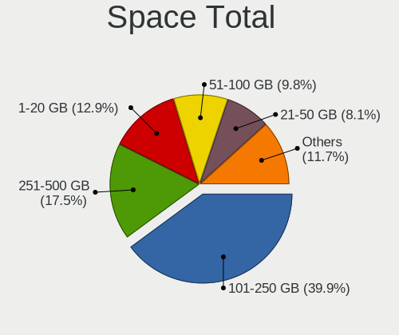
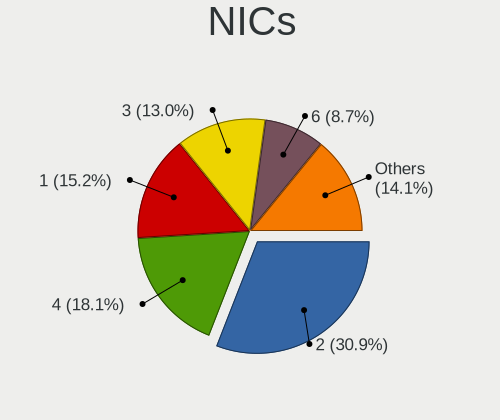
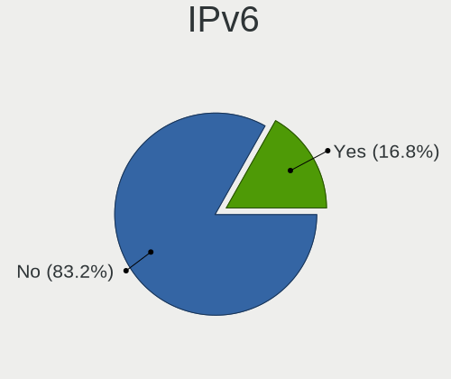

BSD - Tested Hardware & Statistics
----------------------------------

A project to collect tested hardware configurations for BSD.

Anyone can contribute to this report by the [hw-probe](https://github.com/linuxhw/hw-probe/blob/master/INSTALL.BSD.md) tool:

    hw-probe -all -upload

Please contribute! Especially if your hardware is rare.

This is a report for all computer types. See also reports for [desktops](/Desktop/README.md) and [notebooks](/Notebook/README.md).

OS-specific reports: [FreeBSD](/Dist/FreeBSD), [GhostBSD](/Dist/GhostBSD), [helloSystem](/Dist/helloSystem), [NetBSD](/Dist/NetBSD), [NomadBSD](/Dist/NomadBSD), [OpenBSD](/Dist/OpenBSD), [OPNsense](/Dist/OPNsense), [pfSense](/Dist/pfSense), [TrueNAS](/Dist/TrueNAS).

This report is for real hardware. Report for virtual hardware: [TestDays_VE](https://github.com/bsdhw/TestDays_VE)

Contents
--------

* [ Test Cases ](#test-cases)

* [ System ](#system)
  - [ OS                       ](#os)
  - [ OS Family                ](#os-family)
  - [ Arch                     ](#arch)
  - [ DE                       ](#de)
  - [ Display Server           ](#display-server)
  - [ Display Manager          ](#display-manager)
  - [ OS Lang                  ](#os-lang)
  - [ Boot Mode                ](#boot-mode)
  - [ Filesystem               ](#filesystem)
  - [ Part. scheme             ](#part-scheme)

* [ Board ](#board)
  - [ Vendor                   ](#vendor)
  - [ Model                    ](#model)
  - [ Model Family             ](#model-family)
  - [ MFG Year                 ](#mfg-year)
  - [ Form Factor              ](#form-factor)
  - [ Coreboot                 ](#coreboot)
  - [ RAM Size                 ](#ram-size)
  - [ RAM Used                 ](#ram-used)
  - [ Total Drives             ](#total-drives)
  - [ Has CD-ROM               ](#has-cd-rom)
  - [ Has Ethernet             ](#has-ethernet)
  - [ Has WiFi                 ](#has-wifi)
  - [ Has Bluetooth            ](#has-bluetooth)

* [ Location ](#location)
  - [ Country                  ](#country)
  - [ City                     ](#city)

* [ Drives ](#drives)
  - [ Drive Vendor             ](#drive-vendor)
  - [ Drive Model              ](#drive-model)
  - [ HDD Vendor               ](#hdd-vendor)
  - [ SSD Vendor               ](#ssd-vendor)
  - [ Drive Kind               ](#drive-kind)
  - [ Drive Connector          ](#drive-connector)
  - [ Drive Size               ](#drive-size)
  - [ Space Total              ](#space-total)
  - [ Space Used               ](#space-used)
  - [ Malfunc. Drives          ](#malfunc-drives)
  - [ Malfunc. Drive Vendor    ](#malfunc-drive-vendor)
  - [ Malfunc. HDD Vendor      ](#malfunc-hdd-vendor)
  - [ Malfunc. Drive Kind      ](#malfunc-drive-kind)
  - [ Failed Drives            ](#failed-drives)
  - [ Failed Drive Vendor      ](#failed-drive-vendor)
  - [ Drive Status             ](#drive-status)

* [ Storage controller ](#storage-controller)
  - [ Storage Vendor           ](#storage-vendor)
  - [ Storage Model            ](#storage-model)
  - [ Storage Kind             ](#storage-kind)

* [ Processor ](#processor)
  - [ CPU Vendor               ](#cpu-vendor)
  - [ CPU Model                ](#cpu-model)
  - [ CPU Model Family         ](#cpu-model-family)
  - [ CPU Cores                ](#cpu-cores)
  - [ CPU Sockets              ](#cpu-sockets)
  - [ CPU Threads              ](#cpu-threads)
  - [ CPU Microarch            ](#cpu-microarch)

* [ Graphics ](#graphics)
  - [ GPU Vendor               ](#gpu-vendor)
  - [ GPU Model                ](#gpu-model)
  - [ GPU Combo                ](#gpu-combo)
  - [ GPU Driver               ](#gpu-driver)
  - [ GPU Memory               ](#gpu-memory)

* [ Monitor ](#monitor)
  - [ Monitor Vendor           ](#monitor-vendor)
  - [ Monitor Model            ](#monitor-model)
  - [ Monitor Resolution       ](#monitor-resolution)
  - [ Monitor Diagonal         ](#monitor-diagonal)
  - [ Monitor Width            ](#monitor-width)
  - [ Aspect Ratio             ](#aspect-ratio)
  - [ Monitor Area             ](#monitor-area)
  - [ Pixel Density            ](#pixel-density)
  - [ Multiple Monitors        ](#multiple-monitors)

* [ Network ](#network)
  - [ Net Controller Vendor    ](#net-controller-vendor)
  - [ Net Controller Model     ](#net-controller-model)
  - [ Wireless Vendor          ](#wireless-vendor)
  - [ Wireless Model           ](#wireless-model)
  - [ Ethernet Vendor          ](#ethernet-vendor)
  - [ Ethernet Model           ](#ethernet-model)
  - [ Net Controller Kind      ](#net-controller-kind)
  - [ Used Controller          ](#used-controller)
  - [ NICs                     ](#nics)
  - [ IPv6                     ](#ipv6)

* [ Bluetooth ](#bluetooth)
  - [ Bluetooth Vendor         ](#bluetooth-vendor)
  - [ Bluetooth Model          ](#bluetooth-model)

* [ Sound ](#sound)
  - [ Sound Vendor             ](#sound-vendor)
  - [ Sound Model              ](#sound-model)

* [ Memory ](#memory)
  - [ Memory Vendor            ](#memory-vendor)
  - [ Memory Model             ](#memory-model)
  - [ Memory Kind              ](#memory-kind)
  - [ Memory Form Factor       ](#memory-form-factor)
  - [ Memory Size              ](#memory-size)
  - [ Memory Speed             ](#memory-speed)

* [ Printers & scanners ](#printers--scanners)
  - [ Printer Vendor           ](#printer-vendor)
  - [ Printer Model            ](#printer-model)
  - [ Scanner Vendor           ](#scanner-vendor)
  - [ Scanner Model            ](#scanner-model)

* [ Camera ](#camera)
  - [ Camera Vendor            ](#camera-vendor)
  - [ Camera Model             ](#camera-model)

* [ Security ](#security)
  - [ Fingerprint Vendor       ](#fingerprint-vendor)
  - [ Fingerprint Model        ](#fingerprint-model)
  - [ Chipcard Vendor          ](#chipcard-vendor)
  - [ Chipcard Model           ](#chipcard-model)

* [ Unsupported ](#unsupported)
  - [ Unsupported Devices      ](#unsupported-devices)
  - [ Unsupported Device Types ](#unsupported-device-types)

Test Cases
----------

Total: 20354

| Vendor        | Model                       | Form-Factor | Probe                                                     | Date         |
|---------------|-----------------------------|-------------|-----------------------------------------------------------|--------------|
| IGEL Techn... | H830C                       | Notebook    | [da070c0348](https://bsd-hardware.info/?probe=da070c0348) | Dec 24, 2023 |
| Intel         | Q3XXG4-P V1.0               | Desktop     | [80e8d502be](https://bsd-hardware.info/?probe=80e8d502be) | Dec 24, 2023 |
| Dell          | 0KV62T A00                  | Desktop     | [5844adb190](https://bsd-hardware.info/?probe=5844adb190) | Dec 24, 2023 |
| Acer          | Veriton X490G               | Desktop     | [3f4dbee6d1](https://bsd-hardware.info/?probe=3f4dbee6d1) | Dec 24, 2023 |
| Acer          | Veriton X490G               | Desktop     | [1865afdae1](https://bsd-hardware.info/?probe=1865afdae1) | Dec 24, 2023 |
| Intel         | SHARKBAY                    | Desktop     | [0ec70893dd](https://bsd-hardware.info/?probe=0ec70893dd) | Dec 24, 2023 |
| ASRock        | Z77 Extreme3                | Desktop     | [1656e8f6b0](https://bsd-hardware.info/?probe=1656e8f6b0) | Dec 24, 2023 |
| Unknown       | Unknown                     | Desktop     | [9876dcc6aa](https://bsd-hardware.info/?probe=9876dcc6aa) | Dec 24, 2023 |
| Protectli     | VP2420                      | Desktop     | [34e03b1271](https://bsd-hardware.info/?probe=34e03b1271) | Dec 24, 2023 |
| Unknown       | QGLK03                      | Desktop     | [a586279dd0](https://bsd-hardware.info/?probe=a586279dd0) | Dec 24, 2023 |
| Unknown       | Unknown                     | Desktop     | [9a23873dc4](https://bsd-hardware.info/?probe=9a23873dc4) | Dec 24, 2023 |
| Unknown       | Unknown                     | Desktop     | [da2b7d434e](https://bsd-hardware.info/?probe=da2b7d434e) | Dec 24, 2023 |
| YANYU         | H17SL                       | Desktop     | [464357d8c1](https://bsd-hardware.info/?probe=464357d8c1) | Dec 24, 2023 |
| eMachines     | eM350                       | Notebook    | [00d1d0c359](https://bsd-hardware.info/?probe=00d1d0c359) | Dec 23, 2023 |
| Dell          | 01Y1CJ A00                  | Mini pc     | [69e3982549](https://bsd-hardware.info/?probe=69e3982549) | Dec 23, 2023 |
| Lenovo        | ThinkPad P14s Gen 2a 21A... | Notebook    | [7ca1ae0c93](https://bsd-hardware.info/?probe=7ca1ae0c93) | Dec 23, 2023 |
| Lenovo        | 312D SDK0J40697 WIN 3305... | Mini pc     | [13699f3359](https://bsd-hardware.info/?probe=13699f3359) | Dec 23, 2023 |
| Fujitsu       | D3543-A1 S26361-D3543-A1... | Desktop     | [ee768bd5a0](https://bsd-hardware.info/?probe=ee768bd5a0) | Dec 23, 2023 |
| Dell          | 01G5C3 A02                  | Server      | [7940d24d8e](https://bsd-hardware.info/?probe=7940d24d8e) | Dec 23, 2023 |
| Dell          | 0FDY5C A00                  | Desktop     | [e39c520eb6](https://bsd-hardware.info/?probe=e39c520eb6) | Dec 23, 2023 |
| PC Engines    | APU2                        | Desktop     | [79f4518fa1](https://bsd-hardware.info/?probe=79f4518fa1) | Dec 23, 2023 |
| Dell          | Precision 5510              | Notebook    | [4bad5ad995](https://bsd-hardware.info/?probe=4bad5ad995) | Dec 23, 2023 |
| Techvision    | TVI7309X B0                 | Desktop     | [609d9be189](https://bsd-hardware.info/?probe=609d9be189) | Dec 23, 2023 |
| Dell          | Precision 7720              | Notebook    | [a30d05e373](https://bsd-hardware.info/?probe=a30d05e373) | Dec 23, 2023 |
| Unknown       | Unknown                     | Desktop     | [4f79ea6f3a](https://bsd-hardware.info/?probe=4f79ea6f3a) | Dec 23, 2023 |
| Unknown       | Unknown                     | Desktop     | [684d183b51](https://bsd-hardware.info/?probe=684d183b51) | Dec 23, 2023 |
| Dell          | 0NC2VH A01                  | Desktop     | [06828fbfed](https://bsd-hardware.info/?probe=06828fbfed) | Dec 23, 2023 |
| Lenovo        | ThinkPad T480 20L6S8LW00    | Notebook    | [32c06c5669](https://bsd-hardware.info/?probe=32c06c5669) | Dec 23, 2023 |
| Dell          | 03X6X0 A02                  | Server      | [1fc8559747](https://bsd-hardware.info/?probe=1fc8559747) | Dec 23, 2023 |
| Dell          | 0NC2VH A01                  | Desktop     | [3c06ec4635](https://bsd-hardware.info/?probe=3c06ec4635) | Dec 23, 2023 |
| AZW           | EQ                          | Desktop     | [9818e5f996](https://bsd-hardware.info/?probe=9818e5f996) | Dec 23, 2023 |
| Unknown       | Unknown                     | Desktop     | [97559370a8](https://bsd-hardware.info/?probe=97559370a8) | Dec 23, 2023 |
| Gigabyte      | MRZNVMS-00                  | Desktop     | [7c9af3e3cd](https://bsd-hardware.info/?probe=7c9af3e3cd) | Dec 23, 2023 |
| Unknown       | Unknown                     | Desktop     | [1a68705919](https://bsd-hardware.info/?probe=1a68705919) | Dec 23, 2023 |
| CWWK          | CW-ADLN-6L                  | Desktop     | [d8245df746](https://bsd-hardware.info/?probe=d8245df746) | Dec 23, 2023 |
| TULPAR        | A5 V20.3                    | Notebook    | [89b65e7036](https://bsd-hardware.info/?probe=89b65e7036) | Dec 23, 2023 |
| Lenovo        | ThinkCentre M72e 3629A15    | Desktop     | [8a92c95f65](https://bsd-hardware.info/?probe=8a92c95f65) | Dec 22, 2023 |
| Protectli     | FW4B Ver                    | Desktop     | [4b6a62bebe](https://bsd-hardware.info/?probe=4b6a62bebe) | Dec 22, 2023 |
| Orange Pi     | 5P                          | Soc         | [aa6c177cb0](https://bsd-hardware.info/?probe=aa6c177cb0) | Dec 22, 2023 |
| Dell          | 00V62H A01                  | Desktop     | [c4e5366baa](https://bsd-hardware.info/?probe=c4e5366baa) | Dec 22, 2023 |
| Seeed Stud... | ODYSSEY-X86J41X5 SD-BS-C... | Desktop     | [fbf8f52ea0](https://bsd-hardware.info/?probe=fbf8f52ea0) | Dec 22, 2023 |
| Unknown       | Unknown                     | Desktop     | [620fc27594](https://bsd-hardware.info/?probe=620fc27594) | Dec 22, 2023 |
| Fujitsu       | D3313-G1 S26361-D3313-G1    | Desktop     | [5ed362ce02](https://bsd-hardware.info/?probe=5ed362ce02) | Dec 22, 2023 |
| Pegatron      | 2ACF                        | Desktop     | [2556fa3be1](https://bsd-hardware.info/?probe=2556fa3be1) | Dec 22, 2023 |
| PC Engines    | apu4                        | Desktop     | [48a0e27e11](https://bsd-hardware.info/?probe=48a0e27e11) | Dec 22, 2023 |
| ZX            | H610ITXG                    | Desktop     | [11edcbeaff](https://bsd-hardware.info/?probe=11edcbeaff) | Dec 22, 2023 |
| Dell          | Latitude E7240              | Notebook    | [f2229124bf](https://bsd-hardware.info/?probe=f2229124bf) | Dec 22, 2023 |
| Unknown       | SKYBAY                      | Desktop     | [7f8968ee0a](https://bsd-hardware.info/?probe=7f8968ee0a) | Dec 22, 2023 |
| Supermicro    | X10SLH-N6-ST031             | Server      | [2463b12f4e](https://bsd-hardware.info/?probe=2463b12f4e) | Dec 22, 2023 |
| Lenovo        | ThinkPad A485 20MU000VUS    | Notebook    | [98663cbfef](https://bsd-hardware.info/?probe=98663cbfef) | Dec 22, 2023 |
| Lenovo        | ThinkPad X1 Carbon 2nd 2... | Notebook    | [85ec93f4cd](https://bsd-hardware.info/?probe=85ec93f4cd) | Dec 22, 2023 |
| ASUSTek       | PRIME A320M-K               | Desktop     | [cfe1ed1212](https://bsd-hardware.info/?probe=cfe1ed1212) | Dec 22, 2023 |
| Lenovo        | ThinkPad X1 Carbon 2nd 2... | Notebook    | [34f3eb8059](https://bsd-hardware.info/?probe=34f3eb8059) | Dec 22, 2023 |
| Lenovo        | 312D SDK0J40697 WIN 3305... | Mini pc     | [2e35364732](https://bsd-hardware.info/?probe=2e35364732) | Dec 22, 2023 |
| Unknown       | Unknown                     | Desktop     | [7b24999fbb](https://bsd-hardware.info/?probe=7b24999fbb) | Dec 22, 2023 |
| Lenovo        | SHARKBAY 0B98401 WIN        | Desktop     | [dbcb26f795](https://bsd-hardware.info/?probe=dbcb26f795) | Dec 22, 2023 |
| ASUSTek       | PRIME H610I-PLUS D4         | Desktop     | [3a435d185e](https://bsd-hardware.info/?probe=3a435d185e) | Dec 22, 2023 |
| MW            | GMLK-2_5G4L                 | Desktop     | [9eaa02c47c](https://bsd-hardware.info/?probe=9eaa02c47c) | Dec 22, 2023 |
| Gigabyte      | GA-880GM-UD2H               | Desktop     | [76495a4c85](https://bsd-hardware.info/?probe=76495a4c85) | Dec 22, 2023 |
| MSI           | MPG X570 GAMING EDGE WIF... | Desktop     | [06457349dc](https://bsd-hardware.info/?probe=06457349dc) | Dec 22, 2023 |
| Supermicro    | X11SSH-LN4F                 | Server      | [132a8d8b6f](https://bsd-hardware.info/?probe=132a8d8b6f) | Dec 21, 2023 |
| Unknown       | Unknown                     | Desktop     | [84a9704b97](https://bsd-hardware.info/?probe=84a9704b97) | Dec 21, 2023 |
| Protectli     | VP2420                      | Desktop     | [04695d0802](https://bsd-hardware.info/?probe=04695d0802) | Dec 21, 2023 |
| Shuttle       | FS77U                       | Desktop     | [9c746c0d5c](https://bsd-hardware.info/?probe=9c746c0d5c) | Dec 21, 2023 |
| Unknown       | MANIFOLD 2-C                | Desktop     | [b2597a7f2b](https://bsd-hardware.info/?probe=b2597a7f2b) | Dec 21, 2023 |
| Unknown       | Unknown                     | Desktop     | [ec4c6d8fb5](https://bsd-hardware.info/?probe=ec4c6d8fb5) | Dec 21, 2023 |
| Yanling       | YL-CLU6L-V1                 | Desktop     | [9a0369cc72](https://bsd-hardware.info/?probe=9a0369cc72) | Dec 21, 2023 |
| Dell          | 012KND A00                  | Mini pc     | [9107aaa45d](https://bsd-hardware.info/?probe=9107aaa45d) | Dec 21, 2023 |
| Supermicro    | X10SLH-N6-ST031             | Server      | [70fe8567d6](https://bsd-hardware.info/?probe=70fe8567d6) | Dec 21, 2023 |
| Raspberry ... | Raspberry Pi                | Soc         | [4ccf9a2566](https://bsd-hardware.info/?probe=4ccf9a2566) | Dec 21, 2023 |
| Lenovo        | ThinkSystem ST50 V2 7D8J... | Desktop     | [a5eedba370](https://bsd-hardware.info/?probe=a5eedba370) | Dec 21, 2023 |
| Sophos        | UTM                         | Firewall    | [e1e002bdd4](https://bsd-hardware.info/?probe=e1e002bdd4) | Dec 21, 2023 |
| Dell          | 0KV62T A00                  | Desktop     | [8a2c7af96c](https://bsd-hardware.info/?probe=8a2c7af96c) | Dec 21, 2023 |
| Gigabyte      | B550 GAMING X V2            | Desktop     | [2ba0ee6609](https://bsd-hardware.info/?probe=2ba0ee6609) | Dec 21, 2023 |
| PC Engines    | apu4                        | Desktop     | [7fa270657e](https://bsd-hardware.info/?probe=7fa270657e) | Dec 21, 2023 |
| Intel         | DH61AG AAG23736-400         | Desktop     | [e6a38faa07](https://bsd-hardware.info/?probe=e6a38faa07) | Dec 21, 2023 |
| ASUSTek       | TUF Gaming B550M-PLUS       | Desktop     | [f9fd749985](https://bsd-hardware.info/?probe=f9fd749985) | Dec 21, 2023 |
| Protectli     | VP2420                      | Desktop     | [9a4aba32a7](https://bsd-hardware.info/?probe=9a4aba32a7) | Dec 21, 2023 |
| Dell          | 0NV0M7 A01                  | Desktop     | [835ca2056c](https://bsd-hardware.info/?probe=835ca2056c) | Dec 21, 2023 |
| Protectli     | FW4B                        | Desktop     | [d67b8b063a](https://bsd-hardware.info/?probe=d67b8b063a) | Dec 21, 2023 |
| CWWK          | CW-ADLN-6L                  | Desktop     | [094d15625b](https://bsd-hardware.info/?probe=094d15625b) | Dec 21, 2023 |
| Intel         | NUC11ATBPE M49844-303       | Mini pc     | [1e083d16ac](https://bsd-hardware.info/?probe=1e083d16ac) | Dec 21, 2023 |
| ASUSTek       | H110I-PLUS                  | Desktop     | [5c6e9bd18a](https://bsd-hardware.info/?probe=5c6e9bd18a) | Dec 20, 2023 |
| Fujitsu       | D3544-A1 S26361-D3544-A1... | Desktop     | [ec18d4f3a1](https://bsd-hardware.info/?probe=ec18d4f3a1) | Dec 20, 2023 |
| HP            | ProBook 455 G7              | Notebook    | [11764c4c5e](https://bsd-hardware.info/?probe=11764c4c5e) | Dec 20, 2023 |
| Lenovo        | 3136 SDK0J40697 WIN 3305... | Mini pc     | [760c7214cc](https://bsd-hardware.info/?probe=760c7214cc) | Dec 20, 2023 |
| Clevo         | W240BU                      | Notebook    | [19bb603cab](https://bsd-hardware.info/?probe=19bb603cab) | Dec 20, 2023 |
| Intel         | J1900                       | Desktop     | [2322789485](https://bsd-hardware.info/?probe=2322789485) | Dec 20, 2023 |
| Apple         | PowerBook3,5                | Notebook    | [53313e58d8](https://bsd-hardware.info/?probe=53313e58d8) | Dec 20, 2023 |
| Dell          | 02YYK5 A01                  | Desktop     | [6e070fbb90](https://bsd-hardware.info/?probe=6e070fbb90) | Dec 20, 2023 |
| Deciso        | NetBoard-A10                | Notebook    | [c728132d77](https://bsd-hardware.info/?probe=c728132d77) | Dec 20, 2023 |
| AMI           | Aptio CRB                   | Mini pc     | [2974d1c480](https://bsd-hardware.info/?probe=2974d1c480) | Dec 20, 2023 |
| Lenovo        | ThinkPad T490s 20NYS4HL1... | Notebook    | [97fb2e025e](https://bsd-hardware.info/?probe=97fb2e025e) | Dec 20, 2023 |
| Lenovo        | 3111 SDK0J40697 WIN 3305... | Desktop     | [321e9d7328](https://bsd-hardware.info/?probe=321e9d7328) | Dec 20, 2023 |
| Acer          | Aspire XC-1660G V:1.1       | Desktop     | [54b2061c80](https://bsd-hardware.info/?probe=54b2061c80) | Dec 19, 2023 |
| Gigabyte      | F2A85X-UP4                  | Desktop     | [bd9dd3d647](https://bsd-hardware.info/?probe=bd9dd3d647) | Dec 19, 2023 |
| Dell          | 0VD5HY A00                  | Desktop     | [03b0e973ca](https://bsd-hardware.info/?probe=03b0e973ca) | Dec 19, 2023 |
| ASRock        | B550 Phantom Gaming 4       | Desktop     | [c00a69de7c](https://bsd-hardware.info/?probe=c00a69de7c) | Dec 19, 2023 |
| Unknown       | Unknown                     | Desktop     | [f11c353c61](https://bsd-hardware.info/?probe=f11c353c61) | Dec 19, 2023 |
| Unknown       | Unknown                     | Desktop     | [5f6cc807a3](https://bsd-hardware.info/?probe=5f6cc807a3) | Dec 19, 2023 |
| PC Engines    | APU2                        | Desktop     | [f3061d599c](https://bsd-hardware.info/?probe=f3061d599c) | Dec 19, 2023 |
| HP            | 83F2                        | Desktop     | [858392467f](https://bsd-hardware.info/?probe=858392467f) | Dec 19, 2023 |
| Apple         | MacBookPro9,2               | Notebook    | [851f118bd5](https://bsd-hardware.info/?probe=851f118bd5) | Dec 19, 2023 |
| Lenovo        | ThinkPad E15 Gen 3 20YG0... | Notebook    | [02bf1d2cd4](https://bsd-hardware.info/?probe=02bf1d2cd4) | Dec 19, 2023 |
| MW            | GMLK-2_5G4L                 | Desktop     | [841767c8f8](https://bsd-hardware.info/?probe=841767c8f8) | Dec 19, 2023 |
| Lenovo        | ThinkPad E15 Gen 3 20YG0... | Notebook    | [5281bb9e20](https://bsd-hardware.info/?probe=5281bb9e20) | Dec 19, 2023 |
| PC Engines    | apu4                        | Desktop     | [97c6f1ef2a](https://bsd-hardware.info/?probe=97c6f1ef2a) | Dec 19, 2023 |
| Lenovo        | 3136 SDK0J40697 WIN 3305... | Mini pc     | [0716929be0](https://bsd-hardware.info/?probe=0716929be0) | Dec 19, 2023 |
| Advantech     | NAMB-3250 A102-1            | Desktop     | [bb91074237](https://bsd-hardware.info/?probe=bb91074237) | Dec 19, 2023 |
| HP            | 83F2                        | Desktop     | [8b1e24b86c](https://bsd-hardware.info/?probe=8b1e24b86c) | Dec 19, 2023 |
| Dell          | Latitude E7240              | Notebook    | [7d5e8bcb8a](https://bsd-hardware.info/?probe=7d5e8bcb8a) | Dec 19, 2023 |
| Dell          | 0T7D40 A01                  | Desktop     | [35283b08ff](https://bsd-hardware.info/?probe=35283b08ff) | Dec 19, 2023 |
| Dell          | 04YP6J A02                  | Desktop     | [abcaede8e1](https://bsd-hardware.info/?probe=abcaede8e1) | Dec 19, 2023 |
| ASUSTek       | P5B-VM                      | Desktop     | [00e7a346b2](https://bsd-hardware.info/?probe=00e7a346b2) | Dec 19, 2023 |
| HP            | 212B                        | Desktop     | [d110ce488b](https://bsd-hardware.info/?probe=d110ce488b) | Dec 18, 2023 |
| Lenovo        | ThinkPad X220 4291H77       | Notebook    | [2fe3ff7e06](https://bsd-hardware.info/?probe=2fe3ff7e06) | Dec 18, 2023 |
| ASRockRack    | C3558D4I-4L                 | Desktop     | [108b107783](https://bsd-hardware.info/?probe=108b107783) | Dec 18, 2023 |
| Lenovo        | 3136 SDK0J40697 WIN 3305... | Mini pc     | [6bc190970b](https://bsd-hardware.info/?probe=6bc190970b) | Dec 18, 2023 |
| Dell          | 00V62H A00                  | Desktop     | [b99ed60ab6](https://bsd-hardware.info/?probe=b99ed60ab6) | Dec 18, 2023 |
| Lenovo        | 3136 SDK0J40697 WIN 3305... | Mini pc     | [825a0f57e3](https://bsd-hardware.info/?probe=825a0f57e3) | Dec 18, 2023 |
| AMI           | Aptio CRB                   | Mini pc     | [4114a11fe7](https://bsd-hardware.info/?probe=4114a11fe7) | Dec 18, 2023 |
| Lenovo        | ThinkPad T480 20L6S29E0T    | Notebook    | [4bc98299dd](https://bsd-hardware.info/?probe=4bc98299dd) | Dec 18, 2023 |
| Lenovo        | 312D SDK0J40697 WIN 3305... | Mini pc     | [ad0f62cef1](https://bsd-hardware.info/?probe=ad0f62cef1) | Dec 18, 2023 |
| Lenovo        | ThinkPad P17 Gen 2i 20YV... | Notebook    | [10fb96c00d](https://bsd-hardware.info/?probe=10fb96c00d) | Dec 18, 2023 |
| Dell          | 04JN2K A03                  | Server      | [d56fe5aeb2](https://bsd-hardware.info/?probe=d56fe5aeb2) | Dec 18, 2023 |
| ASUSTek       | P8Z77-V PRO                 | Desktop     | [ba2cad0d55](https://bsd-hardware.info/?probe=ba2cad0d55) | Dec 18, 2023 |
| AMI           | Aptio CRB                   | Mini pc     | [c4a54e3710](https://bsd-hardware.info/?probe=c4a54e3710) | Dec 18, 2023 |
| Protectli     | FW4A Ver                    | Desktop     | [9660edcc5c](https://bsd-hardware.info/?probe=9660edcc5c) | Dec 18, 2023 |
| Unknown       | Unknown                     | Desktop     | [107e747798](https://bsd-hardware.info/?probe=107e747798) | Dec 17, 2023 |
| Supermicro    | X10SDV-4C-TLN2F             | Server      | [ea3bc70906](https://bsd-hardware.info/?probe=ea3bc70906) | Dec 17, 2023 |
| Intel         | JSL MRD                     | Desktop     | [29c4bae1f4](https://bsd-hardware.info/?probe=29c4bae1f4) | Dec 17, 2023 |
| Unknown       | Unknown                     | Desktop     | [f11703c364](https://bsd-hardware.info/?probe=f11703c364) | Dec 17, 2023 |
| Intel         | HURONRIVER                  | Desktop     | [d0ebaa4479](https://bsd-hardware.info/?probe=d0ebaa4479) | Dec 17, 2023 |
| Dell          | 00V62H A00                  | Desktop     | [8f6f4d38d3](https://bsd-hardware.info/?probe=8f6f4d38d3) | Dec 17, 2023 |
| Deciso        | NetBoard-A10                | Notebook    | [ae676079d7](https://bsd-hardware.info/?probe=ae676079d7) | Dec 17, 2023 |
| ASUSTek       | P5Q-E                       | Desktop     | [5a4d01667e](https://bsd-hardware.info/?probe=5a4d01667e) | Dec 17, 2023 |
| ASUSTek       | ROG CROSSHAIR VIII HERO     | Desktop     | [ea79e98108](https://bsd-hardware.info/?probe=ea79e98108) | Dec 17, 2023 |
| Intel         | JSL MRD                     | Desktop     | [af718ee605](https://bsd-hardware.info/?probe=af718ee605) | Dec 17, 2023 |
| ECS           | H81H3-WM                    | Desktop     | [9df1f030f9](https://bsd-hardware.info/?probe=9df1f030f9) | Dec 17, 2023 |
| Techvision    | TVI7309X B0                 | Desktop     | [878769cc62](https://bsd-hardware.info/?probe=878769cc62) | Dec 17, 2023 |
| Unknown       | Unknown                     | Desktop     | [88306fe484](https://bsd-hardware.info/?probe=88306fe484) | Dec 17, 2023 |
| Unknown       | Unknown                     | Desktop     | [6a3ef5165f](https://bsd-hardware.info/?probe=6a3ef5165f) | Dec 17, 2023 |
| Lenovo        | SDK0E50510 WIN              | Desktop     | [57a4adcc91](https://bsd-hardware.info/?probe=57a4adcc91) | Dec 17, 2023 |
| Unknown       | Unknown                     | Desktop     | [cefdf7d9ca](https://bsd-hardware.info/?probe=cefdf7d9ca) | Dec 17, 2023 |
| Unknown       | Unknown                     | Desktop     | [c99ee25103](https://bsd-hardware.info/?probe=c99ee25103) | Dec 17, 2023 |
| HP            | Stream Notebook PC 11       | Notebook    | [1eb8cc9d76](https://bsd-hardware.info/?probe=1eb8cc9d76) | Dec 17, 2023 |
| Lenovo        | 314C SEK0T35577 IOT 4247... | Mini pc     | [5b09e2113c](https://bsd-hardware.info/?probe=5b09e2113c) | Dec 17, 2023 |
| Techvision    | TVI7309X B0                 | Desktop     | [fe741ca47c](https://bsd-hardware.info/?probe=fe741ca47c) | Dec 17, 2023 |
| MSI           | A520M-A PRO                 | Desktop     | [11e5e87b70](https://bsd-hardware.info/?probe=11e5e87b70) | Dec 16, 2023 |
| Apple         | MacBookAir5,2               | Notebook    | [2c652aa0a1](https://bsd-hardware.info/?probe=2c652aa0a1) | Dec 16, 2023 |
| Gigabyte      | B450M S2H                   | Desktop     | [b0194a8d4a](https://bsd-hardware.info/?probe=b0194a8d4a) | Dec 16, 2023 |
| Apple         | Mac-031AEE4D24BFF0B1 Mac... | Mini pc     | [4b134e7787](https://bsd-hardware.info/?probe=4b134e7787) | Dec 16, 2023 |
| PC Engines    | APU3                        | Desktop     | [6c92d4965a](https://bsd-hardware.info/?probe=6c92d4965a) | Dec 16, 2023 |
| Supermicro    | X10SLH-F/X10SLM+-F          | Server      | [17f70cfb67](https://bsd-hardware.info/?probe=17f70cfb67) | Dec 16, 2023 |
| CSL-Comput... | C15 v3                      | Notebook    | [dd93594896](https://bsd-hardware.info/?probe=dd93594896) | Dec 16, 2023 |
| Intel         | ChiefRiver D                | Desktop     | [ac362a0f29](https://bsd-hardware.info/?probe=ac362a0f29) | Dec 16, 2023 |
| Intel         | ChiefRiver D                | Desktop     | [bd8cacb673](https://bsd-hardware.info/?probe=bd8cacb673) | Dec 16, 2023 |
| Google        | Guado                       | Desktop     | [186f14c0a6](https://bsd-hardware.info/?probe=186f14c0a6) | Dec 16, 2023 |
| Supermicro    | A1SRi 123456789             | Mini pc     | [a2aa82ed5d](https://bsd-hardware.info/?probe=a2aa82ed5d) | Dec 16, 2023 |
| Unknown       | Unknown                     | Desktop     | [784c8ae515](https://bsd-hardware.info/?probe=784c8ae515) | Dec 16, 2023 |
| Protectli     | FW4B                        | Desktop     | [b862c8c507](https://bsd-hardware.info/?probe=b862c8c507) | Dec 16, 2023 |
| HP            | 212B                        | Desktop     | [1737c1241b](https://bsd-hardware.info/?probe=1737c1241b) | Dec 16, 2023 |
| Lenovo        | ThinkPad P1 20MD002MUS      | Notebook    | [c0dcfec41d](https://bsd-hardware.info/?probe=c0dcfec41d) | Dec 16, 2023 |
| SHANGZHAOY... | B85M-PRO V1.1               | Desktop     | [3b7ed136da](https://bsd-hardware.info/?probe=3b7ed136da) | Dec 16, 2023 |
| Unknown       | Unknown                     | Desktop     | [df97b81bea](https://bsd-hardware.info/?probe=df97b81bea) | Dec 15, 2023 |
| ASRock        | IMB-181-L                   | Desktop     | [a81eb6eadf](https://bsd-hardware.info/?probe=a81eb6eadf) | Dec 15, 2023 |
| ZOTAC         | ZBOX-CI329NANO              | Mini pc     | [aefb80936c](https://bsd-hardware.info/?probe=aefb80936c) | Dec 15, 2023 |
| Lenovo        | ThinkPad X1 Carbon 7th 2... | Notebook    | [7a5e6024cd](https://bsd-hardware.info/?probe=7a5e6024cd) | Dec 15, 2023 |
| AZW           | MINI S 10                   | Desktop     | [d8eee18baf](https://bsd-hardware.info/?probe=d8eee18baf) | Dec 15, 2023 |
| Unknown       | Unknown                     | Desktop     | [be79d227b2](https://bsd-hardware.info/?probe=be79d227b2) | Dec 15, 2023 |
| Unknown       | Unknown                     | Desktop     | [5adc44e122](https://bsd-hardware.info/?probe=5adc44e122) | Dec 15, 2023 |
| Fujitsu       | D3313-G1 S26361-D3313-G1    | Desktop     | [f05a97db34](https://bsd-hardware.info/?probe=f05a97db34) | Dec 15, 2023 |
| Gigabyte      | B150N Phoenix-WIFI-CF       | Desktop     | [343d176e9c](https://bsd-hardware.info/?probe=343d176e9c) | Dec 15, 2023 |
| ASUSTek       | PRO B460M-C                 | Desktop     | [7a32a123f6](https://bsd-hardware.info/?probe=7a32a123f6) | Dec 15, 2023 |
| Google        | Guado                       | Desktop     | [11b7e710c6](https://bsd-hardware.info/?probe=11b7e710c6) | Dec 15, 2023 |
| Techvision    | TVI7309X B0                 | Desktop     | [4b7be4588e](https://bsd-hardware.info/?probe=4b7be4588e) | Dec 15, 2023 |
| Lenovo        | SHARKBAY SDK0E50510 WIN     | Desktop     | [4adda9051f](https://bsd-hardware.info/?probe=4adda9051f) | Dec 15, 2023 |
| Unknown       | Unknown                     | Desktop     | [93f650efc3](https://bsd-hardware.info/?probe=93f650efc3) | Dec 15, 2023 |
| Gigabyte      | B75M-D3H                    | Desktop     | [9773ffcc27](https://bsd-hardware.info/?probe=9773ffcc27) | Dec 15, 2023 |
| Advantech     | NAMB-3250 A102-1            | Desktop     | [41899c5e07](https://bsd-hardware.info/?probe=41899c5e07) | Dec 15, 2023 |
| Dell          | XPS 13 9370                 | Notebook    | [b6845a3e54](https://bsd-hardware.info/?probe=b6845a3e54) | Dec 15, 2023 |
| AMI           | Aptio CRB                   | Mini pc     | [c4b2a86518](https://bsd-hardware.info/?probe=c4b2a86518) | Dec 15, 2023 |
| Apple         | MacBookPro10,2              | Notebook    | [e1867819f3](https://bsd-hardware.info/?probe=e1867819f3) | Dec 15, 2023 |
| Toshiba       | Portable PC                 | Notebook    | [bee6ea8f18](https://bsd-hardware.info/?probe=bee6ea8f18) | Dec 15, 2023 |
| Gigabyte      | B75N                        | Desktop     | [dad5d14cf7](https://bsd-hardware.info/?probe=dad5d14cf7) | Dec 15, 2023 |
| Dell          | Latitude E6220              | Notebook    | [372070b2f2](https://bsd-hardware.info/?probe=372070b2f2) | Dec 15, 2023 |
| HP            | 82A2                        | Desktop     | [906fd206fe](https://bsd-hardware.info/?probe=906fd206fe) | Dec 15, 2023 |
| Google        | Kohaku                      | Notebook    | [0b945d8f38](https://bsd-hardware.info/?probe=0b945d8f38) | Dec 15, 2023 |
| HP            | 82A2                        | Desktop     | [0a816d2760](https://bsd-hardware.info/?probe=0a816d2760) | Dec 15, 2023 |
| Protectli     | FW4B Ver                    | Desktop     | [da6ac13ef2](https://bsd-hardware.info/?probe=da6ac13ef2) | Dec 15, 2023 |
| AZW           | EQ                          | Desktop     | [f1e4bf2224](https://bsd-hardware.info/?probe=f1e4bf2224) | Dec 15, 2023 |
| Acer          | V5-131                      | Notebook    | [76e88ee5df](https://bsd-hardware.info/?probe=76e88ee5df) | Dec 14, 2023 |
| Lenovo        | IdeaPad 330-15ARR 81D2      | Notebook    | [c197b26909](https://bsd-hardware.info/?probe=c197b26909) | Dec 14, 2023 |
| Unknown       | Unknown                     | Desktop     | [a9f96c677c](https://bsd-hardware.info/?probe=a9f96c677c) | Dec 14, 2023 |
| ASRock        | J4005B-ITX                  | Desktop     | [2ffc965b2e](https://bsd-hardware.info/?probe=2ffc965b2e) | Dec 14, 2023 |
| Dell          | 02YYK5 A01                  | Desktop     | [306f9c1b03](https://bsd-hardware.info/?probe=306f9c1b03) | Dec 14, 2023 |
| Unknown       | Unknown                     | Desktop     | [0bc43bd220](https://bsd-hardware.info/?probe=0bc43bd220) | Dec 14, 2023 |
| MSI           | B450 TOMAHAWK MAX II        | Desktop     | [d9d33d12d7](https://bsd-hardware.info/?probe=d9d33d12d7) | Dec 14, 2023 |
| MSI           | B450 TOMAHAWK MAX II        | Desktop     | [9654df78b8](https://bsd-hardware.info/?probe=9654df78b8) | Dec 14, 2023 |
| Dell          | Latitude 3420               | Notebook    | [3767d653b9](https://bsd-hardware.info/?probe=3767d653b9) | Dec 14, 2023 |
| Dell          | 0PC5F7 A00                  | Desktop     | [e47e643ced](https://bsd-hardware.info/?probe=e47e643ced) | Dec 14, 2023 |
| CWWK          | MINIPC-G12                  | Desktop     | [e15a019715](https://bsd-hardware.info/?probe=e15a019715) | Dec 14, 2023 |
| Gigabyte      | H61M-S2PV                   | Desktop     | [88d2ae1175](https://bsd-hardware.info/?probe=88d2ae1175) | Dec 14, 2023 |
| Dell          | 0NK5PH A00                  | Desktop     | [60451d4e43](https://bsd-hardware.info/?probe=60451d4e43) | Dec 14, 2023 |
| Dell          | Latitude E6540              | Notebook    | [77a9b10ab9](https://bsd-hardware.info/?probe=77a9b10ab9) | Dec 13, 2023 |
| AZW           | EQ                          | Desktop     | [d83e11a7dc](https://bsd-hardware.info/?probe=d83e11a7dc) | Dec 13, 2023 |
| Unknown       | Unknown                     | Desktop     | [c22fff97b8](https://bsd-hardware.info/?probe=c22fff97b8) | Dec 13, 2023 |
| Intel         | SKYBAY                      | Desktop     | [6ad2ae72f1](https://bsd-hardware.info/?probe=6ad2ae72f1) | Dec 13, 2023 |
| BESSTAR Te... | GB7                         | Mini pc     | [159a5556ab](https://bsd-hardware.info/?probe=159a5556ab) | Dec 13, 2023 |
| ASUSTek       | PRIME X370-PRO              | Desktop     | [bc50d301fa](https://bsd-hardware.info/?probe=bc50d301fa) | Dec 13, 2023 |
| ASRock        | X570 Phantom Gaming 4       | Desktop     | [dced442907](https://bsd-hardware.info/?probe=dced442907) | Dec 13, 2023 |
| Unknown       | Unknown                     | Desktop     | [b2407b8a31](https://bsd-hardware.info/?probe=b2407b8a31) | Dec 13, 2023 |
| Intel         | Luna Pier CRB Revision D    | Desktop     | [44215d3b22](https://bsd-hardware.info/?probe=44215d3b22) | Dec 13, 2023 |
| Intel         | ChiefRiver D                | Desktop     | [dafa13827e](https://bsd-hardware.info/?probe=dafa13827e) | Dec 13, 2023 |
| Intel         | Luna Pier CRB Revision D    | Desktop     | [e47e6d56e8](https://bsd-hardware.info/?probe=e47e6d56e8) | Dec 13, 2023 |
| AMI           | Aptio CRB                   | Mini pc     | [12e42ebd6d](https://bsd-hardware.info/?probe=12e42ebd6d) | Dec 13, 2023 |
| Unknown       | Unknown                     | Desktop     | [c96a52dd9c](https://bsd-hardware.info/?probe=c96a52dd9c) | Dec 13, 2023 |
| Dell          | 02YYK5 A00                  | Desktop     | [8eb8c9eff3](https://bsd-hardware.info/?probe=8eb8c9eff3) | Dec 13, 2023 |
| Google        | Lindar rev3                 | Notebook    | [2e748fc42c](https://bsd-hardware.info/?probe=2e748fc42c) | Dec 13, 2023 |
| Intel         | QHSW02                      | Desktop     | [da6b7c7115](https://bsd-hardware.info/?probe=da6b7c7115) | Dec 13, 2023 |
| Lenovo        | ThinkPad T14s Gen 4 21F6... | Notebook    | [a7fcca51be](https://bsd-hardware.info/?probe=a7fcca51be) | Dec 13, 2023 |
| Lenovo        | 30D2 SDK0J40705 WIN 3425... | Desktop     | [67f5c9c912](https://bsd-hardware.info/?probe=67f5c9c912) | Dec 13, 2023 |
| ASRock        | H170M-ITX/DL                | Desktop     | [79039f6105](https://bsd-hardware.info/?probe=79039f6105) | Dec 13, 2023 |
| ASUSTek       | K52JT                       | Notebook    | [1dc348adc0](https://bsd-hardware.info/?probe=1dc348adc0) | Dec 13, 2023 |
| ASUSTek       | BM6875_BM6675_BP6375        | Desktop     | [3d0160889b](https://bsd-hardware.info/?probe=3d0160889b) | Dec 13, 2023 |
| Supermicro    | X7SBi                       | Desktop     | [a0124f00ba](https://bsd-hardware.info/?probe=a0124f00ba) | Dec 13, 2023 |
| Sophos        | SG                          | Firewall    | [13c711aabf](https://bsd-hardware.info/?probe=13c711aabf) | Dec 13, 2023 |
| ASUSTek       | ROG STRIX B550-I GAMING     | Desktop     | [b600237a69](https://bsd-hardware.info/?probe=b600237a69) | Dec 12, 2023 |
| Techvision    | TVI7309X B0                 | Desktop     | [b5f9416c13](https://bsd-hardware.info/?probe=b5f9416c13) | Dec 12, 2023 |
| Dell          | 0J8G6F A03                  | Desktop     | [e6e7f333a3](https://bsd-hardware.info/?probe=e6e7f333a3) | Dec 12, 2023 |
| Intel         | DH67BL AAG10189-207         | Desktop     | [e6210120bd](https://bsd-hardware.info/?probe=e6210120bd) | Dec 12, 2023 |
| ASUSTek       | ASUS TUF Gaming A15 FA50... | Notebook    | [d81a233601](https://bsd-hardware.info/?probe=d81a233601) | Dec 12, 2023 |
| Dell          | Inspiron 5559               | Notebook    | [09f5b25e72](https://bsd-hardware.info/?probe=09f5b25e72) | Dec 12, 2023 |
| HP            | ProLiant DL380p Gen8        | Server      | [20dd6f1621](https://bsd-hardware.info/?probe=20dd6f1621) | Dec 12, 2023 |
| Raspberry ... | Raspberry Pi                | Soc         | [357a808604](https://bsd-hardware.info/?probe=357a808604) | Dec 12, 2023 |
| Raspberry ... | Raspberry Pi                | Soc         | [9a842bf3c8](https://bsd-hardware.info/?probe=9a842bf3c8) | Dec 12, 2023 |
| MSI           | B150 GAMING M3              | Desktop     | [b5dc4da596](https://bsd-hardware.info/?probe=b5dc4da596) | Dec 12, 2023 |
| Biostar       | N61PB-M2S                   | Desktop     | [69501bdb78](https://bsd-hardware.info/?probe=69501bdb78) | Dec 12, 2023 |
| Dell          | 0DRG19 A00                  | Mini pc     | [c26ebe6c80](https://bsd-hardware.info/?probe=c26ebe6c80) | Dec 12, 2023 |
| Dell          | 05XGC8 A00                  | Desktop     | [b453da5223](https://bsd-hardware.info/?probe=b453da5223) | Dec 12, 2023 |
| MSI           | MAG Z790 TOMAHAWK WIFI D... | Desktop     | [c05c574f37](https://bsd-hardware.info/?probe=c05c574f37) | Dec 12, 2023 |
| Unknown       | Unknown                     | Desktop     | [8a0a469ad0](https://bsd-hardware.info/?probe=8a0a469ad0) | Dec 12, 2023 |
| Unknown       | Unknown                     | Desktop     | [123088175c](https://bsd-hardware.info/?probe=123088175c) | Dec 11, 2023 |
| Dell          | 0N051F A04                  | Server      | [38535e6878](https://bsd-hardware.info/?probe=38535e6878) | Dec 11, 2023 |
| Dell          | 0XDN97 A09                  | Server      | [129a73f16f](https://bsd-hardware.info/?probe=129a73f16f) | Dec 11, 2023 |
| EVGA          | X570 DARK.0                 | Desktop     | [1c84a8169b](https://bsd-hardware.info/?probe=1c84a8169b) | Dec 11, 2023 |
| Dell          | 0NC2VH A01                  | Desktop     | [6e876a349f](https://bsd-hardware.info/?probe=6e876a349f) | Dec 11, 2023 |
| Dell          | 084XW4 A05                  | Server      | [951a41f88c](https://bsd-hardware.info/?probe=951a41f88c) | Dec 11, 2023 |
| Dell          | 0NW6H5 A00                  | Desktop     | [2febbeffc2](https://bsd-hardware.info/?probe=2febbeffc2) | Dec 11, 2023 |
| Dell          | 084XW4 A06                  | Server      | [961b6ac6f7](https://bsd-hardware.info/?probe=961b6ac6f7) | Dec 11, 2023 |
| Lenovo        | 3111 NOK                    | Mini pc     | [533dbaf23a](https://bsd-hardware.info/?probe=533dbaf23a) | Dec 11, 2023 |
| SHANGZHAOY... | B85M-PRO V1.1               | Desktop     | [5cf5db5a05](https://bsd-hardware.info/?probe=5cf5db5a05) | Dec 11, 2023 |
| Dell          | 08CYF7 A05                  | Server      | [2768b91142](https://bsd-hardware.info/?probe=2768b91142) | Dec 11, 2023 |
| Unknown       | Unknown                     | Desktop     | [37499be816](https://bsd-hardware.info/?probe=37499be816) | Dec 11, 2023 |
| HP            | 8103 A01                    | Mini pc     | [e2f44ab91e](https://bsd-hardware.info/?probe=e2f44ab91e) | Dec 11, 2023 |
| Lenovo        | ThinkServer RS140           | Desktop     | [a380879f2f](https://bsd-hardware.info/?probe=a380879f2f) | Dec 11, 2023 |
| Intel         | Q3XXG4-P V1.0               | Desktop     | [becfed036a](https://bsd-hardware.info/?probe=becfed036a) | Dec 11, 2023 |
| Techvision    | TVI7309X B0                 | Desktop     | [9a3a20d295](https://bsd-hardware.info/?probe=9a3a20d295) | Dec 11, 2023 |
| ASUSTek       | ROG CROSSHAIR VIII HERO     | Desktop     | [68f73bf8ba](https://bsd-hardware.info/?probe=68f73bf8ba) | Dec 11, 2023 |
| Dell          | Latitude E6510              | Notebook    | [86c4864c0a](https://bsd-hardware.info/?probe=86c4864c0a) | Dec 11, 2023 |
| Dell          | Latitude E6510              | Notebook    | [dc2d54a168](https://bsd-hardware.info/?probe=dc2d54a168) | Dec 11, 2023 |
| Dell          | Inspiron 5423               | Notebook    | [9368c19a35](https://bsd-hardware.info/?probe=9368c19a35) | Dec 11, 2023 |
| Pegatron      | 2AF0                        | Desktop     | [61aea25165](https://bsd-hardware.info/?probe=61aea25165) | Dec 10, 2023 |
| ASRock        | H370M-ITX/ac                | Desktop     | [b806cc2a41](https://bsd-hardware.info/?probe=b806cc2a41) | Dec 10, 2023 |
| AZW           | EQ                          | Desktop     | [0280c1cdb9](https://bsd-hardware.info/?probe=0280c1cdb9) | Dec 10, 2023 |
| Unknown       | Unknown                     | Desktop     | [ec8c50c128](https://bsd-hardware.info/?probe=ec8c50c128) | Dec 10, 2023 |
| AZW           | EQ                          | Desktop     | [48537a5985](https://bsd-hardware.info/?probe=48537a5985) | Dec 10, 2023 |
| Supermicro    | X10SBAA                     | Server      | [f68b2d784b](https://bsd-hardware.info/?probe=f68b2d784b) | Dec 10, 2023 |
| ASUSTek       | CM6870                      | Desktop     | [881ad2eacf](https://bsd-hardware.info/?probe=881ad2eacf) | Dec 10, 2023 |
| Protectli     | VP2420                      | Desktop     | [74c1ede426](https://bsd-hardware.info/?probe=74c1ede426) | Dec 10, 2023 |
| ASRock        | H110M-DVS R3.0              | Desktop     | [b6a4782cbf](https://bsd-hardware.info/?probe=b6a4782cbf) | Dec 10, 2023 |
| Dell          | 0YNVJG A02                  | Desktop     | [2d8992cd50](https://bsd-hardware.info/?probe=2d8992cd50) | Dec 10, 2023 |
| Unknown       | Unknown                     | Desktop     | [fc1097e9b0](https://bsd-hardware.info/?probe=fc1097e9b0) | Dec 10, 2023 |
| Unknown       | Unknown                     | Desktop     | [3e478d7459](https://bsd-hardware.info/?probe=3e478d7459) | Dec 10, 2023 |
| Deciso        | NetBoard-A20                | Notebook    | [06e5f53429](https://bsd-hardware.info/?probe=06e5f53429) | Dec 10, 2023 |
| Lenovo        | 3136 SDK0J40697 WIN 3305... | Mini pc     | [8dd13bf91f](https://bsd-hardware.info/?probe=8dd13bf91f) | Dec 10, 2023 |
| Unknown       | Unknown                     | Desktop     | [4b8c881de0](https://bsd-hardware.info/?probe=4b8c881de0) | Dec 10, 2023 |
| ASUSTek       | TUF Gaming B560M-PLUS       | Desktop     | [47480f848d](https://bsd-hardware.info/?probe=47480f848d) | Dec 10, 2023 |
| MSI           | H81M-P33                    | Desktop     | [2b1599aacd](https://bsd-hardware.info/?probe=2b1599aacd) | Dec 10, 2023 |
| ASUSTek       | Pro WS X570-ACE             | Desktop     | [89f0463ec6](https://bsd-hardware.info/?probe=89f0463ec6) | Dec 10, 2023 |
| AAEON         | FWS-2362 V1.0               | Desktop     | [a58d1df175](https://bsd-hardware.info/?probe=a58d1df175) | Dec 10, 2023 |
| Unknown       | Unknown                     | Desktop     | [edfa10c0dd](https://bsd-hardware.info/?probe=edfa10c0dd) | Dec 10, 2023 |
| Google        | Parrot                      | Notebook    | [c10a95cbcc](https://bsd-hardware.info/?probe=c10a95cbcc) | Dec 10, 2023 |
| ASUSTek       | M5A97 LE R2.0               | Desktop     | [20572de8e3](https://bsd-hardware.info/?probe=20572de8e3) | Dec 10, 2023 |
| ASRock        | B660M Phantom Gaming 4      | Desktop     | [e71ffa9a86](https://bsd-hardware.info/?probe=e71ffa9a86) | Dec 10, 2023 |
| Google        | Parrot                      | Notebook    | [3a69ea2682](https://bsd-hardware.info/?probe=3a69ea2682) | Dec 10, 2023 |
| Lenovo        | 312D SDK0J40697 WIN 3305... | Mini pc     | [a03446d994](https://bsd-hardware.info/?probe=a03446d994) | Dec 10, 2023 |
| HP            | 82A2                        | Desktop     | [688675d8ea](https://bsd-hardware.info/?probe=688675d8ea) | Dec 10, 2023 |
| ASRock        | Q1900B-ITX                  | Desktop     | [b7e23a4ed4](https://bsd-hardware.info/?probe=b7e23a4ed4) | Dec 10, 2023 |
| Dell          | 0HD5W2 A01                  | Desktop     | [3b6c1c2fbb](https://bsd-hardware.info/?probe=3b6c1c2fbb) | Dec 09, 2023 |
| ASUSTek       | CM6870                      | Desktop     | [78399ba39e](https://bsd-hardware.info/?probe=78399ba39e) | Dec 09, 2023 |
| Lenovo        | 312D SDK0J40697 WIN 3305... | Mini pc     | [05acf05b44](https://bsd-hardware.info/?probe=05acf05b44) | Dec 09, 2023 |
| Gigabyte      | B650 AORUS ELITE AX V2      | Desktop     | [7a6cdb3f06](https://bsd-hardware.info/?probe=7a6cdb3f06) | Dec 09, 2023 |
| ASUSTek       | PRIME X399-A                | Desktop     | [d62ad0d622](https://bsd-hardware.info/?probe=d62ad0d622) | Dec 09, 2023 |
| Protectli     | FW4B Ver                    | Desktop     | [55094840ea](https://bsd-hardware.info/?probe=55094840ea) | Dec 09, 2023 |
| Lenovo        | ThinkPad X390 Yoga 20NQS... | Convertible | [0fe56565dc](https://bsd-hardware.info/?probe=0fe56565dc) | Dec 09, 2023 |
| Unknown       | Unknown                     | Desktop     | [5597d71956](https://bsd-hardware.info/?probe=5597d71956) | Dec 09, 2023 |
| Unknown       | Unknown                     | Desktop     | [76f58e8986](https://bsd-hardware.info/?probe=76f58e8986) | Dec 09, 2023 |
| Unknown       | YL-J3160L4                  | Desktop     | [cf07751804](https://bsd-hardware.info/?probe=cf07751804) | Dec 09, 2023 |
| Lenovo        | 30BC SDK0J40697 WIN 3305... | Desktop     | [25f4e4ce18](https://bsd-hardware.info/?probe=25f4e4ce18) | Dec 09, 2023 |
| Dell          | 0DRG19 A00                  | Mini pc     | [0674ed24ed](https://bsd-hardware.info/?probe=0674ed24ed) | Dec 09, 2023 |
| Dell          | 02YYK5 A00                  | Desktop     | [39e0078d08](https://bsd-hardware.info/?probe=39e0078d08) | Dec 09, 2023 |
| ASRock        | Z370 Pro4                   | Desktop     | [6b4d8c076f](https://bsd-hardware.info/?probe=6b4d8c076f) | Dec 09, 2023 |
| Lenovo        | ThinkPad X390 Yoga 20NQS... | Convertible | [5b31c551ae](https://bsd-hardware.info/?probe=5b31c551ae) | Dec 09, 2023 |
| HP            | 8076                        | Desktop     | [f6fe5f5051](https://bsd-hardware.info/?probe=f6fe5f5051) | Dec 09, 2023 |
| Unknown       | Unknown                     | Desktop     | [31619d30b3](https://bsd-hardware.info/?probe=31619d30b3) | Dec 09, 2023 |
| Dell          | 0D28YY A00                  | Desktop     | [20dbd4481a](https://bsd-hardware.info/?probe=20dbd4481a) | Dec 09, 2023 |
| PC Engines    | APU2                        | Desktop     | [8f318ea168](https://bsd-hardware.info/?probe=8f318ea168) | Dec 09, 2023 |
| CWWK          | CW-AD4L-N V1                | Desktop     | [1372cdf30f](https://bsd-hardware.info/?probe=1372cdf30f) | Dec 09, 2023 |
| Techvision    | TVI7309X B0                 | Desktop     | [8422bc152b](https://bsd-hardware.info/?probe=8422bc152b) | Dec 08, 2023 |
| Dell          | 00V62H A01                  | Desktop     | [a0591ac105](https://bsd-hardware.info/?probe=a0591ac105) | Dec 08, 2023 |
| ASRock        | Z370 Gaming K6              | Desktop     | [2074ab8412](https://bsd-hardware.info/?probe=2074ab8412) | Dec 08, 2023 |
| Unknown       | Unknown                     | Notebook    | [426e43d7f2](https://bsd-hardware.info/?probe=426e43d7f2) | Dec 08, 2023 |
| Intel         | Q3XXG4-P V1.0               | Desktop     | [050e7d8c01](https://bsd-hardware.info/?probe=050e7d8c01) | Dec 08, 2023 |
| Seeed Stud... | ODYSSEY-X86J41X5 SD-BS-C... | Desktop     | [90476f8605](https://bsd-hardware.info/?probe=90476f8605) | Dec 08, 2023 |
| PC Engines    | APU2                        | Desktop     | [ca43be99fc](https://bsd-hardware.info/?probe=ca43be99fc) | Dec 08, 2023 |
| Fujitsu       | D3543-A1 S26361-D3543-A1... | Desktop     | [eb2eef3d17](https://bsd-hardware.info/?probe=eb2eef3d17) | Dec 08, 2023 |
| PC Engines    | apu4                        | Desktop     | [cdbac53ff6](https://bsd-hardware.info/?probe=cdbac53ff6) | Dec 08, 2023 |
| HP            | 3397                        | Desktop     | [9013e5a39a](https://bsd-hardware.info/?probe=9013e5a39a) | Dec 08, 2023 |
| Dell          | 081N4V A08                  | Server      | [3aba7cf14e](https://bsd-hardware.info/?probe=3aba7cf14e) | Dec 08, 2023 |
| Lenovo        | 3106 NOK                    | Desktop     | [0ef598481e](https://bsd-hardware.info/?probe=0ef598481e) | Dec 08, 2023 |
| Unknown       | Unknown                     | Desktop     | [79486fa5ff](https://bsd-hardware.info/?probe=79486fa5ff) | Dec 08, 2023 |
| Biostar       | N61PB-M2S                   | Desktop     | [8b4dfe4511](https://bsd-hardware.info/?probe=8b4dfe4511) | Dec 08, 2023 |
| Supermicro    | X11SDV-4C-TP8F              | Desktop     | [cf3304bda2](https://bsd-hardware.info/?probe=cf3304bda2) | Dec 08, 2023 |
| Dell          | Latitude 7414               | Notebook    | [2d57c22982](https://bsd-hardware.info/?probe=2d57c22982) | Dec 08, 2023 |
| Protectli     | FW4B Ver                    | Desktop     | [55c513d023](https://bsd-hardware.info/?probe=55c513d023) | Dec 08, 2023 |
| Unknown       | Unknown                     | Desktop     | [be6c7879b4](https://bsd-hardware.info/?probe=be6c7879b4) | Dec 07, 2023 |
| Protectli     | VP2420                      | Desktop     | [84a056721c](https://bsd-hardware.info/?probe=84a056721c) | Dec 07, 2023 |
| HP            | 806A                        | Desktop     | [4339b3acd2](https://bsd-hardware.info/?probe=4339b3acd2) | Dec 07, 2023 |
| Dell          | 03NVJ6 A03                  | Desktop     | [c119d3003e](https://bsd-hardware.info/?probe=c119d3003e) | Dec 07, 2023 |
| Dell          | Precision 7560              | Notebook    | [13f7324bd9](https://bsd-hardware.info/?probe=13f7324bd9) | Dec 07, 2023 |
| Dell          | 05XGC8 A00                  | Desktop     | [b193b5141c](https://bsd-hardware.info/?probe=b193b5141c) | Dec 07, 2023 |
| Dell          | Precision 7560              | Notebook    | [5d3e6e3bd4](https://bsd-hardware.info/?probe=5d3e6e3bd4) | Dec 07, 2023 |
| ASUSTek       | Z10PE-D16 WS                | Desktop     | [7fd4743b86](https://bsd-hardware.info/?probe=7fd4743b86) | Dec 07, 2023 |
| ASRock        | B550M Phantom Gaming 4      | Desktop     | [6c5bcd325e](https://bsd-hardware.info/?probe=6c5bcd325e) | Dec 07, 2023 |
| Protectli     | VP46xx                      | Desktop     | [5051678913](https://bsd-hardware.info/?probe=5051678913) | Dec 07, 2023 |
| AWOW          | AZ51                        | Mini pc     | [f92f2f58c2](https://bsd-hardware.info/?probe=f92f2f58c2) | Dec 07, 2023 |
| ASRock        | B450M Steel Legend          | Desktop     | [2b600594af](https://bsd-hardware.info/?probe=2b600594af) | Dec 07, 2023 |
| PC Engines    | APU2                        | Desktop     | [92c3ba510a](https://bsd-hardware.info/?probe=92c3ba510a) | Dec 07, 2023 |
| Unknown       | Unknown                     | Desktop     | [efab62c197](https://bsd-hardware.info/?probe=efab62c197) | Dec 07, 2023 |
| ASUSTek       | ZenBook UX482EA_UX482EA     | Notebook    | [b5bbc08efe](https://bsd-hardware.info/?probe=b5bbc08efe) | Dec 07, 2023 |
| Fujitsu       | D3633-S1 S26361-D3633-S1    | Desktop     | [d3898c1e39](https://bsd-hardware.info/?probe=d3898c1e39) | Dec 07, 2023 |
| Lenovo        | ThinkPad P70 20ESS1L600     | Notebook    | [2e3870f2ee](https://bsd-hardware.info/?probe=2e3870f2ee) | Dec 07, 2023 |
| HP            | ZBook 17 G2                 | Notebook    | [406d7a0572](https://bsd-hardware.info/?probe=406d7a0572) | Dec 07, 2023 |
| ADI Engine... | RCC-VE                      | Desktop     | [b362c84d66](https://bsd-hardware.info/?probe=b362c84d66) | Dec 07, 2023 |
| Unknown       | Unknown                     | Desktop     | [23b689f778](https://bsd-hardware.info/?probe=23b689f778) | Dec 07, 2023 |
| Techvision    | TVI7309X B0                 | Desktop     | [c906f764b0](https://bsd-hardware.info/?probe=c906f764b0) | Dec 07, 2023 |
| HP            | 213D A01                    | Desktop     | [a7ded310e3](https://bsd-hardware.info/?probe=a7ded310e3) | Dec 07, 2023 |
| Unknown       | Unknown                     | Desktop     | [fed92c23db](https://bsd-hardware.info/?probe=fed92c23db) | Dec 07, 2023 |
| Unknown       | Unknown                     | Desktop     | [a11b04691d](https://bsd-hardware.info/?probe=a11b04691d) | Dec 07, 2023 |
| Dell          | 03NVJ6 A01                  | Desktop     | [68cdde130c](https://bsd-hardware.info/?probe=68cdde130c) | Dec 06, 2023 |
| HP            | EliteBook 840 G6            | Notebook    | [7476cc6440](https://bsd-hardware.info/?probe=7476cc6440) | Dec 06, 2023 |
| Apple         | MacBookAir7,2               | Notebook    | [3784a39a41](https://bsd-hardware.info/?probe=3784a39a41) | Dec 06, 2023 |
| Supermicro    | X10SDV-TP8F                 | Server      | [52605948b7](https://bsd-hardware.info/?probe=52605948b7) | Dec 06, 2023 |
| PC Engines    | APU3                        | Desktop     | [06a4e1c23b](https://bsd-hardware.info/?probe=06a4e1c23b) | Dec 06, 2023 |
| ASUSTek       | H81M-K                      | Desktop     | [84c15c0d02](https://bsd-hardware.info/?probe=84c15c0d02) | Dec 06, 2023 |
| Dell          | 0NW6H5 A00                  | Desktop     | [41e61ade9a](https://bsd-hardware.info/?probe=41e61ade9a) | Dec 06, 2023 |
| HP            | 18E7                        | Desktop     | [02b090c3aa](https://bsd-hardware.info/?probe=02b090c3aa) | Dec 06, 2023 |
| BESSTAR Te... | GB7                         | Mini pc     | [e61ae323ad](https://bsd-hardware.info/?probe=e61ae323ad) | Dec 06, 2023 |
| ASUSTek       | VivoBook_ASUSLaptop M650... | Notebook    | [7a1ab6fd47](https://bsd-hardware.info/?probe=7a1ab6fd47) | Dec 06, 2023 |
| Sony          | VJS122C11L                  | Notebook    | [7d100c8e2c](https://bsd-hardware.info/?probe=7d100c8e2c) | Dec 06, 2023 |
| Dell          | 0CN7X8 A01                  | Server      | [82ff66fb79](https://bsd-hardware.info/?probe=82ff66fb79) | Dec 06, 2023 |
| Fujitsu Si... | D2804-A1 S26361-D2804-A1    | Desktop     | [4a74f06217](https://bsd-hardware.info/?probe=4a74f06217) | Dec 06, 2023 |
| Unknown       | Unknown                     | Desktop     | [ac7f59dc32](https://bsd-hardware.info/?probe=ac7f59dc32) | Dec 06, 2023 |
| Unknown       | Unknown                     | Desktop     | [92ae7371ee](https://bsd-hardware.info/?probe=92ae7371ee) | Dec 06, 2023 |
| Fusion5       | FMP4 v2                     | Desktop     | [786d461a61](https://bsd-hardware.info/?probe=786d461a61) | Dec 06, 2023 |
| Dell          | 0VRWRC A00                  | Desktop     | [17fd054f21](https://bsd-hardware.info/?probe=17fd054f21) | Dec 06, 2023 |
| Fujitsu       | D3313-A1 S26361-D3313-A1    | Desktop     | [1034c9883a](https://bsd-hardware.info/?probe=1034c9883a) | Dec 06, 2023 |
| Unknown       | Unknown                     | Desktop     | [52d2381f88](https://bsd-hardware.info/?probe=52d2381f88) | Dec 06, 2023 |
| PC Engines    | apu4                        | Desktop     | [dae8568bec](https://bsd-hardware.info/?probe=dae8568bec) | Dec 06, 2023 |
| PC Engines    | apu4                        | Desktop     | [04dd506405](https://bsd-hardware.info/?probe=04dd506405) | Dec 06, 2023 |
| Unknown       | Unknown                     | Desktop     | [ef425e8732](https://bsd-hardware.info/?probe=ef425e8732) | Dec 05, 2023 |
| Protectli     | FW4C                        | Desktop     | [d14bbfd96c](https://bsd-hardware.info/?probe=d14bbfd96c) | Dec 05, 2023 |
| Lenovo        | ThinkPad W520 4270CTO       | Notebook    | [e63bc464f2](https://bsd-hardware.info/?probe=e63bc464f2) | Dec 05, 2023 |
| PC Engines    | APU2                        | Desktop     | [6bbcef15d3](https://bsd-hardware.info/?probe=6bbcef15d3) | Dec 05, 2023 |
| Dell          | 0411GW A02                  | Desktop     | [f2bc8b79b0](https://bsd-hardware.info/?probe=f2bc8b79b0) | Dec 05, 2023 |
| MECHREVO      | F7BSC V1.0                  | Mini pc     | [d1104aa676](https://bsd-hardware.info/?probe=d1104aa676) | Dec 05, 2023 |
| Unknown       | Unknown                     | Desktop     | [98f7e31255](https://bsd-hardware.info/?probe=98f7e31255) | Dec 05, 2023 |
| Unknown       | Unknown                     | Desktop     | [6097033e25](https://bsd-hardware.info/?probe=6097033e25) | Dec 05, 2023 |
| ECS           | MCP61M-M3                   | Desktop     | [6d6c04c278](https://bsd-hardware.info/?probe=6d6c04c278) | Dec 05, 2023 |
| Techvision    | TVI7309X B0                 | Desktop     | [9d54a02c53](https://bsd-hardware.info/?probe=9d54a02c53) | Dec 05, 2023 |
| Yanling       | YL-KBRL2 Series Ver:1.02    | Desktop     | [3bd3f01055](https://bsd-hardware.info/?probe=3bd3f01055) | Dec 05, 2023 |
| Dell          | 0NW6H5 A00                  | Desktop     | [d9c6d21d10](https://bsd-hardware.info/?probe=d9c6d21d10) | Dec 05, 2023 |
| HP            | 8103 A01                    | Mini pc     | [f558be71a3](https://bsd-hardware.info/?probe=f558be71a3) | Dec 05, 2023 |
| HP            | 8103 A01                    | Mini pc     | [a71bdf2036](https://bsd-hardware.info/?probe=a71bdf2036) | Dec 05, 2023 |
| ASUSTek       | H81M-K                      | Desktop     | [c97833a27e](https://bsd-hardware.info/?probe=c97833a27e) | Dec 05, 2023 |
| HP            | ZBook 17 G2                 | Notebook    | [cc4538374c](https://bsd-hardware.info/?probe=cc4538374c) | Dec 05, 2023 |
| HP            | 805D                        | Desktop     | [57a0021595](https://bsd-hardware.info/?probe=57a0021595) | Dec 05, 2023 |
| Unknown       | Unknown                     | Desktop     | [2301bb487f](https://bsd-hardware.info/?probe=2301bb487f) | Dec 05, 2023 |
| Intel         | Q3XXG4-P V1.0               | Desktop     | [a6175a2d93](https://bsd-hardware.info/?probe=a6175a2d93) | Dec 05, 2023 |
| ASUSTek       | TUF Gaming X570-PLUS        | Desktop     | [8c023b9c33](https://bsd-hardware.info/?probe=8c023b9c33) | Dec 05, 2023 |
| Acer          | AOD260                      | Notebook    | [f8d6bb3095](https://bsd-hardware.info/?probe=f8d6bb3095) | Dec 05, 2023 |
| ASRock        | 990FX Extreme3              | Desktop     | [6ac792ecf6](https://bsd-hardware.info/?probe=6ac792ecf6) | Dec 05, 2023 |
| Dell          | Latitude E6330              | Notebook    | [7e0a01e9ad](https://bsd-hardware.info/?probe=7e0a01e9ad) | Dec 05, 2023 |
| CWWK          | MINIPC-G12                  | Desktop     | [d6c18203b4](https://bsd-hardware.info/?probe=d6c18203b4) | Dec 04, 2023 |
| Wortmann      | TERRA_MOBILE_1541           | Notebook    | [63f1a71855](https://bsd-hardware.info/?probe=63f1a71855) | Dec 04, 2023 |
| Lenovo        | ThinkPad T430s 23532QG      | Notebook    | [b456c01e0f](https://bsd-hardware.info/?probe=b456c01e0f) | Dec 04, 2023 |
| Lenovo        | XXXX FFFFFFFFFF             | Desktop     | [780619812e](https://bsd-hardware.info/?probe=780619812e) | Dec 04, 2023 |
| Lenovo        | XXXX FFFFFFFFFF             | Desktop     | [7ddfbf4af2](https://bsd-hardware.info/?probe=7ddfbf4af2) | Dec 04, 2023 |
| ZOTAC         | ZBOX-CI329NANO              | Mini pc     | [2f9c1e6d93](https://bsd-hardware.info/?probe=2f9c1e6d93) | Dec 04, 2023 |
| Unknown       | Unknown                     | Desktop     | [ca548efdec](https://bsd-hardware.info/?probe=ca548efdec) | Dec 04, 2023 |
| Protectli     | FW4B Ver                    | Desktop     | [267d300e4a](https://bsd-hardware.info/?probe=267d300e4a) | Dec 04, 2023 |
| HP            | 8103 A01                    | Mini pc     | [0da20332e6](https://bsd-hardware.info/?probe=0da20332e6) | Dec 04, 2023 |
| Dell          | 01G5C3 A02                  | Server      | [c5e25db7f9](https://bsd-hardware.info/?probe=c5e25db7f9) | Dec 04, 2023 |
| Deciso        | OPNsense Appliance          | Notebook    | [cb6b022d45](https://bsd-hardware.info/?probe=cb6b022d45) | Dec 04, 2023 |
| Supermicro    | X10SRH-CFA                  | Server      | [867424b026](https://bsd-hardware.info/?probe=867424b026) | Dec 04, 2023 |
| GoWin Solu... | R86S                        | Desktop     | [494f638f4e](https://bsd-hardware.info/?probe=494f638f4e) | Dec 04, 2023 |
| ASUSTek       | X555LB                      | Notebook    | [0df52370a2](https://bsd-hardware.info/?probe=0df52370a2) | Dec 04, 2023 |
| Protectli     | FW6                         | Desktop     | [91d91ebf31](https://bsd-hardware.info/?probe=91d91ebf31) | Dec 04, 2023 |
| MiTAC         | UltraPoint                  | Desktop     | [346d03e78c](https://bsd-hardware.info/?probe=346d03e78c) | Dec 04, 2023 |
| PC Engines    | APU2                        | Desktop     | [46fa133d51](https://bsd-hardware.info/?probe=46fa133d51) | Dec 04, 2023 |
| Protectli     | FW4B                        | Desktop     | [a92d9762ce](https://bsd-hardware.info/?probe=a92d9762ce) | Dec 04, 2023 |
| PC Engines    | APU2                        | Desktop     | [dbd4df3e5e](https://bsd-hardware.info/?probe=dbd4df3e5e) | Dec 03, 2023 |
| Hardkernel    | ODROID-H3                   | Desktop     | [85ef5e07cd](https://bsd-hardware.info/?probe=85ef5e07cd) | Dec 03, 2023 |
| ASUSTek       | H81M-C                      | Desktop     | [177ffa702e](https://bsd-hardware.info/?probe=177ffa702e) | Dec 03, 2023 |
| HP            | 8715                        | Mini pc     | [262c6ee87c](https://bsd-hardware.info/?probe=262c6ee87c) | Dec 03, 2023 |
| HP            | Pavilion g7                 | Notebook    | [4c1bc19902](https://bsd-hardware.info/?probe=4c1bc19902) | Dec 03, 2023 |
| Lenovo        | 30D2 SDK0J40697 WIN 3305... | Desktop     | [2fefe41bcd](https://bsd-hardware.info/?probe=2fefe41bcd) | Dec 03, 2023 |
| Lenovo        | 30D2 SDK0J40697 WIN 3305... | Desktop     | [d04fd54963](https://bsd-hardware.info/?probe=d04fd54963) | Dec 03, 2023 |
| ASRock        | H310M-HDV/M.2               | Desktop     | [56ef117b12](https://bsd-hardware.info/?probe=56ef117b12) | Dec 03, 2023 |
| Intel         | RUT40R                      | Desktop     | [01b815dd9b](https://bsd-hardware.info/?probe=01b815dd9b) | Dec 03, 2023 |
| Intel         | NUC12WSBi3 M36953-303       | Mini pc     | [ea8b5e1c14](https://bsd-hardware.info/?probe=ea8b5e1c14) | Dec 03, 2023 |
| HPE           | ML10Gen9                    | Server      | [c99bd5d7e4](https://bsd-hardware.info/?probe=c99bd5d7e4) | Dec 03, 2023 |
| Acidanther... | MacBookPro16,3              | Notebook    | [322ea11f6c](https://bsd-hardware.info/?probe=322ea11f6c) | Dec 03, 2023 |
| Lenovo        | ThinkCentre M70e 0828W17    | Desktop     | [02c7f33254](https://bsd-hardware.info/?probe=02c7f33254) | Dec 03, 2023 |
| Protectli     | FW4B                        | Desktop     | [dab9b84618](https://bsd-hardware.info/?probe=dab9b84618) | Dec 03, 2023 |
| Unknown       | Unknown                     | Desktop     | [3dfc964b40](https://bsd-hardware.info/?probe=3dfc964b40) | Dec 03, 2023 |
| Chuwi         | LarkBox X                   | Mini pc     | [a13be946a5](https://bsd-hardware.info/?probe=a13be946a5) | Dec 03, 2023 |
| Protectli     | FW2B Ver                    | Desktop     | [9ae293de1b](https://bsd-hardware.info/?probe=9ae293de1b) | Dec 03, 2023 |
| Sophos        | XG                          | Firewall    | [a851304161](https://bsd-hardware.info/?probe=a851304161) | Dec 03, 2023 |
| HP            | 1825                        | Desktop     | [3edf79b1ba](https://bsd-hardware.info/?probe=3edf79b1ba) | Dec 03, 2023 |
| MSI           | G31TM-P21                   | Desktop     | [4f5b576aff](https://bsd-hardware.info/?probe=4f5b576aff) | Dec 03, 2023 |
| Protectli     | VP2420                      | Desktop     | [31b70f1d0d](https://bsd-hardware.info/?probe=31b70f1d0d) | Dec 03, 2023 |
| Deciso        | NetBoard-A20                | Notebook    | [18364861b5](https://bsd-hardware.info/?probe=18364861b5) | Dec 03, 2023 |
| Toshiba       | Satellite C50-B             | Notebook    | [34db2bdd7d](https://bsd-hardware.info/?probe=34db2bdd7d) | Dec 03, 2023 |
| AMI           | Aptio CRB                   | Mini pc     | [f23df632e4](https://bsd-hardware.info/?probe=f23df632e4) | Dec 03, 2023 |
| Intel         | Q3XXG4-P V1.0               | Desktop     | [8a6ce136cc](https://bsd-hardware.info/?probe=8a6ce136cc) | Dec 03, 2023 |
| Fujitsu       | D3313-G1 S26361-D3313-G1    | Desktop     | [150fd26797](https://bsd-hardware.info/?probe=150fd26797) | Dec 02, 2023 |
| AZW           | MINI S 10                   | Desktop     | [caf105bd1b](https://bsd-hardware.info/?probe=caf105bd1b) | Dec 02, 2023 |
| Intel         | D33217GKE G76540-207        | Desktop     | [761e1e0eae](https://bsd-hardware.info/?probe=761e1e0eae) | Dec 02, 2023 |
| HP            | 83EE                        | Desktop     | [bfb65878fa](https://bsd-hardware.info/?probe=bfb65878fa) | Dec 02, 2023 |
| Unknown       | Unknown                     | Desktop     | [d837d27d35](https://bsd-hardware.info/?probe=d837d27d35) | Dec 02, 2023 |
| Dell          | 0VRWRC A00                  | Desktop     | [8ffbff07d4](https://bsd-hardware.info/?probe=8ffbff07d4) | Dec 02, 2023 |
| Intel         | Geminilake                  | Desktop     | [59d13c77e8](https://bsd-hardware.info/?probe=59d13c77e8) | Dec 02, 2023 |
| Lenovo        | ThinkPad X280 20KES5M300    | Notebook    | [28d67ab74a](https://bsd-hardware.info/?probe=28d67ab74a) | Dec 02, 2023 |
| HP            | 8265                        | Desktop     | [ec9e6fdd6e](https://bsd-hardware.info/?probe=ec9e6fdd6e) | Dec 02, 2023 |
| ASUSTek       | X555LB                      | Notebook    | [e96bb84b37](https://bsd-hardware.info/?probe=e96bb84b37) | Dec 02, 2023 |
| Unknown       | Unknown                     | Desktop     | [84fd9622e4](https://bsd-hardware.info/?probe=84fd9622e4) | Dec 02, 2023 |
| Intel         | DQ77KB AAG81483-501         | Desktop     | [760a22c4b8](https://bsd-hardware.info/?probe=760a22c4b8) | Dec 02, 2023 |
| ASUSTek       | TUF Gaming B550M-PLUS       | Desktop     | [a9b3beae66](https://bsd-hardware.info/?probe=a9b3beae66) | Dec 02, 2023 |
| Intel         | DQ77KB AAG81483-501         | Desktop     | [972ad3cb48](https://bsd-hardware.info/?probe=972ad3cb48) | Dec 02, 2023 |
| Dell          | 0GCY4M A01                  | Desktop     | [a5d23a5491](https://bsd-hardware.info/?probe=a5d23a5491) | Dec 02, 2023 |
| Star Labs     | LabTop                      | Notebook    | [e8dcf01d78](https://bsd-hardware.info/?probe=e8dcf01d78) | Dec 02, 2023 |
| Protectli     | FW4C                        | Desktop     | [c3b8887f26](https://bsd-hardware.info/?probe=c3b8887f26) | Dec 02, 2023 |
| Lenovo        | 3129 SDK0J40679 WIN 3273... | Desktop     | [da81c9605d](https://bsd-hardware.info/?probe=da81c9605d) | Dec 01, 2023 |
| ASUSTek       | TUF Gaming X570-PRO         | Desktop     | [baf3e413d0](https://bsd-hardware.info/?probe=baf3e413d0) | Dec 01, 2023 |
| AZW           | EQ                          | Desktop     | [1f66e98633](https://bsd-hardware.info/?probe=1f66e98633) | Dec 01, 2023 |
| ASUSTek       | PRIME B650M-K               | Desktop     | [bbb53c5b97](https://bsd-hardware.info/?probe=bbb53c5b97) | Dec 01, 2023 |
| Intel         | H81U                        | Notebook    | [b74cca91df](https://bsd-hardware.info/?probe=b74cca91df) | Dec 01, 2023 |
| Intel         | QHSW02                      | Desktop     | [00af22bad5](https://bsd-hardware.info/?probe=00af22bad5) | Dec 01, 2023 |
| Unknown       | Unknown                     | Desktop     | [ef2a5b9804](https://bsd-hardware.info/?probe=ef2a5b9804) | Dec 01, 2023 |
| Unknown       | Unknown                     | Desktop     | [d5da0ab59d](https://bsd-hardware.info/?probe=d5da0ab59d) | Dec 01, 2023 |
| Unknown       | Unknown                     | Desktop     | [5efe3ae6f9](https://bsd-hardware.info/?probe=5efe3ae6f9) | Dec 01, 2023 |
| ASRock        | H110M-HDS                   | Desktop     | [519a82f253](https://bsd-hardware.info/?probe=519a82f253) | Dec 01, 2023 |
| ASRock        | Z590 Pro4                   | Desktop     | [0457bab107](https://bsd-hardware.info/?probe=0457bab107) | Dec 01, 2023 |
| Unknown       | Unknown                     | Desktop     | [353b3874d5](https://bsd-hardware.info/?probe=353b3874d5) | Dec 01, 2023 |
| Protectli     | VP2420                      | Desktop     | [410b06a673](https://bsd-hardware.info/?probe=410b06a673) | Dec 01, 2023 |
| Gigabyte      | H410M H                     | Desktop     | [ee42ff764f](https://bsd-hardware.info/?probe=ee42ff764f) | Dec 01, 2023 |
| Protectli     | VP2420                      | Desktop     | [4d59cef5e8](https://bsd-hardware.info/?probe=4d59cef5e8) | Nov 30, 2023 |
| Samsung       | N150P/N210P/N220P           | Notebook    | [b394563830](https://bsd-hardware.info/?probe=b394563830) | Nov 30, 2023 |
| Dell          | 0GCPWH A00                  | Mini pc     | [27867fc6fb](https://bsd-hardware.info/?probe=27867fc6fb) | Nov 30, 2023 |
| BESSTAR Te... | GB7B                        | Mini pc     | [ceccfb11da](https://bsd-hardware.info/?probe=ceccfb11da) | Nov 30, 2023 |
| Intel         | JSL MRD                     | Desktop     | [0ec285953e](https://bsd-hardware.info/?probe=0ec285953e) | Nov 30, 2023 |
| Intel         | Geminilake                  | Desktop     | [0b0a4f8d68](https://bsd-hardware.info/?probe=0b0a4f8d68) | Nov 30, 2023 |
| Dell          | 081N4V A10                  | Server      | [46338756b8](https://bsd-hardware.info/?probe=46338756b8) | Nov 30, 2023 |
| Unknown       | Unknown                     | Notebook    | [7d3416a30f](https://bsd-hardware.info/?probe=7d3416a30f) | Nov 30, 2023 |
| ASRockRack    | EPYC3101D4I-2T              | Desktop     | [f1cb9a41ba](https://bsd-hardware.info/?probe=f1cb9a41ba) | Nov 30, 2023 |
| Dell          | 0XN8Y6 A12                  | Server      | [3c8b7cfb27](https://bsd-hardware.info/?probe=3c8b7cfb27) | Nov 30, 2023 |
| AZW           | EQ                          | Desktop     | [a2f18cb86e](https://bsd-hardware.info/?probe=a2f18cb86e) | Nov 30, 2023 |
| Unknown       | Unknown                     | Desktop     | [e5be2bebf5](https://bsd-hardware.info/?probe=e5be2bebf5) | Nov 30, 2023 |
| Unknown       | Unknown                     | Desktop     | [9579521c83](https://bsd-hardware.info/?probe=9579521c83) | Nov 30, 2023 |
| Intel         | JSL MRD                     | Desktop     | [f8beb1caa9](https://bsd-hardware.info/?probe=f8beb1caa9) | Nov 30, 2023 |
| Gigabyte      | P55A-UD3                    | Desktop     | [ec3037a710](https://bsd-hardware.info/?probe=ec3037a710) | Nov 30, 2023 |
| Protectli     | FW6 Ver                     | Desktop     | [78fef35503](https://bsd-hardware.info/?probe=78fef35503) | Nov 30, 2023 |
| Unknown       | SKYBAY                      | Desktop     | [e1a3d3ff53](https://bsd-hardware.info/?probe=e1a3d3ff53) | Nov 30, 2023 |
| Supermicro    | X10SDV-TP8F                 | Server      | [1af8f23214](https://bsd-hardware.info/?probe=1af8f23214) | Nov 30, 2023 |
| Unknown       | SKYBAY                      | Desktop     | [6ceeb87719](https://bsd-hardware.info/?probe=6ceeb87719) | Nov 30, 2023 |
| Silver Pea... | Unknown                     | Firewall    | [405efa1824](https://bsd-hardware.info/?probe=405efa1824) | Nov 30, 2023 |
| CWWK          | CW-AD4L-N V1                | Desktop     | [e31a43fc53](https://bsd-hardware.info/?probe=e31a43fc53) | Nov 30, 2023 |
| Intel         | DENLOW_WS                   | Desktop     | [d8b2ccabda](https://bsd-hardware.info/?probe=d8b2ccabda) | Nov 30, 2023 |
| BESSTAR Te... | GB7B                        | Mini pc     | [2d16e2f338](https://bsd-hardware.info/?probe=2d16e2f338) | Nov 29, 2023 |
| Unknown       | Unknown                     | Desktop     | [906bc578c7](https://bsd-hardware.info/?probe=906bc578c7) | Nov 29, 2023 |
| AZW           | EQ                          | Desktop     | [e4b294ddda](https://bsd-hardware.info/?probe=e4b294ddda) | Nov 29, 2023 |
| Unknown       | Unknown                     | Desktop     | [933b042721](https://bsd-hardware.info/?probe=933b042721) | Nov 29, 2023 |
| Yanling       | YL-ALU6L                    | Desktop     | [21135d9aa5](https://bsd-hardware.info/?probe=21135d9aa5) | Nov 29, 2023 |
| Deciso        | DEC2700 - OPNsense Appli... | Notebook    | [e98e7bcab5](https://bsd-hardware.info/?probe=e98e7bcab5) | Nov 29, 2023 |
| Unknown       | Unknown                     | Desktop     | [decaed145b](https://bsd-hardware.info/?probe=decaed145b) | Nov 29, 2023 |
| Lenovo        | ThinkPad T450 20BV000BUS    | Notebook    | [ae4c6d7097](https://bsd-hardware.info/?probe=ae4c6d7097) | Nov 29, 2023 |
| AZW           | EQ                          | Desktop     | [b74a6439c5](https://bsd-hardware.info/?probe=b74a6439c5) | Nov 29, 2023 |
| AZW           | EQ                          | Desktop     | [f250b760ac](https://bsd-hardware.info/?probe=f250b760ac) | Nov 29, 2023 |
| MSI           | B450M MORTAR                | Desktop     | [4017ce5221](https://bsd-hardware.info/?probe=4017ce5221) | Nov 29, 2023 |
| MUCAI         | H61 V1.6A                   | Desktop     | [8dfd16da29](https://bsd-hardware.info/?probe=8dfd16da29) | Nov 29, 2023 |
| Raspberry ... | Raspberry Pi                | Soc         | [f3a2321558](https://bsd-hardware.info/?probe=f3a2321558) | Nov 29, 2023 |
| HP            | ProLiant ML350 G5           | Desktop     | [606d45973a](https://bsd-hardware.info/?probe=606d45973a) | Nov 29, 2023 |
| ASRock        | FM2A55M-VG3+                | Desktop     | [ec250e722a](https://bsd-hardware.info/?probe=ec250e722a) | Nov 29, 2023 |
| Intel         | DH67CL AAG10212-206         | Desktop     | [818a6b3f2c](https://bsd-hardware.info/?probe=818a6b3f2c) | Nov 29, 2023 |
| Techvision    | TVI7309X B0                 | Desktop     | [895be1e0cd](https://bsd-hardware.info/?probe=895be1e0cd) | Nov 28, 2023 |
| Unknown       | QDNV01                      | Desktop     | [63cbf7642b](https://bsd-hardware.info/?probe=63cbf7642b) | Nov 28, 2023 |
| Deciso        | Netboard A8                 | Desktop     | [53d89587d0](https://bsd-hardware.info/?probe=53d89587d0) | Nov 28, 2023 |
| Gigabyte      | B150N Phoenix-WIFI-CF       | Desktop     | [61bf87efe4](https://bsd-hardware.info/?probe=61bf87efe4) | Nov 28, 2023 |
| Unknown       | Unknown                     | Notebook    | [ac008cef96](https://bsd-hardware.info/?probe=ac008cef96) | Nov 28, 2023 |
| AMI           | Aptio CRB                   | Mini pc     | [a2a08d6eec](https://bsd-hardware.info/?probe=a2a08d6eec) | Nov 28, 2023 |
| CNCTION-IA... | Unknown                     | Desktop     | [1b4871792b](https://bsd-hardware.info/?probe=1b4871792b) | Nov 28, 2023 |
| Lenovo        | 312A SDK0J40697 WIN 3305... | Desktop     | [d45a39836c](https://bsd-hardware.info/?probe=d45a39836c) | Nov 28, 2023 |
| ASUSTek       | PRIME A520M-E               | Desktop     | [8d7c03be2f](https://bsd-hardware.info/?probe=8d7c03be2f) | Nov 28, 2023 |
| Intel         | MAHOBAY                     | Desktop     | [35b8808218](https://bsd-hardware.info/?probe=35b8808218) | Nov 28, 2023 |
| Dell          | Precision 5510              | Notebook    | [3a7b2ae214](https://bsd-hardware.info/?probe=3a7b2ae214) | Nov 28, 2023 |
| ASUSTek       | ProArt B550-CREATOR         | Desktop     | [806a29d40a](https://bsd-hardware.info/?probe=806a29d40a) | Nov 28, 2023 |
| Dell          | 0DVNTK A00                  | Mini pc     | [3f81508cc6](https://bsd-hardware.info/?probe=3f81508cc6) | Nov 28, 2023 |
| Gigabyte      | P55A-UD3                    | Desktop     | [eec65ee6ce](https://bsd-hardware.info/?probe=eec65ee6ce) | Nov 28, 2023 |
| Unknown       | Unknown                     | Desktop     | [97fc765ff5](https://bsd-hardware.info/?probe=97fc765ff5) | Nov 28, 2023 |
| Supermicro    | X9SCL/X9SCMA                | Desktop     | [30e336f42f](https://bsd-hardware.info/?probe=30e336f42f) | Nov 28, 2023 |
| Unknown       | Unknown                     | Desktop     | [2a34bc9613](https://bsd-hardware.info/?probe=2a34bc9613) | Nov 28, 2023 |
| AZW           | SER                         | Desktop     | [48a259ae28](https://bsd-hardware.info/?probe=48a259ae28) | Nov 28, 2023 |
| Intel         | Q3XXG4-P V1.0               | Desktop     | [be0344dcf2](https://bsd-hardware.info/?probe=be0344dcf2) | Nov 28, 2023 |
| Unknown       | Unknown                     | Notebook    | [ddb77f8341](https://bsd-hardware.info/?probe=ddb77f8341) | Nov 28, 2023 |
| Cisco         | C170 A0                     | Desktop     | [cde1b3b0a4](https://bsd-hardware.info/?probe=cde1b3b0a4) | Nov 27, 2023 |
| Lenovo        | Yoga 2 Pro 20266            | Notebook    | [1096dc8160](https://bsd-hardware.info/?probe=1096dc8160) | Nov 27, 2023 |
| Lenovo        | Yoga 2 Pro 20266            | Notebook    | [1bfc57a019](https://bsd-hardware.info/?probe=1bfc57a019) | Nov 27, 2023 |
| Dell          | Inspiron N5010              | Notebook    | [b32ded6bb9](https://bsd-hardware.info/?probe=b32ded6bb9) | Nov 27, 2023 |
| Supermicro    | X9SCL-II/X9SCM-II           | Desktop     | [34833316ac](https://bsd-hardware.info/?probe=34833316ac) | Nov 27, 2023 |
| Unknown       | Unknown                     | Desktop     | [5631aa6b68](https://bsd-hardware.info/?probe=5631aa6b68) | Nov 27, 2023 |
| HP            | 3031h                       | Desktop     | [6c69231a9f](https://bsd-hardware.info/?probe=6c69231a9f) | Nov 27, 2023 |
| Yanling       | YL-EL4L-0A Ver              | Desktop     | [d0c780fa8b](https://bsd-hardware.info/?probe=d0c780fa8b) | Nov 27, 2023 |
| NU591R        | 1.0                         | Desktop     | [2552269778](https://bsd-hardware.info/?probe=2552269778) | Nov 27, 2023 |
| Foxconn       | 17A0                        | Desktop     | [5cc85cbcb9](https://bsd-hardware.info/?probe=5cc85cbcb9) | Nov 27, 2023 |
| Intel         | MAHOBAY                     | Desktop     | [4a195d6b46](https://bsd-hardware.info/?probe=4a195d6b46) | Nov 27, 2023 |
| Supermicro    | X10SDV-TP8F                 | Server      | [b132017cc8](https://bsd-hardware.info/?probe=b132017cc8) | Nov 27, 2023 |
| GoWin Solu... | R86S-N                      | Desktop     | [1d40615c24](https://bsd-hardware.info/?probe=1d40615c24) | Nov 27, 2023 |
| WTM           | BKHD-N5105-5LAN B0          | Desktop     | [4d58c53d68](https://bsd-hardware.info/?probe=4d58c53d68) | Nov 27, 2023 |
| ASRock        | B450 Steel Legend           | Desktop     | [c9f6264329](https://bsd-hardware.info/?probe=c9f6264329) | Nov 27, 2023 |
| ASRock        | B450 Steel Legend           | Desktop     | [1e9f19c4ae](https://bsd-hardware.info/?probe=1e9f19c4ae) | Nov 27, 2023 |
| Unknown       | Unknown                     | Desktop     | [db10241016](https://bsd-hardware.info/?probe=db10241016) | Nov 27, 2023 |
| Unknown       | Unknown                     | Desktop     | [8b2a1299bf](https://bsd-hardware.info/?probe=8b2a1299bf) | Nov 27, 2023 |
| Lenovo        | ThinkServer TS140           | Desktop     | [af326ddda5](https://bsd-hardware.info/?probe=af326ddda5) | Nov 27, 2023 |
| Lenovo        | 1036 NO DPK                 | Desktop     | [3b18ff26c0](https://bsd-hardware.info/?probe=3b18ff26c0) | Nov 27, 2023 |
| ASUSTek       | PRIME A320M-K               | Desktop     | [42bddda351](https://bsd-hardware.info/?probe=42bddda351) | Nov 26, 2023 |
| Dell          | Inspiron 7558               | Notebook    | [b34a8742d5](https://bsd-hardware.info/?probe=b34a8742d5) | Nov 26, 2023 |
| MSI           | B350 PC MATE                | Desktop     | [87351f500b](https://bsd-hardware.info/?probe=87351f500b) | Nov 26, 2023 |
| Unknown       | Unknown                     | Desktop     | [14c7b94add](https://bsd-hardware.info/?probe=14c7b94add) | Nov 26, 2023 |
| Intel         | D33217GKE G76540-207        | Desktop     | [9b0af83da8](https://bsd-hardware.info/?probe=9b0af83da8) | Nov 26, 2023 |
| Lanner        | FW-7543 B-GA                | Desktop     | [fa32eea2ff](https://bsd-hardware.info/?probe=fa32eea2ff) | Nov 26, 2023 |
| PC Engines    | APU2                        | Desktop     | [d3c14df95e](https://bsd-hardware.info/?probe=d3c14df95e) | Nov 26, 2023 |
| Intel         | Q3XXG4-P V1.0               | Desktop     | [6ae043723c](https://bsd-hardware.info/?probe=6ae043723c) | Nov 26, 2023 |
| PC Engines    | APU2                        | Desktop     | [6a15554f47](https://bsd-hardware.info/?probe=6a15554f47) | Nov 26, 2023 |
| ASUSTek       | H110M-K                     | Desktop     | [b2de4a6100](https://bsd-hardware.info/?probe=b2de4a6100) | Nov 26, 2023 |
| Unknown       | Unknown                     | Notebook    | [55339dbfab](https://bsd-hardware.info/?probe=55339dbfab) | Nov 26, 2023 |
| MSI           | H81M-P33                    | Desktop     | [b653e75063](https://bsd-hardware.info/?probe=b653e75063) | Nov 26, 2023 |
| ASUSTek       | P5Q-E                       | Desktop     | [1454187842](https://bsd-hardware.info/?probe=1454187842) | Nov 26, 2023 |
| ASUSTek       | ROG CROSSHAIR VIII HERO     | Desktop     | [28f6ec2a7b](https://bsd-hardware.info/?probe=28f6ec2a7b) | Nov 26, 2023 |
| ShenZhen M... | 3865U-6L                    | Desktop     | [009e913736](https://bsd-hardware.info/?probe=009e913736) | Nov 26, 2023 |
| PC Engines    | APU3                        | Desktop     | [6032cf8fae](https://bsd-hardware.info/?probe=6032cf8fae) | Nov 26, 2023 |
| Protectli     | FW6 Ver                     | Desktop     | [7241023750](https://bsd-hardware.info/?probe=7241023750) | Nov 26, 2023 |
| Dell          | 0NC2VH A01                  | Desktop     | [938720f5a3](https://bsd-hardware.info/?probe=938720f5a3) | Nov 26, 2023 |
| ASRock        | B550 Taichi                 | Desktop     | [60d2873b5d](https://bsd-hardware.info/?probe=60d2873b5d) | Nov 26, 2023 |
| Google        | Kohaku                      | Notebook    | [94c3c0f6b7](https://bsd-hardware.info/?probe=94c3c0f6b7) | Nov 26, 2023 |
| Google        | Kohaku                      | Notebook    | [198b445c4e](https://bsd-hardware.info/?probe=198b445c4e) | Nov 26, 2023 |
| AMI           | Aptio CRB                   | Mini pc     | [268228d2b7](https://bsd-hardware.info/?probe=268228d2b7) | Nov 26, 2023 |
| Dell          | 03X6X0 A03                  | Server      | [238143f959](https://bsd-hardware.info/?probe=238143f959) | Nov 26, 2023 |
| Gigabyte      | F2A85X-UP4                  | Desktop     | [bf23ac0d57](https://bsd-hardware.info/?probe=bf23ac0d57) | Nov 26, 2023 |
| HP            | 0B54h D                     | Desktop     | [92d27048f9](https://bsd-hardware.info/?probe=92d27048f9) | Nov 26, 2023 |
| Dell          | 0XCR8D A01                  | Desktop     | [de52fe9aef](https://bsd-hardware.info/?probe=de52fe9aef) | Nov 26, 2023 |
| HP            | 0B54h D                     | Desktop     | [ca4d073520](https://bsd-hardware.info/?probe=ca4d073520) | Nov 26, 2023 |
| MSI           | PRO H610M-B DDR4            | Desktop     | [c6ff092502](https://bsd-hardware.info/?probe=c6ff092502) | Nov 26, 2023 |
| Dell          | 086HF8 A08                  | Server      | [bdef882b62](https://bsd-hardware.info/?probe=bdef882b62) | Nov 26, 2023 |
| Dell          | 08NPPY A00                  | Desktop     | [f1adcd15f0](https://bsd-hardware.info/?probe=f1adcd15f0) | Nov 26, 2023 |
| Lenovo        | IdeaPad 320-15IKB Touch ... | Notebook    | [3517ce2745](https://bsd-hardware.info/?probe=3517ce2745) | Nov 26, 2023 |
| Lenovo        | IdeaPad 320-15IKB Touch ... | Notebook    | [5f336b9d93](https://bsd-hardware.info/?probe=5f336b9d93) | Nov 26, 2023 |
| Intel         | CM8I7CB8N K53740-202        | Mini pc     | [481571734a](https://bsd-hardware.info/?probe=481571734a) | Nov 25, 2023 |
| HP            | Laptop 15s-eq3xxx           | Notebook    | [f2aa7b3ebf](https://bsd-hardware.info/?probe=f2aa7b3ebf) | Nov 25, 2023 |
| Dell          | 0CNCJW A05                  | Server      | [959f3becea](https://bsd-hardware.info/?probe=959f3becea) | Nov 25, 2023 |
| Unknown       | Unknown                     | Desktop     | [c3dc51f3fe](https://bsd-hardware.info/?probe=c3dc51f3fe) | Nov 25, 2023 |
| Dell          | Latitude E5540              | Notebook    | [d12acc0425](https://bsd-hardware.info/?probe=d12acc0425) | Nov 25, 2023 |
| PC Engines    | APU2                        | Desktop     | [c2ab63093b](https://bsd-hardware.info/?probe=c2ab63093b) | Nov 25, 2023 |
| Intel         | NUC5i5RYB H40999-503        | Mini pc     | [3997370fc6](https://bsd-hardware.info/?probe=3997370fc6) | Nov 25, 2023 |
| Dell          | 0NC2VH A01                  | Desktop     | [5e87df1001](https://bsd-hardware.info/?probe=5e87df1001) | Nov 25, 2023 |
| MSI           | X370 GAMING PRO CARBON      | Desktop     | [be568b54bf](https://bsd-hardware.info/?probe=be568b54bf) | Nov 25, 2023 |
| Dell          | 086HF8 A08                  | Server      | [702f4f9f8f](https://bsd-hardware.info/?probe=702f4f9f8f) | Nov 25, 2023 |
| Dell          | Latitude 5480               | Notebook    | [639ffb1573](https://bsd-hardware.info/?probe=639ffb1573) | Nov 25, 2023 |
| Apple         | MacBookAir4,1               | Notebook    | [4661b8933c](https://bsd-hardware.info/?probe=4661b8933c) | Nov 25, 2023 |
| Unknown       | Unknown                     | Desktop     | [ce88332d94](https://bsd-hardware.info/?probe=ce88332d94) | Nov 25, 2023 |
| HP            | 8103 A01                    | Mini pc     | [de7a23f9ca](https://bsd-hardware.info/?probe=de7a23f9ca) | Nov 25, 2023 |
| ADI Engine... | RCC-VE                      | Desktop     | [437a91ad78](https://bsd-hardware.info/?probe=437a91ad78) | Nov 25, 2023 |
| HP            | 8103 A01                    | Mini pc     | [06217360c6](https://bsd-hardware.info/?probe=06217360c6) | Nov 25, 2023 |
| ASRock        | H570M-ITX/ac                | Desktop     | [a8d3950959](https://bsd-hardware.info/?probe=a8d3950959) | Nov 25, 2023 |
| HP            | 1998                        | Desktop     | [7822122c69](https://bsd-hardware.info/?probe=7822122c69) | Nov 25, 2023 |
| Dell          | 01Y1CJ A00                  | Mini pc     | [761475ca9e](https://bsd-hardware.info/?probe=761475ca9e) | Nov 24, 2023 |
| HP            | 1825                        | Desktop     | [373a147d04](https://bsd-hardware.info/?probe=373a147d04) | Nov 24, 2023 |
| HP            | ProLiant ML350p Gen8        | Desktop     | [24f4b0ec7e](https://bsd-hardware.info/?probe=24f4b0ec7e) | Nov 24, 2023 |
| Protectli     | FW6 Ver                     | Desktop     | [7bb170248d](https://bsd-hardware.info/?probe=7bb170248d) | Nov 24, 2023 |
| Dell          | Inspiron 7558               | Notebook    | [aad8d359f3](https://bsd-hardware.info/?probe=aad8d359f3) | Nov 24, 2023 |
| Intel         | NUC5i5RYB H40999-502        | Mini pc     | [af2a408d87](https://bsd-hardware.info/?probe=af2a408d87) | Nov 24, 2023 |
| Unknown       | Unknown                     | Desktop     | [b8b5586ead](https://bsd-hardware.info/?probe=b8b5586ead) | Nov 24, 2023 |
| MW            | GMLK-2_5G4L                 | Desktop     | [1d3aee41d6](https://bsd-hardware.info/?probe=1d3aee41d6) | Nov 24, 2023 |
| Dell          | 0MFXTY A01                  | Server      | [d60cd55e61](https://bsd-hardware.info/?probe=d60cd55e61) | Nov 24, 2023 |
| Lenovo        | 0x30F617AA SDK0J40705 WI... | Desktop     | [3385be6d7c](https://bsd-hardware.info/?probe=3385be6d7c) | Nov 24, 2023 |
| Lenovo        | IdeaPad S145-14AST 81ST     | Notebook    | [a44d6afa76](https://bsd-hardware.info/?probe=a44d6afa76) | Nov 24, 2023 |
| Lenovo        | IdeaPad S145-14AST 81ST     | Notebook    | [b67644f2b3](https://bsd-hardware.info/?probe=b67644f2b3) | Nov 24, 2023 |
| Lenovo        | G50-80 80E5                 | Notebook    | [e0d8200dfa](https://bsd-hardware.info/?probe=e0d8200dfa) | Nov 24, 2023 |
| Supermicro    | X10SDV-TP8F                 | Server      | [dad527aa3b](https://bsd-hardware.info/?probe=dad527aa3b) | Nov 24, 2023 |
| Supermicro    | X9SCL/X9SCMA                | Desktop     | [ece72d8870](https://bsd-hardware.info/?probe=ece72d8870) | Nov 24, 2023 |
| Acer          | Aspire E5-574               | Notebook    | [b11a972371](https://bsd-hardware.info/?probe=b11a972371) | Nov 24, 2023 |
| Google        | Dragonair                   | Notebook    | [713cf1bc38](https://bsd-hardware.info/?probe=713cf1bc38) | Nov 24, 2023 |
| MSI           | MAG Z790 TOMAHAWK WIFI D... | Desktop     | [b479df9cfc](https://bsd-hardware.info/?probe=b479df9cfc) | Nov 24, 2023 |
| HP            | Notebook                    | Notebook    | [aff6430eb2](https://bsd-hardware.info/?probe=aff6430eb2) | Nov 24, 2023 |
| Techvision    | TVI7309X B0                 | Desktop     | [b7e6b2579a](https://bsd-hardware.info/?probe=b7e6b2579a) | Nov 24, 2023 |
| Silicom       | 80300-0214-G16 R310         | Desktop     | [34382c8f4b](https://bsd-hardware.info/?probe=34382c8f4b) | Nov 24, 2023 |
| HP            | 3646h                       | Desktop     | [b3083001a4](https://bsd-hardware.info/?probe=b3083001a4) | Nov 24, 2023 |
| Lenovo        | ThinkPad A485 20MU000VUS    | Notebook    | [8f21b7d70f](https://bsd-hardware.info/?probe=8f21b7d70f) | Nov 24, 2023 |
| Dell          | 0F0XJ6 A13                  | Server      | [f4a31a2e53](https://bsd-hardware.info/?probe=f4a31a2e53) | Nov 24, 2023 |
| Unknown       | Unknown                     | Desktop     | [00ad304a82](https://bsd-hardware.info/?probe=00ad304a82) | Nov 24, 2023 |
| ASRock        | X399 Professional Gaming    | Desktop     | [9c9645e87a](https://bsd-hardware.info/?probe=9c9645e87a) | Nov 23, 2023 |
| Lenovo        | ThinkPad X1 Carbon 4th 2... | Notebook    | [9762745c92](https://bsd-hardware.info/?probe=9762745c92) | Nov 23, 2023 |
| Lenovo        | ThinkCentre M90n-1 11AHS... | Desktop     | [eca5b59407](https://bsd-hardware.info/?probe=eca5b59407) | Nov 23, 2023 |
| Dell          | Latitude E5440              | Notebook    | [629fba28cc](https://bsd-hardware.info/?probe=629fba28cc) | Nov 23, 2023 |
| YANYU         | ITX-M9F VER:1.3 baytrail    | Desktop     | [c9e7bbc120](https://bsd-hardware.info/?probe=c9e7bbc120) | Nov 23, 2023 |
| PICO PC       | MNHO-113                    | Desktop     | [261b0d936c](https://bsd-hardware.info/?probe=261b0d936c) | Nov 23, 2023 |
| HP            | 0B40h                       | Desktop     | [035db0e1c5](https://bsd-hardware.info/?probe=035db0e1c5) | Nov 23, 2023 |
| CWWK          | MINIPC-G12                  | Desktop     | [2756c10ff8](https://bsd-hardware.info/?probe=2756c10ff8) | Nov 23, 2023 |
| HP            | 0B40h                       | Desktop     | [559cfb4b40](https://bsd-hardware.info/?probe=559cfb4b40) | Nov 23, 2023 |
| Protectli     | FW6 Ver                     | Desktop     | [f99aad52c2](https://bsd-hardware.info/?probe=f99aad52c2) | Nov 23, 2023 |
| Intel         | NUC62R 2C                   | Mini pc     | [d47608f986](https://bsd-hardware.info/?probe=d47608f986) | Nov 23, 2023 |
| Dell          | 0MFXTY A01                  | Server      | [982b2609c5](https://bsd-hardware.info/?probe=982b2609c5) | Nov 23, 2023 |
| Lenovo        | ThinkCentre M720s 10SUSB... | Desktop     | [a44a9f3526](https://bsd-hardware.info/?probe=a44a9f3526) | Nov 23, 2023 |
| HP            | 21D0                        | Desktop     | [d03aa6a73b](https://bsd-hardware.info/?probe=d03aa6a73b) | Nov 23, 2023 |
| Intel         | Q3XXG4-P V1.0               | Desktop     | [829f20c667](https://bsd-hardware.info/?probe=829f20c667) | Nov 23, 2023 |
| Sophos        | XG                          | Firewall    | [a0539d33da](https://bsd-hardware.info/?probe=a0539d33da) | Nov 23, 2023 |
| Lenovo        | ThinkPad X260 20F5S2GM00    | Notebook    | [b5be73085a](https://bsd-hardware.info/?probe=b5be73085a) | Nov 23, 2023 |
| Lenovo        | 3098 SDK0E50510 WIN         | Desktop     | [d883d8bbd1](https://bsd-hardware.info/?probe=d883d8bbd1) | Nov 23, 2023 |
| AMI           | Aptio CRB                   | Mini pc     | [e26144a9ce](https://bsd-hardware.info/?probe=e26144a9ce) | Nov 23, 2023 |
| Lenovo        | ThinkPad X270 W10DG 20K5... | Notebook    | [0d706d98b4](https://bsd-hardware.info/?probe=0d706d98b4) | Nov 23, 2023 |
| Fujitsu       | LIFEBOOK E752               | Notebook    | [1da7551908](https://bsd-hardware.info/?probe=1da7551908) | Nov 23, 2023 |
| Acer          | JM11-MS                     | Notebook    | [0490895189](https://bsd-hardware.info/?probe=0490895189) | Nov 23, 2023 |
| Dell          | Latitude 7490               | Notebook    | [e860d3dbcf](https://bsd-hardware.info/?probe=e860d3dbcf) | Nov 23, 2023 |
| HP            | 8767 A                      | Desktop     | [12aa6c74c7](https://bsd-hardware.info/?probe=12aa6c74c7) | Nov 23, 2023 |
| Dell          | 00P8G1 A00                  | All in one  | [daca9b37fd](https://bsd-hardware.info/?probe=daca9b37fd) | Nov 23, 2023 |
| Protectli     | VP2420                      | Desktop     | [ec846da264](https://bsd-hardware.info/?probe=ec846da264) | Nov 23, 2023 |
| Lenovo        | 312A SDK0J40697 WIN 3305... | Desktop     | [086dd66ae7](https://bsd-hardware.info/?probe=086dd66ae7) | Nov 22, 2023 |
| Lanner        | FW-7543 B-GA                | Desktop     | [eca8e8785c](https://bsd-hardware.info/?probe=eca8e8785c) | Nov 22, 2023 |
| Intel         | DH67BL AAG10189-207         | Desktop     | [734103b696](https://bsd-hardware.info/?probe=734103b696) | Nov 22, 2023 |
| AZW           | EQ                          | Desktop     | [3407ab2a5b](https://bsd-hardware.info/?probe=3407ab2a5b) | Nov 22, 2023 |
| Gigabyte      | X399 DESIGNARE EX-CF        | Desktop     | [81faa8cbd2](https://bsd-hardware.info/?probe=81faa8cbd2) | Nov 22, 2023 |
| Unknown       | Unknown                     | Desktop     | [87ab49a51e](https://bsd-hardware.info/?probe=87ab49a51e) | Nov 22, 2023 |
| Fujitsu       | D3313-A1 S26361-D3313-A1    | Desktop     | [9f6d0c8539](https://bsd-hardware.info/?probe=9f6d0c8539) | Nov 22, 2023 |
| Unknown       | Unknown                     | Desktop     | [b60795e523](https://bsd-hardware.info/?probe=b60795e523) | Nov 22, 2023 |
| Dell          | 0GY6Y8 A00                  | Desktop     | [8181170ec9](https://bsd-hardware.info/?probe=8181170ec9) | Nov 22, 2023 |
| Shuttle       | XH310V2                     | Desktop     | [524f7be8b5](https://bsd-hardware.info/?probe=524f7be8b5) | Nov 22, 2023 |
| Unknown       | Unknown                     | Desktop     | [c8960ff614](https://bsd-hardware.info/?probe=c8960ff614) | Nov 22, 2023 |
| Unknown       | Unknown                     | Desktop     | [1bed6c30cd](https://bsd-hardware.info/?probe=1bed6c30cd) | Nov 22, 2023 |
| HP            | 339A                        | Desktop     | [fdc6ee7b57](https://bsd-hardware.info/?probe=fdc6ee7b57) | Nov 22, 2023 |
| Acer          | Aspire E5-574               | Notebook    | [a4eded7a52](https://bsd-hardware.info/?probe=a4eded7a52) | Nov 22, 2023 |
| Cisco         | ASA5525 A0                  | Desktop     | [0e4aa1cec5](https://bsd-hardware.info/?probe=0e4aa1cec5) | Nov 22, 2023 |
| HP            | Laptop 14-fq0xxx            | Notebook    | [4c5aa5c3ea](https://bsd-hardware.info/?probe=4c5aa5c3ea) | Nov 22, 2023 |
| ASRock        | Z490M-ITX/ac                | Desktop     | [2c256503f5](https://bsd-hardware.info/?probe=2c256503f5) | Nov 22, 2023 |
| Acidanther... | MacBookPro16,3              | Notebook    | [5f89fa2cd2](https://bsd-hardware.info/?probe=5f89fa2cd2) | Nov 22, 2023 |
| Samsung       | DT1234567890 SEC_SW_REVI... | Desktop     | [4c80855e88](https://bsd-hardware.info/?probe=4c80855e88) | Nov 22, 2023 |
| Intel         | Q3XXG4-P V1.0               | Desktop     | [cb6ef0498c](https://bsd-hardware.info/?probe=cb6ef0498c) | Nov 22, 2023 |
| Gigabyte      | J4005ND2P-CF                | Desktop     | [ae412e2945](https://bsd-hardware.info/?probe=ae412e2945) | Nov 22, 2023 |
| HP            | 213D A01                    | Desktop     | [cc42c64a45](https://bsd-hardware.info/?probe=cc42c64a45) | Nov 22, 2023 |
| MUCAI         | H61 V1.6A                   | Desktop     | [f750403713](https://bsd-hardware.info/?probe=f750403713) | Nov 21, 2023 |
| Protectli     | FW4B Ver                    | Desktop     | [3738ed9dd2](https://bsd-hardware.info/?probe=3738ed9dd2) | Nov 21, 2023 |
| Lenovo        | SHARKBAY 0B98401 WIN        | Desktop     | [fe1688477a](https://bsd-hardware.info/?probe=fe1688477a) | Nov 21, 2023 |
| Fujitsu       | D3233-A1 S26361-D3233-A1    | Desktop     | [a37a33268d](https://bsd-hardware.info/?probe=a37a33268d) | Nov 21, 2023 |
| Deciso        | NetBoard-A10                | Notebook    | [2ea96f8806](https://bsd-hardware.info/?probe=2ea96f8806) | Nov 21, 2023 |
| Unknown       | Unknown                     | Desktop     | [74aaffb0d7](https://bsd-hardware.info/?probe=74aaffb0d7) | Nov 21, 2023 |
| Toshiba       | Satellite C40-A             | Notebook    | [0c545b75e9](https://bsd-hardware.info/?probe=0c545b75e9) | Nov 21, 2023 |
| Thomas-Kre... | LES network 6L              | Desktop     | [654e4f96f7](https://bsd-hardware.info/?probe=654e4f96f7) | Nov 21, 2023 |
| ZOTAC         | ZBOX-CI329NANO              | Mini pc     | [c208293594](https://bsd-hardware.info/?probe=c208293594) | Nov 21, 2023 |
| ZOTAC         | ZBOX-CI327NANO-GS-01        | Mini pc     | [06a7986011](https://bsd-hardware.info/?probe=06a7986011) | Nov 21, 2023 |
| AMI           | Aptio CRB                   | Mini pc     | [d842474f9a](https://bsd-hardware.info/?probe=d842474f9a) | Nov 21, 2023 |
| Fujitsu       | D3233-A1 S26361-D3233-A1    | Desktop     | [fb283e956a](https://bsd-hardware.info/?probe=fb283e956a) | Nov 21, 2023 |
| PC Engines    | APU                         | Desktop     | [53fd63efac](https://bsd-hardware.info/?probe=53fd63efac) | Nov 21, 2023 |
| Lenovo        | Legion 5 Pro 16ACH6H 82J... | Notebook    | [19dfa9e36a](https://bsd-hardware.info/?probe=19dfa9e36a) | Nov 21, 2023 |
| Supermicro    | X11SDV-8C-TP8F              | Desktop     | [2049a0d3db](https://bsd-hardware.info/?probe=2049a0d3db) | Nov 21, 2023 |
| CWWK          | MINIPC-G4                   | Desktop     | [d9b122a533](https://bsd-hardware.info/?probe=d9b122a533) | Nov 21, 2023 |
| ATOPNUC       | MA90                        | Mini pc     | [9f690594a0](https://bsd-hardware.info/?probe=9f690594a0) | Nov 21, 2023 |
| Toshiba       | Satellite C40-A             | Notebook    | [cecd389c82](https://bsd-hardware.info/?probe=cecd389c82) | Nov 21, 2023 |
| AMI           | Aptio CRB                   | Mini pc     | [3b2c6796da](https://bsd-hardware.info/?probe=3b2c6796da) | Nov 21, 2023 |
| Lenovo        | 312D SDK0J40697 WIN 3305... | Mini pc     | [87466d5ec0](https://bsd-hardware.info/?probe=87466d5ec0) | Nov 21, 2023 |
| Lenovo        | SHARKBAY 0B98401 WIN        | Desktop     | [95d2a9f59c](https://bsd-hardware.info/?probe=95d2a9f59c) | Nov 21, 2023 |
| Dell          | XPS 13 9360                 | Notebook    | [9b3cb9cbd6](https://bsd-hardware.info/?probe=9b3cb9cbd6) | Nov 21, 2023 |
| Pegatron      | TRUCKEE                     | Desktop     | [9f4c9969f1](https://bsd-hardware.info/?probe=9f4c9969f1) | Nov 21, 2023 |
| Protectli     | FW6 Ver                     | Desktop     | [ec5731af27](https://bsd-hardware.info/?probe=ec5731af27) | Nov 21, 2023 |
| Pegatron      | TRUCKEE                     | Desktop     | [8c8daeff55](https://bsd-hardware.info/?probe=8c8daeff55) | Nov 21, 2023 |
| Unknown       | Unknown                     | Notebook    | [ff855b549e](https://bsd-hardware.info/?probe=ff855b549e) | Nov 20, 2023 |
| Protectli     | FW4C                        | Desktop     | [7fa5301a63](https://bsd-hardware.info/?probe=7fa5301a63) | Nov 20, 2023 |
| ASRock        | H470M-ITX/ac                | Desktop     | [e54ba21f70](https://bsd-hardware.info/?probe=e54ba21f70) | Nov 20, 2023 |
| YANYU         | R250                        | Desktop     | [74ee81493f](https://bsd-hardware.info/?probe=74ee81493f) | Nov 20, 2023 |
| AZW           | EQ                          | Desktop     | [cb2efd436d](https://bsd-hardware.info/?probe=cb2efd436d) | Nov 20, 2023 |
| Unknown       | Unknown                     | Desktop     | [6e5266f2a1](https://bsd-hardware.info/?probe=6e5266f2a1) | Nov 20, 2023 |
| MSI           | B450M MORTAR MAX            | Desktop     | [d38d698b2e](https://bsd-hardware.info/?probe=d38d698b2e) | Nov 20, 2023 |
| ASRock        | X570 Phantom Gaming 4       | Desktop     | [4b6284d041](https://bsd-hardware.info/?probe=4b6284d041) | Nov 20, 2023 |
| Dell          | 0Y5DDC A00                  | Desktop     | [07766d29fd](https://bsd-hardware.info/?probe=07766d29fd) | Nov 20, 2023 |
| Unknown       | Unknown                     | Desktop     | [da5da3b1a4](https://bsd-hardware.info/?probe=da5da3b1a4) | Nov 20, 2023 |
| PICO PC       | MNHO-113                    | Desktop     | [c9a12372b4](https://bsd-hardware.info/?probe=c9a12372b4) | Nov 20, 2023 |
| Techvision    | TVI7309X B0                 | Desktop     | [fad6ccb3f8](https://bsd-hardware.info/?probe=fad6ccb3f8) | Nov 20, 2023 |
| Lenovo        | ThinkPad T470 20HES0EV0A    | Notebook    | [96562d6513](https://bsd-hardware.info/?probe=96562d6513) | Nov 20, 2023 |
| AZW           | EQ                          | Desktop     | [adcc84f66a](https://bsd-hardware.info/?probe=adcc84f66a) | Nov 20, 2023 |
| Supermicro    | A2SAP-HA                    | Desktop     | [c912b74149](https://bsd-hardware.info/?probe=c912b74149) | Nov 20, 2023 |
| AZW           | EQ                          | Desktop     | [9f0dd7c0b4](https://bsd-hardware.info/?probe=9f0dd7c0b4) | Nov 20, 2023 |
| Dell          | 01V648 A07                  | Server      | [cb698d50c6](https://bsd-hardware.info/?probe=cb698d50c6) | Nov 20, 2023 |
| Lenovo        | ThinkPad T450 20BV000BUS    | Notebook    | [fdb7c00df7](https://bsd-hardware.info/?probe=fdb7c00df7) | Nov 20, 2023 |
| Unknown       | Unknown                     | Desktop     | [a3d67285a6](https://bsd-hardware.info/?probe=a3d67285a6) | Nov 19, 2023 |
| Lenovo        | ThinkPad T470 20HES0EV0A    | Notebook    | [5caaad73bd](https://bsd-hardware.info/?probe=5caaad73bd) | Nov 19, 2023 |
| AZW           | SER V2.0                    | Mini pc     | [17d29b1055](https://bsd-hardware.info/?probe=17d29b1055) | Nov 19, 2023 |
| ASRock        | Z370 Gaming K6              | Desktop     | [0b219600a3](https://bsd-hardware.info/?probe=0b219600a3) | Nov 19, 2023 |
| Protectli     | VP2420                      | Desktop     | [42bac7a450](https://bsd-hardware.info/?probe=42bac7a450) | Nov 19, 2023 |
| Sophos        | SG                          | Firewall    | [516a13a5f0](https://bsd-hardware.info/?probe=516a13a5f0) | Nov 19, 2023 |
| Protectli     | FW4B Ver                    | Desktop     | [41bb4c277b](https://bsd-hardware.info/?probe=41bb4c277b) | Nov 19, 2023 |
| HP            | 1998                        | Desktop     | [60c8a90e7e](https://bsd-hardware.info/?probe=60c8a90e7e) | Nov 19, 2023 |
| Apple         | Mac-00BE6ED71E35EB86 iMa... | All in one  | [797f393ce0](https://bsd-hardware.info/?probe=797f393ce0) | Nov 19, 2023 |
| MSI           | H81M-P33                    | Desktop     | [6406980bbf](https://bsd-hardware.info/?probe=6406980bbf) | Nov 19, 2023 |
| ASUSTek       | P5Q-E                       | Desktop     | [e7ccb4156e](https://bsd-hardware.info/?probe=e7ccb4156e) | Nov 19, 2023 |
| ASUSTek       | ROG CROSSHAIR VIII HERO     | Desktop     | [a570c7994c](https://bsd-hardware.info/?probe=a570c7994c) | Nov 19, 2023 |
| ASUSTek       | TUF B450M-PLUS GAMING       | Desktop     | [e6bfeee196](https://bsd-hardware.info/?probe=e6bfeee196) | Nov 19, 2023 |
| Lenovo        | ThinkPad W530 24411M9       | Notebook    | [0272396725](https://bsd-hardware.info/?probe=0272396725) | Nov 19, 2023 |
| Supermicro    | X11SBA-LN4F-SI011A          | Server      | [5480de19a2](https://bsd-hardware.info/?probe=5480de19a2) | Nov 19, 2023 |
| Intel         | ND2X-NET-PC BIOS Revisio... | Desktop     | [7fd080cf42](https://bsd-hardware.info/?probe=7fd080cf42) | Nov 19, 2023 |
| Dell          | 0Y7WYT A00                  | Desktop     | [72987e629d](https://bsd-hardware.info/?probe=72987e629d) | Nov 19, 2023 |
| MSI           | B560-A PRO                  | Desktop     | [cf9b5a14ce](https://bsd-hardware.info/?probe=cf9b5a14ce) | Nov 19, 2023 |
| Lenovo        | ThinkPad X1 Carbon 4th 2... | Notebook    | [2c33e6e9e7](https://bsd-hardware.info/?probe=2c33e6e9e7) | Nov 19, 2023 |
| Gigabyte      | Z68X-UD5-B3                 | Desktop     | [f8fcca51ca](https://bsd-hardware.info/?probe=f8fcca51ca) | Nov 19, 2023 |
| Protectli     | VP2420                      | Desktop     | [05284d48bc](https://bsd-hardware.info/?probe=05284d48bc) | Nov 19, 2023 |
| Dell          | Latitude 5440               | Notebook    | [9daa44aacf](https://bsd-hardware.info/?probe=9daa44aacf) | Nov 18, 2023 |
| Unknown       | Unknown                     | Desktop     | [8f162077aa](https://bsd-hardware.info/?probe=8f162077aa) | Nov 18, 2023 |
| Panasonic     | CF-31-5                     | Notebook    | [8771ab6139](https://bsd-hardware.info/?probe=8771ab6139) | Nov 18, 2023 |
| CncTion       | N5105-4L B0                 | Desktop     | [6074d7118a](https://bsd-hardware.info/?probe=6074d7118a) | Nov 18, 2023 |
| Dell          | 0WMJ54 A01                  | Desktop     | [bd12235645](https://bsd-hardware.info/?probe=bd12235645) | Nov 18, 2023 |
| ASUSTek       | P7P55D                      | Desktop     | [9eab94b4f7](https://bsd-hardware.info/?probe=9eab94b4f7) | Nov 18, 2023 |
| Deciso        | Netboard A10                | Desktop     | [5efc270fa6](https://bsd-hardware.info/?probe=5efc270fa6) | Nov 18, 2023 |
| ShenZhen M... | MW-GMLK-2.5G6L              | Desktop     | [947076a4de](https://bsd-hardware.info/?probe=947076a4de) | Nov 18, 2023 |
| Lenovo        | ThinkPad T60 8744HDG        | Notebook    | [fc54b10db3](https://bsd-hardware.info/?probe=fc54b10db3) | Nov 18, 2023 |
| Dell          | 03NXH8 A00                  | Mini pc     | [00de0389fb](https://bsd-hardware.info/?probe=00de0389fb) | Nov 18, 2023 |
| Dell          | Precision 5520              | Notebook    | [45f5e399a4](https://bsd-hardware.info/?probe=45f5e399a4) | Nov 18, 2023 |
| Supermicro    | H8SML                       | Desktop     | [c4a58844c5](https://bsd-hardware.info/?probe=c4a58844c5) | Nov 18, 2023 |
| ASUSTek       | TUF Gaming B560M-PLUS WI... | Desktop     | [cfbda53125](https://bsd-hardware.info/?probe=cfbda53125) | Nov 18, 2023 |
| HP            | Notebook                    | Notebook    | [c583c221c7](https://bsd-hardware.info/?probe=c583c221c7) | Nov 17, 2023 |
| Dell          | 0NC2VH A01                  | Desktop     | [83673368b9](https://bsd-hardware.info/?probe=83673368b9) | Nov 17, 2023 |
| ASUSTek       | PRIME X470-PRO              | Desktop     | [07dbd58d8e](https://bsd-hardware.info/?probe=07dbd58d8e) | Nov 17, 2023 |
| TUXEDO        | Pulse 15 Gen2               | Notebook    | [9061ad4228](https://bsd-hardware.info/?probe=9061ad4228) | Nov 17, 2023 |
| ASUSTek       | Maximus VIII HERO           | Desktop     | [9ca9377fee](https://bsd-hardware.info/?probe=9ca9377fee) | Nov 17, 2023 |
| ADLINK Tec... | ABEG                        | Desktop     | [87e37876b0](https://bsd-hardware.info/?probe=87e37876b0) | Nov 17, 2023 |
| Toshiba       | Satellite P300              | Notebook    | [ece5171a1d](https://bsd-hardware.info/?probe=ece5171a1d) | Nov 17, 2023 |
| ASRock        | X300M-STX                   | Desktop     | [d44a6cfd84](https://bsd-hardware.info/?probe=d44a6cfd84) | Nov 17, 2023 |
| HP            | 17E2                        | Mini pc     | [2e93df6830](https://bsd-hardware.info/?probe=2e93df6830) | Nov 17, 2023 |
| Protectli     | VP2420                      | Desktop     | [ee1cbf5fd0](https://bsd-hardware.info/?probe=ee1cbf5fd0) | Nov 17, 2023 |
| Fujitsu       | D3433-S2 S26361-D3433-S2    | Desktop     | [1b811bacb7](https://bsd-hardware.info/?probe=1b811bacb7) | Nov 17, 2023 |
| Unknown       | Unknown                     | Desktop     | [42f8d10b95](https://bsd-hardware.info/?probe=42f8d10b95) | Nov 17, 2023 |
| HP            | Notebook                    | Notebook    | [5d2df329aa](https://bsd-hardware.info/?probe=5d2df329aa) | Nov 17, 2023 |
| ASUSTek       | A55BM-E                     | Desktop     | [a81ae16c47](https://bsd-hardware.info/?probe=a81ae16c47) | Nov 17, 2023 |
| Acer          | Aspire ES1-572              | Notebook    | [2aa8175a33](https://bsd-hardware.info/?probe=2aa8175a33) | Nov 17, 2023 |
| ASUSTek       | ROG STRIX X470-F GAMING     | Desktop     | [2bc7167601](https://bsd-hardware.info/?probe=2bc7167601) | Nov 17, 2023 |
| ASUSTek       | ROG Maximus XII APEX        | Desktop     | [204ee8891b](https://bsd-hardware.info/?probe=204ee8891b) | Nov 16, 2023 |
| Dell          | Precision 7720              | Notebook    | [65a0287ad6](https://bsd-hardware.info/?probe=65a0287ad6) | Nov 16, 2023 |
| Unknown       | YL-SKUL6                    | Desktop     | [ac654676da](https://bsd-hardware.info/?probe=ac654676da) | Nov 16, 2023 |
| Dell          | Inspiron 1525               | Notebook    | [984f5f2f4b](https://bsd-hardware.info/?probe=984f5f2f4b) | Nov 16, 2023 |
| Fujitsu       | D3633-S1 S26361-D3633-S1    | Desktop     | [a406ee9805](https://bsd-hardware.info/?probe=a406ee9805) | Nov 16, 2023 |
| Lenovo        | 3136 SDK0J40697 WIN 3305... | Mini pc     | [8610627793](https://bsd-hardware.info/?probe=8610627793) | Nov 16, 2023 |
| Lenovo        | 3136 SDK0J40697 WIN 3305... | Mini pc     | [a5aa96e30f](https://bsd-hardware.info/?probe=a5aa96e30f) | Nov 16, 2023 |
| Deciso        | Netboard A10 V2.1           | Desktop     | [c555ae522c](https://bsd-hardware.info/?probe=c555ae522c) | Nov 16, 2023 |
| PC Engines    | APU2                        | Desktop     | [5ea4af0d94](https://bsd-hardware.info/?probe=5ea4af0d94) | Nov 16, 2023 |
| Intel         | CRESCENTBAY                 | Desktop     | [23b537c7a3](https://bsd-hardware.info/?probe=23b537c7a3) | Nov 16, 2023 |
| Unknown       | Unknown                     | Desktop     | [066991fce5](https://bsd-hardware.info/?probe=066991fce5) | Nov 16, 2023 |
| Lenovo        | ThinkPad X230 2320A5U       | Notebook    | [48f8b6a93a](https://bsd-hardware.info/?probe=48f8b6a93a) | Nov 16, 2023 |
| ASUSTek       | P8Z77-V PRO                 | Desktop     | [e28d22b5ed](https://bsd-hardware.info/?probe=e28d22b5ed) | Nov 16, 2023 |
| HP            | 213D A01                    | Desktop     | [eff9e5704a](https://bsd-hardware.info/?probe=eff9e5704a) | Nov 16, 2023 |
| ASUSTek       | ROG Maximus XII APEX        | Desktop     | [b34836b090](https://bsd-hardware.info/?probe=b34836b090) | Nov 16, 2023 |
| Intel         | BayTrail Platform           | Tablet      | [cefd9be0a9](https://bsd-hardware.info/?probe=cefd9be0a9) | Nov 15, 2023 |
| Unknown       | Unknown                     | Notebook    | [8854b07e12](https://bsd-hardware.info/?probe=8854b07e12) | Nov 15, 2023 |
| Intel         | QHSW02                      | Desktop     | [f05cdb2841](https://bsd-hardware.info/?probe=f05cdb2841) | Nov 15, 2023 |
| ASRock        | A300M-STX                   | Desktop     | [e5f0053202](https://bsd-hardware.info/?probe=e5f0053202) | Nov 15, 2023 |
| Lenovo        | ThinkServer RS160 70TG      | Server      | [9a47c94254](https://bsd-hardware.info/?probe=9a47c94254) | Nov 15, 2023 |
| Lenovo        | ThinkPad X1 Carbon 4th 2... | Notebook    | [918706e110](https://bsd-hardware.info/?probe=918706e110) | Nov 15, 2023 |
| Protectli     | FW6 Ver                     | Desktop     | [7719e7606c](https://bsd-hardware.info/?probe=7719e7606c) | Nov 15, 2023 |
| Supermicro    | H8DGU                       | Server      | [aa3a09d113](https://bsd-hardware.info/?probe=aa3a09d113) | Nov 15, 2023 |
| Supermicro    | H8DGU                       | Server      | [5ca736990f](https://bsd-hardware.info/?probe=5ca736990f) | Nov 15, 2023 |
| Gigabyte      | X570S UD                    | Desktop     | [6257d05c99](https://bsd-hardware.info/?probe=6257d05c99) | Nov 15, 2023 |
| Lenovo        | NOK                         | Desktop     | [6d55a75c4d](https://bsd-hardware.info/?probe=6d55a75c4d) | Nov 15, 2023 |
| HP            | Pavilion Gaming Laptop 1... | Notebook    | [0e4ea9ccbf](https://bsd-hardware.info/?probe=0e4ea9ccbf) | Nov 15, 2023 |
| Lenovo        | 3136 SDK0J40697 WIN 3305... | Mini pc     | [7d9f6b4511](https://bsd-hardware.info/?probe=7d9f6b4511) | Nov 15, 2023 |
| Dell          | G5 5505                     | Notebook    | [088aea32c0](https://bsd-hardware.info/?probe=088aea32c0) | Nov 15, 2023 |
| Supermicro    | X10SRH-CFA                  | Server      | [0550bd6c93](https://bsd-hardware.info/?probe=0550bd6c93) | Nov 15, 2023 |
| IceWhale T... | ZimaBoard 832 ZMB           | Desktop     | [98fac2d452](https://bsd-hardware.info/?probe=98fac2d452) | Nov 15, 2023 |
| Intel         | NUC7JYB J67969-404          | Mini pc     | [3e93db0df7](https://bsd-hardware.info/?probe=3e93db0df7) | Nov 15, 2023 |
| HP            | Compaq CQ45                 | Desktop     | [4f3c176253](https://bsd-hardware.info/?probe=4f3c176253) | Nov 14, 2023 |
| Lenovo        | 3111 SDK0J40697 WIN 3305... | Mini pc     | [e98965d0f9](https://bsd-hardware.info/?probe=e98965d0f9) | Nov 14, 2023 |
| Fujitsu       | D3221-A1 S26361-D3221-A1    | Desktop     | [0f82d77235](https://bsd-hardware.info/?probe=0f82d77235) | Nov 14, 2023 |
| Supermicro    | X10SDV-TP8F                 | Server      | [fec17c799c](https://bsd-hardware.info/?probe=fec17c799c) | Nov 14, 2023 |
| HP            | ProLiant DL360 G5           | Server      | [8b2811bcf5](https://bsd-hardware.info/?probe=8b2811bcf5) | Nov 14, 2023 |
| Dell          | 0HD5W2 A01                  | Desktop     | [7d58ae8d97](https://bsd-hardware.info/?probe=7d58ae8d97) | Nov 14, 2023 |
| HP            | 18E7                        | Desktop     | [3cbe1117fa](https://bsd-hardware.info/?probe=3cbe1117fa) | Nov 14, 2023 |
| Protectli     | FW6 Ver                     | Desktop     | [4984b1536a](https://bsd-hardware.info/?probe=4984b1536a) | Nov 14, 2023 |
| Protectli     | FW6 Ver                     | Desktop     | [5d9467ed74](https://bsd-hardware.info/?probe=5d9467ed74) | Nov 14, 2023 |
| Fujitsu       | D3313-A1 S26361-D3313-A1    | Desktop     | [629ec873d7](https://bsd-hardware.info/?probe=629ec873d7) | Nov 14, 2023 |
| IceWhale T... | ZimaBoard 832 ZMB           | Desktop     | [b858bd0986](https://bsd-hardware.info/?probe=b858bd0986) | Nov 14, 2023 |
| Unknown       | Raspberry Pi                | Soc         | [de988c2e66](https://bsd-hardware.info/?probe=de988c2e66) | Nov 14, 2023 |
| Unknown       | Unknown                     | Desktop     | [db926657cc](https://bsd-hardware.info/?probe=db926657cc) | Nov 14, 2023 |
| Techvision    | TVI7309X B0                 | Desktop     | [253d230fd3](https://bsd-hardware.info/?probe=253d230fd3) | Nov 14, 2023 |
| CWWK          | MINIPC-G12                  | Desktop     | [0e443cd752](https://bsd-hardware.info/?probe=0e443cd752) | Nov 14, 2023 |
| AMI           | Aptio CRB                   | Mini pc     | [d74a1ddc22](https://bsd-hardware.info/?probe=d74a1ddc22) | Nov 14, 2023 |
| ASUSTek       | P7P55D                      | Desktop     | [2487233a5d](https://bsd-hardware.info/?probe=2487233a5d) | Nov 13, 2023 |
| ASUSTek       | Pro WS X570-ACE             | Desktop     | [ee4c8ddddc](https://bsd-hardware.info/?probe=ee4c8ddddc) | Nov 13, 2023 |
| Lenovo        | SHARKBAY SDK0E50510 WIN     | Desktop     | [ea2d57ac16](https://bsd-hardware.info/?probe=ea2d57ac16) | Nov 13, 2023 |
| Lenovo        | NOK                         | Desktop     | [52593923f0](https://bsd-hardware.info/?probe=52593923f0) | Nov 13, 2023 |
| Unknown       | Unknown                     | Desktop     | [7c541b6943](https://bsd-hardware.info/?probe=7c541b6943) | Nov 13, 2023 |
| MW            | GMLK-2_5G4L                 | Desktop     | [d6f10bf9d2](https://bsd-hardware.info/?probe=d6f10bf9d2) | Nov 13, 2023 |
| Apple         | MacBookPro7,1               | Notebook    | [97267cbee9](https://bsd-hardware.info/?probe=97267cbee9) | Nov 13, 2023 |
| Dell          | 015HP0 A00                  | Mini pc     | [b282285d51](https://bsd-hardware.info/?probe=b282285d51) | Nov 13, 2023 |
| ASUSTek       | PRIME X370-PRO              | Desktop     | [771c13f8ea](https://bsd-hardware.info/?probe=771c13f8ea) | Nov 13, 2023 |
| ASRock        | X570 Phantom Gaming 4       | Desktop     | [35ae423f7a](https://bsd-hardware.info/?probe=35ae423f7a) | Nov 13, 2023 |
| Dell          | 015HP0 A00                  | Mini pc     | [2c1f962756](https://bsd-hardware.info/?probe=2c1f962756) | Nov 13, 2023 |
| Dell          | 02YYK5 A00                  | Desktop     | [8b333abcaa](https://bsd-hardware.info/?probe=8b333abcaa) | Nov 13, 2023 |
| Lenovo        | ThinkPad X1 Carbon Gen 1... | Notebook    | [ed79ea60c4](https://bsd-hardware.info/?probe=ed79ea60c4) | Nov 13, 2023 |
| MUCAI         | H61 V1.6A                   | Desktop     | [bd3f1334ee](https://bsd-hardware.info/?probe=bd3f1334ee) | Nov 13, 2023 |
| Dell          | Inspiron 3442               | Notebook    | [3f63ee5447](https://bsd-hardware.info/?probe=3f63ee5447) | Nov 13, 2023 |
| HP            | 8594                        | Desktop     | [3f87234909](https://bsd-hardware.info/?probe=3f87234909) | Nov 13, 2023 |
| Unknown       | Unknown                     | Desktop     | [626ff9ba56](https://bsd-hardware.info/?probe=626ff9ba56) | Nov 13, 2023 |
| HP            | 8594                        | Desktop     | [3da4e9f75d](https://bsd-hardware.info/?probe=3da4e9f75d) | Nov 13, 2023 |
| ASUSTek       | ASUS TUF Gaming A15 FA50... | Notebook    | [0fd2711a56](https://bsd-hardware.info/?probe=0fd2711a56) | Nov 12, 2023 |
| Protectli     | VP4650                      | Desktop     | [0eeeb46242](https://bsd-hardware.info/?probe=0eeeb46242) | Nov 12, 2023 |
| Unknown       | Unknown                     | Desktop     | [3892c7ab84](https://bsd-hardware.info/?probe=3892c7ab84) | Nov 12, 2023 |
| Techvision    | TVI7309X B0                 | Desktop     | [c5d3028f45](https://bsd-hardware.info/?probe=c5d3028f45) | Nov 12, 2023 |
| Techvision    | TVI7309X B0                 | Desktop     | [10dadfc527](https://bsd-hardware.info/?probe=10dadfc527) | Nov 12, 2023 |
| Unknown       | Unknown                     | Desktop     | [a058c72d2c](https://bsd-hardware.info/?probe=a058c72d2c) | Nov 12, 2023 |
| HP            | 8054                        | Desktop     | [dd3ce5a68d](https://bsd-hardware.info/?probe=dd3ce5a68d) | Nov 12, 2023 |
| Advantech     | NAMB-3250 A102-1            | Desktop     | [aabeab0c4f](https://bsd-hardware.info/?probe=aabeab0c4f) | Nov 12, 2023 |
| MSI           | H81M-P33                    | Desktop     | [a062354358](https://bsd-hardware.info/?probe=a062354358) | Nov 12, 2023 |
| ASUSTek       | P5Q-E                       | Desktop     | [0869172a54](https://bsd-hardware.info/?probe=0869172a54) | Nov 12, 2023 |
| ASUSTek       | ROG CROSSHAIR VIII HERO     | Desktop     | [b1e348523f](https://bsd-hardware.info/?probe=b1e348523f) | Nov 12, 2023 |
| Fujitsu       | D3430-U1 S26361-D3430-U1    | Desktop     | [49089c64bf](https://bsd-hardware.info/?probe=49089c64bf) | Nov 12, 2023 |
| Gigabyte      | C1037UN                     | Desktop     | [57a9aedd4e](https://bsd-hardware.info/?probe=57a9aedd4e) | Nov 12, 2023 |
| ASRockRack    | X470D4U2-2T                 | Desktop     | [f32f8bdf95](https://bsd-hardware.info/?probe=f32f8bdf95) | Nov 12, 2023 |
| Dell          | 0HHV7N A00                  | Desktop     | [a1f74c50b5](https://bsd-hardware.info/?probe=a1f74c50b5) | Nov 12, 2023 |
| Unknown       | Unknown                     | Desktop     | [696dae397c](https://bsd-hardware.info/?probe=696dae397c) | Nov 12, 2023 |
| Unknown       | Unknown                     | Desktop     | [d8cc007961](https://bsd-hardware.info/?probe=d8cc007961) | Nov 12, 2023 |
| CWWK          | CW-ADLN-6L                  | Desktop     | [0662bae41e](https://bsd-hardware.info/?probe=0662bae41e) | Nov 12, 2023 |
| PC Engines    | APU3                        | Desktop     | [0c58a923fe](https://bsd-hardware.info/?probe=0c58a923fe) | Nov 12, 2023 |
| ZOTAC         | ZBOX-CI323NANO              | Mini pc     | [2f916d0780](https://bsd-hardware.info/?probe=2f916d0780) | Nov 12, 2023 |
| OnLogic       | HX401                       | Notebook    | [b000c6d264](https://bsd-hardware.info/?probe=b000c6d264) | Nov 12, 2023 |
| Dell          | Inspiron 15 7000 Gaming     | Notebook    | [b85df96058](https://bsd-hardware.info/?probe=b85df96058) | Nov 11, 2023 |
| HP            | ProLiant DL320e Gen8 v2     | Server      | [faf46e5802](https://bsd-hardware.info/?probe=faf46e5802) | Nov 11, 2023 |
| PC Engines    | apu4                        | Desktop     | [c541f0ced7](https://bsd-hardware.info/?probe=c541f0ced7) | Nov 11, 2023 |
| Shenzhen M... | RPBNB                       | Desktop     | [ab2de15a7a](https://bsd-hardware.info/?probe=ab2de15a7a) | Nov 11, 2023 |
| ASUSTek       | K56CB                       | Notebook    | [8d4f2c439a](https://bsd-hardware.info/?probe=8d4f2c439a) | Nov 11, 2023 |
| Panasonic     | CFSX4-1                     | Notebook    | [f0f418db58](https://bsd-hardware.info/?probe=f0f418db58) | Nov 11, 2023 |
| ASUSTek       | Z97-A                       | Desktop     | [3ce8e78453](https://bsd-hardware.info/?probe=3ce8e78453) | Nov 11, 2023 |
| MW            | GMLK-2_5G4L                 | Desktop     | [9bab52c825](https://bsd-hardware.info/?probe=9bab52c825) | Nov 11, 2023 |
| Protectli     | FW6 Ver                     | Desktop     | [6fb511ed3a](https://bsd-hardware.info/?probe=6fb511ed3a) | Nov 11, 2023 |
| MSI           | MS-7360                     | Desktop     | [07d8a855f3](https://bsd-hardware.info/?probe=07d8a855f3) | Nov 11, 2023 |
| Lenovo        | ThinkPad X270 20HN006CUS    | Notebook    | [dc8d596ea1](https://bsd-hardware.info/?probe=dc8d596ea1) | Nov 11, 2023 |
| Gigabyte      | B450 I AORUS PRO WIFI-CF    | Desktop     | [b97acf1a91](https://bsd-hardware.info/?probe=b97acf1a91) | Nov 11, 2023 |
| Fujitsu       | D3034-A1 S26361-D3034-A1... | Server      | [62ab888911](https://bsd-hardware.info/?probe=62ab888911) | Nov 11, 2023 |
| HP            | 213D A01                    | Desktop     | [1ba67332b8](https://bsd-hardware.info/?probe=1ba67332b8) | Nov 11, 2023 |
| Dell          | 0WMJ54 A01                  | Desktop     | [0f681ab133](https://bsd-hardware.info/?probe=0f681ab133) | Nov 11, 2023 |
| Dell          | 03X6X0 A03                  | Server      | [5993f3956e](https://bsd-hardware.info/?probe=5993f3956e) | Nov 11, 2023 |
| CheckPoint    | T-180-00                    | Desktop     | [9ee64c3012](https://bsd-hardware.info/?probe=9ee64c3012) | Nov 11, 2023 |
| HP            | 805D                        | Desktop     | [f39c87a2a3](https://bsd-hardware.info/?probe=f39c87a2a3) | Nov 11, 2023 |
| Dell          | 042P49 A01                  | Desktop     | [14493eb926](https://bsd-hardware.info/?probe=14493eb926) | Nov 11, 2023 |
| Intel         | HM570                       | Desktop     | [6079db8b21](https://bsd-hardware.info/?probe=6079db8b21) | Nov 11, 2023 |
| Intel         | S1200BTL E98681-306         | Server      | [0304f2c0f6](https://bsd-hardware.info/?probe=0304f2c0f6) | Nov 11, 2023 |
| Sophos        | XG                          | Firewall    | [3f3a233ec8](https://bsd-hardware.info/?probe=3f3a233ec8) | Nov 11, 2023 |
| Fujitsu       | LIFEBOOK E752               | Notebook    | [ee95b41634](https://bsd-hardware.info/?probe=ee95b41634) | Nov 10, 2023 |
| Protectli     | FW6                         | Desktop     | [823022b2b0](https://bsd-hardware.info/?probe=823022b2b0) | Nov 10, 2023 |
| Lenovo        | ThinkPad X260 20F6006XUK    | Notebook    | [823bdd1b43](https://bsd-hardware.info/?probe=823bdd1b43) | Nov 10, 2023 |
| Unknown       | Unknown                     | Desktop     | [ccab39afad](https://bsd-hardware.info/?probe=ccab39afad) | Nov 10, 2023 |
| HP            | 1495                        | Desktop     | [e92d919eff](https://bsd-hardware.info/?probe=e92d919eff) | Nov 10, 2023 |
| Lenovo        | ThinkPad E14 20RA0016RT     | Notebook    | [83b87dac52](https://bsd-hardware.info/?probe=83b87dac52) | Nov 10, 2023 |
| Unknown       | Unknown                     | Desktop     | [c535fae89f](https://bsd-hardware.info/?probe=c535fae89f) | Nov 10, 2023 |
| Intel         | NUC7JYB J67969-404          | Mini pc     | [81e93afe2e](https://bsd-hardware.info/?probe=81e93afe2e) | Nov 10, 2023 |
| YENTEK        | D41SL                       | Desktop     | [8cb79449c8](https://bsd-hardware.info/?probe=8cb79449c8) | Nov 10, 2023 |
| Protectli     | FW6 Ver                     | Desktop     | [da0816e168](https://bsd-hardware.info/?probe=da0816e168) | Nov 10, 2023 |
| Dell          | 0M788G A07                  | Server      | [6a8999de0e](https://bsd-hardware.info/?probe=6a8999de0e) | Nov 10, 2023 |
| HP            | 872C                        | Mini pc     | [6f2c2334f4](https://bsd-hardware.info/?probe=6f2c2334f4) | Nov 10, 2023 |
| Panasonic     | CF-54-1                     | Notebook    | [c530bdbd88](https://bsd-hardware.info/?probe=c530bdbd88) | Nov 10, 2023 |
| Techvision    | TVI7309X B0                 | Desktop     | [6afb2cc33f](https://bsd-hardware.info/?probe=6afb2cc33f) | Nov 10, 2023 |
| Unknown       | Unknown                     | Desktop     | [38a03da7ee](https://bsd-hardware.info/?probe=38a03da7ee) | Nov 10, 2023 |
| Dell          | 012KND A00                  | Mini pc     | [182034f155](https://bsd-hardware.info/?probe=182034f155) | Nov 09, 2023 |
| Techvision    | TVI7309X B0                 | Desktop     | [227e21dfdf](https://bsd-hardware.info/?probe=227e21dfdf) | Nov 09, 2023 |
| HP            | 8299                        | Desktop     | [886688e3a5](https://bsd-hardware.info/?probe=886688e3a5) | Nov 09, 2023 |
| Fujitsu       | D3431-A1 S26361-D3431-A1    | Desktop     | [8c8cfd4be7](https://bsd-hardware.info/?probe=8c8cfd4be7) | Nov 09, 2023 |
| Dell          | 045M96 A02                  | Server      | [afd35f3afa](https://bsd-hardware.info/?probe=afd35f3afa) | Nov 09, 2023 |
| Protectli     | VP2420                      | Desktop     | [3921d18b28](https://bsd-hardware.info/?probe=3921d18b28) | Nov 09, 2023 |
| PC Engines    | apu4                        | Desktop     | [85202e5b6e](https://bsd-hardware.info/?probe=85202e5b6e) | Nov 09, 2023 |
| HP            | 8103 A01                    | Mini pc     | [c577648b65](https://bsd-hardware.info/?probe=c577648b65) | Nov 09, 2023 |
| ASRock        | B460M Steel Legend          | Desktop     | [13bdfc626b](https://bsd-hardware.info/?probe=13bdfc626b) | Nov 09, 2023 |
| Sophos        | SG                          | Firewall    | [042fb4f2e1](https://bsd-hardware.info/?probe=042fb4f2e1) | Nov 09, 2023 |
| Sophos        | SG                          | Firewall    | [396d8e0dca](https://bsd-hardware.info/?probe=396d8e0dca) | Nov 09, 2023 |
| ASUSTek       | CROSSHAIR VI HERO           | Desktop     | [3c3b2abb3d](https://bsd-hardware.info/?probe=3c3b2abb3d) | Nov 09, 2023 |
| Dell          | 0WR7PY A02                  | Desktop     | [3ce02454f8](https://bsd-hardware.info/?probe=3ce02454f8) | Nov 09, 2023 |
| Lenovo        | ThinkPad T480 20L6S5VP00    | Notebook    | [5eb914094b](https://bsd-hardware.info/?probe=5eb914094b) | Nov 09, 2023 |
| Dell          | Precision 7560              | Notebook    | [a0e5297849](https://bsd-hardware.info/?probe=a0e5297849) | Nov 09, 2023 |
| HP            | 1495                        | Desktop     | [8be7b95a27](https://bsd-hardware.info/?probe=8be7b95a27) | Nov 09, 2023 |
| Unknown       | Unknown                     | Desktop     | [ce0358ca88](https://bsd-hardware.info/?probe=ce0358ca88) | Nov 09, 2023 |
| Gateway       | NV79                        | Notebook    | [2a7dd49956](https://bsd-hardware.info/?probe=2a7dd49956) | Nov 09, 2023 |
| Unknown       | Unknown                     | Desktop     | [41e181dd6f](https://bsd-hardware.info/?probe=41e181dd6f) | Nov 09, 2023 |
| AMI           | Aptio CRB                   | Mini pc     | [0449565c71](https://bsd-hardware.info/?probe=0449565c71) | Nov 09, 2023 |
| HPE           | ProLiant MicroServer Gen... | Desktop     | [8bb2f091fd](https://bsd-hardware.info/?probe=8bb2f091fd) | Nov 09, 2023 |
| Intel         | Q3XXG4-P V1.0               | Desktop     | [b6cd3662e9](https://bsd-hardware.info/?probe=b6cd3662e9) | Nov 09, 2023 |
| ASRockRack    | X470D4U2-2T                 | Desktop     | [b7b9df03f3](https://bsd-hardware.info/?probe=b7b9df03f3) | Nov 09, 2023 |
| ASUSTek       | ASUS TUF Gaming A15 FA50... | Notebook    | [d87ea88953](https://bsd-hardware.info/?probe=d87ea88953) | Nov 09, 2023 |
| HP            | 82A2                        | Desktop     | [11985512b1](https://bsd-hardware.info/?probe=11985512b1) | Nov 08, 2023 |
| MSI           | Z170-A PRO                  | Desktop     | [ab9a7eb894](https://bsd-hardware.info/?probe=ab9a7eb894) | Nov 08, 2023 |
| Intel         | QHSW02                      | Desktop     | [e06c922fda](https://bsd-hardware.info/?probe=e06c922fda) | Nov 08, 2023 |
| Sophos        | UTM                         | Firewall    | [8b26d81a35](https://bsd-hardware.info/?probe=8b26d81a35) | Nov 08, 2023 |
| Sophos        | UTM                         | Firewall    | [6d031ab91e](https://bsd-hardware.info/?probe=6d031ab91e) | Nov 08, 2023 |
| Unknown       | Unknown                     | Notebook    | [5092a67813](https://bsd-hardware.info/?probe=5092a67813) | Nov 08, 2023 |
| PC Engines    | apu4                        | Desktop     | [927fca9d12](https://bsd-hardware.info/?probe=927fca9d12) | Nov 08, 2023 |
| Supermicro    | X11SDV-4C-TP8F              | Server      | [7b3740b7c0](https://bsd-hardware.info/?probe=7b3740b7c0) | Nov 08, 2023 |
| ZOTAC         | ZBOX-MI643/MI623 Rev.00     | Mini pc     | [709dd91ea2](https://bsd-hardware.info/?probe=709dd91ea2) | Nov 08, 2023 |
| Dell          | 08NPPY A00                  | Desktop     | [42b9e61011](https://bsd-hardware.info/?probe=42b9e61011) | Nov 08, 2023 |
| AMI           | Aptio CRB                   | Mini pc     | [2eafbe0da3](https://bsd-hardware.info/?probe=2eafbe0da3) | Nov 08, 2023 |
| HP            | 8103 A01                    | Mini pc     | [3c74f82659](https://bsd-hardware.info/?probe=3c74f82659) | Nov 08, 2023 |
| Unknown       | Unknown                     | Notebook    | [251cf99325](https://bsd-hardware.info/?probe=251cf99325) | Nov 08, 2023 |
| Protectli     | VP2420                      | Desktop     | [607a661b45](https://bsd-hardware.info/?probe=607a661b45) | Nov 08, 2023 |
| Dell          | 0DPRF9 A00                  | All in one  | [6ee8baf52b](https://bsd-hardware.info/?probe=6ee8baf52b) | Nov 08, 2023 |
| Supermicro    | X10SRH-CFA                  | Server      | [b2cb4030f6](https://bsd-hardware.info/?probe=b2cb4030f6) | Nov 08, 2023 |
| Dell          | 0N0992 A02                  | Desktop     | [cc7efe8f8f](https://bsd-hardware.info/?probe=cc7efe8f8f) | Nov 08, 2023 |
| Dell          | 0DPRF9 A00                  | All in one  | [abaff39583](https://bsd-hardware.info/?probe=abaff39583) | Nov 08, 2023 |
| Toshiba       | Satellite P300              | Notebook    | [9d4170e2d2](https://bsd-hardware.info/?probe=9d4170e2d2) | Nov 08, 2023 |
| Samsung       | 740U5M                      | Convertible | [1a996f2f48](https://bsd-hardware.info/?probe=1a996f2f48) | Nov 08, 2023 |
| Unknown       | Unknown                     | Desktop     | [1987a99b64](https://bsd-hardware.info/?probe=1987a99b64) | Nov 07, 2023 |
| Unknown       | Unknown                     | Desktop     | [9125053d2b](https://bsd-hardware.info/?probe=9125053d2b) | Nov 07, 2023 |
| Unknown       | Unknown                     | Desktop     | [33d0fdd5bc](https://bsd-hardware.info/?probe=33d0fdd5bc) | Nov 07, 2023 |
| Dell          | 0M5DCD A00                  | Desktop     | [dfdd6ff4c4](https://bsd-hardware.info/?probe=dfdd6ff4c4) | Nov 07, 2023 |
| Dell          | Inspiron 5570               | Notebook    | [1f6c70fd78](https://bsd-hardware.info/?probe=1f6c70fd78) | Nov 07, 2023 |
| Techvision    | TVI7309X B0                 | Desktop     | [3dafd6bd42](https://bsd-hardware.info/?probe=3dafd6bd42) | Nov 07, 2023 |
| CncTion       | N6000-4L B0                 | Desktop     | [ed06cf2232](https://bsd-hardware.info/?probe=ed06cf2232) | Nov 07, 2023 |
| ASUSTek       | TUF Gaming B550-PLUS        | Desktop     | [700d52c2dd](https://bsd-hardware.info/?probe=700d52c2dd) | Nov 07, 2023 |
| Dell          | 0NC2VH A01                  | Desktop     | [0d6203b7c9](https://bsd-hardware.info/?probe=0d6203b7c9) | Nov 07, 2023 |
| Unknown       | Raspberry Pi                | Soc         | [e2a506d1b7](https://bsd-hardware.info/?probe=e2a506d1b7) | Nov 07, 2023 |
| Apple         | MacPro4,1                   | Desktop     | [5960492992](https://bsd-hardware.info/?probe=5960492992) | Nov 07, 2023 |
| Techvision    | TVI7309X B0                 | Desktop     | [c44b69b11e](https://bsd-hardware.info/?probe=c44b69b11e) | Nov 07, 2023 |
| Lenovo        | SDK0J40700 WIN              | Desktop     | [59191bea29](https://bsd-hardware.info/?probe=59191bea29) | Nov 07, 2023 |
| CncTion       | N5105-4L B0                 | Desktop     | [2c085953ca](https://bsd-hardware.info/?probe=2c085953ca) | Nov 07, 2023 |
| ASUSTek       | Pro WS X570-ACE             | Desktop     | [6588258570](https://bsd-hardware.info/?probe=6588258570) | Nov 07, 2023 |
| Lenovo        | V15 G2 ALC 82KD             | Notebook    | [05bf5fb9f4](https://bsd-hardware.info/?probe=05bf5fb9f4) | Nov 07, 2023 |
| Unknown       | Unknown                     | Desktop     | [876b0db38a](https://bsd-hardware.info/?probe=876b0db38a) | Nov 07, 2023 |
| Shenzhen M... | RPBNB                       | Desktop     | [b04823f9e5](https://bsd-hardware.info/?probe=b04823f9e5) | Nov 07, 2023 |
| Protectli     | FW6 Ver                     | Desktop     | [df41e8f6b2](https://bsd-hardware.info/?probe=df41e8f6b2) | Nov 07, 2023 |
| Fujitsu       | D3313-G1 S26361-D3313-G1    | Desktop     | [cf8fb90fe0](https://bsd-hardware.info/?probe=cf8fb90fe0) | Nov 07, 2023 |
| HP            | Pavilion g6                 | Notebook    | [6e2c3d13a4](https://bsd-hardware.info/?probe=6e2c3d13a4) | Nov 07, 2023 |
| Supermicro    | X11SDV-4C-TP8F              | Server      | [5a26b6b1f5](https://bsd-hardware.info/?probe=5a26b6b1f5) | Nov 07, 2023 |
| HP            | ProLiant DL360 Gen9         | Server      | [7707f6b861](https://bsd-hardware.info/?probe=7707f6b861) | Nov 07, 2023 |
| Unknown       | Unknown                     | Desktop     | [0d472bff57](https://bsd-hardware.info/?probe=0d472bff57) | Nov 07, 2023 |
| Unknown       | QSKL01                      | Desktop     | [46543dd22d](https://bsd-hardware.info/?probe=46543dd22d) | Nov 07, 2023 |
| NU591         | 1.0                         | Desktop     | [826aef324c](https://bsd-hardware.info/?probe=826aef324c) | Nov 07, 2023 |
| Intel         | QHSW02                      | Desktop     | [3203d5ee34](https://bsd-hardware.info/?probe=3203d5ee34) | Nov 07, 2023 |
| Intel         | HM570                       | Desktop     | [004550243c](https://bsd-hardware.info/?probe=004550243c) | Nov 07, 2023 |
| Unknown       | Unknown                     | Desktop     | [624a69488f](https://bsd-hardware.info/?probe=624a69488f) | Nov 06, 2023 |
| Dell          | Precision 7720              | Notebook    | [45614f0ff9](https://bsd-hardware.info/?probe=45614f0ff9) | Nov 06, 2023 |
| ASUSTek       | AM1I-A                      | Desktop     | [a0580939a5](https://bsd-hardware.info/?probe=a0580939a5) | Nov 06, 2023 |
| HP            | 213D A01                    | Desktop     | [d475dfa7a4](https://bsd-hardware.info/?probe=d475dfa7a4) | Nov 06, 2023 |
| Unknown       | Unknown                     | Notebook    | [61c7e94f23](https://bsd-hardware.info/?probe=61c7e94f23) | Nov 06, 2023 |
| Dell          | 03NXH8 A00                  | Mini pc     | [1d80294e3e](https://bsd-hardware.info/?probe=1d80294e3e) | Nov 06, 2023 |
| Protectli     | FW4B Ver                    | Desktop     | [bc88549a37](https://bsd-hardware.info/?probe=bc88549a37) | Nov 06, 2023 |
| Advantech     | NAMB-3250 A102-1            | Desktop     | [02f5e40f3d](https://bsd-hardware.info/?probe=02f5e40f3d) | Nov 06, 2023 |
| Intel         | NUC12WSBi3 M36953-303       | Mini pc     | [36a87f24f7](https://bsd-hardware.info/?probe=36a87f24f7) | Nov 06, 2023 |
| Unknown       | Unknown                     | Notebook    | [316be7bb33](https://bsd-hardware.info/?probe=316be7bb33) | Nov 06, 2023 |
| Supermicro    | X10SDV-TP8F                 | Server      | [dc54c810d3](https://bsd-hardware.info/?probe=dc54c810d3) | Nov 06, 2023 |
| MSI           | Z270 PC MATE                | Desktop     | [9686c20980](https://bsd-hardware.info/?probe=9686c20980) | Nov 06, 2023 |
| Techvision    | TVI7309X B0                 | Desktop     | [40dffa3e21](https://bsd-hardware.info/?probe=40dffa3e21) | Nov 06, 2023 |
| Cisco         | ASA5525 A0                  | Desktop     | [f6eb14f059](https://bsd-hardware.info/?probe=f6eb14f059) | Nov 06, 2023 |
| Unknown       | Unknown                     | Desktop     | [8b1079a297](https://bsd-hardware.info/?probe=8b1079a297) | Nov 06, 2023 |
| Dell          | 0D24M8 A01                  | Desktop     | [4c874fa8af](https://bsd-hardware.info/?probe=4c874fa8af) | Nov 06, 2023 |
| Dell          | 0D24M8 A01                  | Desktop     | [3ca7f9b6d1](https://bsd-hardware.info/?probe=3ca7f9b6d1) | Nov 06, 2023 |
| ASUSTek       | PRIME H610M-E D4            | Desktop     | [9d467272c3](https://bsd-hardware.info/?probe=9d467272c3) | Nov 06, 2023 |
| Dell          | 05XGC8 A01                  | Desktop     | [9e054bbcb2](https://bsd-hardware.info/?probe=9e054bbcb2) | Nov 06, 2023 |
| Dell          | 0M788G A07                  | Server      | [a404997d9d](https://bsd-hardware.info/?probe=a404997d9d) | Nov 06, 2023 |
| CncTion       | N6000-4L B0                 | Desktop     | [7ee545bad3](https://bsd-hardware.info/?probe=7ee545bad3) | Nov 06, 2023 |
| Fujitsu       | D3313-G1 S26361-D3313-G1    | Desktop     | [b4c8864cef](https://bsd-hardware.info/?probe=b4c8864cef) | Nov 06, 2023 |
| Gigabyte      | B150N Phoenix-WIFI-CF       | Desktop     | [456fe0a275](https://bsd-hardware.info/?probe=456fe0a275) | Nov 06, 2023 |
| HP            | 3031h                       | Desktop     | [a38d555974](https://bsd-hardware.info/?probe=a38d555974) | Nov 06, 2023 |
| Dell          | Latitude E6540              | Notebook    | [a26912fd0d](https://bsd-hardware.info/?probe=a26912fd0d) | Nov 06, 2023 |
| Gigabyte      | MZBSWAP-00                  | Desktop     | [a01a7d9576](https://bsd-hardware.info/?probe=a01a7d9576) | Nov 06, 2023 |
| ASUSTek       | ROG STRIX B550-F GAMING     | Desktop     | [e8c7d22b1f](https://bsd-hardware.info/?probe=e8c7d22b1f) | Nov 05, 2023 |
| Dell          | Inspiron N4050              | Notebook    | [9bc3c5e163](https://bsd-hardware.info/?probe=9bc3c5e163) | Nov 05, 2023 |
| Intel         | MAHOBAY                     | Desktop     | [70e36de90e](https://bsd-hardware.info/?probe=70e36de90e) | Nov 05, 2023 |
| Gigabyte      | B450M AORUS ELITE           | Desktop     | [e49d3f40b6](https://bsd-hardware.info/?probe=e49d3f40b6) | Nov 05, 2023 |
| MW            | GMLK-2_5G4L                 | Desktop     | [4fe0f6ef5e](https://bsd-hardware.info/?probe=4fe0f6ef5e) | Nov 05, 2023 |
| BESSTAR Te... | VB9                         | All in one  | [e750d16fb3](https://bsd-hardware.info/?probe=e750d16fb3) | Nov 05, 2023 |
| TUXEDO        | Pulse 15 Gen1               | Notebook    | [4f9885c454](https://bsd-hardware.info/?probe=4f9885c454) | Nov 05, 2023 |
| Lenovo        | 30D2 SDK0J40697 WIN 3305... | Desktop     | [a217880b63](https://bsd-hardware.info/?probe=a217880b63) | Nov 05, 2023 |
| Unknown       | Unknown                     | Desktop     | [456d5ad8bf](https://bsd-hardware.info/?probe=456d5ad8bf) | Nov 05, 2023 |
| TYAN Compu... | S5517                       | Desktop     | [5545281cd4](https://bsd-hardware.info/?probe=5545281cd4) | Nov 05, 2023 |
| Shuttle       | FS61                        | Desktop     | [1ed38ceb8c](https://bsd-hardware.info/?probe=1ed38ceb8c) | Nov 05, 2023 |
| Gigabyte      | H610M H DDR4                | Desktop     | [bdc4fdaf9c](https://bsd-hardware.info/?probe=bdc4fdaf9c) | Nov 05, 2023 |
| ZOTAC         | ZBOX-CI320NANO series Re... | Mini pc     | [9de790eac0](https://bsd-hardware.info/?probe=9de790eac0) | Nov 05, 2023 |
| ASUSTek       | K56CB                       | Notebook    | [7d6d03a42b](https://bsd-hardware.info/?probe=7d6d03a42b) | Nov 05, 2023 |
| Dell          | 0MD99X A12                  | Server      | [c137d2d6da](https://bsd-hardware.info/?probe=c137d2d6da) | Nov 05, 2023 |
| MSI           | H81M-P33                    | Desktop     | [d44c30f985](https://bsd-hardware.info/?probe=d44c30f985) | Nov 05, 2023 |
| ASUSTek       | P5Q-E                       | Desktop     | [dac3ca2eca](https://bsd-hardware.info/?probe=dac3ca2eca) | Nov 05, 2023 |

...

System
------

OS
--

Installed operating systems

| Name                 | Computers | Percent |
|----------------------|-----------|---------|
| helloSystem 0.7.0    | 448       | 2.74%   |
| helloSystem 0.8.1    | 411       | 2.51%   |
| OPNsense 23.1.11     | 348       | 2.13%   |
| OPNsense 21.7.7      | 281       | 1.72%   |
| OPNsense 22.7.10     | 262       | 1.6%    |
| helloSystem 0.8.0    | 254       | 1.55%   |
| helloSystem 0.5.0    | 245       | 1.5%    |
| OPNsense 21.1        | 240       | 1.47%   |
| FreeBSD 13.1         | 235       | 1.44%   |
| OPNsense 23.1        | 229       | 1.4%    |
| OPNsense 21.7.1      | 229       | 1.4%    |
| OPNsense 22.1        | 227       | 1.39%   |
| OPNsense 21.7.3      | 225       | 1.38%   |
| OPNsense 21.1.5      | 225       | 1.38%   |
| FreeBSD 13.0         | 223       | 1.36%   |
| OPNsense 23.1.5      | 220       | 1.35%   |
| OPNsense 23.7.9      | 216       | 1.32%   |
| OPNsense 22.7.4      | 214       | 1.31%   |
| OPNsense 20.7.8      | 214       | 1.31%   |
| OpenBSD 6.8          | 208       | 1.27%   |
| OPNsense 21.1.3      | 205       | 1.25%   |
| OPNsense 23.1.7      | 196       | 1.2%    |
| OPNsense 23.1.1      | 192       | 1.17%   |
| OPNsense 22.1.6      | 192       | 1.17%   |
| helloSystem 0.4.0    | 190       | 1.16%   |
| OPNsense 22.1.8      | 187       | 1.14%   |
| OPNsense 22.1.10     | 185       | 1.13%   |
| OPNsense 22.7.6      | 184       | 1.13%   |
| OPNsense 23.7.7      | 182       | 1.11%   |
| OPNsense 22.7.9      | 175       | 1.07%   |
| OPNsense 21.1.4      | 175       | 1.07%   |
| OPNsense 23.7.1      | 169       | 1.03%   |
| OPNsense 23.1.9      | 160       | 0.98%   |
| OPNsense 21.1.1      | 157       | 0.96%   |
| FreeBSD 14.0-CURRENT | 152       | 0.93%   |
| OPNsense 23.1.6      | 149       | 0.91%   |
| OPNsense 21.1.2      | 147       | 0.9%    |
| FreeBSD 13.2         | 146       | 0.89%   |
| OPNsense 23.7.5      | 143       | 0.87%   |
| FreeBSD 12.2         | 141       | 0.86%   |

OS Family
---------

OS without a version

| Name        | Computers | Percent |
|-------------|-----------|---------|
| OPNsense    | 6886      | 55.05%  |
| FreeBSD     | 2505      | 20.03%  |
| helloSystem | 1703      | 13.62%  |
| OpenBSD     | 612       | 4.89%   |
| GhostBSD    | 284       | 2.27%   |
| NomadBSD    | 196       | 1.57%   |
| NetBSD      | 78        | 0.62%   |
| TrueNAS     | 50        | 0.4%    |
| pfSense     | 33        | 0.26%   |
| FreeNAS     | 30        | 0.24%   |
| MyBee       | 27        | 0.22%   |
| HardenedBSD | 19        | 0.15%   |
| MidnightBSD | 18        | 0.14%   |
| DragonFly   | 16        | 0.13%   |
| XigmaNAS    | 14        | 0.11%   |
| FuryBSD     | 12        | 0.1%    |
| FuguIta     | 7         | 0.06%   |
| ClonOS      | 7         | 0.06%   |
| OS108       | 4         | 0.03%   |
| Ting        | 3         | 0.02%   |
| PC-BSD      | 3         | 0.02%   |
| LibertyBSD  | 1         | 0.01%   |

Arch
----

OS architecture (x86_64, i586, etc.)

| Name    | Computers | Percent |
|---------|-----------|---------|
| amd64   | 12006     | 97.36%  |
| i386    | 145       | 1.18%   |
| arm64   | 134       | 1.09%   |
| arm     | 14        | 0.11%   |
| macppc  | 9         | 0.07%   |
| evbarm  | 9         | 0.07%   |
| sparc64 | 6         | 0.05%   |
| powerpc | 4         | 0.03%   |
| octeon  | 2         | 0.02%   |
| armv7   | 2         | 0.02%   |
| riscv   | 1         | 0.01%   |

DE
--

Desktop Environment

| Name             | Computers | Percent |
|------------------|-----------|---------|
| Console          | 8049      | 63.73%  |
| helloDesktop     | 1910      | 15.12%  |
| XFCE             | 521       | 4.13%   |
| KDE5             | 468       | 3.71%   |
| MATE             | 374       | 2.96%   |
| fvwm             | 275       | 2.18%   |
| Openbox          | 231       | 1.83%   |
| GNOME            | 220       | 1.74%   |
| TWM              | 191       | 1.51%   |
| i3               | 121       | 0.96%   |
| Cinnamon         | 35        | 0.28%   |
| LXQt             | 32        | 0.25%   |
| AwesomeWM        | 29        | 0.23%   |
| Fluxbox          | 25        | 0.2%    |
| Enlightenment    | 21        | 0.17%   |
| LXDE             | 16        | 0.13%   |
| Lumina           | 12        | 0.1%    |
| dwm              | 12        | 0.1%    |
| xinitrc          | 10        | 0.08%   |
| GNUstep          | 7         | 0.06%   |
| Window Maker     | 6         | 0.05%   |
| CTWM             | 6         | 0.05%   |
| Picom            | 5         | 0.04%   |
| IceWM            | 5         | 0.04%   |
| xfwm             | 4         | 0.03%   |
| X-Cinnamon       | 4         | 0.03%   |
| CDE              | 4         | 0.03%   |
| Budgie           | 4         | 0.03%   |
| spectrwm         | 3         | 0.02%   |
| KDE              | 3         | 0.02%   |
| Xfwm4            | 2         | 0.02%   |
| stumpwm          | 2         | 0.02%   |
| Mutter           | 2         | 0.02%   |
| Metacity (Marco) | 2         | 0.02%   |
| JWM              | 2         | 0.02%   |
| Compton          | 2         | 0.02%   |
| awesome          | 2         | 0.02%   |
| sway             | 1         | 0.01%   |
| sdorfehs         | 1         | 0.01%   |
| Ratpoison        | 1         | 0.01%   |

Display Server
--------------

X11 or Wayland

| Name    | Computers | Percent |
|---------|-----------|---------|
| Console | 8161      | 65.8%   |
| X11     | 4175      | 33.66%  |
| Wayland | 65        | 0.52%   |
| Tty     | 1         | 0.01%   |

Display Manager
---------------

SDDM, LightDM, etc.

| Name    | Computers | Percent |
|---------|-----------|---------|
| Console | 9110      | 72.7%   |
| SLiM    | 2127      | 16.97%  |
| SDDM    | 488       | 3.89%   |
| LightDM | 459       | 3.66%   |
| XDM     | 173       | 1.38%   |
| GDM     | 148       | 1.18%   |
| Ly      | 23        | 0.18%   |
| PCDM    | 2         | 0.02%   |
| WDM     | 1         | 0.01%   |

OS Lang
-------

Language

| Lang            | Computers | Percent |
|-----------------|-----------|---------|
| Unknown         | 8219      | 64.85%  |
| en_US           | 1967      | 15.52%  |
| C               | 1372      | 10.83%  |
| ru_RU           | 213       | 1.68%   |
| fr_FR           | 163       | 1.29%   |
| de_DE           | 128       | 1.01%   |
| en              | 92        | 0.73%   |
| en_GB           | 61        | 0.48%   |
| es_ES           | 56        | 0.44%   |
| pt_BR           | 34        | 0.27%   |
| pl_PL           | 28        | 0.22%   |
| it_IT           | 28        | 0.22%   |
| zh_CN           | 27        | 0.21%   |
| fr              | 17        | 0.13%   |
| en_CA           | 16        | 0.13%   |
| en_AU           | 16        | 0.13%   |
| ru              | 13        | 0.1%    |
| ja_JP           | 12        | 0.09%   |
| fi_FI           | 12        | 0.09%   |
| zh_TW           | 10        | 0.08%   |
| uk_UA           | 10        | 0.08%   |
| pt              | 9         | 0.07%   |
| es              | 9         | 0.07%   |
| en_IE           | 8         | 0.06%   |
| de              | 8         | 0.06%   |
| nb_NO           | 7         | 0.06%   |
| cs_CZ           | 7         | 0.06%   |
| tr_TR           | 6         | 0.05%   |
| nl_NL           | 6         | 0.05%   |
| hu_HU           | 6         | 0.05%   |
| es_AR           | 6         | 0.05%   |
| sv_SE           | 5         | 0.04%   |
| en_NZ           | 5         | 0.04%   |
| el_GR           | 5         | 0.04%   |
| ru_RU.KOI8-R    | 4         | 0.03%   |
| ko_KR           | 4         | 0.03%   |
| jp_JP           | 4         | 0.03%   |
| en_US.ISO8859-1 | 4         | 0.03%   |
| de_CH           | 4         | 0.03%   |
| pt_PT           | 3         | 0.02%   |

Boot Mode
---------

EFI or BIOS

| Mode | Computers | Percent |
|------|-----------|---------|
| EFI  | 10426     | 83.67%  |
| BIOS | 2035      | 16.33%  |

Filesystem
----------

Type of filesystem

| Type    | Computers | Percent |
|---------|-----------|---------|
| Ufs     | 5986      | 47.16%  |
| Zfs     | 5379      | 42.38%  |
| Cd9660  | 679       | 5.35%   |
| Ffs     | 620       | 4.88%   |
| Hammer2 | 15        | 0.12%   |
| Unknown | 7         | 0.06%   |
| XXX     | 3         | 0.02%   |
| Nfs     | 2         | 0.02%   |
| Xfs     | 1         | 0.01%   |

Part. scheme
------------

Scheme of partitioning

| Type    | Computers | Percent |
|---------|-----------|---------|
| GPT     | 11276     | 90.8%   |
| MBR     | 988       | 7.96%   |
| Unknown | 139       | 1.12%   |
| BSD     | 16        | 0.13%   |

Board
-----

Vendor
------

Motherboard manufacturer

| Name                    | Computers | Percent |
|-------------------------|-----------|---------|
| Dell                    | 1420      | 11.52%  |
| Lenovo                  | 1265      | 10.26%  |
| Unknown                 | 1073      | 8.7%    |
| Hewlett-Packard         | 1065      | 8.64%   |
| ASUSTek Computer        | 1025      | 8.31%   |
| Intel                   | 600       | 4.87%   |
| Supermicro              | 546       | 4.43%   |
| Gigabyte Technology     | 532       | 4.32%   |
| ASRock                  | 460       | 3.73%   |
| Protectli               | 367       | 2.98%   |
| PC Engines              | 364       | 2.95%   |
| MSI                     | 328       | 2.66%   |
| Fujitsu                 | 250       | 2.03%   |
| AMI                     | 232       | 1.88%   |
| Acer                    | 218       | 1.77%   |
| Apple                   | 193       | 1.57%   |
| Sophos                  | 174       | 1.41%   |
| Techvision              | 137       | 1.11%   |
| ZOTAC                   | 107       | 0.87%   |
| Deciso                  | 106       | 0.86%   |
| Shuttle                 | 76        | 0.62%   |
| BESSTAR Tech            | 74        | 0.6%    |
| Toshiba                 | 64        | 0.52%   |
| AZW                     | 62        | 0.5%    |
| Samsung Electronics     | 56        | 0.45%   |
| MW                      | 56        | 0.45%   |
| Biostar                 | 46        | 0.37%   |
| ASRockRack              | 41        | 0.33%   |
| IBM                     | 40        | 0.32%   |
| CncTion                 | 38        | 0.31%   |
| Sony                    | 37        | 0.3%    |
| Raspberry Pi Foundation | 37        | 0.3%    |
| CWWK                    | 37        | 0.3%    |
| Hardkernel              | 36        | 0.29%   |
| Google                  | 36        | 0.29%   |
| AWOW                    | 36        | 0.29%   |
| CompuLab                | 31        | 0.25%   |
| IceWhale Technology     | 29        | 0.24%   |
| Foxconn                 | 27        | 0.22%   |
| Pegatron                | 26        | 0.21%   |

Model
-----

Motherboard model

| Name                                | Computers | Percent |
|-------------------------------------|-----------|---------|
| Unknown                             | 1116      | 9.05%   |
| PC Engines APU2                     | 178       | 1.44%   |
| AMI Aptio CRB                       | 173       | 1.4%    |
| Supermicro Super Server             | 152       | 1.23%   |
| Techvision TVI7309X                 | 137       | 1.11%   |
| Intel Q3XXG4-P V1.0                 | 131       | 1.06%   |
| Protectli FW4B                      | 128       | 1.04%   |
| PC Engines apu4                     | 114       | 0.92%   |
| Protectli FW6                       | 102       | 0.83%   |
| Sophos SG                           | 97        | 0.79%   |
| ASUS All Series                     | 93        | 0.75%   |
| Fujitsu FUTRO S920                  | 86        | 0.7%    |
| HP t620 PLUS Quad Core TC           | 60        | 0.49%   |
| MW GMLK-2_5G4L                      | 56        | 0.45%   |
| HP t730 Thin Client                 | 56        | 0.45%   |
| Dell OptiPlex 9020                  | 55        | 0.45%   |
| Dell PowerEdge R210 II              | 51        | 0.41%   |
| Dell OptiPlex 3020                  | 50        | 0.41%   |
| Sophos XG                           | 44        | 0.36%   |
| Dell OptiPlex 7010                  | 44        | 0.36%   |
| Dell Wyse 5070 Extended Thin Client | 34        | 0.28%   |
| Sophos UTM                          | 32        | 0.26%   |
| Dell OptiPlex 7040                  | 30        | 0.24%   |
| Supermicro A1SAi                    | 29        | 0.24%   |
| Protectli VP2420                    | 29        | 0.24%   |
| HARDKERNEL ODROID-H2                | 29        | 0.24%   |
| Supermicro X9SCL/X9SCM              | 28        | 0.23%   |
| Supermicro X10SLH-N6-ST031          | 28        | 0.23%   |
| RPi Raspberry Pi                    | 28        | 0.23%   |
| HP EliteDesk 800 G1 SFF             | 28        | 0.23%   |
| Protectli VP2410                    | 27        | 0.22%   |
| PC Engines APU3                     | 27        | 0.22%   |
| HP Compaq Elite 8300 SFF            | 25        | 0.2%    |
| Deciso NetBoard-A10                 | 25        | 0.2%    |
| ZOTAC ZBOX-CI329NANO                | 24        | 0.19%   |
| PC Engines APU                      | 24        | 0.19%   |
| CompuLab fitlet2                    | 24        | 0.19%   |
| BESSTAR Tech GK41                   | 24        | 0.19%   |
| HP ProLiant MicroServer Gen8        | 23        | 0.19%   |
| Dell PowerEdge R710                 | 23        | 0.19%   |

Model Family
------------

Motherboard model prefix

| Name                | Computers | Percent |
|---------------------|-----------|---------|
| Unknown             | 1116      | 9.05%   |
| Lenovo ThinkPad     | 718       | 5.82%   |
| Dell OptiPlex       | 482       | 3.91%   |
| Dell PowerEdge      | 334       | 2.71%   |
| Lenovo ThinkCentre  | 255       | 2.07%   |
| Dell Latitude       | 185       | 1.5%    |
| PC Engines APU2     | 178       | 1.44%   |
| AMI Aptio           | 175       | 1.42%   |
| ASUS PRIME          | 161       | 1.31%   |
| HP ProLiant         | 160       | 1.3%    |
| Supermicro Super    | 152       | 1.23%   |
| Dell Inspiron       | 146       | 1.18%   |
| Acer Aspire         | 138       | 1.12%   |
| Techvision TVI7309X | 137       | 1.11%   |
| Intel Q3XXG4-P      | 132       | 1.07%   |
| HP Compaq           | 129       | 1.05%   |
| Protectli FW4B      | 128       | 1.04%   |
| Fujitsu FUTRO       | 121       | 0.98%   |
| HP EliteDesk        | 120       | 0.97%   |
| PC Engines apu4     | 114       | 0.92%   |
| HP ProDesk          | 113       | 0.92%   |
| Protectli FW6       | 102       | 0.83%   |
| Dell Precision      | 99        | 0.8%    |
| Sophos SG           | 97        | 0.79%   |
| ASUS All            | 93        | 0.75%   |
| Lenovo IdeaPad      | 84        | 0.68%   |
| ASUS ROG            | 81        | 0.66%   |
| ASUS TUF            | 70        | 0.57%   |
| HP t620             | 68        | 0.55%   |
| HP Pavilion         | 63        | 0.51%   |
| HP t730             | 57        | 0.46%   |
| MW GMLK-2           | 56        | 0.45%   |
| HP EliteBook        | 55        | 0.45%   |
| Deciso Netboard     | 48        | 0.39%   |
| Dell Wyse           | 46        | 0.37%   |
| Sophos XG           | 44        | 0.36%   |
| Toshiba Satellite   | 42        | 0.34%   |
| Fujitsu ESPRIMO     | 39        | 0.32%   |
| Dell XPS            | 39        | 0.32%   |
| HP ProBook          | 38        | 0.31%   |

MFG Year
--------

Motherboard manufacture year

| Year    | Computers | Percent |
|---------|-----------|---------|
| 2018    | 1340      | 10.87%  |
| 2020    | 1070      | 8.68%   |
| 2019    | 1061      | 8.61%   |
| 2022    | 1029      | 8.35%   |
| 2021    | 1021      | 8.28%   |
| 2016    | 972       | 7.88%   |
| 2014    | 904       | 7.33%   |
| 2013    | 718       | 5.82%   |
| 2017    | 663       | 5.38%   |
| 2012    | 639       | 5.18%   |
| 2011    | 604       | 4.9%    |
| 2015    | 603       | 4.89%   |
| 2010    | 422       | 3.42%   |
| 2023    | 338       | 2.74%   |
| 2009    | 297       | 2.41%   |
| 2008    | 234       | 1.9%    |
| Unknown | 204       | 1.65%   |
| 2007    | 111       | 0.9%    |
| 2006    | 55        | 0.45%   |
| 2005    | 15        | 0.12%   |
| 2004    | 12        | 0.1%    |
| 2003    | 8         | 0.06%   |
| 2002    | 5         | 0.04%   |
| 2001    | 3         | 0.02%   |

Form Factor
-----------

Physical design of the computer

| Name           | Computers | Percent |
|----------------|-----------|---------|
| Desktop        | 7474      | 60.63%  |
| Notebook       | 2736      | 22.19%  |
| Server         | 885       | 7.18%   |
| Mini pc        | 833       | 6.76%   |
| Firewall       | 202       | 1.64%   |
| System on chip | 70        | 0.57%   |
| All in one     | 66        | 0.54%   |
| Convertible    | 53        | 0.43%   |
| Tablet         | 9         | 0.07%   |

Coreboot
--------

Have coreboot on board

| Used | Computers | Percent |
|------|-----------|---------|
| No   | 11781     | 95.56%  |
| Yes  | 548       | 4.44%   |

RAM Size
--------

Total RAM memory

| Size in GB      | Computers | Percent |
|-----------------|-----------|---------|
| 8.01-16.0       | 4456      | 35.38%  |
| 16.01-24.0      | 2872      | 22.81%  |
| 4.01-8.0        | 2564      | 20.36%  |
| 32.01-64.0      | 1152      | 9.15%   |
| 64.01-256.0     | 513       | 4.07%   |
| 2.01-3.0        | 450       | 3.57%   |
| 3.01-4.0        | 183       | 1.45%   |
| 24.01-32.0      | 169       | 1.34%   |
| 0.51-1.0        | 97        | 0.77%   |
| 1.01-2.0        | 67        | 0.53%   |
| 0.01-0.5        | 37        | 0.29%   |
| More than 256.0 | 30        | 0.24%   |
| Unknown         | 2         | 0.02%   |
| 0               | 1         | 0.01%   |

RAM Used
--------

Used RAM memory

| Used GB         | Computers | Percent |
|-----------------|-----------|---------|
| 0.01-0.5        | 6384      | 49.98%  |
| 0.51-1.0        | 3788      | 29.65%  |
| 1.01-2.0        | 1437      | 11.25%  |
| 2.01-3.0        | 351       | 2.75%   |
| 4.01-8.0        | 221       | 1.73%   |
| 3.01-4.0        | 160       | 1.25%   |
| 8.01-16.0       | 106       | 0.83%   |
| Unknown         | 93        | 0.73%   |
| 0               | 74        | 0.58%   |
| 16.01-24.0      | 49        | 0.38%   |
| 24.01-32.0      | 47        | 0.37%   |
| 32.01-64.0      | 39        | 0.31%   |
| 64.01-256.0     | 24        | 0.19%   |
| More than 256.0 | 1         | 0.01%   |

Total Drives
------------

Number of drives on board

| Drives | Computers | Percent |
|--------|-----------|---------|
| 1      | 8551      | 67.24%  |
| 2      | 1789      | 14.07%  |
| 0      | 1184      | 9.31%   |
| 3      | 505       | 3.97%   |
| 4      | 274       | 2.15%   |
| 5      | 136       | 1.07%   |
| 6      | 88        | 0.69%   |
| 7      | 48        | 0.38%   |
| 8      | 29        | 0.23%   |
| 10     | 18        | 0.14%   |
| 14     | 16        | 0.13%   |
| 9      | 15        | 0.12%   |
| 12     | 14        | 0.11%   |
| 11     | 10        | 0.08%   |
| 17     | 6         | 0.05%   |
| 25     | 4         | 0.03%   |
| 13     | 4         | 0.03%   |
| 18     | 3         | 0.02%   |
| 16     | 3         | 0.02%   |
| 15     | 3         | 0.02%   |
| 58     | 2         | 0.02%   |
| 40     | 2         | 0.02%   |
| 24     | 2         | 0.02%   |
| 23     | 2         | 0.02%   |
| 21     | 2         | 0.02%   |
| 19     | 2         | 0.02%   |
| 63     | 1         | 0.01%   |
| 30     | 1         | 0.01%   |
| 28     | 1         | 0.01%   |
| 27     | 1         | 0.01%   |
| 26     | 1         | 0.01%   |
| 22     | 1         | 0.01%   |

Has CD-ROM
----------

Has CD-ROM on board

| Presented | Computers | Percent |
|-----------|-----------|---------|
| No        | 10031     | 80.71%  |
| Yes       | 2397      | 19.29%  |

Has Ethernet
------------

Has Ethernet on board

| Presented | Computers | Percent |
|-----------|-----------|---------|
| Yes       | 11721     | 95.06%  |
| No        | 609       | 4.94%   |

Has WiFi
--------

Has WiFi module

| Presented | Computers | Percent |
|-----------|-----------|---------|
| No        | 7751      | 62.35%  |
| Yes       | 4680      | 37.65%  |

Has Bluetooth
-------------

Has Bluetooth module

| Presented | Computers | Percent |
|-----------|-----------|---------|
| No        | 9210      | 74.12%  |
| Yes       | 3215      | 25.88%  |

Location
--------

Country
-------

Geographic location (country)

| Country      | Computers | Percent |
|--------------|-----------|---------|
| USA          | 3168      | 25.58%  |
| Germany      | 2009      | 16.22%  |
| Russia       | 649       | 5.24%   |
| UK           | 499       | 4.03%   |
| France       | 496       | 4.01%   |
| Canada       | 481       | 3.88%   |
| Poland       | 330       | 2.66%   |
| Netherlands  | 324       | 2.62%   |
| Brazil       | 307       | 2.48%   |
| Australia    | 303       | 2.45%   |
| Italy        | 258       | 2.08%   |
| Switzerland  | 229       | 1.85%   |
| Spain        | 205       | 1.66%   |
| Austria      | 205       | 1.66%   |
| China        | 193       | 1.56%   |
| Sweden       | 187       | 1.51%   |
| Romania      | 112       | 0.9%    |
| Czechia      | 112       | 0.9%    |
| Belgium      | 109       | 0.88%   |
| Finland      | 105       | 0.85%   |
| Norway       | 104       | 0.84%   |
| Ukraine      | 103       | 0.83%   |
| Indonesia    | 102       | 0.82%   |
| India        | 97        | 0.78%   |
| Japan        | 90        | 0.73%   |
| Taiwan       | 87        | 0.7%    |
| Hungary      | 87        | 0.7%    |
| Portugal     | 77        | 0.62%   |
| Denmark      | 76        | 0.61%   |
| South Korea  | 71        | 0.57%   |
| Mexico       | 71        | 0.57%   |
| New Zealand  | 63        | 0.51%   |
| Bulgaria     | 63        | 0.51%   |
| Argentina    | 57        | 0.46%   |
| South Africa | 55        | 0.44%   |
| Turkey       | 47        | 0.38%   |
| Greece       | 45        | 0.36%   |
| Singapore    | 36        | 0.29%   |
| Thailand     | 35        | 0.28%   |
| Slovakia     | 34        | 0.27%   |

City
----

Geographic location (city)

| City              | Computers | Percent |
|-------------------|-----------|---------|
| Moscow            | 202       | 1.47%   |
| Berlin            | 176       | 1.28%   |
| Vienna            | 113       | 0.82%   |
| Paris             | 105       | 0.76%   |
| Sydney            | 93        | 0.68%   |
| St Petersburg     | 85        | 0.62%   |
| Munich            | 79        | 0.57%   |
| Hamburg           | 78        | 0.57%   |
| London            | 75        | 0.54%   |
| Montreal          | 63        | 0.46%   |
| Zurich            | 62        | 0.45%   |
| Amsterdam         | 62        | 0.45%   |
| Melbourne         | 56        | 0.41%   |
| Frankfurt am Main | 56        | 0.41%   |
| Seattle           | 55        | 0.4%    |
| Warsaw            | 54        | 0.39%   |
| Cologne           | 51        | 0.37%   |
| New York          | 49        | 0.36%   |
| Denver            | 47        | 0.34%   |
| Chicago           | 47        | 0.34%   |
| Bucharest         | 47        | 0.34%   |
| Brooklyn          | 47        | 0.34%   |
| Toronto           | 46        | 0.33%   |
| Madrid            | 44        | 0.32%   |
| Jakarta           | 43        | 0.31%   |
| Milan             | 41        | 0.3%    |
| Perth             | 40        | 0.29%   |
| Helsinki          | 40        | 0.29%   |
| Los Angeles       | 39        | 0.28%   |
| Stuttgart         | 37        | 0.27%   |
| Kyiv              | 37        | 0.27%   |
| Brisbane          | 37        | 0.27%   |
| Portland          | 36        | 0.26%   |
| Oslo              | 36        | 0.26%   |
| Singapore         | 35        | 0.25%   |
| Prague            | 35        | 0.25%   |
| Sofia             | 34        | 0.25%   |
| Dallas            | 34        | 0.25%   |
| Calgary           | 33        | 0.24%   |
| Rome              | 32        | 0.23%   |

Drives
------

Drive Vendor
------------

Hard drive vendors

| Vendor              | Computers | Drives | Percent |
|---------------------|-----------|--------|---------|
| Samsung Electronics | 2218      | 3653   | 15.47%  |
| WDC                 | 1751      | 3828   | 12.21%  |
| Seagate             | 1362      | 2769   | 9.5%    |
| Kingston            | 1118      | 1573   | 7.8%    |
| Crucial             | 705       | 1072   | 4.92%   |
| Toshiba             | 632       | 1109   | 4.41%   |
| Intel               | 592       | 963    | 4.13%   |
| SanDisk             | 585       | 789    | 4.08%   |
| Transcend           | 577       | 870    | 4.02%   |
| Hitachi             | 345       | 618    | 2.41%   |
| A-DATA Technology   | 296       | 411    | 2.06%   |
| China               | 258       | 366    | 1.8%    |
| Hoodisk             | 242       | 362    | 1.69%   |
| HGST                | 203       | 547    | 1.42%   |
| Phison              | 198       | 279    | 1.38%   |
| SK hynix            | 184       | 249    | 1.28%   |
| Micron Technology   | 172       | 260    | 1.2%    |
| Hewlett-Packard     | 147       | 406    | 1.03%   |
| SPCC                | 145       | 223    | 1.01%   |
| NVMe                | 138       | 191    | 0.96%   |
| PNY                 | 116       | 182    | 0.81%   |
| FORESEE             | 112       | 161    | 0.78%   |
| OCZ                 | 104       | 141    | 0.73%   |
| Protectli           | 94        | 149    | 0.66%   |
| Apacer              | 92        | 120    | 0.64%   |
| Patriot             | 84        | 115    | 0.59%   |
| Apple               | 77        | 85     | 0.54%   |
| Corsair             | 76        | 133    | 0.53%   |
| Silicon Motion      | 74        | 95     | 0.52%   |
| Intenso             | 72        | 115    | 0.5%    |
| Innodisk            | 68        | 88     | 0.47%   |
| Dogfish             | 65        | 113    | 0.45%   |
| Gigabyte Technology | 61        | 83     | 0.43%   |
| KingSpec            | 58        | 73     | 0.4%    |
| LITEON              | 54        | 79     | 0.38%   |
| KIOXIA              | 47        | 56     | 0.33%   |
| BIWIN               | 47        | 74     | 0.33%   |
| Team                | 45        | 73     | 0.31%   |
| Fanxiang            | 44        | 62     | 0.31%   |
| LITEONIT            | 41        | 50     | 0.29%   |

Drive Model
-----------

Hard drive models

| Model                              | Computers | Percent |
|------------------------------------|-----------|---------|
| Kingston SA400S37240G 240GB        | 174       | 1.11%   |
| Kingston SA400S37120G 120GB        | 134       | 0.86%   |
| Samsung SSD 850 EVO 250GB          | 128       | 0.82%   |
| Samsung SSD 860 EVO 500GB          | 93        | 0.6%    |
| Crucial CT240BX500SSD1 240GB       | 84        | 0.54%   |
| Seagate ST500DM002-1BD142 500GB    | 83        | 0.53%   |
| Samsung SSD 860 EVO 250GB          | 83        | 0.53%   |
| Phison SATA SSD 16GB               | 74        | 0.47%   |
| Kingston SUV500MS120G 120GB        | 73        | 0.47%   |
| Hoodisk SSD 32GB                   | 71        | 0.45%   |
| Samsung SSD 850 EVO 500GB          | 69        | 0.44%   |
| Kingston SV300S37A120G 120GB       | 68        | 0.44%   |
| Hoodisk SSD 64GB                   | 68        | 0.44%   |
| Crucial CT500MX500SSD1 500GB       | 66        | 0.42%   |
| Hoodisk SSD 128GB                  | 65        | 0.42%   |
| Crucial CT250MX500SSD1 250GB       | 65        | 0.42%   |
| Transcend TS128GMSA230S 128GB      | 60        | 0.38%   |
| Kingston SA400S37480G 480GB        | 60        | 0.38%   |
| Crucial CT120BX500SSD1 120GB       | 56        | 0.36%   |
| Samsung SSD 970 EVO Plus 500GB     | 55        | 0.35%   |
| FORESEE 128GB SSD                  | 54        | 0.35%   |
| Seagate ST1000DM010-2EP102 1TB     | 53        | 0.34%   |
| Samsung SSD 970 EVO Plus 1TB       | 51        | 0.33%   |
| Samsung SSD 840 EVO 250GB          | 50        | 0.32%   |
| HP RAID 1(1+0) 304GB               | 50        | 0.32%   |
| Seagate ST1000LM035-1RK172 1TB     | 49        | 0.31%   |
| China SATA SSD 16GB                | 49        | 0.31%   |
| Toshiba DT01ACA100 1TB             | 48        | 0.31%   |
| Samsung SSD 860 EVO 1TB            | 48        | 0.31%   |
| Kingston SKC600MS256G 256GB        | 48        | 0.31%   |
| WDC WDS240G2G0A-00JH30 240GB       | 46        | 0.29%   |
| Seagate ST1000LM024 HN-M101MBB 1TB | 46        | 0.29%   |
| Toshiba MQ01ABD100 1TB             | 44        | 0.28%   |
| Samsung SSD 870 EVO 250GB          | 43        | 0.28%   |
| Samsung SSD 840 EVO 120GB          | 43        | 0.28%   |
| PNY CS900 120GB SSD                | 43        | 0.28%   |
| A-DATA SU650 120GB                 | 42        | 0.27%   |
| Samsung SSD 970 EVO Plus 250GB     | 41        | 0.26%   |
| Samsung SSD 850 EVO 120GB          | 40        | 0.26%   |
| Crucial CT1000MX500SSD1 1TB        | 40        | 0.26%   |

HDD Vendor
----------

Hard disk drive vendors

| Vendor                                 | Computers | Drives | Percent |
|----------------------------------------|-----------|--------|---------|
| WDC                                    | 1324      | 3072   | 30.96%  |
| Seagate                                | 1321      | 2691   | 30.89%  |
| Toshiba                                | 478       | 875    | 11.18%  |
| Hitachi                                | 342       | 610    | 8%      |
| HGST                                   | 202       | 542    | 4.72%   |
| Samsung Electronics                    | 181       | 259    | 4.23%   |
| Hewlett-Packard                        | 106       | 329    | 2.48%   |
| NVMe                                   | 88        | 121    | 2.06%   |
| Maxtor                                 | 40        | 47     | 0.94%   |
| Fujitsu                                | 38        | 48     | 0.89%   |
| Apple                                  | 29        | 32     | 0.68%   |
| OPENBSD                                | 16        | 27     | 0.37%   |
| Dell                                   | 13        | 68     | 0.3%    |
| HPE                                    | 9         | 38     | 0.21%   |
| USB                                    | 5         | 5      | 0.12%   |
| Lexar                                  | 5         | 6      | 0.12%   |
| JetFlash                               | 5         | 5      | 0.12%   |
| HPT                                    | 5         | 44     | 0.12%   |
| Generic                                | 5         | 5      | 0.12%   |
| China                                  | 4         | 4      | 0.09%   |
| Adaptec                                | 4         | 14     | 0.09%   |
| NETAPP                                 | 3         | 6      | 0.07%   |
| LSILOGIC                               | 3         | 6      | 0.07%   |
| LSI                                    | 3         | 9      | 0.07%   |
| IBM/Hitachi                            | 3         | 3      | 0.07%   |
| WD MediaMax                            | 2         | 6      | 0.05%   |
| StoreJet                               | 2         | 2      | 0.05%   |
| QUANTUM                                | 2         | 3      | 0.05%   |
| Product:              USB Flash Memory | 2         | 2      | 0.05%   |
| Multiple                               | 2         | 2      | 0.05%   |
| MaxDigital                             | 2         | 2      | 0.05%   |
| Lenovo                                 | 2         | 4      | 0.05%   |
| IBM                                    | 2         | 2      | 0.05%   |
| General                                | 2         | 2      | 0.05%   |
| Cisco                                  | 2         | 4      | 0.05%   |
| ASMT                                   | 2         | 2      | 0.05%   |
| Areca                                  | 2         | 3      | 0.05%   |
| Verbatim                               | 1         | 1      | 0.02%   |
| UFD 2.0                                | 1         | 1      | 0.02%   |
| SYNOLOGY                               | 1         | 1      | 0.02%   |

SSD Vendor
----------

Solid state drive vendors

| Vendor              | Computers | Drives | Percent |
|---------------------|-----------|--------|---------|
| Samsung Electronics | 1412      | 2315   | 17.71%  |
| Kingston            | 966       | 1369   | 12.12%  |
| SanDisk             | 581       | 781    | 7.29%   |
| Crucial             | 579       | 882    | 7.26%   |
| Transcend           | 518       | 797    | 6.5%    |
| Intel               | 452       | 777    | 5.67%   |
| WDC                 | 270       | 402    | 3.39%   |
| China               | 254       | 362    | 3.19%   |
| A-DATA Technology   | 242       | 328    | 3.04%   |
| Hoodisk             | 240       | 360    | 3.01%   |
| Micron Technology   | 125       | 193    | 1.57%   |
| Phison              | 121       | 161    | 1.52%   |
| SPCC                | 115       | 179    | 1.44%   |
| PNY                 | 106       | 168    | 1.33%   |
| OCZ                 | 104       | 141    | 1.3%    |
| FORESEE             | 101       | 149    | 1.27%   |
| Protectli           | 94        | 149    | 1.18%   |
| Toshiba             | 90        | 128    | 1.13%   |
| Apacer              | 90        | 118    | 1.13%   |
| SK hynix            | 89        | 118    | 1.12%   |
| Intenso             | 70        | 113    | 0.88%   |
| Innodisk            | 68        | 88     | 0.85%   |
| Patriot             | 65        | 93     | 0.82%   |
| Dogfish             | 65        | 113    | 0.82%   |
| KingSpec            | 58        | 73     | 0.73%   |
| Corsair             | 56        | 79     | 0.7%    |
| LITEON              | 50        | 74     | 0.63%   |
| NVMe                | 47        | 56     | 0.59%   |
| Apple               | 47        | 52     | 0.59%   |
| BIWIN               | 42        | 69     | 0.53%   |
| LITEONIT            | 41        | 50     | 0.51%   |
| Gigabyte Technology | 34        | 49     | 0.43%   |
| GOODRAM             | 32        | 46     | 0.4%    |
| Plextor             | 30        | 39     | 0.38%   |
| Seagate             | 27        | 54     | 0.34%   |
| Hewlett-Packard     | 26        | 39     | 0.33%   |
| Lexar               | 25        | 34     | 0.31%   |
| Kston               | 25        | 33     | 0.31%   |
| Team                | 24        | 46     | 0.3%    |
| ShiJi               | 22        | 33     | 0.28%   |

Drive Kind
----------

HDD or SSD

| Kind | Computers | Drives | Percent |
|------|-----------|--------|---------|
| SSD  | 7238      | 11924  | 55.87%  |
| HDD  | 3555      | 8924   | 27.44%  |
| NVMe | 2161      | 3288   | 16.68%  |

Drive Connector
---------------

SATA, SAS, NVMe, etc.

| Type | Computers | Drives | Percent |
|------|-----------|--------|---------|
| SATA | 9716      | 20848  | 81.81%  |
| NVMe | 2161      | 3288   | 18.19%  |

Drive Size
----------

Size of hard drive

| Size in TB      | Computers | Drives | Percent |
|-----------------|-----------|--------|---------|
| 0.01-0.5        | 8330      | 13803  | 74.23%  |
| 0.51-1.0        | 1663      | 2950   | 14.82%  |
| 1.01-2.0        | 578       | 1347   | 5.15%   |
| 3.01-4.0        | 254       | 947    | 2.26%   |
| 4.01-10.0       | 200       | 1061   | 1.78%   |
| 2.01-3.0        | 141       | 474    | 1.26%   |
| 10.01-20.0      | 49        | 256    | 0.44%   |
| More than 100.0 | 3         | 3      | 0.03%   |
| 20.01-50.0      | 3         | 6      | 0.03%   |
| 0               | 1         | 1      | 0.01%   |

Space Total
-----------

Amount of disk space available on the file system

| Size in GB     | Computers | Percent |
|----------------|-----------|---------|
| 101-250        | 4913      | 38.15%  |
| 251-500        | 2131      | 16.55%  |
| 1-20           | 1933      | 15.01%  |
| 51-100         | 1328      | 10.31%  |
| 21-50          | 1131      | 8.78%   |
| 501-1000       | 942       | 7.32%   |
| 1001-2000      | 254       | 1.97%   |
| More than 3000 | 119       | 0.92%   |
| Unknown        | 73        | 0.57%   |
| 2001-3000      | 53        | 0.41%   |

Space Used
----------

Amount of used disk space

| Used GB        | Computers | Percent |
|----------------|-----------|---------|
| 1-20           | 11272     | 88.39%  |
| 21-50          | 743       | 5.83%   |
| 51-100         | 264       | 2.07%   |
| 101-250        | 190       | 1.49%   |
| 251-500        | 80        | 0.63%   |
| Unknown        | 73        | 0.57%   |
| 501-1000       | 57        | 0.45%   |
| More than 3000 | 30        | 0.24%   |
| 1001-2000      | 27        | 0.21%   |
| 2001-3000      | 14        | 0.11%   |
| 0              | 2         | 0.02%   |

Malfunc. Drives
---------------

Drive models with a malfunction

| Model                               | Computers | Drives | Percent |
|-------------------------------------|-----------|--------|---------|
| Seagate ST500DM002-1BD142 500GB     | 31        | 49     | 1.64%   |
| Kingston SV300S37A120G 120GB        | 20        | 25     | 1.06%   |
| HGST HTS725050A7E630 500GB          | 19        | 35     | 1.01%   |
| Seagate ST1000LM024 HN-M101MBB 1TB  | 15        | 20     | 0.79%   |
| Toshiba MQ01ABD100 1TB              | 14        | 15     | 0.74%   |
| Seagate ST500LM021-1KJ152 500GB     | 14        | 14     | 0.74%   |
| Seagate ST500LT012-9WS142 500GB     | 13        | 18     | 0.69%   |
| Seagate ST3500418AS 500GB           | 12        | 21     | 0.64%   |
| Kingston SV300S37A60G 64GB          | 12        | 16     | 0.64%   |
| Kingston SMS200S3120G 120GB         | 12        | 13     | 0.64%   |
| WDC WDS240G2G0A-00JH30 240GB        | 11        | 18     | 0.58%   |
| Hitachi HTS541612J9SA00 120GB       | 11        | 12     | 0.58%   |
| Seagate ST9500420AS 500GB           | 10        | 13     | 0.53%   |
| Seagate ST9500325AS 500GB           | 10        | 14     | 0.53%   |
| Seagate ST500LT012-1DG142 500GB     | 10        | 11     | 0.53%   |
| Apacer 16GB SATA Flash Drive        | 10        | 15     | 0.53%   |
| WDC WD30EFRX-68EUZN0 3TB            | 9         | 26     | 0.48%   |
| Seagate ST9320325AS 320GB           | 9         | 9      | 0.48%   |
| Seagate ST3500413AS 500GB           | 9         | 23     | 0.48%   |
| Toshiba MQ01ABF050 500GB            | 8         | 10     | 0.42%   |
| Toshiba DT01ACA100 1TB              | 8         | 11     | 0.42%   |
| Samsung Electronics SSD 870 EVO 1TB | 8         | 12     | 0.42%   |
| Samsung Electronics HM160HI 160GB   | 8         | 9      | 0.42%   |
| Kingston SMS200S360G 64GB           | 8         | 9      | 0.42%   |
| Intel SSDSA2M080G2GC 80GB           | 8         | 9      | 0.42%   |
| WDC WD5000AAKX-00ERMA0 500GB        | 7         | 7      | 0.37%   |
| Seagate ST320LT007-9ZV142 320GB     | 7         | 7      | 0.37%   |
| SanDisk SSD PLUS 240GB              | 7         | 8      | 0.37%   |
| Samsung Electronics HD501LJ 500GB   | 7         | 9      | 0.37%   |
| Kingston SA400S37240G 240GB         | 7         | 7      | 0.37%   |
| Intel SSDSC2BF180A4L 180GB          | 7         | 7      | 0.37%   |
| Intel SSDSA2M160G2GC 160GB          | 7         | 9      | 0.37%   |
| Crucial CT525MX300SSD1 528GB        | 7         | 11     | 0.37%   |
| Crucial CT275MX300SSD1 275GB        | 7         | 10     | 0.37%   |
| WDC WD5000AAKX-60U6AA0 500GB        | 6         | 7      | 0.32%   |
| WDC WD40EFRX-68WT0N0 4TB            | 6         | 19     | 0.32%   |
| WDC WD20EFRX-68EUZN0 2TB            | 6         | 14     | 0.32%   |
| Toshiba MK3261GSYN 320GB            | 6         | 8      | 0.32%   |
| Seagate ST9320423AS 320GB           | 6         | 6      | 0.32%   |
| Seagate ST3160815AS 160GB           | 6         | 7      | 0.32%   |

Malfunc. Drive Vendor
---------------------

Vendors of faulty drives

| Vendor              | Computers | Drives | Percent |
|---------------------|-----------|--------|---------|
| Seagate             | 403       | 583    | 22.11%  |
| WDC                 | 326       | 502    | 17.88%  |
| Hitachi             | 148       | 191    | 8.12%   |
| Samsung Electronics | 143       | 208    | 7.84%   |
| Toshiba             | 132       | 187    | 7.24%   |
| Kingston            | 110       | 139    | 6.03%   |
| Intel               | 104       | 135    | 5.7%    |
| HGST                | 58        | 103    | 3.18%   |
| Crucial             | 56        | 89     | 3.07%   |
| SanDisk             | 47        | 67     | 2.58%   |
| A-DATA Technology   | 28        | 40     | 1.54%   |
| Micron Technology   | 23        | 31     | 1.26%   |
| OCZ                 | 20        | 26     | 1.1%    |
| SK hynix            | 19        | 25     | 1.04%   |
| Maxtor              | 18        | 23     | 0.99%   |
| Apacer              | 17        | 22     | 0.93%   |
| Corsair             | 14        | 19     | 0.77%   |
| China               | 14        | 15     | 0.77%   |
| Hewlett-Packard     | 9         | 15     | 0.49%   |
| Apple               | 9         | 9      | 0.49%   |
| SPCC                | 8         | 11     | 0.44%   |
| LITEON              | 8         | 9      | 0.44%   |
| Transcend           | 7         | 13     | 0.38%   |
| Patriot             | 6         | 7      | 0.33%   |
| Fujitsu             | 6         | 9      | 0.33%   |
| Dogfish             | 6         | 14     | 0.33%   |
| SSSTC               | 5         | 6      | 0.27%   |
| HP Phison           | 5         | 5      | 0.27%   |
| Plextor             | 4         | 4      | 0.22%   |
| Phison              | 4         | 4      | 0.22%   |
| VisionTek           | 3         | 7      | 0.16%   |
| KingSpec            | 3         | 3      | 0.16%   |
| KingDian            | 3         | 5      | 0.16%   |
| Intenso             | 3         | 3      | 0.16%   |
| BIWIN               | 3         | 5      | 0.16%   |
| SMI                 | 2         | 2      | 0.11%   |
| PNY                 | 2         | 2      | 0.11%   |
| MyDigitalSSD        | 2         | 4      | 0.11%   |
| IBM/Hitachi         | 2         | 2      | 0.11%   |
| HPE                 | 2         | 7      | 0.11%   |

Malfunc. HDD Vendor
-------------------

Vendors of faulty HDD drives

| Vendor               | Computers | Drives | Percent |
|----------------------|-----------|--------|---------|
| Seagate              | 402       | 582    | 34.75%  |
| WDC                  | 308       | 475    | 26.62%  |
| Hitachi              | 148       | 191    | 12.79%  |
| Toshiba              | 122       | 171    | 10.54%  |
| Samsung Electronics  | 73        | 96     | 6.31%   |
| HGST                 | 57        | 102    | 4.93%   |
| Maxtor               | 18        | 23     | 1.56%   |
| Hewlett-Packard      | 7         | 12     | 0.61%   |
| Fujitsu              | 6         | 9      | 0.52%   |
| Apple                | 6         | 6      | 0.52%   |
| IBM/Hitachi          | 2         | 2      | 0.17%   |
| HPE                  | 2         | 7      | 0.17%   |
| China                | 2         | 2      | 0.17%   |
| WD MediaMax          | 1         | 3      | 0.09%   |
| InnoLite             | 1         | 1      | 0.09%   |
| ExcelStor Technology | 1         | 2      | 0.09%   |
| Cactus               | 1         | 1      | 0.09%   |

Malfunc. Drive Kind
-------------------

Kinds of faulty drives

| Kind | Computers | Drives | Percent |
|------|-----------|--------|---------|
| HDD  | 1091      | 1685   | 62.2%   |
| SSD  | 636       | 886    | 36.26%  |
| NVMe | 27        | 35     | 1.54%   |

Failed Drives
-------------

Failed drive models

| Model                                            | Computers | Drives | Percent |
|--------------------------------------------------|-----------|--------|---------|
| SanDisk pSSD 16GB                                | 5         | 5      | 8.62%   |
| Samsung Electronics MZYLN256HCHP-000L2 256GB     | 2         | 2      | 3.45%   |
| WDC WD7501AALS-00J7B0 752GB                      | 1         | 1      | 1.72%   |
| WDC WD6400AARS-00Y5B1 640GB                      | 1         | 2      | 1.72%   |
| WDC WD3200L 320GB                                | 1         | 1      | 1.72%   |
| WDC WD3200BPVT-16JJ5T0 320GB                     | 1         | 1      | 1.72%   |
| WDC WD3200AAJS-00YZCA0 320GB                     | 1         | 1      | 1.72%   |
| WDC WD20EARS-00MVWB0 2TB                         | 1         | 1      | 1.72%   |
| WDC WD1600BEVT-22ZCT0 160GB                      | 1         | 1      | 1.72%   |
| WDC WD10SPZX-00Z10T0 1TB                         | 1         | 1      | 1.72%   |
| WDC PC SN530 SDBPMPZ-256G-1101 256GB             | 1         | 1      | 1.72%   |
| Transcend TS32GSSD370S 32GB                      | 1         | 2      | 1.72%   |
| Toshiba MG05ACA800E 8TB                          | 1         | 1      | 1.72%   |
| Supermicro SSD 16GB                              | 1         | 1      | 1.72%   |
| SK hynix SC308 SATA 256GB                        | 1         | 1      | 1.72%   |
| SK hynix BC501 HFM256GDJTNG-8310A 256GB          | 1         | 1      | 1.72%   |
| Seagate ST4000NM0025 4TB                         | 1         | 2      | 1.72%   |
| Seagate ST3500418AS 500GB                        | 1         | 2      | 1.72%   |
| Seagate ST3250310AS 250GB                        | 1         | 1      | 1.72%   |
| Seagate ST3160318AS 160GB                        | 1         | 1      | 1.72%   |
| SanDisk SD9SN8W-256G-1006 256GB                  | 1         | 1      | 1.72%   |
| Samsung Electronics SSD PM830 2.5-inch 7mm 256GB | 1         | 1      | 1.72%   |
| Samsung Electronics SSD 980 250GB                | 1         | 2      | 1.72%   |
| Samsung Electronics SSD 970 EVO Plus 500GB       | 1         | 1      | 1.72%   |
| Samsung Electronics SSD 960 EVO 250GB            | 1         | 1      | 1.72%   |
| Samsung Electronics PM981 NVMe 256GB             | 1         | 1      | 1.72%   |
| Samsung Electronics PM961 NVMe 256GB             | 1         | 1      | 1.72%   |
| Samsung Electronics MZVLW256HEHP-000H1 256GB     | 1         | 1      | 1.72%   |
| Samsung Electronics MZVLW256HEHP-00000 256GB     | 1         | 1      | 1.72%   |
| Samsung Electronics MZALQ256HBJD-00BL2 256GB     | 1         | 1      | 1.72%   |
| Samsung Electronics HM500JJ 500GB                | 1         | 1      | 1.72%   |
| Samsung Electronics HM250JI 250GB                | 1         | 1      | 1.72%   |
| Samsung Electronics HD204UI 2TB                  | 1         | 2      | 1.72%   |
| Samsung Electronics HD103SJ 1TB                  | 1         | 2      | 1.72%   |
| Micron Technology 1100_MTFDDAV256TBN 64GB        | 1         | 1      | 1.72%   |
| Maxtor 6E040L0 40GB                              | 1         | 1      | 1.72%   |
| Kingston SV300S37A60G 64GB                       | 1         | 1      | 1.72%   |
| Kingston SMS200S360G 64GB                        | 1         | 1      | 1.72%   |
| Kingston SM2280S3120G 120GB                      | 1         | 1      | 1.72%   |
| Kingston SA2000M8500G 500GB                      | 1         | 2      | 1.72%   |

Failed Drive Vendor
-------------------

Failed drive vendors

| Vendor              | Computers | Drives | Percent |
|---------------------|-----------|--------|---------|
| Samsung Electronics | 15        | 18     | 25.86%  |
| WDC                 | 9         | 10     | 15.52%  |
| SanDisk             | 6         | 6      | 10.34%  |
| Seagate             | 4         | 6      | 6.9%    |
| Kingston            | 4         | 5      | 6.9%    |
| Intel               | 4         | 5      | 6.9%    |
| Hitachi             | 3         | 16     | 5.17%   |
| Crucial             | 3         | 3      | 5.17%   |
| SK hynix            | 2         | 2      | 3.45%   |
| Transcend           | 1         | 2      | 1.72%   |
| Toshiba             | 1         | 1      | 1.72%   |
| Supermicro          | 1         | 1      | 1.72%   |
| Micron Technology   | 1         | 1      | 1.72%   |
| Maxtor              | 1         | 1      | 1.72%   |
| HPE                 | 1         | 1      | 1.72%   |
| Hoodisk             | 1         | 1      | 1.72%   |
| HGST                | 1         | 1      | 1.72%   |

Drive Status
------------

Number of failed and malfunc. drives

| Status   | Computers | Drives | Percent |
|----------|-----------|--------|---------|
| Works    | 9897      | 20567  | 81.69%  |
| Malfunc  | 1715      | 2606   | 14.16%  |
| Detected | 445       | 883    | 3.67%   |
| Failed   | 58        | 80     | 0.48%   |

Storage controller
------------------

Storage Vendor
--------------

Storage controller vendors

| Vendor                                  | Computers | Percent |
|-----------------------------------------|-----------|---------|
| Intel                                   | 9335      | 61.93%  |
| AMD                                     | 1958      | 12.99%  |
| Samsung Electronics                     | 829       | 5.5%    |
| Broadcom / LSI                          | 416       | 2.76%   |
| SanDisk                                 | 346       | 2.3%    |
| ASMedia Technology                      | 213       | 1.41%   |
| Silicon Motion                          | 206       | 1.37%   |
| Phison Electronics                      | 184       | 1.22%   |
| Kingston Technology Company             | 170       | 1.13%   |
| Marvell Technology Group                | 144       | 0.96%   |
| Micron/Crucial Technology               | 136       | 0.9%    |
| Nvidia                                  | 113       | 0.75%   |
| SK hynix                                | 107       | 0.71%   |
| Hewlett-Packard                         | 94        | 0.62%   |
| JMicron Technology                      | 77        | 0.51%   |
| Toshiba                                 | 71        | 0.47%   |
| MAXIO Technology (Hangzhou)             | 70        | 0.46%   |
| KIOXIA                                  | 60        | 0.4%    |
| Micron Technology                       | 58        | 0.38%   |
| ADATA Technology                        | 52        | 0.34%   |
| Transcend                               | 48        | 0.32%   |
| Chelsio Communications                  | 40        | 0.27%   |
| Realtek Semiconductor                   | 37        | 0.25%   |
| Adaptec                                 | 34        | 0.23%   |
| VIA Technologies                        | 30        | 0.2%    |
| Shenzhen Longsys Electronics            | 29        | 0.19%   |
| Silicon Image                           | 24        | 0.16%   |
| Seagate Technology                      | 21        | 0.14%   |
| Solid State Storage Technology          | 15        | 0.1%    |
| Silicon Integrated Systems [SiS]        | 14        | 0.09%   |
| Lite-On Technology                      | 11        | 0.07%   |
| Hosin Global Electronics                | 11        | 0.07%   |
| Union Memory (Shenzhen)                 | 10        | 0.07%   |
| Biwin Storage Technology                | 10        | 0.07%   |
| Lenovo                                  | 9         | 0.06%   |
| Shenzhen Unionmemory Information System | 8         | 0.05%   |
| Integrated Technology Express           | 8         | 0.05%   |
| Areca Technology                        | 8         | 0.05%   |
| Dell                                    | 7         | 0.05%   |
| HighPoint Technologies                  | 6         | 0.04%   |

Storage Model
-------------

Storage controller models

| Model                                                                            | Computers | Percent |
|----------------------------------------------------------------------------------|-----------|---------|
| AMD FCH SATA Controller [AHCI mode]                                              | 1297      | 7.6%    |
| Intel 8 Series/C220 Series Chipset Family 6-port SATA Controller 1 [AHCI mode]   | 814       | 4.77%   |
| Intel Sunrise Point-LP SATA Controller [AHCI mode]                               | 620       | 3.63%   |
| Intel Celeron/Pentium Silver Processor SATA Controller                           | 529       | 3.1%    |
| Intel Q170/Q150/B150/H170/H110/Z170/CM236 Chipset SATA Controller [AHCI Mode]    | 474       | 2.78%   |
| Intel 6 Series/C200 Series Chipset Family 6 port Desktop SATA AHCI Controller    | 434       | 2.54%   |
| Samsung NVMe SSD Controller SM981/PM981/PM983                                    | 404       | 2.37%   |
| Intel Atom/Celeron/Pentium Processor x5-E8000/J3xxx/N3xxx Series SATA Controller | 399       | 2.34%   |
| Intel Atom Processor E3800 Series SATA AHCI Controller                           | 389       | 2.28%   |
| Intel 7 Series Chipset Family 6-port SATA Controller [AHCI mode]                 | 323       | 1.89%   |
| Intel Jasper Lake SATA AHCI Controller                                           | 321       | 1.88%   |
| Intel Cannon Lake PCH SATA AHCI Controller                                       | 285       | 1.67%   |
| Intel 8 Series SATA Controller 1 [AHCI mode]                                     | 268       | 1.57%   |
| Intel Wildcat Point-LP SATA Controller [AHCI Mode]                               | 255       | 1.49%   |
| Intel 7 Series/C210 Series Chipset Family 6-port SATA Controller [AHCI mode]     | 250       | 1.46%   |
| AMD SB7x0/SB8x0/SB9x0 SATA Controller [AHCI mode]                                | 244       | 1.43%   |
| Intel Celeron N3350/Pentium N4200/Atom E3900 Series SATA AHCI Controller         | 239       | 1.4%    |
| Intel 200 Series PCH SATA controller [AHCI mode]                                 | 237       | 1.39%   |
| Intel 6 Series/C200 Series Chipset Family 6 port Mobile SATA AHCI Controller     | 219       | 1.28%   |
| Intel 82801G (ICH7 Family) IDE Controller                                        | 207       | 1.21%   |
| AMD 400 Series Chipset SATA Controller                                           | 192       | 1.12%   |
| Intel SATA Controller [RAID mode]                                                | 191       | 1.12%   |
| Silicon Motion SM2263EN/SM2263XT (DRAM-less) NVMe SSD Controllers                | 189       | 1.11%   |
| ASMedia ASM1062 Serial ATA Controller                                            | 189       | 1.11%   |
| Intel NM10/ICH7 Family SATA Controller [IDE mode]                                | 178       | 1.04%   |
| AMD FCH SATA Controller [IDE mode]                                               | 165       | 0.97%   |
| Intel 5 Series/3400 Series Chipset 6 port SATA AHCI Controller                   | 156       | 0.91%   |
| Samsung NVMe SSD Controller 980 (DRAM-less)                                      | 144       | 0.84%   |
| Intel 82801HM/HEM (ICH8M/ICH8M-E) IDE Controller                                 | 142       | 0.83%   |
| AMD SB7x0/SB8x0/SB9x0 IDE Controller                                             | 138       | 0.81%   |
| Intel Comet Lake SATA AHCI Controller                                            | 134       | 0.79%   |
| Samsung NVMe SSD Controller SM961/PM961/SM963                                    | 133       | 0.78%   |
| Intel 82801 Mobile SATA Controller [RAID mode]                                   | 121       | 0.71%   |
| Intel C600/X79 series chipset 6-Port SATA AHCI Controller                        | 118       | 0.69%   |
| Intel NM10/ICH7 Family SATA Controller [AHCI mode]                               | 116       | 0.68%   |
| AMD 500 Series Chipset SATA Controller                                           | 116       | 0.68%   |
| Samsung NVMe SSD Controller PM9A1/PM9A3/980PRO                                   | 109       | 0.64%   |
| Intel 82801HM/HEM (ICH8M/ICH8M-E) SATA Controller [AHCI mode]                    | 109       | 0.64%   |
| Intel 82801IBM/IEM (ICH9M/ICH9M-E) 4 port SATA Controller [AHCI mode]            | 106       | 0.62%   |
| Intel Atom processor C2000 AHCI SATA3 Controller                                 | 104       | 0.61%   |

Storage Kind
------------

Kind of storage controller (IDE, SATA, NVMe, SAS, ...)

| Kind | Computers | Percent |
|------|-----------|---------|
| SATA | 10086     | 66.32%  |
| NVMe | 2492      | 16.39%  |
| IDE  | 1500      | 9.86%   |
| RAID | 813       | 5.35%   |
| SAS  | 201       | 1.32%   |
| SCSI | 117       | 0.77%   |

Processor
---------

CPU Vendor
----------

Processor vendors

| Vendor             | Computers | Percent |
|--------------------|-----------|---------|
| Intel              | 9964      | 80.61%  |
| AMD                | 2201      | 17.81%  |
| ARM                | 135       | 1.09%   |
| Unknown            | 33        | 0.27%   |
| VIA                | 5         | 0.04%   |
| PowerPC            | 4         | 0.03%   |
| Rockchip           | 3         | 0.02%   |
| IBM                | 2         | 0.02%   |
| Broadcom           | 2         | 0.02%   |
| 11th               | 2         | 0.02%   |
| SUNW,UltraAX-i2    | 1         | 0.01%   |
| Sun                | 1         | 0.01%   |
| Research           | 1         | 0.01%   |
| NXP                | 1         | 0.01%   |
| Motorola           | 1         | 0.01%   |
| i                  | 1         | 0.01%   |
| Bochs              | 1         | 0.01%   |
| Baikal Electronics | 1         | 0.01%   |
| 7447A              | 1         | 0.01%   |
| 123456789ABC       | 1         | 0.01%   |

CPU Model
---------

Processor models

| Model                                    | Computers | Percent |
|------------------------------------------|-----------|---------|
| AMD GX-412TC SOC                         | 323       | 2.59%   |
| Intel Celeron J4125 CPU @ 2.00GHz        | 299       | 2.39%   |
| Intel Celeron N5105 @ 2.00GHz            | 263       | 2.11%   |
| Intel Celeron CPU J1900 @ 1.99GHz        | 208       | 1.67%   |
| Intel Celeron CPU J3160 @ 1.60GHz        | 186       | 1.49%   |
| Intel Core i5-6500 CPU @ 3.20GHz         | 115       | 0.92%   |
| Intel Core i5-7200U CPU @ 2.50GHz        | 108       | 0.86%   |
| Intel N100                               | 95        | 0.76%   |
| Intel Core i5-8250U CPU @ 1.60GHz        | 88        | 0.7%    |
| Intel Core i5-3470 CPU @ 3.20GHz         | 88        | 0.7%    |
| Intel Core i5-4570 CPU @ 3.20GHz         | 76        | 0.61%   |
| Intel Celeron CPU J3455 @ 1.50GHz        | 74        | 0.59%   |
| Intel Core i5-2520M CPU @ 2.50GHz        | 69        | 0.55%   |
| Intel Core i7-8550U CPU @ 1.80GHz        | 67        | 0.54%   |
| Intel Core i5-4590 CPU @ 3.30GHz         | 67        | 0.54%   |
| AMD GX-420CA SOC with Radeon HD Graphics | 66        | 0.53%   |
| AMD GX-415GA SOC with Radeon HD Graphics | 66        | 0.53%   |
| Intel Atom CPU D525 @ 1.80GHz            | 62        | 0.5%    |
| Intel Celeron CPU N3450 @ 1.10GHz        | 61        | 0.49%   |
| Intel Core i5-5200U CPU @ 2.20GHz        | 60        | 0.48%   |
| AMD RX-427BB with AMD Radeon R7 Graphics | 60        | 0.48%   |
| Intel Core i7-3770 CPU @ 3.40GHz         | 59        | 0.47%   |
| Intel Core i7-7500U CPU @ 2.70GHz        | 58        | 0.46%   |
| Intel Celeron J4105 CPU @ 1.50GHz        | 58        | 0.46%   |
| Intel Pentium Silver N6005 @ 2.00GHz     | 55        | 0.44%   |
| Intel Pentium Silver J5005 CPU @ 1.50GHz | 55        | 0.44%   |
| Intel Core i3-7100U CPU @ 2.40GHz        | 55        | 0.44%   |
| Intel Core 2 Duo                         | 55        | 0.44%   |
| Intel Core i5-6300U CPU @ 2.40GHz        | 54        | 0.43%   |
| Intel Core i5-3320M CPU @ 2.60GHz        | 53        | 0.42%   |
| Intel Atom CPU C3558 @ 2.20GHz           | 52        | 0.42%   |
| Intel Celeron CPU N3150 @ 1.60GHz        | 51        | 0.41%   |
| Intel Core i5-5300U CPU @ 2.30GHz        | 49        | 0.39%   |
| Intel Core i5-10210U CPU @ 1.60GHz       | 49        | 0.39%   |
| ARM Cortex-A72 r0p3                      | 48        | 0.38%   |
| Intel Pentium CPU N3700 @ 1.60GHz        | 47        | 0.38%   |
| Intel CPU Version                        | 45        | 0.36%   |
| Intel Core i5-2400 CPU @ 3.10GHz         | 45        | 0.36%   |
| Intel Celeron CPU 3865U @ 1.80GHz        | 45        | 0.36%   |
| Intel 11th Gen Core i7-1165G7 @ 2.80GHz  | 44        | 0.35%   |

CPU Model Family
----------------

Processor model prefix

| Model                   | Computers | Percent |
|-------------------------|-----------|---------|
| Intel Core i5           | 2366      | 19.03%  |
| Intel Celeron           | 1958      | 15.75%  |
| Intel Core i7           | 1250      | 10.05%  |
| Intel Xeon              | 1247      | 10.03%  |
| Intel Core i3           | 930       | 7.48%   |
| Other                   | 629       | 5.06%   |
| Intel Atom              | 550       | 4.42%   |
| AMD GX                  | 549       | 4.42%   |
| Intel Pentium           | 330       | 2.65%   |
| Intel Core 2 Duo        | 313       | 2.52%   |
| AMD Ryzen 5             | 285       | 2.29%   |
| AMD Ryzen 7             | 277       | 2.23%   |
| Intel Pentium Silver    | 138       | 1.11%   |
| ARM Cortex              | 125       | 1.01%   |
| AMD FX                  | 96        | 0.77%   |
| AMD Ryzen 3             | 86        | 0.69%   |
| Intel Core 2 Quad       | 81        | 0.65%   |
| AMD Ryzen 9             | 75        | 0.6%    |
| Intel Pentium Dual-Core | 72        | 0.58%   |
| AMD EPYC                | 72        | 0.58%   |
| AMD G                   | 71        | 0.57%   |
| AMD Ryzen Embedded      | 50        | 0.4%    |
| AMD Athlon              | 46        | 0.37%   |
| Intel Core 2            | 41        | 0.33%   |
| AMD A10                 | 38        | 0.31%   |
| AMD Ryzen 5 PRO         | 37        | 0.3%    |
| Intel Pentium Gold      | 36        | 0.29%   |
| Intel Genuine           | 34        | 0.27%   |
| AMD Phenom II X4        | 34        | 0.27%   |
| AMD A4                  | 32        | 0.26%   |
| Intel Xeon Silver       | 31        | 0.25%   |
| Intel Core i9           | 31        | 0.25%   |
| AMD A6                  | 31        | 0.25%   |
| AMD A8                  | 30        | 0.24%   |
| Intel Pentium 4         | 29        | 0.23%   |
| AMD E                   | 26        | 0.21%   |
| AMD Ryzen 7 PRO         | 25        | 0.2%    |
| Intel Pentium Dual      | 24        | 0.19%   |
| AMD Opteron             | 23        | 0.18%   |
| AMD Athlon 64 X2        | 23        | 0.18%   |

CPU Cores
---------

Number of processor cores

| Number  | Computers | Percent |
|---------|-----------|---------|
| 4       | 5883      | 47.3%   |
| 2       | 3591      | 28.87%  |
| 8       | 677       | 5.44%   |
| Unknown | 630       | 5.07%   |
| 6       | 565       | 4.54%   |
| 16      | 351       | 2.82%   |
| 12      | 345       | 2.77%   |
| 1       | 169       | 1.36%   |
| 24      | 62        | 0.5%    |
| 32      | 46        | 0.37%   |
| 10      | 45        | 0.36%   |
| 20      | 20        | 0.16%   |
| 64      | 11        | 0.09%   |
| 3       | 9         | 0.07%   |
| 14      | 7         | 0.06%   |
| 48      | 6         | 0.05%   |
| 36      | 5         | 0.04%   |
| 28      | 5         | 0.04%   |
| 128     | 2         | 0.02%   |
| 40      | 2         | 0.02%   |
| 22      | 2         | 0.02%   |
| 18      | 2         | 0.02%   |
| 5       | 2         | 0.02%   |
| 11      | 1         | 0.01%   |

CPU Sockets
-----------

Number of sockets

| Number  | Computers | Percent |
|---------|-----------|---------|
| 1       | 11641     | 94.21%  |
| 2       | 418       | 3.38%   |
| Unknown | 290       | 2.35%   |
| 4       | 5         | 0.04%   |
| 8       | 2         | 0.02%   |

CPU Threads
-----------

Threads per core (Hyper-Threading)

| Number  | Computers | Percent |
|---------|-----------|---------|
| 1       | 6863      | 55.37%  |
| 2       | 4830      | 38.97%  |
| Unknown | 700       | 5.65%   |
| 4       | 1         | 0.01%   |

CPU Microarch
-------------

Microarchitecture

| Name            | Computers | Percent |
|-----------------|-----------|---------|
| KabyLake        | 1540      | 12.39%  |
| Haswell         | 1254      | 10.09%  |
| Unknown         | 1041      | 8.38%   |
| Silvermont      | 926       | 7.45%   |
| IvyBridge       | 875       | 7.04%   |
| Skylake         | 778       | 6.26%   |
| SandyBridge     | 734       | 5.91%   |
| Goldmont plus   | 538       | 4.33%   |
| Penryn          | 452       | 3.64%   |
| Puma            | 420       | 3.38%   |
| Broadwell       | 399       | 3.21%   |
| Goldmont        | 340       | 2.74%   |
| Westmere        | 300       | 2.41%   |
| Zen 2           | 249       | 2%      |
| Core            | 248       | 2%      |
| Zen             | 241       | 1.94%   |
| Bonnell         | 230       | 1.85%   |
| Zen+            | 214       | 1.72%   |
| Jaguar          | 206       | 1.66%   |
| CometLake       | 202       | 1.63%   |
| Zen 3           | 199       | 1.6%    |
| Nehalem         | 170       | 1.37%   |
| Piledriver      | 135       | 1.09%   |
| TigerLake       | 130       | 1.05%   |
| K10             | 127       | 1.02%   |
| Bobcat          | 119       | 0.96%   |
| Steamroller     | 81        | 0.65%   |
| Excavator       | 60        | 0.48%   |
| NetBurst        | 52        | 0.42%   |
| K8 Hammer       | 46        | 0.37%   |
| P6              | 43        | 0.35%   |
| IceLake         | 34        | 0.27%   |
| Bulldozer       | 19        | 0.15%   |
| K10 Llano       | 16        | 0.13%   |
| Geode           | 6         | 0.05%   |
| K8 & K10 hybrid | 3         | 0.02%   |
| K6              | 2         | 0.02%   |

Graphics
--------

GPU Vendor
----------

Vendors of graphics cards

| Vendor                                       | Computers | Percent |
|----------------------------------------------|-----------|---------|
| Intel                                        | 7656      | 62.5%   |
| AMD                                          | 1857      | 15.16%  |
| Nvidia                                       | 1473      | 12.02%  |
| Matrox Electronics Systems                   | 633       | 5.17%   |
| ASPEED Technology                            | 586       | 4.78%   |
| XGI Technology (eXtreme Graphics Innovation) | 10        | 0.08%   |
| Silicon Integrated Systems [SiS]             | 10        | 0.08%   |
| VIA Technologies                             | 8         | 0.07%   |
| S3 Graphics                                  | 5         | 0.04%   |
| Silicon Motion                               | 3         | 0.02%   |
| Cirrus Logic                                 | 2         | 0.02%   |
| Tseng Labs                                   | 1         | 0.01%   |
| Trident Microsystems                         | 1         | 0.01%   |
| Red Hat                                      | 1         | 0.01%   |
| NVidia / SGS Thomson (Joint Venture)         | 1         | 0.01%   |
| Huawei Technologies                          | 1         | 0.01%   |
| ATI                                          | 1         | 0.01%   |
| 3DLabs                                       | 1         | 0.01%   |

GPU Model
---------

Graphics card models

| Model                                                                                    | Computers | Percent |
|------------------------------------------------------------------------------------------|-----------|---------|
| ASPEED Technology ASPEED Graphics Family                                                 | 586       | 4.69%   |
| Intel Xeon E3-1200 v3/4th Gen Core Processor Integrated Graphics Controller              | 482       | 3.86%   |
| Intel 2nd Generation Core Processor Family Integrated Graphics Controller                | 482       | 3.86%   |
| Intel GeminiLake [UHD Graphics 600]                                                      | 462       | 3.7%    |
| Intel Atom/Celeron/Pentium Processor x5-E8000/J3xxx/N3xxx Integrated Graphics Controller | 416       | 3.33%   |
| Intel Atom Processor Z36xxx/Z37xxx Series Graphics & Display                             | 396       | 3.17%   |
| Intel JasperLake [UHD Graphics]                                                          | 373       | 2.99%   |
| Intel HD Graphics 530                                                                    | 337       | 2.7%    |
| Intel 3rd Gen Core processor Graphics Controller                                         | 297       | 2.38%   |
| Intel Haswell-ULT Integrated Graphics Controller                                         | 269       | 2.15%   |
| Intel HD Graphics 620                                                                    | 264       | 2.11%   |
| Matrox Electronics Systems MGA G200eW WPCM450                                            | 261       | 2.09%   |
| Intel CoffeeLake-S GT2 [UHD Graphics 630]                                                | 249       | 1.99%   |
| Intel Xeon E3-1200 v2/3rd Gen Core processor Graphics Controller                         | 225       | 1.8%    |
| Intel HD Graphics 500                                                                    | 213       | 1.71%   |
| Intel UHD Graphics 620                                                                   | 208       | 1.67%   |
| Intel HD Graphics 5500                                                                   | 194       | 1.55%   |
| Intel HD Graphics 630                                                                    | 184       | 1.47%   |
| Intel Skylake GT2 [HD Graphics 520]                                                      | 169       | 1.35%   |
| Intel 4 Series Chipset Integrated Graphics Controller                                    | 143       | 1.15%   |
| Matrox Electronics Systems G200eR2                                                       | 130       | 1.04%   |
| Intel Alder Lake-N [UHD Graphics]                                                        | 126       | 1.01%   |
| AMD Picasso/Raven 2 [Radeon Vega Series / Radeon Vega Mobile Series]                     | 122       | 0.98%   |
| Intel Atom Processor D4xx/D5xx/N4xx/N5xx Integrated Graphics Controller                  | 121       | 0.97%   |
| Intel TigerLake-LP GT2 [Iris Xe Graphics]                                                | 114       | 0.91%   |
| Intel Core Processor Integrated Graphics Controller                                      | 114       | 0.91%   |
| Intel WhiskeyLake-U GT2 [UHD Graphics 620]                                               | 112       | 0.9%    |
| Intel 4th Generation Core Processor Family Integrated Graphics Controller                | 110       | 0.88%   |
| Intel CometLake-S GT2 [UHD Graphics 630]                                                 | 102       | 0.82%   |
| AMD Cezanne [Radeon Vega Series / Radeon Vega Mobile Series]                             | 101       | 0.81%   |
| Nvidia GK208B [GeForce GT 710]                                                           | 100       | 0.8%    |
| Intel CometLake-U GT2 [UHD Graphics]                                                     | 99        | 0.79%   |
| AMD Ellesmere [Radeon RX 470/480/570/570X/580/580X/590]                                  | 97        | 0.78%   |
| AMD ES1000                                                                               | 93        | 0.74%   |
| AMD Renoir [Radeon RX Vega 6 (Ryzen 4000/5000 Mobile Series)]                            | 91        | 0.73%   |
| Intel IvyBridge GT2 [HD Graphics 4000]                                                   | 87        | 0.7%    |
| Matrox Electronics Systems MGA G200EH                                                    | 86        | 0.69%   |
| Matrox Electronics Systems MGA G200e [Pilot] ServerEngines (SEP1)                        | 86        | 0.69%   |
| Intel Mobile 4 Series Chipset Integrated Graphics Controller                             | 86        | 0.69%   |
| Intel GeminiLake [UHD Graphics 605]                                                      | 76        | 0.61%   |

GPU Combo
---------

Combinations of graphics cards

| Name                                     | Computers | Percent |
|------------------------------------------|-----------|---------|
| 1 x Intel                                | 6684      | 53.8%   |
| 1 x AMD                                  | 1642      | 13.22%  |
| 1 x Nvidia                               | 996       | 8.02%   |
| Other                                    | 799       | 6.43%   |
| 1 x Matrox                               | 627       | 5.05%   |
| 1 x ASPEED                               | 539       | 4.34%   |
| 2 x Intel                                | 409       | 3.29%   |
| Intel + Nvidia                           | 409       | 3.29%   |
| Intel + AMD                              | 124       | 1%      |
| AMD + Nvidia                             | 43        | 0.35%   |
| 2 x AMD                                  | 42        | 0.34%   |
| Intel + ASPEED                           | 29        | 0.23%   |
| Nvidia + ASPEED                          | 14        | 0.11%   |
| 1 x XGI                                  | 10        | 0.08%   |
| 1 x SiS                                  | 10        | 0.08%   |
| 2 x Nvidia                               | 9         | 0.07%   |
| 1 x VIA                                  | 8         | 0.06%   |
| 1 x S3 Graphics                          | 5         | 0.04%   |
| AMD + ASPEED                             | 5         | 0.04%   |
| 1 x Silicon Motion                       | 3         | 0.02%   |
| Intel + Matrox                           | 2         | 0.02%   |
| Intel + AMD + 1 x Nvidia                 | 2         | 0.02%   |
| 1 x Cirrus Logic                         | 2         | 0.02%   |
| AMD + Matrox                             | 2         | 0.02%   |
| 2 x Intel + 1 x Nvidia                   | 1         | 0.01%   |
| 1 x Tseng Labs                           | 1         | 0.01%   |
| 1 x Trident Microsystems                 | 1         | 0.01%   |
| 1 x Red Hat                              | 1         | 0.01%   |
| 1 x NVidia / SGS Thomson (Joint Venture) | 1         | 0.01%   |
| Nvidia + Matrox                          | 1         | 0.01%   |
| Nvidia + Huawei Technologies             | 1         | 0.01%   |
| Intel + 2 x AMD                          | 1         | 0.01%   |
| 1 x 3DLabs                               | 1         | 0.01%   |

GPU Driver
----------

Free vs proprietary

| Driver      | Computers | Percent |
|-------------|-----------|---------|
| Free        | 10704     | 86.25%  |
| Unknown     | 968       | 7.8%    |
| Proprietary | 738       | 5.95%   |

GPU Memory
----------

Total video memory

| Size in GB | Computers | Percent |
|------------|-----------|---------|
| Unknown    | 11161     | 89.64%  |
| 1.01-2.0   | 316       | 2.54%   |
| 0.01-0.5   | 291       | 2.34%   |
| 0.51-1.0   | 210       | 1.69%   |
| 3.01-4.0   | 196       | 1.57%   |
| 7.01-8.0   | 140       | 1.12%   |
| 5.01-6.0   | 80        | 0.64%   |
| 8.01-16.0  | 29        | 0.23%   |
| 2.01-3.0   | 27        | 0.22%   |
| 4.01-5.0   | 1         | 0.01%   |

Monitor
-------

Monitor Vendor
--------------

Monitor vendors

| Vendor                  | Computers | Percent |
|-------------------------|-----------|---------|
| AU Optronics            | 392       | 11.06%  |
| Samsung Electronics     | 391       | 11.03%  |
| LG Display              | 363       | 10.24%  |
| Chimei Innolux          | 252       | 7.11%   |
| Dell                    | 244       | 6.88%   |
| BOE                     | 235       | 6.63%   |
| Goldstar                | 188       | 5.3%    |
| Lenovo                  | 145       | 4.09%   |
| Acer                    | 120       | 3.39%   |
| Hewlett-Packard         | 112       | 3.16%   |
| BenQ                    | 94        | 2.65%   |
| Apple                   | 93        | 2.62%   |
| Philips                 | 88        | 2.48%   |
| AOC                     | 84        | 2.37%   |
| Ancor Communications    | 70        | 1.98%   |
| Sharp                   | 49        | 1.38%   |
| ViewSonic               | 48        | 1.35%   |
| Iiyama                  | 46        | 1.3%    |
| Chi Mei Optoelectronics | 42        | 1.19%   |
| LG Electronics          | 30        | 0.85%   |
| InfoVision              | 29        | 0.82%   |
| ASUSTek Computer        | 29        | 0.82%   |
| Sony                    | 22        | 0.62%   |
| NEC Computers           | 21        | 0.59%   |
| Fujitsu Siemens         | 19        | 0.54%   |
| Eizo                    | 19        | 0.54%   |
| PANDA                   | 17        | 0.48%   |
| LG Philips              | 16        | 0.45%   |
| HannStar                | 16        | 0.45%   |
| MSI                     | 14        | 0.4%    |
| Toshiba                 | 12        | 0.34%   |
| Idek Iiyama             | 12        | 0.34%   |
| Unknown                 | 12        | 0.34%   |
| CSO                     | 11        | 0.31%   |
| Vizio                   | 10        | 0.28%   |
| Panasonic               | 10        | 0.28%   |
| Unknown                 | 9         | 0.25%   |
| LGD                     | 9         | 0.25%   |
| Sceptre Tech            | 8         | 0.23%   |
| Lenovo Group Limited    | 7         | 0.2%    |

Monitor Model
-------------

Monitor models

| Model                                                                | Computers | Percent |
|----------------------------------------------------------------------|-----------|---------|
| AU Optronics LCD Monitor AUO106C 1366x768 280x160mm 12.7-inch        | 26        | 0.71%   |
| LG Display LCD Monitor LGD02D8 1366x768 280x160mm 12.7-inch          | 17        | 0.47%   |
| Chimei Innolux LCD Monitor CMN14C9 1920x1080 310x170mm 13.9-inch     | 13        | 0.36%   |
| Philips 227E4LH PHLC0AC 1920x1080 480x270mm 21.7-inch                | 12        | 0.33%   |
| LG Display LCD Monitor LGD02DC 1366x768 340x190mm 15.3-inch          | 12        | 0.33%   |
| Chimei Innolux LCD Monitor CMN1132 1366x768 260x140mm 11.6-inch      | 12        | 0.33%   |
| Unknown                                                              | 12        | 0.33%   |
| Goldstar LG FULL HD GSM5B55 1920x1080 480x270mm 21.7-inch            | 11        | 0.3%    |
| Lenovo LCD Monitor LEN4031 1280x800 300x190mm 14.0-inch              | 10        | 0.27%   |
| Lenovo LCD Monitor LEN4011 1280x800 260x160mm 12.0-inch              | 10        | 0.27%   |
| AU Optronics LCD Monitor AUO226D 1920x1080 280x160mm 12.7-inch       | 10        | 0.27%   |
| Samsung Electronics LCD Monitor SEC3047 1366x768 280x160mm 12.7-inch | 9         | 0.25%   |
| Lenovo LCD Monitor LEN40B2 1920x1080 340x190mm 15.3-inch             | 9         | 0.25%   |
| Lenovo LCD Monitor LEN4035 1280x800 300x190mm 14.0-inch              | 9         | 0.25%   |
| Lenovo LCD Monitor LEN4010 1280x800 260x160mm 12.0-inch              | 9         | 0.25%   |
| Goldstar LG Ultra HD GSM5B09 3840x2160 600x340mm 27.2-inch           | 9         | 0.25%   |
| Dell U2412M DELA07A 1920x1200 520x320mm 24.0-inch                    | 9         | 0.25%   |
| Chimei Innolux LCD Monitor CMN14D4 1920x1080 310x170mm 13.9-inch     | 9         | 0.25%   |
| AU Optronics LCD Monitor AUO71EC 1366x768 340x190mm 15.3-inch        | 9         | 0.25%   |
| AU Optronics LCD Monitor AUO313C 1366x768 310x170mm 13.9-inch        | 9         | 0.25%   |
| AU Optronics LCD Monitor AUO26EC 1366x768 340x190mm 15.3-inch        | 9         | 0.25%   |
| AU Optronics LCD Monitor AUO243D 1920x1080 310x170mm 13.9-inch       | 9         | 0.25%   |
| AU Optronics LCD Monitor AUO213E 1600x900 310x170mm 13.9-inch        | 9         | 0.25%   |
| Samsung Electronics LCD Monitor SEC5441 1366x768 340x190mm 15.3-inch | 8         | 0.22%   |
| Panasonic LCD Monitor MEI96A2 3840x2160 380x210mm 17.1-inch          | 8         | 0.22%   |
| LG Display LCD Monitor LGD0521 1920x1080 310x170mm 13.9-inch         | 8         | 0.22%   |
| LG Display LCD Monitor LGD0437 1920x1080 280x160mm 12.7-inch         | 8         | 0.22%   |
| LG Display LCD Monitor LGD03CD 1366x768 280x160mm 12.7-inch          | 8         | 0.22%   |
| Lenovo LCD Monitor LEN40B1 1600x900 340x190mm 15.3-inch              | 8         | 0.22%   |
| HannStar LCD Monitor HSD03E9 1024x600 220x130mm 10.1-inch            | 8         | 0.22%   |
| AU Optronics LCD Monitor AUO38ED 1920x1080 340x190mm 15.3-inch       | 8         | 0.22%   |
| Samsung Electronics LCD Monitor SEC324C 1600x900 310x170mm 13.9-inch | 7         | 0.19%   |
| Lenovo LCD Monitor LEN4036 1440x900 300x190mm 14.0-inch              | 7         | 0.19%   |
| Lenovo LCD Monitor LEN4000 1024x768 250x180mm 12.1-inch              | 7         | 0.19%   |
| Goldstar LG Ultra HD GSM5B08 3840x2160 600x340mm 27.2-inch           | 7         | 0.19%   |
| Goldstar LG HDR WFHD GSM7714 2560x1080 800x340mm 34.2-inch           | 7         | 0.19%   |
| Chimei Innolux LCD Monitor CMN15DB 1366x768 340x190mm 15.3-inch      | 7         | 0.19%   |
| Chimei Innolux LCD Monitor CMN14D5 1920x1080 310x170mm 13.9-inch     | 7         | 0.19%   |
| Chimei Innolux LCD Monitor CMN14B1 1920x1080 310x170mm 13.9-inch     | 7         | 0.19%   |
| Chimei Innolux LCD Monitor CMN1482 1600x900 310x170mm 13.9-inch      | 7         | 0.19%   |

Monitor Resolution
------------------

Monitor screen resolution

| Resolution         | Computers | Percent |
|--------------------|-----------|---------|
| 1920x1080 (FHD)    | 1397      | 40.14%  |
| 1366x768 (WXGA)    | 703       | 20.2%   |
| 3840x2160 (4K)     | 184       | 5.29%   |
| 2560x1440 (QHD)    | 181       | 5.2%    |
| 1600x900 (HD+)     | 153       | 4.4%    |
| 1280x1024 (SXGA)   | 131       | 3.76%   |
| 1280x800 (WXGA)    | 114       | 3.28%   |
| 1920x1200 (WUXGA)  | 102       | 2.93%   |
| 1440x900 (WXGA+)   | 91        | 2.61%   |
| 1680x1050 (WSXGA+) | 84        | 2.41%   |
| 2560x1080          | 38        | 1.09%   |
| Unknown            | 37        | 1.06%   |
| 1024x600           | 35        | 1.01%   |
| 3440x1440          | 33        | 0.95%   |
| 2560x1600          | 20        | 0.57%   |
| 1024x768 (XGA)     | 20        | 0.57%   |
| 1360x768           | 15        | 0.43%   |
| 3840x1080          | 13        | 0.37%   |
| 3200x1800 (QHD+)   | 13        | 0.37%   |
| 1600x1200          | 12        | 0.34%   |
| 1920x540           | 11        | 0.32%   |
| 2880x1800          | 9         | 0.26%   |
| 2256x1504          | 8         | 0.23%   |
| 3840x1600          | 4         | 0.11%   |
| 2160x1440          | 4         | 0.11%   |
| 1400x1050          | 4         | 0.11%   |
| 5760x2160          | 3         | 0.09%   |
| 3840x1200          | 3         | 0.09%   |
| 3000x2000          | 3         | 0.09%   |
| 2736x1824          | 3         | 0.09%   |
| 2048x1152          | 3         | 0.09%   |
| 5760x1080          | 2         | 0.06%   |
| 3840x2400          | 2         | 0.06%   |
| 3520x1080          | 2         | 0.06%   |
| 1920x1280          | 2         | 0.06%   |
| 1280x854           | 2         | 0.06%   |
| 1280x720 (HD)      | 2         | 0.06%   |
| 9600x2160          | 1         | 0.03%   |
| 8960x1440          | 1         | 0.03%   |
| 7680x2160          | 1         | 0.03%   |

Monitor Diagonal
----------------

Diagonal size in inches

| Inches  | Computers | Percent |
|---------|-----------|---------|
| 15      | 673       | 19.03%  |
| 13      | 639       | 18.07%  |
| 24      | 293       | 8.29%   |
| 27      | 256       | 7.24%   |
| Unknown | 222       | 6.28%   |
| 21      | 217       | 6.14%   |
| 12      | 181       | 5.12%   |
| 23      | 180       | 5.09%   |
| 19      | 151       | 4.27%   |
| 17      | 140       | 3.96%   |
| 14      | 82        | 2.32%   |
| 11      | 74        | 2.09%   |
| 31      | 73        | 2.06%   |
| 18      | 58        | 1.64%   |
| 34      | 47        | 1.33%   |
| 22      | 44        | 1.24%   |
| 10      | 34        | 0.96%   |
| 20      | 33        | 0.93%   |
| 29      | 12        | 0.34%   |
| 40      | 11        | 0.31%   |
| 16      | 9         | 0.25%   |
| 9       | 9         | 0.25%   |
| 42      | 8         | 0.23%   |
| 54      | 7         | 0.2%    |
| 26      | 7         | 0.2%    |
| 25      | 7         | 0.2%    |
| 64      | 6         | 0.17%   |
| 52      | 6         | 0.17%   |
| 28      | 6         | 0.17%   |
| 39      | 5         | 0.14%   |
| 32      | 5         | 0.14%   |
| 49      | 4         | 0.11%   |
| 46      | 4         | 0.11%   |
| 43      | 4         | 0.11%   |
| 33      | 4         | 0.11%   |
| 50      | 3         | 0.08%   |
| 48      | 3         | 0.08%   |
| 41      | 3         | 0.08%   |
| 37      | 3         | 0.08%   |
| 35      | 3         | 0.08%   |

Monitor Width
-------------

Physical width

| Width in mm | Computers | Percent |
|-------------|-----------|---------|
| 301-350     | 1195      | 34.19%  |
| 501-600     | 689       | 19.71%  |
| 201-300     | 552       | 15.79%  |
| 401-500     | 432       | 12.36%  |
| Unknown     | 222       | 6.35%   |
| 351-400     | 151       | 4.32%   |
| 601-700     | 115       | 3.29%   |
| 701-800     | 57        | 1.63%   |
| 1001-1500   | 37        | 1.06%   |
| 801-900     | 21        | 0.6%    |
| 901-1000    | 16        | 0.46%   |
| 101-200     | 6         | 0.17%   |
| 1501-2000   | 1         | 0.03%   |
| 1-100       | 1         | 0.03%   |

Aspect Ratio
------------

Proportional relationship between the width and the height

| Ratio   | Computers | Percent |
|---------|-----------|---------|
| 16/9    | 2448      | 73.54%  |
| 16/10   | 392       | 11.78%  |
| Unknown | 193       | 5.8%    |
| 5/4     | 113       | 3.39%   |
| 21/9    | 66        | 1.98%   |
| 3/2     | 54        | 1.62%   |
| 4/3     | 46        | 1.38%   |
| 32/9    | 6         | 0.18%   |
| 6/5     | 5         | 0.15%   |
| 3.88    | 1         | 0.03%   |
| 3.18    | 1         | 0.03%   |
| 11/10   | 1         | 0.03%   |
| 1.96    | 1         | 0.03%   |
| 1.00    | 1         | 0.03%   |
| 0.46    | 1         | 0.03%   |

Monitor Area
------------

Area in inch

| Area in inch | Computers | Percent |
|----------------|-----------|---------|
| 201-250        | 616       | 17.55%  |
| 81-90          | 587       | 16.72%  |
| 91-100         | 518       | 14.76%  |
| 301-350        | 268       | 7.64%   |
| Unknown        | 222       | 6.32%   |
| 151-200        | 201       | 5.73%   |
| 61-70          | 179       | 5.1%    |
| 101-110        | 166       | 4.73%   |
| 351-500        | 140       | 3.99%   |
| 71-80          | 111       | 3.16%   |
| 141-150        | 105       | 2.99%   |
| 251-300        | 98        | 2.79%   |
| 121-130        | 81        | 2.31%   |
| 51-60          | 73        | 2.08%   |
| 501-1000       | 45        | 1.28%   |
| 41-50          | 38        | 1.08%   |
| More than 1000 | 28        | 0.8%    |
| 111-120        | 17        | 0.48%   |
| 131-140        | 10        | 0.28%   |
| 1-40           | 7         | 0.2%    |

Pixel Density
-------------

Pixels per inch

| Density       | Computers | Percent |
|---------------|-----------|---------|
| 51-100        | 1091      | 31.48%  |
| 101-120       | 914       | 26.37%  |
| 121-160       | 909       | 26.23%  |
| 161-240       | 232       | 6.69%   |
| Unknown       | 222       | 6.41%   |
| More than 240 | 73        | 2.11%   |
| 1-50          | 25        | 0.72%   |

Multiple Monitors
-----------------

Total monitors connected

| Total | Computers | Percent |
|-------|-----------|---------|
| 0     | 8725      | 69.93%  |
| 1     | 3386      | 27.14%  |
| 2     | 342       | 2.74%   |
| 3     | 23        | 0.18%   |
| 4     | 1         | 0.01%   |

Network
-------

Net Controller Vendor
---------------------

Controller vendors

| Vendor                            | Computers | Percent |
|-----------------------------------|-----------|---------|
| Intel                             | 8911      | 51.75%  |
| Realtek Semiconductor             | 4384      | 25.46%  |
| Broadcom                          | 1202      | 6.98%   |
| Qualcomm Atheros                  | 1030      | 5.98%   |
| Ralink Technology                 | 114       | 0.66%   |
| Marvell Technology Group          | 114       | 0.66%   |
| Mellanox Technologies             | 110       | 0.64%   |
| TP-Link                           | 93        | 0.54%   |
| AMD                               | 82        | 0.48%   |
| IMC Networks                      | 76        | 0.44%   |
| Ralink                            | 69        | 0.4%    |
| Chelsio Communications            | 55        | 0.32%   |
| D-Link System                     | 54        | 0.31%   |
| MediaTek                          | 53        | 0.31%   |
| Nvidia                            | 52        | 0.3%    |
| Samsung Electronics               | 48        | 0.28%   |
| Edimax Technology                 | 44        | 0.26%   |
| U-Blox                            | 37        | 0.21%   |
| Sierra Wireless                   | 36        | 0.21%   |
| Ericsson Business Mobile Networks | 36        | 0.21%   |
| Aquantia                          | 32        | 0.19%   |
| Huawei Technologies               | 28        | 0.16%   |
| Dell                              | 27        | 0.16%   |
| Xiaomi                            | 26        | 0.15%   |
| Qualcomm Atheros Communications   | 25        | 0.15%   |
| VIA Technologies                  | 24        | 0.14%   |
| Solarflare Communications         | 23        | 0.13%   |
| American Megatrends               | 23        | 0.13%   |
| Google                            | 21        | 0.12%   |
| Apple                             | 20        | 0.12%   |
| Emulex                            | 19        | 0.11%   |
| ASUSTek Computer                  | 19        | 0.11%   |
| QLogic                            | 18        | 0.1%    |
| 3Com                              | 16        | 0.09%   |
| IBM                               | 15        | 0.09%   |
| JMicron Technology                | 14        | 0.08%   |
| Hewlett-Packard                   | 14        | 0.08%   |
| D-Link                            | 14        | 0.08%   |
| NetGear                           | 12        | 0.07%   |
| ZTE WCDMA Technologies MSM        | 11        | 0.06%   |

Net Controller Model
--------------------

Controller models

| Model                                                                         | Computers | Percent |
|-------------------------------------------------------------------------------|-----------|---------|
| Realtek RTL8111/8168/8411 PCI Express Gigabit Ethernet Controller             | 3535      | 16.49%  |
| Intel I211 Gigabit Network Connection                                         | 1385      | 6.46%   |
| Intel I210 Gigabit Network Connection                                         | 940       | 4.39%   |
| Intel I350 Gigabit Network Connection                                         | 639       | 2.98%   |
| Intel 82579LM Gigabit Network Connection (Lewisville)                         | 589       | 2.75%   |
| Intel 82574L Gigabit Network Connection                                       | 514       | 2.4%    |
| Intel Ethernet Controller I225-V                                              | 510       | 2.38%   |
| Intel Ethernet Controller I226-V                                              | 404       | 1.88%   |
| Intel Ethernet Connection I217-LM                                             | 335       | 1.56%   |
| Realtek RTL810xE PCI Express Fast Ethernet controller                         | 290       | 1.35%   |
| Intel 82576 Gigabit Network Connection                                        | 260       | 1.21%   |
| Intel 82583V Gigabit Network Connection                                       | 249       | 1.16%   |
| Realtek RTL8125 2.5GbE Controller                                             | 242       | 1.13%   |
| Intel Wi-Fi 6 AX200                                                           | 241       | 1.12%   |
| Intel Wireless 8265 / 8275                                                    | 235       | 1.1%    |
| Intel 82599ES 10-Gigabit SFI/SFP+ Network Connection                          | 226       | 1.05%   |
| Intel 82571EB/82571GB Gigabit Ethernet Controller D0/D1 (copper applications) | 221       | 1.03%   |
| Intel 82580 Gigabit Network Connection                                        | 220       | 1.03%   |
| Broadcom NetXtreme BCM5720 Gigabit Ethernet PCIe                              | 213       | 0.99%   |
| Intel Wireless 7265                                                           | 201       | 0.94%   |
| Intel Ethernet Connection (2) I219-LM                                         | 196       | 0.91%   |
| Intel Wireless 7260                                                           | 181       | 0.84%   |
| Intel Wireless 8260                                                           | 172       | 0.8%    |
| Intel Centrino Advanced-N 6205 [Taylor Peak]                                  | 169       | 0.79%   |
| Intel Wireless 3165                                                           | 158       | 0.74%   |
| Intel 82571EB/82571GB Gigabit Ethernet Controller (Copper)                    | 149       | 0.7%    |
| Intel Ethernet Controller 10-Gigabit X540-AT2                                 | 140       | 0.65%   |
| Intel Ethernet Connection (2) I219-V                                          | 139       | 0.65%   |
| Broadcom NetXtreme II BCM5709 Gigabit Ethernet                                | 132       | 0.62%   |
| Qualcomm Atheros AR9485 Wireless Network Adapter                              | 123       | 0.57%   |
| Qualcomm Atheros QCA9565 / AR9565 Wireless Network Adapter                    | 116       | 0.54%   |
| Qualcomm Atheros AR9285 Wireless Network Adapter (PCI-Express)                | 116       | 0.54%   |
| Realtek RTL8821CE 802.11ac PCIe Wireless Network Adapter                      | 109       | 0.51%   |
| Realtek RTL8188EUS 802.11n Wireless Network Adapter                           | 107       | 0.5%    |
| Intel Ethernet Connection (7) I219-V                                          | 106       | 0.49%   |
| Intel Ethernet Connection I354                                                | 104       | 0.49%   |
| Intel Ethernet Connection (7) I219-LM                                         | 103       | 0.48%   |
| Qualcomm Atheros QCA9377 802.11ac Wireless Network Adapter                    | 101       | 0.47%   |
| Intel Ethernet Connection I219-LM                                             | 98        | 0.46%   |
| Intel Dual Band Wireless-AC 3168NGW [Stone Peak]                              | 94        | 0.44%   |

Wireless Vendor
---------------

Wireless vendors

| Vendor                                | Computers | Percent |
|---------------------------------------|-----------|---------|
| Intel                                 | 2608      | 51.58%  |
| Qualcomm Atheros                      | 847       | 16.75%  |
| Realtek Semiconductor                 | 642       | 12.7%   |
| Broadcom                              | 363       | 7.18%   |
| Ralink Technology                     | 114       | 2.25%   |
| TP-Link                               | 92        | 1.82%   |
| IMC Networks                          | 76        | 1.5%    |
| Ralink                                | 69        | 1.36%   |
| MediaTek                              | 47        | 0.93%   |
| Edimax Technology                     | 44        | 0.87%   |
| Sierra Wireless                       | 27        | 0.53%   |
| Qualcomm Atheros Communications       | 25        | 0.49%   |
| ASUSTek Computer                      | 19        | 0.38%   |
| D-Link                                | 14        | 0.28%   |
| D-Link System                         | 13        | 0.26%   |
| NetGear                               | 12        | 0.24%   |
| Dell                                  | 9         | 0.18%   |
| Mercucys                              | 4         | 0.08%   |
| Belkin Components                     | 4         | 0.08%   |
| Atheros                               | 4         | 0.08%   |
| AboCom Systems                        | 3         | 0.06%   |
| ZyXEL Communications                  | 2         | 0.04%   |
| Qualcomm Technologies                 | 2         | 0.04%   |
| Marvell Technology Group              | 2         | 0.04%   |
| Linksys                               | 2         | 0.04%   |
| BUFFALO                               | 2         | 0.04%   |
| Accton Technology                     | 2         | 0.04%   |
| 802.11g Adapter [Linksys WUSB54GC v3] | 2         | 0.04%   |
| Sitecom Europe                        | 1         | 0.02%   |
| Senao                                 | 1         | 0.02%   |
| Sagem                                 | 1         | 0.02%   |
| Qcom                                  | 1         | 0.02%   |
| Micro Star International              | 1         | 0.02%   |
| Gemtek                                | 1         | 0.02%   |

Wireless Model
--------------

Wireless models

| Model                                                                   | Computers | Percent |
|-------------------------------------------------------------------------|-----------|---------|
| Intel Wi-Fi 6 AX200                                                     | 241       | 4.71%   |
| Intel Wireless 8265 / 8275                                              | 235       | 4.6%    |
| Intel Wireless 7265                                                     | 201       | 3.93%   |
| Intel Wireless 7260                                                     | 181       | 3.54%   |
| Intel Wireless 8260                                                     | 172       | 3.36%   |
| Intel Centrino Advanced-N 6205 [Taylor Peak]                            | 169       | 3.31%   |
| Intel Wireless 3165                                                     | 158       | 3.09%   |
| Qualcomm Atheros AR9485 Wireless Network Adapter                        | 123       | 2.41%   |
| Qualcomm Atheros QCA9565 / AR9565 Wireless Network Adapter              | 116       | 2.27%   |
| Qualcomm Atheros AR9285 Wireless Network Adapter (PCI-Express)          | 116       | 2.27%   |
| Realtek RTL8821CE 802.11ac PCIe Wireless Network Adapter                | 109       | 2.13%   |
| Realtek RTL8188EUS 802.11n Wireless Network Adapter                     | 107       | 2.09%   |
| Qualcomm Atheros QCA9377 802.11ac Wireless Network Adapter              | 101       | 1.98%   |
| Intel Dual Band Wireless-AC 3168NGW [Stone Peak]                        | 94        | 1.84%   |
| Qualcomm Atheros AR928X Wireless Network Adapter (PCI-Express)          | 84        | 1.64%   |
| Intel Wireless 3160                                                     | 77        | 1.51%   |
| Intel Wi-Fi 6 AX201                                                     | 77        | 1.51%   |
| Intel Wireless-AC 9260                                                  | 75        | 1.47%   |
| Intel Wi-Fi 6 AX210/AX211/AX411 160MHz                                  | 73        | 1.43%   |
| IMC Networks 802.11 n/g/b Wireless LAN USB Mini-Card                    | 72        | 1.41%   |
| Intel Gemini Lake PCH CNVi WiFi                                         | 71        | 1.39%   |
| Intel Cannon Point-LP CNVi [Wireless-AC]                                | 71        | 1.39%   |
| Intel Comet Lake PCH-LP CNVi WiFi                                       | 69        | 1.35%   |
| Intel Cannon Lake PCH CNVi WiFi                                         | 67        | 1.31%   |
| Qualcomm Atheros AR9462 Wireless Network Adapter                        | 56        | 1.1%    |
| Qualcomm Atheros AR93xx Wireless Network Adapter                        | 55        | 1.08%   |
| Realtek RTL8822CE 802.11ac PCIe Wireless Network Adapter                | 49        | 0.96%   |
| Qualcomm Atheros QCA6174 802.11ac Wireless Network Adapter              | 48        | 0.94%   |
| Ralink RT5370 Wireless Adapter                                          | 46        | 0.9%    |
| Broadcom BCM4331 802.11a/b/g/n                                          | 45        | 0.88%   |
| Intel Centrino Advanced-N 6235                                          | 44        | 0.86%   |
| Broadcom BCM4313 802.11bgn Wireless Network Adapter                     | 44        | 0.86%   |
| Realtek RTL8188CE 802.11b/g/n WiFi Adapter                              | 42        | 0.82%   |
| Intel PRO/Wireless 3945ABG [Golan] Network Connection                   | 42        | 0.82%   |
| Realtek RTL8723BE PCIe Wireless Network Adapter                         | 41        | 0.8%    |
| Broadcom BCM4360 802.11ac Dual Band Wireless Network Adapter            | 41        | 0.8%    |
| Broadcom BCM4322 802.11a/b/g/n Wireless LAN Controller                  | 41        | 0.8%    |
| Qualcomm Atheros AR9287 Wireless Network Adapter (PCI-Express)          | 40        | 0.78%   |
| Qualcomm Atheros AR242x / AR542x Wireless Network Adapter (PCI-Express) | 40        | 0.78%   |
| Intel Centrino Ultimate-N 6300                                          | 40        | 0.78%   |

Ethernet Vendor
---------------

Ethernet vendors

| Vendor                            | Computers | Percent |
|-----------------------------------|-----------|---------|
| Intel                             | 7668      | 56.04%  |
| Realtek Semiconductor             | 4102      | 29.98%  |
| Broadcom                          | 934       | 6.83%   |
| Qualcomm Atheros                  | 263       | 1.92%   |
| Marvell Technology Group          | 110       | 0.8%    |
| AMD                               | 81        | 0.59%   |
| Nvidia                            | 52        | 0.38%   |
| Samsung Electronics               | 48        | 0.35%   |
| Chelsio Communications            | 40        | 0.29%   |
| D-Link System                     | 38        | 0.28%   |
| Aquantia                          | 31        | 0.23%   |
| Xiaomi                            | 26        | 0.19%   |
| VIA Technologies                  | 24        | 0.18%   |
| Solarflare Communications         | 23        | 0.17%   |
| American Megatrends               | 23        | 0.17%   |
| QLogic                            | 18        | 0.13%   |
| Emulex                            | 17        | 0.12%   |
| Apple                             | 17        | 0.12%   |
| JMicron Technology                | 14        | 0.1%    |
| 3Com                              | 14        | 0.1%    |
| Google                            | 13        | 0.1%    |
| Qualcomm                          | 11        | 0.08%   |
| Huawei Technologies               | 11        | 0.08%   |
| ICS Advent                        | 9         | 0.07%   |
| Silicon Integrated Systems [SiS]  | 8         | 0.06%   |
| Novatel Wireless                  | 7         | 0.05%   |
| Insyde Software                   | 7         | 0.05%   |
| MediaTek                          | 6         | 0.04%   |
| OPPO Electronics                  | 4         | 0.03%   |
| National Semiconductor            | 4         | 0.03%   |
| Microsoft                         | 4         | 0.03%   |
| Davicom Semiconductor             | 4         | 0.03%   |
| T & A Mobile Phones               | 3         | 0.02%   |
| Sundance Technology Inc / IC Plus | 3         | 0.02%   |
| Silicom                           | 3         | 0.02%   |
| OnePlus Technology (Shenzhen)     | 3         | 0.02%   |
| MYRICOM                           | 3         | 0.02%   |
| Cisco Systems                     | 3         | 0.02%   |
| ADMtek                            | 3         | 0.02%   |
| ZTE WCDMA Technologies MSM        | 2         | 0.01%   |

Ethernet Model
--------------

Ethernet models

| Model                                                                         | Computers | Percent |
|-------------------------------------------------------------------------------|-----------|---------|
| Realtek RTL8111/8168/8411 PCI Express Gigabit Ethernet Controller             | 3535      | 22.3%   |
| Intel I211 Gigabit Network Connection                                         | 1385      | 8.74%   |
| Intel I210 Gigabit Network Connection                                         | 940       | 5.93%   |
| Intel I350 Gigabit Network Connection                                         | 639       | 4.03%   |
| Intel 82579LM Gigabit Network Connection (Lewisville)                         | 589       | 3.72%   |
| Intel 82574L Gigabit Network Connection                                       | 514       | 3.24%   |
| Intel Ethernet Controller I225-V                                              | 510       | 3.22%   |
| Intel Ethernet Controller I226-V                                              | 404       | 2.55%   |
| Intel Ethernet Connection I217-LM                                             | 335       | 2.11%   |
| Realtek RTL810xE PCI Express Fast Ethernet controller                         | 290       | 1.83%   |
| Intel 82576 Gigabit Network Connection                                        | 260       | 1.64%   |
| Intel 82583V Gigabit Network Connection                                       | 249       | 1.57%   |
| Realtek RTL8125 2.5GbE Controller                                             | 233       | 1.47%   |
| Intel 82599ES 10-Gigabit SFI/SFP+ Network Connection                          | 226       | 1.43%   |
| Intel 82571EB/82571GB Gigabit Ethernet Controller D0/D1 (copper applications) | 221       | 1.39%   |
| Intel 82580 Gigabit Network Connection                                        | 220       | 1.39%   |
| Broadcom NetXtreme BCM5720 Gigabit Ethernet PCIe                              | 213       | 1.34%   |
| Intel Ethernet Connection (2) I219-LM                                         | 196       | 1.24%   |
| Intel 82571EB/82571GB Gigabit Ethernet Controller (Copper)                    | 149       | 0.94%   |
| Intel Ethernet Controller 10-Gigabit X540-AT2                                 | 140       | 0.88%   |
| Intel Ethernet Connection (2) I219-V                                          | 139       | 0.88%   |
| Broadcom NetXtreme II BCM5709 Gigabit Ethernet                                | 132       | 0.83%   |
| Intel Ethernet Connection (7) I219-V                                          | 106       | 0.67%   |
| Intel Ethernet Connection I354                                                | 104       | 0.66%   |
| Intel Ethernet Connection (7) I219-LM                                         | 103       | 0.65%   |
| Intel Ethernet Connection I219-LM                                             | 98        | 0.62%   |
| Broadcom NetXtreme II BCM5716 Gigabit Ethernet                                | 90        | 0.57%   |
| Intel Ethernet Connection X553 1GbE                                           | 83        | 0.52%   |
| Realtek RTL-8100/8101L/8139 PCI Fast Ethernet Adapter                         | 81        | 0.51%   |
| Broadcom NetXtreme BCM5719 Gigabit Ethernet PCIe                              | 81        | 0.51%   |
| Intel 82579V Gigabit Network Connection                                       | 80        | 0.5%    |
| AMD XGMAC 10GbE Controller                                                    | 80        | 0.5%    |
| Intel Ethernet Controller X550                                                | 75        | 0.47%   |
| Intel Ethernet Connection (4) I219-LM                                         | 71        | 0.45%   |
| Intel Ethernet Connection I217-V                                              | 68        | 0.43%   |
| Intel I210 Gigabit Fiber Network Connection                                   | 66        | 0.42%   |
| Intel Ethernet Controller X710 for 10GbE SFP+                                 | 60        | 0.38%   |
| Intel Ethernet Connection (5) I219-LM                                         | 60        | 0.38%   |
| Intel 82575EB Gigabit Network Connection                                      | 59        | 0.37%   |
| Intel Ethernet Connection (3) I218-LM                                         | 58        | 0.37%   |

Net Controller Kind
-------------------

Ethernet, WiFi or modem

| Kind     | Computers | Percent |
|----------|-----------|---------|
| Ethernet | 11720     | 69.51%  |
| WiFi     | 4680      | 27.76%  |
| Unknown  | 296       | 1.76%   |
| Modem    | 165       | 0.98%   |

Used Controller
---------------

Currently used network controller

| Kind     | Computers | Percent |
|----------|-----------|---------|
| Ethernet | 10752     | 83.42%  |
| WiFi     | 2099      | 16.29%  |
| Unknown  | 25        | 0.19%   |
| Modem    | 13        | 0.1%    |

NICs
----

Total network controllers on board

| Total | Computers | Percent |
|-------|-----------|---------|
| 2     | 4135      | 33.03%  |
| 4     | 2080      | 16.61%  |
| 1     | 2067      | 16.51%  |
| 3     | 1593      | 12.72%  |
| 6     | 1018      | 8.13%   |
| 5     | 763       | 6.09%   |
| 8     | 262       | 2.09%   |
| 0     | 201       | 1.61%   |
| 7     | 160       | 1.28%   |
| 10    | 83        | 0.66%   |
| 9     | 80        | 0.64%   |
| 12    | 28        | 0.22%   |
| 14    | 12        | 0.1%    |
| 13    | 11        | 0.09%   |
| 11    | 10        | 0.08%   |
| 15    | 6         | 0.05%   |
| 16    | 5         | 0.04%   |
| 20    | 4         | 0.03%   |
| 17    | 1         | 0.01%   |

IPv6
----

IPv6 vs IPv4

| Used | Computers | Percent |
|------|-----------|---------|
| No   | 10809     | 84.91%  |
| Yes  | 1921      | 15.09%  |

Bluetooth
---------

Bluetooth Vendor
----------------

Controller vendors

| Vendor                          | Computers | Percent |
|---------------------------------|-----------|---------|
| Intel                           | 1869      | 57.28%  |
| Realtek Semiconductor           | 212       | 6.5%    |
| Broadcom                        | 211       | 6.47%   |
| Apple                           | 185       | 5.67%   |
| Qualcomm Atheros Communications | 183       | 5.61%   |
| IMC Networks                    | 142       | 4.35%   |
| Cambridge Silicon Radio         | 117       | 3.59%   |
| Foxconn / Hon Hai               | 70        | 2.15%   |
| Lite-On Technology              | 66        | 2.02%   |
| ASUSTek Computer                | 54        | 1.65%   |
| Dell                            | 38        | 1.16%   |
| Hewlett-Packard                 | 29        | 0.89%   |
| Alps Electric                   | 18        | 0.55%   |
| MediaTek                        | 17        | 0.52%   |
| Ralink                          | 11        | 0.34%   |
| TP-Link                         | 7         | 0.21%   |
| Skylight Digital                | 6         | 0.18%   |
| Toshiba                         | 3         | 0.09%   |
| Integrated System Solution      | 3         | 0.09%   |
| Fujitsu                         | 3         | 0.09%   |
| Taiyo Yuden                     | 2         | 0.06%   |
| HTC (High Tech Computer)        | 2         | 0.06%   |
| Creative Technology             | 2         | 0.06%   |
| USI                             | 1         | 0.03%   |
| Silicon Wave                    | 1         | 0.03%   |
| Ralink Technology               | 1         | 0.03%   |
| Qcom                            | 1         | 0.03%   |
| Primax Electronics              | 1         | 0.03%   |
| Opticis                         | 1         | 0.03%   |
| Micro Star International        | 1         | 0.03%   |
| Esel International              | 1         | 0.03%   |
| Edimax Technology               | 1         | 0.03%   |
| Dynex                           | 1         | 0.03%   |
| Corsair                         | 1         | 0.03%   |
| Askey Computer                  | 1         | 0.03%   |
| Unknown                         | 1         | 0.03%   |

Bluetooth Model
---------------

Controller models

| Model                                                       | Computers | Percent |
|-------------------------------------------------------------|-----------|---------|
| Intel Bluetooth wireless interface                          | 834       | 25.49%  |
| Intel Bluetooth 9460/9560 Jefferson Peak (JfP)              | 244       | 7.46%   |
| Intel AX200 Bluetooth                                       | 231       | 7.06%   |
| Intel AX201 Bluetooth                                       | 230       | 7.03%   |
| Cambridge Silicon Radio Bluetooth Dongle (HCI mode)         | 117       | 3.58%   |
| Realtek Bluetooth Adapter                                   | 98        | 3%      |
| Intel Wireless-AC 3168 Bluetooth                            | 95        | 2.9%    |
| Apple Bluetooth Host Controller                             | 92        | 2.81%   |
| Intel Centrino Bluetooth Wireless Transceiver               | 74        | 2.26%   |
| Intel Wireless-AC 9260 Bluetooth Adapter                    | 67        | 2.05%   |
| Intel AX210 Bluetooth                                       | 65        | 1.99%   |
| Broadcom BCM20702 Bluetooth 4.0 [ThinkPad]                  | 61        | 1.86%   |
| Broadcom BCM2045B (BDC-2.1)                                 | 56        | 1.71%   |
| Qualcomm Atheros AR3012 Bluetooth 4.0                       | 44        | 1.34%   |
| Apple Built-in Bluetooth 2.0+EDR HCI                        | 38        | 1.16%   |
| Realtek  Bluetooth 4.2 Adapter                              | 36        | 1.1%    |
| IMC Networks Qualcomm Atheros Bluetooth 4.1                 | 36        | 1.1%    |
| IMC Networks Realtek Bluetooth Adapter                      | 35        | 1.07%   |
| Apple Broadcom Built-in Bluetooth                           | 32        | 0.98%   |
| Qualcomm Atheros QCA9377 Bluetooth 4.1                      | 28        | 0.86%   |
| Foxconn / Hon Hai Bluetooth USB Module                      | 23        | 0.7%    |
| Qualcomm Atheros AR9462 Bluetooth                           | 22        | 0.67%   |
| Lite-On Atheros AR3012 Bluetooth                            | 21        | 0.64%   |
| Intel AX211 Bluetooth                                       | 21        | 0.64%   |
| IMC Networks Realtek Bluetooth 4.0 + High Speed Chip        | 19        | 0.58%   |
| Realtek Bluetooth 4.0 Adapter                               | 18        | 0.55%   |
| Qualcomm Atheros QCA61x4 Bluetooth 4.0                      | 18        | 0.55%   |
| Qualcomm Atheros Dell Wireless 1707 Bluetooth 4.0 LE Device | 18        | 0.55%   |
| Broadcom BCM2045B (BDC-2) [Bluetooth Controller]            | 18        | 0.55%   |
| Broadcom BCM20702A0 Bluetooth 4.0                           | 17        | 0.52%   |
| MediaTek RZ608 Bluetooth Adapter                            | 16        | 0.49%   |
| Lite-On Qualcomm Atheros QCA9377 Bluetooth                  | 16        | 0.49%   |
| Apple Built-in iSight (no firmware loaded)                  | 16        | 0.49%   |
| Realtek Bluetooth 4.2 Adapter                               | 15        | 0.46%   |
| HP Bluetooth 2.0 Interface [Broadcom BCM2045]               | 15        | 0.46%   |
| Dell DW375 Bluetooth Module                                 | 15        | 0.46%   |
| Dell Dell Wireless 380 Bluetooth 4.0 Module                 | 13        | 0.4%    |
| Broadcom BCM2045B (BDC-2.1) [Bluetooth Controller]          | 13        | 0.4%    |
| Intel Centrino Advanced-N 6230 Bluetooth adapter            | 12        | 0.37%   |
| ASUS Broadcom BCM20702A0 Bluetooth                          | 12        | 0.37%   |

Sound
-----

Sound Vendor
------------

Sound card vendors

| Vendor                                       | Computers | Percent |
|----------------------------------------------|-----------|---------|
| Intel                                        | 7522      | 67.77%  |
| AMD                                          | 1946      | 17.53%  |
| Nvidia                                       | 1050      | 9.46%   |
| C-Media Electronics                          | 114       | 1.03%   |
| Logitech                                     | 39        | 0.35%   |
| Creative Labs                                | 34        | 0.31%   |
| Texas Instruments                            | 33        | 0.3%    |
| Zoran Co. Personal Media Division (Nogatech) | 26        | 0.23%   |
| Realtek Semiconductor                        | 19        | 0.17%   |
| Lenovo                                       | 17        | 0.15%   |
| GN Netcom                                    | 17        | 0.15%   |
| VIA Technologies                             | 16        | 0.14%   |
| JMTek                                        | 14        | 0.13%   |
| Generalplus Technology                       | 14        | 0.13%   |
| SteelSeries ApS                              | 13        | 0.12%   |
| Silicon Integrated Systems [SiS]             | 13        | 0.12%   |
| Creative Technology                          | 11        | 0.1%    |
| KTMicro                                      | 9         | 0.08%   |
| Kingston Technology                          | 9         | 0.08%   |
| BEHRINGER International                      | 9         | 0.08%   |
| ASUSTek Computer                             | 9         | 0.08%   |
| Focusrite-Novation                           | 8         | 0.07%   |
| Plantronics                                  | 7         | 0.06%   |
| Yamaha                                       | 6         | 0.05%   |
| Sony                                         | 6         | 0.05%   |
| ESS Technology                               | 6         | 0.05%   |
| Corsair                                      | 6         | 0.05%   |
| Blue Microphones                             | 6         | 0.05%   |
| Hewlett-Packard                              | 5         | 0.05%   |
| Cambridge Silicon Radio                      | 5         | 0.05%   |
| XMOS                                         | 4         | 0.04%   |
| Thesycon Systemsoftware & Consulting         | 4         | 0.04%   |
| Tenx Technology                              | 4         | 0.04%   |
| Razer USA                                    | 4         | 0.04%   |
| MosArt Semiconductor                         | 4         | 0.04%   |
| M-Audio                                      | 4         | 0.04%   |
| ULi Electronics                              | 3         | 0.03%   |
| RODE Microphones                             | 3         | 0.03%   |
| FiiO Electronics Technology                  | 3         | 0.03%   |
| DSEA A/S                                     | 3         | 0.03%   |

Sound Model
-----------

Sound card models

| Model                                                                                             | Computers | Percent |
|---------------------------------------------------------------------------------------------------|-----------|---------|
| Intel Sunrise Point-LP HD Audio                                                                   | 634       | 4.79%   |
| Intel Xeon E3-1200 v3/4th Gen Core Processor HD Audio Controller                                  | 606       | 4.57%   |
| Intel 7 Series/C216 Chipset Family High Definition Audio Controller                               | 593       | 4.48%   |
| Intel 8 Series/C220 Series Chipset High Definition Audio Controller                               | 554       | 4.18%   |
| Intel 6 Series/C200 Series Chipset Family High Definition Audio Controller                        | 528       | 3.99%   |
| Intel Celeron/Pentium Silver Processor High Definition Audio                                      | 481       | 3.63%   |
| AMD Family 17h/19h HD Audio Controller                                                            | 474       | 3.58%   |
| Intel 100 Series/C230 Series Chipset Family HD Audio Controller                                   | 378       | 2.85%   |
| Intel Jasper Lake HD Audio                                                                        | 370       | 2.79%   |
| Intel Atom/Celeron/Pentium Processor x5-E8000/J3xxx/N3xxx Series High Definition Audio Controller | 368       | 2.78%   |
| AMD FCH Azalia Controller                                                                         | 362       | 2.73%   |
| Intel Cannon Lake PCH cAVS                                                                        | 304       | 2.29%   |
| Intel Atom Processor Z36xxx/Z37xxx Series High Definition Audio Controller                        | 289       | 2.18%   |
| AMD Kabini HDMI/DP Audio                                                                          | 281       | 2.12%   |
| Intel 8 Series HD Audio Controller                                                                | 277       | 2.09%   |
| Intel Haswell-ULT HD Audio Controller                                                             | 274       | 2.07%   |
| Intel Broadwell-U Audio Controller                                                                | 258       | 1.95%   |
| Intel Wildcat Point-LP High Definition Audio Controller                                           | 254       | 1.92%   |
| Intel NM10/ICH7 Family High Definition Audio Controller                                           | 254       | 1.92%   |
| AMD SBx00 Azalia (Intel HDA)                                                                      | 229       | 1.73%   |
| AMD Renoir Radeon High Definition Audio Controller                                                | 229       | 1.73%   |
| Intel 200 Series PCH HD Audio                                                                     | 222       | 1.68%   |
| AMD Starship/Matisse HD Audio Controller                                                          | 210       | 1.59%   |
| AMD Raven/Raven2/Fenghuang HDMI/DP Audio Controller                                               | 189       | 1.43%   |
| Intel Celeron N3350/Pentium N4200/Atom E3900 Series Audio Cluster                                 | 180       | 1.36%   |
| AMD Family 17h (Models 00h-0fh) HD Audio Controller                                               | 177       | 1.34%   |
| Intel 5 Series/3400 Series Chipset High Definition Audio                                          | 170       | 1.28%   |
| Intel 82801I (ICH9 Family) HD Audio Controller                                                    | 167       | 1.26%   |
| Intel Cannon Point-LP High Definition Audio Controller                                            | 138       | 1.04%   |
| Nvidia GK208 HDMI/DP Audio Controller                                                             | 130       | 0.98%   |
| Intel Tiger Lake-LP Smart Sound Technology Audio Controller                                       | 127       | 0.96%   |
| Intel 82801H (ICH8 Family) HD Audio Controller                                                    | 121       | 0.91%   |
| Intel Comet Lake PCH-LP cAVS                                                                      | 116       | 0.88%   |
| Intel Alder Lake-N HD Graphics SGPC                                                               | 116       | 0.88%   |
| AMD Ellesmere HDMI Audio [Radeon RX 470/480 / 570/580/590]                                        | 100       | 0.75%   |
| Intel 82801JI (ICH10 Family) HD Audio Controller                                                  | 89        | 0.67%   |
| Intel Comet Lake PCH cAVS                                                                         | 80        | 0.6%    |
| AMD Kaveri HDMI/DP Audio Controller                                                               | 75        | 0.57%   |
| Nvidia High Definition Audio Controller                                                           | 70        | 0.53%   |
| Nvidia GP107GL High Definition Audio Controller                                                   | 70        | 0.53%   |

Memory
------

Memory Vendor
-------------

Memory module vendors

| Vendor                                  | Computers | Percent |
|-----------------------------------------|-----------|---------|
| Samsung Electronics                     | 2390      | 18.51%  |
| SK hynix                                | 1769      | 13.7%   |
| Kingston                                | 1528      | 11.83%  |
| Unknown                                 | 1387      | 10.74%  |
| Micron Technology                       | 1132      | 8.77%   |
| Crucial                                 | 1120      | 8.67%   |
| Corsair                                 | 559       | 4.33%   |
| G.Skill                                 | 409       | 3.17%   |
| Unknown                                 | 390       | 3.02%   |
| Transcend                               | 225       | 1.74%   |
| A-DATA Technology                       | 206       | 1.6%    |
| Unknown (ABCD)                          | 179       | 1.39%   |
| Ramaxel Technology                      | 169       | 1.31%   |
| Nanya Technology                        | 143       | 1.11%   |
| Team                                    | 119       | 0.92%   |
| Elpida                                  | 111       | 0.86%   |
| Patriot                                 | 92        | 0.71%   |
| Apacer                                  | 62        | 0.48%   |
| Kimtigo                                 | 61        | 0.47%   |
| Hewlett-Packard                         | 55        | 0.43%   |
| Smart                                   | 47        | 0.36%   |
| Toshiba                                 | 46        | 0.36%   |
| GOODRAM                                 | 36        | 0.28%   |
| PNY                                     | 33        | 0.26%   |
| ATP                                     | 32        | 0.25%   |
| Timetec                                 | 29        | 0.22%   |
| Avant                                   | 29        | 0.22%   |
| Teikon                                  | 26        | 0.2%    |
| Silicon Power                           | 18        | 0.14%   |
| AMD                                     | 17        | 0.13%   |
| Innodisk                                | 16        | 0.12%   |
| SK_Hynix                                | 15        | 0.12%   |
| Unknown (AB)                            | 14        | 0.11%   |
| Super Talent                            | 14        | 0.11%   |
| Patriot Memory (PDP Systems)            | 14        | 0.11%   |
| GeIL                                    | 14        | 0.11%   |
| HPE                                     | 13        | 0.1%    |
| Tigo                                    | 12        | 0.09%   |
| 48spaces                                | 12        | 0.09%   |
| Silicon Power Computer & Communications | 10        | 0.08%   |

Memory Model
------------

Memory module models

| Model                                                          | Computers | Percent |
|----------------------------------------------------------------|-----------|---------|
| Unknown                                                        | 390       | 2.82%   |
| Unknown (ABCD) RAM 123456789012345678 2GB DIMM LPDDR4 2400MT/s | 165       | 1.19%   |
| Unknown RAM Module 4GB SODIMM DDR3 1333MT/s                    | 164       | 1.19%   |
| SK hynix RAM HMT451S6BFR8A-PB 4GB SODIMM DDR3 1600MT/s         | 109       | 0.79%   |
| Samsung RAM M471B5173QH0-YK0 4GB SODIMM DDR3 1600MT/s          | 101       | 0.73%   |
| Samsung RAM M471A1K43CB1-CTD 8GB SODIMM DDR4 2667MT/s          | 69        | 0.5%    |
| SK hynix RAM HMA81GS6AFR8N-UH 8GB SODIMM DDR4 2400MT/s         | 66        | 0.48%   |
| Samsung RAM M471B5273DH0-CH9 4GB SODIMM DDR3 1334MT/s          | 63        | 0.46%   |
| Samsung RAM M471B5173DB0-YK0 4GB SODIMM DDR3 1600MT/s          | 60        | 0.43%   |
| Unknown RAM Module 4GB DIMM DDR3 1333MT/s                      | 57        | 0.41%   |
| SK hynix RAM HMT41GS6BFR8A-PB 8GB SODIMM DDR3 1600MT/s         | 56        | 0.41%   |
| Unknown RAM Module 2GB SODIMM DDR2 667MT/s                     | 55        | 0.4%    |
| Unknown RAM Module 2GB DIMM DDR2 800MT/s                       | 53        | 0.38%   |
| Samsung RAM M471B5173EB0-YK0 4GB SODIMM DDR3 1600MT/s          | 53        | 0.38%   |
| Samsung RAM M471A1K43CB1-CRC 8GB SODIMM DDR4 2667MT/s          | 50        | 0.36%   |
| SK hynix RAM HMT351S6CFR8C-PB 4GB SODIMM DDR3 1600MT/s         | 49        | 0.35%   |
| Unknown RAM Module 8GB DIMM DDR3 1600MT/s                      | 46        | 0.33%   |
| Transcend RAM TS1GLH64V6BL 8GB SODIMM DDR4 2667MT/s            | 45        | 0.33%   |
| Samsung RAM M471B1G73QH0-YK0 8GB SODIMM DDR3 1867MT/s          | 44        | 0.32%   |
| Samsung RAM M471A5244CB0-CRC 4GB SODIMM DDR4 2400MT/s          | 42        | 0.3%    |
| Unknown RAM Module 4GB DIMM 1333MT/s                           | 41        | 0.3%    |
| Samsung RAM M471A5244CB0-CTD 4GB SODIMM DDR4 2667MT/s          | 41        | 0.3%    |
| Micron RAM 8JTF51264AZ-1G6E1 4GB DIMM DDR3 1600MT/s            | 41        | 0.3%    |
| Crucial RAM CT102464BF160B.M16 8GB SODIMM DDR3 1600MT/s        | 40        | 0.29%   |
| Unknown RAM Module 8GB 1600MT/s                                | 39        | 0.28%   |
| SK hynix RAM HMT451U6BFR8A-PB 4GB DIMM DDR3 1600MT/s           | 36        | 0.26%   |
| Samsung RAM M471B1G73EB0-YK0 8GB SODIMM DDR3 1600MT/s          | 36        | 0.26%   |
| Samsung RAM M378B5173QH0-CK0 4GB DIMM DDR3 1600MT/s            | 36        | 0.26%   |
| Samsung RAM M378B5173DB0-CK0 4GB DIMM DDR3 1600MT/s            | 36        | 0.26%   |
| Crucial RAM CT102464BF160B.C16 8GB SODIMM DDR3 1600MT/s        | 36        | 0.26%   |
| Corsair RAM CMK16GX4M2B3200C16 8GB DIMM DDR4 3200MT/s          | 36        | 0.26%   |
| SK hynix RAM HMT351U6CFR8C-PB 4GB DIMM DDR3 1600MT/s           | 35        | 0.25%   |
| Samsung RAM M471A1K43BB1-CRC 8GB SODIMM DDR4 2400MT/s          | 34        | 0.25%   |
| Unknown RAM Module 4GB DIMM DDR3 1600MT/s                      | 33        | 0.24%   |
| SK hynix RAM HMT451U6AFR8C-PB 4GB DIMM DDR3 1600MT/s           | 33        | 0.24%   |
| SK hynix RAM HMA81GS6CJR8N-VK 8GB SODIMM DDR4 2667MT/s         | 33        | 0.24%   |
| Samsung RAM M471B5273CH0-CH9 4GB SODIMM DDR3 1334MT/s          | 33        | 0.24%   |
| Micron RAM 8KTF51264HZ-1G9P1 4GB SODIMM DDR3 1867MT/s          | 33        | 0.24%   |
| Kimtigo RAM KT8GS3EDF 8GB SODIMM DDR3 1600MT/s                 | 33        | 0.24%   |
| Unknown RAM Module 2GB DIMM SDRAM                              | 32        | 0.23%   |

Memory Kind
-----------

Memory module kinds

| Kind            | Computers | Percent |
|-----------------|-----------|---------|
| DDR3            | 5227      | 46.08%  |
| DDR4            | 4446      | 39.19%  |
| DDR2            | 560       | 4.94%   |
| Unknown         | 316       | 2.79%   |
| LPDDR4          | 289       | 2.55%   |
| SDRAM           | 149       | 1.31%   |
| DDR5            | 137       | 1.21%   |
| LPDDR3          | 94        | 0.83%   |
| DDR             | 70        | 0.62%   |
| LPDDR5          | 30        | 0.26%   |
| DRAM            | 18        | 0.16%   |
| RAM             | 5         | 0.04%   |
| SRAM            | 1         | 0.01%   |
| Logical non-vol | 1         | 0.01%   |
| DDR2 FB-DIMM    | 1         | 0.01%   |

Memory Form Factor
------------------

Physical design of the memory module

| Name         | Computers | Percent |
|--------------|-----------|---------|
| DIMM         | 5612      | 49.64%  |
| SODIMM       | 5257      | 46.5%   |
| Row Of Chips | 225       | 1.99%   |
| Unknown      | 96        | 0.85%   |
| Chip         | 68        | 0.6%    |
| FB-DIMM      | 34        | 0.3%    |
| RIMM         | 14        | 0.12%   |

Memory Size
-----------

Memory module size

| Size   | Computers | Percent |
|--------|-----------|---------|
| 8192   | 4439      | 36.32%  |
| 4096   | 3844      | 31.45%  |
| 16384  | 1616      | 13.22%  |
| 2048   | 1576      | 12.89%  |
| 32768  | 342       | 2.8%    |
| 1024   | 324       | 2.65%   |
| 512    | 46        | 0.38%   |
| 256    | 9         | 0.07%   |
| 65536  | 6         | 0.05%   |
| 128    | 4         | 0.03%   |
| 3072   | 3         | 0.02%   |
| 32767  | 2         | 0.02%   |
| 64     | 2         | 0.02%   |
| 131072 | 1         | 0.01%   |
| 129728 | 1         | 0.01%   |
| 6144   | 1         | 0.01%   |
| 4092   | 1         | 0.01%   |
| 2560   | 1         | 0.01%   |
| 1556   | 1         | 0.01%   |
| 1491   | 1         | 0.01%   |
| 32     | 1         | 0.01%   |
| 8      | 1         | 0.01%   |

Memory Speed
------------

Memory module speed

| Speed   | Computers | Percent |
|---------|-----------|---------|
| 1600    | 3391      | 28.11%  |
| 1333    | 1566      | 12.98%  |
| 2400    | 1434      | 11.89%  |
| 2667    | 1181      | 9.79%   |
| 3200    | 1149      | 9.52%   |
| 2133    | 797       | 6.61%   |
| 800     | 371       | 3.08%   |
| 667     | 357       | 2.96%   |
| Unknown | 219       | 1.82%   |
| 2666    | 196       | 1.62%   |
| 1334    | 177       | 1.47%   |
| 1867    | 176       | 1.46%   |
| 1067    | 174       | 1.44%   |
| 1066    | 152       | 1.26%   |
| 4800    | 115       | 0.95%   |
| 3000    | 82        | 0.68%   |
| 2933    | 80        | 0.66%   |
| 1866    | 78        | 0.65%   |
| 3600    | 63        | 0.52%   |
| 533     | 47        | 0.39%   |
| 4267    | 37        | 0.31%   |
| 400     | 33        | 0.27%   |
| 6400    | 31        | 0.26%   |
| 5600    | 18        | 0.15%   |
| 975     | 12        | 0.1%    |
| 2048    | 10        | 0.08%   |
| 333     | 10        | 0.08%   |
| 1400    | 9         | 0.07%   |
| 4000    | 8         | 0.07%   |
| 3733    | 8         | 0.07%   |
| 266     | 8         | 0.07%   |
| 4266    | 7         | 0.06%   |
| 1332    | 7         | 0.06%   |
| 1033    | 7         | 0.06%   |
| 1639    | 6         | 0.05%   |
| 65535   | 5         | 0.04%   |
| 5200    | 5         | 0.04%   |
| 3400    | 5         | 0.04%   |
| 1200    | 5         | 0.04%   |
| 3534    | 3         | 0.02%   |

Printers & scanners
-------------------

Printer Vendor
--------------

Printer device vendors

| Vendor                | Computers | Percent |
|-----------------------|-----------|---------|
| Brother Industries    | 13        | 30.23%  |
| Hewlett-Packard       | 12        | 27.91%  |
| Prolific Technology   | 4         | 9.3%    |
| Seiko Epson           | 2         | 4.65%   |
| Lexmark International | 2         | 4.65%   |
| ELGIN                 | 2         | 4.65%   |
| Dymo-CoStar           | 2         | 4.65%   |
| Samsung Electronics   | 1         | 2.33%   |
| Ricoh                 | 1         | 2.33%   |
| QinHeng Electronics   | 1         | 2.33%   |
| Kyocera               | 1         | 2.33%   |
| Canon                 | 1         | 2.33%   |
| Apple                 | 1         | 2.33%   |

Printer Model
-------------

Printer device models

| Model                                                                                                             | Computers | Percent |
|-------------------------------------------------------------------------------------------------------------------|-----------|---------|
| Prolific PL2305 Parallel Port                                                                                     | 4         | 8.89%   |
| ELGIN L42PRO                                                                                                      | 2         | 4.44%   |
| Brother MFC-7360N                                                                                                 | 2         | 4.44%   |
| Brother HL-1430 Laser Printer                                                                                     | 2         | 4.44%   |
| Seiko Epson USB2.0 Printer (Hi-speed)                                                                             | 1         | 2.22%   |
| Seiko Epson Printer                                                                                               | 1         | 2.22%   |
| Samsung ML-1610 Mono Laser Printer                                                                                | 1         | 2.22%   |
| Ricoh SP 112                                                                                                      | 1         | 2.22%   |
| QinHeng CH340S                                                                                                    | 1         | 2.22%   |
| Lexmark International SINDOH A603_A608 Print                                                                      | 1         | 2.22%   |
| Lexmark International Lexmark MS710 Print                                                                         | 1         | 2.22%   |
| Kyocera FS-1025MFP                                                                                                | 1         | 2.22%   |
| HP PNP Fax Null                                                                                                   | 1         | 2.22%   |
| HP LaserJet P3005                                                                                                 | 1         | 2.22%   |
| HP LaserJet 3390                                                                                                  | 1         | 2.22%   |
| HP LaserJet 2200                                                                                                  | 1         | 2.22%   |
| HP LaserJet 1200                                                                                                  | 1         | 2.22%   |
| HP LaserJet 1020                                                                                                  | 1         | 2.22%   |
| HP LaserJet 1012                                                                                                  | 1         | 2.22%   |
| HP Laser 107a Printer                                                                                             | 1         | 2.22%   |
| HP HP LaserJet P2035 HP Print                                                                                     | 1         | 2.22%   |
| HP HP LaserJet MFP E52645 LaserJet 0 LaserJet 0 LaserJet 1 LaserJet 1 LaserJet 2 LaserJet 2 LaserJet 3 LaserJet 3 | 1         | 2.22%   |
| HP HP LaserJet M14-M17 Printer HP LEDM IPP Printer HP LEDM IPP Printer HP LEDM IPP Printer                        | 1         | 2.22%   |
| HP HP LaserJet M101-M106 Printer HP LEDM HP LEDM IPP Printer IPP Printer                                          | 1         | 2.22%   |
| HP DeskJet 5850c                                                                                                  | 1         | 2.22%   |
| HP Color LaserJet CP1215                                                                                          | 1         | 2.22%   |
| Dymo-CoStar LabelWriter 450                                                                                       | 1         | 2.22%   |
| Dymo-CoStar DYMO LabelWriter 450 DUO                                                                              | 1         | 2.22%   |
| Canon LBP2900                                                                                                     | 1         | 2.22%   |
| Brother MFC-L2685DW                                                                                               | 1         | 2.22%   |
| Brother MFC-J485DW                                                                                                | 1         | 2.22%   |
| Brother MFC-J200                                                                                                  | 1         | 2.22%   |
| Brother HL-L5200DW series                                                                                         | 1         | 2.22%   |
| Brother HL-L2310D series                                                                                          | 1         | 2.22%   |
| Brother HL-L2300D series                                                                                          | 1         | 2.22%   |
| Brother HL-2030 Laser Printer                                                                                     | 1         | 2.22%   |
| Brother DCP-J152W                                                                                                 | 1         | 2.22%   |
| Brother DCP-J100                                                                                                  | 1         | 2.22%   |
| Apple Gamesir-G3s 2.10                                                                                            | 1         | 2.22%   |

Scanner Vendor
--------------

Scanner device vendors

| Vendor          | Computers | Percent |
|-----------------|-----------|---------|
| Canon           | 13        | 76.47%  |
| Seiko Epson     | 3         | 17.65%  |
| Hewlett-Packard | 1         | 5.88%   |

Scanner Model
-------------

Scanner device models

| Model                                                                               | Computers | Percent |
|-------------------------------------------------------------------------------------|-----------|---------|
| Canon CanoScan LiDE 110                                                             | 4         | 23.53%  |
| Seiko Epson WF-2850 Series EPSON Scanner USB2.0 Printer EPSON Utility USB2.0 Faxout | 2         | 11.76%  |
| Canon CanoScan LiDE 220                                                             | 2         | 11.76%  |
| Canon CanoScan LiDE 210                                                             | 2         | 11.76%  |
| Canon CanoScan LiDE 120                                                             | 2         | 11.76%  |
| Seiko Epson WF-2860 Series EPSON Scanner USB2.0 Printer EPSON Utility USB2.0 Faxout | 1         | 5.88%   |
| HP ScanJet 5300c/5370c                                                              | 1         | 5.88%   |
| Canon CanoScan LiDE 700F                                                            | 1         | 5.88%   |
| Canon CanoScan LIDE 25                                                              | 1         | 5.88%   |
| Canon CanoScan LiDE 100                                                             | 1         | 5.88%   |

Camera
------

Camera Vendor
-------------

Camera device vendors

| Vendor                                 | Computers | Percent |
|----------------------------------------|-----------|---------|
| Chicony Electronics                    | 590       | 27.19%  |
| Bison Electronics                      | 226       | 10.41%  |
| IMC Networks                           | 193       | 8.89%   |
| Microdia                               | 186       | 8.57%   |
| Realtek Semiconductor                  | 173       | 7.97%   |
| Sunplus Innovation Technology          | 116       | 5.35%   |
| Logitech                               | 96        | 4.42%   |
| Suyin                                  | 68        | 3.13%   |
| Lite-On Technology                     | 64        | 2.95%   |
| Apple                                  | 48        | 2.21%   |
| Cheng Uei Precision Industry (Foxlink) | 47        | 2.17%   |
| Syntek                                 | 46        | 2.12%   |
| Quanta                                 | 45        | 2.07%   |
| Silicon Motion                         | 31        | 1.43%   |
| Lenovo                                 | 27        | 1.24%   |
| Alcor Micro                            | 26        | 1.2%    |
| Luxvisions Innotech Limited            | 25        | 1.15%   |
| Z-Star Microelectronics                | 22        | 1.01%   |
| ALi                                    | 15        | 0.69%   |
| Ricoh                                  | 13        | 0.6%    |
| Importek                               | 11        | 0.51%   |
| ARC International                      | 8         | 0.37%   |
| Shenzhen Kingcome Optoelectronic       | 6         | 0.28%   |
| Intel                                  | 6         | 0.28%   |
| Supreme Electronics                    | 5         | 0.23%   |
| Trust                                  | 4         | 0.18%   |
| Primax Electronics                     | 4         | 0.18%   |
| OmniVision Technologies                | 4         | 0.18%   |
| Jiangxi Shinetech Optical              | 4         | 0.18%   |
| Genesys Logic                          | 4         | 0.18%   |
| GEMBIRD                                | 4         | 0.18%   |
| Arkmicro Technologies                  | 4         | 0.18%   |
| Unknown                                | 3         | 0.14%   |
| Tripath Technology                     | 3         | 0.14%   |
| Generalplus Technology                 | 3         | 0.14%   |
| DigiTech                               | 3         | 0.14%   |
| Cubeternet                             | 3         | 0.14%   |
| WCM_USB                                | 2         | 0.09%   |
| USB Camera                             | 2         | 0.09%   |
| SHENZHEN EMEET TECHNOLOGY              | 2         | 0.09%   |

Camera Model
------------

Camera device models

| Model                                         | Computers | Percent |
|-----------------------------------------------|-----------|---------|
| Chicony Integrated Camera                     | 180       | 8.22%   |
| Bison Integrated Camera                       | 104       | 4.75%   |
| IMC Networks Integrated Camera                | 63        | 2.88%   |
| Microdia Integrated_Webcam_HD                 | 51        | 2.33%   |
| Realtek Integrated_Webcam_HD                  | 43        | 1.96%   |
| Lite-On Integrated Camera                     | 41        | 1.87%   |
| Chicony Lenovo Integrated Camera (0.3MP)      | 40        | 1.83%   |
| Microdia Integrated Webcam                    | 39        | 1.78%   |
| Chicony HD WebCam                             | 39        | 1.78%   |
| Sunplus Integrated_Webcam_HD                  | 33        | 1.51%   |
| Realtek USB 2.0 PC Camera                     | 29        | 1.32%   |
| Chicony Integrated Camera (1280x720@30)       | 28        | 1.28%   |
| Logitech Webcam C270                          | 26        | 1.19%   |
| Bison Lenovo EasyCamera                       | 25        | 1.14%   |
| Apple FaceTime HD Camera                      | 25        | 1.14%   |
| Bison SunplusIT Integrated Camera             | 23        | 1.05%   |
| IMC Networks Realtek PC Camera                | 22        | 1%      |
| Logitech HD Pro Webcam C920                   | 21        | 0.96%   |
| Chicony Integrated Camera [ThinkPad]          | 21        | 0.96%   |
| IMC Networks EasyCamera                       | 20        | 0.91%   |
| Apple FaceTime HD Camera (Built-in)           | 19        | 0.87%   |
| Chicony Realtek DMFT RGB                      | 18        | 0.82%   |
| Syntek Lenovo EasyCamera                      | 16        | 0.73%   |
| Chicony Integrated IR Camera                  | 16        | 0.73%   |
| Bison ThinkPad Integrated Camera              | 16        | 0.73%   |
| Realtek USB Camera                            | 15        | 0.68%   |
| Lenovo Integrated Webcam [R5U877]             | 15        | 0.68%   |
| Chicony HP HD Webcam [Fixed]                  | 15        | 0.68%   |
| Syntek EasyCamera                             | 14        | 0.64%   |
| Sunplus Laptop_Integrated_Webcam_FHD          | 13        | 0.59%   |
| Syntek Integrated Camera                      | 12        | 0.55%   |
| Microdia USB 2.0 Camera                       | 12        | 0.55%   |
| Luxvisions Innotech Limited Integrated Camera | 12        | 0.55%   |
| Chicony Lenovo EasyCamera                     | 12        | 0.55%   |
| Chicony FJ Camera                             | 12        | 0.55%   |
| Chicony EasyCamera                            | 12        | 0.55%   |
| Chicony Chicony USB2.0 Camera                 | 12        | 0.55%   |
| Bison Lenovo Integrated Webcam                | 12        | 0.55%   |
| Microdia Dell Laptop Integrated Webcam HD     | 11        | 0.5%    |
| IMC Networks UVC VGA Webcam                   | 11        | 0.5%    |

Security
--------

Fingerprint Vendor
------------------

Fingerprint sensor vendors

| Vendor                     | Computers | Percent |
|----------------------------|-----------|---------|
| Validity Sensors           | 208       | 36.68%  |
| Synaptics                  | 114       | 20.11%  |
| Upek                       | 64        | 11.29%  |
| AuthenTec                  | 46        | 8.11%   |
| Shenzhen Goodix Technology | 44        | 7.76%   |
| STMicroelectronics         | 32        | 5.64%   |
| Broadcom                   | 18        | 3.17%   |
| LighTuning Technology      | 15        | 2.65%   |
| Elan Microelectronics      | 14        | 2.47%   |
| FocalTech Systems          | 7         | 1.23%   |
| Samsung Electronics        | 2         | 0.35%   |
| Next Biometrics            | 1         | 0.18%   |
| Fingerprint Cards          | 1         | 0.18%   |
| DigitalPersona             | 1         | 0.18%   |

Fingerprint Model
-----------------

Fingerprint sensor models

| Model                                                                        | Computers | Percent |
|------------------------------------------------------------------------------|-----------|---------|
| Validity Sensors VFS 5011 fingerprint sensor                                 | 68        | 11.99%  |
| Upek Biometric Touchchip/Touchstrip Fingerprint Sensor                       | 61        | 10.76%  |
| Synaptics Prometheus MIS Touch Fingerprint Reader                            | 46        | 8.11%   |
| Validity Sensors Synaptics WBDI                                              | 37        | 6.53%   |
| Synaptics Metallica MIS Touch Fingerprint Reader                             | 35        | 6.17%   |
| Shenzhen Goodix Fingerprint Reader                                           | 33        | 5.82%   |
| STMicroelectronics Fingerprint Reader                                        | 32        | 5.64%   |
| Validity Sensors VFS7500 Touch Fingerprint Sensor                            | 24        | 4.23%   |
| Validity Sensors VFS495 Fingerprint Reader                                   | 24        | 4.23%   |
| Broadcom BCM5880 Secure Applications Processor with fingerprint swipe sensor | 18        | 3.17%   |
| Validity Sensors VFS5011 Fingerprint Reader                                  | 16        | 2.82%   |
| Elan Fingerprint Sensor                                                      | 14        | 2.47%   |
| AuthenTec AES2810                                                            | 14        | 2.47%   |
| AuthenTec AES2501 Fingerprint Sensor                                         | 12        | 2.12%   |
| Synaptics WBDI                                                               | 8         | 1.41%   |
| LighTuning EgisTec Touch Fingerprint Sensor                                  | 8         | 1.41%   |
| AuthenTec AES1660                                                            | 8         | 1.41%   |
| Synaptics Metallica MOH Touch Fingerprint Reader                             | 7         | 1.23%   |
| Shenzhen Goodix  Fingerprint Device                                          | 7         | 1.23%   |
| Validity Sensors VFS491                                                      | 6         | 1.06%   |
| Validity Sensors VFS471 Fingerprint Reader                                   | 6         | 1.06%   |
| Synaptics FS7604 Touch Fingerprint Sensor with PurePrint                     | 6         | 1.06%   |
| AuthenTec AES1600                                                            | 6         | 1.06%   |
| Validity Sensors Fingerprint scanner                                         | 5         | 0.88%   |
| LighTuning ES603 Swipe Fingerprint Sensor                                    | 5         | 0.88%   |
| FocalTech Systems Fingerprint Reader                                         | 5         | 0.88%   |
| Validity Sensors VFS451 Fingerprint Reader                                   | 4         | 0.71%   |
| Validity Sensors Synaptics VFS7552 Touch Fingerprint Sensor with PurePrint   | 4         | 0.71%   |
| Validity Sensors Swipe Fingerprint Sensor                                    | 4         | 0.71%   |
| Synaptics WBDI Fingerprint Reader USB 086                                    | 4         | 0.71%   |
| Shenzhen Goodix Fingerprint Reader SGX                                       | 4         | 0.71%   |
| Validity Sensors VFS101 Fingerprint Reader                                   | 3         | 0.53%   |
| Validity Sensors VFS Fingerprint sensor                                      | 3         | 0.53%   |
| Upek TCS5B Fingerprint sensor                                                | 3         | 0.53%   |
| AuthenTec AES2660                                                            | 3         | 0.53%   |
| Validity Sensors VFS7552 Touch Fingerprint Sensor                            | 2         | 0.35%   |
| Synaptics UWP WBDI Device                                                    | 2         | 0.35%   |
| Synaptics UWP WBDI                                                           | 2         | 0.35%   |
| Samsung CanvasBio Fingerprint Reader                                         | 2         | 0.35%   |
| AuthenTec AES2550 Fingerprint Sensor                                         | 2         | 0.35%   |

Chipcard Vendor
---------------

Chipcard module vendors

Zero info for selected period =(

Chipcard Model
--------------

Chipcard module models

Zero info for selected period =(

Unsupported
-----------

Unsupported Devices
-------------------

Total unsupported devices on board

| Total | Computers | Percent |
|-------|-----------|---------|
| 1     | 5151      | 40.47%  |
| 0     | 3992      | 31.36%  |
| 2     | 2235      | 17.56%  |
| 3     | 920       | 7.23%   |
| 4     | 324       | 2.55%   |
| 5     | 73        | 0.57%   |
| 6     | 20        | 0.16%   |
| 7     | 9         | 0.07%   |
| 9     | 2         | 0.02%   |
| 8     | 2         | 0.02%   |

Unsupported Device Types
------------------------

Types of unsupported devices

| Type                     | Computers | Percent |
|--------------------------|-----------|---------|
| Communication controller | 7319      | 60.01%  |
| Bluetooth                | 1278      | 10.48%  |
| Net/wireless             | 1194      | 9.79%   |
| Card reader              | 742       | 6.08%   |
| Fingerprint reader       | 482       | 3.95%   |
| Firewire controller      | 385       | 3.16%   |
| Sound                    | 201       | 1.65%   |
| Net/ethernet             | 172       | 1.41%   |
| Network                  | 164       | 1.34%   |
| Graphics card            | 121       | 0.99%   |
| Storage                  | 54        | 0.44%   |
| Modem                    | 26        | 0.21%   |
| Storage/ata              | 21        | 0.17%   |
| Storage/raid             | 18        | 0.15%   |
| Dvb card                 | 10        | 0.08%   |
| Storage/ide              | 6         | 0.05%   |
| Storage/nvme             | 3         | 0.02%   |
| Wireless                 | 1         | 0.01%   |

