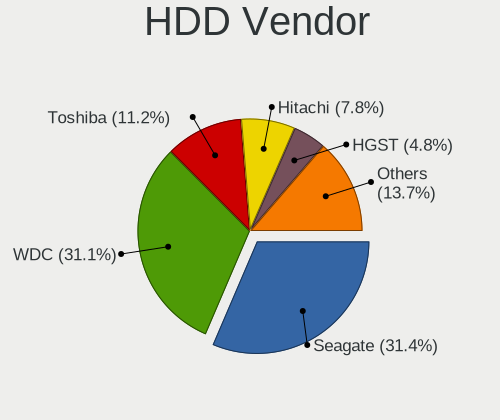
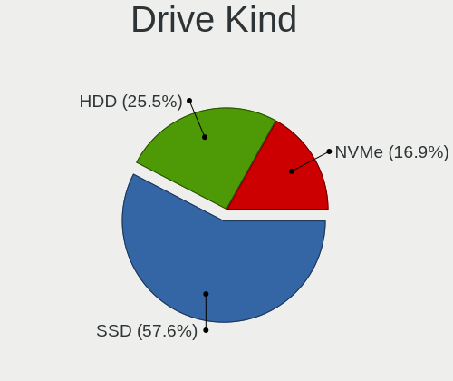
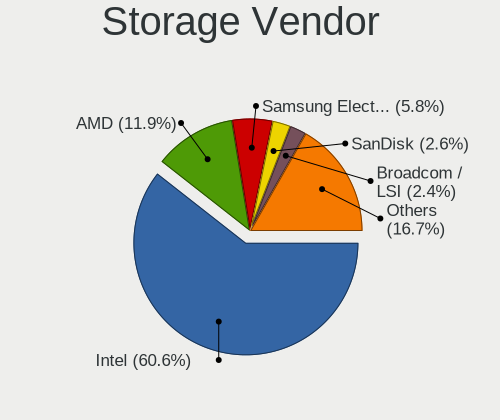

BSD - Tested Hardware & Statistics
----------------------------------

A project to collect tested hardware configurations for BSD.

Anyone can contribute to this report by the [hw-probe](https://github.com/linuxhw/hw-probe/blob/master/INSTALL.BSD.md) tool:

    hw-probe -all -upload

Please contribute! Especially if your hardware is rare.

This is a report for all computer types. See also reports for [desktops](/Desktop/README.md) and [notebooks](/Notebook/README.md).

OS-specific reports: [FreeBSD](/Dist/FreeBSD), [GhostBSD](/Dist/GhostBSD), [helloSystem](/Dist/helloSystem), [NetBSD](/Dist/NetBSD), [NomadBSD](/Dist/NomadBSD), [OpenBSD](/Dist/OpenBSD), [OPNsense](/Dist/OPNsense), [pfSense](/Dist/pfSense), [TrueNAS](/Dist/TrueNAS).

This report is for real hardware. Report for virtual hardware: [TestCoverage_VE](https://github.com/bsdhw/TestCoverage_VE)

Contents
--------

* [ Test Cases ](#test-cases)

* [ System ](#system)
  - [ OS                       ](#os)
  - [ OS Family                ](#os-family)
  - [ Arch                     ](#arch)
  - [ DE                       ](#de)
  - [ Display Server           ](#display-server)
  - [ Display Manager          ](#display-manager)
  - [ OS Lang                  ](#os-lang)
  - [ Boot Mode                ](#boot-mode)
  - [ Filesystem               ](#filesystem)
  - [ Part. scheme             ](#part-scheme)

* [ Board ](#board)
  - [ Vendor                   ](#vendor)
  - [ Model                    ](#model)
  - [ Model Family             ](#model-family)
  - [ MFG Year                 ](#mfg-year)
  - [ Form Factor              ](#form-factor)
  - [ Coreboot                 ](#coreboot)
  - [ RAM Size                 ](#ram-size)
  - [ RAM Used                 ](#ram-used)
  - [ Total Drives             ](#total-drives)
  - [ Has CD-ROM               ](#has-cd-rom)
  - [ Has Ethernet             ](#has-ethernet)
  - [ Has WiFi                 ](#has-wifi)
  - [ Has Bluetooth            ](#has-bluetooth)

* [ Location ](#location)
  - [ Country                  ](#country)
  - [ City                     ](#city)

* [ Drives ](#drives)
  - [ Drive Vendor             ](#drive-vendor)
  - [ Drive Model              ](#drive-model)
  - [ HDD Vendor               ](#hdd-vendor)
  - [ SSD Vendor               ](#ssd-vendor)
  - [ Drive Kind               ](#drive-kind)
  - [ Drive Connector          ](#drive-connector)
  - [ Drive Size               ](#drive-size)
  - [ Space Total              ](#space-total)
  - [ Space Used               ](#space-used)
  - [ Malfunc. Drives          ](#malfunc-drives)
  - [ Malfunc. Drive Vendor    ](#malfunc-drive-vendor)
  - [ Malfunc. HDD Vendor      ](#malfunc-hdd-vendor)
  - [ Malfunc. Drive Kind      ](#malfunc-drive-kind)
  - [ Failed Drives            ](#failed-drives)
  - [ Failed Drive Vendor      ](#failed-drive-vendor)
  - [ Drive Status             ](#drive-status)

* [ Storage controller ](#storage-controller)
  - [ Storage Vendor           ](#storage-vendor)
  - [ Storage Model            ](#storage-model)
  - [ Storage Kind             ](#storage-kind)

* [ Processor ](#processor)
  - [ CPU Vendor               ](#cpu-vendor)
  - [ CPU Model                ](#cpu-model)
  - [ CPU Model Family         ](#cpu-model-family)
  - [ CPU Cores                ](#cpu-cores)
  - [ CPU Sockets              ](#cpu-sockets)
  - [ CPU Threads              ](#cpu-threads)
  - [ CPU Microarch            ](#cpu-microarch)

* [ Graphics ](#graphics)
  - [ GPU Vendor               ](#gpu-vendor)
  - [ GPU Model                ](#gpu-model)
  - [ GPU Combo                ](#gpu-combo)
  - [ GPU Driver               ](#gpu-driver)
  - [ GPU Memory               ](#gpu-memory)

* [ Monitor ](#monitor)
  - [ Monitor Vendor           ](#monitor-vendor)
  - [ Monitor Model            ](#monitor-model)
  - [ Monitor Resolution       ](#monitor-resolution)
  - [ Monitor Diagonal         ](#monitor-diagonal)
  - [ Monitor Width            ](#monitor-width)
  - [ Aspect Ratio             ](#aspect-ratio)
  - [ Monitor Area             ](#monitor-area)
  - [ Pixel Density            ](#pixel-density)
  - [ Multiple Monitors        ](#multiple-monitors)

* [ Network ](#network)
  - [ Net Controller Vendor    ](#net-controller-vendor)
  - [ Net Controller Model     ](#net-controller-model)
  - [ Wireless Vendor          ](#wireless-vendor)
  - [ Wireless Model           ](#wireless-model)
  - [ Ethernet Vendor          ](#ethernet-vendor)
  - [ Ethernet Model           ](#ethernet-model)
  - [ Net Controller Kind      ](#net-controller-kind)
  - [ Used Controller          ](#used-controller)
  - [ NICs                     ](#nics)
  - [ IPv6                     ](#ipv6)

* [ Bluetooth ](#bluetooth)
  - [ Bluetooth Vendor         ](#bluetooth-vendor)
  - [ Bluetooth Model          ](#bluetooth-model)

* [ Sound ](#sound)
  - [ Sound Vendor             ](#sound-vendor)
  - [ Sound Model              ](#sound-model)

* [ Memory ](#memory)
  - [ Memory Vendor            ](#memory-vendor)
  - [ Memory Model             ](#memory-model)
  - [ Memory Kind              ](#memory-kind)
  - [ Memory Form Factor       ](#memory-form-factor)
  - [ Memory Size              ](#memory-size)
  - [ Memory Speed             ](#memory-speed)

* [ Printers & scanners ](#printers--scanners)
  - [ Printer Vendor           ](#printer-vendor)
  - [ Printer Model            ](#printer-model)
  - [ Scanner Vendor           ](#scanner-vendor)
  - [ Scanner Model            ](#scanner-model)

* [ Camera ](#camera)
  - [ Camera Vendor            ](#camera-vendor)
  - [ Camera Model             ](#camera-model)

* [ Security ](#security)
  - [ Fingerprint Vendor       ](#fingerprint-vendor)
  - [ Fingerprint Model        ](#fingerprint-model)
  - [ Chipcard Vendor          ](#chipcard-vendor)
  - [ Chipcard Model           ](#chipcard-model)

* [ Unsupported ](#unsupported)
  - [ Unsupported Devices      ](#unsupported-devices)
  - [ Unsupported Device Types ](#unsupported-device-types)

Test Cases
----------

Total: 11847

| Vendor        | Model                       | Form-Factor | Probe                                                     | Date         |
|---------------|-----------------------------|-------------|-----------------------------------------------------------|--------------|
| Supermicro    | X10SLH-N6-ST031             | Desktop     | [73304d07bb](https://bsd-hardware.info/?probe=73304d07bb) | Sep 01, 2022 |
| Deciso        | NetBoard-A10                | Notebook    | [3547d9da9c](https://bsd-hardware.info/?probe=3547d9da9c) | Sep 01, 2022 |
| Apple         | MacBookPro8,1               | Notebook    | [0ff0fc4c3b](https://bsd-hardware.info/?probe=0ff0fc4c3b) | Sep 01, 2022 |
| Unknown       | DTB1168                     | Desktop     | [e924ba2a44](https://bsd-hardware.info/?probe=e924ba2a44) | Sep 01, 2022 |
| Unknown       | Unknown                     | Desktop     | [f2a26e2adc](https://bsd-hardware.info/?probe=f2a26e2adc) | Sep 01, 2022 |
| Unknown       | Unknown                     | Desktop     | [9f6f4424c2](https://bsd-hardware.info/?probe=9f6f4424c2) | Sep 01, 2022 |
| Dell          | Latitude E5550              | Notebook    | [867e56fb52](https://bsd-hardware.info/?probe=867e56fb52) | Sep 01, 2022 |
| Jingsha       | x79-P3 by xUz               | Desktop     | [9148bf85ec](https://bsd-hardware.info/?probe=9148bf85ec) | Sep 01, 2022 |
| Dell          | 0TY179 A05                  | Server      | [482bca3952](https://bsd-hardware.info/?probe=482bca3952) | Sep 01, 2022 |
| TUXEDO        | Pulse 15 Gen2               | Notebook    | [91a1870b65](https://bsd-hardware.info/?probe=91a1870b65) | Sep 01, 2022 |
| Dell          | Precision 7710              | Notebook    | [339099bbf0](https://bsd-hardware.info/?probe=339099bbf0) | Sep 01, 2022 |
| HP            | 1496                        | Desktop     | [1567aa1c21](https://bsd-hardware.info/?probe=1567aa1c21) | Sep 01, 2022 |
| AAEON         | UP-APL01 V0.4               | Desktop     | [a8d73a9156](https://bsd-hardware.info/?probe=a8d73a9156) | Sep 01, 2022 |
| Unknown       | HX90                        | Desktop     | [568468e95b](https://bsd-hardware.info/?probe=568468e95b) | Sep 01, 2022 |
| Unknown       | Unknown                     | Desktop     | [b62a001fe9](https://bsd-hardware.info/?probe=b62a001fe9) | Sep 01, 2022 |
| ASRock        | H81M-ITX                    | Desktop     | [d26f88ae78](https://bsd-hardware.info/?probe=d26f88ae78) | Sep 01, 2022 |
| maiyunda      | www.maiyunda.com            | Desktop     | [721abbc383](https://bsd-hardware.info/?probe=721abbc383) | Sep 01, 2022 |
| maiyunda      | www.maiyunda.com            | Desktop     | [bbd9cbaaeb](https://bsd-hardware.info/?probe=bbd9cbaaeb) | Sep 01, 2022 |
| Dell          | 0HYPX2 A00                  | Server      | [2779d78756](https://bsd-hardware.info/?probe=2779d78756) | Sep 01, 2022 |
| Dell          | 07F37C A01                  | Desktop     | [53de9cce89](https://bsd-hardware.info/?probe=53de9cce89) | Sep 01, 2022 |
| Dell          | 0MD99X A07                  | Server      | [3c8cc375dc](https://bsd-hardware.info/?probe=3c8cc375dc) | Sep 01, 2022 |
| Valve         | Jupiter                     | Notebook    | [4e58d828cc](https://bsd-hardware.info/?probe=4e58d828cc) | Sep 01, 2022 |
| Intel         | NUC8BEB J72692-309          | Mini pc     | [43a7b45df6](https://bsd-hardware.info/?probe=43a7b45df6) | Sep 01, 2022 |
| ASRock        | ConRoeXFire-eSATA2          | Desktop     | [caf005ed95](https://bsd-hardware.info/?probe=caf005ed95) | Sep 01, 2022 |
| CompuLab      | fitlet2                     | Mini pc     | [ebedb51d2f](https://bsd-hardware.info/?probe=ebedb51d2f) | Aug 31, 2022 |
| Intel         | MAHOBAY                     | Desktop     | [78b1cb4ae5](https://bsd-hardware.info/?probe=78b1cb4ae5) | Aug 31, 2022 |
| Dell          | 07T4MC A09                  | Desktop     | [50fbb0435c](https://bsd-hardware.info/?probe=50fbb0435c) | Aug 31, 2022 |
| Dell          | 07T4MC A09                  | Desktop     | [200b8d381e](https://bsd-hardware.info/?probe=200b8d381e) | Aug 31, 2022 |
| Dell          | 07T4MC A09                  | Desktop     | [ebc79d7728](https://bsd-hardware.info/?probe=ebc79d7728) | Aug 31, 2022 |
| AMI           | Aptio CRB                   | Mini pc     | [77f98904c2](https://bsd-hardware.info/?probe=77f98904c2) | Aug 31, 2022 |
| MW            | GMLK-2_5G4L                 | Desktop     | [63587e2fca](https://bsd-hardware.info/?probe=63587e2fca) | Aug 31, 2022 |
| ASUSTek       | EX-H110M-V                  | Desktop     | [35e6c8463a](https://bsd-hardware.info/?probe=35e6c8463a) | Aug 31, 2022 |
| Toshiba       | Satellite A300              | Notebook    | [ac185c104b](https://bsd-hardware.info/?probe=ac185c104b) | Aug 31, 2022 |
| Dell          | 0TP412                      | Desktop     | [3ac4a5aa72](https://bsd-hardware.info/?probe=3ac4a5aa72) | Aug 31, 2022 |
| Dell          | 0G261D A00                  | Desktop     | [c77b23d1a7](https://bsd-hardware.info/?probe=c77b23d1a7) | Aug 31, 2022 |
| Lenovo        | 32E1 SDK0J40697 WIN 3305... | Desktop     | [0563755b0d](https://bsd-hardware.info/?probe=0563755b0d) | Aug 31, 2022 |
| maiyunda      | www.maiyunda.com            | Desktop     | [5f880bde97](https://bsd-hardware.info/?probe=5f880bde97) | Aug 31, 2022 |
| Unknown       | Unknown                     | Desktop     | [e8259494a3](https://bsd-hardware.info/?probe=e8259494a3) | Aug 31, 2022 |
| Intel         | DENLOW_WS                   | Desktop     | [40053c983b](https://bsd-hardware.info/?probe=40053c983b) | Aug 31, 2022 |
| HP            | 213D A01                    | Desktop     | [c495fb5448](https://bsd-hardware.info/?probe=c495fb5448) | Aug 30, 2022 |
| Unknown       | Unknown                     | Desktop     | [9422de47ab](https://bsd-hardware.info/?probe=9422de47ab) | Aug 30, 2022 |
| HP            | 8103 A01                    | Mini pc     | [58a4089f3f](https://bsd-hardware.info/?probe=58a4089f3f) | Aug 30, 2022 |
| Gigabyte      | J1900N-D3V                  | Desktop     | [e2ad4d8035](https://bsd-hardware.info/?probe=e2ad4d8035) | Aug 30, 2022 |
| MSI           | A320M-A PRO M2              | Desktop     | [d455ed153a](https://bsd-hardware.info/?probe=d455ed153a) | Aug 30, 2022 |
| Intel         | DENLOW_WS                   | Desktop     | [067a217959](https://bsd-hardware.info/?probe=067a217959) | Aug 30, 2022 |
| ASUSTek       | Maximus VIII HERO           | Desktop     | [a47c1e0c84](https://bsd-hardware.info/?probe=a47c1e0c84) | Aug 30, 2022 |
| Unknown       | Unknown                     | Desktop     | [98d9c506c9](https://bsd-hardware.info/?probe=98d9c506c9) | Aug 30, 2022 |
| Lenovo        | IdeaPad Gaming 3 15ACH6 ... | Notebook    | [fc259fcf3e](https://bsd-hardware.info/?probe=fc259fcf3e) | Aug 30, 2022 |
| Dell          | Precision 5540              | Notebook    | [0c5089634d](https://bsd-hardware.info/?probe=0c5089634d) | Aug 30, 2022 |
| Dell          | Precision 5540              | Notebook    | [afb80a84fb](https://bsd-hardware.info/?probe=afb80a84fb) | Aug 30, 2022 |
| MSI           | A320M-A PRO M2              | Desktop     | [9d367a6989](https://bsd-hardware.info/?probe=9d367a6989) | Aug 30, 2022 |
| Unknown       | Unknown                     | Desktop     | [6bc59f4024](https://bsd-hardware.info/?probe=6bc59f4024) | Aug 30, 2022 |
| HP            | Unknown                     | Notebook    | [7bd69ee984](https://bsd-hardware.info/?probe=7bd69ee984) | Aug 29, 2022 |
| Protectli     | FW4B Ver                    | Desktop     | [b3a1456bb4](https://bsd-hardware.info/?probe=b3a1456bb4) | Aug 29, 2022 |
| Unknown       | Unknown                     | Desktop     | [a01c1ad205](https://bsd-hardware.info/?probe=a01c1ad205) | Aug 29, 2022 |
| Gigabyte      | J1900N-D3V                  | Desktop     | [567bfe0b9f](https://bsd-hardware.info/?probe=567bfe0b9f) | Aug 29, 2022 |
| Lenovo        | IdeaPad Gaming 3 15ACH6 ... | Notebook    | [a5c0fe3db8](https://bsd-hardware.info/?probe=a5c0fe3db8) | Aug 29, 2022 |
| Lenovo        | ThinkPad T420 4178A72       | Notebook    | [18a105546b](https://bsd-hardware.info/?probe=18a105546b) | Aug 29, 2022 |
| Fujitsu       | D3041-A1 S26361-D3041-A1    | Desktop     | [2349014a6c](https://bsd-hardware.info/?probe=2349014a6c) | Aug 29, 2022 |
| Lenovo        | ThinkPad T420 4178A72       | Notebook    | [1433351032](https://bsd-hardware.info/?probe=1433351032) | Aug 29, 2022 |
| Intel         | X79 V2.72A                  | Desktop     | [435901d8c9](https://bsd-hardware.info/?probe=435901d8c9) | Aug 29, 2022 |
| Dell          | 0NW6H5 A00                  | Desktop     | [8d047e7667](https://bsd-hardware.info/?probe=8d047e7667) | Aug 29, 2022 |
| Unknown       | Unknown                     | Desktop     | [411daea5f8](https://bsd-hardware.info/?probe=411daea5f8) | Aug 29, 2022 |
| Dell          | 04415J A00                  | Mini pc     | [97bf732bfe](https://bsd-hardware.info/?probe=97bf732bfe) | Aug 29, 2022 |
| MW            | GMLK-2_5G4L                 | Desktop     | [19e3294fe9](https://bsd-hardware.info/?probe=19e3294fe9) | Aug 29, 2022 |
| Dell          | Latitude 7390               | Notebook    | [bc5eb8e237](https://bsd-hardware.info/?probe=bc5eb8e237) | Aug 29, 2022 |
| Acer          | FIH57                       | Desktop     | [78265cbc90](https://bsd-hardware.info/?probe=78265cbc90) | Aug 29, 2022 |
| Lenovo        | MAHOBAY NO DPK              | Desktop     | [4d7efd6aa6](https://bsd-hardware.info/?probe=4d7efd6aa6) | Aug 28, 2022 |
| Dell          | 0654JC A02                  | Desktop     | [07144a803b](https://bsd-hardware.info/?probe=07144a803b) | Aug 28, 2022 |
| AMI           | Aptio CRB                   | Mini pc     | [525631a32f](https://bsd-hardware.info/?probe=525631a32f) | Aug 28, 2022 |
| AMI           | Aptio CRB                   | Mini pc     | [a3677591ec](https://bsd-hardware.info/?probe=a3677591ec) | Aug 28, 2022 |
| MSI           | H81M-P33                    | Desktop     | [4d00b83ad4](https://bsd-hardware.info/?probe=4d00b83ad4) | Aug 28, 2022 |
| ASUSTek       | P5Q-E                       | Desktop     | [6c1bc8d99f](https://bsd-hardware.info/?probe=6c1bc8d99f) | Aug 28, 2022 |
| ASUSTek       | ROG CROSSHAIR VIII HERO     | Desktop     | [4e55957971](https://bsd-hardware.info/?probe=4e55957971) | Aug 28, 2022 |
| Gigabyte      | H81M-DS2                    | Desktop     | [75ec0260f9](https://bsd-hardware.info/?probe=75ec0260f9) | Aug 28, 2022 |
| ASUSTek       | ROG STRIX B550-I GAMING     | Desktop     | [079adb24f8](https://bsd-hardware.info/?probe=079adb24f8) | Aug 28, 2022 |
| Dell          | 00V62H A01                  | Desktop     | [e7dc9cc5ee](https://bsd-hardware.info/?probe=e7dc9cc5ee) | Aug 28, 2022 |
| Dell          | PowerEdge R610              | Server      | [6006aed07f](https://bsd-hardware.info/?probe=6006aed07f) | Aug 28, 2022 |
| Fujitsu       | D3313-E1 S26361-D3313-E1    | Desktop     | [df3df2855b](https://bsd-hardware.info/?probe=df3df2855b) | Aug 28, 2022 |
| Lenovo        | SHARKBAY 0B98401 WIN        | Desktop     | [72aaa26104](https://bsd-hardware.info/?probe=72aaa26104) | Aug 28, 2022 |
| Dell          | Precision 7550              | Notebook    | [71f615178f](https://bsd-hardware.info/?probe=71f615178f) | Aug 27, 2022 |
| Sophos        | UTM                         | Firewall    | [e3e6ecec51](https://bsd-hardware.info/?probe=e3e6ecec51) | Aug 27, 2022 |
| Supermicro    | X8DTL                       | Server      | [37350b3ac0](https://bsd-hardware.info/?probe=37350b3ac0) | Aug 27, 2022 |
| Fujitsu       | D3009-B1 S26361-D3009-B1    | Desktop     | [0f1eabf01e](https://bsd-hardware.info/?probe=0f1eabf01e) | Aug 27, 2022 |
| ZOTAC         | ZBOX-CI329NANO              | Mini pc     | [d721e505cb](https://bsd-hardware.info/?probe=d721e505cb) | Aug 27, 2022 |
| Supermicro    | X10SLM+-LN4F                | Server      | [70a786b8b5](https://bsd-hardware.info/?probe=70a786b8b5) | Aug 27, 2022 |
| YANYU         | R250                        | Desktop     | [c4f1ec0d5b](https://bsd-hardware.info/?probe=c4f1ec0d5b) | Aug 27, 2022 |
| Intel         | CRESCENTBAY                 | Desktop     | [184a8697e9](https://bsd-hardware.info/?probe=184a8697e9) | Aug 27, 2022 |
| HP            | 8103 A01                    | Mini pc     | [de20688262](https://bsd-hardware.info/?probe=de20688262) | Aug 27, 2022 |
| Toshiba       | Satellite S55t-B            | Notebook    | [df9971d3aa](https://bsd-hardware.info/?probe=df9971d3aa) | Aug 27, 2022 |
| Intel         | CRESCENTBAY                 | Desktop     | [1765bd0426](https://bsd-hardware.info/?probe=1765bd0426) | Aug 27, 2022 |
| Gigabyte      | A320M-H-CF                  | Desktop     | [2549c7cadf](https://bsd-hardware.info/?probe=2549c7cadf) | Aug 27, 2022 |
| Sophos        | SG                          | Firewall    | [40debf2d20](https://bsd-hardware.info/?probe=40debf2d20) | Aug 27, 2022 |
| MW            | GMLK-2_5G4L                 | Desktop     | [29d63f7027](https://bsd-hardware.info/?probe=29d63f7027) | Aug 27, 2022 |
| Gigabyte      | B365M DS3H                  | Desktop     | [0d7d7288c0](https://bsd-hardware.info/?probe=0d7d7288c0) | Aug 27, 2022 |
| Gigabyte      | B365M DS3H                  | Desktop     | [0a90c3c566](https://bsd-hardware.info/?probe=0a90c3c566) | Aug 27, 2022 |
| Sophos        | SG                          | Firewall    | [2d90401126](https://bsd-hardware.info/?probe=2d90401126) | Aug 26, 2022 |
| Supermicro    | X10SLH-F/X10SLM+-F          | Server      | [10ca365b40](https://bsd-hardware.info/?probe=10ca365b40) | Aug 26, 2022 |
| Intel         | Q3XXG4-P V1.0               | Desktop     | [05bb23ae87](https://bsd-hardware.info/?probe=05bb23ae87) | Aug 26, 2022 |
| AOpen         | iBTMx-DS R1.04 55DED10A0... | Desktop     | [a480263c28](https://bsd-hardware.info/?probe=a480263c28) | Aug 26, 2022 |
| Lenovo        | 00FN849 E63448-400          | Server      | [787b53d486](https://bsd-hardware.info/?probe=787b53d486) | Aug 26, 2022 |
| Dell          | 030VXY A02                  | Desktop     | [9acd691261](https://bsd-hardware.info/?probe=9acd691261) | Aug 26, 2022 |
| HP            | 213D A01                    | Desktop     | [1b90f312ea](https://bsd-hardware.info/?probe=1b90f312ea) | Aug 26, 2022 |
| Dell          | 07T4MC A00                  | Desktop     | [1060f1b6e3](https://bsd-hardware.info/?probe=1060f1b6e3) | Aug 26, 2022 |
| ASUSTek       | PRIME Z690-P D4             | Desktop     | [5684672f5a](https://bsd-hardware.info/?probe=5684672f5a) | Aug 26, 2022 |
| Lenovo        | 3106 SDK0J40697 WIN 3305... | Desktop     | [3465c46b7d](https://bsd-hardware.info/?probe=3465c46b7d) | Aug 26, 2022 |
| HP            | 21B4 A01                    | Desktop     | [93eab13f35](https://bsd-hardware.info/?probe=93eab13f35) | Aug 26, 2022 |
| Supermicro    | X10SLH-N6-ST031             | Desktop     | [05d009b0df](https://bsd-hardware.info/?probe=05d009b0df) | Aug 26, 2022 |
| PC Engines    | APU2                        | Desktop     | [97da53ff14](https://bsd-hardware.info/?probe=97da53ff14) | Aug 25, 2022 |
| Supermicro    | X10SLL-F                    | Server      | [a760a87c5d](https://bsd-hardware.info/?probe=a760a87c5d) | Aug 25, 2022 |
| ASUSTek       | VivoBook 15_ASUS Laptop ... | Notebook    | [2c7586b0ed](https://bsd-hardware.info/?probe=2c7586b0ed) | Aug 25, 2022 |
| YANYU         | H67SL                       | Desktop     | [57afa0c5d1](https://bsd-hardware.info/?probe=57afa0c5d1) | Aug 25, 2022 |
| Dell          | PowerEdge R620              | Desktop     | [66db9eb745](https://bsd-hardware.info/?probe=66db9eb745) | Aug 25, 2022 |
| WlanCN        | 6000 Series                 | Desktop     | [7fda15ca84](https://bsd-hardware.info/?probe=7fda15ca84) | Aug 25, 2022 |
| YANYU         | R250                        | Desktop     | [69accaf958](https://bsd-hardware.info/?probe=69accaf958) | Aug 25, 2022 |
| ASUSTek       | VivoBook_ASUSLaptop X570... | Notebook    | [0466d87f04](https://bsd-hardware.info/?probe=0466d87f04) | Aug 25, 2022 |
| maiyunda      | www.maiyunda.com            | Desktop     | [dad2f40e8d](https://bsd-hardware.info/?probe=dad2f40e8d) | Aug 25, 2022 |
| HP            | ENVY Notebook               | Notebook    | [7e33273132](https://bsd-hardware.info/?probe=7e33273132) | Aug 25, 2022 |
| Gigabyte      | H61M-DS2                    | Desktop     | [edb9608bc9](https://bsd-hardware.info/?probe=edb9608bc9) | Aug 24, 2022 |
| ASUSTek       | PRIME B460M-A               | Desktop     | [21fed03fa2](https://bsd-hardware.info/?probe=21fed03fa2) | Aug 24, 2022 |
| ASUSTek       | PRIME B460M-A               | Desktop     | [48210e4d2a](https://bsd-hardware.info/?probe=48210e4d2a) | Aug 24, 2022 |
| AMI           | Aptio CRB                   | Mini pc     | [303d15332f](https://bsd-hardware.info/?probe=303d15332f) | Aug 24, 2022 |
| Dell          | 03X6X0 A03                  | Server      | [d77ae4f2a0](https://bsd-hardware.info/?probe=d77ae4f2a0) | Aug 24, 2022 |
| ASRock        | AD2550-ITX                  | Desktop     | [43d0101ac4](https://bsd-hardware.info/?probe=43d0101ac4) | Aug 24, 2022 |
| Shuttle       | FS81                        | Desktop     | [b2db8ceabe](https://bsd-hardware.info/?probe=b2db8ceabe) | Aug 24, 2022 |
| Deciso        | NetBoard-A10                | Notebook    | [aefb2f4660](https://bsd-hardware.info/?probe=aefb2f4660) | Aug 24, 2022 |
| Unknown       | Unknown                     | Desktop     | [e5efeb3781](https://bsd-hardware.info/?probe=e5efeb3781) | Aug 24, 2022 |
| Unknown       | YL-E3845L4-V2               | Desktop     | [ee6fe793f2](https://bsd-hardware.info/?probe=ee6fe793f2) | Aug 24, 2022 |
| Dell          | 04YP6J A02                  | Desktop     | [38269a215a](https://bsd-hardware.info/?probe=38269a215a) | Aug 24, 2022 |
| Protectli     | VP2410                      | Desktop     | [67a5cd38d0](https://bsd-hardware.info/?probe=67a5cd38d0) | Aug 24, 2022 |
| Dell          | 088DT1 A01                  | Desktop     | [55090e4971](https://bsd-hardware.info/?probe=55090e4971) | Aug 24, 2022 |
| Lenovo        | 3098 SDK0E50510 WIN         | Desktop     | [f237a01839](https://bsd-hardware.info/?probe=f237a01839) | Aug 24, 2022 |
| Lenovo        | MAHOBAY                     | Desktop     | [eaa49a6f0d](https://bsd-hardware.info/?probe=eaa49a6f0d) | Aug 23, 2022 |
| Lenovo        | Yoga Slim 7 Pro 14ACH5 8... | Notebook    | [fcfa6205d8](https://bsd-hardware.info/?probe=fcfa6205d8) | Aug 23, 2022 |
| Supermicro    | A1SRi                       | Mini pc     | [55a9138af4](https://bsd-hardware.info/?probe=55a9138af4) | Aug 23, 2022 |
| MSI           | 740GM-P25                   | Desktop     | [22084957bb](https://bsd-hardware.info/?probe=22084957bb) | Aug 23, 2022 |
| Supermicro    | X11SDW-4C-TP13F             | Desktop     | [84a08c6936](https://bsd-hardware.info/?probe=84a08c6936) | Aug 23, 2022 |
| HP            | ENVY x360 Convertible 13... | Convertible | [eec9546431](https://bsd-hardware.info/?probe=eec9546431) | Aug 23, 2022 |
| Lenovo        | MAHOBAY 0B98401 PRO         | Desktop     | [6945375f5e](https://bsd-hardware.info/?probe=6945375f5e) | Aug 23, 2022 |
| Dell          | 0HYPX2 A09                  | Server      | [fdabe7c7e4](https://bsd-hardware.info/?probe=fdabe7c7e4) | Aug 23, 2022 |
| Dell          | 09T7VV A07                  | Server      | [0325ade874](https://bsd-hardware.info/?probe=0325ade874) | Aug 23, 2022 |
| Dell          | 0M877N A00                  | Server      | [acabd589fa](https://bsd-hardware.info/?probe=acabd589fa) | Aug 23, 2022 |
| Lenovo        | ThinkCentre M91p 4512A47    | Desktop     | [3556794570](https://bsd-hardware.info/?probe=3556794570) | Aug 23, 2022 |
| ASRock        | X570 Phantom Gaming 4       | Desktop     | [17f4ac1979](https://bsd-hardware.info/?probe=17f4ac1979) | Aug 23, 2022 |
| Unknown       | Unknown                     | Desktop     | [8d3dee7258](https://bsd-hardware.info/?probe=8d3dee7258) | Aug 23, 2022 |
| Dell          | 05GD68 A00                  | Desktop     | [44013a98bb](https://bsd-hardware.info/?probe=44013a98bb) | Aug 23, 2022 |
| Dell          | 0K29HN A01                  | Server      | [f96cb98005](https://bsd-hardware.info/?probe=f96cb98005) | Aug 23, 2022 |
| Dell          | 012KND A00                  | Mini pc     | [8ca6b71124](https://bsd-hardware.info/?probe=8ca6b71124) | Aug 22, 2022 |
| Dell          | 04415J A00                  | Mini pc     | [0dd0325ce1](https://bsd-hardware.info/?probe=0dd0325ce1) | Aug 22, 2022 |
| Deciso        | Netboard A20                | Notebook    | [164274c6b4](https://bsd-hardware.info/?probe=164274c6b4) | Aug 22, 2022 |
| ASUSTek       | PRIME B550-PLUS             | Desktop     | [7d4eaaf087](https://bsd-hardware.info/?probe=7d4eaaf087) | Aug 22, 2022 |
| YANYU         | R250                        | Desktop     | [bd7edcafbe](https://bsd-hardware.info/?probe=bd7edcafbe) | Aug 22, 2022 |
| HP            | 82B4                        | Desktop     | [5e07fc9831](https://bsd-hardware.info/?probe=5e07fc9831) | Aug 22, 2022 |
| ASUSTek       | PRIME B550-PLUS             | Desktop     | [063addc66e](https://bsd-hardware.info/?probe=063addc66e) | Aug 22, 2022 |
| PC Engines    | APU2                        | Desktop     | [b3d60c2790](https://bsd-hardware.info/?probe=b3d60c2790) | Aug 22, 2022 |
| Unknown       | Unknown                     | Desktop     | [7d059d1d0a](https://bsd-hardware.info/?probe=7d059d1d0a) | Aug 22, 2022 |
| Supermicro    | X10SBA-LA                   | Server      | [5a733d841d](https://bsd-hardware.info/?probe=5a733d841d) | Aug 22, 2022 |
| Protectli     | FW4B                        | Desktop     | [d2dd7771d2](https://bsd-hardware.info/?probe=d2dd7771d2) | Aug 22, 2022 |
| Protectli     | FW4B Ver                    | Desktop     | [c4261ebde7](https://bsd-hardware.info/?probe=c4261ebde7) | Aug 22, 2022 |
| Gigabyte      | MBHM87P-00                  | Desktop     | [9fa5160871](https://bsd-hardware.info/?probe=9fa5160871) | Aug 22, 2022 |
| Lenovo        | IdeaPad 5 14ITL05 82FE      | Notebook    | [cc2a81fc1b](https://bsd-hardware.info/?probe=cc2a81fc1b) | Aug 21, 2022 |
| HP            | ProLiant DL360 Gen9         | Server      | [6dd76b10ad](https://bsd-hardware.info/?probe=6dd76b10ad) | Aug 21, 2022 |
| BESSTAR Te... | GK45                        | Convertible | [6399352798](https://bsd-hardware.info/?probe=6399352798) | Aug 21, 2022 |
| Dell          | 0PC5F7 A00                  | Desktop     | [27049ee122](https://bsd-hardware.info/?probe=27049ee122) | Aug 21, 2022 |
| Gigabyte      | H310M S2H                   | Desktop     | [b32f197fe9](https://bsd-hardware.info/?probe=b32f197fe9) | Aug 21, 2022 |
| Dell          | 02C2CP A06                  | Server      | [7c432603cf](https://bsd-hardware.info/?probe=7c432603cf) | Aug 21, 2022 |
| Lenovo        | IdeaPad Gaming 3 15ACH6 ... | Notebook    | [6184507a45](https://bsd-hardware.info/?probe=6184507a45) | Aug 21, 2022 |
| MSI           | H81M-P33                    | Desktop     | [89535fc84c](https://bsd-hardware.info/?probe=89535fc84c) | Aug 21, 2022 |
| ASUSTek       | P5Q-E                       | Desktop     | [ac2d88c2dd](https://bsd-hardware.info/?probe=ac2d88c2dd) | Aug 21, 2022 |
| ASUSTek       | ROG CROSSHAIR VIII HERO     | Desktop     | [b5786b8119](https://bsd-hardware.info/?probe=b5786b8119) | Aug 21, 2022 |
| Inventec      | Z CLASS A02                 | Desktop     | [cb3708c9bf](https://bsd-hardware.info/?probe=cb3708c9bf) | Aug 21, 2022 |
| Lenovo        | ThinkPad A485 20MU000VUS    | Notebook    | [296e81dd9d](https://bsd-hardware.info/?probe=296e81dd9d) | Aug 21, 2022 |
| Cisco         | ASA5525 A0                  | Desktop     | [5a8641fc9d](https://bsd-hardware.info/?probe=5a8641fc9d) | Aug 21, 2022 |
| PC Engines    | APU2                        | Desktop     | [92bff81bb5](https://bsd-hardware.info/?probe=92bff81bb5) | Aug 20, 2022 |
| PC Engines    | APU2                        | Desktop     | [ccdff6fbea](https://bsd-hardware.info/?probe=ccdff6fbea) | Aug 20, 2022 |
| Supermicro    | X12STL-IF                   | Server      | [295fc511a6](https://bsd-hardware.info/?probe=295fc511a6) | Aug 20, 2022 |
| Unknown       | Unknown                     | Desktop     | [15a2225cc6](https://bsd-hardware.info/?probe=15a2225cc6) | Aug 20, 2022 |
| ASUSTek       | ZenBook UX325UA_UM325UA     | Notebook    | [692e2f0837](https://bsd-hardware.info/?probe=692e2f0837) | Aug 20, 2022 |
| Unknown       | Unknown                     | Notebook    | [1dfb3adb6b](https://bsd-hardware.info/?probe=1dfb3adb6b) | Aug 20, 2022 |
| Cisco         | ASA5525 A0                  | Desktop     | [80152a4fc3](https://bsd-hardware.info/?probe=80152a4fc3) | Aug 20, 2022 |
| AWOW          | PC BOX                      | Mini pc     | [04df24b0b8](https://bsd-hardware.info/?probe=04df24b0b8) | Aug 20, 2022 |
| Lenovo        | ThinkPad T480 20L50000GE    | Notebook    | [cd7d7d83ba](https://bsd-hardware.info/?probe=cd7d7d83ba) | Aug 20, 2022 |
| Lenovo        | ThinkPad X270 W10DG 20K5... | Notebook    | [7576399c3c](https://bsd-hardware.info/?probe=7576399c3c) | Aug 20, 2022 |
| Lenovo        | ThinkPad X260 20F5S10W0H    | Notebook    | [2e7d570822](https://bsd-hardware.info/?probe=2e7d570822) | Aug 20, 2022 |
| Lenovo        | ThinkPad X260 20F5S10W0H    | Notebook    | [7afa139f4f](https://bsd-hardware.info/?probe=7afa139f4f) | Aug 20, 2022 |
| HP            | Pavilion g6                 | Notebook    | [c146b538e1](https://bsd-hardware.info/?probe=c146b538e1) | Aug 20, 2022 |
| Unknown       | Unknown                     | Desktop     | [9d1eb045e5](https://bsd-hardware.info/?probe=9d1eb045e5) | Aug 20, 2022 |
| Dell          | 04415J A00                  | Mini pc     | [6412c2a8e3](https://bsd-hardware.info/?probe=6412c2a8e3) | Aug 20, 2022 |
| MW            | GMLK-2_5G4L                 | Desktop     | [2325f41325](https://bsd-hardware.info/?probe=2325f41325) | Aug 20, 2022 |
| Protectli     | FW4B Ver                    | Desktop     | [c70bd0e6c1](https://bsd-hardware.info/?probe=c70bd0e6c1) | Aug 20, 2022 |
| Lenovo        | ThinkPad A485 20MU000VUS    | Notebook    | [b79fa4531e](https://bsd-hardware.info/?probe=b79fa4531e) | Aug 20, 2022 |
| Lenovo        | ThinkPad 11e 4th Gen 20H... | Notebook    | [ba1ea734b1](https://bsd-hardware.info/?probe=ba1ea734b1) | Aug 19, 2022 |
| SmbiosType... | SmbiosType2_BoardProduct... | Desktop     | [3272d6904f](https://bsd-hardware.info/?probe=3272d6904f) | Aug 19, 2022 |
| Dell          | 00W9X3 A00                  | Server      | [869769654b](https://bsd-hardware.info/?probe=869769654b) | Aug 19, 2022 |
| Gigabyte      | H61M-DS2 x.x                | Desktop     | [5648905ca2](https://bsd-hardware.info/?probe=5648905ca2) | Aug 19, 2022 |
| Intel         | NUC6i5SYB H81131-505        | Mini pc     | [d448c2dd6c](https://bsd-hardware.info/?probe=d448c2dd6c) | Aug 19, 2022 |
| Lenovo        | IdeaPad 530S-14ARR 81H1     | Notebook    | [560213a2d6](https://bsd-hardware.info/?probe=560213a2d6) | Aug 19, 2022 |
| ASRock        | B550 Extreme4               | Desktop     | [ce0d33d973](https://bsd-hardware.info/?probe=ce0d33d973) | Aug 19, 2022 |
| HP            | 8592                        | Desktop     | [212adc2c89](https://bsd-hardware.info/?probe=212adc2c89) | Aug 19, 2022 |
| Fujitsu       | D3313-A1 S26361-D3313-A1    | Desktop     | [2b5456b337](https://bsd-hardware.info/?probe=2b5456b337) | Aug 19, 2022 |
| Fujitsu       | D3041-A1 S26361-D3041-A1    | Desktop     | [5ea9441653](https://bsd-hardware.info/?probe=5ea9441653) | Aug 19, 2022 |
| Intel         | NUC7i3BNB J22859-313        | Mini pc     | [1a666e04d4](https://bsd-hardware.info/?probe=1a666e04d4) | Aug 19, 2022 |
| Deciso        | NetBoard-A20                | Notebook    | [7ec18da9e4](https://bsd-hardware.info/?probe=7ec18da9e4) | Aug 19, 2022 |
| Protectli     | FW4B                        | Desktop     | [8eb0c6ffbe](https://bsd-hardware.info/?probe=8eb0c6ffbe) | Aug 19, 2022 |
| ASUSTek       | ZenBook 14 UX410UFR         | Notebook    | [2bf0f0ef08](https://bsd-hardware.info/?probe=2bf0f0ef08) | Aug 19, 2022 |
| Protectli     | FW4B                        | Desktop     | [2fdd88b8b8](https://bsd-hardware.info/?probe=2fdd88b8b8) | Aug 19, 2022 |
| Fujitsu       | D3313-A1 S26361-D3313-A1    | Desktop     | [fb02323793](https://bsd-hardware.info/?probe=fb02323793) | Aug 19, 2022 |
| Gigabyte      | C1037UN-EU                  | Desktop     | [0a867d7017](https://bsd-hardware.info/?probe=0a867d7017) | Aug 18, 2022 |
| Seeed Stud... | ODYSSEY-X86J4105 SD-BS-C... | Desktop     | [45043e0e42](https://bsd-hardware.info/?probe=45043e0e42) | Aug 18, 2022 |
| Fujitsu       | D3313-G1 S26361-D3313-G1    | Desktop     | [5280e7a6d2](https://bsd-hardware.info/?probe=5280e7a6d2) | Aug 18, 2022 |
| Gigabyte      | H61M-DS2                    | Desktop     | [a2fc8d9c67](https://bsd-hardware.info/?probe=a2fc8d9c67) | Aug 18, 2022 |
| AMI           | Aptio CRB                   | Mini pc     | [02e11159f5](https://bsd-hardware.info/?probe=02e11159f5) | Aug 18, 2022 |
| Dell          | 0PTTT9 A00                  | Desktop     | [c7490e7180](https://bsd-hardware.info/?probe=c7490e7180) | Aug 18, 2022 |
| Foxconn       | 2A8C                        | Desktop     | [0ecc8e6a2f](https://bsd-hardware.info/?probe=0ecc8e6a2f) | Aug 18, 2022 |
| Inventec      | Z CLASS A02                 | Desktop     | [290a94a907](https://bsd-hardware.info/?probe=290a94a907) | Aug 18, 2022 |
| Dell          | 0VG93V A00                  | Desktop     | [8de9fa2319](https://bsd-hardware.info/?probe=8de9fa2319) | Aug 18, 2022 |
| Dell          | 03XKDV A02                  | Server      | [88bb2bdb40](https://bsd-hardware.info/?probe=88bb2bdb40) | Aug 18, 2022 |
| Dell          | 04415J A00                  | Mini pc     | [6f22c3a6e3](https://bsd-hardware.info/?probe=6f22c3a6e3) | Aug 18, 2022 |
| Google        | Peppy                       | Notebook    | [e2e0a1953d](https://bsd-hardware.info/?probe=e2e0a1953d) | Aug 18, 2022 |
| Intel         | S2600WTTR G92187-372        | Server      | [ce1988c8ff](https://bsd-hardware.info/?probe=ce1988c8ff) | Aug 18, 2022 |
| Unknown       | Unknown                     | Desktop     | [52da85a309](https://bsd-hardware.info/?probe=52da85a309) | Aug 18, 2022 |
| Foxconn       | 2A8C                        | Desktop     | [a2f96d06ea](https://bsd-hardware.info/?probe=a2f96d06ea) | Aug 17, 2022 |
| Fujitsu       | D3373-B1 S26361-D3373-B1... | Server      | [676fd4e9b4](https://bsd-hardware.info/?probe=676fd4e9b4) | Aug 17, 2022 |
| ASUSTek       | M4A87TD EVO                 | Desktop     | [c03da8657e](https://bsd-hardware.info/?probe=c03da8657e) | Aug 17, 2022 |
| Dell          | 04Y8V0 A02                  | Desktop     | [9fc4b3c63e](https://bsd-hardware.info/?probe=9fc4b3c63e) | Aug 17, 2022 |
| Fujitsu       | D3313-A1 S26361-D3313-A1    | Desktop     | [0361ebba0d](https://bsd-hardware.info/?probe=0361ebba0d) | Aug 17, 2022 |
| Cisco         | ASA5512 A0                  | Desktop     | [9ac038fe9d](https://bsd-hardware.info/?probe=9ac038fe9d) | Aug 17, 2022 |
| Unknown       | Unknown                     | Desktop     | [3208aefb72](https://bsd-hardware.info/?probe=3208aefb72) | Aug 17, 2022 |
| HP            | EliteBook 840 G3            | Notebook    | [28929cae10](https://bsd-hardware.info/?probe=28929cae10) | Aug 17, 2022 |
| Sophos        | SG                          | Firewall    | [bed863a141](https://bsd-hardware.info/?probe=bed863a141) | Aug 17, 2022 |
| Dell          | 0FDY5C A00                  | Desktop     | [2c0bb11a7b](https://bsd-hardware.info/?probe=2c0bb11a7b) | Aug 17, 2022 |
| PC Engines    | APU2                        | Desktop     | [028dc7aa20](https://bsd-hardware.info/?probe=028dc7aa20) | Aug 17, 2022 |
| Sophos        | UTM                         | Firewall    | [b70e2c4189](https://bsd-hardware.info/?probe=b70e2c4189) | Aug 17, 2022 |
| Dell          | 042P49 A00                  | Desktop     | [7130975fe3](https://bsd-hardware.info/?probe=7130975fe3) | Aug 17, 2022 |
| Dell          | 04415J A00                  | Mini pc     | [a4e8c2c77e](https://bsd-hardware.info/?probe=a4e8c2c77e) | Aug 17, 2022 |
| Protectli     | FW4B Ver                    | Desktop     | [029b31e61f](https://bsd-hardware.info/?probe=029b31e61f) | Aug 17, 2022 |
| CncTion       | J4125-4L-I225               | Desktop     | [ec4f43e1bb](https://bsd-hardware.info/?probe=ec4f43e1bb) | Aug 17, 2022 |
| Unknown       | Unknown                     | Desktop     | [db2cb12805](https://bsd-hardware.info/?probe=db2cb12805) | Aug 17, 2022 |
| ASRock        | H61M-VG3                    | Desktop     | [a363da289a](https://bsd-hardware.info/?probe=a363da289a) | Aug 17, 2022 |
| Dell          | Studio 1537                 | Notebook    | [a185649600](https://bsd-hardware.info/?probe=a185649600) | Aug 17, 2022 |
| HP            | Victus by Gaming Laptop ... | Notebook    | [e09aa880f9](https://bsd-hardware.info/?probe=e09aa880f9) | Aug 16, 2022 |
| HP            | 213D A01                    | Desktop     | [4b231023a1](https://bsd-hardware.info/?probe=4b231023a1) | Aug 16, 2022 |
| Lenovo        | 30D9 SDK0J40705 WIN 3425... | Desktop     | [753f277d5c](https://bsd-hardware.info/?probe=753f277d5c) | Aug 16, 2022 |
| Gigabyte      | H61M-DS2                    | Desktop     | [9a7d45e51c](https://bsd-hardware.info/?probe=9a7d45e51c) | Aug 16, 2022 |
| Dell          | 02YYK5 A00                  | Desktop     | [5428710004](https://bsd-hardware.info/?probe=5428710004) | Aug 16, 2022 |
| AZW           | GK55                        | Desktop     | [a7084961a9](https://bsd-hardware.info/?probe=a7084961a9) | Aug 16, 2022 |
| Fujitsu       | D3400-A1 S26361-D3400-A1    | Desktop     | [68f3298e27](https://bsd-hardware.info/?probe=68f3298e27) | Aug 16, 2022 |
| Unknown       | Unknown                     | Desktop     | [05e28da420](https://bsd-hardware.info/?probe=05e28da420) | Aug 16, 2022 |
| Pegatron      | IPMIP-GS                    | Desktop     | [5ee5edb1d0](https://bsd-hardware.info/?probe=5ee5edb1d0) | Aug 16, 2022 |
| Pegatron      | IPMIP-GS                    | Desktop     | [f3c4668e00](https://bsd-hardware.info/?probe=f3c4668e00) | Aug 16, 2022 |
| Dell          | 0D6H9T A03                  | Desktop     | [16e5b72b64](https://bsd-hardware.info/?probe=16e5b72b64) | Aug 16, 2022 |
| IceWhale T... | ZimaBoard 832 ZMB           | Desktop     | [78340c12ef](https://bsd-hardware.info/?probe=78340c12ef) | Aug 16, 2022 |
| Protectli     | FW6 Ver                     | Desktop     | [970bec57b8](https://bsd-hardware.info/?probe=970bec57b8) | Aug 15, 2022 |
| Fujitsu       | D3313-A1 S26361-D3313-A1    | Desktop     | [e67200aee1](https://bsd-hardware.info/?probe=e67200aee1) | Aug 15, 2022 |
| Gigabyte      | IMB4100TN                   | Desktop     | [aa4bae0d12](https://bsd-hardware.info/?probe=aa4bae0d12) | Aug 15, 2022 |
| Lenovo        | ThinkPad X131e 33672K5      | Notebook    | [4cc4d44e43](https://bsd-hardware.info/?probe=4cc4d44e43) | Aug 15, 2022 |
| ASRock        | X99 Extreme4                | Desktop     | [6905821659](https://bsd-hardware.info/?probe=6905821659) | Aug 15, 2022 |
| MSI           | B450M MORTAR MAX            | Desktop     | [8b3a234691](https://bsd-hardware.info/?probe=8b3a234691) | Aug 15, 2022 |
| Protectli     | FW6 Ver                     | Desktop     | [4cf33d57a1](https://bsd-hardware.info/?probe=4cf33d57a1) | Aug 15, 2022 |
| AZW           | Green G1                    | Desktop     | [4bccb24702](https://bsd-hardware.info/?probe=4bccb24702) | Aug 15, 2022 |
| Intel         | Apollolake I Platform       | Notebook    | [8b6b08bc82](https://bsd-hardware.info/?probe=8b6b08bc82) | Aug 15, 2022 |
| Intel         | S1200SP H57533-250          | Server      | [4f5c24ff44](https://bsd-hardware.info/?probe=4f5c24ff44) | Aug 15, 2022 |
| ASRock        | B460M-HDV                   | Desktop     | [9b48c66296](https://bsd-hardware.info/?probe=9b48c66296) | Aug 15, 2022 |
| Dell          | 0VHWTR A02                  | Desktop     | [29c3379293](https://bsd-hardware.info/?probe=29c3379293) | Aug 15, 2022 |
| Unknown       | Unknown                     | Desktop     | [ef2a61855a](https://bsd-hardware.info/?probe=ef2a61855a) | Aug 15, 2022 |
| Dell          | 04Y8V0 A02                  | Desktop     | [a21172360d](https://bsd-hardware.info/?probe=a21172360d) | Aug 15, 2022 |
| Dell          | 0T10XW A00                  | Desktop     | [d346cf971a](https://bsd-hardware.info/?probe=d346cf971a) | Aug 15, 2022 |
| Dell          | 04Y8V0 A02                  | Desktop     | [6acccc63ff](https://bsd-hardware.info/?probe=6acccc63ff) | Aug 15, 2022 |
| ASUSTek       | TUF Gaming FX505DT_FX505... | Notebook    | [f8c10bf25a](https://bsd-hardware.info/?probe=f8c10bf25a) | Aug 15, 2022 |
| ASUSTek       | ZenBook UX325UA_UM325UA     | Notebook    | [c9bda4b49d](https://bsd-hardware.info/?probe=c9bda4b49d) | Aug 14, 2022 |
| Intel         | D34010WYK H14771-305        | Desktop     | [edfb46c162](https://bsd-hardware.info/?probe=edfb46c162) | Aug 14, 2022 |
| Supermicro    | A1SRi 123456789             | Mini pc     | [179d983936](https://bsd-hardware.info/?probe=179d983936) | Aug 14, 2022 |
| Unknown       | Unknown                     | Desktop     | [e23ed854ed](https://bsd-hardware.info/?probe=e23ed854ed) | Aug 14, 2022 |
| HP            | 8103 A01                    | Mini pc     | [af7da50546](https://bsd-hardware.info/?probe=af7da50546) | Aug 14, 2022 |
| IceWhale T... | ZimaBoard 832 ZMB           | Desktop     | [9783858164](https://bsd-hardware.info/?probe=9783858164) | Aug 14, 2022 |
| Acer          | Aspire 4552G                | Notebook    | [a8f8e41c91](https://bsd-hardware.info/?probe=a8f8e41c91) | Aug 14, 2022 |
| Cisco Syst... | UCSC-C240-M5SX 74-105773... | Server      | [49d4f2c8b8](https://bsd-hardware.info/?probe=49d4f2c8b8) | Aug 14, 2022 |
| AMI           | Aptio CRB                   | Mini pc     | [70ae301a10](https://bsd-hardware.info/?probe=70ae301a10) | Aug 14, 2022 |
| AMI           | Aptio CRB                   | Mini pc     | [90612a700d](https://bsd-hardware.info/?probe=90612a700d) | Aug 14, 2022 |
| Sony          | VGN-UX1XRN                  | Notebook    | [312df080a7](https://bsd-hardware.info/?probe=312df080a7) | Aug 14, 2022 |
| MSI           | GF63 Thin 9SC               | Notebook    | [dacea7c6be](https://bsd-hardware.info/?probe=dacea7c6be) | Aug 14, 2022 |
| Dell          | Inspiron 1545               | Notebook    | [e1a29d8008](https://bsd-hardware.info/?probe=e1a29d8008) | Aug 14, 2022 |
| ASUSTek       | PRIME X370-PRO              | Desktop     | [4055810ef2](https://bsd-hardware.info/?probe=4055810ef2) | Aug 14, 2022 |
| Lenovo        | ThinkPad X1 Carbon 7th 2... | Notebook    | [2da32e59b0](https://bsd-hardware.info/?probe=2da32e59b0) | Aug 14, 2022 |
| Intel         | NUC6i5SYB H81131-505        | Mini pc     | [eee1d83783](https://bsd-hardware.info/?probe=eee1d83783) | Aug 14, 2022 |
| MSI           | H81M-P33                    | Desktop     | [3d0836d403](https://bsd-hardware.info/?probe=3d0836d403) | Aug 14, 2022 |
| ASUSTek       | P5Q-E                       | Desktop     | [c50be0ecae](https://bsd-hardware.info/?probe=c50be0ecae) | Aug 14, 2022 |
| ASUSTek       | ROG CROSSHAIR VIII HERO     | Desktop     | [4b6ad32189](https://bsd-hardware.info/?probe=4b6ad32189) | Aug 14, 2022 |
| Dell          | 0WMJ54 A01                  | Desktop     | [f453f94dd3](https://bsd-hardware.info/?probe=f453f94dd3) | Aug 14, 2022 |
| MiTAC         | PH11CMI                     | Desktop     | [8656b8a7b9](https://bsd-hardware.info/?probe=8656b8a7b9) | Aug 14, 2022 |
| Samsung       | NC210/NC110                 | Notebook    | [6c697b3312](https://bsd-hardware.info/?probe=6c697b3312) | Aug 13, 2022 |
| HP            | 82B4                        | Desktop     | [f8c65040bf](https://bsd-hardware.info/?probe=f8c65040bf) | Aug 13, 2022 |
| ASRock        | J5040-ITX                   | Desktop     | [a8761d9c49](https://bsd-hardware.info/?probe=a8761d9c49) | Aug 13, 2022 |
| Fujitsu       | D3313-G1 S26361-D3313-G1    | Desktop     | [35f0eac5f1](https://bsd-hardware.info/?probe=35f0eac5f1) | Aug 13, 2022 |
| Lenovo        | 3111 SDK0J40705 WIN 3425... | Desktop     | [6927813b1d](https://bsd-hardware.info/?probe=6927813b1d) | Aug 13, 2022 |
| Fujitsu       | D3313-G1 S26361-D3313-G1    | Desktop     | [6d6e03307e](https://bsd-hardware.info/?probe=6d6e03307e) | Aug 13, 2022 |
| Fujitsu       | PRIMERGY RX200 S6           | Desktop     | [9267873961](https://bsd-hardware.info/?probe=9267873961) | Aug 13, 2022 |
| Supermicro    | X9SCI/X9SCA                 | Desktop     | [6e7e782b00](https://bsd-hardware.info/?probe=6e7e782b00) | Aug 13, 2022 |
| ASUSTek       | PRIME X370-PRO              | Desktop     | [5d4af4fba9](https://bsd-hardware.info/?probe=5d4af4fba9) | Aug 13, 2022 |
| Cisco Syst... | UCSC-C240-M5SX 74-105773... | Server      | [2bb12ae487](https://bsd-hardware.info/?probe=2bb12ae487) | Aug 13, 2022 |
| Fujitsu       | D3031 S26361-D3031-A100-... | Server      | [3d46e0eace](https://bsd-hardware.info/?probe=3d46e0eace) | Aug 13, 2022 |
| Fujitsu       | D3031 S26361-D3031-A100-... | Server      | [c961cea235](https://bsd-hardware.info/?probe=c961cea235) | Aug 13, 2022 |
| Fujitsu       | PRIMERGY RX200 S6           | Desktop     | [6884e940a1](https://bsd-hardware.info/?probe=6884e940a1) | Aug 13, 2022 |
| BESSTAR Te... | VB9                         | All in one  | [ec5b4884a7](https://bsd-hardware.info/?probe=ec5b4884a7) | Aug 13, 2022 |
| Protectli     | FW6 Ver                     | Desktop     | [ab6603e750](https://bsd-hardware.info/?probe=ab6603e750) | Aug 13, 2022 |
| Lenovo        | 32E1 SDK0J40697 WIN 3305... | Desktop     | [95c42fcc82](https://bsd-hardware.info/?probe=95c42fcc82) | Aug 13, 2022 |
| ASRock        | X570 Phantom Gaming 4       | Desktop     | [1292c617d2](https://bsd-hardware.info/?probe=1292c617d2) | Aug 13, 2022 |
| Supermicro    | A2SDi-4C-HLN4F              | Desktop     | [649021e20c](https://bsd-hardware.info/?probe=649021e20c) | Aug 13, 2022 |
| Fujitsu       | D3313-A1 S26361-D3313-A1    | Desktop     | [1d4ccaabda](https://bsd-hardware.info/?probe=1d4ccaabda) | Aug 13, 2022 |
| Sophos        | XG                          | Firewall    | [64dd2d6993](https://bsd-hardware.info/?probe=64dd2d6993) | Aug 13, 2022 |
| Alienware     | m15 R4                      | Notebook    | [769c5c43f3](https://bsd-hardware.info/?probe=769c5c43f3) | Aug 13, 2022 |
| Dell          | 012KND A00                  | Mini pc     | [557cf9cb1b](https://bsd-hardware.info/?probe=557cf9cb1b) | Aug 12, 2022 |
| Supermicro    | PDSMi                       | Desktop     | [ef2f013ca0](https://bsd-hardware.info/?probe=ef2f013ca0) | Aug 12, 2022 |
| AZW           | GK55                        | Desktop     | [b34aad2082](https://bsd-hardware.info/?probe=b34aad2082) | Aug 12, 2022 |
| Fujitsu       | D3031 S26361-D3031-A100-... | Server      | [5ceace59c1](https://bsd-hardware.info/?probe=5ceace59c1) | Aug 12, 2022 |
| Sophos        | SG                          | Firewall    | [96d3e064b2](https://bsd-hardware.info/?probe=96d3e064b2) | Aug 12, 2022 |
| Dell          | 0T7D40 A01                  | Desktop     | [d06e05c67a](https://bsd-hardware.info/?probe=d06e05c67a) | Aug 12, 2022 |
| YANYU         | R250                        | Desktop     | [4552b74317](https://bsd-hardware.info/?probe=4552b74317) | Aug 12, 2022 |
| Intel         | NUC8BEB J72688-304          | Mini pc     | [3de3724488](https://bsd-hardware.info/?probe=3de3724488) | Aug 12, 2022 |
| ASRock        | J5040-ITX                   | Desktop     | [7e62dcf51a](https://bsd-hardware.info/?probe=7e62dcf51a) | Aug 12, 2022 |
| CheckPoint    | P-210-00                    | Desktop     | [71ffd50387](https://bsd-hardware.info/?probe=71ffd50387) | Aug 12, 2022 |
| Wistron       | ProLiant ML110 G6           | Desktop     | [10ff7f261d](https://bsd-hardware.info/?probe=10ff7f261d) | Aug 12, 2022 |
| Fujitsu       | D3041-A1 S26361-D3041-A1    | Desktop     | [17dc06ed68](https://bsd-hardware.info/?probe=17dc06ed68) | Aug 12, 2022 |
| HP            | 82B4                        | Desktop     | [d3fd85a7b6](https://bsd-hardware.info/?probe=d3fd85a7b6) | Aug 12, 2022 |
| ASUSTek       | H110M-C/HDMI                | Desktop     | [1d16c8e6d4](https://bsd-hardware.info/?probe=1d16c8e6d4) | Aug 12, 2022 |
| Supermicro    | X10DRU-i+                   | Desktop     | [f3ca1d1814](https://bsd-hardware.info/?probe=f3ca1d1814) | Aug 12, 2022 |
| Intel         | SHARKBAY                    | Desktop     | [9fa2ad6213](https://bsd-hardware.info/?probe=9fa2ad6213) | Aug 12, 2022 |
| Protectli     | FW6 Ver                     | Desktop     | [12ec460778](https://bsd-hardware.info/?probe=12ec460778) | Aug 12, 2022 |
| ASRock        | X570 PG Velocita            | Desktop     | [a91ccd3112](https://bsd-hardware.info/?probe=a91ccd3112) | Aug 11, 2022 |
| Fujitsu       | D3313-A1 S26361-D3313-A1    | Desktop     | [fe8deedda3](https://bsd-hardware.info/?probe=fe8deedda3) | Aug 11, 2022 |
| Jingsha       | x79-P3 by xUz               | Desktop     | [8bcb2eaddc](https://bsd-hardware.info/?probe=8bcb2eaddc) | Aug 11, 2022 |
| Intel         | Q3XXG4-P V1.0               | Desktop     | [870dface68](https://bsd-hardware.info/?probe=870dface68) | Aug 11, 2022 |
| HP            | 1495                        | Desktop     | [fbfa0fdedc](https://bsd-hardware.info/?probe=fbfa0fdedc) | Aug 11, 2022 |
| Intel         | Q3XXG4-P V1.0               | Desktop     | [d3f51a01b1](https://bsd-hardware.info/?probe=d3f51a01b1) | Aug 11, 2022 |
| Deciso        | NetBoard-A10                | Notebook    | [9d82dae644](https://bsd-hardware.info/?probe=9d82dae644) | Aug 11, 2022 |
| ASRock        | H110M-DGS R3.0              | Desktop     | [0c654b6c34](https://bsd-hardware.info/?probe=0c654b6c34) | Aug 11, 2022 |
| Fujitsu       | D3224-A1 S26361-D3224-A1    | Desktop     | [4e056b6f77](https://bsd-hardware.info/?probe=4e056b6f77) | Aug 11, 2022 |
| Unknown       | Unknown                     | Desktop     | [af3d9689c2](https://bsd-hardware.info/?probe=af3d9689c2) | Aug 11, 2022 |
| Unknown       | Unknown                     | Desktop     | [5049417b7b](https://bsd-hardware.info/?probe=5049417b7b) | Aug 11, 2022 |
| Dell          | 09T7VV A04                  | Server      | [addcb4cb9b](https://bsd-hardware.info/?probe=addcb4cb9b) | Aug 11, 2022 |
| Unknown       | Unknown                     | Desktop     | [80e867e04c](https://bsd-hardware.info/?probe=80e867e04c) | Aug 10, 2022 |
| Lenovo        | SDK0E50510 WIN              | Desktop     | [a45977c76b](https://bsd-hardware.info/?probe=a45977c76b) | Aug 10, 2022 |
| Lenovo        | ThinkPad R60e 0658W2M       | Notebook    | [45e44ad953](https://bsd-hardware.info/?probe=45e44ad953) | Aug 10, 2022 |
| Deciso        | Netboard A10 GEN2 Model ... | Desktop     | [1cd64c78d5](https://bsd-hardware.info/?probe=1cd64c78d5) | Aug 10, 2022 |
| ASRock        | X399 Taichi                 | Desktop     | [efd9ee1d33](https://bsd-hardware.info/?probe=efd9ee1d33) | Aug 10, 2022 |
| HUAWEI        | BOM-WXX9                    | Notebook    | [4ba15a31d9](https://bsd-hardware.info/?probe=4ba15a31d9) | Aug 10, 2022 |
| CompuLab      | fitlet2                     | Mini pc     | [adc2c951c6](https://bsd-hardware.info/?probe=adc2c951c6) | Aug 10, 2022 |
| Dell          | 07F37C A01                  | Desktop     | [d263572380](https://bsd-hardware.info/?probe=d263572380) | Aug 10, 2022 |
| AMI           | Aptio CRB                   | Mini pc     | [38b569fc94](https://bsd-hardware.info/?probe=38b569fc94) | Aug 10, 2022 |
| HP            | 8592                        | Desktop     | [7c6794942c](https://bsd-hardware.info/?probe=7c6794942c) | Aug 10, 2022 |
| iEi           | B547 V1.00                  | Desktop     | [03d71c925b](https://bsd-hardware.info/?probe=03d71c925b) | Aug 10, 2022 |
| ASRock        | Z370 Pro4                   | Desktop     | [038c5f8763](https://bsd-hardware.info/?probe=038c5f8763) | Aug 10, 2022 |
| Jingsha       | x79-P3 by xUz               | Desktop     | [6fb93918f0](https://bsd-hardware.info/?probe=6fb93918f0) | Aug 10, 2022 |
| AMI           | Aptio CRB                   | Mini pc     | [49a60b6412](https://bsd-hardware.info/?probe=49a60b6412) | Aug 09, 2022 |
| Unknown       | Unknown                     | Desktop     | [c0daba1c48](https://bsd-hardware.info/?probe=c0daba1c48) | Aug 09, 2022 |
| Supermicro    | X10SDV-TP8F                 | Server      | [3b99c8f471](https://bsd-hardware.info/?probe=3b99c8f471) | Aug 09, 2022 |
| TUXEDO        | Pulse 14 Gen1               | Notebook    | [5edf8a1bef](https://bsd-hardware.info/?probe=5edf8a1bef) | Aug 09, 2022 |
| BESSTAR Te... | TH50                        | Desktop     | [afca16a0bd](https://bsd-hardware.info/?probe=afca16a0bd) | Aug 09, 2022 |
| Dell          | 03X6X0 A02                  | Server      | [8379d1781c](https://bsd-hardware.info/?probe=8379d1781c) | Aug 09, 2022 |
| Dell          | 084J0R A00                  | Desktop     | [932058e97a](https://bsd-hardware.info/?probe=932058e97a) | Aug 09, 2022 |
| NF541         | 1.0                         | Desktop     | [dcde0e7a44](https://bsd-hardware.info/?probe=dcde0e7a44) | Aug 09, 2022 |
| Intel         | SKYBAY                      | Desktop     | [c7010b7ebc](https://bsd-hardware.info/?probe=c7010b7ebc) | Aug 09, 2022 |
| Intel         | NUC5i5RYB H40999-502        | Mini pc     | [9130257c6a](https://bsd-hardware.info/?probe=9130257c6a) | Aug 09, 2022 |
| Unknown       | Unknown                     | Desktop     | [21cda0eb5d](https://bsd-hardware.info/?probe=21cda0eb5d) | Aug 09, 2022 |
| Protectli     | VP2410                      | Desktop     | [a9ecca1096](https://bsd-hardware.info/?probe=a9ecca1096) | Aug 09, 2022 |
| Dell          | 09KPNV A01                  | Desktop     | [236cd1ee65](https://bsd-hardware.info/?probe=236cd1ee65) | Aug 08, 2022 |
| ASUSTek       | PRIME H310M-D R2.0          | Desktop     | [1c21b20eb4](https://bsd-hardware.info/?probe=1c21b20eb4) | Aug 08, 2022 |
| Dell          | 042P49 A00                  | Desktop     | [a38375fa97](https://bsd-hardware.info/?probe=a38375fa97) | Aug 08, 2022 |
| Dell          | 042P49 A00                  | Desktop     | [81a5e313cd](https://bsd-hardware.info/?probe=81a5e313cd) | Aug 08, 2022 |
| Intel         | DENLOW_WS                   | Desktop     | [4227cdddcf](https://bsd-hardware.info/?probe=4227cdddcf) | Aug 08, 2022 |
| Unknown       | YL-J3160L4                  | Desktop     | [aad241ba36](https://bsd-hardware.info/?probe=aad241ba36) | Aug 08, 2022 |
| Intel         | SKYBAY                      | Desktop     | [bc7d4d8e1e](https://bsd-hardware.info/?probe=bc7d4d8e1e) | Aug 08, 2022 |
| ASUSTek       | F6A                         | Notebook    | [6626d18284](https://bsd-hardware.info/?probe=6626d18284) | Aug 08, 2022 |
| Dell          | XPS 13 9360                 | Notebook    | [1d342196fb](https://bsd-hardware.info/?probe=1d342196fb) | Aug 08, 2022 |
| YANYU         | R250                        | Desktop     | [ffad8eb019](https://bsd-hardware.info/?probe=ffad8eb019) | Aug 07, 2022 |
| Supermicro    | X10SLL-F                    | Server      | [da2ffefdff](https://bsd-hardware.info/?probe=da2ffefdff) | Aug 07, 2022 |
| HP            | 8103 A01                    | Mini pc     | [720f185f7b](https://bsd-hardware.info/?probe=720f185f7b) | Aug 07, 2022 |
| Dell          | 0PXXHP A13                  | Server      | [370151a08f](https://bsd-hardware.info/?probe=370151a08f) | Aug 07, 2022 |
| Unknown       | Unknown                     | Desktop     | [64768cfe88](https://bsd-hardware.info/?probe=64768cfe88) | Aug 07, 2022 |
| BESSTAR Te... | DMAF5 V1.0                  | Desktop     | [75ffbbae85](https://bsd-hardware.info/?probe=75ffbbae85) | Aug 07, 2022 |
| MSI           | H81M-P33                    | Desktop     | [099e1c8b15](https://bsd-hardware.info/?probe=099e1c8b15) | Aug 07, 2022 |
| ASUSTek       | P5Q-E                       | Desktop     | [b96612a45b](https://bsd-hardware.info/?probe=b96612a45b) | Aug 07, 2022 |
| ASUSTek       | ROG CROSSHAIR VIII HERO     | Desktop     | [29b392331d](https://bsd-hardware.info/?probe=29b392331d) | Aug 07, 2022 |
| Unknown       | Unknown                     | Desktop     | [467bcd3c04](https://bsd-hardware.info/?probe=467bcd3c04) | Aug 07, 2022 |
| Lenovo        | 312D SDK0J40697 WIN 3305... | Mini pc     | [a744fa7040](https://bsd-hardware.info/?probe=a744fa7040) | Aug 07, 2022 |
| HP            | 18E4                        | Desktop     | [7408fe969c](https://bsd-hardware.info/?probe=7408fe969c) | Aug 07, 2022 |
| ASRock        | J3455-ITX                   | Desktop     | [b26884e164](https://bsd-hardware.info/?probe=b26884e164) | Aug 07, 2022 |
| Dell          | 04415J A00                  | Mini pc     | [231400295f](https://bsd-hardware.info/?probe=231400295f) | Aug 07, 2022 |
| MW            | GMLK-2_5G4L                 | Desktop     | [b2858de568](https://bsd-hardware.info/?probe=b2858de568) | Aug 06, 2022 |
| HP            | 213D A01                    | Desktop     | [383712cf94](https://bsd-hardware.info/?probe=383712cf94) | Aug 06, 2022 |
| Biostar       | TA880GU3+                   | Desktop     | [8b0c8541b3](https://bsd-hardware.info/?probe=8b0c8541b3) | Aug 06, 2022 |
| GVC           | DR 738                      | Desktop     | [ea08102a81](https://bsd-hardware.info/?probe=ea08102a81) | Aug 06, 2022 |
| HP            | ProBook 4540s               | Notebook    | [0a7891d53f](https://bsd-hardware.info/?probe=0a7891d53f) | Aug 06, 2022 |
| Unknown       | Unknown                     | Desktop     | [0185519e19](https://bsd-hardware.info/?probe=0185519e19) | Aug 06, 2022 |
| ASRock        | 970A-G                      | Desktop     | [5014e97cb5](https://bsd-hardware.info/?probe=5014e97cb5) | Aug 06, 2022 |
| Unknown       | Unknown                     | Desktop     | [4444668ecb](https://bsd-hardware.info/?probe=4444668ecb) | Aug 06, 2022 |
| HP            | 213D A01                    | Desktop     | [e28886f86e](https://bsd-hardware.info/?probe=e28886f86e) | Aug 06, 2022 |
| eMachines     | eME728                      | Notebook    | [96d745589c](https://bsd-hardware.info/?probe=96d745589c) | Aug 06, 2022 |
| Unknown       | Unknown                     | Desktop     | [5e2f93a960](https://bsd-hardware.info/?probe=5e2f93a960) | Aug 06, 2022 |
| Protectli     | FW4B Ver                    | Desktop     | [67619bab07](https://bsd-hardware.info/?probe=67619bab07) | Aug 06, 2022 |
| PC Engines    | APU2                        | Desktop     | [beb01b4e9c](https://bsd-hardware.info/?probe=beb01b4e9c) | Aug 06, 2022 |
| Dell          | 02C2CP A04                  | Server      | [30602e7478](https://bsd-hardware.info/?probe=30602e7478) | Aug 06, 2022 |
| Unknown       | Unknown                     | Desktop     | [66fefba790](https://bsd-hardware.info/?probe=66fefba790) | Aug 06, 2022 |
| ASUSTek       | P5QL-ASUS-SE                | Desktop     | [50a0d392e7](https://bsd-hardware.info/?probe=50a0d392e7) | Aug 06, 2022 |
| Gigabyte      | H97M-HD3                    | Desktop     | [4a7705414f](https://bsd-hardware.info/?probe=4a7705414f) | Aug 06, 2022 |
| Gigabyte      | A320M-S2H V2-CF             | Desktop     | [af241a5384](https://bsd-hardware.info/?probe=af241a5384) | Aug 06, 2022 |
| Gigabyte      | H81M-DS2                    | Desktop     | [5b88dea745](https://bsd-hardware.info/?probe=5b88dea745) | Aug 06, 2022 |
| Acer          | Aspire X3995                | Desktop     | [9240256ae5](https://bsd-hardware.info/?probe=9240256ae5) | Aug 06, 2022 |
| HP            | ProLiant MicroServer Gen... | Desktop     | [81441a97b2](https://bsd-hardware.info/?probe=81441a97b2) | Aug 06, 2022 |
| BESSTAR Te... | TH50                        | Desktop     | [9e69d3a39f](https://bsd-hardware.info/?probe=9e69d3a39f) | Aug 06, 2022 |
| BESSTAR Te... | TH50                        | Desktop     | [e68fb8c88e](https://bsd-hardware.info/?probe=e68fb8c88e) | Aug 06, 2022 |
| ASUSTek       | CM6330_CM6630_CM6730_CM6... | Desktop     | [cdd6baad68](https://bsd-hardware.info/?probe=cdd6baad68) | Aug 05, 2022 |
| ASUSTek       | K30AM-J                     | Desktop     | [470ced8f30](https://bsd-hardware.info/?probe=470ced8f30) | Aug 05, 2022 |
| HP            | 3397                        | Desktop     | [6111a627d6](https://bsd-hardware.info/?probe=6111a627d6) | Aug 05, 2022 |
| ASUSTek       | P5GC-MX/CKD/SI              | Desktop     | [d61693dffb](https://bsd-hardware.info/?probe=d61693dffb) | Aug 05, 2022 |
| PC Engines    | APU2                        | Desktop     | [9bc1aa868e](https://bsd-hardware.info/?probe=9bc1aa868e) | Aug 05, 2022 |
| Unknown       | Unknown                     | Desktop     | [9f98df6faf](https://bsd-hardware.info/?probe=9f98df6faf) | Aug 05, 2022 |
| iEi           | B449 V1.00                  | Desktop     | [7776910eea](https://bsd-hardware.info/?probe=7776910eea) | Aug 05, 2022 |
| ASUSTek       | K30AM-J                     | Desktop     | [e032724bc2](https://bsd-hardware.info/?probe=e032724bc2) | Aug 05, 2022 |
| AMI           | Aptio CRB                   | Mini pc     | [b36e9a7b2e](https://bsd-hardware.info/?probe=b36e9a7b2e) | Aug 05, 2022 |
| Unknown       | Unknown                     | Desktop     | [25ca16baef](https://bsd-hardware.info/?probe=25ca16baef) | Aug 05, 2022 |
| Unknown       | Unknown                     | Desktop     | [9542c23a8a](https://bsd-hardware.info/?probe=9542c23a8a) | Aug 05, 2022 |
| Gigabyte      | X570 AORUS ELITE WIFI       | Desktop     | [850198c512](https://bsd-hardware.info/?probe=850198c512) | Aug 05, 2022 |
| Gigabyte      | X570 AORUS ELITE WIFI       | Desktop     | [cddf42b097](https://bsd-hardware.info/?probe=cddf42b097) | Aug 05, 2022 |
| Unknown       | Unknown                     | Desktop     | [ae62a89080](https://bsd-hardware.info/?probe=ae62a89080) | Aug 05, 2022 |
| Intel         | NUC5PPYB                    | Mini pc     | [9124f0eb45](https://bsd-hardware.info/?probe=9124f0eb45) | Aug 05, 2022 |
| HP            | 1497                        | Desktop     | [c6f6ddf728](https://bsd-hardware.info/?probe=c6f6ddf728) | Aug 04, 2022 |
| Unknown       | YL-E3845L4-V2               | Desktop     | [7b27220307](https://bsd-hardware.info/?probe=7b27220307) | Aug 04, 2022 |
| ZOTAC         | ZBOX-CI329NANO              | Mini pc     | [c38ad87323](https://bsd-hardware.info/?probe=c38ad87323) | Aug 04, 2022 |
| Dell          | 042P49 A01                  | Desktop     | [fe87e22e26](https://bsd-hardware.info/?probe=fe87e22e26) | Aug 04, 2022 |
| Dell          | Inspiron 3581               | Notebook    | [f31cc32515](https://bsd-hardware.info/?probe=f31cc32515) | Aug 04, 2022 |
| AMI           | Aptio CRB                   | Mini pc     | [6093566ed2](https://bsd-hardware.info/?probe=6093566ed2) | Aug 04, 2022 |
| Unknown       | Unknown                     | Desktop     | [f9bf5b2e00](https://bsd-hardware.info/?probe=f9bf5b2e00) | Aug 04, 2022 |
| Dell          | 042P49 A01                  | Desktop     | [2980d9d398](https://bsd-hardware.info/?probe=2980d9d398) | Aug 04, 2022 |
| AMI           | Aptio CRB                   | Mini pc     | [706d8fc244](https://bsd-hardware.info/?probe=706d8fc244) | Aug 04, 2022 |
| AMD           | Larne CRB                   | Desktop     | [db094f95af](https://bsd-hardware.info/?probe=db094f95af) | Aug 04, 2022 |
| Unknown       | YL-J3160L4                  | Desktop     | [67a34794f1](https://bsd-hardware.info/?probe=67a34794f1) | Aug 04, 2022 |
| HP            | 8266                        | Desktop     | [a204146221](https://bsd-hardware.info/?probe=a204146221) | Aug 04, 2022 |
| ASUSTek       | CM6731_CM6431_CM6331        | Desktop     | [6e40b41bc3](https://bsd-hardware.info/?probe=6e40b41bc3) | Aug 04, 2022 |
| YANYU         | D19SL_B                     | Desktop     | [8eb0f1a480](https://bsd-hardware.info/?probe=8eb0f1a480) | Aug 04, 2022 |
| ASRockRack    | X470D4U                     | Desktop     | [a32da79434](https://bsd-hardware.info/?probe=a32da79434) | Aug 04, 2022 |
| PC Engines    | APU2                        | Desktop     | [35d0a79b04](https://bsd-hardware.info/?probe=35d0a79b04) | Aug 04, 2022 |
| HP            | 213D A01                    | Desktop     | [1c1ec6004b](https://bsd-hardware.info/?probe=1c1ec6004b) | Aug 04, 2022 |
| Unknown       | Unknown                     | Desktop     | [b3c0b4a4f4](https://bsd-hardware.info/?probe=b3c0b4a4f4) | Aug 04, 2022 |
| Unknown       | Unknown                     | Notebook    | [7cbf489a64](https://bsd-hardware.info/?probe=7cbf489a64) | Aug 04, 2022 |
| Unknown       | Unknown                     | Desktop     | [612282319b](https://bsd-hardware.info/?probe=612282319b) | Aug 04, 2022 |
| Protectli     | FW6 Ver                     | Desktop     | [8176a8261d](https://bsd-hardware.info/?probe=8176a8261d) | Aug 04, 2022 |
| ASUSTek       | PRIME Z270-A                | Desktop     | [69214b0c79](https://bsd-hardware.info/?probe=69214b0c79) | Aug 04, 2022 |
| Dell          | 0VV3F2 A01                  | Server      | [ad01fbd5a3](https://bsd-hardware.info/?probe=ad01fbd5a3) | Aug 03, 2022 |
| Dell          | 0VV3F2 A01                  | Server      | [c0e6b1eb61](https://bsd-hardware.info/?probe=c0e6b1eb61) | Aug 03, 2022 |
| Unknown       | Unknown                     | Desktop     | [cbda56eddb](https://bsd-hardware.info/?probe=cbda56eddb) | Aug 03, 2022 |
| Dell          | 0KM5PX A04                  | Server      | [6245559fe6](https://bsd-hardware.info/?probe=6245559fe6) | Aug 03, 2022 |
| MSI           | 785GT-E63                   | Desktop     | [8c307fb033](https://bsd-hardware.info/?probe=8c307fb033) | Aug 03, 2022 |
| AMI           | Aptio CRB                   | Mini pc     | [ac69a3ecef](https://bsd-hardware.info/?probe=ac69a3ecef) | Aug 03, 2022 |
| Acer          | Revo 70                     | Desktop     | [0c23ffdc5a](https://bsd-hardware.info/?probe=0c23ffdc5a) | Aug 03, 2022 |
| SmbiosType... | SmbiosType2_BoardProduct... | Desktop     | [3c63a3a259](https://bsd-hardware.info/?probe=3c63a3a259) | Aug 03, 2022 |
| AWOW          | PC BOX                      | Mini pc     | [83bbf8e819](https://bsd-hardware.info/?probe=83bbf8e819) | Aug 03, 2022 |
| HP            | 213D A01                    | Desktop     | [0c90a109f8](https://bsd-hardware.info/?probe=0c90a109f8) | Aug 03, 2022 |
| ASUSTek       | TUF Gaming B550M-PLUS       | Desktop     | [53be3a9295](https://bsd-hardware.info/?probe=53be3a9295) | Aug 03, 2022 |
| Dell          | Inspiron 15-3567            | Notebook    | [cdc6bc6ef8](https://bsd-hardware.info/?probe=cdc6bc6ef8) | Aug 03, 2022 |
| PC Engines    | apu4                        | Desktop     | [a146079c7f](https://bsd-hardware.info/?probe=a146079c7f) | Aug 03, 2022 |
| Intel         | H81U                        | Notebook    | [b5e2598580](https://bsd-hardware.info/?probe=b5e2598580) | Aug 03, 2022 |
| Protectli     | VP2410 10                   | Desktop     | [4c0ff1f949](https://bsd-hardware.info/?probe=4c0ff1f949) | Aug 03, 2022 |
| HP            | 213D A01                    | Desktop     | [04b2f4a014](https://bsd-hardware.info/?probe=04b2f4a014) | Aug 03, 2022 |
| ASUSTek       | CM6330_CM6630_CM6730_CM6... | Desktop     | [d4462c2aca](https://bsd-hardware.info/?probe=d4462c2aca) | Aug 03, 2022 |
| Dell          | Edge Gateway 5000           | Mini pc     | [1a79f4d6d8](https://bsd-hardware.info/?probe=1a79f4d6d8) | Aug 03, 2022 |
| Supermicro    | X10SDV-TP8F                 | Server      | [1114eeea84](https://bsd-hardware.info/?probe=1114eeea84) | Aug 03, 2022 |
| PC Engines    | apu4                        | Desktop     | [2ae838d489](https://bsd-hardware.info/?probe=2ae838d489) | Aug 02, 2022 |
| AMI           | Aptio CRB                   | Mini pc     | [1b794b3563](https://bsd-hardware.info/?probe=1b794b3563) | Aug 02, 2022 |
| Intel         | DENLOW_WS                   | Desktop     | [d934d0c599](https://bsd-hardware.info/?probe=d934d0c599) | Aug 02, 2022 |
| Acer          | Aspire 5930                 | Notebook    | [4bd9ec4253](https://bsd-hardware.info/?probe=4bd9ec4253) | Aug 02, 2022 |
| Unknown       | Unknown                     | Desktop     | [df3667156b](https://bsd-hardware.info/?probe=df3667156b) | Aug 02, 2022 |
| Intel         | NUC6i3SYB H81132-505        | Mini pc     | [f346b8d7f0](https://bsd-hardware.info/?probe=f346b8d7f0) | Aug 02, 2022 |
| Lex           | Pineview-D                  | Desktop     | [7d7195024e](https://bsd-hardware.info/?probe=7d7195024e) | Aug 02, 2022 |
| Unknown       | Unknown                     | Desktop     | [5ac2fc150b](https://bsd-hardware.info/?probe=5ac2fc150b) | Aug 02, 2022 |
| NF792         | 1.0                         | Desktop     | [93f777a0ae](https://bsd-hardware.info/?probe=93f777a0ae) | Aug 02, 2022 |
| PC Engines    | APU2                        | Desktop     | [2836c25783](https://bsd-hardware.info/?probe=2836c25783) | Aug 02, 2022 |
| HP            | 82B4                        | Desktop     | [98c09c79b1](https://bsd-hardware.info/?probe=98c09c79b1) | Aug 02, 2022 |
| Supermicro    | X10SDV-4C-TLN2F             | Server      | [c7f3604755](https://bsd-hardware.info/?probe=c7f3604755) | Aug 02, 2022 |
| Gigabyte      | P85-D3                      | Desktop     | [7f077abed9](https://bsd-hardware.info/?probe=7f077abed9) | Aug 02, 2022 |
| ASUSTek       | B85-PRO GAMER               | Desktop     | [b29e940a75](https://bsd-hardware.info/?probe=b29e940a75) | Aug 02, 2022 |
| Intel         | Q3XXG4-P V1.0               | Desktop     | [f89554f1b3](https://bsd-hardware.info/?probe=f89554f1b3) | Aug 02, 2022 |
| ASUSTek       | P5QL-ASUS-SE                | Desktop     | [f2836f4a6c](https://bsd-hardware.info/?probe=f2836f4a6c) | Aug 01, 2022 |
| Supermicro    | X10SDV-TP8F                 | Server      | [0b2d0398cd](https://bsd-hardware.info/?probe=0b2d0398cd) | Aug 01, 2022 |
| ASRock        | A320M-DVS R4.0              | Desktop     | [77f61a8711](https://bsd-hardware.info/?probe=77f61a8711) | Aug 01, 2022 |
| Intel         | H81U                        | Notebook    | [8f50dbe259](https://bsd-hardware.info/?probe=8f50dbe259) | Aug 01, 2022 |
| Protectli     | FW6 Ver                     | Desktop     | [b4745f3fbf](https://bsd-hardware.info/?probe=b4745f3fbf) | Aug 01, 2022 |
| Lenovo        | IdeaPad Gaming 3 15ARH05... | Notebook    | [d5e9213bb5](https://bsd-hardware.info/?probe=d5e9213bb5) | Aug 01, 2022 |
| Dell          | 0XHGV1 A00                  | Desktop     | [860b06cb6b](https://bsd-hardware.info/?probe=860b06cb6b) | Aug 01, 2022 |
| ASUSTek       | M5A78L-M/USB3               | Desktop     | [f2590dea4b](https://bsd-hardware.info/?probe=f2590dea4b) | Aug 01, 2022 |
| Gigabyte      | H610I DDR4                  | Desktop     | [d50ffab1cc](https://bsd-hardware.info/?probe=d50ffab1cc) | Aug 01, 2022 |
| Gigabyte      | X570 AORUS PRO              | Desktop     | [ad56307789](https://bsd-hardware.info/?probe=ad56307789) | Aug 01, 2022 |
| ASUSTek       | P5W64 WS Pro                | Desktop     | [f05a901a30](https://bsd-hardware.info/?probe=f05a901a30) | Aug 01, 2022 |
| HP            | EliteBook 850 G7 Noteboo... | Notebook    | [f603e648c7](https://bsd-hardware.info/?probe=f603e648c7) | Aug 01, 2022 |
| Lenovo        | ThinkPad T480 20L6S29E0T    | Notebook    | [546fa8380b](https://bsd-hardware.info/?probe=546fa8380b) | Aug 01, 2022 |
| Dell          | 0GY6Y8 A03                  | Desktop     | [910403ba69](https://bsd-hardware.info/?probe=910403ba69) | Aug 01, 2022 |
| Dell          | 0GY6Y8 A03                  | Desktop     | [2257be098f](https://bsd-hardware.info/?probe=2257be098f) | Aug 01, 2022 |
| Cisco Syst... | UCSC-C240-M5SX 74-105773... | Server      | [b073195485](https://bsd-hardware.info/?probe=b073195485) | Aug 01, 2022 |
| Supermicro    | X10SLH-N6-ST031             | Server      | [7ba6844cb9](https://bsd-hardware.info/?probe=7ba6844cb9) | Jul 31, 2022 |
| HP            | 3397                        | Desktop     | [dac75fec6e](https://bsd-hardware.info/?probe=dac75fec6e) | Jul 31, 2022 |
| Protectli     | FW6                         | Desktop     | [b686fdf1c1](https://bsd-hardware.info/?probe=b686fdf1c1) | Jul 31, 2022 |
| Protectli     | FW4A Ver                    | Desktop     | [47bd308b5f](https://bsd-hardware.info/?probe=47bd308b5f) | Jul 31, 2022 |
| IP3 Tech      | IB2                         | Mini pc     | [9e304de7ad](https://bsd-hardware.info/?probe=9e304de7ad) | Jul 31, 2022 |
| MSI           | H81M-P33                    | Desktop     | [10fc9a4368](https://bsd-hardware.info/?probe=10fc9a4368) | Jul 31, 2022 |
| ASUSTek       | P5Q-E                       | Desktop     | [10139014e1](https://bsd-hardware.info/?probe=10139014e1) | Jul 31, 2022 |
| ASUSTek       | ROG CROSSHAIR VIII HERO     | Desktop     | [1129960acb](https://bsd-hardware.info/?probe=1129960acb) | Jul 31, 2022 |
| Dell          | 05XGC8 A01                  | Desktop     | [0eaaa31106](https://bsd-hardware.info/?probe=0eaaa31106) | Jul 31, 2022 |
| Unknown       | Unknown                     | Notebook    | [3efcb47333](https://bsd-hardware.info/?probe=3efcb47333) | Jul 31, 2022 |
| Dell          | Inspiron 5559               | Notebook    | [13baedb59b](https://bsd-hardware.info/?probe=13baedb59b) | Jul 31, 2022 |
| HP            | 8055                        | Desktop     | [6a8a361dae](https://bsd-hardware.info/?probe=6a8a361dae) | Jul 31, 2022 |
| Intel         | Q3XXG4-P V1.0               | Desktop     | [5b73e61a78](https://bsd-hardware.info/?probe=5b73e61a78) | Jul 31, 2022 |
| Gigabyte      | 970A-DS3P FX                | Desktop     | [3c33e546bb](https://bsd-hardware.info/?probe=3c33e546bb) | Jul 31, 2022 |
| Unknown       | Unknown                     | Desktop     | [125a4a6501](https://bsd-hardware.info/?probe=125a4a6501) | Jul 31, 2022 |
| Dell          | 0TTDMJ A00                  | Desktop     | [900c62c2ba](https://bsd-hardware.info/?probe=900c62c2ba) | Jul 30, 2022 |
| HP            | EliteBook 8540w             | Notebook    | [0063369c40](https://bsd-hardware.info/?probe=0063369c40) | Jul 30, 2022 |
| ASRock        | X399 Professional Gaming    | Desktop     | [c17b2012a3](https://bsd-hardware.info/?probe=c17b2012a3) | Jul 30, 2022 |
| Dell          | 01V648 A03                  | Server      | [33aed2a5c1](https://bsd-hardware.info/?probe=33aed2a5c1) | Jul 30, 2022 |
| ASUSTek       | TUF Gaming Z590-PLUS        | Desktop     | [7c5137f2f8](https://bsd-hardware.info/?probe=7c5137f2f8) | Jul 30, 2022 |
| ASUSTek       | TUF Gaming Z590-PLUS        | Desktop     | [3f6e556a7c](https://bsd-hardware.info/?probe=3f6e556a7c) | Jul 30, 2022 |
| Lenovo        | ThinkPad T61 7661GY9        | Notebook    | [7ab5339eee](https://bsd-hardware.info/?probe=7ab5339eee) | Jul 30, 2022 |
| ASUSTek       | VivoBook_ASUSLaptop X545... | Notebook    | [bf5cea4ab5](https://bsd-hardware.info/?probe=bf5cea4ab5) | Jul 30, 2022 |
| Dell          | 0RH817 A00                  | Server      | [7d7740d447](https://bsd-hardware.info/?probe=7d7740d447) | Jul 30, 2022 |
| ASUSTek       | CM6330_CM6630_CM6730_CM6... | Desktop     | [0887dc2e0e](https://bsd-hardware.info/?probe=0887dc2e0e) | Jul 30, 2022 |
| HP            | ProBook 430 G4              | Notebook    | [2a9d4e9b0b](https://bsd-hardware.info/?probe=2a9d4e9b0b) | Jul 30, 2022 |
| Gigabyte      | GB-BSi3-1115G4              | Desktop     | [4cd0769d75](https://bsd-hardware.info/?probe=4cd0769d75) | Jul 30, 2022 |
| Unknown       | Unknown                     | Desktop     | [f891511390](https://bsd-hardware.info/?probe=f891511390) | Jul 30, 2022 |
| Unknown       | Unknown                     | Desktop     | [d6920a8af5](https://bsd-hardware.info/?probe=d6920a8af5) | Jul 30, 2022 |
| Lenovo        | SHARKBAY 0B98401 WIN        | Desktop     | [27b986a422](https://bsd-hardware.info/?probe=27b986a422) | Jul 30, 2022 |
| Dell          | 05GD68 A00                  | Desktop     | [4e108a3b49](https://bsd-hardware.info/?probe=4e108a3b49) | Jul 30, 2022 |
| Intel         | D54250WYK H13922-303        | Desktop     | [168056c169](https://bsd-hardware.info/?probe=168056c169) | Jul 30, 2022 |
| Intel         | Q3XXG4-P V1.0               | Desktop     | [d6a3d57165](https://bsd-hardware.info/?probe=d6a3d57165) | Jul 29, 2022 |
| WesternDig... | BBC 0001                    | Desktop     | [5673b5c8e8](https://bsd-hardware.info/?probe=5673b5c8e8) | Jul 29, 2022 |
| HP            | 18E7                        | Desktop     | [b483720843](https://bsd-hardware.info/?probe=b483720843) | Jul 29, 2022 |
| PC Engines    | APU2                        | Desktop     | [bb5d45a75d](https://bsd-hardware.info/?probe=bb5d45a75d) | Jul 29, 2022 |
| Deciso        | Netboard A10 GEN2 Model ... | Desktop     | [5c00da486d](https://bsd-hardware.info/?probe=5c00da486d) | Jul 29, 2022 |
| HP            | 213D A01                    | Desktop     | [c24cba449b](https://bsd-hardware.info/?probe=c24cba449b) | Jul 29, 2022 |
| Acer          | Veriton X275                | Desktop     | [8fdb6785a9](https://bsd-hardware.info/?probe=8fdb6785a9) | Jul 29, 2022 |
| AMD           | Inagua CRB                  | Desktop     | [0d0b0c3f9e](https://bsd-hardware.info/?probe=0d0b0c3f9e) | Jul 29, 2022 |
| Apple         | MacBook6,1                  | Notebook    | [55ab4bc8d6](https://bsd-hardware.info/?probe=55ab4bc8d6) | Jul 29, 2022 |
| Dell          | 0T7D40 A01                  | Desktop     | [bd2f6f8596](https://bsd-hardware.info/?probe=bd2f6f8596) | Jul 29, 2022 |
| HP            | 8055                        | Desktop     | [41d802a80a](https://bsd-hardware.info/?probe=41d802a80a) | Jul 29, 2022 |
| Acer          | Aspire E5-521G              | Notebook    | [dcc5d3116f](https://bsd-hardware.info/?probe=dcc5d3116f) | Jul 29, 2022 |
| Gigabyte      | J4005ND2P-CF                | Desktop     | [2967d5275e](https://bsd-hardware.info/?probe=2967d5275e) | Jul 29, 2022 |
| AMD           | Larne CRB                   | Desktop     | [794541e833](https://bsd-hardware.info/?probe=794541e833) | Jul 29, 2022 |
| Gigabyte      | H310M S2H                   | Desktop     | [03d0919731](https://bsd-hardware.info/?probe=03d0919731) | Jul 29, 2022 |
| MW            | GMLK-2_5G4L                 | Desktop     | [69c0b0d218](https://bsd-hardware.info/?probe=69c0b0d218) | Jul 29, 2022 |
| Dell          | 040DDP A01                  | Desktop     | [5d4d3d7553](https://bsd-hardware.info/?probe=5d4d3d7553) | Jul 29, 2022 |
| Intel         | Q3XXG4-P V1.0               | Desktop     | [cd35c4b6ce](https://bsd-hardware.info/?probe=cd35c4b6ce) | Jul 29, 2022 |
| ASUSTek       | M5A97 PLUS                  | Desktop     | [7be6ba0021](https://bsd-hardware.info/?probe=7be6ba0021) | Jul 29, 2022 |
| AAEON         | MIX-TLUD1 V1.0              | Desktop     | [6b1ea56289](https://bsd-hardware.info/?probe=6b1ea56289) | Jul 29, 2022 |
| AWOW          | PC BOX                      | Mini pc     | [6cac72ef69](https://bsd-hardware.info/?probe=6cac72ef69) | Jul 28, 2022 |
| Unknown       | Unknown                     | Desktop     | [0b84314fbf](https://bsd-hardware.info/?probe=0b84314fbf) | Jul 28, 2022 |
| Wistron       | ProLiant ML110 G6           | Desktop     | [091fe7ca40](https://bsd-hardware.info/?probe=091fe7ca40) | Jul 28, 2022 |
| HP            | 82B4                        | Desktop     | [6c330371b3](https://bsd-hardware.info/?probe=6c330371b3) | Jul 28, 2022 |
| Unknown       | Unknown                     | Desktop     | [4e721b00d5](https://bsd-hardware.info/?probe=4e721b00d5) | Jul 28, 2022 |
| Intel         | NUC5PPYB                    | Mini pc     | [d9a4a9745d](https://bsd-hardware.info/?probe=d9a4a9745d) | Jul 28, 2022 |
| Intel         | SKYBAY                      | Desktop     | [c3bcf5c63d](https://bsd-hardware.info/?probe=c3bcf5c63d) | Jul 28, 2022 |
| Dell          | 0VHWTR A02                  | Desktop     | [eb7ac52c45](https://bsd-hardware.info/?probe=eb7ac52c45) | Jul 28, 2022 |
| Gigabyte      | A320M-S2H V2-CF             | Desktop     | [6d5bfb02a0](https://bsd-hardware.info/?probe=6d5bfb02a0) | Jul 28, 2022 |
| HP            | 339A                        | Desktop     | [241e56a349](https://bsd-hardware.info/?probe=241e56a349) | Jul 27, 2022 |
| HP            | 18E9                        | Desktop     | [56460b095e](https://bsd-hardware.info/?probe=56460b095e) | Jul 27, 2022 |
| Dell          | Latitude E7440              | Notebook    | [03497b7b2a](https://bsd-hardware.info/?probe=03497b7b2a) | Jul 27, 2022 |
| Biostar       | A10N-8800E                  | Desktop     | [fe4d305991](https://bsd-hardware.info/?probe=fe4d305991) | Jul 27, 2022 |
| Dell          | 0PC5F7 A03                  | Desktop     | [7cc4f8754f](https://bsd-hardware.info/?probe=7cc4f8754f) | Jul 27, 2022 |
| AMI           | Aptio CRB                   | Mini pc     | [fa1e69b519](https://bsd-hardware.info/?probe=fa1e69b519) | Jul 27, 2022 |
| Gigabyte      | AB350N-Gaming WIFI-CF       | Desktop     | [f50526a6d6](https://bsd-hardware.info/?probe=f50526a6d6) | Jul 27, 2022 |
| HP            | 3397                        | Desktop     | [68eb683936](https://bsd-hardware.info/?probe=68eb683936) | Jul 27, 2022 |
| HP            | 250 G6 Notebook PC          | Notebook    | [511d057c70](https://bsd-hardware.info/?probe=511d057c70) | Jul 27, 2022 |
| CNCTION-IA... | Unknown                     | Desktop     | [91165a8899](https://bsd-hardware.info/?probe=91165a8899) | Jul 27, 2022 |
| Lenovo        | IdeaPad 330-15ARR 81D2      | Notebook    | [7b130fb168](https://bsd-hardware.info/?probe=7b130fb168) | Jul 27, 2022 |
| Protectli     | VP2410                      | Desktop     | [f9b42e4a75](https://bsd-hardware.info/?probe=f9b42e4a75) | Jul 27, 2022 |
| Protectli     | VP2410                      | Desktop     | [db66cc446e](https://bsd-hardware.info/?probe=db66cc446e) | Jul 27, 2022 |
| Supermicro    | X11SDV-4C-TP8F              | Desktop     | [d7b0e73f03](https://bsd-hardware.info/?probe=d7b0e73f03) | Jul 27, 2022 |
| Unknown       | Unknown                     | Firewall    | [15c779bfe1](https://bsd-hardware.info/?probe=15c779bfe1) | Jul 27, 2022 |
| Dell          | 0T7D40 A01                  | Desktop     | [3db94efbf6](https://bsd-hardware.info/?probe=3db94efbf6) | Jul 27, 2022 |
| Supermicro    | X10SLH-N6-ST031             | Server      | [9597e7c0cc](https://bsd-hardware.info/?probe=9597e7c0cc) | Jul 27, 2022 |
| ASUSTek       | M5A78L-M/USB3               | Desktop     | [9df3c644b9](https://bsd-hardware.info/?probe=9df3c644b9) | Jul 27, 2022 |
| Dell          | 0M877N A02                  | Server      | [c1623d6f23](https://bsd-hardware.info/?probe=c1623d6f23) | Jul 26, 2022 |
| AMI           | Aptio CRB                   | Mini pc     | [ee70a58bd6](https://bsd-hardware.info/?probe=ee70a58bd6) | Jul 26, 2022 |
| Jingsha       | x79-P3 by xUz               | Desktop     | [32ed0bcfa9](https://bsd-hardware.info/?probe=32ed0bcfa9) | Jul 26, 2022 |
| HP            | 18E7                        | Desktop     | [0d18e24e2e](https://bsd-hardware.info/?probe=0d18e24e2e) | Jul 26, 2022 |
| Gigabyte      | Z87M-D3H                    | Desktop     | [59ae6fc283](https://bsd-hardware.info/?probe=59ae6fc283) | Jul 26, 2022 |
| MW            | GMLK-2_5G4L                 | Desktop     | [fd67eb14ae](https://bsd-hardware.info/?probe=fd67eb14ae) | Jul 26, 2022 |
| Dell          | 07F37C A01                  | Desktop     | [dfea879cdc](https://bsd-hardware.info/?probe=dfea879cdc) | Jul 26, 2022 |
| AMI           | Aptio CRB                   | Mini pc     | [d32a6452bb](https://bsd-hardware.info/?probe=d32a6452bb) | Jul 25, 2022 |
| Gigabyte      | H87-HD3                     | Desktop     | [e6a9b0dd8b](https://bsd-hardware.info/?probe=e6a9b0dd8b) | Jul 25, 2022 |
| ASUSTek       | M5A78L-M LX PLUS            | Desktop     | [9b3459c1ec](https://bsd-hardware.info/?probe=9b3459c1ec) | Jul 25, 2022 |
| Shuttle       | FS310                       | Desktop     | [4dd7894e83](https://bsd-hardware.info/?probe=4dd7894e83) | Jul 25, 2022 |
| Deciso        | Netboard A10                | Desktop     | [3f548f31e3](https://bsd-hardware.info/?probe=3f548f31e3) | Jul 25, 2022 |
| ZOTAC         | Unknown                     | Desktop     | [2f701b55fc](https://bsd-hardware.info/?probe=2f701b55fc) | Jul 25, 2022 |
| MAXSUN        | MS-H110D4L FS M.2           | Desktop     | [39d06b12fd](https://bsd-hardware.info/?probe=39d06b12fd) | Jul 25, 2022 |
| Protectli     | FW4B Ver                    | Desktop     | [b33527f3ee](https://bsd-hardware.info/?probe=b33527f3ee) | Jul 25, 2022 |
| Sophos        | SG                          | Firewall    | [8e461fa0e9](https://bsd-hardware.info/?probe=8e461fa0e9) | Jul 24, 2022 |
| AMI           | Aptio CRB                   | Mini pc     | [9760548ad1](https://bsd-hardware.info/?probe=9760548ad1) | Jul 24, 2022 |
| HP            | 1825                        | Desktop     | [8c96329681](https://bsd-hardware.info/?probe=8c96329681) | Jul 24, 2022 |
| Supermicro    | X10SLH-N6-ST031             | Server      | [bf4826f24c](https://bsd-hardware.info/?probe=bf4826f24c) | Jul 24, 2022 |
| Acer          | Aspire XC-830               | Desktop     | [84cfd4b073](https://bsd-hardware.info/?probe=84cfd4b073) | Jul 24, 2022 |
| AAEON         | FWS-2350 V1.0               | Desktop     | [e16dd36daf](https://bsd-hardware.info/?probe=e16dd36daf) | Jul 24, 2022 |
| Unknown       | Unknown                     | Desktop     | [8830b5ba19](https://bsd-hardware.info/?probe=8830b5ba19) | Jul 24, 2022 |
| MSI           | H81M-P33                    | Desktop     | [2f7e57d927](https://bsd-hardware.info/?probe=2f7e57d927) | Jul 24, 2022 |
| ASUSTek       | P5Q-E                       | Desktop     | [6fd0d31624](https://bsd-hardware.info/?probe=6fd0d31624) | Jul 24, 2022 |
| Dell          | 04Y8V0 A02                  | Desktop     | [4ab59b9029](https://bsd-hardware.info/?probe=4ab59b9029) | Jul 24, 2022 |
| Intel         | Q3XXG4-P V1.0               | Desktop     | [6daa6d0060](https://bsd-hardware.info/?probe=6daa6d0060) | Jul 24, 2022 |
| ASRock        | J3455B-ITX                  | Desktop     | [37ce098399](https://bsd-hardware.info/?probe=37ce098399) | Jul 23, 2022 |
| Dell          | Precision 5560              | Notebook    | [3dc82c6d91](https://bsd-hardware.info/?probe=3dc82c6d91) | Jul 23, 2022 |
| Lenovo        | IdeaPad S145-15API 81V7     | Notebook    | [e2a5a65135](https://bsd-hardware.info/?probe=e2a5a65135) | Jul 23, 2022 |
| Sophos        | UTM                         | Firewall    | [4ba42eb6db](https://bsd-hardware.info/?probe=4ba42eb6db) | Jul 23, 2022 |
| ASUSTek       | TUF Gaming Z590-PLUS        | Desktop     | [b392e9fcc9](https://bsd-hardware.info/?probe=b392e9fcc9) | Jul 23, 2022 |
| HP            | ProBook 4730s               | Notebook    | [e70725dd32](https://bsd-hardware.info/?probe=e70725dd32) | Jul 23, 2022 |
| Positivo      | POS-EINM70CS SIM            | Desktop     | [0b29806790](https://bsd-hardware.info/?probe=0b29806790) | Jul 23, 2022 |
| AWOW          | AK34Pro                     | Mini pc     | [dc862477ff](https://bsd-hardware.info/?probe=dc862477ff) | Jul 23, 2022 |
| HP            | 8103 A01                    | Mini pc     | [17be7e6c35](https://bsd-hardware.info/?probe=17be7e6c35) | Jul 23, 2022 |
| Lenovo        | G40-45 80E1                 | Notebook    | [6e31b5f45b](https://bsd-hardware.info/?probe=6e31b5f45b) | Jul 23, 2022 |
| HP            | 213D A01                    | Desktop     | [26c8ae3969](https://bsd-hardware.info/?probe=26c8ae3969) | Jul 22, 2022 |
| Dell          | 0G7WYD A01                  | Server      | [81586f6d39](https://bsd-hardware.info/?probe=81586f6d39) | Jul 22, 2022 |
| HP            | ProLiant ML310e Gen8 v2     | Desktop     | [6cdc79a36f](https://bsd-hardware.info/?probe=6cdc79a36f) | Jul 22, 2022 |
| Dell          | 0G7WYD A01                  | Server      | [ce43e9f067](https://bsd-hardware.info/?probe=ce43e9f067) | Jul 22, 2022 |
| Protectli     | FW4B Ver                    | Desktop     | [224d08a214](https://bsd-hardware.info/?probe=224d08a214) | Jul 22, 2022 |
| Supermicro    | X10SLH-N6-ST031             | Server      | [0bf33c9e69](https://bsd-hardware.info/?probe=0bf33c9e69) | Jul 22, 2022 |
| Intel         | DH77KC AAG39641-400         | Desktop     | [df31840a7e](https://bsd-hardware.info/?probe=df31840a7e) | Jul 22, 2022 |
| Lenovo        | IdeaPad Y580 20132          | Notebook    | [3df3bd2f62](https://bsd-hardware.info/?probe=3df3bd2f62) | Jul 22, 2022 |
| Lenovo        | 312D SDK0J40697 WIN 3305... | Mini pc     | [59c576a4ba](https://bsd-hardware.info/?probe=59c576a4ba) | Jul 22, 2022 |
| MW            | GMLK-2_5G4L                 | Desktop     | [3fe3a46a7a](https://bsd-hardware.info/?probe=3fe3a46a7a) | Jul 21, 2022 |
| ASRock        | N68-S3 UCC                  | Desktop     | [e503017a9f](https://bsd-hardware.info/?probe=e503017a9f) | Jul 21, 2022 |
| HP            | 82A2                        | Desktop     | [7ec5ec44a5](https://bsd-hardware.info/?probe=7ec5ec44a5) | Jul 21, 2022 |
| Dell          | 08VT7V A05                  | Server      | [681d1997eb](https://bsd-hardware.info/?probe=681d1997eb) | Jul 21, 2022 |
| Intel         | CRESCENTBAY                 | Desktop     | [8f910e599b](https://bsd-hardware.info/?probe=8f910e599b) | Jul 21, 2022 |
| Lenovo        | ThinkPad L450 20DSS1S402    | Notebook    | [b779706b7a](https://bsd-hardware.info/?probe=b779706b7a) | Jul 21, 2022 |
| ASUSTek       | Maximus VIII HERO           | Desktop     | [051f604f9a](https://bsd-hardware.info/?probe=051f604f9a) | Jul 21, 2022 |
| Dell          | Studio XPS 1340             | Notebook    | [642da98e96](https://bsd-hardware.info/?probe=642da98e96) | Jul 21, 2022 |
| ZOTAC         | ZBOX-CI329NANO              | Mini pc     | [b84f2ef8de](https://bsd-hardware.info/?probe=b84f2ef8de) | Jul 21, 2022 |
| ASRock        | A520M-ITX/ac                | Desktop     | [48854ed05e](https://bsd-hardware.info/?probe=48854ed05e) | Jul 21, 2022 |
| HP            | 3397                        | Desktop     | [73c621b9ad](https://bsd-hardware.info/?probe=73c621b9ad) | Jul 21, 2022 |
| Gigabyte      | H61M-DS2                    | Desktop     | [3ba3cedec4](https://bsd-hardware.info/?probe=3ba3cedec4) | Jul 21, 2022 |
| ASUSTek       | ROG CROSSHAIR VIII HERO     | Desktop     | [52cc45aba9](https://bsd-hardware.info/?probe=52cc45aba9) | Jul 21, 2022 |
| Dell          | 0GDG8Y A02                  | Desktop     | [2f163e2a05](https://bsd-hardware.info/?probe=2f163e2a05) | Jul 21, 2022 |
| Protectli     | FW6                         | Desktop     | [5a13dd0c28](https://bsd-hardware.info/?probe=5a13dd0c28) | Jul 21, 2022 |
| Supermicro    | X10SLH-N6-ST031             | Server      | [7dfb067d40](https://bsd-hardware.info/?probe=7dfb067d40) | Jul 21, 2022 |
| ASUSTek       | ROG CROSSHAIR VIII HERO     | Desktop     | [3182740b56](https://bsd-hardware.info/?probe=3182740b56) | Jul 21, 2022 |
| Gigabyte      | Z87X-UD5H-CF                | Desktop     | [70c9122b95](https://bsd-hardware.info/?probe=70c9122b95) | Jul 20, 2022 |
| Dell          | 0G7W4R A00                  | Server      | [4aa8b5487a](https://bsd-hardware.info/?probe=4aa8b5487a) | Jul 20, 2022 |
| Sophos        | XG                          | Firewall    | [3f4d847974](https://bsd-hardware.info/?probe=3f4d847974) | Jul 20, 2022 |
| Gigabyte      | F2A88XM-D3H                 | Desktop     | [a96e41f99e](https://bsd-hardware.info/?probe=a96e41f99e) | Jul 20, 2022 |
| Lenovo        | SHARKBAY NOK                | Desktop     | [1ed99ad502](https://bsd-hardware.info/?probe=1ed99ad502) | Jul 20, 2022 |
| Lenovo        | ThinkPad L412 0585AD9       | Notebook    | [cba0fc2340](https://bsd-hardware.info/?probe=cba0fc2340) | Jul 20, 2022 |
| Unknown       | YL-E3854L4-V2               | Desktop     | [cd601ead3a](https://bsd-hardware.info/?probe=cd601ead3a) | Jul 20, 2022 |
| Lenovo        | ThinkPad X200 7458NP9       | Notebook    | [4192abf903](https://bsd-hardware.info/?probe=4192abf903) | Jul 20, 2022 |
| Dell          | 0T7D40 A00                  | Desktop     | [3d5e83cf1a](https://bsd-hardware.info/?probe=3d5e83cf1a) | Jul 20, 2022 |
| Biostar       | J4105NHU                    | Desktop     | [1b6748d4f7](https://bsd-hardware.info/?probe=1b6748d4f7) | Jul 19, 2022 |
| ASUSTek       | P5KPL-AM-CKD-VISUM-SI       | Desktop     | [f88fa027ab](https://bsd-hardware.info/?probe=f88fa027ab) | Jul 19, 2022 |
| HP            | 1998                        | Desktop     | [29c6e37b1a](https://bsd-hardware.info/?probe=29c6e37b1a) | Jul 19, 2022 |
| Dell          | Inspiron 5559               | Notebook    | [321d3333dd](https://bsd-hardware.info/?probe=321d3333dd) | Jul 19, 2022 |
| Dell          | 0WR7PY A03                  | Desktop     | [46a6f4e8f3](https://bsd-hardware.info/?probe=46a6f4e8f3) | Jul 19, 2022 |
| ASUSTek       | P8B WS                      | Desktop     | [dd7f8123d2](https://bsd-hardware.info/?probe=dd7f8123d2) | Jul 19, 2022 |
| AWOW          | PC BOX                      | Mini pc     | [7ca3d2715c](https://bsd-hardware.info/?probe=7ca3d2715c) | Jul 19, 2022 |
| Dell          | Inspiron 5559               | Notebook    | [6308d8da4f](https://bsd-hardware.info/?probe=6308d8da4f) | Jul 19, 2022 |
| Dell          | 08HPGT A02                  | Desktop     | [ae260e17eb](https://bsd-hardware.info/?probe=ae260e17eb) | Jul 19, 2022 |
| Lenovo        | ThinkPad X61s 76693KG       | Notebook    | [445446cc28](https://bsd-hardware.info/?probe=445446cc28) | Jul 18, 2022 |
| Gigabyte      | J1900N-D3V                  | Desktop     | [17aa06f41f](https://bsd-hardware.info/?probe=17aa06f41f) | Jul 18, 2022 |
| HP            | 82B4                        | Desktop     | [f8d2f26c54](https://bsd-hardware.info/?probe=f8d2f26c54) | Jul 18, 2022 |
| Dell          | 0T7D40 A00                  | Desktop     | [2aef6b2ab4](https://bsd-hardware.info/?probe=2aef6b2ab4) | Jul 18, 2022 |
| ASRock        | H570M-ITX/ac                | Desktop     | [4b0bdf58dd](https://bsd-hardware.info/?probe=4b0bdf58dd) | Jul 18, 2022 |
| Intel         | CRESCENTBAY                 | Desktop     | [aba61c0cd6](https://bsd-hardware.info/?probe=aba61c0cd6) | Jul 18, 2022 |
| Jingsha       | x79-P3 by xUz               | Desktop     | [ae58265601](https://bsd-hardware.info/?probe=ae58265601) | Jul 18, 2022 |
| Fujitsu       | D3313-A1 S26361-D3313-A1    | Desktop     | [e3655742ba](https://bsd-hardware.info/?probe=e3655742ba) | Jul 18, 2022 |
| Lenovo        | SHARKBAY SDK0E50510 WIN     | Desktop     | [4b9e0bb7bb](https://bsd-hardware.info/?probe=4b9e0bb7bb) | Jul 18, 2022 |
| Protectli     | FW4B                        | Desktop     | [b1ac4ad0dd](https://bsd-hardware.info/?probe=b1ac4ad0dd) | Jul 18, 2022 |
| Fujitsu       | D3313-A1 S26361-D3313-A1    | Desktop     | [af1e80d15d](https://bsd-hardware.info/?probe=af1e80d15d) | Jul 18, 2022 |
| Deciso        | Netboard A20                | Notebook    | [2bc988b18a](https://bsd-hardware.info/?probe=2bc988b18a) | Jul 18, 2022 |
| ASUSTek       | M4A785TD-M EVO              | Desktop     | [def87ec245](https://bsd-hardware.info/?probe=def87ec245) | Jul 18, 2022 |
| HP            | OMEN by Laptop              | Notebook    | [25e43be096](https://bsd-hardware.info/?probe=25e43be096) | Jul 17, 2022 |
| MSI           | MPG X570 GAMING PLUS        | Desktop     | [a80b1c4f3c](https://bsd-hardware.info/?probe=a80b1c4f3c) | Jul 17, 2022 |
| Fujitsu       | D3401-H2 S26361-D3401-H2    | Desktop     | [e3461d0ff8](https://bsd-hardware.info/?probe=e3461d0ff8) | Jul 17, 2022 |
| Dell          | Inspiron 15-3567            | Notebook    | [15c5d9fdd9](https://bsd-hardware.info/?probe=15c5d9fdd9) | Jul 17, 2022 |
| Protectli     | FW6 Ver                     | Desktop     | [e4e89253c3](https://bsd-hardware.info/?probe=e4e89253c3) | Jul 17, 2022 |
| Deciso        | Netboard A20                | Notebook    | [a4be4171b6](https://bsd-hardware.info/?probe=a4be4171b6) | Jul 17, 2022 |
| PC Engines    | APU2                        | Desktop     | [c84cb618c0](https://bsd-hardware.info/?probe=c84cb618c0) | Jul 17, 2022 |
| HP            | 8055                        | Desktop     | [269b4f3210](https://bsd-hardware.info/?probe=269b4f3210) | Jul 17, 2022 |
| Supermicro    | A2SAP-HA                    | Desktop     | [27c6228555](https://bsd-hardware.info/?probe=27c6228555) | Jul 17, 2022 |
| ASUSTek       | ZenBook UX325UA_UM325UA     | Notebook    | [9af051c79f](https://bsd-hardware.info/?probe=9af051c79f) | Jul 17, 2022 |
| MSI           | H81M-P33                    | Desktop     | [c9d1bc6685](https://bsd-hardware.info/?probe=c9d1bc6685) | Jul 17, 2022 |
| ASUSTek       | P5Q-E                       | Desktop     | [7c02a92f29](https://bsd-hardware.info/?probe=7c02a92f29) | Jul 17, 2022 |
| ASUSTek       | ROG CROSSHAIR VIII HERO     | Desktop     | [3bf44f4bb5](https://bsd-hardware.info/?probe=3bf44f4bb5) | Jul 17, 2022 |
| Lenovo        | 361A SDK0J40700 WIN 3258... | Desktop     | [8671985fad](https://bsd-hardware.info/?probe=8671985fad) | Jul 17, 2022 |
| Lenovo        | ThinkPad T480 20L6SB2N00    | Notebook    | [6c5c9eefc0](https://bsd-hardware.info/?probe=6c5c9eefc0) | Jul 17, 2022 |
| Apple         | Mac-F2218EA9                | All in one  | [64b17b1b35](https://bsd-hardware.info/?probe=64b17b1b35) | Jul 17, 2022 |
| YANYU         | H87SL VER:1.3               | Desktop     | [fda62409ee](https://bsd-hardware.info/?probe=fda62409ee) | Jul 17, 2022 |
| Dell          | 04Y8V0 A02                  | Desktop     | [5bba9aafa1](https://bsd-hardware.info/?probe=5bba9aafa1) | Jul 17, 2022 |
| Dell          | Inspiron 3505               | Notebook    | [ead2595782](https://bsd-hardware.info/?probe=ead2595782) | Jul 17, 2022 |
| Apple         | Mac-F2218EA9                | All in one  | [3c7cfd537b](https://bsd-hardware.info/?probe=3c7cfd537b) | Jul 17, 2022 |
| MW            | GMLK-2_5G4L                 | Desktop     | [57da61c80c](https://bsd-hardware.info/?probe=57da61c80c) | Jul 17, 2022 |
| MSI           | B85M-E45                    | Desktop     | [80f2d74d1a](https://bsd-hardware.info/?probe=80f2d74d1a) | Jul 16, 2022 |
| Intel         | Q3XXG4-P V1.0               | Desktop     | [bbca74a96f](https://bsd-hardware.info/?probe=bbca74a96f) | Jul 16, 2022 |
| Supermicro    | X10SLH-N6-ST031             | Server      | [23f1880e42](https://bsd-hardware.info/?probe=23f1880e42) | Jul 16, 2022 |
| Acer          | RS880M05                    | Desktop     | [7bcc14ceba](https://bsd-hardware.info/?probe=7bcc14ceba) | Jul 16, 2022 |
| Gigabyte      | H310M S2 x.x                | Desktop     | [b11ca9c369](https://bsd-hardware.info/?probe=b11ca9c369) | Jul 16, 2022 |
| Sony          | VGN-NS21M_S                 | Notebook    | [c78caf8215](https://bsd-hardware.info/?probe=c78caf8215) | Jul 16, 2022 |
| Shuttle       | FH170                       | Desktop     | [a156048964](https://bsd-hardware.info/?probe=a156048964) | Jul 16, 2022 |
| Shuttle       | FH170                       | Desktop     | [81b62c2839](https://bsd-hardware.info/?probe=81b62c2839) | Jul 16, 2022 |
| HP            | EliteBook 8570p             | Notebook    | [978f01c546](https://bsd-hardware.info/?probe=978f01c546) | Jul 16, 2022 |
| Lenovo        | ThinkCentre M91 4518E4U     | Desktop     | [8dd1034cfa](https://bsd-hardware.info/?probe=8dd1034cfa) | Jul 16, 2022 |
| Lenovo        | ThinkPad T480 20L6SB2N00    | Notebook    | [995a8a5e6f](https://bsd-hardware.info/?probe=995a8a5e6f) | Jul 16, 2022 |
| AMI           | Aptio CRB                   | Mini pc     | [9943585bfa](https://bsd-hardware.info/?probe=9943585bfa) | Jul 16, 2022 |
| Lenovo        | ThinkPad T420 4236C92       | Notebook    | [4067ce2036](https://bsd-hardware.info/?probe=4067ce2036) | Jul 16, 2022 |
| HP            | 1589                        | Desktop     | [3f9d19b372](https://bsd-hardware.info/?probe=3f9d19b372) | Jul 16, 2022 |
| HP            | 3397                        | Desktop     | [d0bb5fe63f](https://bsd-hardware.info/?probe=d0bb5fe63f) | Jul 16, 2022 |
| Dell          | Inspiron MP061              | Notebook    | [56a7002cc5](https://bsd-hardware.info/?probe=56a7002cc5) | Jul 16, 2022 |
| Dell          | 0WR7PY A03                  | Desktop     | [d301b852df](https://bsd-hardware.info/?probe=d301b852df) | Jul 15, 2022 |
| PC Engines    | apu4                        | Desktop     | [4e24f7aa5b](https://bsd-hardware.info/?probe=4e24f7aa5b) | Jul 15, 2022 |
| Dell          | 051FJ8 A02                  | Desktop     | [39de8d3c92](https://bsd-hardware.info/?probe=39de8d3c92) | Jul 15, 2022 |
| Intel         | Q3XXG4-P V1.0               | Desktop     | [e294973f12](https://bsd-hardware.info/?probe=e294973f12) | Jul 15, 2022 |
| ASRock        | N3150M                      | Desktop     | [6f8942c3cd](https://bsd-hardware.info/?probe=6f8942c3cd) | Jul 15, 2022 |
| HP            | Laptop 15-bs1xx             | Notebook    | [fe84e9fda5](https://bsd-hardware.info/?probe=fe84e9fda5) | Jul 15, 2022 |
| PC Engines    | APU3                        | Desktop     | [2b20f47024](https://bsd-hardware.info/?probe=2b20f47024) | Jul 15, 2022 |
| Raspberry ... | Raspberry Pi                | Soc         | [070ccc68f8](https://bsd-hardware.info/?probe=070ccc68f8) | Jul 15, 2022 |
| AWOW          | PC BOX                      | Mini pc     | [7530b2fc5f](https://bsd-hardware.info/?probe=7530b2fc5f) | Jul 15, 2022 |
| ASUSTek       | ROG CROSSHAIR VIII HERO     | Desktop     | [9771cb16c0](https://bsd-hardware.info/?probe=9771cb16c0) | Jul 15, 2022 |
| HP            | 1998                        | Desktop     | [e4fda48283](https://bsd-hardware.info/?probe=e4fda48283) | Jul 15, 2022 |
| Unknown       | Unknown                     | Desktop     | [1058650b8e](https://bsd-hardware.info/?probe=1058650b8e) | Jul 15, 2022 |
| Acer          | Veriton X490G               | Desktop     | [2912c74632](https://bsd-hardware.info/?probe=2912c74632) | Jul 15, 2022 |
| Unknown       | Unknown                     | Desktop     | [e4795fcc70](https://bsd-hardware.info/?probe=e4795fcc70) | Jul 15, 2022 |
| Gigabyte      | X570 AORUS MASTER           | Desktop     | [3ee4c986b4](https://bsd-hardware.info/?probe=3ee4c986b4) | Jul 15, 2022 |
| Dell          | XPS 13 7390                 | Notebook    | [d9efb0425b](https://bsd-hardware.info/?probe=d9efb0425b) | Jul 15, 2022 |
| Dell          | XPS 13 7390                 | Notebook    | [6e85a064f0](https://bsd-hardware.info/?probe=6e85a064f0) | Jul 15, 2022 |
| ASUSTek       | ROG CROSSHAIR VIII HERO     | Desktop     | [1e8b0433e8](https://bsd-hardware.info/?probe=1e8b0433e8) | Jul 15, 2022 |
| Gigabyte      | C847N                       | Desktop     | [4be8944950](https://bsd-hardware.info/?probe=4be8944950) | Jul 15, 2022 |
| HP            | ProLiant DL380 G7           | Server      | [9c6f76056f](https://bsd-hardware.info/?probe=9c6f76056f) | Jul 15, 2022 |
| Dell          | 0DVNTK A00                  | Mini pc     | [747bebe8d4](https://bsd-hardware.info/?probe=747bebe8d4) | Jul 14, 2022 |
| PC Engines    | APU2                        | Desktop     | [7d3a1f2825](https://bsd-hardware.info/?probe=7d3a1f2825) | Jul 14, 2022 |
| PC Engines    | APU2                        | Desktop     | [0dd60aeb9a](https://bsd-hardware.info/?probe=0dd60aeb9a) | Jul 14, 2022 |
| ASUSTek       | PRIME H410M-A               | Desktop     | [7b6faf5301](https://bsd-hardware.info/?probe=7b6faf5301) | Jul 14, 2022 |
| Apple         | MacBook4,1                  | Notebook    | [db03ba8975](https://bsd-hardware.info/?probe=db03ba8975) | Jul 14, 2022 |
| CompuLab      | fitlet2                     | Mini pc     | [f087f83248](https://bsd-hardware.info/?probe=f087f83248) | Jul 14, 2022 |
| Dell          | Latitude E5450              | Notebook    | [5f1183ab0b](https://bsd-hardware.info/?probe=5f1183ab0b) | Jul 14, 2022 |
| Dell          | Latitude E5450              | Notebook    | [1080ed5654](https://bsd-hardware.info/?probe=1080ed5654) | Jul 14, 2022 |
| Supermicro    | H8DGU                       | Server      | [172bfe70b5](https://bsd-hardware.info/?probe=172bfe70b5) | Jul 14, 2022 |
| Intel         | Q3XXG4-P V1.0               | Desktop     | [9e54e446ef](https://bsd-hardware.info/?probe=9e54e446ef) | Jul 14, 2022 |
| HP            | EliteBook 8570p             | Notebook    | [68c4af67b5](https://bsd-hardware.info/?probe=68c4af67b5) | Jul 14, 2022 |
| ASUSTek       | PRIME H310M-K R2.0          | Desktop     | [87d68034db](https://bsd-hardware.info/?probe=87d68034db) | Jul 14, 2022 |
| Lenovo        | ThinkPad X260 20F6S0KA00    | Notebook    | [117014d55f](https://bsd-hardware.info/?probe=117014d55f) | Jul 14, 2022 |
| AZW           | Green G1                    | Desktop     | [9a2120ae5a](https://bsd-hardware.info/?probe=9a2120ae5a) | Jul 14, 2022 |
| Intel         | Q3XXG4-P V1.0               | Desktop     | [607a66e533](https://bsd-hardware.info/?probe=607a66e533) | Jul 14, 2022 |
| Dell          | 02C2CP A04                  | Server      | [3c3ab6b2c6](https://bsd-hardware.info/?probe=3c3ab6b2c6) | Jul 14, 2022 |
| Dell          | 06D7TR A00                  | Desktop     | [e567cc10e7](https://bsd-hardware.info/?probe=e567cc10e7) | Jul 14, 2022 |
| ASUSTek       | ROG CROSSHAIR VIII HERO     | Desktop     | [85a49cb7be](https://bsd-hardware.info/?probe=85a49cb7be) | Jul 14, 2022 |
| Fujitsu       | D3313-G1 S26361-D3313-G1    | Desktop     | [2a52f27ffe](https://bsd-hardware.info/?probe=2a52f27ffe) | Jul 13, 2022 |
| MW            | GMLK-2_5G4L                 | Desktop     | [300b7cfcb6](https://bsd-hardware.info/?probe=300b7cfcb6) | Jul 13, 2022 |
| ASRock        | A520M-ITX/ac                | Desktop     | [be86d81d29](https://bsd-hardware.info/?probe=be86d81d29) | Jul 13, 2022 |
| AWOW          | PC BOX                      | Mini pc     | [6a372482ec](https://bsd-hardware.info/?probe=6a372482ec) | Jul 13, 2022 |
| Acer          | Revo 70                     | Desktop     | [aad484a882](https://bsd-hardware.info/?probe=aad484a882) | Jul 13, 2022 |
| ASUSTek       | PRIME X370-PRO              | Desktop     | [5f63e8291a](https://bsd-hardware.info/?probe=5f63e8291a) | Jul 13, 2022 |
| Lenovo        | ThinkPad T495 20NJ0010PB    | Notebook    | [078888676a](https://bsd-hardware.info/?probe=078888676a) | Jul 13, 2022 |
| Acer          | Revo 70                     | Desktop     | [c8b51a94bd](https://bsd-hardware.info/?probe=c8b51a94bd) | Jul 13, 2022 |
| Fujitsu       | D3401-H2 S26361-D3401-H2    | Desktop     | [75132f9078](https://bsd-hardware.info/?probe=75132f9078) | Jul 13, 2022 |
| Deciso        | OPNsense Appliance          | Notebook    | [05fb88304d](https://bsd-hardware.info/?probe=05fb88304d) | Jul 13, 2022 |
| Supermicro    | A1SRi-2558F                 | Mini pc     | [698d59d94e](https://bsd-hardware.info/?probe=698d59d94e) | Jul 13, 2022 |
| MouseCompu... | B360M                       | Desktop     | [3c22f3e91b](https://bsd-hardware.info/?probe=3c22f3e91b) | Jul 13, 2022 |
| ASRock        | X570 Phantom Gaming 4       | Desktop     | [46e618c773](https://bsd-hardware.info/?probe=46e618c773) | Jul 13, 2022 |
| Protectli     | VP2410 10                   | Desktop     | [ffb2821bab](https://bsd-hardware.info/?probe=ffb2821bab) | Jul 13, 2022 |
| Apple         | MacBookAir5,2               | Notebook    | [894b6f82cf](https://bsd-hardware.info/?probe=894b6f82cf) | Jul 13, 2022 |
| Dell          | 01G5C3 A02                  | Server      | [ca50b43cb8](https://bsd-hardware.info/?probe=ca50b43cb8) | Jul 13, 2022 |
| ASUSTek       | VivoBook_ASUSLaptop X515... | Notebook    | [b09ba0c799](https://bsd-hardware.info/?probe=b09ba0c799) | Jul 12, 2022 |
| ASUSTek       | X751LB                      | Notebook    | [5c2ef28301](https://bsd-hardware.info/?probe=5c2ef28301) | Jul 12, 2022 |
| Deciso        | Netboard A20                | Notebook    | [743b330db3](https://bsd-hardware.info/?probe=743b330db3) | Jul 12, 2022 |
| Supermicro    | X11SDV-4C-TP8F              | Desktop     | [3f5548c246](https://bsd-hardware.info/?probe=3f5548c246) | Jul 12, 2022 |
| ASRock        | X570 PG Velocita            | Desktop     | [ceb7ed4c1e](https://bsd-hardware.info/?probe=ceb7ed4c1e) | Jul 12, 2022 |
| ASUSTek       | Maximus IX HERO             | Desktop     | [ea2f21a15f](https://bsd-hardware.info/?probe=ea2f21a15f) | Jul 12, 2022 |
| Kraftway      | KWH77                       | Desktop     | [c34f44a495](https://bsd-hardware.info/?probe=c34f44a495) | Jul 12, 2022 |
| AZW           | GK55                        | Desktop     | [40d9df6faa](https://bsd-hardware.info/?probe=40d9df6faa) | Jul 12, 2022 |
| PC Engines    | APU2                        | Desktop     | [57b035462a](https://bsd-hardware.info/?probe=57b035462a) | Jul 12, 2022 |
| Toshiba       | Satellite L305D             | Notebook    | [b0311b8175](https://bsd-hardware.info/?probe=b0311b8175) | Jul 12, 2022 |
| ASRock        | Z97 Professional            | Desktop     | [c1c177fbb0](https://bsd-hardware.info/?probe=c1c177fbb0) | Jul 12, 2022 |
| MSI           | GF63 Thin 10SC              | Notebook    | [139855ab73](https://bsd-hardware.info/?probe=139855ab73) | Jul 12, 2022 |
| Protectli     | FW2 Ver                     | Desktop     | [89ba2534c0](https://bsd-hardware.info/?probe=89ba2534c0) | Jul 12, 2022 |
| Dell          | 01G5C3 A02                  | Server      | [266891233d](https://bsd-hardware.info/?probe=266891233d) | Jul 11, 2022 |
| ASUSTek       | VivoBook_ASUSLaptop E210... | Notebook    | [7081ddd59c](https://bsd-hardware.info/?probe=7081ddd59c) | Jul 11, 2022 |
| Unknown       | Unknown                     | Desktop     | [322ee9f1c9](https://bsd-hardware.info/?probe=322ee9f1c9) | Jul 11, 2022 |
| SmbiosType... | SmbiosType2_BoardProduct... | Desktop     | [eee15ff905](https://bsd-hardware.info/?probe=eee15ff905) | Jul 11, 2022 |
| Unknown       | Unknown                     | Desktop     | [abf18d0628](https://bsd-hardware.info/?probe=abf18d0628) | Jul 11, 2022 |
| Protectli     | FW6 Ver                     | Desktop     | [0ff1996217](https://bsd-hardware.info/?probe=0ff1996217) | Jul 11, 2022 |
| Intel         | Q3XXG4-P V1.0               | Desktop     | [ce9c6efd80](https://bsd-hardware.info/?probe=ce9c6efd80) | Jul 11, 2022 |
| HP            | 1790                        | Desktop     | [bc5988d764](https://bsd-hardware.info/?probe=bc5988d764) | Jul 11, 2022 |
| Jingsha       | x79-P3 by xUz               | Desktop     | [b4f18ad479](https://bsd-hardware.info/?probe=b4f18ad479) | Jul 11, 2022 |
| Biostar       | H61MHV2                     | Desktop     | [58a61e6171](https://bsd-hardware.info/?probe=58a61e6171) | Jul 11, 2022 |
| HP            | 1495                        | Desktop     | [7ed22254af](https://bsd-hardware.info/?probe=7ed22254af) | Jul 11, 2022 |
| HP            | 1495                        | Desktop     | [1bf0dc0f98](https://bsd-hardware.info/?probe=1bf0dc0f98) | Jul 11, 2022 |
| Techvision    | TVI7309X B0                 | Desktop     | [b2aa5f61e2](https://bsd-hardware.info/?probe=b2aa5f61e2) | Jul 11, 2022 |
| Acer          | Veriton X490G               | Desktop     | [cbae2b155b](https://bsd-hardware.info/?probe=cbae2b155b) | Jul 11, 2022 |
| Acer          | Veriton X490G               | Desktop     | [3cd79878cd](https://bsd-hardware.info/?probe=3cd79878cd) | Jul 11, 2022 |
| Supermicro    | X10SBAB                     | Server      | [1bf38a759a](https://bsd-hardware.info/?probe=1bf38a759a) | Jul 10, 2022 |
| Intel         | S1200KP AAG34877-201        | Desktop     | [d43e397f02](https://bsd-hardware.info/?probe=d43e397f02) | Jul 10, 2022 |
| Gigabyte      | C1037UN-EU                  | Desktop     | [3644f56368](https://bsd-hardware.info/?probe=3644f56368) | Jul 10, 2022 |
| AMI           | Aptio CRB                   | Mini pc     | [bd1a86e875](https://bsd-hardware.info/?probe=bd1a86e875) | Jul 10, 2022 |
| NF541         | 1.0                         | Desktop     | [00cab93f40](https://bsd-hardware.info/?probe=00cab93f40) | Jul 10, 2022 |
| Acer          | Aspire E1-522               | Notebook    | [d680e0d05d](https://bsd-hardware.info/?probe=d680e0d05d) | Jul 10, 2022 |
| ASRock        | X399 Professional Gaming    | Desktop     | [3863f0dbdb](https://bsd-hardware.info/?probe=3863f0dbdb) | Jul 10, 2022 |
| ASRock        | B75 Pro3                    | Desktop     | [7f4fa7f74d](https://bsd-hardware.info/?probe=7f4fa7f74d) | Jul 10, 2022 |
| MSI           | H81M-P33                    | Desktop     | [698249149d](https://bsd-hardware.info/?probe=698249149d) | Jul 10, 2022 |
| ASUSTek       | ROG CROSSHAIR VIII HERO     | Desktop     | [c2a2cdcbbb](https://bsd-hardware.info/?probe=c2a2cdcbbb) | Jul 10, 2022 |
| ASUSTek       | P5Q-E                       | Desktop     | [0c830d88dc](https://bsd-hardware.info/?probe=0c830d88dc) | Jul 10, 2022 |
| Protectli     | FW6                         | Desktop     | [cf0a97896f](https://bsd-hardware.info/?probe=cf0a97896f) | Jul 10, 2022 |
| ASUSTek       | ROG CROSSHAIR VIII HERO     | Desktop     | [4c74cdfb76](https://bsd-hardware.info/?probe=4c74cdfb76) | Jul 10, 2022 |
| ASUSTek       | ROG CROSSHAIR VIII HERO     | Desktop     | [6edc61f549](https://bsd-hardware.info/?probe=6edc61f549) | Jul 10, 2022 |
| Jingsha       | x79-P3 by xUz               | Desktop     | [eec1480bc7](https://bsd-hardware.info/?probe=eec1480bc7) | Jul 10, 2022 |
| Toshiba       | Satellite L305D             | Notebook    | [ed950787b0](https://bsd-hardware.info/?probe=ed950787b0) | Jul 10, 2022 |
| Intel         | Q3XXG4-P V1.0               | Desktop     | [f9226218a0](https://bsd-hardware.info/?probe=f9226218a0) | Jul 09, 2022 |
| Unknown       | Unknown                     | Desktop     | [947d413e10](https://bsd-hardware.info/?probe=947d413e10) | Jul 09, 2022 |
| HP            | Laptop 15-da0xxx            | Notebook    | [0434c94fad](https://bsd-hardware.info/?probe=0434c94fad) | Jul 09, 2022 |
| Fujitsu       | D3373-A1 S26361-D3373-A1... | Server      | [24732585a7](https://bsd-hardware.info/?probe=24732585a7) | Jul 09, 2022 |
| ASUSTek       | PRIME H410M-A               | Desktop     | [ba243fa7c4](https://bsd-hardware.info/?probe=ba243fa7c4) | Jul 09, 2022 |
| Supermicro    | X10SLH-N6-ST031             | Server      | [202827c443](https://bsd-hardware.info/?probe=202827c443) | Jul 09, 2022 |
| Unknown       | Unknown                     | Desktop     | [e42f50fe0f](https://bsd-hardware.info/?probe=e42f50fe0f) | Jul 09, 2022 |
| Unknown       | Unknown                     | Desktop     | [b0380fb22c](https://bsd-hardware.info/?probe=b0380fb22c) | Jul 09, 2022 |
| Unknown       | Unknown                     | Notebook    | [4ac86f5979](https://bsd-hardware.info/?probe=4ac86f5979) | Jul 09, 2022 |
| Fujitsu       | D3041-A1 S26361-D3041-A1    | Desktop     | [d3aba12432](https://bsd-hardware.info/?probe=d3aba12432) | Jul 09, 2022 |
| Acer          | Aspire E5-571G              | Notebook    | [56fae2295e](https://bsd-hardware.info/?probe=56fae2295e) | Jul 08, 2022 |
| Supermicro    | X11SBA-LN4F                 | Desktop     | [fc85312fc7](https://bsd-hardware.info/?probe=fc85312fc7) | Jul 08, 2022 |
| Dell          | 05GD68 A00                  | Desktop     | [3c9057ab65](https://bsd-hardware.info/?probe=3c9057ab65) | Jul 08, 2022 |
| ASRock        | X399 Professional Gaming    | Desktop     | [12f349a02b](https://bsd-hardware.info/?probe=12f349a02b) | Jul 08, 2022 |
| Datto         | SSD                         | Desktop     | [639d28d449](https://bsd-hardware.info/?probe=639d28d449) | Jul 08, 2022 |
| Biostar       | H61MHV2                     | Desktop     | [2aa5e2a62d](https://bsd-hardware.info/?probe=2aa5e2a62d) | Jul 08, 2022 |
| Biostar       | A68N-5600E                  | Desktop     | [279925956f](https://bsd-hardware.info/?probe=279925956f) | Jul 08, 2022 |
| Acer          | Nitro AN515-55              | Notebook    | [f98a69101e](https://bsd-hardware.info/?probe=f98a69101e) | Jul 08, 2022 |
| ASUSTek       | Maximus IX HERO             | Desktop     | [81668557c6](https://bsd-hardware.info/?probe=81668557c6) | Jul 08, 2022 |
| Supermicro    | X11SCH-F                    | Server      | [1ad1a2496b](https://bsd-hardware.info/?probe=1ad1a2496b) | Jul 08, 2022 |
| Dell          | 01TJ2K A02                  | Desktop     | [467070c750](https://bsd-hardware.info/?probe=467070c750) | Jul 08, 2022 |
| Intel         | DN2820FYK H24582-203        | Desktop     | [8a9a8cdbd0](https://bsd-hardware.info/?probe=8a9a8cdbd0) | Jul 08, 2022 |
| Intel         | NUC5PPYB                    | Mini pc     | [2d521e085b](https://bsd-hardware.info/?probe=2d521e085b) | Jul 08, 2022 |
| Lenovo        | SHARKBAY NOK                | Desktop     | [f68c3695ea](https://bsd-hardware.info/?probe=f68c3695ea) | Jul 08, 2022 |
| Samsung       | 340XAA/350XAA/550XAA        | Notebook    | [ba96a05e5c](https://bsd-hardware.info/?probe=ba96a05e5c) | Jul 08, 2022 |
| Intel         | CRESCENTBAY                 | Desktop     | [e7d923f138](https://bsd-hardware.info/?probe=e7d923f138) | Jul 07, 2022 |
| Fujitsu       | LIFEBOOK A555               | Notebook    | [1062220932](https://bsd-hardware.info/?probe=1062220932) | Jul 07, 2022 |
| Protectli     | VP2410                      | Desktop     | [e5c8ed1549](https://bsd-hardware.info/?probe=e5c8ed1549) | Jul 07, 2022 |
| Shuttle       | DS437                       | Notebook    | [d7b076918a](https://bsd-hardware.info/?probe=d7b076918a) | Jul 07, 2022 |
| Shuttle       | DS437                       | Notebook    | [9fe84a8c9d](https://bsd-hardware.info/?probe=9fe84a8c9d) | Jul 07, 2022 |
| Supermicro    | X11SCH-LN4F                 | Server      | [db74ee9bf8](https://bsd-hardware.info/?probe=db74ee9bf8) | Jul 07, 2022 |
| ASRock        | B75M R2.0                   | Desktop     | [6011c70ca4](https://bsd-hardware.info/?probe=6011c70ca4) | Jul 07, 2022 |
| AWOW          | PC BOX                      | Mini pc     | [a945073364](https://bsd-hardware.info/?probe=a945073364) | Jul 07, 2022 |
| Deciso        | Netboard A20                | Notebook    | [c70ba0979e](https://bsd-hardware.info/?probe=c70ba0979e) | Jul 07, 2022 |
| HP            | 250 G6 Notebook PC          | Notebook    | [bbe1d21883](https://bsd-hardware.info/?probe=bbe1d21883) | Jul 07, 2022 |
| Lenovo        | IdeaPad S12 20021,2959      | Notebook    | [c1bf998d6a](https://bsd-hardware.info/?probe=c1bf998d6a) | Jul 07, 2022 |
| ASUSTek       | PRIME A520M-A II            | Desktop     | [0819ecdcf9](https://bsd-hardware.info/?probe=0819ecdcf9) | Jul 07, 2022 |
| ASUSTek       | PRIME A520M-A II            | Desktop     | [d459d3431a](https://bsd-hardware.info/?probe=d459d3431a) | Jul 07, 2022 |
| Dell          | Inspiron 5559               | Notebook    | [7bad2fce01](https://bsd-hardware.info/?probe=7bad2fce01) | Jul 07, 2022 |
| Lenovo        | IdeaPad 5 Pro 16ACH6 82L... | Notebook    | [66543e9280](https://bsd-hardware.info/?probe=66543e9280) | Jul 07, 2022 |
| Dell          | Latitude E6420              | Notebook    | [c41c8ff4f4](https://bsd-hardware.info/?probe=c41c8ff4f4) | Jul 07, 2022 |
| Unknown       | YL-E3854L4-V2               | Desktop     | [1326524180](https://bsd-hardware.info/?probe=1326524180) | Jul 07, 2022 |
| Pegatron      | IPM41-D3                    | Desktop     | [8b2af1b843](https://bsd-hardware.info/?probe=8b2af1b843) | Jul 06, 2022 |
| Protectli     | FW6                         | Desktop     | [e82838534b](https://bsd-hardware.info/?probe=e82838534b) | Jul 06, 2022 |
| Supermicro    | X10SLH-N6-ST031             | Server      | [9e17b85d9b](https://bsd-hardware.info/?probe=9e17b85d9b) | Jul 06, 2022 |
| Intel         | ChiefRiver                  | Desktop     | [23eedfee28](https://bsd-hardware.info/?probe=23eedfee28) | Jul 06, 2022 |
| Lenovo        | NO DPK                      | Desktop     | [2c79a92fc4](https://bsd-hardware.info/?probe=2c79a92fc4) | Jul 06, 2022 |
| Dell          | 0F9NPY A02                  | Server      | [f1bb207022](https://bsd-hardware.info/?probe=f1bb207022) | Jul 06, 2022 |
| Lenovo        | ThinkPad T470 20HD000MUK    | Notebook    | [866724656a](https://bsd-hardware.info/?probe=866724656a) | Jul 06, 2022 |
| Lenovo        | SHARKBAY SDK0E50510 WIN     | Desktop     | [5d668f86de](https://bsd-hardware.info/?probe=5d668f86de) | Jul 06, 2022 |
| Techvision    | TVI7309X B0                 | Desktop     | [12279c8a4b](https://bsd-hardware.info/?probe=12279c8a4b) | Jul 06, 2022 |
| Intel         | CRESCENTBAY                 | Desktop     | [71efa2b0b9](https://bsd-hardware.info/?probe=71efa2b0b9) | Jul 06, 2022 |
| Intel         | NUC11PHBi7 M26151-402       | Mini pc     | [7c34be7c2e](https://bsd-hardware.info/?probe=7c34be7c2e) | Jul 06, 2022 |
| Fujitsu       | LIFEBOOK A555               | Notebook    | [d9fd7e54cf](https://bsd-hardware.info/?probe=d9fd7e54cf) | Jul 06, 2022 |
| MiTAC         | PH11CMI                     | Desktop     | [9111d63b0a](https://bsd-hardware.info/?probe=9111d63b0a) | Jul 06, 2022 |
| ASRock        | X570 PG Velocita            | Desktop     | [08359c2723](https://bsd-hardware.info/?probe=08359c2723) | Jul 06, 2022 |
| Nitrokey      | NitroWall                   | Desktop     | [d0977e606e](https://bsd-hardware.info/?probe=d0977e606e) | Jul 05, 2022 |
| Dell          | 0F9NPY A02                  | Server      | [919d608fda](https://bsd-hardware.info/?probe=919d608fda) | Jul 05, 2022 |
| ASUSTek       | H110I-PLUS                  | Desktop     | [342ef61cdc](https://bsd-hardware.info/?probe=342ef61cdc) | Jul 05, 2022 |
| Techvision    | TVI7309X B0                 | Desktop     | [19a4b27ae7](https://bsd-hardware.info/?probe=19a4b27ae7) | Jul 05, 2022 |
| Protectli     | VP2410 10                   | Desktop     | [bc786895e5](https://bsd-hardware.info/?probe=bc786895e5) | Jul 05, 2022 |
| Dell          | 02YYK5 A00                  | Desktop     | [fb2e5bec61](https://bsd-hardware.info/?probe=fb2e5bec61) | Jul 05, 2022 |
| Pegatron      | 2AB5                        | Desktop     | [d48d3e4777](https://bsd-hardware.info/?probe=d48d3e4777) | Jul 05, 2022 |
| BESSTAR Te... | GB1B                        | Mini pc     | [dbbe9124a2](https://bsd-hardware.info/?probe=dbbe9124a2) | Jul 05, 2022 |
| Deciso        | Netboard A10 GEN2 Model ... | Desktop     | [bfbac4efa5](https://bsd-hardware.info/?probe=bfbac4efa5) | Jul 05, 2022 |
| Dell          | 02YYK5 A00                  | Desktop     | [629de6cdb6](https://bsd-hardware.info/?probe=629de6cdb6) | Jul 05, 2022 |
| ASRock        | H370M-ITX/ac                | Desktop     | [ebc1f9cbf1](https://bsd-hardware.info/?probe=ebc1f9cbf1) | Jul 05, 2022 |
| MSI           | B550M PRO-VDH WIFI          | Desktop     | [5116ea39c1](https://bsd-hardware.info/?probe=5116ea39c1) | Jul 05, 2022 |
| Acer          | Aspire XC-895 V:1.0         | Desktop     | [d67aa61a6b](https://bsd-hardware.info/?probe=d67aa61a6b) | Jul 05, 2022 |
| Protectli     | FW6E                        | Desktop     | [efa044fab5](https://bsd-hardware.info/?probe=efa044fab5) | Jul 05, 2022 |
| Acer          | Revo RN86                   | Desktop     | [2dc98202aa](https://bsd-hardware.info/?probe=2dc98202aa) | Jul 05, 2022 |
| Supermicro    | X11SDV-4C-TP8F              | Server      | [eb4105a1ba](https://bsd-hardware.info/?probe=eb4105a1ba) | Jul 05, 2022 |
| Unknown       | Unknown                     | Notebook    | [584ecf8423](https://bsd-hardware.info/?probe=584ecf8423) | Jul 05, 2022 |
| HP            | Laptop 15-bs1xx             | Notebook    | [b697848727](https://bsd-hardware.info/?probe=b697848727) | Jul 05, 2022 |
| Supermicro    | X11SSV-M4                   | Desktop     | [444d9ed75e](https://bsd-hardware.info/?probe=444d9ed75e) | Jul 04, 2022 |
| Fujitsu       | D3313-G1 S26361-D3313-G1    | Desktop     | [ea22a644f6](https://bsd-hardware.info/?probe=ea22a644f6) | Jul 04, 2022 |
| Dell          | 042P49 A01                  | Desktop     | [85404f4f29](https://bsd-hardware.info/?probe=85404f4f29) | Jul 04, 2022 |
| ASUSTek       | ROG STRIX B450-F GAMING     | Desktop     | [041ad7f035](https://bsd-hardware.info/?probe=041ad7f035) | Jul 04, 2022 |
| Intel         | NUC7i3BNB J22859-303        | Mini pc     | [886522d5e6](https://bsd-hardware.info/?probe=886522d5e6) | Jul 04, 2022 |
| Intel         | NUC11PABi5 K90634-305       | Mini pc     | [81e9f8506f](https://bsd-hardware.info/?probe=81e9f8506f) | Jul 04, 2022 |
| Intel         | NUC11PABi5 K90634-305       | Mini pc     | [d82547b583](https://bsd-hardware.info/?probe=d82547b583) | Jul 04, 2022 |
| Intel         | NUC7i3BNB J22859-303        | Mini pc     | [a3cba2571b](https://bsd-hardware.info/?probe=a3cba2571b) | Jul 04, 2022 |
| Secudos       | Unknown                     | Desktop     | [beaf8ea459](https://bsd-hardware.info/?probe=beaf8ea459) | Jul 04, 2022 |
| ASRock        | H370M-ITX/ac                | Desktop     | [ce09ce2aa9](https://bsd-hardware.info/?probe=ce09ce2aa9) | Jul 04, 2022 |
| Pegatron      | IPM41-D3                    | Desktop     | [1cd93cd5d3](https://bsd-hardware.info/?probe=1cd93cd5d3) | Jul 04, 2022 |
| HP            | 1497                        | Desktop     | [3a45de000a](https://bsd-hardware.info/?probe=3a45de000a) | Jul 04, 2022 |
| NF541S        | 1.0                         | Desktop     | [937fe3af39](https://bsd-hardware.info/?probe=937fe3af39) | Jul 04, 2022 |
| Deciso        | NetBoard-A10                | Notebook    | [681bb27fbc](https://bsd-hardware.info/?probe=681bb27fbc) | Jul 04, 2022 |
| Secudos       | Unknown                     | Desktop     | [e54c622459](https://bsd-hardware.info/?probe=e54c622459) | Jul 04, 2022 |
| Fujitsu       | D3009-B1 S26361-D3009-B1    | Desktop     | [c8a69b3805](https://bsd-hardware.info/?probe=c8a69b3805) | Jul 04, 2022 |
| ASRock        | Z490M Pro4                  | Desktop     | [b57457834e](https://bsd-hardware.info/?probe=b57457834e) | Jul 04, 2022 |
| Gigabyte      | Z370M D3H-CF                | Desktop     | [1d3db5e35a](https://bsd-hardware.info/?probe=1d3db5e35a) | Jul 04, 2022 |
| Dell          | 00V62H A00                  | Desktop     | [d62eedba12](https://bsd-hardware.info/?probe=d62eedba12) | Jul 04, 2022 |
| Dell          | 01TJ2K A02                  | Desktop     | [b9037d1fb0](https://bsd-hardware.info/?probe=b9037d1fb0) | Jul 04, 2022 |
| Fujitsu       | D3313-E1 S26361-D3313-E1    | Desktop     | [f261de9b25](https://bsd-hardware.info/?probe=f261de9b25) | Jul 03, 2022 |
| AWOW          | PC BOX                      | Mini pc     | [34ada293b1](https://bsd-hardware.info/?probe=34ada293b1) | Jul 03, 2022 |
| Star Labs     | LabTop                      | Notebook    | [390c4c4d55](https://bsd-hardware.info/?probe=390c4c4d55) | Jul 03, 2022 |
| HP            | 213D A01                    | Desktop     | [0f58ab215e](https://bsd-hardware.info/?probe=0f58ab215e) | Jul 03, 2022 |
| Sophos        | SG                          | Firewall    | [d293fb6146](https://bsd-hardware.info/?probe=d293fb6146) | Jul 03, 2022 |
| ASUSTek       | ROG STRIX B550-E GAMING     | Desktop     | [0f36e9b5a4](https://bsd-hardware.info/?probe=0f36e9b5a4) | Jul 03, 2022 |
| ASUSTek       | TUF B450-PLUS GAMING        | Desktop     | [aeee3a91e6](https://bsd-hardware.info/?probe=aeee3a91e6) | Jul 03, 2022 |
| MSI           | H81M-P33                    | Desktop     | [e482fbe2d2](https://bsd-hardware.info/?probe=e482fbe2d2) | Jul 03, 2022 |
| ASUSTek       | ROG CROSSHAIR VIII HERO     | Desktop     | [d5dd169581](https://bsd-hardware.info/?probe=d5dd169581) | Jul 03, 2022 |
| ASUSTek       | P5Q-E                       | Desktop     | [7a998b2fa4](https://bsd-hardware.info/?probe=7a998b2fa4) | Jul 03, 2022 |
| Sophos        | SG                          | Firewall    | [13a5a5972e](https://bsd-hardware.info/?probe=13a5a5972e) | Jul 03, 2022 |
| ASRock        | H310CM-DVS                  | Desktop     | [907e22dbb6](https://bsd-hardware.info/?probe=907e22dbb6) | Jul 03, 2022 |
| HP            | 843F                        | Desktop     | [30700c4158](https://bsd-hardware.info/?probe=30700c4158) | Jul 03, 2022 |
| Intel         | Q3XXG4-P V1.0               | Desktop     | [720d51613e](https://bsd-hardware.info/?probe=720d51613e) | Jul 03, 2022 |
| HP            | ProLiant DL20 Gen9          | Server      | [f82d95a462](https://bsd-hardware.info/?probe=f82d95a462) | Jul 03, 2022 |
| Unknown       | Unknown                     | Desktop     | [5b79558a40](https://bsd-hardware.info/?probe=5b79558a40) | Jul 03, 2022 |
| Protectli     | FW4B                        | Desktop     | [c4e6db8739](https://bsd-hardware.info/?probe=c4e6db8739) | Jul 03, 2022 |
| Fujitsu       | D3313-A1 S26361-D3313-A1    | Desktop     | [40c8fdfafa](https://bsd-hardware.info/?probe=40c8fdfafa) | Jul 02, 2022 |
| Dell          | OptiPlex 580                | Desktop     | [620888d077](https://bsd-hardware.info/?probe=620888d077) | Jul 02, 2022 |
| Intel         | Q3XXG4-P V1.0               | Desktop     | [699fea1ac9](https://bsd-hardware.info/?probe=699fea1ac9) | Jul 02, 2022 |
| Lenovo        | V580 20147                  | Notebook    | [0615e8260d](https://bsd-hardware.info/?probe=0615e8260d) | Jul 02, 2022 |
| Firewalla     | FirewallaGold               | Firewall    | [e7d2dca92d](https://bsd-hardware.info/?probe=e7d2dca92d) | Jul 02, 2022 |
| Lenovo        | V580 20147                  | Notebook    | [6f1fd71366](https://bsd-hardware.info/?probe=6f1fd71366) | Jul 02, 2022 |
| Dell          | Inspiron 5559               | Notebook    | [452aabec42](https://bsd-hardware.info/?probe=452aabec42) | Jul 02, 2022 |
| Dell          | XPS 13 7390                 | Notebook    | [3c2e2da462](https://bsd-hardware.info/?probe=3c2e2da462) | Jul 02, 2022 |
| HP            | 213D A01                    | Desktop     | [21af8c270f](https://bsd-hardware.info/?probe=21af8c270f) | Jul 01, 2022 |
| Dell          | XPS 13 7390                 | Notebook    | [5ec12d679e](https://bsd-hardware.info/?probe=5ec12d679e) | Jul 01, 2022 |
| Protectli     | FW4B Ver                    | Desktop     | [83349fd2bf](https://bsd-hardware.info/?probe=83349fd2bf) | Jul 01, 2022 |
| Dell          | XPS 13 7390                 | Notebook    | [b870cd3698](https://bsd-hardware.info/?probe=b870cd3698) | Jul 01, 2022 |
| AMI           | Aptio CRB                   | Mini pc     | [d50a6fc56e](https://bsd-hardware.info/?probe=d50a6fc56e) | Jul 01, 2022 |
| Intel         | NUC8i5BESB K75953-303       | Mini pc     | [b0a9749159](https://bsd-hardware.info/?probe=b0a9749159) | Jul 01, 2022 |
| LG Electro... | 17Z990-R.AAC9U1             | Notebook    | [5777cb6dc6](https://bsd-hardware.info/?probe=5777cb6dc6) | Jul 01, 2022 |
| Unknown       | J3160-4L                    | Desktop     | [adaa197bf6](https://bsd-hardware.info/?probe=adaa197bf6) | Jul 01, 2022 |
| Inventec      | D CLASS A02                 | Desktop     | [6b5f81700c](https://bsd-hardware.info/?probe=6b5f81700c) | Jul 01, 2022 |
| Intel         | CARLOW                      | Desktop     | [615107464b](https://bsd-hardware.info/?probe=615107464b) | Jul 01, 2022 |
| Dell          | Inspiron 5515               | Notebook    | [dca437b993](https://bsd-hardware.info/?probe=dca437b993) | Jul 01, 2022 |
| ASUSTek       | TUF Gaming B550-PLUS        | Desktop     | [77acc9f5cf](https://bsd-hardware.info/?probe=77acc9f5cf) | Jul 01, 2022 |
| ASUSTek       | TUF Gaming B550-PLUS        | Desktop     | [ffa0086c70](https://bsd-hardware.info/?probe=ffa0086c70) | Jul 01, 2022 |
| Biostar       | G41D3C                      | Desktop     | [118bd083bf](https://bsd-hardware.info/?probe=118bd083bf) | Jul 01, 2022 |
| Dell          | Inspiron 15-3552            | Notebook    | [8cdc3bd7ab](https://bsd-hardware.info/?probe=8cdc3bd7ab) | Jul 01, 2022 |
| HP            | 1494                        | Desktop     | [3a61eb7bae](https://bsd-hardware.info/?probe=3a61eb7bae) | Jul 01, 2022 |
| ASRock        | X300M-STX                   | Desktop     | [a76b64487b](https://bsd-hardware.info/?probe=a76b64487b) | Jul 01, 2022 |
| HP            | 0A98h                       | Desktop     | [655fc531fb](https://bsd-hardware.info/?probe=655fc531fb) | Jun 30, 2022 |
| ASRock        | X399 Professional Gaming    | Desktop     | [ebe2f44212](https://bsd-hardware.info/?probe=ebe2f44212) | Jun 30, 2022 |
| ASRock        | X399 Professional Gaming    | Desktop     | [6ad75fcf1a](https://bsd-hardware.info/?probe=6ad75fcf1a) | Jun 30, 2022 |
| Supermicro    | X11SSQ-L-DE05BA             | Server      | [6244e44f35](https://bsd-hardware.info/?probe=6244e44f35) | Jun 30, 2022 |
| Unknown       | Unknown                     | Desktop     | [35f24d802a](https://bsd-hardware.info/?probe=35f24d802a) | Jun 30, 2022 |
| ASUSTek       | H110I-PLUS                  | Desktop     | [e8f496791d](https://bsd-hardware.info/?probe=e8f496791d) | Jun 30, 2022 |
| Dell          | 00V62H A00                  | Desktop     | [2ca42cd5d9](https://bsd-hardware.info/?probe=2ca42cd5d9) | Jun 30, 2022 |
| Acer          | AOD260                      | Notebook    | [08dc464d1b](https://bsd-hardware.info/?probe=08dc464d1b) | Jun 30, 2022 |
| Unknown       | Unknown                     | Desktop     | [8e6519f26f](https://bsd-hardware.info/?probe=8e6519f26f) | Jun 30, 2022 |
| Lenovo        | 3708 SDK0J40700 WIN 3258... | Desktop     | [e68d7a5dff](https://bsd-hardware.info/?probe=e68d7a5dff) | Jun 29, 2022 |
| Lenovo        | ThinkPad T430s 2356CV6      | Notebook    | [20df9d5df2](https://bsd-hardware.info/?probe=20df9d5df2) | Jun 29, 2022 |
| Intel         | Q3XXG4-P V1.0               | Desktop     | [f8d0f1f7e0](https://bsd-hardware.info/?probe=f8d0f1f7e0) | Jun 29, 2022 |
| HP            | ProLiant DL160 G6           | Server      | [a4c075339a](https://bsd-hardware.info/?probe=a4c075339a) | Jun 29, 2022 |
| HP            | EliteBook 850 G7 Noteboo... | Notebook    | [f573327012](https://bsd-hardware.info/?probe=f573327012) | Jun 29, 2022 |
| Pegatron      | 2ACF                        | Desktop     | [e461a4559d](https://bsd-hardware.info/?probe=e461a4559d) | Jun 29, 2022 |
| Unknown       | Unknown                     | Notebook    | [d9e6e5b83a](https://bsd-hardware.info/?probe=d9e6e5b83a) | Jun 29, 2022 |
| Unknown       | Unknown                     | Desktop     | [85c0c08d91](https://bsd-hardware.info/?probe=85c0c08d91) | Jun 29, 2022 |
| Deciso        | NetBoard-A10                | Notebook    | [ace8b06cd3](https://bsd-hardware.info/?probe=ace8b06cd3) | Jun 29, 2022 |
| Protectli     | VP2410 10                   | Desktop     | [7c1ae96d22](https://bsd-hardware.info/?probe=7c1ae96d22) | Jun 29, 2022 |
| ASRock        | N3700M                      | Desktop     | [3896fd5bc2](https://bsd-hardware.info/?probe=3896fd5bc2) | Jun 29, 2022 |
| CloudGenix    | ion 2000                    | Firewall    | [1c489d4e2e](https://bsd-hardware.info/?probe=1c489d4e2e) | Jun 28, 2022 |
| Gigabyte      | G41MT-S2                    | Desktop     | [0563158740](https://bsd-hardware.info/?probe=0563158740) | Jun 28, 2022 |
| Intel         | CRESCENTBAY                 | Desktop     | [28928d9ad4](https://bsd-hardware.info/?probe=28928d9ad4) | Jun 28, 2022 |
| Intel         | Q3XXG4-P V1.0               | Desktop     | [f68b48b102](https://bsd-hardware.info/?probe=f68b48b102) | Jun 28, 2022 |
| ASRock        | P67 Professional            | Desktop     | [3372d35113](https://bsd-hardware.info/?probe=3372d35113) | Jun 28, 2022 |
| System76      | Gazelle                     | Notebook    | [7e2dbb0a5b](https://bsd-hardware.info/?probe=7e2dbb0a5b) | Jun 28, 2022 |
| System76      | Gazelle                     | Notebook    | [8cb2a30786](https://bsd-hardware.info/?probe=8cb2a30786) | Jun 28, 2022 |
| PC Engines    | apu4                        | Desktop     | [b139faa593](https://bsd-hardware.info/?probe=b139faa593) | Jun 28, 2022 |
| HP            | 1998                        | Desktop     | [5a0e1908bc](https://bsd-hardware.info/?probe=5a0e1908bc) | Jun 28, 2022 |
| ASUSTek       | GRYPHON Z87                 | Desktop     | [56594ec74b](https://bsd-hardware.info/?probe=56594ec74b) | Jun 28, 2022 |
| Gigabyte      | H61MA-D3V                   | Desktop     | [898da0bcec](https://bsd-hardware.info/?probe=898da0bcec) | Jun 28, 2022 |
| Acer          | Aspire A114-33              | Notebook    | [d3659c85e9](https://bsd-hardware.info/?probe=d3659c85e9) | Jun 28, 2022 |
| Toshiba       | PORTEGE R700                | Notebook    | [d9c359c2ab](https://bsd-hardware.info/?probe=d9c359c2ab) | Jun 28, 2022 |
| Intel         | S5500BC E25124-452          | Server      | [801632fa6f](https://bsd-hardware.info/?probe=801632fa6f) | Jun 27, 2022 |
| ASUSTek       | K53TA                       | Notebook    | [6ce39c5e61](https://bsd-hardware.info/?probe=6ce39c5e61) | Jun 27, 2022 |
| Supermicro    | X10SBAA                     | Server      | [588a497894](https://bsd-hardware.info/?probe=588a497894) | Jun 27, 2022 |
| Intel         | Q3XXG4-P V1.0               | Desktop     | [7fcdb93a4b](https://bsd-hardware.info/?probe=7fcdb93a4b) | Jun 27, 2022 |
| HP            | 0A58h                       | Desktop     | [310c2ae941](https://bsd-hardware.info/?probe=310c2ae941) | Jun 27, 2022 |
| Dell          | 00V62H A00                  | Desktop     | [a3aff65df2](https://bsd-hardware.info/?probe=a3aff65df2) | Jun 27, 2022 |
| AWOW          | PC BOX                      | Mini pc     | [86bac086b3](https://bsd-hardware.info/?probe=86bac086b3) | Jun 27, 2022 |
| Samsung       | R530/R730/R540              | Notebook    | [a4cd230718](https://bsd-hardware.info/?probe=a4cd230718) | Jun 27, 2022 |
| AZW           | Green G1                    | Desktop     | [8364810fca](https://bsd-hardware.info/?probe=8364810fca) | Jun 27, 2022 |
| Dell          | Inspiron 5559               | Notebook    | [e0c49be06e](https://bsd-hardware.info/?probe=e0c49be06e) | Jun 27, 2022 |
| AZW           | GK55                        | Desktop     | [82e212ab9e](https://bsd-hardware.info/?probe=82e212ab9e) | Jun 27, 2022 |
| Supermicro    | X10SRL-F                    | Server      | [1499a2903d](https://bsd-hardware.info/?probe=1499a2903d) | Jun 27, 2022 |
| AMI           | Aptio CRB                   | Mini pc     | [3f2f69321d](https://bsd-hardware.info/?probe=3f2f69321d) | Jun 27, 2022 |
| ASUSTek       | ROG STRIX Z590-I GAMING ... | Desktop     | [b628bb87a6](https://bsd-hardware.info/?probe=b628bb87a6) | Jun 26, 2022 |
| Lenovo        | ThinkPad T460 20FN004CUK    | Notebook    | [18b5875c95](https://bsd-hardware.info/?probe=18b5875c95) | Jun 26, 2022 |
| Unknown       | Unknown                     | Desktop     | [8ab4302d97](https://bsd-hardware.info/?probe=8ab4302d97) | Jun 26, 2022 |
| AMD           | Kabini CRB                  | Desktop     | [2ee9e57522](https://bsd-hardware.info/?probe=2ee9e57522) | Jun 26, 2022 |
| Intel         | Q3XXG4-P V1.0               | Desktop     | [ab2f42b567](https://bsd-hardware.info/?probe=ab2f42b567) | Jun 26, 2022 |
| Sophos        | SG                          | Firewall    | [3c15c394b7](https://bsd-hardware.info/?probe=3c15c394b7) | Jun 26, 2022 |
| Lenovo        | ThinkPad T410 2522CS7       | Notebook    | [a1561dacb2](https://bsd-hardware.info/?probe=a1561dacb2) | Jun 26, 2022 |
| Lenovo        | 312D SDK0J40697 WIN 3305... | Mini pc     | [a8b0c828f8](https://bsd-hardware.info/?probe=a8b0c828f8) | Jun 26, 2022 |
| MSI           | H81M-P33                    | Desktop     | [079fcf320f](https://bsd-hardware.info/?probe=079fcf320f) | Jun 26, 2022 |
| ASUSTek       | P5Q-E                       | Desktop     | [bbc59d9815](https://bsd-hardware.info/?probe=bbc59d9815) | Jun 26, 2022 |
| ASUSTek       | ROG CROSSHAIR VIII HERO     | Desktop     | [6eb02df970](https://bsd-hardware.info/?probe=6eb02df970) | Jun 26, 2022 |
| PC Engines    | APU2                        | Desktop     | [3e4fbe09f1](https://bsd-hardware.info/?probe=3e4fbe09f1) | Jun 26, 2022 |
| Dell          | 0D6H9T A00                  | Desktop     | [b71ecdf543](https://bsd-hardware.info/?probe=b71ecdf543) | Jun 26, 2022 |
| AMI           | Aptio CRB                   | Mini pc     | [7f1781abf0](https://bsd-hardware.info/?probe=7f1781abf0) | Jun 26, 2022 |
| AWOW          | AK34Pro                     | Mini pc     | [ce4dc5e6ab](https://bsd-hardware.info/?probe=ce4dc5e6ab) | Jun 25, 2022 |
| MSI           | MS-B120                     | Mini pc     | [aa27c1dfd0](https://bsd-hardware.info/?probe=aa27c1dfd0) | Jun 25, 2022 |
| ASUSTek       | PRIME Z590-P                | Desktop     | [70aea59a1b](https://bsd-hardware.info/?probe=70aea59a1b) | Jun 25, 2022 |
| Biostar       | J4105NHU                    | Desktop     | [9419973ba0](https://bsd-hardware.info/?probe=9419973ba0) | Jun 25, 2022 |
| AMI           | Aptio CRB                   | Mini pc     | [ab15560f42](https://bsd-hardware.info/?probe=ab15560f42) | Jun 25, 2022 |
| Protectli     | FW6 Ver                     | Desktop     | [ac861b1ee3](https://bsd-hardware.info/?probe=ac861b1ee3) | Jun 25, 2022 |
| ASRock        | J4005M                      | Desktop     | [8c1aa6964c](https://bsd-hardware.info/?probe=8c1aa6964c) | Jun 25, 2022 |
| Protectli     | FW6 Ver                     | Desktop     | [598ecb5457](https://bsd-hardware.info/?probe=598ecb5457) | Jun 25, 2022 |
| Dell          | 04JN2K A09                  | Server      | [ff8f57ee67](https://bsd-hardware.info/?probe=ff8f57ee67) | Jun 25, 2022 |
| Dell          | 0H5N7P A02                  | Server      | [7713da37a9](https://bsd-hardware.info/?probe=7713da37a9) | Jun 25, 2022 |
| Sophos        | SG                          | Firewall    | [532927ba49](https://bsd-hardware.info/?probe=532927ba49) | Jun 24, 2022 |
| Fujitsu       | D3313-A1 S26361-D3313-A1    | Desktop     | [6c72a0dca7](https://bsd-hardware.info/?probe=6c72a0dca7) | Jun 24, 2022 |
| Gigabyte      | H610I DDR4                  | Desktop     | [bfcc8f1f66](https://bsd-hardware.info/?probe=bfcc8f1f66) | Jun 24, 2022 |
| ASUSTek       | ROG STRIX Z390-F GAMING     | Desktop     | [4d4993a732](https://bsd-hardware.info/?probe=4d4993a732) | Jun 24, 2022 |
| Supermicro    | X10SLH-F/X10SLM+-F          | Server      | [af1a9cf253](https://bsd-hardware.info/?probe=af1a9cf253) | Jun 24, 2022 |
| Unknown       | Unknown                     | Desktop     | [3d2f470da6](https://bsd-hardware.info/?probe=3d2f470da6) | Jun 24, 2022 |
| SmbiosType... | SmbiosType2_BoardProduct... | Desktop     | [d80af3d3b1](https://bsd-hardware.info/?probe=d80af3d3b1) | Jun 24, 2022 |
| HP            | ProLiant DL360 G7           | Server      | [7baa424bfd](https://bsd-hardware.info/?probe=7baa424bfd) | Jun 23, 2022 |
| Fujitsu       | D3009-B1 S26361-D3009-B1    | Desktop     | [18f9e5bf9c](https://bsd-hardware.info/?probe=18f9e5bf9c) | Jun 23, 2022 |
| ASUSTek       | ZenBook UX325UA_UM325UA     | Notebook    | [bb3de13b1a](https://bsd-hardware.info/?probe=bb3de13b1a) | Jun 23, 2022 |
| AWOW          | PC BOX                      | Mini pc     | [a6a5de19ae](https://bsd-hardware.info/?probe=a6a5de19ae) | Jun 23, 2022 |
| Unknown       | Unknown                     | Desktop     | [43779a6f99](https://bsd-hardware.info/?probe=43779a6f99) | Jun 23, 2022 |
| PC Engines    | APU2                        | Desktop     | [de9163945f](https://bsd-hardware.info/?probe=de9163945f) | Jun 23, 2022 |
| Dell          | 0J3C2F A02                  | Desktop     | [58ff991ef8](https://bsd-hardware.info/?probe=58ff991ef8) | Jun 23, 2022 |
| Gigabyte      | X570 AORUS MASTER           | Desktop     | [34bb6613ee](https://bsd-hardware.info/?probe=34bb6613ee) | Jun 23, 2022 |
| ASUSTek       | PRIME Z590-P                | Desktop     | [c285cb7899](https://bsd-hardware.info/?probe=c285cb7899) | Jun 23, 2022 |
| ALLEGIANCE... | X79 V3.3F                   | Desktop     | [190560a4f4](https://bsd-hardware.info/?probe=190560a4f4) | Jun 23, 2022 |
| ASUSTek       | ROG STRIX X570-F GAMING     | Desktop     | [7d054ce34f](https://bsd-hardware.info/?probe=7d054ce34f) | Jun 23, 2022 |
| Gigabyte      | GA-6LASV1B                  | Desktop     | [45c32fda66](https://bsd-hardware.info/?probe=45c32fda66) | Jun 23, 2022 |
| Supermicro    | X11SSH-LN4F                 | Server      | [e8f3acf486](https://bsd-hardware.info/?probe=e8f3acf486) | Jun 23, 2022 |
| Dell          | 0YDJK3 A10                  | Server      | [0fce035aee](https://bsd-hardware.info/?probe=0fce035aee) | Jun 22, 2022 |
| Fujitsu       | D3009-B1 S26361-D3009-B1    | Desktop     | [ae107d04c0](https://bsd-hardware.info/?probe=ae107d04c0) | Jun 22, 2022 |
| Lenovo        | 0B98401 PRO                 | Desktop     | [ef2ff887f3](https://bsd-hardware.info/?probe=ef2ff887f3) | Jun 22, 2022 |
| ASRock        | B550 Steel Legend           | Desktop     | [4e6381e037](https://bsd-hardware.info/?probe=4e6381e037) | Jun 22, 2022 |
| PC Engines    | apu4                        | Desktop     | [d7e6f088d0](https://bsd-hardware.info/?probe=d7e6f088d0) | Jun 22, 2022 |
| Protectli     | VP2410                      | Desktop     | [c914b2a6e7](https://bsd-hardware.info/?probe=c914b2a6e7) | Jun 22, 2022 |
| ASUSTek       | X202E                       | Notebook    | [bdbe613858](https://bsd-hardware.info/?probe=bdbe613858) | Jun 22, 2022 |
| Dell          | 0M877N A02                  | Server      | [c6f1ccfe6d](https://bsd-hardware.info/?probe=c6f1ccfe6d) | Jun 22, 2022 |
| Gigabyte      | B85M-D3H                    | Desktop     | [92f62da399](https://bsd-hardware.info/?probe=92f62da399) | Jun 22, 2022 |
| Supermicro    | A2SDi-LN4F                  | Desktop     | [72860a723c](https://bsd-hardware.info/?probe=72860a723c) | Jun 22, 2022 |
| Unknown       | Unknown                     | Desktop     | [62a2455a8b](https://bsd-hardware.info/?probe=62a2455a8b) | Jun 22, 2022 |
| Supermicro    | X10SDV-TP8F                 | Server      | [9dfcf12ab1](https://bsd-hardware.info/?probe=9dfcf12ab1) | Jun 22, 2022 |
| Unknown       | Unknown                     | Desktop     | [d7d6b654a4](https://bsd-hardware.info/?probe=d7d6b654a4) | Jun 22, 2022 |
| Unknown       | Unknown                     | Desktop     | [fb1ffe9c0d](https://bsd-hardware.info/?probe=fb1ffe9c0d) | Jun 22, 2022 |
| Unknown       | Unknown                     | Desktop     | [24b47422c7](https://bsd-hardware.info/?probe=24b47422c7) | Jun 22, 2022 |
| Intel         | MAHOBAY                     | Desktop     | [b2699ed86a](https://bsd-hardware.info/?probe=b2699ed86a) | Jun 22, 2022 |
| HP            | 8906 SMVB                   | Desktop     | [c7ea52a92e](https://bsd-hardware.info/?probe=c7ea52a92e) | Jun 22, 2022 |
| MSI           | B85M-E45                    | Desktop     | [d9cc6cee6b](https://bsd-hardware.info/?probe=d9cc6cee6b) | Jun 21, 2022 |
| Lenovo        | ThinkPad X270 20HN001HUS    | Notebook    | [139e4817d7](https://bsd-hardware.info/?probe=139e4817d7) | Jun 21, 2022 |
| Unknown       | Unknown                     | Desktop     | [c967a746db](https://bsd-hardware.info/?probe=c967a746db) | Jun 21, 2022 |
| Apple         | Mac-8ED6AF5B48C039E1 Mac... | Mini pc     | [ee4d6d5761](https://bsd-hardware.info/?probe=ee4d6d5761) | Jun 21, 2022 |
| PC Engines    | APU2                        | Desktop     | [4a1a8a69aa](https://bsd-hardware.info/?probe=4a1a8a69aa) | Jun 21, 2022 |
| Intel         | D945GCLF2 AAE46416-104      | Desktop     | [84f2afeff4](https://bsd-hardware.info/?probe=84f2afeff4) | Jun 21, 2022 |
| Lenovo        | ThinkPad R60e 0658W2M       | Notebook    | [8ad937beaa](https://bsd-hardware.info/?probe=8ad937beaa) | Jun 21, 2022 |
| ASUSTek       | Z87M-PLUS                   | Desktop     | [5e51d228ec](https://bsd-hardware.info/?probe=5e51d228ec) | Jun 21, 2022 |
| Intel         | MAHOBAY                     | Desktop     | [ebc7d66f23](https://bsd-hardware.info/?probe=ebc7d66f23) | Jun 21, 2022 |
| Dell          | 0RC130 A03                  | Server      | [8b59f71f96](https://bsd-hardware.info/?probe=8b59f71f96) | Jun 21, 2022 |
| Protectli     | FW6 Ver                     | Desktop     | [b0a265f65f](https://bsd-hardware.info/?probe=b0a265f65f) | Jun 21, 2022 |
| Cisco         | ASA5515 A0                  | Desktop     | [790a2dfc05](https://bsd-hardware.info/?probe=790a2dfc05) | Jun 20, 2022 |
| Cisco         | ASA5515 A0                  | Desktop     | [40fb93ee86](https://bsd-hardware.info/?probe=40fb93ee86) | Jun 20, 2022 |
| ASUSTek       | P8B75-M LX PLUS             | Desktop     | [346bc6f0ae](https://bsd-hardware.info/?probe=346bc6f0ae) | Jun 20, 2022 |
| ASUSTek       | H110T                       | Desktop     | [a4a51d110b](https://bsd-hardware.info/?probe=a4a51d110b) | Jun 20, 2022 |
| Protectli     | FW4B Ver                    | Desktop     | [0efa4b4878](https://bsd-hardware.info/?probe=0efa4b4878) | Jun 20, 2022 |
| Apple         | MacBook6,1                  | Notebook    | [a6d3cf9a30](https://bsd-hardware.info/?probe=a6d3cf9a30) | Jun 20, 2022 |
| MSI           | MS-7C02                     | Desktop     | [65265eea62](https://bsd-hardware.info/?probe=65265eea62) | Jun 20, 2022 |
| AWOW          | PC BOX                      | Mini pc     | [153c93c827](https://bsd-hardware.info/?probe=153c93c827) | Jun 20, 2022 |
| Lenovo        | 300e 81FY                   | Convertible | [eb136e5d7e](https://bsd-hardware.info/?probe=eb136e5d7e) | Jun 20, 2022 |
| Acer          | Aspire A315-34              | Notebook    | [90927fa85a](https://bsd-hardware.info/?probe=90927fa85a) | Jun 20, 2022 |
| ASUSTek       | ROG STRIX B450-F GAMING     | Desktop     | [081b5f8bec](https://bsd-hardware.info/?probe=081b5f8bec) | Jun 20, 2022 |
| Gigabyte      | GA-970A-UD3                 | Desktop     | [a094c1c53b](https://bsd-hardware.info/?probe=a094c1c53b) | Jun 20, 2022 |
| AMI           | Aptio CRB                   | Mini pc     | [5c499767b0](https://bsd-hardware.info/?probe=5c499767b0) | Jun 20, 2022 |
| Dell          | 0WMJ54 A01                  | Desktop     | [aa5b395a20](https://bsd-hardware.info/?probe=aa5b395a20) | Jun 19, 2022 |
| Protectli     | FW4B Ver                    | Desktop     | [24d72267be](https://bsd-hardware.info/?probe=24d72267be) | Jun 19, 2022 |
| Dell          | 0CNCJW A08                  | Server      | [cd8960f886](https://bsd-hardware.info/?probe=cd8960f886) | Jun 19, 2022 |
| Lenovo        | 312D SDK0J40697 WIN 3305... | Mini pc     | [074e11906e](https://bsd-hardware.info/?probe=074e11906e) | Jun 19, 2022 |
| Dell          | 02YYK5 A00                  | Desktop     | [180af6a2da](https://bsd-hardware.info/?probe=180af6a2da) | Jun 19, 2022 |
| ASUSTek       | A88XM-A                     | Desktop     | [a464043744](https://bsd-hardware.info/?probe=a464043744) | Jun 19, 2022 |
| HP            | 3031h                       | Desktop     | [96ecd77f94](https://bsd-hardware.info/?probe=96ecd77f94) | Jun 19, 2022 |
| HP            | 3031h                       | Desktop     | [4da4d936b8](https://bsd-hardware.info/?probe=4da4d936b8) | Jun 19, 2022 |
| HP            | 82A2                        | Desktop     | [77c244bd43](https://bsd-hardware.info/?probe=77c244bd43) | Jun 19, 2022 |
| Dell          | 02YYK5 A00                  | Desktop     | [c58d529930](https://bsd-hardware.info/?probe=c58d529930) | Jun 19, 2022 |
| Unknown       | Unknown                     | Desktop     | [c9303dab91](https://bsd-hardware.info/?probe=c9303dab91) | Jun 19, 2022 |
| Sophos        | XG                          | Firewall    | [3a6746f663](https://bsd-hardware.info/?probe=3a6746f663) | Jun 19, 2022 |
| Sophos        | XG                          | Firewall    | [1555d3b7cb](https://bsd-hardware.info/?probe=1555d3b7cb) | Jun 19, 2022 |
| Dell          | Latitude 5521               | Notebook    | [2c9d24a69e](https://bsd-hardware.info/?probe=2c9d24a69e) | Jun 19, 2022 |
| HP            | Unknown                     | Notebook    | [11ef8f9a92](https://bsd-hardware.info/?probe=11ef8f9a92) | Jun 19, 2022 |
| Intel         | SKYBAY                      | Desktop     | [ea4805c968](https://bsd-hardware.info/?probe=ea4805c968) | Jun 19, 2022 |
| Dell          | 0CNCJW A08                  | Server      | [912e4925e9](https://bsd-hardware.info/?probe=912e4925e9) | Jun 19, 2022 |
| Dell          | Inspiron 5559               | Notebook    | [5b7a6bf8f8](https://bsd-hardware.info/?probe=5b7a6bf8f8) | Jun 19, 2022 |
| Dell          | 0WMJ54 A01                  | Desktop     | [78716ab7b5](https://bsd-hardware.info/?probe=78716ab7b5) | Jun 19, 2022 |
| HP            | Compaq tc4400 (EN357UT#A... | Notebook    | [f4e4e3826b](https://bsd-hardware.info/?probe=f4e4e3826b) | Jun 19, 2022 |
| Protectli     | FW6D                        | Desktop     | [04f0fbbc41](https://bsd-hardware.info/?probe=04f0fbbc41) | Jun 19, 2022 |
| Lenovo        | ThinkPad T530 24292VG       | Desktop     | [6f744019ce](https://bsd-hardware.info/?probe=6f744019ce) | Jun 19, 2022 |
| Fujitsu Si... | AMILO Li3710                | Notebook    | [6d4bc39638](https://bsd-hardware.info/?probe=6d4bc39638) | Jun 18, 2022 |
| ASRock        | B85M-DGS                    | Desktop     | [7acea5ed78](https://bsd-hardware.info/?probe=7acea5ed78) | Jun 18, 2022 |
| MW            | GMLK-2_5G4L                 | Desktop     | [97e567c06b](https://bsd-hardware.info/?probe=97e567c06b) | Jun 18, 2022 |
| Toshiba       | Satellite A300              | Notebook    | [e057898546](https://bsd-hardware.info/?probe=e057898546) | Jun 18, 2022 |
| TYAN Compu... | Tiger K8W Dual AMD Opter... | Desktop     | [3129273bd4](https://bsd-hardware.info/?probe=3129273bd4) | Jun 18, 2022 |
| ShenZhen M... | MW-GMLK-2.5G6L              | Desktop     | [22d13957b5](https://bsd-hardware.info/?probe=22d13957b5) | Jun 18, 2022 |
| Sony          | VGN-NS21M_S                 | Notebook    | [c9701a7ff5](https://bsd-hardware.info/?probe=c9701a7ff5) | Jun 18, 2022 |
| AWOW          | PC BOX                      | Mini pc     | [8fadaccd4b](https://bsd-hardware.info/?probe=8fadaccd4b) | Jun 18, 2022 |
| AWOW          | PC BOX                      | Mini pc     | [6f5a755297](https://bsd-hardware.info/?probe=6f5a755297) | Jun 18, 2022 |
| MSI           | B360I GMAING PRO AC         | Desktop     | [9d92cd0269](https://bsd-hardware.info/?probe=9d92cd0269) | Jun 18, 2022 |
| Supermicro    | A1SRM-2758F                 | Server      | [3c53a92a68](https://bsd-hardware.info/?probe=3c53a92a68) | Jun 17, 2022 |
| Unknown       | YL-E3854L4-V2               | Desktop     | [54003932e8](https://bsd-hardware.info/?probe=54003932e8) | Jun 17, 2022 |
| BESSTAR Te... | UM250 V1.0                  | Desktop     | [b576f09eec](https://bsd-hardware.info/?probe=b576f09eec) | Jun 17, 2022 |
| Intel         | NUC7i5BNB J31144-306        | Mini pc     | [66f9b621be](https://bsd-hardware.info/?probe=66f9b621be) | Jun 17, 2022 |
| AMI           | Aptio CRB                   | Mini pc     | [1f93fa736b](https://bsd-hardware.info/?probe=1f93fa736b) | Jun 17, 2022 |
| AMI           | Aptio CRB                   | Mini pc     | [cf18b6d944](https://bsd-hardware.info/?probe=cf18b6d944) | Jun 17, 2022 |
| HP            | 2B29                        | Desktop     | [e8c355314e](https://bsd-hardware.info/?probe=e8c355314e) | Jun 17, 2022 |
| HP            | 1589                        | Desktop     | [3765f1cb09](https://bsd-hardware.info/?probe=3765f1cb09) | Jun 17, 2022 |
| Unknown       | Unknown                     | Desktop     | [60f2838a12](https://bsd-hardware.info/?probe=60f2838a12) | Jun 17, 2022 |
| Dell          | 0Y2G6P A03                  | Server      | [ecb370bba4](https://bsd-hardware.info/?probe=ecb370bba4) | Jun 17, 2022 |
| Intel         | S5000PAL0 FRU Ver           | Server      | [000910eefa](https://bsd-hardware.info/?probe=000910eefa) | Jun 17, 2022 |
| Biostar       | H61MGC                      | Desktop     | [c3328d9806](https://bsd-hardware.info/?probe=c3328d9806) | Jun 17, 2022 |
| HP            | EliteBook 8440p             | Notebook    | [25d5a77b59](https://bsd-hardware.info/?probe=25d5a77b59) | Jun 17, 2022 |
| Lanix         | X7DVL-3                     | Desktop     | [43dd17e929](https://bsd-hardware.info/?probe=43dd17e929) | Jun 16, 2022 |
| HP            | 86E9 A                      | Desktop     | [1d1ac2dd90](https://bsd-hardware.info/?probe=1d1ac2dd90) | Jun 16, 2022 |
| Biostar       | A10N-8800E                  | Desktop     | [60df3db3ab](https://bsd-hardware.info/?probe=60df3db3ab) | Jun 16, 2022 |
| Sophos        | XG                          | Firewall    | [13f5809685](https://bsd-hardware.info/?probe=13f5809685) | Jun 16, 2022 |
| HP            | 304Bh                       | Desktop     | [8a3151b3cd](https://bsd-hardware.info/?probe=8a3151b3cd) | Jun 16, 2022 |
| Fujitsu       | D3401-H2 S26361-D3401-H2    | Desktop     | [7cdaeb28fa](https://bsd-hardware.info/?probe=7cdaeb28fa) | Jun 16, 2022 |
| Dell          | 0CNCJW A08                  | Server      | [8e0f43615e](https://bsd-hardware.info/?probe=8e0f43615e) | Jun 16, 2022 |
| Dell          | 0CNCJW A08                  | Server      | [8e5151768d](https://bsd-hardware.info/?probe=8e5151768d) | Jun 16, 2022 |
| Dell          | Inspiron 5559               | Notebook    | [3344e5152d](https://bsd-hardware.info/?probe=3344e5152d) | Jun 16, 2022 |
| Dell          | Inspiron 5559               | Notebook    | [9f630c894a](https://bsd-hardware.info/?probe=9f630c894a) | Jun 16, 2022 |
| HP            | Pavilion Gaming Laptop 1... | Notebook    | [aaf7ed146a](https://bsd-hardware.info/?probe=aaf7ed146a) | Jun 16, 2022 |
| Dell          | 07KY25 A00                  | Desktop     | [9981217b1b](https://bsd-hardware.info/?probe=9981217b1b) | Jun 16, 2022 |
| ASUSTek       | ZenBook UX461FA_UX461FA     | Convertible | [3079ca74a6](https://bsd-hardware.info/?probe=3079ca74a6) | Jun 16, 2022 |
| Supermicro    | X11SSM-F                    | Server      | [626b058309](https://bsd-hardware.info/?probe=626b058309) | Jun 16, 2022 |
| Dell          | 0DVNTK A00                  | Mini pc     | [02c0f92734](https://bsd-hardware.info/?probe=02c0f92734) | Jun 16, 2022 |
| ASRock        | H81M-VG4 R2.0               | Desktop     | [e0dc604a38](https://bsd-hardware.info/?probe=e0dc604a38) | Jun 15, 2022 |
| Gigabyte      | C1007UN-D                   | Desktop     | [a8d5fadd58](https://bsd-hardware.info/?probe=a8d5fadd58) | Jun 15, 2022 |
| Dell          | 015TH9 A00                  | Server      | [9db5cc48b8](https://bsd-hardware.info/?probe=9db5cc48b8) | Jun 15, 2022 |
| AWOW          | PC BOX                      | Mini pc     | [29a05b66f3](https://bsd-hardware.info/?probe=29a05b66f3) | Jun 15, 2022 |
| ASRock        | X570 Phantom Gaming 4       | Desktop     | [067dbf3357](https://bsd-hardware.info/?probe=067dbf3357) | Jun 15, 2022 |
| HP            | Pavilion Notebook           | Notebook    | [6116216a6d](https://bsd-hardware.info/?probe=6116216a6d) | Jun 15, 2022 |
| Sophos        | UTM                         | Firewall    | [7d81c953d5](https://bsd-hardware.info/?probe=7d81c953d5) | Jun 15, 2022 |
| Deciso        | Netboard A20                | Notebook    | [8692e7d18b](https://bsd-hardware.info/?probe=8692e7d18b) | Jun 15, 2022 |
| Raspberry ... | Raspberry Pi                | Soc         | [b699c2a617](https://bsd-hardware.info/?probe=b699c2a617) | Jun 15, 2022 |
| Raspberry ... | Raspberry Pi                | Soc         | [45083c3a78](https://bsd-hardware.info/?probe=45083c3a78) | Jun 15, 2022 |
| Lenovo        | ThinkPad A485 20MU000VUS    | Notebook    | [43d7380492](https://bsd-hardware.info/?probe=43d7380492) | Jun 15, 2022 |
| Protectli     | FW6 Ver                     | Desktop     | [a9d98de213](https://bsd-hardware.info/?probe=a9d98de213) | Jun 15, 2022 |
| AMI           | Aptio CRB                   | Mini pc     | [7231380d11](https://bsd-hardware.info/?probe=7231380d11) | Jun 15, 2022 |
| Lenovo        | ThinkPad A485 20MU000VUS    | Notebook    | [a3e3500ca5](https://bsd-hardware.info/?probe=a3e3500ca5) | Jun 15, 2022 |
| Alienware     | M18xR2                      | Notebook    | [6d55881f6a](https://bsd-hardware.info/?probe=6d55881f6a) | Jun 15, 2022 |
| Supermicro    | X11SSM-F                    | Server      | [ef0e973cad](https://bsd-hardware.info/?probe=ef0e973cad) | Jun 15, 2022 |
| AMI           | Aptio CRB                   | Mini pc     | [dfd321896a](https://bsd-hardware.info/?probe=dfd321896a) | Jun 14, 2022 |
| HP            | 83EE                        | Desktop     | [34235b8478](https://bsd-hardware.info/?probe=34235b8478) | Jun 14, 2022 |
| Supermicro    | X11SDV-8C-TP8F              | Desktop     | [5a180cc6aa](https://bsd-hardware.info/?probe=5a180cc6aa) | Jun 14, 2022 |
| Dell          | 0F6X5P A00                  | Desktop     | [fcadb83b9e](https://bsd-hardware.info/?probe=fcadb83b9e) | Jun 14, 2022 |
| ASUSTek       | PRIME H310M-D R2.0          | Desktop     | [730037422f](https://bsd-hardware.info/?probe=730037422f) | Jun 14, 2022 |
| Protectli     | FW4B Ver                    | Desktop     | [e06c029387](https://bsd-hardware.info/?probe=e06c029387) | Jun 14, 2022 |
| Unknown       | Unknown                     | Desktop     | [b7540c1e4a](https://bsd-hardware.info/?probe=b7540c1e4a) | Jun 14, 2022 |
| Unknown       | Unknown                     | Desktop     | [0f45bdf1ec](https://bsd-hardware.info/?probe=0f45bdf1ec) | Jun 14, 2022 |
| HP            | ProLiant DL360 G7           | Server      | [d0be82ee85](https://bsd-hardware.info/?probe=d0be82ee85) | Jun 14, 2022 |
| Gigabyte      | B450M DS3H-CF               | Desktop     | [a57a2f609c](https://bsd-hardware.info/?probe=a57a2f609c) | Jun 13, 2022 |
| Gigabyte      | N3150ND3V                   | Desktop     | [56999b6746](https://bsd-hardware.info/?probe=56999b6746) | Jun 13, 2022 |
| Dell          | 07T4MC A02                  | Desktop     | [5b60dfdcc1](https://bsd-hardware.info/?probe=5b60dfdcc1) | Jun 13, 2022 |
| Unknown       | Unknown                     | Desktop     | [fe9f636040](https://bsd-hardware.info/?probe=fe9f636040) | Jun 13, 2022 |
| Dell          | Latitude E5420              | Notebook    | [524ab094e1](https://bsd-hardware.info/?probe=524ab094e1) | Jun 13, 2022 |
| ASUSTek       | PRIME X370-PRO              | Desktop     | [8cc71bff7d](https://bsd-hardware.info/?probe=8cc71bff7d) | Jun 13, 2022 |
| Fujitsu       | D3313-A1 S26361-D3313-A1    | Desktop     | [7626993227](https://bsd-hardware.info/?probe=7626993227) | Jun 13, 2022 |
| Unknown       | Unknown                     | Desktop     | [1cc180ad27](https://bsd-hardware.info/?probe=1cc180ad27) | Jun 13, 2022 |
| Apple         | MacBook5,1                  | Notebook    | [8ba77d7208](https://bsd-hardware.info/?probe=8ba77d7208) | Jun 13, 2022 |
| Unknown       | EMB-B75A                    | Desktop     | [a2adb81748](https://bsd-hardware.info/?probe=a2adb81748) | Jun 13, 2022 |
| ASRock        | X570 Phantom Gaming 4       | Desktop     | [59fba84256](https://bsd-hardware.info/?probe=59fba84256) | Jun 13, 2022 |
| Unknown       | Unknown                     | Desktop     | [dbb7b0cb43](https://bsd-hardware.info/?probe=dbb7b0cb43) | Jun 13, 2022 |
| ASUSTek       | ZenBook UX391FA_UX391FA     | Notebook    | [8825a49f37](https://bsd-hardware.info/?probe=8825a49f37) | Jun 13, 2022 |
| Dell          | 0NC2VH A01                  | Desktop     | [29a12ab775](https://bsd-hardware.info/?probe=29a12ab775) | Jun 13, 2022 |
| Supermicro    | X10SLH-N6-ST031             | Server      | [b627258b73](https://bsd-hardware.info/?probe=b627258b73) | Jun 13, 2022 |
| Supermicro    | X9SCL/X9SCMA                | Desktop     | [7b19e64a0e](https://bsd-hardware.info/?probe=7b19e64a0e) | Jun 13, 2022 |
| Lenovo        | G40-30 80FY                 | Notebook    | [f478f5edc1](https://bsd-hardware.info/?probe=f478f5edc1) | Jun 13, 2022 |
| Dell          | PowerEdge R610              | Server      | [68bd058f04](https://bsd-hardware.info/?probe=68bd058f04) | Jun 13, 2022 |
| Dell          | 0HMF7C A01                  | Desktop     | [ad0f6d4b31](https://bsd-hardware.info/?probe=ad0f6d4b31) | Jun 13, 2022 |
| Gigabyte      | B550M AORUS PRO-P           | Desktop     | [1febab0774](https://bsd-hardware.info/?probe=1febab0774) | Jun 12, 2022 |
| CompuLab      | fitlet2                     | Mini pc     | [db92ea33c8](https://bsd-hardware.info/?probe=db92ea33c8) | Jun 12, 2022 |
| Dell          | Latitude 7390               | Notebook    | [2b888ed291](https://bsd-hardware.info/?probe=2b888ed291) | Jun 12, 2022 |
| AMI           | Aptio CRB                   | Mini pc     | [ccc77e76e0](https://bsd-hardware.info/?probe=ccc77e76e0) | Jun 12, 2022 |
| HP            | Laptop 15s-fq1xxx           | Notebook    | [380218b2c1](https://bsd-hardware.info/?probe=380218b2c1) | Jun 12, 2022 |
| Fujitsu Si... | AMILO Li3710                | Notebook    | [387bf3d18f](https://bsd-hardware.info/?probe=387bf3d18f) | Jun 12, 2022 |
| MSI           | H81M-P33                    | Desktop     | [87a66430db](https://bsd-hardware.info/?probe=87a66430db) | Jun 12, 2022 |
| ASUSTek       | P5Q-E                       | Desktop     | [9b34d14850](https://bsd-hardware.info/?probe=9b34d14850) | Jun 12, 2022 |
| ASUSTek       | ROG CROSSHAIR VIII HERO     | Desktop     | [c281c439e8](https://bsd-hardware.info/?probe=c281c439e8) | Jun 12, 2022 |
| Dell          | Inspiron 5559               | Notebook    | [e7017b0ea5](https://bsd-hardware.info/?probe=e7017b0ea5) | Jun 12, 2022 |
| Lenovo        | ThinkPad X260 20F5S45W00    | Notebook    | [acfa5c94d5](https://bsd-hardware.info/?probe=acfa5c94d5) | Jun 12, 2022 |
| HP            | 1998                        | Desktop     | [1bb67075dd](https://bsd-hardware.info/?probe=1bb67075dd) | Jun 12, 2022 |
| Supermicro    | X9DR3-F                     | Desktop     | [d81151c0e8](https://bsd-hardware.info/?probe=d81151c0e8) | Jun 12, 2022 |
| ASUSTek       | Maximus VII FORMULA         | Desktop     | [5215d1ebb8](https://bsd-hardware.info/?probe=5215d1ebb8) | Jun 12, 2022 |
| Gigabyte      | H110M-M2-CF                 | Desktop     | [09d6e71897](https://bsd-hardware.info/?probe=09d6e71897) | Jun 12, 2022 |
| Lenovo        | IdeaPadFlex 5 14ITL05 82... | Convertible | [af923daeda](https://bsd-hardware.info/?probe=af923daeda) | Jun 12, 2022 |
| Fujitsu Si... | AMILO Li3710                | Notebook    | [edebcb2719](https://bsd-hardware.info/?probe=edebcb2719) | Jun 12, 2022 |
| Apple         | Mac-F221BEC8                | Desktop     | [5054729300](https://bsd-hardware.info/?probe=5054729300) | Jun 11, 2022 |
| HP            | 1998                        | Desktop     | [54a6daf0a6](https://bsd-hardware.info/?probe=54a6daf0a6) | Jun 11, 2022 |
| PC Engines    | APU                         | Desktop     | [f41e59d78b](https://bsd-hardware.info/?probe=f41e59d78b) | Jun 11, 2022 |
| Unknown       | Unknown                     | Desktop     | [36f6b6f077](https://bsd-hardware.info/?probe=36f6b6f077) | Jun 11, 2022 |
| Fujitsu       | LIFEBOOK A555               | Notebook    | [23d96bc669](https://bsd-hardware.info/?probe=23d96bc669) | Jun 11, 2022 |
| HP            | ProBook 4230s               | Notebook    | [8c853f8ca9](https://bsd-hardware.info/?probe=8c853f8ca9) | Jun 11, 2022 |
| ASRock        | B550M Steel Legend          | Desktop     | [c6824c4f4a](https://bsd-hardware.info/?probe=c6824c4f4a) | Jun 11, 2022 |
| Pegatron      | 2A94h                       | Desktop     | [17078490f7](https://bsd-hardware.info/?probe=17078490f7) | Jun 11, 2022 |
| Acer          | Aspire E5-571               | Notebook    | [4be2393c8d](https://bsd-hardware.info/?probe=4be2393c8d) | Jun 11, 2022 |
| Gigabyte      | B450 I AORUS PRO WIFI-CF    | Desktop     | [4e0a906acb](https://bsd-hardware.info/?probe=4e0a906acb) | Jun 11, 2022 |
| HP            | ProLiant DL20 Gen9          | Server      | [0c5556ab5f](https://bsd-hardware.info/?probe=0c5556ab5f) | Jun 11, 2022 |
| AMI           | Aptio CRB                   | Mini pc     | [96c3b75436](https://bsd-hardware.info/?probe=96c3b75436) | Jun 11, 2022 |
| Lanner        | FW-7543 B-GA                | Desktop     | [bf1e373f8a](https://bsd-hardware.info/?probe=bf1e373f8a) | Jun 10, 2022 |
| NF692         | 1.0                         | Desktop     | [e87866bf5a](https://bsd-hardware.info/?probe=e87866bf5a) | Jun 10, 2022 |
| HP            | ProLiant DL20 Gen9          | Server      | [87ea02111d](https://bsd-hardware.info/?probe=87ea02111d) | Jun 10, 2022 |
| Lenovo        | ThinkCentre XXXX Y          | Desktop     | [162bbe4eac](https://bsd-hardware.info/?probe=162bbe4eac) | Jun 10, 2022 |
| Gigabyte      | Z690I AORUS ULTRA           | Desktop     | [776a4892d0](https://bsd-hardware.info/?probe=776a4892d0) | Jun 10, 2022 |
| HP            | 806A                        | Desktop     | [c3051ac63e](https://bsd-hardware.info/?probe=c3051ac63e) | Jun 10, 2022 |
| Fujitsu       | D3003-A1 S26361-D3003-A1    | Desktop     | [50294d2beb](https://bsd-hardware.info/?probe=50294d2beb) | Jun 10, 2022 |
| YANYU         | EPIC-N31 Ver:1.1            | Desktop     | [559f610695](https://bsd-hardware.info/?probe=559f610695) | Jun 10, 2022 |
| PC Engines    | APU2                        | Desktop     | [b296296b84](https://bsd-hardware.info/?probe=b296296b84) | Jun 10, 2022 |
| Unknown       | Unknown                     | Desktop     | [23d5c4d92d](https://bsd-hardware.info/?probe=23d5c4d92d) | Jun 10, 2022 |
| AMI           | Aptio CRB 5A3               | Mini pc     | [88fbf69c15](https://bsd-hardware.info/?probe=88fbf69c15) | Jun 10, 2022 |
| ASRock        | B450 Gaming K4              | Desktop     | [a03ff6ad9e](https://bsd-hardware.info/?probe=a03ff6ad9e) | Jun 10, 2022 |
| Intel         | SKYBAY                      | Desktop     | [e9dafa8427](https://bsd-hardware.info/?probe=e9dafa8427) | Jun 10, 2022 |
| Dell          | 0804P1 A04                  | Server      | [c8ddb7dae6](https://bsd-hardware.info/?probe=c8ddb7dae6) | Jun 10, 2022 |
| Seeed Stud... | ODYSSEY-X86J41X5 SD-BS-C... | Desktop     | [65540f1006](https://bsd-hardware.info/?probe=65540f1006) | Jun 09, 2022 |
| HP            | EliteBook 830 G5            | Notebook    | [03cb6c6c7f](https://bsd-hardware.info/?probe=03cb6c6c7f) | Jun 09, 2022 |
| Pegatron      | 2A94h                       | Desktop     | [438d4f9b2f](https://bsd-hardware.info/?probe=438d4f9b2f) | Jun 09, 2022 |
| Intel         | CARLOW                      | Desktop     | [4278ef8bbe](https://bsd-hardware.info/?probe=4278ef8bbe) | Jun 09, 2022 |
| Unknown       | Unknown                     | Desktop     | [57a6f58607](https://bsd-hardware.info/?probe=57a6f58607) | Jun 09, 2022 |
| Intel         | MAHOBAY                     | Desktop     | [cf146946d3](https://bsd-hardware.info/?probe=cf146946d3) | Jun 09, 2022 |
| Dell          | Latitude E5420              | Notebook    | [aca711c5ec](https://bsd-hardware.info/?probe=aca711c5ec) | Jun 09, 2022 |
| Dell          | 0TY019 A01                  | Server      | [1aeb1bf3bf](https://bsd-hardware.info/?probe=1aeb1bf3bf) | Jun 09, 2022 |
| Protectli     | VP2410 10                   | Desktop     | [61442e8deb](https://bsd-hardware.info/?probe=61442e8deb) | Jun 09, 2022 |
| Apple         | Mac-F2218EA9                | All in one  | [d1a197ec53](https://bsd-hardware.info/?probe=d1a197ec53) | Jun 09, 2022 |
| MSI           | G41M-P26                    | Desktop     | [dce400cb30](https://bsd-hardware.info/?probe=dce400cb30) | Jun 09, 2022 |
| ASUSTek       | Pro B660M-C D4              | Desktop     | [302ea8252d](https://bsd-hardware.info/?probe=302ea8252d) | Jun 08, 2022 |
| ASUSTek       | TUF B360M-E GAMING          | Desktop     | [26375bae48](https://bsd-hardware.info/?probe=26375bae48) | Jun 08, 2022 |
| Lenovo        | IdeaPad 130-15AST 81H5      | Notebook    | [9f33082ffa](https://bsd-hardware.info/?probe=9f33082ffa) | Jun 08, 2022 |
| HP            | ProLiant DL180 G6           | Server      | [2b7196cc4a](https://bsd-hardware.info/?probe=2b7196cc4a) | Jun 08, 2022 |
| HP            | ProLiant DL320e Gen8 v2     | Server      | [6de7c9cba0](https://bsd-hardware.info/?probe=6de7c9cba0) | Jun 08, 2022 |
| Dell          | Precision M4800             | Notebook    | [4d77bb0082](https://bsd-hardware.info/?probe=4d77bb0082) | Jun 08, 2022 |
| Dell          | Precision M4800             | Notebook    | [b9169c863c](https://bsd-hardware.info/?probe=b9169c863c) | Jun 08, 2022 |
| ASUSTek       | P5G41T-M LX V2              | Desktop     | [bba161b618](https://bsd-hardware.info/?probe=bba161b618) | Jun 08, 2022 |
| ASRock        | J4125B-ITX                  | Desktop     | [fd96faf8aa](https://bsd-hardware.info/?probe=fd96faf8aa) | Jun 08, 2022 |
| HP            | 1495                        | Desktop     | [ce6fa257fd](https://bsd-hardware.info/?probe=ce6fa257fd) | Jun 08, 2022 |
| HP            | 18E4                        | Desktop     | [d63cd86fb5](https://bsd-hardware.info/?probe=d63cd86fb5) | Jun 08, 2022 |
| Supermicro    | X7SPA-HF                    | Desktop     | [37a918bd43](https://bsd-hardware.info/?probe=37a918bd43) | Jun 08, 2022 |
| MSI           | B85M-E45                    | Desktop     | [10e7bbf38a](https://bsd-hardware.info/?probe=10e7bbf38a) | Jun 08, 2022 |
| AZW           | Green G1                    | Desktop     | [0443d21ba3](https://bsd-hardware.info/?probe=0443d21ba3) | Jun 08, 2022 |
| ASUSTek       | PRIME H310M-K R2.0          | Desktop     | [7be45ccc7e](https://bsd-hardware.info/?probe=7be45ccc7e) | Jun 08, 2022 |
| ASUSTek       | ROG STRIX B450-F GAMING     | Desktop     | [d54c86624e](https://bsd-hardware.info/?probe=d54c86624e) | Jun 08, 2022 |
| Gigabyte      | Z390 UD                     | Desktop     | [2e5eb217b5](https://bsd-hardware.info/?probe=2e5eb217b5) | Jun 08, 2022 |
| ADI           | MinnowBoard Turbot          | Desktop     | [917e897373](https://bsd-hardware.info/?probe=917e897373) | Jun 07, 2022 |
| Intel         | NUC8BEB J72692-308          | Mini pc     | [1751de42dc](https://bsd-hardware.info/?probe=1751de42dc) | Jun 07, 2022 |
| ASUSTek       | PRIME H310M-D R2.0          | Desktop     | [ec7eea74aa](https://bsd-hardware.info/?probe=ec7eea74aa) | Jun 07, 2022 |
| Protectli     | FW6                         | Desktop     | [85d825c3a6](https://bsd-hardware.info/?probe=85d825c3a6) | Jun 07, 2022 |
| Dell          | Inspiron 5559               | Notebook    | [1a9b85f6c5](https://bsd-hardware.info/?probe=1a9b85f6c5) | Jun 07, 2022 |
| Dell          | 0VHWTR A02                  | Desktop     | [af39fe65b7](https://bsd-hardware.info/?probe=af39fe65b7) | Jun 07, 2022 |
| Dell          | Latitude E5420              | Notebook    | [a3a9820968](https://bsd-hardware.info/?probe=a3a9820968) | Jun 07, 2022 |
| Acer          | EM61SM/EM61PM               | Desktop     | [3b8d6cb36e](https://bsd-hardware.info/?probe=3b8d6cb36e) | Jun 07, 2022 |
| Lenovo        | ThinkPad T14 Gen 1 20S0C... | Notebook    | [56111732fd](https://bsd-hardware.info/?probe=56111732fd) | Jun 07, 2022 |
| Lenovo        | ThinkPad T14 Gen 1 20S0C... | Notebook    | [aeec87e07f](https://bsd-hardware.info/?probe=aeec87e07f) | Jun 06, 2022 |
| ZOTAC         | ZBOX-CI327NANO-GS-01        | Mini pc     | [d42b40d22c](https://bsd-hardware.info/?probe=d42b40d22c) | Jun 06, 2022 |
| Lenovo        | ThinkPad T420 4236MY0       | Notebook    | [94095d4c11](https://bsd-hardware.info/?probe=94095d4c11) | Jun 06, 2022 |
| Fujitsu       | D3009-B1 S26361-D3009-B1    | Desktop     | [94e59b107f](https://bsd-hardware.info/?probe=94e59b107f) | Jun 06, 2022 |
| Apple         | MacPro4,1                   | Desktop     | [65380f3847](https://bsd-hardware.info/?probe=65380f3847) | Jun 06, 2022 |
| Dell          | Latitude 5410               | Notebook    | [3334ff3727](https://bsd-hardware.info/?probe=3334ff3727) | Jun 06, 2022 |
| MW            | GMLK-2_5G4L                 | Desktop     | [6c9ccc6963](https://bsd-hardware.info/?probe=6c9ccc6963) | Jun 06, 2022 |
| Unknown       | Unknown                     | Desktop     | [8dcd891b10](https://bsd-hardware.info/?probe=8dcd891b10) | Jun 06, 2022 |
| Dell          | 0WMJ54 A00                  | Desktop     | [40510e311b](https://bsd-hardware.info/?probe=40510e311b) | Jun 06, 2022 |
| PC Engines    | APU2                        | Desktop     | [ad2b0dd980](https://bsd-hardware.info/?probe=ad2b0dd980) | Jun 06, 2022 |
| HP            | ProLiant ML10 v2            | Desktop     | [72254b033d](https://bsd-hardware.info/?probe=72254b033d) | Jun 06, 2022 |
| Gigabyte      | B450M DS3H-CF               | Desktop     | [26cd129290](https://bsd-hardware.info/?probe=26cd129290) | Jun 06, 2022 |
| Sophos        | SG                          | Firewall    | [2f235d7404](https://bsd-hardware.info/?probe=2f235d7404) | Jun 06, 2022 |
| MSI           | Z590 PRO WIFI               | Desktop     | [29b410eeb6](https://bsd-hardware.info/?probe=29b410eeb6) | Jun 06, 2022 |
| Unknown       | Unknown                     | Desktop     | [03a994458a](https://bsd-hardware.info/?probe=03a994458a) | Jun 05, 2022 |
| Gigabyte      | F2A75M-D3H                  | Desktop     | [ae3436167b](https://bsd-hardware.info/?probe=ae3436167b) | Jun 05, 2022 |
| Lenovo        | ThinkPad X220 4286CTO       | Notebook    | [cb98f3014e](https://bsd-hardware.info/?probe=cb98f3014e) | Jun 05, 2022 |
| Lenovo        | ThinkPad L530 24812TG       | Notebook    | [5b66684c4a](https://bsd-hardware.info/?probe=5b66684c4a) | Jun 05, 2022 |
| Lenovo        | ThinkPad Yoga 260 20FES1... | Notebook    | [73ab89b8f0](https://bsd-hardware.info/?probe=73ab89b8f0) | Jun 05, 2022 |
| Sophos        | UTM                         | Firewall    | [c6b9f29f41](https://bsd-hardware.info/?probe=c6b9f29f41) | Jun 05, 2022 |
| Lenovo        | ThinkPad Yoga 260 20FES1... | Notebook    | [637f87f44e](https://bsd-hardware.info/?probe=637f87f44e) | Jun 05, 2022 |
| Unknown       | Unknown                     | Desktop     | [2de97a7ff6](https://bsd-hardware.info/?probe=2de97a7ff6) | Jun 05, 2022 |
| Fujitsu       | D3009-B1 S26361-D3009-B1    | Desktop     | [68df3fa256](https://bsd-hardware.info/?probe=68df3fa256) | Jun 05, 2022 |
| Unknown       | Unknown                     | Desktop     | [d8cd85e3d7](https://bsd-hardware.info/?probe=d8cd85e3d7) | Jun 05, 2022 |
| ASRock        | B550 Phantom Gaming-ITX/... | Desktop     | [ff3865e01f](https://bsd-hardware.info/?probe=ff3865e01f) | Jun 05, 2022 |
| Biostar       | Hi-Fi B85N 3D               | Desktop     | [b88e0faba8](https://bsd-hardware.info/?probe=b88e0faba8) | Jun 05, 2022 |
| MSI           | H81M-P33                    | Desktop     | [49ab973713](https://bsd-hardware.info/?probe=49ab973713) | Jun 05, 2022 |
| ASUSTek       | ROG CROSSHAIR VIII HERO     | Desktop     | [7f11ab4091](https://bsd-hardware.info/?probe=7f11ab4091) | Jun 05, 2022 |
| ASUSTek       | P5Q-E                       | Desktop     | [10381fadd6](https://bsd-hardware.info/?probe=10381fadd6) | Jun 05, 2022 |
| IceWhale T... | ZimaBoard 832 ZMB           | Desktop     | [b98e41f6a4](https://bsd-hardware.info/?probe=b98e41f6a4) | Jun 05, 2022 |
| Dell          | 0MGK50 A02                  | Desktop     | [1de9982d19](https://bsd-hardware.info/?probe=1de9982d19) | Jun 05, 2022 |
| HP            | 8103 A01                    | Mini pc     | [97ef9e2512](https://bsd-hardware.info/?probe=97ef9e2512) | Jun 05, 2022 |
| Dell          | Latitude 7490               | Notebook    | [18215740d1](https://bsd-hardware.info/?probe=18215740d1) | Jun 05, 2022 |
| AWOW          | PC BOX                      | Mini pc     | [a5bcab3428](https://bsd-hardware.info/?probe=a5bcab3428) | Jun 05, 2022 |
| Gigabyte      | H110M-M2-CF                 | Desktop     | [018c0120f3](https://bsd-hardware.info/?probe=018c0120f3) | Jun 05, 2022 |
| Lenovo        | Aptio CRB SDK0E50515 STD    | Mini pc     | [260ae5b2fe](https://bsd-hardware.info/?probe=260ae5b2fe) | Jun 04, 2022 |
| Lenovo        | ThinkPad T440p 20AWS0DU0... | Notebook    | [8029eb2018](https://bsd-hardware.info/?probe=8029eb2018) | Jun 04, 2022 |
| AWOW          | PC BOX                      | Mini pc     | [02dce569c9](https://bsd-hardware.info/?probe=02dce569c9) | Jun 04, 2022 |
| BESSTAR Te... | GB7                         | Mini pc     | [6a0c054bdd](https://bsd-hardware.info/?probe=6a0c054bdd) | Jun 04, 2022 |
| Dell          | 0D28YY A01                  | Desktop     | [b5c3cd883a](https://bsd-hardware.info/?probe=b5c3cd883a) | Jun 04, 2022 |
| ZOTAC         | ZBOX-CI323NANO              | Mini pc     | [53f89519ba](https://bsd-hardware.info/?probe=53f89519ba) | Jun 04, 2022 |
| Dell          | Inspiron 5559               | Notebook    | [0f0c2bcf67](https://bsd-hardware.info/?probe=0f0c2bcf67) | Jun 04, 2022 |
| MSI           | B360I GMAING PRO AC         | Desktop     | [f29f648413](https://bsd-hardware.info/?probe=f29f648413) | Jun 04, 2022 |
| AOpen         | iBTMx-DS R1.03 55DED10A0... | Desktop     | [94bdba6302](https://bsd-hardware.info/?probe=94bdba6302) | Jun 04, 2022 |
| Thomas-Kre... | LES network 6L              | Desktop     | [a3023b3f39](https://bsd-hardware.info/?probe=a3023b3f39) | Jun 04, 2022 |
| HP            | Pavilion g4                 | Notebook    | [79d8ca2681](https://bsd-hardware.info/?probe=79d8ca2681) | Jun 04, 2022 |
| ASUSTek       | ROG STRIX B450-F GAMING     | Desktop     | [20ea25695a](https://bsd-hardware.info/?probe=20ea25695a) | Jun 04, 2022 |
| Dell          | 0WR7PY A01                  | Desktop     | [8fd5398904](https://bsd-hardware.info/?probe=8fd5398904) | Jun 04, 2022 |
| HP            | 8103 A01                    | Mini pc     | [4cddf5a2c8](https://bsd-hardware.info/?probe=4cddf5a2c8) | Jun 04, 2022 |
| Dell          | 0HHV7N A00                  | Desktop     | [f3c197bdfb](https://bsd-hardware.info/?probe=f3c197bdfb) | Jun 04, 2022 |
| Unknown       | Unknown                     | Notebook    | [e4d449d8dc](https://bsd-hardware.info/?probe=e4d449d8dc) | Jun 04, 2022 |
| ASUSTek       | M5A97 PLUS                  | Desktop     | [8e8ef96421](https://bsd-hardware.info/?probe=8e8ef96421) | Jun 04, 2022 |
| Lenovo        | ThinkPad T590 20N4CTO1WW    | Notebook    | [f3ad761457](https://bsd-hardware.info/?probe=f3ad761457) | Jun 04, 2022 |
| Intel         | NUC8BEB J72692-307          | Mini pc     | [41dc8e7ad5](https://bsd-hardware.info/?probe=41dc8e7ad5) | Jun 03, 2022 |
| Unknown       | Unknown                     | Desktop     | [6449ac13c1](https://bsd-hardware.info/?probe=6449ac13c1) | Jun 03, 2022 |
| Dell          | Latitude E5500              | Notebook    | [b1cb5de914](https://bsd-hardware.info/?probe=b1cb5de914) | Jun 03, 2022 |
| ASUSTek       | X441UV                      | Notebook    | [c8906b438b](https://bsd-hardware.info/?probe=c8906b438b) | Jun 03, 2022 |
| Unknown       | Unknown                     | Desktop     | [344f24e6b7](https://bsd-hardware.info/?probe=344f24e6b7) | Jun 03, 2022 |
| Dell          | 02YYK5 A01                  | Desktop     | [dce99bec81](https://bsd-hardware.info/?probe=dce99bec81) | Jun 03, 2022 |
| HP            | 806A                        | Desktop     | [cc091ee2e2](https://bsd-hardware.info/?probe=cc091ee2e2) | Jun 03, 2022 |
| Lenovo        | ThinkPad X250 20CLS23500    | Notebook    | [6a8b44bc47](https://bsd-hardware.info/?probe=6a8b44bc47) | Jun 03, 2022 |
| HP            | EliteBook 8570p             | Notebook    | [1067f6ab27](https://bsd-hardware.info/?probe=1067f6ab27) | Jun 03, 2022 |
| MSI           | B360I GMAING PRO AC         | Desktop     | [8754cf67fc](https://bsd-hardware.info/?probe=8754cf67fc) | Jun 03, 2022 |
| ASUSTek       | PRIME H310M-E R2.0          | Desktop     | [354415e4e3](https://bsd-hardware.info/?probe=354415e4e3) | Jun 03, 2022 |
| ASUSTek       | PRIME H410M-E               | Desktop     | [8099e7abaf](https://bsd-hardware.info/?probe=8099e7abaf) | Jun 03, 2022 |
| HP            | 8103 A01                    | Mini pc     | [544a5a6f8b](https://bsd-hardware.info/?probe=544a5a6f8b) | Jun 02, 2022 |
| Apple         | MacBookPro11,4              | Notebook    | [29f1ef0cdc](https://bsd-hardware.info/?probe=29f1ef0cdc) | Jun 02, 2022 |
| MSI           | H81M-E33                    | Desktop     | [ac5f3c1ff9](https://bsd-hardware.info/?probe=ac5f3c1ff9) | Jun 02, 2022 |
| Lenovo        | ThinkPad W520 4282AD4       | Notebook    | [40198abaa2](https://bsd-hardware.info/?probe=40198abaa2) | Jun 02, 2022 |
| Acer          | Nitro AN515-55              | Notebook    | [0cf6981a98](https://bsd-hardware.info/?probe=0cf6981a98) | Jun 02, 2022 |
| ASUSTek       | M5A97 PLUS                  | Desktop     | [8ca71ddf4d](https://bsd-hardware.info/?probe=8ca71ddf4d) | Jun 02, 2022 |
| Dell          | Latitude 7490               | Notebook    | [22224f46f4](https://bsd-hardware.info/?probe=22224f46f4) | Jun 02, 2022 |
| Protectli     | FW4B Ver                    | Desktop     | [d55600f2bf](https://bsd-hardware.info/?probe=d55600f2bf) | Jun 02, 2022 |
| Dell          | 05GD68 A00                  | Desktop     | [207c4d519b](https://bsd-hardware.info/?probe=207c4d519b) | Jun 02, 2022 |
| Lenovo        | SHARKBAY 0B98405 STD        | Desktop     | [7820a44cbe](https://bsd-hardware.info/?probe=7820a44cbe) | Jun 01, 2022 |
| Dell          | 0DVNTK A00                  | Mini pc     | [d44f80f2d9](https://bsd-hardware.info/?probe=d44f80f2d9) | Jun 01, 2022 |
| Lenovo        | 312D SDK0J40697 WIN 3305... | Mini pc     | [32bda0f714](https://bsd-hardware.info/?probe=32bda0f714) | Jun 01, 2022 |
| ZOTAC         | ZBOX-CI331NANO              | Mini pc     | [467d85355c](https://bsd-hardware.info/?probe=467d85355c) | Jun 01, 2022 |
| ASRock        | Z77 Pro4-M                  | Desktop     | [4be827d8fe](https://bsd-hardware.info/?probe=4be827d8fe) | Jun 01, 2022 |
| Unknown       | Unknown                     | Desktop     | [c3b6058126](https://bsd-hardware.info/?probe=c3b6058126) | Jun 01, 2022 |
| AWOW          | PC BOX                      | Mini pc     | [bfe11a7156](https://bsd-hardware.info/?probe=bfe11a7156) | Jun 01, 2022 |
| AWOW          | PC BOX                      | Mini pc     | [9c86650e6a](https://bsd-hardware.info/?probe=9c86650e6a) | Jun 01, 2022 |
| AWOW          | PC BOX                      | Mini pc     | [cc70f5d86f](https://bsd-hardware.info/?probe=cc70f5d86f) | Jun 01, 2022 |
| Unknown       | Unknown                     | Desktop     | [4294ad5419](https://bsd-hardware.info/?probe=4294ad5419) | Jun 01, 2022 |
| AWOW          | AK34Pro                     | Mini pc     | [26f2eb61de](https://bsd-hardware.info/?probe=26f2eb61de) | Jun 01, 2022 |
| Unknown       | Unknown                     | Desktop     | [2da72109a6](https://bsd-hardware.info/?probe=2da72109a6) | Jun 01, 2022 |
| Protectli     | FW4B Ver                    | Desktop     | [f1838b29ff](https://bsd-hardware.info/?probe=f1838b29ff) | Jun 01, 2022 |
| Supermicro    | X11SSH-LN4F                 | Server      | [d3ba57cf29](https://bsd-hardware.info/?probe=d3ba57cf29) | Jun 01, 2022 |
| Seeed Stud... | ODYSSEY-X86J4105 SD-BS-C... | Desktop     | [31c49e462c](https://bsd-hardware.info/?probe=31c49e462c) | Jun 01, 2022 |
| Intel         | SKYBAY                      | Desktop     | [7a88f52138](https://bsd-hardware.info/?probe=7a88f52138) | Jun 01, 2022 |
| Unknown       | Unknown                     | Desktop     | [9ad9772ac7](https://bsd-hardware.info/?probe=9ad9772ac7) | May 31, 2022 |
| ASUSTek       | ROG Maximus XI HERO         | Desktop     | [1cc3d99da5](https://bsd-hardware.info/?probe=1cc3d99da5) | May 31, 2022 |
| Positivo      | POS-PIQ77CL POSITIVO        | Desktop     | [848361c724](https://bsd-hardware.info/?probe=848361c724) | May 31, 2022 |
| PC Engines    | apu4                        | Desktop     | [1067180759](https://bsd-hardware.info/?probe=1067180759) | May 31, 2022 |
| Dell          | 0WR7PY A01                  | Desktop     | [4154fda8ab](https://bsd-hardware.info/?probe=4154fda8ab) | May 31, 2022 |
| Intel         | NUC8BEB J72692-308          | Mini pc     | [0437356c37](https://bsd-hardware.info/?probe=0437356c37) | May 31, 2022 |
| ASRock        | B450M Pro4                  | Desktop     | [3e62c80025](https://bsd-hardware.info/?probe=3e62c80025) | May 31, 2022 |
| Fujitsu       | D3009-B1 S26361-D3009-B1    | Desktop     | [fa3ea36bad](https://bsd-hardware.info/?probe=fa3ea36bad) | May 31, 2022 |
| HP            | ProLiant DL380 G7           | Server      | [ee7e944260](https://bsd-hardware.info/?probe=ee7e944260) | May 31, 2022 |
| GPD           | MicroPC                     | Notebook    | [a448570ff9](https://bsd-hardware.info/?probe=a448570ff9) | May 31, 2022 |
| HP            | ProLiant DL380 G7           | Server      | [2c55c55a67](https://bsd-hardware.info/?probe=2c55c55a67) | May 31, 2022 |
| Deciso        | Netboard A10 V2.1           | Desktop     | [6beacad396](https://bsd-hardware.info/?probe=6beacad396) | May 31, 2022 |
| HP            | ProLiant MicroServer Gen... | Desktop     | [4b3b7a0929](https://bsd-hardware.info/?probe=4b3b7a0929) | May 31, 2022 |
| HP            | ProLiant MicroServer Gen... | Desktop     | [5d3db8382f](https://bsd-hardware.info/?probe=5d3db8382f) | May 31, 2022 |
| Dell          | Inspiron 5559               | Notebook    | [ca9f2125af](https://bsd-hardware.info/?probe=ca9f2125af) | May 31, 2022 |
| Radxa         | rock-pi-4                   | Desktop     | [787b9c55e2](https://bsd-hardware.info/?probe=787b9c55e2) | May 31, 2022 |
| MSI           | MS-6788                     | Desktop     | [f750cb83e3](https://bsd-hardware.info/?probe=f750cb83e3) | May 31, 2022 |
| Dell          | Inspiron 5559               | Notebook    | [283a074737](https://bsd-hardware.info/?probe=283a074737) | May 31, 2022 |
| Acer          | Aspire E5-576               | Notebook    | [138e9fdeb4](https://bsd-hardware.info/?probe=138e9fdeb4) | May 31, 2022 |
| GPD           | MicroPC                     | Notebook    | [0046ab7c9b](https://bsd-hardware.info/?probe=0046ab7c9b) | May 31, 2022 |
| Gigabyte      | F2A88XM-HD3                 | Desktop     | [c734325ede](https://bsd-hardware.info/?probe=c734325ede) | May 31, 2022 |
| NF-M2S        | ABIT                        | Desktop     | [bef9700756](https://bsd-hardware.info/?probe=bef9700756) | May 31, 2022 |
| Dell          | 05GD68 A00                  | Desktop     | [364b3d55e4](https://bsd-hardware.info/?probe=364b3d55e4) | May 31, 2022 |
| Supermicro    | X9SCL/X9SCM                 | Desktop     | [97f4daf2ad](https://bsd-hardware.info/?probe=97f4daf2ad) | May 30, 2022 |
| Unknown       | Unknown                     | Desktop     | [6acbc93101](https://bsd-hardware.info/?probe=6acbc93101) | May 30, 2022 |
| Unknown       | Unknown                     | Desktop     | [ef87e699fb](https://bsd-hardware.info/?probe=ef87e699fb) | May 30, 2022 |
| ZOTAC         | ZBOX-CI323NANO              | Mini pc     | [8253122f23](https://bsd-hardware.info/?probe=8253122f23) | May 30, 2022 |
| Supermicro    | X9DRW                       | Server      | [bdfce3deff](https://bsd-hardware.info/?probe=bdfce3deff) | May 30, 2022 |
| HP            | Pavilion g6                 | Notebook    | [32854b73a5](https://bsd-hardware.info/?probe=32854b73a5) | May 30, 2022 |
| ASUSTek       | ROG STRIX B450-F GAMING     | Desktop     | [486ad2acae](https://bsd-hardware.info/?probe=486ad2acae) | May 30, 2022 |
| Protectli     | FW6                         | Desktop     | [edd47a3e43](https://bsd-hardware.info/?probe=edd47a3e43) | May 30, 2022 |
| MW            | GMLK-2_5G4L                 | Desktop     | [5893942a80](https://bsd-hardware.info/?probe=5893942a80) | May 30, 2022 |
| ASUSTek       | PRIME B350-PLUS             | Desktop     | [f39611345a](https://bsd-hardware.info/?probe=f39611345a) | May 30, 2022 |
| Lenovo        | IdeaPad 3 15IGL05 82BU      | Notebook    | [6a6450f264](https://bsd-hardware.info/?probe=6a6450f264) | May 30, 2022 |
| Protectli     | FW4B                        | Desktop     | [2b833c65c0](https://bsd-hardware.info/?probe=2b833c65c0) | May 29, 2022 |
| ASUSTek       | P5G41T-M LX3                | Desktop     | [3f39f21672](https://bsd-hardware.info/?probe=3f39f21672) | May 29, 2022 |
| System76      | Galago Pro                  | Notebook    | [126ebc1522](https://bsd-hardware.info/?probe=126ebc1522) | May 29, 2022 |
| Protectli     | VP2410 10                   | Desktop     | [0f275a65af](https://bsd-hardware.info/?probe=0f275a65af) | May 29, 2022 |
| Apple         | MacBookPro5,3               | Notebook    | [3b03bdf595](https://bsd-hardware.info/?probe=3b03bdf595) | May 29, 2022 |
| Unknown       | Unknown                     | Desktop     | [90b27f0ac1](https://bsd-hardware.info/?probe=90b27f0ac1) | May 29, 2022 |
| Gigabyte      | Z690I AORUS ULTRA           | Desktop     | [9bacfc2b0e](https://bsd-hardware.info/?probe=9bacfc2b0e) | May 29, 2022 |
| HP            | 1495                        | Desktop     | [e7fcfd6634](https://bsd-hardware.info/?probe=e7fcfd6634) | May 29, 2022 |
| Apple         | Mac-F2218FC8                | All in one  | [7152e4b816](https://bsd-hardware.info/?probe=7152e4b816) | May 29, 2022 |
| Lenovo        | 32E1 SDK0J40697 WIN 3305... | Desktop     | [479e0f44cd](https://bsd-hardware.info/?probe=479e0f44cd) | May 29, 2022 |
| ASUSTek       | P5Q-E                       | Desktop     | [cf67e4079f](https://bsd-hardware.info/?probe=cf67e4079f) | May 29, 2022 |
| ASUSTek       | ROG CROSSHAIR VIII HERO     | Desktop     | [8ebd281f5f](https://bsd-hardware.info/?probe=8ebd281f5f) | May 29, 2022 |
| MSI           | H81M-P33                    | Desktop     | [ab2181e1b4](https://bsd-hardware.info/?probe=ab2181e1b4) | May 29, 2022 |
| Dell          | G5 5590                     | Notebook    | [86bac52410](https://bsd-hardware.info/?probe=86bac52410) | May 29, 2022 |
| Dell          | 048DY8 A00                  | Desktop     | [7d1c59b392](https://bsd-hardware.info/?probe=7d1c59b392) | May 29, 2022 |
| Protectli     | FW6                         | Desktop     | [902d82819e](https://bsd-hardware.info/?probe=902d82819e) | May 29, 2022 |
| Dell          | Latitude E6430              | Notebook    | [d7ced37bac](https://bsd-hardware.info/?probe=d7ced37bac) | May 29, 2022 |
| Dell          | 018D1Y A00                  | Desktop     | [cb624b7a18](https://bsd-hardware.info/?probe=cb624b7a18) | May 29, 2022 |
| Intel         | S1200KP AAG34877-201        | Desktop     | [f6bbaffaeb](https://bsd-hardware.info/?probe=f6bbaffaeb) | May 29, 2022 |
| ASUSTek       | M5A97 PLUS                  | Desktop     | [9d5edd9fa9](https://bsd-hardware.info/?probe=9d5edd9fa9) | May 29, 2022 |
| ASUSTek       | PRIME Z590-P                | Desktop     | [3ef083287f](https://bsd-hardware.info/?probe=3ef083287f) | May 28, 2022 |
| ASUSTek       | PRIME Z590-P                | Desktop     | [53cb90d2b7](https://bsd-hardware.info/?probe=53cb90d2b7) | May 28, 2022 |
| Intel         | Q3XXG4-P V1.0               | Desktop     | [95234abead](https://bsd-hardware.info/?probe=95234abead) | May 28, 2022 |
| Gigabyte      | J1900N-D3V                  | Desktop     | [a727b3a71b](https://bsd-hardware.info/?probe=a727b3a71b) | May 28, 2022 |
| MSI           | H81M-E33                    | Desktop     | [3784e1e14c](https://bsd-hardware.info/?probe=3784e1e14c) | May 28, 2022 |
| ASUSTek       | P5QL-VM DO                  | Desktop     | [33145067d8](https://bsd-hardware.info/?probe=33145067d8) | May 28, 2022 |
| PC Engines    | APU3                        | Desktop     | [fca5a642c2](https://bsd-hardware.info/?probe=fca5a642c2) | May 28, 2022 |
| Lenovo        | ThinkPad X250 20CMS0FA00    | Notebook    | [5afeac632d](https://bsd-hardware.info/?probe=5afeac632d) | May 28, 2022 |
| Unknown       | Unknown                     | Desktop     | [607561a9a4](https://bsd-hardware.info/?probe=607561a9a4) | May 28, 2022 |
| Intel         | S1200KP AAG34877-201        | Desktop     | [5e08455bea](https://bsd-hardware.info/?probe=5e08455bea) | May 28, 2022 |
| Lenovo        | MAHOBAY NOK                 | Desktop     | [d134ba2206](https://bsd-hardware.info/?probe=d134ba2206) | May 28, 2022 |
| Dell          | 0WR7PY A03                  | Desktop     | [0ba89b7a25](https://bsd-hardware.info/?probe=0ba89b7a25) | May 28, 2022 |
| Dell          | 0PU052                      | Desktop     | [7e869f95f7](https://bsd-hardware.info/?probe=7e869f95f7) | May 27, 2022 |
| Unknown       | Unknown                     | Desktop     | [c67bf4af0a](https://bsd-hardware.info/?probe=c67bf4af0a) | May 27, 2022 |
| Sophos        | UTM                         | Firewall    | [3a45fbe46a](https://bsd-hardware.info/?probe=3a45fbe46a) | May 27, 2022 |
| AWOW          | PC BOX                      | Mini pc     | [3fa863fea9](https://bsd-hardware.info/?probe=3fa863fea9) | May 27, 2022 |
| Supermicro    | X10SRi-FB                   | Server      | [0e21a1eeb0](https://bsd-hardware.info/?probe=0e21a1eeb0) | May 27, 2022 |
| Fujitsu       | D3313-A1 S26361-D3313-A1    | Desktop     | [cdddbb5d23](https://bsd-hardware.info/?probe=cdddbb5d23) | May 27, 2022 |
| Fujitsu       | D3313-A1 S26361-D3313-A1    | Desktop     | [7a47fcd920](https://bsd-hardware.info/?probe=7a47fcd920) | May 27, 2022 |
| Fujitsu       | D3313-A1 S26361-D3313-A1    | Desktop     | [a5446262b3](https://bsd-hardware.info/?probe=a5446262b3) | May 27, 2022 |
| HP            | ProLiant DL320e Gen8 v2     | Server      | [04a06df827](https://bsd-hardware.info/?probe=04a06df827) | May 27, 2022 |
| HP            | EliteBook 8570p             | Notebook    | [3d0fdb11ff](https://bsd-hardware.info/?probe=3d0fdb11ff) | May 27, 2022 |
| Unknown       | Unknown                     | Desktop     | [a56bc64f26](https://bsd-hardware.info/?probe=a56bc64f26) | May 27, 2022 |
| Dell          | 06D7TR A00                  | Desktop     | [9c70320d7f](https://bsd-hardware.info/?probe=9c70320d7f) | May 27, 2022 |
| Unknown       | Unknown                     | All in one  | [732a9df612](https://bsd-hardware.info/?probe=732a9df612) | May 27, 2022 |
| ASRock        | B660M-HDV                   | Desktop     | [fadb382a5a](https://bsd-hardware.info/?probe=fadb382a5a) | May 26, 2022 |
| PC Engines    | apu4                        | Desktop     | [214bc37259](https://bsd-hardware.info/?probe=214bc37259) | May 26, 2022 |
| Unknown       | Unknown                     | Desktop     | [4e15ce78c8](https://bsd-hardware.info/?probe=4e15ce78c8) | May 26, 2022 |
| AAEON         | GENE-SKU7                   | Notebook    | [adecd2a0fc](https://bsd-hardware.info/?probe=adecd2a0fc) | May 26, 2022 |
| Unknown       | Unknown                     | Notebook    | [3ff577e111](https://bsd-hardware.info/?probe=3ff577e111) | May 26, 2022 |
| Unknown       | Unknown                     | Notebook    | [9e2f16664a](https://bsd-hardware.info/?probe=9e2f16664a) | May 26, 2022 |
| Dell          | Inspiron 3505               | Notebook    | [cddd786b51](https://bsd-hardware.info/?probe=cddd786b51) | May 26, 2022 |
| Unknown       | Raspberry Pi 4 Model B R... | Desktop     | [ade09344b8](https://bsd-hardware.info/?probe=ade09344b8) | May 26, 2022 |
| Unknown       | Raspberry Pi 4 Model B R... | Desktop     | [cc37ea1b7d](https://bsd-hardware.info/?probe=cc37ea1b7d) | May 26, 2022 |
| Unknown       | Raspberry Pi 4 Model B R... | Desktop     | [abacee12a9](https://bsd-hardware.info/?probe=abacee12a9) | May 26, 2022 |
| Unknown       | Raspberry Pi 3 Model B P... | Desktop     | [21fa41e4c1](https://bsd-hardware.info/?probe=21fa41e4c1) | May 26, 2022 |
| Dell          | 0VHWTR A02                  | Desktop     | [51c560673e](https://bsd-hardware.info/?probe=51c560673e) | May 26, 2022 |
| HP            | ProLiant MicroServer        | Desktop     | [154b7487aa](https://bsd-hardware.info/?probe=154b7487aa) | May 26, 2022 |
| ASUSTek       | PRIME H310M-E R2.0          | Desktop     | [604183e1cc](https://bsd-hardware.info/?probe=604183e1cc) | May 26, 2022 |
| Lenovo        | 32E1 SDK0J40697 WIN 3305... | Desktop     | [6906c16701](https://bsd-hardware.info/?probe=6906c16701) | May 26, 2022 |
| ZOTAC         | ZBOX-CI329NANO              | Mini pc     | [6a6fda6d6d](https://bsd-hardware.info/?probe=6a6fda6d6d) | May 26, 2022 |
| HP            | 158A                        | Desktop     | [883958cd36](https://bsd-hardware.info/?probe=883958cd36) | May 25, 2022 |
| Unknown       | Unknown                     | Desktop     | [78d1ad4565](https://bsd-hardware.info/?probe=78d1ad4565) | May 25, 2022 |
| Notebook      | N7x0WU                      | Notebook    | [37242aa9a3](https://bsd-hardware.info/?probe=37242aa9a3) | May 25, 2022 |
| Gigabyte      | GA-6LASV1B                  | Desktop     | [7279e1f832](https://bsd-hardware.info/?probe=7279e1f832) | May 25, 2022 |
| ASRockRack    | E3C242D4U2-2T               | Desktop     | [d35f1fb7e0](https://bsd-hardware.info/?probe=d35f1fb7e0) | May 25, 2022 |
| Lenovo        | IdeaPad Y700-15ISK 80NV     | Notebook    | [1cc5f44e4a](https://bsd-hardware.info/?probe=1cc5f44e4a) | May 25, 2022 |
| Unknown       | Unknown                     | Desktop     | [b1f95e9759](https://bsd-hardware.info/?probe=b1f95e9759) | May 25, 2022 |
| ASUSTek       | P5LD2                       | Desktop     | [64208afa2c](https://bsd-hardware.info/?probe=64208afa2c) | May 25, 2022 |
| Dell          | 06D7TR A00                  | Desktop     | [bcf5c6db64](https://bsd-hardware.info/?probe=bcf5c6db64) | May 25, 2022 |
| BCM Advanc... | MX57QM B1                   | Desktop     | [54bafab9d8](https://bsd-hardware.info/?probe=54bafab9d8) | May 25, 2022 |
| T-bao         | MINI PC V1.0                | Desktop     | [a89b2081bb](https://bsd-hardware.info/?probe=a89b2081bb) | May 25, 2022 |
| Protectli     | FW6 Ver                     | Desktop     | [82b16236c3](https://bsd-hardware.info/?probe=82b16236c3) | May 25, 2022 |
| Intel         | Q3XXG4-P V1.0               | Desktop     | [4b97b0c947](https://bsd-hardware.info/?probe=4b97b0c947) | May 25, 2022 |
| Supermicro    | X10SDV-8C-TLN4F             | Desktop     | [4d5f6d3aa1](https://bsd-hardware.info/?probe=4d5f6d3aa1) | May 24, 2022 |
| Intel         | Q3XXG4-P V1.0               | Desktop     | [ce4d7c01e5](https://bsd-hardware.info/?probe=ce4d7c01e5) | May 24, 2022 |
| HP            | ProLiant MicroServer        | Desktop     | [608efaa4ac](https://bsd-hardware.info/?probe=608efaa4ac) | May 24, 2022 |
| Lenovo        | IdeaPad S510p 20298         | Notebook    | [c41aea0ea7](https://bsd-hardware.info/?probe=c41aea0ea7) | May 24, 2022 |
| ASRock        | B550 Phantom Gaming-ITX/... | Desktop     | [3dc5a6f7d2](https://bsd-hardware.info/?probe=3dc5a6f7d2) | May 24, 2022 |
| TUXEDO        | Aura 15 Gen1                | Notebook    | [727f9708b4](https://bsd-hardware.info/?probe=727f9708b4) | May 24, 2022 |
| Protectli     | FW6                         | Desktop     | [0dc7509652](https://bsd-hardware.info/?probe=0dc7509652) | May 24, 2022 |
| Gigabyte      | B75M-D3H                    | Desktop     | [d0565222dc](https://bsd-hardware.info/?probe=d0565222dc) | May 24, 2022 |
| Protectli     | FW2B Ver                    | Desktop     | [e4344c4913](https://bsd-hardware.info/?probe=e4344c4913) | May 24, 2022 |
| Dell          | 055H3G A01                  | Desktop     | [cc1c76afc0](https://bsd-hardware.info/?probe=cc1c76afc0) | May 24, 2022 |
| Intel         | NUC7i7BNB J31145-306        | Mini pc     | [934edfe03d](https://bsd-hardware.info/?probe=934edfe03d) | May 24, 2022 |
| Unknown       | YL-J3160L4                  | Desktop     | [d1b5e4e700](https://bsd-hardware.info/?probe=d1b5e4e700) | May 24, 2022 |
| Seeed Stud... | ODYSSEY-X86J41X5 SD-BS-C... | Desktop     | [db99798754](https://bsd-hardware.info/?probe=db99798754) | May 24, 2022 |
| Lenovo        | IdeaPad Y700-17ISK 80Q0     | Notebook    | [9e2661b9e0](https://bsd-hardware.info/?probe=9e2661b9e0) | May 24, 2022 |
| Protectli     | FW4B Ver                    | Desktop     | [c7ff34d878](https://bsd-hardware.info/?probe=c7ff34d878) | May 24, 2022 |
| Dell          | Latitude E6540              | Notebook    | [70871cf070](https://bsd-hardware.info/?probe=70871cf070) | May 24, 2022 |
| Unknown       | Unknown                     | Desktop     | [3307493f4f](https://bsd-hardware.info/?probe=3307493f4f) | May 23, 2022 |
| ASUSTek       | ROG STRIX B550-F GAMING     | Desktop     | [a74913bffa](https://bsd-hardware.info/?probe=a74913bffa) | May 23, 2022 |
| Supermicro    | X10SRi-FB                   | Server      | [c8a2c831e9](https://bsd-hardware.info/?probe=c8a2c831e9) | May 23, 2022 |
| HP            | EliteBook 8530w             | Notebook    | [6401363886](https://bsd-hardware.info/?probe=6401363886) | May 23, 2022 |
| Dell          | 0M3F6C A01                  | Desktop     | [21d45bc75d](https://bsd-hardware.info/?probe=21d45bc75d) | May 23, 2022 |
| ASUSTek       | PRIME B250M-C               | Desktop     | [c956536edd](https://bsd-hardware.info/?probe=c956536edd) | May 23, 2022 |
| Deciso        | Netboard A20                | Notebook    | [eba0ffa870](https://bsd-hardware.info/?probe=eba0ffa870) | May 23, 2022 |
| ASUSTek       | PRIME A320M-K               | Desktop     | [8077329d2b](https://bsd-hardware.info/?probe=8077329d2b) | May 23, 2022 |
| khadas        | edge-v                      | Desktop     | [60fb48e34c](https://bsd-hardware.info/?probe=60fb48e34c) | May 23, 2022 |
| ASRockRack    | E3C242D4U2-2T               | Desktop     | [66f9070856](https://bsd-hardware.info/?probe=66f9070856) | May 23, 2022 |
| Fujitsu       | D3009-B1 S26361-D3009-B1    | Desktop     | [e9e497fc7b](https://bsd-hardware.info/?probe=e9e497fc7b) | May 22, 2022 |
| khadas        | edge-v                      | Desktop     | [6facaa8032](https://bsd-hardware.info/?probe=6facaa8032) | May 22, 2022 |
| Gigabyte      | H81M-S2PV                   | Desktop     | [1937e77b97](https://bsd-hardware.info/?probe=1937e77b97) | May 22, 2022 |
| HP            | ProLiant DL160 G5           | Server      | [e07440e3e0](https://bsd-hardware.info/?probe=e07440e3e0) | May 22, 2022 |
| Fujitsu       | D3009-B1 S26361-D3009-B1    | Desktop     | [b05a8f6ed8](https://bsd-hardware.info/?probe=b05a8f6ed8) | May 22, 2022 |
| Dell          | 0HHV7N A00                  | Desktop     | [6d7475e9c9](https://bsd-hardware.info/?probe=6d7475e9c9) | May 22, 2022 |
| ASUSTek       | ROG Maximus XI HERO         | Desktop     | [443b1d3c3e](https://bsd-hardware.info/?probe=443b1d3c3e) | May 22, 2022 |
| Biostar       | J4105NHU                    | Desktop     | [88b74aaf3b](https://bsd-hardware.info/?probe=88b74aaf3b) | May 22, 2022 |
| Dell          | Precision M4800             | Notebook    | [6a703b66f8](https://bsd-hardware.info/?probe=6a703b66f8) | May 22, 2022 |
| AMI           | Aptio CRB                   | Mini pc     | [f04f129625](https://bsd-hardware.info/?probe=f04f129625) | May 22, 2022 |
| ASUSTek       | TUF X470-PLUS GAMING        | Desktop     | [ee8ba76de5](https://bsd-hardware.info/?probe=ee8ba76de5) | May 22, 2022 |
| Dell          | Latitude E7240              | Notebook    | [970234b430](https://bsd-hardware.info/?probe=970234b430) | May 22, 2022 |
| MSI           | H81M-P33                    | Desktop     | [d5a0fd71f2](https://bsd-hardware.info/?probe=d5a0fd71f2) | May 22, 2022 |
| ASUSTek       | P5Q-E                       | Desktop     | [2b93a0b59f](https://bsd-hardware.info/?probe=2b93a0b59f) | May 22, 2022 |
| ASUSTek       | ROG CROSSHAIR VIII HERO     | Desktop     | [becc2fddbd](https://bsd-hardware.info/?probe=becc2fddbd) | May 22, 2022 |
| ASUSTek       | F50SL                       | Notebook    | [e26b522868](https://bsd-hardware.info/?probe=e26b522868) | May 22, 2022 |
| Shuttle       | DS10U                       | Desktop     | [573358361a](https://bsd-hardware.info/?probe=573358361a) | May 22, 2022 |
| Intel         | NUC9i7QNB K49245-402        | Mini pc     | [92881489e1](https://bsd-hardware.info/?probe=92881489e1) | May 22, 2022 |
| Deciso        | Netboard A20                | Notebook    | [1fe95544bd](https://bsd-hardware.info/?probe=1fe95544bd) | May 22, 2022 |
| Lenovo        | SHARKBAY 0B98401 WIN        | Desktop     | [963fa158b5](https://bsd-hardware.info/?probe=963fa158b5) | May 22, 2022 |
| Dell          | 06D7TR A00                  | Desktop     | [c87e967424](https://bsd-hardware.info/?probe=c87e967424) | May 22, 2022 |
| ASUSTek       | PRIME B350-PLUS             | Desktop     | [e9524e612d](https://bsd-hardware.info/?probe=e9524e612d) | May 22, 2022 |
| HP            | ProLiant DL360 G7           | Server      | [f48cce1f02](https://bsd-hardware.info/?probe=f48cce1f02) | May 22, 2022 |
| Sophos        | SG                          | Firewall    | [9f76b20afd](https://bsd-hardware.info/?probe=9f76b20afd) | May 22, 2022 |
| Timi          | TM1701                      | Notebook    | [a28220d11f](https://bsd-hardware.info/?probe=a28220d11f) | May 22, 2022 |
| Supermicro    | X9SRW-F                     | Server      | [89da730497](https://bsd-hardware.info/?probe=89da730497) | May 21, 2022 |
| Lenovo        | IdeaPad Y700-15ISK 80NV     | Notebook    | [ddaca5356c](https://bsd-hardware.info/?probe=ddaca5356c) | May 21, 2022 |
| Unknown       | Unknown                     | Desktop     | [796fe84e29](https://bsd-hardware.info/?probe=796fe84e29) | May 21, 2022 |
| ZOTAC         | ZBOX-ID18                   | Mini pc     | [26b6fef8c6](https://bsd-hardware.info/?probe=26b6fef8c6) | May 21, 2022 |
| Lenovo        | ThinkPad X13 Gen 1 20UF0... | Notebook    | [cf5f498572](https://bsd-hardware.info/?probe=cf5f498572) | May 21, 2022 |
| GVC           | DR 738                      | Desktop     | [938866fb80](https://bsd-hardware.info/?probe=938866fb80) | May 21, 2022 |
| HP            | EliteBook 8460p             | Notebook    | [b9350aeb55](https://bsd-hardware.info/?probe=b9350aeb55) | May 21, 2022 |
| PC Engines    | APU3                        | Desktop     | [bc289255c7](https://bsd-hardware.info/?probe=bc289255c7) | May 21, 2022 |
| Protectli     | FW4B Ver                    | Desktop     | [e1121aa6ec](https://bsd-hardware.info/?probe=e1121aa6ec) | May 21, 2022 |
| Dell          | 0WR7PY A01                  | Desktop     | [357e1739ca](https://bsd-hardware.info/?probe=357e1739ca) | May 21, 2022 |
| Biostar       | G31-M7 TE                   | Desktop     | [5c7af4b143](https://bsd-hardware.info/?probe=5c7af4b143) | May 21, 2022 |
| ZOTAC         | ZBOX-CI331NANO              | Mini pc     | [c1da3a6a28](https://bsd-hardware.info/?probe=c1da3a6a28) | May 21, 2022 |
| Dell          | Studio 1747                 | Notebook    | [7ae292b282](https://bsd-hardware.info/?probe=7ae292b282) | May 21, 2022 |
| BESSTAR Te... | GB7                         | Mini pc     | [063d483b50](https://bsd-hardware.info/?probe=063d483b50) | May 20, 2022 |
| HP            | 843F                        | Desktop     | [5321d06a75](https://bsd-hardware.info/?probe=5321d06a75) | May 20, 2022 |
| Sophos        | SG                          | Firewall    | [aa183f4d0d](https://bsd-hardware.info/?probe=aa183f4d0d) | May 20, 2022 |
| Protectli     | FW4B Ver                    | Desktop     | [02f79b14cb](https://bsd-hardware.info/?probe=02f79b14cb) | May 20, 2022 |
| HP            | ProLiant DL380 G6           | Server      | [0a8ceaee27](https://bsd-hardware.info/?probe=0a8ceaee27) | May 20, 2022 |
| iEi           | SAE1 V1.04                  | Desktop     | [cb7d99b7d6](https://bsd-hardware.info/?probe=cb7d99b7d6) | May 20, 2022 |
| ASUSTek       | P8Z77-V LX                  | Desktop     | [e7055d83e2](https://bsd-hardware.info/?probe=e7055d83e2) | May 20, 2022 |
| Intel         | MAHOBAY                     | Desktop     | [124b9406f2](https://bsd-hardware.info/?probe=124b9406f2) | May 20, 2022 |
| HP            | 8767 A                      | Desktop     | [ac8a395a20](https://bsd-hardware.info/?probe=ac8a395a20) | May 20, 2022 |
| Dell          | Latitude 5520               | Notebook    | [cbc2c03fa1](https://bsd-hardware.info/?probe=cbc2c03fa1) | May 20, 2022 |
| HP            | Pavilion dv6                | Notebook    | [73e328ad87](https://bsd-hardware.info/?probe=73e328ad87) | May 20, 2022 |
| Dell          | XPS 13 9343                 | Notebook    | [44abecc1ef](https://bsd-hardware.info/?probe=44abecc1ef) | May 20, 2022 |
| ASUSTek       | 1001P                       | Notebook    | [6ffa9529a3](https://bsd-hardware.info/?probe=6ffa9529a3) | May 20, 2022 |
| ASUSTek       | 1001P                       | Notebook    | [2820584223](https://bsd-hardware.info/?probe=2820584223) | May 20, 2022 |
| Protectli     | VP2410 10                   | Desktop     | [ce636a7fbe](https://bsd-hardware.info/?probe=ce636a7fbe) | May 20, 2022 |
| Deciso        | Netboard A20                | Notebook    | [f78f6b9abb](https://bsd-hardware.info/?probe=f78f6b9abb) | May 20, 2022 |
| HP            | 339A                        | Desktop     | [e6a9b68262](https://bsd-hardware.info/?probe=e6a9b68262) | May 20, 2022 |
| Unknown       | Unknown                     | Desktop     | [7c260c2423](https://bsd-hardware.info/?probe=7c260c2423) | May 20, 2022 |
| BESSTAR Te... | GB7                         | Mini pc     | [042f6c0b45](https://bsd-hardware.info/?probe=042f6c0b45) | May 19, 2022 |
| ASUSTek       | TUF B350M-PLUS GAMING       | Desktop     | [819bed6cfb](https://bsd-hardware.info/?probe=819bed6cfb) | May 19, 2022 |
| Dell          | 0D28YY A00                  | Desktop     | [8f25636c51](https://bsd-hardware.info/?probe=8f25636c51) | May 19, 2022 |
| Dell          | 0J8G6F A02                  | Desktop     | [51f6f467a6](https://bsd-hardware.info/?probe=51f6f467a6) | May 19, 2022 |
| AWOW          | PC BOX                      | Mini pc     | [5d31f6f5a8](https://bsd-hardware.info/?probe=5d31f6f5a8) | May 19, 2022 |
| HP            | ProBook 455 G7              | Notebook    | [c6944afe69](https://bsd-hardware.info/?probe=c6944afe69) | May 19, 2022 |
| Intel         | Q3XXG4-P V1.0               | Desktop     | [24d2bf3524](https://bsd-hardware.info/?probe=24d2bf3524) | May 19, 2022 |
| TUXEDO        | Aura 15 Gen1                | Notebook    | [a4b6a40758](https://bsd-hardware.info/?probe=a4b6a40758) | May 19, 2022 |
| Dell          | 08V001 A03                  | Server      | [c34d5c2be3](https://bsd-hardware.info/?probe=c34d5c2be3) | May 19, 2022 |
| Lenovo        | MAHOBAY 31900004 STD        | All in one  | [a9189728e3](https://bsd-hardware.info/?probe=a9189728e3) | May 19, 2022 |
| HP            | 255 G8 Notebook PC          | Notebook    | [004e039a23](https://bsd-hardware.info/?probe=004e039a23) | May 19, 2022 |
| HP            | 255 G8 Notebook PC          | Notebook    | [555a7733b7](https://bsd-hardware.info/?probe=555a7733b7) | May 19, 2022 |
| PC Engines    | APU2                        | Desktop     | [7132ae8216](https://bsd-hardware.info/?probe=7132ae8216) | May 19, 2022 |
| TUXEDO        | Aura 15 Gen1                | Notebook    | [1c84f0f722](https://bsd-hardware.info/?probe=1c84f0f722) | May 19, 2022 |
| Dell          | 042P49 A01                  | Desktop     | [195d06f6c7](https://bsd-hardware.info/?probe=195d06f6c7) | May 19, 2022 |
| Dell          | 042P49 A01                  | Desktop     | [901a883013](https://bsd-hardware.info/?probe=901a883013) | May 19, 2022 |
| Fujitsu       | D3401-H2 S26361-D3401-H2    | Desktop     | [ea6146e013](https://bsd-hardware.info/?probe=ea6146e013) | May 19, 2022 |
| Acer          | Aspire 5742                 | Notebook    | [b0ea5e7a5e](https://bsd-hardware.info/?probe=b0ea5e7a5e) | May 19, 2022 |
| Fujitsu       | D3401-H2 S26361-D3401-H2    | Desktop     | [c9b11d23bd](https://bsd-hardware.info/?probe=c9b11d23bd) | May 19, 2022 |
| Gigabyte      | H61MA-D3V                   | Desktop     | [f369e09063](https://bsd-hardware.info/?probe=f369e09063) | May 19, 2022 |
| Gigabyte      | X470 AORUS GAMING 7 WIFI... | Desktop     | [9c459aae41](https://bsd-hardware.info/?probe=9c459aae41) | May 19, 2022 |
| MSI           | K9N6PGM2-V2                 | Desktop     | [d5a6eba10b](https://bsd-hardware.info/?probe=d5a6eba10b) | May 19, 2022 |
| Supermicro    | A2SDi-LN4F                  | Desktop     | [acc4101dc1](https://bsd-hardware.info/?probe=acc4101dc1) | May 18, 2022 |
| ASUSTek       | PRIME Z690-P WIFI           | Desktop     | [1014f7f61c](https://bsd-hardware.info/?probe=1014f7f61c) | May 18, 2022 |
| Dell          | 0DXJD9 A01                  | Desktop     | [be13c9069c](https://bsd-hardware.info/?probe=be13c9069c) | May 18, 2022 |
| Acer          | Aspire E1-522               | Notebook    | [23396b461f](https://bsd-hardware.info/?probe=23396b461f) | May 18, 2022 |
| Gigabyte      | B450M DS3H-CF               | Desktop     | [edcd612c83](https://bsd-hardware.info/?probe=edcd612c83) | May 18, 2022 |
| Intel         | NUC10i7FNB K61360-304       | Mini pc     | [b74299204a](https://bsd-hardware.info/?probe=b74299204a) | May 18, 2022 |
| Biostar       | H410MH S2                   | Desktop     | [1b218204b8](https://bsd-hardware.info/?probe=1b218204b8) | May 18, 2022 |
| TUXEDO        | Aura 15 Gen1                | Notebook    | [20814a930a](https://bsd-hardware.info/?probe=20814a930a) | May 18, 2022 |
| HARDKERNEL    | ODROID-H2                   | Desktop     | [4467486a34](https://bsd-hardware.info/?probe=4467486a34) | May 18, 2022 |
| ASUSTek       | PRIME B550M-K               | Desktop     | [ce5ddde5ad](https://bsd-hardware.info/?probe=ce5ddde5ad) | May 18, 2022 |
| Lenovo        | ThinkPad L420 7854CTO       | Notebook    | [56cf502c2f](https://bsd-hardware.info/?probe=56cf502c2f) | May 18, 2022 |
| Lenovo        | ThinkPad T420s 41732AU      | Notebook    | [9d9ddcc409](https://bsd-hardware.info/?probe=9d9ddcc409) | May 18, 2022 |
| MSI           | B85M-E45                    | Desktop     | [83ab25156c](https://bsd-hardware.info/?probe=83ab25156c) | May 18, 2022 |
| Lenovo        | ThinkPad X270 20HMCTO1WW    | Notebook    | [2d3de77101](https://bsd-hardware.info/?probe=2d3de77101) | May 18, 2022 |
| YANYU         | EPIC-N31 Ver:1.1            | Desktop     | [c76ee429fc](https://bsd-hardware.info/?probe=c76ee429fc) | May 18, 2022 |
| Protectli     | FW4B Ver                    | Desktop     | [2769c8f286](https://bsd-hardware.info/?probe=2769c8f286) | May 17, 2022 |
| Lenovo        | ThinkPad E490 20N8CTO1WW    | Notebook    | [86866ce217](https://bsd-hardware.info/?probe=86866ce217) | May 17, 2022 |
| TUXEDO        | Aura 15 Gen1                | Notebook    | [115de395dd](https://bsd-hardware.info/?probe=115de395dd) | May 17, 2022 |
| Unknown       | Unknown                     | Desktop     | [e13c8baa2d](https://bsd-hardware.info/?probe=e13c8baa2d) | May 17, 2022 |
| Unknown       | Unknown                     | Desktop     | [b8579c7f84](https://bsd-hardware.info/?probe=b8579c7f84) | May 17, 2022 |
| Acer          | Aspire E1-522               | Notebook    | [55cda59c51](https://bsd-hardware.info/?probe=55cda59c51) | May 17, 2022 |
| IBM           | 00KC500                     | Server      | [7f8395e815](https://bsd-hardware.info/?probe=7f8395e815) | May 17, 2022 |
| Unknown       | Unknown                     | Desktop     | [98b4dea15a](https://bsd-hardware.info/?probe=98b4dea15a) | May 17, 2022 |
| Intel         | Q3XXG4-P V1.0               | Desktop     | [8c2f853975](https://bsd-hardware.info/?probe=8c2f853975) | May 17, 2022 |
| Dell          | 04JN2K A12                  | Server      | [550e12f317](https://bsd-hardware.info/?probe=550e12f317) | May 17, 2022 |
| Lenovo        | 7X06CTO1WW                  | Server      | [311c32e56e](https://bsd-hardware.info/?probe=311c32e56e) | May 17, 2022 |
| Supermicro    | X11SCL-IF                   | Server      | [94ff07cdd9](https://bsd-hardware.info/?probe=94ff07cdd9) | May 17, 2022 |
| ASUSTek       | PRIME B250M-C               | Desktop     | [9ec22ea24c](https://bsd-hardware.info/?probe=9ec22ea24c) | May 17, 2022 |
| HP            | 82B4                        | Desktop     | [46957637e8](https://bsd-hardware.info/?probe=46957637e8) | May 17, 2022 |
| Intel         | NUC10i3FNB M38070-307       | Mini pc     | [7189b48418](https://bsd-hardware.info/?probe=7189b48418) | May 17, 2022 |
| TUXEDO        | InfinityBook13V3            | Notebook    | [fd081a3636](https://bsd-hardware.info/?probe=fd081a3636) | May 17, 2022 |
| Dell          | 07T4MC A11                  | Desktop     | [63d6080a31](https://bsd-hardware.info/?probe=63d6080a31) | May 17, 2022 |
| ASUSTek       | K30AM-J                     | Desktop     | [f4352f7897](https://bsd-hardware.info/?probe=f4352f7897) | May 16, 2022 |
| ASUSTek       | TUF Gaming B550M-PLUS       | Desktop     | [37ed1733b4](https://bsd-hardware.info/?probe=37ed1733b4) | May 16, 2022 |
| AMI           | Aptio CRB                   | Mini pc     | [214f7d6461](https://bsd-hardware.info/?probe=214f7d6461) | May 16, 2022 |
| ASUSTek       | A55BM-E                     | Desktop     | [d5773cd8b3](https://bsd-hardware.info/?probe=d5773cd8b3) | May 16, 2022 |
| ASUSTek       | A55BM-E                     | Desktop     | [34eddd04fc](https://bsd-hardware.info/?probe=34eddd04fc) | May 16, 2022 |
| Supermicro    | X10DRi-T                    | Desktop     | [d6fa145c7c](https://bsd-hardware.info/?probe=d6fa145c7c) | May 16, 2022 |
| Unknown       | Unknown                     | Desktop     | [e13416352c](https://bsd-hardware.info/?probe=e13416352c) | May 16, 2022 |
| HP            | 3397                        | Desktop     | [11269254e4](https://bsd-hardware.info/?probe=11269254e4) | May 16, 2022 |
| AWOW          | PC BOX                      | Mini pc     | [c7af1dd7bf](https://bsd-hardware.info/?probe=c7af1dd7bf) | May 16, 2022 |
| CNCTION-IA... | Unknown                     | Desktop     | [d6602975d3](https://bsd-hardware.info/?probe=d6602975d3) | May 16, 2022 |
| Lenovo        | 312D SDK0J40697 WIN 3305... | Mini pc     | [5688deb0a7](https://bsd-hardware.info/?probe=5688deb0a7) | May 16, 2022 |
| Fujitsu       | D3401-H2 S26361-D3401-H2    | Desktop     | [b87692aeb4](https://bsd-hardware.info/?probe=b87692aeb4) | May 15, 2022 |
| Unknown       | Unknown                     | Desktop     | [0c224d66be](https://bsd-hardware.info/?probe=0c224d66be) | May 15, 2022 |
| HP            | ProLiant DL360 G7           | Server      | [ed1ccabff0](https://bsd-hardware.info/?probe=ed1ccabff0) | May 15, 2022 |
| AWOW          | PC BOX                      | Mini pc     | [c071b686c2](https://bsd-hardware.info/?probe=c071b686c2) | May 15, 2022 |
| MSI           | MS-7C82                     | Desktop     | [2ad883afec](https://bsd-hardware.info/?probe=2ad883afec) | May 15, 2022 |
| Lenovo        | MAHOBAY 0B98401 PRO         | Desktop     | [30cfcd5004](https://bsd-hardware.info/?probe=30cfcd5004) | May 15, 2022 |
| MSI           | H81M-P33                    | Desktop     | [7ac64b1e55](https://bsd-hardware.info/?probe=7ac64b1e55) | May 15, 2022 |
| ASUSTek       | P5Q-E                       | Desktop     | [b8960b35d4](https://bsd-hardware.info/?probe=b8960b35d4) | May 15, 2022 |
| ASUSTek       | ROG CROSSHAIR VIII HERO     | Desktop     | [e07337b1a1](https://bsd-hardware.info/?probe=e07337b1a1) | May 15, 2022 |
| Dell          | Precision M4800             | Notebook    | [6dc325b553](https://bsd-hardware.info/?probe=6dc325b553) | May 15, 2022 |
| ASUSTek       | K52F                        | Notebook    | [6e86ce2a12](https://bsd-hardware.info/?probe=6e86ce2a12) | May 15, 2022 |
| ASUSTek       | K52F                        | Notebook    | [4c12c55177](https://bsd-hardware.info/?probe=4c12c55177) | May 15, 2022 |
| Protectli     | FW4A Ver                    | Desktop     | [2188b1004e](https://bsd-hardware.info/?probe=2188b1004e) | May 15, 2022 |
| Supermicro    | X11SDV-4C-TP8F              | Server      | [628efb3066](https://bsd-hardware.info/?probe=628efb3066) | May 15, 2022 |
| Supermicro    | X11SDV-4C-TP8F              | Server      | [9f87323412](https://bsd-hardware.info/?probe=9f87323412) | May 15, 2022 |
| Lenovo        | 32E1 SDK0J40697 WIN 3305... | Desktop     | [db440da034](https://bsd-hardware.info/?probe=db440da034) | May 15, 2022 |
| Fujitsu       | D3401-H2 S26361-D3401-H2    | Desktop     | [6974f0958e](https://bsd-hardware.info/?probe=6974f0958e) | May 15, 2022 |
| MSI           | MAG B550 TOMAHAWK           | Desktop     | [35ae334ef4](https://bsd-hardware.info/?probe=35ae334ef4) | May 14, 2022 |
| Dell          | 0G261D A00                  | Desktop     | [c0fafdb905](https://bsd-hardware.info/?probe=c0fafdb905) | May 14, 2022 |
| Lenovo        | ThinkPad E14 Gen 2 20TA0... | Notebook    | [d2334d7be3](https://bsd-hardware.info/?probe=d2334d7be3) | May 14, 2022 |
| AWOW          | PC BOX                      | Mini pc     | [44ab2d6faa](https://bsd-hardware.info/?probe=44ab2d6faa) | May 14, 2022 |
| ASRock        | B85M-ITX                    | Desktop     | [9ecf454590](https://bsd-hardware.info/?probe=9ecf454590) | May 14, 2022 |
| Unknown       | Unknown                     | Desktop     | [4fad520626](https://bsd-hardware.info/?probe=4fad520626) | May 14, 2022 |
| Unknown       | 04JN2K A07                  | Server      | [b048dd3e4b](https://bsd-hardware.info/?probe=b048dd3e4b) | May 14, 2022 |
| ASRock        | E350M1                      | Desktop     | [1850fa38e0](https://bsd-hardware.info/?probe=1850fa38e0) | May 14, 2022 |
| Unknown       | Unknown                     | Desktop     | [2c02a4458a](https://bsd-hardware.info/?probe=2c02a4458a) | May 14, 2022 |
| Protectli     | FW4B Ver                    | Desktop     | [9af60bd6e4](https://bsd-hardware.info/?probe=9af60bd6e4) | May 14, 2022 |
| ASUSTek       | M5A97 PLUS                  | Desktop     | [fd066b2db9](https://bsd-hardware.info/?probe=fd066b2db9) | May 14, 2022 |
| ShenZhen M... | MW-GMLK-2.5G6L              | Desktop     | [3d0599f15d](https://bsd-hardware.info/?probe=3d0599f15d) | May 14, 2022 |
| Lenovo        | 32E1 SDK0J40697 WIN 3305... | Desktop     | [eba3ba986d](https://bsd-hardware.info/?probe=eba3ba986d) | May 14, 2022 |
| ASRock        | E350M1                      | Desktop     | [4520b5034e](https://bsd-hardware.info/?probe=4520b5034e) | May 13, 2022 |
| ASUSTek       | PRIME H310M-D R2.0          | Desktop     | [e136a2b278](https://bsd-hardware.info/?probe=e136a2b278) | May 13, 2022 |
| Sophos        | UTM                         | Firewall    | [fec90c3d92](https://bsd-hardware.info/?probe=fec90c3d92) | May 13, 2022 |
| MSI           | MS-7369                     | Desktop     | [c2c6bd80e8](https://bsd-hardware.info/?probe=c2c6bd80e8) | May 13, 2022 |
| Lenovo        | 32E1 SDK0J40697 WIN 3305... | Desktop     | [6fc43c37e6](https://bsd-hardware.info/?probe=6fc43c37e6) | May 13, 2022 |
| Unknown       | Unknown                     | Desktop     | [f3ab857e43](https://bsd-hardware.info/?probe=f3ab857e43) | May 13, 2022 |
| ASRock        | H81M-VG4 R2.0               | Desktop     | [53ea9ad754](https://bsd-hardware.info/?probe=53ea9ad754) | May 13, 2022 |
| MSI           | H81M-E33                    | Desktop     | [45aa118700](https://bsd-hardware.info/?probe=45aa118700) | May 13, 2022 |
| Unknown       | Unknown                     | Desktop     | [140107b87a](https://bsd-hardware.info/?probe=140107b87a) | May 13, 2022 |
| ASUSTek       | PRIME X370-PRO              | Desktop     | [6a9177eef7](https://bsd-hardware.info/?probe=6a9177eef7) | May 13, 2022 |
| Dell          | 05Y15N A06                  | Server      | [047ecc3a64](https://bsd-hardware.info/?probe=047ecc3a64) | May 13, 2022 |
| Gigabyte      | H81M-S                      | Desktop     | [f54855a471](https://bsd-hardware.info/?probe=f54855a471) | May 13, 2022 |
| ASRock        | X570 Phantom Gaming 4       | Desktop     | [11034dd80f](https://bsd-hardware.info/?probe=11034dd80f) | May 13, 2022 |
| Gigabyte      | AB350N-Gaming WIFI-CF       | Desktop     | [d9c28e14df](https://bsd-hardware.info/?probe=d9c28e14df) | May 13, 2022 |
| AMI           | Aptio CRB                   | Mini pc     | [f658f57d9a](https://bsd-hardware.info/?probe=f658f57d9a) | May 12, 2022 |
| Protectli     | FW2B Ver                    | Desktop     | [99ac04d77b](https://bsd-hardware.info/?probe=99ac04d77b) | May 12, 2022 |
| Lenovo        | 312D SDK0J40697 WIN 3305... | Mini pc     | [66ded9b857](https://bsd-hardware.info/?probe=66ded9b857) | May 12, 2022 |
| Dell          | Inspiron 15-3552            | Notebook    | [5e781a451d](https://bsd-hardware.info/?probe=5e781a451d) | May 12, 2022 |
| Protectli     | FW4B Ver                    | Desktop     | [045efeba21](https://bsd-hardware.info/?probe=045efeba21) | May 12, 2022 |
| Lenovo        | ThinkPad X230 2325J67       | Notebook    | [3ee0f54d2f](https://bsd-hardware.info/?probe=3ee0f54d2f) | May 12, 2022 |
| Intel         | DH67BL AAG10189-213         | Desktop     | [e8d2744812](https://bsd-hardware.info/?probe=e8d2744812) | May 12, 2022 |
| AMI           | Aptio CRB                   | Mini pc     | [d6f1533e2d](https://bsd-hardware.info/?probe=d6f1533e2d) | May 12, 2022 |
| Intel         | NUC11PHBi7 M26151-402       | Mini pc     | [3a3729e497](https://bsd-hardware.info/?probe=3a3729e497) | May 12, 2022 |
| Intel         | NUC11PHBi7 M26151-402       | Mini pc     | [46b11e5051](https://bsd-hardware.info/?probe=46b11e5051) | May 12, 2022 |
| HP            | ProLiant MicroServer        | Desktop     | [e569bffe8f](https://bsd-hardware.info/?probe=e569bffe8f) | May 12, 2022 |
| Intel         | D54250WYK H13922-303        | Desktop     | [8f9e0896d7](https://bsd-hardware.info/?probe=8f9e0896d7) | May 12, 2022 |
| Lenovo        | 7X06CTO1WW                  | Server      | [54a5041cdf](https://bsd-hardware.info/?probe=54a5041cdf) | May 12, 2022 |
| Unknown       | Unknown                     | Desktop     | [0958a64385](https://bsd-hardware.info/?probe=0958a64385) | May 12, 2022 |
| MSI           | MAG B550 TOMAHAWK           | Desktop     | [abdd886f42](https://bsd-hardware.info/?probe=abdd886f42) | May 12, 2022 |
| Acer          | Aspire A715-42G             | Notebook    | [991f67362f](https://bsd-hardware.info/?probe=991f67362f) | May 12, 2022 |
| Unknown       | Unknown                     | Notebook    | [be0027caae](https://bsd-hardware.info/?probe=be0027caae) | May 12, 2022 |
| Dell          | 0X4N41 A01                  | Desktop     | [d1596f34bf](https://bsd-hardware.info/?probe=d1596f34bf) | May 12, 2022 |
| Lenovo        | 312D SDK0J40697 WIN 3305... | Mini pc     | [51973c72f6](https://bsd-hardware.info/?probe=51973c72f6) | May 11, 2022 |
| Lenovo        | ThinkPad X250 20CLS4WV08    | Notebook    | [0419c52079](https://bsd-hardware.info/?probe=0419c52079) | May 11, 2022 |
| AMI           | Aptio CRB                   | Mini pc     | [faec798f5c](https://bsd-hardware.info/?probe=faec798f5c) | May 11, 2022 |
| Lenovo        | 7X06CTO1WW                  | Server      | [8cdb309c2e](https://bsd-hardware.info/?probe=8cdb309c2e) | May 11, 2022 |
| Razer         | Blade 15 Base Model (Ear... | Notebook    | [34ac291019](https://bsd-hardware.info/?probe=34ac291019) | May 11, 2022 |
| ASUSTek       | PRIME X470-PRO              | Desktop     | [9f6b4f114d](https://bsd-hardware.info/?probe=9f6b4f114d) | May 11, 2022 |
| MW            | GMLK-2_5G4L                 | Desktop     | [7e90405ef1](https://bsd-hardware.info/?probe=7e90405ef1) | May 11, 2022 |
| ASRock        | A320M Pro4-F                | Desktop     | [f307756ddf](https://bsd-hardware.info/?probe=f307756ddf) | May 11, 2022 |
| Lenovo        | ThinkPad E14 Gen 2 20T60... | Notebook    | [64600e1c24](https://bsd-hardware.info/?probe=64600e1c24) | May 11, 2022 |
| Intel         | H81U                        | Notebook    | [550699602e](https://bsd-hardware.info/?probe=550699602e) | May 11, 2022 |
| MW            | GMLK-2_5G4L                 | Desktop     | [b5c7f923b8](https://bsd-hardware.info/?probe=b5c7f923b8) | May 11, 2022 |
| Pegatron      | 2AB5                        | Desktop     | [5cc0eb3e94](https://bsd-hardware.info/?probe=5cc0eb3e94) | May 11, 2022 |
| Dell          | 0PRWNC A05                  | Server      | [0b239c3286](https://bsd-hardware.info/?probe=0b239c3286) | May 11, 2022 |
| AWOW          | PC BOX                      | Mini pc     | [285ffa8252](https://bsd-hardware.info/?probe=285ffa8252) | May 11, 2022 |
| Dell          | 0WMJ54 A00                  | Desktop     | [e0cc5006c2](https://bsd-hardware.info/?probe=e0cc5006c2) | May 11, 2022 |
| Dell          | 07T4MC A02                  | Desktop     | [38bdad88cc](https://bsd-hardware.info/?probe=38bdad88cc) | May 11, 2022 |
| ASUSTek       | P8H61-M LX PLUS R2.0        | Desktop     | [62c634b13e](https://bsd-hardware.info/?probe=62c634b13e) | May 11, 2022 |
| HP            | 213D A01                    | Desktop     | [89955ba84f](https://bsd-hardware.info/?probe=89955ba84f) | May 11, 2022 |
| ASRock        | H81M-DGS R2.0               | Desktop     | [074bae91e3](https://bsd-hardware.info/?probe=074bae91e3) | May 10, 2022 |
| ZOTAC         | ZBOX-CI341                  | Mini pc     | [0ca5685ce0](https://bsd-hardware.info/?probe=0ca5685ce0) | May 10, 2022 |
| Acer          | Aspire A715-42G             | Notebook    | [6dce802641](https://bsd-hardware.info/?probe=6dce802641) | May 10, 2022 |
| Lenovo        | ThinkPad T495s 20QKS1812... | Notebook    | [89db84f7ec](https://bsd-hardware.info/?probe=89db84f7ec) | May 10, 2022 |
| ASUSTek       | PRIME H470M-PLUS            | Desktop     | [224614e9ab](https://bsd-hardware.info/?probe=224614e9ab) | May 10, 2022 |
| ASRock        | X570 Phantom Gaming 4       | Desktop     | [76eef59920](https://bsd-hardware.info/?probe=76eef59920) | May 10, 2022 |
| TUXEDO        | Aura 15 Gen1                | Notebook    | [49d1cd3009](https://bsd-hardware.info/?probe=49d1cd3009) | May 10, 2022 |
| Dell          | 0WMJ54 A01                  | Desktop     | [c6faa8080e](https://bsd-hardware.info/?probe=c6faa8080e) | May 10, 2022 |
| Intel         | D54250WYK H13922-303        | Desktop     | [6dfeb3d80d](https://bsd-hardware.info/?probe=6dfeb3d80d) | May 10, 2022 |
| Lenovo        | 312D SDK0J40697 WIN 3305... | Mini pc     | [97d7714d47](https://bsd-hardware.info/?probe=97d7714d47) | May 10, 2022 |
| JGINYUE       | B85I PLUS V1.0              | Desktop     | [55e9734c09](https://bsd-hardware.info/?probe=55e9734c09) | May 10, 2022 |
| Protectli     | FW6D                        | Desktop     | [a1390bbbea](https://bsd-hardware.info/?probe=a1390bbbea) | May 10, 2022 |
| ASUSTek       | PRIME A320M-K               | Desktop     | [ffb2587425](https://bsd-hardware.info/?probe=ffb2587425) | May 10, 2022 |
| Unknown       | Unknown                     | Desktop     | [6cf944b0ef](https://bsd-hardware.info/?probe=6cf944b0ef) | May 10, 2022 |
| ASUSTek       | PRIME X570-P                | Desktop     | [aad86a8b8e](https://bsd-hardware.info/?probe=aad86a8b8e) | May 10, 2022 |
| ASUSTek       | PRIME H310M-K R2.0          | Desktop     | [8675ff74d8](https://bsd-hardware.info/?probe=8675ff74d8) | May 09, 2022 |
| Intel         | HURONRIVER                  | Desktop     | [515172b464](https://bsd-hardware.info/?probe=515172b464) | May 09, 2022 |
| Lenovo        | IdeaPad 310-15ISK 80SM      | Notebook    | [3ff916acf7](https://bsd-hardware.info/?probe=3ff916acf7) | May 09, 2022 |
| HP            | ProBook 4340s               | Notebook    | [6cc978f98f](https://bsd-hardware.info/?probe=6cc978f98f) | May 09, 2022 |
| Lenovo        | IdeaPad 310-15ISK 80SM      | Notebook    | [33367fe342](https://bsd-hardware.info/?probe=33367fe342) | May 09, 2022 |
| Deciso        | OPNsense Appliance          | Notebook    | [70c9fd07ac](https://bsd-hardware.info/?probe=70c9fd07ac) | May 09, 2022 |
| ASUSTek       | PRIME A320M-K               | Desktop     | [fe1055a1c3](https://bsd-hardware.info/?probe=fe1055a1c3) | May 09, 2022 |
| Dell          | 0N83VF A03                  | Server      | [847ca0acb9](https://bsd-hardware.info/?probe=847ca0acb9) | May 09, 2022 |
| Unknown       | Unknown                     | Desktop     | [0d62d4e3cd](https://bsd-hardware.info/?probe=0d62d4e3cd) | May 09, 2022 |
| Dell          | Latitude 2100               | Notebook    | [40406069ee](https://bsd-hardware.info/?probe=40406069ee) | May 09, 2022 |
| ADI Engine... | RCC-VE                      | Desktop     | [84f7b057a0](https://bsd-hardware.info/?probe=84f7b057a0) | May 08, 2022 |
| Packard Be... | EasyNote_MX52-B-071         | Notebook    | [277c9e0a0a](https://bsd-hardware.info/?probe=277c9e0a0a) | May 08, 2022 |
| HP            | 82A1                        | Desktop     | [34cb091e26](https://bsd-hardware.info/?probe=34cb091e26) | May 08, 2022 |
| Unknown       | Raspberry Pi 4 Model B R... | Desktop     | [154799d7fa](https://bsd-hardware.info/?probe=154799d7fa) | May 08, 2022 |
| Dell          | Inspiron 5559               | Notebook    | [a7111b84cb](https://bsd-hardware.info/?probe=a7111b84cb) | May 08, 2022 |
| HP            | 802E                        | Desktop     | [8de7dc0ac0](https://bsd-hardware.info/?probe=8de7dc0ac0) | May 08, 2022 |
| ASUSTek       | ROG STRIX B550-I GAMING     | Desktop     | [cf58c679ef](https://bsd-hardware.info/?probe=cf58c679ef) | May 08, 2022 |
| Lenovo        | ThinkPad E490 20N8CTO1WW    | Notebook    | [5259bc1933](https://bsd-hardware.info/?probe=5259bc1933) | May 08, 2022 |
| ASUSTek       | P5Q-E                       | Desktop     | [58cad4a2a5](https://bsd-hardware.info/?probe=58cad4a2a5) | May 08, 2022 |
| MSI           | H81M-P33                    | Desktop     | [bafda9a2aa](https://bsd-hardware.info/?probe=bafda9a2aa) | May 08, 2022 |
| ASUSTek       | ROG CROSSHAIR VIII HERO     | Desktop     | [76e16e7fdc](https://bsd-hardware.info/?probe=76e16e7fdc) | May 08, 2022 |
| AMI           | Aptio CRB                   | Mini pc     | [eb4119e1d9](https://bsd-hardware.info/?probe=eb4119e1d9) | May 08, 2022 |
| Lenovo        | ThinkPad X250 20CLS02V00    | Notebook    | [7e2771b8f6](https://bsd-hardware.info/?probe=7e2771b8f6) | May 08, 2022 |
| ZOTAC         | ZBOX-CI323NANO              | Mini pc     | [d97560d02b](https://bsd-hardware.info/?probe=d97560d02b) | May 08, 2022 |
| AMI           | Aptio CRB                   | Mini pc     | [798707ccf1](https://bsd-hardware.info/?probe=798707ccf1) | May 07, 2022 |
| ASUSTek       | P5K-E                       | Desktop     | [fe9b1ec1cf](https://bsd-hardware.info/?probe=fe9b1ec1cf) | May 07, 2022 |
| Protectli     | FW4B Ver                    | Desktop     | [c6b6718765](https://bsd-hardware.info/?probe=c6b6718765) | May 07, 2022 |
| ZOTAC         | ZBOX-ID42-BE                | Mini pc     | [0c1eff3814](https://bsd-hardware.info/?probe=0c1eff3814) | May 07, 2022 |
| Lenovo        | ThinkPad E490 20N8CTO1WW    | Notebook    | [a69f0fefca](https://bsd-hardware.info/?probe=a69f0fefca) | May 07, 2022 |
| BESSTAR Te... | U820                        | Notebook    | [6f2aa2d02a](https://bsd-hardware.info/?probe=6f2aa2d02a) | May 07, 2022 |
| Supermicro    | X10SRL-FB                   | Server      | [331947afe1](https://bsd-hardware.info/?probe=331947afe1) | May 07, 2022 |
| Unknown       | Unknown                     | Desktop     | [ba781c1c11](https://bsd-hardware.info/?probe=ba781c1c11) | May 07, 2022 |
| Unknown       | Unknown                     | Desktop     | [66432302a4](https://bsd-hardware.info/?probe=66432302a4) | May 07, 2022 |
| Dell          | 0D6H9T A03                  | Desktop     | [74b30f3577](https://bsd-hardware.info/?probe=74b30f3577) | May 07, 2022 |
| MW            | GMLK-2_5G4L                 | Desktop     | [fdab123532](https://bsd-hardware.info/?probe=fdab123532) | May 07, 2022 |
| Gigabyte      | AX370-Gaming 3-CF           | Desktop     | [62ab2bc823](https://bsd-hardware.info/?probe=62ab2bc823) | May 07, 2022 |
| Lenovo        | MAHOBAY                     | Desktop     | [b54df77b59](https://bsd-hardware.info/?probe=b54df77b59) | May 07, 2022 |
| Unknown       | W1415A                      | Notebook    | [1b2c63a845](https://bsd-hardware.info/?probe=1b2c63a845) | May 07, 2022 |
| AZW           | GK55                        | Desktop     | [4d1aea90c4](https://bsd-hardware.info/?probe=4d1aea90c4) | May 07, 2022 |
| AMI           | Aptio CRB                   | Mini pc     | [49b3bb1e1c](https://bsd-hardware.info/?probe=49b3bb1e1c) | May 06, 2022 |
| Dell          | Inspiron 15-7568            | Notebook    | [850df51257](https://bsd-hardware.info/?probe=850df51257) | May 06, 2022 |
| HP            | 8054                        | Desktop     | [6c53f040f5](https://bsd-hardware.info/?probe=6c53f040f5) | May 06, 2022 |
| Raspberry ... | Raspberry Pi                | Soc         | [659e98fd68](https://bsd-hardware.info/?probe=659e98fd68) | May 06, 2022 |
| Supermicro    | A1SAM-2550F                 | Server      | [919195c544](https://bsd-hardware.info/?probe=919195c544) | May 06, 2022 |
| Sophos        | SG                          | Firewall    | [9e16039d35](https://bsd-hardware.info/?probe=9e16039d35) | May 06, 2022 |
| Fujitsu       | LIFEBOOK E752               | Notebook    | [3e60a82218](https://bsd-hardware.info/?probe=3e60a82218) | May 06, 2022 |
| Gigabyte      | F2A68HM-H                   | Desktop     | [daed3f9401](https://bsd-hardware.info/?probe=daed3f9401) | May 06, 2022 |
| BESSTAR Te... | DMAF5 V1.0                  | Desktop     | [dc534266df](https://bsd-hardware.info/?probe=dc534266df) | May 06, 2022 |
| BESSTAR Te... | IB9                         | Desktop     | [4a4e45585d](https://bsd-hardware.info/?probe=4a4e45585d) | May 06, 2022 |
| HP            | 8592                        | Desktop     | [d922327cdd](https://bsd-hardware.info/?probe=d922327cdd) | May 06, 2022 |
| MW            | GMLK-2_5G4L                 | Desktop     | [59083ac5ac](https://bsd-hardware.info/?probe=59083ac5ac) | May 06, 2022 |
| ASUSTek       | P8Z77-V LX                  | Desktop     | [bf3d4941a2](https://bsd-hardware.info/?probe=bf3d4941a2) | May 06, 2022 |
| ASUSTek       | P8Z77-V LX                  | Desktop     | [dd3afff7f0](https://bsd-hardware.info/?probe=dd3afff7f0) | May 06, 2022 |
| HP            | 17E2                        | Mini pc     | [ac74e1cc65](https://bsd-hardware.info/?probe=ac74e1cc65) | May 06, 2022 |
| ASUSTek       | P5Q-E                       | Desktop     | [d90bbcf4da](https://bsd-hardware.info/?probe=d90bbcf4da) | May 06, 2022 |
| Dell          | 0Y7WYT A00                  | Desktop     | [76674e4d62](https://bsd-hardware.info/?probe=76674e4d62) | May 06, 2022 |
| Sony          | VGN-NW25GF_S                | Notebook    | [84b50ca3f1](https://bsd-hardware.info/?probe=84b50ca3f1) | May 06, 2022 |
| Lenovo        | ThinkPad X1 Carbon 3rd 2... | Notebook    | [015bf0fea4](https://bsd-hardware.info/?probe=015bf0fea4) | May 06, 2022 |
| Protectli     | FW2B Ver                    | Desktop     | [6c7485ba6b](https://bsd-hardware.info/?probe=6c7485ba6b) | May 06, 2022 |
| Lenovo        | ThinkPad X220 42872WU       | Notebook    | [e99738632d](https://bsd-hardware.info/?probe=e99738632d) | May 06, 2022 |
| Unknown       | J3160-4L                    | Desktop     | [13815ff079](https://bsd-hardware.info/?probe=13815ff079) | May 06, 2022 |
| Intel         | CARLOW                      | Desktop     | [6f185d9b30](https://bsd-hardware.info/?probe=6f185d9b30) | May 06, 2022 |
| Supermicro    | A1SAM-2550F                 | Server      | [e797df7273](https://bsd-hardware.info/?probe=e797df7273) | May 05, 2022 |
| AWOW          | PC BOX                      | Mini pc     | [52b6c326c8](https://bsd-hardware.info/?probe=52b6c326c8) | May 05, 2022 |
| Intel         | H81U                        | Notebook    | [04646d1cc7](https://bsd-hardware.info/?probe=04646d1cc7) | May 05, 2022 |
| Supermicro    | X7SPA-HF                    | Desktop     | [990036445e](https://bsd-hardware.info/?probe=990036445e) | May 05, 2022 |
| BESSTAR Te... | GB1B                        | Mini pc     | [407fc42fad](https://bsd-hardware.info/?probe=407fc42fad) | May 05, 2022 |
| Fujitsu       | D3041-A1 S26361-D3041-A1    | Desktop     | [5ff176fff8](https://bsd-hardware.info/?probe=5ff176fff8) | May 05, 2022 |
| Protectli     | VP2410                      | Desktop     | [d80da79148](https://bsd-hardware.info/?probe=d80da79148) | May 05, 2022 |
| ASUSTek       | 1000HE                      | Notebook    | [a6393754b4](https://bsd-hardware.info/?probe=a6393754b4) | May 05, 2022 |
| Intel         | DENLOW_WS                   | Desktop     | [f2d69d582a](https://bsd-hardware.info/?probe=f2d69d582a) | May 05, 2022 |
| Intel         | CARLOW                      | Desktop     | [2240df9d2d](https://bsd-hardware.info/?probe=2240df9d2d) | May 04, 2022 |
| Acer          | Aspire E1-570G              | Notebook    | [7fd31252a2](https://bsd-hardware.info/?probe=7fd31252a2) | May 04, 2022 |
| Lenovo        | 312D SDK0J40697 WIN 3305... | Mini pc     | [59a9f35c23](https://bsd-hardware.info/?probe=59a9f35c23) | May 04, 2022 |
| ASRock        | H81M-DGS R2.0               | Desktop     | [f623e268d9](https://bsd-hardware.info/?probe=f623e268d9) | May 04, 2022 |
| ASUSTek       | TUF Gaming Z590-PLUS        | Desktop     | [5f9e266167](https://bsd-hardware.info/?probe=5f9e266167) | May 04, 2022 |
| ASUSTek       | TUF Gaming Z590-PLUS        | Desktop     | [7d4dd8ba29](https://bsd-hardware.info/?probe=7d4dd8ba29) | May 04, 2022 |
| friendlyel... | nanopi-r4s                  | Desktop     | [3db2ec8973](https://bsd-hardware.info/?probe=3db2ec8973) | May 04, 2022 |
| Toshiba       | Satellite P300              | Notebook    | [fca7b38039](https://bsd-hardware.info/?probe=fca7b38039) | May 04, 2022 |
| Protectli     | FW2B Ver                    | Desktop     | [b2eb9a10fa](https://bsd-hardware.info/?probe=b2eb9a10fa) | May 04, 2022 |
| Unknown       | Unknown                     | Desktop     | [cc25e2d869](https://bsd-hardware.info/?probe=cc25e2d869) | May 04, 2022 |
| ASUSTek       | H81M-E                      | Desktop     | [cf2f288b93](https://bsd-hardware.info/?probe=cf2f288b93) | May 04, 2022 |
| Lenovo        | B470 HuronRiver Platform    | Notebook    | [e0ef68c720](https://bsd-hardware.info/?probe=e0ef68c720) | May 04, 2022 |
| Gigabyte      | B550 AORUS ELITE V2         | Desktop     | [01a89aa67c](https://bsd-hardware.info/?probe=01a89aa67c) | May 04, 2022 |
| Intel         | DENLOW_WS                   | Desktop     | [bdf2b37260](https://bsd-hardware.info/?probe=bdf2b37260) | May 04, 2022 |
| Dell          | Vostro 5590                 | Notebook    | [1f23973fb4](https://bsd-hardware.info/?probe=1f23973fb4) | May 04, 2022 |
| Protectli     | FW4B Ver                    | Desktop     | [d4606bfb1a](https://bsd-hardware.info/?probe=d4606bfb1a) | May 04, 2022 |
| Protectli     | FW2B Ver                    | Desktop     | [632c881ec8](https://bsd-hardware.info/?probe=632c881ec8) | May 04, 2022 |
| Matsushita... | CF-48V4KNDQM                | Notebook    | [774cab5326](https://bsd-hardware.info/?probe=774cab5326) | May 03, 2022 |
| Unknown       | Unknown                     | Desktop     | [b96fd74ab0](https://bsd-hardware.info/?probe=b96fd74ab0) | May 03, 2022 |
| Fujitsu       | D3224-A1 S26361-D3224-A1    | Desktop     | [54ead4b762](https://bsd-hardware.info/?probe=54ead4b762) | May 03, 2022 |
| Sophos        | XG                          | Firewall    | [19b1a90a3c](https://bsd-hardware.info/?probe=19b1a90a3c) | May 03, 2022 |
| Dell          | 0782GW A00                  | Desktop     | [3481513b0f](https://bsd-hardware.info/?probe=3481513b0f) | May 03, 2022 |
| Unknown       | Unknown                     | Desktop     | [75f07f113e](https://bsd-hardware.info/?probe=75f07f113e) | May 03, 2022 |
| Matsushita... | CF-51RCVDNLM                | Notebook    | [4b1abdd507](https://bsd-hardware.info/?probe=4b1abdd507) | May 03, 2022 |
| Sophos        | SG                          | Firewall    | [5109c6e2e4](https://bsd-hardware.info/?probe=5109c6e2e4) | May 03, 2022 |
| Intel         | NUC10i7FNB K61360-303       | Mini pc     | [86ea07c719](https://bsd-hardware.info/?probe=86ea07c719) | May 03, 2022 |
| ASRock        | J4125B-ITX                  | Desktop     | [14d02a8209](https://bsd-hardware.info/?probe=14d02a8209) | May 03, 2022 |
| MSI           | 2A9C                        | Desktop     | [506b970279](https://bsd-hardware.info/?probe=506b970279) | May 03, 2022 |
| HP            | Pavilion m6                 | Notebook    | [c720817018](https://bsd-hardware.info/?probe=c720817018) | May 03, 2022 |
| iEi           | SAE1 V1.04                  | Desktop     | [fe3f27de60](https://bsd-hardware.info/?probe=fe3f27de60) | May 03, 2022 |
| AMI           | PEISIA E3845 VER1.0         | Desktop     | [57a2104026](https://bsd-hardware.info/?probe=57a2104026) | May 03, 2022 |
| Intel         | SKYBAY                      | Desktop     | [f29a8e96c3](https://bsd-hardware.info/?probe=f29a8e96c3) | May 03, 2022 |
| NEXCOM        | NSA3110 B                   | Desktop     | [1ad2c05c6c](https://bsd-hardware.info/?probe=1ad2c05c6c) | May 03, 2022 |
| Lenovo        | ThinkPad T410 2537N24       | Notebook    | [2884106c6b](https://bsd-hardware.info/?probe=2884106c6b) | May 03, 2022 |
| Lenovo        | ThinkPad T430 2347GZU       | Notebook    | [00ba6ca9f8](https://bsd-hardware.info/?probe=00ba6ca9f8) | May 03, 2022 |
| Acer          | Aspire XC-1660G V:1.1       | Desktop     | [441a5f4a89](https://bsd-hardware.info/?probe=441a5f4a89) | May 03, 2022 |
| OEM           | B85 JHS359                  | Desktop     | [c5d29cc6b3](https://bsd-hardware.info/?probe=c5d29cc6b3) | May 03, 2022 |
| HP            | EliteBook 820 G2            | Notebook    | [3997ff79e4](https://bsd-hardware.info/?probe=3997ff79e4) | May 03, 2022 |
| Intel         | Q3XXG4-P                    | Desktop     | [ed04988a23](https://bsd-hardware.info/?probe=ed04988a23) | May 03, 2022 |
| Lenovo        | ThinkPad T420s 41742BU      | Notebook    | [6b77fe651f](https://bsd-hardware.info/?probe=6b77fe651f) | May 03, 2022 |
| Sophos        | XG                          | Firewall    | [bec4979a46](https://bsd-hardware.info/?probe=bec4979a46) | May 03, 2022 |
| SIEMENS       | SIMATIC IPC127E             | Notebook    | [334103ab86](https://bsd-hardware.info/?probe=334103ab86) | May 02, 2022 |
| Lenovo        | ThinkPad X220 429043U       | Notebook    | [f3c30a6190](https://bsd-hardware.info/?probe=f3c30a6190) | May 02, 2022 |
| AMI           | PEISIA E3845 VER1.0         | Desktop     | [dc9e80852d](https://bsd-hardware.info/?probe=dc9e80852d) | May 02, 2022 |
| Acer          | Aspire ES1-132              | Notebook    | [18426698ad](https://bsd-hardware.info/?probe=18426698ad) | May 02, 2022 |
| Deciso        | OPNsense Appliance          | Notebook    | [8a8db12cf2](https://bsd-hardware.info/?probe=8a8db12cf2) | May 02, 2022 |
| HP            | Pavilion g6                 | Notebook    | [4b8ee6729a](https://bsd-hardware.info/?probe=4b8ee6729a) | May 02, 2022 |
| Gigabyte      | A320M-H-CF                  | Desktop     | [24d308754b](https://bsd-hardware.info/?probe=24d308754b) | May 02, 2022 |
| Dell          | Latitude 7490               | Notebook    | [0d5b872ec1](https://bsd-hardware.info/?probe=0d5b872ec1) | May 02, 2022 |
| Dell          | Latitude 7490               | Notebook    | [03c97fe4d9](https://bsd-hardware.info/?probe=03c97fe4d9) | May 02, 2022 |
| HP            | ZBook 14                    | Notebook    | [a646255b51](https://bsd-hardware.info/?probe=a646255b51) | May 02, 2022 |
| Supermicro    | X9SCL/X9SCMA                | Desktop     | [478294cdd3](https://bsd-hardware.info/?probe=478294cdd3) | May 02, 2022 |
| AMI           | Aptio CRB                   | Mini pc     | [128b461a84](https://bsd-hardware.info/?probe=128b461a84) | May 02, 2022 |
| Intel         | CRESCENTBAY                 | Desktop     | [e4c8d6c787](https://bsd-hardware.info/?probe=e4c8d6c787) | May 01, 2022 |
| ASUSTek       | H97I-PLUS                   | Desktop     | [1fde9daf7d](https://bsd-hardware.info/?probe=1fde9daf7d) | May 01, 2022 |
| Dell          | Latitude E5570              | Notebook    | [c214ce4ab0](https://bsd-hardware.info/?probe=c214ce4ab0) | May 01, 2022 |
| HP            | 0B4Ch D                     | Desktop     | [3f170bdee6](https://bsd-hardware.info/?probe=3f170bdee6) | May 01, 2022 |
| Acer          | Aspire A315-41              | Notebook    | [c59d8482e8](https://bsd-hardware.info/?probe=c59d8482e8) | May 01, 2022 |
| Supermicro    | X11SDV-4C-TP8F              | Desktop     | [6ccb91cdfe](https://bsd-hardware.info/?probe=6ccb91cdfe) | May 01, 2022 |
| Supermicro    | X11SDV-4C-TP8F              | Desktop     | [46c2b63c32](https://bsd-hardware.info/?probe=46c2b63c32) | May 01, 2022 |
| ASUSTek       | P5Q-E                       | Desktop     | [a28d0e9c9d](https://bsd-hardware.info/?probe=a28d0e9c9d) | May 01, 2022 |
| ASUSTek       | ROG CROSSHAIR VIII HERO     | Desktop     | [7b1cd9e231](https://bsd-hardware.info/?probe=7b1cd9e231) | May 01, 2022 |
| MSI           | H81M-P33                    | Desktop     | [30d7aec5a0](https://bsd-hardware.info/?probe=30d7aec5a0) | May 01, 2022 |
| Panasonic     | CF-53AAGHYDM                | Notebook    | [abd8754907](https://bsd-hardware.info/?probe=abd8754907) | May 01, 2022 |
| CompuLab      | fitlet                      | Mini pc     | [72072168ce](https://bsd-hardware.info/?probe=72072168ce) | May 01, 2022 |
| Unknown       | J3160-4L                    | Desktop     | [7ceaeb49f9](https://bsd-hardware.info/?probe=7ceaeb49f9) | May 01, 2022 |
| Lenovo        | 32E1 SDK0J40697 WIN 3305... | Desktop     | [a8c820c8c2](https://bsd-hardware.info/?probe=a8c820c8c2) | May 01, 2022 |
| Toshiba       | Satellite P25               | Notebook    | [6a920e9c8a](https://bsd-hardware.info/?probe=6a920e9c8a) | May 01, 2022 |
| Lenovo        | ThinkPad X240 20AMS1YG01    | Notebook    | [6e38eb1a4e](https://bsd-hardware.info/?probe=6e38eb1a4e) | May 01, 2022 |
| Lenovo        | 32E1 SDK0J40697 WIN 3305... | Desktop     | [e4970bf75f](https://bsd-hardware.info/?probe=e4970bf75f) | Apr 30, 2022 |
| MSI           | MEG X570 UNIFY              | Desktop     | [5e8168a980](https://bsd-hardware.info/?probe=5e8168a980) | Apr 30, 2022 |
| Sophos        | SG                          | Firewall    | [ca2608d67f](https://bsd-hardware.info/?probe=ca2608d67f) | Apr 30, 2022 |
| Lenovo        | B50-30 20382                | Notebook    | [5701dac149](https://bsd-hardware.info/?probe=5701dac149) | Apr 30, 2022 |
| MSI           | 2AE0                        | Desktop     | [9ff97b3d86](https://bsd-hardware.info/?probe=9ff97b3d86) | Apr 30, 2022 |
| HP            | 0AA8h                       | Desktop     | [f9b906ea47](https://bsd-hardware.info/?probe=f9b906ea47) | Apr 30, 2022 |
| Dell          | Precision 7730              | Notebook    | [bdb3e3d4ce](https://bsd-hardware.info/?probe=bdb3e3d4ce) | Apr 30, 2022 |
| IceWhale T... | ZimaBoard 832 ZMB           | Desktop     | [e16c0616d6](https://bsd-hardware.info/?probe=e16c0616d6) | Apr 30, 2022 |
| Dell          | Latitude 7490               | Notebook    | [1586880dd7](https://bsd-hardware.info/?probe=1586880dd7) | Apr 30, 2022 |
| HP            | 213D A01                    | Desktop     | [562722ac56](https://bsd-hardware.info/?probe=562722ac56) | Apr 30, 2022 |
| Lenovo        | ThinkPad X270 W10DG 20K5... | Notebook    | [f02e4345ff](https://bsd-hardware.info/?probe=f02e4345ff) | Apr 30, 2022 |
| Intel         | NUC6CAYB J23203-405         | Mini pc     | [86ade7ce4b](https://bsd-hardware.info/?probe=86ade7ce4b) | Apr 30, 2022 |
| Apple         | MacBookPro5,5               | Notebook    | [807676e010](https://bsd-hardware.info/?probe=807676e010) | Apr 30, 2022 |
| Apple         | MacBookPro5,5               | Notebook    | [4b5603b38b](https://bsd-hardware.info/?probe=4b5603b38b) | Apr 29, 2022 |
| Panasonic     | CF-52PFPBSFQ                | Notebook    | [1ce63e2214](https://bsd-hardware.info/?probe=1ce63e2214) | Apr 29, 2022 |
| OEM           | 1.0                         | Desktop     | [36e78ab638](https://bsd-hardware.info/?probe=36e78ab638) | Apr 29, 2022 |
| HP            | 8158 A01                    | Mini pc     | [de45e5a021](https://bsd-hardware.info/?probe=de45e5a021) | Apr 29, 2022 |
| PC Engines    | APU3                        | Desktop     | [2c9f328835](https://bsd-hardware.info/?probe=2c9f328835) | Apr 29, 2022 |
| HP            | Laptop 15-dw1xxx            | Notebook    | [7a212b5833](https://bsd-hardware.info/?probe=7a212b5833) | Apr 29, 2022 |
| Intel         | X79 V2.72A                  | Desktop     | [45677effb0](https://bsd-hardware.info/?probe=45677effb0) | Apr 29, 2022 |
| HP            | 1495                        | Desktop     | [6e0f1cc72e](https://bsd-hardware.info/?probe=6e0f1cc72e) | Apr 29, 2022 |
| Dell          | 02C2CP A04                  | Server      | [6ea07b9e6c](https://bsd-hardware.info/?probe=6ea07b9e6c) | Apr 29, 2022 |
| Unknown       | YL-J1900-V1                 | Desktop     | [54fe9e7529](https://bsd-hardware.info/?probe=54fe9e7529) | Apr 29, 2022 |
| Deciso        | DEC2700 - OPNsense Appli... | Notebook    | [22b192afca](https://bsd-hardware.info/?probe=22b192afca) | Apr 28, 2022 |
| PC Engines    | APU2                        | Desktop     | [26be7dfcb8](https://bsd-hardware.info/?probe=26be7dfcb8) | Apr 28, 2022 |
| Winston Ma... | PICO PC                     | Desktop     | [62ac33569f](https://bsd-hardware.info/?probe=62ac33569f) | Apr 28, 2022 |
| MSI           | A520M-A PRO                 | Desktop     | [336add4fcb](https://bsd-hardware.info/?probe=336add4fcb) | Apr 28, 2022 |
| Apple         | MacBookPro3,1               | Notebook    | [912d02aec2](https://bsd-hardware.info/?probe=912d02aec2) | Apr 28, 2022 |
| HP            | 1588h                       | Desktop     | [51ce2c6d49](https://bsd-hardware.info/?probe=51ce2c6d49) | Apr 28, 2022 |
| Protectli     | FW6 Ver                     | Desktop     | [2bd964cc84](https://bsd-hardware.info/?probe=2bd964cc84) | Apr 28, 2022 |
| Unknown       | Unknown                     | Desktop     | [d036c00d6c](https://bsd-hardware.info/?probe=d036c00d6c) | Apr 28, 2022 |
| PC Engines    | APU2                        | Desktop     | [4405a65be4](https://bsd-hardware.info/?probe=4405a65be4) | Apr 28, 2022 |
| ASRock        | J3355B-ITX                  | Desktop     | [c0739686fb](https://bsd-hardware.info/?probe=c0739686fb) | Apr 28, 2022 |
| ASRock        | B450M-HDV R4.0              | Desktop     | [6ce315ed5c](https://bsd-hardware.info/?probe=6ce315ed5c) | Apr 28, 2022 |
| Lenovo        | ThinkPad T470 20HES0ES1F    | Notebook    | [f1f0676663](https://bsd-hardware.info/?probe=f1f0676663) | Apr 28, 2022 |
| Sophos        | SG                          | Firewall    | [dd94f9dfe6](https://bsd-hardware.info/?probe=dd94f9dfe6) | Apr 28, 2022 |
| Supermicro    | X10SLH-N6-ST031             | Server      | [586d311314](https://bsd-hardware.info/?probe=586d311314) | Apr 28, 2022 |
| Supermicro    | X10DRi-T                    | Desktop     | [dcd02e012d](https://bsd-hardware.info/?probe=dcd02e012d) | Apr 28, 2022 |
| Jingsha       | x79-P3 by xUz               | Desktop     | [337d593ce0](https://bsd-hardware.info/?probe=337d593ce0) | Apr 28, 2022 |
| Lenovo        | 32E1 SDK0J40697 WIN 3305... | Desktop     | [a4fa09b7c1](https://bsd-hardware.info/?probe=a4fa09b7c1) | Apr 28, 2022 |
| Seeed Stud... | ODYSSEY-X86J41X5 SD-BS-C... | Desktop     | [c1df1360a2](https://bsd-hardware.info/?probe=c1df1360a2) | Apr 28, 2022 |
| MSI           | MS-7C37                     | Desktop     | [aaab7cf22a](https://bsd-hardware.info/?probe=aaab7cf22a) | Apr 28, 2022 |
| AMI           | Aptio CRB                   | Mini pc     | [60932d337b](https://bsd-hardware.info/?probe=60932d337b) | Apr 28, 2022 |
| Supermicro    | X9SCL/X9SCMA                | Desktop     | [0d32ec9fe4](https://bsd-hardware.info/?probe=0d32ec9fe4) | Apr 27, 2022 |
| MSI           | A520M-A PRO                 | Desktop     | [34f2ba40e7](https://bsd-hardware.info/?probe=34f2ba40e7) | Apr 27, 2022 |
| Lenovo        | IdeaPadFlex 5 14ALC05 82... | Convertible | [0750e29d3c](https://bsd-hardware.info/?probe=0750e29d3c) | Apr 27, 2022 |
| Lenovo        | ThinkPad E490 20N8CTO1WW    | Notebook    | [30e267dd51](https://bsd-hardware.info/?probe=30e267dd51) | Apr 27, 2022 |
| Supermicro    | X8SIL                       | Desktop     | [ea89820a66](https://bsd-hardware.info/?probe=ea89820a66) | Apr 27, 2022 |
| PC Engines    | APU2                        | Desktop     | [920eae6f2e](https://bsd-hardware.info/?probe=920eae6f2e) | Apr 27, 2022 |
| HP            | Notebook                    | Notebook    | [eea4cff90b](https://bsd-hardware.info/?probe=eea4cff90b) | Apr 27, 2022 |
| PC Engines    | APU2                        | Desktop     | [a2b68686f0](https://bsd-hardware.info/?probe=a2b68686f0) | Apr 27, 2022 |
| PC Engines    | APU2                        | Desktop     | [5d79f85176](https://bsd-hardware.info/?probe=5d79f85176) | Apr 27, 2022 |
| HP            | ProLiant DL380 G6           | Server      | [718c945868](https://bsd-hardware.info/?probe=718c945868) | Apr 27, 2022 |
| Sophos        | SG                          | Firewall    | [92a32f4608](https://bsd-hardware.info/?probe=92a32f4608) | Apr 27, 2022 |
| Supermicro    | A1SRi-2558F                 | Mini pc     | [91f8607bd5](https://bsd-hardware.info/?probe=91f8607bd5) | Apr 27, 2022 |
| Lenovo        | ThinkPad T420 4236BD5       | Notebook    | [867ed989e2](https://bsd-hardware.info/?probe=867ed989e2) | Apr 27, 2022 |
| HP            | 17E2                        | Mini pc     | [4cd954cab1](https://bsd-hardware.info/?probe=4cd954cab1) | Apr 27, 2022 |
| Notebook      | N7x0WU                      | Notebook    | [b7c06932a3](https://bsd-hardware.info/?probe=b7c06932a3) | Apr 27, 2022 |
| Gigabyte      | X470 AORUS ULTRA GAMING-... | Desktop     | [1a475f0939](https://bsd-hardware.info/?probe=1a475f0939) | Apr 27, 2022 |
| HP            | 1998                        | Desktop     | [1244e0583b](https://bsd-hardware.info/?probe=1244e0583b) | Apr 27, 2022 |
| MSI           | 970A GAMING PRO CARBON      | Desktop     | [c36f9d6c1d](https://bsd-hardware.info/?probe=c36f9d6c1d) | Apr 26, 2022 |
| ASRock        | X570S PG Riptide            | Desktop     | [928d2abb5e](https://bsd-hardware.info/?probe=928d2abb5e) | Apr 26, 2022 |
| HP            | 8103 A01                    | Mini pc     | [d3234681fe](https://bsd-hardware.info/?probe=d3234681fe) | Apr 26, 2022 |
| Unknown       | Unknown                     | Desktop     | [b3d5defed1](https://bsd-hardware.info/?probe=b3d5defed1) | Apr 26, 2022 |
| Protectli     | VP2410                      | Desktop     | [481fce8e01](https://bsd-hardware.info/?probe=481fce8e01) | Apr 26, 2022 |
| Intel         | X79 V2.72A                  | Desktop     | [2f179ec7f7](https://bsd-hardware.info/?probe=2f179ec7f7) | Apr 26, 2022 |
| Protectli     | FW6 Ver                     | Desktop     | [8d2ca89ae5](https://bsd-hardware.info/?probe=8d2ca89ae5) | Apr 26, 2022 |
| Supermicro    | X9DAL                       | Desktop     | [ef1f3da3ce](https://bsd-hardware.info/?probe=ef1f3da3ce) | Apr 26, 2022 |
| MSI           | GF65 Thin 10SER             | Notebook    | [cedf98c955](https://bsd-hardware.info/?probe=cedf98c955) | Apr 26, 2022 |
| PC Engines    | APU2                        | Desktop     | [3fe99889aa](https://bsd-hardware.info/?probe=3fe99889aa) | Apr 26, 2022 |
| AMI           | Aptio CRB                   | Mini pc     | [0ac430c0c9](https://bsd-hardware.info/?probe=0ac430c0c9) | Apr 25, 2022 |
| Framework     | Laptop                      | Notebook    | [5d6cb039ea](https://bsd-hardware.info/?probe=5d6cb039ea) | Apr 25, 2022 |
| Fujitsu       | D3313-B1 S26361-D3313-B1    | Desktop     | [0d46ae5678](https://bsd-hardware.info/?probe=0d46ae5678) | Apr 25, 2022 |
| Lenovo        | 32E1 SDK0J40697 WIN 3305... | Desktop     | [b6b5897fb7](https://bsd-hardware.info/?probe=b6b5897fb7) | Apr 25, 2022 |
| Intel         | S3420GP E77063-304          | Server      | [09a475e0bc](https://bsd-hardware.info/?probe=09a475e0bc) | Apr 25, 2022 |
| Lenovo        | 3141 SDK0J40697 WIN 3305... | Desktop     | [cec7b77d55](https://bsd-hardware.info/?probe=cec7b77d55) | Apr 25, 2022 |
| HP            | ProLiant DL180 G6           | Server      | [3834dccb1f](https://bsd-hardware.info/?probe=3834dccb1f) | Apr 25, 2022 |
| Unknown       | Unknown                     | Desktop     | [095a279c7b](https://bsd-hardware.info/?probe=095a279c7b) | Apr 25, 2022 |
| MSI           | Modern 14 B11MOL            | Notebook    | [9a61443be9](https://bsd-hardware.info/?probe=9a61443be9) | Apr 25, 2022 |
| Unknown       | MANIFOLD 2-C                | Desktop     | [637c28d728](https://bsd-hardware.info/?probe=637c28d728) | Apr 25, 2022 |
| Dell          | 0TP406                      | Desktop     | [775061bc83](https://bsd-hardware.info/?probe=775061bc83) | Apr 25, 2022 |
| Raspberry ... | Raspberry Pi                | Soc         | [2a8ebfdb92](https://bsd-hardware.info/?probe=2a8ebfdb92) | Apr 25, 2022 |
| Gigabyte      | H310M S2 x.x                | Desktop     | [549053284c](https://bsd-hardware.info/?probe=549053284c) | Apr 25, 2022 |
| MSI           | X399 GAMING PRO CARBON A... | Desktop     | [86c4af7ca4](https://bsd-hardware.info/?probe=86c4af7ca4) | Apr 25, 2022 |
| ASUSTek       | X550CC                      | Notebook    | [ece6d63cfb](https://bsd-hardware.info/?probe=ece6d63cfb) | Apr 25, 2022 |
| ASUSTek       | AM1I-A                      | Desktop     | [8fce57c9e4](https://bsd-hardware.info/?probe=8fce57c9e4) | Apr 25, 2022 |
| Dell          | Inspiron 5437               | Notebook    | [830ea686ab](https://bsd-hardware.info/?probe=830ea686ab) | Apr 24, 2022 |
| MSI           | B450 GAMING PRO CARBON M... | Desktop     | [544b83da9f](https://bsd-hardware.info/?probe=544b83da9f) | Apr 24, 2022 |
| MSI           | MEG X570 UNIFY              | Desktop     | [6afa33e8f8](https://bsd-hardware.info/?probe=6afa33e8f8) | Apr 24, 2022 |
| Gigabyte      | B250M-D2V-CF                | Desktop     | [b66d0955eb](https://bsd-hardware.info/?probe=b66d0955eb) | Apr 24, 2022 |
| Supermicro    | X10SLQ                      | Server      | [94e031b1e8](https://bsd-hardware.info/?probe=94e031b1e8) | Apr 24, 2022 |
| Lenovo        | SKYBAY SDK0J40705 WIN 34... | Desktop     | [1ce660f88e](https://bsd-hardware.info/?probe=1ce660f88e) | Apr 24, 2022 |
| ASUSTek       | PRIME B350-PLUS             | Desktop     | [271f1aa4d1](https://bsd-hardware.info/?probe=271f1aa4d1) | Apr 24, 2022 |
| MSI           | H81M-P33                    | Desktop     | [d14d6194ed](https://bsd-hardware.info/?probe=d14d6194ed) | Apr 24, 2022 |
| ASUSTek       | P5Q-E                       | Desktop     | [27a4680bec](https://bsd-hardware.info/?probe=27a4680bec) | Apr 24, 2022 |
| ASUSTek       | ROG CROSSHAIR VIII HERO     | Desktop     | [76580a0375](https://bsd-hardware.info/?probe=76580a0375) | Apr 24, 2022 |
| Lenovo        | 32E1 SDK0J40697 WIN 3305... | Desktop     | [10ca96dd0a](https://bsd-hardware.info/?probe=10ca96dd0a) | Apr 24, 2022 |
| Apple         | MacBookPro8,3               | Notebook    | [e588c93d54](https://bsd-hardware.info/?probe=e588c93d54) | Apr 24, 2022 |
| AMI           | Aptio CRB 5A3               | Mini pc     | [d5e081498d](https://bsd-hardware.info/?probe=d5e081498d) | Apr 24, 2022 |
| PC Engines    | apu4                        | Desktop     | [2de45511cd](https://bsd-hardware.info/?probe=2de45511cd) | Apr 24, 2022 |
| Lenovo        | ThinkPad 11e Yoga Gen 6 ... | Convertible | [fd100bcc6a](https://bsd-hardware.info/?probe=fd100bcc6a) | Apr 24, 2022 |
| Supermicro    | X7SPA-HF                    | Desktop     | [7de2e80795](https://bsd-hardware.info/?probe=7de2e80795) | Apr 23, 2022 |
| ASUSTek       | M4A88TD-V EVO/USB3          | Desktop     | [12cc40cc60](https://bsd-hardware.info/?probe=12cc40cc60) | Apr 23, 2022 |
| Lenovo        | 30C7 SDK0J40700 WIN 3258... | Desktop     | [66f185a3e5](https://bsd-hardware.info/?probe=66f185a3e5) | Apr 23, 2022 |
| AMI           | Aptio CRB                   | Mini pc     | [7dde4d8c3e](https://bsd-hardware.info/?probe=7dde4d8c3e) | Apr 23, 2022 |
| Dell          | 0T7D40 A01                  | Desktop     | [7a43bfada9](https://bsd-hardware.info/?probe=7a43bfada9) | Apr 23, 2022 |
| AMI           | Aptio CRB                   | Mini pc     | [0c01c184d4](https://bsd-hardware.info/?probe=0c01c184d4) | Apr 23, 2022 |
| Dell          | Latitude E6520              | Notebook    | [c4ae703add](https://bsd-hardware.info/?probe=c4ae703add) | Apr 23, 2022 |
| Supermicro    | X12SCZ-TLN4FA               | Server      | [2a9ac1e6ee](https://bsd-hardware.info/?probe=2a9ac1e6ee) | Apr 23, 2022 |
| ASUSTek       | P5KR                        | Desktop     | [cf745ca0da](https://bsd-hardware.info/?probe=cf745ca0da) | Apr 23, 2022 |
| PC Engines    | APU2                        | Desktop     | [04a6549c99](https://bsd-hardware.info/?probe=04a6549c99) | Apr 23, 2022 |
| Dell          | 0HD5W2 A00                  | Desktop     | [955922ebe2](https://bsd-hardware.info/?probe=955922ebe2) | Apr 23, 2022 |
| Dell          | 0HD5W2 A00                  | Desktop     | [4d66b2b328](https://bsd-hardware.info/?probe=4d66b2b328) | Apr 23, 2022 |
| Sophos        | SG                          | Firewall    | [cbd2585bf3](https://bsd-hardware.info/?probe=cbd2585bf3) | Apr 23, 2022 |
| HP            | 82B4                        | Desktop     | [6b735a0f9f](https://bsd-hardware.info/?probe=6b735a0f9f) | Apr 23, 2022 |
| BESSTAR Te... | GB7                         | Mini pc     | [788d44f47d](https://bsd-hardware.info/?probe=788d44f47d) | Apr 23, 2022 |
| ASUSTek       | A55BM-E                     | Desktop     | [9758c067ec](https://bsd-hardware.info/?probe=9758c067ec) | Apr 23, 2022 |
| Dell          | Latitude 5290               | Notebook    | [11c3db8f1b](https://bsd-hardware.info/?probe=11c3db8f1b) | Apr 23, 2022 |
| Notebook      | W650DC,DD                   | Notebook    | [0f474b9ebb](https://bsd-hardware.info/?probe=0f474b9ebb) | Apr 23, 2022 |
| Unknown       | Unknown                     | Desktop     | [3b256304a0](https://bsd-hardware.info/?probe=3b256304a0) | Apr 23, 2022 |
| Apple         | PowerMac10,1                | Desktop     | [e054e605fa](https://bsd-hardware.info/?probe=e054e605fa) | Apr 23, 2022 |
| Shuttle       | FH61V                       | Desktop     | [6f4c78b7db](https://bsd-hardware.info/?probe=6f4c78b7db) | Apr 23, 2022 |
| MSI           | X570-A PRO                  | Desktop     | [89fcee49d9](https://bsd-hardware.info/?probe=89fcee49d9) | Apr 22, 2022 |
| HP            | 2000                        | Notebook    | [e9599a9bc3](https://bsd-hardware.info/?probe=e9599a9bc3) | Apr 22, 2022 |
| HP            | ProBook 450 G2              | Notebook    | [c4f7b8a774](https://bsd-hardware.info/?probe=c4f7b8a774) | Apr 22, 2022 |
| Intel         | DH67BL                      | Desktop     | [3c3c9e12da](https://bsd-hardware.info/?probe=3c3c9e12da) | Apr 22, 2022 |
| HP            | 2820h                       | Desktop     | [d888b8b775](https://bsd-hardware.info/?probe=d888b8b775) | Apr 22, 2022 |
| Lenovo        | B570 1068FQG                | Notebook    | [a0d1f01226](https://bsd-hardware.info/?probe=a0d1f01226) | Apr 22, 2022 |
| Supermicro    | X9SCL/X9SCM                 | Desktop     | [947038b1f9](https://bsd-hardware.info/?probe=947038b1f9) | Apr 22, 2022 |
| Unknown       | Unknown                     | Desktop     | [3c5fcc2377](https://bsd-hardware.info/?probe=3c5fcc2377) | Apr 22, 2022 |
| MSI           | PRESTIGE X570 CREATION      | Desktop     | [28c8d07136](https://bsd-hardware.info/?probe=28c8d07136) | Apr 22, 2022 |
| Dell          | 0N051F A01                  | Server      | [0784468d7a](https://bsd-hardware.info/?probe=0784468d7a) | Apr 22, 2022 |
| KOHJINSHA     | SH series                   | Desktop     | [3136a0ca03](https://bsd-hardware.info/?probe=3136a0ca03) | Apr 22, 2022 |
| Lenovo        | ThinkPad X240 20ALA0AHRT    | Desktop     | [062a08c811](https://bsd-hardware.info/?probe=062a08c811) | Apr 22, 2022 |
| Gigabyte      | B450 AORUS M                | Desktop     | [427cf12b45](https://bsd-hardware.info/?probe=427cf12b45) | Apr 22, 2022 |
| DEXP          | NAVIS P100                  | Notebook    | [a9c8814bf8](https://bsd-hardware.info/?probe=a9c8814bf8) | Apr 22, 2022 |
| Sony          | VPCL22Z1R                   | Desktop     | [f199d57905](https://bsd-hardware.info/?probe=f199d57905) | Apr 22, 2022 |
| Lenovo        | ThinkPad X121e 3053A52      | Notebook    | [68d0bf2a99](https://bsd-hardware.info/?probe=68d0bf2a99) | Apr 22, 2022 |
| Gigabyte      | 990FXA-UD3                  | Desktop     | [3813b46bc1](https://bsd-hardware.info/?probe=3813b46bc1) | Apr 22, 2022 |
| Samsung       | DP700A3D-X01RU SEC_SW_RE... | All in one  | [22febd212f](https://bsd-hardware.info/?probe=22febd212f) | Apr 22, 2022 |
| Dell          | Studio 1555                 | Notebook    | [6da8f97bcd](https://bsd-hardware.info/?probe=6da8f97bcd) | Apr 22, 2022 |
| ASUSTek       | Z170-K                      | Desktop     | [b16705bbbd](https://bsd-hardware.info/?probe=b16705bbbd) | Apr 22, 2022 |
| ASUSTek       | P9D-C Series                | Server      | [ac16999995](https://bsd-hardware.info/?probe=ac16999995) | Apr 22, 2022 |
| Lenovo        | 32E1 SDK0J40697 WIN 3305... | Desktop     | [362ff46a0a](https://bsd-hardware.info/?probe=362ff46a0a) | Apr 22, 2022 |
| ASUSTek       | AM1M-A                      | Desktop     | [76a2d4f148](https://bsd-hardware.info/?probe=76a2d4f148) | Apr 22, 2022 |
| AMI           | Aptio CRB                   | Mini pc     | [a2fc9672d6](https://bsd-hardware.info/?probe=a2fc9672d6) | Apr 22, 2022 |
| PC Engines    | apu4                        | Desktop     | [ae39e5adc0](https://bsd-hardware.info/?probe=ae39e5adc0) | Apr 22, 2022 |
| MSI           | H310M PRO-VDH PLUS          | Desktop     | [875d6b2da3](https://bsd-hardware.info/?probe=875d6b2da3) | Apr 22, 2022 |
| ASUSTek       | P10S-I Series               | Desktop     | [aca13dba36](https://bsd-hardware.info/?probe=aca13dba36) | Apr 22, 2022 |
| Intel         | CRESCENTBAY                 | Desktop     | [0d11258d3a](https://bsd-hardware.info/?probe=0d11258d3a) | Apr 22, 2022 |
| HP            | EliteBook 8570p             | Notebook    | [c4dee3f070](https://bsd-hardware.info/?probe=c4dee3f070) | Apr 21, 2022 |
| TUXEDO        | Pulse 15 Gen1               | Notebook    | [b4a6761ab3](https://bsd-hardware.info/?probe=b4a6761ab3) | Apr 21, 2022 |
| ASUSTek       | TUF B450-PRO GAMING         | Desktop     | [f7a3f1dfd3](https://bsd-hardware.info/?probe=f7a3f1dfd3) | Apr 21, 2022 |
| Supermicro    | X10SLH-N6-ST031             | Server      | [1365bb4de7](https://bsd-hardware.info/?probe=1365bb4de7) | Apr 21, 2022 |
| PC Engines    | APU2                        | Desktop     | [42f7130b57](https://bsd-hardware.info/?probe=42f7130b57) | Apr 21, 2022 |
| Dell          | 0TY179 A05                  | Server      | [124e42e2c1](https://bsd-hardware.info/?probe=124e42e2c1) | Apr 21, 2022 |
| ASRock        | X570 Phantom Gaming 4       | Desktop     | [2fd6d176ce](https://bsd-hardware.info/?probe=2fd6d176ce) | Apr 21, 2022 |
| Intel         | NUC5i5RYB H40999-502        | Mini pc     | [9a50fe43a7](https://bsd-hardware.info/?probe=9a50fe43a7) | Apr 21, 2022 |
| Biostar       | H61MHV2                     | Desktop     | [7d9806d719](https://bsd-hardware.info/?probe=7d9806d719) | Apr 21, 2022 |
| Fujitsu       | D3891-A1 S26361-D3891-A1... | Server      | [1e2811020e](https://bsd-hardware.info/?probe=1e2811020e) | Apr 21, 2022 |
| Supermicro    | X11SAT                      | Server      | [a888ae8488](https://bsd-hardware.info/?probe=a888ae8488) | Apr 21, 2022 |
| ASRock        | X79 Extreme6/GB             | Desktop     | [cd85d68dcd](https://bsd-hardware.info/?probe=cd85d68dcd) | Apr 21, 2022 |
| Lenovo        | 312D SDK0J40697 WIN 3305... | Mini pc     | [bae3bbc2be](https://bsd-hardware.info/?probe=bae3bbc2be) | Apr 21, 2022 |
| Intel         | Q3XXG4-P V1.0               | Desktop     | [a278852381](https://bsd-hardware.info/?probe=a278852381) | Apr 21, 2022 |
| Unknown       | Unknown                     | Desktop     | [4166c67369](https://bsd-hardware.info/?probe=4166c67369) | Apr 20, 2022 |
| Dell          | 03XKDV A02                  | Server      | [83ed89069c](https://bsd-hardware.info/?probe=83ed89069c) | Apr 20, 2022 |
| Lenovo        | 32E1 SDK0J40697 WIN 3305... | Desktop     | [9853d461a3](https://bsd-hardware.info/?probe=9853d461a3) | Apr 20, 2022 |
| HPE           | ProLiant ML110 Gen10        | Server      | [3a932d738c](https://bsd-hardware.info/?probe=3a932d738c) | Apr 20, 2022 |
| Dell          | 06JWJY A01                  | Desktop     | [16f4cc5d53](https://bsd-hardware.info/?probe=16f4cc5d53) | Apr 20, 2022 |
| Lenovo        | MAHOBAY 0B98401 PRO         | Desktop     | [fc1611a3bf](https://bsd-hardware.info/?probe=fc1611a3bf) | Apr 20, 2022 |
| Lenovo        | 3132 SDK0J40697 WIN 3305... | Desktop     | [3322ad9dac](https://bsd-hardware.info/?probe=3322ad9dac) | Apr 20, 2022 |
| Lenovo        | 3132 SDK0J40697 WIN 3305... | Desktop     | [aa48329066](https://bsd-hardware.info/?probe=aa48329066) | Apr 20, 2022 |
| Intel         | H55                         | Desktop     | [1478e4af73](https://bsd-hardware.info/?probe=1478e4af73) | Apr 20, 2022 |
| Protectli     | FW4B Ver                    | Desktop     | [da5f95b60d](https://bsd-hardware.info/?probe=da5f95b60d) | Apr 20, 2022 |
| HP            | EliteBook 8570p             | Notebook    | [d9acb17caf](https://bsd-hardware.info/?probe=d9acb17caf) | Apr 20, 2022 |
| Dell          | 0T7D40 A01                  | Desktop     | [4ad1c07aa5](https://bsd-hardware.info/?probe=4ad1c07aa5) | Apr 19, 2022 |
| CheckPoint    | T-140-00                    | Desktop     | [8e2c861ecf](https://bsd-hardware.info/?probe=8e2c861ecf) | Apr 19, 2022 |
| CheckPoint    | T-140-00                    | Desktop     | [8f0c5b5334](https://bsd-hardware.info/?probe=8f0c5b5334) | Apr 19, 2022 |
| Fujitsu       | D3891-A1 S26361-D3891-A1... | Server      | [0a8c9668d8](https://bsd-hardware.info/?probe=0a8c9668d8) | Apr 19, 2022 |
| PC Engines    | APU2                        | Desktop     | [47ddf6b2bd](https://bsd-hardware.info/?probe=47ddf6b2bd) | Apr 19, 2022 |
| Protectli     | FW6 Ver                     | Desktop     | [5616eb125e](https://bsd-hardware.info/?probe=5616eb125e) | Apr 19, 2022 |
| Dell          | 0FKD45 A03                  | Server      | [dde6af4613](https://bsd-hardware.info/?probe=dde6af4613) | Apr 19, 2022 |
| Lenovo        | SHARKBAY SDK0E50510 WIN     | Desktop     | [771bcda178](https://bsd-hardware.info/?probe=771bcda178) | Apr 19, 2022 |
| Protectli     | FW4B Ver                    | Desktop     | [c0c3696eab](https://bsd-hardware.info/?probe=c0c3696eab) | Apr 19, 2022 |
| ASUSTek       | X556UJ                      | Notebook    | [ca63749774](https://bsd-hardware.info/?probe=ca63749774) | Apr 19, 2022 |
| Dell          | 0PM2CW A04                  | Server      | [7a591def91](https://bsd-hardware.info/?probe=7a591def91) | Apr 19, 2022 |
| ASUSTek       | PRIME H310M-K R2.0          | Desktop     | [8e64404e52](https://bsd-hardware.info/?probe=8e64404e52) | Apr 19, 2022 |
| ASUSTek       | ROG STRIX B550-F GAMING     | Desktop     | [6fc3367b15](https://bsd-hardware.info/?probe=6fc3367b15) | Apr 19, 2022 |
| HP            | Notebook                    | Notebook    | [eaff4f0fbf](https://bsd-hardware.info/?probe=eaff4f0fbf) | Apr 19, 2022 |
| Dell          | 0D28YY A01                  | Desktop     | [43610d2f8b](https://bsd-hardware.info/?probe=43610d2f8b) | Apr 19, 2022 |
| Unknown       | YL-SKUL6                    | Desktop     | [8e2a35a0c8](https://bsd-hardware.info/?probe=8e2a35a0c8) | Apr 19, 2022 |
| Gigabyte      | B85M-D3H                    | Desktop     | [8d7236247d](https://bsd-hardware.info/?probe=8d7236247d) | Apr 18, 2022 |
| Gigabyte      | X570 AORUS PRO              | Desktop     | [4e7d57df3b](https://bsd-hardware.info/?probe=4e7d57df3b) | Apr 18, 2022 |
| ASUSTek       | ROG STRIX B550-F GAMING     | Desktop     | [b16f95dfea](https://bsd-hardware.info/?probe=b16f95dfea) | Apr 18, 2022 |
| Unknown       | Unknown                     | Desktop     | [fc6d1276b3](https://bsd-hardware.info/?probe=fc6d1276b3) | Apr 18, 2022 |
| ASRock        | B85M Pro3                   | Desktop     | [9ff2cbdcf1](https://bsd-hardware.info/?probe=9ff2cbdcf1) | Apr 18, 2022 |
| MSI           | 2A9C                        | Desktop     | [9417bdd744](https://bsd-hardware.info/?probe=9417bdd744) | Apr 18, 2022 |
| ASRock        | E350M1                      | Desktop     | [2257af75d3](https://bsd-hardware.info/?probe=2257af75d3) | Apr 18, 2022 |
| Supermicro    | X11SCL-IF                   | Server      | [9a63b99387](https://bsd-hardware.info/?probe=9a63b99387) | Apr 18, 2022 |
| MSI           | 2A9C                        | Desktop     | [595c9a1da2](https://bsd-hardware.info/?probe=595c9a1da2) | Apr 18, 2022 |
| Supermicro    | A2SDi-2C-HLN4F              | Server      | [3ac63aed2d](https://bsd-hardware.info/?probe=3ac63aed2d) | Apr 18, 2022 |
| MSI           | MAG B550 TOMAHAWK           | Desktop     | [bd82ff2e7e](https://bsd-hardware.info/?probe=bd82ff2e7e) | Apr 18, 2022 |
| HP            | 1998                        | Desktop     | [4f15447536](https://bsd-hardware.info/?probe=4f15447536) | Apr 18, 2022 |
| Deciso        | OPNsense Appliance          | Notebook    | [c78d18300d](https://bsd-hardware.info/?probe=c78d18300d) | Apr 18, 2022 |
| Packard Be... | APL00 PCB                   | Desktop     | [5a167ebb5d](https://bsd-hardware.info/?probe=5a167ebb5d) | Apr 17, 2022 |
| Unknown       | J3160-4L                    | Desktop     | [f76a36ab66](https://bsd-hardware.info/?probe=f76a36ab66) | Apr 17, 2022 |
| ASUSTek       | CROSSHAIR V FORMULA-Z       | Desktop     | [ab8aea2f5c](https://bsd-hardware.info/?probe=ab8aea2f5c) | Apr 17, 2022 |
| Protectli     | FW4B                        | Desktop     | [57bf44d58d](https://bsd-hardware.info/?probe=57bf44d58d) | Apr 17, 2022 |
| Dell          | 0PC5F7 A02                  | Desktop     | [58b39b90ba](https://bsd-hardware.info/?probe=58b39b90ba) | Apr 17, 2022 |
| Gigabyte      | 990FXA-UD3                  | Desktop     | [378021707a](https://bsd-hardware.info/?probe=378021707a) | Apr 17, 2022 |
| Dell          | G5 5090                     | Desktop     | [8b24170852](https://bsd-hardware.info/?probe=8b24170852) | Apr 17, 2022 |
| ASUSTek       | PRIME X470-PRO              | Desktop     | [bb8e87daca](https://bsd-hardware.info/?probe=bb8e87daca) | Apr 17, 2022 |
| Gigabyte      | N3160ND3V                   | Desktop     | [eb3d850e0a](https://bsd-hardware.info/?probe=eb3d850e0a) | Apr 17, 2022 |
| PC Engines    | APU3                        | Desktop     | [6874043930](https://bsd-hardware.info/?probe=6874043930) | Apr 17, 2022 |
| Gigabyte      | H81N                        | Desktop     | [aab74ddefb](https://bsd-hardware.info/?probe=aab74ddefb) | Apr 17, 2022 |
| MSI           | H81M-P33                    | Desktop     | [4bc268cc37](https://bsd-hardware.info/?probe=4bc268cc37) | Apr 17, 2022 |
| ASUSTek       | P5Q-E                       | Desktop     | [1c967bd89f](https://bsd-hardware.info/?probe=1c967bd89f) | Apr 17, 2022 |
| ASUSTek       | ROG CROSSHAIR VIII HERO     | Desktop     | [c8badc9bc6](https://bsd-hardware.info/?probe=c8badc9bc6) | Apr 17, 2022 |
| Unknown       | J3160-4L                    | Desktop     | [54690d09fa](https://bsd-hardware.info/?probe=54690d09fa) | Apr 17, 2022 |
| HP            | ProLiant DL360p Gen8        | Server      | [01945539d9](https://bsd-hardware.info/?probe=01945539d9) | Apr 17, 2022 |
| ASRockRack    | C3758D4I-4L                 | Desktop     | [0a550ec649](https://bsd-hardware.info/?probe=0a550ec649) | Apr 17, 2022 |
| ASRockRack    | C3758D4I-4L                 | Desktop     | [c1e6f095a8](https://bsd-hardware.info/?probe=c1e6f095a8) | Apr 17, 2022 |
| System76      | Lemur Pro                   | Notebook    | [bbeb7d48fa](https://bsd-hardware.info/?probe=bbeb7d48fa) | Apr 17, 2022 |
| Unknown       | YL-SKUL6-7 Series           | Desktop     | [8576efc312](https://bsd-hardware.info/?probe=8576efc312) | Apr 16, 2022 |
| Protectli     | FW6                         | Desktop     | [6f77a10d74](https://bsd-hardware.info/?probe=6f77a10d74) | Apr 16, 2022 |
| HP            | 8103 A01                    | Mini pc     | [b3d4d3c2db](https://bsd-hardware.info/?probe=b3d4d3c2db) | Apr 16, 2022 |
| HP            | 82B4                        | Desktop     | [99f1158234](https://bsd-hardware.info/?probe=99f1158234) | Apr 16, 2022 |
| Shuttle       | DS20U                       | Desktop     | [f01372719f](https://bsd-hardware.info/?probe=f01372719f) | Apr 16, 2022 |
| Pegatron      | Benicia                     | Desktop     | [9045b4f449](https://bsd-hardware.info/?probe=9045b4f449) | Apr 16, 2022 |
| Sophos        | SG                          | Firewall    | [ed297e4274](https://bsd-hardware.info/?probe=ed297e4274) | Apr 16, 2022 |
| Unknown       | Unknown                     | Desktop     | [979e868c51](https://bsd-hardware.info/?probe=979e868c51) | Apr 16, 2022 |
| Unknown       | Unknown                     | Desktop     | [0914d63c72](https://bsd-hardware.info/?probe=0914d63c72) | Apr 16, 2022 |
| Unknown       | Unknown                     | Desktop     | [f58e088df2](https://bsd-hardware.info/?probe=f58e088df2) | Apr 16, 2022 |
| Lenovo        | G51-35 80M8                 | Notebook    | [285328cb61](https://bsd-hardware.info/?probe=285328cb61) | Apr 16, 2022 |
| ASUSTek       | PRIME Z390M-PLUS            | Desktop     | [680303f943](https://bsd-hardware.info/?probe=680303f943) | Apr 16, 2022 |
| HP            | 82B4                        | Desktop     | [ee36840f5a](https://bsd-hardware.info/?probe=ee36840f5a) | Apr 16, 2022 |
| HUAWEI        | NBLL-WXX9                   | Notebook    | [d259128717](https://bsd-hardware.info/?probe=d259128717) | Apr 16, 2022 |
| Unknown       | YL-SKUL6-7 Series           | Desktop     | [b547b5fbb9](https://bsd-hardware.info/?probe=b547b5fbb9) | Apr 16, 2022 |
| Dell          | Latitude E5450              | Notebook    | [ca5eb083f9](https://bsd-hardware.info/?probe=ca5eb083f9) | Apr 16, 2022 |
| Protectli     | FW6 Ver                     | Desktop     | [a9702df869](https://bsd-hardware.info/?probe=a9702df869) | Apr 16, 2022 |
| Shuttle       | SH570                       | Desktop     | [08e2af8890](https://bsd-hardware.info/?probe=08e2af8890) | Apr 16, 2022 |
| Sophos        | SG                          | Firewall    | [cdf2f7cd49](https://bsd-hardware.info/?probe=cdf2f7cd49) | Apr 16, 2022 |
| Deciso        | Netboard A10                | Desktop     | [6e0b916230](https://bsd-hardware.info/?probe=6e0b916230) | Apr 16, 2022 |
| ASUSTek       | AT5NM10T-I                  | Desktop     | [211c3291dd](https://bsd-hardware.info/?probe=211c3291dd) | Apr 15, 2022 |
| Dell          | 0Y7WYT A00                  | Desktop     | [399a4fb92e](https://bsd-hardware.info/?probe=399a4fb92e) | Apr 15, 2022 |
| Sony          | SVZ1311C5E                  | Notebook    | [c1c429a7e6](https://bsd-hardware.info/?probe=c1c429a7e6) | Apr 15, 2022 |
| ASUSTek       | PRIME Z390M-PLUS            | Desktop     | [47d17d48a7](https://bsd-hardware.info/?probe=47d17d48a7) | Apr 15, 2022 |
| Dell          | 0DXJD9 A01                  | Desktop     | [4023d86091](https://bsd-hardware.info/?probe=4023d86091) | Apr 15, 2022 |
| Lenovo        | ThinkPad X1 Carbon 3rd 2... | Notebook    | [eda0880c67](https://bsd-hardware.info/?probe=eda0880c67) | Apr 15, 2022 |
| Supermicro    | M11SDV-4C-LN4F              | Server      | [e398b10cea](https://bsd-hardware.info/?probe=e398b10cea) | Apr 15, 2022 |
| Gigabyte      | B85M-D3H                    | Desktop     | [5502c7fd2f](https://bsd-hardware.info/?probe=5502c7fd2f) | Apr 15, 2022 |
| Unknown       | Unknown                     | Desktop     | [24151da6a7](https://bsd-hardware.info/?probe=24151da6a7) | Apr 15, 2022 |
| Sophos        | UTM                         | Firewall    | [00731ba6eb](https://bsd-hardware.info/?probe=00731ba6eb) | Apr 15, 2022 |
| Dell          | Latitude E6540              | Notebook    | [a3da09ae5e](https://bsd-hardware.info/?probe=a3da09ae5e) | Apr 15, 2022 |
| ASRock        | J3455B-ITX                  | Desktop     | [29be552d6a](https://bsd-hardware.info/?probe=29be552d6a) | Apr 15, 2022 |
| MSI           | 2A9C                        | Desktop     | [7f44d30f83](https://bsd-hardware.info/?probe=7f44d30f83) | Apr 15, 2022 |
| Protectli     | FW1 Ver                     | Desktop     | [09f1805532](https://bsd-hardware.info/?probe=09f1805532) | Apr 15, 2022 |
| AMI           | Intel                       | Notebook    | [db87d63d35](https://bsd-hardware.info/?probe=db87d63d35) | Apr 15, 2022 |
| Biostar       | H410MH S2                   | Desktop     | [d045a4acad](https://bsd-hardware.info/?probe=d045a4acad) | Apr 14, 2022 |
| Intel         | NUC7JYB J67967-402          | Mini pc     | [e94a3a5a08](https://bsd-hardware.info/?probe=e94a3a5a08) | Apr 14, 2022 |
| AMI           | Intel                       | Notebook    | [8dc710d126](https://bsd-hardware.info/?probe=8dc710d126) | Apr 14, 2022 |
| Unknown       | Unknown                     | Desktop     | [2e4a7843ab](https://bsd-hardware.info/?probe=2e4a7843ab) | Apr 14, 2022 |
| BESSTAR Te... | GB1B                        | Mini pc     | [0aa324c0d5](https://bsd-hardware.info/?probe=0aa324c0d5) | Apr 14, 2022 |
| Gigabyte      | B85M-D3H                    | Desktop     | [3365444265](https://bsd-hardware.info/?probe=3365444265) | Apr 14, 2022 |
| ASUSTek       | PRIME X399-A                | Desktop     | [3d26c05fda](https://bsd-hardware.info/?probe=3d26c05fda) | Apr 14, 2022 |
| HP            | 86E9 A                      | Desktop     | [be43a8efde](https://bsd-hardware.info/?probe=be43a8efde) | Apr 14, 2022 |
| ASUSTek       | P8Z77-V LX                  | Desktop     | [562a4d0421](https://bsd-hardware.info/?probe=562a4d0421) | Apr 14, 2022 |
| ASUSTek       | P8Z77-V LX                  | Desktop     | [9f70756cb2](https://bsd-hardware.info/?probe=9f70756cb2) | Apr 14, 2022 |
| Unknown       | Unknown                     | Desktop     | [4ec1e3548c](https://bsd-hardware.info/?probe=4ec1e3548c) | Apr 14, 2022 |
| Seeed Stud... | ODYSSEY-X86J4105 SD-BS-C... | Desktop     | [33bcf18e8d](https://bsd-hardware.info/?probe=33bcf18e8d) | Apr 14, 2022 |
| Dell          | 0J3C2F A00                  | Desktop     | [8188392376](https://bsd-hardware.info/?probe=8188392376) | Apr 14, 2022 |
| Intel         | CRESCENTBAY                 | Desktop     | [7810c76897](https://bsd-hardware.info/?probe=7810c76897) | Apr 14, 2022 |
| HP            | ProLiant MicroServer        | Desktop     | [fa76da045a](https://bsd-hardware.info/?probe=fa76da045a) | Apr 13, 2022 |
| Lenovo        | ThinkPad X220 4291QT1       | Notebook    | [f7aa3576ae](https://bsd-hardware.info/?probe=f7aa3576ae) | Apr 13, 2022 |
| Unknown       | J3160-4L                    | Desktop     | [4b981630d7](https://bsd-hardware.info/?probe=4b981630d7) | Apr 13, 2022 |
| Acer          | Veriton X275                | Desktop     | [06390b6cb1](https://bsd-hardware.info/?probe=06390b6cb1) | Apr 13, 2022 |
| Intel         | Q3XXG4-P V1.0               | Desktop     | [efb76ec7fe](https://bsd-hardware.info/?probe=efb76ec7fe) | Apr 13, 2022 |
| Unknown       | Unknown                     | Desktop     | [ad14582532](https://bsd-hardware.info/?probe=ad14582532) | Apr 13, 2022 |
| Dell          | 04JGCK A01                  | Desktop     | [c3d7d0828b](https://bsd-hardware.info/?probe=c3d7d0828b) | Apr 13, 2022 |
| Dell          | 0T10XW A02                  | Desktop     | [06720f3c57](https://bsd-hardware.info/?probe=06720f3c57) | Apr 13, 2022 |
| ASUSTek       | PRIME X370-PRO              | Desktop     | [f6bc20d345](https://bsd-hardware.info/?probe=f6bc20d345) | Apr 13, 2022 |
| Dell          | 01Y1CJ A00                  | Mini pc     | [01ffcc9ca5](https://bsd-hardware.info/?probe=01ffcc9ca5) | Apr 13, 2022 |
| System76      | Lemur Pro                   | Notebook    | [276ee4e96e](https://bsd-hardware.info/?probe=276ee4e96e) | Apr 13, 2022 |
| Lenovo        | 3141 SDK0J40697 WIN 3305... | Desktop     | [828beb73ef](https://bsd-hardware.info/?probe=828beb73ef) | Apr 13, 2022 |
| Intel         | D53427RKE G87971-403        | Desktop     | [1a1de076c7](https://bsd-hardware.info/?probe=1a1de076c7) | Apr 13, 2022 |
| Unknown       | Unknown                     | Desktop     | [1173feae11](https://bsd-hardware.info/?probe=1173feae11) | Apr 13, 2022 |
| ASRock        | X570 Phantom Gaming 4       | Desktop     | [bb9129d4df](https://bsd-hardware.info/?probe=bb9129d4df) | Apr 13, 2022 |
| MW            | GMLK-2_5G4L                 | Desktop     | [fd04d22de9](https://bsd-hardware.info/?probe=fd04d22de9) | Apr 13, 2022 |
| Supermicro    | X11SDV-4C-TP8F              | Server      | [872a05c140](https://bsd-hardware.info/?probe=872a05c140) | Apr 13, 2022 |
| Alienware     | 0KM92T A00                  | Desktop     | [e96f2905eb](https://bsd-hardware.info/?probe=e96f2905eb) | Apr 13, 2022 |
| ASUSTek       | Maximus VIII HERO           | Desktop     | [c776760a11](https://bsd-hardware.info/?probe=c776760a11) | Apr 13, 2022 |
| Lenovo        | 3141 SDK0J40697 WIN 3305... | Desktop     | [f96c32e29c](https://bsd-hardware.info/?probe=f96c32e29c) | Apr 13, 2022 |
| OEM           | NU93 Series                 | Desktop     | [e558435c70](https://bsd-hardware.info/?probe=e558435c70) | Apr 12, 2022 |
| Lenovo        | ThinkPad X1 Yoga 1st 20F... | Convertible | [4cbd9f9314](https://bsd-hardware.info/?probe=4cbd9f9314) | Apr 12, 2022 |
| Dell          | 0J3C2F A00                  | Desktop     | [b875a50291](https://bsd-hardware.info/?probe=b875a50291) | Apr 12, 2022 |
| HP            | 213D A01                    | Desktop     | [4dea775e1b](https://bsd-hardware.info/?probe=4dea775e1b) | Apr 12, 2022 |
| Dell          | 0Y56T3 A00                  | Desktop     | [d9d86d5bfd](https://bsd-hardware.info/?probe=d9d86d5bfd) | Apr 12, 2022 |
| OEM           | NU93 Series                 | Desktop     | [505cbbac5d](https://bsd-hardware.info/?probe=505cbbac5d) | Apr 12, 2022 |
| Deciso        | Netboard A20                | Notebook    | [aa1f373bfb](https://bsd-hardware.info/?probe=aa1f373bfb) | Apr 12, 2022 |
| Unknown       | Unknown                     | Desktop     | [e6ba291c2d](https://bsd-hardware.info/?probe=e6ba291c2d) | Apr 12, 2022 |
| Dell          | Latitude E6440              | Notebook    | [eea29a3895](https://bsd-hardware.info/?probe=eea29a3895) | Apr 12, 2022 |
| AWOW          | PC BOX                      | Mini pc     | [880174cb9b](https://bsd-hardware.info/?probe=880174cb9b) | Apr 12, 2022 |
| Intel         | DH67CL AAG10212-205         | Desktop     | [ecbb820987](https://bsd-hardware.info/?probe=ecbb820987) | Apr 12, 2022 |
| Lenovo        | 3141 SDK0J40697 WIN 3305... | Desktop     | [3e53ac9f18](https://bsd-hardware.info/?probe=3e53ac9f18) | Apr 12, 2022 |
| Supermicro    | X10SRi-FB                   | Server      | [970fa01d42](https://bsd-hardware.info/?probe=970fa01d42) | Apr 11, 2022 |
| Lenovo        | 3136 SDK0J40697 WIN 3305... | Mini pc     | [e0f42a2bb2](https://bsd-hardware.info/?probe=e0f42a2bb2) | Apr 11, 2022 |
| AMI           | Aptio CRB                   | Mini pc     | [87306109c8](https://bsd-hardware.info/?probe=87306109c8) | Apr 11, 2022 |
| TUXEDO        | Pulse 15 Gen1               | Notebook    | [0e836941e0](https://bsd-hardware.info/?probe=0e836941e0) | Apr 11, 2022 |
| Gigabyte      | Z87X-UD5H-CF                | Desktop     | [4a23ea31be](https://bsd-hardware.info/?probe=4a23ea31be) | Apr 11, 2022 |
| Dell          | 0DXJD9 A01                  | Desktop     | [6dac56f3bb](https://bsd-hardware.info/?probe=6dac56f3bb) | Apr 11, 2022 |
| Lenovo        | ThinkPad X201 3680MG1       | Notebook    | [a2b9975fe2](https://bsd-hardware.info/?probe=a2b9975fe2) | Apr 11, 2022 |
| ASRock        | H310CM-DVS                  | Desktop     | [63be5bc0bc](https://bsd-hardware.info/?probe=63be5bc0bc) | Apr 11, 2022 |
| Intel         | NUC6CAYB J26842-405         | Mini pc     | [534af14a9f](https://bsd-hardware.info/?probe=534af14a9f) | Apr 11, 2022 |
| Datto         | SSD                         | Desktop     | [f69d873f87](https://bsd-hardware.info/?probe=f69d873f87) | Apr 11, 2022 |
| ASUSTek       | AM1M-A                      | Desktop     | [754d45f24f](https://bsd-hardware.info/?probe=754d45f24f) | Apr 11, 2022 |
| Lenovo        | ThinkPad T460p 20FXS09D1... | Notebook    | [edbde611c3](https://bsd-hardware.info/?probe=edbde611c3) | Apr 11, 2022 |
| Dell          | 0WR7PY A03                  | Desktop     | [641d1574ce](https://bsd-hardware.info/?probe=641d1574ce) | Apr 11, 2022 |
| Seeed Stud... | ODYSSEY-X86J4105 SD-BS-C... | Desktop     | [39ad080dfb](https://bsd-hardware.info/?probe=39ad080dfb) | Apr 11, 2022 |
| Deciso        | Netboard A20                | Notebook    | [d12cd9d1a1](https://bsd-hardware.info/?probe=d12cd9d1a1) | Apr 11, 2022 |
| Toshiba       | Satellite Pro T130          | Notebook    | [62dd51afcf](https://bsd-hardware.info/?probe=62dd51afcf) | Apr 11, 2022 |
| Datto         | 1000                        | Notebook    | [745e356caa](https://bsd-hardware.info/?probe=745e356caa) | Apr 11, 2022 |
| Intel         | SKYBAY                      | Desktop     | [5f2a882529](https://bsd-hardware.info/?probe=5f2a882529) | Apr 11, 2022 |
| Jetway        | 1.0                         | Desktop     | [ac2ab09363](https://bsd-hardware.info/?probe=ac2ab09363) | Apr 11, 2022 |
| Jetway        | 1.0                         | Desktop     | [0048067292](https://bsd-hardware.info/?probe=0048067292) | Apr 11, 2022 |
| HP            | Notebook                    | Notebook    | [6a112cfe6c](https://bsd-hardware.info/?probe=6a112cfe6c) | Apr 11, 2022 |
| HP            | ProLiant DL380 G6           | Server      | [cb69d0d6cd](https://bsd-hardware.info/?probe=cb69d0d6cd) | Apr 11, 2022 |
| Dell          | 04YP6J A02                  | Desktop     | [f638ef3cbe](https://bsd-hardware.info/?probe=f638ef3cbe) | Apr 11, 2022 |
| HP            | Notebook                    | Notebook    | [a31dd5f48d](https://bsd-hardware.info/?probe=a31dd5f48d) | Apr 11, 2022 |
| ASUSTek       | CP6230                      | Desktop     | [a407409700](https://bsd-hardware.info/?probe=a407409700) | Apr 11, 2022 |
| HP            | ProLiant DL360 Gen9         | Server      | [f4098d352f](https://bsd-hardware.info/?probe=f4098d352f) | Apr 11, 2022 |
| ASUSTek       | M5A97 LE R2.0               | Desktop     | [11ec99d4b7](https://bsd-hardware.info/?probe=11ec99d4b7) | Apr 11, 2022 |
| Unknown       | Unknown                     | Desktop     | [4e208e9425](https://bsd-hardware.info/?probe=4e208e9425) | Apr 10, 2022 |
| Dell          | 04415J A00                  | Mini pc     | [82fc6dbaab](https://bsd-hardware.info/?probe=82fc6dbaab) | Apr 10, 2022 |
| ASRock        | X370 Taichi                 | Desktop     | [7f156a0671](https://bsd-hardware.info/?probe=7f156a0671) | Apr 10, 2022 |
| Gigabyte      | MZBSWAP-K4                  | Desktop     | [752f962123](https://bsd-hardware.info/?probe=752f962123) | Apr 10, 2022 |
| Datto         | SSD                         | Desktop     | [6cd7c93838](https://bsd-hardware.info/?probe=6cd7c93838) | Apr 10, 2022 |
| ASRock        | X370 Taichi                 | Desktop     | [a006c9e999](https://bsd-hardware.info/?probe=a006c9e999) | Apr 10, 2022 |
| Dell          | 0PC5F7 A02                  | Desktop     | [6c09c89949](https://bsd-hardware.info/?probe=6c09c89949) | Apr 10, 2022 |
| AWOW          | PC BOX                      | Mini pc     | [e2aa6d2b4d](https://bsd-hardware.info/?probe=e2aa6d2b4d) | Apr 10, 2022 |
| MSI           | H81M-P33                    | Desktop     | [52abbcbc5b](https://bsd-hardware.info/?probe=52abbcbc5b) | Apr 10, 2022 |
| ASUSTek       | P5Q-E                       | Desktop     | [0cbb5faa2e](https://bsd-hardware.info/?probe=0cbb5faa2e) | Apr 10, 2022 |
| ASUSTek       | ROG CROSSHAIR VIII HERO     | Desktop     | [5d759d6436](https://bsd-hardware.info/?probe=5d759d6436) | Apr 10, 2022 |
| Apple         | MacBook5,1                  | Notebook    | [41d62dde7d](https://bsd-hardware.info/?probe=41d62dde7d) | Apr 10, 2022 |
| Apple         | MacBook5,1                  | Notebook    | [c5f7b5499a](https://bsd-hardware.info/?probe=c5f7b5499a) | Apr 10, 2022 |
| Protectli     | FW4B Ver                    | Desktop     | [7b790f0366](https://bsd-hardware.info/?probe=7b790f0366) | Apr 10, 2022 |
| Lenovo        | ThinkPad X61 7675K2U        | Notebook    | [24f93b9532](https://bsd-hardware.info/?probe=24f93b9532) | Apr 10, 2022 |
| PC Engines    | APU2                        | Desktop     | [ae2d120c7c](https://bsd-hardware.info/?probe=ae2d120c7c) | Apr 10, 2022 |
| Supermicro    | X10SRL-FB                   | Server      | [3045542a60](https://bsd-hardware.info/?probe=3045542a60) | Apr 10, 2022 |
| Intel         | DH67CL AAG10212-205         | Desktop     | [de2cd29be6](https://bsd-hardware.info/?probe=de2cd29be6) | Apr 10, 2022 |
| Supermicro    | X10SRL-FB                   | Server      | [58223e52f7](https://bsd-hardware.info/?probe=58223e52f7) | Apr 10, 2022 |
| Shuttle       | DS10U                       | Desktop     | [7d5919eb2b](https://bsd-hardware.info/?probe=7d5919eb2b) | Apr 10, 2022 |
| Lenovo        | ThinkPad X220 42872WU       | Notebook    | [3b7da460a2](https://bsd-hardware.info/?probe=3b7da460a2) | Apr 10, 2022 |
| Intel         | DH67BL AAG10189-211         | Desktop     | [2a03c05cce](https://bsd-hardware.info/?probe=2a03c05cce) | Apr 10, 2022 |
| ASUSTek       | A55BM-E                     | Desktop     | [907da6ea08](https://bsd-hardware.info/?probe=907da6ea08) | Apr 10, 2022 |
| HP            | 1998                        | Desktop     | [06f0a28858](https://bsd-hardware.info/?probe=06f0a28858) | Apr 10, 2022 |
| Protectli     | FW6E                        | Desktop     | [0a529f5f09](https://bsd-hardware.info/?probe=0a529f5f09) | Apr 10, 2022 |
| ASUSTek       | A55BM-E                     | Desktop     | [f71ea0931e](https://bsd-hardware.info/?probe=f71ea0931e) | Apr 10, 2022 |
| PC Engines    | APU2                        | Desktop     | [074d4aa53c](https://bsd-hardware.info/?probe=074d4aa53c) | Apr 10, 2022 |
| PC Engines    | apu4                        | Desktop     | [3cc45d9603](https://bsd-hardware.info/?probe=3cc45d9603) | Apr 09, 2022 |
| Intel         | DH61CR AAG14064-204         | Desktop     | [fa4b6b0257](https://bsd-hardware.info/?probe=fa4b6b0257) | Apr 09, 2022 |
| Intel         | DH61CR AAG14064-205         | Desktop     | [4436915ba0](https://bsd-hardware.info/?probe=4436915ba0) | Apr 09, 2022 |
| BESSTAR Te... | UM250 V1.0                  | Desktop     | [844323ad2d](https://bsd-hardware.info/?probe=844323ad2d) | Apr 09, 2022 |
| Intel         | DH61CR AAG14064-210         | Desktop     | [a01376dfc5](https://bsd-hardware.info/?probe=a01376dfc5) | Apr 09, 2022 |
| ASUSTek       | P5G41T-M LX3                | Desktop     | [ded0d1a114](https://bsd-hardware.info/?probe=ded0d1a114) | Apr 09, 2022 |
| Intel         | DH61CR AAG14064-205         | Desktop     | [85a5d08117](https://bsd-hardware.info/?probe=85a5d08117) | Apr 09, 2022 |
| Sophos        | SG                          | Firewall    | [2b5126d5a1](https://bsd-hardware.info/?probe=2b5126d5a1) | Apr 09, 2022 |
| ASUSTek       | P5G41T-M LX3                | Desktop     | [14a6449380](https://bsd-hardware.info/?probe=14a6449380) | Apr 09, 2022 |
| Dell          | 0T7D40 A01                  | Desktop     | [ef224ffce0](https://bsd-hardware.info/?probe=ef224ffce0) | Apr 09, 2022 |
| Gigabyte      | B560M DS3H                  | Desktop     | [a7470aa647](https://bsd-hardware.info/?probe=a7470aa647) | Apr 09, 2022 |
| Sophos        | SG                          | Firewall    | [53ba75464f](https://bsd-hardware.info/?probe=53ba75464f) | Apr 09, 2022 |
| Intel         | DH67BL AAG10189-211         | Desktop     | [689ff6c484](https://bsd-hardware.info/?probe=689ff6c484) | Apr 09, 2022 |
| Protectli     | VP2410 10                   | Desktop     | [e128e81c96](https://bsd-hardware.info/?probe=e128e81c96) | Apr 09, 2022 |
| ASUSTek       | M4A88T-M                    | Desktop     | [9d1a8b4886](https://bsd-hardware.info/?probe=9d1a8b4886) | Apr 09, 2022 |
| ASRock        | B450 Steel Legend           | Desktop     | [c0528672e3](https://bsd-hardware.info/?probe=c0528672e3) | Apr 09, 2022 |
| Unknown       | Unknown                     | Desktop     | [6835aa43e3](https://bsd-hardware.info/?probe=6835aa43e3) | Apr 09, 2022 |
| Lenovo        | ThinkPad T495 20NJ0000US    | Notebook    | [c626b32508](https://bsd-hardware.info/?probe=c626b32508) | Apr 09, 2022 |
| Supermicro    | A2SDi-4C-HLN4F              | Server      | [d60f555cb9](https://bsd-hardware.info/?probe=d60f555cb9) | Apr 09, 2022 |
| PC Engines    | apu4                        | Desktop     | [62df504364](https://bsd-hardware.info/?probe=62df504364) | Apr 09, 2022 |
| PC Engines    | APU2                        | Desktop     | [e2504ac9dc](https://bsd-hardware.info/?probe=e2504ac9dc) | Apr 09, 2022 |
| Dell          | 08VT7V A05                  | Server      | [0026813838](https://bsd-hardware.info/?probe=0026813838) | Apr 09, 2022 |
| ASRock        | X570 Steel Legend WiFi a... | Desktop     | [703e042cfe](https://bsd-hardware.info/?probe=703e042cfe) | Apr 09, 2022 |
| Dell          | 0D6H9T A00                  | Desktop     | [e58bc4937d](https://bsd-hardware.info/?probe=e58bc4937d) | Apr 09, 2022 |
| Intel         | DH55TC AAE70932-302         | Desktop     | [b9a45002ae](https://bsd-hardware.info/?probe=b9a45002ae) | Apr 09, 2022 |
| Intel         | DH67CL AAG10212-205         | Desktop     | [68f10ed8de](https://bsd-hardware.info/?probe=68f10ed8de) | Apr 09, 2022 |
| Intel         | DH67CL AAG10212-205         | Desktop     | [092643d1c3](https://bsd-hardware.info/?probe=092643d1c3) | Apr 09, 2022 |
| Intel         | DH61CR AAG14064-205         | Desktop     | [02b581994b](https://bsd-hardware.info/?probe=02b581994b) | Apr 08, 2022 |
| Acer          | Swift SF114-32              | Notebook    | [7bc748ce7c](https://bsd-hardware.info/?probe=7bc748ce7c) | Apr 08, 2022 |
| Sophos        | UTM                         | Firewall    | [37af5c0425](https://bsd-hardware.info/?probe=37af5c0425) | Apr 08, 2022 |
| ASUSTek       | 1001PX                      | Notebook    | [b47a498f2e](https://bsd-hardware.info/?probe=b47a498f2e) | Apr 08, 2022 |
| Lenovo        | MAHOBAY NO DPK              | Desktop     | [840805d1fa](https://bsd-hardware.info/?probe=840805d1fa) | Apr 08, 2022 |
| Panasonic     | CF-B11JWCYS                 | Notebook    | [6699d408ad](https://bsd-hardware.info/?probe=6699d408ad) | Apr 08, 2022 |
| ASUSTek       | 1001PX                      | Notebook    | [289521c6cb](https://bsd-hardware.info/?probe=289521c6cb) | Apr 08, 2022 |
| ASRock        | B450 Steel Legend           | Desktop     | [5465a3f16c](https://bsd-hardware.info/?probe=5465a3f16c) | Apr 08, 2022 |
| BESSTAR Te... | GB7                         | Mini pc     | [2f24f06f29](https://bsd-hardware.info/?probe=2f24f06f29) | Apr 08, 2022 |
| Supermicro    | X10SLH-N6-ST031             | Server      | [32db8548c0](https://bsd-hardware.info/?probe=32db8548c0) | Apr 08, 2022 |
| Lenovo        | SHARKBAY NOK                | Desktop     | [e32f0f2130](https://bsd-hardware.info/?probe=e32f0f2130) | Apr 08, 2022 |
| Gigabyte      | E3000N                      | Desktop     | [7169c296cc](https://bsd-hardware.info/?probe=7169c296cc) | Apr 08, 2022 |
| Dell          | Vostro 1400                 | Notebook    | [7e0964d31d](https://bsd-hardware.info/?probe=7e0964d31d) | Apr 08, 2022 |
| Lenovo        | 7X08CTO1WW                  | Server      | [46c59d0de8](https://bsd-hardware.info/?probe=46c59d0de8) | Apr 08, 2022 |
| Intel         | MAHOBAY                     | Desktop     | [8b21109cd4](https://bsd-hardware.info/?probe=8b21109cd4) | Apr 08, 2022 |
| MSI           | MS-7369                     | Desktop     | [25f2161cac](https://bsd-hardware.info/?probe=25f2161cac) | Apr 08, 2022 |
| Protectli     | FW2 Ver                     | Desktop     | [9f73c4b7e5](https://bsd-hardware.info/?probe=9f73c4b7e5) | Apr 08, 2022 |
| Unknown       | J3160-4L                    | Desktop     | [e97a752648](https://bsd-hardware.info/?probe=e97a752648) | Apr 08, 2022 |
| ASUSTek       | TUF Gaming B450M-PLUS II    | Desktop     | [50d12f98fc](https://bsd-hardware.info/?probe=50d12f98fc) | Apr 08, 2022 |
| ASRock        | B550M Steel Legend          | Desktop     | [ad0ab01ca8](https://bsd-hardware.info/?probe=ad0ab01ca8) | Apr 08, 2022 |
| ASRock        | H570M-ITX/ac                | Desktop     | [44327ad768](https://bsd-hardware.info/?probe=44327ad768) | Apr 07, 2022 |
| Protectli     | FW6 Ver                     | Desktop     | [b3acaf2f6d](https://bsd-hardware.info/?probe=b3acaf2f6d) | Apr 07, 2022 |
| ASUSTek       | A55BM-A/USB3                | Desktop     | [d3446cc96e](https://bsd-hardware.info/?probe=d3446cc96e) | Apr 07, 2022 |
| HP            | 829A                        | Mini pc     | [22070dd05c](https://bsd-hardware.info/?probe=22070dd05c) | Apr 07, 2022 |
| Deciso        | Netboard A20                | Notebook    | [c6217643cc](https://bsd-hardware.info/?probe=c6217643cc) | Apr 07, 2022 |
| Protectli     | VP2410 10                   | Desktop     | [d24fcb00e2](https://bsd-hardware.info/?probe=d24fcb00e2) | Apr 07, 2022 |
| Gigabyte      | MMLP7AP-00                  | Notebook    | [8116ea4eac](https://bsd-hardware.info/?probe=8116ea4eac) | Apr 07, 2022 |
| Sophos        | UTM                         | Firewall    | [8e79b3e5bf](https://bsd-hardware.info/?probe=8e79b3e5bf) | Apr 07, 2022 |
| Supermicro    | H12SSW-iN                   | Server      | [2e389db2dd](https://bsd-hardware.info/?probe=2e389db2dd) | Apr 07, 2022 |
| Dell          | 07YXFK A00                  | Server      | [de85a76391](https://bsd-hardware.info/?probe=de85a76391) | Apr 07, 2022 |
| Gigabyte      | B450M S2H                   | Desktop     | [ee73e0cddb](https://bsd-hardware.info/?probe=ee73e0cddb) | Apr 07, 2022 |
| Dell          | 0RMRF7 A06                  | Server      | [3b18b65e78](https://bsd-hardware.info/?probe=3b18b65e78) | Apr 07, 2022 |
| Unknown       | Unknown                     | Desktop     | [7d4820d983](https://bsd-hardware.info/?probe=7d4820d983) | Apr 07, 2022 |
| Unknown       | Unknown                     | Desktop     | [50833ab257](https://bsd-hardware.info/?probe=50833ab257) | Apr 07, 2022 |
| Protectli     | VP2410 10                   | Desktop     | [a083074e9a](https://bsd-hardware.info/?probe=a083074e9a) | Apr 07, 2022 |
| Intel         | NUC8BEB J72692-308          | Mini pc     | [7d620a78e7](https://bsd-hardware.info/?probe=7d620a78e7) | Apr 07, 2022 |
| Acer          | Veriton X275                | Desktop     | [412c31c1a9](https://bsd-hardware.info/?probe=412c31c1a9) | Apr 07, 2022 |
| HP            | 213D A01                    | Desktop     | [3f6e05c14d](https://bsd-hardware.info/?probe=3f6e05c14d) | Apr 07, 2022 |
| Supermicro    | X9SCL/X9SCMA                | Desktop     | [6328e7e06d](https://bsd-hardware.info/?probe=6328e7e06d) | Apr 07, 2022 |
| ASUSTek       | SABERTOOTH X99              | Desktop     | [8b56642d2d](https://bsd-hardware.info/?probe=8b56642d2d) | Apr 07, 2022 |
| PC Engines    | apu4                        | Desktop     | [beb62ed999](https://bsd-hardware.info/?probe=beb62ed999) | Apr 07, 2022 |
| Protectli     | FW6D                        | Desktop     | [e79304e1dc](https://bsd-hardware.info/?probe=e79304e1dc) | Apr 07, 2022 |
| Protectli     | FW4B                        | Desktop     | [f469a5ab23](https://bsd-hardware.info/?probe=f469a5ab23) | Apr 07, 2022 |
| Protectli     | FW1 Ver                     | Desktop     | [183df9ebd2](https://bsd-hardware.info/?probe=183df9ebd2) | Apr 07, 2022 |
| HP            | Pavilion 11                 | Notebook    | [a13373b255](https://bsd-hardware.info/?probe=a13373b255) | Apr 07, 2022 |
| Deciso        | DEC2700 - OPNsense Appli... | Notebook    | [926afc7ac8](https://bsd-hardware.info/?probe=926afc7ac8) | Apr 07, 2022 |
| MSI           | A78M-E45                    | Desktop     | [6db716258a](https://bsd-hardware.info/?probe=6db716258a) | Apr 07, 2022 |
| ASRock        | 970 Pro3 R2.0               | Desktop     | [c807e1d8eb](https://bsd-hardware.info/?probe=c807e1d8eb) | Apr 07, 2022 |
| ASUSTek       | PRIME H310M-D R2.0          | Desktop     | [da64cbb0d1](https://bsd-hardware.info/?probe=da64cbb0d1) | Apr 07, 2022 |
| Supermicro    | X10SLL-F                    | Desktop     | [6e07653d46](https://bsd-hardware.info/?probe=6e07653d46) | Apr 07, 2022 |
| MSI           | MAG B550M MORTAR            | Desktop     | [d9ef1569d2](https://bsd-hardware.info/?probe=d9ef1569d2) | Apr 07, 2022 |
| HP            | EliteBook 755 G3            | Notebook    | [f14d35a9d5](https://bsd-hardware.info/?probe=f14d35a9d5) | Apr 07, 2022 |
| AMI           | Aptio CRB                   | Mini pc     | [ceb43864a9](https://bsd-hardware.info/?probe=ceb43864a9) | Apr 06, 2022 |
| Sophos        | XG                          | Firewall    | [c98fff0cf2](https://bsd-hardware.info/?probe=c98fff0cf2) | Apr 06, 2022 |
| CompuLab      | fitlet2                     | Mini pc     | [0cee018772](https://bsd-hardware.info/?probe=0cee018772) | Apr 06, 2022 |
| Gigabyte      | D525TUD                     | Desktop     | [96b6671923](https://bsd-hardware.info/?probe=96b6671923) | Apr 06, 2022 |
| Gigabyte      | B560M D3H                   | Desktop     | [99343fc0da](https://bsd-hardware.info/?probe=99343fc0da) | Apr 06, 2022 |
| ZOTAC         | ZBOX-CI327NANO-GS-01        | Mini pc     | [3271551472](https://bsd-hardware.info/?probe=3271551472) | Apr 06, 2022 |
| HPE           | ProLiant MicroServer Gen... | Desktop     | [7db1501c5c](https://bsd-hardware.info/?probe=7db1501c5c) | Apr 06, 2022 |
| ASUSTek       | TUF Gaming X570-PLUS        | Desktop     | [2d04e83ea4](https://bsd-hardware.info/?probe=2d04e83ea4) | Apr 06, 2022 |
| ASRock        | X570M Pro4                  | Desktop     | [e245cecbe8](https://bsd-hardware.info/?probe=e245cecbe8) | Apr 06, 2022 |
| ASRock        | AM1H-ITX                    | Desktop     | [5556bf474c](https://bsd-hardware.info/?probe=5556bf474c) | Apr 06, 2022 |
| Dell          | 081N4V A12                  | Server      | [20f8611419](https://bsd-hardware.info/?probe=20f8611419) | Apr 06, 2022 |
| ZOTAC         | ZBOX-CI323NANO              | Mini pc     | [5ed8eb5a88](https://bsd-hardware.info/?probe=5ed8eb5a88) | Apr 06, 2022 |
| Unknown       | Unknown                     | Desktop     | [27f9e39f9b](https://bsd-hardware.info/?probe=27f9e39f9b) | Apr 06, 2022 |
| Intel         | Q3XXG4-P V1.0               | Desktop     | [e44ebcb340](https://bsd-hardware.info/?probe=e44ebcb340) | Apr 06, 2022 |
| HP            | 8103 A01                    | Mini pc     | [60580ff26b](https://bsd-hardware.info/?probe=60580ff26b) | Apr 06, 2022 |
| Unknown       | Raspberry Pi 3 Model B R... | Desktop     | [040f37113c](https://bsd-hardware.info/?probe=040f37113c) | Apr 06, 2022 |
| ASRock        | B660M-HDV                   | Desktop     | [9ffa0cc352](https://bsd-hardware.info/?probe=9ffa0cc352) | Apr 06, 2022 |
| Unknown       | Unknown                     | Desktop     | [821456e342](https://bsd-hardware.info/?probe=821456e342) | Apr 06, 2022 |
| Unknown       | Unknown                     | Desktop     | [6955791aa5](https://bsd-hardware.info/?probe=6955791aa5) | Apr 06, 2022 |
| Raspberry ... | Raspberry Pi                | Soc         | [debc9ceac3](https://bsd-hardware.info/?probe=debc9ceac3) | Apr 06, 2022 |
| Supermicro    | X10SLH-N6-ST031             | Server      | [cd798576f8](https://bsd-hardware.info/?probe=cd798576f8) | Apr 06, 2022 |
| Dell          | 0TP406                      | Desktop     | [9a29305ef1](https://bsd-hardware.info/?probe=9a29305ef1) | Apr 06, 2022 |
| Deciso        | Netboard A20                | Notebook    | [0829d5a85d](https://bsd-hardware.info/?probe=0829d5a85d) | Apr 06, 2022 |
| Protectli     | FW1 Ver                     | Desktop     | [a3af5d0e88](https://bsd-hardware.info/?probe=a3af5d0e88) | Apr 06, 2022 |
| Unknown       | Unknown                     | Desktop     | [7644cc6811](https://bsd-hardware.info/?probe=7644cc6811) | Apr 06, 2022 |
| Protectli     | FW4B                        | Desktop     | [a2f902524b](https://bsd-hardware.info/?probe=a2f902524b) | Apr 06, 2022 |
| Dell          | 0PC5F7 A02                  | Desktop     | [e77c0c0cf7](https://bsd-hardware.info/?probe=e77c0c0cf7) | Apr 06, 2022 |
| Dell          | Precision M4800             | Notebook    | [7a7968204a](https://bsd-hardware.info/?probe=7a7968204a) | Apr 06, 2022 |
| Dell          | 07978V A08                  | Server      | [f315c33e95](https://bsd-hardware.info/?probe=f315c33e95) | Apr 06, 2022 |
| PC Engines    | APU2                        | Desktop     | [69304a74cc](https://bsd-hardware.info/?probe=69304a74cc) | Apr 06, 2022 |
| Protectli     | FW4B                        | Desktop     | [af9f2d81b5](https://bsd-hardware.info/?probe=af9f2d81b5) | Apr 06, 2022 |
| Supermicro    | X9SAE                       | Desktop     | [a800ac2857](https://bsd-hardware.info/?probe=a800ac2857) | Apr 06, 2022 |
| HP            | 1998                        | Desktop     | [bf9a8c9cb2](https://bsd-hardware.info/?probe=bf9a8c9cb2) | Apr 06, 2022 |
| DNS           | W9x0LU                      | Notebook    | [8ac57e3b59](https://bsd-hardware.info/?probe=8ac57e3b59) | Apr 06, 2022 |
| AMI           | Aptio CRB                   | Mini pc     | [7eee3bb3d8](https://bsd-hardware.info/?probe=7eee3bb3d8) | Apr 06, 2022 |
| AZW           | GK55                        | Desktop     | [9b22094ce6](https://bsd-hardware.info/?probe=9b22094ce6) | Apr 06, 2022 |
| MSI           | 990FXA-GD80                 | Desktop     | [1581e2f112](https://bsd-hardware.info/?probe=1581e2f112) | Apr 06, 2022 |
| MSI           | 990FXA-GD80                 | Desktop     | [9c0d3e7793](https://bsd-hardware.info/?probe=9c0d3e7793) | Apr 06, 2022 |
| HP            | 213D A01                    | Desktop     | [50a1e22c1d](https://bsd-hardware.info/?probe=50a1e22c1d) | Apr 06, 2022 |
| Unknown       | Unknown                     | Desktop     | [4cf896e25a](https://bsd-hardware.info/?probe=4cf896e25a) | Apr 06, 2022 |
| Supermicro    | X10SLL-F                    | Desktop     | [7b901b1d99](https://bsd-hardware.info/?probe=7b901b1d99) | Apr 05, 2022 |
| ASUSTek       | P5WD2-Premium               | Desktop     | [a2b5067552](https://bsd-hardware.info/?probe=a2b5067552) | Apr 05, 2022 |
| ShenZhen M... | MW-NANO-APL-4L              | Desktop     | [fbdd8d4f48](https://bsd-hardware.info/?probe=fbdd8d4f48) | Apr 05, 2022 |
| Protectli     | FW6                         | Desktop     | [9ab59de1ca](https://bsd-hardware.info/?probe=9ab59de1ca) | Apr 05, 2022 |
| Unknown       | Unknown                     | Desktop     | [3df3fa69b8](https://bsd-hardware.info/?probe=3df3fa69b8) | Apr 05, 2022 |
| AMI           | Aptio CRB                   | Mini pc     | [0911185155](https://bsd-hardware.info/?probe=0911185155) | Apr 05, 2022 |
| ASRock        | H61DE/S3                    | Desktop     | [00183a69ec](https://bsd-hardware.info/?probe=00183a69ec) | Apr 05, 2022 |
| Dell          | Latitude E5470              | Notebook    | [a7d087a428](https://bsd-hardware.info/?probe=a7d087a428) | Apr 05, 2022 |
| Supermicro    | X10DRi-T                    | Desktop     | [e17bbe2186](https://bsd-hardware.info/?probe=e17bbe2186) | Apr 05, 2022 |
| Lenovo        | 319E SEK0T35577 IOT 4247... | Mini pc     | [634f184200](https://bsd-hardware.info/?probe=634f184200) | Apr 05, 2022 |
| Timi          | TM1612                      | Notebook    | [0389c8d487](https://bsd-hardware.info/?probe=0389c8d487) | Apr 05, 2022 |
| ASUSTek       | PRIME B360M-A               | Desktop     | [90663f7aa0](https://bsd-hardware.info/?probe=90663f7aa0) | Apr 05, 2022 |
| HP            | 213D A01                    | Desktop     | [0c24a77be7](https://bsd-hardware.info/?probe=0c24a77be7) | Apr 05, 2022 |
| Lenovo        | ThinkPad X1 Yoga 3rd 20L... | Convertible | [64d42b9c5f](https://bsd-hardware.info/?probe=64d42b9c5f) | Apr 05, 2022 |
| Fujitsu       | D3222-A1 S26361-D3222-A1    | Desktop     | [9a260e4d21](https://bsd-hardware.info/?probe=9a260e4d21) | Apr 05, 2022 |
| Protectli     | FW4B                        | Desktop     | [f51cc63f72](https://bsd-hardware.info/?probe=f51cc63f72) | Apr 05, 2022 |
| BESSTAR Te... | GB7                         | Mini pc     | [35dcbd74e9](https://bsd-hardware.info/?probe=35dcbd74e9) | Apr 05, 2022 |
| ASRock        | H110M-ITX                   | Desktop     | [946c8fd467](https://bsd-hardware.info/?probe=946c8fd467) | Apr 04, 2022 |
| Apple         | Mac-F4238CC8 PVT            | All in one  | [1dd1823662](https://bsd-hardware.info/?probe=1dd1823662) | Apr 04, 2022 |
| Unknown       | Unknown                     | Desktop     | [4d52408404](https://bsd-hardware.info/?probe=4d52408404) | Apr 04, 2022 |
| TUXEDO        | Aura 15 Gen1                | Notebook    | [e72b47b6de](https://bsd-hardware.info/?probe=e72b47b6de) | Apr 04, 2022 |
| Gigabyte      | H61M-DS2 x.x                | Desktop     | [2a7de69b4b](https://bsd-hardware.info/?probe=2a7de69b4b) | Apr 04, 2022 |
| Gigabyte      | H310M S2 x.x                | Desktop     | [29a9462f72](https://bsd-hardware.info/?probe=29a9462f72) | Apr 04, 2022 |
| Quanmax       | spo-book TECH QUAD B1       | Desktop     | [1b382db711](https://bsd-hardware.info/?probe=1b382db711) | Apr 04, 2022 |
| Dell          | 05GD68 A00                  | Desktop     | [d7efc57aa2](https://bsd-hardware.info/?probe=d7efc57aa2) | Apr 04, 2022 |
| ASUSTek       | UX305UA                     | Notebook    | [3fb1786193](https://bsd-hardware.info/?probe=3fb1786193) | Apr 04, 2022 |
| HP            | 212B                        | Desktop     | [33e7c65907](https://bsd-hardware.info/?probe=33e7c65907) | Apr 04, 2022 |
| HP            | EliteBook 8570p             | Notebook    | [0c73871c49](https://bsd-hardware.info/?probe=0c73871c49) | Apr 04, 2022 |
| ASUSTek       | M5A97 R2.0                  | Desktop     | [06bad6f773](https://bsd-hardware.info/?probe=06bad6f773) | Apr 04, 2022 |
| HP            | 8103 A01                    | Mini pc     | [1fa67a8d17](https://bsd-hardware.info/?probe=1fa67a8d17) | Apr 04, 2022 |
| HP            | 213D A01                    | Desktop     | [238d8bbcde](https://bsd-hardware.info/?probe=238d8bbcde) | Apr 04, 2022 |
| ASRock        | B450 Steel Legend           | Desktop     | [36a859ddb8](https://bsd-hardware.info/?probe=36a859ddb8) | Apr 03, 2022 |
| Protectli     | FW4B Ver                    | Desktop     | [746d840530](https://bsd-hardware.info/?probe=746d840530) | Apr 03, 2022 |
| Sony          | VGN-AW21S_B                 | Notebook    | [11edcb4e82](https://bsd-hardware.info/?probe=11edcb4e82) | Apr 03, 2022 |
| HP            | 1495                        | Desktop     | [5e4e29bf54](https://bsd-hardware.info/?probe=5e4e29bf54) | Apr 03, 2022 |
| Lenovo        | ThinkPad X260 20F5S08Q00    | Notebook    | [1d1db3eab4](https://bsd-hardware.info/?probe=1d1db3eab4) | Apr 03, 2022 |
| Dell          | 0GTK4K A02                  | Desktop     | [ebd8923391](https://bsd-hardware.info/?probe=ebd8923391) | Apr 03, 2022 |
| Biostar       | H61MGV3                     | Desktop     | [1ef10e5e36](https://bsd-hardware.info/?probe=1ef10e5e36) | Apr 03, 2022 |
| ASUSTek       | ROG CROSSHAIR VIII HERO     | Desktop     | [1043649da9](https://bsd-hardware.info/?probe=1043649da9) | Apr 03, 2022 |
| MSI           | H81M-P33                    | Desktop     | [b0d11aabb7](https://bsd-hardware.info/?probe=b0d11aabb7) | Apr 03, 2022 |
| ASUSTek       | P5Q-E                       | Desktop     | [dbaaa0dcda](https://bsd-hardware.info/?probe=dbaaa0dcda) | Apr 03, 2022 |
| BESSTAR Te... | U820                        | Notebook    | [91486df199](https://bsd-hardware.info/?probe=91486df199) | Apr 03, 2022 |
| Dell          | 04415J A00                  | Mini pc     | [ea77aa3506](https://bsd-hardware.info/?probe=ea77aa3506) | Apr 03, 2022 |
| Gigabyte      | X570S I AORUS PRO AX        | Desktop     | [82e48f7eb4](https://bsd-hardware.info/?probe=82e48f7eb4) | Apr 03, 2022 |
| Dell          | 0PC5F7 A02                  | Desktop     | [93d77b3755](https://bsd-hardware.info/?probe=93d77b3755) | Apr 03, 2022 |
| Lenovo        | 30D9 SDK0J40705 WIN 3425... | Desktop     | [964ceb3616](https://bsd-hardware.info/?probe=964ceb3616) | Apr 03, 2022 |
| Intel         | DCP847SKE                   | Desktop     | [a79e298be3](https://bsd-hardware.info/?probe=a79e298be3) | Apr 03, 2022 |
| VIT           | M2420                       | Notebook    | [108b4d79a6](https://bsd-hardware.info/?probe=108b4d79a6) | Apr 03, 2022 |
| Dell          | 096JG8 A01                  | Desktop     | [7ee68eb371](https://bsd-hardware.info/?probe=7ee68eb371) | Apr 02, 2022 |
| Fujitsu       | D3230-A1 S26361-D3230-A1    | Desktop     | [6274858d8d](https://bsd-hardware.info/?probe=6274858d8d) | Apr 02, 2022 |
| PC Engines    | APU2                        | Desktop     | [69cb42c07b](https://bsd-hardware.info/?probe=69cb42c07b) | Apr 02, 2022 |
| Lenovo        | 30D9 SDK0J40705 WIN 3425... | Desktop     | [5038186437](https://bsd-hardware.info/?probe=5038186437) | Apr 02, 2022 |
| LG Electro... | E300-A.CP20T                | Notebook    | [304701f666](https://bsd-hardware.info/?probe=304701f666) | Apr 02, 2022 |
| PC Engines    | APU2                        | Desktop     | [5eb2e04d11](https://bsd-hardware.info/?probe=5eb2e04d11) | Apr 02, 2022 |
| BESSTAR Te... | GB7                         | Mini pc     | [43cbc2ef2c](https://bsd-hardware.info/?probe=43cbc2ef2c) | Apr 02, 2022 |
| Dell          | 096JG8 A01                  | Desktop     | [657c893958](https://bsd-hardware.info/?probe=657c893958) | Apr 02, 2022 |
| ASUSTek       | P5WD2-Premium               | Desktop     | [0511f92a0b](https://bsd-hardware.info/?probe=0511f92a0b) | Apr 02, 2022 |
| Gigabyte      | X570 AORUS PRO              | Desktop     | [3877a33214](https://bsd-hardware.info/?probe=3877a33214) | Apr 02, 2022 |
| Gigabyte      | X570 AORUS PRO              | Desktop     | [3da637e3c6](https://bsd-hardware.info/?probe=3da637e3c6) | Apr 02, 2022 |
| eMachines     | EL1360G                     | Desktop     | [0443d39e17](https://bsd-hardware.info/?probe=0443d39e17) | Apr 02, 2022 |
| PC Engines    | APU2                        | Desktop     | [439ce98ea1](https://bsd-hardware.info/?probe=439ce98ea1) | Apr 02, 2022 |
| PC Engines    | APU2                        | Desktop     | [d40e9ca10a](https://bsd-hardware.info/?probe=d40e9ca10a) | Apr 02, 2022 |
| PC Engines    | apu4                        | Desktop     | [00e4f2931b](https://bsd-hardware.info/?probe=00e4f2931b) | Apr 02, 2022 |
| Supermicro    | X11SCL-LN4F                 | Server      | [bc53356d96](https://bsd-hardware.info/?probe=bc53356d96) | Apr 02, 2022 |
| MSI           | Bravo 15 A4DDR              | Notebook    | [1868573e9a](https://bsd-hardware.info/?probe=1868573e9a) | Apr 02, 2022 |
| Lenovo        | ThinkPad T490s 20NX000DR... | Notebook    | [c052d7cab0](https://bsd-hardware.info/?probe=c052d7cab0) | Apr 01, 2022 |
| TUXEDO        | Aura 15 Gen1                | Notebook    | [1be95af210](https://bsd-hardware.info/?probe=1be95af210) | Apr 01, 2022 |
| ASUSTek       | SABERTOOTH X99              | Desktop     | [eed228bca8](https://bsd-hardware.info/?probe=eed228bca8) | Apr 01, 2022 |
| Fujitsu       | D3313-A1 S26361-D3313-A1    | Desktop     | [1bdaf4bb77](https://bsd-hardware.info/?probe=1bdaf4bb77) | Apr 01, 2022 |
| Apple         | Mac-F2218EA9                | All in one  | [e0c61311da](https://bsd-hardware.info/?probe=e0c61311da) | Apr 01, 2022 |
| HP            | 3396                        | Desktop     | [7a60daeaef](https://bsd-hardware.info/?probe=7a60daeaef) | Apr 01, 2022 |
| Supermicro    | X8DTU-LN4+                  | Server      | [99a1843021](https://bsd-hardware.info/?probe=99a1843021) | Apr 01, 2022 |
| Acidanther... | Mac-F60DEB81FF30ACF6 Mac... | Desktop     | [9b6f9eac6f](https://bsd-hardware.info/?probe=9b6f9eac6f) | Apr 01, 2022 |
| Dell          | 04YP6J A02                  | Desktop     | [8be7c68dfb](https://bsd-hardware.info/?probe=8be7c68dfb) | Apr 01, 2022 |
| ASUSTek       | P8Z77-V LX                  | Desktop     | [42419abab8](https://bsd-hardware.info/?probe=42419abab8) | Apr 01, 2022 |
| AWOW          | PC BOX                      | Mini pc     | [e79f120d82](https://bsd-hardware.info/?probe=e79f120d82) | Apr 01, 2022 |
| PC Engines    | APU                         | Desktop     | [c71152505f](https://bsd-hardware.info/?probe=c71152505f) | Apr 01, 2022 |
| Dell          | 0782GW A00                  | Desktop     | [c83fab9193](https://bsd-hardware.info/?probe=c83fab9193) | Apr 01, 2022 |
| Dell          | 0D6H9T A00                  | Desktop     | [7daab72741](https://bsd-hardware.info/?probe=7daab72741) | Apr 01, 2022 |
| AMI           | Aptio CRB                   | Mini pc     | [f3d26bfb04](https://bsd-hardware.info/?probe=f3d26bfb04) | Apr 01, 2022 |
| AMI           | Aptio CRB                   | Mini pc     | [6db000af8e](https://bsd-hardware.info/?probe=6db000af8e) | Apr 01, 2022 |
| Gigabyte      | GA-78LMT-S2P                | Desktop     | [01dcca775c](https://bsd-hardware.info/?probe=01dcca775c) | Apr 01, 2022 |
| Dell          | 081N4V A06                  | Server      | [700e5de168](https://bsd-hardware.info/?probe=700e5de168) | Apr 01, 2022 |
| Dell          | 05GD68 A00                  | Desktop     | [94d3e8af32](https://bsd-hardware.info/?probe=94d3e8af32) | Apr 01, 2022 |
| Dell          | 0GXM1W A00                  | Desktop     | [5bdcde54b1](https://bsd-hardware.info/?probe=5bdcde54b1) | Apr 01, 2022 |
| Fujitsu       | D3041-A1 S26361-D3041-A1    | Desktop     | [7b79164c18](https://bsd-hardware.info/?probe=7b79164c18) | Apr 01, 2022 |
| Datto         | 1000                        | Notebook    | [5974640141](https://bsd-hardware.info/?probe=5974640141) | Mar 31, 2022 |
| AMI           | Aptio CRB                   | Mini pc     | [137a301b9b](https://bsd-hardware.info/?probe=137a301b9b) | Mar 31, 2022 |
| ASRock        | H81M-DGS R2.0               | Desktop     | [395c6a87fd](https://bsd-hardware.info/?probe=395c6a87fd) | Mar 31, 2022 |
| Dell          | 0G261D A00                  | Desktop     | [b64ddb6733](https://bsd-hardware.info/?probe=b64ddb6733) | Mar 31, 2022 |
| ASUSTek       | SABERTOOTH X99              | Desktop     | [ab8fc5f359](https://bsd-hardware.info/?probe=ab8fc5f359) | Mar 31, 2022 |
| Deciso        | OPNsense Appliance          | Notebook    | [cdd056df79](https://bsd-hardware.info/?probe=cdd056df79) | Mar 31, 2022 |
| HP            | Compaq 6510b (GF910AW#AB... | Notebook    | [a7bccf74e4](https://bsd-hardware.info/?probe=a7bccf74e4) | Mar 31, 2022 |
| HP            | 158A                        | Desktop     | [5d463584db](https://bsd-hardware.info/?probe=5d463584db) | Mar 31, 2022 |
| Fujitsu       | D3230-A1 S26361-D3230-A1    | Desktop     | [3df6a01030](https://bsd-hardware.info/?probe=3df6a01030) | Mar 31, 2022 |
| Supermicro    | X10DRi-T                    | Desktop     | [eae4612261](https://bsd-hardware.info/?probe=eae4612261) | Mar 31, 2022 |
| ASUSTek       | P8Z77-V LX                  | Desktop     | [49627775f3](https://bsd-hardware.info/?probe=49627775f3) | Mar 31, 2022 |
| Seeed Stud... | ODYSSEY-X86J4105 SD-BS-C... | Desktop     | [b5ea7eaeb0](https://bsd-hardware.info/?probe=b5ea7eaeb0) | Mar 31, 2022 |
| ASUSTek       | PRIME A320I-K               | Desktop     | [bd9d4bb7a3](https://bsd-hardware.info/?probe=bd9d4bb7a3) | Mar 31, 2022 |
| Foxconn       | 2ADA                        | Desktop     | [9fae64765f](https://bsd-hardware.info/?probe=9fae64765f) | Mar 31, 2022 |
| Intel         | NUC8i7HVB J68196-502        | Mini pc     | [c84f270fba](https://bsd-hardware.info/?probe=c84f270fba) | Mar 31, 2022 |
| Protectli     | FW6 Ver                     | Desktop     | [bffcfb13e3](https://bsd-hardware.info/?probe=bffcfb13e3) | Mar 31, 2022 |
| Supermicro    | X9SAEA                      | Desktop     | [bdb1c8e931](https://bsd-hardware.info/?probe=bdb1c8e931) | Mar 31, 2022 |
| ASUSTek       | P6-P8H61E                   | Desktop     | [11664cd9d7](https://bsd-hardware.info/?probe=11664cd9d7) | Mar 30, 2022 |
| Lenovo        | ThinkPad X260 20F5A28AUK    | Notebook    | [f53c625efd](https://bsd-hardware.info/?probe=f53c625efd) | Mar 30, 2022 |
| Sophos        | XG                          | Firewall    | [59d01ec60e](https://bsd-hardware.info/?probe=59d01ec60e) | Mar 30, 2022 |
| HP            | 17E2                        | Mini pc     | [f94c61b51a](https://bsd-hardware.info/?probe=f94c61b51a) | Mar 30, 2022 |
| Gigabyte      | GA-78LMT-S2P                | Desktop     | [653bba75e9](https://bsd-hardware.info/?probe=653bba75e9) | Mar 30, 2022 |
| Gigabyte      | GA-78LMT-S2P                | Desktop     | [cb50918ca3](https://bsd-hardware.info/?probe=cb50918ca3) | Mar 30, 2022 |
| ASUSTek       | SABERTOOTH X99              | Desktop     | [de37d9ad8c](https://bsd-hardware.info/?probe=de37d9ad8c) | Mar 30, 2022 |
| ASUSTek       | M4A88T-M                    | Desktop     | [6a615f6be5](https://bsd-hardware.info/?probe=6a615f6be5) | Mar 30, 2022 |
| ASUSTek       | SABERTOOTH X99              | Desktop     | [c0da556bb3](https://bsd-hardware.info/?probe=c0da556bb3) | Mar 30, 2022 |
| MSI           | Z97 PC Mate                 | Desktop     | [6a276beb82](https://bsd-hardware.info/?probe=6a276beb82) | Mar 30, 2022 |
| PAIQ          | EC3-BT19D4L A1              | Desktop     | [9642cf3129](https://bsd-hardware.info/?probe=9642cf3129) | Mar 30, 2022 |
| Dell          | 0G261D A00                  | Desktop     | [97f0250f90](https://bsd-hardware.info/?probe=97f0250f90) | Mar 30, 2022 |
| ASUSTek       | A55BM-E                     | Desktop     | [eaa8d1a7d7](https://bsd-hardware.info/?probe=eaa8d1a7d7) | Mar 30, 2022 |
| Supermicro    | X10SLL-F                    | Server      | [ecb92e497e](https://bsd-hardware.info/?probe=ecb92e497e) | Mar 30, 2022 |
| Unknown       | Unknown                     | Desktop     | [b6b1ec9dc1](https://bsd-hardware.info/?probe=b6b1ec9dc1) | Mar 30, 2022 |
| Dell          | 0G261D A00                  | Desktop     | [91df634364](https://bsd-hardware.info/?probe=91df634364) | Mar 29, 2022 |
| AMI           | Aptio CRB                   | Mini pc     | [c597fb4337](https://bsd-hardware.info/?probe=c597fb4337) | Mar 29, 2022 |
| ASUSTek       | P6-P8H61E                   | Desktop     | [540f66f678](https://bsd-hardware.info/?probe=540f66f678) | Mar 29, 2022 |
| ASUSTek       | PRO B460M-C                 | Desktop     | [0542f7a16d](https://bsd-hardware.info/?probe=0542f7a16d) | Mar 29, 2022 |
| HUAWEI        | CREM-WXX9                   | Notebook    | [e750905413](https://bsd-hardware.info/?probe=e750905413) | Mar 29, 2022 |
| Dell          | 0GFKVD A00                  | Server      | [2b14dd2a23](https://bsd-hardware.info/?probe=2b14dd2a23) | Mar 29, 2022 |
| Unknown       | Unknown                     | Desktop     | [4383e28183](https://bsd-hardware.info/?probe=4383e28183) | Mar 29, 2022 |
| PC Engines    | APU                         | Desktop     | [e266947055](https://bsd-hardware.info/?probe=e266947055) | Mar 29, 2022 |
| Unknown       | Unknown                     | Firewall    | [b5c3949db8](https://bsd-hardware.info/?probe=b5c3949db8) | Mar 29, 2022 |
| Supermicro    | X8DTU-LN4+                  | Server      | [efd40250a4](https://bsd-hardware.info/?probe=efd40250a4) | Mar 29, 2022 |
| Dell          | 0GXM1W A00                  | Desktop     | [717721a634](https://bsd-hardware.info/?probe=717721a634) | Mar 29, 2022 |
| Intel         | DENLOW_REFRESH_WS           | Desktop     | [36896a719d](https://bsd-hardware.info/?probe=36896a719d) | Mar 29, 2022 |
| Fujitsu       | LIFEBOOK A544               | Notebook    | [e363c95c1c](https://bsd-hardware.info/?probe=e363c95c1c) | Mar 29, 2022 |
| BESSTAR Te... | GB7                         | Mini pc     | [a4382a2a0b](https://bsd-hardware.info/?probe=a4382a2a0b) | Mar 29, 2022 |
| ASUSTek       | VX6                         | Notebook    | [c077198e38](https://bsd-hardware.info/?probe=c077198e38) | Mar 29, 2022 |
| ASRock        | Q1900M                      | Desktop     | [e2473b7f22](https://bsd-hardware.info/?probe=e2473b7f22) | Mar 29, 2022 |
| ASUSTek       | M5A78L-M LX3                | Desktop     | [0906d116eb](https://bsd-hardware.info/?probe=0906d116eb) | Mar 29, 2022 |
| Dell          | 0HN7XN A01                  | Desktop     | [3e4a718671](https://bsd-hardware.info/?probe=3e4a718671) | Mar 29, 2022 |
| Unknown       | Unknown                     | Firewall    | [458ab5e193](https://bsd-hardware.info/?probe=458ab5e193) | Mar 29, 2022 |
| PCSTICK       | Unknown                     | Notebook    | [6f9f24b262](https://bsd-hardware.info/?probe=6f9f24b262) | Mar 29, 2022 |
| Gigabyte      | H110N-CF                    | Desktop     | [89593af061](https://bsd-hardware.info/?probe=89593af061) | Mar 29, 2022 |
| ZOTAC         | ZBOX-CI323NANO              | Mini pc     | [c24c0076af](https://bsd-hardware.info/?probe=c24c0076af) | Mar 29, 2022 |
| Protectli     | FW4B                        | Desktop     | [e140c22680](https://bsd-hardware.info/?probe=e140c22680) | Mar 29, 2022 |
| Supermicro    | X10SLH-N6-ST031             | Server      | [a51ca89399](https://bsd-hardware.info/?probe=a51ca89399) | Mar 28, 2022 |
| IBM           | 2658MNG                     | Notebook    | [e3a5a587fa](https://bsd-hardware.info/?probe=e3a5a587fa) | Mar 28, 2022 |
| ASUSTek       | D700SA                      | Desktop     | [e0d66ad9cf](https://bsd-hardware.info/?probe=e0d66ad9cf) | Mar 28, 2022 |
| ASRock        | X79 Extreme6/GB             | Desktop     | [0646607953](https://bsd-hardware.info/?probe=0646607953) | Mar 28, 2022 |
| Supermicro    | X12STL-IF                   | Server      | [87912d52e4](https://bsd-hardware.info/?probe=87912d52e4) | Mar 28, 2022 |
| PC Engines    | apu4                        | Desktop     | [a35c56ca36](https://bsd-hardware.info/?probe=a35c56ca36) | Mar 28, 2022 |
| ShenZhen M... | MW-NANO-APL-4L              | Desktop     | [97f4960723](https://bsd-hardware.info/?probe=97f4960723) | Mar 28, 2022 |
| Intel         | Q3XXG4-P V1.0               | Desktop     | [730dd09705](https://bsd-hardware.info/?probe=730dd09705) | Mar 28, 2022 |
| ASUSTek       | X555LJ                      | Notebook    | [6bf51cc915](https://bsd-hardware.info/?probe=6bf51cc915) | Mar 28, 2022 |
| Gigabyte      | Z87N-WIFI                   | Desktop     | [1800a41f61](https://bsd-hardware.info/?probe=1800a41f61) | Mar 28, 2022 |
| Inventec      | D CLASS A02                 | Desktop     | [2ea328c95d](https://bsd-hardware.info/?probe=2ea328c95d) | Mar 28, 2022 |
| Supermicro    | X10SRi-FB                   | Server      | [0467221645](https://bsd-hardware.info/?probe=0467221645) | Mar 28, 2022 |
| Unknown       | Unknown                     | Desktop     | [ef1a743845](https://bsd-hardware.info/?probe=ef1a743845) | Mar 28, 2022 |
| HP            | 8103 A01                    | Mini pc     | [5d554517f2](https://bsd-hardware.info/?probe=5d554517f2) | Mar 28, 2022 |
| Lenovo        | SHARKBAY 0B98401 WIN        | Desktop     | [1176fca4ab](https://bsd-hardware.info/?probe=1176fca4ab) | Mar 27, 2022 |
| Gigabyte      | H61M-S2PV                   | Desktop     | [553f2beb91](https://bsd-hardware.info/?probe=553f2beb91) | Mar 27, 2022 |
| Foxconn       | 2ADA                        | Desktop     | [8f507fcb9a](https://bsd-hardware.info/?probe=8f507fcb9a) | Mar 27, 2022 |
| Dell          | 0NC2VH A02                  | Desktop     | [2593acccf3](https://bsd-hardware.info/?probe=2593acccf3) | Mar 27, 2022 |
| PC Engines    | apu4                        | Desktop     | [618b2c7955](https://bsd-hardware.info/?probe=618b2c7955) | Mar 27, 2022 |
| MSI           | H61M-P25                    | Desktop     | [123cb1174a](https://bsd-hardware.info/?probe=123cb1174a) | Mar 27, 2022 |
| PC Engines    | APU                         | Desktop     | [941b9801bc](https://bsd-hardware.info/?probe=941b9801bc) | Mar 27, 2022 |
| Protectli     | FW6 Ver                     | Desktop     | [f09a26de6f](https://bsd-hardware.info/?probe=f09a26de6f) | Mar 27, 2022 |
| MSI           | H81M-P33                    | Desktop     | [823d2d7336](https://bsd-hardware.info/?probe=823d2d7336) | Mar 27, 2022 |
| ASUSTek       | P5Q-E                       | Desktop     | [4e44bfd765](https://bsd-hardware.info/?probe=4e44bfd765) | Mar 27, 2022 |
| ASUSTek       | ROG CROSSHAIR VIII HERO     | Desktop     | [51507583f6](https://bsd-hardware.info/?probe=51507583f6) | Mar 27, 2022 |
| AMI           | Aptio CRB                   | Mini pc     | [e67af6e204](https://bsd-hardware.info/?probe=e67af6e204) | Mar 27, 2022 |
| Supermicro    | X11SDV-4C-TP8F              | Server      | [38c2741e61](https://bsd-hardware.info/?probe=38c2741e61) | Mar 27, 2022 |
| Lenovo        | 312D NOK                    | Mini pc     | [47ef9ef91a](https://bsd-hardware.info/?probe=47ef9ef91a) | Mar 27, 2022 |
| Dell          | 0M5DCD A00                  | Desktop     | [4c03d19a48](https://bsd-hardware.info/?probe=4c03d19a48) | Mar 27, 2022 |
| Dell          | 03KWTV A02                  | Desktop     | [7a341728eb](https://bsd-hardware.info/?probe=7a341728eb) | Mar 27, 2022 |
| Supermicro    | X11SDV-4C-TP8F              | Server      | [d7e343be80](https://bsd-hardware.info/?probe=d7e343be80) | Mar 27, 2022 |
| Protectli     | FW4A Ver                    | Desktop     | [32d9eff6fb](https://bsd-hardware.info/?probe=32d9eff6fb) | Mar 27, 2022 |
| Dell          | 05GD68 A00                  | Desktop     | [28f9e0596c](https://bsd-hardware.info/?probe=28f9e0596c) | Mar 27, 2022 |
| HP            | 829A                        | Mini pc     | [24de20b00b](https://bsd-hardware.info/?probe=24de20b00b) | Mar 27, 2022 |
| Supermicro    | A1SRi 123456789             | Mini pc     | [0a90b33ac1](https://bsd-hardware.info/?probe=0a90b33ac1) | Mar 26, 2022 |
| Sophos        | UTM                         | Firewall    | [6362bd5137](https://bsd-hardware.info/?probe=6362bd5137) | Mar 26, 2022 |
| AMI           | Aptio CRB                   | Mini pc     | [19ff042007](https://bsd-hardware.info/?probe=19ff042007) | Mar 26, 2022 |
| AMI           | Aptio CRB                   | Mini pc     | [92b08cda4a](https://bsd-hardware.info/?probe=92b08cda4a) | Mar 26, 2022 |
| ASRock        | A320M-HDV R4.0              | Desktop     | [8c89faeb24](https://bsd-hardware.info/?probe=8c89faeb24) | Mar 26, 2022 |
| Gigabyte      | MZBSWBP-00                  | Desktop     | [9e5d1c9daa](https://bsd-hardware.info/?probe=9e5d1c9daa) | Mar 26, 2022 |
| ASRock        | A320M-HDV R4.0              | Desktop     | [ae1fa6cbce](https://bsd-hardware.info/?probe=ae1fa6cbce) | Mar 26, 2022 |
| AZW           | GK mini                     | Mini pc     | [c50b531526](https://bsd-hardware.info/?probe=c50b531526) | Mar 26, 2022 |
| Deciso        | Netboard A20                | Notebook    | [51a8ceefee](https://bsd-hardware.info/?probe=51a8ceefee) | Mar 26, 2022 |
| Deciso        | Netboard A20                | Notebook    | [43a1f11ae0](https://bsd-hardware.info/?probe=43a1f11ae0) | Mar 26, 2022 |
| Unknown       | Unknown                     | Desktop     | [bd9b55ea13](https://bsd-hardware.info/?probe=bd9b55ea13) | Mar 26, 2022 |
| Dell          | Latitude E6540              | Notebook    | [41e5f63a69](https://bsd-hardware.info/?probe=41e5f63a69) | Mar 26, 2022 |
| Dell          | Latitude E6540              | Notebook    | [0ac0f8f1d8](https://bsd-hardware.info/?probe=0ac0f8f1d8) | Mar 26, 2022 |
| HP            | ProLiant ML150 G6           | Desktop     | [1e72ce88db](https://bsd-hardware.info/?probe=1e72ce88db) | Mar 26, 2022 |
| Lenovo        | MAHOBAY Win8 Pro DPK MM ... | Desktop     | [3c86d96e65](https://bsd-hardware.info/?probe=3c86d96e65) | Mar 26, 2022 |
| ASUSTek       | ET2411_W8                   | All in one  | [fb186da68e](https://bsd-hardware.info/?probe=fb186da68e) | Mar 26, 2022 |
| AMI           | Aptio CRB                   | Mini pc     | [a25c6f603c](https://bsd-hardware.info/?probe=a25c6f603c) | Mar 26, 2022 |
| Unknown       | Unknown                     | Desktop     | [da94141898](https://bsd-hardware.info/?probe=da94141898) | Mar 26, 2022 |
| PC Engines    | APU2                        | Desktop     | [5aef21bfc3](https://bsd-hardware.info/?probe=5aef21bfc3) | Mar 26, 2022 |
| Dell          | 0PU052                      | Desktop     | [000406d9a1](https://bsd-hardware.info/?probe=000406d9a1) | Mar 26, 2022 |
| PC Engines    | apu4                        | Desktop     | [d95599aa97](https://bsd-hardware.info/?probe=d95599aa97) | Mar 25, 2022 |
| Deciso        | Netboard A20                | Notebook    | [835d6c060f](https://bsd-hardware.info/?probe=835d6c060f) | Mar 25, 2022 |
| Intel         | NUC6i5SYB H81131-502        | Mini pc     | [95646c7b48](https://bsd-hardware.info/?probe=95646c7b48) | Mar 25, 2022 |
| Biostar       | NM70I-1037U                 | Desktop     | [d2c51a35cf](https://bsd-hardware.info/?probe=d2c51a35cf) | Mar 25, 2022 |
| Lenovo        | ThinkBook 14 G2 ARE 20VF    | Notebook    | [00213ecee9](https://bsd-hardware.info/?probe=00213ecee9) | Mar 25, 2022 |
| Dell          | 0F0XJ6 A02                  | Server      | [def561d940](https://bsd-hardware.info/?probe=def561d940) | Mar 25, 2022 |
| Dell          | 09M8Y8 A01                  | Desktop     | [cb2d8d3a35](https://bsd-hardware.info/?probe=cb2d8d3a35) | Mar 25, 2022 |
| Lenovo        | 3098 0B98401 PRO            | Desktop     | [baae5fa37e](https://bsd-hardware.info/?probe=baae5fa37e) | Mar 25, 2022 |
| Lenovo        | 3098 0B98401 PRO            | Desktop     | [d47aafa608](https://bsd-hardware.info/?probe=d47aafa608) | Mar 25, 2022 |
| Dell          | 0N83VF A03                  | Server      | [c9ac400f6a](https://bsd-hardware.info/?probe=c9ac400f6a) | Mar 25, 2022 |
| Gigabyte      | 970A-D3P                    | Desktop     | [bf9b1d1835](https://bsd-hardware.info/?probe=bf9b1d1835) | Mar 25, 2022 |
| ASUSTek       | P8Z77-V LX                  | Desktop     | [70d10ce47c](https://bsd-hardware.info/?probe=70d10ce47c) | Mar 25, 2022 |
| MSI           | B85-G43                     | Desktop     | [f0a919c35f](https://bsd-hardware.info/?probe=f0a919c35f) | Mar 25, 2022 |
| ASRockRack    | X570D4U-2L2T                | Desktop     | [7e042aa70d](https://bsd-hardware.info/?probe=7e042aa70d) | Mar 25, 2022 |
| ASUSTek       | P8Z77-V LX                  | Desktop     | [99d079bd5a](https://bsd-hardware.info/?probe=99d079bd5a) | Mar 25, 2022 |
| Unknown       | Unknown                     | Firewall    | [55b930eb8f](https://bsd-hardware.info/?probe=55b930eb8f) | Mar 25, 2022 |
| PC Engines    | apu4                        | Desktop     | [bd2da0d21c](https://bsd-hardware.info/?probe=bd2da0d21c) | Mar 25, 2022 |
| MSI           | B85-G43                     | Desktop     | [7bd545fda8](https://bsd-hardware.info/?probe=7bd545fda8) | Mar 25, 2022 |
| Intel         | NUC6i5SYB H81131-502        | Mini pc     | [94f78425f1](https://bsd-hardware.info/?probe=94f78425f1) | Mar 25, 2022 |
| Gigabyte      | Z87N-WIFI                   | Desktop     | [8f20a3214b](https://bsd-hardware.info/?probe=8f20a3214b) | Mar 25, 2022 |
| Protectli     | FW4B                        | Desktop     | [9a1d787beb](https://bsd-hardware.info/?probe=9a1d787beb) | Mar 25, 2022 |
| MSI           | G41M-P33 Combo              | Desktop     | [03d5b67d7b](https://bsd-hardware.info/?probe=03d5b67d7b) | Mar 25, 2022 |
| Supermicro    | X10SLL-F                    | Server      | [723f46ef7a](https://bsd-hardware.info/?probe=723f46ef7a) | Mar 25, 2022 |
| Unknown       | Unknown                     | Desktop     | [d0e7b62eda](https://bsd-hardware.info/?probe=d0e7b62eda) | Mar 25, 2022 |
| Gigabyte      | N3150ND3V                   | Desktop     | [f1b5190363](https://bsd-hardware.info/?probe=f1b5190363) | Mar 25, 2022 |
| Dell          | 0GTK4K A02                  | Desktop     | [352f47226a](https://bsd-hardware.info/?probe=352f47226a) | Mar 25, 2022 |
| HP            | 213D A01                    | Desktop     | [b8b1c05451](https://bsd-hardware.info/?probe=b8b1c05451) | Mar 25, 2022 |
| Gigabyte      | H270N-WIFI-CF               | Desktop     | [07af378490](https://bsd-hardware.info/?probe=07af378490) | Mar 25, 2022 |
| HPE           | ProLiant MicroServer Gen... | Desktop     | [04e77555a2](https://bsd-hardware.info/?probe=04e77555a2) | Mar 24, 2022 |
| ASUSTek       | P5G41T-M LX V2              | Desktop     | [64de6d6bb9](https://bsd-hardware.info/?probe=64de6d6bb9) | Mar 24, 2022 |
| HP            | ProLiant MicroServer Gen... | Desktop     | [7a991e2f31](https://bsd-hardware.info/?probe=7a991e2f31) | Mar 24, 2022 |
| Deciso        | Netboard A20                | Notebook    | [5a6b66aa01](https://bsd-hardware.info/?probe=5a6b66aa01) | Mar 24, 2022 |
| AMI           | Aptio CRB                   | Mini pc     | [9913acc698](https://bsd-hardware.info/?probe=9913acc698) | Mar 24, 2022 |
| Lenovo        | ThinkPad X200 745969G       | Notebook    | [086a58a68f](https://bsd-hardware.info/?probe=086a58a68f) | Mar 24, 2022 |
| ASUSTek       | P5KPL-CM                    | Desktop     | [d9e74758f3](https://bsd-hardware.info/?probe=d9e74758f3) | Mar 24, 2022 |
| AMI           | Aptio CRB                   | Mini pc     | [e58663aeb0](https://bsd-hardware.info/?probe=e58663aeb0) | Mar 24, 2022 |
| Lenovo        | ThinkPad R60e 0658W2M       | Notebook    | [315573b63e](https://bsd-hardware.info/?probe=315573b63e) | Mar 24, 2022 |
| ASUSTek       | P8Z77-V LX                  | Desktop     | [c76aa38baf](https://bsd-hardware.info/?probe=c76aa38baf) | Mar 24, 2022 |
| ASUSTek       | P8Z77-V LX                  | Desktop     | [8696405d09](https://bsd-hardware.info/?probe=8696405d09) | Mar 24, 2022 |
| Secudos       | Unknown                     | Desktop     | [970e9962ff](https://bsd-hardware.info/?probe=970e9962ff) | Mar 24, 2022 |
| Lenovo        | 312D NOK                    | Mini pc     | [9b3dac520a](https://bsd-hardware.info/?probe=9b3dac520a) | Mar 24, 2022 |
| ASUSTek       | P10S-I Series               | Desktop     | [190fe4d13f](https://bsd-hardware.info/?probe=190fe4d13f) | Mar 24, 2022 |
| Supermicro    | X10SLM-F                    | Server      | [4ade9fbcf8](https://bsd-hardware.info/?probe=4ade9fbcf8) | Mar 24, 2022 |
| Gigabyte      | GA-78LMT-S2P                | Desktop     | [574b11983b](https://bsd-hardware.info/?probe=574b11983b) | Mar 24, 2022 |
| Dell          | 0W0CHX A00                  | Desktop     | [9e9d0f7cb6](https://bsd-hardware.info/?probe=9e9d0f7cb6) | Mar 24, 2022 |
| Unknown       | J3160-4L                    | Desktop     | [e2717ea0eb](https://bsd-hardware.info/?probe=e2717ea0eb) | Mar 24, 2022 |
| Lenovo        | XiaoXinPro-13ARE 2020 82... | Notebook    | [859a429ad0](https://bsd-hardware.info/?probe=859a429ad0) | Mar 24, 2022 |
| ASRock        | D1800B-ITX                  | Desktop     | [d8a34a86be](https://bsd-hardware.info/?probe=d8a34a86be) | Mar 24, 2022 |
| Supermicro    | M11SDV-4CT-LN4FA            | Server      | [2c44e568ea](https://bsd-hardware.info/?probe=2c44e568ea) | Mar 24, 2022 |
| Supermicro    | M11SDV-8C-LN4F              | Server      | [15acb1b742](https://bsd-hardware.info/?probe=15acb1b742) | Mar 24, 2022 |
| Intel         | NUC6i5SYB H81131-502        | Mini pc     | [09116f9139](https://bsd-hardware.info/?probe=09116f9139) | Mar 24, 2022 |
| HP            | EliteBook 8570p             | Notebook    | [e9f59e748e](https://bsd-hardware.info/?probe=e9f59e748e) | Mar 24, 2022 |
| HP            | 158A                        | Desktop     | [53c2f25159](https://bsd-hardware.info/?probe=53c2f25159) | Mar 24, 2022 |
| Lenovo        | ThinkPad X1 Extreme 20MF... | Notebook    | [1af600b3ae](https://bsd-hardware.info/?probe=1af600b3ae) | Mar 24, 2022 |
| AMI           | Aptio CRB                   | Mini pc     | [e22897d1dd](https://bsd-hardware.info/?probe=e22897d1dd) | Mar 23, 2022 |
| Lenovo        | ThinkPad X230 2325BV9       | Notebook    | [d2a16f6102](https://bsd-hardware.info/?probe=d2a16f6102) | Mar 23, 2022 |
| Dell          | 0DNFFW A00                  | All in one  | [30432daccb](https://bsd-hardware.info/?probe=30432daccb) | Mar 23, 2022 |
| Dell          | 0WMJ54 A00                  | Desktop     | [c9114be51e](https://bsd-hardware.info/?probe=c9114be51e) | Mar 23, 2022 |
| MSI           | MS-A6221 100                | Desktop     | [ba62f48990](https://bsd-hardware.info/?probe=ba62f48990) | Mar 23, 2022 |
| Unknown       | Unknown                     | Desktop     | [9b49ac0cf2](https://bsd-hardware.info/?probe=9b49ac0cf2) | Mar 23, 2022 |
| PC Engines    | APU3                        | Desktop     | [0a68bdf721](https://bsd-hardware.info/?probe=0a68bdf721) | Mar 23, 2022 |
| Fujitsu       | D3064-A1 S26361-D3064-A1    | Desktop     | [e0a7c6b62f](https://bsd-hardware.info/?probe=e0a7c6b62f) | Mar 23, 2022 |
| MSI           | 2A78h                       | Desktop     | [ed7c96aade](https://bsd-hardware.info/?probe=ed7c96aade) | Mar 23, 2022 |
| Supermicro    | X11SCL-IF                   | Server      | [0d1efa6544](https://bsd-hardware.info/?probe=0d1efa6544) | Mar 23, 2022 |
| Dell          | 09M8Y8 A01                  | Desktop     | [b2b3660a7d](https://bsd-hardware.info/?probe=b2b3660a7d) | Mar 23, 2022 |
| Dell          | 0782GW A00                  | Desktop     | [acb99d63ce](https://bsd-hardware.info/?probe=acb99d63ce) | Mar 23, 2022 |
| Lenovo        | ThinkPad X13 Gen 1 20UF0... | Notebook    | [693d365311](https://bsd-hardware.info/?probe=693d365311) | Mar 23, 2022 |
| ASUSTek       | M4A78T-E                    | Desktop     | [7c46c8e712](https://bsd-hardware.info/?probe=7c46c8e712) | Mar 23, 2022 |
| Intel         | DH61CR AAG14064-209         | Desktop     | [3812666505](https://bsd-hardware.info/?probe=3812666505) | Mar 23, 2022 |
| Fujitsu Si... | D2811-A1 S26361-D2811-A1    | Desktop     | [23055a27d9](https://bsd-hardware.info/?probe=23055a27d9) | Mar 23, 2022 |
| Unknown       | Unknown                     | Desktop     | [b7caab74c8](https://bsd-hardware.info/?probe=b7caab74c8) | Mar 22, 2022 |
| Unknown       | Unknown                     | Desktop     | [38c71bac61](https://bsd-hardware.info/?probe=38c71bac61) | Mar 22, 2022 |
| Notebook      | N13xWU                      | Notebook    | [8986953acd](https://bsd-hardware.info/?probe=8986953acd) | Mar 22, 2022 |
| Notebook      | N7x0WU                      | Notebook    | [b80f84aef1](https://bsd-hardware.info/?probe=b80f84aef1) | Mar 22, 2022 |
| Notebook      | N8xEJEK                     | Notebook    | [9a62677ea8](https://bsd-hardware.info/?probe=9a62677ea8) | Mar 22, 2022 |
| Lenovo        | ThinkPad Yoga 460 20ELS1... | Convertible | [c216d655ae](https://bsd-hardware.info/?probe=c216d655ae) | Mar 22, 2022 |
| Supermicro    | X9SCL/X9SCMA                | Desktop     | [aebf58c95d](https://bsd-hardware.info/?probe=aebf58c95d) | Mar 22, 2022 |
| PC Engines    | apu4                        | Desktop     | [4f2d362dd2](https://bsd-hardware.info/?probe=4f2d362dd2) | Mar 22, 2022 |
| HP            | 1495                        | Desktop     | [af6b21fdff](https://bsd-hardware.info/?probe=af6b21fdff) | Mar 22, 2022 |
| Dell          | Latitude E6500              | Notebook    | [5fad69bbf0](https://bsd-hardware.info/?probe=5fad69bbf0) | Mar 22, 2022 |
| Dell          | Latitude E6510              | Notebook    | [a040a1a04b](https://bsd-hardware.info/?probe=a040a1a04b) | Mar 22, 2022 |
| Dell          | Vostro 3490                 | Notebook    | [34956934f5](https://bsd-hardware.info/?probe=34956934f5) | Mar 22, 2022 |
| Dell          | Latitude E6530              | Notebook    | [9bc5fc70a7](https://bsd-hardware.info/?probe=9bc5fc70a7) | Mar 22, 2022 |
| Gateway       | NV55C                       | Notebook    | [a63381d681](https://bsd-hardware.info/?probe=a63381d681) | Mar 22, 2022 |
| Lenovo        | ThinkPad T14s Gen 2i 20W... | Notebook    | [6858ad2b12](https://bsd-hardware.info/?probe=6858ad2b12) | Mar 22, 2022 |
| Protectli     | FW4B Ver                    | Desktop     | [cf576c571d](https://bsd-hardware.info/?probe=cf576c571d) | Mar 22, 2022 |
| Gigabyte      | GA-78LMT-USB3 SEx           | Desktop     | [4a9a28c612](https://bsd-hardware.info/?probe=4a9a28c612) | Mar 22, 2022 |
| HP            | 8103 A01                    | Mini pc     | [f30a0c8dd5](https://bsd-hardware.info/?probe=f30a0c8dd5) | Mar 22, 2022 |
| ASRock        | H61M-VG3                    | Desktop     | [543bcf2d09](https://bsd-hardware.info/?probe=543bcf2d09) | Mar 22, 2022 |
| Unknown       | Unknown                     | Desktop     | [05a81cb5d5](https://bsd-hardware.info/?probe=05a81cb5d5) | Mar 22, 2022 |
| ASRock        | B550M Steel Legend          | Desktop     | [a752b8b4d6](https://bsd-hardware.info/?probe=a752b8b4d6) | Mar 22, 2022 |
| Supermicro    | X7SPA-H                     | Desktop     | [c0415b128f](https://bsd-hardware.info/?probe=c0415b128f) | Mar 22, 2022 |
| Beckhoff A... | CB6464 G3                   | Desktop     | [6d49d88259](https://bsd-hardware.info/?probe=6d49d88259) | Mar 21, 2022 |
| Deciso        | Netboard A20                | Notebook    | [8ded6d9af6](https://bsd-hardware.info/?probe=8ded6d9af6) | Mar 21, 2022 |
| AWOW          | AK34Pro                     | Mini pc     | [82c6ad104b](https://bsd-hardware.info/?probe=82c6ad104b) | Mar 21, 2022 |
| ASUSTek       | PRO B460M-C                 | Desktop     | [6ceff4eca1](https://bsd-hardware.info/?probe=6ceff4eca1) | Mar 21, 2022 |
| ASUSTek       | UX31E                       | Notebook    | [93655cdd83](https://bsd-hardware.info/?probe=93655cdd83) | Mar 21, 2022 |
| Dell          | 0F0XJ6 A06                  | Server      | [e0599f5c69](https://bsd-hardware.info/?probe=e0599f5c69) | Mar 21, 2022 |
| ZOTAC         | ZBOX-CI341                  | Mini pc     | [fc5d42c3b7](https://bsd-hardware.info/?probe=fc5d42c3b7) | Mar 21, 2022 |
| Protectli     | FW6 Ver                     | Desktop     | [483cf54bfc](https://bsd-hardware.info/?probe=483cf54bfc) | Mar 21, 2022 |
| BESSTAR Te... | GB1B                        | Mini pc     | [9f760529c1](https://bsd-hardware.info/?probe=9f760529c1) | Mar 21, 2022 |
| Unknown       | Unknown                     | Desktop     | [c4ffde79eb](https://bsd-hardware.info/?probe=c4ffde79eb) | Mar 21, 2022 |
| HP            | 1495                        | Desktop     | [ddcc87225d](https://bsd-hardware.info/?probe=ddcc87225d) | Mar 21, 2022 |
| HARDKERNEL    | ODROID-H2                   | Desktop     | [a1700b0347](https://bsd-hardware.info/?probe=a1700b0347) | Mar 21, 2022 |
| Gigabyte      | 970A-D3P                    | Desktop     | [3c22c57627](https://bsd-hardware.info/?probe=3c22c57627) | Mar 21, 2022 |
| Supermicro    | A1SRi 123456789             | Mini pc     | [3df56777e3](https://bsd-hardware.info/?probe=3df56777e3) | Mar 21, 2022 |
| MSI           | A78M-E45                    | Desktop     | [191e17803a](https://bsd-hardware.info/?probe=191e17803a) | Mar 21, 2022 |
| Unknown       | Unknown                     | Desktop     | [abb17bcb42](https://bsd-hardware.info/?probe=abb17bcb42) | Mar 21, 2022 |
| ECS           | G41T-M9                     | Desktop     | [9ef50c47da](https://bsd-hardware.info/?probe=9ef50c47da) | Mar 21, 2022 |
| ASUSTek       | PRIME B550M-A               | Desktop     | [d0946bc53f](https://bsd-hardware.info/?probe=d0946bc53f) | Mar 21, 2022 |
| Deciso        | Netboard A10 V2.1           | Desktop     | [671c66ca19](https://bsd-hardware.info/?probe=671c66ca19) | Mar 21, 2022 |
| Dell          | 02YYK5 A01                  | Desktop     | [cddd1bf6a8](https://bsd-hardware.info/?probe=cddd1bf6a8) | Mar 20, 2022 |
| Seeed Stud... | ODYSSEY-X86J4105 SD-BS-C... | Desktop     | [87289f0c36](https://bsd-hardware.info/?probe=87289f0c36) | Mar 20, 2022 |
| MSI           | X79A-GD45 Plus              | Desktop     | [47e069c6d9](https://bsd-hardware.info/?probe=47e069c6d9) | Mar 20, 2022 |
| Unknown       | Unknown                     | Desktop     | [1d97ecbc95](https://bsd-hardware.info/?probe=1d97ecbc95) | Mar 20, 2022 |
| HP            | EliteBook 850 G3            | Notebook    | [1ae8321767](https://bsd-hardware.info/?probe=1ae8321767) | Mar 20, 2022 |
| Unknown       | Unknown                     | Desktop     | [91d8f0be69](https://bsd-hardware.info/?probe=91d8f0be69) | Mar 20, 2022 |
| MSI           | B450 TOMAHAWK MAX           | Desktop     | [d2ecb6259c](https://bsd-hardware.info/?probe=d2ecb6259c) | Mar 20, 2022 |
| HP            | EliteBook 8570p             | Notebook    | [7e1e137c8f](https://bsd-hardware.info/?probe=7e1e137c8f) | Mar 20, 2022 |
| Acer          | Swift SF314-42              | Notebook    | [6a579dca44](https://bsd-hardware.info/?probe=6a579dca44) | Mar 20, 2022 |
| HP            | EliteBook 8570p             | Notebook    | [dafb1bbb92](https://bsd-hardware.info/?probe=dafb1bbb92) | Mar 20, 2022 |
| Supermicro    | A1SRi-2758F                 | Mini pc     | [afbf43e038](https://bsd-hardware.info/?probe=afbf43e038) | Mar 20, 2022 |
| Sophos        | SG                          | Firewall    | [866eb3c9cb](https://bsd-hardware.info/?probe=866eb3c9cb) | Mar 20, 2022 |
| ASRock        | X570 Pro4                   | Desktop     | [2aeeaaacfc](https://bsd-hardware.info/?probe=2aeeaaacfc) | Mar 20, 2022 |
| ASRock        | X570 Pro4                   | Desktop     | [4b6df22ff5](https://bsd-hardware.info/?probe=4b6df22ff5) | Mar 20, 2022 |
| Unknown       | Unknown                     | Desktop     | [8870903766](https://bsd-hardware.info/?probe=8870903766) | Mar 20, 2022 |
| ASRock        | AM1B-MDH                    | Desktop     | [2cd18e1270](https://bsd-hardware.info/?probe=2cd18e1270) | Mar 20, 2022 |
| MSI           | H81M-P33                    | Desktop     | [d9421c2715](https://bsd-hardware.info/?probe=d9421c2715) | Mar 20, 2022 |
| ASUSTek       | P5Q-E                       | Desktop     | [5a6cb7ab07](https://bsd-hardware.info/?probe=5a6cb7ab07) | Mar 20, 2022 |
| ASUSTek       | ROG CROSSHAIR VIII HERO     | Desktop     | [12814be80b](https://bsd-hardware.info/?probe=12814be80b) | Mar 20, 2022 |
| Unknown       | J3160-4L                    | Desktop     | [848b4d2d85](https://bsd-hardware.info/?probe=848b4d2d85) | Mar 20, 2022 |
| Unknown       | Unknown                     | Desktop     | [b137fe659e](https://bsd-hardware.info/?probe=b137fe659e) | Mar 20, 2022 |
| ASUSTek       | H81M-A                      | Desktop     | [89a5b0a1e2](https://bsd-hardware.info/?probe=89a5b0a1e2) | Mar 20, 2022 |
| Acer          | Aptio CRB                   | Mini pc     | [f38b7df811](https://bsd-hardware.info/?probe=f38b7df811) | Mar 20, 2022 |
| HP            | 213D A01                    | Desktop     | [6baba4f9c1](https://bsd-hardware.info/?probe=6baba4f9c1) | Mar 20, 2022 |
| Gateway       | NE56R                       | Notebook    | [87d177b9da](https://bsd-hardware.info/?probe=87d177b9da) | Mar 20, 2022 |
| Supermicro    | X11SDV-4C-TP8F              | Server      | [ee37b7abf2](https://bsd-hardware.info/?probe=ee37b7abf2) | Mar 19, 2022 |
| GEEK+         | Mini PC                     | Mini pc     | [74c2f601fd](https://bsd-hardware.info/?probe=74c2f601fd) | Mar 19, 2022 |
| Unknown       | Unknown                     | Desktop     | [4aabccc99e](https://bsd-hardware.info/?probe=4aabccc99e) | Mar 19, 2022 |
| Lenovo        | ThinkPad E490 20N8CTO1WW    | Notebook    | [0dbac1ca61](https://bsd-hardware.info/?probe=0dbac1ca61) | Mar 19, 2022 |
| Intel         | Q3XXG4-P V1.0               | Desktop     | [1e9ea7cdbc](https://bsd-hardware.info/?probe=1e9ea7cdbc) | Mar 19, 2022 |
| MSI           | B250 PC MATE                | Desktop     | [612b0f0a34](https://bsd-hardware.info/?probe=612b0f0a34) | Mar 19, 2022 |
| ASUSTek       | PRIME Z590-P                | Desktop     | [054946738a](https://bsd-hardware.info/?probe=054946738a) | Mar 19, 2022 |
| Unknown       | Unknown                     | Desktop     | [f25a608944](https://bsd-hardware.info/?probe=f25a608944) | Mar 19, 2022 |
| Dell          | Latitude E7440              | Notebook    | [a776ebf7f4](https://bsd-hardware.info/?probe=a776ebf7f4) | Mar 19, 2022 |
| Toshiba       | Satellite Pro L40           | Notebook    | [5ff92a5bb3](https://bsd-hardware.info/?probe=5ff92a5bb3) | Mar 19, 2022 |
| Toshiba       | Satellite Pro L40           | Notebook    | [71a7b43ec6](https://bsd-hardware.info/?probe=71a7b43ec6) | Mar 19, 2022 |
| Lenovo        | ThinkCentre M93p 10AAS25... | Desktop     | [32d27b9404](https://bsd-hardware.info/?probe=32d27b9404) | Mar 19, 2022 |
| Lenovo        | ThinkCentre M93p 10AAS25... | Desktop     | [7361628ed9](https://bsd-hardware.info/?probe=7361628ed9) | Mar 19, 2022 |
| Protectli     | FW4B                        | Desktop     | [0fc7d5fb74](https://bsd-hardware.info/?probe=0fc7d5fb74) | Mar 19, 2022 |
| ASUSTek       | P8Z68-V LE                  | Desktop     | [3727ba82af](https://bsd-hardware.info/?probe=3727ba82af) | Mar 19, 2022 |
| Seeed Stud... | ODYSSEY-X86J4105 SD-BS-C... | Desktop     | [c9fb46b179](https://bsd-hardware.info/?probe=c9fb46b179) | Mar 19, 2022 |
| ASUSTek       | PRIME B550M-A               | Desktop     | [40cd6d1472](https://bsd-hardware.info/?probe=40cd6d1472) | Mar 19, 2022 |
| HP            | 8592                        | Desktop     | [afffe00b26](https://bsd-hardware.info/?probe=afffe00b26) | Mar 19, 2022 |
| HP            | 213D A01                    | Desktop     | [88eb5a2df5](https://bsd-hardware.info/?probe=88eb5a2df5) | Mar 18, 2022 |
| Unknown       | Unknown                     | Desktop     | [bddd5d8963](https://bsd-hardware.info/?probe=bddd5d8963) | Mar 18, 2022 |
| Protectli     | FW6 Ver                     | Desktop     | [a4a1c8e5ca](https://bsd-hardware.info/?probe=a4a1c8e5ca) | Mar 18, 2022 |
| Unknown       | Unknown                     | Desktop     | [e169892276](https://bsd-hardware.info/?probe=e169892276) | Mar 18, 2022 |
| Acer          | Aspire A114-33              | Notebook    | [57765224eb](https://bsd-hardware.info/?probe=57765224eb) | Mar 18, 2022 |
| Lenovo        | ThinkPad X200 745969G       | Notebook    | [e973d1e806](https://bsd-hardware.info/?probe=e973d1e806) | Mar 18, 2022 |
| Dell          | 00V62H A00                  | Desktop     | [8da46f8dd0](https://bsd-hardware.info/?probe=8da46f8dd0) | Mar 18, 2022 |
| Lenovo        | 3098 0B98401 PRO            | Desktop     | [48dfdcf313](https://bsd-hardware.info/?probe=48dfdcf313) | Mar 18, 2022 |
| ASUSTek       | PRIME B350M-A               | Desktop     | [753af67ffa](https://bsd-hardware.info/?probe=753af67ffa) | Mar 18, 2022 |
| CNCTION-IA... | Unknown                     | Desktop     | [e3f0b82fea](https://bsd-hardware.info/?probe=e3f0b82fea) | Mar 18, 2022 |
| Unknown       | Unknown                     | Desktop     | [a54ee6f019](https://bsd-hardware.info/?probe=a54ee6f019) | Mar 18, 2022 |
| ASUSTek       | PRIME B550M-A               | Desktop     | [b23ab09f52](https://bsd-hardware.info/?probe=b23ab09f52) | Mar 18, 2022 |
| ASRock        | H270M-ITX/ac                | Desktop     | [2ea4f88d47](https://bsd-hardware.info/?probe=2ea4f88d47) | Mar 18, 2022 |
| Protectli     | FW6 Ver                     | Desktop     | [b9475ed44d](https://bsd-hardware.info/?probe=b9475ed44d) | Mar 18, 2022 |
| ASUSTek       | PRIME B550M-A               | Desktop     | [545e5ebfc9](https://bsd-hardware.info/?probe=545e5ebfc9) | Mar 18, 2022 |
| Gigabyte      | GA-78LMT-USB3 SEx           | Desktop     | [6d4ac7f6f5](https://bsd-hardware.info/?probe=6d4ac7f6f5) | Mar 18, 2022 |
| Supermicro    | M11SDV-4CT-LN4FA            | Server      | [16e7b1456b](https://bsd-hardware.info/?probe=16e7b1456b) | Mar 18, 2022 |
| ASRock        | H570M-ITX/ac                | Desktop     | [c81d79bbe7](https://bsd-hardware.info/?probe=c81d79bbe7) | Mar 18, 2022 |
| Intel         | Q3XXG4-P V1.0               | Desktop     | [fb3fd7ea82](https://bsd-hardware.info/?probe=fb3fd7ea82) | Mar 17, 2022 |
| MSI           | X79A-GD45 Plus              | Desktop     | [8aee77286e](https://bsd-hardware.info/?probe=8aee77286e) | Mar 17, 2022 |
| HP            | Pavilion dv6                | Notebook    | [dee0853f4b](https://bsd-hardware.info/?probe=dee0853f4b) | Mar 17, 2022 |
| Dell          | 0X4N41 A01                  | Desktop     | [456b55de38](https://bsd-hardware.info/?probe=456b55de38) | Mar 17, 2022 |
| CNCTION-IA... | Unknown                     | Desktop     | [70bce2e7f3](https://bsd-hardware.info/?probe=70bce2e7f3) | Mar 17, 2022 |
| Packard Be... | EasyNote TE69HW             | Notebook    | [851eea349f](https://bsd-hardware.info/?probe=851eea349f) | Mar 17, 2022 |
| Unknown       | Unknown                     | Desktop     | [1ed23967fd](https://bsd-hardware.info/?probe=1ed23967fd) | Mar 17, 2022 |
| Lenovo        | ThinkPad T460s 20FAS4KH0... | Notebook    | [dbb0e378d5](https://bsd-hardware.info/?probe=dbb0e378d5) | Mar 17, 2022 |
| ASUSTek       | ET2411_W8                   | All in one  | [b95da98f21](https://bsd-hardware.info/?probe=b95da98f21) | Mar 17, 2022 |
| Gigabyte      | GA-78LMT-USB3 SEx           | Desktop     | [3f94a005a7](https://bsd-hardware.info/?probe=3f94a005a7) | Mar 17, 2022 |
| friendlyel... | nanopi-r2s                  | Desktop     | [f41d89a7e9](https://bsd-hardware.info/?probe=f41d89a7e9) | Mar 17, 2022 |
| ASRock        | B450M Steel Legend          | Desktop     | [ebdfd000c6](https://bsd-hardware.info/?probe=ebdfd000c6) | Mar 17, 2022 |
| Dell          | 0GXM1W A02                  | Desktop     | [d28bef2c37](https://bsd-hardware.info/?probe=d28bef2c37) | Mar 17, 2022 |
| Dell          | 0X4N41 A01                  | Desktop     | [4d7d8fd92b](https://bsd-hardware.info/?probe=4d7d8fd92b) | Mar 17, 2022 |
| Supermicro    | A1SAi 123456789             | Mini pc     | [0f1362e9a9](https://bsd-hardware.info/?probe=0f1362e9a9) | Mar 16, 2022 |
| ASRock        | B75M R2.0                   | Desktop     | [7aac0f4b94](https://bsd-hardware.info/?probe=7aac0f4b94) | Mar 16, 2022 |
| Acer          | Aspire 4820T                | Notebook    | [1617262a28](https://bsd-hardware.info/?probe=1617262a28) | Mar 16, 2022 |
| Fujitsu       | D3313-A1 S26361-D3313-A1    | Desktop     | [aa18c11016](https://bsd-hardware.info/?probe=aa18c11016) | Mar 16, 2022 |
| Unknown       | YL-E3854L4-V2               | Desktop     | [c3d9e88b9d](https://bsd-hardware.info/?probe=c3d9e88b9d) | Mar 16, 2022 |
| Lenovo        | ThinkPad X220 4293B43       | Notebook    | [148a268a0f](https://bsd-hardware.info/?probe=148a268a0f) | Mar 16, 2022 |
| Thomas-Kre... | P9A-I/C2750/4L              | Firewall    | [e2d107e38a](https://bsd-hardware.info/?probe=e2d107e38a) | Mar 16, 2022 |
| Unknown       | Unknown                     | Desktop     | [ac3c38d51b](https://bsd-hardware.info/?probe=ac3c38d51b) | Mar 16, 2022 |
| Protectli     | FW6 Ver                     | Desktop     | [147ada1c7f](https://bsd-hardware.info/?probe=147ada1c7f) | Mar 16, 2022 |
| Lenovo        | 3098 0B98401 PRO            | Desktop     | [89f64e5fdd](https://bsd-hardware.info/?probe=89f64e5fdd) | Mar 16, 2022 |
| BESSTAR Te... | GB1B                        | Mini pc     | [bb895c5df3](https://bsd-hardware.info/?probe=bb895c5df3) | Mar 16, 2022 |
| Unknown       | Unknown                     | Desktop     | [95154c4898](https://bsd-hardware.info/?probe=95154c4898) | Mar 16, 2022 |
| ASRock        | B450M Pro4                  | Desktop     | [5cf613062c](https://bsd-hardware.info/?probe=5cf613062c) | Mar 16, 2022 |
| PC Engines    | APU2                        | Desktop     | [ff8dfbf357](https://bsd-hardware.info/?probe=ff8dfbf357) | Mar 16, 2022 |
| Supermicro    | X10SLH-F/X10SLM+-F          | Server      | [e9dcb4c3da](https://bsd-hardware.info/?probe=e9dcb4c3da) | Mar 16, 2022 |
| HP            | 8299                        | Desktop     | [6876d2d37d](https://bsd-hardware.info/?probe=6876d2d37d) | Mar 16, 2022 |
| PC Engines    | APU2                        | Desktop     | [6ea85fac4f](https://bsd-hardware.info/?probe=6ea85fac4f) | Mar 15, 2022 |
| Supermicro    | X10SLH-F/X10SLM+-F          | Server      | [660c9f4c3d](https://bsd-hardware.info/?probe=660c9f4c3d) | Mar 15, 2022 |
| Acer          | Aspire A315-23              | Notebook    | [7fb743c654](https://bsd-hardware.info/?probe=7fb743c654) | Mar 15, 2022 |
| Protectli     | VP2410                      | Desktop     | [be162c6555](https://bsd-hardware.info/?probe=be162c6555) | Mar 15, 2022 |
| Gigabyte      | H270-Gaming 3               | Desktop     | [2727a8e439](https://bsd-hardware.info/?probe=2727a8e439) | Mar 15, 2022 |
| PC Engines    | APU2                        | Desktop     | [e56b256787](https://bsd-hardware.info/?probe=e56b256787) | Mar 15, 2022 |
| ZOTAC         | ZBOX-ID92/ZBOX-IQ01         | Mini pc     | [2c65cbd768](https://bsd-hardware.info/?probe=2c65cbd768) | Mar 15, 2022 |
| ASUSTek       | N50Vc                       | Notebook    | [883ded6cb1](https://bsd-hardware.info/?probe=883ded6cb1) | Mar 15, 2022 |
| Fujitsu       | D3313-B1 S26361-D3313-B1    | Desktop     | [55515325c4](https://bsd-hardware.info/?probe=55515325c4) | Mar 15, 2022 |
| Lenovo        | IdeaPad Y700-15ISK 80NV     | Notebook    | [dd57366224](https://bsd-hardware.info/?probe=dd57366224) | Mar 15, 2022 |
| ZOTAC         | ZBOX-CI329NANO              | Mini pc     | [73726dfe1a](https://bsd-hardware.info/?probe=73726dfe1a) | Mar 15, 2022 |
| Lenovo        | 3098 0B98401 PRO            | Desktop     | [4d72d6ebc0](https://bsd-hardware.info/?probe=4d72d6ebc0) | Mar 15, 2022 |
| Intel         | NUC8BEB J72692-308          | Mini pc     | [b137b25594](https://bsd-hardware.info/?probe=b137b25594) | Mar 15, 2022 |
| Intel         | SHARKBAY                    | Desktop     | [f22a45488b](https://bsd-hardware.info/?probe=f22a45488b) | Mar 15, 2022 |
| Acer          | Aspire A114-33              | Notebook    | [6e7384f4cc](https://bsd-hardware.info/?probe=6e7384f4cc) | Mar 15, 2022 |
| Lenovo        | ThinkPad T420 4236MBU       | Notebook    | [8bd2318fb6](https://bsd-hardware.info/?probe=8bd2318fb6) | Mar 15, 2022 |
| Gigabyte      | 970A-D3P                    | Desktop     | [fa03bdabb6](https://bsd-hardware.info/?probe=fa03bdabb6) | Mar 15, 2022 |
| Dell          | OptiPlex 980                | Desktop     | [49579d1cb3](https://bsd-hardware.info/?probe=49579d1cb3) | Mar 15, 2022 |
| Intel         | Q3XXG4-P V1.0               | Desktop     | [0bd1ef2b48](https://bsd-hardware.info/?probe=0bd1ef2b48) | Mar 15, 2022 |
| Lenovo        | ThinkPad T410 2537BN8       | Notebook    | [bcd5bea2b7](https://bsd-hardware.info/?probe=bcd5bea2b7) | Mar 15, 2022 |
| Unknown       | YL-J3160L4                  | Desktop     | [2c002dc6a8](https://bsd-hardware.info/?probe=2c002dc6a8) | Mar 15, 2022 |
| Gigabyte      | B550I AORUS PRO AX          | Desktop     | [a5fd383c40](https://bsd-hardware.info/?probe=a5fd383c40) | Mar 14, 2022 |
| HP            | ProLiant MicroServer Gen... | Desktop     | [b652261bda](https://bsd-hardware.info/?probe=b652261bda) | Mar 14, 2022 |
| PC Engines    | apu4                        | Desktop     | [395eb04c69](https://bsd-hardware.info/?probe=395eb04c69) | Mar 14, 2022 |
| Unknown       | Unknown                     | Desktop     | [c2b8c7eebb](https://bsd-hardware.info/?probe=c2b8c7eebb) | Mar 14, 2022 |
| Lenovo        | 312D SDK0J40697 WIN 3305... | Mini pc     | [72b461ded3](https://bsd-hardware.info/?probe=72b461ded3) | Mar 14, 2022 |
| Dell          | 0GXM1W A00                  | Desktop     | [a488c9af25](https://bsd-hardware.info/?probe=a488c9af25) | Mar 14, 2022 |
| PC Engines    | APU3                        | Desktop     | [f9531ab4ce](https://bsd-hardware.info/?probe=f9531ab4ce) | Mar 14, 2022 |
| BESSTAR Te... | GB7                         | Mini pc     | [23faf80bfe](https://bsd-hardware.info/?probe=23faf80bfe) | Mar 14, 2022 |
| Dell          | 09M8Y8 A01                  | Desktop     | [91f35751a8](https://bsd-hardware.info/?probe=91f35751a8) | Mar 14, 2022 |
| HASEE Comp... | CW35S                       | Notebook    | [737c8bb48a](https://bsd-hardware.info/?probe=737c8bb48a) | Mar 14, 2022 |
| Lenovo        | ThinkPad T410 2537BN8       | Notebook    | [086f304f6d](https://bsd-hardware.info/?probe=086f304f6d) | Mar 14, 2022 |
| Unknown       | Unknown                     | Desktop     | [d08da1541a](https://bsd-hardware.info/?probe=d08da1541a) | Mar 14, 2022 |
| BESSTAR Te... | GB7                         | Mini pc     | [6d6b13abf9](https://bsd-hardware.info/?probe=6d6b13abf9) | Mar 14, 2022 |
| Dell          | 0PU052                      | Desktop     | [0f75361707](https://bsd-hardware.info/?probe=0f75361707) | Mar 14, 2022 |
| Gateway       | LT27                        | Notebook    | [6d1c6f8215](https://bsd-hardware.info/?probe=6d1c6f8215) | Mar 14, 2022 |
| MSI           | B75MA-E33                   | Desktop     | [b0cd41d08a](https://bsd-hardware.info/?probe=b0cd41d08a) | Mar 14, 2022 |
| Intel         | D2500CC AAG81477-401        | Desktop     | [891baf81f6](https://bsd-hardware.info/?probe=891baf81f6) | Mar 14, 2022 |
| Protectli     | FW6 Ver                     | Desktop     | [c5d261e811](https://bsd-hardware.info/?probe=c5d261e811) | Mar 14, 2022 |
| HP            | Pavilion Laptop 15-cs0xx... | Notebook    | [ed0add65a3](https://bsd-hardware.info/?probe=ed0add65a3) | Mar 14, 2022 |
| Lenovo        | ThinkPad L440 20ASS0FP00    | Notebook    | [0fbc782835](https://bsd-hardware.info/?probe=0fbc782835) | Mar 14, 2022 |
| Dell          | 05GD68 A00                  | Desktop     | [5426ab5339](https://bsd-hardware.info/?probe=5426ab5339) | Mar 13, 2022 |
| HP            | ProLiant MicroServer Gen... | Desktop     | [0a2a94839d](https://bsd-hardware.info/?probe=0a2a94839d) | Mar 13, 2022 |
| Intel         | DH67BL AAG10189-211         | Desktop     | [10a235fe8f](https://bsd-hardware.info/?probe=10a235fe8f) | Mar 13, 2022 |
| Dell          | Latitude E6540              | Notebook    | [e0576dd008](https://bsd-hardware.info/?probe=e0576dd008) | Mar 13, 2022 |
| HP            | ProLiant DL380 G7           | Server      | [fc82e541dc](https://bsd-hardware.info/?probe=fc82e541dc) | Mar 13, 2022 |
| Dell          | Inspiron 5502               | Notebook    | [9e440b5500](https://bsd-hardware.info/?probe=9e440b5500) | Mar 13, 2022 |
| HP            | ProLiant MicroServer Gen... | Desktop     | [f9045f060a](https://bsd-hardware.info/?probe=f9045f060a) | Mar 13, 2022 |
| BESSTAR Te... | IB9                         | Desktop     | [d60b00e2c6](https://bsd-hardware.info/?probe=d60b00e2c6) | Mar 13, 2022 |
| ASUSTek       | PRIME X370-PRO              | Desktop     | [3c28521de5](https://bsd-hardware.info/?probe=3c28521de5) | Mar 13, 2022 |
| Supermicro    | X9SCAA/-L                   | Desktop     | [fe27eac86a](https://bsd-hardware.info/?probe=fe27eac86a) | Mar 13, 2022 |
| Lenovo        | ThinkPad X201 32492EU       | Notebook    | [4a5ba4f3e4](https://bsd-hardware.info/?probe=4a5ba4f3e4) | Mar 13, 2022 |
| Protectli     | FW4B                        | Desktop     | [5323027ba0](https://bsd-hardware.info/?probe=5323027ba0) | Mar 13, 2022 |
| ASUSTek       | ROG CROSSHAIR VIII HERO     | Desktop     | [d01a922777](https://bsd-hardware.info/?probe=d01a922777) | Mar 13, 2022 |
| ASRock        | B450M Pro4                  | Desktop     | [0e6ba0e5bc](https://bsd-hardware.info/?probe=0e6ba0e5bc) | Mar 13, 2022 |
| ASRock        | X570 Phantom Gaming 4       | Desktop     | [3b2e18a52e](https://bsd-hardware.info/?probe=3b2e18a52e) | Mar 13, 2022 |
| Dell          | 0FDY5C A00                  | Desktop     | [2ac306b67f](https://bsd-hardware.info/?probe=2ac306b67f) | Mar 13, 2022 |
| Dell          | 0PV3YR A05                  | Server      | [8460816b1f](https://bsd-hardware.info/?probe=8460816b1f) | Mar 13, 2022 |
| ASUSTek       | Q87T                        | Desktop     | [e407674aba](https://bsd-hardware.info/?probe=e407674aba) | Mar 13, 2022 |
| Huanan        | X99-F8D V2.4                | Desktop     | [4ef193841e](https://bsd-hardware.info/?probe=4ef193841e) | Mar 13, 2022 |
| Dell          | 0FDY5C A00                  | Desktop     | [0baa77a129](https://bsd-hardware.info/?probe=0baa77a129) | Mar 13, 2022 |
| Unknown       | Unknown                     | Desktop     | [8152ca0911](https://bsd-hardware.info/?probe=8152ca0911) | Mar 13, 2022 |
| Gigabyte      | N3150ND3V                   | Desktop     | [382a3e1fbb](https://bsd-hardware.info/?probe=382a3e1fbb) | Mar 12, 2022 |
| MSI           | H81TI                       | Desktop     | [71d1d55fdc](https://bsd-hardware.info/?probe=71d1d55fdc) | Mar 12, 2022 |
| ASRock        | Z77 Extreme6                | Desktop     | [19ba4d2ee9](https://bsd-hardware.info/?probe=19ba4d2ee9) | Mar 12, 2022 |
| Unknown       | YL-J3160L4                  | Desktop     | [592ff80875](https://bsd-hardware.info/?probe=592ff80875) | Mar 12, 2022 |
| HP            | EliteBook x360 1030 G3      | Convertible | [130803fad8](https://bsd-hardware.info/?probe=130803fad8) | Mar 12, 2022 |
| AMI           | Aptio CRB                   | Mini pc     | [25f6419f30](https://bsd-hardware.info/?probe=25f6419f30) | Mar 12, 2022 |
| Gigabyte      | G31M-S2C                    | Desktop     | [5a22bb6991](https://bsd-hardware.info/?probe=5a22bb6991) | Mar 12, 2022 |
| Lenovo        | IdeaCentre B545 10100       | Desktop     | [2f13d4a946](https://bsd-hardware.info/?probe=2f13d4a946) | Mar 12, 2022 |
| HP            | EliteBook 2530p             | Notebook    | [e5c8017afb](https://bsd-hardware.info/?probe=e5c8017afb) | Mar 12, 2022 |
| PC Engines    | APU2                        | Desktop     | [b8303d5089](https://bsd-hardware.info/?probe=b8303d5089) | Mar 12, 2022 |
| Inventec      | DQ Class A02                | Desktop     | [f617253042](https://bsd-hardware.info/?probe=f617253042) | Mar 12, 2022 |
| Supermicro    | X11SPA-TF                   | Server      | [ce8759e747](https://bsd-hardware.info/?probe=ce8759e747) | Mar 12, 2022 |
| MSI           | MS-B1831                    | Desktop     | [346c445c21](https://bsd-hardware.info/?probe=346c445c21) | Mar 12, 2022 |
| Fujitsu       | D3373-A1 S26361-D3373-A1... | Server      | [c9b02e5d7b](https://bsd-hardware.info/?probe=c9b02e5d7b) | Mar 12, 2022 |
| Fujitsu       | D3373-A1 S26361-D3373-A1... | Server      | [d93bb959f3](https://bsd-hardware.info/?probe=d93bb959f3) | Mar 12, 2022 |
| Unknown       | Unknown                     | Desktop     | [65ada9d5da](https://bsd-hardware.info/?probe=65ada9d5da) | Mar 11, 2022 |
| Dell          | 0YF8P5 A00                  | Desktop     | [b55a699934](https://bsd-hardware.info/?probe=b55a699934) | Mar 11, 2022 |
| Cisco         | ASA5525 A0                  | Desktop     | [53a51ec160](https://bsd-hardware.info/?probe=53a51ec160) | Mar 11, 2022 |
| ASUSTek       | P5G41T-M LX V2              | Desktop     | [99ab8e7989](https://bsd-hardware.info/?probe=99ab8e7989) | Mar 11, 2022 |
| Apple         | MacBookPro12,1              | Notebook    | [e04a1b354c](https://bsd-hardware.info/?probe=e04a1b354c) | Mar 11, 2022 |
| ASUSTek       | P5K PRO                     | Desktop     | [fbde5657e8](https://bsd-hardware.info/?probe=fbde5657e8) | Mar 11, 2022 |
| Unknown       | Unknown                     | Desktop     | [a556350922](https://bsd-hardware.info/?probe=a556350922) | Mar 11, 2022 |
| MSI           | B350M BAZOOKA               | Desktop     | [bac8d0bdb7](https://bsd-hardware.info/?probe=bac8d0bdb7) | Mar 11, 2022 |
| Intel         | Q3XXG4-P V1.0               | Desktop     | [b2653f69b2](https://bsd-hardware.info/?probe=b2653f69b2) | Mar 11, 2022 |
| Unknown       | Unknown                     | Desktop     | [d4c36f39a9](https://bsd-hardware.info/?probe=d4c36f39a9) | Mar 11, 2022 |
| ASRock        | X570 PG Velocita            | Desktop     | [d3596dff89](https://bsd-hardware.info/?probe=d3596dff89) | Mar 11, 2022 |
| Protectli     | VP2410 10                   | Desktop     | [4a7894f2d8](https://bsd-hardware.info/?probe=4a7894f2d8) | Mar 11, 2022 |
| Dell          | 0TDG4V A01                  | Desktop     | [097850ccbd](https://bsd-hardware.info/?probe=097850ccbd) | Mar 11, 2022 |
| Acer          | Aspire E1-421               | Notebook    | [cc83218496](https://bsd-hardware.info/?probe=cc83218496) | Mar 10, 2022 |
| Supermicro    | X10SLH-F/X10SLM+-F          | Server      | [5c8df4dcad](https://bsd-hardware.info/?probe=5c8df4dcad) | Mar 10, 2022 |
| Apple         | MacBookPro12,1              | Notebook    | [ac59621182](https://bsd-hardware.info/?probe=ac59621182) | Mar 10, 2022 |
| Supermicro    | X10SLL-F                    | Server      | [045fa8357e](https://bsd-hardware.info/?probe=045fa8357e) | Mar 10, 2022 |
| MSI           | X79A-GD45 Plus              | Desktop     | [4f526205fb](https://bsd-hardware.info/?probe=4f526205fb) | Mar 10, 2022 |
| MSI           | X79A-GD45 Plus              | Desktop     | [dc59c075e8](https://bsd-hardware.info/?probe=dc59c075e8) | Mar 10, 2022 |
| HP            | 8103 A01                    | Mini pc     | [23b35e5b18](https://bsd-hardware.info/?probe=23b35e5b18) | Mar 10, 2022 |
| ASUSTek       | M51Sr                       | Notebook    | [936a577d1a](https://bsd-hardware.info/?probe=936a577d1a) | Mar 10, 2022 |
| ASRock        | Q1900B-ITX                  | Desktop     | [b4142103cb](https://bsd-hardware.info/?probe=b4142103cb) | Mar 10, 2022 |
| ASUSTek       | P5Q DELUXE                  | Desktop     | [b4234170e8](https://bsd-hardware.info/?probe=b4234170e8) | Mar 10, 2022 |
| Lenovo        | ThinkPad E580 20KSCTO1WW    | Notebook    | [be311b6a34](https://bsd-hardware.info/?probe=be311b6a34) | Mar 10, 2022 |
| Supermicro    | X9SCAA/-L                   | Desktop     | [f7d3072736](https://bsd-hardware.info/?probe=f7d3072736) | Mar 10, 2022 |
| Dell          | 075CGM A00                  | Mini pc     | [ac38d3156d](https://bsd-hardware.info/?probe=ac38d3156d) | Mar 10, 2022 |
| Inventec      | 0VKXH3 A01                  | Mini pc     | [d018e86ea8](https://bsd-hardware.info/?probe=d018e86ea8) | Mar 10, 2022 |
| Unknown       | Unknown                     | Desktop     | [78b36d5068](https://bsd-hardware.info/?probe=78b36d5068) | Mar 10, 2022 |
| Lenovo        | Yoga 330-11IGM 81A6         | Notebook    | [621ae0501b](https://bsd-hardware.info/?probe=621ae0501b) | Mar 10, 2022 |
| Lenovo        | Z50-70 20354                | Notebook    | [a1f85aff27](https://bsd-hardware.info/?probe=a1f85aff27) | Mar 10, 2022 |
| Unknown       | Unknown                     | Desktop     | [5a22c1d4ab](https://bsd-hardware.info/?probe=5a22c1d4ab) | Mar 10, 2022 |
| AOpen         | iBTMx-DS R1.04 55DED10A0... | Desktop     | [8faec8e7ed](https://bsd-hardware.info/?probe=8faec8e7ed) | Mar 10, 2022 |
| Lenovo        | IdeaPad N585                | Notebook    | [e22da97709](https://bsd-hardware.info/?probe=e22da97709) | Mar 10, 2022 |
| Lenovo        | Z50-70 20354                | Notebook    | [ab71ed7239](https://bsd-hardware.info/?probe=ab71ed7239) | Mar 10, 2022 |
| Pegatron      | IPM41-D3                    | Desktop     | [a58b9a4f8f](https://bsd-hardware.info/?probe=a58b9a4f8f) | Mar 09, 2022 |
| Dell          | 0GTK4K A02                  | Desktop     | [fb5e4dc5b1](https://bsd-hardware.info/?probe=fb5e4dc5b1) | Mar 09, 2022 |
| NF541         | 1.0                         | Desktop     | [fc2b2bb98d](https://bsd-hardware.info/?probe=fc2b2bb98d) | Mar 09, 2022 |
| Supermicro    | X9DRD-iF                    | Server      | [2475a7b110](https://bsd-hardware.info/?probe=2475a7b110) | Mar 09, 2022 |
| MSI           | H81TI                       | Desktop     | [181123c364](https://bsd-hardware.info/?probe=181123c364) | Mar 09, 2022 |
| ASUSTek       | P8H61-M LX3 PLUS R2.0       | Desktop     | [62474001e3](https://bsd-hardware.info/?probe=62474001e3) | Mar 09, 2022 |
| Itautec       | Infoway w7535               | Notebook    | [b55f9d1bfb](https://bsd-hardware.info/?probe=b55f9d1bfb) | Mar 09, 2022 |
| Unknown       | Unknown                     | Desktop     | [3ee10c1ab2](https://bsd-hardware.info/?probe=3ee10c1ab2) | Mar 09, 2022 |
| Koloe         | X58                         | Desktop     | [58e098eca2](https://bsd-hardware.info/?probe=58e098eca2) | Mar 09, 2022 |
| Protectli     | VP2410 10                   | Desktop     | [0b2fc3b509](https://bsd-hardware.info/?probe=0b2fc3b509) | Mar 09, 2022 |
| Protectli     | FW4A Ver                    | Desktop     | [9d724e72c3](https://bsd-hardware.info/?probe=9d724e72c3) | Mar 09, 2022 |
| Intel         | DENLOW_REFRESH_WS           | Desktop     | [a64041317e](https://bsd-hardware.info/?probe=a64041317e) | Mar 09, 2022 |
| Intel         | DENLOW_REFRESH_WS           | Desktop     | [c95222f0be](https://bsd-hardware.info/?probe=c95222f0be) | Mar 09, 2022 |
| HP            | 8103 A01                    | Mini pc     | [364241899f](https://bsd-hardware.info/?probe=364241899f) | Mar 09, 2022 |
| Intel         | Q3XXG4-P V1.0               | Desktop     | [4774a3bc2f](https://bsd-hardware.info/?probe=4774a3bc2f) | Mar 09, 2022 |
| Unknown       | Unknown                     | Desktop     | [fea4a692a9](https://bsd-hardware.info/?probe=fea4a692a9) | Mar 09, 2022 |
| Unknown       | Unknown                     | Desktop     | [e89b377c53](https://bsd-hardware.info/?probe=e89b377c53) | Mar 08, 2022 |
| Dell          | 01G5C3 A02                  | Server      | [da98b2ad6b](https://bsd-hardware.info/?probe=da98b2ad6b) | Mar 08, 2022 |
| Dell          | 03X6X0 A01                  | Server      | [00ccb7abb3](https://bsd-hardware.info/?probe=00ccb7abb3) | Mar 08, 2022 |
| HP            | 8054                        | Desktop     | [86b6b8373c](https://bsd-hardware.info/?probe=86b6b8373c) | Mar 08, 2022 |
| SIEMENS       | SIMATIC IPC127E             | Notebook    | [d1eb8226eb](https://bsd-hardware.info/?probe=d1eb8226eb) | Mar 08, 2022 |
| Gigabyte      | C246-WU4-CF                 | Desktop     | [17b3590a3f](https://bsd-hardware.info/?probe=17b3590a3f) | Mar 08, 2022 |
| HP            | 8054                        | Desktop     | [00078554d2](https://bsd-hardware.info/?probe=00078554d2) | Mar 08, 2022 |
| Supermicro    | X11SDV-8C-TLN2F             | Server      | [e1fceaabc0](https://bsd-hardware.info/?probe=e1fceaabc0) | Mar 08, 2022 |
| Protectli     | FW6 Ver                     | Desktop     | [41a8089cbe](https://bsd-hardware.info/?probe=41a8089cbe) | Mar 08, 2022 |
| PC Engines    | apu4                        | Desktop     | [4d2e92a444](https://bsd-hardware.info/?probe=4d2e92a444) | Mar 08, 2022 |
| HPE           | ProLiant MicroServer Gen... | Desktop     | [a2c59d02ee](https://bsd-hardware.info/?probe=a2c59d02ee) | Mar 08, 2022 |
| Fujitsu       | D3064-A1 S26361-D3064-A1    | Desktop     | [bc73c8dc68](https://bsd-hardware.info/?probe=bc73c8dc68) | Mar 08, 2022 |
| MW            | GMLK-2_5G4L                 | Desktop     | [0902e5400a](https://bsd-hardware.info/?probe=0902e5400a) | Mar 08, 2022 |
| Gigabyte      | J1900N-D3V                  | Desktop     | [ec336ddab4](https://bsd-hardware.info/?probe=ec336ddab4) | Mar 08, 2022 |
| Gigabyte      | P85-D3                      | Desktop     | [cecac43923](https://bsd-hardware.info/?probe=cecac43923) | Mar 08, 2022 |
| Unknown       | Unknown                     | Desktop     | [359e795db4](https://bsd-hardware.info/?probe=359e795db4) | Mar 08, 2022 |
| Intel         | DENLOW_WS                   | Desktop     | [bab9d9dd6d](https://bsd-hardware.info/?probe=bab9d9dd6d) | Mar 08, 2022 |
| Biostar       | A68N-5545                   | Desktop     | [33b05fc05a](https://bsd-hardware.info/?probe=33b05fc05a) | Mar 08, 2022 |
| HPE           | ProLiant MicroServer Gen... | Desktop     | [099edf57ae](https://bsd-hardware.info/?probe=099edf57ae) | Mar 08, 2022 |
| ASRockRack    | C3558D4I-4L                 | Desktop     | [b35ba41e9a](https://bsd-hardware.info/?probe=b35ba41e9a) | Mar 07, 2022 |
| Sophos        | SG                          | Firewall    | [70d42d9a3a](https://bsd-hardware.info/?probe=70d42d9a3a) | Mar 07, 2022 |
| Lenovo        | Flex 2-15 20405             | Notebook    | [3b77055bd4](https://bsd-hardware.info/?probe=3b77055bd4) | Mar 07, 2022 |
| AEWIN         | CB-7979                     | Notebook    | [ec1e865bbd](https://bsd-hardware.info/?probe=ec1e865bbd) | Mar 07, 2022 |
| Intel         | SKYBAY                      | Desktop     | [a3366b0902](https://bsd-hardware.info/?probe=a3366b0902) | Mar 07, 2022 |
| ASUSTek       | TUF GAMING X570-PRO         | Desktop     | [8307275b2e](https://bsd-hardware.info/?probe=8307275b2e) | Mar 07, 2022 |
| Protectli     | FW2B                        | Desktop     | [f8f7cd07ed](https://bsd-hardware.info/?probe=f8f7cd07ed) | Mar 07, 2022 |
| Fujitsu       | D3064-A1 S26361-D3064-A1    | Desktop     | [e3698a706b](https://bsd-hardware.info/?probe=e3698a706b) | Mar 07, 2022 |
| Dell          | G5 5590                     | Notebook    | [0871c1269b](https://bsd-hardware.info/?probe=0871c1269b) | Mar 07, 2022 |
| Lenovo        | ThinkServer RS140           | Desktop     | [51ebc2c3fd](https://bsd-hardware.info/?probe=51ebc2c3fd) | Mar 07, 2022 |
| Unknown       | Unknown                     | Desktop     | [ce3fedcbaf](https://bsd-hardware.info/?probe=ce3fedcbaf) | Mar 07, 2022 |
| Cisco Syst... | UCSC-C3K-M4SRB 73-17622-... | Server      | [f168e21dd6](https://bsd-hardware.info/?probe=f168e21dd6) | Mar 07, 2022 |
| Lenovo        | ThinkPad T410 2537WEE       | Notebook    | [973ade9e4a](https://bsd-hardware.info/?probe=973ade9e4a) | Mar 07, 2022 |
| Koloe         | X58                         | Desktop     | [c501dfa5c8](https://bsd-hardware.info/?probe=c501dfa5c8) | Mar 07, 2022 |
| CNCTION-IA... | Unknown                     | Desktop     | [0051c86e4c](https://bsd-hardware.info/?probe=0051c86e4c) | Mar 07, 2022 |
| Lenovo        | ThinkPad X220 Tablet 429... | Notebook    | [dbd5c6e5e3](https://bsd-hardware.info/?probe=dbd5c6e5e3) | Mar 07, 2022 |
| ASRock        | B550M Steel Legend          | Desktop     | [79d8e655a3](https://bsd-hardware.info/?probe=79d8e655a3) | Mar 06, 2022 |
| Intel         | DX79TO AAG28805-401         | Desktop     | [431b37f050](https://bsd-hardware.info/?probe=431b37f050) | Mar 06, 2022 |
| BESSTAR Te... | GB7                         | Mini pc     | [6044bde4fa](https://bsd-hardware.info/?probe=6044bde4fa) | Mar 06, 2022 |
| HUAWEI        | BOD-WXX9                    | Notebook    | [65454bcc92](https://bsd-hardware.info/?probe=65454bcc92) | Mar 06, 2022 |
| Dell          | 0GTK4K A02                  | Desktop     | [dda8f95842](https://bsd-hardware.info/?probe=dda8f95842) | Mar 06, 2022 |
| Apple         | Mac-F2218EA9                | All in one  | [8b51036856](https://bsd-hardware.info/?probe=8b51036856) | Mar 06, 2022 |
| Unknown       | 0H47HH A07                  | Server      | [7cd73d4820](https://bsd-hardware.info/?probe=7cd73d4820) | Mar 06, 2022 |
| Supermicro    | X12STL-IF                   | Server      | [5054f03888](https://bsd-hardware.info/?probe=5054f03888) | Mar 06, 2022 |
| ASUSTek       | ROG Zephyrus G14 GA402RJ... | Notebook    | [20cdc9d999](https://bsd-hardware.info/?probe=20cdc9d999) | Mar 06, 2022 |
| AWOW          | PC BOX                      | Mini pc     | [6024b9491d](https://bsd-hardware.info/?probe=6024b9491d) | Mar 06, 2022 |
| ASUSTek       | ROG CROSSHAIR VIII HERO     | Desktop     | [c2051f121a](https://bsd-hardware.info/?probe=c2051f121a) | Mar 06, 2022 |
| ASUSTek       | M5A88-M                     | Desktop     | [0404fcfc3b](https://bsd-hardware.info/?probe=0404fcfc3b) | Mar 06, 2022 |
| HP            | 1589                        | Desktop     | [8bd32670c2](https://bsd-hardware.info/?probe=8bd32670c2) | Mar 06, 2022 |
| Barracuda ... | Barracuda Firewall X50      | Firewall    | [9097f70cc6](https://bsd-hardware.info/?probe=9097f70cc6) | Mar 06, 2022 |
| Protectli     | VP2410                      | Desktop     | [3b3ae27cb3](https://bsd-hardware.info/?probe=3b3ae27cb3) | Mar 06, 2022 |
| Cisco         | ASA5525 A0                  | Desktop     | [dcd3ccf4bf](https://bsd-hardware.info/?probe=dcd3ccf4bf) | Mar 06, 2022 |
| Lenovo        | ThinkPad X1 Yoga 3rd 20L... | Convertible | [f8801c62bc](https://bsd-hardware.info/?probe=f8801c62bc) | Mar 05, 2022 |
| Protectli     | FW2 Ver                     | Desktop     | [a2ef313477](https://bsd-hardware.info/?probe=a2ef313477) | Mar 05, 2022 |
| CheckPoint    | T-110-00                    | Desktop     | [ecbdeaf92b](https://bsd-hardware.info/?probe=ecbdeaf92b) | Mar 05, 2022 |
| MSI           | MS-7388                     | Desktop     | [ad8209dbdb](https://bsd-hardware.info/?probe=ad8209dbdb) | Mar 05, 2022 |
| MSI           | MS-7388                     | Desktop     | [a59bca8bde](https://bsd-hardware.info/?probe=a59bca8bde) | Mar 05, 2022 |
| PC Engines    | APU2                        | Desktop     | [c5ed9017c3](https://bsd-hardware.info/?probe=c5ed9017c3) | Mar 05, 2022 |
| MSI           | H81TI                       | Desktop     | [153dcd203c](https://bsd-hardware.info/?probe=153dcd203c) | Mar 05, 2022 |
| Unknown       | LeMaker Banana Pi           | Desktop     | [37e7d1912b](https://bsd-hardware.info/?probe=37e7d1912b) | Mar 05, 2022 |
| MSI           | H81TI                       | Desktop     | [3ee80df440](https://bsd-hardware.info/?probe=3ee80df440) | Mar 05, 2022 |
| MSI           | X79A-GD45 Plus              | Desktop     | [7835f12a48](https://bsd-hardware.info/?probe=7835f12a48) | Mar 05, 2022 |
| Supermicro    | X11SDV-4C-TP8F              | Server      | [68b13705c8](https://bsd-hardware.info/?probe=68b13705c8) | Mar 05, 2022 |
| AAEON         | UP-CHT01 V0.4               | Desktop     | [9aaa7c7a32](https://bsd-hardware.info/?probe=9aaa7c7a32) | Mar 05, 2022 |
| HP            | 1589                        | Desktop     | [ac5534a122](https://bsd-hardware.info/?probe=ac5534a122) | Mar 05, 2022 |
| AMI           | Aptio CRB                   | Mini pc     | [2ecb6faba3](https://bsd-hardware.info/?probe=2ecb6faba3) | Mar 05, 2022 |
| HP            | 805D                        | Desktop     | [629ff57837](https://bsd-hardware.info/?probe=629ff57837) | Mar 05, 2022 |
| ASRockRack    | X470D4U                     | Desktop     | [606d3086ce](https://bsd-hardware.info/?probe=606d3086ce) | Mar 05, 2022 |
| Dell          | 0WMJ54 A01                  | Desktop     | [77c308e93e](https://bsd-hardware.info/?probe=77c308e93e) | Mar 05, 2022 |
| Protectli     | VP2410                      | Desktop     | [1f650fc994](https://bsd-hardware.info/?probe=1f650fc994) | Mar 05, 2022 |
| Apple         | Mac-4BC72D62AD45599E Mac... | Mini pc     | [d73d3760ce](https://bsd-hardware.info/?probe=d73d3760ce) | Mar 04, 2022 |
| ASRock        | B460M-ITX/ac                | Desktop     | [b6d242a90e](https://bsd-hardware.info/?probe=b6d242a90e) | Mar 04, 2022 |
| Unknown       | Unknown                     | Desktop     | [61eee68565](https://bsd-hardware.info/?probe=61eee68565) | Mar 04, 2022 |
| HP            | ProLiant DL360 G7           | Server      | [a3611d42bc](https://bsd-hardware.info/?probe=a3611d42bc) | Mar 04, 2022 |
| ASRock        | B550M Steel Legend          | Desktop     | [91a52ea2f4](https://bsd-hardware.info/?probe=91a52ea2f4) | Mar 04, 2022 |
| Protectli     | FW2B                        | Desktop     | [d1feb95382](https://bsd-hardware.info/?probe=d1feb95382) | Mar 04, 2022 |
| HP            | 213D A01                    | Desktop     | [abd079ec21](https://bsd-hardware.info/?probe=abd079ec21) | Mar 04, 2022 |
| Dell          | 04JN2K A11                  | Server      | [e69ed4862d](https://bsd-hardware.info/?probe=e69ed4862d) | Mar 04, 2022 |
| Lenovo        | SHARKBAY 0B98401 WIN        | Desktop     | [a6abb45607](https://bsd-hardware.info/?probe=a6abb45607) | Mar 04, 2022 |
| HP            | 8054                        | Desktop     | [eb936bebde](https://bsd-hardware.info/?probe=eb936bebde) | Mar 04, 2022 |
| Dell          | 0GXM1W A00                  | Desktop     | [c4d10a26fd](https://bsd-hardware.info/?probe=c4d10a26fd) | Mar 04, 2022 |
| ASUSTek       | PRIME B550M-A               | Desktop     | [0d2956a144](https://bsd-hardware.info/?probe=0d2956a144) | Mar 04, 2022 |
| PC Engines    | APU2                        | Desktop     | [6e5badb880](https://bsd-hardware.info/?probe=6e5badb880) | Mar 04, 2022 |
| Gigabyte      | AB350M-Gaming 3-CF          | Desktop     | [1daab68f1f](https://bsd-hardware.info/?probe=1daab68f1f) | Mar 04, 2022 |
| Intel         | D865PERL AAC27646-213       | Desktop     | [4e11b970ab](https://bsd-hardware.info/?probe=4e11b970ab) | Mar 03, 2022 |
| ASUSTek       | PRIME H510M-E               | Desktop     | [4e352ae90e](https://bsd-hardware.info/?probe=4e352ae90e) | Mar 03, 2022 |
| AMI           | Aptio CRB                   | Mini pc     | [19ed08c39c](https://bsd-hardware.info/?probe=19ed08c39c) | Mar 03, 2022 |
| Dell          | 0WMJ54 A01                  | Desktop     | [1ffc0a0805](https://bsd-hardware.info/?probe=1ffc0a0805) | Mar 03, 2022 |
| MSI           | U-100 Ver.001               | Desktop     | [50aba1dee8](https://bsd-hardware.info/?probe=50aba1dee8) | Mar 03, 2022 |
| HP            | 8103 A01                    | Mini pc     | [6a0515c9ea](https://bsd-hardware.info/?probe=6a0515c9ea) | Mar 03, 2022 |
| Lanner        | FW-7543 B-GA                | Desktop     | [8ae57434a2](https://bsd-hardware.info/?probe=8ae57434a2) | Mar 03, 2022 |
| Lenovo        | ThinkPad T440s 20AQ006HU... | Notebook    | [2af47b6502](https://bsd-hardware.info/?probe=2af47b6502) | Mar 03, 2022 |
| PC Engines    | apu1                        | Desktop     | [177dc1fbc8](https://bsd-hardware.info/?probe=177dc1fbc8) | Mar 03, 2022 |
| AMI           | Aptio CRB                   | Mini pc     | [3cfeb5c1b0](https://bsd-hardware.info/?probe=3cfeb5c1b0) | Mar 03, 2022 |
| Unknown       | Unknown                     | Desktop     | [c91c5fe588](https://bsd-hardware.info/?probe=c91c5fe588) | Mar 03, 2022 |
| Unknown       | Unknown                     | Desktop     | [05a41a936d](https://bsd-hardware.info/?probe=05a41a936d) | Mar 03, 2022 |
| MSI           | X79A-GD45 Plus              | Desktop     | [8f059f2995](https://bsd-hardware.info/?probe=8f059f2995) | Mar 03, 2022 |
| MSI           | X79A-GD45 Plus              | Desktop     | [72a3c4a9e8](https://bsd-hardware.info/?probe=72a3c4a9e8) | Mar 03, 2022 |
| Unknown       | Unknown                     | Desktop     | [bad54472f3](https://bsd-hardware.info/?probe=bad54472f3) | Mar 03, 2022 |
| ShenZhen M... | MW-NANO-APL-4L              | Desktop     | [b54ace2a34](https://bsd-hardware.info/?probe=b54ace2a34) | Mar 03, 2022 |
| Raspberry ... | Raspberry Pi 4 Model B      | Soc         | [0394e3272e](https://bsd-hardware.info/?probe=0394e3272e) | Mar 03, 2022 |
| Supermicro    | X10SDV-4C-TLN2F             | Server      | [e7b4f8151a](https://bsd-hardware.info/?probe=e7b4f8151a) | Mar 03, 2022 |
| HP            | 1998                        | Desktop     | [4d90be9b25](https://bsd-hardware.info/?probe=4d90be9b25) | Mar 03, 2022 |
| ASRock        | G41C-VS                     | Desktop     | [a9a1b1a493](https://bsd-hardware.info/?probe=a9a1b1a493) | Mar 03, 2022 |
| Gigabyte      | N3150ND3V                   | Desktop     | [bdf7beae56](https://bsd-hardware.info/?probe=bdf7beae56) | Mar 03, 2022 |
| AMI           | Aptio CRB                   | Mini pc     | [ea5f9680c5](https://bsd-hardware.info/?probe=ea5f9680c5) | Mar 03, 2022 |
| Dell          | Vostro 3550                 | Notebook    | [4bc5573cf5](https://bsd-hardware.info/?probe=4bc5573cf5) | Mar 02, 2022 |
| Protectli     | FW6                         | Desktop     | [c4aa8d3b10](https://bsd-hardware.info/?probe=c4aa8d3b10) | Mar 02, 2022 |
| BESSTAR Te... | GB7                         | Mini pc     | [b11757993d](https://bsd-hardware.info/?probe=b11757993d) | Mar 02, 2022 |
| Fujitsu       | D3222-A1 S26361-D3222-A1    | Desktop     | [43bfceb19d](https://bsd-hardware.info/?probe=43bfceb19d) | Mar 02, 2022 |
| Intel         | Q3XXG4-P V1.0               | Desktop     | [f5eef026f2](https://bsd-hardware.info/?probe=f5eef026f2) | Mar 02, 2022 |
| HP            | 3397                        | Desktop     | [841ed56816](https://bsd-hardware.info/?probe=841ed56816) | Mar 02, 2022 |
| Dell          | 08V001 A03                  | Server      | [6039440ce8](https://bsd-hardware.info/?probe=6039440ce8) | Mar 02, 2022 |
| ZOTAC         | ZBOX-CI329NANO              | Mini pc     | [8611347484](https://bsd-hardware.info/?probe=8611347484) | Mar 02, 2022 |
| Gigabyte      | GA-78LMT-S2                 | Desktop     | [155c7e0b49](https://bsd-hardware.info/?probe=155c7e0b49) | Mar 02, 2022 |
| Gigabyte      | GA-78LMT-S2                 | Desktop     | [8b7ce83baf](https://bsd-hardware.info/?probe=8b7ce83baf) | Mar 02, 2022 |
| MSI           | MS-B1831                    | Desktop     | [572bb2c98c](https://bsd-hardware.info/?probe=572bb2c98c) | Mar 02, 2022 |
| Intel         | DN2800MT AAG23738-600       | Desktop     | [8ecf2d023f](https://bsd-hardware.info/?probe=8ecf2d023f) | Mar 02, 2022 |
| MSI           | U-100 Ver.001               | Desktop     | [6859308aa9](https://bsd-hardware.info/?probe=6859308aa9) | Mar 01, 2022 |
| ASUSTek       | H110M-D                     | Desktop     | [db5d59eb88](https://bsd-hardware.info/?probe=db5d59eb88) | Mar 01, 2022 |
| Framework     | Laptop                      | Notebook    | [1f58e0594f](https://bsd-hardware.info/?probe=1f58e0594f) | Mar 01, 2022 |
| Protectli     | VP2410                      | Desktop     | [880c57201a](https://bsd-hardware.info/?probe=880c57201a) | Mar 01, 2022 |
| Raspberry ... | Raspberry Pi                | Soc         | [3f1d5448b3](https://bsd-hardware.info/?probe=3f1d5448b3) | Mar 01, 2022 |
| HP            | 1905                        | Desktop     | [e271589365](https://bsd-hardware.info/?probe=e271589365) | Mar 01, 2022 |
| ASUSTek       | H81M-PLUS                   | Desktop     | [26565f3d84](https://bsd-hardware.info/?probe=26565f3d84) | Mar 01, 2022 |
| Supermicro    | A2SDi-LN4F                  | Desktop     | [b10f6655d9](https://bsd-hardware.info/?probe=b10f6655d9) | Mar 01, 2022 |
| ZOTAC         | ZBOX-CI323NANO              | Mini pc     | [59cee41440](https://bsd-hardware.info/?probe=59cee41440) | Mar 01, 2022 |
| Dell          | 0GDJXY A00                  | All in one  | [589f10057f](https://bsd-hardware.info/?probe=589f10057f) | Mar 01, 2022 |
| BESSTAR Te... | HM90                        | Desktop     | [2d1bf5a79a](https://bsd-hardware.info/?probe=2d1bf5a79a) | Mar 01, 2022 |
| Intel         | H81U                        | Notebook    | [71068a0577](https://bsd-hardware.info/?probe=71068a0577) | Mar 01, 2022 |
| Supermicro    | X9SCL/X9SCMA                | Desktop     | [042c1efac3](https://bsd-hardware.info/?probe=042c1efac3) | Mar 01, 2022 |
| BESSTAR Te... | GB7                         | Mini pc     | [4367711bff](https://bsd-hardware.info/?probe=4367711bff) | Mar 01, 2022 |
| Dell          | Latitude D630               | Notebook    | [ae56d2cedd](https://bsd-hardware.info/?probe=ae56d2cedd) | Feb 28, 2022 |
| HARDKERNEL    | ODROID-H2                   | Desktop     | [df62b83093](https://bsd-hardware.info/?probe=df62b83093) | Feb 28, 2022 |
| Shuttle       | DS10U                       | Desktop     | [1300217458](https://bsd-hardware.info/?probe=1300217458) | Feb 28, 2022 |
| Gigabyte      | B450M S2H                   | Desktop     | [78f79fab6f](https://bsd-hardware.info/?probe=78f79fab6f) | Feb 28, 2022 |
| HP            | EliteBook Folio 9470m       | Notebook    | [e2cc942e3e](https://bsd-hardware.info/?probe=e2cc942e3e) | Feb 28, 2022 |
| Supermicro    | X9SCL/X9SCMA                | Desktop     | [6f5348ed15](https://bsd-hardware.info/?probe=6f5348ed15) | Feb 28, 2022 |
| AMI           | Aptio CRB                   | Mini pc     | [c6caefebe6](https://bsd-hardware.info/?probe=c6caefebe6) | Feb 28, 2022 |
| ECS           | H61H2-MV                    | Desktop     | [876aac7da3](https://bsd-hardware.info/?probe=876aac7da3) | Feb 28, 2022 |
| HP            | 805D                        | Desktop     | [4c07559a11](https://bsd-hardware.info/?probe=4c07559a11) | Feb 28, 2022 |
| Dell          | 0KV62T A00                  | Desktop     | [0541a207c7](https://bsd-hardware.info/?probe=0541a207c7) | Feb 28, 2022 |
| AMI           | Aptio CRB                   | Mini pc     | [c6a8bef94c](https://bsd-hardware.info/?probe=c6a8bef94c) | Feb 28, 2022 |
| Supermicro    | M11SDV-8C-LN4F              | Desktop     | [e4f7f31828](https://bsd-hardware.info/?probe=e4f7f31828) | Feb 28, 2022 |
| Supermicro    | X11SDW-4C-TP13F             | Desktop     | [30789867a9](https://bsd-hardware.info/?probe=30789867a9) | Feb 28, 2022 |
| HP            | 1905                        | Desktop     | [aa010e00f2](https://bsd-hardware.info/?probe=aa010e00f2) | Feb 28, 2022 |
| Unknown       | YL-SKUL6-7 Series           | Desktop     | [6f969a5cf2](https://bsd-hardware.info/?probe=6f969a5cf2) | Feb 27, 2022 |
| ZOTAC         | ZBOX-CI329NANO              | Mini pc     | [a7e26ec0f5](https://bsd-hardware.info/?probe=a7e26ec0f5) | Feb 27, 2022 |
| Intel         | Q3XXG4-P V1.0               | Desktop     | [7da5182091](https://bsd-hardware.info/?probe=7da5182091) | Feb 27, 2022 |
| Dell          | 0DNFFW A00                  | All in one  | [2db3ec9574](https://bsd-hardware.info/?probe=2db3ec9574) | Feb 27, 2022 |
| Lenovo        | ThinkPad T440p 20AWS1JN0... | Notebook    | [cba9255f4a](https://bsd-hardware.info/?probe=cba9255f4a) | Feb 27, 2022 |
| ASUSTek       | ROG CROSSHAIR VIII HERO     | Desktop     | [dd3af3538c](https://bsd-hardware.info/?probe=dd3af3538c) | Feb 27, 2022 |
| Dell          | 0GDJXY A00                  | All in one  | [e14fd85d4a](https://bsd-hardware.info/?probe=e14fd85d4a) | Feb 27, 2022 |
| Sophos        | SG                          | Firewall    | [52b212df0e](https://bsd-hardware.info/?probe=52b212df0e) | Feb 27, 2022 |
| Dell          | 018D1Y A00                  | Desktop     | [56af4744a5](https://bsd-hardware.info/?probe=56af4744a5) | Feb 27, 2022 |
| Cisco Syst... | UCSC-C240-M4L 74-12420-0... | Server      | [5d94552e31](https://bsd-hardware.info/?probe=5d94552e31) | Feb 27, 2022 |
| AMI           | Aptio CRB                   | Mini pc     | [d5220b5a97](https://bsd-hardware.info/?probe=d5220b5a97) | Feb 27, 2022 |
| Intel         | Q3XXG4-P V1.0               | Desktop     | [74f28d34fd](https://bsd-hardware.info/?probe=74f28d34fd) | Feb 27, 2022 |
| Acer          | V5-131                      | Notebook    | [d175137636](https://bsd-hardware.info/?probe=d175137636) | Feb 27, 2022 |
| SeeedStudi... | ODYSSEY-X86J4105 SD-BS-C... | Desktop     | [1e8ac02926](https://bsd-hardware.info/?probe=1e8ac02926) | Feb 26, 2022 |
| Dell          | 0GTK4K A02                  | Desktop     | [f0b1e3ec26](https://bsd-hardware.info/?probe=f0b1e3ec26) | Feb 26, 2022 |
| Intel         | D945GSEJT                   | Desktop     | [bf6a38dfcb](https://bsd-hardware.info/?probe=bf6a38dfcb) | Feb 26, 2022 |
| Supermicro    | X7SPA-H                     | Desktop     | [96f96ca6c8](https://bsd-hardware.info/?probe=96f96ca6c8) | Feb 26, 2022 |
| PC Engines    | apu4                        | Desktop     | [606d9c838c](https://bsd-hardware.info/?probe=606d9c838c) | Feb 26, 2022 |
| KLLISRE       | X99-B5 V1.0                 | Desktop     | [5dea1304b9](https://bsd-hardware.info/?probe=5dea1304b9) | Feb 26, 2022 |

...

System
------

OS
--

Installed operating systems

| Name                 | Computers | Percent |
|----------------------|-----------|---------|
| helloSystem 0.7.0    | 338       | 3.66%   |
| OPNsense 21.7.7      | 281       | 3.04%   |
| helloSystem 0.5.0    | 243       | 2.63%   |
| OPNsense 21.1        | 240       | 2.6%    |
| OPNsense 21.7.1      | 229       | 2.48%   |
| OPNsense 22.1        | 227       | 2.46%   |
| OPNsense 21.7.3      | 225       | 2.44%   |
| OPNsense 21.1.5      | 225       | 2.44%   |
| FreeBSD 13.0         | 221       | 2.39%   |
| OPNsense 20.7.8      | 214       | 2.32%   |
| OpenBSD 6.8          | 208       | 2.25%   |
| OPNsense 21.1.3      | 205       | 2.22%   |
| OPNsense 22.1.6      | 191       | 2.07%   |
| helloSystem 0.4.0    | 190       | 2.06%   |
| OPNsense 22.1.8      | 187       | 2.02%   |
| OPNsense 21.1.4      | 175       | 1.89%   |
| OPNsense 21.1.1      | 157       | 1.7%    |
| OPNsense 22.1.10     | 147       | 1.59%   |
| OPNsense 21.1.2      | 147       | 1.59%   |
| FreeBSD 12.2         | 141       | 1.53%   |
| FreeBSD 13.1         | 139       | 1.5%    |
| helloSystem 0.6.0    | 137       | 1.48%   |
| OPNsense 22.1.4      | 134       | 1.45%   |
| OPNsense 21.7.6      | 131       | 1.42%   |
| OPNsense 21.1.6      | 129       | 1.4%    |
| OPNsense 21.1.7      | 127       | 1.37%   |
| OPNsense 22.7        | 124       | 1.34%   |
| OPNsense 21.1.8      | 122       | 1.32%   |
| OPNsense 22.1.2      | 120       | 1.3%    |
| OPNsense 22.7.2      | 115       | 1.24%   |
| OPNsense 22.1.1      | 115       | 1.24%   |
| OPNsense 21.7.5      | 113       | 1.22%   |
| GhostBSD 20.04.02    | 109       | 1.18%   |
| OPNsense 22.1.7      | 106       | 1.15%   |
| FreeBSD 14.0-CURRENT | 101       | 1.09%   |
| FreeBSD 12.2-p2      | 96        | 1.04%   |
| OPNsense 21.7.2      | 95        | 1.03%   |
| OPNsense 21.7.4      | 93        | 1.01%   |
| OPNsense 21.7        | 92        | 1%      |
| OpenBSD 6.9          | 89        | 0.96%   |
| OPNsense 22.1.9      | 88        | 0.95%   |
| OpenBSD 7.0          | 86        | 0.93%   |
| FreeBSD 13.0-p4      | 85        | 0.92%   |
| FreeBSD 12.1-p10     | 79        | 0.86%   |
| OPNsense 21.7.8      | 78        | 0.84%   |
| OpenBSD 7.1          | 78        | 0.84%   |
| OPNsense 22.1.3      | 76        | 0.82%   |
| FreeBSD 13.0-p5      | 76        | 0.82%   |
| FreeBSD 13.0-STABLE  | 72        | 0.78%   |
| FreeBSD 12.1-p8      | 69        | 0.75%   |
| FreeBSD 13.0-CURRENT | 66        | 0.71%   |
| helloSystem 0.8.0    | 65        | 0.7%    |
| OPNsense 22.7.1      | 63        | 0.68%   |
| OPNsense 22.1.5      | 63        | 0.68%   |
| FreeBSD 12.1         | 58        | 0.63%   |
| FreeBSD 12.1-p5      | 55        | 0.6%    |
| NomadBSD 5806f915    | 53        | 0.57%   |
| NomadBSD 1.3.2       | 52        | 0.56%   |
| FreeBSD 12.2-p3      | 52        | 0.56%   |
| OpenBSD 6.7          | 50        | 0.54%   |

OS Family
---------

OS without a version

| Name        | Computers | Percent |
|-------------|-----------|---------|
| OPNsense    | 3627      | 49.03%  |
| FreeBSD     | 1801      | 24.35%  |
| helloSystem | 940       | 12.71%  |
| OpenBSD     | 454       | 6.14%   |
| GhostBSD    | 196       | 2.65%   |
| NomadBSD    | 145       | 1.96%   |
| NetBSD      | 53        | 0.72%   |
| TrueNAS     | 41        | 0.55%   |
| FreeNAS     | 30        | 0.41%   |
| pfSense     | 24        | 0.32%   |
| HardenedBSD | 19        | 0.26%   |
| DragonFly   | 14        | 0.19%   |
| MidnightBSD | 12        | 0.16%   |
| FuryBSD     | 11        | 0.15%   |
| MyBee       | 10        | 0.14%   |
| XigmaNAS    | 6         | 0.08%   |
| OS108       | 4         | 0.05%   |
| PC-BSD      | 3         | 0.04%   |
| ClonOS      | 3         | 0.04%   |
| FuguIta     | 2         | 0.03%   |
| Ting        | 1         | 0.01%   |
| LibertyBSD  | 1         | 0.01%   |

Arch
----

OS architecture (x86_64, i586, etc.)

| Name    | Computers | Percent |
|---------|-----------|---------|
| amd64   | 7058      | 96.78%  |
| i386    | 114       | 1.56%   |
| arm64   | 90        | 1.23%   |
| arm     | 10        | 0.14%   |
| evbarm  | 6         | 0.08%   |
| macppc  | 5         | 0.07%   |
| sparc64 | 3         | 0.04%   |
| powerpc | 2         | 0.03%   |
| octeon  | 2         | 0.03%   |
| armv7   | 2         | 0.03%   |
| riscv   | 1         | 0.01%   |

DE
--

Desktop Environment

| Name             | Computers | Percent |
|------------------|-----------|---------|
| Console          | 4516      | 60.44%  |
| helloDesktop     | 1013      | 13.56%  |
| XFCE             | 352       | 4.71%   |
| KDE5             | 311       | 4.16%   |
| fvwm             | 274       | 3.67%   |
| MATE             | 259       | 3.47%   |
| Openbox          | 185       | 2.48%   |
| GNOME            | 146       | 1.95%   |
| TWM              | 138       | 1.85%   |
| i3               | 93        | 1.24%   |
| Cinnamon         | 30        | 0.4%    |
| AwesomeWM        | 23        | 0.31%   |
| Fluxbox          | 19        | 0.25%   |
| LXQt             | 18        | 0.24%   |
| Enlightenment    | 14        | 0.19%   |
| LXDE             | 13        | 0.17%   |
| Lumina           | 11        | 0.15%   |
| DWM              | 8         | 0.11%   |
| GNUstep          | 5         | 0.07%   |
| xfwm             | 4         | 0.05%   |
| CTWM             | 4         | 0.05%   |
| CDE              | 4         | 0.05%   |
| Window Maker     | 3         | 0.04%   |
| Picom            | 3         | 0.04%   |
| Xfwm4            | 2         | 0.03%   |
| X-Cinnamon       | 2         | 0.03%   |
| spectrwm         | 2         | 0.03%   |
| Mutter           | 2         | 0.03%   |
| Metacity (Marco) | 2         | 0.03%   |
| IceWM            | 2         | 0.03%   |
| Compton          | 2         | 0.03%   |
| Awesome          | 2         | 0.03%   |
| akonadi_newm     | 2         | 0.03%   |
| xinitrc          | 1         | 0.01%   |
| StumpWM          | 1         | 0.01%   |
| Ratpoison        | 1         | 0.01%   |
| PekWM            | 1         | 0.01%   |
| KWin             | 1         | 0.01%   |
| KDE              | 1         | 0.01%   |
| iwm              | 1         | 0.01%   |
| filer            | 1         | 0.01%   |

Display Server
--------------

X11 or Wayland

| Name    | Computers | Percent |
|---------|-----------|---------|
| Console | 4596      | 62.68%  |
| X11     | 2707      | 36.92%  |
| Wayland | 29        | 0.4%    |

Display Manager
---------------

SDDM, LightDM, etc.

| Name    | Computers | Percent |
|---------|-----------|---------|
| Console | 5269      | 71.14%  |
| SLiM    | 1306      | 17.63%  |
| LightDM | 293       | 3.96%   |
| SDDM    | 291       | 3.93%   |
| XDM     | 127       | 1.71%   |
| GDM     | 108       | 1.46%   |
| Ly      | 10        | 0.14%   |
| PCDM    | 2         | 0.03%   |
| WDM     | 1         | 0.01%   |

OS Lang
-------

Language

| Lang             | Computers | Percent |
|------------------|-----------|---------|
| Unknown          | 4699      | 62.85%  |
| en_US            | 1445      | 19.33%  |
| C                | 782       | 10.46%  |
| ru_RU            | 143       | 1.91%   |
| de_DE            | 78        | 1.04%   |
| en_GB            | 47        | 0.63%   |
| fr_FR            | 46        | 0.62%   |
| es_ES            | 21        | 0.28%   |
| zh_CN            | 15        | 0.2%    |
| pt_BR            | 15        | 0.2%    |
| it_IT            | 14        | 0.19%   |
| pl_PL            | 13        | 0.17%   |
| en_CA            | 12        | 0.16%   |
| en_AU            | 12        | 0.16%   |
| uk_UA            | 10        | 0.13%   |
| ja_JP            | 10        | 0.13%   |
| nb_NO            | 7         | 0.09%   |
| hu_HU            | 6         | 0.08%   |
| fi_FI            | 6         | 0.08%   |
| en_IE            | 6         | 0.08%   |
| es_AR            | 5         | 0.07%   |
| en_NZ            | 5         | 0.07%   |
| el_GR            | 5         | 0.07%   |
| sv_SE            | 4         | 0.05%   |
| en_US.ISO8859-1  | 4         | 0.05%   |
| cs_CZ            | 4         | 0.05%   |
| tr_TR            | 3         | 0.04%   |
| ru_RU.KOI8-R     | 3         | 0.04%   |
| en_US.US-ASCII   | 3         | 0.04%   |
| de_DE.ISO8859-1  | 3         | 0.04%   |
| de_CH            | 3         | 0.04%   |
| zh_TW            | 2         | 0.03%   |
| sl_SI            | 2         | 0.03%   |
| sk_SK            | 2         | 0.03%   |
| pt_PT            | 2         | 0.03%   |
| nl_NL            | 2         | 0.03%   |
| it_IT.ISO8859-15 | 2         | 0.03%   |
| es_CO            | 2         | 0.03%   |
| en_SG            | 2         | 0.03%   |
| en_GB.US-ASCII   | 2         | 0.03%   |
| zh_CN.GB2312     | 1         | 0.01%   |
| sv_SE.US-ASCII   | 1         | 0.01%   |
| POSIX            | 1         | 0.01%   |
| no_NO.ISO8859-15 | 1         | 0.01%   |
| ko_KR            | 1         | 0.01%   |
| it_IT.ISO8859-1  | 1         | 0.01%   |
| it_CH            | 1         | 0.01%   |
| hu_HU.US-ASCII   | 1         | 0.01%   |
| fr_FR.US-ASCII   | 1         | 0.01%   |
| fr_CA            | 1         | 0.01%   |
| fi_FI.ISO8859-15 | 1         | 0.01%   |
| et_EE.US-ASCII   | 1         | 0.01%   |
| et_EE            | 1         | 0.01%   |
| es_MX            | 1         | 0.01%   |
| es_ES.ISO8859-15 | 1         | 0.01%   |
| en_US.utf-8      | 1         | 0.01%   |
| en_PH            | 1         | 0.01%   |
| en_NZ.US-ASCII   | 1         | 0.01%   |
| en_NL            | 1         | 0.01%   |
| en_GB.ISO8859-1  | 1         | 0.01%   |

Boot Mode
---------

EFI or BIOS

| Mode | Computers | Percent |
|------|-----------|---------|
| EFI  | 5788      | 78.35%  |
| BIOS | 1599      | 21.65%  |

Filesystem
----------

Type of filesystem

| Type    | Computers | Percent |
|---------|-----------|---------|
| Ufs     | 3831      | 51.29%  |
| Zfs     | 2926      | 39.17%  |
| Ffs     | 457       | 6.12%   |
| Cd9660  | 232       | 3.11%   |
| Hammer2 | 13        | 0.17%   |
| Unknown | 6         | 0.08%   |
| XXX     | 3         | 0.04%   |
| Xfs     | 1         | 0.01%   |
| Nfs     | 1         | 0.01%   |

Part. scheme
------------

Scheme of partitioning

| Type    | Computers | Percent |
|---------|-----------|---------|
| GPT     | 6463      | 87.91%  |
| MBR     | 784       | 10.66%  |
| Unknown | 92        | 1.25%   |
| BSD     | 13        | 0.18%   |

Board
-----

Vendor
------

Motherboard manufacturer

| Name                       | Computers | Percent |
|----------------------------|-----------|---------|
| Dell                       | 879       | 12.06%  |
| Lenovo                     | 767       | 10.52%  |
| ASUSTek Computer           | 673       | 9.23%   |
| Hewlett-Packard            | 635       | 8.71%   |
| Unknown                    | 508       | 6.97%   |
| Supermicro                 | 368       | 5.05%   |
| Intel                      | 347       | 4.76%   |
| Gigabyte Technology        | 329       | 4.51%   |
| ASRock                     | 315       | 4.32%   |
| PC Engines                 | 258       | 3.54%   |
| MSI                        | 218       | 2.99%   |
| Protectli                  | 213       | 2.92%   |
| AMI                        | 140       | 1.92%   |
| Acer                       | 133       | 1.82%   |
| Apple                      | 128       | 1.76%   |
| Fujitsu                    | 124       | 1.7%    |
| Sophos                     | 84        | 1.15%   |
| ZOTAC                      | 70        | 0.96%   |
| Shuttle                    | 55        | 0.75%   |
| BESSTAR Tech               | 54        | 0.74%   |
| Deciso                     | 51        | 0.7%    |
| Toshiba                    | 42        | 0.58%   |
| Biostar                    | 33        | 0.45%   |
| Samsung Electronics        | 31        | 0.43%   |
| IBM                        | 30        | 0.41%   |
| Sony                       | 28        | 0.38%   |
| HARDKERNEL                 | 26        | 0.36%   |
| AWOW                       | 26        | 0.36%   |
| ASRockRack                 | 23        | 0.32%   |
| CompuLab                   | 22        | 0.3%    |
| Raspberry Pi Foundation    | 20        | 0.27%   |
| Foxconn                    | 19        | 0.26%   |
| Pegatron                   | 18        | 0.25%   |
| MW                         | 18        | 0.25%   |
| HPE                        | 18        | 0.25%   |
| AZW                        | 17        | 0.23%   |
| System76                   | 14        | 0.19%   |
| Notebook                   | 13        | 0.18%   |
| CheckPoint                 | 13        | 0.18%   |
| TUXEDO                     | 12        | 0.16%   |
| ShenZhen MinWin Technology | 12        | 0.16%   |
| Panasonic                  | 12        | 0.16%   |
| HUAWEI                     | 12        | 0.16%   |
| AAEON                      | 12        | 0.16%   |
| YANYU                      | 11        | 0.15%   |
| Inventec                   | 11        | 0.15%   |
| Google                     | 11        | 0.15%   |
| Thomas-Krenn.AG            | 10        | 0.14%   |
| ECS                        | 10        | 0.14%   |
| Alienware                  | 10        | 0.14%   |
| SeeedStudio                | 9         | 0.12%   |
| Packard Bell               | 9         | 0.12%   |
| NF541                      | 9         | 0.12%   |
| Yanling                    | 8         | 0.11%   |
| Wistron                    | 8         | 0.11%   |
| Sun Microsystems           | 8         | 0.11%   |
| Seeed Studio               | 8         | 0.11%   |
| Gateway                    | 8         | 0.11%   |
| NEXCOM                     | 7         | 0.1%    |
| Fujitsu Siemens            | 7         | 0.1%    |

Model
-----

Motherboard model

| Name                                | Computers | Percent |
|-------------------------------------|-----------|---------|
| Unknown                             | 536       | 7.35%   |
| PC Engines APU2                     | 126       | 1.73%   |
| AMI Aptio CRB                       | 111       | 1.52%   |
| Supermicro Super Server             | 100       | 1.37%   |
| Intel Q3XXG4-P V1.0                 | 90        | 1.23%   |
| Protectli FW4B                      | 86        | 1.18%   |
| PC Engines apu4                     | 84        | 1.15%   |
| Protectli FW6                       | 67        | 0.92%   |
| ASUS All Series                     | 65        | 0.89%   |
| HP t620 PLUS Quad Core TC           | 45        | 0.62%   |
| Sophos SG                           | 39        | 0.53%   |
| Dell PowerEdge R210 II              | 36        | 0.49%   |
| Dell OptiPlex 9020                  | 36        | 0.49%   |
| HP t730 Thin Client                 | 34        | 0.47%   |
| Fujitsu FUTRO S920                  | 29        | 0.4%    |
| Dell OptiPlex 3020                  | 27        | 0.37%   |
| HARDKERNEL ODROID-H2                | 26        | 0.36%   |
| Sophos XG                           | 25        | 0.34%   |
| Dell OptiPlex 7010                  | 25        | 0.34%   |
| Supermicro X9SCL/X9SCM              | 21        | 0.29%   |
| Supermicro A1SAi                    | 21        | 0.29%   |
| Deciso Netboard A20                 | 21        | 0.29%   |
| Sophos UTM                          | 20        | 0.27%   |
| HP ProLiant MicroServer Gen8        | 20        | 0.27%   |
| AWOW PC BOX                         | 20        | 0.27%   |
| PC Engines APU3                     | 19        | 0.26%   |
| PC Engines APU                      | 19        | 0.26%   |
| HP EliteDesk 800 G1 SFF             | 19        | 0.26%   |
| Supermicro X10SLH-N6-ST031          | 18        | 0.25%   |
| MW GMLK-2_5G4L                      | 18        | 0.25%   |
| Dell PowerEdge R710                 | 18        | 0.25%   |
| CompuLab fitlet2                    | 18        | 0.25%   |
| Dell PowerEdge R610                 | 17        | 0.23%   |
| Protectli VP2410                    | 15        | 0.21%   |
| Dell OptiPlex 790                   | 15        | 0.21%   |
| ZOTAC ZBOX-CI329NANO                | 14        | 0.19%   |
| RPi Raspberry Pi                    | 14        | 0.19%   |
| Protectli FW2B                      | 14        | 0.19%   |
| HP Compaq Elite 8300 SFF            | 14        | 0.19%   |
| Dell Wyse 5070 Extended Thin Client | 14        | 0.19%   |
| BESSTAR Tech GK41                   | 14        | 0.19%   |
| ZOTAC ZBOX-CI327NANO-GS-01          | 13        | 0.18%   |
| ZOTAC ZBOX-CI323NANO                | 13        | 0.18%   |
| Dell OptiPlex 990                   | 13        | 0.18%   |
| Dell OptiPlex 390                   | 12        | 0.16%   |
| Dell OptiPlex 3010                  | 12        | 0.16%   |
| Supermicro X7SPA-HF                 | 11        | 0.15%   |
| Intel CRESCENTBAY                   | 11        | 0.15%   |
| HP ProLiant MicroServer             | 11        | 0.15%   |
| Dell PowerEdge R620                 | 11        | 0.15%   |
| Dell OEM-R 720xd                    | 11        | 0.15%   |
| BESSTAR Tech X35G                   | 11        | 0.15%   |
| AZW GK55                            | 11        | 0.15%   |
| HP ProDesk 600 G1 SFF               | 10        | 0.14%   |
| Dell PowerEdge R220                 | 10        | 0.14%   |
| Dell OptiPlex 9010                  | 10        | 0.14%   |
| ShenZhen MinWin MW-NANO-APL-4L      | 9         | 0.12%   |
| Protectli FW6E                      | 9         | 0.12%   |
| PC Engines apu1                     | 9         | 0.12%   |
| Dell OptiPlex 755                   | 9         | 0.12%   |

Model Family
------------

Motherboard model prefix

| Name                       | Computers | Percent |
|----------------------------|-----------|---------|
| Unknown                    | 536       | 7.35%   |
| Lenovo ThinkPad            | 480       | 6.58%   |
| Dell OptiPlex              | 264       | 3.62%   |
| Dell PowerEdge             | 223       | 3.06%   |
| Dell Latitude              | 128       | 1.76%   |
| PC Engines APU2            | 126       | 1.73%   |
| Lenovo ThinkCentre         | 118       | 1.62%   |
| HP ProLiant                | 117       | 1.6%    |
| AMI Aptio                  | 113       | 1.55%   |
| Supermicro Super           | 100       | 1.37%   |
| ASUS PRIME                 | 98        | 1.34%   |
| Dell Inspiron              | 95        | 1.3%    |
| Intel Q3XXG4-P             | 91        | 1.25%   |
| Protectli FW4B             | 86        | 1.18%   |
| Acer Aspire                | 85        | 1.17%   |
| PC Engines apu4            | 84        | 1.15%   |
| HP Compaq                  | 80        | 1.1%    |
| Protectli FW6              | 67        | 0.92%   |
| ASUS All                   | 65        | 0.89%   |
| Dell Precision             | 64        | 0.88%   |
| HP EliteDesk               | 52        | 0.71%   |
| HP t620                    | 48        | 0.66%   |
| HP ProDesk                 | 47        | 0.64%   |
| Lenovo IdeaPad             | 46        | 0.63%   |
| ASUS ROG                   | 46        | 0.63%   |
| Fujitsu FUTRO              | 44        | 0.6%    |
| ASUS TUF                   | 43        | 0.59%   |
| Sophos SG                  | 39        | 0.53%   |
| HP EliteBook               | 37        | 0.51%   |
| HP Pavilion                | 35        | 0.48%   |
| Deciso Netboard            | 35        | 0.48%   |
| HP t730                    | 34        | 0.47%   |
| Toshiba Satellite          | 30        | 0.41%   |
| HP ProBook                 | 26        | 0.36%   |
| HARDKERNEL ODROID-H2       | 26        | 0.36%   |
| Sophos XG                  | 25        | 0.34%   |
| Fujitsu ESPRIMO            | 25        | 0.34%   |
| Dell XPS                   | 24        | 0.33%   |
| Supermicro X9SCL           | 21        | 0.29%   |
| Supermicro A1SAi           | 21        | 0.29%   |
| Sophos UTM                 | 20        | 0.27%   |
| Gigabyte X570              | 20        | 0.27%   |
| Fujitsu PRIMERGY           | 20        | 0.27%   |
| Dell Vostro                | 20        | 0.27%   |
| AWOW PC                    | 20        | 0.27%   |
| ASRock X570                | 20        | 0.27%   |
| RPi Raspberry              | 19        | 0.26%   |
| PC Engines APU3            | 19        | 0.26%   |
| PC Engines APU             | 19        | 0.26%   |
| HP Laptop                  | 19        | 0.26%   |
| Supermicro X10SLH-N6-ST031 | 18        | 0.25%   |
| MW GMLK-2                  | 18        | 0.25%   |
| CompuLab fitlet2           | 18        | 0.25%   |
| IBM System                 | 17        | 0.23%   |
| HPE ProLiant               | 17        | 0.23%   |
| ASUS M5A78L-M              | 17        | 0.23%   |
| Dell Wyse                  | 16        | 0.22%   |
| Protectli VP2410           | 15        | 0.21%   |
| Fujitsu LIFEBOOK           | 15        | 0.21%   |
| ASUS VivoBook              | 15        | 0.21%   |

MFG Year
--------

Motherboard manufacture year

| Year    | Computers | Percent |
|---------|-----------|---------|
| 2018    | 880       | 12.07%  |
| 2019    | 812       | 11.14%  |
| 2020    | 808       | 11.08%  |
| 2016    | 574       | 7.87%   |
| 2021    | 565       | 7.75%   |
| 2014    | 541       | 7.42%   |
| 2013    | 462       | 6.34%   |
| 2017    | 427       | 5.86%   |
| 2015    | 412       | 5.65%   |
| 2011    | 402       | 5.51%   |
| 2012    | 369       | 5.06%   |
| 2010    | 276       | 3.79%   |
| 2009    | 228       | 3.13%   |
| Unknown | 143       | 1.96%   |
| 2008    | 135       | 1.85%   |
| 2022    | 106       | 1.45%   |
| 2007    | 77        | 1.06%   |
| 2006    | 39        | 0.53%   |
| 2005    | 11        | 0.15%   |
| 2004    | 11        | 0.15%   |
| 2003    | 6         | 0.08%   |
| 2002    | 5         | 0.07%   |
| 2001    | 2         | 0.03%   |

Form Factor
-----------

Physical design of the computer

| Name           | Computers | Percent |
|----------------|-----------|---------|
| Desktop        | 4226      | 57.96%  |
| Notebook       | 1738      | 23.84%  |
| Server         | 592       | 8.12%   |
| Mini pc        | 491       | 6.73%   |
| Firewall       | 103       | 1.41%   |
| System on chip | 50        | 0.69%   |
| All in one     | 47        | 0.64%   |
| Convertible    | 39        | 0.53%   |
| Tablet         | 5         | 0.07%   |

Coreboot
--------

Have coreboot on board

| Used | Computers | Percent |
|------|-----------|---------|
| No   | 6926      | 94.99%  |
| Yes  | 365       | 5.01%   |

RAM Size
--------

Total RAM memory

| Size in GB      | Computers | Percent |
|-----------------|-----------|---------|
| 8.01-16.0       | 2550      | 34.43%  |
| 4.01-8.0        | 1674      | 22.6%   |
| 16.01-24.0      | 1515      | 20.46%  |
| 32.01-64.0      | 662       | 8.94%   |
| 64.01-256.0     | 299       | 4.04%   |
| 2.01-3.0        | 292       | 3.94%   |
| 3.01-4.0        | 130       | 1.76%   |
| 24.01-32.0      | 106       | 1.43%   |
| 0.51-1.0        | 74        | 1%      |
| 1.01-2.0        | 58        | 0.78%   |
| 0.01-0.5        | 25        | 0.34%   |
| More than 256.0 | 18        | 0.24%   |
| Unknown         | 2         | 0.03%   |
| 0               | 1         | 0.01%   |

RAM Used
--------

Used RAM memory

| Used GB         | Computers | Percent |
|-----------------|-----------|---------|
| 0.01-0.5        | 3904      | 51.54%  |
| 0.51-1.0        | 2020      | 26.67%  |
| 1.01-2.0        | 786       | 10.38%  |
| 2.01-3.0        | 208       | 2.75%   |
| 4.01-8.0        | 172       | 2.27%   |
| 3.01-4.0        | 119       | 1.57%   |
| 8.01-16.0       | 93        | 1.23%   |
| Unknown         | 66        | 0.87%   |
| 0               | 58        | 0.77%   |
| 16.01-24.0      | 44        | 0.58%   |
| 24.01-32.0      | 43        | 0.57%   |
| 32.01-64.0      | 37        | 0.49%   |
| 64.01-256.0     | 23        | 0.3%    |
| More than 256.0 | 1         | 0.01%   |

Total Drives
------------

Number of drives on board

| Drives | Computers | Percent |
|--------|-----------|---------|
| 1      | 4911      | 65.63%  |
| 2      | 1139      | 15.22%  |
| 0      | 584       | 7.8%    |
| 3      | 324       | 4.33%   |
| 4      | 210       | 2.81%   |
| 5      | 95        | 1.27%   |
| 6      | 68        | 0.91%   |
| 7      | 37        | 0.49%   |
| 8      | 23        | 0.31%   |
| 14     | 15        | 0.2%    |
| 12     | 12        | 0.16%   |
| 9      | 12        | 0.16%   |
| 10     | 11        | 0.15%   |
| 11     | 8         | 0.11%   |
| 17     | 5         | 0.07%   |
| 25     | 3         | 0.04%   |
| 18     | 3         | 0.04%   |
| 15     | 3         | 0.04%   |
| 13     | 3         | 0.04%   |
| 40     | 2         | 0.03%   |
| 23     | 2         | 0.03%   |
| 21     | 2         | 0.03%   |
| 19     | 2         | 0.03%   |
| 16     | 2         | 0.03%   |
| 63     | 1         | 0.01%   |
| 58     | 1         | 0.01%   |
| 28     | 1         | 0.01%   |
| 27     | 1         | 0.01%   |
| 26     | 1         | 0.01%   |
| 24     | 1         | 0.01%   |
| 22     | 1         | 0.01%   |

Has CD-ROM
----------

Has CD-ROM on board

| Presented | Computers | Percent |
|-----------|-----------|---------|
| No        | 5780      | 78.67%  |
| Yes       | 1567      | 21.33%  |

Has Ethernet
------------

Has Ethernet on board

| Presented | Computers | Percent |
|-----------|-----------|---------|
| Yes       | 6936      | 95.12%  |
| No        | 356       | 4.88%   |

Has WiFi
--------

Has WiFi module

| Presented | Computers | Percent |
|-----------|-----------|---------|
| No        | 4478      | 60.96%  |
| Yes       | 2868      | 39.04%  |

Has Bluetooth
-------------

Has Bluetooth module

| Presented | Computers | Percent |
|-----------|-----------|---------|
| No        | 5490      | 74.79%  |
| Yes       | 1851      | 25.21%  |

Location
--------

Country
-------

Geographic location (country)

| Country      | Computers | Percent |
|--------------|-----------|---------|
| USA          | 1832      | 25.04%  |
| Germany      | 1225      | 16.74%  |
| Russia       | 397       | 5.43%   |
| France       | 301       | 4.11%   |
| UK           | 297       | 4.06%   |
| Canada       | 260       | 3.55%   |
| Netherlands  | 199       | 2.72%   |
| Poland       | 185       | 2.53%   |
| Brazil       | 169       | 2.31%   |
| Australia    | 165       | 2.26%   |
| Switzerland  | 149       | 2.04%   |
| Italy        | 147       | 2.01%   |
| Austria      | 136       | 1.86%   |
| Sweden       | 118       | 1.61%   |
| China        | 118       | 1.61%   |
| Spain        | 115       | 1.57%   |
| Ukraine      | 93        | 1.27%   |
| Czechia      | 76        | 1.04%   |
| Norway       | 72        | 0.98%   |
| Japan        | 66        | 0.9%    |
| Finland      | 64        | 0.87%   |
| Hungary      | 61        | 0.83%   |
| India        | 59        | 0.81%   |
| Romania      | 56        | 0.77%   |
| Portugal     | 50        | 0.68%   |
| Indonesia    | 50        | 0.68%   |
| Belgium      | 45        | 0.62%   |
| Denmark      | 42        | 0.57%   |
| Taiwan       | 41        | 0.56%   |
| Mexico       | 40        | 0.55%   |
| New Zealand  | 38        | 0.52%   |
| South Africa | 32        | 0.44%   |
| Argentina    | 31        | 0.42%   |
| South Korea  | 30        | 0.41%   |
| Greece       | 30        | 0.41%   |
| Bulgaria     | 27        | 0.37%   |
| Thailand     | 26        | 0.36%   |
| Turkey       | 23        | 0.31%   |
| Singapore    | 22        | 0.3%    |
| Slovenia     | 21        | 0.29%   |
| Hong Kong    | 20        | 0.27%   |
| Colombia     | 20        | 0.27%   |
| Slovakia     | 19        | 0.26%   |
| Ireland      | 19        | 0.26%   |
| Lithuania    | 18        | 0.25%   |
| Philippines  | 17        | 0.23%   |
| Latvia       | 17        | 0.23%   |
| Malaysia     | 16        | 0.22%   |
| Croatia      | 16        | 0.22%   |
| Chile        | 16        | 0.22%   |
| Vietnam      | 15        | 0.21%   |
| Israel       | 15        | 0.21%   |
| Serbia       | 12        | 0.16%   |
| Estonia      | 12        | 0.16%   |
| UAE          | 10        | 0.14%   |
| Peru         | 10        | 0.14%   |
| Belarus      | 10        | 0.14%   |
| Egypt        | 8         | 0.11%   |
| Luxembourg   | 6         | 0.08%   |
| Venezuela    | 5         | 0.07%   |

City
----

Geographic location (city)

| City              | Computers | Percent |
|-------------------|-----------|---------|
| Moscow            | 127       | 1.6%    |
| Berlin            | 119       | 1.49%   |
| Vienna            | 79        | 0.99%   |
| Paris             | 67        | 0.84%   |
| Munich            | 54        | 0.68%   |
| Hamburg           | 46        | 0.58%   |
| Zurich            | 43        | 0.54%   |
| Amsterdam         | 43        | 0.54%   |
| Sydney            | 40        | 0.5%    |
| St Petersburg     | 40        | 0.5%    |
| Brooklyn          | 37        | 0.46%   |
| Kyiv              | 36        | 0.45%   |
| Warsaw            | 34        | 0.43%   |
| London            | 34        | 0.43%   |
| Frankfurt am Main | 33        | 0.41%   |
| Chicago           | 32        | 0.4%    |
| Cologne           | 31        | 0.39%   |
| Bucharest         | 30        | 0.38%   |
| Toronto           | 28        | 0.35%   |
| Montreal          | 28        | 0.35%   |
| Melbourne         | 28        | 0.35%   |
| Denver            | 28        | 0.35%   |
| Seattle           | 27        | 0.34%   |
| Jakarta           | 27        | 0.34%   |
| Prague            | 25        | 0.31%   |
| Perth             | 25        | 0.31%   |
| Oslo              | 25        | 0.31%   |
| Helsinki          | 25        | 0.31%   |
| Stuttgart         | 24        | 0.3%    |
| Madrid            | 23        | 0.29%   |
| Brisbane          | 23        | 0.29%   |
| New York          | 22        | 0.28%   |
| Milan             | 22        | 0.28%   |
| Singapore         | 21        | 0.26%   |
| Portland          | 21        | 0.26%   |
| Dallas            | 20        | 0.25%   |
| So Paulo      | 19        | 0.24%   |
| Athens            | 19        | 0.24%   |
| Rome              | 18        | 0.23%   |
| Rochester         | 18        | 0.23%   |
| Sofia             | 17        | 0.21%   |
| Los Angeles       | 17        | 0.21%   |
| Krakow            | 17        | 0.21%   |
| Yekaterinburg     | 16        | 0.2%    |
| Ottawa            | 16        | 0.2%    |
| Karlsruhe         | 16        | 0.2%    |
| Gdansk            | 16        | 0.2%    |
| Budapest          | 16        | 0.2%    |
| Stockholm         | 15        | 0.19%   |
| Riga              | 15        | 0.19%   |
| Dublin            | 15        | 0.19%   |
| Columbus          | 15        | 0.19%   |
| Beijing           | 15        | 0.19%   |
| Bangkok           | 15        | 0.19%   |
| Victoria          | 14        | 0.18%   |
| Shanghai          | 14        | 0.18%   |
| Krasnodar         | 14        | 0.18%   |
| Gdynia            | 14        | 0.18%   |
| Vladivostok       | 13        | 0.16%   |
| San Francisco     | 13        | 0.16%   |

Drives
------

Drive Vendor
------------

Hard drive vendors

| Vendor              | Computers | Drives | Percent |
|---------------------|-----------|--------|---------|
| Samsung Electronics | 1353      | 2120   | 15.39%  |
| WDC                 | 1223      | 2642   | 13.91%  |
| Seagate             | 960       | 2014   | 10.92%  |
| Kingston            | 633       | 878    | 7.2%    |
| Crucial             | 426       | 617    | 4.85%   |
| Toshiba             | 420       | 754    | 4.78%   |
| SanDisk             | 386       | 506    | 4.39%   |
| Intel               | 367       | 588    | 4.17%   |
| Transcend           | 335       | 462    | 3.81%   |
| Hitachi             | 229       | 461    | 2.6%    |
| A-DATA Technology   | 157       | 222    | 1.79%   |
| Hoodisk             | 155       | 216    | 1.76%   |
| Phison              | 150       | 210    | 1.71%   |
| HGST                | 148       | 385    | 1.68%   |
| China               | 102       | 142    | 1.16%   |
| Hewlett-Packard     | 98        | 301    | 1.11%   |
| Micron Technology   | 97        | 151    | 1.1%    |
| SK hynix            | 90        | 113    | 1.02%   |
| NVMe                | 86        | 112    | 0.98%   |
| SPCC                | 74        | 112    | 0.84%   |
| OCZ                 | 71        | 94     | 0.81%   |
| FORESEE             | 62        | 92     | 0.71%   |
| PNY                 | 60        | 96     | 0.68%   |
| Apacer              | 55        | 63     | 0.63%   |
| Corsair             | 51        | 85     | 0.58%   |
| Apple               | 46        | 50     | 0.52%   |
| Protectli           | 45        | 68     | 0.51%   |
| Dogfish             | 45        | 70     | 0.51%   |
| Intenso             | 42        | 67     | 0.48%   |
| KingSpec            | 37        | 45     | 0.42%   |
| LITEON              | 34        | 49     | 0.39%   |
| Patriot             | 32        | 45     | 0.36%   |
| BIWIN               | 32        | 46     | 0.36%   |
| LITEONIT            | 30        | 33     | 0.34%   |
| Gigabyte Technology | 29        | 40     | 0.33%   |
| Fujitsu             | 27        | 38     | 0.31%   |
| Plextor             | 25        | 36     | 0.28%   |
| Innodisk            | 24        | 28     | 0.27%   |
| Maxtor              | 22        | 28     | 0.25%   |
| Goodram             | 21        | 31     | 0.24%   |
| Kston               | 20        | 25     | 0.23%   |
| KIOXIA              | 19        | 25     | 0.22%   |
| ATP                 | 18        | 21     | 0.2%    |
| Mushkin             | 16        | 21     | 0.18%   |
| Lexar               | 16        | 22     | 0.18%   |
| Team                | 14        | 17     | 0.16%   |
| Silicon Motion      | 14        | 16     | 0.16%   |
| HPE                 | 14        | 46     | 0.16%   |
| Netac               | 13        | 15     | 0.15%   |
| OPENBSD             | 12        | 16     | 0.14%   |
| Dell                | 12        | 45     | 0.14%   |
| KingDian            | 11        | 18     | 0.13%   |
| ShiJi               | 10        | 14     | 0.11%   |
| OWC                 | 10        | 14     | 0.11%   |
| Lenovo              | 10        | 12     | 0.11%   |
| Zheino              | 8         | 15     | 0.09%   |
| Verbatim            | 8         | 9      | 0.09%   |
| TCSUNBOW            | 8         | 13     | 0.09%   |
| SSSTC               | 8         | 9      | 0.09%   |
| LSI                 | 8         | 13     | 0.09%   |

Drive Model
-----------

Hard drive models

| Model                              | Computers | Percent |
|------------------------------------|-----------|---------|
| Kingston SA400S37240G 240GB        | 97        | 1%      |
| Samsung SSD 850 EVO 250GB          | 89        | 0.92%   |
| Kingston SA400S37120G 120GB        | 87        | 0.9%    |
| Phison SATA SSD 16GB               | 74        | 0.77%   |
| Samsung SSD 860 EVO 500GB          | 65        | 0.67%   |
| Kingston SUV500MS120G 120GB        | 58        | 0.6%    |
| Samsung SSD 860 EVO 250GB          | 56        | 0.58%   |
| Crucial CT240BX500SSD1 240GB       | 52        | 0.54%   |
| Seagate ST500DM002-1BD142 500GB    | 48        | 0.5%    |
| Samsung SSD 850 EVO 500GB          | 47        | 0.49%   |
| Crucial CT250MX500SSD1 250GB       | 46        | 0.48%   |
| Hoodisk SSD 128GB                  | 43        | 0.44%   |
| Hoodisk SSD 32GB                   | 42        | 0.43%   |
| Crucial CT500MX500SSD1 500GB       | 41        | 0.42%   |
| Crucial CT120BX500SSD1 120GB       | 41        | 0.42%   |
| Kingston SV300S37A120G 120GB       | 40        | 0.41%   |
| Hoodisk SSD 64GB                   | 40        | 0.41%   |
| Transcend TS128GMSA230S 128GB      | 39        | 0.4%    |
| Seagate ST1000DM010-2EP102 1TB     | 37        | 0.38%   |
| Seagate ST1000LM035-1RK172 1TB     | 36        | 0.37%   |
| Toshiba DT01ACA100 1TB             | 35        | 0.36%   |
| HP RAID 1(1+0) 1TB                 | 35        | 0.36%   |
| FORESEE 128GB SSD                  | 35        | 0.36%   |
| WDC WD40EFRX-68N32N0 4TB           | 34        | 0.35%   |
| Kingston SUV500MS240G 240GB        | 34        | 0.35%   |
| Toshiba MQ01ABD100 1TB             | 33        | 0.34%   |
| Seagate ST1000LM024 HN-M101MBB 1TB | 33        | 0.34%   |
| Samsung SSD 840 EVO 250GB          | 33        | 0.34%   |
| Samsung SSD 860 EVO 1TB            | 32        | 0.33%   |
| WDC WDS240G2G0A-00JH30 240GB       | 31        | 0.32%   |
| WDC WDS120G2G0A-00JH30 120GB       | 28        | 0.29%   |
| Kingston SA400S37480G 480GB        | 28        | 0.29%   |
| WDC WD10EZEX-08WN4A0 1TB           | 26        | 0.27%   |
| SanDisk SDSSDA120G 120GB           | 25        | 0.26%   |
| Samsung SSD 970 EVO Plus 500GB     | 25        | 0.26%   |
| Samsung SSD 970 EVO Plus 250GB     | 25        | 0.26%   |
| Samsung SSD 840 EVO 120GB          | 25        | 0.26%   |
| PNY CS900 120GB SSD                | 25        | 0.26%   |
| Crucial CT1000MX500SSD1 1TB        | 25        | 0.26%   |
| A-DATA SU650 120GB                 | 25        | 0.26%   |
| WDC WD30EFRX-68EUZN0 3TB           | 24        | 0.25%   |
| Seagate ST1000DM003-1CH162 1TB     | 24        | 0.25%   |
| Transcend TS64GMSA230S 64GB        | 23        | 0.24%   |
| Toshiba MQ01ABF050 500GB           | 23        | 0.24%   |
| SanDisk SSD PLUS 120GB             | 23        | 0.24%   |
| Seagate ST1000DM003-1ER162 1TB     | 22        | 0.23%   |
| Samsung SSD 970 EVO Plus 1TB       | 22        | 0.23%   |
| Samsung SSD 960 EVO 250GB          | 22        | 0.23%   |
| Samsung SSD 850 PRO 256GB          | 22        | 0.23%   |
| Samsung SSD 850 EVO 120GB          | 22        | 0.23%   |
| BIWIN SSD 128GB                    | 22        | 0.23%   |
| Seagate ST4000DM000-1F2168 4TB     | 21        | 0.22%   |
| Seagate ST2000DM008-2FR102 2TB     | 21        | 0.22%   |
| HGST HTS725050A7E630 500GB         | 21        | 0.22%   |
| HGST HTS721010A9E630 1TB           | 21        | 0.22%   |
| Transcend TS256GMTS952T2 256GB     | 20        | 0.21%   |
| Toshiba DT01ACA050 500GB           | 20        | 0.21%   |
| Seagate ST3500418AS 500GB          | 20        | 0.21%   |
| Seagate ST1000LM048-2E7172 1TB     | 20        | 0.21%   |
| SanDisk SSD PLUS 240GB             | 20        | 0.21%   |

HDD Vendor
----------

Hard disk drive vendors

| Vendor                             | Computers | Drives | Percent |
|------------------------------------|-----------|--------|---------|
| WDC                                | 962       | 2181   | 31.66%  |
| Seagate                            | 935       | 1963   | 30.77%  |
| Toshiba                            | 330       | 617    | 10.86%  |
| Hitachi                            | 228       | 457    | 7.5%    |
| HGST                               | 148       | 385    | 4.87%   |
| Samsung Electronics                | 139       | 194    | 4.57%   |
| Hewlett-Packard                    | 75        | 252    | 2.47%   |
| NVMe                               | 56        | 72     | 1.84%   |
| Fujitsu                            | 26        | 36     | 0.86%   |
| Maxtor                             | 22        | 28     | 0.72%   |
| Apple                              | 16        | 19     | 0.53%   |
| OPENBSD                            | 12        | 16     | 0.39%   |
| Dell                               | 11        | 43     | 0.36%   |
| LSI                                | 8         | 13     | 0.26%   |
| HPE                                | 7         | 29     | 0.23%   |
| Generic                            | 5         | 5      | 0.16%   |
| USB                                | 4         | 4      | 0.13%   |
| Adaptec                            | 4         | 14     | 0.13%   |
| Lexar                              | 3         | 3      | 0.1%    |
| Jetflash                           | 3         | 3      | 0.1%    |
| HPT                                | 3         | 35     | 0.1%    |
| WD MediaMax                        | 2         | 4      | 0.07%   |
| StoreJet                           | 2         | 2      | 0.07%   |
| NETAPP                             | 2         | 4      | 0.07%   |
| Multiple                           | 2         | 2      | 0.07%   |
| MaxDigital                         | 2         | 2      | 0.07%   |
| LSILOGIC                           | 2         | 5      | 0.07%   |
| Lenovo                             | 2         | 4      | 0.07%   |
| IBM/Hitachi                        | 2         | 2      | 0.07%   |
| IBM                                | 2         | 2      | 0.07%   |
| China                              | 2         | 2      | 0.07%   |
| ASMT                               | 2         | 2      | 0.07%   |
| Areca                              | 2         | 3      | 0.07%   |
| UFD 2.0                            | 1         | 1      | 0.03%   |
| SYNOLOGY                           | 1         | 1      | 0.03%   |
| SSDPR-CX                           | 1         | 1      | 0.03%   |
| SABRENT                            | 1         | 1      | 0.03%   |
| QUANTUM                            | 1         | 1      | 0.03%   |
| Product:              USB DISK 3.0 | 1         | 1      | 0.03%   |
| Product:              USB DISK 2.0 | 1         | 1      | 0.03%   |
| Product:                           | 1         | 1      | 0.03%   |
| MARVELL                            | 1         | 1      | 0.03%   |
| LDLC F6+                           | 1         | 1      | 0.03%   |
| Intenso                            | 1         | 1      | 0.03%   |
| InnoLite                           | 1         | 1      | 0.03%   |
| IBM-207x                           | 1         | 1      | 0.03%   |
| General                            | 1         | 1      | 0.03%   |
| ExcelStor Technology               | 1         | 4      | 0.03%   |
| CLOVER                             | 1         | 1      | 0.03%   |
| Cisco                              | 1         | 1      | 0.03%   |
| Cactus                             | 1         | 1      | 0.03%   |

SSD Vendor
----------

Solid state drive vendors

| Vendor              | Computers | Drives | Percent |
|---------------------|-----------|--------|---------|
| Samsung Electronics | 898       | 1375   | 18.65%  |
| Kingston            | 568       | 790    | 11.79%  |
| SanDisk             | 384       | 501    | 7.97%   |
| Crucial             | 373       | 544    | 7.75%   |
| Transcend           | 312       | 435    | 6.48%   |
| Intel               | 304       | 501    | 6.31%   |
| WDC                 | 174       | 270    | 3.61%   |
| Hoodisk             | 154       | 215    | 3.2%    |
| A-DATA Technology   | 126       | 171    | 2.62%   |
| Phison              | 117       | 156    | 2.43%   |
| China               | 100       | 140    | 2.08%   |
| Micron Technology   | 77        | 121    | 1.6%    |
| OCZ                 | 71        | 94     | 1.47%   |
| SPCC                | 66        | 98     | 1.37%   |
| FORESEE             | 61        | 91     | 1.27%   |
| Toshiba             | 58        | 80     | 1.2%    |
| PNY                 | 55        | 88     | 1.14%   |
| Apacer              | 55        | 63     | 1.14%   |
| Protectli           | 45        | 68     | 0.93%   |
| Dogfish             | 45        | 70     | 0.93%   |
| SK hynix            | 43        | 51     | 0.89%   |
| Intenso             | 41        | 66     | 0.85%   |
| Corsair             | 38        | 53     | 0.79%   |
| KingSpec            | 37        | 45     | 0.77%   |
| LITEON              | 32        | 47     | 0.66%   |
| Patriot             | 31        | 44     | 0.64%   |
| LITEONIT            | 30        | 33     | 0.62%   |
| BIWIN               | 30        | 44     | 0.62%   |
| Apple               | 29        | 30     | 0.6%    |
| NVMe                | 25        | 29     | 0.52%   |
| Innodisk            | 24        | 28     | 0.5%    |
| Plextor             | 22        | 30     | 0.46%   |
| Kston               | 20        | 25     | 0.42%   |
| Seagate             | 17        | 35     | 0.35%   |
| Goodram             | 17        | 26     | 0.35%   |
| Gigabyte Technology | 17        | 26     | 0.35%   |
| ATP                 | 15        | 15     | 0.31%   |
| Mushkin             | 13        | 17     | 0.27%   |
| Hewlett-Packard     | 13        | 20     | 0.27%   |
| Netac               | 12        | 14     | 0.25%   |
| Lexar               | 12        | 16     | 0.25%   |
| Team                | 11        | 14     | 0.23%   |
| KingDian            | 11        | 18     | 0.23%   |
| OWC                 | 10        | 14     | 0.21%   |
| ShiJi               | 9         | 13     | 0.19%   |
| Zheino              | 8         | 15     | 0.17%   |
| Verbatim            | 8         | 9      | 0.17%   |
| TCSUNBOW            | 8         | 13     | 0.17%   |
| HPE                 | 7         | 17     | 0.15%   |
| AMD                 | 7         | 10     | 0.15%   |
| Vaseky              | 6         | 6      | 0.12%   |
| Supermicro          | 6         | 6      | 0.12%   |
| MEMXPRO             | 6         | 8      | 0.12%   |
| Smartbuy            | 5         | 5      | 0.1%    |
| SATADOM             | 5         | 9      | 0.1%    |
| MyDigitalSSD        | 5         | 7      | 0.1%    |
| Leven               | 5         | 8      | 0.1%    |
| INDMEM              | 5         | 7      | 0.1%    |
| Faspeed             | 5         | 8      | 0.1%    |
| EMTEC               | 5         | 6      | 0.1%    |

Drive Kind
----------

HDD or SSD

| Kind | Computers | Drives | Percent |
|------|-----------|--------|---------|
| SSD  | 4386      | 6934   | 55.77%  |
| HDD  | 2486      | 6424   | 31.61%  |
| NVMe | 992       | 1525   | 12.61%  |

Drive Connector
---------------

SATA, SAS, NVMe, etc.

| Type | Computers | Drives | Percent |
|------|-----------|--------|---------|
| SATA | 6123      | 13358  | 86.06%  |
| NVMe | 992       | 1525   | 13.94%  |

Drive Size
----------

Size of hard drive

| Size in TB      | Computers | Drives | Percent |
|-----------------|-----------|--------|---------|
| 0.01-0.5        | 5221      | 8489   | 72.4%   |
| 0.51-1.0        | 1117      | 1891   | 15.49%  |
| 1.01-2.0        | 374       | 891    | 5.19%   |
| 3.01-4.0        | 182       | 678    | 2.52%   |
| 4.01-10.0       | 160       | 817    | 2.22%   |
| 2.01-3.0        | 114       | 402    | 1.58%   |
| 10.01-20.0      | 37        | 181    | 0.51%   |
| 20.01-50.0      | 3         | 6      | 0.04%   |
| More than 100.0 | 2         | 2      | 0.03%   |
| 0               | 1         | 1      | 0.01%   |

Space Total
-----------

Amount of disk space available on the file system

| Size in GB     | Computers | Percent |
|----------------|-----------|---------|
| 101-250        | 2733      | 36.12%  |
| 1-20           | 1237      | 16.35%  |
| 251-500        | 1186      | 15.67%  |
| 51-100         | 829       | 10.96%  |
| 21-50          | 721       | 9.53%   |
| 501-1000       | 542       | 7.16%   |
| 1001-2000      | 155       | 2.05%   |
| More than 3000 | 77        | 1.02%   |
| Unknown        | 52        | 0.69%   |
| 2001-3000      | 35        | 0.46%   |

Space Used
----------

Amount of used disk space

| Used GB        | Computers | Percent |
|----------------|-----------|---------|
| 1-20           | 6538      | 87.06%  |
| 21-50          | 457       | 6.09%   |
| 51-100         | 189       | 2.52%   |
| 101-250        | 129       | 1.72%   |
| 251-500        | 52        | 0.69%   |
| Unknown        | 52        | 0.69%   |
| 501-1000       | 39        | 0.52%   |
| 1001-2000      | 21        | 0.28%   |
| More than 3000 | 19        | 0.25%   |
| 2001-3000      | 13        | 0.17%   |
| 0              | 1         | 0.01%   |

Malfunc. Drives
---------------

Drive models with a malfunction

| Model                               | Computers | Drives | Percent |
|-------------------------------------|-----------|--------|---------|
| Seagate ST500DM002-1BD142 500GB     | 19        | 29     | 1.57%   |
| Kingston SV300S37A120G 120GB        | 13        | 15     | 1.08%   |
| HGST HTS725050A7E630 500GB          | 12        | 23     | 0.99%   |
| Seagate ST500LT012-9WS142 500GB     | 11        | 16     | 0.91%   |
| Seagate ST500LM021-1KJ152 500GB     | 10        | 10     | 0.83%   |
| Seagate ST1000LM024 HN-M101MBB 1TB  | 10        | 13     | 0.83%   |
| Toshiba MQ01ABD100 1TB              | 9         | 9      | 0.75%   |
| Seagate ST3500413AS 500GB           | 9         | 21     | 0.75%   |
| Seagate ST9500420AS 500GB           | 8         | 11     | 0.66%   |
| Seagate ST500LT012-1DG142 500GB     | 8         | 9      | 0.66%   |
| Seagate ST3500418AS 500GB           | 8         | 17     | 0.66%   |
| Seagate ST9500325AS 500GB           | 7         | 8      | 0.58%   |
| Kingston SMS200S3120G 120GB         | 7         | 8      | 0.58%   |
| Intel SSDSA2M080G2GC 80GB           | 7         | 7      | 0.58%   |
| Toshiba MQ01ABF050 500GB            | 6         | 8      | 0.5%    |
| Seagate ST9320423AS 320GB           | 6         | 6      | 0.5%    |
| Seagate ST320LT007-9ZV142 320GB     | 6         | 6      | 0.5%    |
| Seagate ST3160815AS 160GB           | 6         | 7      | 0.5%    |
| Kingston SV300S37A60G 64GB          | 6         | 7      | 0.5%    |
| Intel SSDSA2M160G2GC 160GB          | 6         | 7      | 0.5%    |
| Hitachi HTS541612J9SA00 120GB       | 6         | 7      | 0.5%    |
| Crucial CT525MX300SSD1 528GB        | 6         | 10     | 0.5%    |
| Apacer 16GB SATA Flash Drive        | 6         | 8      | 0.5%    |
| WDC WDS240G2G0A-00JH30 240GB        | 5         | 5      | 0.41%   |
| WDC WD40EFRX-68WT0N0 4TB            | 5         | 13     | 0.41%   |
| WDC WD30EFRX-68EUZN0 3TB            | 5         | 17     | 0.41%   |
| WDC WD20EFRX-68EUZN0 2TB            | 5         | 12     | 0.41%   |
| Toshiba MQ01ABD075 752GB            | 5         | 5      | 0.41%   |
| Seagate ST9320325AS 320GB           | 5         | 5      | 0.41%   |
| Seagate ST380815AS 80GB             | 5         | 5      | 0.41%   |
| Seagate ST31000528AS 1TB            | 5         | 6      | 0.41%   |
| Seagate ST2000DL003-9VT166 2TB      | 5         | 16     | 0.41%   |
| Seagate ST1000LM035-1RK172 1TB      | 5         | 6      | 0.41%   |
| Samsung Electronics SSD 870 EVO 1TB | 5         | 9      | 0.41%   |
| Samsung Electronics HM160HI 160GB   | 5         | 5      | 0.41%   |
| Samsung Electronics HD501LJ 500GB   | 5         | 7      | 0.41%   |
| Samsung Electronics HD161HJ 160GB   | 5         | 5      | 0.41%   |
| Kingston SMS200S360G 64GB           | 5         | 5      | 0.41%   |
| WDC WD5000AAKX-00ERMA0 500GB        | 4         | 4      | 0.33%   |
| Toshiba MK3261GSYN 320GB            | 4         | 6      | 0.33%   |
| Seagate ST500DM002-1BC142 500GB     | 4         | 4      | 0.33%   |
| Seagate ST380013AS 80GB             | 4         | 5      | 0.33%   |
| Seagate ST3320418AS 320GB           | 4         | 5      | 0.33%   |
| Seagate ST3250310AS 250GB           | 4         | 4      | 0.33%   |
| Seagate ST1000DM003-1CH162 1TB      | 4         | 4      | 0.33%   |
| Samsung Electronics HD322HJ 320GB   | 4         | 4      | 0.33%   |
| Samsung Electronics HD103UJ 1TB     | 4         | 7      | 0.33%   |
| Micron Technology 1100 SATA 256GB   | 4         | 4      | 0.33%   |
| LITEON CV8-8E128-HP 128GB           | 4         | 5      | 0.33%   |
| Kingston SNS4151S316G 16GB          | 4         | 5      | 0.33%   |
| Intel SSDSC2CW120A3 120GB           | 4         | 4      | 0.33%   |
| Intel SSDSC2CW060A3 64GB            | 4         | 5      | 0.33%   |
| Hitachi HTS723232A7A364 320GB       | 4         | 4      | 0.33%   |
| Hitachi HTS545050A7E380 500GB       | 4         | 4      | 0.33%   |
| Hitachi HTS545032B9A300 320GB       | 4         | 6      | 0.33%   |
| Hitachi HTS543232A7A384 320GB       | 4         | 4      | 0.33%   |
| HGST HTS721010A9E630 1TB            | 4         | 14     | 0.33%   |
| HGST HTS545032A7E380 320GB          | 4         | 4      | 0.33%   |
| Crucial CT275MX300SSD1 275GB        | 4         | 7      | 0.33%   |
| WDC WDS120G2G0A-00JH30 120GB        | 3         | 4      | 0.25%   |

Malfunc. Drive Vendor
---------------------

Vendors of faulty drives

| Vendor               | Computers | Drives | Percent |
|----------------------|-----------|--------|---------|
| Seagate              | 277       | 406    | 23.82%  |
| WDC                  | 226       | 346    | 19.43%  |
| Hitachi              | 97        | 134    | 8.34%   |
| Samsung Electronics  | 91        | 120    | 7.82%   |
| Toshiba              | 79        | 120    | 6.79%   |
| Intel                | 71        | 91     | 6.1%    |
| Kingston             | 60        | 72     | 5.16%   |
| HGST                 | 35        | 61     | 3.01%   |
| Crucial              | 34        | 51     | 2.92%   |
| SanDisk              | 28        | 43     | 2.41%   |
| Micron Technology    | 15        | 21     | 1.29%   |
| A-DATA Technology    | 15        | 22     | 1.29%   |
| OCZ                  | 13        | 16     | 1.12%   |
| Apacer               | 11        | 13     | 0.95%   |
| SK hynix             | 9         | 11     | 0.77%   |
| Maxtor               | 8         | 12     | 0.69%   |
| Corsair              | 7         | 12     | 0.6%    |
| China                | 7         | 8      | 0.6%    |
| LITEON               | 6         | 7      | 0.52%   |
| Hewlett-Packard      | 6         | 12     | 0.52%   |
| Apple                | 6         | 6      | 0.52%   |
| Fujitsu              | 5         | 8      | 0.43%   |
| Dogfish              | 5         | 11     | 0.43%   |
| Transcend            | 4         | 8      | 0.34%   |
| VisionTek            | 3         | 7      | 0.26%   |
| SPCC                 | 3         | 5      | 0.26%   |
| Intenso              | 3         | 3      | 0.26%   |
| SSSTC                | 2         | 2      | 0.17%   |
| SMI                  | 2         | 2      | 0.17%   |
| Plextor              | 2         | 2      | 0.17%   |
| Phison               | 2         | 2      | 0.17%   |
| MyDigitalSSD         | 2         | 4      | 0.17%   |
| KingSpec             | 2         | 2      | 0.17%   |
| HP Phison            | 2         | 2      | 0.17%   |
| BIWIN                | 2         | 4      | 0.17%   |
| ZTC                  | 1         | 3      | 0.09%   |
| XPG                  | 1         | 1      | 0.09%   |
| Wintec               | 1         | 1      | 0.09%   |
| WD MediaMax          | 1         | 3      | 0.09%   |
| V-GeN                | 1         | 1      | 0.09%   |
| Terabit              | 1         | 1      | 0.09%   |
| Marvell              | 1         | 1      | 0.09%   |
| Lexar                | 1         | 1      | 0.09%   |
| Kston                | 1         | 1      | 0.09%   |
| KingDian             | 1         | 1      | 0.09%   |
| Kingchuxing          | 1         | 1      | 0.09%   |
| InnoLite             | 1         | 1      | 0.09%   |
| Innodisk             | 1         | 1      | 0.09%   |
| INDMEM               | 1         | 1      | 0.09%   |
| IBM/Hitachi          | 1         | 1      | 0.09%   |
| HPE                  | 1         | 3      | 0.09%   |
| GLOWAY               | 1         | 1      | 0.09%   |
| GK                   | 1         | 1      | 0.09%   |
| ExcelStor Technology | 1         | 2      | 0.09%   |
| Colorful             | 1         | 1      | 0.09%   |
| Cactus               | 1         | 1      | 0.09%   |
| AMD                  | 1         | 2      | 0.09%   |
| AGI                  | 1         | 1      | 0.09%   |

Malfunc. HDD Vendor
-------------------

Vendors of faulty HDD drives

| Vendor               | Computers | Drives | Percent |
|----------------------|-----------|--------|---------|
| Seagate              | 276       | 405    | 35.57%  |
| WDC                  | 215       | 333    | 27.71%  |
| Hitachi              | 97        | 134    | 12.5%   |
| Toshiba              | 73        | 111    | 9.41%   |
| Samsung Electronics  | 51        | 65     | 6.57%   |
| HGST                 | 35        | 61     | 4.51%   |
| Maxtor               | 8         | 12     | 1.03%   |
| Hewlett-Packard      | 5         | 10     | 0.64%   |
| Fujitsu              | 5         | 8      | 0.64%   |
| Apple                | 4         | 4      | 0.52%   |
| WD MediaMax          | 1         | 3      | 0.13%   |
| InnoLite             | 1         | 1      | 0.13%   |
| IBM/Hitachi          | 1         | 1      | 0.13%   |
| HPE                  | 1         | 3      | 0.13%   |
| ExcelStor Technology | 1         | 2      | 0.13%   |
| China                | 1         | 1      | 0.13%   |
| Cactus               | 1         | 1      | 0.13%   |

Malfunc. Drive Kind
-------------------

Kinds of faulty drives

| Kind | Computers | Drives | Percent |
|------|-----------|--------|---------|
| HDD  | 729       | 1155   | 65.44%  |
| SSD  | 376       | 511    | 33.75%  |
| NVMe | 9         | 11     | 0.81%   |

Failed Drives
-------------

Failed drive models

| Model                                        | Computers | Drives | Percent |
|----------------------------------------------|-----------|--------|---------|
| Samsung Electronics MZYLN256HCHP-000L2 256GB | 2         | 2      | 9.52%   |
| WDC WD6400AARS-00Y5B1 640GB                  | 1         | 2      | 4.76%   |
| WDC WD3200AAJS-00YZCA0 320GB                 | 1         | 1      | 4.76%   |
| WDC WD20EARS-00MVWB0 2TB                     | 1         | 1      | 4.76%   |
| WDC WD10SPZX-00Z10T0 1TB                     | 1         | 1      | 4.76%   |
| Toshiba MG05ACA800E 8TB                      | 1         | 1      | 4.76%   |
| Seagate ST4000NM0025 4TB                     | 1         | 2      | 4.76%   |
| SanDisk pSSD 256GB                           | 1         | 1      | 4.76%   |
| Samsung Electronics SSD 960 EVO 250GB        | 1         | 1      | 4.76%   |
| Samsung Electronics HM250JI 250GB            | 1         | 1      | 4.76%   |
| Samsung Electronics HD204UI 2TB              | 1         | 2      | 4.76%   |
| Micron Technology 1100_MTFDDAV256TBN 256GB   | 1         | 1      | 4.76%   |
| Maxtor 6E040L0 41GB                          | 1         | 1      | 4.76%   |
| Kingston SV300S37A60G 64GB                   | 1         | 1      | 4.76%   |
| Intel SSDSC2BW120H6 120GB                    | 1         | 1      | 4.76%   |
| HPE MK000480GWUGF 480GB                      | 1         | 1      | 4.76%   |
| Hitachi HUS724040ALE641 4TB                  | 1         | 14     | 4.76%   |
| Hitachi HTS545025B9A300 250GB                | 1         | 1      | 4.76%   |
| HGST HTS725050A7E630 500GB                   | 1         | 1      | 4.76%   |
| Crucial M4-CT256M4SSD1 256GB                 | 1         | 1      | 4.76%   |

Failed Drive Vendor
-------------------

Failed drive vendors

| Vendor              | Computers | Drives | Percent |
|---------------------|-----------|--------|---------|
| Samsung Electronics | 5         | 6      | 23.81%  |
| WDC                 | 4         | 5      | 19.05%  |
| Hitachi             | 2         | 15     | 9.52%   |
| Toshiba             | 1         | 1      | 4.76%   |
| Seagate             | 1         | 2      | 4.76%   |
| SanDisk             | 1         | 1      | 4.76%   |
| Micron Technology   | 1         | 1      | 4.76%   |
| Maxtor              | 1         | 1      | 4.76%   |
| Kingston            | 1         | 1      | 4.76%   |
| Intel               | 1         | 1      | 4.76%   |
| HPE                 | 1         | 1      | 4.76%   |
| HGST                | 1         | 1      | 4.76%   |
| Crucial             | 1         | 1      | 4.76%   |

Drive Status
------------

Number of failed and malfunc. drives

| Status   | Computers | Drives | Percent |
|----------|-----------|--------|---------|
| Works    | 5897      | 12551  | 80.73%  |
| Malfunc  | 1088      | 1677   | 14.89%  |
| Detected | 299       | 618    | 4.09%   |
| Failed   | 21        | 37     | 0.29%   |

Storage controller
------------------

Storage Vendor
--------------

Storage controller vendors

| Vendor                           | Computers | Percent |
|----------------------------------|-----------|---------|
| Intel                            | 5476      | 62.75%  |
| AMD                              | 1246      | 14.28%  |
| Samsung Electronics              | 431       | 4.94%   |
| Broadcom / LSI                   | 297       | 3.4%    |
| SanDisk                          | 161       | 1.85%   |
| ASMedia Technology               | 146       | 1.67%   |
| Marvell Technology Group         | 101       | 1.16%   |
| Phison Electronics               | 85        | 0.97%   |
| Nvidia                           | 76        | 0.87%   |
| Kingston Technology Company      | 72        | 0.83%   |
| Hewlett-Packard                  | 64        | 0.73%   |
| Silicon Motion                   | 58        | 0.66%   |
| SK hynix                         | 54        | 0.62%   |
| Micron/Crucial Technology        | 48        | 0.55%   |
| JMicron Technology               | 47        | 0.54%   |
| Toshiba                          | 37        | 0.42%   |
| ADATA Technology                 | 31        | 0.36%   |
| KIOXIA                           | 28        | 0.32%   |
| Chelsio Communications           | 28        | 0.32%   |
| Micron Technology                | 26        | 0.3%    |
| Adaptec                          | 26        | 0.3%    |
| Silicon Image                    | 22        | 0.25%   |
| VIA Technologies                 | 20        | 0.23%   |
| Unknown                          | 18        | 0.21%   |
| Seagate Technology               | 13        | 0.15%   |
| Realtek Semiconductor            | 11        | 0.13%   |
| Silicon Integrated Systems [SiS] | 10        | 0.11%   |
| Shenzhen Longsys Electronics     | 8         | 0.09%   |
| Areca Technology                 | 8         | 0.09%   |
| Solid State Storage Technology   | 7         | 0.08%   |
| Lite-On Technology               | 7         | 0.08%   |
| Lenovo                           | 7         | 0.08%   |
| Union Memory (Shenzhen)          | 6         | 0.07%   |
| Integrated Technology Express    | 6         | 0.07%   |
| Dell                             | 5         | 0.06%   |
| Biwin Storage Technology         | 5         | 0.06%   |
| ATP ELECTRONICS                  | 5         | 0.06%   |
| ULi Electronics                  | 4         | 0.05%   |
| HighPoint Technologies           | 4         | 0.05%   |
| Broadcom                         | 4         | 0.05%   |
| MAXIO Technology (Hangzhou)      | 3         | 0.03%   |
| 3ware                            | 3         | 0.03%   |
| XenSource                        | 2         | 0.02%   |
| Promise Technology               | 2         | 0.02%   |
| Apple                            | 2         | 0.02%   |
| Unknown                          | 1         | 0.01%   |
| QLogic                           | 1         | 0.01%   |
| OCZ Technology Group             | 1         | 0.01%   |
| Lite-On IT Corp. / Plextor       | 1         | 0.01%   |
| Enmotus                          | 1         | 0.01%   |
| Amazon.com                       | 1         | 0.01%   |

Storage Model
-------------

Storage controller models

| Model                                                                                   | Computers | Percent |
|-----------------------------------------------------------------------------------------|-----------|---------|
| AMD FCH SATA Controller [AHCI mode]                                                     | 832       | 8.31%   |
| Intel 8 Series/C220 Series Chipset Family 6-port SATA Controller 1 [AHCI mode]          | 494       | 4.93%   |
| Intel Sunrise Point-LP SATA Controller [AHCI mode]                                      | 431       | 4.3%    |
| Intel 6 Series/C200 Series Chipset Family 6 port Desktop SATA AHCI Controller           | 294       | 2.94%   |
| Intel Atom/Celeron/Pentium Processor x5-E8000/J3xxx/N3xxx Series SATA Controller        | 263       | 2.63%   |
| Intel Q170/Q150/B150/H170/H110/Z170/CM236 Chipset SATA Controller [AHCI Mode]           | 258       | 2.58%   |
| Intel Atom Processor E3800 Series SATA AHCI Controller                                  | 250       | 2.5%    |
| Intel Celeron/Pentium Silver Processor SATA Controller                                  | 245       | 2.45%   |
| Samsung NVMe SSD Controller SM981/PM981/PM983                                           | 227       | 2.27%   |
| Intel 7 Series Chipset Family 6-port SATA Controller [AHCI mode]                        | 211       | 2.11%   |
| AMD SB7x0/SB8x0/SB9x0 SATA Controller [AHCI mode]                                       | 181       | 1.81%   |
| Intel Wildcat Point-LP SATA Controller [AHCI Mode]                                      | 170       | 1.7%    |
| Intel 8 Series SATA Controller 1 [AHCI mode]                                            | 169       | 1.69%   |
| Intel 7 Series/C210 Series Chipset Family 6-port SATA Controller [AHCI mode]            | 164       | 1.64%   |
| Intel 6 Series/C200 Series Chipset Family 6 port Mobile SATA AHCI Controller            | 157       | 1.57%   |
| Intel Celeron N3350/Pentium N4200/Atom E3900 Series SATA AHCI Controller                | 156       | 1.56%   |
| Intel 82801G (ICH7 Family) IDE Controller                                               | 151       | 1.51%   |
| Intel Cannon Lake PCH SATA AHCI Controller                                              | 138       | 1.38%   |
| ASMedia ASM1062 Serial ATA Controller                                                   | 137       | 1.37%   |
| AMD 400 Series Chipset SATA Controller                                                  | 124       | 1.24%   |
| Intel NM10/ICH7 Family SATA Controller [IDE mode]                                       | 121       | 1.21%   |
| Unknown                                                                                 | 121       | 1.21%   |
| Intel 200 Series PCH SATA controller [AHCI mode]                                        | 115       | 1.15%   |
| AMD FCH SATA Controller [IDE mode]                                                      | 112       | 1.12%   |
| Intel 5 Series/3400 Series Chipset 6 port SATA AHCI Controller                          | 106       | 1.06%   |
| Intel SATA Controller [RAID mode]                                                       | 105       | 1.05%   |
| Intel 82801 Mobile SATA Controller [RAID mode]                                          | 91        | 0.91%   |
| AMD SB7x0/SB8x0/SB9x0 IDE Controller                                                    | 91        | 0.91%   |
| Intel 82801HM/HEM (ICH8M/ICH8M-E) IDE Controller                                        | 90        | 0.9%    |
| Samsung NVMe SSD Controller SM961/PM961/SM963                                           | 85        | 0.85%   |
| Intel C600/X79 series chipset 6-Port SATA AHCI Controller                               | 80        | 0.8%    |
| Intel NM10/ICH7 Family SATA Controller [AHCI mode]                                      | 79        | 0.79%   |
| Broadcom / LSI SAS2008 PCI-Express Fusion-MPT SAS-2 [Falcon]                            | 78        | 0.78%   |
| Intel Comet Lake SATA AHCI Controller                                                   | 74        | 0.74%   |
| Intel 82801IBM/IEM (ICH9M/ICH9M-E) 4 port SATA Controller [AHCI mode]                   | 74        | 0.74%   |
| Intel 82801JI (ICH10 Family) SATA AHCI Controller                                       | 73        | 0.73%   |
| Intel 82801HM/HEM (ICH8M/ICH8M-E) SATA Controller [AHCI mode]                           | 68        | 0.68%   |
| Intel Atom processor C2000 AHCI SATA3 Controller                                        | 66        | 0.66%   |
| Intel Cannon Point-LP SATA Controller [AHCI Mode]                                       | 61        | 0.61%   |
| SanDisk WD Black SN750 / PC SN730 NVMe SSD                                              | 58        | 0.58%   |
| Intel C610/X99 series chipset 6-Port SATA Controller [AHCI mode]                        | 58        | 0.58%   |
| Intel C610/X99 series chipset sSATA Controller [AHCI mode]                              | 53        | 0.53%   |
| Intel 82801JI (ICH10 Family) 4 port SATA IDE Controller #1                              | 53        | 0.53%   |
| Intel 6 Series/C200 Series Chipset Family Desktop SATA Controller (IDE mode, ports 0-3) | 52        | 0.52%   |
| AMD 500 Series Chipset SATA Controller                                                  | 52        | 0.52%   |
| Intel 6 Series/C200 Series Chipset Family Desktop SATA Controller (IDE mode, ports 4-5) | 51        | 0.51%   |
| Intel C620 Series Chipset Family SSATA Controller [AHCI mode]                           | 50        | 0.5%    |
| Samsung NVMe SSD Controller 980                                                         | 49        | 0.49%   |
| AMD FCH IDE Controller                                                                  | 48        | 0.48%   |
| Silicon Motion SM2263EN/SM2263XT SSD Controller                                         | 47        | 0.47%   |
| Samsung NVMe SSD Controller PM9A1/PM9A3/980PRO                                          | 47        | 0.47%   |
| Phison E12 NVMe Controller                                                              | 47        | 0.47%   |
| Intel Atom processor C2000 AHCI SATA2 Controller                                        | 47        | 0.47%   |
| Intel C620 Series Chipset Family SATA Controller [AHCI mode]                            | 45        | 0.45%   |
| Intel 400 Series Chipset Family SATA AHCI Controller                                    | 43        | 0.43%   |
| Intel Atom Processor C3000 Series SATA Controller 1                                     | 42        | 0.42%   |
| Intel 82801JI (ICH10 Family) 2 port SATA IDE Controller #2                              | 41        | 0.41%   |
| Intel Atom Processor C3000 Series SATA Controller 0                                     | 40        | 0.4%    |
| Intel Cannon Lake Mobile PCH SATA AHCI Controller                                       | 39        | 0.39%   |
| SanDisk WD Blue SN550 NVMe SSD                                                          | 38        | 0.38%   |

Storage Kind
------------

Kind of storage controller (IDE, SATA, NVMe, SAS, ...)

| Kind | Computers | Percent |
|------|-----------|---------|
| SATA | 5868      | 66.47%  |
| NVMe | 1113      | 12.61%  |
| IDE  | 1092      | 12.37%  |
| RAID | 520       | 5.89%   |
| SAS  | 149       | 1.69%   |
| SCSI | 86        | 0.97%   |

Processor
---------

CPU Vendor
----------

Processor vendors

| Vendor             | Computers | Percent |
|--------------------|-----------|---------|
| Intel              | 5810      | 79.52%  |
| AMD                | 1364      | 18.67%  |
| ARM                | 91        | 1.25%   |
| Unknown            | 24        | 0.33%   |
| PowerPC            | 4         | 0.05%   |
| VIA                | 2         | 0.03%   |
| Rockchip           | 2         | 0.03%   |
| Sun                | 1         | 0.01%   |
| Research           | 1         | 0.01%   |
| Motorola           | 1         | 0.01%   |
| IBM                | 1         | 0.01%   |
| i                  | 1         | 0.01%   |
| Broadcom           | 1         | 0.01%   |
| Baikal Electronics | 1         | 0.01%   |
| 123456789ABC       | 1         | 0.01%   |
| 11th               | 1         | 0.01%   |

CPU Model
---------

Processor models

| Model                                    | Computers | Percent |
|------------------------------------------|-----------|---------|
| AMD GX-412TC SOC                         | 229       | 3.11%   |
| Intel Celeron CPU J1900 @ 1.99GHz        | 136       | 1.85%   |
| Intel Celeron CPU J3160 @ 1.60GHz        | 134       | 1.82%   |
| Intel Celeron J4125 CPU @ 2.00GHz        | 120       | 1.63%   |
| Intel Core i5-7200U CPU @ 2.50GHz        | 77        | 1.04%   |
| Intel Core i5-8250U CPU @ 1.60GHz        | 57        | 0.77%   |
| Intel Core i5-3470 CPU @ 3.20GHz         | 55        | 0.75%   |
| Intel Celeron CPU J3455 @ 1.50GHz        | 55        | 0.75%   |
| Intel Core i5-2520M CPU @ 2.50GHz        | 52        | 0.71%   |
| Intel Core i5-6500 CPU @ 3.20GHz         | 50        | 0.68%   |
| AMD GX-420CA SOC with Radeon HD Graphics | 47        | 0.64%   |
| Intel Core i5-4570 CPU @ 3.20GHz         | 46        | 0.62%   |
| Intel Core i7-7500U CPU @ 2.70GHz        | 44        | 0.6%    |
| Intel Core i7-8550U CPU @ 1.80GHz        | 43        | 0.58%   |
| Intel Core i3-7100U CPU @ 2.40GHz        | 43        | 0.58%   |
| Intel Atom CPU D525 @ 1.80GHz            | 42        | 0.57%   |
| Intel Core 2 Duo                         | 40        | 0.54%   |
| Intel Core i5-3320M CPU @ 2.60GHz        | 38        | 0.52%   |
| Intel Celeron CPU N3150 @ 1.60GHz        | 38        | 0.52%   |
| Intel Core i5-4590 CPU @ 3.30GHz         | 37        | 0.5%    |
| Intel Core i7-3770 CPU @ 3.40GHz         | 36        | 0.49%   |
| Intel Core i5-5300U CPU @ 2.30GHz        | 36        | 0.49%   |
| Intel Celeron CPU 3865U @ 1.80GHz        | 36        | 0.49%   |
| Intel CPU Version                        | 35        | 0.47%   |
| Intel Core i5-5200U CPU @ 2.20GHz        | 35        | 0.47%   |
| Intel Celeron CPU N3450 @ 1.10GHz        | 35        | 0.47%   |
| AMD RX-427BB with AMD Radeon R7 Graphics | 35        | 0.47%   |
| ARM Cortex-A72 r0p3                      | 33        | 0.45%   |
| Intel Core i5-6300U CPU @ 2.40GHz        | 32        | 0.43%   |
| Intel Celeron J4105 CPU @ 1.50GHz        | 31        | 0.42%   |
| Intel Atom CPU C3558 @ 2.20GHz           | 31        | 0.42%   |
| Intel Core i5-6200U CPU @ 2.30GHz        | 30        | 0.41%   |
| Intel Core i5-2400 CPU @ 3.10GHz         | 30        | 0.41%   |
| Intel Xeon                               | 29        | 0.39%   |
| ARM Cortex-A53 r0p4                      | 29        | 0.39%   |
| Intel Pentium CPU N3700 @ 1.60GHz        | 28        | 0.38%   |
| AMD Ryzen 5 3600 6-Core Processor        | 28        | 0.38%   |
| AMD G-T40E Processor                     | 28        | 0.38%   |
| Intel Core i5-10210U CPU @ 1.60GHz       | 26        | 0.35%   |
| Intel Atom CPU E3845 @ 1.91GHz           | 26        | 0.35%   |
| Intel Core i7-8565U CPU @ 1.80GHz        | 25        | 0.34%   |
| Intel Xeon CPU D-1518 @ 2.20GHz          | 24        | 0.33%   |
| Intel Core i7-10510U CPU @ 1.80GHz       | 24        | 0.33%   |
| AMD GX-415GA SOC with Radeon HD Graphics | 24        | 0.33%   |
|                                          | 24        | 0.33%   |
| Intel Pentium Silver J5005 CPU @ 1.50GHz | 23        | 0.31%   |
| Intel Core i7-4770 CPU @ 3.40GHz         | 23        | 0.31%   |
| Intel Celeron CPU N3160 @ 1.60GHz        | 23        | 0.31%   |
| Intel Celeron CPU J1800 @ 2.41GHz        | 23        | 0.31%   |
| Intel Xeon CPU E3-1220 v3 @ 3.10GHz      | 22        | 0.3%    |
| Intel Core i7-7700 CPU @ 3.60GHz         | 22        | 0.3%    |
| Intel Core i7-4790 CPU @ 3.60GHz         | 22        | 0.3%    |
| Intel Core i5-5250U CPU @ 1.60GHz        | 22        | 0.3%    |
| Intel Celeron J4115 CPU @ 1.80GHz        | 22        | 0.3%    |
| AMD Ryzen 7 3700X 8-Core Processor       | 22        | 0.3%    |
| AMD FX-8350 Eight-Core Processor         | 22        | 0.3%    |
| Intel Core i5-8265U CPU @ 1.60GHz        | 21        | 0.28%   |
| Intel Core i5-4200U CPU @ 1.60GHz        | 21        | 0.28%   |
| Intel Core i3-6100 CPU @ 3.70GHz         | 21        | 0.28%   |
| Intel Core i3-3220 CPU @ 3.30GHz         | 21        | 0.28%   |

CPU Model Family
----------------

Processor model prefix

| Model                   | Computers | Percent |
|-------------------------|-----------|---------|
| Intel Core i5           | 1419      | 19.34%  |
| Intel Celeron           | 974       | 13.27%  |
| Intel Core i7           | 821       | 11.19%  |
| Intel Xeon              | 812       | 11.06%  |
| Intel Core i3           | 564       | 7.68%   |
| Intel Atom              | 345       | 4.7%    |
| AMD GX                  | 338       | 4.61%   |
| Other                   | 226       | 3.08%   |
| Intel Core 2 Duo        | 221       | 3.01%   |
| Intel Pentium           | 193       | 2.63%   |
| AMD Ryzen 5             | 174       | 2.37%   |
| AMD Ryzen 7             | 164       | 2.23%   |
| ARM Cortex              | 84        | 1.14%   |
| AMD FX                  | 76        | 1.04%   |
| Intel Core 2 Quad       | 53        | 0.72%   |
| AMD Ryzen 3             | 51        | 0.69%   |
| AMD G                   | 49        | 0.67%   |
| Intel Pentium Dual-Core | 45        | 0.61%   |
| AMD Ryzen 9             | 43        | 0.59%   |
| AMD EPYC                | 37        | 0.5%    |
| Intel Pentium Silver    | 35        | 0.48%   |
| Intel Core 2            | 30        | 0.41%   |
| AMD Athlon              | 26        | 0.35%   |
| Intel Pentium 4         | 25        | 0.34%   |
| Intel Xeon Silver       | 24        | 0.33%   |
| AMD Ryzen Embedded      | 23        | 0.31%   |
| AMD A6                  | 23        | 0.31%   |
| AMD A4                  | 23        | 0.31%   |
| Intel Genuine           | 21        | 0.29%   |
| AMD Ryzen 5 PRO         | 21        | 0.29%   |
| AMD A10                 | 21        | 0.29%   |
| Intel Pentium Gold      | 20        | 0.27%   |
| AMD Opteron             | 20        | 0.27%   |
| AMD Athlon 64 X2        | 20        | 0.27%   |
| Intel Core i9           | 19        | 0.26%   |
| AMD E                   | 19        | 0.26%   |
| Intel Pentium Dual      | 18        | 0.25%   |
| AMD Phenom II X4        | 18        | 0.25%   |
| AMD Ryzen 7 PRO         | 17        | 0.23%   |
| AMD A8                  | 17        | 0.23%   |
| Intel Pentium M         | 16        | 0.22%   |
| AMD E1                  | 14        | 0.19%   |
| Intel 686-class         | 13        | 0.18%   |
| AMD Ryzen Threadripper  | 13        | 0.18%   |
| AMD Turion II Neo       | 12        | 0.16%   |
| AMD Phenom II X6        | 12        | 0.16%   |
| AMD E2                  | 12        | 0.16%   |
| Intel Xeon Gold         | 8         | 0.11%   |
| AMD Athlon II X2        | 8         | 0.11%   |
| Intel Core m3           | 7         | 0.1%    |
| AMD Sempron             | 7         | 0.1%    |
| Intel Pentium D         | 6         | 0.08%   |
| AMD Phenom              | 6         | 0.08%   |
| Intel Core M            | 4         | 0.05%   |
| Intel Celeron M         | 4         | 0.05%   |
| AMD Athlon X4           | 4         | 0.05%   |
| AMD Athlon II X4        | 4         | 0.05%   |
| Intel Xeon Bronze       | 3         | 0.04%   |
| Intel Pentium III       | 3         | 0.04%   |
| AMD PRO A10             | 3         | 0.04%   |

CPU Cores
---------

Number of processor cores

| Number  | Computers | Percent |
|---------|-----------|---------|
| 4       | 3202      | 43.62%  |
| 2       | 2319      | 31.59%  |
| Unknown | 455       | 6.2%    |
| 8       | 433       | 5.9%    |
| 6       | 307       | 4.18%   |
| 16      | 196       | 2.67%   |
| 12      | 188       | 2.56%   |
| 1       | 119       | 1.62%   |
| 24      | 40        | 0.54%   |
| 10      | 20        | 0.27%   |
| 32      | 19        | 0.26%   |
| 20      | 13        | 0.18%   |
| 64      | 7         | 0.1%    |
| 3       | 6         | 0.08%   |
| 48      | 4         | 0.05%   |
| 28      | 4         | 0.05%   |
| 14      | 4         | 0.05%   |
| 128     | 2         | 0.03%   |
| 40      | 1         | 0.01%   |
| 36      | 1         | 0.01%   |
| 11      | 1         | 0.01%   |

CPU Sockets
-----------

Number of sockets

| Number  | Computers | Percent |
|---------|-----------|---------|
| 1       | 6808      | 93.07%  |
| 2       | 291       | 3.98%   |
| Unknown | 211       | 2.88%   |
| 4       | 4         | 0.05%   |
| 8       | 1         | 0.01%   |

CPU Threads
-----------

Threads per core (Hyper-Threading)

| Number  | Computers | Percent |
|---------|-----------|---------|
| 1       | 3787      | 51.71%  |
| 2       | 3027      | 41.34%  |
| Unknown | 508       | 6.94%   |
| 4       | 1         | 0.01%   |

CPU Microarch
-------------

Microarchitecture

| Name            | Computers | Percent |
|-----------------|-----------|---------|
| KabyLake        | 945       | 12.89%  |
| Haswell         | 774       | 10.56%  |
| Silvermont      | 601       | 8.2%    |
| IvyBridge       | 567       | 7.73%   |
| SandyBridge     | 502       | 6.85%   |
| Skylake         | 440       | 6%      |
| Penryn          | 306       | 4.17%   |
| Puma            | 268       | 3.65%   |
| Broadwell       | 257       | 3.5%    |
| Goldmont plus   | 250       | 3.41%   |
| Unknown         | 229       | 3.12%   |
| Goldmont        | 211       | 2.88%   |
| Westmere        | 210       | 2.86%   |
| Zen 2           | 174       | 2.37%   |
| Core            | 174       | 2.37%   |
| Bonnell         | 159       | 2.17%   |
| Zen             | 149       | 2.03%   |
| Zen+            | 140       | 1.91%   |
| Jaguar          | 123       | 1.68%   |
| Nehalem         | 117       | 1.6%    |
| CometLake       | 109       | 1.49%   |
| Piledriver      | 100       | 1.36%   |
| Bobcat          | 84        | 1.15%   |
| K10             | 79        | 1.08%   |
| Zen 3           | 78        | 1.06%   |
| Steamroller     | 45        | 0.61%   |
| NetBurst        | 43        | 0.59%   |
| Excavator       | 39        | 0.53%   |
| TigerLake       | 38        | 0.52%   |
| K8 Hammer       | 36        | 0.49%   |
| P6              | 32        | 0.44%   |
| IceLake         | 25        | 0.34%   |
| Bulldozer       | 12        | 0.16%   |
| K10 Llano       | 10        | 0.14%   |
| Geode           | 4         | 0.05%   |
| K8 & K10 hybrid | 2         | 0.03%   |
| K6              | 1         | 0.01%   |

Graphics
--------

GPU Vendor
----------

Vendors of graphics cards

| Vendor                                       | Computers | Percent |
|----------------------------------------------|-----------|---------|
| Intel                                        | 4268      | 59.22%  |
| AMD                                          | 1140      | 15.82%  |
| Nvidia                                       | 992       | 13.76%  |
| Matrox Electronics Systems                   | 432       | 5.99%   |
| ASPEED Technology                            | 344       | 4.77%   |
| XGI Technology (eXtreme Graphics Innovation) | 7         | 0.1%    |
| Silicon Integrated Systems [SiS]             | 6         | 0.08%   |
| VIA Technologies                             | 5         | 0.07%   |
| S3 Graphics                                  | 4         | 0.06%   |
| Cirrus Logic                                 | 2         | 0.03%   |
| Tseng Labs                                   | 1         | 0.01%   |
| Trident Microsystems                         | 1         | 0.01%   |
| Silicon Motion                               | 1         | 0.01%   |
| NVidia / SGS Thomson (Joint Venture)         | 1         | 0.01%   |
| Huawei Technologies                          | 1         | 0.01%   |
| ATI                                          | 1         | 0.01%   |
| 3DLabs                                       | 1         | 0.01%   |

GPU Model
---------

Graphics card models

| Model                                                                                    | Computers | Percent |
|------------------------------------------------------------------------------------------|-----------|---------|
| ASPEED Technology ASPEED Graphics Family                                                 | 344       | 4.69%   |
| Intel 2nd Generation Core Processor Family Integrated Graphics Controller                | 316       | 4.3%    |
| Intel Xeon E3-1200 v3/4th Gen Core Processor Integrated Graphics Controller              | 277       | 3.77%   |
| Intel Atom/Celeron/Pentium Processor x5-E8000/J3xxx/N3xxx Integrated Graphics Controller | 272       | 3.7%    |
| Intel Atom Processor Z36xxx/Z37xxx Series Graphics & Display                             | 255       | 3.47%   |
| Intel GeminiLake [UHD Graphics 600]                                                      | 216       | 2.94%   |
| Intel 3rd Gen Core processor Graphics Controller                                         | 194       | 2.64%   |
| Intel HD Graphics 620                                                                    | 190       | 2.59%   |
| Matrox Electronics Systems MGA G200eW WPCM450                                            | 189       | 2.57%   |
| Intel Haswell-ULT Integrated Graphics Controller                                         | 169       | 2.3%    |
| Intel HD Graphics 530                                                                    | 153       | 2.08%   |
| Intel HD Graphics 500                                                                    | 139       | 1.89%   |
| Intel Xeon E3-1200 v2/3rd Gen Core processor Graphics Controller                         | 138       | 1.88%   |
| Intel HD Graphics 5500                                                                   | 127       | 1.73%   |
| Intel UHD Graphics 620                                                                   | 126       | 1.72%   |
| Intel Skylake GT2 [HD Graphics 520]                                                      | 115       | 1.57%   |
| Intel CoffeeLake-S GT2 [UHD Graphics 630]                                                | 110       | 1.5%    |
| Intel 4 Series Chipset Integrated Graphics Controller                                    | 95        | 1.29%   |
| Matrox Electronics Systems G200eR2                                                       | 86        | 1.17%   |
| Intel HD Graphics 630                                                                    | 83        | 1.13%   |
| Intel Core Processor Integrated Graphics Controller                                      | 83        | 1.13%   |
| Intel WhiskeyLake-U GT2 [UHD Graphics 620]                                               | 80        | 1.09%   |
| Nvidia GK208B [GeForce GT 710]                                                           | 76        | 1.04%   |
| Intel Atom Processor D4xx/D5xx/N4xx/N5xx Integrated Graphics Controller                  | 76        | 1.04%   |
| AMD Ellesmere [Radeon RX 470/480/570/570X/580/580X/590]                                  | 72        | 0.98%   |
| AMD Picasso/Raven 2 [Radeon Vega Series / Radeon Vega Mobile Series]                     | 71        | 0.97%   |
| Intel 4th Generation Core Processor Family Integrated Graphics Controller                | 69        | 0.94%   |
| AMD ES1000                                                                               | 69        | 0.94%   |
| Intel CometLake-U GT2 [UHD Graphics]                                                     | 64        | 0.87%   |
| Intel Mobile 4 Series Chipset Integrated Graphics Controller                             | 61        | 0.83%   |
| Intel IvyBridge GT2 [HD Graphics 4000]                                                   | 61        | 0.83%   |
| Matrox Electronics Systems MGA G200EH                                                    | 58        | 0.79%   |
| AMD Renoir                                                                               | 57        | 0.78%   |
| Intel CometLake-S GT2 [UHD Graphics 630]                                                 | 56        | 0.76%   |
| Matrox Electronics Systems MGA G200e [Pilot] ServerEngines (SEP1)                        | 54        | 0.74%   |
| AMD Raven Ridge [Radeon Vega Series / Radeon Vega Mobile Series]                         | 52        | 0.71%   |
| AMD Kabini [Radeon HD 8400E]                                                             | 47        | 0.64%   |
| Intel 4th Gen Core Processor Integrated Graphics Controller                              | 46        | 0.63%   |
| Intel Mobile 945GM/GMS/GME, 943/940GML Express Integrated Graphics Controller            | 45        | 0.61%   |
| Intel Kaby Lake-U GT1 Integrated Graphics Controller                                     | 44        | 0.6%    |
| AMD Kaveri [Radeon R7 Graphics]                                                          | 43        | 0.59%   |
| AMD Cezanne                                                                              | 40        | 0.54%   |
| Intel CoffeeLake-H GT2 [UHD Graphics 630]                                                | 39        | 0.53%   |
| Nvidia GP108 [GeForce GT 1030]                                                           | 37        | 0.5%    |
| Intel TigerLake-LP GT2 [Iris Xe Graphics]                                                | 35        | 0.48%   |
| Intel HD Graphics 6000                                                                   | 34        | 0.46%   |
| Intel GeminiLake [UHD Graphics 605]                                                      | 34        | 0.46%   |
| Intel Mobile GM965/GL960 Integrated Graphics Controller (secondary)                      | 33        | 0.45%   |
| Intel Mobile GM965/GL960 Integrated Graphics Controller (primary)                        | 33        | 0.45%   |
| Intel HD Graphics 510                                                                    | 30        | 0.41%   |
| Intel Mobile 945GSE Express Integrated Graphics Controller                               | 28        | 0.38%   |
| Intel Atom Processor D2xxx/N2xxx Integrated Graphics Controller                          | 28        | 0.38%   |
| Matrox Electronics Systems Integrated Matrox G200eW3 Graphics Controller                 | 27        | 0.37%   |
| AMD Mullins [Radeon R4/R5 Graphics]                                                      | 27        | 0.37%   |
| Nvidia GT218 [GeForce 210]                                                               | 25        | 0.34%   |
| Nvidia GP107 [GeForce GTX 1050 Ti]                                                       | 25        | 0.34%   |
| Intel 82G33/G31 Express Integrated Graphics Controller                                   | 25        | 0.34%   |
| AMD Kabini [Radeon HD 8330E]                                                             | 24        | 0.33%   |
| Intel Xeon E3-1200 v3 Processor Integrated Graphics Controller                           | 23        | 0.31%   |
| Intel CometLake-H GT2 [UHD Graphics]                                                     | 21        | 0.29%   |

GPU Combo
---------

Combinations of graphics cards

| Name                                     | Computers | Percent |
|------------------------------------------|-----------|---------|
| 1 x Intel                                | 3643      | 49.68%  |
| 1 x AMD                                  | 1013      | 13.81%  |
| 1 x Nvidia                               | 689       | 9.4%    |
| Other                                    | 516       | 7.04%   |
| 1 x Matrox                               | 429       | 5.85%   |
| 1 x ASPEED                               | 318       | 4.34%   |
| 2 x Intel                                | 270       | 3.68%   |
| Intel + Nvidia                           | 263       | 3.59%   |
| Intel + AMD                              | 76        | 1.04%   |
| 2 x AMD                                  | 25        | 0.34%   |
| AMD + Nvidia                             | 24        | 0.33%   |
| Intel + ASPEED                           | 16        | 0.22%   |
| 2 x Nvidia                               | 8         | 0.11%   |
| 1 x XGI                                  | 7         | 0.1%    |
| Nvidia + ASPEED                          | 7         | 0.1%    |
| 1 x SiS                                  | 6         | 0.08%   |
| 1 x VIA                                  | 5         | 0.07%   |
| 1 x S3 Graphics                          | 4         | 0.05%   |
| AMD + ASPEED                             | 3         | 0.04%   |
| 1 x Cirrus Logic                         | 2         | 0.03%   |
| 2 x Intel + 1 x Nvidia                   | 1         | 0.01%   |
| 1 x Tseng Labs                           | 1         | 0.01%   |
| 1 x Trident Microsystems                 | 1         | 0.01%   |
| 1 x Silicon Motion                       | 1         | 0.01%   |
| 1 x NVidia / SGS Thomson (Joint Venture) | 1         | 0.01%   |
| Nvidia + Matrox                          | 1         | 0.01%   |
| Nvidia + Huawei Technologies             | 1         | 0.01%   |
| AMD + Matrox                             | 1         | 0.01%   |
| 1 x 3DLabs                               | 1         | 0.01%   |

GPU Driver
----------

Free vs proprietary

| Driver      | Computers | Percent |
|-------------|-----------|---------|
| Free        | 6191      | 84.36%  |
| Unknown     | 641       | 8.73%   |
| Proprietary | 507       | 6.91%   |

GPU Memory
----------

Total video memory

| Size in GB | Computers | Percent |
|------------|-----------|---------|
| Unknown    | 6499      | 88.33%  |
| 1.01-2.0   | 245       | 3.33%   |
| 0.01-0.5   | 179       | 2.43%   |
| 0.51-1.0   | 137       | 1.86%   |
| 3.01-4.0   | 130       | 1.77%   |
| 7.01-8.0   | 87        | 1.18%   |
| 5.01-6.0   | 48        | 0.65%   |
| 2.01-3.0   | 18        | 0.24%   |
| 8.01-16.0  | 14        | 0.19%   |
| 4.01-5.0   | 1         | 0.01%   |

Monitor
-------

Monitor Vendor
--------------

Monitor vendors

| Vendor                  | Computers | Percent |
|-------------------------|-----------|---------|
| Samsung Electronics     | 287       | 11.45%  |
| LG Display              | 287       | 11.45%  |
| AU Optronics            | 271       | 10.81%  |
| Dell                    | 176       | 7.02%   |
| Chimei Innolux          | 172       | 6.86%   |
| BOE                     | 150       | 5.98%   |
| Goldstar                | 143       | 5.7%    |
| Lenovo                  | 114       | 4.55%   |
| Hewlett-Packard         | 80        | 3.19%   |
| Acer                    | 78        | 3.11%   |
| BenQ                    | 65        | 2.59%   |
| Apple                   | 62        | 2.47%   |
| AOC                     | 61        | 2.43%   |
| Philips                 | 59        | 2.35%   |
| Ancor Communications    | 55        | 2.19%   |
| ViewSonic               | 32        | 1.28%   |
| Iiyama                  | 31        | 1.24%   |
| Sharp                   | 30        | 1.2%    |
| Chi Mei Optoelectronics | 29        | 1.16%   |
| InfoVision              | 21        | 0.84%   |
| LG Electronics          | 20        | 0.8%    |
| Sony                    | 19        | 0.76%   |
| ASUSTek Computer        | 19        | 0.76%   |
| NEC Computers           | 17        | 0.68%   |
| Eizo                    | 16        | 0.64%   |
| PANDA                   | 14        | 0.56%   |
| Fujitsu Siemens         | 13        | 0.52%   |
| LG Philips              | 12        | 0.48%   |
| HannStar                | 12        | 0.48%   |
| Toshiba                 | 9         | 0.36%   |
| Panasonic               | 9         | 0.36%   |
| Vizio                   | 8         | 0.32%   |
| Unknown                 | 8         | 0.32%   |
| Sceptre Tech            | 7         | 0.28%   |
| CPT                     | 6         | 0.24%   |
| LGD                     | 5         | 0.2%    |
| JDI                     | 5         | 0.2%    |
| Idek Iiyama             | 5         | 0.2%    |
| IBM                     | 5         | 0.2%    |
| CSO                     | 5         | 0.2%    |
| Vestel Elektronik       | 4         | 0.16%   |
| MSI                     | 4         | 0.16%   |
| Medion                  | 4         | 0.16%   |
| RTK                     | 3         | 0.12%   |
| Packard Bell            | 3         | 0.12%   |
| Insignia                | 3         | 0.12%   |
| ___                     | 2         | 0.08%   |
| Westinghouse            | 2         | 0.08%   |
| VIE                     | 2         | 0.08%   |
| Pixio                   | 2         | 0.08%   |
| Nvidia                  | 2         | 0.08%   |
| Mi                      | 2         | 0.08%   |
| Lenovo Group Limited    | 2         | 0.08%   |
| LED                     | 2         | 0.08%   |
| IOD                     | 2         | 0.08%   |
| HPN                     | 2         | 0.08%   |
| Hitachi                 | 2         | 0.08%   |
| Gateway                 | 2         | 0.08%   |
| ZL_                     | 1         | 0.04%   |
| YTH                     | 1         | 0.04%   |

Monitor Model
-------------

Monitor models

| Model                                                                    | Computers | Percent |
|--------------------------------------------------------------------------|-----------|---------|
| AU Optronics LCD Monitor AUO106C 1366x768 280x160mm 12.7-inch            | 21        | 0.81%   |
| LG Display LCD Monitor LGD02D8 1366x768 280x160mm 12.7-inch              | 14        | 0.54%   |
| LG Display LCD Monitor LGD02DC 1366x768 340x190mm 15.3-inch              | 11        | 0.43%   |
| Chimei Innolux LCD Monitor CMN14C9 1920x1080 310x170mm 13.9-inch         | 11        | 0.43%   |
| Goldstar LG FULL HD GSM5B55 1920x1080 480x270mm 21.7-inch                | 10        | 0.39%   |
| Lenovo LCD Monitor LEN4011 1280x800 260x170mm 12.2-inch                  | 9         | 0.35%   |
| Goldstar LG Ultra HD GSM5B09 3840x2160 600x340mm 27.2-inch               | 9         | 0.35%   |
| Samsung Electronics LCD Monitor SEC3047 1366x768 280x160mm 12.7-inch     | 8         | 0.31%   |
| LG Display LCD Monitor LGD0437 1920x1080 280x160mm 12.7-inch             | 8         | 0.31%   |
| Lenovo LCD Monitor LEN40B2 1920x1080 340x190mm 15.3-inch                 | 8         | 0.31%   |
| Lenovo LCD Monitor LEN4035 1280x800 300x190mm 14.0-inch                  | 8         | 0.31%   |
| Lenovo LCD Monitor LEN4031 1280x800 300x190mm 14.0-inch                  | 8         | 0.31%   |
| Lenovo LCD Monitor LEN4010 1280x800 260x160mm 12.0-inch                  | 8         | 0.31%   |
| AU Optronics LCD Monitor AUO26EC 1366x768 340x190mm 15.3-inch            | 8         | 0.31%   |
| Panasonic VVX13F009G00 MEI96A2 1920x1080 290x170mm 13.2-inch             | 7         | 0.27%   |
| LG Display LCD Monitor LGD03CD 1366x768 280x160mm 12.7-inch              | 7         | 0.27%   |
| Lenovo LCD Monitor LEN4036 1440x900 300x190mm 14.0-inch                  | 7         | 0.27%   |
| Lenovo LCD Monitor LEN4000 1024x768 250x180mm 12.1-inch                  | 7         | 0.27%   |
| Goldstar LG Ultra HD GSM5B08 3840x2160 600x340mm 27.2-inch               | 7         | 0.27%   |
| Dell U2412M DELA07A 1920x1200 520x320mm 24.0-inch                        | 7         | 0.27%   |
| Chimei Innolux LCD Monitor CMN14D5 1920x1080 310x170mm 13.9-inch         | 7         | 0.27%   |
| Chimei Innolux LCD Monitor CMN14D4 1920x1080 310x170mm 13.9-inch         | 7         | 0.27%   |
| Chimei Innolux LCD Monitor CMN1482 1600x900 310x170mm 13.9-inch          | 7         | 0.27%   |
| Chimei Innolux LCD Monitor CMN1132 1366x768 260x140mm 11.6-inch          | 7         | 0.27%   |
| AU Optronics LCD Monitor AUO71EC 1366x768 340x190mm 15.3-inch            | 7         | 0.27%   |
| AU Optronics LCD Monitor AUO38ED 1920x1080 340x190mm 15.3-inch           | 7         | 0.27%   |
| AU Optronics LCD Monitor AUO313C 1366x768 310x170mm 13.9-inch            | 7         | 0.27%   |
| AU Optronics LCD Monitor AUO226D 1920x1080 280x160mm 12.7-inch           | 7         | 0.27%   |
| AU Optronics LCD Monitor AUO213E 1600x900 310x170mm 13.9-inch            | 7         | 0.27%   |
| Samsung Electronics LCD Monitor SEC5441 1280x800 330x210mm 15.4-inch     | 6         | 0.23%   |
| Samsung Electronics LCD Monitor SEC324C 1600x900 310x170mm 13.9-inch     | 6         | 0.23%   |
| Philips 227E4LH PHLC0AC 1920x1080 480x270mm 21.7-inch                    | 6         | 0.23%   |
| LG Display LCD Monitor LGD0521 1920x1080 310x170mm 13.9-inch             | 6         | 0.23%   |
| Lenovo LCD Monitor LEN40B1 1600x900 340x190mm 15.3-inch                  | 6         | 0.23%   |
| Lenovo LCD Monitor LEN40B0 1366x768 340x190mm 15.3-inch                  | 6         | 0.23%   |
| Goldstar LG HDR WFHD GSM7714 2560x1080 800x340mm 34.2-inch               | 6         | 0.23%   |
| BOE LCD Monitor BOE095F 2256x1504 280x190mm 13.3-inch                    | 6         | 0.23%   |
| LG Display LCD Monitor LGD05FA 1920x1080 310x170mm 13.9-inch             | 5         | 0.19%   |
| LG Display LCD Monitor LGD0456 1366x768 340x190mm 15.3-inch              | 5         | 0.19%   |
| LG Display LCD Monitor LGD03ED 1366x768 280x160mm 12.7-inch              | 5         | 0.19%   |
| LG Display LCD Monitor LGD03AB 1366x768 340x190mm 15.3-inch              | 5         | 0.19%   |
| HannStar LCD Monitor HSD03E9 1024x600 220x130mm 10.1-inch                | 5         | 0.19%   |
| Dell U2414H DELA0A2 1920x1080 530x300mm 24.0-inch                        | 5         | 0.19%   |
| Dell U2412M DELA07B 1920x1200 520x320mm 24.0-inch                        | 5         | 0.19%   |
| Chimei Innolux LCD Monitor CMN15DB 1366x768 340x190mm 15.3-inch          | 5         | 0.19%   |
| Chimei Innolux LCD Monitor CMN15AB 1366x768 340x190mm 15.3-inch          | 5         | 0.19%   |
| Chimei Innolux LCD Monitor CMN1239 1920x1080 280x160mm 12.7-inch         | 5         | 0.19%   |
| Chi Mei Optoelectronics LCD Monitor CMO15A7 1366x768 350x190mm 15.7-inch | 5         | 0.19%   |
| BOE LCD Monitor BOE0742 1920x1080 310x170mm 13.9-inch                    | 5         | 0.19%   |
| AU Optronics LCD Monitor AUO315C 1366x768 260x140mm 11.6-inch            | 5         | 0.19%   |
| AU Optronics LCD Monitor AUO303E 1600x900 310x170mm 13.9-inch            | 5         | 0.19%   |
| AU Optronics LCD Monitor AUO243D 1920x1080 310x170mm 13.9-inch           | 5         | 0.19%   |
| AU Optronics LCD Monitor AUO22EC 1366x768 340x190mm 15.3-inch            | 5         | 0.19%   |
| AU Optronics LCD Monitor AUO133D 1920x1080 310x170mm 13.9-inch           | 5         | 0.19%   |
| Apple LCD Monitor APP9C5F 1280x800 290x180mm 13.4-inch                   | 5         | 0.19%   |
| AOC 24G2W1G4 AOC2402 1920x1080 530x300mm 24.0-inch                       | 5         | 0.19%   |
| ViewSonic LCD Monitor VSCD22B 1920x1080 520x290mm 23.4-inch              | 4         | 0.16%   |
| Vestel Elektronik 32W_LCD_TV VES3700 1920x1080 710x400mm 32.1-inch       | 4         | 0.16%   |
| Sceptre Tech Sceptre P30 SPT0BCC 2560x1080 690x290mm 29.5-inch           | 4         | 0.16%   |
| Samsung Electronics U28E590 SAM0C4D 3840x2160 610x350mm 27.7-inch        | 4         | 0.16%   |

Monitor Resolution
------------------

Monitor screen resolution

| Resolution         | Computers | Percent |
|--------------------|-----------|---------|
| 1920x1080 (FHD)    | 947       | 38.43%  |
| 1366x768 (WXGA)    | 507       | 20.58%  |
| 3840x2160 (4K)     | 133       | 5.4%    |
| 2560x1440 (QHD)    | 130       | 5.28%   |
| 1600x900 (HD+)     | 117       | 4.75%   |
| 1280x1024 (SXGA)   | 103       | 4.18%   |
| 1280x800 (WXGA)    | 95        | 3.86%   |
| 1920x1200 (WUXGA)  | 72        | 2.92%   |
| 1680x1050 (WSXGA+) | 65        | 2.64%   |
| 1440x900 (WXGA+)   | 65        | 2.64%   |
| 3440x1440          | 26        | 1.06%   |
| 2560x1080          | 26        | 1.06%   |
| 1024x600           | 24        | 0.97%   |
| Unknown            | 23        | 0.93%   |
| 1024x768 (XGA)     | 13        | 0.53%   |
| 1360x768           | 12        | 0.49%   |
| 1920x540           | 11        | 0.45%   |
| 1600x1200          | 10        | 0.41%   |
| 3200x1800 (QHD+)   | 8         | 0.32%   |
| 2880x1620          | 7         | 0.28%   |
| 2560x1600          | 7         | 0.28%   |
| 3840x1080          | 6         | 0.24%   |
| 2256x1504          | 6         | 0.24%   |
| 2880x1800          | 4         | 0.16%   |
| 3840x1600          | 3         | 0.12%   |
| 3000x2000          | 3         | 0.12%   |
| 2048x1152          | 3         | 0.12%   |
| 5760x2160          | 2         | 0.08%   |
| 3840x1200          | 2         | 0.08%   |
| 2736x1824          | 2         | 0.08%   |
| 2160x1440          | 2         | 0.08%   |
| 1400x1050          | 2         | 0.08%   |
| 1280x720 (HD)      | 2         | 0.08%   |
| 7680x2160          | 1         | 0.04%   |
| 720x1280           | 1         | 0.04%   |
| 5760x1256          | 1         | 0.04%   |
| 5760x1200          | 1         | 0.04%   |
| 5760x1080          | 1         | 0.04%   |
| 5120x1440          | 1         | 0.04%   |
| 4480x1080          | 1         | 0.04%   |
| 3840x2400          | 1         | 0.04%   |
| 3640x1920          | 1         | 0.04%   |
| 3600x1080          | 1         | 0.04%   |
| 3520x1200          | 1         | 0.04%   |
| 3520x1080          | 1         | 0.04%   |
| 3360x1050          | 1         | 0.04%   |
| 3200x2000          | 1         | 0.04%   |
| 3200x1080          | 1         | 0.04%   |
| 2880x1920          | 1         | 0.04%   |
| 2806x900           | 1         | 0.04%   |
| 2648x1024          | 1         | 0.04%   |
| 2560x2520          | 1         | 0.04%   |
| 2240x1400          | 1         | 0.04%   |
| 1920x1920          | 1         | 0.04%   |
| 1920x1280          | 1         | 0.04%   |
| 1800x1200          | 1         | 0.04%   |
| 1440x960           | 1         | 0.04%   |
| 1280x854           | 1         | 0.04%   |
| 11520x2160         | 1         | 0.04%   |

Monitor Diagonal
----------------

Diagonal size in inches

| Inches  | Computers | Percent |
|---------|-----------|---------|
| 15      | 478       | 19.07%  |
| 13      | 445       | 17.75%  |
| 24      | 198       | 7.9%    |
| 27      | 177       | 7.06%   |
| 21      | 157       | 6.26%   |
| 12      | 146       | 5.82%   |
| 23      | 138       | 5.5%    |
| Unknown | 131       | 5.23%   |
| 19      | 116       | 4.63%   |
| 17      | 100       | 3.99%   |
| 14      | 55        | 2.19%   |
| 31      | 51        | 2.03%   |
| 11      | 46        | 1.83%   |
| 18      | 45        | 1.79%   |
| 22      | 36        | 1.44%   |
| 34      | 33        | 1.32%   |
| 20      | 26        | 1.04%   |
| 10      | 24        | 0.96%   |
| 40      | 9         | 0.36%   |
| 29      | 9         | 0.36%   |
| 54      | 7         | 0.28%   |
| 42      | 7         | 0.28%   |
| 16      | 7         | 0.28%   |
| 64      | 6         | 0.24%   |
| 9       | 6         | 0.24%   |
| 25      | 5         | 0.2%    |
| 52      | 4         | 0.16%   |
| 39      | 4         | 0.16%   |
| 32      | 4         | 0.16%   |
| 28      | 4         | 0.16%   |
| 50      | 3         | 0.12%   |
| 49      | 3         | 0.12%   |
| 41      | 3         | 0.12%   |
| 37      | 3         | 0.12%   |
| 33      | 3         | 0.12%   |
| 26      | 3         | 0.12%   |
| 48      | 2         | 0.08%   |
| 46      | 2         | 0.08%   |
| 43      | 2         | 0.08%   |
| 65      | 1         | 0.04%   |
| 57      | 1         | 0.04%   |
| 55      | 1         | 0.04%   |
| 47      | 1         | 0.04%   |
| 36      | 1         | 0.04%   |
| 35      | 1         | 0.04%   |
| 30      | 1         | 0.04%   |
| 8       | 1         | 0.04%   |
| 6       | 1         | 0.04%   |

Monitor Width
-------------

Physical width

| Width in mm | Computers | Percent |
|-------------|-----------|---------|
| 301-350     | 842       | 34.01%  |
| 501-600     | 480       | 19.39%  |
| 201-300     | 401       | 16.2%   |
| 401-500     | 320       | 12.92%  |
| Unknown     | 131       | 5.29%   |
| 351-400     | 109       | 4.4%    |
| 601-700     | 87        | 3.51%   |
| 701-800     | 41        | 1.66%   |
| 1001-1500   | 32        | 1.29%   |
| 801-900     | 16        | 0.65%   |
| 901-1000    | 12        | 0.48%   |
| 101-200     | 5         | 0.2%    |

Aspect Ratio
------------

Proportional relationship between the width and the height

| Ratio   | Computers | Percent |
|---------|-----------|---------|
| 16/9    | 1739      | 74.03%  |
| 16/10   | 290       | 12.35%  |
| Unknown | 106       | 4.51%   |
| 5/4     | 91        | 3.87%   |
| 21/9    | 49        | 2.09%   |
| 3/2     | 35        | 1.49%   |
| 4/3     | 29        | 1.23%   |
| 32/9    | 4         | 0.17%   |
| 6/5     | 2         | 0.09%   |
| 3.18    | 1         | 0.04%   |
| 11/10   | 1         | 0.04%   |
| 1.96    | 1         | 0.04%   |
| 1.00    | 1         | 0.04%   |

Monitor Area
------------

Area in inch

| Area in inch | Computers | Percent |
|----------------|-----------|---------|
| 201-250        | 449       | 18.04%  |
| 81-90          | 407       | 16.35%  |
| 91-100         | 368       | 14.79%  |
| 301-350        | 185       | 7.43%   |
| 151-200        | 152       | 6.11%   |
| 61-70          | 147       | 5.91%   |
| Unknown        | 131       | 5.26%   |
| 101-110        | 118       | 4.74%   |
| 351-500        | 97        | 3.9%    |
| 141-150        | 83        | 3.33%   |
| 71-80          | 81        | 3.25%   |
| 251-300        | 69        | 2.77%   |
| 121-130        | 50        | 2.01%   |
| 51-60          | 45        | 1.81%   |
| 501-1000       | 35        | 1.41%   |
| 41-50          | 26        | 1.04%   |
| More than 1000 | 25        | 1%      |
| 131-140        | 8         | 0.32%   |
| 111-120        | 8         | 0.32%   |
| 1-40           | 5         | 0.2%    |

Pixel Density
-------------

Pixels per inch

| Density       | Computers | Percent |
|---------------|-----------|---------|
| 51-100        | 788       | 32.15%  |
| 101-120       | 655       | 26.72%  |
| 121-160       | 643       | 26.23%  |
| 161-240       | 177       | 7.22%   |
| Unknown       | 131       | 5.34%   |
| More than 240 | 37        | 1.51%   |
| 1-50          | 20        | 0.82%   |

Multiple Monitors
-----------------

Total monitors connected

| Total | Computers | Percent |
|-------|-----------|---------|
| 0     | 4967      | 67.32%  |
| 1     | 2139      | 28.99%  |
| 2     | 255       | 3.46%   |
| 3     | 17        | 0.23%   |

Network
-------

Net Controller Vendor
---------------------

Controller vendors

| Vendor                            | Computers | Percent |
|-----------------------------------|-----------|---------|
| Intel                             | 5133      | 50.21%  |
| Realtek Semiconductor             | 2645      | 25.87%  |
| Broadcom                          | 784       | 7.67%   |
| Qualcomm Atheros                  | 670       | 6.55%   |
| Marvell Technology Group          | 80        | 0.78%   |
| Ralink Technology                 | 74        | 0.72%   |
| TP-Link                           | 49        | 0.48%   |
| Ralink                            | 49        | 0.48%   |
| IMC Networks                      | 45        | 0.44%   |
| Mellanox Technologies             | 44        | 0.43%   |
| Chelsio Communications            | 38        | 0.37%   |
| Nvidia                            | 37        | 0.36%   |
| AMD                               | 37        | 0.36%   |
| D-Link System                     | 34        | 0.33%   |
| Edimax Technology                 | 32        | 0.31%   |
| Ericsson Business Mobile Networks | 27        | 0.26%   |
| VIA Technologies                  | 19        | 0.19%   |
| MediaTek                          | 19        | 0.19%   |
| Qualcomm Atheros Communications   | 17        | 0.17%   |
| Huawei Technologies               | 17        | 0.17%   |
| Aquantia                          | 17        | 0.17%   |
| Xiaomi                            | 16        | 0.16%   |
| U-Blox                            | 16        | 0.16%   |
| Sierra Wireless                   | 16        | 0.16%   |
| Samsung Electronics               | 16        | 0.16%   |
| Emulex                            | 13        | 0.13%   |
| Apple                             | 13        | 0.13%   |
| Solarflare Communications         | 12        | 0.12%   |
| IBM                               | 12        | 0.12%   |
| American Megatrends               | 12        | 0.12%   |
| QLogic                            | 11        | 0.11%   |
| Hewlett-Packard                   | 11        | 0.11%   |
| ASUSTek Computer                  | 11        | 0.11%   |
| 3Com                              | 11        | 0.11%   |
| JMicron Technology                | 10        | 0.1%    |
| Dell                              | 10        | 0.1%    |
| D-Link                            | 9         | 0.09%   |
| Qualcomm                          | 8         | 0.08%   |
| Google                            | 8         | 0.08%   |
| Silicon Integrated Systems [SiS]  | 7         | 0.07%   |
| NetGear                           | 7         | 0.07%   |
| ZTE WCDMA Technologies MSM        | 5         | 0.05%   |
| Seeed Technology                  | 5         | 0.05%   |
| Novatel Wireless                  | 5         | 0.05%   |
| ICS Advent                        | 5         | 0.05%   |
| NetXen Incorporated               | 4         | 0.04%   |
| Microchip Technology              | 4         | 0.04%   |
| Insyde Software                   | 4         | 0.04%   |
| Fibocom                           | 4         | 0.04%   |
| Arduino SA                        | 4         | 0.04%   |
| National Semiconductor            | 3         | 0.03%   |
| Microsoft                         | 3         | 0.03%   |
| Mercucys                          | 3         | 0.03%   |
| Davicom Semiconductor             | 3         | 0.03%   |
| Cisco Systems                     | 3         | 0.03%   |
| Atheros                           | 3         | 0.03%   |
| Accton Technology                 | 3         | 0.03%   |
| AboCom Systems                    | 3         | 0.03%   |
| Silicom                           | 2         | 0.02%   |
| Realtek                           | 2         | 0.02%   |

Net Controller Model
--------------------

Controller models

| Model                                                                         | Computers | Percent |
|-------------------------------------------------------------------------------|-----------|---------|
| Realtek RTL8111/8168/8411 PCI Express Gigabit Ethernet Controller             | 2147      | 16.98%  |
| Intel I211 Gigabit Network Connection                                         | 898       | 7.1%    |
| Intel I210 Gigabit Network Connection                                         | 614       | 4.86%   |
| Intel 82579LM Gigabit Network Connection (Lewisville)                         | 386       | 3.05%   |
| Intel I350 Gigabit Network Connection                                         | 382       | 3.02%   |
| Intel 82574L Gigabit Network Connection                                       | 333       | 2.63%   |
| Intel Ethernet Connection I217-LM                                             | 202       | 1.6%    |
| Realtek RTL810xE PCI Express Fast Ethernet controller                         | 186       | 1.47%   |
| Intel 82576 Gigabit Network Connection                                        | 157       | 1.24%   |
| Intel 82583V Gigabit Network Connection                                       | 156       | 1.23%   |
| Intel Wi-Fi 6 AX200                                                           | 152       | 1.2%    |
| Intel Wireless 8265 / 8275                                                    | 144       | 1.14%   |
| Broadcom NetXtreme BCM5720 Gigabit Ethernet PCIe                              | 139       | 1.1%    |
| Intel 82580 Gigabit Network Connection                                        | 137       | 1.08%   |
| Intel Wireless 7265                                                           | 136       | 1.08%   |
| Intel 82571EB/82571GB Gigabit Ethernet Controller D0/D1 (copper applications) | 136       | 1.08%   |
| Intel Centrino Advanced-N 6205 [Taylor Peak]                                  | 124       | 0.98%   |
| Intel Wireless 7260                                                           | 117       | 0.93%   |
| Realtek RTL8125 2.5GbE Controller                                             | 115       | 0.91%   |
| Intel Wireless 8260                                                           | 102       | 0.81%   |
| Intel 82599ES 10-Gigabit SFI/SFP+ Network Connection                          | 101       | 0.8%    |
| Intel Wireless 3165                                                           | 98        | 0.78%   |
| Intel Ethernet Connection (2) I219-LM                                         | 96        | 0.76%   |
| Intel 82571EB/82571GB Gigabit Ethernet Controller (Copper)                    | 93        | 0.74%   |
| Broadcom NetXtreme II BCM5709 Gigabit Ethernet                                | 93        | 0.74%   |
| Intel Ethernet Connection (2) I219-V                                          | 82        | 0.65%   |
| Intel Ethernet Controller I225-V                                              | 81        | 0.64%   |
| Intel Ethernet Controller 10-Gigabit X540-AT2                                 | 77        | 0.61%   |
| Qualcomm Atheros AR9485 Wireless Network Adapter                              | 76        | 0.6%    |
| Qualcomm Atheros AR9285 Wireless Network Adapter (PCI-Express)                | 76        | 0.6%    |
| Qualcomm Atheros QCA9565 / AR9565 Wireless Network Adapter                    | 72        | 0.57%   |
| Realtek RTL8188EUS 802.11n Wireless Network Adapter                           | 69        | 0.55%   |
| Qualcomm Atheros QCA9377 802.11ac Wireless Network Adapter                    | 68        | 0.54%   |
| Qualcomm Atheros AR928X Wireless Network Adapter (PCI-Express)                | 66        | 0.52%   |
| Intel Ethernet Connection I354                                                | 65        | 0.51%   |
| Intel Ethernet Connection I219-LM                                             | 63        | 0.5%    |
| Intel Dual Band Wireless-AC 3168NGW [Stone Peak]                              | 61        | 0.48%   |
| Broadcom NetXtreme II BCM5716 Gigabit Ethernet                                | 61        | 0.48%   |
| Intel 82579V Gigabit Network Connection                                       | 58        | 0.46%   |
| Intel Ethernet Connection (7) I219-V                                          | 56        | 0.44%   |
| Realtek RTL8821CE 802.11ac PCIe Wireless Network Adapter                      | 53        | 0.42%   |
| Intel Wireless 3160                                                           | 52        | 0.41%   |
| Realtek RTL-8100/8101L/8139 PCI Fast Ethernet Adapter                         | 51        | 0.4%    |
| Intel Wireless-AC 9260                                                        | 51        | 0.4%    |
| Intel Gemini Lake PCH CNVi WiFi                                               | 46        | 0.36%   |
| Intel Comet Lake PCH-LP CNVi WiFi                                             | 46        | 0.36%   |
| Intel Cannon Point-LP CNVi [Wireless-AC]                                      | 46        | 0.36%   |
| Intel Ethernet Connection X553 1GbE                                           | 45        | 0.36%   |
| Intel Ethernet Connection I217-V                                              | 44        | 0.35%   |
| Intel Ethernet Connection (7) I219-LM                                         | 44        | 0.35%   |
| Intel Ethernet Connection (3) I218-LM                                         | 43        | 0.34%   |
| Intel 82577LM Gigabit Network Connection                                      | 43        | 0.34%   |
| Intel Ethernet Controller X550                                                | 42        | 0.33%   |
| IMC Networks 802.11 n/g/b Wireless LAN USB Mini-Card                          | 41        | 0.32%   |
| Intel Ethernet Connection (4) I219-LM                                         | 40        | 0.32%   |
| Intel Ethernet Connection I218-LM                                             | 39        | 0.31%   |
| Intel Ethernet Connection (4) I219-V                                          | 39        | 0.31%   |
| Qualcomm Atheros AR93xx Wireless Network Adapter                              | 37        | 0.29%   |
| Broadcom NetXtreme BCM5719 Gigabit Ethernet PCIe                              | 36        | 0.28%   |
| AMD Family 17h Processor 10 Gb Ethernet Controller Port 0                     | 36        | 0.28%   |

Wireless Vendor
---------------

Wireless vendors

| Vendor                                | Computers | Percent |
|---------------------------------------|-----------|---------|
| Intel                                 | 1586      | 51.19%  |
| Qualcomm Atheros                      | 545       | 17.59%  |
| Realtek Semiconductor                 | 369       | 11.91%  |
| Broadcom                              | 242       | 7.81%   |
| Ralink Technology                     | 74        | 2.39%   |
| TP-Link                               | 49        | 1.58%   |
| Ralink                                | 49        | 1.58%   |
| IMC Networks                          | 45        | 1.45%   |
| Edimax Technology                     | 32        | 1.03%   |
| Qualcomm Atheros Communications       | 17        | 0.55%   |
| Sierra Wireless                       | 15        | 0.48%   |
| MediaTek                              | 15        | 0.48%   |
| ASUSTek Computer                      | 11        | 0.36%   |
| D-Link                                | 9         | 0.29%   |
| NetGear                               | 7         | 0.23%   |
| D-Link System                         | 7         | 0.23%   |
| Dell                                  | 6         | 0.19%   |
| Mercucys                              | 3         | 0.1%    |
| Atheros                               | 3         | 0.1%    |
| AboCom Systems                        | 3         | 0.1%    |
| Belkin Components                     | 2         | 0.06%   |
| ZyXEL Communications                  | 1         | 0.03%   |
| Sitecom Europe                        | 1         | 0.03%   |
| Qcom                                  | 1         | 0.03%   |
| Micro Star International              | 1         | 0.03%   |
| Marvell Technology Group              | 1         | 0.03%   |
| Linksys                               | 1         | 0.03%   |
| Gemtek                                | 1         | 0.03%   |
| BUFFALO                               | 1         | 0.03%   |
| 802.11g Adapter [Linksys WUSB54GC v3] | 1         | 0.03%   |

Wireless Model
--------------

Wireless models

| Model                                                                   | Computers | Percent |
|-------------------------------------------------------------------------|-----------|---------|
| Intel Wi-Fi 6 AX200                                                     | 152       | 4.86%   |
| Intel Wireless 8265 / 8275                                              | 144       | 4.61%   |
| Intel Wireless 7265                                                     | 136       | 4.35%   |
| Intel Centrino Advanced-N 6205 [Taylor Peak]                            | 124       | 3.97%   |
| Intel Wireless 7260                                                     | 117       | 3.74%   |
| Intel Wireless 8260                                                     | 102       | 3.26%   |
| Intel Wireless 3165                                                     | 98        | 3.13%   |
| Qualcomm Atheros AR9485 Wireless Network Adapter                        | 76        | 2.43%   |
| Qualcomm Atheros AR9285 Wireless Network Adapter (PCI-Express)          | 76        | 2.43%   |
| Qualcomm Atheros QCA9565 / AR9565 Wireless Network Adapter              | 72        | 2.3%    |
| Realtek RTL8188EUS 802.11n Wireless Network Adapter                     | 69        | 2.21%   |
| Qualcomm Atheros QCA9377 802.11ac Wireless Network Adapter              | 68        | 2.17%   |
| Qualcomm Atheros AR928X Wireless Network Adapter (PCI-Express)          | 66        | 2.11%   |
| Intel Dual Band Wireless-AC 3168NGW [Stone Peak]                        | 61        | 1.95%   |
| Realtek RTL8821CE 802.11ac PCIe Wireless Network Adapter                | 53        | 1.69%   |
| Intel Wireless 3160                                                     | 52        | 1.66%   |
| Intel Wireless-AC 9260                                                  | 51        | 1.63%   |
| Intel Gemini Lake PCH CNVi WiFi                                         | 46        | 1.47%   |
| Intel Comet Lake PCH-LP CNVi WiFi                                       | 46        | 1.47%   |
| Intel Cannon Point-LP CNVi [Wireless-AC]                                | 46        | 1.47%   |
| IMC Networks 802.11 n/g/b Wireless LAN USB Mini-Card                    | 41        | 1.31%   |
| Qualcomm Atheros AR93xx Wireless Network Adapter                        | 37        | 1.18%   |
| Ralink RT5370 Wireless Adapter                                          | 35        | 1.12%   |
| Realtek RTL8188CE 802.11b/g/n WiFi Adapter                              | 34        | 1.09%   |
| Intel Cannon Lake PCH CNVi WiFi                                         | 34        | 1.09%   |
| Realtek RTL8723BE PCIe Wireless Network Adapter                         | 30        | 0.96%   |
| Qualcomm Atheros AR9462 Wireless Network Adapter                        | 30        | 0.96%   |
| Broadcom BCM4331 802.11a/b/g/n                                          | 30        | 0.96%   |
| Broadcom BCM4322 802.11a/b/g/n Wireless LAN Controller                  | 30        | 0.96%   |
| Intel PRO/Wireless 3945ABG [Golan] Network Connection                   | 29        | 0.93%   |
| Intel Centrino Advanced-N 6200                                          | 29        | 0.93%   |
| Qualcomm Atheros AR242x / AR542x Wireless Network Adapter (PCI-Express) | 28        | 0.9%    |
| Intel Centrino Ultimate-N 6300                                          | 27        | 0.86%   |
| Broadcom BCM4313 802.11bgn Wireless Network Adapter                     | 27        | 0.86%   |
| Intel WiFi Link 5100                                                    | 26        | 0.83%   |
| Intel Comet Lake PCH CNVi WiFi                                          | 26        | 0.83%   |
| Intel Centrino Advanced-N 6235                                          | 26        | 0.83%   |
| Realtek RTL8822CE 802.11ac PCIe Wireless Network Adapter                | 25        | 0.8%    |
| Qualcomm Atheros AR9287 Wireless Network Adapter (PCI-Express)          | 25        | 0.8%    |
| Broadcom BCM4360 802.11ac Wireless Network Adapter                      | 25        | 0.8%    |
| Broadcom BCM43224 802.11a/b/g/n                                         | 25        | 0.8%    |
| Intel Dual Band Wireless-AC 3165 Plus Bluetooth                         | 24        | 0.77%   |
| Edimax EW-7811Un 802.11n Wireless Adapter [Realtek RTL8188CUS]          | 24        | 0.77%   |
| Qualcomm Atheros QCA6174 802.11ac Wireless Network Adapter              | 23        | 0.74%   |
| Realtek RTL8188EE Wireless Network Adapter                              | 21        | 0.67%   |
| Intel Wi-Fi 6 AX201                                                     | 21        | 0.67%   |
| Intel PRO/Wireless 4965 AG or AGN [Kedron] Network Connection           | 20        | 0.64%   |
| Broadcom BCM43228 802.11a/b/g/n                                         | 20        | 0.64%   |
| Broadcom BCM4321 802.11a/b/g/n                                          | 20        | 0.64%   |
| Realtek RTL8821AE 802.11ac PCIe Wireless Network Adapter                | 19        | 0.61%   |
| Intel Wi-Fi 6 AX210/AX211/AX411 160MHz                                  | 18        | 0.58%   |
| Intel Centrino Wireless-N 1000 [Condor Peak]                            | 18        | 0.58%   |
| Intel Centrino Wireless-N 2230                                          | 17        | 0.54%   |
| Qualcomm Atheros QCA986x/988x 802.11ac Wireless Network Adapter         | 16        | 0.51%   |
| Intel Ultimate N WiFi Link 5300                                         | 16        | 0.51%   |
| TP-Link AC600 wireless Realtek RTL8811AU [Archer T2U Nano]              | 15        | 0.48%   |
| Intel PRO/Wireless 5100 AGN [Shiloh] Network Connection                 | 15        | 0.48%   |
| Broadcom BCM4352 802.11ac Wireless Network Adapter                      | 15        | 0.48%   |
| Realtek RTL8188CUS 802.11n WLAN Adapter                                 | 14        | 0.45%   |
| Qualcomm Atheros AR9271 802.11n                                         | 13        | 0.42%   |

Ethernet Vendor
---------------

Ethernet vendors

| Vendor                            | Computers | Percent |
|-----------------------------------|-----------|---------|
| Intel                             | 4351      | 53.94%  |
| Realtek Semiconductor             | 2484      | 30.8%   |
| Broadcom                          | 604       | 7.49%   |
| Qualcomm Atheros                  | 183       | 2.27%   |
| Marvell Technology Group          | 79        | 0.98%   |
| Nvidia                            | 37        | 0.46%   |
| AMD                               | 37        | 0.46%   |
| Chelsio Communications            | 28        | 0.35%   |
| D-Link System                     | 24        | 0.3%    |
| VIA Technologies                  | 19        | 0.24%   |
| Aquantia                          | 17        | 0.21%   |
| Xiaomi                            | 16        | 0.2%    |
| Samsung Electronics               | 16        | 0.2%    |
| Emulex                            | 13        | 0.16%   |
| Solarflare Communications         | 12        | 0.15%   |
| IBM                               | 12        | 0.15%   |
| American Megatrends               | 12        | 0.15%   |
| QLogic                            | 11        | 0.14%   |
| Apple                             | 11        | 0.14%   |
| JMicron Technology                | 10        | 0.12%   |
| 3Com                              | 10        | 0.12%   |
| Qualcomm                          | 8         | 0.1%    |
| Google                            | 8         | 0.1%    |
| Silicon Integrated Systems [SiS]  | 6         | 0.07%   |
| Huawei Technologies               | 6         | 0.07%   |
| Novatel Wireless                  | 5         | 0.06%   |
| ICS Advent                        | 5         | 0.06%   |
| Insyde Software                   | 4         | 0.05%   |
| National Semiconductor            | 3         | 0.04%   |
| Microsoft                         | 3         | 0.04%   |
| Davicom Semiconductor             | 3         | 0.04%   |
| Cisco Systems                     | 3         | 0.04%   |
| Silicom                           | 2         | 0.02%   |
| Realtek                           | 2         | 0.02%   |
| OPPO Electronics                  | 2         | 0.02%   |
| Lenovo                            | 2         | 0.02%   |
| Digital Equipment                 | 2         | 0.02%   |
| ADMtek                            | 2         | 0.02%   |
| Accton Technology                 | 2         | 0.02%   |
| ZTE WCDMA Technologies MSM        | 1         | 0.01%   |
| U.S. Robotics                     | 1         | 0.01%   |
| Tehuti Networks                   | 1         | 0.01%   |
| SysKonnect                        | 1         | 0.01%   |
| Sundance Technology Inc / IC Plus | 1         | 0.01%   |
| Standard Microsystems [SMC]       | 1         | 0.01%   |
| Oracle/SUN                        | 1         | 0.01%   |
| OnePlus Technology (Shenzhen)     | 1         | 0.01%   |
| MediaTek                          | 1         | 0.01%   |
| HMD Global                        | 1         | 0.01%   |
| Attansic                          | 1         | 0.01%   |
| Amazon.com                        | 1         | 0.01%   |

Ethernet Model
--------------

Ethernet models

| Model                                                                         | Computers | Percent |
|-------------------------------------------------------------------------------|-----------|---------|
| Realtek RTL8111/8168/8411 PCI Express Gigabit Ethernet Controller             | 2147      | 23.18%  |
| Intel I211 Gigabit Network Connection                                         | 898       | 9.69%   |
| Intel I210 Gigabit Network Connection                                         | 614       | 6.63%   |
| Intel 82579LM Gigabit Network Connection (Lewisville)                         | 386       | 4.17%   |
| Intel I350 Gigabit Network Connection                                         | 382       | 4.12%   |
| Intel 82574L Gigabit Network Connection                                       | 333       | 3.59%   |
| Intel Ethernet Connection I217-LM                                             | 202       | 2.18%   |
| Realtek RTL810xE PCI Express Fast Ethernet controller                         | 186       | 2.01%   |
| Intel 82576 Gigabit Network Connection                                        | 157       | 1.69%   |
| Intel 82583V Gigabit Network Connection                                       | 156       | 1.68%   |
| Broadcom NetXtreme BCM5720 Gigabit Ethernet PCIe                              | 139       | 1.5%    |
| Intel 82580 Gigabit Network Connection                                        | 137       | 1.48%   |
| Intel 82571EB/82571GB Gigabit Ethernet Controller D0/D1 (copper applications) | 136       | 1.47%   |
| Realtek RTL8125 2.5GbE Controller                                             | 108       | 1.17%   |
| Intel 82599ES 10-Gigabit SFI/SFP+ Network Connection                          | 101       | 1.09%   |
| Intel Ethernet Connection (2) I219-LM                                         | 96        | 1.04%   |
| Intel 82571EB/82571GB Gigabit Ethernet Controller (Copper)                    | 93        | 1%      |
| Broadcom NetXtreme II BCM5709 Gigabit Ethernet                                | 93        | 1%      |
| Intel Ethernet Connection (2) I219-V                                          | 82        | 0.89%   |
| Intel Ethernet Controller I225-V                                              | 81        | 0.87%   |
| Intel Ethernet Controller 10-Gigabit X540-AT2                                 | 77        | 0.83%   |
| Intel Ethernet Connection I354                                                | 65        | 0.7%    |
| Intel Ethernet Connection I219-LM                                             | 63        | 0.68%   |
| Broadcom NetXtreme II BCM5716 Gigabit Ethernet                                | 61        | 0.66%   |
| Intel 82579V Gigabit Network Connection                                       | 58        | 0.63%   |
| Intel Ethernet Connection (7) I219-V                                          | 56        | 0.6%    |
| Realtek RTL-8100/8101L/8139 PCI Fast Ethernet Adapter                         | 51        | 0.55%   |
| Intel Ethernet Connection X553 1GbE                                           | 45        | 0.49%   |
| Intel Ethernet Connection I217-V                                              | 44        | 0.48%   |
| Intel Ethernet Connection (7) I219-LM                                         | 44        | 0.48%   |
| Intel Ethernet Connection (3) I218-LM                                         | 43        | 0.46%   |
| Intel 82577LM Gigabit Network Connection                                      | 43        | 0.46%   |
| Intel Ethernet Controller X550                                                | 42        | 0.45%   |
| Intel Ethernet Connection (4) I219-LM                                         | 40        | 0.43%   |
| Intel Ethernet Connection I218-LM                                             | 39        | 0.42%   |
| Intel Ethernet Connection (4) I219-V                                          | 39        | 0.42%   |
| Broadcom NetXtreme BCM5719 Gigabit Ethernet PCIe                              | 36        | 0.39%   |
| AMD Family 17h Processor 10 Gb Ethernet Controller Port 0                     | 36        | 0.39%   |
| Intel Ethernet Controller X710 for 10GbE SFP+                                 | 35        | 0.38%   |
| Realtek RTL8169 PCI Gigabit Ethernet Controller                               | 34        | 0.37%   |
| Intel 82572EI Gigabit Ethernet Controller (Copper)                            | 34        | 0.37%   |
| Qualcomm Atheros AR8151 v2.0 Gigabit Ethernet                                 | 33        | 0.36%   |
| Nvidia MCP79 Ethernet                                                         | 32        | 0.35%   |
| Intel 82567LM Gigabit Network Connection                                      | 31        | 0.33%   |
| Intel Ethernet Connection (6) I219-V                                          | 28        | 0.3%    |
| Broadcom NetXtreme II BCM57810 10 Gigabit Ethernet                            | 28        | 0.3%    |
| Intel I210 Gigabit Fiber Network Connection                                   | 27        | 0.29%   |
| Broadcom NetXtreme BCM57765 Gigabit Ethernet PCIe                             | 26        | 0.28%   |
| Intel Ethernet Connection X552 10 GbE SFP+                                    | 25        | 0.27%   |
| Intel Ethernet Connection X722 for 10GBASE-T                                  | 24        | 0.26%   |
| Intel 82573L Gigabit Ethernet Controller                                      | 24        | 0.26%   |
| Intel 82567LM-3 Gigabit Network Connection                                    | 24        | 0.26%   |
| Qualcomm Atheros AR8161 Gigabit Ethernet                                      | 23        | 0.25%   |
| Intel Ethernet Connection X722 for 10GbE SFP+                                 | 22        | 0.24%   |
| Intel Ethernet Connection (2) I218-V                                          | 22        | 0.24%   |
| Intel 82541PI Gigabit Ethernet Controller                                     | 22        | 0.24%   |
| Intel Ethernet Connection (5) I219-LM                                         | 21        | 0.23%   |
| Broadcom NetXtreme II BCM5708 Gigabit Ethernet                                | 21        | 0.23%   |
| Broadcom NetXtreme BCM5723 Gigabit Ethernet PCIe                              | 21        | 0.23%   |
| Intel 82575GB Gigabit Network Connection                                      | 20        | 0.22%   |

Net Controller Kind
-------------------

Ethernet, WiFi or modem

| Kind     | Computers | Percent |
|----------|-----------|---------|
| Ethernet | 6936      | 68.99%  |
| WiFi     | 2868      | 28.53%  |
| Unknown  | 149       | 1.48%   |
| Modem    | 100       | 0.99%   |

Used Controller
---------------

Currently used network controller

| Kind     | Computers | Percent |
|----------|-----------|---------|
| Ethernet | 6501      | 80.44%  |
| WiFi     | 1544      | 19.1%   |
| Unknown  | 24        | 0.3%    |
| Modem    | 13        | 0.16%   |

NICs
----

Total network controllers on board

| Total | Computers | Percent |
|-------|-----------|---------|
| 2     | 2673      | 36.24%  |
| 1     | 1295      | 17.56%  |
| 4     | 1024      | 13.88%  |
| 3     | 902       | 12.23%  |
| 6     | 567       | 7.69%   |
| 5     | 407       | 5.52%   |
| 8     | 153       | 2.07%   |
| 0     | 131       | 1.78%   |
| 7     | 94        | 1.27%   |
| 10    | 45        | 0.61%   |
| 9     | 36        | 0.49%   |
| 12    | 18        | 0.24%   |
| 14    | 10        | 0.14%   |
| 11    | 7         | 0.09%   |
| 13    | 5         | 0.07%   |
| 16    | 3         | 0.04%   |
| 15    | 3         | 0.04%   |
| 20    | 2         | 0.03%   |

IPv6
----

IPv6 vs IPv4

| Used | Computers | Percent |
|------|-----------|---------|
| No   | 6554      | 87.35%  |
| Yes  | 949       | 12.65%  |

Bluetooth
---------

Bluetooth Vendor
----------------

Controller vendors

| Vendor                          | Computers | Percent |
|---------------------------------|-----------|---------|
| Intel                           | 1038      | 55.36%  |
| Broadcom                        | 146       | 7.79%   |
| Apple                           | 120       | 6.4%    |
| Qualcomm Atheros Communications | 107       | 5.71%   |
| IMC Networks                    | 98        | 5.23%   |
| Realtek Semiconductor           | 95        | 5.07%   |
| Cambridge Silicon Radio         | 72        | 3.84%   |
| Lite-On Technology              | 39        | 2.08%   |
| ASUSTek Computer                | 35        | 1.87%   |
| Foxconn / Hon Hai               | 31        | 1.65%   |
| Dell                            | 29        | 1.55%   |
| Hewlett-Packard                 | 19        | 1.01%   |
| Alps Electric                   | 15        | 0.8%    |
| Ralink                          | 6         | 0.32%   |
| MediaTek                        | 6         | 0.32%   |
| Realtek                         | 5         | 0.27%   |
| Integrated System Solution      | 3         | 0.16%   |
| Toshiba                         | 2         | 0.11%   |
| HTC (High Tech Computer)        | 2         | 0.11%   |
| TP-Link                         | 1         | 0.05%   |
| Qcom                            | 1         | 0.05%   |
| Micro Star International        | 1         | 0.05%   |
| Edimax Technology               | 1         | 0.05%   |
| Dynex                           | 1         | 0.05%   |
| Creative Technology             | 1         | 0.05%   |
| Bluetooth Device                | 1         | 0.05%   |

Bluetooth Model
---------------

Controller models

| Model                                                       | Computers | Percent |
|-------------------------------------------------------------|-----------|---------|
| Intel Bluetooth wireless interface                          | 489       | 26.02%  |
| Intel AX200 Bluetooth                                       | 146       | 7.77%   |
| Intel Bluetooth 9460/9560 Jefferson Peak (JfP)              | 140       | 7.45%   |
| Intel AX201 Bluetooth                                       | 90        | 4.79%   |
| Cambridge Silicon Radio Bluetooth Dongle (HCI mode)         | 72        | 3.83%   |
| Intel Wireless-AC 3168 Bluetooth                            | 61        | 3.25%   |
| Apple Bluetooth Host Controller                             | 52        | 2.77%   |
| Intel Centrino Bluetooth Wireless Transceiver               | 44        | 2.34%   |
| Intel Wireless-AC 9260 Bluetooth Adapter                    | 43        | 2.29%   |
| Broadcom BCM2045B (BDC-2.1)                                 | 43        | 2.29%   |
| Broadcom BCM20702 Bluetooth 4.0 [ThinkPad]                  | 41        | 2.18%   |
| Realtek  Bluetooth 4.2 Adapter                              | 33        | 1.76%   |
| Apple Apple Broadcom Built-in Bluetooth                     | 26        | 1.38%   |
| IMC Networks Qualcomm Atheros Bluetooth 4.1                 | 25        | 1.33%   |
| Apple Built-in Bluetooth 2.0+EDR HCI                        | 25        | 1.33%   |
| Qualcomm Atheros  QCA9377 Bluetooth 4.1                     | 20        | 1.06%   |
| Realtek  Bluetooth Adapter                                  | 18        | 0.96%   |
| Qualcomm Atheros AR3012 Bluetooth 4.0                       | 18        | 0.96%   |
| Intel AX210 Bluetooth                                       | 17        | 0.9%    |
| IMC Networks Realtek Bluetooth Adapter                      | 17        | 0.9%    |
| Qualcomm Atheros AR9462 Bluetooth                           | 16        | 0.85%   |
| IMC Networks Realtek Bluetooth 4.0 + High Speed Chip        | 16        | 0.85%   |
| Lite-On Atheros AR3012 Bluetooth                            | 14        | 0.75%   |
| Foxconn / Hon Hai Bluetooth USB Module                      | 14        | 0.75%   |
| Realtek  Bluetooth 4.0 Adapter                              | 13        | 0.69%   |
| Qualcomm Atheros Dell Wireless 1707 Bluetooth 4.0 LE Device | 12        | 0.64%   |
| Dell DW375 Bluetooth Module                                 | 12        | 0.64%   |
| Broadcom BCM20702A0 Bluetooth 4.0                           | 12        | 0.64%   |
| Lite-On Qualcomm Atheros QCA9377 Bluetooth                  | 10        | 0.53%   |
| Dell Dell Wireless 380 Bluetooth 4.0 Module                 | 10        | 0.53%   |
| Apple Built-in iSight (no firmware loaded)                  | 10        | 0.53%   |
| Qualcomm Atheros QCA61x4 Bluetooth 4.0                      | 9         | 0.48%   |
| Intel Centrino Advanced-N 6230 Bluetooth adapter            | 9         | 0.48%   |
| Broadcom BCM2045B (BDC-2) [Bluetooth Controller]            | 9         | 0.48%   |
| Alps Electric UGTZ4 Bluetooth                               | 9         | 0.48%   |
| Realtek RTL8723B Bluetooth                                  | 8         | 0.43%   |
| Realtek Bluetooth Radio                                     | 8         | 0.43%   |
| IMC Networks Atheros AR3012 Bluetooth 4.0 Adapter           | 8         | 0.43%   |
| HP Broadcom 2070 Bluetooth Combo                            | 8         | 0.43%   |
| Broadcom BCM2045B (BDC-2.1) [Bluetooth Controller]          | 8         | 0.43%   |
| ASUS Broadcom BCM20702A0 Bluetooth                          | 8         | 0.43%   |
| HP Bluetooth 2.0 Interface [Broadcom BCM2045]               | 7         | 0.37%   |
| Ralink RT3290 Bluetooth                                     | 6         | 0.32%   |
| Qualcomm Atheros Dell Wireless 1820 Bluetooth 4.1LE         | 6         | 0.32%   |
| Qualcomm Atheros AR3011 Bluetooth (no firmware)             | 6         | 0.32%   |
| MediaTek Wireless_Device                                    | 6         | 0.32%   |
| IMC Networks Qualcomm Atheros Bluetooth 4.0 + HS            | 6         | 0.32%   |
| IMC Networks Bluetooth Radio                                | 6         | 0.32%   |
| IMC Networks Bluetooth module                               | 6         | 0.32%   |
| ASUS ASUS USB-BT500                                         | 6         | 0.32%   |
| Realtek RTL8821A Bluetooth                                  | 5         | 0.27%   |
| Realtek Bluetooth Radio                                     | 5         | 0.27%   |
| Qualcomm Atheros Dell Wireless 1703 Bluetooth               | 5         | 0.27%   |
| Broadcom BCM2045 Bluetooth                                  | 5         | 0.27%   |
| Apple Bluetooth USB Host Controller                         | 5         | 0.27%   |
| Realtek RTL8822BE Bluetooth 4.2 Adapter                     | 4         | 0.21%   |
| Realtek  Bluetooth 4.0 + High Speed Chip                    | 4         | 0.21%   |
| Qualcomm Atheros Atheros AR9462 Bluetooth 3.0 + HS Adapter  | 4         | 0.21%   |
| Lite-On Qualcomm Atheros Bluetooth 4.0 + HS                 | 4         | 0.21%   |
| HP Atheros AR9285 Malbec Bluetooth Adapter                  | 4         | 0.21%   |

Sound
-----

Sound Vendor
------------

Sound card vendors

| Vendor                                          | Computers | Percent |
|-------------------------------------------------|-----------|---------|
| Intel                                           | 4251      | 65.65%  |
| AMD                                             | 1177      | 18.18%  |
| Nvidia                                          | 705       | 10.89%  |
| C-Media Electronics                             | 61        | 0.94%   |
| Logitech                                        | 28        | 0.43%   |
| Creative Labs                                   | 25        | 0.39%   |
| Texas Instruments                               | 19        | 0.29%   |
| Realtek Semiconductor                           | 13        | 0.2%    |
| Lenovo                                          | 13        | 0.2%    |
| SteelSeries ApS                                 | 12        | 0.19%   |
| GN Netcom                                       | 12        | 0.19%   |
| VIA Technologies                                | 10        | 0.15%   |
| Silicon Integrated Systems [SiS]                | 10        | 0.15%   |
| JMTek                                           | 9         | 0.14%   |
| Creative Technology                             | 8         | 0.12%   |
| Sony                                            | 6         | 0.09%   |
| Kingston Technology                             | 6         | 0.09%   |
| Yamaha                                          | 5         | 0.08%   |
| Generalplus Technology                          | 5         | 0.08%   |
| Focusrite-Novation                              | 5         | 0.08%   |
| ESS Technology                                  | 5         | 0.08%   |
| Blue Microphones                                | 5         | 0.08%   |
| Zoran Co. Personal Media Division (Nogatech)    | 4         | 0.06%   |
| XMOS                                            | 4         | 0.06%   |
| Plantronics                                     | 4         | 0.06%   |
| Corsair                                         | 4         | 0.06%   |
| Cambridge Silicon Radio                         | 4         | 0.06%   |
| BEHRINGER International                         | 4         | 0.06%   |
| ULi Electronics                                 | 3         | 0.05%   |
| Thesycon Systemsoftware & Consulting            | 3         | 0.05%   |
| M-Audio                                         | 3         | 0.05%   |
| FiiO Electronics Technology                     | 3         | 0.05%   |
| Trust                                           | 2         | 0.03%   |
| RODE Microphones                                | 2         | 0.03%   |
| Microsoft                                       | 2         | 0.03%   |
| Giga-Byte Technology                            | 2         | 0.03%   |
| Ensoniq                                         | 2         | 0.03%   |
| DSEA A/S                                        | 2         | 0.03%   |
| Audio-Technica                                  | 2         | 0.03%   |
| ASUSTek Computer                                | 2         | 0.03%   |
| Astro Gaming                                    | 2         | 0.03%   |
| ZOOM                                            | 1         | 0.02%   |
| Tenx Technology                                 | 1         | 0.02%   |
| Steinberg Soft-und Hardware                     | 1         | 0.02%   |
| Samsung Electronics                             | 1         | 0.02%   |
| ROCCAT                                          | 1         | 0.02%   |
| Razer USA                                       | 1         | 0.02%   |
| Quanta                                          | 1         | 0.02%   |
| Philips (or NXP)                                | 1         | 0.02%   |
| Nektar                                          | 1         | 0.02%   |
| Native Instruments                              | 1         | 0.02%   |
| Nam Tai E&E Products                            | 1         | 0.02%   |
| Micronas                                        | 1         | 0.02%   |
| Licensed by Sony Computer Entertainment America | 1         | 0.02%   |
| LG Electronics                                  | 1         | 0.02%   |
| KORG                                            | 1         | 0.02%   |
| iCreate Technologies                            | 1         | 0.02%   |
| Huawei Technologies                             | 1         | 0.02%   |
| Hewlett-Packard                                 | 1         | 0.02%   |
| Griffin Technology                              | 1         | 0.02%   |

Sound Model
-----------

Sound card models

| Model                                                                                             | Computers | Percent |
|---------------------------------------------------------------------------------------------------|-----------|---------|
| Intel Sunrise Point-LP HD Audio                                                                   | 420       | 5.41%   |
| Intel 7 Series/C216 Chipset Family High Definition Audio Controller                               | 382       | 4.92%   |
| Intel Xeon E3-1200 v3/4th Gen Core Processor HD Audio Controller                                  | 363       | 4.67%   |
| Intel 6 Series/C200 Series Chipset Family High Definition Audio Controller                        | 362       | 4.66%   |
| Intel 8 Series/C220 Series Chipset High Definition Audio Controller                               | 345       | 4.44%   |
| Intel Atom/Celeron/Pentium Processor x5-E8000/J3xxx/N3xxx Series High Definition Audio Controller | 235       | 3.03%   |
| AMD Family 17h/19h HD Audio Controller                                                            | 233       | 3%      |
| Intel Celeron/Pentium Silver Processor High Definition Audio                                      | 222       | 2.86%   |
| AMD FCH Azalia Controller                                                                         | 214       | 2.76%   |
| Intel 100 Series/C230 Series Chipset Family HD Audio Controller                                   | 206       | 2.65%   |
| Intel Atom Processor Z36xxx/Z37xxx Series High Definition Audio Controller                        | 187       | 2.41%   |
| Intel NM10/ICH7 Family High Definition Audio Controller                                           | 183       | 2.36%   |
| Intel Haswell-ULT HD Audio Controller                                                             | 174       | 2.24%   |
| Intel Broadwell-U Audio Controller                                                                | 173       | 2.23%   |
| Intel 8 Series HD Audio Controller                                                                | 173       | 2.23%   |
| Intel Wildcat Point-LP High Definition Audio Controller                                           | 168       | 2.16%   |
| AMD SBx00 Azalia (Intel HDA)                                                                      | 160       | 2.06%   |
| Intel Cannon Lake PCH cAVS                                                                        | 158       | 2.03%   |
| AMD Kabini HDMI/DP Audio                                                                          | 150       | 1.93%   |
| AMD Starship/Matisse HD Audio Controller                                                          | 141       | 1.82%   |
| AMD Family 17h (Models 00h-0fh) HD Audio Controller                                               | 124       | 1.6%    |
| Intel Celeron N3350/Pentium N4200/Atom E3900 Series Audio Cluster                                 | 122       | 1.57%   |
| Intel 5 Series/3400 Series Chipset High Definition Audio                                          | 120       | 1.55%   |
| AMD Raven/Raven2/Fenghuang HDMI/DP Audio Controller                                               | 117       | 1.51%   |
| Intel 82801I (ICH9 Family) HD Audio Controller                                                    | 114       | 1.47%   |
| Intel 200 Series PCH HD Audio                                                                     | 106       | 1.37%   |
| AMD Renoir Radeon High Definition Audio Controller                                                | 105       | 1.35%   |
| Nvidia GK208 HDMI/DP Audio Controller                                                             | 96        | 1.24%   |
| Intel Cannon Point-LP High Definition Audio Controller                                            | 96        | 1.24%   |
| Intel 82801H (ICH8 Family) HD Audio Controller                                                    | 83        | 1.07%   |
| AMD Ellesmere HDMI Audio [Radeon RX 470/480 / 570/580/590]                                        | 74        | 0.95%   |
| Intel Comet Lake PCH-LP cAVS                                                                      | 66        | 0.85%   |
| Intel 82801JI (ICH10 Family) HD Audio Controller                                                  | 64        | 0.82%   |
| Intel Comet Lake PCH cAVS                                                                         | 53        | 0.68%   |
| Nvidia High Definition Audio Controller                                                           | 48        | 0.62%   |
| AMD Wrestler HDMI Audio                                                                           | 48        | 0.62%   |
| Nvidia GP107GL High Definition Audio Controller                                                   | 44        | 0.57%   |
| AMD Kaveri HDMI/DP Audio Controller                                                               | 43        | 0.55%   |
| Nvidia TU116 High Definition Audio Controller                                                     | 42        | 0.54%   |
| Nvidia GK107 HDMI Audio Controller                                                                | 39        | 0.5%    |
| AMD Baffin HDMI/DP Audio [Radeon RX 550 640SP / RX 560/560X]                                      | 39        | 0.5%    |
| Intel Tiger Lake-LP Smart Sound Technology Audio Controller                                       | 38        | 0.49%   |
| Nvidia TU107 GeForce GTX 1650 High Definition Audio Controller                                    | 37        | 0.48%   |
| Nvidia GP108 High Definition Audio Controller                                                     | 37        | 0.48%   |
| AMD Caicos HDMI Audio [Radeon HD 6450 / 7450/8450/8490 OEM / R5 230/235/235X OEM]                 | 37        | 0.48%   |
| Nvidia GF108 High Definition Audio Controller                                                     | 36        | 0.46%   |
| Intel C600/X79 series chipset High Definition Audio Controller                                    | 36        | 0.46%   |
| AMD RV710/730 HDMI Audio [Radeon HD 4000 series]                                                  | 35        | 0.45%   |
| AMD Oland/Hainan/Cape Verde/Pitcairn HDMI Audio [Radeon HD 7000 Series]                           | 35        | 0.45%   |
| Nvidia MCP79 High Definition Audio                                                                | 33        | 0.42%   |
| Nvidia GF119 HDMI Audio Controller                                                                | 32        | 0.41%   |
| Intel 9 Series Chipset Family HD Audio Controller                                                 | 32        | 0.41%   |
| Nvidia GP106 High Definition Audio Controller                                                     | 31        | 0.4%    |
| Intel Comet Lake PCH-V cAVS                                                                       | 30        | 0.39%   |
| AMD Family 15h (Models 60h-6fh) Audio Controller                                                  | 29        | 0.37%   |
| AMD Cedar HDMI Audio [Radeon HD 5400/6300/7300 Series]                                            | 28        | 0.36%   |
| Nvidia GP104 High Definition Audio Controller                                                     | 26        | 0.33%   |
| Intel Ice Lake-LP Smart Sound Technology Audio Controller                                         | 26        | 0.33%   |
| Intel 82801JD/DO (ICH10 Family) HD Audio Controller                                               | 25        | 0.32%   |
| AMD Turks HDMI Audio [Radeon HD 6500/6600 / 6700M Series]                                         | 25        | 0.32%   |

Memory
------

Memory Vendor
-------------

Memory module vendors

| Vendor                       | Computers | Percent |
|------------------------------|-----------|---------|
| Samsung Electronics          | 1393      | 18.6%   |
| SK hynix                     | 1042      | 13.92%  |
| Unknown                      | 983       | 13.13%  |
| Kingston                     | 974       | 13.01%  |
| Crucial                      | 602       | 8.04%   |
| Micron Technology            | 600       | 8.01%   |
| Corsair                      | 334       | 4.46%   |
| G.Skill                      | 239       | 3.19%   |
| Unknown                      | 146       | 1.95%   |
| Transcend                    | 113       | 1.51%   |
| Unknown (ABCD)               | 103       | 1.38%   |
| Ramaxel Technology           | 96        | 1.28%   |
| Nanya Technology             | 95        | 1.27%   |
| A-DATA Technology            | 89        | 1.19%   |
| Elpida                       | 77        | 1.03%   |
| Patriot                      | 52        | 0.69%   |
| Team                         | 49        | 0.65%   |
| Apacer                       | 36        | 0.48%   |
| Hewlett-Packard              | 32        | 0.43%   |
| Toshiba                      | 29        | 0.39%   |
| Kimtigo                      | 26        | 0.35%   |
| Smart                        | 25        | 0.33%   |
| PNY                          | 22        | 0.29%   |
| GOODRAM                      | 22        | 0.29%   |
| ATP                          | 18        | 0.24%   |
| Avant                        | 16        | 0.21%   |
| Teikon                       | 14        | 0.19%   |
| TIMETEC                      | 12        | 0.16%   |
| Super Talent                 | 12        | 0.16%   |
| Tigo                         | 10        | 0.13%   |
| Innodisk                     | 10        | 0.13%   |
| HPE                          | 9         | 0.12%   |
| AMD                          | 9         | 0.12%   |
| Silicon Power                | 8         | 0.11%   |
| 48spaces                     | 8         | 0.11%   |
| Qimonda                      | 7         | 0.09%   |
| Goldkey                      | 7         | 0.09%   |
| GeIL                         | 7         | 0.09%   |
| Neo Forza                    | 6         | 0.08%   |
| Kingmax                      | 6         | 0.08%   |
| ASint Technology             | 6         | 0.08%   |
| Goldenmars                   | 5         | 0.07%   |
| V-GeN                        | 4         | 0.05%   |
| Smart Brazil                 | 4         | 0.05%   |
| Patriot Memory (PDP Systems) | 4         | 0.05%   |
| CSX                          | 4         | 0.05%   |
| Atermiter                    | 4         | 0.05%   |
| 019400B300CE                 | 4         | 0.05%   |
| Unknown (07FB)               | 3         | 0.04%   |
| Unifosa                      | 3         | 0.04%   |
| SHARETRONIC                  | 3         | 0.04%   |
| Sesame                       | 3         | 0.04%   |
| OCZ                          | 3         | 0.04%   |
| Magnum Tech                  | 3         | 0.04%   |
| KomputerBay                  | 3         | 0.04%   |
| KLEVV                        | 3         | 0.04%   |
| High Bridge                  | 3         | 0.04%   |
| V-Color                      | 2         | 0.03%   |
| Unknown (AB)                 | 2         | 0.03%   |
| Unknown (0x7F7F7F94FFFFFFFF) | 2         | 0.03%   |

Memory Model
------------

Memory module models

| Model                                                             | Computers | Percent |
|-------------------------------------------------------------------|-----------|---------|
| Unknown                                                           | 146       | 1.82%   |
| Unknown RAM Module 4GB SODIMM DDR3 1333MT/s                       | 110       | 1.37%   |
| Unknown (ABCD) RAM 123456789012345678 1536MB DIMM LPDDR3 2400MT/s | 96        | 1.19%   |
| Samsung RAM M471B5173QH0-YK0 4GB SODIMM DDR3 1600MT/s             | 63        | 0.78%   |
| SK hynix RAM HMT451S6BFR8A-PB 4GB SODIMM DDR3 1600MT/s            | 55        | 0.68%   |
| Samsung RAM M471B5273DH0-CH9 4GB SODIMM DDR3 1334MT/s             | 51        | 0.63%   |
| Unknown RAM Module 4GB DIMM DDR3 1333MT/s                         | 44        | 0.55%   |
| Samsung RAM M471B5173DB0-YK0 4GB SODIMM DDR3 1600MT/s             | 38        | 0.47%   |
| SK hynix RAM HMT41GS6BFR8A-PB 8GB SODIMM DDR3 1600MT/s            | 37        | 0.46%   |
| Samsung RAM M471A1K43CB1-CTD 8GB SODIMM DDR4 2667MT/s             | 37        | 0.46%   |
| Unknown RAM Module 2GB SODIMM DDR2 667MT/s                        | 35        | 0.44%   |
| Unknown RAM Module 8GB DIMM DDR3 1600MT/s                         | 32        | 0.4%    |
| Unknown RAM Module 2GB DIMM DDR2 800MT/s                          | 32        | 0.4%    |
| SK hynix RAM HMA81GS6AFR8N-UH 8GB SODIMM DDR4 2400MT/s            | 32        | 0.4%    |
| Samsung RAM M471B5173EB0-YK0 4GB SODIMM DDR3 1600MT/s             | 31        | 0.39%   |
| SK hynix RAM HMT351S6CFR8C-PB 4GB SODIMM DDR3 1600MT/s            | 30        | 0.37%   |
| Samsung RAM M471B5273CH0-CH9 4GB SODIMM DDR3 1334MT/s             | 29        | 0.36%   |
| SK hynix RAM HMT351U6CFR8C-PB 4GB DIMM DDR3 1600MT/s              | 27        | 0.34%   |
| Samsung RAM M471B1G73QH0-YK0 8GB SODIMM DDR3 1867MT/s             | 27        | 0.34%   |
| Samsung RAM M471A5244CB0-CTD 4GB SODIMM DDR4 2667MT/s             | 27        | 0.34%   |
| Crucial RAM CT102464BF160B.C16 8GB SODIMM DDR3 1600MT/s           | 26        | 0.32%   |
| Samsung RAM M378B5173QH0-CK0 4GB DIMM DDR3 1600MT/s               | 25        | 0.31%   |
| Unknown RAM Module 4GB DIMM 1333MT/s                              | 24        | 0.3%    |
| SK hynix RAM HMT451U6AFR8C-PB 4GB DIMM DDR3 1600MT/s              | 24        | 0.3%    |
| Samsung RAM M471B1G73DB0-YK0 8GB SODIMM DDR3 1600MT/s             | 24        | 0.3%    |
| Crucial RAM CT102464BF160B.M16 8GB SODIMM DDR3 1600MT/s           | 24        | 0.3%    |
| Samsung RAM M471B1G73EB0-YK0 8GB SODIMM DDR3 1600MT/s             | 23        | 0.29%   |
| Unknown RAM Module 2GB DIMM SDRAM                                 | 22        | 0.27%   |
| Unknown RAM Module 8GB 1600MT/s                                   | 21        | 0.26%   |
| SK hynix RAM HMT451S6AFR8A-PB 4GB SODIMM DDR3 1600MT/s            | 21        | 0.26%   |
| Samsung RAM M471A1K43CB1-CRC 8GB SODIMM DDR4 2400MT/s             | 21        | 0.26%   |
| Crucial RAM CT102464BF160B.C16 8GB DIMM DDR3 1600MT/s             | 21        | 0.26%   |
| Corsair RAM CMK16GX4M2B3200C16 8GB DIMM DDR4 3200MT/s             | 21        | 0.26%   |
| Unknown RAM Module 4GB SODIMM DDR3 667MT/s                        | 20        | 0.25%   |
| Unknown RAM Module 4GB DIMM DDR3 1600MT/s                         | 20        | 0.25%   |
| Unknown RAM Module 1GB DIMM SDRAM                                 | 20        | 0.25%   |
| Samsung RAM M471A5244CB0-CRC 4GB SODIMM DDR4 2400MT/s             | 20        | 0.25%   |
| Micron RAM 8JTF51264AZ-1G6E1 4GB DIMM DDR3 1600MT/s               | 20        | 0.25%   |
| Unknown RAM Module 8GB DIMM DDR3 1333MT/s                         | 19        | 0.24%   |
| SK hynix RAM HMT451U6BFR8A-PB 4GB DIMM DDR3 1600MT/s              | 19        | 0.24%   |
| Samsung RAM M471B5773DH0-CH9 2GB SODIMM DDR3 1334MT/s             | 19        | 0.24%   |
| Samsung RAM M471B5273DH0-CK0 4GB SODIMM DDR3 1600MT/s             | 19        | 0.24%   |
| Crucial RAM CT102464BF160B.M16 8GB DIMM DDR3 1600MT/s             | 19        | 0.24%   |
| Samsung RAM M471B1G73QH0-YK0 8GB DIMM DDR3 1600MT/s               | 18        | 0.22%   |
| Samsung RAM M471A2K43CB1-CTD 16GB SODIMM DDR4 2667MT/s            | 18        | 0.22%   |
| Samsung RAM M471A1K43BB1-CRC 8GB SODIMM DDR4 2400MT/s             | 18        | 0.22%   |
| Samsung RAM M378B5173DB0-CK0 4GB DIMM DDR3 1600MT/s               | 18        | 0.22%   |
| Micron RAM 8KTF51264HZ-1G6E1 4GB SODIMM DDR3 1600MT/s             | 18        | 0.22%   |
| Unknown RAM Module 2GB DIMM DDR3 1333MT/s                         | 17        | 0.21%   |
| Samsung RAM M471B5773CHS-CH9 2GB SODIMM DDR3 1333MT/s             | 17        | 0.21%   |
| Samsung RAM M471B1G73DB0-YK0 8GB DIMM DDR3 1600MT/s               | 17        | 0.21%   |
| Kingston RAM 99U5428-018.A00LF 8GB SODIMM DDR3 1600MT/s           | 17        | 0.21%   |
| Unknown RAM Module 2GB SODIMM DDR3 800MT/s                        | 16        | 0.2%    |
| SK hynix RAM HMT451U6BFR8C-PB 4GB DIMM DDR3 1600MT/s              | 16        | 0.2%    |
| Samsung RAM M471B5173QH0-YK0 4GB DIMM DDR3 1600MT/s               | 16        | 0.2%    |
| Samsung RAM M378B5273DH0-CK0 4GB DIMM DDR3 1600MT/s               | 16        | 0.2%    |
| Unknown RAM Module 8GB SODIMM DDR3 1600MT/s                       | 15        | 0.19%   |
| Unknown RAM Module 2GB DIMM DDR2 667MT/s                          | 15        | 0.19%   |
| Transcend RAM TS1GLH64V6BL 8GB SODIMM DDR4 2667MT/s               | 15        | 0.19%   |
| Samsung RAM M393B1G70QH0-YK0 8GB DIMM DDR3 1600MT/s               | 15        | 0.19%   |

Memory Kind
-----------

Memory module kinds

| Kind            | Computers | Percent |
|-----------------|-----------|---------|
| DDR3            | 3403      | 51.76%  |
| DDR4            | 2216      | 33.71%  |
| DDR2            | 380       | 5.78%   |
| Unknown         | 205       | 3.12%   |
| LPDDR4          | 141       | 2.14%   |
| SDRAM           | 89        | 1.35%   |
| LPDDR3          | 62        | 0.94%   |
| DDR             | 56        | 0.85%   |
| DRAM            | 15        | 0.23%   |
| RAM             | 4         | 0.06%   |
| SRAM            | 1         | 0.02%   |
| LPDDR5          | 1         | 0.02%   |
| Logical non-vol | 1         | 0.02%   |

Memory Form Factor
------------------

Physical design of the memory module

| Name         | Computers | Percent |
|--------------|-----------|---------|
| DIMM         | 3492      | 53.25%  |
| SODIMM       | 2855      | 43.53%  |
| Row Of Chips | 87        | 1.33%   |
| Unknown      | 52        | 0.79%   |
| Chip         | 44        | 0.67%   |
| FB-DIMM      | 20        | 0.3%    |
| RIMM         | 8         | 0.12%   |

Memory Size
-----------

Memory module size

| Size   | Computers | Percent |
|--------|-----------|---------|
| 4096   | 2416      | 34.1%   |
| 8192   | 2395      | 33.8%   |
| 2048   | 1014      | 14.31%  |
| 16384  | 843       | 11.9%   |
| 1024   | 223       | 3.15%   |
| 32768  | 133       | 1.88%   |
| 512    | 38        | 0.54%   |
| 256    | 8         | 0.11%   |
| 128    | 4         | 0.06%   |
| 65536  | 3         | 0.04%   |
| 129728 | 1         | 0.01%   |
| 32767  | 1         | 0.01%   |
| 6144   | 1         | 0.01%   |
| 4092   | 1         | 0.01%   |
| 2560   | 1         | 0.01%   |
| 1556   | 1         | 0.01%   |
| 64     | 1         | 0.01%   |
| 32     | 1         | 0.01%   |

Memory Speed
------------

Memory module speed

| Speed   | Computers | Percent |
|---------|-----------|---------|
| 1600    | 2098      | 30.01%  |
| 1333    | 1088      | 15.57%  |
| 2400    | 830       | 11.87%  |
| 2667    | 577       | 8.25%   |
| 2133    | 480       | 6.87%   |
| 3200    | 369       | 5.28%   |
| 800     | 245       | 3.51%   |
| 667     | 241       | 3.45%   |
| Unknown | 152       | 2.17%   |
| 1334    | 135       | 1.93%   |
| 2666    | 131       | 1.87%   |
| 1066    | 115       | 1.65%   |
| 1067    | 108       | 1.55%   |
| 1867    | 100       | 1.43%   |
| 2933    | 47        | 0.67%   |
| 1866    | 41        | 0.59%   |
| 533     | 40        | 0.57%   |
| 3600    | 34        | 0.49%   |
| 400     | 24        | 0.34%   |
| 3000    | 22        | 0.31%   |
| 4267    | 11        | 0.16%   |
| 975     | 11        | 0.16%   |
| 333     | 9         | 0.13%   |
| 1332    | 6         | 0.09%   |
| 266     | 6         | 0.09%   |
| 65535   | 5         | 0.07%   |
| 2134    | 5         | 0.07%   |
| 1033    | 5         | 0.07%   |
| 4266    | 4         | 0.06%   |
| 3400    | 4         | 0.06%   |
| 1777    | 4         | 0.06%   |
| 1400    | 4         | 0.06%   |
| 1200    | 4         | 0.06%   |
| 3534    | 3         | 0.04%   |
| 5200    | 2         | 0.03%   |
| 2800    | 2         | 0.03%   |
| 2600    | 2         | 0.03%   |
| 2048    | 2         | 0.03%   |
| 1800    | 2         | 0.03%   |
| 1639    | 2         | 0.03%   |
| 933     | 2         | 0.03%   |
| 200     | 2         | 0.03%   |
| 166     | 2         | 0.03%   |
| 133     | 2         | 0.03%   |
| 59392   | 1         | 0.01%   |
| 6400    | 1         | 0.01%   |
| 4800    | 1         | 0.01%   |
| 4133    | 1         | 0.01%   |
| 4000    | 1         | 0.01%   |
| 3733    | 1         | 0.01%   |
| 3500    | 1         | 0.01%   |
| 3333    | 1         | 0.01%   |
| 3066    | 1         | 0.01%   |
| 1419    | 1         | 0.01%   |
| 666     | 1         | 0.01%   |
| 100     | 1         | 0.01%   |

Printers & scanners
-------------------

Printer Vendor
--------------

Printer device vendors

| Vendor                | Computers | Percent |
|-----------------------|-----------|---------|
| Hewlett-Packard       | 10        | 28.57%  |
| Brother Industries    | 10        | 28.57%  |
| Seiko Epson           | 2         | 5.71%   |
| Prolific Technology   | 2         | 5.71%   |
| Lexmark International | 2         | 5.71%   |
| ELGIN                 | 2         | 5.71%   |
| Samsung Electronics   | 1         | 2.86%   |
| Ricoh                 | 1         | 2.86%   |
| QinHeng Electronics   | 1         | 2.86%   |
| Kyocera               | 1         | 2.86%   |
| Dymo-CoStar           | 1         | 2.86%   |
| Canon                 | 1         | 2.86%   |
| Apple                 | 1         | 2.86%   |

Printer Model
-------------

Printer device models

| Model                                                                                                             | Computers | Percent |
|-------------------------------------------------------------------------------------------------------------------|-----------|---------|
| Prolific PL2305 Parallel Port                                                                                     | 2         | 5.41%   |
| ELGIN L42PRO                                                                                                      | 2         | 5.41%   |
| Brother MFC-7360N                                                                                                 | 2         | 5.41%   |
| Brother HL-1430 Laser Printer                                                                                     | 2         | 5.41%   |
| Seiko Epson USB2.0 Printer (Hi-speed)                                                                             | 1         | 2.7%    |
| Seiko Epson Printer                                                                                               | 1         | 2.7%    |
| Samsung ML-1610 Mono Laser Printer                                                                                | 1         | 2.7%    |
| Ricoh SP 112                                                                                                      | 1         | 2.7%    |
| QinHeng CH340S                                                                                                    | 1         | 2.7%    |
| Lexmark International SINDOH A603_A608 Print                                                                      | 1         | 2.7%    |
| Lexmark International Lexmark MS710 Print                                                                         | 1         | 2.7%    |
| Kyocera FS-1025MFP                                                                                                | 1         | 2.7%    |
| HP PNP Fax Null                                                                                                   | 1         | 2.7%    |
| HP LaserJet P3005                                                                                                 | 1         | 2.7%    |
| HP LaserJet 2200                                                                                                  | 1         | 2.7%    |
| HP LaserJet 1200                                                                                                  | 1         | 2.7%    |
| HP LaserJet 1012                                                                                                  | 1         | 2.7%    |
| HP HP LaserJet P2035 HP Print                                                                                     | 1         | 2.7%    |
| HP HP LaserJet MFP E52645 LaserJet 0 LaserJet 0 LaserJet 1 LaserJet 1 LaserJet 2 LaserJet 2 LaserJet 3 LaserJet 3 | 1         | 2.7%    |
| HP HP LaserJet M14-M17 Printer HP LEDM IPP Printer HP LEDM IPP Printer HP LEDM IPP Printer                        | 1         | 2.7%    |
| HP HP LaserJet M101-M106 Printer HP LEDM HP LEDM IPP Printer IPP Printer                                          | 1         | 2.7%    |
| HP HP Laser 107w                                                                                                  | 1         | 2.7%    |
| HP DeskJet 5850c                                                                                                  | 1         | 2.7%    |
| HP Color LaserJet CP1215                                                                                          | 1         | 2.7%    |
| Dymo-CoStar DYMO LabelWriter 450 DUO                                                                              | 1         | 2.7%    |
| Canon LBP2900                                                                                                     | 1         | 2.7%    |
| Brother MFC-J485DW                                                                                                | 1         | 2.7%    |
| Brother MFC-J200                                                                                                  | 1         | 2.7%    |
| Brother HL-L5200DW series                                                                                         | 1         | 2.7%    |
| Brother HL-L2310D series                                                                                          | 1         | 2.7%    |
| Brother HL-2030 Laser Printer                                                                                     | 1         | 2.7%    |
| Brother DCP-J100                                                                                                  | 1         | 2.7%    |
| Apple Gamesir-G3s 2.10                                                                                            | 1         | 2.7%    |

Scanner Vendor
--------------

Scanner device vendors

| Vendor          | Computers | Percent |
|-----------------|-----------|---------|
| Canon           | 7         | 77.78%  |
| Seiko Epson     | 1         | 11.11%  |
| Hewlett-Packard | 1         | 11.11%  |

Scanner Model
-------------

Scanner device models

| Model                                                                               | Computers | Percent |
|-------------------------------------------------------------------------------------|-----------|---------|
| Canon CanoScan LiDE 110                                                             | 4         | 44.44%  |
| Seiko Epson WF-2860 Series EPSON Scanner USB2.0 Printer EPSON Utility USB2.0 Faxout | 1         | 11.11%  |
| HP ScanJet 5300c/5370c                                                              | 1         | 11.11%  |
| Canon CanoScan LIDE 25                                                              | 1         | 11.11%  |
| Canon CanoScan LiDE 220                                                             | 1         | 11.11%  |
| Canon CanoScan LiDE 210                                                             | 1         | 11.11%  |

Camera
------

Camera Vendor
-------------

Camera device vendors

| Vendor                                 | Computers | Percent |
|----------------------------------------|-----------|---------|
| Chicony Electronics                    | 394       | 28.06%  |
| Acer                                   | 135       | 9.62%   |
| IMC Networks                           | 127       | 9.05%   |
| Realtek Semiconductor                  | 119       | 8.48%   |
| Microdia                               | 113       | 8.05%   |
| Sunplus Innovation Technology          | 71        | 5.06%   |
| Logitech                               | 69        | 4.91%   |
| Suyin                                  | 48        | 3.42%   |
| Lite-On Technology                     | 47        | 3.35%   |
| Quanta                                 | 30        | 2.14%   |
| Apple                                  | 30        | 2.14%   |
| Cheng Uei Precision Industry (Foxlink) | 28        | 1.99%   |
| Syntek                                 | 22        | 1.57%   |
| Silicon Motion                         | 21        | 1.5%    |
| Lenovo                                 | 20        | 1.42%   |
| Alcor Micro                            | 18        | 1.28%   |
| Z-Star Microelectronics                | 15        | 1.07%   |
| Ricoh                                  | 11        | 0.78%   |
| Luxvisions Innotech Limited            | 10        | 0.71%   |
| ALi                                    | 10        | 0.71%   |
| Importek                               | 8         | 0.57%   |
| ARC International                      | 7         | 0.5%    |
| Intel                                  | 4         | 0.28%   |
| Primax Electronics                     | 3         | 0.21%   |
| Arkmicro Technologies                  | 3         | 0.21%   |
| WCM_USB                                | 2         | 0.14%   |
| Unknown                                | 2         | 0.14%   |
| Sonix Technology                       | 2         | 0.14%   |
| SHENZHEN EMEET TECHNOLOGY              | 2         | 0.14%   |
| Pixart Imaging                         | 2         | 0.14%   |
| OmniVision Technologies                | 2         | 0.14%   |
| Hewlett-Packard                        | 2         | 0.14%   |
| Genesys Logic                          | 2         | 0.14%   |
| Generalplus Technology                 | 2         | 0.14%   |
| GEMBIRD                                | 2         | 0.14%   |
| Cubeternet                             | 2         | 0.14%   |
| Aveo Technology                        | 2         | 0.14%   |
| YGTek                                  | 1         | 0.07%   |
| Xiongmai                               | 1         | 0.07%   |
| Valve Software                         | 1         | 0.07%   |
| Trust                                  | 1         | 0.07%   |
| Tripath Technology                     | 1         | 0.07%   |
| ShineTech                              | 1         | 0.07%   |
| Novatek Microelectronics               | 1         | 0.07%   |
| Linux Foundation                       | 1         | 0.07%   |
| KYE Systems (Mouse Systems)            | 1         | 0.07%   |
| Huawei Technologies                    | 1         | 0.07%   |
| Holitech                               | 1         | 0.07%   |
| HD WEBCAM                              | 1         | 0.07%   |
| Foxconn / Hon Hai                      | 1         | 0.07%   |
| DigiTech                               | 1         | 0.07%   |
| Denron                                 | 1         | 0.07%   |
| Creative Technology                    | 1         | 0.07%   |
| A4Tech                                 | 1         | 0.07%   |

Camera Model
------------

Camera device models

| Model                                     | Computers | Percent |
|-------------------------------------------|-----------|---------|
| Chicony integrated camera                 | 122       | 8.61%   |
| Acer Integrated Camera                    | 62        | 4.38%   |
| IMC Networks Integrated Camera            | 39        | 2.75%   |
| Realtek Integrated_Webcam_HD              | 38        | 2.68%   |
| Lite-On Integrated Camera                 | 30        | 2.12%   |
| Chicony HD Webcam                         | 30        | 2.12%   |
| Microdia Integrated Webcam                | 28        | 1.98%   |
| Chicony Lenovo Integrated Camera (0.3MP)  | 27        | 1.91%   |
| Sunplus Integrated_Webcam_HD              | 24        | 1.69%   |
| Microdia Integrated_Webcam_HD             | 24        | 1.69%   |
| Realtek Realtek USB2.0 PC Camera          | 22        | 1.55%   |
| IMC Networks USB2.0 HD UVC WebCam         | 20        | 1.41%   |
| Logitech HD Pro Webcam C920               | 18        | 1.27%   |
| Apple FaceTime HD Camera                  | 18        | 1.27%   |
| Acer Lenovo EasyCamera                    | 18        | 1.27%   |
| Logitech Webcam C270                      | 17        | 1.2%    |
| Chicony Integrated Camera (1280x720@30)   | 16        | 1.13%   |
| Chicony Chicony USB2.0 Camera             | 15        | 1.06%   |
| IMC Networks EasyCamera                   | 13        | 0.92%   |
| Chicony Integrated Camera [ThinkPad]      | 13        | 0.92%   |
| Syntek Lenovo EasyCamera                  | 12        | 0.85%   |
| Lenovo Integrated Webcam [R5U877]         | 12        | 0.85%   |
| Chicony HP HD Webcam [Fixed]              | 12        | 0.85%   |
| IMC Networks USB2.0 VGA UVC WebCam        | 11        | 0.78%   |
| Sunplus Laptop_Integrated_Webcam_FHD      | 10        | 0.71%   |
| Realtek USB Camera                        | 10        | 0.71%   |
| Apple FaceTime HD Camera (Built-in)       | 10        | 0.71%   |
| Chicony ThinkPad T490 Webcam              | 9         | 0.64%   |
| Chicony Lenovo EasyCamera                 | 9         | 0.64%   |
| Acer SunplusIT Integrated Camera          | 9         | 0.64%   |
| Microdia Laptop_Integrated_Webcam_HD      | 8         | 0.56%   |
| Microdia Dell Laptop Integrated Webcam HD | 8         | 0.56%   |
| IMC Networks USB2.0 UVC HD Webcam         | 8         | 0.56%   |
| Chicony USB2.0 VGA UVC WebCam             | 8         | 0.56%   |
| Chicony USB2.0 HD UVC WebCam              | 8         | 0.56%   |
| Chicony EasyCamera                        | 8         | 0.56%   |
| Acer ThinkPad Integrated Camera           | 8         | 0.56%   |
| Acer Lenovo Integrated Webcam             | 8         | 0.56%   |
| Realtek Integrated Webcam                 | 7         | 0.49%   |
| Microdia Integrated Webcam HD             | 7         | 0.49%   |
| Logitech Webcam C310                      | 7         | 0.49%   |
| IMC Networks Integrated Webcam            | 7         | 0.49%   |
| Chicony FJ Camera                         | 7         | 0.49%   |
| ARC International Camera                  | 7         | 0.49%   |
| ALi Gateway Webcam                        | 7         | 0.49%   |
| Acer HD Webcam                            | 7         | 0.49%   |
| Acer EasyCamera                           | 7         | 0.49%   |
| Syntek EasyCamera                         | 6         | 0.42%   |
| Suyin Integrated_Webcam_HD                | 6         | 0.42%   |
| Realtek Lenovo EasyCamera                 | 6         | 0.42%   |
| Microdia Sonix USB 2.0 Camera             | 6         | 0.42%   |
| Logitech C922 Pro Stream Webcam           | 6         | 0.42%   |
| Lite-On HP HD Camera                      | 6         | 0.42%   |
| Lenovo Integrated Webcam                  | 6         | 0.42%   |
| IMC Networks UVC VGA Webcam               | 6         | 0.42%   |
| Chicony Webcam                            | 6         | 0.42%   |
| Chicony HP HD Camera                      | 6         | 0.42%   |
| Chicony Chicony USB 2.0 Camera            | 6         | 0.42%   |
| Acer SunplusIT INC. Integrated Camera     | 6         | 0.42%   |
| Sunplus HD WebCam                         | 5         | 0.35%   |

Security
--------

Fingerprint Vendor
------------------

Fingerprint sensor vendors

| Vendor                     | Computers | Percent |
|----------------------------|-----------|---------|
| Validity Sensors           | 144       | 39.02%  |
| Synaptics                  | 68        | 18.43%  |
| Upek                       | 47        | 12.74%  |
| AuthenTec                  | 33        | 8.94%   |
| Shenzhen Goodix Technology | 27        | 7.32%   |
| STMicroelectronics         | 23        | 6.23%   |
| Broadcom                   | 14        | 3.79%   |
| LighTuning Technology      | 5         | 1.36%   |
| Elan Microelectronics      | 4         | 1.08%   |
| Samsung Electronics        | 2         | 0.54%   |
| Next Biometrics            | 1         | 0.27%   |
| Focal-systems.Corp         | 1         | 0.27%   |

Fingerprint Model
-----------------

Fingerprint sensor models

| Model                                                                        | Computers | Percent |
|------------------------------------------------------------------------------|-----------|---------|
| Validity Sensors VFS 5011 fingerprint sensor                                 | 49        | 13.28%  |
| Upek Biometric Touchchip/Touchstrip Fingerprint Sensor                       | 44        | 11.92%  |
| Synaptics Prometheus MIS Touch Fingerprint Reader                            | 29        | 7.86%   |
| Validity Sensors Synaptics WBDI                                              | 27        | 7.32%   |
| STMicroelectronics Fingerprint Reader                                        | 23        | 6.23%   |
| Synaptics Metallica MIS Touch Fingerprint Reader                             | 20        | 5.42%   |
| Shenzhen Goodix Fingerprint Reader                                           | 19        | 5.15%   |
| Validity Sensors VFS495 Fingerprint Reader                                   | 18        | 4.88%   |
| Broadcom BCM5880 Secure Applications Processor with fingerprint swipe sensor | 14        | 3.79%   |
| Validity Sensors VFS7500 Touch Fingerprint Sensor                            | 13        | 3.52%   |
| Validity Sensors VFS5011 Fingerprint Reader                                  | 12        | 3.25%   |
| AuthenTec AES2810                                                            | 9         | 2.44%   |
| AuthenTec AES2501 Fingerprint Sensor                                         | 9         | 2.44%   |
| Shenzhen Goodix  Fingerprint Device                                          | 6         | 1.63%   |
| Validity Sensors VFS471 Fingerprint Reader                                   | 5         | 1.36%   |
| Synaptics Metallica MOH Touch Fingerprint Reader                             | 5         | 1.36%   |
| AuthenTec AuthenTec Inc. AES1660                                             | 5         | 1.36%   |
| AuthenTec AES1600                                                            | 5         | 1.36%   |
| Validity Sensors VFS491                                                      | 4         | 1.08%   |
| Validity Sensors VFS451 Fingerprint Reader                                   | 4         | 1.08%   |
| Validity Sensors Synaptics VFS7552 Touch Fingerprint Sensor with PurePrint   | 4         | 1.08%   |
| Synaptics  FS7604 Touch Fingerprint Sensor with PurePrint                    | 4         | 1.08%   |
| Elan ELAN WBF Fingerprint Sensor                                             | 4         | 1.08%   |
| Unknown                                                                      | 4         | 1.08%   |
| Validity Sensors Fingerprint scanner                                         | 3         | 0.81%   |
| Upek TCS5B Fingerprint sensor                                                | 3         | 0.81%   |
| Synaptics  WBDI                                                              | 3         | 0.81%   |
| Synaptics product 0x00be                                                     | 3         | 0.81%   |
| LighTuning ES603 Swipe Fingerprint Sensor                                    | 3         | 0.81%   |
| Validity Sensors Swipe Fingerprint Sensor                                    | 2         | 0.54%   |
| Shenzhen Goodix FingerPrint                                                  | 2         | 0.54%   |
| LighTuning EgisTec Touch Fingerprint Sensor                                  | 2         | 0.54%   |
| AuthenTec AuthenTec Inc. AES2660                                             | 2         | 0.54%   |
| AuthenTec AES2550 Fingerprint Sensor                                         | 2         | 0.54%   |
| Validity Sensors VFS301 Fingerprint Reader                                   | 1         | 0.27%   |
| Validity Sensors VFS Fingerprint sensor                                      | 1         | 0.27%   |
| Validity Sensors Synaptics VFS7552 Touch Fingerprint Sensor                  | 1         | 0.27%   |
| Samsung Fingerprint Sensor Device - 730B                                     | 1         | 0.27%   |
| Samsung Fingerprint Device                                                   | 1         | 0.27%   |
| Next Biometrics NB-2020-U Fingerprint Reader                                 | 1         | 0.27%   |
| Focal-systems.Corp FocalTech Fingerprint reader                              | 1         | 0.27%   |
| AuthenTec AES1660 Fingerprint Sensor                                         | 1         | 0.27%   |

Chipcard Vendor
---------------

Chipcard module vendors

Zero info for selected period =(

Chipcard Model
--------------

Chipcard module models

Zero info for selected period =(

Unsupported
-----------

Unsupported Devices
-------------------

Total unsupported devices on board

| Total | Computers | Percent |
|-------|-----------|---------|
| 1     | 2770      | 36.83%  |
| 0     | 2571      | 34.18%  |
| 2     | 1319      | 17.54%  |
| 3     | 554       | 7.37%   |
| 4     | 227       | 3.02%   |
| 5     | 55        | 0.73%   |
| 6     | 17        | 0.23%   |
| 7     | 7         | 0.09%   |
| 9     | 1         | 0.01%   |
| 8     | 1         | 0.01%   |

Unsupported Device Types
------------------------

Types of unsupported devices

| Type                     | Computers | Percent |
|--------------------------|-----------|---------|
| Communication controller | 4057      | 56.18%  |
| Net/wireless             | 792       | 10.97%  |
| Bluetooth                | 684       | 9.47%   |
| Card reader              | 561       | 7.77%   |
| Fingerprint reader       | 313       | 4.33%   |
| Firewire controller      | 290       | 4.02%   |
| Sound                    | 135       | 1.87%   |
| Net/ethernet             | 103       | 1.43%   |
| Network                  | 96        | 1.33%   |
| Graphics card            | 94        | 1.3%    |
| Storage                  | 36        | 0.5%    |
| Modem                    | 20        | 0.28%   |
| Storage/ata              | 12        | 0.17%   |
| Storage/raid             | 11        | 0.15%   |
| Dvb card                 | 7         | 0.1%    |
| Storage/ide              | 6         | 0.08%   |
| Storage/nvme             | 3         | 0.04%   |
| Wireless                 | 1         | 0.01%   |

