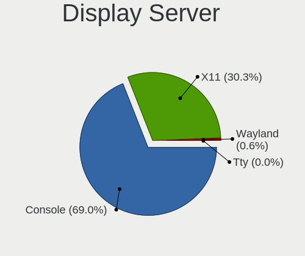
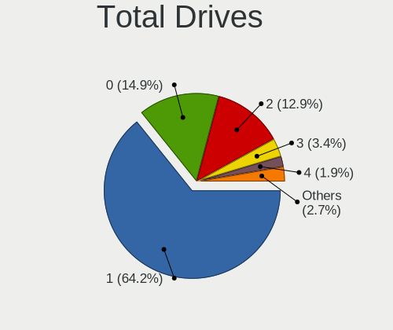
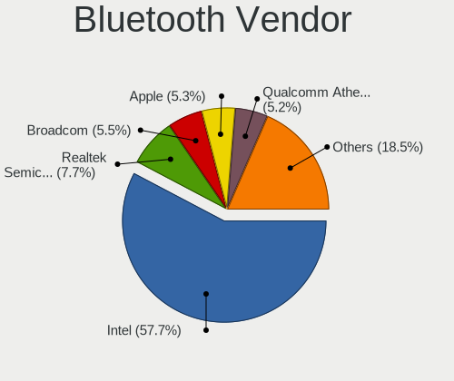
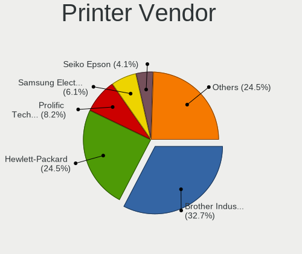

BSD - Tested Hardware & Statistics
----------------------------------

A project to collect tested hardware configurations for BSD.

Anyone can contribute to this report by the [hw-probe](https://github.com/linuxhw/hw-probe/blob/master/INSTALL.BSD.md) tool:

    hw-probe -all -upload

Please contribute! Especially if your hardware is rare.

This is a report for all computer types. See also reports for [desktops](/Desktop/README.md) and [notebooks](/Notebook/README.md).

OS-specific reports: [FreeBSD](/Dist/FreeBSD), [GhostBSD](/Dist/GhostBSD), [helloSystem](/Dist/helloSystem), [NetBSD](/Dist/NetBSD), [NomadBSD](/Dist/NomadBSD), [OpenBSD](/Dist/OpenBSD), [OPNsense](/Dist/OPNsense), [pfSense](/Dist/pfSense), [TrueNAS](/Dist/TrueNAS).

This report is for real hardware. Report for virtual hardware: [TestDays_VE](https://github.com/bsdhw/TestDays_VE)

Contents
--------

* [ Test Cases ](#test-cases)

* [ System ](#system)
  - [ OS                       ](#os)
  - [ OS Family                ](#os-family)
  - [ Arch                     ](#arch)
  - [ DE                       ](#de)
  - [ Display Server           ](#display-server)
  - [ Display Manager          ](#display-manager)
  - [ OS Lang                  ](#os-lang)
  - [ Boot Mode                ](#boot-mode)
  - [ Filesystem               ](#filesystem)
  - [ Part. scheme             ](#part-scheme)

* [ Board ](#board)
  - [ Vendor                   ](#vendor)
  - [ Model                    ](#model)
  - [ Model Family             ](#model-family)
  - [ MFG Year                 ](#mfg-year)
  - [ Form Factor              ](#form-factor)
  - [ Coreboot                 ](#coreboot)
  - [ RAM Size                 ](#ram-size)
  - [ RAM Used                 ](#ram-used)
  - [ Total Drives             ](#total-drives)
  - [ Has CD-ROM               ](#has-cd-rom)
  - [ Has Ethernet             ](#has-ethernet)
  - [ Has WiFi                 ](#has-wifi)
  - [ Has Bluetooth            ](#has-bluetooth)

* [ Location ](#location)
  - [ Country                  ](#country)
  - [ City                     ](#city)

* [ Drives ](#drives)
  - [ Drive Vendor             ](#drive-vendor)
  - [ Drive Model              ](#drive-model)
  - [ HDD Vendor               ](#hdd-vendor)
  - [ SSD Vendor               ](#ssd-vendor)
  - [ Drive Kind               ](#drive-kind)
  - [ Drive Connector          ](#drive-connector)
  - [ Drive Size               ](#drive-size)
  - [ Space Total              ](#space-total)
  - [ Space Used               ](#space-used)
  - [ Malfunc. Drives          ](#malfunc-drives)
  - [ Malfunc. Drive Vendor    ](#malfunc-drive-vendor)
  - [ Malfunc. HDD Vendor      ](#malfunc-hdd-vendor)
  - [ Malfunc. Drive Kind      ](#malfunc-drive-kind)
  - [ Failed Drives            ](#failed-drives)
  - [ Failed Drive Vendor      ](#failed-drive-vendor)
  - [ Drive Status             ](#drive-status)

* [ Storage controller ](#storage-controller)
  - [ Storage Vendor           ](#storage-vendor)
  - [ Storage Model            ](#storage-model)
  - [ Storage Kind             ](#storage-kind)

* [ Processor ](#processor)
  - [ CPU Vendor               ](#cpu-vendor)
  - [ CPU Model                ](#cpu-model)
  - [ CPU Model Family         ](#cpu-model-family)
  - [ CPU Cores                ](#cpu-cores)
  - [ CPU Sockets              ](#cpu-sockets)
  - [ CPU Threads              ](#cpu-threads)
  - [ CPU Microarch            ](#cpu-microarch)

* [ Graphics ](#graphics)
  - [ GPU Vendor               ](#gpu-vendor)
  - [ GPU Model                ](#gpu-model)
  - [ GPU Combo                ](#gpu-combo)
  - [ GPU Driver               ](#gpu-driver)
  - [ GPU Memory               ](#gpu-memory)

* [ Monitor ](#monitor)
  - [ Monitor Vendor           ](#monitor-vendor)
  - [ Monitor Model            ](#monitor-model)
  - [ Monitor Resolution       ](#monitor-resolution)
  - [ Monitor Diagonal         ](#monitor-diagonal)
  - [ Monitor Width            ](#monitor-width)
  - [ Aspect Ratio             ](#aspect-ratio)
  - [ Monitor Area             ](#monitor-area)
  - [ Pixel Density            ](#pixel-density)
  - [ Multiple Monitors        ](#multiple-monitors)

* [ Network ](#network)
  - [ Net Controller Vendor    ](#net-controller-vendor)
  - [ Net Controller Model     ](#net-controller-model)
  - [ Wireless Vendor          ](#wireless-vendor)
  - [ Wireless Model           ](#wireless-model)
  - [ Ethernet Vendor          ](#ethernet-vendor)
  - [ Ethernet Model           ](#ethernet-model)
  - [ Net Controller Kind      ](#net-controller-kind)
  - [ Used Controller          ](#used-controller)
  - [ NICs                     ](#nics)
  - [ IPv6                     ](#ipv6)

* [ Bluetooth ](#bluetooth)
  - [ Bluetooth Vendor         ](#bluetooth-vendor)
  - [ Bluetooth Model          ](#bluetooth-model)

* [ Sound ](#sound)
  - [ Sound Vendor             ](#sound-vendor)
  - [ Sound Model              ](#sound-model)

* [ Memory ](#memory)
  - [ Memory Vendor            ](#memory-vendor)
  - [ Memory Model             ](#memory-model)
  - [ Memory Kind              ](#memory-kind)
  - [ Memory Form Factor       ](#memory-form-factor)
  - [ Memory Size              ](#memory-size)
  - [ Memory Speed             ](#memory-speed)

* [ Printers & scanners ](#printers--scanners)
  - [ Printer Vendor           ](#printer-vendor)
  - [ Printer Model            ](#printer-model)
  - [ Scanner Vendor           ](#scanner-vendor)
  - [ Scanner Model            ](#scanner-model)

* [ Camera ](#camera)
  - [ Camera Vendor            ](#camera-vendor)
  - [ Camera Model             ](#camera-model)

* [ Security ](#security)
  - [ Fingerprint Vendor       ](#fingerprint-vendor)
  - [ Fingerprint Model        ](#fingerprint-model)
  - [ Chipcard Vendor          ](#chipcard-vendor)
  - [ Chipcard Model           ](#chipcard-model)

* [ Unsupported ](#unsupported)
  - [ Unsupported Devices      ](#unsupported-devices)
  - [ Unsupported Device Types ](#unsupported-device-types)

Test Cases
----------

Total: 23164

| Vendor        | Model                       | Form-Factor | Probe                                                     | Date         |
|---------------|-----------------------------|-------------|-----------------------------------------------------------|--------------|
| Protectli     | FW2B                        | Desktop     | [ed7bd1dea3](https://bsd-hardware.info/?probe=ed7bd1dea3) | May 09, 2024 |
| Intel         | Q3XXG4-P V1.0               | Desktop     | [152c1f421c](https://bsd-hardware.info/?probe=152c1f421c) | May 09, 2024 |
| Acer          | TravelMate B118-M           | Notebook    | [68d9d26fe5](https://bsd-hardware.info/?probe=68d9d26fe5) | May 09, 2024 |
| Protectli     | VP46xx                      | Desktop     | [e54efb8b1c](https://bsd-hardware.info/?probe=e54efb8b1c) | May 09, 2024 |
| GoWin Solu... | R86S                        | Desktop     | [1f282cde95](https://bsd-hardware.info/?probe=1f282cde95) | May 09, 2024 |
| Unknown       | Unknown                     | Desktop     | [086d24f16e](https://bsd-hardware.info/?probe=086d24f16e) | May 08, 2024 |
| Acer          | TravelMate B118-M           | Notebook    | [216637ad84](https://bsd-hardware.info/?probe=216637ad84) | May 08, 2024 |
| Unknown       | Unknown                     | Desktop     | [4680d0dfbf](https://bsd-hardware.info/?probe=4680d0dfbf) | May 08, 2024 |
| ASUSTek       | ProArt B550-CREATOR         | Desktop     | [c23ee67c69](https://bsd-hardware.info/?probe=c23ee67c69) | May 08, 2024 |
| Cisco         | C170 A0                     | Desktop     | [7f12a75d26](https://bsd-hardware.info/?probe=7f12a75d26) | May 08, 2024 |
| Dell          | 0WMJ54 A01                  | Desktop     | [89c2d124bf](https://bsd-hardware.info/?probe=89c2d124bf) | May 08, 2024 |
| BROUNION      | R86S                        | Desktop     | [752d83911f](https://bsd-hardware.info/?probe=752d83911f) | May 08, 2024 |
| Lenovo        | ThinkPad T530 2394EE9       | Notebook    | [9bc81955aa](https://bsd-hardware.info/?probe=9bc81955aa) | May 08, 2024 |
| Lenovo        | ThinkPad T530 2394EE9       | Notebook    | [651bd2de24](https://bsd-hardware.info/?probe=651bd2de24) | May 08, 2024 |
| Dell          | 0XCR8D A02                  | Desktop     | [bbb91f550d](https://bsd-hardware.info/?probe=bbb91f550d) | May 08, 2024 |
| Protectli     | VP2420                      | Desktop     | [3f72c87441](https://bsd-hardware.info/?probe=3f72c87441) | May 08, 2024 |
| HP            | 83EE                        | Desktop     | [c2a0b11bfa](https://bsd-hardware.info/?probe=c2a0b11bfa) | May 08, 2024 |
| Unknown       | Unknown                     | Desktop     | [0aee6a395a](https://bsd-hardware.info/?probe=0aee6a395a) | May 08, 2024 |
| Unknown       | Unknown                     | Desktop     | [d6164af1c4](https://bsd-hardware.info/?probe=d6164af1c4) | May 08, 2024 |
| Protectli     | FW6E                        | Desktop     | [eaf305f5e2](https://bsd-hardware.info/?probe=eaf305f5e2) | May 08, 2024 |
| Unknown       | Unknown                     | Desktop     | [d0c4d23cbf](https://bsd-hardware.info/?probe=d0c4d23cbf) | May 08, 2024 |
| Dell          | 02K9CR A02                  | Desktop     | [dbac1d87ef](https://bsd-hardware.info/?probe=dbac1d87ef) | May 07, 2024 |
| Alienware     | Area-51m A00                | Notebook    | [53d5d4eb1e](https://bsd-hardware.info/?probe=53d5d4eb1e) | May 07, 2024 |
| Protectli     | VP2420                      | Desktop     | [9c20710e0a](https://bsd-hardware.info/?probe=9c20710e0a) | May 07, 2024 |
| Unknown       | X133                        | Notebook    | [524b7e6d8e](https://bsd-hardware.info/?probe=524b7e6d8e) | May 07, 2024 |
| AMI           | Aptio CRB                   | Mini pc     | [a10175de86](https://bsd-hardware.info/?probe=a10175de86) | May 07, 2024 |
| Dell          | XPS 13 9360                 | Notebook    | [c9ad91fc61](https://bsd-hardware.info/?probe=c9ad91fc61) | May 07, 2024 |
| Advantech     | NAMB-3250 A102-1            | Desktop     | [0eaf743c54](https://bsd-hardware.info/?probe=0eaf743c54) | May 07, 2024 |
| Lenovo        | ThinkPad X1 Nano Gen 1 2... | Notebook    | [b97dcbade6](https://bsd-hardware.info/?probe=b97dcbade6) | May 07, 2024 |
| HP            | ProLiant DL360 G7           | Server      | [b2546ea49e](https://bsd-hardware.info/?probe=b2546ea49e) | May 07, 2024 |
| Lenovo        | ThinkPad W520 4284GZ1       | Notebook    | [0990e7253e](https://bsd-hardware.info/?probe=0990e7253e) | May 07, 2024 |
| Acer          | Aspire R3-131T              | Notebook    | [dec4102ec0](https://bsd-hardware.info/?probe=dec4102ec0) | May 07, 2024 |
| Supermicro    | X10SBA-LA                   | Server      | [8c25508656](https://bsd-hardware.info/?probe=8c25508656) | May 07, 2024 |
| AAEON         | FWS-2365 V1.0               | Desktop     | [e7f5d7ff38](https://bsd-hardware.info/?probe=e7f5d7ff38) | May 07, 2024 |
| Protectli     | FW6 Ver                     | Desktop     | [b56fbf51c6](https://bsd-hardware.info/?probe=b56fbf51c6) | May 07, 2024 |
| Unknown       | Unknown                     | Desktop     | [30cc9d07af](https://bsd-hardware.info/?probe=30cc9d07af) | May 07, 2024 |
| Dell          | 072T6D A01                  | Server      | [a7a95f387b](https://bsd-hardware.info/?probe=a7a95f387b) | May 07, 2024 |
| Dell          | 0GU083 A00                  | Desktop     | [fbb75b4cfd](https://bsd-hardware.info/?probe=fbb75b4cfd) | May 07, 2024 |
| Lenovo        | ThinkCentre M58 7360EUU     | Desktop     | [f84d111995](https://bsd-hardware.info/?probe=f84d111995) | May 07, 2024 |
| Dell          | 0DR845                      | Desktop     | [03e1ebc97e](https://bsd-hardware.info/?probe=03e1ebc97e) | May 07, 2024 |
| Protectli     | FW2B                        | Desktop     | [8a55fe9d07](https://bsd-hardware.info/?probe=8a55fe9d07) | May 07, 2024 |
| Unknown       | QDNV01                      | Desktop     | [8926d1c8f1](https://bsd-hardware.info/?probe=8926d1c8f1) | May 07, 2024 |
| Unknown       | Unknown                     | Desktop     | [6fad0f3ec7](https://bsd-hardware.info/?probe=6fad0f3ec7) | May 07, 2024 |
| Apple         | Mac-F221BEC8                | Desktop     | [79c4a2608c](https://bsd-hardware.info/?probe=79c4a2608c) | May 07, 2024 |
| Gigabyte      | P55-USB3                    | Desktop     | [9024f0074b](https://bsd-hardware.info/?probe=9024f0074b) | May 07, 2024 |
| Supermicro    | X10SLH-N6-ST031             | Server      | [e6c86b7eb3](https://bsd-hardware.info/?probe=e6c86b7eb3) | May 06, 2024 |
| ASUSTek       | PRIME Z590M-PLUS            | Desktop     | [034c626a7f](https://bsd-hardware.info/?probe=034c626a7f) | May 06, 2024 |
| Dell          | 0F0XJ6 A00                  | Server      | [c049ffad9d](https://bsd-hardware.info/?probe=c049ffad9d) | May 06, 2024 |
| Unknown       | Unknown                     | Desktop     | [676aa9858a](https://bsd-hardware.info/?probe=676aa9858a) | May 06, 2024 |
| HP            | 8054                        | Desktop     | [15da4dbc3e](https://bsd-hardware.info/?probe=15da4dbc3e) | May 06, 2024 |
| HP            | 8054                        | Desktop     | [42143b7763](https://bsd-hardware.info/?probe=42143b7763) | May 06, 2024 |
| HP            | 8054                        | Desktop     | [89f224ab82](https://bsd-hardware.info/?probe=89f224ab82) | May 06, 2024 |
| Dell          | 0DFRFW A01                  | Desktop     | [4532391ffd](https://bsd-hardware.info/?probe=4532391ffd) | May 06, 2024 |
| ASUSTek       | P10S-C Series               | Desktop     | [11db8e3f1e](https://bsd-hardware.info/?probe=11db8e3f1e) | May 06, 2024 |
| ASUSTek       | PRIME H370M-PLUS            | Desktop     | [1f97d380ed](https://bsd-hardware.info/?probe=1f97d380ed) | May 06, 2024 |
| Unknown       | Unknown                     | Desktop     | [b85bfd579d](https://bsd-hardware.info/?probe=b85bfd579d) | May 06, 2024 |
| AZW           | U59                         | Desktop     | [d900403d1a](https://bsd-hardware.info/?probe=d900403d1a) | May 06, 2024 |
| Unknown       | Unknown                     | Firewall    | [f480571196](https://bsd-hardware.info/?probe=f480571196) | May 06, 2024 |
| Unknown       | Unknown                     | Firewall    | [121ff6feae](https://bsd-hardware.info/?probe=121ff6feae) | May 06, 2024 |
| MSI           | MS-7097                     | Desktop     | [df5c7407fd](https://bsd-hardware.info/?probe=df5c7407fd) | May 06, 2024 |
| ZOTAC         | ZBOX-EN760                  | Mini pc     | [42edfcecd6](https://bsd-hardware.info/?probe=42edfcecd6) | May 06, 2024 |
| Dell          | 0GXM1W A01                  | Desktop     | [1238d729a7](https://bsd-hardware.info/?probe=1238d729a7) | May 06, 2024 |
| Dell          | 0WMJ54 A01                  | Desktop     | [99b148c21f](https://bsd-hardware.info/?probe=99b148c21f) | May 06, 2024 |
| Unknown       | Unknown                     | Desktop     | [c70960854a](https://bsd-hardware.info/?probe=c70960854a) | May 06, 2024 |
| ASUSTek       | G11CD                       | Desktop     | [e4d4f0e1b2](https://bsd-hardware.info/?probe=e4d4f0e1b2) | May 06, 2024 |
| Unknown       | DH61BR G32662-203           | Desktop     | [f9ebf93574](https://bsd-hardware.info/?probe=f9ebf93574) | May 06, 2024 |
| Deciso        | NetBoard-A10                | Notebook    | [3ae8150618](https://bsd-hardware.info/?probe=3ae8150618) | May 06, 2024 |
| CompuLab      | fitlet2                     | Mini pc     | [18d9d8fdf8](https://bsd-hardware.info/?probe=18d9d8fdf8) | May 06, 2024 |
| AZW           | EQ                          | Desktop     | [edb4b64548](https://bsd-hardware.info/?probe=edb4b64548) | May 06, 2024 |
| HP            | 82F2                        | Desktop     | [7ae2683f3b](https://bsd-hardware.info/?probe=7ae2683f3b) | May 06, 2024 |
| Dell          | 0NW6H5 A00                  | Desktop     | [818fc8022c](https://bsd-hardware.info/?probe=818fc8022c) | May 06, 2024 |
| ASUSTek       | Z97-PRO GAMER               | Desktop     | [02832cd5ca](https://bsd-hardware.info/?probe=02832cd5ca) | May 06, 2024 |
| Protectli     | FW4C Ver                    | Desktop     | [4e0f235713](https://bsd-hardware.info/?probe=4e0f235713) | May 06, 2024 |
| Dell          | Precision 7560              | Notebook    | [62956576cd](https://bsd-hardware.info/?probe=62956576cd) | May 06, 2024 |
| HP            | 83EC                        | Desktop     | [85d2a6764b](https://bsd-hardware.info/?probe=85d2a6764b) | May 06, 2024 |
| ASUSTek       | PRIME H370M-PLUS            | Desktop     | [1be813a788](https://bsd-hardware.info/?probe=1be813a788) | May 06, 2024 |
| Lenovo        | ThinkPad X240 20AMS3FY00    | Notebook    | [1dc74d60e6](https://bsd-hardware.info/?probe=1dc74d60e6) | May 06, 2024 |
| Dell          | 03NXH8 A00                  | Mini pc     | [45fc618aff](https://bsd-hardware.info/?probe=45fc618aff) | May 06, 2024 |
| Dell          | 0GXM1W A01                  | Desktop     | [f20a5dbc2b](https://bsd-hardware.info/?probe=f20a5dbc2b) | May 06, 2024 |
| Supermicro    | A2SDi-4C-HLN4F              | Server      | [a2870e073a](https://bsd-hardware.info/?probe=a2870e073a) | May 05, 2024 |
| ZOTAC         | ZBOX-MI522NANO/MI542NANO    | Mini pc     | [76c2ddbad2](https://bsd-hardware.info/?probe=76c2ddbad2) | May 05, 2024 |
| MSI           | MS-7369                     | Desktop     | [65686a6412](https://bsd-hardware.info/?probe=65686a6412) | May 05, 2024 |
| Protectli     | VP2420                      | Desktop     | [dd7edbac6d](https://bsd-hardware.info/?probe=dd7edbac6d) | May 05, 2024 |
| Lenovo        | 500w Gen 3 82J3             | Convertible | [02317ba035](https://bsd-hardware.info/?probe=02317ba035) | May 05, 2024 |
| Apple         | MacBookPro8,1               | Notebook    | [23e113910f](https://bsd-hardware.info/?probe=23e113910f) | May 05, 2024 |
| Apple         | MacBookPro8,1               | Notebook    | [55560acf02](https://bsd-hardware.info/?probe=55560acf02) | May 05, 2024 |
| Lenovo        | ThinkPad L420 7827W27       | Notebook    | [5231c79a27](https://bsd-hardware.info/?probe=5231c79a27) | May 05, 2024 |
| Apple         | MacBook4,1                  | Notebook    | [5916d9274d](https://bsd-hardware.info/?probe=5916d9274d) | May 05, 2024 |
| Intel         | MAHOBAY                     | Desktop     | [dfe3417cfb](https://bsd-hardware.info/?probe=dfe3417cfb) | May 05, 2024 |
| Lenovo        | 3136 SDK0J40697 WIN 3305... | Mini pc     | [bad0f0a312](https://bsd-hardware.info/?probe=bad0f0a312) | May 05, 2024 |
| Techvision    | TVI7309X B0                 | Desktop     | [bfab3dbc5c](https://bsd-hardware.info/?probe=bfab3dbc5c) | May 05, 2024 |
| SHANGZHAOY... | B85M-PRO V1.1               | Desktop     | [873fd32471](https://bsd-hardware.info/?probe=873fd32471) | May 05, 2024 |
| ASUSTek       | PRIME Z690-P D4             | Desktop     | [e7a48c0ebb](https://bsd-hardware.info/?probe=e7a48c0ebb) | May 05, 2024 |
| Dell          | 0WMJ54 A01                  | Desktop     | [328b32897b](https://bsd-hardware.info/?probe=328b32897b) | May 05, 2024 |
| ZOTAC         | ZBOX-MI522NANO/MI542NANO    | Mini pc     | [20cb6200de](https://bsd-hardware.info/?probe=20cb6200de) | May 05, 2024 |
| AMI           | Aptio CRB                   | Mini pc     | [6541261a86](https://bsd-hardware.info/?probe=6541261a86) | May 05, 2024 |
| HP            | 83E0                        | Desktop     | [63c44781ef](https://bsd-hardware.info/?probe=63c44781ef) | May 05, 2024 |
| MSI           | H81M-P33                    | Desktop     | [db35e993b4](https://bsd-hardware.info/?probe=db35e993b4) | May 05, 2024 |
| ASUSTek       | ROG CROSSHAIR VIII HERO     | Desktop     | [76bd355935](https://bsd-hardware.info/?probe=76bd355935) | May 05, 2024 |
| ASUSTek       | P5Q-E                       | Desktop     | [4e42133f58](https://bsd-hardware.info/?probe=4e42133f58) | May 05, 2024 |
| Lenovo        | ThinkPad P1 Gen 4i 20Y4S... | Notebook    | [f67c0c6b18](https://bsd-hardware.info/?probe=f67c0c6b18) | May 05, 2024 |
| AZW           | EQ                          | Desktop     | [8889cb51a4](https://bsd-hardware.info/?probe=8889cb51a4) | May 05, 2024 |
| Dell          | 0D28YY A00                  | Desktop     | [3d0d226dbc](https://bsd-hardware.info/?probe=3d0d226dbc) | May 05, 2024 |
| Unknown       | Unknown                     | Desktop     | [e504371024](https://bsd-hardware.info/?probe=e504371024) | May 05, 2024 |
| Lenovo        | 312D SDK0J40697 WIN 3305... | Mini pc     | [cb4aeaeea1](https://bsd-hardware.info/?probe=cb4aeaeea1) | May 05, 2024 |
| Protectli     | FW2B                        | Desktop     | [92725f96b8](https://bsd-hardware.info/?probe=92725f96b8) | May 05, 2024 |
| Micro Comp... | Venus series                | Notebook    | [11184b32bb](https://bsd-hardware.info/?probe=11184b32bb) | May 05, 2024 |
| BESSTAR Te... | GB7                         | Mini pc     | [9f494db2bd](https://bsd-hardware.info/?probe=9f494db2bd) | May 04, 2024 |
| Unknown       | Unknown                     | Desktop     | [fd0ae20186](https://bsd-hardware.info/?probe=fd0ae20186) | May 04, 2024 |
| Unknown       | Unknown                     | Desktop     | [5dc8d187ee](https://bsd-hardware.info/?probe=5dc8d187ee) | May 04, 2024 |
| Techvision    | TVI7309X B0                 | Desktop     | [9dc1dd8248](https://bsd-hardware.info/?probe=9dc1dd8248) | May 04, 2024 |
| Lenovo        | ThinkPad X1 Yoga 2nd 20J... | Convertible | [d87059c342](https://bsd-hardware.info/?probe=d87059c342) | May 04, 2024 |
| Lenovo        | ThinkPad X1 Yoga 2nd 20J... | Convertible | [35ab248dd4](https://bsd-hardware.info/?probe=35ab248dd4) | May 04, 2024 |
| Lenovo        | Legion 5 Pro 16ACH6H 82J... | Notebook    | [89a61aca01](https://bsd-hardware.info/?probe=89a61aca01) | May 04, 2024 |
| Lenovo        | ThinkPad T15p Gen 1 20TN... | Notebook    | [5f31e6dc7e](https://bsd-hardware.info/?probe=5f31e6dc7e) | May 04, 2024 |
| Apple         | MacBookPro5,5               | Notebook    | [ffd31a143f](https://bsd-hardware.info/?probe=ffd31a143f) | May 04, 2024 |
| Unknown       | QDNV01                      | Desktop     | [8b77bdf0b8](https://bsd-hardware.info/?probe=8b77bdf0b8) | May 04, 2024 |
| Unknown       | Unknown                     | Desktop     | [c77ff29728](https://bsd-hardware.info/?probe=c77ff29728) | May 04, 2024 |
| CncTion       | N4505-4L B0                 | Desktop     | [077f0f74a5](https://bsd-hardware.info/?probe=077f0f74a5) | May 04, 2024 |
| Panasonic     | CF-54-1                     | Notebook    | [00de332c2c](https://bsd-hardware.info/?probe=00de332c2c) | May 04, 2024 |
| Dell          | Latitude 7390               | Notebook    | [b9b511f4d6](https://bsd-hardware.info/?probe=b9b511f4d6) | May 04, 2024 |
| Intel         | PB-X6000                    | Desktop     | [23a7529eaa](https://bsd-hardware.info/?probe=23a7529eaa) | May 04, 2024 |
| HP            | ZBook 17 G2                 | Notebook    | [8558fc6b60](https://bsd-hardware.info/?probe=8558fc6b60) | May 04, 2024 |
| Gigabyte      | GA-78LMT-S2 sex             | Desktop     | [89beae510f](https://bsd-hardware.info/?probe=89beae510f) | May 04, 2024 |
| Dell          | 03NXH8 A00                  | Mini pc     | [aa51033b7c](https://bsd-hardware.info/?probe=aa51033b7c) | May 03, 2024 |
| Chuwi         | GemiBook Pro                | Notebook    | [2656d00123](https://bsd-hardware.info/?probe=2656d00123) | May 03, 2024 |
| Gigabyte      | P67A-D3-B3                  | Desktop     | [2e71ecd984](https://bsd-hardware.info/?probe=2e71ecd984) | May 03, 2024 |
| Advantech     | NAMB-3250 A102-1            | Desktop     | [708617284b](https://bsd-hardware.info/?probe=708617284b) | May 03, 2024 |
| Dell          | 0MGK50 A02                  | Desktop     | [6f9b5b3cad](https://bsd-hardware.info/?probe=6f9b5b3cad) | May 03, 2024 |
| Dell          | Precision 3571              | Notebook    | [d8015bf7e8](https://bsd-hardware.info/?probe=d8015bf7e8) | May 03, 2024 |
| MSI           | GE75 Raider 10SFS           | Notebook    | [227924f274](https://bsd-hardware.info/?probe=227924f274) | May 03, 2024 |
| ASUSTek       | PRIME B650-PLUS             | Desktop     | [3e01e5ffbf](https://bsd-hardware.info/?probe=3e01e5ffbf) | May 03, 2024 |
| Protectli     | VP6670                      | Desktop     | [a51c988dd7](https://bsd-hardware.info/?probe=a51c988dd7) | May 03, 2024 |
| Panasonic     | CF-52PFPBSFQ                | Notebook    | [48423bbece](https://bsd-hardware.info/?probe=48423bbece) | May 03, 2024 |
| ChangWang     | CW56-58                     | Desktop     | [54250fd5f6](https://bsd-hardware.info/?probe=54250fd5f6) | May 03, 2024 |
| IceWhale T... | ZimaBoard 432 ZMB           | Desktop     | [5064c18402](https://bsd-hardware.info/?probe=5064c18402) | May 03, 2024 |
| Intel         | Q3XXG4-P V1.0               | Desktop     | [e7125777fc](https://bsd-hardware.info/?probe=e7125777fc) | May 03, 2024 |
| ASRock        | X570 Phantom Gaming-ITX/... | Desktop     | [0b900c7694](https://bsd-hardware.info/?probe=0b900c7694) | May 03, 2024 |
| Gigabyte      | Z370P D3-CF                 | Desktop     | [591ac5deba](https://bsd-hardware.info/?probe=591ac5deba) | May 03, 2024 |
| Lenovo        | B40-30 80F1                 | Notebook    | [98be66c2e6](https://bsd-hardware.info/?probe=98be66c2e6) | May 03, 2024 |
| Dell          | 0XCR8D A03                  | Desktop     | [de94ec6929](https://bsd-hardware.info/?probe=de94ec6929) | May 03, 2024 |
| Apple         | Mac-F60DEB81FF30ACF6 Mac... | Desktop     | [5240c726c5](https://bsd-hardware.info/?probe=5240c726c5) | May 03, 2024 |
| Lanner        | FW-7543 B-GA                | Desktop     | [d999a95489](https://bsd-hardware.info/?probe=d999a95489) | May 03, 2024 |
| Protectli     | FW4B                        | Desktop     | [db66e06618](https://bsd-hardware.info/?probe=db66e06618) | May 02, 2024 |
| Chuwi         | LarkBox X                   | Mini pc     | [4c54b5b3e0](https://bsd-hardware.info/?probe=4c54b5b3e0) | May 02, 2024 |
| ASUSTek       | TUF Gaming A620-PRO WIFI    | Desktop     | [a186355a65](https://bsd-hardware.info/?probe=a186355a65) | May 02, 2024 |
| Apple         | Mac-F60DEB81FF30ACF6 Mac... | Desktop     | [db2e2d1fbc](https://bsd-hardware.info/?probe=db2e2d1fbc) | May 02, 2024 |
| IceWhale T... | ZimaBoard 832 ZMB           | Desktop     | [a4517b9363](https://bsd-hardware.info/?probe=a4517b9363) | May 02, 2024 |
| MSI           | B360M BAZOOKA               | Desktop     | [d33325e752](https://bsd-hardware.info/?probe=d33325e752) | May 02, 2024 |
| MSI           | GE75 Raider 10SFS           | Notebook    | [cda74e2f91](https://bsd-hardware.info/?probe=cda74e2f91) | May 02, 2024 |
| PC Engines    | APU2                        | Desktop     | [5429fb29b1](https://bsd-hardware.info/?probe=5429fb29b1) | May 02, 2024 |
| Dell          | 0CNWVK A00                  | Desktop     | [3c90466a0a](https://bsd-hardware.info/?probe=3c90466a0a) | May 02, 2024 |
| Unknown       | Unknown                     | Desktop     | [da95fe1264](https://bsd-hardware.info/?probe=da95fe1264) | May 02, 2024 |
| Unknown       | Unknown                     | Desktop     | [bd55b95686](https://bsd-hardware.info/?probe=bd55b95686) | May 02, 2024 |
| Dell          | 042P49 A01                  | Desktop     | [2e2fbfee01](https://bsd-hardware.info/?probe=2e2fbfee01) | May 02, 2024 |
| Dell          | Inspiron 15-3552            | Notebook    | [0a47152038](https://bsd-hardware.info/?probe=0a47152038) | May 02, 2024 |
| Quanta        | S5HF MB 31S5HMB0010         | Server      | [cdfd36bbab](https://bsd-hardware.info/?probe=cdfd36bbab) | May 02, 2024 |
| Dell          | Precision 7560              | Notebook    | [2f6e45641d](https://bsd-hardware.info/?probe=2f6e45641d) | May 02, 2024 |
| Unknown       | Unknown                     | Desktop     | [d99dea58b6](https://bsd-hardware.info/?probe=d99dea58b6) | May 02, 2024 |
| Apple         | PowerBook6,8                | Notebook    | [fa66040f75](https://bsd-hardware.info/?probe=fa66040f75) | May 02, 2024 |
| Unknown       | QDNV01                      | Desktop     | [058c7d1a94](https://bsd-hardware.info/?probe=058c7d1a94) | May 02, 2024 |
| Dell          | 0PC5F7 A00                  | Desktop     | [25be1b099a](https://bsd-hardware.info/?probe=25be1b099a) | May 02, 2024 |
| Gigabyte      | H61M-S2PV                   | Desktop     | [dec458ffdf](https://bsd-hardware.info/?probe=dec458ffdf) | May 02, 2024 |
| ASUSTek       | X202E                       | Notebook    | [0ed385a36d](https://bsd-hardware.info/?probe=0ed385a36d) | May 02, 2024 |
| Supermicro    | X11SSZ-TLN4F                | Server      | [a25c90248c](https://bsd-hardware.info/?probe=a25c90248c) | May 02, 2024 |
| AZW           | EQ                          | Desktop     | [6fb8bd4d4a](https://bsd-hardware.info/?probe=6fb8bd4d4a) | May 02, 2024 |
| Apple         | MacBookAir6,2               | Notebook    | [a9ec0cba48](https://bsd-hardware.info/?probe=a9ec0cba48) | May 02, 2024 |
| GoWin Solu... | R86S                        | Desktop     | [b43368e560](https://bsd-hardware.info/?probe=b43368e560) | May 02, 2024 |
| Supermicro    | X10DRH-iT                   | Server      | [87e2dda1f8](https://bsd-hardware.info/?probe=87e2dda1f8) | May 02, 2024 |
| Dell          | Latitude 7490               | Notebook    | [e55889ef1e](https://bsd-hardware.info/?probe=e55889ef1e) | May 02, 2024 |
| Dell          | 0PC5F7 A00                  | Desktop     | [217f8e63db](https://bsd-hardware.info/?probe=217f8e63db) | May 01, 2024 |
| Shuttle       | DL30N                       | Desktop     | [5218f08e52](https://bsd-hardware.info/?probe=5218f08e52) | May 01, 2024 |
| HP            | 8062                        | Desktop     | [2669931060](https://bsd-hardware.info/?probe=2669931060) | May 01, 2024 |
| AWOW          | AK10                        | Desktop     | [a8fbc35162](https://bsd-hardware.info/?probe=a8fbc35162) | May 01, 2024 |
| Dell          | 01RPWC A00                  | Mini pc     | [75a754faa7](https://bsd-hardware.info/?probe=75a754faa7) | May 01, 2024 |
| Micro Comp... | Venus series                | Notebook    | [0fe27dcf5d](https://bsd-hardware.info/?probe=0fe27dcf5d) | May 01, 2024 |
| HP            | 802E                        | Desktop     | [0e16d56660](https://bsd-hardware.info/?probe=0e16d56660) | May 01, 2024 |
| HP            | 255 G8 Notebook PC          | Notebook    | [4878c18c8a](https://bsd-hardware.info/?probe=4878c18c8a) | May 01, 2024 |
| AMI           | Aptio CRB                   | Mini pc     | [67d936ebd3](https://bsd-hardware.info/?probe=67d936ebd3) | May 01, 2024 |
| Barracuda ... | Barracuda NG Firewall F3... | Firewall    | [e6b12d955b](https://bsd-hardware.info/?probe=e6b12d955b) | May 01, 2024 |
| Unknown       | QDNV01                      | Desktop     | [1fc82bb34b](https://bsd-hardware.info/?probe=1fc82bb34b) | May 01, 2024 |
| Gigabyte      | B760I AORUS PRO DDR4        | Desktop     | [f6606ff3aa](https://bsd-hardware.info/?probe=f6606ff3aa) | May 01, 2024 |
| MSI           | AM1I                        | Desktop     | [148d52d171](https://bsd-hardware.info/?probe=148d52d171) | May 01, 2024 |
| Intel         | Q3XXG4-P V1.0               | Desktop     | [ae53040229](https://bsd-hardware.info/?probe=ae53040229) | May 01, 2024 |
| Sophos        | SG                          | Firewall    | [aa116c84a7](https://bsd-hardware.info/?probe=aa116c84a7) | May 01, 2024 |
| Intel         | NUC10i3FNB M38070-307       | Mini pc     | [671adbdfc4](https://bsd-hardware.info/?probe=671adbdfc4) | May 01, 2024 |
| Lenovo        | ThinkPad E490 20N9S48S00    | Notebook    | [f70fb4bd81](https://bsd-hardware.info/?probe=f70fb4bd81) | May 01, 2024 |
| Protectli     | VP2410                      | Desktop     | [53101f66d2](https://bsd-hardware.info/?probe=53101f66d2) | May 01, 2024 |
| Intel         | Q3XXG4-P V1.0               | Desktop     | [be7761bc67](https://bsd-hardware.info/?probe=be7761bc67) | May 01, 2024 |
| GoWin Solu... | R86S                        | Desktop     | [8f1277d3c5](https://bsd-hardware.info/?probe=8f1277d3c5) | May 01, 2024 |
| Deciso        | NetBoard-A20                | Notebook    | [c04565ec24](https://bsd-hardware.info/?probe=c04565ec24) | Apr 30, 2024 |
| Lenovo        | ThinkPad X1 Carbon Gen 1... | Notebook    | [49d6f53542](https://bsd-hardware.info/?probe=49d6f53542) | Apr 30, 2024 |
| Dell          | 05XGC8 A01                  | Desktop     | [d463acff9f](https://bsd-hardware.info/?probe=d463acff9f) | Apr 30, 2024 |
| Dell          | XPS 13 9360                 | Notebook    | [26185f189e](https://bsd-hardware.info/?probe=26185f189e) | Apr 30, 2024 |
| PC Engines    | APU2                        | Desktop     | [a058cd5f63](https://bsd-hardware.info/?probe=a058cd5f63) | Apr 30, 2024 |
| ASRockRack    | EPYC3101D4I-2T              | Desktop     | [15e26ac086](https://bsd-hardware.info/?probe=15e26ac086) | Apr 30, 2024 |
| Shenzhen M... | PHBRC                       | Mini pc     | [f657134100](https://bsd-hardware.info/?probe=f657134100) | Apr 30, 2024 |
| Dell          | 04Y8V0 A02                  | Desktop     | [09a2e96ee1](https://bsd-hardware.info/?probe=09a2e96ee1) | Apr 30, 2024 |
| ASUSTek       | VM62N                       | Desktop     | [d2ff0c5dcb](https://bsd-hardware.info/?probe=d2ff0c5dcb) | Apr 30, 2024 |
| ASUSTek       | VM62N                       | Desktop     | [fbff6f23c7](https://bsd-hardware.info/?probe=fbff6f23c7) | Apr 30, 2024 |
| Unknown       | Unknown                     | Notebook    | [3c24648eb3](https://bsd-hardware.info/?probe=3c24648eb3) | Apr 30, 2024 |
| Deciso        | NetBoard-A20                | Notebook    | [1b9bcc1b41](https://bsd-hardware.info/?probe=1b9bcc1b41) | Apr 30, 2024 |
| Intel         | YC-4L-002                   | Desktop     | [ac058ece5c](https://bsd-hardware.info/?probe=ac058ece5c) | Apr 30, 2024 |
| Lenovo        | ThinkPad T470 20HES18R05    | Notebook    | [9b76000646](https://bsd-hardware.info/?probe=9b76000646) | Apr 30, 2024 |
| Protectli     | FW4C Ver                    | Desktop     | [de3c7e60bd](https://bsd-hardware.info/?probe=de3c7e60bd) | Apr 30, 2024 |
| Unknown       | Unknown                     | Desktop     | [39e9c3ddd2](https://bsd-hardware.info/?probe=39e9c3ddd2) | Apr 30, 2024 |
| ASUSTek       | Z170 PRO GAMING             | Desktop     | [72deae70f8](https://bsd-hardware.info/?probe=72deae70f8) | Apr 29, 2024 |
| ASRock        | B550 Phantom Gaming 4       | Desktop     | [a5ad695e41](https://bsd-hardware.info/?probe=a5ad695e41) | Apr 29, 2024 |
| HP            | EliteBook 2560p             | Notebook    | [bb6303ed5b](https://bsd-hardware.info/?probe=bb6303ed5b) | Apr 29, 2024 |
| Unknown       | Unknown                     | Desktop     | [db28c45bdd](https://bsd-hardware.info/?probe=db28c45bdd) | Apr 29, 2024 |
| HP            | 829E                        | Mini pc     | [7f58256c41](https://bsd-hardware.info/?probe=7f58256c41) | Apr 29, 2024 |
| Dell          | 04YP6J A00                  | Desktop     | [92b5c39349](https://bsd-hardware.info/?probe=92b5c39349) | Apr 29, 2024 |
| Unknown       | Unknown                     | Desktop     | [5c07afd3bb](https://bsd-hardware.info/?probe=5c07afd3bb) | Apr 29, 2024 |
| Supermicro    | X11SCL-IF                   | Server      | [93394181dc](https://bsd-hardware.info/?probe=93394181dc) | Apr 29, 2024 |
| Dell          | 0DRG19 A00                  | Mini pc     | [ef0b68ce3a](https://bsd-hardware.info/?probe=ef0b68ce3a) | Apr 29, 2024 |
| PC Engines    | APU2                        | Desktop     | [a6953a27eb](https://bsd-hardware.info/?probe=a6953a27eb) | Apr 29, 2024 |
| AMI           | Aptio CRB                   | Mini pc     | [2e0d777f8c](https://bsd-hardware.info/?probe=2e0d777f8c) | Apr 29, 2024 |
| AZW           | EQ                          | Desktop     | [cb3a9cfebf](https://bsd-hardware.info/?probe=cb3a9cfebf) | Apr 29, 2024 |
| ASRock        | Q1900M                      | Desktop     | [7f61d481a6](https://bsd-hardware.info/?probe=7f61d481a6) | Apr 29, 2024 |
| Acer          | Aspire 5551                 | Notebook    | [ee15a7d2b5](https://bsd-hardware.info/?probe=ee15a7d2b5) | Apr 29, 2024 |
| ASRock        | Z87M Pro4                   | Desktop     | [91a487bad5](https://bsd-hardware.info/?probe=91a487bad5) | Apr 29, 2024 |
| Dell          | 07N90W A02                  | Desktop     | [f0520bbeb9](https://bsd-hardware.info/?probe=f0520bbeb9) | Apr 29, 2024 |
| Lenovo        | ThinkPad T410 2537N24       | Notebook    | [04370189ed](https://bsd-hardware.info/?probe=04370189ed) | Apr 29, 2024 |
| DFI           | Unknown                     | Notebook    | [1348838d15](https://bsd-hardware.info/?probe=1348838d15) | Apr 28, 2024 |
| Protectli     | VP2410 10                   | Desktop     | [180e61b28a](https://bsd-hardware.info/?probe=180e61b28a) | Apr 28, 2024 |
| Raspberry ... | Raspberry Pi 5 Model B      | Soc         | [755a7a8614](https://bsd-hardware.info/?probe=755a7a8614) | Apr 28, 2024 |
| PC Engines    | APU2                        | Desktop     | [f18a73e413](https://bsd-hardware.info/?probe=f18a73e413) | Apr 28, 2024 |
| Unknown       | Unknown                     | Desktop     | [e54a161178](https://bsd-hardware.info/?probe=e54a161178) | Apr 28, 2024 |
| Dell          | 04415J A00                  | Mini pc     | [5d60841c52](https://bsd-hardware.info/?probe=5d60841c52) | Apr 28, 2024 |
| Unknown       | Unknown                     | Desktop     | [1c2459184f](https://bsd-hardware.info/?probe=1c2459184f) | Apr 28, 2024 |
| Intel         | X79F1 V2.0                  | Desktop     | [0e973743e4](https://bsd-hardware.info/?probe=0e973743e4) | Apr 28, 2024 |
| Unknown       | Unknown                     | Desktop     | [f3cf18561e](https://bsd-hardware.info/?probe=f3cf18561e) | Apr 28, 2024 |
| Apple         | MacBookAir6,2               | Notebook    | [26a2dbed23](https://bsd-hardware.info/?probe=26a2dbed23) | Apr 28, 2024 |
| Apple         | MacBookAir6,2               | Notebook    | [126d9918f3](https://bsd-hardware.info/?probe=126d9918f3) | Apr 28, 2024 |
| Quantum en... | HackBoard 2                 | Desktop     | [a7b0ea1eca](https://bsd-hardware.info/?probe=a7b0ea1eca) | Apr 28, 2024 |
| Unknown       | Unknown                     | Desktop     | [c4991adac4](https://bsd-hardware.info/?probe=c4991adac4) | Apr 28, 2024 |
| ASRock        | H610M-H2/M.2 D5             | Desktop     | [6ab73f5217](https://bsd-hardware.info/?probe=6ab73f5217) | Apr 28, 2024 |
| Dell          | 05XGC8 A01                  | Desktop     | [346d161a05](https://bsd-hardware.info/?probe=346d161a05) | Apr 28, 2024 |
| Apple         | MacBookAir6,2               | Notebook    | [5bb2644b89](https://bsd-hardware.info/?probe=5bb2644b89) | Apr 28, 2024 |
| HP            | 1632                        | Desktop     | [8ef7e0a099](https://bsd-hardware.info/?probe=8ef7e0a099) | Apr 28, 2024 |
| Lenovo        | ThinkPad A485 20MU000VUS    | Notebook    | [0323476838](https://bsd-hardware.info/?probe=0323476838) | Apr 28, 2024 |
| Unknown       | Unknown                     | Desktop     | [c5e1759317](https://bsd-hardware.info/?probe=c5e1759317) | Apr 28, 2024 |
| Lenovo        | ThinkPad T430 2347GZU       | Notebook    | [f49f1b3ac2](https://bsd-hardware.info/?probe=f49f1b3ac2) | Apr 28, 2024 |
| PC Engines    | APU                         | Desktop     | [7fbd1ae00c](https://bsd-hardware.info/?probe=7fbd1ae00c) | Apr 28, 2024 |
| Unknown       | Unknown                     | Desktop     | [d45b3d4001](https://bsd-hardware.info/?probe=d45b3d4001) | Apr 27, 2024 |
| Fujitsu       | D3313-A1 S26361-D3313-A1    | Desktop     | [ba76589775](https://bsd-hardware.info/?probe=ba76589775) | Apr 27, 2024 |
| Unknown       | Unknown                     | Desktop     | [4da784940c](https://bsd-hardware.info/?probe=4da784940c) | Apr 27, 2024 |
| Winston Ma... | PICO PC PICOPC              | Desktop     | [a0066d8a7c](https://bsd-hardware.info/?probe=a0066d8a7c) | Apr 27, 2024 |
| AZW           | EQ                          | Desktop     | [5f2a5f1314](https://bsd-hardware.info/?probe=5f2a5f1314) | Apr 27, 2024 |
| Lenovo        | 3743 NOK                    | Desktop     | [4b8389c575](https://bsd-hardware.info/?probe=4b8389c575) | Apr 27, 2024 |
| Seeed Stud... | ODYSSEY-X86J4105 SD-BS-C... | Desktop     | [6da31bada9](https://bsd-hardware.info/?probe=6da31bada9) | Apr 27, 2024 |
| Shenzhen M... | AHWSA                       | Desktop     | [eb205801e7](https://bsd-hardware.info/?probe=eb205801e7) | Apr 27, 2024 |
| Lenovo        | Legion Y7000P 81HC          | Notebook    | [3dff76a9dd](https://bsd-hardware.info/?probe=3dff76a9dd) | Apr 27, 2024 |
| HP            | 2B52                        | Desktop     | [b765a60a21](https://bsd-hardware.info/?probe=b765a60a21) | Apr 27, 2024 |
| Unknown       | QDNV01                      | Desktop     | [67634593ee](https://bsd-hardware.info/?probe=67634593ee) | Apr 27, 2024 |
| HP            | ZBook 15 G6                 | Notebook    | [95aadf59d9](https://bsd-hardware.info/?probe=95aadf59d9) | Apr 27, 2024 |
| Unknown       | Unknown                     | Desktop     | [7d9ef3501e](https://bsd-hardware.info/?probe=7d9ef3501e) | Apr 27, 2024 |
| Barracuda ... | Barracuda NG Firewall F2... | Firewall    | [f35c32132a](https://bsd-hardware.info/?probe=f35c32132a) | Apr 27, 2024 |
| ASUSTek       | K43E                        | Notebook    | [19049c7899](https://bsd-hardware.info/?probe=19049c7899) | Apr 27, 2024 |
| HP            | 859B                        | Desktop     | [5d8024a661](https://bsd-hardware.info/?probe=5d8024a661) | Apr 27, 2024 |
| Unknown       | Unknown                     | Desktop     | [2945a5ee0f](https://bsd-hardware.info/?probe=2945a5ee0f) | Apr 27, 2024 |
| Lenovo        | 319E SEK0T35577 IOT 4247... | Mini pc     | [ef26dc1d85](https://bsd-hardware.info/?probe=ef26dc1d85) | Apr 27, 2024 |
| Dell          | 0KYJ8C A00                  | Desktop     | [7a7c8ece3a](https://bsd-hardware.info/?probe=7a7c8ece3a) | Apr 27, 2024 |
| MSI           | X370 GAMING PRO CARBON      | Desktop     | [688f134478](https://bsd-hardware.info/?probe=688f134478) | Apr 27, 2024 |
| Dell          | 0KYJ8C A00                  | Desktop     | [d35fe4f9ef](https://bsd-hardware.info/?probe=d35fe4f9ef) | Apr 27, 2024 |
| Dell          | 00V62H A01                  | Desktop     | [ac096d436d](https://bsd-hardware.info/?probe=ac096d436d) | Apr 27, 2024 |
| ASRock        | B450M Pro4                  | Desktop     | [4202579f8b](https://bsd-hardware.info/?probe=4202579f8b) | Apr 27, 2024 |
| Shuttle       | FS81                        | Desktop     | [95830b82da](https://bsd-hardware.info/?probe=95830b82da) | Apr 27, 2024 |
| ASUSTek       | P5N32-E SLI                 | Desktop     | [52ac87d342](https://bsd-hardware.info/?probe=52ac87d342) | Apr 27, 2024 |
| Techvision    | TVI7309X B0                 | Desktop     | [d3ade6deae](https://bsd-hardware.info/?probe=d3ade6deae) | Apr 26, 2024 |
| Trigkey       | Green G5                    | Desktop     | [6bad716921](https://bsd-hardware.info/?probe=6bad716921) | Apr 26, 2024 |
| Unknown       | Unknown                     | Desktop     | [2caa0fe8f7](https://bsd-hardware.info/?probe=2caa0fe8f7) | Apr 26, 2024 |
| Unknown       | Unknown                     | Desktop     | [77ad1db6bd](https://bsd-hardware.info/?probe=77ad1db6bd) | Apr 26, 2024 |
| Sophos        | SG                          | Firewall    | [73353cc92d](https://bsd-hardware.info/?probe=73353cc92d) | Apr 26, 2024 |
| AWOW          | AK10                        | Desktop     | [efb7761dc3](https://bsd-hardware.info/?probe=efb7761dc3) | Apr 26, 2024 |
| Lenovo        | Legion Pro 5 16ARX8 82WM    | Notebook    | [1c5398a208](https://bsd-hardware.info/?probe=1c5398a208) | Apr 26, 2024 |
| SJRC          | SJ-ADLN-6L                  | Desktop     | [eba48b51e7](https://bsd-hardware.info/?probe=eba48b51e7) | Apr 26, 2024 |
| HP            | 82A2                        | Desktop     | [32dfbbd624](https://bsd-hardware.info/?probe=32dfbbd624) | Apr 26, 2024 |
| Unknown       | Unknown                     | Desktop     | [1d373fbfcd](https://bsd-hardware.info/?probe=1d373fbfcd) | Apr 26, 2024 |
| Dell          | 02C2CP A03                  | Server      | [44209ce8c9](https://bsd-hardware.info/?probe=44209ce8c9) | Apr 26, 2024 |
| Unknown       | Unknown                     | Desktop     | [5b9d2e7817](https://bsd-hardware.info/?probe=5b9d2e7817) | Apr 26, 2024 |
| Apple         | MacBookAir6,2               | Notebook    | [2b066c44b9](https://bsd-hardware.info/?probe=2b066c44b9) | Apr 26, 2024 |
| Apple         | MacBookAir6,2               | Notebook    | [a206641c60](https://bsd-hardware.info/?probe=a206641c60) | Apr 26, 2024 |
| System76      | Pangolin                    | Notebook    | [d47c9a5d44](https://bsd-hardware.info/?probe=d47c9a5d44) | Apr 26, 2024 |
| Protectli     | VP6670                      | Desktop     | [cb7ab7b3f4](https://bsd-hardware.info/?probe=cb7ab7b3f4) | Apr 25, 2024 |
| Unknown       | Unknown                     | Desktop     | [57fb516839](https://bsd-hardware.info/?probe=57fb516839) | Apr 25, 2024 |
| Hardkernel    | ODROID-H2                   | Desktop     | [5645a7f37e](https://bsd-hardware.info/?probe=5645a7f37e) | Apr 25, 2024 |
| Unknown       | Unknown                     | Desktop     | [122a8465b5](https://bsd-hardware.info/?probe=122a8465b5) | Apr 25, 2024 |
| Silicom       | 80300-0214-G01 R306         | Desktop     | [1fda8df8d0](https://bsd-hardware.info/?probe=1fda8df8d0) | Apr 25, 2024 |
| Dell          | 0D28YY A00                  | Desktop     | [5245da0f7d](https://bsd-hardware.info/?probe=5245da0f7d) | Apr 25, 2024 |
| Unknown       | Unknown                     | Desktop     | [92f9cb26f3](https://bsd-hardware.info/?probe=92f9cb26f3) | Apr 25, 2024 |
| Unknown       | Unknown                     | Desktop     | [e321b6f25e](https://bsd-hardware.info/?probe=e321b6f25e) | Apr 25, 2024 |
| Unknown       | Q-790                       | Desktop     | [0c25ef8e72](https://bsd-hardware.info/?probe=0c25ef8e72) | Apr 25, 2024 |
| Fujitsu       | D3313-A1 S26361-D3313-A1    | Desktop     | [328e9b0321](https://bsd-hardware.info/?probe=328e9b0321) | Apr 25, 2024 |
| Protectli     | VP4630                      | Desktop     | [a128743268](https://bsd-hardware.info/?probe=a128743268) | Apr 25, 2024 |
| ASUSTek       | ProArt X670E-CREATOR WIF... | Desktop     | [ac75273460](https://bsd-hardware.info/?probe=ac75273460) | Apr 25, 2024 |
| AZW           | U59                         | Desktop     | [dcd692e9fc](https://bsd-hardware.info/?probe=dcd692e9fc) | Apr 25, 2024 |
| ChangWang     | CW56-58                     | Desktop     | [d7783a62ca](https://bsd-hardware.info/?probe=d7783a62ca) | Apr 25, 2024 |
| Gigabyte      | H170N-WIFI-CF               | Desktop     | [c15db510cc](https://bsd-hardware.info/?probe=c15db510cc) | Apr 25, 2024 |
| Panasonic     | CFSX4-1                     | Notebook    | [58c0214ae8](https://bsd-hardware.info/?probe=58c0214ae8) | Apr 25, 2024 |
| Apple         | MacBookPro10,1              | Notebook    | [ae0802fcda](https://bsd-hardware.info/?probe=ae0802fcda) | Apr 25, 2024 |
| Unknown       | Unknown                     | Desktop     | [dcc78e80a4](https://bsd-hardware.info/?probe=dcc78e80a4) | Apr 25, 2024 |
| Techvision    | TVI7309X B0                 | Desktop     | [f92008b628](https://bsd-hardware.info/?probe=f92008b628) | Apr 25, 2024 |
| Supermicro    | X10SLH-N6-ST031             | Desktop     | [c794bd1851](https://bsd-hardware.info/?probe=c794bd1851) | Apr 24, 2024 |
| Sophos        | SG                          | Firewall    | [071c26cca5](https://bsd-hardware.info/?probe=071c26cca5) | Apr 24, 2024 |
| Dell          | Latitude 7490               | Notebook    | [510590d1c7](https://bsd-hardware.info/?probe=510590d1c7) | Apr 24, 2024 |
| Unknown       | Unknown                     | Desktop     | [e328764399](https://bsd-hardware.info/?probe=e328764399) | Apr 24, 2024 |
| Unknown       | Unknown                     | Desktop     | [0fc168923f](https://bsd-hardware.info/?probe=0fc168923f) | Apr 24, 2024 |
| ASRockRack    | W680D4U-2L2T/G5             | Server      | [3f6efbf89d](https://bsd-hardware.info/?probe=3f6efbf89d) | Apr 24, 2024 |
| Protectli     | VP2420                      | Desktop     | [540090badd](https://bsd-hardware.info/?probe=540090badd) | Apr 24, 2024 |
| Supermicro    | X10SDV-F                    | Server      | [89b351b2c6](https://bsd-hardware.info/?probe=89b351b2c6) | Apr 24, 2024 |
| HP            | 83EF                        | Desktop     | [200bba9baa](https://bsd-hardware.info/?probe=200bba9baa) | Apr 24, 2024 |
| Dell          | 048DY8 A00                  | Desktop     | [9604806e18](https://bsd-hardware.info/?probe=9604806e18) | Apr 24, 2024 |
| ASUSTek       | M5A97 LE R2.0               | Desktop     | [0b322f0da8](https://bsd-hardware.info/?probe=0b322f0da8) | Apr 24, 2024 |
| Lenovo        | ThinkPad X270 W10DG 20K5... | Notebook    | [bf89bc5c69](https://bsd-hardware.info/?probe=bf89bc5c69) | Apr 24, 2024 |
| CncTion       | N4505-4L B0                 | Desktop     | [ada59fa5ed](https://bsd-hardware.info/?probe=ada59fa5ed) | Apr 24, 2024 |
| CompuLab      | fitlet2                     | Mini pc     | [b64ba9dbb9](https://bsd-hardware.info/?probe=b64ba9dbb9) | Apr 24, 2024 |
| AZW           | EQ                          | Desktop     | [2907ff3c11](https://bsd-hardware.info/?probe=2907ff3c11) | Apr 24, 2024 |
| HP            | ProBook 440 G2              | Notebook    | [459837155f](https://bsd-hardware.info/?probe=459837155f) | Apr 24, 2024 |
| Lenovo        | 312A SDK0J40697 WIN 3305... | Desktop     | [a9c5e00a5a](https://bsd-hardware.info/?probe=a9c5e00a5a) | Apr 24, 2024 |
| Unknown       | Unknown                     | Notebook    | [6016137c6c](https://bsd-hardware.info/?probe=6016137c6c) | Apr 24, 2024 |
| Unknown       | QD-CMU01                    | Desktop     | [b2237c3c86](https://bsd-hardware.info/?probe=b2237c3c86) | Apr 24, 2024 |
| Dell          | 0DR845                      | Desktop     | [fa20fdf0c6](https://bsd-hardware.info/?probe=fa20fdf0c6) | Apr 24, 2024 |
| AMI           | Aptio CRB                   | Mini pc     | [904710d7d1](https://bsd-hardware.info/?probe=904710d7d1) | Apr 24, 2024 |
| Unknown       | Unknown                     | Desktop     | [977fec9918](https://bsd-hardware.info/?probe=977fec9918) | Apr 24, 2024 |
| Protectli     | FW4B Ver                    | Desktop     | [14290c46fe](https://bsd-hardware.info/?probe=14290c46fe) | Apr 24, 2024 |
| ASUSTek       | PRIME Z490-V                | Desktop     | [2c3e5dadd2](https://bsd-hardware.info/?probe=2c3e5dadd2) | Apr 24, 2024 |
| Dell          | 0DNMV1 A01                  | Desktop     | [97161dac8a](https://bsd-hardware.info/?probe=97161dac8a) | Apr 24, 2024 |
| ASUSTek       | ROG STRIX X670E-F GAMING... | Desktop     | [f5683de21a](https://bsd-hardware.info/?probe=f5683de21a) | Apr 24, 2024 |
| Gigabyte      | H81M-H                      | Desktop     | [83a324bd4e](https://bsd-hardware.info/?probe=83a324bd4e) | Apr 24, 2024 |
| Gigabyte      | N3150ND3V                   | Desktop     | [9e0cb28c91](https://bsd-hardware.info/?probe=9e0cb28c91) | Apr 24, 2024 |
| Dell          | 0T10XW A00                  | Desktop     | [84db454f1c](https://bsd-hardware.info/?probe=84db454f1c) | Apr 24, 2024 |
| Dell          | 03X6X0 A07                  | Server      | [fcb58713da](https://bsd-hardware.info/?probe=fcb58713da) | Apr 24, 2024 |
| Lenovo        | 3136 SDK0J40697 WIN 3305... | Mini pc     | [914fb3b14b](https://bsd-hardware.info/?probe=914fb3b14b) | Apr 24, 2024 |
| HP            | 8054                        | Desktop     | [7a76b345c0](https://bsd-hardware.info/?probe=7a76b345c0) | Apr 23, 2024 |
| Lenovo        | ThinkPad X280 20KFCTO1WW    | Notebook    | [d76cb40918](https://bsd-hardware.info/?probe=d76cb40918) | Apr 23, 2024 |
| Lenovo        | ThinkPad X220 429135G       | Notebook    | [b681d0b406](https://bsd-hardware.info/?probe=b681d0b406) | Apr 23, 2024 |
| ASUSTek       | H81M-PLUS                   | Desktop     | [b549100edf](https://bsd-hardware.info/?probe=b549100edf) | Apr 23, 2024 |
| Deciso        | NetBoard-A20                | Notebook    | [0546076798](https://bsd-hardware.info/?probe=0546076798) | Apr 23, 2024 |
| AMI           | Aptio CRB                   | Mini pc     | [ff7b9554ae](https://bsd-hardware.info/?probe=ff7b9554ae) | Apr 23, 2024 |
| Supermicro    | X10SLH-N6-ST031             | Server      | [207072cb69](https://bsd-hardware.info/?probe=207072cb69) | Apr 23, 2024 |
| AMI           | Aptio CRB                   | Mini pc     | [6f88961876](https://bsd-hardware.info/?probe=6f88961876) | Apr 23, 2024 |
| ASUSTek       | P8H61-M LX                  | Desktop     | [eaee094e07](https://bsd-hardware.info/?probe=eaee094e07) | Apr 23, 2024 |
| Broachlink    | HART1 V11 J6412             | Desktop     | [002549a39c](https://bsd-hardware.info/?probe=002549a39c) | Apr 23, 2024 |
| Lenovo        | ThinkPad X1 Extreme 2nd ... | Notebook    | [7ae4c9320c](https://bsd-hardware.info/?probe=7ae4c9320c) | Apr 23, 2024 |
| ASRock        | A320M Pro4-F                | Desktop     | [b02849b872](https://bsd-hardware.info/?probe=b02849b872) | Apr 23, 2024 |
| ASUSTek       | PRIME A320M-K               | Desktop     | [968bd36047](https://bsd-hardware.info/?probe=968bd36047) | Apr 23, 2024 |
| Gigabyte      | H110M-H-CF                  | Desktop     | [2000d6447a](https://bsd-hardware.info/?probe=2000d6447a) | Apr 23, 2024 |
| Gigabyte      | H110M-H-CF                  | Desktop     | [3e1def845f](https://bsd-hardware.info/?probe=3e1def845f) | Apr 23, 2024 |
| HP            | 8054                        | Desktop     | [040f48e020](https://bsd-hardware.info/?probe=040f48e020) | Apr 23, 2024 |
| ASUSTek       | PRIME H310M-R R2.0          | Desktop     | [ebaca4d176](https://bsd-hardware.info/?probe=ebaca4d176) | Apr 23, 2024 |
| Lenovo        | ThinkPad X260 20F5S2GM00    | Notebook    | [8a37e6930f](https://bsd-hardware.info/?probe=8a37e6930f) | Apr 23, 2024 |
| Gigabyte      | X570 AORUS MASTER           | Desktop     | [58a64ecc64](https://bsd-hardware.info/?probe=58a64ecc64) | Apr 23, 2024 |
| ASUSTek       | J1800I-C/BR                 | Desktop     | [28856a768f](https://bsd-hardware.info/?probe=28856a768f) | Apr 23, 2024 |
| Panasonic     | CF-53AAGHYDM                | Notebook    | [3eac3d5a68](https://bsd-hardware.info/?probe=3eac3d5a68) | Apr 23, 2024 |
| Unknown       | QDNV01                      | Desktop     | [f0d41cdf44](https://bsd-hardware.info/?probe=f0d41cdf44) | Apr 23, 2024 |
| Unknown       | Unknown                     | Desktop     | [17ff1c4d3f](https://bsd-hardware.info/?probe=17ff1c4d3f) | Apr 23, 2024 |
| Deciso        | NetBoard-A20                | Notebook    | [c64fcd31dd](https://bsd-hardware.info/?probe=c64fcd31dd) | Apr 23, 2024 |
| AZW           | EQ                          | Desktop     | [0d1397a949](https://bsd-hardware.info/?probe=0d1397a949) | Apr 23, 2024 |
| Unknown       | Unknown                     | Desktop     | [f8ff7e4c14](https://bsd-hardware.info/?probe=f8ff7e4c14) | Apr 23, 2024 |
| IceWhale T... | ZimaBoard 832 ZMB           | Desktop     | [9dfb20c904](https://bsd-hardware.info/?probe=9dfb20c904) | Apr 23, 2024 |
| AZW           | EQ                          | Desktop     | [9225d89862](https://bsd-hardware.info/?probe=9225d89862) | Apr 23, 2024 |
| Sophos        | XG                          | Firewall    | [023d1a9570](https://bsd-hardware.info/?probe=023d1a9570) | Apr 22, 2024 |
| Dell          | 0NW6H5 A00                  | Desktop     | [565275ac34](https://bsd-hardware.info/?probe=565275ac34) | Apr 22, 2024 |
| Intel         | BOX-J41L4A V3.01            | Desktop     | [62124a50da](https://bsd-hardware.info/?probe=62124a50da) | Apr 22, 2024 |
| AAEON         | FWS-2280 V1.0               | Desktop     | [071a27c302](https://bsd-hardware.info/?probe=071a27c302) | Apr 22, 2024 |
| Unknown       | Unknown                     | Desktop     | [c3bd100494](https://bsd-hardware.info/?probe=c3bd100494) | Apr 22, 2024 |
| ASUSTek       | K43E                        | Notebook    | [cf2e60227c](https://bsd-hardware.info/?probe=cf2e60227c) | Apr 22, 2024 |
| Lanner        | FW-7543 B-GA                | Desktop     | [02a165d26f](https://bsd-hardware.info/?probe=02a165d26f) | Apr 22, 2024 |
| Sophos        | XG                          | Firewall    | [ade17f08b9](https://bsd-hardware.info/?probe=ade17f08b9) | Apr 22, 2024 |
| ASRock        | H610M-HDV/M.2               | Desktop     | [86e7184885](https://bsd-hardware.info/?probe=86e7184885) | Apr 22, 2024 |
| ASRock        | H610M-HDV/M.2               | Desktop     | [01443ae842](https://bsd-hardware.info/?probe=01443ae842) | Apr 22, 2024 |
| AMI           | Aptio CRB                   | Mini pc     | [151f33c04f](https://bsd-hardware.info/?probe=151f33c04f) | Apr 22, 2024 |
| Unknown       | Unknown                     | Desktop     | [f1f7eadfba](https://bsd-hardware.info/?probe=f1f7eadfba) | Apr 22, 2024 |
| Lenovo        | ThinkBook 16 G5+ APH 21K... | Notebook    | [428f8cd2c7](https://bsd-hardware.info/?probe=428f8cd2c7) | Apr 22, 2024 |
| Dell          | 0C3YXR A02                  | Desktop     | [c7c80f2929](https://bsd-hardware.info/?probe=c7c80f2929) | Apr 22, 2024 |
| Supermicro    | X10SDV-TP8F                 | Server      | [e63c6cb848](https://bsd-hardware.info/?probe=e63c6cb848) | Apr 22, 2024 |
| Fujitsu       | D3543-A1 S26361-D3543-A1... | Desktop     | [072d422490](https://bsd-hardware.info/?probe=072d422490) | Apr 22, 2024 |
| Apple         | MacBookAir4,1               | Notebook    | [a6e153110d](https://bsd-hardware.info/?probe=a6e153110d) | Apr 22, 2024 |
| ETegro Tec... | ETRS130G3 31S98MB0020       | Server      | [0da73700f2](https://bsd-hardware.info/?probe=0da73700f2) | Apr 22, 2024 |
| Lenovo        | ThinkPad X1 Carbon 6th 2... | Notebook    | [4f57a0fe86](https://bsd-hardware.info/?probe=4f57a0fe86) | Apr 22, 2024 |
| Notebook      | NV4XMB,ME,MZ                | Notebook    | [bf1d7a54d1](https://bsd-hardware.info/?probe=bf1d7a54d1) | Apr 22, 2024 |
| Unknown       | Unknown                     | Desktop     | [242348310b](https://bsd-hardware.info/?probe=242348310b) | Apr 22, 2024 |
| Unknown       | Unknown                     | Desktop     | [ff6d7d0ae2](https://bsd-hardware.info/?probe=ff6d7d0ae2) | Apr 22, 2024 |
| Dell          | 00V62H A00                  | Desktop     | [a00361ccc0](https://bsd-hardware.info/?probe=a00361ccc0) | Apr 22, 2024 |
| Protectli     | FW4B Ver                    | Desktop     | [c5c451123b](https://bsd-hardware.info/?probe=c5c451123b) | Apr 22, 2024 |
| Lenovo        | ThinkPad T440 20B7S01V00    | Notebook    | [3008b64c82](https://bsd-hardware.info/?probe=3008b64c82) | Apr 22, 2024 |
| Dell          | Precision 7680              | Notebook    | [4987815b22](https://bsd-hardware.info/?probe=4987815b22) | Apr 21, 2024 |
| Gigabyte      | F2A78M-D3H                  | Desktop     | [418bc2727b](https://bsd-hardware.info/?probe=418bc2727b) | Apr 21, 2024 |
| Lenovo        | B51-30 80LK                 | Notebook    | [c1435ee19d](https://bsd-hardware.info/?probe=c1435ee19d) | Apr 21, 2024 |
| Supermicro    | X11SDV-4C-TP8F              | Server      | [1f2712bae0](https://bsd-hardware.info/?probe=1f2712bae0) | Apr 21, 2024 |
| Unknown       | QDNV01                      | Desktop     | [8ce95bba28](https://bsd-hardware.info/?probe=8ce95bba28) | Apr 21, 2024 |
| Unknown       | QDNV01                      | Desktop     | [9cc75e7a9d](https://bsd-hardware.info/?probe=9cc75e7a9d) | Apr 21, 2024 |
| Lenovo        | ThinkPad T400 6474E18       | Notebook    | [fcd3339ec5](https://bsd-hardware.info/?probe=fcd3339ec5) | Apr 21, 2024 |
| Lenovo        | MAHOBAY NO DPK              | Desktop     | [8baf9d0ad0](https://bsd-hardware.info/?probe=8baf9d0ad0) | Apr 21, 2024 |
| Lenovo        | ThinkPad T530 23942U1       | Notebook    | [a3b075c680](https://bsd-hardware.info/?probe=a3b075c680) | Apr 21, 2024 |
| Intel         | Q3XXG4-P V1.0               | Desktop     | [27bc016316](https://bsd-hardware.info/?probe=27bc016316) | Apr 21, 2024 |
| HP            | OMEN by Laptop              | Notebook    | [e2bce481c8](https://bsd-hardware.info/?probe=e2bce481c8) | Apr 21, 2024 |
| NF541         | 1.0                         | Desktop     | [25cc14f6c9](https://bsd-hardware.info/?probe=25cc14f6c9) | Apr 21, 2024 |
| AAEON         | FWS-2280 V1.0               | Desktop     | [003dbde912](https://bsd-hardware.info/?probe=003dbde912) | Apr 21, 2024 |
| Advantech     | NAMB-1010VC A101            | Desktop     | [e2a9d0cbff](https://bsd-hardware.info/?probe=e2a9d0cbff) | Apr 21, 2024 |
| Lenovo        | 367D 31900059 STD           | Desktop     | [eed4d35722](https://bsd-hardware.info/?probe=eed4d35722) | Apr 21, 2024 |
| Lenovo        | 3135 SDK0J40697 WIN 3305... | Mini pc     | [0384fe830f](https://bsd-hardware.info/?probe=0384fe830f) | Apr 21, 2024 |
| Unknown       | Unknown                     | Desktop     | [2917802dc7](https://bsd-hardware.info/?probe=2917802dc7) | Apr 21, 2024 |
| Lenovo        | SHARKBAY 0B98401 WIN        | Desktop     | [d9b4db06cf](https://bsd-hardware.info/?probe=d9b4db06cf) | Apr 21, 2024 |
| Dell          | 0XCR8D A01                  | Desktop     | [716181ac45](https://bsd-hardware.info/?probe=716181ac45) | Apr 21, 2024 |
| HP            | 8054                        | Desktop     | [a9b96ce9cb](https://bsd-hardware.info/?probe=a9b96ce9cb) | Apr 20, 2024 |
| Dell          | 096JG8 A01                  | Desktop     | [a696ddada6](https://bsd-hardware.info/?probe=a696ddada6) | Apr 20, 2024 |
| Dell          | 09T7VV A05                  | Server      | [f3f53a40b3](https://bsd-hardware.info/?probe=f3f53a40b3) | Apr 20, 2024 |
| CWWK          | MINIPC-G12                  | Desktop     | [9e0cee5f8e](https://bsd-hardware.info/?probe=9e0cee5f8e) | Apr 20, 2024 |
| ASRock        | 970 Pro3 R2.0               | Desktop     | [47b751dfa0](https://bsd-hardware.info/?probe=47b751dfa0) | Apr 20, 2024 |
| PC Engines    | apu4                        | Desktop     | [196bdf1db0](https://bsd-hardware.info/?probe=196bdf1db0) | Apr 20, 2024 |
| Gigabyte      | B460 AORUS PRO AC           | Desktop     | [fe0730cde5](https://bsd-hardware.info/?probe=fe0730cde5) | Apr 20, 2024 |
| Intel         | S1200KP AAG34877-201        | Desktop     | [591ff7791e](https://bsd-hardware.info/?probe=591ff7791e) | Apr 20, 2024 |
| ASUSTek       | TUF Gaming X570-PLUS        | Desktop     | [572876d341](https://bsd-hardware.info/?probe=572876d341) | Apr 20, 2024 |
| AZW           | EQ                          | Desktop     | [f822d4127d](https://bsd-hardware.info/?probe=f822d4127d) | Apr 20, 2024 |
| Unknown       | Unknown                     | Desktop     | [71ac1fd7c5](https://bsd-hardware.info/?probe=71ac1fd7c5) | Apr 20, 2024 |
| AZW           | SER V1                      | Desktop     | [4e085db4ef](https://bsd-hardware.info/?probe=4e085db4ef) | Apr 19, 2024 |
| Protectli     | FW4B                        | Desktop     | [d84a4775ae](https://bsd-hardware.info/?probe=d84a4775ae) | Apr 19, 2024 |
| Dell          | 03NXH8 A00                  | Mini pc     | [9161ccc5d1](https://bsd-hardware.info/?probe=9161ccc5d1) | Apr 19, 2024 |
| Dell          | 03NXH8 A00                  | Mini pc     | [de66ec1f1b](https://bsd-hardware.info/?probe=de66ec1f1b) | Apr 19, 2024 |
| CWWK          | CW-AD4L-N V1                | Desktop     | [a5a3503491](https://bsd-hardware.info/?probe=a5a3503491) | Apr 19, 2024 |
| CncTion       | N4505-4L B0                 | Desktop     | [d08059c7cf](https://bsd-hardware.info/?probe=d08059c7cf) | Apr 19, 2024 |
| CncTion       | N4505-4L B0                 | Desktop     | [d9aef0b69c](https://bsd-hardware.info/?probe=d9aef0b69c) | Apr 19, 2024 |
| HP            | 3396                        | Desktop     | [f154c34157](https://bsd-hardware.info/?probe=f154c34157) | Apr 19, 2024 |
| Intel         | QHSW02                      | Desktop     | [a8a19b8f54](https://bsd-hardware.info/?probe=a8a19b8f54) | Apr 19, 2024 |
| HP            | 3646h                       | Desktop     | [615b37fb0f](https://bsd-hardware.info/?probe=615b37fb0f) | Apr 19, 2024 |
| ASUSTek       | Maximus VII HERO            | Desktop     | [909b53a869](https://bsd-hardware.info/?probe=909b53a869) | Apr 19, 2024 |
| Unknown       | Unknown                     | Desktop     | [3f86c9c69d](https://bsd-hardware.info/?probe=3f86c9c69d) | Apr 19, 2024 |
| HP            | 8103 A01                    | Mini pc     | [a6a185dfad](https://bsd-hardware.info/?probe=a6a185dfad) | Apr 19, 2024 |
| Gigabyte      | Z590I AORUS ULTRA           | Desktop     | [bf06ab7481](https://bsd-hardware.info/?probe=bf06ab7481) | Apr 19, 2024 |
| Protectli     | FW4B Ver                    | Desktop     | [4d553dfadf](https://bsd-hardware.info/?probe=4d553dfadf) | Apr 19, 2024 |
| Lenovo        | ThinkPad X230 Tablet 343... | Notebook    | [2400099ef5](https://bsd-hardware.info/?probe=2400099ef5) | Apr 19, 2024 |
| Sophos        | SG                          | Firewall    | [d97decf8c5](https://bsd-hardware.info/?probe=d97decf8c5) | Apr 18, 2024 |
| Unknown       | Unknown                     | Desktop     | [8dcdbfb956](https://bsd-hardware.info/?probe=8dcdbfb956) | Apr 18, 2024 |
| Lenovo        | ThinkPad X230 Tablet 343... | Notebook    | [0a6e2a3b33](https://bsd-hardware.info/?probe=0a6e2a3b33) | Apr 18, 2024 |
| ECS           | KBLU-MINI                   | Desktop     | [0380406242](https://bsd-hardware.info/?probe=0380406242) | Apr 18, 2024 |
| HP            | ProLiant DL160 G6           | Server      | [6cfe85eb7f](https://bsd-hardware.info/?probe=6cfe85eb7f) | Apr 18, 2024 |
| Protectli     | FW4B                        | Desktop     | [a5c17e61f1](https://bsd-hardware.info/?probe=a5c17e61f1) | Apr 18, 2024 |
| Deciso        | NetBoard-A20                | Notebook    | [82519e798c](https://bsd-hardware.info/?probe=82519e798c) | Apr 18, 2024 |
| SHANGZHAOY... | B85M-PRO V1.1               | Desktop     | [111bf86a64](https://bsd-hardware.info/?probe=111bf86a64) | Apr 18, 2024 |
| Unknown       | Unknown                     | Desktop     | [5dfaef985e](https://bsd-hardware.info/?probe=5dfaef985e) | Apr 18, 2024 |
| Unknown       | Unknown                     | Desktop     | [d5529f00e1](https://bsd-hardware.info/?probe=d5529f00e1) | Apr 18, 2024 |
| Unknown       | Unknown                     | Desktop     | [8228d59c2e](https://bsd-hardware.info/?probe=8228d59c2e) | Apr 18, 2024 |
| Deciso        | NetBoard-A10                | Notebook    | [c2e1f3af3b](https://bsd-hardware.info/?probe=c2e1f3af3b) | Apr 18, 2024 |
| Unknown       | Unknown                     | Notebook    | [5886bb9659](https://bsd-hardware.info/?probe=5886bb9659) | Apr 18, 2024 |
| Unknown       | Unknown                     | Desktop     | [8a1e92002f](https://bsd-hardware.info/?probe=8a1e92002f) | Apr 18, 2024 |
| Unknown       | Unknown                     | Desktop     | [6eb7611839](https://bsd-hardware.info/?probe=6eb7611839) | Apr 18, 2024 |
| HP            | 802E                        | Desktop     | [5b970e59a9](https://bsd-hardware.info/?probe=5b970e59a9) | Apr 18, 2024 |
| Gigabyte      | H170N-WIFI-CF               | Desktop     | [a371991d89](https://bsd-hardware.info/?probe=a371991d89) | Apr 18, 2024 |
| HP            | 3397                        | Desktop     | [edb1b08bac](https://bsd-hardware.info/?probe=edb1b08bac) | Apr 18, 2024 |
| F-Plus Mob... | FLAPTOP r                   | Notebook    | [150e135ba6](https://bsd-hardware.info/?probe=150e135ba6) | Apr 18, 2024 |
| Lenovo        | 312A SDK0J40697 WIN 3305... | Desktop     | [312ac9ef97](https://bsd-hardware.info/?probe=312ac9ef97) | Apr 18, 2024 |
| Supermicro    | X10SLM+-LN4F                | Desktop     | [787ae9d825](https://bsd-hardware.info/?probe=787ae9d825) | Apr 17, 2024 |
| AMI           | Aptio CRB                   | Mini pc     | [64b9af8831](https://bsd-hardware.info/?probe=64b9af8831) | Apr 17, 2024 |
| SLIMBOOK      | PROX14-AMD                  | Notebook    | [b874667e73](https://bsd-hardware.info/?probe=b874667e73) | Apr 17, 2024 |
| Intel         | DN2820FYK H24582-201        | Desktop     | [1bc36f8af1](https://bsd-hardware.info/?probe=1bc36f8af1) | Apr 17, 2024 |
| Unknown       | QDNV01                      | Desktop     | [dd1db96452](https://bsd-hardware.info/?probe=dd1db96452) | Apr 17, 2024 |
| Protectli     | FW6 Ver                     | Desktop     | [f8c9b99afe](https://bsd-hardware.info/?probe=f8c9b99afe) | Apr 17, 2024 |
| Intel         | Q3XXG4-P V1.0               | Desktop     | [dd5c8c3088](https://bsd-hardware.info/?probe=dd5c8c3088) | Apr 17, 2024 |
| Dell          | 0WKGTH A02                  | Server      | [f305cf34b1](https://bsd-hardware.info/?probe=f305cf34b1) | Apr 17, 2024 |
| Intel         | DQ77KB AAG81483-501         | Desktop     | [e79deb66c2](https://bsd-hardware.info/?probe=e79deb66c2) | Apr 17, 2024 |
| ASUSTek       | PRIME B450M-A               | Desktop     | [967017eda5](https://bsd-hardware.info/?probe=967017eda5) | Apr 17, 2024 |
| ASUSTek       | PRIME B450M-A               | Desktop     | [106f715843](https://bsd-hardware.info/?probe=106f715843) | Apr 17, 2024 |
| Lenovo        | 367D 31900059 STD           | Desktop     | [b6e893449c](https://bsd-hardware.info/?probe=b6e893449c) | Apr 17, 2024 |
| ASUSTek       | ROG STRIX X470-F GAMING     | Desktop     | [6ae2b0af08](https://bsd-hardware.info/?probe=6ae2b0af08) | Apr 17, 2024 |
| HP            | 83EF                        | Desktop     | [2ee23055a9](https://bsd-hardware.info/?probe=2ee23055a9) | Apr 17, 2024 |
| Unknown       | Unknown                     | Desktop     | [d231a9531b](https://bsd-hardware.info/?probe=d231a9531b) | Apr 17, 2024 |
| ASUSTek       | VivoBook_ASUSLaptop X740... | Notebook    | [20d7b596db](https://bsd-hardware.info/?probe=20d7b596db) | Apr 17, 2024 |
| Lenovo        | IdeaPad 500S-14ISK 80Q3     | Notebook    | [ec41825788](https://bsd-hardware.info/?probe=ec41825788) | Apr 17, 2024 |
| Dell          | 08NPPY A00                  | Desktop     | [aa1be23040](https://bsd-hardware.info/?probe=aa1be23040) | Apr 17, 2024 |
| CWWK          | CW-J6-6L                    | Desktop     | [9fad598601](https://bsd-hardware.info/?probe=9fad598601) | Apr 17, 2024 |
| Apple         | MacBookPro8,1               | Notebook    | [6778d6844d](https://bsd-hardware.info/?probe=6778d6844d) | Apr 17, 2024 |
| LG Electro... | 17Z90Q-K.AAC7U1             | Notebook    | [8e3f536127](https://bsd-hardware.info/?probe=8e3f536127) | Apr 16, 2024 |
| ASRock        | N68-GS3 UCC                 | Desktop     | [8da917c311](https://bsd-hardware.info/?probe=8da917c311) | Apr 16, 2024 |
| Apple         | MacBookAir6,2               | Notebook    | [fc810b38b1](https://bsd-hardware.info/?probe=fc810b38b1) | Apr 16, 2024 |
| CWWK          | CW-J6-6L                    | Desktop     | [38af677c8c](https://bsd-hardware.info/?probe=38af677c8c) | Apr 16, 2024 |
| Gigabyte      | Q670M D3H                   | Desktop     | [923a7e28d2](https://bsd-hardware.info/?probe=923a7e28d2) | Apr 16, 2024 |
| ASUSTek       | TUF Gaming B550-PLUS        | Desktop     | [44758d3d74](https://bsd-hardware.info/?probe=44758d3d74) | Apr 16, 2024 |
| Sophos        | SG                          | Firewall    | [11b1ad33c7](https://bsd-hardware.info/?probe=11b1ad33c7) | Apr 16, 2024 |
| Intel         | SHARKBAY                    | Desktop     | [cbe3a65615](https://bsd-hardware.info/?probe=cbe3a65615) | Apr 16, 2024 |
| HP            | 8299                        | Desktop     | [7b4780009e](https://bsd-hardware.info/?probe=7b4780009e) | Apr 16, 2024 |
| Intel         | DP965LT AAD41694-210        | Desktop     | [90e9ba9d77](https://bsd-hardware.info/?probe=90e9ba9d77) | Apr 16, 2024 |
| Dell          | 0NW6H5 A00                  | Desktop     | [256e25b666](https://bsd-hardware.info/?probe=256e25b666) | Apr 16, 2024 |
| Supermicro    | X11SDV-4C-TP8F              | Server      | [67e558c746](https://bsd-hardware.info/?probe=67e558c746) | Apr 16, 2024 |
| Samsung       | 340XAA/350XAA/550XAA        | Notebook    | [0de254980a](https://bsd-hardware.info/?probe=0de254980a) | Apr 16, 2024 |
| PC Engines    | APU2                        | Desktop     | [a0db25b377](https://bsd-hardware.info/?probe=a0db25b377) | Apr 16, 2024 |
| Supermicro    | X10SLM+-LN4F                | Desktop     | [57f9cb7c7c](https://bsd-hardware.info/?probe=57f9cb7c7c) | Apr 16, 2024 |
| Intel         | MAHOBAY                     | Desktop     | [c76dc714f2](https://bsd-hardware.info/?probe=c76dc714f2) | Apr 15, 2024 |
| Dell          | 0H21J3 A07                  | Server      | [9315b36ed5](https://bsd-hardware.info/?probe=9315b36ed5) | Apr 15, 2024 |
| Unknown       | Unknown                     | Desktop     | [08cdf907e4](https://bsd-hardware.info/?probe=08cdf907e4) | Apr 15, 2024 |
| ASRock        | H310CM-DVS                  | Desktop     | [61e73f301e](https://bsd-hardware.info/?probe=61e73f301e) | Apr 15, 2024 |
| Protectli     | VP2420                      | Desktop     | [7ef75e0f44](https://bsd-hardware.info/?probe=7ef75e0f44) | Apr 15, 2024 |
| ASRock        | H610M-H2/M.2 D5             | Desktop     | [0c2877ba10](https://bsd-hardware.info/?probe=0c2877ba10) | Apr 15, 2024 |
| Unknown       | Unknown                     | Desktop     | [f1207a13cd](https://bsd-hardware.info/?probe=f1207a13cd) | Apr 15, 2024 |
| Sophos        | SG                          | Firewall    | [25d743bbcb](https://bsd-hardware.info/?probe=25d743bbcb) | Apr 15, 2024 |
| Barracuda ... | Barracuda NG Firewall F2... | Firewall    | [6dac70b97b](https://bsd-hardware.info/?probe=6dac70b97b) | Apr 15, 2024 |
| Unknown       | Unknown                     | Desktop     | [75fccc1dbe](https://bsd-hardware.info/?probe=75fccc1dbe) | Apr 15, 2024 |
| Unknown       | Unknown                     | Desktop     | [ba545bb931](https://bsd-hardware.info/?probe=ba545bb931) | Apr 15, 2024 |
| Unknown       | Unknown                     | Desktop     | [ed5ec4af1d](https://bsd-hardware.info/?probe=ed5ec4af1d) | Apr 15, 2024 |
| AMI           | Aptio CRB                   | Mini pc     | [63b60ab68e](https://bsd-hardware.info/?probe=63b60ab68e) | Apr 15, 2024 |
| Lenovo        | ThinkPad T460 20FMA09CGE    | Notebook    | [c7219eb82e](https://bsd-hardware.info/?probe=c7219eb82e) | Apr 15, 2024 |
| Dell          | 08NPPY A00                  | Desktop     | [933929081c](https://bsd-hardware.info/?probe=933929081c) | Apr 15, 2024 |
| Unknown       | Unknown                     | Desktop     | [c02b232857](https://bsd-hardware.info/?probe=c02b232857) | Apr 15, 2024 |
| Unknown       | QDNV01                      | Desktop     | [0cb0009f73](https://bsd-hardware.info/?probe=0cb0009f73) | Apr 15, 2024 |
| Unknown       | Unknown                     | Desktop     | [a0e83f7eba](https://bsd-hardware.info/?probe=a0e83f7eba) | Apr 15, 2024 |
| Techvision    | TVI7309X B0                 | Desktop     | [7e1d43786b](https://bsd-hardware.info/?probe=7e1d43786b) | Apr 15, 2024 |
| Supermicro    | X10SLL-F                    | Server      | [2894a91926](https://bsd-hardware.info/?probe=2894a91926) | Apr 15, 2024 |
| Unknown       | Unknown                     | Desktop     | [38648c9cd5](https://bsd-hardware.info/?probe=38648c9cd5) | Apr 15, 2024 |
| ASUSTek       | Q170M-CM-B                  | Desktop     | [a17c3fa36c](https://bsd-hardware.info/?probe=a17c3fa36c) | Apr 15, 2024 |
| Unknown       | Unknown                     | Desktop     | [7d62866ffb](https://bsd-hardware.info/?probe=7d62866ffb) | Apr 15, 2024 |
| Lenovo        | ThinkServer RS140           | Desktop     | [40aba08780](https://bsd-hardware.info/?probe=40aba08780) | Apr 14, 2024 |
| Wistron       | ProLiant ML110 G6           | Desktop     | [6ad215125a](https://bsd-hardware.info/?probe=6ad215125a) | Apr 14, 2024 |
| Unknown       | J3160-4L                    | Desktop     | [1f2e61cf7d](https://bsd-hardware.info/?probe=1f2e61cf7d) | Apr 14, 2024 |
| Protectli     | VP2420                      | Desktop     | [1fb0c324a7](https://bsd-hardware.info/?probe=1fb0c324a7) | Apr 14, 2024 |
| Protectli     | VP2420                      | Desktop     | [e60a9de225](https://bsd-hardware.info/?probe=e60a9de225) | Apr 14, 2024 |
| AWOW          | PC BOX                      | Mini pc     | [87d6e7988e](https://bsd-hardware.info/?probe=87d6e7988e) | Apr 14, 2024 |
| Lenovo        | 312D SDK0J40697 WIN 3305... | Mini pc     | [e0665616ad](https://bsd-hardware.info/?probe=e0665616ad) | Apr 14, 2024 |
| ASUSTek       | VivoBook S14 X430UA         | Notebook    | [12764b3dba](https://bsd-hardware.info/?probe=12764b3dba) | Apr 14, 2024 |
| AMI           | Aptio CRB                   | Mini pc     | [2f9f249b7d](https://bsd-hardware.info/?probe=2f9f249b7d) | Apr 14, 2024 |
| HP            | ProLiant ML10 v2            | Desktop     | [ce07ad0dfd](https://bsd-hardware.info/?probe=ce07ad0dfd) | Apr 14, 2024 |
| PC Engines    | apu1                        | Desktop     | [cceec3e9bd](https://bsd-hardware.info/?probe=cceec3e9bd) | Apr 14, 2024 |
| MW            | GMLK-2_5G4L                 | Desktop     | [ecdf8a1fb4](https://bsd-hardware.info/?probe=ecdf8a1fb4) | Apr 14, 2024 |
| Lenovo        | ThinkPad E550 20DF005VRT    | Notebook    | [5c50bf1b60](https://bsd-hardware.info/?probe=5c50bf1b60) | Apr 14, 2024 |
| Hardkernel    | ODROID-H2                   | Desktop     | [d39a7c3b75](https://bsd-hardware.info/?probe=d39a7c3b75) | Apr 14, 2024 |
| Dell          | Latitude 7490               | Notebook    | [38f6023f20](https://bsd-hardware.info/?probe=38f6023f20) | Apr 14, 2024 |
| MSI           | B450I GAMING PLUS MAX WI... | Desktop     | [7ab7294373](https://bsd-hardware.info/?probe=7ab7294373) | Apr 14, 2024 |
| Supermicro    | X10SDV-TP8F                 | Server      | [0ed39754c4](https://bsd-hardware.info/?probe=0ed39754c4) | Apr 13, 2024 |
| Intel         | AB2L .A001                  | Mini pc     | [e77338215b](https://bsd-hardware.info/?probe=e77338215b) | Apr 13, 2024 |
| MAXSUN        | MS-Challenger B450M         | Desktop     | [e3d38c06bf](https://bsd-hardware.info/?probe=e3d38c06bf) | Apr 13, 2024 |
| Fujitsu       | D3375-A1 S26361-D3375-A1... | Server      | [7f5d08b02b](https://bsd-hardware.info/?probe=7f5d08b02b) | Apr 13, 2024 |
| Unknown       | Unknown                     | Desktop     | [34d08de74d](https://bsd-hardware.info/?probe=34d08de74d) | Apr 13, 2024 |
| PC Engines    | apu4                        | Desktop     | [5ceaa26e0d](https://bsd-hardware.info/?probe=5ceaa26e0d) | Apr 13, 2024 |
| Dell          | 0WR7PY A02                  | Desktop     | [77784d4768](https://bsd-hardware.info/?probe=77784d4768) | Apr 13, 2024 |
| Gigabyte      | Z690I A ULTRA LITE D4       | Desktop     | [0c94f5e1bf](https://bsd-hardware.info/?probe=0c94f5e1bf) | Apr 13, 2024 |
| Dell          | Vostro 3350                 | Notebook    | [abe739e6c2](https://bsd-hardware.info/?probe=abe739e6c2) | Apr 13, 2024 |
| Timi          | TM1612                      | Notebook    | [c139dfdf05](https://bsd-hardware.info/?probe=c139dfdf05) | Apr 13, 2024 |
| Intel         | S1200KP AAG34877-201        | Desktop     | [eb6a935f1d](https://bsd-hardware.info/?probe=eb6a935f1d) | Apr 13, 2024 |
| ASRock        | X99 Extreme4                | Desktop     | [8d5a19e786](https://bsd-hardware.info/?probe=8d5a19e786) | Apr 13, 2024 |
| ASRock        | X99 Extreme4                | Desktop     | [f2fdbc8d66](https://bsd-hardware.info/?probe=f2fdbc8d66) | Apr 13, 2024 |
| Unknown       | QDNV01                      | Desktop     | [e90c02d0da](https://bsd-hardware.info/?probe=e90c02d0da) | Apr 13, 2024 |
| Apple         | MacBookAir7,2               | Notebook    | [a818576415](https://bsd-hardware.info/?probe=a818576415) | Apr 13, 2024 |
| Protectli     | VP4630                      | Desktop     | [ceb253b6e9](https://bsd-hardware.info/?probe=ceb253b6e9) | Apr 13, 2024 |
| Unknown       | Unknown                     | Desktop     | [00dea7eb17](https://bsd-hardware.info/?probe=00dea7eb17) | Apr 13, 2024 |
| Unknown       | Unknown                     | Desktop     | [a4dc0d0ac8](https://bsd-hardware.info/?probe=a4dc0d0ac8) | Apr 13, 2024 |
| HP            | 802E                        | Desktop     | [08bbe922f0](https://bsd-hardware.info/?probe=08bbe922f0) | Apr 13, 2024 |
| Dell          | 081N4V A08                  | Server      | [9e998f561f](https://bsd-hardware.info/?probe=9e998f561f) | Apr 13, 2024 |
| Dell          | 02YYK5 A00                  | Desktop     | [4fa8c1ab46](https://bsd-hardware.info/?probe=4fa8c1ab46) | Apr 13, 2024 |
| Protectli     | VP4630                      | Desktop     | [709596b9a7](https://bsd-hardware.info/?probe=709596b9a7) | Apr 13, 2024 |
| Gigabyte      | N3150ND3V                   | Desktop     | [50cdb5f1c0](https://bsd-hardware.info/?probe=50cdb5f1c0) | Apr 13, 2024 |
| HUAWEI        | MRGFG-XX                    | Notebook    | [94b19fd1c0](https://bsd-hardware.info/?probe=94b19fd1c0) | Apr 13, 2024 |
| Unknown       | Unknown                     | Desktop     | [23cc24ddfc](https://bsd-hardware.info/?probe=23cc24ddfc) | Apr 13, 2024 |
| Protectli     | FW6 Ver                     | Desktop     | [857b4091b4](https://bsd-hardware.info/?probe=857b4091b4) | Apr 13, 2024 |
| Lenovo        | ThinkPad E490 20N9S48S00    | Notebook    | [a755c9e288](https://bsd-hardware.info/?probe=a755c9e288) | Apr 13, 2024 |
| Lenovo        | 3135 SDK0J40697 WIN 3305... | Mini pc     | [63abbbfa69](https://bsd-hardware.info/?probe=63abbbfa69) | Apr 13, 2024 |
| Gigabyte      | X570 I AORUS PRO WIFI       | Desktop     | [342231f6b6](https://bsd-hardware.info/?probe=342231f6b6) | Apr 13, 2024 |
| Fujitsu       | FARQ18004                   | Tablet      | [dd8f55bb7e](https://bsd-hardware.info/?probe=dd8f55bb7e) | Apr 13, 2024 |
| Fujitsu       | FARQ18004                   | Tablet      | [fbebb1537a](https://bsd-hardware.info/?probe=fbebb1537a) | Apr 13, 2024 |
| Gigabyte      | M61SME-S2                   | Desktop     | [f81dc4e9cf](https://bsd-hardware.info/?probe=f81dc4e9cf) | Apr 13, 2024 |
| Fujitsu       | D3427-A1 S26361-D3427-A1    | Desktop     | [0f9af3b2b5](https://bsd-hardware.info/?probe=0f9af3b2b5) | Apr 13, 2024 |
| Protectli     | FW6 Ver                     | Desktop     | [2d1eb66a62](https://bsd-hardware.info/?probe=2d1eb66a62) | Apr 12, 2024 |
| Fujitsu       | D3313-A1 S26361-D3313-A1    | Desktop     | [66aaf90799](https://bsd-hardware.info/?probe=66aaf90799) | Apr 12, 2024 |
| Unknown       | Unknown                     | Mini pc     | [c064a21fb3](https://bsd-hardware.info/?probe=c064a21fb3) | Apr 12, 2024 |
| ASUSTek       | N76VZ                       | Notebook    | [c1af06bf99](https://bsd-hardware.info/?probe=c1af06bf99) | Apr 12, 2024 |
| Unknown       | Unknown                     | Desktop     | [55fcf12f06](https://bsd-hardware.info/?probe=55fcf12f06) | Apr 12, 2024 |
| Dell          | OptiPlex 3020               | Desktop     | [788d81ce1b](https://bsd-hardware.info/?probe=788d81ce1b) | Apr 12, 2024 |
| Supermicro    | X11SDV-4C-TP8F              | Server      | [962837890c](https://bsd-hardware.info/?probe=962837890c) | Apr 12, 2024 |
| Intel         | MAHOBAY                     | Desktop     | [9202be9d8d](https://bsd-hardware.info/?probe=9202be9d8d) | Apr 12, 2024 |
| Lenovo        | ThinkBook 16 G6+ IMH 21L... | Notebook    | [7ae1277ce9](https://bsd-hardware.info/?probe=7ae1277ce9) | Apr 12, 2024 |
| Unknown       | Unknown                     | Desktop     | [e72e2a9dae](https://bsd-hardware.info/?probe=e72e2a9dae) | Apr 12, 2024 |
| Dell          | 0GM819                      | Desktop     | [6140b5e6ad](https://bsd-hardware.info/?probe=6140b5e6ad) | Apr 12, 2024 |
| Dell          | 0NW6H5 A00                  | Desktop     | [850c749c00](https://bsd-hardware.info/?probe=850c749c00) | Apr 12, 2024 |
| HP            | ProBook 645 G3              | Notebook    | [ea10ac1f83](https://bsd-hardware.info/?probe=ea10ac1f83) | Apr 12, 2024 |
| Protectli     | VP4650                      | Desktop     | [95ce732272](https://bsd-hardware.info/?probe=95ce732272) | Apr 12, 2024 |
| Sony          | VGN-FZ4000E                 | Notebook    | [f3d6322ab6](https://bsd-hardware.info/?probe=f3d6322ab6) | Apr 12, 2024 |
| Intel         | CRESCENTBAY                 | Desktop     | [d1624d1e25](https://bsd-hardware.info/?probe=d1624d1e25) | Apr 12, 2024 |
| HP            | 8054                        | Desktop     | [58d6764238](https://bsd-hardware.info/?probe=58d6764238) | Apr 12, 2024 |
| Techvision    | TVI7309X B0                 | Desktop     | [5d90b39462](https://bsd-hardware.info/?probe=5d90b39462) | Apr 12, 2024 |
| Unknown       | Unknown                     | Desktop     | [a4784e1d0b](https://bsd-hardware.info/?probe=a4784e1d0b) | Apr 12, 2024 |
| Lenovo        | 312D SDK0J40697 WIN 3305... | Mini pc     | [3f6d4b690f](https://bsd-hardware.info/?probe=3f6d4b690f) | Apr 11, 2024 |
| MSI           | A520M-A PRO                 | Desktop     | [ad2494f0c0](https://bsd-hardware.info/?probe=ad2494f0c0) | Apr 11, 2024 |
| Supermicro    | X10SLL-SF                   | Server      | [f9ae26fa3f](https://bsd-hardware.info/?probe=f9ae26fa3f) | Apr 11, 2024 |
| Lenovo        | ThinkPad T400 6475FA4       | Notebook    | [4318a318e5](https://bsd-hardware.info/?probe=4318a318e5) | Apr 11, 2024 |
| AZW           | EQ                          | Desktop     | [ac547a3184](https://bsd-hardware.info/?probe=ac547a3184) | Apr 11, 2024 |
| Supermicro    | X11SCL-IF                   | Server      | [72613481e7](https://bsd-hardware.info/?probe=72613481e7) | Apr 11, 2024 |
| AMI           | Aptio CRB                   | Mini pc     | [f3dacc9486](https://bsd-hardware.info/?probe=f3dacc9486) | Apr 11, 2024 |
| Supermicro    | X10SLL-F                    | Server      | [fb26323c1a](https://bsd-hardware.info/?probe=fb26323c1a) | Apr 11, 2024 |
| Lenovo        | 3136 SDK0J40697 WIN 3305... | Mini pc     | [58b24173b7](https://bsd-hardware.info/?probe=58b24173b7) | Apr 11, 2024 |
| Intel         | NUC7i7BNB J31145-306        | Mini pc     | [1ba0813950](https://bsd-hardware.info/?probe=1ba0813950) | Apr 11, 2024 |
| ASUSTek       | Z97-A                       | Desktop     | [2f83e16bd9](https://bsd-hardware.info/?probe=2f83e16bd9) | Apr 11, 2024 |
| PC Engines    | APU2                        | Desktop     | [22fc545294](https://bsd-hardware.info/?probe=22fc545294) | Apr 11, 2024 |
| Dell          | Latitude 7490               | Notebook    | [e2af0367f5](https://bsd-hardware.info/?probe=e2af0367f5) | Apr 11, 2024 |
| ZOTAC         | ZBOX-CI323NANO              | Mini pc     | [8871237b94](https://bsd-hardware.info/?probe=8871237b94) | Apr 11, 2024 |
| Dell          | 0TWW5Y A02                  | Server      | [7f7aa552e1](https://bsd-hardware.info/?probe=7f7aa552e1) | Apr 10, 2024 |
| ASUSTek       | TUF Gaming B550M-PLUS (W... | Desktop     | [1257111a5f](https://bsd-hardware.info/?probe=1257111a5f) | Apr 10, 2024 |
| Unknown       | Unknown                     | Desktop     | [d9b9726d99](https://bsd-hardware.info/?probe=d9b9726d99) | Apr 10, 2024 |
| CWWK          | CW-AD4L-N V1                | Desktop     | [6f3bd2d62a](https://bsd-hardware.info/?probe=6f3bd2d62a) | Apr 10, 2024 |
| Unknown       | Unknown                     | Desktop     | [34cacdab39](https://bsd-hardware.info/?probe=34cacdab39) | Apr 10, 2024 |
| Lenovo        | 312D SDK0J40697 WIN 3305... | Mini pc     | [1df638de6d](https://bsd-hardware.info/?probe=1df638de6d) | Apr 10, 2024 |
| Unknown       | Unknown                     | Desktop     | [72628a347f](https://bsd-hardware.info/?probe=72628a347f) | Apr 10, 2024 |
| Lenovo        | ThinkServer RS140           | Desktop     | [77864ffe0d](https://bsd-hardware.info/?probe=77864ffe0d) | Apr 10, 2024 |
| Unknown       | Unknown                     | Desktop     | [2e82d26f0f](https://bsd-hardware.info/?probe=2e82d26f0f) | Apr 10, 2024 |
| Gigabyte      | H97M-D3H                    | Desktop     | [8c0a605e99](https://bsd-hardware.info/?probe=8c0a605e99) | Apr 10, 2024 |
| Unknown       | QSKL01                      | Desktop     | [8d3085a949](https://bsd-hardware.info/?probe=8d3085a949) | Apr 10, 2024 |
| MSI           | A520M-A PRO                 | Desktop     | [3fb8a577ad](https://bsd-hardware.info/?probe=3fb8a577ad) | Apr 10, 2024 |
| Intel         | DENLOW_REFRESH_WS           | Desktop     | [6bf2cb9e26](https://bsd-hardware.info/?probe=6bf2cb9e26) | Apr 10, 2024 |
| Unknown       | QGLK03                      | Desktop     | [4da00b268e](https://bsd-hardware.info/?probe=4da00b268e) | Apr 10, 2024 |
| AMI           | Aptio CRB                   | Mini pc     | [ca09d643bd](https://bsd-hardware.info/?probe=ca09d643bd) | Apr 10, 2024 |
| Unknown       | Unknown                     | Desktop     | [5bbd14a051](https://bsd-hardware.info/?probe=5bbd14a051) | Apr 10, 2024 |
| Unknown       | Unknown                     | Desktop     | [8756afef80](https://bsd-hardware.info/?probe=8756afef80) | Apr 10, 2024 |
| Intel         | CRESCENTBAY                 | Desktop     | [90b2cd042b](https://bsd-hardware.info/?probe=90b2cd042b) | Apr 09, 2024 |
| Dell          | 0HD5W2 A01                  | Desktop     | [83ccece967](https://bsd-hardware.info/?probe=83ccece967) | Apr 09, 2024 |
| Acer          | Aspire A314-35              | Notebook    | [6d4fa8616c](https://bsd-hardware.info/?probe=6d4fa8616c) | Apr 09, 2024 |
| System76      | Pangolin                    | Notebook    | [faa2fc0480](https://bsd-hardware.info/?probe=faa2fc0480) | Apr 09, 2024 |
| Unknown       | Unknown                     | Desktop     | [6fd6e3f7a8](https://bsd-hardware.info/?probe=6fd6e3f7a8) | Apr 09, 2024 |
| MSI           | B450M MORTAR MAX            | Desktop     | [816bfd4777](https://bsd-hardware.info/?probe=816bfd4777) | Apr 09, 2024 |
| Intel         | D525MW AAE93082-401         | Desktop     | [9a37f5660f](https://bsd-hardware.info/?probe=9a37f5660f) | Apr 09, 2024 |
| ASUSTek       | PRIME B650-PLUS             | Desktop     | [1335666f76](https://bsd-hardware.info/?probe=1335666f76) | Apr 09, 2024 |
| Sophos        | SG                          | Firewall    | [4e0b53357e](https://bsd-hardware.info/?probe=4e0b53357e) | Apr 09, 2024 |
| ZOTAC         | ZBOX-CI327NANO-GS-01        | Mini pc     | [587582cb7e](https://bsd-hardware.info/?probe=587582cb7e) | Apr 09, 2024 |
| HP            | ProLiant MicroServer Gen... | Desktop     | [15c55873cd](https://bsd-hardware.info/?probe=15c55873cd) | Apr 09, 2024 |
| Deciso        | Netboard A10 V2.1           | Desktop     | [c6346e4da7](https://bsd-hardware.info/?probe=c6346e4da7) | Apr 09, 2024 |
| System76      | Pangolin                    | Notebook    | [e6feb0adcc](https://bsd-hardware.info/?probe=e6feb0adcc) | Apr 09, 2024 |
| ASUSTek       | ROG STRIX B550-F GAMING     | Desktop     | [a2cbe8253b](https://bsd-hardware.info/?probe=a2cbe8253b) | Apr 09, 2024 |
| Unknown       | Unknown                     | Desktop     | [a9c935db85](https://bsd-hardware.info/?probe=a9c935db85) | Apr 09, 2024 |
| ASRock        | AMD BC-250                  | Desktop     | [3b38d89497](https://bsd-hardware.info/?probe=3b38d89497) | Apr 09, 2024 |
| Dell          | 0C27VV A04                  | Desktop     | [a825a2e8e1](https://bsd-hardware.info/?probe=a825a2e8e1) | Apr 09, 2024 |
| Intel         | SHARKBAY                    | Desktop     | [ad50837060](https://bsd-hardware.info/?probe=ad50837060) | Apr 09, 2024 |
| MW            | GMLK-2_5G4L                 | Desktop     | [35a03e8873](https://bsd-hardware.info/?probe=35a03e8873) | Apr 09, 2024 |
| HP            | 1998                        | Desktop     | [1fcf462f12](https://bsd-hardware.info/?probe=1fcf462f12) | Apr 09, 2024 |
| MSI           | B360M BAZOOKA               | Desktop     | [af945cd1ad](https://bsd-hardware.info/?probe=af945cd1ad) | Apr 09, 2024 |
| HP            | 83EE                        | Desktop     | [b4ef90627e](https://bsd-hardware.info/?probe=b4ef90627e) | Apr 09, 2024 |
| Unknown       | Unknown                     | Desktop     | [b0f0aa6e23](https://bsd-hardware.info/?probe=b0f0aa6e23) | Apr 09, 2024 |
| Supermicro    | X11SSZ-TLN4F                | Server      | [f13c2eb215](https://bsd-hardware.info/?probe=f13c2eb215) | Apr 09, 2024 |
| Dell          | Latitude E5530 non-vPro     | Notebook    | [227f0ffb18](https://bsd-hardware.info/?probe=227f0ffb18) | Apr 09, 2024 |
| Gigabyte      | B450M DS3H WIFI-CF          | Desktop     | [766963303c](https://bsd-hardware.info/?probe=766963303c) | Apr 09, 2024 |
| Apple         | MacBookAir7,2               | Notebook    | [d8288ba73a](https://bsd-hardware.info/?probe=d8288ba73a) | Apr 09, 2024 |
| MSI           | H81M-E33                    | Desktop     | [4ca2185600](https://bsd-hardware.info/?probe=4ca2185600) | Apr 08, 2024 |
| Dell          | 042P49 A02                  | Desktop     | [7929dfb577](https://bsd-hardware.info/?probe=7929dfb577) | Apr 08, 2024 |
| Gigabyte      | B450M DS3H WIFI-CF          | Desktop     | [82a5f11d39](https://bsd-hardware.info/?probe=82a5f11d39) | Apr 08, 2024 |
| Lenovo        | ThinkPad S5-S531 20B0000... | Notebook    | [cf65a95f23](https://bsd-hardware.info/?probe=cf65a95f23) | Apr 08, 2024 |
| Lenovo        | ThinkPad S5-S531 20B0000... | Notebook    | [bea4d85189](https://bsd-hardware.info/?probe=bea4d85189) | Apr 08, 2024 |
| HP            | 8298                        | Desktop     | [c9d7df4ade](https://bsd-hardware.info/?probe=c9d7df4ade) | Apr 08, 2024 |
| ASRock        | H470M-ITX/ac                | Desktop     | [800c9334a3](https://bsd-hardware.info/?probe=800c9334a3) | Apr 08, 2024 |
| Unknown       | Unknown                     | Notebook    | [ac12463cc2](https://bsd-hardware.info/?probe=ac12463cc2) | Apr 08, 2024 |
| Supermicro    | X10SLM+-LN4F                | Server      | [640918e28a](https://bsd-hardware.info/?probe=640918e28a) | Apr 08, 2024 |
| HP            | 82A2                        | Desktop     | [2ae972f471](https://bsd-hardware.info/?probe=2ae972f471) | Apr 08, 2024 |
| Dell          | 0C27VV A02                  | Desktop     | [838d1cbd76](https://bsd-hardware.info/?probe=838d1cbd76) | Apr 08, 2024 |
| Lenovo        | 3181 SDK0J40697 WIN 3305... | Mini pc     | [da774945c3](https://bsd-hardware.info/?probe=da774945c3) | Apr 08, 2024 |
| Dell          | 0WMJ54 A01                  | Desktop     | [354ffec262](https://bsd-hardware.info/?probe=354ffec262) | Apr 08, 2024 |
| Lenovo        | ThinkPad T470 20HES18R05    | Notebook    | [e081ad3727](https://bsd-hardware.info/?probe=e081ad3727) | Apr 08, 2024 |
| Techvision    | TVI7309X B0                 | Desktop     | [a578a2019f](https://bsd-hardware.info/?probe=a578a2019f) | Apr 08, 2024 |
| Protectli     | FW4B                        | Desktop     | [f63f5841ca](https://bsd-hardware.info/?probe=f63f5841ca) | Apr 08, 2024 |
| AMI           | Aptio CRB                   | Mini pc     | [9057a0522b](https://bsd-hardware.info/?probe=9057a0522b) | Apr 08, 2024 |
| Dell          | 05XGC8 A01                  | Desktop     | [2952e8c144](https://bsd-hardware.info/?probe=2952e8c144) | Apr 08, 2024 |
| HP            | ProLiant ML310e Gen8        | Desktop     | [040c686c32](https://bsd-hardware.info/?probe=040c686c32) | Apr 07, 2024 |
| Intel         | NUC7i3BNHX                  | Mini pc     | [be1566e796](https://bsd-hardware.info/?probe=be1566e796) | Apr 07, 2024 |
| Unknown       | Unknown                     | Desktop     | [adb3e3abb5](https://bsd-hardware.info/?probe=adb3e3abb5) | Apr 07, 2024 |
| Foxconn       | H61MXV/H67MXV               | Desktop     | [53663c4ae5](https://bsd-hardware.info/?probe=53663c4ae5) | Apr 07, 2024 |
| Gigabyte      | B360M D2V                   | Desktop     | [766a437527](https://bsd-hardware.info/?probe=766a437527) | Apr 07, 2024 |
| Sophos        | SG                          | Firewall    | [07510a2576](https://bsd-hardware.info/?probe=07510a2576) | Apr 07, 2024 |
| Gigabyte      | X570 AORUS ELITE            | Desktop     | [426677818b](https://bsd-hardware.info/?probe=426677818b) | Apr 07, 2024 |
| Unknown       | Unknown                     | Desktop     | [ed6d898458](https://bsd-hardware.info/?probe=ed6d898458) | Apr 07, 2024 |
| Apple         | MacBookAir7,2               | Notebook    | [435faeda9e](https://bsd-hardware.info/?probe=435faeda9e) | Apr 07, 2024 |
| Fujitsu       | D3433-S2 S26361-D3433-S2    | Desktop     | [b3e26e3565](https://bsd-hardware.info/?probe=b3e26e3565) | Apr 07, 2024 |
| HP            | 802E                        | Desktop     | [0d19546a5c](https://bsd-hardware.info/?probe=0d19546a5c) | Apr 07, 2024 |
| Sophos        | XG                          | Firewall    | [153e670640](https://bsd-hardware.info/?probe=153e670640) | Apr 07, 2024 |
| Gigabyte      | G431-MM0-OT                 | Desktop     | [16c58f7ccb](https://bsd-hardware.info/?probe=16c58f7ccb) | Apr 07, 2024 |
| Unknown       | DS2203                      | Desktop     | [5e78573f0b](https://bsd-hardware.info/?probe=5e78573f0b) | Apr 07, 2024 |
| MSI           | PRO H610M-B DDR4            | Desktop     | [ddfaad8bed](https://bsd-hardware.info/?probe=ddfaad8bed) | Apr 07, 2024 |
| Supermicro    | X9SCL/X9SCMA                | Desktop     | [a28770c052](https://bsd-hardware.info/?probe=a28770c052) | Apr 07, 2024 |
| AWOW          | MC02                        | Mini pc     | [88b4c370d9](https://bsd-hardware.info/?probe=88b4c370d9) | Apr 07, 2024 |
| Techvision    | TVI7309X B0                 | Desktop     | [a03cb5c5c8](https://bsd-hardware.info/?probe=a03cb5c5c8) | Apr 06, 2024 |
| IceWhale T... | ZimaBoard 832 ZMB           | Desktop     | [f136f0b5e6](https://bsd-hardware.info/?probe=f136f0b5e6) | Apr 06, 2024 |
| Unknown       | Unknown                     | Desktop     | [bafb4c3fd6](https://bsd-hardware.info/?probe=bafb4c3fd6) | Apr 06, 2024 |
| SolidRun      | CEX7 Platform               | Desktop     | [7c5ed3c2fe](https://bsd-hardware.info/?probe=7c5ed3c2fe) | Apr 06, 2024 |
| Protectli     | FW6 Ver                     | Desktop     | [aad3f8b548](https://bsd-hardware.info/?probe=aad3f8b548) | Apr 06, 2024 |
| Fujitsu       | D3313-A1 S26361-D3313-A1    | Desktop     | [8df08d4eb9](https://bsd-hardware.info/?probe=8df08d4eb9) | Apr 06, 2024 |
| ASUSTek       | PRIME B760M-A D4            | Desktop     | [04bb97b4ea](https://bsd-hardware.info/?probe=04bb97b4ea) | Apr 06, 2024 |
| HP            | 2B28                        | Desktop     | [b4f2207b5d](https://bsd-hardware.info/?probe=b4f2207b5d) | Apr 06, 2024 |
| Gigabyte      | B550 AORUS ELITE V2         | Desktop     | [b2c5d9efea](https://bsd-hardware.info/?probe=b2c5d9efea) | Apr 06, 2024 |
| Gigabyte      | IMB1900N                    | Desktop     | [ed465b2fa0](https://bsd-hardware.info/?probe=ed465b2fa0) | Apr 06, 2024 |
| Supermicro    | M11SDV-8C-LN4F              | Server      | [574ff40323](https://bsd-hardware.info/?probe=574ff40323) | Apr 06, 2024 |
| Dell          | 05XGC8 A01                  | Desktop     | [44fa4423a1](https://bsd-hardware.info/?probe=44fa4423a1) | Apr 06, 2024 |
| MSI           | X58 Pro-E                   | Desktop     | [f5fbf5ba2a](https://bsd-hardware.info/?probe=f5fbf5ba2a) | Apr 06, 2024 |
| Lenovo        | SHARKBAY 0B98401 WIN        | Desktop     | [1785ba496b](https://bsd-hardware.info/?probe=1785ba496b) | Apr 06, 2024 |
| Protectli     | FW6 Ver                     | Desktop     | [f0a3265ccb](https://bsd-hardware.info/?probe=f0a3265ccb) | Apr 06, 2024 |
| Supermicro    | X11SSH-F                    | Desktop     | [04ec06cf77](https://bsd-hardware.info/?probe=04ec06cf77) | Apr 06, 2024 |
| Unknown       | Unknown                     | Desktop     | [eee54861c0](https://bsd-hardware.info/?probe=eee54861c0) | Apr 06, 2024 |
| Fujitsu       | D3313-A1 S26361-D3313-A1    | Desktop     | [f454e745a8](https://bsd-hardware.info/?probe=f454e745a8) | Apr 06, 2024 |
| Supermicro    | X11SCL-IF                   | Server      | [e15bfd33c8](https://bsd-hardware.info/?probe=e15bfd33c8) | Apr 06, 2024 |
| Lenovo        | ThinkServer RS140           | Desktop     | [45dda21509](https://bsd-hardware.info/?probe=45dda21509) | Apr 05, 2024 |
| Unknown       | Unknown                     | Desktop     | [3f0b01e18f](https://bsd-hardware.info/?probe=3f0b01e18f) | Apr 05, 2024 |
| Apple         | MacBookAir7,2               | Notebook    | [a26013b913](https://bsd-hardware.info/?probe=a26013b913) | Apr 05, 2024 |
| Dell          | 0X3D66 A02                  | Server      | [d2617be829](https://bsd-hardware.info/?probe=d2617be829) | Apr 05, 2024 |
| Supermicro    | 92.510.02134-3              | Desktop     | [e0b08a8502](https://bsd-hardware.info/?probe=e0b08a8502) | Apr 05, 2024 |
| Unknown       | Unknown                     | Desktop     | [cfeb296024](https://bsd-hardware.info/?probe=cfeb296024) | Apr 05, 2024 |
| Supermicro    | 92.510.02134-3              | Desktop     | [8f5fb5245e](https://bsd-hardware.info/?probe=8f5fb5245e) | Apr 05, 2024 |
| Unknown       | Unknown                     | Desktop     | [13baa9a9f0](https://bsd-hardware.info/?probe=13baa9a9f0) | Apr 05, 2024 |
| Dell          | 02C2CP A01                  | Server      | [1c34a8b578](https://bsd-hardware.info/?probe=1c34a8b578) | Apr 05, 2024 |
| Unknown       | Unknown                     | Desktop     | [9be039d914](https://bsd-hardware.info/?probe=9be039d914) | Apr 05, 2024 |
| Unknown       | Unknown                     | Desktop     | [e8d785de8b](https://bsd-hardware.info/?probe=e8d785de8b) | Apr 05, 2024 |
| Gigabyte      | B85M-D3H                    | Desktop     | [3f85beaa54](https://bsd-hardware.info/?probe=3f85beaa54) | Apr 05, 2024 |
| ASUSTek       | TUF Gaming B550-PLUS        | Desktop     | [d0ce6ee00b](https://bsd-hardware.info/?probe=d0ce6ee00b) | Apr 05, 2024 |
| Protectli     | FW2B Ver                    | Desktop     | [8d8a6ee129](https://bsd-hardware.info/?probe=8d8a6ee129) | Apr 05, 2024 |
| Intel         | NUC5i7RYB H73774-102        | Mini pc     | [990e32fd64](https://bsd-hardware.info/?probe=990e32fd64) | Apr 05, 2024 |
| ASUSTek       | PRIME B760M-A D4            | Desktop     | [ed9c8fc0e0](https://bsd-hardware.info/?probe=ed9c8fc0e0) | Apr 05, 2024 |
| ASUSTek       | ROG STRIX B550-F GAMING     | Desktop     | [3ccdd0084b](https://bsd-hardware.info/?probe=3ccdd0084b) | Apr 05, 2024 |
| Intel         | D2500CC AAG81477-400        | Desktop     | [883217db7f](https://bsd-hardware.info/?probe=883217db7f) | Apr 05, 2024 |
| Dell          | 02C2CP A03                  | Server      | [b93ac9480b](https://bsd-hardware.info/?probe=b93ac9480b) | Apr 05, 2024 |
| Unknown       | Unknown                     | Desktop     | [db63931af3](https://bsd-hardware.info/?probe=db63931af3) | Apr 05, 2024 |
| Sophos        | SG                          | Firewall    | [0af8e67986](https://bsd-hardware.info/?probe=0af8e67986) | Apr 05, 2024 |
| HP            | 8056                        | Desktop     | [a9e956a80b](https://bsd-hardware.info/?probe=a9e956a80b) | Apr 05, 2024 |
| Techvision    | TVI7309X B0                 | Desktop     | [0d40cc6ca7](https://bsd-hardware.info/?probe=0d40cc6ca7) | Apr 05, 2024 |
| HP            | 2B28                        | Desktop     | [5a64d57e01](https://bsd-hardware.info/?probe=5a64d57e01) | Apr 05, 2024 |
| AZW           | EQ                          | Desktop     | [f99b3e1718](https://bsd-hardware.info/?probe=f99b3e1718) | Apr 04, 2024 |
| Gigabyte      | X570 I AORUS PRO WIFI       | Desktop     | [3208fef860](https://bsd-hardware.info/?probe=3208fef860) | Apr 04, 2024 |
| Unknown       | Unknown                     | Desktop     | [62068b1ed4](https://bsd-hardware.info/?probe=62068b1ed4) | Apr 04, 2024 |
| Unknown       | Unknown                     | Desktop     | [1af73d4146](https://bsd-hardware.info/?probe=1af73d4146) | Apr 04, 2024 |
| Unknown       | Unknown                     | Firewall    | [9e725f6816](https://bsd-hardware.info/?probe=9e725f6816) | Apr 04, 2024 |
| F-Plus Mob... | FLAPTOP r                   | Notebook    | [21768f1b7a](https://bsd-hardware.info/?probe=21768f1b7a) | Apr 04, 2024 |
| Unknown       | AHP958                      | Notebook    | [69cf299159](https://bsd-hardware.info/?probe=69cf299159) | Apr 04, 2024 |
| Google        | Monroe                      | Desktop     | [7c9648d197](https://bsd-hardware.info/?probe=7c9648d197) | Apr 04, 2024 |
| Dell          | XPS 15 7590                 | Notebook    | [1458ea15f4](https://bsd-hardware.info/?probe=1458ea15f4) | Apr 04, 2024 |
| Dell          | 0D28YY A01                  | Desktop     | [13090af7e8](https://bsd-hardware.info/?probe=13090af7e8) | Apr 04, 2024 |
| Lenovo        | 3111 SDK0J40697 WIN 3305... | Mini pc     | [c75d2ea6a5](https://bsd-hardware.info/?probe=c75d2ea6a5) | Apr 04, 2024 |
| Unknown       | Unknown                     | Desktop     | [b0994abd3c](https://bsd-hardware.info/?probe=b0994abd3c) | Apr 04, 2024 |
| Google        | Monroe                      | Desktop     | [383d7ee0f2](https://bsd-hardware.info/?probe=383d7ee0f2) | Apr 04, 2024 |
| IceWhale T... | ZimaBoard 832 ZMB           | Desktop     | [393e8d618e](https://bsd-hardware.info/?probe=393e8d618e) | Apr 04, 2024 |
| Unknown       | Unknown                     | Desktop     | [f05a162ed6](https://bsd-hardware.info/?probe=f05a162ed6) | Apr 04, 2024 |
| HP            | 8054                        | Desktop     | [d647dedbd6](https://bsd-hardware.info/?probe=d647dedbd6) | Apr 04, 2024 |
| Protectli     | FW6 Ver                     | Desktop     | [1690649fca](https://bsd-hardware.info/?probe=1690649fca) | Apr 04, 2024 |
| Lenovo        | ThinkPad X260 20F60093US    | Notebook    | [3b7eee9621](https://bsd-hardware.info/?probe=3b7eee9621) | Apr 04, 2024 |
| GoWin Solu... | R86S                        | Desktop     | [968ee75c91](https://bsd-hardware.info/?probe=968ee75c91) | Apr 04, 2024 |
| ASRock        | Z790M-ITX WiFi              | Desktop     | [b2bbe7eb8d](https://bsd-hardware.info/?probe=b2bbe7eb8d) | Apr 04, 2024 |
| Unknown       | Unknown                     | Desktop     | [c805058269](https://bsd-hardware.info/?probe=c805058269) | Apr 03, 2024 |
| HP            | 0B4Ch D                     | Desktop     | [fab807fbd8](https://bsd-hardware.info/?probe=fab807fbd8) | Apr 03, 2024 |
| Deciso        | NetBoard-A20                | Notebook    | [f6d9d3eaf2](https://bsd-hardware.info/?probe=f6d9d3eaf2) | Apr 03, 2024 |
| OEM           | 1.0                         | Desktop     | [a84e4f90a7](https://bsd-hardware.info/?probe=a84e4f90a7) | Apr 03, 2024 |
| Samsung       | 100NZC                      | Notebook    | [2b36397928](https://bsd-hardware.info/?probe=2b36397928) | Apr 03, 2024 |
| IceWhale T... | ZimaBoard 832 ZMB           | Desktop     | [26bd1fda12](https://bsd-hardware.info/?probe=26bd1fda12) | Apr 03, 2024 |
| Acer          | Aspire V5-431               | Notebook    | [9abe9b5007](https://bsd-hardware.info/?probe=9abe9b5007) | Apr 03, 2024 |
| HP            | 0B4Ch D                     | Desktop     | [0af4f1788e](https://bsd-hardware.info/?probe=0af4f1788e) | Apr 03, 2024 |
| Seeed Stud... | ODYSSEY-X86J4105 SD-BS-C... | Desktop     | [f6627db2fc](https://bsd-hardware.info/?probe=f6627db2fc) | Apr 03, 2024 |
| Unknown       | Unknown                     | Desktop     | [4abda92662](https://bsd-hardware.info/?probe=4abda92662) | Apr 03, 2024 |
| Unknown       | Unknown                     | Desktop     | [1b57d4f295](https://bsd-hardware.info/?probe=1b57d4f295) | Apr 03, 2024 |
| Gigabyte      | X570 I AORUS PRO WIFI       | Desktop     | [767ef499db](https://bsd-hardware.info/?probe=767ef499db) | Apr 03, 2024 |
| HP            | 21EF                        | Desktop     | [7455dbbd49](https://bsd-hardware.info/?probe=7455dbbd49) | Apr 02, 2024 |
| Dell          | 0DR845                      | Desktop     | [1a04e47cd4](https://bsd-hardware.info/?probe=1a04e47cd4) | Apr 02, 2024 |
| Intel         | NUC6i3SYB H81132-503        | Mini pc     | [666b875723](https://bsd-hardware.info/?probe=666b875723) | Apr 02, 2024 |
| Dell          | 078V5P A02                  | Desktop     | [a8938ad6e4](https://bsd-hardware.info/?probe=a8938ad6e4) | Apr 02, 2024 |
| Dell          | 0J3C2F A00                  | Desktop     | [5594fc85ff](https://bsd-hardware.info/?probe=5594fc85ff) | Apr 02, 2024 |
| Unknown       | Unknown                     | Desktop     | [981668a0b3](https://bsd-hardware.info/?probe=981668a0b3) | Apr 02, 2024 |
| Intel         | NUC9i5QNB K49247-500        | Mini pc     | [13d74beda7](https://bsd-hardware.info/?probe=13d74beda7) | Apr 02, 2024 |
| Gigabyte      | X570 I AORUS PRO WIFI       | Desktop     | [0ab49168ee](https://bsd-hardware.info/?probe=0ab49168ee) | Apr 02, 2024 |
| HPE           | ProLiant DL380 Gen10        | Server      | [d566684a72](https://bsd-hardware.info/?probe=d566684a72) | Apr 02, 2024 |
| Supermicro    | A1SRi                       | Mini pc     | [dd90dd1cc2](https://bsd-hardware.info/?probe=dd90dd1cc2) | Apr 02, 2024 |
| Dell          | 0J3C2F A00                  | Desktop     | [886273094f](https://bsd-hardware.info/?probe=886273094f) | Apr 02, 2024 |
| Intel         | NUC5i3RYB H41000-507        | Mini pc     | [1b6b58e878](https://bsd-hardware.info/?probe=1b6b58e878) | Apr 02, 2024 |
| Deciso        | NetBoard-A10                | Notebook    | [659c975065](https://bsd-hardware.info/?probe=659c975065) | Apr 02, 2024 |
| Intel         | SKYBAY                      | Desktop     | [7d6e63d688](https://bsd-hardware.info/?probe=7d6e63d688) | Apr 02, 2024 |
| Lenovo        | SHARKBAY 0C48431 WIN        | Desktop     | [893075f24f](https://bsd-hardware.info/?probe=893075f24f) | Apr 02, 2024 |
| ASUSTek       | D500SA                      | Desktop     | [941c80cbc5](https://bsd-hardware.info/?probe=941c80cbc5) | Apr 02, 2024 |
| Gigabyte      | H170N-WIFI-CF               | Desktop     | [6012760cc0](https://bsd-hardware.info/?probe=6012760cc0) | Apr 02, 2024 |
| Supermicro    | X10SLH-N6-ST031             | Server      | [9be457172b](https://bsd-hardware.info/?probe=9be457172b) | Apr 02, 2024 |
| Dell          | 06HR05 A00                  | Desktop     | [9505b5cf4f](https://bsd-hardware.info/?probe=9505b5cf4f) | Apr 02, 2024 |
| Advantech     | NAMB-3250 A102-1            | Desktop     | [ddc2129633](https://bsd-hardware.info/?probe=ddc2129633) | Apr 02, 2024 |
| Supermicro    | X10SDV-TP8F                 | Server      | [49201e201e](https://bsd-hardware.info/?probe=49201e201e) | Apr 02, 2024 |
| HP            | 8103 A01                    | Mini pc     | [ad4942f90b](https://bsd-hardware.info/?probe=ad4942f90b) | Apr 02, 2024 |
| ASRock        | B365 Phantom Gaming 4       | Desktop     | [002a5c4b4b](https://bsd-hardware.info/?probe=002a5c4b4b) | Apr 02, 2024 |
| HPE           | ProLiant MicroServer Gen... | Desktop     | [b3d1f4d1bf](https://bsd-hardware.info/?probe=b3d1f4d1bf) | Apr 02, 2024 |
| HP            | 83E2                        | Desktop     | [c1765c598f](https://bsd-hardware.info/?probe=c1765c598f) | Apr 02, 2024 |
| Dell EMC      | VEP1425-V210-CPU A00        | Desktop     | [c67c8ce95b](https://bsd-hardware.info/?probe=c67c8ce95b) | Apr 02, 2024 |
| Supermicro    | A2SDi-2C-HLN4F              | Server      | [a1e99d10f5](https://bsd-hardware.info/?probe=a1e99d10f5) | Apr 01, 2024 |
| Dell          | 0YXT71 A02                  | Desktop     | [e5aceb0ceb](https://bsd-hardware.info/?probe=e5aceb0ceb) | Apr 01, 2024 |
| Unknown       | QGLK03                      | Desktop     | [4bf2129acc](https://bsd-hardware.info/?probe=4bf2129acc) | Apr 01, 2024 |
| Unknown       | iKoolCore R1 iKoolCore R... | Desktop     | [3382ec2af0](https://bsd-hardware.info/?probe=3382ec2af0) | Apr 01, 2024 |
| Unknown       | Unknown                     | Desktop     | [d5e41d1ea4](https://bsd-hardware.info/?probe=d5e41d1ea4) | Apr 01, 2024 |
| PC Engines    | APU2                        | Desktop     | [8bc45e08fd](https://bsd-hardware.info/?probe=8bc45e08fd) | Apr 01, 2024 |
| Unknown       | Unknown                     | Desktop     | [141a02f122](https://bsd-hardware.info/?probe=141a02f122) | Apr 01, 2024 |
| Dell          | Latitude E5540              | Notebook    | [108e2acb98](https://bsd-hardware.info/?probe=108e2acb98) | Apr 01, 2024 |
| Fujitsu       | D3313-A1 S26361-D3313-A1    | Desktop     | [cc791d5d6b](https://bsd-hardware.info/?probe=cc791d5d6b) | Apr 01, 2024 |
| HP            | 2AF7                        | Desktop     | [8cb13ba2dd](https://bsd-hardware.info/?probe=8cb13ba2dd) | Apr 01, 2024 |
| Dell          | 0YXT71 A02                  | Desktop     | [a8cd5867cb](https://bsd-hardware.info/?probe=a8cd5867cb) | Apr 01, 2024 |
| ASUSTek       | PRIME Z390-A                | Desktop     | [56ea2c6719](https://bsd-hardware.info/?probe=56ea2c6719) | Apr 01, 2024 |
| ASRock        | 970 Pro3 R2.0               | Desktop     | [cfcf823cca](https://bsd-hardware.info/?probe=cfcf823cca) | Apr 01, 2024 |
| HUAWEI        | PUM-WDX9-PCB-B1 M1010       | Desktop     | [4a359f1f86](https://bsd-hardware.info/?probe=4a359f1f86) | Apr 01, 2024 |
| Stonesoft ... | 321-1-C2                    | Firewall    | [1aabad9157](https://bsd-hardware.info/?probe=1aabad9157) | Apr 01, 2024 |
| HP            | 8055                        | Desktop     | [fef70c13c4](https://bsd-hardware.info/?probe=fef70c13c4) | Apr 01, 2024 |
| Dell          | 0XCR8D A01                  | Desktop     | [39679bc463](https://bsd-hardware.info/?probe=39679bc463) | Apr 01, 2024 |
| HP            | 8103 A01                    | Mini pc     | [944793e476](https://bsd-hardware.info/?probe=944793e476) | Apr 01, 2024 |
| Lenovo        | ThinkPad W530 2447GH2       | Notebook    | [0cb3f41765](https://bsd-hardware.info/?probe=0cb3f41765) | Apr 01, 2024 |
| Beckhoff A... | CB6464 G3                   | Desktop     | [27fd148f5e](https://bsd-hardware.info/?probe=27fd148f5e) | Apr 01, 2024 |
| Beckhoff A... | CB6464 G3                   | Desktop     | [0ba973e60e](https://bsd-hardware.info/?probe=0ba973e60e) | Apr 01, 2024 |
| ASUSTek       | Z170I PRO GAMING            | Desktop     | [02c2198de1](https://bsd-hardware.info/?probe=02c2198de1) | Apr 01, 2024 |
| ASUSTek       | Z170I PRO GAMING            | Desktop     | [7c4f577a86](https://bsd-hardware.info/?probe=7c4f577a86) | Apr 01, 2024 |
| Sophos        | SG                          | Firewall    | [349351476b](https://bsd-hardware.info/?probe=349351476b) | Apr 01, 2024 |
| Dell          | 0C27VV A04                  | Desktop     | [05f17e9b65](https://bsd-hardware.info/?probe=05f17e9b65) | Apr 01, 2024 |
| Protectli     | FW4C Ver                    | Desktop     | [b2b56a8dac](https://bsd-hardware.info/?probe=b2b56a8dac) | Mar 31, 2024 |
| Lenovo        | ThinkPad E15 Gen 4 21EDC... | Notebook    | [0ae72ec0ff](https://bsd-hardware.info/?probe=0ae72ec0ff) | Mar 31, 2024 |
| Deciso        | NetBoard-A20                | Notebook    | [0b84a8b2a6](https://bsd-hardware.info/?probe=0b84a8b2a6) | Mar 31, 2024 |
| Lenovo        | 3743 NOK                    | Desktop     | [fd5dc51da2](https://bsd-hardware.info/?probe=fd5dc51da2) | Mar 31, 2024 |
| Intel         | Q3XXG4-P V1.0               | Desktop     | [2b4a16ed09](https://bsd-hardware.info/?probe=2b4a16ed09) | Mar 31, 2024 |
| Unknown       | Unknown                     | Desktop     | [e49241456a](https://bsd-hardware.info/?probe=e49241456a) | Mar 31, 2024 |
| Fujitsu       | D3513-A1 S26361-D3513-A1    | Desktop     | [2b8b6454a6](https://bsd-hardware.info/?probe=2b8b6454a6) | Mar 31, 2024 |
| Gigabyte      | B360 AORUS GAMING 3-CF      | Desktop     | [f89dd6d1c9](https://bsd-hardware.info/?probe=f89dd6d1c9) | Mar 31, 2024 |
| Unknown       | DS2203                      | Desktop     | [a72584f006](https://bsd-hardware.info/?probe=a72584f006) | Mar 31, 2024 |
| Shuttle       | DS77U                       | Notebook    | [1d7eca66fe](https://bsd-hardware.info/?probe=1d7eca66fe) | Mar 31, 2024 |
| Supermicro    | X10SLH-N6-ST031             | Server      | [4e31c41476](https://bsd-hardware.info/?probe=4e31c41476) | Mar 31, 2024 |
| ASUSTek       | K43E                        | Notebook    | [f35f5d82f5](https://bsd-hardware.info/?probe=f35f5d82f5) | Mar 31, 2024 |
| Unknown       | Unknown                     | Desktop     | [9c12506b38](https://bsd-hardware.info/?probe=9c12506b38) | Mar 31, 2024 |
| Dell          | Latitude 5480               | Notebook    | [ba2a2a829e](https://bsd-hardware.info/?probe=ba2a2a829e) | Mar 31, 2024 |
| Unknown       | Unknown                     | Desktop     | [6a61af5f14](https://bsd-hardware.info/?probe=6a61af5f14) | Mar 31, 2024 |
| Hardkernel    | ODROID-H3                   | Desktop     | [78e49558c5](https://bsd-hardware.info/?probe=78e49558c5) | Mar 31, 2024 |
| Gigabyte      | B360 AORUS GAMING 3-CF      | Desktop     | [28f484158e](https://bsd-hardware.info/?probe=28f484158e) | Mar 31, 2024 |
| Unknown       | MANIFOLD 2-C                | Desktop     | [791f0e10d0](https://bsd-hardware.info/?probe=791f0e10d0) | Mar 31, 2024 |
| AMI           | Aptio CRB                   | Mini pc     | [a1dd0ff768](https://bsd-hardware.info/?probe=a1dd0ff768) | Mar 31, 2024 |
| HP            | 82B4                        | Desktop     | [080a3438d2](https://bsd-hardware.info/?probe=080a3438d2) | Mar 31, 2024 |
| CWWK          | CW-AD4L-N V1                | Desktop     | [3e8e09f426](https://bsd-hardware.info/?probe=3e8e09f426) | Mar 31, 2024 |
| Unknown       | Unknown                     | Desktop     | [3bcc4b4df3](https://bsd-hardware.info/?probe=3bcc4b4df3) | Mar 31, 2024 |
| ASRock        | B450 Steel Legend           | Desktop     | [e93ead7cb4](https://bsd-hardware.info/?probe=e93ead7cb4) | Mar 31, 2024 |
| Foxconn       | 2ABF                        | Desktop     | [5566f81774](https://bsd-hardware.info/?probe=5566f81774) | Mar 31, 2024 |
| Dell          | Vostro 3268                 | Desktop     | [3492b3ebb5](https://bsd-hardware.info/?probe=3492b3ebb5) | Mar 31, 2024 |
| Apple         | MacBookAir3,1               | Notebook    | [b6dc892e24](https://bsd-hardware.info/?probe=b6dc892e24) | Mar 31, 2024 |
| Apple         | MacBookAir3,1               | Notebook    | [4a80e4b570](https://bsd-hardware.info/?probe=4a80e4b570) | Mar 31, 2024 |
| Protectli     | FW4C                        | Desktop     | [c648027b9f](https://bsd-hardware.info/?probe=c648027b9f) | Mar 31, 2024 |
| Dell          | 02YYK5 A00                  | Desktop     | [71b7891c15](https://bsd-hardware.info/?probe=71b7891c15) | Mar 30, 2024 |
| Intel         | HURONRIVER                  | Desktop     | [ffb33037f0](https://bsd-hardware.info/?probe=ffb33037f0) | Mar 30, 2024 |
| Dell          | 0GY6Y8 A00                  | Desktop     | [8545e699ea](https://bsd-hardware.info/?probe=8545e699ea) | Mar 30, 2024 |
| Unknown       | Unknown                     | Desktop     | [258e758f9b](https://bsd-hardware.info/?probe=258e758f9b) | Mar 30, 2024 |
| Supermicro    | X11SCL-IF                   | Server      | [701774a684](https://bsd-hardware.info/?probe=701774a684) | Mar 30, 2024 |
| Apple         | MacBookAir7,2               | Notebook    | [a596a6f2fc](https://bsd-hardware.info/?probe=a596a6f2fc) | Mar 30, 2024 |
| ETegro Tec... | ETRS130G3 31S98MB0020       | Server      | [04a50c55a9](https://bsd-hardware.info/?probe=04a50c55a9) | Mar 30, 2024 |
| ASRock        | A520M-ITX/ac                | Desktop     | [1239807f69](https://bsd-hardware.info/?probe=1239807f69) | Mar 30, 2024 |
| Unknown       | Unknown                     | Desktop     | [9c7f688497](https://bsd-hardware.info/?probe=9c7f688497) | Mar 30, 2024 |
| MSI           | 970A-G43                    | Desktop     | [c658266cdf](https://bsd-hardware.info/?probe=c658266cdf) | Mar 30, 2024 |
| Sophos        | XG                          | Firewall    | [aabec157b1](https://bsd-hardware.info/?probe=aabec157b1) | Mar 30, 2024 |
| Dell          | 03YWXK A03                  | Server      | [9acdf1b387](https://bsd-hardware.info/?probe=9acdf1b387) | Mar 30, 2024 |
| Unknown       | Unknown                     | Desktop     | [19cd39be18](https://bsd-hardware.info/?probe=19cd39be18) | Mar 30, 2024 |
| Unknown       | Unknown                     | Desktop     | [f6ead7640d](https://bsd-hardware.info/?probe=f6ead7640d) | Mar 30, 2024 |
| CWWK          | CW-AD4L-N V1                | Desktop     | [d6aad08f1e](https://bsd-hardware.info/?probe=d6aad08f1e) | Mar 30, 2024 |
| MW            | GMLK-2_5G4L                 | Desktop     | [690a945c99](https://bsd-hardware.info/?probe=690a945c99) | Mar 30, 2024 |
| ASUSTek       | P5G41T-M LX2/GB             | Desktop     | [be101e8917](https://bsd-hardware.info/?probe=be101e8917) | Mar 29, 2024 |
| CWWK          | CW-J6-6L                    | Desktop     | [ce6845fadf](https://bsd-hardware.info/?probe=ce6845fadf) | Mar 29, 2024 |
| CWWK          | CW-J6-6L                    | Desktop     | [6a580f72b7](https://bsd-hardware.info/?probe=6a580f72b7) | Mar 29, 2024 |
| Sophos        | XG                          | Firewall    | [62f04db1ac](https://bsd-hardware.info/?probe=62f04db1ac) | Mar 29, 2024 |
| Unknown       | Unknown                     | Desktop     | [0687b8c8e1](https://bsd-hardware.info/?probe=0687b8c8e1) | Mar 29, 2024 |
| Dell          | OptiPlex 3020               | Desktop     | [b90346b7c4](https://bsd-hardware.info/?probe=b90346b7c4) | Mar 29, 2024 |
| Yanling       | YL-CLU6L-V1                 | Desktop     | [6b02f9805c](https://bsd-hardware.info/?probe=6b02f9805c) | Mar 29, 2024 |
| PICO PC       | MNHO-113                    | Desktop     | [14c7dd19fc](https://bsd-hardware.info/?probe=14c7dd19fc) | Mar 29, 2024 |
| Lenovo        | V15 G3 IAP 82TT             | Notebook    | [202a277c32](https://bsd-hardware.info/?probe=202a277c32) | Mar 29, 2024 |
| CWWK          | CW-AD4L-N V1                | Desktop     | [e3e1bc7f64](https://bsd-hardware.info/?probe=e3e1bc7f64) | Mar 29, 2024 |
| Intel         | BOX-J41L4A V3.01            | Desktop     | [8e31084435](https://bsd-hardware.info/?probe=8e31084435) | Mar 29, 2024 |
| Fujitsu       | D3034-A1 S26361-D3034-A1... | Server      | [4151984b3a](https://bsd-hardware.info/?probe=4151984b3a) | Mar 29, 2024 |
| Unknown       | Unknown                     | Firewall    | [324b4f864d](https://bsd-hardware.info/?probe=324b4f864d) | Mar 29, 2024 |
| Fujitsu       | D3313-E1 S26361-D3313-E1    | Desktop     | [fd5f6eb3b6](https://bsd-hardware.info/?probe=fd5f6eb3b6) | Mar 29, 2024 |
| Unknown       | Unknown                     | Desktop     | [147401844b](https://bsd-hardware.info/?probe=147401844b) | Mar 29, 2024 |
| AMI           | Aptio CRB                   | Mini pc     | [6329d24656](https://bsd-hardware.info/?probe=6329d24656) | Mar 29, 2024 |
| Gigabyte      | B550 AORUS ELITE V2         | Desktop     | [007b6f4e9d](https://bsd-hardware.info/?probe=007b6f4e9d) | Mar 29, 2024 |
| Unknown       | Unknown                     | Desktop     | [256eebada4](https://bsd-hardware.info/?probe=256eebada4) | Mar 29, 2024 |
| ASRock        | Q1900-ITX                   | Desktop     | [cfceb60c9e](https://bsd-hardware.info/?probe=cfceb60c9e) | Mar 28, 2024 |
| ASRock        | Q1900-ITX                   | Desktop     | [d29def9398](https://bsd-hardware.info/?probe=d29def9398) | Mar 28, 2024 |
| Unknown       | Unknown                     | Desktop     | [111422d451](https://bsd-hardware.info/?probe=111422d451) | Mar 28, 2024 |
| HUAWEI        | BOHB-WAX9                   | Notebook    | [b46f6ead5d](https://bsd-hardware.info/?probe=b46f6ead5d) | Mar 28, 2024 |
| Unknown       | Unknown                     | Desktop     | [88c73f9aac](https://bsd-hardware.info/?probe=88c73f9aac) | Mar 28, 2024 |
| Intel         | ChiefRiver                  | Desktop     | [cad5b112a4](https://bsd-hardware.info/?probe=cad5b112a4) | Mar 28, 2024 |
| Techvision    | TVI7309X B0                 | Desktop     | [3772ccbafb](https://bsd-hardware.info/?probe=3772ccbafb) | Mar 28, 2024 |
| Unknown       | Unknown                     | Desktop     | [a5d6d0e225](https://bsd-hardware.info/?probe=a5d6d0e225) | Mar 28, 2024 |
| PC Engines    | apu4                        | Desktop     | [22943891fe](https://bsd-hardware.info/?probe=22943891fe) | Mar 28, 2024 |
| Sophos        | SG                          | Firewall    | [5c807bde0b](https://bsd-hardware.info/?probe=5c807bde0b) | Mar 28, 2024 |
| Acer          | Aspire 4730Z                | Notebook    | [18c48b4f53](https://bsd-hardware.info/?probe=18c48b4f53) | Mar 28, 2024 |
| Protectli     | FW6 Ver                     | Desktop     | [e1ce63a7b7](https://bsd-hardware.info/?probe=e1ce63a7b7) | Mar 28, 2024 |
| Toshiba       | Satellite C645              | Notebook    | [a5d1838130](https://bsd-hardware.info/?probe=a5d1838130) | Mar 28, 2024 |
| AAEON         | FWS-2251 V1.0               | Desktop     | [5b53955547](https://bsd-hardware.info/?probe=5b53955547) | Mar 28, 2024 |
| Shuttle       | DS77U                       | Notebook    | [b065bf5918](https://bsd-hardware.info/?probe=b065bf5918) | Mar 27, 2024 |
| Acer          | Aspire 7730Z                | Notebook    | [7ee3036a24](https://bsd-hardware.info/?probe=7ee3036a24) | Mar 27, 2024 |
| Fujitsu       | LIFEBOOK U727               | Notebook    | [76e6dff995](https://bsd-hardware.info/?probe=76e6dff995) | Mar 27, 2024 |
| Unknown       | Unknown                     | Desktop     | [ed828e7f74](https://bsd-hardware.info/?probe=ed828e7f74) | Mar 27, 2024 |
| Unknown       | Unknown                     | Desktop     | [7afb112d77](https://bsd-hardware.info/?probe=7afb112d77) | Mar 27, 2024 |
| Unknown       | Unknown                     | Desktop     | [b1c47bed17](https://bsd-hardware.info/?probe=b1c47bed17) | Mar 27, 2024 |
| Fujitsu       | D3644-B1 S26361-D3644-B1    | Desktop     | [ab7e9eb3b3](https://bsd-hardware.info/?probe=ab7e9eb3b3) | Mar 27, 2024 |
| Unknown       | Unknown                     | Desktop     | [3e703f3ae6](https://bsd-hardware.info/?probe=3e703f3ae6) | Mar 27, 2024 |
| Dell          | 0KYJ8C A00                  | Desktop     | [eb72b3e4b7](https://bsd-hardware.info/?probe=eb72b3e4b7) | Mar 27, 2024 |
| Unknown       | Unknown                     | Desktop     | [32c0457508](https://bsd-hardware.info/?probe=32c0457508) | Mar 27, 2024 |
| Unknown       | Q2XX V1.1                   | Desktop     | [da0e9ec842](https://bsd-hardware.info/?probe=da0e9ec842) | Mar 27, 2024 |
| AZW           | EQ                          | Desktop     | [720bbb4fce](https://bsd-hardware.info/?probe=720bbb4fce) | Mar 27, 2024 |
| Fujitsu       | D3067-A1 S26361-D3067-A1    | Desktop     | [efa43f3297](https://bsd-hardware.info/?probe=efa43f3297) | Mar 27, 2024 |
| Supermicro    | X11SSH-F                    | Desktop     | [ad0e52aa67](https://bsd-hardware.info/?probe=ad0e52aa67) | Mar 27, 2024 |
| Unknown       | Unknown                     | Desktop     | [673473a1a0](https://bsd-hardware.info/?probe=673473a1a0) | Mar 27, 2024 |
| Protectli     | FW6 Ver                     | Desktop     | [cf13643ffc](https://bsd-hardware.info/?probe=cf13643ffc) | Mar 27, 2024 |
| Techvision    | TVI7309X B0                 | Desktop     | [e777acccde](https://bsd-hardware.info/?probe=e777acccde) | Mar 26, 2024 |
| Protectli     | FW2B Ver                    | Desktop     | [3af72b5509](https://bsd-hardware.info/?probe=3af72b5509) | Mar 26, 2024 |
| Gigabyte      | Q170TN-T20                  | Desktop     | [087b2c20a1](https://bsd-hardware.info/?probe=087b2c20a1) | Mar 26, 2024 |
| Protectli     | FW4B Ver                    | Desktop     | [0d486d6705](https://bsd-hardware.info/?probe=0d486d6705) | Mar 26, 2024 |
| Unknown       | Unknown                     | Desktop     | [029dcd9e19](https://bsd-hardware.info/?probe=029dcd9e19) | Mar 26, 2024 |
| Fujitsu       | D3513-A1 S26361-D3513-A1    | Desktop     | [c01d223879](https://bsd-hardware.info/?probe=c01d223879) | Mar 26, 2024 |
| Unknown       | QCML03                      | Desktop     | [8d7a213ee0](https://bsd-hardware.info/?probe=8d7a213ee0) | Mar 26, 2024 |
| PC Engines    | APU2                        | Desktop     | [e5ac53d0d4](https://bsd-hardware.info/?probe=e5ac53d0d4) | Mar 26, 2024 |
| Protectli     | FW2B Ver                    | Desktop     | [ac76e151b4](https://bsd-hardware.info/?probe=ac76e151b4) | Mar 26, 2024 |
| Intel         | CRESCENTBAY                 | Desktop     | [9747d1cfa8](https://bsd-hardware.info/?probe=9747d1cfa8) | Mar 26, 2024 |
| Lenovo        | N22 80S6                    | Notebook    | [7f8b876a83](https://bsd-hardware.info/?probe=7f8b876a83) | Mar 26, 2024 |
| MSI           | MS-B0A81                    | Desktop     | [17e87ae023](https://bsd-hardware.info/?probe=17e87ae023) | Mar 26, 2024 |
| Unknown       | Unknown                     | Desktop     | [007ab7a536](https://bsd-hardware.info/?probe=007ab7a536) | Mar 26, 2024 |
| Intel         | SKYBAY                      | Desktop     | [8aaca978dc](https://bsd-hardware.info/?probe=8aaca978dc) | Mar 26, 2024 |
| Protectli     | VP2420                      | Desktop     | [473ec6b68a](https://bsd-hardware.info/?probe=473ec6b68a) | Mar 26, 2024 |
| Unknown       | Unknown                     | Desktop     | [e04a9f892d](https://bsd-hardware.info/?probe=e04a9f892d) | Mar 26, 2024 |
| ASUSTek       | TUF Gaming B650-PLUS        | Desktop     | [f960805584](https://bsd-hardware.info/?probe=f960805584) | Mar 26, 2024 |
| HP            | 82A2                        | Desktop     | [736b0fa24b](https://bsd-hardware.info/?probe=736b0fa24b) | Mar 26, 2024 |
| Lenovo        | ThinkPad T14s Gen 1 20T0... | Notebook    | [6891d04d9b](https://bsd-hardware.info/?probe=6891d04d9b) | Mar 26, 2024 |
| ASRock        | A520M-ITX/ac                | Desktop     | [ae88fbe955](https://bsd-hardware.info/?probe=ae88fbe955) | Mar 25, 2024 |
| Protectli     | FW4B Ver                    | Desktop     | [bad44928d7](https://bsd-hardware.info/?probe=bad44928d7) | Mar 25, 2024 |
| Apple         | MacBookAir7,2               | Notebook    | [a5003ca56a](https://bsd-hardware.info/?probe=a5003ca56a) | Mar 25, 2024 |
| MSI           | MS-98G4                     | Desktop     | [22901a90e7](https://bsd-hardware.info/?probe=22901a90e7) | Mar 25, 2024 |
| ASRock        | B660M Steel Legend          | Desktop     | [e4ee26852d](https://bsd-hardware.info/?probe=e4ee26852d) | Mar 25, 2024 |
| Gigabyte      | H55M-USB3                   | Desktop     | [748ef69c9f](https://bsd-hardware.info/?probe=748ef69c9f) | Mar 25, 2024 |
| CWWK          | CW-AD4L-N V1                | Desktop     | [e5f412499d](https://bsd-hardware.info/?probe=e5f412499d) | Mar 25, 2024 |
| HP            | 8103 A01                    | Mini pc     | [0559e8b0a3](https://bsd-hardware.info/?probe=0559e8b0a3) | Mar 25, 2024 |
| Unknown       | Unknown                     | Desktop     | [ea840acfe3](https://bsd-hardware.info/?probe=ea840acfe3) | Mar 25, 2024 |
| MSI           | B450M MORTAR MAX            | Desktop     | [ca39a53bd3](https://bsd-hardware.info/?probe=ca39a53bd3) | Mar 25, 2024 |
| Unknown       | Unknown                     | Desktop     | [83e699ca56](https://bsd-hardware.info/?probe=83e699ca56) | Mar 25, 2024 |
| Lenovo        | G510 20238                  | Notebook    | [faf771068a](https://bsd-hardware.info/?probe=faf771068a) | Mar 25, 2024 |
| Dell          | 0WXD1Y A00                  | Server      | [e485076a3c](https://bsd-hardware.info/?probe=e485076a3c) | Mar 25, 2024 |
| Intel         | DH61CR AAG14064-204         | Desktop     | [c1d0a393a3](https://bsd-hardware.info/?probe=c1d0a393a3) | Mar 25, 2024 |
| ASRock        | J5040-ITX                   | Desktop     | [075487240d](https://bsd-hardware.info/?probe=075487240d) | Mar 25, 2024 |
| ASUSTek       | PRIME J4005I-C              | Desktop     | [33c6bf6200](https://bsd-hardware.info/?probe=33c6bf6200) | Mar 25, 2024 |
| Dell          | 0D28YY A01                  | Desktop     | [b124917338](https://bsd-hardware.info/?probe=b124917338) | Mar 25, 2024 |
| Dell          | Latitude 5580               | Notebook    | [b1969a4408](https://bsd-hardware.info/?probe=b1969a4408) | Mar 25, 2024 |
| Cisco         | ASA5515 A0                  | Desktop     | [388651c40c](https://bsd-hardware.info/?probe=388651c40c) | Mar 25, 2024 |
| Unknown       | Unknown                     | Desktop     | [a59ca0436d](https://bsd-hardware.info/?probe=a59ca0436d) | Mar 25, 2024 |
| AMI           | Aptio CRB                   | Mini pc     | [de7c66e8bf](https://bsd-hardware.info/?probe=de7c66e8bf) | Mar 25, 2024 |
| Unknown       | Unknown                     | Desktop     | [ddbd22172a](https://bsd-hardware.info/?probe=ddbd22172a) | Mar 25, 2024 |
| Unknown       | QDNV01                      | Desktop     | [72b182fa59](https://bsd-hardware.info/?probe=72b182fa59) | Mar 25, 2024 |
| Apple         | Mac-F60DEB81FF30ACF6 Mac... | Desktop     | [14a9ddb552](https://bsd-hardware.info/?probe=14a9ddb552) | Mar 25, 2024 |
| Gateway       | SX2185                      | Desktop     | [45623a4e3a](https://bsd-hardware.info/?probe=45623a4e3a) | Mar 24, 2024 |
| MSI           | MS-N014                     | Notebook    | [372cc157f0](https://bsd-hardware.info/?probe=372cc157f0) | Mar 24, 2024 |
| Fujitsu       | D3313-A1 S26361-D3313-A1    | Desktop     | [c4f7c92b3a](https://bsd-hardware.info/?probe=c4f7c92b3a) | Mar 24, 2024 |
| Unknown       | Unknown                     | Desktop     | [352fb163da](https://bsd-hardware.info/?probe=352fb163da) | Mar 24, 2024 |
| ASUSTek       | PRIME B550M-A (WI-FI)       | Desktop     | [feb3803dbc](https://bsd-hardware.info/?probe=feb3803dbc) | Mar 24, 2024 |
| HP            | ProLiant DL360 Gen9         | Server      | [97d28afe67](https://bsd-hardware.info/?probe=97d28afe67) | Mar 24, 2024 |
| MSI           | MPG X570 GAMING EDGE WIF... | Desktop     | [c2fcfcd39d](https://bsd-hardware.info/?probe=c2fcfcd39d) | Mar 24, 2024 |
| ASUSTek       | TUF B365M-PLUS GAMING       | Desktop     | [7f38426889](https://bsd-hardware.info/?probe=7f38426889) | Mar 24, 2024 |
| Fujitsu       | D3067-A1 S26361-D3067-A1    | Desktop     | [d437c9f3ec](https://bsd-hardware.info/?probe=d437c9f3ec) | Mar 24, 2024 |
| ZOTAC         | ZBOX-CI323NANO              | Mini pc     | [2a5a6e7f07](https://bsd-hardware.info/?probe=2a5a6e7f07) | Mar 24, 2024 |
| ZOTAC         | ZBOX-CI323NANO              | Mini pc     | [204c0e441b](https://bsd-hardware.info/?probe=204c0e441b) | Mar 24, 2024 |
| Dell          | Inspiron 5521               | Desktop     | [15446ac441](https://bsd-hardware.info/?probe=15446ac441) | Mar 24, 2024 |
| Intel         | S1200KP AAG34877-201        | Desktop     | [8b3284efab](https://bsd-hardware.info/?probe=8b3284efab) | Mar 24, 2024 |
| Supermicro    | X11SCM-LN8F                 | Server      | [b29ef3bce7](https://bsd-hardware.info/?probe=b29ef3bce7) | Mar 24, 2024 |
| Fujitsu       | D3313-A1 S26361-D3313-A1    | Desktop     | [5b299b5bb4](https://bsd-hardware.info/?probe=5b299b5bb4) | Mar 24, 2024 |
| Gateway       | SX2185                      | Desktop     | [8d7eccbfda](https://bsd-hardware.info/?probe=8d7eccbfda) | Mar 24, 2024 |
| Unknown       | QDNV01                      | Desktop     | [deeef724f3](https://bsd-hardware.info/?probe=deeef724f3) | Mar 24, 2024 |
| Unknown       | Unknown                     | Desktop     | [279f43500b](https://bsd-hardware.info/?probe=279f43500b) | Mar 24, 2024 |
| Protectli     | FW4B                        | Desktop     | [b120eca9bd](https://bsd-hardware.info/?probe=b120eca9bd) | Mar 24, 2024 |
| Micro Comp... | Venus series                | Notebook    | [8733a604dc](https://bsd-hardware.info/?probe=8733a604dc) | Mar 24, 2024 |
| Dell          | 0D6H9T A00                  | Desktop     | [28a128da38](https://bsd-hardware.info/?probe=28a128da38) | Mar 24, 2024 |
| Unknown       | Unknown                     | Desktop     | [28feb266fd](https://bsd-hardware.info/?probe=28feb266fd) | Mar 24, 2024 |
| Unknown       | Unknown                     | Desktop     | [10fa3b406f](https://bsd-hardware.info/?probe=10fa3b406f) | Mar 24, 2024 |
| Dell          | 060J9C A00                  | Mini pc     | [e7e4920292](https://bsd-hardware.info/?probe=e7e4920292) | Mar 24, 2024 |
| ASUSTek       | Pro B660M-C D4              | Desktop     | [dea6d03494](https://bsd-hardware.info/?probe=dea6d03494) | Mar 24, 2024 |
| PC Engines    | APU2                        | Desktop     | [0260817f8d](https://bsd-hardware.info/?probe=0260817f8d) | Mar 24, 2024 |
| Intel         | D53427RKE G87971-403        | Desktop     | [5cf0576fee](https://bsd-hardware.info/?probe=5cf0576fee) | Mar 23, 2024 |
| Intel         | NUC5i5MYBE H47797-205       | Mini pc     | [78c04913c4](https://bsd-hardware.info/?probe=78c04913c4) | Mar 23, 2024 |
| ASUSTek       | VivoBook_ASUSLaptop X509... | Notebook    | [0fbac8264b](https://bsd-hardware.info/?probe=0fbac8264b) | Mar 23, 2024 |
| Intel         | HURONRIVER                  | Desktop     | [9f0e110842](https://bsd-hardware.info/?probe=9f0e110842) | Mar 23, 2024 |
| MSI           | MPG X570 GAMING EDGE WIF... | Desktop     | [297786df9e](https://bsd-hardware.info/?probe=297786df9e) | Mar 23, 2024 |
| AZW           | U59                         | Desktop     | [29801da3e0](https://bsd-hardware.info/?probe=29801da3e0) | Mar 23, 2024 |
| ASUSTek       | H97M-PLUS                   | Desktop     | [b9227f990f](https://bsd-hardware.info/?probe=b9227f990f) | Mar 23, 2024 |
| Lenovo        | 312D SDK0J40697 WIN 3305... | Mini pc     | [bbec47ee56](https://bsd-hardware.info/?probe=bbec47ee56) | Mar 23, 2024 |
| Supermicro    | X9SCL/X9SCMA                | Desktop     | [7088630ea3](https://bsd-hardware.info/?probe=7088630ea3) | Mar 23, 2024 |
| Unknown       | Unknown                     | Desktop     | [0e7756d928](https://bsd-hardware.info/?probe=0e7756d928) | Mar 23, 2024 |
| ASUSTek       | ZenBook UX363EA_UX363EA     | Convertible | [c27c12203e](https://bsd-hardware.info/?probe=c27c12203e) | Mar 23, 2024 |
| Unknown       | YL-J3160L4                  | Desktop     | [17e05ff99b](https://bsd-hardware.info/?probe=17e05ff99b) | Mar 23, 2024 |
| eMachines     | E525                        | Notebook    | [3c06a422b8](https://bsd-hardware.info/?probe=3c06a422b8) | Mar 23, 2024 |
| Unknown       | Unknown                     | Desktop     | [5b7761ce38](https://bsd-hardware.info/?probe=5b7761ce38) | Mar 23, 2024 |
| Dell          | 02C2CP A03                  | Server      | [4f53e7ef9f](https://bsd-hardware.info/?probe=4f53e7ef9f) | Mar 23, 2024 |
| Dell          | 0D6H9T A03                  | Desktop     | [50f38fb21a](https://bsd-hardware.info/?probe=50f38fb21a) | Mar 23, 2024 |
| ASUSTek       | P8H67-I                     | Desktop     | [70e83653e3](https://bsd-hardware.info/?probe=70e83653e3) | Mar 23, 2024 |
| Protectli     | FW1 Ver                     | Desktop     | [a3ea757d12](https://bsd-hardware.info/?probe=a3ea757d12) | Mar 22, 2024 |
| Lenovo        | 3111 SDK0J40697 WIN 3305... | Desktop     | [62988feb32](https://bsd-hardware.info/?probe=62988feb32) | Mar 22, 2024 |
| HP            | OMEN Laptop 15-ek0xxx       | Notebook    | [f4dde6ddf5](https://bsd-hardware.info/?probe=f4dde6ddf5) | Mar 22, 2024 |
| ASUSTek       | SABERTOOTH 990FX R2.0       | Desktop     | [c00f4d37cc](https://bsd-hardware.info/?probe=c00f4d37cc) | Mar 22, 2024 |
| Shuttle       | FS110                       | Desktop     | [aa28a08ad7](https://bsd-hardware.info/?probe=aa28a08ad7) | Mar 22, 2024 |
| Unknown       | Unknown                     | Desktop     | [5772e3f865](https://bsd-hardware.info/?probe=5772e3f865) | Mar 22, 2024 |
| Fujitsu       | D3313-A1 S26361-D3313-A1    | Desktop     | [313ab74587](https://bsd-hardware.info/?probe=313ab74587) | Mar 22, 2024 |
| HP            | ProLiant MicroServer        | Desktop     | [7fa3a9e12a](https://bsd-hardware.info/?probe=7fa3a9e12a) | Mar 22, 2024 |
| HP            | ProLiant MicroServer        | Desktop     | [c158a70e91](https://bsd-hardware.info/?probe=c158a70e91) | Mar 22, 2024 |
| PC Engines    | APU2                        | Desktop     | [1f2d9aef5b](https://bsd-hardware.info/?probe=1f2d9aef5b) | Mar 22, 2024 |
| Unknown       | 4Core1333-Viiv              | Desktop     | [8b4b0443a1](https://bsd-hardware.info/?probe=8b4b0443a1) | Mar 22, 2024 |
| Unknown       | Q2XX V1.0                   | Desktop     | [b5cb70682c](https://bsd-hardware.info/?probe=b5cb70682c) | Mar 22, 2024 |
| ASUSTek       | H110M-K                     | Desktop     | [aec8f6dc8e](https://bsd-hardware.info/?probe=aec8f6dc8e) | Mar 22, 2024 |
| Lenovo        | 312D SDK0J40697 WIN 3305... | Mini pc     | [f223b34e8d](https://bsd-hardware.info/?probe=f223b34e8d) | Mar 22, 2024 |
| HP            | 8643 SMVB                   | Desktop     | [56b2c4b7e4](https://bsd-hardware.info/?probe=56b2c4b7e4) | Mar 22, 2024 |
| AZW           | EQ                          | Desktop     | [42aa930570](https://bsd-hardware.info/?probe=42aa930570) | Mar 22, 2024 |
| ASUSTek       | ASUS TUF Gaming F15 FX50... | Notebook    | [25a92fc367](https://bsd-hardware.info/?probe=25a92fc367) | Mar 22, 2024 |
| MW            | GMLK-2_5G4L                 | Desktop     | [220edbe827](https://bsd-hardware.info/?probe=220edbe827) | Mar 22, 2024 |
| AAEON         | BOXER-6404                  | Desktop     | [3a4a977f6e](https://bsd-hardware.info/?probe=3a4a977f6e) | Mar 21, 2024 |
| AZW           | EQ                          | Desktop     | [5869ab9055](https://bsd-hardware.info/?probe=5869ab9055) | Mar 21, 2024 |
| Protectli     | FW4B Ver                    | Desktop     | [9503694d23](https://bsd-hardware.info/?probe=9503694d23) | Mar 21, 2024 |
| CWWK          | CW-AD4L-N V1                | Desktop     | [53b42a1720](https://bsd-hardware.info/?probe=53b42a1720) | Mar 21, 2024 |
| Advantech     | NAMB-3250 A102-1            | Desktop     | [5dd26fed8a](https://bsd-hardware.info/?probe=5dd26fed8a) | Mar 21, 2024 |
| Fujitsu       | D3313-A1 S26361-D3313-A1    | Desktop     | [f0f1bda4c6](https://bsd-hardware.info/?probe=f0f1bda4c6) | Mar 21, 2024 |
| Deciso        | NetBoard-A20                | Notebook    | [f5341b37b3](https://bsd-hardware.info/?probe=f5341b37b3) | Mar 21, 2024 |

...

System
------

OS
--

Installed operating systems

| Name              | Computers | Percent |
|-------------------|-----------|---------|
| helloSystem 0.8.1 | 476       | 2.55%   |
| helloSystem 0.7.0 | 450       | 2.41%   |
| OPNsense 23.1.11  | 362       | 1.94%   |
| OPNsense 21.7.7   | 281       | 1.5%    |
| OPNsense 23.7.10  | 269       | 1.44%   |
| OPNsense 22.7.10  | 262       | 1.4%    |
| helloSystem 0.8.0 | 254       | 1.36%   |
| helloSystem 0.5.0 | 245       | 1.31%   |
| OPNsense 21.1     | 240       | 1.28%   |
| FreeBSD 13.1      | 236       | 1.26%   |
| OPNsense 24.1.6   | 234       | 1.25%   |
| OPNsense 23.1     | 230       | 1.23%   |
| OPNsense 21.7.1   | 229       | 1.23%   |
| OPNsense 22.1     | 227       | 1.22%   |
| OPNsense 21.7.3   | 225       | 1.2%    |
| OPNsense 21.1.5   | 225       | 1.2%    |
| FreeBSD 13.0      | 223       | 1.19%   |
| OPNsense 23.1.5   | 221       | 1.18%   |
| OPNsense 23.7.9   | 220       | 1.18%   |
| OPNsense 23.7.12  | 215       | 1.15%   |
| OPNsense 22.7.4   | 214       | 1.15%   |
| OPNsense 20.7.8   | 214       | 1.15%   |
| OpenBSD 6.8       | 208       | 1.11%   |
| OPNsense 21.1.3   | 205       | 1.1%    |
| OPNsense 23.1.7   | 196       | 1.05%   |
| OPNsense 24.1.4   | 192       | 1.03%   |
| OPNsense 23.1.1   | 192       | 1.03%   |
| OPNsense 22.1.6   | 192       | 1.03%   |
| OPNsense 22.1.10  | 190       | 1.02%   |
| helloSystem 0.4.0 | 190       | 1.02%   |
| OPNsense 22.1.8   | 187       | 1%      |
| OPNsense 23.7.7   | 184       | 0.98%   |
| OPNsense 22.7.6   | 184       | 0.98%   |
| OPNsense 24.1.1   | 177       | 0.95%   |
| OPNsense 22.7.9   | 175       | 0.94%   |
| OPNsense 21.1.4   | 175       | 0.94%   |
| OPNsense 24.1.2   | 171       | 0.92%   |
| OPNsense 23.7.1   | 171       | 0.92%   |
| OPNsense 23.1.9   | 160       | 0.86%   |
| OPNsense 21.1.1   | 157       | 0.84%   |

OS Family
---------

OS without a version

| Name        | Computers | Percent |
|-------------|-----------|---------|
| OPNsense    | 8015      | 56.73%  |
| FreeBSD     | 2745      | 19.43%  |
| helloSystem | 1813      | 12.83%  |
| OpenBSD     | 655       | 4.64%   |
| GhostBSD    | 332       | 2.35%   |
| NomadBSD    | 206       | 1.46%   |
| NetBSD      | 105       | 0.74%   |
| TrueNAS     | 52        | 0.37%   |
| pfSense     | 38        | 0.27%   |
| MyBee       | 31        | 0.22%   |
| FreeNAS     | 30        | 0.21%   |
| HardenedBSD | 19        | 0.13%   |
| MidnightBSD | 18        | 0.13%   |
| DragonFly   | 17        | 0.12%   |
| XigmaNAS    | 16        | 0.11%   |
| FuryBSD     | 12        | 0.08%   |
| FuguIta     | 7         | 0.05%   |
| ClonOS      | 7         | 0.05%   |
| OS108       | 4         | 0.03%   |
| Ting        | 3         | 0.02%   |
| PC-BSD      | 3         | 0.02%   |
| LibertyBSD  | 1         | 0.01%   |

Arch
----

OS architecture (x86_64, i586, etc.)

| Name    | Computers | Percent |
|---------|-----------|---------|
| amd64   | 13578     | 97.51%  |
| i386    | 152       | 1.09%   |
| arm64   | 141       | 1.01%   |
| arm     | 14        | 0.1%    |
| macppc  | 11        | 0.08%   |
| evbarm  | 11        | 0.08%   |
| sparc64 | 7         | 0.05%   |
| powerpc | 6         | 0.04%   |
| octeon  | 2         | 0.01%   |
| armv7   | 2         | 0.01%   |
| riscv   | 1         | 0.01%   |

DE
--

Desktop Environment

| Name             | Computers | Percent |
|------------------|-----------|---------|
| Console          | 9279      | 65.04%  |
| helloDesktop     | 2050      | 14.37%  |
| XFCE             | 590       | 4.14%   |
| KDE5             | 518       | 3.63%   |
| MATE             | 424       | 2.97%   |
| fvwm             | 276       | 1.93%   |
| GNOME            | 243       | 1.7%    |
| Openbox          | 238       | 1.67%   |
| TWM              | 206       | 1.44%   |
| i3               | 127       | 0.89%   |
| LXQt             | 40        | 0.28%   |
| Cinnamon         | 38        | 0.27%   |
| AwesomeWM        | 31        | 0.22%   |
| Fluxbox          | 26        | 0.18%   |
| Enlightenment    | 23        | 0.16%   |
| LXDE             | 16        | 0.11%   |
| DWM              | 15        | 0.11%   |
| xinitrc          | 14        | 0.1%    |
| Lumina           | 12        | 0.08%   |
| X-Cinnamon       | 8         | 0.06%   |
| Picom            | 7         | 0.05%   |
| IceWM            | 7         | 0.05%   |
| GNUstep          | 7         | 0.05%   |
| Window Maker     | 6         | 0.04%   |
| ctwm             | 6         | 0.04%   |
| KDE              | 5         | 0.04%   |
| Budgie           | 5         | 0.04%   |
| xfwm             | 4         | 0.03%   |
| spectrwm         | 4         | 0.03%   |
| CDE              | 4         | 0.03%   |
| iwm              | 3         | 0.02%   |
| Xfwm4            | 2         | 0.01%   |
| wlroots          | 2         | 0.01%   |
| sway             | 2         | 0.01%   |
| StumpWM          | 2         | 0.01%   |
| Mutter           | 2         | 0.01%   |
| Metacity (Marco) | 2         | 0.01%   |
| JWM              | 2         | 0.01%   |
| Hyprland         | 2         | 0.01%   |
| Compton          | 2         | 0.01%   |

Display Server
--------------

X11 or Wayland

| Name    | Computers | Percent |
|---------|-----------|---------|
| Console | 9396      | 67.1%   |
| X11     | 4532      | 32.36%  |
| Wayland | 75        | 0.54%   |
| Tty     | 1         | 0.01%   |

Display Manager
---------------

SDDM, LightDM, etc.

| Name    | Computers | Percent |
|---------|-----------|---------|
| Console | 10427     | 73.66%  |
| SLiM    | 2254      | 15.92%  |
| SDDM    | 560       | 3.96%   |
| LightDM | 543       | 3.84%   |
| XDM     | 185       | 1.31%   |
| GDM     | 159       | 1.12%   |
| Ly      | 24        | 0.17%   |
| PCDM    | 2         | 0.01%   |
| WDM     | 1         | 0.01%   |

OS Lang
-------

Language

| Lang            | Computers | Percent |
|-----------------|-----------|---------|
| Unknown         | 9439      | 65.89%  |
| en_US           | 2088      | 14.58%  |
| C               | 1588      | 11.09%  |
| ru_RU           | 231       | 1.61%   |
| fr_FR           | 186       | 1.3%    |
| de_DE           | 138       | 0.96%   |
| en              | 92        | 0.64%   |
| es_ES           | 63        | 0.44%   |
| en_GB           | 63        | 0.44%   |
| pt_BR           | 39        | 0.27%   |
| it_IT           | 33        | 0.23%   |
| pl_PL           | 32        | 0.22%   |
| zh_CN           | 31        | 0.22%   |
| en_CA           | 19        | 0.13%   |
| fr              | 17        | 0.12%   |
| en_AU           | 17        | 0.12%   |
| ja_JP           | 15        | 0.1%    |
| ru              | 13        | 0.09%   |
| fi_FI           | 13        | 0.09%   |
| zh_TW           | 11        | 0.08%   |
| uk_UA           | 10        | 0.07%   |
| pt              | 9         | 0.06%   |
| es              | 9         | 0.06%   |
| de              | 9         | 0.06%   |
| nl_NL           | 8         | 0.06%   |
| en_IE           | 8         | 0.06%   |
| nb_NO           | 7         | 0.05%   |
| cs_CZ           | 7         | 0.05%   |
| tr_TR           | 6         | 0.04%   |
| hu_HU           | 6         | 0.04%   |
| es_AR           | 6         | 0.04%   |
| sv_SE           | 5         | 0.03%   |
| en_US.ISO8859-1 | 5         | 0.03%   |
| en_NZ           | 5         | 0.03%   |
| el_GR           | 5         | 0.03%   |
| ru_RU.KOI8-R    | 4         | 0.03%   |
| ko_KR           | 4         | 0.03%   |
| jp_JP           | 4         | 0.03%   |
| de_CH           | 4         | 0.03%   |
| pt_PT           | 3         | 0.02%   |

Boot Mode
---------

EFI or BIOS

| Mode | Computers | Percent |
|------|-----------|---------|
| EFI  | 11910     | 84.62%  |
| BIOS | 2165      | 15.38%  |

Filesystem
----------

Type of filesystem

| Type    | Computers | Percent |
|---------|-----------|---------|
| Ufs     | 6702      | 46.72%  |
| Zfs     | 6206      | 43.26%  |
| Cd9660  | 745       | 5.19%   |
| Ffs     | 663       | 4.62%   |
| Hammer2 | 16        | 0.11%   |
| Unknown | 7         | 0.05%   |
| XXX     | 3         | 0.02%   |
| Nfs     | 2         | 0.01%   |
| Xfs     | 1         | 0.01%   |

Part. scheme
------------

Scheme of partitioning

| Type    | Computers | Percent |
|---------|-----------|---------|
| GPT     | 12820     | 91.43%  |
| MBR     | 1026      | 7.32%   |
| Unknown | 156       | 1.11%   |
| BSD     | 20        | 0.14%   |

Board
-----

Vendor
------

Motherboard manufacturer

| Name                    | Computers | Percent |
|-------------------------|-----------|---------|
| Dell                    | 1576      | 11.32%  |
| Lenovo                  | 1395      | 10.02%  |
| Unknown                 | 1351      | 9.71%   |
| Hewlett-Packard         | 1190      | 8.55%   |
| ASUSTek Computer        | 1125      | 8.08%   |
| Intel                   | 666       | 4.78%   |
| Supermicro              | 600       | 4.31%   |
| Gigabyte Technology     | 598       | 4.3%    |
| ASRock                  | 501       | 3.6%    |
| Protectli               | 423       | 3.04%   |
| PC Engines              | 393       | 2.82%   |
| MSI                     | 359       | 2.58%   |
| Fujitsu                 | 289       | 2.08%   |
| AMI                     | 267       | 1.92%   |
| Acer                    | 233       | 1.67%   |
| Apple                   | 223       | 1.6%    |
| Sophos                  | 218       | 1.57%   |
| Techvision              | 153       | 1.1%    |
| Deciso                  | 123       | 0.88%   |
| ZOTAC                   | 119       | 0.85%   |
| Shuttle                 | 84        | 0.6%    |
| AZW                     | 82        | 0.59%   |
| BESSTAR Tech            | 80        | 0.57%   |
| Toshiba                 | 65        | 0.47%   |
| MW                      | 61        | 0.44%   |
| Samsung Electronics     | 60        | 0.43%   |
| CWWK                    | 52        | 0.37%   |
| Biostar                 | 47        | 0.34%   |
| AWOW                    | 45        | 0.32%   |
| Raspberry Pi Foundation | 44        | 0.32%   |
| CncTion                 | 44        | 0.32%   |
| ASRockRack              | 44        | 0.32%   |
| IBM                     | 42        | 0.3%    |
| Google                  | 40        | 0.29%   |
| Sony                    | 39        | 0.28%   |
| IceWhale Technology     | 38        | 0.27%   |
| Hardkernel              | 38        | 0.27%   |
| CompuLab                | 33        | 0.24%   |
| Foxconn                 | 32        | 0.23%   |
| AAEON                   | 28        | 0.2%    |

Model
-----

Motherboard model

| Name                                | Computers | Percent |
|-------------------------------------|-----------|---------|
| Unknown                             | 1401      | 10.06%  |
| AMI Aptio CRB                       | 197       | 1.42%   |
| PC Engines APU2                     | 194       | 1.39%   |
| Supermicro Super Server             | 169       | 1.21%   |
| Techvision TVI7309X                 | 153       | 1.1%    |
| Intel Q3XXG4-P V1.0                 | 138       | 0.99%   |
| Protectli FW4B                      | 137       | 0.98%   |
| PC Engines apu4                     | 125       | 0.9%    |
| Sophos SG                           | 121       | 0.87%   |
| Protectli FW6                       | 110       | 0.79%   |
| ASUS All Series                     | 106       | 0.76%   |
| Fujitsu FUTRO S920                  | 105       | 0.75%   |
| HP t730 Thin Client                 | 65        | 0.47%   |
| HP t620 PLUS Quad Core TC           | 65        | 0.47%   |
| Dell OptiPlex 9020                  | 62        | 0.45%   |
| MW GMLK-2_5G4L                      | 61        | 0.44%   |
| Sophos XG                           | 60        | 0.43%   |
| Dell PowerEdge R210 II              | 55        | 0.4%    |
| Dell OptiPlex 3020                  | 55        | 0.4%    |
| Dell OptiPlex 7010                  | 48        | 0.34%   |
| Protectli VP2420                    | 37        | 0.27%   |
| Dell Wyse 5070 Extended Thin Client | 37        | 0.27%   |
| Sophos UTM                          | 36        | 0.26%   |
| RPi Raspberry Pi                    | 34        | 0.24%   |
| AZW EQ                              | 34        | 0.24%   |
| Supermicro X10SLH-N6-ST031          | 33        | 0.24%   |
| Dell OptiPlex 7040                  | 33        | 0.24%   |
| Supermicro A1SAi                    | 32        | 0.23%   |
| HP EliteDesk 800 G1 SFF             | 32        | 0.23%   |
| Hardkernel ODROID-H2                | 31        | 0.22%   |
| Supermicro X9SCL/X9SCM              | 30        | 0.22%   |
| Protectli VP2410                    | 30        | 0.22%   |
| Protectli FW2B                      | 28        | 0.2%    |
| PC Engines APU3                     | 27        | 0.19%   |
| Intel CRESCENTBAY                   | 27        | 0.19%   |
| HP Compaq Elite 8300 SFF            | 27        | 0.19%   |
| Dell OptiPlex 790                   | 27        | 0.19%   |
| Deciso NetBoard-A20                 | 27        | 0.19%   |
| Deciso NetBoard-A10                 | 27        | 0.19%   |
| BESSTAR Tech GK41                   | 27        | 0.19%   |

Model Family
------------

Motherboard model prefix

| Name                | Computers | Percent |
|---------------------|-----------|---------|
| Unknown             | 1401      | 10.06%  |
| Lenovo ThinkPad     | 767       | 5.51%   |
| Dell OptiPlex       | 550       | 3.95%   |
| Dell PowerEdge      | 363       | 2.61%   |
| Lenovo ThinkCentre  | 297       | 2.13%   |
| Dell Latitude       | 202       | 1.45%   |
| AMI Aptio           | 199       | 1.43%   |
| PC Engines APU2     | 194       | 1.39%   |
| HP ProLiant         | 180       | 1.29%   |
| ASUS PRIME          | 176       | 1.26%   |
| Supermicro Super    | 169       | 1.21%   |
| Dell Inspiron       | 157       | 1.13%   |
| Techvision TVI7309X | 153       | 1.1%    |
| Acer Aspire         | 147       | 1.06%   |
| Fujitsu FUTRO       | 144       | 1.03%   |
| HP EliteDesk        | 143       | 1.03%   |
| HP Compaq           | 140       | 1.01%   |
| Intel Q3XXG4-P      | 139       | 1%      |
| Protectli FW4B      | 137       | 0.98%   |
| HP ProDesk          | 127       | 0.91%   |
| PC Engines apu4     | 125       | 0.9%    |
| Sophos SG           | 121       | 0.87%   |
| Protectli FW6       | 110       | 0.79%   |
| Dell Precision      | 110       | 0.79%   |
| ASUS All            | 106       | 0.76%   |
| Lenovo IdeaPad      | 94        | 0.68%   |
| ASUS ROG            | 89        | 0.64%   |
| ASUS TUF            | 82        | 0.59%   |
| HP t620             | 73        | 0.52%   |
| HP t730             | 66        | 0.47%   |
| HP Pavilion         | 66        | 0.47%   |
| MW GMLK-2           | 61        | 0.44%   |
| Sophos XG           | 60        | 0.43%   |
| HP EliteBook        | 58        | 0.42%   |
| Dell Wyse           | 52        | 0.37%   |
| Deciso Netboard     | 51        | 0.37%   |
| Dell XPS            | 46        | 0.33%   |
| HP ProBook          | 44        | 0.32%   |
| Toshiba Satellite   | 43        | 0.31%   |
| RPi Raspberry       | 43        | 0.31%   |

MFG Year
--------

Motherboard manufacture year

| Year    | Computers | Percent |
|---------|-----------|---------|
| 2018    | 1446      | 10.39%  |
| 2022    | 1198      | 8.61%   |
| 2020    | 1145      | 8.23%   |
| 2021    | 1135      | 8.15%   |
| 2019    | 1089      | 7.82%   |
| 2016    | 1069      | 7.68%   |
| 2014    | 1000      | 7.18%   |
| 2017    | 841       | 6.04%   |
| 2013    | 777       | 5.58%   |
| 2015    | 698       | 5.01%   |
| 2012    | 698       | 5.01%   |
| 2023    | 677       | 4.86%   |
| 2011    | 662       | 4.76%   |
| 2010    | 446       | 3.2%    |
| 2009    | 308       | 2.21%   |
| 2008    | 256       | 1.84%   |
| Unknown | 216       | 1.55%   |
| 2007    | 120       | 0.86%   |
| 2006    | 57        | 0.41%   |
| 2024    | 35        | 0.25%   |
| 2005    | 19        | 0.14%   |
| 2004    | 12        | 0.09%   |
| 2003    | 8         | 0.06%   |
| 2002    | 5         | 0.04%   |
| 2001    | 3         | 0.02%   |

Form Factor
-----------

Physical design of the computer

| Name           | Computers | Percent |
|----------------|-----------|---------|
| Desktop        | 8501      | 61.07%  |
| Notebook       | 3003      | 21.57%  |
| Server         | 978       | 7.03%   |
| Mini pc        | 972       | 6.98%   |
| Firewall       | 254       | 1.82%   |
| System on chip | 75        | 0.54%   |
| All in one     | 68        | 0.49%   |
| Convertible    | 58        | 0.42%   |
| Tablet         | 10        | 0.07%   |
| Stick pc       | 1         | 0.01%   |

Coreboot
--------

Have coreboot on board

| Used | Computers | Percent |
|------|-----------|---------|
| No   | 13328     | 95.74%  |
| Yes  | 593       | 4.26%   |

RAM Size
--------

Total RAM memory

| Size in GB      | Computers | Percent |
|-----------------|-----------|---------|
| 8.01-16.0       | 5044      | 35.45%  |
| 16.01-24.0      | 3341      | 23.48%  |
| 4.01-8.0        | 2786      | 19.58%  |
| 32.01-64.0      | 1333      | 9.37%   |
| 64.01-256.0     | 604       | 4.25%   |
| 2.01-3.0        | 480       | 3.37%   |
| 3.01-4.0        | 200       | 1.41%   |
| 24.01-32.0      | 186       | 1.31%   |
| 0.51-1.0        | 104       | 0.73%   |
| 1.01-2.0        | 70        | 0.49%   |
| 0.01-0.5        | 41        | 0.29%   |
| More than 256.0 | 36        | 0.25%   |
| Unknown         | 2         | 0.01%   |
| 0               | 1         | 0.01%   |

RAM Used
--------

Used RAM memory

| Used GB         | Computers | Percent |
|-----------------|-----------|---------|
| 0.01-0.5        | 7050      | 48.87%  |
| 0.51-1.0        | 4414      | 30.6%   |
| 1.01-2.0        | 1662      | 11.52%  |
| 2.01-3.0        | 408       | 2.83%   |
| 4.01-8.0        | 240       | 1.66%   |
| 3.01-4.0        | 177       | 1.23%   |
| Unknown         | 120       | 0.83%   |
| 8.01-16.0       | 112       | 0.78%   |
| 0               | 81        | 0.56%   |
| 16.01-24.0      | 50        | 0.35%   |
| 24.01-32.0      | 47        | 0.33%   |
| 32.01-64.0      | 40        | 0.28%   |
| 64.01-256.0     | 25        | 0.17%   |
| More than 256.0 | 1         | 0.01%   |

Total Drives
------------

Number of drives on board

| Drives | Computers | Percent |
|--------|-----------|---------|
| 1      | 9674      | 67.26%  |
| 2      | 1961      | 13.64%  |
| 0      | 1478      | 10.28%  |
| 3      | 537       | 3.73%   |
| 4      | 295       | 2.05%   |
| 5      | 147       | 1.02%   |
| 6      | 89        | 0.62%   |
| 7      | 50        | 0.35%   |
| 8      | 30        | 0.21%   |
| 10     | 19        | 0.13%   |
| 14     | 18        | 0.13%   |
| 9      | 17        | 0.12%   |
| 12     | 15        | 0.1%    |
| 11     | 10        | 0.07%   |
| 17     | 6         | 0.04%   |
| 25     | 4         | 0.03%   |
| 16     | 4         | 0.03%   |
| 13     | 4         | 0.03%   |
| 18     | 3         | 0.02%   |
| 15     | 3         | 0.02%   |
| 58     | 2         | 0.01%   |
| 40     | 2         | 0.01%   |
| 24     | 2         | 0.01%   |
| 23     | 2         | 0.01%   |
| 21     | 2         | 0.01%   |
| 19     | 2         | 0.01%   |
| 63     | 1         | 0.01%   |
| 30     | 1         | 0.01%   |
| 28     | 1         | 0.01%   |
| 27     | 1         | 0.01%   |
| 26     | 1         | 0.01%   |
| 22     | 1         | 0.01%   |

Has CD-ROM
----------

Has CD-ROM on board

| Presented | Computers | Percent |
|-----------|-----------|---------|
| No        | 11447     | 81.52%  |
| Yes       | 2595      | 18.48%  |

Has Ethernet
------------

Has Ethernet on board

| Presented | Computers | Percent |
|-----------|-----------|---------|
| Yes       | 13224     | 94.98%  |
| No        | 699       | 5.02%   |

Has WiFi
--------

Has WiFi module

| Presented | Computers | Percent |
|-----------|-----------|---------|
| No        | 8818      | 62.82%  |
| Yes       | 5220      | 37.18%  |

Has Bluetooth
-------------

Has Bluetooth module

| Presented | Computers | Percent |
|-----------|-----------|---------|
| No        | 10393     | 74.09%  |
| Yes       | 3635      | 25.91%  |

Location
--------

Country
-------

Geographic location (country)

| Country      | Computers | Percent |
|--------------|-----------|---------|
| USA          | 3612      | 25.83%  |
| Germany      | 2253      | 16.11%  |
| Russia       | 732       | 5.23%   |
| Canada       | 562       | 4.02%   |
| UK           | 561       | 4.01%   |
| France       | 561       | 4.01%   |
| Poland       | 366       | 2.62%   |
| Netherlands  | 351       | 2.51%   |
| Australia    | 350       | 2.5%    |
| Brazil       | 338       | 2.42%   |
| Italy        | 285       | 2.04%   |
| Switzerland  | 254       | 1.82%   |
| Spain        | 231       | 1.65%   |
| Austria      | 231       | 1.65%   |
| Sweden       | 220       | 1.57%   |
| China        | 209       | 1.49%   |
| Romania      | 129       | 0.92%   |
| Finland      | 125       | 0.89%   |
| Belgium      | 121       | 0.87%   |
| Norway       | 118       | 0.84%   |
| Czechia      | 116       | 0.83%   |
| India        | 112       | 0.8%    |
| Indonesia    | 109       | 0.78%   |
| Japan        | 108       | 0.77%   |
| Ukraine      | 104       | 0.74%   |
| Hungary      | 95        | 0.68%   |
| Taiwan       | 94        | 0.67%   |
| Denmark      | 89        | 0.64%   |
| Portugal     | 85        | 0.61%   |
| South Korea  | 79        | 0.56%   |
| Mexico       | 78        | 0.56%   |
| Bulgaria     | 73        | 0.52%   |
| New Zealand  | 71        | 0.51%   |
| Argentina    | 62        | 0.44%   |
| Turkey       | 57        | 0.41%   |
| South Africa | 57        | 0.41%   |
| Greece       | 50        | 0.36%   |
| Vietnam      | 41        | 0.29%   |
| Singapore    | 40        | 0.29%   |
| Thailand     | 39        | 0.28%   |

City
----

Geographic location (city)

| City              | Computers | Percent |
|-------------------|-----------|---------|
| Moscow            | 236       | 1.51%   |
| Berlin            | 201       | 1.29%   |
| Vienna            | 127       | 0.81%   |
| Paris             | 115       | 0.74%   |
| Sydney            | 104       | 0.67%   |
| St Petersburg     | 95        | 0.61%   |
| Munich            | 93        | 0.6%    |
| Hamburg           | 87        | 0.56%   |
| London            | 81        | 0.52%   |
| Montreal          | 70        | 0.45%   |
| Amsterdam         | 68        | 0.44%   |
| Zurich            | 67        | 0.43%   |
| Seattle           | 67        | 0.43%   |
| Melbourne         | 67        | 0.43%   |
| Cologne           | 64        | 0.41%   |
| Frankfurt am Main | 61        | 0.39%   |
| Warsaw            | 58        | 0.37%   |
| Toronto           | 55        | 0.35%   |
| New York          | 54        | 0.35%   |
| Madrid            | 54        | 0.35%   |
| Brooklyn          | 54        | 0.35%   |
| Denver            | 52        | 0.33%   |
| Chicago           | 51        | 0.33%   |
| Bucharest         | 50        | 0.32%   |
| Milan             | 48        | 0.31%   |
| Jakarta           | 45        | 0.29%   |
| Helsinki          | 45        | 0.29%   |
| Brisbane          | 45        | 0.29%   |
| Perth             | 44        | 0.28%   |
| Los Angeles       | 43        | 0.28%   |
| Stuttgart         | 42        | 0.27%   |
| Sofia             | 42        | 0.27%   |
| Singapore         | 39        | 0.25%   |
| Portland          | 39        | 0.25%   |
| Oslo              | 38        | 0.24%   |
| Dallas            | 38        | 0.24%   |
| Prague            | 37        | 0.24%   |
| Kyiv              | 37        | 0.24%   |
| Stockholm         | 36        | 0.23%   |
| Calgary           | 36        | 0.23%   |

Drives
------

Drive Vendor
------------

Hard drive vendors

| Vendor              | Computers | Drives | Percent |
|---------------------|-----------|--------|---------|
| Samsung Electronics | 2476      | 4126   | 15.55%  |
| WDC                 | 1871      | 4074   | 11.75%  |
| Seagate             | 1461      | 2979   | 9.18%   |
| Kingston            | 1241      | 1772   | 7.8%    |
| Crucial             | 786       | 1215   | 4.94%   |
| Toshiba             | 684       | 1191   | 4.3%    |
| Intel               | 669       | 1101   | 4.2%    |
| Transcend           | 650       | 984    | 4.08%   |
| SanDisk             | 643       | 872    | 4.04%   |
| Hitachi             | 364       | 655    | 2.29%   |
| A-DATA Technology   | 335       | 470    | 2.1%    |
| China               | 307       | 444    | 1.93%   |
| Hoodisk             | 260       | 395    | 1.63%   |
| Phison              | 220       | 313    | 1.38%   |
| HGST                | 218       | 596    | 1.37%   |
| SK hynix            | 212       | 294    | 1.33%   |
| Micron Technology   | 187       | 282    | 1.17%   |
| Hewlett-Packard     | 160       | 438    | 1.01%   |
| SPCC                | 158       | 258    | 0.99%   |
| NVMe                | 158       | 218    | 0.99%   |
| PNY                 | 129       | 211    | 0.81%   |
| FORESEE             | 128       | 182    | 0.8%    |
| OCZ                 | 112       | 156    | 0.7%    |
| Patriot             | 109       | 154    | 0.68%   |
| Protectli           | 108       | 173    | 0.68%   |
| Apacer              | 103       | 139    | 0.65%   |
| Silicon Motion      | 98        | 126    | 0.62%   |
| Apple               | 89        | 102    | 0.56%   |
| Intenso             | 81        | 129    | 0.51%   |
| Innodisk            | 79        | 101    | 0.5%    |
| Corsair             | 78        | 140    | 0.49%   |
| Gigabyte Technology | 71        | 99     | 0.45%   |
| Dogfish             | 71        | 124    | 0.45%   |
| KingSpec            | 68        | 87     | 0.43%   |
| LITEON              | 64        | 93     | 0.4%    |
| Team                | 61        | 102    | 0.38%   |
| BIWIN               | 59        | 88     | 0.37%   |
| Lexar               | 54        | 73     | 0.34%   |
| KIOXIA              | 53        | 62     | 0.33%   |
| Fanxiang            | 46        | 71     | 0.29%   |

Drive Model
-----------

Hard drive models

| Model                              | Computers | Percent |
|------------------------------------|-----------|---------|
| Kingston SA400S37240G 240GB        | 189       | 1.09%   |
| Kingston SA400S37120G 120GB        | 147       | 0.85%   |
| Samsung SSD 850 EVO 250GB          | 139       | 0.8%    |
| Samsung SSD 860 EVO 500GB          | 100       | 0.58%   |
| Samsung SSD 860 EVO 250GB          | 94        | 0.54%   |
| Crucial CT240BX500SSD1 240GB       | 92        | 0.53%   |
| Seagate ST500DM002-1BD142 500GB    | 85        | 0.49%   |
| Kingston SUV500MS120G 120GB        | 76        | 0.44%   |
| Crucial CT500MX500SSD1 500GB       | 76        | 0.44%   |
| Hoodisk SSD 32GB                   | 75        | 0.43%   |
| Hoodisk SSD 128GB                  | 75        | 0.43%   |
| Phison SATA SSD 16GB               | 74        | 0.43%   |
| Kingston SV300S37A120G 120GB       | 73        | 0.42%   |
| Crucial CT250MX500SSD1 250GB       | 73        | 0.42%   |
| Samsung SSD 850 EVO 500GB          | 71        | 0.41%   |
| Kingston SA400S37480G 480GB        | 68        | 0.39%   |
| Hoodisk SSD 64GB                   | 68        | 0.39%   |
| Transcend TS128GMSA230S 128GB      | 66        | 0.38%   |
| Samsung SSD 970 EVO Plus 500GB     | 64        | 0.37%   |
| Kingston SKC600MS256G 256GB        | 61        | 0.35%   |
| FORESEE 128GB SSD                  | 60        | 0.35%   |
| Crucial CT120BX500SSD1 120GB       | 58        | 0.34%   |
| China SATA SSD 16GB                | 57        | 0.33%   |
| Samsung SSD 970 EVO Plus 1TB       | 56        | 0.32%   |
| Samsung SSD 860 EVO 1TB            | 54        | 0.31%   |
| Seagate ST1000DM010-2EP102 1TB     | 53        | 0.31%   |
| Samsung SSD 870 EVO 500GB          | 53        | 0.31%   |
| Samsung SSD 840 EVO 250GB          | 53        | 0.31%   |
| Seagate ST1000LM024 HN-M101MBB 1TB | 52        | 0.3%    |
| HP RAID 1(1+0) 73GB                | 51        | 0.3%    |
| Seagate ST1000LM035-1RK172 1TB     | 50        | 0.29%   |
| Toshiba DT01ACA100 1TB             | 49        | 0.28%   |
| Samsung SSD 870 EVO 250GB          | 49        | 0.28%   |
| WDC WDS240G2G0A-00JH30 240GB       | 48        | 0.28%   |
| PNY CS900 120GB SSD                | 48        | 0.28%   |
| Crucial CT1000MX500SSD1 1TB        | 46        | 0.27%   |
| Toshiba MQ01ABD100 1TB             | 45        | 0.26%   |
| Samsung SSD 970 EVO Plus 250GB     | 45        | 0.26%   |
| Samsung SSD 850 EVO 120GB          | 44        | 0.25%   |
| Samsung SSD 840 EVO 120GB          | 44        | 0.25%   |

HDD Vendor
----------

Hard disk drive vendors

| Vendor                                 | Computers | Drives | Percent |
|----------------------------------------|-----------|--------|---------|
| Seagate                                | 1418      | 2894   | 30.91%  |
| WDC                                    | 1410      | 3252   | 30.73%  |
| Toshiba                                | 516       | 932    | 11.25%  |
| Hitachi                                | 361       | 647    | 7.87%   |
| HGST                                   | 217       | 591    | 4.73%   |
| Samsung Electronics                    | 192       | 276    | 4.18%   |
| Hewlett-Packard                        | 113       | 350    | 2.46%   |
| NVMe                                   | 102       | 141    | 2.22%   |
| Maxtor                                 | 41        | 49     | 0.89%   |
| Fujitsu                                | 39        | 50     | 0.85%   |
| Apple                                  | 29        | 32     | 0.63%   |
| OPENBSD                                | 16        | 28     | 0.35%   |
| LSI                                    | 13        | 20     | 0.28%   |
| Dell                                   | 13        | 68     | 0.28%   |
| HPE                                    | 11        | 41     | 0.24%   |
| Generic                                | 8         | 8      | 0.17%   |
| USB                                    | 6         | 6      | 0.13%   |
| JetFlash                               | 6         | 6      | 0.13%   |
| Lexar                                  | 5         | 6      | 0.11%   |
| HPT                                    | 5         | 44     | 0.11%   |
| China                                  | 5         | 7      | 0.11%   |
| Adaptec                                | 4         | 14     | 0.09%   |
| NETAPP                                 | 3         | 6      | 0.07%   |
| LSILOGIC                               | 3         | 6      | 0.07%   |
| IBM/Hitachi                            | 3         | 3      | 0.07%   |
| WD MediaMax                            | 2         | 6      | 0.04%   |
| Synology                               | 2         | 2      | 0.04%   |
| StoreJet                               | 2         | 2      | 0.04%   |
| QUANTUM                                | 2         | 3      | 0.04%   |
| Product:              USB Flash Memory | 2         | 2      | 0.04%   |
| Multiple                               | 2         | 2      | 0.04%   |
| MaxDigital                             | 2         | 2      | 0.04%   |
| MARVELL                                | 2         | 2      | 0.04%   |
| Lenovo                                 | 2         | 4      | 0.04%   |
| IBM                                    | 2         | 2      | 0.04%   |
| General                                | 2         | 2      | 0.04%   |
| ExcelStor Technology                   | 2         | 5      | 0.04%   |
| Cisco                                  | 2         | 4      | 0.04%   |
| ASMT                                   | 2         | 2      | 0.04%   |
| Areca                                  | 2         | 3      | 0.04%   |

SSD Vendor
----------

Solid state drive vendors

| Vendor              | Computers | Drives | Percent |
|---------------------|-----------|--------|---------|
| Samsung Electronics | 1560      | 2608   | 17.58%  |
| Kingston            | 1064      | 1534   | 11.99%  |
| Crucial             | 639       | 987    | 7.2%    |
| SanDisk             | 638       | 863    | 7.19%   |
| Transcend           | 576       | 887    | 6.49%   |
| Intel               | 510       | 884    | 5.75%   |
| China               | 302       | 437    | 3.4%    |
| WDC                 | 294       | 446    | 3.31%   |
| A-DATA Technology   | 277       | 381    | 3.12%   |
| Hoodisk             | 257       | 392    | 2.9%    |
| Micron Technology   | 136       | 211    | 1.53%   |
| SPCC                | 121       | 195    | 1.36%   |
| Phison              | 121       | 161    | 1.36%   |
| PNY                 | 118       | 193    | 1.33%   |
| OCZ                 | 112       | 156    | 1.26%   |
| FORESEE             | 109       | 161    | 1.23%   |
| Protectli           | 108       | 173    | 1.22%   |
| SK hynix            | 103       | 139    | 1.16%   |
| Apacer              | 101       | 136    | 1.14%   |
| Toshiba             | 96        | 140    | 1.08%   |
| Innodisk            | 79        | 101    | 0.89%   |
| Patriot             | 76        | 111    | 0.86%   |
| Intenso             | 76        | 123    | 0.86%   |
| Dogfish             | 71        | 124    | 0.8%    |
| KingSpec            | 68        | 87     | 0.77%   |
| LITEON              | 60        | 88     | 0.68%   |
| Apple               | 59        | 69     | 0.66%   |
| Corsair             | 57        | 82     | 0.64%   |
| NVMe                | 53        | 63     | 0.6%    |
| BIWIN               | 46        | 74     | 0.52%   |
| LITEONIT            | 45        | 56     | 0.51%   |
| Gigabyte Technology | 42        | 62     | 0.47%   |
| Team                | 35        | 67     | 0.39%   |
| GOODRAM             | 35        | 49     | 0.39%   |
| Lexar               | 33        | 46     | 0.37%   |
| Plextor             | 31        | 42     | 0.35%   |
| ShiJi               | 30        | 43     | 0.34%   |
| Seagate             | 29        | 59     | 0.33%   |
| Kston               | 29        | 38     | 0.33%   |
| Hewlett-Packard     | 29        | 46     | 0.33%   |

Drive Kind
----------

HDD or SSD

| Kind | Computers | Drives | Percent |
|------|-----------|--------|---------|
| SSD  | 8073      | 13441  | 55.98%  |
| HDD  | 3822      | 9540   | 26.5%   |
| NVMe | 2525      | 3866   | 17.51%  |

Drive Connector
---------------

SATA, SAS, NVMe, etc.

| Type | Computers | Drives | Percent |
|------|-----------|--------|---------|
| SATA | 10725     | 22981  | 80.94%  |
| NVMe | 2525      | 3866   | 19.06%  |

Drive Size
----------

Size of hard drive

| Size in TB      | Computers | Drives | Percent |
|-----------------|-----------|--------|---------|
| 0.01-0.5        | 9208      | 15499  | 74.69%  |
| 0.51-1.0        | 1798      | 3089   | 14.58%  |
| 1.01-2.0        | 630       | 1489   | 5.11%   |
| 3.01-4.0        | 274       | 1012   | 2.22%   |
| 4.01-10.0       | 209       | 1124   | 1.7%    |
| 2.01-3.0        | 147       | 488    | 1.19%   |
| 10.01-20.0      | 56        | 270    | 0.45%   |
| More than 100.0 | 3         | 3      | 0.02%   |
| 20.01-50.0      | 3         | 6      | 0.02%   |
| 0               | 1         | 1      | 0.01%   |

Space Total
-----------

Amount of disk space available on the file system

| Size in GB     | Computers | Percent |
|----------------|-----------|---------|
| 101-250        | 5661      | 38.9%   |
| 251-500        | 2468      | 16.96%  |
| 1-20           | 2070      | 14.22%  |
| 51-100         | 1464      | 10.06%  |
| 21-50          | 1249      | 8.58%   |
| 501-1000       | 1079      | 7.41%   |
| 1001-2000      | 294       | 2.02%   |
| More than 3000 | 134       | 0.92%   |
| Unknown        | 79        | 0.54%   |
| 2001-3000      | 56        | 0.38%   |

Space Used
----------

Amount of used disk space

| Used GB        | Computers | Percent |
|----------------|-----------|---------|
| 1-20           | 12743     | 88.42%  |
| 21-50          | 856       | 5.94%   |
| 51-100         | 295       | 2.05%   |
| 101-250        | 212       | 1.47%   |
| 251-500        | 89        | 0.62%   |
| Unknown        | 79        | 0.55%   |
| 501-1000       | 58        | 0.4%    |
| More than 3000 | 34        | 0.24%   |
| 1001-2000      | 30        | 0.21%   |
| 2001-3000      | 14        | 0.1%    |
| 0              | 2         | 0.01%   |

Malfunc. Drives
---------------

Drive models with a malfunction

| Model                                 | Computers | Drives | Percent |
|---------------------------------------|-----------|--------|---------|
| Seagate ST500DM002-1BD142 500GB       | 33        | 53     | 1.59%   |
| Kingston SV300S37A120G 120GB          | 25        | 30     | 1.21%   |
| HGST HTS725050A7E630 500GB            | 21        | 40     | 1.01%   |
| Seagate ST1000LM024 HN-M101MBB 1TB    | 16        | 22     | 0.77%   |
| Seagate ST500LT012-9WS142 500GB       | 15        | 21     | 0.72%   |
| Toshiba MQ01ABD100 1TB                | 14        | 15     | 0.68%   |
| Seagate ST9500325AS 500GB             | 14        | 20     | 0.68%   |
| Seagate ST500LM021-1KJ152 500GB       | 14        | 15     | 0.68%   |
| Seagate ST3500418AS 500GB             | 13        | 22     | 0.63%   |
| Kingston SMS200S3120G 120GB           | 13        | 16     | 0.63%   |
| Seagate ST500LT012-1DG142 500GB       | 12        | 13     | 0.58%   |
| Kingston SV300S37A60G 64GB            | 12        | 16     | 0.58%   |
| Hitachi HTS541612J9SA00 120GB         | 12        | 14     | 0.58%   |
| Apacer 16GB SATA Flash Drive          | 12        | 17     | 0.58%   |
| WDC WDS240G2G0A-00JH30 240GB          | 11        | 18     | 0.53%   |
| Seagate ST9500420AS 500GB             | 10        | 14     | 0.48%   |
| Seagate ST3500413AS 500GB             | 10        | 24     | 0.48%   |
| Kingston SMS200S360G 64GB             | 10        | 12     | 0.48%   |
| Intel SSDSA2M080G2GC 80GB             | 10        | 11     | 0.48%   |
| WDC WD30EFRX-68EUZN0 3TB              | 9         | 26     | 0.43%   |
| Toshiba MQ01ABF050 500GB              | 9         | 11     | 0.43%   |
| Seagate ST9320325AS 320GB             | 9         | 9      | 0.43%   |
| Seagate ST320LT007-9ZV142 320GB       | 9         | 9      | 0.43%   |
| Samsung Electronics SSD 870 EVO 1TB   | 9         | 13     | 0.43%   |
| Toshiba DT01ACA100 1TB                | 8         | 11     | 0.39%   |
| Samsung Electronics HM160HI 160GB     | 8         | 9      | 0.39%   |
| Kingston SA400S37240G 240GB           | 8         | 8      | 0.39%   |
| Intel SSDSC2BF180A4L 180GB            | 8         | 9      | 0.39%   |
| HGST HTS721010A9E630 1TB              | 8         | 28     | 0.39%   |
| Crucial CT525MX300SSD1 528GB          | 8         | 12     | 0.39%   |
| Crucial CT275MX300SSD1 275GB          | 8         | 11     | 0.39%   |
| WDC WD5000AAKX-60U6AA0 500GB          | 7         | 8      | 0.34%   |
| WDC WD5000AAKX-00ERMA0 500GB          | 7         | 7      | 0.34%   |
| WDC WD40EFRX-68WT0N0 4TB              | 7         | 20     | 0.34%   |
| Seagate ST9320423AS 320GB             | 7         | 7      | 0.34%   |
| SanDisk SSD PLUS 240GB                | 7         | 8      | 0.34%   |
| Samsung Electronics SSD 870 EVO 500GB | 7         | 9      | 0.34%   |
| Samsung Electronics HD501LJ 500GB     | 7         | 9      | 0.34%   |
| Intel SSDSA2M160G2GC 160GB            | 7         | 9      | 0.34%   |
| HGST HTS541010A9E680 1TB              | 7         | 8      | 0.34%   |

Malfunc. Drive Vendor
---------------------

Vendors of faulty drives

| Vendor              | Computers | Drives | Percent |
|---------------------|-----------|--------|---------|
| Seagate             | 430       | 624    | 21.49%  |
| WDC                 | 354       | 544    | 17.69%  |
| Samsung Electronics | 158       | 230    | 7.9%    |
| Hitachi             | 156       | 205    | 7.8%    |
| Toshiba             | 147       | 206    | 7.35%   |
| Kingston            | 126       | 166    | 6.3%    |
| Intel               | 115       | 151    | 5.75%   |
| Crucial             | 66        | 104    | 3.3%    |
| HGST                | 65        | 115    | 3.25%   |
| SanDisk             | 50        | 71     | 2.5%    |
| A-DATA Technology   | 29        | 43     | 1.45%   |
| SK hynix            | 25        | 34     | 1.25%   |
| Micron Technology   | 24        | 33     | 1.2%    |
| OCZ                 | 21        | 29     | 1.05%   |
| Maxtor              | 19        | 24     | 0.95%   |
| Apacer              | 19        | 24     | 0.95%   |
| China               | 18        | 23     | 0.9%    |
| Corsair             | 14        | 19     | 0.7%    |
| Hewlett-Packard     | 10        | 19     | 0.5%    |
| Apple               | 10        | 10     | 0.5%    |
| Transcend           | 9         | 15     | 0.45%   |
| LITEON              | 9         | 10     | 0.45%   |
| SPCC                | 8         | 11     | 0.4%    |
| Patriot             | 8         | 12     | 0.4%    |
| Fujitsu             | 7         | 10     | 0.35%   |
| KingSpec            | 6         | 7      | 0.3%    |
| HP Phison           | 6         | 6      | 0.3%    |
| Dogfish             | 6         | 14     | 0.3%    |
| SSSTC               | 5         | 7      | 0.25%   |
| Plextor             | 5         | 5      | 0.25%   |
| Phison              | 4         | 4      | 0.2%    |
| VisionTek           | 3         | 7      | 0.15%   |
| ShiJi               | 3         | 4      | 0.15%   |
| KingDian            | 3         | 6      | 0.15%   |
| Intenso             | 3         | 3      | 0.15%   |
| BIWIN               | 3         | 5      | 0.15%   |
| SUNEAST             | 2         | 4      | 0.1%    |
| SMI                 | 2         | 2      | 0.1%    |
| PNY                 | 2         | 2      | 0.1%    |
| Netac               | 2         | 2      | 0.1%    |

Malfunc. HDD Vendor
-------------------

Vendors of faulty HDD drives

| Vendor               | Computers | Drives | Percent |
|----------------------|-----------|--------|---------|
| Seagate              | 429       | 623    | 34.46%  |
| WDC                  | 335       | 516    | 26.91%  |
| Hitachi              | 156       | 205    | 12.53%  |
| Toshiba              | 135       | 186    | 10.84%  |
| Samsung Electronics  | 76        | 101    | 6.1%    |
| HGST                 | 64        | 114    | 5.14%   |
| Maxtor               | 19        | 24     | 1.53%   |
| Hewlett-Packard      | 7         | 12     | 0.56%   |
| Fujitsu              | 7         | 10     | 0.56%   |
| Apple                | 6         | 6      | 0.48%   |
| China                | 3         | 5      | 0.24%   |
| IBM/Hitachi          | 2         | 2      | 0.16%   |
| HPE                  | 2         | 7      | 0.16%   |
| WD MediaMax          | 1         | 3      | 0.08%   |
| InnoLite             | 1         | 1      | 0.08%   |
| ExcelStor Technology | 1         | 2      | 0.08%   |
| Cactus               | 1         | 1      | 0.08%   |

Malfunc. Drive Kind
-------------------

Kinds of faulty drives

| Kind | Computers | Drives | Percent |
|------|-----------|--------|---------|
| HDD  | 1176      | 1818   | 60.96%  |
| SSD  | 718       | 1020   | 37.22%  |
| NVMe | 35        | 44     | 1.81%   |

Failed Drives
-------------

Failed drive models

| Model                                            | Computers | Drives | Percent |
|--------------------------------------------------|-----------|--------|---------|
| SanDisk pSSD 16GB                                | 5         | 5      | 7.25%   |
| Samsung Electronics MZYLN256HCHP-000L2 256GB     | 2         | 2      | 2.9%    |
| Crucial CT500P3SSD8 500GB                        | 2         | 2      | 2.9%    |
| WDC WD7501AALS-00J7B0 752GB                      | 1         | 1      | 1.45%   |
| WDC WD6400AARS-00Y5B1 640GB                      | 1         | 2      | 1.45%   |
| WDC WD3200L 320GB                                | 1         | 1      | 1.45%   |
| WDC WD3200BPVT-16JJ5T0 320GB                     | 1         | 1      | 1.45%   |
| WDC WD3200AAJS-00YZCA0 320GB                     | 1         | 1      | 1.45%   |
| WDC WD20EARS-00MVWB0 2TB                         | 1         | 1      | 1.45%   |
| WDC WD1600BEVT-22ZCT0 160GB                      | 1         | 1      | 1.45%   |
| WDC WD10SPZX-00Z10T0 1TB                         | 1         | 1      | 1.45%   |
| WDC PC SN530 SDBPMPZ-256G-1101 256GB             | 1         | 1      | 1.45%   |
| Vaseky V900-120G                                 | 1         | 1      | 1.45%   |
| Transcend TS32GSSD370S 32GB                      | 1         | 2      | 1.45%   |
| Transcend TS128GMTE110S 128GB                    | 1         | 1      | 1.45%   |
| Toshiba MQ01ABD100 1TB                           | 1         | 1      | 1.45%   |
| Toshiba MG05ACA800E 8TB                          | 1         | 1      | 1.45%   |
| Toshiba KXG50ZNV256G NVMe 256GB                  | 1         | 1      | 1.45%   |
| Supermicro SSD 16GB                              | 1         | 1      | 1.45%   |
| SK hynix SC308 SATA 256GB                        | 1         | 1      | 1.45%   |
| SK hynix BC501 HFM256GDJTNG-8310A 256GB          | 1         | 1      | 1.45%   |
| Seagate ST4000NM0025 4TB                         | 1         | 2      | 1.45%   |
| Seagate ST3500418AS 500GB                        | 1         | 2      | 1.45%   |
| Seagate ST3250310AS 250GB                        | 1         | 1      | 1.45%   |
| Seagate ST3160318AS 160GB                        | 1         | 1      | 1.45%   |
| SanDisk SD9SN8W-256G-1006 256GB                  | 1         | 1      | 1.45%   |
| SanDisk SD7TB6S256G1001 256GB                    | 1         | 2      | 1.45%   |
| Samsung Electronics SSD PM830 2.5-inch 7mm 256GB | 1         | 1      | 1.45%   |
| Samsung Electronics SSD 980 250GB                | 1         | 2      | 1.45%   |
| Samsung Electronics SSD 970 EVO Plus 500GB       | 1         | 1      | 1.45%   |
| Samsung Electronics SSD 960 EVO 250GB            | 1         | 1      | 1.45%   |
| Samsung Electronics PM981 NVMe 256GB             | 1         | 1      | 1.45%   |
| Samsung Electronics PM961 NVMe 256GB             | 1         | 1      | 1.45%   |
| Samsung Electronics MZVLW256HEHP-000H1 256GB     | 1         | 2      | 1.45%   |
| Samsung Electronics MZVLW256HEHP-00000 256GB     | 1         | 1      | 1.45%   |
| Samsung Electronics MZVLB256HBHQ-000H1 256GB     | 1         | 1      | 1.45%   |
| Samsung Electronics MZALQ256HBJD-00BL2 256GB     | 1         | 1      | 1.45%   |
| Samsung Electronics HM500JJ 500GB                | 1         | 1      | 1.45%   |
| Samsung Electronics HM250JI 250GB                | 1         | 1      | 1.45%   |
| Samsung Electronics HD204UI 2TB                  | 1         | 2      | 1.45%   |

Failed Drive Vendor
-------------------

Failed drive vendors

| Vendor              | Computers | Drives | Percent |
|---------------------|-----------|--------|---------|
| Samsung Electronics | 16        | 20     | 23.19%  |
| WDC                 | 9         | 10     | 13.04%  |
| SanDisk             | 7         | 8      | 10.14%  |
| Kingston            | 5         | 6      | 7.25%   |
| Intel               | 5         | 6      | 7.25%   |
| Seagate             | 4         | 6      | 5.8%    |
| Hitachi             | 4         | 17     | 5.8%    |
| Crucial             | 4         | 4      | 5.8%    |
| Toshiba             | 3         | 3      | 4.35%   |
| Transcend           | 2         | 3      | 2.9%    |
| SK hynix            | 2         | 2      | 2.9%    |
| Vaseky              | 1         | 1      | 1.45%   |
| Supermicro          | 1         | 1      | 1.45%   |
| Patriot             | 1         | 1      | 1.45%   |
| Micron Technology   | 1         | 1      | 1.45%   |
| Maxtor              | 1         | 1      | 1.45%   |
| HPE                 | 1         | 1      | 1.45%   |
| Hoodisk             | 1         | 1      | 1.45%   |
| HGST                | 1         | 1      | 1.45%   |

Drive Status
------------

Number of failed and malfunc. drives

| Status   | Computers | Drives | Percent |
|----------|-----------|--------|---------|
| Works    | 11077     | 22910  | 81.91%  |
| Malfunc  | 1887      | 2882   | 13.95%  |
| Detected | 490       | 962    | 3.62%   |
| Failed   | 69        | 93     | 0.51%   |

Storage controller
------------------

Storage Vendor
--------------

Storage controller vendors

| Vendor                                  | Computers | Percent |
|-----------------------------------------|-----------|---------|
| Intel                                   | 10523     | 61.45%  |
| AMD                                     | 2155      | 12.58%  |
| Samsung Electronics                     | 982       | 5.73%   |
| Broadcom / LSI                          | 449       | 2.62%   |
| SanDisk                                 | 400       | 2.34%   |
| Silicon Motion                          | 265       | 1.55%   |
| ASMedia Technology                      | 230       | 1.34%   |
| Phison Electronics                      | 227       | 1.33%   |
| Kingston Technology Company             | 205       | 1.2%    |
| Marvell Technology Group                | 160       | 0.93%   |
| Micron/Crucial Technology               | 159       | 0.93%   |
| SK hynix                                | 126       | 0.74%   |
| Nvidia                                  | 123       | 0.72%   |
| MAXIO Technology (Hangzhou)             | 116       | 0.68%   |
| Hewlett-Packard                         | 100       | 0.58%   |
| JMicron Technology                      | 88        | 0.51%   |
| Toshiba                                 | 83        | 0.48%   |
| KIOXIA                                  | 74        | 0.43%   |
| Micron Technology                       | 73        | 0.43%   |
| Transcend                               | 63        | 0.37%   |
| ADATA Technology                        | 61        | 0.36%   |
| Realtek Semiconductor                   | 47        | 0.27%   |
| Shenzhen Longsys Electronics            | 43        | 0.25%   |
| Chelsio Communications                  | 43        | 0.25%   |
| Adaptec                                 | 36        | 0.21%   |
| VIA Technologies                        | 31        | 0.18%   |
| Silicon Image                           | 25        | 0.15%   |
| Hosin Global Electronics                | 24        | 0.14%   |
| Seagate Technology                      | 23        | 0.13%   |
| Solid State Storage Technology          | 20        | 0.12%   |
| Lite-On Technology                      | 15        | 0.09%   |
| Silicon Integrated Systems [SiS]        | 14        | 0.08%   |
| Biwin Storage Technology                | 12        | 0.07%   |
| Union Memory (Shenzhen)                 | 10        | 0.06%   |
| Shenzhen Unionmemory Information System | 10        | 0.06%   |
| Lenovo                                  | 9         | 0.05%   |
| Netac Technology                        | 8         | 0.05%   |
| Integrated Technology Express           | 8         | 0.05%   |
| Areca Technology                        | 8         | 0.05%   |
| Unknown                                 | 8         | 0.05%   |

Storage Model
-------------

Storage controller models

| Model                                                                            | Computers | Percent |
|----------------------------------------------------------------------------------|-----------|---------|
| AMD FCH SATA Controller [AHCI mode]                                              | 1426      | 7.38%   |
| Intel 8 Series/C220 Series Chipset Family 6-port SATA Controller 1 [AHCI mode]   | 895       | 4.63%   |
| Intel Sunrise Point-LP SATA Controller [AHCI mode]                               | 670       | 3.47%   |
| Intel Celeron/Pentium Silver Processor SATA Controller                           | 604       | 3.12%   |
| Intel Q170/Q150/B150/H170/H110/Z170/CM236 Chipset SATA Controller [AHCI Mode]    | 548       | 2.83%   |
| Intel 6 Series/C200 Series Chipset Family 6 port Desktop SATA AHCI Controller    | 482       | 2.49%   |
| Samsung NVMe SSD Controller SM981/PM981/PM983                                    | 465       | 2.41%   |
| Intel Atom/Celeron/Pentium Processor x5-E8000/J3xxx/N3xxx Series SATA Controller | 457       | 2.36%   |
| Intel Atom Processor E3800 Series SATA AHCI Controller                           | 434       | 2.25%   |
| Intel Jasper Lake SATA AHCI Controller                                           | 367       | 1.9%    |
| Intel 7 Series Chipset Family 6-port SATA Controller [AHCI mode]                 | 346       | 1.79%   |
| Intel Cannon Lake PCH SATA AHCI Controller                                       | 340       | 1.76%   |
| Intel 8 Series SATA Controller 1 [AHCI mode]                                     | 289       | 1.5%    |
| Intel Wildcat Point-LP SATA Controller [AHCI Mode]                               | 276       | 1.43%   |
| Intel 200 Series PCH SATA controller [AHCI mode]                                 | 275       | 1.42%   |
| Intel Celeron N3350/Pentium N4200/Atom E3900 Series SATA AHCI Controller         | 271       | 1.4%    |
| AMD SB7x0/SB8x0/SB9x0 SATA Controller [AHCI mode]                                | 264       | 1.37%   |
| Intel 7 Series/C210 Series Chipset Family 6-port SATA Controller [AHCI mode]     | 263       | 1.36%   |
| Intel SATA Controller [RAID mode]                                                | 258       | 1.33%   |
| Silicon Motion SM2263EN/SM2263XT (DRAM-less) NVMe SSD Controllers                | 247       | 1.28%   |
| Intel 6 Series/C200 Series Chipset Family 6 port Mobile SATA AHCI Controller     | 238       | 1.23%   |
| AMD 400 Series Chipset SATA Controller                                           | 215       | 1.11%   |
| Intel 82801G (ICH7 Family) IDE Controller                                        | 212       | 1.1%    |
| ASMedia ASM1061/ASM1062 Serial ATA Controller                                    | 204       | 1.06%   |
| Intel unknown                                                                    | 199       | 1.03%   |
| Intel NM10/ICH7 Family SATA Controller [IDE mode]                                | 186       | 0.96%   |
| Samsung NVMe SSD Controller 980 (DRAM-less)                                      | 185       | 0.96%   |
| AMD FCH SATA Controller [IDE mode]                                               | 172       | 0.89%   |
| Intel 5 Series/3400 Series Chipset 6 port SATA AHCI Controller                   | 171       | 0.88%   |
| Intel Comet Lake SATA AHCI Controller                                            | 154       | 0.8%    |
| Intel 82801HM/HEM (ICH8M/ICH8M-E) IDE Controller                                 | 151       | 0.78%   |
| Samsung NVMe SSD Controller SM961/PM961/SM963                                    | 148       | 0.77%   |
| AMD SB7x0/SB8x0/SB9x0 IDE Controller                                             | 146       | 0.76%   |
| Samsung NVMe SSD Controller PM9A1/PM9A3/980PRO                                   | 132       | 0.68%   |
| Intel 82801 Mobile SATA Controller [RAID mode]                                   | 132       | 0.68%   |
| AMD 500 Series Chipset SATA Controller                                           | 132       | 0.68%   |
| Intel Atom processor C2000 AHCI SATA3 Controller                                 | 125       | 0.65%   |
| Intel NM10/ICH7 Family SATA Controller [AHCI mode]                               | 123       | 0.64%   |
| Intel C600/X79 series chipset 6-Port SATA AHCI Controller                        | 123       | 0.64%   |
| Intel 82801HM/HEM (ICH8M/ICH8M-E) SATA Controller [AHCI mode]                    | 115       | 0.59%   |

Storage Kind
------------

Kind of storage controller (IDE, SATA, NVMe, SAS, ...)

| Kind | Computers | Percent |
|------|-----------|---------|
| SATA | 11277     | 65.32%  |
| NVMe | 3048      | 17.65%  |
| IDE  | 1710      | 9.9%    |
| RAID | 890       | 5.15%   |
| SAS  | 214       | 1.24%   |
| SCSI | 126       | 0.73%   |

Processor
---------

CPU Vendor
----------

Processor vendors

| Vendor             | Computers | Percent |
|--------------------|-----------|---------|
| Intel              | 11294     | 80.93%  |
| AMD                | 2451      | 17.56%  |
| ARM                | 142       | 1.02%   |
| Unknown            | 36        | 0.26%   |
| VIA                | 5         | 0.04%   |
| PowerPC            | 5         | 0.04%   |
| Rockchip           | 3         | 0.02%   |
| IBM                | 3         | 0.02%   |
| Broadcom           | 3         | 0.02%   |
| 7447A              | 2         | 0.01%   |
| 11th               | 2         | 0.01%   |
| SUNW,UltraAX-i2    | 1         | 0.01%   |
| Sun                | 1         | 0.01%   |
| Research           | 1         | 0.01%   |
| NXP                | 1         | 0.01%   |
| Motorola           | 1         | 0.01%   |
| i                  | 1         | 0.01%   |
| Bochs              | 1         | 0.01%   |
| Baikal Electronics | 1         | 0.01%   |
| 123456789ABC       | 1         | 0.01%   |

CPU Model
---------

Processor models

| Model                                    | Computers | Percent |
|------------------------------------------|-----------|---------|
| Intel Celeron J4125 CPU @ 2.00GHz        | 350       | 2.48%   |
| AMD GX-412TC SOC                         | 350       | 2.48%   |
| Intel Celeron N5105 @ 2.00GHz            | 300       | 2.13%   |
| Intel Celeron CPU J1900 @ 1.99GHz        | 232       | 1.65%   |
| Intel N100                               | 224       | 1.59%   |
| Intel Celeron CPU J3160 @ 1.60GHz        | 202       | 1.43%   |
| Intel Core i5-6500 CPU @ 3.20GHz         | 131       | 0.93%   |
| Intel Core i5-7200U CPU @ 2.50GHz        | 116       | 0.82%   |
| Intel Core i5-3470 CPU @ 3.20GHz         | 97        | 0.69%   |
| Intel Core i5-8250U CPU @ 1.60GHz        | 92        | 0.65%   |
| Intel Core i5-4570 CPU @ 3.20GHz         | 83        | 0.59%   |
| AMD GX-415GA SOC with Radeon HD Graphics | 83        | 0.59%   |
| Intel Celeron CPU J3455 @ 1.50GHz        | 82        | 0.58%   |
| Intel Core i5-2520M CPU @ 2.50GHz        | 73        | 0.52%   |
| Intel Core i7-8550U CPU @ 1.80GHz        | 72        | 0.51%   |
| Intel Core i5-4590 CPU @ 3.30GHz         | 72        | 0.51%   |
| AMD GX-420CA SOC with Radeon HD Graphics | 71        | 0.5%    |
| AMD RX-427BB with AMD Radeon R7 Graphics | 69        | 0.49%   |
| Intel Celeron CPU N3450 @ 1.10GHz        | 68        | 0.48%   |
| Intel Atom CPU D525 @ 1.80GHz            | 66        | 0.47%   |
| Intel Celeron J4105 CPU @ 1.50GHz        | 65        | 0.46%   |
| Intel Core i7-7500U CPU @ 2.70GHz        | 64        | 0.45%   |
| Intel Core i5-5200U CPU @ 2.20GHz        | 64        | 0.45%   |
| Intel Pentium Silver N6005 @ 2.00GHz     | 63        | 0.45%   |
| Intel Atom CPU C3558 @ 2.20GHz           | 63        | 0.45%   |
| Intel Core i7-3770 CPU @ 3.40GHz         | 62        | 0.44%   |
| Intel Core 2 Duo                         | 62        | 0.44%   |
| Intel Pentium Silver J5005 CPU @ 1.50GHz | 60        | 0.43%   |
| Intel Core i3-7100U CPU @ 2.40GHz        | 60        | 0.43%   |
| Intel Celeron CPU N3150 @ 1.60GHz        | 59        | 0.42%   |
| Intel Core i5-6300U CPU @ 2.40GHz        | 57        | 0.4%    |
| Intel Core i5-5300U CPU @ 2.30GHz        | 55        | 0.39%   |
| Intel Core i5-3320M CPU @ 2.60GHz        | 55        | 0.39%   |
| Intel Core i5-10210U CPU @ 1.60GHz       | 55        | 0.39%   |
| Intel Celeron J6412 @ 2.00GHz            | 53        | 0.38%   |
| Intel Pentium CPU N3700 @ 1.60GHz        | 51        | 0.36%   |
| Intel Core i7-6700 CPU @ 3.40GHz         | 51        | 0.36%   |
| Intel Core i3-6100 CPU @ 3.70GHz         | 51        | 0.36%   |
| Intel Atom CPU E3845 @ 1.91GHz           | 51        | 0.36%   |
| Intel Celeron CPU 3865U @ 1.80GHz        | 49        | 0.35%   |

CPU Model Family
----------------

Processor model prefix

| Model                   | Computers | Percent |
|-------------------------|-----------|---------|
| Intel Core i5           | 2615      | 18.63%  |
| Intel Celeron           | 2227      | 15.87%  |
| Intel Core i7           | 1366      | 9.73%   |
| Intel Xeon              | 1362      | 9.7%    |
| Intel Core i3           | 1064      | 7.58%   |
| Other                   | 876       | 6.24%   |
| Intel Atom              | 650       | 4.63%   |
| AMD GX                  | 608       | 4.33%   |
| Intel Pentium           | 377       | 2.69%   |
| Intel Core 2 Duo        | 334       | 2.38%   |
| AMD Ryzen 5             | 324       | 2.31%   |
| AMD Ryzen 7             | 315       | 2.24%   |
| Intel Pentium Silver    | 153       | 1.09%   |
| ARM Cortex              | 132       | 0.94%   |
| AMD FX                  | 106       | 0.76%   |
| AMD Ryzen 9             | 94        | 0.67%   |
| AMD Ryzen 3             | 91        | 0.65%   |
| AMD EPYC                | 88        | 0.63%   |
| Intel Core 2 Quad       | 87        | 0.62%   |
| AMD G                   | 78        | 0.56%   |
| Intel Pentium Dual-Core | 76        | 0.54%   |
| AMD Ryzen Embedded      | 53        | 0.38%   |
| AMD Athlon              | 51        | 0.36%   |
| Intel Pentium Gold      | 44        | 0.31%   |
| Intel Core 2            | 42        | 0.3%    |
| AMD Ryzen 5 PRO         | 41        | 0.29%   |
| AMD A10                 | 38        | 0.27%   |
| Intel Genuine           | 36        | 0.26%   |
| AMD A4                  | 36        | 0.26%   |
| Intel Xeon Silver       | 35        | 0.25%   |
| AMD Phenom II X4        | 35        | 0.25%   |
| Intel Core i9           | 34        | 0.24%   |
| AMD A6                  | 34        | 0.24%   |
| AMD A8                  | 32        | 0.23%   |
| Intel Pentium 4         | 31        | 0.22%   |
| AMD Ryzen 7 PRO         | 28        | 0.2%    |
| AMD Athlon 64 X2        | 28        | 0.2%    |
| Intel Pentium Dual      | 26        | 0.19%   |
| AMD E                   | 26        | 0.19%   |
| Intel Pentium M         | 24        | 0.17%   |

CPU Cores
---------

Number of processor cores

| Number  | Computers | Percent |
|---------|-----------|---------|
| 4       | 6701      | 47.72%  |
| 2       | 3968      | 28.26%  |
| 8       | 796       | 5.67%   |
| Unknown | 666       | 4.74%   |
| 6       | 651       | 4.64%   |
| 16      | 408       | 2.91%   |
| 12      | 392       | 2.79%   |
| 1       | 181       | 1.29%   |
| 24      | 73        | 0.52%   |
| 10      | 56        | 0.4%    |
| 32      | 52        | 0.37%   |
| 20      | 28        | 0.2%    |
| 3       | 14        | 0.1%    |
| 14      | 13        | 0.09%   |
| 64      | 12        | 0.09%   |
| 28      | 8         | 0.06%   |
| 48      | 6         | 0.04%   |
| 36      | 5         | 0.04%   |
| 22      | 3         | 0.02%   |
| 128     | 2         | 0.01%   |
| 40      | 2         | 0.01%   |
| 18      | 2         | 0.01%   |
| 5       | 2         | 0.01%   |
| 11      | 1         | 0.01%   |

CPU Sockets
-----------

Number of sockets

| Number  | Computers | Percent |
|---------|-----------|---------|
| 1       | 13188     | 94.52%  |
| 2       | 444       | 3.18%   |
| Unknown | 313       | 2.24%   |
| 4       | 5         | 0.04%   |
| 8       | 2         | 0.01%   |

CPU Threads
-----------

Threads per core (Hyper-Threading)

| Number  | Computers | Percent |
|---------|-----------|---------|
| 1       | 7920      | 56.58%  |
| 2       | 5335      | 38.11%  |
| Unknown | 741       | 5.29%   |
| 6       | 1         | 0.01%   |
| 4       | 1         | 0.01%   |

CPU Microarch
-------------

Microarchitecture

| Name            | Computers | Percent |
|-----------------|-----------|---------|
| KabyLake        | 1717      | 12.24%  |
| Unknown         | 1412      | 10.06%  |
| Haswell         | 1386      | 9.88%   |
| Silvermont      | 1061      | 7.56%   |
| IvyBridge       | 938       | 6.68%   |
| Skylake         | 888       | 6.33%   |
| SandyBridge     | 798       | 5.69%   |
| Goldmont plus   | 614       | 4.38%   |
| Penryn          | 480       | 3.42%   |
| Puma            | 455       | 3.24%   |
| Broadwell       | 444       | 3.16%   |
| Goldmont        | 406       | 2.89%   |
| Westmere        | 326       | 2.32%   |
| Zen 2           | 272       | 1.94%   |
| Zen             | 270       | 1.92%   |
| Core            | 260       | 1.85%   |
| Bonnell         | 244       | 1.74%   |
| Zen 3           | 237       | 1.69%   |
| Jaguar          | 234       | 1.67%   |
| Zen+            | 227       | 1.62%   |
| CometLake       | 224       | 1.6%    |
| Nehalem         | 179       | 1.28%   |
| TigerLake       | 155       | 1.1%    |
| Piledriver      | 146       | 1.04%   |
| K10             | 135       | 0.96%   |
| Bobcat          | 126       | 0.9%    |
| Steamroller     | 92        | 0.66%   |
| Excavator       | 66        | 0.47%   |
| NetBurst        | 57        | 0.41%   |
| K8 Hammer       | 52        | 0.37%   |
| P6              | 46        | 0.33%   |
| IceLake         | 36        | 0.26%   |
| Bulldozer       | 22        | 0.16%   |
| K10 Llano       | 16        | 0.11%   |
| Geode           | 6         | 0.04%   |
| K8 & K10 hybrid | 3         | 0.02%   |
| K6              | 2         | 0.01%   |

Graphics
--------

GPU Vendor
----------

Vendors of graphics cards

| Vendor                                       | Computers | Percent |
|----------------------------------------------|-----------|---------|
| Intel                                        | 8753      | 63.29%  |
| AMD                                          | 2057      | 14.87%  |
| Nvidia                                       | 1601      | 11.58%  |
| Matrox Electronics Systems                   | 691       | 5%      |
| ASPEED Technology                            | 681       | 4.92%   |
| XGI Technology (eXtreme Graphics Innovation) | 10        | 0.07%   |
| Silicon Integrated Systems [SiS]             | 10        | 0.07%   |
| VIA Technologies                             | 8         | 0.06%   |
| S3 Graphics                                  | 5         | 0.04%   |
| Silicon Motion                               | 4         | 0.03%   |
| Cirrus Logic                                 | 2         | 0.01%   |
| Tseng Labs                                   | 1         | 0.01%   |
| Trident Microsystems                         | 1         | 0.01%   |
| Red Hat                                      | 1         | 0.01%   |
| RDC Semiconductor                            | 1         | 0.01%   |
| NVidia / SGS Thomson (Joint Venture)         | 1         | 0.01%   |
| Huawei Technologies                          | 1         | 0.01%   |
| ATI                                          | 1         | 0.01%   |
| 3DLabs                                       | 1         | 0.01%   |

GPU Model
---------

Graphics card models

| Model                                                                                    | Computers | Percent |
|------------------------------------------------------------------------------------------|-----------|---------|
| ASPEED Technology ASPEED Graphics Family                                                 | 681       | 4.83%   |
| Intel GeminiLake [UHD Graphics 600]                                                      | 532       | 3.77%   |
| Intel Xeon E3-1200 v3/4th Gen Core Processor Integrated Graphics Controller              | 531       | 3.77%   |
| Intel 2nd Generation Core Processor Family Integrated Graphics Controller                | 528       | 3.74%   |
| Intel Atom/Celeron/Pentium Processor x5-E8000/J3xxx/N3xxx Integrated Graphics Controller | 480       | 3.4%    |
| Intel Atom Processor Z36xxx/Z37xxx Series Graphics & Display                             | 444       | 3.15%   |
| Intel JasperLake [UHD Graphics]                                                          | 435       | 3.09%   |
| Intel HD Graphics 530                                                                    | 395       | 2.8%    |
| Intel 3rd Gen Core processor Graphics Controller                                         | 317       | 2.25%   |
| Intel CoffeeLake-S GT2 [UHD Graphics 630]                                                | 304       | 2.16%   |
| Intel Haswell-ULT Integrated Graphics Controller                                         | 296       | 2.1%    |
| Intel Alder Lake-N [UHD Graphics]                                                        | 294       | 2.09%   |
| Intel HD Graphics 620                                                                    | 289       | 2.05%   |
| Matrox Electronics Systems MGA G200eW WPCM450                                            | 277       | 1.96%   |
| Intel Xeon E3-1200 v2/3rd Gen Core processor Graphics Controller                         | 247       | 1.75%   |
| Intel HD Graphics 500                                                                    | 241       | 1.71%   |
| Intel UHD Graphics 620                                                                   | 220       | 1.56%   |
| Intel HD Graphics 5500                                                                   | 212       | 1.5%    |
| Intel HD Graphics 630                                                                    | 210       | 1.49%   |
| Intel Skylake GT2 [HD Graphics 520]                                                      | 182       | 1.29%   |
| Intel 4 Series Chipset Integrated Graphics Controller                                    | 156       | 1.11%   |
| Matrox Electronics Systems G200eR2                                                       | 144       | 1.02%   |
| AMD Picasso/Raven 2 [Radeon Vega Series / Radeon Vega Mobile Series]                     | 134       | 0.95%   |
| Intel TigerLake-LP GT2 [Iris Xe Graphics]                                                | 132       | 0.94%   |
| Intel Atom Processor D4xx/D5xx/N4xx/N5xx Integrated Graphics Controller                  | 130       | 0.92%   |
| Intel 4th Generation Core Processor Family Integrated Graphics Controller                | 126       | 0.89%   |
| AMD Cezanne [Radeon Vega Series / Radeon Vega Mobile Series]                             | 124       | 0.88%   |
| Intel Core Processor Integrated Graphics Controller                                      | 123       | 0.87%   |
| Intel WhiskeyLake-U GT2 [UHD Graphics 620]                                               | 119       | 0.84%   |
| Intel CometLake-S GT2 [UHD Graphics 630]                                                 | 111       | 0.79%   |
| Nvidia GK208B [GeForce GT 710]                                                           | 105       | 0.74%   |
| Intel CometLake-U GT2 [UHD Graphics]                                                     | 104       | 0.74%   |
| AMD Ellesmere [Radeon RX 470/480/570/570X/580/580X/590]                                  | 102       | 0.72%   |
| AMD Renoir [Radeon RX Vega 6 (Ryzen 4000/5000 Mobile Series)]                            | 100       | 0.71%   |
| Matrox Electronics Systems MGA G200EH                                                    | 99        | 0.7%    |
| AMD ES1000                                                                               | 95        | 0.67%   |
| Matrox Electronics Systems MGA G200e [Pilot] ServerEngines (SEP1)                        | 94        | 0.67%   |
| Intel Mobile 4 Series Chipset Integrated Graphics Controller                             | 93        | 0.66%   |
| Intel IvyBridge GT2 [HD Graphics 4000]                                                   | 92        | 0.65%   |
| Intel Elkhart Lake [UHD Graphics Gen11 16EU]                                             | 89        | 0.63%   |

GPU Combo
---------

Combinations of graphics cards

| Name                                     | Computers | Percent |
|------------------------------------------|-----------|---------|
| 1 x Intel                                | 7702      | 54.88%  |
| 1 x AMD                                  | 1813      | 12.92%  |
| 1 x Nvidia                               | 1078      | 7.68%   |
| Other                                    | 883       | 6.29%   |
| 1 x Matrox                               | 685       | 4.88%   |
| 1 x ASPEED                               | 630       | 4.49%   |
| Intel + Nvidia                           | 444       | 3.16%   |
| 2 x Intel                                | 442       | 3.15%   |
| Intel + AMD                              | 132       | 0.94%   |
| 2 x AMD                                  | 54        | 0.38%   |
| AMD + Nvidia                             | 54        | 0.38%   |
| Intel + ASPEED                           | 33        | 0.24%   |
| Nvidia + ASPEED                          | 14        | 0.1%    |
| 1 x XGI                                  | 10        | 0.07%   |
| 1 x SiS                                  | 10        | 0.07%   |
| 2 x Nvidia                               | 9         | 0.06%   |
| 1 x VIA                                  | 8         | 0.06%   |
| 1 x S3 Graphics                          | 5         | 0.04%   |
| AMD + ASPEED                             | 5         | 0.04%   |
| 1 x Silicon Motion                       | 4         | 0.03%   |
| Intel + Matrox                           | 2         | 0.01%   |
| Intel + AMD + 1 x Nvidia                 | 2         | 0.01%   |
| 1 x Cirrus Logic                         | 2         | 0.01%   |
| AMD + Matrox                             | 2         | 0.01%   |
| 2 x Intel + 1 x Nvidia                   | 1         | 0.01%   |
| 1 x Tseng Labs                           | 1         | 0.01%   |
| 1 x Trident Microsystems                 | 1         | 0.01%   |
| 1 x Red Hat                              | 1         | 0.01%   |
| 1 x RDC Semiconductor                    | 1         | 0.01%   |
| 1 x NVidia / SGS Thomson (Joint Venture) | 1         | 0.01%   |
| Nvidia + Matrox                          | 1         | 0.01%   |
| Nvidia + Huawei Technologies             | 1         | 0.01%   |
| Intel + 2 x AMD                          | 1         | 0.01%   |
| 1 x 3DLabs                               | 1         | 0.01%   |

GPU Driver
----------

Free vs proprietary

| Driver      | Computers | Percent |
|-------------|-----------|---------|
| Free        | 12172     | 86.82%  |
| Unknown     | 1069      | 7.62%   |
| Proprietary | 779       | 5.56%   |

GPU Memory
----------

Total video memory

| Size in GB | Computers | Percent |
|------------|-----------|---------|
| Unknown    | 12670     | 90.11%  |
| 1.01-2.0   | 334       | 2.38%   |
| 0.01-0.5   | 320       | 2.28%   |
| 0.51-1.0   | 223       | 1.59%   |
| 3.01-4.0   | 206       | 1.47%   |
| 7.01-8.0   | 158       | 1.12%   |
| 5.01-6.0   | 84        | 0.6%    |
| 8.01-16.0  | 32        | 0.23%   |
| 2.01-3.0   | 29        | 0.21%   |
| 4.01-5.0   | 3         | 0.02%   |
| 16.01-24.0 | 1         | 0.01%   |

Monitor
-------

Monitor Vendor
--------------

Monitor vendors

| Vendor                  | Computers | Percent |
|-------------------------|-----------|---------|
| AU Optronics            | 435       | 11.17%  |
| Samsung Electronics     | 426       | 10.94%  |
| LG Display              | 386       | 9.92%   |
| BOE                     | 278       | 7.14%   |
| Chimei Innolux          | 274       | 7.04%   |
| Dell                    | 267       | 6.86%   |
| Goldstar                | 206       | 5.29%   |
| Lenovo                  | 156       | 4.01%   |
| Acer                    | 127       | 3.26%   |
| Hewlett-Packard         | 122       | 3.13%   |
| Apple                   | 109       | 2.8%    |
| BenQ                    | 99        | 2.54%   |
| Philips                 | 96        | 2.47%   |
| AOC                     | 89        | 2.29%   |
| Ancor Communications    | 76        | 1.95%   |
| Sharp                   | 56        | 1.44%   |
| ViewSonic               | 54        | 1.39%   |
| Iiyama                  | 48        | 1.23%   |
| Chi Mei Optoelectronics | 44        | 1.13%   |
| InfoVision              | 33        | 0.85%   |
| LG Electronics          | 30        | 0.77%   |
| ASUSTek Computer        | 30        | 0.77%   |
| Sony                    | 25        | 0.64%   |
| NEC Computers           | 25        | 0.64%   |
| Fujitsu Siemens         | 20        | 0.51%   |
| Eizo                    | 20        | 0.51%   |
| PANDA                   | 19        | 0.49%   |
| LG Philips              | 18        | 0.46%   |
| HannStar                | 17        | 0.44%   |
| MSI                     | 15        | 0.39%   |
| CSO                     | 15        | 0.39%   |
| Toshiba                 | 13        | 0.33%   |
| Unknown                 | 13        | 0.33%   |
| Idek Iiyama             | 12        | 0.31%   |
| Vizio                   | 11        | 0.28%   |
| Panasonic               | 10        | 0.26%   |
| Unknown                 | 9         | 0.23%   |
| Sceptre Tech            | 9         | 0.23%   |
| LGD                     | 9         | 0.23%   |
| Lenovo Group Limited    | 7         | 0.18%   |

Monitor Model
-------------

Monitor models

| Model                                                                | Computers | Percent |
|----------------------------------------------------------------------|-----------|---------|
| AU Optronics LCD Monitor AUO106C 1366x768 280x160mm 12.7-inch        | 27        | 0.67%   |
| LG Display LCD Monitor LGD02D8 1366x768 280x160mm 12.7-inch          | 19        | 0.47%   |
| Philips 227E4LH PHLC0AC 1920x1080 480x270mm 21.7-inch                | 15        | 0.37%   |
| Chimei Innolux LCD Monitor CMN14C9 1920x1080 310x170mm 13.9-inch     | 14        | 0.35%   |
| Goldstar LG FULL HD GSM5B55 1920x1080 480x270mm 21.7-inch            | 13        | 0.32%   |
| Unknown                                                              | 13        | 0.32%   |
| LG Display LCD Monitor LGD02DC 1366x768 340x190mm 15.3-inch          | 12        | 0.3%    |
| Chimei Innolux LCD Monitor CMN1132 1366x768 260x140mm 11.6-inch      | 12        | 0.3%    |
| AU Optronics LCD Monitor AUO226D 1920x1080 280x160mm 12.7-inch       | 12        | 0.3%    |
| Samsung Electronics LCD Monitor SEC3047 1366x768 280x160mm 12.7-inch | 11        | 0.27%   |
| Lenovo LCD Monitor LEN40B1 1600x900 350x190mm 15.7-inch              | 11        | 0.27%   |
| Lenovo LCD Monitor LEN4035 1280x800 300x190mm 14.0-inch              | 10        | 0.25%   |
| Lenovo LCD Monitor LEN4031 1280x800 300x190mm 14.0-inch              | 10        | 0.25%   |
| Lenovo LCD Monitor LEN4011 1280x800 260x160mm 12.0-inch              | 10        | 0.25%   |
| AU Optronics LCD Monitor AUO38ED 1920x1080 340x190mm 15.3-inch       | 10        | 0.25%   |
| Samsung Electronics LCD Monitor SEC5441 1366x768 340x190mm 15.3-inch | 9         | 0.22%   |
| Lenovo LCD Monitor LEN40B2 1920x1080 340x190mm 15.3-inch             | 9         | 0.22%   |
| Lenovo LCD Monitor LEN4010 1280x800 260x160mm 12.0-inch              | 9         | 0.22%   |
| Goldstar LG Ultra HD GSM5B09 3840x2160 600x340mm 27.2-inch           | 9         | 0.22%   |
| Dell U2412M DELA07A 1920x1200 520x320mm 24.0-inch                    | 9         | 0.22%   |
| Chimei Innolux LCD Monitor CMN14D4 1920x1080 310x170mm 13.9-inch     | 9         | 0.22%   |
| AU Optronics LCD Monitor AUO71EC 1366x768 340x190mm 15.3-inch        | 9         | 0.22%   |
| AU Optronics LCD Monitor AUO313C 1366x768 310x170mm 13.9-inch        | 9         | 0.22%   |
| AU Optronics LCD Monitor AUO26EC 1366x768 340x190mm 15.3-inch        | 9         | 0.22%   |
| AU Optronics LCD Monitor AUO243D 1920x1080 310x170mm 13.9-inch       | 9         | 0.22%   |
| AU Optronics LCD Monitor AUO21ED 1920x1080 340x190mm 15.3-inch       | 9         | 0.22%   |
| AU Optronics LCD Monitor AUO213E 1600x900 310x170mm 13.9-inch        | 9         | 0.22%   |
| Panasonic LCD Monitor MEI96A2 3840x2160 380x210mm 17.1-inch          | 8         | 0.2%    |
| LG Display LCD Monitor LGD0521 1920x1080 310x170mm 13.9-inch         | 8         | 0.2%    |
| LG Display LCD Monitor LGD0437 1920x1080 280x160mm 12.7-inch         | 8         | 0.2%    |
| LG Display LCD Monitor LGD03CD 1366x768 280x160mm 12.7-inch          | 8         | 0.2%    |
| Lenovo LCD Monitor LEN4036 1440x900 300x190mm 14.0-inch              | 8         | 0.2%    |
| HannStar LCD Monitor HSD03E9 1024x600 220x130mm 10.1-inch            | 8         | 0.2%    |
| Chimei Innolux LCD Monitor CMN14B1 1920x1080 310x170mm 13.9-inch     | 8         | 0.2%    |
| BOE LCD Monitor BOE095F 2256x1504 280x190mm 13.3-inch                | 8         | 0.2%    |
| AU Optronics LCD Monitor AUO133D 1920x1080 310x170mm 13.9-inch       | 8         | 0.2%    |
| Samsung Electronics LCD Monitor SEC324C 1600x900 310x170mm 13.9-inch | 7         | 0.17%   |
| Samsung Electronics C24F390 SAM0D2C 1920x1080 520x290mm 23.4-inch    | 7         | 0.17%   |
| LG Display LCD Monitor LGD046F 1920x1080 350x190mm 15.7-inch         | 7         | 0.17%   |
| LG Display LCD Monitor LGD03ED 1366x768 280x160mm 12.7-inch          | 7         | 0.17%   |

Monitor Resolution
------------------

Monitor screen resolution

| Resolution         | Computers | Percent |
|--------------------|-----------|---------|
| 1920x1080 (FHD)    | 1534      | 40.23%  |
| 1366x768 (WXGA)    | 767       | 20.12%  |
| 2560x1440 (QHD)    | 203       | 5.32%   |
| 3840x2160 (4K)     | 202       | 5.3%    |
| 1600x900 (HD+)     | 162       | 4.25%   |
| 1280x1024 (SXGA)   | 134       | 3.51%   |
| 1280x800 (WXGA)    | 120       | 3.15%   |
| 1920x1200 (WUXGA)  | 115       | 3.02%   |
| 1440x900 (WXGA+)   | 105       | 2.75%   |
| 1680x1050 (WSXGA+) | 93        | 2.44%   |
| 2560x1080          | 41        | 1.08%   |
| Unknown            | 39        | 1.02%   |
| 1024x600           | 36        | 0.94%   |
| 3440x1440          | 34        | 0.89%   |
| 2560x1600          | 32        | 0.84%   |
| 1024x768 (XGA)     | 21        | 0.55%   |
| 1360x768           | 16        | 0.42%   |
| 1600x1200          | 14        | 0.37%   |
| 3840x1080          | 13        | 0.34%   |
| 3200x1800 (QHD+)   | 13        | 0.34%   |
| 1920x540           | 13        | 0.34%   |
| 2880x1800          | 12        | 0.31%   |
| 2256x1504          | 9         | 0.24%   |
| 2160x1440          | 5         | 0.13%   |
| 5760x2160          | 4         | 0.1%    |
| 3840x1600          | 4         | 0.1%    |
| 1400x1050          | 4         | 0.1%    |
| 3840x2400          | 3         | 0.08%   |
| 3840x1200          | 3         | 0.08%   |
| 3000x2000          | 3         | 0.08%   |
| 2736x1824          | 3         | 0.08%   |
| 2048x1152          | 3         | 0.08%   |
| 1920x1280          | 3         | 0.08%   |
| 1280x720 (HD)      | 3         | 0.08%   |
| 5760x1080          | 2         | 0.05%   |
| 5120x1440          | 2         | 0.05%   |
| 3520x1080          | 2         | 0.05%   |
| 2240x1400          | 2         | 0.05%   |
| 2160x1350          | 2         | 0.05%   |
| 1280x854           | 2         | 0.05%   |

Monitor Diagonal
----------------

Diagonal size in inches

| Inches  | Computers | Percent |
|---------|-----------|---------|
| 15      | 752       | 19.39%  |
| 13      | 702       | 18.1%   |
| 24      | 317       | 8.17%   |
| 27      | 284       | 7.32%   |
| 21      | 235       | 6.06%   |
| Unknown | 230       | 5.93%   |
| 23      | 201       | 5.18%   |
| 12      | 200       | 5.16%   |
| 19      | 159       | 4.1%    |
| 17      | 145       | 3.74%   |
| 14      | 99        | 2.55%   |
| 11      | 87        | 2.24%   |
| 31      | 80        | 2.06%   |
| 18      | 63        | 1.62%   |
| 22      | 51        | 1.32%   |
| 34      | 49        | 1.26%   |
| 20      | 34        | 0.88%   |
| 10      | 34        | 0.88%   |
| 40      | 15        | 0.39%   |
| 29      | 15        | 0.39%   |
| 16      | 11        | 0.28%   |
| 42      | 10        | 0.26%   |
| 9       | 10        | 0.26%   |
| 28      | 8         | 0.21%   |
| 25      | 8         | 0.21%   |
| 54      | 7         | 0.18%   |
| 26      | 7         | 0.18%   |
| 64      | 6         | 0.15%   |
| 52      | 6         | 0.15%   |
| 39      | 5         | 0.13%   |
| 32      | 5         | 0.13%   |
| 49      | 4         | 0.1%    |
| 46      | 4         | 0.1%    |
| 43      | 4         | 0.1%    |
| 33      | 4         | 0.1%    |
| 50      | 3         | 0.08%   |
| 48      | 3         | 0.08%   |
| 41      | 3         | 0.08%   |
| 37      | 3         | 0.08%   |
| 35      | 3         | 0.08%   |

Monitor Width
-------------

Physical width

| Width in mm | Computers | Percent |
|-------------|-----------|---------|
| 301-350     | 1315      | 34.32%  |
| 501-600     | 755       | 19.7%   |
| 201-300     | 622       | 16.23%  |
| 401-500     | 471       | 12.29%  |
| Unknown     | 230       | 6%      |
| 351-400     | 161       | 4.2%    |
| 601-700     | 129       | 3.37%   |
| 701-800     | 60        | 1.57%   |
| 1001-1500   | 38        | 0.99%   |
| 801-900     | 25        | 0.65%   |
| 901-1000    | 18        | 0.47%   |
| 101-200     | 6         | 0.16%   |
| 1501-2000   | 1         | 0.03%   |
| 1-100       | 1         | 0.03%   |

Aspect Ratio
------------

Proportional relationship between the width and the height

| Ratio   | Computers | Percent |
|---------|-----------|---------|
| 16/9    | 2675      | 73.27%  |
| 16/10   | 457       | 12.52%  |
| Unknown | 198       | 5.42%   |
| 5/4     | 115       | 3.15%   |
| 21/9    | 70        | 1.92%   |
| 3/2     | 68        | 1.86%   |
| 4/3     | 50        | 1.37%   |
| 6/5     | 6         | 0.16%   |
| 32/9    | 6         | 0.16%   |
| 3.88    | 1         | 0.03%   |
| 3.18    | 1         | 0.03%   |
| 11/10   | 1         | 0.03%   |
| 1.96    | 1         | 0.03%   |
| 1.00    | 1         | 0.03%   |
| 0.46    | 1         | 0.03%   |

Monitor Area
------------

Area in inch

| Area in inch | Computers | Percent |
|----------------|-----------|---------|
| 201-250        | 674       | 17.51%  |
| 81-90          | 656       | 17.04%  |
| 91-100         | 569       | 14.78%  |
| 301-350        | 296       | 7.69%   |
| Unknown        | 230       | 5.97%   |
| 151-200        | 212       | 5.51%   |
| 61-70          | 196       | 5.09%   |
| 101-110        | 185       | 4.81%   |
| 351-500        | 152       | 3.95%   |
| 71-80          | 120       | 3.12%   |
| 251-300        | 110       | 2.86%   |
| 141-150        | 109       | 2.83%   |
| 51-60          | 86        | 2.23%   |
| 121-130        | 85        | 2.21%   |
| 501-1000       | 52        | 1.35%   |
| 41-50          | 39        | 1.01%   |
| 111-120        | 32        | 0.83%   |
| More than 1000 | 29        | 0.75%   |
| 131-140        | 11        | 0.29%   |
| 1-40           | 7         | 0.18%   |

Pixel Density
-------------

Pixels per inch

| Density       | Computers | Percent |
|---------------|-----------|---------|
| 51-100        | 1182      | 31.05%  |
| 121-160       | 1032      | 27.11%  |
| 101-120       | 982       | 25.79%  |
| 161-240       | 272       | 7.14%   |
| Unknown       | 230       | 6.04%   |
| More than 240 | 78        | 2.05%   |
| 1-50          | 31        | 0.81%   |

Multiple Monitors
-----------------

Total monitors connected

| Total | Computers | Percent |
|-------|-----------|---------|
| 0     | 10013     | 71.07%  |
| 1     | 3683      | 26.14%  |
| 2     | 364       | 2.58%   |
| 3     | 27        | 0.19%   |
| 4     | 2         | 0.01%   |

Network
-------

Net Controller Vendor
---------------------

Controller vendors

| Vendor                            | Computers | Percent |
|-----------------------------------|-----------|---------|
| Intel                             | 10181     | 52.38%  |
| Realtek Semiconductor             | 4913      | 25.28%  |
| Broadcom                          | 1328      | 6.83%   |
| Qualcomm Atheros                  | 1118      | 5.75%   |
| Mellanox Technologies             | 146       | 0.75%   |
| Marvell Technology Group          | 122       | 0.63%   |
| Ralink Technology                 | 118       | 0.61%   |
| TP-Link                           | 105       | 0.54%   |
| AMD                               | 97        | 0.5%    |
| IMC Networks                      | 83        | 0.43%   |
| Ralink                            | 72        | 0.37%   |
| MediaTek                          | 68        | 0.35%   |
| D-Link System                     | 61        | 0.31%   |
| Chelsio Communications            | 59        | 0.3%    |
| Samsung Electronics               | 58        | 0.3%    |
| Nvidia                            | 55        | 0.28%   |
| Edimax Technology                 | 49        | 0.25%   |
| U-Blox                            | 42        | 0.22%   |
| Sierra Wireless                   | 40        | 0.21%   |
| Ericsson Business Mobile Networks | 38        | 0.2%    |
| Huawei Technologies               | 35        | 0.18%   |
| Aquantia                          | 33        | 0.17%   |
| Dell                              | 30        | 0.15%   |
| Xiaomi                            | 28        | 0.14%   |
| American Megatrends               | 27        | 0.14%   |
| VIA Technologies                  | 25        | 0.13%   |
| Qualcomm Atheros Communications   | 25        | 0.13%   |
| ASUSTek Computer                  | 24        | 0.12%   |
| Solarflare Communications         | 23        | 0.12%   |
| Google                            | 22        | 0.11%   |
| Emulex                            | 22        | 0.11%   |
| Apple                             | 22        | 0.11%   |
| QLogic                            | 18        | 0.09%   |
| 3Com                              | 18        | 0.09%   |
| IBM                               | 16        | 0.08%   |
| JMicron Technology                | 15        | 0.08%   |
| Hewlett-Packard                   | 15        | 0.08%   |
| D-Link                            | 15        | 0.08%   |
| Qualcomm                          | 14        | 0.07%   |
| ZTE WCDMA Technologies MSM        | 13        | 0.07%   |

Net Controller Model
--------------------

Controller models

| Model                                                                         | Computers | Percent |
|-------------------------------------------------------------------------------|-----------|---------|
| Realtek RTL8111/8168/8211/8411 PCI Express Gigabit Ethernet Controller        | 3882      | 15.95%  |
| Intel I211 Gigabit Network Connection                                         | 1541      | 6.33%   |
| Intel I210 Gigabit Network Connection                                         | 1046      | 4.3%    |
| Intel I350 Gigabit Network Connection                                         | 726       | 2.98%   |
| Intel Ethernet Controller I225-V                                              | 659       | 2.71%   |
| Intel Ethernet Controller I226-V                                              | 639       | 2.63%   |
| Intel 82579LM Gigabit Network Connection (Lewisville)                         | 634       | 2.6%    |
| Intel 82574L Gigabit Network Connection                                       | 565       | 2.32%   |
| Intel Ethernet Connection I217-LM                                             | 365       | 1.5%    |
| Realtek RTL810xE PCI Express Fast Ethernet controller                         | 302       | 1.24%   |
| Realtek RTL8125 2.5GbE Controller                                             | 289       | 1.19%   |
| Intel 82599ES 10-Gigabit SFI/SFP+ Network Connection                          | 287       | 1.18%   |
| Intel 82576 Gigabit Network Connection                                        | 286       | 1.17%   |
| Intel Wi-Fi 6 AX200                                                           | 268       | 1.1%    |
| Intel 82583V Gigabit Network Connection                                       | 268       | 1.1%    |
| Intel Wireless 8265 / 8275                                                    | 261       | 1.07%   |
| Intel 82580 Gigabit Network Connection                                        | 245       | 1.01%   |
| Intel 82571EB/82571GB Gigabit Ethernet Controller D0/D1 (copper applications) | 239       | 0.98%   |
| Intel Wireless 7265                                                           | 233       | 0.96%   |
| Broadcom NetXtreme BCM5720 Gigabit Ethernet PCIe                              | 233       | 0.96%   |
| Intel Ethernet Connection (2) I219-LM                                         | 225       | 0.92%   |
| Intel Wireless 7260                                                           | 194       | 0.8%    |
| Intel Wireless 8260                                                           | 186       | 0.76%   |
| Intel Ethernet Controller 10-Gigabit X540-AT2                                 | 180       | 0.74%   |
| Intel Centrino Advanced-N 6205 [Taylor Peak]                                  | 180       | 0.74%   |
| Intel Wireless 3165                                                           | 168       | 0.69%   |
| Intel 82571EB/82571GB Gigabit Ethernet Controller (Copper)                    | 168       | 0.69%   |
| Intel Ethernet Connection (2) I219-V                                          | 156       | 0.64%   |
| Broadcom NetXtreme II BCM5709 Gigabit Ethernet                                | 143       | 0.59%   |
| Realtek RTL8821CE 802.11ac PCIe Wireless Network Adapter                      | 139       | 0.57%   |
| Qualcomm Atheros AR9485 Wireless Network Adapter                              | 135       | 0.55%   |
| Intel Ethernet Connection (7) I219-V                                          | 131       | 0.54%   |
| Qualcomm Atheros AR9285 Wireless Network Adapter (PCI-Express)                | 127       | 0.52%   |
| Intel Ethernet Connection I354                                                | 124       | 0.51%   |
| Qualcomm Atheros QCA9565 / AR9565 Wireless Network Adapter                    | 123       | 0.51%   |
| Intel Ethernet Connection (7) I219-LM                                         | 121       | 0.5%    |
| Realtek RTL8188EUS 802.11n Wireless Network Adapter                           | 115       | 0.47%   |
| Realtek RTL8111/8168/8411 PCI Express Gigabit Ethernet Controller             | 112       | 0.46%   |
| Qualcomm Atheros QCA9377 802.11ac Wireless Network Adapter                    | 109       | 0.45%   |
| Intel Ethernet Connection I219-LM                                             | 106       | 0.44%   |

Wireless Vendor
---------------

Wireless vendors

| Vendor                                | Computers | Percent |
|---------------------------------------|-----------|---------|
| Intel                                 | 2902      | 51.56%  |
| Qualcomm Atheros                      | 926       | 16.45%  |
| Realtek Semiconductor                 | 735       | 13.06%  |
| Broadcom                              | 409       | 7.27%   |
| Ralink Technology                     | 118       | 2.1%    |
| TP-Link                               | 104       | 1.85%   |
| IMC Networks                          | 83        | 1.47%   |
| Ralink                                | 72        | 1.28%   |
| MediaTek                              | 61        | 1.08%   |
| Edimax Technology                     | 49        | 0.87%   |
| Sierra Wireless                       | 29        | 0.52%   |
| Qualcomm Atheros Communications       | 25        | 0.44%   |
| ASUSTek Computer                      | 24        | 0.43%   |
| D-Link                                | 15        | 0.27%   |
| NetGear                               | 13        | 0.23%   |
| D-Link System                         | 13        | 0.23%   |
| Dell                                  | 10        | 0.18%   |
| Qualcomm Technologies                 | 6         | 0.11%   |
| Mercucys                              | 4         | 0.07%   |
| Belkin Components                     | 4         | 0.07%   |
| Atheros                               | 4         | 0.07%   |
| Marvell Technology Group              | 3         | 0.05%   |
| AboCom Systems                        | 3         | 0.05%   |
| ZyXEL Communications                  | 2         | 0.04%   |
| Linksys                               | 2         | 0.04%   |
| BUFFALO                               | 2         | 0.04%   |
| Accton Technology                     | 2         | 0.04%   |
| 802.11g Adapter [Linksys WUSB54GC v3] | 2         | 0.04%   |
| Sitecom Europe                        | 1         | 0.02%   |
| Senao                                 | 1         | 0.02%   |
| Sagem                                 | 1         | 0.02%   |
| Qcom                                  | 1         | 0.02%   |
| Micro Star International              | 1         | 0.02%   |
| Gemtek                                | 1         | 0.02%   |

Wireless Model
--------------

Wireless models

| Model                                                          | Computers | Percent |
|----------------------------------------------------------------|-----------|---------|
| Intel Wi-Fi 6 AX200                                            | 268       | 4.71%   |
| Intel Wireless 8265 / 8275                                     | 261       | 4.58%   |
| Intel Wireless 7265                                            | 233       | 4.09%   |
| Intel Wireless 7260                                            | 194       | 3.41%   |
| Intel Wireless 8260                                            | 186       | 3.27%   |
| Intel Centrino Advanced-N 6205 [Taylor Peak]                   | 180       | 3.16%   |
| Intel Wireless 3165                                            | 168       | 2.95%   |
| Realtek RTL8821CE 802.11ac PCIe Wireless Network Adapter       | 139       | 2.44%   |
| Qualcomm Atheros AR9485 Wireless Network Adapter               | 135       | 2.37%   |
| Qualcomm Atheros AR9285 Wireless Network Adapter (PCI-Express) | 127       | 2.23%   |
| Qualcomm Atheros QCA9565 / AR9565 Wireless Network Adapter     | 123       | 2.16%   |
| Realtek RTL8188EUS 802.11n Wireless Network Adapter            | 115       | 2.02%   |
| Qualcomm Atheros QCA9377 802.11ac Wireless Network Adapter     | 109       | 1.91%   |
| Intel Dual Band Wireless-AC 3168NGW [Stone Peak]               | 103       | 1.81%   |
| Intel Wi-Fi 6E(802.11ax) AX210/AX1675* 2x2 [Typhoon Peak]      | 96        | 1.69%   |
| Qualcomm Atheros AR928X Wireless Network Adapter (PCI-Express) | 94        | 1.65%   |
| Intel Wi-Fi 6 AX201                                            | 90        | 1.58%   |
| Intel Wireless 3160                                            | 86        | 1.51%   |
| Intel Wi-Fi 5(802.11ac) Wireless-AC 9x6x [Thunder Peak]        | 82        | 1.44%   |
| Intel Gemini Lake PCH CNVi WiFi                                | 79        | 1.39%   |
| IMC Networks 802.11 n/g/b Wireless LAN USB Mini-Card           | 79        | 1.39%   |
| Intel Cannon Point-LP CNVi [Wireless-AC]                       | 75        | 1.32%   |
| Intel Cannon Lake PCH CNVi WiFi                                | 74        | 1.3%    |
| Intel Comet Lake PCH-LP CNVi WiFi                              | 73        | 1.28%   |
| Qualcomm Atheros AR9462 Wireless Network Adapter               | 65        | 1.14%   |
| Qualcomm Atheros AR93xx Wireless Network Adapter               | 61        | 1.07%   |
| Realtek RTL8822CE 802.11ac PCIe Wireless Network Adapter       | 55        | 0.97%   |
| Broadcom BCM4360 802.11ac Dual Band Wireless Network Adapter   | 53        | 0.93%   |
| Qualcomm Atheros QCA6174 802.11ac Wireless Network Adapter     | 52        | 0.91%   |
| Broadcom BCM4331 802.11a/b/g/n                                 | 52        | 0.91%   |
| Ralink RT5370 Wireless Adapter                                 | 47        | 0.83%   |
| Broadcom BCM4313 802.11bgn Wireless Network Adapter            | 47        | 0.83%   |
| Intel Centrino Advanced-N 6235                                 | 46        | 0.81%   |
| Realtek RTL8723BE PCIe Wireless Network Adapter                | 45        | 0.79%   |
| Broadcom BCM43224 802.11a/b/g/n                                | 44        | 0.77%   |
| Realtek RTL8188EE Wireless Network Adapter                     | 43        | 0.76%   |
| Realtek RTL8188CE 802.11b/g/n WiFi Adapter                     | 43        | 0.76%   |
| Qualcomm Atheros AR9287 Wireless Network Adapter (PCI-Express) | 43        | 0.76%   |
| Intel PRO/Wireless 3945ABG [Golan] Network Connection          | 43        | 0.76%   |
| Intel Centrino Ultimate-N 6300                                 | 43        | 0.76%   |

Ethernet Vendor
---------------

Ethernet vendors

| Vendor                            | Computers | Percent |
|-----------------------------------|-----------|---------|
| Intel                             | 8782      | 56.73%  |
| Realtek Semiconductor             | 4590      | 29.65%  |
| Broadcom                          | 1028      | 6.64%   |
| Qualcomm Atheros                  | 278       | 1.8%    |
| Marvell Technology Group          | 117       | 0.76%   |
| AMD                               | 96        | 0.62%   |
| Samsung Electronics               | 58        | 0.37%   |
| Nvidia                            | 55        | 0.36%   |
| D-Link System                     | 45        | 0.29%   |
| Chelsio Communications            | 43        | 0.28%   |
| Aquantia                          | 32        | 0.21%   |
| Xiaomi                            | 28        | 0.18%   |
| American Megatrends               | 27        | 0.17%   |
| VIA Technologies                  | 25        | 0.16%   |
| Solarflare Communications         | 23        | 0.15%   |
| Apple                             | 19        | 0.12%   |
| QLogic                            | 18        | 0.12%   |
| Emulex                            | 18        | 0.12%   |
| 3Com                              | 16        | 0.1%    |
| JMicron Technology                | 15        | 0.1%    |
| Qualcomm                          | 14        | 0.09%   |
| Google                            | 13        | 0.08%   |
| ZTE WCDMA Technologies MSM        | 12        | 0.08%   |
| Huawei Technologies               | 11        | 0.07%   |
| Insyde Software                   | 9         | 0.06%   |
| ICS Advent                        | 9         | 0.06%   |
| Silicon Integrated Systems [SiS]  | 8         | 0.05%   |
| MediaTek                          | 8         | 0.05%   |
| OPPO Electronics                  | 7         | 0.05%   |
| Novatel Wireless                  | 7         | 0.05%   |
| Davicom Semiconductor             | 5         | 0.03%   |
| T & A Mobile Phones               | 4         | 0.03%   |
| National Semiconductor            | 4         | 0.03%   |
| MYRICOM                           | 4         | 0.03%   |
| Microsoft                         | 4         | 0.03%   |
| Sundance Technology Inc / IC Plus | 3         | 0.02%   |
| Silicom                           | 3         | 0.02%   |
| OnePlus Technology (Shenzhen)     | 3         | 0.02%   |
| Motorola PCS                      | 3         | 0.02%   |
| Lenovo                            | 3         | 0.02%   |

Ethernet Model
--------------

Ethernet models

| Model                                                                         | Computers | Percent |
|-------------------------------------------------------------------------------|-----------|---------|
| Realtek RTL8111/8168/8211/8411 PCI Express Gigabit Ethernet Controller        | 3882      | 21.44%  |
| Intel I211 Gigabit Network Connection                                         | 1541      | 8.51%   |
| Intel I210 Gigabit Network Connection                                         | 1046      | 5.78%   |
| Intel I350 Gigabit Network Connection                                         | 726       | 4.01%   |
| Intel Ethernet Controller I225-V                                              | 659       | 3.64%   |
| Intel Ethernet Controller I226-V                                              | 639       | 3.53%   |
| Intel 82579LM Gigabit Network Connection (Lewisville)                         | 634       | 3.5%    |
| Intel 82574L Gigabit Network Connection                                       | 565       | 3.12%   |
| Intel Ethernet Connection I217-LM                                             | 365       | 2.02%   |
| Realtek RTL810xE PCI Express Fast Ethernet controller                         | 302       | 1.67%   |
| Intel 82599ES 10-Gigabit SFI/SFP+ Network Connection                          | 287       | 1.58%   |
| Intel 82576 Gigabit Network Connection                                        | 286       | 1.58%   |
| Realtek RTL8125 2.5GbE Controller                                             | 279       | 1.54%   |
| Intel 82583V Gigabit Network Connection                                       | 268       | 1.48%   |
| Intel 82580 Gigabit Network Connection                                        | 245       | 1.35%   |
| Intel 82571EB/82571GB Gigabit Ethernet Controller D0/D1 (copper applications) | 239       | 1.32%   |
| Broadcom NetXtreme BCM5720 Gigabit Ethernet PCIe                              | 233       | 1.29%   |
| Intel Ethernet Connection (2) I219-LM                                         | 225       | 1.24%   |
| Intel Ethernet Controller 10-Gigabit X540-AT2                                 | 180       | 0.99%   |
| Intel 82571EB/82571GB Gigabit Ethernet Controller (Copper)                    | 168       | 0.93%   |
| Intel Ethernet Connection (2) I219-V                                          | 156       | 0.86%   |
| Broadcom NetXtreme II BCM5709 Gigabit Ethernet                                | 143       | 0.79%   |
| Intel Ethernet Connection (7) I219-V                                          | 131       | 0.72%   |
| Intel Ethernet Connection I354                                                | 124       | 0.68%   |
| Intel Ethernet Connection (7) I219-LM                                         | 121       | 0.67%   |
| Realtek RTL8111/8168/8411 PCI Express Gigabit Ethernet Controller             | 112       | 0.62%   |
| Intel Ethernet Connection I219-LM                                             | 106       | 0.59%   |
| Intel Ethernet Controller X550                                                | 99        | 0.55%   |
| Intel Ethernet Connection X553 1GbE                                           | 98        | 0.54%   |
| Broadcom NetXtreme II BCM5716 Gigabit Ethernet                                | 95        | 0.52%   |
| AMD XGMAC 10GbE Controller                                                    | 95        | 0.52%   |
| Broadcom NetXtreme BCM5719 Gigabit Ethernet PCIe                              | 93        | 0.51%   |
| Realtek RTL-8100/8101L/8139 PCI Fast Ethernet Adapter                         | 89        | 0.49%   |
| Intel I210 Gigabit Fiber Network Connection                                   | 82        | 0.45%   |
| Intel 82579V Gigabit Network Connection                                       | 82        | 0.45%   |
| Intel Ethernet Connection (4) I219-LM                                         | 79        | 0.44%   |
| Intel Ethernet Connection (5) I219-LM                                         | 76        | 0.42%   |
| Intel Ethernet Controller X710 for 10GbE SFP+                                 | 73        | 0.4%    |
| Intel Ethernet Connection I217-V                                              | 73        | 0.4%    |
| Intel 82575EB Gigabit Network Connection                                      | 68        | 0.38%   |

Net Controller Kind
-------------------

Ethernet, WiFi or modem

| Kind     | Computers | Percent |
|----------|-----------|---------|
| Ethernet | 13224     | 69.7%   |
| WiFi     | 5220      | 27.51%  |
| Unknown  | 360       | 1.9%    |
| Modem    | 170       | 0.9%    |

Used Controller
---------------

Currently used network controller

| Kind     | Computers | Percent |
|----------|-----------|---------|
| Ethernet | 12108     | 84.05%  |
| WiFi     | 2259      | 15.68%  |
| Unknown  | 25        | 0.17%   |
| Modem    | 13        | 0.09%   |

NICs
----

Total network controllers on board

| Total | Computers | Percent |
|-------|-----------|---------|
| 2     | 4514      | 31.93%  |
| 4     | 2452      | 17.34%  |
| 1     | 2292      | 16.21%  |
| 3     | 1811      | 12.81%  |
| 6     | 1184      | 8.38%   |
| 5     | 878       | 6.21%   |
| 8     | 311       | 2.2%    |
| 0     | 218       | 1.54%   |
| 7     | 178       | 1.26%   |
| 9     | 110       | 0.78%   |
| 10    | 97        | 0.69%   |
| 12    | 33        | 0.23%   |
| 14    | 16        | 0.11%   |
| 13    | 13        | 0.09%   |
| 11    | 11        | 0.08%   |
| 16    | 6         | 0.04%   |
| 15    | 6         | 0.04%   |
| 20    | 4         | 0.03%   |
| 17    | 3         | 0.02%   |

IPv6
----

IPv6 vs IPv4

| Used | Computers | Percent |
|------|-----------|---------|
| No   | 12129     | 84.29%  |
| Yes  | 2261      | 15.71%  |

Bluetooth
---------

Bluetooth Vendor
----------------

Controller vendors

| Vendor                          | Computers | Percent |
|---------------------------------|-----------|---------|
| Intel                           | 2131      | 57.77%  |
| Realtek Semiconductor           | 263       | 7.13%   |
| Broadcom                        | 219       | 5.94%   |
| Apple                           | 211       | 5.72%   |
| Qualcomm Atheros Communications | 202       | 5.48%   |
| IMC Networks                    | 158       | 4.28%   |
| Cambridge Silicon Radio         | 121       | 3.28%   |
| Foxconn / Hon Hai               | 79        | 2.14%   |
| Lite-On Technology              | 70        | 1.9%    |
| ASUSTek Computer                | 59        | 1.6%    |
| Dell                            | 42        | 1.14%   |
| Hewlett-Packard                 | 30        | 0.81%   |
| MediaTek                        | 25        | 0.68%   |
| Alps Electric                   | 18        | 0.49%   |
| Ralink                          | 12        | 0.33%   |
| TP-Link                         | 8         | 0.22%   |
| Skylight Digital                | 7         | 0.19%   |
| USI                             | 3         | 0.08%   |
| Toshiba                         | 3         | 0.08%   |
| Integrated System Solution      | 3         | 0.08%   |
| Fujitsu                         | 3         | 0.08%   |
| Taiyo Yuden                     | 2         | 0.05%   |
| Qcom                            | 2         | 0.05%   |
| HTC (High Tech Computer)        | 2         | 0.05%   |
| Creative Technology             | 2         | 0.05%   |
| Sino Wealth Electronic          | 1         | 0.03%   |
| Silicon Wave                    | 1         | 0.03%   |
| Shenzhen Goodix Technology      | 1         | 0.03%   |
| Realtek                         | 1         | 0.03%   |
| Ralink Technology               | 1         | 0.03%   |
| Primax Electronics              | 1         | 0.03%   |
| Opticis                         | 1         | 0.03%   |
| Micro Star International        | 1         | 0.03%   |
| Esel International              | 1         | 0.03%   |
| Edimax Technology               | 1         | 0.03%   |
| Dynex                           | 1         | 0.03%   |
| Corsair                         | 1         | 0.03%   |
| Askey Computer                  | 1         | 0.03%   |
| Unknown                         | 1         | 0.03%   |

Bluetooth Model
---------------

Controller models

| Model                                                       | Computers | Percent |
|-------------------------------------------------------------|-----------|---------|
| Intel Bluetooth wireless interface                          | 935       | 25.26%  |
| Intel AX201 Bluetooth                                       | 280       | 7.57%   |
| Intel Bluetooth 9460/9560 Jefferson Peak (JfP)              | 271       | 7.32%   |
| Intel AX200 Bluetooth                                       | 258       | 6.97%   |
| Realtek Bluetooth Adapter                                   | 133       | 3.59%   |
| Cambridge Silicon Radio Bluetooth Dongle (HCI mode)         | 121       | 3.27%   |
| Apple Bluetooth Host Controller                             | 106       | 2.86%   |
| Intel Wireless-AC 3168 Bluetooth                            | 104       | 2.81%   |
| Intel AX210 Bluetooth                                       | 88        | 2.38%   |
| Intel Centrino Bluetooth Wireless Transceiver               | 79        | 2.13%   |
| Intel Wireless-AC 9260 Bluetooth Adapter                    | 72        | 1.95%   |
| Broadcom BCM20702 Bluetooth 4.0 [ThinkPad]                  | 64        | 1.73%   |
| Broadcom BCM2045B (BDC-2.1)                                 | 57        | 1.54%   |
| Qualcomm Atheros AR3012 Bluetooth 4.0                       | 51        | 1.38%   |
| Apple Broadcom Built-in Bluetooth                           | 42        | 1.13%   |
| IMC Networks Realtek Bluetooth Adapter                      | 41        | 1.11%   |
| Apple Built-in Bluetooth 2.0+EDR HCI                        | 41        | 1.11%   |
| Realtek  Bluetooth 4.2 Adapter                              | 40        | 1.08%   |
| IMC Networks Qualcomm Atheros Bluetooth 4.1                 | 39        | 1.05%   |
| Intel AX211 Bluetooth                                       | 36        | 0.97%   |
| Qualcomm Atheros QCA9377 Bluetooth 4.1                      | 30        | 0.81%   |
| Foxconn / Hon Hai Bluetooth USB Module                      | 25        | 0.68%   |
| Qualcomm Atheros AR9462 Bluetooth                           | 24        | 0.65%   |
| Qualcomm Atheros Dell Wireless 1707 Bluetooth 4.0 LE Device | 22        | 0.59%   |
| MediaTek RZ608 Bluetooth Adapter                            | 22        | 0.59%   |
| Lite-On Atheros AR3012 Bluetooth                            | 22        | 0.59%   |
| Realtek Bluetooth 4.2 Adapter                               | 20        | 0.54%   |
| Realtek Bluetooth 4.0 Adapter                               | 20        | 0.54%   |
| Qualcomm Atheros QCA61x4 Bluetooth 4.0                      | 19        | 0.51%   |
| IMC Networks Realtek Bluetooth 4.0 + High Speed Chip        | 19        | 0.51%   |
| Broadcom BCM2045B (BDC-2) [Bluetooth Controller]            | 18        | 0.49%   |
| Lite-On Qualcomm Atheros QCA9377 Bluetooth                  | 17        | 0.46%   |
| Dell DW375 Bluetooth Module                                 | 17        | 0.46%   |
| Broadcom BCM20702A0 Bluetooth 4.0                           | 17        | 0.46%   |
| Apple Built-in iSight (no firmware loaded)                  | 17        | 0.46%   |
| HP Bluetooth 2.0 Interface [Broadcom BCM2045]               | 16        | 0.43%   |
| Dell Dell Wireless 380 Bluetooth 4.0 Module                 | 15        | 0.41%   |
| Realtek RTL8723B Bluetooth                                  | 14        | 0.38%   |
| Intel Centrino Advanced-N 6230 Bluetooth adapter            | 13        | 0.35%   |
| Broadcom BCM2045B (BDC-2.1) [Bluetooth Controller]          | 13        | 0.35%   |

Sound
-----

Sound Vendor
------------

Sound card vendors

| Vendor                                       | Computers | Percent |
|----------------------------------------------|-----------|---------|
| Intel                                        | 8544      | 68.31%  |
| AMD                                          | 2155      | 17.23%  |
| Nvidia                                       | 1144      | 9.15%   |
| C-Media Electronics                          | 132       | 1.06%   |
| Logitech                                     | 44        | 0.35%   |
| Zoran Co. Personal Media Division (Nogatech) | 41        | 0.33%   |
| Creative Labs                                | 38        | 0.3%    |
| Texas Instruments                            | 37        | 0.3%    |
| Realtek Semiconductor                        | 24        | 0.19%   |
| Lenovo                                       | 19        | 0.15%   |
| GN Netcom                                    | 18        | 0.14%   |
| VIA Technologies                             | 16        | 0.13%   |
| Generalplus Technology                       | 16        | 0.13%   |
| SteelSeries ApS                              | 14        | 0.11%   |
| JMTek                                        | 14        | 0.11%   |
| Creative Technology                          | 14        | 0.11%   |
| Silicon Integrated Systems [SiS]             | 13        | 0.1%    |
| KTMicro                                      | 12        | 0.1%    |
| ASUSTek Computer                             | 11        | 0.09%   |
| Focusrite-Novation                           | 10        | 0.08%   |
| Kingston Technology                          | 9         | 0.07%   |
| BEHRINGER International                      | 9         | 0.07%   |
| Plantronics                                  | 8         | 0.06%   |
| Sony                                         | 7         | 0.06%   |
| Yamaha                                       | 6         | 0.05%   |
| MosArt Semiconductor                         | 6         | 0.05%   |
| ESS Technology                               | 6         | 0.05%   |
| Corsair                                      | 6         | 0.05%   |
| Cambridge Silicon Radio                      | 6         | 0.05%   |
| Blue Microphones                             | 6         | 0.05%   |
| Hewlett-Packard                              | 5         | 0.04%   |
| XMOS                                         | 4         | 0.03%   |
| Thesycon Systemsoftware & Consulting         | 4         | 0.03%   |
| Tenx Technology                              | 4         | 0.03%   |
| Razer USA                                    | 4         | 0.03%   |
| Microsoft                                    | 4         | 0.03%   |
| Micro Star International                     | 4         | 0.03%   |
| M-Audio                                      | 4         | 0.03%   |
| Apple                                        | 4         | 0.03%   |
| ULi Electronics                              | 3         | 0.02%   |

Sound Model
-----------

Sound card models

| Model                                                                                             | Computers | Percent |
|---------------------------------------------------------------------------------------------------|-----------|---------|
| Intel Sunrise Point-LP HD Audio                                                                   | 691       | 4.63%   |
| Intel Xeon E3-1200 v3/4th Gen Core Processor HD Audio Controller                                  | 668       | 4.48%   |
| Intel 7 Series/C216 Chipset Family High Definition Audio Controller                               | 630       | 4.22%   |
| Intel 8 Series/C220 Series Chipset High Definition Audio Controller                               | 600       | 4.02%   |
| Intel 6 Series/C200 Series Chipset Family High Definition Audio Controller                        | 577       | 3.87%   |
| AMD Family 17h/19h HD Audio Controller                                                            | 560       | 3.75%   |
| Intel Celeron/Pentium Silver Processor High Definition Audio                                      | 548       | 3.67%   |
| Intel 100 Series/C230 Series Chipset Family HD Audio Controller                                   | 434       | 2.91%   |
| Intel Jasper Lake HD Audio                                                                        | 431       | 2.89%   |
| Intel Atom/Celeron/Pentium Processor x5-E8000/J3xxx/N3xxx Series High Definition Audio Controller | 425       | 2.85%   |
| AMD FCH Azalia Controller                                                                         | 404       | 2.71%   |
| Intel Cannon Lake PCH cAVS                                                                        | 356       | 2.39%   |
| Intel Atom Processor Z36xxx/Z37xxx Series High Definition Audio Controller                        | 330       | 2.21%   |
| AMD Kabini HDMI/DP Audio                                                                          | 318       | 2.13%   |
| Intel 8 Series HD Audio Controller                                                                | 307       | 2.06%   |
| Intel Haswell-ULT HD Audio Controller                                                             | 302       | 2.02%   |
| Intel Broadwell-U Audio Controller                                                                | 284       | 1.9%    |
| Intel Wildcat Point-LP High Definition Audio Controller                                           | 278       | 1.86%   |
| Intel Alder Lake-N PCH High Definition Audio Controller                                           | 271       | 1.82%   |
| AMD Renoir Radeon High Definition Audio Controller                                                | 270       | 1.81%   |
| Intel NM10/ICH7 Family High Definition Audio Controller                                           | 265       | 1.78%   |
| Intel 200 Series PCH HD Audio                                                                     | 262       | 1.76%   |
| AMD SBx00 Azalia (Intel HDA)                                                                      | 247       | 1.66%   |
| AMD Starship/Matisse HD Audio Controller                                                          | 228       | 1.53%   |
| AMD Raven/Raven2/Fenghuang HDMI/DP Audio Controller                                               | 208       | 1.39%   |
| Intel Celeron N3350/Pentium N4200/Atom E3900 Series Audio Cluster                                 | 200       | 1.34%   |
| Intel 5 Series/3400 Series Chipset High Definition Audio                                          | 184       | 1.23%   |
| Intel 82801I (ICH9 Family) HD Audio Controller                                                    | 183       | 1.23%   |
| AMD Family 17h (Models 00h-0fh) HD Audio Controller                                               | 182       | 1.22%   |
| Intel Tiger Lake-LP Smart Sound Technology Audio Controller                                       | 151       | 1.01%   |
| Intel Cannon Point-LP High Definition Audio Controller                                            | 149       | 1%      |
| Nvidia GK208 HDMI/DP Audio Controller                                                             | 138       | 0.92%   |
| Intel Comet Lake PCH-LP cAVS                                                                      | 131       | 0.88%   |
| Intel 82801H (ICH8 Family) HD Audio Controller                                                    | 127       | 0.85%   |
| AMD Ellesmere HDMI Audio [Radeon RX 470/480 / 570/580/590]                                        | 105       | 0.7%    |
| Intel 82801JI (ICH10 Family) HD Audio Controller                                                  | 92        | 0.62%   |
| Intel Comet Lake PCH cAVS                                                                         | 86        | 0.58%   |
| AMD Kaveri HDMI/DP Audio Controller                                                               | 86        | 0.58%   |
| Intel Elkhart Lake High Density Audio bus interface                                               | 84        | 0.56%   |
| Nvidia GP107GL High Definition Audio Controller                                                   | 74        | 0.5%    |

Memory
------

Memory Vendor
-------------

Memory module vendors

| Vendor                       | Computers | Percent |
|------------------------------|-----------|---------|
| Samsung Electronics          | 2729      | 18.68%  |
| SK hynix                     | 1989      | 13.61%  |
| Kingston                     | 1697      | 11.61%  |
| Unknown                      | 1499      | 10.26%  |
| Crucial                      | 1320      | 9.03%   |
| Micron Technology            | 1281      | 8.77%   |
| Corsair                      | 620       | 4.24%   |
| G.Skill                      | 474       | 3.24%   |
| Unknown                      | 459       | 3.14%   |
| Transcend                    | 262       | 1.79%   |
| A-DATA Technology            | 247       | 1.69%   |
| Unknown (ABCD)               | 205       | 1.4%    |
| Ramaxel Technology           | 184       | 1.26%   |
| Nanya Technology             | 155       | 1.06%   |
| Team                         | 137       | 0.94%   |
| Elpida                       | 126       | 0.86%   |
| Patriot                      | 104       | 0.71%   |
| Kimtigo                      | 68        | 0.47%   |
| Apacer                       | 68        | 0.47%   |
| Hewlett-Packard              | 63        | 0.43%   |
| Toshiba                      | 53        | 0.36%   |
| Smart                        | 52        | 0.36%   |
| GOODRAM                      | 39        | 0.27%   |
| ATP                          | 37        | 0.25%   |
| Timetec                      | 35        | 0.24%   |
| PNY                          | 35        | 0.24%   |
| Avant                        | 29        | 0.2%    |
| Teikon                       | 28        | 0.19%   |
| Silicon Power                | 23        | 0.16%   |
| SK_Hynix                     | 21        | 0.14%   |
| AMD                          | 21        | 0.14%   |
| Innodisk                     | 17        | 0.12%   |
| Super Talent                 | 16        | 0.11%   |
| Patriot Memory (PDP Systems) | 16        | 0.11%   |
| Unknown (AB)                 | 15        | 0.1%    |
| Tigo                         | 14        | 0.1%    |
| HPE                          | 14        | 0.1%    |
| GeIL                         | 14        | 0.1%    |
| Wodposit                     | 13        | 0.09%   |
| 48spaces                     | 13        | 0.09%   |

Memory Model
------------

Memory module models

| Model                                                        | Computers | Percent |
|--------------------------------------------------------------|-----------|---------|
| Unknown                                                      | 459       | 2.94%   |
| Unknown (ABCD) RAM 123456789012345678 4GB DIMM DDR4 2400MT/s | 189       | 1.21%   |
| Unknown RAM Module 4GB SODIMM DDR3 1333MT/s                  | 184       | 1.18%   |
| SK hynix RAM HMT451S6BFR8A-PB 4GB SODIMM DDR3 1600MT/s       | 127       | 0.81%   |
| Samsung RAM M471B5173QH0-YK0 4GB SODIMM DDR3 1600MT/s        | 108       | 0.69%   |
| Samsung RAM M471A1K43CB1-CTD 8GB SODIMM DDR4 2667MT/s        | 79        | 0.51%   |
| SK hynix RAM HMA81GS6AFR8N-UH 8GB SODIMM DDR4 2400MT/s       | 74        | 0.47%   |
| Samsung RAM M471B5273DH0-CH9 4GB SODIMM DDR3 1334MT/s        | 66        | 0.42%   |
| Samsung RAM M471B5173EB0-YK0 4GB SODIMM DDR3 1600MT/s        | 65        | 0.42%   |
| Samsung RAM M471B5173DB0-YK0 4GB SODIMM DDR3 1600MT/s        | 65        | 0.42%   |
| Unknown RAM Module 4GB DIMM DDR3 1333MT/s                    | 62        | 0.4%    |
| Unknown RAM Module 2GB SODIMM DDR2 667MT/s                   | 60        | 0.38%   |
| SK hynix RAM HMT41GS6BFR8A-PB 8GB SODIMM DDR3 1600MT/s       | 60        | 0.38%   |
| Transcend RAM TS1GLH64V6BL 8GB SODIMM DDR4 2667MT/s          | 58        | 0.37%   |
| Unknown RAM Module 2GB DIMM DDR2 800MT/s                     | 56        | 0.36%   |
| Unknown RAM Module 8GB DIMM DDR3 1600MT/s                    | 55        | 0.35%   |
| Samsung RAM M471A1K43CB1-CRC 8GB SODIMM DDR4 2667MT/s        | 54        | 0.35%   |
| SK hynix RAM HMT351S6CFR8C-PB 4GB SODIMM DDR3 1600MT/s       | 53        | 0.34%   |
| Crucial RAM CT16G48C40S5.M8A1 16GB SODIMM DDR5 4800MT/s      | 47        | 0.3%    |
| Unknown RAM Module 4GB DIMM 1333MT/s                         | 46        | 0.29%   |
| Samsung RAM M471A5244CB0-CTD 4GB SODIMM DDR4 2667MT/s        | 46        | 0.29%   |
| Samsung RAM M471B1G73QH0-YK0 8GB SODIMM DDR3 1867MT/s        | 45        | 0.29%   |
| Micron RAM 8JTF51264AZ-1G6E1 4GB DIMM DDR3 1600MT/s          | 45        | 0.29%   |
| Crucial RAM CT102464BF160B.M16 8GB SODIMM DDR3 1600MT/s      | 45        | 0.29%   |
| Samsung RAM M471A5244CB0-CRC 4GB SODIMM DDR4 2400MT/s        | 44        | 0.28%   |
| Unknown RAM Module 8GB 1600MT/s                              | 43        | 0.28%   |
| Samsung RAM M378B5173DB0-CK0 4GB DIMM DDR3 1600MT/s          | 41        | 0.26%   |
| Samsung RAM M471B1G73EB0-YK0 8GB SODIMM DDR3 1600MT/s        | 39        | 0.25%   |
| SK hynix RAM HMT451U6BFR8A-PB 4GB DIMM DDR3 1600MT/s         | 38        | 0.24%   |
| SK hynix RAM HMT351U6CFR8C-PB 4GB DIMM DDR3 1600MT/s         | 38        | 0.24%   |
| Samsung RAM M471B1G73DB0-YK0 8GB SODIMM DDR3 1600MT/s        | 38        | 0.24%   |
| Samsung RAM M471A1K43BB1-CRC 8GB SODIMM DDR4 2400MT/s        | 38        | 0.24%   |
| Samsung RAM M378B5173QH0-CK0 4GB DIMM DDR3 1600MT/s          | 38        | 0.24%   |
| Kimtigo RAM KT8GS3EDF 8GB SODIMM DDR3 1600MT/s               | 38        | 0.24%   |
| Crucial RAM CT102464BF160B.C16 8GB SODIMM DDR3 1600MT/s      | 38        | 0.24%   |
| Corsair RAM CMK16GX4M2B3200C16 8GB DIMM DDR4 3200MT/s        | 38        | 0.24%   |
| SK hynix RAM HMA851S6AFR6N-UH 4GB SODIMM DDR4 2400MT/s       | 37        | 0.24%   |
| SK hynix RAM HMT451U6AFR8C-PB 4GB DIMM DDR3 1600MT/s         | 36        | 0.23%   |
| SK hynix RAM HMA81GS6CJR8N-VK 8GB SODIMM DDR4 2667MT/s       | 36        | 0.23%   |
| Samsung RAM M471B5273CH0-CH9 4GB SODIMM DDR3 1334MT/s        | 36        | 0.23%   |

Memory Kind
-----------

Memory module kinds

| Kind            | Computers | Percent |
|-----------------|-----------|---------|
| DDR3            | 5766      | 44.84%  |
| DDR4            | 5076      | 39.47%  |
| DDR2            | 593       | 4.61%   |
| Unknown         | 349       | 2.71%   |
| LPDDR4          | 340       | 2.64%   |
| DDR5            | 309       | 2.4%    |
| SDRAM           | 153       | 1.19%   |
| LPDDR3          | 105       | 0.82%   |
| DDR             | 73        | 0.57%   |
| LPDDR5          | 68        | 0.53%   |
| DRAM            | 18        | 0.14%   |
| RAM             | 5         | 0.04%   |
| SRAM            | 1         | 0.01%   |
| LPDDR2          | 1         | 0.01%   |
| Logical non-vol | 1         | 0.01%   |
| DDR2 FB-DIMM    | 1         | 0.01%   |

Memory Form Factor
------------------

Physical design of the memory module

| Name            | Computers | Percent |
|-----------------|-----------|---------|
| DIMM            | 6275      | 48.95%  |
| SODIMM          | 6020      | 46.97%  |
| Row Of Chips    | 296       | 2.31%   |
| Unknown         | 106       | 0.83%   |
| Chip            | 71        | 0.55%   |
| FB-DIMM         | 34        | 0.27%   |
| RIMM            | 15        | 0.12%   |
| Proprietary Car | 1         | 0.01%   |

Memory Size
-----------

Memory module size

| Size   | Computers | Percent |
|--------|-----------|---------|
| 8192   | 5051      | 36.49%  |
| 4096   | 4246      | 30.67%  |
| 16384  | 1939      | 14.01%  |
| 2048   | 1726      | 12.47%  |
| 32768  | 442       | 3.19%   |
| 1024   | 351       | 2.54%   |
| 512    | 47        | 0.34%   |
| 65536  | 11        | 0.08%   |
| 256    | 9         | 0.07%   |
| 3072   | 4         | 0.03%   |
| 128    | 4         | 0.03%   |
| 32767  | 2         | 0.01%   |
| 64     | 2         | 0.01%   |
| 131072 | 1         | 0.01%   |
| 129728 | 1         | 0.01%   |
| 49152  | 1         | 0.01%   |
| 6144   | 1         | 0.01%   |
| 4092   | 1         | 0.01%   |
| 2560   | 1         | 0.01%   |
| 1556   | 1         | 0.01%   |
| 1491   | 1         | 0.01%   |
| 32     | 1         | 0.01%   |
| 8      | 1         | 0.01%   |

Memory Speed
------------

Memory module speed

| Speed   | Computers | Percent |
|---------|-----------|---------|
| 1600    | 3778      | 27.65%  |
| 1333    | 1706      | 12.49%  |
| 2400    | 1607      | 11.76%  |
| 3200    | 1388      | 10.16%  |
| 2667    | 1345      | 9.84%   |
| 2133    | 886       | 6.48%   |
| 800     | 400       | 2.93%   |
| 667     | 376       | 2.75%   |
| 4800    | 242       | 1.77%   |
| Unknown | 229       | 1.68%   |
| 2666    | 222       | 1.62%   |
| 1867    | 192       | 1.41%   |
| 1334    | 191       | 1.4%    |
| 1067    | 184       | 1.35%   |
| 1066    | 165       | 1.21%   |
| 3000    | 91        | 0.67%   |
| 2933    | 88        | 0.64%   |
| 1866    | 82        | 0.6%    |
| 3600    | 76        | 0.56%   |
| 6400    | 68        | 0.5%    |
| 5600    | 57        | 0.42%   |
| 533     | 49        | 0.36%   |
| 4267    | 45        | 0.33%   |
| 400     | 37        | 0.27%   |
| 975     | 13        | 0.1%    |
| 4000    | 12        | 0.09%   |
| 333     | 11        | 0.08%   |
| 2048    | 10        | 0.07%   |
| 3733    | 9         | 0.07%   |
| 5200    | 8         | 0.06%   |
| 4266    | 8         | 0.06%   |
| 1400    | 8         | 0.06%   |
| 1332    | 8         | 0.06%   |
| 1033    | 8         | 0.06%   |
| 266     | 8         | 0.06%   |
| 1639    | 6         | 0.04%   |
| 65535   | 5         | 0.04%   |
| 3400    | 5         | 0.04%   |
| 1200    | 5         | 0.04%   |
| 2800    | 4         | 0.03%   |

Printers & scanners
-------------------

Printer Vendor
--------------

Printer device vendors

| Vendor                | Computers | Percent |
|-----------------------|-----------|---------|
| Brother Industries    | 15        | 32.61%  |
| Hewlett-Packard       | 12        | 26.09%  |
| Prolific Technology   | 4         | 8.7%    |
| Seiko Epson           | 2         | 4.35%   |
| Samsung Electronics   | 2         | 4.35%   |
| Lexmark International | 2         | 4.35%   |
| ELGIN                 | 2         | 4.35%   |
| Dymo-CoStar           | 2         | 4.35%   |
| Ricoh                 | 1         | 2.17%   |
| QinHeng Electronics   | 1         | 2.17%   |
| Kyocera               | 1         | 2.17%   |
| Canon                 | 1         | 2.17%   |
| Apple                 | 1         | 2.17%   |

Printer Model
-------------

Printer device models

| Model                                                                                                             | Computers | Percent |
|-------------------------------------------------------------------------------------------------------------------|-----------|---------|
| Prolific PL2305 Parallel Port                                                                                     | 4         | 8.33%   |
| ELGIN L42PRO                                                                                                      | 2         | 4.17%   |
| Brother MFC-7360N                                                                                                 | 2         | 4.17%   |
| Brother HL-1430 Laser Printer                                                                                     | 2         | 4.17%   |
| Seiko Epson USB2.0 Printer (Hi-speed)                                                                             | 1         | 2.08%   |
| Seiko Epson Printer                                                                                               | 1         | 2.08%   |
| Samsung ML-2010P Mono Laser Printer                                                                               | 1         | 2.08%   |
| Samsung ML-1610 Mono Laser Printer                                                                                | 1         | 2.08%   |
| Ricoh SP 112                                                                                                      | 1         | 2.08%   |
| QinHeng CH340S                                                                                                    | 1         | 2.08%   |
| Lexmark International SINDOH A603_A608 Print                                                                      | 1         | 2.08%   |
| Lexmark International Lexmark MS710 Print                                                                         | 1         | 2.08%   |
| Kyocera FS-1025MFP                                                                                                | 1         | 2.08%   |
| HP PNP Fax Null                                                                                                   | 1         | 2.08%   |
| HP LaserJet P3005                                                                                                 | 1         | 2.08%   |
| HP LaserJet 3390                                                                                                  | 1         | 2.08%   |
| HP LaserJet 2200                                                                                                  | 1         | 2.08%   |
| HP LaserJet 1200                                                                                                  | 1         | 2.08%   |
| HP LaserJet 1020                                                                                                  | 1         | 2.08%   |
| HP LaserJet 1012                                                                                                  | 1         | 2.08%   |
| HP Laser 107a Printer                                                                                             | 1         | 2.08%   |
| HP HP LaserJet P2035 HP Print                                                                                     | 1         | 2.08%   |
| HP HP LaserJet MFP E52645 LaserJet 0 LaserJet 0 LaserJet 1 LaserJet 1 LaserJet 2 LaserJet 2 LaserJet 3 LaserJet 3 | 1         | 2.08%   |
| HP HP LaserJet M14-M17 Printer HP LEDM IPP Printer HP LEDM IPP Printer HP LEDM IPP Printer                        | 1         | 2.08%   |
| HP HP LaserJet M101-M106 Printer HP LEDM HP LEDM IPP Printer IPP Printer                                          | 1         | 2.08%   |
| HP DeskJet 5850c                                                                                                  | 1         | 2.08%   |
| HP Color LaserJet CP1215                                                                                          | 1         | 2.08%   |
| Dymo-CoStar LabelWriter 450                                                                                       | 1         | 2.08%   |
| Dymo-CoStar DYMO LabelWriter 450 DUO                                                                              | 1         | 2.08%   |
| Canon LBP2900                                                                                                     | 1         | 2.08%   |
| Brother MFC-L2685DW                                                                                               | 1         | 2.08%   |
| Brother MFC-J485DW                                                                                                | 1         | 2.08%   |
| Brother MFC-J200                                                                                                  | 1         | 2.08%   |
| Brother HL-L5200DW series                                                                                         | 1         | 2.08%   |
| Brother HL-L3270CDW series                                                                                        | 1         | 2.08%   |
| Brother HL-L2340D series                                                                                          | 1         | 2.08%   |
| Brother HL-L2310D series                                                                                          | 1         | 2.08%   |
| Brother HL-L2300D series                                                                                          | 1         | 2.08%   |
| Brother HL-2030 Laser Printer                                                                                     | 1         | 2.08%   |
| Brother DCP-J152W                                                                                                 | 1         | 2.08%   |

Scanner Vendor
--------------

Scanner device vendors

| Vendor          | Computers | Percent |
|-----------------|-----------|---------|
| Canon           | 15        | 75%     |
| Seiko Epson     | 4         | 20%     |
| Hewlett-Packard | 1         | 5%      |

Scanner Model
-------------

Scanner device models

| Model                                                                               | Computers | Percent |
|-------------------------------------------------------------------------------------|-----------|---------|
| Canon CanoScan LiDE 110                                                             | 4         | 20%     |
| Seiko Epson WF-2850 Series EPSON Scanner USB2.0 Printer EPSON Utility USB2.0 Faxout | 2         | 10%     |
| Canon CanoScan LiDE 220                                                             | 2         | 10%     |
| Canon CanoScan LiDE 210                                                             | 2         | 10%     |
| Canon CanoScan LiDE 120                                                             | 2         | 10%     |
| Seiko Epson WF-2860 Series EPSON Scanner USB2.0 Printer EPSON Utility USB2.0 Faxout | 1         | 5%      |
| Seiko Epson GT-F520/GT-F570 [Perfection 3590 PHOTO]                                 | 1         | 5%      |
| HP ScanJet 5300c/5370c                                                              | 1         | 5%      |
| Canon CanoScan N650U/N656U                                                          | 1         | 5%      |
| Canon CanoScan N1240U/LiDE 30                                                       | 1         | 5%      |
| Canon CanoScan LiDE 700F                                                            | 1         | 5%      |
| Canon CanoScan LIDE 25                                                              | 1         | 5%      |
| Canon CanoScan LiDE 100                                                             | 1         | 5%      |

Camera
------

Camera Vendor
-------------

Camera device vendors

| Vendor                                 | Computers | Percent |
|----------------------------------------|-----------|---------|
| Chicony Electronics                    | 635       | 26.73%  |
| Bison Electronics                      | 243       | 10.23%  |
| IMC Networks                           | 212       | 8.92%   |
| Microdia                               | 211       | 8.88%   |
| Realtek Semiconductor                  | 185       | 7.79%   |
| Sunplus Innovation Technology          | 128       | 5.39%   |
| Logitech                               | 106       | 4.46%   |
| Lite-On Technology                     | 74        | 3.11%   |
| Suyin                                  | 71        | 2.99%   |
| Quanta                                 | 56        | 2.36%   |
| Apple                                  | 55        | 2.31%   |
| Syntek                                 | 52        | 2.19%   |
| Cheng Uei Precision Industry (Foxlink) | 49        | 2.06%   |
| Silicon Motion                         | 35        | 1.47%   |
| Luxvisions Innotech Limited            | 32        | 1.35%   |
| Lenovo                                 | 29        | 1.22%   |
| Alcor Micro                            | 27        | 1.14%   |
| Z-Star Microelectronics                | 25        | 1.05%   |
| ALi                                    | 16        | 0.67%   |
| Ricoh                                  | 13        | 0.55%   |
| Importek                               | 12        | 0.51%   |
| Shenzhen Kingcome Optoelectronic       | 9         | 0.38%   |
| ARC International                      | 8         | 0.34%   |
| Supreme Electronics                    | 6         | 0.25%   |
| Intel                                  | 6         | 0.25%   |
| Trust                                  | 4         | 0.17%   |
| Primax Electronics                     | 4         | 0.17%   |
| OmniVision Technologies                | 4         | 0.17%   |
| Jiangxi Shinetech Optical              | 4         | 0.17%   |
| Genesys Logic                          | 4         | 0.17%   |
| GEMBIRD                                | 4         | 0.17%   |
| Cubeternet                             | 4         | 0.17%   |
| Arkmicro Technologies                  | 4         | 0.17%   |
| USB Camera                             | 3         | 0.13%   |
| Unknown                                | 3         | 0.13%   |
| Tripath Technology                     | 3         | 0.13%   |
| Pixart Imaging                         | 3         | 0.13%   |
| Generalplus Technology                 | 3         | 0.13%   |
| DigiTech                               | 3         | 0.13%   |
| WCM_USB                                | 2         | 0.08%   |

Camera Model
------------

Camera device models

| Model                                         | Computers | Percent |
|-----------------------------------------------|-----------|---------|
| Chicony Integrated Camera                     | 196       | 8.17%   |
| Bison Integrated Camera                       | 113       | 4.71%   |
| IMC Networks Integrated Camera                | 68        | 2.84%   |
| Microdia Integrated_Webcam_HD                 | 60        | 2.5%    |
| Lite-On Integrated Camera                     | 48        | 2%      |
| Realtek Integrated_Webcam_HD                  | 45        | 1.88%   |
| Chicony Lenovo Integrated Camera (0.3MP)      | 44        | 1.83%   |
| Sunplus Integrated_Webcam_HD                  | 43        | 1.79%   |
| Chicony HD Webcam                             | 43        | 1.79%   |
| Microdia Integrated Webcam                    | 41        | 1.71%   |
| Realtek USB 2.0 PC Camera                     | 31        | 1.29%   |
| Logitech Webcam C270                          | 28        | 1.17%   |
| Chicony Integrated Camera (1280x720@30)       | 28        | 1.17%   |
| Bison Lenovo EasyCamera                       | 28        | 1.17%   |
| Apple FaceTime HD Camera                      | 28        | 1.17%   |
| IMC Networks Realtek PC Camera                | 26        | 1.08%   |
| Bison SunplusIT Integrated Camera             | 23        | 0.96%   |
| Logitech HD Pro Webcam C920                   | 22        | 0.92%   |
| IMC Networks EasyCamera                       | 22        | 0.92%   |
| Chicony Integrated Camera [ThinkPad]          | 21        | 0.88%   |
| Apple FaceTime HD Camera (Built-in)           | 20        | 0.83%   |
| Syntek Lenovo EasyCamera                      | 18        | 0.75%   |
| Chicony Realtek DMFT RGB                      | 18        | 0.75%   |
| Realtek USB Camera                            | 17        | 0.71%   |
| Chicony Integrated IR Camera                  | 17        | 0.71%   |
| Bison ThinkPad Integrated Camera              | 17        | 0.71%   |
| Microdia USB 2.0 Camera                       | 16        | 0.67%   |
| Luxvisions Innotech Limited Integrated Camera | 16        | 0.67%   |
| Lenovo Integrated Webcam [R5U877]             | 16        | 0.67%   |
| Syntek Integrated Camera                      | 15        | 0.63%   |
| Chicony HP HD Webcam [Fixed]                  | 15        | 0.63%   |
| Chicony EasyCamera                            | 15        | 0.63%   |
| Syntek EasyCamera                             | 14        | 0.58%   |
| Chicony FJ Camera                             | 14        | 0.58%   |
| Sunplus Laptop_Integrated_Webcam_FHD          | 13        | 0.54%   |
| Chicony Chicony USB2.0 Camera                 | 13        | 0.54%   |
| Bison Lenovo Integrated Webcam                | 13        | 0.54%   |
| Microdia Laptop_Integrated_Webcam_HD          | 12        | 0.5%    |
| IMC Networks Realtek DMFT RGB                 | 12        | 0.5%    |
| Chicony USB2.0 VGA UVC WebCam                 | 12        | 0.5%    |

Security
--------

Fingerprint Vendor
------------------

Fingerprint sensor vendors

| Vendor                     | Computers | Percent |
|----------------------------|-----------|---------|
| Validity Sensors           | 226       | 36.16%  |
| Synaptics                  | 125       | 20%     |
| Upek                       | 64        | 10.24%  |
| Shenzhen Goodix Technology | 50        | 8%      |
| AuthenTec                  | 49        | 7.84%   |
| STMicroelectronics         | 32        | 5.12%   |
| Elan Microelectronics      | 26        | 4.16%   |
| Broadcom                   | 19        | 3.04%   |
| LighTuning Technology      | 16        | 2.56%   |
| FocalTech Systems          | 11        | 1.76%   |
| Fingerprint Cards          | 3         | 0.48%   |
| Samsung Electronics        | 2         | 0.32%   |
| Next Biometrics            | 1         | 0.16%   |
| DigitalPersona             | 1         | 0.16%   |

Fingerprint Model
-----------------

Fingerprint sensor models

| Model                                                                        | Computers | Percent |
|------------------------------------------------------------------------------|-----------|---------|
| Validity Sensors VFS 5011 fingerprint sensor                                 | 75        | 12%     |
| Upek Biometric Touchchip/Touchstrip Fingerprint Sensor                       | 61        | 9.76%   |
| Synaptics Prometheus MIS Touch Fingerprint Reader                            | 52        | 8.32%   |
| Validity Sensors Synaptics WBDI                                              | 41        | 6.56%   |
| Synaptics Metallica MIS Touch Fingerprint Reader                             | 37        | 5.92%   |
| Shenzhen Goodix Fingerprint Reader                                           | 37        | 5.92%   |
| STMicroelectronics Fingerprint Reader                                        | 32        | 5.12%   |
| Validity Sensors VFS495 Fingerprint Reader                                   | 26        | 4.16%   |
| Validity Sensors VFS7500 Touch Fingerprint Sensor                            | 24        | 3.84%   |
| Elan Fingerprint Sensor                                                      | 23        | 3.68%   |
| Broadcom BCM5880 Secure Applications Processor with fingerprint swipe sensor | 19        | 3.04%   |
| Validity Sensors VFS5011 Fingerprint Reader                                  | 18        | 2.88%   |
| AuthenTec AES2810                                                            | 15        | 2.4%    |
| AuthenTec AES2501 Fingerprint Sensor                                         | 13        | 2.08%   |
| Synaptics WBDI                                                               | 8         | 1.28%   |
| Synaptics Metallica MOH Touch Fingerprint Reader                             | 8         | 1.28%   |
| Shenzhen Goodix  Fingerprint Device                                          | 8         | 1.28%   |
| LighTuning EgisTec Touch Fingerprint Sensor                                  | 8         | 1.28%   |
| FocalTech Systems Fingerprint Reader                                         | 8         | 1.28%   |
| AuthenTec AES1660                                                            | 8         | 1.28%   |
| Validity Sensors VFS491                                                      | 7         | 1.12%   |
| AuthenTec AES1600                                                            | 7         | 1.12%   |
| Validity Sensors VFS471 Fingerprint Reader                                   | 6         | 0.96%   |
| Synaptics FS7604 Touch Fingerprint Sensor with PurePrint                     | 6         | 0.96%   |
| LighTuning ES603 Swipe Fingerprint Sensor                                    | 6         | 0.96%   |
| Validity Sensors Fingerprint scanner                                         | 5         | 0.8%    |
| Shenzhen Goodix Fingerprint Reader SGX                                       | 5         | 0.8%    |
| Validity Sensors VFS7552 Touch Fingerprint Sensor                            | 4         | 0.64%   |
| Validity Sensors VFS451 Fingerprint Reader                                   | 4         | 0.64%   |
| Validity Sensors Synaptics VFS7552 Touch Fingerprint Sensor with PurePrint   | 4         | 0.64%   |
| Validity Sensors Swipe Fingerprint Sensor                                    | 4         | 0.64%   |
| Synaptics WBDI Fingerprint Reader USB 086                                    | 4         | 0.64%   |
| Validity Sensors VFS101 Fingerprint Reader                                   | 3         | 0.48%   |
| Validity Sensors VFS Fingerprint sensor                                      | 3         | 0.48%   |
| Upek TCS5B Fingerprint sensor                                                | 3         | 0.48%   |
| Synaptics UWP WBDI Device                                                    | 3         | 0.48%   |
| Fingerprint Cards FPC Fingerprint Reader                                     | 3         | 0.48%   |
| Elan WBF Fingerprint Sensor                                                  | 3         | 0.48%   |
| AuthenTec AES2660                                                            | 3         | 0.48%   |
| Synaptics UWP WBDI                                                           | 2         | 0.32%   |

Chipcard Vendor
---------------

Chipcard module vendors

Zero info for selected period =(

Chipcard Model
--------------

Chipcard module models

Zero info for selected period =(

Unsupported
-----------

Unsupported Devices
-------------------

Total unsupported devices on board

| Total | Computers | Percent |
|-------|-----------|---------|
| 1     | 5889      | 41%     |
| 0     | 4422      | 30.79%  |
| 2     | 2544      | 17.71%  |
| 3     | 1036      | 7.21%   |
| 4     | 358       | 2.49%   |
| 5     | 82        | 0.57%   |
| 6     | 20        | 0.14%   |
| 7     | 9         | 0.06%   |
| 9     | 2         | 0.01%   |
| 8     | 2         | 0.01%   |

Unsupported Device Types
------------------------

Types of unsupported devices

| Type                     | Computers | Percent |
|--------------------------|-----------|---------|
| Communication controller | 8377      | 60.78%  |
| Bluetooth                | 1479      | 10.73%  |
| Net/wireless             | 1332      | 9.66%   |
| Card reader              | 798       | 5.79%   |
| Fingerprint reader       | 531       | 3.85%   |
| Firewire controller      | 407       | 2.95%   |
| Sound                    | 218       | 1.58%   |
| Net/ethernet             | 187       | 1.36%   |
| Network                  | 182       | 1.32%   |
| Graphics card            | 126       | 0.91%   |
| Storage                  | 57        | 0.41%   |
| Modem                    | 26        | 0.19%   |
| Storage/ata              | 21        | 0.15%   |
| Storage/raid             | 19        | 0.14%   |
| Dvb card                 | 11        | 0.08%   |
| Storage/ide              | 6         | 0.04%   |
| Storage/nvme             | 4         | 0.03%   |
| Wireless                 | 1         | 0.01%   |

