BSD - Tested Hardware & Statistics (Desktops)
---------------------------------------------

A project to collect tested hardware configurations for BSD.

Anyone can contribute to this report by the [hw-probe](https://github.com/linuxhw/hw-probe/blob/master/INSTALL.BSD.md) tool:

    hw-probe -all -upload

Please contribute! Especially if your hardware is rare.

This report is for real hardware. Report for virtual hardware: [TestDays_VE](https://github.com/bsdhw/TestDays_VE)

Contents
--------

* [ Test Cases ](#test-cases)

* [ System ](#system)
  - [ OS                       ](#os)
  - [ OS Family                ](#os-family)
  - [ Arch                     ](#arch)
  - [ DE                       ](#de)
  - [ Display Server           ](#display-server)
  - [ Display Manager          ](#display-manager)
  - [ OS Lang                  ](#os-lang)
  - [ Boot Mode                ](#boot-mode)
  - [ Filesystem               ](#filesystem)
  - [ Part. scheme             ](#part-scheme)

* [ Board ](#board)
  - [ Vendor                   ](#vendor)
  - [ Model                    ](#model)
  - [ Model Family             ](#model-family)
  - [ MFG Year                 ](#mfg-year)
  - [ Form Factor              ](#form-factor)
  - [ Coreboot                 ](#coreboot)
  - [ RAM Size                 ](#ram-size)
  - [ RAM Used                 ](#ram-used)
  - [ Total Drives             ](#total-drives)
  - [ Has CD-ROM               ](#has-cd-rom)
  - [ Has Ethernet             ](#has-ethernet)
  - [ Has WiFi                 ](#has-wifi)
  - [ Has Bluetooth            ](#has-bluetooth)

* [ Location ](#location)
  - [ Country                  ](#country)
  - [ City                     ](#city)

* [ Drives ](#drives)
  - [ Drive Vendor             ](#drive-vendor)
  - [ Drive Model              ](#drive-model)
  - [ HDD Vendor               ](#hdd-vendor)
  - [ SSD Vendor               ](#ssd-vendor)
  - [ Drive Kind               ](#drive-kind)
  - [ Drive Connector          ](#drive-connector)
  - [ Drive Size               ](#drive-size)
  - [ Space Total              ](#space-total)
  - [ Space Used               ](#space-used)
  - [ Malfunc. Drives          ](#malfunc-drives)
  - [ Malfunc. Drive Vendor    ](#malfunc-drive-vendor)
  - [ Malfunc. HDD Vendor      ](#malfunc-hdd-vendor)
  - [ Malfunc. Drive Kind      ](#malfunc-drive-kind)
  - [ Failed Drives            ](#failed-drives)
  - [ Failed Drive Vendor      ](#failed-drive-vendor)
  - [ Drive Status             ](#drive-status)

* [ Storage controller ](#storage-controller)
  - [ Storage Vendor           ](#storage-vendor)
  - [ Storage Model            ](#storage-model)
  - [ Storage Kind             ](#storage-kind)

* [ Processor ](#processor)
  - [ CPU Vendor               ](#cpu-vendor)
  - [ CPU Model                ](#cpu-model)
  - [ CPU Model Family         ](#cpu-model-family)
  - [ CPU Cores                ](#cpu-cores)
  - [ CPU Sockets              ](#cpu-sockets)
  - [ CPU Threads              ](#cpu-threads)
  - [ CPU Microarch            ](#cpu-microarch)

* [ Graphics ](#graphics)
  - [ GPU Vendor               ](#gpu-vendor)
  - [ GPU Model                ](#gpu-model)
  - [ GPU Combo                ](#gpu-combo)
  - [ GPU Driver               ](#gpu-driver)
  - [ GPU Memory               ](#gpu-memory)

* [ Monitor ](#monitor)
  - [ Monitor Vendor           ](#monitor-vendor)
  - [ Monitor Model            ](#monitor-model)
  - [ Monitor Resolution       ](#monitor-resolution)
  - [ Monitor Diagonal         ](#monitor-diagonal)
  - [ Monitor Width            ](#monitor-width)
  - [ Aspect Ratio             ](#aspect-ratio)
  - [ Monitor Area             ](#monitor-area)
  - [ Pixel Density            ](#pixel-density)
  - [ Multiple Monitors        ](#multiple-monitors)

* [ Network ](#network)
  - [ Net Controller Vendor    ](#net-controller-vendor)
  - [ Net Controller Model     ](#net-controller-model)
  - [ Wireless Vendor          ](#wireless-vendor)
  - [ Wireless Model           ](#wireless-model)
  - [ Ethernet Vendor          ](#ethernet-vendor)
  - [ Ethernet Model           ](#ethernet-model)
  - [ Net Controller Kind      ](#net-controller-kind)
  - [ Used Controller          ](#used-controller)
  - [ NICs                     ](#nics)
  - [ IPv6                     ](#ipv6)

* [ Bluetooth ](#bluetooth)
  - [ Bluetooth Vendor         ](#bluetooth-vendor)
  - [ Bluetooth Model          ](#bluetooth-model)

* [ Sound ](#sound)
  - [ Sound Vendor             ](#sound-vendor)
  - [ Sound Model              ](#sound-model)

* [ Memory ](#memory)
  - [ Memory Vendor            ](#memory-vendor)
  - [ Memory Model             ](#memory-model)
  - [ Memory Kind              ](#memory-kind)
  - [ Memory Form Factor       ](#memory-form-factor)
  - [ Memory Size              ](#memory-size)
  - [ Memory Speed             ](#memory-speed)

* [ Printers & scanners ](#printers--scanners)
  - [ Printer Vendor           ](#printer-vendor)
  - [ Printer Model            ](#printer-model)
  - [ Scanner Vendor           ](#scanner-vendor)
  - [ Scanner Model            ](#scanner-model)

* [ Camera ](#camera)
  - [ Camera Vendor            ](#camera-vendor)
  - [ Camera Model             ](#camera-model)

* [ Security ](#security)
  - [ Fingerprint Vendor       ](#fingerprint-vendor)
  - [ Fingerprint Model        ](#fingerprint-model)
  - [ Chipcard Vendor          ](#chipcard-vendor)
  - [ Chipcard Model           ](#chipcard-model)

* [ Unsupported ](#unsupported)
  - [ Unsupported Devices      ](#unsupported-devices)
  - [ Unsupported Device Types ](#unsupported-device-types)

Test Cases
----------

Total: 23132

| Vendor        | Model                       | Probe                                                     | Date         |
|---------------|-----------------------------|-----------------------------------------------------------|--------------|
| MSI           | Boston                      | [69c1e82629](https://bsd-hardware.info/?probe=69c1e82629) | Jan 03, 2026 |
| Unknown       | Unknown                     | [952050187f](https://bsd-hardware.info/?probe=952050187f) | Jan 03, 2026 |
| Intel         | DH61AG AAG23736-400         | [d9e65d18b8](https://bsd-hardware.info/?probe=d9e65d18b8) | Jan 03, 2026 |
| Unknown       | adnbsc01                    | [5a5f9e1b9b](https://bsd-hardware.info/?probe=5a5f9e1b9b) | Jan 03, 2026 |
| Unknown       | Unknown                     | [d2e0854dcf](https://bsd-hardware.info/?probe=d2e0854dcf) | Jan 03, 2026 |
| Cisco         | ASA5525 A0                  | [0ff88bf36c](https://bsd-hardware.info/?probe=0ff88bf36c) | Jan 03, 2026 |
| Unknown       | QGLK03                      | [99fd520559](https://bsd-hardware.info/?probe=99fd520559) | Jan 03, 2026 |
| Protectli     | FW6 Ver                     | [4a85a19847](https://bsd-hardware.info/?probe=4a85a19847) | Jan 03, 2026 |
| Dell          | 07WP95 A02                  | [6ceea70304](https://bsd-hardware.info/?probe=6ceea70304) | Jan 02, 2026 |
| Dell          | 0NV0M7 A01                  | [64850a456f](https://bsd-hardware.info/?probe=64850a456f) | Jan 02, 2026 |
| PC Engines    | APU2                        | [6a6b0755a9](https://bsd-hardware.info/?probe=6a6b0755a9) | Jan 02, 2026 |
| Unknown       | Unknown                     | [eae539d1e8](https://bsd-hardware.info/?probe=eae539d1e8) | Jan 02, 2026 |
| Unknown       | Unknown                     | [a5bbf2798d](https://bsd-hardware.info/?probe=a5bbf2798d) | Jan 02, 2026 |
| Protectli     | VP2420                      | [4484909d41](https://bsd-hardware.info/?probe=4484909d41) | Jan 02, 2026 |
| Unknown       | Unknown                     | [c14d381fb6](https://bsd-hardware.info/?probe=c14d381fb6) | Jan 02, 2026 |
| Dell          | 0NV0M7 A01                  | [b2319232a4](https://bsd-hardware.info/?probe=b2319232a4) | Jan 02, 2026 |
| Unknown       | Unknown                     | [d1e02c8726](https://bsd-hardware.info/?probe=d1e02c8726) | Jan 01, 2026 |
| Unknown       | Unknown                     | [4c0a31104f](https://bsd-hardware.info/?probe=4c0a31104f) | Jan 01, 2026 |
| AZW           | EQ                          | [eeb9d5cf31](https://bsd-hardware.info/?probe=eeb9d5cf31) | Jan 01, 2026 |
| Unknown       | Unknown                     | [45c4b8acd5](https://bsd-hardware.info/?probe=45c4b8acd5) | Jan 01, 2026 |
| Unknown       | Unknown                     | [433d59d6be](https://bsd-hardware.info/?probe=433d59d6be) | Jan 01, 2026 |
| Lenovo        | ThinkCentre M90p L1BRM6H    | [800565bf84](https://bsd-hardware.info/?probe=800565bf84) | Jan 01, 2026 |
| MW            | GMLK-2_5G4L                 | [324e993084](https://bsd-hardware.info/?probe=324e993084) | Dec 31, 2025 |
| ASUSTek       | PRIME Z890M-PLUS WIFI       | [8f541476b3](https://bsd-hardware.info/?probe=8f541476b3) | Dec 31, 2025 |
| Dell          | 0VD5HY A07                  | [a8aa482345](https://bsd-hardware.info/?probe=a8aa482345) | Dec 31, 2025 |
| YF            | ADLNN01 V0.1                | [935b949c87](https://bsd-hardware.info/?probe=935b949c87) | Dec 31, 2025 |
| Protectli     | FW2B Ver                    | [f3be3b3acc](https://bsd-hardware.info/?probe=f3be3b3acc) | Dec 31, 2025 |
| Protectli     | V1410                       | [c1783c223a](https://bsd-hardware.info/?probe=c1783c223a) | Dec 31, 2025 |
| Unknown       | QDNV01                      | [7782909112](https://bsd-hardware.info/?probe=7782909112) | Dec 31, 2025 |
| ASUSTek       | Q87T                        | [939ba63ac9](https://bsd-hardware.info/?probe=939ba63ac9) | Dec 31, 2025 |
| Unknown       | Unknown                     | [b01f762000](https://bsd-hardware.info/?probe=b01f762000) | Dec 31, 2025 |
| ASRock        | C2750D4I                    | [7bcc9f9bdd](https://bsd-hardware.info/?probe=7bcc9f9bdd) | Dec 31, 2025 |
| CWWK          | CW-J6-6L                    | [a6abcd8b4d](https://bsd-hardware.info/?probe=a6abcd8b4d) | Dec 30, 2025 |
| Intel         | ChiefRiver                  | [7fca98fc48](https://bsd-hardware.info/?probe=7fca98fc48) | Dec 30, 2025 |
| SLIMBOOK      | ZERO-N100-4RJ               | [cfd87a10db](https://bsd-hardware.info/?probe=cfd87a10db) | Dec 30, 2025 |
| Gigabyte      | Z590 UD AC                  | [2fc259e539](https://bsd-hardware.info/?probe=2fc259e539) | Dec 30, 2025 |
| ASUSTek       | Pro WS WRX80E-SAGE SE WI... | [57365eba60](https://bsd-hardware.info/?probe=57365eba60) | Dec 30, 2025 |
| Acer          | Aspire XC-830               | [966f291e21](https://bsd-hardware.info/?probe=966f291e21) | Dec 30, 2025 |
| Unknown       | Unknown                     | [98270995a4](https://bsd-hardware.info/?probe=98270995a4) | Dec 30, 2025 |
| Fisusen Te... | FSX-V6L-N200 Ver:1.2        | [502d7c7534](https://bsd-hardware.info/?probe=502d7c7534) | Dec 30, 2025 |
| Dell          | 042P49 A02                  | [370af47460](https://bsd-hardware.info/?probe=370af47460) | Dec 30, 2025 |
| Protectli     | VP2440                      | [205c2b0629](https://bsd-hardware.info/?probe=205c2b0629) | Dec 30, 2025 |
| MW            | GMLK-2_5G4L                 | [434e6750ad](https://bsd-hardware.info/?probe=434e6750ad) | Dec 30, 2025 |
| Protectli     | V1410                       | [b881beb33b](https://bsd-hardware.info/?probe=b881beb33b) | Dec 30, 2025 |
| Protectli     | FW4B Ver                    | [578cc5e151](https://bsd-hardware.info/?probe=578cc5e151) | Dec 29, 2025 |
| Protectli     | VP2420                      | [1415ea724a](https://bsd-hardware.info/?probe=1415ea724a) | Dec 29, 2025 |
| Techvision    | TVI7309X B0                 | [4088969008](https://bsd-hardware.info/?probe=4088969008) | Dec 29, 2025 |
| ASRock        | H81M-HDS                    | [1382b792dc](https://bsd-hardware.info/?probe=1382b792dc) | Dec 29, 2025 |
| Protectli     | VP6630                      | [dd4e1c39b5](https://bsd-hardware.info/?probe=dd4e1c39b5) | Dec 29, 2025 |
| Lenovo        | SHARKBAY 0B98401 WIN        | [fb353cc6aa](https://bsd-hardware.info/?probe=fb353cc6aa) | Dec 29, 2025 |
| Dell          | OptiPlex 7010               | [b67e89db64](https://bsd-hardware.info/?probe=b67e89db64) | Dec 29, 2025 |
| ASUSTek       | PRIME Z890M-PLUS WIFI       | [b250613285](https://bsd-hardware.info/?probe=b250613285) | Dec 29, 2025 |
| Unknown       | MS-98N1                     | [2c731baef5](https://bsd-hardware.info/?probe=2c731baef5) | Dec 29, 2025 |
| Protectli     | VP2420                      | [8984679422](https://bsd-hardware.info/?probe=8984679422) | Dec 28, 2025 |
| CncTion       | Tiger Lake-6L B0            | [737e686c03](https://bsd-hardware.info/?probe=737e686c03) | Dec 28, 2025 |
| Dell          | 0C27VV A01                  | [c468a9deab](https://bsd-hardware.info/?probe=c468a9deab) | Dec 28, 2025 |
| ASRock        | B450M-HDV R4.0              | [d8f6dc7553](https://bsd-hardware.info/?probe=d8f6dc7553) | Dec 28, 2025 |
| Dell          | 0T10XW A01                  | [d0b59d9824](https://bsd-hardware.info/?probe=d0b59d9824) | Dec 28, 2025 |
| Gigabyte      | J4005ND2P-CF                | [fab0b32dc7](https://bsd-hardware.info/?probe=fab0b32dc7) | Dec 28, 2025 |
| Biostar       | J4125NHU                    | [9d72923faf](https://bsd-hardware.info/?probe=9d72923faf) | Dec 28, 2025 |
| Biostar       | J4125NHU                    | [a2e45c2a59](https://bsd-hardware.info/?probe=a2e45c2a59) | Dec 28, 2025 |
| ASUSTek       | ROG CROSSHAIR VIII HERO     | [4c910be0ef](https://bsd-hardware.info/?probe=4c910be0ef) | Dec 28, 2025 |
| MSI           | H81M-P33                    | [a9ee8bf095](https://bsd-hardware.info/?probe=a9ee8bf095) | Dec 28, 2025 |
| ASUSTek       | P5Q-E                       | [691c2992ae](https://bsd-hardware.info/?probe=691c2992ae) | Dec 28, 2025 |
| Acer          | Veriton M4640G              | [68d5608ce0](https://bsd-hardware.info/?probe=68d5608ce0) | Dec 28, 2025 |
| Lenovo        | 3106                        | [b3a046a500](https://bsd-hardware.info/?probe=b3a046a500) | Dec 28, 2025 |
| Protectli     | VP2430                      | [f00c97fae4](https://bsd-hardware.info/?probe=f00c97fae4) | Dec 28, 2025 |
| MSI           | Z77A-G43                    | [1d2c2d4b4e](https://bsd-hardware.info/?probe=1d2c2d4b4e) | Dec 28, 2025 |
| ASRock        | N100M                       | [4f99de8a31](https://bsd-hardware.info/?probe=4f99de8a31) | Dec 28, 2025 |
| Unknown       | Unknown                     | [ce35af183d](https://bsd-hardware.info/?probe=ce35af183d) | Dec 27, 2025 |
| Unknown       | Unknown                     | [94ff13d9f2](https://bsd-hardware.info/?probe=94ff13d9f2) | Dec 27, 2025 |
| HP            | 805A                        | [79cd88dc0f](https://bsd-hardware.info/?probe=79cd88dc0f) | Dec 27, 2025 |
| Intel         | JSL MRD                     | [947c76b05e](https://bsd-hardware.info/?probe=947c76b05e) | Dec 27, 2025 |
| HP            | 8054                        | [497c86ee18](https://bsd-hardware.info/?probe=497c86ee18) | Dec 27, 2025 |
| Unknown       | Unknown                     | [38f59185e0](https://bsd-hardware.info/?probe=38f59185e0) | Dec 27, 2025 |
| AZW           | EQ                          | [6cdd654310](https://bsd-hardware.info/?probe=6cdd654310) | Dec 27, 2025 |
| Protectli     | V1410                       | [dea2e5ed75](https://bsd-hardware.info/?probe=dea2e5ed75) | Dec 27, 2025 |
| MSI           | MAG B550 TOMAHAWK           | [b2b5087066](https://bsd-hardware.info/?probe=b2b5087066) | Dec 27, 2025 |
| ASUSTek       | TUF Gaming X570-PLUS        | [f2e6a70447](https://bsd-hardware.info/?probe=f2e6a70447) | Dec 27, 2025 |
| PC Engines    | APU2                        | [0896f72a74](https://bsd-hardware.info/?probe=0896f72a74) | Dec 27, 2025 |
| Unknown       | Unknown                     | [ac9c3243fc](https://bsd-hardware.info/?probe=ac9c3243fc) | Dec 26, 2025 |
| Unknown       | Unknown                     | [5a40598cf3](https://bsd-hardware.info/?probe=5a40598cf3) | Dec 26, 2025 |
| Unknown       | Unknown                     | [e1c66665da](https://bsd-hardware.info/?probe=e1c66665da) | Dec 26, 2025 |
| Unknown       | Unknown                     | [a8dc8ee7ac](https://bsd-hardware.info/?probe=a8dc8ee7ac) | Dec 26, 2025 |
| Gigabyte      | B560M DS3H                  | [ab9b132a7a](https://bsd-hardware.info/?probe=ab9b132a7a) | Dec 26, 2025 |
| Unknown       | QCML03                      | [b83f3a3f52](https://bsd-hardware.info/?probe=b83f3a3f52) | Dec 26, 2025 |
| Dell          | 0C2XKD A01                  | [c6b89f8ff2](https://bsd-hardware.info/?probe=c6b89f8ff2) | Dec 26, 2025 |
| Dell          | 0C2XKD A01                  | [d80978dff4](https://bsd-hardware.info/?probe=d80978dff4) | Dec 26, 2025 |
| Protectli     | VP2420                      | [ecc16973ed](https://bsd-hardware.info/?probe=ecc16973ed) | Dec 26, 2025 |
| Acer          | Veriton S4630G V:1.0        | [72fac2cb73](https://bsd-hardware.info/?probe=72fac2cb73) | Dec 26, 2025 |
| Techvision    | TVI7309X B0                 | [8df86ea8d7](https://bsd-hardware.info/?probe=8df86ea8d7) | Dec 26, 2025 |
| SJRC          | SJ-ADLN-6L                  | [5ce06658cc](https://bsd-hardware.info/?probe=5ce06658cc) | Dec 26, 2025 |
| Fujitsu       | D3313-E1 S26361-D3313-E1    | [21a2443c1e](https://bsd-hardware.info/?probe=21a2443c1e) | Dec 26, 2025 |
| Unknown       | Unknown                     | [2542b1491f](https://bsd-hardware.info/?probe=2542b1491f) | Dec 26, 2025 |
| Unknown       | Unknown                     | [80f39b70f4](https://bsd-hardware.info/?probe=80f39b70f4) | Dec 26, 2025 |
| Dell          | 02K9CR A01                  | [a13eacfe1a](https://bsd-hardware.info/?probe=a13eacfe1a) | Dec 25, 2025 |
| Deciso        | Netboard A8V2               | [c62e96587d](https://bsd-hardware.info/?probe=c62e96587d) | Dec 25, 2025 |
| OEM           | H81 JHS359                  | [edbf15401b](https://bsd-hardware.info/?probe=edbf15401b) | Dec 25, 2025 |
| ASRock        | X570 Pro4                   | [81962180fa](https://bsd-hardware.info/?probe=81962180fa) | Dec 25, 2025 |
| Biostar       | A68MD PRO                   | [5a20676e81](https://bsd-hardware.info/?probe=5a20676e81) | Dec 25, 2025 |
| Huanan        | H81-PLUS V1.4               | [9deba8b808](https://bsd-hardware.info/?probe=9deba8b808) | Dec 25, 2025 |
| ASUSTek       | PRIME B760M-A AX6 II        | [0e087b33c7](https://bsd-hardware.info/?probe=0e087b33c7) | Dec 25, 2025 |
| HP            | 8299                        | [3bf3b61017](https://bsd-hardware.info/?probe=3bf3b61017) | Dec 25, 2025 |
| Unknown       | Unknown                     | [f18fa5d51b](https://bsd-hardware.info/?probe=f18fa5d51b) | Dec 25, 2025 |
| Nitrokey      | NitroWall                   | [5667ee6ebc](https://bsd-hardware.info/?probe=5667ee6ebc) | Dec 25, 2025 |
| HP            | 82F2 A01                    | [91fe212f9c](https://bsd-hardware.info/?probe=91fe212f9c) | Dec 24, 2025 |
| Dell          | 08NPPY A00                  | [511902f606](https://bsd-hardware.info/?probe=511902f606) | Dec 24, 2025 |
| Intel         | D2700DC AAG32420-602        | [bfe77052ce](https://bsd-hardware.info/?probe=bfe77052ce) | Dec 24, 2025 |
| Intel         | D2700DC AAG32420-602        | [4eddac7476](https://bsd-hardware.info/?probe=4eddac7476) | Dec 24, 2025 |
| Dell          | 08NPPY A00                  | [e9cb2d618c](https://bsd-hardware.info/?probe=e9cb2d618c) | Dec 24, 2025 |
| Dell          | 0HD5W2 A01                  | [6e6476252e](https://bsd-hardware.info/?probe=6e6476252e) | Dec 24, 2025 |
| ASUSTek       | PRIME B450M-K               | [e1151277ab](https://bsd-hardware.info/?probe=e1151277ab) | Dec 24, 2025 |
| HP            | 09F8h                       | [44c36202bc](https://bsd-hardware.info/?probe=44c36202bc) | Dec 24, 2025 |
| HP            | 0A60h                       | [373be94207](https://bsd-hardware.info/?probe=373be94207) | Dec 24, 2025 |
| Protectli     | FW4C Ver                    | [3bfe51671c](https://bsd-hardware.info/?probe=3bfe51671c) | Dec 24, 2025 |
| Unknown       | Unknown                     | [0021edd329](https://bsd-hardware.info/?probe=0021edd329) | Dec 24, 2025 |
| PC Engines    | APU2                        | [a7ecb1afd2](https://bsd-hardware.info/?probe=a7ecb1afd2) | Dec 24, 2025 |
| Shenzhen M... | F1WSA                       | [0b10d72b8b](https://bsd-hardware.info/?probe=0b10d72b8b) | Dec 24, 2025 |
| Unknown       | Unknown                     | [491b8f551f](https://bsd-hardware.info/?probe=491b8f551f) | Dec 24, 2025 |
| HP            | 18E4                        | [97e1e55d8e](https://bsd-hardware.info/?probe=97e1e55d8e) | Dec 24, 2025 |
| Unknown       | Unknown                     | [257e8393ec](https://bsd-hardware.info/?probe=257e8393ec) | Dec 24, 2025 |
| Protectli     | FW6E                        | [db6d5397df](https://bsd-hardware.info/?probe=db6d5397df) | Dec 23, 2025 |
| HP            | 18E9                        | [90557003ba](https://bsd-hardware.info/?probe=90557003ba) | Dec 23, 2025 |
| Dell          | 008PGD A00                  | [295959f4ec](https://bsd-hardware.info/?probe=295959f4ec) | Dec 23, 2025 |
| Dell          | 008PGD A00                  | [8691d19823](https://bsd-hardware.info/?probe=8691d19823) | Dec 23, 2025 |
| Unknown       | Unknown                     | [4fc21572d6](https://bsd-hardware.info/?probe=4fc21572d6) | Dec 23, 2025 |
| Unknown       | Unknown                     | [c239dd747a](https://bsd-hardware.info/?probe=c239dd747a) | Dec 23, 2025 |
| HP            | 1825                        | [7e9080c044](https://bsd-hardware.info/?probe=7e9080c044) | Dec 23, 2025 |
| Unknown       | Unknown                     | [f00f5b9991](https://bsd-hardware.info/?probe=f00f5b9991) | Dec 23, 2025 |
| Protectli     | VP2420                      | [2bdb9c0ac8](https://bsd-hardware.info/?probe=2bdb9c0ac8) | Dec 22, 2025 |
| Gigabyte      | Q87M-D2H                    | [d0fbff9451](https://bsd-hardware.info/?probe=d0fbff9451) | Dec 22, 2025 |
| Shenzhen M... | AHWSA                       | [e36d86ba49](https://bsd-hardware.info/?probe=e36d86ba49) | Dec 22, 2025 |
| Intel         | BKHD-1264-SFP               | [ff1c9701fc](https://bsd-hardware.info/?probe=ff1c9701fc) | Dec 22, 2025 |
| Shuttle       | FS110SE                     | [b0fb1a7fab](https://bsd-hardware.info/?probe=b0fb1a7fab) | Dec 22, 2025 |
| Gigabyte      | Z690 AORUS MASTER           | [34a14b9ae5](https://bsd-hardware.info/?probe=34a14b9ae5) | Dec 22, 2025 |
| ECS           | APLD-MINI                   | [e6761f99e0](https://bsd-hardware.info/?probe=e6761f99e0) | Dec 22, 2025 |
| HP            | 1998                        | [c07aa20bbb](https://bsd-hardware.info/?probe=c07aa20bbb) | Dec 22, 2025 |
| PC Engines    | APU2                        | [8df772a49c](https://bsd-hardware.info/?probe=8df772a49c) | Dec 22, 2025 |
| DNI           | SNDTP-1513N 5508015890      | [2ab2c29c18](https://bsd-hardware.info/?probe=2ab2c29c18) | Dec 22, 2025 |
| Shenzhen M... | AHWSA                       | [9cc3dc34d5](https://bsd-hardware.info/?probe=9cc3dc34d5) | Dec 22, 2025 |
| Protectli     | FW4B                        | [39963d0dfd](https://bsd-hardware.info/?probe=39963d0dfd) | Dec 22, 2025 |
| Protectli     | FW6                         | [c8e469c431](https://bsd-hardware.info/?probe=c8e469c431) | Dec 22, 2025 |
| ASRock        | N100DC-ITX                  | [74b223e10a](https://bsd-hardware.info/?probe=74b223e10a) | Dec 22, 2025 |
| Protectli     | FW6                         | [77c8921ce4](https://bsd-hardware.info/?probe=77c8921ce4) | Dec 22, 2025 |
| Unknown       | Unknown                     | [36273958a1](https://bsd-hardware.info/?probe=36273958a1) | Dec 21, 2025 |
| Teknoservi... | TTL TeknoSlim               | [7b331a4759](https://bsd-hardware.info/?probe=7b331a4759) | Dec 21, 2025 |
| Techvision    | TVI7309X B0                 | [ba9f5083a7](https://bsd-hardware.info/?probe=ba9f5083a7) | Dec 21, 2025 |
| Protectli     | V1410                       | [655f503723](https://bsd-hardware.info/?probe=655f503723) | Dec 21, 2025 |
| Unknown       | Unknown                     | [c5c0519a34](https://bsd-hardware.info/?probe=c5c0519a34) | Dec 21, 2025 |
| CWWK          | CW-AD4L-N V1                | [a374059d2c](https://bsd-hardware.info/?probe=a374059d2c) | Dec 21, 2025 |
| Protectli     | VP2420                      | [5767818baa](https://bsd-hardware.info/?probe=5767818baa) | Dec 21, 2025 |
| Unknown       | Unknown                     | [139bf7531f](https://bsd-hardware.info/?probe=139bf7531f) | Dec 21, 2025 |
| Gigabyte      | F2A68HM-H                   | [a766857e93](https://bsd-hardware.info/?probe=a766857e93) | Dec 21, 2025 |
| Wincor Nix... | M2.0-H110-uATX Motherboa... | [fac59b87e0](https://bsd-hardware.info/?probe=fac59b87e0) | Dec 20, 2025 |
| ASUSTek       | PRIME X470-PRO              | [c88818f69d](https://bsd-hardware.info/?probe=c88818f69d) | Dec 20, 2025 |
| Intel         | BOX-J41L4A V3.01            | [b634dbafd2](https://bsd-hardware.info/?probe=b634dbafd2) | Dec 20, 2025 |
| Star Labs     | Byte                        | [383868a718](https://bsd-hardware.info/?probe=383868a718) | Dec 20, 2025 |
| Fujitsu       | D3313-B1 S26361-D3313-B1    | [0b504098f4](https://bsd-hardware.info/?probe=0b504098f4) | Dec 20, 2025 |
| ECS           | APLD-MINI                   | [9dada8f422](https://bsd-hardware.info/?probe=9dada8f422) | Dec 20, 2025 |
| Datto         | SSD                         | [ab46ddc835](https://bsd-hardware.info/?probe=ab46ddc835) | Dec 20, 2025 |
| Protectli     | VP2420                      | [4a4e86170e](https://bsd-hardware.info/?probe=4a4e86170e) | Dec 20, 2025 |
| Shenzhen M... | AHWSA                       | [4202af6465](https://bsd-hardware.info/?probe=4202af6465) | Dec 20, 2025 |
| Unknown       | Unknown                     | [4eefb88bdd](https://bsd-hardware.info/?probe=4eefb88bdd) | Dec 20, 2025 |
| Unknown       | Unknown                     | [83ce707bbd](https://bsd-hardware.info/?probe=83ce707bbd) | Dec 20, 2025 |
| Shenzhen M... | AHWSA                       | [e4d3be5b79](https://bsd-hardware.info/?probe=e4d3be5b79) | Dec 20, 2025 |
| ShenZhen M... | MW-NANO-APL-4L              | [28099d95d9](https://bsd-hardware.info/?probe=28099d95d9) | Dec 20, 2025 |
| Unknown       | Unknown                     | [c74ac31391](https://bsd-hardware.info/?probe=c74ac31391) | Dec 19, 2025 |
| ASRock        | B850M Pro-A WiFi            | [b1b749d3ea](https://bsd-hardware.info/?probe=b1b749d3ea) | Dec 19, 2025 |
| Unknown       | Unknown                     | [aa7b0c2b20](https://bsd-hardware.info/?probe=aa7b0c2b20) | Dec 19, 2025 |
| Unknown       | HSX-TGLNP                   | [d66b1a66aa](https://bsd-hardware.info/?probe=d66b1a66aa) | Dec 19, 2025 |
| ASRock        | B450M Pro4 R2.0             | [f886343e30](https://bsd-hardware.info/?probe=f886343e30) | Dec 19, 2025 |
| JGINYUE       | B650I Night Devil Ver:      | [e6324d75c3](https://bsd-hardware.info/?probe=e6324d75c3) | Dec 19, 2025 |
| Dell          | 0GXM1W A01                  | [516ec3b736](https://bsd-hardware.info/?probe=516ec3b736) | Dec 19, 2025 |
| Intel         | JSL MRD                     | [7700f1d23d](https://bsd-hardware.info/?probe=7700f1d23d) | Dec 19, 2025 |
| Intel         | JSL MRD                     | [a66a562551](https://bsd-hardware.info/?probe=a66a562551) | Dec 19, 2025 |
| Unknown       | QDNV01                      | [5330d1c32a](https://bsd-hardware.info/?probe=5330d1c32a) | Dec 19, 2025 |
| Unknown       | Unknown                     | [cf5047b233](https://bsd-hardware.info/?probe=cf5047b233) | Dec 19, 2025 |
| MSI           | B450M PRO-VDH MAX           | [ba163e1313](https://bsd-hardware.info/?probe=ba163e1313) | Dec 18, 2025 |
| Fujitsu       | D3313-S3 S26361-D3313-S3    | [3a68757f1a](https://bsd-hardware.info/?probe=3a68757f1a) | Dec 18, 2025 |
| Dell          | 0KWVT8 A02                  | [3ee774aa9b](https://bsd-hardware.info/?probe=3ee774aa9b) | Dec 18, 2025 |
| Unknown       | Unknown                     | [4915ce02c7](https://bsd-hardware.info/?probe=4915ce02c7) | Dec 18, 2025 |
| Unknown       | Unknown                     | [cf2d44af5c](https://bsd-hardware.info/?probe=cf2d44af5c) | Dec 18, 2025 |
| ASRock        | Q1900-ITX                   | [acb81d8969](https://bsd-hardware.info/?probe=acb81d8969) | Dec 18, 2025 |
| Unknown       | Unknown                     | [ca912292dc](https://bsd-hardware.info/?probe=ca912292dc) | Dec 18, 2025 |
| OEM           | H81 JHS359                  | [e7373b4f6f](https://bsd-hardware.info/?probe=e7373b4f6f) | Dec 18, 2025 |
| Unknown       | Unknown                     | [0dbdd1c692](https://bsd-hardware.info/?probe=0dbdd1c692) | Dec 18, 2025 |
| HP            | 8464                        | [0d9f871dc0](https://bsd-hardware.info/?probe=0d9f871dc0) | Dec 17, 2025 |
| ASUSTek       | P10S-I Series               | [cacbc75671](https://bsd-hardware.info/?probe=cacbc75671) | Dec 17, 2025 |
| TianBei       | N1 PRO                      | [101d0abd8e](https://bsd-hardware.info/?probe=101d0abd8e) | Dec 17, 2025 |
| HP            | 82A2                        | [c43c9ae13d](https://bsd-hardware.info/?probe=c43c9ae13d) | Dec 17, 2025 |
| HP            | 8767 A                      | [72eafb9e47](https://bsd-hardware.info/?probe=72eafb9e47) | Dec 17, 2025 |
| Dell          | 0FDY5C A00                  | [f1a8da72cf](https://bsd-hardware.info/?probe=f1a8da72cf) | Dec 17, 2025 |
| Gowin Solu... | GW-MB-U01                   | [df01a454bc](https://bsd-hardware.info/?probe=df01a454bc) | Dec 17, 2025 |
| Unknown       | QDNV01                      | [8eb6ab2620](https://bsd-hardware.info/?probe=8eb6ab2620) | Dec 16, 2025 |
| Unknown       | QDNV01                      | [90f4b107ea](https://bsd-hardware.info/?probe=90f4b107ea) | Dec 16, 2025 |
| Techvision    | TVI7309X B0                 | [fefe871c7d](https://bsd-hardware.info/?probe=fefe871c7d) | Dec 16, 2025 |
| Unknown       | Unknown                     | [ac5b054ff0](https://bsd-hardware.info/?probe=ac5b054ff0) | Dec 16, 2025 |
| Unknown       | Unknown                     | [2671d04ee1](https://bsd-hardware.info/?probe=2671d04ee1) | Dec 16, 2025 |
| Protectli     | FW6                         | [dfe0817996](https://bsd-hardware.info/?probe=dfe0817996) | Dec 16, 2025 |
| Meigao Inn... | P1WSB                       | [c8212f0aac](https://bsd-hardware.info/?probe=c8212f0aac) | Dec 16, 2025 |
| Lenovo        | 3098                        | [187d2847f3](https://bsd-hardware.info/?probe=187d2847f3) | Dec 16, 2025 |
| Unknown       | ADL-N Prod                  | [12b78a6bec](https://bsd-hardware.info/?probe=12b78a6bec) | Dec 16, 2025 |
| Gigabyte      | Z390 UD                     | [30709fdf65](https://bsd-hardware.info/?probe=30709fdf65) | Dec 15, 2025 |
| Intel         | BKHD-1264-SFP               | [20486b6ee7](https://bsd-hardware.info/?probe=20486b6ee7) | Dec 15, 2025 |
| Unknown       | QDNV01                      | [6388efe6da](https://bsd-hardware.info/?probe=6388efe6da) | Dec 15, 2025 |
| Lenovo        | 3106 SDK0J40697 WIN 3305... | [06d3945dac](https://bsd-hardware.info/?probe=06d3945dac) | Dec 15, 2025 |
| Gigabyte      | B360M D3H-CF                | [181e2e0e68](https://bsd-hardware.info/?probe=181e2e0e68) | Dec 15, 2025 |
| Lenovo        | ThinkCentre M90p L1BRM6H    | [bdb4f5e891](https://bsd-hardware.info/?probe=bdb4f5e891) | Dec 15, 2025 |
| Lenovo        | 3106 SDK0J40697 WIN 3305... | [9966d2ef1a](https://bsd-hardware.info/?probe=9966d2ef1a) | Dec 15, 2025 |
| Fujitsu       | D3313-E1 S26361-D3313-E1    | [23bfc8b4ad](https://bsd-hardware.info/?probe=23bfc8b4ad) | Dec 15, 2025 |
| Unknown       | Unknown                     | [ea3783b202](https://bsd-hardware.info/?probe=ea3783b202) | Dec 15, 2025 |
| Protectli     | VP4630                      | [864cd285eb](https://bsd-hardware.info/?probe=864cd285eb) | Dec 15, 2025 |
| Fujitsu       | D3224-A1 S26361-D3224-A1    | [116062e3c7](https://bsd-hardware.info/?probe=116062e3c7) | Dec 15, 2025 |
| Supermicro    | X11SSH-F                    | [5e62dde81e](https://bsd-hardware.info/?probe=5e62dde81e) | Dec 15, 2025 |
| Yanling       | YL-KBR6L Ver:1.01           | [49f779b84e](https://bsd-hardware.info/?probe=49f779b84e) | Dec 15, 2025 |
| Gigabyte      | GA-78LMT-USB3 x.x           | [aec4100e91](https://bsd-hardware.info/?probe=aec4100e91) | Dec 15, 2025 |
| Dell          | 00V62H A01                  | [fbc7deabe7](https://bsd-hardware.info/?probe=fbc7deabe7) | Dec 14, 2025 |
| Unknown       | Unknown                     | [bf1c387335](https://bsd-hardware.info/?probe=bf1c387335) | Dec 14, 2025 |
| Biostar       | H510MHP                     | [4ad899402e](https://bsd-hardware.info/?probe=4ad899402e) | Dec 14, 2025 |
| Unknown       | QGLK03                      | [1c250903fa](https://bsd-hardware.info/?probe=1c250903fa) | Dec 14, 2025 |
| Unknown       | Unknown                     | [71781f4b3b](https://bsd-hardware.info/?probe=71781f4b3b) | Dec 14, 2025 |
| Unknown       | Unknown                     | [2a8a0ae3b0](https://bsd-hardware.info/?probe=2a8a0ae3b0) | Dec 14, 2025 |
| SLIMBOOK      | ZERO-N100-4RJ               | [e8d30918fa](https://bsd-hardware.info/?probe=e8d30918fa) | Dec 14, 2025 |
| Dell          | 02YYK5 A00                  | [8acbbb6f5a](https://bsd-hardware.info/?probe=8acbbb6f5a) | Dec 14, 2025 |
| Unknown       | Unknown                     | [3ee68f4513](https://bsd-hardware.info/?probe=3ee68f4513) | Dec 14, 2025 |
| MSI           | B450M-A PRO MAX II          | [50e2dafd2a](https://bsd-hardware.info/?probe=50e2dafd2a) | Dec 14, 2025 |
| MSI           | Boston                      | [25b6b26ca5](https://bsd-hardware.info/?probe=25b6b26ca5) | Dec 14, 2025 |
| Protectli     | VP4670                      | [bce05d9296](https://bsd-hardware.info/?probe=bce05d9296) | Dec 14, 2025 |
| Unknown       | Unknown                     | [b8291a45ea](https://bsd-hardware.info/?probe=b8291a45ea) | Dec 14, 2025 |
| HP            | 8768 A                      | [e9e418e3e2](https://bsd-hardware.info/?probe=e9e418e3e2) | Dec 14, 2025 |
| Gigabyte      | A520M K V2                  | [a46f92fa01](https://bsd-hardware.info/?probe=a46f92fa01) | Dec 14, 2025 |
| Dell          | 0W0CHX A01                  | [65dc191c4d](https://bsd-hardware.info/?probe=65dc191c4d) | Dec 13, 2025 |
| HP            | 872B                        | [0627a0368c](https://bsd-hardware.info/?probe=0627a0368c) | Dec 13, 2025 |
| Protectli     | VP6630                      | [f067712413](https://bsd-hardware.info/?probe=f067712413) | Dec 13, 2025 |
| NEC Comput... | NEC Versa Premium           | [ed974ec3ae](https://bsd-hardware.info/?probe=ed974ec3ae) | Dec 13, 2025 |
| Unknown       | QDNV01                      | [28a05c37eb](https://bsd-hardware.info/?probe=28a05c37eb) | Dec 13, 2025 |
| Unknown       | Unknown                     | [7f386f1a6d](https://bsd-hardware.info/?probe=7f386f1a6d) | Dec 13, 2025 |
| Deciso        | Netboard A8V2               | [6c79af4944](https://bsd-hardware.info/?probe=6c79af4944) | Dec 13, 2025 |
| YF            | ADLNN01 V0.1                | [e1cdc7239d](https://bsd-hardware.info/?probe=e1cdc7239d) | Dec 13, 2025 |
| Supermicro    | X12SDV-4C-SP6F              | [72b9c0c77e](https://bsd-hardware.info/?probe=72b9c0c77e) | Dec 13, 2025 |
| Dell          | 0C1R19 A02                  | [c0edad3b9e](https://bsd-hardware.info/?probe=c0edad3b9e) | Dec 13, 2025 |
| Fujitsu       | D3431-A1 S26361-D3431-A1    | [a22ff6d655](https://bsd-hardware.info/?probe=a22ff6d655) | Dec 13, 2025 |
| HP            | 8768 A                      | [c97b14f278](https://bsd-hardware.info/?probe=c97b14f278) | Dec 13, 2025 |
| Unknown       | Unknown                     | [e60e976fcc](https://bsd-hardware.info/?probe=e60e976fcc) | Dec 13, 2025 |
| HP            | 8299                        | [0e56e12496](https://bsd-hardware.info/?probe=0e56e12496) | Dec 13, 2025 |
| HP            | 872B                        | [3560f36aff](https://bsd-hardware.info/?probe=3560f36aff) | Dec 13, 2025 |
| Supermicro    | X10SLL-F                    | [8fb2b6ad50](https://bsd-hardware.info/?probe=8fb2b6ad50) | Dec 13, 2025 |
| ASUSTek       | PRIME H370M-PLUS            | [4adb33eb06](https://bsd-hardware.info/?probe=4adb33eb06) | Dec 13, 2025 |
| ASUSTek       | Z8P                         | [c25473d690](https://bsd-hardware.info/?probe=c25473d690) | Dec 12, 2025 |
| SLIMBOOK      | ZERO-N100-4RJ               | [4aa2ad5005](https://bsd-hardware.info/?probe=4aa2ad5005) | Dec 12, 2025 |
| Unknown       | Unknown                     | [11bdc86b06](https://bsd-hardware.info/?probe=11bdc86b06) | Dec 12, 2025 |
| Dell          | 0H0P0M A00                  | [6e947007a9](https://bsd-hardware.info/?probe=6e947007a9) | Dec 12, 2025 |
| Dell          | 0J3C2F A00                  | [54bb8f0006](https://bsd-hardware.info/?probe=54bb8f0006) | Dec 12, 2025 |
| PAIQ          | EC3-BT19D4L A1              | [015dbd74c3](https://bsd-hardware.info/?probe=015dbd74c3) | Dec 12, 2025 |
| Unknown       | Unknown                     | [aeef8c73de](https://bsd-hardware.info/?probe=aeef8c73de) | Dec 12, 2025 |
| Unknown       | Unknown                     | [1e26e6588d](https://bsd-hardware.info/?probe=1e26e6588d) | Dec 12, 2025 |
| HP            | 8299                        | [82048f26e5](https://bsd-hardware.info/?probe=82048f26e5) | Dec 12, 2025 |
| Protectli     | V1410                       | [42efa7fc68](https://bsd-hardware.info/?probe=42efa7fc68) | Dec 12, 2025 |
| Protectli     | VP3230                      | [fdec19275a](https://bsd-hardware.info/?probe=fdec19275a) | Dec 12, 2025 |
| HP            | 859C                        | [95fe81fb3c](https://bsd-hardware.info/?probe=95fe81fb3c) | Dec 11, 2025 |
| ASUSTek       | Pro WS B850M-ACE SE         | [74b6632855](https://bsd-hardware.info/?probe=74b6632855) | Dec 11, 2025 |
| ASRock        | B850M Pro-A WiFi            | [50da8cd206](https://bsd-hardware.info/?probe=50da8cd206) | Dec 11, 2025 |
| Fujitsu       | D3401-H1 S26361-D3401-H1    | [a1fdd774de](https://bsd-hardware.info/?probe=a1fdd774de) | Dec 11, 2025 |
| Unknown       | Unknown                     | [201f46cb2a](https://bsd-hardware.info/?probe=201f46cb2a) | Dec 11, 2025 |
| Unknown       | Unknown                     | [c691b0e51d](https://bsd-hardware.info/?probe=c691b0e51d) | Dec 11, 2025 |
| GIADA         | BayTrail JHS60K             | [c4cc377450](https://bsd-hardware.info/?probe=c4cc377450) | Dec 10, 2025 |
| Unknown       | Unknown                     | [518386ff6e](https://bsd-hardware.info/?probe=518386ff6e) | Dec 10, 2025 |
| PC Engines    | APU                         | [334ffb08f1](https://bsd-hardware.info/?probe=334ffb08f1) | Dec 10, 2025 |
| Gigabyte      | B550 AORUS ELITE V2         | [ec4ce978f4](https://bsd-hardware.info/?probe=ec4ce978f4) | Dec 10, 2025 |
| Advantech     | NAMB-3250 A102-1            | [681d7ee23c](https://bsd-hardware.info/?probe=681d7ee23c) | Dec 10, 2025 |
| HP            | 8768 A                      | [459ba89fac](https://bsd-hardware.info/?probe=459ba89fac) | Dec 10, 2025 |
| Techvision    | TVI7309X B0                 | [cfe4b6d92e](https://bsd-hardware.info/?probe=cfe4b6d92e) | Dec 10, 2025 |
| ASRock        | A520M Phantom Gaming 4      | [3456daffa8](https://bsd-hardware.info/?probe=3456daffa8) | Dec 10, 2025 |
| Unknown       | Unknown                     | [f39e618268](https://bsd-hardware.info/?probe=f39e618268) | Dec 09, 2025 |
| ASUSTek       | ROG STRIX B450-I GAMING     | [8f74b46642](https://bsd-hardware.info/?probe=8f74b46642) | Dec 09, 2025 |
| Dell          | 0GXM1W A02                  | [00ca15d591](https://bsd-hardware.info/?probe=00ca15d591) | Dec 09, 2025 |
| Unknown       | Unknown                     | [a74f0a140f](https://bsd-hardware.info/?probe=a74f0a140f) | Dec 09, 2025 |
| Lenovo        | ThinkCentre M90p L1BRM6H    | [8585182662](https://bsd-hardware.info/?probe=8585182662) | Dec 09, 2025 |
| Dell          | 0C3YXR A00                  | [c9c9ea1cd7](https://bsd-hardware.info/?probe=c9c9ea1cd7) | Dec 09, 2025 |
| Unknown       | Unknown                     | [e3c5a7d8a0](https://bsd-hardware.info/?probe=e3c5a7d8a0) | Dec 09, 2025 |
| ASRock        | Q1900-ITX                   | [ef8e99dc7c](https://bsd-hardware.info/?probe=ef8e99dc7c) | Dec 09, 2025 |
| Unknown       | Unknown                     | [11b43ba925](https://bsd-hardware.info/?probe=11b43ba925) | Dec 09, 2025 |
| MSI           | MPG Z690 EDGE WIFI DDR4     | [9b828c62b9](https://bsd-hardware.info/?probe=9b828c62b9) | Dec 09, 2025 |
| Shenzhen M... | AHBNB OEM                   | [e87e11e303](https://bsd-hardware.info/?probe=e87e11e303) | Dec 09, 2025 |
| Shenzhen M... | AHBNB OEM                   | [928730b34f](https://bsd-hardware.info/?probe=928730b34f) | Dec 09, 2025 |
| HP            | ProLiant MicroServer        | [925d4b2cda](https://bsd-hardware.info/?probe=925d4b2cda) | Dec 09, 2025 |
| Intel         | B75                         | [a7cd91259f](https://bsd-hardware.info/?probe=a7cd91259f) | Dec 09, 2025 |
| Foxconn       | K8M890-8237A                | [012a0f80a9](https://bsd-hardware.info/?probe=012a0f80a9) | Dec 09, 2025 |
| MSI           | AM1I                        | [0a85685ae4](https://bsd-hardware.info/?probe=0a85685ae4) | Dec 08, 2025 |
| Dell          | 00V62H A01                  | [b04fca2565](https://bsd-hardware.info/?probe=b04fca2565) | Dec 08, 2025 |
| Techvision    | TVI7309X B0                 | [57c5d3f6b8](https://bsd-hardware.info/?probe=57c5d3f6b8) | Dec 08, 2025 |
| Unknown       | Unknown                     | [4aec046330](https://bsd-hardware.info/?probe=4aec046330) | Dec 08, 2025 |
| HP            | 83F2                        | [da2329c4a5](https://bsd-hardware.info/?probe=da2329c4a5) | Dec 08, 2025 |
| Dell          | 04Y8V0 A02                  | [a48222f54f](https://bsd-hardware.info/?probe=a48222f54f) | Dec 08, 2025 |
| TianBei       | N1 PRO                      | [36e18cbf57](https://bsd-hardware.info/?probe=36e18cbf57) | Dec 08, 2025 |
| AZW           | EQ                          | [55c910a886](https://bsd-hardware.info/?probe=55c910a886) | Dec 08, 2025 |
| Intel         | SKYBAY                      | [32e868bdc9](https://bsd-hardware.info/?probe=32e868bdc9) | Dec 08, 2025 |
| Unknown       | Unknown                     | [19487063a4](https://bsd-hardware.info/?probe=19487063a4) | Dec 08, 2025 |
| TianBei       | N1 PRO                      | [1b323c5438](https://bsd-hardware.info/?probe=1b323c5438) | Dec 08, 2025 |
| Protectli     | V1410                       | [fc9ac3ca93](https://bsd-hardware.info/?probe=fc9ac3ca93) | Dec 08, 2025 |
| Unknown       | Unknown                     | [1f987d1e1c](https://bsd-hardware.info/?probe=1f987d1e1c) | Dec 08, 2025 |
| TianBei       | N1 PRO                      | [6c0b7e5d98](https://bsd-hardware.info/?probe=6c0b7e5d98) | Dec 08, 2025 |
| ASUSTek       | PRIME X470-PRO              | [107fd6066c](https://bsd-hardware.info/?probe=107fd6066c) | Dec 07, 2025 |
| Unknown       | Unknown                     | [50deb3943f](https://bsd-hardware.info/?probe=50deb3943f) | Dec 07, 2025 |
| CWWK          | MINIPC-G4                   | [0a3a0bbbbe](https://bsd-hardware.info/?probe=0a3a0bbbbe) | Dec 07, 2025 |
| Unknown       | Unknown                     | [a9ddb2b45d](https://bsd-hardware.info/?probe=a9ddb2b45d) | Dec 07, 2025 |
| Unknown       | Unknown                     | [acee412fa9](https://bsd-hardware.info/?probe=acee412fa9) | Dec 07, 2025 |
| PC Engines    | APU2                        | [67101ce0c5](https://bsd-hardware.info/?probe=67101ce0c5) | Dec 07, 2025 |
| PC Engines    | APU2                        | [73eecb51c0](https://bsd-hardware.info/?probe=73eecb51c0) | Dec 07, 2025 |
| Supermicro    | X7SLA                       | [98c02f588c](https://bsd-hardware.info/?probe=98c02f588c) | Dec 07, 2025 |
| Unknown       | Unknown                     | [dff66bf3b9](https://bsd-hardware.info/?probe=dff66bf3b9) | Dec 07, 2025 |
| Protectli     | FW6 Ver                     | [e280289247](https://bsd-hardware.info/?probe=e280289247) | Dec 06, 2025 |
| Techvision    | TVI7309X B0                 | [c6d6e8812b](https://bsd-hardware.info/?probe=c6d6e8812b) | Dec 06, 2025 |
| ASUSTek       | PRIME B650-PLUS WIFI        | [d3ed24b18f](https://bsd-hardware.info/?probe=d3ed24b18f) | Dec 06, 2025 |
| Supermicro    | A1SRI-2758F                 | [0afdca8b0e](https://bsd-hardware.info/?probe=0afdca8b0e) | Dec 06, 2025 |
| Techvision    | TVI7309X B0                 | [050ba175b2](https://bsd-hardware.info/?probe=050ba175b2) | Dec 06, 2025 |
| Unknown       | Unknown                     | [bcf5c05b84](https://bsd-hardware.info/?probe=bcf5c05b84) | Dec 06, 2025 |
| Intel         | BKHD-1264-SFP               | [03f7fe3d30](https://bsd-hardware.info/?probe=03f7fe3d30) | Dec 06, 2025 |
| Intel         | BKHD-1264-SFP               | [95157aa28e](https://bsd-hardware.info/?probe=95157aa28e) | Dec 06, 2025 |
| Unknown       | Unknown                     | [c35783a4c1](https://bsd-hardware.info/?probe=c35783a4c1) | Dec 06, 2025 |
| TianBei       | WTR PRO                     | [af1798cf16](https://bsd-hardware.info/?probe=af1798cf16) | Dec 06, 2025 |
| Supermicro    | A1SRI-2758F                 | [ae0e3be92f](https://bsd-hardware.info/?probe=ae0e3be92f) | Dec 06, 2025 |
| Dell          | 018D1Y A00                  | [e997bfacb8](https://bsd-hardware.info/?probe=e997bfacb8) | Dec 06, 2025 |
| Dell          | 0WMJ54 A00                  | [5d40a1cdf8](https://bsd-hardware.info/?probe=5d40a1cdf8) | Dec 06, 2025 |
| Dell          | 07WP95 A02                  | [a9706d7583](https://bsd-hardware.info/?probe=a9706d7583) | Dec 06, 2025 |
| Protectli     | VP2440                      | [3ad4ac5e8b](https://bsd-hardware.info/?probe=3ad4ac5e8b) | Dec 05, 2025 |
| Unknown       | QADL04                      | [5a56c549c8](https://bsd-hardware.info/?probe=5a56c549c8) | Dec 05, 2025 |
| Unknown       | Unknown                     | [675d3dd37f](https://bsd-hardware.info/?probe=675d3dd37f) | Dec 05, 2025 |
| ASUSTek       | EX-B760M-V5 D4              | [7ca5f88978](https://bsd-hardware.info/?probe=7ca5f88978) | Dec 05, 2025 |
| HP            | 213D A01                    | [ada015998e](https://bsd-hardware.info/?probe=ada015998e) | Dec 05, 2025 |
| ASUSTek       | Z10PA-U8 Series             | [7dbdf4a9a9](https://bsd-hardware.info/?probe=7dbdf4a9a9) | Dec 05, 2025 |
| Wistron       | ProLiant ML110 G6           | [e76c924297](https://bsd-hardware.info/?probe=e76c924297) | Dec 05, 2025 |
| Unknown       | QD-WHLU01                   | [dbd2e1cfe3](https://bsd-hardware.info/?probe=dbd2e1cfe3) | Dec 05, 2025 |
| Unknown       | Unknown                     | [0d5639c00b](https://bsd-hardware.info/?probe=0d5639c00b) | Dec 05, 2025 |
| PC Engines    | APU2                        | [c2d4a8dd68](https://bsd-hardware.info/?probe=c2d4a8dd68) | Dec 05, 2025 |
| Dell          | 0KWVT8 A03                  | [3c8740cde4](https://bsd-hardware.info/?probe=3c8740cde4) | Dec 05, 2025 |
| Unknown       | QGLK03                      | [e919fa7e5f](https://bsd-hardware.info/?probe=e919fa7e5f) | Dec 05, 2025 |
| Dell          | 0WR7PY A01                  | [2f7fd52386](https://bsd-hardware.info/?probe=2f7fd52386) | Dec 05, 2025 |
| Shenzhen M... | AHWSA                       | [4240ba2e4c](https://bsd-hardware.info/?probe=4240ba2e4c) | Dec 05, 2025 |
| Gigabyte      | Z390 UD                     | [e721aea164](https://bsd-hardware.info/?probe=e721aea164) | Dec 05, 2025 |
| Gigabyte      | N3150ND3V                   | [c10e606197](https://bsd-hardware.info/?probe=c10e606197) | Dec 05, 2025 |
| Pegatron      | NARRA3                      | [afc324cb51](https://bsd-hardware.info/?probe=afc324cb51) | Dec 05, 2025 |
| Dell          | 08NPPY A00                  | [4e72066eba](https://bsd-hardware.info/?probe=4e72066eba) | Dec 04, 2025 |
| LANCOM Sys... | UF-760                      | [2ceabc1d02](https://bsd-hardware.info/?probe=2ceabc1d02) | Dec 04, 2025 |
| Foxconn       | Napa HP P/N                 | [6490373908](https://bsd-hardware.info/?probe=6490373908) | Dec 04, 2025 |
| HP            | 2B29                        | [be6e023ec2](https://bsd-hardware.info/?probe=be6e023ec2) | Dec 04, 2025 |
| Unknown       | Unknown                     | [e318c7ccbc](https://bsd-hardware.info/?probe=e318c7ccbc) | Dec 04, 2025 |
| Unknown       | Unknown                     | [b317b4f521](https://bsd-hardware.info/?probe=b317b4f521) | Dec 04, 2025 |
| ASUSTek       | P5KPL-AM SE                 | [9acdf4e4d9](https://bsd-hardware.info/?probe=9acdf4e4d9) | Dec 04, 2025 |
| ASRockRack    | EPC621D6U-2T                | [59984331dd](https://bsd-hardware.info/?probe=59984331dd) | Dec 03, 2025 |
| MSI           | MAG B550M MORTAR MAX WIF... | [2647e8f6e3](https://bsd-hardware.info/?probe=2647e8f6e3) | Dec 03, 2025 |
| Unknown       | Unknown                     | [887bf6ecc2](https://bsd-hardware.info/?probe=887bf6ecc2) | Dec 03, 2025 |
| Shenzhen M... | AHWSA                       | [c12bbd3e82](https://bsd-hardware.info/?probe=c12bbd3e82) | Dec 03, 2025 |
| Protectli     | V1410                       | [65cd31dd92](https://bsd-hardware.info/?probe=65cd31dd92) | Dec 03, 2025 |
| Thomas-Kre... | LES plus                    | [d00f35a899](https://bsd-hardware.info/?probe=d00f35a899) | Dec 02, 2025 |
| Wistron       | ProLiant ML110 G6           | [d1baeb4331](https://bsd-hardware.info/?probe=d1baeb4331) | Dec 02, 2025 |
| Intel         | QHSW02                      | [cfebf45d22](https://bsd-hardware.info/?probe=cfebf45d22) | Dec 02, 2025 |
| Unknown       | Unknown                     | [68810bc939](https://bsd-hardware.info/?probe=68810bc939) | Dec 02, 2025 |
| PC Engines    | APU2                        | [72b55f4770](https://bsd-hardware.info/?probe=72b55f4770) | Dec 02, 2025 |
| Meigao Inn... | P1WSB                       | [daf0cf1b5e](https://bsd-hardware.info/?probe=daf0cf1b5e) | Dec 02, 2025 |
| Accton Tec... | SAF4121 MK                  | [81bfa94c0b](https://bsd-hardware.info/?probe=81bfa94c0b) | Dec 02, 2025 |
| Techvision    | TVI7309X B0                 | [fe7d149807](https://bsd-hardware.info/?probe=fe7d149807) | Dec 02, 2025 |
| Unknown       | Unknown                     | [442c3c98a3](https://bsd-hardware.info/?probe=442c3c98a3) | Dec 02, 2025 |
| Unknown       | Unknown                     | [9c5643cbf7](https://bsd-hardware.info/?probe=9c5643cbf7) | Dec 01, 2025 |
| Unknown       | Unknown                     | [eb1495b7d8](https://bsd-hardware.info/?probe=eb1495b7d8) | Dec 01, 2025 |
| Unknown       | Unknown                     | [01ba0c4e6c](https://bsd-hardware.info/?probe=01ba0c4e6c) | Dec 01, 2025 |
| Fujitsu Si... | AMILO PRO V3515             | [67271836ec](https://bsd-hardware.info/?probe=67271836ec) | Dec 01, 2025 |
| Unknown       | Unknown                     | [08b670de6f](https://bsd-hardware.info/?probe=08b670de6f) | Dec 01, 2025 |
| ASRockRack    | X470D4U                     | [6a4aff83d4](https://bsd-hardware.info/?probe=6a4aff83d4) | Dec 01, 2025 |
| Shuttle       | FS110SE                     | [de19bbe804](https://bsd-hardware.info/?probe=de19bbe804) | Dec 01, 2025 |
| Unknown       | Unknown                     | [b719fe3769](https://bsd-hardware.info/?probe=b719fe3769) | Dec 01, 2025 |
| Lenovo        | ThinkStation S20 4157A5G    | [ed445f9da4](https://bsd-hardware.info/?probe=ed445f9da4) | Dec 01, 2025 |
| Unknown       | Unknown                     | [8484ad8a73](https://bsd-hardware.info/?probe=8484ad8a73) | Dec 01, 2025 |
| Protectli     | VP2410                      | [32753342d0](https://bsd-hardware.info/?probe=32753342d0) | Dec 01, 2025 |
| IceWhale T... | ZimaBoard 832 ZMB           | [41490bd1f5](https://bsd-hardware.info/?probe=41490bd1f5) | Dec 01, 2025 |
| Supermicro    | X10SRW-FB                   | [52c4b71378](https://bsd-hardware.info/?probe=52c4b71378) | Dec 01, 2025 |
| Dell          | 0W0CHX A01                  | [3046cc37d7](https://bsd-hardware.info/?probe=3046cc37d7) | Nov 30, 2025 |
| Dell          | 073Y7Y A00                  | [d8b79f5292](https://bsd-hardware.info/?probe=d8b79f5292) | Nov 30, 2025 |
| ASRockRack    | EPYC3101D4I-2T              | [07322fb51e](https://bsd-hardware.info/?probe=07322fb51e) | Nov 30, 2025 |
| PC Engines    | apu4                        | [e5948bd859](https://bsd-hardware.info/?probe=e5948bd859) | Nov 30, 2025 |
| ASUSTek       | K30AD_M31AD_M51AD_M32AD     | [c2ad6b359c](https://bsd-hardware.info/?probe=c2ad6b359c) | Nov 30, 2025 |
| Unknown       | Unknown                     | [2646de8fde](https://bsd-hardware.info/?probe=2646de8fde) | Nov 30, 2025 |
| Inventec      | DQ Class A02                | [3415023522](https://bsd-hardware.info/?probe=3415023522) | Nov 30, 2025 |
| Yanling       | YL-KBR6L Ver:1.01           | [10ab10561c](https://bsd-hardware.info/?probe=10ab10561c) | Nov 30, 2025 |
| Gigabyte      | Z690 AORUS MASTER           | [93283569e0](https://bsd-hardware.info/?probe=93283569e0) | Nov 30, 2025 |
| Unknown       | Unknown                     | [fcf03eda3c](https://bsd-hardware.info/?probe=fcf03eda3c) | Nov 30, 2025 |
| ASUSTek       | P5Q-E                       | [c4ae96b022](https://bsd-hardware.info/?probe=c4ae96b022) | Nov 30, 2025 |
| MSI           | H81M-P33                    | [3387d770f8](https://bsd-hardware.info/?probe=3387d770f8) | Nov 30, 2025 |
| ASUSTek       | ROG CROSSHAIR VIII HERO     | [db6cea5fd8](https://bsd-hardware.info/?probe=db6cea5fd8) | Nov 30, 2025 |
| Dell          | 05GD68 A00                  | [e3a38f3bd4](https://bsd-hardware.info/?probe=e3a38f3bd4) | Nov 30, 2025 |
| Protectli     | FW4B Ver                    | [b631637c53](https://bsd-hardware.info/?probe=b631637c53) | Nov 30, 2025 |
| MSI           | MAG B550 TOMAHAWK           | [daba7c50d1](https://bsd-hardware.info/?probe=daba7c50d1) | Nov 30, 2025 |
| Hardkernel    | ODROID-H2                   | [ea630f51ab](https://bsd-hardware.info/?probe=ea630f51ab) | Nov 29, 2025 |
| Protectli     | VP4630                      | [cfa1ca3179](https://bsd-hardware.info/?probe=cfa1ca3179) | Nov 29, 2025 |
| Protectli     | VP2440                      | [cac03b0516](https://bsd-hardware.info/?probe=cac03b0516) | Nov 29, 2025 |
| Cisco         | ASA5512 A0                  | [93d2251f1d](https://bsd-hardware.info/?probe=93d2251f1d) | Nov 29, 2025 |
| ASUSTek       | ROG STRIX X670E-F GAMING... | [854577e2b3](https://bsd-hardware.info/?probe=854577e2b3) | Nov 29, 2025 |
| Protectli     | VP4630                      | [274a159317](https://bsd-hardware.info/?probe=274a159317) | Nov 29, 2025 |
| Shenzhen M... | AHBNB OEM                   | [f2cb04e335](https://bsd-hardware.info/?probe=f2cb04e335) | Nov 29, 2025 |
| HP            | 1998                        | [5fb4fcf5c2](https://bsd-hardware.info/?probe=5fb4fcf5c2) | Nov 29, 2025 |
| ASRock        | X570 Taichi                 | [1269b36c93](https://bsd-hardware.info/?probe=1269b36c93) | Nov 29, 2025 |
| PC Engines    | apu1                        | [836bbe183c](https://bsd-hardware.info/?probe=836bbe183c) | Nov 29, 2025 |
| Dell          | 01TN68 A02                  | [c45f788c3c](https://bsd-hardware.info/?probe=c45f788c3c) | Nov 29, 2025 |
| ASRock        | X570 Taichi                 | [33c2ee0f6e](https://bsd-hardware.info/?probe=33c2ee0f6e) | Nov 29, 2025 |
| Gigabyte      | F2A68HM-H                   | [2926391644](https://bsd-hardware.info/?probe=2926391644) | Nov 29, 2025 |
| Dell          | 0WR7PY A02                  | [33dfe9c719](https://bsd-hardware.info/?probe=33dfe9c719) | Nov 29, 2025 |
| Unknown       | Unknown                     | [bebe952710](https://bsd-hardware.info/?probe=bebe952710) | Nov 29, 2025 |
| Fujitsu       | D3313-S3 S26361-D3313-S3    | [ff9eb76ac3](https://bsd-hardware.info/?probe=ff9eb76ac3) | Nov 29, 2025 |
| Unknown       | Unknown                     | [64d86ffea9](https://bsd-hardware.info/?probe=64d86ffea9) | Nov 29, 2025 |
| SJRC          | ADLN-6L                     | [4158102765](https://bsd-hardware.info/?probe=4158102765) | Nov 29, 2025 |
| Unknown       | Unknown                     | [be06809cfb](https://bsd-hardware.info/?probe=be06809cfb) | Nov 28, 2025 |
| Intel         | BKHD-1264-SFP               | [a3c0b67e88](https://bsd-hardware.info/?probe=a3c0b67e88) | Nov 28, 2025 |
| Fujitsu       | D3600-A1 S26361-D3600-A1    | [1cc97d7fe6](https://bsd-hardware.info/?probe=1cc97d7fe6) | Nov 28, 2025 |
| Hardkernel    | ODROID-H2                   | [878c541b31](https://bsd-hardware.info/?probe=878c541b31) | Nov 28, 2025 |
| Techvision    | TVI7309X B0                 | [a79a5e75d7](https://bsd-hardware.info/?probe=a79a5e75d7) | Nov 28, 2025 |
| Unknown       | Unknown                     | [29df952d4a](https://bsd-hardware.info/?probe=29df952d4a) | Nov 28, 2025 |
| Unknown       | Unknown                     | [6342755e7a](https://bsd-hardware.info/?probe=6342755e7a) | Nov 28, 2025 |
| ASUSTek       | PRIME B250M-C               | [7d166f4be3](https://bsd-hardware.info/?probe=7d166f4be3) | Nov 28, 2025 |
| Fujitsu       | D3313-S3 S26361-D3313-S3    | [1a037407e8](https://bsd-hardware.info/?probe=1a037407e8) | Nov 28, 2025 |
| Gigabyte      | H110M-A-CF                  | [9e72decce9](https://bsd-hardware.info/?probe=9e72decce9) | Nov 28, 2025 |
| Unknown       | Unknown                     | [ba04fcb31b](https://bsd-hardware.info/?probe=ba04fcb31b) | Nov 28, 2025 |
| PC Engines    | apu4                        | [ccd321163a](https://bsd-hardware.info/?probe=ccd321163a) | Nov 27, 2025 |
| Unknown       | Unknown                     | [9649d80895](https://bsd-hardware.info/?probe=9649d80895) | Nov 27, 2025 |
| SJRC          | ADLN-6L                     | [f295466f3e](https://bsd-hardware.info/?probe=f295466f3e) | Nov 27, 2025 |
| SJRC          | SJ-ADLN-6L                  | [cdcf5d5c5a](https://bsd-hardware.info/?probe=cdcf5d5c5a) | Nov 27, 2025 |
| Dell          | 01P8W3 A00                  | [03fbb8e4dd](https://bsd-hardware.info/?probe=03fbb8e4dd) | Nov 27, 2025 |
| ASUSTek       | PRIME B250M-C               | [e77e132d34](https://bsd-hardware.info/?probe=e77e132d34) | Nov 27, 2025 |
| Dell          | 0W0CHX A01                  | [6e0503eccb](https://bsd-hardware.info/?probe=6e0503eccb) | Nov 27, 2025 |
| Intel         | B75 V1.1                    | [cda5ec3ff7](https://bsd-hardware.info/?probe=cda5ec3ff7) | Nov 27, 2025 |
| HP            | 859C                        | [05e4a97174](https://bsd-hardware.info/?probe=05e4a97174) | Nov 27, 2025 |
| Unknown       | Unknown                     | [95d910dfa4](https://bsd-hardware.info/?probe=95d910dfa4) | Nov 27, 2025 |
| MSI           | B85-G43                     | [2bdad429a8](https://bsd-hardware.info/?probe=2bdad429a8) | Nov 27, 2025 |
| Intel         | DENLOW_REFRESH_WS           | [724aa072b9](https://bsd-hardware.info/?probe=724aa072b9) | Nov 26, 2025 |
| Unknown       | Unknown                     | [980c3f3def](https://bsd-hardware.info/?probe=980c3f3def) | Nov 26, 2025 |
| Unknown       | Unknown                     | [b73c3cbf71](https://bsd-hardware.info/?probe=b73c3cbf71) | Nov 26, 2025 |
| Unknown       | Unknown                     | [a5da347493](https://bsd-hardware.info/?probe=a5da347493) | Nov 26, 2025 |
| Yanling       | YL-KBR6L Ver:1.01           | [e019f1355c](https://bsd-hardware.info/?probe=e019f1355c) | Nov 26, 2025 |
| Shenzhen M... | AHWSA                       | [150845c9eb](https://bsd-hardware.info/?probe=150845c9eb) | Nov 26, 2025 |
| HP            | 802E                        | [0cab3252b2](https://bsd-hardware.info/?probe=0cab3252b2) | Nov 26, 2025 |
| Unknown       | Unknown                     | [4592d44577](https://bsd-hardware.info/?probe=4592d44577) | Nov 26, 2025 |
| Dell          | 0RW203                      | [f641a90c54](https://bsd-hardware.info/?probe=f641a90c54) | Nov 26, 2025 |
| ASUSTek       | PRIME N100I-D D4            | [ec2b94e46c](https://bsd-hardware.info/?probe=ec2b94e46c) | Nov 26, 2025 |
| Unknown       | QGLK03                      | [4a31564adb](https://bsd-hardware.info/?probe=4a31564adb) | Nov 26, 2025 |
| TianBei       | N1 PRO                      | [1ca1b81065](https://bsd-hardware.info/?probe=1ca1b81065) | Nov 26, 2025 |
| AZW           | EQ                          | [b5b6bde371](https://bsd-hardware.info/?probe=b5b6bde371) | Nov 26, 2025 |
| HP            | 1589                        | [f3012cf4fb](https://bsd-hardware.info/?probe=f3012cf4fb) | Nov 26, 2025 |
| YANYU         | ITX-N29 VER:1.5 baytrail    | [d904f04884](https://bsd-hardware.info/?probe=d904f04884) | Nov 26, 2025 |
| MSI           | MAG B550M MORTAR MAX WIF... | [04be0149cb](https://bsd-hardware.info/?probe=04be0149cb) | Nov 26, 2025 |
| Gigabyte      | GA-78LMT-USB3 x.x           | [e53651453c](https://bsd-hardware.info/?probe=e53651453c) | Nov 26, 2025 |
| Supermicro    | X11SSN-L-WOHS               | [a0d4b672aa](https://bsd-hardware.info/?probe=a0d4b672aa) | Nov 25, 2025 |
| Unknown       | Unknown                     | [95f760ce24](https://bsd-hardware.info/?probe=95f760ce24) | Nov 25, 2025 |
| Acer          | Veriton X4650G V:1.0        | [8b6d42c4a1](https://bsd-hardware.info/?probe=8b6d42c4a1) | Nov 25, 2025 |
| PC Engines    | APU2                        | [8dbe82a617](https://bsd-hardware.info/?probe=8dbe82a617) | Nov 25, 2025 |
| Unknown       | Unknown                     | [8956e60171](https://bsd-hardware.info/?probe=8956e60171) | Nov 25, 2025 |
| Fujitsu       | D3313-A1 S26361-D3313-A1    | [1dcbb7e96d](https://bsd-hardware.info/?probe=1dcbb7e96d) | Nov 25, 2025 |
| Unknown       | Unknown                     | [6a0bdd5f1a](https://bsd-hardware.info/?probe=6a0bdd5f1a) | Nov 25, 2025 |
| AWOW          | AK10                        | [5aabb891dc](https://bsd-hardware.info/?probe=5aabb891dc) | Nov 25, 2025 |
| MSI           | MAG B550M MORTAR MAX WIF... | [3bb19560d4](https://bsd-hardware.info/?probe=3bb19560d4) | Nov 25, 2025 |
| Unknown       | QGLK03                      | [f98ae072d0](https://bsd-hardware.info/?probe=f98ae072d0) | Nov 25, 2025 |
| Unknown       | Unknown                     | [20085358b4](https://bsd-hardware.info/?probe=20085358b4) | Nov 25, 2025 |
| Dell          | 04GJJT A00                  | [9dabfad9cd](https://bsd-hardware.info/?probe=9dabfad9cd) | Nov 25, 2025 |
| Fujitsu       | D3600-A1 S26361-D3600-A1    | [08761aff56](https://bsd-hardware.info/?probe=08761aff56) | Nov 25, 2025 |
| Protectli     | VP4630                      | [cf2277243d](https://bsd-hardware.info/?probe=cf2277243d) | Nov 24, 2025 |
| Protectli     | V1610                       | [e3b285f2bb](https://bsd-hardware.info/?probe=e3b285f2bb) | Nov 24, 2025 |
| HP            | ProLiant MicroServer Gen... | [7b2aec3868](https://bsd-hardware.info/?probe=7b2aec3868) | Nov 24, 2025 |
| PC Engines    | APU2                        | [d0debeddda](https://bsd-hardware.info/?probe=d0debeddda) | Nov 24, 2025 |
| Unknown       | Unknown                     | [c079f3387a](https://bsd-hardware.info/?probe=c079f3387a) | Nov 24, 2025 |
| ASUSTek       | ROG STRIX X570-I GAMING     | [7693ef53ad](https://bsd-hardware.info/?probe=7693ef53ad) | Nov 24, 2025 |
| Unknown       | Unknown                     | [e65e58c866](https://bsd-hardware.info/?probe=e65e58c866) | Nov 24, 2025 |
| Unknown       | Unknown                     | [1b55739dfa](https://bsd-hardware.info/?probe=1b55739dfa) | Nov 24, 2025 |
| ASUSTek       | M2N-MX SE Plus              | [0a5beb9e8d](https://bsd-hardware.info/?probe=0a5beb9e8d) | Nov 24, 2025 |
| Lex           | Pineview-D                  | [02b8b3d748](https://bsd-hardware.info/?probe=02b8b3d748) | Nov 24, 2025 |
| Unknown       | Unknown                     | [6193d555ed](https://bsd-hardware.info/?probe=6193d555ed) | Nov 24, 2025 |
| Protectli     | VP2420                      | [7d56325b8d](https://bsd-hardware.info/?probe=7d56325b8d) | Nov 24, 2025 |
| Dell          | 0T0MHW A02                  | [24397f66db](https://bsd-hardware.info/?probe=24397f66db) | Nov 24, 2025 |
| Accton Tec... | SAF4121 MK                  | [f240f27b07](https://bsd-hardware.info/?probe=f240f27b07) | Nov 24, 2025 |
| Unknown       | Unknown                     | [dadd3d8c29](https://bsd-hardware.info/?probe=dadd3d8c29) | Nov 24, 2025 |
| PC Engines    | APU2                        | [04c41740ba](https://bsd-hardware.info/?probe=04c41740ba) | Nov 24, 2025 |
| Yanling       | YL-KBR6L Ver:1.01           | [2d70e4ada0](https://bsd-hardware.info/?probe=2d70e4ada0) | Nov 24, 2025 |
| Dell          | 00V62H A01                  | [fc439fef2b](https://bsd-hardware.info/?probe=fc439fef2b) | Nov 24, 2025 |
| Unknown       | Unknown                     | [bfc13fa66f](https://bsd-hardware.info/?probe=bfc13fa66f) | Nov 24, 2025 |
| Lenovo        | ThinkCentre M90p L1BRM6H    | [aabc4d488d](https://bsd-hardware.info/?probe=aabc4d488d) | Nov 24, 2025 |
| PC Engines    | apu4                        | [2a15591b10](https://bsd-hardware.info/?probe=2a15591b10) | Nov 23, 2025 |
| Lenovo        | SHARKBAY SDK0E50510 WIN     | [e0f53548aa](https://bsd-hardware.info/?probe=e0f53548aa) | Nov 23, 2025 |
| HP            | 8464                        | [3f013a9efe](https://bsd-hardware.info/?probe=3f013a9efe) | Nov 23, 2025 |
| Unknown       | Unknown                     | [b7426b179d](https://bsd-hardware.info/?probe=b7426b179d) | Nov 23, 2025 |
| Dell          | 0HV8FN A01                  | [f3f98de7a9](https://bsd-hardware.info/?probe=f3f98de7a9) | Nov 23, 2025 |
| NP93B         | 1.0                         | [6f1223b8b2](https://bsd-hardware.info/?probe=6f1223b8b2) | Nov 23, 2025 |
| HP            | ProLiant ML10 v2            | [a7d7fac945](https://bsd-hardware.info/?probe=a7d7fac945) | Nov 23, 2025 |
| ASUSTek       | P5Q-E                       | [6dc6882c58](https://bsd-hardware.info/?probe=6dc6882c58) | Nov 23, 2025 |
| MSI           | H81M-P33                    | [9c3403d8cd](https://bsd-hardware.info/?probe=9c3403d8cd) | Nov 23, 2025 |
| ASUSTek       | ROG CROSSHAIR VIII HERO     | [01a5b680c5](https://bsd-hardware.info/?probe=01a5b680c5) | Nov 23, 2025 |
| ASUSTek       | H110M-K                     | [ff0f84046d](https://bsd-hardware.info/?probe=ff0f84046d) | Nov 23, 2025 |
| BASE_BOARD... | N5105IH                     | [05cdb1cac7](https://bsd-hardware.info/?probe=05cdb1cac7) | Nov 23, 2025 |
| OEM           | PB-1900-A                   | [ed6055ab00](https://bsd-hardware.info/?probe=ed6055ab00) | Nov 23, 2025 |
| Dell          | 0HD5W2 A01                  | [ea7fbcfa45](https://bsd-hardware.info/?probe=ea7fbcfa45) | Nov 23, 2025 |
| Unknown       | Unknown                     | [3caecfe77e](https://bsd-hardware.info/?probe=3caecfe77e) | Nov 23, 2025 |
| Gigabyte      | M5NM1AI                     | [d9e1baddc9](https://bsd-hardware.info/?probe=d9e1baddc9) | Nov 23, 2025 |
| Dell          | 0HD5W2 A01                  | [b942616e2e](https://bsd-hardware.info/?probe=b942616e2e) | Nov 23, 2025 |
| HP            | 18E7                        | [6746ef5670](https://bsd-hardware.info/?probe=6746ef5670) | Nov 22, 2025 |
| Protectli     | VP4630                      | [190aacf864](https://bsd-hardware.info/?probe=190aacf864) | Nov 22, 2025 |
| Gigabyte      | GA-890GPA-UD3H              | [b4d1c2c6c6](https://bsd-hardware.info/?probe=b4d1c2c6c6) | Nov 22, 2025 |
| Unknown       | Unknown                     | [c9aa3f5191](https://bsd-hardware.info/?probe=c9aa3f5191) | Nov 22, 2025 |
| Supermicro    | X7SPA-HF                    | [967c8d1062](https://bsd-hardware.info/?probe=967c8d1062) | Nov 22, 2025 |
| Supermicro    | X11SDV-8C-TP8F              | [8871062a8e](https://bsd-hardware.info/?probe=8871062a8e) | Nov 22, 2025 |
| MSI           | AM1I                        | [9d346b4c84](https://bsd-hardware.info/?probe=9d346b4c84) | Nov 22, 2025 |
| MSI           | AM1I                        | [caaa0e9f99](https://bsd-hardware.info/?probe=caaa0e9f99) | Nov 22, 2025 |
| Unknown       | QADL02                      | [1db218dbb5](https://bsd-hardware.info/?probe=1db218dbb5) | Nov 22, 2025 |
| Intel         | JSL MRD                     | [e087e9c415](https://bsd-hardware.info/?probe=e087e9c415) | Nov 22, 2025 |
| ASUSTek       | ROG STRIX X570-I GAMING     | [939d93f595](https://bsd-hardware.info/?probe=939d93f595) | Nov 22, 2025 |
| Protectli     | VP2440                      | [ac1f1c54ea](https://bsd-hardware.info/?probe=ac1f1c54ea) | Nov 22, 2025 |
| Dell          | 0HV8FN A01                  | [f3140018c7](https://bsd-hardware.info/?probe=f3140018c7) | Nov 22, 2025 |
| Yanling       | YL-CLU6L-V1                 | [ccb69485f1](https://bsd-hardware.info/?probe=ccb69485f1) | Nov 22, 2025 |
| YANYU         | R250                        | [f75a89efcb](https://bsd-hardware.info/?probe=f75a89efcb) | Nov 21, 2025 |
| CncTion       | N5105-4L B0                 | [1cd3dc6c5d](https://bsd-hardware.info/?probe=1cd3dc6c5d) | Nov 21, 2025 |
| Shuttle       | FS57U                       | [6441ebe478](https://bsd-hardware.info/?probe=6441ebe478) | Nov 21, 2025 |
| ASRock        | B150M Pro4                  | [330af64ae9](https://bsd-hardware.info/?probe=330af64ae9) | Nov 21, 2025 |
| Supermicro    | X9SCL/X9SCMA                | [26f1e3b2d7](https://bsd-hardware.info/?probe=26f1e3b2d7) | Nov 21, 2025 |
| Intel         | ITX-M2F VER:1.2A            | [f1e3b498c1](https://bsd-hardware.info/?probe=f1e3b498c1) | Nov 21, 2025 |
| IceWhale T... | ZMB216-i ZMB                | [586edfbaa2](https://bsd-hardware.info/?probe=586edfbaa2) | Nov 21, 2025 |
| Gigabyte      | H610M K DDR4                | [27fd2f2776](https://bsd-hardware.info/?probe=27fd2f2776) | Nov 21, 2025 |
| Unknown       | QDNV01                      | [88ddc31051](https://bsd-hardware.info/?probe=88ddc31051) | Nov 20, 2025 |
| CWWK          | CW-AD4L-N V1                | [921e1113d1](https://bsd-hardware.info/?probe=921e1113d1) | Nov 20, 2025 |
| Unknown       | Unknown                     | [765e16cb5c](https://bsd-hardware.info/?probe=765e16cb5c) | Nov 20, 2025 |
| MSI           | MAG Z790 TOMAHAWK MAX WI... | [dd395c355e](https://bsd-hardware.info/?probe=dd395c355e) | Nov 20, 2025 |
| Yanling       | YL-GML4 V1                  | [4d8d33c430](https://bsd-hardware.info/?probe=4d8d33c430) | Nov 20, 2025 |
| BESSTAR Te... | IB9                         | [c109767ea5](https://bsd-hardware.info/?probe=c109767ea5) | Nov 20, 2025 |
| Lenovo        | 3178 SDK0J40697 WIN 3305... | [bc1819dbca](https://bsd-hardware.info/?probe=bc1819dbca) | Nov 20, 2025 |
| HP            | 805F                        | [ef63f91dc7](https://bsd-hardware.info/?probe=ef63f91dc7) | Nov 20, 2025 |
| Gigabyte      | B550M DS3H                  | [a4f9740176](https://bsd-hardware.info/?probe=a4f9740176) | Nov 19, 2025 |
| MSI           | B450M BAZOOKA               | [5f0711432a](https://bsd-hardware.info/?probe=5f0711432a) | Nov 19, 2025 |
| PC Engines    | apu4                        | [1702ea0f09](https://bsd-hardware.info/?probe=1702ea0f09) | Nov 19, 2025 |
| Dell          | 0KYJ8C A02                  | [b8369b973e](https://bsd-hardware.info/?probe=b8369b973e) | Nov 19, 2025 |
| Unknown       | Unknown                     | [827c531be4](https://bsd-hardware.info/?probe=827c531be4) | Nov 19, 2025 |
| Gigabyte      | A520M K V2                  | [17caec5bdb](https://bsd-hardware.info/?probe=17caec5bdb) | Nov 19, 2025 |
| Dell          | 0NW6H5 A00                  | [9ad54fb46b](https://bsd-hardware.info/?probe=9ad54fb46b) | Nov 19, 2025 |
| Fujitsu       | D3313-G1 S26361-D3313-G1    | [b0d48480f3](https://bsd-hardware.info/?probe=b0d48480f3) | Nov 19, 2025 |
| Unknown       | Unknown                     | [21e47d39bc](https://bsd-hardware.info/?probe=21e47d39bc) | Nov 19, 2025 |
| Unknown       | Unknown                     | [6d786624d9](https://bsd-hardware.info/?probe=6d786624d9) | Nov 18, 2025 |
| HP            | 83E2                        | [ed9ad7be47](https://bsd-hardware.info/?probe=ed9ad7be47) | Nov 18, 2025 |
| CWWK          | MINIPC-G4                   | [b70a275b52](https://bsd-hardware.info/?probe=b70a275b52) | Nov 18, 2025 |
| Supermicro    | X11SSH-F                    | [58b29f21ac](https://bsd-hardware.info/?probe=58b29f21ac) | Nov 18, 2025 |
| SLIMBOOK      | ZERO-N100-4RJ               | [e0b0130771](https://bsd-hardware.info/?probe=e0b0130771) | Nov 18, 2025 |
| Lenovo        | SHARKBAY 0B98401 PRO        | [7c6dc15a93](https://bsd-hardware.info/?probe=7c6dc15a93) | Nov 18, 2025 |
| Unknown       | Unknown                     | [dfd42b6aa2](https://bsd-hardware.info/?probe=dfd42b6aa2) | Nov 18, 2025 |
| ASRock        | C2750D4I                    | [d26feffeb7](https://bsd-hardware.info/?probe=d26feffeb7) | Nov 18, 2025 |
| Unknown       | Unknown                     | [4d9a18308c](https://bsd-hardware.info/?probe=4d9a18308c) | Nov 18, 2025 |
| CNCTION-IA... | Unknown                     | [52f222460e](https://bsd-hardware.info/?probe=52f222460e) | Nov 17, 2025 |
| Dell          | 04Y8V0 A02                  | [4f5b2697a3](https://bsd-hardware.info/?probe=4f5b2697a3) | Nov 17, 2025 |
| MW            | GMLK-2_5G4L                 | [c987a9be24](https://bsd-hardware.info/?probe=c987a9be24) | Nov 17, 2025 |
| Unknown       | Unknown                     | [8eaefa887f](https://bsd-hardware.info/?probe=8eaefa887f) | Nov 17, 2025 |
| Dell          | 02YYK5 A01                  | [ccf2fe1da6](https://bsd-hardware.info/?probe=ccf2fe1da6) | Nov 17, 2025 |
| Unknown       | Unknown                     | [3e673d4541](https://bsd-hardware.info/?probe=3e673d4541) | Nov 17, 2025 |
| Unknown       | Unknown                     | [c473f67730](https://bsd-hardware.info/?probe=c473f67730) | Nov 16, 2025 |
| Shenzhen M... | AHWSA                       | [a4f4a1a0c3](https://bsd-hardware.info/?probe=a4f4a1a0c3) | Nov 16, 2025 |
| HP            | 870C                        | [70e0f7b148](https://bsd-hardware.info/?probe=70e0f7b148) | Nov 16, 2025 |
| Intel         | Q3XXG4-P V1.0               | [913af02d82](https://bsd-hardware.info/?probe=913af02d82) | Nov 16, 2025 |
| Gigabyte      | Z370P D3-CF                 | [7e3e11e275](https://bsd-hardware.info/?probe=7e3e11e275) | Nov 16, 2025 |
| Dell          | 0HV8FN A01                  | [3d1e92c58a](https://bsd-hardware.info/?probe=3d1e92c58a) | Nov 16, 2025 |
| Standard      | Mini Air12                  | [303f7a9135](https://bsd-hardware.info/?probe=303f7a9135) | Nov 16, 2025 |
| CWWK          | MINIPC-G4                   | [cde493a81b](https://bsd-hardware.info/?probe=cde493a81b) | Nov 16, 2025 |
| CWWK          | MINIPC-G4                   | [ed55289192](https://bsd-hardware.info/?probe=ed55289192) | Nov 16, 2025 |
| CWWK          | CW-J6-6L                    | [41c79277da](https://bsd-hardware.info/?probe=41c79277da) | Nov 16, 2025 |
| Dell          | 0D6H9T A00                  | [ffa5f64866](https://bsd-hardware.info/?probe=ffa5f64866) | Nov 16, 2025 |
| Dell          | 0D6H9T A00                  | [2b9b6cb9e7](https://bsd-hardware.info/?probe=2b9b6cb9e7) | Nov 16, 2025 |
| Supermicro    | X9SCL/X9SCMA                | [ad5481cb8c](https://bsd-hardware.info/?probe=ad5481cb8c) | Nov 16, 2025 |
| YANYU         | ITX-N29 VER:1.5 baytrail    | [09cc5dc63f](https://bsd-hardware.info/?probe=09cc5dc63f) | Nov 16, 2025 |
| Unknown       | Unknown                     | [6c84ccaf82](https://bsd-hardware.info/?probe=6c84ccaf82) | Nov 16, 2025 |
| AWOW          | AK10                        | [82700c7b2d](https://bsd-hardware.info/?probe=82700c7b2d) | Nov 16, 2025 |
| CWWK          | CW-AD4L-N V1                | [3478ea8bcf](https://bsd-hardware.info/?probe=3478ea8bcf) | Nov 16, 2025 |
| Dell          | 0WMJ54 A01                  | [c56a1dc951](https://bsd-hardware.info/?probe=c56a1dc951) | Nov 15, 2025 |
| Silicom       | 80300-0214-G10 4            | [b4fbff8a80](https://bsd-hardware.info/?probe=b4fbff8a80) | Nov 15, 2025 |
| HP            | 872B                        | [de3cda763e](https://bsd-hardware.info/?probe=de3cda763e) | Nov 15, 2025 |
| Fujitsu       | D3313-E1 S26361-D3313-E1    | [c2323850a3](https://bsd-hardware.info/?probe=c2323850a3) | Nov 15, 2025 |
| Unknown       | Unknown                     | [3440f25b5e](https://bsd-hardware.info/?probe=3440f25b5e) | Nov 15, 2025 |
| Intel         | MAHOBAY                     | [c68a1b68b3](https://bsd-hardware.info/?probe=c68a1b68b3) | Nov 15, 2025 |
| ASUSTek       | H110M-K                     | [0ca77c08b8](https://bsd-hardware.info/?probe=0ca77c08b8) | Nov 15, 2025 |
| Lenovo        | 0B98401 PRO                 | [3019385a2b](https://bsd-hardware.info/?probe=3019385a2b) | Nov 15, 2025 |
| MSI           | B450M MORTAR TITANIUM       | [ec60f694f7](https://bsd-hardware.info/?probe=ec60f694f7) | Nov 15, 2025 |
| Unknown       | Unknown                     | [7e55b52d40](https://bsd-hardware.info/?probe=7e55b52d40) | Nov 15, 2025 |
| Protectli     | VP2430                      | [33ec42dee2](https://bsd-hardware.info/?probe=33ec42dee2) | Nov 15, 2025 |
| Unknown       | QADL04                      | [a2c1fdba0d](https://bsd-hardware.info/?probe=a2c1fdba0d) | Nov 15, 2025 |
| Shenzhen M... | F1FXM                       | [e79beabba2](https://bsd-hardware.info/?probe=e79beabba2) | Nov 15, 2025 |
| Dell          | 0DF42J A00                  | [8079cb938d](https://bsd-hardware.info/?probe=8079cb938d) | Nov 15, 2025 |
| MSI           | B450M MORTAR TITANIUM       | [cccc94e04a](https://bsd-hardware.info/?probe=cccc94e04a) | Nov 15, 2025 |
| Advantech     | NAMB-3250 A102-1            | [495ad442db](https://bsd-hardware.info/?probe=495ad442db) | Nov 15, 2025 |
| PC Engines    | APU2                        | [10eb41c640](https://bsd-hardware.info/?probe=10eb41c640) | Nov 14, 2025 |
| Hardkernel    | ODROID-H2                   | [de8a517471](https://bsd-hardware.info/?probe=de8a517471) | Nov 14, 2025 |
| ECS           | GLKD-I2                     | [4fabe439b3](https://bsd-hardware.info/?probe=4fabe439b3) | Nov 14, 2025 |
| Unknown       | Unknown                     | [e06b5ee462](https://bsd-hardware.info/?probe=e06b5ee462) | Nov 14, 2025 |
| Unknown       | YL-J1900-V2                 | [b569531e04](https://bsd-hardware.info/?probe=b569531e04) | Nov 14, 2025 |
| HP            | 2820h                       | [0a5107bb11](https://bsd-hardware.info/?probe=0a5107bb11) | Nov 14, 2025 |
| Unknown       | adnasc01                    | [c3144b6e9b](https://bsd-hardware.info/?probe=c3144b6e9b) | Nov 14, 2025 |
| Unknown       | Unknown                     | [6194c73947](https://bsd-hardware.info/?probe=6194c73947) | Nov 14, 2025 |
| Supermicro    | X9DRT-HF+J-NI22             | [d6098c992a](https://bsd-hardware.info/?probe=d6098c992a) | Nov 14, 2025 |
| Dell          | 0YNVJG A01                  | [d6b5dbd9fd](https://bsd-hardware.info/?probe=d6b5dbd9fd) | Nov 14, 2025 |
| Unknown       | Unknown                     | [ff33586af9](https://bsd-hardware.info/?probe=ff33586af9) | Nov 14, 2025 |
| Intel         | D5400XS AAD94664-501        | [c700f8a0b8](https://bsd-hardware.info/?probe=c700f8a0b8) | Nov 14, 2025 |
| Protectli     | VP2420                      | [a883bfd1ce](https://bsd-hardware.info/?probe=a883bfd1ce) | Nov 13, 2025 |
| ASUSTek       | TUF Gaming B550-PLUS        | [994ed28579](https://bsd-hardware.info/?probe=994ed28579) | Nov 13, 2025 |
| CWWK          | CW-AD4L-N V1                | [a5568ce0cc](https://bsd-hardware.info/?probe=a5568ce0cc) | Nov 13, 2025 |
| ASUSTek       | PRIME A320M-K               | [b60e51fce5](https://bsd-hardware.info/?probe=b60e51fce5) | Nov 13, 2025 |
| Gigabyte      | H110M-S2H-CF                | [25c0e04e46](https://bsd-hardware.info/?probe=25c0e04e46) | Nov 13, 2025 |
| Unknown       | Unknown                     | [42185b1be0](https://bsd-hardware.info/?probe=42185b1be0) | Nov 13, 2025 |
| Dell          | 0NW6H5 A00                  | [6bf6b0188f](https://bsd-hardware.info/?probe=6bf6b0188f) | Nov 13, 2025 |
| Unknown       | Unknown                     | [81f552f3f9](https://bsd-hardware.info/?probe=81f552f3f9) | Nov 13, 2025 |
| Unknown       | Unknown                     | [62e9fe94a1](https://bsd-hardware.info/?probe=62e9fe94a1) | Nov 13, 2025 |
| Unknown       | Unknown                     | [6cec7497be](https://bsd-hardware.info/?probe=6cec7497be) | Nov 12, 2025 |
| Dell          | 00V62H A01                  | [88f7f9c6c8](https://bsd-hardware.info/?probe=88f7f9c6c8) | Nov 12, 2025 |
| Fujitsu       | D3222-B1 S26361-D3222-B1    | [bf8d62b520](https://bsd-hardware.info/?probe=bf8d62b520) | Nov 12, 2025 |
| Techvision    | TVI7309X B0                 | [3918395458](https://bsd-hardware.info/?probe=3918395458) | Nov 12, 2025 |
| Shenzhen M... | AHWSA                       | [2e73dcf5bf](https://bsd-hardware.info/?probe=2e73dcf5bf) | Nov 12, 2025 |
| Unknown       | Unknown                     | [92a2b0879e](https://bsd-hardware.info/?probe=92a2b0879e) | Nov 12, 2025 |
| Dell          | 00V62H A01                  | [97cc66bcae](https://bsd-hardware.info/?probe=97cc66bcae) | Nov 12, 2025 |
| Protectli     | VP2430                      | [8e6bc2a983](https://bsd-hardware.info/?probe=8e6bc2a983) | Nov 12, 2025 |
| HP            | 8464                        | [aeedc8f351](https://bsd-hardware.info/?probe=aeedc8f351) | Nov 12, 2025 |
| OEM           | PB-1900-A                   | [4b70996473](https://bsd-hardware.info/?probe=4b70996473) | Nov 12, 2025 |
| Deciso        | NetBoard-A20 R2.0           | [82d079a358](https://bsd-hardware.info/?probe=82d079a358) | Nov 12, 2025 |
| Shenzhen M... | F1FXM                       | [7a6e22c827](https://bsd-hardware.info/?probe=7a6e22c827) | Nov 11, 2025 |
| Protectli     | FW4B                        | [7b87d3af38](https://bsd-hardware.info/?probe=7b87d3af38) | Nov 11, 2025 |
| Intel         | JSL MRD                     | [3ca63c37f7](https://bsd-hardware.info/?probe=3ca63c37f7) | Nov 11, 2025 |
| Dell          | 0HD5W2 A01                  | [076e44e8f9](https://bsd-hardware.info/?probe=076e44e8f9) | Nov 11, 2025 |
| MW            | GMLK-2_5G4L                 | [9d20d26645](https://bsd-hardware.info/?probe=9d20d26645) | Nov 11, 2025 |
| PC Engines    | apu4                        | [e311419ee8](https://bsd-hardware.info/?probe=e311419ee8) | Nov 11, 2025 |
| MSI           | 970 GAMING                  | [4885349976](https://bsd-hardware.info/?probe=4885349976) | Nov 10, 2025 |
| YANYU         | R250                        | [e270d1b38b](https://bsd-hardware.info/?probe=e270d1b38b) | Nov 10, 2025 |
| Intel         | D5400XS AAD94664-501        | [d0e11002d1](https://bsd-hardware.info/?probe=d0e11002d1) | Nov 10, 2025 |
| Dell          | OptiPlex 7010               | [4b38db0081](https://bsd-hardware.info/?probe=4b38db0081) | Nov 10, 2025 |
| Dell          | 0HD5W2 A01                  | [383c8dfe41](https://bsd-hardware.info/?probe=383c8dfe41) | Nov 10, 2025 |
| Gigabyte      | B450 I AORUS PRO WIFI-CF    | [0fbdddc76c](https://bsd-hardware.info/?probe=0fbdddc76c) | Nov 10, 2025 |
| Protectli     | VP6650                      | [13c61636ef](https://bsd-hardware.info/?probe=13c61636ef) | Nov 10, 2025 |
| Intel         | D2500HN                     | [348da412f3](https://bsd-hardware.info/?probe=348da412f3) | Nov 09, 2025 |
| Dell          | 01KD4V A01                  | [96f5b4454a](https://bsd-hardware.info/?probe=96f5b4454a) | Nov 09, 2025 |
| Techvision    | TVI7309X B0                 | [f6c7ad1562](https://bsd-hardware.info/?probe=f6c7ad1562) | Nov 09, 2025 |
| HP            | 21EF 00.~                   | [c4c315d548](https://bsd-hardware.info/?probe=c4c315d548) | Nov 09, 2025 |
| Gigabyte      | B450M DS3H-CF               | [4dcccc60af](https://bsd-hardware.info/?probe=4dcccc60af) | Nov 09, 2025 |
| Unknown       | J3160-4L                    | [5f628c632b](https://bsd-hardware.info/?probe=5f628c632b) | Nov 09, 2025 |
| CncTion       | N5105-4L B0                 | [33a784771f](https://bsd-hardware.info/?probe=33a784771f) | Nov 09, 2025 |
| ASUSTek       | ROG CROSSHAIR VIII HERO     | [6d6cad644a](https://bsd-hardware.info/?probe=6d6cad644a) | Nov 09, 2025 |
| ASUSTek       | P5Q-E                       | [6d3eb55b22](https://bsd-hardware.info/?probe=6d3eb55b22) | Nov 09, 2025 |
| MSI           | H81M-P33                    | [10143f0078](https://bsd-hardware.info/?probe=10143f0078) | Nov 09, 2025 |
| Dell          | 04Y8V0 A02                  | [a146dd359f](https://bsd-hardware.info/?probe=a146dd359f) | Nov 09, 2025 |
| AOpen         | iBTMx-DS R1.10 55DED10A0... | [ef232a7d5d](https://bsd-hardware.info/?probe=ef232a7d5d) | Nov 09, 2025 |
| Supermicro    | X10SLL-F                    | [c131ea9543](https://bsd-hardware.info/?probe=c131ea9543) | Nov 09, 2025 |
| Unknown       | Unknown                     | [2457ab6378](https://bsd-hardware.info/?probe=2457ab6378) | Nov 09, 2025 |
| MSI           | B450M-A PRO MAX II          | [355a233604](https://bsd-hardware.info/?probe=355a233604) | Nov 09, 2025 |
| Intel         | CD1M3128MK J39466-502       | [09e62e9c41](https://bsd-hardware.info/?probe=09e62e9c41) | Nov 08, 2025 |
| Unknown       | Unknown                     | [c62b88b258](https://bsd-hardware.info/?probe=c62b88b258) | Nov 08, 2025 |
| Techvision    | TVI7309X B0                 | [1ba96d8b01](https://bsd-hardware.info/?probe=1ba96d8b01) | Nov 08, 2025 |
| Hardkernel    | ODROID-H3                   | [de53a5b7f5](https://bsd-hardware.info/?probe=de53a5b7f5) | Nov 08, 2025 |
| Unknown       | Unknown                     | [5aae25dbf2](https://bsd-hardware.info/?probe=5aae25dbf2) | Nov 08, 2025 |
| Supermicro    | X10SRW-FB                   | [3240cd9640](https://bsd-hardware.info/?probe=3240cd9640) | Nov 08, 2025 |
| OEM           | A55                         | [4ed41d1482](https://bsd-hardware.info/?probe=4ed41d1482) | Nov 08, 2025 |
| Unknown       | Unknown                     | [4bed31a02e](https://bsd-hardware.info/?probe=4bed31a02e) | Nov 08, 2025 |
| Dell          | 04Y8V0 A02                  | [e6f47df002](https://bsd-hardware.info/?probe=e6f47df002) | Nov 08, 2025 |
| SLIMBOOK      | ZERO-N100-4RJ               | [8141da7974](https://bsd-hardware.info/?probe=8141da7974) | Nov 08, 2025 |
| Unknown       | Unknown                     | [fa1bbcca2d](https://bsd-hardware.info/?probe=fa1bbcca2d) | Nov 08, 2025 |
| OEM           | A55                         | [7fffd8a70b](https://bsd-hardware.info/?probe=7fffd8a70b) | Nov 08, 2025 |
| Unknown       | Unknown                     | [b1ad0a1f46](https://bsd-hardware.info/?probe=b1ad0a1f46) | Nov 08, 2025 |
| Protectli     | V1610                       | [f53c39e83d](https://bsd-hardware.info/?probe=f53c39e83d) | Nov 08, 2025 |
| Unknown       | Unknown                     | [788d3bef98](https://bsd-hardware.info/?probe=788d3bef98) | Nov 08, 2025 |
| ASRock        | Q1900-ITX                   | [5bc9a5d192](https://bsd-hardware.info/?probe=5bc9a5d192) | Nov 08, 2025 |
| CWWK          | MINIPC-G12                  | [f3efe7a6e4](https://bsd-hardware.info/?probe=f3efe7a6e4) | Nov 08, 2025 |
| Unknown       | Unknown                     | [e36cbb13b3](https://bsd-hardware.info/?probe=e36cbb13b3) | Nov 08, 2025 |
| Unknown       | Unknown                     | [00e4346986](https://bsd-hardware.info/?probe=00e4346986) | Nov 07, 2025 |
| Intel         | DQ77MK AAG39642-400         | [165ad8ccf7](https://bsd-hardware.info/?probe=165ad8ccf7) | Nov 07, 2025 |
| Unknown       | Unknown                     | [f94ceec067](https://bsd-hardware.info/?probe=f94ceec067) | Nov 07, 2025 |
| Fujitsu       | D3313-A1 S26361-D3313-A1    | [1849bfae28](https://bsd-hardware.info/?probe=1849bfae28) | Nov 07, 2025 |
| Gigabyte      | Z790 AORUS ELITE AX         | [f1880c4f62](https://bsd-hardware.info/?probe=f1880c4f62) | Nov 07, 2025 |
| HC Technol... | HCAR4000-MI                 | [52cfddcffe](https://bsd-hardware.info/?probe=52cfddcffe) | Nov 07, 2025 |
| Unknown       | QDNV01                      | [e46bb86e19](https://bsd-hardware.info/?probe=e46bb86e19) | Nov 07, 2025 |
| Dell          | 0NC2VH A01                  | [aad305c619](https://bsd-hardware.info/?probe=aad305c619) | Nov 07, 2025 |
| ADI Engine... | RCC-VE                      | [bdd2ca79b8](https://bsd-hardware.info/?probe=bdd2ca79b8) | Nov 07, 2025 |
| Unknown       | Unknown                     | [bf41ace9e0](https://bsd-hardware.info/?probe=bf41ace9e0) | Nov 07, 2025 |
| ASRock        | Z790 Steel Legend WiFi      | [e4d7577d9f](https://bsd-hardware.info/?probe=e4d7577d9f) | Nov 07, 2025 |
| Techvision    | TVI7309X B0                 | [d52c6aeb18](https://bsd-hardware.info/?probe=d52c6aeb18) | Nov 07, 2025 |
| ASRockRack    | B550D4ID-2L2T               | [889dc2883f](https://bsd-hardware.info/?probe=889dc2883f) | Nov 07, 2025 |
| CncTion       | N5105-4L B0                 | [0e104da983](https://bsd-hardware.info/?probe=0e104da983) | Nov 07, 2025 |
| Techvision    | TVI7309X B0                 | [c95f6c1cca](https://bsd-hardware.info/?probe=c95f6c1cca) | Nov 07, 2025 |
| Acer          | Aspire XC-830               | [4e06a8777f](https://bsd-hardware.info/?probe=4e06a8777f) | Nov 07, 2025 |
| Dell          | 09D2HH A00                  | [0df700a183](https://bsd-hardware.info/?probe=0df700a183) | Nov 07, 2025 |
| Shuttle       | FH170                       | [f11cadf088](https://bsd-hardware.info/?probe=f11cadf088) | Nov 06, 2025 |
| MSI           | MAG B550 TOMAHAWK           | [f3cd8dcad3](https://bsd-hardware.info/?probe=f3cd8dcad3) | Nov 06, 2025 |
| ASUSTek       | P10S-C Series               | [b03dd6183c](https://bsd-hardware.info/?probe=b03dd6183c) | Nov 06, 2025 |
| Dell          | 02YYK5 A00                  | [5715e8b553](https://bsd-hardware.info/?probe=5715e8b553) | Nov 06, 2025 |
| Unknown       | Unknown                     | [f444c3038d](https://bsd-hardware.info/?probe=f444c3038d) | Nov 06, 2025 |
| Unknown       | Unknown                     | [c81ec1565c](https://bsd-hardware.info/?probe=c81ec1565c) | Nov 06, 2025 |
| Firebat_Co... | T8_Plus                     | [1dd8d60469](https://bsd-hardware.info/?probe=1dd8d60469) | Nov 06, 2025 |
| HP            | 2B29                        | [2ffc0d081c](https://bsd-hardware.info/?probe=2ffc0d081c) | Nov 06, 2025 |
| Unknown       | Unknown                     | [81eca378bf](https://bsd-hardware.info/?probe=81eca378bf) | Nov 06, 2025 |
| Intel         | SHARKBAY                    | [22dcc80698](https://bsd-hardware.info/?probe=22dcc80698) | Nov 05, 2025 |
| TianBei       | N1 PRO                      | [88bfa53dc7](https://bsd-hardware.info/?probe=88bfa53dc7) | Nov 05, 2025 |
| Unknown       | Unknown                     | [4304c2bdec](https://bsd-hardware.info/?probe=4304c2bdec) | Nov 05, 2025 |
| Dell          | 0HN7XN A01                  | [70fad874a8](https://bsd-hardware.info/?probe=70fad874a8) | Nov 05, 2025 |
| HP            | 8299                        | [088481293e](https://bsd-hardware.info/?probe=088481293e) | Nov 05, 2025 |
| YF            | ADLNN01 V0.1                | [6a11db30a7](https://bsd-hardware.info/?probe=6a11db30a7) | Nov 05, 2025 |
| Shuttle       | DS10U                       | [cd5364c9b5](https://bsd-hardware.info/?probe=cd5364c9b5) | Nov 05, 2025 |
| Dell          | OptiPlex 7010               | [805e22268e](https://bsd-hardware.info/?probe=805e22268e) | Nov 05, 2025 |
| Unknown       | QGLK03                      | [52731e372c](https://bsd-hardware.info/?probe=52731e372c) | Nov 05, 2025 |
| Unknown       | Unknown                     | [0596f5d9c1](https://bsd-hardware.info/?probe=0596f5d9c1) | Nov 05, 2025 |
| Protectli     | V1410                       | [8eb8ae712d](https://bsd-hardware.info/?probe=8eb8ae712d) | Nov 05, 2025 |
| Unknown       | 6098002                     | [2f13f28f5c](https://bsd-hardware.info/?probe=2f13f28f5c) | Nov 05, 2025 |
| Intel         | JSL MRD                     | [18c91d641f](https://bsd-hardware.info/?probe=18c91d641f) | Nov 04, 2025 |
| Intel         | JSL MRD                     | [f9f3b4e00a](https://bsd-hardware.info/?probe=f9f3b4e00a) | Nov 04, 2025 |
| ASUSTek       | Q87M-E                      | [6093655edb](https://bsd-hardware.info/?probe=6093655edb) | Nov 04, 2025 |
| Supermicro    | X8SIL                       | [252e0c0ec2](https://bsd-hardware.info/?probe=252e0c0ec2) | Nov 04, 2025 |
| Unknown       | Unknown                     | [7f3c67382d](https://bsd-hardware.info/?probe=7f3c67382d) | Nov 04, 2025 |
| ASUSTek       | ROG STRIX X670E-I GAMING... | [f148aa72f2](https://bsd-hardware.info/?probe=f148aa72f2) | Nov 04, 2025 |
| ASUSTek       | P8Z68-V PRO GEN3            | [9170cf5a13](https://bsd-hardware.info/?probe=9170cf5a13) | Nov 04, 2025 |
| WeiBu         | ADL-N Prod                  | [015b061068](https://bsd-hardware.info/?probe=015b061068) | Nov 04, 2025 |
| Unknown       | Unknown                     | [1a11d2ff75](https://bsd-hardware.info/?probe=1a11d2ff75) | Nov 03, 2025 |
| ASUSTek       | P8Z68-V PRO GEN3            | [6464da927f](https://bsd-hardware.info/?probe=6464da927f) | Nov 03, 2025 |
| Shenzhen M... | F1WSA                       | [8ac5025b94](https://bsd-hardware.info/?probe=8ac5025b94) | Nov 03, 2025 |
| Supermicro    | X12SDV-4C-SPT8F             | [60587c9eb9](https://bsd-hardware.info/?probe=60587c9eb9) | Nov 03, 2025 |
| KEBA          | CP505_BIOS_01.03            | [2a633926d0](https://bsd-hardware.info/?probe=2a633926d0) | Nov 03, 2025 |
| ASRock        | TRX50 WS                    | [2c60e8337f](https://bsd-hardware.info/?probe=2c60e8337f) | Nov 03, 2025 |
| ASRock        | J4105M                      | [b860ce81ff](https://bsd-hardware.info/?probe=b860ce81ff) | Nov 03, 2025 |
| Unknown       | Unknown                     | [19d5f6fc2e](https://bsd-hardware.info/?probe=19d5f6fc2e) | Nov 03, 2025 |
| HP            | 82B4                        | [93aef3140a](https://bsd-hardware.info/?probe=93aef3140a) | Nov 03, 2025 |
| Dell          | 042P49 A02                  | [fc5eaae828](https://bsd-hardware.info/?probe=fc5eaae828) | Nov 02, 2025 |
| Techvision    | TVI7309X B0                 | [385fb6dc06](https://bsd-hardware.info/?probe=385fb6dc06) | Nov 02, 2025 |
| Unknown       | Unknown                     | [19a8e6bf16](https://bsd-hardware.info/?probe=19a8e6bf16) | Nov 02, 2025 |
| Lenovo        | SHARKBAY 0B98401 WIN        | [c1ac3f5b39](https://bsd-hardware.info/?probe=c1ac3f5b39) | Nov 02, 2025 |
| ShenZhen M... | MW-GMLK-2.5G6L              | [697160e1d4](https://bsd-hardware.info/?probe=697160e1d4) | Nov 02, 2025 |
| ASRock        | N100M                       | [61168a465c](https://bsd-hardware.info/?probe=61168a465c) | Nov 02, 2025 |
| Gigabyte      | B550 AORUS ELITE AX V2      | [b8275c57ad](https://bsd-hardware.info/?probe=b8275c57ad) | Nov 02, 2025 |
| Fujitsu       | D3531-A1 S26361-D3531-A1    | [da5d2a84f9](https://bsd-hardware.info/?probe=da5d2a84f9) | Nov 02, 2025 |
| CncTion       | N5105-4L-I225 B0            | [eb715eee5a](https://bsd-hardware.info/?probe=eb715eee5a) | Nov 02, 2025 |
| Unknown       | Unknown                     | [ee0029d047](https://bsd-hardware.info/?probe=ee0029d047) | Nov 02, 2025 |
| Unknown       | Unknown                     | [10b88f1d45](https://bsd-hardware.info/?probe=10b88f1d45) | Nov 02, 2025 |
| Fujitsu       | D3313-G1 S26361-D3313-G1    | [8b288f096c](https://bsd-hardware.info/?probe=8b288f096c) | Nov 02, 2025 |
| Acer          | Veriton X4650G V:1.0        | [81f1e06e9f](https://bsd-hardware.info/?probe=81f1e06e9f) | Nov 02, 2025 |
| Dell          | 042P49 A02                  | [ac6920a6c2](https://bsd-hardware.info/?probe=ac6920a6c2) | Nov 02, 2025 |
| MSI           | H81M-P33                    | [9805a34b01](https://bsd-hardware.info/?probe=9805a34b01) | Nov 02, 2025 |
| ASUSTek       | ROG CROSSHAIR VIII HERO     | [8fa45f5d44](https://bsd-hardware.info/?probe=8fa45f5d44) | Nov 02, 2025 |
| ASUSTek       | P5Q-E                       | [74fa8a77a5](https://bsd-hardware.info/?probe=74fa8a77a5) | Nov 02, 2025 |
| Dell EMC      | EDGE680-CPU A00             | [75d2736f85](https://bsd-hardware.info/?probe=75d2736f85) | Nov 02, 2025 |
| HC Technol... | HCAR6000-MI2                | [807e2584c3](https://bsd-hardware.info/?probe=807e2584c3) | Nov 02, 2025 |
| MSI           | H310I PRO                   | [eef6172652](https://bsd-hardware.info/?probe=eef6172652) | Nov 01, 2025 |
| ASUSTek       | PRIME A320M-K               | [4ed92ec57b](https://bsd-hardware.info/?probe=4ed92ec57b) | Nov 01, 2025 |
| ASRock        | N100M                       | [b13a57a676](https://bsd-hardware.info/?probe=b13a57a676) | Nov 01, 2025 |
| MSI           | Z87-G55                     | [0dcb56cfe0](https://bsd-hardware.info/?probe=0dcb56cfe0) | Nov 01, 2025 |
| Advantech     | NAMB-T012MB A101            | [c100b4a634](https://bsd-hardware.info/?probe=c100b4a634) | Nov 01, 2025 |
| Gigabyte      | H97N-WIFI                   | [4eccba6c11](https://bsd-hardware.info/?probe=4eccba6c11) | Nov 01, 2025 |
| Unknown       | Unknown                     | [78e0dce780](https://bsd-hardware.info/?probe=78e0dce780) | Nov 01, 2025 |
| Unknown       | adnbsc01                    | [0bba42b086](https://bsd-hardware.info/?probe=0bba42b086) | Nov 01, 2025 |
| Fujitsu       | D3544-A1 S26361-D3544-A1... | [0f65ad9b93](https://bsd-hardware.info/?probe=0f65ad9b93) | Nov 01, 2025 |
| Unknown       | adnbsc01                    | [e3e1e5fcdd](https://bsd-hardware.info/?probe=e3e1e5fcdd) | Nov 01, 2025 |
| Dell          | 0YC03K A04                  | [0ad1654af2](https://bsd-hardware.info/?probe=0ad1654af2) | Nov 01, 2025 |
| Unknown       | Unknown                     | [dd430b5681](https://bsd-hardware.info/?probe=dd430b5681) | Nov 01, 2025 |
| Gigabyte      | H97N-WIFI                   | [2c8ebfa267](https://bsd-hardware.info/?probe=2c8ebfa267) | Nov 01, 2025 |
| Unknown       | Unknown                     | [7b73a179db](https://bsd-hardware.info/?probe=7b73a179db) | Nov 01, 2025 |
| Protectli     | V1410                       | [3f72a455f1](https://bsd-hardware.info/?probe=3f72a455f1) | Nov 01, 2025 |
| Protectli     | VP4670                      | [0cb44017eb](https://bsd-hardware.info/?probe=0cb44017eb) | Oct 31, 2025 |
| Unknown       | Unknown                     | [e2b5078c38](https://bsd-hardware.info/?probe=e2b5078c38) | Oct 31, 2025 |
| Intel         | Q3XXG4-P V1.0               | [1a6cbc2c84](https://bsd-hardware.info/?probe=1a6cbc2c84) | Oct 31, 2025 |
| Unknown       | Unknown                     | [a93af77e8b](https://bsd-hardware.info/?probe=a93af77e8b) | Oct 31, 2025 |
| Intel         | Q3XXG4-P V1.0               | [b50d52dc2f](https://bsd-hardware.info/?probe=b50d52dc2f) | Oct 31, 2025 |
| Techvision    | TVI7309X B0                 | [1bc6c13ee5](https://bsd-hardware.info/?probe=1bc6c13ee5) | Oct 31, 2025 |
| Unknown       | Unknown                     | [82f8f9b9f5](https://bsd-hardware.info/?probe=82f8f9b9f5) | Oct 31, 2025 |
| Unknown       | Unknown                     | [b1bab1a894](https://bsd-hardware.info/?probe=b1bab1a894) | Oct 31, 2025 |
| Unknown       | Unknown                     | [449976df23](https://bsd-hardware.info/?probe=449976df23) | Oct 31, 2025 |
| Intel         | Q3XXG4-P V1.0               | [a84c81069e](https://bsd-hardware.info/?probe=a84c81069e) | Oct 31, 2025 |
| Intel         | Q3XXG4-P V1.0               | [62a06d38be](https://bsd-hardware.info/?probe=62a06d38be) | Oct 31, 2025 |
| Unknown       | Unknown                     | [badddca379](https://bsd-hardware.info/?probe=badddca379) | Oct 31, 2025 |
| ASRockRack    | EPYC3101D4I-2T              | [aec70a7c90](https://bsd-hardware.info/?probe=aec70a7c90) | Oct 31, 2025 |
| Dell          | 0KYWH7 A03                  | [0b80128cad](https://bsd-hardware.info/?probe=0b80128cad) | Oct 31, 2025 |
| Advantech     | NAMB-T012MB A101            | [707d01496d](https://bsd-hardware.info/?probe=707d01496d) | Oct 31, 2025 |
| Unknown       | Unknown                     | [dbed6bfcc3](https://bsd-hardware.info/?probe=dbed6bfcc3) | Oct 31, 2025 |
| Deciso        | Netboard-A10 Gen.3 R2.1     | [28ef81bebd](https://bsd-hardware.info/?probe=28ef81bebd) | Oct 31, 2025 |
| Citrix        | CB-1100                     | [fab73696bc](https://bsd-hardware.info/?probe=fab73696bc) | Oct 31, 2025 |
| Unknown       | Unknown                     | [a9e2db1281](https://bsd-hardware.info/?probe=a9e2db1281) | Oct 31, 2025 |
| Deciso        | Netboard A8V2               | [0773feb6cd](https://bsd-hardware.info/?probe=0773feb6cd) | Oct 31, 2025 |
| ASUSTek       | PRIME B550M-A (WI-FI)       | [7ef166fedf](https://bsd-hardware.info/?probe=7ef166fedf) | Oct 30, 2025 |
| ASRockRack    | X470D4U                     | [65b8404ec3](https://bsd-hardware.info/?probe=65b8404ec3) | Oct 30, 2025 |
| Gigabyte      | H97N-WIFI                   | [23d44acd60](https://bsd-hardware.info/?probe=23d44acd60) | Oct 30, 2025 |
| HP            | 83EE                        | [e7af547e78](https://bsd-hardware.info/?probe=e7af547e78) | Oct 30, 2025 |
| Protectli     | VP6630                      | [fff3a98db6](https://bsd-hardware.info/?probe=fff3a98db6) | Oct 30, 2025 |
| Unknown       | Unknown                     | [5c24c9b198](https://bsd-hardware.info/?probe=5c24c9b198) | Oct 30, 2025 |
| System76      | Thelio Major thelio-majo... | [bf3d02ce96](https://bsd-hardware.info/?probe=bf3d02ce96) | Oct 30, 2025 |
| Protectli     | VP6630                      | [952b70d252](https://bsd-hardware.info/?probe=952b70d252) | Oct 30, 2025 |
| Unknown       | Unknown                     | [261d22971f](https://bsd-hardware.info/?probe=261d22971f) | Oct 30, 2025 |
| Unknown       | Unknown                     | [73ac566824](https://bsd-hardware.info/?probe=73ac566824) | Oct 30, 2025 |
| Unknown       | Unknown                     | [533b617aa9](https://bsd-hardware.info/?probe=533b617aa9) | Oct 30, 2025 |
| Protectli     | FW4B                        | [4e85d1b4c2](https://bsd-hardware.info/?probe=4e85d1b4c2) | Oct 30, 2025 |
| Citrix        | CB-1100                     | [143c148257](https://bsd-hardware.info/?probe=143c148257) | Oct 30, 2025 |
| Dell          | OptiPlex 3020               | [c1ffc3f3ff](https://bsd-hardware.info/?probe=c1ffc3f3ff) | Oct 30, 2025 |
| Protectli     | VP2410 10                   | [a459d2e585](https://bsd-hardware.info/?probe=a459d2e585) | Oct 30, 2025 |
| Unknown       | Unknown                     | [079f4af36a](https://bsd-hardware.info/?probe=079f4af36a) | Oct 30, 2025 |
| CncTion       | J4125-4L-I225               | [7ca5f911cf](https://bsd-hardware.info/?probe=7ca5f911cf) | Oct 29, 2025 |
| Fujitsu       | D3313-A1 S26361-D3313-A1    | [711470eef1](https://bsd-hardware.info/?probe=711470eef1) | Oct 29, 2025 |
| HP            | 843F                        | [9a51fef581](https://bsd-hardware.info/?probe=9a51fef581) | Oct 29, 2025 |
| Unknown       | Unknown                     | [0518a0e48b](https://bsd-hardware.info/?probe=0518a0e48b) | Oct 29, 2025 |
| Unknown       | Unknown                     | [b32979df3a](https://bsd-hardware.info/?probe=b32979df3a) | Oct 29, 2025 |
| Unknown       | Unknown                     | [8ad1e34d79](https://bsd-hardware.info/?probe=8ad1e34d79) | Oct 29, 2025 |
| HC Technol... | HCAR6000-MI2                | [29ff987fac](https://bsd-hardware.info/?probe=29ff987fac) | Oct 29, 2025 |
| Dell          | 02N3WF A03                  | [0d6e17696c](https://bsd-hardware.info/?probe=0d6e17696c) | Oct 29, 2025 |
| MSI           | MS-B0A81                    | [bf65eaba1d](https://bsd-hardware.info/?probe=bf65eaba1d) | Oct 29, 2025 |
| Protectli     | FW4B                        | [9d5164e07c](https://bsd-hardware.info/?probe=9d5164e07c) | Oct 29, 2025 |
| MSI           | B450 GAMING PLUS MAX        | [4ac61885aa](https://bsd-hardware.info/?probe=4ac61885aa) | Oct 29, 2025 |
| Protectli     | VP2420                      | [4bdd8500d4](https://bsd-hardware.info/?probe=4bdd8500d4) | Oct 29, 2025 |
| Shenzhen M... | AHWSA                       | [f8b3e84f0e](https://bsd-hardware.info/?probe=f8b3e84f0e) | Oct 29, 2025 |
| Unknown       | Unknown                     | [d5e0ff82b8](https://bsd-hardware.info/?probe=d5e0ff82b8) | Oct 29, 2025 |
| Gigabyte      | N3150ND3V                   | [9553a05e99](https://bsd-hardware.info/?probe=9553a05e99) | Oct 29, 2025 |
| Unknown       | Unknown                     | [a050294d5f](https://bsd-hardware.info/?probe=a050294d5f) | Oct 28, 2025 |
| Unknown       | Unknown                     | [aa827297e7](https://bsd-hardware.info/?probe=aa827297e7) | Oct 28, 2025 |
| Unknown       | YL-J1900-V2                 | [9d14023abf](https://bsd-hardware.info/?probe=9d14023abf) | Oct 28, 2025 |
| MW            | GMLK-2_5G4L                 | [cf02fa554d](https://bsd-hardware.info/?probe=cf02fa554d) | Oct 28, 2025 |
| Unknown       | Unknown                     | [ababc0dfce](https://bsd-hardware.info/?probe=ababc0dfce) | Oct 28, 2025 |
| Unknown       | Unknown                     | [02668cb530](https://bsd-hardware.info/?probe=02668cb530) | Oct 28, 2025 |
| Dell          | 0WR7PY A01                  | [e65d8229da](https://bsd-hardware.info/?probe=e65d8229da) | Oct 28, 2025 |
| Lenovo        | IdeaPad 1 15IAU7 82VY       | [e03b7ff8d7](https://bsd-hardware.info/?probe=e03b7ff8d7) | Oct 27, 2025 |
| Intel         | Q3XXG4-P V1.0               | [dd54d30a2b](https://bsd-hardware.info/?probe=dd54d30a2b) | Oct 27, 2025 |
| ASUSTek       | H97I-PLUS                   | [ab49eb7d98](https://bsd-hardware.info/?probe=ab49eb7d98) | Oct 27, 2025 |
| HP            | 870C                        | [6e20d2d80b](https://bsd-hardware.info/?probe=6e20d2d80b) | Oct 27, 2025 |
| SJRC          | ADLN-6L                     | [61f347503d](https://bsd-hardware.info/?probe=61f347503d) | Oct 27, 2025 |
| ASUSTek       | PRIME H310M-D R2.0          | [c5849e0963](https://bsd-hardware.info/?probe=c5849e0963) | Oct 27, 2025 |
| Protectli     | V1211                       | [4107e3be6a](https://bsd-hardware.info/?probe=4107e3be6a) | Oct 27, 2025 |
| ASUSTek       | Q87M-E                      | [59679528fe](https://bsd-hardware.info/?probe=59679528fe) | Oct 27, 2025 |
| VIA Techno... | VT8366-8233                 | [9c4b031e64](https://bsd-hardware.info/?probe=9c4b031e64) | Oct 27, 2025 |
| Dell          | OptiPlex 7010               | [692f1aa54a](https://bsd-hardware.info/?probe=692f1aa54a) | Oct 26, 2025 |
| OEM           | MCR-A520M-DXV4 V1.0         | [57c7b475bd](https://bsd-hardware.info/?probe=57c7b475bd) | Oct 26, 2025 |
| ASUSTek       | P8P67 PRO                   | [0385cc00bd](https://bsd-hardware.info/?probe=0385cc00bd) | Oct 26, 2025 |
| ASUSTek       | Pro B760M-C                 | [d0b1738757](https://bsd-hardware.info/?probe=d0b1738757) | Oct 26, 2025 |
| GMKtec        | NucBox M6                   | [299010300f](https://bsd-hardware.info/?probe=299010300f) | Oct 26, 2025 |
| Lenovo        | SHARKBAY NOK                | [38112b36a7](https://bsd-hardware.info/?probe=38112b36a7) | Oct 26, 2025 |
| Pegatron      | 2A99                        | [3dd057a760](https://bsd-hardware.info/?probe=3dd057a760) | Oct 26, 2025 |
| Unknown       | Unknown                     | [e050e23013](https://bsd-hardware.info/?probe=e050e23013) | Oct 26, 2025 |
| Pegatron      | 2A99                        | [7324fbc91d](https://bsd-hardware.info/?probe=7324fbc91d) | Oct 26, 2025 |
| Unknown       | Unknown                     | [606b3e7d15](https://bsd-hardware.info/?probe=606b3e7d15) | Oct 26, 2025 |
| Unknown       | Unknown                     | [f5d9da92b2](https://bsd-hardware.info/?probe=f5d9da92b2) | Oct 26, 2025 |
| Dell          | 0NW6H5 A00                  | [08f3a01bca](https://bsd-hardware.info/?probe=08f3a01bca) | Oct 26, 2025 |
| ASRock        | B450M-HDV R4.0              | [d7697a7753](https://bsd-hardware.info/?probe=d7697a7753) | Oct 26, 2025 |
| AZW           | EQ                          | [1d42e4a8be](https://bsd-hardware.info/?probe=1d42e4a8be) | Oct 26, 2025 |
| Unknown       | Unknown                     | [133a1afce2](https://bsd-hardware.info/?probe=133a1afce2) | Oct 26, 2025 |
| Unknown       | Unknown                     | [9d3455d7c9](https://bsd-hardware.info/?probe=9d3455d7c9) | Oct 26, 2025 |
| AZW           | U59                         | [f6115c6be8](https://bsd-hardware.info/?probe=f6115c6be8) | Oct 25, 2025 |
| TianBei       | N1 PRO                      | [63ae5ffd65](https://bsd-hardware.info/?probe=63ae5ffd65) | Oct 25, 2025 |
| Unknown       | Unknown                     | [1c0028a8fd](https://bsd-hardware.info/?probe=1c0028a8fd) | Oct 25, 2025 |
| Fujitsu       | D3313-A1 S26361-D3313-A1    | [9200cca331](https://bsd-hardware.info/?probe=9200cca331) | Oct 25, 2025 |
| HPE           | ProLiant MicroServer Gen... | [50228ba8e5](https://bsd-hardware.info/?probe=50228ba8e5) | Oct 25, 2025 |
| Unknown       | Unknown                     | [e71c6aea6d](https://bsd-hardware.info/?probe=e71c6aea6d) | Oct 25, 2025 |
| ASUSTek       | P5Q DELUXE                  | [6307b04292](https://bsd-hardware.info/?probe=6307b04292) | Oct 25, 2025 |
| ASRock        | A520M Phantom Gaming 4      | [e6ab4d43e1](https://bsd-hardware.info/?probe=e6ab4d43e1) | Oct 24, 2025 |
| Unknown       | QSKL01                      | [32b1f5ddda](https://bsd-hardware.info/?probe=32b1f5ddda) | Oct 24, 2025 |
| Fujitsu       | D3313-A1 S26361-D3313-A1    | [9270b21ca6](https://bsd-hardware.info/?probe=9270b21ca6) | Oct 24, 2025 |
| Cisco         | ASA5545 A0                  | [83ef668dec](https://bsd-hardware.info/?probe=83ef668dec) | Oct 24, 2025 |
| Unknown       | Unknown                     | [26e7f57dd5](https://bsd-hardware.info/?probe=26e7f57dd5) | Oct 24, 2025 |
| Dell          | 0NW6H5 A00                  | [89c0e5056b](https://bsd-hardware.info/?probe=89c0e5056b) | Oct 24, 2025 |
| Unknown       | Unknown                     | [37b964adef](https://bsd-hardware.info/?probe=37b964adef) | Oct 24, 2025 |
| Dell          | 08K0X7 A00                  | [a8e5de4c6c](https://bsd-hardware.info/?probe=a8e5de4c6c) | Oct 24, 2025 |
| Dell          | 0VTJVC A01                  | [d69bdd3a5b](https://bsd-hardware.info/?probe=d69bdd3a5b) | Oct 24, 2025 |
| HP            | 213D A01                    | [a16051b7ae](https://bsd-hardware.info/?probe=a16051b7ae) | Oct 24, 2025 |
| PC Engines    | APU2                        | [e72fb2d00f](https://bsd-hardware.info/?probe=e72fb2d00f) | Oct 24, 2025 |
| CncTion       | J4125-4L-I225               | [e240b8a546](https://bsd-hardware.info/?probe=e240b8a546) | Oct 23, 2025 |
| ASUSTek       | EX-B760M-V5 D4              | [9690cb3c7a](https://bsd-hardware.info/?probe=9690cb3c7a) | Oct 23, 2025 |
| Intel         | QHSW02                      | [f01ffaf8e5](https://bsd-hardware.info/?probe=f01ffaf8e5) | Oct 23, 2025 |
| Unknown       | Unknown                     | [f64d141e9a](https://bsd-hardware.info/?probe=f64d141e9a) | Oct 23, 2025 |
| HP            | 82A1                        | [0dea3cc130](https://bsd-hardware.info/?probe=0dea3cc130) | Oct 23, 2025 |
| Jetway        | 1.0                         | [6126628cbd](https://bsd-hardware.info/?probe=6126628cbd) | Oct 23, 2025 |
| Unknown       | Unknown                     | [188729462c](https://bsd-hardware.info/?probe=188729462c) | Oct 23, 2025 |
| Fujitsu       | D3313-A1 S26361-D3313-A1    | [4303ac579c](https://bsd-hardware.info/?probe=4303ac579c) | Oct 23, 2025 |
| HP            | 83EE                        | [096269e385](https://bsd-hardware.info/?probe=096269e385) | Oct 22, 2025 |
| HP            | 82A2                        | [075ff832be](https://bsd-hardware.info/?probe=075ff832be) | Oct 22, 2025 |
| Unknown       | Unknown                     | [64b6fddcde](https://bsd-hardware.info/?probe=64b6fddcde) | Oct 22, 2025 |
| Unknown       | Unknown                     | [616ff3dae6](https://bsd-hardware.info/?probe=616ff3dae6) | Oct 22, 2025 |
| Unknown       | Unknown                     | [82766d323c](https://bsd-hardware.info/?probe=82766d323c) | Oct 22, 2025 |
| Dell          | 0GU083 A00                  | [1614becaf9](https://bsd-hardware.info/?probe=1614becaf9) | Oct 22, 2025 |
| GIADA         | BayTrail JHS60K             | [fd510026b7](https://bsd-hardware.info/?probe=fd510026b7) | Oct 22, 2025 |
| Protectli     | VP2430                      | [e175304140](https://bsd-hardware.info/?probe=e175304140) | Oct 22, 2025 |
| HP            | 18E4                        | [e3e03b8839](https://bsd-hardware.info/?probe=e3e03b8839) | Oct 22, 2025 |
| ASUSTek       | P10S-I Series               | [1eda43e21e](https://bsd-hardware.info/?probe=1eda43e21e) | Oct 21, 2025 |
| GIADA         | BayTrail JHS60K             | [dc75a88e50](https://bsd-hardware.info/?probe=dc75a88e50) | Oct 21, 2025 |
| AZW           | EQ                          | [b53960f4af](https://bsd-hardware.info/?probe=b53960f4af) | Oct 21, 2025 |
| Lenovo        | IdeaPad 1 15IAU7 82VY       | [23579e6d61](https://bsd-hardware.info/?probe=23579e6d61) | Oct 21, 2025 |
| Unknown       | Unknown                     | [bb0fd8c7fa](https://bsd-hardware.info/?probe=bb0fd8c7fa) | Oct 21, 2025 |
| Gigabyte      | H310M H x.x                 | [d15b6bf30b](https://bsd-hardware.info/?probe=d15b6bf30b) | Oct 21, 2025 |
| Intel         | BKHD-1264-SFP               | [f15fea7819](https://bsd-hardware.info/?probe=f15fea7819) | Oct 21, 2025 |
| Intel         | BKHD-1264-SFP               | [97ca406dd7](https://bsd-hardware.info/?probe=97ca406dd7) | Oct 21, 2025 |
| MSI           | Z370 SLI PLUS               | [81d788c16b](https://bsd-hardware.info/?probe=81d788c16b) | Oct 21, 2025 |
| Unknown       | Unknown                     | [da331c6174](https://bsd-hardware.info/?probe=da331c6174) | Oct 21, 2025 |
| Unknown       | Unknown                     | [704182a2f3](https://bsd-hardware.info/?probe=704182a2f3) | Oct 21, 2025 |
| Dell          | 07WP95 A01                  | [5990e2c871](https://bsd-hardware.info/?probe=5990e2c871) | Oct 21, 2025 |
| Shuttle       | FS110SE                     | [078a89cb55](https://bsd-hardware.info/?probe=078a89cb55) | Oct 20, 2025 |
| Unknown       | 6098003                     | [afcb2fe62d](https://bsd-hardware.info/?probe=afcb2fe62d) | Oct 20, 2025 |
| ASRock        | X570 Taichi                 | [8c113ad45d](https://bsd-hardware.info/?probe=8c113ad45d) | Oct 20, 2025 |
| HP            | 82A2                        | [9e22e48587](https://bsd-hardware.info/?probe=9e22e48587) | Oct 20, 2025 |
| PC Engines    | APU                         | [a0ed6d8902](https://bsd-hardware.info/?probe=a0ed6d8902) | Oct 20, 2025 |
| Dell          | 0KWVT8 A03                  | [a4bd55da30](https://bsd-hardware.info/?probe=a4bd55da30) | Oct 20, 2025 |
| Unknown       | Unknown                     | [ffd22756a1](https://bsd-hardware.info/?probe=ffd22756a1) | Oct 20, 2025 |
| Unknown       | Unknown                     | [61cf1809ff](https://bsd-hardware.info/?probe=61cf1809ff) | Oct 20, 2025 |
| Unknown       | Unknown                     | [acaee3f87a](https://bsd-hardware.info/?probe=acaee3f87a) | Oct 20, 2025 |
| Gigabyte      | C1037UN                     | [7923a7792c](https://bsd-hardware.info/?probe=7923a7792c) | Oct 19, 2025 |
| Unknown       | Unknown                     | [932621d602](https://bsd-hardware.info/?probe=932621d602) | Oct 19, 2025 |
| Unknown       | YL-J3160L4                  | [eb21d80a48](https://bsd-hardware.info/?probe=eb21d80a48) | Oct 19, 2025 |
| ASUSTek       | ROG CROSSHAIR VIII HERO     | [4b6a524d67](https://bsd-hardware.info/?probe=4b6a524d67) | Oct 19, 2025 |
| MSI           | H81M-P33                    | [44c8f9ff88](https://bsd-hardware.info/?probe=44c8f9ff88) | Oct 19, 2025 |
| ASUSTek       | P5Q-E                       | [a545e029ad](https://bsd-hardware.info/?probe=a545e029ad) | Oct 19, 2025 |
| Supermicro    | X7SPA-H                     | [12ad7b8f29](https://bsd-hardware.info/?probe=12ad7b8f29) | Oct 19, 2025 |
| ASRock        | X570 Taichi                 | [49eb18e35e](https://bsd-hardware.info/?probe=49eb18e35e) | Oct 19, 2025 |
| Shenzhen M... | AHWSA                       | [8163c63a86](https://bsd-hardware.info/?probe=8163c63a86) | Oct 19, 2025 |
| Shenzhen M... | AHBNB OEM                   | [f4126acdd6](https://bsd-hardware.info/?probe=f4126acdd6) | Oct 19, 2025 |
| Protectli     | FW4B Ver                    | [ea0a60f9bb](https://bsd-hardware.info/?probe=ea0a60f9bb) | Oct 19, 2025 |
| Biostar       | Z170GT7                     | [ba671d820f](https://bsd-hardware.info/?probe=ba671d820f) | Oct 19, 2025 |
| MSI           | Z370 SLI PLUS               | [3461761e3b](https://bsd-hardware.info/?probe=3461761e3b) | Oct 19, 2025 |
| HP            | 8055                        | [3d998ec444](https://bsd-hardware.info/?probe=3d998ec444) | Oct 19, 2025 |
| Dell          | 08HPGT A01                  | [5a3c00f3b5](https://bsd-hardware.info/?probe=5a3c00f3b5) | Oct 18, 2025 |
| Intel         | JSL MRD                     | [50dcb0f9af](https://bsd-hardware.info/?probe=50dcb0f9af) | Oct 18, 2025 |
| HP            | 805D                        | [3431932a29](https://bsd-hardware.info/?probe=3431932a29) | Oct 18, 2025 |
| Unknown       | Unknown                     | [d6b6163656](https://bsd-hardware.info/?probe=d6b6163656) | Oct 18, 2025 |
| Lenovo        | SHARKBAY 0B98401 WIN        | [06e99b1137](https://bsd-hardware.info/?probe=06e99b1137) | Oct 18, 2025 |
| KEBA          | CP505_BIOS_01.03            | [8ea204f91f](https://bsd-hardware.info/?probe=8ea204f91f) | Oct 17, 2025 |
| acrelec       | ACR-1123                    | [70b09fe1f1](https://bsd-hardware.info/?probe=70b09fe1f1) | Oct 17, 2025 |
| Protectli     | FW6                         | [8ca5e158e5](https://bsd-hardware.info/?probe=8ca5e158e5) | Oct 17, 2025 |
| MSI           | PRO X870-P WIFI             | [ccc858ed53](https://bsd-hardware.info/?probe=ccc858ed53) | Oct 17, 2025 |
| TYAN Compu... | S5550GM2NR                  | [48081dabf4](https://bsd-hardware.info/?probe=48081dabf4) | Oct 17, 2025 |
| Unknown       | Unknown                     | [73a0b1ec82](https://bsd-hardware.info/?probe=73a0b1ec82) | Oct 17, 2025 |
| Unknown       | Unknown                     | [daede4775e](https://bsd-hardware.info/?probe=daede4775e) | Oct 17, 2025 |
| ASRock        | N3150-ITX                   | [d7c8646432](https://bsd-hardware.info/?probe=d7c8646432) | Oct 17, 2025 |
| Unknown       | Unknown                     | [79129b1582](https://bsd-hardware.info/?probe=79129b1582) | Oct 16, 2025 |
| Protectli     | VP2420                      | [7d50f713cc](https://bsd-hardware.info/?probe=7d50f713cc) | Oct 16, 2025 |
| Supermicro    | X12SCZ-TLN4FA               | [0fad2202dd](https://bsd-hardware.info/?probe=0fad2202dd) | Oct 16, 2025 |
| Gigabyte      | B550 AORUS ELITE V2         | [fafb205e73](https://bsd-hardware.info/?probe=fafb205e73) | Oct 16, 2025 |
| Gigabyte      | B550 AORUS ELITE V2         | [74d1101aac](https://bsd-hardware.info/?probe=74d1101aac) | Oct 16, 2025 |
| PC Engines    | apu4                        | [c9758c8c01](https://bsd-hardware.info/?probe=c9758c8c01) | Oct 16, 2025 |
| ASUSTek       | H81M-PLUS                   | [8fcf0f8fa2](https://bsd-hardware.info/?probe=8fcf0f8fa2) | Oct 16, 2025 |
| MSI           | Z87-G55                     | [8bf6a9adf3](https://bsd-hardware.info/?probe=8bf6a9adf3) | Oct 16, 2025 |
| OEM           | PB-1900-A                   | [0aa2e41297](https://bsd-hardware.info/?probe=0aa2e41297) | Oct 16, 2025 |
| Unknown       | Unknown                     | [27eff89bb3](https://bsd-hardware.info/?probe=27eff89bb3) | Oct 15, 2025 |
| ASUSTek       | PRIME X470-PRO              | [6e81a9132d](https://bsd-hardware.info/?probe=6e81a9132d) | Oct 15, 2025 |
| Lenovo        | 30C9 NOK                    | [3ee4df96ef](https://bsd-hardware.info/?probe=3ee4df96ef) | Oct 15, 2025 |
| SLIMBOOK      | ZERO-N100-4RJ               | [897d94658d](https://bsd-hardware.info/?probe=897d94658d) | Oct 15, 2025 |
| Unknown       | Unknown                     | [a6aab5f33e](https://bsd-hardware.info/?probe=a6aab5f33e) | Oct 15, 2025 |
| ASRock        | H510 Pro BTC+               | [cb5da041fa](https://bsd-hardware.info/?probe=cb5da041fa) | Oct 15, 2025 |
| Dell          | 073Y7Y A00                  | [a39e69a090](https://bsd-hardware.info/?probe=a39e69a090) | Oct 14, 2025 |
| Unknown       | QCML02                      | [38c28e9e35](https://bsd-hardware.info/?probe=38c28e9e35) | Oct 14, 2025 |
| Dell          | OptiPlex 7010               | [0bcd5ae58c](https://bsd-hardware.info/?probe=0bcd5ae58c) | Oct 14, 2025 |
| Unknown       | Unknown                     | [519ff41df7](https://bsd-hardware.info/?probe=519ff41df7) | Oct 14, 2025 |
| Unknown       | Unknown                     | [72223f838c](https://bsd-hardware.info/?probe=72223f838c) | Oct 14, 2025 |
| AMD           | Larne CRB                   | [ab89c7bb88](https://bsd-hardware.info/?probe=ab89c7bb88) | Oct 14, 2025 |
| Unknown       | Unknown                     | [51e0c22540](https://bsd-hardware.info/?probe=51e0c22540) | Oct 14, 2025 |
| Fujitsu       | D3313-S3 S26361-D3313-S3    | [ab0a96e891](https://bsd-hardware.info/?probe=ab0a96e891) | Oct 14, 2025 |
| Protectli     | VP2420                      | [01005c7131](https://bsd-hardware.info/?probe=01005c7131) | Oct 14, 2025 |
| HP            | 8719                        | [c8ac990faa](https://bsd-hardware.info/?probe=c8ac990faa) | Oct 14, 2025 |
| Supermicro    | X8SIL                       | [47ac38ac2e](https://bsd-hardware.info/?probe=47ac38ac2e) | Oct 14, 2025 |
| Unknown       | Unknown                     | [bd4a8f0d0a](https://bsd-hardware.info/?probe=bd4a8f0d0a) | Oct 14, 2025 |
| Dell          | 0HD5W2 A01                  | [cff05b986f](https://bsd-hardware.info/?probe=cff05b986f) | Oct 13, 2025 |
| IceWhale T... | ZMB216-i ZMB                | [138bba1425](https://bsd-hardware.info/?probe=138bba1425) | Oct 13, 2025 |
| PC Engines    | apu4                        | [18b793447d](https://bsd-hardware.info/?probe=18b793447d) | Oct 13, 2025 |
| Unknown       | Unknown                     | [44d4ecf726](https://bsd-hardware.info/?probe=44d4ecf726) | Oct 13, 2025 |
| Protectli     | VP2440                      | [c74c607aea](https://bsd-hardware.info/?probe=c74c607aea) | Oct 13, 2025 |
| Unknown       | Unknown                     | [96490a5567](https://bsd-hardware.info/?probe=96490a5567) | Oct 13, 2025 |
| Unknown       | Unknown                     | [e1c98c7670](https://bsd-hardware.info/?probe=e1c98c7670) | Oct 13, 2025 |
| Dell          | 0Y2K8N A00                  | [b2b2653648](https://bsd-hardware.info/?probe=b2b2653648) | Oct 13, 2025 |
| Unknown       | QDNV01                      | [4eb5b90f6a](https://bsd-hardware.info/?probe=4eb5b90f6a) | Oct 13, 2025 |
| Unknown       | Unknown                     | [b23ae5971c](https://bsd-hardware.info/?probe=b23ae5971c) | Oct 13, 2025 |
| Protectli     | VP2440                      | [ffee6cd26f](https://bsd-hardware.info/?probe=ffee6cd26f) | Oct 12, 2025 |
| ASRock        | X570M Pro4                  | [a5282177ea](https://bsd-hardware.info/?probe=a5282177ea) | Oct 12, 2025 |
| ASRock        | B365M Pro4                  | [1328ec5d44](https://bsd-hardware.info/?probe=1328ec5d44) | Oct 12, 2025 |
| Unknown       | QDNV01                      | [5640912f66](https://bsd-hardware.info/?probe=5640912f66) | Oct 12, 2025 |
| Protectli     | FW4A Ver                    | [816e3524c9](https://bsd-hardware.info/?probe=816e3524c9) | Oct 12, 2025 |
| HP            | 83E9                        | [46f390df07](https://bsd-hardware.info/?probe=46f390df07) | Oct 12, 2025 |
| Gigabyte      | Z77MX-D3H                   | [9ff6e737c4](https://bsd-hardware.info/?probe=9ff6e737c4) | Oct 12, 2025 |
| Gigabyte      | Z77MX-D3H                   | [f6dd196db1](https://bsd-hardware.info/?probe=f6dd196db1) | Oct 12, 2025 |
| Cisco         | ASA5525 A0                  | [dcb1b8b449](https://bsd-hardware.info/?probe=dcb1b8b449) | Oct 12, 2025 |
| MSI           | PRO Z790-P WIFI             | [7d7e90fdbe](https://bsd-hardware.info/?probe=7d7e90fdbe) | Oct 12, 2025 |
| Protectli     | VP4650                      | [82ab256896](https://bsd-hardware.info/?probe=82ab256896) | Oct 12, 2025 |
| ASUSTek       | P5Q-E                       | [8bed50740c](https://bsd-hardware.info/?probe=8bed50740c) | Oct 12, 2025 |
| MSI           | H81M-P33                    | [02efd3960a](https://bsd-hardware.info/?probe=02efd3960a) | Oct 12, 2025 |
| ASUSTek       | ROG CROSSHAIR VIII HERO     | [f5c1e89755](https://bsd-hardware.info/?probe=f5c1e89755) | Oct 12, 2025 |
| Foxconn       | K8M890-8237A                | [1e4b5d8b22](https://bsd-hardware.info/?probe=1e4b5d8b22) | Oct 12, 2025 |
| TianBei       | N1 PRO                      | [c509165eb0](https://bsd-hardware.info/?probe=c509165eb0) | Oct 12, 2025 |
| CWWK          | CW-ADLN-6L                  | [8a97f8fd46](https://bsd-hardware.info/?probe=8a97f8fd46) | Oct 12, 2025 |
| ASRock        | N100M                       | [3aad361b03](https://bsd-hardware.info/?probe=3aad361b03) | Oct 12, 2025 |
| Unknown       | Unknown                     | [56c55aaf1d](https://bsd-hardware.info/?probe=56c55aaf1d) | Oct 12, 2025 |
| Gigabyte      | C1037UN                     | [df77d69bd8](https://bsd-hardware.info/?probe=df77d69bd8) | Oct 12, 2025 |
| Protectli     | VP4650                      | [83da7c64fa](https://bsd-hardware.info/?probe=83da7c64fa) | Oct 12, 2025 |
| Silicom       | 80300-0214-G10 4            | [a4cb2d6cfc](https://bsd-hardware.info/?probe=a4cb2d6cfc) | Oct 12, 2025 |
| acrelec       | ACR-1123                    | [5aef12ec7b](https://bsd-hardware.info/?probe=5aef12ec7b) | Oct 11, 2025 |
| YF            | ADLNN01 V0.1                | [ca756746f0](https://bsd-hardware.info/?probe=ca756746f0) | Oct 11, 2025 |
| Intel         | SKYBAY                      | [a8fbd3ebfb](https://bsd-hardware.info/?probe=a8fbd3ebfb) | Oct 11, 2025 |
| Unknown       | YL-J1900-V2                 | [16f7585c4c](https://bsd-hardware.info/?probe=16f7585c4c) | Oct 11, 2025 |
| Unknown       | YL-J1900-V2                 | [0cd525357a](https://bsd-hardware.info/?probe=0cd525357a) | Oct 11, 2025 |
| Gigabyte      | X99-UD4-CF                  | [ffafedf092](https://bsd-hardware.info/?probe=ffafedf092) | Oct 11, 2025 |
| Techvision    | TVI7309X B0                 | [07b2801b7c](https://bsd-hardware.info/?probe=07b2801b7c) | Oct 11, 2025 |
| Unknown       | Unknown                     | [3069dd5f42](https://bsd-hardware.info/?probe=3069dd5f42) | Oct 11, 2025 |
| Unknown       | Unknown                     | [be0116f857](https://bsd-hardware.info/?probe=be0116f857) | Oct 11, 2025 |
| MSI           | PRO Z790-P WIFI             | [9e215f26c1](https://bsd-hardware.info/?probe=9e215f26c1) | Oct 11, 2025 |
| Supermicro    | X9SCL/X9SCMA                | [6f5d5856a3](https://bsd-hardware.info/?probe=6f5d5856a3) | Oct 11, 2025 |
| Unknown       | Unknown                     | [71edad02c1](https://bsd-hardware.info/?probe=71edad02c1) | Oct 11, 2025 |
| Jetway        | NU93                        | [6a5d65d0bc](https://bsd-hardware.info/?probe=6a5d65d0bc) | Oct 11, 2025 |
| Unknown       | J3160-4L                    | [3ea532165d](https://bsd-hardware.info/?probe=3ea532165d) | Oct 11, 2025 |
| ASRock        | C2750D4I                    | [ff0319914d](https://bsd-hardware.info/?probe=ff0319914d) | Oct 11, 2025 |
| Dell          | 073Y7Y A00                  | [42d96adcff](https://bsd-hardware.info/?probe=42d96adcff) | Oct 10, 2025 |
| CWWK          | MINIPC-G12                  | [aaddf2e799](https://bsd-hardware.info/?probe=aaddf2e799) | Oct 10, 2025 |
| Intel         | SKYBAY                      | [195aad6591](https://bsd-hardware.info/?probe=195aad6591) | Oct 10, 2025 |
| Protectli     | VP2420                      | [908033eb41](https://bsd-hardware.info/?probe=908033eb41) | Oct 10, 2025 |
| Protectli     | FW6 Ver                     | [ed279cdf31](https://bsd-hardware.info/?probe=ed279cdf31) | Oct 10, 2025 |
| Unknown       | Unknown                     | [60ad607c7a](https://bsd-hardware.info/?probe=60ad607c7a) | Oct 10, 2025 |
| Protectli     | VP2410                      | [0b8571d185](https://bsd-hardware.info/?probe=0b8571d185) | Oct 10, 2025 |
| ASRock        | A520M Phantom Gaming 4      | [111501657e](https://bsd-hardware.info/?probe=111501657e) | Oct 10, 2025 |

...

System
------

OS
--

Installed operating systems

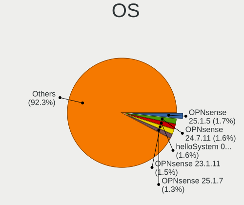

| Name              | Desktops | Percent |
|-------------------|----------|---------|
| OPNsense 25.1.5   | 315      | 1.68%   |
| OPNsense 24.7.11  | 305      | 1.62%   |
| helloSystem 0.8.1 | 300      | 1.6%    |
| OPNsense 23.1.11  | 288      | 1.53%   |
| OPNsense 25.1.7   | 247      | 1.32%   |
| OPNsense 24.7.12  | 245      | 1.3%    |
| OPNsense 24.1.6   | 233      | 1.24%   |
| OPNsense 25.1     | 215      | 1.15%   |
| OPNsense 23.7.10  | 209      | 1.11%   |
| OPNsense 21.7.7   | 201      | 1.07%   |
| helloSystem 0.7.0 | 199      | 1.06%   |
| OPNsense 22.7.10  | 197      | 1.05%   |
| OPNsense 24.7     | 192      | 1.02%   |
| OPNsense 25.1.1   | 191      | 1.02%   |
| OPNsense 23.7.12  | 191      | 1.02%   |
| OPNsense 24.1.10  | 184      | 0.98%   |
| OPNsense 23.1.5   | 182      | 0.97%   |
| OPNsense 23.7.9   | 177      | 0.94%   |
| OPNsense 21.1     | 169      | 0.9%    |
| OPNsense 22.1     | 167      | 0.89%   |
| OPNsense 21.7.1   | 167      | 0.89%   |
| OPNsense 23.1     | 166      | 0.88%   |
| OPNsense 21.7.3   | 166      | 0.88%   |
| OPNsense 21.1.5   | 166      | 0.88%   |
| OPNsense 25.1.4   | 165      | 0.88%   |
| OPNsense 24.1.9   | 165      | 0.88%   |
| OPNsense 25.1.3   | 164      | 0.87%   |
| OPNsense 24.7.8   | 163      | 0.87%   |
| OPNsense 25.7.1   | 162      | 0.86%   |
| OPNsense 22.7.4   | 162      | 0.86%   |
| OPNsense 25.7.3   | 159      | 0.85%   |
| OPNsense 20.7.8   | 158      | 0.84%   |
| OPNsense 25.7.7   | 156      | 0.83%   |
| OPNsense 23.7.7   | 155      | 0.83%   |
| OPNsense 23.1.7   | 154      | 0.82%   |
| OPNsense 24.1.4   | 151      | 0.8%    |
| OPNsense 24.7.3   | 147      | 0.78%   |
| OPNsense 21.1.3   | 147      | 0.78%   |
| OPNsense 24.7.7   | 146      | 0.78%   |
| OPNsense 22.1.10  | 145      | 0.77%   |

OS Family
---------

OS without a version

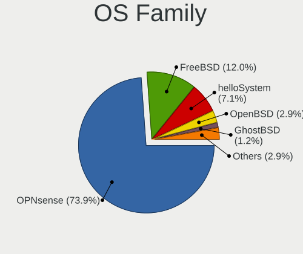

| Name        | Desktops | Percent |
|-------------|----------|---------|
| OPNsense    | 9482     | 73.86%  |
| FreeBSD     | 1537     | 11.97%  |
| helloSystem | 915      | 7.13%   |
| OpenBSD     | 376      | 2.93%   |
| GhostBSD    | 156      | 1.22%   |
| NetBSD      | 78       | 0.61%   |
| NomadBSD    | 67       | 0.52%   |
| TrueNAS     | 49       | 0.38%   |
| pfSense     | 35       | 0.27%   |
| ClonOS      | 27       | 0.21%   |
| MyBee       | 25       | 0.19%   |
| FreeNAS     | 24       | 0.19%   |
| XigmaNAS    | 18       | 0.14%   |
| MidnightBSD | 18       | 0.14%   |
| DragonFly   | 11       | 0.09%   |
| HardenedBSD | 6        | 0.05%   |
| FuryBSD     | 5        | 0.04%   |
| Ting        | 4        | 0.03%   |
| PC-BSD      | 2        | 0.02%   |
| OS108       | 2        | 0.02%   |
| FuguIta     | 1        | 0.01%   |

Arch
----

OS architecture (x86_64, i586, etc.)

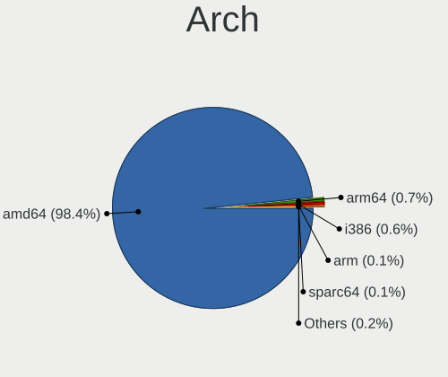

| Name    | Desktops | Percent |
|---------|----------|---------|
| amd64   | 12518    | 98.37%  |
| arm64   | 89       | 0.7%    |
| i386    | 74       | 0.58%   |
| arm     | 11       | 0.09%   |
| sparc64 | 8        | 0.06%   |
| powerpc | 6        | 0.05%   |
| macppc  | 6        | 0.05%   |
| evbarm  | 6        | 0.05%   |
| armv7   | 3        | 0.02%   |
| riscv   | 2        | 0.02%   |
| octeon  | 2        | 0.02%   |

DE
--

Desktop Environment

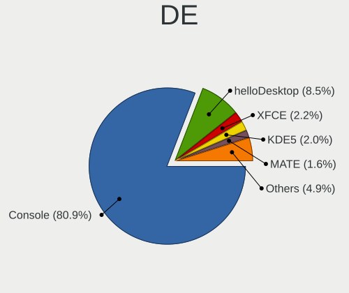

| Name             | Desktops | Percent |
|------------------|----------|---------|
| Console          | 10443    | 80.85%  |
| helloDesktop     | 1095     | 8.48%   |
| XFCE             | 284      | 2.2%    |
| KDE5             | 256      | 1.98%   |
| MATE             | 206      | 1.59%   |
| GNOME            | 131      | 1.01%   |
| TWM              | 118      | 0.91%   |
| fvwm             | 87       | 0.67%   |
| Openbox          | 85       | 0.66%   |
| i3               | 40       | 0.31%   |
| LXQt             | 19       | 0.15%   |
| Fluxbox          | 17       | 0.13%   |
| AwesomeWM        | 14       | 0.11%   |
| Cinnamon         | 13       | 0.1%    |
| Enlightenment    | 11       | 0.09%   |
| LXDE             | 9        | 0.07%   |
| KDE6             | 9        | 0.07%   |
| Window Maker     | 7        | 0.05%   |
| DWM              | 7        | 0.05%   |
| xinitrc          | 6        | 0.05%   |
| Lumina           | 6        | 0.05%   |
| KDE              | 6        | 0.05%   |
| X-Cinnamon       | 5        | 0.04%   |
| CDE              | 4        | 0.03%   |
| StumpWM          | 3        | 0.02%   |
| Picom            | 3        | 0.02%   |
| GNUstep          | 3        | 0.02%   |
| xfwm             | 2        | 0.02%   |
| spectrwm         | 2        | 0.02%   |
| KDE4             | 2        | 0.02%   |
| CTWM             | 2        | 0.02%   |
| Budgie           | 2        | 0.02%   |
| Blackbox         | 2        | 0.02%   |
| Xfwm4            | 1        | 0.01%   |
| wlroots          | 1        | 0.01%   |
| WindowMaker      | 1        | 0.01%   |
| Ratpoison        | 1        | 0.01%   |
| plasma           | 1        | 0.01%   |
| PekWM            | 1        | 0.01%   |
| Metacity (Marco) | 1        | 0.01%   |

Display Server
--------------

X11 or Wayland

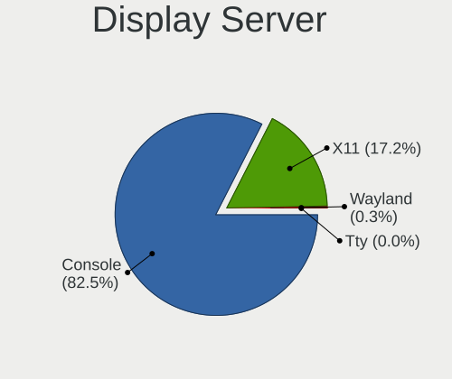

| Name    | Desktops | Percent |
|---------|----------|---------|
| Console | 10541    | 82.49%  |
| X11     | 2195     | 17.18%  |
| Wayland | 41       | 0.32%   |
| Tty     | 1        | 0.01%   |

Display Manager
---------------

SDDM, LightDM, etc.

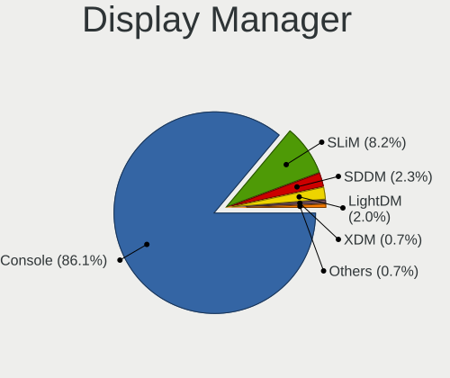

| Name    | Desktops | Percent |
|---------|----------|---------|
| Console | 11056    | 86.09%  |
| SLiM    | 1059     | 8.25%   |
| SDDM    | 296      | 2.3%    |
| LightDM | 261      | 2.03%   |
| XDM     | 86       | 0.67%   |
| GDM     | 72       | 0.56%   |
| Ly      | 13       | 0.1%    |

OS Lang
-------

Language

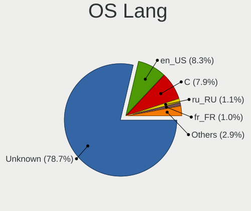

| Lang             | Desktops | Percent |
|------------------|----------|---------|
| Unknown          | 10243    | 78.68%  |
| en_US            | 1086     | 8.34%   |
| C                | 1034     | 7.94%   |
| ru_RU            | 148      | 1.14%   |
| fr_FR            | 127      | 0.98%   |
| de_DE            | 74       | 0.57%   |
| es_ES            | 37       | 0.28%   |
| en               | 32       | 0.25%   |
| pt_BR            | 24       | 0.18%   |
| en_GB            | 22       | 0.17%   |
| it_IT            | 20       | 0.15%   |
| zh_CN            | 15       | 0.12%   |
| pl_PL            | 13       | 0.1%    |
| fr               | 13       | 0.1%    |
| fi_FI            | 12       | 0.09%   |
| en_AU            | 11       | 0.08%   |
| en_CA            | 10       | 0.08%   |
| ja_JP            | 9        | 0.07%   |
| ru               | 7        | 0.05%   |
| uk_UA            | 6        | 0.05%   |
| sv_SE            | 4        | 0.03%   |
| es               | 4        | 0.03%   |
| en_IE            | 4        | 0.03%   |
| el_GR            | 4        | 0.03%   |
| zh_TW            | 3        | 0.02%   |
| tr_TR            | 3        | 0.02%   |
| ru_RU.KOI8-R     | 3        | 0.02%   |
| pt_PT            | 3        | 0.02%   |
| pt               | 3        | 0.02%   |
| nl_NL            | 3        | 0.02%   |
| hu_HU            | 3        | 0.02%   |
| es_AR            | 3        | 0.02%   |
| nb_NO            | 2        | 0.02%   |
| jp_JP            | 2        | 0.02%   |
| fi_FI.ISO8859-15 | 2        | 0.02%   |
| UTF-8            | 1        | 0.01%   |
| sv_SE.US-ASCII   | 1        | 0.01%   |
| sl_SI            | 1        | 0.01%   |
| sk_SK            | 1        | 0.01%   |
| pl               | 1        | 0.01%   |

Boot Mode
---------

EFI or BIOS

| Mode | Desktops | Percent |
|------|----------|---------|
| EFI  | 11374    | 88.51%  |
| BIOS | 1476     | 11.49%  |

Filesystem
----------

Type of filesystem

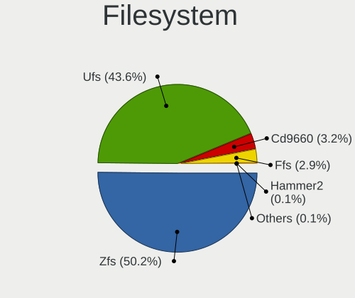

| Type    | Desktops | Percent |
|---------|----------|---------|
| Zfs     | 6610     | 50.16%  |
| Ufs     | 5743     | 43.58%  |
| Cd9660  | 423      | 3.21%   |
| Ffs     | 377      | 2.86%   |
| Hammer2 | 11       | 0.08%   |
| Unknown | 6        | 0.05%   |
| XXX     | 3        | 0.02%   |
| Msdosfs | 2        | 0.02%   |
| Nullfs  | 1        | 0.01%   |
| Nfs     | 1        | 0.01%   |

Part. scheme
------------

Scheme of partitioning

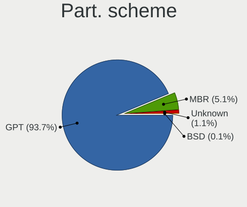

| Type    | Desktops | Percent |
|---------|----------|---------|
| GPT     | 11988    | 93.7%   |
| MBR     | 653      | 5.1%    |
| Unknown | 141      | 1.1%    |
| BSD     | 12       | 0.09%   |

Board
-----

Vendor
------

Motherboard manufacturer

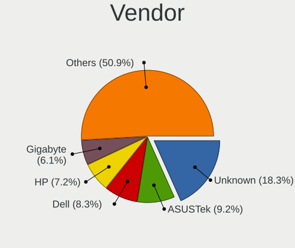

| Name                                 | Desktops | Percent |
|--------------------------------------|----------|---------|
| Unknown                              | 2330     | 18.31%  |
| ASUSTek Computer                     | 1171     | 9.2%    |
| Dell                                 | 1050     | 8.25%   |
| Hewlett-Packard                      | 921      | 7.24%   |
| Gigabyte Technology                  | 775      | 6.09%   |
| Protectli                            | 714      | 5.61%   |
| ASRock                               | 669      | 5.26%   |
| Intel                                | 660      | 5.19%   |
| PC Engines                           | 474      | 3.73%   |
| MSI                                  | 455      | 3.58%   |
| Lenovo                               | 406      | 3.19%   |
| Fujitsu                              | 313      | 2.46%   |
| Supermicro                           | 302      | 2.37%   |
| Techvision                           | 238      | 1.87%   |
| AZW                                  | 126      | 0.99%   |
| Shuttle                              | 94       | 0.74%   |
| Shenzhen Meigao Electronic Equipment | 87       | 0.68%   |
| Acer                                 | 85       | 0.67%   |
| CWWK                                 | 83       | 0.65%   |
| MW                                   | 81       | 0.64%   |
| CncTion                              | 68       | 0.53%   |
| Biostar                              | 65       | 0.51%   |
| IceWhale Technology                  | 63       | 0.5%    |
| Deciso                               | 61       | 0.48%   |
| ASRockRack                           | 57       | 0.45%   |
| Hardkernel                           | 52       | 0.41%   |
| GoWin Solution                       | 43       | 0.34%   |
| Foxconn                              | 42       | 0.33%   |
| SJRC                                 | 36       | 0.28%   |
| AAEON                                | 36       | 0.28%   |
| TianBei                              | 33       | 0.26%   |
| BESSTAR Tech                         | 33       | 0.26%   |
| Pegatron                             | 32       | 0.25%   |
| Cisco                                | 31       | 0.24%   |
| ShenZhen MinWin Technology           | 30       | 0.24%   |
| Advantech                            | 30       | 0.24%   |
| CheckPoint                           | 29       | 0.23%   |
| Apple                                | 29       | 0.23%   |
| Yanling                              | 25       | 0.2%    |
| Seeed Studio                         | 24       | 0.19%   |

Model
-----

Motherboard model

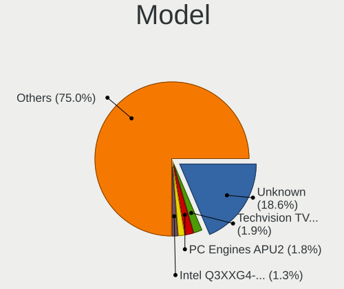

| Name                                              | Desktops | Percent |
|---------------------------------------------------|----------|---------|
| Unknown                                           | 2366     | 18.6%   |
| Techvision TVI7309X                               | 238      | 1.87%   |
| PC Engines APU2                                   | 235      | 1.85%   |
| Protectli FW4B                                    | 181      | 1.42%   |
| Intel Q3XXG4-P V1.0                               | 167      | 1.31%   |
| PC Engines apu4                                   | 144      | 1.13%   |
| ASUS All Series                                   | 138      | 1.08%   |
| Fujitsu FUTRO S920                                | 137      | 1.08%   |
| Protectli FW6                                     | 133      | 1.05%   |
| Protectli VP2420                                  | 91       | 0.72%   |
| Dell OptiPlex 9020                                | 84       | 0.66%   |
| MW GMLK-2_5G4L                                    | 81       | 0.64%   |
| AZW EQ                                            | 76       | 0.6%    |
| Shenzhen Meigao Electronic Equipment Venus Series | 73       | 0.57%   |
| HP t620 PLUS Quad Core TC                         | 73       | 0.57%   |
| Dell OptiPlex 3020                                | 69       | 0.54%   |
| Dell OptiPlex 7010                                | 65       | 0.51%   |
| Protectli FW4C                                    | 53       | 0.42%   |
| Dell OptiPlex 7040                                | 53       | 0.42%   |
| Dell OptiPlex 3050                                | 48       | 0.38%   |
| Protectli VP2410                                  | 47       | 0.37%   |
| HP EliteDesk 800 G1 SFF                           | 47       | 0.37%   |
| IceWhale ZimaBoard 832 ZMB                        | 42       | 0.33%   |
| Dell OptiPlex 7050                                | 42       | 0.33%   |
| Protectli FW2B                                    | 40       | 0.31%   |
| Supermicro X9SCL/X9SCM                            | 36       | 0.28%   |
| PC Engines APU                                    | 36       | 0.28%   |
| CWWK CW-AD4L-N V1                                 | 35       | 0.28%   |
| Hardkernel ODROID-H2                              | 34       | 0.27%   |
| GoWin Solution R86S                               | 34       | 0.27%   |
| Dell OptiPlex 3040                                | 34       | 0.27%   |
| Protectli V1410                                   | 33       | 0.26%   |
| PC Engines APU3                                   | 32       | 0.25%   |
| HP EliteDesk 800 G3 SFF                           | 32       | 0.25%   |
| HP Compaq Elite 8300 SFF                          | 32       | 0.25%   |
| TianBei N1 PRO                                    | 31       | 0.24%   |
| Intel Jasper Lake Client Platform                 | 31       | 0.24%   |
| HP ProLiant MicroServer Gen8                      | 31       | 0.24%   |
| Dell OptiPlex 7020                                | 31       | 0.24%   |
| Dell OptiPlex 790                                 | 30       | 0.24%   |

Model Family
------------

Motherboard model prefix

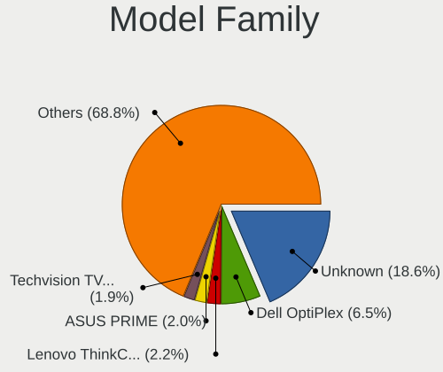

| Name                                       | Desktops | Percent |
|--------------------------------------------|----------|---------|
| Unknown                                    | 2366     | 18.6%   |
| Dell OptiPlex                              | 830      | 6.52%   |
| Lenovo ThinkCentre                         | 284      | 2.23%   |
| ASUS PRIME                                 | 256      | 2.01%   |
| Techvision TVI7309X                        | 238      | 1.87%   |
| PC Engines APU2                            | 235      | 1.85%   |
| HP EliteDesk                               | 217      | 1.71%   |
| Fujitsu FUTRO                              | 195      | 1.53%   |
| HP ProDesk                                 | 186      | 1.46%   |
| Protectli FW4B                             | 181      | 1.42%   |
| Intel Q3XXG4-P                             | 169      | 1.33%   |
| HP Compaq                                  | 160      | 1.26%   |
| PC Engines apu4                            | 144      | 1.13%   |
| ASUS All                                   | 138      | 1.08%   |
| Protectli FW6                              | 133      | 1.05%   |
| ASUS ROG                                   | 109      | 0.86%   |
| Dell Precision                             | 92       | 0.72%   |
| Protectli VP2420                           | 91       | 0.72%   |
| ASUS TUF                                   | 90       | 0.71%   |
| HP ProLiant                                | 89       | 0.7%    |
| HP t620                                    | 83       | 0.65%   |
| MW GMLK-2                                  | 81       | 0.64%   |
| AZW EQ                                     | 76       | 0.6%    |
| Shenzhen Meigao Electronic Equipment Venus | 73       | 0.57%   |
| Fujitsu ESPRIMO                            | 69       | 0.54%   |
| Deciso Netboard                            | 57       | 0.45%   |
| IceWhale ZimaBoard                         | 56       | 0.44%   |
| Protectli FW4C                             | 53       | 0.42%   |
| Dell Inspiron                              | 49       | 0.39%   |
| Protectli VP2410                           | 47       | 0.37%   |
| Acer Aspire                                | 46       | 0.36%   |
| Protectli FW2B                             | 40       | 0.31%   |
| Supermicro X9SCL                           | 36       | 0.28%   |
| PC Engines APU                             | 36       | 0.28%   |
| CWWK CW-AD4L-N                             | 35       | 0.28%   |
| HARDKERNEL ODROID-H2                       | 34       | 0.27%   |
| GoWin Solution R86S                        | 34       | 0.27%   |
| Gigabyte B450M                             | 34       | 0.27%   |
| Protectli V1410                            | 33       | 0.26%   |
| PC Engines APU3                            | 32       | 0.25%   |

MFG Year
--------

Motherboard manufacture year

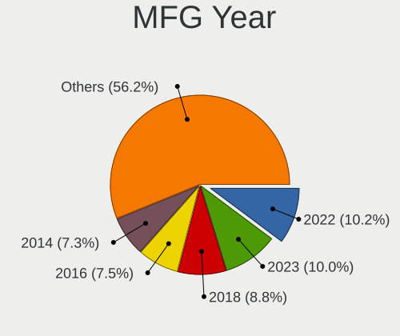

| Year    | Desktops | Percent |
|---------|----------|---------|
| 2022    | 1298     | 10.2%   |
| 2023    | 1278     | 10.04%  |
| 2018    | 1118     | 8.79%   |
| 2016    | 955      | 7.51%   |
| 2014    | 929      | 7.3%    |
| 2021    | 872      | 6.85%   |
| 2019    | 776      | 6.1%    |
| 2024    | 757      | 5.95%   |
| 2020    | 726      | 5.71%   |
| 2017    | 709      | 5.57%   |
| 2013    | 700      | 5.5%    |
| 2012    | 592      | 4.65%   |
| 2011    | 446      | 3.51%   |
| 2015    | 435      | 3.42%   |
| 2010    | 301      | 2.37%   |
| 2009    | 209      | 1.64%   |
| 2008    | 180      | 1.41%   |
| Unknown | 172      | 1.35%   |
| 2025    | 141      | 1.11%   |
| 2007    | 75       | 0.59%   |
| 2006    | 25       | 0.2%    |
| 2004    | 9        | 0.07%   |
| 2005    | 8        | 0.06%   |
| 2003    | 5        | 0.04%   |
| 2002    | 3        | 0.02%   |
| 2001    | 3        | 0.02%   |
| 2000    | 1        | 0.01%   |

Form Factor
-----------

Physical design of the computer

| Name    | Desktops | Percent |
|---------|----------|---------|
| Desktop | 12723    | 100%    |

Coreboot
--------

Have coreboot on board

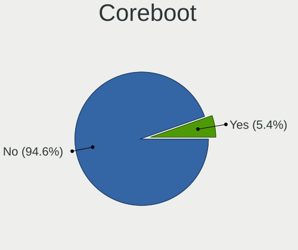

| Used | Desktops | Percent |
|------|----------|---------|
| No   | 12040    | 94.61%  |
| Yes  | 686      | 5.39%   |

RAM Size
--------

Total RAM memory

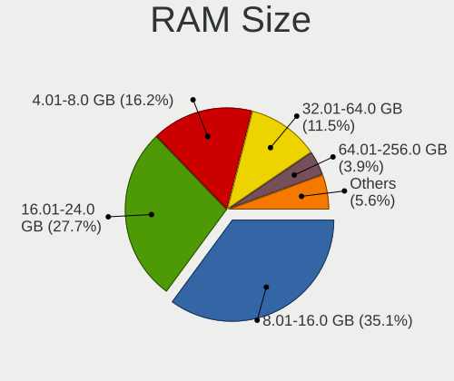

| Size in GB      | Desktops | Percent |
|-----------------|----------|---------|
| 8.01-16.0       | 4593     | 35.09%  |
| 16.01-24.0      | 3628     | 27.71%  |
| 4.01-8.0        | 2120     | 16.19%  |
| 32.01-64.0      | 1506     | 11.5%   |
| 64.01-256.0     | 512      | 3.91%   |
| 2.01-3.0        | 319      | 2.44%   |
| 24.01-32.0      | 157      | 1.2%    |
| 3.01-4.0        | 101      | 0.77%   |
| 0.51-1.0        | 55       | 0.42%   |
| 1.01-2.0        | 47       | 0.36%   |
| 0.01-0.5        | 36       | 0.27%   |
| More than 256.0 | 16       | 0.12%   |
| Unknown         | 1        | 0.01%   |

RAM Used
--------

Used RAM memory

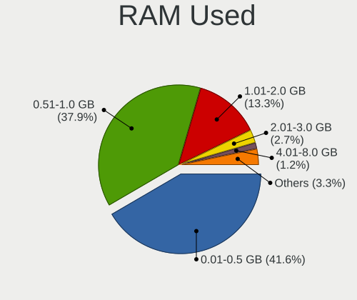

| Used GB     | Desktops | Percent |
|-------------|----------|---------|
| 0.01-0.5    | 5497     | 41.6%   |
| 0.51-1.0    | 5003     | 37.86%  |
| 1.01-2.0    | 1762     | 13.34%  |
| 2.01-3.0    | 355      | 2.69%   |
| 4.01-8.0    | 165      | 1.25%   |
| 3.01-4.0    | 153      | 1.16%   |
| Unknown     | 88       | 0.67%   |
| 8.01-16.0   | 61       | 0.46%   |
| 0           | 47       | 0.36%   |
| 16.01-24.0  | 30       | 0.23%   |
| 24.01-32.0  | 22       | 0.17%   |
| 32.01-64.0  | 19       | 0.14%   |
| 64.01-256.0 | 11       | 0.08%   |

Total Drives
------------

Number of drives on board

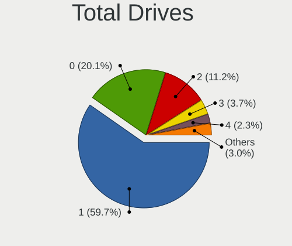

| Drives | Desktops | Percent |
|--------|----------|---------|
| 1      | 8010     | 59.68%  |
| 0      | 2703     | 20.14%  |
| 2      | 1498     | 11.16%  |
| 3      | 503      | 3.75%   |
| 4      | 305      | 2.27%   |
| 5      | 161      | 1.2%    |
| 6      | 88       | 0.66%   |
| 7      | 52       | 0.39%   |
| 8      | 23       | 0.17%   |
| 10     | 17       | 0.13%   |
| 9      | 17       | 0.13%   |
| 12     | 8        | 0.06%   |
| 11     | 7        | 0.05%   |
| 17     | 5        | 0.04%   |
| 14     | 4        | 0.03%   |
| 13     | 4        | 0.03%   |
| 16     | 3        | 0.02%   |
| 23     | 2        | 0.01%   |
| 21     | 2        | 0.01%   |
| 19     | 2        | 0.01%   |
| 40     | 1        | 0.01%   |
| 36     | 1        | 0.01%   |
| 27     | 1        | 0.01%   |
| 26     | 1        | 0.01%   |
| 24     | 1        | 0.01%   |
| 22     | 1        | 0.01%   |
| 18     | 1        | 0.01%   |
| 15     | 1        | 0.01%   |

Has CD-ROM
----------

Has CD-ROM on board

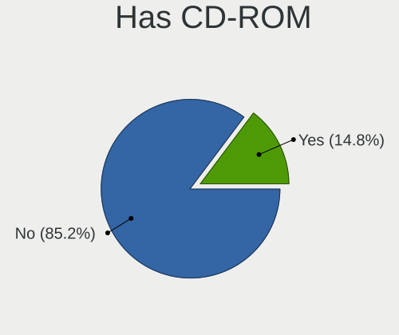

| Presented | Desktops | Percent |
|-----------|----------|---------|
| No        | 10958    | 85.25%  |
| Yes       | 1896     | 14.75%  |

Has Ethernet
------------

Has Ethernet on board

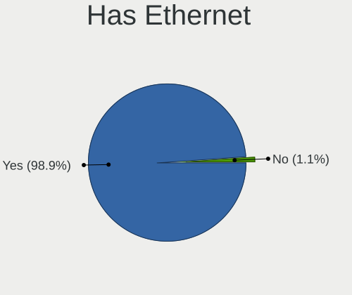

| Presented | Desktops | Percent |
|-----------|----------|---------|
| Yes       | 12584    | 98.89%  |
| No        | 141      | 1.11%   |

Has WiFi
--------

Has WiFi module

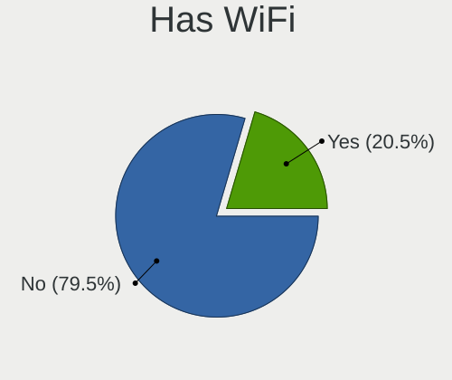

| Presented | Desktops | Percent |
|-----------|----------|---------|
| No        | 10243    | 79.54%  |
| Yes       | 2635     | 20.46%  |

Has Bluetooth
-------------

Has Bluetooth module

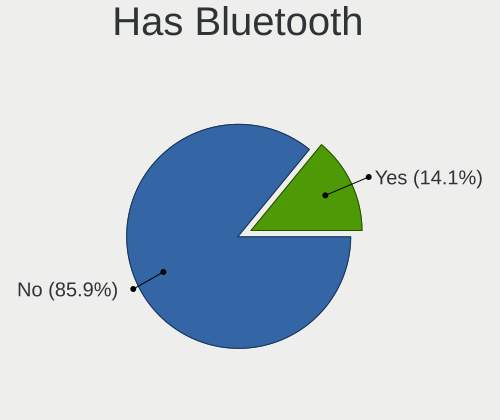

| Presented | Desktops | Percent |
|-----------|----------|---------|
| No        | 11017    | 85.93%  |
| Yes       | 1804     | 14.07%  |

Location
--------

Country
-------

Geographic location (country)

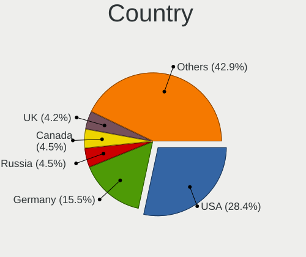

| Country         | Desktops | Percent |
|-----------------|----------|---------|
| USA             | 3630     | 28.37%  |
| Germany         | 1986     | 15.52%  |
| Russia          | 579      | 4.52%   |
| Canada          | 575      | 4.49%   |
| UK              | 543      | 4.24%   |
| France          | 460      | 3.59%   |
| Australia       | 409      | 3.2%    |
| Poland          | 295      | 2.31%   |
| Netherlands     | 293      | 2.29%   |
| Brazil          | 292      | 2.28%   |
| Italy           | 259      | 2.02%   |
| Switzerland     | 229      | 1.79%   |
| Austria         | 218      | 1.7%    |
| Sweden          | 217      | 1.7%    |
| Spain           | 175      | 1.37%   |
| China           | 156      | 1.22%   |
| Belgium         | 125      | 0.98%   |
| Finland         | 122      | 0.95%   |
| Norway          | 119      | 0.93%   |
| Romania         | 111      | 0.87%   |
| Taiwan          | 91       | 0.71%   |
| Denmark         | 91       | 0.71%   |
| Czechia         | 90       | 0.7%    |
| India           | 88       | 0.69%   |
| Portugal        | 87       | 0.68%   |
| Hungary         | 84       | 0.66%   |
| South Korea     | 78       | 0.61%   |
| Japan           | 72       | 0.56%   |
| Indonesia       | 68       | 0.53%   |
| New Zealand     | 63       | 0.49%   |
| Ukraine         | 61       | 0.48%   |
| Bulgaria        | 58       | 0.45%   |
| Mexico          | 54       | 0.42%   |
| Turkey          | 43       | 0.34%   |
| South Africa    | 43       | 0.34%   |
| Singapore       | 42       | 0.33%   |
| Vietnam         | 41       | 0.32%   |
| Argentina       | 41       | 0.32%   |
| Greece          | 39       | 0.3%    |
| The Netherlands | 37       | 0.29%   |

City
----

Geographic location (city)

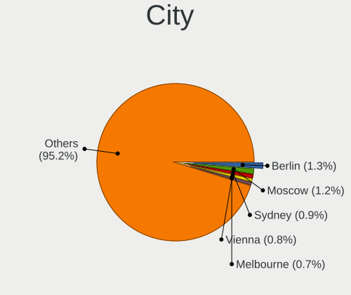

| City              | Desktops | Percent |
|-------------------|----------|---------|
| Berlin            | 183      | 1.25%   |
| Moscow            | 174      | 1.19%   |
| Sydney            | 127      | 0.87%   |
| Vienna            | 110      | 0.75%   |
| Melbourne         | 102      | 0.7%    |
| Paris             | 96       | 0.66%   |
| Munich            | 90       | 0.62%   |
| Seattle           | 81       | 0.56%   |
| London            | 76       | 0.52%   |
| Denver            | 75       | 0.51%   |
| St Petersburg     | 71       | 0.49%   |
| Hamburg           | 64       | 0.44%   |
| Helsinki          | 58       | 0.4%    |
| Cologne           | 56       | 0.38%   |
| Montreal          | 55       | 0.38%   |
| Frankfurt am Main | 55       | 0.38%   |
| Brisbane          | 55       | 0.38%   |
| Stockholm         | 54       | 0.37%   |
| Zurich            | 53       | 0.36%   |
| Amsterdam         | 50       | 0.34%   |
| Toronto           | 49       | 0.34%   |
| Warsaw            | 47       | 0.32%   |
| New York          | 45       | 0.31%   |
| Milan             | 45       | 0.31%   |
| Chicago           | 44       | 0.3%    |
| Perth             | 43       | 0.29%   |
| Singapore         | 42       | 0.29%   |
| Sao Paulo         | 42       | 0.29%   |
| Los Angeles       | 42       | 0.29%   |
| Portland          | 40       | 0.27%   |
| Calgary           | 39       | 0.27%   |
| Bucharest         | 39       | 0.27%   |
| Madrid            | 38       | 0.26%   |
| Oslo              | 36       | 0.25%   |
| Oakland           | 36       | 0.25%   |
| Sofia             | 34       | 0.23%   |
| Prague            | 34       | 0.23%   |
| Auckland          | 33       | 0.23%   |
| Stuttgart         | 32       | 0.22%   |
| Rome              | 32       | 0.22%   |

Drives
------

Drive Vendor
------------

Hard drive vendors

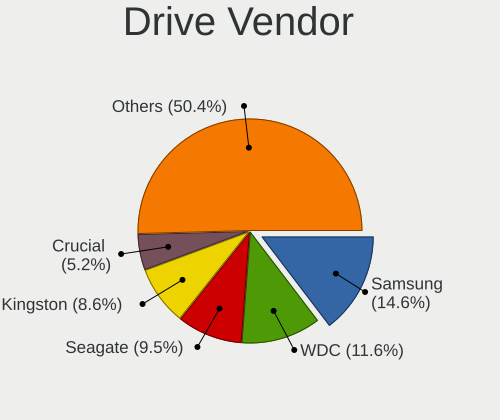

| Vendor              | Desktops | Drives | Percent |
|---------------------|----------|--------|---------|
| Samsung Electronics | 1966     | 3736   | 14.65%  |
| WDC                 | 1551     | 3639   | 11.55%  |
| Seagate             | 1277     | 2661   | 9.51%   |
| Kingston            | 1159     | 1836   | 8.63%   |
| Crucial             | 701      | 1158   | 5.22%   |
| SanDisk             | 528      | 768    | 3.93%   |
| Transcend           | 485      | 787    | 3.61%   |
| Toshiba             | 482      | 882    | 3.59%   |
| Intel               | 463      | 822    | 3.45%   |
| China               | 442      | 650    | 3.29%   |
| Hoodisk             | 279      | 461    | 2.08%   |
| A-DATA Technology   | 259      | 382    | 1.93%   |
| Hitachi             | 247      | 441    | 1.84%   |
| Phison              | 197      | 285    | 1.47%   |
| Protectli           | 169      | 293    | 1.26%   |
| SPCC                | 153      | 284    | 1.14%   |
| SK hynix            | 144      | 227    | 1.07%   |
| Micron Technology   | 144      | 229    | 1.07%   |
| HGST                | 135      | 321    | 1.01%   |
| PNY                 | 126      | 224    | 0.94%   |
| Patriot             | 121      | 183    | 0.9%    |
| FORESEE             | 105      | 163    | 0.78%   |
| OCZ                 | 100      | 141    | 0.74%   |
| Silicon Motion      | 92       | 130    | 0.69%   |
| Innodisk            | 91       | 122    | 0.68%   |
| Apacer              | 85       | 126    | 0.63%   |
| Intenso             | 77       | 149    | 0.57%   |
| Hewlett-Packard     | 76       | 167    | 0.57%   |
| Corsair             | 67       | 129    | 0.5%    |
| Team                | 66       | 122    | 0.49%   |
| NVMe                | 61       | 94     | 0.45%   |
| Dogfish             | 61       | 110    | 0.45%   |
| Gigabyte Technology | 58       | 78     | 0.43%   |
| KingSpec            | 55       | 85     | 0.41%   |
| Fanxiang            | 55       | 90     | 0.41%   |
| ShiJi               | 54       | 77     | 0.4%    |
| LITEONIT            | 54       | 89     | 0.4%    |
| BIWIN               | 54       | 85     | 0.4%    |
| Lexar               | 52       | 76     | 0.39%   |
| LITEON              | 45       | 77     | 0.34%   |

Drive Model
-----------

Hard drive models

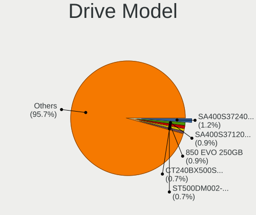

| Model                           | Desktops | Percent |
|---------------------------------|----------|---------|
| Kingston SA400S37240G 240GB     | 169      | 1.15%   |
| Kingston SA400S37120G 120GB     | 132      | 0.9%    |
| Samsung SSD 850 EVO 250GB       | 131      | 0.89%   |
| Crucial CT240BX500SSD1 240GB    | 101      | 0.69%   |
| Seagate ST500DM002-1BD142 500GB | 99       | 0.67%   |
| Kingston SKC600MS256G 256GB     | 95       | 0.65%   |
| China SATA SSD 16GB             | 91       | 0.62%   |
| Samsung SSD 860 EVO 500GB       | 89       | 0.61%   |
| Transcend TS128GMSA230S 128GB   | 85       | 0.58%   |
| Hoodisk SSD 32GB                | 81       | 0.55%   |
| Samsung SSD 860 EVO 250GB       | 78       | 0.53%   |
| Kingston SV300S37A120G 120GB    | 78       | 0.53%   |
| Hoodisk SSD 128GB               | 78       | 0.53%   |
| Phison SATA SSD 16GB            | 74       | 0.5%    |
| Kingston SUV500MS120G 120GB     | 73       | 0.5%    |
| Hoodisk SSD 64GB                | 72       | 0.49%   |
| Crucial CT250MX500SSD1 250GB    | 67       | 0.46%   |
| Kingston SA400S37480G 480GB     | 66       | 0.45%   |
| Toshiba DT01ACA100 1TB          | 65       | 0.44%   |
| Samsung SSD 870 EVO 250GB       | 65       | 0.44%   |
| Samsung SSD 850 EVO 500GB       | 65       | 0.44%   |
| Crucial CT500MX500SSD1 500GB    | 65       | 0.44%   |
| Samsung SSD 870 EVO 500GB       | 62       | 0.42%   |
| Seagate ST1000DM010-2EP102 1TB  | 61       | 0.42%   |
| Samsung SSD 970 EVO Plus 500GB  | 50       | 0.34%   |
| Transcend TS64GMSA230S 64GB     | 48       | 0.33%   |
| Crucial CT120BX500SSD1 120GB    | 47       | 0.32%   |
| Seagate ST2000DM008-2FR102 2TB  | 45       | 0.31%   |
| Samsung SSD 970 EVO Plus 1TB    | 44       | 0.3%    |
| WDC WD10EZEX-08WN4A0 1TB        | 43       | 0.29%   |
| Samsung SSD 860 EVO 1TB         | 43       | 0.29%   |
| PNY CS900 120GB SSD             | 43       | 0.29%   |
| Protectli 120GB mSATA           | 42       | 0.29%   |
| Crucial CT1000MX500SSD1 1TB     | 42       | 0.29%   |
| Samsung SSD 840 EVO 250GB       | 41       | 0.28%   |
| A-DATA SU650 120GB              | 41       | 0.28%   |
| Samsung SSD 870 EVO 1TB         | 40       | 0.27%   |
| Samsung SSD 850 EVO 120GB       | 40       | 0.27%   |
| Kingston SUV500MS240G 240GB     | 40       | 0.27%   |
| WDC WDS500G2B0A-00SM50 500GB    | 38       | 0.26%   |

HDD Vendor
----------

Hard disk drive vendors

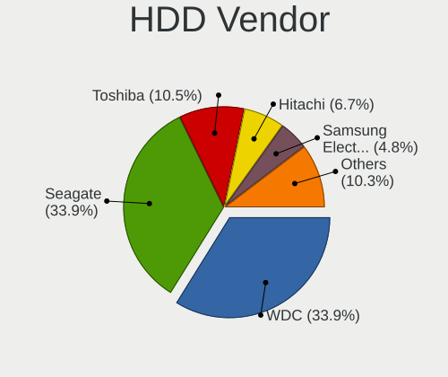

| Vendor                             | Desktops | Drives | Percent |
|------------------------------------|----------|--------|---------|
| WDC                                | 1241     | 2972   | 33.87%  |
| Seagate                            | 1241     | 2585   | 33.87%  |
| Toshiba                            | 385      | 732    | 10.51%  |
| Hitachi                            | 244      | 431    | 6.66%   |
| Samsung Electronics                | 175      | 260    | 4.78%   |
| HGST                               | 134      | 319    | 3.66%   |
| Maxtor                             | 44       | 53     | 1.2%    |
| Hewlett-Packard                    | 33       | 90     | 0.9%    |
| NVMe                               | 29       | 45     | 0.79%   |
| OPENBSD                            | 18       | 34     | 0.49%   |
| Fujitsu                            | 16       | 20     | 0.44%   |
| Apple                              | 10       | 13     | 0.27%   |
| HPE                                | 8        | 19     | 0.22%   |
| Dell                               | 7        | 12     | 0.19%   |
| LSI                                | 5        | 9      | 0.14%   |
| HPT                                | 5        | 44     | 0.14%   |
| Generic                            | 5        | 5      | 0.14%   |
| USB                                | 4        | 4      | 0.11%   |
| WD MediaMax                        | 3        | 9      | 0.08%   |
| StoreJet                           | 3        | 3      | 0.08%   |
| Product:              USB DISK 2.0 | 3        | 3      | 0.08%   |
| Lexar                              | 3        | 3      | 0.08%   |
| JetFlash                           | 3        | 3      | 0.08%   |
| China                              | 3        | 3      | 0.08%   |
| Adaptec                            | 3        | 3      | 0.08%   |
| Synology                           | 2        | 4      | 0.05%   |
| QUANTUM                            | 2        | 3      | 0.05%   |
| QEMU                               | 2        | 2      | 0.05%   |
| Multiple                           | 2        | 2      | 0.05%   |
| MaxDigital                         | 2        | 2      | 0.05%   |
| Intenso                            | 2        | 2      | 0.05%   |
| IBM/Hitachi                        | 2        | 2      | 0.05%   |
| IBM-207x                           | 2        | 2      | 0.05%   |
| IBM                                | 2        | 2      | 0.05%   |
| ExcelStor Technology               | 2        | 5      | 0.05%   |
| ASMT                               | 2        | 2      | 0.05%   |
| Western                            | 1        | 3      | 0.03%   |
| USB3.0                             | 1        | 2      | 0.03%   |
| SSDPR-CX                           | 1        | 1      | 0.03%   |
| SMI                                | 1        | 1      | 0.03%   |

SSD Vendor
----------

Solid state drive vendors

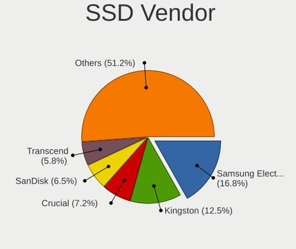

| Vendor              | Desktops | Drives | Percent |
|---------------------|----------|--------|---------|
| Samsung Electronics | 1360     | 2614   | 16.81%  |
| Kingston            | 1015     | 1624   | 12.54%  |
| Crucial             | 584      | 977    | 7.22%   |
| SanDisk             | 523      | 759    | 6.46%   |
| Transcend           | 469      | 764    | 5.8%    |
| China               | 439      | 647    | 5.43%   |
| Intel               | 369      | 679    | 4.56%   |
| Hoodisk             | 277      | 459    | 3.42%   |
| WDC                 | 234      | 419    | 2.89%   |
| A-DATA Technology   | 216      | 312    | 2.67%   |
| Protectli           | 169      | 293    | 2.09%   |
| Micron Technology   | 122      | 198    | 1.51%   |
| SPCC                | 116      | 219    | 1.43%   |
| PNY                 | 116      | 206    | 1.43%   |
| Phison              | 109      | 144    | 1.35%   |
| OCZ                 | 100      | 141    | 1.24%   |
| Innodisk            | 91       | 122    | 1.12%   |
| FORESEE             | 91       | 145    | 1.12%   |
| Patriot             | 87       | 136    | 1.08%   |
| Apacer              | 84       | 122    | 1.04%   |
| SK hynix            | 80       | 125    | 0.99%   |
| Intenso             | 69       | 136    | 0.85%   |
| Toshiba             | 68       | 107    | 0.84%   |
| Dogfish             | 61       | 110    | 0.75%   |
| KingSpec            | 55       | 84     | 0.68%   |
| LITEONIT            | 54       | 89     | 0.67%   |
| BIWIN               | 48       | 78     | 0.59%   |
| Corsair             | 47       | 74     | 0.58%   |
| LITEON              | 42       | 73     | 0.52%   |
| ShiJi               | 40       | 60     | 0.49%   |
| Team                | 37       | 83     | 0.46%   |
| Gigabyte Technology | 36       | 52     | 0.44%   |
| NVMe                | 32       | 46     | 0.4%    |
| Lexar               | 31       | 47     | 0.38%   |
| GOODRAM             | 30       | 48     | 0.37%   |
| Plextor             | 27       | 33     | 0.33%   |
| Hewlett-Packard     | 27       | 42     | 0.33%   |
| Seagate             | 26       | 55     | 0.32%   |
| Netac               | 26       | 50     | 0.32%   |
| Mushkin             | 23       | 32     | 0.28%   |

Drive Kind
----------

HDD or SSD

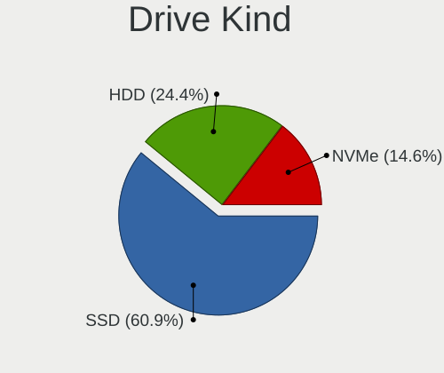

| Kind | Desktops | Drives | Percent |
|------|----------|--------|---------|
| SSD  | 7303     | 13387  | 60.94%  |
| HDD  | 2926     | 7723   | 24.42%  |
| NVMe | 1754     | 2882   | 14.64%  |

Drive Connector
---------------

SATA, SAS, NVMe, etc.

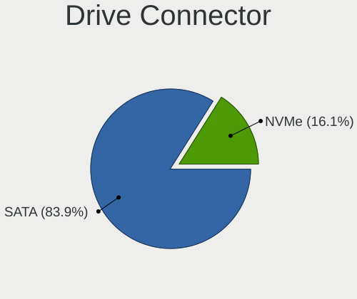

| Type | Desktops | Drives | Percent |
|------|----------|--------|---------|
| SATA | 9172     | 21110  | 83.95%  |
| NVMe | 1754     | 2882   | 16.05%  |

Drive Size
----------

Size of hard drive

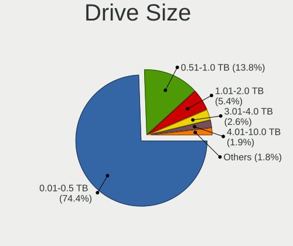

| Size in TB      | Desktops | Drives | Percent |
|-----------------|----------|--------|---------|
| 0.01-0.5        | 7949     | 14327  | 74.41%  |
| 0.51-1.0        | 1474     | 2752   | 13.8%   |
| 1.01-2.0        | 573      | 1470   | 5.36%   |
| 3.01-4.0        | 283      | 901    | 2.65%   |
| 4.01-10.0       | 206      | 971    | 1.93%   |
| 2.01-3.0        | 131      | 389    | 1.23%   |
| 10.01-20.0      | 62       | 293    | 0.58%   |
| 20.01-50.0      | 3        | 6      | 0.03%   |
| More than 100.0 | 1        | 1      | 0.01%   |

Space Total
-----------

Amount of disk space available on the file system

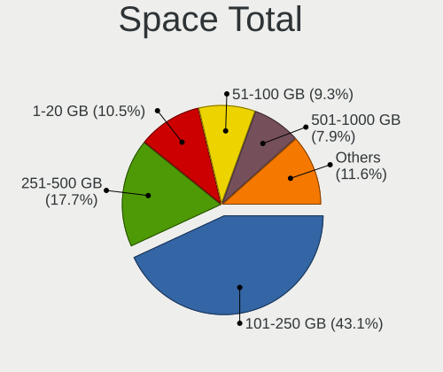

| Size in GB     | Desktops | Percent |
|----------------|----------|---------|
| 101-250        | 5748     | 43.1%   |
| 251-500        | 2361     | 17.7%   |
| 1-20           | 1394     | 10.45%  |
| 51-100         | 1237     | 9.28%   |
| 501-1000       | 1050     | 7.87%   |
| 21-50          | 1048     | 7.86%   |
| 1001-2000      | 269      | 2.02%   |
| More than 3000 | 128      | 0.96%   |
| Unknown        | 55       | 0.41%   |
| 2001-3000      | 46       | 0.34%   |

Space Used
----------

Amount of used disk space

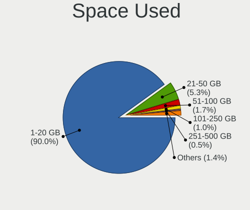

| Used GB        | Desktops | Percent |
|----------------|----------|---------|
| 1-20           | 11913    | 90.04%  |
| 21-50          | 699      | 5.28%   |
| 51-100         | 231      | 1.75%   |
| 101-250        | 134      | 1.01%   |
| 251-500        | 64       | 0.48%   |
| Unknown        | 55       | 0.42%   |
| 501-1000       | 47       | 0.36%   |
| 1001-2000      | 37       | 0.28%   |
| More than 3000 | 35       | 0.26%   |
| 2001-3000      | 14       | 0.11%   |
| 0              | 2        | 0.02%   |

Malfunc. Drives
---------------

Drive models with a malfunction

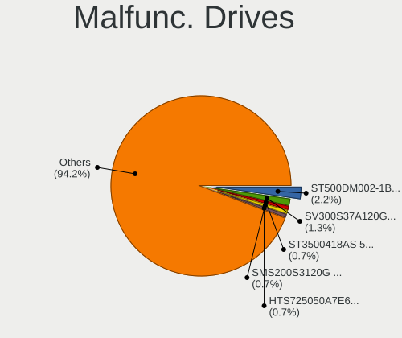

| Model                                 | Desktops | Drives | Percent |
|---------------------------------------|----------|--------|---------|
| Seagate ST500DM002-1BD142 500GB       | 39       | 63     | 2.25%   |
| Kingston SV300S37A120G 120GB          | 23       | 27     | 1.32%   |
| Seagate ST3500418AS 500GB             | 13       | 23     | 0.75%   |
| Kingston SMS200S3120G 120GB           | 13       | 23     | 0.75%   |
| HGST HTS725050A7E630 500GB            | 12       | 28     | 0.69%   |
| Seagate ST500LM021-1KJ152 500GB       | 11       | 17     | 0.63%   |
| Seagate ST3500413AS 500GB             | 11       | 27     | 0.63%   |
| Samsung Electronics SSD 870 EVO 1TB   | 10       | 16     | 0.58%   |
| Kingston SV300S37A60G 64GB            | 10       | 13     | 0.58%   |
| WDC WDS240G2G0A-00JH30 240GB          | 9        | 13     | 0.52%   |
| WDC WD30EFRX-68EUZN0 3TB              | 9        | 21     | 0.52%   |
| Toshiba DT01ACA100 1TB                | 9        | 13     | 0.52%   |
| Kingston SMS200S360G 64GB             | 9        | 10     | 0.52%   |
| Crucial CT525MX300SSD1 528GB          | 9        | 11     | 0.52%   |
| Crucial CT275MX300SSD1 275GB          | 9        | 14     | 0.52%   |
| Samsung Electronics SSD 870 EVO 500GB | 8        | 22     | 0.46%   |
| Kingston SA400S37240G 240GB           | 8        | 8      | 0.46%   |
| WDC WD5000AAKX-60U6AA0 500GB          | 7        | 9      | 0.4%    |
| WDC WD5000AAKX-00ERMA0 500GB          | 7        | 7      | 0.4%    |
| WDC WD40EFRX-68WT0N0 4TB              | 7        | 13     | 0.4%    |
| WDC WD20EFRX-68EUZN0 1TB              | 7        | 15     | 0.4%    |
| Toshiba DT01ACA050 500GB              | 7        | 9      | 0.4%    |
| Seagate ST500LT012-9WS142 500GB       | 7        | 10     | 0.4%    |
| Seagate ST380815AS 80GB               | 7        | 7      | 0.4%    |
| Seagate ST3160815AS 160GB             | 7        | 11     | 0.4%    |
| Seagate ST250DM000-1BD141 250GB       | 7        | 10     | 0.4%    |
| Seagate ST2000DM008-2FR102 2TB        | 7        | 13     | 0.4%    |
| Seagate ST1000DM010-2EP102 1TB        | 7        | 12     | 0.4%    |
| Seagate ST1000DM003-1CH162 1TB        | 7        | 8      | 0.4%    |
| Samsung Electronics HD501LJ 500GB     | 7        | 10     | 0.4%    |
| Samsung Electronics HD161HJ 160GB     | 7        | 8      | 0.4%    |
| Intel SSDSA2M080G2GC 80GB             | 7        | 11     | 0.4%    |
| Seagate ST1000LM024 HN-M101MBB 1TB    | 6        | 7      | 0.35%   |
| Seagate ST1000DM003-9YN162 1TB        | 6        | 10     | 0.35%   |
| Kingston SA400S37120G 120GB           | 6        | 7      | 0.35%   |
| WDC WD5000AAKX-001CA0 500GB           | 5        | 7      | 0.29%   |
| WDC WD20EARS-00MVWB0 2TB              | 5        | 5      | 0.29%   |
| WDC WD1600AAJS-75M0A0 160GB           | 5        | 5      | 0.29%   |
| Toshiba MQ01ABD100 1TB                | 5        | 5      | 0.29%   |
| Seagate ST9500420AS 500GB             | 5        | 8      | 0.29%   |

Malfunc. Drive Vendor
---------------------

Vendors of faulty drives

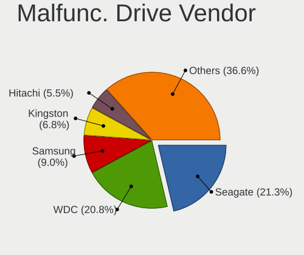

| Vendor              | Desktops | Drives | Percent |
|---------------------|----------|--------|---------|
| Seagate             | 356      | 560    | 21.33%  |
| WDC                 | 347      | 518    | 20.79%  |
| Samsung Electronics | 151      | 236    | 9.05%   |
| Kingston            | 113      | 168    | 6.77%   |
| Hitachi             | 91       | 121    | 5.45%   |
| Toshiba             | 89       | 134    | 5.33%   |
| Intel               | 79       | 119    | 4.73%   |
| Crucial             | 61       | 106    | 3.65%   |
| SanDisk             | 52       | 74     | 3.12%   |
| HGST                | 42       | 67     | 2.52%   |
| A-DATA Technology   | 26       | 33     | 1.56%   |
| SK hynix            | 25       | 44     | 1.5%    |
| Maxtor              | 25       | 31     | 1.5%    |
| Micron Technology   | 21       | 34     | 1.26%   |
| OCZ                 | 17       | 20     | 1.02%   |
| China               | 16       | 17     | 0.96%   |
| Corsair             | 11       | 17     | 0.66%   |
| Transcend           | 10       | 15     | 0.6%    |
| SPCC                | 9        | 12     | 0.54%   |
| Hewlett-Packard     | 8        | 12     | 0.48%   |
| Apacer              | 8        | 10     | 0.48%   |
| Netac               | 7        | 15     | 0.42%   |
| LITEON              | 7        | 14     | 0.42%   |
| KingSpec            | 7        | 8      | 0.42%   |
| Patriot             | 6        | 9      | 0.36%   |
| Plextor             | 5        | 5      | 0.3%    |
| Dogfish             | 5        | 12     | 0.3%    |
| BIWIN               | 5        | 7      | 0.3%    |
| LITEONIT            | 3        | 6      | 0.18%   |
| KingDian            | 3        | 6      | 0.18%   |
| VisionTek           | 2        | 6      | 0.12%   |
| TEXTORM             | 2        | 2      | 0.12%   |
| Team                | 2        | 4      | 0.12%   |
| SSSTC               | 2        | 4      | 0.12%   |
| ShiJi               | 2        | 3      | 0.12%   |
| PNY                 | 2        | 2      | 0.12%   |
| MyDigitalSSD        | 2        | 4      | 0.12%   |
| Mushkin             | 2        | 3      | 0.12%   |
| Intenso             | 2        | 2      | 0.12%   |
| HPE                 | 2        | 7      | 0.12%   |

Malfunc. HDD Vendor
-------------------

Vendors of faulty HDD drives

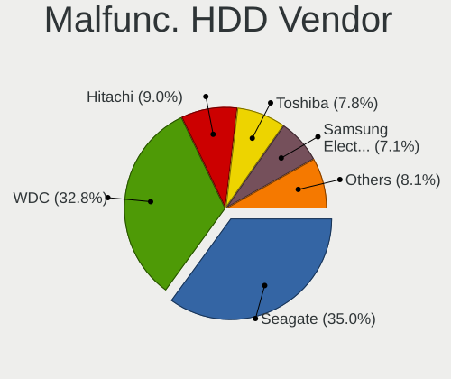

| Vendor               | Desktops | Drives | Percent |
|----------------------|----------|--------|---------|
| Seagate              | 353      | 557    | 35.02%  |
| WDC                  | 331      | 496    | 32.84%  |
| Hitachi              | 91       | 121    | 9.03%   |
| Toshiba              | 79       | 122    | 7.84%   |
| Samsung Electronics  | 72       | 101    | 7.14%   |
| HGST                 | 41       | 65     | 4.07%   |
| Maxtor               | 25       | 31     | 2.48%   |
| Hewlett-Packard      | 7        | 11     | 0.69%   |
| HPE                  | 2        | 7      | 0.2%    |
| Fujitsu              | 2        | 3      | 0.2%    |
| WD MediaMax          | 1        | 3      | 0.1%    |
| InnoLite             | 1        | 1      | 0.1%    |
| IBM/Hitachi          | 1        | 1      | 0.1%    |
| ExcelStor Technology | 1        | 2      | 0.1%    |
| Cactus               | 1        | 1      | 0.1%    |

Malfunc. Drive Kind
-------------------

Kinds of faulty drives

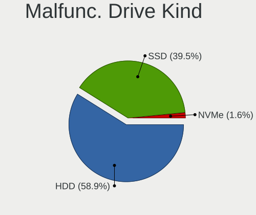

| Kind | Desktops | Drives | Percent |
|------|----------|--------|---------|
| HDD  | 939      | 1522   | 58.91%  |
| SSD  | 630      | 973    | 39.52%  |
| NVMe | 25       | 32     | 1.57%   |

Failed Drives
-------------

Failed drive models

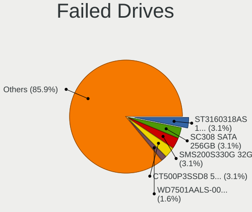

| Model                                            | Desktops | Drives | Percent |
|--------------------------------------------------|----------|--------|---------|
| SK hynix SC308 SATA 256GB                        | 2        | 3      | 3.13%   |
| Seagate ST3160318AS 160GB                        | 2        | 2      | 3.13%   |
| Kingston SMS200S330G 32GB                        | 2        | 2      | 3.13%   |
| Crucial CT500P3SSD8 500GB                        | 2        | 2      | 3.13%   |
| WDC WD7501AALS-00J7B0 752GB                      | 1        | 1      | 1.56%   |
| WDC WD6400AARS-00Y5B1 640GB                      | 1        | 2      | 1.56%   |
| WDC WD5000BEVT-22A0RT0 500GB                     | 1        | 1      | 1.56%   |
| WDC WD3200L 320GB                                | 1        | 1      | 1.56%   |
| WDC WD3200BPVT-16JJ5T0 320GB                     | 1        | 1      | 1.56%   |
| WDC WD3200AAJS-00YZCA0 320GB                     | 1        | 1      | 1.56%   |
| WDC WD20EARS-00MVWB0 2TB                         | 1        | 1      | 1.56%   |
| WDC WD1600BEVT-22ZCT0 160GB                      | 1        | 1      | 1.56%   |
| WDC WD1600BEKX-00B7WT0 160GB                     | 1        | 1      | 1.56%   |
| WDC WD10SPZX-00Z10T0 1TB                         | 1        | 1      | 1.56%   |
| WDC PC SN530 SDBPMPZ-256G-1101 256GB             | 1        | 1      | 1.56%   |
| Vaseky V900-120G                                 | 1        | 1      | 1.56%   |
| Transcend TS32GSSD370S 32GB                      | 1        | 4      | 1.56%   |
| Toshiba THNSNK128GCS8 SATA 128GB                 | 1        | 1      | 1.56%   |
| Toshiba MQ01ABD100 1TB                           | 1        | 1      | 1.56%   |
| Toshiba MQ01ABD075 752GB                         | 1        | 1      | 1.56%   |
| Toshiba MG05ACA800E 8TB                          | 1        | 1      | 1.56%   |
| Toshiba KXG50ZNV256G NVMe 256GB                  | 1        | 1      | 1.56%   |
| Toshiba HDWG11A 10TB                             | 1        | 1      | 1.56%   |
| SK hynix BC501 HFM256GDJTNG-8310A 256GB          | 1        | 1      | 1.56%   |
| Seagate ST3500418AS 500GB                        | 1        | 2      | 1.56%   |
| Seagate ST3250310AS 250GB                        | 1        | 1      | 1.56%   |
| SanDisk SD9SN8W-256G-1006 256GB                  | 1        | 1      | 1.56%   |
| SanDisk SD7TB6S256G1001 256GB                    | 1        | 2      | 1.56%   |
| SanDisk pSSD 32GB                                | 1        | 1      | 1.56%   |
| Samsung Electronics SSD PM830 2.5-inch 7mm 256GB | 1        | 1      | 1.56%   |
| Samsung Electronics SSD 980 250GB                | 1        | 2      | 1.56%   |
| Samsung Electronics SSD 970 EVO Plus 500GB       | 1        | 1      | 1.56%   |
| Samsung Electronics SSD 960 EVO 500GB            | 1        | 1      | 1.56%   |
| Samsung Electronics PM981 NVMe 256GB             | 1        | 1      | 1.56%   |
| Samsung Electronics PM961 NVMe 256GB             | 1        | 1      | 1.56%   |
| Samsung Electronics MZVLW256HEHP-00000 256GB     | 1        | 1      | 1.56%   |
| Samsung Electronics MZVLB256HBHQ-000H1 256GB     | 1        | 1      | 1.56%   |
| Samsung Electronics MZALQ256HBJD-00BL2 256GB     | 1        | 1      | 1.56%   |
| Samsung Electronics MZ7LN256HAJQ-000H1 256GB     | 1        | 2      | 1.56%   |
| Samsung Electronics MZ7LN128HCHP-000H1 128GB     | 1        | 1      | 1.56%   |

Failed Drive Vendor
-------------------

Failed drive vendors

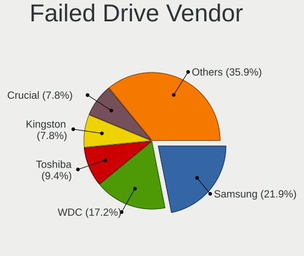

| Vendor              | Desktops | Drives | Percent |
|---------------------|----------|--------|---------|
| Samsung Electronics | 14       | 18     | 21.88%  |
| WDC                 | 11       | 12     | 17.19%  |
| Toshiba             | 6        | 6      | 9.38%   |
| Kingston            | 5        | 6      | 7.81%   |
| Crucial             | 5        | 5      | 7.81%   |
| Seagate             | 4        | 5      | 6.25%   |
| Intel               | 4        | 5      | 6.25%   |
| SK hynix            | 3        | 4      | 4.69%   |
| SanDisk             | 3        | 4      | 4.69%   |
| Hitachi             | 2        | 2      | 3.13%   |
| Vaseky              | 1        | 1      | 1.56%   |
| Transcend           | 1        | 4      | 1.56%   |
| Phison              | 1        | 1      | 1.56%   |
| Patriot             | 1        | 1      | 1.56%   |
| Maxtor              | 1        | 1      | 1.56%   |
| Hoodisk             | 1        | 1      | 1.56%   |
| HGST                | 1        | 1      | 1.56%   |

Drive Status
------------

Number of failed and malfunc. drives

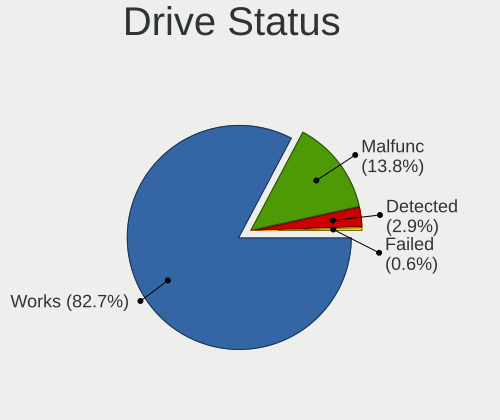

| Status   | Desktops | Drives | Percent |
|----------|----------|--------|---------|
| Works    | 9325     | 20795  | 82.75%  |
| Malfunc  | 1553     | 2527   | 13.78%  |
| Detected | 327      | 593    | 2.9%    |
| Failed   | 64       | 77     | 0.57%   |

Storage controller
------------------

Storage Vendor
--------------

Storage controller vendors

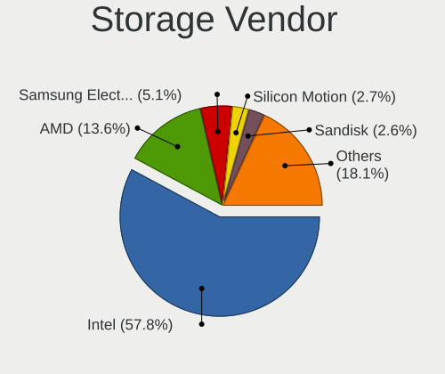

| Vendor                                  | Desktops | Percent |
|-----------------------------------------|----------|---------|
| Intel                                   | 9654     | 57.84%  |
| AMD                                     | 2269     | 13.59%  |
| Samsung Electronics                     | 857      | 5.13%   |
| Silicon Motion                          | 452      | 2.71%   |
| Sandisk                                 | 436      | 2.61%   |
| MAXIO Technology (Hangzhou)             | 336      | 2.01%   |
| Phison Electronics                      | 314      | 1.88%   |
| ASMedia Technology                      | 308      | 1.85%   |
| Kingston Technology Company             | 292      | 1.75%   |
| Micron/Crucial Technology               | 186      | 1.11%   |
| Marvell Technology Group                | 147      | 0.88%   |
| Broadcom / LSI                          | 142      | 0.85%   |
| SK hynix                                | 136      | 0.81%   |
| Micron Technology                       | 130      | 0.78%   |
| JMicron Technology                      | 118      | 0.71%   |
| Realtek Semiconductor                   | 83       | 0.5%    |
| Nvidia                                  | 83       | 0.5%    |
| Toshiba                                 | 72       | 0.43%   |
| Shenzhen Longsys Electronics            | 72       | 0.43%   |
| ADATA Technology                        | 64       | 0.38%   |
| KIOXIA                                  | 61       | 0.37%   |
| Hosin Global Electronics                | 53       | 0.32%   |
| Transcend                               | 43       | 0.26%   |
| Chelsio Communications                  | 42       | 0.25%   |
| VIA Technologies                        | 39       | 0.23%   |
| Yangtze Memory Technologies             | 33       | 0.2%    |
| Silicon Image                           | 23       | 0.14%   |
| Seagate Technology                      | 22       | 0.13%   |
| INNOGRIT                                | 22       | 0.13%   |
| Adaptec                                 | 21       | 0.13%   |
| Hewlett-Packard                         | 19       | 0.11%   |
| Shenzhen Unionmemory Information System | 18       | 0.11%   |
| Lite-On Technology                      | 15       | 0.09%   |
| Netac Technology                        | 13       | 0.08%   |
| Unknown                                 | 13       | 0.08%   |
| Solid State Storage Technology          | 11       | 0.07%   |
| Biwin Storage Technology                | 10       | 0.06%   |
| Integrated Technology Express           | 9        | 0.05%   |
| Solidigm                                | 8        | 0.05%   |
| Areca Technology                        | 8        | 0.05%   |

Storage Model
-------------

Storage controller models

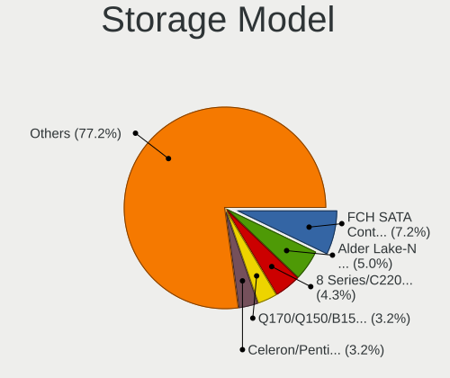

| Model                                                                            | Desktops | Percent |
|----------------------------------------------------------------------------------|----------|---------|
| AMD FCH SATA Controller [AHCI mode]                                              | 1343     | 7.15%   |
| Intel Alder Lake-N SATA AHCI Controller                                          | 938      | 4.99%   |
| Intel 8 Series/C220 Series Chipset Family 6-port SATA Controller 1 [AHCI mode]   | 809      | 4.31%   |
| Intel Q170/Q150/B150/H170/H110/Z170/CM236 Chipset SATA Controller [AHCI Mode]    | 606      | 3.23%   |
| Intel Celeron/Pentium Silver Processor SATA Controller                           | 594      | 3.16%   |
| Intel Jasper Lake SATA AHCI Controller                                           | 539      | 2.87%   |
| Intel 6 Series/C200 Series Chipset Family 6 port Desktop SATA AHCI Controller    | 504      | 2.68%   |
| Intel Atom/Celeron/Pentium Processor x5-E8000/J3xxx/N3xxx Series SATA Controller | 434      | 2.31%   |
| Silicon Motion SM2263EN/SM2263XT (DRAM-less) NVMe SSD Controllers                | 432      | 2.3%    |
| Intel 200 Series PCH SATA controller [AHCI mode]                                 | 408      | 2.17%   |
| Intel Sunrise Point-LP SATA Controller [AHCI mode]                               | 396      | 2.11%   |
| Intel Cannon Lake PCH SATA AHCI Controller                                       | 382      | 2.03%   |
| Samsung NVMe SSD Controller SM981/PM981/PM983                                    | 365      | 1.94%   |
| Intel SATA Controller [RAID mode]                                                | 338      | 1.8%    |
| Intel 7 Series/C210 Series Chipset Family 6-port SATA Controller [AHCI mode]     | 337      | 1.79%   |
| MAXIO (Hangzhou) NVMe SSD Controller MAP1202 (DRAM-less)                         | 327      | 1.74%   |
| Intel Atom Processor E3800 Series SATA AHCI Controller                           | 305      | 1.62%   |
| AMD 400 Series Chipset SATA Controller                                           | 282      | 1.5%    |
| AMD SB7x0/SB8x0/SB9x0 SATA Controller [AHCI mode]                                | 279      | 1.49%   |
| ASMedia ASM1061/ASM1062 Serial ATA Controller                                    | 250      | 1.33%   |
| Intel NM10/ICH7 Family SATA Controller [IDE mode]                                | 215      | 1.14%   |
| AMD 500 Series Chipset SATA Controller                                           | 214      | 1.14%   |
| AMD FCH SATA Controller [IDE mode]                                               | 204      | 1.09%   |
| Intel 82801G (ICH7 Family) IDE Controller                                        | 191      | 1.02%   |
| AMD SB7x0/SB8x0/SB9x0 IDE Controller                                             | 175      | 0.93%   |
| Samsung NVMe SSD Controller 980 (DRAM-less)                                      | 168      | 0.89%   |
| Intel Elkhart Lake SATA AHCI                                                     | 168      | 0.89%   |
| Intel Celeron N3350/Pentium N4200/Atom E3900 Series SATA AHCI Controller         | 168      | 0.89%   |
| Intel Atom Processor C3000 Series SATA Controller 1                              | 152      | 0.81%   |
| Intel Comet Lake SATA AHCI Controller                                            | 151      | 0.8%    |
| Intel Alder Lake-P SATA AHCI Controller                                          | 144      | 0.77%   |
| Intel Atom Processor C3000 Series SATA Controller 0                              | 141      | 0.75%   |
| Intel 8 Series SATA Controller 1 [AHCI mode]                                     | 139      | 0.74%   |
| Samsung NVMe SSD Controller SM961/PM961/SM963                                    | 130      | 0.69%   |
| Intel Wildcat Point-LP SATA Controller [AHCI Mode]                               | 129      | 0.69%   |
| Samsung NVMe SSD Controller PM9A1/PM9A3/980PRO                                   | 127      | 0.68%   |
| Intel Alder Lake-S PCH SATA Controller [AHCI Mode]                               | 123      | 0.65%   |
| Intel 5 Series/3400 Series Chipset 6 port SATA AHCI Controller                   | 123      | 0.65%   |
| Phison PS5013-E13 PCIe3 NVMe Controller (DRAM-less)                              | 122      | 0.65%   |
| Intel 500 Series Chipset Family SATA AHCI Controller                             | 117      | 0.62%   |

Storage Kind
------------

Kind of storage controller (IDE, SATA, NVMe, SAS, ...)

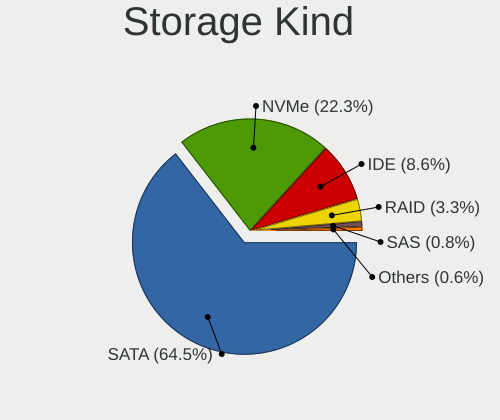

| Kind | Desktops | Percent |
|------|----------|---------|
| SATA | 10683    | 64.52%  |
| NVMe | 3687     | 22.27%  |
| IDE  | 1420     | 8.58%   |
| RAID | 539      | 3.26%   |
| SAS  | 127      | 0.77%   |
| SCSI | 101      | 0.61%   |

Processor
---------

CPU Vendor
----------

Processor vendors

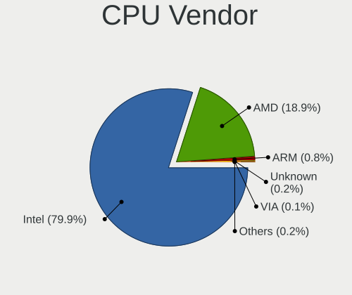

| Vendor                | Desktops | Percent |
|-----------------------|----------|---------|
| Intel                 | 10203    | 79.94%  |
| AMD                   | 2410     | 18.88%  |
| ARM                   | 96       | 0.75%   |
| Unknown               | 26       | 0.2%    |
| VIA                   | 7        | 0.05%   |
| QEMU                  | 3        | 0.02%   |
| IBM                   | 3        | 0.02%   |
| PowerPC               | 2        | 0.02%   |
| i                     | 2        | 0.02%   |
| 7447A                 | 2        | 0.02%   |
| SUNW,UltraAX-i2       | 1        | 0.01%   |
| SUNW,Sun-Blade-100    | 1        | 0.01%   |
| Sun                   | 1        | 0.01%   |
| Research              | 1        | 0.01%   |
| Red Hat               | 1        | 0.01%   |
| Qualcomm Technologies | 1        | 0.01%   |
| NXP                   | 1        | 0.01%   |
| Motorola              | 1        | 0.01%   |
| Cix Technology Group  | 1        | 0.01%   |
| 11th                  | 1        | 0.01%   |

CPU Model
---------

Processor models

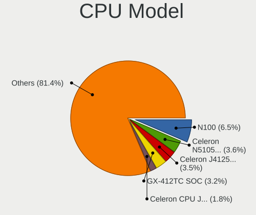

| Model                                    | Desktops | Percent |
|------------------------------------------|----------|---------|
| Intel N100                               | 835      | 6.46%   |
| Intel Celeron N5105 @ 2.00GHz            | 466      | 3.61%   |
| Intel Celeron J4125 CPU @ 2.00GHz        | 447      | 3.46%   |
| AMD GX-412TC SOC                         | 419      | 3.24%   |
| Intel Celeron CPU J3160 @ 1.60GHz        | 235      | 1.82%   |
| Intel N150                               | 178      | 1.38%   |
| Intel Core i5-6500 CPU @ 3.20GHz         | 172      | 1.33%   |
| Intel Celeron CPU J1900 @ 1.99GHz        | 166      | 1.28%   |
| Intel Core i3-N305                       | 130      | 1.01%   |
| Intel Core i5-3470 CPU @ 3.20GHz         | 127      | 0.98%   |
| Intel Celeron J6412 @ 2.00GHz            | 117      | 0.91%   |
| AMD GX-415GA SOC with Radeon HD Graphics | 104      | 0.8%    |
| Intel Core i5-4570 CPU @ 3.20GHz         | 101      | 0.78%   |
| Intel Core i5-4590 CPU @ 3.30GHz         | 100      | 0.77%   |
| Intel Core i7-3770 CPU @ 3.40GHz         | 84       | 0.65%   |
| Intel Atom CPU D525 @ 1.80GHz            | 83       | 0.64%   |
| AMD GX-420CA SOC with Radeon HD Graphics | 82       | 0.63%   |
| Intel Core i5-7500 CPU @ 3.40GHz         | 81       | 0.63%   |
| Intel Core i5-7200U CPU @ 2.50GHz        | 79       | 0.61%   |
| Intel Pentium Silver N6005 @ 2.00GHz     | 78       | 0.6%    |
| Intel Core i7-6700 CPU @ 3.40GHz         | 76       | 0.59%   |
| Intel Core i3-6100 CPU @ 3.70GHz         | 72       | 0.56%   |
| AMD Ryzen 5 5600G with Radeon Graphics   | 72       | 0.56%   |
| Intel Core i5-8500 CPU @ 3.00GHz         | 65       | 0.5%    |
| Intel Celeron J4105 CPU @ 1.50GHz        | 62       | 0.48%   |
| Intel Core i7-4770 CPU @ 3.40GHz         | 61       | 0.47%   |
| Intel Core i7-7700 CPU @ 3.60GHz         | 60       | 0.46%   |
| Intel Celeron CPU J3455 @ 1.50GHz        | 60       | 0.46%   |
| Intel Core i7-4790 CPU @ 3.60GHz         | 58       | 0.45%   |
| Intel Core 2 Duo                         | 58       | 0.45%   |
| Intel Atom CPU C3758R @ 2.40GHz          | 58       | 0.45%   |
| Intel Core i5-6500T CPU @ 2.50GHz        | 56       | 0.43%   |
| AMD G-T40E Processor                     | 56       | 0.43%   |
| Intel Pentium CPU J3710 @ 1.60GHz        | 55       | 0.43%   |
| Intel Celeron CPU N3450 @ 1.10GHz        | 54       | 0.42%   |
| Intel Atom CPU C3558 @ 2.20GHz           | 54       | 0.42%   |
| Intel Core i5-2400 CPU @ 3.10GHz         | 53       | 0.41%   |
| Intel Celeron CPU 3865U @ 1.80GHz        | 53       | 0.41%   |
| Intel Atom CPU E3845 @ 1.91GHz           | 53       | 0.41%   |
| AMD Ryzen 7 5700G with Radeon Graphics   | 51       | 0.39%   |

CPU Model Family
----------------

Processor model prefix

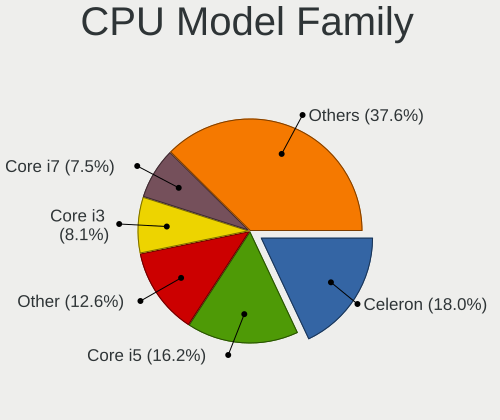

| Model                   | Desktops | Percent |
|-------------------------|----------|---------|
| Intel Celeron           | 2315     | 17.99%  |
| Intel Core i5           | 2086     | 16.21%  |
| Other                   | 1620     | 12.59%  |
| Intel Core i3           | 1048     | 8.14%   |
| Intel Core i7           | 963      | 7.48%   |
| Intel Xeon              | 774      | 6.01%   |
| AMD GX                  | 766      | 5.95%   |
| Intel Atom              | 515      | 4%      |
| AMD Ryzen 5             | 360      | 2.8%    |
| Intel Pentium           | 340      | 2.64%   |
| AMD Ryzen 7             | 281      | 2.18%   |
| Intel Core 2 Duo        | 176      | 1.37%   |
| AMD FX                  | 139      | 1.08%   |
| AMD Ryzen 9             | 126      | 0.98%   |
| Intel Pentium Silver    | 119      | 0.92%   |
| Intel Core 2 Quad       | 103      | 0.8%    |
| AMD Ryzen 3             | 90       | 0.7%    |
| ARM Cortex              | 87       | 0.68%   |
| AMD G                   | 87       | 0.68%   |
| Intel Pentium Gold      | 78       | 0.61%   |
| Intel Pentium Dual-Core | 69       | 0.54%   |
| AMD Athlon              | 58       | 0.45%   |
| AMD Phenom II X4        | 41       | 0.32%   |
| AMD Ryzen 5 PRO         | 38       | 0.3%    |
| Intel Core i9           | 37       | 0.29%   |
| AMD A10                 | 36       | 0.28%   |
| AMD Athlon 64 X2        | 33       | 0.26%   |
| Intel Pentium 4         | 31       | 0.24%   |
| AMD A8                  | 31       | 0.24%   |
| AMD Ryzen Threadripper  | 24       | 0.19%   |
| AMD A4                  | 24       | 0.19%   |
| Intel Core 2            | 23       | 0.18%   |
| AMD Athlon II X2        | 23       | 0.18%   |
| Intel Core              | 21       | 0.16%   |
| AMD Phenom II X6        | 21       | 0.16%   |
| AMD E                   | 21       | 0.16%   |
| AMD Turion II Neo       | 18       | 0.14%   |
| AMD EPYC                | 17       | 0.13%   |
| Intel Pentium Dual      | 16       | 0.12%   |
| Intel Genuine           | 16       | 0.12%   |

CPU Cores
---------

Number of processor cores

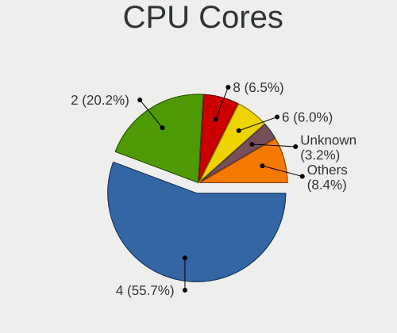

| Number  | Desktops | Percent |
|---------|----------|---------|
| 4       | 7219     | 55.7%   |
| 2       | 2622     | 20.23%  |
| 8       | 838      | 6.47%   |
| 6       | 779      | 6.01%   |
| Unknown | 410      | 3.16%   |
| 12      | 354      | 2.73%   |
| 16      | 313      | 2.41%   |
| 1       | 103      | 0.79%   |
| 10      | 80       | 0.62%   |
| 24      | 69       | 0.53%   |
| 32      | 52       | 0.4%    |
| 20      | 33       | 0.25%   |
| 3       | 32       | 0.25%   |
| 14      | 17       | 0.13%   |
| 28      | 11       | 0.08%   |
| 18      | 10       | 0.08%   |
| 64      | 6        | 0.05%   |
| 48      | 3        | 0.02%   |
| 36      | 2        | 0.02%   |
| 22      | 2        | 0.02%   |
| 5       | 2        | 0.02%   |
| 256     | 1        | 0.01%   |
| 128     | 1        | 0.01%   |
| 26      | 1        | 0.01%   |
| 11      | 1        | 0.01%   |

CPU Sockets
-----------

Number of sockets

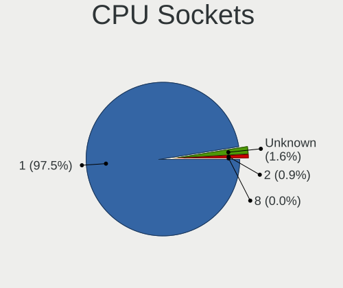

| Number  | Desktops | Percent |
|---------|----------|---------|
| 1       | 12415    | 97.46%  |
| Unknown | 209      | 1.64%   |
| 2       | 111      | 0.87%   |
| 4       | 2        | 0.02%   |
| 8       | 1        | 0.01%   |

CPU Threads
-----------

Threads per core (Hyper-Threading)

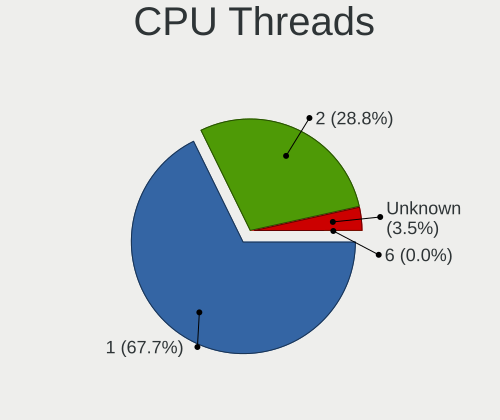

| Number  | Desktops | Percent |
|---------|----------|---------|
| 1       | 8747     | 67.73%  |
| 2       | 3720     | 28.8%   |
| Unknown | 447      | 3.46%   |
| 6       | 1        | 0.01%   |

CPU Microarch
-------------

Microarchitecture

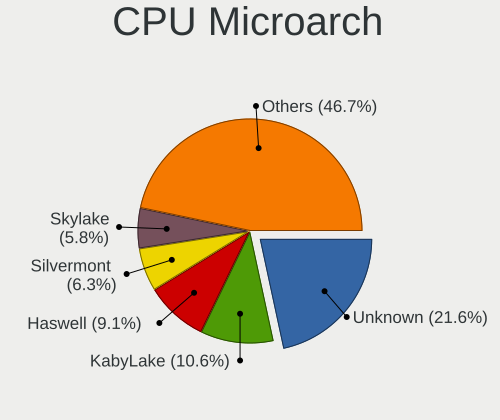

| Name          | Desktops | Percent |
|---------------|----------|---------|
| Unknown       | 2782     | 21.62%  |
| KabyLake      | 1358     | 10.56%  |
| Haswell       | 1165     | 9.06%   |
| Silvermont    | 807      | 6.27%   |
| Skylake       | 745      | 5.79%   |
| IvyBridge     | 704      | 5.47%   |
| Goldmont plus | 598      | 4.65%   |
| Puma          | 537      | 4.17%   |
| SandyBridge   | 510      | 3.96%   |
| Goldmont      | 361      | 2.81%   |
| Penryn        | 335      | 2.6%    |
| Zen 3         | 300      | 2.33%   |
| Jaguar        | 283      | 2.2%    |
| Zen 2         | 251      | 1.95%   |
| CometLake     | 239      | 1.86%   |
| Zen+          | 200      | 1.55%   |
| Broadwell     | 198      | 1.54%   |
| Bonnell       | 194      | 1.51%   |
| Zen           | 168      | 1.31%   |
| Piledriver    | 158      | 1.23%   |
| K10           | 144      | 1.12%   |
| Core          | 144      | 1.12%   |
| Westmere      | 131      | 1.02%   |
| Nehalem       | 127      | 0.99%   |
| Bobcat        | 116      | 0.9%    |
| TigerLake     | 71       | 0.55%   |
| K8 Hammer     | 50       | 0.39%   |
| NetBurst      | 44       | 0.34%   |
| Steamroller   | 34       | 0.26%   |
| Bulldozer     | 34       | 0.26%   |
| Excavator     | 31       | 0.24%   |
| IceLake       | 13       | 0.1%    |
| K10 Llano     | 12       | 0.09%   |
| P6            | 10       | 0.08%   |
| Geode         | 7        | 0.05%   |
| K6            | 4        | 0.03%   |

Graphics
--------

GPU Vendor
----------

Vendors of graphics cards

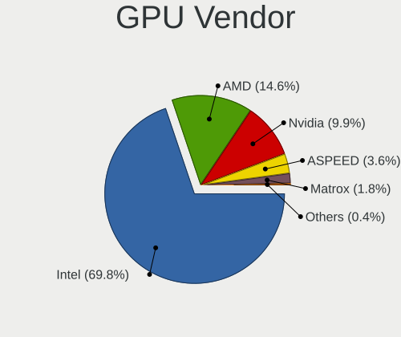

| Vendor                                       | Desktops | Percent |
|----------------------------------------------|----------|---------|
| Intel                                        | 8475     | 69.82%  |
| AMD                                          | 1769     | 14.57%  |
| Nvidia                                       | 1202     | 9.9%    |
| ASPEED Technology                            | 432      | 3.56%   |
| Matrox Electronics Systems                   | 215      | 1.77%   |
| XGI Technology (eXtreme Graphics Innovation) | 14       | 0.12%   |
| VIA Technologies                             | 10       | 0.08%   |
| S3 Graphics                                  | 6        | 0.05%   |
| Silicon Integrated Systems [SiS]             | 4        | 0.03%   |
| Red Hat                                      | 4        | 0.03%   |
| RDC Semiconductor                            | 2        | 0.02%   |
| Tseng Labs                                   | 1        | 0.01%   |
| Silicon Motion                               | 1        | 0.01%   |
| NVidia / SGS Thomson (Joint Venture)         | 1        | 0.01%   |
| Cirrus Logic                                 | 1        | 0.01%   |
| 3DLabs                                       | 1        | 0.01%   |
| 3Dfx Interactive                             | 1        | 0.01%   |

GPU Model
---------

Graphics card models

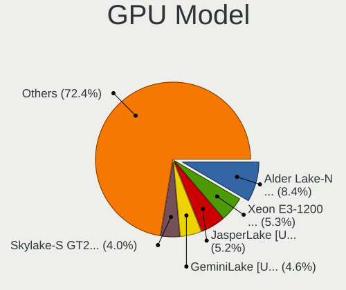

| Model                                                                                    | Desktops | Percent |
|------------------------------------------------------------------------------------------|----------|---------|
| Intel Alder Lake-N [UHD Graphics]                                                        | 1042     | 8.45%   |
| Intel Xeon E3-1200 v3/4th Gen Core Processor Integrated Graphics Controller              | 655      | 5.31%   |
| Intel JasperLake [UHD Graphics]                                                          | 643      | 5.21%   |
| Intel GeminiLake [UHD Graphics 600]                                                      | 565      | 4.58%   |
| Intel Skylake-S GT2 [HD Graphics 530]                                                    | 496      | 4.02%   |
| Intel Atom/Celeron/Pentium Processor x5-E8000/J3xxx/N3xxx Integrated Graphics Controller | 449      | 3.64%   |
| ASPEED Technology ASPEED Graphics Family                                                 | 432      | 3.5%    |
| Intel CoffeeLake-S GT2 [UHD Graphics 630]                                                | 396      | 3.21%   |
| Intel 2nd Generation Core Processor Family Integrated Graphics Controller                | 338      | 2.74%   |
| Intel Xeon E3-1200 v2/3rd Gen Core processor Graphics Controller                         | 321      | 2.6%    |
| Intel Atom Processor Z36xxx/Z37xxx Series Graphics & Display                             | 310      | 2.51%   |
| Intel Kaby Lake-S GT2 [HD Graphics 630]                                                  | 272      | 2.21%   |
| Intel Alder Lake-N [Intel Graphics]                                                      | 190      | 1.54%   |
| Intel Kaby Lake-U GT2 [HD Graphics 620]                                                  | 183      | 1.48%   |
| Intel 4 Series Chipset Integrated Graphics Controller                                    | 182      | 1.48%   |
| Intel Elkhart Lake [UHD Graphics Gen11 16EU]                                             | 170      | 1.38%   |
| Intel Apollo Lake GT1 [HD Graphics 500]                                                  | 152      | 1.23%   |
| Intel 4th Generation Core Processor Family Integrated Graphics Controller                | 152      | 1.23%   |
| AMD Cezanne [Radeon Vega Series / Radeon Vega Mobile Series]                             | 150      | 1.22%   |
| Intel CometLake-S GT2 [UHD Graphics 630]                                                 | 136      | 1.1%    |
| Nvidia GK208B [GeForce GT 710]                                                           | 122      | 0.99%   |
| Intel IvyBridge GT2 [HD Graphics 4000]                                                   | 119      | 0.96%   |
| Intel Haswell-ULT Integrated Graphics Controller                                         | 119      | 0.96%   |
| AMD Ellesmere [Radeon RX 470/480/570/570X/580/580X/590]                                  | 117      | 0.95%   |
| Matrox Electronics Systems MGA G200eW WPCM450                                            | 112      | 0.91%   |
| AMD Kabini [Radeon HD 8330E]                                                             | 104      | 0.84%   |
| Intel Kaby Lake-R GT2 [UHD Graphics 620]                                                 | 93       | 0.75%   |
| Intel Atom Processor D4xx/D5xx/N4xx/N5xx Integrated Graphics Controller                  | 93       | 0.75%   |
| AMD Picasso/Raven 2 [Radeon Vega Series / Radeon Vega Mobile Series]                     | 91       | 0.74%   |
| AMD Kabini [Radeon HD 8400E]                                                             | 83       | 0.67%   |
| AMD Mullins [Radeon R4/R5 Graphics]                                                      | 80       | 0.65%   |
| Intel Broadwell-U GT2 [HD Graphics 5500]                                                 | 77       | 0.62%   |
| AMD Raven Ridge [Radeon Vega Series / Radeon Vega Mobile Series]                         | 76       | 0.62%   |
| Nvidia GP108 [GeForce GT 1030]                                                           | 70       | 0.57%   |
| Intel Kaby Lake-U GT1 [HD Graphics 610]                                                  | 68       | 0.55%   |
| Intel Alder Lake-UP3 GT1 [UHD Graphics]                                                  | 65       | 0.53%   |
| AMD Renoir [Radeon Vega Series / Radeon Vega Mobile Series]                              | 61       | 0.49%   |
| Matrox Electronics Systems MGA G200EH                                                    | 58       | 0.47%   |
| Intel TigerLake-LP GT2 [Iris Xe Graphics]                                                | 58       | 0.47%   |
| Intel Alder Lake-S GT1 [UHD Graphics 730]                                                | 57       | 0.46%   |

GPU Combo
---------

Combinations of graphics cards

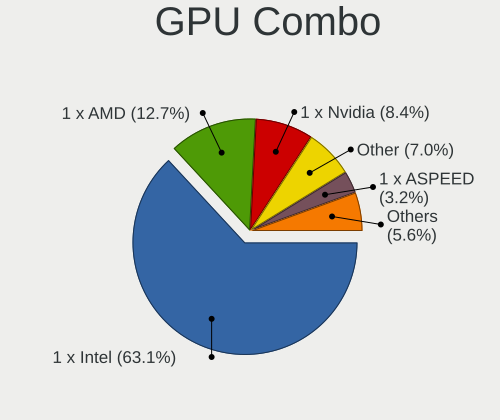

| Name                                     | Desktops | Percent |
|------------------------------------------|----------|---------|
| 1 x Intel                                | 8111     | 63.11%  |
| 1 x AMD                                  | 1635     | 12.72%  |
| 1 x Nvidia                               | 1074     | 8.36%   |
| Other                                    | 905      | 7.04%   |
| 1 x ASPEED                               | 411      | 3.2%    |
| 1 x Matrox                               | 210      | 1.63%   |
| 2 x Intel                                | 208      | 1.62%   |
| Intel + Nvidia                           | 86       | 0.67%   |
| Intel + AMD                              | 54       | 0.42%   |
| 2 x AMD                                  | 51       | 0.4%    |
| AMD + Nvidia                             | 26       | 0.2%    |
| 1 x XGI                                  | 14       | 0.11%   |
| Intel + ASPEED                           | 11       | 0.09%   |
| 1 x VIA                                  | 10       | 0.08%   |
| 2 x Nvidia                               | 6        | 0.05%   |
| AMD + ASPEED                             | 6        | 0.05%   |
| 1 x S3 Graphics                          | 5        | 0.04%   |
| Nvidia + ASPEED                          | 5        | 0.04%   |
| 1 x SiS                                  | 4        | 0.03%   |
| 1 x Red Hat                              | 4        | 0.03%   |
| 1 x RDC Semiconductor                    | 2        | 0.02%   |
| Nvidia + Matrox                          | 2        | 0.02%   |
| 2 x AMD + 1 x ASPEED                     | 1        | 0.01%   |
| 1 x Tseng Labs                           | 1        | 0.01%   |
| 1 x Silicon Motion                       | 1        | 0.01%   |
| 1 x NVidia / SGS Thomson (Joint Venture) | 1        | 0.01%   |
| Intel + 2 x AMD                          | 1        | 0.01%   |
| Intel + S3 Graphics                      | 1        | 0.01%   |
| Intel + Matrox                           | 1        | 0.01%   |
| Intel + AMD + 1 x Nvidia                 | 1        | 0.01%   |
| 1 x Cirrus Logic                         | 1        | 0.01%   |
| AMD + Matrox                             | 1        | 0.01%   |
| 1 x 3DLabs                               | 1        | 0.01%   |
| 1 x 3Dfx Interactive                     | 1        | 0.01%   |

GPU Driver
----------

Free vs proprietary

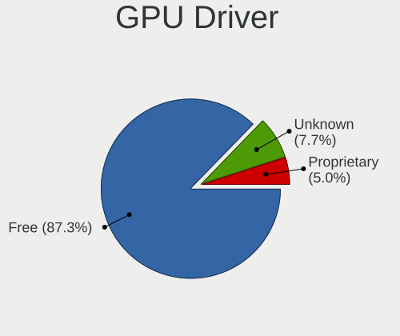

| Driver      | Desktops | Percent |
|-------------|----------|---------|
| Free        | 11170    | 87.27%  |
| Unknown     | 989      | 7.73%   |
| Proprietary | 640      | 5%      |

GPU Memory
----------

Total video memory

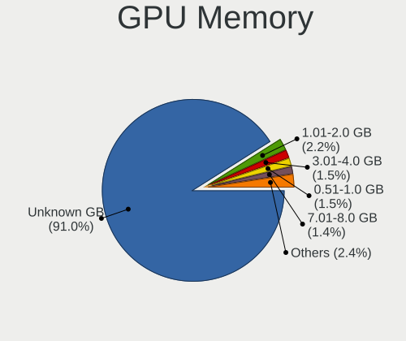

| Size in GB | Desktops | Percent |
|------------|----------|---------|
| Unknown    | 11682    | 91.05%  |
| 1.01-2.0   | 279      | 2.17%   |
| 3.01-4.0   | 194      | 1.51%   |
| 0.51-1.0   | 193      | 1.5%    |
| 7.01-8.0   | 176      | 1.37%   |
| 0.01-0.5   | 142      | 1.11%   |
| 5.01-6.0   | 80       | 0.62%   |
| 8.01-16.0  | 50       | 0.39%   |
| 2.01-3.0   | 22       | 0.17%   |
| 16.01-24.0 | 10       | 0.08%   |
| 4.01-5.0   | 3        | 0.02%   |

Monitor
-------

Monitor Vendor
--------------

Monitor vendors

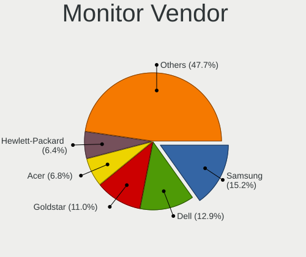

| Vendor               | Desktops | Percent |
|----------------------|----------|---------|
| Samsung Electronics  | 293      | 15.17%  |
| Dell                 | 249      | 12.89%  |
| Goldstar             | 213      | 11.03%  |
| Acer                 | 132      | 6.84%   |
| Hewlett-Packard      | 123      | 6.37%   |
| Philips              | 102      | 5.28%   |
| BenQ                 | 88       | 4.56%   |
| AOC                  | 73       | 3.78%   |
| Ancor Communications | 70       | 3.63%   |
| ViewSonic            | 58       | 3%      |
| Iiyama               | 51       | 2.64%   |
| Lenovo               | 43       | 2.23%   |
| ASUSTek Computer     | 41       | 2.12%   |
| LG Electronics       | 34       | 1.76%   |
| Sony                 | 26       | 1.35%   |
| NEC Computers        | 23       | 1.19%   |
| MSI                  | 23       | 1.19%   |
| Eizo                 | 21       | 1.09%   |
| Fujitsu Siemens      | 19       | 0.98%   |
| Idek Iiyama          | 12       | 0.62%   |
| Unknown              | 11       | 0.57%   |
| Vizio                | 9        | 0.47%   |
| Toshiba              | 9        | 0.47%   |
| Mi                   | 9        | 0.47%   |
| Apple                | 7        | 0.36%   |
| Unknown              | 6        | 0.31%   |
| Sceptre Tech         | 5        | 0.26%   |
| RTK                  | 5        | 0.26%   |
| HannStar             | 5        | 0.26%   |
| Gigabyte Technology  | 5        | 0.26%   |
| Vestel Elektronik    | 4        | 0.21%   |
| Medion               | 4        | 0.21%   |
| LG Display           | 4        | 0.21%   |
| IPS                  | 4        | 0.21%   |
| Insignia             | 4        | 0.21%   |
| AU Optronics         | 4        | 0.21%   |
| Westinghouse         | 3        | 0.16%   |
| VIE                  | 3        | 0.16%   |
| SKG                  | 3        | 0.16%   |
| RS                   | 3        | 0.16%   |

Monitor Model
-------------

Monitor models

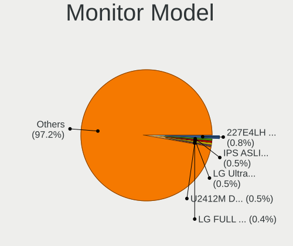

| Model                                                                 | Desktops | Percent |
|-----------------------------------------------------------------------|----------|---------|
| Philips 227E4LH PHLC0AC 1920x1080 480x270mm 21.7-inch                 | 17       | 0.83%   |
| Unknown                                                               | 11       | 0.54%   |
| Goldstar LG Ultra HD GSM5B09 3840x2160 600x340mm 27.2-inch            | 10       | 0.49%   |
| Dell U2412M DELA07A 1920x1200 520x320mm 24.0-inch                     | 10       | 0.49%   |
| Goldstar LG FULL HD GSM5B55 1920x1080 480x270mm 21.7-inch             | 9        | 0.44%   |
| Samsung Electronics C24F390 SAM0D2C 1920x1080 520x290mm 23.4-inch     | 8        | 0.39%   |
| Samsung Electronics U28E590 SAM0C4D 3840x2160 610x350mm 27.7-inch     | 7        | 0.34%   |
| Goldstar LG ULTRAWIDE GSM59F1 2560x1080 670x280mm 28.6-inch           | 7        | 0.34%   |
| Goldstar LG IPS FULLHD GSM5AB8 1920x1080 480x270mm 21.7-inch          | 7        | 0.34%   |
| Acer G227HQL ACR03DE 1920x1080 480x270mm 21.7-inch                    | 7        | 0.34%   |
| Philips PHL 223V5 PHLC0CF 1920x1080 480x270mm 21.7-inch               | 6        | 0.29%   |
| MSI G241 MSI3BA4 1920x1080 530x300mm 24.0-inch                        | 6        | 0.29%   |
| Iiyama PL2775HD IVM6604 1920x1080 600x340mm 27.2-inch                 | 6        | 0.29%   |
| Goldstar LG HDR 4K GSM7707 3840x2160 600x340mm 27.2-inch              | 6        | 0.29%   |
| Goldstar LG HDR 4K GSM7706 3840x2160 600x340mm 27.2-inch              | 6        | 0.29%   |
| Dell U2412M DELA07B 1920x1200 520x320mm 24.0-inch                     | 6        | 0.29%   |
| Samsung Electronics S24F350 SAM0D20 1920x1080 520x290mm 23.4-inch     | 5        | 0.24%   |
| Samsung Electronics S24C650 SAM09E9 1920x1080 520x290mm 23.4-inch     | 5        | 0.24%   |
| Samsung Electronics LCD Monitor SAM0C39 1920x1080 700x390mm 31.5-inch | 5        | 0.24%   |
| Philips PHL 243V5 PHLC0D1 1920x1080 520x290mm 23.4-inch               | 5        | 0.24%   |
| Lenovo LEN X24A LEN60CF 1920x1080 530x300mm 24.0-inch                 | 5        | 0.24%   |
| Goldstar W1934 GSM4B7A 1440x900 410x260mm 19.1-inch                   | 5        | 0.24%   |
| Goldstar LG Ultra HD GSM5B08 3840x2160 600x340mm 27.2-inch            | 5        | 0.24%   |
| AOC 24G2W1G4 AOC2402 1920x1080 530x300mm 24.0-inch                    | 5        | 0.24%   |
| ViewSonic VA2418-FHD VSCD739 1920x1080 530x300mm 24.0-inch            | 4        | 0.2%    |
| Vestel Elektronik 32W_LCD_TV VES3700 1920x1080 710x400mm 32.1-inch    | 4        | 0.2%    |
| Samsung Electronics SyncMaster SAM011F 1280x1024 380x300mm 19.1-inch  | 4        | 0.2%    |
| Iiyama PLX2783H IVM6648 1920x1080 600x340mm 27.2-inch                 | 4        | 0.2%    |
| Hewlett-Packard All-in-One HWP4218 1600x900 440x250mm 19.9-inch       | 4        | 0.2%    |
| Goldstar LG IPS FULLHD GSM5AB6 1920x1080 480x270mm 21.7-inch          | 4        | 0.2%    |
| Goldstar 22MP55 GSM5A26 1920x1080 480x270mm 21.7-inch                 | 4        | 0.2%    |
| Dell U2415 DELA0BA 1920x1200 520x320mm 24.0-inch                      | 4        | 0.2%    |
| Dell U2414H DELA0A4 1920x1080 530x300mm 24.0-inch                     | 4        | 0.2%    |
| Dell E196FP DELA015 1280x1024 380x300mm 19.1-inch                     | 4        | 0.2%    |
| Dell 2001FP DELA007 1600x1200 410x310mm 20.2-inch                     | 4        | 0.2%    |
| BenQ GW2270 BNQ78DB 1920x1080 480x270mm 21.7-inch                     | 4        | 0.2%    |
| AOC Q27P1B AOC2701 2560x1440 600x340mm 27.2-inch                      | 4        | 0.2%    |
| AOC 24G1WG4 AOC2401 1920x1080 520x290mm 23.4-inch                     | 4        | 0.2%    |
| AOC 2470W AOC2470 1920x1080 520x290mm 23.4-inch                       | 4        | 0.2%    |
| Ancor Communications ASUS VW199 ACI19ED 1440x900 410x260mm 19.1-inch  | 4        | 0.2%    |

Monitor Resolution
------------------

Monitor screen resolution

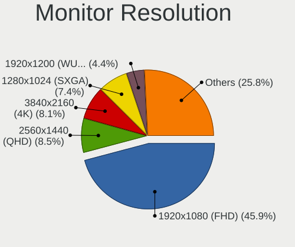

| Resolution         | Desktops | Percent |
|--------------------|----------|---------|
| 1920x1080 (FHD)    | 870      | 45.86%  |
| 2560x1440 (QHD)    | 161      | 8.49%   |
| 3840x2160 (4K)     | 154      | 8.12%   |
| 1280x1024 (SXGA)   | 140      | 7.38%   |
| 1920x1200 (WUXGA)  | 83       | 4.38%   |
| 1680x1050 (WSXGA+) | 73       | 3.85%   |
| 1366x768 (WXGA)    | 70       | 3.69%   |
| 1440x900 (WXGA+)   | 66       | 3.48%   |
| 1600x900 (HD+)     | 49       | 2.58%   |
| 2560x1080          | 37       | 1.95%   |
| Unknown            | 35       | 1.85%   |
| 3440x1440          | 34       | 1.79%   |
| 1600x1200          | 19       | 1%      |
| 1360x768           | 18       | 0.95%   |
| 3840x1080          | 16       | 0.84%   |
| 1024x768 (XGA)     | 15       | 0.79%   |
| 1920x540           | 8        | 0.42%   |
| 2560x1600          | 7        | 0.37%   |
| 2048x1152          | 4        | 0.21%   |
| 3840x1600          | 3        | 0.16%   |
| 1280x800 (WXGA)    | 3        | 0.16%   |
| 5120x1440          | 2        | 0.11%   |
| 3840x1200          | 2        | 0.11%   |
| 1280x720 (HD)      | 2        | 0.11%   |
| 8960x1440          | 1        | 0.05%   |
| 7860x2400          | 1        | 0.05%   |
| 7680x2160          | 1        | 0.05%   |
| 6400x2160          | 1        | 0.05%   |
| 5760x2160          | 1        | 0.05%   |
| 5760x1256          | 1        | 0.05%   |
| 5760x1200          | 1        | 0.05%   |
| 5760x1080          | 1        | 0.05%   |
| 4640x1080          | 1        | 0.05%   |
| 3640x1920          | 1        | 0.05%   |
| 3600x1080          | 1        | 0.05%   |
| 3520x1200          | 1        | 0.05%   |
| 3520x1080          | 1        | 0.05%   |
| 3360x1050          | 1        | 0.05%   |
| 3200x1080          | 1        | 0.05%   |
| 2944x1080          | 1        | 0.05%   |

Monitor Diagonal
----------------

Diagonal size in inches

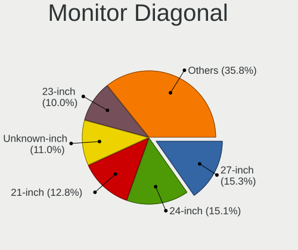

| Inches  | Desktops | Percent |
|---------|----------|---------|
| 27      | 295      | 15.29%  |
| 24      | 292      | 15.14%  |
| 21      | 246      | 12.75%  |
| Unknown | 213      | 11.04%  |
| 23      | 193      | 10.01%  |
| 19      | 167      | 8.66%   |
| 31      | 93       | 4.82%   |
| 17      | 62       | 3.21%   |
| 18      | 59       | 3.06%   |
| 22      | 48       | 2.49%   |
| 34      | 43       | 2.23%   |
| 20      | 27       | 1.4%    |
| 15      | 27       | 1.4%    |
| 14      | 17       | 0.88%   |
| 13      | 11       | 0.57%   |
| 40      | 10       | 0.52%   |
| 29      | 10       | 0.52%   |
| 28      | 10       | 0.52%   |
| 25      | 9        | 0.47%   |
| 54      | 8        | 0.41%   |
| 52      | 8        | 0.41%   |
| 42      | 8        | 0.41%   |
| 32      | 8        | 0.41%   |
| 26      | 6        | 0.31%   |
| 16      | 6        | 0.31%   |
| 48      | 5        | 0.26%   |
| 46      | 5        | 0.26%   |
| 50      | 4        | 0.21%   |
| 41      | 4        | 0.21%   |
| 39      | 4        | 0.21%   |
| 33      | 4        | 0.21%   |
| 49      | 3        | 0.16%   |
| 65      | 2        | 0.1%    |
| 64      | 2        | 0.1%    |
| 57      | 2        | 0.1%    |
| 43      | 2        | 0.1%    |
| 37      | 2        | 0.1%    |
| 36      | 2        | 0.1%    |
| 35      | 2        | 0.1%    |
| 9       | 2        | 0.1%    |

Monitor Width
-------------

Physical width

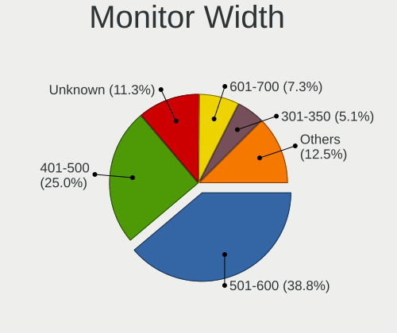

| Width in mm | Desktops | Percent |
|-------------|----------|---------|
| 501-600     | 732      | 38.83%  |
| 401-500     | 471      | 24.99%  |
| Unknown     | 213      | 11.3%   |
| 601-700     | 138      | 7.32%   |
| 301-350     | 96       | 5.09%   |
| 351-400     | 75       | 3.98%   |
| 701-800     | 57       | 3.02%   |
| 1001-1500   | 41       | 2.18%   |
| 201-300     | 25       | 1.33%   |
| 801-900     | 17       | 0.9%    |
| 901-1000    | 16       | 0.85%   |
| 101-200     | 2        | 0.11%   |
| 1501-2000   | 1        | 0.05%   |
| 1-100       | 1        | 0.05%   |

Aspect Ratio
------------

Proportional relationship between the width and the height

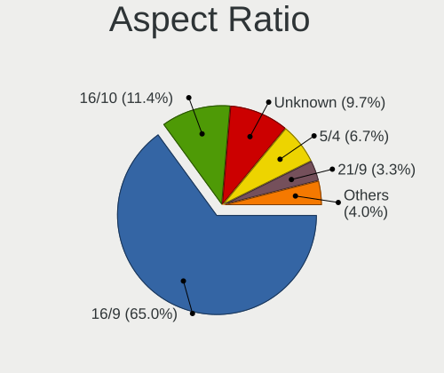

| Ratio   | Desktops | Percent |
|---------|----------|---------|
| 16/9    | 1184     | 64.98%  |
| 16/10   | 207      | 11.36%  |
| Unknown | 176      | 9.66%   |
| 5/4     | 122      | 6.7%    |
| 21/9    | 61       | 3.35%   |
| 4/3     | 41       | 2.25%   |
| 3/2     | 17       | 0.93%   |
| 32/9    | 8        | 0.44%   |
| 6/5     | 6        | 0.33%   |

Monitor Area
------------

Area in inch²

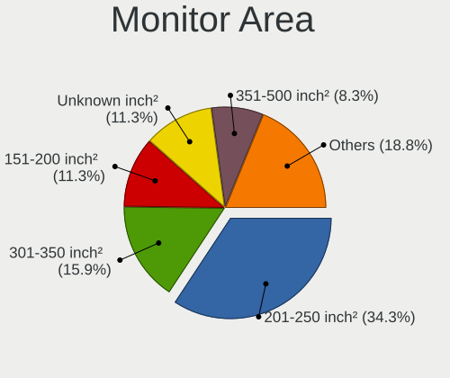

| Area in inch² | Desktops | Percent |
|----------------|----------|---------|
| 201-250        | 650      | 34.28%  |
| 301-350        | 302      | 15.93%  |
| 151-200        | 215      | 11.34%  |
| Unknown        | 214      | 11.29%  |
| 351-500        | 158      | 8.33%   |
| 141-150        | 109      | 5.75%   |
| 251-300        | 105      | 5.54%   |
| 501-1000       | 44       | 2.32%   |
| More than 1000 | 31       | 1.64%   |
| 101-110        | 23       | 1.21%   |
| 91-100         | 11       | 0.58%   |
| 81-90          | 10       | 0.53%   |
| 111-120        | 9        | 0.47%   |
| 121-130        | 6        | 0.32%   |
| 131-140        | 3        | 0.16%   |
| 71-80          | 2        | 0.11%   |
| 61-70          | 1        | 0.05%   |
| 51-60          | 1        | 0.05%   |
| 41-50          | 1        | 0.05%   |
| 1-40           | 1        | 0.05%   |

Pixel Density
-------------

Pixels per inch

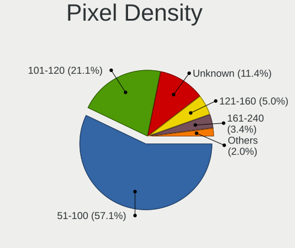

| Density       | Desktops | Percent |
|---------------|----------|---------|
| 51-100        | 1068     | 57.08%  |
| 101-120       | 395      | 21.11%  |
| Unknown       | 213      | 11.38%  |
| 121-160       | 94       | 5.02%   |
| 161-240       | 63       | 3.37%   |
| 1-50          | 36       | 1.92%   |
| More than 240 | 2        | 0.11%   |

Multiple Monitors
-----------------

Total monitors connected

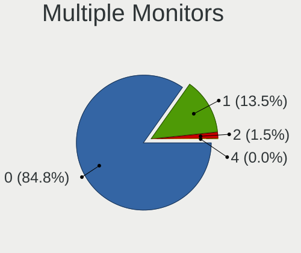

| Total | Desktops | Percent |
|-------|----------|---------|
| 0     | 10872    | 84.79%  |
| 1     | 1736     | 13.54%  |
| 2     | 191      | 1.49%   |
| 3     | 22       | 0.17%   |
| 4     | 1        | 0.01%   |

Network
-------

Net Controller Vendor
---------------------

Controller vendors

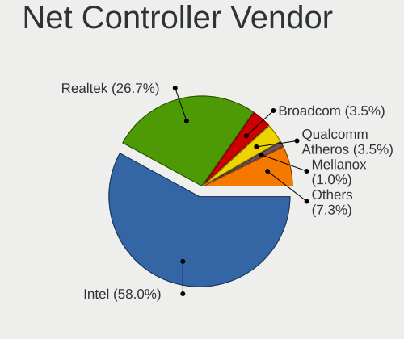

| Vendor                          | Desktops | Percent |
|---------------------------------|----------|---------|
| Intel                           | 9895     | 57.95%  |
| Realtek Semiconductor           | 4566     | 26.74%  |
| Broadcom                        | 604      | 3.54%   |
| Qualcomm Atheros                | 597      | 3.5%    |
| Mellanox Technologies           | 170      | 1%      |
| MediaTek                        | 117      | 0.69%   |
| IMC Networks                    | 84       | 0.49%   |
| Ralink Technology               | 78       | 0.46%   |
| D-Link System                   | 72       | 0.42%   |
| TP-Link                         | 70       | 0.41%   |
| Marvell Technology Group        | 52       | 0.3%    |
| U-Blox                          | 51       | 0.3%    |
| Chelsio Communications          | 51       | 0.3%    |
| Ralink                          | 47       | 0.28%   |
| Aquantia                        | 47       | 0.28%   |
| American Megatrends             | 38       | 0.22%   |
| Samsung Electronics             | 34       | 0.2%    |
| VIA Technologies                | 29       | 0.17%   |
| Huawei Technologies             | 27       | 0.16%   |
| Edimax Technology               | 27       | 0.16%   |
| 3Com                            | 26       | 0.15%   |
| Solarflare Communications       | 24       | 0.14%   |
| Qualcomm Atheros Communications | 19       | 0.11%   |
| Seeed Technology                | 16       | 0.09%   |
| ASUSTek Computer                | 15       | 0.09%   |
| ZTE WCDMA Technologies MSM      | 12       | 0.07%   |
| Nvidia                          | 12       | 0.07%   |
| Emulex                          | 12       | 0.07%   |
| sipeed                          | 11       | 0.06%   |
| Insyde Software                 | 11       | 0.06%   |
| Google                          | 10       | 0.06%   |
| D-Link                          | 10       | 0.06%   |
| Microchip Technology            | 9        | 0.05%   |
| Apple                           | 9        | 0.05%   |
| Qualcomm                        | 8        | 0.05%   |
| Xiaomi                          | 7        | 0.04%   |
| QLogic                          | 7        | 0.04%   |
| OPPO Electronics                | 7        | 0.04%   |
| Qualcomm Technologies           | 6        | 0.04%   |
| ICS Advent                      | 6        | 0.04%   |

Net Controller Model
--------------------

Controller models

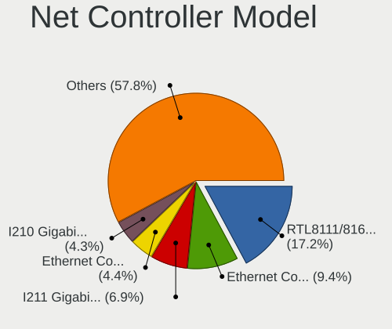

| Model                                                                         | Desktops | Percent |
|-------------------------------------------------------------------------------|----------|---------|
| Realtek RTL8111/8168/8211/8411 PCI Express Gigabit Ethernet Controller        | 3675     | 17.16%  |
| Intel Ethernet Controller I226-V                                              | 2021     | 9.44%   |
| Intel I211 Gigabit Network Connection                                         | 1467     | 6.85%   |
| Intel Ethernet Controller I225-V                                              | 950      | 4.44%   |
| Intel I210 Gigabit Network Connection                                         | 926      | 4.32%   |
| Intel I350 Gigabit Network Connection                                         | 625      | 2.92%   |
| Intel 82574L Gigabit Network Connection                                       | 615      | 2.87%   |
| Intel 82579LM Gigabit Network Connection (Lewisville)                         | 483      | 2.26%   |
| Realtek RTL8125 2.5GbE Controller                                             | 463      | 2.16%   |
| Intel 82599ES 10-Gigabit SFI/SFP+ Network Connection                          | 419      | 1.96%   |
| Intel Ethernet Connection I217-LM                                             | 402      | 1.88%   |
| Intel 82576 Gigabit Network Connection                                        | 296      | 1.38%   |
| Intel 82583V Gigabit Network Connection                                       | 272      | 1.27%   |
| Intel Ethernet Connection (2) I219-LM                                         | 271      | 1.27%   |
| Intel 82580 Gigabit Network Connection                                        | 256      | 1.2%    |
| Intel 82571EB/82571GB Gigabit Ethernet Controller D0/D1 (copper applications) | 254      | 1.19%   |
| Intel Ethernet Connection (2) I219-V                                          | 224      | 1.05%   |
| Intel Ethernet Controller 10-Gigabit X540-AT2                                 | 203      | 0.95%   |
| Realtek RTL8821CE 802.11ac PCIe Wireless Network Adapter                      | 194      | 0.91%   |
| Intel Wi-Fi 6 AX200                                                           | 191      | 0.89%   |
| Intel 82571EB/82571GB Gigabit Ethernet Controller (Copper)                    | 186      | 0.87%   |
| Realtek RTL8111/8168/8411 PCI Express Gigabit Ethernet Controller             | 159      | 0.74%   |
| Intel Ethernet Controller X710 for 10GbE SFP+                                 | 154      | 0.72%   |
| Intel Ethernet Connection (7) I219-LM                                         | 137      | 0.64%   |
| Intel Ethernet Connection X553 10 GbE SFP+                                    | 131      | 0.61%   |
| Intel Ethernet Controller X550                                                | 122      | 0.57%   |
| Intel 82579V Gigabit Network Connection                                       | 101      | 0.47%   |
| Intel Ethernet Connection (7) I219-V                                          | 99       | 0.46%   |
| Intel Ethernet Connection (5) I219-LM                                         | 98       | 0.46%   |
| Mellanox MT27500 Family [ConnectX-3]                                          | 97       | 0.45%   |
| Intel 82575EB Gigabit Network Connection                                      | 96       | 0.45%   |
| Realtek RTL810xE PCI Express Fast Ethernet controller                         | 94       | 0.44%   |
| Intel Alder Lake-N PCH CNVi WiFi                                              | 92       | 0.43%   |
| Realtek RTL-8100/8101L/8139 PCI Fast Ethernet Adapter                         | 91       | 0.42%   |
| Intel Ethernet Connection I217-V                                              | 87       | 0.41%   |
| Realtek RTL8169 PCI Gigabit Ethernet Controller                               | 83       | 0.39%   |
| Intel Dual Band Wireless-AC 3168NGW [Stone Peak]                              | 83       | 0.39%   |
| Broadcom NetXtreme BCM5719 Gigabit Ethernet PCIe                              | 83       | 0.39%   |
| Broadcom NetXtreme BCM5720 Gigabit Ethernet PCIe                              | 82       | 0.38%   |
| Intel Wireless 7260                                                           | 81       | 0.38%   |

Wireless Vendor
---------------

Wireless vendors

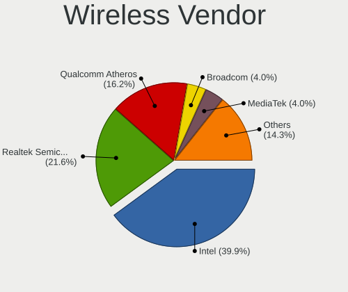

| Vendor                                | Desktops | Percent |
|---------------------------------------|----------|---------|
| Intel                                 | 1099     | 39.93%  |
| Realtek Semiconductor                 | 594      | 21.58%  |
| Qualcomm Atheros                      | 446      | 16.21%  |
| Broadcom                              | 110      | 4%      |
| MediaTek                              | 109      | 3.96%   |
| IMC Networks                          | 84       | 3.05%   |
| Ralink Technology                     | 78       | 2.83%   |
| TP-Link                               | 68       | 2.47%   |
| Ralink                                | 47       | 1.71%   |
| Edimax Technology                     | 27       | 0.98%   |
| Qualcomm Atheros Communications       | 19       | 0.69%   |
| ASUSTek Computer                      | 15       | 0.55%   |
| D-Link                                | 10       | 0.36%   |
| D-Link System                         | 6        | 0.22%   |
| NetGear                               | 5        | 0.18%   |
| Qualcomm Technologies                 | 4        | 0.15%   |
| Linksys                               | 4        | 0.15%   |
| Sierra Wireless                       | 3        | 0.11%   |
| Belkin Components                     | 3        | 0.11%   |
| Atheros                               | 3        | 0.11%   |
| ZyXEL Communications                  | 2        | 0.07%   |
| Micro Star International              | 2        | 0.07%   |
| Mercucys                              | 2        | 0.07%   |
| Marvell Technology Group              | 2        | 0.07%   |
| Dell                                  | 2        | 0.07%   |
| Accton Technology                     | 2        | 0.07%   |
| 802.11g Adapter [Linksys WUSB54GC v3] | 2        | 0.07%   |
| Sitecom Europe                        | 1        | 0.04%   |
| Qcom                                  | 1        | 0.04%   |
| Gemtek                                | 1        | 0.04%   |
| AboCom Systems                        | 1        | 0.04%   |

Wireless Model
--------------

Wireless models

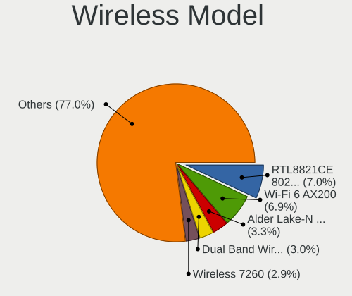

| Model                                                           | Desktops | Percent |
|-----------------------------------------------------------------|----------|---------|
| Realtek RTL8821CE 802.11ac PCIe Wireless Network Adapter        | 194      | 6.97%   |
| Intel Wi-Fi 6 AX200                                             | 191      | 6.86%   |
| Intel Alder Lake-N PCH CNVi WiFi                                | 92       | 3.31%   |
| Intel Dual Band Wireless-AC 3168NGW [Stone Peak]                | 83       | 2.98%   |
| Intel Wireless 7260                                             | 81       | 2.91%   |
| Intel Wi-Fi 6E(802.11ax) AX210/AX1675* 2x2 [Typhoon Peak]       | 80       | 2.87%   |
| IMC Networks 802.11 n/g/b Wireless LAN USB Mini-Card            | 80       | 2.87%   |
| Qualcomm Atheros AR928X Wireless Network Adapter (PCI-Express)  | 78       | 2.8%    |
| Intel Wireless 7265                                             | 69       | 2.48%   |
| Realtek RTL8188EUS 802.11n Wireless Network Adapter             | 65       | 2.34%   |
| Intel Wireless 3165                                             | 65       | 2.34%   |
| MediaTek MT7922 802.11ax PCI Express Wireless Network Adapter   | 63       | 2.26%   |
| Qualcomm Atheros AR93xx Wireless Network Adapter                | 58       | 2.08%   |
| Qualcomm Atheros AR9485 Wireless Network Adapter                | 54       | 1.94%   |
| Qualcomm Atheros AR9462 Wireless Network Adapter                | 46       | 1.65%   |
| Intel Wi-Fi 5(802.11ac) Wireless-AC 9x6x [Thunder Peak]         | 43       | 1.55%   |
| Realtek RTL8852BE PCIe 802.11ax Wireless Network Controller     | 37       | 1.33%   |
| Qualcomm Atheros AR9287 Wireless Network Adapter (PCI-Express)  | 37       | 1.33%   |
| Intel Wireless 8265 / 8275                                      | 37       | 1.33%   |
| Intel Cannon Lake PCH CNVi WiFi                                 | 37       | 1.33%   |
| Qualcomm Atheros QCA986x/988x 802.11ac Wireless Network Adapter | 34       | 1.22%   |
| Intel Wireless 8260                                             | 34       | 1.22%   |
| Intel Wireless 3160                                             | 34       | 1.22%   |
| Realtek RTL8188EE Wireless Network Adapter                      | 32       | 1.15%   |
| Intel Jasper Lake PCH CNVi WiFi                                 | 30       | 1.08%   |
| Intel Gemini Lake PCH CNVi WiFi                                 | 29       | 1.04%   |
| Ralink RT5370 Wireless Adapter                                  | 28       | 1.01%   |
| Qualcomm Atheros QCA9565 / AR9565 Wireless Network Adapter      | 28       | 1.01%   |
| MediaTek MT7921K (RZ608) Wi-Fi 6E 80MHz                         | 28       | 1.01%   |
| Intel Alder Lake-S PCH CNVi WiFi                                | 28       | 1.01%   |
| Qualcomm Atheros QCA6174 802.11ac Wireless Network Adapter      | 27       | 0.97%   |
| Qualcomm Atheros AR9285 Wireless Network Adapter (PCI-Express)  | 27       | 0.97%   |
| Intel Centrino Advanced-N 6235                                  | 27       | 0.97%   |
| Realtek RTL8821AE 802.11ac PCIe Wireless Network Adapter        | 25       | 0.9%    |
| Broadcom BCM4360 802.11ac Dual Band Wireless Network Adapter    | 24       | 0.86%   |
| Broadcom BCM43228 802.11a/b/g/n                                 | 23       | 0.83%   |
| Qualcomm Atheros QCA9377 802.11ac Wireless Network Adapter      | 22       | 0.79%   |
| Intel Tiger Lake PCH CNVi WiFi                                  | 21       | 0.75%   |
| Realtek RTL8723BE PCIe Wireless Network Adapter                 | 20       | 0.72%   |
| Realtek RTL8192EE PCIe Wireless Network Adapter                 | 19       | 0.68%   |

Ethernet Vendor
---------------

Ethernet vendors

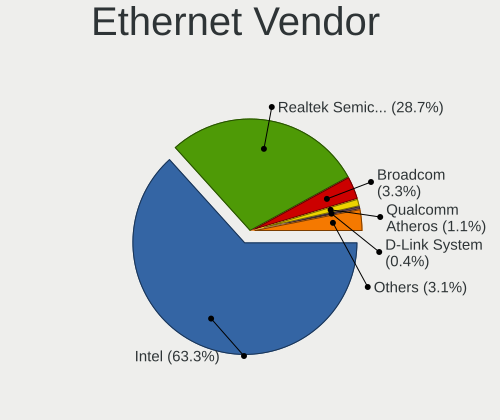

| Vendor                            | Desktops | Percent |
|-----------------------------------|----------|---------|
| Intel                             | 9522     | 63.31%  |
| Realtek Semiconductor             | 4321     | 28.73%  |
| Broadcom                          | 502      | 3.34%   |
| Qualcomm Atheros                  | 162      | 1.08%   |
| D-Link System                     | 64       | 0.43%   |
| Marvell Technology Group          | 50       | 0.33%   |
| Aquantia                          | 46       | 0.31%   |
| Chelsio Communications            | 42       | 0.28%   |
| American Megatrends               | 38       | 0.25%   |
| Samsung Electronics               | 34       | 0.23%   |
| VIA Technologies                  | 29       | 0.19%   |
| Solarflare Communications         | 24       | 0.16%   |
| 3Com                              | 24       | 0.16%   |
| Nvidia                            | 12       | 0.08%   |
| ZTE WCDMA Technologies MSM        | 11       | 0.07%   |
| sipeed                            | 11       | 0.07%   |
| Insyde Software                   | 11       | 0.07%   |
| Emulex                            | 11       | 0.07%   |
| Qualcomm                          | 8        | 0.05%   |
| Apple                             | 8        | 0.05%   |
| Xiaomi                            | 7        | 0.05%   |
| QLogic                            | 7        | 0.05%   |
| OPPO Electronics                  | 7        | 0.05%   |
| Huawei Technologies               | 7        | 0.05%   |
| MediaTek                          | 6        | 0.04%   |
| ICS Advent                        | 6        | 0.04%   |
| Davicom Semiconductor             | 6        | 0.04%   |
| National Semiconductor            | 5        | 0.03%   |
| Sundance Technology Inc / IC Plus | 4        | 0.03%   |
| Novatel Wireless                  | 4        | 0.03%   |
| MYRICOM                           | 4        | 0.03%   |
| AMD                               | 4        | 0.03%   |
| T & A Mobile Phones               | 3        | 0.02%   |
| Oracle/SUN                        | 3        | 0.02%   |
| Microsoft                         | 3        | 0.02%   |
| ADMtek                            | 3        | 0.02%   |
| Accton Technology                 | 3        | 0.02%   |
| TP-Link                           | 2        | 0.01%   |
| Tehuti Networks                   | 2        | 0.01%   |
| Silicom                           | 2        | 0.01%   |

Ethernet Model
--------------

Ethernet models

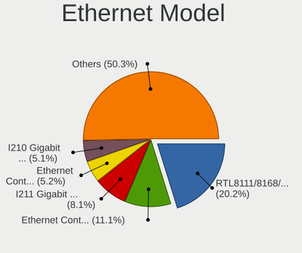

| Model                                                                         | Desktops | Percent |
|-------------------------------------------------------------------------------|----------|---------|
| Realtek RTL8111/8168/8211/8411 PCI Express Gigabit Ethernet Controller        | 3675     | 20.21%  |
| Intel Ethernet Controller I226-V                                              | 2021     | 11.11%  |
| Intel I211 Gigabit Network Connection                                         | 1467     | 8.07%   |
| Intel Ethernet Controller I225-V                                              | 950      | 5.22%   |
| Intel I210 Gigabit Network Connection                                         | 926      | 5.09%   |
| Intel I350 Gigabit Network Connection                                         | 625      | 3.44%   |
| Intel 82574L Gigabit Network Connection                                       | 615      | 3.38%   |
| Intel 82579LM Gigabit Network Connection (Lewisville)                         | 483      | 2.66%   |
| Realtek RTL8125 2.5GbE Controller                                             | 456      | 2.51%   |
| Intel 82599ES 10-Gigabit SFI/SFP+ Network Connection                          | 419      | 2.3%    |
| Intel Ethernet Connection I217-LM                                             | 402      | 2.21%   |
| Intel 82576 Gigabit Network Connection                                        | 296      | 1.63%   |
| Intel 82583V Gigabit Network Connection                                       | 272      | 1.5%    |
| Intel Ethernet Connection (2) I219-LM                                         | 271      | 1.49%   |
| Intel 82580 Gigabit Network Connection                                        | 256      | 1.41%   |
| Intel 82571EB/82571GB Gigabit Ethernet Controller D0/D1 (copper applications) | 254      | 1.4%    |
| Intel Ethernet Connection (2) I219-V                                          | 224      | 1.23%   |
| Intel Ethernet Controller 10-Gigabit X540-AT2                                 | 203      | 1.12%   |
| Intel 82571EB/82571GB Gigabit Ethernet Controller (Copper)                    | 186      | 1.02%   |
| Realtek RTL8111/8168/8411 PCI Express Gigabit Ethernet Controller             | 159      | 0.87%   |
| Intel Ethernet Controller X710 for 10GbE SFP+                                 | 154      | 0.85%   |
| Intel Ethernet Connection (7) I219-LM                                         | 137      | 0.75%   |
| Intel Ethernet Connection X553 10 GbE SFP+                                    | 131      | 0.72%   |
| Intel Ethernet Controller X550                                                | 122      | 0.67%   |
| Intel 82579V Gigabit Network Connection                                       | 101      | 0.56%   |
| Intel Ethernet Connection (7) I219-V                                          | 99       | 0.54%   |
| Intel Ethernet Connection (5) I219-LM                                         | 98       | 0.54%   |
| Intel 82575EB Gigabit Network Connection                                      | 96       | 0.53%   |
| Realtek RTL810xE PCI Express Fast Ethernet controller                         | 94       | 0.52%   |
| Realtek RTL-8100/8101L/8139 PCI Fast Ethernet Adapter                         | 91       | 0.5%    |
| Intel Ethernet Connection I217-V                                              | 87       | 0.48%   |
| Realtek RTL8169 PCI Gigabit Ethernet Controller                               | 83       | 0.46%   |
| Broadcom NetXtreme BCM5719 Gigabit Ethernet PCIe                              | 83       | 0.46%   |
| Broadcom NetXtreme BCM5720 Gigabit Ethernet PCIe                              | 82       | 0.45%   |
| Intel Ethernet Connection X553 1GbE                                           | 79       | 0.43%   |
| Intel 82567LM-3 Gigabit Network Connection                                    | 70       | 0.38%   |
| Intel Ethernet Controller I226-LM                                             | 63       | 0.35%   |
| Intel Ethernet Connection (2) I218-V                                          | 54       | 0.3%    |
| Realtek USB 2.5GbE Controller                                                 | 52       | 0.29%   |
| Broadcom NetXtreme II BCM57810 10 Gigabit Ethernet                            | 51       | 0.28%   |

Net Controller Kind
-------------------

Ethernet, WiFi or modem

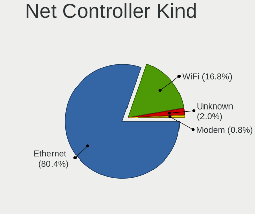

| Kind     | Desktops | Percent |
|----------|----------|---------|
| Ethernet | 12584    | 80.41%  |
| WiFi     | 2631     | 16.81%  |
| Unknown  | 314      | 2.01%   |
| Modem    | 120      | 0.77%   |

Used Controller
---------------

Currently used network controller

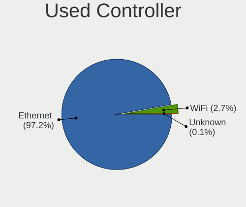

| Kind     | Desktops | Percent |
|----------|----------|---------|
| Ethernet | 12206    | 97.19%  |
| WiFi     | 342      | 2.72%   |
| Unknown  | 11       | 0.09%   |

NICs
----

Total network controllers on board

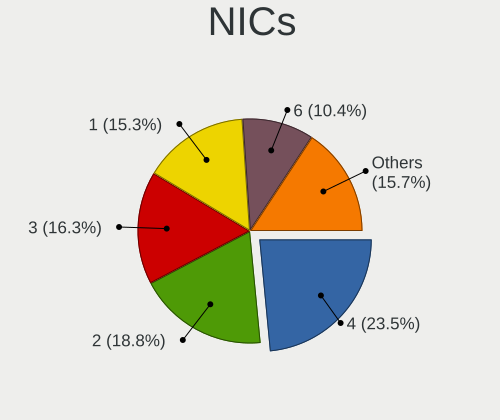

| Total | Desktops | Percent |
|-------|----------|---------|
| 4     | 3056     | 23.49%  |
| 2     | 2449     | 18.82%  |
| 3     | 2120     | 16.29%  |
| 1     | 1993     | 15.32%  |
| 6     | 1347     | 10.35%  |
| 5     | 1105     | 8.49%   |
| 7     | 241      | 1.85%   |
| 8     | 207      | 1.59%   |
| 9     | 203      | 1.56%   |
| 0     | 138      | 1.06%   |
| 10    | 65       | 0.5%    |
| 12    | 22       | 0.17%   |
| 11    | 18       | 0.14%   |
| 13    | 14       | 0.11%   |
| 15    | 10       | 0.08%   |
| 14    | 10       | 0.08%   |
| 16    | 6        | 0.05%   |
| 17    | 4        | 0.03%   |
| 20    | 3        | 0.02%   |

IPv6
----

IPv6 vs IPv4

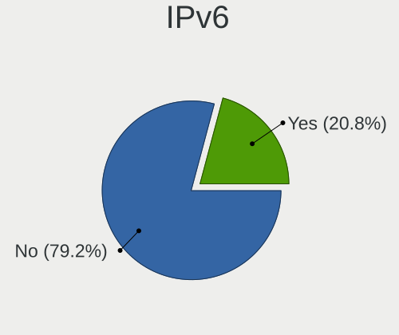

| Used | Desktops | Percent |
|------|----------|---------|
| No   | 10566    | 79.15%  |
| Yes  | 2783     | 20.85%  |

Bluetooth
---------

Bluetooth Vendor
----------------

Controller vendors

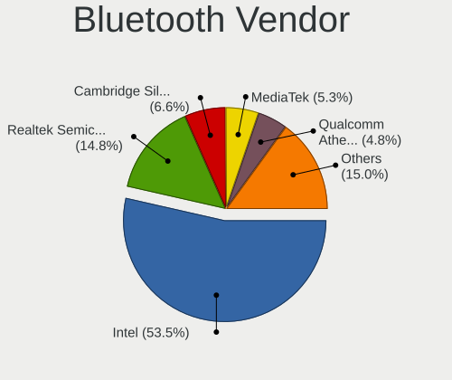

| Vendor                          | Desktops | Percent |
|---------------------------------|----------|---------|
| Intel                           | 989      | 53.55%  |
| Realtek Semiconductor           | 274      | 14.83%  |
| Cambridge Silicon Radio         | 121      | 6.55%   |
| MediaTek                        | 98       | 5.31%   |
| Qualcomm Atheros Communications | 88       | 4.76%   |
| IMC Networks                    | 69       | 3.74%   |
| ASUSTek Computer                | 54       | 2.92%   |
| Apple                           | 35       | 1.89%   |
| Broadcom                        | 34       | 1.84%   |
| Foxconn / Hon Hai               | 27       | 1.46%   |
| Lite-On Technology              | 15       | 0.81%   |
| TP-Link                         | 11       | 0.6%    |
| Integrated System Solution      | 4        | 0.22%   |
| Ralink                          | 3        | 0.16%   |
| Micro Star International        | 3        | 0.16%   |
| Qcom                            | 2        | 0.11%   |
| HTC (High Tech Computer)        | 2        | 0.11%   |
| Dynex                           | 2        | 0.11%   |
| AMPAK Technology                | 2        | 0.11%   |
| Unknown                         | 2        | 0.11%   |
| Skylight Digital                | 1        | 0.05%   |
| Sino Wealth Electronic          | 1        | 0.05%   |
| Silicon Wave                    | 1        | 0.05%   |
| Realtek                         | 1        | 0.05%   |
| Primax Electronics              | 1        | 0.05%   |
| Hewlett-Packard                 | 1        | 0.05%   |
| Fujitsu Siemens Computers       | 1        | 0.05%   |
| Fujitsu                         | 1        | 0.05%   |
| Edimax Technology               | 1        | 0.05%   |
| Dell                            | 1        | 0.05%   |
| Corsair                         | 1        | 0.05%   |
| Belkin Components               | 1        | 0.05%   |

Bluetooth Model
---------------

Controller models

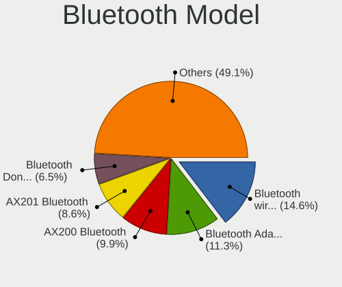

| Model                                                       | Desktops | Percent |
|-------------------------------------------------------------|----------|---------|
| Intel Bluetooth wireless interface                          | 271      | 14.61%  |
| Realtek Bluetooth Adapter                                   | 210      | 11.32%  |
| Intel AX200 Bluetooth                                       | 183      | 9.87%   |
| Intel AX201 Bluetooth                                       | 160      | 8.63%   |
| Cambridge Silicon Radio Bluetooth Dongle (HCI mode)         | 121      | 6.52%   |
| Intel Bluetooth 9460/9560 Jefferson Peak (JfP)              | 94       | 5.07%   |
| Intel Wireless-AC 3168 Bluetooth                            | 82       | 4.42%   |
| Intel AX210 Bluetooth                                       | 75       | 4.04%   |
| Intel Centrino Bluetooth Wireless Transceiver               | 51       | 2.75%   |
| MediaTek Wireless_Device                                    | 48       | 2.59%   |
| Intel Wireless-AC 9260 Bluetooth Adapter                    | 40       | 2.16%   |
| Intel AX211 Bluetooth                                       | 37       | 1.99%   |
| MediaTek RZ608 Bluetooth Adapter                            | 28       | 1.51%   |
| Realtek  Bluetooth 4.2 Adapter                              | 27       | 1.46%   |
| Qualcomm Atheros AR3012 Bluetooth 4.0                       | 27       | 1.46%   |
| IMC Networks Realtek Bluetooth Adapter                      | 24       | 1.29%   |
| IMC Networks Realtek Bluetooth 4.0 + High Speed Chip        | 23       | 1.24%   |
| Apple Bluetooth Host Controller                             | 18       | 0.97%   |
| Apple Built-in Bluetooth 2.0+EDR HCI                        | 16       | 0.86%   |
| Broadcom BCM20702A0 Bluetooth 4.0                           | 15       | 0.81%   |
| Qualcomm Atheros Dell Wireless 1707 Bluetooth 4.0 LE Device | 13       | 0.7%    |
| Qualcomm Atheros AR3011 Bluetooth (no firmware)             | 13       | 0.7%    |
| Realtek Bluetooth 4.2 Adapter                               | 12       | 0.65%   |
| MediaTek Bluetooth Adapter                                  | 12       | 0.65%   |
| ASUS Broadcom BCM20702A0 Bluetooth                          | 12       | 0.65%   |
| TP-Link Bluetooth 5.0 USB Adapter                           | 11       | 0.59%   |
| Qualcomm Atheros QCA61x4 Bluetooth 4.0                      | 11       | 0.59%   |
| Foxconn / Hon Hai RZ616 Bluetooth Adapter                   | 11       | 0.59%   |
| MediaTek RZ616 Bluetooth Adapter                            | 10       | 0.54%   |
| ASUS USB-BT500                                              | 10       | 0.54%   |
| Qualcomm Atheros AR9462 Bluetooth                           | 9        | 0.49%   |
| Realtek Bluetooth 4.0 Adapter                               | 7        | 0.38%   |
| ASUS Qualcomm Bluetooth 4.1                                 | 7        | 0.38%   |
| Lite-On Bluetooth USB Module                                | 6        | 0.32%   |
| ASUS Bluetooth USB module                                   | 6        | 0.32%   |
| ASUS Bluetooth Controller                                   | 6        | 0.32%   |
| Realtek Bluetooth 5.1 Adapter                               | 5        | 0.27%   |
| Lite-On Atheros AR3012 Bluetooth                            | 5        | 0.27%   |
| ASUS Broadcom BCM20702 Single-Chip Bluetooth 4.0 + LE       | 5        | 0.27%   |
| Realtek RTL8821A Bluetooth                                  | 4        | 0.22%   |

Sound
-----

Sound Vendor
------------

Sound card vendors

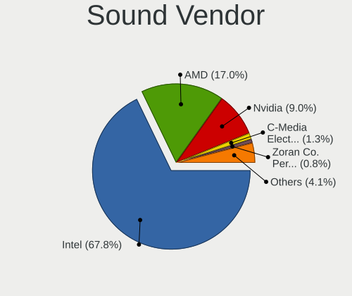

| Vendor                                       | Desktops | Percent |
|----------------------------------------------|----------|---------|
| Intel                                        | 8123     | 67.83%  |
| AMD                                          | 2040     | 17.04%  |
| Nvidia                                       | 1078     | 9%      |
| C-Media Electronics                          | 153      | 1.28%   |
| Zoran Co. Personal Media Division (Nogatech) | 92       | 0.77%   |
| Creative Labs                                | 46       | 0.38%   |
| Logitech                                     | 37       | 0.31%   |
| Texas Instruments                            | 35       | 0.29%   |
| VIA Technologies                             | 20       | 0.17%   |
| JMTek                                        | 20       | 0.17%   |
| KTMicro                                      | 18       | 0.15%   |
| Focusrite-Novation                           | 17       | 0.14%   |
| Realtek Semiconductor                        | 15       | 0.13%   |
| Generalplus Technology                       | 13       | 0.11%   |
| Creative Technology                          | 13       | 0.11%   |
| SteelSeries ApS                              | 12       | 0.1%    |
| ASUSTek Computer                             | 12       | 0.1%    |
| Sony                                         | 10       | 0.08%   |
| BEHRINGER International                      | 10       | 0.08%   |
| Corsair                                      | 9        | 0.08%   |
| Micro Star International                     | 8        | 0.07%   |
| Kingston Technology                          | 8        | 0.07%   |
| GN Netcom                                    | 8        | 0.07%   |
| Blue Microphones                             | 8        | 0.07%   |
| Thesycon Systemsoftware & Consulting         | 7        | 0.06%   |
| Razer USA                                    | 7        | 0.06%   |
| Cambridge Silicon Radio                      | 7        | 0.06%   |
| Yamaha                                       | 6        | 0.05%   |
| XMOS                                         | 6        | 0.05%   |
| Walmart                                      | 6        | 0.05%   |
| Plantronics                                  | 6        | 0.05%   |
| Hewlett-Packard                              | 6        | 0.05%   |
| Silicon Integrated Systems [SiS]             | 5        | 0.04%   |
| Tenx Technology                              | 4        | 0.03%   |
| RODE Microphones                             | 4        | 0.03%   |
| Giga-Byte Technology                         | 4        | 0.03%   |
| FiiO Electronics Technology                  | 4        | 0.03%   |
| ESS Technology                               | 4        | 0.03%   |
| ULi Electronics                              | 3        | 0.03%   |
| Samson Technologies                          | 3        | 0.03%   |

Sound Model
-----------

Sound card models

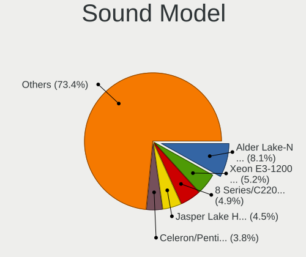

| Model                                                                                             | Desktops | Percent |
|---------------------------------------------------------------------------------------------------|----------|---------|
| Intel Alder Lake-N PCH High Definition Audio Controller                                           | 1142     | 8.12%   |
| Intel Xeon E3-1200 v3/4th Gen Core Processor HD Audio Controller                                  | 727      | 5.17%   |
| Intel 8 Series/C220 Series Chipset High Definition Audio Controller                               | 696      | 4.95%   |
| Intel Jasper Lake HD Audio                                                                        | 635      | 4.51%   |
| Intel Celeron/Pentium Silver Processor High Definition Audio                                      | 539      | 3.83%   |
| Intel 100 Series/C230 Series Chipset Family HD Audio Controller                                   | 497      | 3.53%   |
| AMD Ryzen HD Audio Controller                                                                     | 433      | 3.08%   |
| Intel 6 Series/C200 Series Chipset Family High Definition Audio Controller                        | 420      | 2.98%   |
| Intel 7 Series/C216 Chipset Family High Definition Audio Controller                               | 407      | 2.89%   |
| Intel Atom/Celeron/Pentium Processor x5-E8000/J3xxx/N3xxx Series High Definition Audio Controller | 406      | 2.89%   |
| Intel 200 Series PCH HD Audio                                                                     | 396      | 2.81%   |
| AMD FCH Azalia Controller                                                                         | 376      | 2.67%   |
| AMD Kabini HDMI/DP Audio                                                                          | 344      | 2.44%   |
| Intel Cannon Lake PCH cAVS                                                                        | 340      | 2.42%   |
| AMD Starship/Matisse HD Audio Controller                                                          | 278      | 1.98%   |
| Intel Sunrise Point-LP HD Audio                                                                   | 259      | 1.84%   |
| AMD SBx00 Azalia (Intel HDA)                                                                      | 247      | 1.76%   |
| AMD Renoir/Cezanne HDMI/DP Audio Controller                                                       | 240      | 1.71%   |
| Intel Atom Processor Z36xxx/Z37xxx Series High Definition Audio Controller                        | 220      | 1.56%   |
| Intel NM10/ICH7 Family High Definition Audio Controller                                           | 199      | 1.41%   |
| Nvidia GK208 HDMI/DP Audio Controller                                                             | 169      | 1.2%    |
| AMD Raven/Raven2/Fenghuang HDMI/DP Audio Controller                                               | 163      | 1.16%   |
| Intel Elkhart Lake High Density Audio bus interface                                               | 158      | 1.12%   |
| AMD Family 17h (Models 00h-0fh) HD Audio Controller                                               | 156      | 1.11%   |
| Intel Alder Lake PCH-P High Definition Audio Controller                                           | 148      | 1.05%   |
| Intel Celeron N3350/Pentium N4200/Atom E3900 Series Audio Cluster                                 | 134      | 0.95%   |
| Intel 8 Series HD Audio Controller                                                                | 130      | 0.92%   |
| Intel Haswell-ULT HD Audio Controller                                                             | 129      | 0.92%   |
| AMD Ellesmere HDMI Audio [Radeon RX 470/480 / 570/580/590]                                        | 122      | 0.87%   |
| Intel Wildcat Point-LP High Definition Audio Controller                                           | 119      | 0.85%   |
| Intel Broadwell-U Audio Controller                                                                | 119      | 0.85%   |
| Intel Alder Lake-S HD Audio Controller                                                            | 112      | 0.8%    |
| Intel 82801JI (ICH10 Family) HD Audio Controller                                                  | 105      | 0.75%   |
| Zoran Co. Personal Media Division (Nogatech) USB Audio and HID                                    | 92       | 0.65%   |
| Intel Comet Lake PCH-LP cAVS                                                                      | 86       | 0.61%   |
| AMD Oland/Hainan/Cape Verde/Pitcairn HDMI Audio [Radeon HD 7000 Series]                           | 86       | 0.61%   |
| AMD Navi 21/23 HDMI/DP Audio Controller                                                           | 83       | 0.59%   |
| Nvidia High Definition Audio Controller                                                           | 76       | 0.54%   |
| Intel 82801I (ICH9 Family) HD Audio Controller                                                    | 76       | 0.54%   |
| Intel 82801JD/DO (ICH10 Family) HD Audio Controller                                               | 74       | 0.53%   |

Memory
------

Memory Vendor
-------------

Memory module vendors

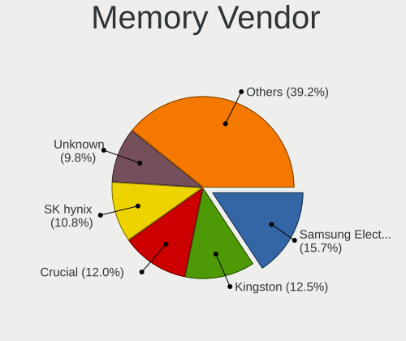

| Vendor                                  | Desktops | Percent |
|-----------------------------------------|----------|---------|
| Samsung Electronics                     | 2111     | 15.71%  |
| Kingston                                | 1678     | 12.49%  |
| Crucial                                 | 1613     | 12.01%  |
| SK hynix                                | 1448     | 10.78%  |
| Unknown                                 | 1314     | 9.78%   |
| Micron Technology                       | 1239     | 9.22%   |
| Corsair                                 | 786      | 5.85%   |
| G.Skill                                 | 557      | 4.15%   |
| Unknown                                 | 478      | 3.56%   |
| A-DATA Technology                       | 183      | 1.36%   |
| Team                                    | 170      | 1.27%   |
| Transcend                               | 147      | 1.09%   |
| Unknown (ABCD)                          | 143      | 1.06%   |
| Ramaxel Technology                      | 140      | 1.04%   |
| Patriot                                 | 114      | 0.85%   |
| Nanya Technology                        | 112      | 0.83%   |
| Kimtigo                                 | 68       | 0.51%   |
| Apacer                                  | 64       | 0.48%   |
| Timetec                                 | 40       | 0.3%    |
| Elpida                                  | 40       | 0.3%    |
| ATP                                     | 40       | 0.3%    |
| GOODRAM                                 | 37       | 0.28%   |
| PNY                                     | 33       | 0.25%   |
| Patriot Memory (PDP Systems)            | 32       | 0.24%   |
| Lexar Co Limited                        | 32       | 0.24%   |
| Toshiba                                 | 30       | 0.22%   |
| Hewlett-Packard                         | 29       | 0.22%   |
| Avant                                   | 28       | 0.21%   |
| Silicon Power                           | 26       | 0.19%   |
| AMD                                     | 25       | 0.19%   |
| Unknown (AB)                            | 24       | 0.18%   |
| Smart                                   | 24       | 0.18%   |
| SK_Hynix                                | 24       | 0.18%   |
| Teikon                                  | 22       | 0.16%   |
| GeIL                                    | 19       | 0.14%   |
| Silicon Power Computer & Communications | 18       | 0.13%   |
| Innodisk                                | 18       | 0.13%   |
| Smart Modular                           | 17       | 0.13%   |
| Unknown (0x0FBA)                        | 15       | 0.11%   |
| Super Talent                            | 14       | 0.1%    |

Memory Model
------------

Memory module models

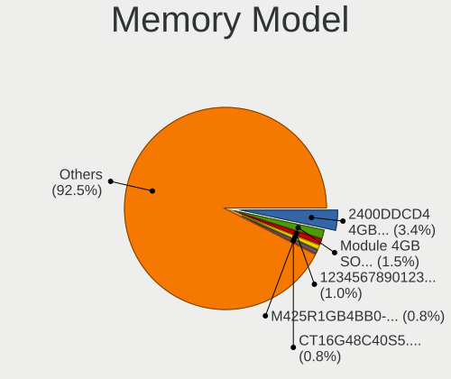

| Model                                                         | Desktops | Percent |
|---------------------------------------------------------------|----------|---------|
| Unknown                                                       | 478      | 3.36%   |
| Unknown RAM Module 4GB SODIMM DDR3 1333MT/s                   | 217      | 1.52%   |
| Unknown (ABCD) RAM 123456789012345678 8GB DIMM DDR4 2400MT/s  | 143      | 1%      |
| Samsung RAM M425R1GB4BB0-CQKOL 8GB SODIMM DDR5 4800MT/s       | 115      | 0.81%   |
| Crucial RAM CT16G48C40S5.M8A1 16GB SODIMM DDR5 4800MT/s       | 111      | 0.78%   |
| SK hynix RAM HMT451S6BFR8A-PB 4GB SODIMM DDR3 1600MT/s        | 84       | 0.59%   |
| Crucial RAM CT16G56C46S5.M8G1 16GB SODIMM DDR5 5600MT/s       | 84       | 0.59%   |
| Samsung RAM M471B5173QH0-YK0 4GB SODIMM DDR3 1600MT/s         | 65       | 0.46%   |
| Unknown RAM Module 2GB DIMM DDR2 800MT/s                      | 60       | 0.42%   |
| Unknown RAM Module 8GB DIMM DDR3 1600MT/s                     | 59       | 0.41%   |
| Unknown RAM Module 4GB DIMM 1333MT/s                          | 58       | 0.41%   |
| Samsung RAM M378B5173DB0-CK0 4GB DIMM DDR3 1600MT/s           | 56       | 0.39%   |
| Micron RAM 8JTF51264AZ-1G6E1 4GB DIMM DDR3 1600MT/s           | 56       | 0.39%   |
| Unknown RAM Module 8GB 1600MT/s                               | 55       | 0.39%   |
| SK hynix RAM HMA81GS6AFR8N-UH 8GB SODIMM DDR4 2400MT/s        | 53       | 0.37%   |
| Crucial RAM CT8G48C40S5.M4A1 8GB SODIMM DDR5 4800MT/s         | 53       | 0.37%   |
| SK hynix RAM HMT451U6AFR8C-PB 4GB DIMM DDR3 1600MT/s          | 50       | 0.35%   |
| SK hynix RAM HMT451U6BFR8A-PB 4GB DIMM DDR3 1600MT/s          | 49       | 0.34%   |
| SK hynix RAM HMT351U6CFR8C-PB 4GB DIMM DDR3 1600MT/s          | 49       | 0.34%   |
| Samsung RAM M471B1G73QH0-YK0 8GB DIMM DDR3 1600MT/s           | 49       | 0.34%   |
| Kimtigo RAM KT8GS3EDF 8GB SODIMM DDR3 1600MT/s                | 49       | 0.34%   |
| Corsair RAM CMK16GX4M2B3200C16 8GB DIMM DDR4 3200MT/s         | 49       | 0.34%   |
| Samsung RAM M378B5173QH0-CK0 4GB DIMM DDR3 1600MT/s           | 46       | 0.32%   |
| Samsung RAM M471A1K43CB1-CTD 8GB SODIMM DDR4 3200MT/s         | 45       | 0.32%   |
| Unknown RAM Module 4GB DIMM DDR3 1333MT/s                     | 44       | 0.31%   |
| SK hynix RAM HMA81GU6AFR8N-UH 8GB DIMM DDR4 2400MT/s          | 44       | 0.31%   |
| Unknown RAM Module 2GB DIMM SDRAM                             | 43       | 0.3%    |
| Corsair RAM CMSX16GX5M1A4800C40 16GB SODIMM DDR5 4800MT/s     | 43       | 0.3%    |
| Samsung RAM M471B5173EB0-YK0 4GB SODIMM DDR3 1600MT/s         | 42       | 0.29%   |
| Micron RAM 53D512M64D4RQ-046 8GB Row Of Chips LPDDR4 4800MT/s | 41       | 0.29%   |
| Unknown RAM Module 4GB SODIMM DDR3 667MT/s                    | 39       | 0.27%   |
| SK hynix RAM HMT451U6BFR8C-PB 4GB DIMM DDR3 1600MT/s          | 39       | 0.27%   |
| Samsung RAM M471B1G73DB0-YK0 8GB DIMM DDR3 1600MT/s           | 38       | 0.27%   |
| Crucial RAM CT16G48C40S5.C8A1 16GB SODIMM DDR5 4800MT/s       | 38       | 0.27%   |
| Unknown RAM Module 1GB DIMM SDRAM                             | 37       | 0.26%   |
| Samsung RAM M471B5173DB0-YK0 4GB SODIMM DDR3 1600MT/s         | 37       | 0.26%   |
| Samsung RAM Module 2GB Row Of Chips LPDDR5 6400MT/s           | 36       | 0.25%   |
| Micron RAM MTC4C10163S1SC48BA1 8GB SODIMM DDR5 4800MT/s       | 36       | 0.25%   |
| Samsung RAM M425R1GB4BB0-CWMOD 8GB SODIMM DDR5 5600MT/s       | 35       | 0.25%   |
| Micron RAM Module 8GB Row Of Chips LPDDR4 3200MT/s            | 33       | 0.23%   |

Memory Kind
-----------

Memory module kinds

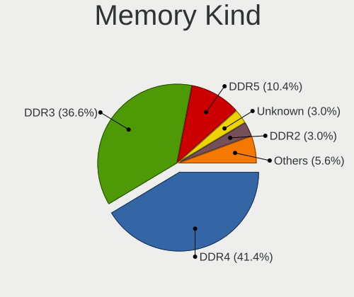

| Kind         | Desktops | Percent |
|--------------|----------|---------|
| DDR4         | 4941     | 41.4%   |
| DDR3         | 4373     | 36.64%  |
| DDR5         | 1239     | 10.38%  |
| Unknown      | 356      | 2.98%   |
| DDR2         | 353      | 2.96%   |
| LPDDR4       | 300      | 2.51%   |
| SDRAM        | 163      | 1.37%   |
| LPDDR5       | 151      | 1.27%   |
| DDR          | 44       | 0.37%   |
| DRAM         | 7        | 0.06%   |
| RAM          | 4        | 0.03%   |
| LPDDR3       | 4        | 0.03%   |
| DDR2 FB-DIMM | 1        | 0.01%   |

Memory Form Factor
------------------

Physical design of the memory module

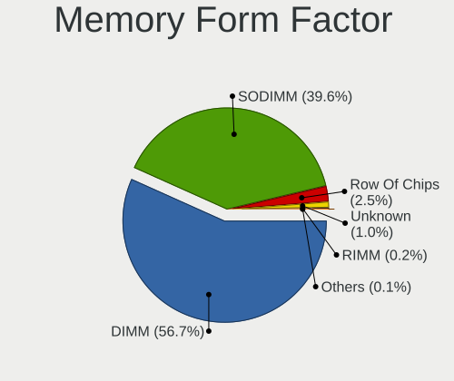

| Name         | Desktops | Percent |
|--------------|----------|---------|
| DIMM         | 6727     | 56.72%  |
| SODIMM       | 4692     | 39.56%  |
| Row Of Chips | 293      | 2.47%   |
| Unknown      | 113      | 0.95%   |
| RIMM         | 20       | 0.17%   |
| FB-DIMM      | 9        | 0.08%   |
| Chip         | 7        | 0.06%   |

Memory Size
-----------

Memory module size

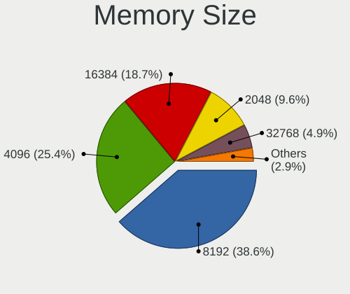

| Size   | Desktops | Percent |
|--------|----------|---------|
| 8192   | 4913     | 38.59%  |
| 4096   | 3232     | 25.38%  |
| 16384  | 2375     | 18.65%  |
| 2048   | 1224     | 9.61%   |
| 32768  | 625      | 4.91%   |
| 1024   | 247      | 1.94%   |
| 3072   | 44       | 0.35%   |
| 512    | 32       | 0.25%   |
| 49152  | 20       | 0.16%   |
| 65536  | 4        | 0.03%   |
| 24576  | 3        | 0.02%   |
| 6144   | 3        | 0.02%   |
| 256    | 3        | 0.02%   |
| 128    | 2        | 0.02%   |
| 64     | 2        | 0.02%   |
| 131072 | 1        | 0.01%   |
| 32     | 1        | 0.01%   |
| 8      | 1        | 0.01%   |

Memory Speed
------------

Memory module speed

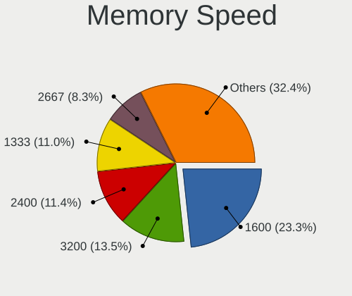

| Speed   | Desktops | Percent |
|---------|----------|---------|
| 1600    | 2951     | 23.32%  |
| 3200    | 1708     | 13.5%   |
| 2400    | 1446     | 11.43%  |
| 1333    | 1397     | 11.04%  |
| 2667    | 1050     | 8.3%    |
| 4800    | 912      | 7.21%   |
| 2133    | 730      | 5.77%   |
| 5600    | 377      | 2.98%   |
| 800     | 354      | 2.8%    |
| 667     | 217      | 1.72%   |
| 2666    | 215      | 1.7%    |
| Unknown | 181      | 1.43%   |
| 1066    | 136      | 1.07%   |
| 3600    | 122      | 0.96%   |
| 6400    | 113      | 0.89%   |
| 3000    | 106      | 0.84%   |
| 1867    | 95       | 0.75%   |
| 1866    | 81       | 0.64%   |
| 2933    | 76       | 0.6%    |
| 1067    | 68       | 0.54%   |
| 3733    | 52       | 0.41%   |
| 1334    | 39       | 0.31%   |
| 400     | 35       | 0.28%   |
| 533     | 29       | 0.23%   |
| 5200    | 23       | 0.18%   |
| 4267    | 16       | 0.13%   |
| 4000    | 13       | 0.1%    |
| 3066    | 11       | 0.09%   |
| 6000    | 10       | 0.08%   |
| 333     | 8        | 0.06%   |
| 1332    | 7        | 0.06%   |
| 65535   | 5        | 0.04%   |
| 3400    | 5        | 0.04%   |
| 2048    | 5        | 0.04%   |
| 1400    | 5        | 0.04%   |
| 1033    | 5        | 0.04%   |
| 3534    | 4        | 0.03%   |
| 2800    | 4        | 0.03%   |
| 6600    | 3        | 0.02%   |
| 2600    | 3        | 0.02%   |

Printers & scanners
-------------------

Printer Vendor
--------------

Printer device vendors

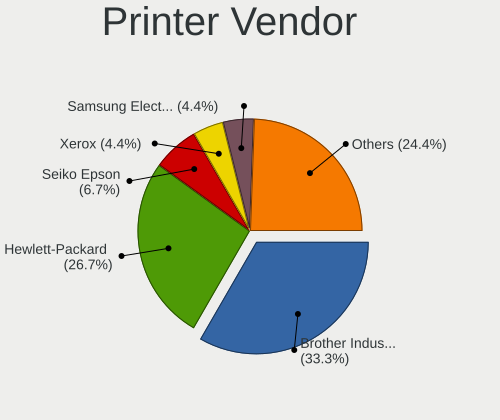

| Vendor                | Desktops | Percent |
|-----------------------|----------|---------|
| Brother Industries    | 15       | 33.33%  |
| Hewlett-Packard       | 12       | 26.67%  |
| Seiko Epson           | 3        | 6.67%   |
| Xerox                 | 2        | 4.44%   |
| Samsung Electronics   | 2        | 4.44%   |
| Prolific Technology   | 2        | 4.44%   |
| Lexmark International | 2        | 4.44%   |
| Apple                 | 2        | 4.44%   |
| Ricoh                 | 1        | 2.22%   |
| QinHeng Electronics   | 1        | 2.22%   |
| Kyocera               | 1        | 2.22%   |
| Dymo-CoStar           | 1        | 2.22%   |
| Canon                 | 1        | 2.22%   |

Printer Model
-------------

Printer device models

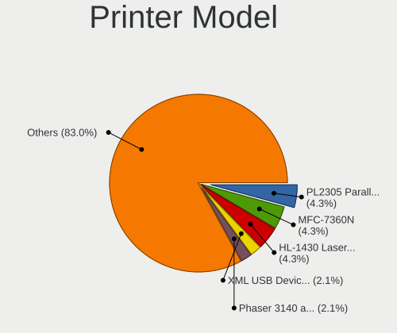

| Model                                                                                                             | Desktops | Percent |
|-------------------------------------------------------------------------------------------------------------------|----------|---------|
| Prolific PL2305 Parallel Port                                                                                     | 2        | 4.26%   |
| Brother MFC-7360N                                                                                                 | 2        | 4.26%   |
| Brother HL-1430 Laser Printer                                                                                     | 2        | 4.26%   |
| Xerox XML USB Device Interface                                                                                    | 1        | 2.13%   |
| Xerox Phaser 3140 and 3155                                                                                        | 1        | 2.13%   |
| Seiko Epson USB2.0 Printer (Hi-speed)                                                                             | 1        | 2.13%   |
| Seiko Epson Printer                                                                                               | 1        | 2.13%   |
| Seiko Epson PRIFIA OK500P                                                                                         | 1        | 2.13%   |
| Samsung ML-2010P Mono Laser Printer                                                                               | 1        | 2.13%   |
| Samsung ML-1640 Series Laser Printer                                                                              | 1        | 2.13%   |
| Ricoh SP 112                                                                                                      | 1        | 2.13%   |
| QinHeng CH340S                                                                                                    | 1        | 2.13%   |
| Lexmark International SINDOH A603_A608 Print                                                                      | 1        | 2.13%   |
| Lexmark International Lexmark MS710 Print                                                                         | 1        | 2.13%   |
| Kyocera FS-1025MFP                                                                                                | 1        | 2.13%   |
| HP PNP Fax Null                                                                                                   | 1        | 2.13%   |
| HP LaserJet P3005                                                                                                 | 1        | 2.13%   |
| HP LaserJet 3390                                                                                                  | 1        | 2.13%   |
| HP LaserJet 2200                                                                                                  | 1        | 2.13%   |
| HP LaserJet 1200                                                                                                  | 1        | 2.13%   |
| HP LaserJet 1012                                                                                                  | 1        | 2.13%   |
| HP Laser 107a Printer                                                                                             | 1        | 2.13%   |
| HP HP LaserJet P2035 HP Print                                                                                     | 1        | 2.13%   |
| HP HP LaserJet MFP M232-M237 Printer HP LEDM IPP Printer HP LEDM IPP Printer HP LEDM IPP Printer                  | 1        | 2.13%   |
| HP HP LaserJet MFP E52645 LaserJet 0 LaserJet 0 LaserJet 1 LaserJet 1 LaserJet 2 LaserJet 2 LaserJet 3 LaserJet 3 | 1        | 2.13%   |
| HP HP LaserJet M14-M17 Printer HP LEDM IPP Printer HP LEDM IPP Printer HP LEDM IPP Printer                        | 1        | 2.13%   |
| HP HP LaserJet M101-M106 Printer HP LEDM HP LEDM IPP Printer IPP Printer                                          | 1        | 2.13%   |
| HP DeskJet 5850c                                                                                                  | 1        | 2.13%   |
| HP Color LaserJet CP1215                                                                                          | 1        | 2.13%   |
| Dymo-CoStar LabelWriter 450                                                                                       | 1        | 2.13%   |
| Canon LBP2900                                                                                                     | 1        | 2.13%   |
| Brother MFC-L2685DW                                                                                               | 1        | 2.13%   |
| Brother MFC-J485DW                                                                                                | 1        | 2.13%   |
| Brother MFC-J200                                                                                                  | 1        | 2.13%   |
| Brother HL-L5200DW series                                                                                         | 1        | 2.13%   |
| Brother HL-L3270CDW series                                                                                        | 1        | 2.13%   |
| Brother HL-L2310D series                                                                                          | 1        | 2.13%   |
| Brother HL-L2300D series                                                                                          | 1        | 2.13%   |
| Brother HL-2030 Laser Printer                                                                                     | 1        | 2.13%   |
| Brother DCP-J152W                                                                                                 | 1        | 2.13%   |

Scanner Vendor
--------------

Scanner device vendors

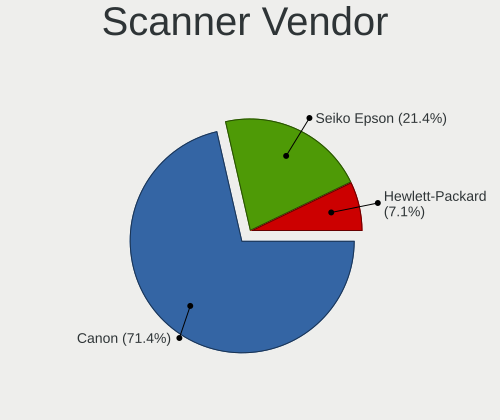

| Vendor          | Desktops | Percent |
|-----------------|----------|---------|
| Canon           | 13       | 61.9%   |
| Seiko Epson     | 7        | 33.33%  |
| Hewlett-Packard | 1        | 4.76%   |

Scanner Model
-------------

Scanner device models

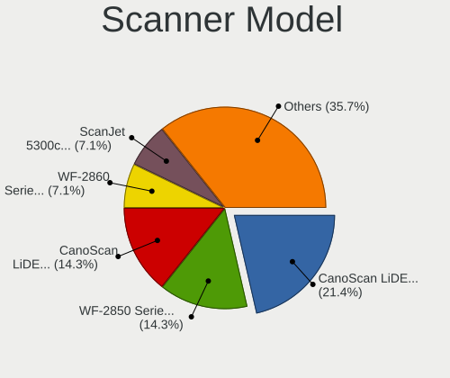

| Model                                                                               | Desktops | Percent |
|-------------------------------------------------------------------------------------|----------|---------|
| Canon CanoScan LiDE 110                                                             | 3        | 14.29%  |
| Seiko Epson WF-2850 Series EPSON Scanner USB2.0 Printer EPSON Utility USB2.0 Faxout | 2        | 9.52%   |
| Canon CanoScan LiDE 220                                                             | 2        | 9.52%   |
| Seiko Epson WF-2860 Series EPSON Scanner USB2.0 Printer EPSON Utility USB2.0 Faxout | 1        | 4.76%   |
| Seiko Epson PX-501A [Stylus NX400]                                                  | 1        | 4.76%   |
| Seiko Epson GT-F520/GT-F570 [Perfection 3590 PHOTO]                                 | 1        | 4.76%   |
| Seiko Epson GT-9300UF [Perfection 2400 PHOTO]                                       | 1        | 4.76%   |
| Seiko Epson ES-H7200 [GT-20000]                                                     | 1        | 4.76%   |
| HP ScanJet 5300c/5370c                                                              | 1        | 4.76%   |
| Canon CanoScan N650U/N656U                                                          | 1        | 4.76%   |
| Canon CanoScan N1240U/LiDE 30                                                       | 1        | 4.76%   |
| Canon CanoScan LiDE 700F                                                            | 1        | 4.76%   |
| Canon CanoScan LIDE 25                                                              | 1        | 4.76%   |
| Canon CanoScan LiDE 210                                                             | 1        | 4.76%   |
| Canon CanoScan LiDE 120                                                             | 1        | 4.76%   |
| Canon CanoScan LiDE 100                                                             | 1        | 4.76%   |
| Canon CanoScan 9000F                                                                | 1        | 4.76%   |

Camera
------

Camera Vendor
-------------

Camera device vendors

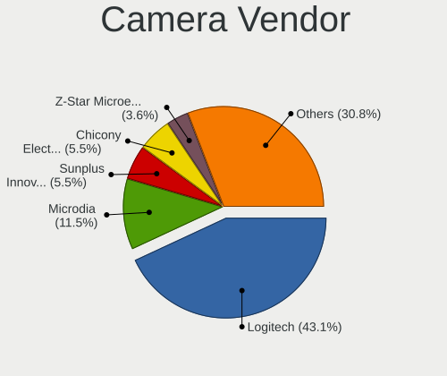

| Vendor                           | Desktops | Percent |
|----------------------------------|----------|---------|
| Logitech                         | 109      | 43.08%  |
| Microdia                         | 29       | 11.46%  |
| Sunplus Innovation Technology    | 14       | 5.53%   |
| Chicony Electronics              | 14       | 5.53%   |
| Z-Star Microelectronics          | 9        | 3.56%   |
| ARC International                | 6        | 2.37%   |
| Trust                            | 5        | 1.98%   |
| Realtek Semiconductor            | 4        | 1.58%   |
| IMC Networks                     | 4        | 1.58%   |
| GEMBIRD                          | 4        | 1.58%   |
| Arkmicro Technologies            | 4        | 1.58%   |
| Silicon Motion                   | 3        | 1.19%   |
| Hewlett-Packard                  | 3        | 1.19%   |
| Generalplus Technology           | 3        | 1.19%   |
| Asuscom Network                  | 3        | 1.19%   |
| WCM_USB                          | 2        | 0.79%   |
| SHENZHEN EMEET TECHNOLOGY        | 2        | 0.79%   |
| Quanta                           | 2        | 0.79%   |
| Nam Tai E&E Products             | 2        | 0.79%   |
| Lenovo                           | 2        | 0.79%   |
| Genesys Logic                    | 2        | 0.79%   |
| Cubeternet                       | 2        | 0.79%   |
| Aveo Technology                  | 2        | 0.79%   |
| YGTek                            | 1        | 0.4%    |
| Xiongmai                         | 1        | 0.4%    |
| Valve Software                   | 1        | 0.4%    |
| ValueHD                          | 1        | 0.4%    |
| Suyin                            | 1        | 0.4%    |
| Sonix Technology                 | 1        | 0.4%    |
| Shenzhen Kingcome Optoelectronic | 1        | 0.4%    |
| SHENZHEN AONI ELECTRONIC         | 1        | 0.4%    |
| Ricoh                            | 1        | 0.4%    |
| Pixart Imaging                   | 1        | 0.4%    |
| OmniVision Technologies          | 1        | 0.4%    |
| Novatek Microelectronics         | 1        | 0.4%    |
| KYE Systems (Mouse Systems)      | 1        | 0.4%    |
| Jiangxi Shinetech Optical        | 1        | 0.4%    |
| Importek                         | 1        | 0.4%    |
| Huawei Technologies              | 1        | 0.4%    |
| HD WEBCAM                        | 1        | 0.4%    |

Camera Model
------------

Camera device models

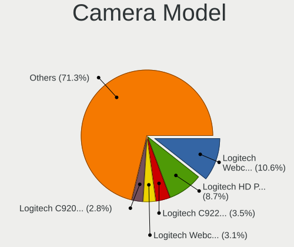

| Model                                          | Desktops | Percent |
|------------------------------------------------|----------|---------|
| Logitech Webcam C270                           | 27       | 10.63%  |
| Logitech HD Pro Webcam C920                    | 22       | 8.66%   |
| Logitech C922 Pro Stream Webcam                | 9        | 3.54%   |
| Logitech Webcam C310                           | 8        | 3.15%   |
| Logitech C920 PRO HD Webcam                    | 7        | 2.76%   |
| Microdia USB  Live camera                      | 6        | 2.36%   |
| Logitech BRIO Ultra HD Webcam                  | 6        | 2.36%   |
| ARC International Camera                       | 6        | 2.36%   |
| Microdia Webcam Vitade AF                      | 5        | 1.97%   |
| Microdia USB 2.0 Camera                        | 5        | 1.97%   |
| Logitech Webcam C930e                          | 5        | 1.97%   |
| Logitech C920 HD Pro Webcam                    | 5        | 1.97%   |
| Z-Star Venus USB2.0 Camera                     | 4        | 1.57%   |
| Logitech HD Webcam C525                        | 4        | 1.57%   |
| Sunplus LTD, NexiGo N930AF FHD Webcam          | 3        | 1.18%   |
| Logitech Webcam C170                           | 3        | 1.18%   |
| Logitech C505 HD Webcam                        | 3        | 1.18%   |
| IMC Networks XHC Camera                        | 3        | 1.18%   |
| Generalplus HD Webcam                          | 3        | 1.18%   |
| Chicony HP High Definition 1MP Webcam          | 3        | 1.18%   |
| Asuscom Network Depstech webcam                | 3        | 1.18%   |
| Arkmicro USB 2.0 PC CAMERA                     | 3        | 1.18%   |
| Z-Star Integrated Camera                       | 2        | 0.79%   |
| WCM_USB WEB CAM                                | 2        | 0.79%   |
| Trust Trust QHD Webcam                         | 2        | 0.79%   |
| Sunplus USB 2.0 Camera                         | 2        | 0.79%   |
| Sunplus SPCA2281 Web Camera                    | 2        | 0.79%   |
| Sunplus Integrated_Webcam_HD                   | 2        | 0.79%   |
| Sunplus 2-USB 2.0 Camera                       | 2        | 0.79%   |
| Silicon Motion 300k Pixel Camera               | 2        | 0.79%   |
| SHENZHEN EMEET TECHNOLOGY HD Webcam eMeet C960 | 2        | 0.79%   |
| Nam Tai E&E Products Sony Playstation Eye      | 2        | 0.79%   |
| Microdia Lenovo EasyCamera                     | 2        | 0.79%   |
| Microdia JOYACCESS JA-Webcam                   | 2        | 0.79%   |
| Microdia HP Integrated Webcam                  | 2        | 0.79%   |
| Microdia Camera                                | 2        | 0.79%   |
| Microdia ASUS USB 2.0 Webcam                   | 2        | 0.79%   |
| Logitech Logitech Webcam C925e                 | 2        | 0.79%   |
| Logitech Logi Webcam C920e                     | 2        | 0.79%   |
| Logitech Labtec Webcam Pro                     | 2        | 0.79%   |

Security
--------

Fingerprint Vendor
------------------

Fingerprint sensor vendors

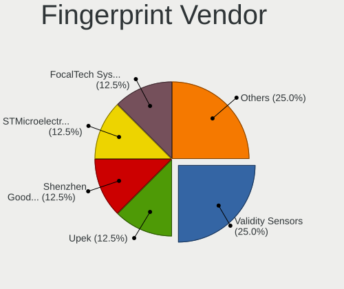

| Vendor                     | Desktops | Percent |
|----------------------------|----------|---------|
| Validity Sensors           | 2        | 25%     |
| Upek                       | 1        | 12.5%   |
| STMicroelectronics         | 1        | 12.5%   |
| Shenzhen Goodix Technology | 1        | 12.5%   |
| FocalTech Systems          | 1        | 12.5%   |
| DigitalPersona             | 1        | 12.5%   |
| AuthenTec                  | 1        | 12.5%   |

Fingerprint Model
-----------------

Fingerprint sensor models

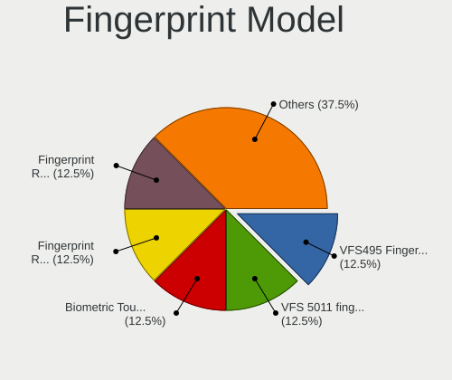

| Model                                                  | Desktops | Percent |
|--------------------------------------------------------|----------|---------|
| Validity Sensors VFS495 Fingerprint Reader             | 1        | 12.5%   |
| Validity Sensors VFS 5011 fingerprint sensor           | 1        | 12.5%   |
| Upek Biometric Touchchip/Touchstrip Fingerprint Sensor | 1        | 12.5%   |
| STMicroelectronics Fingerprint Reader                  | 1        | 12.5%   |
| Shenzhen Goodix Fingerprint Reader                     | 1        | 12.5%   |
| FocalTech Systems Fingerprint Reader                   | 1        | 12.5%   |
| DigitalPersona Fingerprint Reader                      | 1        | 12.5%   |
| AuthenTec AES2501 Fingerprint Sensor                   | 1        | 12.5%   |

Chipcard Vendor
---------------

Chipcard module vendors

Zero info for selected period =(

Chipcard Model
--------------

Chipcard module models

Zero info for selected period =(

Unsupported
-----------

Unsupported Devices
-------------------

Total unsupported devices on board

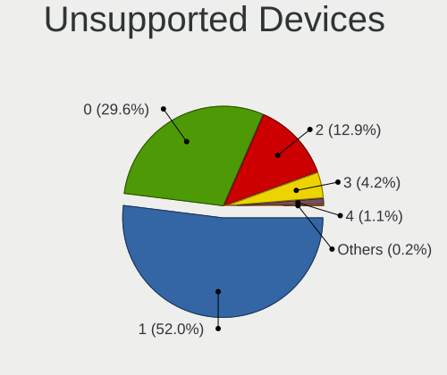

| Total | Desktops | Percent |
|-------|----------|---------|
| 1     | 6807     | 51.98%  |
| 0     | 3870     | 29.55%  |
| 2     | 1693     | 12.93%  |
| 3     | 556      | 4.25%   |
| 4     | 139      | 1.06%   |
| 5     | 23       | 0.18%   |
| 7     | 3        | 0.02%   |
| 6     | 3        | 0.02%   |
| 9     | 1        | 0.01%   |
| 8     | 1        | 0.01%   |

Unsupported Device Types
------------------------

Types of unsupported devices

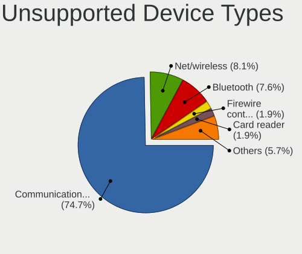

| Type                     | Desktops | Percent |
|--------------------------|----------|---------|
| Communication controller | 8163     | 74.71%  |
| Net/wireless             | 886      | 8.11%   |
| Bluetooth                | 831      | 7.61%   |
| Firewire controller      | 213      | 1.95%   |
| Card reader              | 208      | 1.9%    |
| Net/ethernet             | 188      | 1.72%   |
| Sound                    | 185      | 1.69%   |
| Network                  | 157      | 1.44%   |
| Graphics card            | 46       | 0.42%   |
| Storage/raid             | 18       | 0.16%   |
| Storage/ata              | 11       | 0.1%    |
| Dvb card                 | 7        | 0.06%   |
| Storage                  | 4        | 0.04%   |
| Modem                    | 4        | 0.04%   |
| Fingerprint reader       | 2        | 0.02%   |
| Wireless                 | 1        | 0.01%   |
| Storage/nvme             | 1        | 0.01%   |
| Storage/ide              | 1        | 0.01%   |

