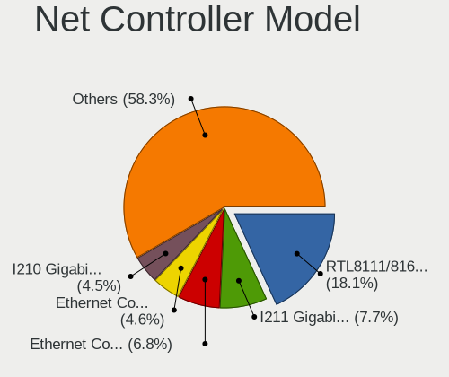
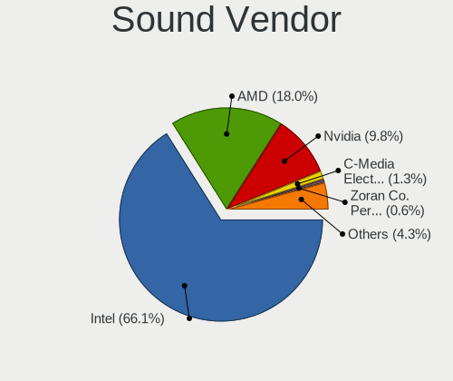

BSD - Tested Hardware & Statistics (Desktops)
---------------------------------------------

A project to collect tested hardware configurations for BSD.

Anyone can contribute to this report by the [hw-probe](https://github.com/linuxhw/hw-probe/blob/master/INSTALL.BSD.md) tool:

    hw-probe -all -upload

Please contribute! Especially if your hardware is rare.

This report is for real hardware. Report for virtual hardware: [TestCoverage_VE](https://github.com/bsdhw/TestCoverage_VE)

Contents
--------

* [ Test Cases ](#test-cases)

* [ System ](#system)
  - [ OS                       ](#os)
  - [ OS Family                ](#os-family)
  - [ Arch                     ](#arch)
  - [ DE                       ](#de)
  - [ Display Server           ](#display-server)
  - [ Display Manager          ](#display-manager)
  - [ OS Lang                  ](#os-lang)
  - [ Boot Mode                ](#boot-mode)
  - [ Filesystem               ](#filesystem)
  - [ Part. scheme             ](#part-scheme)

* [ Board ](#board)
  - [ Vendor                   ](#vendor)
  - [ Model                    ](#model)
  - [ Model Family             ](#model-family)
  - [ MFG Year                 ](#mfg-year)
  - [ Form Factor              ](#form-factor)
  - [ Coreboot                 ](#coreboot)
  - [ RAM Size                 ](#ram-size)
  - [ RAM Used                 ](#ram-used)
  - [ Total Drives             ](#total-drives)
  - [ Has CD-ROM               ](#has-cd-rom)
  - [ Has Ethernet             ](#has-ethernet)
  - [ Has WiFi                 ](#has-wifi)
  - [ Has Bluetooth            ](#has-bluetooth)

* [ Location ](#location)
  - [ Country                  ](#country)
  - [ City                     ](#city)

* [ Drives ](#drives)
  - [ Drive Vendor             ](#drive-vendor)
  - [ Drive Model              ](#drive-model)
  - [ HDD Vendor               ](#hdd-vendor)
  - [ SSD Vendor               ](#ssd-vendor)
  - [ Drive Kind               ](#drive-kind)
  - [ Drive Connector          ](#drive-connector)
  - [ Drive Size               ](#drive-size)
  - [ Space Total              ](#space-total)
  - [ Space Used               ](#space-used)
  - [ Malfunc. Drives          ](#malfunc-drives)
  - [ Malfunc. Drive Vendor    ](#malfunc-drive-vendor)
  - [ Malfunc. HDD Vendor      ](#malfunc-hdd-vendor)
  - [ Malfunc. Drive Kind      ](#malfunc-drive-kind)
  - [ Failed Drives            ](#failed-drives)
  - [ Failed Drive Vendor      ](#failed-drive-vendor)
  - [ Drive Status             ](#drive-status)

* [ Storage controller ](#storage-controller)
  - [ Storage Vendor           ](#storage-vendor)
  - [ Storage Model            ](#storage-model)
  - [ Storage Kind             ](#storage-kind)

* [ Processor ](#processor)
  - [ CPU Vendor               ](#cpu-vendor)
  - [ CPU Model                ](#cpu-model)
  - [ CPU Model Family         ](#cpu-model-family)
  - [ CPU Cores                ](#cpu-cores)
  - [ CPU Sockets              ](#cpu-sockets)
  - [ CPU Threads              ](#cpu-threads)
  - [ CPU Microarch            ](#cpu-microarch)

* [ Graphics ](#graphics)
  - [ GPU Vendor               ](#gpu-vendor)
  - [ GPU Model                ](#gpu-model)
  - [ GPU Combo                ](#gpu-combo)
  - [ GPU Driver               ](#gpu-driver)
  - [ GPU Memory               ](#gpu-memory)

* [ Monitor ](#monitor)
  - [ Monitor Vendor           ](#monitor-vendor)
  - [ Monitor Model            ](#monitor-model)
  - [ Monitor Resolution       ](#monitor-resolution)
  - [ Monitor Diagonal         ](#monitor-diagonal)
  - [ Monitor Width            ](#monitor-width)
  - [ Aspect Ratio             ](#aspect-ratio)
  - [ Monitor Area             ](#monitor-area)
  - [ Pixel Density            ](#pixel-density)
  - [ Multiple Monitors        ](#multiple-monitors)

* [ Network ](#network)
  - [ Net Controller Vendor    ](#net-controller-vendor)
  - [ Net Controller Model     ](#net-controller-model)
  - [ Wireless Vendor          ](#wireless-vendor)
  - [ Wireless Model           ](#wireless-model)
  - [ Ethernet Vendor          ](#ethernet-vendor)
  - [ Ethernet Model           ](#ethernet-model)
  - [ Net Controller Kind      ](#net-controller-kind)
  - [ Used Controller          ](#used-controller)
  - [ NICs                     ](#nics)
  - [ IPv6                     ](#ipv6)

* [ Bluetooth ](#bluetooth)
  - [ Bluetooth Vendor         ](#bluetooth-vendor)
  - [ Bluetooth Model          ](#bluetooth-model)

* [ Sound ](#sound)
  - [ Sound Vendor             ](#sound-vendor)
  - [ Sound Model              ](#sound-model)

* [ Memory ](#memory)
  - [ Memory Vendor            ](#memory-vendor)
  - [ Memory Model             ](#memory-model)
  - [ Memory Kind              ](#memory-kind)
  - [ Memory Form Factor       ](#memory-form-factor)
  - [ Memory Size              ](#memory-size)
  - [ Memory Speed             ](#memory-speed)

* [ Printers & scanners ](#printers--scanners)
  - [ Printer Vendor           ](#printer-vendor)
  - [ Printer Model            ](#printer-model)
  - [ Scanner Vendor           ](#scanner-vendor)
  - [ Scanner Model            ](#scanner-model)

* [ Camera ](#camera)
  - [ Camera Vendor            ](#camera-vendor)
  - [ Camera Model             ](#camera-model)

* [ Security ](#security)
  - [ Fingerprint Vendor       ](#fingerprint-vendor)
  - [ Fingerprint Model        ](#fingerprint-model)
  - [ Chipcard Vendor          ](#chipcard-vendor)
  - [ Chipcard Model           ](#chipcard-model)

* [ Unsupported ](#unsupported)
  - [ Unsupported Devices      ](#unsupported-devices)
  - [ Unsupported Device Types ](#unsupported-device-types)

Test Cases
----------

Total: 8381

| Vendor        | Model                       | Probe                                                     | Date         |
|---------------|-----------------------------|-----------------------------------------------------------|--------------|
| Gigabyte      | B450 AORUS PRO WIFI-CF      | [d03f9c19f8](https://bsd-hardware.info/?probe=d03f9c19f8) | Jan 23, 2023 |
| AAEON Tech... | PCM-LN02 V2.0               | [046b7464b9](https://bsd-hardware.info/?probe=046b7464b9) | Jan 23, 2023 |
| MSI           | B450M MORTAR MAX            | [840145eb80](https://bsd-hardware.info/?probe=840145eb80) | Jan 23, 2023 |
| Dell          | 0HHV7N A00                  | [771f2c4d96](https://bsd-hardware.info/?probe=771f2c4d96) | Jan 23, 2023 |
| ASUSTek       | X99-A/USB                   | [006553f965](https://bsd-hardware.info/?probe=006553f965) | Jan 23, 2023 |
| Gigabyte      | H81M-H                      | [4b3a05fc2a](https://bsd-hardware.info/?probe=4b3a05fc2a) | Jan 22, 2023 |
| ASUSTek       | P5KPL-AM SE                 | [6dc0fddda1](https://bsd-hardware.info/?probe=6dc0fddda1) | Jan 22, 2023 |
| Gigabyte      | B75M-D3H                    | [a271d3c547](https://bsd-hardware.info/?probe=a271d3c547) | Jan 22, 2023 |
| AWOW          | AK50                        | [8c983f91e4](https://bsd-hardware.info/?probe=8c983f91e4) | Jan 22, 2023 |
| Dell          | 03KWTV A02                  | [28088f7e94](https://bsd-hardware.info/?probe=28088f7e94) | Jan 22, 2023 |
| PC Engines    | APU2                        | [658569ae16](https://bsd-hardware.info/?probe=658569ae16) | Jan 22, 2023 |
| ASUSTek       | P5Q-E                       | [26d1d923d6](https://bsd-hardware.info/?probe=26d1d923d6) | Jan 22, 2023 |
| MSI           | H81M-P33                    | [0bbc074f1c](https://bsd-hardware.info/?probe=0bbc074f1c) | Jan 22, 2023 |
| ASUSTek       | ROG CROSSHAIR VIII HERO     | [28d8d82d34](https://bsd-hardware.info/?probe=28d8d82d34) | Jan 22, 2023 |
| Intel         | H61                         | [7faeca8300](https://bsd-hardware.info/?probe=7faeca8300) | Jan 22, 2023 |
| Techvision    | TVI7309X B0                 | [76840aba40](https://bsd-hardware.info/?probe=76840aba40) | Jan 22, 2023 |
| Gigabyte      | B75M-D3H                    | [c9d93a7c6f](https://bsd-hardware.info/?probe=c9d93a7c6f) | Jan 21, 2023 |
| Unknown       | Unknown                     | [0bbf3bdc00](https://bsd-hardware.info/?probe=0bbf3bdc00) | Jan 21, 2023 |
| HP            | 1825                        | [2705218636](https://bsd-hardware.info/?probe=2705218636) | Jan 21, 2023 |
| Dell          | 0HD5W2 A00                  | [6b1a9b8d00](https://bsd-hardware.info/?probe=6b1a9b8d00) | Jan 21, 2023 |
| Unknown       | Unknown                     | [8956f4503e](https://bsd-hardware.info/?probe=8956f4503e) | Jan 21, 2023 |
| Fujitsu       | D3313-A1 S26361-D3313-A1    | [59c83cb9ee](https://bsd-hardware.info/?probe=59c83cb9ee) | Jan 21, 2023 |
| Fujitsu       | D3243-S1 S26361-D3243-S1    | [d69c3cae4c](https://bsd-hardware.info/?probe=d69c3cae4c) | Jan 21, 2023 |
| PC Engines    | APU2                        | [172844bd8b](https://bsd-hardware.info/?probe=172844bd8b) | Jan 21, 2023 |
| AZW           | Green G1                    | [80498a4090](https://bsd-hardware.info/?probe=80498a4090) | Jan 21, 2023 |
| Lenovo        | SDK0J40705 WIN 342503995... | [0dc2013a9f](https://bsd-hardware.info/?probe=0dc2013a9f) | Jan 21, 2023 |
| AZW           | Green G1                    | [0c84e93ba7](https://bsd-hardware.info/?probe=0c84e93ba7) | Jan 21, 2023 |
| ASRock        | A520M-ITX/ac                | [e6873fe42f](https://bsd-hardware.info/?probe=e6873fe42f) | Jan 21, 2023 |
| Unknown       | Unknown                     | [14089c4ab4](https://bsd-hardware.info/?probe=14089c4ab4) | Jan 21, 2023 |
| Dell          | 02YYK5 A01                  | [b0fe0783d5](https://bsd-hardware.info/?probe=b0fe0783d5) | Jan 21, 2023 |
| Techvision    | TVI7309X B0                 | [495563926c](https://bsd-hardware.info/?probe=495563926c) | Jan 21, 2023 |
| MSI           | Z87-G41 PC Mate             | [7a21bfbfb9](https://bsd-hardware.info/?probe=7a21bfbfb9) | Jan 20, 2023 |
| Gigabyte      | F2A75M-HD2                  | [4770b980d6](https://bsd-hardware.info/?probe=4770b980d6) | Jan 20, 2023 |
| ASRock        | A520M-ITX/ac                | [f862df1689](https://bsd-hardware.info/?probe=f862df1689) | Jan 20, 2023 |
| ASUSTek       | PRO A520M-C                 | [bebcd1a008](https://bsd-hardware.info/?probe=bebcd1a008) | Jan 20, 2023 |
| Intel         | DQ67SW AAG12527-310         | [a4688e4059](https://bsd-hardware.info/?probe=a4688e4059) | Jan 20, 2023 |
| ASUSTek       | ROG STRIX B450-F GAMING     | [2ea8c1d1a4](https://bsd-hardware.info/?probe=2ea8c1d1a4) | Jan 20, 2023 |
| Lenovo        | SHARKBAY SDK0E50510 PRO ... | [0d3e0df928](https://bsd-hardware.info/?probe=0d3e0df928) | Jan 20, 2023 |
| Techvision    | TVI7309X B0                 | [d4018ae0f3](https://bsd-hardware.info/?probe=d4018ae0f3) | Jan 20, 2023 |
| Fujitsu       | PRIMERGY RX200 S6           | [4bcc8752f4](https://bsd-hardware.info/?probe=4bcc8752f4) | Jan 20, 2023 |
| Unknown       | Unknown                     | [32ebc1c99d](https://bsd-hardware.info/?probe=32ebc1c99d) | Jan 20, 2023 |
| Unknown       | AMD-GX3                     | [a38ff8331a](https://bsd-hardware.info/?probe=a38ff8331a) | Jan 20, 2023 |
| Unknown       | Unknown                     | [3afbfc6cea](https://bsd-hardware.info/?probe=3afbfc6cea) | Jan 20, 2023 |
| Unknown       | YL-SKUL6                    | [ef4abfe322](https://bsd-hardware.info/?probe=ef4abfe322) | Jan 20, 2023 |
| Unknown       | Unknown                     | [e13627df1a](https://bsd-hardware.info/?probe=e13627df1a) | Jan 20, 2023 |
| Cisco         | ASA5512 A0                  | [9cd4409fda](https://bsd-hardware.info/?probe=9cd4409fda) | Jan 20, 2023 |
| MW            | GMLK-2_5G4L                 | [142b3ad8d6](https://bsd-hardware.info/?probe=142b3ad8d6) | Jan 20, 2023 |
| Unknown       | PICO PC                     | [9e20d7dbbc](https://bsd-hardware.info/?probe=9e20d7dbbc) | Jan 20, 2023 |
| Unknown       | YL-E3845L4-V2               | [d93eb933f1](https://bsd-hardware.info/?probe=d93eb933f1) | Jan 20, 2023 |
| Intel         | SHARKBAY                    | [47742b68d5](https://bsd-hardware.info/?probe=47742b68d5) | Jan 19, 2023 |
| Unknown       | Unknown                     | [32477354bc](https://bsd-hardware.info/?probe=32477354bc) | Jan 19, 2023 |
| Unknown       | Unknown                     | [62bad8c9f8](https://bsd-hardware.info/?probe=62bad8c9f8) | Jan 19, 2023 |
| ShenZhen M... | MW-NANO-APL-4L              | [48206a7d4a](https://bsd-hardware.info/?probe=48206a7d4a) | Jan 19, 2023 |
| Unknown       | Unknown                     | [35e269ef1c](https://bsd-hardware.info/?probe=35e269ef1c) | Jan 19, 2023 |
| MSI           | PRO Z690-A WIFI             | [f7efd8c7d2](https://bsd-hardware.info/?probe=f7efd8c7d2) | Jan 19, 2023 |
| Unknown       | Unknown                     | [28bb1a7282](https://bsd-hardware.info/?probe=28bb1a7282) | Jan 19, 2023 |
| Fujitsu       | D3313-A1 S26361-D3313-A1    | [488416a10c](https://bsd-hardware.info/?probe=488416a10c) | Jan 19, 2023 |
| Unknown       | Unknown                     | [6aa648ba82](https://bsd-hardware.info/?probe=6aa648ba82) | Jan 19, 2023 |
| Dell          | 0WMJ54 A01                  | [8580d62bf3](https://bsd-hardware.info/?probe=8580d62bf3) | Jan 19, 2023 |
| ASUSTek       | ROG Maximus XI HERO         | [b528c0bbe3](https://bsd-hardware.info/?probe=b528c0bbe3) | Jan 18, 2023 |
| BESSTAR Te... | TH50                        | [b9de543167](https://bsd-hardware.info/?probe=b9de543167) | Jan 18, 2023 |
| ASUSTek       | TUF Gaming Z690-PLUS WIF... | [c3281eb186](https://bsd-hardware.info/?probe=c3281eb186) | Jan 18, 2023 |
| CncTion       | N5105-4L B0                 | [11948a0ab1](https://bsd-hardware.info/?probe=11948a0ab1) | Jan 18, 2023 |
| Techvision    | TVI7309X B0                 | [739cc6e5ac](https://bsd-hardware.info/?probe=739cc6e5ac) | Jan 18, 2023 |
| Lenovo        | H30-05 90BJ0085SP           | [1424b3641c](https://bsd-hardware.info/?probe=1424b3641c) | Jan 18, 2023 |
| Fujitsu       | PRIMERGY RX200 S6           | [f7de27b0ca](https://bsd-hardware.info/?probe=f7de27b0ca) | Jan 18, 2023 |
| Lenovo        | H30-05 90BJ0085SP           | [d491694079](https://bsd-hardware.info/?probe=d491694079) | Jan 18, 2023 |
| Dell          | 0K240Y A01                  | [d9f16ef94b](https://bsd-hardware.info/?probe=d9f16ef94b) | Jan 18, 2023 |
| HP            | 83F2                        | [a7230c1af5](https://bsd-hardware.info/?probe=a7230c1af5) | Jan 18, 2023 |
| Intel         | DQ77KB AAG81483-501         | [c5d050f0d6](https://bsd-hardware.info/?probe=c5d050f0d6) | Jan 18, 2023 |
| Dell          | 05XGC8 A01                  | [f929122d8a](https://bsd-hardware.info/?probe=f929122d8a) | Jan 18, 2023 |
| Fujitsu       | PRIMERGY RX200 S6           | [9eee9cc526](https://bsd-hardware.info/?probe=9eee9cc526) | Jan 18, 2023 |
| CncTion       | N5105-4L B0                 | [46178567ff](https://bsd-hardware.info/?probe=46178567ff) | Jan 18, 2023 |
| Intel         | DH67BL AAG10189-206         | [37ae895d75](https://bsd-hardware.info/?probe=37ae895d75) | Jan 17, 2023 |
| Intel         | DQ45CB AAE30148-302         | [349da05405](https://bsd-hardware.info/?probe=349da05405) | Jan 17, 2023 |
| Dell          | PowerEdge R710              | [720e99b25e](https://bsd-hardware.info/?probe=720e99b25e) | Jan 17, 2023 |
| Unknown       | Unknown                     | [22015084fc](https://bsd-hardware.info/?probe=22015084fc) | Jan 17, 2023 |
| Dell          | 0J584C A00                  | [65ce4b26be](https://bsd-hardware.info/?probe=65ce4b26be) | Jan 17, 2023 |
| Gigabyte      | H110-D3A-CF                 | [6bb5667269](https://bsd-hardware.info/?probe=6bb5667269) | Jan 17, 2023 |
| Wortmann      | terra MiniPC                | [be22193265](https://bsd-hardware.info/?probe=be22193265) | Jan 17, 2023 |
| Dell          | 0NW6H5 A00                  | [11943e270e](https://bsd-hardware.info/?probe=11943e270e) | Jan 17, 2023 |
| HP            | 1998                        | [6c36e5e82e](https://bsd-hardware.info/?probe=6c36e5e82e) | Jan 17, 2023 |
| Unknown       | Unknown                     | [63689d3fbc](https://bsd-hardware.info/?probe=63689d3fbc) | Jan 17, 2023 |
| Gigabyte      | H270M-DS3H-CF               | [d0e2e85346](https://bsd-hardware.info/?probe=d0e2e85346) | Jan 17, 2023 |
| MSI           | MS-9897                     | [8aa91d17fa](https://bsd-hardware.info/?probe=8aa91d17fa) | Jan 17, 2023 |
| Fujitsu       | D3313-B1 S26361-D3313-B1    | [52078a2cab](https://bsd-hardware.info/?probe=52078a2cab) | Jan 17, 2023 |
| Unknown       | Unknown                     | [0049fd4cfc](https://bsd-hardware.info/?probe=0049fd4cfc) | Jan 17, 2023 |
| MSI           | MS-9897                     | [0ccc361bd9](https://bsd-hardware.info/?probe=0ccc361bd9) | Jan 17, 2023 |
| HP            | 83F2                        | [912de3c81d](https://bsd-hardware.info/?probe=912de3c81d) | Jan 16, 2023 |
| Unknown       | SKYBAY                      | [c1e1ba5558](https://bsd-hardware.info/?probe=c1e1ba5558) | Jan 16, 2023 |
| Intel         | DQ67SW AAG12527-310         | [78a4659386](https://bsd-hardware.info/?probe=78a4659386) | Jan 16, 2023 |
| ASUSTek       | PRIME B450M-A II            | [23d2c64af3](https://bsd-hardware.info/?probe=23d2c64af3) | Jan 16, 2023 |
| Unknown       | QD-CMU01                    | [768a10819b](https://bsd-hardware.info/?probe=768a10819b) | Jan 16, 2023 |
| HP            | 0AECh D                     | [25b7a10166](https://bsd-hardware.info/?probe=25b7a10166) | Jan 16, 2023 |
| ASRock        | X570 Phantom Gaming 4       | [7ef714a7f1](https://bsd-hardware.info/?probe=7ef714a7f1) | Jan 16, 2023 |
| Intel         | HURONRIVER                  | [9994ae920b](https://bsd-hardware.info/?probe=9994ae920b) | Jan 15, 2023 |
| ASRock        | H370M-ITX/ac                | [e25304fa01](https://bsd-hardware.info/?probe=e25304fa01) | Jan 15, 2023 |
| ASRock        | H610M-HDV/M.2               | [b18c58223f](https://bsd-hardware.info/?probe=b18c58223f) | Jan 15, 2023 |
| Fujitsu       | D3313-G1 S26361-D3313-G1    | [1ef7026e21](https://bsd-hardware.info/?probe=1ef7026e21) | Jan 15, 2023 |
| Unknown       | Unknown                     | [7488afc0a7](https://bsd-hardware.info/?probe=7488afc0a7) | Jan 15, 2023 |
| Supermicro    | M11SDV-8C-LN4F              | [af7a4d3493](https://bsd-hardware.info/?probe=af7a4d3493) | Jan 15, 2023 |
| MSI           | H81M-P33                    | [800b3bc34b](https://bsd-hardware.info/?probe=800b3bc34b) | Jan 15, 2023 |
| ASUSTek       | P5Q-E                       | [ffbcac312f](https://bsd-hardware.info/?probe=ffbcac312f) | Jan 15, 2023 |
| ASUSTek       | ROG CROSSHAIR VIII HERO     | [48e7397e29](https://bsd-hardware.info/?probe=48e7397e29) | Jan 15, 2023 |
| Silicom       | 80300-0214-G01 R311         | [547b59be2b](https://bsd-hardware.info/?probe=547b59be2b) | Jan 15, 2023 |
| HP            | 8299                        | [d7afab37f3](https://bsd-hardware.info/?probe=d7afab37f3) | Jan 15, 2023 |
| Unknown       | Unknown                     | [8c44d6309f](https://bsd-hardware.info/?probe=8c44d6309f) | Jan 15, 2023 |
| HP            | 8299                        | [7a5bbc7546](https://bsd-hardware.info/?probe=7a5bbc7546) | Jan 15, 2023 |
| Dell          | 0C2KJT A00                  | [9364056dac](https://bsd-hardware.info/?probe=9364056dac) | Jan 15, 2023 |
| ASUSTek       | Z97-A                       | [a975d143b8](https://bsd-hardware.info/?probe=a975d143b8) | Jan 15, 2023 |
| ASRock        | X570 Phantom Gaming 4       | [05cc17947c](https://bsd-hardware.info/?probe=05cc17947c) | Jan 15, 2023 |
| Supermicro    | X9SCL/X9SCMA                | [9c70b7e4e1](https://bsd-hardware.info/?probe=9c70b7e4e1) | Jan 15, 2023 |
| Techvision    | TVI7309X B0                 | [8aebf3b22a](https://bsd-hardware.info/?probe=8aebf3b22a) | Jan 15, 2023 |
| Shuttle       | FS77U                       | [4598a5f9d1](https://bsd-hardware.info/?probe=4598a5f9d1) | Jan 14, 2023 |
| HP            | 1998                        | [789ecdb3ab](https://bsd-hardware.info/?probe=789ecdb3ab) | Jan 14, 2023 |
| Techvision    | TVI7309X B0                 | [39e071ee73](https://bsd-hardware.info/?probe=39e071ee73) | Jan 14, 2023 |
| Fujitsu       | D3313-G1 S26361-D3313-G1    | [17d73c4d40](https://bsd-hardware.info/?probe=17d73c4d40) | Jan 14, 2023 |
| Fujitsu       | D3313-G1 S26361-D3313-G1    | [ad7329411a](https://bsd-hardware.info/?probe=ad7329411a) | Jan 14, 2023 |
| Gigabyte      | J3455N-D3H                  | [92525fd54a](https://bsd-hardware.info/?probe=92525fd54a) | Jan 14, 2023 |
| Dell          | OptiPlex 3040               | [07abf8e8b2](https://bsd-hardware.info/?probe=07abf8e8b2) | Jan 14, 2023 |
| Lenovo        | 3102 SDK0J40700 WIN 3258... | [9805fe9459](https://bsd-hardware.info/?probe=9805fe9459) | Jan 13, 2023 |
| Lenovo        | 3102 SDK0J40700 WIN 3258... | [1ec6c3acf2](https://bsd-hardware.info/?probe=1ec6c3acf2) | Jan 13, 2023 |
| Unknown       | Unknown                     | [e0ed98daee](https://bsd-hardware.info/?probe=e0ed98daee) | Jan 13, 2023 |
| Gigabyte      | B75M-D3H                    | [aca9f07469](https://bsd-hardware.info/?probe=aca9f07469) | Jan 13, 2023 |
| ASUSTek       | PRIME X370-PRO              | [f682e06d06](https://bsd-hardware.info/?probe=f682e06d06) | Jan 13, 2023 |
| HP            | 82A2                        | [4e5c9de512](https://bsd-hardware.info/?probe=4e5c9de512) | Jan 13, 2023 |
| Unknown       | Unknown                     | [429659b071](https://bsd-hardware.info/?probe=429659b071) | Jan 13, 2023 |
| HP            | 82A1                        | [2d7d9105f7](https://bsd-hardware.info/?probe=2d7d9105f7) | Jan 13, 2023 |
| Intel         | Q3XXG4-P V1.0               | [c5769bcae3](https://bsd-hardware.info/?probe=c5769bcae3) | Jan 13, 2023 |
| Dell          | 0T7D40 A01                  | [82f4b97203](https://bsd-hardware.info/?probe=82f4b97203) | Jan 13, 2023 |
| Unknown       | Unknown                     | [fba3e00878](https://bsd-hardware.info/?probe=fba3e00878) | Jan 13, 2023 |
| Lenovo        | 30D2 SDK0J40705 WIN 3425... | [7ba28d1e6b](https://bsd-hardware.info/?probe=7ba28d1e6b) | Jan 13, 2023 |
| Dell          | 04Y8V0 A02                  | [a18d3bf0ea](https://bsd-hardware.info/?probe=a18d3bf0ea) | Jan 13, 2023 |
| ASRock        | H81M-HDS                    | [28e606751f](https://bsd-hardware.info/?probe=28e606751f) | Jan 12, 2023 |
| ASRock        | H81M-HDS                    | [f1eb574d26](https://bsd-hardware.info/?probe=f1eb574d26) | Jan 12, 2023 |
| Techvision    | TVI7309X B0                 | [7cbcb5b513](https://bsd-hardware.info/?probe=7cbcb5b513) | Jan 12, 2023 |
| ASUSTek       | TUF Gaming Z690-PLUS WIF... | [917972b6ae](https://bsd-hardware.info/?probe=917972b6ae) | Jan 12, 2023 |
| ASUSTek       | TUF Gaming Z690-PLUS WIF... | [bd60eadfc4](https://bsd-hardware.info/?probe=bd60eadfc4) | Jan 12, 2023 |
| Protectli     | FW6 Ver                     | [8c1f6c2733](https://bsd-hardware.info/?probe=8c1f6c2733) | Jan 12, 2023 |
| ASUSTek       | Pro WS WRX80E-SAGE SE WI... | [95ebd841b2](https://bsd-hardware.info/?probe=95ebd841b2) | Jan 12, 2023 |
| Dell          | 051FJ8 A01                  | [8d5c03acf1](https://bsd-hardware.info/?probe=8d5c03acf1) | Jan 12, 2023 |
| HP            | 82A1                        | [567894a0bb](https://bsd-hardware.info/?probe=567894a0bb) | Jan 12, 2023 |
| Biostar       | A32M2                       | [2540b06338](https://bsd-hardware.info/?probe=2540b06338) | Jan 12, 2023 |
| Lenovo        | 3138                        | [14876c7561](https://bsd-hardware.info/?probe=14876c7561) | Jan 12, 2023 |
| ASUSTek       | PRIME Z390-P                | [3126dc27f1](https://bsd-hardware.info/?probe=3126dc27f1) | Jan 12, 2023 |
| Dell          | 0773VG A00                  | [8f3e58f2bc](https://bsd-hardware.info/?probe=8f3e58f2bc) | Jan 12, 2023 |
| Supermicro    | X9SCL/X9SCMA                | [4154475f49](https://bsd-hardware.info/?probe=4154475f49) | Jan 12, 2023 |
| Gigabyte      | Z390 AORUS ELITE            | [53a5719c6a](https://bsd-hardware.info/?probe=53a5719c6a) | Jan 12, 2023 |
| Dell          | 0NW6H5 A00                  | [b1b7d05863](https://bsd-hardware.info/?probe=b1b7d05863) | Jan 12, 2023 |
| Protectli     | FW6 Ver                     | [619a877f82](https://bsd-hardware.info/?probe=619a877f82) | Jan 12, 2023 |
| PC Engines    | APU3                        | [b080710198](https://bsd-hardware.info/?probe=b080710198) | Jan 12, 2023 |
| Unknown       | Unknown                     | [a21b21b82f](https://bsd-hardware.info/?probe=a21b21b82f) | Jan 12, 2023 |
| Intel         | HURONRIVER                  | [320272bdf1](https://bsd-hardware.info/?probe=320272bdf1) | Jan 11, 2023 |
| Supermicro    | X9SCI/X9SCA                 | [942d966486](https://bsd-hardware.info/?probe=942d966486) | Jan 11, 2023 |
| HP            | 843B                        | [3e2070415f](https://bsd-hardware.info/?probe=3e2070415f) | Jan 11, 2023 |
| ASUSTek       | H81M-E                      | [1008903f65](https://bsd-hardware.info/?probe=1008903f65) | Jan 11, 2023 |
| ASRockRack    | X470D4U2/1N1                | [07f15d0014](https://bsd-hardware.info/?probe=07f15d0014) | Jan 11, 2023 |
| CncTion       | J4125-4L-I225               | [56a5c0de6e](https://bsd-hardware.info/?probe=56a5c0de6e) | Jan 11, 2023 |
| Supermicro    | X9SCL/X9SCMA                | [5eedf320f8](https://bsd-hardware.info/?probe=5eedf320f8) | Jan 11, 2023 |
| Techvision    | TVI7309X B0                 | [2293d4960d](https://bsd-hardware.info/?probe=2293d4960d) | Jan 11, 2023 |
| Unknown       | Unknown                     | [41b04a4c81](https://bsd-hardware.info/?probe=41b04a4c81) | Jan 11, 2023 |
| HP            | 213D A01                    | [1d30039961](https://bsd-hardware.info/?probe=1d30039961) | Jan 11, 2023 |
| Unknown       | Unknown                     | [87d79c88e1](https://bsd-hardware.info/?probe=87d79c88e1) | Jan 11, 2023 |
| ASUSTek       | H110I-PLUS D3               | [d0986bd747](https://bsd-hardware.info/?probe=d0986bd747) | Jan 11, 2023 |
| ASUSTek       | ROG STRIX Z690-E GAMING ... | [5386547734](https://bsd-hardware.info/?probe=5386547734) | Jan 11, 2023 |
| Gigabyte      | G1.Sniper A88X-CF           | [2372c973c8](https://bsd-hardware.info/?probe=2372c973c8) | Jan 11, 2023 |
| Unknown       | Unknown                     | [9b1707aed4](https://bsd-hardware.info/?probe=9b1707aed4) | Jan 11, 2023 |
| HP            | 1495                        | [4e16deda5a](https://bsd-hardware.info/?probe=4e16deda5a) | Jan 11, 2023 |
| HP            | 805D                        | [4912ca5cd6](https://bsd-hardware.info/?probe=4912ca5cd6) | Jan 11, 2023 |
| MSI           | H110M-A PRO M2              | [3cf7d4a076](https://bsd-hardware.info/?probe=3cf7d4a076) | Jan 11, 2023 |
| Citrix        | CB-1100                     | [860f27ce64](https://bsd-hardware.info/?probe=860f27ce64) | Jan 11, 2023 |
| HP            | 805D                        | [3da9c57f1f](https://bsd-hardware.info/?probe=3da9c57f1f) | Jan 11, 2023 |
| Unknown       | Unknown                     | [6e866a006d](https://bsd-hardware.info/?probe=6e866a006d) | Jan 10, 2023 |
| Biostar       | B450NH                      | [c30a71f5ae](https://bsd-hardware.info/?probe=c30a71f5ae) | Jan 10, 2023 |
| ASUSTek       | TUF Gaming B450M-PLUS II    | [e4af143188](https://bsd-hardware.info/?probe=e4af143188) | Jan 10, 2023 |
| PC Engines    | APU2                        | [1e65573dfa](https://bsd-hardware.info/?probe=1e65573dfa) | Jan 10, 2023 |
| Supermicro    | X9SCL/X9SCMA                | [0b16265d11](https://bsd-hardware.info/?probe=0b16265d11) | Jan 10, 2023 |
| Techvision    | TVI7309X B0                 | [6b37f8e185](https://bsd-hardware.info/?probe=6b37f8e185) | Jan 10, 2023 |
| TYAN Compu... | S5530WG2NR-LE-AKA           | [592af460c5](https://bsd-hardware.info/?probe=592af460c5) | Jan 10, 2023 |
| MSI           | H61MA-E35                   | [0dc2a84a69](https://bsd-hardware.info/?probe=0dc2a84a69) | Jan 10, 2023 |
| Unknown       | Unknown                     | [e870cfc473](https://bsd-hardware.info/?probe=e870cfc473) | Jan 10, 2023 |
| Protectli     | FW6 Ver                     | [c554f29fbb](https://bsd-hardware.info/?probe=c554f29fbb) | Jan 10, 2023 |
| Unknown       | Unknown                     | [2db049304e](https://bsd-hardware.info/?probe=2db049304e) | Jan 10, 2023 |
| MW            | GMLK-2_5G4L                 | [55bd6297fa](https://bsd-hardware.info/?probe=55bd6297fa) | Jan 10, 2023 |
| MW            | GMLK-2_5G4L                 | [12a726c7f3](https://bsd-hardware.info/?probe=12a726c7f3) | Jan 10, 2023 |
| Gigabyte      | B75M-D3H                    | [a1fb64a2f6](https://bsd-hardware.info/?probe=a1fb64a2f6) | Jan 09, 2023 |
| HP            | 8054                        | [7a7dd659c8](https://bsd-hardware.info/?probe=7a7dd659c8) | Jan 09, 2023 |
| Protectli     | FW6                         | [606f595213](https://bsd-hardware.info/?probe=606f595213) | Jan 09, 2023 |
| Protectli     | FW6                         | [6db7b1f01d](https://bsd-hardware.info/?probe=6db7b1f01d) | Jan 09, 2023 |
| Gigabyte      | G41M-Combo                  | [fa583c9b3d](https://bsd-hardware.info/?probe=fa583c9b3d) | Jan 09, 2023 |
| Dell          | 04Y8V0 A02                  | [1ebacfe659](https://bsd-hardware.info/?probe=1ebacfe659) | Jan 09, 2023 |
| ASUSTek       | M5A78L-M/USB3               | [8def3dc9b2](https://bsd-hardware.info/?probe=8def3dc9b2) | Jan 09, 2023 |
| HP            | 8299                        | [f80e368b24](https://bsd-hardware.info/?probe=f80e368b24) | Jan 09, 2023 |
| ASUSTek       | ROG STRIX B450-F GAMING     | [917b19fbeb](https://bsd-hardware.info/?probe=917b19fbeb) | Jan 09, 2023 |
| HP            | 1998                        | [a523babf97](https://bsd-hardware.info/?probe=a523babf97) | Jan 09, 2023 |
| Unknown       | SKYBAY                      | [17ca08ce40](https://bsd-hardware.info/?probe=17ca08ce40) | Jan 09, 2023 |
| Gigabyte      | Z97X-UD3H-BK-CF             | [c86fd3a6ff](https://bsd-hardware.info/?probe=c86fd3a6ff) | Jan 08, 2023 |
| Unknown       | Unknown                     | [0714b46000](https://bsd-hardware.info/?probe=0714b46000) | Jan 08, 2023 |
| Dell          | 0WMJ54 A01                  | [011121c9a5](https://bsd-hardware.info/?probe=011121c9a5) | Jan 08, 2023 |
| Lenovo        | ThinkStation D20 415575G    | [0a15d989e3](https://bsd-hardware.info/?probe=0a15d989e3) | Jan 08, 2023 |
| MSI           | X299 PRO                    | [a1f37f69d9](https://bsd-hardware.info/?probe=a1f37f69d9) | Jan 08, 2023 |
| ASUSTek       | ROG STRIX B550-F GAMING     | [335c3c990a](https://bsd-hardware.info/?probe=335c3c990a) | Jan 08, 2023 |
| MSI           | H81M-P33                    | [585a3dc78c](https://bsd-hardware.info/?probe=585a3dc78c) | Jan 08, 2023 |
| ASUSTek       | P5Q-E                       | [1e9d8cc278](https://bsd-hardware.info/?probe=1e9d8cc278) | Jan 08, 2023 |
| ASUSTek       | ROG CROSSHAIR VIII HERO     | [490261883c](https://bsd-hardware.info/?probe=490261883c) | Jan 08, 2023 |
| CheckPoint    | T-180-00                    | [5cee1fe8d6](https://bsd-hardware.info/?probe=5cee1fe8d6) | Jan 08, 2023 |
| Unknown       | Unknown                     | [8c877bf16e](https://bsd-hardware.info/?probe=8c877bf16e) | Jan 08, 2023 |
| Protectli     | FW6                         | [6ce513ba71](https://bsd-hardware.info/?probe=6ce513ba71) | Jan 08, 2023 |
| Intel         | SKYBAY                      | [21ed0daf1c](https://bsd-hardware.info/?probe=21ed0daf1c) | Jan 08, 2023 |
| Dell          | 05GD68 A00                  | [c42af2bdc3](https://bsd-hardware.info/?probe=c42af2bdc3) | Jan 08, 2023 |
| Gigabyte      | G31M-ES2C                   | [8353660219](https://bsd-hardware.info/?probe=8353660219) | Jan 08, 2023 |
| HP            | 3397                        | [516464d7ef](https://bsd-hardware.info/?probe=516464d7ef) | Jan 08, 2023 |
| Dell          | 0YNVJG A01                  | [8bb9472e6b](https://bsd-hardware.info/?probe=8bb9472e6b) | Jan 08, 2023 |
| Unknown       | Unknown                     | [bb243a8862](https://bsd-hardware.info/?probe=bb243a8862) | Jan 08, 2023 |
| Unknown       | Unknown                     | [7b5333020a](https://bsd-hardware.info/?probe=7b5333020a) | Jan 08, 2023 |
| Unknown       | Unknown                     | [1e3ebde983](https://bsd-hardware.info/?probe=1e3ebde983) | Jan 07, 2023 |
| Dell          | 02YYK5 A01                  | [7e67007744](https://bsd-hardware.info/?probe=7e67007744) | Jan 07, 2023 |
| Unknown       | Unknown                     | [b19ed4597a](https://bsd-hardware.info/?probe=b19ed4597a) | Jan 07, 2023 |
| Unknown       | Unknown                     | [6347de602a](https://bsd-hardware.info/?probe=6347de602a) | Jan 07, 2023 |
| HP            | 8617                        | [2dd1830de4](https://bsd-hardware.info/?probe=2dd1830de4) | Jan 07, 2023 |
| Unknown       | Unknown                     | [7e87430a40](https://bsd-hardware.info/?probe=7e87430a40) | Jan 07, 2023 |
| HP            | 1998                        | [7b255bc81f](https://bsd-hardware.info/?probe=7b255bc81f) | Jan 06, 2023 |
| HP            | 1998                        | [6aec5e0d99](https://bsd-hardware.info/?probe=6aec5e0d99) | Jan 06, 2023 |
| Gigabyte      | A320M-H-CF                  | [ce6ccffb1b](https://bsd-hardware.info/?probe=ce6ccffb1b) | Jan 06, 2023 |
| YANYU         | R250                        | [7ea489eae6](https://bsd-hardware.info/?probe=7ea489eae6) | Jan 06, 2023 |
| ASUSTek       | F2A85-M                     | [e25da8b10a](https://bsd-hardware.info/?probe=e25da8b10a) | Jan 06, 2023 |
| ASRock        | E3C226D2I                   | [5dfcf8051d](https://bsd-hardware.info/?probe=5dfcf8051d) | Jan 06, 2023 |
| ASUSTek       | PRIME X470-PRO              | [fa12ea67eb](https://bsd-hardware.info/?probe=fa12ea67eb) | Jan 06, 2023 |
| Unknown       | Unknown                     | [4e8b83804d](https://bsd-hardware.info/?probe=4e8b83804d) | Jan 06, 2023 |
| Gigabyte      | H110-D3A-CF                 | [9c1f7ead89](https://bsd-hardware.info/?probe=9c1f7ead89) | Jan 06, 2023 |
| ShenZhen M... | MW-GMLK-2.5G6L              | [92c2e73bd4](https://bsd-hardware.info/?probe=92c2e73bd4) | Jan 06, 2023 |
| Dell          | 08NPPY A00                  | [0d13116822](https://bsd-hardware.info/?probe=0d13116822) | Jan 06, 2023 |
| Dell          | 02K9CR A02                  | [3547d6c126](https://bsd-hardware.info/?probe=3547d6c126) | Jan 06, 2023 |
| Gigabyte      | MZGLKDP-00                  | [f54f8db756](https://bsd-hardware.info/?probe=f54f8db756) | Jan 05, 2023 |
| Techvision    | TVI7309X B0                 | [42bfeeda16](https://bsd-hardware.info/?probe=42bfeeda16) | Jan 05, 2023 |
| Dell          | 0K240Y A02                  | [379b59f079](https://bsd-hardware.info/?probe=379b59f079) | Jan 05, 2023 |
| Unknown       | Unknown                     | [b3295065c3](https://bsd-hardware.info/?probe=b3295065c3) | Jan 05, 2023 |
| Unknown       | Unknown                     | [cc8588d977](https://bsd-hardware.info/?probe=cc8588d977) | Jan 05, 2023 |
| MSI           | MEG Z690 UNIFY-X            | [e70cd80d11](https://bsd-hardware.info/?probe=e70cd80d11) | Jan 05, 2023 |
| MW            | GMLK-2_5G4L                 | [e3f89954bd](https://bsd-hardware.info/?probe=e3f89954bd) | Jan 05, 2023 |
| Biostar       | J4125NHU                    | [41114c45b7](https://bsd-hardware.info/?probe=41114c45b7) | Jan 05, 2023 |
| AMI           | MNHO-048                    | [fbd9fa83d9](https://bsd-hardware.info/?probe=fbd9fa83d9) | Jan 05, 2023 |
| Winston Ma... | PICO PC                     | [d744315833](https://bsd-hardware.info/?probe=d744315833) | Jan 05, 2023 |
| Techvision    | TVI7309X B0                 | [19f4631b5a](https://bsd-hardware.info/?probe=19f4631b5a) | Jan 05, 2023 |
| Protectli     | VP2410 10                   | [81c02d080f](https://bsd-hardware.info/?probe=81c02d080f) | Jan 05, 2023 |
| Dell          | 02YYK5 A01                  | [219200b0b6](https://bsd-hardware.info/?probe=219200b0b6) | Jan 05, 2023 |
| MSI           | PRO H610M-B DDR4            | [1deece00b3](https://bsd-hardware.info/?probe=1deece00b3) | Jan 05, 2023 |
| MSI           | PRO H610M-B DDR4            | [cc9d84d5ed](https://bsd-hardware.info/?probe=cc9d84d5ed) | Jan 05, 2023 |
| MW            | GMLK-2_5G4L                 | [5a4affef3e](https://bsd-hardware.info/?probe=5a4affef3e) | Jan 04, 2023 |
| ASUSTek       | X99-DELUXE                  | [9dc3183152](https://bsd-hardware.info/?probe=9dc3183152) | Jan 04, 2023 |
| Supermicro    | X10DRiB                     | [d120c268f7](https://bsd-hardware.info/?probe=d120c268f7) | Jan 04, 2023 |
| Supermicro    | X10DRi-T                    | [3bd4e1dc9c](https://bsd-hardware.info/?probe=3bd4e1dc9c) | Jan 04, 2023 |
| Unknown       | Unknown                     | [6062f9823e](https://bsd-hardware.info/?probe=6062f9823e) | Jan 04, 2023 |
| Acer          | Aspire X3400                | [fa59d6aa07](https://bsd-hardware.info/?probe=fa59d6aa07) | Jan 04, 2023 |
| MW            | GMLK-2_5G4L                 | [f10075e5d1](https://bsd-hardware.info/?probe=f10075e5d1) | Jan 04, 2023 |
| Techvision    | TVI7309X B0                 | [4730790da9](https://bsd-hardware.info/?probe=4730790da9) | Jan 04, 2023 |
| Unknown       | Unknown                     | [42277bd8ff](https://bsd-hardware.info/?probe=42277bd8ff) | Jan 04, 2023 |
| MW            | GMLK-2_5G4L                 | [39149acdbd](https://bsd-hardware.info/?probe=39149acdbd) | Jan 04, 2023 |
| Lenovo        | 3098 SDK0E50510 PRO or W... | [1a72755a55](https://bsd-hardware.info/?probe=1a72755a55) | Jan 04, 2023 |
| Unknown       | Unknown                     | [3d2465f9f9](https://bsd-hardware.info/?probe=3d2465f9f9) | Jan 03, 2023 |
| ASUSTek       | ROG STRIX Z590-F GAMING ... | [c19d0a4f63](https://bsd-hardware.info/?probe=c19d0a4f63) | Jan 03, 2023 |
| Techvision    | TVI7309X B0                 | [b1ee757669](https://bsd-hardware.info/?probe=b1ee757669) | Jan 03, 2023 |
| Protectli     | FW6 Ver                     | [8069ed414b](https://bsd-hardware.info/?probe=8069ed414b) | Jan 03, 2023 |
| Intel         | Q3XXG4-P V1.0               | [7d6e899adb](https://bsd-hardware.info/?probe=7d6e899adb) | Jan 03, 2023 |
| PC Engines    | apu4                        | [3d69b3aec1](https://bsd-hardware.info/?probe=3d69b3aec1) | Jan 03, 2023 |
| PC Engines    | apu4                        | [62e6e7e679](https://bsd-hardware.info/?probe=62e6e7e679) | Jan 03, 2023 |
| HP            | ProLiant MicroServer Gen... | [409d119307](https://bsd-hardware.info/?probe=409d119307) | Jan 02, 2023 |
| HP            | 213D A01                    | [3a1fd3f0a0](https://bsd-hardware.info/?probe=3a1fd3f0a0) | Jan 02, 2023 |
| Intel         | DH77KC AAG39641-400         | [d66b90249d](https://bsd-hardware.info/?probe=d66b90249d) | Jan 02, 2023 |
| Unknown       | Unknown                     | [ea01217f17](https://bsd-hardware.info/?probe=ea01217f17) | Jan 02, 2023 |
| ASUSTek       | PRIME H310M-E R2.0          | [8835404cf3](https://bsd-hardware.info/?probe=8835404cf3) | Jan 02, 2023 |
| Unknown       | J3160-4L                    | [849af12174](https://bsd-hardware.info/?probe=849af12174) | Jan 02, 2023 |
| CncTion       | N5105-4L B0                 | [70b1ca485d](https://bsd-hardware.info/?probe=70b1ca485d) | Jan 02, 2023 |
| ASUSTek       | ROG STRIX B450-F GAMING     | [5159265605](https://bsd-hardware.info/?probe=5159265605) | Jan 02, 2023 |
| Dell          | 0CU409                      | [a547f05175](https://bsd-hardware.info/?probe=a547f05175) | Jan 02, 2023 |
| Techvision    | TVI7309X B0                 | [5d360961d4](https://bsd-hardware.info/?probe=5d360961d4) | Jan 02, 2023 |
| HP            | 8055                        | [c8f3d3687d](https://bsd-hardware.info/?probe=c8f3d3687d) | Jan 02, 2023 |
| ASUSTek       | TUF Gaming Z690-PLUS WIF... | [1697219032](https://bsd-hardware.info/?probe=1697219032) | Jan 02, 2023 |
| Techvision    | TVI7309X B0                 | [9dd29daa88](https://bsd-hardware.info/?probe=9dd29daa88) | Jan 02, 2023 |
| Intel         | CRESCENTBAY                 | [d5f8e71171](https://bsd-hardware.info/?probe=d5f8e71171) | Jan 02, 2023 |
| Gigabyte      | Z390 AORUS ELITE            | [dcf6e2df1a](https://bsd-hardware.info/?probe=dcf6e2df1a) | Jan 02, 2023 |
| Gigabyte      | C1037UN-EU                  | [9c526b27dd](https://bsd-hardware.info/?probe=9c526b27dd) | Jan 02, 2023 |
| SmbiosType... | SmbiosType2_BoardProduct... | [d8d62a103a](https://bsd-hardware.info/?probe=d8d62a103a) | Jan 02, 2023 |
| Shuttle       | DS20U                       | [a5aa09e49f](https://bsd-hardware.info/?probe=a5aa09e49f) | Jan 01, 2023 |
| PC Engines    | apu4                        | [31b327c32b](https://bsd-hardware.info/?probe=31b327c32b) | Jan 01, 2023 |
| ASRock        | E350M1                      | [6a7e5c8d0c](https://bsd-hardware.info/?probe=6a7e5c8d0c) | Jan 01, 2023 |
| MSI           | H81M-P33                    | [0a57dcce99](https://bsd-hardware.info/?probe=0a57dcce99) | Jan 01, 2023 |
| ASUSTek       | P5Q-E                       | [d3306559de](https://bsd-hardware.info/?probe=d3306559de) | Jan 01, 2023 |
| ASUSTek       | ROG CROSSHAIR VIII HERO     | [772779fadf](https://bsd-hardware.info/?probe=772779fadf) | Jan 01, 2023 |
| Dell          | 0FDY5C A00                  | [6345f92400](https://bsd-hardware.info/?probe=6345f92400) | Jan 01, 2023 |
| HP            | 1825                        | [f7e94decd0](https://bsd-hardware.info/?probe=f7e94decd0) | Dec 31, 2022 |
| HP            | 1825                        | [afc1259508](https://bsd-hardware.info/?probe=afc1259508) | Dec 31, 2022 |
| Dell          | 0WR7PY A03                  | [b6ec2e7e28](https://bsd-hardware.info/?probe=b6ec2e7e28) | Dec 31, 2022 |
| ASRockRack    | EPYC3101D4I-2T              | [ab7e64f657](https://bsd-hardware.info/?probe=ab7e64f657) | Dec 31, 2022 |
| Fujitsu       | D3313-G1 S26361-D3313-G1    | [0bf1c2abef](https://bsd-hardware.info/?probe=0bf1c2abef) | Dec 31, 2022 |
| Lenovo        | 30D9 SDK0J40700 WIN 3258... | [ac867149f2](https://bsd-hardware.info/?probe=ac867149f2) | Dec 31, 2022 |
| Unknown       | Unknown                     | [68a847f5c2](https://bsd-hardware.info/?probe=68a847f5c2) | Dec 31, 2022 |
| Dell          | 02YYK5 A01                  | [910c2bba4a](https://bsd-hardware.info/?probe=910c2bba4a) | Dec 31, 2022 |
| ASUSTek       | PRIME A320I-K               | [334575b738](https://bsd-hardware.info/?probe=334575b738) | Dec 31, 2022 |
| GoWin Solu... | R86S                        | [4243d313a1](https://bsd-hardware.info/?probe=4243d313a1) | Dec 31, 2022 |
| Fujitsu       | D3313-S3 S26361-D3313-S3    | [b89a55c4aa](https://bsd-hardware.info/?probe=b89a55c4aa) | Dec 30, 2022 |
| OEM           | 1.0                         | [f2aeb0ea02](https://bsd-hardware.info/?probe=f2aeb0ea02) | Dec 30, 2022 |
| CncTion       | N5105-4L B0                 | [cd3e4f7122](https://bsd-hardware.info/?probe=cd3e4f7122) | Dec 30, 2022 |
| Fujitsu       | D3313-B1 S26361-D3313-B1    | [a8ece272af](https://bsd-hardware.info/?probe=a8ece272af) | Dec 30, 2022 |
| Protectli     | FW4B                        | [406fe72c22](https://bsd-hardware.info/?probe=406fe72c22) | Dec 30, 2022 |
| ASUSTek       | TUF Gaming B450M-PLUS II    | [4d9a4bfc40](https://bsd-hardware.info/?probe=4d9a4bfc40) | Dec 30, 2022 |
| Protectli     | FW6                         | [0d62222b7a](https://bsd-hardware.info/?probe=0d62222b7a) | Dec 30, 2022 |
| Shuttle       | FH110                       | [3759d77a05](https://bsd-hardware.info/?probe=3759d77a05) | Dec 29, 2022 |
| ASUSTek       | ROG STRIX Z590-F GAMING ... | [e23f822438](https://bsd-hardware.info/?probe=e23f822438) | Dec 29, 2022 |
| Gigabyte      | B550M AORUS PRO-P           | [d22c37fa81](https://bsd-hardware.info/?probe=d22c37fa81) | Dec 29, 2022 |
| Unknown       | Unknown                     | [0f727c761b](https://bsd-hardware.info/?probe=0f727c761b) | Dec 29, 2022 |
| Gigabyte      | MBHM87P-00                  | [5d287163c9](https://bsd-hardware.info/?probe=5d287163c9) | Dec 29, 2022 |
| Dell          | 0GN4PW A00                  | [77e235d9f8](https://bsd-hardware.info/?probe=77e235d9f8) | Dec 29, 2022 |
| Advantech     | UNO-2483G-474AE             | [d453f64b4f](https://bsd-hardware.info/?probe=d453f64b4f) | Dec 29, 2022 |
| HP            | 8000 X4                     | [e66d228381](https://bsd-hardware.info/?probe=e66d228381) | Dec 29, 2022 |
| PC Engines    | APU2                        | [7aaf2d91ba](https://bsd-hardware.info/?probe=7aaf2d91ba) | Dec 29, 2022 |
| Lanner        | FW-7543 B-GA                | [6c145361a3](https://bsd-hardware.info/?probe=6c145361a3) | Dec 29, 2022 |
| Unknown       | Unknown                     | [1dab2c420a](https://bsd-hardware.info/?probe=1dab2c420a) | Dec 28, 2022 |
| Intel         | DENLOW_REFRESH_WS           | [4f86e686d2](https://bsd-hardware.info/?probe=4f86e686d2) | Dec 28, 2022 |
| MSI           | H270 GAMING M3              | [5d14519e73](https://bsd-hardware.info/?probe=5d14519e73) | Dec 28, 2022 |
| MSI           | H270 GAMING M3              | [5dcdab1ee3](https://bsd-hardware.info/?probe=5dcdab1ee3) | Dec 28, 2022 |
| Hardkernel    | ODROID-H2                   | [b685ddc2ad](https://bsd-hardware.info/?probe=b685ddc2ad) | Dec 28, 2022 |
| PC Engines    | APU2                        | [85da0654e1](https://bsd-hardware.info/?probe=85da0654e1) | Dec 28, 2022 |
| Intel         | CARLOW                      | [fa30f060f3](https://bsd-hardware.info/?probe=fa30f060f3) | Dec 28, 2022 |
| ASUSTek       | P11C-M Series               | [21f838983b](https://bsd-hardware.info/?probe=21f838983b) | Dec 28, 2022 |
| Unknown       | Unknown                     | [5b8ad02694](https://bsd-hardware.info/?probe=5b8ad02694) | Dec 28, 2022 |
| Fujitsu       | D3230-A1 S26361-D3230-A1    | [5dafbbced0](https://bsd-hardware.info/?probe=5dafbbced0) | Dec 28, 2022 |
| Raspberry ... | Raspberry Pi 4 Model B      | [888de76acd](https://bsd-hardware.info/?probe=888de76acd) | Dec 28, 2022 |
| Unknown       | Unknown                     | [e70af54c3f](https://bsd-hardware.info/?probe=e70af54c3f) | Dec 28, 2022 |
| HP            | 1998                        | [afc7de60e3](https://bsd-hardware.info/?probe=afc7de60e3) | Dec 28, 2022 |
| Unknown       | Unknown                     | [c3b95220d7](https://bsd-hardware.info/?probe=c3b95220d7) | Dec 28, 2022 |
| Shuttle       | FH110                       | [be457c2796](https://bsd-hardware.info/?probe=be457c2796) | Dec 27, 2022 |
| MW            | GMLK-2_5G4L                 | [8d3ab2cab5](https://bsd-hardware.info/?probe=8d3ab2cab5) | Dec 27, 2022 |
| Gigabyte      | J4005ND2P-CF                | [4bcc34fdca](https://bsd-hardware.info/?probe=4bcc34fdca) | Dec 27, 2022 |
| Intel         | D2500HN AAG81480-500        | [dae5627541](https://bsd-hardware.info/?probe=dae5627541) | Dec 27, 2022 |
| Techvision    | TVI7309X B0                 | [3bdb5aa361](https://bsd-hardware.info/?probe=3bdb5aa361) | Dec 27, 2022 |
| Protectli     | FW6 Ver                     | [41094c24b2](https://bsd-hardware.info/?probe=41094c24b2) | Dec 27, 2022 |
| HP            | ProLiant MicroServer        | [50c8cb79f7](https://bsd-hardware.info/?probe=50c8cb79f7) | Dec 26, 2022 |
| Dell          | 0WMJ54 A01                  | [d4296fd9d8](https://bsd-hardware.info/?probe=d4296fd9d8) | Dec 26, 2022 |
| Fujitsu       | D3041-A1 S26361-D3041-A1    | [2265227a5c](https://bsd-hardware.info/?probe=2265227a5c) | Dec 26, 2022 |
| Unknown       | Unknown                     | [39bce6117f](https://bsd-hardware.info/?probe=39bce6117f) | Dec 26, 2022 |
| Dell          | 051FJ8 A01                  | [7f66a21d24](https://bsd-hardware.info/?probe=7f66a21d24) | Dec 26, 2022 |
| Unknown       | Unknown                     | [e52abbf1b8](https://bsd-hardware.info/?probe=e52abbf1b8) | Dec 26, 2022 |
| Protectli     | FW6 Ver                     | [d62deb9883](https://bsd-hardware.info/?probe=d62deb9883) | Dec 26, 2022 |
| Protectli     | FW6                         | [90758fca97](https://bsd-hardware.info/?probe=90758fca97) | Dec 26, 2022 |
| ASUSTek       | H97-PLUS                    | [f2a248dcfe](https://bsd-hardware.info/?probe=f2a248dcfe) | Dec 26, 2022 |
| Unknown       | Unknown                     | [b4d44b0018](https://bsd-hardware.info/?probe=b4d44b0018) | Dec 26, 2022 |
| ASUSTek       | P5Q-E                       | [bc829dbb1a](https://bsd-hardware.info/?probe=bc829dbb1a) | Dec 25, 2022 |
| MSI           | H81M-P33                    | [f73a37ab81](https://bsd-hardware.info/?probe=f73a37ab81) | Dec 25, 2022 |
| ASUSTek       | ROG CROSSHAIR VIII HERO     | [2e842ddb27](https://bsd-hardware.info/?probe=2e842ddb27) | Dec 25, 2022 |
| Cisco         | ASA5515 A0                  | [9e587b9499](https://bsd-hardware.info/?probe=9e587b9499) | Dec 25, 2022 |
| Shuttle       | FH110                       | [a194756b95](https://bsd-hardware.info/?probe=a194756b95) | Dec 25, 2022 |
| Gigabyte      | X399 AORUS Gaming 7         | [1769da5143](https://bsd-hardware.info/?probe=1769da5143) | Dec 25, 2022 |
| HP            | 8062                        | [f4d3eb024d](https://bsd-hardware.info/?probe=f4d3eb024d) | Dec 25, 2022 |
| HP            | 213D A01                    | [bd620f0fc0](https://bsd-hardware.info/?probe=bd620f0fc0) | Dec 25, 2022 |
| MSI           | B560M-A PRO                 | [f1cb9703a7](https://bsd-hardware.info/?probe=f1cb9703a7) | Dec 24, 2022 |
| Unknown       | Unknown                     | [bd212706ad](https://bsd-hardware.info/?probe=bd212706ad) | Dec 24, 2022 |
| Supermicro    | X10SRH-CLN4FA               | [84c360ad02](https://bsd-hardware.info/?probe=84c360ad02) | Dec 24, 2022 |
| Intel         | Q3XXG4-P V1.0               | [33c59c687d](https://bsd-hardware.info/?probe=33c59c687d) | Dec 24, 2022 |
| HP            | 8299                        | [6715ee2886](https://bsd-hardware.info/?probe=6715ee2886) | Dec 24, 2022 |
| ASUSTek       | GRYPHON Z87                 | [b29f2e4573](https://bsd-hardware.info/?probe=b29f2e4573) | Dec 24, 2022 |
| Dell          | 02YYK5 A01                  | [701c6e95d6](https://bsd-hardware.info/?probe=701c6e95d6) | Dec 24, 2022 |
| ASRock        | N3710-NUC IPC               | [80c809e992](https://bsd-hardware.info/?probe=80c809e992) | Dec 24, 2022 |
| Gigabyte      | Z390 AORUS ELITE            | [91b7417b84](https://bsd-hardware.info/?probe=91b7417b84) | Dec 24, 2022 |
| ASUSTek       | PRIME B550-PLUS             | [4c3b92bb42](https://bsd-hardware.info/?probe=4c3b92bb42) | Dec 24, 2022 |
| Biostar       | A32M2                       | [49c31b364c](https://bsd-hardware.info/?probe=49c31b364c) | Dec 23, 2022 |
| Biostar       | A10N-8800E                  | [d3d1107f77](https://bsd-hardware.info/?probe=d3d1107f77) | Dec 23, 2022 |
| Intel         | Q3XXG4-P V1.0               | [58b47341c9](https://bsd-hardware.info/?probe=58b47341c9) | Dec 23, 2022 |
| MSI           | A78M-E35                    | [03176e6683](https://bsd-hardware.info/?probe=03176e6683) | Dec 23, 2022 |
| Dell          | 0NW6H5 A00                  | [b19a4d1696](https://bsd-hardware.info/?probe=b19a4d1696) | Dec 23, 2022 |
| ASRock        | B75M R2.0                   | [3a8d5c61b6](https://bsd-hardware.info/?probe=3a8d5c61b6) | Dec 23, 2022 |
| Intel         | Q3XXG4-P V1.0               | [7cccecfde1](https://bsd-hardware.info/?probe=7cccecfde1) | Dec 23, 2022 |
| Intel BOX4... | Geminilake                  | [a2b2b7c25f](https://bsd-hardware.info/?probe=a2b2b7c25f) | Dec 23, 2022 |
| HP            | ProLiant MicroServer Gen... | [a2bc442acd](https://bsd-hardware.info/?probe=a2bc442acd) | Dec 23, 2022 |
| Intel BOX4... | Geminilake                  | [06933f3d87](https://bsd-hardware.info/?probe=06933f3d87) | Dec 23, 2022 |
| Unknown       | QD-WHLU01                   | [a0fb185069](https://bsd-hardware.info/?probe=a0fb185069) | Dec 23, 2022 |
| MSI           | B560M-A PRO                 | [8325caa4d6](https://bsd-hardware.info/?probe=8325caa4d6) | Dec 23, 2022 |
| Unknown       | Unknown                     | [d702dfcde2](https://bsd-hardware.info/?probe=d702dfcde2) | Dec 23, 2022 |
| HP            | 8299                        | [d9eec3c9f5](https://bsd-hardware.info/?probe=d9eec3c9f5) | Dec 23, 2022 |
| Unknown       | MANIFOLD 2-C                | [bc2c536004](https://bsd-hardware.info/?probe=bc2c536004) | Dec 23, 2022 |
| HP            | ProLiant MicroServer Gen... | [daaad6a386](https://bsd-hardware.info/?probe=daaad6a386) | Dec 23, 2022 |
| HP            | ProLiant MicroServer Gen... | [67bc182d1d](https://bsd-hardware.info/?probe=67bc182d1d) | Dec 23, 2022 |
| MSI           | B560M-A PRO                 | [6f8bdb560b](https://bsd-hardware.info/?probe=6f8bdb560b) | Dec 23, 2022 |
| ASUSTek       | PRIME B550-PLUS             | [3e5e7e3e61](https://bsd-hardware.info/?probe=3e5e7e3e61) | Dec 22, 2022 |
| Protectli     | FW4B Ver                    | [cde7bad6c3](https://bsd-hardware.info/?probe=cde7bad6c3) | Dec 22, 2022 |
| CncTion       | N5105-4L B0                 | [78bcccda01](https://bsd-hardware.info/?probe=78bcccda01) | Dec 22, 2022 |
| ASRock        | A75M-HVS                    | [01d8e43ee1](https://bsd-hardware.info/?probe=01d8e43ee1) | Dec 22, 2022 |
| Unknown       | Unknown                     | [0f03a7f2ce](https://bsd-hardware.info/?probe=0f03a7f2ce) | Dec 22, 2022 |
| AAEON         | FWS-2251 V1.0               | [a4ff0a7ec5](https://bsd-hardware.info/?probe=a4ff0a7ec5) | Dec 22, 2022 |
| Acer          | WG43M                       | [d316352c20](https://bsd-hardware.info/?probe=d316352c20) | Dec 22, 2022 |
| Supermicro    | X9DR3-F                     | [b8c89bdca8](https://bsd-hardware.info/?probe=b8c89bdca8) | Dec 22, 2022 |
| Fujitsu       | D3313-A1 S26361-D3313-A1    | [2ac107df0f](https://bsd-hardware.info/?probe=2ac107df0f) | Dec 22, 2022 |
| Acer          | Veriton X2640G V:1.0        | [f241237f76](https://bsd-hardware.info/?probe=f241237f76) | Dec 22, 2022 |
| Dell          | 0WR7PY A02                  | [0c3fea5eb0](https://bsd-hardware.info/?probe=0c3fea5eb0) | Dec 22, 2022 |
| Unknown       | Unknown                     | [0a40b02aeb](https://bsd-hardware.info/?probe=0a40b02aeb) | Dec 22, 2022 |
| Intel         | SHARKBAY                    | [df221cefbc](https://bsd-hardware.info/?probe=df221cefbc) | Dec 22, 2022 |
| Supermicro    | X9DR3-F                     | [b0d1792185](https://bsd-hardware.info/?probe=b0d1792185) | Dec 21, 2022 |
| PC Engines    | APU2                        | [9781d92062](https://bsd-hardware.info/?probe=9781d92062) | Dec 21, 2022 |
| Dell          | 0KYJ8C A02                  | [490f20c93d](https://bsd-hardware.info/?probe=490f20c93d) | Dec 21, 2022 |
| PC Engines    | APU2                        | [e94b983d48](https://bsd-hardware.info/?probe=e94b983d48) | Dec 21, 2022 |
| ACMA          | X8SIE                       | [01898b2ffb](https://bsd-hardware.info/?probe=01898b2ffb) | Dec 21, 2022 |
| Dell          | 0UW457 A03                  | [47b66a0d86](https://bsd-hardware.info/?probe=47b66a0d86) | Dec 21, 2022 |
| Raspberry ... | Raspberry Pi 400            | [ee9cac334f](https://bsd-hardware.info/?probe=ee9cac334f) | Dec 21, 2022 |
| HP            | 18E7                        | [0b962b9400](https://bsd-hardware.info/?probe=0b962b9400) | Dec 20, 2022 |
| Unknown       | Unknown                     | [0bffe61dae](https://bsd-hardware.info/?probe=0bffe61dae) | Dec 20, 2022 |
| ASRock        | 4X4-4000 Series             | [009ef73bd1](https://bsd-hardware.info/?probe=009ef73bd1) | Dec 20, 2022 |
| Lenovo        | SHARKBAY 31900058 STD       | [a8ec4c3ae4](https://bsd-hardware.info/?probe=a8ec4c3ae4) | Dec 20, 2022 |
| Lenovo        | SHARKBAY 31900058 STD       | [4667028e67](https://bsd-hardware.info/?probe=4667028e67) | Dec 20, 2022 |
| Protectli     | FW2B Ver                    | [9596576df7](https://bsd-hardware.info/?probe=9596576df7) | Dec 20, 2022 |
| Lenovo        | 3098 SDK0E50510 PRO or W... | [e1e1a80328](https://bsd-hardware.info/?probe=e1e1a80328) | Dec 20, 2022 |
| Fujitsu       | D3224-A1 S26361-D3224-A1    | [2ea413db31](https://bsd-hardware.info/?probe=2ea413db31) | Dec 20, 2022 |
| HP            | ProLiant MicroServer Gen... | [8de4ff8626](https://bsd-hardware.info/?probe=8de4ff8626) | Dec 20, 2022 |
| ASRock        | 4X4-4000 Series             | [31f17adc5b](https://bsd-hardware.info/?probe=31f17adc5b) | Dec 20, 2022 |
| Dell          | 0WR7PY A00                  | [360336dcc1](https://bsd-hardware.info/?probe=360336dcc1) | Dec 20, 2022 |
| MSI           | MS-7922                     | [95dbf4f7a8](https://bsd-hardware.info/?probe=95dbf4f7a8) | Dec 19, 2022 |
| Unknown       | Unknown                     | [4c5ccd04d0](https://bsd-hardware.info/?probe=4c5ccd04d0) | Dec 19, 2022 |
| Dell          | 0WMJ54 A01                  | [b84941cdd5](https://bsd-hardware.info/?probe=b84941cdd5) | Dec 19, 2022 |
| Unknown       | Unknown                     | [5d37a0669c](https://bsd-hardware.info/?probe=5d37a0669c) | Dec 19, 2022 |
| Dell          | 0WR7PY A02                  | [67baacfc7d](https://bsd-hardware.info/?probe=67baacfc7d) | Dec 19, 2022 |
| Dell          | 09KPNV A01                  | [0eea35e069](https://bsd-hardware.info/?probe=0eea35e069) | Dec 19, 2022 |
| ASUSTek       | H97-PLUS                    | [c9de65beeb](https://bsd-hardware.info/?probe=c9de65beeb) | Dec 19, 2022 |
| PC Engines    | APU2                        | [5de84cb508](https://bsd-hardware.info/?probe=5de84cb508) | Dec 19, 2022 |
| Pegatron      | 2ACF                        | [511f2a6d16](https://bsd-hardware.info/?probe=511f2a6d16) | Dec 19, 2022 |
| Unknown       | Pine64 RockPro64 v2.1       | [59525051d3](https://bsd-hardware.info/?probe=59525051d3) | Dec 19, 2022 |
| Unknown       | Unknown                     | [f876d5d5b1](https://bsd-hardware.info/?probe=f876d5d5b1) | Dec 19, 2022 |
| HP            | ProLiant MicroServer        | [b730e64d4a](https://bsd-hardware.info/?probe=b730e64d4a) | Dec 19, 2022 |
| Gigabyte      | H81M-DS2                    | [29ad5ee336](https://bsd-hardware.info/?probe=29ad5ee336) | Dec 19, 2022 |
| Acer          | Veriton M680G               | [cb44a9e848](https://bsd-hardware.info/?probe=cb44a9e848) | Dec 19, 2022 |
| Acer          | Veriton M680G               | [f7184d9158](https://bsd-hardware.info/?probe=f7184d9158) | Dec 19, 2022 |
| Unknown       | Unknown                     | [3d77f833b0](https://bsd-hardware.info/?probe=3d77f833b0) | Dec 19, 2022 |
| Fujitsu       | D3313-G1 S26361-D3313-G1    | [f321130f0e](https://bsd-hardware.info/?probe=f321130f0e) | Dec 18, 2022 |
| Fujitsu       | D3313-G1 S26361-D3313-G1    | [14d483ac06](https://bsd-hardware.info/?probe=14d483ac06) | Dec 18, 2022 |
| ASRock        | B660M-ITX/ac                | [f6c8eb4e18](https://bsd-hardware.info/?probe=f6c8eb4e18) | Dec 18, 2022 |
| ASUSTek       | X99-DELUXE                  | [abe21b9c9e](https://bsd-hardware.info/?probe=abe21b9c9e) | Dec 18, 2022 |
| Gigabyte      | J3455N-D3H                  | [fc7928dfe9](https://bsd-hardware.info/?probe=fc7928dfe9) | Dec 18, 2022 |
| ASRock        | E3C224D2I                   | [106e525671](https://bsd-hardware.info/?probe=106e525671) | Dec 18, 2022 |
| ASUSTek       | ROG CROSSHAIR VIII HERO     | [c1b0b83306](https://bsd-hardware.info/?probe=c1b0b83306) | Dec 18, 2022 |
| MSI           | H81M-P33                    | [78e4743abd](https://bsd-hardware.info/?probe=78e4743abd) | Dec 18, 2022 |
| ASUSTek       | P5Q-E                       | [f232e5746e](https://bsd-hardware.info/?probe=f232e5746e) | Dec 18, 2022 |
| ShenZhen M... | MW-NANO-APL-4L              | [108c9de5cc](https://bsd-hardware.info/?probe=108c9de5cc) | Dec 18, 2022 |
| Lenovo        | 30BC SDK0J40697 WIN 3305... | [1f1de1d49c](https://bsd-hardware.info/?probe=1f1de1d49c) | Dec 18, 2022 |
| ASRock        | H370M-ITX/ac                | [a40ada7f7f](https://bsd-hardware.info/?probe=a40ada7f7f) | Dec 18, 2022 |
| Unknown       | Unknown                     | [f6fababc22](https://bsd-hardware.info/?probe=f6fababc22) | Dec 18, 2022 |
| ASUSTek       | TUF Gaming B550-PLUS        | [a1b29c356e](https://bsd-hardware.info/?probe=a1b29c356e) | Dec 17, 2022 |
| MSI           | X299 PRO                    | [beec8001a1](https://bsd-hardware.info/?probe=beec8001a1) | Dec 17, 2022 |
| Protectli     | FW6                         | [56f62226e7](https://bsd-hardware.info/?probe=56f62226e7) | Dec 17, 2022 |
| PC Engines    | APU3                        | [5597cca988](https://bsd-hardware.info/?probe=5597cca988) | Dec 17, 2022 |
| Lenovo        | SHARKBAY 31900058 STD       | [92593f4e79](https://bsd-hardware.info/?probe=92593f4e79) | Dec 17, 2022 |
| MSI           | MS-98C8                     | [a6e45c8e5f](https://bsd-hardware.info/?probe=a6e45c8e5f) | Dec 17, 2022 |
| Lenovo        | ThinkCentre M93p 10A8S0C... | [11d5b82cdd](https://bsd-hardware.info/?probe=11d5b82cdd) | Dec 17, 2022 |
| PC Engines    | APU3                        | [0e1197c771](https://bsd-hardware.info/?probe=0e1197c771) | Dec 17, 2022 |
| Unknown       | Unknown                     | [0e98358cf3](https://bsd-hardware.info/?probe=0e98358cf3) | Dec 17, 2022 |
| Lenovo        | 3102 SDK0J40697 WIN 3305... | [e8095445e8](https://bsd-hardware.info/?probe=e8095445e8) | Dec 17, 2022 |
| HP            | 213D A01                    | [088766f04d](https://bsd-hardware.info/?probe=088766f04d) | Dec 17, 2022 |
| Unknown       | Unknown                     | [f7700c781d](https://bsd-hardware.info/?probe=f7700c781d) | Dec 17, 2022 |
| Intel         | CRESCENTBAY                 | [7981529337](https://bsd-hardware.info/?probe=7981529337) | Dec 17, 2022 |
| PC Engines    | APU                         | [19786edc61](https://bsd-hardware.info/?probe=19786edc61) | Dec 17, 2022 |
| Dell          | 0FDY5C A00                  | [afef2952f9](https://bsd-hardware.info/?probe=afef2952f9) | Dec 17, 2022 |
| BESSTAR Te... | UM350                       | [b7e599f99d](https://bsd-hardware.info/?probe=b7e599f99d) | Dec 17, 2022 |
| CncTion       | N5105-4L B0                 | [0da9ef9752](https://bsd-hardware.info/?probe=0da9ef9752) | Dec 17, 2022 |
| AMI           | PEISIA E3845 VER1.0         | [c3ffb2c87d](https://bsd-hardware.info/?probe=c3ffb2c87d) | Dec 17, 2022 |
| Intel         | DN2820FYK H24582-203        | [160d942d28](https://bsd-hardware.info/?probe=160d942d28) | Dec 17, 2022 |
| Unknown       | Unknown                     | [a94bfdaa5c](https://bsd-hardware.info/?probe=a94bfdaa5c) | Dec 16, 2022 |
| Dell          | 02YRK5 A03                  | [547b1abce0](https://bsd-hardware.info/?probe=547b1abce0) | Dec 16, 2022 |
| MSI           | H81M-E33                    | [411bb9d111](https://bsd-hardware.info/?probe=411bb9d111) | Dec 16, 2022 |
| MSI           | MS-B1831                    | [638e327c4e](https://bsd-hardware.info/?probe=638e327c4e) | Dec 16, 2022 |
| ASUSTek       | STRIX Z270I GAMING          | [d44c580408](https://bsd-hardware.info/?probe=d44c580408) | Dec 16, 2022 |
| Intel         | DQ77KB AAG81483-501         | [cc51093e02](https://bsd-hardware.info/?probe=cc51093e02) | Dec 16, 2022 |
| ASRock        | Q2900M                      | [42a53e5201](https://bsd-hardware.info/?probe=42a53e5201) | Dec 16, 2022 |
| ASRock        | A75M-HVS                    | [fa8c102cfd](https://bsd-hardware.info/?probe=fa8c102cfd) | Dec 16, 2022 |
| ASUSTek       | PRIME X470-PRO              | [3faaaa8209](https://bsd-hardware.info/?probe=3faaaa8209) | Dec 16, 2022 |
| ASUSTek       | PRIME B450M-A II            | [d9376f2f63](https://bsd-hardware.info/?probe=d9376f2f63) | Dec 16, 2022 |
| Unknown       | Unknown                     | [01e26ec145](https://bsd-hardware.info/?probe=01e26ec145) | Dec 15, 2022 |
| Fujitsu       | D3313-E1 S26361-D3313-E1    | [40911b66e2](https://bsd-hardware.info/?probe=40911b66e2) | Dec 15, 2022 |
| Unknown       | Unknown                     | [9ac68a1c6d](https://bsd-hardware.info/?probe=9ac68a1c6d) | Dec 15, 2022 |
| Gigabyte      | N3160ND3V                   | [c84bedc821](https://bsd-hardware.info/?probe=c84bedc821) | Dec 15, 2022 |
| Unknown       | SKYBAY                      | [deb30193e2](https://bsd-hardware.info/?probe=deb30193e2) | Dec 15, 2022 |
| Unknown       | Unknown                     | [e3508ce360](https://bsd-hardware.info/?probe=e3508ce360) | Dec 15, 2022 |
| Fujitsu       | D3313-A1 S26361-D3313-A1    | [435807287e](https://bsd-hardware.info/?probe=435807287e) | Dec 15, 2022 |
| Dell          | 0WR7PY A00                  | [f923c6c0d6](https://bsd-hardware.info/?probe=f923c6c0d6) | Dec 15, 2022 |
| Lenovo        | 3098 SDK0E50510 PRO or W... | [7cb1b0cc2d](https://bsd-hardware.info/?probe=7cb1b0cc2d) | Dec 15, 2022 |
| Dell          | 08NPPY A00                  | [e199c0ec3d](https://bsd-hardware.info/?probe=e199c0ec3d) | Dec 15, 2022 |
| Fujitsu       | D3313-G1 S26361-D3313-G1    | [35ecaf0406](https://bsd-hardware.info/?probe=35ecaf0406) | Dec 15, 2022 |
| Dell          | 0CU409                      | [718c9c5c8b](https://bsd-hardware.info/?probe=718c9c5c8b) | Dec 15, 2022 |
| Dell          | 0CU409                      | [161da6b850](https://bsd-hardware.info/?probe=161da6b850) | Dec 15, 2022 |
| Lenovo        | SHARKBAY 31900058 STD       | [d7d0ebf605](https://bsd-hardware.info/?probe=d7d0ebf605) | Dec 15, 2022 |
| Unknown       | Unknown                     | [7c644cc639](https://bsd-hardware.info/?probe=7c644cc639) | Dec 15, 2022 |
| Unknown       | Unknown                     | [9b5307f44d](https://bsd-hardware.info/?probe=9b5307f44d) | Dec 15, 2022 |
| Unknown       | Unknown                     | [210418cc84](https://bsd-hardware.info/?probe=210418cc84) | Dec 15, 2022 |
| HP            | 1495                        | [04bd0455f2](https://bsd-hardware.info/?probe=04bd0455f2) | Dec 14, 2022 |
| Dell          | 0X4N41 A01                  | [4091e15cac](https://bsd-hardware.info/?probe=4091e15cac) | Dec 14, 2022 |
| MW            | GMLK-2_5G4L                 | [cb16bb9431](https://bsd-hardware.info/?probe=cb16bb9431) | Dec 14, 2022 |
| NF541         | 1.0                         | [b0644bada6](https://bsd-hardware.info/?probe=b0644bada6) | Dec 14, 2022 |
| HP            | 1495                        | [23f8aeada7](https://bsd-hardware.info/?probe=23f8aeada7) | Dec 14, 2022 |
| HP            | ProLiant MicroServer        | [617f431099](https://bsd-hardware.info/?probe=617f431099) | Dec 14, 2022 |
| HP            | 2215                        | [76f607b100](https://bsd-hardware.info/?probe=76f607b100) | Dec 14, 2022 |
| Techvision    | TVI7309X B0                 | [a77d60297f](https://bsd-hardware.info/?probe=a77d60297f) | Dec 14, 2022 |
| Unknown       | Unknown                     | [85520bf6bf](https://bsd-hardware.info/?probe=85520bf6bf) | Dec 14, 2022 |
| Apple         | Mac-F221BEC8                | [bc15367e9f](https://bsd-hardware.info/?probe=bc15367e9f) | Dec 14, 2022 |
| Unknown       | Unknown                     | [ad7f977515](https://bsd-hardware.info/?probe=ad7f977515) | Dec 13, 2022 |
| AZW           | U59                         | [9b22c68e98](https://bsd-hardware.info/?probe=9b22c68e98) | Dec 13, 2022 |
| Unknown       | Unknown                     | [ec6827e543](https://bsd-hardware.info/?probe=ec6827e543) | Dec 13, 2022 |
| Unknown       | SKYBAY                      | [2d6c881723](https://bsd-hardware.info/?probe=2d6c881723) | Dec 13, 2022 |
| ASUSTek       | PRIME X370-PRO              | [f52a3d3fa6](https://bsd-hardware.info/?probe=f52a3d3fa6) | Dec 13, 2022 |
| ASUSTek       | PRIME H410M-A               | [f51b401c31](https://bsd-hardware.info/?probe=f51b401c31) | Dec 13, 2022 |
| Intel         | Q3XXG4-P V1.0               | [abed96a938](https://bsd-hardware.info/?probe=abed96a938) | Dec 13, 2022 |
| Huanan        | X99-F8D V2.4                | [3d06b605c5](https://bsd-hardware.info/?probe=3d06b605c5) | Dec 13, 2022 |
| Gigabyte      | Z590 AORUS PRO AX           | [66e0c118d2](https://bsd-hardware.info/?probe=66e0c118d2) | Dec 13, 2022 |
| Techvision    | TVI7309X B0                 | [af9df0d2c9](https://bsd-hardware.info/?probe=af9df0d2c9) | Dec 13, 2022 |
| Unknown       | Unknown                     | [9ee8d1082b](https://bsd-hardware.info/?probe=9ee8d1082b) | Dec 12, 2022 |
| ASUSTek       | ROG STRIX B550-F GAMING     | [73cb5d86bc](https://bsd-hardware.info/?probe=73cb5d86bc) | Dec 12, 2022 |
| Unknown       | Unknown                     | [128ce54404](https://bsd-hardware.info/?probe=128ce54404) | Dec 12, 2022 |
| MSI           | Z77A-G43                    | [735f01a028](https://bsd-hardware.info/?probe=735f01a028) | Dec 12, 2022 |
| Lenovo        | SHARKBAY NOK                | [ca959befa0](https://bsd-hardware.info/?probe=ca959befa0) | Dec 12, 2022 |
| MSI           | Z77A-G43                    | [e1297f9eef](https://bsd-hardware.info/?probe=e1297f9eef) | Dec 12, 2022 |
| Gigabyte      | X99-Designare EX-CF         | [de5bf4b420](https://bsd-hardware.info/?probe=de5bf4b420) | Dec 12, 2022 |
| Shuttle       | DH370                       | [1b938aa1a4](https://bsd-hardware.info/?probe=1b938aa1a4) | Dec 12, 2022 |
| Unknown       | MANIFOLD 2-C                | [ba191bd994](https://bsd-hardware.info/?probe=ba191bd994) | Dec 12, 2022 |
| ASRock        | J5040-ITX                   | [7f343df5d5](https://bsd-hardware.info/?probe=7f343df5d5) | Dec 12, 2022 |
| Biostar       | A68N-5600E                  | [5274876096](https://bsd-hardware.info/?probe=5274876096) | Dec 11, 2022 |
| Unknown       | Unknown                     | [fa8afd004f](https://bsd-hardware.info/?probe=fa8afd004f) | Dec 11, 2022 |
| MSI           | H81M-P33                    | [1f110891d0](https://bsd-hardware.info/?probe=1f110891d0) | Dec 11, 2022 |
| ASUSTek       | P5Q-E                       | [028383847e](https://bsd-hardware.info/?probe=028383847e) | Dec 11, 2022 |
| ASUSTek       | ROG CROSSHAIR VIII HERO     | [99502ebe9a](https://bsd-hardware.info/?probe=99502ebe9a) | Dec 11, 2022 |
| Lenovo        | MAHOBAY NOK                 | [ad71b00b0d](https://bsd-hardware.info/?probe=ad71b00b0d) | Dec 11, 2022 |
| Techvision    | TVI7309X B0                 | [d79604d043](https://bsd-hardware.info/?probe=d79604d043) | Dec 11, 2022 |
| HP            | 82B4                        | [c47cb195e0](https://bsd-hardware.info/?probe=c47cb195e0) | Dec 11, 2022 |
| Fujitsu       | D3313-A1 S26361-D3313-A1    | [3124aaaf95](https://bsd-hardware.info/?probe=3124aaaf95) | Dec 11, 2022 |
| Fujitsu       | D3313-A1 S26361-D3313-A1    | [b1bd01549a](https://bsd-hardware.info/?probe=b1bd01549a) | Dec 11, 2022 |
| Dell          | 0WMJ54 A01                  | [4b14039072](https://bsd-hardware.info/?probe=4b14039072) | Dec 11, 2022 |
| Protectli     | FW4B Ver                    | [808108016d](https://bsd-hardware.info/?probe=808108016d) | Dec 10, 2022 |
| Unknown       | Unknown                     | [def65f518e](https://bsd-hardware.info/?probe=def65f518e) | Dec 10, 2022 |
| Fujitsu       | D3313-S1 S26361-D3313-S1    | [7570f3ae64](https://bsd-hardware.info/?probe=7570f3ae64) | Dec 10, 2022 |
| MSI           | B450M MORTAR MAX            | [d8d6af9e56](https://bsd-hardware.info/?probe=d8d6af9e56) | Dec 10, 2022 |
| ASUSTek       | PRIME B550-PLUS             | [1d8397a653](https://bsd-hardware.info/?probe=1d8397a653) | Dec 10, 2022 |
| Lenovo        | SHARKBAY NOK                | [6b64c3dbaf](https://bsd-hardware.info/?probe=6b64c3dbaf) | Dec 10, 2022 |
| HP            | 213D A01                    | [6c83f31e71](https://bsd-hardware.info/?probe=6c83f31e71) | Dec 10, 2022 |
| Intel         | Q3XXG4-P V1.0               | [0b08951f1c](https://bsd-hardware.info/?probe=0b08951f1c) | Dec 10, 2022 |
| Fujitsu       | D3313-A1 S26361-D3313-A1    | [342c99d07d](https://bsd-hardware.info/?probe=342c99d07d) | Dec 10, 2022 |
| Protectli     | FW4B Ver                    | [33395e819a](https://bsd-hardware.info/?probe=33395e819a) | Dec 10, 2022 |
| Dell          | 06X1TJ A00                  | [1115d508c1](https://bsd-hardware.info/?probe=1115d508c1) | Dec 09, 2022 |
| Unknown       | Unknown                     | [0405fd0f0d](https://bsd-hardware.info/?probe=0405fd0f0d) | Dec 09, 2022 |
| ASUSTek       | PRIME B550-PLUS             | [c30f53fc6d](https://bsd-hardware.info/?probe=c30f53fc6d) | Dec 09, 2022 |
| Intel         | SHARKBAY                    | [073c2c8de0](https://bsd-hardware.info/?probe=073c2c8de0) | Dec 09, 2022 |
| Hardkernel    | ODROID-H3                   | [cd6aa62212](https://bsd-hardware.info/?probe=cd6aa62212) | Dec 09, 2022 |
| HP            | 1495                        | [3eab39d89f](https://bsd-hardware.info/?probe=3eab39d89f) | Dec 09, 2022 |
| ASUSTek       | P8H77-V LE                  | [10b6c81bce](https://bsd-hardware.info/?probe=10b6c81bce) | Dec 09, 2022 |
| Gigabyte      | H81M-S                      | [094ac0c253](https://bsd-hardware.info/?probe=094ac0c253) | Dec 09, 2022 |
| HP            | 3397                        | [bc9e5c3ab7](https://bsd-hardware.info/?probe=bc9e5c3ab7) | Dec 09, 2022 |
| Protectli     | VP2410 10                   | [3f55143fd9](https://bsd-hardware.info/?probe=3f55143fd9) | Dec 09, 2022 |
| Pegatron      | 2A72h                       | [87e76fd095](https://bsd-hardware.info/?probe=87e76fd095) | Dec 09, 2022 |
| MSI           | B450M BAZOOKA MAX WIFI      | [6b03cb139e](https://bsd-hardware.info/?probe=6b03cb139e) | Dec 09, 2022 |
| Dell          | 05GD68 A00                  | [b2f0da8246](https://bsd-hardware.info/?probe=b2f0da8246) | Dec 09, 2022 |
| Unknown       | Unknown                     | [493df1f529](https://bsd-hardware.info/?probe=493df1f529) | Dec 09, 2022 |
| PC Engines    | apu4                        | [3e3ab7f196](https://bsd-hardware.info/?probe=3e3ab7f196) | Dec 09, 2022 |
| AMI           | PEISIA E3845 VER1.0         | [0ac47aa8a0](https://bsd-hardware.info/?probe=0ac47aa8a0) | Dec 09, 2022 |
| ASUSTek       | TUF Gaming B450M-PLUS II    | [48d5feacf2](https://bsd-hardware.info/?probe=48d5feacf2) | Dec 08, 2022 |
| MW            | GMLK-2_5G4L                 | [84f8198c18](https://bsd-hardware.info/?probe=84f8198c18) | Dec 08, 2022 |
| Protectli     | FW4B Ver                    | [dbbdd023e9](https://bsd-hardware.info/?probe=dbbdd023e9) | Dec 08, 2022 |
| Protectli     | FW4C Ver                    | [71368e5cde](https://bsd-hardware.info/?probe=71368e5cde) | Dec 08, 2022 |
| ASUSTek       | G11CD                       | [7bc1746333](https://bsd-hardware.info/?probe=7bc1746333) | Dec 07, 2022 |
| ASUSTek       | PRIME B550-PLUS             | [c953c78309](https://bsd-hardware.info/?probe=c953c78309) | Dec 07, 2022 |
| ASRock        | 4X4-4000 Series             | [8ac499a511](https://bsd-hardware.info/?probe=8ac499a511) | Dec 07, 2022 |
| Techvision    | TVI7309X B0                 | [a28b2cf6da](https://bsd-hardware.info/?probe=a28b2cf6da) | Dec 07, 2022 |
| HP            | 1495                        | [3f033cb7f5](https://bsd-hardware.info/?probe=3f033cb7f5) | Dec 07, 2022 |
| ASRock        | H110 Pro BTC+               | [7cc4b63834](https://bsd-hardware.info/?probe=7cc4b63834) | Dec 07, 2022 |
| Protectli     | FW4B Ver                    | [27dea9bcb5](https://bsd-hardware.info/?probe=27dea9bcb5) | Dec 07, 2022 |
| ASRock        | H110 Pro BTC+               | [f733e29fc8](https://bsd-hardware.info/?probe=f733e29fc8) | Dec 06, 2022 |
| ASUSTek       | P5G41T-M LX2/GB             | [c33d11ed7b](https://bsd-hardware.info/?probe=c33d11ed7b) | Dec 06, 2022 |
| JGINYUE       | H97I GAMING V1.0            | [f222af4098](https://bsd-hardware.info/?probe=f222af4098) | Dec 06, 2022 |
| Dell          | 0G261D A00                  | [24b9490c77](https://bsd-hardware.info/?probe=24b9490c77) | Dec 06, 2022 |
| Shuttle       | DS10U                       | [0f1e027b35](https://bsd-hardware.info/?probe=0f1e027b35) | Dec 06, 2022 |
| Unknown       | Unknown                     | [78893acbd5](https://bsd-hardware.info/?probe=78893acbd5) | Dec 06, 2022 |
| ASUSTek       | CM1530                      | [902c77b5dc](https://bsd-hardware.info/?probe=902c77b5dc) | Dec 06, 2022 |
| Dell          | 0WMJ54 A01                  | [61347ab3e9](https://bsd-hardware.info/?probe=61347ab3e9) | Dec 06, 2022 |
| Unknown       | Unknown                     | [e3dad11b11](https://bsd-hardware.info/?probe=e3dad11b11) | Dec 06, 2022 |
| HP            | 82A2                        | [c612b7e283](https://bsd-hardware.info/?probe=c612b7e283) | Dec 06, 2022 |
| Techvision    | TVI7309X B0                 | [657972a55d](https://bsd-hardware.info/?probe=657972a55d) | Dec 06, 2022 |
| Techvision    | TVI7309X B0                 | [33f23b1291](https://bsd-hardware.info/?probe=33f23b1291) | Dec 06, 2022 |
| YANYU         | R250                        | [bb364271b2](https://bsd-hardware.info/?probe=bb364271b2) | Dec 05, 2022 |
| Protectli     | FW4B Ver                    | [eaa3b9783e](https://bsd-hardware.info/?probe=eaa3b9783e) | Dec 05, 2022 |
| Dell          | 0WMJ54 A01                  | [5441995e7b](https://bsd-hardware.info/?probe=5441995e7b) | Dec 05, 2022 |
| Intel         | Q3XXG4-P V1.0               | [f130844e1e](https://bsd-hardware.info/?probe=f130844e1e) | Dec 05, 2022 |
| ASUSTek       | ROG STRIX X670E-I GAMING... | [15b2363325](https://bsd-hardware.info/?probe=15b2363325) | Dec 05, 2022 |
| PC Engines    | apu4                        | [72061eb254](https://bsd-hardware.info/?probe=72061eb254) | Dec 05, 2022 |
| Gigabyte      | M68MT-S2P                   | [2fe00838c3](https://bsd-hardware.info/?probe=2fe00838c3) | Dec 05, 2022 |
| ACMA          | X8SIE                       | [361e4ccc04](https://bsd-hardware.info/?probe=361e4ccc04) | Dec 05, 2022 |
| Gigabyte      | M68MT-S2P                   | [71f95dafb4](https://bsd-hardware.info/?probe=71f95dafb4) | Dec 05, 2022 |
| Huanan        | X99-F8D V2.4                | [f6685811a3](https://bsd-hardware.info/?probe=f6685811a3) | Dec 05, 2022 |
| Dell          | 0CNWVK A00                  | [5a022db6bf](https://bsd-hardware.info/?probe=5a022db6bf) | Dec 05, 2022 |
| Acer          | Aspire XC-105               | [250b12c3f2](https://bsd-hardware.info/?probe=250b12c3f2) | Dec 05, 2022 |
| Intel         | CARLOW                      | [1b45524779](https://bsd-hardware.info/?probe=1b45524779) | Dec 05, 2022 |
| Supermicro    | X11SDV-4C-TP8F              | [05566134f9](https://bsd-hardware.info/?probe=05566134f9) | Dec 05, 2022 |
| Fujitsu       | D3313-A1 S26361-D3313-A1    | [aa9482884f](https://bsd-hardware.info/?probe=aa9482884f) | Dec 05, 2022 |
| ASUSTek       | PRIME B360M-K               | [90279b62b7](https://bsd-hardware.info/?probe=90279b62b7) | Dec 05, 2022 |
| Shuttle       | FS77U                       | [4172b79cfc](https://bsd-hardware.info/?probe=4172b79cfc) | Dec 04, 2022 |
| Dell          | 02YYK5 A01                  | [54d1511b82](https://bsd-hardware.info/?probe=54d1511b82) | Dec 04, 2022 |
| Unknown       | Unknown                     | [54e89ef90b](https://bsd-hardware.info/?probe=54e89ef90b) | Dec 04, 2022 |
| MSI           | B560M-A PRO                 | [be5f6ad306](https://bsd-hardware.info/?probe=be5f6ad306) | Dec 04, 2022 |
| Unknown       | Unknown                     | [af4f0984ae](https://bsd-hardware.info/?probe=af4f0984ae) | Dec 04, 2022 |
| ASUSTek       | E35M1-I DELUXE              | [1a183385c7](https://bsd-hardware.info/?probe=1a183385c7) | Dec 04, 2022 |
| MSI           | H81M-P33                    | [d72a45fb8f](https://bsd-hardware.info/?probe=d72a45fb8f) | Dec 04, 2022 |
| ASUSTek       | P5Q-E                       | [595d174631](https://bsd-hardware.info/?probe=595d174631) | Dec 04, 2022 |
| ASUSTek       | ROG CROSSHAIR VIII HERO     | [8ee41750dc](https://bsd-hardware.info/?probe=8ee41750dc) | Dec 04, 2022 |
| Unknown       | Unknown                     | [d9113585f0](https://bsd-hardware.info/?probe=d9113585f0) | Dec 04, 2022 |
| ShenZhen M... | MW-GMLK-2.5G6L              | [0bdf47ea4c](https://bsd-hardware.info/?probe=0bdf47ea4c) | Dec 04, 2022 |
| Intel         | MAHOBAY                     | [f34b488e42](https://bsd-hardware.info/?probe=f34b488e42) | Dec 04, 2022 |
| Dell          | 0GXM1W A00                  | [9497657cb2](https://bsd-hardware.info/?probe=9497657cb2) | Dec 04, 2022 |
| Intel         | SHARKBAY                    | [94f78cb509](https://bsd-hardware.info/?probe=94f78cb509) | Dec 03, 2022 |
| ASUSTek       | ROG STRIX X470-F GAMING     | [aeb690b9f3](https://bsd-hardware.info/?probe=aeb690b9f3) | Dec 03, 2022 |
| Dell          | 0PTTT9 A01                  | [1916a4064b](https://bsd-hardware.info/?probe=1916a4064b) | Dec 03, 2022 |
| ASUSTek       | ROG STRIX X470-F GAMING     | [d4e60c5984](https://bsd-hardware.info/?probe=d4e60c5984) | Dec 03, 2022 |
| Unknown       | Unknown                     | [90de1777bc](https://bsd-hardware.info/?probe=90de1777bc) | Dec 02, 2022 |
| ASRock        | A320M-HDV R4.0              | [f6c721906b](https://bsd-hardware.info/?probe=f6c721906b) | Dec 02, 2022 |
| MSI           | A320M-A PRO MAX             | [5e75bcdb11](https://bsd-hardware.info/?probe=5e75bcdb11) | Dec 02, 2022 |
| Deciso        | Netboard A10 V2.1           | [40a0d948b4](https://bsd-hardware.info/?probe=40a0d948b4) | Dec 02, 2022 |
| Techvision    | TVI7309X B0                 | [f8719b2320](https://bsd-hardware.info/?probe=f8719b2320) | Dec 02, 2022 |
| Dell          | 0KYJ8C A02                  | [c0c4fa9349](https://bsd-hardware.info/?probe=c0c4fa9349) | Dec 02, 2022 |
| Intel         | D33217CK G76541-300         | [545a39b1e4](https://bsd-hardware.info/?probe=545a39b1e4) | Dec 02, 2022 |
| Protectli     | FW4B Ver                    | [4bf1aae972](https://bsd-hardware.info/?probe=4bf1aae972) | Dec 02, 2022 |
| Intel         | X99                         | [c21a466fc1](https://bsd-hardware.info/?probe=c21a466fc1) | Dec 01, 2022 |
| Unknown       | Unknown                     | [243e309a04](https://bsd-hardware.info/?probe=243e309a04) | Dec 01, 2022 |
| Gigabyte      | Z170X-Gaming 3              | [03708406e8](https://bsd-hardware.info/?probe=03708406e8) | Dec 01, 2022 |
| HP            | 8054                        | [c25adeb2ff](https://bsd-hardware.info/?probe=c25adeb2ff) | Dec 01, 2022 |
| Unknown       | Unknown                     | [32a4df9cae](https://bsd-hardware.info/?probe=32a4df9cae) | Dec 01, 2022 |
| Unknown       | Unknown                     | [504a659236](https://bsd-hardware.info/?probe=504a659236) | Dec 01, 2022 |
| MSI           | Z87I                        | [570046969c](https://bsd-hardware.info/?probe=570046969c) | Dec 01, 2022 |
| Intel         | Q3XXG4-P V1.0               | [84d1656c05](https://bsd-hardware.info/?probe=84d1656c05) | Nov 30, 2022 |
| Dell          | 08NPPY A00                  | [6a1a5865cb](https://bsd-hardware.info/?probe=6a1a5865cb) | Nov 30, 2022 |
| ASRockRack    | EPYC3101D4I-2T              | [087264570d](https://bsd-hardware.info/?probe=087264570d) | Nov 30, 2022 |
| PC Engines    | apu4                        | [7c8b9014b1](https://bsd-hardware.info/?probe=7c8b9014b1) | Nov 30, 2022 |
| PC Engines    | apu4                        | [dd39e91713](https://bsd-hardware.info/?probe=dd39e91713) | Nov 30, 2022 |
| Gigabyte      | B450M DS3H-CF               | [794e041b13](https://bsd-hardware.info/?probe=794e041b13) | Nov 30, 2022 |
| Protectli     | FW6                         | [95f3201109](https://bsd-hardware.info/?probe=95f3201109) | Nov 30, 2022 |
| Protectli     | FW4A Ver                    | [9e6e0f5548](https://bsd-hardware.info/?probe=9e6e0f5548) | Nov 30, 2022 |
| Intel         | D54250WYK H13922-303        | [f3b09cfb70](https://bsd-hardware.info/?probe=f3b09cfb70) | Nov 30, 2022 |
| Intel         | D33217CK G76541-300         | [bbdd9a1b98](https://bsd-hardware.info/?probe=bbdd9a1b98) | Nov 30, 2022 |
| Lenovo        | MAHOBAY                     | [1d61d0cf62](https://bsd-hardware.info/?probe=1d61d0cf62) | Nov 29, 2022 |
| ASRockRack    | X470D4U                     | [38d7f55ef7](https://bsd-hardware.info/?probe=38d7f55ef7) | Nov 29, 2022 |
| Protectli     | FW4B Ver                    | [cfaeaeb2f2](https://bsd-hardware.info/?probe=cfaeaeb2f2) | Nov 29, 2022 |
| MSI           | PRO H610M-B DDR4            | [929e4bda1e](https://bsd-hardware.info/?probe=929e4bda1e) | Nov 29, 2022 |
| Unknown       | Unknown                     | [a5b10d3f79](https://bsd-hardware.info/?probe=a5b10d3f79) | Nov 29, 2022 |
| ACMA          | X8SIE                       | [532b81e55f](https://bsd-hardware.info/?probe=532b81e55f) | Nov 29, 2022 |
| ASUSTek       | ROG STRIX B450-F GAMING     | [7308d658dc](https://bsd-hardware.info/?probe=7308d658dc) | Nov 29, 2022 |
| MSI           | PRO H610M-B DDR4            | [7c9ee800c5](https://bsd-hardware.info/?probe=7c9ee800c5) | Nov 29, 2022 |
| HP            | 8299                        | [d697a2e953](https://bsd-hardware.info/?probe=d697a2e953) | Nov 29, 2022 |
| ACMA          | X8SIE                       | [d0112d027b](https://bsd-hardware.info/?probe=d0112d027b) | Nov 28, 2022 |
| QIYIDA        | X99-H9 V2.0                 | [43163b0170](https://bsd-hardware.info/?probe=43163b0170) | Nov 28, 2022 |
| QIYIDA        | X99-H9 V2.0                 | [d00aa0021e](https://bsd-hardware.info/?probe=d00aa0021e) | Nov 28, 2022 |
| Unknown       | Unknown                     | [4e40278b06](https://bsd-hardware.info/?probe=4e40278b06) | Nov 28, 2022 |
| MSI           | Z77A-G43                    | [28dd3a0b1b](https://bsd-hardware.info/?probe=28dd3a0b1b) | Nov 28, 2022 |
| Deciso        | Netboard A10 GEN2 Model ... | [d48dbd053d](https://bsd-hardware.info/?probe=d48dbd053d) | Nov 28, 2022 |
| PC Engines    | apu4                        | [588e065800](https://bsd-hardware.info/?probe=588e065800) | Nov 28, 2022 |
| Intel         | D54250WYK H13922-303        | [e850e0ae9c](https://bsd-hardware.info/?probe=e850e0ae9c) | Nov 28, 2022 |
| Gigabyte      | H110M-S2H-CF                | [35950045c6](https://bsd-hardware.info/?probe=35950045c6) | Nov 28, 2022 |
| Unknown       | Unknown                     | [2fe35064cb](https://bsd-hardware.info/?probe=2fe35064cb) | Nov 28, 2022 |
| Intel         | Q3XXG4-P V1.0               | [b1f32ca8a1](https://bsd-hardware.info/?probe=b1f32ca8a1) | Nov 28, 2022 |
| ASUSTek       | Pro WS 565-ACE              | [378270eba0](https://bsd-hardware.info/?probe=378270eba0) | Nov 28, 2022 |
| Lenovo        | 370A SDK0J40700 WIN 3258... | [b4cc780c40](https://bsd-hardware.info/?probe=b4cc780c40) | Nov 28, 2022 |
| Shuttle       | FS81                        | [f714ba647f](https://bsd-hardware.info/?probe=f714ba647f) | Nov 28, 2022 |
| ShenZhen M... | MW-NANO-APL-4L              | [fd111870fa](https://bsd-hardware.info/?probe=fd111870fa) | Nov 28, 2022 |
| Fujitsu       | D3313-G1 S26361-D3313-G1    | [ae55a799e8](https://bsd-hardware.info/?probe=ae55a799e8) | Nov 28, 2022 |
| ASUSTek       | PRIME Z390M-PLUS            | [7329e04c22](https://bsd-hardware.info/?probe=7329e04c22) | Nov 27, 2022 |
| PC Engines    | apu6                        | [13dcbe5748](https://bsd-hardware.info/?probe=13dcbe5748) | Nov 27, 2022 |
| ASUSTek       | H97-PLUS                    | [39ece5deaf](https://bsd-hardware.info/?probe=39ece5deaf) | Nov 27, 2022 |
| YANYU         | R250                        | [0be0925e5b](https://bsd-hardware.info/?probe=0be0925e5b) | Nov 27, 2022 |
| ASRock        | X570 Pro4                   | [b23f59a068](https://bsd-hardware.info/?probe=b23f59a068) | Nov 27, 2022 |
| Dell          | 09M8Y8 A02                  | [2299b7c270](https://bsd-hardware.info/?probe=2299b7c270) | Nov 27, 2022 |
| MSI           | H81M-P33                    | [597d48d1c9](https://bsd-hardware.info/?probe=597d48d1c9) | Nov 27, 2022 |
| ASUSTek       | P5Q-E                       | [10d76fd431](https://bsd-hardware.info/?probe=10d76fd431) | Nov 27, 2022 |
| ASUSTek       | ROG CROSSHAIR VIII HERO     | [383341b2f1](https://bsd-hardware.info/?probe=383341b2f1) | Nov 27, 2022 |
| Acer          | Revo RN86                   | [a4dcb7f7a2](https://bsd-hardware.info/?probe=a4dcb7f7a2) | Nov 27, 2022 |
| ASRock        | Q1900B-ITX                  | [c93690c7ca](https://bsd-hardware.info/?probe=c93690c7ca) | Nov 27, 2022 |
| Shuttle       | FZ270                       | [04a7f49322](https://bsd-hardware.info/?probe=04a7f49322) | Nov 27, 2022 |
| Shuttle       | FZ270                       | [10016f39b9](https://bsd-hardware.info/?probe=10016f39b9) | Nov 27, 2022 |
| ASRock        | Q1900B-ITX                  | [675c9fdf94](https://bsd-hardware.info/?probe=675c9fdf94) | Nov 27, 2022 |
| ASRock        | Q1900B-ITX                  | [a337eb9e5f](https://bsd-hardware.info/?probe=a337eb9e5f) | Nov 27, 2022 |
| Shuttle       | FH270                       | [192351ac6f](https://bsd-hardware.info/?probe=192351ac6f) | Nov 27, 2022 |
| Shuttle       | FH270                       | [3b68d89092](https://bsd-hardware.info/?probe=3b68d89092) | Nov 27, 2022 |
| ASRock        | N68-S                       | [3813c8856e](https://bsd-hardware.info/?probe=3813c8856e) | Nov 27, 2022 |
| Protectli     | FW4B Ver                    | [e8e158f783](https://bsd-hardware.info/?probe=e8e158f783) | Nov 27, 2022 |
| Supermicro    | X10SRG-F                    | [66b7819b2a](https://bsd-hardware.info/?probe=66b7819b2a) | Nov 27, 2022 |
| Unknown       | Unknown                     | [512a05eefb](https://bsd-hardware.info/?probe=512a05eefb) | Nov 27, 2022 |
| Gigabyte      | H110M-S2H-CF                | [ed6b1f75ae](https://bsd-hardware.info/?probe=ed6b1f75ae) | Nov 27, 2022 |
| ASUSTek       | PRIME B450M-A               | [5f0b8df8d0](https://bsd-hardware.info/?probe=5f0b8df8d0) | Nov 27, 2022 |
| ASRock        | J4125B-ITX                  | [ad497a63ac](https://bsd-hardware.info/?probe=ad497a63ac) | Nov 27, 2022 |
| HP            | 18E7                        | [c7635c715f](https://bsd-hardware.info/?probe=c7635c715f) | Nov 26, 2022 |
| Intel         | DH87MC AAG74242-401         | [33c1878560](https://bsd-hardware.info/?probe=33c1878560) | Nov 26, 2022 |
| ASUSTek       | P11C-X Series               | [6860cd72f8](https://bsd-hardware.info/?probe=6860cd72f8) | Nov 26, 2022 |
| ASUSTek       | P11C-X Series               | [cfdb06e761](https://bsd-hardware.info/?probe=cfdb06e761) | Nov 26, 2022 |
| ASUSTek       | P5K-E                       | [2b00248458](https://bsd-hardware.info/?probe=2b00248458) | Nov 26, 2022 |
| Intel         | CRESCENTBAY                 | [bd1f1fa769](https://bsd-hardware.info/?probe=bd1f1fa769) | Nov 26, 2022 |
| Lenovo        | SHARKBAY NOK                | [7c9df6da87](https://bsd-hardware.info/?probe=7c9df6da87) | Nov 26, 2022 |
| Lenovo        | SHARKBAY NOK                | [b87ed70877](https://bsd-hardware.info/?probe=b87ed70877) | Nov 26, 2022 |
| MW            | GMLK-2_5G4L                 | [7f9869324b](https://bsd-hardware.info/?probe=7f9869324b) | Nov 26, 2022 |
| Unknown       | Unknown                     | [222e69ff59](https://bsd-hardware.info/?probe=222e69ff59) | Nov 26, 2022 |
| Dell          | 0M017G A00                  | [3acaad9a7d](https://bsd-hardware.info/?probe=3acaad9a7d) | Nov 26, 2022 |
| Unknown       | Unknown                     | [6de307244e](https://bsd-hardware.info/?probe=6de307244e) | Nov 26, 2022 |
| MW            | GMLK-2_5G4L                 | [787a2db2cd](https://bsd-hardware.info/?probe=787a2db2cd) | Nov 26, 2022 |
| ASUSTek       | SABERTOOTH Z77              | [88929a3594](https://bsd-hardware.info/?probe=88929a3594) | Nov 25, 2022 |
| ASUSTek       | SABERTOOTH Z77              | [ef6190861c](https://bsd-hardware.info/?probe=ef6190861c) | Nov 25, 2022 |
| Protectli     | FW6                         | [74510f3177](https://bsd-hardware.info/?probe=74510f3177) | Nov 25, 2022 |
| ASUSTek       | P8H61-M LX3 R2.0            | [76ecd68ff6](https://bsd-hardware.info/?probe=76ecd68ff6) | Nov 25, 2022 |
| Protectli     | FW2B Ver                    | [e03929e52f](https://bsd-hardware.info/?probe=e03929e52f) | Nov 25, 2022 |
| Techvision    | TVI7309X B0                 | [317231bad8](https://bsd-hardware.info/?probe=317231bad8) | Nov 25, 2022 |
| HP            | 3048h                       | [3f43816a5d](https://bsd-hardware.info/?probe=3f43816a5d) | Nov 25, 2022 |
| Lenovo        | ThinkStation S30 0569A93    | [dd545fb588](https://bsd-hardware.info/?probe=dd545fb588) | Nov 25, 2022 |
| Dell          | 0PTTT9 A01                  | [74575d6dfe](https://bsd-hardware.info/?probe=74575d6dfe) | Nov 25, 2022 |
| Pegatron      | IPM41-D3                    | [898f645e32](https://bsd-hardware.info/?probe=898f645e32) | Nov 25, 2022 |
| ASRock        | H510M-HDV                   | [d2029ae805](https://bsd-hardware.info/?probe=d2029ae805) | Nov 25, 2022 |
| Unknown       | Unknown                     | [1d3bd58d18](https://bsd-hardware.info/?probe=1d3bd58d18) | Nov 25, 2022 |
| Lenovo        | 1106A14 ThinkServer TS13... | [28aca8c985](https://bsd-hardware.info/?probe=28aca8c985) | Nov 25, 2022 |
| Gigabyte      | G31M-ES2C                   | [2959091a59](https://bsd-hardware.info/?probe=2959091a59) | Nov 25, 2022 |
| MSI           | Z170A GAMING M5             | [5740972ddc](https://bsd-hardware.info/?probe=5740972ddc) | Nov 25, 2022 |
| HP            | 8055                        | [ace4570d15](https://bsd-hardware.info/?probe=ace4570d15) | Nov 25, 2022 |
| MW            | GMLK-2_5G4L                 | [de7f2ee053](https://bsd-hardware.info/?probe=de7f2ee053) | Nov 25, 2022 |
| Techvision    | TVI7309X B0                 | [7258992b77](https://bsd-hardware.info/?probe=7258992b77) | Nov 24, 2022 |
| ASRock        | B450M-HDV                   | [d0009172b1](https://bsd-hardware.info/?probe=d0009172b1) | Nov 24, 2022 |
| ASRock        | B450M-HDV                   | [25cc0129d9](https://bsd-hardware.info/?probe=25cc0129d9) | Nov 24, 2022 |
| Unknown       | Unknown                     | [d4246caa0f](https://bsd-hardware.info/?probe=d4246caa0f) | Nov 24, 2022 |
| Dell          | 0T7D40 A01                  | [45d96a0b5a](https://bsd-hardware.info/?probe=45d96a0b5a) | Nov 24, 2022 |
| Unknown       | Unknown                     | [5aa1f0193a](https://bsd-hardware.info/?probe=5aa1f0193a) | Nov 24, 2022 |
| Unknown       | Unknown                     | [c5562e1851](https://bsd-hardware.info/?probe=c5562e1851) | Nov 24, 2022 |
| MSI           | A320M-A PRO                 | [fc71b97d90](https://bsd-hardware.info/?probe=fc71b97d90) | Nov 24, 2022 |
| MW            | GMLK-2_5G4L                 | [b6bbaa13e8](https://bsd-hardware.info/?probe=b6bbaa13e8) | Nov 24, 2022 |
| Dell          | 07F37C A01                  | [08d048da80](https://bsd-hardware.info/?probe=08d048da80) | Nov 24, 2022 |
| ASRock Ind... | NUC-1240P                   | [75547bc09a](https://bsd-hardware.info/?probe=75547bc09a) | Nov 24, 2022 |
| Gigabyte      | E2500N                      | [64b937b551](https://bsd-hardware.info/?probe=64b937b551) | Nov 23, 2022 |
| Fujitsu       | D3313-G1 S26361-D3313-G1    | [aa3c44499f](https://bsd-hardware.info/?probe=aa3c44499f) | Nov 23, 2022 |
| Gigabyte      | G31M-S2L                    | [d376385d80](https://bsd-hardware.info/?probe=d376385d80) | Nov 23, 2022 |
| ASUSTek       | TUF Gaming Z590-PLUS WIF... | [1b6870d481](https://bsd-hardware.info/?probe=1b6870d481) | Nov 23, 2022 |
| Unknown       | Unknown                     | [77e932dd9e](https://bsd-hardware.info/?probe=77e932dd9e) | Nov 23, 2022 |
| IceWhale T... | ZimaBoard 216 ZMB           | [b75d6c6581](https://bsd-hardware.info/?probe=b75d6c6581) | Nov 23, 2022 |
| Dell          | 06D7TR A00                  | [7fabc0cb8a](https://bsd-hardware.info/?probe=7fabc0cb8a) | Nov 23, 2022 |
| Unknown       | Unknown                     | [337d5f0f4b](https://bsd-hardware.info/?probe=337d5f0f4b) | Nov 23, 2022 |
| IceWhale T... | ZimaBoard 832 ZMB           | [1860d18e39](https://bsd-hardware.info/?probe=1860d18e39) | Nov 23, 2022 |
| Protectli     | FW4B                        | [d3090c9e8e](https://bsd-hardware.info/?probe=d3090c9e8e) | Nov 23, 2022 |
| Infoblox      | IB-1410                     | [7521108ef5](https://bsd-hardware.info/?probe=7521108ef5) | Nov 23, 2022 |
| ASUSTek       | A55BM-K                     | [dc487b5779](https://bsd-hardware.info/?probe=dc487b5779) | Nov 23, 2022 |
| HP            | 3396                        | [dc94cbde1a](https://bsd-hardware.info/?probe=dc94cbde1a) | Nov 23, 2022 |
| PC Engines    | apu6                        | [bc334caa03](https://bsd-hardware.info/?probe=bc334caa03) | Nov 23, 2022 |
| PC Engines    | APU2                        | [4d33b6da51](https://bsd-hardware.info/?probe=4d33b6da51) | Nov 23, 2022 |
| ASUSTek       | PRIME A320M-K               | [9701222998](https://bsd-hardware.info/?probe=9701222998) | Nov 23, 2022 |
| CncTion       | N5105-4L B0                 | [d4791d1dfc](https://bsd-hardware.info/?probe=d4791d1dfc) | Nov 22, 2022 |
| Intel         | H61                         | [689ebf0e57](https://bsd-hardware.info/?probe=689ebf0e57) | Nov 22, 2022 |
| Datto         | SSD                         | [08d401fa34](https://bsd-hardware.info/?probe=08d401fa34) | Nov 22, 2022 |
| Gigabyte      | J3455N-D3H                  | [2f812bd8c3](https://bsd-hardware.info/?probe=2f812bd8c3) | Nov 22, 2022 |
| Gigabyte      | H81M-HD3                    | [564cf3d66a](https://bsd-hardware.info/?probe=564cf3d66a) | Nov 22, 2022 |
| Unknown       | Unknown                     | [fdffbdb940](https://bsd-hardware.info/?probe=fdffbdb940) | Nov 22, 2022 |
| Apple         | PowerMac10,1                | [0760ed34c3](https://bsd-hardware.info/?probe=0760ed34c3) | Nov 21, 2022 |
| ASUSTek       | ROG STRIX B550-F GAMING     | [d893e02d90](https://bsd-hardware.info/?probe=d893e02d90) | Nov 21, 2022 |
| Protectli     | FW4B Ver                    | [77fa42b66c](https://bsd-hardware.info/?probe=77fa42b66c) | Nov 21, 2022 |
| ASUSTek       | ROG STRIX B550-F GAMING     | [7518e4f06a](https://bsd-hardware.info/?probe=7518e4f06a) | Nov 21, 2022 |
| Gigabyte      | P61-USB3-B3                 | [1ec1683acd](https://bsd-hardware.info/?probe=1ec1683acd) | Nov 21, 2022 |
| Gigabyte      | P61-USB3-B3                 | [5f442f0c65](https://bsd-hardware.info/?probe=5f442f0c65) | Nov 21, 2022 |
| Gigabyte      | H61M-S1                     | [2b851dbbc1](https://bsd-hardware.info/?probe=2b851dbbc1) | Nov 21, 2022 |
| Gigabyte      | Z590I AORUS ULTRA           | [e55eb53894](https://bsd-hardware.info/?probe=e55eb53894) | Nov 21, 2022 |
| ASUSTek       | SABERTOOTH 990FX R2.0       | [f7129f1c87](https://bsd-hardware.info/?probe=f7129f1c87) | Nov 21, 2022 |
| Gigabyte      | 970A-D3P                    | [cced487ec5](https://bsd-hardware.info/?probe=cced487ec5) | Nov 21, 2022 |
| Gigabyte      | 970A-D3P                    | [c28a22ecb5](https://bsd-hardware.info/?probe=c28a22ecb5) | Nov 21, 2022 |
| ASUSTek       | P5KPL-VM-TWPC               | [6a5ff282a7](https://bsd-hardware.info/?probe=6a5ff282a7) | Nov 21, 2022 |
| ASUSTek       | SABERTOOTH 990FX R2.0       | [17aa370584](https://bsd-hardware.info/?probe=17aa370584) | Nov 21, 2022 |
| Fujitsu       | D3313-A1 S26361-D3313-A1    | [298fde4e33](https://bsd-hardware.info/?probe=298fde4e33) | Nov 21, 2022 |
| Unknown       | SKYBAY                      | [5030575f0a](https://bsd-hardware.info/?probe=5030575f0a) | Nov 20, 2022 |
| Dell          | 07F37C A01                  | [efb5c9d03d](https://bsd-hardware.info/?probe=efb5c9d03d) | Nov 20, 2022 |
| Techvision    | TVI7309X B0                 | [98684b1d19](https://bsd-hardware.info/?probe=98684b1d19) | Nov 20, 2022 |
| IceWhale T... | ZimaBoard 832 ZMB           | [f6491f1950](https://bsd-hardware.info/?probe=f6491f1950) | Nov 20, 2022 |
| OEM           | 1.0                         | [a821818533](https://bsd-hardware.info/?probe=a821818533) | Nov 20, 2022 |
| MSI           | H81M-P33                    | [d3303d1962](https://bsd-hardware.info/?probe=d3303d1962) | Nov 20, 2022 |
| ASUSTek       | P5Q-E                       | [b1512a254c](https://bsd-hardware.info/?probe=b1512a254c) | Nov 20, 2022 |
| ASUSTek       | ROG CROSSHAIR VIII HERO     | [521e5ffa8e](https://bsd-hardware.info/?probe=521e5ffa8e) | Nov 20, 2022 |
| HP            | 8054                        | [2c1e20c9e7](https://bsd-hardware.info/?probe=2c1e20c9e7) | Nov 20, 2022 |
| Hardkernel    | ODROID-H3                   | [ec7611edd1](https://bsd-hardware.info/?probe=ec7611edd1) | Nov 20, 2022 |
| Dell          | 0YNVJG A01                  | [15d32e1e36](https://bsd-hardware.info/?probe=15d32e1e36) | Nov 20, 2022 |
| Techvision    | TVI7309X B0                 | [c226ac3d9b](https://bsd-hardware.info/?probe=c226ac3d9b) | Nov 20, 2022 |
| ASUSTek       | PRIME B450M-A II            | [5d3ccb6891](https://bsd-hardware.info/?probe=5d3ccb6891) | Nov 20, 2022 |
| CncTion       | N5105-4L B0                 | [449dcd1463](https://bsd-hardware.info/?probe=449dcd1463) | Nov 19, 2022 |
| Dell          | 09D2HH A00                  | [794fe8eb65](https://bsd-hardware.info/?probe=794fe8eb65) | Nov 19, 2022 |
| TOPFEEL       | H110D4-P1                   | [90b1dfc430](https://bsd-hardware.info/?probe=90b1dfc430) | Nov 19, 2022 |
| Supermicro    | X11SDV-4C-TP8F              | [402a623ed0](https://bsd-hardware.info/?probe=402a623ed0) | Nov 19, 2022 |
| ASUSTek       | ROG STRIX B450-F GAMING ... | [92eab8d065](https://bsd-hardware.info/?probe=92eab8d065) | Nov 19, 2022 |
| Foxconn       | H67S/H61SP                  | [80ad331089](https://bsd-hardware.info/?probe=80ad331089) | Nov 19, 2022 |
| Lenovo        | MAHOBAY NOK                 | [18062e5bd5](https://bsd-hardware.info/?probe=18062e5bd5) | Nov 19, 2022 |
| Dell          | 0KYJ8C A02                  | [7282ce8fe2](https://bsd-hardware.info/?probe=7282ce8fe2) | Nov 19, 2022 |
| Dell          | 0GN4PW A00                  | [9127ec4dac](https://bsd-hardware.info/?probe=9127ec4dac) | Nov 19, 2022 |
| Techvision    | TVI7309X B0                 | [d3cbc9d6ca](https://bsd-hardware.info/?probe=d3cbc9d6ca) | Nov 19, 2022 |
| ASUSTek       | TUF B450M-PLUS GAMING       | [2eba32390f](https://bsd-hardware.info/?probe=2eba32390f) | Nov 19, 2022 |
| PC Engines    | apu6                        | [1e9acc3ae6](https://bsd-hardware.info/?probe=1e9acc3ae6) | Nov 18, 2022 |
| Huanan        | X99-F8D V2.4                | [9faf79b3f3](https://bsd-hardware.info/?probe=9faf79b3f3) | Nov 18, 2022 |
| MSI           | Z97S SLI Krait Edition      | [f25480c54a](https://bsd-hardware.info/?probe=f25480c54a) | Nov 18, 2022 |
| ASUSTek       | M5A97 PLUS                  | [7c7a121711](https://bsd-hardware.info/?probe=7c7a121711) | Nov 18, 2022 |
| Intel         | SHARKBAY                    | [5875ecec9f](https://bsd-hardware.info/?probe=5875ecec9f) | Nov 18, 2022 |
| HP            | 82FE 11                     | [547e5e3ce1](https://bsd-hardware.info/?probe=547e5e3ce1) | Nov 18, 2022 |
| Foxconn       | 2AB1                        | [f732942dd9](https://bsd-hardware.info/?probe=f732942dd9) | Nov 18, 2022 |
| Fujitsu       | D3289-A1 S26361-D3289-A1... | [dae7027898](https://bsd-hardware.info/?probe=dae7027898) | Nov 18, 2022 |
| Dell          | 051FJ8 A02                  | [296b446a8f](https://bsd-hardware.info/?probe=296b446a8f) | Nov 18, 2022 |
| ASRock        | N3150M                      | [d3b3be7936](https://bsd-hardware.info/?probe=d3b3be7936) | Nov 17, 2022 |
| ASUSTek       | H110I-PLUS                  | [f1f56fe86c](https://bsd-hardware.info/?probe=f1f56fe86c) | Nov 17, 2022 |
| Gigabyte      | H110TN                      | [c121bad3fb](https://bsd-hardware.info/?probe=c121bad3fb) | Nov 17, 2022 |
| MSI           | Z97S SLI Krait Edition      | [ddf3f8603a](https://bsd-hardware.info/?probe=ddf3f8603a) | Nov 17, 2022 |
| Fujitsu       | D3313-A1 S26361-D3313-A1    | [64d8291a91](https://bsd-hardware.info/?probe=64d8291a91) | Nov 17, 2022 |
| PC Engines    | apu4                        | [212f27d85a](https://bsd-hardware.info/?probe=212f27d85a) | Nov 17, 2022 |
| Lenovo        | MAHOBAY NO DPK              | [0d37f1878b](https://bsd-hardware.info/?probe=0d37f1878b) | Nov 17, 2022 |
| AAEON         | MF-001 V1.0                 | [d98d84f1a4](https://bsd-hardware.info/?probe=d98d84f1a4) | Nov 17, 2022 |
| AZW           | U59                         | [25e1349c5f](https://bsd-hardware.info/?probe=25e1349c5f) | Nov 17, 2022 |
| Supermicro    | A2SDi-4C-HLN4F              | [9cd1c1fc21](https://bsd-hardware.info/?probe=9cd1c1fc21) | Nov 17, 2022 |
| Dell          | 05XGC8 A00                  | [15458aff84](https://bsd-hardware.info/?probe=15458aff84) | Nov 16, 2022 |
| MSI           | Z97S SLI Krait Edition      | [47f82850da](https://bsd-hardware.info/?probe=47f82850da) | Nov 16, 2022 |
| MSI           | X299 PRO                    | [d615157be7](https://bsd-hardware.info/?probe=d615157be7) | Nov 16, 2022 |
| ASRock        | J5040-ITX                   | [753c68cfb9](https://bsd-hardware.info/?probe=753c68cfb9) | Nov 16, 2022 |
| Dell          | 05XGC8 A00                  | [94afb24fbc](https://bsd-hardware.info/?probe=94afb24fbc) | Nov 16, 2022 |
| Fujitsu       | D3313-A1 S26361-D3313-A1    | [2714f36aca](https://bsd-hardware.info/?probe=2714f36aca) | Nov 16, 2022 |
| Intel         | Q3XXG4-P V1.0               | [5096994f99](https://bsd-hardware.info/?probe=5096994f99) | Nov 16, 2022 |
| HP            | 82B4                        | [d4badfa185](https://bsd-hardware.info/?probe=d4badfa185) | Nov 15, 2022 |
| ASUSTek       | P6T DELUXE V2               | [314916c885](https://bsd-hardware.info/?probe=314916c885) | Nov 15, 2022 |
| HP            | 1998                        | [9239fe7437](https://bsd-hardware.info/?probe=9239fe7437) | Nov 15, 2022 |
| MSI           | B450M MORTAR MAX            | [15657b37e2](https://bsd-hardware.info/?probe=15657b37e2) | Nov 15, 2022 |
| MSI           | B450M MORTAR MAX            | [f4a8c42773](https://bsd-hardware.info/?probe=f4a8c42773) | Nov 15, 2022 |
| Protectli     | FW4B Ver                    | [dd637e0562](https://bsd-hardware.info/?probe=dd637e0562) | Nov 15, 2022 |
| PC Engines    | apu4                        | [589dec199e](https://bsd-hardware.info/?probe=589dec199e) | Nov 15, 2022 |
| Acer          | TDPS05 R3700                | [4ebc5df17c](https://bsd-hardware.info/?probe=4ebc5df17c) | Nov 15, 2022 |
| Acer          | TDPS05 R3700                | [6e1273fdd6](https://bsd-hardware.info/?probe=6e1273fdd6) | Nov 15, 2022 |
| Dell          | 0WR7PY A03                  | [cecda8d045](https://bsd-hardware.info/?probe=cecda8d045) | Nov 14, 2022 |
| Shuttle       | FH61V                       | [012a5c0fcc](https://bsd-hardware.info/?probe=012a5c0fcc) | Nov 14, 2022 |
| Dell          | 06D7TR A00                  | [9e568eb5ee](https://bsd-hardware.info/?probe=9e568eb5ee) | Nov 14, 2022 |
| Unknown       | Unknown                     | [b9994aa302](https://bsd-hardware.info/?probe=b9994aa302) | Nov 14, 2022 |
| MW            | GMLK-2_5G4L                 | [a678226171](https://bsd-hardware.info/?probe=a678226171) | Nov 14, 2022 |
| ASUSTek       | Rampage V EDITION 10        | [443891740b](https://bsd-hardware.info/?probe=443891740b) | Nov 13, 2022 |
| ASUSTek       | H110I-PLUS                  | [0079838512](https://bsd-hardware.info/?probe=0079838512) | Nov 13, 2022 |
| Gigabyte      | J3455N-D3H                  | [86dcacdb40](https://bsd-hardware.info/?probe=86dcacdb40) | Nov 13, 2022 |
| Intel         | Q3XXG4-P V1.0               | [74a717c2e6](https://bsd-hardware.info/?probe=74a717c2e6) | Nov 13, 2022 |
| ASUSTek       | PRIME X370-PRO              | [6f1e732a53](https://bsd-hardware.info/?probe=6f1e732a53) | Nov 13, 2022 |
| ASUSTek       | ROG CROSSHAIR VIII HERO     | [15e38a5ca8](https://bsd-hardware.info/?probe=15e38a5ca8) | Nov 13, 2022 |
| ASUSTek       | P5Q-E                       | [2b1175a4df](https://bsd-hardware.info/?probe=2b1175a4df) | Nov 13, 2022 |
| MSI           | H81M-P33                    | [98b0980231](https://bsd-hardware.info/?probe=98b0980231) | Nov 13, 2022 |
| Protectli     | FW4B Ver                    | [80c0d775a7](https://bsd-hardware.info/?probe=80c0d775a7) | Nov 13, 2022 |
| HP            | 83E1                        | [689b01c121](https://bsd-hardware.info/?probe=689b01c121) | Nov 13, 2022 |
| ASRock        | X570 Phantom Gaming 4       | [072f2a6c27](https://bsd-hardware.info/?probe=072f2a6c27) | Nov 13, 2022 |
| HP            | 3397                        | [d087515b69](https://bsd-hardware.info/?probe=d087515b69) | Nov 13, 2022 |
| Unknown       | Unknown                     | [838256315e](https://bsd-hardware.info/?probe=838256315e) | Nov 13, 2022 |
| Fujitsu       | D3313-G1 S26361-D3313-G1    | [ee16ad1ffb](https://bsd-hardware.info/?probe=ee16ad1ffb) | Nov 12, 2022 |
| Huanan        | X99-F8D V2.4                | [22ec05d988](https://bsd-hardware.info/?probe=22ec05d988) | Nov 12, 2022 |
| HP            | 8169                        | [e80c8a40a5](https://bsd-hardware.info/?probe=e80c8a40a5) | Nov 12, 2022 |
| Protectli     | FW4B Ver                    | [75b586fdfc](https://bsd-hardware.info/?probe=75b586fdfc) | Nov 12, 2022 |
| Fujitsu       | D3313-A1 S26361-D3313-A1    | [e5b3cb0bcd](https://bsd-hardware.info/?probe=e5b3cb0bcd) | Nov 12, 2022 |
| PC Engines    | APU2                        | [b92faf9ebb](https://bsd-hardware.info/?probe=b92faf9ebb) | Nov 12, 2022 |
| PC Engines    | APU2                        | [34960ed27c](https://bsd-hardware.info/?probe=34960ed27c) | Nov 12, 2022 |
| Unknown       | Unknown                     | [817c69a4b0](https://bsd-hardware.info/?probe=817c69a4b0) | Nov 12, 2022 |
| Lenovo        | ThinkServer RS140           | [0dd05e08aa](https://bsd-hardware.info/?probe=0dd05e08aa) | Nov 12, 2022 |
| MSI           | MS-9897                     | [2527ac44f4](https://bsd-hardware.info/?probe=2527ac44f4) | Nov 12, 2022 |
| Unknown       | Unknown                     | [790e616e22](https://bsd-hardware.info/?probe=790e616e22) | Nov 12, 2022 |
| Dell          | 06D7TR A00                  | [b8ee0562af](https://bsd-hardware.info/?probe=b8ee0562af) | Nov 12, 2022 |
| HP            | 8000 X4                     | [824d5f1ace](https://bsd-hardware.info/?probe=824d5f1ace) | Nov 12, 2022 |
| HP            | 83E1                        | [1760935c91](https://bsd-hardware.info/?probe=1760935c91) | Nov 12, 2022 |
| Lenovo        | 370A SDK0J40700 WIN 3258... | [54dd33114e](https://bsd-hardware.info/?probe=54dd33114e) | Nov 12, 2022 |
| Protectli     | FW6 Ver                     | [23a0c08442](https://bsd-hardware.info/?probe=23a0c08442) | Nov 12, 2022 |
| ASUSTek       | H110I-PLUS                  | [e3161d12c5](https://bsd-hardware.info/?probe=e3161d12c5) | Nov 11, 2022 |
| Unknown       | Unknown                     | [a2b2bb3a77](https://bsd-hardware.info/?probe=a2b2bb3a77) | Nov 11, 2022 |
| IceWhale T... | ZimaBoard 832 ZMB           | [0fcbc68304](https://bsd-hardware.info/?probe=0fcbc68304) | Nov 11, 2022 |
| HP            | 1998                        | [e397526bac](https://bsd-hardware.info/?probe=e397526bac) | Nov 11, 2022 |
| HP            | 806A                        | [9567b6949c](https://bsd-hardware.info/?probe=9567b6949c) | Nov 11, 2022 |
| MSI           | MS-B1831                    | [0db8392019](https://bsd-hardware.info/?probe=0db8392019) | Nov 11, 2022 |
| Lenovo        | ThinkServer RS140           | [b2b1509adf](https://bsd-hardware.info/?probe=b2b1509adf) | Nov 11, 2022 |
| HP            | 1998                        | [6a38c36a3e](https://bsd-hardware.info/?probe=6a38c36a3e) | Nov 11, 2022 |
| Lenovo        | 30D9 No DPK                 | [bb9cf416c4](https://bsd-hardware.info/?probe=bb9cf416c4) | Nov 11, 2022 |
| HP            | 18E9                        | [b9df70f7eb](https://bsd-hardware.info/?probe=b9df70f7eb) | Nov 11, 2022 |
| ASRock        | J4005B-ITX                  | [554b92cae5](https://bsd-hardware.info/?probe=554b92cae5) | Nov 10, 2022 |
| Fujitsu       | D3313-G1 S26361-D3313-G1    | [569d5b0cca](https://bsd-hardware.info/?probe=569d5b0cca) | Nov 10, 2022 |
| CheckPoint    | PH-30-00                    | [e42768cd01](https://bsd-hardware.info/?probe=e42768cd01) | Nov 10, 2022 |
| ASUSTek       | P5B-Deluxe                  | [87d7d4435b](https://bsd-hardware.info/?probe=87d7d4435b) | Nov 10, 2022 |
| ASUSTek       | P5E-VM SE                   | [910dc6412e](https://bsd-hardware.info/?probe=910dc6412e) | Nov 10, 2022 |
| Unknown       | Unknown                     | [521008f8da](https://bsd-hardware.info/?probe=521008f8da) | Nov 10, 2022 |
| Techvision    | TVI7309X B0                 | [d8030d23b0](https://bsd-hardware.info/?probe=d8030d23b0) | Nov 10, 2022 |
| Gigabyte      | B450M DS3H V2               | [686447d655](https://bsd-hardware.info/?probe=686447d655) | Nov 10, 2022 |
| BESSTAR Te... | TH50                        | [1300135627](https://bsd-hardware.info/?probe=1300135627) | Nov 10, 2022 |
| Cisco         | C170 A0                     | [3ba579a78c](https://bsd-hardware.info/?probe=3ba579a78c) | Nov 10, 2022 |
| AZW           | GK55                        | [d73ef4f4fc](https://bsd-hardware.info/?probe=d73ef4f4fc) | Nov 10, 2022 |
| Dell          | 0M5DCD A00                  | [4bb9a9324b](https://bsd-hardware.info/?probe=4bb9a9324b) | Nov 10, 2022 |
| HP            | 843F                        | [23d8a9bda7](https://bsd-hardware.info/?probe=23d8a9bda7) | Nov 10, 2022 |
| ASUSTek       | PRIME Z490M-PLUS            | [9e3a09a0b3](https://bsd-hardware.info/?probe=9e3a09a0b3) | Nov 10, 2022 |
| Protectli     | FW2B                        | [d15326180f](https://bsd-hardware.info/?probe=d15326180f) | Nov 10, 2022 |
| HP            | 21B4 A01                    | [c064c50fea](https://bsd-hardware.info/?probe=c064c50fea) | Nov 09, 2022 |
| HP            | 21B4 A01                    | [e5c599dfab](https://bsd-hardware.info/?probe=e5c599dfab) | Nov 09, 2022 |
| Gigabyte      | J3455N-D3H                  | [f8e610e161](https://bsd-hardware.info/?probe=f8e610e161) | Nov 09, 2022 |
| Protectli     | FW6 Ver                     | [d75162607b](https://bsd-hardware.info/?probe=d75162607b) | Nov 09, 2022 |
| HP            | 21B4 A01                    | [0a3ba5478b](https://bsd-hardware.info/?probe=0a3ba5478b) | Nov 09, 2022 |
| Fujitsu       | D3313-G1 S26361-D3313-G1    | [c32a7b407d](https://bsd-hardware.info/?probe=c32a7b407d) | Nov 09, 2022 |
| Lenovo        | SHARKBAY 0B98401 WIN        | [9945b6b3e7](https://bsd-hardware.info/?probe=9945b6b3e7) | Nov 09, 2022 |
| ASRock        | H570M-ITX/ac                | [8addd09aa7](https://bsd-hardware.info/?probe=8addd09aa7) | Nov 09, 2022 |
| Intel         | SHARKBAY                    | [667abc6f38](https://bsd-hardware.info/?probe=667abc6f38) | Nov 09, 2022 |
| HP            | 1632                        | [96d60382b7](https://bsd-hardware.info/?probe=96d60382b7) | Nov 09, 2022 |
| ASUSTek       | P8H77-I                     | [04ea3cc97d](https://bsd-hardware.info/?probe=04ea3cc97d) | Nov 09, 2022 |
| Gigabyte      | A520M H                     | [a751c4e782](https://bsd-hardware.info/?probe=a751c4e782) | Nov 09, 2022 |
| Unknown       | Unknown                     | [4adc5f7629](https://bsd-hardware.info/?probe=4adc5f7629) | Nov 09, 2022 |
| MSI           | Z370I GAMING PRO CARBON ... | [dd9f7679b5](https://bsd-hardware.info/?probe=dd9f7679b5) | Nov 09, 2022 |
| ASUSTek       | Rampage V EDITION 10        | [5dcd51844e](https://bsd-hardware.info/?probe=5dcd51844e) | Nov 09, 2022 |
| Unknown       | Unknown                     | [47e6a4fa8b](https://bsd-hardware.info/?probe=47e6a4fa8b) | Nov 09, 2022 |
| Dell          | 09KPNV A01                  | [32331d772c](https://bsd-hardware.info/?probe=32331d772c) | Nov 08, 2022 |
| Dell          | 0G261D A00                  | [c3eb1a6caf](https://bsd-hardware.info/?probe=c3eb1a6caf) | Nov 08, 2022 |
| ASRock        | B450 Gaming K4              | [127e0126d1](https://bsd-hardware.info/?probe=127e0126d1) | Nov 08, 2022 |
| Intel         | JSL MRD                     | [5800246e28](https://bsd-hardware.info/?probe=5800246e28) | Nov 08, 2022 |
| ASUSTek       | EX-H110M-V                  | [f9832b4966](https://bsd-hardware.info/?probe=f9832b4966) | Nov 08, 2022 |
| Google        | Zako                        | [5d4b53e2d4](https://bsd-hardware.info/?probe=5d4b53e2d4) | Nov 08, 2022 |
| Dell          | 0F428D A00                  | [0a9ca655d3](https://bsd-hardware.info/?probe=0a9ca655d3) | Nov 08, 2022 |
| Dell          | 0VD5HY A00                  | [1a0df311e3](https://bsd-hardware.info/?probe=1a0df311e3) | Nov 07, 2022 |
| HP            | ProLiant ML310e Gen8        | [cb5bb2c3b5](https://bsd-hardware.info/?probe=cb5bb2c3b5) | Nov 07, 2022 |
| ASUSTek       | A88XM-E                     | [fde1fa45b8](https://bsd-hardware.info/?probe=fde1fa45b8) | Nov 07, 2022 |
| ONDA          | N78G5D3 Ver:5.00            | [009bc44d12](https://bsd-hardware.info/?probe=009bc44d12) | Nov 07, 2022 |
| Acer          | RS880M05                    | [455f9b5026](https://bsd-hardware.info/?probe=455f9b5026) | Nov 07, 2022 |
| HP            | ProLiant MicroServer        | [798219138a](https://bsd-hardware.info/?probe=798219138a) | Nov 07, 2022 |
| HP            | ProLiant MicroServer        | [394e873da0](https://bsd-hardware.info/?probe=394e873da0) | Nov 07, 2022 |
| Unknown       | Unknown                     | [31ff384824](https://bsd-hardware.info/?probe=31ff384824) | Nov 07, 2022 |
| HP            | 8768 A                      | [c8a44e84c6](https://bsd-hardware.info/?probe=c8a44e84c6) | Nov 07, 2022 |
| Unknown       | Unknown                     | [659ec0b365](https://bsd-hardware.info/?probe=659ec0b365) | Nov 07, 2022 |
| PC Engines    | APU2                        | [2a913e7a43](https://bsd-hardware.info/?probe=2a913e7a43) | Nov 06, 2022 |
| PC Engines    | APU2                        | [4fda77e4ca](https://bsd-hardware.info/?probe=4fda77e4ca) | Nov 06, 2022 |
| ASUSTek       | TUF Gaming Z590-PLUS WIF... | [70e257e360](https://bsd-hardware.info/?probe=70e257e360) | Nov 06, 2022 |
| Unknown       | Unknown                     | [fed7f55a01](https://bsd-hardware.info/?probe=fed7f55a01) | Nov 06, 2022 |
| HP            | 18E7                        | [6a80fc5241](https://bsd-hardware.info/?probe=6a80fc5241) | Nov 06, 2022 |
| Protectli     | VP2410                      | [de5de1ca21](https://bsd-hardware.info/?probe=de5de1ca21) | Nov 06, 2022 |
| ASUSTek       | TUF Gaming Z590-PLUS WIF... | [59b8857bba](https://bsd-hardware.info/?probe=59b8857bba) | Nov 06, 2022 |
| MSI           | H81M-P33                    | [750d2f53c7](https://bsd-hardware.info/?probe=750d2f53c7) | Nov 06, 2022 |
| ASUSTek       | P5Q-E                       | [e427ea787e](https://bsd-hardware.info/?probe=e427ea787e) | Nov 06, 2022 |
| ASUSTek       | ROG CROSSHAIR VIII HERO     | [c6abe84145](https://bsd-hardware.info/?probe=c6abe84145) | Nov 06, 2022 |
| Protectli     | FW6                         | [654e223853](https://bsd-hardware.info/?probe=654e223853) | Nov 06, 2022 |
| Unknown       | Unknown                     | [a33d1a4123](https://bsd-hardware.info/?probe=a33d1a4123) | Nov 06, 2022 |
| Supermicro    | X7SPA-HF                    | [66819692d5](https://bsd-hardware.info/?probe=66819692d5) | Nov 06, 2022 |
| Unknown       | Unknown                     | [6fb650e2e8](https://bsd-hardware.info/?probe=6fb650e2e8) | Nov 06, 2022 |
| Unknown       | Unknown                     | [47efa8b4bc](https://bsd-hardware.info/?probe=47efa8b4bc) | Nov 06, 2022 |
| Unknown       | Unknown                     | [3771535d50](https://bsd-hardware.info/?probe=3771535d50) | Nov 06, 2022 |
| Dell          | OptiPlex 5050               | [cfd442a25d](https://bsd-hardware.info/?probe=cfd442a25d) | Nov 06, 2022 |
| ASUSTek       | PRIME B560M-A               | [95d5580fd7](https://bsd-hardware.info/?probe=95d5580fd7) | Nov 05, 2022 |
| Datto         | SSD                         | [235483110d](https://bsd-hardware.info/?probe=235483110d) | Nov 05, 2022 |
| Protectli     | FW4B Ver                    | [33eea3a422](https://bsd-hardware.info/?probe=33eea3a422) | Nov 05, 2022 |
| ASUSTek       | Z170-K                      | [907b8c2402](https://bsd-hardware.info/?probe=907b8c2402) | Nov 05, 2022 |
| Intel         | SHARKBAY                    | [80a31985d9](https://bsd-hardware.info/?probe=80a31985d9) | Nov 05, 2022 |
| ASUSTek       | Z97-A                       | [6a2b1c8105](https://bsd-hardware.info/?probe=6a2b1c8105) | Nov 05, 2022 |
| Intel         | CRESCENTBAY                 | [0312c464c4](https://bsd-hardware.info/?probe=0312c464c4) | Nov 05, 2022 |
| Protectli     | FW4C Ver                    | [71c0c846f1](https://bsd-hardware.info/?probe=71c0c846f1) | Nov 05, 2022 |
| Dell          | 05GD68 A00                  | [946c93ec7b](https://bsd-hardware.info/?probe=946c93ec7b) | Nov 05, 2022 |
| ASUSTek       | ROG STRIX B550-F GAMING     | [d27fd3b1a7](https://bsd-hardware.info/?probe=d27fd3b1a7) | Nov 04, 2022 |
| Gigabyte      | H270M-DS3H-CF               | [5784d8bed6](https://bsd-hardware.info/?probe=5784d8bed6) | Nov 04, 2022 |
| HP            | 213D A01                    | [f579ee6387](https://bsd-hardware.info/?probe=f579ee6387) | Nov 04, 2022 |
| ASRock        | H670M-ITX/ax                | [378889e1cd](https://bsd-hardware.info/?probe=378889e1cd) | Nov 04, 2022 |
| MW            | GMLK-2_5G4L                 | [73230496b2](https://bsd-hardware.info/?probe=73230496b2) | Nov 04, 2022 |
| Lenovo        | YangTianM6880N              | [2e9c3b7368](https://bsd-hardware.info/?probe=2e9c3b7368) | Nov 04, 2022 |
| BESSTAR Te... | HM80                        | [d5c5f30a2d](https://bsd-hardware.info/?probe=d5c5f30a2d) | Nov 04, 2022 |
| Unknown       | Unknown                     | [4f58f89a6e](https://bsd-hardware.info/?probe=4f58f89a6e) | Nov 04, 2022 |
| Unknown       | Unknown                     | [58c2f4b4f7](https://bsd-hardware.info/?probe=58c2f4b4f7) | Nov 04, 2022 |
| HP            | 82A2                        | [d83974a5ed](https://bsd-hardware.info/?probe=d83974a5ed) | Nov 03, 2022 |
| HP            | 339A                        | [a1e829d9d9](https://bsd-hardware.info/?probe=a1e829d9d9) | Nov 03, 2022 |
| Unknown       | 1.0                         | [9fe6ac4e68](https://bsd-hardware.info/?probe=9fe6ac4e68) | Nov 03, 2022 |
| PC Engines    | apu4                        | [7ed7638be3](https://bsd-hardware.info/?probe=7ed7638be3) | Nov 03, 2022 |
| AMD           | Inagua CRB                  | [5d27c08853](https://bsd-hardware.info/?probe=5d27c08853) | Nov 03, 2022 |
| ASRock        | G41M-VS3                    | [3021b8ee09](https://bsd-hardware.info/?probe=3021b8ee09) | Nov 03, 2022 |
| Seeed Stud... | ODYSSEY-X86J4105 SD-BS-C... | [7729ec0863](https://bsd-hardware.info/?probe=7729ec0863) | Nov 03, 2022 |
| ASUSTek       | H110M-CS/BR                 | [0841d714d0](https://bsd-hardware.info/?probe=0841d714d0) | Nov 03, 2022 |
| Dell          | 05GD68 A00                  | [8e0c8344af](https://bsd-hardware.info/?probe=8e0c8344af) | Nov 03, 2022 |
| HP            | 843F                        | [f921634ea0](https://bsd-hardware.info/?probe=f921634ea0) | Nov 02, 2022 |
| HP            | 339A                        | [370d93ecde](https://bsd-hardware.info/?probe=370d93ecde) | Nov 02, 2022 |
| Hardkernel    | ODROID-H2                   | [f0e3f3177a](https://bsd-hardware.info/?probe=f0e3f3177a) | Nov 02, 2022 |
| Gigabyte      | Z97X-UD5H                   | [d7141b866c](https://bsd-hardware.info/?probe=d7141b866c) | Nov 02, 2022 |
| ASRock        | G41M-VS3                    | [b6044fb84c](https://bsd-hardware.info/?probe=b6044fb84c) | Nov 02, 2022 |
| HP            | 8053                        | [92583639f6](https://bsd-hardware.info/?probe=92583639f6) | Nov 02, 2022 |
| HP            | 843F                        | [bba76c5ce6](https://bsd-hardware.info/?probe=bba76c5ce6) | Nov 02, 2022 |
| Unknown       | Unknown                     | [bc7a300434](https://bsd-hardware.info/?probe=bc7a300434) | Nov 02, 2022 |
| MSI           | B560M-A PRO                 | [ac1e500e91](https://bsd-hardware.info/?probe=ac1e500e91) | Nov 01, 2022 |
| ASRock        | H670M-ITX/ax                | [bb78d5d8ea](https://bsd-hardware.info/?probe=bb78d5d8ea) | Nov 01, 2022 |
| Cisco         | ASA5512 A0                  | [871a5c449f](https://bsd-hardware.info/?probe=871a5c449f) | Nov 01, 2022 |
| ASRock        | H110 Pro BTC+               | [fb24f0fa6e](https://bsd-hardware.info/?probe=fb24f0fa6e) | Nov 01, 2022 |
| ASUSTek       | K30AM-J_A_F_K31AM-J         | [f587ec97a4](https://bsd-hardware.info/?probe=f587ec97a4) | Nov 01, 2022 |
| Dell          | 05GD68 A00                  | [23483285a8](https://bsd-hardware.info/?probe=23483285a8) | Nov 01, 2022 |
| Cisco         | ASA5512 A0                  | [5758027775](https://bsd-hardware.info/?probe=5758027775) | Oct 31, 2022 |
| ASUSTek       | TUF Gaming Z590-PLUS WIF... | [6afa103d09](https://bsd-hardware.info/?probe=6afa103d09) | Oct 31, 2022 |
| ASRockRack    | EPYC3101D4I-2T              | [bb0f8a5bfc](https://bsd-hardware.info/?probe=bb0f8a5bfc) | Oct 31, 2022 |
| Protectli     | FW6 Ver                     | [6f21c02bba](https://bsd-hardware.info/?probe=6f21c02bba) | Oct 31, 2022 |
| Supermicro    | X10DRU-i+                   | [1ffd63a929](https://bsd-hardware.info/?probe=1ffd63a929) | Oct 31, 2022 |
| maiyunda      | www.maiyunda.com            | [4dfd35f622](https://bsd-hardware.info/?probe=4dfd35f622) | Oct 31, 2022 |
| Unknown       | Unknown                     | [9737a80a1c](https://bsd-hardware.info/?probe=9737a80a1c) | Oct 31, 2022 |
| Unknown       | Unknown                     | [c14a3eb06b](https://bsd-hardware.info/?probe=c14a3eb06b) | Oct 31, 2022 |
| Supermicro    | X7SPA-HF                    | [18b3b416ce](https://bsd-hardware.info/?probe=18b3b416ce) | Oct 31, 2022 |
| ASRock        | H110 Pro BTC+               | [20f2ab4251](https://bsd-hardware.info/?probe=20f2ab4251) | Oct 30, 2022 |
| Gigabyte      | Z68XP-UD3                   | [0f22defdb3](https://bsd-hardware.info/?probe=0f22defdb3) | Oct 30, 2022 |
| Fujitsu       | D3401-H2 S26361-D3401-H2    | [cce93ff157](https://bsd-hardware.info/?probe=cce93ff157) | Oct 30, 2022 |
| Protectli     | FW6 Ver                     | [a52d7dda08](https://bsd-hardware.info/?probe=a52d7dda08) | Oct 30, 2022 |
| Protectli     | FW6 Ver                     | [4aecc55dcc](https://bsd-hardware.info/?probe=4aecc55dcc) | Oct 30, 2022 |
| Thomas-Kre... | LES network 6L              | [0816f2da97](https://bsd-hardware.info/?probe=0816f2da97) | Oct 30, 2022 |
| MSI           | H81M-P33                    | [b67d6a7bb2](https://bsd-hardware.info/?probe=b67d6a7bb2) | Oct 30, 2022 |
| ASUSTek       | P5Q-E                       | [8161bfd24d](https://bsd-hardware.info/?probe=8161bfd24d) | Oct 30, 2022 |
| ASUSTek       | ROG CROSSHAIR VIII HERO     | [a0896f17e4](https://bsd-hardware.info/?probe=a0896f17e4) | Oct 30, 2022 |
| Lenovo        | 3106 SDK0J40705 WIN 3425... | [d20bfb6d64](https://bsd-hardware.info/?probe=d20bfb6d64) | Oct 30, 2022 |
| Unknown       | J3160-4L                    | [e05d9b2d17](https://bsd-hardware.info/?probe=e05d9b2d17) | Oct 30, 2022 |
| HP            | 843B                        | [d7d572f9ad](https://bsd-hardware.info/?probe=d7d572f9ad) | Oct 29, 2022 |
| maiyunda      | www.maiyunda.com            | [ed59c93b79](https://bsd-hardware.info/?probe=ed59c93b79) | Oct 29, 2022 |
| ASRock        | N68-GS4 FX R2.0             | [85be4177d6](https://bsd-hardware.info/?probe=85be4177d6) | Oct 29, 2022 |
| ASRock        | H570M-ITX/ac                | [06a8abdbf4](https://bsd-hardware.info/?probe=06a8abdbf4) | Oct 29, 2022 |
| Unknown       | Unknown                     | [acf41f7000](https://bsd-hardware.info/?probe=acf41f7000) | Oct 29, 2022 |
| Unknown       | Unknown                     | [b8323aa325](https://bsd-hardware.info/?probe=b8323aa325) | Oct 29, 2022 |
| Intel         | Q3XXG4-P V1.0               | [02d617a604](https://bsd-hardware.info/?probe=02d617a604) | Oct 29, 2022 |
| Dell          | 0XCR8D A01                  | [a019244c85](https://bsd-hardware.info/?probe=a019244c85) | Oct 29, 2022 |
| Unknown       | Unknown                     | [3744629487](https://bsd-hardware.info/?probe=3744629487) | Oct 29, 2022 |

...

System
------

OS
--

Installed operating systems

| Name              | Desktops | Percent |
|-------------------|----------|---------|
| OPNsense 22.7.10  | 203      | 3.01%   |
| OPNsense 21.7.7   | 201      | 2.98%   |
| helloSystem 0.7.0 | 186      | 2.76%   |
| OPNsense 21.1     | 170      | 2.52%   |
| OPNsense 21.7.1   | 167      | 2.47%   |
| OPNsense 21.1.5   | 167      | 2.47%   |
| OPNsense 22.1     | 166      | 2.46%   |
| OPNsense 21.7.3   | 166      | 2.46%   |
| OPNsense 22.7.4   | 161      | 2.39%   |
| OPNsense 20.7.8   | 159      | 2.36%   |
| OPNsense 21.1.3   | 148      | 2.19%   |
| OPNsense 22.1.6   | 139      | 2.06%   |
| OPNsense 22.1.8   | 137      | 2.03%   |
| OPNsense 22.1.10  | 131      | 1.94%   |
| OPNsense 21.1.4   | 129      | 1.91%   |
| OPNsense 22.7.9   | 128      | 1.9%    |
| OPNsense 22.7.6   | 128      | 1.9%    |
| helloSystem 0.5.0 | 115      | 1.7%    |
| OPNsense 21.1.1   | 111      | 1.64%   |
| OpenBSD 6.8       | 109      | 1.62%   |
| OPNsense 21.7.6   | 99       | 1.47%   |
| OPNsense 21.1.2   | 99       | 1.47%   |
| OPNsense 22.7.8   | 93       | 1.38%   |
| OPNsense 22.1.4   | 93       | 1.38%   |
| OPNsense 22.7     | 92       | 1.36%   |
| helloSystem 0.4.0 | 90       | 1.33%   |
| OPNsense 22.1.2   | 89       | 1.32%   |
| OPNsense 21.7.5   | 88       | 1.3%    |
| OPNsense 21.1.8   | 87       | 1.29%   |
| OPNsense 21.1.7   | 87       | 1.29%   |
| OPNsense 22.7.2   | 86       | 1.27%   |
| OPNsense 22.7.7   | 85       | 1.26%   |
| OPNsense 21.1.6   | 82       | 1.22%   |
| OPNsense 22.1.1   | 78       | 1.16%   |
| FreeBSD 13.1      | 78       | 1.16%   |
| FreeBSD 13.0      | 77       | 1.14%   |
| OPNsense 22.1.7   | 76       | 1.13%   |
| OPNsense 21.7     | 71       | 1.05%   |
| OPNsense 21.7.4   | 70       | 1.04%   |
| OPNsense 21.7.2   | 69       | 1.02%   |

OS Family
---------

OS without a version

| Name        | Desktops | Percent |
|-------------|----------|---------|
| OPNsense    | 3226     | 62.97%  |
| FreeBSD     | 880      | 17.18%  |
| helloSystem | 477      | 9.31%   |
| OpenBSD     | 244      | 4.76%   |
| GhostBSD    | 73       | 1.42%   |
| NomadBSD    | 45       | 0.88%   |
| TrueNAS     | 36       | 0.7%    |
| NetBSD      | 35       | 0.68%   |
| pfSense     | 26       | 0.51%   |
| FreeNAS     | 24       | 0.47%   |
| MidnightBSD | 11       | 0.21%   |
| XigmaNAS    | 9        | 0.18%   |
| MyBee       | 9        | 0.18%   |
| DragonFly   | 8        | 0.16%   |
| HardenedBSD | 5        | 0.1%    |
| FuryBSD     | 5        | 0.1%    |
| ClonOS      | 3        | 0.06%   |
| Ting        | 2        | 0.04%   |
| PC-BSD      | 2        | 0.04%   |
| OS108       | 2        | 0.04%   |
| FuguIta     | 1        | 0.02%   |

Arch
----

OS architecture (x86_64, i586, etc.)

| Name    | Desktops | Percent |
|---------|----------|---------|
| amd64   | 4956     | 97.66%  |
| arm64   | 49       | 0.97%   |
| i386    | 45       | 0.89%   |
| arm     | 8        | 0.16%   |
| evbarm  | 5        | 0.1%    |
| sparc64 | 3        | 0.06%   |
| powerpc | 2        | 0.04%   |
| octeon  | 2        | 0.04%   |
| macppc  | 2        | 0.04%   |
| armv7   | 2        | 0.04%   |
| riscv   | 1        | 0.02%   |

DE
--

Desktop Environment

| Name             | Desktops | Percent |
|------------------|----------|---------|
| Console          | 3834     | 74.32%  |
| helloDesktop     | 551      | 10.68%  |
| KDE5             | 153      | 2.97%   |
| XFCE             | 141      | 2.73%   |
| MATE             | 104      | 2.02%   |
| fvwm             | 86       | 1.67%   |
| Openbox          | 65       | 1.26%   |
| GNOME            | 58       | 1.12%   |
| TWM              | 56       | 1.09%   |
| i3               | 27       | 0.52%   |
| Cinnamon         | 11       | 0.21%   |
| Fluxbox          | 10       | 0.19%   |
| AwesomeWM        | 9        | 0.17%   |
| LXQt             | 7        | 0.14%   |
| LXDE             | 6        | 0.12%   |
| Enlightenment    | 6        | 0.12%   |
| Lumina           | 5        | 0.1%    |
| DWM              | 4        | 0.08%   |
| Window Maker     | 3        | 0.06%   |
| GNUstep          | 3        | 0.06%   |
| CDE              | 3        | 0.06%   |
| xfwm             | 2        | 0.04%   |
| xinitrc          | 1        | 0.02%   |
| Xfwm4            | 1        | 0.02%   |
| X-Cinnamon       | 1        | 0.02%   |
| spectrwm         | 1        | 0.02%   |
| Ratpoison        | 1        | 0.02%   |
| plasma           | 1        | 0.02%   |
| Picom            | 1        | 0.02%   |
| PekWM            | 1        | 0.02%   |
| Metacity (Marco) | 1        | 0.02%   |
| KWin             | 1        | 0.02%   |
| filer            | 1        | 0.02%   |
| CTWM             | 1        | 0.02%   |
| Compton          | 1        | 0.02%   |
| bspwm            | 1        | 0.02%   |
| akonadi_newm     | 1        | 0.02%   |

Display Server
--------------

X11 or Wayland

| Name    | Desktops | Percent |
|---------|----------|---------|
| Console | 3894     | 76.34%  |
| X11     | 1198     | 23.49%  |
| Wayland | 9        | 0.18%   |

Display Manager
---------------

SDDM, LightDM, etc.

| Name    | Desktops | Percent |
|---------|----------|---------|
| Console | 4181     | 81.66%  |
| SLiM    | 591      | 11.54%  |
| SDDM    | 138      | 2.7%    |
| LightDM | 113      | 2.21%   |
| XDM     | 56       | 1.09%   |
| GDM     | 38       | 0.74%   |
| Ly      | 3        | 0.06%   |

OS Lang
-------

Language

| Lang             | Desktops | Percent |
|------------------|----------|---------|
| Unknown          | 3779     | 73.07%  |
| en_US            | 729      | 14.1%   |
| C                | 387      | 7.48%   |
| ru_RU            | 93       | 1.8%    |
| de_DE            | 34       | 0.66%   |
| fr_FR            | 17       | 0.33%   |
| en_GB            | 16       | 0.31%   |
| es_ES            | 11       | 0.21%   |
| pt_BR            | 9        | 0.17%   |
| it_IT            | 7        | 0.14%   |
| en_AU            | 7        | 0.14%   |
| uk_UA            | 6        | 0.12%   |
| ja_JP            | 6        | 0.12%   |
| en_CA            | 6        | 0.12%   |
| zh_CN            | 5        | 0.1%    |
| fi_FI            | 5        | 0.1%    |
| en               | 5        | 0.1%    |
| el_GR            | 4        | 0.08%   |
| sv_SE            | 3        | 0.06%   |
| ru_RU.KOI8-R     | 3        | 0.06%   |
| hu_HU            | 3        | 0.06%   |
| es_AR            | 3        | 0.06%   |
| zh_TW            | 2        | 0.04%   |
| tr_TR            | 2        | 0.04%   |
| pl_PL            | 2        | 0.04%   |
| nb_NO            | 2        | 0.04%   |
| en_IE            | 2        | 0.04%   |
| sv_SE.US-ASCII   | 1        | 0.02%   |
| sl_SI            | 1        | 0.02%   |
| sk_SK            | 1        | 0.02%   |
| ru               | 1        | 0.02%   |
| pt               | 1        | 0.02%   |
| nl_NL            | 1        | 0.02%   |
| it_IT.ISO8859-15 | 1        | 0.02%   |
| ISO8859-15       | 1        | 0.02%   |
| fr_FR.US-ASCII   | 1        | 0.02%   |
| fr               | 1        | 0.02%   |
| fi_FI.ISO8859-15 | 1        | 0.02%   |
| et_EE.US-ASCII   | 1        | 0.02%   |
| es_MX            | 1        | 0.02%   |

Boot Mode
---------

EFI or BIOS

| Mode | Desktops | Percent |
|------|----------|---------|
| EFI  | 4119     | 80.03%  |
| BIOS | 1028     | 19.97%  |

Filesystem
----------

Type of filesystem

| Type    | Desktops | Percent |
|---------|----------|---------|
| Ufs     | 2915     | 56.01%  |
| Zfs     | 1877     | 36.07%  |
| Ffs     | 245      | 4.71%   |
| Cd9660  | 149      | 2.86%   |
| Hammer2 | 8        | 0.15%   |
| Unknown | 6        | 0.12%   |
| XXX     | 3        | 0.06%   |
| Nfs     | 1        | 0.02%   |

Part. scheme
------------

Scheme of partitioning

| Type    | Desktops | Percent |
|---------|----------|---------|
| GPT     | 4537     | 88.68%  |
| MBR     | 496      | 9.7%    |
| Unknown | 76       | 1.49%   |
| BSD     | 7        | 0.14%   |

Board
-----

Vendor
------

Motherboard manufacturer

| Name                       | Desktops | Percent |
|----------------------------|----------|---------|
| ASUSTek Computer           | 602      | 11.86%  |
| Unknown                    | 571      | 11.25%  |
| Dell                       | 423      | 8.33%   |
| Hewlett-Packard            | 404      | 7.96%   |
| Gigabyte Technology        | 370      | 7.29%   |
| ASRock                     | 355      | 7%      |
| Intel                      | 293      | 5.77%   |
| PC Engines                 | 284      | 5.6%    |
| Protectli                  | 249      | 4.91%   |
| MSI                        | 226      | 4.45%   |
| Lenovo                     | 169      | 3.33%   |
| Supermicro                 | 159      | 3.13%   |
| Fujitsu                    | 120      | 2.36%   |
| Shuttle                    | 57       | 1.12%   |
| Acer                       | 43       | 0.85%   |
| Biostar                    | 38       | 0.75%   |
| Techvision                 | 37       | 0.73%   |
| MW                         | 30       | 0.59%   |
| Hardkernel                 | 29       | 0.57%   |
| ASRockRack                 | 28       | 0.55%   |
| BESSTAR Tech               | 27       | 0.53%   |
| Foxconn                    | 22       | 0.43%   |
| Deciso                     | 21       | 0.41%   |
| AZW                        | 21       | 0.41%   |
| Pegatron                   | 20       | 0.39%   |
| ShenZhen MinWin Technology | 18       | 0.35%   |
| Apple                      | 15       | 0.3%    |
| YANYU                      | 14       | 0.28%   |
| CncTion                    | 13       | 0.26%   |
| CheckPoint                 | 13       | 0.26%   |
| AAEON                      | 13       | 0.26%   |
| Cisco                      | 12       | 0.24%   |
| AMI                        | 12       | 0.24%   |
| Seeed Studio               | 11       | 0.22%   |
| ECS                        | 11       | 0.22%   |
| Thomas-Krenn.AG            | 10       | 0.2%    |
| Yanling                    | 9        | 0.18%   |
| SeeedStudio                | 9        | 0.18%   |
| NF541                      | 9        | 0.18%   |
| Inventec                   | 9        | 0.18%   |

Model
-----

Motherboard model

| Name                           | Desktops | Percent |
|--------------------------------|----------|---------|
| Unknown                        | 589      | 11.61%  |
| PC Engines APU2                | 139      | 2.74%   |
| Intel Q3XXG4-P V1.0            | 102      | 2.01%   |
| Protectli FW4B                 | 101      | 1.99%   |
| PC Engines apu4                | 92       | 1.81%   |
| Protectli FW6                  | 78       | 1.54%   |
| ASUS All Series                | 76       | 1.5%    |
| HP t620 PLUS Quad Core TC      | 49       | 0.97%   |
| Fujitsu FUTRO S920             | 49       | 0.97%   |
| Dell OptiPlex 9020             | 38       | 0.75%   |
| Techvision TVI7309X            | 37       | 0.73%   |
| Dell OptiPlex 3020             | 34       | 0.67%   |
| MW GMLK-2_5G4L                 | 30       | 0.59%   |
| Dell OptiPlex 7010             | 30       | 0.59%   |
| Hardkernel ODROID-H2           | 27       | 0.53%   |
| Supermicro X9SCL/X9SCM         | 26       | 0.51%   |
| HP ProLiant MicroServer Gen8   | 23       | 0.45%   |
| HP EliteDesk 800 G1 SFF        | 23       | 0.45%   |
| PC Engines APU3                | 20       | 0.39%   |
| PC Engines APU                 | 20       | 0.39%   |
| Protectli VP2410               | 18       | 0.35%   |
| Protectli FW2B                 | 16       | 0.32%   |
| HP ProDesk 600 G1 SFF          | 16       | 0.32%   |
| HP Compaq Elite 8300 SFF       | 16       | 0.32%   |
| Intel CRESCENTBAY              | 15       | 0.3%    |
| Dell OptiPlex 790              | 15       | 0.3%    |
| Dell OptiPlex 990              | 14       | 0.28%   |
| Dell OptiPlex 390              | 13       | 0.26%   |
| Dell OptiPlex 3010             | 13       | 0.26%   |
| ShenZhen MinWin MW-NANO-APL-4L | 12       | 0.24%   |
| HP ProLiant MicroServer        | 12       | 0.24%   |
| Dell OptiPlex 3040             | 12       | 0.24%   |
| Supermicro X7SPA-HF            | 11       | 0.22%   |
| PC Engines apu1                | 11       | 0.22%   |
| Intel MAHOBAY                  | 11       | 0.22%   |
| HP EliteDesk 800 G2 SFF        | 11       | 0.22%   |
| Dell OptiPlex 9010             | 11       | 0.22%   |
| Dell OptiPlex 7040             | 11       | 0.22%   |
| Dell OptiPlex 7020             | 11       | 0.22%   |
| Cisco SALEEN                   | 11       | 0.22%   |

Model Family
------------

Motherboard model prefix

| Name                           | Desktops | Percent |
|--------------------------------|----------|---------|
| Unknown                        | 589      | 11.61%  |
| Dell OptiPlex                  | 305      | 6.01%   |
| PC Engines APU2                | 139      | 2.74%   |
| Lenovo ThinkCentre             | 118      | 2.33%   |
| ASUS PRIME                     | 108      | 2.13%   |
| Intel Q3XXG4-P                 | 103      | 2.03%   |
| Protectli FW4B                 | 101      | 1.99%   |
| PC Engines apu4                | 92       | 1.81%   |
| HP Compaq                      | 80       | 1.58%   |
| Protectli FW6                  | 78       | 1.54%   |
| ASUS All                       | 76       | 1.5%    |
| Fujitsu FUTRO                  | 67       | 1.32%   |
| HP ProDesk                     | 66       | 1.3%    |
| HP EliteDesk                   | 65       | 1.28%   |
| HP ProLiant                    | 57       | 1.12%   |
| HP t620                        | 55       | 1.08%   |
| ASUS ROG                       | 55       | 1.08%   |
| Dell Precision                 | 45       | 0.89%   |
| ASUS TUF                       | 45       | 0.89%   |
| Techvision TVI7309X            | 37       | 0.73%   |
| MW GMLK-2                      | 30       | 0.59%   |
| HARDKERNEL ODROID-H2           | 27       | 0.53%   |
| Fujitsu ESPRIMO                | 27       | 0.53%   |
| Supermicro X9SCL               | 26       | 0.51%   |
| Acer Aspire                    | 26       | 0.51%   |
| Dell PowerEdge                 | 22       | 0.43%   |
| ASRock X570                    | 22       | 0.43%   |
| Gigabyte X570                  | 21       | 0.41%   |
| Dell Inspiron                  | 21       | 0.41%   |
| PC Engines APU3                | 20       | 0.39%   |
| PC Engines APU                 | 20       | 0.39%   |
| Deciso Netboard                | 20       | 0.39%   |
| ASUS M5A78L-M                  | 19       | 0.37%   |
| Protectli VP2410               | 18       | 0.35%   |
| Protectli FW2B                 | 16       | 0.32%   |
| Intel CRESCENTBAY              | 15       | 0.3%    |
| Gigabyte B450M                 | 15       | 0.3%    |
| ASUS P8Z77-V                   | 13       | 0.26%   |
| Acer Veriton                   | 13       | 0.26%   |
| ShenZhen MinWin MW-NANO-APL-4L | 12       | 0.24%   |

MFG Year
--------

Motherboard manufacture year

| Year    | Desktops | Percent |
|---------|----------|---------|
| 2018    | 642      | 12.65%  |
| 2019    | 549      | 10.82%  |
| 2016    | 462      | 9.1%    |
| 2020    | 459      | 9.04%   |
| 2014    | 432      | 8.51%   |
| 2021    | 385      | 7.59%   |
| 2013    | 347      | 6.84%   |
| 2012    | 282      | 5.56%   |
| 2017    | 272      | 5.36%   |
| 2022    | 250      | 4.93%   |
| 2011    | 235      | 4.63%   |
| 2015    | 189      | 3.72%   |
| 2010    | 180      | 3.55%   |
| 2009    | 128      | 2.52%   |
| Unknown | 105      | 2.07%   |
| 2008    | 83       | 1.64%   |
| 2007    | 42       | 0.83%   |
| 2006    | 14       | 0.28%   |
| 2004    | 6        | 0.12%   |
| 2005    | 5        | 0.1%    |
| 2003    | 3        | 0.06%   |
| 2002    | 2        | 0.04%   |
| 2001    | 2        | 0.04%   |
| 2023    | 1        | 0.02%   |

Form Factor
-----------

Physical design of the computer

| Name    | Desktops | Percent |
|---------|----------|---------|
| Desktop | 5075     | 100%    |

Coreboot
--------

Have coreboot on board

| Used | Desktops | Percent |
|------|----------|---------|
| No   | 4688     | 92.37%  |
| Yes  | 387      | 7.63%   |

RAM Size
--------

Total RAM memory

| Size in GB      | Desktops | Percent |
|-----------------|----------|---------|
| 8.01-16.0       | 1796     | 34.7%   |
| 4.01-8.0        | 1189     | 22.97%  |
| 16.01-24.0      | 1098     | 21.21%  |
| 32.01-64.0      | 497      | 9.6%    |
| 2.01-3.0        | 189      | 3.65%   |
| 64.01-256.0     | 169      | 3.27%   |
| 3.01-4.0        | 68       | 1.31%   |
| 24.01-32.0      | 68       | 1.31%   |
| 0.51-1.0        | 41       | 0.79%   |
| 1.01-2.0        | 38       | 0.73%   |
| 0.01-0.5        | 17       | 0.33%   |
| More than 256.0 | 5        | 0.1%    |
| Unknown         | 1        | 0.02%   |

RAM Used
--------

Used RAM memory

| Used GB     | Desktops | Percent |
|-------------|----------|---------|
| 0.01-0.5    | 2702     | 51.12%  |
| 0.51-1.0    | 1503     | 28.43%  |
| 1.01-2.0    | 571      | 10.8%   |
| 2.01-3.0    | 120      | 2.27%   |
| 4.01-8.0    | 106      | 2.01%   |
| 3.01-4.0    | 87       | 1.65%   |
| 8.01-16.0   | 48       | 0.91%   |
| Unknown     | 42       | 0.79%   |
| 0           | 33       | 0.62%   |
| 16.01-24.0  | 28       | 0.53%   |
| 24.01-32.0  | 20       | 0.38%   |
| 32.01-64.0  | 17       | 0.32%   |
| 64.01-256.0 | 9        | 0.17%   |

Total Drives
------------

Number of drives on board

| Drives | Desktops | Percent |
|--------|----------|---------|
| 1      | 3430     | 65.52%  |
| 2      | 689      | 13.16%  |
| 0      | 377      | 7.2%    |
| 3      | 294      | 5.62%   |
| 4      | 186      | 3.55%   |
| 5      | 99       | 1.89%   |
| 6      | 59       | 1.13%   |
| 7      | 33       | 0.63%   |
| 8      | 15       | 0.29%   |
| 10     | 11       | 0.21%   |
| 9      | 10       | 0.19%   |
| 12     | 6        | 0.11%   |
| 14     | 4        | 0.08%   |
| 11     | 4        | 0.08%   |
| 17     | 3        | 0.06%   |
| 23     | 2        | 0.04%   |
| 21     | 2        | 0.04%   |
| 19     | 2        | 0.04%   |
| 13     | 2        | 0.04%   |
| 40     | 1        | 0.02%   |
| 27     | 1        | 0.02%   |
| 26     | 1        | 0.02%   |
| 22     | 1        | 0.02%   |
| 18     | 1        | 0.02%   |
| 16     | 1        | 0.02%   |
| 15     | 1        | 0.02%   |

Has CD-ROM
----------

Has CD-ROM on board

| Presented | Desktops | Percent |
|-----------|----------|---------|
| No        | 4191     | 81.89%  |
| Yes       | 927      | 18.11%  |

Has Ethernet
------------

Has Ethernet on board

| Presented | Desktops | Percent |
|-----------|----------|---------|
| Yes       | 4987     | 98.27%  |
| No        | 88       | 1.73%   |

Has WiFi
--------

Has WiFi module

| Presented | Desktops | Percent |
|-----------|----------|---------|
| No        | 4108     | 80.17%  |
| Yes       | 1016     | 19.83%  |

Has Bluetooth
-------------

Has Bluetooth module

| Presented | Desktops | Percent |
|-----------|----------|---------|
| No        | 4519     | 88.56%  |
| Yes       | 584      | 11.44%  |

Location
--------

Country
-------

Geographic location (country)

| Country      | Desktops | Percent |
|--------------|----------|---------|
| USA          | 1349     | 26.48%  |
| Germany      | 877      | 17.21%  |
| Russia       | 279      | 5.48%   |
| Canada       | 209      | 4.1%    |
| UK           | 207      | 4.06%   |
| France       | 197      | 3.87%   |
| Netherlands  | 131      | 2.57%   |
| Australia    | 131      | 2.57%   |
| Poland       | 112      | 2.2%    |
| Switzerland  | 105      | 2.06%   |
| Brazil       | 105      | 2.06%   |
| Austria      | 95       | 1.86%   |
| Italy        | 94       | 1.84%   |
| Spain        | 81       | 1.59%   |
| Sweden       | 78       | 1.53%   |
| China        | 66       | 1.3%    |
| Ukraine      | 52       | 1.02%   |
| Czechia      | 49       | 0.96%   |
| Finland      | 47       | 0.92%   |
| Norway       | 43       | 0.84%   |
| Taiwan       | 42       | 0.82%   |
| Hungary      | 42       | 0.82%   |
| Romania      | 39       | 0.77%   |
| Belgium      | 37       | 0.73%   |
| Denmark      | 35       | 0.69%   |
| India        | 33       | 0.65%   |
| Japan        | 31       | 0.61%   |
| Portugal     | 30       | 0.59%   |
| South Korea  | 29       | 0.57%   |
| Indonesia    | 28       | 0.55%   |
| Mexico       | 27       | 0.53%   |
| New Zealand  | 25       | 0.49%   |
| Greece       | 21       | 0.41%   |
| Argentina    | 20       | 0.39%   |
| Thailand     | 19       | 0.37%   |
| Bulgaria     | 19       | 0.37%   |
| South Africa | 18       | 0.35%   |
| Lithuania    | 16       | 0.31%   |
| Israel       | 15       | 0.29%   |
| Turkey       | 14       | 0.27%   |

City
----

Geographic location (city)

| City              | Desktops | Percent |
|-------------------|----------|---------|
| Moscow            | 90       | 1.6%    |
| Berlin            | 83       | 1.47%   |
| Vienna            | 51       | 0.9%    |
| Paris             | 45       | 0.8%    |
| Munich            | 43       | 0.76%   |
| Sydney            | 37       | 0.66%   |
| Hamburg           | 32       | 0.57%   |
| London            | 30       | 0.53%   |
| St Petersburg     | 26       | 0.46%   |
| Frankfurt am Main | 25       | 0.44%   |
| Cologne           | 24       | 0.43%   |
| Amsterdam         | 24       | 0.43%   |
| Denver            | 23       | 0.41%   |
| Zurich            | 22       | 0.39%   |
| Helsinki          | 22       | 0.39%   |
| Melbourne         | 21       | 0.37%   |
| Kyiv              | 21       | 0.37%   |
| Bucharest         | 20       | 0.35%   |
| Austin            | 20       | 0.35%   |
| Toronto           | 19       | 0.34%   |
| Chicago           | 19       | 0.34%   |
| Warsaw            | 17       | 0.3%    |
| Seattle           | 17       | 0.3%    |
| Perth             | 17       | 0.3%    |
| Milan             | 17       | 0.3%    |
| Jakarta           | 17       | 0.3%    |
| Stockholm         | 16       | 0.28%   |
| Madrid            | 16       | 0.28%   |
| Brisbane          | 16       | 0.28%   |
| Stuttgart         | 15       | 0.27%   |
| Portland          | 15       | 0.27%   |
| New York          | 15       | 0.27%   |
| Grand Rapids      | 15       | 0.27%   |
| Rochester         | 14       | 0.25%   |
| Ottawa            | 14       | 0.25%   |
| Montreal          | 14       | 0.25%   |
| Karlsruhe         | 14       | 0.25%   |
| Brooklyn          | 14       | 0.25%   |
| Athens            | 14       | 0.25%   |
| Prague            | 13       | 0.23%   |

Drives
------

Drive Vendor
------------

Hard drive vendors

| Vendor              | Desktops | Drives | Percent |
|---------------------|----------|--------|---------|
| Samsung Electronics | 915      | 1572   | 14.36%  |
| WDC                 | 899      | 2095   | 14.11%  |
| Seagate             | 731      | 1528   | 11.47%  |
| Kingston            | 532      | 771    | 8.35%   |
| Crucial             | 319      | 477    | 5.01%   |
| Toshiba             | 258      | 469    | 4.05%   |
| SanDisk             | 254      | 347    | 3.99%   |
| Transcend           | 244      | 368    | 3.83%   |
| Intel               | 213      | 362    | 3.34%   |
| Hoodisk             | 160      | 232    | 2.51%   |
| Hitachi             | 139      | 252    | 2.18%   |
| Phison              | 137      | 193    | 2.15%   |
| A-DATA Technology   | 118      | 171    | 1.85%   |
| China               | 106      | 146    | 1.66%   |
| HGST                | 81       | 183    | 1.27%   |
| SPCC                | 60       | 98     | 0.94%   |
| OCZ                 | 60       | 79     | 0.94%   |
| PNY                 | 56       | 97     | 0.88%   |
| Micron Technology   | 52       | 86     | 0.82%   |
| Protectli           | 51       | 83     | 0.8%    |
| SK hynix            | 48       | 64     | 0.75%   |
| FORESEE             | 41       | 51     | 0.64%   |
| Corsair             | 41       | 68     | 0.64%   |
| Dogfish             | 39       | 60     | 0.61%   |
| Apacer              | 39       | 44     | 0.61%   |
| Intenso             | 37       | 62     | 0.58%   |
| Hewlett-Packard     | 37       | 79     | 0.58%   |
| Innodisk            | 35       | 41     | 0.55%   |
| BIWIN               | 35       | 51     | 0.55%   |
| NVMe                | 33       | 46     | 0.52%   |
| Patriot             | 30       | 43     | 0.47%   |
| LITEONIT            | 24       | 29     | 0.38%   |
| Silicon Motion      | 23       | 29     | 0.36%   |
| Maxtor              | 23       | 28     | 0.36%   |
| Gigabyte Technology | 23       | 28     | 0.36%   |
| KingSpec            | 22       | 30     | 0.35%   |
| GOODRAM             | 22       | 35     | 0.35%   |
| LITEON              | 21       | 29     | 0.33%   |
| Team                | 17       | 20     | 0.27%   |
| Plextor             | 17       | 27     | 0.27%   |

Drive Model
-----------

Hard drive models

| Model                           | Desktops | Percent |
|---------------------------------|----------|---------|
| Kingston SA400S37240G 240GB     | 78       | 1.09%   |
| Phison SATA SSD 16GB            | 74       | 1.04%   |
| Samsung SSD 850 EVO 250GB       | 70       | 0.98%   |
| Kingston SA400S37120G 120GB     | 64       | 0.9%    |
| Seagate ST500DM002-1BD142 500GB | 57       | 0.8%    |
| Kingston SUV500MS120G 120GB     | 56       | 0.78%   |
| Crucial CT240BX500SSD1 240GB    | 47       | 0.66%   |
| Samsung SSD 860 EVO 500GB       | 45       | 0.63%   |
| Hoodisk SSD 64GB                | 44       | 0.62%   |
| Hoodisk SSD 32GB                | 44       | 0.62%   |
| Samsung SSD 860 EVO 250GB       | 42       | 0.59%   |
| Transcend TS128GMSA230S 128GB   | 41       | 0.57%   |
| Hoodisk SSD 128GB               | 41       | 0.57%   |
| Seagate ST1000DM010-2EP102 1TB  | 38       | 0.53%   |
| Toshiba DT01ACA100 1TB          | 36       | 0.5%    |
| Kingston SUV500MS240G 240GB     | 34       | 0.48%   |
| Samsung SSD 850 EVO 500GB       | 33       | 0.46%   |
| Crucial CT250MX500SSD1 250GB    | 32       | 0.45%   |
| Kingston SV300S37A120G 120GB    | 29       | 0.41%   |
| Crucial CT120BX500SSD1 120GB    | 29       | 0.41%   |
| WDC WD10EZEX-08WN4A0 1TB        | 27       | 0.38%   |
| BIWIN SSD 128GB                 | 26       | 0.36%   |
| Transcend TS64GMSA230S 64GB     | 25       | 0.35%   |
| Samsung SSD 970 EVO Plus 500GB  | 25       | 0.35%   |
| WDC WD40EFRX-68N32N0 4TB        | 24       | 0.34%   |
| WDC WD30EFRX-68EUZN0 3TB        | 24       | 0.34%   |
| Crucial CT500MX500SSD1 500GB    | 24       | 0.34%   |
| Samsung SSD 860 EVO 1TB         | 23       | 0.32%   |
| PNY CS900 120GB SSD             | 23       | 0.32%   |
| China SATA SSD 16GB             | 23       | 0.32%   |
| Samsung SSD 850 EVO 120GB       | 22       | 0.31%   |
| Samsung SSD 840 EVO 120GB       | 22       | 0.31%   |
| Seagate ST3500418AS 500GB       | 21       | 0.29%   |
| Seagate ST2000DM008-2FR102 2TB  | 21       | 0.29%   |
| Seagate ST1000DM003-1CH162 1TB  | 21       | 0.29%   |
| Samsung SSD 870 EVO 250GB       | 21       | 0.29%   |
| Samsung SSD 840 EVO 250GB       | 21       | 0.29%   |
| Kingston SKC600MS256G 256GB     | 21       | 0.29%   |
| A-DATA SU650 120GB              | 21       | 0.29%   |
| WDC WDS120G2G0A-00JH30 120GB    | 20       | 0.28%   |

HDD Vendor
----------

Hard disk drive vendors

| Vendor                             | Desktops | Drives | Percent |
|------------------------------------|----------|--------|---------|
| WDC                                | 745      | 1773   | 34.67%  |
| Seagate                            | 712      | 1490   | 33.13%  |
| Toshiba                            | 209      | 392    | 9.73%   |
| Hitachi                            | 139      | 252    | 6.47%   |
| Samsung Electronics                | 113      | 159    | 5.26%   |
| HGST                               | 81       | 183    | 3.77%   |
| Maxtor                             | 23       | 28     | 1.07%   |
| Hewlett-Packard                    | 20       | 46     | 0.93%   |
| NVMe                               | 17       | 25     | 0.79%   |
| OPENBSD                            | 15       | 22     | 0.7%    |
| Fujitsu                            | 9        | 11     | 0.42%   |
| Dell                               | 7        | 12     | 0.33%   |
| Apple                              | 7        | 10     | 0.33%   |
| LSI                                | 4        | 7      | 0.19%   |
| HPE                                | 4        | 11     | 0.19%   |
| USB                                | 3        | 3      | 0.14%   |
| HPT                                | 3        | 35     | 0.14%   |
| Generic                            | 3        | 3      | 0.14%   |
| WD MediaMax                        | 2        | 5      | 0.09%   |
| StoreJet                           | 2        | 2      | 0.09%   |
| Multiple                           | 2        | 2      | 0.09%   |
| MaxDigital                         | 2        | 2      | 0.09%   |
| Lexar                              | 2        | 2      | 0.09%   |
| JetFlash                           | 2        | 2      | 0.09%   |
| IBM                                | 2        | 2      | 0.09%   |
| ASMT                               | 2        | 2      | 0.09%   |
| Adaptec                            | 2        | 2      | 0.09%   |
| SSDPR-CX                           | 1        | 1      | 0.05%   |
| SABRENT                            | 1        | 1      | 0.05%   |
| QUANTUM                            | 1        | 2      | 0.05%   |
| Product:              USB DISK 3.0 | 1        | 1      | 0.05%   |
| Product:              USB DISK 2.0 | 1        | 1      | 0.05%   |
| Product:                           | 1        | 1      | 0.05%   |
| MARVELL                            | 1        | 1      | 0.05%   |
| Intenso                            | 1        | 1      | 0.05%   |
| InnoLite                           | 1        | 1      | 0.05%   |
| IBM/Hitachi                        | 1        | 1      | 0.05%   |
| IBM-207x                           | 1        | 1      | 0.05%   |
| General                            | 1        | 1      | 0.05%   |
| ExcelStor Technology               | 1        | 4      | 0.05%   |

SSD Vendor
----------

Solid state drive vendors

| Vendor              | Desktops | Drives | Percent |
|---------------------|----------|--------|---------|
| Samsung Electronics | 622      | 1022   | 17.14%  |
| Kingston            | 476      | 683    | 13.12%  |
| Crucial             | 277      | 423    | 7.64%   |
| SanDisk             | 252      | 342    | 6.95%   |
| Transcend           | 239      | 361    | 6.59%   |
| Intel               | 176      | 309    | 4.85%   |
| Hoodisk             | 159      | 231    | 4.38%   |
| WDC                 | 113      | 194    | 3.11%   |
| China               | 105      | 145    | 2.89%   |
| Phison              | 103      | 137    | 2.84%   |
| A-DATA Technology   | 97       | 132    | 2.67%   |
| OCZ                 | 60       | 79     | 1.65%   |
| PNY                 | 52       | 90     | 1.43%   |
| Protectli           | 51       | 83     | 1.41%   |
| SPCC                | 48       | 81     | 1.32%   |
| Micron Technology   | 47       | 78     | 1.3%    |
| Toshiba             | 43       | 62     | 1.19%   |
| Dogfish             | 39       | 60     | 1.07%   |
| Apacer              | 39       | 44     | 1.07%   |
| FORESEE             | 38       | 47     | 1.05%   |
| Intenso             | 36       | 61     | 0.99%   |
| Innodisk            | 35       | 41     | 0.96%   |
| BIWIN               | 34       | 50     | 0.94%   |
| Corsair             | 29       | 42     | 0.8%    |
| SK hynix            | 26       | 35     | 0.72%   |
| Patriot             | 26       | 38     | 0.72%   |
| LITEONIT            | 24       | 29     | 0.66%   |
| KingSpec            | 22       | 30     | 0.61%   |
| LITEON              | 20       | 28     | 0.55%   |
| GOODRAM             | 18       | 30     | 0.5%    |
| NVMe                | 16       | 19     | 0.44%   |
| Plextor             | 15       | 21     | 0.41%   |
| ShiJi               | 14       | 23     | 0.39%   |
| Seagate             | 14       | 25     | 0.39%   |
| Gigabyte Technology | 12       | 15     | 0.33%   |
| Team                | 11       | 14     | 0.3%    |
| KingDian            | 11       | 18     | 0.3%    |
| Mushkin             | 10       | 12     | 0.28%   |
| Kston               | 10       | 14     | 0.28%   |
| Hewlett-Packard     | 10       | 15     | 0.28%   |

Drive Kind
----------

HDD or SSD

| Kind | Desktops | Drives | Percent |
|------|----------|--------|---------|
| SSD  | 3277     | 5449   | 58.4%   |
| HDD  | 1672     | 4504   | 29.8%   |
| NVMe | 662      | 1091   | 11.8%   |

Drive Connector
---------------

SATA, SAS, NVMe, etc.

| Type | Desktops | Drives | Percent |
|------|----------|--------|---------|
| SATA | 4359     | 9953   | 86.82%  |
| NVMe | 662      | 1091   | 13.18%  |

Drive Size
----------

Size of hard drive

| Size in TB      | Desktops | Drives | Percent |
|-----------------|----------|--------|---------|
| 0.01-0.5        | 3834     | 6452   | 72.89%  |
| 0.51-1.0        | 721      | 1306   | 13.71%  |
| 1.01-2.0        | 286      | 699    | 5.44%   |
| 3.01-4.0        | 161      | 450    | 3.06%   |
| 4.01-10.0       | 130      | 601    | 2.47%   |
| 2.01-3.0        | 97       | 319    | 1.84%   |
| 10.01-20.0      | 29       | 124    | 0.55%   |
| More than 100.0 | 1        | 1      | 0.02%   |
| 20.01-50.0      | 1        | 1      | 0.02%   |

Space Total
-----------

Amount of disk space available on the file system

| Size in GB     | Desktops | Percent |
|----------------|----------|---------|
| 101-250        | 2030     | 38.56%  |
| 1-20           | 791      | 15.02%  |
| 251-500        | 773      | 14.68%  |
| 51-100         | 590      | 11.21%  |
| 21-50          | 539      | 10.24%  |
| 501-1000       | 319      | 6.06%   |
| 1001-2000      | 96       | 1.82%   |
| More than 3000 | 68       | 1.29%   |
| Unknown        | 32       | 0.61%   |
| 2001-3000      | 27       | 0.51%   |

Space Used
----------

Amount of used disk space

| Used GB        | Desktops | Percent |
|----------------|----------|---------|
| 1-20           | 4638     | 88.7%   |
| 21-50          | 286      | 5.47%   |
| 51-100         | 103      | 1.97%   |
| 101-250        | 56       | 1.07%   |
| 251-500        | 34       | 0.65%   |
| Unknown        | 32       | 0.61%   |
| 501-1000       | 27       | 0.52%   |
| More than 3000 | 22       | 0.42%   |
| 1001-2000      | 20       | 0.38%   |
| 2001-3000      | 10       | 0.19%   |
| 0              | 1        | 0.02%   |

Malfunc. Drives
---------------

Drive models with a malfunction

| Model                               | Desktops | Drives | Percent |
|-------------------------------------|----------|--------|---------|
| Seagate ST500DM002-1BD142 500GB     | 24       | 38     | 2.76%   |
| Kingston SV300S37A120G 120GB        | 10       | 11     | 1.15%   |
| Seagate ST3500413AS 500GB           | 9        | 23     | 1.04%   |
| Seagate ST3500418AS 500GB           | 8        | 17     | 0.92%   |
| WDC WD30EFRX-68EUZN0 3TB            | 7        | 19     | 0.81%   |
| Kingston SV300S37A60G 64GB          | 7        | 9      | 0.81%   |
| Kingston SMS200S3120G 120GB         | 7        | 8      | 0.81%   |
| HGST HTS725050A7E630 500GB          | 7        | 16     | 0.81%   |
| WDC WDS240G2G0A-00JH30 240GB        | 6        | 7      | 0.69%   |
| Seagate ST3160815AS 160GB           | 6        | 7      | 0.69%   |
| Samsung Electronics SSD 870 EVO 1TB | 6        | 10     | 0.69%   |
| Samsung Electronics HD501LJ 500GB   | 6        | 7      | 0.69%   |
| Crucial CT275MX300SSD1 275GB        | 6        | 9      | 0.69%   |
| WDC WD5000AAKX-00ERMA0 500GB        | 5        | 5      | 0.58%   |
| WDC WD20EFRX-68EUZN0 2TB            | 5        | 12     | 0.58%   |
| Seagate ST380815AS 80GB             | 5        | 5      | 0.58%   |
| Samsung Electronics HD161HJ 160GB   | 5        | 5      | 0.58%   |
| Kingston SMS200S360G 64GB           | 5        | 5      | 0.58%   |
| WDC WD40EFRX-68WT0N0 4TB            | 4        | 8      | 0.46%   |
| Toshiba DT01ACA100 1TB              | 4        | 7      | 0.46%   |
| Seagate ST500LT012-1DG142 500GB     | 4        | 5      | 0.46%   |
| Seagate ST500LM021-1KJ152 500GB     | 4        | 4      | 0.46%   |
| Seagate ST500DM002-1BC142 500GB     | 4        | 4      | 0.46%   |
| Seagate ST3320418AS 320GB           | 4        | 5      | 0.46%   |
| Seagate ST3250310AS 250GB           | 4        | 4      | 0.46%   |
| Seagate ST320LT007-9ZV142 320GB     | 4        | 4      | 0.46%   |
| Seagate ST31000528AS 1TB            | 4        | 5      | 0.46%   |
| Seagate ST2000DL003-9VT166 2TB      | 4        | 12     | 0.46%   |
| Seagate ST1000LM024 HN-M101MBB 1TB  | 4        | 5      | 0.46%   |
| Seagate ST1000DM003-1CH162 1TB      | 4        | 5      | 0.46%   |
| Samsung Electronics HM160HI 160GB   | 4        | 4      | 0.46%   |
| Samsung Electronics HD322HJ 320GB   | 4        | 4      | 0.46%   |
| Samsung Electronics HD103UJ 1TB     | 4        | 7      | 0.46%   |
| OCZ VERTEX3 120GB                   | 4        | 4      | 0.46%   |
| Kingston SA400S37120G 120GB         | 4        | 4      | 0.46%   |
| Intel SSDSA2M080G2GC 80GB           | 4        | 4      | 0.46%   |
| HGST HTS545032A7E380 320GB          | 4        | 4      | 0.46%   |
| Crucial CT525MX300SSD1 528GB        | 4        | 6      | 0.46%   |
| WDC WDS120G2G0A-00JH30 120GB        | 3        | 4      | 0.35%   |
| WDC WD6400AAKS-22A7B0 640GB         | 3        | 3      | 0.35%   |

Malfunc. Drive Vendor
---------------------

Vendors of faulty drives

| Vendor              | Desktops | Drives | Percent |
|---------------------|----------|--------|---------|
| Seagate             | 206      | 314    | 24.85%  |
| WDC                 | 187      | 289    | 22.56%  |
| Samsung Electronics | 76       | 104    | 9.17%   |
| Hitachi             | 52       | 67     | 6.27%   |
| Kingston            | 48       | 60     | 5.79%   |
| Intel               | 40       | 57     | 4.83%   |
| Toshiba             | 39       | 64     | 4.7%    |
| Crucial             | 30       | 44     | 3.62%   |
| HGST                | 21       | 33     | 2.53%   |
| SanDisk             | 15       | 27     | 1.81%   |
| OCZ                 | 12       | 13     | 1.45%   |
| A-DATA Technology   | 12       | 17     | 1.45%   |
| Maxtor              | 11       | 15     | 1.33%   |
| SK hynix            | 7        | 11     | 0.84%   |
| Micron Technology   | 6        | 11     | 0.72%   |
| Corsair             | 6        | 10     | 0.72%   |
| LITEON              | 5        | 6      | 0.6%    |
| Hewlett-Packard     | 5        | 9      | 0.6%    |
| Apacer              | 5        | 5      | 0.6%    |
| VisionTek           | 3        | 7      | 0.36%   |
| KingDian            | 3        | 3      | 0.36%   |
| Dogfish             | 3        | 8      | 0.36%   |
| BIWIN               | 3        | 5      | 0.36%   |
| Transcend           | 2        | 5      | 0.24%   |
| SPCC                | 2        | 4      | 0.24%   |
| MyDigitalSSD        | 2        | 4      | 0.24%   |
| KingSpec            | 2        | 2      | 0.24%   |
| Intenso             | 2        | 2      | 0.24%   |
| XrayDisk            | 1        | 1      | 0.12%   |
| XPG                 | 1        | 1      | 0.12%   |
| WD MediaMax         | 1        | 3      | 0.12%   |
| V-GeN               | 1        | 1      | 0.12%   |
| Terabit             | 1        | 1      | 0.12%   |
| SMI                 | 1        | 1      | 0.12%   |
| ShiJi               | 1        | 1      | 0.12%   |
| PNY                 | 1        | 1      | 0.12%   |
| Plextor             | 1        | 1      | 0.12%   |
| Phison              | 1        | 1      | 0.12%   |
| Netac               | 1        | 1      | 0.12%   |
| Mushkin             | 1        | 1      | 0.12%   |

Malfunc. HDD Vendor
-------------------

Vendors of faulty HDD drives

| Vendor               | Desktops | Drives | Percent |
|----------------------|----------|--------|---------|
| Seagate              | 205      | 313    | 36.74%  |
| WDC                  | 176      | 275    | 31.54%  |
| Hitachi              | 52       | 67     | 9.32%   |
| Samsung Electronics  | 48       | 60     | 8.6%    |
| Toshiba              | 34       | 59     | 6.09%   |
| HGST                 | 21       | 33     | 3.76%   |
| Maxtor               | 11       | 15     | 1.97%   |
| Hewlett-Packard      | 5        | 9      | 0.9%    |
| WD MediaMax          | 1        | 3      | 0.18%   |
| InnoLite             | 1        | 1      | 0.18%   |
| HPE                  | 1        | 3      | 0.18%   |
| Fujitsu              | 1        | 1      | 0.18%   |
| ExcelStor Technology | 1        | 2      | 0.18%   |
| Cactus               | 1        | 1      | 0.18%   |

Malfunc. Drive Kind
-------------------

Kinds of faulty drives

| Kind | Desktops | Drives | Percent |
|------|----------|--------|---------|
| HDD  | 516      | 842    | 65.82%  |
| SSD  | 262      | 374    | 33.42%  |
| NVMe | 6        | 11     | 0.77%   |

Failed Drives
-------------

Failed drive models

| Model                                      | Desktops | Drives | Percent |
|--------------------------------------------|----------|--------|---------|
| WDC WD6400AARS-00Y5B1 640GB                | 1        | 2      | 5.56%   |
| WDC WD3200BPVT-16JJ5T0 320GB               | 1        | 1      | 5.56%   |
| WDC WD3200AAJS-00YZCA0 320GB               | 1        | 1      | 5.56%   |
| WDC WD20EARS-00MVWB0 2TB                   | 1        | 1      | 5.56%   |
| WDC WD10SPZX-00Z10T0 1TB                   | 1        | 1      | 5.56%   |
| WDC PC SN530 SDBPMPZ-256G-1101 256GB       | 1        | 1      | 5.56%   |
| Transcend TS32GSSD370S 32GB                | 1        | 1      | 5.56%   |
| Toshiba MG05ACA800E 8TB                    | 1        | 1      | 5.56%   |
| SK hynix SC308 SATA 256GB                  | 1        | 1      | 5.56%   |
| Seagate ST3500418AS 500GB                  | 1        | 2      | 5.56%   |
| Samsung Electronics SSD 980 250GB          | 1        | 1      | 5.56%   |
| Samsung Electronics SSD 970 EVO Plus 500GB | 1        | 1      | 5.56%   |
| Samsung Electronics HD204UI 2TB            | 1        | 2      | 5.56%   |
| Maxtor 6E040L0 41GB                        | 1        | 1      | 5.56%   |
| Kingston SV300S37A60G 64GB                 | 1        | 1      | 5.56%   |
| HGST HTS725050A7E630 500GB                 | 1        | 1      | 5.56%   |
| Crucial M4-CT256M4SSD1 256GB               | 1        | 1      | 5.56%   |
| Crucial CT250P2SSD8 250GB                  | 1        | 1      | 5.56%   |

Failed Drive Vendor
-------------------

Failed drive vendors

| Vendor              | Desktops | Drives | Percent |
|---------------------|----------|--------|---------|
| WDC                 | 6        | 7      | 33.33%  |
| Samsung Electronics | 3        | 4      | 16.67%  |
| Crucial             | 2        | 2      | 11.11%  |
| Transcend           | 1        | 1      | 5.56%   |
| Toshiba             | 1        | 1      | 5.56%   |
| SK hynix            | 1        | 1      | 5.56%   |
| Seagate             | 1        | 2      | 5.56%   |
| Maxtor              | 1        | 1      | 5.56%   |
| Kingston            | 1        | 1      | 5.56%   |
| HGST                | 1        | 1      | 5.56%   |

Drive Status
------------

Number of failed and malfunc. drives

| Status   | Desktops | Drives | Percent |
|----------|----------|--------|---------|
| Works    | 4227     | 9434   | 81.45%  |
| Malfunc  | 761      | 1227   | 14.66%  |
| Detected | 184      | 362    | 3.55%   |
| Failed   | 18       | 21     | 0.35%   |

Storage controller
------------------

Storage Vendor
--------------

Storage controller vendors

| Vendor                           | Desktops | Percent |
|----------------------------------|----------|---------|
| Intel                            | 3737     | 60.09%  |
| AMD                              | 1160     | 18.65%  |
| Samsung Electronics              | 262      | 4.21%   |
| ASMedia Technology               | 163      | 2.62%   |
| SanDisk                          | 102      | 1.64%   |
| Broadcom / LSI                   | 97       | 1.56%   |
| Marvell Technology Group         | 86       | 1.38%   |
| Phison Electronics               | 80       | 1.29%   |
| Silicon Motion                   | 74       | 1.19%   |
| Kingston Technology Company      | 62       | 1%      |
| Nvidia                           | 51       | 0.82%   |
| JMicron Technology               | 47       | 0.76%   |
| Micron/Crucial Technology        | 45       | 0.72%   |
| ADATA Technology                 | 24       | 0.39%   |
| SK hynix                         | 23       | 0.37%   |
| Chelsio Communications           | 21       | 0.34%   |
| Silicon Image                    | 20       | 0.32%   |
| VIA Technologies                 | 19       | 0.31%   |
| Adaptec                          | 13       | 0.21%   |
| Hewlett-Packard                  | 12       | 0.19%   |
| Toshiba                          | 11       | 0.18%   |
| Seagate Technology               | 11       | 0.18%   |
| KIOXIA                           | 11       | 0.18%   |
| Shenzhen Longsys Electronics     | 10       | 0.16%   |
| Realtek Semiconductor            | 8        | 0.13%   |
| Micron Technology                | 8        | 0.13%   |
| MAXIO Technology (Hangzhou)      | 8        | 0.13%   |
| Areca Technology                 | 7        | 0.11%   |
| Integrated Technology Express    | 6        | 0.1%    |
| Silicon Integrated Systems [SiS] | 4        | 0.06%   |
| Lite-On Technology               | 4        | 0.06%   |
| HighPoint Technologies           | 4        | 0.06%   |
| 3ware                            | 4        | 0.06%   |
| ULi Electronics                  | 3        | 0.05%   |
| Solid State Storage Technology   | 3        | 0.05%   |
| Biwin Storage Technology         | 3        | 0.05%   |
| XenSource                        | 2        | 0.03%   |
| Transcend                        | 2        | 0.03%   |
| Promise Technology               | 2        | 0.03%   |
| Yangtze Memory Technologies      | 1        | 0.02%   |

Storage Model
-------------

Storage controller models

| Model                                                                                   | Desktops | Percent |
|-----------------------------------------------------------------------------------------|----------|---------|
| AMD FCH SATA Controller [AHCI mode]                                                     | 727      | 10.05%  |
| Intel 8 Series/C220 Series Chipset Family 6-port SATA Controller 1 [AHCI mode]          | 391      | 5.4%    |
| Intel 6 Series/C200 Series Chipset Family 6 port Desktop SATA AHCI Controller           | 276      | 3.81%   |
| Intel Sunrise Point-LP SATA Controller [AHCI mode]                                      | 255      | 3.52%   |
| Intel Q170/Q150/B150/H170/H110/Z170/CM236 Chipset SATA Controller [AHCI Mode]           | 236      | 3.26%   |
| Intel Celeron/Pentium Silver Processor SATA Controller                                  | 231      | 3.19%   |
| Intel Atom/Celeron/Pentium Processor x5-E8000/J3xxx/N3xxx Series SATA Controller        | 214      | 2.96%   |
| Intel 7 Series/C210 Series Chipset Family 6-port SATA Controller [AHCI mode]            | 184      | 2.54%   |
| AMD SB7x0/SB8x0/SB9x0 SATA Controller [AHCI mode]                                       | 168      | 2.32%   |
| Intel Atom Processor E3800 Series SATA AHCI Controller                                  | 153      | 2.11%   |
| ASMedia ASM1062 Serial ATA Controller                                                   | 153      | 2.11%   |
| AMD 400 Series Chipset SATA Controller                                                  | 144      | 1.99%   |
| Samsung NVMe SSD Controller SM981/PM981/PM983                                           | 136      | 1.88%   |
| Intel NM10/ICH7 Family SATA Controller [IDE mode]                                       | 136      | 1.88%   |
| Intel 200 Series PCH SATA controller [AHCI mode]                                        | 132      | 1.82%   |
| Intel 82801G (ICH7 Family) IDE Controller                                               | 129      | 1.78%   |
| Intel Cannon Lake PCH SATA AHCI Controller                                              | 124      | 1.71%   |
| AMD FCH SATA Controller [IDE mode]                                                      | 123      | 1.7%    |
| Intel SATA Controller [RAID mode]                                                       | 116      | 1.6%    |
| AMD SB7x0/SB8x0/SB9x0 IDE Controller                                                    | 99       | 1.37%   |
| Intel Jasper Lake SATA AHCI Controller                                                  | 98       | 1.35%   |
| Unknown                                                                                 | 79       | 1.09%   |
| Intel 8 Series SATA Controller 1 [AHCI mode]                                            | 74       | 1.02%   |
| Intel Wildcat Point-LP SATA Controller [AHCI Mode]                                      | 72       | 1%      |
| Intel Celeron N3350/Pentium N4200/Atom E3900 Series SATA AHCI Controller                | 71       | 0.98%   |
| Silicon Motion SM2263EN/SM2263XT SSD Controller                                         | 68       | 0.94%   |
| Intel 82801JI (ICH10 Family) SATA AHCI Controller                                       | 68       | 0.94%   |
| AMD 500 Series Chipset SATA Controller                                                  | 64       | 0.88%   |
| Intel 5 Series/3400 Series Chipset 6 port SATA AHCI Controller                          | 62       | 0.86%   |
| Intel 6 Series/C200 Series Chipset Family Desktop SATA Controller (IDE mode, ports 0-3) | 55       | 0.76%   |
| Intel 6 Series/C200 Series Chipset Family Desktop SATA Controller (IDE mode, ports 4-5) | 54       | 0.75%   |
| Intel NM10/ICH7 Family SATA Controller [AHCI mode]                                      | 52       | 0.72%   |
| Intel Comet Lake SATA AHCI Controller                                                   | 50       | 0.69%   |
| Samsung NVMe SSD Controller SM961/PM961/SM963                                           | 46       | 0.64%   |
| Intel C600/X79 series chipset 6-Port SATA AHCI Controller                               | 44       | 0.61%   |
| Broadcom / LSI SAS2008 PCI-Express Fusion-MPT SAS-2 [Falcon]                            | 44       | 0.61%   |
| Samsung NVMe SSD Controller PM9A1/PM9A3/980PRO                                          | 43       | 0.59%   |
| Intel 9 Series Chipset Family SATA Controller [AHCI Mode]                               | 43       | 0.59%   |
| AMD FCH SATA Controller D                                                               | 42       | 0.58%   |
| Phison E12 NVMe Controller                                                              | 41       | 0.57%   |

Storage Kind
------------

Kind of storage controller (IDE, SATA, NVMe, SAS, ...)

| Kind | Desktops | Percent |
|------|----------|---------|
| SATA | 4240     | 68.52%  |
| IDE  | 819      | 13.24%  |
| NVMe | 742      | 11.99%  |
| RAID | 245      | 3.96%   |
| SAS  | 84       | 1.36%   |
| SCSI | 58       | 0.94%   |

Processor
---------

CPU Vendor
----------

Processor vendors

| Vendor   | Desktops | Percent |
|----------|----------|---------|
| Intel    | 3792     | 74.51%  |
| AMD      | 1216     | 23.89%  |
| ARM      | 55       | 1.08%   |
| Unknown  | 16       | 0.31%   |
| VIA      | 3        | 0.06%   |
| PowerPC  | 2        | 0.04%   |
| Sun      | 1        | 0.02%   |
| Research | 1        | 0.02%   |
| Motorola | 1        | 0.02%   |
| IBM      | 1        | 0.02%   |
| i        | 1        | 0.02%   |

CPU Model
---------

Processor models

| Model                                     | Desktops | Percent |
|-------------------------------------------|----------|---------|
| AMD GX-412TC SOC                          | 252      | 4.9%    |
| Intel Celeron J4125 CPU @ 2.00GHz         | 158      | 3.07%   |
| Intel Celeron CPU J3160 @ 1.60GHz         | 140      | 2.72%   |
| Intel Celeron N5105 @ 2.00GHz             | 84       | 1.63%   |
| Intel Celeron CPU J1900 @ 1.99GHz         | 80       | 1.55%   |
| Intel Core i5-3470 CPU @ 3.20GHz          | 64       | 1.24%   |
| Intel Core i5-6500 CPU @ 3.20GHz          | 57       | 1.11%   |
| Intel Core i5-4570 CPU @ 3.20GHz          | 55       | 1.07%   |
| Intel Core i5-7200U CPU @ 2.50GHz         | 53       | 1.03%   |
| AMD GX-420CA SOC with Radeon HD Graphics  | 51       | 0.99%   |
| Intel Atom CPU D525 @ 1.80GHz             | 46       | 0.89%   |
| Intel Core i5-4590 CPU @ 3.30GHz          | 44       | 0.86%   |
| Intel Core i7-3770 CPU @ 3.40GHz          | 40       | 0.78%   |
| Intel Celeron CPU J3455 @ 1.50GHz         | 38       | 0.74%   |
| Intel Celeron J4105 CPU @ 1.50GHz         | 37       | 0.72%   |
| Intel Celeron CPU 3865U @ 1.80GHz         | 37       | 0.72%   |
| AMD GX-415GA SOC with Radeon HD Graphics  | 35       | 0.68%   |
| AMD Ryzen 5 3600 6-Core Processor         | 34       | 0.66%   |
| Intel Core i3-7100U CPU @ 2.40GHz         | 33       | 0.64%   |
| Intel Atom CPU E3845 @ 1.91GHz            | 31       | 0.6%    |
| AMD G-T40E Processor                      | 31       | 0.6%    |
| Intel Core i5-8250U CPU @ 1.60GHz         | 30       | 0.58%   |
| Intel Core i5-2400 CPU @ 3.10GHz          | 29       | 0.56%   |
| Intel Core i7-7500U CPU @ 2.70GHz         | 27       | 0.52%   |
| Intel Core i7-4770 CPU @ 3.40GHz          | 26       | 0.51%   |
| Intel Core i3-6100 CPU @ 3.70GHz          | 25       | 0.49%   |
| Intel Core i3-4160 CPU @ 3.60GHz          | 25       | 0.49%   |
| Intel Core 2 Duo                          | 25       | 0.49%   |
| AMD Ryzen 7 3700X 8-Core Processor        | 25       | 0.49%   |
| Intel Core i7-7700 CPU @ 3.60GHz          | 24       | 0.47%   |
| Intel Core i7-4790 CPU @ 3.60GHz          | 23       | 0.45%   |
| Intel Core i5-3570 CPU @ 3.40GHz          | 23       | 0.45%   |
| Intel Core i3-4130 CPU @ 3.40GHz          | 22       | 0.43%   |
| Intel Core i3-3220 CPU @ 3.30GHz          | 22       | 0.43%   |
| Intel Celeron J4115 CPU @ 1.80GHz         | 22       | 0.43%   |
| AMD GX-222GC SOC with Radeon R5E Graphics | 22       | 0.43%   |
| AMD FX-8350 Eight-Core Processor          | 22       | 0.43%   |
| Intel Core i5-7500 CPU @ 3.40GHz          | 21       | 0.41%   |
| Intel Core i3-10100 CPU @ 3.60GHz         | 21       | 0.41%   |
| Intel Celeron CPU J3060 @ 1.60GHz         | 21       | 0.41%   |

CPU Model Family
----------------

Processor model prefix

| Model                   | Desktops | Percent |
|-------------------------|----------|---------|
| Intel Core i5           | 914      | 17.85%  |
| Intel Celeron           | 866      | 16.91%  |
| Intel Core i3           | 445      | 8.69%   |
| Intel Core i7           | 427      | 8.34%   |
| Intel Xeon              | 404      | 7.89%   |
| AMD GX                  | 397      | 7.75%   |
| Intel Atom              | 208      | 4.06%   |
| AMD Ryzen 5             | 155      | 3.03%   |
| Intel Pentium           | 145      | 2.83%   |
| AMD Ryzen 7             | 132      | 2.58%   |
| Other                   | 105      | 2.05%   |
| Intel Core 2 Duo        | 96       | 1.87%   |
| AMD FX                  | 80       | 1.56%   |
| Intel Core 2 Quad       | 61       | 1.19%   |
| ARM Cortex              | 50       | 0.98%   |
| AMD G                   | 50       | 0.98%   |
| AMD Ryzen 3             | 48       | 0.94%   |
| AMD Ryzen 9             | 47       | 0.92%   |
| Intel Pentium Dual-Core | 44       | 0.86%   |
| AMD Athlon              | 29       | 0.57%   |
| Intel Pentium Silver    | 23       | 0.45%   |
| Intel Pentium Gold      | 22       | 0.43%   |
| Intel Pentium 4         | 22       | 0.43%   |
| AMD Phenom II X4        | 22       | 0.43%   |
| AMD A10                 | 21       | 0.41%   |
| AMD Ryzen 5 PRO         | 20       | 0.39%   |
| AMD Athlon 64 X2        | 20       | 0.39%   |
| Intel Core 2            | 17       | 0.33%   |
| AMD Ryzen Threadripper  | 16       | 0.31%   |
| AMD A4                  | 16       | 0.31%   |
| Intel Core i9           | 14       | 0.27%   |
| AMD A8                  | 14       | 0.27%   |
| AMD Turion II Neo       | 13       | 0.25%   |
| AMD Phenom II X6        | 12       | 0.23%   |
| AMD E                   | 12       | 0.23%   |
| Intel Pentium Dual      | 11       | 0.21%   |
| Intel Genuine           | 11       | 0.21%   |
| AMD Athlon II X2        | 10       | 0.2%    |
| Intel 686-class         | 9        | 0.18%   |
| AMD Opteron             | 8        | 0.16%   |

CPU Cores
---------

Number of processor cores

| Number  | Desktops | Percent |
|---------|----------|---------|
| 4       | 2570     | 50.15%  |
| 2       | 1366     | 26.65%  |
| 8       | 254      | 4.96%   |
| Unknown | 244      | 4.76%   |
| 6       | 240      | 4.68%   |
| 16      | 147      | 2.87%   |
| 12      | 147      | 2.87%   |
| 1       | 64       | 1.25%   |
| 24      | 35       | 0.68%   |
| 32      | 19       | 0.37%   |
| 10      | 15       | 0.29%   |
| 3       | 7        | 0.14%   |
| 64      | 4        | 0.08%   |
| 48      | 3        | 0.06%   |
| 28      | 3        | 0.06%   |
| 14      | 3        | 0.06%   |
| 20      | 2        | 0.04%   |
| 36      | 1        | 0.02%   |
| 11      | 1        | 0.02%   |

CPU Sockets
-----------

Number of sockets

| Number  | Desktops | Percent |
|---------|----------|---------|
| 1       | 4891     | 96.2%   |
| Unknown | 123      | 2.42%   |
| 2       | 67       | 1.32%   |
| 4       | 2        | 0.04%   |
| 8       | 1        | 0.02%   |

CPU Threads
-----------

Threads per core (Hyper-Threading)

| Number  | Desktops | Percent |
|---------|----------|---------|
| 1       | 3257     | 63.86%  |
| 2       | 1575     | 30.88%  |
| Unknown | 268      | 5.25%   |

CPU Microarch
-------------

Microarchitecture

| Name          | Desktops | Percent |
|---------------|----------|---------|
| KabyLake      | 589      | 11.5%   |
| Haswell       | 582      | 11.36%  |
| Silvermont    | 395      | 7.71%   |
| IvyBridge     | 368      | 7.18%   |
| Puma          | 297      | 5.8%    |
| SandyBridge   | 286      | 5.58%   |
| Skylake       | 277      | 5.41%   |
| Unknown       | 271      | 5.29%   |
| Goldmont plus | 233      | 4.55%   |
| Penryn        | 189      | 3.69%   |
| Zen 2         | 146      | 2.85%   |
| Jaguar        | 133      | 2.6%    |
| Zen+          | 121      | 2.36%   |
| Bonnell       | 116      | 2.26%   |
| Goldmont      | 107      | 2.09%   |
| Zen           | 101      | 1.97%   |
| Broadwell     | 100      | 1.95%   |
| Piledriver    | 98       | 1.91%   |
| Core          | 93       | 1.82%   |
| CometLake     | 90       | 1.76%   |
| Zen 3         | 83       | 1.62%   |
| K10           | 80       | 1.56%   |
| Westmere      | 77       | 1.5%    |
| Nehalem       | 72       | 1.41%   |
| Bobcat        | 70       | 1.37%   |
| NetBurst      | 32       | 0.62%   |
| K8 Hammer     | 30       | 0.59%   |
| Excavator     | 18       | 0.35%   |
| TigerLake     | 16       | 0.31%   |
| Bulldozer     | 14       | 0.27%   |
| Steamroller   | 12       | 0.23%   |
| IceLake       | 11       | 0.21%   |
| K10 Llano     | 6        | 0.12%   |
| P6            | 5        | 0.1%    |
| Geode         | 4        | 0.08%   |
| K6            | 1        | 0.02%   |

Graphics
--------

GPU Vendor
----------

Vendors of graphics cards

| Vendor                                       | Desktops | Percent |
|----------------------------------------------|----------|---------|
| Intel                                        | 2916     | 61.64%  |
| AMD                                          | 821      | 17.35%  |
| Nvidia                                       | 693      | 14.65%  |
| ASPEED Technology                            | 142      | 3%      |
| Matrox Electronics Systems                   | 136      | 2.87%   |
| XGI Technology (eXtreme Graphics Innovation) | 8        | 0.17%   |
| VIA Technologies                             | 4        | 0.08%   |
| S3 Graphics                                  | 4        | 0.08%   |
| Silicon Integrated Systems [SiS]             | 2        | 0.04%   |
| Cirrus Logic                                 | 2        | 0.04%   |
| Tseng Labs                                   | 1        | 0.02%   |
| NVidia / SGS Thomson (Joint Venture)         | 1        | 0.02%   |
| 3DLabs                                       | 1        | 0.02%   |

GPU Model
---------

Graphics card models

| Model                                                                                    | Desktops | Percent |
|------------------------------------------------------------------------------------------|----------|---------|
| Intel Xeon E3-1200 v3/4th Gen Core Processor Integrated Graphics Controller              | 299      | 6.24%   |
| Intel GeminiLake [UHD Graphics 600]                                                      | 223      | 4.65%   |
| Intel Atom/Celeron/Pentium Processor x5-E8000/J3xxx/N3xxx Integrated Graphics Controller | 222      | 4.63%   |
| Intel 2nd Generation Core Processor Family Integrated Graphics Controller                | 168      | 3.51%   |
| Intel Xeon E3-1200 v2/3rd Gen Core processor Graphics Controller                         | 158      | 3.3%    |
| Intel HD Graphics 530                                                                    | 156      | 3.26%   |
| Intel Atom Processor Z36xxx/Z37xxx Series Graphics & Display                             | 155      | 3.23%   |
| ASPEED Technology ASPEED Graphics Family                                                 | 142      | 2.96%   |
| Intel HD Graphics 620                                                                    | 120      | 2.5%    |
| Intel CoffeeLake-S GT2 [UHD Graphics 630]                                                | 112      | 2.34%   |
| Intel JasperLake [UHD Graphics]                                                          | 106      | 2.21%   |
| Intel 4 Series Chipset Integrated Graphics Controller                                    | 96       | 2%      |
| Intel 4th Generation Core Processor Family Integrated Graphics Controller                | 83       | 1.73%   |
| Nvidia GK208B [GeForce GT 710]                                                           | 80       | 1.67%   |
| Intel HD Graphics 630                                                                    | 75       | 1.57%   |
| Matrox Electronics Systems MGA G200eW WPCM450                                            | 74       | 1.54%   |
| AMD Ellesmere [Radeon RX 470/480/570/570X/580/580X/590]                                  | 74       | 1.54%   |
| Intel IvyBridge GT2 [HD Graphics 4000]                                                   | 67       | 1.4%    |
| Intel Haswell-ULT Integrated Graphics Controller                                         | 65       | 1.36%   |
| Intel HD Graphics 500                                                                    | 64       | 1.34%   |
| Intel CometLake-S GT2 [UHD Graphics 630]                                                 | 62       | 1.29%   |
| Intel HD Graphics 610                                                                    | 58       | 1.21%   |
| Intel UHD Graphics 620                                                                   | 52       | 1.09%   |
| Intel Atom Processor D4xx/D5xx/N4xx/N5xx Integrated Graphics Controller                  | 52       | 1.09%   |
| AMD Kabini [Radeon HD 8400E]                                                             | 51       | 1.06%   |
| AMD Picasso/Raven 2 [Radeon Vega Series / Radeon Vega Mobile Series]                     | 44       | 0.92%   |
| AMD Raven Ridge [Radeon Vega Series / Radeon Vega Mobile Series]                         | 43       | 0.9%    |
| Nvidia GP108 [GeForce GT 1030]                                                           | 40       | 0.83%   |
| Intel HD Graphics 5500                                                                   | 40       | 0.83%   |
| AMD Cezanne [Radeon Vega Series / Radeon Vega Mobile Series]                             | 38       | 0.79%   |
| AMD Kabini [Radeon HD 8330E]                                                             | 35       | 0.73%   |
| Matrox Electronics Systems MGA G200EH                                                    | 34       | 0.71%   |
| Intel 82G33/G31 Express Integrated Graphics Controller                                   | 32       | 0.67%   |
| AMD Mullins [Radeon R4/R5 Graphics]                                                      | 32       | 0.67%   |
| Nvidia GP107 [GeForce GTX 1050 Ti]                                                       | 31       | 0.65%   |
| Intel WhiskeyLake-U GT2 [UHD Graphics 620]                                               | 29       | 0.61%   |
| Intel HD Graphics 6000                                                                   | 29       | 0.61%   |
| Intel Atom Processor D2xxx/N2xxx Integrated Graphics Controller                          | 28       | 0.58%   |
| Intel 3rd Gen Core processor Graphics Controller                                         | 28       | 0.58%   |
| Nvidia GT218 [GeForce 210]                                                               | 25       | 0.52%   |

GPU Combo
---------

Combinations of graphics cards

| Name                                     | Desktops | Percent |
|------------------------------------------|----------|---------|
| 1 x Intel                                | 2737     | 53.45%  |
| 1 x AMD                                  | 776      | 15.15%  |
| 1 x Nvidia                               | 641      | 12.52%  |
| Other                                    | 469      | 9.16%   |
| 1 x ASPEED                               | 134      | 2.62%   |
| 1 x Matrox                               | 133      | 2.6%    |
| 2 x Intel                                | 109      | 2.13%   |
| Intel + Nvidia                           | 40       | 0.78%   |
| Intel + AMD                              | 22       | 0.43%   |
| 2 x AMD                                  | 18       | 0.35%   |
| 1 x XGI                                  | 8        | 0.16%   |
| Intel + ASPEED                           | 5        | 0.1%    |
| AMD + Nvidia                             | 5        | 0.1%    |
| 2 x Nvidia                               | 4        | 0.08%   |
| 1 x VIA                                  | 4        | 0.08%   |
| 1 x S3 Graphics                          | 3        | 0.06%   |
| 1 x SiS                                  | 2        | 0.04%   |
| Nvidia + ASPEED                          | 2        | 0.04%   |
| 1 x Cirrus Logic                         | 2        | 0.04%   |
| AMD + ASPEED                             | 2        | 0.04%   |
| 1 x Tseng Labs                           | 1        | 0.02%   |
| 1 x NVidia / SGS Thomson (Joint Venture) | 1        | 0.02%   |
| Intel + Matrox                           | 1        | 0.02%   |
| AMD + Matrox                             | 1        | 0.02%   |
| 1 x 3DLabs                               | 1        | 0.02%   |

GPU Driver
----------

Free vs proprietary

| Driver      | Desktops | Percent |
|-------------|----------|---------|
| Free        | 4167     | 81.64%  |
| Unknown     | 517      | 10.13%  |
| Proprietary | 420      | 8.23%   |

GPU Memory
----------

Total video memory

| Size in GB | Desktops | Percent |
|------------|----------|---------|
| Unknown    | 4458     | 87.05%  |
| 1.01-2.0   | 194      | 3.79%   |
| 0.51-1.0   | 121      | 2.36%   |
| 3.01-4.0   | 112      | 2.19%   |
| 7.01-8.0   | 88       | 1.72%   |
| 0.01-0.5   | 65       | 1.27%   |
| 5.01-6.0   | 50       | 0.98%   |
| 2.01-3.0   | 17       | 0.33%   |
| 8.01-16.0  | 15       | 0.29%   |
| 4.01-5.0   | 1        | 0.02%   |

Monitor
-------

Monitor Vendor
--------------

Monitor vendors

| Vendor               | Desktops | Percent |
|----------------------|----------|---------|
| Samsung Electronics  | 170      | 15.45%  |
| Dell                 | 154      | 14%     |
| Goldstar             | 131      | 11.91%  |
| Acer                 | 76       | 6.91%   |
| Hewlett-Packard      | 69       | 6.27%   |
| BenQ                 | 57       | 5.18%   |
| AOC                  | 56       | 5.09%   |
| Philips              | 54       | 4.91%   |
| Ancor Communications | 45       | 4.09%   |
| Iiyama               | 28       | 2.55%   |
| Lenovo               | 25       | 2.27%   |
| ViewSonic            | 23       | 2.09%   |
| LG Electronics       | 21       | 1.91%   |
| ASUSTek Computer     | 19       | 1.73%   |
| Sony                 | 18       | 1.64%   |
| NEC Computers        | 14       | 1.27%   |
| Eizo                 | 11       | 1%      |
| Fujitsu Siemens      | 10       | 0.91%   |
| Vizio                | 7        | 0.64%   |
| Toshiba              | 7        | 0.64%   |
| MSI                  | 7        | 0.64%   |
| unknown              | 6        | 0.55%   |
| Idek Iiyama          | 6        | 0.55%   |
| Apple                | 5        | 0.45%   |
| Sceptre Tech         | 4        | 0.36%   |
| HannStar             | 4        | 0.36%   |
| Vestel Elektronik    | 3        | 0.27%   |
| Packard Bell         | 3        | 0.27%   |
| Mi                   | 3        | 0.27%   |
| Medion               | 3        | 0.27%   |
| LG Display           | 3        | 0.27%   |
| Insignia             | 3        | 0.27%   |
| Westinghouse         | 2        | 0.18%   |
| VIE                  | 2        | 0.18%   |
| SGT                  | 2        | 0.18%   |
| RTK                  | 2        | 0.18%   |
| Panasonic            | 2        | 0.18%   |
| IOD                  | 2        | 0.18%   |
| HPN                  | 2        | 0.18%   |
| Gateway              | 2        | 0.18%   |

Monitor Model
-------------

Monitor models

| Model                                                                 | Desktops | Percent |
|-----------------------------------------------------------------------|----------|---------|
| Philips 227E4LH PHLC0AC 1920x1080 480x270mm 21.7-inch                 | 9        | 0.77%   |
| Goldstar LG Ultra HD GSM5B09 3840x2160 600x340mm 27.2-inch            | 8        | 0.69%   |
| Dell U2412M DELA07A 1920x1200 520x320mm 24.0-inch                     | 8        | 0.69%   |
| Goldstar LG FULL HD GSM5B55 1920x1080 480x270mm 21.7-inch             | 6        | 0.52%   |
| Goldstar LG Ultra HD GSM5B08 3840x2160 600x340mm 27.2-inch            | 5        | 0.43%   |
| Samsung Electronics U28E590 SAM0C4D 3840x2160 610x350mm 27.7-inch     | 4        | 0.34%   |
| Goldstar LCD Monitor GSM5AB8 1920x1080 480x270mm 21.7-inch            | 4        | 0.34%   |
| Dell U2412M DELA07B 1920x1200 520x320mm 24.0-inch                     | 4        | 0.34%   |
| AOC 24G2W1G4 AOC2402 1920x1080 530x300mm 24.0-inch                    | 4        | 0.34%   |
| AOC 24G1WG4 AOC2401 1920x1080 520x290mm 23.4-inch                     | 4        | 0.34%   |
| Ancor Communications ASUS VW199 ACI19ED 1440x900 410x260mm 19.1-inch  | 4        | 0.34%   |
| Acer G227HQL ACR03DE 1920x1080 480x270mm 21.7-inch                    | 4        | 0.34%   |
| Vestel Elektronik 32W_LCD_TV VES3700 1920x1080 710x400mm 32.1-inch    | 3        | 0.26%   |
| Samsung Electronics SyncMaster SAM021E 1680x1050 430x270mm 20.0-inch  | 3        | 0.26%   |
| Samsung Electronics S24D390 SAM0B65 1920x1080 520x290mm 23.4-inch     | 3        | 0.26%   |
| Samsung Electronics S22B300 SAM08AC 1920x1080 480x270mm 21.7-inch     | 3        | 0.26%   |
| Samsung Electronics LCD Monitor SAM0C39 1920x1080 890x500mm 40.2-inch | 3        | 0.26%   |
| Samsung Electronics C24F390 SAM0D2C 1920x1080 520x290mm 23.4-inch     | 3        | 0.26%   |
| Philips PHL 243V5 PHLC0D1 1920x1080 520x290mm 23.4-inch               | 3        | 0.26%   |
| MSI G32C4 MSI3DA6 1920x1080 700x390mm 31.5-inch                       | 3        | 0.26%   |
| Lenovo LEN X24A LEN60CF 1920x1080 530x300mm 24.0-inch                 | 3        | 0.26%   |
| Lenovo LEN S24e-10 LEN61CA 1920x1080 530x300mm 24.0-inch              | 3        | 0.26%   |
| Hewlett-Packard LCD Monitor HWP4218 1600x900 440x250mm 19.9-inch      | 3        | 0.26%   |
| Hewlett-Packard 27er HWP3325 1920x1080 600x340mm 27.2-inch            | 3        | 0.26%   |
| Goldstar W2242 GSM4B6F 1680x1050 490x320mm 23.0-inch                  | 3        | 0.26%   |
| Goldstar LG ULTRAWIDE GSM59F1 2560x1080 800x340mm 34.2-inch           | 3        | 0.26%   |
| Goldstar 22MP55 GSM5A26 1920x1080 480x270mm 21.7-inch                 | 3        | 0.26%   |
| Dell U2518D DEL413C 2560x1440 550x310mm 24.9-inch                     | 3        | 0.26%   |
| Dell U2415 DELA0BA 1920x1200 520x320mm 24.0-inch                      | 3        | 0.26%   |
| BenQ GW2270 BNQ78DB 1920x1080 480x270mm 21.7-inch                     | 3        | 0.26%   |
| BenQ GW2260 BNQ78C4 1920x1080 480x270mm 21.7-inch                     | 3        | 0.26%   |
| BenQ GL2450 BNQ78A4 1920x1080 530x300mm 24.0-inch                     | 3        | 0.26%   |
| ASUSTek Computer VG245 AUS24A1 1920x1080 530x300mm 24.0-inch          | 3        | 0.26%   |
| AOC 22V2WG5 AOC2202 1920x1080 480x270mm 21.7-inch                     | 3        | 0.26%   |
| Ancor Communications ASUS VN247 ACI24C3 1920x1080 520x290mm 23.4-inch | 3        | 0.26%   |
| ViewSonic VX1940w VSC6A20 1680x1050 410x260mm 19.1-inch               | 2        | 0.17%   |
| ViewSonic LCD Monitor VSCFA2B 1920x1080 510x290mm 23.1-inch           | 2        | 0.17%   |
| ViewSonic LCD Monitor VSCC42B 1920x1080 480x270mm 21.7-inch           | 2        | 0.17%   |
| unknown LCD Monitor SAMSUNG 1920x1080                                 | 2        | 0.17%   |
| Sony TV SNY9C01 1360x768                                              | 2        | 0.17%   |

Monitor Resolution
------------------

Monitor screen resolution

| Resolution         | Desktops | Percent |
|--------------------|----------|---------|
| 1920x1080 (FHD)    | 479      | 44.03%  |
| 1280x1024 (SXGA)   | 91       | 8.36%   |
| 3840x2160 (4K)     | 84       | 7.72%   |
| 2560x1440 (QHD)    | 83       | 7.63%   |
| 1920x1200 (WUXGA)  | 56       | 5.15%   |
| 1680x1050 (WSXGA+) | 49       | 4.5%    |
| 1440x900 (WXGA+)   | 42       | 3.86%   |
| 1366x768 (WXGA)    | 35       | 3.22%   |
| 1600x900 (HD+)     | 34       | 3.13%   |
| 3440x1440          | 21       | 1.93%   |
| 2560x1080          | 20       | 1.84%   |
| Unknown            | 20       | 1.84%   |
| 1360x768           | 11       | 1.01%   |
| 1600x1200          | 10       | 0.92%   |
| 1024x768 (XGA)     | 10       | 0.92%   |
| 1920x540           | 7        | 0.64%   |
| 3840x1080          | 6        | 0.55%   |
| 2560x1600          | 4        | 0.37%   |
| 2048x1152          | 3        | 0.28%   |
| 3840x1600          | 2        | 0.18%   |
| 3840x1200          | 2        | 0.18%   |
| 7680x2160          | 1        | 0.09%   |
| 5760x1256          | 1        | 0.09%   |
| 5760x1200          | 1        | 0.09%   |
| 5760x1080          | 1        | 0.09%   |
| 5120x1440          | 1        | 0.09%   |
| 3640x1920          | 1        | 0.09%   |
| 3600x1080          | 1        | 0.09%   |
| 3520x1200          | 1        | 0.09%   |
| 3360x1050          | 1        | 0.09%   |
| 3200x1080          | 1        | 0.09%   |
| 2806x900           | 1        | 0.09%   |
| 2648x1024          | 1        | 0.09%   |
| 2560x2520          | 1        | 0.09%   |
| 2200x1650          | 1        | 0.09%   |
| 1400x1050          | 1        | 0.09%   |
| 1280x800 (WXGA)    | 1        | 0.09%   |
| 1280x720 (HD)      | 1        | 0.09%   |
| 11520x2160         | 1        | 0.09%   |
| 1024x600           | 1        | 0.09%   |

Monitor Diagonal
----------------

Diagonal size in inches

| Inches  | Desktops | Percent |
|---------|----------|---------|
| 24      | 168      | 15.29%  |
| 21      | 149      | 13.56%  |
| 27      | 140      | 12.74%  |
| Unknown | 114      | 10.37%  |
| 23      | 112      | 10.19%  |
| 19      | 112      | 10.19%  |
| 31      | 49       | 4.46%   |
| 17      | 42       | 3.82%   |
| 18      | 36       | 3.28%   |
| 22      | 30       | 2.73%   |
| 34      | 25       | 2.27%   |
| 20      | 15       | 1.36%   |
| 15      | 11       | 1%      |
| 14      | 10       | 0.91%   |
| 40      | 7        | 0.64%   |
| 13      | 7        | 0.64%   |
| 29      | 6        | 0.55%   |
| 16      | 6        | 0.55%   |
| 54      | 5        | 0.45%   |
| 42      | 5        | 0.45%   |
| 25      | 5        | 0.45%   |
| 52      | 4        | 0.36%   |
| 32      | 4        | 0.36%   |
| 28      | 4        | 0.36%   |
| 50      | 3        | 0.27%   |
| 41      | 3        | 0.27%   |
| 39      | 3        | 0.27%   |
| 64      | 2        | 0.18%   |
| 49      | 2        | 0.18%   |
| 46      | 2        | 0.18%   |
| 37      | 2        | 0.18%   |
| 33      | 2        | 0.18%   |
| 26      | 2        | 0.18%   |
| 9       | 2        | 0.18%   |
| 65      | 1        | 0.09%   |
| 57      | 1        | 0.09%   |
| 55      | 1        | 0.09%   |
| 48      | 1        | 0.09%   |
| 47      | 1        | 0.09%   |
| 43      | 1        | 0.09%   |

Monitor Width
-------------

Physical width

| Width in mm | Desktops | Percent |
|-------------|----------|---------|
| 501-600     | 393      | 36.63%  |
| 401-500     | 290      | 27.03%  |
| Unknown     | 114      | 10.62%  |
| 601-700     | 74       | 6.9%    |
| 301-350     | 59       | 5.5%    |
| 351-400     | 49       | 4.57%   |
| 701-800     | 32       | 2.98%   |
| 1001-1500   | 23       | 2.14%   |
| 201-300     | 15       | 1.4%    |
| 801-900     | 12       | 1.12%   |
| 901-1000    | 10       | 0.93%   |
| 101-200     | 2        | 0.19%   |

Aspect Ratio
------------

Proportional relationship between the width and the height

| Ratio   | Desktops | Percent |
|---------|----------|---------|
| 16/9    | 671      | 64.03%  |
| 16/10   | 129      | 12.31%  |
| Unknown | 91       | 8.68%   |
| 5/4     | 80       | 7.63%   |
| 21/9    | 36       | 3.44%   |
| 4/3     | 23       | 2.19%   |
| 3/2     | 11       | 1.05%   |
| 32/9    | 4        | 0.38%   |
| 6/5     | 3        | 0.29%   |

Monitor Area
------------

Area in inch

| Area in inch | Desktops | Percent |
|----------------|----------|---------|
| 201-250        | 382      | 35.4%   |
| 301-350        | 144      | 13.35%  |
| 151-200        | 137      | 12.7%   |
| Unknown        | 114      | 10.57%  |
| 351-500        | 85       | 7.88%   |
| 141-150        | 69       | 6.39%   |
| 251-300        | 64       | 5.93%   |
| 501-1000       | 27       | 2.5%    |
| More than 1000 | 18       | 1.67%   |
| 101-110        | 10       | 0.93%   |
| 81-90          | 7        | 0.65%   |
| 91-100         | 7        | 0.65%   |
| 121-130        | 6        | 0.56%   |
| 111-120        | 4        | 0.37%   |
| 131-140        | 2        | 0.19%   |
| 61-70          | 1        | 0.09%   |
| 41-50          | 1        | 0.09%   |
| 1-40           | 1        | 0.09%   |

Pixel Density
-------------

Pixels per inch

| Density       | Desktops | Percent |
|---------------|----------|---------|
| 51-100        | 618      | 58.03%  |
| 101-120       | 230      | 21.6%   |
| Unknown       | 114      | 10.7%   |
| 121-160       | 50       | 4.69%   |
| 161-240       | 34       | 3.19%   |
| 1-50          | 18       | 1.69%   |
| More than 240 | 1        | 0.09%   |

Multiple Monitors
-----------------

Total monitors connected

| Total | Desktops | Percent |
|-------|----------|---------|
| 0     | 4056     | 79.25%  |
| 1     | 935      | 18.27%  |
| 2     | 114      | 2.23%   |
| 3     | 13       | 0.25%   |

Network
-------

Net Controller Vendor
---------------------

Controller vendors

| Vendor                          | Desktops | Percent |
|---------------------------------|----------|---------|
| Intel                           | 3670     | 53.84%  |
| Realtek Semiconductor           | 2000     | 29.34%  |
| Qualcomm Atheros                | 307      | 4.5%    |
| Broadcom                        | 288      | 4.23%   |
| IMC Networks                    | 39       | 0.57%   |
| Ralink Technology               | 38       | 0.56%   |
| Mellanox Technologies           | 37       | 0.54%   |
| Marvell Technology Group        | 34       | 0.5%    |
| Ralink                          | 33       | 0.48%   |
| D-Link System                   | 30       | 0.44%   |
| Chelsio Communications          | 26       | 0.38%   |
| TP-Link                         | 25       | 0.37%   |
| U-Blox                          | 18       | 0.26%   |
| VIA Technologies                | 17       | 0.25%   |
| American Megatrends             | 16       | 0.23%   |
| Aquantia                        | 15       | 0.22%   |
| Solarflare Communications       | 14       | 0.21%   |
| MediaTek                        | 14       | 0.21%   |
| Qualcomm Atheros Communications | 13       | 0.19%   |
| 3Com                            | 12       | 0.18%   |
| Huawei Technologies             | 11       | 0.16%   |
| Edimax Technology               | 10       | 0.15%   |
| Nvidia                          | 8        | 0.12%   |
| ASUSTek Computer                | 8        | 0.12%   |
| Seeed Technology                | 7        | 0.1%    |
| ZTE WCDMA Technologies MSM      | 6        | 0.09%   |
| Emulex                          | 6        | 0.09%   |
| Xiaomi                          | 5        | 0.07%   |
| QLogic                          | 5        | 0.07%   |
| Microchip Technology            | 5        | 0.07%   |
| ICS Advent                      | 5        | 0.07%   |
| Apple                           | 5        | 0.07%   |
| Samsung Electronics             | 4        | 0.06%   |
| Qualcomm                        | 4        | 0.06%   |
| Accton Technology               | 4        | 0.06%   |
| NetXen Incorporated             | 3        | 0.04%   |
| Davicom Semiconductor           | 3        | 0.04%   |
| Arduino SA                      | 3        | 0.04%   |
| ADMtek                          | 3        | 0.04%   |
| Tehuti Networks                 | 2        | 0.03%   |

Net Controller Model
--------------------

Controller models

| Model                                                                         | Desktops | Percent |
|-------------------------------------------------------------------------------|----------|---------|
| Realtek RTL8111/8168/8411 PCI Express Gigabit Ethernet Controller             | 1714     | 20.85%  |
| Intel I211 Gigabit Network Connection                                         | 843      | 10.25%  |
| Intel I210 Gigabit Network Connection                                         | 459      | 5.58%   |
| Intel 82574L Gigabit Network Connection                                       | 343      | 4.17%   |
| Intel I350 Gigabit Network Connection                                         | 268      | 3.26%   |
| Intel 82579LM Gigabit Network Connection (Lewisville)                         | 259      | 3.15%   |
| Intel Ethernet Controller I225-V                                              | 196      | 2.38%   |
| Intel Ethernet Connection I217-LM                                             | 184      | 2.24%   |
| Intel 82583V Gigabit Network Connection                                       | 156      | 1.9%    |
| Realtek RTL8125 2.5GbE Controller                                             | 135      | 1.64%   |
| Intel 82571EB/82571GB Gigabit Ethernet Controller D0/D1 (copper applications) | 134      | 1.63%   |
| Intel 82580 Gigabit Network Connection                                        | 131      | 1.59%   |
| Intel 82576 Gigabit Network Connection                                        | 127      | 1.54%   |
| Intel Wi-Fi 6 AX200                                                           | 101      | 1.23%   |
| Intel 82571EB/82571GB Gigabit Ethernet Controller (Copper)                    | 100      | 1.22%   |
| Intel Ethernet Connection (2) I219-V                                          | 91       | 1.11%   |
| Intel Ethernet Connection (2) I219-LM                                         | 88       | 1.07%   |
| Intel 82599ES 10-Gigabit SFI/SFP+ Network Connection                          | 76       | 0.92%   |
| Intel 82579V Gigabit Network Connection                                       | 63       | 0.77%   |
| Intel Ethernet Controller 10-Gigabit X540-AT2                                 | 58       | 0.71%   |
| Intel Ethernet Controller I226-V                                              | 52       | 0.63%   |
| Intel Ethernet Connection I217-V                                              | 52       | 0.63%   |
| Realtek RTL810xE PCI Express Fast Ethernet controller                         | 47       | 0.57%   |
| Broadcom NetXtreme BCM5720 Gigabit Ethernet PCIe                              | 46       | 0.56%   |
| Realtek RTL-8100/8101L/8139 PCI Fast Ethernet Adapter                         | 45       | 0.55%   |
| Qualcomm Atheros AR928X Wireless Network Adapter (PCI-Express)                | 45       | 0.55%   |
| Intel Dual Band Wireless-AC 3168NGW [Stone Peak]                              | 41       | 0.5%    |
| Intel Ethernet Connection (7) I219-V                                          | 40       | 0.49%   |
| Realtek RTL8169 PCI Gigabit Ethernet Controller                               | 35       | 0.43%   |
| Intel Wireless 3165                                                           | 35       | 0.43%   |
| IMC Networks 802.11 n/g/b Wireless LAN USB Mini-Card                          | 35       | 0.43%   |
| Intel Wireless 7260                                                           | 34       | 0.41%   |
| Intel 82572EI Gigabit Ethernet Controller (Copper)                            | 34       | 0.41%   |
| Intel Ethernet Connection (7) I219-LM                                         | 32       | 0.39%   |
| Qualcomm Atheros AR93xx Wireless Network Adapter                              | 30       | 0.36%   |
| Realtek RTL8188EUS 802.11n Wireless Network Adapter                           | 29       | 0.35%   |
| Intel Ethernet Controller X550                                                | 29       | 0.35%   |
| Intel Ethernet Connection (2) I218-V                                          | 29       | 0.35%   |
| Intel Ethernet Connection X553 1GbE                                           | 28       | 0.34%   |
| Intel 82567LM-3 Gigabit Network Connection                                    | 28       | 0.34%   |

Wireless Vendor
---------------

Wireless vendors

| Vendor                                | Desktops | Percent |
|---------------------------------------|----------|---------|
| Intel                                 | 400      | 37.49%  |
| Qualcomm Atheros                      | 219      | 20.52%  |
| Realtek Semiconductor                 | 192      | 17.99%  |
| Broadcom                              | 58       | 5.44%   |
| IMC Networks                          | 39       | 3.66%   |
| Ralink Technology                     | 38       | 3.56%   |
| Ralink                                | 33       | 3.09%   |
| TP-Link                               | 25       | 2.34%   |
| Qualcomm Atheros Communications       | 13       | 1.22%   |
| MediaTek                              | 12       | 1.12%   |
| Edimax Technology                     | 10       | 0.94%   |
| ASUSTek Computer                      | 8        | 0.75%   |
| D-Link System                         | 3        | 0.28%   |
| NetGear                               | 2        | 0.19%   |
| D-Link                                | 2        | 0.19%   |
| ZyXEL Communications                  | 1        | 0.09%   |
| Sitecom Europe                        | 1        | 0.09%   |
| Sierra Wireless                       | 1        | 0.09%   |
| Qcom                                  | 1        | 0.09%   |
| Mercucys                              | 1        | 0.09%   |
| Linksys                               | 1        | 0.09%   |
| Gemtek                                | 1        | 0.09%   |
| Dell                                  | 1        | 0.09%   |
| Belkin Components                     | 1        | 0.09%   |
| Atheros                               | 1        | 0.09%   |
| Accton Technology                     | 1        | 0.09%   |
| AboCom Systems                        | 1        | 0.09%   |
| 802.11g Adapter [Linksys WUSB54GC v3] | 1        | 0.09%   |

Wireless Model
--------------

Wireless models

| Model                                                           | Desktops | Percent |
|-----------------------------------------------------------------|----------|---------|
| Intel Wi-Fi 6 AX200                                             | 101      | 9.4%    |
| Qualcomm Atheros AR928X Wireless Network Adapter (PCI-Express)  | 45       | 4.19%   |
| Intel Dual Band Wireless-AC 3168NGW [Stone Peak]                | 41       | 3.81%   |
| Intel Wireless 3165                                             | 35       | 3.26%   |
| IMC Networks 802.11 n/g/b Wireless LAN USB Mini-Card            | 35       | 3.26%   |
| Intel Wireless 7260                                             | 34       | 3.16%   |
| Qualcomm Atheros AR93xx Wireless Network Adapter                | 30       | 2.79%   |
| Realtek RTL8188EUS 802.11n Wireless Network Adapter             | 29       | 2.7%    |
| Realtek RTL8821CE 802.11ac PCIe Wireless Network Adapter        | 25       | 2.33%   |
| Qualcomm Atheros AR9485 Wireless Network Adapter                | 25       | 2.33%   |
| Intel Wireless-AC 9260                                          | 22       | 2.05%   |
| Intel Wireless 7265                                             | 20       | 1.86%   |
| Qualcomm Atheros AR9462 Wireless Network Adapter                | 19       | 1.77%   |
| Qualcomm Atheros AR9285 Wireless Network Adapter (PCI-Express)  | 19       | 1.77%   |
| Qualcomm Atheros AR9287 Wireless Network Adapter (PCI-Express)  | 18       | 1.67%   |
| Intel Wireless 3160                                             | 18       | 1.67%   |
| Ralink RT5370 Wireless Adapter                                  | 17       | 1.58%   |
| Intel Wi-Fi 6 AX210/AX211/AX411 160MHz                          | 17       | 1.58%   |
| Intel Gemini Lake PCH CNVi WiFi                                 | 17       | 1.58%   |
| Realtek RTL8821AE 802.11ac PCIe Wireless Network Adapter        | 16       | 1.49%   |
| Realtek RTL8188EE Wireless Network Adapter                      | 14       | 1.3%    |
| Qualcomm Atheros QCA986x/988x 802.11ac Wireless Network Adapter | 14       | 1.3%    |
| Intel Centrino Advanced-N 6235                                  | 14       | 1.3%    |
| Broadcom BCM4360 802.11ac Wireless Network Adapter              | 13       | 1.21%   |
| Realtek RTL8812AE 802.11ac PCIe Wireless Network Adapter        | 12       | 1.12%   |
| Broadcom BCM43228 802.11a/b/g/n                                 | 12       | 1.12%   |
| Realtek RTL8723BE PCIe Wireless Network Adapter                 | 10       | 0.93%   |
| Qualcomm Atheros AR9271 802.11n                                 | 10       | 0.93%   |
| Intel Wireless 8265 / 8275                                      | 10       | 0.93%   |
| Intel Wireless 8260                                             | 10       | 0.93%   |
| Intel Alder Lake-S PCH CNVi WiFi                                | 10       | 0.93%   |
| Qualcomm Atheros QCA9565 / AR9565 Wireless Network Adapter      | 9        | 0.84%   |
| Realtek RTL8822CE 802.11ac PCIe Wireless Network Adapter        | 8        | 0.74%   |
| Realtek RTL8822BE 802.11a/b/g/n/ac WiFi adapter                 | 8        | 0.74%   |
| Realtek RTL8188CUS 802.11n WLAN Adapter                         | 8        | 0.74%   |
| Qualcomm Atheros QCA9377 802.11ac Wireless Network Adapter      | 8        | 0.74%   |
| Qualcomm Atheros QCA6174 802.11ac Wireless Network Adapter      | 8        | 0.74%   |
| MediaTek MT7921K (RZ608) Wi-Fi 6E 80MHz                         | 8        | 0.74%   |
| Intel Centrino Wireless-N 2230                                  | 8        | 0.74%   |
| Intel Cannon Lake PCH CNVi WiFi                                 | 8        | 0.74%   |

Ethernet Vendor
---------------

Ethernet vendors

| Vendor                            | Desktops | Percent |
|-----------------------------------|----------|---------|
| Intel                             | 3517     | 58.88%  |
| Realtek Semiconductor             | 1906     | 31.91%  |
| Broadcom                          | 231      | 3.87%   |
| Qualcomm Atheros                  | 92       | 1.54%   |
| Marvell Technology Group          | 34       | 0.57%   |
| D-Link System                     | 25       | 0.42%   |
| Chelsio Communications            | 21       | 0.35%   |
| VIA Technologies                  | 17       | 0.28%   |
| American Megatrends               | 16       | 0.27%   |
| Aquantia                          | 15       | 0.25%   |
| Solarflare Communications         | 14       | 0.23%   |
| 3Com                              | 11       | 0.18%   |
| Nvidia                            | 8        | 0.13%   |
| Xiaomi                            | 5        | 0.08%   |
| QLogic                            | 5        | 0.08%   |
| ICS Advent                        | 5        | 0.08%   |
| Emulex                            | 5        | 0.08%   |
| Samsung Electronics               | 4        | 0.07%   |
| Qualcomm                          | 4        | 0.07%   |
| Apple                             | 4        | 0.07%   |
| Huawei Technologies               | 3        | 0.05%   |
| Davicom Semiconductor             | 3        | 0.05%   |
| ADMtek                            | 3        | 0.05%   |
| Tehuti Networks                   | 2        | 0.03%   |
| Novatel Wireless                  | 2        | 0.03%   |
| National Semiconductor            | 2        | 0.03%   |
| Digital Equipment                 | 2        | 0.03%   |
| Accton Technology                 | 2        | 0.03%   |
| ZTE WCDMA Technologies MSM        | 1        | 0.02%   |
| U.S. Robotics                     | 1        | 0.02%   |
| T & A Mobile Phones               | 1        | 0.02%   |
| SysKonnect                        | 1        | 0.02%   |
| Sundance Technology Inc / IC Plus | 1        | 0.02%   |
| Standard Microsystems [SMC]       | 1        | 0.02%   |
| Silicon Integrated Systems [SiS]  | 1        | 0.02%   |
| Silicom                           | 1        | 0.02%   |
| Oracle/SUN                        | 1        | 0.02%   |
| OPPO Electronics                  | 1        | 0.02%   |
| MYRICOM                           | 1        | 0.02%   |
| Microsoft                         | 1        | 0.02%   |

Ethernet Model
--------------

Ethernet models

| Model                                                                         | Desktops | Percent |
|-------------------------------------------------------------------------------|----------|---------|
| Realtek RTL8111/8168/8411 PCI Express Gigabit Ethernet Controller             | 1714     | 24.55%  |
| Intel I211 Gigabit Network Connection                                         | 843      | 12.07%  |
| Intel I210 Gigabit Network Connection                                         | 459      | 6.57%   |
| Intel 82574L Gigabit Network Connection                                       | 343      | 4.91%   |
| Intel I350 Gigabit Network Connection                                         | 268      | 3.84%   |
| Intel 82579LM Gigabit Network Connection (Lewisville)                         | 259      | 3.71%   |
| Intel Ethernet Controller I225-V                                              | 196      | 2.81%   |
| Intel Ethernet Connection I217-LM                                             | 184      | 2.63%   |
| Intel 82583V Gigabit Network Connection                                       | 156      | 2.23%   |
| Intel 82571EB/82571GB Gigabit Ethernet Controller D0/D1 (copper applications) | 134      | 1.92%   |
| Intel 82580 Gigabit Network Connection                                        | 131      | 1.88%   |
| Intel 82576 Gigabit Network Connection                                        | 127      | 1.82%   |
| Realtek RTL8125 2.5GbE Controller                                             | 126      | 1.8%    |
| Intel 82571EB/82571GB Gigabit Ethernet Controller (Copper)                    | 100      | 1.43%   |
| Intel Ethernet Connection (2) I219-V                                          | 91       | 1.3%    |
| Intel Ethernet Connection (2) I219-LM                                         | 88       | 1.26%   |
| Intel 82599ES 10-Gigabit SFI/SFP+ Network Connection                          | 76       | 1.09%   |
| Intel 82579V Gigabit Network Connection                                       | 63       | 0.9%    |
| Intel Ethernet Controller 10-Gigabit X540-AT2                                 | 58       | 0.83%   |
| Intel Ethernet Controller I226-V                                              | 52       | 0.74%   |
| Intel Ethernet Connection I217-V                                              | 52       | 0.74%   |
| Realtek RTL810xE PCI Express Fast Ethernet controller                         | 47       | 0.67%   |
| Broadcom NetXtreme BCM5720 Gigabit Ethernet PCIe                              | 46       | 0.66%   |
| Realtek RTL-8100/8101L/8139 PCI Fast Ethernet Adapter                         | 45       | 0.64%   |
| Intel Ethernet Connection (7) I219-V                                          | 40       | 0.57%   |
| Realtek RTL8169 PCI Gigabit Ethernet Controller                               | 35       | 0.5%    |
| Intel 82572EI Gigabit Ethernet Controller (Copper)                            | 34       | 0.49%   |
| Intel Ethernet Connection (7) I219-LM                                         | 32       | 0.46%   |
| Intel Ethernet Controller X550                                                | 29       | 0.42%   |
| Intel Ethernet Connection (2) I218-V                                          | 29       | 0.42%   |
| Intel Ethernet Connection X553 1GbE                                           | 28       | 0.4%    |
| Intel 82567LM-3 Gigabit Network Connection                                    | 28       | 0.4%    |
| Intel 82541PI Gigabit Ethernet Controller                                     | 23       | 0.33%   |
| Marvell Group 88E8056 PCI-E Gigabit Ethernet Controller                       | 22       | 0.32%   |
| Broadcom NetXtreme BCM5719 Gigabit Ethernet PCIe                              | 22       | 0.32%   |
| Intel NM10/ICH7 Family LAN Controller                                         | 21       | 0.3%    |
| Intel 82575EB Gigabit Network Connection                                      | 21       | 0.3%    |
| Broadcom NetXtreme BCM5723 Gigabit Ethernet PCIe                              | 21       | 0.3%    |
| Intel Ethernet Connection (5) I219-LM                                         | 20       | 0.29%   |
| Intel 82575GB Gigabit Network Connection                                      | 19       | 0.27%   |

Net Controller Kind
-------------------

Ethernet, WiFi or modem

| Kind     | Desktops | Percent |
|----------|----------|---------|
| Ethernet | 4987     | 80.91%  |
| WiFi     | 1016     | 16.48%  |
| Unknown  | 106      | 1.72%   |
| Modem    | 55       | 0.89%   |

Used Controller
---------------

Currently used network controller

| Kind     | Desktops | Percent |
|----------|----------|---------|
| Ethernet | 4843     | 95%     |
| WiFi     | 245      | 4.81%   |
| Unknown  | 10       | 0.2%    |

NICs
----

Total network controllers on board

| Total | Desktops | Percent |
|-------|----------|---------|
| 1     | 1105     | 21.41%  |
| 2     | 1101     | 21.34%  |
| 4     | 886      | 17.17%  |
| 3     | 811      | 15.72%  |
| 6     | 484      | 9.38%   |
| 5     | 421      | 8.16%   |
| 7     | 96       | 1.86%   |
| 8     | 82       | 1.59%   |
| 0     | 82       | 1.59%   |
| 9     | 33       | 0.64%   |
| 10    | 27       | 0.52%   |
| 12    | 8        | 0.16%   |
| 13    | 6        | 0.12%   |
| 11    | 5        | 0.1%    |
| 16    | 4        | 0.08%   |
| 14    | 4        | 0.08%   |
| 15    | 3        | 0.06%   |
| 20    | 2        | 0.04%   |

IPv6
----

IPv6 vs IPv4

| Used | Desktops | Percent |
|------|----------|---------|
| No   | 4439     | 84.47%  |
| Yes  | 816      | 15.53%  |

Bluetooth
---------

Bluetooth Vendor
----------------

Controller vendors

| Vendor                          | Desktops | Percent |
|---------------------------------|----------|---------|
| Intel                           | 334      | 56.04%  |
| Cambridge Silicon Radio         | 61       | 10.23%  |
| Realtek Semiconductor           | 39       | 6.54%   |
| IMC Networks                    | 33       | 5.54%   |
| Qualcomm Atheros Communications | 29       | 4.87%   |
| ASUSTek Computer                | 27       | 4.53%   |
| Broadcom                        | 22       | 3.69%   |
| Apple                           | 19       | 3.19%   |
| MediaTek                        | 8        | 1.34%   |
| Foxconn / Hon Hai               | 6        | 1.01%   |
| Lite-On Technology              | 5        | 0.84%   |
| Integrated System Solution      | 3        | 0.5%    |
| HTC (High Tech Computer)        | 2        | 0.34%   |
| TP-Link                         | 1        | 0.17%   |
| Qcom                            | 1        | 0.17%   |
| Micro Star International        | 1        | 0.17%   |
| Hewlett-Packard                 | 1        | 0.17%   |
| Edimax Technology               | 1        | 0.17%   |
| Dynex                           | 1        | 0.17%   |
| Dell                            | 1        | 0.17%   |
| Bluetooth Device                | 1        | 0.17%   |

Bluetooth Model
---------------

Controller models

| Model                                                                | Desktops | Percent |
|----------------------------------------------------------------------|----------|---------|
| Intel AX200 Bluetooth                                                | 94       | 15.75%  |
| Intel Bluetooth wireless interface                                   | 92       | 15.41%  |
| Cambridge Silicon Radio Bluetooth Dongle (HCI mode)                  | 61       | 10.22%  |
| Intel Wireless-AC 3168 Bluetooth                                     | 41       | 6.87%   |
| Intel Bluetooth 9460/9560 Jefferson Peak (JfP)                       | 28       | 4.69%   |
| Intel Centrino Bluetooth Wireless Transceiver                        | 26       | 4.36%   |
| Realtek  Bluetooth 4.2 Adapter                                       | 21       | 3.52%   |
| Intel Wireless-AC 9260 Bluetooth Adapter                             | 21       | 3.52%   |
| IMC Networks Realtek Bluetooth 4.0 + High Speed Chip                 | 16       | 2.68%   |
| Intel AX201 Bluetooth                                                | 15       | 2.51%   |
| Intel AX210 Bluetooth                                                | 13       | 2.18%   |
| Realtek  Bluetooth Adapter                                           | 11       | 1.84%   |
| Qualcomm Atheros AR3012 Bluetooth 4.0                                | 9        | 1.51%   |
| IMC Networks Realtek Bluetooth Adapter                               | 9        | 1.51%   |
| Broadcom BCM20702A0 Bluetooth 4.0                                    | 9        | 1.51%   |
| Apple Built-in Bluetooth 2.0+EDR HCI                                 | 9        | 1.51%   |
| MediaTek Wireless_Device                                             | 8        | 1.34%   |
| Apple Apple Broadcom Built-in Bluetooth                              | 8        | 1.34%   |
| ASUS Broadcom BCM20702A0 Bluetooth                                   | 7        | 1.17%   |
| Intel Intel Wireless Bluetooth                                       | 5        | 0.84%   |
| Qualcomm Atheros AR9462 Bluetooth                                    | 4        | 0.67%   |
| Qualcomm Atheros AR3011 Bluetooth (no firmware)                      | 4        | 0.67%   |
| ASUS Broadcom BCM20702 Single-Chip Bluetooth 4.0 + LE                | 4        | 0.67%   |
| ASUS Bluetooth Controller                                            | 4        | 0.67%   |
| ASUS ASUS USB-BT500                                                  | 4        | 0.67%   |
| Realtek  Bluetooth 4.0 Adapter                                       | 3        | 0.5%    |
| Qualcomm Atheros QCA61x4 Bluetooth 4.0                               | 3        | 0.5%    |
| Qualcomm Atheros Atheros AR9462 Bluetooth 3.0 + HS Adapter           | 3        | 0.5%    |
| Foxconn / Hon Hai Bluetooth USB Module                               | 3        | 0.5%    |
| ASUS Realtek Bluetooth 4.0 + High Speed Chip                         | 3        | 0.5%    |
| Realtek RTL8821A Bluetooth                                           | 2        | 0.34%   |
| Qualcomm Atheros Dell Wireless 1707 Bluetooth 4.0 LE Device          | 2        | 0.34%   |
| Lite-On Bluetooth USB Module                                         | 2        | 0.34%   |
| Integrated System Solution Bluetooth Device                          | 2        | 0.34%   |
| IMC Networks Realtek Bluetooth 4.0 Adapter                           | 2        | 0.34%   |
| IMC Networks Bluetooth                                               | 2        | 0.34%   |
| HTC (High Tech Computer) Vive Hub Bluetooth 4.1 (Broadcom BCM920703) | 2        | 0.34%   |
| Broadcom HP Bluethunder                                              | 2        | 0.34%   |
| Broadcom Broadcom 20702 Bluetooth 4.0 Adapter                        | 2        | 0.34%   |
| Broadcom BCM2045 Bluetooth                                           | 2        | 0.34%   |

Sound
-----

Sound Vendor
------------

Sound card vendors

| Vendor                                       | Desktops | Percent |
|----------------------------------------------|----------|---------|
| Intel                                        | 2847     | 60.22%  |
| AMD                                          | 979      | 20.71%  |
| Nvidia                                       | 614      | 12.99%  |
| C-Media Electronics                          | 59       | 1.25%   |
| Creative Labs                                | 25       | 0.53%   |
| Logitech                                     | 22       | 0.47%   |
| Texas Instruments                            | 15       | 0.32%   |
| VIA Technologies                             | 10       | 0.21%   |
| JMTek                                        | 10       | 0.21%   |
| SteelSeries ApS                              | 9        | 0.19%   |
| Realtek Semiconductor                        | 6        | 0.13%   |
| Kingston Technology                          | 6        | 0.13%   |
| Focusrite-Novation                           | 6        | 0.13%   |
| BEHRINGER International                      | 6        | 0.13%   |
| Zoran Co. Personal Media Division (Nogatech) | 5        | 0.11%   |
| Yamaha                                       | 5        | 0.11%   |
| Sony                                         | 5        | 0.11%   |
| Generalplus Technology                       | 5        | 0.11%   |
| Creative Technology                          | 5        | 0.11%   |
| Blue Microphones                             | 5        | 0.11%   |
| Silicon Integrated Systems [SiS]             | 4        | 0.08%   |
| GN Netcom                                    | 4        | 0.08%   |
| Corsair                                      | 4        | 0.08%   |
| ASUSTek Computer                             | 4        | 0.08%   |
| XMOS                                         | 3        | 0.06%   |
| Thesycon Systemsoftware & Consulting         | 3        | 0.06%   |
| KTMicro                                      | 3        | 0.06%   |
| Cambridge Silicon Radio                      | 3        | 0.06%   |
| ULi Electronics                              | 2        | 0.04%   |
| Trust                                        | 2        | 0.04%   |
| Tenx Technology                              | 2        | 0.04%   |
| Micro Star International                     | 2        | 0.04%   |
| M-Audio                                      | 2        | 0.04%   |
| Google                                       | 2        | 0.04%   |
| Giga-Byte Technology                         | 2        | 0.04%   |
| FiiO Electronics Technology                  | 2        | 0.04%   |
| ESS Technology                               | 2        | 0.04%   |
| Ensoniq                                      | 2        | 0.04%   |
| Elgato Systems                               | 2        | 0.04%   |
| Audio-Technica                               | 2        | 0.04%   |

Sound Model
-----------

Sound card models

| Model                                                                                             | Desktops | Percent |
|---------------------------------------------------------------------------------------------------|----------|---------|
| Intel Xeon E3-1200 v3/4th Gen Core Processor HD Audio Controller                                  | 349      | 6.15%   |
| Intel 8 Series/C220 Series Chipset High Definition Audio Controller                               | 335      | 5.91%   |
| Intel 6 Series/C200 Series Chipset Family High Definition Audio Controller                        | 221      | 3.9%    |
| Intel 7 Series/C216 Chipset Family High Definition Audio Controller                               | 208      | 3.67%   |
| Intel Celeron/Pentium Silver Processor High Definition Audio                                      | 203      | 3.58%   |
| Intel Atom/Celeron/Pentium Processor x5-E8000/J3xxx/N3xxx Series High Definition Audio Controller | 195      | 3.44%   |
| Intel 100 Series/C230 Series Chipset Family HD Audio Controller                                   | 190      | 3.35%   |
| AMD FCH Azalia Controller                                                                         | 175      | 3.08%   |
| Intel Sunrise Point-LP HD Audio                                                                   | 158      | 2.79%   |
| AMD Starship/Matisse HD Audio Controller                                                          | 158      | 2.79%   |
| AMD Kabini HDMI/DP Audio                                                                          | 157      | 2.77%   |
| AMD SBx00 Azalia (Intel HDA)                                                                      | 143      | 2.52%   |
| AMD Family 17h/19h HD Audio Controller                                                            | 134      | 2.36%   |
| Intel NM10/ICH7 Family High Definition Audio Controller                                           | 129      | 2.27%   |
| Intel 200 Series PCH HD Audio                                                                     | 123      | 2.17%   |
| Intel Cannon Lake PCH cAVS                                                                        | 109      | 1.92%   |
| AMD Family 17h (Models 00h-0fh) HD Audio Controller                                               | 108      | 1.9%    |
| Intel Jasper Lake HD Audio                                                                        | 106      | 1.87%   |
| Intel Atom Processor Z36xxx/Z37xxx Series High Definition Audio Controller                        | 106      | 1.87%   |
| Nvidia GK208 HDMI/DP Audio Controller                                                             | 101      | 1.78%   |
| AMD Raven/Raven2/Fenghuang HDMI/DP Audio Controller                                               | 84       | 1.48%   |
| AMD Ellesmere HDMI Audio [Radeon RX 470/480 / 570/580/590]                                        | 76       | 1.34%   |
| Intel 82801JI (ICH10 Family) HD Audio Controller                                                  | 71       | 1.25%   |
| Intel Haswell-ULT HD Audio Controller                                                             | 70       | 1.23%   |
| Intel 8 Series HD Audio Controller                                                                | 70       | 1.23%   |
| Intel Broadwell-U Audio Controller                                                                | 68       | 1.2%    |
| Intel Wildcat Point-LP High Definition Audio Controller                                           | 67       | 1.18%   |
| AMD Renoir Radeon High Definition Audio Controller                                                | 62       | 1.09%   |
| Intel Celeron N3350/Pentium N4200/Atom E3900 Series Audio Cluster                                 | 56       | 0.99%   |
| Nvidia High Definition Audio Controller                                                           | 45       | 0.79%   |
| Nvidia GP107GL High Definition Audio Controller                                                   | 42       | 0.74%   |
| Intel C600/X79 series chipset High Definition Audio Controller                                    | 41       | 0.72%   |
| Nvidia GP108 High Definition Audio Controller                                                     | 40       | 0.71%   |
| Intel 9 Series Chipset Family HD Audio Controller                                                 | 40       | 0.71%   |
| Intel 82801I (ICH9 Family) HD Audio Controller                                                    | 37       | 0.65%   |
| Nvidia TU116 High Definition Audio Controller                                                     | 36       | 0.63%   |
| Nvidia GP106 High Definition Audio Controller                                                     | 36       | 0.63%   |
| AMD Baffin HDMI/DP Audio [Radeon RX 550 640SP / RX 560/560X]                                      | 36       | 0.63%   |
| Intel 5 Series/3400 Series Chipset High Definition Audio                                          | 35       | 0.62%   |
| AMD Caicos HDMI Audio [Radeon HD 6450 / 7450/8450/8490 OEM / R5 230/235/235X OEM]                 | 35       | 0.62%   |

Memory
------

Memory Vendor
-------------

Memory module vendors

| Vendor                                  | Desktops | Percent |
|-----------------------------------------|----------|---------|
| Kingston                                | 767      | 14.78%  |
| Unknown                                 | 752      | 14.49%  |
| Samsung Electronics                     | 731      | 14.09%  |
| SK hynix                                | 547      | 10.54%  |
| Crucial                                 | 522      | 10.06%  |
| Micron Technology                       | 354      | 6.82%   |
| Corsair                                 | 331      | 6.38%   |
| G.Skill                                 | 246      | 4.74%   |
| Unknown                                 | 139      | 2.68%   |
| Nanya Technology                        | 68       | 1.31%   |
| Transcend                               | 58       | 1.12%   |
| A-DATA Technology                       | 57       | 1.1%    |
| Unknown (ABCD)                          | 52       | 1%      |
| Ramaxel Technology                      | 52       | 1%      |
| Team                                    | 49       | 0.94%   |
| Patriot                                 | 49       | 0.94%   |
| Kimtigo                                 | 28       | 0.54%   |
| Elpida                                  | 25       | 0.48%   |
| Apacer                                  | 25       | 0.48%   |
| Hewlett-Packard                         | 18       | 0.35%   |
| PNY                                     | 17       | 0.33%   |
| Goodram                                 | 17       | 0.33%   |
| Avant                                   | 14       | 0.27%   |
| ATP                                     | 14       | 0.27%   |
| Teikon                                  | 11       | 0.21%   |
| AMD                                     | 11       | 0.21%   |
| Timetec                                 | 10       | 0.19%   |
| Toshiba                                 | 9        | 0.17%   |
| Super Talent                            | 9        | 0.17%   |
| Smart                                   | 9        | 0.17%   |
| Silicon Power                           | 9        | 0.17%   |
| GeIL                                    | 8        | 0.15%   |
| Tigo                                    | 7        | 0.13%   |
| Innodisk                                | 7        | 0.13%   |
| Smart Modular                           | 6        | 0.12%   |
| Patriot Memory (PDP Systems)            | 6        | 0.12%   |
| Qimonda                                 | 5        | 0.1%    |
| Kingmax                                 | 5        | 0.1%    |
| Unknown (0x0C26)                        | 4        | 0.08%   |
| Silicon Power Computer & Communications | 4        | 0.08%   |

Memory Model
------------

Memory module models

| Model                                                        | Desktops | Percent |
|--------------------------------------------------------------|----------|---------|
| Unknown                                                      | 139      | 2.5%    |
| Unknown RAM Module 4GB SODIMM DDR3 1333MT/s                  | 114      | 2.05%   |
| Unknown (ABCD) RAM 123456789012345678 4GB DIMM DDR4 2400MT/s | 52       | 0.93%   |
| Samsung RAM M471B5173QH0-YK0 4GB SODIMM DDR3 1600MT/s        | 35       | 0.63%   |
| Unknown RAM Module 2GB DIMM DDR2 800MT/s                     | 32       | 0.58%   |
| SK hynix RAM HMT451S6BFR8A-PB 4GB SODIMM DDR3 1600MT/s       | 30       | 0.54%   |
| Unknown RAM Module 4GB DIMM 1333MT/s                         | 28       | 0.5%    |
| SK hynix RAM HMT451U6AFR8C-PB 4GB DIMM DDR3 1600MT/s         | 27       | 0.49%   |
| SK hynix RAM HMT351U6CFR8C-PB 4GB DIMM DDR3 1600MT/s         | 27       | 0.49%   |
| Unknown RAM Module 4GB DIMM DDR3 1333MT/s                    | 26       | 0.47%   |
| Samsung RAM M378B5173QH0-CK0 4GB DIMM DDR3                   | 26       | 0.47%   |
| SK hynix RAM HMT451U6BFR8A-PB 4GB DIMM DDR3 1600MT/s         | 25       | 0.45%   |
| Unknown RAM Module 8GB 1600MT/s                              | 24       | 0.43%   |
| Unknown RAM Module 2GB DIMM SDRAM                            | 24       | 0.43%   |
| Micron RAM 8JTF51264AZ-1G6E1 4GB DIMM DDR3 1600MT/s          | 24       | 0.43%   |
| Samsung RAM M471B5173DB0-YK0 4GB SODIMM DDR3 1600MT/s        | 23       | 0.41%   |
| Unknown RAM Module 8GB DIMM DDR3 1600MT/s                    | 22       | 0.4%    |
| Unknown RAM Module 1GB DIMM SDRAM                            | 22       | 0.4%    |
| Corsair RAM CMK16GX4M2B3200C16 8GB DIMM DDR4 3200MT/s        | 22       | 0.4%    |
| Unknown RAM Module 4GB SODIMM DDR3 667MT/s                   | 21       | 0.38%   |
| Samsung RAM M471B1G73DB0-YK0 8GB DIMM DDR3 1600MT/s          | 20       | 0.36%   |
| Samsung RAM M378B5173DB0-CK0 4GB DIMM DDR3 1600MT/s          | 20       | 0.36%   |
| Kimtigo RAM KT8GS3EDF 8GB SODIMM DDR3 1600MT/s               | 20       | 0.36%   |
| Samsung RAM M471B1G73QH0-YK0 8GB DIMM DDR3 1600MT/s          | 19       | 0.34%   |
| SK hynix RAM HMT451U6BFR8C-PB 4GB DIMM DDR3 1600MT/s         | 17       | 0.31%   |
| Samsung RAM M471B5173QH0-YK0 4GB DIMM DDR3 1600MT/s          | 17       | 0.31%   |
| Unknown RAM Module 2GB SODIMM DDR3 800MT/s                   | 16       | 0.29%   |
| Samsung RAM M471A1K43CB1-CTD 8GB SODIMM DDR4 2667MT/s        | 16       | 0.29%   |
| Unknown RAM Module 2GB DIMM 1333MT/s                         | 15       | 0.27%   |
| SK hynix RAM HMT351U6EFR8C-PB 4GB DIMM DDR3 1600MT/s         | 15       | 0.27%   |
| Samsung RAM M471B5173EB0-YK0 4GB SODIMM DDR3 1600MT/s        | 15       | 0.27%   |
| Kingston RAM KHX2666C16/8G 8GB DIMM DDR4 2667MT/s            | 15       | 0.27%   |
| Kingston RAM KHX1600C9D3/4GX 4GB DIMM DDR3 1600MT/s          | 15       | 0.27%   |
| Crucial RAM CT102464BF160B.M16 8GB DIMM DDR3 1600MT/s        | 15       | 0.27%   |
| Crucial RAM CT102464BF160B.C16 8GB DIMM DDR3 1600MT/s        | 15       | 0.27%   |
| Crucial RAM CT102464BA160B.C16 8GB DIMM DDR3 1600MT/s        | 15       | 0.27%   |
| Unknown RAM Module 4GB DIMM DDR3 1600MT/s                    | 14       | 0.25%   |
| Unknown RAM Module 2GB DIMM DDR2 667MT/s                     | 14       | 0.25%   |
| Samsung RAM M378B5273DH0-CK0 4GB DIMM DDR3 1600MT/s          | 14       | 0.25%   |
| Unknown RAM Module 8GB DIMM 1333MT/s                         | 13       | 0.23%   |

Memory Kind
-----------

Memory module kinds

| Kind    | Desktops | Percent |
|---------|----------|---------|
| DDR3    | 2248     | 49.06%  |
| DDR4    | 1723     | 37.6%   |
| DDR2    | 212      | 4.63%   |
| Unknown | 200      | 4.36%   |
| SDRAM   | 85       | 1.86%   |
| LPDDR4  | 71       | 1.55%   |
| DDR     | 32       | 0.7%    |
| DDR5    | 4        | 0.09%   |
| DRAM    | 3        | 0.07%   |
| RAM     | 2        | 0.04%   |
| LPDDR3  | 2        | 0.04%   |

Memory Form Factor
------------------

Physical design of the memory module

| Name         | Desktops | Percent |
|--------------|----------|---------|
| DIMM         | 3103     | 68.11%  |
| SODIMM       | 1361     | 29.87%  |
| Unknown      | 54       | 1.19%   |
| Row Of Chips | 17       | 0.37%   |
| RIMM         | 12       | 0.26%   |
| FB-DIMM      | 5        | 0.11%   |
| Chip         | 4        | 0.09%   |

Memory Size
-----------

Memory module size

| Size  | Desktops | Percent |
|-------|----------|---------|
| 8192  | 1743     | 35.43%  |
| 4096  | 1633     | 33.19%  |
| 2048  | 662      | 13.46%  |
| 16384 | 613      | 12.46%  |
| 1024  | 143      | 2.91%   |
| 32768 | 90       | 1.83%   |
| 512   | 26       | 0.53%   |
| 256   | 2        | 0.04%   |
| 128   | 2        | 0.04%   |
| 65536 | 1        | 0.02%   |
| 4092  | 1        | 0.02%   |
| 1556  | 1        | 0.02%   |
| 64    | 1        | 0.02%   |
| 32    | 1        | 0.02%   |
| 8     | 1        | 0.02%   |

Memory Speed
------------

Memory module speed

| Speed   | Desktops | Percent |
|---------|----------|---------|
| 1600    | 1409     | 28.99%  |
| 1333    | 781      | 16.07%  |
| 2400    | 599      | 12.33%  |
| 2667    | 379      | 7.8%    |
| 3200    | 356      | 7.33%   |
| 2133    | 335      | 6.89%   |
| 800     | 205      | 4.22%   |
| 667     | 135      | 2.78%   |
| 2666    | 104      | 2.14%   |
| Unknown | 102      | 2.1%    |
| 1066    | 80       | 1.65%   |
| 1867    | 56       | 1.15%   |
| 3000    | 48       | 0.99%   |
| 1067    | 42       | 0.86%   |
| 3600    | 39       | 0.8%    |
| 1866    | 31       | 0.64%   |
| 1334    | 28       | 0.58%   |
| 2933    | 24       | 0.49%   |
| 533     | 22       | 0.45%   |
| 400     | 21       | 0.43%   |
| 333     | 6        | 0.12%   |
| 65535   | 5        | 0.1%    |
| 3400    | 5        | 0.1%    |
| 2134    | 5        | 0.1%    |
| 1332    | 5        | 0.1%    |
| 1400    | 4        | 0.08%   |
| 1033    | 4        | 0.08%   |
| 3534    | 3        | 0.06%   |
| 5200    | 2        | 0.04%   |
| 4800    | 2        | 0.04%   |
| 2048    | 2        | 0.04%   |
| 933     | 2        | 0.04%   |
| 266     | 2        | 0.04%   |
| 133     | 2        | 0.04%   |
| 59392   | 1        | 0.02%   |
| 6400    | 1        | 0.02%   |
| 5600    | 1        | 0.02%   |
| 5354    | 1        | 0.02%   |
| 4133    | 1        | 0.02%   |
| 3733    | 1        | 0.02%   |

Printers & scanners
-------------------

Printer Vendor
--------------

Printer device vendors

| Vendor                | Desktops | Percent |
|-----------------------|----------|---------|
| Brother Industries    | 11       | 35.48%  |
| Hewlett-Packard       | 10       | 32.26%  |
| Seiko Epson           | 2        | 6.45%   |
| Lexmark International | 2        | 6.45%   |
| Ricoh                 | 1        | 3.23%   |
| QinHeng Electronics   | 1        | 3.23%   |
| Prolific Technology   | 1        | 3.23%   |
| Kyocera               | 1        | 3.23%   |
| Canon                 | 1        | 3.23%   |
| Apple                 | 1        | 3.23%   |

Printer Model
-------------

Printer device models

| Model                                                                                                             | Desktops | Percent |
|-------------------------------------------------------------------------------------------------------------------|----------|---------|
| Brother MFC-7360N                                                                                                 | 2        | 6.06%   |
| Brother HL-1430 Laser Printer                                                                                     | 2        | 6.06%   |
| Seiko Epson USB2.0 Printer (Hi-speed)                                                                             | 1        | 3.03%   |
| Seiko Epson Printer                                                                                               | 1        | 3.03%   |
| Ricoh SP 112                                                                                                      | 1        | 3.03%   |
| QinHeng CH340S                                                                                                    | 1        | 3.03%   |
| Prolific PL2305 Parallel Port                                                                                     | 1        | 3.03%   |
| Lexmark International SINDOH A603_A608 Print                                                                      | 1        | 3.03%   |
| Lexmark International Lexmark MS710 Print                                                                         | 1        | 3.03%   |
| Kyocera FS-1025MFP                                                                                                | 1        | 3.03%   |
| HP PNP Fax Null                                                                                                   | 1        | 3.03%   |
| HP LaserJet P3005                                                                                                 | 1        | 3.03%   |
| HP LaserJet 2200                                                                                                  | 1        | 3.03%   |
| HP LaserJet 1200                                                                                                  | 1        | 3.03%   |
| HP LaserJet 1012                                                                                                  | 1        | 3.03%   |
| HP HP LaserJet P2035 HP Print                                                                                     | 1        | 3.03%   |
| HP HP LaserJet MFP E52645 LaserJet 0 LaserJet 0 LaserJet 1 LaserJet 1 LaserJet 2 LaserJet 2 LaserJet 3 LaserJet 3 | 1        | 3.03%   |
| HP HP LaserJet M14-M17 Printer HP LEDM IPP Printer HP LEDM IPP Printer HP LEDM IPP Printer                        | 1        | 3.03%   |
| HP HP LaserJet M101-M106 Printer HP LEDM HP LEDM IPP Printer IPP Printer                                          | 1        | 3.03%   |
| HP HP Laser 107w                                                                                                  | 1        | 3.03%   |
| HP DeskJet 5850c                                                                                                  | 1        | 3.03%   |
| HP Color LaserJet CP1215                                                                                          | 1        | 3.03%   |
| Canon LBP2900                                                                                                     | 1        | 3.03%   |
| Brother MFC-L2685DW                                                                                               | 1        | 3.03%   |
| Brother MFC-J485DW                                                                                                | 1        | 3.03%   |
| Brother MFC-J200                                                                                                  | 1        | 3.03%   |
| Brother HL-L5200DW series                                                                                         | 1        | 3.03%   |
| Brother HL-L2310D series                                                                                          | 1        | 3.03%   |
| Brother HL-2030 Laser Printer                                                                                     | 1        | 3.03%   |
| Brother DCP-J100                                                                                                  | 1        | 3.03%   |
| Apple Gamesir-G3s 2.10                                                                                            | 1        | 3.03%   |

Scanner Vendor
--------------

Scanner device vendors

| Vendor          | Desktops | Percent |
|-----------------|----------|---------|
| Canon           | 6        | 75%     |
| Seiko Epson     | 1        | 12.5%   |
| Hewlett-Packard | 1        | 12.5%   |

Scanner Model
-------------

Scanner device models

| Model                                                                               | Desktops | Percent |
|-------------------------------------------------------------------------------------|----------|---------|
| Canon CanoScan LiDE 110                                                             | 3        | 37.5%   |
| Seiko Epson WF-2860 Series EPSON Scanner USB2.0 Printer EPSON Utility USB2.0 Faxout | 1        | 12.5%   |
| HP ScanJet 5300c/5370c                                                              | 1        | 12.5%   |
| Canon CanoScan LIDE 25                                                              | 1        | 12.5%   |
| Canon CanoScan LiDE 220                                                             | 1        | 12.5%   |
| Canon CanoScan LiDE 210                                                             | 1        | 12.5%   |

Camera
------

Camera Vendor
-------------

Camera device vendors

| Vendor                        | Desktops | Percent |
|-------------------------------|----------|---------|
| Logitech                      | 63       | 45%     |
| Microdia                      | 16       | 11.43%  |
| Chicony Electronics           | 9        | 6.43%   |
| Z-Star Microelectronics       | 7        | 5%      |
| ARC International             | 5        | 3.57%   |
| Arkmicro Technologies         | 4        | 2.86%   |
| WCM_USB                       | 2        | 1.43%   |
| SHENZHEN EMEET TECHNOLOGY     | 2        | 1.43%   |
| IMC Networks                  | 2        | 1.43%   |
| Hewlett-Packard               | 2        | 1.43%   |
| Generalplus Technology        | 2        | 1.43%   |
| Aveo Technology               | 2        | 1.43%   |
| YGTek                         | 1        | 0.71%   |
| Xiongmai                      | 1        | 0.71%   |
| Valve Software                | 1        | 0.71%   |
| Trust                         | 1        | 0.71%   |
| Suyin                         | 1        | 0.71%   |
| Sunplus Innovation Technology | 1        | 0.71%   |
| Sonix Technology              | 1        | 0.71%   |
| Silicon Motion                | 1        | 0.71%   |
| Ricoh                         | 1        | 0.71%   |
| Realtek Semiconductor         | 1        | 0.71%   |
| Quanta                        | 1        | 0.71%   |
| OmniVision Technologies       | 1        | 0.71%   |
| Novatek Microelectronics      | 1        | 0.71%   |
| Linux Foundation              | 1        | 0.71%   |
| Lenovo                        | 1        | 0.71%   |
| KYE Systems (Mouse Systems)   | 1        | 0.71%   |
| Huawei Technologies           | 1        | 0.71%   |
| HD WEBCAM                     | 1        | 0.71%   |
| Genesys Logic                 | 1        | 0.71%   |
| GEMBIRD                       | 1        | 0.71%   |
| Cubeternet                    | 1        | 0.71%   |
| Creative Technology           | 1        | 0.71%   |
| Alcor Micro                   | 1        | 0.71%   |
| A4Tech                        | 1        | 0.71%   |

Camera Model
------------

Camera device models

| Model                                          | Desktops | Percent |
|------------------------------------------------|----------|---------|
| Logitech Webcam C270                           | 16       | 11.43%  |
| Logitech HD Pro Webcam C920                    | 14       | 10%     |
| Logitech Webcam C310                           | 7        | 5%      |
| Logitech C922 Pro Stream Webcam                | 6        | 4.29%   |
| ARC International Camera                       | 5        | 3.57%   |
| Microdia Webcam Vitade AF                      | 3        | 2.14%   |
| Logitech C920 PRO HD Webcam                    | 3        | 2.14%   |
| Logitech C505 HD Webcam                        | 3        | 2.14%   |
| Arkmicro USB2.0 PC CAMERA                      | 3        | 2.14%   |
| Z-Star Venus USB2.0 Camera                     | 2        | 1.43%   |
| Z-Star Integrated Camera                       | 2        | 1.43%   |
| WCM_USB WEB CAM                                | 2        | 1.43%   |
| SHENZHEN EMEET TECHNOLOGY HD Webcam eMeet C960 | 2        | 1.43%   |
| Microdia USB 2.0 Camera                        | 2        | 1.43%   |
| Microdia HP Integrated Webcam                  | 2        | 1.43%   |
| Microdia FHD Webcam                            | 2        | 1.43%   |
| Microdia Camera                                | 2        | 1.43%   |
| Microdia ASUS USB2.0 Webcam                    | 2        | 1.43%   |
| Logitech Webcam C930e                          | 2        | 1.43%   |
| Logitech Webcam C170                           | 2        | 1.43%   |
| Logitech Labtec Webcam Pro                     | 2        | 1.43%   |
| Logitech HD Webcam C525                        | 2        | 1.43%   |
| Logitech C920 HD Pro Webcam                    | 2        | 1.43%   |
| IMC Networks XHC Camera                        | 2        | 1.43%   |
| Generalplus GENERAL WEBCAM                     | 2        | 1.43%   |
| Z-Star Vega USB 2.0 Camera                     | 1        | 0.71%   |
| Z-Star Lenovo USB2.0 UVC Camera                | 1        | 0.71%   |
| Z-Star A4 TECH USB2.0 PC Camera J              | 1        | 0.71%   |
| YGTek Webcam                                   | 1        | 0.71%   |
| Xiongmai web camera                            | 1        | 0.71%   |
| Valve Software 3D Camera                       | 1        | 0.71%   |
| Trust Trust USB Camera                         | 1        | 0.71%   |
| Suyin Acer CrystalEye Webcam                   | 1        | 0.71%   |
| Sunplus Aukey-PC-LM1E Camera                   | 1        | 0.71%   |
| Sonix FHD Webcam                               | 1        | 0.71%   |
| Silicon Motion 300k Pixel Camera               | 1        | 0.71%   |
| Ricoh USB2.0 Camera                            | 1        | 0.71%   |
| Realtek USB Video Device                       | 1        | 0.71%   |
| Quanta Realtek DMFT - RGB                      | 1        | 0.71%   |
| OmniVision Monitor Webcam                      | 1        | 0.71%   |

Security
--------

Fingerprint Vendor
------------------

Fingerprint sensor vendors

| Vendor                     | Desktops | Percent |
|----------------------------|----------|---------|
| Validity Sensors           | 1        | 14.29%  |
| Upek                       | 1        | 14.29%  |
| STMicroelectronics         | 1        | 14.29%  |
| Shenzhen Goodix Technology | 1        | 14.29%  |
| Focal-systems.Corp         | 1        | 14.29%  |
| DigitalPersona             | 1        | 14.29%  |
| AuthenTec                  | 1        | 14.29%  |

Fingerprint Model
-----------------

Fingerprint sensor models

| Model                                                  | Desktops | Percent |
|--------------------------------------------------------|----------|---------|
| Validity Sensors VFS 5011 fingerprint sensor           | 1        | 14.29%  |
| Upek Biometric Touchchip/Touchstrip Fingerprint Sensor | 1        | 14.29%  |
| STMicroelectronics Fingerprint Reader                  | 1        | 14.29%  |
| Shenzhen Goodix  FingerPrint Device                    | 1        | 14.29%  |
| Focal-systems.Corp FocalTech Fingerprint reader        | 1        | 14.29%  |
| DigitalPersona Fingerprint Reader                      | 1        | 14.29%  |
| AuthenTec AES2501 Fingerprint Sensor                   | 1        | 14.29%  |

Chipcard Vendor
---------------

Chipcard module vendors

Zero info for selected period =(

Chipcard Model
--------------

Chipcard module models

Zero info for selected period =(

Unsupported
-----------

Unsupported Devices
-------------------

Total unsupported devices on board

| Total | Desktops | Percent |
|-------|----------|---------|
| 1     | 2449     | 47.08%  |
| 0     | 1985     | 38.16%  |
| 2     | 549      | 10.55%  |
| 3     | 159      | 3.06%   |
| 4     | 42       | 0.81%   |
| 5     | 14       | 0.27%   |
| 7     | 2        | 0.04%   |
| 6     | 2        | 0.04%   |

Unsupported Device Types
------------------------

Types of unsupported devices

| Type                     | Desktops | Percent |
|--------------------------|----------|---------|
| Communication controller | 2724     | 71.12%  |
| Net/wireless             | 350      | 9.14%   |
| Bluetooth                | 223      | 5.82%   |
| Firewire controller      | 141      | 3.68%   |
| Card reader              | 102      | 2.66%   |
| Sound                    | 91       | 2.38%   |
| Net/ethernet             | 75       | 1.96%   |
| Network                  | 68       | 1.78%   |
| Graphics card            | 30       | 0.78%   |
| Storage/ata              | 8        | 0.21%   |
| Storage/raid             | 7        | 0.18%   |
| Storage                  | 3        | 0.08%   |
| Dvb card                 | 3        | 0.08%   |
| Fingerprint reader       | 2        | 0.05%   |
| Wireless                 | 1        | 0.03%   |
| Storage/ide              | 1        | 0.03%   |
| Modem                    | 1        | 0.03%   |

