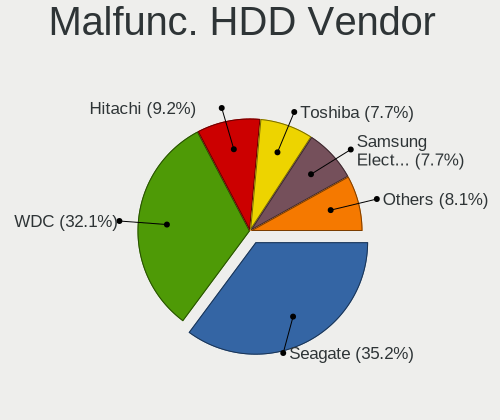
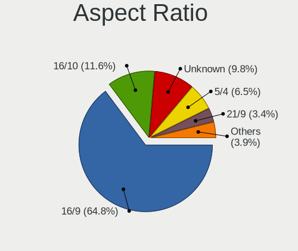
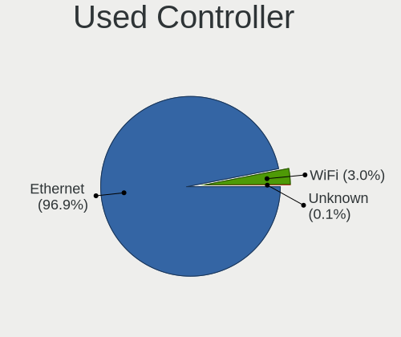
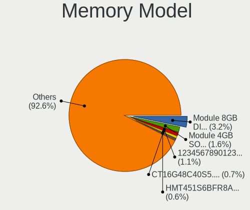
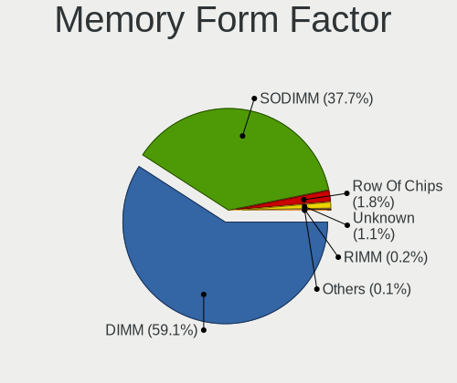

BSD - Tested Hardware & Statistics (Desktops)
---------------------------------------------

A project to collect tested hardware configurations for BSD.

Anyone can contribute to this report by the [hw-probe](https://github.com/linuxhw/hw-probe/blob/master/INSTALL.BSD.md) tool:

    hw-probe -all -upload

Please contribute! Especially if your hardware is rare.

This report is for real hardware. Report for virtual hardware: [TestDays_VE](https://github.com/bsdhw/TestDays_VE)

Contents
--------

* [ Test Cases ](#test-cases)

* [ System ](#system)
  - [ OS                       ](#os)
  - [ OS Family                ](#os-family)
  - [ Arch                     ](#arch)
  - [ DE                       ](#de)
  - [ Display Server           ](#display-server)
  - [ Display Manager          ](#display-manager)
  - [ OS Lang                  ](#os-lang)
  - [ Boot Mode                ](#boot-mode)
  - [ Filesystem               ](#filesystem)
  - [ Part. scheme             ](#part-scheme)

* [ Board ](#board)
  - [ Vendor                   ](#vendor)
  - [ Model                    ](#model)
  - [ Model Family             ](#model-family)
  - [ MFG Year                 ](#mfg-year)
  - [ Form Factor              ](#form-factor)
  - [ Coreboot                 ](#coreboot)
  - [ RAM Size                 ](#ram-size)
  - [ RAM Used                 ](#ram-used)
  - [ Total Drives             ](#total-drives)
  - [ Has CD-ROM               ](#has-cd-rom)
  - [ Has Ethernet             ](#has-ethernet)
  - [ Has WiFi                 ](#has-wifi)
  - [ Has Bluetooth            ](#has-bluetooth)

* [ Location ](#location)
  - [ Country                  ](#country)
  - [ City                     ](#city)

* [ Drives ](#drives)
  - [ Drive Vendor             ](#drive-vendor)
  - [ Drive Model              ](#drive-model)
  - [ HDD Vendor               ](#hdd-vendor)
  - [ SSD Vendor               ](#ssd-vendor)
  - [ Drive Kind               ](#drive-kind)
  - [ Drive Connector          ](#drive-connector)
  - [ Drive Size               ](#drive-size)
  - [ Space Total              ](#space-total)
  - [ Space Used               ](#space-used)
  - [ Malfunc. Drives          ](#malfunc-drives)
  - [ Malfunc. Drive Vendor    ](#malfunc-drive-vendor)
  - [ Malfunc. HDD Vendor      ](#malfunc-hdd-vendor)
  - [ Malfunc. Drive Kind      ](#malfunc-drive-kind)
  - [ Failed Drives            ](#failed-drives)
  - [ Failed Drive Vendor      ](#failed-drive-vendor)
  - [ Drive Status             ](#drive-status)

* [ Storage controller ](#storage-controller)
  - [ Storage Vendor           ](#storage-vendor)
  - [ Storage Model            ](#storage-model)
  - [ Storage Kind             ](#storage-kind)

* [ Processor ](#processor)
  - [ CPU Vendor               ](#cpu-vendor)
  - [ CPU Model                ](#cpu-model)
  - [ CPU Model Family         ](#cpu-model-family)
  - [ CPU Cores                ](#cpu-cores)
  - [ CPU Sockets              ](#cpu-sockets)
  - [ CPU Threads              ](#cpu-threads)
  - [ CPU Microarch            ](#cpu-microarch)

* [ Graphics ](#graphics)
  - [ GPU Vendor               ](#gpu-vendor)
  - [ GPU Model                ](#gpu-model)
  - [ GPU Combo                ](#gpu-combo)
  - [ GPU Driver               ](#gpu-driver)
  - [ GPU Memory               ](#gpu-memory)

* [ Monitor ](#monitor)
  - [ Monitor Vendor           ](#monitor-vendor)
  - [ Monitor Model            ](#monitor-model)
  - [ Monitor Resolution       ](#monitor-resolution)
  - [ Monitor Diagonal         ](#monitor-diagonal)
  - [ Monitor Width            ](#monitor-width)
  - [ Aspect Ratio             ](#aspect-ratio)
  - [ Monitor Area             ](#monitor-area)
  - [ Pixel Density            ](#pixel-density)
  - [ Multiple Monitors        ](#multiple-monitors)

* [ Network ](#network)
  - [ Net Controller Vendor    ](#net-controller-vendor)
  - [ Net Controller Model     ](#net-controller-model)
  - [ Wireless Vendor          ](#wireless-vendor)
  - [ Wireless Model           ](#wireless-model)
  - [ Ethernet Vendor          ](#ethernet-vendor)
  - [ Ethernet Model           ](#ethernet-model)
  - [ Net Controller Kind      ](#net-controller-kind)
  - [ Used Controller          ](#used-controller)
  - [ NICs                     ](#nics)
  - [ IPv6                     ](#ipv6)

* [ Bluetooth ](#bluetooth)
  - [ Bluetooth Vendor         ](#bluetooth-vendor)
  - [ Bluetooth Model          ](#bluetooth-model)

* [ Sound ](#sound)
  - [ Sound Vendor             ](#sound-vendor)
  - [ Sound Model              ](#sound-model)

* [ Memory ](#memory)
  - [ Memory Vendor            ](#memory-vendor)
  - [ Memory Model             ](#memory-model)
  - [ Memory Kind              ](#memory-kind)
  - [ Memory Form Factor       ](#memory-form-factor)
  - [ Memory Size              ](#memory-size)
  - [ Memory Speed             ](#memory-speed)

* [ Printers & scanners ](#printers--scanners)
  - [ Printer Vendor           ](#printer-vendor)
  - [ Printer Model            ](#printer-model)
  - [ Scanner Vendor           ](#scanner-vendor)
  - [ Scanner Model            ](#scanner-model)

* [ Camera ](#camera)
  - [ Camera Vendor            ](#camera-vendor)
  - [ Camera Model             ](#camera-model)

* [ Security ](#security)
  - [ Fingerprint Vendor       ](#fingerprint-vendor)
  - [ Fingerprint Model        ](#fingerprint-model)
  - [ Chipcard Vendor          ](#chipcard-vendor)
  - [ Chipcard Model           ](#chipcard-model)

* [ Unsupported ](#unsupported)
  - [ Unsupported Devices      ](#unsupported-devices)
  - [ Unsupported Device Types ](#unsupported-device-types)

Test Cases
----------

Total: 11362

| Vendor        | Model                       | Probe                                                     | Date         |
|---------------|-----------------------------|-----------------------------------------------------------|--------------|
| Techvision    | TVI7309X B0                 | [eff74e8df0](https://bsd-hardware.info/?probe=eff74e8df0) | Sep 07, 2023 |
| Unknown       | Unknown                     | [21e851e9e9](https://bsd-hardware.info/?probe=21e851e9e9) | Sep 07, 2023 |
| PAIQ          | PICO PC A1                  | [a88a2eb065](https://bsd-hardware.info/?probe=a88a2eb065) | Sep 07, 2023 |
| PC Engines    | APU3                        | [ad38dcf54a](https://bsd-hardware.info/?probe=ad38dcf54a) | Sep 07, 2023 |
| Unknown       | Unknown                     | [5ed026eccf](https://bsd-hardware.info/?probe=5ed026eccf) | Sep 07, 2023 |
| AAEON         | FWS-2280 V1.0               | [b5e0038e79](https://bsd-hardware.info/?probe=b5e0038e79) | Sep 07, 2023 |
| TYAN Compu... | S5510HE                     | [99d23c35ca](https://bsd-hardware.info/?probe=99d23c35ca) | Sep 07, 2023 |
| Dell          | 05XGC8 A01                  | [7c0acfa5b9](https://bsd-hardware.info/?probe=7c0acfa5b9) | Sep 07, 2023 |
| Unknown       | Unknown                     | [94d9b19ade](https://bsd-hardware.info/?probe=94d9b19ade) | Sep 07, 2023 |
| PAIQ          | PICO PC A1                  | [9e77e09181](https://bsd-hardware.info/?probe=9e77e09181) | Sep 07, 2023 |
| IceWhale T... | ZimaBoard 432 ZMB           | [451cfdf64f](https://bsd-hardware.info/?probe=451cfdf64f) | Sep 06, 2023 |
| Unknown       | Unknown                     | [6361addd62](https://bsd-hardware.info/?probe=6361addd62) | Sep 06, 2023 |
| Fujitsu       | D3313-G1 S26361-D3313-G1    | [48ca84af37](https://bsd-hardware.info/?probe=48ca84af37) | Sep 06, 2023 |
| Lenovo        | 0B98401 PRO                 | [4397f70291](https://bsd-hardware.info/?probe=4397f70291) | Sep 06, 2023 |
| Dell          | 0NC2VH A01                  | [34a855cc56](https://bsd-hardware.info/?probe=34a855cc56) | Sep 06, 2023 |
| AZW           | MINI S 10                   | [2daf516a05](https://bsd-hardware.info/?probe=2daf516a05) | Sep 06, 2023 |
| ASUSTek       | P8H61-M LE R2.0             | [7c08d4cfb1](https://bsd-hardware.info/?probe=7c08d4cfb1) | Sep 06, 2023 |
| PC Engines    | APU2                        | [d582e62190](https://bsd-hardware.info/?probe=d582e62190) | Sep 06, 2023 |
| Techvision    | TVI7309X B0                 | [f04224b44a](https://bsd-hardware.info/?probe=f04224b44a) | Sep 06, 2023 |
| ASUSTek       | SABERTOOTH 990FX R2.0       | [0b7d85b124](https://bsd-hardware.info/?probe=0b7d85b124) | Sep 06, 2023 |
| Unknown       | Unknown                     | [19711ca08b](https://bsd-hardware.info/?probe=19711ca08b) | Sep 06, 2023 |
| Supermicro    | X9SCL/X9SCMA                | [3af68f2594](https://bsd-hardware.info/?probe=3af68f2594) | Sep 06, 2023 |
| Gigabyte      | H61M-S1                     | [bd2df105c0](https://bsd-hardware.info/?probe=bd2df105c0) | Sep 06, 2023 |
| ASUSTek       | P8H67-M PRO                 | [c06ec95a55](https://bsd-hardware.info/?probe=c06ec95a55) | Sep 06, 2023 |
| Dell          | 096JG8 A01                  | [ec3e0338eb](https://bsd-hardware.info/?probe=ec3e0338eb) | Sep 06, 2023 |
| Unknown       | Unknown                     | [f757c58686](https://bsd-hardware.info/?probe=f757c58686) | Sep 05, 2023 |
| IceWhale T... | ZimaBoard 432 ZMB           | [6e458d22a3](https://bsd-hardware.info/?probe=6e458d22a3) | Sep 05, 2023 |
| Dell          | 096JG8 A01                  | [84d768ee15](https://bsd-hardware.info/?probe=84d768ee15) | Sep 05, 2023 |
| Intel         | Q3XXG4-P V1.0               | [3fb536ecce](https://bsd-hardware.info/?probe=3fb536ecce) | Sep 05, 2023 |
| Unknown       | Unknown                     | [a27d64dbac](https://bsd-hardware.info/?probe=a27d64dbac) | Sep 05, 2023 |
| ASUSTek       | H97I-PLUS                   | [e92272bb87](https://bsd-hardware.info/?probe=e92272bb87) | Sep 05, 2023 |
| Unknown       | Unknown                     | [b95f409ccf](https://bsd-hardware.info/?probe=b95f409ccf) | Sep 05, 2023 |
| Unknown       | Unknown                     | [50f509c032](https://bsd-hardware.info/?probe=50f509c032) | Sep 05, 2023 |
| Supermicro    | X11SSH-F                    | [bff90e93d0](https://bsd-hardware.info/?probe=bff90e93d0) | Sep 05, 2023 |
| Unknown       | Unknown                     | [a4796e8170](https://bsd-hardware.info/?probe=a4796e8170) | Sep 04, 2023 |
| Dell          | 0NC2VH A01                  | [8cc0358a69](https://bsd-hardware.info/?probe=8cc0358a69) | Sep 04, 2023 |
| CWWK          | CW-AD4L-N V1                | [dd32d9d4e1](https://bsd-hardware.info/?probe=dd32d9d4e1) | Sep 04, 2023 |
| Gigabyte      | P35C-DS3R                   | [4424751223](https://bsd-hardware.info/?probe=4424751223) | Sep 04, 2023 |
| ASUSTek       | P8Z77-V LX                  | [ed1fade3db](https://bsd-hardware.info/?probe=ed1fade3db) | Sep 04, 2023 |
| Gigabyte      | H61M-S1                     | [5d1dbf86d9](https://bsd-hardware.info/?probe=5d1dbf86d9) | Sep 04, 2023 |
| Unknown       | Unknown                     | [7d95befe6e](https://bsd-hardware.info/?probe=7d95befe6e) | Sep 04, 2023 |
| Intel         | S1200KP AAG34877-201        | [1b07865ce7](https://bsd-hardware.info/?probe=1b07865ce7) | Sep 04, 2023 |
| Dell          | 0NC2VH A01                  | [7209f86fed](https://bsd-hardware.info/?probe=7209f86fed) | Sep 04, 2023 |
| ASRock        | X570 Steel Legend WiFi a... | [a98f0b3d67](https://bsd-hardware.info/?probe=a98f0b3d67) | Sep 03, 2023 |
| Lenovo        | SHARKBAY SDK0E50510 WIN     | [1bde5a65b6](https://bsd-hardware.info/?probe=1bde5a65b6) | Sep 03, 2023 |
| Gigabyte      | A520I AC                    | [58e061f420](https://bsd-hardware.info/?probe=58e061f420) | Sep 03, 2023 |
| ASRock        | H81M-DGS R2.0               | [1f823a8be7](https://bsd-hardware.info/?probe=1f823a8be7) | Sep 03, 2023 |
| ASRock        | H310CM-DVS                  | [604c9311bc](https://bsd-hardware.info/?probe=604c9311bc) | Sep 03, 2023 |
| ASRock        | X570 Steel Legend WiFi a... | [d352ea60cf](https://bsd-hardware.info/?probe=d352ea60cf) | Sep 03, 2023 |
| PC Engines    | APU2                        | [c9d2cfe6fa](https://bsd-hardware.info/?probe=c9d2cfe6fa) | Sep 03, 2023 |
| Unknown       | Unknown                     | [53cee3b3c8](https://bsd-hardware.info/?probe=53cee3b3c8) | Sep 03, 2023 |
| MSI           | PRO Z790-P WIFI             | [fe53c55492](https://bsd-hardware.info/?probe=fe53c55492) | Sep 03, 2023 |
| Biostar       | J4105NHU                    | [2ac770aa55](https://bsd-hardware.info/?probe=2ac770aa55) | Sep 03, 2023 |
| MSI           | H81M-P33                    | [b47290007a](https://bsd-hardware.info/?probe=b47290007a) | Sep 03, 2023 |
| ASUSTek       | P5Q-E                       | [ef4604a40f](https://bsd-hardware.info/?probe=ef4604a40f) | Sep 03, 2023 |
| ASUSTek       | ROG CROSSHAIR VIII HERO     | [8d37c44440](https://bsd-hardware.info/?probe=8d37c44440) | Sep 03, 2023 |
| Lenovo        | 30BC SDK0J40705 WIN 3425... | [a1c29072ea](https://bsd-hardware.info/?probe=a1c29072ea) | Sep 03, 2023 |
| Unknown       | Unknown                     | [9c1891cda7](https://bsd-hardware.info/?probe=9c1891cda7) | Sep 03, 2023 |
| AAEON         | FWS-2363 V1.0               | [098bc5466b](https://bsd-hardware.info/?probe=098bc5466b) | Sep 03, 2023 |
| Shuttle       | DS20U                       | [d034a8e5b8](https://bsd-hardware.info/?probe=d034a8e5b8) | Sep 02, 2023 |
| Intel         | HM570                       | [de018603ae](https://bsd-hardware.info/?probe=de018603ae) | Sep 02, 2023 |
| Protectli     | FW6 Ver                     | [70992eb19b](https://bsd-hardware.info/?probe=70992eb19b) | Sep 02, 2023 |
| ASUSTek       | M5A97 PLUS                  | [77b461d3ad](https://bsd-hardware.info/?probe=77b461d3ad) | Sep 02, 2023 |
| Dell          | 08NPPY A00                  | [1ae33cfe72](https://bsd-hardware.info/?probe=1ae33cfe72) | Sep 02, 2023 |
| ASRock        | J3455M                      | [762d4d9370](https://bsd-hardware.info/?probe=762d4d9370) | Sep 02, 2023 |
| Dell          | 0XCR8D A00                  | [b89126c9d9](https://bsd-hardware.info/?probe=b89126c9d9) | Sep 02, 2023 |
| MSI           | Z390-A PRO                  | [57925dc8bb](https://bsd-hardware.info/?probe=57925dc8bb) | Sep 02, 2023 |
| Unknown       | Unknown                     | [94487109c2](https://bsd-hardware.info/?probe=94487109c2) | Sep 01, 2023 |
| Dell          | 042P49 A01                  | [383445ee26](https://bsd-hardware.info/?probe=383445ee26) | Sep 01, 2023 |
| Inventec      | Z CLASS A02                 | [1f4bf47cab](https://bsd-hardware.info/?probe=1f4bf47cab) | Sep 01, 2023 |
| Protectli     | FW6 Ver                     | [04de7aa059](https://bsd-hardware.info/?probe=04de7aa059) | Sep 01, 2023 |
| Shuttle       | FS77U                       | [149a8a1437](https://bsd-hardware.info/?probe=149a8a1437) | Sep 01, 2023 |
| Dell          | 0YXT71 A02                  | [b887caabe7](https://bsd-hardware.info/?probe=b887caabe7) | Aug 31, 2023 |
| Foxconn       | nT-A3000 series FAB         | [d9f360b4fe](https://bsd-hardware.info/?probe=d9f360b4fe) | Aug 31, 2023 |
| Dell          | 0WR7PY A02                  | [2557e04cf5](https://bsd-hardware.info/?probe=2557e04cf5) | Aug 31, 2023 |
| ASRockRack    | EPYC3101D4I-2T              | [82ac08abc0](https://bsd-hardware.info/?probe=82ac08abc0) | Aug 31, 2023 |
| Techvision    | TVI7309X B0                 | [6adab2354e](https://bsd-hardware.info/?probe=6adab2354e) | Aug 31, 2023 |
| ASUSTek       | PRIME H610M-E D4            | [9aafa8bedf](https://bsd-hardware.info/?probe=9aafa8bedf) | Aug 31, 2023 |
| Gigabyte      | A520I AC                    | [e245a38088](https://bsd-hardware.info/?probe=e245a38088) | Aug 31, 2023 |
| VIA Techno... | VT8623-8235                 | [3274cd095e](https://bsd-hardware.info/?probe=3274cd095e) | Aug 31, 2023 |
| Biostar       | A68N-5545                   | [b2a1070e2d](https://bsd-hardware.info/?probe=b2a1070e2d) | Aug 31, 2023 |
| CWWK          | CW-AD4L-N V1                | [363a27fb74](https://bsd-hardware.info/?probe=363a27fb74) | Aug 31, 2023 |
| ASRock        | H81M-VG4 R2.0               | [fd3a7c75de](https://bsd-hardware.info/?probe=fd3a7c75de) | Aug 30, 2023 |
| Unknown       | Unknown                     | [b59ce07b49](https://bsd-hardware.info/?probe=b59ce07b49) | Aug 30, 2023 |
| MSI           | MS-7125                     | [3dfb767d80](https://bsd-hardware.info/?probe=3dfb767d80) | Aug 30, 2023 |
| HP            | 802F                        | [1f64f7e11f](https://bsd-hardware.info/?probe=1f64f7e11f) | Aug 30, 2023 |
| Unknown       | Unknown                     | [c0536b27d4](https://bsd-hardware.info/?probe=c0536b27d4) | Aug 30, 2023 |
| MW            | GMLK-2_5G4L                 | [56ac0149f8](https://bsd-hardware.info/?probe=56ac0149f8) | Aug 30, 2023 |
| Infoblox      | IB-810                      | [34c0fa6bec](https://bsd-hardware.info/?probe=34c0fa6bec) | Aug 30, 2023 |
| Techvision    | TVI7309X B0                 | [259a7ec99d](https://bsd-hardware.info/?probe=259a7ec99d) | Aug 30, 2023 |
| Techvision    | TVI7309X B0                 | [20946147de](https://bsd-hardware.info/?probe=20946147de) | Aug 30, 2023 |
| Unknown       | Unknown                     | [8cfa60050b](https://bsd-hardware.info/?probe=8cfa60050b) | Aug 30, 2023 |
| Supermicro    | A1SRi-2758F                 | [c8b4f33fb1](https://bsd-hardware.info/?probe=c8b4f33fb1) | Aug 30, 2023 |
| Dell          | 0JCTF8 A00                  | [a2be5a5f0f](https://bsd-hardware.info/?probe=a2be5a5f0f) | Aug 30, 2023 |
| Dell          | 0NW6H5 A00                  | [8109e9f43f](https://bsd-hardware.info/?probe=8109e9f43f) | Aug 29, 2023 |
| PC Engines    | apu4                        | [2c5a47d3c4](https://bsd-hardware.info/?probe=2c5a47d3c4) | Aug 29, 2023 |
| SolidRun      | CEX7 Platform               | [b83ebfd33b](https://bsd-hardware.info/?probe=b83ebfd33b) | Aug 29, 2023 |
| CncTion       | N6000-4L B0                 | [81cbfbffca](https://bsd-hardware.info/?probe=81cbfbffca) | Aug 29, 2023 |
| Unknown       | YL-J3160L4                  | [6018dde257](https://bsd-hardware.info/?probe=6018dde257) | Aug 29, 2023 |
| Biostar       | A68N-5545                   | [c90edbc46a](https://bsd-hardware.info/?probe=c90edbc46a) | Aug 29, 2023 |
| Unknown       | Unknown                     | [f01bce7cd7](https://bsd-hardware.info/?probe=f01bce7cd7) | Aug 29, 2023 |
| AZW           | EQ                          | [fe5669c376](https://bsd-hardware.info/?probe=fe5669c376) | Aug 29, 2023 |
| Nvidia        | MCP79                       | [0897b3a117](https://bsd-hardware.info/?probe=0897b3a117) | Aug 29, 2023 |
| Intel         | SKYBAY                      | [9d49471591](https://bsd-hardware.info/?probe=9d49471591) | Aug 29, 2023 |
| Supermicro    | X9DRD-iF                    | [be36f2fe2b](https://bsd-hardware.info/?probe=be36f2fe2b) | Aug 28, 2023 |
| Lenovo        | 30D2 SDK0J40697 WIN 3305... | [cda96eed7a](https://bsd-hardware.info/?probe=cda96eed7a) | Aug 28, 2023 |
| Unknown       | Unknown                     | [c5068ec761](https://bsd-hardware.info/?probe=c5068ec761) | Aug 28, 2023 |
| Unknown       | Unknown                     | [fc384f5de7](https://bsd-hardware.info/?probe=fc384f5de7) | Aug 28, 2023 |
| Unknown       | Unknown                     | [fcc9bcdede](https://bsd-hardware.info/?probe=fcc9bcdede) | Aug 28, 2023 |
| CncTion       | N6000-4L B0                 | [0cab2e3af3](https://bsd-hardware.info/?probe=0cab2e3af3) | Aug 28, 2023 |
| ShenZhen M... | 3865U-6L                    | [2835cc7062](https://bsd-hardware.info/?probe=2835cc7062) | Aug 28, 2023 |
| ASUSTek       | ROG STRIX B450-I GAMING     | [3dab6f4044](https://bsd-hardware.info/?probe=3dab6f4044) | Aug 28, 2023 |
| Intel         | Q3XXG4-P V1.0               | [2d0c639c61](https://bsd-hardware.info/?probe=2d0c639c61) | Aug 28, 2023 |
| MSI           | H110M PRO-VD                | [dcbd4ebf8f](https://bsd-hardware.info/?probe=dcbd4ebf8f) | Aug 27, 2023 |
| MSI           | AM1I                        | [50183030f8](https://bsd-hardware.info/?probe=50183030f8) | Aug 27, 2023 |
| Unknown       | Unknown                     | [f363eeaa25](https://bsd-hardware.info/?probe=f363eeaa25) | Aug 27, 2023 |
| IceWhale T... | ZimaBoard 432 ZMB           | [a47cd8ee32](https://bsd-hardware.info/?probe=a47cd8ee32) | Aug 27, 2023 |
| Gigabyte      | GA-890FXA-UD5               | [85b0bba1ea](https://bsd-hardware.info/?probe=85b0bba1ea) | Aug 27, 2023 |
| Dell          | 04Y8V0 A02                  | [a84c23941d](https://bsd-hardware.info/?probe=a84c23941d) | Aug 27, 2023 |
| Protectli     | FW6                         | [37b744ff79](https://bsd-hardware.info/?probe=37b744ff79) | Aug 27, 2023 |
| MSI           | PRESTIGE X570 CREATION      | [df915d5ab9](https://bsd-hardware.info/?probe=df915d5ab9) | Aug 27, 2023 |
| Fujitsu       | D3313-E1 S26361-D3313-E1    | [a684024d8e](https://bsd-hardware.info/?probe=a684024d8e) | Aug 27, 2023 |
| Unknown       | Unknown                     | [0de8fccd23](https://bsd-hardware.info/?probe=0de8fccd23) | Aug 27, 2023 |
| MSI           | H81M-P33                    | [2e9a066a01](https://bsd-hardware.info/?probe=2e9a066a01) | Aug 27, 2023 |
| ASUSTek       | P5Q-E                       | [9898ae1ead](https://bsd-hardware.info/?probe=9898ae1ead) | Aug 27, 2023 |
| ASUSTek       | ROG CROSSHAIR VIII HERO     | [0bb56ff672](https://bsd-hardware.info/?probe=0bb56ff672) | Aug 27, 2023 |
| Gigabyte      | F2A88XM-D3H                 | [5f23f0620f](https://bsd-hardware.info/?probe=5f23f0620f) | Aug 27, 2023 |
| PC Engines    | APU                         | [3b29671556](https://bsd-hardware.info/?probe=3b29671556) | Aug 26, 2023 |
| Gigabyte      | X570S UD                    | [ed6162710b](https://bsd-hardware.info/?probe=ed6162710b) | Aug 26, 2023 |
| Dell          | 042P49 A01                  | [a06ab2449f](https://bsd-hardware.info/?probe=a06ab2449f) | Aug 26, 2023 |
| PC Engines    | APU2                        | [ed6839f08c](https://bsd-hardware.info/?probe=ed6839f08c) | Aug 26, 2023 |
| Dell          | 0NC2VH A01                  | [46499d5075](https://bsd-hardware.info/?probe=46499d5075) | Aug 26, 2023 |
| Gigabyte      | H510M K                     | [17f15f19f4](https://bsd-hardware.info/?probe=17f15f19f4) | Aug 26, 2023 |
| Supermicro    | X11SDV-4C-TP8F-01           | [21e958a05d](https://bsd-hardware.info/?probe=21e958a05d) | Aug 26, 2023 |
| ASRock        | 970 Extreme3 R2.0           | [bf289c5941](https://bsd-hardware.info/?probe=bf289c5941) | Aug 26, 2023 |
| Unknown       | Unknown                     | [6619af0a29](https://bsd-hardware.info/?probe=6619af0a29) | Aug 26, 2023 |
| ASUSTek       | H110I-PLUS                  | [a487121854](https://bsd-hardware.info/?probe=a487121854) | Aug 26, 2023 |
| HP            | 8299                        | [77a077cb11](https://bsd-hardware.info/?probe=77a077cb11) | Aug 26, 2023 |
| Pegatron      | 2ACD                        | [c20fcb2b2f](https://bsd-hardware.info/?probe=c20fcb2b2f) | Aug 26, 2023 |
| Intel         | D2500CC AAG43156-303        | [281e4a541b](https://bsd-hardware.info/?probe=281e4a541b) | Aug 26, 2023 |
| IGEL Techn... | D220                        | [a7686520e1](https://bsd-hardware.info/?probe=a7686520e1) | Aug 26, 2023 |
| Intel         | D2500CC AAG43156-303        | [c5745af495](https://bsd-hardware.info/?probe=c5745af495) | Aug 26, 2023 |
| ASUSTek       | P8H61-MX R2.0               | [d724e54fc4](https://bsd-hardware.info/?probe=d724e54fc4) | Aug 25, 2023 |
| Techvision    | TVI7309X B0                 | [ebb4e825a3](https://bsd-hardware.info/?probe=ebb4e825a3) | Aug 25, 2023 |
| ASUSTek       | P5M2-R                      | [73135bf26d](https://bsd-hardware.info/?probe=73135bf26d) | Aug 25, 2023 |
| PC Engines    | APU2                        | [3d3b16c0cf](https://bsd-hardware.info/?probe=3d3b16c0cf) | Aug 25, 2023 |
| AZW           | U59                         | [e08540ab36](https://bsd-hardware.info/?probe=e08540ab36) | Aug 25, 2023 |
| Techvision    | TVI7309X B0                 | [662ce63a50](https://bsd-hardware.info/?probe=662ce63a50) | Aug 25, 2023 |
| MW            | GMLK-2_5G4L                 | [8c6f7098f9](https://bsd-hardware.info/?probe=8c6f7098f9) | Aug 25, 2023 |
| SolidRun      | CEX7 Platform               | [4d51e18ce4](https://bsd-hardware.info/?probe=4d51e18ce4) | Aug 25, 2023 |
| Unknown       | Unknown                     | [aad81c60fa](https://bsd-hardware.info/?probe=aad81c60fa) | Aug 25, 2023 |
| HP            | 8053                        | [1e99a9a6f6](https://bsd-hardware.info/?probe=1e99a9a6f6) | Aug 24, 2023 |
| Inventec      | Z CLASS A02                 | [8d7f83c319](https://bsd-hardware.info/?probe=8d7f83c319) | Aug 24, 2023 |
| CncTion       | N6000-4L B0                 | [d8a9af2435](https://bsd-hardware.info/?probe=d8a9af2435) | Aug 24, 2023 |
| Fujitsu       | D3313-A1 S26361-D3313-A1    | [a8fa821e5e](https://bsd-hardware.info/?probe=a8fa821e5e) | Aug 24, 2023 |
| YANYU         | R250                        | [69dbe1a014](https://bsd-hardware.info/?probe=69dbe1a014) | Aug 24, 2023 |
| Cisco         | ASA5515 A0                  | [d4540d9ae5](https://bsd-hardware.info/?probe=d4540d9ae5) | Aug 24, 2023 |
| Advantech     | FWA-3305U                   | [b83d93fa92](https://bsd-hardware.info/?probe=b83d93fa92) | Aug 24, 2023 |
| Advantech     | FWA-3305U                   | [aa39ffe903](https://bsd-hardware.info/?probe=aa39ffe903) | Aug 24, 2023 |
| CWWK          | MINIPC-G12                  | [036ece379c](https://bsd-hardware.info/?probe=036ece379c) | Aug 24, 2023 |
| Protectli     | FW4B                        | [4b358b0106](https://bsd-hardware.info/?probe=4b358b0106) | Aug 24, 2023 |
| Unknown       | Unknown                     | [294eac42d4](https://bsd-hardware.info/?probe=294eac42d4) | Aug 24, 2023 |
| Intel         | DQ67SW AAG12527-310         | [f07be9b690](https://bsd-hardware.info/?probe=f07be9b690) | Aug 24, 2023 |
| ASUSTek       | TUF Gaming B550M-PLUS       | [e5cae16104](https://bsd-hardware.info/?probe=e5cae16104) | Aug 23, 2023 |
| Lenovo        | SHARKBAY SDK0E50510 WIN     | [66f982c40b](https://bsd-hardware.info/?probe=66f982c40b) | Aug 23, 2023 |
| MW            | GMLK-2_5G4L                 | [d07ade15d2](https://bsd-hardware.info/?probe=d07ade15d2) | Aug 23, 2023 |
| PC Engines    | apu4                        | [18b0f5e948](https://bsd-hardware.info/?probe=18b0f5e948) | Aug 23, 2023 |
| Techvision    | TVI7309X B0                 | [c3d92d6d2d](https://bsd-hardware.info/?probe=c3d92d6d2d) | Aug 23, 2023 |
| ASRock        | H61M-VG3                    | [a86acb4ebe](https://bsd-hardware.info/?probe=a86acb4ebe) | Aug 23, 2023 |
| MSI           | PRO B550-VC                 | [005e9c7b4c](https://bsd-hardware.info/?probe=005e9c7b4c) | Aug 23, 2023 |
| AZW           | EQ                          | [a43bd92291](https://bsd-hardware.info/?probe=a43bd92291) | Aug 23, 2023 |
| MSI           | G31M3-L V2                  | [7335b3dea2](https://bsd-hardware.info/?probe=7335b3dea2) | Aug 22, 2023 |
| Lenovo        | 3102 SDK0J40705 WIN 3425... | [1fcc80636d](https://bsd-hardware.info/?probe=1fcc80636d) | Aug 22, 2023 |
| Dell          | 0KHP4K A03                  | [c54db98574](https://bsd-hardware.info/?probe=c54db98574) | Aug 22, 2023 |
| MSI           | MAG B460M BAZOOKA           | [7cf9279c14](https://bsd-hardware.info/?probe=7cf9279c14) | Aug 22, 2023 |
| MW            | GMLK-2_5G4L                 | [dcfa60a51c](https://bsd-hardware.info/?probe=dcfa60a51c) | Aug 22, 2023 |
| Dell          | 0KHP4K A03                  | [dd1ad7af32](https://bsd-hardware.info/?probe=dd1ad7af32) | Aug 22, 2023 |
| Protectli     | VP2420                      | [3bc5eb1186](https://bsd-hardware.info/?probe=3bc5eb1186) | Aug 22, 2023 |
| Unknown       | Unknown                     | [74a7137090](https://bsd-hardware.info/?probe=74a7137090) | Aug 22, 2023 |
| ASRock        | A520M-ITX/ac                | [8622d78a7c](https://bsd-hardware.info/?probe=8622d78a7c) | Aug 22, 2023 |
| Gigabyte      | H610I DDR4                  | [f4310832c2](https://bsd-hardware.info/?probe=f4310832c2) | Aug 22, 2023 |
| Intel         | JSL MRD                     | [56165c654b](https://bsd-hardware.info/?probe=56165c654b) | Aug 22, 2023 |
| Unknown       | Unknown                     | [03da20b37e](https://bsd-hardware.info/?probe=03da20b37e) | Aug 22, 2023 |
| Unknown       | MANIFOLD 2-C                | [71e00307ae](https://bsd-hardware.info/?probe=71e00307ae) | Aug 22, 2023 |
| Gigabyte      | C1037UN-EU                  | [76945fc8cb](https://bsd-hardware.info/?probe=76945fc8cb) | Aug 22, 2023 |
| Protectli     | VP2420                      | [c033157bb2](https://bsd-hardware.info/?probe=c033157bb2) | Aug 22, 2023 |
| Techvision    | TVI7309X B0                 | [ff55eb5161](https://bsd-hardware.info/?probe=ff55eb5161) | Aug 22, 2023 |
| PC Engines    | APU2                        | [3e32acfdc4](https://bsd-hardware.info/?probe=3e32acfdc4) | Aug 22, 2023 |
| Unknown       | Unknown                     | [341152089f](https://bsd-hardware.info/?probe=341152089f) | Aug 21, 2023 |
| Protectli     | FW4B                        | [6041b7e153](https://bsd-hardware.info/?probe=6041b7e153) | Aug 21, 2023 |
| Intel         | JSL MRD                     | [0f3ef76fb8](https://bsd-hardware.info/?probe=0f3ef76fb8) | Aug 21, 2023 |
| IceWhale T... | ZimaBoard 432 ZMB           | [6ecafa8a0d](https://bsd-hardware.info/?probe=6ecafa8a0d) | Aug 21, 2023 |
| Techvision    | TVI7309X B0                 | [e59ce0fb84](https://bsd-hardware.info/?probe=e59ce0fb84) | Aug 21, 2023 |
| Cisco         | ASA5525 A0                  | [7c88ca29f7](https://bsd-hardware.info/?probe=7c88ca29f7) | Aug 21, 2023 |
| MSI           | AM1I                        | [0f74a7c547](https://bsd-hardware.info/?probe=0f74a7c547) | Aug 21, 2023 |
| ASUSTek       | B85M-G R2.0                 | [3941ce5fae](https://bsd-hardware.info/?probe=3941ce5fae) | Aug 21, 2023 |
| ASRock        | X570M Pro4                  | [c03bc6fa91](https://bsd-hardware.info/?probe=c03bc6fa91) | Aug 21, 2023 |
| Techvision    | TVI7309X B0                 | [0643b0062f](https://bsd-hardware.info/?probe=0643b0062f) | Aug 21, 2023 |
| Techvision    | TVI7309X B0                 | [ba3f84875e](https://bsd-hardware.info/?probe=ba3f84875e) | Aug 21, 2023 |
| Unknown       | Unknown                     | [a5535e9235](https://bsd-hardware.info/?probe=a5535e9235) | Aug 21, 2023 |
| MSI           | MEG X570 ACE                | [0d69491bdd](https://bsd-hardware.info/?probe=0d69491bdd) | Aug 21, 2023 |
| MSI           | MEG X570 ACE                | [913cc77381](https://bsd-hardware.info/?probe=913cc77381) | Aug 21, 2023 |
| Unknown       | Unknown                     | [e57d2d76d2](https://bsd-hardware.info/?probe=e57d2d76d2) | Aug 21, 2023 |
| Unknown       | J3160-4L                    | [cf30fa594f](https://bsd-hardware.info/?probe=cf30fa594f) | Aug 21, 2023 |
| Gigabyte      | H110M-D2P-WG-CF             | [a91c61e3e3](https://bsd-hardware.info/?probe=a91c61e3e3) | Aug 21, 2023 |
| Intel         | DQ67SW AAG12527-310         | [e6bfadb400](https://bsd-hardware.info/?probe=e6bfadb400) | Aug 21, 2023 |
| Unknown       | Unknown                     | [5ab27fdf53](https://bsd-hardware.info/?probe=5ab27fdf53) | Aug 21, 2023 |
| Unknown       | iKoolCore R1 iKoolCore R... | [ff47584ed9](https://bsd-hardware.info/?probe=ff47584ed9) | Aug 20, 2023 |
| Inventec      | Z CLASS A02                 | [3194978ea5](https://bsd-hardware.info/?probe=3194978ea5) | Aug 20, 2023 |
| HP            | 213D A01                    | [16e458bb75](https://bsd-hardware.info/?probe=16e458bb75) | Aug 20, 2023 |
| Advantech     | SYS-2USM02-6M01E            | [dd02b9879d](https://bsd-hardware.info/?probe=dd02b9879d) | Aug 20, 2023 |
| Intel         | Q3XXG4-P V1.0               | [ef28836f5c](https://bsd-hardware.info/?probe=ef28836f5c) | Aug 20, 2023 |
| HP            | 83EE                        | [6d5b431611](https://bsd-hardware.info/?probe=6d5b431611) | Aug 20, 2023 |
| IceWhale T... | ZimaBoard 832 ZMB           | [01d58784e6](https://bsd-hardware.info/?probe=01d58784e6) | Aug 20, 2023 |
| IceWhale T... | ZimaBoard 832 ZMB           | [97321f0843](https://bsd-hardware.info/?probe=97321f0843) | Aug 20, 2023 |
| HP            | 8594                        | [b3e5652c1b](https://bsd-hardware.info/?probe=b3e5652c1b) | Aug 20, 2023 |
| Lenovo        | ThinkCentre M90p 3853RN9    | [818c1b5f31](https://bsd-hardware.info/?probe=818c1b5f31) | Aug 20, 2023 |
| Gigabyte      | GA-880GA-UD3H               | [35eb7df9a7](https://bsd-hardware.info/?probe=35eb7df9a7) | Aug 20, 2023 |
| MSI           | 990FXA-GD80                 | [70c65a5a34](https://bsd-hardware.info/?probe=70c65a5a34) | Aug 20, 2023 |
| Shuttle       | DS20U                       | [5c511e0613](https://bsd-hardware.info/?probe=5c511e0613) | Aug 20, 2023 |
| Unknown       | Unknown                     | [3296816fc1](https://bsd-hardware.info/?probe=3296816fc1) | Aug 20, 2023 |
| HP            | 8594                        | [77d6ac3f77](https://bsd-hardware.info/?probe=77d6ac3f77) | Aug 20, 2023 |
| ASRock        | H110M-STX                   | [5c819b9ff1](https://bsd-hardware.info/?probe=5c819b9ff1) | Aug 20, 2023 |
| ASUSTek       | TUF Gaming B450M-PLUS II    | [1b53079f34](https://bsd-hardware.info/?probe=1b53079f34) | Aug 19, 2023 |
| Supermicro    | X11SDW-8C-TP13F             | [da4385727b](https://bsd-hardware.info/?probe=da4385727b) | Aug 19, 2023 |
| ASRock        | J4105-ITX                   | [b7542c33b3](https://bsd-hardware.info/?probe=b7542c33b3) | Aug 19, 2023 |
| Protectli     | FW1 Ver                     | [8b49278bbd](https://bsd-hardware.info/?probe=8b49278bbd) | Aug 19, 2023 |
| Dell          | 04Y8V0 A02                  | [8f26de2199](https://bsd-hardware.info/?probe=8f26de2199) | Aug 19, 2023 |
| Techvision    | TVI7309X B0                 | [93c70115bd](https://bsd-hardware.info/?probe=93c70115bd) | Aug 19, 2023 |
| Unknown       | Unknown                     | [29fc7f6f45](https://bsd-hardware.info/?probe=29fc7f6f45) | Aug 19, 2023 |
| Supermicro    | A1SRi-2758F                 | [c9c0312302](https://bsd-hardware.info/?probe=c9c0312302) | Aug 19, 2023 |
| CncTion       | N5105-4L-I226 B0            | [40f2ba2800](https://bsd-hardware.info/?probe=40f2ba2800) | Aug 18, 2023 |
| Gigabyte      | B550 AORUS ELITE V2         | [7e1d475356](https://bsd-hardware.info/?probe=7e1d475356) | Aug 18, 2023 |
| Protectli     | FW2B Ver                    | [b200aabc73](https://bsd-hardware.info/?probe=b200aabc73) | Aug 18, 2023 |
| Unknown       | Unknown                     | [b5a786e411](https://bsd-hardware.info/?probe=b5a786e411) | Aug 18, 2023 |
| Unknown       | Unknown                     | [f7c887c84f](https://bsd-hardware.info/?probe=f7c887c84f) | Aug 18, 2023 |
| ASRock        | E3C224D2I                   | [93bf9586db](https://bsd-hardware.info/?probe=93bf9586db) | Aug 18, 2023 |
| MSI           | MPG Z390 GAMING PRO CARB... | [df095be4ba](https://bsd-hardware.info/?probe=df095be4ba) | Aug 18, 2023 |
| Dell          | 0GY6Y8 A00                  | [e982da98d2](https://bsd-hardware.info/?probe=e982da98d2) | Aug 18, 2023 |
| BESSTAR Te... | IB9                         | [c9f5ede507](https://bsd-hardware.info/?probe=c9f5ede507) | Aug 18, 2023 |
| Lenovo        | 30C7 SDK0J40700 WIN 3258... | [9e92903663](https://bsd-hardware.info/?probe=9e92903663) | Aug 18, 2023 |
| MSI           | MS-7721                     | [a577019634](https://bsd-hardware.info/?probe=a577019634) | Aug 18, 2023 |
| Fujitsu       | D3313-G1 S26361-D3313-G1    | [b3625ada4b](https://bsd-hardware.info/?probe=b3625ada4b) | Aug 18, 2023 |
| MSI           | MS-7721                     | [678c81c8c1](https://bsd-hardware.info/?probe=678c81c8c1) | Aug 18, 2023 |
| Intel         | SKYBAY                      | [53fb653186](https://bsd-hardware.info/?probe=53fb653186) | Aug 18, 2023 |
| Unknown       | Unknown                     | [3521bed0e8](https://bsd-hardware.info/?probe=3521bed0e8) | Aug 18, 2023 |
| Unknown       | QSKL01                      | [b768029249](https://bsd-hardware.info/?probe=b768029249) | Aug 18, 2023 |
| Daten Tecn... | DH110MXV                    | [bdd9c72e7c](https://bsd-hardware.info/?probe=bdd9c72e7c) | Aug 18, 2023 |
| ASRock        | B660M Steel Legend          | [c50e637bc2](https://bsd-hardware.info/?probe=c50e637bc2) | Aug 18, 2023 |
| Supermicro    | A1SRi-2758F                 | [71fff01c39](https://bsd-hardware.info/?probe=71fff01c39) | Aug 18, 2023 |
| Dell          | 0NC2VH A01                  | [7ea90d38d1](https://bsd-hardware.info/?probe=7ea90d38d1) | Aug 18, 2023 |
| Protectli     | FW4B                        | [880c0c7069](https://bsd-hardware.info/?probe=880c0c7069) | Aug 18, 2023 |
| Intel         | Q3XXG4-P V1.0               | [0836b029bc](https://bsd-hardware.info/?probe=0836b029bc) | Aug 17, 2023 |
| HP            | 1495                        | [556a339a7e](https://bsd-hardware.info/?probe=556a339a7e) | Aug 17, 2023 |
| HP            | 213D A01                    | [015beb30c7](https://bsd-hardware.info/?probe=015beb30c7) | Aug 17, 2023 |
| PICO PC       | MNHO-113                    | [95f3a15448](https://bsd-hardware.info/?probe=95f3a15448) | Aug 17, 2023 |
| Unknown       | Unknown                     | [a574d1cce5](https://bsd-hardware.info/?probe=a574d1cce5) | Aug 17, 2023 |
| CWWK          | MINIPC-G12                  | [473c64e07b](https://bsd-hardware.info/?probe=473c64e07b) | Aug 17, 2023 |
| Unknown       | Unknown                     | [20348d2f47](https://bsd-hardware.info/?probe=20348d2f47) | Aug 17, 2023 |
| Unknown       | YL-E3854L4-V2               | [6b85b4a31c](https://bsd-hardware.info/?probe=6b85b4a31c) | Aug 16, 2023 |
| Fujitsu       | D3313-B1 S26361-D3313-B1    | [87bc92631a](https://bsd-hardware.info/?probe=87bc92631a) | Aug 16, 2023 |
| Techvision    | TVI7309X B0                 | [e6f2e26b1d](https://bsd-hardware.info/?probe=e6f2e26b1d) | Aug 16, 2023 |
| MSI           | PRO Z790-P WIFI             | [fcb3075158](https://bsd-hardware.info/?probe=fcb3075158) | Aug 16, 2023 |
| ASRock        | B450 Pro4                   | [c12a76c083](https://bsd-hardware.info/?probe=c12a76c083) | Aug 16, 2023 |
| Unknown       | Unknown                     | [e457a41b4a](https://bsd-hardware.info/?probe=e457a41b4a) | Aug 16, 2023 |
| Fujitsu       | D3313-B1 S26361-D3313-B1    | [ec68697ed9](https://bsd-hardware.info/?probe=ec68697ed9) | Aug 16, 2023 |
| Supermicro    | X11SDV-8C-TP8F              | [3b5ddbcb06](https://bsd-hardware.info/?probe=3b5ddbcb06) | Aug 16, 2023 |
| CncTion       | J4125-4L-I225               | [269cfa2253](https://bsd-hardware.info/?probe=269cfa2253) | Aug 16, 2023 |
| Techvision    | TVI7309X B0                 | [9e31a91e15](https://bsd-hardware.info/?probe=9e31a91e15) | Aug 16, 2023 |
| CWWK          | CW-AD4L-N V1                | [f710821a92](https://bsd-hardware.info/?probe=f710821a92) | Aug 16, 2023 |
| Unknown       | Unknown                     | [de9a146c44](https://bsd-hardware.info/?probe=de9a146c44) | Aug 16, 2023 |
| Unknown       | QGLK03                      | [bb622dd456](https://bsd-hardware.info/?probe=bb622dd456) | Aug 16, 2023 |
| Supermicro    | M12SWA-TF                   | [2e38f0b91a](https://bsd-hardware.info/?probe=2e38f0b91a) | Aug 16, 2023 |
| HP            | 18E7                        | [3c24defdf8](https://bsd-hardware.info/?probe=3c24defdf8) | Aug 16, 2023 |
| Gigabyte      | Z390 AORUS PRO WIFI-CF      | [fc152ce8d4](https://bsd-hardware.info/?probe=fc152ce8d4) | Aug 16, 2023 |
| Unknown       | Q2XX V1.0                   | [be1252b2ff](https://bsd-hardware.info/?probe=be1252b2ff) | Aug 16, 2023 |
| Unknown       | Unknown                     | [86c4d1f8cf](https://bsd-hardware.info/?probe=86c4d1f8cf) | Aug 15, 2023 |
| Gigabyte      | G41M-ES2L                   | [30c58f7403](https://bsd-hardware.info/?probe=30c58f7403) | Aug 15, 2023 |
| Unknown       | MANIFOLD 2-C                | [18559e2fde](https://bsd-hardware.info/?probe=18559e2fde) | Aug 15, 2023 |
| Unknown       | MANIFOLD 2-C                | [73c35b0a8a](https://bsd-hardware.info/?probe=73c35b0a8a) | Aug 15, 2023 |
| MSI           | A520M-A PRO                 | [cc946b2a89](https://bsd-hardware.info/?probe=cc946b2a89) | Aug 15, 2023 |
| Intel         | SKYBAY                      | [77fbc82e41](https://bsd-hardware.info/?probe=77fbc82e41) | Aug 15, 2023 |
| PC Engines    | APU2                        | [c11fdc1cf9](https://bsd-hardware.info/?probe=c11fdc1cf9) | Aug 15, 2023 |
| Unknown       | Unknown                     | [99fd3696dd](https://bsd-hardware.info/?probe=99fd3696dd) | Aug 15, 2023 |
| AZW           | EQ                          | [5393736ae4](https://bsd-hardware.info/?probe=5393736ae4) | Aug 15, 2023 |
| Intel         | Q3XXG4-P V1.0               | [d830d61109](https://bsd-hardware.info/?probe=d830d61109) | Aug 15, 2023 |
| Protectli     | VP4620                      | [0f0695d190](https://bsd-hardware.info/?probe=0f0695d190) | Aug 15, 2023 |
| MW            | GMLK-2_5G4L                 | [bacf5acda2](https://bsd-hardware.info/?probe=bacf5acda2) | Aug 15, 2023 |
| Intel         | D34010WYK H14771-305        | [843c366f1e](https://bsd-hardware.info/?probe=843c366f1e) | Aug 15, 2023 |
| ASUSTek       | PRIME Z790M-PLUS D4         | [ad77aba442](https://bsd-hardware.info/?probe=ad77aba442) | Aug 15, 2023 |
| ASUSTek       | PRIME B450M-K               | [74bfa3e0cd](https://bsd-hardware.info/?probe=74bfa3e0cd) | Aug 15, 2023 |
| Protectli     | FW4B Ver                    | [dbbd82bd80](https://bsd-hardware.info/?probe=dbbd82bd80) | Aug 15, 2023 |
| ASUSTek       | P8Z68-V LE                  | [08061905f7](https://bsd-hardware.info/?probe=08061905f7) | Aug 15, 2023 |
| MSI           | B360M BAZOOKA               | [472c17f992](https://bsd-hardware.info/?probe=472c17f992) | Aug 15, 2023 |
| ASUSTek       | P5G41T-M LX2/BR             | [f25db83457](https://bsd-hardware.info/?probe=f25db83457) | Aug 15, 2023 |
| Protectli     | VP2420                      | [53aac49eee](https://bsd-hardware.info/?probe=53aac49eee) | Aug 14, 2023 |
| Dell          | 08NPPY A00                  | [aba7b573c1](https://bsd-hardware.info/?probe=aba7b573c1) | Aug 14, 2023 |
| AMI           | PICO PC E3845-4LAN VER1.... | [a45e2ba34b](https://bsd-hardware.info/?probe=a45e2ba34b) | Aug 14, 2023 |
| MSI           | 990FXA-GD80                 | [169da97c61](https://bsd-hardware.info/?probe=169da97c61) | Aug 14, 2023 |
| Acer          | TDPS05 R3700                | [5e3083a96d](https://bsd-hardware.info/?probe=5e3083a96d) | Aug 14, 2023 |
| PC Engines    | APU2                        | [bdd3050b5f](https://bsd-hardware.info/?probe=bdd3050b5f) | Aug 14, 2023 |
| Supermicro    | X9SCI/X9SCA                 | [4efedc24b0](https://bsd-hardware.info/?probe=4efedc24b0) | Aug 14, 2023 |
| PC Engines    | APU2                        | [d8f32b19ff](https://bsd-hardware.info/?probe=d8f32b19ff) | Aug 14, 2023 |
| Protectli     | FW4B                        | [417b740320](https://bsd-hardware.info/?probe=417b740320) | Aug 14, 2023 |
| Unknown       | Unknown                     | [52e07e7158](https://bsd-hardware.info/?probe=52e07e7158) | Aug 14, 2023 |
| Dell          | 0HY9JP A00                  | [c09110c605](https://bsd-hardware.info/?probe=c09110c605) | Aug 13, 2023 |
| Protectli     | VP2420                      | [b4bed593e9](https://bsd-hardware.info/?probe=b4bed593e9) | Aug 13, 2023 |
| Protectli     | VP2420                      | [b81c163920](https://bsd-hardware.info/?probe=b81c163920) | Aug 13, 2023 |
| CncTion       | N5105-4L B0                 | [6c4364fe15](https://bsd-hardware.info/?probe=6c4364fe15) | Aug 13, 2023 |
| ASUSTek       | PRIME X370-PRO              | [2529ce32a7](https://bsd-hardware.info/?probe=2529ce32a7) | Aug 13, 2023 |
| ASRock        | X570 Phantom Gaming 4       | [80fbf43a6c](https://bsd-hardware.info/?probe=80fbf43a6c) | Aug 13, 2023 |
| ASUSTek       | P6X58D PREMIUM              | [946e123320](https://bsd-hardware.info/?probe=946e123320) | Aug 13, 2023 |
| ASUSTek       | P5Q-E                       | [fbb75a1ace](https://bsd-hardware.info/?probe=fbb75a1ace) | Aug 13, 2023 |
| MSI           | H81M-P33                    | [c7b0e4ca6c](https://bsd-hardware.info/?probe=c7b0e4ca6c) | Aug 13, 2023 |
| ASUSTek       | ROG CROSSHAIR VIII HERO     | [245d908d1a](https://bsd-hardware.info/?probe=245d908d1a) | Aug 13, 2023 |
| Dell          | 02YYK5 A00                  | [fecdfd45c7](https://bsd-hardware.info/?probe=fecdfd45c7) | Aug 13, 2023 |
| MSI           | MPG Z390 GAMING PRO CARB... | [9d53e56e92](https://bsd-hardware.info/?probe=9d53e56e92) | Aug 13, 2023 |
| Supermicro    | X11SSH-F                    | [deb4e10cd2](https://bsd-hardware.info/?probe=deb4e10cd2) | Aug 13, 2023 |
| Supermicro    | X11SSH-F                    | [947caf3be1](https://bsd-hardware.info/?probe=947caf3be1) | Aug 13, 2023 |
| Dell          | 00VTMF A01                  | [399fe2224c](https://bsd-hardware.info/?probe=399fe2224c) | Aug 13, 2023 |
| Unknown       | YL-E3854L4-V2               | [e21c4e8012](https://bsd-hardware.info/?probe=e21c4e8012) | Aug 13, 2023 |
| Dell          | 0NW6H5 A00                  | [b05547dfb4](https://bsd-hardware.info/?probe=b05547dfb4) | Aug 13, 2023 |
| PC Engines    | apu4                        | [24e025662c](https://bsd-hardware.info/?probe=24e025662c) | Aug 12, 2023 |
| Protectli     | VP2410                      | [486f3d6dc6](https://bsd-hardware.info/?probe=486f3d6dc6) | Aug 12, 2023 |
| CncTion       | J4125-4L-I225               | [983bbef1fb](https://bsd-hardware.info/?probe=983bbef1fb) | Aug 12, 2023 |
| WeiBu         | ADL-N Prod                  | [26bbe26e7c](https://bsd-hardware.info/?probe=26bbe26e7c) | Aug 12, 2023 |
| Unknown       | YL-E3854L4-V2               | [2b24029c25](https://bsd-hardware.info/?probe=2b24029c25) | Aug 12, 2023 |
| Protectli     | FW6 Ver                     | [7e3965fa27](https://bsd-hardware.info/?probe=7e3965fa27) | Aug 12, 2023 |
| ASUSTek       | P8H61-MX R2.0               | [f281a47c21](https://bsd-hardware.info/?probe=f281a47c21) | Aug 12, 2023 |
| HP            | 8265                        | [cefac793c7](https://bsd-hardware.info/?probe=cefac793c7) | Aug 12, 2023 |
| MW            | GMLK-2_5G4L                 | [41f42269dc](https://bsd-hardware.info/?probe=41f42269dc) | Aug 12, 2023 |
| Protectli     | VP2410 10                   | [b4869eafb2](https://bsd-hardware.info/?probe=b4869eafb2) | Aug 12, 2023 |
| CWWK          | MINIPC-G4                   | [fe5b20a178](https://bsd-hardware.info/?probe=fe5b20a178) | Aug 12, 2023 |
| Unknown       | Unknown                     | [81c0628f53](https://bsd-hardware.info/?probe=81c0628f53) | Aug 12, 2023 |
| Protectli     | FW6 Ver                     | [edc2f0f879](https://bsd-hardware.info/?probe=edc2f0f879) | Aug 12, 2023 |
| Protectli     | FW4C Ver                    | [519987ec57](https://bsd-hardware.info/?probe=519987ec57) | Aug 12, 2023 |
| MW            | GMLK-2_5G4L                 | [2ee5b48d5c](https://bsd-hardware.info/?probe=2ee5b48d5c) | Aug 12, 2023 |
| Unknown       | Unknown                     | [ae3290dce1](https://bsd-hardware.info/?probe=ae3290dce1) | Aug 11, 2023 |
| HP            | 18E5                        | [61bde93177](https://bsd-hardware.info/?probe=61bde93177) | Aug 11, 2023 |
| Unknown       | Unknown                     | [d8ed693594](https://bsd-hardware.info/?probe=d8ed693594) | Aug 11, 2023 |
| Unknown       | Unknown                     | [e310e0d309](https://bsd-hardware.info/?probe=e310e0d309) | Aug 11, 2023 |
| HP            | 8054                        | [05cae0efcc](https://bsd-hardware.info/?probe=05cae0efcc) | Aug 11, 2023 |
| CncTion       | N5105-4L B0                 | [27f84c75b5](https://bsd-hardware.info/?probe=27f84c75b5) | Aug 11, 2023 |
| Unknown       | Unknown                     | [faece39b99](https://bsd-hardware.info/?probe=faece39b99) | Aug 11, 2023 |
| HP            | 8055                        | [d686196496](https://bsd-hardware.info/?probe=d686196496) | Aug 11, 2023 |
| HP            | 1495                        | [7591160534](https://bsd-hardware.info/?probe=7591160534) | Aug 11, 2023 |
| Shuttle       | FH270                       | [8b697be8be](https://bsd-hardware.info/?probe=8b697be8be) | Aug 11, 2023 |
| MSI           | B560M-A PRO                 | [5d17cbf1da](https://bsd-hardware.info/?probe=5d17cbf1da) | Aug 11, 2023 |
| PC Engines    | APU2                        | [2e9106fc92](https://bsd-hardware.info/?probe=2e9106fc92) | Aug 11, 2023 |
| Gigabyte      | AX370M-DS3H-CF              | [7b00ddd0a1](https://bsd-hardware.info/?probe=7b00ddd0a1) | Aug 11, 2023 |
| PC Engines    | apu1                        | [0b3594d9a3](https://bsd-hardware.info/?probe=0b3594d9a3) | Aug 11, 2023 |
| PC Engines    | apu6                        | [65fda0fe1f](https://bsd-hardware.info/?probe=65fda0fe1f) | Aug 11, 2023 |
| Gigabyte      | G31M-ES2C                   | [6930fe4498](https://bsd-hardware.info/?probe=6930fe4498) | Aug 11, 2023 |
| Dell          | 0NC2VH A01                  | [0fd996a147](https://bsd-hardware.info/?probe=0fd996a147) | Aug 10, 2023 |
| MSI           | B560M-A PRO                 | [fc889ffd79](https://bsd-hardware.info/?probe=fc889ffd79) | Aug 10, 2023 |
| Unknown       | Unknown                     | [fdd28fbae2](https://bsd-hardware.info/?probe=fdd28fbae2) | Aug 10, 2023 |
| HP            | 83EE                        | [9ddbba5a62](https://bsd-hardware.info/?probe=9ddbba5a62) | Aug 10, 2023 |
| Techvision    | TVI7309X B0                 | [c20e0c5c41](https://bsd-hardware.info/?probe=c20e0c5c41) | Aug 10, 2023 |
| Intel         | JSL MRD                     | [ca7024f423](https://bsd-hardware.info/?probe=ca7024f423) | Aug 10, 2023 |
| Intel         | Q3XXG4-P V1.0               | [f0398bfb85](https://bsd-hardware.info/?probe=f0398bfb85) | Aug 10, 2023 |
| PC Engines    | apu4                        | [b81f51408d](https://bsd-hardware.info/?probe=b81f51408d) | Aug 10, 2023 |
| Protectli     | FW4B Ver                    | [064ee65b5c](https://bsd-hardware.info/?probe=064ee65b5c) | Aug 10, 2023 |
| Techvision    | TVI7309X B0                 | [bc83b25172](https://bsd-hardware.info/?probe=bc83b25172) | Aug 10, 2023 |
| MSI           | B360M BAZOOKA               | [4b0b4b88a7](https://bsd-hardware.info/?probe=4b0b4b88a7) | Aug 10, 2023 |
| Lenovo        | SHARKBAY 0B98401 WIN        | [a22e406f7c](https://bsd-hardware.info/?probe=a22e406f7c) | Aug 10, 2023 |
| Gigabyte      | X570 UD                     | [d4b7006d24](https://bsd-hardware.info/?probe=d4b7006d24) | Aug 10, 2023 |
| Unknown       | Unknown                     | [7751768206](https://bsd-hardware.info/?probe=7751768206) | Aug 10, 2023 |
| Supermicro    | X12SDV-4C-SP6F              | [6a275811b8](https://bsd-hardware.info/?probe=6a275811b8) | Aug 10, 2023 |
| MSI           | PRESTIGE X570 CREATION      | [65092dde79](https://bsd-hardware.info/?probe=65092dde79) | Aug 09, 2023 |
| Techvision    | TVI7309X B0                 | [877307aa80](https://bsd-hardware.info/?probe=877307aa80) | Aug 09, 2023 |
| IceWhale T... | ZimaBoard 832 ZMB           | [22edaf5c7d](https://bsd-hardware.info/?probe=22edaf5c7d) | Aug 09, 2023 |
| IceWhale T... | ZimaBoard 832 ZMB           | [48efdb6680](https://bsd-hardware.info/?probe=48efdb6680) | Aug 09, 2023 |
| PC Engines    | APU2                        | [be0e8bf959](https://bsd-hardware.info/?probe=be0e8bf959) | Aug 09, 2023 |
| Dell          | 04Y8V0 A02                  | [c693116826](https://bsd-hardware.info/?probe=c693116826) | Aug 09, 2023 |
| Dell          | 0CNWVK A00                  | [fdb03dc15f](https://bsd-hardware.info/?probe=fdb03dc15f) | Aug 09, 2023 |
| Lenovo        | SHARKBAY 0B98401 WIN        | [0c9251a971](https://bsd-hardware.info/?probe=0c9251a971) | Aug 09, 2023 |
| ASRock        | IMB-195                     | [7b5a73b87e](https://bsd-hardware.info/?probe=7b5a73b87e) | Aug 09, 2023 |
| ASUSTek       | M5A78L-M LE/USB3            | [4fc1fbaba1](https://bsd-hardware.info/?probe=4fc1fbaba1) | Aug 09, 2023 |
| Unknown       | Unknown                     | [5398864ed6](https://bsd-hardware.info/?probe=5398864ed6) | Aug 09, 2023 |
| MSI           | MPG X570 GAMING EDGE WIF... | [2f6574d368](https://bsd-hardware.info/?probe=2f6574d368) | Aug 08, 2023 |
| Premio        | BlueCat XMB3 00C            | [76abf23a1f](https://bsd-hardware.info/?probe=76abf23a1f) | Aug 08, 2023 |
| Fujitsu       | D3313-E1 S26361-D3313-E1    | [fac2fa5cbe](https://bsd-hardware.info/?probe=fac2fa5cbe) | Aug 08, 2023 |
| Dell          | 08NPPY A00                  | [c0884d7f16](https://bsd-hardware.info/?probe=c0884d7f16) | Aug 08, 2023 |
| MSI           | MS-7623                     | [189fb4d7cc](https://bsd-hardware.info/?probe=189fb4d7cc) | Aug 08, 2023 |
| HP            | 158A                        | [cc13e81512](https://bsd-hardware.info/?probe=cc13e81512) | Aug 08, 2023 |
| ASUSTek       | K30AD_M31AD_M51AD_M32AD     | [c54bdb8e4b](https://bsd-hardware.info/?probe=c54bdb8e4b) | Aug 08, 2023 |
| Acer          | Veriton N2620G              | [2acf1e4557](https://bsd-hardware.info/?probe=2acf1e4557) | Aug 08, 2023 |
| Intel         | DENLOW_WS                   | [73a37d9424](https://bsd-hardware.info/?probe=73a37d9424) | Aug 08, 2023 |
| ASUSTek       | PRIME Z590M-PLUS            | [87810aceef](https://bsd-hardware.info/?probe=87810aceef) | Aug 08, 2023 |
| ASUSTek       | P10S-I Series               | [e8e8c9fed2](https://bsd-hardware.info/?probe=e8e8c9fed2) | Aug 07, 2023 |
| Techvision    | TVI7309X B0                 | [fd4046c4d9](https://bsd-hardware.info/?probe=fd4046c4d9) | Aug 07, 2023 |
| PC Engines    | apu4                        | [bb7ad49154](https://bsd-hardware.info/?probe=bb7ad49154) | Aug 07, 2023 |
| Hardkernel    | ODROID-H2                   | [a92e1efca1](https://bsd-hardware.info/?probe=a92e1efca1) | Aug 07, 2023 |
| Unknown       | Unknown                     | [28f0d503fd](https://bsd-hardware.info/?probe=28f0d503fd) | Aug 07, 2023 |
| Unknown       | Unknown                     | [6238337b24](https://bsd-hardware.info/?probe=6238337b24) | Aug 07, 2023 |
| Intel         | Q3XXG4-P V1.0               | [d880905ae7](https://bsd-hardware.info/?probe=d880905ae7) | Aug 07, 2023 |
| Intel         | SHARKBAY                    | [2a8896bb78](https://bsd-hardware.info/?probe=2a8896bb78) | Aug 07, 2023 |
| HP            | 83EE                        | [c33d7d8cb3](https://bsd-hardware.info/?probe=c33d7d8cb3) | Aug 07, 2023 |
| Intel         | Q3XXG4-P V1.0               | [5b58edb60b](https://bsd-hardware.info/?probe=5b58edb60b) | Aug 07, 2023 |
| Techvision    | TVI7309X B0                 | [aeccb6e70c](https://bsd-hardware.info/?probe=aeccb6e70c) | Aug 07, 2023 |
| HPE           | ProLiant MicroServer Gen... | [d06166298c](https://bsd-hardware.info/?probe=d06166298c) | Aug 07, 2023 |
| Unknown       | Unknown                     | [16e7763338](https://bsd-hardware.info/?probe=16e7763338) | Aug 07, 2023 |
| Supermicro    | X9SCL/X9SCMA                | [19e34e504c](https://bsd-hardware.info/?probe=19e34e504c) | Aug 07, 2023 |
| Unknown       | Unknown                     | [75e009424e](https://bsd-hardware.info/?probe=75e009424e) | Aug 07, 2023 |
| PC Engines    | apu4                        | [57e0cc469e](https://bsd-hardware.info/?probe=57e0cc469e) | Aug 07, 2023 |
| Intel         | H81                         | [80f40918ce](https://bsd-hardware.info/?probe=80f40918ce) | Aug 07, 2023 |
| Protectli     | FW6 Ver                     | [c05ddd6998](https://bsd-hardware.info/?probe=c05ddd6998) | Aug 07, 2023 |
| Protectli     | FW6 Ver                     | [4836027efd](https://bsd-hardware.info/?probe=4836027efd) | Aug 07, 2023 |
| Lenovo        | SHARKBAY 0B98401 WIN        | [ec37cc1ba1](https://bsd-hardware.info/?probe=ec37cc1ba1) | Aug 07, 2023 |
| AMI           | PB_1900A                    | [791f6e0cb4](https://bsd-hardware.info/?probe=791f6e0cb4) | Aug 07, 2023 |
| ZOTAC         | Unknown                     | [415f49b491](https://bsd-hardware.info/?probe=415f49b491) | Aug 06, 2023 |
| Fujitsu       | D3313-G1 S26361-D3313-G1    | [d2ba7bbf34](https://bsd-hardware.info/?probe=d2ba7bbf34) | Aug 06, 2023 |
| Dell          | 0KWVT8 A03                  | [d203b32a8f](https://bsd-hardware.info/?probe=d203b32a8f) | Aug 06, 2023 |
| Supermicro    | X12SDV-4C-SP6F              | [5a87146725](https://bsd-hardware.info/?probe=5a87146725) | Aug 06, 2023 |
| Acer          | Aspire XC-115               | [7a94fde347](https://bsd-hardware.info/?probe=7a94fde347) | Aug 06, 2023 |
| Lenovo        | 313C SDK0J40697 WIN 3305... | [f65647a6be](https://bsd-hardware.info/?probe=f65647a6be) | Aug 06, 2023 |
| Lenovo        | 3743 SDK0T76461 WIN 3422... | [d5675b5940](https://bsd-hardware.info/?probe=d5675b5940) | Aug 06, 2023 |
| HP            | 0AACh                       | [5997b1de3e](https://bsd-hardware.info/?probe=5997b1de3e) | Aug 06, 2023 |
| ASUSTek       | PRIME B450-PLUS             | [d3fac2e3fe](https://bsd-hardware.info/?probe=d3fac2e3fe) | Aug 06, 2023 |
| YANYU         | R250                        | [95a37ee143](https://bsd-hardware.info/?probe=95a37ee143) | Aug 06, 2023 |
| Supermicro    | X11SDV-8C-TP8F              | [0b5f437319](https://bsd-hardware.info/?probe=0b5f437319) | Aug 06, 2023 |
| MSI           | H81M-P33                    | [1f7493ada9](https://bsd-hardware.info/?probe=1f7493ada9) | Aug 06, 2023 |
| ASUSTek       | P5Q-E                       | [46b9ec2e56](https://bsd-hardware.info/?probe=46b9ec2e56) | Aug 06, 2023 |
| ASUSTek       | ROG CROSSHAIR VIII HERO     | [5bd8b552e6](https://bsd-hardware.info/?probe=5bd8b552e6) | Aug 06, 2023 |
| ASUSTek       | M4A88TD-M/USB3              | [ce95634a53](https://bsd-hardware.info/?probe=ce95634a53) | Aug 06, 2023 |
| Lanner        | FW-7543 B-GA                | [dadf592128](https://bsd-hardware.info/?probe=dadf592128) | Aug 06, 2023 |
| Dell          | 0KP561                      | [bff2760640](https://bsd-hardware.info/?probe=bff2760640) | Aug 06, 2023 |
| Fujitsu       | D3313-G1 S26361-D3313-G1    | [eceed9eb7a](https://bsd-hardware.info/?probe=eceed9eb7a) | Aug 05, 2023 |
| Acer          | Aspire TC-330               | [4d3de96309](https://bsd-hardware.info/?probe=4d3de96309) | Aug 05, 2023 |
| Lenovo        | SDK0E50510 WIN              | [eee3c082b5](https://bsd-hardware.info/?probe=eee3c082b5) | Aug 05, 2023 |
| Dell          | 0782GW A00                  | [5288857ae9](https://bsd-hardware.info/?probe=5288857ae9) | Aug 05, 2023 |
| Hardkernel    | ODROID-H3                   | [3874b96551](https://bsd-hardware.info/?probe=3874b96551) | Aug 05, 2023 |
| Techvision    | TVI7309X B0                 | [86d5e86520](https://bsd-hardware.info/?probe=86d5e86520) | Aug 05, 2023 |
| HP            | 843F                        | [d192efba82](https://bsd-hardware.info/?probe=d192efba82) | Aug 05, 2023 |
| Unknown       | Unknown                     | [9c4dbcfd67](https://bsd-hardware.info/?probe=9c4dbcfd67) | Aug 05, 2023 |
| Lanner        | FW-7543 B-GA                | [6236e692de](https://bsd-hardware.info/?probe=6236e692de) | Aug 05, 2023 |
| Dell          | 07WP95 A02                  | [4213eff742](https://bsd-hardware.info/?probe=4213eff742) | Aug 05, 2023 |
| Fujitsu       | D3313-G1 S26361-D3313-G1    | [283fce4c68](https://bsd-hardware.info/?probe=283fce4c68) | Aug 05, 2023 |
| Unknown       | Unknown                     | [0f6e0d9566](https://bsd-hardware.info/?probe=0f6e0d9566) | Aug 05, 2023 |
| Protectli     | FW4B Ver                    | [8446d61b81](https://bsd-hardware.info/?probe=8446d61b81) | Aug 04, 2023 |
| Intel         | SKYBAY                      | [fde75b4094](https://bsd-hardware.info/?probe=fde75b4094) | Aug 04, 2023 |
| CWWK          | MINIPC-G12                  | [c449203453](https://bsd-hardware.info/?probe=c449203453) | Aug 04, 2023 |
| ASUSTek       | P5QL PRO                    | [dccefef8eb](https://bsd-hardware.info/?probe=dccefef8eb) | Aug 04, 2023 |
| Dell          | 0NC2VH A01                  | [36d63888b2](https://bsd-hardware.info/?probe=36d63888b2) | Aug 04, 2023 |
| Dell          | 0NC2VH A01                  | [bee8eb05f2](https://bsd-hardware.info/?probe=bee8eb05f2) | Aug 04, 2023 |
| Unknown       | YL-SKUL6                    | [cdd90dd470](https://bsd-hardware.info/?probe=cdd90dd470) | Aug 04, 2023 |
| Lenovo        | SHARKBAY NO DPK             | [62ed2f59f6](https://bsd-hardware.info/?probe=62ed2f59f6) | Aug 04, 2023 |
| Lenovo        | SHARKBAY SDK0E50510 WIN     | [2de0d4d2fa](https://bsd-hardware.info/?probe=2de0d4d2fa) | Aug 04, 2023 |
| HP            | 83F3                        | [6130788afe](https://bsd-hardware.info/?probe=6130788afe) | Aug 04, 2023 |
| Protectli     | VP4650                      | [94d2d08a9d](https://bsd-hardware.info/?probe=94d2d08a9d) | Aug 04, 2023 |
| ASRock        | 4X4-4000 Series             | [da7d5e31aa](https://bsd-hardware.info/?probe=da7d5e31aa) | Aug 03, 2023 |
| Dell          | 0T7D40 A00                  | [e903094a75](https://bsd-hardware.info/?probe=e903094a75) | Aug 03, 2023 |
| PC Engines    | APU2                        | [78c8ed6a89](https://bsd-hardware.info/?probe=78c8ed6a89) | Aug 03, 2023 |
| Gigabyte      | X570 UD                     | [2bef587ef1](https://bsd-hardware.info/?probe=2bef587ef1) | Aug 03, 2023 |
| Unknown       | Unknown                     | [803f6b50b3](https://bsd-hardware.info/?probe=803f6b50b3) | Aug 03, 2023 |
| Unknown       | Unknown                     | [91dd6813a1](https://bsd-hardware.info/?probe=91dd6813a1) | Aug 03, 2023 |
| ASRock        | 4X4-4000 Series             | [d896138d30](https://bsd-hardware.info/?probe=d896138d30) | Aug 03, 2023 |
| HP            | 1495                        | [551688d163](https://bsd-hardware.info/?probe=551688d163) | Aug 03, 2023 |
| HP            | 82B4                        | [8c6b861a4d](https://bsd-hardware.info/?probe=8c6b861a4d) | Aug 03, 2023 |
| HP            | 339A                        | [b69db7c6e0](https://bsd-hardware.info/?probe=b69db7c6e0) | Aug 03, 2023 |
| Shuttle       | FH270                       | [92c45a20de](https://bsd-hardware.info/?probe=92c45a20de) | Aug 02, 2023 |
| CncTion       | N5105-4L B0                 | [5310b151f0](https://bsd-hardware.info/?probe=5310b151f0) | Aug 02, 2023 |
| Unknown       | Unknown                     | [a9a3896275](https://bsd-hardware.info/?probe=a9a3896275) | Aug 02, 2023 |
| ASUSTek       | PRIME A320M-K               | [fa81dc0cd3](https://bsd-hardware.info/?probe=fa81dc0cd3) | Aug 02, 2023 |
| Dell          | 08NPPY A00                  | [249d4620d2](https://bsd-hardware.info/?probe=249d4620d2) | Aug 02, 2023 |
| ASRock        | B550 PG Velocita            | [3ff5fcfbc0](https://bsd-hardware.info/?probe=3ff5fcfbc0) | Aug 02, 2023 |
| ASUSTek       | PRIME H510M-A WIFI          | [9b09a89cc8](https://bsd-hardware.info/?probe=9b09a89cc8) | Aug 02, 2023 |
| Unknown       | Unknown                     | [e9977bfffe](https://bsd-hardware.info/?probe=e9977bfffe) | Aug 02, 2023 |
| ASRock        | B660-ITX                    | [c218c3c4d4](https://bsd-hardware.info/?probe=c218c3c4d4) | Aug 02, 2023 |
| Unknown       | Unknown                     | [b9f6337c0d](https://bsd-hardware.info/?probe=b9f6337c0d) | Aug 02, 2023 |
| Protectli     | VP2410 10                   | [3d653ab54c](https://bsd-hardware.info/?probe=3d653ab54c) | Aug 02, 2023 |
| Dell          | 0WR7PY A01                  | [54388809cd](https://bsd-hardware.info/?probe=54388809cd) | Aug 02, 2023 |
| ASRock        | B550M Steel Legend          | [ffc50e224c](https://bsd-hardware.info/?probe=ffc50e224c) | Aug 01, 2023 |
| Shuttle       | DH610                       | [bbdd78fe4b](https://bsd-hardware.info/?probe=bbdd78fe4b) | Aug 01, 2023 |
| Unknown       | Unknown                     | [42c65b8b8b](https://bsd-hardware.info/?probe=42c65b8b8b) | Aug 01, 2023 |
| ASRock        | J3355B-ITX                  | [234f0fd8aa](https://bsd-hardware.info/?probe=234f0fd8aa) | Aug 01, 2023 |
| Intel BOX4... | Geminilake                  | [b833ada775](https://bsd-hardware.info/?probe=b833ada775) | Aug 01, 2023 |
| Unknown       | 1.1                         | [745c09c8e7](https://bsd-hardware.info/?probe=745c09c8e7) | Aug 01, 2023 |
| HP            | 3031h                       | [19157ba305](https://bsd-hardware.info/?probe=19157ba305) | Aug 01, 2023 |
| Gigabyte      | Z170-HD3 DDR3-CF            | [f66f032ffe](https://bsd-hardware.info/?probe=f66f032ffe) | Aug 01, 2023 |
| MW            | GMLK-2_5G4L                 | [155f885c95](https://bsd-hardware.info/?probe=155f885c95) | Aug 01, 2023 |
| Hardkernel    | ODROID-H3                   | [aa708122cf](https://bsd-hardware.info/?probe=aa708122cf) | Aug 01, 2023 |
| HP            | 8298                        | [961bfad69a](https://bsd-hardware.info/?probe=961bfad69a) | Aug 01, 2023 |
| Supermicro    | X7SPA-H                     | [de44613a90](https://bsd-hardware.info/?probe=de44613a90) | Aug 01, 2023 |
| Shuttle       | DH610                       | [e7c63c97d3](https://bsd-hardware.info/?probe=e7c63c97d3) | Aug 01, 2023 |
| Fujitsu       | D3433-S2 S26361-D3433-S2    | [bdb1c85615](https://bsd-hardware.info/?probe=bdb1c85615) | Aug 01, 2023 |
| CWWK          | CW-AD4L-N V1                | [9cf0b7fe7c](https://bsd-hardware.info/?probe=9cf0b7fe7c) | Aug 01, 2023 |
| AZW           | EQ                          | [24d56ab18f](https://bsd-hardware.info/?probe=24d56ab18f) | Aug 01, 2023 |
| Protectli     | VP2420                      | [2ec2033d58](https://bsd-hardware.info/?probe=2ec2033d58) | Aug 01, 2023 |
| Unknown       | Unknown                     | [080c931545](https://bsd-hardware.info/?probe=080c931545) | Jul 31, 2023 |
| Intel         | H61                         | [392e85e173](https://bsd-hardware.info/?probe=392e85e173) | Jul 31, 2023 |
| Unknown       | Unknown                     | [8b7315305c](https://bsd-hardware.info/?probe=8b7315305c) | Jul 31, 2023 |
| ASRockRack    | X470D4U                     | [f26504cb5b](https://bsd-hardware.info/?probe=f26504cb5b) | Jul 31, 2023 |
| ASUSTek       | K30AD_M31AD_M51AD_M32AD     | [c045012233](https://bsd-hardware.info/?probe=c045012233) | Jul 31, 2023 |
| PC Engines    | apu4                        | [dbd2fc21bc](https://bsd-hardware.info/?probe=dbd2fc21bc) | Jul 31, 2023 |
| Shuttle       | DH370                       | [a3ab1c6344](https://bsd-hardware.info/?probe=a3ab1c6344) | Jul 31, 2023 |
| ASRockRack    | EPYC3101D4I-2T              | [be9b9caa66](https://bsd-hardware.info/?probe=be9b9caa66) | Jul 31, 2023 |
| CWWK          | MINIPC-G4                   | [8b928e3623](https://bsd-hardware.info/?probe=8b928e3623) | Jul 31, 2023 |
| Supermicro    | X7SLA                       | [c9a39071d0](https://bsd-hardware.info/?probe=c9a39071d0) | Jul 31, 2023 |
| HP            | 18E9                        | [04c971a0de](https://bsd-hardware.info/?probe=04c971a0de) | Jul 31, 2023 |
| Protectli     | FW6                         | [aa7b970016](https://bsd-hardware.info/?probe=aa7b970016) | Jul 31, 2023 |
| HP            | 8617                        | [7592f46fef](https://bsd-hardware.info/?probe=7592f46fef) | Jul 30, 2023 |
| Protectli     | FW1 Ver                     | [1d6213fd35](https://bsd-hardware.info/?probe=1d6213fd35) | Jul 30, 2023 |
| ChangWang     | CW56-58                     | [f418f5407c](https://bsd-hardware.info/?probe=f418f5407c) | Jul 30, 2023 |
| ASUSTek       | PRIME A320I-K               | [09f173d4b6](https://bsd-hardware.info/?probe=09f173d4b6) | Jul 30, 2023 |
| Gigabyte      | B550M DS3H AC               | [01959d5703](https://bsd-hardware.info/?probe=01959d5703) | Jul 30, 2023 |
| Techvision    | TVI7309X B0                 | [6bd995374a](https://bsd-hardware.info/?probe=6bd995374a) | Jul 30, 2023 |
| ASUSTek       | P8H61-M LE R2.0             | [dc86bf45ba](https://bsd-hardware.info/?probe=dc86bf45ba) | Jul 30, 2023 |
| MSI           | H81M-P33                    | [9c27c27611](https://bsd-hardware.info/?probe=9c27c27611) | Jul 30, 2023 |
| ASUSTek       | P5Q-E                       | [a2dbe84ed3](https://bsd-hardware.info/?probe=a2dbe84ed3) | Jul 30, 2023 |
| ASUSTek       | ROG CROSSHAIR VIII HERO     | [591f8397a9](https://bsd-hardware.info/?probe=591f8397a9) | Jul 30, 2023 |
| Premio        | BlueCat XMB3 00C            | [c453573c71](https://bsd-hardware.info/?probe=c453573c71) | Jul 30, 2023 |
| Dell          | 05XGC8 A01                  | [38310a9c5e](https://bsd-hardware.info/?probe=38310a9c5e) | Jul 30, 2023 |
| ASRock        | J5040-ITX                   | [2fb0a9d679](https://bsd-hardware.info/?probe=2fb0a9d679) | Jul 30, 2023 |
| HP            | 213D A01                    | [802a71b9f6](https://bsd-hardware.info/?probe=802a71b9f6) | Jul 29, 2023 |
| ASRockRack    | X470D4U                     | [fc2a96cc75](https://bsd-hardware.info/?probe=fc2a96cc75) | Jul 29, 2023 |
| ASUSTek       | P8P67                       | [0e10359af8](https://bsd-hardware.info/?probe=0e10359af8) | Jul 29, 2023 |
| AZW           | EQ                          | [a581a63aae](https://bsd-hardware.info/?probe=a581a63aae) | Jul 29, 2023 |
| GoWin Solu... | R86S                        | [51bb255924](https://bsd-hardware.info/?probe=51bb255924) | Jul 29, 2023 |
| Fujitsu       | D3230-A1 S26361-D3230-A1    | [64137e0eec](https://bsd-hardware.info/?probe=64137e0eec) | Jul 29, 2023 |
| Techvision    | TVI7309X B0                 | [e06b70a370](https://bsd-hardware.info/?probe=e06b70a370) | Jul 29, 2023 |
| Dell          | 0HD5W2 A00                  | [ce83168854](https://bsd-hardware.info/?probe=ce83168854) | Jul 29, 2023 |
| AZW           | EQ                          | [1feeda5ce9](https://bsd-hardware.info/?probe=1feeda5ce9) | Jul 29, 2023 |
| Hardkernel    | ODROID-H2                   | [42a2958c35](https://bsd-hardware.info/?probe=42a2958c35) | Jul 29, 2023 |
| HP            | 2AF7                        | [fc495dc6c7](https://bsd-hardware.info/?probe=fc495dc6c7) | Jul 29, 2023 |
| PC Engines    | APU2                        | [5eddd5369a](https://bsd-hardware.info/?probe=5eddd5369a) | Jul 28, 2023 |
| Gigabyte      | B550M DS3H AC               | [20b6e3f827](https://bsd-hardware.info/?probe=20b6e3f827) | Jul 28, 2023 |
| Gigabyte      | A320M-H-CF                  | [d1a2b99edc](https://bsd-hardware.info/?probe=d1a2b99edc) | Jul 28, 2023 |
| Unknown       | Unknown                     | [18d7e21d10](https://bsd-hardware.info/?probe=18d7e21d10) | Jul 28, 2023 |
| Intel         | DQ965GF AAD41676-305        | [5f86754385](https://bsd-hardware.info/?probe=5f86754385) | Jul 28, 2023 |
| Dell          | 0GDG8Y A02                  | [651f6bf18f](https://bsd-hardware.info/?probe=651f6bf18f) | Jul 28, 2023 |
| ASUSTek       | PRIME B650-PLUS             | [e74d459c5a](https://bsd-hardware.info/?probe=e74d459c5a) | Jul 28, 2023 |
| Dell          | 05XGC8 A01                  | [06e6afb4f1](https://bsd-hardware.info/?probe=06e6afb4f1) | Jul 28, 2023 |
| Dell          | 0HD5W2 A01                  | [e26ef35879](https://bsd-hardware.info/?probe=e26ef35879) | Jul 28, 2023 |
| Hardkernel    | ODROID-H3                   | [0bb6b16689](https://bsd-hardware.info/?probe=0bb6b16689) | Jul 28, 2023 |
| HP            | 18E4                        | [6a0ce7d626](https://bsd-hardware.info/?probe=6a0ce7d626) | Jul 28, 2023 |
| Protectli     | FW4B Ver                    | [449a3e6015](https://bsd-hardware.info/?probe=449a3e6015) | Jul 28, 2023 |
| Unknown       | Unknown                     | [1c6ab6b999](https://bsd-hardware.info/?probe=1c6ab6b999) | Jul 28, 2023 |
| Techvision    | TVI7309X B0                 | [088f599199](https://bsd-hardware.info/?probe=088f599199) | Jul 28, 2023 |
| Dell          | 0NC2VH A01                  | [1595ce505c](https://bsd-hardware.info/?probe=1595ce505c) | Jul 28, 2023 |
| MW            | GMLK-2_5G4L                 | [c9ecdb6ecc](https://bsd-hardware.info/?probe=c9ecdb6ecc) | Jul 28, 2023 |
| Unknown       | Unknown                     | [836d435712](https://bsd-hardware.info/?probe=836d435712) | Jul 28, 2023 |
| Unknown       | Unknown                     | [6d6a8cb863](https://bsd-hardware.info/?probe=6d6a8cb863) | Jul 28, 2023 |
| PC Engines    | apu1                        | [8bc97daada](https://bsd-hardware.info/?probe=8bc97daada) | Jul 27, 2023 |
| Yanling       | YL-GML4 V1                  | [1cd38d4e93](https://bsd-hardware.info/?probe=1cd38d4e93) | Jul 27, 2023 |
| Dell          | 0KWVT8 A03                  | [fccf22f7a7](https://bsd-hardware.info/?probe=fccf22f7a7) | Jul 27, 2023 |
| ASUSTek       | P5B SE                      | [6361457008](https://bsd-hardware.info/?probe=6361457008) | Jul 27, 2023 |
| Gigabyte      | B150N Phoenix-WIFI-CF       | [64b577cd8e](https://bsd-hardware.info/?probe=64b577cd8e) | Jul 27, 2023 |
| HP            | 83E1                        | [b211795736](https://bsd-hardware.info/?probe=b211795736) | Jul 27, 2023 |
| Unknown       | Unknown                     | [9d078811ba](https://bsd-hardware.info/?probe=9d078811ba) | Jul 27, 2023 |
| Unknown       | Unknown                     | [dbb7d95d59](https://bsd-hardware.info/?probe=dbb7d95d59) | Jul 27, 2023 |
| Unknown       | Unknown                     | [7841057467](https://bsd-hardware.info/?probe=7841057467) | Jul 27, 2023 |
| NF541         | 1.0                         | [ba959613a5](https://bsd-hardware.info/?probe=ba959613a5) | Jul 26, 2023 |
| Protectli     | VP2420                      | [87d17e77a8](https://bsd-hardware.info/?probe=87d17e77a8) | Jul 26, 2023 |
| Iwill Norg... | ecolan N12B - i210AT Rev... | [8ebe2f82f1](https://bsd-hardware.info/?probe=8ebe2f82f1) | Jul 26, 2023 |
| ASUSTek       | A8N-E                       | [274a1e508f](https://bsd-hardware.info/?probe=274a1e508f) | Jul 26, 2023 |
| IceWhale T... | ZimaBoard 832 ZMB           | [aeb59c510b](https://bsd-hardware.info/?probe=aeb59c510b) | Jul 26, 2023 |
| Cisco         | ASA5525 A0                  | [f4409bdc8f](https://bsd-hardware.info/?probe=f4409bdc8f) | Jul 26, 2023 |
| CONTEC        | G1/EMB-CV1/iD2550           | [34f5c817fb](https://bsd-hardware.info/?probe=34f5c817fb) | Jul 26, 2023 |
| HP            | 83EE                        | [fbf42f903b](https://bsd-hardware.info/?probe=fbf42f903b) | Jul 25, 2023 |
| Dell          | 0NC2VH A01                  | [103e75cb64](https://bsd-hardware.info/?probe=103e75cb64) | Jul 25, 2023 |
| Unknown       | Unknown                     | [468f7385c9](https://bsd-hardware.info/?probe=468f7385c9) | Jul 25, 2023 |
| AZW           | Green G5                    | [97f934a02c](https://bsd-hardware.info/?probe=97f934a02c) | Jul 25, 2023 |
| Unknown       | Unknown                     | [ebca9e6d70](https://bsd-hardware.info/?probe=ebca9e6d70) | Jul 25, 2023 |
| Unknown       | Unknown                     | [64c9b0f743](https://bsd-hardware.info/?probe=64c9b0f743) | Jul 25, 2023 |
| Unknown       | Unknown                     | [a483d8d32f](https://bsd-hardware.info/?probe=a483d8d32f) | Jul 25, 2023 |
| Unknown       | Unknown                     | [f7728cee03](https://bsd-hardware.info/?probe=f7728cee03) | Jul 25, 2023 |
| Unknown       | MANIFOLD 2-C                | [8aa3f5491e](https://bsd-hardware.info/?probe=8aa3f5491e) | Jul 25, 2023 |
| HP            | 339A                        | [b770568bae](https://bsd-hardware.info/?probe=b770568bae) | Jul 25, 2023 |
| Dell          | 0WMJ54 A01                  | [e11855c762](https://bsd-hardware.info/?probe=e11855c762) | Jul 24, 2023 |
| Fujitsu       | D3313-G1 S26361-D3313-G1    | [af215ad226](https://bsd-hardware.info/?probe=af215ad226) | Jul 24, 2023 |
| Lenovo        | SHARKBAY 0B98401 WIN        | [1cd9d4cb7f](https://bsd-hardware.info/?probe=1cd9d4cb7f) | Jul 24, 2023 |
| PC Engines    | apu4                        | [0aa9951131](https://bsd-hardware.info/?probe=0aa9951131) | Jul 24, 2023 |
| PC Engines    | apu4                        | [514dc1e9f9](https://bsd-hardware.info/?probe=514dc1e9f9) | Jul 24, 2023 |
| Dell          | 0TD1J8 A00                  | [c99bc29ce0](https://bsd-hardware.info/?probe=c99bc29ce0) | Jul 24, 2023 |
| MSI           | G41M-P33 Combo              | [d4a26f9214](https://bsd-hardware.info/?probe=d4a26f9214) | Jul 24, 2023 |
| Seeed Stud... | ODYSSEY-TGL-A               | [11ee31d0b3](https://bsd-hardware.info/?probe=11ee31d0b3) | Jul 24, 2023 |
| Dell          | 0PTTT9 A01                  | [a3624fdcfc](https://bsd-hardware.info/?probe=a3624fdcfc) | Jul 24, 2023 |
| Protectli     | VP2420                      | [58aac88cc5](https://bsd-hardware.info/?probe=58aac88cc5) | Jul 24, 2023 |
| Fujitsu       | D3313-A1 S26361-D3313-A1    | [dec2c34899](https://bsd-hardware.info/?probe=dec2c34899) | Jul 24, 2023 |
| HP            | 1495                        | [3ddc49b877](https://bsd-hardware.info/?probe=3ddc49b877) | Jul 24, 2023 |
| Unknown       | Unknown                     | [aab49bd228](https://bsd-hardware.info/?probe=aab49bd228) | Jul 24, 2023 |
| ASRock        | H61M-VG3                    | [5cebf2275e](https://bsd-hardware.info/?probe=5cebf2275e) | Jul 24, 2023 |
| Unknown       | Unknown                     | [3ca61a6a18](https://bsd-hardware.info/?probe=3ca61a6a18) | Jul 24, 2023 |
| Intel         | SKYBAY                      | [0c64b8a9be](https://bsd-hardware.info/?probe=0c64b8a9be) | Jul 24, 2023 |
| ASRock        | J4205-ITX                   | [90fc3f8e29](https://bsd-hardware.info/?probe=90fc3f8e29) | Jul 23, 2023 |
| Unknown       | Unknown                     | [bbae253aa2](https://bsd-hardware.info/?probe=bbae253aa2) | Jul 23, 2023 |
| HP            | 1495                        | [9de7021e50](https://bsd-hardware.info/?probe=9de7021e50) | Jul 23, 2023 |
| AZW           | U59                         | [1862cfda96](https://bsd-hardware.info/?probe=1862cfda96) | Jul 23, 2023 |
| Fujitsu       | D3313-E1 S26361-D3313-E1    | [8f918471aa](https://bsd-hardware.info/?probe=8f918471aa) | Jul 23, 2023 |
| AZW           | EQ                          | [7d2884120c](https://bsd-hardware.info/?probe=7d2884120c) | Jul 23, 2023 |
| Protectli     | VP2420                      | [7f388b0128](https://bsd-hardware.info/?probe=7f388b0128) | Jul 23, 2023 |
| ASUSTek       | TUF Gaming B650M-PLUS       | [438424a9d9](https://bsd-hardware.info/?probe=438424a9d9) | Jul 23, 2023 |
| PC Engines    | apu4                        | [ea9a81b423](https://bsd-hardware.info/?probe=ea9a81b423) | Jul 23, 2023 |
| MSI           | H81M-P33                    | [14b1509851](https://bsd-hardware.info/?probe=14b1509851) | Jul 23, 2023 |
| ASUSTek       | P5Q-E                       | [7b725a65c4](https://bsd-hardware.info/?probe=7b725a65c4) | Jul 23, 2023 |
| ASUSTek       | ROG CROSSHAIR VIII HERO     | [877ddd1995](https://bsd-hardware.info/?probe=877ddd1995) | Jul 23, 2023 |
| Dell          | 0C96W1 A03                  | [d343f3aff6](https://bsd-hardware.info/?probe=d343f3aff6) | Jul 23, 2023 |
| Premio        | BlueCat XMB3 00C            | [974c8673b7](https://bsd-hardware.info/?probe=974c8673b7) | Jul 23, 2023 |
| ASRock        | H570M-ITX/ac                | [8ac2939575](https://bsd-hardware.info/?probe=8ac2939575) | Jul 23, 2023 |
| Techvision    | TVI7309X B0                 | [65599626a9](https://bsd-hardware.info/?probe=65599626a9) | Jul 23, 2023 |
| Techvision    | TVI7309X B0                 | [a2f320b278](https://bsd-hardware.info/?probe=a2f320b278) | Jul 23, 2023 |
| Unknown       | Unknown                     | [4d91799b3c](https://bsd-hardware.info/?probe=4d91799b3c) | Jul 23, 2023 |
| PC Engines    | APU2                        | [e02df69b63](https://bsd-hardware.info/?probe=e02df69b63) | Jul 23, 2023 |
| Dell          | 0F3KHR A02                  | [8c9dfc9396](https://bsd-hardware.info/?probe=8c9dfc9396) | Jul 23, 2023 |
| Unknown       | Unknown                     | [fb0affa930](https://bsd-hardware.info/?probe=fb0affa930) | Jul 23, 2023 |
| HP            | 339A                        | [2e6c04a657](https://bsd-hardware.info/?probe=2e6c04a657) | Jul 22, 2023 |
| Intel         | S1200KP AAG34877-201        | [26d7c98e18](https://bsd-hardware.info/?probe=26d7c98e18) | Jul 22, 2023 |
| Dell          | 0W0CHX A01                  | [4af02be7b8](https://bsd-hardware.info/?probe=4af02be7b8) | Jul 22, 2023 |
| Unknown       | Unknown                     | [ba5b012aa5](https://bsd-hardware.info/?probe=ba5b012aa5) | Jul 22, 2023 |
| Unknown       | Unknown                     | [36ccde4a75](https://bsd-hardware.info/?probe=36ccde4a75) | Jul 22, 2023 |
| HP            | 339A                        | [c6385ca221](https://bsd-hardware.info/?probe=c6385ca221) | Jul 22, 2023 |
| Gigabyte      | B150N Phoenix-WIFI-CF       | [3b16dab962](https://bsd-hardware.info/?probe=3b16dab962) | Jul 22, 2023 |
| NEC Comput... | IS8XM                       | [9f50189f65](https://bsd-hardware.info/?probe=9f50189f65) | Jul 22, 2023 |
| IceWhale T... | ZimaBoard 832 ZMB           | [089574f60b](https://bsd-hardware.info/?probe=089574f60b) | Jul 22, 2023 |
| ASRock        | 970 Extreme3 R2.0           | [89f4d8e6a0](https://bsd-hardware.info/?probe=89f4d8e6a0) | Jul 22, 2023 |
| ASRock        | X300M-STX                   | [0487b62a15](https://bsd-hardware.info/?probe=0487b62a15) | Jul 22, 2023 |
| Intel         | H55                         | [11c9e5747f](https://bsd-hardware.info/?probe=11c9e5747f) | Jul 22, 2023 |
| Unknown       | Unknown                     | [267063ed35](https://bsd-hardware.info/?probe=267063ed35) | Jul 22, 2023 |
| Protectli     | FW6 Ver                     | [7e1b416d09](https://bsd-hardware.info/?probe=7e1b416d09) | Jul 21, 2023 |
| Lenovo        | SDK0E50510 WIN              | [63ab45fcb1](https://bsd-hardware.info/?probe=63ab45fcb1) | Jul 21, 2023 |
| Yanling       | YL-CLU6L-V1                 | [489c685ec4](https://bsd-hardware.info/?probe=489c685ec4) | Jul 21, 2023 |
| Dell          | 00V62H A00                  | [db56801c55](https://bsd-hardware.info/?probe=db56801c55) | Jul 21, 2023 |
| Unknown       | QGLK03                      | [d7396cc0e8](https://bsd-hardware.info/?probe=d7396cc0e8) | Jul 21, 2023 |
| AZW           | EQ                          | [9883a89b8d](https://bsd-hardware.info/?probe=9883a89b8d) | Jul 21, 2023 |
| Techvision    | TVI7309X B0                 | [154660fa30](https://bsd-hardware.info/?probe=154660fa30) | Jul 21, 2023 |
| Shuttle       | FX48 V10                    | [c0ac40d196](https://bsd-hardware.info/?probe=c0ac40d196) | Jul 21, 2023 |
| Gigabyte      | B150N Phoenix-WIFI-CF       | [efe49f9e5d](https://bsd-hardware.info/?probe=efe49f9e5d) | Jul 20, 2023 |
| HP            | 83E9                        | [b6119d80e5](https://bsd-hardware.info/?probe=b6119d80e5) | Jul 20, 2023 |
| Unknown       | Unknown                     | [cce6d65dfb](https://bsd-hardware.info/?probe=cce6d65dfb) | Jul 20, 2023 |
| ASUSTek       | P5QL PRO                    | [b51bcdf3a5](https://bsd-hardware.info/?probe=b51bcdf3a5) | Jul 20, 2023 |
| AZW           | EQ                          | [b96b847399](https://bsd-hardware.info/?probe=b96b847399) | Jul 20, 2023 |
| HP            | 3397                        | [c6d7ddd8e8](https://bsd-hardware.info/?probe=c6d7ddd8e8) | Jul 19, 2023 |
| Techvision    | TVI7309X B0                 | [38255b17fe](https://bsd-hardware.info/?probe=38255b17fe) | Jul 19, 2023 |
| IceWhale T... | ZimaBoard 432 ZMB           | [4625177bc3](https://bsd-hardware.info/?probe=4625177bc3) | Jul 19, 2023 |
| Dell          | 05XGC8 A00                  | [3a774e653a](https://bsd-hardware.info/?probe=3a774e653a) | Jul 19, 2023 |
| Dell          | 0T7D40 A00                  | [24e7268bbe](https://bsd-hardware.info/?probe=24e7268bbe) | Jul 19, 2023 |
| Protectli     | FW4B Ver                    | [5b3f040896](https://bsd-hardware.info/?probe=5b3f040896) | Jul 19, 2023 |
| Dell          | 05XGC8 A00                  | [604ac1ea85](https://bsd-hardware.info/?probe=604ac1ea85) | Jul 19, 2023 |
| HP            | 81C5 MVB                    | [1a4fbc384d](https://bsd-hardware.info/?probe=1a4fbc384d) | Jul 19, 2023 |
| Intel         | HURONRIVER                  | [b7f28022b2](https://bsd-hardware.info/?probe=b7f28022b2) | Jul 19, 2023 |
| Techvision    | TVI7309X B0                 | [3e853472dc](https://bsd-hardware.info/?probe=3e853472dc) | Jul 19, 2023 |
| Shuttle       | FS81                        | [4f242ff42d](https://bsd-hardware.info/?probe=4f242ff42d) | Jul 19, 2023 |
| Unknown       | Unknown                     | [e487955dea](https://bsd-hardware.info/?probe=e487955dea) | Jul 18, 2023 |
| HP            | 1495                        | [174216c4d3](https://bsd-hardware.info/?probe=174216c4d3) | Jul 18, 2023 |
| OEM           | ITX-SC3 V1.1                | [a58b6ba2d4](https://bsd-hardware.info/?probe=a58b6ba2d4) | Jul 18, 2023 |
| Dell          | 0WMJ54 A01                  | [fe07363baa](https://bsd-hardware.info/?probe=fe07363baa) | Jul 18, 2023 |
| OEM           | ITX-SC3 V1.1                | [7c550acc8c](https://bsd-hardware.info/?probe=7c550acc8c) | Jul 18, 2023 |
| ASUSTek       | PRIME B560M-A AC            | [13985f2c0c](https://bsd-hardware.info/?probe=13985f2c0c) | Jul 18, 2023 |
| Dell          | 04Y8V0 A02                  | [738b473ab6](https://bsd-hardware.info/?probe=738b473ab6) | Jul 18, 2023 |
| HP            | 8299                        | [74c24bcb16](https://bsd-hardware.info/?probe=74c24bcb16) | Jul 18, 2023 |
| Intel         | DQ67EP AAG12529-308         | [f58fdceed1](https://bsd-hardware.info/?probe=f58fdceed1) | Jul 18, 2023 |
| MSI           | B450 GAMING PRO CARBON A... | [ce0f05e871](https://bsd-hardware.info/?probe=ce0f05e871) | Jul 18, 2023 |
| HP            | 2B52                        | [83547229c8](https://bsd-hardware.info/?probe=83547229c8) | Jul 17, 2023 |
| Supermicro    | A2SDV-4C-LN10PF             | [8be657ad15](https://bsd-hardware.info/?probe=8be657ad15) | Jul 17, 2023 |
| Unknown       | Q-790                       | [49f9861c7f](https://bsd-hardware.info/?probe=49f9861c7f) | Jul 17, 2023 |
| Dell          | 0VRWRC A00                  | [abec149182](https://bsd-hardware.info/?probe=abec149182) | Jul 17, 2023 |
| ASUSTek       | Maximus VIII HERO           | [35ab9e002d](https://bsd-hardware.info/?probe=35ab9e002d) | Jul 17, 2023 |
| Unknown       | Unknown                     | [4a82a6a375](https://bsd-hardware.info/?probe=4a82a6a375) | Jul 17, 2023 |
| Lenovo        | ThinkServer TS140           | [b5f034579d](https://bsd-hardware.info/?probe=b5f034579d) | Jul 17, 2023 |
| Unknown       | Unknown                     | [cfdbed124e](https://bsd-hardware.info/?probe=cfdbed124e) | Jul 17, 2023 |
| Unknown       | Unknown                     | [5bea9c433e](https://bsd-hardware.info/?probe=5bea9c433e) | Jul 17, 2023 |
| Dell          | 00V62H A00                  | [976e8071a3](https://bsd-hardware.info/?probe=976e8071a3) | Jul 17, 2023 |
| Unknown       | Unknown                     | [8ced2a3a4d](https://bsd-hardware.info/?probe=8ced2a3a4d) | Jul 17, 2023 |
| Intel         | CRESCENTBAY                 | [06ecd77b59](https://bsd-hardware.info/?probe=06ecd77b59) | Jul 17, 2023 |
| Apple         | Mac-F221BEC8                | [3a5b0b3193](https://bsd-hardware.info/?probe=3a5b0b3193) | Jul 17, 2023 |
| ASUSTek       | ROG STRIX B550-I GAMING     | [93dd663d57](https://bsd-hardware.info/?probe=93dd663d57) | Jul 16, 2023 |
| Techvision    | TVI7309X B0                 | [0a4400e550](https://bsd-hardware.info/?probe=0a4400e550) | Jul 16, 2023 |
| Unknown       | Unknown                     | [8d82f25df2](https://bsd-hardware.info/?probe=8d82f25df2) | Jul 16, 2023 |
| Dell          | 04YP6J A01                  | [f474b9f986](https://bsd-hardware.info/?probe=f474b9f986) | Jul 16, 2023 |
| HP            | 213D A01                    | [ae7b01c282](https://bsd-hardware.info/?probe=ae7b01c282) | Jul 16, 2023 |
| Fujitsu       | D3313-A1 S26361-D3313-A1    | [a2602b7fbf](https://bsd-hardware.info/?probe=a2602b7fbf) | Jul 16, 2023 |
| ASUSTek       | H97M-E                      | [82bc9b32bd](https://bsd-hardware.info/?probe=82bc9b32bd) | Jul 16, 2023 |
| ASUSTek       | P5KPL-AM SE                 | [57f449130a](https://bsd-hardware.info/?probe=57f449130a) | Jul 16, 2023 |
| Unknown       | Unknown                     | [dc7318d29f](https://bsd-hardware.info/?probe=dc7318d29f) | Jul 15, 2023 |
| Unknown       | Unknown                     | [a0b045dfd2](https://bsd-hardware.info/?probe=a0b045dfd2) | Jul 15, 2023 |
| HP            | 1495                        | [7756cc81eb](https://bsd-hardware.info/?probe=7756cc81eb) | Jul 15, 2023 |
| Gigabyte      | B150N Phoenix-WIFI-CF       | [1de68296ba](https://bsd-hardware.info/?probe=1de68296ba) | Jul 15, 2023 |
| Gigabyte      | B150N Phoenix-WIFI-CF       | [5f5c78ed40](https://bsd-hardware.info/?probe=5f5c78ed40) | Jul 15, 2023 |
| MW            | GMLK-2_5G4L                 | [a99b1233cf](https://bsd-hardware.info/?probe=a99b1233cf) | Jul 15, 2023 |
| Dell          | 0F3KHR A02                  | [e1647604a7](https://bsd-hardware.info/?probe=e1647604a7) | Jul 15, 2023 |
| Intel         | HM570                       | [a9abbf1e12](https://bsd-hardware.info/?probe=a9abbf1e12) | Jul 15, 2023 |
| PC Engines    | APU2                        | [167d51d317](https://bsd-hardware.info/?probe=167d51d317) | Jul 14, 2023 |
| Unknown       | Unknown                     | [916b2426e2](https://bsd-hardware.info/?probe=916b2426e2) | Jul 14, 2023 |
| HP            | 2B52                        | [62add0ca47](https://bsd-hardware.info/?probe=62add0ca47) | Jul 14, 2023 |
| ASUSTek       | Rampage III Extreme         | [499e5b7941](https://bsd-hardware.info/?probe=499e5b7941) | Jul 14, 2023 |
| MSI           | B350I PRO AC                | [3c4d3b94d0](https://bsd-hardware.info/?probe=3c4d3b94d0) | Jul 14, 2023 |
| MSI           | B350I PRO AC                | [ab56e76e70](https://bsd-hardware.info/?probe=ab56e76e70) | Jul 14, 2023 |
| ECS           | H61H2-M17                   | [aa4679bee7](https://bsd-hardware.info/?probe=aa4679bee7) | Jul 14, 2023 |
| HP            | 8055                        | [1274fc1b5e](https://bsd-hardware.info/?probe=1274fc1b5e) | Jul 14, 2023 |
| Protectli     | VP2420                      | [26957c4a08](https://bsd-hardware.info/?probe=26957c4a08) | Jul 14, 2023 |
| HP            | 8299                        | [5874bc1020](https://bsd-hardware.info/?probe=5874bc1020) | Jul 14, 2023 |
| Gigabyte      | GB-BSi7-1165G7              | [c5f92a4c5e](https://bsd-hardware.info/?probe=c5f92a4c5e) | Jul 14, 2023 |
| MW            | GMLK-2_5G4L                 | [0b90f241cd](https://bsd-hardware.info/?probe=0b90f241cd) | Jul 13, 2023 |
| Protectli     | FW6                         | [f337c2d283](https://bsd-hardware.info/?probe=f337c2d283) | Jul 13, 2023 |
| PC Engines    | APU2                        | [a1af1a8c1d](https://bsd-hardware.info/?probe=a1af1a8c1d) | Jul 13, 2023 |
| Unknown       | Unknown                     | [a322b1ee22](https://bsd-hardware.info/?probe=a322b1ee22) | Jul 13, 2023 |
| ASUSTek       | STRIX H270I GAMING          | [f1899c02c1](https://bsd-hardware.info/?probe=f1899c02c1) | Jul 13, 2023 |
| HP            | 2AF7                        | [a983dd41d6](https://bsd-hardware.info/?probe=a983dd41d6) | Jul 13, 2023 |
| HP            | 1998                        | [eae39636d9](https://bsd-hardware.info/?probe=eae39636d9) | Jul 13, 2023 |
| Techvision    | TVI7309X B0                 | [6db56ee0ef](https://bsd-hardware.info/?probe=6db56ee0ef) | Jul 13, 2023 |
| PICO PC       | JSL-4L                      | [d93e338744](https://bsd-hardware.info/?probe=d93e338744) | Jul 13, 2023 |
| YANYU         | H67SL                       | [699da6c722](https://bsd-hardware.info/?probe=699da6c722) | Jul 13, 2023 |
| ASUSTek       | PRIME X370-PRO              | [88fae8d98c](https://bsd-hardware.info/?probe=88fae8d98c) | Jul 13, 2023 |
| ASRock        | X570 Phantom Gaming 4       | [1516e2960a](https://bsd-hardware.info/?probe=1516e2960a) | Jul 13, 2023 |
| Dell          | 02YYK5 A00                  | [32b118286e](https://bsd-hardware.info/?probe=32b118286e) | Jul 13, 2023 |
| Unknown       | Q-790                       | [cc02bb60de](https://bsd-hardware.info/?probe=cc02bb60de) | Jul 13, 2023 |
| Lenovo        | SHARKBAY NOK                | [6966751b65](https://bsd-hardware.info/?probe=6966751b65) | Jul 13, 2023 |
| Intel         | H55                         | [da217d0606](https://bsd-hardware.info/?probe=da217d0606) | Jul 13, 2023 |
| Protectli     | VP46xx                      | [516324d248](https://bsd-hardware.info/?probe=516324d248) | Jul 13, 2023 |
| Unknown       | Unknown                     | [c580a701d0](https://bsd-hardware.info/?probe=c580a701d0) | Jul 12, 2023 |
| Radxa         | rock-pi-n10a                | [a9767501e2](https://bsd-hardware.info/?probe=a9767501e2) | Jul 12, 2023 |
| Gigabyte      | B450M DS3H-CF               | [4ec99c1909](https://bsd-hardware.info/?probe=4ec99c1909) | Jul 12, 2023 |
| ASRock        | P67 Pro3 SE                 | [a7284068da](https://bsd-hardware.info/?probe=a7284068da) | Jul 12, 2023 |
| Gigabyte      | X470 AORUS ULTRA GAMING-... | [08b0409497](https://bsd-hardware.info/?probe=08b0409497) | Jul 12, 2023 |
| Unknown       | Unknown                     | [7e735a2b8f](https://bsd-hardware.info/?probe=7e735a2b8f) | Jul 12, 2023 |
| ASUSTek       | PRIME B760M-A D4            | [d13984b682](https://bsd-hardware.info/?probe=d13984b682) | Jul 12, 2023 |
| Unknown       | Unknown                     | [19bec52055](https://bsd-hardware.info/?probe=19bec52055) | Jul 12, 2023 |
| Unknown       | Unknown                     | [9ce40969da](https://bsd-hardware.info/?probe=9ce40969da) | Jul 11, 2023 |
| Gigabyte      | B450M H                     | [c2cb1e21fa](https://bsd-hardware.info/?probe=c2cb1e21fa) | Jul 11, 2023 |
| Unknown       | Unknown                     | [a9c88b1c80](https://bsd-hardware.info/?probe=a9c88b1c80) | Jul 11, 2023 |
| ASRock        | A520M-ITX/ac                | [96bda9f774](https://bsd-hardware.info/?probe=96bda9f774) | Jul 11, 2023 |
| ASRock        | H61M-GS                     | [502952e73f](https://bsd-hardware.info/?probe=502952e73f) | Jul 11, 2023 |
| Dell          | 0M5DCD A00                  | [0723a0cf95](https://bsd-hardware.info/?probe=0723a0cf95) | Jul 11, 2023 |
| ASRock        | B660M Pro RS                | [37695b70f2](https://bsd-hardware.info/?probe=37695b70f2) | Jul 11, 2023 |
| Unknown       | Unknown                     | [f4fb011cfb](https://bsd-hardware.info/?probe=f4fb011cfb) | Jul 11, 2023 |
| Unknown       | Unknown                     | [5625dd24f6](https://bsd-hardware.info/?probe=5625dd24f6) | Jul 11, 2023 |
| Techvision    | TVI7309X B0                 | [3658cb969a](https://bsd-hardware.info/?probe=3658cb969a) | Jul 11, 2023 |
| ASUSTek       | PRIME Z690-P D4             | [d0f09cc8c4](https://bsd-hardware.info/?probe=d0f09cc8c4) | Jul 11, 2023 |
| Intel         | HM570                       | [4e0fd42418](https://bsd-hardware.info/?probe=4e0fd42418) | Jul 11, 2023 |
| Hardkernel    | ODROID-H3                   | [63f0cba062](https://bsd-hardware.info/?probe=63f0cba062) | Jul 10, 2023 |
| Unknown       | Unknown                     | [fe3184dd5b](https://bsd-hardware.info/?probe=fe3184dd5b) | Jul 10, 2023 |
| Foxconn       | 2ABF                        | [26e209d8e1](https://bsd-hardware.info/?probe=26e209d8e1) | Jul 10, 2023 |
| ASUSTek       | PRIME B760M-A D4            | [a24f2cca34](https://bsd-hardware.info/?probe=a24f2cca34) | Jul 10, 2023 |
| ASRock        | B85M-ITX                    | [53dfcea650](https://bsd-hardware.info/?probe=53dfcea650) | Jul 10, 2023 |
| PICO PC       | JSL-4L                      | [d8c9a61dcf](https://bsd-hardware.info/?probe=d8c9a61dcf) | Jul 10, 2023 |
| PC Engines    | apu4                        | [8f0a65309f](https://bsd-hardware.info/?probe=8f0a65309f) | Jul 10, 2023 |
| HP            | 8299                        | [9cfe218328](https://bsd-hardware.info/?probe=9cfe218328) | Jul 10, 2023 |
| PC Engines    | apu4                        | [b82b8da585](https://bsd-hardware.info/?probe=b82b8da585) | Jul 10, 2023 |
| AZW           | EQ                          | [46754d358b](https://bsd-hardware.info/?probe=46754d358b) | Jul 10, 2023 |
| AZW           | EQ                          | [3f38b7c248](https://bsd-hardware.info/?probe=3f38b7c248) | Jul 10, 2023 |
| Protectli     | VP2420                      | [83135eaeca](https://bsd-hardware.info/?probe=83135eaeca) | Jul 10, 2023 |
| Protectli     | FW2B Ver                    | [e0746e5253](https://bsd-hardware.info/?probe=e0746e5253) | Jul 10, 2023 |
| ASRock        | Z690 PG Riptide             | [a9ab5114e1](https://bsd-hardware.info/?probe=a9ab5114e1) | Jul 10, 2023 |
| ASRock        | Z690 PG Riptide             | [813e46e924](https://bsd-hardware.info/?probe=813e46e924) | Jul 10, 2023 |
| AZW           | U59                         | [20a3b64ecd](https://bsd-hardware.info/?probe=20a3b64ecd) | Jul 10, 2023 |
| Fujitsu       | D3313-A1 S26361-D3313-A1    | [3a544928aa](https://bsd-hardware.info/?probe=3a544928aa) | Jul 09, 2023 |
| MiTAC         | PH13CMI                     | [6d0cd37fce](https://bsd-hardware.info/?probe=6d0cd37fce) | Jul 09, 2023 |
| HP            | 802E                        | [298896b37a](https://bsd-hardware.info/?probe=298896b37a) | Jul 09, 2023 |
| Biostar       | A68N-2100K                  | [20cb208208](https://bsd-hardware.info/?probe=20cb208208) | Jul 09, 2023 |
| Unknown       | QCML03                      | [63a27fdd5b](https://bsd-hardware.info/?probe=63a27fdd5b) | Jul 09, 2023 |
| Intel         | DH55TC AAE70932-206         | [bbfc2c35b1](https://bsd-hardware.info/?probe=bbfc2c35b1) | Jul 09, 2023 |
| MSI           | H81M-P33                    | [f0de15f4e2](https://bsd-hardware.info/?probe=f0de15f4e2) | Jul 09, 2023 |
| ASUSTek       | P5Q-E                       | [3bb3ebc39d](https://bsd-hardware.info/?probe=3bb3ebc39d) | Jul 09, 2023 |
| ASUSTek       | ROG CROSSHAIR VIII HERO     | [87bb7727a2](https://bsd-hardware.info/?probe=87bb7727a2) | Jul 09, 2023 |
| Lex           | Pineview-D                  | [290c53a822](https://bsd-hardware.info/?probe=290c53a822) | Jul 09, 2023 |
| Seeed Stud... | ODYSSEY-TGL-A               | [264f689c35](https://bsd-hardware.info/?probe=264f689c35) | Jul 09, 2023 |
| Unknown       | Unknown                     | [7395b234bc](https://bsd-hardware.info/?probe=7395b234bc) | Jul 09, 2023 |
| Acer          | Aspire XC-830               | [b121db09fb](https://bsd-hardware.info/?probe=b121db09fb) | Jul 09, 2023 |
| Protectli     | FW1 Ver                     | [f5844f1fbd](https://bsd-hardware.info/?probe=f5844f1fbd) | Jul 09, 2023 |
| Protectli     | VP2410 10                   | [75f3eb7e81](https://bsd-hardware.info/?probe=75f3eb7e81) | Jul 08, 2023 |
| MW            | GMLK-2_5G4L                 | [bbef95a882](https://bsd-hardware.info/?probe=bbef95a882) | Jul 08, 2023 |
| Unknown       | Unknown                     | [80eb767d39](https://bsd-hardware.info/?probe=80eb767d39) | Jul 08, 2023 |
| HP            | 3397                        | [3d32ba4cd9](https://bsd-hardware.info/?probe=3d32ba4cd9) | Jul 08, 2023 |
| Dell          | 0PTTT9 A01                  | [0f55bad1af](https://bsd-hardware.info/?probe=0f55bad1af) | Jul 08, 2023 |
| Unknown       | Unknown                     | [a780f8f8ad](https://bsd-hardware.info/?probe=a780f8f8ad) | Jul 08, 2023 |
| Intel         | CRESCENTBAY                 | [933187d501](https://bsd-hardware.info/?probe=933187d501) | Jul 08, 2023 |
| Unknown       | Unknown                     | [273d642ff6](https://bsd-hardware.info/?probe=273d642ff6) | Jul 08, 2023 |
| MW            | GMLK-2_5G4L                 | [5f5422b060](https://bsd-hardware.info/?probe=5f5422b060) | Jul 08, 2023 |
| Unknown       | Unknown                     | [b07e2a5b47](https://bsd-hardware.info/?probe=b07e2a5b47) | Jul 08, 2023 |
| MSI           | MAG B560 TORPEDO            | [e0d3f841c7](https://bsd-hardware.info/?probe=e0d3f841c7) | Jul 07, 2023 |
| Intel         | Q3XXG4-P V1.0               | [2100c4c1d0](https://bsd-hardware.info/?probe=2100c4c1d0) | Jul 07, 2023 |
| HP            | 18E4                        | [bdbf2218fe](https://bsd-hardware.info/?probe=bdbf2218fe) | Jul 07, 2023 |
| Yanling       | YL-ELU3L                    | [0a3c74b25c](https://bsd-hardware.info/?probe=0a3c74b25c) | Jul 07, 2023 |
| Techvision    | TVI7309X B0                 | [d365b4b0df](https://bsd-hardware.info/?probe=d365b4b0df) | Jul 07, 2023 |
| Lenovo        | MAHOBAY Win8 Pro DPK TPG    | [76cfc2c80e](https://bsd-hardware.info/?probe=76cfc2c80e) | Jul 07, 2023 |
| Unknown       | Unknown                     | [c930867e8e](https://bsd-hardware.info/?probe=c930867e8e) | Jul 07, 2023 |
| ASUSTek       | TUF Gaming B550M-E WIFI     | [f796f691fc](https://bsd-hardware.info/?probe=f796f691fc) | Jul 07, 2023 |
| MSI           | H510I PRO WIFI              | [743d249ba5](https://bsd-hardware.info/?probe=743d249ba5) | Jul 07, 2023 |
| HP            | 1495                        | [3e7cdee510](https://bsd-hardware.info/?probe=3e7cdee510) | Jul 07, 2023 |
| Lenovo        | ThinkCentre M81 7518E1U     | [2c818e6169](https://bsd-hardware.info/?probe=2c818e6169) | Jul 06, 2023 |
| Intel         | Q3XXG4-P V1.0               | [c546c0a84f](https://bsd-hardware.info/?probe=c546c0a84f) | Jul 06, 2023 |
| ASRock        | A300M-STX                   | [5d896a607e](https://bsd-hardware.info/?probe=5d896a607e) | Jul 06, 2023 |
| Intel         | DQ67SW AAG12527-310         | [e36e748937](https://bsd-hardware.info/?probe=e36e748937) | Jul 06, 2023 |
| AZW           | EQ                          | [158f9680b5](https://bsd-hardware.info/?probe=158f9680b5) | Jul 06, 2023 |
| Protectli     | FW4B Ver                    | [fd8e3ee5d6](https://bsd-hardware.info/?probe=fd8e3ee5d6) | Jul 06, 2023 |
| HP            | 8265                        | [c0f867283f](https://bsd-hardware.info/?probe=c0f867283f) | Jul 06, 2023 |
| ASRock        | Z690 PG Riptide             | [364cf5800b](https://bsd-hardware.info/?probe=364cf5800b) | Jul 06, 2023 |
| Dell          | 05XGC8 A00                  | [16fc35ccac](https://bsd-hardware.info/?probe=16fc35ccac) | Jul 06, 2023 |
| Shuttle       | FH110                       | [e68f7ffbf9](https://bsd-hardware.info/?probe=e68f7ffbf9) | Jul 06, 2023 |
| Protectli     | FW4B Ver                    | [45dd8f839f](https://bsd-hardware.info/?probe=45dd8f839f) | Jul 06, 2023 |
| Gigabyte      | H410M S2H                   | [e66f2aea52](https://bsd-hardware.info/?probe=e66f2aea52) | Jul 06, 2023 |
| PC Engines    | APU2                        | [80d79341a8](https://bsd-hardware.info/?probe=80d79341a8) | Jul 05, 2023 |
| Dell          | 0WR7PY A01                  | [6a32c3663b](https://bsd-hardware.info/?probe=6a32c3663b) | Jul 05, 2023 |
| Dell          | 0WMJ54 A01                  | [48fcb6e4ab](https://bsd-hardware.info/?probe=48fcb6e4ab) | Jul 05, 2023 |
| Unknown       | Unknown                     | [4060a343aa](https://bsd-hardware.info/?probe=4060a343aa) | Jul 05, 2023 |
| Dell          | 0J3C2F A02                  | [a97b53bcf5](https://bsd-hardware.info/?probe=a97b53bcf5) | Jul 05, 2023 |
| HP            | 339A                        | [f80f7cc14c](https://bsd-hardware.info/?probe=f80f7cc14c) | Jul 05, 2023 |
| Unknown       | Unknown                     | [a7e3b61154](https://bsd-hardware.info/?probe=a7e3b61154) | Jul 05, 2023 |
| Unknown       | Unknown                     | [e0dd332586](https://bsd-hardware.info/?probe=e0dd332586) | Jul 05, 2023 |
| CncTion       | N5105-4L-I226 B0            | [492f3e2096](https://bsd-hardware.info/?probe=492f3e2096) | Jul 05, 2023 |
| Dell          | 0NW6H5 A00                  | [2ac2980803](https://bsd-hardware.info/?probe=2ac2980803) | Jul 05, 2023 |
| Dell          | 07WP95 A01                  | [1705a37ecb](https://bsd-hardware.info/?probe=1705a37ecb) | Jul 05, 2023 |
| Protectli     | FW4B                        | [b73a26aa23](https://bsd-hardware.info/?probe=b73a26aa23) | Jul 05, 2023 |
| IceWhale T... | ZimaBoard 432 ZMB           | [e8b226c793](https://bsd-hardware.info/?probe=e8b226c793) | Jul 04, 2023 |
| IceWhale T... | ZimaBoard 432 ZMB           | [529a30afc2](https://bsd-hardware.info/?probe=529a30afc2) | Jul 04, 2023 |
| MW            | GMLK-2_5G4L                 | [8a446692ce](https://bsd-hardware.info/?probe=8a446692ce) | Jul 04, 2023 |
| Intel         | Q3XXG4-P V1.0               | [5838cc1cac](https://bsd-hardware.info/?probe=5838cc1cac) | Jul 04, 2023 |
| Protectli     | FW4B Ver                    | [37fd6c7e30](https://bsd-hardware.info/?probe=37fd6c7e30) | Jul 04, 2023 |
| HP            | 82F2 A01                    | [a77d73b637](https://bsd-hardware.info/?probe=a77d73b637) | Jul 04, 2023 |
| CncTion       | N5105-4L-I226 B0            | [d1e58041a9](https://bsd-hardware.info/?probe=d1e58041a9) | Jul 04, 2023 |
| Protectli     | FW4B Ver                    | [dc56a8a565](https://bsd-hardware.info/?probe=dc56a8a565) | Jul 04, 2023 |
| HP            | 18E7                        | [3b891a0c31](https://bsd-hardware.info/?probe=3b891a0c31) | Jul 04, 2023 |
| Dell          | 0WR7PY A01                  | [d1662eef0f](https://bsd-hardware.info/?probe=d1662eef0f) | Jul 04, 2023 |
| ASUSTek       | P5Q DELUXE                  | [0cf9bf6a63](https://bsd-hardware.info/?probe=0cf9bf6a63) | Jul 04, 2023 |
| Lenovo        | MAHOBAY Win8 Pro DPK TPG    | [9d6fef9445](https://bsd-hardware.info/?probe=9d6fef9445) | Jul 04, 2023 |
| Intel         | CRESCENTBAY                 | [d919ca6b12](https://bsd-hardware.info/?probe=d919ca6b12) | Jul 03, 2023 |
| ASUSTek       | ROG STRIX X570-E GAMING     | [e212a51c70](https://bsd-hardware.info/?probe=e212a51c70) | Jul 03, 2023 |
| Unknown       | Unknown                     | [3644875d54](https://bsd-hardware.info/?probe=3644875d54) | Jul 03, 2023 |
| Protectli     | FW4B                        | [a3cf476fe8](https://bsd-hardware.info/?probe=a3cf476fe8) | Jul 03, 2023 |
| Protectli     | VP2410                      | [8ad8c5daa9](https://bsd-hardware.info/?probe=8ad8c5daa9) | Jul 03, 2023 |
| ASUSTek       | PRIME H510M-A               | [fd5fa70fb7](https://bsd-hardware.info/?probe=fd5fa70fb7) | Jul 03, 2023 |
| Protectli     | FW4C Ver                    | [3b591d1374](https://bsd-hardware.info/?probe=3b591d1374) | Jul 03, 2023 |
| HP            | 339A                        | [f680f08f49](https://bsd-hardware.info/?probe=f680f08f49) | Jul 03, 2023 |
| Gigabyte      | B360N WIFI-CF               | [e569621be2](https://bsd-hardware.info/?probe=e569621be2) | Jul 03, 2023 |
| Fujitsu       | D3161-A1 S26361-D3161-A1    | [2053dbb697](https://bsd-hardware.info/?probe=2053dbb697) | Jul 03, 2023 |
| Gigabyte      | H270N-WIFI-CF               | [553cd9ecae](https://bsd-hardware.info/?probe=553cd9ecae) | Jul 03, 2023 |
| ASRock        | J3455B-ITX                  | [3c80c960d3](https://bsd-hardware.info/?probe=3c80c960d3) | Jul 03, 2023 |
| ASRock        | J3455B-ITX                  | [051ddf6f8d](https://bsd-hardware.info/?probe=051ddf6f8d) | Jul 03, 2023 |
| Gigabyte      | H270N-WIFI-CF               | [dfdb0bd650](https://bsd-hardware.info/?probe=dfdb0bd650) | Jul 03, 2023 |
| Gigabyte      | B360N WIFI-CF               | [e68bb73773](https://bsd-hardware.info/?probe=e68bb73773) | Jul 03, 2023 |
| Gigabyte      | B360N WIFI-CF               | [3b4a248520](https://bsd-hardware.info/?probe=3b4a248520) | Jul 03, 2023 |
| Gigabyte      | B360N WIFI-CF               | [0a2a221aae](https://bsd-hardware.info/?probe=0a2a221aae) | Jul 03, 2023 |
| Gigabyte      | B360N WIFI-CF               | [7e5ee8de12](https://bsd-hardware.info/?probe=7e5ee8de12) | Jul 03, 2023 |
| Gigabyte      | B360N WIFI-CF               | [3b50a90ebc](https://bsd-hardware.info/?probe=3b50a90ebc) | Jul 03, 2023 |
| Gigabyte      | M85M-US2H                   | [e0a38ef6ad](https://bsd-hardware.info/?probe=e0a38ef6ad) | Jul 03, 2023 |
| Unknown       | Unknown                     | [f2936336a8](https://bsd-hardware.info/?probe=f2936336a8) | Jul 03, 2023 |
| Seeed Stud... | ODYSSEY-X86J4105 SD-BS-C... | [c265c181c2](https://bsd-hardware.info/?probe=c265c181c2) | Jul 03, 2023 |
| PC Engines    | APU2                        | [c1272678e6](https://bsd-hardware.info/?probe=c1272678e6) | Jul 02, 2023 |
| Supermicro    | X9SCL/X9SCMA                | [4a7a333c20](https://bsd-hardware.info/?probe=4a7a333c20) | Jul 02, 2023 |
| Techvision    | TVI7309X B0                 | [24bc6390a7](https://bsd-hardware.info/?probe=24bc6390a7) | Jul 02, 2023 |
| MSI           | H81M-P33                    | [71edaf952e](https://bsd-hardware.info/?probe=71edaf952e) | Jul 02, 2023 |
| ASUSTek       | P5Q-E                       | [98254451c1](https://bsd-hardware.info/?probe=98254451c1) | Jul 02, 2023 |
| ASUSTek       | ROG CROSSHAIR VIII HERO     | [977d44457e](https://bsd-hardware.info/?probe=977d44457e) | Jul 02, 2023 |
| Dell          | 03KWTV A00                  | [d8f6429e70](https://bsd-hardware.info/?probe=d8f6429e70) | Jul 02, 2023 |
| Gigabyte      | H77M-D3H                    | [9f6d45e43e](https://bsd-hardware.info/?probe=9f6d45e43e) | Jul 02, 2023 |
| Gigabyte      | H77M-D3H                    | [3eb03fa8a7](https://bsd-hardware.info/?probe=3eb03fa8a7) | Jul 02, 2023 |
| Fujitsu       | D3433-S2 S26361-D3433-S2    | [496439b2aa](https://bsd-hardware.info/?probe=496439b2aa) | Jul 02, 2023 |
| Techvision    | TVI7309X B0                 | [7e76f16380](https://bsd-hardware.info/?probe=7e76f16380) | Jul 01, 2023 |
| ASUSTek       | PRIME X470-PRO              | [b2f429a568](https://bsd-hardware.info/?probe=b2f429a568) | Jul 01, 2023 |
| Fujitsu       | D3313-G1 S26361-D3313-G1    | [c30f91d5cc](https://bsd-hardware.info/?probe=c30f91d5cc) | Jul 01, 2023 |
| Fujitsu       | D3313-G1 S26361-D3313-G1    | [838746c38c](https://bsd-hardware.info/?probe=838746c38c) | Jul 01, 2023 |
| Gigabyte      | MSQ87TN-00                  | [276b7100a2](https://bsd-hardware.info/?probe=276b7100a2) | Jul 01, 2023 |
| Gigabyte      | F2A68HM-H                   | [7cce12e9cf](https://bsd-hardware.info/?probe=7cce12e9cf) | Jul 01, 2023 |
| Protectli     | FW4A Ver                    | [997c72b98d](https://bsd-hardware.info/?probe=997c72b98d) | Jul 01, 2023 |
| Protectli     | FW6 Ver                     | [61c7be6541](https://bsd-hardware.info/?probe=61c7be6541) | Jul 01, 2023 |
| CWWK          | CW-AD4L-N V1                | [3d03ade7ab](https://bsd-hardware.info/?probe=3d03ade7ab) | Jul 01, 2023 |
| Techvision    | TVI7309X B0                 | [7c71b88b22](https://bsd-hardware.info/?probe=7c71b88b22) | Jun 30, 2023 |
| Gigabyte      | B360M D2V                   | [bf5f6fd6dd](https://bsd-hardware.info/?probe=bf5f6fd6dd) | Jun 30, 2023 |
| ASRockRack    | EPYC3101D4I-2T              | [6479d60da2](https://bsd-hardware.info/?probe=6479d60da2) | Jun 30, 2023 |
| PC Engines    | apu4                        | [62f0b60653](https://bsd-hardware.info/?probe=62f0b60653) | Jun 30, 2023 |
| Unknown       | Unknown                     | [ff012340d5](https://bsd-hardware.info/?probe=ff012340d5) | Jun 30, 2023 |
| HP            | 1998                        | [d1df8f0773](https://bsd-hardware.info/?probe=d1df8f0773) | Jun 30, 2023 |
| ASUSTek       | ROG STRIX X570-F GAMING     | [b6cfa09740](https://bsd-hardware.info/?probe=b6cfa09740) | Jun 30, 2023 |
| Protectli     | FW6 Ver                     | [5c6f36540d](https://bsd-hardware.info/?probe=5c6f36540d) | Jun 29, 2023 |
| Intel         | Q3XXG4-P V1.0               | [3e8f4fb0a8](https://bsd-hardware.info/?probe=3e8f4fb0a8) | Jun 29, 2023 |
| Dell          | 00V62H A01                  | [d60c967edb](https://bsd-hardware.info/?probe=d60c967edb) | Jun 29, 2023 |
| Protectli     | VP2420                      | [950ff902c2](https://bsd-hardware.info/?probe=950ff902c2) | Jun 29, 2023 |
| HP            | 82A2                        | [4b8d139419](https://bsd-hardware.info/?probe=4b8d139419) | Jun 29, 2023 |
| Intel         | DQ67SW AAG12527-310         | [5b272b02cb](https://bsd-hardware.info/?probe=5b272b02cb) | Jun 29, 2023 |
| Unknown       | Unknown                     | [e57d17e272](https://bsd-hardware.info/?probe=e57d17e272) | Jun 29, 2023 |
| Unknown       | Unknown                     | [4c5d9c5da3](https://bsd-hardware.info/?probe=4c5d9c5da3) | Jun 29, 2023 |
| HP            | 8055                        | [94df572de4](https://bsd-hardware.info/?probe=94df572de4) | Jun 29, 2023 |
| Unknown       | Unknown                     | [c07f4ffa1e](https://bsd-hardware.info/?probe=c07f4ffa1e) | Jun 29, 2023 |
| Dell          | 0NW6H5 A00                  | [0cdc2b47b2](https://bsd-hardware.info/?probe=0cdc2b47b2) | Jun 29, 2023 |
| HP            | 8595                        | [e1a82ff0c5](https://bsd-hardware.info/?probe=e1a82ff0c5) | Jun 29, 2023 |
| Unknown       | Unknown                     | [41e020bc03](https://bsd-hardware.info/?probe=41e020bc03) | Jun 29, 2023 |
| Intel         | MAHOBAY                     | [4053bc358e](https://bsd-hardware.info/?probe=4053bc358e) | Jun 29, 2023 |
| Unknown       | Unknown                     | [075deef24f](https://bsd-hardware.info/?probe=075deef24f) | Jun 28, 2023 |
| CWWK          | MINIPC-G4                   | [ebfa9abcd3](https://bsd-hardware.info/?probe=ebfa9abcd3) | Jun 28, 2023 |
| ASUSTek       | M2A-VM                      | [2d5a9bba42](https://bsd-hardware.info/?probe=2d5a9bba42) | Jun 28, 2023 |
| Sony          | VGC-RB41M                   | [95804a1f40](https://bsd-hardware.info/?probe=95804a1f40) | Jun 28, 2023 |
| Inventec      | D CLASS A02                 | [c96df95354](https://bsd-hardware.info/?probe=c96df95354) | Jun 28, 2023 |
| CncTion       | J4125-4L-I225               | [1785cb2fa3](https://bsd-hardware.info/?probe=1785cb2fa3) | Jun 28, 2023 |
| Dell          | 0NC2VH A01                  | [d5a7320a8a](https://bsd-hardware.info/?probe=d5a7320a8a) | Jun 28, 2023 |
| Techvision    | TVI7309X B0                 | [0dbf4904dc](https://bsd-hardware.info/?probe=0dbf4904dc) | Jun 28, 2023 |
| Unknown       | Unknown                     | [5080e84698](https://bsd-hardware.info/?probe=5080e84698) | Jun 28, 2023 |
| Unknown       | Unknown                     | [9d98798bc8](https://bsd-hardware.info/?probe=9d98798bc8) | Jun 27, 2023 |
| HP            | 339A                        | [b08e1fc092](https://bsd-hardware.info/?probe=b08e1fc092) | Jun 27, 2023 |
| MW            | GMLK-2_5G4L                 | [1ef9818928](https://bsd-hardware.info/?probe=1ef9818928) | Jun 27, 2023 |
| Unknown       | Unknown                     | [23cdf1d4af](https://bsd-hardware.info/?probe=23cdf1d4af) | Jun 27, 2023 |
| Unknown       | Unknown                     | [a548b021da](https://bsd-hardware.info/?probe=a548b021da) | Jun 27, 2023 |
| ASUSTek       | TUF Gaming B550M-PLUS (W... | [4d99bc4b63](https://bsd-hardware.info/?probe=4d99bc4b63) | Jun 27, 2023 |
| ASUSTek       | TUF Gaming B550M-PLUS (W... | [8866724f46](https://bsd-hardware.info/?probe=8866724f46) | Jun 27, 2023 |
| YANYU         | H67SL                       | [5d5fd8a8cd](https://bsd-hardware.info/?probe=5d5fd8a8cd) | Jun 27, 2023 |
| ASUSTek       | PRIME A320M-K               | [a53c1176ba](https://bsd-hardware.info/?probe=a53c1176ba) | Jun 27, 2023 |
| Supermicro    | X11SDV-4C-TP8F              | [bc448a4c10](https://bsd-hardware.info/?probe=bc448a4c10) | Jun 27, 2023 |
| Gigabyte      | B150N Phoenix-WIFI-CF       | [bcad942162](https://bsd-hardware.info/?probe=bcad942162) | Jun 26, 2023 |
| Unknown       | YL-SKUL6                    | [1512f63972](https://bsd-hardware.info/?probe=1512f63972) | Jun 26, 2023 |
| Fujitsu       | D3313-A1 S26361-D3313-A1    | [96917bdb04](https://bsd-hardware.info/?probe=96917bdb04) | Jun 26, 2023 |
| ASUSTek       | N3700T                      | [16b73b05ef](https://bsd-hardware.info/?probe=16b73b05ef) | Jun 26, 2023 |
| HP            | 1998                        | [b6a89cea25](https://bsd-hardware.info/?probe=b6a89cea25) | Jun 26, 2023 |
| Cisco         | ASA5515 A0                  | [9d8eedf081](https://bsd-hardware.info/?probe=9d8eedf081) | Jun 26, 2023 |
| Protectli     | FW6 Ver                     | [fa177a2538](https://bsd-hardware.info/?probe=fa177a2538) | Jun 26, 2023 |
| Protectli     | FW6 Ver                     | [54ef7dc131](https://bsd-hardware.info/?probe=54ef7dc131) | Jun 26, 2023 |
| Protectli     | FW6 Ver                     | [b056cd0426](https://bsd-hardware.info/?probe=b056cd0426) | Jun 26, 2023 |
| HP            | 18E9                        | [aba608120b](https://bsd-hardware.info/?probe=aba608120b) | Jun 26, 2023 |
| Unknown       | Unknown                     | [18da718e9e](https://bsd-hardware.info/?probe=18da718e9e) | Jun 26, 2023 |
| HP            | 1495                        | [564ff2ef77](https://bsd-hardware.info/?probe=564ff2ef77) | Jun 26, 2023 |
| Supermicro    | X9SCL/X9SCMA                | [489b7b6bae](https://bsd-hardware.info/?probe=489b7b6bae) | Jun 26, 2023 |
| Unknown       | Unknown                     | [cd3b925f27](https://bsd-hardware.info/?probe=cd3b925f27) | Jun 26, 2023 |
| Lenovo        | Kabini CRB 31900058 STD     | [127f92759b](https://bsd-hardware.info/?probe=127f92759b) | Jun 26, 2023 |
| Gigabyte      | C1037UN                     | [fccc3f4b80](https://bsd-hardware.info/?probe=fccc3f4b80) | Jun 26, 2023 |
| Protectli     | FW6 Ver                     | [03eb1a54c8](https://bsd-hardware.info/?probe=03eb1a54c8) | Jun 25, 2023 |
| Dell          | 0J8G6F A02                  | [e4a7fc0f0e](https://bsd-hardware.info/?probe=e4a7fc0f0e) | Jun 25, 2023 |
| Lenovo        | 3102 SDK0J40697 WIN 3305... | [e76d3511a1](https://bsd-hardware.info/?probe=e76d3511a1) | Jun 25, 2023 |
| Unknown       | Unknown                     | [27bbec5905](https://bsd-hardware.info/?probe=27bbec5905) | Jun 25, 2023 |
| AZW           | EQ                          | [c410cd5c1c](https://bsd-hardware.info/?probe=c410cd5c1c) | Jun 25, 2023 |
| Unknown       | Unknown                     | [c660f668dc](https://bsd-hardware.info/?probe=c660f668dc) | Jun 25, 2023 |
| Unknown       | J3160-4L                    | [5ad411cd6b](https://bsd-hardware.info/?probe=5ad411cd6b) | Jun 25, 2023 |
| Gigabyte      | B450M DS3H-CF               | [dc937eee63](https://bsd-hardware.info/?probe=dc937eee63) | Jun 25, 2023 |
| Unknown       | Unknown                     | [b44e00cdf3](https://bsd-hardware.info/?probe=b44e00cdf3) | Jun 25, 2023 |
| MSI           | H81M-P33                    | [80bd24461a](https://bsd-hardware.info/?probe=80bd24461a) | Jun 25, 2023 |
| ASUSTek       | P5Q-E                       | [e368d55893](https://bsd-hardware.info/?probe=e368d55893) | Jun 25, 2023 |
| ASUSTek       | ROG CROSSHAIR VIII HERO     | [483865aca5](https://bsd-hardware.info/?probe=483865aca5) | Jun 25, 2023 |
| Hardkernel    | ODROID-H3                   | [8a2ea60929](https://bsd-hardware.info/?probe=8a2ea60929) | Jun 25, 2023 |
| Unknown       | Unknown                     | [32e290d370](https://bsd-hardware.info/?probe=32e290d370) | Jun 25, 2023 |
| Intel         | DG41TY AAE47335-300         | [111b9572ba](https://bsd-hardware.info/?probe=111b9572ba) | Jun 25, 2023 |
| Gigabyte      | H610I DDR4                  | [dea4808206](https://bsd-hardware.info/?probe=dea4808206) | Jun 24, 2023 |
| Gigabyte      | Z77N-WIFI                   | [aca5df3113](https://bsd-hardware.info/?probe=aca5df3113) | Jun 24, 2023 |
| AZW           | EQ                          | [a76336474d](https://bsd-hardware.info/?probe=a76336474d) | Jun 24, 2023 |
| Shuttle       | DH370                       | [95eb3bd4a8](https://bsd-hardware.info/?probe=95eb3bd4a8) | Jun 24, 2023 |
| ASRock        | J4105-ITX                   | [bfe12f97ba](https://bsd-hardware.info/?probe=bfe12f97ba) | Jun 24, 2023 |
| Protectli     | FW6 Ver                     | [6210e8f0bc](https://bsd-hardware.info/?probe=6210e8f0bc) | Jun 24, 2023 |
| Techvision    | TVI7309X B0                 | [93213fc931](https://bsd-hardware.info/?probe=93213fc931) | Jun 24, 2023 |
| Unknown       | Unknown                     | [b67ce69ea4](https://bsd-hardware.info/?probe=b67ce69ea4) | Jun 23, 2023 |
| Dell          | 02YRK5 A03                  | [2d631e9745](https://bsd-hardware.info/?probe=2d631e9745) | Jun 23, 2023 |
| Techvision    | TVI7309X B0                 | [18cf91f3a4](https://bsd-hardware.info/?probe=18cf91f3a4) | Jun 23, 2023 |
| Intel         | Q3XXG4-P V1.0               | [bb4dc2b1a2](https://bsd-hardware.info/?probe=bb4dc2b1a2) | Jun 23, 2023 |
| ASUSTek       | ROG Maximus X HERO          | [2dfabb3a28](https://bsd-hardware.info/?probe=2dfabb3a28) | Jun 23, 2023 |
| Unknown       | Unknown                     | [16ceade742](https://bsd-hardware.info/?probe=16ceade742) | Jun 23, 2023 |
| Lenovo        | SDK0E50510 WIN              | [a411832c7d](https://bsd-hardware.info/?probe=a411832c7d) | Jun 23, 2023 |
| HP            | 213D A01                    | [eccc48bb80](https://bsd-hardware.info/?probe=eccc48bb80) | Jun 23, 2023 |
| ASUSTek       | ROG Maximus X HERO          | [b63efe1bc2](https://bsd-hardware.info/?probe=b63efe1bc2) | Jun 23, 2023 |
| Unknown       | Unknown                     | [6e8085380f](https://bsd-hardware.info/?probe=6e8085380f) | Jun 23, 2023 |
| Protectli     | FW4B                        | [6c993e8f34](https://bsd-hardware.info/?probe=6c993e8f34) | Jun 23, 2023 |
| Intel         | SKYBAY                      | [940adce39f](https://bsd-hardware.info/?probe=940adce39f) | Jun 23, 2023 |
| Dell          | 0Y7WYT A00                  | [a931ed9f0a](https://bsd-hardware.info/?probe=a931ed9f0a) | Jun 23, 2023 |
| Lenovo        | 312A SDK0J40697 WIN 3305... | [b6916f61a8](https://bsd-hardware.info/?probe=b6916f61a8) | Jun 23, 2023 |
| ASRock        | 4X4-4000 Series             | [c9420276e7](https://bsd-hardware.info/?probe=c9420276e7) | Jun 23, 2023 |
| Unknown       | Unknown                     | [97583c2b74](https://bsd-hardware.info/?probe=97583c2b74) | Jun 23, 2023 |
| AZW           | EQ                          | [8a85da80b2](https://bsd-hardware.info/?probe=8a85da80b2) | Jun 23, 2023 |
| Unknown       | Unknown                     | [508aa0bdb4](https://bsd-hardware.info/?probe=508aa0bdb4) | Jun 23, 2023 |
| LG Electro... | R590-K.AAA9BT               | [5c3ab65e8e](https://bsd-hardware.info/?probe=5c3ab65e8e) | Jun 23, 2023 |
| Unknown       | Unknown                     | [eb49ebcc0c](https://bsd-hardware.info/?probe=eb49ebcc0c) | Jun 22, 2023 |
| CWWK          | CW-AD4L-N V1                | [b7ca7c7195](https://bsd-hardware.info/?probe=b7ca7c7195) | Jun 22, 2023 |
| Lenovo        | ThinkCentre M55 880894U     | [e406083f25](https://bsd-hardware.info/?probe=e406083f25) | Jun 22, 2023 |
| Unknown       | Unknown                     | [f73625157c](https://bsd-hardware.info/?probe=f73625157c) | Jun 22, 2023 |
| Protectli     | VP2410                      | [94e2177a56](https://bsd-hardware.info/?probe=94e2177a56) | Jun 22, 2023 |
| ASUSTek       | TUF Gaming B450-PLUS II     | [6172c8b66f](https://bsd-hardware.info/?probe=6172c8b66f) | Jun 22, 2023 |
| Dell          | 0NW6H5 A00                  | [7d3a60d628](https://bsd-hardware.info/?probe=7d3a60d628) | Jun 22, 2023 |
| Techvision    | TVI7309X B0                 | [0b667bc4e7](https://bsd-hardware.info/?probe=0b667bc4e7) | Jun 22, 2023 |
| Lenovo        | SHARKBAY SDK0E50510 WIN     | [485ba68539](https://bsd-hardware.info/?probe=485ba68539) | Jun 22, 2023 |
| ASRock        | H110M-ITX                   | [1180da18fb](https://bsd-hardware.info/?probe=1180da18fb) | Jun 22, 2023 |
| Techvision    | TVI7309X B0                 | [178a67ff39](https://bsd-hardware.info/?probe=178a67ff39) | Jun 21, 2023 |
| HP            | 8592                        | [154f28878a](https://bsd-hardware.info/?probe=154f28878a) | Jun 21, 2023 |
| ASUSTek       | PRIME B350M-A               | [29545a1054](https://bsd-hardware.info/?probe=29545a1054) | Jun 21, 2023 |
| Dell          | 0NC2VH A01                  | [f094606e8f](https://bsd-hardware.info/?probe=f094606e8f) | Jun 21, 2023 |
| Hardkernel    | ODROID-H3                   | [8f550b0d75](https://bsd-hardware.info/?probe=8f550b0d75) | Jun 21, 2023 |
| BESSTAR Te... | TH50                        | [efc396837c](https://bsd-hardware.info/?probe=efc396837c) | Jun 21, 2023 |
| Techvision    | TVI7309X B0                 | [12d57aa9d9](https://bsd-hardware.info/?probe=12d57aa9d9) | Jun 21, 2023 |
| CWWK          | CW-AD4L-N V1                | [a09d71cc14](https://bsd-hardware.info/?probe=a09d71cc14) | Jun 21, 2023 |
| HP            | 802E                        | [595a5d4f60](https://bsd-hardware.info/?probe=595a5d4f60) | Jun 21, 2023 |
| CWWK          | CW-AD4L-N V1                | [19b4d842d4](https://bsd-hardware.info/?probe=19b4d842d4) | Jun 20, 2023 |
| Protectli     | VP2420                      | [6d1ca53e48](https://bsd-hardware.info/?probe=6d1ca53e48) | Jun 20, 2023 |
| Unknown       | Unknown                     | [e798ae3230](https://bsd-hardware.info/?probe=e798ae3230) | Jun 20, 2023 |
| Unknown       | Unknown                     | [d0c184ae86](https://bsd-hardware.info/?probe=d0c184ae86) | Jun 20, 2023 |
| ASUSTek       | PRIME A320M-K               | [b870037532](https://bsd-hardware.info/?probe=b870037532) | Jun 20, 2023 |
| ASUSTek       | PRIME A320M-K               | [a0409cd187](https://bsd-hardware.info/?probe=a0409cd187) | Jun 20, 2023 |
| Lenovo        | SHARKBAY NOK                | [0027ab7bbf](https://bsd-hardware.info/?probe=0027ab7bbf) | Jun 20, 2023 |
| Yanling       | YL-KBRL2 Series Ver:1.02    | [9e8d6110f4](https://bsd-hardware.info/?probe=9e8d6110f4) | Jun 19, 2023 |
| Unknown       | Unknown                     | [05925afd0a](https://bsd-hardware.info/?probe=05925afd0a) | Jun 19, 2023 |
| Techvision    | TVI7309X B0                 | [1fa198f78d](https://bsd-hardware.info/?probe=1fa198f78d) | Jun 19, 2023 |
| HP            | 339A                        | [c019d583c9](https://bsd-hardware.info/?probe=c019d583c9) | Jun 19, 2023 |
| ASUSTek       | P5K PRO                     | [f0b283fdaf](https://bsd-hardware.info/?probe=f0b283fdaf) | Jun 19, 2023 |
| Unknown       | Unknown                     | [74d372e7a4](https://bsd-hardware.info/?probe=74d372e7a4) | Jun 19, 2023 |
| LANCOM Sys... | UF-60                       | [96904b8bdd](https://bsd-hardware.info/?probe=96904b8bdd) | Jun 19, 2023 |
| Intel         | CRESCENTBAY                 | [e8c8da464a](https://bsd-hardware.info/?probe=e8c8da464a) | Jun 19, 2023 |
| Unknown       | Unknown                     | [5fc629699d](https://bsd-hardware.info/?probe=5fc629699d) | Jun 18, 2023 |
| Unknown       | Unknown                     | [29313e36c9](https://bsd-hardware.info/?probe=29313e36c9) | Jun 18, 2023 |
| Intel         | ChiefRiver D                | [ce6d6e7e9e](https://bsd-hardware.info/?probe=ce6d6e7e9e) | Jun 18, 2023 |
| Unknown       | Unknown                     | [2cc06a4553](https://bsd-hardware.info/?probe=2cc06a4553) | Jun 18, 2023 |
| Dell          | 07F37C A01                  | [16e5a062a2](https://bsd-hardware.info/?probe=16e5a062a2) | Jun 18, 2023 |
| Fujitsu       | D3313-G1 S26361-D3313-G1    | [c15bb7d984](https://bsd-hardware.info/?probe=c15bb7d984) | Jun 18, 2023 |
| Techvision    | TVI7309X B0                 | [b6e5a7e7bc](https://bsd-hardware.info/?probe=b6e5a7e7bc) | Jun 18, 2023 |
| ASRock        | Z97 Professional            | [c978ddda86](https://bsd-hardware.info/?probe=c978ddda86) | Jun 18, 2023 |
| Techvision    | TVI7309X B0                 | [2d50927445](https://bsd-hardware.info/?probe=2d50927445) | Jun 18, 2023 |
| Unknown       | Unknown                     | [b20059737f](https://bsd-hardware.info/?probe=b20059737f) | Jun 17, 2023 |
| ASUSTek       | P7P55D LE                   | [ea97ade85d](https://bsd-hardware.info/?probe=ea97ade85d) | Jun 17, 2023 |
| Unknown       | Unknown                     | [81268da610](https://bsd-hardware.info/?probe=81268da610) | Jun 17, 2023 |
| ASRock        | X570 Phantom Gaming 4       | [705c750691](https://bsd-hardware.info/?probe=705c750691) | Jun 17, 2023 |

...

System
------

OS
--

Installed operating systems

| Name              | Desktops | Percent |
|-------------------|----------|---------|
| OPNsense 23.1.11  | 257      | 2.82%   |
| OPNsense 21.7.7   | 201      | 2.2%    |
| OPNsense 22.7.10  | 198      | 2.17%   |
| helloSystem 0.7.0 | 195      | 2.14%   |
| OPNsense 23.1.5   | 181      | 1.98%   |
| OPNsense 21.1     | 170      | 1.86%   |
| OPNsense 21.7.1   | 167      | 1.83%   |
| OPNsense 21.1.5   | 167      | 1.83%   |
| OPNsense 23.1     | 166      | 1.82%   |
| OPNsense 22.1     | 166      | 1.82%   |
| OPNsense 21.7.3   | 166      | 1.82%   |
| OPNsense 22.7.4   | 162      | 1.77%   |
| helloSystem 0.8.1 | 161      | 1.76%   |
| OPNsense 20.7.8   | 159      | 1.74%   |
| OPNsense 23.1.7   | 154      | 1.69%   |
| OPNsense 21.1.3   | 147      | 1.61%   |
| OPNsense 23.1.1   | 142      | 1.56%   |
| OPNsense 22.1.10  | 140      | 1.53%   |
| OPNsense 22.1.6   | 139      | 1.52%   |
| OPNsense 22.1.8   | 137      | 1.5%    |
| OPNsense 23.7.1   | 135      | 1.48%   |
| OPNsense 22.7.9   | 132      | 1.45%   |
| OPNsense 22.7.6   | 129      | 1.41%   |
| OPNsense 21.1.4   | 129      | 1.41%   |
| OPNsense 23.1.9   | 125      | 1.37%   |
| helloSystem 0.5.0 | 115      | 1.26%   |
| OPNsense 23.1.6   | 111      | 1.22%   |
| OPNsense 21.1.1   | 111      | 1.22%   |
| OpenBSD 6.8       | 108      | 1.18%   |
| helloSystem 0.8.0 | 101      | 1.11%   |
| OPNsense 21.7.6   | 99       | 1.08%   |
| OPNsense 21.1.2   | 99       | 1.08%   |
| OPNsense 22.7.11  | 98       | 1.07%   |
| OPNsense 22.7.8   | 93       | 1.02%   |
| OPNsense 22.7     | 93       | 1.02%   |
| OPNsense 22.1.4   | 93       | 1.02%   |
| FreeBSD 13.1      | 93       | 1.02%   |
| OPNsense 23.7     | 90       | 0.99%   |
| helloSystem 0.4.0 | 90       | 0.99%   |
| OPNsense 22.1.2   | 89       | 0.98%   |

OS Family
---------

OS without a version

| Name        | Desktops | Percent |
|-------------|----------|---------|
| OPNsense    | 4455     | 65.6%   |
| FreeBSD     | 1020     | 15.02%  |
| helloSystem | 707      | 10.41%  |
| OpenBSD     | 269      | 3.96%   |
| GhostBSD    | 82       | 1.21%   |
| NomadBSD    | 50       | 0.74%   |
| NetBSD      | 41       | 0.6%    |
| TrueNAS     | 38       | 0.56%   |
| pfSense     | 29       | 0.43%   |
| FreeNAS     | 24       | 0.35%   |
| MyBee       | 18       | 0.27%   |
| MidnightBSD | 14       | 0.21%   |
| XigmaNAS    | 12       | 0.18%   |
| DragonFly   | 8        | 0.12%   |
| ClonOS      | 6        | 0.09%   |
| HardenedBSD | 5        | 0.07%   |
| FuryBSD     | 5        | 0.07%   |
| Ting        | 3        | 0.04%   |
| PC-BSD      | 2        | 0.03%   |
| OS108       | 2        | 0.03%   |
| FuguIta     | 1        | 0.01%   |

Arch
----

OS architecture (x86_64, i586, etc.)

| Name    | Desktops | Percent |
|---------|----------|---------|
| amd64   | 6585     | 97.8%   |
| arm64   | 66       | 0.98%   |
| i386    | 53       | 0.79%   |
| arm     | 8        | 0.12%   |
| evbarm  | 5        | 0.07%   |
| sparc64 | 4        | 0.06%   |
| powerpc | 4        | 0.06%   |
| macppc  | 3        | 0.04%   |
| octeon  | 2        | 0.03%   |
| armv7   | 2        | 0.03%   |
| riscv   | 1        | 0.01%   |

DE
--

Desktop Environment

| Name             | Desktops | Percent |
|------------------|----------|---------|
| Console          | 5135     | 75.12%  |
| helloDesktop     | 800      | 11.7%   |
| KDE5             | 180      | 2.63%   |
| XFCE             | 172      | 2.52%   |
| MATE             | 118      | 1.73%   |
| fvwm             | 85       | 1.24%   |
| GNOME            | 77       | 1.13%   |
| Openbox          | 71       | 1.04%   |
| TWM              | 65       | 0.95%   |
| i3               | 30       | 0.44%   |
| Cinnamon         | 12       | 0.18%   |
| AwesomeWM        | 12       | 0.18%   |
| Fluxbox          | 11       | 0.16%   |
| LXQt             | 9        | 0.13%   |
| Enlightenment    | 8        | 0.12%   |
| LXDE             | 7        | 0.1%    |
| DWM              | 6        | 0.09%   |
| Lumina           | 5        | 0.07%   |
| X-Cinnamon       | 3        | 0.04%   |
| Window Maker     | 3        | 0.04%   |
| GNUstep          | 3        | 0.04%   |
| CDE              | 3        | 0.04%   |
| xfwm             | 2        | 0.03%   |
| Picom            | 2        | 0.03%   |
| KDE              | 2        | 0.03%   |
| xinitrc          | 1        | 0.01%   |
| Xfwm4            | 1        | 0.01%   |
| spectrwm         | 1        | 0.01%   |
| Ratpoison        | 1        | 0.01%   |
| plasma           | 1        | 0.01%   |
| PekWM            | 1        | 0.01%   |
| Metacity (Marco) | 1        | 0.01%   |
| KWin             | 1        | 0.01%   |
| filer            | 1        | 0.01%   |
| CTWM             | 1        | 0.01%   |
| Compton          | 1        | 0.01%   |
| Budgie           | 1        | 0.01%   |
| bspwm            | 1        | 0.01%   |
| Blackbox         | 1        | 0.01%   |
| akonadi_newm     | 1        | 0.01%   |

Display Server
--------------

X11 or Wayland

| Name    | Desktops | Percent |
|---------|----------|---------|
| Console | 5209     | 77.03%  |
| X11     | 1540     | 22.77%  |
| Wayland | 12       | 0.18%   |
| Tty     | 1        | 0.01%   |

Display Manager
---------------

SDDM, LightDM, etc.

| Name    | Desktops | Percent |
|---------|----------|---------|
| Console | 5530     | 81.42%  |
| SLiM    | 831      | 12.23%  |
| SDDM    | 167      | 2.46%   |
| LightDM | 137      | 2.02%   |
| XDM     | 69       | 1.02%   |
| GDM     | 52       | 0.77%   |
| Ly      | 6        | 0.09%   |

OS Lang
-------

Language

| Lang             | Desktops | Percent |
|------------------|----------|---------|
| Unknown          | 5030     | 73.21%  |
| en_US            | 855      | 12.44%  |
| C                | 519      | 7.55%   |
| ru_RU            | 114      | 1.66%   |
| fr_FR            | 78       | 1.14%   |
| de_DE            | 47       | 0.68%   |
| en               | 32       | 0.47%   |
| es_ES            | 23       | 0.33%   |
| en_GB            | 19       | 0.28%   |
| pt_BR            | 15       | 0.22%   |
| it_IT            | 14       | 0.2%    |
| fr               | 13       | 0.19%   |
| en_AU            | 8        | 0.12%   |
| en_CA            | 7        | 0.1%    |
| uk_UA            | 6        | 0.09%   |
| ru               | 6        | 0.09%   |
| pl_PL            | 6        | 0.09%   |
| ja_JP            | 6        | 0.09%   |
| fi_FI            | 6        | 0.09%   |
| zh_CN            | 5        | 0.07%   |
| es               | 4        | 0.06%   |
| en_IE            | 4        | 0.06%   |
| el_GR            | 4        | 0.06%   |
| sv_SE            | 3        | 0.04%   |
| ru_RU.KOI8-R     | 3        | 0.04%   |
| pt               | 3        | 0.04%   |
| hu_HU            | 3        | 0.04%   |
| es_AR            | 3        | 0.04%   |
| zh_TW            | 2        | 0.03%   |
| tr_TR            | 2        | 0.03%   |
| nb_NO            | 2        | 0.03%   |
| jp_JP            | 2        | 0.03%   |
| fi_FI.ISO8859-15 | 2        | 0.03%   |
| sv_SE.US-ASCII   | 1        | 0.01%   |
| sl_SI            | 1        | 0.01%   |
| sk_SK            | 1        | 0.01%   |
| pl               | 1        | 0.01%   |
| nl_NL            | 1        | 0.01%   |
| nl               | 1        | 0.01%   |
| ko               | 1        | 0.01%   |

Boot Mode
---------

EFI or BIOS

| Mode | Desktops | Percent |
|------|----------|---------|
| EFI  | 5671     | 83.21%  |
| BIOS | 1144     | 16.79%  |

Filesystem
----------

Type of filesystem

| Type    | Desktops | Percent |
|---------|----------|---------|
| Ufs     | 3686     | 53.18%  |
| Zfs     | 2659     | 38.36%  |
| Cd9660  | 298      | 4.3%    |
| Ffs     | 270      | 3.9%    |
| Hammer2 | 8        | 0.12%   |
| Unknown | 6        | 0.09%   |
| XXX     | 3        | 0.04%   |
| Nfs     | 1        | 0.01%   |

Part. scheme
------------

Scheme of partitioning

| Type    | Desktops | Percent |
|---------|----------|---------|
| GPT     | 6137     | 90.5%   |
| MBR     | 547      | 8.07%   |
| Unknown | 90       | 1.33%   |
| BSD     | 7        | 0.1%    |

Board
-----

Vendor
------

Motherboard manufacturer

| Name                       | Desktops | Percent |
|----------------------------|----------|---------|
| Unknown                    | 817      | 12.14%  |
| ASUSTek Computer           | 761      | 11.31%  |
| Dell                       | 555      | 8.25%   |
| Hewlett-Packard            | 533      | 7.92%   |
| Gigabyte Technology        | 484      | 7.19%   |
| ASRock                     | 423      | 6.28%   |
| Intel                      | 384      | 5.7%    |
| PC Engines                 | 337      | 5.01%   |
| Protectli                  | 334      | 4.96%   |
| MSI                        | 277      | 4.12%   |
| Lenovo                     | 233      | 3.46%   |
| Supermicro                 | 197      | 2.93%   |
| Fujitsu                    | 168      | 2.5%    |
| Techvision                 | 117      | 1.74%   |
| Shuttle                    | 66       | 0.98%   |
| Acer                       | 59       | 0.88%   |
| MW                         | 48       | 0.71%   |
| Biostar                    | 44       | 0.65%   |
| AZW                        | 41       | 0.61%   |
| ASRockRack                 | 38       | 0.56%   |
| HARDKERNEL                 | 33       | 0.49%   |
| CncTion                    | 33       | 0.49%   |
| BESSTAR Tech               | 31       | 0.46%   |
| Foxconn                    | 26       | 0.39%   |
| IceWhale Technology        | 24       | 0.36%   |
| Pegatron                   | 23       | 0.34%   |
| CWWK                       | 23       | 0.34%   |
| Deciso                     | 22       | 0.33%   |
| ShenZhen MinWin Technology | 20       | 0.3%    |
| Apple                      | 18       | 0.27%   |
| YANYU                      | 17       | 0.25%   |
| AAEON                      | 17       | 0.25%   |
| Seeed Studio               | 16       | 0.24%   |
| CheckPoint                 | 16       | 0.24%   |
| AMI                        | 16       | 0.24%   |
| Cisco                      | 14       | 0.21%   |
| Yanling                    | 13       | 0.19%   |
| ECS                        | 13       | 0.19%   |
| Inventec                   | 12       | 0.18%   |
| NF541                      | 11       | 0.16%   |

Model
-----

Motherboard model

| Name                         | Desktops | Percent |
|------------------------------|----------|---------|
| Unknown                      | 841      | 12.49%  |
| PC Engines APU2              | 165      | 2.45%   |
| Intel Q3XXG4-P V1.0          | 123      | 1.83%   |
| Protectli FW4B               | 122      | 1.81%   |
| Techvision TVI7309X          | 117      | 1.74%   |
| PC Engines apu4              | 107      | 1.59%   |
| Protectli FW6                | 96       | 1.43%   |
| ASUS All Series              | 89       | 1.32%   |
| Fujitsu FUTRO S920           | 78       | 1.16%   |
| HP t620 PLUS Quad Core TC    | 55       | 0.82%   |
| Dell OptiPlex 9020           | 49       | 0.73%   |
| MW GMLK-2_5G4L               | 48       | 0.71%   |
| Dell OptiPlex 3020           | 45       | 0.67%   |
| Dell OptiPlex 7010           | 40       | 0.59%   |
| Supermicro X9SCL/X9SCM       | 28       | 0.42%   |
| HARDKERNEL ODROID-H2         | 28       | 0.42%   |
| Protectli VP2410             | 27       | 0.4%    |
| HP EliteDesk 800 G1 SFF      | 27       | 0.4%    |
| Dell OptiPlex 7040           | 25       | 0.37%   |
| PC Engines APU3              | 23       | 0.34%   |
| PC Engines APU               | 23       | 0.34%   |
| HP ProLiant MicroServer Gen8 | 23       | 0.34%   |
| HP Compaq Elite 8300 SFF     | 21       | 0.31%   |
| Dell OptiPlex 790            | 21       | 0.31%   |
| Intel CRESCENTBAY            | 20       | 0.3%    |
| HP ProDesk 600 G1 SFF        | 20       | 0.3%    |
| Dell OptiPlex 3040           | 18       | 0.27%   |
| Protectli VP2420             | 17       | 0.25%   |
| Protectli FW2B               | 17       | 0.25%   |
| HP EliteDesk 800 G3 SFF      | 17       | 0.25%   |
| Intel MAHOBAY                | 16       | 0.24%   |
| Dell OptiPlex 9010           | 16       | 0.24%   |
| Dell OptiPlex 390            | 16       | 0.24%   |
| CncTion N5105-4L             | 16       | 0.24%   |
| PC Engines apu1              | 15       | 0.22%   |
| IceWhale ZimaBoard 832 ZMB   | 15       | 0.22%   |
| Dell OptiPlex 990            | 14       | 0.21%   |
| Dell OptiPlex 3050           | 14       | 0.21%   |
| Dell OptiPlex 3010           | 14       | 0.21%   |
| Supermicro X7SPA-HF          | 13       | 0.19%   |

Model Family
------------

Motherboard model prefix

| Name                 | Desktops | Percent |
|----------------------|----------|---------|
| Unknown              | 841      | 12.49%  |
| Dell OptiPlex        | 416      | 6.18%   |
| Lenovo ThinkCentre   | 167      | 2.48%   |
| PC Engines APU2      | 165      | 2.45%   |
| ASUS PRIME           | 149      | 2.21%   |
| Intel Q3XXG4-P       | 124      | 1.84%   |
| Protectli FW4B       | 122      | 1.81%   |
| Techvision TVI7309X  | 117      | 1.74%   |
| PC Engines apu4      | 107      | 1.59%   |
| HP Compaq            | 107      | 1.59%   |
| Fujitsu FUTRO        | 103      | 1.53%   |
| HP EliteDesk         | 102      | 1.52%   |
| Protectli FW6        | 96       | 1.43%   |
| HP ProDesk           | 96       | 1.43%   |
| ASUS All             | 89       | 1.32%   |
| ASUS ROG             | 73       | 1.08%   |
| HP t620              | 63       | 0.94%   |
| HP ProLiant          | 58       | 0.86%   |
| ASUS TUF             | 58       | 0.86%   |
| Dell Precision       | 52       | 0.77%   |
| MW GMLK-2            | 48       | 0.71%   |
| Acer Aspire          | 37       | 0.55%   |
| Fujitsu ESPRIMO      | 34       | 0.51%   |
| Dell Inspiron        | 29       | 0.43%   |
| Supermicro X9SCL     | 28       | 0.42%   |
| HARDKERNEL ODROID-H2 | 28       | 0.42%   |
| Protectli VP2410     | 27       | 0.4%    |
| IceWhale ZimaBoard   | 24       | 0.36%   |
| Gigabyte X570        | 24       | 0.36%   |
| ASRock X570          | 24       | 0.36%   |
| PC Engines APU3      | 23       | 0.34%   |
| PC Engines APU       | 23       | 0.34%   |
| Dell PowerEdge       | 23       | 0.34%   |
| ASUS M5A78L-M        | 22       | 0.33%   |
| Gigabyte B450M       | 21       | 0.31%   |
| Deciso Netboard      | 21       | 0.31%   |
| Intel CRESCENTBAY    | 20       | 0.3%    |
| Protectli VP2420     | 17       | 0.25%   |
| Protectli FW2B       | 17       | 0.25%   |
| Acer Veriton         | 17       | 0.25%   |

MFG Year
--------

Motherboard manufacture year

| Year    | Desktops | Percent |
|---------|----------|---------|
| 2018    | 825      | 12.26%  |
| 2022    | 627      | 9.32%   |
| 2016    | 595      | 8.84%   |
| 2019    | 593      | 8.81%   |
| 2021    | 540      | 8.02%   |
| 2014    | 540      | 8.02%   |
| 2020    | 521      | 7.74%   |
| 2013    | 426      | 6.33%   |
| 2017    | 368      | 5.47%   |
| 2012    | 360      | 5.35%   |
| 2011    | 289      | 4.29%   |
| 2015    | 227      | 3.37%   |
| 2010    | 220      | 3.27%   |
| 2009    | 148      | 2.2%    |
| Unknown | 130      | 1.93%   |
| 2023    | 118      | 1.75%   |
| 2008    | 117      | 1.74%   |
| 2007    | 48       | 0.71%   |
| 2006    | 18       | 0.27%   |
| 2004    | 7        | 0.1%    |
| 2005    | 6        | 0.09%   |
| 2003    | 3        | 0.04%   |
| 2001    | 3        | 0.04%   |
| 2002    | 2        | 0.03%   |

Form Factor
-----------

Physical design of the computer

| Name    | Desktops | Percent |
|---------|----------|---------|
| Desktop | 6731     | 100%    |

Coreboot
--------

Have coreboot on board

| Used | Desktops | Percent |
|------|----------|---------|
| No   | 6273     | 93.18%  |
| Yes  | 459      | 6.82%   |

RAM Size
--------

Total RAM memory

| Size in GB      | Desktops | Percent |
|-----------------|----------|---------|
| 8.01-16.0       | 2424     | 35.18%  |
| 16.01-24.0      | 1585     | 23%     |
| 4.01-8.0        | 1458     | 21.16%  |
| 32.01-64.0      | 665      | 9.65%   |
| 2.01-3.0        | 239      | 3.47%   |
| 64.01-256.0     | 233      | 3.38%   |
| 24.01-32.0      | 88       | 1.28%   |
| 3.01-4.0        | 82       | 1.19%   |
| 0.51-1.0        | 47       | 0.68%   |
| 1.01-2.0        | 39       | 0.57%   |
| 0.01-0.5        | 21       | 0.3%    |
| More than 256.0 | 8        | 0.12%   |
| Unknown         | 1        | 0.01%   |

RAM Used
--------

Used RAM memory

| Used GB     | Desktops | Percent |
|-------------|----------|---------|
| 0.01-0.5    | 3481     | 49.71%  |
| 0.51-1.0    | 2134     | 30.47%  |
| 1.01-2.0    | 786      | 11.22%  |
| 2.01-3.0    | 172      | 2.46%   |
| 4.01-8.0    | 119      | 1.7%    |
| 3.01-4.0    | 97       | 1.39%   |
| 8.01-16.0   | 52       | 0.74%   |
| Unknown     | 50       | 0.71%   |
| 0           | 37       | 0.53%   |
| 16.01-24.0  | 28       | 0.4%    |
| 24.01-32.0  | 20       | 0.29%   |
| 32.01-64.0  | 18       | 0.26%   |
| 64.01-256.0 | 9        | 0.13%   |

Total Drives
------------

Number of drives on board

| Drives | Desktops | Percent |
|--------|----------|---------|
| 1      | 4618     | 66.4%   |
| 2      | 898      | 12.91%  |
| 0      | 557      | 8.01%   |
| 3      | 362      | 5.2%    |
| 4      | 216      | 3.11%   |
| 5      | 118      | 1.7%    |
| 6      | 67       | 0.96%   |
| 7      | 39       | 0.56%   |
| 8      | 19       | 0.27%   |
| 10     | 13       | 0.19%   |
| 9      | 13       | 0.19%   |
| 12     | 6        | 0.09%   |
| 11     | 5        | 0.07%   |
| 14     | 4        | 0.06%   |
| 17     | 3        | 0.04%   |
| 13     | 3        | 0.04%   |
| 23     | 2        | 0.03%   |
| 21     | 2        | 0.03%   |
| 19     | 2        | 0.03%   |
| 40     | 1        | 0.01%   |
| 27     | 1        | 0.01%   |
| 26     | 1        | 0.01%   |
| 24     | 1        | 0.01%   |
| 22     | 1        | 0.01%   |
| 18     | 1        | 0.01%   |
| 16     | 1        | 0.01%   |
| 15     | 1        | 0.01%   |

Has CD-ROM
----------

Has CD-ROM on board

| Presented | Desktops | Percent |
|-----------|----------|---------|
| No        | 5586     | 82.26%  |
| Yes       | 1205     | 17.74%  |

Has Ethernet
------------

Has Ethernet on board

| Presented | Desktops | Percent |
|-----------|----------|---------|
| Yes       | 6628     | 98.46%  |
| No        | 104      | 1.54%   |

Has WiFi
--------

Has WiFi module

| Presented | Desktops | Percent |
|-----------|----------|---------|
| No        | 5407     | 79.47%  |
| Yes       | 1397     | 20.53%  |

Has Bluetooth
-------------

Has Bluetooth module

| Presented | Desktops | Percent |
|-----------|----------|---------|
| No        | 5917     | 87.4%   |
| Yes       | 853      | 12.6%   |

Location
--------

Country
-------

Geographic location (country)

| Country      | Desktops | Percent |
|--------------|----------|---------|
| USA          | 1822     | 26.96%  |
| Germany      | 1105     | 16.35%  |
| Russia       | 375      | 5.55%   |
| Canada       | 286      | 4.23%   |
| UK           | 271      | 4.01%   |
| France       | 261      | 3.86%   |
| Australia    | 180      | 2.66%   |
| Netherlands  | 177      | 2.62%   |
| Poland       | 162      | 2.4%    |
| Brazil       | 155      | 2.29%   |
| Italy        | 133      | 1.97%   |
| Switzerland  | 129      | 1.91%   |
| Austria      | 119      | 1.76%   |
| Spain        | 101      | 1.49%   |
| Sweden       | 100      | 1.48%   |
| China        | 84       | 1.24%   |
| Belgium      | 63       | 0.93%   |
| Finland      | 60       | 0.89%   |
| Czechia      | 58       | 0.86%   |
| Romania      | 57       | 0.84%   |
| Norway       | 56       | 0.83%   |
| Ukraine      | 54       | 0.8%    |
| Hungary      | 53       | 0.78%   |
| Denmark      | 50       | 0.74%   |
| Taiwan       | 49       | 0.72%   |
| India        | 48       | 0.71%   |
| South Korea  | 40       | 0.59%   |
| Portugal     | 40       | 0.59%   |
| Japan        | 39       | 0.58%   |
| Indonesia    | 38       | 0.56%   |
| Mexico       | 36       | 0.53%   |
| New Zealand  | 33       | 0.49%   |
| Bulgaria     | 30       | 0.44%   |
| Argentina    | 29       | 0.43%   |
| South Africa | 28       | 0.41%   |
| Greece       | 23       | 0.34%   |
| Turkey       | 21       | 0.31%   |
| Thailand     | 20       | 0.3%    |
| Lithuania    | 19       | 0.28%   |
| Singapore    | 18       | 0.27%   |

City
----

Geographic location (city)

| City              | Desktops | Percent |
|-------------------|----------|---------|
| Moscow            | 108      | 1.43%   |
| Berlin            | 100      | 1.32%   |
| Vienna            | 60       | 0.79%   |
| Sydney            | 59       | 0.78%   |
| Paris             | 58       | 0.77%   |
| Munich            | 50       | 0.66%   |
| London            | 46       | 0.61%   |
| St Petersburg     | 45       | 0.59%   |
| Hamburg           | 44       | 0.58%   |
| Melbourne         | 34       | 0.45%   |
| Denver            | 33       | 0.44%   |
| Cologne           | 32       | 0.42%   |
| Zurich            | 31       | 0.41%   |
| Seattle           | 31       | 0.41%   |
| Amsterdam         | 31       | 0.41%   |
| Frankfurt am Main | 30       | 0.4%    |
| Toronto           | 28       | 0.37%   |
| Bucharest         | 26       | 0.34%   |
| New York          | 25       | 0.33%   |
| Helsinki          | 25       | 0.33%   |
| Warsaw            | 24       | 0.32%   |
| Montreal          | 24       | 0.32%   |
| Milan             | 24       | 0.32%   |
| Madrid            | 22       | 0.29%   |
| Chicago           | 22       | 0.29%   |
| Brisbane          | 22       | 0.29%   |
| Austin            | 22       | 0.29%   |
| Stuttgart         | 21       | 0.28%   |
| Perth             | 21       | 0.28%   |
| Kyiv              | 21       | 0.28%   |
| Krasnodar         | 20       | 0.26%   |
| Brooklyn          | 20       | 0.26%   |
| Stockholm         | 19       | 0.25%   |
| Portland          | 19       | 0.25%   |
| Jakarta           | 19       | 0.25%   |
| Singapore         | 18       | 0.24%   |
| Ludwigsburg       | 18       | 0.24%   |
| Calgary           | 18       | 0.24%   |
| Oslo              | 17       | 0.22%   |
| Los Angeles       | 17       | 0.22%   |

Drives
------

Drive Vendor
------------

Hard drive vendors

| Vendor              | Desktops | Drives | Percent |
|---------------------|----------|--------|---------|
| Samsung Electronics | 1209     | 2133   | 14.57%  |
| WDC                 | 1104     | 2590   | 13.3%   |
| Seagate             | 889      | 1808   | 10.71%  |
| Kingston            | 720      | 1050   | 8.68%   |
| Crucial             | 424      | 645    | 5.11%   |
| Toshiba             | 316      | 585    | 3.81%   |
| Transcend           | 307      | 478    | 3.7%    |
| SanDisk             | 306      | 425    | 3.69%   |
| Intel               | 287      | 484    | 3.46%   |
| Hoodisk             | 194      | 295    | 2.34%   |
| China               | 183      | 248    | 2.21%   |
| Hitachi             | 177      | 309    | 2.13%   |
| A-DATA Technology   | 163      | 237    | 1.96%   |
| Phison              | 152      | 218    | 1.83%   |
| HGST                | 91       | 204    | 1.1%    |
| SPCC                | 86       | 144    | 1.04%   |
| Protectli           | 81       | 123    | 0.98%   |
| PNY                 | 77       | 125    | 0.93%   |
| Micron Technology   | 76       | 120    | 0.92%   |
| OCZ                 | 70       | 92     | 0.84%   |
| SK hynix            | 69       | 97     | 0.83%   |
| Patriot             | 57       | 79     | 0.69%   |
| Innodisk            | 56       | 69     | 0.67%   |
| Apacer              | 53       | 69     | 0.64%   |
| FORESEE             | 52       | 72     | 0.63%   |
| Corsair             | 52       | 95     | 0.63%   |
| Dogfish             | 48       | 79     | 0.58%   |
| Silicon Motion      | 43       | 56     | 0.52%   |
| Hewlett-Packard     | 43       | 90     | 0.52%   |
| Intenso             | 41       | 75     | 0.49%   |
| NVMe                | 40       | 59     | 0.48%   |
| BIWIN               | 39       | 59     | 0.47%   |
| Fanxiang            | 37       | 43     | 0.45%   |
| Maxtor              | 33       | 39     | 0.4%    |
| KingSpec            | 32       | 42     | 0.39%   |
| Gigabyte Technology | 32       | 41     | 0.39%   |
| LITEONIT            | 29       | 37     | 0.35%   |
| LITEON              | 28       | 41     | 0.34%   |
| Team                | 27       | 45     | 0.33%   |
| GOODRAM             | 26       | 41     | 0.31%   |

Drive Model
-----------

Hard drive models

| Model                           | Desktops | Percent |
|---------------------------------|----------|---------|
| Kingston SA400S37240G 240GB     | 106      | 1.15%   |
| Samsung SSD 850 EVO 250GB       | 89       | 0.96%   |
| Kingston SA400S37120G 120GB     | 86       | 0.93%   |
| Seagate ST500DM002-1BD142 500GB | 75       | 0.81%   |
| Phison SATA SSD 16GB            | 74       | 0.8%    |
| Crucial CT240BX500SSD1 240GB    | 64       | 0.69%   |
| Kingston SUV500MS120G 120GB     | 61       | 0.66%   |
| Samsung SSD 860 EVO 500GB       | 58       | 0.63%   |
| Hoodisk SSD 32GB                | 56       | 0.61%   |
| Hoodisk SSD 64GB                | 55       | 0.6%    |
| Transcend TS128GMSA230S 128GB   | 53       | 0.57%   |
| Samsung SSD 860 EVO 250GB       | 53       | 0.57%   |
| Hoodisk SSD 128GB               | 49       | 0.53%   |
| Seagate ST1000DM010-2EP102 1TB  | 48       | 0.52%   |
| Toshiba DT01ACA100 1TB          | 43       | 0.47%   |
| Samsung SSD 850 EVO 500GB       | 43       | 0.47%   |
| Crucial CT250MX500SSD1 250GB    | 43       | 0.47%   |
| China SATA SSD 16GB             | 41       | 0.44%   |
| Kingston SV300S37A120G 120GB    | 40       | 0.43%   |
| Kingston SUV500MS240G 240GB     | 37       | 0.4%    |
| Samsung SSD 970 EVO Plus 500GB  | 36       | 0.39%   |
| Crucial CT500MX500SSD1 500GB    | 36       | 0.39%   |
| Kingston SA400S37480G 480GB     | 35       | 0.38%   |
| Crucial CT120BX500SSD1 120GB    | 34       | 0.37%   |
| WDC WD10EZEX-08WN4A0 1TB        | 32       | 0.35%   |
| Samsung SSD 970 EVO Plus 1TB    | 32       | 0.35%   |
| Transcend TS64GMSA230S 64GB     | 31       | 0.34%   |
| Seagate ST2000DM008-2FR102 2TB  | 31       | 0.34%   |
| PNY CS900 120GB SSD             | 31       | 0.34%   |
| Kingston SKC600MS256G 256GB     | 30       | 0.33%   |
| BIWIN SSD 128GB                 | 29       | 0.31%   |
| Samsung SSD 870 EVO 250GB       | 28       | 0.3%    |
| Samsung SSD 860 EVO 1TB         | 28       | 0.3%    |
| Samsung SSD 850 EVO 120GB       | 28       | 0.3%    |
| WDC WD40EFRX-68N32N0 4TB        | 27       | 0.29%   |
| Seagate ST3500418AS 500GB       | 27       | 0.29%   |
| Transcend TS256GMSA230S 256GB   | 26       | 0.28%   |
| Samsung SSD 840 EVO 250GB       | 26       | 0.28%   |
| A-DATA SU650 120GB              | 26       | 0.28%   |
| WDC WD30EFRX-68EUZN0 3TB        | 25       | 0.27%   |

HDD Vendor
----------

Hard disk drive vendors

| Vendor                             | Desktops | Drives | Percent |
|------------------------------------|----------|--------|---------|
| WDC                                | 896      | 2160   | 34.72%  |
| Seagate                            | 865      | 1760   | 33.51%  |
| Toshiba                            | 252      | 486    | 9.76%   |
| Hitachi                            | 176      | 308    | 6.82%   |
| Samsung Electronics                | 128      | 186    | 4.96%   |
| HGST                               | 90       | 203    | 3.49%   |
| Maxtor                             | 33       | 39     | 1.28%   |
| Hewlett-Packard                    | 22       | 51     | 0.85%   |
| NVMe                               | 21       | 33     | 0.81%   |
| OPENBSD                            | 15       | 25     | 0.58%   |
| Fujitsu                            | 10       | 12     | 0.39%   |
| Apple                              | 9        | 12     | 0.35%   |
| Dell                               | 7        | 12     | 0.27%   |
| HPT                                | 5        | 44     | 0.19%   |
| HPE                                | 4        | 11     | 0.15%   |
| USB                                | 3        | 3      | 0.12%   |
| Lexar                              | 3        | 3      | 0.12%   |
| Generic                            | 3        | 3      | 0.12%   |
| WD MediaMax                        | 2        | 5      | 0.08%   |
| StoreJet                           | 2        | 2      | 0.08%   |
| QUANTUM                            | 2        | 3      | 0.08%   |
| Multiple                           | 2        | 2      | 0.08%   |
| MaxDigital                         | 2        | 2      | 0.08%   |
| LSI                                | 2        | 4      | 0.08%   |
| JetFlash                           | 2        | 2      | 0.08%   |
| IBM                                | 2        | 2      | 0.08%   |
| China                              | 2        | 2      | 0.08%   |
| ASMT                               | 2        | 2      | 0.08%   |
| Adaptec                            | 2        | 2      | 0.08%   |
| SSDPR-CX                           | 1        | 1      | 0.04%   |
| SABRENT                            | 1        | 1      | 0.04%   |
| Product:              USB DISK 3.0 | 1        | 1      | 0.04%   |
| Product:              USB DISK 2.0 | 1        | 1      | 0.04%   |
| Product:                           | 1        | 1      | 0.04%   |
| Memorex                            | 1        | 1      | 0.04%   |
| MARVELL                            | 1        | 1      | 0.04%   |
| Intenso                            | 1        | 1      | 0.04%   |
| InnoLite                           | 1        | 1      | 0.04%   |
| IBM/Hitachi                        | 1        | 1      | 0.04%   |
| IBM-ESXS                           | 1        | 1      | 0.04%   |

SSD Vendor
----------

Solid state drive vendors

| Vendor              | Desktops | Drives | Percent |
|---------------------|----------|--------|---------|
| Samsung Electronics | 804      | 1388   | 17.01%  |
| Kingston            | 622      | 911    | 13.16%  |
| Crucial             | 357      | 552    | 7.55%   |
| SanDisk             | 304      | 419    | 6.43%   |
| Transcend           | 299      | 466    | 6.33%   |
| Intel               | 224      | 396    | 4.74%   |
| Hoodisk             | 193      | 294    | 4.08%   |
| China               | 181      | 246    | 3.83%   |
| WDC                 | 154      | 244    | 3.26%   |
| A-DATA Technology   | 132      | 182    | 2.79%   |
| Phison              | 104      | 139    | 2.2%    |
| Protectli           | 81       | 123    | 1.71%   |
| OCZ                 | 70       | 92     | 1.48%   |
| PNY                 | 69       | 114    | 1.46%   |
| SPCC                | 66       | 115    | 1.4%    |
| Micron Technology   | 61       | 99     | 1.29%   |
| Innodisk            | 56       | 69     | 1.18%   |
| Apacer              | 52       | 68     | 1.1%    |
| Toshiba             | 50       | 71     | 1.06%   |
| FORESEE             | 49       | 68     | 1.04%   |
| Dogfish             | 48       | 79     | 1.02%   |
| Patriot             | 45       | 66     | 0.95%   |
| Intenso             | 40       | 74     | 0.85%   |
| BIWIN               | 38       | 58     | 0.8%    |
| SK hynix            | 35       | 48     | 0.74%   |
| Corsair             | 34       | 52     | 0.72%   |
| KingSpec            | 32       | 42     | 0.68%   |
| LITEONIT            | 29       | 37     | 0.61%   |
| LITEON              | 25       | 37     | 0.53%   |
| GOODRAM             | 21       | 33     | 0.44%   |
| ShiJi               | 20       | 31     | 0.42%   |
| Plextor             | 19       | 25     | 0.4%    |
| NVMe                | 19       | 24     | 0.4%    |
| Gigabyte Technology | 18       | 23     | 0.38%   |
| Seagate             | 17       | 33     | 0.36%   |
| Vaseky              | 14       | 22     | 0.3%    |
| Mushkin             | 14       | 19     | 0.3%    |
| Kston               | 14       | 20     | 0.3%    |
| Team                | 13       | 26     | 0.28%   |
| KingDian            | 12       | 21     | 0.25%   |

Drive Kind
----------

HDD or SSD

| Kind | Desktops | Drives | Percent |
|------|----------|--------|---------|
| SSD  | 4265     | 7249   | 57.96%  |
| HDD  | 2029     | 5400   | 27.57%  |
| NVMe | 1065     | 1718   | 14.47%  |

Drive Connector
---------------

SATA, SAS, NVMe, etc.

| Type | Desktops | Drives | Percent |
|------|----------|--------|---------|
| SATA | 5570     | 12649  | 83.95%  |
| NVMe | 1065     | 1718   | 16.05%  |

Drive Size
----------

Size of hard drive

| Size in TB      | Desktops | Drives | Percent |
|-----------------|----------|--------|---------|
| 0.01-0.5        | 4883     | 8351   | 73.61%  |
| 0.51-1.0        | 901      | 1622   | 13.58%  |
| 1.01-2.0        | 371      | 908    | 5.59%   |
| 3.01-4.0        | 195      | 553    | 2.94%   |
| 4.01-10.0       | 143      | 719    | 2.16%   |
| 2.01-3.0        | 106      | 340    | 1.6%    |
| 10.01-20.0      | 33       | 154    | 0.5%    |
| More than 100.0 | 1        | 1      | 0.02%   |
| 20.01-50.0      | 1        | 1      | 0.02%   |

Space Total
-----------

Amount of disk space available on the file system

| Size in GB     | Desktops | Percent |
|----------------|----------|---------|
| 101-250        | 2757     | 39.3%   |
| 251-500        | 1067     | 15.21%  |
| 1-20           | 1019     | 14.52%  |
| 51-100         | 748      | 10.66%  |
| 21-50          | 670      | 9.55%   |
| 501-1000       | 478      | 6.81%   |
| 1001-2000      | 128      | 1.82%   |
| More than 3000 | 82       | 1.17%   |
| Unknown        | 35       | 0.5%    |
| 2001-3000      | 32       | 0.46%   |

Space Used
----------

Amount of used disk space

| Used GB        | Desktops | Percent |
|----------------|----------|---------|
| 1-20           | 6203     | 89.34%  |
| 21-50          | 367      | 5.29%   |
| 51-100         | 123      | 1.77%   |
| 101-250        | 72       | 1.04%   |
| 251-500        | 47       | 0.68%   |
| Unknown        | 35       | 0.5%    |
| 501-1000       | 34       | 0.49%   |
| More than 3000 | 25       | 0.36%   |
| 1001-2000      | 24       | 0.35%   |
| 2001-3000      | 11       | 0.16%   |
| 0              | 2        | 0.03%   |

Malfunc. Drives
---------------

Drive models with a malfunction

| Model                               | Desktops | Drives | Percent |
|-------------------------------------|----------|--------|---------|
| Seagate ST500DM002-1BD142 500GB     | 30       | 47     | 2.74%   |
| Kingston SV300S37A120G 120GB        | 12       | 14     | 1.1%    |
| Seagate ST3500418AS 500GB           | 10       | 19     | 0.91%   |
| Seagate ST3500413AS 500GB           | 9        | 23     | 0.82%   |
| Kingston SV300S37A60G 64GB          | 9        | 11     | 0.82%   |
| Kingston SMS200S3120G 120GB         | 9        | 10     | 0.82%   |
| WDC WDS240G2G0A-00JH30 240GB        | 8        | 12     | 0.73%   |
| WDC WD30EFRX-68EUZN0 3TB            | 8        | 20     | 0.73%   |
| Toshiba DT01ACA100 1TB              | 8        | 11     | 0.73%   |
| HGST HTS725050A7E630 500GB          | 8        | 18     | 0.73%   |
| Kingston SMS200S360G 64GB           | 7        | 7      | 0.64%   |
| WDC WD5000AAKX-00ERMA0 500GB        | 6        | 6      | 0.55%   |
| Seagate ST3160815AS 160GB           | 6        | 7      | 0.55%   |
| Samsung Electronics SSD 870 EVO 1TB | 6        | 10     | 0.55%   |
| Samsung Electronics HD501LJ 500GB   | 6        | 7      | 0.55%   |
| Crucial CT275MX300SSD1 275GB        | 6        | 9      | 0.55%   |
| WDC WD5000AAKX-60U6AA0 500GB        | 5        | 5      | 0.46%   |
| WDC WD20EFRX-68EUZN0 2TB            | 5        | 12     | 0.46%   |
| Seagate ST500LM021-1KJ152 500GB     | 5        | 5      | 0.46%   |
| Seagate ST380815AS 80GB             | 5        | 5      | 0.46%   |
| Seagate ST1000DM003-1CH162 1TB      | 5        | 6      | 0.46%   |
| Samsung Electronics HM160HI 160GB   | 5        | 6      | 0.46%   |
| Samsung Electronics HD161HJ 160GB   | 5        | 6      | 0.46%   |
| Crucial CT525MX300SSD1 528GB        | 5        | 7      | 0.46%   |
| WDC WD40EFRX-68WT0N0 4TB            | 4        | 8      | 0.37%   |
| WDC WD20EARS-00MVWB0 2TB            | 4        | 4      | 0.37%   |
| WDC WD1600AAJS-75M0A0 160GB         | 4        | 4      | 0.37%   |
| Toshiba DT01ACA050 500GB            | 4        | 5      | 0.37%   |
| Seagate ST9320325AS 320GB           | 4        | 4      | 0.37%   |
| Seagate ST500LT012-1DG142 500GB     | 4        | 5      | 0.37%   |
| Seagate ST500DM002-1BC142 500GB     | 4        | 4      | 0.37%   |
| Seagate ST3320418AS 320GB           | 4        | 5      | 0.37%   |
| Seagate ST3250310AS 250GB           | 4        | 4      | 0.37%   |
| Seagate ST320LT007-9ZV142 320GB     | 4        | 4      | 0.37%   |
| Seagate ST31000528AS 1TB            | 4        | 5      | 0.37%   |
| Seagate ST250DM000-1BD141 250GB     | 4        | 5      | 0.37%   |
| Seagate ST2000DM008-2FR102 2TB      | 4        | 4      | 0.37%   |
| Seagate ST2000DM006-2DM164 2TB      | 4        | 4      | 0.37%   |
| Seagate ST2000DL003-9VT166 2TB      | 4        | 12     | 0.37%   |
| Seagate ST1000LM024 HN-M101MBB 1TB  | 4        | 5      | 0.37%   |

Malfunc. Drive Vendor
---------------------

Vendors of faulty drives

| Vendor              | Desktops | Drives | Percent |
|---------------------|----------|--------|---------|
| Seagate             | 249      | 372    | 23.87%  |
| WDC                 | 228      | 353    | 21.86%  |
| Samsung Electronics | 92       | 133    | 8.82%   |
| Hitachi             | 65       | 82     | 6.23%   |
| Kingston            | 64       | 81     | 6.14%   |
| Intel               | 52       | 70     | 4.99%   |
| Toshiba             | 51       | 79     | 4.89%   |
| Crucial             | 38       | 62     | 3.64%   |
| HGST                | 26       | 39     | 2.49%   |
| SanDisk             | 22       | 38     | 2.11%   |
| Maxtor              | 17       | 22     | 1.63%   |
| A-DATA Technology   | 16       | 22     | 1.53%   |
| OCZ                 | 12       | 14     | 1.15%   |
| SK hynix            | 11       | 16     | 1.05%   |
| Micron Technology   | 7        | 12     | 0.67%   |
| Corsair             | 7        | 11     | 0.67%   |
| Apacer              | 6        | 6      | 0.58%   |
| SPCC                | 5        | 7      | 0.48%   |
| LITEON              | 5        | 6      | 0.48%   |
| Hewlett-Packard     | 5        | 9      | 0.48%   |
| Patriot             | 4        | 4      | 0.38%   |
| VisionTek           | 3        | 7      | 0.29%   |
| Transcend           | 3        | 7      | 0.29%   |
| KingDian            | 3        | 5      | 0.29%   |
| Dogfish             | 3        | 8      | 0.29%   |
| China               | 3        | 3      | 0.29%   |
| BIWIN               | 3        | 5      | 0.29%   |
| SSSTC               | 2        | 3      | 0.19%   |
| PNY                 | 2        | 2      | 0.19%   |
| Plextor             | 2        | 2      | 0.19%   |
| MyDigitalSSD        | 2        | 4      | 0.19%   |
| KingSpec            | 2        | 2      | 0.19%   |
| Intenso             | 2        | 2      | 0.19%   |
| GK                  | 2        | 3      | 0.19%   |
| XrayDisk            | 1        | 1      | 0.1%    |
| XPG                 | 1        | 1      | 0.1%    |
| WD MediaMax         | 1        | 3      | 0.1%    |
| walram              | 1        | 1      | 0.1%    |
| V-GeN               | 1        | 2      | 0.1%    |
| Terabit             | 1        | 1      | 0.1%    |

Malfunc. HDD Vendor
-------------------

Vendors of faulty HDD drives

| Vendor               | Desktops | Drives | Percent |
|----------------------|----------|--------|---------|
| Seagate              | 248      | 371    | 36.42%  |
| WDC                  | 215      | 334    | 31.57%  |
| Hitachi              | 65       | 82     | 9.54%   |
| Samsung Electronics  | 54       | 71     | 7.93%   |
| Toshiba              | 46       | 74     | 6.75%   |
| HGST                 | 25       | 38     | 3.67%   |
| Maxtor               | 17       | 22     | 2.5%    |
| Hewlett-Packard      | 5        | 9      | 0.73%   |
| WD MediaMax          | 1        | 3      | 0.15%   |
| InnoLite             | 1        | 1      | 0.15%   |
| HPE                  | 1        | 3      | 0.15%   |
| Fujitsu              | 1        | 1      | 0.15%   |
| ExcelStor Technology | 1        | 2      | 0.15%   |
| Cactus               | 1        | 1      | 0.15%   |

Malfunc. Drive Kind
-------------------

Kinds of faulty drives

| Kind | Desktops | Drives | Percent |
|------|----------|--------|---------|
| HDD  | 632      | 1012   | 63.84%  |
| SSD  | 346      | 499    | 34.95%  |
| NVMe | 12       | 19     | 1.21%   |

Failed Drives
-------------

Failed drive models

| Model                                            | Desktops | Drives | Percent |
|--------------------------------------------------|----------|--------|---------|
| WDC WD7501AALS-00J7B0 752GB                      | 1        | 1      | 2.86%   |
| WDC WD6400AARS-00Y5B1 640GB                      | 1        | 2      | 2.86%   |
| WDC WD3200L 320GB                                | 1        | 1      | 2.86%   |
| WDC WD3200BPVT-16JJ5T0 320GB                     | 1        | 1      | 2.86%   |
| WDC WD3200AAJS-00YZCA0 320GB                     | 1        | 1      | 2.86%   |
| WDC WD20EARS-00MVWB0 2TB                         | 1        | 1      | 2.86%   |
| WDC WD1600BEVT-22ZCT0 160GB                      | 1        | 1      | 2.86%   |
| WDC WD10SPZX-00Z10T0 1TB                         | 1        | 1      | 2.86%   |
| WDC PC SN530 SDBPMPZ-256G-1101 256GB             | 1        | 1      | 2.86%   |
| Transcend TS32GSSD370S 32GB                      | 1        | 2      | 2.86%   |
| Toshiba MG05ACA800E 8TB                          | 1        | 1      | 2.86%   |
| SK hynix SC308 SATA 256GB                        | 1        | 1      | 2.86%   |
| SK hynix BC501 HFM256GDJTNG-8310A 256GB          | 1        | 1      | 2.86%   |
| Seagate ST3500418AS 500GB                        | 1        | 2      | 2.86%   |
| Seagate ST3250310AS 250GB                        | 1        | 1      | 2.86%   |
| Seagate ST3160318AS 160GB                        | 1        | 1      | 2.86%   |
| SanDisk SD9SN8W-256G-1006 256GB                  | 1        | 1      | 2.86%   |
| SanDisk pSSD 256GB                               | 1        | 1      | 2.86%   |
| Samsung Electronics SSD PM830 2.5-inch 7mm 256GB | 1        | 1      | 2.86%   |
| Samsung Electronics SSD 980 250GB                | 1        | 2      | 2.86%   |
| Samsung Electronics SSD 970 EVO Plus 500GB       | 1        | 1      | 2.86%   |
| Samsung Electronics PM981 NVMe 256GB             | 1        | 1      | 2.86%   |
| Samsung Electronics MZVLW256HEHP-00000 256GB     | 1        | 1      | 2.86%   |
| Samsung Electronics MZALQ256HBJD-00BL2 256GB     | 1        | 1      | 2.86%   |
| Samsung Electronics HD204UI 2TB                  | 1        | 2      | 2.86%   |
| Samsung Electronics HD103SJ 1TB                  | 1        | 1      | 2.86%   |
| Maxtor 6E040L0 41GB                              | 1        | 1      | 2.86%   |
| Kingston SV300S37A60G 64GB                       | 1        | 1      | 2.86%   |
| Kingston SMS200S360G 64GB                        | 1        | 1      | 2.86%   |
| Kingston SA2000M8500G 500GB                      | 1        | 1      | 2.86%   |
| Hitachi HDS721010DLE630 1TB                      | 1        | 1      | 2.86%   |
| HGST HTS725050A7E630 500GB                       | 1        | 1      | 2.86%   |
| Crucial M4-CT256M4SSD1 256GB                     | 1        | 1      | 2.86%   |
| Crucial CT500P3SSD8 500GB                        | 1        | 1      | 2.86%   |
| Crucial CT250P2SSD8 250GB                        | 1        | 1      | 2.86%   |

Failed Drive Vendor
-------------------

Failed drive vendors

| Vendor              | Desktops | Drives | Percent |
|---------------------|----------|--------|---------|
| WDC                 | 9        | 10     | 25.71%  |
| Samsung Electronics | 8        | 10     | 22.86%  |
| Seagate             | 3        | 4      | 8.57%   |
| Kingston            | 3        | 3      | 8.57%   |
| Crucial             | 3        | 3      | 8.57%   |
| SK hynix            | 2        | 2      | 5.71%   |
| SanDisk             | 2        | 2      | 5.71%   |
| Transcend           | 1        | 2      | 2.86%   |
| Toshiba             | 1        | 1      | 2.86%   |
| Maxtor              | 1        | 1      | 2.86%   |
| Hitachi             | 1        | 1      | 2.86%   |
| HGST                | 1        | 1      | 2.86%   |

Drive Status
------------

Number of failed and malfunc. drives

| Status   | Desktops | Drives | Percent |
|----------|----------|--------|---------|
| Works    | 5591     | 12367  | 82.12%  |
| Malfunc  | 962      | 1530   | 14.13%  |
| Detected | 220      | 430    | 3.23%   |
| Failed   | 35       | 40     | 0.51%   |

Storage controller
------------------

Storage Vendor
--------------

Storage controller vendors

| Vendor                                  | Desktops | Percent |
|-----------------------------------------|----------|---------|
| Intel                                   | 5020     | 59.84%  |
| AMD                                     | 1456     | 17.36%  |
| Samsung Electronics                     | 382      | 4.55%   |
| ASMedia Technology                      | 191      | 2.28%   |
| SanDisk                                 | 169      | 2.01%   |
| Silicon Motion                          | 137      | 1.63%   |
| Phison Electronics                      | 117      | 1.39%   |
| Marvell Technology Group                | 111      | 1.32%   |
| Broadcom / LSI                          | 110      | 1.31%   |
| Kingston Technology Company             | 106      | 1.26%   |
| Micron/Crucial Technology               | 74       | 0.88%   |
| JMicron Technology                      | 66       | 0.79%   |
| Nvidia                                  | 58       | 0.69%   |
| MAXIO Technology (Hangzhou)             | 45       | 0.54%   |
| SK hynix                                | 37       | 0.44%   |
| ADATA Technology                        | 33       | 0.39%   |
| VIA Technologies                        | 26       | 0.31%   |
| Chelsio Communications                  | 22       | 0.26%   |
| Silicon Image                           | 21       | 0.25%   |
| KIOXIA                                  | 21       | 0.25%   |
| Toshiba                                 | 19       | 0.23%   |
| Realtek Semiconductor                   | 19       | 0.23%   |
| Micron Technology                       | 19       | 0.23%   |
| Shenzhen Longsys Electronics            | 15       | 0.18%   |
| Adaptec                                 | 15       | 0.18%   |
| Seagate Technology                      | 13       | 0.15%   |
| Hewlett-Packard                         | 12       | 0.14%   |
| Areca Technology                        | 7        | 0.08%   |
| Lite-On Technology                      | 6        | 0.07%   |
| Integrated Technology Express           | 6        | 0.07%   |
| HighPoint Technologies                  | 6        | 0.07%   |
| Silicon Integrated Systems [SiS]        | 5        | 0.06%   |
| Solid State Storage Technology          | 4        | 0.05%   |
| Hosin Global Electronics                | 4        | 0.05%   |
| 3ware                                   | 4        | 0.05%   |
| ULi Electronics                         | 3        | 0.04%   |
| Transcend                               | 3        | 0.04%   |
| Shenzhen Unionmemory Information System | 3        | 0.04%   |
| Biwin Storage Technology                | 3        | 0.04%   |
| Yangtze Memory Technologies             | 2        | 0.02%   |

Storage Model
-------------

Storage controller models

| Model                                                                                   | Desktops | Percent |
|-----------------------------------------------------------------------------------------|----------|---------|
| AMD FCH SATA Controller [AHCI mode]                                                     | 907      | 9.37%   |
| Intel 8 Series/C220 Series Chipset Family 6-port SATA Controller 1 [AHCI mode]          | 494      | 5.1%    |
| Intel Celeron/Pentium Silver Processor SATA Controller                                  | 339      | 3.5%    |
| Intel 6 Series/C200 Series Chipset Family 6 port Desktop SATA AHCI Controller           | 334      | 3.45%   |
| Intel Q170/Q150/B150/H170/H110/Z170/CM236 Chipset SATA Controller [AHCI Mode]           | 318      | 3.28%   |
| Intel Sunrise Point-LP SATA Controller [AHCI mode]                                      | 293      | 3.03%   |
| Intel Atom/Celeron/Pentium Processor x5-E8000/J3xxx/N3xxx Series SATA Controller        | 257      | 2.65%   |
| Intel Jasper Lake SATA AHCI Controller                                                  | 250      | 2.58%   |
| Intel 7 Series/C210 Series Chipset Family 6-port SATA Controller [AHCI mode]            | 225      | 2.32%   |
| AMD SB7x0/SB8x0/SB9x0 SATA Controller [AHCI mode]                                       | 200      | 2.07%   |
| Samsung NVMe SSD Controller SM981/PM981/PM983                                           | 197      | 2.03%   |
| Intel 200 Series PCH SATA controller [AHCI mode]                                        | 194      | 2%      |
| Intel Cannon Lake PCH SATA AHCI Controller                                              | 190      | 1.96%   |
| Intel Atom Processor E3800 Series SATA AHCI Controller                                  | 187      | 1.93%   |
| AMD 400 Series Chipset SATA Controller                                                  | 175      | 1.81%   |
| ASMedia ASM1062 Serial ATA Controller                                                   | 174      | 1.8%    |
| Intel NM10/ICH7 Family SATA Controller [IDE mode]                                       | 164      | 1.69%   |
| Intel SATA Controller [RAID mode]                                                       | 160      | 1.65%   |
| Intel 82801G (ICH7 Family) IDE Controller                                               | 153      | 1.58%   |
| AMD FCH SATA Controller [IDE mode]                                                      | 141      | 1.46%   |
| Silicon Motion SM2263EN/SM2263XT (DRAM-less) NVMe SSD Controllers                       | 130      | 1.34%   |
| AMD SB7x0/SB8x0/SB9x0 IDE Controller                                                    | 123      | 1.27%   |
| AMD 500 Series Chipset SATA Controller                                                  | 102      | 1.05%   |
| Intel Celeron N3350/Pentium N4200/Atom E3900 Series SATA AHCI Controller                | 99       | 1.02%   |
| Intel 8 Series SATA Controller 1 [AHCI mode]                                            | 90       | 0.93%   |
| Intel Wildcat Point-LP SATA Controller [AHCI Mode]                                      | 88       | 0.91%   |
| Intel 82801JI (ICH10 Family) SATA AHCI Controller                                       | 76       | 0.78%   |
| Intel 6 Series/C200 Series Chipset Family Desktop SATA Controller (IDE mode, ports 0-3) | 75       | 0.77%   |
| Intel 5 Series/3400 Series Chipset 6 port SATA AHCI Controller                          | 75       | 0.77%   |
| Intel 6 Series/C200 Series Chipset Family Desktop SATA Controller (IDE mode, ports 4-5) | 74       | 0.76%   |
| Intel Comet Lake SATA AHCI Controller                                                   | 68       | 0.7%    |
| Intel 500 Series Chipset Family SATA AHCI Controller                                    | 64       | 0.66%   |
| Samsung NVMe SSD Controller 980                                                         | 63       | 0.65%   |
| Samsung NVMe SSD Controller SM961/PM961/SM963                                           | 61       | 0.63%   |
| Intel NM10/ICH7 Family SATA Controller [AHCI mode]                                      | 61       | 0.63%   |
| Samsung NVMe SSD Controller PM9A1/PM9A3/980PRO                                          | 59       | 0.61%   |
| Micron/Crucial P2 [Nick P2] / P3 / P3 Plus NVMe PCIe SSD (DRAM-less)                    | 52       | 0.54%   |
| Intel 9 Series Chipset Family SATA Controller [AHCI Mode]                               | 52       | 0.54%   |
| AMD FCH SATA Controller D                                                               | 52       | 0.54%   |
| AMD SB7x0/SB8x0/SB9x0 SATA Controller [IDE mode]                                        | 51       | 0.53%   |

Storage Kind
------------

Kind of storage controller (IDE, SATA, NVMe, SAS, ...)

| Kind | Desktops | Percent |
|------|----------|---------|
| SATA | 5636     | 67.54%  |
| NVMe | 1220     | 14.62%  |
| IDE  | 1010     | 12.1%   |
| RAID | 317      | 3.8%    |
| SAS  | 97       | 1.16%   |
| SCSI | 65       | 0.78%   |

Processor
---------

CPU Vendor
----------

Processor vendors

| Vendor   | Desktops | Percent |
|----------|----------|---------|
| Intel    | 5126     | 75.91%  |
| AMD      | 1524     | 22.57%  |
| ARM      | 71       | 1.05%   |
| Unknown  | 19       | 0.28%   |
| VIA      | 4        | 0.06%   |
| PowerPC  | 2        | 0.03%   |
| IBM      | 2        | 0.03%   |
| Sun      | 1        | 0.01%   |
| Research | 1        | 0.01%   |
| NXP      | 1        | 0.01%   |
| Motorola | 1        | 0.01%   |
| i        | 1        | 0.01%   |

CPU Model
---------

Processor models

| Model                                     | Desktops | Percent |
|-------------------------------------------|----------|---------|
| AMD GX-412TC SOC                          | 298      | 4.36%   |
| Intel Celeron J4125 CPU @ 2.00GHz         | 250      | 3.66%   |
| Intel Celeron N5105 @ 2.00GHz             | 213      | 3.12%   |
| Intel Celeron CPU J3160 @ 1.60GHz         | 163      | 2.38%   |
| Intel Celeron CPU J1900 @ 1.99GHz         | 100      | 1.46%   |
| Intel Core i5-6500 CPU @ 3.20GHz          | 90       | 1.32%   |
| Intel Core i5-3470 CPU @ 3.20GHz          | 80       | 1.17%   |
| Intel Core i5-4570 CPU @ 3.20GHz          | 67       | 0.98%   |
| Intel Core i5-7200U CPU @ 2.50GHz         | 60       | 0.88%   |
| Intel Atom CPU D525 @ 1.80GHz             | 58       | 0.85%   |
| AMD GX-420CA SOC with Radeon HD Graphics  | 58       | 0.85%   |
| Intel Core i5-4590 CPU @ 3.30GHz          | 57       | 0.83%   |
| AMD GX-415GA SOC with Radeon HD Graphics  | 55       | 0.8%    |
| Intel Core i7-3770 CPU @ 3.40GHz          | 53       | 0.78%   |
| Intel Pentium Silver N6005 @ 2.00GHz      | 42       | 0.61%   |
| Intel Celeron CPU J3455 @ 1.50GHz         | 42       | 0.61%   |
| Intel Celeron CPU 3865U @ 1.80GHz         | 41       | 0.6%    |
| Intel Celeron J4105 CPU @ 1.50GHz         | 40       | 0.59%   |
| Intel Core i5-2400 CPU @ 3.10GHz          | 39       | 0.57%   |
| Intel Atom CPU E3845 @ 1.91GHz            | 38       | 0.56%   |
| AMD G-T40E Processor                      | 38       | 0.56%   |
| Intel Core i3-6100 CPU @ 3.70GHz          | 36       | 0.53%   |
| Intel Core i5-8250U CPU @ 1.60GHz         | 35       | 0.51%   |
| AMD Ryzen 5 3600 6-Core Processor         | 35       | 0.51%   |
| Intel Core i5-7500 CPU @ 3.40GHz          | 34       | 0.5%    |
| Intel Core i3-7100U CPU @ 2.40GHz         | 34       | 0.5%    |
| AMD GX-222GC SOC with Radeon R5E Graphics | 34       | 0.5%    |
| Intel Core i7-4770 CPU @ 3.40GHz          | 33       | 0.48%   |
| Intel Core i7-7500U CPU @ 2.70GHz         | 32       | 0.47%   |
| Intel Core i5-3570 CPU @ 3.40GHz          | 32       | 0.47%   |
| Intel Core 2 Duo                          | 32       | 0.47%   |
| Intel N100                                | 31       | 0.45%   |
| Intel Core i3-4160 CPU @ 3.60GHz          | 31       | 0.45%   |
| AMD Ryzen 5 5600G with Radeon Graphics    | 31       | 0.45%   |
| Intel Core i7-6700 CPU @ 3.40GHz          | 30       | 0.44%   |
| AMD Ryzen 7 3700X 8-Core Processor        | 30       | 0.44%   |
| Intel Core i7-7700 CPU @ 3.60GHz          | 29       | 0.42%   |
| Intel Core i7-4790 CPU @ 3.60GHz          | 29       | 0.42%   |
| Intel Core i3-8100 CPU @ 3.60GHz          | 29       | 0.42%   |
| Intel Core i3-4130 CPU @ 3.40GHz          | 29       | 0.42%   |

CPU Model Family
----------------

Processor model prefix

| Model                   | Desktops | Percent |
|-------------------------|----------|---------|
| Intel Celeron           | 1269     | 18.65%  |
| Intel Core i5           | 1205     | 17.71%  |
| Intel Core i3           | 578      | 8.5%    |
| Intel Core i7           | 557      | 8.19%   |
| AMD GX                  | 492      | 7.23%   |
| Intel Xeon              | 490      | 7.2%    |
| Intel Atom              | 260      | 3.82%   |
| Other                   | 224      | 3.29%   |
| AMD Ryzen 5             | 197      | 2.9%    |
| Intel Pentium           | 183      | 2.69%   |
| AMD Ryzen 7             | 174      | 2.56%   |
| Intel Core 2 Duo        | 121      | 1.78%   |
| AMD FX                  | 92       | 1.35%   |
| Intel Core 2 Quad       | 78       | 1.15%   |
| ARM Cortex              | 66       | 0.97%   |
| AMD Ryzen 9             | 63       | 0.93%   |
| AMD Ryzen 3             | 61       | 0.9%    |
| Intel Pentium Silver    | 59       | 0.87%   |
| AMD G                   | 59       | 0.87%   |
| Intel Pentium Dual-Core | 54       | 0.79%   |
| AMD Athlon              | 36       | 0.53%   |
| AMD Phenom II X4        | 33       | 0.49%   |
| Intel Pentium Gold      | 28       | 0.41%   |
| Intel Pentium 4         | 24       | 0.35%   |
| AMD A10                 | 24       | 0.35%   |
| AMD Ryzen 5 PRO         | 23       | 0.34%   |
| AMD Athlon 64 X2        | 21       | 0.31%   |
| AMD A4                  | 21       | 0.31%   |
| Intel Core i9           | 20       | 0.29%   |
| Intel Core 2            | 19       | 0.28%   |
| AMD A8                  | 19       | 0.28%   |
| AMD Ryzen Threadripper  | 18       | 0.26%   |
| AMD E                   | 16       | 0.24%   |
| AMD Athlon II X2        | 16       | 0.24%   |
| AMD Turion II Neo       | 14       | 0.21%   |
| AMD Phenom II X6        | 14       | 0.21%   |
| Intel Pentium Dual      | 13       | 0.19%   |
| Intel Genuine           | 12       | 0.18%   |
| Intel 686-class         | 12       | 0.18%   |
| AMD A6                  | 10       | 0.15%   |

CPU Cores
---------

Number of processor cores

| Number  | Desktops | Percent |
|---------|----------|---------|
| 4       | 3592     | 52.79%  |
| 2       | 1689     | 24.82%  |
| 6       | 336      | 4.94%   |
| 8       | 317      | 4.66%   |
| Unknown | 289      | 4.25%   |
| 16      | 191      | 2.81%   |
| 12      | 189      | 2.78%   |
| 1       | 75       | 1.1%    |
| 24      | 42       | 0.62%   |
| 32      | 33       | 0.49%   |
| 10      | 20       | 0.29%   |
| 3       | 7        | 0.1%    |
| 64      | 6        | 0.09%   |
| 20      | 4        | 0.06%   |
| 14      | 4        | 0.06%   |
| 48      | 3        | 0.04%   |
| 28      | 3        | 0.04%   |
| 18      | 2        | 0.03%   |
| 36      | 1        | 0.01%   |
| 11      | 1        | 0.01%   |

CPU Sockets
-----------

Number of sockets

| Number  | Desktops | Percent |
|---------|----------|---------|
| 1       | 6513     | 96.63%  |
| Unknown | 149      | 2.21%   |
| 2       | 75       | 1.11%   |
| 4       | 2        | 0.03%   |
| 8       | 1        | 0.01%   |

CPU Threads
-----------

Threads per core (Hyper-Threading)

| Number  | Desktops | Percent |
|---------|----------|---------|
| 1       | 4425     | 65.37%  |
| 2       | 2028     | 29.96%  |
| Unknown | 316      | 4.67%   |

CPU Microarch
-------------

Microarchitecture

| Name          | Desktops | Percent |
|---------------|----------|---------|
| KabyLake      | 765      | 11.25%  |
| Haswell       | 733      | 10.78%  |
| Unknown       | 620      | 9.11%   |
| Silvermont    | 478      | 7.03%   |
| IvyBridge     | 457      | 6.72%   |
| Skylake       | 393      | 5.78%   |
| Puma          | 362      | 5.32%   |
| SandyBridge   | 346      | 5.09%   |
| Goldmont plus | 340      | 5%      |
| Penryn        | 233      | 3.43%   |
| Jaguar        | 170      | 2.5%    |
| Zen 2         | 169      | 2.48%   |
| Goldmont      | 146      | 2.15%   |
| Zen+          | 145      | 2.13%   |
| Bonnell       | 142      | 2.09%   |
| Zen 3         | 140      | 2.06%   |
| CometLake     | 132      | 1.94%   |
| Broadwell     | 122      | 1.79%   |
| Zen           | 121      | 1.78%   |
| Piledriver    | 116      | 1.71%   |
| Core          | 112      | 1.65%   |
| K10           | 105      | 1.54%   |
| Nehalem       | 91       | 1.34%   |
| Westmere      | 86       | 1.26%   |
| Bobcat        | 83       | 1.22%   |
| TigerLake     | 37       | 0.54%   |
| NetBurst      | 35       | 0.51%   |
| K8 Hammer     | 35       | 0.51%   |
| Excavator     | 21       | 0.31%   |
| Steamroller   | 18       | 0.26%   |
| Bulldozer     | 17       | 0.25%   |
| IceLake       | 12       | 0.18%   |
| K10 Llano     | 8        | 0.12%   |
| P6            | 5        | 0.07%   |
| Geode         | 5        | 0.07%   |
| K6            | 2        | 0.03%   |

Graphics
--------

GPU Vendor
----------

Vendors of graphics cards

| Vendor                                       | Desktops | Percent |
|----------------------------------------------|----------|---------|
| Intel                                        | 4056     | 64.08%  |
| AMD                                          | 1065     | 16.82%  |
| Nvidia                                       | 843      | 13.32%  |
| ASPEED Technology                            | 187      | 2.95%   |
| Matrox Electronics Systems                   | 152      | 2.4%    |
| XGI Technology (eXtreme Graphics Innovation) | 10       | 0.16%   |
| VIA Technologies                             | 5        | 0.08%   |
| S3 Graphics                                  | 4        | 0.06%   |
| Silicon Integrated Systems [SiS]             | 3        | 0.05%   |
| Cirrus Logic                                 | 2        | 0.03%   |
| Tseng Labs                                   | 1        | 0.02%   |
| NVidia / SGS Thomson (Joint Venture)         | 1        | 0.02%   |
| 3DLabs                                       | 1        | 0.02%   |

GPU Model
---------

Graphics card models

| Model                                                                                    | Desktops | Percent |
|------------------------------------------------------------------------------------------|----------|---------|
| Intel Xeon E3-1200 v3/4th Gen Core Processor Integrated Graphics Controller              | 391      | 6.1%    |
| Intel GeminiLake [UHD Graphics 600]                                                      | 326      | 5.08%   |
| Intel JasperLake [UHD Graphics]                                                          | 290      | 4.52%   |
| Intel Atom/Celeron/Pentium Processor x5-E8000/J3xxx/N3xxx Integrated Graphics Controller | 265      | 4.13%   |
| Intel HD Graphics 530                                                                    | 234      | 3.65%   |
| Intel 2nd Generation Core Processor Family Integrated Graphics Controller                | 216      | 3.37%   |
| Intel Xeon E3-1200 v2/3rd Gen Core processor Graphics Controller                         | 203      | 3.16%   |
| Intel Atom Processor Z36xxx/Z37xxx Series Graphics & Display                             | 189      | 2.95%   |
| ASPEED Technology ASPEED Graphics Family                                                 | 187      | 2.92%   |
| Intel CoffeeLake-S GT2 [UHD Graphics 630]                                                | 171      | 2.67%   |
| Intel HD Graphics 620                                                                    | 134      | 2.09%   |
| Intel 4 Series Chipset Integrated Graphics Controller                                    | 120      | 1.87%   |
| Intel HD Graphics 630                                                                    | 119      | 1.86%   |
| Intel 4th Generation Core Processor Family Integrated Graphics Controller                | 101      | 1.57%   |
| Nvidia GK208B [GeForce GT 710]                                                           | 95       | 1.48%   |
| Intel HD Graphics 500                                                                    | 90       | 1.4%    |
| AMD Ellesmere [Radeon RX 470/480/570/570X/580/580X/590]                                  | 86       | 1.34%   |
| Matrox Electronics Systems MGA G200eW WPCM450                                            | 85       | 1.33%   |
| Intel CometLake-S GT2 [UHD Graphics 630]                                                 | 84       | 1.31%   |
| Intel IvyBridge GT2 [HD Graphics 4000]                                                   | 80       | 1.25%   |
| Intel Haswell-ULT Integrated Graphics Controller                                         | 79       | 1.23%   |
| Intel Atom Processor D4xx/D5xx/N4xx/N5xx Integrated Graphics Controller                  | 68       | 1.06%   |
| Intel HD Graphics 610                                                                    | 66       | 1.03%   |
| Intel UHD Graphics 620                                                                   | 64       | 1%      |
| AMD Cezanne [Radeon Vega Series / Radeon Vega Mobile Series]                             | 62       | 0.97%   |
| AMD Picasso/Raven 2 [Radeon Vega Series / Radeon Vega Mobile Series]                     | 59       | 0.92%   |
| AMD Kabini [Radeon HD 8400E]                                                             | 58       | 0.9%    |
| AMD Kabini [Radeon HD 8330E]                                                             | 55       | 0.86%   |
| Intel HD Graphics 5500                                                                   | 52       | 0.81%   |
| AMD Raven Ridge [Radeon Vega Series / Radeon Vega Mobile Series]                         | 52       | 0.81%   |
| Intel Elkhart Lake [UHD Graphics Gen11 16EU]                                             | 48       | 0.75%   |
| AMD Mullins [Radeon R4/R5 Graphics]                                                      | 48       | 0.75%   |
| Intel Alder Lake-N [UHD Graphics]                                                        | 47       | 0.73%   |
| Nvidia GP108 [GeForce GT 1030]                                                           | 46       | 0.72%   |
| Intel 82G33/G31 Express Integrated Graphics Controller                                   | 40       | 0.62%   |
| Matrox Electronics Systems MGA G200EH                                                    | 35       | 0.55%   |
| Intel 3rd Gen Core processor Graphics Controller                                         | 35       | 0.55%   |
| Nvidia GP107 [GeForce GTX 1050 Ti]                                                       | 34       | 0.53%   |
| Intel TigerLake-LP GT2 [Iris Xe Graphics]                                                | 33       | 0.51%   |
| Intel HD Graphics 6000                                                                   | 32       | 0.5%    |

GPU Combo
---------

Combinations of graphics cards

| Name                                     | Desktops | Percent |
|------------------------------------------|----------|---------|
| 1 x Intel                                | 3824     | 56.28%  |
| 1 x AMD                                  | 1002     | 14.75%  |
| 1 x Nvidia                               | 774      | 11.39%  |
| Other                                    | 568      | 8.36%   |
| 1 x ASPEED                               | 179      | 2.63%   |
| 1 x Matrox                               | 149      | 2.19%   |
| 2 x Intel                                | 141      | 2.08%   |
| Intel + Nvidia                           | 52       | 0.77%   |
| Intel + AMD                              | 32       | 0.47%   |
| 2 x AMD                                  | 24       | 0.35%   |
| 1 x XGI                                  | 10       | 0.15%   |
| AMD + Nvidia                             | 8        | 0.12%   |
| 1 x VIA                                  | 5        | 0.07%   |
| Intel + ASPEED                           | 5        | 0.07%   |
| 2 x Nvidia                               | 4        | 0.06%   |
| 1 x S3 Graphics                          | 4        | 0.06%   |
| 1 x SiS                                  | 3        | 0.04%   |
| Nvidia + ASPEED                          | 2        | 0.03%   |
| 1 x Cirrus Logic                         | 2        | 0.03%   |
| AMD + ASPEED                             | 2        | 0.03%   |
| 1 x Tseng Labs                           | 1        | 0.01%   |
| 1 x NVidia / SGS Thomson (Joint Venture) | 1        | 0.01%   |
| Intel + Matrox                           | 1        | 0.01%   |
| AMD + Matrox                             | 1        | 0.01%   |
| 1 x 3DLabs                               | 1        | 0.01%   |

GPU Driver
----------

Free vs proprietary

| Driver      | Desktops | Percent |
|-------------|----------|---------|
| Free        | 5634     | 83.21%  |
| Unknown     | 624      | 9.22%   |
| Proprietary | 513      | 7.58%   |

GPU Memory
----------

Total video memory

| Size in GB | Desktops | Percent |
|------------|----------|---------|
| Unknown    | 5973     | 87.98%  |
| 1.01-2.0   | 226      | 3.33%   |
| 0.51-1.0   | 144      | 2.12%   |
| 3.01-4.0   | 142      | 2.09%   |
| 7.01-8.0   | 111      | 1.63%   |
| 0.01-0.5   | 86       | 1.27%   |
| 5.01-6.0   | 63       | 0.93%   |
| 8.01-16.0  | 24       | 0.35%   |
| 2.01-3.0   | 19       | 0.28%   |
| 4.01-5.0   | 1        | 0.01%   |

Monitor
-------

Monitor Vendor
--------------

Monitor vendors

| Vendor               | Desktops | Percent |
|----------------------|----------|---------|
| Samsung Electronics  | 192      | 14.84%  |
| Dell                 | 172      | 13.29%  |
| Goldstar             | 150      | 11.59%  |
| Acer                 | 92       | 7.11%   |
| Hewlett-Packard      | 85       | 6.57%   |
| Philips              | 68       | 5.26%   |
| BenQ                 | 63       | 4.87%   |
| AOC                  | 63       | 4.87%   |
| Ancor Communications | 51       | 3.94%   |
| Iiyama               | 37       | 2.86%   |
| ViewSonic            | 32       | 2.47%   |
| Lenovo               | 29       | 2.24%   |
| LG Electronics       | 28       | 2.16%   |
| ASUSTek Computer     | 22       | 1.7%    |
| Sony                 | 19       | 1.47%   |
| NEC Computers        | 18       | 1.39%   |
| Eizo                 | 12       | 0.93%   |
| MSI                  | 11       | 0.85%   |
| Idek Iiyama          | 11       | 0.85%   |
| Fujitsu Siemens      | 10       | 0.77%   |
| Vizio                | 8        | 0.62%   |
| Toshiba              | 7        | 0.54%   |
| unknown              | 6        | 0.46%   |
| Apple                | 6        | 0.46%   |
| Sceptre Tech         | 4        | 0.31%   |
| Insignia             | 4        | 0.31%   |
| HannStar             | 4        | 0.31%   |
| Unknown              | 4        | 0.31%   |
| Vestel Elektronik    | 3        | 0.23%   |
| Packard Bell         | 3        | 0.23%   |
| Microstep            | 3        | 0.23%   |
| Mi                   | 3        | 0.23%   |
| Medion               | 3        | 0.23%   |
| Lenovo Group Limited | 3        | 0.23%   |
| Westinghouse         | 2        | 0.15%   |
| VIE                  | 2        | 0.15%   |
| SGT                  | 2        | 0.15%   |
| RTK                  | 2        | 0.15%   |
| RS                   | 2        | 0.15%   |
| Panasonic            | 2        | 0.15%   |

Monitor Model
-------------

Monitor models

| Model                                                                 | Desktops | Percent |
|-----------------------------------------------------------------------|----------|---------|
| Philips 227E4LH PHLC0AC 1920x1080 480x270mm 21.7-inch                 | 10       | 0.73%   |
| Dell U2412M DELA07A 1920x1200 520x320mm 24.0-inch                     | 9        | 0.66%   |
| Goldstar LG Ultra HD GSM5B09 3840x2160 600x340mm 27.2-inch            | 8        | 0.58%   |
| Goldstar LG FULL HD GSM5B55 1920x1080 480x270mm 21.7-inch             | 7        | 0.51%   |
| Iiyama PL2775HD IVM6604 1920x1080 600x340mm 27.2-inch                 | 6        | 0.44%   |
| Goldstar LG Ultra HD GSM5B08 3840x2160 600x340mm 27.2-inch            | 5        | 0.36%   |
| Samsung Electronics U28E590 SAM0C4D 3840x2160 610x350mm 27.7-inch     | 4        | 0.29%   |
| Philips PHL 243V5 PHLC0D1 1920x1080 520x290mm 23.4-inch               | 4        | 0.29%   |
| MSI G241 MSI3BA4 1920x1080 530x300mm 24.0-inch                        | 4        | 0.29%   |
| Goldstar LG ULTRAWIDE GSM59F1 2560x1080 670x280mm 28.6-inch           | 4        | 0.29%   |
| Goldstar LG IPS FULLHD GSM5AB8 1920x1080 480x270mm 21.7-inch          | 4        | 0.29%   |
| Dell U2412M DELA07B 1920x1200 520x320mm 24.0-inch                     | 4        | 0.29%   |
| AOC 24G2W1G4 AOC2402 1920x1080 530x300mm 24.0-inch                    | 4        | 0.29%   |
| AOC 24G1WG4 AOC2401 1920x1080 520x290mm 23.4-inch                     | 4        | 0.29%   |
| Ancor Communications ASUS VW199 ACI19ED 1440x900 410x260mm 19.1-inch  | 4        | 0.29%   |
| Acer G227HQL ACR03DE 1920x1080 480x270mm 21.7-inch                    | 4        | 0.29%   |
| Unknown                                                               | 4        | 0.29%   |
| ViewSonic VA2418-FHD VSCD739 1920x1080 530x300mm 24.0-inch            | 3        | 0.22%   |
| Vestel Elektronik 32W_LCD_TV VES3700 1920x1080 710x400mm 32.1-inch    | 3        | 0.22%   |
| Samsung Electronics SyncMaster SAM03CF 1280x1024 340x270mm 17.1-inch  | 3        | 0.22%   |
| Samsung Electronics SyncMaster SAM021E 1680x1050 430x270mm 20.0-inch  | 3        | 0.22%   |
| Samsung Electronics S24D390 SAM0B65 1920x1080 520x290mm 23.4-inch     | 3        | 0.22%   |
| Samsung Electronics S22B300 SAM08AC 1920x1080 480x270mm 21.7-inch     | 3        | 0.22%   |
| Samsung Electronics LCD Monitor SAM0C39 1920x1080 890x500mm 40.2-inch | 3        | 0.22%   |
| Samsung Electronics C24F390 SAM0D2C 1920x1080 520x290mm 23.4-inch     | 3        | 0.22%   |
| Philips PHL 276E8V PHLC18F 3840x2160 600x340mm 27.2-inch              | 3        | 0.22%   |
| MSI G32C4 MSI3DA6 1920x1080 700x390mm 31.5-inch                       | 3        | 0.22%   |
| LG Electronics LCD Monitor LG Ultra HD                                | 3        | 0.22%   |
| LG Electronics LCD Monitor LG FULL HD 1920x1080                       | 3        | 0.22%   |
| Lenovo LEN X24A LEN60CF 1920x1080 530x300mm 24.0-inch                 | 3        | 0.22%   |
| Lenovo LEN S24e-10 LEN61CA 1920x1080 530x300mm 24.0-inch              | 3        | 0.22%   |
| Hewlett-Packard w1907 HWP26A3 1440x900 410x260mm 19.1-inch            | 3        | 0.22%   |
| Hewlett-Packard LCD Monitor HWP4218 1600x900 440x250mm 19.9-inch      | 3        | 0.22%   |
| Hewlett-Packard 27w HPN3494 1920x1080 600x340mm 27.2-inch             | 3        | 0.22%   |
| Hewlett-Packard 27er HWP3325 1920x1080 600x340mm 27.2-inch            | 3        | 0.22%   |
| Goldstar W2242 GSM4B6F 1680x1050 490x320mm 23.0-inch                  | 3        | 0.22%   |
| Goldstar LG HDR WFHD GSM7714 2560x1080 800x340mm 34.2-inch            | 3        | 0.22%   |
| Goldstar LG HDR 4K GSM7707 3840x2160 600x340mm 27.2-inch              | 3        | 0.22%   |
| Goldstar LG HDR 4K GSM7706 3840x2160 600x340mm 27.2-inch              | 3        | 0.22%   |
| Goldstar 22MP55 GSM5A26 1920x1080 480x270mm 21.7-inch                 | 3        | 0.22%   |

Monitor Resolution
------------------

Monitor screen resolution

| Resolution         | Desktops | Percent |
|--------------------|----------|---------|
| 1920x1080 (FHD)    | 579      | 45.23%  |
| 1280x1024 (SXGA)   | 102      | 7.97%   |
| 2560x1440 (QHD)    | 98       | 7.66%   |
| 3840x2160 (4K)     | 97       | 7.58%   |
| 1920x1200 (WUXGA)  | 62       | 4.84%   |
| 1680x1050 (WSXGA+) | 54       | 4.22%   |
| 1440x900 (WXGA+)   | 47       | 3.67%   |
| 1366x768 (WXGA)    | 44       | 3.44%   |
| 1600x900 (HD+)     | 39       | 3.05%   |
| Unknown            | 26       | 2.03%   |
| 2560x1080          | 25       | 1.95%   |
| 3440x1440          | 24       | 1.88%   |
| 1024x768 (XGA)     | 12       | 0.94%   |
| 1360x768           | 11       | 0.86%   |
| 1600x1200          | 10       | 0.78%   |
| 3840x1080          | 9        | 0.7%    |
| 1920x540           | 7        | 0.55%   |
| 2560x1600          | 4        | 0.31%   |
| 2048x1152          | 3        | 0.23%   |
| 3840x1600          | 2        | 0.16%   |
| 3840x1200          | 2        | 0.16%   |
| 7680x2160          | 1        | 0.08%   |
| 5760x2160          | 1        | 0.08%   |
| 5760x1256          | 1        | 0.08%   |
| 5760x1200          | 1        | 0.08%   |
| 5760x1080          | 1        | 0.08%   |
| 5120x1440          | 1        | 0.08%   |
| 4640x1080          | 1        | 0.08%   |
| 3640x1920          | 1        | 0.08%   |
| 3600x1080          | 1        | 0.08%   |
| 3520x1200          | 1        | 0.08%   |
| 3520x1080          | 1        | 0.08%   |
| 3360x1050          | 1        | 0.08%   |
| 3200x1080          | 1        | 0.08%   |
| 2806x900           | 1        | 0.08%   |
| 2648x1024          | 1        | 0.08%   |
| 2560x2520          | 1        | 0.08%   |
| 2288x1430          | 1        | 0.08%   |
| 2200x1650          | 1        | 0.08%   |
| 1400x1050          | 1        | 0.08%   |

Monitor Diagonal
----------------

Diagonal size in inches

| Inches  | Desktops | Percent |
|---------|----------|---------|
| 24      | 198      | 15.3%   |
| 27      | 171      | 13.21%  |
| 21      | 167      | 12.91%  |
| Unknown | 163      | 12.6%   |
| 23      | 127      | 9.81%   |
| 19      | 123      | 9.51%   |
| 31      | 54       | 4.17%   |
| 17      | 49       | 3.79%   |
| 18      | 42       | 3.25%   |
| 22      | 35       | 2.7%    |
| 34      | 33       | 2.55%   |
| 20      | 17       | 1.31%   |
| 14      | 12       | 0.93%   |
| 15      | 11       | 0.85%   |
| 40      | 7        | 0.54%   |
| 25      | 7        | 0.54%   |
| 13      | 7        | 0.54%   |
| 42      | 6        | 0.46%   |
| 29      | 6        | 0.46%   |
| 16      | 6        | 0.46%   |
| 54      | 5        | 0.39%   |
| 52      | 5        | 0.39%   |
| 32      | 4        | 0.31%   |
| 28      | 4        | 0.31%   |
| 50      | 3        | 0.23%   |
| 41      | 3        | 0.23%   |
| 39      | 3        | 0.23%   |
| 26      | 3        | 0.23%   |
| 64      | 2        | 0.15%   |
| 49      | 2        | 0.15%   |
| 46      | 2        | 0.15%   |
| 37      | 2        | 0.15%   |
| 33      | 2        | 0.15%   |
| 9       | 2        | 0.15%   |
| 74      | 1        | 0.08%   |
| 65      | 1        | 0.08%   |
| 57      | 1        | 0.08%   |
| 55      | 1        | 0.08%   |
| 48      | 1        | 0.08%   |
| 47      | 1        | 0.08%   |

Monitor Width
-------------

Physical width

| Width in mm | Desktops | Percent |
|-------------|----------|---------|
| 501-600     | 469      | 37.08%  |
| 401-500     | 329      | 26.01%  |
| Unknown     | 163      | 12.89%  |
| 601-700     | 80       | 6.32%   |
| 301-350     | 66       | 5.22%   |
| 351-400     | 51       | 4.03%   |
| 701-800     | 40       | 3.16%   |
| 1001-1500   | 24       | 1.9%    |
| 201-300     | 17       | 1.34%   |
| 801-900     | 12       | 0.95%   |
| 901-1000    | 11       | 0.87%   |
| 101-200     | 2        | 0.16%   |
| 1501-2000   | 1        | 0.08%   |

Aspect Ratio
------------

Proportional relationship between the width and the height

| Ratio   | Desktops | Percent |
|---------|----------|---------|
| 16/9    | 778      | 62.94%  |
| 16/10   | 142      | 11.49%  |
| Unknown | 139      | 11.25%  |
| 5/4     | 89       | 7.2%    |
| 21/9    | 44       | 3.56%   |
| 4/3     | 25       | 2.02%   |
| 3/2     | 12       | 0.97%   |
| 32/9    | 4        | 0.32%   |
| 6/5     | 3        | 0.24%   |

Monitor Area
------------

Area in inch

| Area in inch | Desktops | Percent |
|----------------|----------|---------|
| 201-250        | 442      | 34.78%  |
| 301-350        | 176      | 13.85%  |
| Unknown        | 163      | 12.82%  |
| 151-200        | 150      | 11.8%   |
| 351-500        | 98       | 7.71%   |
| 141-150        | 82       | 6.45%   |
| 251-300        | 71       | 5.59%   |
| 501-1000       | 28       | 2.2%    |
| More than 1000 | 20       | 1.57%   |
| 101-110        | 12       | 0.94%   |
| 81-90          | 7        | 0.55%   |
| 91-100         | 7        | 0.55%   |
| 121-130        | 6        | 0.47%   |
| 111-120        | 4        | 0.31%   |
| 131-140        | 2        | 0.16%   |
| 61-70          | 1        | 0.08%   |
| 41-50          | 1        | 0.08%   |
| 1-40           | 1        | 0.08%   |

Pixel Density
-------------

Pixels per inch

| Density       | Desktops | Percent |
|---------------|----------|---------|
| 51-100        | 722      | 57.53%  |
| 101-120       | 257      | 20.48%  |
| Unknown       | 163      | 12.99%  |
| 121-160       | 54       | 4.3%    |
| 161-240       | 39       | 3.11%   |
| 1-50          | 19       | 1.51%   |
| More than 240 | 1        | 0.08%   |

Multiple Monitors
-----------------

Total monitors connected

| Total | Desktops | Percent |
|-------|----------|---------|
| 0     | 5431     | 80.04%  |
| 1     | 1210     | 17.83%  |
| 2     | 130      | 1.92%   |
| 3     | 14       | 0.21%   |

Network
-------

Net Controller Vendor
---------------------

Controller vendors

| Vendor                          | Desktops | Percent |
|---------------------------------|----------|---------|
| Intel                           | 4925     | 54.4%   |
| Realtek Semiconductor           | 2635     | 29.1%   |
| Qualcomm Atheros                | 388      | 4.29%   |
| Broadcom                        | 359      | 3.97%   |
| Mellanox Technologies           | 65       | 0.72%   |
| Ralink Technology               | 49       | 0.54%   |
| IMC Networks                    | 48       | 0.53%   |
| Ralink                          | 42       | 0.46%   |
| Marvell Technology Group        | 41       | 0.45%   |
| D-Link System                   | 41       | 0.45%   |
| TP-Link                         | 37       | 0.41%   |
| U-Blox                          | 28       | 0.31%   |
| Chelsio Communications          | 27       | 0.3%    |
| Aquantia                        | 23       | 0.25%   |
| MediaTek                        | 21       | 0.23%   |
| VIA Technologies                | 20       | 0.22%   |
| American Megatrends             | 20       | 0.22%   |
| Solarflare Communications       | 18       | 0.2%    |
| Qualcomm Atheros Communications | 18       | 0.2%    |
| Huawei Technologies             | 16       | 0.18%   |
| Samsung Electronics             | 15       | 0.17%   |
| Edimax Technology               | 15       | 0.17%   |
| 3Com                            | 14       | 0.15%   |
| Nvidia                          | 10       | 0.11%   |
| ZTE WCDMA Technologies MSM      | 9        | 0.1%    |
| Seeed Technology                | 9        | 0.1%    |
| ASUSTek Computer                | 9        | 0.1%    |
| Emulex                          | 8        | 0.09%   |
| Apple                           | 7        | 0.08%   |
| Xiaomi                          | 5        | 0.06%   |
| QLogic                          | 5        | 0.06%   |
| NetXen Incorporated             | 5        | 0.06%   |
| Microchip Technology            | 5        | 0.06%   |
| ICS Advent                      | 5        | 0.06%   |
| D-Link                          | 5        | 0.06%   |
| Accton Technology               | 5        | 0.06%   |
| Qualcomm                        | 4        | 0.04%   |
| Sequans Communications          | 3        | 0.03%   |
| Novatel Wireless                | 3        | 0.03%   |
| National Semiconductor          | 3        | 0.03%   |

Net Controller Model
--------------------

Controller models

| Model                                                                         | Desktops | Percent |
|-------------------------------------------------------------------------------|----------|---------|
| Realtek RTL8111/8168/8411 PCI Express Gigabit Ethernet Controller             | 2231     | 20.3%   |
| Intel I211 Gigabit Network Connection                                         | 1017     | 9.26%   |
| Intel I210 Gigabit Network Connection                                         | 552      | 5.02%   |
| Intel 82574L Gigabit Network Connection                                       | 413      | 3.76%   |
| Intel Ethernet Controller I225-V                                              | 377      | 3.43%   |
| Intel I350 Gigabit Network Connection                                         | 336      | 3.06%   |
| Intel 82579LM Gigabit Network Connection (Lewisville)                         | 330      | 3%      |
| Intel Ethernet Controller I226-V                                              | 270      | 2.46%   |
| Intel Ethernet Connection I217-LM                                             | 238      | 2.17%   |
| Intel 82583V Gigabit Network Connection                                       | 196      | 1.78%   |
| Realtek RTL8125 2.5GbE Controller                                             | 193      | 1.76%   |
| Intel 82576 Gigabit Network Connection                                        | 173      | 1.57%   |
| Intel 82571EB/82571GB Gigabit Ethernet Controller D0/D1 (copper applications) | 164      | 1.49%   |
| Intel 82580 Gigabit Network Connection                                        | 163      | 1.48%   |
| Intel Ethernet Connection (2) I219-LM                                         | 134      | 1.22%   |
| Intel Wi-Fi 6 AX200                                                           | 129      | 1.17%   |
| Intel 82571EB/82571GB Gigabit Ethernet Controller (Copper)                    | 121      | 1.1%    |
| Intel Ethernet Connection (2) I219-V                                          | 116      | 1.06%   |
| Intel 82599ES 10-Gigabit SFI/SFP+ Network Connection                          | 115      | 1.05%   |
| Intel Ethernet Controller 10-Gigabit X540-AT2                                 | 73       | 0.66%   |
| Intel 82579V Gigabit Network Connection                                       | 70       | 0.64%   |
| Realtek RTL810xE PCI Express Fast Ethernet controller                         | 63       | 0.57%   |
| Intel Ethernet Connection I217-V                                              | 62       | 0.56%   |
| Realtek RTL-8100/8101L/8139 PCI Fast Ethernet Adapter                         | 61       | 0.56%   |
| Intel Ethernet Connection (7) I219-V                                          | 57       | 0.52%   |
| Intel Ethernet Connection (7) I219-LM                                         | 57       | 0.52%   |
| Realtek RTL8821CE 802.11ac PCIe Wireless Network Adapter                      | 54       | 0.49%   |
| Broadcom NetXtreme BCM5720 Gigabit Ethernet PCIe                              | 53       | 0.48%   |
| Intel Dual Band Wireless-AC 3168NGW [Stone Peak]                              | 51       | 0.46%   |
| Qualcomm Atheros AR928X Wireless Network Adapter (PCI-Express)                | 50       | 0.46%   |
| Realtek RTL8169 PCI Gigabit Ethernet Controller                               | 47       | 0.43%   |
| Realtek RTL8188EUS 802.11n Wireless Network Adapter                           | 44       | 0.4%    |
| Intel Wireless 3165                                                           | 44       | 0.4%    |
| Intel Ethernet Controller X550                                                | 44       | 0.4%    |
| IMC Networks 802.11 n/g/b Wireless LAN USB Mini-Card                          | 44       | 0.4%    |
| Mellanox MT27500 Family [ConnectX-3]                                          | 41       | 0.37%   |
| Intel Wireless 7260                                                           | 41       | 0.37%   |
| Intel 82572EI Gigabit Ethernet Controller (Copper)                            | 41       | 0.37%   |
| Intel 82575EB Gigabit Network Connection                                      | 40       | 0.36%   |
| Broadcom NetXtreme BCM5719 Gigabit Ethernet PCIe                              | 40       | 0.36%   |

Wireless Vendor
---------------

Wireless vendors

| Vendor                                | Desktops | Percent |
|---------------------------------------|----------|---------|
| Intel                                 | 576      | 39.29%  |
| Realtek Semiconductor                 | 279      | 19.03%  |
| Qualcomm Atheros                      | 278      | 18.96%  |
| Broadcom                              | 69       | 4.71%   |
| Ralink Technology                     | 49       | 3.34%   |
| IMC Networks                          | 48       | 3.27%   |
| Ralink                                | 42       | 2.86%   |
| TP-Link                               | 36       | 2.46%   |
| Qualcomm Atheros Communications       | 18       | 1.23%   |
| MediaTek                              | 18       | 1.23%   |
| Edimax Technology                     | 15       | 1.02%   |
| ASUSTek Computer                      | 9        | 0.61%   |
| D-Link                                | 5        | 0.34%   |
| D-Link System                         | 4        | 0.27%   |
| NetGear                               | 2        | 0.14%   |
| Mercucys                              | 2        | 0.14%   |
| Linksys                               | 2        | 0.14%   |
| Belkin Components                     | 2        | 0.14%   |
| Atheros                               | 2        | 0.14%   |
| Accton Technology                     | 2        | 0.14%   |
| ZyXEL Communications                  | 1        | 0.07%   |
| Sitecom Europe                        | 1        | 0.07%   |
| Sierra Wireless                       | 1        | 0.07%   |
| Qcom                                  | 1        | 0.07%   |
| Gemtek                                | 1        | 0.07%   |
| Dell                                  | 1        | 0.07%   |
| AboCom Systems                        | 1        | 0.07%   |
| 802.11g Adapter [Linksys WUSB54GC v3] | 1        | 0.07%   |

Wireless Model
--------------

Wireless models

| Model                                                           | Desktops | Percent |
|-----------------------------------------------------------------|----------|---------|
| Intel Wi-Fi 6 AX200                                             | 129      | 8.71%   |
| Realtek RTL8821CE 802.11ac PCIe Wireless Network Adapter        | 54       | 3.65%   |
| Intel Dual Band Wireless-AC 3168NGW [Stone Peak]                | 51       | 3.44%   |
| Qualcomm Atheros AR928X Wireless Network Adapter (PCI-Express)  | 50       | 3.38%   |
| Realtek RTL8188EUS 802.11n Wireless Network Adapter             | 44       | 2.97%   |
| Intel Wireless 3165                                             | 44       | 2.97%   |
| IMC Networks 802.11 n/g/b Wireless LAN USB Mini-Card            | 44       | 2.97%   |
| Intel Wireless 7260                                             | 41       | 2.77%   |
| Qualcomm Atheros AR93xx Wireless Network Adapter                | 38       | 2.57%   |
| Intel Wi-Fi 6 AX210/AX211/AX411 160MHz                          | 37       | 2.5%    |
| Qualcomm Atheros AR9485 Wireless Network Adapter                | 33       | 2.23%   |
| Intel Wireless-AC 9260                                          | 30       | 2.03%   |
| Intel Wireless 7265                                             | 28       | 1.89%   |
| Qualcomm Atheros AR9462 Wireless Network Adapter                | 25       | 1.69%   |
| Qualcomm Atheros AR9287 Wireless Network Adapter (PCI-Express)  | 25       | 1.69%   |
| Intel Wireless 3160                                             | 23       | 1.55%   |
| Intel Gemini Lake PCH CNVi WiFi                                 | 21       | 1.42%   |
| Intel Centrino Advanced-N 6235                                  | 21       | 1.42%   |
| Intel Cannon Lake PCH CNVi WiFi                                 | 21       | 1.42%   |
| Realtek RTL8188EE Wireless Network Adapter                      | 20       | 1.35%   |
| Qualcomm Atheros AR9285 Wireless Network Adapter (PCI-Express)  | 19       | 1.28%   |
| Intel Wireless 8265 / 8275                                      | 19       | 1.28%   |
| Ralink RT5370 Wireless Adapter                                  | 18       | 1.22%   |
| Qualcomm Atheros QCA986x/988x 802.11ac Wireless Network Adapter | 18       | 1.22%   |
| Intel Wireless 8260                                             | 18       | 1.22%   |
| Realtek RTL8821AE 802.11ac PCIe Wireless Network Adapter        | 17       | 1.15%   |
| Realtek RTL8812AE 802.11ac PCIe Wireless Network Adapter        | 15       | 1.01%   |
| Qualcomm Atheros QCA9565 / AR9565 Wireless Network Adapter      | 15       | 1.01%   |
| Qualcomm Atheros QCA6174 802.11ac Wireless Network Adapter      | 15       | 1.01%   |
| Broadcom BCM4360 802.11ac Wireless Network Adapter              | 15       | 1.01%   |
| Broadcom BCM43228 802.11a/b/g/n                                 | 14       | 0.95%   |
| Qualcomm Atheros AR9271 802.11n                                 | 13       | 0.88%   |
| Intel Alder Lake-S PCH CNVi WiFi                                | 13       | 0.88%   |
| Realtek RTL8192EE PCIe Wireless Network Adapter                 | 11       | 0.74%   |
| Realtek RTL8188CUS 802.11n WLAN Adapter                         | 11       | 0.74%   |
| Qualcomm Atheros QCA9377 802.11ac Wireless Network Adapter      | 11       | 0.74%   |
| MediaTek MT7921K (RZ608) Wi-Fi 6E 80MHz                         | 11       | 0.74%   |
| Intel CNVi: Wi-Fi                                               | 11       | 0.74%   |
| Intel Centrino Wireless-N 2230                                  | 11       | 0.74%   |
| Realtek RTL8822CE 802.11ac PCIe Wireless Network Adapter        | 10       | 0.68%   |

Ethernet Vendor
---------------

Ethernet vendors

| Vendor                            | Desktops | Percent |
|-----------------------------------|----------|---------|
| Intel                             | 4724     | 59.49%  |
| Realtek Semiconductor             | 2507     | 31.57%  |
| Broadcom                          | 293      | 3.69%   |
| Qualcomm Atheros                  | 115      | 1.45%   |
| Marvell Technology Group          | 41       | 0.52%   |
| D-Link System                     | 35       | 0.44%   |
| Chelsio Communications            | 22       | 0.28%   |
| Aquantia                          | 22       | 0.28%   |
| VIA Technologies                  | 20       | 0.25%   |
| American Megatrends               | 20       | 0.25%   |
| Solarflare Communications         | 18       | 0.23%   |
| Samsung Electronics               | 15       | 0.19%   |
| 3Com                              | 13       | 0.16%   |
| Nvidia                            | 10       | 0.13%   |
| Huawei Technologies               | 7        | 0.09%   |
| Emulex                            | 7        | 0.09%   |
| Apple                             | 6        | 0.08%   |
| Xiaomi                            | 5        | 0.06%   |
| QLogic                            | 5        | 0.06%   |
| ICS Advent                        | 5        | 0.06%   |
| Qualcomm                          | 4        | 0.05%   |
| Novatel Wireless                  | 3        | 0.04%   |
| National Semiconductor            | 3        | 0.04%   |
| MediaTek                          | 3        | 0.04%   |
| Davicom Semiconductor             | 3        | 0.04%   |
| ADMtek                            | 3        | 0.04%   |
| ZTE WCDMA Technologies MSM        | 2        | 0.03%   |
| Tehuti Networks                   | 2        | 0.03%   |
| T & A Mobile Phones               | 2        | 0.03%   |
| Sundance Technology Inc / IC Plus | 2        | 0.03%   |
| Silicom                           | 2        | 0.03%   |
| Oracle/SUN                        | 2        | 0.03%   |
| MYRICOM                           | 2        | 0.03%   |
| Microsoft                         | 2        | 0.03%   |
| Digital Equipment                 | 2        | 0.03%   |
| Accton Technology                 | 2        | 0.03%   |
| U.S. Robotics                     | 1        | 0.01%   |
| TRENDnet                          | 1        | 0.01%   |
| TP-Link                           | 1        | 0.01%   |
| SysKonnect                        | 1        | 0.01%   |

Ethernet Model
--------------

Ethernet models

| Model                                                                         | Desktops | Percent |
|-------------------------------------------------------------------------------|----------|---------|
| Realtek RTL8111/8168/8411 PCI Express Gigabit Ethernet Controller             | 2231     | 24.03%  |
| Intel I211 Gigabit Network Connection                                         | 1017     | 10.95%  |
| Intel I210 Gigabit Network Connection                                         | 552      | 5.95%   |
| Intel 82574L Gigabit Network Connection                                       | 413      | 4.45%   |
| Intel Ethernet Controller I225-V                                              | 377      | 4.06%   |
| Intel I350 Gigabit Network Connection                                         | 336      | 3.62%   |
| Intel 82579LM Gigabit Network Connection (Lewisville)                         | 330      | 3.55%   |
| Intel Ethernet Controller I226-V                                              | 270      | 2.91%   |
| Intel Ethernet Connection I217-LM                                             | 238      | 2.56%   |
| Intel 82583V Gigabit Network Connection                                       | 196      | 2.11%   |
| Realtek RTL8125 2.5GbE Controller                                             | 183      | 1.97%   |
| Intel 82576 Gigabit Network Connection                                        | 173      | 1.86%   |
| Intel 82571EB/82571GB Gigabit Ethernet Controller D0/D1 (copper applications) | 164      | 1.77%   |
| Intel 82580 Gigabit Network Connection                                        | 163      | 1.76%   |
| Intel Ethernet Connection (2) I219-LM                                         | 134      | 1.44%   |
| Intel 82571EB/82571GB Gigabit Ethernet Controller (Copper)                    | 121      | 1.3%    |
| Intel Ethernet Connection (2) I219-V                                          | 116      | 1.25%   |
| Intel 82599ES 10-Gigabit SFI/SFP+ Network Connection                          | 115      | 1.24%   |
| Intel Ethernet Controller 10-Gigabit X540-AT2                                 | 73       | 0.79%   |
| Intel 82579V Gigabit Network Connection                                       | 70       | 0.75%   |
| Realtek RTL810xE PCI Express Fast Ethernet controller                         | 63       | 0.68%   |
| Intel Ethernet Connection I217-V                                              | 62       | 0.67%   |
| Realtek RTL-8100/8101L/8139 PCI Fast Ethernet Adapter                         | 61       | 0.66%   |
| Intel Ethernet Connection (7) I219-V                                          | 57       | 0.61%   |
| Intel Ethernet Connection (7) I219-LM                                         | 57       | 0.61%   |
| Broadcom NetXtreme BCM5720 Gigabit Ethernet PCIe                              | 53       | 0.57%   |
| Realtek RTL8169 PCI Gigabit Ethernet Controller                               | 47       | 0.51%   |
| Intel Ethernet Controller X550                                                | 44       | 0.47%   |
| Intel 82572EI Gigabit Ethernet Controller (Copper)                            | 41       | 0.44%   |
| Intel 82575EB Gigabit Network Connection                                      | 40       | 0.43%   |
| Broadcom NetXtreme BCM5719 Gigabit Ethernet PCIe                              | 40       | 0.43%   |
| Intel Ethernet Connection X553 1GbE                                           | 37       | 0.4%    |
| Intel Ethernet Connection (5) I219-LM                                         | 37       | 0.4%    |
| Intel 82567LM-3 Gigabit Network Connection                                    | 37       | 0.4%    |
| Intel Ethernet Connection (2) I218-V                                          | 32       | 0.34%   |
| Intel Ethernet Connection X722 for 10GbE SFP+                                 | 27       | 0.29%   |
| Intel 82566DM-2 Gigabit Network Connection                                    | 27       | 0.29%   |
| Broadcom NetXtreme II BCM5709 Gigabit Ethernet                                | 27       | 0.29%   |
| Marvell Group 88E8056 PCI-E Gigabit Ethernet Controller                       | 25       | 0.27%   |
| Intel 82541PI Gigabit Ethernet Controller                                     | 25       | 0.27%   |

Net Controller Kind
-------------------

Ethernet, WiFi or modem

| Kind     | Desktops | Percent |
|----------|----------|---------|
| Ethernet | 6628     | 80.4%   |
| WiFi     | 1397     | 16.95%  |
| Unknown  | 145      | 1.76%   |
| Modem    | 74       | 0.9%    |

Used Controller
---------------

Currently used network controller

| Kind     | Desktops | Percent |
|----------|----------|---------|
| Ethernet | 6425     | 95.91%  |
| WiFi     | 264      | 3.94%   |
| Unknown  | 10       | 0.15%   |

NICs
----

Total network controllers on board

| Total | Desktops | Percent |
|-------|----------|---------|
| 2     | 1404     | 20.45%  |
| 1     | 1395     | 20.32%  |
| 4     | 1328     | 19.35%  |
| 3     | 1086     | 15.82%  |
| 6     | 632      | 9.21%   |
| 5     | 560      | 8.16%   |
| 7     | 127      | 1.85%   |
| 8     | 103      | 1.5%    |
| 0     | 103      | 1.5%    |
| 9     | 46       | 0.67%   |
| 10    | 37       | 0.54%   |
| 12    | 10       | 0.15%   |
| 13    | 8        | 0.12%   |
| 11    | 7        | 0.1%    |
| 15    | 5        | 0.07%   |
| 14    | 5        | 0.07%   |
| 16    | 4        | 0.06%   |
| 20    | 3        | 0.04%   |
| 17    | 1        | 0.01%   |

IPv6
----

IPv6 vs IPv4

| Used | Desktops | Percent |
|------|----------|---------|
| No   | 5812     | 83.16%  |
| Yes  | 1177     | 16.84%  |

Bluetooth
---------

Bluetooth Vendor
----------------

Controller vendors

| Vendor                          | Desktops | Percent |
|---------------------------------|----------|---------|
| Intel                           | 498      | 57.11%  |
| Cambridge Silicon Radio         | 85       | 9.75%   |
| Realtek Semiconductor           | 75       | 8.6%    |
| Qualcomm Atheros Communications | 43       | 4.93%   |
| IMC Networks                    | 37       | 4.24%   |
| ASUSTek Computer                | 36       | 4.13%   |
| Broadcom                        | 28       | 3.21%   |
| Apple                           | 23       | 2.64%   |
| MediaTek                        | 11       | 1.26%   |
| Lite-On Technology              | 9        | 1.03%   |
| Foxconn / Hon Hai               | 8        | 0.92%   |
| TP-Link                         | 3        | 0.34%   |
| Integrated System Solution      | 3        | 0.34%   |
| Ralink                          | 2        | 0.23%   |
| HTC (High Tech Computer)        | 2        | 0.23%   |
| Silicon Wave                    | 1        | 0.11%   |
| Qcom                            | 1        | 0.11%   |
| Primax Electronics              | 1        | 0.11%   |
| Micro Star International        | 1        | 0.11%   |
| Hewlett-Packard                 | 1        | 0.11%   |
| Fujitsu                         | 1        | 0.11%   |
| Edimax Technology               | 1        | 0.11%   |
| Dynex                           | 1        | 0.11%   |
| Dell                            | 1        | 0.11%   |

Bluetooth Model
---------------

Controller models

| Model                                                       | Desktops | Percent |
|-------------------------------------------------------------|----------|---------|
| Intel Bluetooth wireless interface                          | 141      | 16.1%   |
| Intel AX200 Bluetooth                                       | 119      | 13.58%  |
| Cambridge Silicon Radio Bluetooth Dongle (HCI mode)         | 85       | 9.7%    |
| Intel Wireless-AC 3168 Bluetooth                            | 52       | 5.94%   |
| Intel Bluetooth 9460/9560 Jefferson Peak (JfP)              | 49       | 5.59%   |
| Realtek Bluetooth Adapter                                   | 42       | 4.79%   |
| Intel AX201 Bluetooth                                       | 41       | 4.68%   |
| Intel Centrino Bluetooth Wireless Transceiver               | 36       | 4.11%   |
| Intel AX210 Bluetooth                                       | 32       | 3.65%   |
| Intel Wireless-AC 9260 Bluetooth Adapter                    | 27       | 3.08%   |
| Realtek  Bluetooth 4.2 Adapter                              | 19       | 2.17%   |
| IMC Networks Realtek Bluetooth 4.0 + High Speed Chip        | 17       | 1.94%   |
| Qualcomm Atheros AR3012 Bluetooth 4.0                       | 15       | 1.71%   |
| Broadcom BCM20702A0 Bluetooth 4.0                           | 14       | 1.6%    |
| MediaTek RZ608 Bluetooth Adapter                            | 11       | 1.26%   |
| Apple Built-in Bluetooth 2.0+EDR HCI                        | 11       | 1.26%   |
| IMC Networks Realtek Bluetooth Adapter                      | 10       | 1.14%   |
| Apple Bluetooth Host Controller                             | 10       | 1.14%   |
| ASUS Broadcom BCM20702A0 Bluetooth                          | 9        | 1.03%   |
| Qualcomm Atheros AR3011 Bluetooth (no firmware)             | 7        | 0.8%    |
| ASUS USB-BT500                                              | 7        | 0.8%    |
| Realtek Bluetooth 4.2 Adapter                               | 6        | 0.68%   |
| Qualcomm Atheros Dell Wireless 1707 Bluetooth 4.0 LE Device | 6        | 0.68%   |
| Intel Wireless Bluetooth                                    | 5        | 0.57%   |
| ASUS Bluetooth Controller                                   | 5        | 0.57%   |
| Qualcomm Atheros QCA61x4 Bluetooth 4.0                      | 4        | 0.46%   |
| Qualcomm Atheros AR9462 Bluetooth                           | 4        | 0.46%   |
| ASUS Qualcomm Bluetooth 4.1                                 | 4        | 0.46%   |
| ASUS Broadcom BCM20702 Single-Chip Bluetooth 4.0 + LE       | 4        | 0.46%   |
| TP-Link Bluetooth 5.0 USB Adapter                           | 3        | 0.34%   |
| Realtek Bluetooth 4.0 Adapter                               | 3        | 0.34%   |
| Qualcomm Atheros AR9462 Bluetooth 3.0 + HS Adapter          | 3        | 0.34%   |
| Lite-On Bluetooth USB Module                                | 3        | 0.34%   |
| Lite-On Atheros AR3012 Bluetooth                            | 3        | 0.34%   |
| Foxconn / Hon Hai Bluetooth USB Module                      | 3        | 0.34%   |
| ASUS Realtek Bluetooth 4.0 + High Speed Chip                | 3        | 0.34%   |
| Realtek RTL8821A Bluetooth                                  | 2        | 0.23%   |
| Ralink RT3290 Bluetooth                                     | 2        | 0.23%   |
| Lite-On Qualcomm Atheros QCA9377 Bluetooth                  | 2        | 0.23%   |
| Integrated System Solution Bluetooth Device                 | 2        | 0.23%   |

Sound
-----

Sound Vendor
------------

Sound card vendors

| Vendor                                       | Desktops | Percent |
|----------------------------------------------|----------|---------|
| Intel                                        | 3963     | 62.24%  |
| AMD                                          | 1255     | 19.71%  |
| Nvidia                                       | 753      | 11.83%  |
| C-Media Electronics                          | 90       | 1.41%   |
| Creative Labs                                | 31       | 0.49%   |
| Logitech                                     | 28       | 0.44%   |
| Texas Instruments                            | 22       | 0.35%   |
| Zoran Co. Personal Media Division (Nogatech) | 15       | 0.24%   |
| VIA Technologies                             | 13       | 0.2%    |
| JMTek                                        | 11       | 0.17%   |
| Realtek Semiconductor                        | 10       | 0.16%   |
| SteelSeries ApS                              | 9        | 0.14%   |
| KTMicro                                      | 9        | 0.14%   |
| Generalplus Technology                       | 7        | 0.11%   |
| Focusrite-Novation                           | 7        | 0.11%   |
| BEHRINGER International                      | 7        | 0.11%   |
| Yamaha                                       | 6        | 0.09%   |
| Kingston Technology                          | 6        | 0.09%   |
| Creative Technology                          | 6        | 0.09%   |
| Sony                                         | 5        | 0.08%   |
| Silicon Integrated Systems [SiS]             | 5        | 0.08%   |
| GN Netcom                                    | 5        | 0.08%   |
| Corsair                                      | 5        | 0.08%   |
| Blue Microphones                             | 5        | 0.08%   |
| ASUSTek Computer                             | 5        | 0.08%   |
| Tenx Technology                              | 4        | 0.06%   |
| Hewlett-Packard                              | 4        | 0.06%   |
| XMOS                                         | 3        | 0.05%   |
| Thesycon Systemsoftware & Consulting         | 3        | 0.05%   |
| Razer USA                                    | 3        | 0.05%   |
| Plantronics                                  | 3        | 0.05%   |
| Cambridge Silicon Radio                      | 3        | 0.05%   |
| ULi Electronics                              | 2        | 0.03%   |
| Trust                                        | 2        | 0.03%   |
| RODE Microphones                             | 2        | 0.03%   |
| Micro Star International                     | 2        | 0.03%   |
| M-Audio                                      | 2        | 0.03%   |
| Google                                       | 2        | 0.03%   |
| Giga-Byte Technology                         | 2        | 0.03%   |
| FiiO Electronics Technology                  | 2        | 0.03%   |

Sound Model
-----------

Sound card models

| Model                                                                                             | Desktops | Percent |
|---------------------------------------------------------------------------------------------------|----------|---------|
| Intel Xeon E3-1200 v3/4th Gen Core Processor HD Audio Controller                                  | 447      | 5.89%   |
| Intel 8 Series/C220 Series Chipset High Definition Audio Controller                               | 431      | 5.68%   |
| Intel Celeron/Pentium Silver Processor High Definition Audio                                      | 302      | 3.98%   |
| Intel Jasper Lake HD Audio                                                                        | 288      | 3.79%   |
| Intel 6 Series/C200 Series Chipset Family High Definition Audio Controller                        | 281      | 3.7%    |
| Intel 7 Series/C216 Chipset Family High Definition Audio Controller                               | 264      | 3.48%   |
| Intel 100 Series/C230 Series Chipset Family HD Audio Controller                                   | 261      | 3.44%   |
| Intel Atom/Celeron/Pentium Processor x5-E8000/J3xxx/N3xxx Series High Definition Audio Controller | 237      | 3.12%   |
| AMD FCH Azalia Controller                                                                         | 229      | 3.02%   |
| AMD Kabini HDMI/DP Audio                                                                          | 210      | 2.77%   |
| AMD Starship/Matisse HD Audio Controller                                                          | 193      | 2.54%   |
| AMD Family 17h/19h HD Audio Controller                                                            | 191      | 2.52%   |
| Intel Sunrise Point-LP HD Audio                                                                   | 185      | 2.44%   |
| Intel 200 Series PCH HD Audio                                                                     | 183      | 2.41%   |
| AMD SBx00 Azalia (Intel HDA)                                                                      | 174      | 2.29%   |
| Intel Cannon Lake PCH cAVS                                                                        | 166      | 2.19%   |
| Intel NM10/ICH7 Family High Definition Audio Controller                                           | 152      | 2%      |
| Intel Atom Processor Z36xxx/Z37xxx Series High Definition Audio Controller                        | 128      | 1.69%   |
| AMD Family 17h (Models 00h-0fh) HD Audio Controller                                               | 127      | 1.67%   |
| Nvidia GK208 HDMI/DP Audio Controller                                                             | 123      | 1.62%   |
| AMD Raven/Raven2/Fenghuang HDMI/DP Audio Controller                                               | 108      | 1.42%   |
| AMD Renoir Radeon High Definition Audio Controller                                                | 98       | 1.29%   |
| AMD Ellesmere HDMI Audio [Radeon RX 470/480 / 570/580/590]                                        | 89       | 1.17%   |
| Intel 8 Series HD Audio Controller                                                                | 85       | 1.12%   |
| Intel Wildcat Point-LP High Definition Audio Controller                                           | 84       | 1.11%   |
| Intel Haswell-ULT HD Audio Controller                                                             | 84       | 1.11%   |
| Intel Broadwell-U Audio Controller                                                                | 82       | 1.08%   |
| Intel 82801JI (ICH10 Family) HD Audio Controller                                                  | 81       | 1.07%   |
| Intel Celeron N3350/Pentium N4200/Atom E3900 Series Audio Cluster                                 | 80       | 1.05%   |
| Nvidia High Definition Audio Controller                                                           | 55       | 0.72%   |
| Intel 82801I (ICH9 Family) HD Audio Controller                                                    | 51       | 0.67%   |
| AMD Oland/Hainan/Cape Verde/Pitcairn HDMI Audio [Radeon HD 7000 Series]                           | 50       | 0.66%   |
| Nvidia GP107GL High Definition Audio Controller                                                   | 49       | 0.65%   |
| Intel 9 Series Chipset Family HD Audio Controller                                                 | 47       | 0.62%   |
| Nvidia GP108 High Definition Audio Controller                                                     | 46       | 0.61%   |
| Intel Elkhart Lake High Density Audio bus interface                                               | 46       | 0.61%   |
| Intel C600/X79 series chipset High Definition Audio Controller                                    | 45       | 0.59%   |
| Intel 5 Series/3400 Series Chipset High Definition Audio                                          | 45       | 0.59%   |
| AMD Baffin HDMI/DP Audio [Radeon RX 550 640SP / RX 560/560X]                                      | 45       | 0.59%   |
| Nvidia TU116 High Definition Audio Controller                                                     | 43       | 0.57%   |

Memory
------

Memory Vendor
-------------

Memory module vendors

| Vendor                                  | Desktops | Percent |
|-----------------------------------------|----------|---------|
| Samsung Electronics                     | 1001     | 14.29%  |
| Kingston                                | 985      | 14.06%  |
| Unknown                                 | 912      | 13.02%  |
| Crucial                                 | 738      | 10.54%  |
| SK hynix                                | 722      | 10.31%  |
| Micron Technology                       | 521      | 7.44%   |
| Corsair                                 | 442      | 6.31%   |
| G.Skill                                 | 323      | 4.61%   |
| Unknown                                 | 223      | 3.18%   |
| A-DATA Technology                       | 83       | 1.18%   |
| Ramaxel Technology                      | 80       | 1.14%   |
| Unknown (ABCD)                          | 79       | 1.13%   |
| Nanya Technology                        | 79       | 1.13%   |
| Transcend                               | 78       | 1.11%   |
| Team                                    | 78       | 1.11%   |
| Patriot                                 | 70       | 1%      |
| Kimtigo                                 | 43       | 0.61%   |
| Apacer                                  | 34       | 0.49%   |
| Elpida                                  | 28       | 0.4%    |
| Goodram                                 | 25       | 0.36%   |
| PNY                                     | 21       | 0.3%    |
| Hewlett-Packard                         | 19       | 0.27%   |
| Avant                                   | 19       | 0.27%   |
| ATP                                     | 19       | 0.27%   |
| Timetec                                 | 18       | 0.26%   |
| AMD                                     | 16       | 0.23%   |
| Smart                                   | 15       | 0.21%   |
| Toshiba                                 | 12       | 0.17%   |
| Teikon                                  | 12       | 0.17%   |
| Silicon Power                           | 12       | 0.17%   |
| Patriot Memory (PDP Systems)            | 12       | 0.17%   |
| Unknown (AB)                            | 11       | 0.16%   |
| GeIL                                    | 11       | 0.16%   |
| Innodisk                                | 10       | 0.14%   |
| Super Talent                            | 9        | 0.13%   |
| Silicon Power Computer & Communications | 9        | 0.13%   |
| Tigo                                    | 8        | 0.11%   |
| Atermiter                               | 8        | 0.11%   |
| Smart Modular                           | 7        | 0.1%    |
| SK_Hynix                                | 7        | 0.1%    |

Memory Model
------------

Memory module models

| Model                                                          | Desktops | Percent |
|----------------------------------------------------------------|----------|---------|
| Unknown                                                        | 223      | 2.98%   |
| Unknown RAM Module 4GB SODIMM DDR3 1333MT/s                    | 141      | 1.89%   |
| Unknown (ABCD) RAM 123456789012345678 2GB DIMM LPDDR4 2400MT/s | 79       | 1.06%   |
| Samsung RAM M471B5173QH0-YK0 4GB SODIMM DDR3 1600MT/s          | 44       | 0.59%   |
| Unknown RAM Module 2GB DIMM DDR2 800MT/s                       | 42       | 0.56%   |
| SK hynix RAM HMT451S6BFR8A-PB 4GB SODIMM DDR3 1600MT/s         | 42       | 0.56%   |
| Unknown RAM Module 4GB DIMM 1333MT/s                           | 36       | 0.48%   |
| Unknown RAM Module 8GB 1600MT/s                                | 35       | 0.47%   |
| Micron RAM 8JTF51264AZ-1G6E1 4GB DIMM DDR3 1600MT/s            | 35       | 0.47%   |
| Unknown RAM Module 2GB DIMM SDRAM                              | 32       | 0.43%   |
| SK hynix RAM HMT351U6CFR8C-PB 4GB DIMM DDR3 1600MT/s           | 32       | 0.43%   |
| SK hynix RAM HMT451U6AFR8C-PB 4GB DIMM DDR3 1600MT/s           | 31       | 0.41%   |
| Samsung RAM M378B5173QH0-CK0 4GB DIMM DDR3 1600MT/s            | 31       | 0.41%   |
| Unknown RAM Module 1GB DIMM SDRAM                              | 30       | 0.4%    |
| Kimtigo RAM KT8GS3EDF 8GB SODIMM DDR3 1600MT/s                 | 30       | 0.4%    |
| Corsair RAM CMK16GX4M2B3200C16 8GB DIMM DDR4 3200MT/s          | 30       | 0.4%    |
| Unknown RAM Module 4GB DIMM DDR3 1333MT/s                      | 29       | 0.39%   |
| SK hynix RAM HMT451U6BFR8A-PB 4GB DIMM DDR3 1600MT/s           | 29       | 0.39%   |
| Samsung RAM M378B5173DB0-CK0 4GB DIMM DDR3 1600MT/s            | 29       | 0.39%   |
| Unknown RAM Module 4GB SODIMM DDR3 667MT/s                     | 26       | 0.35%   |
| Samsung RAM M471B5173DB0-YK0 4GB SODIMM DDR3 1600MT/s          | 25       | 0.33%   |
| Samsung RAM M471B1G73DB0-YK0 8GB DIMM DDR3 1600MT/s            | 25       | 0.33%   |
| Samsung RAM M471A1K43CB1-CTD 8GB SODIMM DDR4 2667MT/s          | 25       | 0.33%   |
| Unknown RAM Module 8GB DIMM DDR3 1600MT/s                      | 23       | 0.31%   |
| Samsung RAM M471B5173EB0-YK0 4GB SODIMM DDR3 1600MT/s          | 22       | 0.29%   |
| Samsung RAM M471B1G73QH0-YK0 8GB DIMM DDR3 1600MT/s            | 22       | 0.29%   |
| SK hynix RAM HMA81GS6AFR8N-UH 8GB SODIMM DDR4 2400MT/s         | 21       | 0.28%   |
| Unknown RAM Module 2GB SODIMM DDR3 800MT/s                     | 20       | 0.27%   |
| SK hynix RAM HMT451U6BFR8C-PB 4GB DIMM DDR3 1600MT/s           | 20       | 0.27%   |
| Unknown RAM Module 2GB DIMM 1333MT/s                           | 19       | 0.25%   |
| Crucial RAM CT102464BF160B.C16 8GB DIMM DDR3 1600MT/s          | 19       | 0.25%   |
| Unknown RAM Module 4GB DIMM DDR3 1600MT/s                      | 18       | 0.24%   |
| SK hynix RAM HMT351U6EFR8C-PB 4GB DIMM DDR3 1600MT/s           | 18       | 0.24%   |
| Micron RAM 8ATF1G64HZ-3G2R1 8GB SODIMM DDR4 3200MT/s           | 18       | 0.24%   |
| Kingston RAM KHX2666C16/8G 8GB DIMM DDR4 2667MT/s              | 18       | 0.24%   |
| Crucial RAM CT102464BF160B.M16 8GB DIMM DDR3 1600MT/s          | 18       | 0.24%   |
| Crucial RAM CT102464BA160B.C16 8GB DIMM DDR3 1600MT/s          | 18       | 0.24%   |
| Unknown RAM Module 2GB SODIMM DDR3 1333MT/s                    | 17       | 0.23%   |
| Unknown RAM Module 2GB DIMM 800MT/s                            | 17       | 0.23%   |
| Samsung RAM M471B5173QH0-YK0 4GB DIMM DDR3 1600MT/s            | 17       | 0.23%   |

Memory Kind
-----------

Memory module kinds

| Kind         | Desktops | Percent |
|--------------|----------|---------|
| DDR3         | 2786     | 45.05%  |
| DDR4         | 2539     | 41.06%  |
| DDR2         | 265      | 4.29%   |
| Unknown      | 251      | 4.06%   |
| LPDDR4       | 126      | 2.04%   |
| SDRAM        | 119      | 1.92%   |
| DDR5         | 46       | 0.74%   |
| DDR          | 37       | 0.6%    |
| LPDDR5       | 6        | 0.1%    |
| DRAM         | 4        | 0.06%   |
| RAM          | 2        | 0.03%   |
| LPDDR3       | 2        | 0.03%   |
| DDR2 FB-DIMM | 1        | 0.02%   |

Memory Form Factor
------------------

Physical design of the memory module

| Name         | Desktops | Percent |
|--------------|----------|---------|
| DIMM         | 3981     | 64.83%  |
| SODIMM       | 2018     | 32.86%  |
| Unknown      | 70       | 1.14%   |
| Row Of Chips | 50       | 0.81%   |
| RIMM         | 13       | 0.21%   |
| FB-DIMM      | 5        | 0.08%   |
| Chip         | 4        | 0.07%   |

Memory Size
-----------

Memory module size

| Size  | Desktops | Percent |
|-------|----------|---------|
| 8192  | 2472     | 37.31%  |
| 4096  | 2056     | 31.03%  |
| 16384 | 876      | 13.22%  |
| 2048  | 829      | 12.51%  |
| 1024  | 181      | 2.73%   |
| 32768 | 172      | 2.6%    |
| 512   | 27       | 0.41%   |
| 256   | 3        | 0.05%   |
| 65536 | 2        | 0.03%   |
| 128   | 2        | 0.03%   |
| 64    | 2        | 0.03%   |
| 4092  | 1        | 0.02%   |
| 1556  | 1        | 0.02%   |
| 32    | 1        | 0.02%   |
| 8     | 1        | 0.02%   |

Memory Speed
------------

Memory module speed

| Speed   | Desktops | Percent |
|---------|----------|---------|
| 1600    | 1800     | 27.44%  |
| 1333    | 943      | 14.38%  |
| 2400    | 822      | 12.53%  |
| 3200    | 663      | 10.11%  |
| 2667    | 574      | 8.75%   |
| 2133    | 454      | 6.92%   |
| 800     | 262      | 3.99%   |
| 667     | 165      | 2.52%   |
| 2666    | 136      | 2.07%   |
| Unknown | 127      | 1.94%   |
| 1066    | 92       | 1.4%    |
| 3000    | 66       | 1.01%   |
| 1867    | 64       | 0.98%   |
| 3600    | 56       | 0.85%   |
| 1067    | 51       | 0.78%   |
| 1866    | 43       | 0.66%   |
| 2933    | 38       | 0.58%   |
| 4800    | 37       | 0.56%   |
| 1334    | 30       | 0.46%   |
| 400     | 24       | 0.37%   |
| 533     | 23       | 0.35%   |
| 6400    | 7        | 0.11%   |
| 5600    | 7        | 0.11%   |
| 333     | 7        | 0.11%   |
| 4000    | 6        | 0.09%   |
| 65535   | 5        | 0.08%   |
| 4267    | 5        | 0.08%   |
| 3400    | 5        | 0.08%   |
| 1400    | 5        | 0.08%   |
| 1332    | 5        | 0.08%   |
| 1033    | 5        | 0.08%   |
| 5200    | 3        | 0.05%   |
| 3534    | 3        | 0.05%   |
| 3333    | 2        | 0.03%   |
| 2048    | 2        | 0.03%   |
| 1639    | 2        | 0.03%   |
| 933     | 2        | 0.03%   |
| 266     | 2        | 0.03%   |
| 133     | 2        | 0.03%   |
| 59392   | 1        | 0.02%   |

Printers & scanners
-------------------

Printer Vendor
--------------

Printer device vendors

| Vendor                | Desktops | Percent |
|-----------------------|----------|---------|
| Brother Industries    | 13       | 37.14%  |
| Hewlett-Packard       | 11       | 31.43%  |
| Seiko Epson           | 2        | 5.71%   |
| Lexmark International | 2        | 5.71%   |
| Ricoh                 | 1        | 2.86%   |
| QinHeng Electronics   | 1        | 2.86%   |
| Prolific Technology   | 1        | 2.86%   |
| Kyocera               | 1        | 2.86%   |
| Dymo-CoStar           | 1        | 2.86%   |
| Canon                 | 1        | 2.86%   |
| Apple                 | 1        | 2.86%   |

Printer Model
-------------

Printer device models

| Model                                                                                                             | Desktops | Percent |
|-------------------------------------------------------------------------------------------------------------------|----------|---------|
| Brother MFC-7360N                                                                                                 | 2        | 5.41%   |
| Brother HL-1430 Laser Printer                                                                                     | 2        | 5.41%   |
| Seiko Epson USB2.0 Printer (Hi-speed)                                                                             | 1        | 2.7%    |
| Seiko Epson Printer                                                                                               | 1        | 2.7%    |
| Ricoh SP 112                                                                                                      | 1        | 2.7%    |
| QinHeng CH340S                                                                                                    | 1        | 2.7%    |
| Prolific PL2305 Parallel Port                                                                                     | 1        | 2.7%    |
| Lexmark International SINDOH A603_A608 Print                                                                      | 1        | 2.7%    |
| Lexmark International Lexmark MS710 Print                                                                         | 1        | 2.7%    |
| Kyocera FS-1025MFP                                                                                                | 1        | 2.7%    |
| HP PNP Fax Null                                                                                                   | 1        | 2.7%    |
| HP LaserJet P3005                                                                                                 | 1        | 2.7%    |
| HP LaserJet 3390                                                                                                  | 1        | 2.7%    |
| HP LaserJet 2200                                                                                                  | 1        | 2.7%    |
| HP LaserJet 1200                                                                                                  | 1        | 2.7%    |
| HP LaserJet 1012                                                                                                  | 1        | 2.7%    |
| HP Laser 107a Printer                                                                                             | 1        | 2.7%    |
| HP HP LaserJet P2035 HP Print                                                                                     | 1        | 2.7%    |
| HP HP LaserJet MFP E52645 LaserJet 0 LaserJet 0 LaserJet 1 LaserJet 1 LaserJet 2 LaserJet 2 LaserJet 3 LaserJet 3 | 1        | 2.7%    |
| HP HP LaserJet M14-M17 Printer HP LEDM IPP Printer HP LEDM IPP Printer HP LEDM IPP Printer                        | 1        | 2.7%    |
| HP HP LaserJet M101-M106 Printer HP LEDM HP LEDM IPP Printer IPP Printer                                          | 1        | 2.7%    |
| HP DeskJet 5850c                                                                                                  | 1        | 2.7%    |
| HP Color LaserJet CP1215                                                                                          | 1        | 2.7%    |
| Dymo-CoStar LabelWriter 450                                                                                       | 1        | 2.7%    |
| Canon LBP2900                                                                                                     | 1        | 2.7%    |
| Brother MFC-L2685DW                                                                                               | 1        | 2.7%    |
| Brother MFC-J485DW                                                                                                | 1        | 2.7%    |
| Brother MFC-J200                                                                                                  | 1        | 2.7%    |
| Brother HL-L5200DW series                                                                                         | 1        | 2.7%    |
| Brother HL-L2310D series                                                                                          | 1        | 2.7%    |
| Brother HL-L2300D series                                                                                          | 1        | 2.7%    |
| Brother HL-2030 Laser Printer                                                                                     | 1        | 2.7%    |
| Brother DCP-J152W                                                                                                 | 1        | 2.7%    |
| Brother DCP-J100                                                                                                  | 1        | 2.7%    |
| Apple Gamesir-G3s 2.10                                                                                            | 1        | 2.7%    |

Scanner Vendor
--------------

Scanner device vendors

| Vendor          | Desktops | Percent |
|-----------------|----------|---------|
| Canon           | 10       | 76.92%  |
| Seiko Epson     | 2        | 15.38%  |
| Hewlett-Packard | 1        | 7.69%   |

Scanner Model
-------------

Scanner device models

| Model                                                                               | Desktops | Percent |
|-------------------------------------------------------------------------------------|----------|---------|
| Canon CanoScan LiDE 110                                                             | 3        | 23.08%  |
| Canon CanoScan LiDE 220                                                             | 2        | 15.38%  |
| Seiko Epson WF-2860 Series EPSON Scanner USB2.0 Printer EPSON Utility USB2.0 Faxout | 1        | 7.69%   |
| Seiko Epson WF-2850 Series EPSON Scanner USB2.0 Printer EPSON Utility USB2.0 Faxout | 1        | 7.69%   |
| HP ScanJet 5300c/5370c                                                              | 1        | 7.69%   |
| Canon CanoScan LiDE 700F                                                            | 1        | 7.69%   |
| Canon CanoScan LIDE 25                                                              | 1        | 7.69%   |
| Canon CanoScan LiDE 210                                                             | 1        | 7.69%   |
| Canon CanoScan LiDE 120                                                             | 1        | 7.69%   |
| Canon CanoScan LiDE 100                                                             | 1        | 7.69%   |

Camera
------

Camera Vendor
-------------

Camera device vendors

| Vendor                        | Desktops | Percent |
|-------------------------------|----------|---------|
| Logitech                      | 72       | 43.37%  |
| Microdia                      | 20       | 12.05%  |
| Chicony Electronics           | 9        | 5.42%   |
| Z-Star Microelectronics       | 8        | 4.82%   |
| ARC International             | 5        | 3.01%   |
| Trust                         | 4        | 2.41%   |
| Sunplus Innovation Technology | 4        | 2.41%   |
| Arkmicro Technologies         | 4        | 2.41%   |
| IMC Networks                  | 3        | 1.81%   |
| Generalplus Technology        | 3        | 1.81%   |
| WCM_USB                       | 2        | 1.2%    |
| SHENZHEN EMEET TECHNOLOGY     | 2        | 1.2%    |
| Hewlett-Packard               | 2        | 1.2%    |
| Genesys Logic                 | 2        | 1.2%    |
| GEMBIRD                       | 2        | 1.2%    |
| Aveo Technology               | 2        | 1.2%    |
| YGTek                         | 1        | 0.6%    |
| Xiongmai                      | 1        | 0.6%    |
| Valve Software                | 1        | 0.6%    |
| ValueHD                       | 1        | 0.6%    |
| Suyin                         | 1        | 0.6%    |
| Sonix Technology              | 1        | 0.6%    |
| Silicon Motion                | 1        | 0.6%    |
| SHENZHEN AONI ELECTRONIC      | 1        | 0.6%    |
| Ricoh                         | 1        | 0.6%    |
| Realtek Semiconductor         | 1        | 0.6%    |
| Quanta                        | 1        | 0.6%    |
| OmniVision Technologies       | 1        | 0.6%    |
| Novatek Microelectronics      | 1        | 0.6%    |
| Lenovo                        | 1        | 0.6%    |
| KYE Systems (Mouse Systems)   | 1        | 0.6%    |
| Importek                      | 1        | 0.6%    |
| Huawei Technologies           | 1        | 0.6%    |
| HD WEBCAM                     | 1        | 0.6%    |
| Cubeternet                    | 1        | 0.6%    |
| Creative Technology           | 1        | 0.6%    |
| Alcor Micro                   | 1        | 0.6%    |
| A4Tech                        | 1        | 0.6%    |

Camera Model
------------

Camera device models

| Model                                             | Desktops | Percent |
|---------------------------------------------------|----------|---------|
| Logitech Webcam C270                              | 20       | 12.05%  |
| Logitech HD Pro Webcam C920                       | 15       | 9.04%   |
| Logitech Webcam C310                              | 7        | 4.22%   |
| Logitech C922 Pro Stream Webcam                   | 7        | 4.22%   |
| Microdia REDRAGON Live Camera Audio               | 5        | 3.01%   |
| ARC International Camera                          | 5        | 3.01%   |
| Microdia Webcam Vitade AF                         | 4        | 2.41%   |
| Z-Star Venus USB2.0 Camera                        | 3        | 1.81%   |
| Logitech C920 PRO HD Webcam                       | 3        | 1.81%   |
| Logitech C505 HD Webcam                           | 3        | 1.81%   |
| Logitech BRIO Ultra HD Webcam                     | 3        | 1.81%   |
| IMC Networks XHC Camera                           | 3        | 1.81%   |
| Generalplus HD Webcam                             | 3        | 1.81%   |
| Arkmicro USB 2.0 PC CAMERA                        | 3        | 1.81%   |
| Z-Star Integrated Camera                          | 2        | 1.2%    |
| WCM_USB WEB CAM                                   | 2        | 1.2%    |
| Sunplus USB 2.0 Camera                            | 2        | 1.2%    |
| SHENZHEN EMEET TECHNOLOGY HD Webcam eMeet C960    | 2        | 1.2%    |
| Microdia USB 2.0 Camera                           | 2        | 1.2%    |
| Microdia HP Integrated Webcam                     | 2        | 1.2%    |
| Microdia Camera                                   | 2        | 1.2%    |
| Microdia ASUS USB 2.0 Webcam                      | 2        | 1.2%    |
| Logitech Webcam C930e                             | 2        | 1.2%    |
| Logitech Webcam C170                              | 2        | 1.2%    |
| Logitech Labtec Webcam Pro                        | 2        | 1.2%    |
| Logitech HD Webcam C525                           | 2        | 1.2%    |
| Logitech C920 HD Pro Webcam                       | 2        | 1.2%    |
| Genesys Logic Digital Microscope                  | 2        | 1.2%    |
| GEMBIRD Generic UVC 1.00 camera [AppoTech AX2311] | 2        | 1.2%    |
| Z-Star Vega USB 2.0 Camera                        | 1        | 0.6%    |
| Z-Star Lenovo USB 2.0 UVC Camera                  | 1        | 0.6%    |
| Z-Star A4 TECH USB2.0 PC Camera J                 | 1        | 0.6%    |
| YGTek Webcam                                      | 1        | 0.6%    |
| Xiongmai web camera                               | 1        | 0.6%    |
| Valve Software 3D Camera                          | 1        | 0.6%    |
| ValueHD HD Camera                                 | 1        | 0.6%    |
| Trust Trust USB Camera                            | 1        | 0.6%    |
| Trust Trust QHD Webcam                            | 1        | 0.6%    |
| Trust Trust Full HD Webcam                        | 1        | 0.6%    |
| Trust Canyon CNS-CWC6 Webcam                      | 1        | 0.6%    |

Security
--------

Fingerprint Vendor
------------------

Fingerprint sensor vendors

| Vendor                     | Desktops | Percent |
|----------------------------|----------|---------|
| Validity Sensors           | 1        | 14.29%  |
| Upek                       | 1        | 14.29%  |
| STMicroelectronics         | 1        | 14.29%  |
| Shenzhen Goodix Technology | 1        | 14.29%  |
| FocalTech Systems          | 1        | 14.29%  |
| DigitalPersona             | 1        | 14.29%  |
| AuthenTec                  | 1        | 14.29%  |

Fingerprint Model
-----------------

Fingerprint sensor models

| Model                                                  | Desktops | Percent |
|--------------------------------------------------------|----------|---------|
| Validity Sensors VFS 5011 fingerprint sensor           | 1        | 14.29%  |
| Upek Biometric Touchchip/Touchstrip Fingerprint Sensor | 1        | 14.29%  |
| STMicroelectronics Fingerprint Reader                  | 1        | 14.29%  |
| Shenzhen Goodix Fingerprint Reader                     | 1        | 14.29%  |
| FocalTech Systems Fingerprint Reader                   | 1        | 14.29%  |
| DigitalPersona Fingerprint Reader                      | 1        | 14.29%  |
| AuthenTec AES2501 Fingerprint Sensor                   | 1        | 14.29%  |

Chipcard Vendor
---------------

Chipcard module vendors

Zero info for selected period =(

Chipcard Model
--------------

Chipcard module models

Zero info for selected period =(

Unsupported
-----------

Unsupported Devices
-------------------

Total unsupported devices on board

| Total | Desktops | Percent |
|-------|----------|---------|
| 1     | 3378     | 48.94%  |
| 0     | 2443     | 35.39%  |
| 2     | 769      | 11.14%  |
| 3     | 234      | 3.39%   |
| 4     | 57       | 0.83%   |
| 5     | 14       | 0.2%    |
| 7     | 3        | 0.04%   |
| 6     | 3        | 0.04%   |
| 9     | 1        | 0.01%   |
| 8     | 1        | 0.01%   |

Unsupported Device Types
------------------------

Types of unsupported devices

| Type                     | Desktops | Percent |
|--------------------------|----------|---------|
| Communication controller | 3834     | 72.37%  |
| Net/wireless             | 459      | 8.66%   |
| Bluetooth                | 351      | 6.63%   |
| Firewire controller      | 160      | 3.02%   |
| Card reader              | 122      | 2.3%    |
| Sound                    | 120      | 2.27%   |
| Net/ethernet             | 95       | 1.79%   |
| Network                  | 90       | 1.7%    |
| Graphics card            | 33       | 0.62%   |
| Storage/raid             | 11       | 0.21%   |
| Storage/ata              | 8        | 0.15%   |
| Dvb card                 | 5        | 0.09%   |
| Storage                  | 4        | 0.08%   |
| Modem                    | 2        | 0.04%   |
| Fingerprint reader       | 2        | 0.04%   |
| Wireless                 | 1        | 0.02%   |
| Storage/ide              | 1        | 0.02%   |

