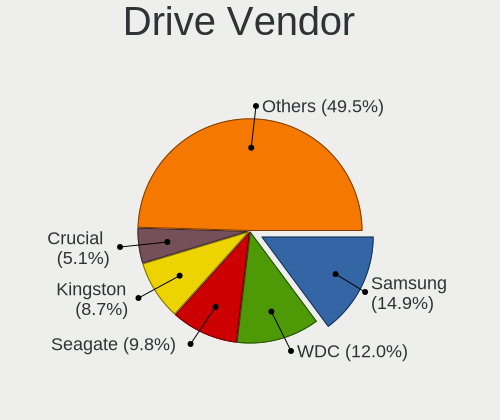
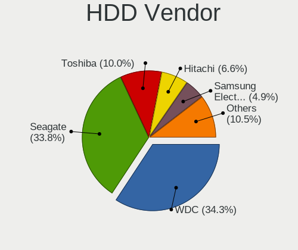
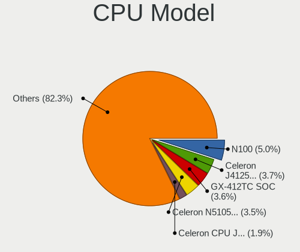
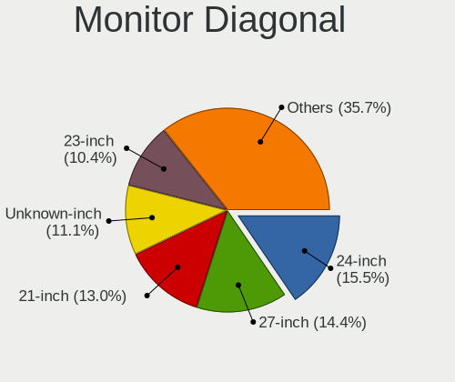
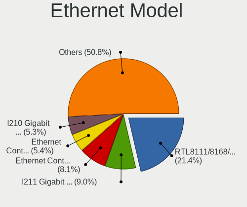

BSD - Tested Hardware & Statistics (Desktops)
---------------------------------------------

A project to collect tested hardware configurations for BSD.

Anyone can contribute to this report by the [hw-probe](https://github.com/linuxhw/hw-probe/blob/master/INSTALL.BSD.md) tool:

    hw-probe -all -upload

Please contribute! Especially if your hardware is rare.

This report is for real hardware. Report for virtual hardware: [TestDays_VE](https://github.com/bsdhw/TestDays_VE)

Contents
--------

* [ Test Cases ](#test-cases)

* [ System ](#system)
  - [ OS                       ](#os)
  - [ OS Family                ](#os-family)
  - [ Arch                     ](#arch)
  - [ DE                       ](#de)
  - [ Display Server           ](#display-server)
  - [ Display Manager          ](#display-manager)
  - [ OS Lang                  ](#os-lang)
  - [ Boot Mode                ](#boot-mode)
  - [ Filesystem               ](#filesystem)
  - [ Part. scheme             ](#part-scheme)

* [ Board ](#board)
  - [ Vendor                   ](#vendor)
  - [ Model                    ](#model)
  - [ Model Family             ](#model-family)
  - [ MFG Year                 ](#mfg-year)
  - [ Form Factor              ](#form-factor)
  - [ Coreboot                 ](#coreboot)
  - [ RAM Size                 ](#ram-size)
  - [ RAM Used                 ](#ram-used)
  - [ Total Drives             ](#total-drives)
  - [ Has CD-ROM               ](#has-cd-rom)
  - [ Has Ethernet             ](#has-ethernet)
  - [ Has WiFi                 ](#has-wifi)
  - [ Has Bluetooth            ](#has-bluetooth)

* [ Location ](#location)
  - [ Country                  ](#country)
  - [ City                     ](#city)

* [ Drives ](#drives)
  - [ Drive Vendor             ](#drive-vendor)
  - [ Drive Model              ](#drive-model)
  - [ HDD Vendor               ](#hdd-vendor)
  - [ SSD Vendor               ](#ssd-vendor)
  - [ Drive Kind               ](#drive-kind)
  - [ Drive Connector          ](#drive-connector)
  - [ Drive Size               ](#drive-size)
  - [ Space Total              ](#space-total)
  - [ Space Used               ](#space-used)
  - [ Malfunc. Drives          ](#malfunc-drives)
  - [ Malfunc. Drive Vendor    ](#malfunc-drive-vendor)
  - [ Malfunc. HDD Vendor      ](#malfunc-hdd-vendor)
  - [ Malfunc. Drive Kind      ](#malfunc-drive-kind)
  - [ Failed Drives            ](#failed-drives)
  - [ Failed Drive Vendor      ](#failed-drive-vendor)
  - [ Drive Status             ](#drive-status)

* [ Storage controller ](#storage-controller)
  - [ Storage Vendor           ](#storage-vendor)
  - [ Storage Model            ](#storage-model)
  - [ Storage Kind             ](#storage-kind)

* [ Processor ](#processor)
  - [ CPU Vendor               ](#cpu-vendor)
  - [ CPU Model                ](#cpu-model)
  - [ CPU Model Family         ](#cpu-model-family)
  - [ CPU Cores                ](#cpu-cores)
  - [ CPU Sockets              ](#cpu-sockets)
  - [ CPU Threads              ](#cpu-threads)
  - [ CPU Microarch            ](#cpu-microarch)

* [ Graphics ](#graphics)
  - [ GPU Vendor               ](#gpu-vendor)
  - [ GPU Model                ](#gpu-model)
  - [ GPU Combo                ](#gpu-combo)
  - [ GPU Driver               ](#gpu-driver)
  - [ GPU Memory               ](#gpu-memory)

* [ Monitor ](#monitor)
  - [ Monitor Vendor           ](#monitor-vendor)
  - [ Monitor Model            ](#monitor-model)
  - [ Monitor Resolution       ](#monitor-resolution)
  - [ Monitor Diagonal         ](#monitor-diagonal)
  - [ Monitor Width            ](#monitor-width)
  - [ Aspect Ratio             ](#aspect-ratio)
  - [ Monitor Area             ](#monitor-area)
  - [ Pixel Density            ](#pixel-density)
  - [ Multiple Monitors        ](#multiple-monitors)

* [ Network ](#network)
  - [ Net Controller Vendor    ](#net-controller-vendor)
  - [ Net Controller Model     ](#net-controller-model)
  - [ Wireless Vendor          ](#wireless-vendor)
  - [ Wireless Model           ](#wireless-model)
  - [ Ethernet Vendor          ](#ethernet-vendor)
  - [ Ethernet Model           ](#ethernet-model)
  - [ Net Controller Kind      ](#net-controller-kind)
  - [ Used Controller          ](#used-controller)
  - [ NICs                     ](#nics)
  - [ IPv6                     ](#ipv6)

* [ Bluetooth ](#bluetooth)
  - [ Bluetooth Vendor         ](#bluetooth-vendor)
  - [ Bluetooth Model          ](#bluetooth-model)

* [ Sound ](#sound)
  - [ Sound Vendor             ](#sound-vendor)
  - [ Sound Model              ](#sound-model)

* [ Memory ](#memory)
  - [ Memory Vendor            ](#memory-vendor)
  - [ Memory Model             ](#memory-model)
  - [ Memory Kind              ](#memory-kind)
  - [ Memory Form Factor       ](#memory-form-factor)
  - [ Memory Size              ](#memory-size)
  - [ Memory Speed             ](#memory-speed)

* [ Printers & scanners ](#printers--scanners)
  - [ Printer Vendor           ](#printer-vendor)
  - [ Printer Model            ](#printer-model)
  - [ Scanner Vendor           ](#scanner-vendor)
  - [ Scanner Model            ](#scanner-model)

* [ Camera ](#camera)
  - [ Camera Vendor            ](#camera-vendor)
  - [ Camera Model             ](#camera-model)

* [ Security ](#security)
  - [ Fingerprint Vendor       ](#fingerprint-vendor)
  - [ Fingerprint Model        ](#fingerprint-model)
  - [ Chipcard Vendor          ](#chipcard-vendor)
  - [ Chipcard Model           ](#chipcard-model)

* [ Unsupported ](#unsupported)
  - [ Unsupported Devices      ](#unsupported-devices)
  - [ Unsupported Device Types ](#unsupported-device-types)

Test Cases
----------

Total: 8876

| Vendor        | Model                       | Probe                                                     | Date         |
|---------------|-----------------------------|-----------------------------------------------------------|--------------|
| MSI           | PRO H610M-B DDR4            | [2072e8fac6](https://bsd-hardware.info/?probe=2072e8fac6) | Feb 28, 2023 |
| Fujitsu       | D3313-E1 S26361-D3313-E1    | [39d5f658ce](https://bsd-hardware.info/?probe=39d5f658ce) | Feb 28, 2023 |
| CWWK          | CW-J6-6L                    | [a9202eee26](https://bsd-hardware.info/?probe=a9202eee26) | Feb 28, 2023 |
| ASRockRack    | EPYC3101D4I-2T              | [d675a5bab2](https://bsd-hardware.info/?probe=d675a5bab2) | Feb 28, 2023 |
| Dell          | 0GY6Y8 A00                  | [72d45455a5](https://bsd-hardware.info/?probe=72d45455a5) | Feb 28, 2023 |
| Fujitsu       | D3313-E1 S26361-D3313-E1    | [dcf3f03ddc](https://bsd-hardware.info/?probe=dcf3f03ddc) | Feb 28, 2023 |
| Lenovo        | Kabini CRB 31900058 STD     | [735f2f3ece](https://bsd-hardware.info/?probe=735f2f3ece) | Feb 28, 2023 |
| Stonesoft     | FW-315-C1                   | [e8a2206ad2](https://bsd-hardware.info/?probe=e8a2206ad2) | Feb 28, 2023 |
| Dell          | 0HHV7N A00                  | [ffbb7e1a96](https://bsd-hardware.info/?probe=ffbb7e1a96) | Feb 27, 2023 |
| Inventec      | Z CLASS A02                 | [1b11bb9003](https://bsd-hardware.info/?probe=1b11bb9003) | Feb 27, 2023 |
| Techvision    | TVI7309X B0                 | [1758c6207c](https://bsd-hardware.info/?probe=1758c6207c) | Feb 27, 2023 |
| Unknown       | Unknown                     | [f06fbcd503](https://bsd-hardware.info/?probe=f06fbcd503) | Feb 27, 2023 |
| ASUSTek       | PRIME A320M-R               | [652b3323c6](https://bsd-hardware.info/?probe=652b3323c6) | Feb 27, 2023 |
| Lenovo        | Kabini CRB 31900058 STD     | [b0fcea0c90](https://bsd-hardware.info/?probe=b0fcea0c90) | Feb 27, 2023 |
| HP            | Pavilion g6                 | [39a7b609d6](https://bsd-hardware.info/?probe=39a7b609d6) | Feb 27, 2023 |
| Lenovo        | 3098 0B98401 PRO            | [40d63fc1f7](https://bsd-hardware.info/?probe=40d63fc1f7) | Feb 27, 2023 |
| Intel         | HM570                       | [2588c37fc2](https://bsd-hardware.info/?probe=2588c37fc2) | Feb 27, 2023 |
| HP            | 2215                        | [33881e14ce](https://bsd-hardware.info/?probe=33881e14ce) | Feb 27, 2023 |
| MSI           | PRO H610M-B DDR4            | [e85ed3f609](https://bsd-hardware.info/?probe=e85ed3f609) | Feb 27, 2023 |
| Unknown       | YL-J3160L4                  | [562013de32](https://bsd-hardware.info/?probe=562013de32) | Feb 27, 2023 |
| Dell          | 01TKCC A01                  | [42da900d88](https://bsd-hardware.info/?probe=42da900d88) | Feb 26, 2023 |
| ASUSTek       | TUF Gaming Z590-PLUS        | [55afde6894](https://bsd-hardware.info/?probe=55afde6894) | Feb 26, 2023 |
| ASRock        | Z690M-ITX/ax                | [a859968882](https://bsd-hardware.info/?probe=a859968882) | Feb 26, 2023 |
| Supermicro    | PDSBM                       | [1dea83dd64](https://bsd-hardware.info/?probe=1dea83dd64) | Feb 26, 2023 |
| Fujitsu       | D3313-A1 S26361-D3313-A1    | [27e756f63d](https://bsd-hardware.info/?probe=27e756f63d) | Feb 26, 2023 |
| Shuttle       | FS81                        | [5787eda5ac](https://bsd-hardware.info/?probe=5787eda5ac) | Feb 26, 2023 |
| HP            | 8055                        | [faadcd3e41](https://bsd-hardware.info/?probe=faadcd3e41) | Feb 26, 2023 |
| MSI           | B450M PRO-VDH MAX           | [85aecf8c3f](https://bsd-hardware.info/?probe=85aecf8c3f) | Feb 26, 2023 |
| HP            | 1495                        | [70c761d6fe](https://bsd-hardware.info/?probe=70c761d6fe) | Feb 26, 2023 |
| Foxconn       | 2A8Ch                       | [96a8673b26](https://bsd-hardware.info/?probe=96a8673b26) | Feb 26, 2023 |
| Lenovo        | 30D9 No DPK                 | [c3864d9d51](https://bsd-hardware.info/?probe=c3864d9d51) | Feb 26, 2023 |
| Fujitsu       | D3009-A1 S26361-D3009-A1    | [66739867ed](https://bsd-hardware.info/?probe=66739867ed) | Feb 26, 2023 |
| MSI           | H81M-P33                    | [806efadc12](https://bsd-hardware.info/?probe=806efadc12) | Feb 26, 2023 |
| ASUSTek       | P5Q-E                       | [efb350b5f2](https://bsd-hardware.info/?probe=efb350b5f2) | Feb 26, 2023 |
| ASUSTek       | ROG CROSSHAIR VIII HERO     | [62567aa5d4](https://bsd-hardware.info/?probe=62567aa5d4) | Feb 26, 2023 |
| Gigabyte      | Z390 I AORUS PRO WIFI-CF    | [2e3026e0fd](https://bsd-hardware.info/?probe=2e3026e0fd) | Feb 26, 2023 |
| Techvision    | TVI7309X B0                 | [d558069dea](https://bsd-hardware.info/?probe=d558069dea) | Feb 26, 2023 |
| AZW           | U59                         | [a4e906c608](https://bsd-hardware.info/?probe=a4e906c608) | Feb 26, 2023 |
| Unknown       | Unknown                     | [d690aee80e](https://bsd-hardware.info/?probe=d690aee80e) | Feb 26, 2023 |
| NF541         | 1.0                         | [863e6235d4](https://bsd-hardware.info/?probe=863e6235d4) | Feb 26, 2023 |
| Dell          | 088DT1 A01                  | [d13b4a674b](https://bsd-hardware.info/?probe=d13b4a674b) | Feb 26, 2023 |
| Dell          | 0WMJ54 A01                  | [263be0365a](https://bsd-hardware.info/?probe=263be0365a) | Feb 26, 2023 |
| Unknown       | Unknown                     | [815cd70e71](https://bsd-hardware.info/?probe=815cd70e71) | Feb 25, 2023 |
| Unknown       | YL-J3160L4                  | [b774e80761](https://bsd-hardware.info/?probe=b774e80761) | Feb 25, 2023 |
| Unknown       | Unknown                     | [95c62844de](https://bsd-hardware.info/?probe=95c62844de) | Feb 25, 2023 |
| Unknown       | Unknown                     | [913946ccc9](https://bsd-hardware.info/?probe=913946ccc9) | Feb 25, 2023 |
| ASUSTek       | ROG STRIX Z390-E GAMING     | [be81f2675f](https://bsd-hardware.info/?probe=be81f2675f) | Feb 25, 2023 |
| Techvision    | TVI7309X B0                 | [0e62dfc436](https://bsd-hardware.info/?probe=0e62dfc436) | Feb 25, 2023 |
| ASRock        | X470 Gaming K4              | [fbff29a62a](https://bsd-hardware.info/?probe=fbff29a62a) | Feb 25, 2023 |
| HP            | 18E9                        | [9263c4b548](https://bsd-hardware.info/?probe=9263c4b548) | Feb 25, 2023 |
| Unknown       | Unknown                     | [87ad08a144](https://bsd-hardware.info/?probe=87ad08a144) | Feb 25, 2023 |
| Techvision    | TVI7309X B0                 | [8a16d2e606](https://bsd-hardware.info/?probe=8a16d2e606) | Feb 24, 2023 |
| Lenovo        | ThinkCentre M91p 7033A2G    | [25528a00f3](https://bsd-hardware.info/?probe=25528a00f3) | Feb 24, 2023 |
| MSI           | X299 PRO                    | [3ca12f88d9](https://bsd-hardware.info/?probe=3ca12f88d9) | Feb 24, 2023 |
| Unknown       | Unknown                     | [efab6dedba](https://bsd-hardware.info/?probe=efab6dedba) | Feb 24, 2023 |
| Gigabyte      | H77N-WIFI                   | [cd96288347](https://bsd-hardware.info/?probe=cd96288347) | Feb 24, 2023 |
| AZW           | U59                         | [4dad05a05a](https://bsd-hardware.info/?probe=4dad05a05a) | Feb 24, 2023 |
| AZW           | U59                         | [638aa3ff8e](https://bsd-hardware.info/?probe=638aa3ff8e) | Feb 24, 2023 |
| MW            | GMLK-2_5G4L                 | [bf21395f79](https://bsd-hardware.info/?probe=bf21395f79) | Feb 24, 2023 |
| Unknown       | Unknown                     | [efce6f6c1e](https://bsd-hardware.info/?probe=efce6f6c1e) | Feb 24, 2023 |
| Protectli     | VP2420                      | [ac2228fa2b](https://bsd-hardware.info/?probe=ac2228fa2b) | Feb 24, 2023 |
| Lenovo        | SHARKBAY SDK0E50510 WIN     | [31122bd298](https://bsd-hardware.info/?probe=31122bd298) | Feb 24, 2023 |
| Dell          | 05XGC8 A01                  | [c51a264e20](https://bsd-hardware.info/?probe=c51a264e20) | Feb 23, 2023 |
| Seeed Stud... | ODYSSEY-X86J4105 SD-BS-C... | [b2681fdfb4](https://bsd-hardware.info/?probe=b2681fdfb4) | Feb 23, 2023 |
| Gigabyte      | Z87X-OC-CF                  | [dca82c50d0](https://bsd-hardware.info/?probe=dca82c50d0) | Feb 23, 2023 |
| HP            | 3031h                       | [7324a71ceb](https://bsd-hardware.info/?probe=7324a71ceb) | Feb 23, 2023 |
| PC Engines    | apu4                        | [410a7ff78e](https://bsd-hardware.info/?probe=410a7ff78e) | Feb 23, 2023 |
| CNCTION-IA... | Unknown                     | [52186b4343](https://bsd-hardware.info/?probe=52186b4343) | Feb 23, 2023 |
| Gigabyte      | X670E AORUS MASTER          | [e55635df08](https://bsd-hardware.info/?probe=e55635df08) | Feb 23, 2023 |
| Intel         | DENLOW_WS                   | [f6f5953979](https://bsd-hardware.info/?probe=f6f5953979) | Feb 23, 2023 |
| Unknown       | Unknown                     | [866ff788f9](https://bsd-hardware.info/?probe=866ff788f9) | Feb 23, 2023 |
| Gigabyte      | G31M-ES2L                   | [c55b1dd170](https://bsd-hardware.info/?probe=c55b1dd170) | Feb 23, 2023 |
| Supermicro    | X10SDV-6C-TLN4F             | [d6ab3464c6](https://bsd-hardware.info/?probe=d6ab3464c6) | Feb 23, 2023 |
| Dell          | 0WMJ54 A01                  | [26b7986e0b](https://bsd-hardware.info/?probe=26b7986e0b) | Feb 23, 2023 |
| Supermicro    | X9SCL/X9SCMA                | [96aceb6d32](https://bsd-hardware.info/?probe=96aceb6d32) | Feb 23, 2023 |
| ASRock        | X300M-STX                   | [fb908ee344](https://bsd-hardware.info/?probe=fb908ee344) | Feb 23, 2023 |
| ASUSTek       | Pro A520M-C II              | [542b244f4b](https://bsd-hardware.info/?probe=542b244f4b) | Feb 23, 2023 |
| Dell          | 0C27VV A02                  | [5899533edd](https://bsd-hardware.info/?probe=5899533edd) | Feb 23, 2023 |
| ASRock        | N68-S UCC                   | [04f43c3d70](https://bsd-hardware.info/?probe=04f43c3d70) | Feb 23, 2023 |
| Dell          | 0WR7PY A00                  | [70b222c73b](https://bsd-hardware.info/?probe=70b222c73b) | Feb 23, 2023 |
| Fujitsu       | D3543-A2 S26361-D3543-A2... | [68165a639f](https://bsd-hardware.info/?probe=68165a639f) | Feb 22, 2023 |
| PC Engines    | APU2                        | [05966fb4dc](https://bsd-hardware.info/?probe=05966fb4dc) | Feb 22, 2023 |
| MSI           | MS-92E3 0A                  | [683ff1f7d0](https://bsd-hardware.info/?probe=683ff1f7d0) | Feb 22, 2023 |
| Intel         | DG41TY AAE47335-300         | [7c1727d55a](https://bsd-hardware.info/?probe=7c1727d55a) | Feb 22, 2023 |
| ASRock        | H610M-HDV/M.2               | [cf4d400cb0](https://bsd-hardware.info/?probe=cf4d400cb0) | Feb 22, 2023 |
| Protectli     | VP2420                      | [541c13b778](https://bsd-hardware.info/?probe=541c13b778) | Feb 22, 2023 |
| Techvision    | TVI7309X B0                 | [765b1a8064](https://bsd-hardware.info/?probe=765b1a8064) | Feb 22, 2023 |
| Intel         | Q3XXG4-P V1.0               | [639886b591](https://bsd-hardware.info/?probe=639886b591) | Feb 22, 2023 |
| Gigabyte      | X570S AORUS ELITE           | [8d1496f3a9](https://bsd-hardware.info/?probe=8d1496f3a9) | Feb 22, 2023 |
| Dell          | 0C27VV A02                  | [a10df954b7](https://bsd-hardware.info/?probe=a10df954b7) | Feb 22, 2023 |
| Intel         | CW-J6-5L 2C                 | [442643937e](https://bsd-hardware.info/?probe=442643937e) | Feb 22, 2023 |
| Techvision    | TVI7309X B0                 | [3e1b050969](https://bsd-hardware.info/?probe=3e1b050969) | Feb 22, 2023 |
| Protectli     | VP2410                      | [b31bcf2087](https://bsd-hardware.info/?probe=b31bcf2087) | Feb 22, 2023 |
| Protectli     | VP2410                      | [8dff61bc43](https://bsd-hardware.info/?probe=8dff61bc43) | Feb 22, 2023 |
| PC Engines    | apu1                        | [41fe7362c4](https://bsd-hardware.info/?probe=41fe7362c4) | Feb 22, 2023 |
| Unknown       | Unknown                     | [9e92cf3575](https://bsd-hardware.info/?probe=9e92cf3575) | Feb 22, 2023 |
| Acer          | Aspire TC-230               | [f3f963fb6a](https://bsd-hardware.info/?probe=f3f963fb6a) | Feb 22, 2023 |
| Intel         | CW-J6-5L 2C                 | [90fc1b74e6](https://bsd-hardware.info/?probe=90fc1b74e6) | Feb 22, 2023 |
| Intel         | QHSW02                      | [6bec4024a8](https://bsd-hardware.info/?probe=6bec4024a8) | Feb 22, 2023 |
| Huanan        | X99-TF GAMING V3.0          | [59db63fd9d](https://bsd-hardware.info/?probe=59db63fd9d) | Feb 22, 2023 |
| Supermicro    | X7SLA                       | [80d6f2c0f8](https://bsd-hardware.info/?probe=80d6f2c0f8) | Feb 21, 2023 |
| Protectli     | FW2B                        | [34b349eead](https://bsd-hardware.info/?probe=34b349eead) | Feb 21, 2023 |
| Gigabyte      | A320M-H-CF                  | [02970305db](https://bsd-hardware.info/?probe=02970305db) | Feb 21, 2023 |
| Dell          | 0GY6Y8 A00                  | [9a3d7de5ff](https://bsd-hardware.info/?probe=9a3d7de5ff) | Feb 21, 2023 |
| ASUSTek       | TUF Gaming Z590-PLUS        | [da5536f58a](https://bsd-hardware.info/?probe=da5536f58a) | Feb 21, 2023 |
| Unknown       | Unknown                     | [67c7a561a9](https://bsd-hardware.info/?probe=67c7a561a9) | Feb 21, 2023 |
| Unknown       | V0.9x                       | [21243cad5f](https://bsd-hardware.info/?probe=21243cad5f) | Feb 21, 2023 |
| Unknown       | Unknown                     | [8c063582d4](https://bsd-hardware.info/?probe=8c063582d4) | Feb 20, 2023 |
| ASUSTek       | Pro A520M-C II              | [205bf8b29d](https://bsd-hardware.info/?probe=205bf8b29d) | Feb 20, 2023 |
| Fujitsu       | D3543-A1 S26361-D3543-A1... | [3f78b1a6c7](https://bsd-hardware.info/?probe=3f78b1a6c7) | Feb 20, 2023 |
| Hardkernel    | ODROID-H2                   | [bd675a503d](https://bsd-hardware.info/?probe=bd675a503d) | Feb 20, 2023 |
| Dell          | 0HHV7N A00                  | [50f39ca7e0](https://bsd-hardware.info/?probe=50f39ca7e0) | Feb 20, 2023 |
| Apple         | PowerMac3,6                 | [f31181f95c](https://bsd-hardware.info/?probe=f31181f95c) | Feb 20, 2023 |
| Dell          | 09KPNV A00                  | [05cf3daf4e](https://bsd-hardware.info/?probe=05cf3daf4e) | Feb 20, 2023 |
| Lenovo        | 32E1 SDK0J40697 WIN 3305... | [820b3d1a1b](https://bsd-hardware.info/?probe=820b3d1a1b) | Feb 20, 2023 |
| Protectli     | VP4650                      | [44b691e7b8](https://bsd-hardware.info/?probe=44b691e7b8) | Feb 20, 2023 |
| Protectli     | VP4650                      | [a3011cc486](https://bsd-hardware.info/?probe=a3011cc486) | Feb 20, 2023 |
| ASRock        | X570 Taichi                 | [8eb068a097](https://bsd-hardware.info/?probe=8eb068a097) | Feb 20, 2023 |
| HP            | 3397                        | [8b231fd832](https://bsd-hardware.info/?probe=8b231fd832) | Feb 19, 2023 |
| HP            | 8076 MVB,A                  | [7743861bae](https://bsd-hardware.info/?probe=7743861bae) | Feb 19, 2023 |
| Protectli     | VP2420                      | [5d8285d184](https://bsd-hardware.info/?probe=5d8285d184) | Feb 19, 2023 |
| CncTion       | J4125-4L-I225               | [6d2c693305](https://bsd-hardware.info/?probe=6d2c693305) | Feb 19, 2023 |
| Huanan        | X99-TF GAMING V3.0          | [50dce9bf96](https://bsd-hardware.info/?probe=50dce9bf96) | Feb 19, 2023 |
| Yanling       | YL-CLU6L-V1                 | [8d1fa6606b](https://bsd-hardware.info/?probe=8d1fa6606b) | Feb 19, 2023 |
| MSI           | H81M-P33                    | [28f48b7936](https://bsd-hardware.info/?probe=28f48b7936) | Feb 19, 2023 |
| ASUSTek       | P5Q-E                       | [b3525afaa7](https://bsd-hardware.info/?probe=b3525afaa7) | Feb 19, 2023 |
| ASUSTek       | ROG CROSSHAIR VIII HERO     | [19c7044a7d](https://bsd-hardware.info/?probe=19c7044a7d) | Feb 19, 2023 |
| Unknown       | Unknown                     | [1d67639caa](https://bsd-hardware.info/?probe=1d67639caa) | Feb 19, 2023 |
| ASUSTek       | PRIME H310M-K R2.0          | [fd39a615de](https://bsd-hardware.info/?probe=fd39a615de) | Feb 19, 2023 |
| Intel         | DN2820FYK H24582-203        | [dd0d96422f](https://bsd-hardware.info/?probe=dd0d96422f) | Feb 19, 2023 |
| ASUSTek       | H110I-PLUS D3               | [1f347f15e2](https://bsd-hardware.info/?probe=1f347f15e2) | Feb 19, 2023 |
| Lenovo        | SHARKBAY SDK0A46860 WIN     | [4cd5bcdfed](https://bsd-hardware.info/?probe=4cd5bcdfed) | Feb 18, 2023 |
| HP            | 1998                        | [e0ab2d859c](https://bsd-hardware.info/?probe=e0ab2d859c) | Feb 18, 2023 |
| Intel         | JSL MRD                     | [1587ea95da](https://bsd-hardware.info/?probe=1587ea95da) | Feb 18, 2023 |
| Dell          | 0HHV7N A00                  | [fd90fc5154](https://bsd-hardware.info/?probe=fd90fc5154) | Feb 18, 2023 |
| ASRock        | G41M-GS3                    | [eace523f17](https://bsd-hardware.info/?probe=eace523f17) | Feb 18, 2023 |
| Techvision    | TVI7309X B0                 | [633becefb6](https://bsd-hardware.info/?probe=633becefb6) | Feb 18, 2023 |
| Gigabyte      | B450M AORUS ELITE           | [6af537ff20](https://bsd-hardware.info/?probe=6af537ff20) | Feb 18, 2023 |
| ASUSTek       | PRIME H310M-C R2.0          | [9761fb446b](https://bsd-hardware.info/?probe=9761fb446b) | Feb 18, 2023 |
| Unknown       | Unknown                     | [b906471557](https://bsd-hardware.info/?probe=b906471557) | Feb 17, 2023 |
| Unknown       | Unknown                     | [1478bc453d](https://bsd-hardware.info/?probe=1478bc453d) | Feb 17, 2023 |
| Techvision    | TVI7309X B0                 | [1950b6036e](https://bsd-hardware.info/?probe=1950b6036e) | Feb 17, 2023 |
| Techvision    | TVI7309X B0                 | [d23b2cfe5a](https://bsd-hardware.info/?probe=d23b2cfe5a) | Feb 17, 2023 |
| ASRock        | A320M-DGS                   | [032d7f0c91](https://bsd-hardware.info/?probe=032d7f0c91) | Feb 17, 2023 |
| Fujitsu       | D3224-A1 S26361-D3224-A1    | [c34d5e6357](https://bsd-hardware.info/?probe=c34d5e6357) | Feb 17, 2023 |
| Unknown       | Unknown                     | [ac4b0186ff](https://bsd-hardware.info/?probe=ac4b0186ff) | Feb 17, 2023 |
| ZOTAC         | Unknown                     | [0adf0ca671](https://bsd-hardware.info/?probe=0adf0ca671) | Feb 17, 2023 |
| ASUSTek       | N3050M-E                    | [7d6e696fb4](https://bsd-hardware.info/?probe=7d6e696fb4) | Feb 17, 2023 |
| Protectli     | FW4B Ver                    | [81911bb61f](https://bsd-hardware.info/?probe=81911bb61f) | Feb 17, 2023 |
| AZW           | Green G1                    | [f5da027d84](https://bsd-hardware.info/?probe=f5da027d84) | Feb 17, 2023 |
| ASUSTek       | PRIME Z490M-PLUS            | [1d9739f234](https://bsd-hardware.info/?probe=1d9739f234) | Feb 17, 2023 |
| Dell          | 04YP6J A02                  | [26cd25b4ca](https://bsd-hardware.info/?probe=26cd25b4ca) | Feb 17, 2023 |
| Dell          | 04YP6J A02                  | [ef370f6033](https://bsd-hardware.info/?probe=ef370f6033) | Feb 17, 2023 |
| HP            | 198E                        | [1f9a7e4f9b](https://bsd-hardware.info/?probe=1f9a7e4f9b) | Feb 17, 2023 |
| Jingsha       | x79-P3 by xUz               | [0e5ed7f4de](https://bsd-hardware.info/?probe=0e5ed7f4de) | Feb 17, 2023 |
| CWWK          | CW-J6-6L                    | [de51e99409](https://bsd-hardware.info/?probe=de51e99409) | Feb 17, 2023 |
| Supermicro    | X10SLH-N6-ST031             | [897a3b3bf5](https://bsd-hardware.info/?probe=897a3b3bf5) | Feb 16, 2023 |
| Unknown       | Unknown                     | [71cc084a9c](https://bsd-hardware.info/?probe=71cc084a9c) | Feb 16, 2023 |
| Protectli     | FW2B Ver                    | [b72039f369](https://bsd-hardware.info/?probe=b72039f369) | Feb 16, 2023 |
| ASRock        | H610M-HDV/M.2               | [8bc1cee065](https://bsd-hardware.info/?probe=8bc1cee065) | Feb 16, 2023 |
| Dell          | 04YP6J A02                  | [0f589ba9bf](https://bsd-hardware.info/?probe=0f589ba9bf) | Feb 16, 2023 |
| ASUSTek       | P8Z68-V LX                  | [99ede66a89](https://bsd-hardware.info/?probe=99ede66a89) | Feb 16, 2023 |
| Dell          | 0KYJ8C A02                  | [854d373499](https://bsd-hardware.info/?probe=854d373499) | Feb 16, 2023 |
| Unknown       | Unknown                     | [8ae1891a85](https://bsd-hardware.info/?probe=8ae1891a85) | Feb 16, 2023 |
| ASUSTek       | ROG STRIX Z390-I GAMING     | [b241a8afd7](https://bsd-hardware.info/?probe=b241a8afd7) | Feb 16, 2023 |
| Dell          | 0782GW A00                  | [95a8784d4a](https://bsd-hardware.info/?probe=95a8784d4a) | Feb 16, 2023 |
| Lenovo        | SHARKBAY 0B98401 WIN        | [f3c3e6ecb5](https://bsd-hardware.info/?probe=f3c3e6ecb5) | Feb 16, 2023 |
| ASRock        | A520M-ITX/ac                | [dd083df1a2](https://bsd-hardware.info/?probe=dd083df1a2) | Feb 16, 2023 |
| ASUSTek       | H110I-PLUS D3               | [4d3dee18a0](https://bsd-hardware.info/?probe=4d3dee18a0) | Feb 16, 2023 |
| HP            | 3398                        | [186e63e8fe](https://bsd-hardware.info/?probe=186e63e8fe) | Feb 15, 2023 |
| Dell          | 05GD68 A00                  | [c6946f5300](https://bsd-hardware.info/?probe=c6946f5300) | Feb 15, 2023 |
| Gigabyte      | H81M-H                      | [8820014583](https://bsd-hardware.info/?probe=8820014583) | Feb 15, 2023 |
| Gigabyte      | H81M-H                      | [592ca6bab5](https://bsd-hardware.info/?probe=592ca6bab5) | Feb 15, 2023 |
| MiTAC         | UltraPoint                  | [00e52df710](https://bsd-hardware.info/?probe=00e52df710) | Feb 15, 2023 |
| MSI           | A88XM-E45                   | [933b4d3226](https://bsd-hardware.info/?probe=933b4d3226) | Feb 15, 2023 |
| PC Engines    | APU                         | [1162545537](https://bsd-hardware.info/?probe=1162545537) | Feb 15, 2023 |
| ASUSTek       | PRIME A320M-K               | [35aa7d7f04](https://bsd-hardware.info/?probe=35aa7d7f04) | Feb 15, 2023 |
| Unknown       | Unknown                     | [415389b74c](https://bsd-hardware.info/?probe=415389b74c) | Feb 14, 2023 |
| CncTion       | N5105-4L B0                 | [fb2a05c862](https://bsd-hardware.info/?probe=fb2a05c862) | Feb 14, 2023 |
| Dell          | 0NW6H5 A00                  | [b0020c937b](https://bsd-hardware.info/?probe=b0020c937b) | Feb 14, 2023 |
| ASUSTek       | STRIX Z270F GAMING          | [6f4b514959](https://bsd-hardware.info/?probe=6f4b514959) | Feb 14, 2023 |
| Huanan        | X99-QD4 V1.0                | [9a0c17560f](https://bsd-hardware.info/?probe=9a0c17560f) | Feb 14, 2023 |
| PC Engines    | APU2                        | [0648ebd771](https://bsd-hardware.info/?probe=0648ebd771) | Feb 14, 2023 |
| ASRock        | Z97 Killer                  | [67d58b9cde](https://bsd-hardware.info/?probe=67d58b9cde) | Feb 14, 2023 |
| Hardkernel    | ODROID-H2                   | [f63a5598d7](https://bsd-hardware.info/?probe=f63a5598d7) | Feb 14, 2023 |
| Supermicro    | X7SPA-HF                    | [6a91635684](https://bsd-hardware.info/?probe=6a91635684) | Feb 14, 2023 |
| ASRock        | B450M Pro4                  | [2d9ff025ff](https://bsd-hardware.info/?probe=2d9ff025ff) | Feb 14, 2023 |
| ASRock        | B450M Pro4                  | [7b60f91e47](https://bsd-hardware.info/?probe=7b60f91e47) | Feb 14, 2023 |
| Fujitsu       | D3313-A1 S26361-D3313-A1    | [a9d6421d3c](https://bsd-hardware.info/?probe=a9d6421d3c) | Feb 14, 2023 |
| Dell          | 0XCR8D A02                  | [a477c2b046](https://bsd-hardware.info/?probe=a477c2b046) | Feb 14, 2023 |
| Yanling       | YL-CLU6L-V1                 | [9c12ee263f](https://bsd-hardware.info/?probe=9c12ee263f) | Feb 14, 2023 |
| Techvision    | TVI7309X B0                 | [64ed951aa2](https://bsd-hardware.info/?probe=64ed951aa2) | Feb 14, 2023 |
| Gigabyte      | H97N                        | [88e7d124ef](https://bsd-hardware.info/?probe=88e7d124ef) | Feb 14, 2023 |
| Dell          | 0D02VH A01                  | [a629bf3445](https://bsd-hardware.info/?probe=a629bf3445) | Feb 14, 2023 |
| Fujitsu       | D3413-A1 S26361-D3413-A1    | [d69aba5432](https://bsd-hardware.info/?probe=d69aba5432) | Feb 14, 2023 |
| HP            | 8719                        | [c547d99064](https://bsd-hardware.info/?probe=c547d99064) | Feb 14, 2023 |
| ASUSTek       | PRIME X370-PRO              | [b3f41e1cb4](https://bsd-hardware.info/?probe=b3f41e1cb4) | Feb 13, 2023 |
| HP            | 3031h                       | [cbbf836268](https://bsd-hardware.info/?probe=cbbf836268) | Feb 13, 2023 |
| ASRock        | X570S PG Riptide            | [054d55b3c1](https://bsd-hardware.info/?probe=054d55b3c1) | Feb 13, 2023 |
| ASRock        | X570S PG Riptide            | [25d8358b76](https://bsd-hardware.info/?probe=25d8358b76) | Feb 13, 2023 |
| CWWK          | MINIPC-G4                   | [a186c77c21](https://bsd-hardware.info/?probe=a186c77c21) | Feb 13, 2023 |
| Gigabyte      | H61M-S2PV                   | [b42e3649a3](https://bsd-hardware.info/?probe=b42e3649a3) | Feb 13, 2023 |
| Unknown       | Unknown                     | [98819b1db5](https://bsd-hardware.info/?probe=98819b1db5) | Feb 13, 2023 |
| Unknown       | Unknown                     | [44ac3b2832](https://bsd-hardware.info/?probe=44ac3b2832) | Feb 13, 2023 |
| ASRock        | X570 Phantom Gaming 4       | [b962baf73d](https://bsd-hardware.info/?probe=b962baf73d) | Feb 13, 2023 |
| CncTion       | N5105-4L B0                 | [bf55d44dff](https://bsd-hardware.info/?probe=bf55d44dff) | Feb 13, 2023 |
| Dell          | 02YYK5 A00                  | [431374482e](https://bsd-hardware.info/?probe=431374482e) | Feb 13, 2023 |
| Acer          | Aspire TC-230               | [a8ce4299ae](https://bsd-hardware.info/?probe=a8ce4299ae) | Feb 13, 2023 |
| Dell          | 0NC2VH A01                  | [3e96602a8f](https://bsd-hardware.info/?probe=3e96602a8f) | Feb 13, 2023 |
| Dell          | OptiPlex 9020               | [0c8a5f8dfa](https://bsd-hardware.info/?probe=0c8a5f8dfa) | Feb 13, 2023 |
| Supermicro    | X7SPA-HF                    | [6acbae85b9](https://bsd-hardware.info/?probe=6acbae85b9) | Feb 13, 2023 |
| ASUSTek       | P8Z68 DELUXE                | [f65675c771](https://bsd-hardware.info/?probe=f65675c771) | Feb 13, 2023 |
| ASUSTek       | H170I-PRO                   | [63000ada74](https://bsd-hardware.info/?probe=63000ada74) | Feb 12, 2023 |
| Dell          | 0D28YY A03                  | [b8dc69069d](https://bsd-hardware.info/?probe=b8dc69069d) | Feb 12, 2023 |
| Dell          | 0D02VH A01                  | [d0823031a5](https://bsd-hardware.info/?probe=d0823031a5) | Feb 12, 2023 |
| Lenovo        | 3132 SDK0J40697 WIN 3305... | [5988d9a034](https://bsd-hardware.info/?probe=5988d9a034) | Feb 12, 2023 |
| YANYU         | R250                        | [24ebc43209](https://bsd-hardware.info/?probe=24ebc43209) | Feb 12, 2023 |
| Unknown       | Unknown                     | [71aa276f7f](https://bsd-hardware.info/?probe=71aa276f7f) | Feb 12, 2023 |
| Unknown       | SKYBAY                      | [df7f4524d7](https://bsd-hardware.info/?probe=df7f4524d7) | Feb 12, 2023 |
| HP            | 212B                        | [0e13beb9f6](https://bsd-hardware.info/?probe=0e13beb9f6) | Feb 12, 2023 |
| ASUSTek       | TUF Gaming B450M-PRO S      | [5507e05838](https://bsd-hardware.info/?probe=5507e05838) | Feb 12, 2023 |
| Unknown       | Unknown                     | [19da8a6da8](https://bsd-hardware.info/?probe=19da8a6da8) | Feb 12, 2023 |
| MSI           | Z97 GUARD-PRO               | [43d56964b9](https://bsd-hardware.info/?probe=43d56964b9) | Feb 12, 2023 |
| Dell          | 0WMJ54 A00                  | [ba5f8c568b](https://bsd-hardware.info/?probe=ba5f8c568b) | Feb 12, 2023 |
| MSI           | H81M-P33                    | [84aff26f99](https://bsd-hardware.info/?probe=84aff26f99) | Feb 12, 2023 |
| ASUSTek       | P5Q-E                       | [4e899d9a1c](https://bsd-hardware.info/?probe=4e899d9a1c) | Feb 12, 2023 |
| ASUSTek       | ROG CROSSHAIR VIII HERO     | [d16e93b7f3](https://bsd-hardware.info/?probe=d16e93b7f3) | Feb 12, 2023 |
| Unknown       | Unknown                     | [133d9aedfd](https://bsd-hardware.info/?probe=133d9aedfd) | Feb 12, 2023 |
| Fujitsu       | D3313-B1 S26361-D3313-B1    | [be8fb945ef](https://bsd-hardware.info/?probe=be8fb945ef) | Feb 12, 2023 |
| Dell          | 0F3KHR A02                  | [f69bff2d41](https://bsd-hardware.info/?probe=f69bff2d41) | Feb 12, 2023 |
| Unknown       | Unknown                     | [dbe1c51575](https://bsd-hardware.info/?probe=dbe1c51575) | Feb 12, 2023 |
| HP            | 843B                        | [2b9c5f49f5](https://bsd-hardware.info/?probe=2b9c5f49f5) | Feb 12, 2023 |
| Dell          | 0PU052                      | [03bcc500c0](https://bsd-hardware.info/?probe=03bcc500c0) | Feb 12, 2023 |
| Dell          | 0F3KHR A02                  | [c9c53f2141](https://bsd-hardware.info/?probe=c9c53f2141) | Feb 12, 2023 |
| Dell          | 0PU052                      | [035408150f](https://bsd-hardware.info/?probe=035408150f) | Feb 11, 2023 |
| ASUSTek       | P8Z68-V                     | [74ebc950e2](https://bsd-hardware.info/?probe=74ebc950e2) | Feb 11, 2023 |
| ASUSTek       | PRIME H410M-K               | [d2edba8775](https://bsd-hardware.info/?probe=d2edba8775) | Feb 11, 2023 |
| Intel         | Q3XXG4-P V1.0               | [0684ee3bb7](https://bsd-hardware.info/?probe=0684ee3bb7) | Feb 11, 2023 |
| Yanling       | YL-KBR6L Ver:1.00           | [516c778d65](https://bsd-hardware.info/?probe=516c778d65) | Feb 11, 2023 |
| Unknown       | Unknown                     | [7d908f5c62](https://bsd-hardware.info/?probe=7d908f5c62) | Feb 11, 2023 |
| Foxconn       | 2A8Ch                       | [2874f7a7fa](https://bsd-hardware.info/?probe=2874f7a7fa) | Feb 11, 2023 |
| Protectli     | FW4B Ver                    | [3724be73d9](https://bsd-hardware.info/?probe=3724be73d9) | Feb 11, 2023 |
| Gigabyte      | Z490 VISION G               | [6f8ad1a8b9](https://bsd-hardware.info/?probe=6f8ad1a8b9) | Feb 11, 2023 |
| Unknown       | Unknown                     | [44a3089ec0](https://bsd-hardware.info/?probe=44a3089ec0) | Feb 11, 2023 |
| Lenovo        | SHARKBAY 0B98401 WIN        | [7db630393f](https://bsd-hardware.info/?probe=7db630393f) | Feb 11, 2023 |
| Techvision    | TVI7309X B0                 | [c4c07aec07](https://bsd-hardware.info/?probe=c4c07aec07) | Feb 11, 2023 |
| ASRock        | H61M/U3S3                   | [48c80bbb1f](https://bsd-hardware.info/?probe=48c80bbb1f) | Feb 11, 2023 |
| Supermicro    | X8STi                       | [4faeca02d3](https://bsd-hardware.info/?probe=4faeca02d3) | Feb 11, 2023 |
| Dell          | 0773VG A00                  | [b9caeb411f](https://bsd-hardware.info/?probe=b9caeb411f) | Feb 11, 2023 |
| MSI           | Z97 GUARD-PRO               | [9f066752d5](https://bsd-hardware.info/?probe=9f066752d5) | Feb 11, 2023 |
| Unknown       | Unknown                     | [18362d0f11](https://bsd-hardware.info/?probe=18362d0f11) | Feb 10, 2023 |
| iBASE         | Mi956                       | [86d20c1bc0](https://bsd-hardware.info/?probe=86d20c1bc0) | Feb 10, 2023 |
| Unknown       | J3160-4L                    | [4c4e675427](https://bsd-hardware.info/?probe=4c4e675427) | Feb 10, 2023 |
| HP            | 83EE                        | [cf914f58eb](https://bsd-hardware.info/?probe=cf914f58eb) | Feb 10, 2023 |
| ASRock        | A770DE+                     | [cf1c018ede](https://bsd-hardware.info/?probe=cf1c018ede) | Feb 10, 2023 |
| Fujitsu       | D3313-A1 S26361-D3313-A1    | [12e4e26e40](https://bsd-hardware.info/?probe=12e4e26e40) | Feb 10, 2023 |
| Foxconn       | 2A8Ch                       | [84c0208f8d](https://bsd-hardware.info/?probe=84c0208f8d) | Feb 10, 2023 |
| Dell          | 0WMJ54 A01                  | [e0eac39f4a](https://bsd-hardware.info/?probe=e0eac39f4a) | Feb 10, 2023 |
| Unknown       | Unknown                     | [3f0d4c3ced](https://bsd-hardware.info/?probe=3f0d4c3ced) | Feb 10, 2023 |
| Unknown       | Unknown                     | [1d63a08b5d](https://bsd-hardware.info/?probe=1d63a08b5d) | Feb 10, 2023 |
| Protectli     | FW6 Ver                     | [882f0868fe](https://bsd-hardware.info/?probe=882f0868fe) | Feb 10, 2023 |
| Dell          | 051FJ8 A02                  | [f853cd2270](https://bsd-hardware.info/?probe=f853cd2270) | Feb 10, 2023 |
| Lenovo        | MAHOBAY NOK                 | [d6be869761](https://bsd-hardware.info/?probe=d6be869761) | Feb 09, 2023 |
| ASUSTek       | P7P55D DELUXE               | [dd9685a909](https://bsd-hardware.info/?probe=dd9685a909) | Feb 09, 2023 |
| ASUSTek       | H110I-PLUS                  | [4347c8c716](https://bsd-hardware.info/?probe=4347c8c716) | Feb 09, 2023 |
| ASRock        | A520M-ITX/ac                | [e5b2e1bb9d](https://bsd-hardware.info/?probe=e5b2e1bb9d) | Feb 09, 2023 |
| ASRock        | A520M-ITX/ac                | [f66883c5c2](https://bsd-hardware.info/?probe=f66883c5c2) | Feb 09, 2023 |
| Gigabyte      | H270-HD3-CF                 | [a15eee8687](https://bsd-hardware.info/?probe=a15eee8687) | Feb 09, 2023 |
| Dell          | 051FJ8 A01                  | [573c8ffac2](https://bsd-hardware.info/?probe=573c8ffac2) | Feb 09, 2023 |
| Supermicro    | M11SDV-8C-LN4F              | [4874e3417f](https://bsd-hardware.info/?probe=4874e3417f) | Feb 09, 2023 |
| Biostar       | TA970                       | [8c1a7aedf1](https://bsd-hardware.info/?probe=8c1a7aedf1) | Feb 09, 2023 |
| ChangWang     | CW56-58                     | [e376971bd6](https://bsd-hardware.info/?probe=e376971bd6) | Feb 09, 2023 |
| ASUSTek       | P10S-M Series               | [78975e45b7](https://bsd-hardware.info/?probe=78975e45b7) | Feb 09, 2023 |
| Techvision    | TVI7309X B0                 | [a726812ab6](https://bsd-hardware.info/?probe=a726812ab6) | Feb 09, 2023 |
| Intel BOX4... | Geminilake                  | [286c29b1bb](https://bsd-hardware.info/?probe=286c29b1bb) | Feb 08, 2023 |
| PC Engines    | APU2                        | [9144d7800b](https://bsd-hardware.info/?probe=9144d7800b) | Feb 08, 2023 |
| ASUSTek       | K30AD_M31AD_M51AD_M32AD     | [b9166d8134](https://bsd-hardware.info/?probe=b9166d8134) | Feb 08, 2023 |
| Gigabyte      | H61M-S2V-B3                 | [33af90dd93](https://bsd-hardware.info/?probe=33af90dd93) | Feb 08, 2023 |
| ASUSTek       | M5A78L-M LX3                | [9af803f850](https://bsd-hardware.info/?probe=9af803f850) | Feb 08, 2023 |
| ASUSTek       | PRIME B450M-A II            | [0587338e57](https://bsd-hardware.info/?probe=0587338e57) | Feb 08, 2023 |
| Dell          | 0654JC A02                  | [3a6606e75a](https://bsd-hardware.info/?probe=3a6606e75a) | Feb 08, 2023 |
| ADI Engine... | RCC                         | [d28d10f385](https://bsd-hardware.info/?probe=d28d10f385) | Feb 08, 2023 |
| Unknown       | Unknown                     | [34d9347fc3](https://bsd-hardware.info/?probe=34d9347fc3) | Feb 08, 2023 |
| HP            | 3396                        | [6a20d52898](https://bsd-hardware.info/?probe=6a20d52898) | Feb 08, 2023 |
| Unknown       | MANIFOLD 2-C                | [1a23b05eca](https://bsd-hardware.info/?probe=1a23b05eca) | Feb 07, 2023 |
| Unknown       | Unknown                     | [b29e2b6284](https://bsd-hardware.info/?probe=b29e2b6284) | Feb 07, 2023 |
| Seeed Stud... | ODYSSEY-X86J41X5 SD-BS-C... | [d3b116f637](https://bsd-hardware.info/?probe=d3b116f637) | Feb 07, 2023 |
| Dell          | 0C96W1 A03                  | [e64e999267](https://bsd-hardware.info/?probe=e64e999267) | Feb 07, 2023 |
| Unknown       | Unknown                     | [9f2744c3af](https://bsd-hardware.info/?probe=9f2744c3af) | Feb 07, 2023 |
| Unknown       | Unknown                     | [f4978c3575](https://bsd-hardware.info/?probe=f4978c3575) | Feb 07, 2023 |
| ASUSTek       | P10S-M Series               | [24b74b8ce3](https://bsd-hardware.info/?probe=24b74b8ce3) | Feb 07, 2023 |
| MW            | GMLK-2_5G4L                 | [39fa7db109](https://bsd-hardware.info/?probe=39fa7db109) | Feb 07, 2023 |
| Dell          | 02YYK5 A00                  | [259f0ae05e](https://bsd-hardware.info/?probe=259f0ae05e) | Feb 06, 2023 |
| MSI           | Z97 GAMING 3                | [bbe7b327fd](https://bsd-hardware.info/?probe=bbe7b327fd) | Feb 06, 2023 |
| AOpen         | D1007 0BBA                  | [0873652381](https://bsd-hardware.info/?probe=0873652381) | Feb 06, 2023 |
| Unknown       | Unknown                     | [7f9208dc11](https://bsd-hardware.info/?probe=7f9208dc11) | Feb 06, 2023 |
| CheckPoint    | T-120-00                    | [f1f935b515](https://bsd-hardware.info/?probe=f1f935b515) | Feb 06, 2023 |
| Unknown       | MANIFOLD 2-C                | [923b6d85fd](https://bsd-hardware.info/?probe=923b6d85fd) | Feb 06, 2023 |
| PC Engines    | APU2                        | [e4e00e259c](https://bsd-hardware.info/?probe=e4e00e259c) | Feb 06, 2023 |
| ASUSTek       | P8Z77-M                     | [627bdfafb7](https://bsd-hardware.info/?probe=627bdfafb7) | Feb 06, 2023 |
| Biostar       | H61MLV3                     | [dee9a22461](https://bsd-hardware.info/?probe=dee9a22461) | Feb 06, 2023 |
| Dell          | 0C96W1 A03                  | [95427fdfa8](https://bsd-hardware.info/?probe=95427fdfa8) | Feb 06, 2023 |
| MSI           | MPG X570 GAMING PLUS        | [c04d9caf55](https://bsd-hardware.info/?probe=c04d9caf55) | Feb 06, 2023 |
| Unknown       | Unknown                     | [61019d305c](https://bsd-hardware.info/?probe=61019d305c) | Feb 06, 2023 |
| Unknown       | Unknown                     | [eb0f772670](https://bsd-hardware.info/?probe=eb0f772670) | Feb 06, 2023 |
| Dell          | 02YYK5 A01                  | [cc612f1fa0](https://bsd-hardware.info/?probe=cc612f1fa0) | Feb 06, 2023 |
| Intel         | DN2820FYK H24582-203        | [ae05d4c6cd](https://bsd-hardware.info/?probe=ae05d4c6cd) | Feb 06, 2023 |
| Protectli     | FW6 Ver                     | [4627476eba](https://bsd-hardware.info/?probe=4627476eba) | Feb 06, 2023 |
| Unknown       | Unknown                     | [7fcfb747a7](https://bsd-hardware.info/?probe=7fcfb747a7) | Feb 06, 2023 |
| CheckPoint    | T-120-00                    | [fbce242920](https://bsd-hardware.info/?probe=fbce242920) | Feb 05, 2023 |
| MSI           | B450M MORTAR MAX            | [ec37957aed](https://bsd-hardware.info/?probe=ec37957aed) | Feb 05, 2023 |
| Intel         | ChiefRiver                  | [ae6ea07868](https://bsd-hardware.info/?probe=ae6ea07868) | Feb 05, 2023 |
| HP            | 0AA8h                       | [efbd6b6c70](https://bsd-hardware.info/?probe=efbd6b6c70) | Feb 05, 2023 |
| Dell          | 0F3KHR A02                  | [98c9324352](https://bsd-hardware.info/?probe=98c9324352) | Feb 05, 2023 |
| Gigabyte      | H510M S2H V2                | [85628154a2](https://bsd-hardware.info/?probe=85628154a2) | Feb 05, 2023 |
| MSI           | H81M-P33                    | [6f8f329a5b](https://bsd-hardware.info/?probe=6f8f329a5b) | Feb 05, 2023 |
| ASUSTek       | P5Q-E                       | [bd418783d4](https://bsd-hardware.info/?probe=bd418783d4) | Feb 05, 2023 |
| ASUSTek       | ROG CROSSHAIR VIII HERO     | [ec1ab0bf97](https://bsd-hardware.info/?probe=ec1ab0bf97) | Feb 05, 2023 |
| Unknown       | Unknown                     | [cb25ee692c](https://bsd-hardware.info/?probe=cb25ee692c) | Feb 05, 2023 |
| Dell          | 0PC5F7 A02                  | [5512097fd0](https://bsd-hardware.info/?probe=5512097fd0) | Feb 05, 2023 |
| Lenovo        | SHARKBAY 0B98401 WIN        | [751ecfd61f](https://bsd-hardware.info/?probe=751ecfd61f) | Feb 05, 2023 |
| CNCTION-IA... | Unknown                     | [5b5bd3f30f](https://bsd-hardware.info/?probe=5b5bd3f30f) | Feb 04, 2023 |
| Intel         | QHSW02                      | [16722b7429](https://bsd-hardware.info/?probe=16722b7429) | Feb 04, 2023 |
| Unknown       | Unknown                     | [8fdace282e](https://bsd-hardware.info/?probe=8fdace282e) | Feb 04, 2023 |
| Techvision    | TVI7309X B0                 | [222da5a477](https://bsd-hardware.info/?probe=222da5a477) | Feb 04, 2023 |
| HP            | 3396                        | [28a0f6e6cf](https://bsd-hardware.info/?probe=28a0f6e6cf) | Feb 04, 2023 |
| TYAN Compu... | S5530WG2NR-LE-AKA           | [f7de46b627](https://bsd-hardware.info/?probe=f7de46b627) | Feb 04, 2023 |
| AZW           | U59                         | [8073f1f5f3](https://bsd-hardware.info/?probe=8073f1f5f3) | Feb 04, 2023 |
| Unknown       | Unknown                     | [b1713eb2b5](https://bsd-hardware.info/?probe=b1713eb2b5) | Feb 04, 2023 |
| Dell          | 0WMJ54 A01                  | [7d6cfe5543](https://bsd-hardware.info/?probe=7d6cfe5543) | Feb 04, 2023 |
| HP            | 8350                        | [9ec1605295](https://bsd-hardware.info/?probe=9ec1605295) | Feb 04, 2023 |
| PC Engines    | APU2                        | [79deea0fd2](https://bsd-hardware.info/?probe=79deea0fd2) | Feb 03, 2023 |
| ASUSTek       | P10S-M Series               | [c6fc0a639d](https://bsd-hardware.info/?probe=c6fc0a639d) | Feb 03, 2023 |
| Dell          | 0WR7PY A03                  | [84ad5cfa43](https://bsd-hardware.info/?probe=84ad5cfa43) | Feb 03, 2023 |
| Fujitsu       | D3313-A1 S26361-D3313-A1    | [3a47e70001](https://bsd-hardware.info/?probe=3a47e70001) | Feb 03, 2023 |
| Gigabyte      | B150-HD3P-CF                | [fb5a559634](https://bsd-hardware.info/?probe=fb5a559634) | Feb 03, 2023 |
| ASUSTek       | PRIME B450M-A               | [7c56590eaa](https://bsd-hardware.info/?probe=7c56590eaa) | Feb 03, 2023 |
| PC Engines    | apu4                        | [c3ff966a17](https://bsd-hardware.info/?probe=c3ff966a17) | Feb 03, 2023 |
| Fujitsu       | D3313-A1 S26361-D3313-A1    | [77c7c36f87](https://bsd-hardware.info/?probe=77c7c36f87) | Feb 03, 2023 |
| Unknown       | Unknown                     | [5511770d75](https://bsd-hardware.info/?probe=5511770d75) | Feb 03, 2023 |
| PC Engines    | APU2                        | [2dbb46082d](https://bsd-hardware.info/?probe=2dbb46082d) | Feb 02, 2023 |
| PC Engines    | APU2                        | [d59ed5b52f](https://bsd-hardware.info/?probe=d59ed5b52f) | Feb 02, 2023 |
| Unknown       | Unknown                     | [e6c145f7b3](https://bsd-hardware.info/?probe=e6c145f7b3) | Feb 02, 2023 |
| Protectli     | FW4B                        | [a140b31d9d](https://bsd-hardware.info/?probe=a140b31d9d) | Feb 02, 2023 |
| Gigabyte      | F2A88XM-D3H                 | [fa88a5ce31](https://bsd-hardware.info/?probe=fa88a5ce31) | Feb 02, 2023 |
| Dell          | 0PTTT9 A01                  | [c8993dcca5](https://bsd-hardware.info/?probe=c8993dcca5) | Feb 02, 2023 |
| ASRock        | H310M-ITX/ac                | [0e0c795886](https://bsd-hardware.info/?probe=0e0c795886) | Feb 02, 2023 |
| Protectli     | VP2410                      | [595e8af4d0](https://bsd-hardware.info/?probe=595e8af4d0) | Feb 02, 2023 |
| Dell          | 00V62H A01                  | [092bbaa484](https://bsd-hardware.info/?probe=092bbaa484) | Feb 01, 2023 |
| Gigabyte      | H81M-S                      | [bddebedac3](https://bsd-hardware.info/?probe=bddebedac3) | Feb 01, 2023 |
| PC Engines    | APU2                        | [315ef90664](https://bsd-hardware.info/?probe=315ef90664) | Feb 01, 2023 |
| ASUSTek       | P5G41T-M LX3                | [ea5b1c178b](https://bsd-hardware.info/?probe=ea5b1c178b) | Feb 01, 2023 |
| Unknown       | Unknown                     | [433e29e7bd](https://bsd-hardware.info/?probe=433e29e7bd) | Feb 01, 2023 |
| HPE           | ProLiant MicroServer Gen... | [936cb33704](https://bsd-hardware.info/?probe=936cb33704) | Feb 01, 2023 |
| Supermicro    | X7SPA-HF                    | [2d410c6882](https://bsd-hardware.info/?probe=2d410c6882) | Feb 01, 2023 |
| Supermicro    | X9SCL/X9SCMA                | [af957bb4fa](https://bsd-hardware.info/?probe=af957bb4fa) | Feb 01, 2023 |
| IceWhale T... | ZimaBoard 832 ZMB           | [9fa25e53f1](https://bsd-hardware.info/?probe=9fa25e53f1) | Feb 01, 2023 |
| Supermicro    | X9SCL/X9SCM                 | [1022faa668](https://bsd-hardware.info/?probe=1022faa668) | Feb 01, 2023 |
| ASRock        | J4005B-ITX                  | [c4bf6a3b8c](https://bsd-hardware.info/?probe=c4bf6a3b8c) | Feb 01, 2023 |
| Dell          | 0J584C A00                  | [3f5428623d](https://bsd-hardware.info/?probe=3f5428623d) | Feb 01, 2023 |
| Unknown       | Unknown                     | [ecf5a46a0f](https://bsd-hardware.info/?probe=ecf5a46a0f) | Feb 01, 2023 |
| Techvision    | TVI7309X B0                 | [a58d9501ad](https://bsd-hardware.info/?probe=a58d9501ad) | Jan 31, 2023 |
| ASRock        | B450M Pro4                  | [27f3968fd4](https://bsd-hardware.info/?probe=27f3968fd4) | Jan 31, 2023 |
| Gigabyte      | B75M-D3H                    | [379d3d2626](https://bsd-hardware.info/?probe=379d3d2626) | Jan 31, 2023 |
| PC Engines    | apu4                        | [0d1561fea9](https://bsd-hardware.info/?probe=0d1561fea9) | Jan 31, 2023 |
| Gigabyte      | B75M-D3H                    | [f6b92363f6](https://bsd-hardware.info/?probe=f6b92363f6) | Jan 31, 2023 |
| ASRockRack    | EPYC3101D4I-2T              | [6d46662662](https://bsd-hardware.info/?probe=6d46662662) | Jan 31, 2023 |
| Unknown       | Unknown                     | [c00728e738](https://bsd-hardware.info/?probe=c00728e738) | Jan 31, 2023 |
| Intel         | Q3XXG4-P V1.0               | [418694e14d](https://bsd-hardware.info/?probe=418694e14d) | Jan 31, 2023 |
| Gigabyte      | Z390 AORUS ELITE-CF         | [161dad9f5d](https://bsd-hardware.info/?probe=161dad9f5d) | Jan 31, 2023 |
| MSI           | MAG B550 TOMAHAWK           | [82ab576c6c](https://bsd-hardware.info/?probe=82ab576c6c) | Jan 31, 2023 |
| ASUSTek       | H110M-CS/BR                 | [73b6128279](https://bsd-hardware.info/?probe=73b6128279) | Jan 31, 2023 |
| ASUSTek       | H110M-CS/BR                 | [3fa3b849a3](https://bsd-hardware.info/?probe=3fa3b849a3) | Jan 31, 2023 |
| Unknown       | Unknown                     | [e76cc93e5d](https://bsd-hardware.info/?probe=e76cc93e5d) | Jan 31, 2023 |
| Hardkernel    | ODROID-H3                   | [28530f37ec](https://bsd-hardware.info/?probe=28530f37ec) | Jan 31, 2023 |
| ASUSTek       | M5A99X EVO                  | [1e97ee1c05](https://bsd-hardware.info/?probe=1e97ee1c05) | Jan 31, 2023 |
| HP            | 1496                        | [fae90baa23](https://bsd-hardware.info/?probe=fae90baa23) | Jan 31, 2023 |
| ASRock        | 970 Extreme3                | [5e2fd4b48f](https://bsd-hardware.info/?probe=5e2fd4b48f) | Jan 30, 2023 |
| Unknown       | Unknown                     | [348805aada](https://bsd-hardware.info/?probe=348805aada) | Jan 30, 2023 |
| MACHINIST     | X99-K9 V2.0                 | [eb8a6cb004](https://bsd-hardware.info/?probe=eb8a6cb004) | Jan 30, 2023 |
| Dell          | 0F373D A00                  | [cd4202e58b](https://bsd-hardware.info/?probe=cd4202e58b) | Jan 30, 2023 |
| Dell          | 0J3C2F A01                  | [93a87b6106](https://bsd-hardware.info/?probe=93a87b6106) | Jan 30, 2023 |
| PC Engines    | APU2                        | [2679b3584d](https://bsd-hardware.info/?probe=2679b3584d) | Jan 30, 2023 |
| Protectli     | FW6                         | [5a05c9fe40](https://bsd-hardware.info/?probe=5a05c9fe40) | Jan 30, 2023 |
| Dell          | 0WMJ54 A01                  | [5b55b50956](https://bsd-hardware.info/?probe=5b55b50956) | Jan 30, 2023 |
| Gigabyte      | H110M-A-CF                  | [27e7ae6041](https://bsd-hardware.info/?probe=27e7ae6041) | Jan 30, 2023 |
| Lanner        | FW-7543 B-GA                | [149345d14c](https://bsd-hardware.info/?probe=149345d14c) | Jan 30, 2023 |
| MSI           | A88XM-E45                   | [f7eb6735d3](https://bsd-hardware.info/?probe=f7eb6735d3) | Jan 29, 2023 |
| HP            | 1825                        | [717279c19f](https://bsd-hardware.info/?probe=717279c19f) | Jan 29, 2023 |
| ASUSTek       | TUF Gaming B550-PLUS        | [4c25e80924](https://bsd-hardware.info/?probe=4c25e80924) | Jan 29, 2023 |
| Dell          | 00V62H A01                  | [283d305565](https://bsd-hardware.info/?probe=283d305565) | Jan 29, 2023 |
| Shenzhen M... | F4BHD                       | [b2540f3beb](https://bsd-hardware.info/?probe=b2540f3beb) | Jan 29, 2023 |
| MSI           | H81M-P33                    | [e6626da98c](https://bsd-hardware.info/?probe=e6626da98c) | Jan 29, 2023 |
| ASUSTek       | P5Q-E                       | [3d5ea9f313](https://bsd-hardware.info/?probe=3d5ea9f313) | Jan 29, 2023 |
| ASUSTek       | ROG CROSSHAIR VIII HERO     | [9b7532b795](https://bsd-hardware.info/?probe=9b7532b795) | Jan 29, 2023 |
| Unknown       | Unknown                     | [b8efd7453b](https://bsd-hardware.info/?probe=b8efd7453b) | Jan 29, 2023 |
| Techvision    | TVI7309X B0                 | [7cfdbb0e90](https://bsd-hardware.info/?probe=7cfdbb0e90) | Jan 29, 2023 |
| Protectli     | FW4B Ver                    | [7db7965ebb](https://bsd-hardware.info/?probe=7db7965ebb) | Jan 29, 2023 |
| Unknown       | Unknown                     | [6096b00a0c](https://bsd-hardware.info/?probe=6096b00a0c) | Jan 29, 2023 |
| Unknown       | Unknown                     | [540696f4e5](https://bsd-hardware.info/?probe=540696f4e5) | Jan 29, 2023 |
| HP            | 213D A01                    | [dea507ebe0](https://bsd-hardware.info/?probe=dea507ebe0) | Jan 29, 2023 |
| Protectli     | FW4B Ver                    | [ac63fa59a6](https://bsd-hardware.info/?probe=ac63fa59a6) | Jan 29, 2023 |
| CncTion       | J4125-4L-I225               | [65ee58e34e](https://bsd-hardware.info/?probe=65ee58e34e) | Jan 28, 2023 |
| CncTion       | N5105-4L B0                 | [d9746ad1c3](https://bsd-hardware.info/?probe=d9746ad1c3) | Jan 28, 2023 |
| Biostar       | Hi-Fi A85S3                 | [f4b661ad85](https://bsd-hardware.info/?probe=f4b661ad85) | Jan 28, 2023 |
| Gigabyte      | B75M-D3H                    | [baf8c4c26c](https://bsd-hardware.info/?probe=baf8c4c26c) | Jan 28, 2023 |
| Dell          | 08NPPY A00                  | [1c4edf62e6](https://bsd-hardware.info/?probe=1c4edf62e6) | Jan 28, 2023 |
| HP            | 21B4 A01                    | [8df824afd4](https://bsd-hardware.info/?probe=8df824afd4) | Jan 28, 2023 |
| Gigabyte      | B550 AORUS PRO              | [8fd7f80256](https://bsd-hardware.info/?probe=8fd7f80256) | Jan 28, 2023 |
| ASUSTek       | PRIME B460M-A               | [a6b109939f](https://bsd-hardware.info/?probe=a6b109939f) | Jan 28, 2023 |
| Techvision    | TVI7309X B0                 | [88e42156af](https://bsd-hardware.info/?probe=88e42156af) | Jan 28, 2023 |
| ASUSTek       | M4A89TD PRO USB3            | [1328d01296](https://bsd-hardware.info/?probe=1328d01296) | Jan 28, 2023 |
| Techvision    | TVI7309X B0                 | [937a255571](https://bsd-hardware.info/?probe=937a255571) | Jan 28, 2023 |
| Dell          | 00V62H A01                  | [9d09937e2a](https://bsd-hardware.info/?probe=9d09937e2a) | Jan 28, 2023 |
| Techvision    | TVI7309X B0                 | [00dda92d98](https://bsd-hardware.info/?probe=00dda92d98) | Jan 27, 2023 |
| ASRock        | B550M Phantom Gaming 4      | [a0a26f529c](https://bsd-hardware.info/?probe=a0a26f529c) | Jan 27, 2023 |
| ChangWang     | CW56-58                     | [2d48772c23](https://bsd-hardware.info/?probe=2d48772c23) | Jan 27, 2023 |
| CncTion       | N5105-4L B0                 | [a7fe868f42](https://bsd-hardware.info/?probe=a7fe868f42) | Jan 27, 2023 |
| YANYU         | R250                        | [866e67f059](https://bsd-hardware.info/?probe=866e67f059) | Jan 27, 2023 |
| Gigabyte      | B75M-D3H                    | [a5b702ca2f](https://bsd-hardware.info/?probe=a5b702ca2f) | Jan 27, 2023 |
| CncTion       | N5105-4L B0                 | [967c53128c](https://bsd-hardware.info/?probe=967c53128c) | Jan 27, 2023 |
| Techvision    | TVI7309X B0                 | [84375af67f](https://bsd-hardware.info/?probe=84375af67f) | Jan 27, 2023 |
| HP            | 8299                        | [61b1c41f22](https://bsd-hardware.info/?probe=61b1c41f22) | Jan 27, 2023 |
| AMD           | Larne CRB                   | [8b9a301b47](https://bsd-hardware.info/?probe=8b9a301b47) | Jan 27, 2023 |
| Unknown       | Unknown                     | [d3750005c2](https://bsd-hardware.info/?probe=d3750005c2) | Jan 27, 2023 |
| CNCTION-IA... | Unknown                     | [b639f4670e](https://bsd-hardware.info/?probe=b639f4670e) | Jan 27, 2023 |
| IceWhale T... | ZimaBoard 432 ZMB           | [c13dfb4ff7](https://bsd-hardware.info/?probe=c13dfb4ff7) | Jan 27, 2023 |
| Protectli     | FW4B                        | [06eeeaa67b](https://bsd-hardware.info/?probe=06eeeaa67b) | Jan 27, 2023 |
| Dell          | 0HD5W2 A00                  | [226f25a086](https://bsd-hardware.info/?probe=226f25a086) | Jan 27, 2023 |
| Dell          | 02YYK5 A01                  | [56fea0c931](https://bsd-hardware.info/?probe=56fea0c931) | Jan 27, 2023 |
| ASUSTek       | M5A99X EVO                  | [18e688307e](https://bsd-hardware.info/?probe=18e688307e) | Jan 27, 2023 |
| AMD           | Kabini CRB                  | [3405de1629](https://bsd-hardware.info/?probe=3405de1629) | Jan 27, 2023 |
| ASUSTek       | PRIME X570-P                | [232a81d2ed](https://bsd-hardware.info/?probe=232a81d2ed) | Jan 27, 2023 |
| ASRock        | H570M-ITX/ac                | [4ebeac2699](https://bsd-hardware.info/?probe=4ebeac2699) | Jan 26, 2023 |
| Citrix        | CB-1100                     | [36199a59e2](https://bsd-hardware.info/?probe=36199a59e2) | Jan 26, 2023 |
| Gigabyte      | GA-MA770T-UD3               | [6b63a16799](https://bsd-hardware.info/?probe=6b63a16799) | Jan 26, 2023 |
| PC Engines    | APU2                        | [3bc47445d4](https://bsd-hardware.info/?probe=3bc47445d4) | Jan 26, 2023 |
| HP            | 82B4                        | [de86350dac](https://bsd-hardware.info/?probe=de86350dac) | Jan 26, 2023 |
| HP            | 213D A01                    | [659939cc8b](https://bsd-hardware.info/?probe=659939cc8b) | Jan 26, 2023 |
| Dell EMC      | VEP1425-V210-CPU A02        | [401e3596d5](https://bsd-hardware.info/?probe=401e3596d5) | Jan 26, 2023 |
| ChangWang     | CW56-58                     | [89ec5e42ef](https://bsd-hardware.info/?probe=89ec5e42ef) | Jan 26, 2023 |
| Gigabyte      | B360M D2V                   | [6685066b6e](https://bsd-hardware.info/?probe=6685066b6e) | Jan 26, 2023 |
| ASUSTek       | H81M-D R2.0                 | [07982549ac](https://bsd-hardware.info/?probe=07982549ac) | Jan 26, 2023 |
| Dell          | 0NC2VH A01                  | [d1e71effc5](https://bsd-hardware.info/?probe=d1e71effc5) | Jan 26, 2023 |
| ASUSTek       | M5A97 PLUS                  | [e00d33f978](https://bsd-hardware.info/?probe=e00d33f978) | Jan 26, 2023 |
| PC Engines    | APU2                        | [436e596f40](https://bsd-hardware.info/?probe=436e596f40) | Jan 26, 2023 |
| Samsung       | DT1234567890 SAMSUNG_SW_... | [18f0e607c2](https://bsd-hardware.info/?probe=18f0e607c2) | Jan 26, 2023 |
| ASUSTek       | ROG STRIX X570-E GAMING     | [87e25e2abd](https://bsd-hardware.info/?probe=87e25e2abd) | Jan 26, 2023 |
| Unknown       | Unknown                     | [cde064f460](https://bsd-hardware.info/?probe=cde064f460) | Jan 26, 2023 |
| ASUSTek       | P5G41T-M LX3                | [a712c2d054](https://bsd-hardware.info/?probe=a712c2d054) | Jan 26, 2023 |
| Gigabyte      | H61M-S2PV                   | [9a307961ed](https://bsd-hardware.info/?probe=9a307961ed) | Jan 26, 2023 |
| Unknown       | Unknown                     | [bc41bdb431](https://bsd-hardware.info/?probe=bc41bdb431) | Jan 26, 2023 |
| ASUSTek       | P5G41T-M LX3                | [7b2fee315d](https://bsd-hardware.info/?probe=7b2fee315d) | Jan 26, 2023 |
| Unknown       | Unknown                     | [d36217b166](https://bsd-hardware.info/?probe=d36217b166) | Jan 26, 2023 |
| AAEON         | UP-APL01 V0.4               | [8537ac75a1](https://bsd-hardware.info/?probe=8537ac75a1) | Jan 26, 2023 |
| Shuttle       | DS20U                       | [71033e4a64](https://bsd-hardware.info/?probe=71033e4a64) | Jan 26, 2023 |
| HP            | 1589                        | [8a927b43cb](https://bsd-hardware.info/?probe=8a927b43cb) | Jan 26, 2023 |
| ASUSTek       | PRIME H310M-K               | [1c97950ce9](https://bsd-hardware.info/?probe=1c97950ce9) | Jan 25, 2023 |
| Intel         | SKYBAY                      | [e7e91e43df](https://bsd-hardware.info/?probe=e7e91e43df) | Jan 25, 2023 |
| ASRock        | X299E-ITX/ac                | [0b7dacf902](https://bsd-hardware.info/?probe=0b7dacf902) | Jan 25, 2023 |
| Dell          | 0HY9JP A02                  | [ca71c8ab2b](https://bsd-hardware.info/?probe=ca71c8ab2b) | Jan 25, 2023 |
| IBM           | 9210MML                     | [8b7e2413ee](https://bsd-hardware.info/?probe=8b7e2413ee) | Jan 25, 2023 |
| ADI Engine... | RCC-VE                      | [e2941c00fc](https://bsd-hardware.info/?probe=e2941c00fc) | Jan 25, 2023 |
| Dell          | 0CNWVK A00                  | [e59d4ab226](https://bsd-hardware.info/?probe=e59d4ab226) | Jan 25, 2023 |
| Techvision    | TVI7309X B0                 | [1803740ba6](https://bsd-hardware.info/?probe=1803740ba6) | Jan 25, 2023 |
| ASUSTek       | P7P55D LE                   | [5da1e71837](https://bsd-hardware.info/?probe=5da1e71837) | Jan 25, 2023 |
| Dell          | 0D02VH A01                  | [ad7dd00eeb](https://bsd-hardware.info/?probe=ad7dd00eeb) | Jan 25, 2023 |
| Dell          | 02YYK5 A01                  | [82718999a8](https://bsd-hardware.info/?probe=82718999a8) | Jan 25, 2023 |
| HP            | 802E                        | [1f3bf517af](https://bsd-hardware.info/?probe=1f3bf517af) | Jan 25, 2023 |
| ASUSTek       | PRIME A320I-K               | [0c75494953](https://bsd-hardware.info/?probe=0c75494953) | Jan 25, 2023 |
| Unknown       | Unknown                     | [aa940792fc](https://bsd-hardware.info/?probe=aa940792fc) | Jan 25, 2023 |
| Fujitsu       | D3313-A1 S26361-D3313-A1    | [118ccb1a9b](https://bsd-hardware.info/?probe=118ccb1a9b) | Jan 24, 2023 |
| Google        | Panther                     | [73d3147166](https://bsd-hardware.info/?probe=73d3147166) | Jan 24, 2023 |
| Biostar       | TB250-BTC+                  | [0a39ffa716](https://bsd-hardware.info/?probe=0a39ffa716) | Jan 24, 2023 |
| Lenovo        | ThinkCentre Edge72 34971... | [9c392dab85](https://bsd-hardware.info/?probe=9c392dab85) | Jan 24, 2023 |
| Dell          | 0DFRFW A01                  | [23415b954f](https://bsd-hardware.info/?probe=23415b954f) | Jan 24, 2023 |
| Gigabyte      | H110M-A-CF                  | [54be5c792e](https://bsd-hardware.info/?probe=54be5c792e) | Jan 24, 2023 |
| HP            | 83F2                        | [970c786b06](https://bsd-hardware.info/?probe=970c786b06) | Jan 24, 2023 |
| HP            | 1495                        | [69faf0563a](https://bsd-hardware.info/?probe=69faf0563a) | Jan 24, 2023 |
| Apple         | Mac-F221BEC8                | [556e872ffe](https://bsd-hardware.info/?probe=556e872ffe) | Jan 24, 2023 |
| Gigabyte      | GA-990X-Gaming SLI-CF       | [9cd4d2810a](https://bsd-hardware.info/?probe=9cd4d2810a) | Jan 23, 2023 |
| Protectli     | FW4A Ver                    | [b91fe4d66f](https://bsd-hardware.info/?probe=b91fe4d66f) | Jan 23, 2023 |
| Dell          | 05GD68 A00                  | [f2f100ee10](https://bsd-hardware.info/?probe=f2f100ee10) | Jan 23, 2023 |
| ASRock        | Z390 Pro4                   | [b9d64a7496](https://bsd-hardware.info/?probe=b9d64a7496) | Jan 23, 2023 |
| Gigabyte      | X570 AORUS PRO              | [6cf4f6761e](https://bsd-hardware.info/?probe=6cf4f6761e) | Jan 23, 2023 |
| Gigabyte      | A520M S2H                   | [803a152afc](https://bsd-hardware.info/?probe=803a152afc) | Jan 23, 2023 |
| Fujitsu       | D3313-G1 S26361-D3313-G1    | [7a82a67da7](https://bsd-hardware.info/?probe=7a82a67da7) | Jan 23, 2023 |
| ASUSTek       | PRIME A320M-K               | [cdad2f0001](https://bsd-hardware.info/?probe=cdad2f0001) | Jan 23, 2023 |
| Dell          | OptiPlex 3040               | [9c925f4e7f](https://bsd-hardware.info/?probe=9c925f4e7f) | Jan 23, 2023 |
| ASUSTek       | J1800I-C                    | [27ea626000](https://bsd-hardware.info/?probe=27ea626000) | Jan 23, 2023 |
| ASUSTek       | J1800I-C                    | [abc17c6fc6](https://bsd-hardware.info/?probe=abc17c6fc6) | Jan 23, 2023 |
| AZW           | U59                         | [1f97b27470](https://bsd-hardware.info/?probe=1f97b27470) | Jan 23, 2023 |
| Dell          | 0NW6H5 A00                  | [45544644df](https://bsd-hardware.info/?probe=45544644df) | Jan 23, 2023 |
| Fujitsu       | D3313-A1 S26361-D3313-A1    | [d7fd746ba9](https://bsd-hardware.info/?probe=d7fd746ba9) | Jan 23, 2023 |
| Fujitsu       | D3313-A1 S26361-D3313-A1    | [f462dbd9ae](https://bsd-hardware.info/?probe=f462dbd9ae) | Jan 23, 2023 |
| Gigabyte      | B450 AORUS PRO WIFI-CF      | [d03f9c19f8](https://bsd-hardware.info/?probe=d03f9c19f8) | Jan 23, 2023 |
| AAEON Tech... | PCM-LN02 V2.0               | [046b7464b9](https://bsd-hardware.info/?probe=046b7464b9) | Jan 23, 2023 |
| MSI           | B450M MORTAR MAX            | [840145eb80](https://bsd-hardware.info/?probe=840145eb80) | Jan 23, 2023 |
| Dell          | 0HHV7N A00                  | [771f2c4d96](https://bsd-hardware.info/?probe=771f2c4d96) | Jan 23, 2023 |
| ASUSTek       | X99-A/USB                   | [006553f965](https://bsd-hardware.info/?probe=006553f965) | Jan 23, 2023 |
| Gigabyte      | H81M-H                      | [4b3a05fc2a](https://bsd-hardware.info/?probe=4b3a05fc2a) | Jan 22, 2023 |
| ASUSTek       | P5KPL-AM SE                 | [6dc0fddda1](https://bsd-hardware.info/?probe=6dc0fddda1) | Jan 22, 2023 |
| Gigabyte      | B75M-D3H                    | [a271d3c547](https://bsd-hardware.info/?probe=a271d3c547) | Jan 22, 2023 |
| AWOW          | AK50                        | [8c983f91e4](https://bsd-hardware.info/?probe=8c983f91e4) | Jan 22, 2023 |
| Dell          | 03KWTV A02                  | [28088f7e94](https://bsd-hardware.info/?probe=28088f7e94) | Jan 22, 2023 |
| PC Engines    | APU2                        | [658569ae16](https://bsd-hardware.info/?probe=658569ae16) | Jan 22, 2023 |
| ASUSTek       | P5Q-E                       | [26d1d923d6](https://bsd-hardware.info/?probe=26d1d923d6) | Jan 22, 2023 |
| MSI           | H81M-P33                    | [0bbc074f1c](https://bsd-hardware.info/?probe=0bbc074f1c) | Jan 22, 2023 |
| ASUSTek       | ROG CROSSHAIR VIII HERO     | [28d8d82d34](https://bsd-hardware.info/?probe=28d8d82d34) | Jan 22, 2023 |
| Intel         | H61                         | [7faeca8300](https://bsd-hardware.info/?probe=7faeca8300) | Jan 22, 2023 |
| Techvision    | TVI7309X B0                 | [76840aba40](https://bsd-hardware.info/?probe=76840aba40) | Jan 22, 2023 |
| Gigabyte      | B75M-D3H                    | [c9d93a7c6f](https://bsd-hardware.info/?probe=c9d93a7c6f) | Jan 21, 2023 |
| Unknown       | Unknown                     | [0bbf3bdc00](https://bsd-hardware.info/?probe=0bbf3bdc00) | Jan 21, 2023 |
| HP            | 1825                        | [2705218636](https://bsd-hardware.info/?probe=2705218636) | Jan 21, 2023 |
| Dell          | 0HD5W2 A00                  | [6b1a9b8d00](https://bsd-hardware.info/?probe=6b1a9b8d00) | Jan 21, 2023 |
| Unknown       | Unknown                     | [8956f4503e](https://bsd-hardware.info/?probe=8956f4503e) | Jan 21, 2023 |
| Fujitsu       | D3313-A1 S26361-D3313-A1    | [59c83cb9ee](https://bsd-hardware.info/?probe=59c83cb9ee) | Jan 21, 2023 |
| Fujitsu       | D3243-S1 S26361-D3243-S1    | [d69c3cae4c](https://bsd-hardware.info/?probe=d69c3cae4c) | Jan 21, 2023 |
| PC Engines    | APU2                        | [172844bd8b](https://bsd-hardware.info/?probe=172844bd8b) | Jan 21, 2023 |
| AZW           | Green G1                    | [80498a4090](https://bsd-hardware.info/?probe=80498a4090) | Jan 21, 2023 |
| Lenovo        | SDK0J40705 WIN 342503995... | [0dc2013a9f](https://bsd-hardware.info/?probe=0dc2013a9f) | Jan 21, 2023 |
| AZW           | Green G1                    | [0c84e93ba7](https://bsd-hardware.info/?probe=0c84e93ba7) | Jan 21, 2023 |
| ASRock        | A520M-ITX/ac                | [e6873fe42f](https://bsd-hardware.info/?probe=e6873fe42f) | Jan 21, 2023 |
| Unknown       | Unknown                     | [14089c4ab4](https://bsd-hardware.info/?probe=14089c4ab4) | Jan 21, 2023 |
| Dell          | 02YYK5 A01                  | [b0fe0783d5](https://bsd-hardware.info/?probe=b0fe0783d5) | Jan 21, 2023 |
| Techvision    | TVI7309X B0                 | [495563926c](https://bsd-hardware.info/?probe=495563926c) | Jan 21, 2023 |
| MSI           | Z87-G41 PC Mate             | [7a21bfbfb9](https://bsd-hardware.info/?probe=7a21bfbfb9) | Jan 20, 2023 |
| Gigabyte      | F2A75M-HD2                  | [4770b980d6](https://bsd-hardware.info/?probe=4770b980d6) | Jan 20, 2023 |
| ASRock        | A520M-ITX/ac                | [f862df1689](https://bsd-hardware.info/?probe=f862df1689) | Jan 20, 2023 |
| ASUSTek       | PRO A520M-C                 | [bebcd1a008](https://bsd-hardware.info/?probe=bebcd1a008) | Jan 20, 2023 |
| Intel         | DQ67SW AAG12527-310         | [a4688e4059](https://bsd-hardware.info/?probe=a4688e4059) | Jan 20, 2023 |
| ASUSTek       | ROG STRIX B450-F GAMING     | [2ea8c1d1a4](https://bsd-hardware.info/?probe=2ea8c1d1a4) | Jan 20, 2023 |
| Lenovo        | SHARKBAY SDK0E50510 PRO ... | [0d3e0df928](https://bsd-hardware.info/?probe=0d3e0df928) | Jan 20, 2023 |
| Techvision    | TVI7309X B0                 | [d4018ae0f3](https://bsd-hardware.info/?probe=d4018ae0f3) | Jan 20, 2023 |
| Fujitsu       | PRIMERGY RX200 S6           | [4bcc8752f4](https://bsd-hardware.info/?probe=4bcc8752f4) | Jan 20, 2023 |
| Unknown       | Unknown                     | [32ebc1c99d](https://bsd-hardware.info/?probe=32ebc1c99d) | Jan 20, 2023 |
| Unknown       | AMD-GX3                     | [a38ff8331a](https://bsd-hardware.info/?probe=a38ff8331a) | Jan 20, 2023 |
| Unknown       | Unknown                     | [3afbfc6cea](https://bsd-hardware.info/?probe=3afbfc6cea) | Jan 20, 2023 |
| Unknown       | YL-SKUL6                    | [ef4abfe322](https://bsd-hardware.info/?probe=ef4abfe322) | Jan 20, 2023 |
| Unknown       | Unknown                     | [e13627df1a](https://bsd-hardware.info/?probe=e13627df1a) | Jan 20, 2023 |
| Cisco         | ASA5512 A0                  | [9cd4409fda](https://bsd-hardware.info/?probe=9cd4409fda) | Jan 20, 2023 |
| MW            | GMLK-2_5G4L                 | [142b3ad8d6](https://bsd-hardware.info/?probe=142b3ad8d6) | Jan 20, 2023 |
| Unknown       | PICO PC                     | [9e20d7dbbc](https://bsd-hardware.info/?probe=9e20d7dbbc) | Jan 20, 2023 |
| Unknown       | YL-E3845L4-V2               | [d93eb933f1](https://bsd-hardware.info/?probe=d93eb933f1) | Jan 20, 2023 |
| Intel         | SHARKBAY                    | [47742b68d5](https://bsd-hardware.info/?probe=47742b68d5) | Jan 19, 2023 |
| Unknown       | Unknown                     | [32477354bc](https://bsd-hardware.info/?probe=32477354bc) | Jan 19, 2023 |
| Unknown       | Unknown                     | [62bad8c9f8](https://bsd-hardware.info/?probe=62bad8c9f8) | Jan 19, 2023 |
| ShenZhen M... | MW-NANO-APL-4L              | [48206a7d4a](https://bsd-hardware.info/?probe=48206a7d4a) | Jan 19, 2023 |
| Unknown       | Unknown                     | [35e269ef1c](https://bsd-hardware.info/?probe=35e269ef1c) | Jan 19, 2023 |
| MSI           | PRO Z690-A WIFI             | [f7efd8c7d2](https://bsd-hardware.info/?probe=f7efd8c7d2) | Jan 19, 2023 |
| Unknown       | Unknown                     | [28bb1a7282](https://bsd-hardware.info/?probe=28bb1a7282) | Jan 19, 2023 |
| Fujitsu       | D3313-A1 S26361-D3313-A1    | [488416a10c](https://bsd-hardware.info/?probe=488416a10c) | Jan 19, 2023 |
| Unknown       | Unknown                     | [6aa648ba82](https://bsd-hardware.info/?probe=6aa648ba82) | Jan 19, 2023 |
| Dell          | 0WMJ54 A01                  | [8580d62bf3](https://bsd-hardware.info/?probe=8580d62bf3) | Jan 19, 2023 |
| ASUSTek       | ROG Maximus XI HERO         | [b528c0bbe3](https://bsd-hardware.info/?probe=b528c0bbe3) | Jan 18, 2023 |
| BESSTAR Te... | TH50                        | [b9de543167](https://bsd-hardware.info/?probe=b9de543167) | Jan 18, 2023 |
| ASUSTek       | TUF Gaming Z690-PLUS WIF... | [c3281eb186](https://bsd-hardware.info/?probe=c3281eb186) | Jan 18, 2023 |
| CncTion       | N5105-4L B0                 | [11948a0ab1](https://bsd-hardware.info/?probe=11948a0ab1) | Jan 18, 2023 |
| Techvision    | TVI7309X B0                 | [739cc6e5ac](https://bsd-hardware.info/?probe=739cc6e5ac) | Jan 18, 2023 |
| Lenovo        | H30-05 90BJ0085SP           | [1424b3641c](https://bsd-hardware.info/?probe=1424b3641c) | Jan 18, 2023 |
| Fujitsu       | PRIMERGY RX200 S6           | [f7de27b0ca](https://bsd-hardware.info/?probe=f7de27b0ca) | Jan 18, 2023 |
| Lenovo        | H30-05 90BJ0085SP           | [d491694079](https://bsd-hardware.info/?probe=d491694079) | Jan 18, 2023 |
| Dell          | 0K240Y A01                  | [d9f16ef94b](https://bsd-hardware.info/?probe=d9f16ef94b) | Jan 18, 2023 |
| HP            | 83F2                        | [a7230c1af5](https://bsd-hardware.info/?probe=a7230c1af5) | Jan 18, 2023 |
| Intel         | DQ77KB AAG81483-501         | [c5d050f0d6](https://bsd-hardware.info/?probe=c5d050f0d6) | Jan 18, 2023 |
| Dell          | 05XGC8 A01                  | [f929122d8a](https://bsd-hardware.info/?probe=f929122d8a) | Jan 18, 2023 |
| Fujitsu       | PRIMERGY RX200 S6           | [9eee9cc526](https://bsd-hardware.info/?probe=9eee9cc526) | Jan 18, 2023 |
| CncTion       | N5105-4L B0                 | [46178567ff](https://bsd-hardware.info/?probe=46178567ff) | Jan 18, 2023 |
| Intel         | DH67BL AAG10189-206         | [37ae895d75](https://bsd-hardware.info/?probe=37ae895d75) | Jan 17, 2023 |
| Intel         | DQ45CB AAE30148-302         | [349da05405](https://bsd-hardware.info/?probe=349da05405) | Jan 17, 2023 |
| Dell          | PowerEdge R710              | [720e99b25e](https://bsd-hardware.info/?probe=720e99b25e) | Jan 17, 2023 |
| Unknown       | Unknown                     | [22015084fc](https://bsd-hardware.info/?probe=22015084fc) | Jan 17, 2023 |
| Dell          | 0J584C A00                  | [65ce4b26be](https://bsd-hardware.info/?probe=65ce4b26be) | Jan 17, 2023 |
| Gigabyte      | H110-D3A-CF                 | [6bb5667269](https://bsd-hardware.info/?probe=6bb5667269) | Jan 17, 2023 |
| Wortmann      | terra MiniPC                | [be22193265](https://bsd-hardware.info/?probe=be22193265) | Jan 17, 2023 |
| Dell          | 0NW6H5 A00                  | [11943e270e](https://bsd-hardware.info/?probe=11943e270e) | Jan 17, 2023 |
| HP            | 1998                        | [6c36e5e82e](https://bsd-hardware.info/?probe=6c36e5e82e) | Jan 17, 2023 |
| Unknown       | Unknown                     | [63689d3fbc](https://bsd-hardware.info/?probe=63689d3fbc) | Jan 17, 2023 |
| Gigabyte      | H270M-DS3H-CF               | [d0e2e85346](https://bsd-hardware.info/?probe=d0e2e85346) | Jan 17, 2023 |
| MSI           | MS-9897                     | [8aa91d17fa](https://bsd-hardware.info/?probe=8aa91d17fa) | Jan 17, 2023 |
| Fujitsu       | D3313-B1 S26361-D3313-B1    | [52078a2cab](https://bsd-hardware.info/?probe=52078a2cab) | Jan 17, 2023 |
| Unknown       | Unknown                     | [0049fd4cfc](https://bsd-hardware.info/?probe=0049fd4cfc) | Jan 17, 2023 |
| MSI           | MS-9897                     | [0ccc361bd9](https://bsd-hardware.info/?probe=0ccc361bd9) | Jan 17, 2023 |
| HP            | 83F2                        | [912de3c81d](https://bsd-hardware.info/?probe=912de3c81d) | Jan 16, 2023 |
| Unknown       | SKYBAY                      | [c1e1ba5558](https://bsd-hardware.info/?probe=c1e1ba5558) | Jan 16, 2023 |
| Intel         | DQ67SW AAG12527-310         | [78a4659386](https://bsd-hardware.info/?probe=78a4659386) | Jan 16, 2023 |
| ASUSTek       | PRIME B450M-A II            | [23d2c64af3](https://bsd-hardware.info/?probe=23d2c64af3) | Jan 16, 2023 |
| Unknown       | QD-CMU01                    | [768a10819b](https://bsd-hardware.info/?probe=768a10819b) | Jan 16, 2023 |
| HP            | 0AECh D                     | [25b7a10166](https://bsd-hardware.info/?probe=25b7a10166) | Jan 16, 2023 |
| ASRock        | X570 Phantom Gaming 4       | [7ef714a7f1](https://bsd-hardware.info/?probe=7ef714a7f1) | Jan 16, 2023 |
| Intel         | HURONRIVER                  | [9994ae920b](https://bsd-hardware.info/?probe=9994ae920b) | Jan 15, 2023 |
| ASRock        | H370M-ITX/ac                | [e25304fa01](https://bsd-hardware.info/?probe=e25304fa01) | Jan 15, 2023 |
| ASRock        | H610M-HDV/M.2               | [b18c58223f](https://bsd-hardware.info/?probe=b18c58223f) | Jan 15, 2023 |
| Fujitsu       | D3313-G1 S26361-D3313-G1    | [1ef7026e21](https://bsd-hardware.info/?probe=1ef7026e21) | Jan 15, 2023 |
| Unknown       | Unknown                     | [7488afc0a7](https://bsd-hardware.info/?probe=7488afc0a7) | Jan 15, 2023 |
| Supermicro    | M11SDV-8C-LN4F              | [af7a4d3493](https://bsd-hardware.info/?probe=af7a4d3493) | Jan 15, 2023 |
| MSI           | H81M-P33                    | [800b3bc34b](https://bsd-hardware.info/?probe=800b3bc34b) | Jan 15, 2023 |
| ASUSTek       | P5Q-E                       | [ffbcac312f](https://bsd-hardware.info/?probe=ffbcac312f) | Jan 15, 2023 |
| ASUSTek       | ROG CROSSHAIR VIII HERO     | [48e7397e29](https://bsd-hardware.info/?probe=48e7397e29) | Jan 15, 2023 |
| Silicom       | 80300-0214-G01 R311         | [547b59be2b](https://bsd-hardware.info/?probe=547b59be2b) | Jan 15, 2023 |
| HP            | 8299                        | [d7afab37f3](https://bsd-hardware.info/?probe=d7afab37f3) | Jan 15, 2023 |
| Unknown       | Unknown                     | [8c44d6309f](https://bsd-hardware.info/?probe=8c44d6309f) | Jan 15, 2023 |
| HP            | 8299                        | [7a5bbc7546](https://bsd-hardware.info/?probe=7a5bbc7546) | Jan 15, 2023 |
| Dell          | 0C2KJT A00                  | [9364056dac](https://bsd-hardware.info/?probe=9364056dac) | Jan 15, 2023 |
| ASUSTek       | Z97-A                       | [a975d143b8](https://bsd-hardware.info/?probe=a975d143b8) | Jan 15, 2023 |
| ASRock        | X570 Phantom Gaming 4       | [05cc17947c](https://bsd-hardware.info/?probe=05cc17947c) | Jan 15, 2023 |
| Supermicro    | X9SCL/X9SCMA                | [9c70b7e4e1](https://bsd-hardware.info/?probe=9c70b7e4e1) | Jan 15, 2023 |
| Techvision    | TVI7309X B0                 | [8aebf3b22a](https://bsd-hardware.info/?probe=8aebf3b22a) | Jan 15, 2023 |
| Shuttle       | FS77U                       | [4598a5f9d1](https://bsd-hardware.info/?probe=4598a5f9d1) | Jan 14, 2023 |
| HP            | 1998                        | [789ecdb3ab](https://bsd-hardware.info/?probe=789ecdb3ab) | Jan 14, 2023 |
| Techvision    | TVI7309X B0                 | [39e071ee73](https://bsd-hardware.info/?probe=39e071ee73) | Jan 14, 2023 |
| Fujitsu       | D3313-G1 S26361-D3313-G1    | [17d73c4d40](https://bsd-hardware.info/?probe=17d73c4d40) | Jan 14, 2023 |
| Fujitsu       | D3313-G1 S26361-D3313-G1    | [ad7329411a](https://bsd-hardware.info/?probe=ad7329411a) | Jan 14, 2023 |
| Gigabyte      | J3455N-D3H                  | [92525fd54a](https://bsd-hardware.info/?probe=92525fd54a) | Jan 14, 2023 |
| Dell          | OptiPlex 3040               | [07abf8e8b2](https://bsd-hardware.info/?probe=07abf8e8b2) | Jan 14, 2023 |
| Lenovo        | 3102 SDK0J40700 WIN 3258... | [9805fe9459](https://bsd-hardware.info/?probe=9805fe9459) | Jan 13, 2023 |
| Lenovo        | 3102 SDK0J40700 WIN 3258... | [1ec6c3acf2](https://bsd-hardware.info/?probe=1ec6c3acf2) | Jan 13, 2023 |
| Unknown       | Unknown                     | [e0ed98daee](https://bsd-hardware.info/?probe=e0ed98daee) | Jan 13, 2023 |
| Gigabyte      | B75M-D3H                    | [aca9f07469](https://bsd-hardware.info/?probe=aca9f07469) | Jan 13, 2023 |
| ASUSTek       | PRIME X370-PRO              | [f682e06d06](https://bsd-hardware.info/?probe=f682e06d06) | Jan 13, 2023 |
| HP            | 82A2                        | [4e5c9de512](https://bsd-hardware.info/?probe=4e5c9de512) | Jan 13, 2023 |
| Unknown       | Unknown                     | [429659b071](https://bsd-hardware.info/?probe=429659b071) | Jan 13, 2023 |
| HP            | 82A1                        | [2d7d9105f7](https://bsd-hardware.info/?probe=2d7d9105f7) | Jan 13, 2023 |
| Intel         | Q3XXG4-P V1.0               | [c5769bcae3](https://bsd-hardware.info/?probe=c5769bcae3) | Jan 13, 2023 |
| Dell          | 0T7D40 A01                  | [82f4b97203](https://bsd-hardware.info/?probe=82f4b97203) | Jan 13, 2023 |
| Unknown       | Unknown                     | [fba3e00878](https://bsd-hardware.info/?probe=fba3e00878) | Jan 13, 2023 |
| Lenovo        | 30D2 SDK0J40705 WIN 3425... | [7ba28d1e6b](https://bsd-hardware.info/?probe=7ba28d1e6b) | Jan 13, 2023 |
| Dell          | 04Y8V0 A02                  | [a18d3bf0ea](https://bsd-hardware.info/?probe=a18d3bf0ea) | Jan 13, 2023 |
| ASRock        | H81M-HDS                    | [28e606751f](https://bsd-hardware.info/?probe=28e606751f) | Jan 12, 2023 |
| ASRock        | H81M-HDS                    | [f1eb574d26](https://bsd-hardware.info/?probe=f1eb574d26) | Jan 12, 2023 |
| Techvision    | TVI7309X B0                 | [7cbcb5b513](https://bsd-hardware.info/?probe=7cbcb5b513) | Jan 12, 2023 |
| ASUSTek       | TUF Gaming Z690-PLUS WIF... | [917972b6ae](https://bsd-hardware.info/?probe=917972b6ae) | Jan 12, 2023 |
| ASUSTek       | TUF Gaming Z690-PLUS WIF... | [bd60eadfc4](https://bsd-hardware.info/?probe=bd60eadfc4) | Jan 12, 2023 |
| Protectli     | FW6 Ver                     | [8c1f6c2733](https://bsd-hardware.info/?probe=8c1f6c2733) | Jan 12, 2023 |
| ASUSTek       | Pro WS WRX80E-SAGE SE WI... | [95ebd841b2](https://bsd-hardware.info/?probe=95ebd841b2) | Jan 12, 2023 |
| Dell          | 051FJ8 A01                  | [8d5c03acf1](https://bsd-hardware.info/?probe=8d5c03acf1) | Jan 12, 2023 |
| HP            | 82A1                        | [567894a0bb](https://bsd-hardware.info/?probe=567894a0bb) | Jan 12, 2023 |
| Biostar       | A32M2                       | [2540b06338](https://bsd-hardware.info/?probe=2540b06338) | Jan 12, 2023 |
| Lenovo        | 3138                        | [14876c7561](https://bsd-hardware.info/?probe=14876c7561) | Jan 12, 2023 |
| ASUSTek       | PRIME Z390-P                | [3126dc27f1](https://bsd-hardware.info/?probe=3126dc27f1) | Jan 12, 2023 |
| Dell          | 0773VG A00                  | [8f3e58f2bc](https://bsd-hardware.info/?probe=8f3e58f2bc) | Jan 12, 2023 |
| Supermicro    | X9SCL/X9SCMA                | [4154475f49](https://bsd-hardware.info/?probe=4154475f49) | Jan 12, 2023 |
| Gigabyte      | Z390 AORUS ELITE            | [53a5719c6a](https://bsd-hardware.info/?probe=53a5719c6a) | Jan 12, 2023 |
| Dell          | 0NW6H5 A00                  | [b1b7d05863](https://bsd-hardware.info/?probe=b1b7d05863) | Jan 12, 2023 |
| Protectli     | FW6 Ver                     | [619a877f82](https://bsd-hardware.info/?probe=619a877f82) | Jan 12, 2023 |
| PC Engines    | APU3                        | [b080710198](https://bsd-hardware.info/?probe=b080710198) | Jan 12, 2023 |
| Unknown       | Unknown                     | [a21b21b82f](https://bsd-hardware.info/?probe=a21b21b82f) | Jan 12, 2023 |
| Intel         | HURONRIVER                  | [320272bdf1](https://bsd-hardware.info/?probe=320272bdf1) | Jan 11, 2023 |
| Supermicro    | X9SCI/X9SCA                 | [942d966486](https://bsd-hardware.info/?probe=942d966486) | Jan 11, 2023 |
| HP            | 843B                        | [3e2070415f](https://bsd-hardware.info/?probe=3e2070415f) | Jan 11, 2023 |
| ASUSTek       | H81M-E                      | [1008903f65](https://bsd-hardware.info/?probe=1008903f65) | Jan 11, 2023 |
| ASRockRack    | X470D4U2/1N1                | [07f15d0014](https://bsd-hardware.info/?probe=07f15d0014) | Jan 11, 2023 |
| CncTion       | J4125-4L-I225               | [56a5c0de6e](https://bsd-hardware.info/?probe=56a5c0de6e) | Jan 11, 2023 |
| Supermicro    | X9SCL/X9SCMA                | [5eedf320f8](https://bsd-hardware.info/?probe=5eedf320f8) | Jan 11, 2023 |
| Techvision    | TVI7309X B0                 | [2293d4960d](https://bsd-hardware.info/?probe=2293d4960d) | Jan 11, 2023 |
| Unknown       | Unknown                     | [41b04a4c81](https://bsd-hardware.info/?probe=41b04a4c81) | Jan 11, 2023 |
| HP            | 213D A01                    | [1d30039961](https://bsd-hardware.info/?probe=1d30039961) | Jan 11, 2023 |
| Unknown       | Unknown                     | [87d79c88e1](https://bsd-hardware.info/?probe=87d79c88e1) | Jan 11, 2023 |
| ASUSTek       | H110I-PLUS D3               | [d0986bd747](https://bsd-hardware.info/?probe=d0986bd747) | Jan 11, 2023 |
| ASUSTek       | ROG STRIX Z690-E GAMING ... | [5386547734](https://bsd-hardware.info/?probe=5386547734) | Jan 11, 2023 |
| Gigabyte      | G1.Sniper A88X-CF           | [2372c973c8](https://bsd-hardware.info/?probe=2372c973c8) | Jan 11, 2023 |
| Unknown       | Unknown                     | [9b1707aed4](https://bsd-hardware.info/?probe=9b1707aed4) | Jan 11, 2023 |
| HP            | 1495                        | [4e16deda5a](https://bsd-hardware.info/?probe=4e16deda5a) | Jan 11, 2023 |
| HP            | 805D                        | [4912ca5cd6](https://bsd-hardware.info/?probe=4912ca5cd6) | Jan 11, 2023 |
| MSI           | H110M-A PRO M2              | [3cf7d4a076](https://bsd-hardware.info/?probe=3cf7d4a076) | Jan 11, 2023 |
| Citrix        | CB-1100                     | [860f27ce64](https://bsd-hardware.info/?probe=860f27ce64) | Jan 11, 2023 |
| HP            | 805D                        | [3da9c57f1f](https://bsd-hardware.info/?probe=3da9c57f1f) | Jan 11, 2023 |
| Unknown       | Unknown                     | [6e866a006d](https://bsd-hardware.info/?probe=6e866a006d) | Jan 10, 2023 |
| Biostar       | B450NH                      | [c30a71f5ae](https://bsd-hardware.info/?probe=c30a71f5ae) | Jan 10, 2023 |
| ASUSTek       | TUF Gaming B450M-PLUS II    | [e4af143188](https://bsd-hardware.info/?probe=e4af143188) | Jan 10, 2023 |
| PC Engines    | APU2                        | [1e65573dfa](https://bsd-hardware.info/?probe=1e65573dfa) | Jan 10, 2023 |
| Supermicro    | X9SCL/X9SCMA                | [0b16265d11](https://bsd-hardware.info/?probe=0b16265d11) | Jan 10, 2023 |
| Techvision    | TVI7309X B0                 | [6b37f8e185](https://bsd-hardware.info/?probe=6b37f8e185) | Jan 10, 2023 |
| TYAN Compu... | S5530WG2NR-LE-AKA           | [592af460c5](https://bsd-hardware.info/?probe=592af460c5) | Jan 10, 2023 |
| MSI           | H61MA-E35                   | [0dc2a84a69](https://bsd-hardware.info/?probe=0dc2a84a69) | Jan 10, 2023 |
| Unknown       | Unknown                     | [e870cfc473](https://bsd-hardware.info/?probe=e870cfc473) | Jan 10, 2023 |
| Protectli     | FW6 Ver                     | [c554f29fbb](https://bsd-hardware.info/?probe=c554f29fbb) | Jan 10, 2023 |
| Unknown       | Unknown                     | [2db049304e](https://bsd-hardware.info/?probe=2db049304e) | Jan 10, 2023 |
| MW            | GMLK-2_5G4L                 | [55bd6297fa](https://bsd-hardware.info/?probe=55bd6297fa) | Jan 10, 2023 |
| MW            | GMLK-2_5G4L                 | [12a726c7f3](https://bsd-hardware.info/?probe=12a726c7f3) | Jan 10, 2023 |
| Gigabyte      | B75M-D3H                    | [a1fb64a2f6](https://bsd-hardware.info/?probe=a1fb64a2f6) | Jan 09, 2023 |
| HP            | 8054                        | [7a7dd659c8](https://bsd-hardware.info/?probe=7a7dd659c8) | Jan 09, 2023 |
| Protectli     | FW6                         | [606f595213](https://bsd-hardware.info/?probe=606f595213) | Jan 09, 2023 |
| Protectli     | FW6                         | [6db7b1f01d](https://bsd-hardware.info/?probe=6db7b1f01d) | Jan 09, 2023 |
| Gigabyte      | G41M-Combo                  | [fa583c9b3d](https://bsd-hardware.info/?probe=fa583c9b3d) | Jan 09, 2023 |
| Dell          | 04Y8V0 A02                  | [1ebacfe659](https://bsd-hardware.info/?probe=1ebacfe659) | Jan 09, 2023 |
| ASUSTek       | M5A78L-M/USB3               | [8def3dc9b2](https://bsd-hardware.info/?probe=8def3dc9b2) | Jan 09, 2023 |
| HP            | 8299                        | [f80e368b24](https://bsd-hardware.info/?probe=f80e368b24) | Jan 09, 2023 |
| ASUSTek       | ROG STRIX B450-F GAMING     | [917b19fbeb](https://bsd-hardware.info/?probe=917b19fbeb) | Jan 09, 2023 |
| HP            | 1998                        | [a523babf97](https://bsd-hardware.info/?probe=a523babf97) | Jan 09, 2023 |
| Unknown       | SKYBAY                      | [17ca08ce40](https://bsd-hardware.info/?probe=17ca08ce40) | Jan 09, 2023 |
| Gigabyte      | Z97X-UD3H-BK-CF             | [c86fd3a6ff](https://bsd-hardware.info/?probe=c86fd3a6ff) | Jan 08, 2023 |
| Unknown       | Unknown                     | [0714b46000](https://bsd-hardware.info/?probe=0714b46000) | Jan 08, 2023 |
| Dell          | 0WMJ54 A01                  | [011121c9a5](https://bsd-hardware.info/?probe=011121c9a5) | Jan 08, 2023 |
| Lenovo        | ThinkStation D20 415575G    | [0a15d989e3](https://bsd-hardware.info/?probe=0a15d989e3) | Jan 08, 2023 |
| MSI           | X299 PRO                    | [a1f37f69d9](https://bsd-hardware.info/?probe=a1f37f69d9) | Jan 08, 2023 |
| ASUSTek       | ROG STRIX B550-F GAMING     | [335c3c990a](https://bsd-hardware.info/?probe=335c3c990a) | Jan 08, 2023 |
| MSI           | H81M-P33                    | [585a3dc78c](https://bsd-hardware.info/?probe=585a3dc78c) | Jan 08, 2023 |
| ASUSTek       | P5Q-E                       | [1e9d8cc278](https://bsd-hardware.info/?probe=1e9d8cc278) | Jan 08, 2023 |
| ASUSTek       | ROG CROSSHAIR VIII HERO     | [490261883c](https://bsd-hardware.info/?probe=490261883c) | Jan 08, 2023 |
| CheckPoint    | T-180-00                    | [5cee1fe8d6](https://bsd-hardware.info/?probe=5cee1fe8d6) | Jan 08, 2023 |
| Unknown       | Unknown                     | [8c877bf16e](https://bsd-hardware.info/?probe=8c877bf16e) | Jan 08, 2023 |
| Protectli     | FW6                         | [6ce513ba71](https://bsd-hardware.info/?probe=6ce513ba71) | Jan 08, 2023 |
| Intel         | SKYBAY                      | [21ed0daf1c](https://bsd-hardware.info/?probe=21ed0daf1c) | Jan 08, 2023 |
| Dell          | 05GD68 A00                  | [c42af2bdc3](https://bsd-hardware.info/?probe=c42af2bdc3) | Jan 08, 2023 |
| Gigabyte      | G31M-ES2C                   | [8353660219](https://bsd-hardware.info/?probe=8353660219) | Jan 08, 2023 |
| HP            | 3397                        | [516464d7ef](https://bsd-hardware.info/?probe=516464d7ef) | Jan 08, 2023 |
| Dell          | 0YNVJG A01                  | [8bb9472e6b](https://bsd-hardware.info/?probe=8bb9472e6b) | Jan 08, 2023 |
| Unknown       | Unknown                     | [bb243a8862](https://bsd-hardware.info/?probe=bb243a8862) | Jan 08, 2023 |
| Unknown       | Unknown                     | [7b5333020a](https://bsd-hardware.info/?probe=7b5333020a) | Jan 08, 2023 |
| Unknown       | Unknown                     | [1e3ebde983](https://bsd-hardware.info/?probe=1e3ebde983) | Jan 07, 2023 |
| Dell          | 02YYK5 A01                  | [7e67007744](https://bsd-hardware.info/?probe=7e67007744) | Jan 07, 2023 |
| Unknown       | Unknown                     | [b19ed4597a](https://bsd-hardware.info/?probe=b19ed4597a) | Jan 07, 2023 |
| Unknown       | Unknown                     | [6347de602a](https://bsd-hardware.info/?probe=6347de602a) | Jan 07, 2023 |
| HP            | 8617                        | [2dd1830de4](https://bsd-hardware.info/?probe=2dd1830de4) | Jan 07, 2023 |
| Unknown       | Unknown                     | [7e87430a40](https://bsd-hardware.info/?probe=7e87430a40) | Jan 07, 2023 |
| HP            | 1998                        | [7b255bc81f](https://bsd-hardware.info/?probe=7b255bc81f) | Jan 06, 2023 |
| HP            | 1998                        | [6aec5e0d99](https://bsd-hardware.info/?probe=6aec5e0d99) | Jan 06, 2023 |
| Gigabyte      | A320M-H-CF                  | [ce6ccffb1b](https://bsd-hardware.info/?probe=ce6ccffb1b) | Jan 06, 2023 |
| YANYU         | R250                        | [7ea489eae6](https://bsd-hardware.info/?probe=7ea489eae6) | Jan 06, 2023 |
| ASUSTek       | F2A85-M                     | [e25da8b10a](https://bsd-hardware.info/?probe=e25da8b10a) | Jan 06, 2023 |
| ASRock        | E3C226D2I                   | [5dfcf8051d](https://bsd-hardware.info/?probe=5dfcf8051d) | Jan 06, 2023 |
| ASUSTek       | PRIME X470-PRO              | [fa12ea67eb](https://bsd-hardware.info/?probe=fa12ea67eb) | Jan 06, 2023 |
| Unknown       | Unknown                     | [4e8b83804d](https://bsd-hardware.info/?probe=4e8b83804d) | Jan 06, 2023 |
| Gigabyte      | H110-D3A-CF                 | [9c1f7ead89](https://bsd-hardware.info/?probe=9c1f7ead89) | Jan 06, 2023 |
| ShenZhen M... | MW-GMLK-2.5G6L              | [92c2e73bd4](https://bsd-hardware.info/?probe=92c2e73bd4) | Jan 06, 2023 |
| Dell          | 08NPPY A00                  | [0d13116822](https://bsd-hardware.info/?probe=0d13116822) | Jan 06, 2023 |
| Dell          | 02K9CR A02                  | [3547d6c126](https://bsd-hardware.info/?probe=3547d6c126) | Jan 06, 2023 |
| Gigabyte      | MZGLKDP-00                  | [f54f8db756](https://bsd-hardware.info/?probe=f54f8db756) | Jan 05, 2023 |
| Techvision    | TVI7309X B0                 | [42bfeeda16](https://bsd-hardware.info/?probe=42bfeeda16) | Jan 05, 2023 |
| Dell          | 0K240Y A02                  | [379b59f079](https://bsd-hardware.info/?probe=379b59f079) | Jan 05, 2023 |
| Unknown       | Unknown                     | [b3295065c3](https://bsd-hardware.info/?probe=b3295065c3) | Jan 05, 2023 |
| Unknown       | Unknown                     | [cc8588d977](https://bsd-hardware.info/?probe=cc8588d977) | Jan 05, 2023 |
| MSI           | MEG Z690 UNIFY-X            | [e70cd80d11](https://bsd-hardware.info/?probe=e70cd80d11) | Jan 05, 2023 |
| MW            | GMLK-2_5G4L                 | [e3f89954bd](https://bsd-hardware.info/?probe=e3f89954bd) | Jan 05, 2023 |
| Biostar       | J4125NHU                    | [41114c45b7](https://bsd-hardware.info/?probe=41114c45b7) | Jan 05, 2023 |
| AMI           | MNHO-048                    | [fbd9fa83d9](https://bsd-hardware.info/?probe=fbd9fa83d9) | Jan 05, 2023 |
| Winston Ma... | PICO PC                     | [d744315833](https://bsd-hardware.info/?probe=d744315833) | Jan 05, 2023 |
| Techvision    | TVI7309X B0                 | [19f4631b5a](https://bsd-hardware.info/?probe=19f4631b5a) | Jan 05, 2023 |
| Protectli     | VP2410 10                   | [81c02d080f](https://bsd-hardware.info/?probe=81c02d080f) | Jan 05, 2023 |
| Dell          | 02YYK5 A01                  | [219200b0b6](https://bsd-hardware.info/?probe=219200b0b6) | Jan 05, 2023 |
| MSI           | PRO H610M-B DDR4            | [1deece00b3](https://bsd-hardware.info/?probe=1deece00b3) | Jan 05, 2023 |
| MSI           | PRO H610M-B DDR4            | [cc9d84d5ed](https://bsd-hardware.info/?probe=cc9d84d5ed) | Jan 05, 2023 |
| MW            | GMLK-2_5G4L                 | [5a4affef3e](https://bsd-hardware.info/?probe=5a4affef3e) | Jan 04, 2023 |
| ASUSTek       | X99-DELUXE                  | [9dc3183152](https://bsd-hardware.info/?probe=9dc3183152) | Jan 04, 2023 |
| Supermicro    | X10DRiB                     | [d120c268f7](https://bsd-hardware.info/?probe=d120c268f7) | Jan 04, 2023 |
| Supermicro    | X10DRi-T                    | [3bd4e1dc9c](https://bsd-hardware.info/?probe=3bd4e1dc9c) | Jan 04, 2023 |
| Unknown       | Unknown                     | [6062f9823e](https://bsd-hardware.info/?probe=6062f9823e) | Jan 04, 2023 |
| Acer          | Aspire X3400                | [fa59d6aa07](https://bsd-hardware.info/?probe=fa59d6aa07) | Jan 04, 2023 |
| MW            | GMLK-2_5G4L                 | [f10075e5d1](https://bsd-hardware.info/?probe=f10075e5d1) | Jan 04, 2023 |
| Techvision    | TVI7309X B0                 | [4730790da9](https://bsd-hardware.info/?probe=4730790da9) | Jan 04, 2023 |
| Unknown       | Unknown                     | [42277bd8ff](https://bsd-hardware.info/?probe=42277bd8ff) | Jan 04, 2023 |
| MW            | GMLK-2_5G4L                 | [39149acdbd](https://bsd-hardware.info/?probe=39149acdbd) | Jan 04, 2023 |
| Lenovo        | 3098 SDK0E50510 PRO or W... | [1a72755a55](https://bsd-hardware.info/?probe=1a72755a55) | Jan 04, 2023 |
| Unknown       | Unknown                     | [3d2465f9f9](https://bsd-hardware.info/?probe=3d2465f9f9) | Jan 03, 2023 |
| ASUSTek       | ROG STRIX Z590-F GAMING ... | [c19d0a4f63](https://bsd-hardware.info/?probe=c19d0a4f63) | Jan 03, 2023 |
| Techvision    | TVI7309X B0                 | [b1ee757669](https://bsd-hardware.info/?probe=b1ee757669) | Jan 03, 2023 |
| Protectli     | FW6 Ver                     | [8069ed414b](https://bsd-hardware.info/?probe=8069ed414b) | Jan 03, 2023 |
| Intel         | Q3XXG4-P V1.0               | [7d6e899adb](https://bsd-hardware.info/?probe=7d6e899adb) | Jan 03, 2023 |
| PC Engines    | apu4                        | [3d69b3aec1](https://bsd-hardware.info/?probe=3d69b3aec1) | Jan 03, 2023 |
| PC Engines    | apu4                        | [62e6e7e679](https://bsd-hardware.info/?probe=62e6e7e679) | Jan 03, 2023 |
| HP            | ProLiant MicroServer Gen... | [409d119307](https://bsd-hardware.info/?probe=409d119307) | Jan 02, 2023 |
| HP            | 213D A01                    | [3a1fd3f0a0](https://bsd-hardware.info/?probe=3a1fd3f0a0) | Jan 02, 2023 |
| Intel         | DH77KC AAG39641-400         | [d66b90249d](https://bsd-hardware.info/?probe=d66b90249d) | Jan 02, 2023 |
| Unknown       | Unknown                     | [ea01217f17](https://bsd-hardware.info/?probe=ea01217f17) | Jan 02, 2023 |
| ASUSTek       | PRIME H310M-E R2.0          | [8835404cf3](https://bsd-hardware.info/?probe=8835404cf3) | Jan 02, 2023 |
| Unknown       | J3160-4L                    | [849af12174](https://bsd-hardware.info/?probe=849af12174) | Jan 02, 2023 |
| CncTion       | N5105-4L B0                 | [70b1ca485d](https://bsd-hardware.info/?probe=70b1ca485d) | Jan 02, 2023 |
| ASUSTek       | ROG STRIX B450-F GAMING     | [5159265605](https://bsd-hardware.info/?probe=5159265605) | Jan 02, 2023 |
| Dell          | 0CU409                      | [a547f05175](https://bsd-hardware.info/?probe=a547f05175) | Jan 02, 2023 |
| Techvision    | TVI7309X B0                 | [5d360961d4](https://bsd-hardware.info/?probe=5d360961d4) | Jan 02, 2023 |
| HP            | 8055                        | [c8f3d3687d](https://bsd-hardware.info/?probe=c8f3d3687d) | Jan 02, 2023 |
| ASUSTek       | TUF Gaming Z690-PLUS WIF... | [1697219032](https://bsd-hardware.info/?probe=1697219032) | Jan 02, 2023 |
| Techvision    | TVI7309X B0                 | [9dd29daa88](https://bsd-hardware.info/?probe=9dd29daa88) | Jan 02, 2023 |
| Intel         | CRESCENTBAY                 | [d5f8e71171](https://bsd-hardware.info/?probe=d5f8e71171) | Jan 02, 2023 |
| Gigabyte      | Z390 AORUS ELITE            | [dcf6e2df1a](https://bsd-hardware.info/?probe=dcf6e2df1a) | Jan 02, 2023 |
| Gigabyte      | C1037UN-EU                  | [9c526b27dd](https://bsd-hardware.info/?probe=9c526b27dd) | Jan 02, 2023 |
| SmbiosType... | SmbiosType2_BoardProduct... | [d8d62a103a](https://bsd-hardware.info/?probe=d8d62a103a) | Jan 02, 2023 |
| Shuttle       | DS20U                       | [a5aa09e49f](https://bsd-hardware.info/?probe=a5aa09e49f) | Jan 01, 2023 |
| PC Engines    | apu4                        | [31b327c32b](https://bsd-hardware.info/?probe=31b327c32b) | Jan 01, 2023 |
| ASRock        | E350M1                      | [6a7e5c8d0c](https://bsd-hardware.info/?probe=6a7e5c8d0c) | Jan 01, 2023 |
| MSI           | H81M-P33                    | [0a57dcce99](https://bsd-hardware.info/?probe=0a57dcce99) | Jan 01, 2023 |
| ASUSTek       | P5Q-E                       | [d3306559de](https://bsd-hardware.info/?probe=d3306559de) | Jan 01, 2023 |
| ASUSTek       | ROG CROSSHAIR VIII HERO     | [772779fadf](https://bsd-hardware.info/?probe=772779fadf) | Jan 01, 2023 |
| Dell          | 0FDY5C A00                  | [6345f92400](https://bsd-hardware.info/?probe=6345f92400) | Jan 01, 2023 |
| HP            | 1825                        | [f7e94decd0](https://bsd-hardware.info/?probe=f7e94decd0) | Dec 31, 2022 |
| HP            | 1825                        | [afc1259508](https://bsd-hardware.info/?probe=afc1259508) | Dec 31, 2022 |
| Dell          | 0WR7PY A03                  | [b6ec2e7e28](https://bsd-hardware.info/?probe=b6ec2e7e28) | Dec 31, 2022 |
| ASRockRack    | EPYC3101D4I-2T              | [ab7e64f657](https://bsd-hardware.info/?probe=ab7e64f657) | Dec 31, 2022 |
| Fujitsu       | D3313-G1 S26361-D3313-G1    | [0bf1c2abef](https://bsd-hardware.info/?probe=0bf1c2abef) | Dec 31, 2022 |
| Lenovo        | 30D9 SDK0J40700 WIN 3258... | [ac867149f2](https://bsd-hardware.info/?probe=ac867149f2) | Dec 31, 2022 |
| Unknown       | Unknown                     | [68a847f5c2](https://bsd-hardware.info/?probe=68a847f5c2) | Dec 31, 2022 |
| Dell          | 02YYK5 A01                  | [910c2bba4a](https://bsd-hardware.info/?probe=910c2bba4a) | Dec 31, 2022 |
| ASUSTek       | PRIME A320I-K               | [334575b738](https://bsd-hardware.info/?probe=334575b738) | Dec 31, 2022 |
| GoWin Solu... | R86S                        | [4243d313a1](https://bsd-hardware.info/?probe=4243d313a1) | Dec 31, 2022 |
| Fujitsu       | D3313-S3 S26361-D3313-S3    | [b89a55c4aa](https://bsd-hardware.info/?probe=b89a55c4aa) | Dec 30, 2022 |
| OEM           | 1.0                         | [f2aeb0ea02](https://bsd-hardware.info/?probe=f2aeb0ea02) | Dec 30, 2022 |
| CncTion       | N5105-4L B0                 | [cd3e4f7122](https://bsd-hardware.info/?probe=cd3e4f7122) | Dec 30, 2022 |
| Fujitsu       | D3313-B1 S26361-D3313-B1    | [a8ece272af](https://bsd-hardware.info/?probe=a8ece272af) | Dec 30, 2022 |
| Protectli     | FW4B                        | [406fe72c22](https://bsd-hardware.info/?probe=406fe72c22) | Dec 30, 2022 |
| ASUSTek       | TUF Gaming B450M-PLUS II    | [4d9a4bfc40](https://bsd-hardware.info/?probe=4d9a4bfc40) | Dec 30, 2022 |
| Protectli     | FW6                         | [0d62222b7a](https://bsd-hardware.info/?probe=0d62222b7a) | Dec 30, 2022 |
| Shuttle       | FH110                       | [3759d77a05](https://bsd-hardware.info/?probe=3759d77a05) | Dec 29, 2022 |
| ASUSTek       | ROG STRIX Z590-F GAMING ... | [e23f822438](https://bsd-hardware.info/?probe=e23f822438) | Dec 29, 2022 |
| Gigabyte      | B550M AORUS PRO-P           | [d22c37fa81](https://bsd-hardware.info/?probe=d22c37fa81) | Dec 29, 2022 |
| Unknown       | Unknown                     | [0f727c761b](https://bsd-hardware.info/?probe=0f727c761b) | Dec 29, 2022 |
| Gigabyte      | MBHM87P-00                  | [5d287163c9](https://bsd-hardware.info/?probe=5d287163c9) | Dec 29, 2022 |
| Dell          | 0GN4PW A00                  | [77e235d9f8](https://bsd-hardware.info/?probe=77e235d9f8) | Dec 29, 2022 |
| Advantech     | UNO-2483G-474AE             | [d453f64b4f](https://bsd-hardware.info/?probe=d453f64b4f) | Dec 29, 2022 |
| HP            | 8000 X4                     | [e66d228381](https://bsd-hardware.info/?probe=e66d228381) | Dec 29, 2022 |
| PC Engines    | APU2                        | [7aaf2d91ba](https://bsd-hardware.info/?probe=7aaf2d91ba) | Dec 29, 2022 |
| Lanner        | FW-7543 B-GA                | [6c145361a3](https://bsd-hardware.info/?probe=6c145361a3) | Dec 29, 2022 |
| Unknown       | Unknown                     | [1dab2c420a](https://bsd-hardware.info/?probe=1dab2c420a) | Dec 28, 2022 |
| Intel         | DENLOW_REFRESH_WS           | [4f86e686d2](https://bsd-hardware.info/?probe=4f86e686d2) | Dec 28, 2022 |
| MSI           | H270 GAMING M3              | [5d14519e73](https://bsd-hardware.info/?probe=5d14519e73) | Dec 28, 2022 |
| MSI           | H270 GAMING M3              | [5dcdab1ee3](https://bsd-hardware.info/?probe=5dcdab1ee3) | Dec 28, 2022 |
| Hardkernel    | ODROID-H2                   | [b685ddc2ad](https://bsd-hardware.info/?probe=b685ddc2ad) | Dec 28, 2022 |
| PC Engines    | APU2                        | [85da0654e1](https://bsd-hardware.info/?probe=85da0654e1) | Dec 28, 2022 |
| Intel         | CARLOW                      | [fa30f060f3](https://bsd-hardware.info/?probe=fa30f060f3) | Dec 28, 2022 |
| ASUSTek       | P11C-M Series               | [21f838983b](https://bsd-hardware.info/?probe=21f838983b) | Dec 28, 2022 |
| Unknown       | Unknown                     | [5b8ad02694](https://bsd-hardware.info/?probe=5b8ad02694) | Dec 28, 2022 |
| Fujitsu       | D3230-A1 S26361-D3230-A1    | [5dafbbced0](https://bsd-hardware.info/?probe=5dafbbced0) | Dec 28, 2022 |
| Raspberry ... | Raspberry Pi 4 Model B      | [888de76acd](https://bsd-hardware.info/?probe=888de76acd) | Dec 28, 2022 |
| Unknown       | Unknown                     | [e70af54c3f](https://bsd-hardware.info/?probe=e70af54c3f) | Dec 28, 2022 |
| HP            | 1998                        | [afc7de60e3](https://bsd-hardware.info/?probe=afc7de60e3) | Dec 28, 2022 |
| Unknown       | Unknown                     | [c3b95220d7](https://bsd-hardware.info/?probe=c3b95220d7) | Dec 28, 2022 |
| Shuttle       | FH110                       | [be457c2796](https://bsd-hardware.info/?probe=be457c2796) | Dec 27, 2022 |
| MW            | GMLK-2_5G4L                 | [8d3ab2cab5](https://bsd-hardware.info/?probe=8d3ab2cab5) | Dec 27, 2022 |
| Gigabyte      | J4005ND2P-CF                | [4bcc34fdca](https://bsd-hardware.info/?probe=4bcc34fdca) | Dec 27, 2022 |
| Intel         | D2500HN AAG81480-500        | [dae5627541](https://bsd-hardware.info/?probe=dae5627541) | Dec 27, 2022 |
| Techvision    | TVI7309X B0                 | [3bdb5aa361](https://bsd-hardware.info/?probe=3bdb5aa361) | Dec 27, 2022 |
| Protectli     | FW6 Ver                     | [41094c24b2](https://bsd-hardware.info/?probe=41094c24b2) | Dec 27, 2022 |
| HP            | ProLiant MicroServer        | [50c8cb79f7](https://bsd-hardware.info/?probe=50c8cb79f7) | Dec 26, 2022 |
| Dell          | 0WMJ54 A01                  | [d4296fd9d8](https://bsd-hardware.info/?probe=d4296fd9d8) | Dec 26, 2022 |
| Fujitsu       | D3041-A1 S26361-D3041-A1    | [2265227a5c](https://bsd-hardware.info/?probe=2265227a5c) | Dec 26, 2022 |
| Unknown       | Unknown                     | [39bce6117f](https://bsd-hardware.info/?probe=39bce6117f) | Dec 26, 2022 |
| Dell          | 051FJ8 A01                  | [7f66a21d24](https://bsd-hardware.info/?probe=7f66a21d24) | Dec 26, 2022 |
| Unknown       | Unknown                     | [e52abbf1b8](https://bsd-hardware.info/?probe=e52abbf1b8) | Dec 26, 2022 |
| Protectli     | FW6 Ver                     | [d62deb9883](https://bsd-hardware.info/?probe=d62deb9883) | Dec 26, 2022 |
| Protectli     | FW6                         | [90758fca97](https://bsd-hardware.info/?probe=90758fca97) | Dec 26, 2022 |
| ASUSTek       | H97-PLUS                    | [f2a248dcfe](https://bsd-hardware.info/?probe=f2a248dcfe) | Dec 26, 2022 |
| Unknown       | Unknown                     | [b4d44b0018](https://bsd-hardware.info/?probe=b4d44b0018) | Dec 26, 2022 |
| ASUSTek       | P5Q-E                       | [bc829dbb1a](https://bsd-hardware.info/?probe=bc829dbb1a) | Dec 25, 2022 |
| MSI           | H81M-P33                    | [f73a37ab81](https://bsd-hardware.info/?probe=f73a37ab81) | Dec 25, 2022 |
| ASUSTek       | ROG CROSSHAIR VIII HERO     | [2e842ddb27](https://bsd-hardware.info/?probe=2e842ddb27) | Dec 25, 2022 |
| Cisco         | ASA5515 A0                  | [9e587b9499](https://bsd-hardware.info/?probe=9e587b9499) | Dec 25, 2022 |
| Shuttle       | FH110                       | [a194756b95](https://bsd-hardware.info/?probe=a194756b95) | Dec 25, 2022 |
| Gigabyte      | X399 AORUS Gaming 7         | [1769da5143](https://bsd-hardware.info/?probe=1769da5143) | Dec 25, 2022 |
| HP            | 8062                        | [f4d3eb024d](https://bsd-hardware.info/?probe=f4d3eb024d) | Dec 25, 2022 |
| HP            | 213D A01                    | [bd620f0fc0](https://bsd-hardware.info/?probe=bd620f0fc0) | Dec 25, 2022 |
| MSI           | B560M-A PRO                 | [f1cb9703a7](https://bsd-hardware.info/?probe=f1cb9703a7) | Dec 24, 2022 |
| Unknown       | Unknown                     | [bd212706ad](https://bsd-hardware.info/?probe=bd212706ad) | Dec 24, 2022 |
| Supermicro    | X10SRH-CLN4FA               | [84c360ad02](https://bsd-hardware.info/?probe=84c360ad02) | Dec 24, 2022 |
| Intel         | Q3XXG4-P V1.0               | [33c59c687d](https://bsd-hardware.info/?probe=33c59c687d) | Dec 24, 2022 |
| HP            | 8299                        | [6715ee2886](https://bsd-hardware.info/?probe=6715ee2886) | Dec 24, 2022 |
| ASUSTek       | GRYPHON Z87                 | [b29f2e4573](https://bsd-hardware.info/?probe=b29f2e4573) | Dec 24, 2022 |
| Dell          | 02YYK5 A01                  | [701c6e95d6](https://bsd-hardware.info/?probe=701c6e95d6) | Dec 24, 2022 |
| ASRock        | N3710-NUC IPC               | [80c809e992](https://bsd-hardware.info/?probe=80c809e992) | Dec 24, 2022 |
| Gigabyte      | Z390 AORUS ELITE            | [91b7417b84](https://bsd-hardware.info/?probe=91b7417b84) | Dec 24, 2022 |
| ASUSTek       | PRIME B550-PLUS             | [4c3b92bb42](https://bsd-hardware.info/?probe=4c3b92bb42) | Dec 24, 2022 |
| Biostar       | A32M2                       | [49c31b364c](https://bsd-hardware.info/?probe=49c31b364c) | Dec 23, 2022 |
| Biostar       | A10N-8800E                  | [d3d1107f77](https://bsd-hardware.info/?probe=d3d1107f77) | Dec 23, 2022 |
| Intel         | Q3XXG4-P V1.0               | [58b47341c9](https://bsd-hardware.info/?probe=58b47341c9) | Dec 23, 2022 |
| MSI           | A78M-E35                    | [03176e6683](https://bsd-hardware.info/?probe=03176e6683) | Dec 23, 2022 |
| Dell          | 0NW6H5 A00                  | [b19a4d1696](https://bsd-hardware.info/?probe=b19a4d1696) | Dec 23, 2022 |
| ASRock        | B75M R2.0                   | [3a8d5c61b6](https://bsd-hardware.info/?probe=3a8d5c61b6) | Dec 23, 2022 |
| Intel         | Q3XXG4-P V1.0               | [7cccecfde1](https://bsd-hardware.info/?probe=7cccecfde1) | Dec 23, 2022 |
| Intel BOX4... | Geminilake                  | [a2b2b7c25f](https://bsd-hardware.info/?probe=a2b2b7c25f) | Dec 23, 2022 |
| HP            | ProLiant MicroServer Gen... | [a2bc442acd](https://bsd-hardware.info/?probe=a2bc442acd) | Dec 23, 2022 |
| Intel BOX4... | Geminilake                  | [06933f3d87](https://bsd-hardware.info/?probe=06933f3d87) | Dec 23, 2022 |
| Unknown       | QD-WHLU01                   | [a0fb185069](https://bsd-hardware.info/?probe=a0fb185069) | Dec 23, 2022 |
| MSI           | B560M-A PRO                 | [8325caa4d6](https://bsd-hardware.info/?probe=8325caa4d6) | Dec 23, 2022 |
| Unknown       | Unknown                     | [d702dfcde2](https://bsd-hardware.info/?probe=d702dfcde2) | Dec 23, 2022 |
| HP            | 8299                        | [d9eec3c9f5](https://bsd-hardware.info/?probe=d9eec3c9f5) | Dec 23, 2022 |
| Unknown       | MANIFOLD 2-C                | [bc2c536004](https://bsd-hardware.info/?probe=bc2c536004) | Dec 23, 2022 |
| HP            | ProLiant MicroServer Gen... | [daaad6a386](https://bsd-hardware.info/?probe=daaad6a386) | Dec 23, 2022 |
| HP            | ProLiant MicroServer Gen... | [67bc182d1d](https://bsd-hardware.info/?probe=67bc182d1d) | Dec 23, 2022 |
| MSI           | B560M-A PRO                 | [6f8bdb560b](https://bsd-hardware.info/?probe=6f8bdb560b) | Dec 23, 2022 |
| ASUSTek       | PRIME B550-PLUS             | [3e5e7e3e61](https://bsd-hardware.info/?probe=3e5e7e3e61) | Dec 22, 2022 |
| Protectli     | FW4B Ver                    | [cde7bad6c3](https://bsd-hardware.info/?probe=cde7bad6c3) | Dec 22, 2022 |
| CncTion       | N5105-4L B0                 | [78bcccda01](https://bsd-hardware.info/?probe=78bcccda01) | Dec 22, 2022 |
| ASRock        | A75M-HVS                    | [01d8e43ee1](https://bsd-hardware.info/?probe=01d8e43ee1) | Dec 22, 2022 |
| Unknown       | Unknown                     | [0f03a7f2ce](https://bsd-hardware.info/?probe=0f03a7f2ce) | Dec 22, 2022 |
| AAEON         | FWS-2251 V1.0               | [a4ff0a7ec5](https://bsd-hardware.info/?probe=a4ff0a7ec5) | Dec 22, 2022 |
| Acer          | WG43M                       | [d316352c20](https://bsd-hardware.info/?probe=d316352c20) | Dec 22, 2022 |
| Supermicro    | X9DR3-F                     | [b8c89bdca8](https://bsd-hardware.info/?probe=b8c89bdca8) | Dec 22, 2022 |
| Fujitsu       | D3313-A1 S26361-D3313-A1    | [2ac107df0f](https://bsd-hardware.info/?probe=2ac107df0f) | Dec 22, 2022 |
| Acer          | Veriton X2640G V:1.0        | [f241237f76](https://bsd-hardware.info/?probe=f241237f76) | Dec 22, 2022 |
| Dell          | 0WR7PY A02                  | [0c3fea5eb0](https://bsd-hardware.info/?probe=0c3fea5eb0) | Dec 22, 2022 |
| Unknown       | Unknown                     | [0a40b02aeb](https://bsd-hardware.info/?probe=0a40b02aeb) | Dec 22, 2022 |
| Intel         | SHARKBAY                    | [df221cefbc](https://bsd-hardware.info/?probe=df221cefbc) | Dec 22, 2022 |
| Supermicro    | X9DR3-F                     | [b0d1792185](https://bsd-hardware.info/?probe=b0d1792185) | Dec 21, 2022 |
| PC Engines    | APU2                        | [9781d92062](https://bsd-hardware.info/?probe=9781d92062) | Dec 21, 2022 |
| Dell          | 0KYJ8C A02                  | [490f20c93d](https://bsd-hardware.info/?probe=490f20c93d) | Dec 21, 2022 |
| PC Engines    | APU2                        | [e94b983d48](https://bsd-hardware.info/?probe=e94b983d48) | Dec 21, 2022 |
| ACMA          | X8SIE                       | [01898b2ffb](https://bsd-hardware.info/?probe=01898b2ffb) | Dec 21, 2022 |
| Dell          | 0UW457 A03                  | [47b66a0d86](https://bsd-hardware.info/?probe=47b66a0d86) | Dec 21, 2022 |
| Raspberry ... | Raspberry Pi 400            | [ee9cac334f](https://bsd-hardware.info/?probe=ee9cac334f) | Dec 21, 2022 |
| HP            | 18E7                        | [0b962b9400](https://bsd-hardware.info/?probe=0b962b9400) | Dec 20, 2022 |
| Unknown       | Unknown                     | [0bffe61dae](https://bsd-hardware.info/?probe=0bffe61dae) | Dec 20, 2022 |
| ASRock        | 4X4-4000 Series             | [009ef73bd1](https://bsd-hardware.info/?probe=009ef73bd1) | Dec 20, 2022 |
| Lenovo        | SHARKBAY 31900058 STD       | [a8ec4c3ae4](https://bsd-hardware.info/?probe=a8ec4c3ae4) | Dec 20, 2022 |
| Lenovo        | SHARKBAY 31900058 STD       | [4667028e67](https://bsd-hardware.info/?probe=4667028e67) | Dec 20, 2022 |
| Protectli     | FW2B Ver                    | [9596576df7](https://bsd-hardware.info/?probe=9596576df7) | Dec 20, 2022 |
| Lenovo        | 3098 SDK0E50510 PRO or W... | [e1e1a80328](https://bsd-hardware.info/?probe=e1e1a80328) | Dec 20, 2022 |
| Fujitsu       | D3224-A1 S26361-D3224-A1    | [2ea413db31](https://bsd-hardware.info/?probe=2ea413db31) | Dec 20, 2022 |
| HP            | ProLiant MicroServer Gen... | [8de4ff8626](https://bsd-hardware.info/?probe=8de4ff8626) | Dec 20, 2022 |
| ASRock        | 4X4-4000 Series             | [31f17adc5b](https://bsd-hardware.info/?probe=31f17adc5b) | Dec 20, 2022 |
| Dell          | 0WR7PY A00                  | [360336dcc1](https://bsd-hardware.info/?probe=360336dcc1) | Dec 20, 2022 |
| MSI           | MS-7922                     | [95dbf4f7a8](https://bsd-hardware.info/?probe=95dbf4f7a8) | Dec 19, 2022 |
| Unknown       | Unknown                     | [4c5ccd04d0](https://bsd-hardware.info/?probe=4c5ccd04d0) | Dec 19, 2022 |
| Dell          | 0WMJ54 A01                  | [b84941cdd5](https://bsd-hardware.info/?probe=b84941cdd5) | Dec 19, 2022 |
| Unknown       | Unknown                     | [5d37a0669c](https://bsd-hardware.info/?probe=5d37a0669c) | Dec 19, 2022 |
| Dell          | 0WR7PY A02                  | [67baacfc7d](https://bsd-hardware.info/?probe=67baacfc7d) | Dec 19, 2022 |
| Dell          | 09KPNV A01                  | [0eea35e069](https://bsd-hardware.info/?probe=0eea35e069) | Dec 19, 2022 |
| ASUSTek       | H97-PLUS                    | [c9de65beeb](https://bsd-hardware.info/?probe=c9de65beeb) | Dec 19, 2022 |
| PC Engines    | APU2                        | [5de84cb508](https://bsd-hardware.info/?probe=5de84cb508) | Dec 19, 2022 |
| Pegatron      | 2ACF                        | [511f2a6d16](https://bsd-hardware.info/?probe=511f2a6d16) | Dec 19, 2022 |
| Unknown       | Pine64 RockPro64 v2.1       | [59525051d3](https://bsd-hardware.info/?probe=59525051d3) | Dec 19, 2022 |
| Unknown       | Unknown                     | [f876d5d5b1](https://bsd-hardware.info/?probe=f876d5d5b1) | Dec 19, 2022 |
| HP            | ProLiant MicroServer        | [b730e64d4a](https://bsd-hardware.info/?probe=b730e64d4a) | Dec 19, 2022 |
| Gigabyte      | H81M-DS2                    | [29ad5ee336](https://bsd-hardware.info/?probe=29ad5ee336) | Dec 19, 2022 |
| Acer          | Veriton M680G               | [cb44a9e848](https://bsd-hardware.info/?probe=cb44a9e848) | Dec 19, 2022 |
| Acer          | Veriton M680G               | [f7184d9158](https://bsd-hardware.info/?probe=f7184d9158) | Dec 19, 2022 |
| Unknown       | Unknown                     | [3d77f833b0](https://bsd-hardware.info/?probe=3d77f833b0) | Dec 19, 2022 |
| Fujitsu       | D3313-G1 S26361-D3313-G1    | [f321130f0e](https://bsd-hardware.info/?probe=f321130f0e) | Dec 18, 2022 |
| Fujitsu       | D3313-G1 S26361-D3313-G1    | [14d483ac06](https://bsd-hardware.info/?probe=14d483ac06) | Dec 18, 2022 |
| ASRock        | B660M-ITX/ac                | [f6c8eb4e18](https://bsd-hardware.info/?probe=f6c8eb4e18) | Dec 18, 2022 |
| ASUSTek       | X99-DELUXE                  | [abe21b9c9e](https://bsd-hardware.info/?probe=abe21b9c9e) | Dec 18, 2022 |
| Gigabyte      | J3455N-D3H                  | [fc7928dfe9](https://bsd-hardware.info/?probe=fc7928dfe9) | Dec 18, 2022 |
| ASRock        | E3C224D2I                   | [106e525671](https://bsd-hardware.info/?probe=106e525671) | Dec 18, 2022 |
| ASUSTek       | ROG CROSSHAIR VIII HERO     | [c1b0b83306](https://bsd-hardware.info/?probe=c1b0b83306) | Dec 18, 2022 |
| MSI           | H81M-P33                    | [78e4743abd](https://bsd-hardware.info/?probe=78e4743abd) | Dec 18, 2022 |
| ASUSTek       | P5Q-E                       | [f232e5746e](https://bsd-hardware.info/?probe=f232e5746e) | Dec 18, 2022 |
| ShenZhen M... | MW-NANO-APL-4L              | [108c9de5cc](https://bsd-hardware.info/?probe=108c9de5cc) | Dec 18, 2022 |
| Lenovo        | 30BC SDK0J40697 WIN 3305... | [1f1de1d49c](https://bsd-hardware.info/?probe=1f1de1d49c) | Dec 18, 2022 |
| ASRock        | H370M-ITX/ac                | [a40ada7f7f](https://bsd-hardware.info/?probe=a40ada7f7f) | Dec 18, 2022 |
| Unknown       | Unknown                     | [f6fababc22](https://bsd-hardware.info/?probe=f6fababc22) | Dec 18, 2022 |
| ASUSTek       | TUF Gaming B550-PLUS        | [a1b29c356e](https://bsd-hardware.info/?probe=a1b29c356e) | Dec 17, 2022 |
| MSI           | X299 PRO                    | [beec8001a1](https://bsd-hardware.info/?probe=beec8001a1) | Dec 17, 2022 |
| Protectli     | FW6                         | [56f62226e7](https://bsd-hardware.info/?probe=56f62226e7) | Dec 17, 2022 |
| PC Engines    | APU3                        | [5597cca988](https://bsd-hardware.info/?probe=5597cca988) | Dec 17, 2022 |
| Lenovo        | SHARKBAY 31900058 STD       | [92593f4e79](https://bsd-hardware.info/?probe=92593f4e79) | Dec 17, 2022 |
| MSI           | MS-98C8                     | [a6e45c8e5f](https://bsd-hardware.info/?probe=a6e45c8e5f) | Dec 17, 2022 |
| Lenovo        | ThinkCentre M93p 10A8S0C... | [11d5b82cdd](https://bsd-hardware.info/?probe=11d5b82cdd) | Dec 17, 2022 |
| PC Engines    | APU3                        | [0e1197c771](https://bsd-hardware.info/?probe=0e1197c771) | Dec 17, 2022 |
| Unknown       | Unknown                     | [0e98358cf3](https://bsd-hardware.info/?probe=0e98358cf3) | Dec 17, 2022 |
| Lenovo        | 3102 SDK0J40697 WIN 3305... | [e8095445e8](https://bsd-hardware.info/?probe=e8095445e8) | Dec 17, 2022 |
| HP            | 213D A01                    | [088766f04d](https://bsd-hardware.info/?probe=088766f04d) | Dec 17, 2022 |
| Unknown       | Unknown                     | [f7700c781d](https://bsd-hardware.info/?probe=f7700c781d) | Dec 17, 2022 |
| Intel         | CRESCENTBAY                 | [7981529337](https://bsd-hardware.info/?probe=7981529337) | Dec 17, 2022 |
| PC Engines    | APU                         | [19786edc61](https://bsd-hardware.info/?probe=19786edc61) | Dec 17, 2022 |
| Dell          | 0FDY5C A00                  | [afef2952f9](https://bsd-hardware.info/?probe=afef2952f9) | Dec 17, 2022 |
| BESSTAR Te... | UM350                       | [b7e599f99d](https://bsd-hardware.info/?probe=b7e599f99d) | Dec 17, 2022 |
| CncTion       | N5105-4L B0                 | [0da9ef9752](https://bsd-hardware.info/?probe=0da9ef9752) | Dec 17, 2022 |
| AMI           | PEISIA E3845 VER1.0         | [c3ffb2c87d](https://bsd-hardware.info/?probe=c3ffb2c87d) | Dec 17, 2022 |
| Intel         | DN2820FYK H24582-203        | [160d942d28](https://bsd-hardware.info/?probe=160d942d28) | Dec 17, 2022 |
| Unknown       | Unknown                     | [a94bfdaa5c](https://bsd-hardware.info/?probe=a94bfdaa5c) | Dec 16, 2022 |
| Dell          | 02YRK5 A03                  | [547b1abce0](https://bsd-hardware.info/?probe=547b1abce0) | Dec 16, 2022 |
| MSI           | H81M-E33                    | [411bb9d111](https://bsd-hardware.info/?probe=411bb9d111) | Dec 16, 2022 |
| MSI           | MS-B1831                    | [638e327c4e](https://bsd-hardware.info/?probe=638e327c4e) | Dec 16, 2022 |
| ASUSTek       | STRIX Z270I GAMING          | [d44c580408](https://bsd-hardware.info/?probe=d44c580408) | Dec 16, 2022 |
| Intel         | DQ77KB AAG81483-501         | [cc51093e02](https://bsd-hardware.info/?probe=cc51093e02) | Dec 16, 2022 |
| ASRock        | Q2900M                      | [42a53e5201](https://bsd-hardware.info/?probe=42a53e5201) | Dec 16, 2022 |
| ASRock        | A75M-HVS                    | [fa8c102cfd](https://bsd-hardware.info/?probe=fa8c102cfd) | Dec 16, 2022 |
| ASUSTek       | PRIME X470-PRO              | [3faaaa8209](https://bsd-hardware.info/?probe=3faaaa8209) | Dec 16, 2022 |
| ASUSTek       | PRIME B450M-A II            | [d9376f2f63](https://bsd-hardware.info/?probe=d9376f2f63) | Dec 16, 2022 |
| Unknown       | Unknown                     | [01e26ec145](https://bsd-hardware.info/?probe=01e26ec145) | Dec 15, 2022 |
| Fujitsu       | D3313-E1 S26361-D3313-E1    | [40911b66e2](https://bsd-hardware.info/?probe=40911b66e2) | Dec 15, 2022 |
| Unknown       | Unknown                     | [9ac68a1c6d](https://bsd-hardware.info/?probe=9ac68a1c6d) | Dec 15, 2022 |
| Gigabyte      | N3160ND3V                   | [c84bedc821](https://bsd-hardware.info/?probe=c84bedc821) | Dec 15, 2022 |
| Unknown       | SKYBAY                      | [deb30193e2](https://bsd-hardware.info/?probe=deb30193e2) | Dec 15, 2022 |
| Unknown       | Unknown                     | [e3508ce360](https://bsd-hardware.info/?probe=e3508ce360) | Dec 15, 2022 |
| Fujitsu       | D3313-A1 S26361-D3313-A1    | [435807287e](https://bsd-hardware.info/?probe=435807287e) | Dec 15, 2022 |
| Dell          | 0WR7PY A00                  | [f923c6c0d6](https://bsd-hardware.info/?probe=f923c6c0d6) | Dec 15, 2022 |
| Lenovo        | 3098 SDK0E50510 PRO or W... | [7cb1b0cc2d](https://bsd-hardware.info/?probe=7cb1b0cc2d) | Dec 15, 2022 |
| Dell          | 08NPPY A00                  | [e199c0ec3d](https://bsd-hardware.info/?probe=e199c0ec3d) | Dec 15, 2022 |
| Fujitsu       | D3313-G1 S26361-D3313-G1    | [35ecaf0406](https://bsd-hardware.info/?probe=35ecaf0406) | Dec 15, 2022 |
| Dell          | 0CU409                      | [718c9c5c8b](https://bsd-hardware.info/?probe=718c9c5c8b) | Dec 15, 2022 |
| Dell          | 0CU409                      | [161da6b850](https://bsd-hardware.info/?probe=161da6b850) | Dec 15, 2022 |
| Lenovo        | SHARKBAY 31900058 STD       | [d7d0ebf605](https://bsd-hardware.info/?probe=d7d0ebf605) | Dec 15, 2022 |
| Unknown       | Unknown                     | [7c644cc639](https://bsd-hardware.info/?probe=7c644cc639) | Dec 15, 2022 |
| Unknown       | Unknown                     | [9b5307f44d](https://bsd-hardware.info/?probe=9b5307f44d) | Dec 15, 2022 |
| Unknown       | Unknown                     | [210418cc84](https://bsd-hardware.info/?probe=210418cc84) | Dec 15, 2022 |
| HP            | 1495                        | [04bd0455f2](https://bsd-hardware.info/?probe=04bd0455f2) | Dec 14, 2022 |
| Dell          | 0X4N41 A01                  | [4091e15cac](https://bsd-hardware.info/?probe=4091e15cac) | Dec 14, 2022 |
| MW            | GMLK-2_5G4L                 | [cb16bb9431](https://bsd-hardware.info/?probe=cb16bb9431) | Dec 14, 2022 |
| NF541         | 1.0                         | [b0644bada6](https://bsd-hardware.info/?probe=b0644bada6) | Dec 14, 2022 |
| HP            | 1495                        | [23f8aeada7](https://bsd-hardware.info/?probe=23f8aeada7) | Dec 14, 2022 |
| HP            | ProLiant MicroServer        | [617f431099](https://bsd-hardware.info/?probe=617f431099) | Dec 14, 2022 |
| HP            | 2215                        | [76f607b100](https://bsd-hardware.info/?probe=76f607b100) | Dec 14, 2022 |
| Techvision    | TVI7309X B0                 | [a77d60297f](https://bsd-hardware.info/?probe=a77d60297f) | Dec 14, 2022 |
| Unknown       | Unknown                     | [85520bf6bf](https://bsd-hardware.info/?probe=85520bf6bf) | Dec 14, 2022 |
| Apple         | Mac-F221BEC8                | [bc15367e9f](https://bsd-hardware.info/?probe=bc15367e9f) | Dec 14, 2022 |
| Unknown       | Unknown                     | [ad7f977515](https://bsd-hardware.info/?probe=ad7f977515) | Dec 13, 2022 |
| AZW           | U59                         | [9b22c68e98](https://bsd-hardware.info/?probe=9b22c68e98) | Dec 13, 2022 |
| Unknown       | Unknown                     | [ec6827e543](https://bsd-hardware.info/?probe=ec6827e543) | Dec 13, 2022 |
| Unknown       | SKYBAY                      | [2d6c881723](https://bsd-hardware.info/?probe=2d6c881723) | Dec 13, 2022 |
| ASUSTek       | PRIME X370-PRO              | [f52a3d3fa6](https://bsd-hardware.info/?probe=f52a3d3fa6) | Dec 13, 2022 |
| ASUSTek       | PRIME H410M-A               | [f51b401c31](https://bsd-hardware.info/?probe=f51b401c31) | Dec 13, 2022 |
| Intel         | Q3XXG4-P V1.0               | [abed96a938](https://bsd-hardware.info/?probe=abed96a938) | Dec 13, 2022 |

...

System
------

OS
--

Installed operating systems

| Name              | Desktops | Percent |
|-------------------|----------|---------|
| OPNsense 21.7.7   | 201      | 2.81%   |
| OPNsense 22.7.10  | 198      | 2.77%   |
| helloSystem 0.7.0 | 193      | 2.7%    |
| OPNsense 21.1     | 170      | 2.38%   |
| OPNsense 21.7.1   | 167      | 2.34%   |
| OPNsense 21.1.5   | 167      | 2.34%   |
| OPNsense 22.1     | 166      | 2.32%   |
| OPNsense 21.7.3   | 166      | 2.32%   |
| OPNsense 22.7.4   | 161      | 2.25%   |
| OPNsense 20.7.8   | 159      | 2.23%   |
| OPNsense 23.1     | 154      | 2.16%   |
| OPNsense 21.1.3   | 148      | 2.07%   |
| OPNsense 22.1.6   | 139      | 1.95%   |
| OPNsense 22.1.8   | 137      | 1.92%   |
| OPNsense 22.1.10  | 135      | 1.89%   |
| OPNsense 22.7.9   | 131      | 1.83%   |
| OPNsense 21.1.4   | 129      | 1.81%   |
| OPNsense 22.7.6   | 128      | 1.79%   |
| helloSystem 0.5.0 | 115      | 1.61%   |
| OPNsense 21.1.1   | 111      | 1.55%   |
| OpenBSD 6.8       | 109      | 1.53%   |
| OPNsense 23.1.1   | 99       | 1.39%   |
| OPNsense 21.7.6   | 99       | 1.39%   |
| OPNsense 21.1.2   | 99       | 1.39%   |
| OPNsense 22.7.8   | 93       | 1.3%    |
| OPNsense 22.1.4   | 93       | 1.3%    |
| OPNsense 22.7     | 92       | 1.29%   |
| helloSystem 0.8.0 | 90       | 1.26%   |
| helloSystem 0.4.0 | 90       | 1.26%   |
| OPNsense 22.1.2   | 89       | 1.25%   |
| OPNsense 21.7.5   | 88       | 1.23%   |
| OPNsense 21.1.8   | 87       | 1.22%   |
| OPNsense 21.1.7   | 87       | 1.22%   |
| FreeBSD 13.1      | 87       | 1.22%   |
| OPNsense 22.7.2   | 86       | 1.2%    |
| OPNsense 22.7.7   | 85       | 1.19%   |
| OPNsense 21.1.6   | 82       | 1.15%   |
| OPNsense 22.7.11  | 78       | 1.09%   |
| OPNsense 22.1.1   | 78       | 1.09%   |
| FreeBSD 13.0      | 77       | 1.08%   |

OS Family
---------

OS without a version

| Name        | Desktops | Percent |
|-------------|----------|---------|
| OPNsense    | 3410     | 63.23%  |
| FreeBSD     | 904      | 16.76%  |
| helloSystem | 527      | 9.77%   |
| OpenBSD     | 248      | 4.6%    |
| GhostBSD    | 75       | 1.39%   |
| NomadBSD    | 47       | 0.87%   |
| TrueNAS     | 37       | 0.69%   |
| NetBSD      | 36       | 0.67%   |
| pfSense     | 26       | 0.48%   |
| FreeNAS     | 24       | 0.45%   |
| MidnightBSD | 11       | 0.2%    |
| MyBee       | 10       | 0.19%   |
| XigmaNAS    | 9        | 0.17%   |
| DragonFly   | 8        | 0.15%   |
| HardenedBSD | 5        | 0.09%   |
| FuryBSD     | 5        | 0.09%   |
| ClonOS      | 4        | 0.07%   |
| Ting        | 2        | 0.04%   |
| PC-BSD      | 2        | 0.04%   |
| OS108       | 2        | 0.04%   |
| FuguIta     | 1        | 0.02%   |

Arch
----

OS architecture (x86_64, i586, etc.)

| Name    | Desktops | Percent |
|---------|----------|---------|
| amd64   | 5218     | 97.72%  |
| arm64   | 49       | 0.92%   |
| i386    | 46       | 0.86%   |
| arm     | 8        | 0.15%   |
| evbarm  | 5        | 0.09%   |
| sparc64 | 3        | 0.06%   |
| powerpc | 3        | 0.06%   |
| macppc  | 3        | 0.06%   |
| octeon  | 2        | 0.04%   |
| armv7   | 2        | 0.04%   |
| riscv   | 1        | 0.02%   |

DE
--

Desktop Environment

| Name             | Desktops | Percent |
|------------------|----------|---------|
| Console          | 4026     | 74.16%  |
| helloDesktop     | 604      | 11.13%  |
| KDE5             | 159      | 2.93%   |
| XFCE             | 148      | 2.73%   |
| MATE             | 108      | 1.99%   |
| fvwm             | 86       | 1.58%   |
| Openbox          | 68       | 1.25%   |
| GNOME            | 59       | 1.09%   |
| TWM              | 57       | 1.05%   |
| i3               | 27       | 0.5%    |
| Cinnamon         | 11       | 0.2%    |
| Fluxbox          | 10       | 0.18%   |
| AwesomeWM        | 10       | 0.18%   |
| LXQt             | 8        | 0.15%   |
| LXDE             | 6        | 0.11%   |
| Enlightenment    | 6        | 0.11%   |
| Lumina           | 5        | 0.09%   |
| DWM              | 5        | 0.09%   |
| Window Maker     | 3        | 0.06%   |
| GNUstep          | 3        | 0.06%   |
| CDE              | 3        | 0.06%   |
| xfwm             | 2        | 0.04%   |
| xinitrc          | 1        | 0.02%   |
| Xfwm4            | 1        | 0.02%   |
| X-Cinnamon       | 1        | 0.02%   |
| spectrwm         | 1        | 0.02%   |
| Ratpoison        | 1        | 0.02%   |
| plasma           | 1        | 0.02%   |
| Picom            | 1        | 0.02%   |
| PekWM            | 1        | 0.02%   |
| Metacity (Marco) | 1        | 0.02%   |
| KWin             | 1        | 0.02%   |
| filer            | 1        | 0.02%   |
| CTWM             | 1        | 0.02%   |
| Compton          | 1        | 0.02%   |
| bspwm            | 1        | 0.02%   |
| akonadi_newm     | 1        | 0.02%   |

Display Server
--------------

X11 or Wayland

| Name    | Desktops | Percent |
|---------|----------|---------|
| Console | 4087     | 76.16%  |
| X11     | 1269     | 23.65%  |
| Wayland | 9        | 0.17%   |
| Tty     | 1        | 0.02%   |

Display Manager
---------------

SDDM, LightDM, etc.

| Name    | Desktops | Percent |
|---------|----------|---------|
| Console | 4380     | 81.28%  |
| SLiM    | 644      | 11.95%  |
| SDDM    | 145      | 2.69%   |
| LightDM | 118      | 2.19%   |
| XDM     | 59       | 1.09%   |
| GDM     | 38       | 0.71%   |
| Ly      | 5        | 0.09%   |

OS Lang
-------

Language

| Lang             | Desktops | Percent |
|------------------|----------|---------|
| Unknown          | 3966     | 72.82%  |
| en_US            | 743      | 13.64%  |
| C                | 410      | 7.53%   |
| ru_RU            | 94       | 1.73%   |
| de_DE            | 36       | 0.66%   |
| en               | 27       | 0.5%    |
| en_GB            | 18       | 0.33%   |
| fr_FR            | 17       | 0.31%   |
| es_ES            | 12       | 0.22%   |
| pt_BR            | 9        | 0.17%   |
| fr               | 9        | 0.17%   |
| it_IT            | 7        | 0.13%   |
| en_CA            | 7        | 0.13%   |
| en_AU            | 7        | 0.13%   |
| uk_UA            | 6        | 0.11%   |
| ja_JP            | 6        | 0.11%   |
| zh_CN            | 5        | 0.09%   |
| ru               | 5        | 0.09%   |
| fi_FI            | 5        | 0.09%   |
| el_GR            | 4        | 0.07%   |
| sv_SE            | 3        | 0.06%   |
| ru_RU.KOI8-R     | 3        | 0.06%   |
| pt               | 3        | 0.06%   |
| hu_HU            | 3        | 0.06%   |
| es_AR            | 3        | 0.06%   |
| es               | 3        | 0.06%   |
| zh_TW            | 2        | 0.04%   |
| tr_TR            | 2        | 0.04%   |
| pl_PL            | 2        | 0.04%   |
| nb_NO            | 2        | 0.04%   |
| en_IE            | 2        | 0.04%   |
| sv_SE.US-ASCII   | 1        | 0.02%   |
| sl_SI            | 1        | 0.02%   |
| sk_SK            | 1        | 0.02%   |
| pl               | 1        | 0.02%   |
| nl_NL            | 1        | 0.02%   |
| nl               | 1        | 0.02%   |
| it_IT.ISO8859-15 | 1        | 0.02%   |
| it               | 1        | 0.02%   |
| ISO8859-15       | 1        | 0.02%   |

Boot Mode
---------

EFI or BIOS

| Mode | Desktops | Percent |
|------|----------|---------|
| EFI  | 4371     | 80.74%  |
| BIOS | 1043     | 19.26%  |

Filesystem
----------

Type of filesystem

| Type    | Desktops | Percent |
|---------|----------|---------|
| Ufs     | 3035     | 55.32%  |
| Zfs     | 1998     | 36.42%  |
| Ffs     | 249      | 4.54%   |
| Cd9660  | 186      | 3.39%   |
| Hammer2 | 8        | 0.15%   |
| Unknown | 6        | 0.11%   |
| XXX     | 3        | 0.05%   |
| Nfs     | 1        | 0.02%   |

Part. scheme
------------

Scheme of partitioning

| Type    | Desktops | Percent |
|---------|----------|---------|
| GPT     | 4797     | 89.11%  |
| MBR     | 501      | 9.31%   |
| Unknown | 78       | 1.45%   |
| BSD     | 7        | 0.13%   |

Board
-----

Vendor
------

Motherboard manufacturer

| Name                       | Desktops | Percent |
|----------------------------|----------|---------|
| ASUSTek Computer           | 629      | 11.78%  |
| Unknown                    | 607      | 11.37%  |
| Dell                       | 457      | 8.56%   |
| Hewlett-Packard            | 425      | 7.96%   |
| Gigabyte Technology        | 394      | 7.38%   |
| ASRock                     | 367      | 6.87%   |
| Intel                      | 300      | 5.62%   |
| PC Engines                 | 291      | 5.45%   |
| Protectli                  | 257      | 4.81%   |
| MSI                        | 233      | 4.36%   |
| Lenovo                     | 176      | 3.3%    |
| Supermicro                 | 168      | 3.15%   |
| Fujitsu                    | 130      | 2.43%   |
| Shuttle                    | 57       | 1.07%   |
| Techvision                 | 50       | 0.94%   |
| Acer                       | 44       | 0.82%   |
| Biostar                    | 42       | 0.79%   |
| MW                         | 31       | 0.58%   |
| HARDKERNEL                 | 29       | 0.54%   |
| ASRockRack                 | 28       | 0.52%   |
| BESSTAR Tech               | 27       | 0.51%   |
| AZW                        | 24       | 0.45%   |
| Foxconn                    | 22       | 0.41%   |
| Deciso                     | 21       | 0.39%   |
| Pegatron                   | 20       | 0.37%   |
| ShenZhen MinWin Technology | 18       | 0.34%   |
| CncTion                    | 17       | 0.32%   |
| Apple                      | 16       | 0.3%    |
| YANYU                      | 14       | 0.26%   |
| CheckPoint                 | 14       | 0.26%   |
| AAEON                      | 14       | 0.26%   |
| Seeed Studio               | 13       | 0.24%   |
| Cisco                      | 12       | 0.22%   |
| AMI                        | 12       | 0.22%   |
| ECS                        | 11       | 0.21%   |
| Yanling                    | 10       | 0.19%   |
| Thomas-Krenn.AG            | 10       | 0.19%   |
| NF541                      | 10       | 0.19%   |
| Inventec                   | 10       | 0.19%   |
| SeeedStudio                | 9        | 0.17%   |

Model
-----

Motherboard model

| Name                           | Desktops | Percent |
|--------------------------------|----------|---------|
| Unknown                        | 627      | 11.74%  |
| PC Engines APU2                | 143      | 2.68%   |
| Intel Q3XXG4-P V1.0            | 104      | 1.95%   |
| Protectli FW4B                 | 102      | 1.91%   |
| PC Engines apu4                | 94       | 1.76%   |
| Protectli FW6                  | 79       | 1.48%   |
| ASUS All Series                | 79       | 1.48%   |
| Fujitsu FUTRO S920             | 53       | 0.99%   |
| HP t620 PLUS Quad Core TC      | 51       | 0.96%   |
| Techvision TVI7309X            | 50       | 0.94%   |
| Dell OptiPlex 9020             | 42       | 0.79%   |
| Dell OptiPlex 3020             | 38       | 0.71%   |
| Dell OptiPlex 7010             | 34       | 0.64%   |
| MW GMLK-2_5G4L                 | 31       | 0.58%   |
| Supermicro X9SCL/X9SCM         | 28       | 0.52%   |
| HARDKERNEL ODROID-H2           | 27       | 0.51%   |
| HP EliteDesk 800 G1 SFF        | 24       | 0.45%   |
| HP ProLiant MicroServer Gen8   | 23       | 0.43%   |
| PC Engines APU                 | 21       | 0.39%   |
| Protectli VP2410               | 20       | 0.37%   |
| PC Engines APU3                | 20       | 0.37%   |
| Dell OptiPlex 790              | 18       | 0.34%   |
| Protectli FW2B                 | 17       | 0.32%   |
| HP ProDesk 600 G1 SFF          | 16       | 0.3%    |
| HP Compaq Elite 8300 SFF       | 16       | 0.3%    |
| Intel CRESCENTBAY              | 14       | 0.26%   |
| Dell OptiPlex 990              | 14       | 0.26%   |
| Supermicro X7SPA-HF            | 13       | 0.24%   |
| Dell OptiPlex 9010             | 13       | 0.24%   |
| Dell OptiPlex 390              | 13       | 0.24%   |
| Dell OptiPlex 3040             | 13       | 0.24%   |
| Dell OptiPlex 3010             | 13       | 0.24%   |
| ShenZhen MinWin MW-NANO-APL-4L | 12       | 0.22%   |
| HP ProLiant MicroServer        | 12       | 0.22%   |
| Dell OptiPlex 7040             | 12       | 0.22%   |
| Dell OptiPlex 7020             | 12       | 0.22%   |
| PC Engines apu1                | 11       | 0.21%   |
| Intel MAHOBAY                  | 11       | 0.21%   |
| HP EliteDesk 800 G2 SFF        | 11       | 0.21%   |
| HP Compaq 8200 Elite SFF PC    | 11       | 0.21%   |

Model Family
------------

Motherboard model prefix

| Name                 | Desktops | Percent |
|----------------------|----------|---------|
| Unknown              | 627      | 11.74%  |
| Dell OptiPlex        | 334      | 6.25%   |
| PC Engines APU2      | 143      | 2.68%   |
| Lenovo ThinkCentre   | 123      | 2.3%    |
| ASUS PRIME           | 114      | 2.13%   |
| Intel Q3XXG4-P       | 105      | 1.97%   |
| Protectli FW4B       | 102      | 1.91%   |
| PC Engines apu4      | 94       | 1.76%   |
| HP Compaq            | 85       | 1.59%   |
| Protectli FW6        | 79       | 1.48%   |
| ASUS All             | 79       | 1.48%   |
| Fujitsu FUTRO        | 75       | 1.4%    |
| HP ProDesk           | 72       | 1.35%   |
| HP EliteDesk         | 67       | 1.25%   |
| HP t620              | 58       | 1.09%   |
| ASUS ROG             | 58       | 1.09%   |
| HP ProLiant          | 57       | 1.07%   |
| Techvision TVI7309X  | 50       | 0.94%   |
| Dell Precision       | 46       | 0.86%   |
| ASUS TUF             | 46       | 0.86%   |
| MW GMLK-2            | 31       | 0.58%   |
| Supermicro X9SCL     | 28       | 0.52%   |
| Fujitsu ESPRIMO      | 28       | 0.52%   |
| HARDKERNEL ODROID-H2 | 27       | 0.51%   |
| Acer Aspire          | 27       | 0.51%   |
| Dell Inspiron        | 25       | 0.47%   |
| ASRock X570          | 23       | 0.43%   |
| Gigabyte X570        | 22       | 0.41%   |
| Dell PowerEdge       | 22       | 0.41%   |
| PC Engines APU       | 21       | 0.39%   |
| Protectli VP2410     | 20       | 0.37%   |
| PC Engines APU3      | 20       | 0.37%   |
| Deciso Netboard      | 20       | 0.37%   |
| ASUS M5A78L-M        | 19       | 0.36%   |
| Protectli FW2B       | 17       | 0.32%   |
| Gigabyte B450M       | 16       | 0.3%    |
| Intel CRESCENTBAY    | 14       | 0.26%   |
| Supermicro X7SPA-HF  | 13       | 0.24%   |
| ASUS P8Z77-V         | 13       | 0.24%   |
| Acer Veriton         | 13       | 0.24%   |

MFG Year
--------

Motherboard manufacture year

| Year    | Desktops | Percent |
|---------|----------|---------|
| 2018    | 669      | 12.53%  |
| 2019    | 571      | 10.69%  |
| 2016    | 477      | 8.93%   |
| 2020    | 466      | 8.73%   |
| 2014    | 455      | 8.52%   |
| 2021    | 410      | 7.68%   |
| 2013    | 359      | 6.72%   |
| 2022    | 313      | 5.86%   |
| 2012    | 304      | 5.69%   |
| 2017    | 280      | 5.24%   |
| 2011    | 249      | 4.66%   |
| 2015    | 200      | 3.75%   |
| 2010    | 186      | 3.48%   |
| 2009    | 127      | 2.38%   |
| Unknown | 108      | 2.02%   |
| 2008    | 88       | 1.65%   |
| 2007    | 43       | 0.81%   |
| 2006    | 14       | 0.26%   |
| 2004    | 6        | 0.11%   |
| 2005    | 5        | 0.09%   |
| 2023    | 3        | 0.06%   |
| 2003    | 3        | 0.06%   |
| 2002    | 2        | 0.04%   |
| 2001    | 2        | 0.04%   |

Form Factor
-----------

Physical design of the computer

| Name    | Desktops | Percent |
|---------|----------|---------|
| Desktop | 5340     | 100%    |

Coreboot
--------

Have coreboot on board

| Used | Desktops | Percent |
|------|----------|---------|
| No   | 4943     | 92.57%  |
| Yes  | 397      | 7.43%   |

RAM Size
--------

Total RAM memory

| Size in GB      | Desktops | Percent |
|-----------------|----------|---------|
| 8.01-16.0       | 1899     | 34.84%  |
| 4.01-8.0        | 1229     | 22.55%  |
| 16.01-24.0      | 1173     | 21.52%  |
| 32.01-64.0      | 520      | 9.54%   |
| 2.01-3.0        | 205      | 3.76%   |
| 64.01-256.0     | 181      | 3.32%   |
| 3.01-4.0        | 71       | 1.3%    |
| 24.01-32.0      | 69       | 1.27%   |
| 0.51-1.0        | 42       | 0.77%   |
| 1.01-2.0        | 39       | 0.72%   |
| 0.01-0.5        | 17       | 0.31%   |
| More than 256.0 | 5        | 0.09%   |
| Unknown         | 1        | 0.02%   |

RAM Used
--------

Used RAM memory

| Used GB     | Desktops | Percent |
|-------------|----------|---------|
| 0.01-0.5    | 2832     | 50.93%  |
| 0.51-1.0    | 1593     | 28.65%  |
| 1.01-2.0    | 611      | 10.99%  |
| 2.01-3.0    | 130      | 2.34%   |
| 4.01-8.0    | 107      | 1.92%   |
| 3.01-4.0    | 88       | 1.58%   |
| 8.01-16.0   | 50       | 0.9%    |
| Unknown     | 43       | 0.77%   |
| 0           | 33       | 0.59%   |
| 16.01-24.0  | 28       | 0.5%    |
| 24.01-32.0  | 20       | 0.36%   |
| 32.01-64.0  | 17       | 0.31%   |
| 64.01-256.0 | 9        | 0.16%   |

Total Drives
------------

Number of drives on board

| Drives | Desktops | Percent |
|--------|----------|---------|
| 1      | 3612     | 65.51%  |
| 2      | 727      | 13.18%  |
| 0      | 409      | 7.42%   |
| 3      | 306      | 5.55%   |
| 4      | 195      | 3.54%   |
| 5      | 101      | 1.83%   |
| 6      | 60       | 1.09%   |
| 7      | 34       | 0.62%   |
| 8      | 15       | 0.27%   |
| 10     | 11       | 0.2%    |
| 9      | 11       | 0.2%    |
| 12     | 6        | 0.11%   |
| 11     | 5        | 0.09%   |
| 14     | 4        | 0.07%   |
| 17     | 3        | 0.05%   |
| 23     | 2        | 0.04%   |
| 21     | 2        | 0.04%   |
| 19     | 2        | 0.04%   |
| 13     | 2        | 0.04%   |
| 40     | 1        | 0.02%   |
| 27     | 1        | 0.02%   |
| 26     | 1        | 0.02%   |
| 22     | 1        | 0.02%   |
| 18     | 1        | 0.02%   |
| 16     | 1        | 0.02%   |
| 15     | 1        | 0.02%   |

Has CD-ROM
----------

Has CD-ROM on board

| Presented | Desktops | Percent |
|-----------|----------|---------|
| No        | 4404     | 81.75%  |
| Yes       | 983      | 18.25%  |

Has Ethernet
------------

Has Ethernet on board

| Presented | Desktops | Percent |
|-----------|----------|---------|
| Yes       | 5251     | 98.33%  |
| No        | 89       | 1.67%   |

Has WiFi
--------

Has WiFi module

| Presented | Desktops | Percent |
|-----------|----------|---------|
| No        | 4310     | 79.92%  |
| Yes       | 1083     | 20.08%  |

Has Bluetooth
-------------

Has Bluetooth module

| Presented | Desktops | Percent |
|-----------|----------|---------|
| No        | 4733     | 88.15%  |
| Yes       | 636      | 11.85%  |

Location
--------

Country
-------

Geographic location (country)

| Country      | Desktops | Percent |
|--------------|----------|---------|
| USA          | 1420     | 26.48%  |
| Germany      | 919      | 17.14%  |
| Russia       | 301      | 5.61%   |
| Canada       | 224      | 4.18%   |
| UK           | 216      | 4.03%   |
| France       | 208      | 3.88%   |
| Netherlands  | 141      | 2.63%   |
| Australia    | 137      | 2.55%   |
| Poland       | 120      | 2.24%   |
| Brazil       | 111      | 2.07%   |
| Switzerland  | 110      | 2.05%   |
| Italy        | 100      | 1.86%   |
| Austria      | 100      | 1.86%   |
| Spain        | 85       | 1.58%   |
| Sweden       | 78       | 1.45%   |
| China        | 69       | 1.29%   |
| Ukraine      | 52       | 0.97%   |
| Finland      | 51       | 0.95%   |
| Czechia      | 49       | 0.91%   |
| Norway       | 44       | 0.82%   |
| Taiwan       | 42       | 0.78%   |
| Hungary      | 42       | 0.78%   |
| Romania      | 41       | 0.76%   |
| Belgium      | 39       | 0.73%   |
| Denmark      | 36       | 0.67%   |
| India        | 34       | 0.63%   |
| Portugal     | 33       | 0.62%   |
| Japan        | 33       | 0.62%   |
| South Korea  | 31       | 0.58%   |
| Indonesia    | 31       | 0.58%   |
| Mexico       | 28       | 0.52%   |
| New Zealand  | 26       | 0.48%   |
| Bulgaria     | 24       | 0.45%   |
| Greece       | 21       | 0.39%   |
| Argentina    | 21       | 0.39%   |
| Thailand     | 20       | 0.37%   |
| South Africa | 18       | 0.34%   |
| Lithuania    | 16       | 0.3%    |
| Turkey       | 15       | 0.28%   |
| Israel       | 15       | 0.28%   |

City
----

Geographic location (city)

| City              | Desktops | Percent |
|-------------------|----------|---------|
| Moscow            | 97       | 1.63%   |
| Berlin            | 87       | 1.46%   |
| Vienna            | 53       | 0.89%   |
| Paris             | 47       | 0.79%   |
| Munich            | 44       | 0.74%   |
| Sydney            | 39       | 0.66%   |
| London            | 34       | 0.57%   |
| Hamburg           | 33       | 0.56%   |
| St Petersburg     | 28       | 0.47%   |
| Amsterdam         | 27       | 0.45%   |
| Zurich            | 25       | 0.42%   |
| Frankfurt am Main | 25       | 0.42%   |
| Cologne           | 25       | 0.42%   |
| Denver            | 24       | 0.4%    |
| Melbourne         | 23       | 0.39%   |
| Toronto           | 22       | 0.37%   |
| Helsinki          | 22       | 0.37%   |
| Bucharest         | 22       | 0.37%   |
| Kyiv              | 21       | 0.35%   |
| Seattle           | 20       | 0.34%   |
| Austin            | 20       | 0.34%   |
| Chicago           | 19       | 0.32%   |
| Warsaw            | 18       | 0.3%    |
| Perth             | 18       | 0.3%    |
| New York          | 18       | 0.3%    |
| Milan             | 18       | 0.3%    |
| Stockholm         | 17       | 0.29%   |
| Portland          | 17       | 0.29%   |
| Madrid            | 17       | 0.29%   |
| Jakarta           | 17       | 0.29%   |
| Brisbane          | 17       | 0.29%   |
| Stuttgart         | 15       | 0.25%   |
| Montreal          | 15       | 0.25%   |
| Grand Rapids      | 15       | 0.25%   |
| Rochester         | 14       | 0.24%   |
| Ottawa            | 14       | 0.24%   |
| Oslo              | 14       | 0.24%   |
| Ludwigsburg       | 14       | 0.24%   |
| Karlsruhe         | 14       | 0.24%   |
| Brooklyn          | 14       | 0.24%   |

Drives
------

Drive Vendor
------------

Hard drive vendors

| Vendor              | Desktops | Drives | Percent |
|---------------------|----------|--------|---------|
| Samsung Electronics | 959      | 1660   | 14.33%  |
| WDC                 | 942      | 2187   | 14.07%  |
| Seagate             | 764      | 1583   | 11.41%  |
| Kingston            | 554      | 810    | 8.28%   |
| Crucial             | 330      | 500    | 4.93%   |
| Toshiba             | 269      | 483    | 4.02%   |
| SanDisk             | 261      | 362    | 3.9%    |
| Transcend           | 255      | 387    | 3.81%   |
| Intel               | 228      | 387    | 3.41%   |
| Hoodisk             | 162      | 239    | 2.42%   |
| Hitachi             | 149      | 264    | 2.23%   |
| Phison              | 139      | 197    | 2.08%   |
| A-DATA Technology   | 134      | 192    | 2%      |
| China               | 119      | 164    | 1.78%   |
| HGST                | 82       | 191    | 1.23%   |
| SPCC                | 64       | 103    | 0.96%   |
| OCZ                 | 61       | 81     | 0.91%   |
| PNY                 | 58       | 100    | 0.87%   |
| Protectli           | 56       | 88     | 0.84%   |
| Micron Technology   | 54       | 88     | 0.81%   |
| SK hynix            | 52       | 72     | 0.78%   |
| Corsair             | 44       | 74     | 0.66%   |
| FORESEE             | 43       | 56     | 0.64%   |
| Apacer              | 42       | 48     | 0.63%   |
| Dogfish             | 41       | 64     | 0.61%   |
| Intenso             | 38       | 64     | 0.57%   |
| Innodisk            | 38       | 44     | 0.57%   |
| Hewlett-Packard     | 38       | 80     | 0.57%   |
| BIWIN               | 35       | 52     | 0.52%   |
| Patriot             | 34       | 47     | 0.51%   |
| NVMe                | 33       | 47     | 0.49%   |
| Silicon Motion      | 25       | 34     | 0.37%   |
| LITEONIT            | 25       | 31     | 0.37%   |
| Gigabyte Technology | 25       | 31     | 0.37%   |
| LITEON              | 24       | 34     | 0.36%   |
| KingSpec            | 24       | 32     | 0.36%   |
| Maxtor              | 23       | 28     | 0.34%   |
| GOODRAM             | 22       | 35     | 0.33%   |
| Team                | 19       | 25     | 0.28%   |
| Plextor             | 19       | 29     | 0.28%   |

Drive Model
-----------

Hard drive models

| Model                           | Desktops | Percent |
|---------------------------------|----------|---------|
| Kingston SA400S37240G 240GB     | 80       | 1.07%   |
| Samsung SSD 850 EVO 250GB       | 75       | 1%      |
| Phison SATA SSD 16GB            | 74       | 0.99%   |
| Kingston SA400S37120G 120GB     | 66       | 0.88%   |
| Seagate ST500DM002-1BD142 500GB | 61       | 0.81%   |
| Kingston SUV500MS120G 120GB     | 57       | 0.76%   |
| Crucial CT240BX500SSD1 240GB    | 48       | 0.64%   |
| Samsung SSD 860 EVO 500GB       | 46       | 0.61%   |
| Hoodisk SSD 64GB                | 45       | 0.6%    |
| Samsung SSD 860 EVO 250GB       | 44       | 0.59%   |
| Hoodisk SSD 32GB                | 44       | 0.59%   |
| Transcend TS128GMSA230S 128GB   | 43       | 0.57%   |
| Hoodisk SSD 128GB               | 42       | 0.56%   |
| Seagate ST1000DM010-2EP102 1TB  | 40       | 0.53%   |
| Toshiba DT01ACA100 1TB          | 38       | 0.51%   |
| Crucial CT250MX500SSD1 250GB    | 35       | 0.47%   |
| Samsung SSD 850 EVO 500GB       | 34       | 0.45%   |
| Kingston SUV500MS240G 240GB     | 34       | 0.45%   |
| Kingston SV300S37A120G 120GB    | 32       | 0.43%   |
| Crucial CT120BX500SSD1 120GB    | 29       | 0.39%   |
| China SATA SSD 16GB             | 29       | 0.39%   |
| WDC WD10EZEX-08WN4A0 1TB        | 28       | 0.37%   |
| Transcend TS64GMSA230S 64GB     | 26       | 0.35%   |
| Samsung SSD 970 EVO Plus 500GB  | 26       | 0.35%   |
| BIWIN SSD 128GB                 | 26       | 0.35%   |
| Crucial CT500MX500SSD1 500GB    | 25       | 0.33%   |
| WDC WD40EFRX-68N32N0 4TB        | 24       | 0.32%   |
| WDC WD30EFRX-68EUZN0 3TB        | 24       | 0.32%   |
| Samsung SSD 860 EVO 1TB         | 24       | 0.32%   |
| PNY CS900 120GB SSD             | 24       | 0.32%   |
| A-DATA SU650 120GB              | 23       | 0.31%   |
| WDC WDS120G2G0A-00JH30 120GB    | 22       | 0.29%   |
| Seagate ST3500418AS 500GB       | 22       | 0.29%   |
| Seagate ST2000DM008-2FR102 2TB  | 22       | 0.29%   |
| Seagate ST1000DM003-1CH162 1TB  | 22       | 0.29%   |
| Samsung SSD 850 EVO 120GB       | 22       | 0.29%   |
| Samsung SSD 840 EVO 120GB       | 22       | 0.29%   |
| Samsung SSD 870 EVO 250GB       | 21       | 0.28%   |
| Samsung SSD 840 EVO 250GB       | 21       | 0.28%   |
| Protectli 120GB mSATA           | 21       | 0.28%   |

HDD Vendor
----------

Hard disk drive vendors

| Vendor                             | Desktops | Drives | Percent |
|------------------------------------|----------|--------|---------|
| WDC                                | 779      | 1844   | 34.79%  |
| Seagate                            | 744      | 1543   | 33.23%  |
| Toshiba                            | 217      | 403    | 9.69%   |
| Hitachi                            | 149      | 264    | 6.65%   |
| Samsung Electronics                | 119      | 169    | 5.31%   |
| HGST                               | 82       | 191    | 3.66%   |
| Maxtor                             | 23       | 28     | 1.03%   |
| Hewlett-Packard                    | 20       | 48     | 0.89%   |
| NVMe                               | 17       | 25     | 0.76%   |
| OPENBSD                            | 15       | 23     | 0.67%   |
| Fujitsu                            | 9        | 11     | 0.4%    |
| Dell                               | 7        | 12     | 0.31%   |
| Apple                              | 7        | 10     | 0.31%   |
| HPT                                | 4        | 43     | 0.18%   |
| HPE                                | 4        | 11     | 0.18%   |
| USB                                | 3        | 3      | 0.13%   |
| Generic                            | 3        | 3      | 0.13%   |
| WD MediaMax                        | 2        | 5      | 0.09%   |
| StoreJet                           | 2        | 2      | 0.09%   |
| Multiple                           | 2        | 2      | 0.09%   |
| MaxDigital                         | 2        | 2      | 0.09%   |
| LSI                                | 2        | 4      | 0.09%   |
| Lexar                              | 2        | 2      | 0.09%   |
| JetFlash                           | 2        | 2      | 0.09%   |
| IBM                                | 2        | 2      | 0.09%   |
| ASMT                               | 2        | 2      | 0.09%   |
| Adaptec                            | 2        | 2      | 0.09%   |
| SSDPR-CX                           | 1        | 1      | 0.04%   |
| SABRENT                            | 1        | 1      | 0.04%   |
| QUANTUM                            | 1        | 2      | 0.04%   |
| Product:              USB DISK 3.0 | 1        | 1      | 0.04%   |
| Product:              USB DISK 2.0 | 1        | 1      | 0.04%   |
| Product:                           | 1        | 1      | 0.04%   |
| MARVELL                            | 1        | 1      | 0.04%   |
| Intenso                            | 1        | 1      | 0.04%   |
| InnoLite                           | 1        | 1      | 0.04%   |
| IBM/Hitachi                        | 1        | 1      | 0.04%   |
| IBM-207x                           | 1        | 1      | 0.04%   |
| General                            | 1        | 1      | 0.04%   |
| ExcelStor Technology               | 1        | 4      | 0.04%   |

SSD Vendor
----------

Solid state drive vendors

| Vendor              | Desktops | Drives | Percent |
|---------------------|----------|--------|---------|
| Samsung Electronics | 642      | 1069   | 16.89%  |
| Kingston            | 492      | 714    | 12.95%  |
| Crucial             | 286      | 442    | 7.53%   |
| SanDisk             | 259      | 357    | 6.82%   |
| Transcend           | 248      | 378    | 6.53%   |
| Intel               | 188      | 330    | 4.95%   |
| Hoodisk             | 161      | 238    | 4.24%   |
| WDC                 | 119      | 204    | 3.13%   |
| China               | 118      | 163    | 3.11%   |
| A-DATA Technology   | 112      | 151    | 2.95%   |
| Phison              | 103      | 137    | 2.71%   |
| OCZ                 | 61       | 81     | 1.61%   |
| Protectli           | 56       | 88     | 1.47%   |
| PNY                 | 54       | 93     | 1.42%   |
| SPCC                | 52       | 85     | 1.37%   |
| Micron Technology   | 49       | 80     | 1.29%   |
| Toshiba             | 44       | 63     | 1.16%   |
| Apacer              | 42       | 48     | 1.11%   |
| Dogfish             | 41       | 64     | 1.08%   |
| FORESEE             | 40       | 52     | 1.05%   |
| Innodisk            | 38       | 44     | 1%      |
| Intenso             | 37       | 63     | 0.97%   |
| BIWIN               | 34       | 51     | 0.89%   |
| Patriot             | 30       | 42     | 0.79%   |
| Corsair             | 30       | 44     | 0.79%   |
| SK hynix            | 28       | 38     | 0.74%   |
| LITEONIT            | 25       | 31     | 0.66%   |
| KingSpec            | 24       | 32     | 0.63%   |
| LITEON              | 22       | 31     | 0.58%   |
| GOODRAM             | 18       | 30     | 0.47%   |
| Plextor             | 17       | 23     | 0.45%   |
| NVMe                | 16       | 20     | 0.42%   |
| Seagate             | 15       | 27     | 0.39%   |
| ShiJi               | 14       | 23     | 0.37%   |
| Gigabyte Technology | 13       | 16     | 0.34%   |
| Team                | 12       | 18     | 0.32%   |
| Mushkin             | 12       | 14     | 0.32%   |
| KingDian            | 12       | 19     | 0.32%   |
| Kston               | 11       | 15     | 0.29%   |
| Hewlett-Packard     | 10       | 14     | 0.26%   |

Drive Kind
----------

HDD or SSD

| Kind | Desktops | Drives | Percent |
|------|----------|--------|---------|
| SSD  | 3434     | 5741   | 58.19%  |
| HDD  | 1747     | 4677   | 29.61%  |
| NVMe | 720      | 1192   | 12.2%   |

Drive Connector
---------------

SATA, SAS, NVMe, etc.

| Type | Desktops | Drives | Percent |
|------|----------|--------|---------|
| SATA | 4562     | 10418  | 86.37%  |
| NVMe | 720      | 1192   | 13.63%  |

Drive Size
----------

Size of hard drive

| Size in TB      | Desktops | Drives | Percent |
|-----------------|----------|--------|---------|
| 0.01-0.5        | 4007     | 6772   | 73.03%  |
| 0.51-1.0        | 757      | 1397   | 13.8%   |
| 1.01-2.0        | 301      | 732    | 5.49%   |
| 3.01-4.0        | 162      | 460    | 2.95%   |
| 4.01-10.0       | 131      | 615    | 2.39%   |
| 2.01-3.0        | 98       | 311    | 1.79%   |
| 10.01-20.0      | 29       | 129    | 0.53%   |
| More than 100.0 | 1        | 1      | 0.02%   |
| 20.01-50.0      | 1        | 1      | 0.02%   |

Space Total
-----------

Amount of disk space available on the file system

| Size in GB     | Desktops | Percent |
|----------------|----------|---------|
| 101-250        | 2151     | 38.74%  |
| 1-20           | 843      | 15.18%  |
| 251-500        | 812      | 14.63%  |
| 51-100         | 614      | 11.06%  |
| 21-50          | 560      | 10.09%  |
| 501-1000       | 340      | 6.12%   |
| 1001-2000      | 101      | 1.82%   |
| More than 3000 | 72       | 1.3%    |
| Unknown        | 32       | 0.58%   |
| 2001-3000      | 27       | 0.49%   |

Space Used
----------

Amount of used disk space

| Used GB        | Desktops | Percent |
|----------------|----------|---------|
| 1-20           | 4894     | 88.77%  |
| 21-50          | 306      | 5.55%   |
| 51-100         | 106      | 1.92%   |
| 101-250        | 58       | 1.05%   |
| 251-500        | 34       | 0.62%   |
| Unknown        | 32       | 0.58%   |
| 501-1000       | 28       | 0.51%   |
| More than 3000 | 23       | 0.42%   |
| 1001-2000      | 20       | 0.36%   |
| 2001-3000      | 11       | 0.2%    |
| 0              | 1        | 0.02%   |

Malfunc. Drives
---------------

Drive models with a malfunction

| Model                               | Desktops | Drives | Percent |
|-------------------------------------|----------|--------|---------|
| Seagate ST500DM002-1BD142 500GB     | 25       | 39     | 2.75%   |
| Kingston SV300S37A120G 120GB        | 10       | 11     | 1.1%    |
| Seagate ST3500413AS 500GB           | 9        | 23     | 0.99%   |
| WDC WDS240G2G0A-00JH30 240GB        | 8        | 11     | 0.88%   |
| Seagate ST3500418AS 500GB           | 8        | 17     | 0.88%   |
| WDC WD30EFRX-68EUZN0 3TB            | 7        | 19     | 0.77%   |
| Kingston SV300S37A60G 64GB          | 7        | 9      | 0.77%   |
| Kingston SMS200S3120G 120GB         | 7        | 8      | 0.77%   |
| HGST HTS725050A7E630 500GB          | 7        | 17     | 0.77%   |
| Toshiba DT01ACA100 1TB              | 6        | 9      | 0.66%   |
| Seagate ST3160815AS 160GB           | 6        | 7      | 0.66%   |
| Samsung Electronics SSD 870 EVO 1TB | 6        | 10     | 0.66%   |
| Samsung Electronics HD501LJ 500GB   | 6        | 7      | 0.66%   |
| Crucial CT275MX300SSD1 275GB        | 6        | 9      | 0.66%   |
| WDC WD5000AAKX-00ERMA0 500GB        | 5        | 5      | 0.55%   |
| WDC WD20EFRX-68EUZN0 2TB            | 5        | 12     | 0.55%   |
| Seagate ST380815AS 80GB             | 5        | 5      | 0.55%   |
| Seagate ST1000DM003-1CH162 1TB      | 5        | 6      | 0.55%   |
| Samsung Electronics HM160HI 160GB   | 5        | 5      | 0.55%   |
| Samsung Electronics HD161HJ 160GB   | 5        | 5      | 0.55%   |
| Kingston SMS200S360G 64GB           | 5        | 5      | 0.55%   |
| WDC WD40EFRX-68WT0N0 4TB            | 4        | 8      | 0.44%   |
| Seagate ST500LT012-1DG142 500GB     | 4        | 5      | 0.44%   |
| Seagate ST500LM021-1KJ152 500GB     | 4        | 4      | 0.44%   |
| Seagate ST500DM002-1BC142 500GB     | 4        | 4      | 0.44%   |
| Seagate ST3320418AS 320GB           | 4        | 5      | 0.44%   |
| Seagate ST3250310AS 250GB           | 4        | 4      | 0.44%   |
| Seagate ST320LT007-9ZV142 320GB     | 4        | 4      | 0.44%   |
| Seagate ST31000528AS 1TB            | 4        | 5      | 0.44%   |
| Seagate ST2000DL003-9VT166 2TB      | 4        | 12     | 0.44%   |
| Seagate ST1000LM024 HN-M101MBB 1TB  | 4        | 5      | 0.44%   |
| Samsung Electronics HD322HJ 320GB   | 4        | 5      | 0.44%   |
| Samsung Electronics HD103UJ 1TB     | 4        | 7      | 0.44%   |
| OCZ VERTEX3 120GB                   | 4        | 4      | 0.44%   |
| Kingston SA400S37120G 120GB         | 4        | 4      | 0.44%   |
| Intel SSDSA2M080G2GC 80GB           | 4        | 4      | 0.44%   |
| HGST HTS545032A7E380 320GB          | 4        | 4      | 0.44%   |
| Crucial CT525MX300SSD1 528GB        | 4        | 6      | 0.44%   |
| WDC WDS120G2G0A-00JH30 120GB        | 3        | 4      | 0.33%   |
| WDC WD6400AAKS-22A7B0 640GB         | 3        | 3      | 0.33%   |

Malfunc. Drive Vendor
---------------------

Vendors of faulty drives

| Vendor              | Desktops | Drives | Percent |
|---------------------|----------|--------|---------|
| Seagate             | 213      | 323    | 24.54%  |
| WDC                 | 196      | 305    | 22.58%  |
| Samsung Electronics | 79       | 111    | 9.1%    |
| Hitachi             | 56       | 71     | 6.45%   |
| Kingston            | 48       | 60     | 5.53%   |
| Intel               | 43       | 60     | 4.95%   |
| Toshiba             | 42       | 67     | 4.84%   |
| Crucial             | 30       | 46     | 3.46%   |
| HGST                | 21       | 34     | 2.42%   |
| SanDisk             | 16       | 29     | 1.84%   |
| A-DATA Technology   | 15       | 20     | 1.73%   |
| OCZ                 | 12       | 14     | 1.38%   |
| Maxtor              | 11       | 15     | 1.27%   |
| SK hynix            | 8        | 12     | 0.92%   |
| Corsair             | 7        | 11     | 0.81%   |
| Micron Technology   | 6        | 11     | 0.69%   |
| LITEON              | 5        | 6      | 0.58%   |
| Hewlett-Packard     | 5        | 9      | 0.58%   |
| Apacer              | 5        | 5      | 0.58%   |
| VisionTek           | 3        | 7      | 0.35%   |
| KingDian            | 3        | 3      | 0.35%   |
| Dogfish             | 3        | 8      | 0.35%   |
| BIWIN               | 3        | 5      | 0.35%   |
| Transcend           | 2        | 5      | 0.23%   |
| SPCC                | 2        | 4      | 0.23%   |
| MyDigitalSSD        | 2        | 4      | 0.23%   |
| KingSpec            | 2        | 2      | 0.23%   |
| Intenso             | 2        | 2      | 0.23%   |
| China               | 2        | 2      | 0.23%   |
| XrayDisk            | 1        | 1      | 0.12%   |
| XPG                 | 1        | 1      | 0.12%   |
| WD MediaMax         | 1        | 3      | 0.12%   |
| V-GeN               | 1        | 1      | 0.12%   |
| Terabit             | 1        | 1      | 0.12%   |
| SMI                 | 1        | 1      | 0.12%   |
| ShiJi               | 1        | 1      | 0.12%   |
| PNY                 | 1        | 1      | 0.12%   |
| Plextor             | 1        | 1      | 0.12%   |
| Pioneer             | 1        | 1      | 0.12%   |
| Phison              | 1        | 1      | 0.12%   |

Malfunc. HDD Vendor
-------------------

Vendors of faulty HDD drives

| Vendor               | Desktops | Drives | Percent |
|----------------------|----------|--------|---------|
| Seagate              | 212      | 322    | 36.55%  |
| WDC                  | 183      | 287    | 31.55%  |
| Hitachi              | 56       | 71     | 9.66%   |
| Samsung Electronics  | 49       | 63     | 8.45%   |
| Toshiba              | 37       | 62     | 6.38%   |
| HGST                 | 21       | 34     | 3.62%   |
| Maxtor               | 11       | 15     | 1.9%    |
| Hewlett-Packard      | 5        | 9      | 0.86%   |
| WD MediaMax          | 1        | 3      | 0.17%   |
| InnoLite             | 1        | 1      | 0.17%   |
| HPE                  | 1        | 3      | 0.17%   |
| Fujitsu              | 1        | 1      | 0.17%   |
| ExcelStor Technology | 1        | 2      | 0.17%   |
| Cactus               | 1        | 1      | 0.17%   |

Malfunc. Drive Kind
-------------------

Kinds of faulty drives

| Kind | Desktops | Drives | Percent |
|------|----------|--------|---------|
| HDD  | 538      | 874    | 65.37%  |
| SSD  | 277      | 397    | 33.66%  |
| NVMe | 8        | 14     | 0.97%   |

Failed Drives
-------------

Failed drive models

| Model                                      | Desktops | Drives | Percent |
|--------------------------------------------|----------|--------|---------|
| WDC WD6400AARS-00Y5B1 640GB                | 1        | 2      | 4.76%   |
| WDC WD3200BPVT-16JJ5T0 320GB               | 1        | 1      | 4.76%   |
| WDC WD3200AAJS-00YZCA0 320GB               | 1        | 1      | 4.76%   |
| WDC WD20EARS-00MVWB0 2TB                   | 1        | 1      | 4.76%   |
| WDC WD10SPZX-00Z10T0 1TB                   | 1        | 1      | 4.76%   |
| WDC PC SN530 SDBPMPZ-256G-1101 256GB       | 1        | 1      | 4.76%   |
| Transcend TS32GSSD370S 32GB                | 1        | 1      | 4.76%   |
| Toshiba MG05ACA800E 8TB                    | 1        | 1      | 4.76%   |
| SK hynix SC308 SATA 256GB                  | 1        | 1      | 4.76%   |
| Seagate ST3500418AS 500GB                  | 1        | 2      | 4.76%   |
| Seagate ST3250310AS 250GB                  | 1        | 1      | 4.76%   |
| Samsung Electronics SSD 980 250GB          | 1        | 2      | 4.76%   |
| Samsung Electronics SSD 970 EVO Plus 500GB | 1        | 1      | 4.76%   |
| Samsung Electronics HD204UI 2TB            | 1        | 2      | 4.76%   |
| Samsung Electronics HD103SJ 1TB            | 1        | 1      | 4.76%   |
| Maxtor 6E040L0 41GB                        | 1        | 1      | 4.76%   |
| Kingston SV300S37A60G 64GB                 | 1        | 1      | 4.76%   |
| Kingston SA2000M8500G 500GB                | 1        | 1      | 4.76%   |
| HGST HTS725050A7E630 500GB                 | 1        | 1      | 4.76%   |
| Crucial M4-CT256M4SSD1 256GB               | 1        | 1      | 4.76%   |
| Crucial CT250P2SSD8 250GB                  | 1        | 1      | 4.76%   |

Failed Drive Vendor
-------------------

Failed drive vendors

| Vendor              | Desktops | Drives | Percent |
|---------------------|----------|--------|---------|
| WDC                 | 6        | 7      | 28.57%  |
| Samsung Electronics | 4        | 6      | 19.05%  |
| Seagate             | 2        | 3      | 9.52%   |
| Kingston            | 2        | 2      | 9.52%   |
| Crucial             | 2        | 2      | 9.52%   |
| Transcend           | 1        | 1      | 4.76%   |
| Toshiba             | 1        | 1      | 4.76%   |
| SK hynix            | 1        | 1      | 4.76%   |
| Maxtor              | 1        | 1      | 4.76%   |
| HGST                | 1        | 1      | 4.76%   |

Drive Status
------------

Number of failed and malfunc. drives

| Status   | Desktops | Drives | Percent |
|----------|----------|--------|---------|
| Works    | 4446     | 9919   | 81.47%  |
| Malfunc  | 799      | 1285   | 14.64%  |
| Detected | 191      | 381    | 3.5%    |
| Failed   | 21       | 25     | 0.38%   |

Storage controller
------------------

Storage Vendor
--------------

Storage controller vendors

| Vendor                           | Desktops | Percent |
|----------------------------------|----------|---------|
| Intel                            | 3935     | 60.06%  |
| AMD                              | 1216     | 18.56%  |
| Samsung Electronics              | 282      | 4.3%    |
| ASMedia Technology               | 164      | 2.5%    |
| SanDisk                          | 113      | 1.72%   |
| Broadcom / LSI                   | 98       | 1.5%    |
| Marvell Technology Group         | 89       | 1.36%   |
| Phison Electronics               | 86       | 1.31%   |
| Silicon Motion                   | 81       | 1.24%   |
| Kingston Technology Company      | 68       | 1.04%   |
| JMicron Technology               | 53       | 0.81%   |
| Nvidia                           | 52       | 0.79%   |
| Micron/Crucial Technology        | 47       | 0.72%   |
| SK hynix                         | 25       | 0.38%   |
| ADATA Technology                 | 25       | 0.38%   |
| Chelsio Communications           | 21       | 0.32%   |
| Silicon Image                    | 20       | 0.31%   |
| VIA Technologies                 | 19       | 0.29%   |
| Toshiba                          | 13       | 0.2%    |
| Adaptec                          | 13       | 0.2%    |
| Shenzhen Longsys Electronics     | 12       | 0.18%   |
| Hewlett-Packard                  | 12       | 0.18%   |
| Seagate Technology               | 11       | 0.17%   |
| MAXIO Technology (Hangzhou)      | 11       | 0.17%   |
| KIOXIA                           | 11       | 0.17%   |
| Realtek Semiconductor            | 9        | 0.14%   |
| Micron Technology                | 8        | 0.12%   |
| Areca Technology                 | 7        | 0.11%   |
| Integrated Technology Express    | 6        | 0.09%   |
| Lite-On Technology               | 5        | 0.08%   |
| HighPoint Technologies           | 5        | 0.08%   |
| Silicon Integrated Systems [SiS] | 4        | 0.06%   |
| 3ware                            | 4        | 0.06%   |
| ULi Electronics                  | 3        | 0.05%   |
| Transcend                        | 3        | 0.05%   |
| Solid State Storage Technology   | 3        | 0.05%   |
| Biwin Storage Technology         | 3        | 0.05%   |
| XenSource                        | 2        | 0.03%   |
| Promise Technology               | 2        | 0.03%   |
| Lite-On IT Corp. / Plextor       | 2        | 0.03%   |

Storage Model
-------------

Storage controller models

| Model                                                                                   | Desktops | Percent |
|-----------------------------------------------------------------------------------------|----------|---------|
| AMD FCH SATA Controller [AHCI mode]                                                     | 763      | 10.02%  |
| Intel 8 Series/C220 Series Chipset Family 6-port SATA Controller 1 [AHCI mode]          | 409      | 5.37%   |
| Intel 6 Series/C200 Series Chipset Family 6 port Desktop SATA AHCI Controller           | 288      | 3.78%   |
| Intel Sunrise Point-LP SATA Controller [AHCI mode]                                      | 260      | 3.41%   |
| Intel Celeron/Pentium Silver Processor SATA Controller                                  | 253      | 3.32%   |
| Intel Q170/Q150/B150/H170/H110/Z170/CM236 Chipset SATA Controller [AHCI Mode]           | 247      | 3.24%   |
| Intel Atom/Celeron/Pentium Processor x5-E8000/J3xxx/N3xxx Series SATA Controller        | 218      | 2.86%   |
| Intel 7 Series/C210 Series Chipset Family 6-port SATA Controller [AHCI mode]            | 194      | 2.55%   |
| AMD SB7x0/SB8x0/SB9x0 SATA Controller [AHCI mode]                                       | 174      | 2.28%   |
| Intel Atom Processor E3800 Series SATA AHCI Controller                                  | 156      | 2.05%   |
| ASMedia ASM1062 Serial ATA Controller                                                   | 154      | 2.02%   |
| AMD 400 Series Chipset SATA Controller                                                  | 150      | 1.97%   |
| Samsung NVMe SSD Controller SM981/PM981/PM983                                           | 146      | 1.92%   |
| Intel NM10/ICH7 Family SATA Controller [IDE mode]                                       | 144      | 1.89%   |
| Intel Cannon Lake PCH SATA AHCI Controller                                              | 142      | 1.86%   |
| Intel 200 Series PCH SATA controller [AHCI mode]                                        | 138      | 1.81%   |
| Intel 82801G (ICH7 Family) IDE Controller                                               | 135      | 1.77%   |
| AMD FCH SATA Controller [IDE mode]                                                      | 126      | 1.65%   |
| Intel Jasper Lake SATA AHCI Controller                                                  | 123      | 1.61%   |
| Intel SATA Controller [RAID mode]                                                       | 121      | 1.59%   |
| AMD SB7x0/SB8x0/SB9x0 IDE Controller                                                    | 102      | 1.34%   |
| Intel Celeron N3350/Pentium N4200/Atom E3900 Series SATA AHCI Controller                | 76       | 1%      |
| Silicon Motion SM2263EN/SM2263XT SSD Controller                                         | 75       | 0.98%   |
| Intel 8 Series SATA Controller 1 [AHCI mode]                                            | 75       | 0.98%   |
| Unknown                                                                                 | 75       | 0.98%   |
| Intel Wildcat Point-LP SATA Controller [AHCI Mode]                                      | 73       | 0.96%   |
| Intel 82801JI (ICH10 Family) SATA AHCI Controller                                       | 69       | 0.91%   |
| AMD 500 Series Chipset SATA Controller                                                  | 69       | 0.91%   |
| Intel 5 Series/3400 Series Chipset 6 port SATA AHCI Controller                          | 65       | 0.85%   |
| Intel 6 Series/C200 Series Chipset Family Desktop SATA Controller (IDE mode, ports 0-3) | 59       | 0.77%   |
| Intel 6 Series/C200 Series Chipset Family Desktop SATA Controller (IDE mode, ports 4-5) | 58       | 0.76%   |
| Intel Comet Lake SATA AHCI Controller                                                   | 54       | 0.71%   |
| Intel NM10/ICH7 Family SATA Controller [AHCI mode]                                      | 52       | 0.68%   |
| Samsung NVMe SSD Controller SM961/PM961/SM963                                           | 50       | 0.66%   |
| Intel 9 Series Chipset Family SATA Controller [AHCI Mode]                               | 47       | 0.62%   |
| AMD FCH SATA Controller D                                                               | 46       | 0.6%    |
| Samsung NVMe SSD Controller PM9A1/PM9A3/980PRO                                          | 45       | 0.59%   |
| Intel C600/X79 series chipset 6-Port SATA AHCI Controller                               | 44       | 0.58%   |
| Broadcom / LSI SAS2008 PCI-Express Fusion-MPT SAS-2 [Falcon]                            | 44       | 0.58%   |
| Samsung NVMe SSD Controller 980                                                         | 42       | 0.55%   |

Storage Kind
------------

Kind of storage controller (IDE, SATA, NVMe, SAS, ...)

| Kind | Desktops | Percent |
|------|----------|---------|
| SATA | 4464     | 68.39%  |
| IDE  | 858      | 13.15%  |
| NVMe | 808      | 12.38%  |
| RAID | 257      | 3.94%   |
| SAS  | 86       | 1.32%   |
| SCSI | 54       | 0.83%   |

Processor
---------

CPU Vendor
----------

Processor vendors

| Vendor   | Desktops | Percent |
|----------|----------|---------|
| Intel    | 3998     | 74.67%  |
| AMD      | 1273     | 23.78%  |
| ARM      | 55       | 1.03%   |
| Unknown  | 17       | 0.32%   |
| VIA      | 3        | 0.06%   |
| PowerPC  | 2        | 0.04%   |
| IBM      | 2        | 0.04%   |
| Sun      | 1        | 0.02%   |
| Research | 1        | 0.02%   |
| Motorola | 1        | 0.02%   |
| i        | 1        | 0.02%   |

CPU Model
---------

Processor models

| Model                                     | Desktops | Percent |
|-------------------------------------------|----------|---------|
| AMD GX-412TC SOC                          | 258      | 4.77%   |
| Intel Celeron J4125 CPU @ 2.00GHz         | 175      | 3.23%   |
| Intel Celeron CPU J3160 @ 1.60GHz         | 141      | 2.6%    |
| Intel Celeron N5105 @ 2.00GHz             | 106      | 1.96%   |
| Intel Celeron CPU J1900 @ 1.99GHz         | 81       | 1.5%    |
| Intel Core i5-3470 CPU @ 3.20GHz          | 66       | 1.22%   |
| Intel Core i5-6500 CPU @ 3.20GHz          | 60       | 1.11%   |
| Intel Core i5-4570 CPU @ 3.20GHz          | 58       | 1.07%   |
| Intel Core i5-7200U CPU @ 2.50GHz         | 55       | 1.02%   |
| AMD GX-420CA SOC with Radeon HD Graphics  | 53       | 0.98%   |
| Intel Atom CPU D525 @ 1.80GHz             | 51       | 0.94%   |
| Intel Core i5-4590 CPU @ 3.30GHz          | 47       | 0.87%   |
| Intel Core i7-3770 CPU @ 3.40GHz          | 42       | 0.78%   |
| AMD GX-415GA SOC with Radeon HD Graphics  | 39       | 0.72%   |
| Intel Celeron J4105 CPU @ 1.50GHz         | 38       | 0.7%    |
| Intel Celeron CPU J3455 @ 1.50GHz         | 38       | 0.7%    |
| Intel Celeron CPU 3865U @ 1.80GHz         | 37       | 0.68%   |
| AMD Ryzen 5 3600 6-Core Processor         | 34       | 0.63%   |
| Intel Core i3-7100U CPU @ 2.40GHz         | 33       | 0.61%   |
| AMD G-T40E Processor                      | 32       | 0.59%   |
| Intel Core i5-8250U CPU @ 1.60GHz         | 31       | 0.57%   |
| Intel Atom CPU E3845 @ 1.91GHz            | 31       | 0.57%   |
| Intel Core i5-2400 CPU @ 3.10GHz          | 30       | 0.55%   |
| Intel Core 2 Duo                          | 29       | 0.54%   |
| Intel Core i7-7500U CPU @ 2.70GHz         | 28       | 0.52%   |
| Intel Core i5-3570 CPU @ 3.40GHz          | 28       | 0.52%   |
| Intel Core i7-4770 CPU @ 3.40GHz          | 27       | 0.5%    |
| AMD Ryzen 7 3700X 8-Core Processor        | 27       | 0.5%    |
| Intel Core i3-6100 CPU @ 3.70GHz          | 26       | 0.48%   |
| Intel Core i3-4160 CPU @ 3.60GHz          | 25       | 0.46%   |
| Intel Core i7-7700 CPU @ 3.60GHz          | 24       | 0.44%   |
| Intel Core i7-4790 CPU @ 3.60GHz          | 24       | 0.44%   |
| Intel Core i3-8100 CPU @ 3.60GHz          | 24       | 0.44%   |
| Intel Core i5-7500 CPU @ 3.40GHz          | 23       | 0.42%   |
| Intel Core i3-4130 CPU @ 3.40GHz          | 23       | 0.42%   |
| AMD GX-222GC SOC with Radeon R5E Graphics | 23       | 0.42%   |
| Intel Core i3-3220 CPU @ 3.30GHz          | 22       | 0.41%   |
| Intel Celeron J4115 CPU @ 1.80GHz         | 22       | 0.41%   |
| Intel Celeron CPU J3060 @ 1.60GHz         | 22       | 0.41%   |
| AMD FX-8350 Eight-Core Processor          | 22       | 0.41%   |

CPU Model Family
----------------

Processor model prefix

| Model                   | Desktops | Percent |
|-------------------------|----------|---------|
| Intel Core i5           | 968      | 17.97%  |
| Intel Celeron           | 927      | 17.2%   |
| Intel Core i3           | 462      | 8.57%   |
| Intel Core i7           | 445      | 8.26%   |
| Intel Xeon              | 422      | 7.83%   |
| AMD GX                  | 413      | 7.67%   |
| Intel Atom              | 219      | 4.06%   |
| AMD Ryzen 5             | 161      | 2.99%   |
| Intel Pentium           | 150      | 2.78%   |
| AMD Ryzen 7             | 138      | 2.56%   |
| Other                   | 110      | 2.04%   |
| Intel Core 2 Duo        | 103      | 1.91%   |
| AMD FX                  | 82       | 1.52%   |
| Intel Core 2 Quad       | 62       | 1.15%   |
| AMD Ryzen 9             | 53       | 0.98%   |
| AMD G                   | 52       | 0.97%   |
| ARM Cortex              | 50       | 0.93%   |
| AMD Ryzen 3             | 50       | 0.93%   |
| Intel Pentium Dual-Core | 45       | 0.84%   |
| AMD Athlon              | 32       | 0.59%   |
| Intel Pentium Silver    | 30       | 0.56%   |
| AMD Phenom II X4        | 27       | 0.5%    |
| Intel Pentium Gold      | 23       | 0.43%   |
| Intel Pentium 4         | 22       | 0.41%   |
| AMD A10                 | 22       | 0.41%   |
| AMD Ryzen 5 PRO         | 20       | 0.37%   |
| AMD Athlon 64 X2        | 20       | 0.37%   |
| AMD A4                  | 18       | 0.33%   |
| Intel Core i9           | 17       | 0.32%   |
| Intel Core 2            | 17       | 0.32%   |
| AMD Ryzen Threadripper  | 16       | 0.3%    |
| AMD A8                  | 15       | 0.28%   |
| AMD Turion II Neo       | 13       | 0.24%   |
| AMD Phenom II X6        | 12       | 0.22%   |
| AMD E                   | 12       | 0.22%   |
| Intel Pentium Dual      | 11       | 0.2%    |
| Intel Genuine           | 11       | 0.2%    |
| AMD Athlon II X2        | 10       | 0.19%   |
| Intel 686-class         | 9        | 0.17%   |
| AMD Opteron             | 8        | 0.15%   |

CPU Cores
---------

Number of processor cores

| Number  | Desktops | Percent |
|---------|----------|---------|
| 4       | 2735     | 50.71%  |
| 2       | 1416     | 26.26%  |
| 8       | 264      | 4.9%    |
| 6       | 255      | 4.73%   |
| Unknown | 249      | 4.62%   |
| 16      | 154      | 2.86%   |
| 12      | 154      | 2.86%   |
| 1       | 66       | 1.22%   |
| 24      | 36       | 0.67%   |
| 32      | 24       | 0.45%   |
| 10      | 15       | 0.28%   |
| 3       | 7        | 0.13%   |
| 64      | 4        | 0.07%   |
| 48      | 3        | 0.06%   |
| 28      | 3        | 0.06%   |
| 14      | 3        | 0.06%   |
| 20      | 2        | 0.04%   |
| 36      | 1        | 0.02%   |
| 18      | 1        | 0.02%   |
| 11      | 1        | 0.02%   |

CPU Sockets
-----------

Number of sockets

| Number  | Desktops | Percent |
|---------|----------|---------|
| 1       | 5153     | 96.34%  |
| Unknown | 126      | 2.36%   |
| 2       | 67       | 1.25%   |
| 4       | 2        | 0.04%   |
| 8       | 1        | 0.02%   |

CPU Threads
-----------

Threads per core (Hyper-Threading)

| Number  | Desktops | Percent |
|---------|----------|---------|
| 1       | 3455     | 64.39%  |
| 2       | 1638     | 30.53%  |
| Unknown | 273      | 5.09%   |

CPU Microarch
-------------

Microarchitecture

| Name          | Desktops | Percent |
|---------------|----------|---------|
| KabyLake      | 618      | 11.47%  |
| Haswell       | 612      | 11.36%  |
| Silvermont    | 403      | 7.48%   |
| IvyBridge     | 386      | 7.16%   |
| Unknown       | 311      | 5.77%   |
| Puma          | 306      | 5.68%   |
| SandyBridge   | 299      | 5.55%   |
| Skylake       | 290      | 5.38%   |
| Goldmont plus | 255      | 4.73%   |
| Penryn        | 196      | 3.64%   |
| Zen 2         | 153      | 2.84%   |
| Jaguar        | 142      | 2.63%   |
| Zen+          | 126      | 2.34%   |
| Bonnell       | 124      | 2.3%    |
| Goldmont      | 113      | 2.1%    |
| Zen           | 104      | 1.93%   |
| Piledriver    | 102      | 1.89%   |
| Broadwell     | 102      | 1.89%   |
| Core          | 96       | 1.78%   |
| CometLake     | 95       | 1.76%   |
| Zen 3         | 92       | 1.71%   |
| K10           | 85       | 1.58%   |
| Westmere      | 78       | 1.45%   |
| Nehalem       | 76       | 1.41%   |
| Bobcat        | 72       | 1.34%   |
| NetBurst      | 33       | 0.61%   |
| K8 Hammer     | 30       | 0.56%   |
| Excavator     | 19       | 0.35%   |
| TigerLake     | 17       | 0.32%   |
| Bulldozer     | 14       | 0.26%   |
| Steamroller   | 13       | 0.24%   |
| IceLake       | 11       | 0.2%    |
| K10 Llano     | 6        | 0.11%   |
| P6            | 5        | 0.09%   |
| Geode         | 4        | 0.07%   |
| K6            | 1        | 0.02%   |

Graphics
--------

GPU Vendor
----------

Vendors of graphics cards

| Vendor                                       | Desktops | Percent |
|----------------------------------------------|----------|---------|
| Intel                                        | 3088     | 61.85%  |
| AMD                                          | 869      | 17.4%   |
| Nvidia                                       | 725      | 14.52%  |
| ASPEED Technology                            | 146      | 2.92%   |
| Matrox Electronics Systems                   | 142      | 2.84%   |
| XGI Technology (eXtreme Graphics Innovation) | 8        | 0.16%   |
| VIA Technologies                             | 4        | 0.08%   |
| S3 Graphics                                  | 4        | 0.08%   |
| Silicon Integrated Systems [SiS]             | 2        | 0.04%   |
| Cirrus Logic                                 | 2        | 0.04%   |
| Tseng Labs                                   | 1        | 0.02%   |
| NVidia / SGS Thomson (Joint Venture)         | 1        | 0.02%   |
| 3DLabs                                       | 1        | 0.02%   |

GPU Model
---------

Graphics card models

| Model                                                                                    | Desktops | Percent |
|------------------------------------------------------------------------------------------|----------|---------|
| Intel Xeon E3-1200 v3/4th Gen Core Processor Integrated Graphics Controller              | 320      | 6.33%   |
| Intel GeminiLake [UHD Graphics 600]                                                      | 242      | 4.79%   |
| Intel Atom/Celeron/Pentium Processor x5-E8000/J3xxx/N3xxx Integrated Graphics Controller | 226      | 4.47%   |
| Intel 2nd Generation Core Processor Family Integrated Graphics Controller                | 177      | 3.5%    |
| Intel Xeon E3-1200 v2/3rd Gen Core processor Graphics Controller                         | 168      | 3.32%   |
| Intel HD Graphics 530                                                                    | 165      | 3.26%   |
| Intel Atom Processor Z36xxx/Z37xxx Series Graphics & Display                             | 158      | 3.13%   |
| ASPEED Technology ASPEED Graphics Family                                                 | 146      | 2.89%   |
| Intel JasperLake [UHD Graphics]                                                          | 135      | 2.67%   |
| Intel CoffeeLake-S GT2 [UHD Graphics 630]                                                | 124      | 2.45%   |
| Intel HD Graphics 620                                                                    | 123      | 2.43%   |
| Intel 4 Series Chipset Integrated Graphics Controller                                    | 103      | 2.04%   |
| Intel 4th Generation Core Processor Family Integrated Graphics Controller                | 86       | 1.7%    |
| Nvidia GK208B [GeForce GT 710]                                                           | 82       | 1.62%   |
| Matrox Electronics Systems MGA G200eW WPCM450                                            | 79       | 1.56%   |
| Intel HD Graphics 630                                                                    | 79       | 1.56%   |
| AMD Ellesmere [Radeon RX 470/480/570/570X/580/580X/590]                                  | 78       | 1.54%   |
| Intel IvyBridge GT2 [HD Graphics 4000]                                                   | 70       | 1.38%   |
| Intel HD Graphics 500                                                                    | 68       | 1.34%   |
| Intel Haswell-ULT Integrated Graphics Controller                                         | 65       | 1.29%   |
| Intel CometLake-S GT2 [UHD Graphics 630]                                                 | 63       | 1.25%   |
| Intel HD Graphics 610                                                                    | 58       | 1.15%   |
| Intel Atom Processor D4xx/D5xx/N4xx/N5xx Integrated Graphics Controller                  | 57       | 1.13%   |
| Intel UHD Graphics 620                                                                   | 54       | 1.07%   |
| AMD Kabini [Radeon HD 8400E]                                                             | 53       | 1.05%   |
| AMD Picasso/Raven 2 [Radeon Vega Series / Radeon Vega Mobile Series]                     | 48       | 0.95%   |
| AMD Raven Ridge [Radeon Vega Series / Radeon Vega Mobile Series]                         | 45       | 0.89%   |
| Nvidia GP108 [GeForce GT 1030]                                                           | 43       | 0.85%   |
| AMD Cezanne [Radeon Vega Series / Radeon Vega Mobile Series]                             | 41       | 0.81%   |
| Intel HD Graphics 5500                                                                   | 40       | 0.79%   |
| AMD Kabini [Radeon HD 8330E]                                                             | 39       | 0.77%   |
| Matrox Electronics Systems MGA G200EH                                                    | 34       | 0.67%   |
| AMD Mullins [Radeon R4/R5 Graphics]                                                      | 34       | 0.67%   |
| Intel 82G33/G31 Express Integrated Graphics Controller                                   | 33       | 0.65%   |
| Nvidia GP107 [GeForce GTX 1050 Ti]                                                       | 32       | 0.63%   |
| Intel 3rd Gen Core processor Graphics Controller                                         | 30       | 0.59%   |
| Intel WhiskeyLake-U GT2 [UHD Graphics 620]                                               | 29       | 0.57%   |
| Intel HD Graphics 6000                                                                   | 29       | 0.57%   |
| Intel Atom Processor D2xxx/N2xxx Integrated Graphics Controller                          | 28       | 0.55%   |
| Nvidia GT218 [GeForce 210]                                                               | 26       | 0.51%   |

GPU Combo
---------

Combinations of graphics cards

| Name                                     | Desktops | Percent |
|------------------------------------------|----------|---------|
| 1 x Intel                                | 2896     | 53.75%  |
| 1 x AMD                                  | 820      | 15.22%  |
| 1 x Nvidia                               | 669      | 12.42%  |
| Other                                    | 480      | 8.91%   |
| 1 x Matrox                               | 139      | 2.58%   |
| 1 x ASPEED                               | 138      | 2.56%   |
| 2 x Intel                                | 117      | 2.17%   |
| Intel + Nvidia                           | 42       | 0.78%   |
| Intel + AMD                              | 25       | 0.46%   |
| 2 x AMD                                  | 18       | 0.33%   |
| 1 x XGI                                  | 8        | 0.15%   |
| AMD + Nvidia                             | 6        | 0.11%   |
| Intel + ASPEED                           | 5        | 0.09%   |
| 2 x Nvidia                               | 4        | 0.07%   |
| 1 x VIA                                  | 4        | 0.07%   |
| 1 x S3 Graphics                          | 4        | 0.07%   |
| 1 x SiS                                  | 2        | 0.04%   |
| Nvidia + ASPEED                          | 2        | 0.04%   |
| 1 x Cirrus Logic                         | 2        | 0.04%   |
| AMD + ASPEED                             | 2        | 0.04%   |
| 1 x Tseng Labs                           | 1        | 0.02%   |
| 1 x NVidia / SGS Thomson (Joint Venture) | 1        | 0.02%   |
| Intel + Matrox                           | 1        | 0.02%   |
| AMD + Matrox                             | 1        | 0.02%   |
| 1 x 3DLabs                               | 1        | 0.02%   |

GPU Driver
----------

Free vs proprietary

| Driver      | Desktops | Percent |
|-------------|----------|---------|
| Free        | 4400     | 81.94%  |
| Unknown     | 528      | 9.83%   |
| Proprietary | 442      | 8.23%   |

GPU Memory
----------

Total video memory

| Size in GB | Desktops | Percent |
|------------|----------|---------|
| Unknown    | 4690     | 87.06%  |
| 1.01-2.0   | 201      | 3.73%   |
| 0.51-1.0   | 125      | 2.32%   |
| 3.01-4.0   | 122      | 2.26%   |
| 7.01-8.0   | 94       | 1.74%   |
| 0.01-0.5   | 69       | 1.28%   |
| 5.01-6.0   | 51       | 0.95%   |
| 2.01-3.0   | 17       | 0.32%   |
| 8.01-16.0  | 17       | 0.32%   |
| 4.01-5.0   | 1        | 0.02%   |

Monitor
-------

Monitor Vendor
--------------

Monitor vendors

| Vendor               | Desktops | Percent |
|----------------------|----------|---------|
| Samsung Electronics  | 172      | 15.15%  |
| Dell                 | 157      | 13.83%  |
| Goldstar             | 136      | 11.98%  |
| Acer                 | 78       | 6.87%   |
| Hewlett-Packard      | 73       | 6.43%   |
| BenQ                 | 58       | 5.11%   |
| Philips              | 57       | 5.02%   |
| AOC                  | 56       | 4.93%   |
| Ancor Communications | 46       | 4.05%   |
| Iiyama               | 28       | 2.47%   |
| Lenovo               | 25       | 2.2%    |
| ViewSonic            | 24       | 2.11%   |
| LG Electronics       | 24       | 2.11%   |
| ASUSTek Computer     | 20       | 1.76%   |
| Sony                 | 19       | 1.67%   |
| NEC Computers        | 16       | 1.41%   |
| Eizo                 | 11       | 0.97%   |
| Fujitsu Siemens      | 10       | 0.88%   |
| Idek Iiyama          | 9        | 0.79%   |
| Vizio                | 7        | 0.62%   |
| Toshiba              | 7        | 0.62%   |
| MSI                  | 7        | 0.62%   |
| unknown              | 6        | 0.53%   |
| Apple                | 5        | 0.44%   |
| Sceptre Tech         | 4        | 0.35%   |
| HannStar             | 4        | 0.35%   |
| Vestel Elektronik    | 3        | 0.26%   |
| Packard Bell         | 3        | 0.26%   |
| Mi                   | 3        | 0.26%   |
| Medion               | 3        | 0.26%   |
| LG Display           | 3        | 0.26%   |
| Insignia             | 3        | 0.26%   |
| Westinghouse         | 2        | 0.18%   |
| VIE                  | 2        | 0.18%   |
| SGT                  | 2        | 0.18%   |
| RTK                  | 2        | 0.18%   |
| Panasonic            | 2        | 0.18%   |
| IOD                  | 2        | 0.18%   |
| HPN                  | 2        | 0.18%   |
| Gateway              | 2        | 0.18%   |

Monitor Model
-------------

Monitor models

| Model                                                                 | Desktops | Percent |
|-----------------------------------------------------------------------|----------|---------|
| Philips 227E4LH PHLC0AC 1920x1080 480x270mm 21.7-inch                 | 9        | 0.75%   |
| Goldstar LG Ultra HD GSM5B09 3840x2160 600x340mm 27.2-inch            | 8        | 0.67%   |
| Dell U2412M DELA07A 1920x1200 520x320mm 24.0-inch                     | 8        | 0.67%   |
| Goldstar LG FULL HD GSM5B55 1920x1080 480x270mm 21.7-inch             | 6        | 0.5%    |
| Goldstar LG Ultra HD GSM5B08 3840x2160 600x340mm 27.2-inch            | 5        | 0.42%   |
| Samsung Electronics U28E590 SAM0C4D 3840x2160 610x350mm 27.7-inch     | 4        | 0.33%   |
| Goldstar LCD Monitor GSM5AB8 1920x1080 480x270mm 21.7-inch            | 4        | 0.33%   |
| Dell U2412M DELA07B 1920x1200 520x320mm 24.0-inch                     | 4        | 0.33%   |
| AOC 24G2W1G4 AOC2402 1920x1080 530x300mm 24.0-inch                    | 4        | 0.33%   |
| AOC 24G1WG4 AOC2401 1920x1080 520x290mm 23.4-inch                     | 4        | 0.33%   |
| Ancor Communications ASUS VW199 ACI19ED 1440x900 410x260mm 19.1-inch  | 4        | 0.33%   |
| Acer G227HQL ACR03DE 1920x1080 480x270mm 21.7-inch                    | 4        | 0.33%   |
| Vestel Elektronik 32W_LCD_TV VES3700 1920x1080 710x400mm 32.1-inch    | 3        | 0.25%   |
| Samsung Electronics SyncMaster SAM021E 1680x1050 430x270mm 20.0-inch  | 3        | 0.25%   |
| Samsung Electronics S24D390 SAM0B65 1920x1080 520x290mm 23.4-inch     | 3        | 0.25%   |
| Samsung Electronics S22B300 SAM08AC 1920x1080 480x270mm 21.7-inch     | 3        | 0.25%   |
| Samsung Electronics LCD Monitor SAM0C39 1920x1080 890x500mm 40.2-inch | 3        | 0.25%   |
| Samsung Electronics C24F390 SAM0D2C 1920x1080 520x290mm 23.4-inch     | 3        | 0.25%   |
| Philips PHL 243V5 PHLC0D1 1920x1080 520x290mm 23.4-inch               | 3        | 0.25%   |
| MSI G32C4 MSI3DA6 1920x1080 700x390mm 31.5-inch                       | 3        | 0.25%   |
| Lenovo LEN X24A LEN60CF 1920x1080 530x300mm 24.0-inch                 | 3        | 0.25%   |
| Lenovo LEN S24e-10 LEN61CA 1920x1080 530x300mm 24.0-inch              | 3        | 0.25%   |
| Hewlett-Packard w1907 HWP26A3 1440x900 410x260mm 19.1-inch            | 3        | 0.25%   |
| Hewlett-Packard LCD Monitor HWP4218 1600x900 440x250mm 19.9-inch      | 3        | 0.25%   |
| Hewlett-Packard 27er HWP3325 1920x1080 600x340mm 27.2-inch            | 3        | 0.25%   |
| Goldstar W2242 GSM4B6F 1680x1050 490x320mm 23.0-inch                  | 3        | 0.25%   |
| Goldstar LG ULTRAWIDE GSM59F1 2560x1080 800x340mm 34.2-inch           | 3        | 0.25%   |
| Goldstar 22MP55 GSM5A26 1920x1080 480x270mm 21.7-inch                 | 3        | 0.25%   |
| Dell U2518D DEL413C 2560x1440 550x310mm 24.9-inch                     | 3        | 0.25%   |
| Dell U2415 DELA0BA 1920x1200 520x320mm 24.0-inch                      | 3        | 0.25%   |
| BenQ GW2270 BNQ78DB 1920x1080 480x270mm 21.7-inch                     | 3        | 0.25%   |
| BenQ GW2260 BNQ78C4 1920x1080 480x270mm 21.7-inch                     | 3        | 0.25%   |
| BenQ GL2450 BNQ78A4 1920x1080 530x300mm 24.0-inch                     | 3        | 0.25%   |
| ASUSTek Computer VG245 AUS24A1 1920x1080 530x300mm 24.0-inch          | 3        | 0.25%   |
| AOC 22V2WG5 AOC2202 1920x1080 480x270mm 21.7-inch                     | 3        | 0.25%   |
| Ancor Communications ASUS VN247 ACI24C3 1920x1080 520x290mm 23.4-inch | 3        | 0.25%   |
| ViewSonic VX1940w VSC6A20 1680x1050 410x260mm 19.1-inch               | 2        | 0.17%   |
| ViewSonic LCD Monitor VSCFA2B 1920x1080 510x290mm 23.1-inch           | 2        | 0.17%   |
| ViewSonic LCD Monitor VSCC42B 1920x1080 480x270mm 21.7-inch           | 2        | 0.17%   |
| unknown LCD Monitor SAMSUNG 1920x1080                                 | 2        | 0.17%   |

Monitor Resolution
------------------

Monitor screen resolution

| Resolution         | Desktops | Percent |
|--------------------|----------|---------|
| 1920x1080 (FHD)    | 494      | 44.03%  |
| 1280x1024 (SXGA)   | 93       | 8.29%   |
| 2560x1440 (QHD)    | 88       | 7.84%   |
| 3840x2160 (4K)     | 86       | 7.66%   |
| 1920x1200 (WUXGA)  | 57       | 5.08%   |
| 1680x1050 (WSXGA+) | 50       | 4.46%   |
| 1440x900 (WXGA+)   | 44       | 3.92%   |
| 1600x900 (HD+)     | 35       | 3.12%   |
| 1366x768 (WXGA)    | 35       | 3.12%   |
| 2560x1080          | 22       | 1.96%   |
| 3440x1440          | 21       | 1.87%   |
| Unknown            | 21       | 1.87%   |
| 1360x768           | 11       | 0.98%   |
| 1600x1200          | 10       | 0.89%   |
| 1024x768 (XGA)     | 10       | 0.89%   |
| 3840x1080          | 7        | 0.62%   |
| 1920x540           | 7        | 0.62%   |
| 2560x1600          | 4        | 0.36%   |
| 2048x1152          | 3        | 0.27%   |
| 3840x1600          | 2        | 0.18%   |
| 3840x1200          | 2        | 0.18%   |
| 7680x2160          | 1        | 0.09%   |
| 5760x1256          | 1        | 0.09%   |
| 5760x1200          | 1        | 0.09%   |
| 5760x1080          | 1        | 0.09%   |
| 5120x1440          | 1        | 0.09%   |
| 3640x1920          | 1        | 0.09%   |
| 3600x1080          | 1        | 0.09%   |
| 3520x1200          | 1        | 0.09%   |
| 3520x1080          | 1        | 0.09%   |
| 3360x1050          | 1        | 0.09%   |
| 3200x1080          | 1        | 0.09%   |
| 2806x900           | 1        | 0.09%   |
| 2648x1024          | 1        | 0.09%   |
| 2560x2520          | 1        | 0.09%   |
| 2200x1650          | 1        | 0.09%   |
| 1400x1050          | 1        | 0.09%   |
| 1280x800 (WXGA)    | 1        | 0.09%   |
| 1280x720 (HD)      | 1        | 0.09%   |
| 11520x2160         | 1        | 0.09%   |

Monitor Diagonal
----------------

Diagonal size in inches

| Inches  | Desktops | Percent |
|---------|----------|---------|
| 24      | 171      | 15.08%  |
| 21      | 150      | 13.23%  |
| 27      | 144      | 12.7%   |
| Unknown | 129      | 11.38%  |
| 19      | 116      | 10.23%  |
| 23      | 115      | 10.14%  |
| 31      | 50       | 4.41%   |
| 17      | 43       | 3.79%   |
| 18      | 36       | 3.17%   |
| 22      | 30       | 2.65%   |
| 34      | 27       | 2.38%   |
| 20      | 15       | 1.32%   |
| 15      | 11       | 0.97%   |
| 14      | 10       | 0.88%   |
| 40      | 7        | 0.62%   |
| 13      | 7        | 0.62%   |
| 29      | 6        | 0.53%   |
| 16      | 6        | 0.53%   |
| 54      | 5        | 0.44%   |
| 42      | 5        | 0.44%   |
| 25      | 5        | 0.44%   |
| 52      | 4        | 0.35%   |
| 32      | 4        | 0.35%   |
| 28      | 4        | 0.35%   |
| 50      | 3        | 0.26%   |
| 41      | 3        | 0.26%   |
| 39      | 3        | 0.26%   |
| 64      | 2        | 0.18%   |
| 49      | 2        | 0.18%   |
| 46      | 2        | 0.18%   |
| 37      | 2        | 0.18%   |
| 33      | 2        | 0.18%   |
| 26      | 2        | 0.18%   |
| 9       | 2        | 0.18%   |
| 74      | 1        | 0.09%   |
| 65      | 1        | 0.09%   |
| 57      | 1        | 0.09%   |
| 55      | 1        | 0.09%   |
| 48      | 1        | 0.09%   |
| 47      | 1        | 0.09%   |

Monitor Width
-------------

Physical width

| Width in mm | Desktops | Percent |
|-------------|----------|---------|
| 501-600     | 403      | 36.37%  |
| 401-500     | 294      | 26.53%  |
| Unknown     | 129      | 11.64%  |
| 601-700     | 75       | 6.77%   |
| 301-350     | 60       | 5.42%   |
| 351-400     | 50       | 4.51%   |
| 701-800     | 34       | 3.07%   |
| 1001-1500   | 23       | 2.08%   |
| 201-300     | 15       | 1.35%   |
| 801-900     | 12       | 1.08%   |
| 901-1000    | 10       | 0.9%    |
| 101-200     | 2        | 0.18%   |
| 1501-2000   | 1        | 0.09%   |

Aspect Ratio
------------

Proportional relationship between the width and the height

| Ratio   | Desktops | Percent |
|---------|----------|---------|
| 16/9    | 683      | 63.07%  |
| 16/10   | 133      | 12.28%  |
| Unknown | 106      | 9.79%   |
| 5/4     | 82       | 7.57%   |
| 21/9    | 38       | 3.51%   |
| 4/3     | 23       | 2.12%   |
| 3/2     | 11       | 1.02%   |
| 32/9    | 4        | 0.37%   |
| 6/5     | 3        | 0.28%   |

Monitor Area
------------

Area in inch

| Area in inch | Desktops | Percent |
|----------------|----------|---------|
| 201-250        | 388      | 34.83%  |
| 301-350        | 148      | 13.29%  |
| 151-200        | 141      | 12.66%  |
| Unknown        | 129      | 11.58%  |
| 351-500        | 88       | 7.9%    |
| 141-150        | 70       | 6.28%   |
| 251-300        | 65       | 5.83%   |
| 501-1000       | 27       | 2.42%   |
| More than 1000 | 19       | 1.71%   |
| 101-110        | 10       | 0.9%    |
| 81-90          | 7        | 0.63%   |
| 91-100         | 7        | 0.63%   |
| 121-130        | 6        | 0.54%   |
| 111-120        | 4        | 0.36%   |
| 131-140        | 2        | 0.18%   |
| 61-70          | 1        | 0.09%   |
| 41-50          | 1        | 0.09%   |
| 1-40           | 1        | 0.09%   |

Pixel Density
-------------

Pixels per inch

| Density       | Desktops | Percent |
|---------------|----------|---------|
| 51-100        | 636      | 57.82%  |
| 101-120       | 232      | 21.09%  |
| Unknown       | 129      | 11.73%  |
| 121-160       | 50       | 4.55%   |
| 161-240       | 34       | 3.09%   |
| 1-50          | 18       | 1.64%   |
| More than 240 | 1        | 0.09%   |

Multiple Monitors
-----------------

Total monitors connected

| Total | Desktops | Percent |
|-------|----------|---------|
| 0     | 4262     | 79.15%  |
| 1     | 993      | 18.44%  |
| 2     | 117      | 2.17%   |
| 3     | 13       | 0.24%   |

Network
-------

Net Controller Vendor
---------------------

Controller vendors

| Vendor                          | Desktops | Percent |
|---------------------------------|----------|---------|
| Intel                           | 3867     | 53.78%  |
| Realtek Semiconductor           | 2114     | 29.4%   |
| Qualcomm Atheros                | 326      | 4.53%   |
| Broadcom                        | 302      | 4.2%    |
| Mellanox Technologies           | 42       | 0.58%   |
| IMC Networks                    | 40       | 0.56%   |
| Ralink Technology               | 39       | 0.54%   |
| Ralink                          | 34       | 0.47%   |
| Marvell Technology Group        | 34       | 0.47%   |
| D-Link System                   | 32       | 0.45%   |
| TP-Link                         | 29       | 0.4%    |
| Chelsio Communications          | 26       | 0.36%   |
| U-Blox                          | 19       | 0.26%   |
| VIA Technologies                | 18       | 0.25%   |
| Aquantia                        | 16       | 0.22%   |
| American Megatrends             | 16       | 0.22%   |
| Solarflare Communications       | 15       | 0.21%   |
| Qualcomm Atheros Communications | 15       | 0.21%   |
| MediaTek                        | 14       | 0.19%   |
| Huawei Technologies             | 13       | 0.18%   |
| 3Com                            | 12       | 0.17%   |
| Edimax Technology               | 11       | 0.15%   |
| Seeed Technology                | 8        | 0.11%   |
| Nvidia                          | 8        | 0.11%   |
| ASUSTek Computer                | 8        | 0.11%   |
| ZTE WCDMA Technologies MSM      | 7        | 0.1%    |
| Emulex                          | 6        | 0.08%   |
| Apple                           | 6        | 0.08%   |
| Xiaomi                          | 5        | 0.07%   |
| Samsung Electronics             | 5        | 0.07%   |
| QLogic                          | 5        | 0.07%   |
| Microchip Technology            | 5        | 0.07%   |
| ICS Advent                      | 5        | 0.07%   |
| Qualcomm                        | 4        | 0.06%   |
| Accton Technology               | 4        | 0.06%   |
| NetXen Incorporated             | 3        | 0.04%   |
| Google                          | 3        | 0.04%   |
| Davicom Semiconductor           | 3        | 0.04%   |
| Arduino SA                      | 3        | 0.04%   |
| ADMtek                          | 3        | 0.04%   |

Net Controller Model
--------------------

Controller models

| Model                                                                         | Desktops | Percent |
|-------------------------------------------------------------------------------|----------|---------|
| Realtek RTL8111/8168/8411 PCI Express Gigabit Ethernet Controller             | 1811     | 20.87%  |
| Intel I211 Gigabit Network Connection                                         | 867      | 9.99%   |
| Intel I210 Gigabit Network Connection                                         | 469      | 5.41%   |
| Intel 82574L Gigabit Network Connection                                       | 359      | 4.14%   |
| Intel I350 Gigabit Network Connection                                         | 281      | 3.24%   |
| Intel 82579LM Gigabit Network Connection (Lewisville)                         | 279      | 3.22%   |
| Intel Ethernet Controller I225-V                                              | 223      | 2.57%   |
| Intel Ethernet Connection I217-LM                                             | 193      | 2.22%   |
| Intel 82583V Gigabit Network Connection                                       | 164      | 1.89%   |
| Realtek RTL8125 2.5GbE Controller                                             | 144      | 1.66%   |
| Intel 82571EB/82571GB Gigabit Ethernet Controller D0/D1 (copper applications) | 138      | 1.59%   |
| Intel 82580 Gigabit Network Connection                                        | 137      | 1.58%   |
| Intel 82576 Gigabit Network Connection                                        | 134      | 1.54%   |
| Intel Wi-Fi 6 AX200                                                           | 106      | 1.22%   |
| Intel 82571EB/82571GB Gigabit Ethernet Controller (Copper)                    | 104      | 1.2%    |
| Intel Ethernet Connection (2) I219-V                                          | 95       | 1.09%   |
| Intel Ethernet Connection (2) I219-LM                                         | 92       | 1.06%   |
| Intel 82599ES 10-Gigabit SFI/SFP+ Network Connection                          | 79       | 0.91%   |
| Intel Ethernet Controller I226-V                                              | 77       | 0.89%   |
| Intel 82579V Gigabit Network Connection                                       | 65       | 0.75%   |
| Intel Ethernet Controller 10-Gigabit X540-AT2                                 | 60       | 0.69%   |
| Intel Ethernet Connection I217-V                                              | 54       | 0.62%   |
| Realtek RTL810xE PCI Express Fast Ethernet controller                         | 50       | 0.58%   |
| Realtek RTL-8100/8101L/8139 PCI Fast Ethernet Adapter                         | 48       | 0.55%   |
| Broadcom NetXtreme BCM5720 Gigabit Ethernet PCIe                              | 47       | 0.54%   |
| Intel Ethernet Connection (7) I219-V                                          | 46       | 0.53%   |
| Qualcomm Atheros AR928X Wireless Network Adapter (PCI-Express)                | 45       | 0.52%   |
| Intel Dual Band Wireless-AC 3168NGW [Stone Peak]                              | 44       | 0.51%   |
| Intel Wireless 3165                                                           | 38       | 0.44%   |
| Realtek RTL8169 PCI Gigabit Ethernet Controller                               | 37       | 0.43%   |
| Intel Ethernet Connection (7) I219-LM                                         | 37       | 0.43%   |
| Intel 82572EI Gigabit Ethernet Controller (Copper)                            | 36       | 0.41%   |
| IMC Networks 802.11 n/g/b Wireless LAN USB Mini-Card                          | 36       | 0.41%   |
| Intel Wireless 7260                                                           | 34       | 0.39%   |
| Realtek RTL8188EUS 802.11n Wireless Network Adapter                           | 33       | 0.38%   |
| Qualcomm Atheros AR93xx Wireless Network Adapter                              | 31       | 0.36%   |
| Intel Ethernet Controller X550                                                | 31       | 0.36%   |
| Intel 82567LM-3 Gigabit Network Connection                                    | 31       | 0.36%   |
| Intel Ethernet Connection X553 1GbE                                           | 29       | 0.33%   |
| Intel Ethernet Connection (2) I218-V                                          | 29       | 0.33%   |

Wireless Vendor
---------------

Wireless vendors

| Vendor                                | Desktops | Percent |
|---------------------------------------|----------|---------|
| Intel                                 | 432      | 37.96%  |
| Qualcomm Atheros                      | 233      | 20.47%  |
| Realtek Semiconductor                 | 206      | 18.1%   |
| Broadcom                              | 59       | 5.18%   |
| IMC Networks                          | 40       | 3.51%   |
| Ralink Technology                     | 39       | 3.43%   |
| Ralink                                | 34       | 2.99%   |
| TP-Link                               | 29       | 2.55%   |
| Qualcomm Atheros Communications       | 15       | 1.32%   |
| MediaTek                              | 12       | 1.05%   |
| Edimax Technology                     | 11       | 0.97%   |
| ASUSTek Computer                      | 8        | 0.7%    |
| D-Link System                         | 3        | 0.26%   |
| NetGear                               | 2        | 0.18%   |
| D-Link                                | 2        | 0.18%   |
| ZyXEL Communications                  | 1        | 0.09%   |
| Sitecom Europe                        | 1        | 0.09%   |
| Sierra Wireless                       | 1        | 0.09%   |
| Qcom                                  | 1        | 0.09%   |
| Mercucys                              | 1        | 0.09%   |
| Linksys                               | 1        | 0.09%   |
| Gemtek                                | 1        | 0.09%   |
| Dell                                  | 1        | 0.09%   |
| Belkin Components                     | 1        | 0.09%   |
| Atheros                               | 1        | 0.09%   |
| Accton Technology                     | 1        | 0.09%   |
| AboCom Systems                        | 1        | 0.09%   |
| 802.11g Adapter [Linksys WUSB54GC v3] | 1        | 0.09%   |

Wireless Model
--------------

Wireless models

| Model                                                           | Desktops | Percent |
|-----------------------------------------------------------------|----------|---------|
| Intel Wi-Fi 6 AX200                                             | 106      | 9.24%   |
| Qualcomm Atheros AR928X Wireless Network Adapter (PCI-Express)  | 45       | 3.92%   |
| Intel Dual Band Wireless-AC 3168NGW [Stone Peak]                | 44       | 3.84%   |
| Intel Wireless 3165                                             | 38       | 3.31%   |
| IMC Networks 802.11 n/g/b Wireless LAN USB Mini-Card            | 36       | 3.14%   |
| Intel Wireless 7260                                             | 34       | 2.96%   |
| Realtek RTL8188EUS 802.11n Wireless Network Adapter             | 33       | 2.88%   |
| Qualcomm Atheros AR93xx Wireless Network Adapter                | 31       | 2.7%    |
| Qualcomm Atheros AR9485 Wireless Network Adapter                | 28       | 2.44%   |
| Realtek RTL8821CE 802.11ac PCIe Wireless Network Adapter        | 26       | 2.27%   |
| Intel Wi-Fi 6 AX210/AX211/AX411 160MHz                          | 24       | 2.09%   |
| Intel Wireless-AC 9260                                          | 23       | 2.01%   |
| Intel Wireless 7265                                             | 21       | 1.83%   |
| Qualcomm Atheros AR9462 Wireless Network Adapter                | 20       | 1.74%   |
| Qualcomm Atheros AR9285 Wireless Network Adapter (PCI-Express)  | 19       | 1.66%   |
| Intel Wireless 3160                                             | 19       | 1.66%   |
| Intel Gemini Lake PCH CNVi WiFi                                 | 19       | 1.66%   |
| Ralink RT5370 Wireless Adapter                                  | 18       | 1.57%   |
| Qualcomm Atheros AR9287 Wireless Network Adapter (PCI-Express)  | 18       | 1.57%   |
| Realtek RTL8821AE 802.11ac PCIe Wireless Network Adapter        | 16       | 1.39%   |
| Qualcomm Atheros QCA986x/988x 802.11ac Wireless Network Adapter | 16       | 1.39%   |
| Intel Centrino Advanced-N 6235                                  | 16       | 1.39%   |
| Realtek RTL8188EE Wireless Network Adapter                      | 15       | 1.31%   |
| Qualcomm Atheros QCA9565 / AR9565 Wireless Network Adapter      | 14       | 1.22%   |
| Realtek RTL8812AE 802.11ac PCIe Wireless Network Adapter        | 13       | 1.13%   |
| Broadcom BCM4360 802.11ac Wireless Network Adapter              | 13       | 1.13%   |
| Broadcom BCM43228 802.11a/b/g/n                                 | 13       | 1.13%   |
| Qualcomm Atheros AR9271 802.11n                                 | 11       | 0.96%   |
| Intel Wireless 8265 / 8275                                      | 11       | 0.96%   |
| Intel Wireless 8260                                             | 11       | 0.96%   |
| Intel Cannon Lake PCH CNVi WiFi                                 | 11       | 0.96%   |
| Realtek RTL8723BE PCIe Wireless Network Adapter                 | 10       | 0.87%   |
| Intel Alder Lake-S PCH CNVi WiFi                                | 10       | 0.87%   |
| Realtek RTL8188CUS 802.11n WLAN Adapter                         | 9        | 0.78%   |
| Qualcomm Atheros QCA6174 802.11ac Wireless Network Adapter      | 9        | 0.78%   |
| Intel Centrino Wireless-N 2230                                  | 9        | 0.78%   |
| TP-Link Archer T2U PLUS [RTL8821AU]                             | 8        | 0.7%    |
| Realtek RTL8822CE 802.11ac PCIe Wireless Network Adapter        | 8        | 0.7%    |
| Realtek RTL8822BE 802.11a/b/g/n/ac WiFi adapter                 | 8        | 0.7%    |
| Qualcomm Atheros QCA9377 802.11ac Wireless Network Adapter      | 8        | 0.7%    |

Ethernet Vendor
---------------

Ethernet vendors

| Vendor                            | Desktops | Percent |
|-----------------------------------|----------|---------|
| Intel                             | 3705     | 58.81%  |
| Realtek Semiconductor             | 2017     | 32.02%  |
| Broadcom                          | 244      | 3.87%   |
| Qualcomm Atheros                  | 98       | 1.56%   |
| Marvell Technology Group          | 34       | 0.54%   |
| D-Link System                     | 27       | 0.43%   |
| Chelsio Communications            | 21       | 0.33%   |
| VIA Technologies                  | 18       | 0.29%   |
| Aquantia                          | 16       | 0.25%   |
| American Megatrends               | 16       | 0.25%   |
| Solarflare Communications         | 15       | 0.24%   |
| 3Com                              | 11       | 0.17%   |
| Nvidia                            | 8        | 0.13%   |
| Xiaomi                            | 5        | 0.08%   |
| Samsung Electronics               | 5        | 0.08%   |
| QLogic                            | 5        | 0.08%   |
| ICS Advent                        | 5        | 0.08%   |
| Huawei Technologies               | 5        | 0.08%   |
| Emulex                            | 5        | 0.08%   |
| Apple                             | 5        | 0.08%   |
| Qualcomm                          | 4        | 0.06%   |
| Davicom Semiconductor             | 3        | 0.05%   |
| ADMtek                            | 3        | 0.05%   |
| Tehuti Networks                   | 2        | 0.03%   |
| Novatel Wireless                  | 2        | 0.03%   |
| National Semiconductor            | 2        | 0.03%   |
| Digital Equipment                 | 2        | 0.03%   |
| Accton Technology                 | 2        | 0.03%   |
| ZTE WCDMA Technologies MSM        | 1        | 0.02%   |
| U.S. Robotics                     | 1        | 0.02%   |
| T & A Mobile Phones               | 1        | 0.02%   |
| SysKonnect                        | 1        | 0.02%   |
| Sundance Technology Inc / IC Plus | 1        | 0.02%   |
| Standard Microsystems [SMC]       | 1        | 0.02%   |
| Silicon Integrated Systems [SiS]  | 1        | 0.02%   |
| Silicom                           | 1        | 0.02%   |
| Oracle/SUN                        | 1        | 0.02%   |
| OPPO Electronics                  | 1        | 0.02%   |
| MYRICOM                           | 1        | 0.02%   |
| Microsoft                         | 1        | 0.02%   |

Ethernet Model
--------------

Ethernet models

| Model                                                                         | Desktops | Percent |
|-------------------------------------------------------------------------------|----------|---------|
| Realtek RTL8111/8168/8411 PCI Express Gigabit Ethernet Controller             | 1811     | 24.62%  |
| Intel I211 Gigabit Network Connection                                         | 867      | 11.79%  |
| Intel I210 Gigabit Network Connection                                         | 469      | 6.38%   |
| Intel 82574L Gigabit Network Connection                                       | 359      | 4.88%   |
| Intel I350 Gigabit Network Connection                                         | 281      | 3.82%   |
| Intel 82579LM Gigabit Network Connection (Lewisville)                         | 279      | 3.79%   |
| Intel Ethernet Controller I225-V                                              | 223      | 3.03%   |
| Intel Ethernet Connection I217-LM                                             | 193      | 2.62%   |
| Intel 82583V Gigabit Network Connection                                       | 164      | 2.23%   |
| Realtek RTL8125 2.5GbE Controller                                             | 138      | 1.88%   |
| Intel 82571EB/82571GB Gigabit Ethernet Controller D0/D1 (copper applications) | 138      | 1.88%   |
| Intel 82580 Gigabit Network Connection                                        | 137      | 1.86%   |
| Intel 82576 Gigabit Network Connection                                        | 134      | 1.82%   |
| Intel 82571EB/82571GB Gigabit Ethernet Controller (Copper)                    | 104      | 1.41%   |
| Intel Ethernet Connection (2) I219-V                                          | 95       | 1.29%   |
| Intel Ethernet Connection (2) I219-LM                                         | 92       | 1.25%   |
| Intel 82599ES 10-Gigabit SFI/SFP+ Network Connection                          | 79       | 1.07%   |
| Intel Ethernet Controller I226-V                                              | 77       | 1.05%   |
| Intel 82579V Gigabit Network Connection                                       | 65       | 0.88%   |
| Intel Ethernet Controller 10-Gigabit X540-AT2                                 | 60       | 0.82%   |
| Intel Ethernet Connection I217-V                                              | 54       | 0.73%   |
| Realtek RTL810xE PCI Express Fast Ethernet controller                         | 50       | 0.68%   |
| Realtek RTL-8100/8101L/8139 PCI Fast Ethernet Adapter                         | 48       | 0.65%   |
| Broadcom NetXtreme BCM5720 Gigabit Ethernet PCIe                              | 47       | 0.64%   |
| Intel Ethernet Connection (7) I219-V                                          | 46       | 0.63%   |
| Realtek RTL8169 PCI Gigabit Ethernet Controller                               | 37       | 0.5%    |
| Intel Ethernet Connection (7) I219-LM                                         | 37       | 0.5%    |
| Intel 82572EI Gigabit Ethernet Controller (Copper)                            | 36       | 0.49%   |
| Intel Ethernet Controller X550                                                | 31       | 0.42%   |
| Intel 82567LM-3 Gigabit Network Connection                                    | 31       | 0.42%   |
| Intel Ethernet Connection X553 1GbE                                           | 29       | 0.39%   |
| Intel Ethernet Connection (2) I218-V                                          | 29       | 0.39%   |
| Broadcom NetXtreme BCM5719 Gigabit Ethernet PCIe                              | 26       | 0.35%   |
| Intel 82575EB Gigabit Network Connection                                      | 23       | 0.31%   |
| Intel 82541PI Gigabit Ethernet Controller                                     | 23       | 0.31%   |
| Marvell Group 88E8056 PCI-E Gigabit Ethernet Controller                       | 22       | 0.3%    |
| Intel NM10/ICH7 Family LAN Controller                                         | 22       | 0.3%    |
| Intel Ethernet Connection (5) I219-LM                                         | 21       | 0.29%   |
| Broadcom NetXtreme II BCM5709 Gigabit Ethernet                                | 21       | 0.29%   |
| Broadcom NetXtreme BCM5723 Gigabit Ethernet PCIe                              | 21       | 0.29%   |

Net Controller Kind
-------------------

Ethernet, WiFi or modem

| Kind     | Desktops | Percent |
|----------|----------|---------|
| Ethernet | 5251     | 80.73%  |
| WiFi     | 1083     | 16.65%  |
| Unknown  | 110      | 1.69%   |
| Modem    | 60       | 0.92%   |

Used Controller
---------------

Currently used network controller

| Kind     | Desktops | Percent |
|----------|----------|---------|
| Ethernet | 5099     | 95.2%   |
| WiFi     | 247      | 4.61%   |
| Unknown  | 10       | 0.19%   |

NICs
----

Total network controllers on board

| Total | Desktops | Percent |
|-------|----------|---------|
| 2     | 1160     | 21.35%  |
| 1     | 1159     | 21.34%  |
| 4     | 954      | 17.56%  |
| 3     | 844      | 15.54%  |
| 6     | 501      | 9.22%   |
| 5     | 446      | 8.21%   |
| 7     | 102      | 1.88%   |
| 8     | 87       | 1.6%    |
| 0     | 84       | 1.55%   |
| 9     | 36       | 0.66%   |
| 10    | 27       | 0.5%    |
| 12    | 8        | 0.15%   |
| 13    | 6        | 0.11%   |
| 11    | 5        | 0.09%   |
| 16    | 4        | 0.07%   |
| 14    | 4        | 0.07%   |
| 15    | 3        | 0.06%   |
| 20    | 2        | 0.04%   |

IPv6
----

IPv6 vs IPv4

| Used | Desktops | Percent |
|------|----------|---------|
| No   | 4661     | 84.27%  |
| Yes  | 870      | 15.73%  |

Bluetooth
---------

Bluetooth Vendor
----------------

Controller vendors

| Vendor                          | Desktops | Percent |
|---------------------------------|----------|---------|
| Intel                           | 363      | 55.85%  |
| Cambridge Silicon Radio         | 73       | 11.23%  |
| Realtek Semiconductor           | 42       | 6.46%   |
| Qualcomm Atheros Communications | 35       | 5.38%   |
| IMC Networks                    | 33       | 5.08%   |
| ASUSTek Computer                | 29       | 4.46%   |
| Broadcom                        | 23       | 3.54%   |
| Apple                           | 19       | 2.92%   |
| MediaTek                        | 8        | 1.23%   |
| Lite-On Technology              | 6        | 0.92%   |
| Foxconn / Hon Hai               | 6        | 0.92%   |
| Integrated System Solution      | 3        | 0.46%   |
| HTC (High Tech Computer)        | 2        | 0.31%   |
| TP-Link                         | 1        | 0.15%   |
| Qcom                            | 1        | 0.15%   |
| Micro Star International        | 1        | 0.15%   |
| Hewlett-Packard                 | 1        | 0.15%   |
| Edimax Technology               | 1        | 0.15%   |
| Dynex                           | 1        | 0.15%   |
| Dell                            | 1        | 0.15%   |
| Bluetooth Device                | 1        | 0.15%   |

Bluetooth Model
---------------

Controller models

| Model                                                                | Desktops | Percent |
|----------------------------------------------------------------------|----------|---------|
| Intel Bluetooth wireless interface                                   | 99       | 15.21%  |
| Intel AX200 Bluetooth                                                | 98       | 15.05%  |
| Cambridge Silicon Radio Bluetooth Dongle (HCI mode)                  | 73       | 11.21%  |
| Intel Wireless-AC 3168 Bluetooth                                     | 43       | 6.61%   |
| Intel Bluetooth 9460/9560 Jefferson Peak (JfP)                       | 33       | 5.07%   |
| Intel Centrino Bluetooth Wireless Transceiver                        | 29       | 4.45%   |
| Intel Wireless-AC 9260 Bluetooth Adapter                             | 22       | 3.38%   |
| Realtek  Bluetooth 4.2 Adapter                                       | 21       | 3.23%   |
| Intel AX210 Bluetooth                                                | 20       | 3.07%   |
| IMC Networks Realtek Bluetooth 4.0 + High Speed Chip                 | 16       | 2.46%   |
| Intel AX201 Bluetooth                                                | 15       | 2.3%    |
| Realtek  Bluetooth Adapter                                           | 13       | 2%      |
| Qualcomm Atheros AR3012 Bluetooth 4.0                                | 11       | 1.69%   |
| Broadcom BCM20702A0 Bluetooth 4.0                                    | 10       | 1.54%   |
| IMC Networks Realtek Bluetooth Adapter                               | 9        | 1.38%   |
| Apple Built-in Bluetooth 2.0+EDR HCI                                 | 9        | 1.38%   |
| Apple Bluetooth Host Controller                                      | 9        | 1.38%   |
| MediaTek Wireless_Device                                             | 8        | 1.23%   |
| ASUS Broadcom BCM20702A0 Bluetooth                                   | 8        | 1.23%   |
| Qualcomm Atheros Dell Wireless 1707 Bluetooth 4.0 LE Device          | 5        | 0.77%   |
| Qualcomm Atheros AR3011 Bluetooth (no firmware)                      | 5        | 0.77%   |
| Intel Intel Wireless Bluetooth                                       | 5        | 0.77%   |
| Qualcomm Atheros AR9462 Bluetooth                                    | 4        | 0.61%   |
| ASUS Broadcom BCM20702 Single-Chip Bluetooth 4.0 + LE                | 4        | 0.61%   |
| ASUS Bluetooth Controller                                            | 4        | 0.61%   |
| ASUS ASUS USB-BT500                                                  | 4        | 0.61%   |
| Realtek  Bluetooth 4.0 Adapter                                       | 3        | 0.46%   |
| Qualcomm Atheros QCA61x4 Bluetooth 4.0                               | 3        | 0.46%   |
| Qualcomm Atheros Atheros AR9462 Bluetooth 3.0 + HS Adapter           | 3        | 0.46%   |
| Foxconn / Hon Hai Bluetooth USB Module                               | 3        | 0.46%   |
| ASUS Realtek Bluetooth 4.0 + High Speed Chip                         | 3        | 0.46%   |
| Realtek RTL8821A Bluetooth                                           | 2        | 0.31%   |
| Lite-On Bluetooth USB Module                                         | 2        | 0.31%   |
| Lite-On Atheros AR3012 Bluetooth                                     | 2        | 0.31%   |
| Integrated System Solution Bluetooth Device                          | 2        | 0.31%   |
| IMC Networks Realtek Bluetooth 4.0 Adapter                           | 2        | 0.31%   |
| IMC Networks Bluetooth                                               | 2        | 0.31%   |
| HTC (High Tech Computer) Vive Hub Bluetooth 4.1 (Broadcom BCM920703) | 2        | 0.31%   |
| Broadcom HP Bluethunder                                              | 2        | 0.31%   |
| Broadcom Broadcom 20702 Bluetooth 4.0 Adapter                        | 2        | 0.31%   |

Sound
-----

Sound Vendor
------------

Sound card vendors

| Vendor                                       | Desktops | Percent |
|----------------------------------------------|----------|---------|
| Intel                                        | 3016     | 60.33%  |
| AMD                                          | 1032     | 20.64%  |
| Nvidia                                       | 645      | 12.9%   |
| C-Media Electronics                          | 62       | 1.24%   |
| Logitech                                     | 26       | 0.52%   |
| Creative Labs                                | 25       | 0.5%    |
| Texas Instruments                            | 16       | 0.32%   |
| VIA Technologies                             | 11       | 0.22%   |
| JMTek                                        | 10       | 0.2%    |
| SteelSeries ApS                              | 9        | 0.18%   |
| Generalplus Technology                       | 7        | 0.14%   |
| Focusrite-Novation                           | 7        | 0.14%   |
| BEHRINGER International                      | 7        | 0.14%   |
| Realtek Semiconductor                        | 6        | 0.12%   |
| KTMicro                                      | 6        | 0.12%   |
| Kingston Technology                          | 6        | 0.12%   |
| Zoran Co. Personal Media Division (Nogatech) | 5        | 0.1%    |
| Yamaha                                       | 5        | 0.1%    |
| Sony                                         | 5        | 0.1%    |
| Creative Technology                          | 5        | 0.1%    |
| Blue Microphones                             | 5        | 0.1%    |
| Silicon Integrated Systems [SiS]             | 4        | 0.08%   |
| GN Netcom                                    | 4        | 0.08%   |
| Corsair                                      | 4        | 0.08%   |
| ASUSTek Computer                             | 4        | 0.08%   |
| XMOS                                         | 3        | 0.06%   |
| Thesycon Systemsoftware & Consulting         | 3        | 0.06%   |
| Cambridge Silicon Radio                      | 3        | 0.06%   |
| ULi Electronics                              | 2        | 0.04%   |
| Trust                                        | 2        | 0.04%   |
| Tenx Technology                              | 2        | 0.04%   |
| Razer USA                                    | 2        | 0.04%   |
| Micro Star International                     | 2        | 0.04%   |
| M-Audio                                      | 2        | 0.04%   |
| Google                                       | 2        | 0.04%   |
| Giga-Byte Technology                         | 2        | 0.04%   |
| FiiO Electronics Technology                  | 2        | 0.04%   |
| ESS Technology                               | 2        | 0.04%   |
| Ensoniq                                      | 2        | 0.04%   |
| Elgato Systems                               | 2        | 0.04%   |

Sound Model
-----------

Sound card models

| Model                                                                                             | Desktops | Percent |
|---------------------------------------------------------------------------------------------------|----------|---------|
| Intel Xeon E3-1200 v3/4th Gen Core Processor HD Audio Controller                                  | 368      | 6.14%   |
| Intel 8 Series/C220 Series Chipset High Definition Audio Controller                               | 352      | 5.87%   |
| Intel 6 Series/C200 Series Chipset Family High Definition Audio Controller                        | 234      | 3.9%    |
| Intel Celeron/Pentium Silver Processor High Definition Audio                                      | 225      | 3.75%   |
| Intel 7 Series/C216 Chipset Family High Definition Audio Controller                               | 220      | 3.67%   |
| Intel Atom/Celeron/Pentium Processor x5-E8000/J3xxx/N3xxx Series High Definition Audio Controller | 199      | 3.32%   |
| Intel 100 Series/C230 Series Chipset Family HD Audio Controller                                   | 197      | 3.28%   |
| AMD FCH Azalia Controller                                                                         | 188      | 3.13%   |
| AMD Kabini HDMI/DP Audio                                                                          | 168      | 2.8%    |
| AMD Starship/Matisse HD Audio Controller                                                          | 166      | 2.77%   |
| Intel Sunrise Point-LP HD Audio                                                                   | 162      | 2.7%    |
| AMD SBx00 Azalia (Intel HDA)                                                                      | 149      | 2.48%   |
| AMD Family 17h/19h HD Audio Controller                                                            | 146      | 2.43%   |
| Intel Jasper Lake HD Audio                                                                        | 135      | 2.25%   |
| Intel NM10/ICH7 Family High Definition Audio Controller                                           | 132      | 2.2%    |
| Intel 200 Series PCH HD Audio                                                                     | 128      | 2.13%   |
| Intel Cannon Lake PCH cAVS                                                                        | 125      | 2.08%   |
| Intel Atom Processor Z36xxx/Z37xxx Series High Definition Audio Controller                        | 109      | 1.82%   |
| AMD Family 17h (Models 00h-0fh) HD Audio Controller                                               | 109      | 1.82%   |
| Nvidia GK208 HDMI/DP Audio Controller                                                             | 105      | 1.75%   |
| AMD Raven/Raven2/Fenghuang HDMI/DP Audio Controller                                               | 90       | 1.5%    |
| AMD Ellesmere HDMI Audio [Radeon RX 470/480 / 570/580/590]                                        | 81       | 1.35%   |
| Intel 82801JI (ICH10 Family) HD Audio Controller                                                  | 72       | 1.2%    |
| Intel Haswell-ULT HD Audio Controller                                                             | 71       | 1.18%   |
| Intel 8 Series HD Audio Controller                                                                | 71       | 1.18%   |
| Intel Wildcat Point-LP High Definition Audio Controller                                           | 68       | 1.13%   |
| Intel Broadwell-U Audio Controller                                                                | 68       | 1.13%   |
| AMD Renoir Radeon High Definition Audio Controller                                                | 68       | 1.13%   |
| Intel Celeron N3350/Pentium N4200/Atom E3900 Series Audio Cluster                                 | 60       | 1%      |
| Nvidia High Definition Audio Controller                                                           | 46       | 0.77%   |
| Nvidia GP107GL High Definition Audio Controller                                                   | 44       | 0.73%   |
| Nvidia GP108 High Definition Audio Controller                                                     | 43       | 0.72%   |
| Intel 9 Series Chipset Family HD Audio Controller                                                 | 43       | 0.72%   |
| Intel C600/X79 series chipset High Definition Audio Controller                                    | 42       | 0.7%    |
| Intel 82801I (ICH9 Family) HD Audio Controller                                                    | 38       | 0.63%   |
| Intel 5 Series/3400 Series Chipset High Definition Audio                                          | 38       | 0.63%   |
| Nvidia TU116 High Definition Audio Controller                                                     | 37       | 0.62%   |
| AMD Caicos HDMI Audio [Radeon HD 6450 / 7450/8450/8490 OEM / R5 230/235/235X OEM]                 | 37       | 0.62%   |
| AMD Baffin HDMI/DP Audio [Radeon RX 550 640SP / RX 560/560X]                                      | 37       | 0.62%   |
| Nvidia GP106 High Definition Audio Controller                                                     | 36       | 0.6%    |

Memory
------

Memory Vendor
-------------

Memory module vendors

| Vendor                                  | Desktops | Percent |
|-----------------------------------------|----------|---------|
| Kingston                                | 813      | 14.82%  |
| Unknown                                 | 784      | 14.29%  |
| Samsung Electronics                     | 768      | 14%     |
| SK hynix                                | 575      | 10.48%  |
| Crucial                                 | 550      | 10.02%  |
| Micron Technology                       | 380      | 6.93%   |
| Corsair                                 | 342      | 6.23%   |
| G.Skill                                 | 256      | 4.67%   |
| Unknown                                 | 159      | 2.9%    |
| Nanya Technology                        | 68       | 1.24%   |
| Transcend                               | 61       | 1.11%   |
| A-DATA Technology                       | 60       | 1.09%   |
| Unknown (ABCD)                          | 58       | 1.06%   |
| Ramaxel Technology                      | 58       | 1.06%   |
| Patriot                                 | 55       | 1%      |
| Team                                    | 54       | 0.98%   |
| Kimtigo                                 | 29       | 0.53%   |
| Apacer                                  | 26       | 0.47%   |
| Elpida                                  | 25       | 0.46%   |
| GOODRAM                                 | 19       | 0.35%   |
| PNY                                     | 18       | 0.33%   |
| Hewlett-Packard                         | 18       | 0.33%   |
| ATP                                     | 16       | 0.29%   |
| Avant                                   | 15       | 0.27%   |
| Timetec                                 | 13       | 0.24%   |
| AMD                                     | 12       | 0.22%   |
| Teikon                                  | 11       | 0.2%    |
| Toshiba                                 | 9        | 0.16%   |
| Super Talent                            | 9        | 0.16%   |
| Smart                                   | 9        | 0.16%   |
| Silicon Power                           | 9        | 0.16%   |
| GeIL                                    | 9        | 0.16%   |
| Tigo                                    | 7        | 0.13%   |
| Patriot Memory (PDP Systems)            | 7        | 0.13%   |
| Innodisk                                | 7        | 0.13%   |
| Smart Modular                           | 6        | 0.11%   |
| Atermiter                               | 6        | 0.11%   |
| Silicon Power Computer & Communications | 5        | 0.09%   |
| Qimonda                                 | 5        | 0.09%   |
| Kingmax                                 | 5        | 0.09%   |

Memory Model
------------

Memory module models

| Model                                                             | Desktops | Percent |
|-------------------------------------------------------------------|----------|---------|
| Unknown                                                           | 159      | 2.7%    |
| Unknown RAM Module 4GB SODIMM DDR3 1333MT/s                       | 116      | 1.97%   |
| Unknown (ABCD) RAM 123456789012345678 1536MB DIMM LPDDR4 2400MT/s | 58       | 0.99%   |
| Samsung RAM M471B5173QH0-YK0 4GB SODIMM DDR3 1600MT/s             | 37       | 0.63%   |
| Unknown RAM Module 2GB DIMM DDR2 800MT/s                          | 35       | 0.6%    |
| SK hynix RAM HMT451S6BFR8A-PB 4GB SODIMM DDR3 1600MT/s            | 33       | 0.56%   |
| Unknown RAM Module 4GB DIMM 1333MT/s                              | 31       | 0.53%   |
| SK hynix RAM HMT451U6AFR8C-PB 4GB DIMM DDR3 1600MT/s              | 28       | 0.48%   |
| Unknown RAM Module 4GB DIMM DDR3 1333MT/s                         | 27       | 0.46%   |
| SK hynix RAM HMT351U6CFR8C-PB 4GB DIMM DDR3 1600MT/s              | 27       | 0.46%   |
| Unknown RAM Module 2GB DIMM SDRAM                                 | 26       | 0.44%   |
| Samsung RAM M378B5173QH0-CK0 4GB DIMM DDR3                        | 26       | 0.44%   |
| Unknown RAM Module 8GB 1600MT/s                                   | 25       | 0.43%   |
| SK hynix RAM HMT451U6BFR8A-PB 4GB DIMM DDR3 1600MT/s              | 25       | 0.43%   |
| Micron RAM 8JTF51264AZ-1G6E1 4GB DIMM DDR3 1600MT/s               | 25       | 0.43%   |
| Unknown RAM Module 1GB DIMM SDRAM                                 | 24       | 0.41%   |
| Samsung RAM M471B5173DB0-YK0 4GB SODIMM DDR3 1600MT/s             | 23       | 0.39%   |
| Unknown RAM Module 8GB DIMM DDR3 1600MT/s                         | 22       | 0.37%   |
| Unknown RAM Module 4GB SODIMM DDR3 667MT/s                        | 22       | 0.37%   |
| Corsair RAM CMK16GX4M2B3200C16 8GB DIMM DDR4 3200MT/s             | 22       | 0.37%   |
| Samsung RAM M378B5173DB0-CK0 4GB DIMM DDR3 1600MT/s               | 21       | 0.36%   |
| Kimtigo RAM KT8GS3EDF 8GB SODIMM DDR3 1600MT/s                    | 21       | 0.36%   |
| Samsung RAM M471B1G73DB0-YK0 8GB DIMM DDR3 1600MT/s               | 20       | 0.34%   |
| Samsung RAM M471B1G73QH0-YK0 8GB DIMM DDR3 1600MT/s               | 19       | 0.32%   |
| Unknown RAM Module 2GB SODIMM DDR3 800MT/s                        | 18       | 0.31%   |
| Samsung RAM M471A1K43CB1-CTD 8GB SODIMM DDR4 2667MT/s             | 18       | 0.31%   |
| Unknown RAM Module 2GB DIMM 1333MT/s                              | 17       | 0.29%   |
| SK hynix RAM HMT451U6BFR8C-PB 4GB DIMM DDR3 1600MT/s              | 17       | 0.29%   |
| Samsung RAM M471B5173QH0-YK0 4GB DIMM DDR3 1600MT/s               | 17       | 0.29%   |
| Kingston RAM KHX2666C16/8G 8GB DIMM DDR4 2667MT/s                 | 17       | 0.29%   |
| Unknown RAM Module 4GB DIMM DDR3 1600MT/s                         | 16       | 0.27%   |
| SK hynix RAM HMT351U6EFR8C-PB 4GB DIMM DDR3 1600MT/s              | 15       | 0.26%   |
| Samsung RAM M471B5173EB0-YK0 4GB SODIMM DDR3 1600MT/s             | 15       | 0.26%   |
| Kingston RAM KHX1600C9D3/4GX 4GB DIMM DDR3 1600MT/s               | 15       | 0.26%   |
| Kingston RAM KHX1600C10D3/8G 8GB DIMM DDR3 1600MT/s               | 15       | 0.26%   |
| Crucial RAM CT102464BF160B.M16 8GB DIMM DDR3 1600MT/s             | 15       | 0.26%   |
| Crucial RAM CT102464BF160B.C16 8GB DIMM DDR3 1600MT/s             | 15       | 0.26%   |
| Crucial RAM CT102464BA160B.C16 8GB DIMM DDR3 1600MT/s             | 15       | 0.26%   |
| Unknown RAM Module 8GB DIMM DDR3 1333MT/s                         | 14       | 0.24%   |
| Unknown RAM Module 2GB DIMM DDR2 667MT/s                          | 14       | 0.24%   |

Memory Kind
-----------

Memory module kinds

| Kind    | Desktops | Percent |
|---------|----------|---------|
| DDR3    | 2344     | 48.46%  |
| DDR4    | 1852     | 38.29%  |
| DDR2    | 222      | 4.59%   |
| Unknown | 205      | 4.24%   |
| SDRAM   | 88       | 1.82%   |
| LPDDR4  | 79       | 1.63%   |
| DDR     | 35       | 0.72%   |
| DDR5    | 5        | 0.1%    |
| DRAM    | 3        | 0.06%   |
| RAM     | 2        | 0.04%   |
| LPDDR3  | 2        | 0.04%   |

Memory Form Factor
------------------

Physical design of the memory module

| Name         | Desktops | Percent |
|--------------|----------|---------|
| DIMM         | 3259     | 67.75%  |
| SODIMM       | 1455     | 30.25%  |
| Unknown      | 57       | 1.19%   |
| Row Of Chips | 18       | 0.37%   |
| RIMM         | 12       | 0.25%   |
| FB-DIMM      | 5        | 0.1%    |
| Chip         | 4        | 0.08%   |

Memory Size
-----------

Memory module size

| Size  | Desktops | Percent |
|-------|----------|---------|
| 8192  | 1871     | 36%     |
| 4096  | 1700     | 32.71%  |
| 2048  | 695      | 13.37%  |
| 16384 | 648      | 12.47%  |
| 1024  | 148      | 2.85%   |
| 32768 | 99       | 1.9%    |
| 512   | 26       | 0.5%    |
| 256   | 2        | 0.04%   |
| 128   | 2        | 0.04%   |
| 65536 | 1        | 0.02%   |
| 4092  | 1        | 0.02%   |
| 1556  | 1        | 0.02%   |
| 64    | 1        | 0.02%   |
| 32    | 1        | 0.02%   |
| 8     | 1        | 0.02%   |

Memory Speed
------------

Memory module speed

| Speed   | Desktops | Percent |
|---------|----------|---------|
| 1600    | 1471     | 28.65%  |
| 1333    | 818      | 15.93%  |
| 2400    | 642      | 12.5%   |
| 2667    | 416      | 8.1%    |
| 3200    | 400      | 7.79%   |
| 2133    | 350      | 6.82%   |
| 800     | 219      | 4.27%   |
| 667     | 138      | 2.69%   |
| 2666    | 107      | 2.08%   |
| Unknown | 105      | 2.05%   |
| 1066    | 78       | 1.52%   |
| 1867    | 57       | 1.11%   |
| 3000    | 52       | 1.01%   |
| 1067    | 44       | 0.86%   |
| 3600    | 42       | 0.82%   |
| 1866    | 33       | 0.64%   |
| 1334    | 28       | 0.55%   |
| 2933    | 24       | 0.47%   |
| 533     | 23       | 0.45%   |
| 400     | 22       | 0.43%   |
| 333     | 6        | 0.12%   |
| 65535   | 5        | 0.1%    |
| 3400    | 5        | 0.1%    |
| 2134    | 5        | 0.1%    |
| 1332    | 5        | 0.1%    |
| 1400    | 4        | 0.08%   |
| 1033    | 4        | 0.08%   |
| 5200    | 3        | 0.06%   |
| 3534    | 3        | 0.06%   |
| 4800    | 2        | 0.04%   |
| 2048    | 2        | 0.04%   |
| 933     | 2        | 0.04%   |
| 266     | 2        | 0.04%   |
| 133     | 2        | 0.04%   |
| 59392   | 1        | 0.02%   |
| 6400    | 1        | 0.02%   |
| 5600    | 1        | 0.02%   |
| 5354    | 1        | 0.02%   |
| 4133    | 1        | 0.02%   |
| 3733    | 1        | 0.02%   |

Printers & scanners
-------------------

Printer Vendor
--------------

Printer device vendors

| Vendor                | Desktops | Percent |
|-----------------------|----------|---------|
| Brother Industries    | 11       | 35.48%  |
| Hewlett-Packard       | 10       | 32.26%  |
| Seiko Epson           | 2        | 6.45%   |
| Lexmark International | 2        | 6.45%   |
| Ricoh                 | 1        | 3.23%   |
| QinHeng Electronics   | 1        | 3.23%   |
| Prolific Technology   | 1        | 3.23%   |
| Kyocera               | 1        | 3.23%   |
| Canon                 | 1        | 3.23%   |
| Apple                 | 1        | 3.23%   |

Printer Model
-------------

Printer device models

| Model                                                                                                             | Desktops | Percent |
|-------------------------------------------------------------------------------------------------------------------|----------|---------|
| Brother MFC-7360N                                                                                                 | 2        | 6.06%   |
| Brother HL-1430 Laser Printer                                                                                     | 2        | 6.06%   |
| Seiko Epson USB2.0 Printer (Hi-speed)                                                                             | 1        | 3.03%   |
| Seiko Epson Printer                                                                                               | 1        | 3.03%   |
| Ricoh SP 112                                                                                                      | 1        | 3.03%   |
| QinHeng CH340S                                                                                                    | 1        | 3.03%   |
| Prolific PL2305 Parallel Port                                                                                     | 1        | 3.03%   |
| Lexmark International SINDOH A603_A608 Print                                                                      | 1        | 3.03%   |
| Lexmark International Lexmark MS710 Print                                                                         | 1        | 3.03%   |
| Kyocera FS-1025MFP                                                                                                | 1        | 3.03%   |
| HP PNP Fax Null                                                                                                   | 1        | 3.03%   |
| HP LaserJet P3005                                                                                                 | 1        | 3.03%   |
| HP LaserJet 2200                                                                                                  | 1        | 3.03%   |
| HP LaserJet 1200                                                                                                  | 1        | 3.03%   |
| HP LaserJet 1012                                                                                                  | 1        | 3.03%   |
| HP HP LaserJet P2035 HP Print                                                                                     | 1        | 3.03%   |
| HP HP LaserJet MFP E52645 LaserJet 0 LaserJet 0 LaserJet 1 LaserJet 1 LaserJet 2 LaserJet 2 LaserJet 3 LaserJet 3 | 1        | 3.03%   |
| HP HP LaserJet M14-M17 Printer HP LEDM IPP Printer HP LEDM IPP Printer HP LEDM IPP Printer                        | 1        | 3.03%   |
| HP HP LaserJet M101-M106 Printer HP LEDM HP LEDM IPP Printer IPP Printer                                          | 1        | 3.03%   |
| HP HP Laser 107w                                                                                                  | 1        | 3.03%   |
| HP DeskJet 5850c                                                                                                  | 1        | 3.03%   |
| HP Color LaserJet CP1215                                                                                          | 1        | 3.03%   |
| Canon LBP2900                                                                                                     | 1        | 3.03%   |
| Brother MFC-L2685DW                                                                                               | 1        | 3.03%   |
| Brother MFC-J485DW                                                                                                | 1        | 3.03%   |
| Brother MFC-J200                                                                                                  | 1        | 3.03%   |
| Brother HL-L5200DW series                                                                                         | 1        | 3.03%   |
| Brother HL-L2310D series                                                                                          | 1        | 3.03%   |
| Brother HL-2030 Laser Printer                                                                                     | 1        | 3.03%   |
| Brother DCP-J100                                                                                                  | 1        | 3.03%   |
| Apple Gamesir-G3s 2.10                                                                                            | 1        | 3.03%   |

Scanner Vendor
--------------

Scanner device vendors

| Vendor          | Desktops | Percent |
|-----------------|----------|---------|
| Canon           | 9        | 75%     |
| Seiko Epson     | 2        | 16.67%  |
| Hewlett-Packard | 1        | 8.33%   |

Scanner Model
-------------

Scanner device models

| Model                                                                               | Desktops | Percent |
|-------------------------------------------------------------------------------------|----------|---------|
| Canon CanoScan LiDE 110                                                             | 3        | 25%     |
| Canon CanoScan LiDE 220                                                             | 2        | 16.67%  |
| Seiko Epson WF-2860 Series EPSON Scanner USB2.0 Printer EPSON Utility USB2.0 Faxout | 1        | 8.33%   |
| Seiko Epson WF-2850 Series EPSON Scanner USB2.0 Printer EPSON Utility USB2.0 Faxout | 1        | 8.33%   |
| HP ScanJet 5300c/5370c                                                              | 1        | 8.33%   |
| Canon CanoScan LIDE 25                                                              | 1        | 8.33%   |
| Canon CanoScan LiDE 210                                                             | 1        | 8.33%   |
| Canon CanoScan LiDE 120                                                             | 1        | 8.33%   |
| Canon CanoScan LiDE 100                                                             | 1        | 8.33%   |

Camera
------

Camera Vendor
-------------

Camera device vendors

| Vendor                        | Desktops | Percent |
|-------------------------------|----------|---------|
| Logitech                      | 65       | 44.83%  |
| Microdia                      | 18       | 12.41%  |
| Chicony Electronics           | 9        | 6.21%   |
| Z-Star Microelectronics       | 7        | 4.83%   |
| ARC International             | 5        | 3.45%   |
| Arkmicro Technologies         | 4        | 2.76%   |
| WCM_USB                       | 2        | 1.38%   |
| Trust                         | 2        | 1.38%   |
| SHENZHEN EMEET TECHNOLOGY     | 2        | 1.38%   |
| IMC Networks                  | 2        | 1.38%   |
| Hewlett-Packard               | 2        | 1.38%   |
| Generalplus Technology        | 2        | 1.38%   |
| Aveo Technology               | 2        | 1.38%   |
| YGTek                         | 1        | 0.69%   |
| Xiongmai                      | 1        | 0.69%   |
| Valve Software                | 1        | 0.69%   |
| Suyin                         | 1        | 0.69%   |
| Sunplus Innovation Technology | 1        | 0.69%   |
| Sonix Technology              | 1        | 0.69%   |
| Silicon Motion                | 1        | 0.69%   |
| Ricoh                         | 1        | 0.69%   |
| Realtek Semiconductor         | 1        | 0.69%   |
| Quanta                        | 1        | 0.69%   |
| OmniVision Technologies       | 1        | 0.69%   |
| Novatek Microelectronics      | 1        | 0.69%   |
| Linux Foundation              | 1        | 0.69%   |
| Lenovo                        | 1        | 0.69%   |
| KYE Systems (Mouse Systems)   | 1        | 0.69%   |
| Huawei Technologies           | 1        | 0.69%   |
| HD WEBCAM                     | 1        | 0.69%   |
| Genesys Logic                 | 1        | 0.69%   |
| GEMBIRD                       | 1        | 0.69%   |
| Cubeternet                    | 1        | 0.69%   |
| Creative Technology           | 1        | 0.69%   |
| Alcor Micro                   | 1        | 0.69%   |
| A4Tech                        | 1        | 0.69%   |

Camera Model
------------

Camera device models

| Model                                          | Desktops | Percent |
|------------------------------------------------|----------|---------|
| Logitech Webcam C270                           | 16       | 11.03%  |
| Logitech HD Pro Webcam C920                    | 15       | 10.34%  |
| Logitech Webcam C310                           | 7        | 4.83%   |
| Logitech C922 Pro Stream Webcam                | 6        | 4.14%   |
| ARC International Camera                       | 5        | 3.45%   |
| Microdia REDRAGON  Live Camera                 | 4        | 2.76%   |
| Microdia Webcam Vitade AF                      | 3        | 2.07%   |
| Logitech C920 PRO HD Webcam                    | 3        | 2.07%   |
| Logitech C505 HD Webcam                        | 3        | 2.07%   |
| Arkmicro USB2.0 PC CAMERA                      | 3        | 2.07%   |
| Z-Star Venus USB2.0 Camera                     | 2        | 1.38%   |
| Z-Star Integrated Camera                       | 2        | 1.38%   |
| WCM_USB WEB CAM                                | 2        | 1.38%   |
| SHENZHEN EMEET TECHNOLOGY HD Webcam eMeet C960 | 2        | 1.38%   |
| Microdia USB 2.0 Camera                        | 2        | 1.38%   |
| Microdia HP Integrated Webcam                  | 2        | 1.38%   |
| Microdia Camera                                | 2        | 1.38%   |
| Microdia ASUS USB2.0 Webcam                    | 2        | 1.38%   |
| Logitech Webcam C930e                          | 2        | 1.38%   |
| Logitech Webcam C170                           | 2        | 1.38%   |
| Logitech Labtec Webcam Pro                     | 2        | 1.38%   |
| Logitech HD Webcam C525                        | 2        | 1.38%   |
| Logitech C920 HD Pro Webcam                    | 2        | 1.38%   |
| Logitech BRIO Ultra HD Webcam                  | 2        | 1.38%   |
| IMC Networks XHC Camera                        | 2        | 1.38%   |
| Generalplus GENERAL WEBCAM                     | 2        | 1.38%   |
| Z-Star Vega USB 2.0 Camera                     | 1        | 0.69%   |
| Z-Star Lenovo USB2.0 UVC Camera                | 1        | 0.69%   |
| Z-Star A4 TECH USB2.0 PC Camera J              | 1        | 0.69%   |
| YGTek Webcam                                   | 1        | 0.69%   |
| Xiongmai web camera                            | 1        | 0.69%   |
| Valve Software 3D Camera                       | 1        | 0.69%   |
| Trust Trust USB Camera                         | 1        | 0.69%   |
| Trust Trust Full HD Webcam                     | 1        | 0.69%   |
| Suyin Acer CrystalEye Webcam                   | 1        | 0.69%   |
| Sunplus Aukey-PC-LM1E Camera                   | 1        | 0.69%   |
| Sonix FHD Webcam                               | 1        | 0.69%   |
| Silicon Motion 300k Pixel Camera               | 1        | 0.69%   |
| Ricoh USB2.0 Camera                            | 1        | 0.69%   |
| Realtek USB Video Device                       | 1        | 0.69%   |

Security
--------

Fingerprint Vendor
------------------

Fingerprint sensor vendors

| Vendor                     | Desktops | Percent |
|----------------------------|----------|---------|
| Validity Sensors           | 1        | 14.29%  |
| Upek                       | 1        | 14.29%  |
| STMicroelectronics         | 1        | 14.29%  |
| Shenzhen Goodix Technology | 1        | 14.29%  |
| Focal-systems.Corp         | 1        | 14.29%  |
| DigitalPersona             | 1        | 14.29%  |
| AuthenTec                  | 1        | 14.29%  |

Fingerprint Model
-----------------

Fingerprint sensor models

| Model                                                  | Desktops | Percent |
|--------------------------------------------------------|----------|---------|
| Validity Sensors VFS 5011 fingerprint sensor           | 1        | 14.29%  |
| Upek Biometric Touchchip/Touchstrip Fingerprint Sensor | 1        | 14.29%  |
| STMicroelectronics Fingerprint Reader                  | 1        | 14.29%  |
| Shenzhen Goodix  FingerPrint Device                    | 1        | 14.29%  |
| Focal-systems.Corp FocalTech Fingerprint reader        | 1        | 14.29%  |
| DigitalPersona Fingerprint Reader                      | 1        | 14.29%  |
| AuthenTec AES2501 Fingerprint Sensor                   | 1        | 14.29%  |

Chipcard Vendor
---------------

Chipcard module vendors

Zero info for selected period =(

Chipcard Model
--------------

Chipcard module models

Zero info for selected period =(

Unsupported
-----------

Unsupported Devices
-------------------

Total unsupported devices on board

| Total | Desktops | Percent |
|-------|----------|---------|
| 1     | 2600     | 47.51%  |
| 0     | 2058     | 37.6%   |
| 2     | 590      | 10.78%  |
| 3     | 165      | 3.01%   |
| 4     | 42       | 0.77%   |
| 5     | 14       | 0.26%   |
| 7     | 2        | 0.04%   |
| 6     | 2        | 0.04%   |

Unsupported Device Types
------------------------

Types of unsupported devices

| Type                     | Desktops | Percent |
|--------------------------|----------|---------|
| Communication controller | 2892     | 71.25%  |
| Net/wireless             | 365      | 8.99%   |
| Bluetooth                | 248      | 6.11%   |
| Firewire controller      | 146      | 3.6%    |
| Card reader              | 109      | 2.69%   |
| Sound                    | 93       | 2.29%   |
| Net/ethernet             | 78       | 1.92%   |
| Network                  | 70       | 1.72%   |
| Graphics card            | 30       | 0.74%   |
| Storage/raid             | 8        | 0.2%    |
| Storage/ata              | 8        | 0.2%    |
| Storage                  | 3        | 0.07%   |
| Dvb card                 | 3        | 0.07%   |
| Modem                    | 2        | 0.05%   |
| Fingerprint reader       | 2        | 0.05%   |
| Wireless                 | 1        | 0.02%   |
| Storage/ide              | 1        | 0.02%   |

