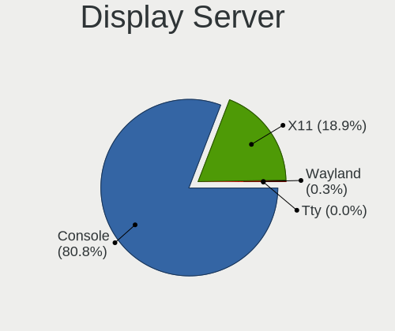
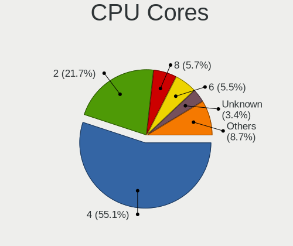
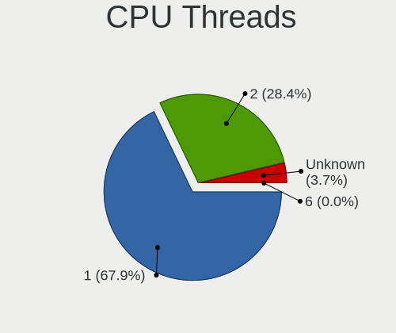
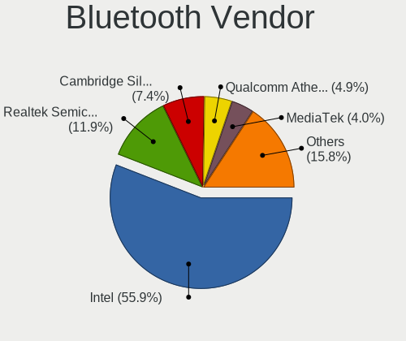

BSD - Tested Hardware & Statistics (Desktops)
---------------------------------------------

A project to collect tested hardware configurations for BSD.

Anyone can contribute to this report by the [hw-probe](https://github.com/linuxhw/hw-probe/blob/master/INSTALL.BSD.md) tool:

    hw-probe -all -upload

Please contribute! Especially if your hardware is rare.

This report is for real hardware. Report for virtual hardware: [TestDays_VE](https://github.com/bsdhw/TestDays_VE)

Contents
--------

* [ Test Cases ](#test-cases)

* [ System ](#system)
  - [ OS                       ](#os)
  - [ OS Family                ](#os-family)
  - [ Arch                     ](#arch)
  - [ DE                       ](#de)
  - [ Display Server           ](#display-server)
  - [ Display Manager          ](#display-manager)
  - [ OS Lang                  ](#os-lang)
  - [ Boot Mode                ](#boot-mode)
  - [ Filesystem               ](#filesystem)
  - [ Part. scheme             ](#part-scheme)

* [ Board ](#board)
  - [ Vendor                   ](#vendor)
  - [ Model                    ](#model)
  - [ Model Family             ](#model-family)
  - [ MFG Year                 ](#mfg-year)
  - [ Form Factor              ](#form-factor)
  - [ Coreboot                 ](#coreboot)
  - [ RAM Size                 ](#ram-size)
  - [ RAM Used                 ](#ram-used)
  - [ Total Drives             ](#total-drives)
  - [ Has CD-ROM               ](#has-cd-rom)
  - [ Has Ethernet             ](#has-ethernet)
  - [ Has WiFi                 ](#has-wifi)
  - [ Has Bluetooth            ](#has-bluetooth)

* [ Location ](#location)
  - [ Country                  ](#country)
  - [ City                     ](#city)

* [ Drives ](#drives)
  - [ Drive Vendor             ](#drive-vendor)
  - [ Drive Model              ](#drive-model)
  - [ HDD Vendor               ](#hdd-vendor)
  - [ SSD Vendor               ](#ssd-vendor)
  - [ Drive Kind               ](#drive-kind)
  - [ Drive Connector          ](#drive-connector)
  - [ Drive Size               ](#drive-size)
  - [ Space Total              ](#space-total)
  - [ Space Used               ](#space-used)
  - [ Malfunc. Drives          ](#malfunc-drives)
  - [ Malfunc. Drive Vendor    ](#malfunc-drive-vendor)
  - [ Malfunc. HDD Vendor      ](#malfunc-hdd-vendor)
  - [ Malfunc. Drive Kind      ](#malfunc-drive-kind)
  - [ Failed Drives            ](#failed-drives)
  - [ Failed Drive Vendor      ](#failed-drive-vendor)
  - [ Drive Status             ](#drive-status)

* [ Storage controller ](#storage-controller)
  - [ Storage Vendor           ](#storage-vendor)
  - [ Storage Model            ](#storage-model)
  - [ Storage Kind             ](#storage-kind)

* [ Processor ](#processor)
  - [ CPU Vendor               ](#cpu-vendor)
  - [ CPU Model                ](#cpu-model)
  - [ CPU Model Family         ](#cpu-model-family)
  - [ CPU Cores                ](#cpu-cores)
  - [ CPU Sockets              ](#cpu-sockets)
  - [ CPU Threads              ](#cpu-threads)
  - [ CPU Microarch            ](#cpu-microarch)

* [ Graphics ](#graphics)
  - [ GPU Vendor               ](#gpu-vendor)
  - [ GPU Model                ](#gpu-model)
  - [ GPU Combo                ](#gpu-combo)
  - [ GPU Driver               ](#gpu-driver)
  - [ GPU Memory               ](#gpu-memory)

* [ Monitor ](#monitor)
  - [ Monitor Vendor           ](#monitor-vendor)
  - [ Monitor Model            ](#monitor-model)
  - [ Monitor Resolution       ](#monitor-resolution)
  - [ Monitor Diagonal         ](#monitor-diagonal)
  - [ Monitor Width            ](#monitor-width)
  - [ Aspect Ratio             ](#aspect-ratio)
  - [ Monitor Area             ](#monitor-area)
  - [ Pixel Density            ](#pixel-density)
  - [ Multiple Monitors        ](#multiple-monitors)

* [ Network ](#network)
  - [ Net Controller Vendor    ](#net-controller-vendor)
  - [ Net Controller Model     ](#net-controller-model)
  - [ Wireless Vendor          ](#wireless-vendor)
  - [ Wireless Model           ](#wireless-model)
  - [ Ethernet Vendor          ](#ethernet-vendor)
  - [ Ethernet Model           ](#ethernet-model)
  - [ Net Controller Kind      ](#net-controller-kind)
  - [ Used Controller          ](#used-controller)
  - [ NICs                     ](#nics)
  - [ IPv6                     ](#ipv6)

* [ Bluetooth ](#bluetooth)
  - [ Bluetooth Vendor         ](#bluetooth-vendor)
  - [ Bluetooth Model          ](#bluetooth-model)

* [ Sound ](#sound)
  - [ Sound Vendor             ](#sound-vendor)
  - [ Sound Model              ](#sound-model)

* [ Memory ](#memory)
  - [ Memory Vendor            ](#memory-vendor)
  - [ Memory Model             ](#memory-model)
  - [ Memory Kind              ](#memory-kind)
  - [ Memory Form Factor       ](#memory-form-factor)
  - [ Memory Size              ](#memory-size)
  - [ Memory Speed             ](#memory-speed)

* [ Printers & scanners ](#printers--scanners)
  - [ Printer Vendor           ](#printer-vendor)
  - [ Printer Model            ](#printer-model)
  - [ Scanner Vendor           ](#scanner-vendor)
  - [ Scanner Model            ](#scanner-model)

* [ Camera ](#camera)
  - [ Camera Vendor            ](#camera-vendor)
  - [ Camera Model             ](#camera-model)

* [ Security ](#security)
  - [ Fingerprint Vendor       ](#fingerprint-vendor)
  - [ Fingerprint Model        ](#fingerprint-model)
  - [ Chipcard Vendor          ](#chipcard-vendor)
  - [ Chipcard Model           ](#chipcard-model)

* [ Unsupported ](#unsupported)
  - [ Unsupported Devices      ](#unsupported-devices)
  - [ Unsupported Device Types ](#unsupported-device-types)

Test Cases
----------

Total: 18100

| Vendor        | Model                       | Probe                                                     | Date         |
|---------------|-----------------------------|-----------------------------------------------------------|--------------|
| HP            | 8954                        | [80434f997e](https://bsd-hardware.info/?probe=80434f997e) | Jan 06, 2025 |
| Gigabyte      | H310M DS2 2.0               | [0ace2c80f5](https://bsd-hardware.info/?probe=0ace2c80f5) | Jan 06, 2025 |
| ASUSTek       | PRIME B550-PLUS             | [6a1b59c063](https://bsd-hardware.info/?probe=6a1b59c063) | Jan 06, 2025 |
| MSI           | Z270M MORTAR                | [52d87b1ad7](https://bsd-hardware.info/?probe=52d87b1ad7) | Jan 06, 2025 |
| Unknown       | DH61BR G32662-203           | [c082ba6276](https://bsd-hardware.info/?probe=c082ba6276) | Jan 06, 2025 |
| Gigabyte      | H310M DS2 2.0               | [bfa6a720f4](https://bsd-hardware.info/?probe=bfa6a720f4) | Jan 06, 2025 |
| Lenovo        | 312A SDK0J40697 WIN 3305... | [f8cd5798b5](https://bsd-hardware.info/?probe=f8cd5798b5) | Jan 06, 2025 |
| MW            | GMLK-2_5G4L                 | [aef8a88a74](https://bsd-hardware.info/?probe=aef8a88a74) | Jan 06, 2025 |
| MW            | GMLK-2_5G4L                 | [56c096c579](https://bsd-hardware.info/?probe=56c096c579) | Jan 06, 2025 |
| Unknown       | Unknown                     | [72473eb7c0](https://bsd-hardware.info/?probe=72473eb7c0) | Jan 06, 2025 |
| Fujitsu       | D3313-A1 S26361-D3313-A1    | [89ce4b4a9f](https://bsd-hardware.info/?probe=89ce4b4a9f) | Jan 06, 2025 |
| Unknown       | Unknown                     | [07d989d275](https://bsd-hardware.info/?probe=07d989d275) | Jan 06, 2025 |
| Supermicro    | A1SRi-2758F                 | [3e6fbd3ab8](https://bsd-hardware.info/?probe=3e6fbd3ab8) | Jan 06, 2025 |
| Unknown       | Unknown                     | [10fb87670b](https://bsd-hardware.info/?probe=10fb87670b) | Jan 05, 2025 |
| iEi           | SAE1 V1.04                  | [97651c6ab6](https://bsd-hardware.info/?probe=97651c6ab6) | Jan 05, 2025 |
| Unknown       | QDNV01                      | [ca2dd0099d](https://bsd-hardware.info/?probe=ca2dd0099d) | Jan 05, 2025 |
| AZW           | EQ                          | [79c6c2f2fb](https://bsd-hardware.info/?probe=79c6c2f2fb) | Jan 05, 2025 |
| ASUSTek       | H110M-K                     | [05fd1da0a8](https://bsd-hardware.info/?probe=05fd1da0a8) | Jan 05, 2025 |
| MSI           | H81M-P33                    | [4de04d7c63](https://bsd-hardware.info/?probe=4de04d7c63) | Jan 05, 2025 |
| ASUSTek       | P5Q-E                       | [ced4dbfd4b](https://bsd-hardware.info/?probe=ced4dbfd4b) | Jan 05, 2025 |
| ASUSTek       | ROG CROSSHAIR VIII HERO     | [c5f2cf7f1e](https://bsd-hardware.info/?probe=c5f2cf7f1e) | Jan 05, 2025 |
| ASRock        | Z690M-ITX/ax                | [9d38560d6a](https://bsd-hardware.info/?probe=9d38560d6a) | Jan 05, 2025 |
| Dell          | 0MGK50 A02                  | [fe0b9484f5](https://bsd-hardware.info/?probe=fe0b9484f5) | Jan 05, 2025 |
| Dell          | 04Y8V0 A02                  | [1d20d5fd79](https://bsd-hardware.info/?probe=1d20d5fd79) | Jan 05, 2025 |
| ASUSTek       | B85M-E                      | [aef38fc437](https://bsd-hardware.info/?probe=aef38fc437) | Jan 05, 2025 |
| Lenovo        | 3106 SDK0J40697 WIN 3305... | [25f299d953](https://bsd-hardware.info/?probe=25f299d953) | Jan 05, 2025 |
| ASUSTek       | P10S-E Series               | [689f54b56f](https://bsd-hardware.info/?probe=689f54b56f) | Jan 05, 2025 |
| Unknown       | Unknown                     | [c3815ed438](https://bsd-hardware.info/?probe=c3815ed438) | Jan 05, 2025 |
| PC Engines    | APU2                        | [4548693f59](https://bsd-hardware.info/?probe=4548693f59) | Jan 05, 2025 |
| Protectli     | FW2B Ver                    | [705883b807](https://bsd-hardware.info/?probe=705883b807) | Jan 04, 2025 |
| Dell          | 0FDY5C A00                  | [ccba495e89](https://bsd-hardware.info/?probe=ccba495e89) | Jan 04, 2025 |
| Protectli     | VP2420                      | [a3a282fc47](https://bsd-hardware.info/?probe=a3a282fc47) | Jan 04, 2025 |
| CWWK          | CW-J6-6L                    | [938c3dd6d1](https://bsd-hardware.info/?probe=938c3dd6d1) | Jan 04, 2025 |
| MSI           | Z270M MORTAR                | [6c0213efea](https://bsd-hardware.info/?probe=6c0213efea) | Jan 04, 2025 |
| PC Engines    | apu4                        | [aba651f461](https://bsd-hardware.info/?probe=aba651f461) | Jan 04, 2025 |
| Dell          | 0WMJ54 A01                  | [a87d1a2609](https://bsd-hardware.info/?probe=a87d1a2609) | Jan 04, 2025 |
| ASRock        | H570M-ITX/ac                | [5b40284fbe](https://bsd-hardware.info/?probe=5b40284fbe) | Jan 04, 2025 |
| Lenovo        | ThinkStation P320 Tiny 3... | [c8a55cde50](https://bsd-hardware.info/?probe=c8a55cde50) | Jan 04, 2025 |
| Dell          | 0FDY5C A00                  | [f0d39986e9](https://bsd-hardware.info/?probe=f0d39986e9) | Jan 04, 2025 |
| ASUSTek       | SABERTOOTH X58              | [92e2cb380a](https://bsd-hardware.info/?probe=92e2cb380a) | Jan 03, 2025 |
| SJRC          | ADLN-6L                     | [9afe02f983](https://bsd-hardware.info/?probe=9afe02f983) | Jan 03, 2025 |
| ASUSTek       | B150M-PLUS D3               | [d269e833ba](https://bsd-hardware.info/?probe=d269e833ba) | Jan 03, 2025 |
| MiTAC         | E220                        | [f869a33762](https://bsd-hardware.info/?probe=f869a33762) | Jan 03, 2025 |
| Intel         | MAHOBAY                     | [e1fbd3a5ef](https://bsd-hardware.info/?probe=e1fbd3a5ef) | Jan 03, 2025 |
| Lenovo        | 3106 SDK0J40697 WIN 3305... | [9f03b43d72](https://bsd-hardware.info/?probe=9f03b43d72) | Jan 03, 2025 |
| Protectli     | FW6 Ver                     | [e66a74f63e](https://bsd-hardware.info/?probe=e66a74f63e) | Jan 03, 2025 |
| CWWK          | CW-ADLN-6L                  | [5eecb1d87a](https://bsd-hardware.info/?probe=5eecb1d87a) | Jan 03, 2025 |
| Dell          | 0YP4HV A00                  | [f4bf8c469e](https://bsd-hardware.info/?probe=f4bf8c469e) | Jan 03, 2025 |
| ASUSTek       | Q87M-E                      | [845a04a779](https://bsd-hardware.info/?probe=845a04a779) | Jan 03, 2025 |
| HP            | 18E7                        | [fdac2d0362](https://bsd-hardware.info/?probe=fdac2d0362) | Jan 03, 2025 |
| Dell          | 0YP4HV A00                  | [7c407b8021](https://bsd-hardware.info/?probe=7c407b8021) | Jan 03, 2025 |
| ASRock        | N100DC-ITX                  | [16cfe5b33f](https://bsd-hardware.info/?probe=16cfe5b33f) | Jan 03, 2025 |
| ASUSTek       | PRIME H310M-E R2.0          | [d5f369f5da](https://bsd-hardware.info/?probe=d5f369f5da) | Jan 03, 2025 |
| Unknown       | Unknown                     | [89041bb816](https://bsd-hardware.info/?probe=89041bb816) | Jan 03, 2025 |
| Unknown       | Unknown                     | [d79c2c64e7](https://bsd-hardware.info/?probe=d79c2c64e7) | Jan 03, 2025 |
| MSI           | MS-B1711                    | [98df812bc4](https://bsd-hardware.info/?probe=98df812bc4) | Jan 03, 2025 |
| MSI           | MS-B1711                    | [c58187f624](https://bsd-hardware.info/?probe=c58187f624) | Jan 03, 2025 |
| ASUSTek       | P8Z77-V                     | [d3e6e71d15](https://bsd-hardware.info/?probe=d3e6e71d15) | Jan 03, 2025 |
| Lenovo        | 3102 SDK0J40697 WIN 3305... | [686b424a28](https://bsd-hardware.info/?probe=686b424a28) | Jan 02, 2025 |
| ASUSTek       | ROG STRIX B650-A GAMING ... | [20976f758a](https://bsd-hardware.info/?probe=20976f758a) | Jan 02, 2025 |
| Techvision    | TVI7309X B0                 | [e3b91fef39](https://bsd-hardware.info/?probe=e3b91fef39) | Jan 02, 2025 |
| Dell          | 0WMJ54 A01                  | [2fb7873b0b](https://bsd-hardware.info/?probe=2fb7873b0b) | Jan 02, 2025 |
| Dell          | 0JJ7YG A00                  | [60a9be6897](https://bsd-hardware.info/?probe=60a9be6897) | Jan 02, 2025 |
| SJRC          | ADLN-6L                     | [90498561c8](https://bsd-hardware.info/?probe=90498561c8) | Jan 02, 2025 |
| Intel         | D54250WYK H13922-303        | [a0f4632238](https://bsd-hardware.info/?probe=a0f4632238) | Jan 02, 2025 |
| ASUSTek       | P8Z77-V                     | [657957bf41](https://bsd-hardware.info/?probe=657957bf41) | Jan 02, 2025 |
| Unknown       | Unknown                     | [2c400cdb2c](https://bsd-hardware.info/?probe=2c400cdb2c) | Jan 02, 2025 |
| Dell          | 01D4TT A00                  | [447a0925d1](https://bsd-hardware.info/?probe=447a0925d1) | Jan 02, 2025 |
| Dell          | 0JJ7YG A00                  | [f586af63cf](https://bsd-hardware.info/?probe=f586af63cf) | Jan 02, 2025 |
| HP            | 8062                        | [4ea2077640](https://bsd-hardware.info/?probe=4ea2077640) | Jan 02, 2025 |
| MSI           | MAG B550M MORTAR WIFI       | [9b908a1339](https://bsd-hardware.info/?probe=9b908a1339) | Jan 02, 2025 |
| Protectli     | V1410                       | [2f503f2fc2](https://bsd-hardware.info/?probe=2f503f2fc2) | Jan 02, 2025 |
| Unknown       | Unknown                     | [3b5881e6d2](https://bsd-hardware.info/?probe=3b5881e6d2) | Jan 02, 2025 |
| Dell          | 0WMJ54 A01                  | [f5ab48d136](https://bsd-hardware.info/?probe=f5ab48d136) | Jan 02, 2025 |
| HP            | 1998                        | [fea249da53](https://bsd-hardware.info/?probe=fea249da53) | Jan 02, 2025 |
| Shenzhen M... | AHWSA                       | [871f8c208c](https://bsd-hardware.info/?probe=871f8c208c) | Jan 02, 2025 |
| Yanling       | YL-GML4 V1                  | [0f2a512dec](https://bsd-hardware.info/?probe=0f2a512dec) | Jan 02, 2025 |
| PICO PC       | MNHO-113                    | [9ac6a7a9ad](https://bsd-hardware.info/?probe=9ac6a7a9ad) | Jan 02, 2025 |
| Intel         | S1200KP AAG34877-201        | [80e080363c](https://bsd-hardware.info/?probe=80e080363c) | Jan 01, 2025 |
| Trigkey       | Green G5                    | [b319e43076](https://bsd-hardware.info/?probe=b319e43076) | Jan 01, 2025 |
| Dell          | 08NPPY A00                  | [a9e88edfae](https://bsd-hardware.info/?probe=a9e88edfae) | Jan 01, 2025 |
| Unknown       | Unknown                     | [c23c86dc99](https://bsd-hardware.info/?probe=c23c86dc99) | Jan 01, 2025 |
| Biostar       | A68N-2100K                  | [441011550c](https://bsd-hardware.info/?probe=441011550c) | Jan 01, 2025 |
| Unknown       | adnasc01                    | [e4417d31c4](https://bsd-hardware.info/?probe=e4417d31c4) | Jan 01, 2025 |
| HP            | 83E2                        | [c0cce366c3](https://bsd-hardware.info/?probe=c0cce366c3) | Jan 01, 2025 |
| Seeed Stud... | ODYSSEY-X86J41X5 SD-BS-C... | [6c1907d15b](https://bsd-hardware.info/?probe=6c1907d15b) | Jan 01, 2025 |
| Gigabyte      | EP43T-UD3L                  | [4c4764a3fe](https://bsd-hardware.info/?probe=4c4764a3fe) | Jan 01, 2025 |
| Intel         | CARLOW                      | [01eb3deae5](https://bsd-hardware.info/?probe=01eb3deae5) | Jan 01, 2025 |
| ASUSTek       | Z97I-PLUS                   | [280124bd49](https://bsd-hardware.info/?probe=280124bd49) | Dec 31, 2024 |
| HP            | 8768 A                      | [8ccd99787b](https://bsd-hardware.info/?probe=8ccd99787b) | Dec 31, 2024 |
| ASRock        | FM2A55M-HD+ R2.0            | [f7a1fd8000](https://bsd-hardware.info/?probe=f7a1fd8000) | Dec 31, 2024 |
| Intel         | SHARKBAY                    | [3528375180](https://bsd-hardware.info/?probe=3528375180) | Dec 31, 2024 |
| ASRockRack    | EPYC3101D4I-2T              | [be896d46e1](https://bsd-hardware.info/?probe=be896d46e1) | Dec 31, 2024 |
| Intel         | SKYBAY                      | [d3adf28494](https://bsd-hardware.info/?probe=d3adf28494) | Dec 31, 2024 |
| Unknown       | Unknown                     | [4fe58c5abf](https://bsd-hardware.info/?probe=4fe58c5abf) | Dec 31, 2024 |
| Unknown       | Unknown                     | [d06ccdd495](https://bsd-hardware.info/?probe=d06ccdd495) | Dec 31, 2024 |
| ASRock        | N100DC-ITX                  | [766a7f64f0](https://bsd-hardware.info/?probe=766a7f64f0) | Dec 31, 2024 |
| BESSTAR Te... | IB9                         | [3dfca3d175](https://bsd-hardware.info/?probe=3dfca3d175) | Dec 31, 2024 |
| Unknown       | Unknown                     | [0a3b121141](https://bsd-hardware.info/?probe=0a3b121141) | Dec 31, 2024 |
| Unknown       | Unknown                     | [d3e2ebffab](https://bsd-hardware.info/?probe=d3e2ebffab) | Dec 31, 2024 |
| IceWhale T... | ZimaBoard 832 ZMB           | [02de1482a6](https://bsd-hardware.info/?probe=02de1482a6) | Dec 31, 2024 |
| Protectli     | FW4B                        | [fddeda1514](https://bsd-hardware.info/?probe=fddeda1514) | Dec 31, 2024 |
| HP            | 8055                        | [ad2cab0e5d](https://bsd-hardware.info/?probe=ad2cab0e5d) | Dec 31, 2024 |
| Shenzhen s... | miniPC                      | [974d78e0bf](https://bsd-hardware.info/?probe=974d78e0bf) | Dec 31, 2024 |
| Techvision    | TVI7309X B0                 | [588468f004](https://bsd-hardware.info/?probe=588468f004) | Dec 31, 2024 |
| Unknown       | Unknown                     | [1c2ec43b47](https://bsd-hardware.info/?probe=1c2ec43b47) | Dec 31, 2024 |
| ASUSTek       | Z97-PRO GAMER               | [8fe128b9b2](https://bsd-hardware.info/?probe=8fe128b9b2) | Dec 31, 2024 |
| Advantech     | NAMB-3250 A102-1            | [975b60a167](https://bsd-hardware.info/?probe=975b60a167) | Dec 31, 2024 |
| AZW           | EQ                          | [89e2185696](https://bsd-hardware.info/?probe=89e2185696) | Dec 31, 2024 |
| Intel         | SKYBAY                      | [83a2dfc9d6](https://bsd-hardware.info/?probe=83a2dfc9d6) | Dec 31, 2024 |
| Dell          | 0T7D40 A01                  | [cc8dddd1e8](https://bsd-hardware.info/?probe=cc8dddd1e8) | Dec 30, 2024 |
| Unknown       | Unknown                     | [f85ed259c8](https://bsd-hardware.info/?probe=f85ed259c8) | Dec 30, 2024 |
| Intel         | JSL MRD                     | [91ddafe16b](https://bsd-hardware.info/?probe=91ddafe16b) | Dec 30, 2024 |
| HP            | 1998                        | [da5ac06da2](https://bsd-hardware.info/?probe=da5ac06da2) | Dec 30, 2024 |
| ASUSTek       | TUF Gaming B560M-PLUS WI... | [e69f71eb23](https://bsd-hardware.info/?probe=e69f71eb23) | Dec 30, 2024 |
| ASUSTek       | P8H67-M PRO                 | [002e1aabfa](https://bsd-hardware.info/?probe=002e1aabfa) | Dec 30, 2024 |
| Protectli     | VP2420                      | [4cbb5eb9ba](https://bsd-hardware.info/?probe=4cbb5eb9ba) | Dec 30, 2024 |
| Supermicro    | X9SCL/X9SCMA                | [7b307c888b](https://bsd-hardware.info/?probe=7b307c888b) | Dec 30, 2024 |
| Unknown       | Unknown                     | [115a8d681e](https://bsd-hardware.info/?probe=115a8d681e) | Dec 30, 2024 |
| IGEL Techn... | IGEL-D220                   | [9d3ca29f8a](https://bsd-hardware.info/?probe=9d3ca29f8a) | Dec 30, 2024 |
| ASRock        | X570 Phantom Gaming-ITX/... | [f72205b123](https://bsd-hardware.info/?probe=f72205b123) | Dec 30, 2024 |
| ASUSTek       | P11C-E Series               | [01492d552c](https://bsd-hardware.info/?probe=01492d552c) | Dec 30, 2024 |
| Dell EMC      | EDGE680-CPU A00             | [b5233e4ced](https://bsd-hardware.info/?probe=b5233e4ced) | Dec 30, 2024 |
| Unknown       | adnasc01                    | [b813bc581d](https://bsd-hardware.info/?probe=b813bc581d) | Dec 30, 2024 |
| ASUSTek       | Maximus V FORMULA           | [3e59dc6c59](https://bsd-hardware.info/?probe=3e59dc6c59) | Dec 30, 2024 |
| ASUSTek       | Maximus VIII RANGER         | [2d3eb6c2f5](https://bsd-hardware.info/?probe=2d3eb6c2f5) | Dec 30, 2024 |
| Unknown       | Unknown                     | [8b06420b87](https://bsd-hardware.info/?probe=8b06420b87) | Dec 29, 2024 |
| Dell          | OptiPlex 5070               | [e2e08cab4b](https://bsd-hardware.info/?probe=e2e08cab4b) | Dec 29, 2024 |
| Fujitsu       | D3313-G1 S26361-D3313-G1    | [e55c0423ee](https://bsd-hardware.info/?probe=e55c0423ee) | Dec 29, 2024 |
| ASRock        | 4X4-5000 Series             | [a6b64a93c5](https://bsd-hardware.info/?probe=a6b64a93c5) | Dec 29, 2024 |
| ASUSTek       | PRIME Z270-A                | [601c3c7a49](https://bsd-hardware.info/?probe=601c3c7a49) | Dec 29, 2024 |
| Intel         | QHSW02                      | [07fd887929](https://bsd-hardware.info/?probe=07fd887929) | Dec 29, 2024 |
| Techvision    | TVI7309X B0                 | [a86118e267](https://bsd-hardware.info/?probe=a86118e267) | Dec 29, 2024 |
| Unknown       | Unknown                     | [6218f9a3c9](https://bsd-hardware.info/?probe=6218f9a3c9) | Dec 29, 2024 |
| ASUSTek       | P8Z77-V                     | [ae387d9e4c](https://bsd-hardware.info/?probe=ae387d9e4c) | Dec 29, 2024 |
| Unknown       | Unknown                     | [b96103dfcb](https://bsd-hardware.info/?probe=b96103dfcb) | Dec 29, 2024 |
| Unknown       | Unknown                     | [b9ca7abc2d](https://bsd-hardware.info/?probe=b9ca7abc2d) | Dec 29, 2024 |
| MSI           | H81M-P33                    | [a1fc208c90](https://bsd-hardware.info/?probe=a1fc208c90) | Dec 29, 2024 |
| ASUSTek       | P5Q-E                       | [f497fed563](https://bsd-hardware.info/?probe=f497fed563) | Dec 29, 2024 |
| ASUSTek       | ROG CROSSHAIR VIII HERO     | [71afdfab99](https://bsd-hardware.info/?probe=71afdfab99) | Dec 29, 2024 |
| Protectli     | VP4670                      | [1649d4be0f](https://bsd-hardware.info/?probe=1649d4be0f) | Dec 29, 2024 |
| CWWK          | MINIPC-G12                  | [e85c1bdb99](https://bsd-hardware.info/?probe=e85c1bdb99) | Dec 29, 2024 |
| AZW           | EQ                          | [69a1ed7f82](https://bsd-hardware.info/?probe=69a1ed7f82) | Dec 29, 2024 |
| Unknown       | Unknown                     | [2e57c5140f](https://bsd-hardware.info/?probe=2e57c5140f) | Dec 29, 2024 |
| Dell          | OptiPlex 5070               | [12d5d8ce92](https://bsd-hardware.info/?probe=12d5d8ce92) | Dec 29, 2024 |
| Trigkey       | Green G5                    | [560c067a01](https://bsd-hardware.info/?probe=560c067a01) | Dec 29, 2024 |
| Protectli     | FW2B Ver                    | [0f9a74892c](https://bsd-hardware.info/?probe=0f9a74892c) | Dec 29, 2024 |
| Shenzhen M... | AHWSA                       | [f7c0f4e47a](https://bsd-hardware.info/?probe=f7c0f4e47a) | Dec 29, 2024 |
| Dell          | 02YYK5 A01                  | [bf55691036](https://bsd-hardware.info/?probe=bf55691036) | Dec 29, 2024 |
| Fujitsu       | D3313-B1 S26361-D3313-B1    | [95345d4887](https://bsd-hardware.info/?probe=95345d4887) | Dec 29, 2024 |
| NF533MS       | 1.0                         | [3f9b4a5c4f](https://bsd-hardware.info/?probe=3f9b4a5c4f) | Dec 28, 2024 |
| Unknown       | Unknown                     | [a93b8e4a89](https://bsd-hardware.info/?probe=a93b8e4a89) | Dec 28, 2024 |
| Unknown       | Unknown                     | [cf9c0fcf94](https://bsd-hardware.info/?probe=cf9c0fcf94) | Dec 28, 2024 |
| Dell          | 0NW6H5 A00                  | [d2f12e9d57](https://bsd-hardware.info/?probe=d2f12e9d57) | Dec 28, 2024 |
| BOSGAME       | Ecolite Series              | [c1083a8777](https://bsd-hardware.info/?probe=c1083a8777) | Dec 28, 2024 |
| Unknown       | Unknown                     | [f9f7981d89](https://bsd-hardware.info/?probe=f9f7981d89) | Dec 28, 2024 |
| ASUSTek       | P8Z77-V                     | [548a9b376e](https://bsd-hardware.info/?probe=548a9b376e) | Dec 28, 2024 |
| ASUSTek       | Maximus V FORMULA           | [6a110d5e92](https://bsd-hardware.info/?probe=6a110d5e92) | Dec 28, 2024 |
| Intel         | DQ77KB AAG40294-402         | [9db11dd0c9](https://bsd-hardware.info/?probe=9db11dd0c9) | Dec 28, 2024 |
| Intel         | QHSW02                      | [0e73244f65](https://bsd-hardware.info/?probe=0e73244f65) | Dec 28, 2024 |
| Intel         | D2500HN                     | [a316391d86](https://bsd-hardware.info/?probe=a316391d86) | Dec 27, 2024 |
| Unknown       | Unknown                     | [7d2cac7c1c](https://bsd-hardware.info/?probe=7d2cac7c1c) | Dec 27, 2024 |
| Unknown       | Unknown                     | [392370d6f2](https://bsd-hardware.info/?probe=392370d6f2) | Dec 27, 2024 |
| Intel         | S3000AH D40859-208          | [89e23969cc](https://bsd-hardware.info/?probe=89e23969cc) | Dec 27, 2024 |
| Supermicro    | X10SDE-DF                   | [ce805c4c07](https://bsd-hardware.info/?probe=ce805c4c07) | Dec 27, 2024 |
| Unknown       | Unknown                     | [7649637b96](https://bsd-hardware.info/?probe=7649637b96) | Dec 27, 2024 |
| Protectli     | V1410                       | [b6727da944](https://bsd-hardware.info/?probe=b6727da944) | Dec 27, 2024 |
| Fujitsu       | D3544-Sx S26361-D3544-Sx... | [0dcc64e192](https://bsd-hardware.info/?probe=0dcc64e192) | Dec 27, 2024 |
| Unknown       | Unknown                     | [0d44758f02](https://bsd-hardware.info/?probe=0d44758f02) | Dec 27, 2024 |
| Techvision    | TVI7309X B0                 | [9c1b74e17e](https://bsd-hardware.info/?probe=9c1b74e17e) | Dec 27, 2024 |
| Protectli     | V1410                       | [09e8629eb8](https://bsd-hardware.info/?probe=09e8629eb8) | Dec 27, 2024 |
| Unknown       | Unknown                     | [a92bf0ef02](https://bsd-hardware.info/?probe=a92bf0ef02) | Dec 27, 2024 |
| Inventec      | ZQ Class A02                | [9d4dc92f21](https://bsd-hardware.info/?probe=9d4dc92f21) | Dec 27, 2024 |
| Dell          | OptiPlex 5070               | [5a98f9dd3a](https://bsd-hardware.info/?probe=5a98f9dd3a) | Dec 27, 2024 |
| ASUSTek       | PRIME B450M-GAMING/BR       | [e03720a10c](https://bsd-hardware.info/?probe=e03720a10c) | Dec 27, 2024 |
| HP            | 86E9 A                      | [355a0a1775](https://bsd-hardware.info/?probe=355a0a1775) | Dec 27, 2024 |
| Dell          | OptiPlex 5070               | [7ee0a90c4b](https://bsd-hardware.info/?probe=7ee0a90c4b) | Dec 27, 2024 |
| Intel         | Q3XXG4-P V1.0               | [fe167a9e36](https://bsd-hardware.info/?probe=fe167a9e36) | Dec 27, 2024 |
| AZW           | EQ                          | [45a01b3cb6](https://bsd-hardware.info/?probe=45a01b3cb6) | Dec 26, 2024 |
| Dell          | 07F37C A01                  | [6518ba4c6c](https://bsd-hardware.info/?probe=6518ba4c6c) | Dec 26, 2024 |
| Unknown       | Unknown                     | [7a016a0770](https://bsd-hardware.info/?probe=7a016a0770) | Dec 26, 2024 |
| HP            | 86E9 A                      | [5c61053e94](https://bsd-hardware.info/?probe=5c61053e94) | Dec 26, 2024 |
| Fujitsu       | D3313-A1 S26361-D3313-A1    | [60caaaf52b](https://bsd-hardware.info/?probe=60caaaf52b) | Dec 26, 2024 |
| MW            | GMLK-2_5G4L                 | [1dbdbd867c](https://bsd-hardware.info/?probe=1dbdbd867c) | Dec 26, 2024 |
| Unknown       | Unknown                     | [71050a52a4](https://bsd-hardware.info/?probe=71050a52a4) | Dec 26, 2024 |
| Protectli     | VP2420                      | [afa30d870b](https://bsd-hardware.info/?probe=afa30d870b) | Dec 26, 2024 |
| Unknown       | Unknown                     | [6d669bbdc7](https://bsd-hardware.info/?probe=6d669bbdc7) | Dec 26, 2024 |
| Unknown       | Unknown                     | [78aee3d790](https://bsd-hardware.info/?probe=78aee3d790) | Dec 26, 2024 |
| Unknown       | Unknown                     | [63fd28f073](https://bsd-hardware.info/?probe=63fd28f073) | Dec 26, 2024 |
| Shenzhen S... | SI-B160                     | [c0fc40baea](https://bsd-hardware.info/?probe=c0fc40baea) | Dec 26, 2024 |
| Intel         | HURONRIVER                  | [dda4ccd2af](https://bsd-hardware.info/?probe=dda4ccd2af) | Dec 26, 2024 |
| GoWin Solu... | R86S                        | [1a6fdb5298](https://bsd-hardware.info/?probe=1a6fdb5298) | Dec 26, 2024 |
| Gigabyte      | B760M C                     | [b3926cb9a9](https://bsd-hardware.info/?probe=b3926cb9a9) | Dec 26, 2024 |
| Gigabyte      | B760M C                     | [c01a3f3d27](https://bsd-hardware.info/?probe=c01a3f3d27) | Dec 26, 2024 |
| ASUSTek       | ROG STRIX B760-I GAMING ... | [befeba6938](https://bsd-hardware.info/?probe=befeba6938) | Dec 26, 2024 |
| Unknown       | Unknown                     | [76ca94279b](https://bsd-hardware.info/?probe=76ca94279b) | Dec 26, 2024 |
| Unknown       | Unknown                     | [9f549fa7ce](https://bsd-hardware.info/?probe=9f549fa7ce) | Dec 26, 2024 |
| Unknown       | Unknown                     | [4937ea1ef5](https://bsd-hardware.info/?probe=4937ea1ef5) | Dec 25, 2024 |
| Gigabyte      | Z77X-UP4 TH                 | [3b5e5eeea4](https://bsd-hardware.info/?probe=3b5e5eeea4) | Dec 25, 2024 |
| Unknown       | Unknown                     | [846b02424a](https://bsd-hardware.info/?probe=846b02424a) | Dec 25, 2024 |
| Dell          | 0HD5W2 A01                  | [5e50386e5c](https://bsd-hardware.info/?probe=5e50386e5c) | Dec 25, 2024 |
| Dell          | 0GK35Y A00                  | [48c856834f](https://bsd-hardware.info/?probe=48c856834f) | Dec 25, 2024 |
| Techvision    | TVI7309X B0                 | [94fd7f7082](https://bsd-hardware.info/?probe=94fd7f7082) | Dec 25, 2024 |
| AZW           | U59                         | [17a9a9d767](https://bsd-hardware.info/?probe=17a9a9d767) | Dec 25, 2024 |
| PC Engines    | apu4                        | [c9b7343baf](https://bsd-hardware.info/?probe=c9b7343baf) | Dec 25, 2024 |
| Dell          | 0WMJ54 A01                  | [e677c34698](https://bsd-hardware.info/?probe=e677c34698) | Dec 25, 2024 |
| Unknown       | Unknown                     | [f3922a40a8](https://bsd-hardware.info/?probe=f3922a40a8) | Dec 24, 2024 |
| Protectli     | VP6630                      | [4a4726113b](https://bsd-hardware.info/?probe=4a4726113b) | Dec 24, 2024 |
| Dell          | 0T7D40 A01                  | [af31d44d1f](https://bsd-hardware.info/?probe=af31d44d1f) | Dec 24, 2024 |
| BESSTAR Te... | IB9                         | [b54b487e6a](https://bsd-hardware.info/?probe=b54b487e6a) | Dec 24, 2024 |
| Unknown       | Unknown                     | [25a20f4c0e](https://bsd-hardware.info/?probe=25a20f4c0e) | Dec 24, 2024 |
| Fujitsu       | D3313-G1 S26361-D3313-G1    | [338d76f96f](https://bsd-hardware.info/?probe=338d76f96f) | Dec 24, 2024 |
| ASUSTek       | H110M-K                     | [e8ab923caa](https://bsd-hardware.info/?probe=e8ab923caa) | Dec 24, 2024 |
| MSI           | 970 GAMING                  | [7caa8db16a](https://bsd-hardware.info/?probe=7caa8db16a) | Dec 24, 2024 |
| Unknown       | QDNV01                      | [fcdc78df83](https://bsd-hardware.info/?probe=fcdc78df83) | Dec 24, 2024 |
| ASUSTek       | H110M-K                     | [14959f9c62](https://bsd-hardware.info/?probe=14959f9c62) | Dec 24, 2024 |
| NF692         | 1.0                         | [b129c164c5](https://bsd-hardware.info/?probe=b129c164c5) | Dec 24, 2024 |
| Gigabyte      | Z790 AORUS MASTER X         | [d8022a2734](https://bsd-hardware.info/?probe=d8022a2734) | Dec 24, 2024 |
| Unknown       | Unknown                     | [2e05274300](https://bsd-hardware.info/?probe=2e05274300) | Dec 24, 2024 |
| HP            | 339A                        | [ad9ed0ee8d](https://bsd-hardware.info/?probe=ad9ed0ee8d) | Dec 24, 2024 |
| ASUSTek       | TUF Gaming X570-PLUS        | [2c141d9a6e](https://bsd-hardware.info/?probe=2c141d9a6e) | Dec 24, 2024 |
| Dell          | 0FF3FN A00                  | [33a3dcb343](https://bsd-hardware.info/?probe=33a3dcb343) | Dec 24, 2024 |
| Dell          | 0JP3NX A00                  | [27d474564d](https://bsd-hardware.info/?probe=27d474564d) | Dec 24, 2024 |
| Protectli     | VP2420                      | [6fe419fedc](https://bsd-hardware.info/?probe=6fe419fedc) | Dec 24, 2024 |
| Firebat_Co... | T8_Plus                     | [b4c2c32c72](https://bsd-hardware.info/?probe=b4c2c32c72) | Dec 24, 2024 |
| ASRock        | H61M-VG3                    | [e0ed997df8](https://bsd-hardware.info/?probe=e0ed997df8) | Dec 23, 2024 |
| Shenzhen M... | AHWSA                       | [929e0f0aa1](https://bsd-hardware.info/?probe=929e0f0aa1) | Dec 23, 2024 |
| Infoblox      | IB-810                      | [94e43c90e0](https://bsd-hardware.info/?probe=94e43c90e0) | Dec 23, 2024 |
| Protectli     | V1410                       | [6e4b1262e4](https://bsd-hardware.info/?probe=6e4b1262e4) | Dec 23, 2024 |
| Dell          | 0YXT71 A00                  | [fc782b729d](https://bsd-hardware.info/?probe=fc782b729d) | Dec 23, 2024 |
| MW            | GMLK-2_5G4L                 | [bd781ad496](https://bsd-hardware.info/?probe=bd781ad496) | Dec 23, 2024 |
| Unknown       | Unknown                     | [f2bc43b0a8](https://bsd-hardware.info/?probe=f2bc43b0a8) | Dec 23, 2024 |
| Unknown       | Unknown                     | [1ea5fa36d2](https://bsd-hardware.info/?probe=1ea5fa36d2) | Dec 23, 2024 |
| HP            | 1998                        | [ba1d68d913](https://bsd-hardware.info/?probe=ba1d68d913) | Dec 22, 2024 |
| Techvision    | TVI7309X B0                 | [92cefa8a8c](https://bsd-hardware.info/?probe=92cefa8a8c) | Dec 22, 2024 |
| Dell          | 08NPPY A00                  | [a94c82e978](https://bsd-hardware.info/?probe=a94c82e978) | Dec 22, 2024 |
| Dell          | 0FDY5C A00                  | [97a894078c](https://bsd-hardware.info/?probe=97a894078c) | Dec 22, 2024 |
| Alienware     | 0VDT73 A00                  | [cc0448c975](https://bsd-hardware.info/?probe=cc0448c975) | Dec 22, 2024 |
| PC Engines    | APU2                        | [4f7eeb78f6](https://bsd-hardware.info/?probe=4f7eeb78f6) | Dec 22, 2024 |
| PC Engines    | apu4                        | [c41bf918c5](https://bsd-hardware.info/?probe=c41bf918c5) | Dec 22, 2024 |
| Techvision    | TVI7309X B0                 | [887c112b05](https://bsd-hardware.info/?probe=887c112b05) | Dec 22, 2024 |
| Unknown       | Unknown                     | [8befdf2a04](https://bsd-hardware.info/?probe=8befdf2a04) | Dec 22, 2024 |
| Unknown       | QDNV01                      | [877dbd28c5](https://bsd-hardware.info/?probe=877dbd28c5) | Dec 22, 2024 |
| ASRock        | H570M-ITX/ac                | [eb9e3863e0](https://bsd-hardware.info/?probe=eb9e3863e0) | Dec 22, 2024 |
| Unknown       | Unknown                     | [02119a1b45](https://bsd-hardware.info/?probe=02119a1b45) | Dec 22, 2024 |
| Protectli     | FW6 Ver                     | [f8133ffca6](https://bsd-hardware.info/?probe=f8133ffca6) | Dec 22, 2024 |
| Supermicro    | X9SCL/X9SCM                 | [dd220a27af](https://bsd-hardware.info/?probe=dd220a27af) | Dec 22, 2024 |
| IceWhale T... | ZimaBoard 832 ZMB           | [0fd27a04f7](https://bsd-hardware.info/?probe=0fd27a04f7) | Dec 22, 2024 |
| ASRock        | B550 Phantom Gaming 4       | [ce9a08d930](https://bsd-hardware.info/?probe=ce9a08d930) | Dec 22, 2024 |
| Gigabyte      | M68MT-S2                    | [0ac816abb8](https://bsd-hardware.info/?probe=0ac816abb8) | Dec 22, 2024 |
| AAEON         | UP-APL01 V0.4               | [32312b45f8](https://bsd-hardware.info/?probe=32312b45f8) | Dec 21, 2024 |
| Supermicro    | X10SDE-DF                   | [d625d92899](https://bsd-hardware.info/?probe=d625d92899) | Dec 21, 2024 |
| Dell          | 0D28YY A00                  | [97d068af1e](https://bsd-hardware.info/?probe=97d068af1e) | Dec 21, 2024 |
| ASUSTek       | Z97-PRO GAMER               | [e7c1d45a38](https://bsd-hardware.info/?probe=e7c1d45a38) | Dec 21, 2024 |
| Dell          | 00V62H A00                  | [0b6e2a4e95](https://bsd-hardware.info/?probe=0b6e2a4e95) | Dec 21, 2024 |
| Dell          | 00V62H A01                  | [3048d1b957](https://bsd-hardware.info/?probe=3048d1b957) | Dec 21, 2024 |
| Unknown       | Unknown                     | [cf2ef7e381](https://bsd-hardware.info/?probe=cf2ef7e381) | Dec 21, 2024 |
| Unknown       | Unknown                     | [d46840aa6c](https://bsd-hardware.info/?probe=d46840aa6c) | Dec 21, 2024 |
| HP            | 1998                        | [e4d863c249](https://bsd-hardware.info/?probe=e4d863c249) | Dec 21, 2024 |
| Unknown       | QDNV01                      | [95d17434b8](https://bsd-hardware.info/?probe=95d17434b8) | Dec 21, 2024 |
| MSI           | Z270M MORTAR                | [1bf2d8a709](https://bsd-hardware.info/?probe=1bf2d8a709) | Dec 21, 2024 |
| ASUSTek       | TUF Gaming B560M-PLUS WI... | [bee58d9e52](https://bsd-hardware.info/?probe=bee58d9e52) | Dec 21, 2024 |
| Shenzhen S... | SI-B160                     | [299cbc4d07](https://bsd-hardware.info/?probe=299cbc4d07) | Dec 21, 2024 |
| Unknown       | Unknown                     | [bba86ddcba](https://bsd-hardware.info/?probe=bba86ddcba) | Dec 21, 2024 |
| MSI           | Z97I AC                     | [b6ff881901](https://bsd-hardware.info/?probe=b6ff881901) | Dec 21, 2024 |
| Unknown       | Unknown                     | [67b79bee6d](https://bsd-hardware.info/?probe=67b79bee6d) | Dec 21, 2024 |
| Unknown       | Unknown                     | [f43114f35b](https://bsd-hardware.info/?probe=f43114f35b) | Dec 21, 2024 |
| Techvision    | TVI7309X B0                 | [c16b1e23d4](https://bsd-hardware.info/?probe=c16b1e23d4) | Dec 21, 2024 |
| HP            | 1998                        | [a875c0ccf0](https://bsd-hardware.info/?probe=a875c0ccf0) | Dec 20, 2024 |
| Unknown       | Unknown                     | [e1da8dd697](https://bsd-hardware.info/?probe=e1da8dd697) | Dec 20, 2024 |
| ASRock        | E3C226D2I                   | [37b9937cf0](https://bsd-hardware.info/?probe=37b9937cf0) | Dec 20, 2024 |
| Unknown       | MANIFOLD 2-C                | [652d97d116](https://bsd-hardware.info/?probe=652d97d116) | Dec 20, 2024 |
| Protectli     | FW6                         | [221484fba7](https://bsd-hardware.info/?probe=221484fba7) | Dec 20, 2024 |
| ASUSTek       | PRIME Z270-A                | [9a8a0a932a](https://bsd-hardware.info/?probe=9a8a0a932a) | Dec 20, 2024 |
| HP            | 0B4Ch D                     | [4278f18694](https://bsd-hardware.info/?probe=4278f18694) | Dec 20, 2024 |
| Unknown       | Unknown                     | [806a7126ca](https://bsd-hardware.info/?probe=806a7126ca) | Dec 20, 2024 |
| Unknown       | Unknown                     | [19ffcf2c92](https://bsd-hardware.info/?probe=19ffcf2c92) | Dec 20, 2024 |
| CncTion       | N5000-4L-I226               | [268b1832be](https://bsd-hardware.info/?probe=268b1832be) | Dec 20, 2024 |
| Unknown       | Unknown                     | [9925fe2a58](https://bsd-hardware.info/?probe=9925fe2a58) | Dec 20, 2024 |
| Gigabyte      | Z490I AORUS ULTRA           | [12aa966592](https://bsd-hardware.info/?probe=12aa966592) | Dec 20, 2024 |
| Lenovo        | SHARKBAY NO DPK             | [0e54b0ed66](https://bsd-hardware.info/?probe=0e54b0ed66) | Dec 20, 2024 |
| MSI           | MAG B550M MORTAR WIFI       | [84a86156de](https://bsd-hardware.info/?probe=84a86156de) | Dec 20, 2024 |
| Intel         | RUT40R                      | [3c84746b3e](https://bsd-hardware.info/?probe=3c84746b3e) | Dec 20, 2024 |
| ASRock        | N100DC-ITX                  | [c43b796867](https://bsd-hardware.info/?probe=c43b796867) | Dec 19, 2024 |
| Dell          | 0WMJ54 A01                  | [79aa961e28](https://bsd-hardware.info/?probe=79aa961e28) | Dec 19, 2024 |
| PC Engines    | apu4                        | [1245a959bc](https://bsd-hardware.info/?probe=1245a959bc) | Dec 19, 2024 |
| Hardkernel    | ODROID-H4                   | [b58dd6c714](https://bsd-hardware.info/?probe=b58dd6c714) | Dec 19, 2024 |
| Unknown       | Unknown                     | [bd10f68ea1](https://bsd-hardware.info/?probe=bd10f68ea1) | Dec 19, 2024 |
| Hardkernel    | ODROID-H4                   | [52dfaeca63](https://bsd-hardware.info/?probe=52dfaeca63) | Dec 19, 2024 |
| Dell          | 0HD5W2 A01                  | [075230a87b](https://bsd-hardware.info/?probe=075230a87b) | Dec 19, 2024 |
| Unknown       | Unknown                     | [95c73f09bb](https://bsd-hardware.info/?probe=95c73f09bb) | Dec 19, 2024 |
| HP            | 1998                        | [b1709549d3](https://bsd-hardware.info/?probe=b1709549d3) | Dec 19, 2024 |
| Unknown       | Unknown                     | [200a584a04](https://bsd-hardware.info/?probe=200a584a04) | Dec 19, 2024 |
| Unknown       | Unknown                     | [e79ae3cc67](https://bsd-hardware.info/?probe=e79ae3cc67) | Dec 19, 2024 |
| Protectli     | FW4C Ver                    | [97feee6904](https://bsd-hardware.info/?probe=97feee6904) | Dec 18, 2024 |
| Unknown       | YL-SKUL6-7 Series           | [58389edbfa](https://bsd-hardware.info/?probe=58389edbfa) | Dec 18, 2024 |
| ASUSTek       | PRIME B450M-GAMING/BR       | [34c03dc287](https://bsd-hardware.info/?probe=34c03dc287) | Dec 18, 2024 |
| Dell          | 0D6H9T A00                  | [53d4b51f32](https://bsd-hardware.info/?probe=53d4b51f32) | Dec 18, 2024 |
| Unknown       | Unknown                     | [4d58aebb29](https://bsd-hardware.info/?probe=4d58aebb29) | Dec 18, 2024 |
| Gigabyte      | P67A-UD3-B3                 | [a4c1e32308](https://bsd-hardware.info/?probe=a4c1e32308) | Dec 18, 2024 |
| Unknown       | Unknown                     | [90c615583a](https://bsd-hardware.info/?probe=90c615583a) | Dec 18, 2024 |
| Unknown       | Unknown                     | [a36cfd03b0](https://bsd-hardware.info/?probe=a36cfd03b0) | Dec 18, 2024 |
| Unknown       | Unknown                     | [8dd4d42057](https://bsd-hardware.info/?probe=8dd4d42057) | Dec 18, 2024 |
| Unknown       | QDNV01                      | [ee2f8547cf](https://bsd-hardware.info/?probe=ee2f8547cf) | Dec 18, 2024 |
| Intel         | CARLOW                      | [076b8b224e](https://bsd-hardware.info/?probe=076b8b224e) | Dec 18, 2024 |
| Protectli     | FW4B                        | [ae842a3368](https://bsd-hardware.info/?probe=ae842a3368) | Dec 18, 2024 |
| PC Engines    | apu4                        | [93fbf8a948](https://bsd-hardware.info/?probe=93fbf8a948) | Dec 18, 2024 |
| Dell          | 0WMJ54 A01                  | [122081b48c](https://bsd-hardware.info/?probe=122081b48c) | Dec 18, 2024 |
| HP            | 82A2                        | [7f93f17101](https://bsd-hardware.info/?probe=7f93f17101) | Dec 18, 2024 |
| Unknown       | Unknown                     | [f7191720f2](https://bsd-hardware.info/?probe=f7191720f2) | Dec 18, 2024 |
| Protectli     | V1210                       | [0fc656d941](https://bsd-hardware.info/?probe=0fc656d941) | Dec 18, 2024 |
| Lenovo        | MAHOBAY NO DPK              | [2ef3b3fe38](https://bsd-hardware.info/?probe=2ef3b3fe38) | Dec 17, 2024 |
| Shenzhen M... | F4BHD                       | [9bf5dfe95c](https://bsd-hardware.info/?probe=9bf5dfe95c) | Dec 17, 2024 |
| Fujitsu       | D3600-A1 S26361-D3600-A1    | [3474ea7f6b](https://bsd-hardware.info/?probe=3474ea7f6b) | Dec 17, 2024 |
| OEM           | PB-1900-A                   | [3696d9609a](https://bsd-hardware.info/?probe=3696d9609a) | Dec 17, 2024 |
| AZW           | EQ                          | [9f5e6afa05](https://bsd-hardware.info/?probe=9f5e6afa05) | Dec 17, 2024 |
| MSI           | GF615M-P33 V2               | [79f42224b7](https://bsd-hardware.info/?probe=79f42224b7) | Dec 17, 2024 |
| Fujitsu       | D3433-S2 S26361-D3433-S2    | [c6673ef4fb](https://bsd-hardware.info/?probe=c6673ef4fb) | Dec 17, 2024 |
| Unknown       | Unknown                     | [c5fbbd0d6e](https://bsd-hardware.info/?probe=c5fbbd0d6e) | Dec 17, 2024 |
| Unknown       | Unknown                     | [c522c98609](https://bsd-hardware.info/?probe=c522c98609) | Dec 17, 2024 |
| Lenovo        | 30D0 SDK0J40705 WIN 3425... | [bc05ffdf29](https://bsd-hardware.info/?probe=bc05ffdf29) | Dec 17, 2024 |
| Unknown       | Unknown                     | [40eb87fd37](https://bsd-hardware.info/?probe=40eb87fd37) | Dec 17, 2024 |
| Protectli     | VP2420                      | [382e7903c2](https://bsd-hardware.info/?probe=382e7903c2) | Dec 17, 2024 |
| IceWhale T... | ZimaBoard 832 ZMB           | [4e95e42770](https://bsd-hardware.info/?probe=4e95e42770) | Dec 17, 2024 |
| AZW           | EQ                          | [5fb971011a](https://bsd-hardware.info/?probe=5fb971011a) | Dec 17, 2024 |
| Unknown       | Unknown                     | [74f49835b1](https://bsd-hardware.info/?probe=74f49835b1) | Dec 17, 2024 |
| AAEON         | UP-APL01 V0.4               | [2d4c35ab71](https://bsd-hardware.info/?probe=2d4c35ab71) | Dec 17, 2024 |
| Intel         | JSL MRD                     | [f6604db757](https://bsd-hardware.info/?probe=f6604db757) | Dec 17, 2024 |
| Dell          | 0PJDGF A02                  | [d00367bec2](https://bsd-hardware.info/?probe=d00367bec2) | Dec 17, 2024 |
| Lenovo        | 30D0 SDK0J40705 WIN 3425... | [6c2b52a263](https://bsd-hardware.info/?probe=6c2b52a263) | Dec 17, 2024 |
| Fujitsu       | D3544-A1 S26361-D3544-A1... | [4255ac5657](https://bsd-hardware.info/?probe=4255ac5657) | Dec 17, 2024 |
| Fujitsu       | D3544-A1 S26361-D3544-A1... | [98197d2139](https://bsd-hardware.info/?probe=98197d2139) | Dec 16, 2024 |
| Gigabyte      | G41M-Combo                  | [d2d73e5ab9](https://bsd-hardware.info/?probe=d2d73e5ab9) | Dec 16, 2024 |
| Cisco         | ASA5545 A0                  | [bdd19ad5e0](https://bsd-hardware.info/?probe=bdd19ad5e0) | Dec 16, 2024 |
| Protectli     | VP2420                      | [0d08c397dc](https://bsd-hardware.info/?probe=0d08c397dc) | Dec 16, 2024 |
| MSI           | ZH77A-G43                   | [f000f3f0cc](https://bsd-hardware.info/?probe=f000f3f0cc) | Dec 16, 2024 |
| Techvision    | TVI7309X B0                 | [e9ef186dcc](https://bsd-hardware.info/?probe=e9ef186dcc) | Dec 16, 2024 |
| Supermicro    | X11SDV-4C-TP8F              | [f031d48a53](https://bsd-hardware.info/?probe=f031d48a53) | Dec 16, 2024 |
| Fujitsu       | D3313-E1 S26361-D3313-E1    | [cf9666db46](https://bsd-hardware.info/?probe=cf9666db46) | Dec 16, 2024 |
| Supermicro    | X11SDV-4C-TP8F              | [1eb9f463b0](https://bsd-hardware.info/?probe=1eb9f463b0) | Dec 16, 2024 |
| AAEON         | UP-APL01 V0.4               | [4093aeb156](https://bsd-hardware.info/?probe=4093aeb156) | Dec 16, 2024 |
| Unknown       | Unknown                     | [b4adf727f6](https://bsd-hardware.info/?probe=b4adf727f6) | Dec 16, 2024 |
| Protectli     | VP4670                      | [8d641a410f](https://bsd-hardware.info/?probe=8d641a410f) | Dec 16, 2024 |
| Unknown       | Unknown                     | [931a89f2d1](https://bsd-hardware.info/?probe=931a89f2d1) | Dec 16, 2024 |
| Unknown       | Unknown                     | [e2839ab569](https://bsd-hardware.info/?probe=e2839ab569) | Dec 16, 2024 |
| Pegatron      | 2A84h                       | [e60211eff8](https://bsd-hardware.info/?probe=e60211eff8) | Dec 16, 2024 |
| Dell          | 0FF3FN A00                  | [6f008745da](https://bsd-hardware.info/?probe=6f008745da) | Dec 16, 2024 |
| MiTAC         | E220 E220DF-600             | [fca6d5b218](https://bsd-hardware.info/?probe=fca6d5b218) | Dec 16, 2024 |
| Intel         | J1900                       | [1eabaeb91b](https://bsd-hardware.info/?probe=1eabaeb91b) | Dec 16, 2024 |
| Dell          | 07WP95 A01                  | [7dccc03284](https://bsd-hardware.info/?probe=7dccc03284) | Dec 16, 2024 |
| AZW           | EQ                          | [cdc2be64c3](https://bsd-hardware.info/?probe=cdc2be64c3) | Dec 15, 2024 |
| Unknown       | Unknown                     | [fb58e59524](https://bsd-hardware.info/?probe=fb58e59524) | Dec 15, 2024 |
| PC Engines    | APU2                        | [731738fd98](https://bsd-hardware.info/?probe=731738fd98) | Dec 15, 2024 |
| Dell          | 0KYJ8C A00                  | [06b326f6d3](https://bsd-hardware.info/?probe=06b326f6d3) | Dec 15, 2024 |
| ASRock        | 4X4-V1000                   | [015174d6be](https://bsd-hardware.info/?probe=015174d6be) | Dec 15, 2024 |
| ASRock        | 4X4-V1000                   | [7b81b98e82](https://bsd-hardware.info/?probe=7b81b98e82) | Dec 15, 2024 |
| Fujitsu       | D3313-E1 S26361-D3313-E1    | [0a6c6691da](https://bsd-hardware.info/?probe=0a6c6691da) | Dec 15, 2024 |
| Fujitsu       | D3600-A1 S26361-D3600-A1    | [6d52e1dac9](https://bsd-hardware.info/?probe=6d52e1dac9) | Dec 15, 2024 |
| AAEON         | UP-APL01 V0.4               | [42837ef09d](https://bsd-hardware.info/?probe=42837ef09d) | Dec 15, 2024 |
| Unknown       | Unknown                     | [db147012b7](https://bsd-hardware.info/?probe=db147012b7) | Dec 15, 2024 |
| Unknown       | Unknown                     | [297a23351f](https://bsd-hardware.info/?probe=297a23351f) | Dec 15, 2024 |
| CncTion       | N5000-4L-I226               | [2272738f3f](https://bsd-hardware.info/?probe=2272738f3f) | Dec 15, 2024 |
| Dell          | 0WR7PY A01                  | [cac8fa73da](https://bsd-hardware.info/?probe=cac8fa73da) | Dec 15, 2024 |
| Supermicro    | X9SCL/X9SCMA                | [f520de0eef](https://bsd-hardware.info/?probe=f520de0eef) | Dec 15, 2024 |
| AZW           | EQ                          | [427eade38e](https://bsd-hardware.info/?probe=427eade38e) | Dec 15, 2024 |
| Unknown       | Unknown                     | [c736e28271](https://bsd-hardware.info/?probe=c736e28271) | Dec 15, 2024 |
| Protectli     | FW6 Ver                     | [f6adfa6006](https://bsd-hardware.info/?probe=f6adfa6006) | Dec 15, 2024 |
| PC Engines    | APU2                        | [7bae6fb820](https://bsd-hardware.info/?probe=7bae6fb820) | Dec 14, 2024 |
| Unknown       | Unknown                     | [f57757a059](https://bsd-hardware.info/?probe=f57757a059) | Dec 14, 2024 |
| Gigabyte      | H97M-HD3                    | [b916e546ab](https://bsd-hardware.info/?probe=b916e546ab) | Dec 14, 2024 |
| Unknown       | Unknown                     | [6364afb18c](https://bsd-hardware.info/?probe=6364afb18c) | Dec 14, 2024 |
| HP            | 213D A01                    | [9d6c8369c5](https://bsd-hardware.info/?probe=9d6c8369c5) | Dec 14, 2024 |
| Gigabyte      | Z490I AORUS ULTRA           | [d2cec3b140](https://bsd-hardware.info/?probe=d2cec3b140) | Dec 14, 2024 |
| Dell          | 0WMJ54 A01                  | [bc26b0ad7f](https://bsd-hardware.info/?probe=bc26b0ad7f) | Dec 14, 2024 |
| AZW           | EQ                          | [2828b59ca4](https://bsd-hardware.info/?probe=2828b59ca4) | Dec 14, 2024 |
| Unknown       | QGLK03                      | [f11efa36fc](https://bsd-hardware.info/?probe=f11efa36fc) | Dec 14, 2024 |
| Unknown       | QDNV01                      | [6d7de0a35e](https://bsd-hardware.info/?probe=6d7de0a35e) | Dec 14, 2024 |
| Protectli     | VP6630                      | [c4d391ee74](https://bsd-hardware.info/?probe=c4d391ee74) | Dec 14, 2024 |
| ASUSTek       | P5Q-E                       | [814f666054](https://bsd-hardware.info/?probe=814f666054) | Dec 14, 2024 |
| Lenovo        | ThinkStation E30 7783RR8    | [65fdcf73df](https://bsd-hardware.info/?probe=65fdcf73df) | Dec 14, 2024 |
| GoWin Solu... | R86S                        | [fec0e025ff](https://bsd-hardware.info/?probe=fec0e025ff) | Dec 13, 2024 |
| Unknown       | Unknown                     | [04c8beca54](https://bsd-hardware.info/?probe=04c8beca54) | Dec 13, 2024 |
| Gigabyte      | M68MT-S2                    | [87ce6d4615](https://bsd-hardware.info/?probe=87ce6d4615) | Dec 13, 2024 |
| Protectli     | V1410                       | [8b38528c6a](https://bsd-hardware.info/?probe=8b38528c6a) | Dec 13, 2024 |
| Unknown       | Unknown                     | [b41e72e0a7](https://bsd-hardware.info/?probe=b41e72e0a7) | Dec 13, 2024 |
| MSI           | Z97I AC                     | [844a11760c](https://bsd-hardware.info/?probe=844a11760c) | Dec 13, 2024 |
| Intel         | DH61AG AAG23736-400         | [ac76ab9cf5](https://bsd-hardware.info/?probe=ac76ab9cf5) | Dec 13, 2024 |
| Unknown       | Unknown                     | [94d37d7a1e](https://bsd-hardware.info/?probe=94d37d7a1e) | Dec 13, 2024 |
| MSI           | MAG B550 TOMAHAWK           | [2fb19b27c9](https://bsd-hardware.info/?probe=2fb19b27c9) | Dec 13, 2024 |
| Unknown       | Unknown                     | [696aedf790](https://bsd-hardware.info/?probe=696aedf790) | Dec 13, 2024 |
| JGINYUE       | X99-8D4G Server             | [8a6322442d](https://bsd-hardware.info/?probe=8a6322442d) | Dec 13, 2024 |
| Dell          | 02YYK5 A00                  | [dfd626feb6](https://bsd-hardware.info/?probe=dfd626feb6) | Dec 13, 2024 |
| Unknown       | Unknown                     | [ed46ec5a1f](https://bsd-hardware.info/?probe=ed46ec5a1f) | Dec 13, 2024 |
| Unknown       | Unknown                     | [dd2a5f051e](https://bsd-hardware.info/?probe=dd2a5f051e) | Dec 13, 2024 |
| VGKE          | N95                         | [456e2dd02e](https://bsd-hardware.info/?probe=456e2dd02e) | Dec 13, 2024 |
| Unknown       | Unknown                     | [806188d557](https://bsd-hardware.info/?probe=806188d557) | Dec 13, 2024 |
| ASRock        | B550 Phantom Gaming 4       | [132bcb0d2a](https://bsd-hardware.info/?probe=132bcb0d2a) | Dec 13, 2024 |
| HP            | 802E                        | [a73cbe8149](https://bsd-hardware.info/?probe=a73cbe8149) | Dec 12, 2024 |
| Gigabyte      | A520I AC                    | [124adee472](https://bsd-hardware.info/?probe=124adee472) | Dec 12, 2024 |
| BESSTAR Te... | IB9                         | [6918b9ed8d](https://bsd-hardware.info/?probe=6918b9ed8d) | Dec 12, 2024 |
| WeiBu         | ADL-N Prod                  | [de66071f16](https://bsd-hardware.info/?probe=de66071f16) | Dec 12, 2024 |
| Dell          | 07WP95 A02                  | [8d3eeb9ac4](https://bsd-hardware.info/?probe=8d3eeb9ac4) | Dec 12, 2024 |
| Unknown       | QCML02                      | [8d92456bd9](https://bsd-hardware.info/?probe=8d92456bd9) | Dec 12, 2024 |
| Unknown       | QDNV01                      | [f2df17ea71](https://bsd-hardware.info/?probe=f2df17ea71) | Dec 12, 2024 |
| Dell          | 0C2XKD A00                  | [fe6d8c49a7](https://bsd-hardware.info/?probe=fe6d8c49a7) | Dec 12, 2024 |
| ASRock        | Z370M Pro4                  | [e97904a981](https://bsd-hardware.info/?probe=e97904a981) | Dec 12, 2024 |
| IceWhale T... | ZimaBoard 832 ZMB           | [28d155dd95](https://bsd-hardware.info/?probe=28d155dd95) | Dec 12, 2024 |
| Techvision    | TVI7309X B0                 | [e3793b6d53](https://bsd-hardware.info/?probe=e3793b6d53) | Dec 12, 2024 |
| Gigabyte      | N3050ND3H                   | [87c12ec031](https://bsd-hardware.info/?probe=87c12ec031) | Dec 12, 2024 |
| Unknown       | ROUTER                      | [64ce081f31](https://bsd-hardware.info/?probe=64ce081f31) | Dec 12, 2024 |
| Protectli     | VP4630                      | [04f464a725](https://bsd-hardware.info/?probe=04f464a725) | Dec 11, 2024 |
| Unknown       | QDNV01                      | [61510207af](https://bsd-hardware.info/?probe=61510207af) | Dec 11, 2024 |
| PC Engines    | APU2                        | [dfc440d7ec](https://bsd-hardware.info/?probe=dfc440d7ec) | Dec 11, 2024 |
| Protectli     | VP4630                      | [90fd44ca00](https://bsd-hardware.info/?probe=90fd44ca00) | Dec 11, 2024 |
| ASUSTek       | SABERTOOTH X58              | [f34dc483d5](https://bsd-hardware.info/?probe=f34dc483d5) | Dec 11, 2024 |
| CncTion       | N4100-4L                    | [1be77b1e74](https://bsd-hardware.info/?probe=1be77b1e74) | Dec 11, 2024 |
| Unknown       | QDNV01                      | [4dddcbe501](https://bsd-hardware.info/?probe=4dddcbe501) | Dec 11, 2024 |
| Intel         | ADL-4L                      | [f3c65c2394](https://bsd-hardware.info/?probe=f3c65c2394) | Dec 11, 2024 |
| Unknown       | Unknown                     | [d2d0edc563](https://bsd-hardware.info/?probe=d2d0edc563) | Dec 11, 2024 |
| Silicom       | 80300-0134-g01              | [9c18dc951c](https://bsd-hardware.info/?probe=9c18dc951c) | Dec 11, 2024 |
| Shenzhen M... | AHWSA                       | [fef7a06892](https://bsd-hardware.info/?probe=fef7a06892) | Dec 11, 2024 |
| Unknown       | Unknown                     | [fa422c4eec](https://bsd-hardware.info/?probe=fa422c4eec) | Dec 11, 2024 |
| Unknown       | Unknown                     | [3d5becd141](https://bsd-hardware.info/?probe=3d5becd141) | Dec 11, 2024 |
| ASUSTek       | P5KR                        | [9ee55170f1](https://bsd-hardware.info/?probe=9ee55170f1) | Dec 11, 2024 |
| Dell          | 0D24M8 A01                  | [a4e2581285](https://bsd-hardware.info/?probe=a4e2581285) | Dec 11, 2024 |
| Protectli     | FW6                         | [85c85ff13e](https://bsd-hardware.info/?probe=85c85ff13e) | Dec 11, 2024 |
| Unknown       | Unknown                     | [91490047ad](https://bsd-hardware.info/?probe=91490047ad) | Dec 11, 2024 |
| Dell          | 0MGK50 A00                  | [43ded3b6d5](https://bsd-hardware.info/?probe=43ded3b6d5) | Dec 10, 2024 |
| Intel         | X79_PLUS                    | [0382eb3cd4](https://bsd-hardware.info/?probe=0382eb3cd4) | Dec 10, 2024 |
| Dell          | 0T7D40 A00                  | [84fb65d887](https://bsd-hardware.info/?probe=84fb65d887) | Dec 10, 2024 |
| MSI           | H110M ECO                   | [1a319ab9cb](https://bsd-hardware.info/?probe=1a319ab9cb) | Dec 10, 2024 |
| ASRock        | E3C226D2I                   | [0aa040bcda](https://bsd-hardware.info/?probe=0aa040bcda) | Dec 10, 2024 |
| ASUSTek       | P5KR                        | [8b47c8c93a](https://bsd-hardware.info/?probe=8b47c8c93a) | Dec 10, 2024 |
| Hardkernel    | ODROID-H4                   | [e5e3440bd6](https://bsd-hardware.info/?probe=e5e3440bd6) | Dec 10, 2024 |
| Unknown       | Unknown                     | [c3010f06f3](https://bsd-hardware.info/?probe=c3010f06f3) | Dec 10, 2024 |
| HP            | 8054                        | [252f0cf51b](https://bsd-hardware.info/?probe=252f0cf51b) | Dec 10, 2024 |
| Dell          | 0CU409                      | [4a9ae9da54](https://bsd-hardware.info/?probe=4a9ae9da54) | Dec 10, 2024 |
| ASUSTek       | PRIME Z790-A WIFI           | [09413cb67c](https://bsd-hardware.info/?probe=09413cb67c) | Dec 10, 2024 |
| GoWin Solu... | R86S                        | [971f443507](https://bsd-hardware.info/?probe=971f443507) | Dec 09, 2024 |
| Unknown       | QDNV01                      | [881aa7c3be](https://bsd-hardware.info/?probe=881aa7c3be) | Dec 09, 2024 |
| ASRock        | B550 PG Riptide             | [183c138b5d](https://bsd-hardware.info/?probe=183c138b5d) | Dec 09, 2024 |
| Quanmax       | KEEX-1660 B1                | [e965dc9713](https://bsd-hardware.info/?probe=e965dc9713) | Dec 09, 2024 |
| SJRC          | ADLN-6L                     | [a600ba22b2](https://bsd-hardware.info/?probe=a600ba22b2) | Dec 09, 2024 |
| Dell          | 0YJMC0 A02                  | [8a6e226054](https://bsd-hardware.info/?probe=8a6e226054) | Dec 09, 2024 |
| ShenZhen M... | MW-GMLK-2.5G6L              | [89c3e8f75c](https://bsd-hardware.info/?probe=89c3e8f75c) | Dec 09, 2024 |
| Unknown       | QCML02                      | [a6f3640fd8](https://bsd-hardware.info/?probe=a6f3640fd8) | Dec 09, 2024 |
| Gigabyte      | H310M S2H                   | [d514bee926](https://bsd-hardware.info/?probe=d514bee926) | Dec 09, 2024 |
| JGINYUE       | X99-8D4G Server             | [0a59d0dd76](https://bsd-hardware.info/?probe=0a59d0dd76) | Dec 09, 2024 |
| HP            | 8055                        | [21547fc9c7](https://bsd-hardware.info/?probe=21547fc9c7) | Dec 09, 2024 |
| Protectli     | FW6 Ver                     | [ba507c395e](https://bsd-hardware.info/?probe=ba507c395e) | Dec 09, 2024 |
| Unknown       | QCML02                      | [30378a61c3](https://bsd-hardware.info/?probe=30378a61c3) | Dec 09, 2024 |
| Dell          | 0T7D40 A01                  | [4cfeb93125](https://bsd-hardware.info/?probe=4cfeb93125) | Dec 09, 2024 |
| ASUSTek       | PRIME B550M-K               | [52f3e1cf1a](https://bsd-hardware.info/?probe=52f3e1cf1a) | Dec 09, 2024 |
| Protectli     | VP2420                      | [c539321419](https://bsd-hardware.info/?probe=c539321419) | Dec 09, 2024 |
| Unknown       | Unknown                     | [ee2c8960a2](https://bsd-hardware.info/?probe=ee2c8960a2) | Dec 08, 2024 |
| Unknown       | YL-J3160L4                  | [9dcc470797](https://bsd-hardware.info/?probe=9dcc470797) | Dec 08, 2024 |
| Unknown       | Unknown                     | [af42fdfbde](https://bsd-hardware.info/?probe=af42fdfbde) | Dec 08, 2024 |
| Unknown       | QDNV01                      | [fed4778ce8](https://bsd-hardware.info/?probe=fed4778ce8) | Dec 08, 2024 |
| Protectli     | FW1 Ver                     | [0886b7bcf1](https://bsd-hardware.info/?probe=0886b7bcf1) | Dec 08, 2024 |
| Dell          | 0D28YY A00                  | [bd7757d88d](https://bsd-hardware.info/?probe=bd7757d88d) | Dec 08, 2024 |
| Dell          | 02YYK5 A01                  | [eff61a5b5a](https://bsd-hardware.info/?probe=eff61a5b5a) | Dec 08, 2024 |
| Unknown       | Unknown                     | [2323c300a7](https://bsd-hardware.info/?probe=2323c300a7) | Dec 08, 2024 |
| Lenovo        | 3106                        | [05891a3893](https://bsd-hardware.info/?probe=05891a3893) | Dec 08, 2024 |
| Lenovo        | SHARKBAY SDK0E50510 PRO ... | [1b2c50f225](https://bsd-hardware.info/?probe=1b2c50f225) | Dec 08, 2024 |
| Gigabyte      | B450 I AORUS PRO WIFI-CF    | [57a5cf527b](https://bsd-hardware.info/?probe=57a5cf527b) | Dec 08, 2024 |
| Unknown       | Unknown                     | [de026455d9](https://bsd-hardware.info/?probe=de026455d9) | Dec 08, 2024 |
| CncTion       | N4100-4L                    | [fba638f954](https://bsd-hardware.info/?probe=fba638f954) | Dec 07, 2024 |
| Unknown       | Unknown                     | [ccaad34955](https://bsd-hardware.info/?probe=ccaad34955) | Dec 07, 2024 |
| Huanan        | X58-RX3.0 V110              | [7aa0eb6533](https://bsd-hardware.info/?probe=7aa0eb6533) | Dec 07, 2024 |
| Dell          | 08NPPY A00                  | [977d532fb8](https://bsd-hardware.info/?probe=977d532fb8) | Dec 07, 2024 |
| Unknown       | Unknown                     | [5c01d44547](https://bsd-hardware.info/?probe=5c01d44547) | Dec 07, 2024 |
| Lenovo        | SKYBAY SDK0J40705 WIN 34... | [fb966a942a](https://bsd-hardware.info/?probe=fb966a942a) | Dec 07, 2024 |
| Unknown       | Unknown                     | [33069a50a3](https://bsd-hardware.info/?probe=33069a50a3) | Dec 07, 2024 |
| Unknown       | Unknown                     | [3a099cfc0b](https://bsd-hardware.info/?probe=3a099cfc0b) | Dec 07, 2024 |
| Gigabyte      | Z690 AORUS ULTRA            | [3ec2b38bad](https://bsd-hardware.info/?probe=3ec2b38bad) | Dec 07, 2024 |
| Unknown       | Unknown                     | [6435c060c8](https://bsd-hardware.info/?probe=6435c060c8) | Dec 07, 2024 |
| ASUSTek       | Q87I-PLUS                   | [9d857bfe96](https://bsd-hardware.info/?probe=9d857bfe96) | Dec 07, 2024 |
| Protectli     | V1410                       | [78a29a9a78](https://bsd-hardware.info/?probe=78a29a9a78) | Dec 07, 2024 |
| ASUSTek       | ROG STRIX X870E-E GAMING... | [4edaabd936](https://bsd-hardware.info/?probe=4edaabd936) | Dec 07, 2024 |
| HPE           | ProLiant MicroServer Gen... | [ffa899367f](https://bsd-hardware.info/?probe=ffa899367f) | Dec 07, 2024 |
| Inventec      | Z CLASS A02                 | [57e4852f95](https://bsd-hardware.info/?probe=57e4852f95) | Dec 07, 2024 |
| Protectli     | VP2410 10                   | [0d08c971b8](https://bsd-hardware.info/?probe=0d08c971b8) | Dec 07, 2024 |
| Dell          | 0KYWH7 A03                  | [622105821f](https://bsd-hardware.info/?probe=622105821f) | Dec 07, 2024 |
| GoWin Solu... | R86S                        | [55685eeb85](https://bsd-hardware.info/?probe=55685eeb85) | Dec 07, 2024 |
| Unknown       | Unknown                     | [e1de59d2b5](https://bsd-hardware.info/?probe=e1de59d2b5) | Dec 06, 2024 |
| Lenovo        | 1052 NOK                    | [44cfb1316c](https://bsd-hardware.info/?probe=44cfb1316c) | Dec 06, 2024 |
| Dell          | 0D24M8 A01                  | [24aae85abb](https://bsd-hardware.info/?probe=24aae85abb) | Dec 06, 2024 |
| Unknown       | Unknown                     | [3ad310c1ca](https://bsd-hardware.info/?probe=3ad310c1ca) | Dec 06, 2024 |
| ASUSTek       | EX-B760M-V5 D4              | [3bd2d25d6f](https://bsd-hardware.info/?probe=3bd2d25d6f) | Dec 06, 2024 |
| Dell          | 05GD68 A00                  | [eb955cee95](https://bsd-hardware.info/?probe=eb955cee95) | Dec 06, 2024 |
| Unknown       | Unknown                     | [23b03d29a7](https://bsd-hardware.info/?probe=23b03d29a7) | Dec 06, 2024 |
| Unknown       | Unknown                     | [5077b94887](https://bsd-hardware.info/?probe=5077b94887) | Dec 06, 2024 |
| ASUSTek       | D500SA                      | [d1a788187e](https://bsd-hardware.info/?probe=d1a788187e) | Dec 06, 2024 |
| ASUSTek       | PRIME B550-PLUS             | [d024fa4f7a](https://bsd-hardware.info/?probe=d024fa4f7a) | Dec 06, 2024 |
| ASUSTek       | PRIME Z790-A WIFI           | [7839a021dc](https://bsd-hardware.info/?probe=7839a021dc) | Dec 06, 2024 |
| Unknown       | Unknown                     | [365e2536fc](https://bsd-hardware.info/?probe=365e2536fc) | Dec 06, 2024 |
| AMD           | Kabini CRB                  | [fb4786e02b](https://bsd-hardware.info/?probe=fb4786e02b) | Dec 06, 2024 |
| Dell          | 07WP95 A01                  | [18aef5be33](https://bsd-hardware.info/?probe=18aef5be33) | Dec 06, 2024 |
| ASUSTek       | K30AD_M31AD_M51AD_M32AD     | [827453a946](https://bsd-hardware.info/?probe=827453a946) | Dec 06, 2024 |
| MSI           | B550M PRO-VDH               | [2bd3d72cbb](https://bsd-hardware.info/?probe=2bd3d72cbb) | Dec 06, 2024 |
| Unknown       | Unknown                     | [a485fb61cf](https://bsd-hardware.info/?probe=a485fb61cf) | Dec 06, 2024 |
| Fujitsu       | D3313-G1 S26361-D3313-G1    | [f61562fa69](https://bsd-hardware.info/?probe=f61562fa69) | Dec 05, 2024 |
| Shenzhen M... | AHWSA                       | [fa4c1042c1](https://bsd-hardware.info/?probe=fa4c1042c1) | Dec 05, 2024 |
| Protectli     | FW6 Ver                     | [d35bd9310c](https://bsd-hardware.info/?probe=d35bd9310c) | Dec 05, 2024 |
| Intel         | MAHOBAY                     | [c666ac8dd4](https://bsd-hardware.info/?probe=c666ac8dd4) | Dec 05, 2024 |
| ASUSTek       | PRIME B450M-A II            | [a33cf87751](https://bsd-hardware.info/?probe=a33cf87751) | Dec 05, 2024 |
| MSI           | Z77A-G41                    | [7091f79308](https://bsd-hardware.info/?probe=7091f79308) | Dec 05, 2024 |
| Protectli     | V1410                       | [f48eb4cb19](https://bsd-hardware.info/?probe=f48eb4cb19) | Dec 05, 2024 |
| ASUSTek       | Z170 PRO GAMING             | [cb46ad0735](https://bsd-hardware.info/?probe=cb46ad0735) | Dec 05, 2024 |
| Unknown       | QGLK03                      | [1008c6a720](https://bsd-hardware.info/?probe=1008c6a720) | Dec 05, 2024 |
| ASUSTek       | PRIME B550-PLUS             | [ca1c97cf99](https://bsd-hardware.info/?probe=ca1c97cf99) | Dec 05, 2024 |
| Gigabyte      | H81M-S2PV                   | [63de24e596](https://bsd-hardware.info/?probe=63de24e596) | Dec 05, 2024 |
| Unknown       | Unknown                     | [ddcf515a46](https://bsd-hardware.info/?probe=ddcf515a46) | Dec 05, 2024 |
| Unknown       | ROUTER                      | [9af72def1f](https://bsd-hardware.info/?probe=9af72def1f) | Dec 05, 2024 |
| ASRock        | A520M-ITX/ac                | [4bc73334bc](https://bsd-hardware.info/?probe=4bc73334bc) | Dec 04, 2024 |
| Cisco         | ASA5545 A0                  | [b125a557db](https://bsd-hardware.info/?probe=b125a557db) | Dec 04, 2024 |
| PC Engines    | APU2                        | [897b7914d9](https://bsd-hardware.info/?probe=897b7914d9) | Dec 04, 2024 |
| Intel         | D34010WYK H14771-303        | [cc9f37f097](https://bsd-hardware.info/?probe=cc9f37f097) | Dec 04, 2024 |
| ASUSTek       | PRIME H510M-R               | [772e88509f](https://bsd-hardware.info/?probe=772e88509f) | Dec 04, 2024 |
| Jetway        | NU93 Series                 | [2c30a868ac](https://bsd-hardware.info/?probe=2c30a868ac) | Dec 04, 2024 |
| HP            | 1998                        | [6233446d5e](https://bsd-hardware.info/?probe=6233446d5e) | Dec 04, 2024 |
| ASUSTek       | CROSSHAIR V FORMULA-Z       | [8fbade62a5](https://bsd-hardware.info/?probe=8fbade62a5) | Dec 04, 2024 |
| Unknown       | QDNV01                      | [a53dc0648b](https://bsd-hardware.info/?probe=a53dc0648b) | Dec 04, 2024 |
| MSI           | Z97 GAMING 3                | [9cd14a585d](https://bsd-hardware.info/?probe=9cd14a585d) | Dec 04, 2024 |
| HP            | 339A                        | [3c450d9163](https://bsd-hardware.info/?probe=3c450d9163) | Dec 04, 2024 |
| Dell          | 0RY206                      | [e72ddbe6c0](https://bsd-hardware.info/?probe=e72ddbe6c0) | Dec 04, 2024 |
| Techvision    | TVI7309X B0                 | [8cb6acf4a0](https://bsd-hardware.info/?probe=8cb6acf4a0) | Dec 04, 2024 |
| Supermicro    | X11SDV-4C-TP8F              | [ff4d9d279d](https://bsd-hardware.info/?probe=ff4d9d279d) | Dec 04, 2024 |
| Unknown       | Unknown                     | [8c4864ab24](https://bsd-hardware.info/?probe=8c4864ab24) | Dec 04, 2024 |
| Gigabyte      | 2AC8                        | [c18b3da04b](https://bsd-hardware.info/?probe=c18b3da04b) | Dec 04, 2024 |
| SJRC          | ADLN-6L                     | [c0b65456f2](https://bsd-hardware.info/?probe=c0b65456f2) | Dec 04, 2024 |
| Gigabyte      | H81M-HD2                    | [2c74776cf6](https://bsd-hardware.info/?probe=2c74776cf6) | Dec 04, 2024 |
| ASUSTek       | ROG STRIX B550-F GAMING     | [ba4099f218](https://bsd-hardware.info/?probe=ba4099f218) | Dec 04, 2024 |
| Dell          | 0TPV56 A02                  | [e219128ad8](https://bsd-hardware.info/?probe=e219128ad8) | Dec 04, 2024 |
| Supermicro    | X7DBU                       | [fc50e5a8a4](https://bsd-hardware.info/?probe=fc50e5a8a4) | Dec 04, 2024 |
| Protectli     | FW4B Ver                    | [6078d4ac6d](https://bsd-hardware.info/?probe=6078d4ac6d) | Dec 04, 2024 |
| Foxconn       | AHD1S                       | [de4e6051ae](https://bsd-hardware.info/?probe=de4e6051ae) | Dec 04, 2024 |
| AZW           | EQ                          | [8f20d42e6e](https://bsd-hardware.info/?probe=8f20d42e6e) | Dec 04, 2024 |
| ASUSTek       | PRIME B650M-K               | [b75044f43a](https://bsd-hardware.info/?probe=b75044f43a) | Dec 04, 2024 |
| Intel         | MAHOBAY                     | [c27e4750d2](https://bsd-hardware.info/?probe=c27e4750d2) | Dec 03, 2024 |
| Supermicro    | A1SRi-2758F                 | [7c779086d3](https://bsd-hardware.info/?probe=7c779086d3) | Dec 03, 2024 |
| ASRock        | H310M-STX                   | [5dd43541fe](https://bsd-hardware.info/?probe=5dd43541fe) | Dec 03, 2024 |
| ASRock        | N100M                       | [530dd6daef](https://bsd-hardware.info/?probe=530dd6daef) | Dec 03, 2024 |
| Shenzhen M... | AHWSA                       | [51b951d5b3](https://bsd-hardware.info/?probe=51b951d5b3) | Dec 03, 2024 |
| Shenzhen M... | AHWSA                       | [fc7a91a826](https://bsd-hardware.info/?probe=fc7a91a826) | Dec 03, 2024 |
| Gigabyte      | B450 I AORUS PRO WIFI-CF    | [82f3611fe4](https://bsd-hardware.info/?probe=82f3611fe4) | Dec 03, 2024 |
| Unknown       | Unknown                     | [368413d1e9](https://bsd-hardware.info/?probe=368413d1e9) | Dec 03, 2024 |
| Unknown       | QGLK03                      | [876aab4f16](https://bsd-hardware.info/?probe=876aab4f16) | Dec 03, 2024 |
| Unknown       | Unknown                     | [deb68a93e0](https://bsd-hardware.info/?probe=deb68a93e0) | Dec 03, 2024 |
| PC Engines    | APU2                        | [f80121914d](https://bsd-hardware.info/?probe=f80121914d) | Dec 03, 2024 |
| ASUSTek       | PRIME B450M-GAMING/BR       | [06d16e6428](https://bsd-hardware.info/?probe=06d16e6428) | Dec 03, 2024 |
| Protectli     | V1410                       | [de051ba319](https://bsd-hardware.info/?probe=de051ba319) | Dec 03, 2024 |
| ASUSTek       | PRIME B450M-A II            | [1a6e076d9f](https://bsd-hardware.info/?probe=1a6e076d9f) | Dec 02, 2024 |
| HP            | 213D A01                    | [a005929c96](https://bsd-hardware.info/?probe=a005929c96) | Dec 02, 2024 |
| Unknown       | Unknown                     | [dba4648bab](https://bsd-hardware.info/?probe=dba4648bab) | Dec 02, 2024 |
| MSI           | B560M-A PRO                 | [0b5305f2bd](https://bsd-hardware.info/?probe=0b5305f2bd) | Dec 02, 2024 |
| Intel         | QHSW02                      | [0815e2b553](https://bsd-hardware.info/?probe=0815e2b553) | Dec 02, 2024 |
| Intel         | X79 (INTEL Xeon E5/Corei... | [e3cc180fdd](https://bsd-hardware.info/?probe=e3cc180fdd) | Dec 02, 2024 |
| MSI           | H61M-P21                    | [55ae602922](https://bsd-hardware.info/?probe=55ae602922) | Dec 02, 2024 |
| Lenovo        | MAHOBAY Win8 Pro DPK MM ... | [4b79e0bdbe](https://bsd-hardware.info/?probe=4b79e0bdbe) | Dec 02, 2024 |
| Unknown       | Unknown                     | [6348954925](https://bsd-hardware.info/?probe=6348954925) | Dec 02, 2024 |
| Unknown       | Unknown                     | [bac0d075d9](https://bsd-hardware.info/?probe=bac0d075d9) | Dec 02, 2024 |
| Unknown       | Unknown                     | [c3a9c1cbc8](https://bsd-hardware.info/?probe=c3a9c1cbc8) | Dec 02, 2024 |
| Intel         | DCP847SKE G80890-105        | [29d05d280a](https://bsd-hardware.info/?probe=29d05d280a) | Dec 02, 2024 |
| Unknown       | Unknown                     | [d5087399ae](https://bsd-hardware.info/?probe=d5087399ae) | Dec 02, 2024 |
| Dell          | 02YYK5 A01                  | [5e6a2a3b36](https://bsd-hardware.info/?probe=5e6a2a3b36) | Dec 02, 2024 |
| Dell          | 0YJMC0 A02                  | [e266af3c4c](https://bsd-hardware.info/?probe=e266af3c4c) | Dec 01, 2024 |
| Techvision    | TVI7309X B0                 | [2774e932cb](https://bsd-hardware.info/?probe=2774e932cb) | Dec 01, 2024 |
| MSI           | Z490-A PRO                  | [50ca527f2b](https://bsd-hardware.info/?probe=50ca527f2b) | Dec 01, 2024 |
| Biostar       | B450MH                      | [9596d106ab](https://bsd-hardware.info/?probe=9596d106ab) | Dec 01, 2024 |
| Unknown       | Unknown                     | [d39e379bda](https://bsd-hardware.info/?probe=d39e379bda) | Dec 01, 2024 |
| Dell          | 0K240Y A02                  | [83b15fc400](https://bsd-hardware.info/?probe=83b15fc400) | Dec 01, 2024 |
| MSI           | Z77A-G41                    | [76cc6deb79](https://bsd-hardware.info/?probe=76cc6deb79) | Dec 01, 2024 |
| MSI           | H81M-P33                    | [a910f6b4a8](https://bsd-hardware.info/?probe=a910f6b4a8) | Dec 01, 2024 |
| ASUSTek       | P5Q-E                       | [dd9d2b4701](https://bsd-hardware.info/?probe=dd9d2b4701) | Dec 01, 2024 |
| ASUSTek       | ROG CROSSHAIR VIII HERO     | [aaabbe33c6](https://bsd-hardware.info/?probe=aaabbe33c6) | Dec 01, 2024 |
| Quanmax       | KEEX-1660 B1                | [4943149603](https://bsd-hardware.info/?probe=4943149603) | Dec 01, 2024 |
| Unknown       | QGLK03                      | [80b9c73d39](https://bsd-hardware.info/?probe=80b9c73d39) | Dec 01, 2024 |
| Unknown       | QDNV01                      | [0a9ff22c6f](https://bsd-hardware.info/?probe=0a9ff22c6f) | Dec 01, 2024 |
| Supermicro    | X11SDV-4C-TP8F              | [c1d1a0a203](https://bsd-hardware.info/?probe=c1d1a0a203) | Dec 01, 2024 |
| Supermicro    | A1SRi 123456789             | [745f4b6682](https://bsd-hardware.info/?probe=745f4b6682) | Dec 01, 2024 |
| Protectli     | FW6                         | [3d8bb2e6ef](https://bsd-hardware.info/?probe=3d8bb2e6ef) | Dec 01, 2024 |
| HP            | 0A64h                       | [4d668a54a4](https://bsd-hardware.info/?probe=4d668a54a4) | Dec 01, 2024 |
| Unknown       | Unknown                     | [f2d5915c37](https://bsd-hardware.info/?probe=f2d5915c37) | Dec 01, 2024 |
| Lenovo        | ThinkCentre M715q 10M2S0... | [9082d8b443](https://bsd-hardware.info/?probe=9082d8b443) | Dec 01, 2024 |
| Techvision    | TVI7309X B0                 | [648268f0e3](https://bsd-hardware.info/?probe=648268f0e3) | Dec 01, 2024 |
| Protectli     | V1410                       | [c5b18a7a48](https://bsd-hardware.info/?probe=c5b18a7a48) | Dec 01, 2024 |
| Techvision    | TVI7309X B0                 | [936f1cf164](https://bsd-hardware.info/?probe=936f1cf164) | Dec 01, 2024 |
| Gigabyte      | C1037UN                     | [881fe2dddd](https://bsd-hardware.info/?probe=881fe2dddd) | Nov 30, 2024 |
| ASUSTek       | ROG STRIX X670E-F GAMING... | [ee30758c43](https://bsd-hardware.info/?probe=ee30758c43) | Nov 30, 2024 |
| ASUSTek       | PRIME B450M-A II            | [20d9d6bd7b](https://bsd-hardware.info/?probe=20d9d6bd7b) | Nov 30, 2024 |
| ASRockRack    | EPYC3101D4I-2T              | [a070b11044](https://bsd-hardware.info/?probe=a070b11044) | Nov 30, 2024 |
| OEM           | BayTrail JHS60K             | [0e795e9e06](https://bsd-hardware.info/?probe=0e795e9e06) | Nov 30, 2024 |
| ASUSTek       | PRIME B650M-K               | [cae7ae1e3f](https://bsd-hardware.info/?probe=cae7ae1e3f) | Nov 30, 2024 |
| Protectli     | FW4C Ver                    | [60b74703c8](https://bsd-hardware.info/?probe=60b74703c8) | Nov 30, 2024 |
| ASUSTek       | Pro B560M-C                 | [d459b88a7a](https://bsd-hardware.info/?probe=d459b88a7a) | Nov 30, 2024 |
| Supermicro    | M11SDV-8C-LN4F              | [fbca60a68a](https://bsd-hardware.info/?probe=fbca60a68a) | Nov 30, 2024 |
| Unknown       | Unknown                     | [b3d7bdb73f](https://bsd-hardware.info/?probe=b3d7bdb73f) | Nov 30, 2024 |
| Gigabyte      | Z490 AORUS MASTER           | [5a7a5ce019](https://bsd-hardware.info/?probe=5a7a5ce019) | Nov 30, 2024 |
| Techvision    | TVI7309X B0                 | [528aaeeba1](https://bsd-hardware.info/?probe=528aaeeba1) | Nov 30, 2024 |
| Unknown       | Unknown                     | [14ff86c47b](https://bsd-hardware.info/?probe=14ff86c47b) | Nov 29, 2024 |
| Unknown       | Unknown                     | [6c64235fcd](https://bsd-hardware.info/?probe=6c64235fcd) | Nov 29, 2024 |
| Unknown       | Unknown                     | [9c1cc3a80d](https://bsd-hardware.info/?probe=9c1cc3a80d) | Nov 29, 2024 |
| Yanling       | YL-KBR6L Ver:1.00           | [2af8f99a1c](https://bsd-hardware.info/?probe=2af8f99a1c) | Nov 29, 2024 |
| HP            | 21B4 A01                    | [8540ec3124](https://bsd-hardware.info/?probe=8540ec3124) | Nov 29, 2024 |
| Dell          | 0YXT71 A00                  | [11cad93f24](https://bsd-hardware.info/?probe=11cad93f24) | Nov 29, 2024 |
| Lenovo        | 0x30F617AA SDK0J40705 WI... | [793b039943](https://bsd-hardware.info/?probe=793b039943) | Nov 29, 2024 |
| Unknown       | Unknown                     | [28543148fe](https://bsd-hardware.info/?probe=28543148fe) | Nov 29, 2024 |
| Supermicro    | X7SPA-H                     | [dbfc4db35b](https://bsd-hardware.info/?probe=dbfc4db35b) | Nov 29, 2024 |
| Intel         | B75 V1.5                    | [a579cb0709](https://bsd-hardware.info/?probe=a579cb0709) | Nov 29, 2024 |
| Unknown       | Unknown                     | [6493258074](https://bsd-hardware.info/?probe=6493258074) | Nov 29, 2024 |
| Unknown       | PICO PC                     | [8734e8b7c0](https://bsd-hardware.info/?probe=8734e8b7c0) | Nov 29, 2024 |
| ASUSTek       | Crosshair IV Formula        | [2e7399f5db](https://bsd-hardware.info/?probe=2e7399f5db) | Nov 29, 2024 |
| Gigabyte      | H110MSTX-HD3 Reborn by d... | [c1473102cc](https://bsd-hardware.info/?probe=c1473102cc) | Nov 29, 2024 |
| Unknown       | Unknown                     | [809babc888](https://bsd-hardware.info/?probe=809babc888) | Nov 29, 2024 |
| HP            | 3048h                       | [36a9b2f835](https://bsd-hardware.info/?probe=36a9b2f835) | Nov 29, 2024 |
| ASUSTek       | AM1M-A                      | [473deeae6a](https://bsd-hardware.info/?probe=473deeae6a) | Nov 29, 2024 |
| ASUSTek       | ROG STRIX B550-I GAMING     | [b9694f6726](https://bsd-hardware.info/?probe=b9694f6726) | Nov 29, 2024 |
| Unknown       | Unknown                     | [7bb427cd81](https://bsd-hardware.info/?probe=7bb427cd81) | Nov 28, 2024 |
| Protectli     | FW1 Ver                     | [a8e980a004](https://bsd-hardware.info/?probe=a8e980a004) | Nov 28, 2024 |
| Supermicro    | A1SRi-2758F                 | [adacb50c52](https://bsd-hardware.info/?probe=adacb50c52) | Nov 28, 2024 |
| Unknown       | Unknown                     | [df4118ff92](https://bsd-hardware.info/?probe=df4118ff92) | Nov 28, 2024 |
| Unknown       | Unknown                     | [88f7fc5770](https://bsd-hardware.info/?probe=88f7fc5770) | Nov 28, 2024 |
| CNCTION-IA... | Unknown                     | [84b6701f11](https://bsd-hardware.info/?probe=84b6701f11) | Nov 28, 2024 |
| ASRock        | E3C226D2I                   | [b872c811d8](https://bsd-hardware.info/?probe=b872c811d8) | Nov 28, 2024 |
| Gigabyte      | H110MSTX-HD3 Reborn by d... | [d99e7bd515](https://bsd-hardware.info/?probe=d99e7bd515) | Nov 28, 2024 |
| ASUSTek       | TUF Gaming B550-PLUS        | [f309cf2bee](https://bsd-hardware.info/?probe=f309cf2bee) | Nov 28, 2024 |
| ASUSTek       | Crosshair IV Formula        | [ec03b89f9b](https://bsd-hardware.info/?probe=ec03b89f9b) | Nov 28, 2024 |
| Intel         | Q3XXG4-P V1.0               | [63226167b4](https://bsd-hardware.info/?probe=63226167b4) | Nov 28, 2024 |
| Unknown       | Unknown                     | [cd7af4ce2e](https://bsd-hardware.info/?probe=cd7af4ce2e) | Nov 28, 2024 |
| MSI           | B450M MORTAR MAX            | [f1ade048b2](https://bsd-hardware.info/?probe=f1ade048b2) | Nov 28, 2024 |
| Unknown       | Unknown                     | [369db2518f](https://bsd-hardware.info/?probe=369db2518f) | Nov 28, 2024 |
| MSI           | B450M MORTAR MAX            | [b7056e45fd](https://bsd-hardware.info/?probe=b7056e45fd) | Nov 27, 2024 |
| MSI           | B450M MORTAR MAX            | [8c4222d88e](https://bsd-hardware.info/?probe=8c4222d88e) | Nov 27, 2024 |
| Unknown       | Unknown                     | [751c115ce9](https://bsd-hardware.info/?probe=751c115ce9) | Nov 27, 2024 |
| Unknown       | Unknown                     | [6b95721cd2](https://bsd-hardware.info/?probe=6b95721cd2) | Nov 27, 2024 |
| Intel         | HURONRIVER                  | [d74d9a6d06](https://bsd-hardware.info/?probe=d74d9a6d06) | Nov 27, 2024 |
| ASUSTek       | CROSSHAIR V FORMULA-Z       | [8282b592ac](https://bsd-hardware.info/?probe=8282b592ac) | Nov 27, 2024 |
| HPE           | ProLiant MicroServer Gen... | [c7a9e9bf80](https://bsd-hardware.info/?probe=c7a9e9bf80) | Nov 27, 2024 |
| ASUSTek       | TUF Gaming B550-PLUS        | [ba28a2eea4](https://bsd-hardware.info/?probe=ba28a2eea4) | Nov 27, 2024 |
| Lenovo        | 3106                        | [e7b6dda1e1](https://bsd-hardware.info/?probe=e7b6dda1e1) | Nov 27, 2024 |
| Unknown       | Unknown                     | [a54f295009](https://bsd-hardware.info/?probe=a54f295009) | Nov 27, 2024 |
| Lex           | Pineview-D                  | [6f71f5ede3](https://bsd-hardware.info/?probe=6f71f5ede3) | Nov 27, 2024 |
| Unknown       | J3160-4L                    | [aec90e7441](https://bsd-hardware.info/?probe=aec90e7441) | Nov 27, 2024 |
| Unknown       | Unknown                     | [81d5169045](https://bsd-hardware.info/?probe=81d5169045) | Nov 27, 2024 |
| CncTion       | J4125-4L-I225               | [a6541ec947](https://bsd-hardware.info/?probe=a6541ec947) | Nov 27, 2024 |
| Protectli     | FW6 Ver                     | [ff2f3667a7](https://bsd-hardware.info/?probe=ff2f3667a7) | Nov 27, 2024 |
| SJRC          | ADLN-6L                     | [3791b6b9f6](https://bsd-hardware.info/?probe=3791b6b9f6) | Nov 27, 2024 |
| PC Engines    | APU2                        | [3bb3762d21](https://bsd-hardware.info/?probe=3bb3762d21) | Nov 27, 2024 |
| DFI           | CM100-C                     | [d2f2f98f5f](https://bsd-hardware.info/?probe=d2f2f98f5f) | Nov 26, 2024 |
| Protectli     | V1210                       | [e53f0f593a](https://bsd-hardware.info/?probe=e53f0f593a) | Nov 26, 2024 |
| Techvision    | TVI7309X B0                 | [6d2e2757a1](https://bsd-hardware.info/?probe=6d2e2757a1) | Nov 26, 2024 |
| Unknown       | QDNV01                      | [12a6adb846](https://bsd-hardware.info/?probe=12a6adb846) | Nov 26, 2024 |
| PC Engines    | APU                         | [71452ad950](https://bsd-hardware.info/?probe=71452ad950) | Nov 26, 2024 |
| MW            | GMLK-2_5G4L                 | [ae71831e6c](https://bsd-hardware.info/?probe=ae71831e6c) | Nov 26, 2024 |
| Gigabyte      | C1037UN-EU                  | [5efd7ff2d7](https://bsd-hardware.info/?probe=5efd7ff2d7) | Nov 26, 2024 |
| Unknown       | QDNV01                      | [98aafbcae9](https://bsd-hardware.info/?probe=98aafbcae9) | Nov 26, 2024 |
| Unknown       | Unknown                     | [9fe8114bf0](https://bsd-hardware.info/?probe=9fe8114bf0) | Nov 26, 2024 |
| Protectli     | FW6                         | [c05460d9ae](https://bsd-hardware.info/?probe=c05460d9ae) | Nov 26, 2024 |
| ShenZhen M... | MW-GMLK-2.5G6L              | [f58d8e2122](https://bsd-hardware.info/?probe=f58d8e2122) | Nov 26, 2024 |
| MSI           | H310M PRO-M2 PLUS           | [db040ae85a](https://bsd-hardware.info/?probe=db040ae85a) | Nov 26, 2024 |
| Dell          | 0NW6H5 A00                  | [a25be40b42](https://bsd-hardware.info/?probe=a25be40b42) | Nov 26, 2024 |
| Lenovo        | SKYBAY SDK0J40705 WIN 34... | [6cae463825](https://bsd-hardware.info/?probe=6cae463825) | Nov 26, 2024 |
| ASRock        | A520M-ITX/ac                | [3caad40c2a](https://bsd-hardware.info/?probe=3caad40c2a) | Nov 25, 2024 |
| Unknown       | Unknown                     | [300e6c8024](https://bsd-hardware.info/?probe=300e6c8024) | Nov 25, 2024 |
| Gowin Solu... | GW-MB-U01                   | [2626f42aad](https://bsd-hardware.info/?probe=2626f42aad) | Nov 25, 2024 |
| Unknown       | QDNV01                      | [b61894118e](https://bsd-hardware.info/?probe=b61894118e) | Nov 25, 2024 |
| NU591         | 1.0                         | [4d0ba5d745](https://bsd-hardware.info/?probe=4d0ba5d745) | Nov 25, 2024 |
| Deciso        | Netboard A10 V2.1           | [3227464ae4](https://bsd-hardware.info/?probe=3227464ae4) | Nov 25, 2024 |
| PC Engines    | APU3                        | [87ce049caa](https://bsd-hardware.info/?probe=87ce049caa) | Nov 25, 2024 |
| ASRock        | FM2A55M-HD+ R2.0            | [6554ebbcca](https://bsd-hardware.info/?probe=6554ebbcca) | Nov 25, 2024 |
| Supermicro    | X11SDW-8C-TP13F             | [27385b062c](https://bsd-hardware.info/?probe=27385b062c) | Nov 25, 2024 |
| Dell          | 0T7D40 A01                  | [e5d3e617f3](https://bsd-hardware.info/?probe=e5d3e617f3) | Nov 25, 2024 |
| Lenovo        | 3111 SDK0J40697 WIN 3305... | [6379c6aa6d](https://bsd-hardware.info/?probe=6379c6aa6d) | Nov 25, 2024 |
| iEi           | B542 V1.00                  | [fc2b00d368](https://bsd-hardware.info/?probe=fc2b00d368) | Nov 24, 2024 |
| Unknown       | Unknown                     | [39f209659c](https://bsd-hardware.info/?probe=39f209659c) | Nov 24, 2024 |
| Intel         | SKYBAY                      | [7e0118128c](https://bsd-hardware.info/?probe=7e0118128c) | Nov 24, 2024 |
| PC Engines    | APU2                        | [9b16a6c6f0](https://bsd-hardware.info/?probe=9b16a6c6f0) | Nov 24, 2024 |
| Unknown       | Unknown                     | [52c9820eec](https://bsd-hardware.info/?probe=52c9820eec) | Nov 24, 2024 |
| Unknown       | Unknown                     | [984986d630](https://bsd-hardware.info/?probe=984986d630) | Nov 24, 2024 |
| MSI           | H81M-P33                    | [9e5c756f1f](https://bsd-hardware.info/?probe=9e5c756f1f) | Nov 24, 2024 |
| ASUSTek       | P5Q-E                       | [2d7f40d5f5](https://bsd-hardware.info/?probe=2d7f40d5f5) | Nov 24, 2024 |
| ASUSTek       | ROG CROSSHAIR VIII HERO     | [ed997ac3e9](https://bsd-hardware.info/?probe=ed997ac3e9) | Nov 24, 2024 |
| Inventec      | D CLASS A02                 | [dd77e68b2d](https://bsd-hardware.info/?probe=dd77e68b2d) | Nov 24, 2024 |
| Gigabyte      | Z490 AORUS MASTER           | [acfb1a77bf](https://bsd-hardware.info/?probe=acfb1a77bf) | Nov 24, 2024 |
| Dell          | 08NPPY A00                  | [89939b2c85](https://bsd-hardware.info/?probe=89939b2c85) | Nov 24, 2024 |
| Trigkey       | Green G5                    | [610e4d3506](https://bsd-hardware.info/?probe=610e4d3506) | Nov 24, 2024 |
| Deciso        | Netboard A8                 | [5b1cde4aac](https://bsd-hardware.info/?probe=5b1cde4aac) | Nov 24, 2024 |
| Unknown       | Unknown                     | [916dbf4386](https://bsd-hardware.info/?probe=916dbf4386) | Nov 23, 2024 |
| PC Engines    | APU2                        | [8b9f47de00](https://bsd-hardware.info/?probe=8b9f47de00) | Nov 23, 2024 |
| Dell          | 0PJDGF A02                  | [4a83b7b9c8](https://bsd-hardware.info/?probe=4a83b7b9c8) | Nov 23, 2024 |
| Lenovo        | SKYBAY SDK0J40705 WIN 34... | [8a4a441c60](https://bsd-hardware.info/?probe=8a4a441c60) | Nov 23, 2024 |
| Unknown       | Unknown                     | [3315220d61](https://bsd-hardware.info/?probe=3315220d61) | Nov 23, 2024 |
| Unknown       | Unknown                     | [b68fea4f7c](https://bsd-hardware.info/?probe=b68fea4f7c) | Nov 23, 2024 |
| Supermicro    | A2SAP-H                     | [a4f5dc75b5](https://bsd-hardware.info/?probe=a4f5dc75b5) | Nov 23, 2024 |
| Lenovo        | SKYBAY SDK0J40705 WIN 34... | [1dcf4cbd3d](https://bsd-hardware.info/?probe=1dcf4cbd3d) | Nov 23, 2024 |
| Unknown       | Unknown                     | [7484fd56ed](https://bsd-hardware.info/?probe=7484fd56ed) | Nov 23, 2024 |
| Dell          | 00V62H A01                  | [c4ffe49c04](https://bsd-hardware.info/?probe=c4ffe49c04) | Nov 23, 2024 |
| Protectli     | V1410                       | [2d61c7d7cf](https://bsd-hardware.info/?probe=2d61c7d7cf) | Nov 23, 2024 |
| Dell          | 0H0P0M A00                  | [67846a1472](https://bsd-hardware.info/?probe=67846a1472) | Nov 23, 2024 |
| Shenzhen M... | AHWSA                       | [90f5e4c5de](https://bsd-hardware.info/?probe=90f5e4c5de) | Nov 23, 2024 |
| ASRock        | G41C-GS                     | [6330b64304](https://bsd-hardware.info/?probe=6330b64304) | Nov 23, 2024 |
| Protectli     | FW4B Ver                    | [e0e42cac94](https://bsd-hardware.info/?probe=e0e42cac94) | Nov 23, 2024 |
| ASUSTek       | Maximus VI HERO             | [e606e48c03](https://bsd-hardware.info/?probe=e606e48c03) | Nov 23, 2024 |
| Intel         | DG45ID AAE27729-307         | [14f367aa0a](https://bsd-hardware.info/?probe=14f367aa0a) | Nov 23, 2024 |
| Deciso        | Netboard A8V2               | [a6f87a0a77](https://bsd-hardware.info/?probe=a6f87a0a77) | Nov 23, 2024 |
| Supermicro    | X12SDV-4C-SP6F              | [24538ad488](https://bsd-hardware.info/?probe=24538ad488) | Nov 23, 2024 |
| Dell          | 02YYK5 A00                  | [250074e8ce](https://bsd-hardware.info/?probe=250074e8ce) | Nov 22, 2024 |
| Unknown       | QDNV01                      | [3c7e558c94](https://bsd-hardware.info/?probe=3c7e558c94) | Nov 22, 2024 |
| AZW           | EQ                          | [c9ffc39bdc](https://bsd-hardware.info/?probe=c9ffc39bdc) | Nov 22, 2024 |
| Acer          | Revo RL80                   | [51e0b0c016](https://bsd-hardware.info/?probe=51e0b0c016) | Nov 22, 2024 |
| Unknown       | Unknown                     | [ba56222c51](https://bsd-hardware.info/?probe=ba56222c51) | Nov 22, 2024 |
| Protectli     | FW2B Ver                    | [eaf91534c2](https://bsd-hardware.info/?probe=eaf91534c2) | Nov 22, 2024 |
| ASUSTek       | PRIME H410M-K R2.0          | [42e6b67463](https://bsd-hardware.info/?probe=42e6b67463) | Nov 22, 2024 |
| Intel         | HM570                       | [ed04f558f8](https://bsd-hardware.info/?probe=ed04f558f8) | Nov 22, 2024 |
| Unknown       | Unknown                     | [1e8eb4f28c](https://bsd-hardware.info/?probe=1e8eb4f28c) | Nov 22, 2024 |
| Protectli     | VP6650                      | [db351cd4d9](https://bsd-hardware.info/?probe=db351cd4d9) | Nov 22, 2024 |
| Lenovo        | 30C9 SDK0J40705 WIN 3425... | [80514ce1ec](https://bsd-hardware.info/?probe=80514ce1ec) | Nov 22, 2024 |
| ASUSTek       | PRIME N100I-D D4            | [e634c55da0](https://bsd-hardware.info/?probe=e634c55da0) | Nov 22, 2024 |
| Unknown       | Unknown                     | [0590c8c01c](https://bsd-hardware.info/?probe=0590c8c01c) | Nov 22, 2024 |
| pc1           | ID-PCI7E                    | [faccfe1d3b](https://bsd-hardware.info/?probe=faccfe1d3b) | Nov 22, 2024 |
| PC Engines    | apu4                        | [127cbf9c1e](https://bsd-hardware.info/?probe=127cbf9c1e) | Nov 21, 2024 |
| Intel         | CARLOW                      | [b58da7d85d](https://bsd-hardware.info/?probe=b58da7d85d) | Nov 21, 2024 |
| Unknown       | Unknown                     | [c7e7359910](https://bsd-hardware.info/?probe=c7e7359910) | Nov 21, 2024 |
| ASRock        | B550 Taichi                 | [8ef9cf51fb](https://bsd-hardware.info/?probe=8ef9cf51fb) | Nov 21, 2024 |
| Intel         | MAHOBAY                     | [03e1a3a88b](https://bsd-hardware.info/?probe=03e1a3a88b) | Nov 21, 2024 |
| Dell          | 08NPPY A00                  | [f1e99521b6](https://bsd-hardware.info/?probe=f1e99521b6) | Nov 21, 2024 |
| ASUSTek       | PRIME N100I-D D4            | [474fc0e77e](https://bsd-hardware.info/?probe=474fc0e77e) | Nov 21, 2024 |
| Shenzhen M... | AHWSA                       | [9662bec2ec](https://bsd-hardware.info/?probe=9662bec2ec) | Nov 21, 2024 |
| MSI           | PRO H610M-B DDR4            | [ed161aa339](https://bsd-hardware.info/?probe=ed161aa339) | Nov 21, 2024 |
| Shenzhen M... | AHWSA                       | [26f56da44b](https://bsd-hardware.info/?probe=26f56da44b) | Nov 21, 2024 |
| Unknown       | QDNV01                      | [e70e28cd40](https://bsd-hardware.info/?probe=e70e28cd40) | Nov 21, 2024 |
| Protectli     | VP6630                      | [b0ab6a5c54](https://bsd-hardware.info/?probe=b0ab6a5c54) | Nov 20, 2024 |
| Unknown       | Unknown                     | [00cdcaf301](https://bsd-hardware.info/?probe=00cdcaf301) | Nov 20, 2024 |
| Intel         | J1900                       | [e6c410d6de](https://bsd-hardware.info/?probe=e6c410d6de) | Nov 20, 2024 |
| Dell          | 00V62H A00                  | [22f8452e6d](https://bsd-hardware.info/?probe=22f8452e6d) | Nov 20, 2024 |
| Apple         | Mac-F223BEC8                | [6c8eff9f8a](https://bsd-hardware.info/?probe=6c8eff9f8a) | Nov 20, 2024 |
| Unknown       | Unknown                     | [3ce3c94861](https://bsd-hardware.info/?probe=3ce3c94861) | Nov 20, 2024 |
| ASRockRack    | X470D4U2-2T                 | [638b70ebe3](https://bsd-hardware.info/?probe=638b70ebe3) | Nov 20, 2024 |
| MSI           | H110M PRO-VH PLUS           | [d66aa72ddf](https://bsd-hardware.info/?probe=d66aa72ddf) | Nov 20, 2024 |
| Dell          | 096JG8 A01                  | [7e1caf1e87](https://bsd-hardware.info/?probe=7e1caf1e87) | Nov 20, 2024 |
| Supermicro    | X9SCL/X9SCMA                | [cd9dc8fa65](https://bsd-hardware.info/?probe=cd9dc8fa65) | Nov 20, 2024 |
| Gigabyte      | Z370P D3-CF                 | [64114abd6e](https://bsd-hardware.info/?probe=64114abd6e) | Nov 20, 2024 |
| Unknown       | Unknown                     | [c44306e40a](https://bsd-hardware.info/?probe=c44306e40a) | Nov 20, 2024 |
| HP            | 21B4 A01                    | [53fb142fb3](https://bsd-hardware.info/?probe=53fb142fb3) | Nov 20, 2024 |
| Lenovo        | MAHOBAY Win8 Pro DPK MM ... | [b5bccd485a](https://bsd-hardware.info/?probe=b5bccd485a) | Nov 20, 2024 |
| HP            | 802F                        | [7685aa4970](https://bsd-hardware.info/?probe=7685aa4970) | Nov 20, 2024 |
| Fujitsu       | D3313-A1 S26361-D3313-A1    | [4fd991795f](https://bsd-hardware.info/?probe=4fd991795f) | Nov 20, 2024 |
| Unknown       | Unknown                     | [5c3daa7361](https://bsd-hardware.info/?probe=5c3daa7361) | Nov 20, 2024 |
| Unknown       | Unknown                     | [0d7c205328](https://bsd-hardware.info/?probe=0d7c205328) | Nov 20, 2024 |
| Unknown       | Unknown                     | [b63c750759](https://bsd-hardware.info/?probe=b63c750759) | Nov 19, 2024 |
| Shuttle       | FH61V                       | [1770dc6006](https://bsd-hardware.info/?probe=1770dc6006) | Nov 19, 2024 |
| ASRock        | B150M Pro4                  | [75488faac8](https://bsd-hardware.info/?probe=75488faac8) | Nov 19, 2024 |
| Unknown       | Unknown                     | [9cb678b64b](https://bsd-hardware.info/?probe=9cb678b64b) | Nov 19, 2024 |
| ZX            | H610ITXG                    | [9a06de614c](https://bsd-hardware.info/?probe=9a06de614c) | Nov 19, 2024 |
| Unknown       | Unknown                     | [20fdece3ba](https://bsd-hardware.info/?probe=20fdece3ba) | Nov 19, 2024 |
| Unknown       | Unknown                     | [22bf25c3f0](https://bsd-hardware.info/?probe=22bf25c3f0) | Nov 19, 2024 |
| CncTion       | N4100-4L                    | [b9384daea6](https://bsd-hardware.info/?probe=b9384daea6) | Nov 19, 2024 |
| ASUSTek       | ROG STRIX B550-F GAMING ... | [43f93bb4ab](https://bsd-hardware.info/?probe=43f93bb4ab) | Nov 19, 2024 |
| Unknown       | Unknown                     | [89843a75ad](https://bsd-hardware.info/?probe=89843a75ad) | Nov 19, 2024 |
| ASUSTek       | ROG STRIX B550-F GAMING     | [51118016ec](https://bsd-hardware.info/?probe=51118016ec) | Nov 19, 2024 |
| Dell          | 0WR7PY A01                  | [717d2d2065](https://bsd-hardware.info/?probe=717d2d2065) | Nov 19, 2024 |
| Unknown       | QDNV01                      | [94efe1f339](https://bsd-hardware.info/?probe=94efe1f339) | Nov 19, 2024 |
| Supermicro    | X8SIE                       | [f9fe22450b](https://bsd-hardware.info/?probe=f9fe22450b) | Nov 19, 2024 |
| CncTion       | J4125-4L-I225               | [a9a6c5847e](https://bsd-hardware.info/?probe=a9a6c5847e) | Nov 18, 2024 |
| Protectli     | FW4A Ver                    | [53c26b5311](https://bsd-hardware.info/?probe=53c26b5311) | Nov 18, 2024 |
| ASRock        | J4125B-ITX                  | [ed36d2eb54](https://bsd-hardware.info/?probe=ed36d2eb54) | Nov 18, 2024 |
| Dell          | 096JG8 A01                  | [bcb0eacfea](https://bsd-hardware.info/?probe=bcb0eacfea) | Nov 18, 2024 |
| Unknown       | Unknown                     | [42cf75c4b6](https://bsd-hardware.info/?probe=42cf75c4b6) | Nov 18, 2024 |
| Techvision    | TVI7309X B0                 | [aa78bf0a87](https://bsd-hardware.info/?probe=aa78bf0a87) | Nov 18, 2024 |
| Techvision    | TVI7309X B0                 | [3c8118f66a](https://bsd-hardware.info/?probe=3c8118f66a) | Nov 18, 2024 |
| Unknown       | Unknown                     | [1e2b735b1d](https://bsd-hardware.info/?probe=1e2b735b1d) | Nov 18, 2024 |
| ASRock        | J4105B-ITX                  | [7fd6c94e26](https://bsd-hardware.info/?probe=7fd6c94e26) | Nov 18, 2024 |
| Foxconn       | PANGU-B 1A32N3500-600-G     | [07f16ac5d7](https://bsd-hardware.info/?probe=07f16ac5d7) | Nov 18, 2024 |
| ASUSTek       | PRIME B650M-K               | [f4ba847672](https://bsd-hardware.info/?probe=f4ba847672) | Nov 18, 2024 |
| MSI           | 760GA-P43                   | [7ccfc4fcb1](https://bsd-hardware.info/?probe=7ccfc4fcb1) | Nov 18, 2024 |
| ASUSTek       | PRIME H310M-D R2.0          | [e59272c611](https://bsd-hardware.info/?probe=e59272c611) | Nov 18, 2024 |
| Protectli     | FW4A Ver                    | [8a17eff754](https://bsd-hardware.info/?probe=8a17eff754) | Nov 18, 2024 |
| Dell          | 08K0X7 A00                  | [9d6151ce25](https://bsd-hardware.info/?probe=9d6151ce25) | Nov 18, 2024 |
| Intel         | MB331                       | [34901a8dcc](https://bsd-hardware.info/?probe=34901a8dcc) | Nov 18, 2024 |
| Protectli     | FW4C Ver                    | [5ef0329d5f](https://bsd-hardware.info/?probe=5ef0329d5f) | Nov 18, 2024 |
| Intel         | DENLOW_REFRESH_WS           | [70346b61e6](https://bsd-hardware.info/?probe=70346b61e6) | Nov 18, 2024 |
| Protectli     | V1210                       | [a289a5950c](https://bsd-hardware.info/?probe=a289a5950c) | Nov 17, 2024 |
| Dell          | 0H0P0M A00                  | [5e1cccc11c](https://bsd-hardware.info/?probe=5e1cccc11c) | Nov 17, 2024 |
| Unknown       | Unknown                     | [9ec63a77da](https://bsd-hardware.info/?probe=9ec63a77da) | Nov 17, 2024 |
| Unknown       | Unknown                     | [28acc05f2f](https://bsd-hardware.info/?probe=28acc05f2f) | Nov 17, 2024 |
| Dell          | 0D517D A00                  | [1bc1b8eb94](https://bsd-hardware.info/?probe=1bc1b8eb94) | Nov 17, 2024 |
| Unknown       | Unknown                     | [84e42c2a22](https://bsd-hardware.info/?probe=84e42c2a22) | Nov 17, 2024 |
| Unknown       | Unknown                     | [81287e9bb1](https://bsd-hardware.info/?probe=81287e9bb1) | Nov 17, 2024 |
| Intel         | MB331                       | [b70c88d0d7](https://bsd-hardware.info/?probe=b70c88d0d7) | Nov 17, 2024 |
| Unknown       | YL-SKUL6-7 Series           | [20d3085651](https://bsd-hardware.info/?probe=20d3085651) | Nov 17, 2024 |
| ASUSTek       | TUF Gaming B550M-PLUS       | [bc58379358](https://bsd-hardware.info/?probe=bc58379358) | Nov 17, 2024 |
| Unknown       | Unknown                     | [a1a22fe34f](https://bsd-hardware.info/?probe=a1a22fe34f) | Nov 17, 2024 |
| CWWK          | CW-ADLN-6L                  | [f27cc16c09](https://bsd-hardware.info/?probe=f27cc16c09) | Nov 17, 2024 |
| Unknown       | Unknown                     | [1f711d9ed6](https://bsd-hardware.info/?probe=1f711d9ed6) | Nov 17, 2024 |
| Protectli     | FW6 Ver                     | [ffe2e8cde2](https://bsd-hardware.info/?probe=ffe2e8cde2) | Nov 17, 2024 |
| MSI           | 970 GAMING                  | [c0436dfea6](https://bsd-hardware.info/?probe=c0436dfea6) | Nov 17, 2024 |
| Dell          | 07HXY6 A01                  | [910a689bfa](https://bsd-hardware.info/?probe=910a689bfa) | Nov 17, 2024 |
| MSI           | B650 GAMING PLUS WIFI       | [434fcb2264](https://bsd-hardware.info/?probe=434fcb2264) | Nov 17, 2024 |
| Unknown       | Unknown                     | [c3f9ae3321](https://bsd-hardware.info/?probe=c3f9ae3321) | Nov 17, 2024 |
| MSI           | B650 GAMING PLUS WIFI       | [7ae29d1e0f](https://bsd-hardware.info/?probe=7ae29d1e0f) | Nov 17, 2024 |
| ASUSTek       | M5A97 LE R2.0               | [7aae707db6](https://bsd-hardware.info/?probe=7aae707db6) | Nov 17, 2024 |
| Gigabyte      | B450 AORUS M                | [ed01f027f5](https://bsd-hardware.info/?probe=ed01f027f5) | Nov 17, 2024 |
| Fujitsu       | D3313-B1 S26361-D3313-B1    | [71bb455b8e](https://bsd-hardware.info/?probe=71bb455b8e) | Nov 16, 2024 |
| Fujitsu       | D3313-E1 S26361-D3313-E1    | [116b3e2fd4](https://bsd-hardware.info/?probe=116b3e2fd4) | Nov 16, 2024 |
| HP            | 83F3                        | [d2abb825d0](https://bsd-hardware.info/?probe=d2abb825d0) | Nov 16, 2024 |
| Gigabyte      | H61M-DS2                    | [b475794daf](https://bsd-hardware.info/?probe=b475794daf) | Nov 16, 2024 |
| Dell          | 05XGC8 A01                  | [89fb23c74a](https://bsd-hardware.info/?probe=89fb23c74a) | Nov 16, 2024 |
| ASUSTek       | ROG STRIX B550-F GAMING     | [523072e069](https://bsd-hardware.info/?probe=523072e069) | Nov 16, 2024 |
| HP            | 0A64h                       | [132bd7b8cc](https://bsd-hardware.info/?probe=132bd7b8cc) | Nov 16, 2024 |
| Dell          | 00V62H A00                  | [8e25f36144](https://bsd-hardware.info/?probe=8e25f36144) | Nov 16, 2024 |
| Biostar       | B550MH                      | [13016fffa1](https://bsd-hardware.info/?probe=13016fffa1) | Nov 16, 2024 |
| Protectli     | V1410                       | [338cc5bf3d](https://bsd-hardware.info/?probe=338cc5bf3d) | Nov 16, 2024 |
| Unknown       | QDNV01                      | [ada3ae66fe](https://bsd-hardware.info/?probe=ada3ae66fe) | Nov 16, 2024 |
| Ami Techno... | Unknown                     | [8c0f078308](https://bsd-hardware.info/?probe=8c0f078308) | Nov 16, 2024 |
| Unknown       | Unknown                     | [9411c1202b](https://bsd-hardware.info/?probe=9411c1202b) | Nov 16, 2024 |
| ASUSTek       | D500SA                      | [c21aeb779b](https://bsd-hardware.info/?probe=c21aeb779b) | Nov 16, 2024 |
| AZW           | EQ                          | [1878949c41](https://bsd-hardware.info/?probe=1878949c41) | Nov 16, 2024 |
| Firebat_Co... | T8_Plus                     | [f5418c1437](https://bsd-hardware.info/?probe=f5418c1437) | Nov 16, 2024 |
| Gigabyte      | B560M DS3H                  | [4b237d329e](https://bsd-hardware.info/?probe=4b237d329e) | Nov 15, 2024 |
| ASUSTek       | D500SA                      | [9c9fb2b595](https://bsd-hardware.info/?probe=9c9fb2b595) | Nov 15, 2024 |
| GoWin Solu... | R86S                        | [63defc5602](https://bsd-hardware.info/?probe=63defc5602) | Nov 15, 2024 |
| ASRock        | FM2A55M-HD+ R2.0            | [989b523126](https://bsd-hardware.info/?probe=989b523126) | Nov 15, 2024 |
| AZW           | EQ                          | [07180434c7](https://bsd-hardware.info/?probe=07180434c7) | Nov 15, 2024 |
| Unknown       | QGLK03                      | [12de5b893b](https://bsd-hardware.info/?probe=12de5b893b) | Nov 15, 2024 |
| MSI           | PRO B760M-P DDR4            | [6bb1eb040a](https://bsd-hardware.info/?probe=6bb1eb040a) | Nov 15, 2024 |
| Unknown       | Unknown                     | [75fae19e94](https://bsd-hardware.info/?probe=75fae19e94) | Nov 15, 2024 |
| Unknown       | QDNV01                      | [2cf695cde4](https://bsd-hardware.info/?probe=2cf695cde4) | Nov 15, 2024 |
| Protectli     | VP6670                      | [08a6c0e92d](https://bsd-hardware.info/?probe=08a6c0e92d) | Nov 15, 2024 |
| Fujitsu       | D3313-E1 S26361-D3313-E1    | [e089d473ad](https://bsd-hardware.info/?probe=e089d473ad) | Nov 15, 2024 |
| ASRock        | J3455-ITX                   | [e744ed49f2](https://bsd-hardware.info/?probe=e744ed49f2) | Nov 15, 2024 |
| Unknown       | Unknown                     | [6a968626a1](https://bsd-hardware.info/?probe=6a968626a1) | Nov 15, 2024 |
| Unknown       | Unknown                     | [10ead77144](https://bsd-hardware.info/?probe=10ead77144) | Nov 15, 2024 |
| GoWin Solu... | R86S                        | [99b2c399dd](https://bsd-hardware.info/?probe=99b2c399dd) | Nov 15, 2024 |
| ASUSTek       | M5A97 LE R2.0               | [b9b63a6ca9](https://bsd-hardware.info/?probe=b9b63a6ca9) | Nov 15, 2024 |
| Supermicro    | X11SDW-8C-TP13F             | [fc0bf710f5](https://bsd-hardware.info/?probe=fc0bf710f5) | Nov 15, 2024 |
| Unknown       | Unknown                     | [e7a6f01e0a](https://bsd-hardware.info/?probe=e7a6f01e0a) | Nov 15, 2024 |
| Unknown       | Unknown                     | [87f9bf6741](https://bsd-hardware.info/?probe=87f9bf6741) | Nov 15, 2024 |
| ASRock        | N100M                       | [62d2f6b522](https://bsd-hardware.info/?probe=62d2f6b522) | Nov 14, 2024 |
| Gigabyte      | Z390 AORUS PRO WIFI-CF      | [f54bc7d733](https://bsd-hardware.info/?probe=f54bc7d733) | Nov 14, 2024 |
| Shenzhen M... | AHWSA                       | [8e58ca6121](https://bsd-hardware.info/?probe=8e58ca6121) | Nov 14, 2024 |
| Protectli     | V1210                       | [8c540d1973](https://bsd-hardware.info/?probe=8c540d1973) | Nov 14, 2024 |
| PC Engines    | APU                         | [933dc34c47](https://bsd-hardware.info/?probe=933dc34c47) | Nov 14, 2024 |
| Unknown       | Unknown                     | [5968379d4e](https://bsd-hardware.info/?probe=5968379d4e) | Nov 14, 2024 |
| Unknown       | QDNV01                      | [2193b1c1f0](https://bsd-hardware.info/?probe=2193b1c1f0) | Nov 14, 2024 |
| Dell          | 0XCR8D A01                  | [2ab0785e7a](https://bsd-hardware.info/?probe=2ab0785e7a) | Nov 14, 2024 |
| Unknown       | Unknown                     | [fb6c41f228](https://bsd-hardware.info/?probe=fb6c41f228) | Nov 14, 2024 |
| Unknown       | Unknown                     | [57fb6e98cb](https://bsd-hardware.info/?probe=57fb6e98cb) | Nov 14, 2024 |
| Fujitsu       | D3313-A1 S26361-D3313-A1    | [8b74f88be7](https://bsd-hardware.info/?probe=8b74f88be7) | Nov 14, 2024 |
| Firebat_Co... | T8_Plus                     | [41c3610485](https://bsd-hardware.info/?probe=41c3610485) | Nov 14, 2024 |
| ASUSTek       | ROG STRIX B450-F GAMING ... | [e337ee0494](https://bsd-hardware.info/?probe=e337ee0494) | Nov 14, 2024 |
| Unknown       | Unknown                     | [a6fbafbb55](https://bsd-hardware.info/?probe=a6fbafbb55) | Nov 13, 2024 |
| Unknown       | J3160-4L                    | [60e64ba75c](https://bsd-hardware.info/?probe=60e64ba75c) | Nov 13, 2024 |
| Unknown       | Unknown                     | [681635fa73](https://bsd-hardware.info/?probe=681635fa73) | Nov 13, 2024 |
| CWWK          | CW-AD4L-N V1                | [6ff228e26d](https://bsd-hardware.info/?probe=6ff228e26d) | Nov 13, 2024 |
| CWWK          | CW-AD4L-N V1                | [86b849d8a6](https://bsd-hardware.info/?probe=86b849d8a6) | Nov 13, 2024 |
| Unknown       | Unknown                     | [9108766b12](https://bsd-hardware.info/?probe=9108766b12) | Nov 13, 2024 |
| ChangWang     | CW56-58                     | [4e42f97f48](https://bsd-hardware.info/?probe=4e42f97f48) | Nov 13, 2024 |
| Dell          | 04YP6J A02                  | [ce2354f59f](https://bsd-hardware.info/?probe=ce2354f59f) | Nov 13, 2024 |
| Shenzhen M... | AHWSA                       | [d296c3e157](https://bsd-hardware.info/?probe=d296c3e157) | Nov 13, 2024 |
| Biostar       | A68N-5200                   | [c0e81ef062](https://bsd-hardware.info/?probe=c0e81ef062) | Nov 13, 2024 |
| CncTion       | N4505-4L B0                 | [9ca957ccbb](https://bsd-hardware.info/?probe=9ca957ccbb) | Nov 13, 2024 |
| Dell          | 02YYK5 A00                  | [4d8e9ed13c](https://bsd-hardware.info/?probe=4d8e9ed13c) | Nov 13, 2024 |
| Unknown       | Unknown                     | [63cfd20e8c](https://bsd-hardware.info/?probe=63cfd20e8c) | Nov 13, 2024 |
| Dell          | 0Y0MYH A01                  | [d47ec33ba4](https://bsd-hardware.info/?probe=d47ec33ba4) | Nov 13, 2024 |
| Unknown       | Unknown                     | [63da6bf4a3](https://bsd-hardware.info/?probe=63da6bf4a3) | Nov 13, 2024 |
| ASUSTek       | M5A97 LE R2.0               | [0def0b220f](https://bsd-hardware.info/?probe=0def0b220f) | Nov 13, 2024 |
| Unknown       | Unknown                     | [debe1da53c](https://bsd-hardware.info/?probe=debe1da53c) | Nov 13, 2024 |
| Lenovo        | ThinkCentre M715q 10M2S0... | [bb5dc8520d](https://bsd-hardware.info/?probe=bb5dc8520d) | Nov 13, 2024 |
| Unknown       | Unknown                     | [8ff615858c](https://bsd-hardware.info/?probe=8ff615858c) | Nov 13, 2024 |
| Unknown       | Unknown                     | [17a5e76c42](https://bsd-hardware.info/?probe=17a5e76c42) | Nov 12, 2024 |
| Unknown       | Unknown                     | [a656bb922f](https://bsd-hardware.info/?probe=a656bb922f) | Nov 12, 2024 |
| Techvision    | TVI7309X B0                 | [ef59765ba7](https://bsd-hardware.info/?probe=ef59765ba7) | Nov 12, 2024 |
| Protectli     | FW4B                        | [da3c96b1f2](https://bsd-hardware.info/?probe=da3c96b1f2) | Nov 12, 2024 |
| Unknown       | Unknown                     | [4b2601f5d4](https://bsd-hardware.info/?probe=4b2601f5d4) | Nov 12, 2024 |
| Intel         | ADL-4L                      | [7e2b5782e0](https://bsd-hardware.info/?probe=7e2b5782e0) | Nov 12, 2024 |
| PC Engines    | apu4                        | [0dcd7d17ac](https://bsd-hardware.info/?probe=0dcd7d17ac) | Nov 12, 2024 |
| ASRock        | B75M-DGS                    | [dad230e4fa](https://bsd-hardware.info/?probe=dad230e4fa) | Nov 12, 2024 |
| MSI           | B450-A PRO MAX              | [265f542246](https://bsd-hardware.info/?probe=265f542246) | Nov 12, 2024 |
| ASUSTek       | ROG STRIX B550-F GAMING ... | [2cda07b3f5](https://bsd-hardware.info/?probe=2cda07b3f5) | Nov 12, 2024 |
| Dell          | 0HD5W2 A01                  | [b9b0b10a15](https://bsd-hardware.info/?probe=b9b0b10a15) | Nov 12, 2024 |
| Protectli     | VP2420                      | [ece38de1cc](https://bsd-hardware.info/?probe=ece38de1cc) | Nov 12, 2024 |
| Gigabyte      | 2AC8                        | [0866ab9c03](https://bsd-hardware.info/?probe=0866ab9c03) | Nov 12, 2024 |
| Protectli     | FW4B                        | [3fd1232ac4](https://bsd-hardware.info/?probe=3fd1232ac4) | Nov 12, 2024 |
| Unknown       | Unknown                     | [851de38361](https://bsd-hardware.info/?probe=851de38361) | Nov 12, 2024 |
| Unknown       | AD18                        | [c134167984](https://bsd-hardware.info/?probe=c134167984) | Nov 12, 2024 |
| HP            | 3048h                       | [9a81b371b5](https://bsd-hardware.info/?probe=9a81b371b5) | Nov 12, 2024 |
| ASRock        | X570 PG Velocita            | [2a30e356a7](https://bsd-hardware.info/?probe=2a30e356a7) | Nov 12, 2024 |
| CWWK          | MINIPC-G12                  | [95728c8f3f](https://bsd-hardware.info/?probe=95728c8f3f) | Nov 12, 2024 |
| ASUSTek       | TUF Gaming B560M-PLUS WI... | [e36d556ad9](https://bsd-hardware.info/?probe=e36d556ad9) | Nov 12, 2024 |
| ASUSTek       | TUF Gaming B460M-PLUS       | [36fb402076](https://bsd-hardware.info/?probe=36fb402076) | Nov 11, 2024 |
| Ami Techno... | Unknown                     | [4533cea69a](https://bsd-hardware.info/?probe=4533cea69a) | Nov 11, 2024 |
| Unknown       | Unknown                     | [47767f4737](https://bsd-hardware.info/?probe=47767f4737) | Nov 11, 2024 |
| Unknown       | Unknown                     | [66f4c037b4](https://bsd-hardware.info/?probe=66f4c037b4) | Nov 11, 2024 |
| ASUSTek       | TUF Gaming B450M-PLUS II    | [8f87e1ac76](https://bsd-hardware.info/?probe=8f87e1ac76) | Nov 11, 2024 |
| HP            | 213D A01                    | [5aa14c4391](https://bsd-hardware.info/?probe=5aa14c4391) | Nov 11, 2024 |
| G57IX         | Unknown                     | [f136ef38b5](https://bsd-hardware.info/?probe=f136ef38b5) | Nov 11, 2024 |
| CncTion       | N4505-4L B0                 | [949d78a500](https://bsd-hardware.info/?probe=949d78a500) | Nov 11, 2024 |
| MSI           | 970 GAMING                  | [690e504a65](https://bsd-hardware.info/?probe=690e504a65) | Nov 11, 2024 |
| PC Engines    | APU2                        | [e0e2e53327](https://bsd-hardware.info/?probe=e0e2e53327) | Nov 11, 2024 |
| SJRC          | ADLN-6L                     | [03ac4a08b7](https://bsd-hardware.info/?probe=03ac4a08b7) | Nov 11, 2024 |
| MSI           | PRO Z790-P WIFI DDR4        | [91ff3e1c4e](https://bsd-hardware.info/?probe=91ff3e1c4e) | Nov 11, 2024 |
| Shenzhen M... | AHWSA                       | [3565c4d1ce](https://bsd-hardware.info/?probe=3565c4d1ce) | Nov 11, 2024 |
| ASUSTek       | TUF Gaming B460M-PLUS       | [7306c02351](https://bsd-hardware.info/?probe=7306c02351) | Nov 11, 2024 |
| HP            | 83E2                        | [e5c43ed134](https://bsd-hardware.info/?probe=e5c43ed134) | Nov 11, 2024 |
| Unknown       | Unknown                     | [d596c27b1e](https://bsd-hardware.info/?probe=d596c27b1e) | Nov 11, 2024 |
| Dell          | 0WR7PY A02                  | [56b4e815b5](https://bsd-hardware.info/?probe=56b4e815b5) | Nov 10, 2024 |
| CWWK          | CW-AD4L-N V1                | [42691f38a8](https://bsd-hardware.info/?probe=42691f38a8) | Nov 10, 2024 |
| ASRock        | Z370M Pro4                  | [862e72f60c](https://bsd-hardware.info/?probe=862e72f60c) | Nov 10, 2024 |
| Unknown       | Unknown                     | [ea9f189711](https://bsd-hardware.info/?probe=ea9f189711) | Nov 10, 2024 |
| Unknown       | Unknown                     | [0839e56e76](https://bsd-hardware.info/?probe=0839e56e76) | Nov 10, 2024 |
| ASUSTek       | PRIME H410M-E               | [7ad337c4a2](https://bsd-hardware.info/?probe=7ad337c4a2) | Nov 10, 2024 |
| Supermicro    | A2SDi-8C-HLN4F              | [17944148de](https://bsd-hardware.info/?probe=17944148de) | Nov 10, 2024 |
| IceWhale T... | ZimaBoard 832 ZMB           | [d70ca808ea](https://bsd-hardware.info/?probe=d70ca808ea) | Nov 10, 2024 |
| ASUSTek       | PRIME H310M-E R2.0          | [94a4fd2edc](https://bsd-hardware.info/?probe=94a4fd2edc) | Nov 10, 2024 |
| Unknown       | Unknown                     | [eb57166352](https://bsd-hardware.info/?probe=eb57166352) | Nov 10, 2024 |
| Shuttle       | FH61V                       | [b21fb707aa](https://bsd-hardware.info/?probe=b21fb707aa) | Nov 10, 2024 |
| HP            | 870C                        | [d18863b8e4](https://bsd-hardware.info/?probe=d18863b8e4) | Nov 10, 2024 |
| Protectli     | VP2410                      | [8cd8e34dba](https://bsd-hardware.info/?probe=8cd8e34dba) | Nov 10, 2024 |
| Protectli     | FW6                         | [7acb887a55](https://bsd-hardware.info/?probe=7acb887a55) | Nov 10, 2024 |
| Lenovo        | MAHOBAY NO DPK              | [b145fb7ebb](https://bsd-hardware.info/?probe=b145fb7ebb) | Nov 09, 2024 |
| IceWhale T... | ZimaBoard 832 ZMB           | [015d104076](https://bsd-hardware.info/?probe=015d104076) | Nov 09, 2024 |
| AZW           | EQ                          | [b9c0842178](https://bsd-hardware.info/?probe=b9c0842178) | Nov 09, 2024 |
| ASUSTek       | PRIME B550-PLUS             | [b62c2f6af1](https://bsd-hardware.info/?probe=b62c2f6af1) | Nov 09, 2024 |
| IceWhale T... | ZimaBoard 832 ZMB           | [8767ae628e](https://bsd-hardware.info/?probe=8767ae628e) | Nov 09, 2024 |
| SJRC          | ADLN-6L                     | [8ed7287af5](https://bsd-hardware.info/?probe=8ed7287af5) | Nov 09, 2024 |
| Unknown       | Unknown                     | [7a4f1cf54f](https://bsd-hardware.info/?probe=7a4f1cf54f) | Nov 09, 2024 |
| CNCTION-IA... | Unknown                     | [a1cd62dea7](https://bsd-hardware.info/?probe=a1cd62dea7) | Nov 09, 2024 |
| Unknown       | Unknown                     | [4bf2350360](https://bsd-hardware.info/?probe=4bf2350360) | Nov 09, 2024 |
| Biostar       | B450MH                      | [51f3b1e55e](https://bsd-hardware.info/?probe=51f3b1e55e) | Nov 09, 2024 |
| Intel         | Q3XXG4-P V1.0               | [0cb2282657](https://bsd-hardware.info/?probe=0cb2282657) | Nov 09, 2024 |
| Gigabyte      | B560M DS3H V2               | [0c6f84aca8](https://bsd-hardware.info/?probe=0c6f84aca8) | Nov 09, 2024 |
| ASUSTek       | TUF Gaming X670E-PLUS WI... | [8583a7eb2e](https://bsd-hardware.info/?probe=8583a7eb2e) | Nov 09, 2024 |
| Fujitsu       | D3313-E1 S26361-D3313-E1    | [764b2fbd4e](https://bsd-hardware.info/?probe=764b2fbd4e) | Nov 09, 2024 |
| Protectli     | FW2B                        | [048515a923](https://bsd-hardware.info/?probe=048515a923) | Nov 09, 2024 |
| Fujitsu       | D3313-E1 S26361-D3313-E1    | [4073d4f1a9](https://bsd-hardware.info/?probe=4073d4f1a9) | Nov 09, 2024 |
| Dell          | 04Y8V0 A01                  | [12f65253fe](https://bsd-hardware.info/?probe=12f65253fe) | Nov 09, 2024 |
| MSI           | PRO Z790-P WIFI DDR4        | [cc6df5de19](https://bsd-hardware.info/?probe=cc6df5de19) | Nov 09, 2024 |
| Intel         | RUT40R                      | [6eb8d02c2d](https://bsd-hardware.info/?probe=6eb8d02c2d) | Nov 09, 2024 |
| Protectli     | FW4A Ver                    | [9a67c1a94e](https://bsd-hardware.info/?probe=9a67c1a94e) | Nov 08, 2024 |
| Seeed Stud... | ODYSSEY-X86J4105 SD-BS-C... | [74adaa4081](https://bsd-hardware.info/?probe=74adaa4081) | Nov 08, 2024 |
| MSI           | PRO Z790-P WIFI DDR4        | [e069d424cb](https://bsd-hardware.info/?probe=e069d424cb) | Nov 08, 2024 |
| Protectli     | V1410                       | [271becd723](https://bsd-hardware.info/?probe=271becd723) | Nov 08, 2024 |
| Protectli     | V1410                       | [ad73a9fd15](https://bsd-hardware.info/?probe=ad73a9fd15) | Nov 08, 2024 |
| ASRock        | Z590 Pro4                   | [0383e0778f](https://bsd-hardware.info/?probe=0383e0778f) | Nov 08, 2024 |
| CloudGenix    | ion 7000                    | [bf08b154de](https://bsd-hardware.info/?probe=bf08b154de) | Nov 08, 2024 |
| Supermicro    | C7SIM-Q                     | [a4b9fb2cc7](https://bsd-hardware.info/?probe=a4b9fb2cc7) | Nov 08, 2024 |
| Unknown       | Unknown                     | [d54cf68804](https://bsd-hardware.info/?probe=d54cf68804) | Nov 08, 2024 |
| Intel         | CARLOW                      | [b2781b364e](https://bsd-hardware.info/?probe=b2781b364e) | Nov 08, 2024 |
| Unknown       | Unknown                     | [d99af18566](https://bsd-hardware.info/?probe=d99af18566) | Nov 08, 2024 |
| ASUSTek       | TUF Gaming B550M-PLUS       | [e962f6d14f](https://bsd-hardware.info/?probe=e962f6d14f) | Nov 08, 2024 |
| HP            | 1495                        | [5b7ca2c045](https://bsd-hardware.info/?probe=5b7ca2c045) | Nov 08, 2024 |
| Unknown       | Unknown                     | [36d06049c4](https://bsd-hardware.info/?probe=36d06049c4) | Nov 07, 2024 |
| Acer          | Veriton X2631G V:1.0        | [2ff4b42411](https://bsd-hardware.info/?probe=2ff4b42411) | Nov 07, 2024 |
| Unknown       | QD-CMU01                    | [0b562320be](https://bsd-hardware.info/?probe=0b562320be) | Nov 07, 2024 |
| Intel         | DENLOW_REFRESH_WS           | [77ab54639c](https://bsd-hardware.info/?probe=77ab54639c) | Nov 07, 2024 |
| Shenzhen M... | AHWSA                       | [123789a341](https://bsd-hardware.info/?probe=123789a341) | Nov 07, 2024 |
| Dell          | 042P49 A01                  | [b529b5b49e](https://bsd-hardware.info/?probe=b529b5b49e) | Nov 07, 2024 |
| Supermicro    | M11SDV-8C-LN4F              | [1e31f29168](https://bsd-hardware.info/?probe=1e31f29168) | Nov 07, 2024 |
| RDW Comput... | Kama-10                     | [0886b2b851](https://bsd-hardware.info/?probe=0886b2b851) | Nov 07, 2024 |
| ASUSTek       | PRIME B550-PLUS             | [3450ab98b4](https://bsd-hardware.info/?probe=3450ab98b4) | Nov 07, 2024 |
| Unknown       | Unknown                     | [eec671fa8a](https://bsd-hardware.info/?probe=eec671fa8a) | Nov 07, 2024 |
| PC Engines    | apu4                        | [3544aa6114](https://bsd-hardware.info/?probe=3544aa6114) | Nov 07, 2024 |
| HP            | 805D                        | [eee32d882b](https://bsd-hardware.info/?probe=eee32d882b) | Nov 07, 2024 |
| Acer          | Veriton X4660G V:1.0        | [5d368a9847](https://bsd-hardware.info/?probe=5d368a9847) | Nov 07, 2024 |
| Supermicro    | X11SDV-4C-TP8F              | [8ddac4498f](https://bsd-hardware.info/?probe=8ddac4498f) | Nov 07, 2024 |
| Protectli     | VP2420                      | [bc01ba83fc](https://bsd-hardware.info/?probe=bc01ba83fc) | Nov 07, 2024 |
| CncTion       | J4125-4L V1.0               | [c012eb7002](https://bsd-hardware.info/?probe=c012eb7002) | Nov 07, 2024 |
| Dell          | 0GDG8Y A02                  | [ad27700305](https://bsd-hardware.info/?probe=ad27700305) | Nov 07, 2024 |
| Gigabyte      | B650M D3HP                  | [adf503f345](https://bsd-hardware.info/?probe=adf503f345) | Nov 06, 2024 |
| Gigabyte      | B650M D3HP                  | [fe8076ef02](https://bsd-hardware.info/?probe=fe8076ef02) | Nov 06, 2024 |
| Dell          | 0654JC A02                  | [fbe3001452](https://bsd-hardware.info/?probe=fbe3001452) | Nov 06, 2024 |
| Unknown       | Unknown                     | [5a15c861af](https://bsd-hardware.info/?probe=5a15c861af) | Nov 06, 2024 |
| PC Engines    | apu4                        | [f136f5d6ff](https://bsd-hardware.info/?probe=f136f5d6ff) | Nov 06, 2024 |
| IceWhale T... | ZimaBoard 432 ZMB           | [8121c24d0f](https://bsd-hardware.info/?probe=8121c24d0f) | Nov 06, 2024 |
| Supermicro    | A1SRi 123456789             | [b3e7b0381b](https://bsd-hardware.info/?probe=b3e7b0381b) | Nov 06, 2024 |
| Unknown       | Unknown                     | [7b8203f3b4](https://bsd-hardware.info/?probe=7b8203f3b4) | Nov 06, 2024 |
| IceWhale T... | ZimaBoard 832 ZMB           | [65acfbe417](https://bsd-hardware.info/?probe=65acfbe417) | Nov 06, 2024 |
| MSI           | H110I PRO                   | [b5bd3874a0](https://bsd-hardware.info/?probe=b5bd3874a0) | Nov 05, 2024 |
| ASRock        | N100M                       | [9cae9ac82b](https://bsd-hardware.info/?probe=9cae9ac82b) | Nov 05, 2024 |
| CheckPoint    | T-180-00                    | [0d54372aff](https://bsd-hardware.info/?probe=0d54372aff) | Nov 05, 2024 |
| MSI           | MS-7C02                     | [6f6f894d63](https://bsd-hardware.info/?probe=6f6f894d63) | Nov 05, 2024 |
| Unknown       | QDNV01                      | [533ced093e](https://bsd-hardware.info/?probe=533ced093e) | Nov 05, 2024 |
| Unknown       | Unknown                     | [dd5a922e5c](https://bsd-hardware.info/?probe=dd5a922e5c) | Nov 05, 2024 |
| Unknown       | Unknown                     | [401a8352cd](https://bsd-hardware.info/?probe=401a8352cd) | Nov 05, 2024 |
| Fujitsu       | D3313-E1 S26361-D3313-E1    | [4450dc5646](https://bsd-hardware.info/?probe=4450dc5646) | Nov 05, 2024 |
| Unknown       | Unknown                     | [ffea21d8b1](https://bsd-hardware.info/?probe=ffea21d8b1) | Nov 05, 2024 |
| Protectli     | VP2420                      | [567cfd197b](https://bsd-hardware.info/?probe=567cfd197b) | Nov 05, 2024 |
| PC Engines    | APU                         | [8ebdbe84c2](https://bsd-hardware.info/?probe=8ebdbe84c2) | Nov 05, 2024 |
| Dell          | 0T7D40 A01                  | [8fd4d473fc](https://bsd-hardware.info/?probe=8fd4d473fc) | Nov 05, 2024 |
| Dell          | 0G214D A00                  | [71d4e0ef91](https://bsd-hardware.info/?probe=71d4e0ef91) | Nov 05, 2024 |
| Supermicro    | X9SCL/X9SCMA                | [1f02968b7c](https://bsd-hardware.info/?probe=1f02968b7c) | Nov 05, 2024 |
| HP            | 8350                        | [76cecf3b8b](https://bsd-hardware.info/?probe=76cecf3b8b) | Nov 04, 2024 |
| Unknown       | Unknown                     | [e0e10e6e1f](https://bsd-hardware.info/?probe=e0e10e6e1f) | Nov 04, 2024 |
| CloudGenix    | ion 7000                    | [ada68c9c86](https://bsd-hardware.info/?probe=ada68c9c86) | Nov 04, 2024 |
| Dell          | 0WMJ54 A01                  | [36fcf17f40](https://bsd-hardware.info/?probe=36fcf17f40) | Nov 04, 2024 |
| Supermicro    | X13SCH-LN4F                 | [10d7a813dd](https://bsd-hardware.info/?probe=10d7a813dd) | Nov 04, 2024 |
| Dell          | 00V62H A00                  | [0b4bf6ef50](https://bsd-hardware.info/?probe=0b4bf6ef50) | Nov 04, 2024 |
| Techvision    | TVI7309X B0                 | [209981c468](https://bsd-hardware.info/?probe=209981c468) | Nov 04, 2024 |
| Unknown       | Unknown                     | [094473093f](https://bsd-hardware.info/?probe=094473093f) | Nov 04, 2024 |
| ASUSTek       | PRIME B650M-K               | [45f3b7828e](https://bsd-hardware.info/?probe=45f3b7828e) | Nov 04, 2024 |

...

System
------

OS
--

Installed operating systems

| Name              | Desktops | Percent |
|-------------------|----------|---------|
| OPNsense 23.1.11  | 285      | 1.95%   |
| helloSystem 0.8.1 | 253      | 1.73%   |
| OPNsense 24.1.6   | 234      | 1.6%    |
| OPNsense 23.7.10  | 209      | 1.43%   |
| OPNsense 21.7.7   | 201      | 1.38%   |
| OPNsense 24.7.11  | 200      | 1.37%   |
| helloSystem 0.7.0 | 198      | 1.36%   |
| OPNsense 22.7.10  | 197      | 1.35%   |
| OPNsense 24.7     | 192      | 1.31%   |
| OPNsense 23.7.12  | 188      | 1.29%   |
| OPNsense 23.1.5   | 182      | 1.25%   |
| OPNsense 23.7.9   | 177      | 1.21%   |
| OPNsense 24.1.10  | 173      | 1.18%   |
| OPNsense 21.1     | 169      | 1.16%   |
| OPNsense 22.1     | 167      | 1.14%   |
| OPNsense 21.7.1   | 167      | 1.14%   |
| OPNsense 24.1.9   | 166      | 1.14%   |
| OPNsense 23.1     | 166      | 1.14%   |
| OPNsense 21.7.3   | 166      | 1.14%   |
| OPNsense 21.1.5   | 166      | 1.14%   |
| OPNsense 22.7.4   | 162      | 1.11%   |
| OPNsense 24.7.8   | 161      | 1.1%    |
| OPNsense 20.7.8   | 159      | 1.09%   |
| OPNsense 23.7.7   | 155      | 1.06%   |
| OPNsense 23.1.7   | 154      | 1.05%   |
| OPNsense 24.1.4   | 153      | 1.05%   |
| OPNsense 21.1.3   | 147      | 1.01%   |
| OPNsense 24.7.3   | 146      | 1%      |
| OPNsense 24.7.7   | 145      | 0.99%   |
| OPNsense 24.1.7   | 145      | 0.99%   |
| OPNsense 22.1.10  | 144      | 0.99%   |
| OPNsense 24.7.5   | 142      | 0.97%   |
| OPNsense 23.1.1   | 142      | 0.97%   |
| OPNsense 24.7.4   | 141      | 0.97%   |
| OPNsense 24.7.6   | 140      | 0.96%   |
| OPNsense 23.7.1   | 140      | 0.96%   |
| OPNsense 22.1.6   | 140      | 0.96%   |
| OPNsense 24.7.10  | 138      | 0.94%   |
| OPNsense 22.1.8   | 137      | 0.94%   |
| OPNsense 22.7.9   | 133      | 0.91%   |

OS Family
---------

OS without a version

| Name        | Desktops | Percent |
|-------------|----------|---------|
| OPNsense    | 7400     | 71.43%  |
| FreeBSD     | 1327     | 12.81%  |
| helloSystem | 856      | 8.26%   |
| OpenBSD     | 336      | 3.24%   |
| GhostBSD    | 124      | 1.2%    |
| NomadBSD    | 62       | 0.6%    |
| NetBSD      | 60       | 0.58%   |
| TrueNAS     | 46       | 0.44%   |
| pfSense     | 31       | 0.3%    |
| MyBee       | 25       | 0.24%   |
| FreeNAS     | 24       | 0.23%   |
| XigmaNAS    | 17       | 0.16%   |
| MidnightBSD | 16       | 0.15%   |
| DragonFly   | 10       | 0.1%    |
| ClonOS      | 7        | 0.07%   |
| HardenedBSD | 5        | 0.05%   |
| FuryBSD     | 5        | 0.05%   |
| Ting        | 4        | 0.04%   |
| PC-BSD      | 2        | 0.02%   |
| OS108       | 2        | 0.02%   |
| FuguIta     | 1        | 0.01%   |

Arch
----

OS architecture (x86_64, i586, etc.)

| Name    | Desktops | Percent |
|---------|----------|---------|
| amd64   | 10085    | 98.23%  |
| arm64   | 78       | 0.76%   |
| i386    | 62       | 0.6%    |
| arm     | 11       | 0.11%   |
| sparc64 | 7        | 0.07%   |
| powerpc | 6        | 0.06%   |
| macppc  | 6        | 0.06%   |
| evbarm  | 6        | 0.06%   |
| armv7   | 3        | 0.03%   |
| octeon  | 2        | 0.02%   |
| riscv   | 1        | 0.01%   |

DE
--

Desktop Environment

| Name             | Desktops | Percent |
|------------------|----------|---------|
| Console          | 8241     | 79.09%  |
| helloDesktop     | 1002     | 9.62%   |
| KDE5             | 246      | 2.36%   |
| XFCE             | 234      | 2.25%   |
| MATE             | 164      | 1.57%   |
| GNOME            | 106      | 1.02%   |
| TWM              | 91       | 0.87%   |
| fvwm             | 86       | 0.83%   |
| Openbox          | 76       | 0.73%   |
| i3               | 36       | 0.35%   |
| LXQt             | 14       | 0.13%   |
| Fluxbox          | 13       | 0.12%   |
| Cinnamon         | 13       | 0.12%   |
| AwesomeWM        | 13       | 0.12%   |
| Enlightenment    | 11       | 0.11%   |
| LXDE             | 7        | 0.07%   |
| DWM              | 7        | 0.07%   |
| xinitrc          | 6        | 0.06%   |
| X-Cinnamon       | 5        | 0.05%   |
| Lumina           | 5        | 0.05%   |
| Window Maker     | 4        | 0.04%   |
| CDE              | 4        | 0.04%   |
| Picom            | 3        | 0.03%   |
| KDE              | 3        | 0.03%   |
| GNUstep          | 3        | 0.03%   |
| xfwm             | 2        | 0.02%   |
| spectrwm         | 2        | 0.02%   |
| ctwm             | 2        | 0.02%   |
| Budgie           | 2        | 0.02%   |
| Xfwm4            | 1        | 0.01%   |
| wlroots          | 1        | 0.01%   |
| WindowMaker      | 1        | 0.01%   |
| StumpWM          | 1        | 0.01%   |
| Ratpoison        | 1        | 0.01%   |
| plasma           | 1        | 0.01%   |
| PekWM            | 1        | 0.01%   |
| Metacity (Marco) | 1        | 0.01%   |
| KWin             | 1        | 0.01%   |
| KDE6             | 1        | 0.01%   |
| JWM              | 1        | 0.01%   |

Display Server
--------------

X11 or Wayland

| Name    | Desktops | Percent |
|---------|----------|---------|
| Console | 8333     | 80.83%  |
| X11     | 1947     | 18.89%  |
| Wayland | 28       | 0.27%   |
| Tty     | 1        | 0.01%   |

Display Manager
---------------

SDDM, LightDM, etc.

| Name    | Desktops | Percent |
|---------|----------|---------|
| Console | 8760     | 84.5%   |
| SLiM    | 990      | 9.55%   |
| SDDM    | 250      | 2.41%   |
| LightDM | 210      | 2.03%   |
| XDM     | 83       | 0.8%    |
| GDM     | 62       | 0.6%    |
| Ly      | 12       | 0.12%   |

OS Lang
-------

Language

| Lang             | Desktops | Percent |
|------------------|----------|---------|
| Unknown          | 8094     | 77.12%  |
| en_US            | 1000     | 9.53%   |
| C                | 822      | 7.83%   |
| ru_RU            | 134      | 1.28%   |
| fr_FR            | 111      | 1.06%   |
| de_DE            | 60       | 0.57%   |
| en               | 32       | 0.3%    |
| es_ES            | 30       | 0.29%   |
| pt_BR            | 21       | 0.2%    |
| en_GB            | 21       | 0.2%    |
| it_IT            | 16       | 0.15%   |
| pl_PL            | 13       | 0.12%   |
| fr               | 13       | 0.12%   |
| zh_CN            | 10       | 0.1%    |
| en_CA            | 9        | 0.09%   |
| en_AU            | 9        | 0.09%   |
| fi_FI            | 8        | 0.08%   |
| ru               | 7        | 0.07%   |
| ja_JP            | 7        | 0.07%   |
| uk_UA            | 6        | 0.06%   |
| es               | 4        | 0.04%   |
| en_IE            | 4        | 0.04%   |
| el_GR            | 4        | 0.04%   |
| zh_TW            | 3        | 0.03%   |
| tr_TR            | 3        | 0.03%   |
| sv_SE            | 3        | 0.03%   |
| ru_RU.KOI8-R     | 3        | 0.03%   |
| pt_PT            | 3        | 0.03%   |
| pt               | 3        | 0.03%   |
| hu_HU            | 3        | 0.03%   |
| es_AR            | 3        | 0.03%   |
| nl_NL            | 2        | 0.02%   |
| nb_NO            | 2        | 0.02%   |
| jp_JP            | 2        | 0.02%   |
| fi_FI.ISO8859-15 | 2        | 0.02%   |
| UTF-8            | 1        | 0.01%   |
| sv_SE.US-ASCII   | 1        | 0.01%   |
| sl_SI            | 1        | 0.01%   |
| sk_SK            | 1        | 0.01%   |
| pl               | 1        | 0.01%   |

Boot Mode
---------

EFI or BIOS

| Mode | Desktops | Percent |
|------|----------|---------|
| EFI  | 9023     | 86.99%  |
| BIOS | 1350     | 13.01%  |

Filesystem
----------

Type of filesystem

| Type    | Desktops | Percent |
|---------|----------|---------|
| Ufs     | 5119     | 48.29%  |
| Zfs     | 4737     | 44.68%  |
| Cd9660  | 386      | 3.64%   |
| Ffs     | 337      | 3.18%   |
| Hammer2 | 10       | 0.09%   |
| Unknown | 6        | 0.06%   |
| XXX     | 3        | 0.03%   |
| Nullfs  | 1        | 0.01%   |
| Nfs     | 1        | 0.01%   |
| Msdosfs | 1        | 0.01%   |

Part. scheme
------------

Scheme of partitioning

| Type    | Desktops | Percent |
|---------|----------|---------|
| GPT     | 9581     | 92.76%  |
| MBR     | 613      | 5.93%   |
| Unknown | 123      | 1.19%   |
| BSD     | 12       | 0.12%   |

Board
-----

Vendor
------

Motherboard manufacturer

| Name                                 | Desktops | Percent |
|--------------------------------------|----------|---------|
| Unknown                              | 1681     | 16.38%  |
| ASUSTek Computer                     | 1019     | 9.93%   |
| Dell                                 | 840      | 8.18%   |
| Hewlett-Packard                      | 762      | 7.42%   |
| Gigabyte Technology                  | 669      | 6.52%   |
| ASRock                               | 566      | 5.51%   |
| Intel                                | 548      | 5.34%   |
| Protectli                            | 537      | 5.23%   |
| PC Engines                           | 426      | 4.15%   |
| MSI                                  | 387      | 3.77%   |
| Lenovo                               | 335      | 3.26%   |
| Fujitsu                              | 264      | 2.57%   |
| Supermicro                           | 261      | 2.54%   |
| Techvision                           | 193      | 1.88%   |
| AZW                                  | 103      | 1%      |
| Shuttle                              | 81       | 0.79%   |
| Acer                                 | 72       | 0.7%    |
| MW                                   | 70       | 0.68%   |
| CWWK                                 | 68       | 0.66%   |
| CncTion                              | 56       | 0.55%   |
| IceWhale Technology                  | 54       | 0.53%   |
| Biostar                              | 52       | 0.51%   |
| Shenzhen Meigao Electronic Equipment | 47       | 0.46%   |
| ASRockRack                           | 47       | 0.46%   |
| Hardkernel                           | 44       | 0.43%   |
| Gowin Solution                       | 37       | 0.36%   |
| Foxconn                              | 37       | 0.36%   |
| Deciso                               | 36       | 0.35%   |
| AAEON                                | 33       | 0.32%   |
| BESSTAR Tech                         | 32       | 0.31%   |
| Pegatron                             | 27       | 0.26%   |
| CheckPoint                           | 27       | 0.26%   |
| Apple                                | 26       | 0.25%   |
| ShenZhen MinWin Technology           | 25       | 0.24%   |
| Cisco                                | 25       | 0.24%   |
| Advantech                            | 24       | 0.23%   |
| Seeed Studio                         | 23       | 0.22%   |
| YANYU                                | 21       | 0.2%    |
| Yanling                              | 21       | 0.2%    |
| SJRC                                 | 20       | 0.19%   |

Model
-----

Motherboard model

| Name                                              | Desktops | Percent |
|---------------------------------------------------|----------|---------|
| Unknown                                           | 1711     | 16.67%  |
| PC Engines APU2                                   | 207      | 2.02%   |
| Techvision TVI7309X                               | 193      | 1.88%   |
| Protectli FW4B                                    | 150      | 1.46%   |
| Intel Q3XXG4-P V1.0                               | 148      | 1.44%   |
| PC Engines apu4                                   | 134      | 1.31%   |
| Protectli FW6                                     | 119      | 1.16%   |
| ASUS All Series                                   | 119      | 1.16%   |
| Fujitsu FUTRO S920                                | 118      | 1.15%   |
| Dell OptiPlex 9020                                | 72       | 0.7%    |
| HP t620 PLUS Quad Core TC                         | 71       | 0.69%   |
| MW GMLK-2_5G4L                                    | 70       | 0.68%   |
| Protectli VP2420                                  | 64       | 0.62%   |
| Dell OptiPlex 3020                                | 62       | 0.6%    |
| AZW EQ                                            | 59       | 0.57%   |
| Dell OptiPlex 7010                                | 56       | 0.55%   |
| HP EliteDesk 800 G1 SFF                           | 42       | 0.41%   |
| Dell OptiPlex 7040                                | 42       | 0.41%   |
| Shenzhen Meigao Electronic Equipment Venus Series | 41       | 0.4%    |
| Protectli FW4C                                    | 40       | 0.39%   |
| Protectli VP2410                                  | 36       | 0.35%   |
| IceWhale ZimaBoard 832 ZMB                        | 36       | 0.35%   |
| Supermicro X9SCL/X9SCM                            | 34       | 0.33%   |
| Protectli FW2B                                    | 33       | 0.32%   |
| PC Engines APU                                    | 33       | 0.32%   |
| Hardkernel ODROID-H2                              | 33       | 0.32%   |
| Dell OptiPlex 7050                                | 32       | 0.31%   |
| Dell OptiPlex 3050                                | 32       | 0.31%   |
| HP Compaq Elite 8300 SFF                          | 30       | 0.29%   |
| GoWin Solution R86S                               | 30       | 0.29%   |
| PC Engines APU3                                   | 29       | 0.28%   |
| Dell OptiPlex 3040                                | 29       | 0.28%   |
| CWWK CW-AD4L-N V1                                 | 28       | 0.27%   |
| Intel CRESCENTBAY                                 | 27       | 0.26%   |
| HP ProLiant MicroServer Gen8                      | 27       | 0.26%   |
| Dell OptiPlex 790                                 | 27       | 0.26%   |
| HP EliteDesk 800 G2 SFF                           | 25       | 0.24%   |
| Dell OptiPlex 7020                                | 25       | 0.24%   |
| HP ProDesk 600 G1 SFF                             | 24       | 0.23%   |
| Intel MAHOBAY                                     | 23       | 0.22%   |

Model Family
------------

Motherboard model prefix

| Name                                       | Desktops | Percent |
|--------------------------------------------|----------|---------|
| Unknown                                    | 1711     | 16.67%  |
| Dell OptiPlex                              | 663      | 6.46%   |
| Lenovo ThinkCentre                         | 236      | 2.3%    |
| ASUS PRIME                                 | 210      | 2.05%   |
| PC Engines APU2                            | 207      | 2.02%   |
| Techvision TVI7309X                        | 193      | 1.88%   |
| Fujitsu FUTRO                              | 170      | 1.66%   |
| HP EliteDesk                               | 165      | 1.61%   |
| Protectli FW4B                             | 150      | 1.46%   |
| Intel Q3XXG4-P                             | 150      | 1.46%   |
| HP ProDesk                                 | 143      | 1.39%   |
| HP Compaq                                  | 142      | 1.38%   |
| PC Engines apu4                            | 134      | 1.31%   |
| Protectli FW6                              | 119      | 1.16%   |
| ASUS All                                   | 119      | 1.16%   |
| ASUS ROG                                   | 96       | 0.94%   |
| ASUS TUF                                   | 86       | 0.84%   |
| HP t620                                    | 79       | 0.77%   |
| HP ProLiant                                | 76       | 0.74%   |
| Dell Precision                             | 71       | 0.69%   |
| MW GMLK-2                                  | 70       | 0.68%   |
| Protectli VP2420                           | 64       | 0.62%   |
| AZW EQ                                     | 59       | 0.57%   |
| Fujitsu ESPRIMO                            | 53       | 0.52%   |
| IceWhale ZimaBoard                         | 50       | 0.49%   |
| Acer Aspire                                | 42       | 0.41%   |
| Shenzhen Meigao Electronic Equipment Venus | 41       | 0.4%    |
| Protectli FW4C                             | 40       | 0.39%   |
| Dell Inspiron                              | 39       | 0.38%   |
| Protectli VP2410                           | 36       | 0.35%   |
| Deciso Netboard                            | 35       | 0.34%   |
| Supermicro X9SCL                           | 34       | 0.33%   |
| Protectli FW2B                             | 33       | 0.32%   |
| PC Engines APU                             | 33       | 0.32%   |
| HARDKERNEL ODROID-H2                       | 33       | 0.32%   |
| Gigabyte X570                              | 31       | 0.3%    |
| GoWin Solution R86S                        | 30       | 0.29%   |
| Gigabyte B450M                             | 30       | 0.29%   |
| PC Engines APU3                            | 29       | 0.28%   |
| CWWK CW-AD4L-N                             | 28       | 0.27%   |

MFG Year
--------

Motherboard manufacture year

| Year    | Desktops | Percent |
|---------|----------|---------|
| 2022    | 1094     | 10.66%  |
| 2018    | 968      | 9.43%   |
| 2023    | 918      | 8.94%   |
| 2016    | 814      | 7.93%   |
| 2014    | 774      | 7.54%   |
| 2021    | 750      | 7.31%   |
| 2019    | 672      | 6.55%   |
| 2020    | 643      | 6.26%   |
| 2017    | 632      | 6.16%   |
| 2013    | 609      | 5.93%   |
| 2012    | 519      | 5.06%   |
| 2011    | 393      | 3.83%   |
| 2015    | 332      | 3.23%   |
| 2024    | 266      | 2.59%   |
| 2010    | 263      | 2.56%   |
| 2009    | 183      | 1.78%   |
| 2008    | 164      | 1.6%    |
| Unknown | 157      | 1.53%   |
| 2007    | 68       | 0.66%   |
| 2006    | 22       | 0.21%   |
| 2005    | 8        | 0.08%   |
| 2004    | 7        | 0.07%   |
| 2003    | 4        | 0.04%   |
| 2001    | 3        | 0.03%   |
| 2002    | 2        | 0.02%   |

Form Factor
-----------

Physical design of the computer

| Name    | Desktops | Percent |
|---------|----------|---------|
| Desktop | 10265    | 100%    |

Coreboot
--------

Have coreboot on board

| Used | Desktops | Percent |
|------|----------|---------|
| No   | 9665     | 94.14%  |
| Yes  | 602      | 5.86%   |

RAM Size
--------

Total RAM memory

| Size in GB      | Desktops | Percent |
|-----------------|----------|---------|
| 8.01-16.0       | 3696     | 35.08%  |
| 16.01-24.0      | 2758     | 26.18%  |
| 4.01-8.0        | 1873     | 17.78%  |
| 32.01-64.0      | 1150     | 10.91%  |
| 64.01-256.0     | 405      | 3.84%   |
| 2.01-3.0        | 293      | 2.78%   |
| 24.01-32.0      | 129      | 1.22%   |
| 3.01-4.0        | 94       | 0.89%   |
| 0.51-1.0        | 53       | 0.5%    |
| 1.01-2.0        | 43       | 0.41%   |
| 0.01-0.5        | 29       | 0.28%   |
| More than 256.0 | 12       | 0.11%   |
| Unknown         | 1        | 0.01%   |

RAM Used
--------

Used RAM memory

| Used GB     | Desktops | Percent |
|-------------|----------|---------|
| 0.01-0.5    | 4763     | 44.71%  |
| 0.51-1.0    | 3734     | 35.05%  |
| 1.01-2.0    | 1357     | 12.74%  |
| 2.01-3.0    | 290      | 2.72%   |
| 4.01-8.0    | 140      | 1.31%   |
| 3.01-4.0    | 121      | 1.14%   |
| Unknown     | 69       | 0.65%   |
| 8.01-16.0   | 56       | 0.53%   |
| 0           | 44       | 0.41%   |
| 16.01-24.0  | 29       | 0.27%   |
| 24.01-32.0  | 21       | 0.2%    |
| 32.01-64.0  | 18       | 0.17%   |
| 64.01-256.0 | 10       | 0.09%   |

Total Drives
------------

Number of drives on board

| Drives | Desktops | Percent |
|--------|----------|---------|
| 1      | 6845     | 63.57%  |
| 0      | 1555     | 14.44%  |
| 2      | 1278     | 11.87%  |
| 3      | 461      | 4.28%   |
| 4      | 270      | 2.51%   |
| 5      | 147      | 1.37%   |
| 6      | 77       | 0.72%   |
| 7      | 45       | 0.42%   |
| 8      | 21       | 0.2%    |
| 9      | 16       | 0.15%   |
| 10     | 15       | 0.14%   |
| 12     | 7        | 0.07%   |
| 11     | 5        | 0.05%   |
| 17     | 4        | 0.04%   |
| 14     | 4        | 0.04%   |
| 13     | 3        | 0.03%   |
| 23     | 2        | 0.02%   |
| 21     | 2        | 0.02%   |
| 19     | 2        | 0.02%   |
| 40     | 1        | 0.01%   |
| 27     | 1        | 0.01%   |
| 26     | 1        | 0.01%   |
| 24     | 1        | 0.01%   |
| 22     | 1        | 0.01%   |
| 18     | 1        | 0.01%   |
| 16     | 1        | 0.01%   |
| 15     | 1        | 0.01%   |

Has CD-ROM
----------

Has CD-ROM on board

| Presented | Desktops | Percent |
|-----------|----------|---------|
| No        | 8756     | 84.48%  |
| Yes       | 1609     | 15.52%  |

Has Ethernet
------------

Has Ethernet on board

| Presented | Desktops | Percent |
|-----------|----------|---------|
| Yes       | 10137    | 98.73%  |
| No        | 130      | 1.27%   |

Has WiFi
--------

Has WiFi module

| Presented | Desktops | Percent |
|-----------|----------|---------|
| No        | 8246     | 79.46%  |
| Yes       | 2131     | 20.54%  |

Has Bluetooth
-------------

Has Bluetooth module

| Presented | Desktops | Percent |
|-----------|----------|---------|
| No        | 8923     | 86.38%  |
| Yes       | 1407     | 13.62%  |

Location
--------

Country
-------

Geographic location (country)

| Country      | Desktops | Percent |
|--------------|----------|---------|
| USA          | 2863     | 27.75%  |
| Germany      | 1644     | 15.94%  |
| Russia       | 495      | 4.8%    |
| Canada       | 452      | 4.38%   |
| UK           | 426      | 4.13%   |
| France       | 380      | 3.68%   |
| Australia    | 301      | 2.92%   |
| Netherlands  | 256      | 2.48%   |
| Poland       | 250      | 2.42%   |
| Brazil       | 222      | 2.15%   |
| Italy        | 206      | 2%      |
| Switzerland  | 189      | 1.83%   |
| Austria      | 179      | 1.74%   |
| Sweden       | 166      | 1.61%   |
| Spain        | 139      | 1.35%   |
| China        | 127      | 1.23%   |
| Finland      | 102      | 0.99%   |
| Norway       | 97       | 0.94%   |
| Belgium      | 96       | 0.93%   |
| Romania      | 92       | 0.89%   |
| Czechia      | 78       | 0.76%   |
| Denmark      | 75       | 0.73%   |
| Taiwan       | 74       | 0.72%   |
| Portugal     | 70       | 0.68%   |
| India        | 69       | 0.67%   |
| Hungary      | 65       | 0.63%   |
| South Korea  | 64       | 0.62%   |
| Indonesia    | 61       | 0.59%   |
| Ukraine      | 60       | 0.58%   |
| Japan        | 60       | 0.58%   |
| New Zealand  | 53       | 0.51%   |
| Mexico       | 47       | 0.46%   |
| Bulgaria     | 47       | 0.46%   |
| Turkey       | 37       | 0.36%   |
| Singapore    | 37       | 0.36%   |
| Argentina    | 37       | 0.36%   |
| South Africa | 35       | 0.34%   |
| Greece       | 33       | 0.32%   |
| Vietnam      | 32       | 0.31%   |
| Slovakia     | 30       | 0.29%   |

City
----

Geographic location (city)

| City              | Desktops | Percent |
|-------------------|----------|---------|
| Moscow            | 149      | 1.28%   |
| Berlin            | 148      | 1.27%   |
| Sydney            | 95       | 0.81%   |
| Vienna            | 92       | 0.79%   |
| Paris             | 82       | 0.7%    |
| Munich            | 73       | 0.63%   |
| London            | 63       | 0.54%   |
| St Petersburg     | 59       | 0.51%   |
| Seattle           | 59       | 0.51%   |
| Melbourne         | 59       | 0.51%   |
| Hamburg           | 58       | 0.5%    |
| Cologne           | 53       | 0.45%   |
| Denver            | 52       | 0.45%   |
| Frankfurt am Main | 47       | 0.4%    |
| Montreal          | 45       | 0.39%   |
| Amsterdam         | 44       | 0.38%   |
| Helsinki          | 43       | 0.37%   |
| Brisbane          | 43       | 0.37%   |
| Toronto           | 42       | 0.36%   |
| Zurich            | 40       | 0.34%   |
| Stockholm         | 40       | 0.34%   |
| New York          | 39       | 0.33%   |
| Warsaw            | 38       | 0.33%   |
| Singapore         | 37       | 0.32%   |
| Milan             | 36       | 0.31%   |
| Madrid            | 35       | 0.3%    |
| Perth             | 34       | 0.29%   |
| Oslo              | 33       | 0.28%   |
| Chicago           | 33       | 0.28%   |
| Bucharest         | 33       | 0.28%   |
| Los Angeles       | 32       | 0.27%   |
| Portland          | 31       | 0.27%   |
| Brooklyn          | 29       | 0.25%   |
| Stuttgart         | 28       | 0.24%   |
| Sofia             | 28       | 0.24%   |
| Austin            | 28       | 0.24%   |
| Sao Paulo         | 27       | 0.23%   |
| Oakland           | 27       | 0.23%   |
| Calgary           | 27       | 0.23%   |
| Jakarta           | 26       | 0.22%   |

Drives
------

Drive Vendor
------------

Hard drive vendors

| Vendor              | Desktops | Drives | Percent |
|---------------------|----------|--------|---------|
| Samsung Electronics | 1727     | 3159   | 14.85%  |
| WDC                 | 1400     | 3258   | 12.04%  |
| Seagate             | 1135     | 2309   | 9.76%   |
| Kingston            | 1009     | 1543   | 8.68%   |
| Crucial             | 598      | 944    | 5.14%   |
| SanDisk             | 447      | 625    | 3.84%   |
| Transcend           | 425      | 678    | 3.65%   |
| Toshiba             | 417      | 764    | 3.59%   |
| Intel               | 408      | 714    | 3.51%   |
| China               | 313      | 442    | 2.69%   |
| Hoodisk             | 247      | 390    | 2.12%   |
| A-DATA Technology   | 222      | 320    | 1.91%   |
| Hitachi             | 217      | 384    | 1.87%   |
| Phison              | 192      | 280    | 1.65%   |
| Protectli           | 140      | 231    | 1.2%    |
| SPCC                | 132      | 239    | 1.14%   |
| SK hynix            | 123      | 197    | 1.06%   |
| HGST                | 120      | 255    | 1.03%   |
| Micron Technology   | 119      | 188    | 1.02%   |
| PNY                 | 108      | 187    | 0.93%   |
| Patriot             | 95       | 141    | 0.82%   |
| OCZ                 | 92       | 126    | 0.79%   |
| FORESEE             | 92       | 132    | 0.79%   |
| Silicon Motion      | 91       | 129    | 0.78%   |
| Innodisk            | 82       | 107    | 0.71%   |
| Apacer              | 72       | 103    | 0.62%   |
| Hewlett-Packard     | 66       | 142    | 0.57%   |
| Intenso             | 63       | 115    | 0.54%   |
| Corsair             | 62       | 121    | 0.53%   |
| NVMe                | 60       | 86     | 0.52%   |
| Team                | 58       | 110    | 0.5%    |
| Dogfish             | 58       | 102    | 0.5%    |
| Gigabyte Technology | 53       | 71     | 0.46%   |
| BIWIN               | 51       | 81     | 0.44%   |
| ShiJi               | 48       | 67     | 0.41%   |
| Fanxiang            | 48       | 78     | 0.41%   |
| LITEONIT            | 46       | 65     | 0.4%    |
| Lexar               | 44       | 59     | 0.38%   |
| KingSpec            | 44       | 59     | 0.38%   |
| LITEON              | 39       | 62     | 0.34%   |

Drive Model
-----------

Hard drive models

| Model                           | Desktops | Percent |
|---------------------------------|----------|---------|
| Kingston SA400S37240G 240GB     | 145      | 1.14%   |
| Samsung SSD 850 EVO 250GB       | 112      | 0.88%   |
| Kingston SA400S37120G 120GB     | 111      | 0.87%   |
| Seagate ST500DM002-1BD142 500GB | 90       | 0.71%   |
| Crucial CT240BX500SSD1 240GB    | 83       | 0.65%   |
| Transcend TS128GMSA230S 128GB   | 75       | 0.59%   |
| Phison SATA SSD 16GB            | 74       | 0.58%   |
| Samsung SSD 860 EVO 250GB       | 73       | 0.57%   |
| Samsung SSD 860 EVO 500GB       | 72       | 0.56%   |
| Hoodisk SSD 32GB                | 72       | 0.56%   |
| Hoodisk SSD 128GB               | 71       | 0.56%   |
| Kingston SUV500MS120G 120GB     | 70       | 0.55%   |
| China SATA SSD 16GB             | 70       | 0.55%   |
| Kingston SV300S37A120G 120GB    | 63       | 0.49%   |
| Kingston SKC600MS256G 256GB     | 63       | 0.49%   |
| Hoodisk SSD 64GB                | 62       | 0.49%   |
| Kingston SA400S37480G 480GB     | 59       | 0.46%   |
| Crucial CT250MX500SSD1 250GB    | 58       | 0.45%   |
| Samsung SSD 850 EVO 500GB       | 56       | 0.44%   |
| Seagate ST1000DM010-2EP102 1TB  | 52       | 0.41%   |
| Samsung SSD 870 EVO 500GB       | 51       | 0.4%    |
| Crucial CT500MX500SSD1 500GB    | 51       | 0.4%    |
| Toshiba DT01ACA100 1TB          | 50       | 0.39%   |
| Samsung SSD 970 EVO Plus 500GB  | 47       | 0.37%   |
| Samsung SSD 870 EVO 250GB       | 47       | 0.37%   |
| Samsung SSD 970 EVO Plus 1TB    | 43       | 0.34%   |
| Transcend TS64GMSA230S 64GB     | 42       | 0.33%   |
| Crucial CT120BX500SSD1 120GB    | 41       | 0.32%   |
| WDC WD10EZEX-08WN4A0 1TB        | 40       | 0.31%   |
| Protectli 120GB mSATA           | 40       | 0.31%   |
| PNY CS900 120GB SSD             | 40       | 0.31%   |
| Kingston SUV500MS240G 240GB     | 40       | 0.31%   |
| Samsung SSD 860 EVO 1TB         | 38       | 0.3%    |
| Seagate ST2000DM008-2FR102 2TB  | 37       | 0.29%   |
| Samsung SSD 850 EVO 120GB       | 36       | 0.28%   |
| Transcend TS256GMSA230S 256GB   | 35       | 0.27%   |
| Samsung SSD 840 EVO 250GB       | 35       | 0.27%   |
| FORESEE 128GB SSD               | 35       | 0.27%   |
| BIWIN SSD 128GB                 | 35       | 0.27%   |
| Seagate ST3500418AS 500GB       | 33       | 0.26%   |

HDD Vendor
----------

Hard disk drive vendors

| Vendor                                 | Desktops | Drives | Percent |
|----------------------------------------|----------|--------|---------|
| WDC                                    | 1118     | 2676   | 34.26%  |
| Seagate                                | 1102     | 2243   | 33.77%  |
| Toshiba                                | 327      | 624    | 10.02%  |
| Hitachi                                | 214      | 378    | 6.56%   |
| Samsung Electronics                    | 161      | 237    | 4.93%   |
| HGST                                   | 119      | 254    | 3.65%   |
| Maxtor                                 | 38       | 45     | 1.16%   |
| NVMe                                   | 29       | 45     | 0.89%   |
| Hewlett-Packard                        | 29       | 75     | 0.89%   |
| OPENBSD                                | 17       | 29     | 0.52%   |
| Fujitsu                                | 12       | 15     | 0.37%   |
| Apple                                  | 10       | 13     | 0.31%   |
| Dell                                   | 7        | 12     | 0.21%   |
| HPE                                    | 6        | 16     | 0.18%   |
| LSI                                    | 5        | 9      | 0.15%   |
| HPT                                    | 5        | 44     | 0.15%   |
| USB                                    | 4        | 4      | 0.12%   |
| Generic                                | 4        | 4      | 0.12%   |
| WD MediaMax                            | 3        | 8      | 0.09%   |
| Product:              USB DISK 2.0     | 3        | 3      | 0.09%   |
| Lexar                                  | 3        | 3      | 0.09%   |
| JetFlash                               | 3        | 3      | 0.09%   |
| Adaptec                                | 3        | 3      | 0.09%   |
| StoreJet                               | 2        | 2      | 0.06%   |
| QUANTUM                                | 2        | 3      | 0.06%   |
| Multiple                               | 2        | 2      | 0.06%   |
| MaxDigital                             | 2        | 2      | 0.06%   |
| IBM/Hitachi                            | 2        | 2      | 0.06%   |
| IBM-207x                               | 2        | 2      | 0.06%   |
| IBM                                    | 2        | 2      | 0.06%   |
| ExcelStor Technology                   | 2        | 5      | 0.06%   |
| China                                  | 2        | 2      | 0.06%   |
| ASMT                                   | 2        | 2      | 0.06%   |
| USB3.0                                 | 1        | 2      | 0.03%   |
| Synology                               | 1        | 1      | 0.03%   |
| SSDPR-CX                               | 1        | 1      | 0.03%   |
| SMI                                    | 1        | 1      | 0.03%   |
| SABRENT                                | 1        | 1      | 0.03%   |
| QEMU                                   | 1        | 1      | 0.03%   |
| Product:              USB DISK 3.0 Pro | 1        | 1      | 0.03%   |

SSD Vendor
----------

Solid state drive vendors

| Vendor              | Desktops | Drives | Percent |
|---------------------|----------|--------|---------|
| Samsung Electronics | 1146     | 2087   | 17.03%  |
| Kingston            | 869      | 1339   | 12.91%  |
| Crucial             | 485      | 770    | 7.21%   |
| SanDisk             | 444      | 618    | 6.6%    |
| Transcend           | 409      | 655    | 6.08%   |
| Intel               | 314      | 572    | 4.66%   |
| China               | 311      | 440    | 4.62%   |
| Hoodisk             | 245      | 388    | 3.64%   |
| WDC                 | 206      | 345    | 3.06%   |
| A-DATA Technology   | 180      | 251    | 2.67%   |
| Protectli           | 140      | 231    | 2.08%   |
| Phison              | 104      | 139    | 1.55%   |
| PNY                 | 99       | 171    | 1.47%   |
| Micron Technology   | 98       | 158    | 1.46%   |
| SPCC                | 96       | 175    | 1.43%   |
| OCZ                 | 92       | 126    | 1.37%   |
| Innodisk            | 82       | 107    | 1.22%   |
| FORESEE             | 78       | 114    | 1.16%   |
| Apacer              | 70       | 99     | 1.04%   |
| Toshiba             | 62       | 95     | 0.92%   |
| Patriot             | 62       | 95     | 0.92%   |
| SK hynix            | 61       | 97     | 0.91%   |
| Dogfish             | 58       | 102    | 0.86%   |
| Intenso             | 56       | 103    | 0.83%   |
| LITEONIT            | 46       | 65     | 0.68%   |
| BIWIN               | 45       | 74     | 0.67%   |
| KingSpec            | 44       | 59     | 0.65%   |
| Corsair             | 43       | 67     | 0.64%   |
| LITEON              | 36       | 58     | 0.53%   |
| ShiJi               | 34       | 50     | 0.51%   |
| NVMe                | 31       | 38     | 0.46%   |
| Gigabyte Technology | 31       | 45     | 0.46%   |
| Team                | 29       | 71     | 0.43%   |
| GOODRAM             | 29       | 47     | 0.43%   |
| Lexar               | 24       | 34     | 0.36%   |
| Seagate             | 23       | 45     | 0.34%   |
| Plextor             | 23       | 29     | 0.34%   |
| Hewlett-Packard     | 21       | 33     | 0.31%   |
| Mushkin             | 20       | 28     | 0.3%    |
| Netac               | 18       | 27     | 0.27%   |

Drive Kind
----------

HDD or SSD

| Kind | Desktops | Drives | Percent |
|------|----------|--------|---------|
| SSD  | 6082     | 10748  | 58.54%  |
| HDD  | 2594     | 6791   | 24.97%  |
| NVMe | 1714     | 2809   | 16.5%   |

Drive Connector
---------------

SATA, SAS, NVMe, etc.

| Type | Desktops | Drives | Percent |
|------|----------|--------|---------|
| SATA | 7741     | 17539  | 81.87%  |
| NVMe | 1714     | 2809   | 18.13%  |

Drive Size
----------

Size of hard drive

| Size in TB      | Desktops | Drives | Percent |
|-----------------|----------|--------|---------|
| 0.01-0.5        | 6742     | 11839  | 74.23%  |
| 0.51-1.0        | 1255     | 2291   | 13.82%  |
| 1.01-2.0        | 490      | 1242   | 5.39%   |
| 3.01-4.0        | 249      | 730    | 2.74%   |
| 4.01-10.0       | 176      | 861    | 1.94%   |
| 2.01-3.0        | 119      | 357    | 1.31%   |
| 10.01-20.0      | 50       | 217    | 0.55%   |
| More than 100.0 | 1        | 1      | 0.01%   |
| 20.01-50.0      | 1        | 1      | 0.01%   |

Space Total
-----------

Amount of disk space available on the file system

| Size in GB     | Desktops | Percent |
|----------------|----------|---------|
| 101-250        | 4492     | 41.87%  |
| 251-500        | 1833     | 17.08%  |
| 1-20           | 1249     | 11.64%  |
| 51-100         | 1027     | 9.57%   |
| 21-50          | 914      | 8.52%   |
| 501-1000       | 801      | 7.47%   |
| 1001-2000      | 213      | 1.99%   |
| More than 3000 | 112      | 1.04%   |
| Unknown        | 46       | 0.43%   |
| 2001-3000      | 42       | 0.39%   |

Space Used
----------

Amount of used disk space

| Used GB        | Desktops | Percent |
|----------------|----------|---------|
| 1-20           | 9564     | 89.77%  |
| 21-50          | 574      | 5.39%   |
| 51-100         | 185      | 1.74%   |
| 101-250        | 108      | 1.01%   |
| 251-500        | 59       | 0.55%   |
| Unknown        | 46       | 0.43%   |
| 501-1000       | 40       | 0.38%   |
| More than 3000 | 34       | 0.32%   |
| 1001-2000      | 29       | 0.27%   |
| 2001-3000      | 13       | 0.12%   |
| 0              | 2        | 0.02%   |

Malfunc. Drives
---------------

Drive models with a malfunction

| Model                                 | Desktops | Drives | Percent |
|---------------------------------------|----------|--------|---------|
| Seagate ST500DM002-1BD142 500GB       | 35       | 57     | 2.31%   |
| Kingston SV300S37A120G 120GB          | 18       | 21     | 1.19%   |
| Seagate ST3500418AS 500GB             | 13       | 23     | 0.86%   |
| HGST HTS725050A7E630 500GB            | 12       | 27     | 0.79%   |
| Seagate ST3500413AS 500GB             | 11       | 26     | 0.73%   |
| Kingston SV300S37A60G 64GB            | 10       | 13     | 0.66%   |
| Kingston SMS200S3120G 120GB           | 10       | 16     | 0.66%   |
| Samsung Electronics SSD 870 EVO 1TB   | 9        | 14     | 0.6%    |
| Kingston SMS200S360G 64GB             | 9        | 10     | 0.6%    |
| Crucial CT275MX300SSD1 275GB          | 9        | 13     | 0.6%    |
| WDC WDS240G2G0A-00JH30 240GB          | 8        | 12     | 0.53%   |
| WDC WD30EFRX-68EUZN0 3TB              | 8        | 20     | 0.53%   |
| Toshiba DT01ACA100 1TB                | 8        | 12     | 0.53%   |
| Seagate ST500LM021-1KJ152 500GB       | 8        | 10     | 0.53%   |
| WDC WD5000AAKX-60U6AA0 500GB          | 7        | 8      | 0.46%   |
| WDC WD5000AAKX-00ERMA0 500GB          | 7        | 7      | 0.46%   |
| Toshiba DT01ACA050 500GB              | 7        | 9      | 0.46%   |
| Seagate ST500LT012-9WS142 500GB       | 7        | 9      | 0.46%   |
| Seagate ST3160815AS 160GB             | 7        | 11     | 0.46%   |
| Kingston SA400S37240G 240GB           | 7        | 7      | 0.46%   |
| Intel SSDSA2M080G2GC 80GB             | 7        | 9      | 0.46%   |
| WDC WD40EFRX-68WT0N0 4TB              | 6        | 12     | 0.4%    |
| Seagate ST380815AS 80GB               | 6        | 6      | 0.4%    |
| Seagate ST250DM000-1BD141 250GB       | 6        | 8      | 0.4%    |
| Seagate ST1000DM003-1CH162 1TB        | 6        | 7      | 0.4%    |
| Samsung Electronics HD501LJ 500GB     | 6        | 7      | 0.4%    |
| Samsung Electronics HD161HJ 160GB     | 6        | 7      | 0.4%    |
| Crucial CT525MX300SSD1 528GB          | 6        | 8      | 0.4%    |
| WDC WD20EFRX-68EUZN0 2TB              | 5        | 12     | 0.33%   |
| WDC WD20EARS-00MVWB0 2TB              | 5        | 5      | 0.33%   |
| Seagate ST9500325AS 500GB             | 5        | 5      | 0.33%   |
| Seagate ST9320325AS 320GB             | 5        | 5      | 0.33%   |
| Seagate ST3320418AS 320GB             | 5        | 6      | 0.33%   |
| Seagate ST3160318AS 160GB             | 5        | 9      | 0.33%   |
| Seagate ST1000LM024 HN-M101MBB 1TB    | 5        | 6      | 0.33%   |
| Seagate ST1000DM010-2EP102 1TB        | 5        | 8      | 0.33%   |
| Seagate ST1000DM003-9YN162 1TB        | 5        | 9      | 0.33%   |
| Samsung Electronics SSD 870 EVO 500GB | 5        | 11     | 0.33%   |
| Samsung Electronics HM160HI 160GB     | 5        | 6      | 0.33%   |
| Samsung Electronics HD322HJ 320GB     | 5        | 6      | 0.33%   |

Malfunc. Drive Vendor
---------------------

Vendors of faulty drives

| Vendor              | Desktops | Drives | Percent |
|---------------------|----------|--------|---------|
| Seagate             | 316      | 477    | 21.82%  |
| WDC                 | 301      | 454    | 20.79%  |
| Samsung Electronics | 131      | 197    | 9.05%   |
| Kingston            | 101      | 145    | 6.98%   |
| Hitachi             | 82       | 108    | 5.66%   |
| Toshiba             | 78       | 116    | 5.39%   |
| Intel               | 70       | 101    | 4.83%   |
| Crucial             | 55       | 92     | 3.8%    |
| SanDisk             | 39       | 57     | 2.69%   |
| HGST                | 39       | 60     | 2.69%   |
| SK hynix            | 21       | 38     | 1.45%   |
| A-DATA Technology   | 21       | 28     | 1.45%   |
| Maxtor              | 19       | 24     | 1.31%   |
| OCZ                 | 16       | 19     | 1.1%    |
| Micron Technology   | 14       | 23     | 0.97%   |
| Corsair             | 11       | 16     | 0.76%   |
| China               | 11       | 12     | 0.76%   |
| Transcend           | 9        | 14     | 0.62%   |
| SPCC                | 8        | 11     | 0.55%   |
| Hewlett-Packard     | 8        | 12     | 0.55%   |
| Apacer              | 8        | 10     | 0.55%   |
| Patriot             | 6        | 9      | 0.41%   |
| LITEON              | 6        | 10     | 0.41%   |
| KingSpec            | 6        | 7      | 0.41%   |
| Plextor             | 4        | 4      | 0.28%   |
| Dogfish             | 4        | 11     | 0.28%   |
| BIWIN               | 4        | 6      | 0.28%   |
| Netac               | 3        | 4      | 0.21%   |
| KingDian            | 3        | 6      | 0.21%   |
| VisionTek           | 2        | 6      | 0.14%   |
| TEXTORM             | 2        | 2      | 0.14%   |
| SSSTC               | 2        | 4      | 0.14%   |
| ShiJi               | 2        | 3      | 0.14%   |
| PNY                 | 2        | 2      | 0.14%   |
| MyDigitalSSD        | 2        | 4      | 0.14%   |
| Mushkin             | 2        | 3      | 0.14%   |
| LITEONIT            | 2        | 5      | 0.14%   |
| Intenso             | 2        | 2      | 0.14%   |
| HPE                 | 2        | 7      | 0.14%   |
| GLOWAY              | 2        | 3      | 0.14%   |

Malfunc. HDD Vendor
-------------------

Vendors of faulty HDD drives

| Vendor               | Desktops | Drives | Percent |
|----------------------|----------|--------|---------|
| Seagate              | 314      | 475    | 35.16%  |
| WDC                  | 287      | 434    | 32.14%  |
| Hitachi              | 82       | 108    | 9.18%   |
| Toshiba              | 69       | 105    | 7.73%   |
| Samsung Electronics  | 69       | 95     | 7.73%   |
| HGST                 | 38       | 59     | 4.26%   |
| Maxtor               | 19       | 24     | 2.13%   |
| Hewlett-Packard      | 7        | 11     | 0.78%   |
| HPE                  | 2        | 7      | 0.22%   |
| WD MediaMax          | 1        | 3      | 0.11%   |
| InnoLite             | 1        | 1      | 0.11%   |
| IBM/Hitachi          | 1        | 1      | 0.11%   |
| Fujitsu              | 1        | 1      | 0.11%   |
| ExcelStor Technology | 1        | 2      | 0.11%   |
| Cactus               | 1        | 1      | 0.11%   |

Malfunc. Drive Kind
-------------------

Kinds of faulty drives

| Kind | Desktops | Drives | Percent |
|------|----------|--------|---------|
| HDD  | 834      | 1327   | 60.22%  |
| SSD  | 526      | 797    | 37.98%  |
| NVMe | 25       | 32     | 1.81%   |

Failed Drives
-------------

Failed drive models

| Model                                            | Desktops | Drives | Percent |
|--------------------------------------------------|----------|--------|---------|
| SK hynix SC308 SATA 256GB                        | 2        | 2      | 3.64%   |
| Seagate ST3160318AS 160GB                        | 2        | 2      | 3.64%   |
| Crucial CT500P3SSD8 500GB                        | 2        | 2      | 3.64%   |
| WDC WD7501AALS-00J7B0 752GB                      | 1        | 1      | 1.82%   |
| WDC WD6400AARS-00Y5B1 640GB                      | 1        | 2      | 1.82%   |
| WDC WD3200L 320GB                                | 1        | 1      | 1.82%   |
| WDC WD3200BPVT-16JJ5T0 320GB                     | 1        | 1      | 1.82%   |
| WDC WD3200AAJS-00YZCA0 320GB                     | 1        | 1      | 1.82%   |
| WDC WD20EARS-00MVWB0 2TB                         | 1        | 1      | 1.82%   |
| WDC WD1600BEVT-22ZCT0 160GB                      | 1        | 1      | 1.82%   |
| WDC WD10SPZX-00Z10T0 1TB                         | 1        | 1      | 1.82%   |
| WDC PC SN530 SDBPMPZ-256G-1101 256GB             | 1        | 1      | 1.82%   |
| Vaseky V900-120G                                 | 1        | 1      | 1.82%   |
| Transcend TS32GSSD370S 32GB                      | 1        | 4      | 1.82%   |
| Toshiba THNSNK128GCS8 SATA 128GB                 | 1        | 1      | 1.82%   |
| Toshiba MQ01ABD100 1TB                           | 1        | 1      | 1.82%   |
| Toshiba MG05ACA800E 8TB                          | 1        | 1      | 1.82%   |
| Toshiba KXG50ZNV256G NVMe 256GB                  | 1        | 1      | 1.82%   |
| SK hynix BC501 HFM256GDJTNG-8310A 256GB          | 1        | 1      | 1.82%   |
| Seagate ST3500418AS 500GB                        | 1        | 2      | 1.82%   |
| Seagate ST3250310AS 250GB                        | 1        | 1      | 1.82%   |
| SanDisk SD9SN8W-256G-1006 256GB                  | 1        | 1      | 1.82%   |
| SanDisk SD7TB6S256G1001 256GB                    | 1        | 2      | 1.82%   |
| SanDisk pSSD 16GB                                | 1        | 1      | 1.82%   |
| Samsung Electronics SSD PM830 2.5-inch 7mm 256GB | 1        | 1      | 1.82%   |
| Samsung Electronics SSD 980 250GB                | 1        | 2      | 1.82%   |
| Samsung Electronics SSD 970 EVO Plus 500GB       | 1        | 1      | 1.82%   |
| Samsung Electronics SSD 960 EVO 500GB            | 1        | 1      | 1.82%   |
| Samsung Electronics PM981 NVMe 256GB             | 1        | 1      | 1.82%   |
| Samsung Electronics PM961 NVMe 256GB             | 1        | 1      | 1.82%   |
| Samsung Electronics MZVLW256HEHP-00000 256GB     | 1        | 1      | 1.82%   |
| Samsung Electronics MZVLB256HBHQ-000H1 256GB     | 1        | 1      | 1.82%   |
| Samsung Electronics MZALQ256HBJD-00BL2 256GB     | 1        | 1      | 1.82%   |
| Samsung Electronics HD204UI 2TB                  | 1        | 2      | 1.82%   |
| Samsung Electronics HD103SJ 1TB                  | 1        | 2      | 1.82%   |
| Phison PCIe SSD 128GB                            | 1        | 1      | 1.82%   |
| Patriot M.2 P310 240GB                           | 1        | 1      | 1.82%   |
| Maxtor 6E040L0 40GB                              | 1        | 1      | 1.82%   |
| Kingston SV300S37A60G 64GB                       | 1        | 1      | 1.82%   |
| Kingston SMS200S360G 64GB                        | 1        | 1      | 1.82%   |

Failed Drive Vendor
-------------------

Failed drive vendors

| Vendor              | Desktops | Drives | Percent |
|---------------------|----------|--------|---------|
| Samsung Electronics | 11       | 14     | 20%     |
| WDC                 | 9        | 10     | 16.36%  |
| Crucial             | 5        | 5      | 9.09%   |
| Toshiba             | 4        | 4      | 7.27%   |
| Seagate             | 4        | 5      | 7.27%   |
| Kingston            | 4        | 5      | 7.27%   |
| SK hynix            | 3        | 3      | 5.45%   |
| SanDisk             | 3        | 4      | 5.45%   |
| Intel               | 3        | 4      | 5.45%   |
| Hitachi             | 2        | 2      | 3.64%   |
| Vaseky              | 1        | 1      | 1.82%   |
| Transcend           | 1        | 4      | 1.82%   |
| Phison              | 1        | 1      | 1.82%   |
| Patriot             | 1        | 1      | 1.82%   |
| Maxtor              | 1        | 1      | 1.82%   |
| Hoodisk             | 1        | 1      | 1.82%   |
| HGST                | 1        | 1      | 1.82%   |

Drive Status
------------

Number of failed and malfunc. drives

| Status   | Desktops | Drives | Percent |
|----------|----------|--------|---------|
| Works    | 8024     | 17587  | 82.57%  |
| Malfunc  | 1347     | 2156   | 13.86%  |
| Detected | 292      | 539    | 3%      |
| Failed   | 55       | 66     | 0.57%   |

Storage controller
------------------

Storage Vendor
--------------

Storage controller vendors

| Vendor                                  | Desktops | Percent |
|-----------------------------------------|----------|---------|
| Intel                                   | 7762     | 58.79%  |
| AMD                                     | 1970     | 14.92%  |
| Samsung Electronics                     | 656      | 4.97%   |
| Silicon Motion                          | 334      | 2.53%   |
| SanDisk                                 | 312      | 2.36%   |
| ASMedia Technology                      | 254      | 1.92%   |
| Phison Electronics                      | 234      | 1.77%   |
| Kingston Technology Company             | 206      | 1.56%   |
| MAXIO Technology (Hangzhou)             | 179      | 1.36%   |
| Micron/Crucial Technology               | 140      | 1.06%   |
| Marvell Technology Group                | 133      | 1.01%   |
| Broadcom / LSI                          | 125      | 0.95%   |
| JMicron Technology                      | 96       | 0.73%   |
| SK hynix                                | 88       | 0.67%   |
| Nvidia                                  | 76       | 0.58%   |
| Micron Technology                       | 73       | 0.55%   |
| Realtek Semiconductor                   | 57       | 0.43%   |
| Shenzhen Longsys Electronics            | 50       | 0.38%   |
| ADATA Technology                        | 48       | 0.36%   |
| Toshiba                                 | 47       | 0.36%   |
| KIOXIA                                  | 43       | 0.33%   |
| Hosin Global Electronics                | 40       | 0.3%    |
| Chelsio Communications                  | 33       | 0.25%   |
| VIA Technologies                        | 30       | 0.23%   |
| Silicon Image                           | 21       | 0.16%   |
| Seagate Technology                      | 18       | 0.14%   |
| Adaptec                                 | 17       | 0.13%   |
| Hewlett-Packard                         | 16       | 0.12%   |
| Transcend                               | 13       | 0.1%    |
| Lite-On Technology                      | 11       | 0.08%   |
| Unknown                                 | 11       | 0.08%   |
| Yangtze Memory Technologies             | 10       | 0.08%   |
| Netac Technology                        | 9        | 0.07%   |
| Integrated Technology Express           | 8        | 0.06%   |
| INNOGRIT                                | 8        | 0.06%   |
| Areca Technology                        | 8        | 0.06%   |
| Shenzhen Unionmemory Information System | 7        | 0.05%   |
| Biwin Storage Technology                | 7        | 0.05%   |
| Solid State Storage Technology          | 6        | 0.05%   |
| Silicon Integrated Systems [SiS]        | 6        | 0.05%   |

Storage Model
-------------

Storage controller models

| Model                                                                                   | Desktops | Percent |
|-----------------------------------------------------------------------------------------|----------|---------|
| AMD FCH SATA Controller [AHCI mode]                                                     | 1184     | 7.91%   |
| Intel 8 Series/C220 Series Chipset Family 6-port SATA Controller 1 [AHCI mode]          | 692      | 4.62%   |
| Intel Celeron/Pentium Silver Processor SATA Controller                                  | 512      | 3.42%   |
| Intel Alder Lake-N SATA AHCI Controller                                                 | 493      | 3.29%   |
| Intel Q170/Q150/B150/H170/H110/Z170/CM236 Chipset SATA Controller [AHCI Mode]           | 491      | 3.28%   |
| Intel 6 Series/C200 Series Chipset Family 6 port Desktop SATA AHCI Controller           | 447      | 2.99%   |
| Intel Jasper Lake SATA AHCI Controller                                                  | 434      | 2.9%    |
| Intel Sunrise Point-LP SATA Controller [AHCI mode]                                      | 363      | 2.43%   |
| Intel Atom/Celeron/Pentium Processor x5-E8000/J3xxx/N3xxx Series SATA Controller        | 360      | 2.41%   |
| Silicon Motion SM2263EN/SM2263XT (DRAM-less) NVMe SSD Controllers                       | 321      | 2.14%   |
| Intel 200 Series PCH SATA controller [AHCI mode]                                        | 305      | 2.04%   |
| Intel Cannon Lake PCH SATA AHCI Controller                                              | 298      | 1.99%   |
| Intel 7 Series/C210 Series Chipset Family 6-port SATA Controller [AHCI mode]            | 295      | 1.97%   |
| Samsung NVMe SSD Controller SM981/PM981/PM983                                           | 292      | 1.95%   |
| Intel SATA Controller [RAID mode]                                                       | 267      | 1.78%   |
| Intel Atom Processor E3800 Series SATA AHCI Controller                                  | 260      | 1.74%   |
| AMD SB7x0/SB8x0/SB9x0 SATA Controller [AHCI mode]                                       | 257      | 1.72%   |
| AMD 400 Series Chipset SATA Controller                                                  | 246      | 1.64%   |
| ASMedia ASM1061/ASM1062 Serial ATA Controller                                           | 217      | 1.45%   |
| Intel NM10/ICH7 Family SATA Controller [IDE mode]                                       | 193      | 1.29%   |
| AMD FCH SATA Controller [IDE mode]                                                      | 179      | 1.2%    |
| Intel 82801G (ICH7 Family) IDE Controller                                               | 174      | 1.16%   |
| MAXIO (Hangzhou) NVMe SSD Controller MAP1202 (DRAM-less)                                | 173      | 1.16%   |
| AMD 500 Series Chipset SATA Controller                                                  | 166      | 1.11%   |
| AMD SB7x0/SB8x0/SB9x0 IDE Controller                                                    | 156      | 1.04%   |
| Intel Celeron N3350/Pentium N4200/Atom E3900 Series SATA AHCI Controller                | 150      | 1%      |
| Samsung NVMe SSD Controller 980 (DRAM-less)                                             | 131      | 0.88%   |
| Intel Elkhart Lake SATA AHCI                                                            | 127      | 0.85%   |
| Intel 8 Series SATA Controller 1 [AHCI mode]                                            | 121      | 0.81%   |
| Intel Comet Lake SATA AHCI Controller                                                   | 117      | 0.78%   |
| Intel Wildcat Point-LP SATA Controller [AHCI Mode]                                      | 114      | 0.76%   |
| Intel Atom Processor C3000 Series SATA Controller 1                                     | 109      | 0.73%   |
| Intel 5 Series/3400 Series Chipset 6 port SATA AHCI Controller                          | 104      | 0.69%   |
| Samsung NVMe SSD Controller SM961/PM961/SM963                                           | 103      | 0.69%   |
| Micron/Crucial P2 [Nick P2] / P3 / P3 Plus NVMe PCIe SSD (DRAM-less)                    | 103      | 0.69%   |
| Intel Atom Processor C3000 Series SATA Controller 0                                     | 103      | 0.69%   |
| Samsung NVMe SSD Controller PM9A1/PM9A3/980PRO                                          | 102      | 0.68%   |
| Phison PS5013-E13 PCIe3 NVMe Controller (DRAM-less)                                     | 99       | 0.66%   |
| Intel 6 Series/C200 Series Chipset Family Desktop SATA Controller (IDE mode, ports 0-3) | 94       | 0.63%   |
| Intel 6 Series/C200 Series Chipset Family Desktop SATA Controller (IDE mode, ports 4-5) | 93       | 0.62%   |

Storage Kind
------------

Kind of storage controller (IDE, SATA, NVMe, SAS, ...)

| Kind | Desktops | Percent |
|------|----------|---------|
| SATA | 8653     | 66.02%  |
| NVMe | 2568     | 19.59%  |
| IDE  | 1261     | 9.62%   |
| RAID | 432      | 3.3%    |
| SAS  | 111      | 0.85%   |
| SCSI | 82       | 0.63%   |

Processor
---------

CPU Vendor
----------

Processor vendors

| Vendor          | Desktops | Percent |
|-----------------|----------|---------|
| Intel           | 8093     | 78.57%  |
| AMD             | 2073     | 20.13%  |
| ARM             | 87       | 0.84%   |
| Unknown         | 24       | 0.23%   |
| VIA             | 6        | 0.06%   |
| IBM             | 3        | 0.03%   |
| PowerPC         | 2        | 0.02%   |
| i               | 2        | 0.02%   |
| 7447A           | 2        | 0.02%   |
| SUNW,UltraAX-i2 | 1        | 0.01%   |
| Sun             | 1        | 0.01%   |
| Research        | 1        | 0.01%   |
| Red Hat         | 1        | 0.01%   |
| QEMU            | 1        | 0.01%   |
| NXP             | 1        | 0.01%   |
| Motorola        | 1        | 0.01%   |
| 11th            | 1        | 0.01%   |

CPU Model
---------

Processor models

| Model                                     | Desktops | Percent |
|-------------------------------------------|----------|---------|
| Intel N100                                | 519      | 4.98%   |
| Intel Celeron J4125 CPU @ 2.00GHz         | 382      | 3.66%   |
| AMD GX-412TC SOC                          | 376      | 3.61%   |
| Intel Celeron N5105 @ 2.00GHz             | 369      | 3.54%   |
| Intel Celeron CPU J3160 @ 1.60GHz         | 200      | 1.92%   |
| Intel Core i5-6500 CPU @ 3.20GHz          | 141      | 1.35%   |
| Intel Celeron CPU J1900 @ 1.99GHz         | 140      | 1.34%   |
| Intel Core i5-3470 CPU @ 3.20GHz          | 112      | 1.07%   |
| AMD GX-415GA SOC with Radeon HD Graphics  | 89       | 0.85%   |
| Intel Core i5-4570 CPU @ 3.20GHz          | 88       | 0.84%   |
| Intel Core i5-4590 CPU @ 3.30GHz          | 86       | 0.82%   |
| Intel Celeron J6412 @ 2.00GHz             | 82       | 0.79%   |
| AMD GX-420CA SOC with Radeon HD Graphics  | 78       | 0.75%   |
| Intel Core i3-N305                        | 77       | 0.74%   |
| Intel Core i5-7200U CPU @ 2.50GHz         | 74       | 0.71%   |
| Intel Core i7-3770 CPU @ 3.40GHz          | 73       | 0.7%    |
| Intel Atom CPU D525 @ 1.80GHz             | 73       | 0.7%    |
| Intel Pentium Silver N6005 @ 2.00GHz      | 67       | 0.64%   |
| AMD Ryzen 5 5600G with Radeon Graphics    | 63       | 0.6%    |
| Intel Core i3-6100 CPU @ 3.70GHz          | 57       | 0.55%   |
| Intel Celeron J4105 CPU @ 1.50GHz         | 56       | 0.54%   |
| Intel Core i5-7500 CPU @ 3.40GHz          | 54       | 0.52%   |
| Intel Celeron CPU J3455 @ 1.50GHz         | 54       | 0.52%   |
| Intel Core i7-6700 CPU @ 3.40GHz          | 51       | 0.49%   |
| Intel Core i7-4770 CPU @ 3.40GHz          | 51       | 0.49%   |
| Intel Celeron CPU 3865U @ 1.80GHz         | 51       | 0.49%   |
| Intel Atom CPU E3845 @ 1.91GHz            | 51       | 0.49%   |
| AMD G-T40E Processor                      | 50       | 0.48%   |
| Intel Celeron CPU N3450 @ 1.10GHz         | 49       | 0.47%   |
| Intel Core i7-7700 CPU @ 3.60GHz          | 48       | 0.46%   |
| Intel Core i5-6500T CPU @ 2.50GHz         | 48       | 0.46%   |
| Intel Core i5-2400 CPU @ 3.10GHz          | 48       | 0.46%   |
| Intel Core i5-8500 CPU @ 3.00GHz          | 47       | 0.45%   |
| Intel Core 2 Duo                          | 47       | 0.45%   |
| Intel Atom CPU C3558 @ 2.20GHz            | 46       | 0.44%   |
| Intel Core i5-8250U CPU @ 1.60GHz         | 44       | 0.42%   |
| Intel Celeron J6413 @ 1.80GHz             | 44       | 0.42%   |
| Intel Core i7-4790 CPU @ 3.60GHz          | 43       | 0.41%   |
| AMD GX-222GC SOC with Radeon R5E Graphics | 43       | 0.41%   |
| Intel Pentium CPU J3710 @ 1.60GHz         | 42       | 0.4%    |

CPU Model Family
----------------

Processor model prefix

| Model                   | Desktops | Percent |
|-------------------------|----------|---------|
| Intel Celeron           | 1933     | 18.62%  |
| Intel Core i5           | 1738     | 16.74%  |
| Other                   | 956      | 9.21%   |
| Intel Core i3           | 865      | 8.33%   |
| Intel Core i7           | 787      | 7.58%   |
| AMD GX                  | 668      | 6.43%   |
| Intel Xeon              | 663      | 6.39%   |
| Intel Atom              | 421      | 4.05%   |
| AMD Ryzen 5             | 304      | 2.93%   |
| Intel Pentium           | 278      | 2.68%   |
| AMD Ryzen 7             | 240      | 2.31%   |
| Intel Core 2 Duo        | 156      | 1.5%    |
| AMD FX                  | 126      | 1.21%   |
| Intel Pentium Silver    | 100      | 0.96%   |
| AMD Ryzen 9             | 96       | 0.92%   |
| Intel Core 2 Quad       | 93       | 0.9%    |
| ARM Cortex              | 79       | 0.76%   |
| AMD G                   | 79       | 0.76%   |
| AMD Ryzen 3             | 76       | 0.73%   |
| Intel Pentium Dual-Core | 62       | 0.6%    |
| Intel Pentium Gold      | 50       | 0.48%   |
| AMD Athlon              | 50       | 0.48%   |
| AMD Phenom II X4        | 36       | 0.35%   |
| AMD A10                 | 34       | 0.33%   |
| Intel Core i9           | 31       | 0.3%    |
| AMD Athlon 64 X2        | 31       | 0.3%    |
| AMD Ryzen 5 PRO         | 29       | 0.28%   |
| Intel Pentium 4         | 27       | 0.26%   |
| AMD A8                  | 24       | 0.23%   |
| AMD A4                  | 23       | 0.22%   |
| Intel Core 2            | 22       | 0.21%   |
| AMD Ryzen Threadripper  | 21       | 0.2%    |
| AMD Athlon II X2        | 20       | 0.19%   |
| AMD E                   | 19       | 0.18%   |
| AMD Phenom II X6        | 18       | 0.17%   |
| Intel Genuine           | 16       | 0.15%   |
| AMD Turion II Neo       | 16       | 0.15%   |
| Intel Pentium Dual      | 13       | 0.13%   |
| AMD A6                  | 13       | 0.13%   |
| AMD EPYC                | 12       | 0.12%   |

CPU Cores
---------

Number of processor cores

| Number  | Desktops | Percent |
|---------|----------|---------|
| 4       | 5732     | 55.06%  |
| 2       | 2258     | 21.69%  |
| 8       | 594      | 5.71%   |
| 6       | 576      | 5.53%   |
| Unknown | 349      | 3.35%   |
| 12      | 305      | 2.93%   |
| 16      | 275      | 2.64%   |
| 1       | 91       | 0.87%   |
| 24      | 57       | 0.55%   |
| 10      | 52       | 0.5%    |
| 32      | 49       | 0.47%   |
| 3       | 20       | 0.19%   |
| 20      | 17       | 0.16%   |
| 14      | 12       | 0.12%   |
| 28      | 7        | 0.07%   |
| 64      | 6        | 0.06%   |
| 48      | 3        | 0.03%   |
| 18      | 3        | 0.03%   |
| 36      | 2        | 0.02%   |
| 22      | 1        | 0.01%   |
| 11      | 1        | 0.01%   |
| 5       | 1        | 0.01%   |

CPU Sockets
-----------

Number of sockets

| Number  | Desktops | Percent |
|---------|----------|---------|
| 1       | 9992     | 97.22%  |
| Unknown | 186      | 1.81%   |
| 2       | 97       | 0.94%   |
| 4       | 2        | 0.02%   |
| 8       | 1        | 0.01%   |

CPU Threads
-----------

Threads per core (Hyper-Threading)

| Number  | Desktops | Percent |
|---------|----------|---------|
| 1       | 7036     | 67.88%  |
| 2       | 2947     | 28.43%  |
| Unknown | 382      | 3.69%   |
| 6       | 1        | 0.01%   |

CPU Microarch
-------------

Microarchitecture

| Name          | Desktops | Percent |
|---------------|----------|---------|
| Unknown       | 1784     | 17.19%  |
| KabyLake      | 1101     | 10.61%  |
| Haswell       | 999      | 9.63%   |
| Silvermont    | 676      | 6.51%   |
| IvyBridge     | 617      | 5.94%   |
| Skylake       | 604      | 5.82%   |
| Goldmont plus | 516      | 4.97%   |
| Puma          | 473      | 4.56%   |
| SandyBridge   | 447      | 4.31%   |
| Penryn        | 291      | 2.8%    |
| Goldmont      | 290      | 2.79%   |
| Jaguar        | 243      | 2.34%   |
| Zen 3         | 239      | 2.3%    |
| Zen 2         | 219      | 2.11%   |
| CometLake     | 196      | 1.89%   |
| Zen+          | 181      | 1.74%   |
| Broadwell     | 172      | 1.66%   |
| Bonnell       | 172      | 1.66%   |
| Zen           | 149      | 1.44%   |
| Piledriver    | 148      | 1.43%   |
| Core          | 136      | 1.31%   |
| K10           | 128      | 1.23%   |
| Westmere      | 117      | 1.13%   |
| Nehalem       | 113      | 1.09%   |
| Bobcat        | 107      | 1.03%   |
| TigerLake     | 57       | 0.55%   |
| K8 Hammer     | 47       | 0.45%   |
| NetBurst      | 39       | 0.38%   |
| Bulldozer     | 29       | 0.28%   |
| Steamroller   | 27       | 0.26%   |
| Excavator     | 26       | 0.25%   |
| IceLake       | 13       | 0.13%   |
| K10 Llano     | 9        | 0.09%   |
| P6            | 7        | 0.07%   |
| Geode         | 5        | 0.05%   |
| K6            | 2        | 0.02%   |

Graphics
--------

GPU Vendor
----------

Vendors of graphics cards

| Vendor                                       | Desktops | Percent |
|----------------------------------------------|----------|---------|
| Intel                                        | 6624     | 67.91%  |
| AMD                                          | 1509     | 15.47%  |
| Nvidia                                       | 1063     | 10.9%   |
| ASPEED Technology                            | 333      | 3.41%   |
| Matrox Electronics Systems                   | 188      | 1.93%   |
| XGI Technology (eXtreme Graphics Innovation) | 13       | 0.13%   |
| VIA Technologies                             | 7        | 0.07%   |
| Silicon Integrated Systems [SiS]             | 4        | 0.04%   |
| S3 Graphics                                  | 4        | 0.04%   |
| Red Hat                                      | 2        | 0.02%   |
| RDC Semiconductor                            | 2        | 0.02%   |
| Tseng Labs                                   | 1        | 0.01%   |
| Silicon Motion                               | 1        | 0.01%   |
| NVidia / SGS Thomson (Joint Venture)         | 1        | 0.01%   |
| Cirrus Logic                                 | 1        | 0.01%   |
| 3DLabs                                       | 1        | 0.01%   |

GPU Model
---------

Graphics card models

| Model                                                                                    | Desktops | Percent |
|------------------------------------------------------------------------------------------|----------|---------|
| Intel Alder Lake-N [UHD Graphics]                                                        | 645      | 6.51%   |
| Intel Xeon E3-1200 v3/4th Gen Core Processor Integrated Graphics Controller              | 550      | 5.55%   |
| Intel JasperLake [UHD Graphics]                                                          | 509      | 5.14%   |
| Intel GeminiLake [UHD Graphics 600]                                                      | 487      | 4.92%   |
| Intel HD Graphics 530                                                                    | 392      | 3.96%   |
| Intel Atom/Celeron/Pentium Processor x5-E8000/J3xxx/N3xxx Integrated Graphics Controller | 373      | 3.77%   |
| ASPEED Technology ASPEED Graphics Family                                                 | 333      | 3.36%   |
| Intel 2nd Generation Core Processor Family Integrated Graphics Controller                | 294      | 2.97%   |
| Intel CoffeeLake-S GT2 [UHD Graphics 630]                                                | 291      | 2.94%   |
| Intel Xeon E3-1200 v2/3rd Gen Core processor Graphics Controller                         | 280      | 2.83%   |
| Intel Atom Processor Z36xxx/Z37xxx Series Graphics & Display                             | 265      | 2.68%   |
| Intel HD Graphics 630                                                                    | 201      | 2.03%   |
| Intel HD Graphics 620                                                                    | 165      | 1.67%   |
| Intel 4 Series Chipset Integrated Graphics Controller                                    | 155      | 1.57%   |
| Intel 4th Generation Core Processor Family Integrated Graphics Controller                | 140      | 1.41%   |
| Intel HD Graphics 500                                                                    | 136      | 1.37%   |
| Intel Elkhart Lake [UHD Graphics Gen11 16EU]                                             | 127      | 1.28%   |
| AMD Cezanne [Radeon Vega Series / Radeon Vega Mobile Series]                             | 123      | 1.24%   |
| Intel CometLake-S GT2 [UHD Graphics 630]                                                 | 115      | 1.16%   |
| AMD Ellesmere [Radeon RX 470/480/570/570X/580/580X/590]                                  | 112      | 1.13%   |
| Nvidia GK208B [GeForce GT 710]                                                           | 108      | 1.09%   |
| Intel IvyBridge GT2 [HD Graphics 4000]                                                   | 105      | 1.06%   |
| Intel Haswell-ULT Integrated Graphics Controller                                         | 105      | 1.06%   |
| Matrox Electronics Systems MGA G200eW WPCM450                                            | 103      | 1.04%   |
| AMD Kabini [Radeon HD 8330E]                                                             | 89       | 0.9%    |
| Intel HD Graphics 610                                                                    | 87       | 0.88%   |
| Intel Atom Processor D4xx/D5xx/N4xx/N5xx Integrated Graphics Controller                  | 84       | 0.85%   |
| Intel UHD Graphics 620                                                                   | 83       | 0.84%   |
| AMD Picasso/Raven 2 [Radeon Vega Series / Radeon Vega Mobile Series]                     | 81       | 0.82%   |
| AMD Kabini [Radeon HD 8400E]                                                             | 79       | 0.8%    |
| AMD Mullins [Radeon R4/R5 Graphics]                                                      | 70       | 0.71%   |
| Intel HD Graphics 5500                                                                   | 67       | 0.68%   |
| AMD Raven Ridge [Radeon Vega Series / Radeon Vega Mobile Series]                         | 67       | 0.68%   |
| Nvidia GP108 [GeForce GT 1030]                                                           | 59       | 0.6%    |
| Matrox Electronics Systems MGA G200EH                                                    | 48       | 0.48%   |
| Intel TigerLake-LP GT2 [Iris Xe Graphics]                                                | 48       | 0.48%   |
| AMD Renoir [Radeon Vega Series / Radeon Vega Mobile Series]                              | 46       | 0.46%   |
| Intel HD Graphics 510                                                                    | 45       | 0.45%   |
| Intel Alder Lake-S GT1 [UHD Graphics 730]                                                | 45       | 0.45%   |
| Intel 82G33/G31 Express Integrated Graphics Controller                                   | 45       | 0.45%   |

GPU Combo
---------

Combinations of graphics cards

| Name                                     | Desktops | Percent |
|------------------------------------------|----------|---------|
| 1 x Intel                                | 6316     | 60.89%  |
| 1 x AMD                                  | 1408     | 13.57%  |
| 1 x Nvidia                               | 960      | 9.25%   |
| Other                                    | 768      | 7.4%    |
| 1 x ASPEED                               | 318      | 3.07%   |
| 1 x Matrox                               | 184      | 1.77%   |
| 2 x Intel                                | 182      | 1.75%   |
| Intel + Nvidia                           | 69       | 0.67%   |
| Intel + AMD                              | 45       | 0.43%   |
| 2 x AMD                                  | 41       | 0.4%    |
| AMD + Nvidia                             | 17       | 0.16%   |
| 1 x XGI                                  | 13       | 0.13%   |
| Intel + ASPEED                           | 9        | 0.09%   |
| 1 x VIA                                  | 7        | 0.07%   |
| 2 x Nvidia                               | 6        | 0.06%   |
| Nvidia + ASPEED                          | 5        | 0.05%   |
| 1 x SiS                                  | 4        | 0.04%   |
| 1 x S3 Graphics                          | 4        | 0.04%   |
| AMD + ASPEED                             | 3        | 0.03%   |
| 1 x Red Hat                              | 2        | 0.02%   |
| 1 x RDC Semiconductor                    | 2        | 0.02%   |
| 1 x Tseng Labs                           | 1        | 0.01%   |
| 1 x Silicon Motion                       | 1        | 0.01%   |
| 1 x NVidia / SGS Thomson (Joint Venture) | 1        | 0.01%   |
| Nvidia + Matrox                          | 1        | 0.01%   |
| Intel + 2 x AMD                          | 1        | 0.01%   |
| Intel + Matrox                           | 1        | 0.01%   |
| Intel + AMD + 1 x Nvidia                 | 1        | 0.01%   |
| 1 x Cirrus Logic                         | 1        | 0.01%   |
| AMD + Matrox                             | 1        | 0.01%   |
| 1 x 3DLabs                               | 1        | 0.01%   |

GPU Driver
----------

Free vs proprietary

| Driver      | Desktops | Percent |
|-------------|----------|---------|
| Free        | 8884     | 86.03%  |
| Unknown     | 843      | 8.16%   |
| Proprietary | 600      | 5.81%   |

GPU Memory
----------

Total video memory

| Size in GB | Desktops | Percent |
|------------|----------|---------|
| Unknown    | 9322     | 90.02%  |
| 1.01-2.0   | 259      | 2.5%    |
| 3.01-4.0   | 181      | 1.75%   |
| 0.51-1.0   | 171      | 1.65%   |
| 7.01-8.0   | 162      | 1.56%   |
| 0.01-0.5   | 121      | 1.17%   |
| 5.01-6.0   | 71       | 0.69%   |
| 8.01-16.0  | 40       | 0.39%   |
| 2.01-3.0   | 20       | 0.19%   |
| 16.01-24.0 | 5        | 0.05%   |
| 4.01-5.0   | 3        | 0.03%   |

Monitor
-------

Monitor Vendor
--------------

Monitor vendors

| Vendor               | Desktops | Percent |
|----------------------|----------|---------|
| Samsung Electronics  | 258      | 15.16%  |
| Dell                 | 220      | 12.93%  |
| Goldstar             | 184      | 10.81%  |
| Acer                 | 118      | 6.93%   |
| Hewlett-Packard      | 107      | 6.29%   |
| Philips              | 93       | 5.46%   |
| BenQ                 | 81       | 4.76%   |
| AOC                  | 73       | 4.29%   |
| Ancor Communications | 64       | 3.76%   |
| ViewSonic            | 52       | 3.06%   |
| Iiyama               | 46       | 2.7%    |
| Lenovo               | 39       | 2.29%   |
| ASUSTek Computer     | 33       | 1.94%   |
| LG Electronics       | 30       | 1.76%   |
| Sony                 | 23       | 1.35%   |
| NEC Computers        | 21       | 1.23%   |
| MSI                  | 19       | 1.12%   |
| Eizo                 | 19       | 1.12%   |
| Fujitsu Siemens      | 16       | 0.94%   |
| Idek Iiyama          | 12       | 0.71%   |
| Vizio                | 9        | 0.53%   |
| Toshiba              | 8        | 0.47%   |
| Apple                | 7        | 0.41%   |
| Unknown              | 7        | 0.41%   |
| Unknown              | 6        | 0.35%   |
| Mi                   | 6        | 0.35%   |
| Sceptre Tech         | 5        | 0.29%   |
| RTK                  | 5        | 0.29%   |
| Vestel Elektronik    | 4        | 0.24%   |
| Medion               | 4        | 0.24%   |
| LG Display           | 4        | 0.24%   |
| Insignia             | 4        | 0.24%   |
| HannStar             | 4        | 0.24%   |
| AU Optronics         | 4        | 0.24%   |
| Panasonic            | 3        | 0.18%   |
| Packard Bell         | 3        | 0.18%   |
| Microstep            | 3        | 0.18%   |
| Lenovo Group Limited | 3        | 0.18%   |
| ITE                  | 3        | 0.18%   |
| IOD                  | 3        | 0.18%   |

Monitor Model
-------------

Monitor models

| Model                                                                | Desktops | Percent |
|----------------------------------------------------------------------|----------|---------|
| Philips 227E4LH PHLC0AC 1920x1080 480x270mm 21.7-inch                | 15       | 0.83%   |
| Goldstar LG Ultra HD GSM5B09 3840x2160 600x340mm 27.2-inch           | 9        | 0.5%    |
| Goldstar LG FULL HD GSM5B55 1920x1080 480x270mm 21.7-inch            | 9        | 0.5%    |
| Dell U2412M DELA07A 1920x1200 520x320mm 24.0-inch                    | 9        | 0.5%    |
| Samsung Electronics U28E590 SAM0C4D 3840x2160 610x350mm 27.7-inch    | 7        | 0.39%   |
| Unknown                                                              | 7        | 0.39%   |
| Samsung Electronics C24F390 SAM0D2C 1920x1080 520x290mm 23.4-inch    | 6        | 0.33%   |
| MSI G241 MSI3BA4 1920x1080 530x300mm 24.0-inch                       | 6        | 0.33%   |
| Iiyama PL2775HD IVM6604 1920x1080 600x340mm 27.2-inch                | 6        | 0.33%   |
| Goldstar LG ULTRAWIDE GSM59F1 2560x1080 580x240mm 24.7-inch          | 6        | 0.33%   |
| Goldstar LG IPS FULLHD GSM5AB8 1920x1080 480x270mm 21.7-inch         | 6        | 0.33%   |
| Acer G227HQL ACR03DE 1920x1080 480x270mm 21.7-inch                   | 6        | 0.33%   |
| Samsung Electronics S24F350 SAM0D20 1920x1080 520x290mm 23.4-inch    | 5        | 0.28%   |
| Samsung Electronics S24C650 SAM09E9 1920x1080 520x290mm 23.4-inch    | 5        | 0.28%   |
| Philips PHL 243V5 PHLC0D1 1920x1080 520x290mm 23.4-inch              | 5        | 0.28%   |
| Lenovo LEN X24A LEN60CF 1920x1080 530x300mm 24.0-inch                | 5        | 0.28%   |
| Goldstar LG Ultra HD GSM5B08 3840x2160 600x340mm 27.2-inch           | 5        | 0.28%   |
| Goldstar LG HDR 4K GSM7707 3840x2160 600x340mm 27.2-inch             | 5        | 0.28%   |
| Goldstar LG HDR 4K GSM7706 3840x2160 600x340mm 27.2-inch             | 5        | 0.28%   |
| Dell U2412M DELA07B 1920x1200 520x320mm 24.0-inch                    | 5        | 0.28%   |
| AOC 24B2W1G5 AOC2402 1920x1080 530x300mm 24.0-inch                   | 5        | 0.28%   |
| ViewSonic VA2418-FHD VSCD739 1920x1080 530x300mm 24.0-inch           | 4        | 0.22%   |
| Vestel Elektronik 32W_LCD_TV VES3700 1920x1080 710x400mm 32.1-inch   | 4        | 0.22%   |
| Samsung Electronics SyncMaster SAM011F 1280x1024 380x300mm 19.1-inch | 4        | 0.22%   |
| Hewlett-Packard All-in-One HWP4218 1600x900 440x250mm 19.9-inch      | 4        | 0.22%   |
| Goldstar W1934 GSM4B7A 1440x900 410x260mm 19.1-inch                  | 4        | 0.22%   |
| Goldstar 22MP55 GSM5A26 1920x1080 480x270mm 21.7-inch                | 4        | 0.22%   |
| Dell U2415 DELA0BA 1920x1200 520x320mm 24.0-inch                     | 4        | 0.22%   |
| BenQ GW2270 BNQ78DB 1920x1080 480x270mm 21.7-inch                    | 4        | 0.22%   |
| AOC Q27P1B AOC2701 2560x1440 600x340mm 27.2-inch                     | 4        | 0.22%   |
| AOC 24G1WG4 AOC2401 1920x1080 520x290mm 23.4-inch                    | 4        | 0.22%   |
| AOC 2470W AOC2470 1920x1080 520x290mm 23.4-inch                      | 4        | 0.22%   |
| Ancor Communications ASUS VW199 ACI19ED 1440x900 410x260mm 19.1-inch | 4        | 0.22%   |
| Ancor Communications ASUS VS197 ACI19F2 1366x768 410x230mm 18.5-inch | 4        | 0.22%   |
| ViewSonic VA2342 SERIES VSCFA2B 1920x1080 510x290mm 23.1-inch        | 3        | 0.17%   |
| Samsung Electronics SyncMaster SAM05C5 1920x1080                     | 3        | 0.17%   |
| Samsung Electronics SyncMaster SAM03CF 1280x1024 340x270mm 17.1-inch | 3        | 0.17%   |
| Samsung Electronics SyncMaster SAM021E 1680x1050 430x270mm 20.0-inch | 3        | 0.17%   |
| Samsung Electronics SyncMaster SAM00A4 1024x768 300x230mm 14.9-inch  | 3        | 0.17%   |
| Samsung Electronics S24D390 SAM0B65 1920x1080 520x290mm 23.4-inch    | 3        | 0.17%   |

Monitor Resolution
------------------

Monitor screen resolution

| Resolution         | Desktops | Percent |
|--------------------|----------|---------|
| 1920x1080 (FHD)    | 761      | 45.51%  |
| 2560x1440 (QHD)    | 137      | 8.19%   |
| 3840x2160 (4K)     | 136      | 8.13%   |
| 1280x1024 (SXGA)   | 123      | 7.36%   |
| 1920x1200 (WUXGA)  | 77       | 4.61%   |
| 1680x1050 (WSXGA+) | 69       | 4.13%   |
| 1366x768 (WXGA)    | 61       | 3.65%   |
| 1440x900 (WXGA+)   | 56       | 3.35%   |
| 1600x900 (HD+)     | 47       | 2.81%   |
| 2560x1080          | 34       | 2.03%   |
| Unknown            | 32       | 1.91%   |
| 3440x1440          | 29       | 1.73%   |
| 1600x1200          | 15       | 0.9%    |
| 1360x768           | 15       | 0.9%    |
| 1024x768 (XGA)     | 15       | 0.9%    |
| 3840x1080          | 13       | 0.78%   |
| 1920x540           | 8        | 0.48%   |
| 2560x1600          | 6        | 0.36%   |
| 2048x1152          | 4        | 0.24%   |
| 3840x1600          | 3        | 0.18%   |
| 5120x1440          | 2        | 0.12%   |
| 3840x1200          | 2        | 0.12%   |
| 1280x800 (WXGA)    | 2        | 0.12%   |
| 1280x720 (HD)      | 2        | 0.12%   |
| 8960x1440          | 1        | 0.06%   |
| 7860x2400          | 1        | 0.06%   |
| 7680x2160          | 1        | 0.06%   |
| 5760x2160          | 1        | 0.06%   |
| 5760x1256          | 1        | 0.06%   |
| 5760x1200          | 1        | 0.06%   |
| 5760x1080          | 1        | 0.06%   |
| 4640x1080          | 1        | 0.06%   |
| 3640x1920          | 1        | 0.06%   |
| 3600x1080          | 1        | 0.06%   |
| 3520x1200          | 1        | 0.06%   |
| 3520x1080          | 1        | 0.06%   |
| 3360x1050          | 1        | 0.06%   |
| 3200x1080          | 1        | 0.06%   |
| 2806x900           | 1        | 0.06%   |
| 2648x1024          | 1        | 0.06%   |

Monitor Diagonal
----------------

Diagonal size in inches

| Inches  | Desktops | Percent |
|---------|----------|---------|
| 24      | 263      | 15.49%  |
| 27      | 245      | 14.43%  |
| 21      | 220      | 12.96%  |
| Unknown | 188      | 11.07%  |
| 23      | 176      | 10.37%  |
| 19      | 148      | 8.72%   |
| 31      | 73       | 4.3%    |
| 18      | 57       | 3.36%   |
| 17      | 55       | 3.24%   |
| 22      | 45       | 2.65%   |
| 34      | 38       | 2.24%   |
| 20      | 23       | 1.35%   |
| 15      | 21       | 1.24%   |
| 14      | 17       | 1%      |
| 13      | 11       | 0.65%   |
| 29      | 9        | 0.53%   |
| 28      | 9        | 0.53%   |
| 42      | 8        | 0.47%   |
| 40      | 8        | 0.47%   |
| 32      | 8        | 0.47%   |
| 25      | 8        | 0.47%   |
| 52      | 7        | 0.41%   |
| 54      | 6        | 0.35%   |
| 16      | 6        | 0.35%   |
| 50      | 4        | 0.24%   |
| 46      | 4        | 0.24%   |
| 33      | 4        | 0.24%   |
| 49      | 3        | 0.18%   |
| 43      | 3        | 0.18%   |
| 41      | 3        | 0.18%   |
| 39      | 3        | 0.18%   |
| 26      | 3        | 0.18%   |
| 64      | 2        | 0.12%   |
| 57      | 2        | 0.12%   |
| 48      | 2        | 0.12%   |
| 37      | 2        | 0.12%   |
| 36      | 2        | 0.12%   |
| 35      | 2        | 0.12%   |
| 9       | 2        | 0.12%   |
| 74      | 1        | 0.06%   |

Monitor Width
-------------

Physical width

| Width in mm | Desktops | Percent |
|-------------|----------|---------|
| 501-600     | 644      | 38.8%   |
| 401-500     | 426      | 25.66%  |
| Unknown     | 188      | 11.33%  |
| 601-700     | 111      | 6.69%   |
| 301-350     | 84       | 5.06%   |
| 351-400     | 64       | 3.86%   |
| 701-800     | 52       | 3.13%   |
| 1001-1500   | 33       | 1.99%   |
| 201-300     | 25       | 1.51%   |
| 901-1000    | 16       | 0.96%   |
| 801-900     | 14       | 0.84%   |
| 101-200     | 2        | 0.12%   |
| 1501-2000   | 1        | 0.06%   |

Aspect Ratio
------------

Proportional relationship between the width and the height

| Ratio   | Desktops | Percent |
|---------|----------|---------|
| 16/9    | 1043     | 64.78%  |
| 16/10   | 187      | 11.61%  |
| Unknown | 157      | 9.75%   |
| 5/4     | 105      | 6.52%   |
| 21/9    | 55       | 3.42%   |
| 4/3     | 36       | 2.24%   |
| 3/2     | 15       | 0.93%   |
| 6/5     | 6        | 0.37%   |
| 32/9    | 6        | 0.37%   |

Monitor Area
------------

Area in inch

| Area in inch | Desktops | Percent |
|----------------|----------|---------|
| 201-250        | 584      | 34.97%  |
| 301-350        | 251      | 15.03%  |
| 151-200        | 191      | 11.44%  |
| Unknown        | 188      | 11.26%  |
| 351-500        | 132      | 7.9%    |
| 141-150        | 101      | 6.05%   |
| 251-300        | 98       | 5.87%   |
| 501-1000       | 38       | 2.28%   |
| More than 1000 | 26       | 1.56%   |
| 101-110        | 20       | 1.2%    |
| 81-90          | 10       | 0.6%    |
| 91-100         | 9        | 0.54%   |
| 111-120        | 8        | 0.48%   |
| 121-130        | 6        | 0.36%   |
| 71-80          | 2        | 0.12%   |
| 131-140        | 2        | 0.12%   |
| 61-70          | 1        | 0.06%   |
| 51-60          | 1        | 0.06%   |
| 41-50          | 1        | 0.06%   |
| 1-40           | 1        | 0.06%   |

Pixel Density
-------------

Pixels per inch

| Density       | Desktops | Percent |
|---------------|----------|---------|
| 51-100        | 943      | 57.08%  |
| 101-120       | 348      | 21.07%  |
| Unknown       | 188      | 11.38%  |
| 121-160       | 84       | 5.08%   |
| 161-240       | 58       | 3.51%   |
| 1-50          | 30       | 1.82%   |
| More than 240 | 1        | 0.06%   |

Multiple Monitors
-----------------

Total monitors connected

| Total | Desktops | Percent |
|-------|----------|---------|
| 0     | 8617     | 83.28%  |
| 1     | 1542     | 14.9%   |
| 2     | 167      | 1.61%   |
| 3     | 20       | 0.19%   |
| 4     | 1        | 0.01%   |

Network
-------

Net Controller Vendor
---------------------

Controller vendors

| Vendor                          | Desktops | Percent |
|---------------------------------|----------|---------|
| Intel                           | 7840     | 56.82%  |
| Realtek Semiconductor           | 3788     | 27.45%  |
| Qualcomm Atheros                | 527      | 3.82%   |
| Broadcom                        | 500      | 3.62%   |
| Mellanox Technologies           | 138      | 1%      |
| MediaTek                        | 74       | 0.54%   |
| Ralink Technology               | 68       | 0.49%   |
| IMC Networks                    | 68       | 0.49%   |
| D-Link System                   | 61       | 0.44%   |
| TP-Link                         | 56       | 0.41%   |
| Marvell Technology Group        | 49       | 0.36%   |
| Ralink                          | 47       | 0.34%   |
| U-Blox                          | 44       | 0.32%   |
| Chelsio Communications          | 42       | 0.3%    |
| Aquantia                        | 34       | 0.25%   |
| Samsung Electronics             | 29       | 0.21%   |
| American Megatrends             | 28       | 0.2%    |
| Huawei Technologies             | 25       | 0.18%   |
| VIA Technologies                | 23       | 0.17%   |
| Edimax Technology               | 23       | 0.17%   |
| Solarflare Communications       | 20       | 0.14%   |
| 3Com                            | 20       | 0.14%   |
| Qualcomm Atheros Communications | 18       | 0.13%   |
| Seeed Technology                | 15       | 0.11%   |
| ASUSTek Computer                | 14       | 0.1%    |
| Nvidia                          | 12       | 0.09%   |
| Emulex                          | 12       | 0.09%   |
| ZTE WCDMA Technologies MSM      | 11       | 0.08%   |
| D-Link                          | 8        | 0.06%   |
| Apple                           | 8        | 0.06%   |
| Xiaomi                          | 7        | 0.05%   |
| Microchip Technology            | 7        | 0.05%   |
| Google                          | 7        | 0.05%   |
| QLogic                          | 6        | 0.04%   |
| ICS Advent                      | 6        | 0.04%   |
| Davicom Semiconductor           | 6        | 0.04%   |
| Accton Technology               | 6        | 0.04%   |
| Qualcomm                        | 5        | 0.04%   |
| NetXen Incorporated             | 5        | 0.04%   |
| National Semiconductor          | 5        | 0.04%   |

Net Controller Model
--------------------

Controller models

| Model                                                                         | Desktops | Percent |
|-------------------------------------------------------------------------------|----------|---------|
| Realtek RTL8111/8168/8211/8411 PCI Express Gigabit Ethernet Controller        | 3098     | 18.11%  |
| Intel I211 Gigabit Network Connection                                         | 1309     | 7.65%   |
| Intel Ethernet Controller I226-V                                              | 1166     | 6.82%   |
| Intel Ethernet Controller I225-V                                              | 782      | 4.57%   |
| Intel I210 Gigabit Network Connection                                         | 769      | 4.5%    |
| Intel 82574L Gigabit Network Connection                                       | 543      | 3.17%   |
| Intel I350 Gigabit Network Connection                                         | 498      | 2.91%   |
| Intel 82579LM Gigabit Network Connection (Lewisville)                         | 426      | 2.49%   |
| Intel Ethernet Connection I217-LM                                             | 342      | 2%      |
| Realtek RTL8125 2.5GbE Controller                                             | 332      | 1.94%   |
| Intel 82599ES 10-Gigabit SFI/SFP+ Network Connection                          | 259      | 1.51%   |
| Intel 82583V Gigabit Network Connection                                       | 250      | 1.46%   |
| Intel 82576 Gigabit Network Connection                                        | 246      | 1.44%   |
| Intel 82571EB/82571GB Gigabit Ethernet Controller D0/D1 (copper applications) | 223      | 1.3%    |
| Intel 82580 Gigabit Network Connection                                        | 216      | 1.26%   |
| Intel Ethernet Connection (2) I219-LM                                         | 209      | 1.22%   |
| Intel Ethernet Connection (2) I219-V                                          | 180      | 1.05%   |
| Intel Wi-Fi 6 AX200                                                           | 169      | 0.99%   |
| Intel 82571EB/82571GB Gigabit Ethernet Controller (Copper)                    | 164      | 0.96%   |
| Intel Ethernet Controller 10-Gigabit X540-AT2                                 | 153      | 0.89%   |
| Realtek RTL8111/8168/8411 PCI Express Gigabit Ethernet Controller             | 129      | 0.75%   |
| Realtek RTL8821CE 802.11ac PCIe Wireless Network Adapter                      | 115      | 0.67%   |
| Intel Ethernet Connection (7) I219-LM                                         | 96       | 0.56%   |
| Intel Ethernet Connection X553 10 GbE SFP+                                    | 92       | 0.54%   |
| Intel 82579V Gigabit Network Connection                                       | 91       | 0.53%   |
| Mellanox MT27500 Family [ConnectX-3]                                          | 85       | 0.5%    |
| Intel Ethernet Connection (7) I219-V                                          | 85       | 0.5%    |
| Intel Ethernet Controller X710 for 10GbE SFP+                                 | 83       | 0.49%   |
| Realtek RTL810xE PCI Express Fast Ethernet controller                         | 81       | 0.47%   |
| Realtek RTL-8100/8101L/8139 PCI Fast Ethernet Adapter                         | 81       | 0.47%   |
| Intel Ethernet Controller X550                                                | 79       | 0.46%   |
| Intel Ethernet Connection I217-V                                              | 79       | 0.46%   |
| Intel 82575EB Gigabit Network Connection                                      | 74       | 0.43%   |
| Realtek RTL8169 PCI Gigabit Ethernet Controller                               | 72       | 0.42%   |
| Intel Ethernet Connection (5) I219-LM                                         | 71       | 0.42%   |
| Broadcom NetXtreme BCM5720 Gigabit Ethernet PCIe                              | 70       | 0.41%   |
| Qualcomm Atheros AR928X Wireless Network Adapter (PCI-Express)                | 69       | 0.4%    |
| Intel CNVi: Wi-Fi                                                             | 68       | 0.4%    |
| Broadcom NetXtreme BCM5719 Gigabit Ethernet PCIe                              | 68       | 0.4%    |
| Intel Wi-Fi 6E(802.11ax) AX210/AX1675* 2x2 [Typhoon Peak]                     | 66       | 0.39%   |

Wireless Vendor
---------------

Wireless vendors

| Vendor                                | Desktops | Percent |
|---------------------------------------|----------|---------|
| Intel                                 | 897      | 40.22%  |
| Realtek Semiconductor                 | 442      | 19.82%  |
| Qualcomm Atheros                      | 393      | 17.62%  |
| Broadcom                              | 94       | 4.22%   |
| Ralink Technology                     | 68       | 3.05%   |
| MediaTek                              | 68       | 3.05%   |
| IMC Networks                          | 68       | 3.05%   |
| TP-Link                               | 54       | 2.42%   |
| Ralink                                | 47       | 2.11%   |
| Edimax Technology                     | 23       | 1.03%   |
| Qualcomm Atheros Communications       | 18       | 0.81%   |
| ASUSTek Computer                      | 14       | 0.63%   |
| D-Link                                | 8        | 0.36%   |
| D-Link System                         | 6        | 0.27%   |
| NetGear                               | 3        | 0.13%   |
| Belkin Components                     | 3        | 0.13%   |
| ZyXEL Communications                  | 2        | 0.09%   |
| Qualcomm Technologies                 | 2        | 0.09%   |
| Micro Star International              | 2        | 0.09%   |
| Mercucys                              | 2        | 0.09%   |
| Marvell Technology Group              | 2        | 0.09%   |
| Linksys                               | 2        | 0.09%   |
| Atheros                               | 2        | 0.09%   |
| Accton Technology                     | 2        | 0.09%   |
| 802.11g Adapter [Linksys WUSB54GC v3] | 2        | 0.09%   |
| Sitecom Europe                        | 1        | 0.04%   |
| Sierra Wireless                       | 1        | 0.04%   |
| Qcom                                  | 1        | 0.04%   |
| Gemtek                                | 1        | 0.04%   |
| Dell                                  | 1        | 0.04%   |
| AboCom Systems                        | 1        | 0.04%   |

Wireless Model
--------------

Wireless models

| Model                                                           | Desktops | Percent |
|-----------------------------------------------------------------|----------|---------|
| Intel Wi-Fi 6 AX200                                             | 169      | 7.5%    |
| Realtek RTL8821CE 802.11ac PCIe Wireless Network Adapter        | 115      | 5.1%    |
| Qualcomm Atheros AR928X Wireless Network Adapter (PCI-Express)  | 69       | 3.06%   |
| Intel CNVi: Wi-Fi                                               | 68       | 3.02%   |
| Intel Wi-Fi 6E(802.11ax) AX210/AX1675* 2x2 [Typhoon Peak]       | 66       | 2.93%   |
| Intel Dual Band Wireless-AC 3168NGW [Stone Peak]                | 66       | 2.93%   |
| IMC Networks 802.11 n/g/b Wireless LAN USB Mini-Card            | 64       | 2.84%   |
| Intel Wireless 7260                                             | 62       | 2.75%   |
| Realtek RTL8188EUS 802.11n Wireless Network Adapter             | 54       | 2.4%    |
| Intel Wireless 3165                                             | 53       | 2.35%   |
| Qualcomm Atheros AR93xx Wireless Network Adapter                | 52       | 2.31%   |
| Intel Wireless 7265                                             | 51       | 2.26%   |
| Qualcomm Atheros AR9485 Wireless Network Adapter                | 49       | 2.17%   |
| Qualcomm Atheros AR9462 Wireless Network Adapter                | 42       | 1.86%   |
| Intel Wi-Fi 5(802.11ac) Wireless-AC 9x6x [Thunder Peak]         | 41       | 1.82%   |
| MediaTek MT7922 802.11ax PCI Express Wireless Network Adapter   | 33       | 1.46%   |
| Qualcomm Atheros AR9287 Wireless Network Adapter (PCI-Express)  | 32       | 1.42%   |
| Qualcomm Atheros QCA986x/988x 802.11ac Wireless Network Adapter | 31       | 1.38%   |
| Intel Wireless 8260                                             | 30       | 1.33%   |
| Intel Wireless 8265 / 8275                                      | 29       | 1.29%   |
| Intel Gemini Lake PCH CNVi WiFi                                 | 29       | 1.29%   |
| Intel Cannon Lake PCH CNVi WiFi                                 | 29       | 1.29%   |
| Realtek RTL8188EE Wireless Network Adapter                      | 28       | 1.24%   |
| Intel Wireless 3160                                             | 27       | 1.2%    |
| Intel Wi-Fi 6 AX201 160MHz                                      | 27       | 1.2%    |
| Intel Centrino Advanced-N 6235                                  | 26       | 1.15%   |
| Qualcomm Atheros QCA6174 802.11ac Wireless Network Adapter      | 25       | 1.11%   |
| Qualcomm Atheros AR9285 Wireless Network Adapter (PCI-Express)  | 24       | 1.06%   |
| MediaTek MT7921K (RZ608) Wi-Fi 6E 80MHz                         | 24       | 1.06%   |
| Ralink RT5370 Wireless Adapter                                  | 23       | 1.02%   |
| Realtek RTL8821AE 802.11ac PCIe Wireless Network Adapter        | 22       | 0.98%   |
| Qualcomm Atheros QCA9565 / AR9565 Wireless Network Adapter      | 22       | 0.98%   |
| Realtek RTL8852BE PCIe 802.11ax Wireless Network Controller     | 20       | 0.89%   |
| Broadcom BCM4360 802.11ac Dual Band Wireless Network Adapter    | 20       | 0.89%   |
| Broadcom BCM43228 802.11a/b/g/n                                 | 20       | 0.89%   |
| Intel Alder Lake-S PCH CNVi WiFi                                | 18       | 0.8%    |
| Realtek RTL8812AE 802.11ac PCIe Wireless Network Adapter        | 17       | 0.75%   |
| Realtek RTL8192EE PCIe Wireless Network Adapter                 | 16       | 0.71%   |
| Intel Centrino Advanced-N 6205 [Taylor Peak]                    | 16       | 0.71%   |
| Edimax EW-7811Un 802.11n Wireless Adapter [Realtek RTL8188CUS]  | 16       | 0.71%   |

Ethernet Vendor
---------------

Ethernet vendors

| Vendor                            | Desktops | Percent |
|-----------------------------------|----------|---------|
| Intel                             | 7533     | 62.15%  |
| Realtek Semiconductor             | 3603     | 29.73%  |
| Broadcom                          | 413      | 3.41%   |
| Qualcomm Atheros                  | 141      | 1.16%   |
| D-Link System                     | 53       | 0.44%   |
| Marvell Technology Group          | 47       | 0.39%   |
| Chelsio Communications            | 33       | 0.27%   |
| Aquantia                          | 33       | 0.27%   |
| Samsung Electronics               | 29       | 0.24%   |
| American Megatrends               | 28       | 0.23%   |
| VIA Technologies                  | 23       | 0.19%   |
| Solarflare Communications         | 20       | 0.17%   |
| 3Com                              | 18       | 0.15%   |
| Nvidia                            | 12       | 0.1%    |
| Emulex                            | 11       | 0.09%   |
| ZTE WCDMA Technologies MSM        | 10       | 0.08%   |
| Xiaomi                            | 7        | 0.06%   |
| Huawei Technologies               | 7        | 0.06%   |
| Apple                             | 7        | 0.06%   |
| QLogic                            | 6        | 0.05%   |
| MediaTek                          | 6        | 0.05%   |
| ICS Advent                        | 6        | 0.05%   |
| Davicom Semiconductor             | 6        | 0.05%   |
| Qualcomm                          | 5        | 0.04%   |
| National Semiconductor            | 5        | 0.04%   |
| OPPO Electronics                  | 4        | 0.03%   |
| Novatel Wireless                  | 4        | 0.03%   |
| Insyde Software                   | 4        | 0.03%   |
| T & A Mobile Phones               | 3        | 0.02%   |
| Sundance Technology Inc / IC Plus | 3        | 0.02%   |
| MYRICOM                           | 3        | 0.02%   |
| Microsoft                         | 3        | 0.02%   |
| ADMtek                            | 3        | 0.02%   |
| Accton Technology                 | 3        | 0.02%   |
| TP-Link                           | 2        | 0.02%   |
| Tehuti Networks                   | 2        | 0.02%   |
| Silicom                           | 2        | 0.02%   |
| Oracle/SUN                        | 2        | 0.02%   |
| Motorola PCS                      | 2        | 0.02%   |
| Mobile                            | 2        | 0.02%   |

Ethernet Model
--------------

Ethernet models

| Model                                                                         | Desktops | Percent |
|-------------------------------------------------------------------------------|----------|---------|
| Realtek RTL8111/8168/8211/8411 PCI Express Gigabit Ethernet Controller        | 3098     | 21.39%  |
| Intel I211 Gigabit Network Connection                                         | 1309     | 9.04%   |
| Intel Ethernet Controller I226-V                                              | 1166     | 8.05%   |
| Intel Ethernet Controller I225-V                                              | 782      | 5.4%    |
| Intel I210 Gigabit Network Connection                                         | 769      | 5.31%   |
| Intel 82574L Gigabit Network Connection                                       | 543      | 3.75%   |
| Intel I350 Gigabit Network Connection                                         | 498      | 3.44%   |
| Intel 82579LM Gigabit Network Connection (Lewisville)                         | 426      | 2.94%   |
| Intel Ethernet Connection I217-LM                                             | 342      | 2.36%   |
| Realtek RTL8125 2.5GbE Controller                                             | 326      | 2.25%   |
| Intel 82599ES 10-Gigabit SFI/SFP+ Network Connection                          | 259      | 1.79%   |
| Intel 82583V Gigabit Network Connection                                       | 250      | 1.73%   |
| Intel 82576 Gigabit Network Connection                                        | 246      | 1.7%    |
| Intel 82571EB/82571GB Gigabit Ethernet Controller D0/D1 (copper applications) | 223      | 1.54%   |
| Intel 82580 Gigabit Network Connection                                        | 216      | 1.49%   |
| Intel Ethernet Connection (2) I219-LM                                         | 209      | 1.44%   |
| Intel Ethernet Connection (2) I219-V                                          | 180      | 1.24%   |
| Intel 82571EB/82571GB Gigabit Ethernet Controller (Copper)                    | 164      | 1.13%   |
| Intel Ethernet Controller 10-Gigabit X540-AT2                                 | 153      | 1.06%   |
| Realtek RTL8111/8168/8411 PCI Express Gigabit Ethernet Controller             | 129      | 0.89%   |
| Intel Ethernet Connection (7) I219-LM                                         | 96       | 0.66%   |
| Intel Ethernet Connection X553 10 GbE SFP+                                    | 92       | 0.64%   |
| Intel 82579V Gigabit Network Connection                                       | 91       | 0.63%   |
| Intel Ethernet Connection (7) I219-V                                          | 85       | 0.59%   |
| Intel Ethernet Controller X710 for 10GbE SFP+                                 | 83       | 0.57%   |
| Realtek RTL810xE PCI Express Fast Ethernet controller                         | 81       | 0.56%   |
| Realtek RTL-8100/8101L/8139 PCI Fast Ethernet Adapter                         | 81       | 0.56%   |
| Intel Ethernet Controller X550                                                | 79       | 0.55%   |
| Intel Ethernet Connection I217-V                                              | 79       | 0.55%   |
| Intel 82575EB Gigabit Network Connection                                      | 74       | 0.51%   |
| Realtek RTL8169 PCI Gigabit Ethernet Controller                               | 72       | 0.5%    |
| Intel Ethernet Connection (5) I219-LM                                         | 71       | 0.49%   |
| Broadcom NetXtreme BCM5720 Gigabit Ethernet PCIe                              | 70       | 0.48%   |
| Broadcom NetXtreme BCM5719 Gigabit Ethernet PCIe                              | 68       | 0.47%   |
| Intel Ethernet Connection X553 1GbE                                           | 61       | 0.42%   |
| Intel 82567LM-3 Gigabit Network Connection                                    | 56       | 0.39%   |
| Intel Ethernet Connection (2) I218-V                                          | 48       | 0.33%   |
| Intel 82572EI Gigabit Ethernet Controller (Copper)                            | 47       | 0.32%   |
| Intel Ethernet Connection X722 for 10GbE SFP+                                 | 40       | 0.28%   |
| Broadcom NetXtreme II BCM5709 Gigabit Ethernet                                | 39       | 0.27%   |

Net Controller Kind
-------------------

Ethernet, WiFi or modem

| Kind     | Desktops | Percent |
|----------|----------|---------|
| Ethernet | 10137    | 80.31%  |
| WiFi     | 2128     | 16.86%  |
| Unknown  | 257      | 2.04%   |
| Modem    | 101      | 0.8%    |

Used Controller
---------------

Currently used network controller

| Kind     | Desktops | Percent |
|----------|----------|---------|
| Ethernet | 9816     | 96.92%  |
| WiFi     | 302      | 2.98%   |
| Unknown  | 10       | 0.1%    |

NICs
----

Total network controllers on board

| Total | Desktops | Percent |
|-------|----------|---------|
| 4     | 2330     | 22.23%  |
| 2     | 2031     | 19.38%  |
| 1     | 1781     | 17%     |
| 3     | 1664     | 15.88%  |
| 6     | 1055     | 10.07%  |
| 5     | 867      | 8.27%   |
| 7     | 193      | 1.84%   |
| 8     | 165      | 1.57%   |
| 9     | 142      | 1.36%   |
| 0     | 130      | 1.24%   |
| 10    | 54       | 0.52%   |
| 12    | 16       | 0.15%   |
| 13    | 13       | 0.12%   |
| 11    | 11       | 0.1%    |
| 15    | 8        | 0.08%   |
| 14    | 7        | 0.07%   |
| 16    | 6        | 0.06%   |
| 20    | 3        | 0.03%   |
| 17    | 3        | 0.03%   |

IPv6
----

IPv6 vs IPv4

| Used | Desktops | Percent |
|------|----------|---------|
| No   | 8678     | 80.95%  |
| Yes  | 2042     | 19.05%  |

Bluetooth
---------

Bluetooth Vendor
----------------

Controller vendors

| Vendor                          | Desktops | Percent |
|---------------------------------|----------|---------|
| Intel                           | 804      | 55.91%  |
| Realtek Semiconductor           | 171      | 11.89%  |
| Cambridge Silicon Radio         | 107      | 7.44%   |
| Qualcomm Atheros Communications | 71       | 4.94%   |
| MediaTek                        | 58       | 4.03%   |
| IMC Networks                    | 55       | 3.82%   |
| ASUSTek Computer                | 46       | 3.2%    |
| Broadcom                        | 31       | 2.16%   |
| Apple                           | 31       | 2.16%   |
| Foxconn / Hon Hai               | 17       | 1.18%   |
| Lite-On Technology              | 12       | 0.83%   |
| TP-Link                         | 7        | 0.49%   |
| Ralink                          | 3        | 0.21%   |
| Micro Star International        | 3        | 0.21%   |
| Integrated System Solution      | 3        | 0.21%   |
| Qcom                            | 2        | 0.14%   |
| HTC (High Tech Computer)        | 2        | 0.14%   |
| Unknown                         | 2        | 0.14%   |
| Skylight Digital                | 1        | 0.07%   |
| Sino Wealth Electronic          | 1        | 0.07%   |
| Silicon Wave                    | 1        | 0.07%   |
| Realtek                         | 1        | 0.07%   |
| Primax Electronics              | 1        | 0.07%   |
| Hewlett-Packard                 | 1        | 0.07%   |
| Fujitsu                         | 1        | 0.07%   |
| Edimax Technology               | 1        | 0.07%   |
| Dynex                           | 1        | 0.07%   |
| Dell                            | 1        | 0.07%   |
| Corsair                         | 1        | 0.07%   |
| Belkin Components               | 1        | 0.07%   |
| AMPAK Technology                | 1        | 0.07%   |

Bluetooth Model
---------------

Controller models

| Model                                                       | Desktops | Percent |
|-------------------------------------------------------------|----------|---------|
| Intel Bluetooth wireless interface                          | 215      | 14.88%  |
| Intel AX200 Bluetooth                                       | 160      | 11.07%  |
| Intel AX201 Bluetooth                                       | 128      | 8.86%   |
| Realtek Bluetooth Adapter                                   | 121      | 8.37%   |
| Cambridge Silicon Radio Bluetooth Dongle (HCI mode)         | 107      | 7.4%    |
| Intel Bluetooth 9460/9560 Jefferson Peak (JfP)              | 77       | 5.33%   |
| Intel Wireless-AC 3168 Bluetooth                            | 67       | 4.64%   |
| Intel AX210 Bluetooth                                       | 58       | 4.01%   |
| Intel Centrino Bluetooth Wireless Transceiver               | 46       | 3.18%   |
| Intel Wireless-AC 9260 Bluetooth Adapter                    | 38       | 2.63%   |
| Realtek  Bluetooth 4.2 Adapter                              | 25       | 1.73%   |
| Qualcomm Atheros AR3012 Bluetooth 4.0                       | 25       | 1.73%   |
| MediaTek RZ608 Bluetooth Adapter                            | 24       | 1.66%   |
| IMC Networks Realtek Bluetooth 4.0 + High Speed Chip        | 22       | 1.52%   |
| MediaTek Wireless_Device                                    | 21       | 1.45%   |
| Intel AX211 Bluetooth                                       | 21       | 1.45%   |
| IMC Networks Realtek Bluetooth Adapter                      | 15       | 1.04%   |
| Broadcom BCM20702A0 Bluetooth 4.0                           | 15       | 1.04%   |
| Apple Built-in Bluetooth 2.0+EDR HCI                        | 15       | 1.04%   |
| Apple Bluetooth Host Controller                             | 15       | 1.04%   |
| ASUS Broadcom BCM20702A0 Bluetooth                          | 11       | 0.76%   |
| Realtek Bluetooth 4.2 Adapter                               | 10       | 0.69%   |
| Qualcomm Atheros QCA61x4 Bluetooth 4.0                      | 10       | 0.69%   |
| Qualcomm Atheros Dell Wireless 1707 Bluetooth 4.0 LE Device | 10       | 0.69%   |
| Qualcomm Atheros AR3011 Bluetooth (no firmware)             | 9        | 0.62%   |
| Foxconn / Hon Hai RZ616 Bluetooth Adapter                   | 8        | 0.55%   |
| ASUS USB-BT500                                              | 8        | 0.55%   |
| TP-Link Bluetooth 5.0 USB Adapter                           | 7        | 0.48%   |
| MediaTek Bluetooth Adapter                                  | 7        | 0.48%   |
| Qualcomm Atheros AR9462 Bluetooth                           | 6        | 0.42%   |
| MediaTek RZ616 Bluetooth Adapter                            | 6        | 0.42%   |
| ASUS Qualcomm Bluetooth 4.1                                 | 6        | 0.42%   |
| Lite-On Bluetooth USB Module                                | 5        | 0.35%   |
| ASUS Bluetooth USB module                                   | 5        | 0.35%   |
| ASUS Bluetooth Controller                                   | 5        | 0.35%   |
| Realtek Bluetooth 5.1 Adapter                               | 4        | 0.28%   |
| Realtek Bluetooth 4.0 Adapter                               | 4        | 0.28%   |
| Lite-On Atheros AR3012 Bluetooth                            | 4        | 0.28%   |
| ASUS Realtek Bluetooth 4.0 + High Speed Chip                | 4        | 0.28%   |
| ASUS Broadcom BCM20702 Single-Chip Bluetooth 4.0 + LE       | 4        | 0.28%   |

Sound
-----

Sound Vendor
------------

Sound card vendors

| Vendor                                       | Desktops | Percent |
|----------------------------------------------|----------|---------|
| Intel                                        | 6370     | 66.05%  |
| AMD                                          | 1734     | 17.98%  |
| Nvidia                                       | 945      | 9.8%    |
| C-Media Electronics                          | 128      | 1.33%   |
| Zoran Co. Personal Media Division (Nogatech) | 54       | 0.56%   |
| Creative Labs                                | 40       | 0.41%   |
| Logitech                                     | 35       | 0.36%   |
| Texas Instruments                            | 29       | 0.3%    |
| JMTek                                        | 16       | 0.17%   |
| VIA Technologies                             | 15       | 0.16%   |
| Realtek Semiconductor                        | 14       | 0.15%   |
| KTMicro                                      | 14       | 0.15%   |
| Focusrite-Novation                           | 14       | 0.15%   |
| Creative Technology                          | 12       | 0.12%   |
| SteelSeries ApS                              | 11       | 0.11%   |
| Generalplus Technology                       | 11       | 0.11%   |
| Sony                                         | 9        | 0.09%   |
| BEHRINGER International                      | 9        | 0.09%   |
| GN Netcom                                    | 8        | 0.08%   |
| Blue Microphones                             | 8        | 0.08%   |
| ASUSTek Computer                             | 8        | 0.08%   |
| Thesycon Systemsoftware & Consulting         | 7        | 0.07%   |
| Micro Star International                     | 7        | 0.07%   |
| Yamaha                                       | 6        | 0.06%   |
| Kingston Technology                          | 6        | 0.06%   |
| Corsair                                      | 6        | 0.06%   |
| Silicon Integrated Systems [SiS]             | 5        | 0.05%   |
| Razer USA                                    | 5        | 0.05%   |
| Plantronics                                  | 5        | 0.05%   |
| Walmart                                      | 4        | 0.04%   |
| Tenx Technology                              | 4        | 0.04%   |
| Hewlett-Packard                              | 4        | 0.04%   |
| Cambridge Silicon Radio                      | 4        | 0.04%   |
| XMOS                                         | 3        | 0.03%   |
| RODE Microphones                             | 3        | 0.03%   |
| Nordic Semiconductor ASA                     | 3        | 0.03%   |
| M-Audio                                      | 3        | 0.03%   |
| Huawei Technologies                          | 3        | 0.03%   |
| Giga-Byte Technology                         | 3        | 0.03%   |
| FiiO Electronics Technology                  | 3        | 0.03%   |

Sound Model
-----------

Sound card models

| Model                                                                                             | Desktops | Percent |
|---------------------------------------------------------------------------------------------------|----------|---------|
| Intel Xeon E3-1200 v3/4th Gen Core Processor HD Audio Controller                                  | 624      | 5.47%   |
| Intel Alder Lake-N PCH High Definition Audio Controller                                           | 592      | 5.19%   |
| Intel 8 Series/C220 Series Chipset High Definition Audio Controller                               | 591      | 5.18%   |
| Intel Jasper Lake HD Audio                                                                        | 505      | 4.42%   |
| Intel Celeron/Pentium Silver Processor High Definition Audio                                      | 458      | 4.01%   |
| Intel 100 Series/C230 Series Chipset Family HD Audio Controller                                   | 406      | 3.56%   |
| Intel 6 Series/C200 Series Chipset Family High Definition Audio Controller                        | 371      | 3.25%   |
| Intel 7 Series/C216 Chipset Family High Definition Audio Controller                               | 352      | 3.08%   |
| Intel Atom/Celeron/Pentium Processor x5-E8000/J3xxx/N3xxx Series High Definition Audio Controller | 336      | 2.94%   |
| AMD Family 17h/19h/1ah HD Audio Controller                                                        | 332      | 2.91%   |
| AMD FCH Azalia Controller                                                                         | 319      | 2.79%   |
| AMD Kabini HDMI/DP Audio                                                                          | 303      | 2.65%   |
| Intel 200 Series PCH HD Audio                                                                     | 296      | 2.59%   |
| Intel Cannon Lake PCH cAVS                                                                        | 259      | 2.27%   |
| AMD Starship/Matisse HD Audio Controller                                                          | 249      | 2.18%   |
| Intel Sunrise Point-LP HD Audio                                                                   | 236      | 2.07%   |
| AMD SBx00 Azalia (Intel HDA)                                                                      | 224      | 1.96%   |
| Intel Atom Processor Z36xxx/Z37xxx Series High Definition Audio Controller                        | 185      | 1.62%   |
| AMD Renoir Radeon High Definition Audio Controller                                                | 184      | 1.61%   |
| Intel NM10/ICH7 Family High Definition Audio Controller                                           | 176      | 1.54%   |
| AMD Family 17h (Models 00h-0fh) HD Audio Controller                                               | 145      | 1.27%   |
| AMD Raven/Raven2/Fenghuang HDMI/DP Audio Controller                                               | 144      | 1.26%   |
| Nvidia GK208 HDMI/DP Audio Controller                                                             | 143      | 1.25%   |
| Intel Elkhart Lake High Density Audio bus interface                                               | 121      | 1.06%   |
| Intel Celeron N3350/Pentium N4200/Atom E3900 Series Audio Cluster                                 | 120      | 1.05%   |
| AMD Ellesmere HDMI Audio [Radeon RX 470/480 / 570/580/590]                                        | 116      | 1.02%   |
| Intel 8 Series HD Audio Controller                                                                | 115      | 1.01%   |
| Intel Haswell-ULT HD Audio Controller                                                             | 112      | 0.98%   |
| Intel Wildcat Point-LP High Definition Audio Controller                                           | 107      | 0.94%   |
| Intel Broadwell-U Audio Controller                                                                | 105      | 0.92%   |
| Intel 82801JI (ICH10 Family) HD Audio Controller                                                  | 99       | 0.87%   |
| Intel Alder Lake PCH-P High Definition Audio Controller                                           | 86       | 0.75%   |
| Intel Alder Lake-S HD Audio Controller                                                            | 78       | 0.68%   |
| AMD Oland/Hainan/Cape Verde/Pitcairn HDMI Audio [Radeon HD 7000 Series]                           | 69       | 0.6%    |
| Intel 82801I (ICH9 Family) HD Audio Controller                                                    | 68       | 0.6%    |
| AMD Navi 21/23 HDMI/DP Audio Controller                                                           | 68       | 0.6%    |
| Nvidia High Definition Audio Controller                                                           | 66       | 0.58%   |
| Intel Comet Lake PCH-LP cAVS                                                                      | 66       | 0.58%   |
| Intel 9 Series Chipset Family HD Audio Controller                                                 | 65       | 0.57%   |
| Nvidia GP107GL High Definition Audio Controller                                                   | 62       | 0.54%   |

Memory
------

Memory Vendor
-------------

Memory module vendors

| Vendor                                  | Desktops | Percent |
|-----------------------------------------|----------|---------|
| Samsung Electronics                     | 1626     | 15.08%  |
| Kingston                                | 1377     | 12.77%  |
| Crucial                                 | 1323     | 12.27%  |
| Unknown                                 | 1161     | 10.76%  |
| SK hynix                                | 1142     | 10.59%  |
| Micron Technology                       | 875      | 8.11%   |
| Corsair                                 | 650      | 6.03%   |
| G.Skill                                 | 482      | 4.47%   |
| Unknown                                 | 370      | 3.43%   |
| A-DATA Technology                       | 149      | 1.38%   |
| Team                                    | 141      | 1.31%   |
| Unknown (ABCD)                          | 128      | 1.19%   |
| Transcend                               | 122      | 1.13%   |
| Ramaxel Technology                      | 117      | 1.08%   |
| Patriot                                 | 99       | 0.92%   |
| Nanya Technology                        | 99       | 0.92%   |
| Kimtigo                                 | 57       | 0.53%   |
| Apacer                                  | 52       | 0.48%   |
| Elpida                                  | 38       | 0.35%   |
| GOODRAM                                 | 33       | 0.31%   |
| ATP                                     | 33       | 0.31%   |
| Timetec                                 | 27       | 0.25%   |
| PNY                                     | 26       | 0.24%   |
| Avant                                   | 24       | 0.22%   |
| Toshiba                                 | 23       | 0.21%   |
| Hewlett-Packard                         | 23       | 0.21%   |
| AMD                                     | 23       | 0.21%   |
| Patriot Memory (PDP Systems)            | 22       | 0.2%    |
| Unknown (AB)                            | 21       | 0.19%   |
| Smart                                   | 20       | 0.19%   |
| Silicon Power                           | 20       | 0.19%   |
| Lexar Co Limited                        | 20       | 0.19%   |
| Teikon                                  | 18       | 0.17%   |
| GeIL                                    | 18       | 0.17%   |
| SK_Hynix                                | 16       | 0.15%   |
| Silicon Power Computer & Communications | 15       | 0.14%   |
| Innodisk                                | 13       | 0.12%   |
| Wodposit                                | 12       | 0.11%   |
| Smart Modular                           | 12       | 0.11%   |
| tigo                                    | 11       | 0.1%    |

Memory Model
------------

Memory module models

| Model                                                          | Desktops | Percent |
|----------------------------------------------------------------|----------|---------|
| Unknown                                                        | 370      | 3.23%   |
| Unknown RAM Module 4GB SODIMM DDR3 1333MT/s                    | 187      | 1.63%   |
| Unknown (ABCD) RAM 123456789012345678 2GB DIMM LPDDR4 2133MT/s | 128      | 1.12%   |
| Crucial RAM CT16G48C40S5.M8A1 16GB SODIMM DDR5 4800MT/s        | 85       | 0.74%   |
| SK hynix RAM HMT451S6BFR8A-PB 4GB SODIMM DDR3 1600MT/s         | 74       | 0.65%   |
| Crucial RAM CT16G56C46S5.M8G1 16GB SODIMM DDR5 5600MT/s        | 64       | 0.56%   |
| Samsung RAM M471B5173QH0-YK0 4GB SODIMM DDR3 1600MT/s          | 60       | 0.52%   |
| Samsung RAM M425R1GB4BB0-CQKOL 8GB SODIMM DDR5 4800MT/s        | 56       | 0.49%   |
| Unknown RAM Module 8GB 1600MT/s                                | 52       | 0.45%   |
| Unknown RAM Module 2GB DIMM DDR2 800MT/s                       | 52       | 0.45%   |
| Unknown RAM Module 4GB DIMM 1333MT/s                           | 50       | 0.44%   |
| Micron RAM 8JTF51264AZ-1G6E1 4GB DIMM DDR3 1600MT/s            | 49       | 0.43%   |
| Unknown RAM Module 8GB DIMM DDR3 1600MT/s                      | 46       | 0.4%    |
| Samsung RAM M378B5173DB0-CK0 4GB DIMM DDR3 1600MT/s            | 46       | 0.4%    |
| SK hynix RAM HMT351U6CFR8C-PB 4GB DIMM DDR3 1600MT/s           | 45       | 0.39%   |
| SK hynix RAM HMT451U6AFR8C-PB 4GB DIMM DDR3 1600MT/s           | 44       | 0.38%   |
| SK hynix RAM HMA81GS6AFR8N-UH 8GB SODIMM DDR4 2400MT/s         | 44       | 0.38%   |
| Crucial RAM CT8G48C40S5.M4A1 8GB SODIMM DDR5 4800MT/s          | 42       | 0.37%   |
| Kimtigo RAM KT8GS3EDF 8GB SODIMM DDR3 1600MT/s                 | 41       | 0.36%   |
| SK hynix RAM HMT451U6BFR8A-PB 4GB DIMM DDR3 1600MT/s           | 40       | 0.35%   |
| Samsung RAM M378B5173QH0-CK0 4GB DIMM DDR3 1600MT/s            | 40       | 0.35%   |
| Corsair RAM CMK16GX4M2B3200C16 8GB DIMM DDR4 3200MT/s          | 40       | 0.35%   |
| Unknown RAM Module 4GB DIMM DDR3 1333MT/s                      | 39       | 0.34%   |
| Samsung RAM M471B5173EB0-YK0 4GB SODIMM DDR3 1600MT/s          | 38       | 0.33%   |
| Unknown RAM Module 4GB SODIMM DDR3 667MT/s                     | 37       | 0.32%   |
| Unknown RAM Module 2GB DIMM SDRAM                              | 37       | 0.32%   |
| SK hynix RAM HMT451U6BFR8C-PB 4GB DIMM DDR3 1600MT/s           | 37       | 0.32%   |
| Samsung RAM M471A1K43CB1-CTD 8GB SODIMM DDR4 2667MT/s          | 35       | 0.31%   |
| Samsung RAM M471B5173DB0-YK0 4GB SODIMM DDR3 1600MT/s          | 34       | 0.3%    |
| Unknown RAM Module 1GB DIMM SDRAM                              | 33       | 0.29%   |
| Samsung RAM M471B1G73QH0-YK0 8GB DIMM DDR3 1600MT/s            | 33       | 0.29%   |
| Samsung RAM M471B1G73DB0-YK0 8GB DIMM DDR3 1600MT/s            | 33       | 0.29%   |
| Micron RAM Module 8GB Row Of Chips LPDDR4 3200MT/s             | 32       | 0.28%   |
| Unknown RAM Module 2GB DIMM 1333MT/s                           | 29       | 0.25%   |
| Team RAM TEAMGROUP-UD4-3200 8GB DIMM DDR4 3200MT/s             | 29       | 0.25%   |
| SK hynix RAM HMA81GU6AFR8N-UH 8GB DIMM DDR4 2400MT/s           | 28       | 0.24%   |
| Micron RAM 8ATF1G64HZ-3G2R1 8GB SODIMM DDR4 3200MT/s           | 27       | 0.24%   |
| Corsair RAM CMSX16GX5M1A4800C40 16GB SODIMM DDR5 4800MT/s      | 27       | 0.24%   |
| SK hynix RAM HMT351U6EFR8C-PB 4GB DIMM DDR3 1600MT/s           | 24       | 0.21%   |
| Unknown RAM Module 2GB SODIMM DDR3 800MT/s                     | 23       | 0.2%    |

Memory Kind
-----------

Memory module kinds

| Kind         | Desktops | Percent |
|--------------|----------|---------|
| DDR4         | 3993     | 41.68%  |
| DDR3         | 3788     | 39.54%  |
| DDR5         | 641      | 6.69%   |
| Unknown      | 326      | 3.4%    |
| DDR2         | 324      | 3.38%   |
| LPDDR4       | 235      | 2.45%   |
| SDRAM        | 144      | 1.5%    |
| LPDDR5       | 76       | 0.79%   |
| DDR          | 41       | 0.43%   |
| DRAM         | 6        | 0.06%   |
| LPDDR3       | 3        | 0.03%   |
| RAM          | 2        | 0.02%   |
| DDR2 FB-DIMM | 1        | 0.01%   |

Memory Form Factor
------------------

Physical design of the memory module

| Name         | Desktops | Percent |
|--------------|----------|---------|
| DIMM         | 5628     | 59.13%  |
| SODIMM       | 3584     | 37.65%  |
| Row Of Chips | 174      | 1.83%   |
| Unknown      | 100      | 1.05%   |
| RIMM         | 18       | 0.19%   |
| FB-DIMM      | 7        | 0.07%   |
| Chip         | 7        | 0.07%   |

Memory Size
-----------

Memory module size

| Size  | Desktops | Percent |
|-------|----------|---------|
| 8192  | 3851     | 37.7%   |
| 4096  | 2822     | 27.63%  |
| 16384 | 1732     | 16.96%  |
| 2048  | 1078     | 10.55%  |
| 32768 | 458      | 4.48%   |
| 1024  | 219      | 2.14%   |
| 512   | 29       | 0.28%   |
| 49152 | 7        | 0.07%   |
| 3072  | 5        | 0.05%   |
| 65536 | 3        | 0.03%   |
| 256   | 3        | 0.03%   |
| 6144  | 2        | 0.02%   |
| 128   | 2        | 0.02%   |
| 64    | 2        | 0.02%   |
| 32    | 1        | 0.01%   |
| 8     | 1        | 0.01%   |

Memory Speed
------------

Memory module speed

| Speed   | Desktops | Percent |
|---------|----------|---------|
| 1600    | 2535     | 24.94%  |
| 3200    | 1273     | 12.53%  |
| 1333    | 1230     | 12.1%   |
| 2400    | 1215     | 11.96%  |
| 2667    | 907      | 8.92%   |
| 2133    | 615      | 6.05%   |
| 4800    | 491      | 4.83%   |
| 800     | 327      | 3.22%   |
| 667     | 199      | 1.96%   |
| 2666    | 182      | 1.79%   |
| 5600    | 156      | 1.53%   |
| Unknown | 152      | 1.5%    |
| 1066    | 114      | 1.12%   |
| 3600    | 96       | 0.94%   |
| 3000    | 96       | 0.94%   |
| 1867    | 86       | 0.85%   |
| 6400    | 69       | 0.68%   |
| 2933    | 69       | 0.68%   |
| 1866    | 68       | 0.67%   |
| 1067    | 60       | 0.59%   |
| 1334    | 37       | 0.36%   |
| 400     | 31       | 0.31%   |
| 533     | 27       | 0.27%   |
| 5200    | 17       | 0.17%   |
| 4267    | 14       | 0.14%   |
| 4000    | 10       | 0.1%    |
| 333     | 8        | 0.08%   |
| 1332    | 7        | 0.07%   |
| 3733    | 6        | 0.06%   |
| 65535   | 5        | 0.05%   |
| 3400    | 5        | 0.05%   |
| 2048    | 5        | 0.05%   |
| 1400    | 5        | 0.05%   |
| 1033    | 5        | 0.05%   |
| 3534    | 3        | 0.03%   |
| 2800    | 3        | 0.03%   |
| 2600    | 3        | 0.03%   |
| 933     | 3        | 0.03%   |
| 6600    | 2        | 0.02%   |
| 4400    | 2        | 0.02%   |

Printers & scanners
-------------------

Printer Vendor
--------------

Printer device vendors

| Vendor                | Desktops | Percent |
|-----------------------|----------|---------|
| Brother Industries    | 15       | 36.59%  |
| Hewlett-Packard       | 11       | 26.83%  |
| Seiko Epson           | 2        | 4.88%   |
| Samsung Electronics   | 2        | 4.88%   |
| Prolific Technology   | 2        | 4.88%   |
| Lexmark International | 2        | 4.88%   |
| Apple                 | 2        | 4.88%   |
| Ricoh                 | 1        | 2.44%   |
| QinHeng Electronics   | 1        | 2.44%   |
| Kyocera               | 1        | 2.44%   |
| Dymo-CoStar           | 1        | 2.44%   |
| Canon                 | 1        | 2.44%   |

Printer Model
-------------

Printer device models

| Model                                                                                                             | Desktops | Percent |
|-------------------------------------------------------------------------------------------------------------------|----------|---------|
| Prolific PL2305 Parallel Port                                                                                     | 2        | 4.65%   |
| Brother MFC-7360N                                                                                                 | 2        | 4.65%   |
| Brother HL-1430 Laser Printer                                                                                     | 2        | 4.65%   |
| Seiko Epson USB2.0 Printer (Hi-speed)                                                                             | 1        | 2.33%   |
| Seiko Epson Printer                                                                                               | 1        | 2.33%   |
| Samsung ML-2010P Mono Laser Printer                                                                               | 1        | 2.33%   |
| Samsung ML-1640 Series Laser Printer                                                                              | 1        | 2.33%   |
| Ricoh SP 112                                                                                                      | 1        | 2.33%   |
| QinHeng CH340S                                                                                                    | 1        | 2.33%   |
| Lexmark International SINDOH A603_A608 Print                                                                      | 1        | 2.33%   |
| Lexmark International Lexmark MS710 Print                                                                         | 1        | 2.33%   |
| Kyocera FS-1025MFP                                                                                                | 1        | 2.33%   |
| HP PNP Fax Null                                                                                                   | 1        | 2.33%   |
| HP LaserJet P3005                                                                                                 | 1        | 2.33%   |
| HP LaserJet 3390                                                                                                  | 1        | 2.33%   |
| HP LaserJet 2200                                                                                                  | 1        | 2.33%   |
| HP LaserJet 1200                                                                                                  | 1        | 2.33%   |
| HP LaserJet 1012                                                                                                  | 1        | 2.33%   |
| HP Laser 107a Printer                                                                                             | 1        | 2.33%   |
| HP HP LaserJet P2035 HP Print                                                                                     | 1        | 2.33%   |
| HP HP LaserJet MFP E52645 LaserJet 0 LaserJet 0 LaserJet 1 LaserJet 1 LaserJet 2 LaserJet 2 LaserJet 3 LaserJet 3 | 1        | 2.33%   |
| HP HP LaserJet M14-M17 Printer HP LEDM IPP Printer HP LEDM IPP Printer HP LEDM IPP Printer                        | 1        | 2.33%   |
| HP HP LaserJet M101-M106 Printer HP LEDM HP LEDM IPP Printer IPP Printer                                          | 1        | 2.33%   |
| HP DeskJet 5850c                                                                                                  | 1        | 2.33%   |
| HP Color LaserJet CP1215                                                                                          | 1        | 2.33%   |
| Dymo-CoStar LabelWriter 450                                                                                       | 1        | 2.33%   |
| Canon LBP2900                                                                                                     | 1        | 2.33%   |
| Brother MFC-L2685DW                                                                                               | 1        | 2.33%   |
| Brother MFC-J485DW                                                                                                | 1        | 2.33%   |
| Brother MFC-J200                                                                                                  | 1        | 2.33%   |
| Brother HL-L5200DW series                                                                                         | 1        | 2.33%   |
| Brother HL-L3270CDW series                                                                                        | 1        | 2.33%   |
| Brother HL-L2310D series                                                                                          | 1        | 2.33%   |
| Brother HL-L2300D series                                                                                          | 1        | 2.33%   |
| Brother HL-2030 Laser Printer                                                                                     | 1        | 2.33%   |
| Brother DCP-J152W                                                                                                 | 1        | 2.33%   |
| Brother DCP-J100                                                                                                  | 1        | 2.33%   |
| Brother DCP-9015CDW                                                                                               | 1        | 2.33%   |
| Apple Gamesir-G3v 1.00                                                                                            | 1        | 2.33%   |
| Apple Gamesir-G3s 2.10                                                                                            | 1        | 2.33%   |

Scanner Vendor
--------------

Scanner device vendors

| Vendor          | Desktops | Percent |
|-----------------|----------|---------|
| Canon           | 13       | 61.9%   |
| Seiko Epson     | 7        | 33.33%  |
| Hewlett-Packard | 1        | 4.76%   |

Scanner Model
-------------

Scanner device models

| Model                                                                               | Desktops | Percent |
|-------------------------------------------------------------------------------------|----------|---------|
| Canon CanoScan LiDE 110                                                             | 3        | 14.29%  |
| Seiko Epson WF-2850 Series EPSON Scanner USB2.0 Printer EPSON Utility USB2.0 Faxout | 2        | 9.52%   |
| Canon CanoScan LiDE 220                                                             | 2        | 9.52%   |
| Seiko Epson WF-2860 Series EPSON Scanner USB2.0 Printer EPSON Utility USB2.0 Faxout | 1        | 4.76%   |
| Seiko Epson PX-501A [Stylus NX400]                                                  | 1        | 4.76%   |
| Seiko Epson GT-F520/GT-F570 [Perfection 3590 PHOTO]                                 | 1        | 4.76%   |
| Seiko Epson GT-9300UF [Perfection 2400 PHOTO]                                       | 1        | 4.76%   |
| Seiko Epson ES-H7200 [GT-20000]                                                     | 1        | 4.76%   |
| HP ScanJet 5300c/5370c                                                              | 1        | 4.76%   |
| Canon CanoScan N650U/N656U                                                          | 1        | 4.76%   |
| Canon CanoScan N1240U/LiDE 30                                                       | 1        | 4.76%   |
| Canon CanoScan LiDE 700F                                                            | 1        | 4.76%   |
| Canon CanoScan LIDE 25                                                              | 1        | 4.76%   |
| Canon CanoScan LiDE 210                                                             | 1        | 4.76%   |
| Canon CanoScan LiDE 120                                                             | 1        | 4.76%   |
| Canon CanoScan LiDE 100                                                             | 1        | 4.76%   |
| Canon CanoScan 9000F                                                                | 1        | 4.76%   |

Camera
------

Camera Vendor
-------------

Camera device vendors

| Vendor                           | Desktops | Percent |
|----------------------------------|----------|---------|
| Logitech                         | 99       | 45.41%  |
| Microdia                         | 25       | 11.47%  |
| Chicony Electronics              | 11       | 5.05%   |
| Z-Star Microelectronics          | 8        | 3.67%   |
| Sunplus Innovation Technology    | 8        | 3.67%   |
| ARC International                | 6        | 2.75%   |
| Trust                            | 5        | 2.29%   |
| IMC Networks                     | 4        | 1.83%   |
| GEMBIRD                          | 4        | 1.83%   |
| Arkmicro Technologies            | 4        | 1.83%   |
| Silicon Motion                   | 3        | 1.38%   |
| Generalplus Technology           | 3        | 1.38%   |
| WCM_USB                          | 2        | 0.92%   |
| SHENZHEN EMEET TECHNOLOGY        | 2        | 0.92%   |
| Realtek Semiconductor            | 2        | 0.92%   |
| Quanta                           | 2        | 0.92%   |
| Lenovo                           | 2        | 0.92%   |
| Hewlett-Packard                  | 2        | 0.92%   |
| Genesys Logic                    | 2        | 0.92%   |
| Cubeternet                       | 2        | 0.92%   |
| Aveo Technology                  | 2        | 0.92%   |
| YGTek                            | 1        | 0.46%   |
| Xiongmai                         | 1        | 0.46%   |
| Valve Software                   | 1        | 0.46%   |
| ValueHD                          | 1        | 0.46%   |
| Suyin                            | 1        | 0.46%   |
| Sonix Technology                 | 1        | 0.46%   |
| Shenzhen Kingcome Optoelectronic | 1        | 0.46%   |
| SHENZHEN AONI ELECTRONIC         | 1        | 0.46%   |
| Ricoh                            | 1        | 0.46%   |
| Pixart Imaging                   | 1        | 0.46%   |
| OmniVision Technologies          | 1        | 0.46%   |
| Novatek Microelectronics         | 1        | 0.46%   |
| Nam Tai E&E Products             | 1        | 0.46%   |
| KYE Systems (Mouse Systems)      | 1        | 0.46%   |
| Importek                         | 1        | 0.46%   |
| Huawei Technologies              | 1        | 0.46%   |
| HD WEBCAM                        | 1        | 0.46%   |
| Creative Technology              | 1        | 0.46%   |
| Alcor Micro                      | 1        | 0.46%   |

Camera Model
------------

Camera device models

| Model                                             | Desktops | Percent |
|---------------------------------------------------|----------|---------|
| Logitech Webcam C270                              | 26       | 11.93%  |
| Logitech HD Pro Webcam C920                       | 20       | 9.17%   |
| Logitech C922 Pro Stream Webcam                   | 9        | 4.13%   |
| Logitech Webcam C310                              | 8        | 3.67%   |
| Microdia USB  Live camera                         | 6        | 2.75%   |
| Logitech C920 PRO HD Webcam                       | 6        | 2.75%   |
| ARC International Camera                          | 6        | 2.75%   |
| Logitech BRIO Ultra HD Webcam                     | 5        | 2.29%   |
| Microdia Webcam Vitade AF                         | 4        | 1.83%   |
| Logitech C920 HD Pro Webcam                       | 4        | 1.83%   |
| Z-Star Venus USB2.0 Camera                        | 3        | 1.38%   |
| Logitech Webcam C930e                             | 3        | 1.38%   |
| Logitech Webcam C170                              | 3        | 1.38%   |
| Logitech HD Webcam C525                           | 3        | 1.38%   |
| Logitech C505 HD Webcam                           | 3        | 1.38%   |
| IMC Networks XHC Camera                           | 3        | 1.38%   |
| Generalplus HD Webcam                             | 3        | 1.38%   |
| Arkmicro USB 2.0 PC CAMERA                        | 3        | 1.38%   |
| Z-Star Integrated Camera                          | 2        | 0.92%   |
| WCM_USB WEB CAM                                   | 2        | 0.92%   |
| Trust Trust QHD Webcam                            | 2        | 0.92%   |
| Sunplus USB 2.0 Camera                            | 2        | 0.92%   |
| Sunplus Integrated_Webcam_HD                      | 2        | 0.92%   |
| Silicon Motion 300k Pixel Camera                  | 2        | 0.92%   |
| SHENZHEN EMEET TECHNOLOGY HD Webcam eMeet C960    | 2        | 0.92%   |
| Microdia USB 2.0 Camera                           | 2        | 0.92%   |
| Microdia PC-LM1E                                  | 2        | 0.92%   |
| Microdia Lenovo EasyCamera                        | 2        | 0.92%   |
| Microdia HP Integrated Webcam                     | 2        | 0.92%   |
| Microdia Camera                                   | 2        | 0.92%   |
| Microdia ASUS USB 2.0 Webcam                      | 2        | 0.92%   |
| Logitech Logi Webcam C920e                        | 2        | 0.92%   |
| Logitech Labtec Webcam Pro                        | 2        | 0.92%   |
| Lenovo Integrated Camera                          | 2        | 0.92%   |
| Genesys Logic Digital Microscope                  | 2        | 0.92%   |
| GEMBIRD USB2.0 PC CAMERA                          | 2        | 0.92%   |
| GEMBIRD Generic UVC 1.00 camera [AppoTech AX2311] | 2        | 0.92%   |
| Chicony HP High Definition 1MP Webcam             | 2        | 0.92%   |
| Z-Star Vega USB 2.0 Camera                        | 1        | 0.46%   |
| Z-Star Lenovo USB 2.0 UVC Camera                  | 1        | 0.46%   |

Security
--------

Fingerprint Vendor
------------------

Fingerprint sensor vendors

| Vendor                     | Desktops | Percent |
|----------------------------|----------|---------|
| Validity Sensors           | 1        | 14.29%  |
| Upek                       | 1        | 14.29%  |
| STMicroelectronics         | 1        | 14.29%  |
| Shenzhen Goodix Technology | 1        | 14.29%  |
| FocalTech Systems          | 1        | 14.29%  |
| DigitalPersona             | 1        | 14.29%  |
| AuthenTec                  | 1        | 14.29%  |

Fingerprint Model
-----------------

Fingerprint sensor models

| Model                                                  | Desktops | Percent |
|--------------------------------------------------------|----------|---------|
| Validity Sensors VFS 5011 fingerprint sensor           | 1        | 14.29%  |
| Upek Biometric Touchchip/Touchstrip Fingerprint Sensor | 1        | 14.29%  |
| STMicroelectronics Fingerprint Reader                  | 1        | 14.29%  |
| Shenzhen Goodix Fingerprint Reader                     | 1        | 14.29%  |
| FocalTech Systems Fingerprint Reader                   | 1        | 14.29%  |
| DigitalPersona Fingerprint Reader                      | 1        | 14.29%  |
| AuthenTec AES2501 Fingerprint Sensor                   | 1        | 14.29%  |

Chipcard Vendor
---------------

Chipcard module vendors

Zero info for selected period =(

Chipcard Model
--------------

Chipcard module models

Zero info for selected period =(

Unsupported
-----------

Unsupported Devices
-------------------

Total unsupported devices on board

| Total | Desktops | Percent |
|-------|----------|---------|
| 1     | 5420     | 51.43%  |
| 0     | 3296     | 31.27%  |
| 2     | 1294     | 12.28%  |
| 3     | 399      | 3.79%   |
| 4     | 102      | 0.97%   |
| 5     | 20       | 0.19%   |
| 7     | 3        | 0.03%   |
| 6     | 3        | 0.03%   |
| 9     | 1        | 0.01%   |
| 8     | 1        | 0.01%   |

Unsupported Device Types
------------------------

Types of unsupported devices

| Type                     | Desktops | Percent |
|--------------------------|----------|---------|
| Communication controller | 6363     | 74.43%  |
| Net/wireless             | 697      | 8.15%   |
| Bluetooth                | 614      | 7.18%   |
| Firewire controller      | 194      | 2.27%   |
| Card reader              | 168      | 1.97%   |
| Sound                    | 159      | 1.86%   |
| Net/ethernet             | 143      | 1.67%   |
| Network                  | 128      | 1.5%    |
| Graphics card            | 41       | 0.48%   |
| Storage/raid             | 14       | 0.16%   |
| Storage/ata              | 11       | 0.13%   |
| Dvb card                 | 7        | 0.08%   |
| Storage                  | 4        | 0.05%   |
| Modem                    | 2        | 0.02%   |
| Fingerprint reader       | 2        | 0.02%   |
| Wireless                 | 1        | 0.01%   |
| Storage/ide              | 1        | 0.01%   |

