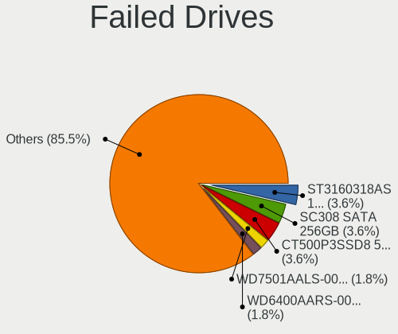
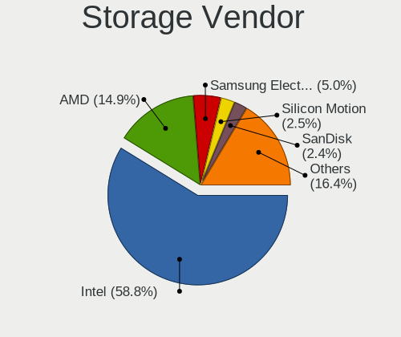
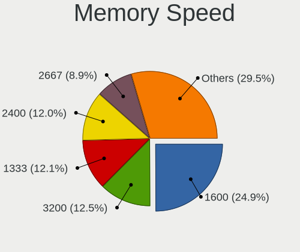

BSD - Tested Hardware & Statistics (Desktops)
---------------------------------------------

A project to collect tested hardware configurations for BSD.

Anyone can contribute to this report by the [hw-probe](https://github.com/linuxhw/hw-probe/blob/master/INSTALL.BSD.md) tool:

    hw-probe -all -upload

Please contribute! Especially if your hardware is rare.

This report is for real hardware. Report for virtual hardware: [TestCoverage_VE](https://github.com/bsdhw/TestCoverage_VE)

Contents
--------

* [ Test Cases ](#test-cases)

* [ System ](#system)
  - [ OS                       ](#os)
  - [ OS Family                ](#os-family)
  - [ Arch                     ](#arch)
  - [ DE                       ](#de)
  - [ Display Server           ](#display-server)
  - [ Display Manager          ](#display-manager)
  - [ OS Lang                  ](#os-lang)
  - [ Boot Mode                ](#boot-mode)
  - [ Filesystem               ](#filesystem)
  - [ Part. scheme             ](#part-scheme)

* [ Board ](#board)
  - [ Vendor                   ](#vendor)
  - [ Model                    ](#model)
  - [ Model Family             ](#model-family)
  - [ MFG Year                 ](#mfg-year)
  - [ Form Factor              ](#form-factor)
  - [ Coreboot                 ](#coreboot)
  - [ RAM Size                 ](#ram-size)
  - [ RAM Used                 ](#ram-used)
  - [ Total Drives             ](#total-drives)
  - [ Has CD-ROM               ](#has-cd-rom)
  - [ Has Ethernet             ](#has-ethernet)
  - [ Has WiFi                 ](#has-wifi)
  - [ Has Bluetooth            ](#has-bluetooth)

* [ Location ](#location)
  - [ Country                  ](#country)
  - [ City                     ](#city)

* [ Drives ](#drives)
  - [ Drive Vendor             ](#drive-vendor)
  - [ Drive Model              ](#drive-model)
  - [ HDD Vendor               ](#hdd-vendor)
  - [ SSD Vendor               ](#ssd-vendor)
  - [ Drive Kind               ](#drive-kind)
  - [ Drive Connector          ](#drive-connector)
  - [ Drive Size               ](#drive-size)
  - [ Space Total              ](#space-total)
  - [ Space Used               ](#space-used)
  - [ Malfunc. Drives          ](#malfunc-drives)
  - [ Malfunc. Drive Vendor    ](#malfunc-drive-vendor)
  - [ Malfunc. HDD Vendor      ](#malfunc-hdd-vendor)
  - [ Malfunc. Drive Kind      ](#malfunc-drive-kind)
  - [ Failed Drives            ](#failed-drives)
  - [ Failed Drive Vendor      ](#failed-drive-vendor)
  - [ Drive Status             ](#drive-status)

* [ Storage controller ](#storage-controller)
  - [ Storage Vendor           ](#storage-vendor)
  - [ Storage Model            ](#storage-model)
  - [ Storage Kind             ](#storage-kind)

* [ Processor ](#processor)
  - [ CPU Vendor               ](#cpu-vendor)
  - [ CPU Model                ](#cpu-model)
  - [ CPU Model Family         ](#cpu-model-family)
  - [ CPU Cores                ](#cpu-cores)
  - [ CPU Sockets              ](#cpu-sockets)
  - [ CPU Threads              ](#cpu-threads)
  - [ CPU Microarch            ](#cpu-microarch)

* [ Graphics ](#graphics)
  - [ GPU Vendor               ](#gpu-vendor)
  - [ GPU Model                ](#gpu-model)
  - [ GPU Combo                ](#gpu-combo)
  - [ GPU Driver               ](#gpu-driver)
  - [ GPU Memory               ](#gpu-memory)

* [ Monitor ](#monitor)
  - [ Monitor Vendor           ](#monitor-vendor)
  - [ Monitor Model            ](#monitor-model)
  - [ Monitor Resolution       ](#monitor-resolution)
  - [ Monitor Diagonal         ](#monitor-diagonal)
  - [ Monitor Width            ](#monitor-width)
  - [ Aspect Ratio             ](#aspect-ratio)
  - [ Monitor Area             ](#monitor-area)
  - [ Pixel Density            ](#pixel-density)
  - [ Multiple Monitors        ](#multiple-monitors)

* [ Network ](#network)
  - [ Net Controller Vendor    ](#net-controller-vendor)
  - [ Net Controller Model     ](#net-controller-model)
  - [ Wireless Vendor          ](#wireless-vendor)
  - [ Wireless Model           ](#wireless-model)
  - [ Ethernet Vendor          ](#ethernet-vendor)
  - [ Ethernet Model           ](#ethernet-model)
  - [ Net Controller Kind      ](#net-controller-kind)
  - [ Used Controller          ](#used-controller)
  - [ NICs                     ](#nics)
  - [ IPv6                     ](#ipv6)

* [ Bluetooth ](#bluetooth)
  - [ Bluetooth Vendor         ](#bluetooth-vendor)
  - [ Bluetooth Model          ](#bluetooth-model)

* [ Sound ](#sound)
  - [ Sound Vendor             ](#sound-vendor)
  - [ Sound Model              ](#sound-model)

* [ Memory ](#memory)
  - [ Memory Vendor            ](#memory-vendor)
  - [ Memory Model             ](#memory-model)
  - [ Memory Kind              ](#memory-kind)
  - [ Memory Form Factor       ](#memory-form-factor)
  - [ Memory Size              ](#memory-size)
  - [ Memory Speed             ](#memory-speed)

* [ Printers & scanners ](#printers--scanners)
  - [ Printer Vendor           ](#printer-vendor)
  - [ Printer Model            ](#printer-model)
  - [ Scanner Vendor           ](#scanner-vendor)
  - [ Scanner Model            ](#scanner-model)

* [ Camera ](#camera)
  - [ Camera Vendor            ](#camera-vendor)
  - [ Camera Model             ](#camera-model)

* [ Security ](#security)
  - [ Fingerprint Vendor       ](#fingerprint-vendor)
  - [ Fingerprint Model        ](#fingerprint-model)
  - [ Chipcard Vendor          ](#chipcard-vendor)
  - [ Chipcard Model           ](#chipcard-model)

* [ Unsupported ](#unsupported)
  - [ Unsupported Devices      ](#unsupported-devices)
  - [ Unsupported Device Types ](#unsupported-device-types)

Test Cases
----------

Total: 7379

| Vendor        | Model                       | Probe                                                     | Date         |
|---------------|-----------------------------|-----------------------------------------------------------|--------------|
| AAEON         | FWS-2350 V1.0               | [00cc54cbad](https://bsd-hardware.info/?probe=00cc54cbad) | Oct 01, 2022 |
| Unknown       | Unknown                     | [01566cd078](https://bsd-hardware.info/?probe=01566cd078) | Oct 01, 2022 |
| Protectli     | FW6 Ver                     | [23450789e4](https://bsd-hardware.info/?probe=23450789e4) | Oct 01, 2022 |
| Unknown       | Unknown                     | [bdabafdcb1](https://bsd-hardware.info/?probe=bdabafdcb1) | Oct 01, 2022 |
| AMI           | PICO PC                     | [ab45092607](https://bsd-hardware.info/?probe=ab45092607) | Oct 01, 2022 |
| Shuttle       | FH61V                       | [305f06cd6a](https://bsd-hardware.info/?probe=305f06cd6a) | Oct 01, 2022 |
| Unknown       | Unknown                     | [c4e771c07c](https://bsd-hardware.info/?probe=c4e771c07c) | Oct 01, 2022 |
| Dell          | 0WMJ54 A01                  | [53dfc5844c](https://bsd-hardware.info/?probe=53dfc5844c) | Oct 01, 2022 |
| BESSTAR Te... | IB9                         | [0cb7bacc88](https://bsd-hardware.info/?probe=0cb7bacc88) | Oct 01, 2022 |
| Protectli     | FW4B Ver                    | [05651f8664](https://bsd-hardware.info/?probe=05651f8664) | Oct 01, 2022 |
| Dell          | 0PC5F7 A00                  | [376550557f](https://bsd-hardware.info/?probe=376550557f) | Sep 30, 2022 |
| Cisco         | ASA5512 A0                  | [5b31d03140](https://bsd-hardware.info/?probe=5b31d03140) | Sep 30, 2022 |
| Jingsha       | x79-P3 by xUz               | [6853ba1191](https://bsd-hardware.info/?probe=6853ba1191) | Sep 30, 2022 |
| ASRockRack    | EPYC3101D4I-2T              | [8e658fe40f](https://bsd-hardware.info/?probe=8e658fe40f) | Sep 30, 2022 |
| Gigabyte      | X570 I AORUS PRO WIFI       | [16fa7d7ec0](https://bsd-hardware.info/?probe=16fa7d7ec0) | Sep 30, 2022 |
| ECS           | H61H2-MV                    | [77d9e53715](https://bsd-hardware.info/?probe=77d9e53715) | Sep 30, 2022 |
| Lenovo        | SHARKBAY NOK                | [c1c59c9d14](https://bsd-hardware.info/?probe=c1c59c9d14) | Sep 30, 2022 |
| Dell          | 0T10XW A01                  | [c2ff0bc0b9](https://bsd-hardware.info/?probe=c2ff0bc0b9) | Sep 30, 2022 |
| Dell          | 0WMJ54 A01                  | [30cb759583](https://bsd-hardware.info/?probe=30cb759583) | Sep 30, 2022 |
| Gigabyte      | H510M H                     | [8ad31cc470](https://bsd-hardware.info/?probe=8ad31cc470) | Sep 29, 2022 |
| Intel         | CARLOW                      | [25b6d62332](https://bsd-hardware.info/?probe=25b6d62332) | Sep 29, 2022 |
| BESSTAR Te... | IB9                         | [eb0e449150](https://bsd-hardware.info/?probe=eb0e449150) | Sep 29, 2022 |
| Gigabyte      | X570 AORUS MASTER           | [353008eb5e](https://bsd-hardware.info/?probe=353008eb5e) | Sep 29, 2022 |
| Biostar       | N68S3B                      | [24c8fcee9a](https://bsd-hardware.info/?probe=24c8fcee9a) | Sep 29, 2022 |
| ASRock        | A320M-HD                    | [6418fd0b23](https://bsd-hardware.info/?probe=6418fd0b23) | Sep 28, 2022 |
| ASRock        | B450M-HDV                   | [a3e25236fc](https://bsd-hardware.info/?probe=a3e25236fc) | Sep 28, 2022 |
| Unknown       | Unknown                     | [2926e2dc6f](https://bsd-hardware.info/?probe=2926e2dc6f) | Sep 28, 2022 |
| Biostar       | B450NH                      | [4beab225f6](https://bsd-hardware.info/?probe=4beab225f6) | Sep 28, 2022 |
| Unknown       | Unknown                     | [c3f8e853ef](https://bsd-hardware.info/?probe=c3f8e853ef) | Sep 28, 2022 |
| AMI           | MNHO-048                    | [2ec6e55a75](https://bsd-hardware.info/?probe=2ec6e55a75) | Sep 28, 2022 |
| Techvision    | TVI7309X B0                 | [441eb24fd2](https://bsd-hardware.info/?probe=441eb24fd2) | Sep 28, 2022 |
| ASUSTek       | M5A78L-M/USB3               | [3234a0b453](https://bsd-hardware.info/?probe=3234a0b453) | Sep 28, 2022 |
| ASRock        | Z97 Professional            | [8936497eed](https://bsd-hardware.info/?probe=8936497eed) | Sep 27, 2022 |
| Supermicro    | X11SDV-4C-TP8F              | [390f4301dd](https://bsd-hardware.info/?probe=390f4301dd) | Sep 27, 2022 |
| MSI           | A520M-A PRO                 | [7e75a1888b](https://bsd-hardware.info/?probe=7e75a1888b) | Sep 27, 2022 |
| Unknown       | Unknown                     | [16f6784862](https://bsd-hardware.info/?probe=16f6784862) | Sep 27, 2022 |
| Intel         | D34010WYK H14771-305        | [93e4627cc9](https://bsd-hardware.info/?probe=93e4627cc9) | Sep 27, 2022 |
| Fujitsu       | D3313-E1 S26361-D3313-E1    | [a605b4582c](https://bsd-hardware.info/?probe=a605b4582c) | Sep 27, 2022 |
| ASRockRack    | X470D4U                     | [27a82e5fc8](https://bsd-hardware.info/?probe=27a82e5fc8) | Sep 27, 2022 |
| ASUSTek       | PRIME Z490M-PLUS            | [3877787983](https://bsd-hardware.info/?probe=3877787983) | Sep 27, 2022 |
| ASRock        | X570M Pro4                  | [433857f5f7](https://bsd-hardware.info/?probe=433857f5f7) | Sep 27, 2022 |
| Protectli     | FW4B                        | [431bcb4425](https://bsd-hardware.info/?probe=431bcb4425) | Sep 27, 2022 |
| Intel         | DH87MC AAG74242-401         | [5e823b71da](https://bsd-hardware.info/?probe=5e823b71da) | Sep 27, 2022 |
| Supermicro    | X11SBA-LN4F                 | [4c7f997199](https://bsd-hardware.info/?probe=4c7f997199) | Sep 26, 2022 |
| Unknown       | Unknown                     | [3966e558bf](https://bsd-hardware.info/?probe=3966e558bf) | Sep 26, 2022 |
| Unknown       | Unknown                     | [69a8b9b8d9](https://bsd-hardware.info/?probe=69a8b9b8d9) | Sep 26, 2022 |
| Cisco         | ASA5515 A0                  | [7b1ba71a42](https://bsd-hardware.info/?probe=7b1ba71a42) | Sep 26, 2022 |
| ASRock        | B550M Phantom Gaming 4      | [cfcfd2a636](https://bsd-hardware.info/?probe=cfcfd2a636) | Sep 26, 2022 |
| Intel         | Q3XXG4-P V1.0               | [cde2481e46](https://bsd-hardware.info/?probe=cde2481e46) | Sep 26, 2022 |
| Dell          | 0T10XW A02                  | [b8db4655e5](https://bsd-hardware.info/?probe=b8db4655e5) | Sep 26, 2022 |
| Dell          | 05GD68 A00                  | [6c75d1609b](https://bsd-hardware.info/?probe=6c75d1609b) | Sep 26, 2022 |
| Dell          | 0KYJ8C A02                  | [12493c3802](https://bsd-hardware.info/?probe=12493c3802) | Sep 26, 2022 |
| ASRock        | 990FX Extreme3              | [68d99cffe1](https://bsd-hardware.info/?probe=68d99cffe1) | Sep 26, 2022 |
| Techvision    | TVI7309X B0                 | [33b252016c](https://bsd-hardware.info/?probe=33b252016c) | Sep 26, 2022 |
| Dell          | 0TDG4V A00                  | [cc92be7e52](https://bsd-hardware.info/?probe=cc92be7e52) | Sep 25, 2022 |
| PC Engines    | APU2                        | [3fcc5e5ae2](https://bsd-hardware.info/?probe=3fcc5e5ae2) | Sep 25, 2022 |
| Techvision    | TVI7309X B0                 | [ae535b0b49](https://bsd-hardware.info/?probe=ae535b0b49) | Sep 25, 2022 |
| ASRock        | B550M Phantom Gaming 4      | [83607fc711](https://bsd-hardware.info/?probe=83607fc711) | Sep 25, 2022 |
| HP            | ProLiant MicroServer Gen... | [8f4900d0e6](https://bsd-hardware.info/?probe=8f4900d0e6) | Sep 25, 2022 |
| CncTion       | Jasper-4L B0                | [2998faa879](https://bsd-hardware.info/?probe=2998faa879) | Sep 25, 2022 |
| Pegatron      | H81-X1                      | [a27c76c490](https://bsd-hardware.info/?probe=a27c76c490) | Sep 25, 2022 |
| Supermicro    | X9SCL/X9SCMA                | [fe44242c3b](https://bsd-hardware.info/?probe=fe44242c3b) | Sep 25, 2022 |
| Supermicro    | X7DB8                       | [6ebc173873](https://bsd-hardware.info/?probe=6ebc173873) | Sep 25, 2022 |
| Deciso        | Netboard A10 V2.1           | [8bbf714f6d](https://bsd-hardware.info/?probe=8bbf714f6d) | Sep 25, 2022 |
| Deciso        | Netboard A10 V2.1           | [60d4585ece](https://bsd-hardware.info/?probe=60d4585ece) | Sep 25, 2022 |
| IceWhale T... | ZimaBoard 832 ZMB           | [6e2d053e1c](https://bsd-hardware.info/?probe=6e2d053e1c) | Sep 25, 2022 |
| MSI           | H81M-P33                    | [c61ef8d251](https://bsd-hardware.info/?probe=c61ef8d251) | Sep 25, 2022 |
| ASUSTek       | P5Q-E                       | [dad8b0a635](https://bsd-hardware.info/?probe=dad8b0a635) | Sep 25, 2022 |
| ASUSTek       | ROG CROSSHAIR VIII HERO     | [2d56ff12a1](https://bsd-hardware.info/?probe=2d56ff12a1) | Sep 25, 2022 |
| iEi           | SAE1 V1.04                  | [cc006e5c32](https://bsd-hardware.info/?probe=cc006e5c32) | Sep 25, 2022 |
| HP            | 3397                        | [8b019e6a96](https://bsd-hardware.info/?probe=8b019e6a96) | Sep 25, 2022 |
| ASRock        | 990FX Extreme3              | [c81d389fd2](https://bsd-hardware.info/?probe=c81d389fd2) | Sep 25, 2022 |
| Unknown       | Unknown                     | [9f998deaa4](https://bsd-hardware.info/?probe=9f998deaa4) | Sep 25, 2022 |
| Biostar       | N68S3B                      | [59bd37df63](https://bsd-hardware.info/?probe=59bd37df63) | Sep 25, 2022 |
| HP            | 8592                        | [898ce46c1f](https://bsd-hardware.info/?probe=898ce46c1f) | Sep 25, 2022 |
| HP            | ProLiant MicroServer Gen... | [59886931c5](https://bsd-hardware.info/?probe=59886931c5) | Sep 24, 2022 |
| MSI           | A88XM-E45                   | [d9d06daa51](https://bsd-hardware.info/?probe=d9d06daa51) | Sep 24, 2022 |
| MSI           | Z490-A PRO                  | [dbda136daa](https://bsd-hardware.info/?probe=dbda136daa) | Sep 24, 2022 |
| ASUSTek       | All Series                  | [ab3b339cf0](https://bsd-hardware.info/?probe=ab3b339cf0) | Sep 24, 2022 |
| HP            | 18E7                        | [02ac7695d7](https://bsd-hardware.info/?probe=02ac7695d7) | Sep 24, 2022 |
| Fujitsu       | D3313-A1 S26361-D3313-A1    | [fb436c3cc3](https://bsd-hardware.info/?probe=fb436c3cc3) | Sep 24, 2022 |
| Gigabyte      | X570 I AORUS PRO WIFI       | [8ed018c141](https://bsd-hardware.info/?probe=8ed018c141) | Sep 24, 2022 |
| ASUSTek       | Rampage II Extreme          | [eccb37382c](https://bsd-hardware.info/?probe=eccb37382c) | Sep 24, 2022 |
| YANYU         | H67SL                       | [5f5819ef11](https://bsd-hardware.info/?probe=5f5819ef11) | Sep 24, 2022 |
| Unknown       | Unknown                     | [8f42ff0969](https://bsd-hardware.info/?probe=8f42ff0969) | Sep 24, 2022 |
| Unknown       | Unknown                     | [95b1404339](https://bsd-hardware.info/?probe=95b1404339) | Sep 23, 2022 |
| TYAN Compu... | S5530WG2NR-LE-AKA           | [18c4588a0e](https://bsd-hardware.info/?probe=18c4588a0e) | Sep 23, 2022 |
| ASUSTek       | M5A78L-M/USB3               | [a0672c6af1](https://bsd-hardware.info/?probe=a0672c6af1) | Sep 23, 2022 |
| Unknown       | Unknown                     | [ffa40a08e8](https://bsd-hardware.info/?probe=ffa40a08e8) | Sep 23, 2022 |
| NITRINOnet    | M360RUS56                   | [490b9593e0](https://bsd-hardware.info/?probe=490b9593e0) | Sep 23, 2022 |
| Intel         | Q3XXG4-P V1.0               | [5029142d61](https://bsd-hardware.info/?probe=5029142d61) | Sep 22, 2022 |
| Dell          | 042P49 A01                  | [13f6367ce8](https://bsd-hardware.info/?probe=13f6367ce8) | Sep 22, 2022 |
| Unknown       | Unknown                     | [b7bfcbef72](https://bsd-hardware.info/?probe=b7bfcbef72) | Sep 22, 2022 |
| ASRock        | X570 Phantom Gaming 4       | [1a89d78fa4](https://bsd-hardware.info/?probe=1a89d78fa4) | Sep 22, 2022 |
| Protectli     | FW4B Ver                    | [036004bbfe](https://bsd-hardware.info/?probe=036004bbfe) | Sep 22, 2022 |
| MSI           | MS-B1831                    | [2c9a20d879](https://bsd-hardware.info/?probe=2c9a20d879) | Sep 22, 2022 |
| Unknown       | Unknown                     | [58b6d3d116](https://bsd-hardware.info/?probe=58b6d3d116) | Sep 21, 2022 |
| PC Engines    | APU                         | [a65b17ba04](https://bsd-hardware.info/?probe=a65b17ba04) | Sep 21, 2022 |
| HP            | 21D0                        | [43fa46655e](https://bsd-hardware.info/?probe=43fa46655e) | Sep 21, 2022 |
| Unknown       | Unknown                     | [199ad16750](https://bsd-hardware.info/?probe=199ad16750) | Sep 21, 2022 |
| ASUSTek       | PRIME H310M-K R2.0          | [51a78cc037](https://bsd-hardware.info/?probe=51a78cc037) | Sep 21, 2022 |
| Acer          | MCP73VE NVIDIA MCP73        | [6c169bdb6a](https://bsd-hardware.info/?probe=6c169bdb6a) | Sep 20, 2022 |
| MSI           | MS-B1831                    | [42f48d632c](https://bsd-hardware.info/?probe=42f48d632c) | Sep 20, 2022 |
| MW            | GMLK-2_5G4L                 | [37cafd59eb](https://bsd-hardware.info/?probe=37cafd59eb) | Sep 20, 2022 |
| Dell          | 02YRK5 A03                  | [2ec32e432d](https://bsd-hardware.info/?probe=2ec32e432d) | Sep 20, 2022 |
| ASUSTek       | PRIME H310M-K R2.0          | [ca3b8f6b48](https://bsd-hardware.info/?probe=ca3b8f6b48) | Sep 20, 2022 |
| Fujitsu       | D3313-E1 S26361-D3313-E1    | [3c74fc1690](https://bsd-hardware.info/?probe=3c74fc1690) | Sep 20, 2022 |
| Unknown       | Unknown                     | [8e55c8e637](https://bsd-hardware.info/?probe=8e55c8e637) | Sep 20, 2022 |
| HP            | 1495                        | [163ac0a58b](https://bsd-hardware.info/?probe=163ac0a58b) | Sep 20, 2022 |
| Gigabyte      | Z590I AORUS ULTRA           | [c057b7ab09](https://bsd-hardware.info/?probe=c057b7ab09) | Sep 20, 2022 |
| ShenZhen M... | MW-GMLK-2.5G6L              | [a1a2cbc6c9](https://bsd-hardware.info/?probe=a1a2cbc6c9) | Sep 20, 2022 |
| Supermicro    | X9SCL/X9SCMA                | [16479f1a2c](https://bsd-hardware.info/?probe=16479f1a2c) | Sep 20, 2022 |
| Unknown       | Unknown                     | [1ceba97eb9](https://bsd-hardware.info/?probe=1ceba97eb9) | Sep 20, 2022 |
| Intel         | SHARKBAY                    | [afbedcb189](https://bsd-hardware.info/?probe=afbedcb189) | Sep 20, 2022 |
| HP            | 21D0                        | [463e2563d7](https://bsd-hardware.info/?probe=463e2563d7) | Sep 19, 2022 |
| Supermicro    | X9SCI/X9SCA                 | [1270203d0b](https://bsd-hardware.info/?probe=1270203d0b) | Sep 19, 2022 |
| Lenovo        | 32E1 SDK0J40697 WIN 3305... | [b394504429](https://bsd-hardware.info/?probe=b394504429) | Sep 19, 2022 |
| Foxconn       | G31MXP FAB:1.1              | [9d291758ef](https://bsd-hardware.info/?probe=9d291758ef) | Sep 19, 2022 |
| Supermicro    | A2SDi-8C-HLN4F              | [393da0c00c](https://bsd-hardware.info/?probe=393da0c00c) | Sep 19, 2022 |
| MSI           | MS-B1831                    | [28757a34d3](https://bsd-hardware.info/?probe=28757a34d3) | Sep 19, 2022 |
| HP            | ProLiant ML350p Gen8        | [1a9c6a10bd](https://bsd-hardware.info/?probe=1a9c6a10bd) | Sep 19, 2022 |
| HP            | 0B54h D                     | [a24f08281d](https://bsd-hardware.info/?probe=a24f08281d) | Sep 19, 2022 |
| Lenovo        | 32E1 SDK0J40697 WIN 3305... | [d1c81ef222](https://bsd-hardware.info/?probe=d1c81ef222) | Sep 19, 2022 |
| Gigabyte      | H61M-DS2V                   | [55f8e635b8](https://bsd-hardware.info/?probe=55f8e635b8) | Sep 19, 2022 |
| Dell          | 01TJ2K A02                  | [b34cf533f3](https://bsd-hardware.info/?probe=b34cf533f3) | Sep 19, 2022 |
| ASUSTek       | PRIME X570-P                | [a2f56848a9](https://bsd-hardware.info/?probe=a2f56848a9) | Sep 19, 2022 |
| ASUSTek       | PRIME X570-P                | [893743c3ad](https://bsd-hardware.info/?probe=893743c3ad) | Sep 19, 2022 |
| Lenovo        | ThinkStation D10 6493WEU    | [526e5eea0b](https://bsd-hardware.info/?probe=526e5eea0b) | Sep 18, 2022 |
| Supermicro    | A2SDi-TP8F                  | [db2194c9b9](https://bsd-hardware.info/?probe=db2194c9b9) | Sep 18, 2022 |
| ASUSTek       | M5A78L-M/USB3               | [cad2b5fd02](https://bsd-hardware.info/?probe=cad2b5fd02) | Sep 18, 2022 |
| Gigabyte      | H81M-S1                     | [fe9eecb935](https://bsd-hardware.info/?probe=fe9eecb935) | Sep 18, 2022 |
| Intel         | D34010WYK H14771-305        | [e734b98922](https://bsd-hardware.info/?probe=e734b98922) | Sep 18, 2022 |
| MSI           | MS-B1831                    | [94a3d6891a](https://bsd-hardware.info/?probe=94a3d6891a) | Sep 18, 2022 |
| ECS           | H61H2-MV                    | [d2945c003e](https://bsd-hardware.info/?probe=d2945c003e) | Sep 18, 2022 |
| MSI           | H81M-P33                    | [3e0c285177](https://bsd-hardware.info/?probe=3e0c285177) | Sep 18, 2022 |
| ASUSTek       | P5Q-E                       | [ba1487a053](https://bsd-hardware.info/?probe=ba1487a053) | Sep 18, 2022 |
| ASUSTek       | ROG CROSSHAIR VIII HERO     | [6dadd3f723](https://bsd-hardware.info/?probe=6dadd3f723) | Sep 18, 2022 |
| HP            | 213D A01                    | [6e8a38b6ca](https://bsd-hardware.info/?probe=6e8a38b6ca) | Sep 18, 2022 |
| BESSTAR Te... | TH50                        | [d027a503a5](https://bsd-hardware.info/?probe=d027a503a5) | Sep 18, 2022 |
| EAGLE EYE ... | BayTrail-D Rev.00           | [261f623516](https://bsd-hardware.info/?probe=261f623516) | Sep 18, 2022 |
| CONTEC        | G1/EMB-CV1/iD2550           | [266ef0ca6a](https://bsd-hardware.info/?probe=266ef0ca6a) | Sep 18, 2022 |
| HP            | 18E7                        | [e999bdd87e](https://bsd-hardware.info/?probe=e999bdd87e) | Sep 17, 2022 |
| Unknown       | Unknown                     | [050c365fcd](https://bsd-hardware.info/?probe=050c365fcd) | Sep 17, 2022 |
| Intel         | D53427RKE G87971-403        | [aa00c60448](https://bsd-hardware.info/?probe=aa00c60448) | Sep 17, 2022 |
| Unknown       | Unknown                     | [af8f180c2c](https://bsd-hardware.info/?probe=af8f180c2c) | Sep 17, 2022 |
| Gigabyte      | X570 I AORUS PRO WIFI       | [a9da12dec0](https://bsd-hardware.info/?probe=a9da12dec0) | Sep 17, 2022 |
| CncTion       | N5105-4L B0                 | [22f23ccfa5](https://bsd-hardware.info/?probe=22f23ccfa5) | Sep 17, 2022 |
| Gigabyte      | H410M S2 V2                 | [8de53ac515](https://bsd-hardware.info/?probe=8de53ac515) | Sep 17, 2022 |
| Deciso        | Netboard A10 GEN2 Model ... | [e0b8ceecae](https://bsd-hardware.info/?probe=e0b8ceecae) | Sep 16, 2022 |
| ASUSTek       | PRIME X570-P                | [9fc1f66fcc](https://bsd-hardware.info/?probe=9fc1f66fcc) | Sep 16, 2022 |
| Fujitsu       | D3544-A1 S26361-D3544-A1... | [eb09d789de](https://bsd-hardware.info/?probe=eb09d789de) | Sep 16, 2022 |
| Unknown       | Unknown                     | [050dee62c1](https://bsd-hardware.info/?probe=050dee62c1) | Sep 16, 2022 |
| Intel BOXJ... | Unknown                     | [c28fe204f3](https://bsd-hardware.info/?probe=c28fe204f3) | Sep 16, 2022 |
| Intel BOXJ... | Unknown                     | [a900f3bc8b](https://bsd-hardware.info/?probe=a900f3bc8b) | Sep 16, 2022 |
| Unknown       | Unknown                     | [3b66741f97](https://bsd-hardware.info/?probe=3b66741f97) | Sep 16, 2022 |
| Unknown       | Unknown                     | [83e48aa232](https://bsd-hardware.info/?probe=83e48aa232) | Sep 16, 2022 |
| ASUSTek       | M5A88-M                     | [09b5ca588f](https://bsd-hardware.info/?probe=09b5ca588f) | Sep 16, 2022 |
| Supermicro    | A2SDi-TP8F                  | [8c67aa0f6e](https://bsd-hardware.info/?probe=8c67aa0f6e) | Sep 15, 2022 |
| Techvision    | TVI7309X B0                 | [505feb51ca](https://bsd-hardware.info/?probe=505feb51ca) | Sep 15, 2022 |
| Gigabyte      | Z370P D3-CF                 | [10f0cfa344](https://bsd-hardware.info/?probe=10f0cfa344) | Sep 15, 2022 |
| Unknown       | Unknown                     | [7df7bc66e7](https://bsd-hardware.info/?probe=7df7bc66e7) | Sep 15, 2022 |
| Intel         | ChiefRiver                  | [5361453e6a](https://bsd-hardware.info/?probe=5361453e6a) | Sep 15, 2022 |
| Gigabyte      | H270-HD3-CF                 | [0157925fad](https://bsd-hardware.info/?probe=0157925fad) | Sep 15, 2022 |
| Dell          | 0R230R A00                  | [ad70ccea4d](https://bsd-hardware.info/?probe=ad70ccea4d) | Sep 15, 2022 |
| YANYU         | H67SL                       | [37ba00c2f3](https://bsd-hardware.info/?probe=37ba00c2f3) | Sep 15, 2022 |
| Intel         | DENLOW_WS                   | [7ec0e7257d](https://bsd-hardware.info/?probe=7ec0e7257d) | Sep 14, 2022 |
| AZW           | Green G1                    | [1ccd8f86b3](https://bsd-hardware.info/?probe=1ccd8f86b3) | Sep 14, 2022 |
| Protectli     | FW6                         | [23227c99a0](https://bsd-hardware.info/?probe=23227c99a0) | Sep 14, 2022 |
| ASUSTek       | PRIME X570-P                | [32d8dbc6b6](https://bsd-hardware.info/?probe=32d8dbc6b6) | Sep 14, 2022 |
| Intel         | Q3XXG4-P V1.0               | [13ec5a6f20](https://bsd-hardware.info/?probe=13ec5a6f20) | Sep 14, 2022 |
| Intel         | Q3XXG4-P V1.0               | [7aa564bfb2](https://bsd-hardware.info/?probe=7aa564bfb2) | Sep 14, 2022 |
| ASUSTek       | H61M-K                      | [0ee299e989](https://bsd-hardware.info/?probe=0ee299e989) | Sep 14, 2022 |
| Dell          | 0FDY5C A00                  | [cce6101086](https://bsd-hardware.info/?probe=cce6101086) | Sep 14, 2022 |
| Protectli     | FW4B Ver                    | [58caab8946](https://bsd-hardware.info/?probe=58caab8946) | Sep 14, 2022 |
| ASUSTek       | Rampage II Extreme          | [924dc8e7e1](https://bsd-hardware.info/?probe=924dc8e7e1) | Sep 14, 2022 |
| MSI           | PRESTIGE X570 CREATION      | [2b4cf189e9](https://bsd-hardware.info/?probe=2b4cf189e9) | Sep 14, 2022 |
| Techvision    | TVI7309X B0                 | [a444259756](https://bsd-hardware.info/?probe=a444259756) | Sep 14, 2022 |
| Lenovo        | SHARKBAY 0B98401 WIN        | [dc557f4385](https://bsd-hardware.info/?probe=dc557f4385) | Sep 14, 2022 |
| Unknown       | Unknown                     | [992ddc4118](https://bsd-hardware.info/?probe=992ddc4118) | Sep 14, 2022 |
| maiyunda      | www.maiyunda.com            | [cbc4aeb7be](https://bsd-hardware.info/?probe=cbc4aeb7be) | Sep 13, 2022 |
| Intel         | Q3XXG4-P V1.0               | [e8848edf41](https://bsd-hardware.info/?probe=e8848edf41) | Sep 13, 2022 |
| Apple         | Mac-7BA5B2D9E42DDD94        | [d2e169b8ad](https://bsd-hardware.info/?probe=d2e169b8ad) | Sep 13, 2022 |
| Intel         | D945GCLF2 AAE46416-106      | [8e2f7792eb](https://bsd-hardware.info/?probe=8e2f7792eb) | Sep 13, 2022 |
| ASUSTek       | PRIME X370-PRO              | [f023ae7ed2](https://bsd-hardware.info/?probe=f023ae7ed2) | Sep 13, 2022 |
| ASRock        | Q1900B-ITX                  | [81722a937a](https://bsd-hardware.info/?probe=81722a937a) | Sep 13, 2022 |
| PC Engines    | APU2                        | [95ae240b55](https://bsd-hardware.info/?probe=95ae240b55) | Sep 13, 2022 |
| ASRock        | X570 Phantom Gaming 4       | [baaf9cbda6](https://bsd-hardware.info/?probe=baaf9cbda6) | Sep 13, 2022 |
| Protectli     | FW4B                        | [0553a226de](https://bsd-hardware.info/?probe=0553a226de) | Sep 13, 2022 |
| Dell          | 0KYJ8C A02                  | [fb950378c9](https://bsd-hardware.info/?probe=fb950378c9) | Sep 13, 2022 |
| Dell          | 07WP95 A01                  | [98e67ff164](https://bsd-hardware.info/?probe=98e67ff164) | Sep 12, 2022 |
| Yanling       | YL-KBR6L Ver:1.00           | [05b5d1e01a](https://bsd-hardware.info/?probe=05b5d1e01a) | Sep 12, 2022 |
| HP            | 18E7                        | [f09635a7ee](https://bsd-hardware.info/?probe=f09635a7ee) | Sep 12, 2022 |
| Fujitsu       | D3313-G1 S26361-D3313-G1    | [2b4e2212dc](https://bsd-hardware.info/?probe=2b4e2212dc) | Sep 12, 2022 |
| HP            | 213D A01                    | [6354ddb4a8](https://bsd-hardware.info/?probe=6354ddb4a8) | Sep 12, 2022 |
| HP            | 8648                        | [e7e610794c](https://bsd-hardware.info/?probe=e7e610794c) | Sep 12, 2022 |
| Dell          | 0KYJ8C A02                  | [bb784470e7](https://bsd-hardware.info/?probe=bb784470e7) | Sep 12, 2022 |
| Protectli     | FW4B                        | [0ccd9a9f2c](https://bsd-hardware.info/?probe=0ccd9a9f2c) | Sep 12, 2022 |
| HP            | 8054                        | [3385f78f9c](https://bsd-hardware.info/?probe=3385f78f9c) | Sep 12, 2022 |
| BESSTAR Te... | TH50                        | [71e53af7f9](https://bsd-hardware.info/?probe=71e53af7f9) | Sep 12, 2022 |
| Dell EMC      | VEP1425-V210-CPU A00        | [871a29677b](https://bsd-hardware.info/?probe=871a29677b) | Sep 12, 2022 |
| BESSTAR Te... | TH50                        | [898d5889a2](https://bsd-hardware.info/?probe=898d5889a2) | Sep 12, 2022 |
| MSI           | H81M-E33                    | [b80a45410b](https://bsd-hardware.info/?probe=b80a45410b) | Sep 12, 2022 |
| HP            | 213D A01                    | [54288c6759](https://bsd-hardware.info/?probe=54288c6759) | Sep 11, 2022 |
| Intel         | S1200KP AAG34877-201        | [db5bbdec3c](https://bsd-hardware.info/?probe=db5bbdec3c) | Sep 11, 2022 |
| ASUSTek       | PRIME X570-P                | [8a2d9be9de](https://bsd-hardware.info/?probe=8a2d9be9de) | Sep 11, 2022 |
| Supermicro    | M11SDV-8C-LN4FA             | [21e7190ff2](https://bsd-hardware.info/?probe=21e7190ff2) | Sep 11, 2022 |
| Unknown       | Unknown                     | [37588a8565](https://bsd-hardware.info/?probe=37588a8565) | Sep 11, 2022 |
| Unknown       | Unknown                     | [700e6ba6a9](https://bsd-hardware.info/?probe=700e6ba6a9) | Sep 11, 2022 |
| MSI           | H81M-E33                    | [66d179c5f4](https://bsd-hardware.info/?probe=66d179c5f4) | Sep 11, 2022 |
| ASUSTek       | P5Q-E                       | [1cbbe33027](https://bsd-hardware.info/?probe=1cbbe33027) | Sep 11, 2022 |
| MSI           | H81M-P33                    | [3b668ace72](https://bsd-hardware.info/?probe=3b668ace72) | Sep 11, 2022 |
| ASUSTek       | ROG CROSSHAIR VIII HERO     | [62c287a993](https://bsd-hardware.info/?probe=62c287a993) | Sep 11, 2022 |
| ASUSTek       | M5A97 PLUS                  | [3c152ae7bd](https://bsd-hardware.info/?probe=3c152ae7bd) | Sep 11, 2022 |
| Dell          | 0NW6H5 A00                  | [ce6906d604](https://bsd-hardware.info/?probe=ce6906d604) | Sep 10, 2022 |
| MSI           | A88XM-E45                   | [2df6d013e9](https://bsd-hardware.info/?probe=2df6d013e9) | Sep 10, 2022 |
| Fujitsu       | D3313-A1 S26361-D3313-A1    | [b2dc861f47](https://bsd-hardware.info/?probe=b2dc861f47) | Sep 10, 2022 |
| ASUSTek       | TUF B450M-PRO GAMING        | [7c9c1db9d7](https://bsd-hardware.info/?probe=7c9c1db9d7) | Sep 10, 2022 |
| AOpen         | iBTMx-DS R1.03 55DED10A0... | [50ac5c0aaf](https://bsd-hardware.info/?probe=50ac5c0aaf) | Sep 10, 2022 |
| Supermicro    | M11SDV-8C-LN4FA             | [89b185547b](https://bsd-hardware.info/?probe=89b185547b) | Sep 10, 2022 |
| Maxtang       | BYT30                       | [90053990c3](https://bsd-hardware.info/?probe=90053990c3) | Sep 10, 2022 |
| Fujitsu       | D3313-G1 S26361-D3313-G1    | [836927cf63](https://bsd-hardware.info/?probe=836927cf63) | Sep 10, 2022 |
| Fujitsu       | D3313-A1 S26361-D3313-A1    | [b54e6663f9](https://bsd-hardware.info/?probe=b54e6663f9) | Sep 10, 2022 |
| Dell          | 0KYJ8C A02                  | [7e8d44c688](https://bsd-hardware.info/?probe=7e8d44c688) | Sep 10, 2022 |
| CONTEC        | G1/EMB-CV1/iD2550           | [0df35f9c64](https://bsd-hardware.info/?probe=0df35f9c64) | Sep 10, 2022 |
| ASUSTek       | PRIME X570-P                | [8eb8bf52d4](https://bsd-hardware.info/?probe=8eb8bf52d4) | Sep 10, 2022 |
| Intel         | DH87MC AAG74242-401         | [6b449e63d3](https://bsd-hardware.info/?probe=6b449e63d3) | Sep 10, 2022 |
| ASRock        | H81M-DGS                    | [3c2b784001](https://bsd-hardware.info/?probe=3c2b784001) | Sep 09, 2022 |
| ASRock        | H81M-DGS                    | [581219cbc5](https://bsd-hardware.info/?probe=581219cbc5) | Sep 09, 2022 |
| Gigabyte      | B450M DS3H V2               | [b1a126ce25](https://bsd-hardware.info/?probe=b1a126ce25) | Sep 09, 2022 |
| EAGLE EYE ... | BayTrail-D Rev.00           | [3137cdbf7c](https://bsd-hardware.info/?probe=3137cdbf7c) | Sep 09, 2022 |
| ASRockRack    | X470D4U2/1N1                | [f91afdb2f3](https://bsd-hardware.info/?probe=f91afdb2f3) | Sep 09, 2022 |
| AZW           | Green G1                    | [b9e82f5157](https://bsd-hardware.info/?probe=b9e82f5157) | Sep 09, 2022 |
| EAGLE EYE ... | BayTrail-D Rev.00           | [1e62e2ea85](https://bsd-hardware.info/?probe=1e62e2ea85) | Sep 09, 2022 |
| Unknown       | Unknown                     | [1cd83a6904](https://bsd-hardware.info/?probe=1cd83a6904) | Sep 09, 2022 |
| MSI           | MPG Z490 GAMING EDGE WIF... | [98dff45d54](https://bsd-hardware.info/?probe=98dff45d54) | Sep 09, 2022 |
| maiyunda      | www.maiyunda.com            | [8776541164](https://bsd-hardware.info/?probe=8776541164) | Sep 09, 2022 |
| Techvision    | TVI7309X B0                 | [4e393e3814](https://bsd-hardware.info/?probe=4e393e3814) | Sep 08, 2022 |
| Deciso        | Netboard A10 GEN2 Model ... | [e082eca671](https://bsd-hardware.info/?probe=e082eca671) | Sep 08, 2022 |
| EPSON DIRE... | ST170E                      | [1ac571538d](https://bsd-hardware.info/?probe=1ac571538d) | Sep 08, 2022 |
| Unknown       | YL-J3060L2                  | [2210876ea3](https://bsd-hardware.info/?probe=2210876ea3) | Sep 08, 2022 |
| ASRockRack    | X470D4U2/1N1                | [b0965df7e1](https://bsd-hardware.info/?probe=b0965df7e1) | Sep 08, 2022 |
| Unknown       | J3160-4L                    | [4db37ff154](https://bsd-hardware.info/?probe=4db37ff154) | Sep 07, 2022 |
| Techvision    | TVI7309X B0                 | [1d81b77310](https://bsd-hardware.info/?probe=1d81b77310) | Sep 07, 2022 |
| Deciso        | Netboard A10 V2.1           | [6c88b88822](https://bsd-hardware.info/?probe=6c88b88822) | Sep 07, 2022 |
| Intel         | SYS-2USM03-6M01E            | [d4f98f18b9](https://bsd-hardware.info/?probe=d4f98f18b9) | Sep 07, 2022 |
| Protectli     | FW4B                        | [b934171c54](https://bsd-hardware.info/?probe=b934171c54) | Sep 07, 2022 |
| Techvision    | TVI7309X B0                 | [3c3c40a10f](https://bsd-hardware.info/?probe=3c3c40a10f) | Sep 07, 2022 |
| Protectli     | VP2410 10                   | [f431032a32](https://bsd-hardware.info/?probe=f431032a32) | Sep 07, 2022 |
| Techvision    | TVI7309X B0                 | [b803a767af](https://bsd-hardware.info/?probe=b803a767af) | Sep 06, 2022 |
| Pegatron      | IPM41-D3                    | [2d3a5a5260](https://bsd-hardware.info/?probe=2d3a5a5260) | Sep 06, 2022 |
| Intel         | J1900                       | [a95dd12c65](https://bsd-hardware.info/?probe=a95dd12c65) | Sep 06, 2022 |
| HP            | 1495                        | [4ba1b5820e](https://bsd-hardware.info/?probe=4ba1b5820e) | Sep 06, 2022 |
| Dell          | 0200DY A02                  | [cd90f548c8](https://bsd-hardware.info/?probe=cd90f548c8) | Sep 06, 2022 |
| ASRock        | 4X4-4000 Series             | [00ee0319aa](https://bsd-hardware.info/?probe=00ee0319aa) | Sep 06, 2022 |
| Intel         | MAHOBAY                     | [a854e50942](https://bsd-hardware.info/?probe=a854e50942) | Sep 06, 2022 |
| Unknown       | J3160-4L                    | [817b37c259](https://bsd-hardware.info/?probe=817b37c259) | Sep 06, 2022 |
| HP            | 1496                        | [7cd97bd330](https://bsd-hardware.info/?probe=7cd97bd330) | Sep 05, 2022 |
| ASUSTek       | Rampage II Extreme          | [975b49af4a](https://bsd-hardware.info/?probe=975b49af4a) | Sep 05, 2022 |
| Unknown       | Unknown                     | [865dca4859](https://bsd-hardware.info/?probe=865dca4859) | Sep 05, 2022 |
| Gigabyte      | H61M-DS2 x.x                | [3f5ad2f043](https://bsd-hardware.info/?probe=3f5ad2f043) | Sep 05, 2022 |
| Dell          | 0Y7WYT A00                  | [2870b9e4c7](https://bsd-hardware.info/?probe=2870b9e4c7) | Sep 05, 2022 |
| PC Engines    | APU2                        | [1650d8c419](https://bsd-hardware.info/?probe=1650d8c419) | Sep 05, 2022 |
| PC Engines    | APU2                        | [d9216cb730](https://bsd-hardware.info/?probe=d9216cb730) | Sep 05, 2022 |
| ASUSTek       | Rampage II Extreme          | [5a49c5aa98](https://bsd-hardware.info/?probe=5a49c5aa98) | Sep 05, 2022 |
| Protectli     | FW4B Ver                    | [91664c3bc1](https://bsd-hardware.info/?probe=91664c3bc1) | Sep 05, 2022 |
| CncTion       | N5105-4L                    | [2a34dc3fe0](https://bsd-hardware.info/?probe=2a34dc3fe0) | Sep 05, 2022 |
| BESSTAR Te... | TH50                        | [734a8e61c4](https://bsd-hardware.info/?probe=734a8e61c4) | Sep 05, 2022 |
| HP            | 8719                        | [f3132fc160](https://bsd-hardware.info/?probe=f3132fc160) | Sep 05, 2022 |
| Supermicro    | X10SLH-N6-ST031             | [34bc2f5c5b](https://bsd-hardware.info/?probe=34bc2f5c5b) | Sep 04, 2022 |
| Unknown       | Unknown                     | [c1967c7cf8](https://bsd-hardware.info/?probe=c1967c7cf8) | Sep 04, 2022 |
| Gigabyte      | GA-890FXA-UD5               | [3ee914e3a0](https://bsd-hardware.info/?probe=3ee914e3a0) | Sep 04, 2022 |
| ASUSTek       | Rampage II Extreme          | [1d6d1d67ee](https://bsd-hardware.info/?probe=1d6d1d67ee) | Sep 04, 2022 |
| MSI           | H81M-P33                    | [3f7258c807](https://bsd-hardware.info/?probe=3f7258c807) | Sep 04, 2022 |
| ASUSTek       | P5Q-E                       | [cced3168c8](https://bsd-hardware.info/?probe=cced3168c8) | Sep 04, 2022 |
| ASUSTek       | ROG CROSSHAIR VIII HERO     | [61b82d5ebb](https://bsd-hardware.info/?probe=61b82d5ebb) | Sep 04, 2022 |
| Protectli     | FW4B Ver                    | [a769499d94](https://bsd-hardware.info/?probe=a769499d94) | Sep 04, 2022 |
| MSI           | A68HM-E33 V2                | [0f35d398cb](https://bsd-hardware.info/?probe=0f35d398cb) | Sep 04, 2022 |
| Lenovo        | SHARKBAY 0B98401 WIN        | [860518eb18](https://bsd-hardware.info/?probe=860518eb18) | Sep 04, 2022 |
| Protectli     | FW4B                        | [86a4422a0f](https://bsd-hardware.info/?probe=86a4422a0f) | Sep 04, 2022 |
| Supermicro    | M11SDV-8C-LN4FA             | [b53e1d28cd](https://bsd-hardware.info/?probe=b53e1d28cd) | Sep 04, 2022 |
| Unknown       | Unknown                     | [4034fae93d](https://bsd-hardware.info/?probe=4034fae93d) | Sep 04, 2022 |
| AMD           | Inagua CRB                  | [de18cc5073](https://bsd-hardware.info/?probe=de18cc5073) | Sep 04, 2022 |
| Maxtang       | BYT30                       | [f5c34c7662](https://bsd-hardware.info/?probe=f5c34c7662) | Sep 03, 2022 |
| HP            | 1496                        | [94e8713f6d](https://bsd-hardware.info/?probe=94e8713f6d) | Sep 03, 2022 |
| MSI           | MPG X570 GAMING EDGE WIF... | [df57940ad5](https://bsd-hardware.info/?probe=df57940ad5) | Sep 03, 2022 |
| Intel         | Q3XXG4-P V1.0               | [88d8df1e3a](https://bsd-hardware.info/?probe=88d8df1e3a) | Sep 03, 2022 |
| ASRock        | Z97 Killer                  | [fac5afc851](https://bsd-hardware.info/?probe=fac5afc851) | Sep 03, 2022 |
| ASRock        | X570S PG Riptide            | [37a7192776](https://bsd-hardware.info/?probe=37a7192776) | Sep 03, 2022 |
| Lenovo        | 30D9 SDK0J40705 WIN 3425... | [72cdc4123c](https://bsd-hardware.info/?probe=72cdc4123c) | Sep 03, 2022 |
| Techvision    | TVI7309X B0                 | [9941ee7afb](https://bsd-hardware.info/?probe=9941ee7afb) | Sep 03, 2022 |
| ASRockRack    | C3558D4I-4L                 | [9beb572e0d](https://bsd-hardware.info/?probe=9beb572e0d) | Sep 03, 2022 |
| Lenovo        | ThinkCentre M70e 0833A29    | [b7c5b9a51d](https://bsd-hardware.info/?probe=b7c5b9a51d) | Sep 03, 2022 |
| ASRock        | X570S PG Riptide            | [0c17c8dc3b](https://bsd-hardware.info/?probe=0c17c8dc3b) | Sep 03, 2022 |
| AMD           | Larne CRB                   | [787a51fa78](https://bsd-hardware.info/?probe=787a51fa78) | Sep 03, 2022 |
| Dell          | 0WMJ54 A00                  | [39ee331ecb](https://bsd-hardware.info/?probe=39ee331ecb) | Sep 03, 2022 |
| Fujitsu       | D3313-A1 S26361-D3313-A1    | [62946d2956](https://bsd-hardware.info/?probe=62946d2956) | Sep 03, 2022 |
| Unknown       | Unknown                     | [b2e4674180](https://bsd-hardware.info/?probe=b2e4674180) | Sep 03, 2022 |
| Intel         | DQ67EP AAG12529-307         | [1fb1fd6705](https://bsd-hardware.info/?probe=1fb1fd6705) | Sep 03, 2022 |
| MW            | GMLK-2_5G4L                 | [bb379f7083](https://bsd-hardware.info/?probe=bb379f7083) | Sep 03, 2022 |
| Supermicro    | M11SDV-8C-LN4FA             | [2e4b87acd2](https://bsd-hardware.info/?probe=2e4b87acd2) | Sep 03, 2022 |
| Unknown       | YL-E3845L4-V2               | [3082ae8ab3](https://bsd-hardware.info/?probe=3082ae8ab3) | Sep 02, 2022 |
| ASUSTek       | H81M-A                      | [11ac5a7932](https://bsd-hardware.info/?probe=11ac5a7932) | Sep 02, 2022 |
| Lenovo        | 30D9 SDK0J40705 WIN 3425... | [1e05b51bf1](https://bsd-hardware.info/?probe=1e05b51bf1) | Sep 02, 2022 |
| Protectli     | FW4B                        | [1e384b1cf6](https://bsd-hardware.info/?probe=1e384b1cf6) | Sep 02, 2022 |
| Intel         | CRESCENTBAY                 | [b0ad128162](https://bsd-hardware.info/?probe=b0ad128162) | Sep 02, 2022 |
| Gigabyte      | H270-HD3-CF                 | [ce9dc034c9](https://bsd-hardware.info/?probe=ce9dc034c9) | Sep 02, 2022 |
| MSI           | H410M-A PRO                 | [d71ca3999c](https://bsd-hardware.info/?probe=d71ca3999c) | Sep 02, 2022 |
| ASUSTek       | Rampage II Extreme          | [8575ceca09](https://bsd-hardware.info/?probe=8575ceca09) | Sep 02, 2022 |
| HP            | 213D A01                    | [5e8fa931ef](https://bsd-hardware.info/?probe=5e8fa931ef) | Sep 02, 2022 |
| Lenovo        | YangTianM6880N              | [f675498946](https://bsd-hardware.info/?probe=f675498946) | Sep 02, 2022 |
| Intel         | MAHOBAY                     | [1c24e80838](https://bsd-hardware.info/?probe=1c24e80838) | Sep 02, 2022 |
| Intel         | D34010WYK H14771-305        | [ab544a7950](https://bsd-hardware.info/?probe=ab544a7950) | Sep 02, 2022 |
| Supermicro    | X10SLH-N6-ST031             | [73304d07bb](https://bsd-hardware.info/?probe=73304d07bb) | Sep 01, 2022 |
| Unknown       | DTB1168                     | [e924ba2a44](https://bsd-hardware.info/?probe=e924ba2a44) | Sep 01, 2022 |
| Unknown       | Unknown                     | [f2a26e2adc](https://bsd-hardware.info/?probe=f2a26e2adc) | Sep 01, 2022 |
| Unknown       | Unknown                     | [9f6f4424c2](https://bsd-hardware.info/?probe=9f6f4424c2) | Sep 01, 2022 |
| Jingsha       | x79-P3 by xUz               | [9148bf85ec](https://bsd-hardware.info/?probe=9148bf85ec) | Sep 01, 2022 |
| HP            | 1496                        | [1567aa1c21](https://bsd-hardware.info/?probe=1567aa1c21) | Sep 01, 2022 |
| AAEON         | UP-APL01 V0.4               | [a8d73a9156](https://bsd-hardware.info/?probe=a8d73a9156) | Sep 01, 2022 |
| Unknown       | HX90                        | [568468e95b](https://bsd-hardware.info/?probe=568468e95b) | Sep 01, 2022 |
| Unknown       | Unknown                     | [b62a001fe9](https://bsd-hardware.info/?probe=b62a001fe9) | Sep 01, 2022 |
| ASRock        | H81M-ITX                    | [d26f88ae78](https://bsd-hardware.info/?probe=d26f88ae78) | Sep 01, 2022 |
| maiyunda      | www.maiyunda.com            | [721abbc383](https://bsd-hardware.info/?probe=721abbc383) | Sep 01, 2022 |
| maiyunda      | www.maiyunda.com            | [bbd9cbaaeb](https://bsd-hardware.info/?probe=bbd9cbaaeb) | Sep 01, 2022 |
| Dell          | 07F37C A01                  | [53de9cce89](https://bsd-hardware.info/?probe=53de9cce89) | Sep 01, 2022 |
| ASRock        | ConRoeXFire-eSATA2          | [caf005ed95](https://bsd-hardware.info/?probe=caf005ed95) | Sep 01, 2022 |
| Intel         | MAHOBAY                     | [78b1cb4ae5](https://bsd-hardware.info/?probe=78b1cb4ae5) | Aug 31, 2022 |
| Dell          | 07T4MC A09                  | [50fbb0435c](https://bsd-hardware.info/?probe=50fbb0435c) | Aug 31, 2022 |
| Dell          | 07T4MC A09                  | [200b8d381e](https://bsd-hardware.info/?probe=200b8d381e) | Aug 31, 2022 |
| Dell          | 07T4MC A09                  | [ebc79d7728](https://bsd-hardware.info/?probe=ebc79d7728) | Aug 31, 2022 |
| MW            | GMLK-2_5G4L                 | [63587e2fca](https://bsd-hardware.info/?probe=63587e2fca) | Aug 31, 2022 |
| ASUSTek       | EX-H110M-V                  | [35e6c8463a](https://bsd-hardware.info/?probe=35e6c8463a) | Aug 31, 2022 |
| Dell          | 0TP412                      | [3ac4a5aa72](https://bsd-hardware.info/?probe=3ac4a5aa72) | Aug 31, 2022 |
| Dell          | 0G261D A00                  | [c77b23d1a7](https://bsd-hardware.info/?probe=c77b23d1a7) | Aug 31, 2022 |
| Lenovo        | 32E1 SDK0J40697 WIN 3305... | [0563755b0d](https://bsd-hardware.info/?probe=0563755b0d) | Aug 31, 2022 |
| maiyunda      | www.maiyunda.com            | [5f880bde97](https://bsd-hardware.info/?probe=5f880bde97) | Aug 31, 2022 |
| Unknown       | Unknown                     | [e8259494a3](https://bsd-hardware.info/?probe=e8259494a3) | Aug 31, 2022 |
| Intel         | DENLOW_WS                   | [40053c983b](https://bsd-hardware.info/?probe=40053c983b) | Aug 31, 2022 |
| HP            | 213D A01                    | [c495fb5448](https://bsd-hardware.info/?probe=c495fb5448) | Aug 30, 2022 |
| Unknown       | Unknown                     | [9422de47ab](https://bsd-hardware.info/?probe=9422de47ab) | Aug 30, 2022 |
| Gigabyte      | J1900N-D3V                  | [e2ad4d8035](https://bsd-hardware.info/?probe=e2ad4d8035) | Aug 30, 2022 |
| MSI           | A320M-A PRO M2              | [d455ed153a](https://bsd-hardware.info/?probe=d455ed153a) | Aug 30, 2022 |
| Intel         | DENLOW_WS                   | [067a217959](https://bsd-hardware.info/?probe=067a217959) | Aug 30, 2022 |
| ASUSTek       | Maximus VIII HERO           | [a47c1e0c84](https://bsd-hardware.info/?probe=a47c1e0c84) | Aug 30, 2022 |
| Unknown       | Unknown                     | [98d9c506c9](https://bsd-hardware.info/?probe=98d9c506c9) | Aug 30, 2022 |
| MSI           | A320M-A PRO M2              | [9d367a6989](https://bsd-hardware.info/?probe=9d367a6989) | Aug 30, 2022 |
| Unknown       | Unknown                     | [6bc59f4024](https://bsd-hardware.info/?probe=6bc59f4024) | Aug 30, 2022 |
| Protectli     | FW4B Ver                    | [b3a1456bb4](https://bsd-hardware.info/?probe=b3a1456bb4) | Aug 29, 2022 |
| Unknown       | Unknown                     | [a01c1ad205](https://bsd-hardware.info/?probe=a01c1ad205) | Aug 29, 2022 |
| Gigabyte      | J1900N-D3V                  | [567bfe0b9f](https://bsd-hardware.info/?probe=567bfe0b9f) | Aug 29, 2022 |
| Fujitsu       | D3041-A1 S26361-D3041-A1    | [2349014a6c](https://bsd-hardware.info/?probe=2349014a6c) | Aug 29, 2022 |
| Intel         | X79 V2.72A                  | [435901d8c9](https://bsd-hardware.info/?probe=435901d8c9) | Aug 29, 2022 |
| Dell          | 0NW6H5 A00                  | [8d047e7667](https://bsd-hardware.info/?probe=8d047e7667) | Aug 29, 2022 |
| Unknown       | Unknown                     | [411daea5f8](https://bsd-hardware.info/?probe=411daea5f8) | Aug 29, 2022 |
| MW            | GMLK-2_5G4L                 | [19e3294fe9](https://bsd-hardware.info/?probe=19e3294fe9) | Aug 29, 2022 |
| Acer          | FIH57                       | [78265cbc90](https://bsd-hardware.info/?probe=78265cbc90) | Aug 29, 2022 |
| Lenovo        | MAHOBAY NO DPK              | [4d7efd6aa6](https://bsd-hardware.info/?probe=4d7efd6aa6) | Aug 28, 2022 |
| Dell          | 0654JC A02                  | [07144a803b](https://bsd-hardware.info/?probe=07144a803b) | Aug 28, 2022 |
| MSI           | H81M-P33                    | [4d00b83ad4](https://bsd-hardware.info/?probe=4d00b83ad4) | Aug 28, 2022 |
| ASUSTek       | P5Q-E                       | [6c1bc8d99f](https://bsd-hardware.info/?probe=6c1bc8d99f) | Aug 28, 2022 |
| ASUSTek       | ROG CROSSHAIR VIII HERO     | [4e55957971](https://bsd-hardware.info/?probe=4e55957971) | Aug 28, 2022 |
| Gigabyte      | H81M-DS2                    | [75ec0260f9](https://bsd-hardware.info/?probe=75ec0260f9) | Aug 28, 2022 |
| ASUSTek       | ROG STRIX B550-I GAMING     | [079adb24f8](https://bsd-hardware.info/?probe=079adb24f8) | Aug 28, 2022 |
| Dell          | 00V62H A01                  | [e7dc9cc5ee](https://bsd-hardware.info/?probe=e7dc9cc5ee) | Aug 28, 2022 |
| Fujitsu       | D3313-E1 S26361-D3313-E1    | [df3df2855b](https://bsd-hardware.info/?probe=df3df2855b) | Aug 28, 2022 |
| Lenovo        | SHARKBAY 0B98401 WIN        | [72aaa26104](https://bsd-hardware.info/?probe=72aaa26104) | Aug 28, 2022 |
| ASUSTek       | PRIME X570-P                | [0f1eabf01e](https://bsd-hardware.info/?probe=0f1eabf01e) | Aug 27, 2022 |
| YANYU         | R250                        | [c4f1ec0d5b](https://bsd-hardware.info/?probe=c4f1ec0d5b) | Aug 27, 2022 |
| Intel         | CRESCENTBAY                 | [184a8697e9](https://bsd-hardware.info/?probe=184a8697e9) | Aug 27, 2022 |
| Intel         | CRESCENTBAY                 | [1765bd0426](https://bsd-hardware.info/?probe=1765bd0426) | Aug 27, 2022 |
| Gigabyte      | A320M-H-CF                  | [2549c7cadf](https://bsd-hardware.info/?probe=2549c7cadf) | Aug 27, 2022 |
| MW            | GMLK-2_5G4L                 | [29d63f7027](https://bsd-hardware.info/?probe=29d63f7027) | Aug 27, 2022 |
| Gigabyte      | B365M DS3H                  | [0d7d7288c0](https://bsd-hardware.info/?probe=0d7d7288c0) | Aug 27, 2022 |
| Gigabyte      | B365M DS3H                  | [0a90c3c566](https://bsd-hardware.info/?probe=0a90c3c566) | Aug 27, 2022 |
| Intel         | Q3XXG4-P V1.0               | [05bb23ae87](https://bsd-hardware.info/?probe=05bb23ae87) | Aug 26, 2022 |
| AOpen         | iBTMx-DS R1.04 55DED10A0... | [a480263c28](https://bsd-hardware.info/?probe=a480263c28) | Aug 26, 2022 |
| Dell          | 030VXY A02                  | [9acd691261](https://bsd-hardware.info/?probe=9acd691261) | Aug 26, 2022 |
| HP            | 213D A01                    | [1b90f312ea](https://bsd-hardware.info/?probe=1b90f312ea) | Aug 26, 2022 |
| Dell          | 07T4MC A00                  | [1060f1b6e3](https://bsd-hardware.info/?probe=1060f1b6e3) | Aug 26, 2022 |
| ASUSTek       | PRIME Z690-P D4             | [5684672f5a](https://bsd-hardware.info/?probe=5684672f5a) | Aug 26, 2022 |
| Lenovo        | 3106 SDK0J40697 WIN 3305... | [3465c46b7d](https://bsd-hardware.info/?probe=3465c46b7d) | Aug 26, 2022 |
| HP            | 21B4 A01                    | [93eab13f35](https://bsd-hardware.info/?probe=93eab13f35) | Aug 26, 2022 |
| Supermicro    | X10SLH-N6-ST031             | [05d009b0df](https://bsd-hardware.info/?probe=05d009b0df) | Aug 26, 2022 |
| PC Engines    | APU2                        | [97da53ff14](https://bsd-hardware.info/?probe=97da53ff14) | Aug 25, 2022 |
| YANYU         | H67SL                       | [57afa0c5d1](https://bsd-hardware.info/?probe=57afa0c5d1) | Aug 25, 2022 |
| Dell          | PowerEdge R620              | [66db9eb745](https://bsd-hardware.info/?probe=66db9eb745) | Aug 25, 2022 |
| WlanCN        | 6000 Series                 | [7fda15ca84](https://bsd-hardware.info/?probe=7fda15ca84) | Aug 25, 2022 |
| YANYU         | R250                        | [69accaf958](https://bsd-hardware.info/?probe=69accaf958) | Aug 25, 2022 |
| maiyunda      | www.maiyunda.com            | [dad2f40e8d](https://bsd-hardware.info/?probe=dad2f40e8d) | Aug 25, 2022 |
| Gigabyte      | H61M-DS2                    | [edb9608bc9](https://bsd-hardware.info/?probe=edb9608bc9) | Aug 24, 2022 |
| ASUSTek       | PRIME B460M-A               | [21fed03fa2](https://bsd-hardware.info/?probe=21fed03fa2) | Aug 24, 2022 |
| ASUSTek       | PRIME B460M-A               | [48210e4d2a](https://bsd-hardware.info/?probe=48210e4d2a) | Aug 24, 2022 |
| ASRock        | AD2550-ITX                  | [43d0101ac4](https://bsd-hardware.info/?probe=43d0101ac4) | Aug 24, 2022 |
| Shuttle       | FS81                        | [b2db8ceabe](https://bsd-hardware.info/?probe=b2db8ceabe) | Aug 24, 2022 |
| Unknown       | Unknown                     | [e5efeb3781](https://bsd-hardware.info/?probe=e5efeb3781) | Aug 24, 2022 |
| Unknown       | YL-E3845L4-V2               | [ee6fe793f2](https://bsd-hardware.info/?probe=ee6fe793f2) | Aug 24, 2022 |
| Dell          | 04YP6J A02                  | [38269a215a](https://bsd-hardware.info/?probe=38269a215a) | Aug 24, 2022 |
| Protectli     | VP2410                      | [67a5cd38d0](https://bsd-hardware.info/?probe=67a5cd38d0) | Aug 24, 2022 |
| Dell          | 088DT1 A01                  | [55090e4971](https://bsd-hardware.info/?probe=55090e4971) | Aug 24, 2022 |
| Lenovo        | 3098 SDK0E50510 WIN         | [f237a01839](https://bsd-hardware.info/?probe=f237a01839) | Aug 24, 2022 |
| Lenovo        | MAHOBAY                     | [eaa49a6f0d](https://bsd-hardware.info/?probe=eaa49a6f0d) | Aug 23, 2022 |
| MSI           | 740GM-P25                   | [22084957bb](https://bsd-hardware.info/?probe=22084957bb) | Aug 23, 2022 |
| Supermicro    | X11SDW-4C-TP13F             | [84a08c6936](https://bsd-hardware.info/?probe=84a08c6936) | Aug 23, 2022 |
| Lenovo        | MAHOBAY 0B98401 PRO         | [6945375f5e](https://bsd-hardware.info/?probe=6945375f5e) | Aug 23, 2022 |
| Lenovo        | ThinkCentre M91p 4512A47    | [3556794570](https://bsd-hardware.info/?probe=3556794570) | Aug 23, 2022 |
| ASRock        | X570 Phantom Gaming 4       | [17f4ac1979](https://bsd-hardware.info/?probe=17f4ac1979) | Aug 23, 2022 |
| Unknown       | Unknown                     | [8d3dee7258](https://bsd-hardware.info/?probe=8d3dee7258) | Aug 23, 2022 |
| Dell          | 05GD68 A00                  | [44013a98bb](https://bsd-hardware.info/?probe=44013a98bb) | Aug 23, 2022 |
| ASUSTek       | PRIME B550-PLUS             | [7d4eaaf087](https://bsd-hardware.info/?probe=7d4eaaf087) | Aug 22, 2022 |
| YANYU         | R250                        | [bd7edcafbe](https://bsd-hardware.info/?probe=bd7edcafbe) | Aug 22, 2022 |
| HP            | 82B4                        | [5e07fc9831](https://bsd-hardware.info/?probe=5e07fc9831) | Aug 22, 2022 |
| ASUSTek       | PRIME B550-PLUS             | [063addc66e](https://bsd-hardware.info/?probe=063addc66e) | Aug 22, 2022 |
| PC Engines    | APU2                        | [b3d60c2790](https://bsd-hardware.info/?probe=b3d60c2790) | Aug 22, 2022 |
| Unknown       | Unknown                     | [7d059d1d0a](https://bsd-hardware.info/?probe=7d059d1d0a) | Aug 22, 2022 |
| Protectli     | FW4B                        | [d2dd7771d2](https://bsd-hardware.info/?probe=d2dd7771d2) | Aug 22, 2022 |
| Protectli     | FW4B Ver                    | [c4261ebde7](https://bsd-hardware.info/?probe=c4261ebde7) | Aug 22, 2022 |
| Gigabyte      | MBHM87P-00                  | [9fa5160871](https://bsd-hardware.info/?probe=9fa5160871) | Aug 22, 2022 |
| Dell          | 0PC5F7 A00                  | [27049ee122](https://bsd-hardware.info/?probe=27049ee122) | Aug 21, 2022 |
| Gigabyte      | H310M S2H                   | [b32f197fe9](https://bsd-hardware.info/?probe=b32f197fe9) | Aug 21, 2022 |
| MSI           | H81M-P33                    | [89535fc84c](https://bsd-hardware.info/?probe=89535fc84c) | Aug 21, 2022 |
| ASUSTek       | P5Q-E                       | [ac2d88c2dd](https://bsd-hardware.info/?probe=ac2d88c2dd) | Aug 21, 2022 |
| ASUSTek       | ROG CROSSHAIR VIII HERO     | [b5786b8119](https://bsd-hardware.info/?probe=b5786b8119) | Aug 21, 2022 |
| Inventec      | Z CLASS A02                 | [cb3708c9bf](https://bsd-hardware.info/?probe=cb3708c9bf) | Aug 21, 2022 |
| Cisco         | ASA5525 A0                  | [5a8641fc9d](https://bsd-hardware.info/?probe=5a8641fc9d) | Aug 21, 2022 |
| PC Engines    | APU2                        | [92bff81bb5](https://bsd-hardware.info/?probe=92bff81bb5) | Aug 20, 2022 |
| PC Engines    | APU2                        | [ccdff6fbea](https://bsd-hardware.info/?probe=ccdff6fbea) | Aug 20, 2022 |
| Unknown       | Unknown                     | [15a2225cc6](https://bsd-hardware.info/?probe=15a2225cc6) | Aug 20, 2022 |
| Cisco         | ASA5525 A0                  | [80152a4fc3](https://bsd-hardware.info/?probe=80152a4fc3) | Aug 20, 2022 |
| Unknown       | Unknown                     | [9d1eb045e5](https://bsd-hardware.info/?probe=9d1eb045e5) | Aug 20, 2022 |
| MW            | GMLK-2_5G4L                 | [2325f41325](https://bsd-hardware.info/?probe=2325f41325) | Aug 20, 2022 |
| Protectli     | FW4B Ver                    | [c70bd0e6c1](https://bsd-hardware.info/?probe=c70bd0e6c1) | Aug 20, 2022 |
| SmbiosType... | SmbiosType2_BoardProduct... | [3272d6904f](https://bsd-hardware.info/?probe=3272d6904f) | Aug 19, 2022 |
| Gigabyte      | H61M-DS2 x.x                | [5648905ca2](https://bsd-hardware.info/?probe=5648905ca2) | Aug 19, 2022 |
| ASRock        | B550 Extreme4               | [ce0d33d973](https://bsd-hardware.info/?probe=ce0d33d973) | Aug 19, 2022 |
| HP            | 8592                        | [212adc2c89](https://bsd-hardware.info/?probe=212adc2c89) | Aug 19, 2022 |
| Fujitsu       | D3313-A1 S26361-D3313-A1    | [2b5456b337](https://bsd-hardware.info/?probe=2b5456b337) | Aug 19, 2022 |
| Fujitsu       | D3041-A1 S26361-D3041-A1    | [5ea9441653](https://bsd-hardware.info/?probe=5ea9441653) | Aug 19, 2022 |
| Protectli     | FW4B                        | [8eb0c6ffbe](https://bsd-hardware.info/?probe=8eb0c6ffbe) | Aug 19, 2022 |
| Protectli     | FW4B                        | [2fdd88b8b8](https://bsd-hardware.info/?probe=2fdd88b8b8) | Aug 19, 2022 |
| Fujitsu       | D3313-A1 S26361-D3313-A1    | [fb02323793](https://bsd-hardware.info/?probe=fb02323793) | Aug 19, 2022 |
| Gigabyte      | C1037UN-EU                  | [0a867d7017](https://bsd-hardware.info/?probe=0a867d7017) | Aug 18, 2022 |
| Seeed Stud... | ODYSSEY-X86J4105 SD-BS-C... | [45043e0e42](https://bsd-hardware.info/?probe=45043e0e42) | Aug 18, 2022 |
| Fujitsu       | D3313-G1 S26361-D3313-G1    | [5280e7a6d2](https://bsd-hardware.info/?probe=5280e7a6d2) | Aug 18, 2022 |
| Gigabyte      | H61M-DS2                    | [a2fc8d9c67](https://bsd-hardware.info/?probe=a2fc8d9c67) | Aug 18, 2022 |
| Dell          | 0PTTT9 A00                  | [c7490e7180](https://bsd-hardware.info/?probe=c7490e7180) | Aug 18, 2022 |
| Foxconn       | 2A8C                        | [0ecc8e6a2f](https://bsd-hardware.info/?probe=0ecc8e6a2f) | Aug 18, 2022 |
| Inventec      | Z CLASS A02                 | [290a94a907](https://bsd-hardware.info/?probe=290a94a907) | Aug 18, 2022 |
| Dell          | 0VG93V A00                  | [8de9fa2319](https://bsd-hardware.info/?probe=8de9fa2319) | Aug 18, 2022 |
| Unknown       | Unknown                     | [52da85a309](https://bsd-hardware.info/?probe=52da85a309) | Aug 18, 2022 |
| Foxconn       | 2A8C                        | [a2f96d06ea](https://bsd-hardware.info/?probe=a2f96d06ea) | Aug 17, 2022 |
| ASUSTek       | M4A87TD EVO                 | [c03da8657e](https://bsd-hardware.info/?probe=c03da8657e) | Aug 17, 2022 |
| Dell          | 04Y8V0 A02                  | [9fc4b3c63e](https://bsd-hardware.info/?probe=9fc4b3c63e) | Aug 17, 2022 |
| Fujitsu       | D3313-A1 S26361-D3313-A1    | [0361ebba0d](https://bsd-hardware.info/?probe=0361ebba0d) | Aug 17, 2022 |
| Cisco         | ASA5512 A0                  | [9ac038fe9d](https://bsd-hardware.info/?probe=9ac038fe9d) | Aug 17, 2022 |
| Unknown       | Unknown                     | [3208aefb72](https://bsd-hardware.info/?probe=3208aefb72) | Aug 17, 2022 |
| Dell          | 0FDY5C A00                  | [2c0bb11a7b](https://bsd-hardware.info/?probe=2c0bb11a7b) | Aug 17, 2022 |
| PC Engines    | APU2                        | [028dc7aa20](https://bsd-hardware.info/?probe=028dc7aa20) | Aug 17, 2022 |
| Dell          | 042P49 A00                  | [7130975fe3](https://bsd-hardware.info/?probe=7130975fe3) | Aug 17, 2022 |
| Unknown       | Unknown                     | [029b31e61f](https://bsd-hardware.info/?probe=029b31e61f) | Aug 17, 2022 |
| CncTion       | J4125-4L-I225               | [ec4f43e1bb](https://bsd-hardware.info/?probe=ec4f43e1bb) | Aug 17, 2022 |
| Unknown       | Unknown                     | [db2cb12805](https://bsd-hardware.info/?probe=db2cb12805) | Aug 17, 2022 |
| ASRock        | H61M-VG3                    | [a363da289a](https://bsd-hardware.info/?probe=a363da289a) | Aug 17, 2022 |
| HP            | 213D A01                    | [4b231023a1](https://bsd-hardware.info/?probe=4b231023a1) | Aug 16, 2022 |
| Lenovo        | 30D9 SDK0J40705 WIN 3425... | [753f277d5c](https://bsd-hardware.info/?probe=753f277d5c) | Aug 16, 2022 |
| Gigabyte      | H61M-DS2                    | [9a7d45e51c](https://bsd-hardware.info/?probe=9a7d45e51c) | Aug 16, 2022 |
| Dell          | 02YYK5 A00                  | [5428710004](https://bsd-hardware.info/?probe=5428710004) | Aug 16, 2022 |
| AZW           | GK55                        | [a7084961a9](https://bsd-hardware.info/?probe=a7084961a9) | Aug 16, 2022 |
| Fujitsu       | D3400-A1 S26361-D3400-A1    | [68f3298e27](https://bsd-hardware.info/?probe=68f3298e27) | Aug 16, 2022 |
| Unknown       | Unknown                     | [05e28da420](https://bsd-hardware.info/?probe=05e28da420) | Aug 16, 2022 |
| Pegatron      | IPMIP-GS                    | [5ee5edb1d0](https://bsd-hardware.info/?probe=5ee5edb1d0) | Aug 16, 2022 |
| Pegatron      | IPMIP-GS                    | [f3c4668e00](https://bsd-hardware.info/?probe=f3c4668e00) | Aug 16, 2022 |
| Dell          | 0D6H9T A03                  | [16e5b72b64](https://bsd-hardware.info/?probe=16e5b72b64) | Aug 16, 2022 |
| IceWhale T... | ZimaBoard 832 ZMB           | [78340c12ef](https://bsd-hardware.info/?probe=78340c12ef) | Aug 16, 2022 |
| Protectli     | FW6 Ver                     | [970bec57b8](https://bsd-hardware.info/?probe=970bec57b8) | Aug 15, 2022 |
| Fujitsu       | D3313-A1 S26361-D3313-A1    | [e67200aee1](https://bsd-hardware.info/?probe=e67200aee1) | Aug 15, 2022 |
| Gigabyte      | IMB4100TN                   | [aa4bae0d12](https://bsd-hardware.info/?probe=aa4bae0d12) | Aug 15, 2022 |
| ASRock        | X99 Extreme4                | [6905821659](https://bsd-hardware.info/?probe=6905821659) | Aug 15, 2022 |
| MSI           | B450M MORTAR MAX            | [8b3a234691](https://bsd-hardware.info/?probe=8b3a234691) | Aug 15, 2022 |
| Protectli     | FW6 Ver                     | [4cf33d57a1](https://bsd-hardware.info/?probe=4cf33d57a1) | Aug 15, 2022 |
| AZW           | Green G1                    | [4bccb24702](https://bsd-hardware.info/?probe=4bccb24702) | Aug 15, 2022 |
| ASRock        | B460M-HDV                   | [9b48c66296](https://bsd-hardware.info/?probe=9b48c66296) | Aug 15, 2022 |
| Dell          | 0VHWTR A02                  | [29c3379293](https://bsd-hardware.info/?probe=29c3379293) | Aug 15, 2022 |
| Unknown       | Unknown                     | [ef2a61855a](https://bsd-hardware.info/?probe=ef2a61855a) | Aug 15, 2022 |
| Dell          | 04Y8V0 A02                  | [a21172360d](https://bsd-hardware.info/?probe=a21172360d) | Aug 15, 2022 |
| Dell          | 0T10XW A00                  | [d346cf971a](https://bsd-hardware.info/?probe=d346cf971a) | Aug 15, 2022 |
| Dell          | 04Y8V0 A02                  | [6acccc63ff](https://bsd-hardware.info/?probe=6acccc63ff) | Aug 15, 2022 |
| Intel         | D34010WYK H14771-305        | [edfb46c162](https://bsd-hardware.info/?probe=edfb46c162) | Aug 14, 2022 |
| Unknown       | Unknown                     | [e23ed854ed](https://bsd-hardware.info/?probe=e23ed854ed) | Aug 14, 2022 |
| IceWhale T... | ZimaBoard 832 ZMB           | [9783858164](https://bsd-hardware.info/?probe=9783858164) | Aug 14, 2022 |
| ASUSTek       | PRIME X370-PRO              | [4055810ef2](https://bsd-hardware.info/?probe=4055810ef2) | Aug 14, 2022 |
| MSI           | H81M-P33                    | [3d0836d403](https://bsd-hardware.info/?probe=3d0836d403) | Aug 14, 2022 |
| ASUSTek       | P5Q-E                       | [c50be0ecae](https://bsd-hardware.info/?probe=c50be0ecae) | Aug 14, 2022 |
| ASUSTek       | ROG CROSSHAIR VIII HERO     | [4b6ad32189](https://bsd-hardware.info/?probe=4b6ad32189) | Aug 14, 2022 |
| Dell          | 0WMJ54 A01                  | [f453f94dd3](https://bsd-hardware.info/?probe=f453f94dd3) | Aug 14, 2022 |
| MiTAC         | PH11CMI                     | [8656b8a7b9](https://bsd-hardware.info/?probe=8656b8a7b9) | Aug 14, 2022 |
| HP            | 82B4                        | [f8c65040bf](https://bsd-hardware.info/?probe=f8c65040bf) | Aug 13, 2022 |
| ASRock        | J5040-ITX                   | [a8761d9c49](https://bsd-hardware.info/?probe=a8761d9c49) | Aug 13, 2022 |
| Fujitsu       | D3313-G1 S26361-D3313-G1    | [35f0eac5f1](https://bsd-hardware.info/?probe=35f0eac5f1) | Aug 13, 2022 |
| Lenovo        | 3111 SDK0J40705 WIN 3425... | [6927813b1d](https://bsd-hardware.info/?probe=6927813b1d) | Aug 13, 2022 |
| Fujitsu       | D3313-G1 S26361-D3313-G1    | [6d6e03307e](https://bsd-hardware.info/?probe=6d6e03307e) | Aug 13, 2022 |
| Fujitsu       | PRIMERGY RX200 S6           | [9267873961](https://bsd-hardware.info/?probe=9267873961) | Aug 13, 2022 |
| Supermicro    | X9SCI/X9SCA                 | [6e7e782b00](https://bsd-hardware.info/?probe=6e7e782b00) | Aug 13, 2022 |
| ASUSTek       | PRIME X370-PRO              | [5d4af4fba9](https://bsd-hardware.info/?probe=5d4af4fba9) | Aug 13, 2022 |
| Fujitsu       | PRIMERGY RX200 S6           | [6884e940a1](https://bsd-hardware.info/?probe=6884e940a1) | Aug 13, 2022 |
| Protectli     | FW6 Ver                     | [ab6603e750](https://bsd-hardware.info/?probe=ab6603e750) | Aug 13, 2022 |
| Lenovo        | 32E1 SDK0J40697 WIN 3305... | [95c42fcc82](https://bsd-hardware.info/?probe=95c42fcc82) | Aug 13, 2022 |
| ASRock        | X570 Phantom Gaming 4       | [1292c617d2](https://bsd-hardware.info/?probe=1292c617d2) | Aug 13, 2022 |
| Supermicro    | A2SDi-4C-HLN4F              | [649021e20c](https://bsd-hardware.info/?probe=649021e20c) | Aug 13, 2022 |
| Fujitsu       | D3313-A1 S26361-D3313-A1    | [1d4ccaabda](https://bsd-hardware.info/?probe=1d4ccaabda) | Aug 13, 2022 |
| Supermicro    | PDSMi                       | [ef2f013ca0](https://bsd-hardware.info/?probe=ef2f013ca0) | Aug 12, 2022 |
| AZW           | GK55                        | [b34aad2082](https://bsd-hardware.info/?probe=b34aad2082) | Aug 12, 2022 |
| Dell          | 0T7D40 A01                  | [d06e05c67a](https://bsd-hardware.info/?probe=d06e05c67a) | Aug 12, 2022 |
| YANYU         | R250                        | [4552b74317](https://bsd-hardware.info/?probe=4552b74317) | Aug 12, 2022 |
| ASRock        | J5040-ITX                   | [7e62dcf51a](https://bsd-hardware.info/?probe=7e62dcf51a) | Aug 12, 2022 |
| CheckPoint    | P-210-00                    | [71ffd50387](https://bsd-hardware.info/?probe=71ffd50387) | Aug 12, 2022 |
| Wistron       | ProLiant ML110 G6           | [10ff7f261d](https://bsd-hardware.info/?probe=10ff7f261d) | Aug 12, 2022 |
| Fujitsu       | D3041-A1 S26361-D3041-A1    | [17dc06ed68](https://bsd-hardware.info/?probe=17dc06ed68) | Aug 12, 2022 |
| HP            | 82B4                        | [d3fd85a7b6](https://bsd-hardware.info/?probe=d3fd85a7b6) | Aug 12, 2022 |
| ASUSTek       | H110M-C/HDMI                | [1d16c8e6d4](https://bsd-hardware.info/?probe=1d16c8e6d4) | Aug 12, 2022 |
| Supermicro    | X10DRU-i+                   | [f3ca1d1814](https://bsd-hardware.info/?probe=f3ca1d1814) | Aug 12, 2022 |
| Intel         | SHARKBAY                    | [9fa2ad6213](https://bsd-hardware.info/?probe=9fa2ad6213) | Aug 12, 2022 |
| Protectli     | FW6 Ver                     | [12ec460778](https://bsd-hardware.info/?probe=12ec460778) | Aug 12, 2022 |
| ASRock        | X570 PG Velocita            | [a91ccd3112](https://bsd-hardware.info/?probe=a91ccd3112) | Aug 11, 2022 |
| Fujitsu       | D3313-A1 S26361-D3313-A1    | [fe8deedda3](https://bsd-hardware.info/?probe=fe8deedda3) | Aug 11, 2022 |
| Jingsha       | x79-P3 by xUz               | [8bcb2eaddc](https://bsd-hardware.info/?probe=8bcb2eaddc) | Aug 11, 2022 |
| Intel         | Q3XXG4-P V1.0               | [870dface68](https://bsd-hardware.info/?probe=870dface68) | Aug 11, 2022 |
| HP            | 1495                        | [fbfa0fdedc](https://bsd-hardware.info/?probe=fbfa0fdedc) | Aug 11, 2022 |
| Intel         | Q3XXG4-P V1.0               | [d3f51a01b1](https://bsd-hardware.info/?probe=d3f51a01b1) | Aug 11, 2022 |
| ASRock        | H110M-DGS R3.0              | [0c654b6c34](https://bsd-hardware.info/?probe=0c654b6c34) | Aug 11, 2022 |
| Fujitsu       | D3224-A1 S26361-D3224-A1    | [4e056b6f77](https://bsd-hardware.info/?probe=4e056b6f77) | Aug 11, 2022 |
| Unknown       | Unknown                     | [af3d9689c2](https://bsd-hardware.info/?probe=af3d9689c2) | Aug 11, 2022 |
| Unknown       | Unknown                     | [5049417b7b](https://bsd-hardware.info/?probe=5049417b7b) | Aug 11, 2022 |
| Unknown       | Unknown                     | [80e867e04c](https://bsd-hardware.info/?probe=80e867e04c) | Aug 10, 2022 |
| Lenovo        | SDK0E50510 WIN              | [a45977c76b](https://bsd-hardware.info/?probe=a45977c76b) | Aug 10, 2022 |
| Deciso        | Netboard A10 GEN2 Model ... | [1cd64c78d5](https://bsd-hardware.info/?probe=1cd64c78d5) | Aug 10, 2022 |
| ASRock        | X399 Taichi                 | [efd9ee1d33](https://bsd-hardware.info/?probe=efd9ee1d33) | Aug 10, 2022 |
| Dell          | 07F37C A01                  | [d263572380](https://bsd-hardware.info/?probe=d263572380) | Aug 10, 2022 |
| HP            | 8592                        | [7c6794942c](https://bsd-hardware.info/?probe=7c6794942c) | Aug 10, 2022 |
| iEi           | B547 V1.00                  | [03d71c925b](https://bsd-hardware.info/?probe=03d71c925b) | Aug 10, 2022 |
| ASRock        | Z370 Pro4                   | [038c5f8763](https://bsd-hardware.info/?probe=038c5f8763) | Aug 10, 2022 |
| Jingsha       | x79-P3 by xUz               | [6fb93918f0](https://bsd-hardware.info/?probe=6fb93918f0) | Aug 10, 2022 |
| Unknown       | Unknown                     | [c0daba1c48](https://bsd-hardware.info/?probe=c0daba1c48) | Aug 09, 2022 |
| BESSTAR Te... | TH50                        | [afca16a0bd](https://bsd-hardware.info/?probe=afca16a0bd) | Aug 09, 2022 |
| Dell          | 084J0R A00                  | [932058e97a](https://bsd-hardware.info/?probe=932058e97a) | Aug 09, 2022 |
| NF541         | 1.0                         | [dcde0e7a44](https://bsd-hardware.info/?probe=dcde0e7a44) | Aug 09, 2022 |
| Intel         | SKYBAY                      | [c7010b7ebc](https://bsd-hardware.info/?probe=c7010b7ebc) | Aug 09, 2022 |
| Unknown       | Unknown                     | [21cda0eb5d](https://bsd-hardware.info/?probe=21cda0eb5d) | Aug 09, 2022 |
| Protectli     | VP2410                      | [a9ecca1096](https://bsd-hardware.info/?probe=a9ecca1096) | Aug 09, 2022 |
| Dell          | 09KPNV A01                  | [236cd1ee65](https://bsd-hardware.info/?probe=236cd1ee65) | Aug 08, 2022 |
| ASUSTek       | PRIME H310M-D R2.0          | [1c21b20eb4](https://bsd-hardware.info/?probe=1c21b20eb4) | Aug 08, 2022 |
| Dell          | 042P49 A00                  | [a38375fa97](https://bsd-hardware.info/?probe=a38375fa97) | Aug 08, 2022 |
| Dell          | 042P49 A00                  | [81a5e313cd](https://bsd-hardware.info/?probe=81a5e313cd) | Aug 08, 2022 |
| Intel         | DENLOW_WS                   | [4227cdddcf](https://bsd-hardware.info/?probe=4227cdddcf) | Aug 08, 2022 |
| Unknown       | YL-J3160L4                  | [aad241ba36](https://bsd-hardware.info/?probe=aad241ba36) | Aug 08, 2022 |
| Intel         | SKYBAY                      | [bc7d4d8e1e](https://bsd-hardware.info/?probe=bc7d4d8e1e) | Aug 08, 2022 |
| YANYU         | R250                        | [ffad8eb019](https://bsd-hardware.info/?probe=ffad8eb019) | Aug 07, 2022 |
| Unknown       | Unknown                     | [64768cfe88](https://bsd-hardware.info/?probe=64768cfe88) | Aug 07, 2022 |
| BESSTAR Te... | DMAF5 V1.0                  | [75ffbbae85](https://bsd-hardware.info/?probe=75ffbbae85) | Aug 07, 2022 |
| MSI           | H81M-P33                    | [099e1c8b15](https://bsd-hardware.info/?probe=099e1c8b15) | Aug 07, 2022 |
| ASUSTek       | P5Q-E                       | [b96612a45b](https://bsd-hardware.info/?probe=b96612a45b) | Aug 07, 2022 |
| ASUSTek       | ROG CROSSHAIR VIII HERO     | [29b392331d](https://bsd-hardware.info/?probe=29b392331d) | Aug 07, 2022 |
| Unknown       | Unknown                     | [467bcd3c04](https://bsd-hardware.info/?probe=467bcd3c04) | Aug 07, 2022 |
| HP            | 18E4                        | [7408fe969c](https://bsd-hardware.info/?probe=7408fe969c) | Aug 07, 2022 |
| ASRock        | J3455-ITX                   | [b26884e164](https://bsd-hardware.info/?probe=b26884e164) | Aug 07, 2022 |
| MW            | GMLK-2_5G4L                 | [b2858de568](https://bsd-hardware.info/?probe=b2858de568) | Aug 06, 2022 |
| HP            | 213D A01                    | [383712cf94](https://bsd-hardware.info/?probe=383712cf94) | Aug 06, 2022 |
| Biostar       | TA880GU3+                   | [8b0c8541b3](https://bsd-hardware.info/?probe=8b0c8541b3) | Aug 06, 2022 |
| GVC           | DR 738                      | [ea08102a81](https://bsd-hardware.info/?probe=ea08102a81) | Aug 06, 2022 |
| Unknown       | Unknown                     | [0185519e19](https://bsd-hardware.info/?probe=0185519e19) | Aug 06, 2022 |
| ASRock        | 970A-G                      | [5014e97cb5](https://bsd-hardware.info/?probe=5014e97cb5) | Aug 06, 2022 |
| Unknown       | Unknown                     | [4444668ecb](https://bsd-hardware.info/?probe=4444668ecb) | Aug 06, 2022 |
| HP            | 213D A01                    | [e28886f86e](https://bsd-hardware.info/?probe=e28886f86e) | Aug 06, 2022 |
| Unknown       | Unknown                     | [5e2f93a960](https://bsd-hardware.info/?probe=5e2f93a960) | Aug 06, 2022 |
| Protectli     | FW4B Ver                    | [67619bab07](https://bsd-hardware.info/?probe=67619bab07) | Aug 06, 2022 |
| PC Engines    | APU2                        | [beb01b4e9c](https://bsd-hardware.info/?probe=beb01b4e9c) | Aug 06, 2022 |
| Unknown       | Unknown                     | [66fefba790](https://bsd-hardware.info/?probe=66fefba790) | Aug 06, 2022 |
| ASUSTek       | P5QL-ASUS-SE                | [50a0d392e7](https://bsd-hardware.info/?probe=50a0d392e7) | Aug 06, 2022 |
| Gigabyte      | H97M-HD3                    | [4a7705414f](https://bsd-hardware.info/?probe=4a7705414f) | Aug 06, 2022 |
| Gigabyte      | A320M-S2H V2-CF             | [af241a5384](https://bsd-hardware.info/?probe=af241a5384) | Aug 06, 2022 |
| Gigabyte      | H81M-DS2                    | [5b88dea745](https://bsd-hardware.info/?probe=5b88dea745) | Aug 06, 2022 |
| Acer          | Aspire X3995                | [9240256ae5](https://bsd-hardware.info/?probe=9240256ae5) | Aug 06, 2022 |
| HP            | ProLiant MicroServer Gen... | [81441a97b2](https://bsd-hardware.info/?probe=81441a97b2) | Aug 06, 2022 |
| BESSTAR Te... | TH50                        | [9e69d3a39f](https://bsd-hardware.info/?probe=9e69d3a39f) | Aug 06, 2022 |
| BESSTAR Te... | TH50                        | [e68fb8c88e](https://bsd-hardware.info/?probe=e68fb8c88e) | Aug 06, 2022 |
| ASUSTek       | CM6330_CM6630_CM6730_CM6... | [cdd6baad68](https://bsd-hardware.info/?probe=cdd6baad68) | Aug 05, 2022 |
| ASUSTek       | K30AM-J                     | [470ced8f30](https://bsd-hardware.info/?probe=470ced8f30) | Aug 05, 2022 |
| HP            | 3397                        | [6111a627d6](https://bsd-hardware.info/?probe=6111a627d6) | Aug 05, 2022 |
| ASUSTek       | P5GC-MX/CKD/SI              | [d61693dffb](https://bsd-hardware.info/?probe=d61693dffb) | Aug 05, 2022 |
| PC Engines    | APU2                        | [9bc1aa868e](https://bsd-hardware.info/?probe=9bc1aa868e) | Aug 05, 2022 |
| Unknown       | Unknown                     | [9f98df6faf](https://bsd-hardware.info/?probe=9f98df6faf) | Aug 05, 2022 |
| iEi           | B449 V1.00                  | [7776910eea](https://bsd-hardware.info/?probe=7776910eea) | Aug 05, 2022 |
| ASUSTek       | K30AM-J                     | [e032724bc2](https://bsd-hardware.info/?probe=e032724bc2) | Aug 05, 2022 |
| Unknown       | Unknown                     | [25ca16baef](https://bsd-hardware.info/?probe=25ca16baef) | Aug 05, 2022 |
| Unknown       | Unknown                     | [9542c23a8a](https://bsd-hardware.info/?probe=9542c23a8a) | Aug 05, 2022 |
| Gigabyte      | X570 AORUS ELITE WIFI       | [850198c512](https://bsd-hardware.info/?probe=850198c512) | Aug 05, 2022 |
| Gigabyte      | X570 AORUS ELITE WIFI       | [cddf42b097](https://bsd-hardware.info/?probe=cddf42b097) | Aug 05, 2022 |
| Unknown       | Unknown                     | [ae62a89080](https://bsd-hardware.info/?probe=ae62a89080) | Aug 05, 2022 |
| HP            | 1497                        | [c6f6ddf728](https://bsd-hardware.info/?probe=c6f6ddf728) | Aug 04, 2022 |
| Unknown       | YL-E3845L4-V2               | [7b27220307](https://bsd-hardware.info/?probe=7b27220307) | Aug 04, 2022 |
| Dell          | 042P49 A01                  | [fe87e22e26](https://bsd-hardware.info/?probe=fe87e22e26) | Aug 04, 2022 |
| Unknown       | Unknown                     | [f9bf5b2e00](https://bsd-hardware.info/?probe=f9bf5b2e00) | Aug 04, 2022 |
| Dell          | 042P49 A01                  | [2980d9d398](https://bsd-hardware.info/?probe=2980d9d398) | Aug 04, 2022 |
| AMD           | Larne CRB                   | [db094f95af](https://bsd-hardware.info/?probe=db094f95af) | Aug 04, 2022 |
| Unknown       | YL-J3160L4                  | [67a34794f1](https://bsd-hardware.info/?probe=67a34794f1) | Aug 04, 2022 |
| HP            | 8266                        | [a204146221](https://bsd-hardware.info/?probe=a204146221) | Aug 04, 2022 |
| ASUSTek       | CM6731_CM6431_CM6331        | [6e40b41bc3](https://bsd-hardware.info/?probe=6e40b41bc3) | Aug 04, 2022 |
| YANYU         | D19SL_B                     | [8eb0f1a480](https://bsd-hardware.info/?probe=8eb0f1a480) | Aug 04, 2022 |
| ASRockRack    | X470D4U                     | [a32da79434](https://bsd-hardware.info/?probe=a32da79434) | Aug 04, 2022 |
| PC Engines    | APU2                        | [35d0a79b04](https://bsd-hardware.info/?probe=35d0a79b04) | Aug 04, 2022 |
| HP            | 213D A01                    | [1c1ec6004b](https://bsd-hardware.info/?probe=1c1ec6004b) | Aug 04, 2022 |
| Unknown       | Unknown                     | [b3c0b4a4f4](https://bsd-hardware.info/?probe=b3c0b4a4f4) | Aug 04, 2022 |
| Unknown       | Unknown                     | [612282319b](https://bsd-hardware.info/?probe=612282319b) | Aug 04, 2022 |
| Protectli     | FW6 Ver                     | [8176a8261d](https://bsd-hardware.info/?probe=8176a8261d) | Aug 04, 2022 |
| ASUSTek       | PRIME Z270-A                | [69214b0c79](https://bsd-hardware.info/?probe=69214b0c79) | Aug 04, 2022 |
| Unknown       | Unknown                     | [cbda56eddb](https://bsd-hardware.info/?probe=cbda56eddb) | Aug 03, 2022 |
| MSI           | 785GT-E63                   | [8c307fb033](https://bsd-hardware.info/?probe=8c307fb033) | Aug 03, 2022 |
| Acer          | Revo 70                     | [0c23ffdc5a](https://bsd-hardware.info/?probe=0c23ffdc5a) | Aug 03, 2022 |
| SmbiosType... | SmbiosType2_BoardProduct... | [3c63a3a259](https://bsd-hardware.info/?probe=3c63a3a259) | Aug 03, 2022 |
| HP            | 213D A01                    | [0c90a109f8](https://bsd-hardware.info/?probe=0c90a109f8) | Aug 03, 2022 |
| ASUSTek       | TUF Gaming B550M-PLUS       | [53be3a9295](https://bsd-hardware.info/?probe=53be3a9295) | Aug 03, 2022 |
| PC Engines    | apu4                        | [a146079c7f](https://bsd-hardware.info/?probe=a146079c7f) | Aug 03, 2022 |
| Protectli     | VP2410 10                   | [4c0ff1f949](https://bsd-hardware.info/?probe=4c0ff1f949) | Aug 03, 2022 |
| HP            | 213D A01                    | [04b2f4a014](https://bsd-hardware.info/?probe=04b2f4a014) | Aug 03, 2022 |
| ASUSTek       | CM6330_CM6630_CM6730_CM6... | [d4462c2aca](https://bsd-hardware.info/?probe=d4462c2aca) | Aug 03, 2022 |
| PC Engines    | apu4                        | [2ae838d489](https://bsd-hardware.info/?probe=2ae838d489) | Aug 02, 2022 |
| Intel         | DENLOW_WS                   | [d934d0c599](https://bsd-hardware.info/?probe=d934d0c599) | Aug 02, 2022 |
| Unknown       | Unknown                     | [df3667156b](https://bsd-hardware.info/?probe=df3667156b) | Aug 02, 2022 |
| Lex           | Pineview-D                  | [7d7195024e](https://bsd-hardware.info/?probe=7d7195024e) | Aug 02, 2022 |
| Unknown       | Unknown                     | [5ac2fc150b](https://bsd-hardware.info/?probe=5ac2fc150b) | Aug 02, 2022 |
| NF792         | 1.0                         | [93f777a0ae](https://bsd-hardware.info/?probe=93f777a0ae) | Aug 02, 2022 |
| PC Engines    | APU2                        | [2836c25783](https://bsd-hardware.info/?probe=2836c25783) | Aug 02, 2022 |
| HP            | 82B4                        | [98c09c79b1](https://bsd-hardware.info/?probe=98c09c79b1) | Aug 02, 2022 |
| Gigabyte      | P85-D3                      | [7f077abed9](https://bsd-hardware.info/?probe=7f077abed9) | Aug 02, 2022 |
| ASUSTek       | B85-PRO GAMER               | [b29e940a75](https://bsd-hardware.info/?probe=b29e940a75) | Aug 02, 2022 |
| Intel         | Q3XXG4-P V1.0               | [f89554f1b3](https://bsd-hardware.info/?probe=f89554f1b3) | Aug 02, 2022 |
| ASUSTek       | P5QL-ASUS-SE                | [f2836f4a6c](https://bsd-hardware.info/?probe=f2836f4a6c) | Aug 01, 2022 |
| ASRock        | A320M-DVS R4.0              | [77f61a8711](https://bsd-hardware.info/?probe=77f61a8711) | Aug 01, 2022 |
| Protectli     | FW6 Ver                     | [b4745f3fbf](https://bsd-hardware.info/?probe=b4745f3fbf) | Aug 01, 2022 |
| Dell          | 0XHGV1 A00                  | [860b06cb6b](https://bsd-hardware.info/?probe=860b06cb6b) | Aug 01, 2022 |
| ASUSTek       | M5A78L-M/USB3               | [f2590dea4b](https://bsd-hardware.info/?probe=f2590dea4b) | Aug 01, 2022 |
| Gigabyte      | H610I DDR4                  | [d50ffab1cc](https://bsd-hardware.info/?probe=d50ffab1cc) | Aug 01, 2022 |
| Gigabyte      | X570 AORUS PRO              | [ad56307789](https://bsd-hardware.info/?probe=ad56307789) | Aug 01, 2022 |
| ASUSTek       | P5W64 WS Pro                | [f05a901a30](https://bsd-hardware.info/?probe=f05a901a30) | Aug 01, 2022 |
| Dell          | 0GY6Y8 A03                  | [910403ba69](https://bsd-hardware.info/?probe=910403ba69) | Aug 01, 2022 |
| Dell          | 0GY6Y8 A03                  | [2257be098f](https://bsd-hardware.info/?probe=2257be098f) | Aug 01, 2022 |
| HP            | 3397                        | [dac75fec6e](https://bsd-hardware.info/?probe=dac75fec6e) | Jul 31, 2022 |
| Protectli     | FW6                         | [b686fdf1c1](https://bsd-hardware.info/?probe=b686fdf1c1) | Jul 31, 2022 |
| Protectli     | FW4A Ver                    | [47bd308b5f](https://bsd-hardware.info/?probe=47bd308b5f) | Jul 31, 2022 |
| MSI           | H81M-P33                    | [10fc9a4368](https://bsd-hardware.info/?probe=10fc9a4368) | Jul 31, 2022 |
| ASUSTek       | P5Q-E                       | [10139014e1](https://bsd-hardware.info/?probe=10139014e1) | Jul 31, 2022 |
| ASUSTek       | ROG CROSSHAIR VIII HERO     | [1129960acb](https://bsd-hardware.info/?probe=1129960acb) | Jul 31, 2022 |
| Dell          | 05XGC8 A01                  | [0eaaa31106](https://bsd-hardware.info/?probe=0eaaa31106) | Jul 31, 2022 |
| HP            | 8055                        | [6a8a361dae](https://bsd-hardware.info/?probe=6a8a361dae) | Jul 31, 2022 |
| Intel         | Q3XXG4-P V1.0               | [5b73e61a78](https://bsd-hardware.info/?probe=5b73e61a78) | Jul 31, 2022 |
| Gigabyte      | 970A-DS3P FX                | [3c33e546bb](https://bsd-hardware.info/?probe=3c33e546bb) | Jul 31, 2022 |
| Unknown       | Unknown                     | [125a4a6501](https://bsd-hardware.info/?probe=125a4a6501) | Jul 31, 2022 |
| Dell          | 0TTDMJ A00                  | [900c62c2ba](https://bsd-hardware.info/?probe=900c62c2ba) | Jul 30, 2022 |
| ASRock        | X399 Professional Gaming    | [c17b2012a3](https://bsd-hardware.info/?probe=c17b2012a3) | Jul 30, 2022 |
| ASUSTek       | TUF Gaming Z590-PLUS        | [7c5137f2f8](https://bsd-hardware.info/?probe=7c5137f2f8) | Jul 30, 2022 |
| ASUSTek       | TUF Gaming Z590-PLUS        | [3f6e556a7c](https://bsd-hardware.info/?probe=3f6e556a7c) | Jul 30, 2022 |
| ASUSTek       | CM6330_CM6630_CM6730_CM6... | [0887dc2e0e](https://bsd-hardware.info/?probe=0887dc2e0e) | Jul 30, 2022 |
| Gigabyte      | GB-BSi3-1115G4              | [4cd0769d75](https://bsd-hardware.info/?probe=4cd0769d75) | Jul 30, 2022 |
| Unknown       | Unknown                     | [f891511390](https://bsd-hardware.info/?probe=f891511390) | Jul 30, 2022 |
| Unknown       | Unknown                     | [d6920a8af5](https://bsd-hardware.info/?probe=d6920a8af5) | Jul 30, 2022 |
| Lenovo        | SHARKBAY 0B98401 WIN        | [27b986a422](https://bsd-hardware.info/?probe=27b986a422) | Jul 30, 2022 |
| Dell          | 05GD68 A00                  | [4e108a3b49](https://bsd-hardware.info/?probe=4e108a3b49) | Jul 30, 2022 |
| Intel         | D54250WYK H13922-303        | [168056c169](https://bsd-hardware.info/?probe=168056c169) | Jul 30, 2022 |
| Intel         | Q3XXG4-P V1.0               | [d6a3d57165](https://bsd-hardware.info/?probe=d6a3d57165) | Jul 29, 2022 |
| WesternDig... | BBC 0001                    | [5673b5c8e8](https://bsd-hardware.info/?probe=5673b5c8e8) | Jul 29, 2022 |
| HP            | 18E7                        | [b483720843](https://bsd-hardware.info/?probe=b483720843) | Jul 29, 2022 |
| PC Engines    | APU2                        | [bb5d45a75d](https://bsd-hardware.info/?probe=bb5d45a75d) | Jul 29, 2022 |
| Deciso        | Netboard A10 GEN2 Model ... | [5c00da486d](https://bsd-hardware.info/?probe=5c00da486d) | Jul 29, 2022 |
| HP            | 213D A01                    | [c24cba449b](https://bsd-hardware.info/?probe=c24cba449b) | Jul 29, 2022 |
| Acer          | Veriton X275                | [8fdb6785a9](https://bsd-hardware.info/?probe=8fdb6785a9) | Jul 29, 2022 |
| AMD           | Inagua CRB                  | [0d0b0c3f9e](https://bsd-hardware.info/?probe=0d0b0c3f9e) | Jul 29, 2022 |
| Dell          | 0T7D40 A01                  | [bd2f6f8596](https://bsd-hardware.info/?probe=bd2f6f8596) | Jul 29, 2022 |
| HP            | 8055                        | [41d802a80a](https://bsd-hardware.info/?probe=41d802a80a) | Jul 29, 2022 |
| Gigabyte      | J4005ND2P-CF                | [2967d5275e](https://bsd-hardware.info/?probe=2967d5275e) | Jul 29, 2022 |
| AMD           | Larne CRB                   | [794541e833](https://bsd-hardware.info/?probe=794541e833) | Jul 29, 2022 |
| Gigabyte      | H310M S2H                   | [03d0919731](https://bsd-hardware.info/?probe=03d0919731) | Jul 29, 2022 |
| MW            | GMLK-2_5G4L                 | [69c0b0d218](https://bsd-hardware.info/?probe=69c0b0d218) | Jul 29, 2022 |
| Dell          | 040DDP A01                  | [5d4d3d7553](https://bsd-hardware.info/?probe=5d4d3d7553) | Jul 29, 2022 |
| Intel         | Q3XXG4-P V1.0               | [cd35c4b6ce](https://bsd-hardware.info/?probe=cd35c4b6ce) | Jul 29, 2022 |
| ASUSTek       | M5A97 PLUS                  | [7be6ba0021](https://bsd-hardware.info/?probe=7be6ba0021) | Jul 29, 2022 |
| AAEON         | MIX-TLUD1 V1.0              | [6b1ea56289](https://bsd-hardware.info/?probe=6b1ea56289) | Jul 29, 2022 |
| Unknown       | Unknown                     | [0b84314fbf](https://bsd-hardware.info/?probe=0b84314fbf) | Jul 28, 2022 |
| Wistron       | ProLiant ML110 G6           | [091fe7ca40](https://bsd-hardware.info/?probe=091fe7ca40) | Jul 28, 2022 |
| HP            | 82B4                        | [6c330371b3](https://bsd-hardware.info/?probe=6c330371b3) | Jul 28, 2022 |
| Unknown       | Unknown                     | [4e721b00d5](https://bsd-hardware.info/?probe=4e721b00d5) | Jul 28, 2022 |
| Intel         | SKYBAY                      | [c3bcf5c63d](https://bsd-hardware.info/?probe=c3bcf5c63d) | Jul 28, 2022 |
| Dell          | 0VHWTR A02                  | [eb7ac52c45](https://bsd-hardware.info/?probe=eb7ac52c45) | Jul 28, 2022 |
| Gigabyte      | A320M-S2H V2-CF             | [6d5bfb02a0](https://bsd-hardware.info/?probe=6d5bfb02a0) | Jul 28, 2022 |
| HP            | 339A                        | [241e56a349](https://bsd-hardware.info/?probe=241e56a349) | Jul 27, 2022 |
| HP            | 18E9                        | [56460b095e](https://bsd-hardware.info/?probe=56460b095e) | Jul 27, 2022 |
| Biostar       | A10N-8800E                  | [fe4d305991](https://bsd-hardware.info/?probe=fe4d305991) | Jul 27, 2022 |
| Dell          | 0PC5F7 A03                  | [7cc4f8754f](https://bsd-hardware.info/?probe=7cc4f8754f) | Jul 27, 2022 |
| Gigabyte      | AB350N-Gaming WIFI-CF       | [f50526a6d6](https://bsd-hardware.info/?probe=f50526a6d6) | Jul 27, 2022 |
| HP            | 3397                        | [68eb683936](https://bsd-hardware.info/?probe=68eb683936) | Jul 27, 2022 |
| CNCTION-IA... | Unknown                     | [91165a8899](https://bsd-hardware.info/?probe=91165a8899) | Jul 27, 2022 |
| Protectli     | VP2410                      | [f9b42e4a75](https://bsd-hardware.info/?probe=f9b42e4a75) | Jul 27, 2022 |
| Protectli     | VP2410                      | [db66cc446e](https://bsd-hardware.info/?probe=db66cc446e) | Jul 27, 2022 |
| Supermicro    | X11SDV-4C-TP8F              | [d7b0e73f03](https://bsd-hardware.info/?probe=d7b0e73f03) | Jul 27, 2022 |
| Dell          | 0T7D40 A01                  | [3db94efbf6](https://bsd-hardware.info/?probe=3db94efbf6) | Jul 27, 2022 |
| ASUSTek       | M5A78L-M/USB3               | [9df3c644b9](https://bsd-hardware.info/?probe=9df3c644b9) | Jul 27, 2022 |
| Jingsha       | x79-P3 by xUz               | [32ed0bcfa9](https://bsd-hardware.info/?probe=32ed0bcfa9) | Jul 26, 2022 |
| HP            | 18E7                        | [0d18e24e2e](https://bsd-hardware.info/?probe=0d18e24e2e) | Jul 26, 2022 |
| Gigabyte      | Z87M-D3H                    | [59ae6fc283](https://bsd-hardware.info/?probe=59ae6fc283) | Jul 26, 2022 |
| MW            | GMLK-2_5G4L                 | [fd67eb14ae](https://bsd-hardware.info/?probe=fd67eb14ae) | Jul 26, 2022 |
| Dell          | 07F37C A01                  | [dfea879cdc](https://bsd-hardware.info/?probe=dfea879cdc) | Jul 26, 2022 |
| Gigabyte      | H87-HD3                     | [e6a9b0dd8b](https://bsd-hardware.info/?probe=e6a9b0dd8b) | Jul 25, 2022 |
| ASUSTek       | M5A78L-M LX PLUS            | [9b3459c1ec](https://bsd-hardware.info/?probe=9b3459c1ec) | Jul 25, 2022 |
| Shuttle       | FS310                       | [4dd7894e83](https://bsd-hardware.info/?probe=4dd7894e83) | Jul 25, 2022 |
| Deciso        | Netboard A10                | [3f548f31e3](https://bsd-hardware.info/?probe=3f548f31e3) | Jul 25, 2022 |
| ZOTAC         | Unknown                     | [2f701b55fc](https://bsd-hardware.info/?probe=2f701b55fc) | Jul 25, 2022 |
| MAXSUN        | MS-H110D4L FS M.2           | [39d06b12fd](https://bsd-hardware.info/?probe=39d06b12fd) | Jul 25, 2022 |
| Protectli     | FW4B Ver                    | [b33527f3ee](https://bsd-hardware.info/?probe=b33527f3ee) | Jul 25, 2022 |
| HP            | 1825                        | [8c96329681](https://bsd-hardware.info/?probe=8c96329681) | Jul 24, 2022 |
| Acer          | Aspire XC-830               | [84cfd4b073](https://bsd-hardware.info/?probe=84cfd4b073) | Jul 24, 2022 |
| AAEON         | FWS-2350 V1.0               | [e16dd36daf](https://bsd-hardware.info/?probe=e16dd36daf) | Jul 24, 2022 |
| Unknown       | Unknown                     | [8830b5ba19](https://bsd-hardware.info/?probe=8830b5ba19) | Jul 24, 2022 |
| MSI           | H81M-P33                    | [2f7e57d927](https://bsd-hardware.info/?probe=2f7e57d927) | Jul 24, 2022 |
| ASUSTek       | P5Q-E                       | [6fd0d31624](https://bsd-hardware.info/?probe=6fd0d31624) | Jul 24, 2022 |
| Dell          | 04Y8V0 A02                  | [4ab59b9029](https://bsd-hardware.info/?probe=4ab59b9029) | Jul 24, 2022 |
| Intel         | Q3XXG4-P V1.0               | [6daa6d0060](https://bsd-hardware.info/?probe=6daa6d0060) | Jul 24, 2022 |
| ASRock        | J3455B-ITX                  | [37ce098399](https://bsd-hardware.info/?probe=37ce098399) | Jul 23, 2022 |
| ASUSTek       | TUF Gaming Z590-PLUS        | [b392e9fcc9](https://bsd-hardware.info/?probe=b392e9fcc9) | Jul 23, 2022 |
| Positivo      | POS-EINM70CS SIM            | [0b29806790](https://bsd-hardware.info/?probe=0b29806790) | Jul 23, 2022 |
| HP            | 213D A01                    | [26c8ae3969](https://bsd-hardware.info/?probe=26c8ae3969) | Jul 22, 2022 |
| HP            | ProLiant ML310e Gen8 v2     | [6cdc79a36f](https://bsd-hardware.info/?probe=6cdc79a36f) | Jul 22, 2022 |
| Protectli     | FW4B Ver                    | [224d08a214](https://bsd-hardware.info/?probe=224d08a214) | Jul 22, 2022 |
| Intel         | DH77KC AAG39641-400         | [df31840a7e](https://bsd-hardware.info/?probe=df31840a7e) | Jul 22, 2022 |
| MW            | GMLK-2_5G4L                 | [3fe3a46a7a](https://bsd-hardware.info/?probe=3fe3a46a7a) | Jul 21, 2022 |
| ASRock        | N68-S3 UCC                  | [e503017a9f](https://bsd-hardware.info/?probe=e503017a9f) | Jul 21, 2022 |
| HP            | 82A2                        | [7ec5ec44a5](https://bsd-hardware.info/?probe=7ec5ec44a5) | Jul 21, 2022 |
| Intel         | CRESCENTBAY                 | [8f910e599b](https://bsd-hardware.info/?probe=8f910e599b) | Jul 21, 2022 |
| ASUSTek       | Maximus VIII HERO           | [051f604f9a](https://bsd-hardware.info/?probe=051f604f9a) | Jul 21, 2022 |
| ASRock        | A520M-ITX/ac                | [48854ed05e](https://bsd-hardware.info/?probe=48854ed05e) | Jul 21, 2022 |
| HP            | 3397                        | [73c621b9ad](https://bsd-hardware.info/?probe=73c621b9ad) | Jul 21, 2022 |
| Gigabyte      | H61M-DS2                    | [3ba3cedec4](https://bsd-hardware.info/?probe=3ba3cedec4) | Jul 21, 2022 |
| ASUSTek       | ROG CROSSHAIR VIII HERO     | [52cc45aba9](https://bsd-hardware.info/?probe=52cc45aba9) | Jul 21, 2022 |
| Dell          | 0GDG8Y A02                  | [2f163e2a05](https://bsd-hardware.info/?probe=2f163e2a05) | Jul 21, 2022 |
| Protectli     | FW6                         | [5a13dd0c28](https://bsd-hardware.info/?probe=5a13dd0c28) | Jul 21, 2022 |
| ASUSTek       | ROG CROSSHAIR VIII HERO     | [3182740b56](https://bsd-hardware.info/?probe=3182740b56) | Jul 21, 2022 |
| Gigabyte      | Z87X-UD5H-CF                | [70c9122b95](https://bsd-hardware.info/?probe=70c9122b95) | Jul 20, 2022 |
| Gigabyte      | F2A88XM-D3H                 | [a96e41f99e](https://bsd-hardware.info/?probe=a96e41f99e) | Jul 20, 2022 |
| Lenovo        | SHARKBAY NOK                | [1ed99ad502](https://bsd-hardware.info/?probe=1ed99ad502) | Jul 20, 2022 |
| Unknown       | YL-E3854L4-V2               | [cd601ead3a](https://bsd-hardware.info/?probe=cd601ead3a) | Jul 20, 2022 |
| Dell          | 0T7D40 A00                  | [3d5e83cf1a](https://bsd-hardware.info/?probe=3d5e83cf1a) | Jul 20, 2022 |
| Biostar       | J4105NHU                    | [1b6748d4f7](https://bsd-hardware.info/?probe=1b6748d4f7) | Jul 19, 2022 |
| ASUSTek       | P5KPL-AM-CKD-VISUM-SI       | [f88fa027ab](https://bsd-hardware.info/?probe=f88fa027ab) | Jul 19, 2022 |
| HP            | 1998                        | [29c6e37b1a](https://bsd-hardware.info/?probe=29c6e37b1a) | Jul 19, 2022 |
| Dell          | 0WR7PY A03                  | [46a6f4e8f3](https://bsd-hardware.info/?probe=46a6f4e8f3) | Jul 19, 2022 |
| ASUSTek       | P8B WS                      | [dd7f8123d2](https://bsd-hardware.info/?probe=dd7f8123d2) | Jul 19, 2022 |
| Dell          | 08HPGT A02                  | [ae260e17eb](https://bsd-hardware.info/?probe=ae260e17eb) | Jul 19, 2022 |
| Gigabyte      | J1900N-D3V                  | [17aa06f41f](https://bsd-hardware.info/?probe=17aa06f41f) | Jul 18, 2022 |
| HP            | 82B4                        | [f8d2f26c54](https://bsd-hardware.info/?probe=f8d2f26c54) | Jul 18, 2022 |
| Dell          | 0T7D40 A00                  | [2aef6b2ab4](https://bsd-hardware.info/?probe=2aef6b2ab4) | Jul 18, 2022 |
| ASRock        | H570M-ITX/ac                | [4b0bdf58dd](https://bsd-hardware.info/?probe=4b0bdf58dd) | Jul 18, 2022 |
| Intel         | CRESCENTBAY                 | [aba61c0cd6](https://bsd-hardware.info/?probe=aba61c0cd6) | Jul 18, 2022 |
| Jingsha       | x79-P3 by xUz               | [ae58265601](https://bsd-hardware.info/?probe=ae58265601) | Jul 18, 2022 |
| Fujitsu       | D3313-A1 S26361-D3313-A1    | [e3655742ba](https://bsd-hardware.info/?probe=e3655742ba) | Jul 18, 2022 |
| Lenovo        | SHARKBAY SDK0E50510 WIN     | [4b9e0bb7bb](https://bsd-hardware.info/?probe=4b9e0bb7bb) | Jul 18, 2022 |
| Protectli     | FW4B                        | [b1ac4ad0dd](https://bsd-hardware.info/?probe=b1ac4ad0dd) | Jul 18, 2022 |
| Fujitsu       | D3313-A1 S26361-D3313-A1    | [af1e80d15d](https://bsd-hardware.info/?probe=af1e80d15d) | Jul 18, 2022 |
| ASUSTek       | M4A785TD-M EVO              | [def87ec245](https://bsd-hardware.info/?probe=def87ec245) | Jul 18, 2022 |
| MSI           | MPG X570 GAMING PLUS        | [a80b1c4f3c](https://bsd-hardware.info/?probe=a80b1c4f3c) | Jul 17, 2022 |
| Fujitsu       | D3401-H2 S26361-D3401-H2    | [e3461d0ff8](https://bsd-hardware.info/?probe=e3461d0ff8) | Jul 17, 2022 |
| Protectli     | FW6 Ver                     | [e4e89253c3](https://bsd-hardware.info/?probe=e4e89253c3) | Jul 17, 2022 |
| PC Engines    | APU2                        | [c84cb618c0](https://bsd-hardware.info/?probe=c84cb618c0) | Jul 17, 2022 |
| HP            | 8055                        | [269b4f3210](https://bsd-hardware.info/?probe=269b4f3210) | Jul 17, 2022 |
| Supermicro    | A2SAP-HA                    | [27c6228555](https://bsd-hardware.info/?probe=27c6228555) | Jul 17, 2022 |
| MSI           | H81M-P33                    | [c9d1bc6685](https://bsd-hardware.info/?probe=c9d1bc6685) | Jul 17, 2022 |
| ASUSTek       | P5Q-E                       | [7c02a92f29](https://bsd-hardware.info/?probe=7c02a92f29) | Jul 17, 2022 |
| ASUSTek       | ROG CROSSHAIR VIII HERO     | [3bf44f4bb5](https://bsd-hardware.info/?probe=3bf44f4bb5) | Jul 17, 2022 |
| Lenovo        | 361A SDK0J40700 WIN 3258... | [8671985fad](https://bsd-hardware.info/?probe=8671985fad) | Jul 17, 2022 |
| YANYU         | H87SL VER:1.3               | [fda62409ee](https://bsd-hardware.info/?probe=fda62409ee) | Jul 17, 2022 |
| Dell          | 04Y8V0 A02                  | [5bba9aafa1](https://bsd-hardware.info/?probe=5bba9aafa1) | Jul 17, 2022 |
| MW            | GMLK-2_5G4L                 | [57da61c80c](https://bsd-hardware.info/?probe=57da61c80c) | Jul 17, 2022 |
| MSI           | B85M-E45                    | [80f2d74d1a](https://bsd-hardware.info/?probe=80f2d74d1a) | Jul 16, 2022 |
| Intel         | Q3XXG4-P V1.0               | [bbca74a96f](https://bsd-hardware.info/?probe=bbca74a96f) | Jul 16, 2022 |
| Acer          | RS880M05                    | [7bcc14ceba](https://bsd-hardware.info/?probe=7bcc14ceba) | Jul 16, 2022 |
| Gigabyte      | H310M S2 x.x                | [b11ca9c369](https://bsd-hardware.info/?probe=b11ca9c369) | Jul 16, 2022 |
| Shuttle       | FH170                       | [a156048964](https://bsd-hardware.info/?probe=a156048964) | Jul 16, 2022 |
| Shuttle       | FH170                       | [81b62c2839](https://bsd-hardware.info/?probe=81b62c2839) | Jul 16, 2022 |
| Lenovo        | ThinkCentre M91 4518E4U     | [8dd1034cfa](https://bsd-hardware.info/?probe=8dd1034cfa) | Jul 16, 2022 |
| HP            | 1589                        | [3f9d19b372](https://bsd-hardware.info/?probe=3f9d19b372) | Jul 16, 2022 |
| HP            | 3397                        | [d0bb5fe63f](https://bsd-hardware.info/?probe=d0bb5fe63f) | Jul 16, 2022 |
| Dell          | 0WR7PY A03                  | [d301b852df](https://bsd-hardware.info/?probe=d301b852df) | Jul 15, 2022 |
| PC Engines    | apu4                        | [4e24f7aa5b](https://bsd-hardware.info/?probe=4e24f7aa5b) | Jul 15, 2022 |
| Dell          | 051FJ8 A02                  | [39de8d3c92](https://bsd-hardware.info/?probe=39de8d3c92) | Jul 15, 2022 |
| Intel         | Q3XXG4-P V1.0               | [e294973f12](https://bsd-hardware.info/?probe=e294973f12) | Jul 15, 2022 |
| ASRock        | N3150M                      | [6f8942c3cd](https://bsd-hardware.info/?probe=6f8942c3cd) | Jul 15, 2022 |
| PC Engines    | APU3                        | [2b20f47024](https://bsd-hardware.info/?probe=2b20f47024) | Jul 15, 2022 |
| ASUSTek       | ROG CROSSHAIR VIII HERO     | [9771cb16c0](https://bsd-hardware.info/?probe=9771cb16c0) | Jul 15, 2022 |
| HP            | 1998                        | [e4fda48283](https://bsd-hardware.info/?probe=e4fda48283) | Jul 15, 2022 |
| Unknown       | Unknown                     | [1058650b8e](https://bsd-hardware.info/?probe=1058650b8e) | Jul 15, 2022 |
| Acer          | Veriton X490G               | [2912c74632](https://bsd-hardware.info/?probe=2912c74632) | Jul 15, 2022 |
| Unknown       | Unknown                     | [e4795fcc70](https://bsd-hardware.info/?probe=e4795fcc70) | Jul 15, 2022 |
| Gigabyte      | X570 AORUS MASTER           | [3ee4c986b4](https://bsd-hardware.info/?probe=3ee4c986b4) | Jul 15, 2022 |
| ASUSTek       | ROG CROSSHAIR VIII HERO     | [1e8b0433e8](https://bsd-hardware.info/?probe=1e8b0433e8) | Jul 15, 2022 |
| Gigabyte      | C847N                       | [4be8944950](https://bsd-hardware.info/?probe=4be8944950) | Jul 15, 2022 |
| PC Engines    | APU2                        | [7d3a1f2825](https://bsd-hardware.info/?probe=7d3a1f2825) | Jul 14, 2022 |
| PC Engines    | APU2                        | [0dd60aeb9a](https://bsd-hardware.info/?probe=0dd60aeb9a) | Jul 14, 2022 |
| ASUSTek       | PRIME H410M-A               | [7b6faf5301](https://bsd-hardware.info/?probe=7b6faf5301) | Jul 14, 2022 |
| Intel         | Q3XXG4-P V1.0               | [9e54e446ef](https://bsd-hardware.info/?probe=9e54e446ef) | Jul 14, 2022 |
| ASUSTek       | PRIME H310M-K R2.0          | [87d68034db](https://bsd-hardware.info/?probe=87d68034db) | Jul 14, 2022 |
| AZW           | Green G1                    | [9a2120ae5a](https://bsd-hardware.info/?probe=9a2120ae5a) | Jul 14, 2022 |
| Intel         | Q3XXG4-P V1.0               | [607a66e533](https://bsd-hardware.info/?probe=607a66e533) | Jul 14, 2022 |
| Dell          | 06D7TR A00                  | [e567cc10e7](https://bsd-hardware.info/?probe=e567cc10e7) | Jul 14, 2022 |
| ASUSTek       | ROG CROSSHAIR VIII HERO     | [85a49cb7be](https://bsd-hardware.info/?probe=85a49cb7be) | Jul 14, 2022 |
| Fujitsu       | D3313-G1 S26361-D3313-G1    | [2a52f27ffe](https://bsd-hardware.info/?probe=2a52f27ffe) | Jul 13, 2022 |
| MW            | GMLK-2_5G4L                 | [300b7cfcb6](https://bsd-hardware.info/?probe=300b7cfcb6) | Jul 13, 2022 |
| ASRock        | A520M-ITX/ac                | [be86d81d29](https://bsd-hardware.info/?probe=be86d81d29) | Jul 13, 2022 |
| Acer          | Revo 70                     | [aad484a882](https://bsd-hardware.info/?probe=aad484a882) | Jul 13, 2022 |
| ASUSTek       | PRIME X370-PRO              | [5f63e8291a](https://bsd-hardware.info/?probe=5f63e8291a) | Jul 13, 2022 |
| Acer          | Revo 70                     | [c8b51a94bd](https://bsd-hardware.info/?probe=c8b51a94bd) | Jul 13, 2022 |
| Fujitsu       | D3401-H2 S26361-D3401-H2    | [75132f9078](https://bsd-hardware.info/?probe=75132f9078) | Jul 13, 2022 |
| MouseCompu... | B360M                       | [3c22f3e91b](https://bsd-hardware.info/?probe=3c22f3e91b) | Jul 13, 2022 |
| ASRock        | X570 Phantom Gaming 4       | [46e618c773](https://bsd-hardware.info/?probe=46e618c773) | Jul 13, 2022 |
| Protectli     | VP2410 10                   | [ffb2821bab](https://bsd-hardware.info/?probe=ffb2821bab) | Jul 13, 2022 |
| Supermicro    | X11SDV-4C-TP8F              | [3f5548c246](https://bsd-hardware.info/?probe=3f5548c246) | Jul 12, 2022 |
| ASRock        | X570 PG Velocita            | [ceb7ed4c1e](https://bsd-hardware.info/?probe=ceb7ed4c1e) | Jul 12, 2022 |
| ASUSTek       | Maximus IX HERO             | [ea2f21a15f](https://bsd-hardware.info/?probe=ea2f21a15f) | Jul 12, 2022 |
| Kraftway      | KWH77                       | [c34f44a495](https://bsd-hardware.info/?probe=c34f44a495) | Jul 12, 2022 |
| AZW           | GK55                        | [40d9df6faa](https://bsd-hardware.info/?probe=40d9df6faa) | Jul 12, 2022 |
| PC Engines    | APU2                        | [57b035462a](https://bsd-hardware.info/?probe=57b035462a) | Jul 12, 2022 |
| ASRock        | Z97 Professional            | [c1c177fbb0](https://bsd-hardware.info/?probe=c1c177fbb0) | Jul 12, 2022 |
| Protectli     | FW2 Ver                     | [89ba2534c0](https://bsd-hardware.info/?probe=89ba2534c0) | Jul 12, 2022 |
| Unknown       | Unknown                     | [322ee9f1c9](https://bsd-hardware.info/?probe=322ee9f1c9) | Jul 11, 2022 |
| SmbiosType... | SmbiosType2_BoardProduct... | [eee15ff905](https://bsd-hardware.info/?probe=eee15ff905) | Jul 11, 2022 |
| Unknown       | Unknown                     | [abf18d0628](https://bsd-hardware.info/?probe=abf18d0628) | Jul 11, 2022 |
| Protectli     | FW6 Ver                     | [0ff1996217](https://bsd-hardware.info/?probe=0ff1996217) | Jul 11, 2022 |
| Intel         | Q3XXG4-P V1.0               | [ce9c6efd80](https://bsd-hardware.info/?probe=ce9c6efd80) | Jul 11, 2022 |
| HP            | 1790                        | [bc5988d764](https://bsd-hardware.info/?probe=bc5988d764) | Jul 11, 2022 |
| Jingsha       | x79-P3 by xUz               | [b4f18ad479](https://bsd-hardware.info/?probe=b4f18ad479) | Jul 11, 2022 |
| Biostar       | H61MHV2                     | [58a61e6171](https://bsd-hardware.info/?probe=58a61e6171) | Jul 11, 2022 |
| HP            | 1495                        | [7ed22254af](https://bsd-hardware.info/?probe=7ed22254af) | Jul 11, 2022 |
| HP            | 1495                        | [1bf0dc0f98](https://bsd-hardware.info/?probe=1bf0dc0f98) | Jul 11, 2022 |
| Techvision    | TVI7309X B0                 | [b2aa5f61e2](https://bsd-hardware.info/?probe=b2aa5f61e2) | Jul 11, 2022 |
| Acer          | Veriton X490G               | [cbae2b155b](https://bsd-hardware.info/?probe=cbae2b155b) | Jul 11, 2022 |
| Acer          | Veriton X490G               | [3cd79878cd](https://bsd-hardware.info/?probe=3cd79878cd) | Jul 11, 2022 |
| Intel         | S1200KP AAG34877-201        | [d43e397f02](https://bsd-hardware.info/?probe=d43e397f02) | Jul 10, 2022 |
| Gigabyte      | C1037UN-EU                  | [3644f56368](https://bsd-hardware.info/?probe=3644f56368) | Jul 10, 2022 |
| NF541         | 1.0                         | [00cab93f40](https://bsd-hardware.info/?probe=00cab93f40) | Jul 10, 2022 |
| ASRock        | X399 Professional Gaming    | [3863f0dbdb](https://bsd-hardware.info/?probe=3863f0dbdb) | Jul 10, 2022 |
| ASRock        | B75 Pro3                    | [7f4fa7f74d](https://bsd-hardware.info/?probe=7f4fa7f74d) | Jul 10, 2022 |
| MSI           | H81M-P33                    | [698249149d](https://bsd-hardware.info/?probe=698249149d) | Jul 10, 2022 |
| ASUSTek       | ROG CROSSHAIR VIII HERO     | [c2a2cdcbbb](https://bsd-hardware.info/?probe=c2a2cdcbbb) | Jul 10, 2022 |
| ASUSTek       | P5Q-E                       | [0c830d88dc](https://bsd-hardware.info/?probe=0c830d88dc) | Jul 10, 2022 |
| Protectli     | FW6                         | [cf0a97896f](https://bsd-hardware.info/?probe=cf0a97896f) | Jul 10, 2022 |
| ASUSTek       | ROG CROSSHAIR VIII HERO     | [4c74cdfb76](https://bsd-hardware.info/?probe=4c74cdfb76) | Jul 10, 2022 |
| ASUSTek       | ROG CROSSHAIR VIII HERO     | [6edc61f549](https://bsd-hardware.info/?probe=6edc61f549) | Jul 10, 2022 |
| Jingsha       | x79-P3 by xUz               | [eec1480bc7](https://bsd-hardware.info/?probe=eec1480bc7) | Jul 10, 2022 |
| Intel         | Q3XXG4-P V1.0               | [f9226218a0](https://bsd-hardware.info/?probe=f9226218a0) | Jul 09, 2022 |
| Unknown       | Unknown                     | [947d413e10](https://bsd-hardware.info/?probe=947d413e10) | Jul 09, 2022 |
| ASUSTek       | PRIME H410M-A               | [ba243fa7c4](https://bsd-hardware.info/?probe=ba243fa7c4) | Jul 09, 2022 |
| Unknown       | Unknown                     | [e42f50fe0f](https://bsd-hardware.info/?probe=e42f50fe0f) | Jul 09, 2022 |
| Unknown       | Unknown                     | [b0380fb22c](https://bsd-hardware.info/?probe=b0380fb22c) | Jul 09, 2022 |
| Fujitsu       | D3041-A1 S26361-D3041-A1    | [d3aba12432](https://bsd-hardware.info/?probe=d3aba12432) | Jul 09, 2022 |
| Supermicro    | X11SBA-LN4F                 | [fc85312fc7](https://bsd-hardware.info/?probe=fc85312fc7) | Jul 08, 2022 |
| Dell          | 05GD68 A00                  | [3c9057ab65](https://bsd-hardware.info/?probe=3c9057ab65) | Jul 08, 2022 |
| ASRock        | X399 Professional Gaming    | [12f349a02b](https://bsd-hardware.info/?probe=12f349a02b) | Jul 08, 2022 |
| Datto         | SSD                         | [639d28d449](https://bsd-hardware.info/?probe=639d28d449) | Jul 08, 2022 |
| Biostar       | H61MHV2                     | [2aa5e2a62d](https://bsd-hardware.info/?probe=2aa5e2a62d) | Jul 08, 2022 |
| Biostar       | A68N-5600E                  | [279925956f](https://bsd-hardware.info/?probe=279925956f) | Jul 08, 2022 |
| ASUSTek       | Maximus IX HERO             | [81668557c6](https://bsd-hardware.info/?probe=81668557c6) | Jul 08, 2022 |
| Dell          | 01TJ2K A02                  | [467070c750](https://bsd-hardware.info/?probe=467070c750) | Jul 08, 2022 |
| Intel         | DN2820FYK H24582-203        | [8a9a8cdbd0](https://bsd-hardware.info/?probe=8a9a8cdbd0) | Jul 08, 2022 |
| Lenovo        | SHARKBAY NOK                | [f68c3695ea](https://bsd-hardware.info/?probe=f68c3695ea) | Jul 08, 2022 |
| Intel         | CRESCENTBAY                 | [e7d923f138](https://bsd-hardware.info/?probe=e7d923f138) | Jul 07, 2022 |
| Protectli     | VP2410                      | [e5c8ed1549](https://bsd-hardware.info/?probe=e5c8ed1549) | Jul 07, 2022 |
| ASRock        | B75M R2.0                   | [6011c70ca4](https://bsd-hardware.info/?probe=6011c70ca4) | Jul 07, 2022 |
| ASUSTek       | PRIME A520M-A II            | [0819ecdcf9](https://bsd-hardware.info/?probe=0819ecdcf9) | Jul 07, 2022 |
| ASUSTek       | PRIME A520M-A II            | [d459d3431a](https://bsd-hardware.info/?probe=d459d3431a) | Jul 07, 2022 |
| Unknown       | YL-E3854L4-V2               | [1326524180](https://bsd-hardware.info/?probe=1326524180) | Jul 07, 2022 |
| Pegatron      | IPM41-D3                    | [8b2af1b843](https://bsd-hardware.info/?probe=8b2af1b843) | Jul 06, 2022 |
| Protectli     | FW6                         | [e82838534b](https://bsd-hardware.info/?probe=e82838534b) | Jul 06, 2022 |
| Intel         | ChiefRiver                  | [23eedfee28](https://bsd-hardware.info/?probe=23eedfee28) | Jul 06, 2022 |
| Lenovo        | NO DPK                      | [2c79a92fc4](https://bsd-hardware.info/?probe=2c79a92fc4) | Jul 06, 2022 |
| Lenovo        | SHARKBAY SDK0E50510 WIN     | [5d668f86de](https://bsd-hardware.info/?probe=5d668f86de) | Jul 06, 2022 |
| Techvision    | TVI7309X B0                 | [12279c8a4b](https://bsd-hardware.info/?probe=12279c8a4b) | Jul 06, 2022 |
| Intel         | CRESCENTBAY                 | [71efa2b0b9](https://bsd-hardware.info/?probe=71efa2b0b9) | Jul 06, 2022 |
| MiTAC         | PH11CMI                     | [9111d63b0a](https://bsd-hardware.info/?probe=9111d63b0a) | Jul 06, 2022 |
| ASRock        | X570 PG Velocita            | [08359c2723](https://bsd-hardware.info/?probe=08359c2723) | Jul 06, 2022 |
| Nitrokey      | NitroWall                   | [d0977e606e](https://bsd-hardware.info/?probe=d0977e606e) | Jul 05, 2022 |
| ASUSTek       | H110I-PLUS                  | [342ef61cdc](https://bsd-hardware.info/?probe=342ef61cdc) | Jul 05, 2022 |
| Techvision    | TVI7309X B0                 | [19a4b27ae7](https://bsd-hardware.info/?probe=19a4b27ae7) | Jul 05, 2022 |
| Protectli     | VP2410 10                   | [bc786895e5](https://bsd-hardware.info/?probe=bc786895e5) | Jul 05, 2022 |
| Dell          | 02YYK5 A00                  | [fb2e5bec61](https://bsd-hardware.info/?probe=fb2e5bec61) | Jul 05, 2022 |
| Pegatron      | 2AB5                        | [d48d3e4777](https://bsd-hardware.info/?probe=d48d3e4777) | Jul 05, 2022 |
| Deciso        | Netboard A10 GEN2 Model ... | [bfbac4efa5](https://bsd-hardware.info/?probe=bfbac4efa5) | Jul 05, 2022 |
| Dell          | 02YYK5 A00                  | [629de6cdb6](https://bsd-hardware.info/?probe=629de6cdb6) | Jul 05, 2022 |
| ASRock        | H370M-ITX/ac                | [ebc1f9cbf1](https://bsd-hardware.info/?probe=ebc1f9cbf1) | Jul 05, 2022 |
| MSI           | B550M PRO-VDH WIFI          | [5116ea39c1](https://bsd-hardware.info/?probe=5116ea39c1) | Jul 05, 2022 |
| Acer          | Aspire XC-895 V:1.0         | [d67aa61a6b](https://bsd-hardware.info/?probe=d67aa61a6b) | Jul 05, 2022 |
| Protectli     | FW6E                        | [efa044fab5](https://bsd-hardware.info/?probe=efa044fab5) | Jul 05, 2022 |
| Acer          | Revo RN86                   | [2dc98202aa](https://bsd-hardware.info/?probe=2dc98202aa) | Jul 05, 2022 |
| Supermicro    | X11SSV-M4                   | [444d9ed75e](https://bsd-hardware.info/?probe=444d9ed75e) | Jul 04, 2022 |
| Fujitsu       | D3313-G1 S26361-D3313-G1    | [ea22a644f6](https://bsd-hardware.info/?probe=ea22a644f6) | Jul 04, 2022 |
| Dell          | 042P49 A01                  | [85404f4f29](https://bsd-hardware.info/?probe=85404f4f29) | Jul 04, 2022 |
| ASUSTek       | ROG STRIX B450-F GAMING     | [041ad7f035](https://bsd-hardware.info/?probe=041ad7f035) | Jul 04, 2022 |
| Secudos       | Unknown                     | [beaf8ea459](https://bsd-hardware.info/?probe=beaf8ea459) | Jul 04, 2022 |
| ASRock        | H370M-ITX/ac                | [ce09ce2aa9](https://bsd-hardware.info/?probe=ce09ce2aa9) | Jul 04, 2022 |
| Pegatron      | IPM41-D3                    | [1cd93cd5d3](https://bsd-hardware.info/?probe=1cd93cd5d3) | Jul 04, 2022 |
| HP            | 1497                        | [3a45de000a](https://bsd-hardware.info/?probe=3a45de000a) | Jul 04, 2022 |
| NF541S        | 1.0                         | [937fe3af39](https://bsd-hardware.info/?probe=937fe3af39) | Jul 04, 2022 |
| Secudos       | Unknown                     | [e54c622459](https://bsd-hardware.info/?probe=e54c622459) | Jul 04, 2022 |
| ASUSTek       | PRIME X570-P                | [c8a69b3805](https://bsd-hardware.info/?probe=c8a69b3805) | Jul 04, 2022 |
| ASRock        | Z490M Pro4                  | [b57457834e](https://bsd-hardware.info/?probe=b57457834e) | Jul 04, 2022 |
| Gigabyte      | Z370M D3H-CF                | [1d3db5e35a](https://bsd-hardware.info/?probe=1d3db5e35a) | Jul 04, 2022 |
| Dell          | 00V62H A00                  | [d62eedba12](https://bsd-hardware.info/?probe=d62eedba12) | Jul 04, 2022 |
| Dell          | 01TJ2K A02                  | [b9037d1fb0](https://bsd-hardware.info/?probe=b9037d1fb0) | Jul 04, 2022 |
| Fujitsu       | D3313-E1 S26361-D3313-E1    | [f261de9b25](https://bsd-hardware.info/?probe=f261de9b25) | Jul 03, 2022 |
| HP            | 213D A01                    | [0f58ab215e](https://bsd-hardware.info/?probe=0f58ab215e) | Jul 03, 2022 |
| ASUSTek       | ROG STRIX B550-E GAMING     | [0f36e9b5a4](https://bsd-hardware.info/?probe=0f36e9b5a4) | Jul 03, 2022 |
| ASUSTek       | TUF B450-PLUS GAMING        | [aeee3a91e6](https://bsd-hardware.info/?probe=aeee3a91e6) | Jul 03, 2022 |
| MSI           | H81M-P33                    | [e482fbe2d2](https://bsd-hardware.info/?probe=e482fbe2d2) | Jul 03, 2022 |
| ASUSTek       | ROG CROSSHAIR VIII HERO     | [d5dd169581](https://bsd-hardware.info/?probe=d5dd169581) | Jul 03, 2022 |
| ASUSTek       | P5Q-E                       | [7a998b2fa4](https://bsd-hardware.info/?probe=7a998b2fa4) | Jul 03, 2022 |
| ASRock        | H310CM-DVS                  | [907e22dbb6](https://bsd-hardware.info/?probe=907e22dbb6) | Jul 03, 2022 |
| HP            | 843F                        | [30700c4158](https://bsd-hardware.info/?probe=30700c4158) | Jul 03, 2022 |
| Intel         | Q3XXG4-P V1.0               | [720d51613e](https://bsd-hardware.info/?probe=720d51613e) | Jul 03, 2022 |
| Unknown       | Unknown                     | [5b79558a40](https://bsd-hardware.info/?probe=5b79558a40) | Jul 03, 2022 |
| Protectli     | FW4B                        | [c4e6db8739](https://bsd-hardware.info/?probe=c4e6db8739) | Jul 03, 2022 |
| Fujitsu       | D3313-A1 S26361-D3313-A1    | [40c8fdfafa](https://bsd-hardware.info/?probe=40c8fdfafa) | Jul 02, 2022 |
| Dell          | OptiPlex 580                | [620888d077](https://bsd-hardware.info/?probe=620888d077) | Jul 02, 2022 |
| Intel         | Q3XXG4-P V1.0               | [699fea1ac9](https://bsd-hardware.info/?probe=699fea1ac9) | Jul 02, 2022 |
| HP            | 213D A01                    | [21af8c270f](https://bsd-hardware.info/?probe=21af8c270f) | Jul 01, 2022 |
| Protectli     | FW4B Ver                    | [83349fd2bf](https://bsd-hardware.info/?probe=83349fd2bf) | Jul 01, 2022 |
| Unknown       | J3160-4L                    | [adaa197bf6](https://bsd-hardware.info/?probe=adaa197bf6) | Jul 01, 2022 |
| Inventec      | D CLASS A02                 | [6b5f81700c](https://bsd-hardware.info/?probe=6b5f81700c) | Jul 01, 2022 |
| Intel         | CARLOW                      | [615107464b](https://bsd-hardware.info/?probe=615107464b) | Jul 01, 2022 |
| ASUSTek       | TUF Gaming B550-PLUS        | [77acc9f5cf](https://bsd-hardware.info/?probe=77acc9f5cf) | Jul 01, 2022 |
| ASUSTek       | TUF Gaming B550-PLUS        | [ffa0086c70](https://bsd-hardware.info/?probe=ffa0086c70) | Jul 01, 2022 |
| Biostar       | G41D3C                      | [118bd083bf](https://bsd-hardware.info/?probe=118bd083bf) | Jul 01, 2022 |
| HP            | 1494                        | [3a61eb7bae](https://bsd-hardware.info/?probe=3a61eb7bae) | Jul 01, 2022 |
| ASRock        | X300M-STX                   | [a76b64487b](https://bsd-hardware.info/?probe=a76b64487b) | Jul 01, 2022 |
| HP            | 0A98h                       | [655fc531fb](https://bsd-hardware.info/?probe=655fc531fb) | Jun 30, 2022 |
| ASRock        | X399 Professional Gaming    | [ebe2f44212](https://bsd-hardware.info/?probe=ebe2f44212) | Jun 30, 2022 |
| ASRock        | X399 Professional Gaming    | [6ad75fcf1a](https://bsd-hardware.info/?probe=6ad75fcf1a) | Jun 30, 2022 |
| Unknown       | Unknown                     | [35f24d802a](https://bsd-hardware.info/?probe=35f24d802a) | Jun 30, 2022 |
| ASUSTek       | H110I-PLUS                  | [e8f496791d](https://bsd-hardware.info/?probe=e8f496791d) | Jun 30, 2022 |
| Dell          | 00V62H A00                  | [2ca42cd5d9](https://bsd-hardware.info/?probe=2ca42cd5d9) | Jun 30, 2022 |
| Unknown       | Unknown                     | [8e6519f26f](https://bsd-hardware.info/?probe=8e6519f26f) | Jun 30, 2022 |
| Lenovo        | 3708 SDK0J40700 WIN 3258... | [e68d7a5dff](https://bsd-hardware.info/?probe=e68d7a5dff) | Jun 29, 2022 |
| Intel         | Q3XXG4-P V1.0               | [f8d0f1f7e0](https://bsd-hardware.info/?probe=f8d0f1f7e0) | Jun 29, 2022 |
| Pegatron      | 2ACF                        | [e461a4559d](https://bsd-hardware.info/?probe=e461a4559d) | Jun 29, 2022 |
| Unknown       | Unknown                     | [85c0c08d91](https://bsd-hardware.info/?probe=85c0c08d91) | Jun 29, 2022 |
| Protectli     | VP2410 10                   | [7c1ae96d22](https://bsd-hardware.info/?probe=7c1ae96d22) | Jun 29, 2022 |
| ASRock        | N3700M                      | [3896fd5bc2](https://bsd-hardware.info/?probe=3896fd5bc2) | Jun 29, 2022 |
| Gigabyte      | G41MT-S2                    | [0563158740](https://bsd-hardware.info/?probe=0563158740) | Jun 28, 2022 |
| Intel         | CRESCENTBAY                 | [28928d9ad4](https://bsd-hardware.info/?probe=28928d9ad4) | Jun 28, 2022 |
| Intel         | Q3XXG4-P V1.0               | [f68b48b102](https://bsd-hardware.info/?probe=f68b48b102) | Jun 28, 2022 |
| ASRock        | P67 Professional            | [3372d35113](https://bsd-hardware.info/?probe=3372d35113) | Jun 28, 2022 |
| PC Engines    | apu4                        | [b139faa593](https://bsd-hardware.info/?probe=b139faa593) | Jun 28, 2022 |
| HP            | 1998                        | [5a0e1908bc](https://bsd-hardware.info/?probe=5a0e1908bc) | Jun 28, 2022 |
| ASUSTek       | GRYPHON Z87                 | [56594ec74b](https://bsd-hardware.info/?probe=56594ec74b) | Jun 28, 2022 |
| Gigabyte      | H61MA-D3V                   | [898da0bcec](https://bsd-hardware.info/?probe=898da0bcec) | Jun 28, 2022 |
| Intel         | Q3XXG4-P V1.0               | [7fcdb93a4b](https://bsd-hardware.info/?probe=7fcdb93a4b) | Jun 27, 2022 |
| HP            | 0A58h                       | [310c2ae941](https://bsd-hardware.info/?probe=310c2ae941) | Jun 27, 2022 |
| Dell          | 00V62H A00                  | [a3aff65df2](https://bsd-hardware.info/?probe=a3aff65df2) | Jun 27, 2022 |
| AZW           | Green G1                    | [8364810fca](https://bsd-hardware.info/?probe=8364810fca) | Jun 27, 2022 |
| AZW           | GK55                        | [82e212ab9e](https://bsd-hardware.info/?probe=82e212ab9e) | Jun 27, 2022 |
| ASUSTek       | ROG STRIX Z590-I GAMING ... | [b628bb87a6](https://bsd-hardware.info/?probe=b628bb87a6) | Jun 26, 2022 |
| Unknown       | Unknown                     | [8ab4302d97](https://bsd-hardware.info/?probe=8ab4302d97) | Jun 26, 2022 |
| AMD           | Kabini CRB                  | [2ee9e57522](https://bsd-hardware.info/?probe=2ee9e57522) | Jun 26, 2022 |
| Intel         | Q3XXG4-P V1.0               | [ab2f42b567](https://bsd-hardware.info/?probe=ab2f42b567) | Jun 26, 2022 |
| MSI           | H81M-P33                    | [079fcf320f](https://bsd-hardware.info/?probe=079fcf320f) | Jun 26, 2022 |
| ASUSTek       | P5Q-E                       | [bbc59d9815](https://bsd-hardware.info/?probe=bbc59d9815) | Jun 26, 2022 |
| ASUSTek       | ROG CROSSHAIR VIII HERO     | [6eb02df970](https://bsd-hardware.info/?probe=6eb02df970) | Jun 26, 2022 |
| PC Engines    | APU2                        | [3e4fbe09f1](https://bsd-hardware.info/?probe=3e4fbe09f1) | Jun 26, 2022 |
| Dell          | 0D6H9T A00                  | [b71ecdf543](https://bsd-hardware.info/?probe=b71ecdf543) | Jun 26, 2022 |
| ASUSTek       | PRIME Z590-P                | [70aea59a1b](https://bsd-hardware.info/?probe=70aea59a1b) | Jun 25, 2022 |
| Biostar       | J4105NHU                    | [9419973ba0](https://bsd-hardware.info/?probe=9419973ba0) | Jun 25, 2022 |
| Protectli     | FW6 Ver                     | [ac861b1ee3](https://bsd-hardware.info/?probe=ac861b1ee3) | Jun 25, 2022 |
| ASRock        | J4005M                      | [8c1aa6964c](https://bsd-hardware.info/?probe=8c1aa6964c) | Jun 25, 2022 |
| Protectli     | FW6 Ver                     | [598ecb5457](https://bsd-hardware.info/?probe=598ecb5457) | Jun 25, 2022 |
| Fujitsu       | D3313-A1 S26361-D3313-A1    | [6c72a0dca7](https://bsd-hardware.info/?probe=6c72a0dca7) | Jun 24, 2022 |
| Gigabyte      | H610I DDR4                  | [bfcc8f1f66](https://bsd-hardware.info/?probe=bfcc8f1f66) | Jun 24, 2022 |
| ASUSTek       | ROG STRIX Z390-F GAMING     | [4d4993a732](https://bsd-hardware.info/?probe=4d4993a732) | Jun 24, 2022 |
| Unknown       | Unknown                     | [3d2f470da6](https://bsd-hardware.info/?probe=3d2f470da6) | Jun 24, 2022 |
| SmbiosType... | SmbiosType2_BoardProduct... | [d80af3d3b1](https://bsd-hardware.info/?probe=d80af3d3b1) | Jun 24, 2022 |
| ASUSTek       | PRIME X570-P                | [18f9e5bf9c](https://bsd-hardware.info/?probe=18f9e5bf9c) | Jun 23, 2022 |
| Unknown       | Unknown                     | [43779a6f99](https://bsd-hardware.info/?probe=43779a6f99) | Jun 23, 2022 |
| PC Engines    | APU2                        | [de9163945f](https://bsd-hardware.info/?probe=de9163945f) | Jun 23, 2022 |
| Dell          | 0J3C2F A02                  | [58ff991ef8](https://bsd-hardware.info/?probe=58ff991ef8) | Jun 23, 2022 |
| Gigabyte      | X570 AORUS MASTER           | [34bb6613ee](https://bsd-hardware.info/?probe=34bb6613ee) | Jun 23, 2022 |
| ASUSTek       | PRIME Z590-P                | [c285cb7899](https://bsd-hardware.info/?probe=c285cb7899) | Jun 23, 2022 |
| ALLEGIANCE... | X79 V3.3F                   | [190560a4f4](https://bsd-hardware.info/?probe=190560a4f4) | Jun 23, 2022 |
| ASUSTek       | ROG STRIX X570-F GAMING     | [7d054ce34f](https://bsd-hardware.info/?probe=7d054ce34f) | Jun 23, 2022 |
| Gigabyte      | GA-6LASV1B                  | [45c32fda66](https://bsd-hardware.info/?probe=45c32fda66) | Jun 23, 2022 |
| ASUSTek       | PRIME X570-P                | [ae107d04c0](https://bsd-hardware.info/?probe=ae107d04c0) | Jun 22, 2022 |
| Lenovo        | 0B98401 PRO                 | [ef2ff887f3](https://bsd-hardware.info/?probe=ef2ff887f3) | Jun 22, 2022 |
| ASRock        | B550 Steel Legend           | [4e6381e037](https://bsd-hardware.info/?probe=4e6381e037) | Jun 22, 2022 |
| PC Engines    | apu4                        | [d7e6f088d0](https://bsd-hardware.info/?probe=d7e6f088d0) | Jun 22, 2022 |
| Protectli     | VP2410                      | [c914b2a6e7](https://bsd-hardware.info/?probe=c914b2a6e7) | Jun 22, 2022 |
| Gigabyte      | B85M-D3H                    | [92f62da399](https://bsd-hardware.info/?probe=92f62da399) | Jun 22, 2022 |
| Supermicro    | A2SDi-LN4F                  | [72860a723c](https://bsd-hardware.info/?probe=72860a723c) | Jun 22, 2022 |
| Unknown       | Unknown                     | [62a2455a8b](https://bsd-hardware.info/?probe=62a2455a8b) | Jun 22, 2022 |
| Unknown       | Unknown                     | [d7d6b654a4](https://bsd-hardware.info/?probe=d7d6b654a4) | Jun 22, 2022 |
| Unknown       | Unknown                     | [fb1ffe9c0d](https://bsd-hardware.info/?probe=fb1ffe9c0d) | Jun 22, 2022 |

...

System
------

OS
--

Installed operating systems

| Name              | Desktops | Percent |
|-------------------|----------|---------|
| OPNsense 21.7.7   | 202      | 3.51%   |
| OPNsense 21.1     | 170      | 2.96%   |
| OPNsense 21.7.1   | 167      | 2.9%    |
| OPNsense 21.1.5   | 167      | 2.9%    |
| OPNsense 22.1     | 166      | 2.89%   |
| OPNsense 21.7.3   | 166      | 2.89%   |
| OPNsense 20.7.8   | 159      | 2.76%   |
| helloSystem 0.7.0 | 153      | 2.66%   |
| OPNsense 21.1.3   | 148      | 2.57%   |
| OPNsense 22.7.4   | 144      | 2.5%    |
| OPNsense 22.1.6   | 138      | 2.4%    |
| OPNsense 22.1.8   | 137      | 2.38%   |
| OPNsense 21.1.4   | 129      | 2.24%   |
| OPNsense 22.1.10  | 118      | 2.05%   |
| helloSystem 0.5.0 | 115      | 2%      |
| OPNsense 21.1.1   | 111      | 1.93%   |
| OpenBSD 6.8       | 109      | 1.89%   |
| OPNsense 21.7.6   | 100      | 1.74%   |
| OPNsense 21.1.2   | 99       | 1.72%   |
| OPNsense 22.1.4   | 93       | 1.62%   |
| OPNsense 22.7     | 90       | 1.56%   |
| helloSystem 0.4.0 | 90       | 1.56%   |
| OPNsense 22.1.2   | 89       | 1.55%   |
| OPNsense 21.7.5   | 88       | 1.53%   |
| OPNsense 21.1.8   | 87       | 1.51%   |
| OPNsense 21.1.7   | 87       | 1.51%   |
| OPNsense 22.7.2   | 84       | 1.46%   |
| OPNsense 21.1.6   | 82       | 1.43%   |
| OPNsense 22.1.1   | 79       | 1.37%   |
| OPNsense 22.1.7   | 77       | 1.34%   |
| FreeBSD 13.0      | 77       | 1.34%   |
| OPNsense 21.7     | 71       | 1.23%   |
| OPNsense 21.7.4   | 70       | 1.22%   |
| OPNsense 21.7.2   | 69       | 1.2%    |
| FreeBSD 13.1      | 65       | 1.13%   |
| FreeBSD 12.2      | 65       | 1.13%   |
| OPNsense 22.1.9   | 63       | 1.1%    |
| helloSystem 0.6.0 | 60       | 1.04%   |
| OPNsense 22.1.3   | 58       | 1.01%   |
| OPNsense 21.7.8   | 55       | 0.96%   |

OS Family
---------

OS without a version

| Name        | Desktops | Percent |
|-------------|----------|---------|
| OPNsense    | 2700     | 61.06%  |
| FreeBSD     | 807      | 18.25%  |
| helloSystem | 424      | 9.59%   |
| OpenBSD     | 220      | 4.98%   |
| GhostBSD    | 67       | 1.52%   |
| NomadBSD    | 43       | 0.97%   |
| NetBSD      | 34       | 0.77%   |
| TrueNAS     | 33       | 0.75%   |
| FreeNAS     | 24       | 0.54%   |
| pfSense     | 21       | 0.47%   |
| MidnightBSD | 9        | 0.2%    |
| DragonFly   | 8        | 0.18%   |
| MyBee       | 7        | 0.16%   |
| XigmaNAS    | 6        | 0.14%   |
| HardenedBSD | 5        | 0.11%   |
| FuryBSD     | 5        | 0.11%   |
| ClonOS      | 3        | 0.07%   |
| PC-BSD      | 2        | 0.05%   |
| OS108       | 2        | 0.05%   |
| Ting        | 1        | 0.02%   |
| FuguIta     | 1        | 0.02%   |

Arch
----

OS architecture (x86_64, i586, etc.)

| Name    | Desktops | Percent |
|---------|----------|---------|
| amd64   | 4272     | 97.49%  |
| arm64   | 44       | 1%      |
| i386    | 42       | 0.96%   |
| arm     | 7        | 0.16%   |
| evbarm  | 5        | 0.11%   |
| sparc64 | 3        | 0.07%   |
| powerpc | 2        | 0.05%   |
| octeon  | 2        | 0.05%   |
| macppc  | 2        | 0.05%   |
| armv7   | 2        | 0.05%   |
| riscv   | 1        | 0.02%   |

DE
--

Desktop Environment

| Name             | Desktops | Percent |
|------------------|----------|---------|
| Console          | 3261     | 73.23%  |
| helloDesktop     | 473      | 10.62%  |
| KDE5             | 144      | 3.23%   |
| XFCE             | 125      | 2.81%   |
| MATE             | 95       | 2.13%   |
| fvwm             | 86       | 1.93%   |
| Openbox          | 62       | 1.39%   |
| GNOME            | 55       | 1.24%   |
| TWM              | 51       | 1.15%   |
| i3               | 24       | 0.54%   |
| Cinnamon         | 10       | 0.22%   |
| Fluxbox          | 9        | 0.2%    |
| AwesomeWM        | 9        | 0.2%    |
| LXDE             | 6        | 0.13%   |
| Enlightenment    | 6        | 0.13%   |
| LXQt             | 5        | 0.11%   |
| Lumina           | 5        | 0.11%   |
| Window Maker     | 3        | 0.07%   |
| DWM              | 3        | 0.07%   |
| CDE              | 3        | 0.07%   |
| xfwm             | 2        | 0.04%   |
| GNUstep          | 2        | 0.04%   |
| xinitrc          | 1        | 0.02%   |
| Xfwm4            | 1        | 0.02%   |
| X-Cinnamon       | 1        | 0.02%   |
| spectrwm         | 1        | 0.02%   |
| Ratpoison        | 1        | 0.02%   |
| plasma           | 1        | 0.02%   |
| Picom            | 1        | 0.02%   |
| PekWM            | 1        | 0.02%   |
| Metacity (Marco) | 1        | 0.02%   |
| KWin             | 1        | 0.02%   |
| filer            | 1        | 0.02%   |
| CTWM             | 1        | 0.02%   |
| Compton          | 1        | 0.02%   |
| akonadi_newm     | 1        | 0.02%   |

Display Server
--------------

X11 or Wayland

| Name    | Desktops | Percent |
|---------|----------|---------|
| Console | 3312     | 75.27%  |
| X11     | 1080     | 24.55%  |
| Wayland | 8        | 0.18%   |

Display Manager
---------------

SDDM, LightDM, etc.

| Name    | Desktops | Percent |
|---------|----------|---------|
| Console | 3569     | 80.69%  |
| SLiM    | 531      | 12.01%  |
| SDDM    | 132      | 2.98%   |
| LightDM | 101      | 2.28%   |
| XDM     | 52       | 1.18%   |
| GDM     | 36       | 0.81%   |
| Ly      | 2        | 0.05%   |

OS Lang
-------

Language

| Lang             | Desktops | Percent |
|------------------|----------|---------|
| Unknown          | 3223     | 72.28%  |
| en_US            | 666      | 14.94%  |
| C                | 316      | 7.09%   |
| ru_RU            | 93       | 2.09%   |
| de_DE            | 30       | 0.67%   |
| fr_FR            | 16       | 0.36%   |
| en_GB            | 14       | 0.31%   |
| es_ES            | 10       | 0.22%   |
| pt_BR            | 9        | 0.2%    |
| it_IT            | 7        | 0.16%   |
| en_AU            | 7        | 0.16%   |
| uk_UA            | 6        | 0.13%   |
| ja_JP            | 6        | 0.13%   |
| fi_FI            | 5        | 0.11%   |
| en_CA            | 5        | 0.11%   |
| el_GR            | 4        | 0.09%   |
| zh_CN            | 3        | 0.07%   |
| sv_SE            | 3        | 0.07%   |
| hu_HU            | 3        | 0.07%   |
| es_AR            | 3        | 0.07%   |
| tr_TR            | 2        | 0.04%   |
| ru_RU.KOI8-R     | 2        | 0.04%   |
| pl_PL            | 2        | 0.04%   |
| nb_NO            | 2        | 0.04%   |
| en_IE            | 2        | 0.04%   |
| zh_TW            | 1        | 0.02%   |
| sv_SE.US-ASCII   | 1        | 0.02%   |
| sl_SI            | 1        | 0.02%   |
| sk_SK            | 1        | 0.02%   |
| nl_NL            | 1        | 0.02%   |
| it_IT.ISO8859-15 | 1        | 0.02%   |
| fr_FR.US-ASCII   | 1        | 0.02%   |
| fi_FI.ISO8859-15 | 1        | 0.02%   |
| et_EE.US-ASCII   | 1        | 0.02%   |
| es_MX            | 1        | 0.02%   |
| es_ES.ISO8859-15 | 1        | 0.02%   |
| en_US.utf-8      | 1        | 0.02%   |
| en_US.ISO8859-1  | 1        | 0.02%   |
| en_GB.US-ASCII   | 1        | 0.02%   |
| en_DE            | 1        | 0.02%   |

Boot Mode
---------

EFI or BIOS

| Mode | Desktops | Percent |
|------|----------|---------|
| EFI  | 3491     | 78.56%  |
| BIOS | 953      | 21.44%  |

Filesystem
----------

Type of filesystem

| Type    | Desktops | Percent |
|---------|----------|---------|
| Ufs     | 2560     | 57.03%  |
| Zfs     | 1582     | 35.24%  |
| Ffs     | 221      | 4.92%   |
| Cd9660  | 109      | 2.43%   |
| Hammer2 | 8        | 0.18%   |
| Unknown | 5        | 0.11%   |
| XXX     | 3        | 0.07%   |
| Nfs     | 1        | 0.02%   |

Part. scheme
------------

Scheme of partitioning

| Type    | Desktops | Percent |
|---------|----------|---------|
| GPT     | 3881     | 87.83%  |
| MBR     | 464      | 10.5%   |
| Unknown | 67       | 1.52%   |
| BSD     | 7        | 0.16%   |

Board
-----

Vendor
------

Motherboard manufacturer

| Name                       | Desktops | Percent |
|----------------------------|----------|---------|
| ASUSTek Computer           | 536      | 12.23%  |
| Unknown                    | 458      | 10.45%  |
| Dell                       | 367      | 8.38%   |
| Hewlett-Packard            | 339      | 7.74%   |
| Gigabyte Technology        | 330      | 7.53%   |
| ASRock                     | 324      | 7.39%   |
| PC Engines                 | 260      | 5.93%   |
| Intel                      | 258      | 5.89%   |
| Protectli                  | 217      | 4.95%   |
| MSI                        | 199      | 4.54%   |
| Supermicro                 | 145      | 3.31%   |
| Lenovo                     | 141      | 3.22%   |
| Fujitsu                    | 96       | 2.19%   |
| Shuttle                    | 51       | 1.16%   |
| Acer                       | 38       | 0.87%   |
| Biostar                    | 35       | 0.8%    |
| HARDKERNEL                 | 26       | 0.59%   |
| ASRockRack                 | 25       | 0.57%   |
| BESSTAR Tech               | 24       | 0.55%   |
| Foxconn                    | 20       | 0.46%   |
| Deciso                     | 20       | 0.46%   |
| MW                         | 19       | 0.43%   |
| Pegatron                   | 18       | 0.41%   |
| AZW                        | 17       | 0.39%   |
| Apple                      | 14       | 0.32%   |
| ShenZhen MinWin Technology | 13       | 0.3%    |
| YANYU                      | 12       | 0.27%   |
| ECS                        | 11       | 0.25%   |
| CheckPoint                 | 11       | 0.25%   |
| AAEON                      | 11       | 0.25%   |
| Techvision                 | 10       | 0.23%   |
| AMI                        | 10       | 0.23%   |
| Thomas-Krenn.AG            | 9        | 0.21%   |
| SeeedStudio                | 9        | 0.21%   |
| NF541                      | 9        | 0.21%   |
| Inventec                   | 9        | 0.21%   |
| Yanling                    | 8        | 0.18%   |
| Seeed Studio               | 8        | 0.18%   |
| Wistron                    | 7        | 0.16%   |
| NEXCOM                     | 7        | 0.16%   |

Model
-----

Motherboard model

| Name                           | Desktops | Percent |
|--------------------------------|----------|---------|
| Unknown                        | 476      | 10.86%  |
| PC Engines APU2                | 127      | 2.9%    |
| Intel Q3XXG4-P V1.0            | 93       | 2.12%   |
| Protectli FW4B                 | 89       | 2.03%   |
| PC Engines apu4                | 84       | 1.92%   |
| Protectli FW6                  | 67       | 1.53%   |
| ASUS All Series                | 66       | 1.51%   |
| HP t620 PLUS Quad Core TC      | 45       | 1.03%   |
| Dell OptiPlex 9020             | 36       | 0.82%   |
| Fujitsu FUTRO S920             | 32       | 0.73%   |
| Dell OptiPlex 3020             | 28       | 0.64%   |
| HARDKERNEL ODROID-H2           | 26       | 0.59%   |
| Dell OptiPlex 7010             | 25       | 0.57%   |
| Supermicro X9SCL/X9SCM         | 23       | 0.52%   |
| PC Engines APU                 | 20       | 0.46%   |
| HP ProLiant MicroServer Gen8   | 20       | 0.46%   |
| PC Engines APU3                | 19       | 0.43%   |
| MW GMLK-2_5G4L                 | 19       | 0.43%   |
| HP EliteDesk 800 G1 SFF        | 19       | 0.43%   |
| Protectli VP2410               | 16       | 0.37%   |
| HP Compaq Elite 8300 SFF       | 15       | 0.34%   |
| Dell OptiPlex 790              | 15       | 0.34%   |
| Protectli FW2B                 | 14       | 0.32%   |
| Dell OptiPlex 3010             | 14       | 0.32%   |
| HP ProDesk 600 G1 SFF          | 13       | 0.3%    |
| Dell OptiPlex 990              | 13       | 0.3%    |
| Dell OptiPlex 390              | 12       | 0.27%   |
| Supermicro X7SPA-HF            | 11       | 0.25%   |
| Intel CRESCENTBAY              | 11       | 0.25%   |
| HP ProLiant MicroServer        | 11       | 0.25%   |
| BESSTAR Tech X35G              | 11       | 0.25%   |
| AZW GK55                       | 11       | 0.25%   |
| Techvision TVI7309X            | 10       | 0.23%   |
| Intel MAHOBAY                  | 10       | 0.23%   |
| Dell OptiPlex 9010             | 10       | 0.23%   |
| Deciso Netboard A10 V2         | 10       | 0.23%   |
| ShenZhen MinWin MW-NANO-APL-4L | 9        | 0.21%   |
| Protectli FW6E                 | 9        | 0.21%   |
| PC Engines apu1                | 9        | 0.21%   |
| HP EliteDesk 800 G2 SFF        | 9        | 0.21%   |

Model Family
------------

Motherboard model prefix

| Name                 | Desktops | Percent |
|----------------------|----------|---------|
| Unknown              | 476      | 10.86%  |
| Dell OptiPlex        | 269      | 6.14%   |
| PC Engines APU2      | 127      | 2.9%    |
| Lenovo ThinkCentre   | 103      | 2.35%   |
| ASUS PRIME           | 99       | 2.26%   |
| Intel Q3XXG4-P       | 94       | 2.15%   |
| Protectli FW4B       | 89       | 2.03%   |
| PC Engines apu4      | 84       | 1.92%   |
| HP Compaq            | 71       | 1.62%   |
| Protectli FW6        | 67       | 1.53%   |
| ASUS All             | 66       | 1.51%   |
| HP ProLiant          | 52       | 1.19%   |
| HP ProDesk           | 52       | 1.19%   |
| Fujitsu FUTRO        | 49       | 1.12%   |
| HP t620              | 48       | 1.1%    |
| HP EliteDesk         | 48       | 1.1%    |
| ASUS ROG             | 45       | 1.03%   |
| ASUS TUF             | 38       | 0.87%   |
| Dell Precision       | 37       | 0.84%   |
| HARDKERNEL ODROID-H2 | 26       | 0.59%   |
| Fujitsu ESPRIMO      | 25       | 0.57%   |
| Supermicro X9SCL     | 23       | 0.52%   |
| Acer Aspire          | 23       | 0.52%   |
| Gigabyte X570        | 21       | 0.48%   |
| ASRock X570          | 21       | 0.48%   |
| PC Engines APU       | 20       | 0.46%   |
| Dell PowerEdge       | 20       | 0.46%   |
| PC Engines APU3      | 19       | 0.43%   |
| MW GMLK-2            | 19       | 0.43%   |
| Deciso Netboard      | 19       | 0.43%   |
| ASUS M5A78L-M        | 19       | 0.43%   |
| Dell Inspiron        | 17       | 0.39%   |
| Protectli VP2410     | 16       | 0.37%   |
| Protectli FW2B       | 14       | 0.32%   |
| Gigabyte B450M       | 13       | 0.3%    |
| ASUS P8Z77-V         | 13       | 0.3%    |
| Supermicro X7SPA-HF  | 11       | 0.25%   |
| Intel CRESCENTBAY    | 11       | 0.25%   |
| BESSTAR Tech X35G    | 11       | 0.25%   |
| AZW GK55             | 11       | 0.25%   |

MFG Year
--------

Motherboard manufacture year

| Year    | Desktops | Percent |
|---------|----------|---------|
| 2018    | 574      | 13.1%   |
| 2019    | 498      | 11.36%  |
| 2020    | 425      | 9.7%    |
| 2016    | 418      | 9.54%   |
| 2014    | 371      | 8.47%   |
| 2021    | 317      | 7.23%   |
| 2013    | 297      | 6.78%   |
| 2012    | 247      | 5.64%   |
| 2017    | 233      | 5.32%   |
| 2011    | 215      | 4.91%   |
| 2015    | 178      | 4.06%   |
| 2010    | 154      | 3.51%   |
| 2009    | 125      | 2.85%   |
| 2022    | 98       | 2.24%   |
| Unknown | 96       | 2.19%   |
| 2008    | 68       | 1.55%   |
| 2007    | 39       | 0.89%   |
| 2006    | 12       | 0.27%   |
| 2004    | 6        | 0.14%   |
| 2005    | 5        | 0.11%   |
| 2003    | 2        | 0.05%   |
| 2002    | 2        | 0.05%   |
| 2001    | 2        | 0.05%   |

Form Factor
-----------

Physical design of the computer

| Name    | Desktops | Percent |
|---------|----------|---------|
| Desktop | 4382     | 100%    |

Coreboot
--------

Have coreboot on board

| Used | Desktops | Percent |
|------|----------|---------|
| No   | 4029     | 91.94%  |
| Yes  | 353      | 8.06%   |

RAM Size
--------

Total RAM memory

| Size in GB      | Desktops | Percent |
|-----------------|----------|---------|
| 8.01-16.0       | 1526     | 34.23%  |
| 4.01-8.0        | 1049     | 23.53%  |
| 16.01-24.0      | 920      | 20.64%  |
| 32.01-64.0      | 430      | 9.65%   |
| 2.01-3.0        | 171      | 3.84%   |
| 64.01-256.0     | 150      | 3.36%   |
| 24.01-32.0      | 60       | 1.35%   |
| 3.01-4.0        | 58       | 1.3%    |
| 1.01-2.0        | 36       | 0.81%   |
| 0.51-1.0        | 35       | 0.79%   |
| 0.01-0.5        | 17       | 0.38%   |
| More than 256.0 | 5        | 0.11%   |
| Unknown         | 1        | 0.02%   |

RAM Used
--------

Used RAM memory

| Used GB     | Desktops | Percent |
|-------------|----------|---------|
| 0.01-0.5    | 2329     | 51.05%  |
| 0.51-1.0    | 1262     | 27.66%  |
| 1.01-2.0    | 491      | 10.76%  |
| 2.01-3.0    | 106      | 2.32%   |
| 4.01-8.0    | 104      | 2.28%   |
| 3.01-4.0    | 80       | 1.75%   |
| 8.01-16.0   | 47       | 1.03%   |
| Unknown     | 41       | 0.9%    |
| 0           | 31       | 0.68%   |
| 16.01-24.0  | 25       | 0.55%   |
| 24.01-32.0  | 19       | 0.42%   |
| 32.01-64.0  | 18       | 0.39%   |
| 64.01-256.0 | 9        | 0.2%    |

Total Drives
------------

Number of drives on board

| Drives | Desktops | Percent |
|--------|----------|---------|
| 1      | 2923     | 64.81%  |
| 2      | 613      | 13.59%  |
| 0      | 307      | 6.81%   |
| 3      | 254      | 5.63%   |
| 4      | 175      | 3.88%   |
| 5      | 89       | 1.97%   |
| 6      | 55       | 1.22%   |
| 7      | 30       | 0.67%   |
| 8      | 14       | 0.31%   |
| 9      | 10       | 0.22%   |
| 10     | 9        | 0.2%    |
| 12     | 6        | 0.13%   |
| 11     | 4        | 0.09%   |
| 17     | 3        | 0.07%   |
| 14     | 3        | 0.07%   |
| 23     | 2        | 0.04%   |
| 21     | 2        | 0.04%   |
| 19     | 2        | 0.04%   |
| 13     | 2        | 0.04%   |
| 40     | 1        | 0.02%   |
| 27     | 1        | 0.02%   |
| 26     | 1        | 0.02%   |
| 22     | 1        | 0.02%   |
| 18     | 1        | 0.02%   |
| 16     | 1        | 0.02%   |
| 15     | 1        | 0.02%   |

Has CD-ROM
----------

Has CD-ROM on board

| Presented | Desktops | Percent |
|-----------|----------|---------|
| No        | 3592     | 81.25%  |
| Yes       | 829      | 18.75%  |

Has Ethernet
------------

Has Ethernet on board

| Presented | Desktops | Percent |
|-----------|----------|---------|
| Yes       | 4306     | 98.27%  |
| No        | 76       | 1.73%   |

Has WiFi
--------

Has WiFi module

| Presented | Desktops | Percent |
|-----------|----------|---------|
| No        | 3550     | 80.24%  |
| Yes       | 874      | 19.76%  |

Has Bluetooth
-------------

Has Bluetooth module

| Presented | Desktops | Percent |
|-----------|----------|---------|
| No        | 3911     | 88.83%  |
| Yes       | 492      | 11.17%  |

Location
--------

Country
-------

Geographic location (country)

| Country      | Desktops | Percent |
|--------------|----------|---------|
| USA          | 1154     | 26.26%  |
| Germany      | 754      | 17.16%  |
| Russia       | 252      | 5.73%   |
| UK           | 174      | 3.96%   |
| France       | 169      | 3.85%   |
| Canada       | 169      | 3.85%   |
| Netherlands  | 119      | 2.71%   |
| Australia    | 104      | 2.37%   |
| Switzerland  | 99       | 2.25%   |
| Poland       | 99       | 2.25%   |
| Brazil       | 88       | 2%      |
| Austria      | 86       | 1.96%   |
| Italy        | 82       | 1.87%   |
| Spain        | 71       | 1.62%   |
| Sweden       | 69       | 1.57%   |
| China        | 58       | 1.32%   |
| Ukraine      | 50       | 1.14%   |
| Czechia      | 43       | 0.98%   |
| Hungary      | 41       | 0.93%   |
| Finland      | 41       | 0.93%   |
| Norway       | 38       | 0.86%   |
| Romania      | 34       | 0.77%   |
| Taiwan       | 33       | 0.75%   |
| Belgium      | 31       | 0.71%   |
| Japan        | 29       | 0.66%   |
| India        | 29       | 0.66%   |
| Portugal     | 25       | 0.57%   |
| Indonesia    | 25       | 0.57%   |
| Denmark      | 24       | 0.55%   |
| New Zealand  | 22       | 0.5%    |
| Mexico       | 22       | 0.5%    |
| South Korea  | 20       | 0.46%   |
| Thailand     | 18       | 0.41%   |
| South Africa | 18       | 0.41%   |
| Greece       | 16       | 0.36%   |
| Bulgaria     | 16       | 0.36%   |
| Argentina    | 16       | 0.36%   |
| Israel       | 14       | 0.32%   |
| Lithuania    | 13       | 0.3%    |
| Turkey       | 12       | 0.27%   |

City
----

Geographic location (city)

| City              | Desktops | Percent |
|-------------------|----------|---------|
| Moscow            | 82       | 1.7%    |
| Berlin            | 74       | 1.53%   |
| Vienna            | 45       | 0.93%   |
| Paris             | 38       | 0.79%   |
| Munich            | 38       | 0.79%   |
| Sydney            | 28       | 0.58%   |
| Hamburg           | 28       | 0.58%   |
| Denver            | 23       | 0.48%   |
| Cologne           | 23       | 0.48%   |
| Amsterdam         | 23       | 0.48%   |
| St Petersburg     | 22       | 0.46%   |
| Frankfurt am Main | 22       | 0.46%   |
| Zurich            | 21       | 0.43%   |
| London            | 20       | 0.41%   |
| Kyiv              | 20       | 0.41%   |
| Helsinki          | 19       | 0.39%   |
| Chicago           | 19       | 0.39%   |
| Bucharest         | 19       | 0.39%   |
| Melbourne         | 18       | 0.37%   |
| Toronto           | 17       | 0.35%   |
| Milan             | 17       | 0.35%   |
| Jakarta           | 16       | 0.33%   |
| Madrid            | 15       | 0.31%   |
| Warsaw            | 14       | 0.29%   |
| Seattle           | 14       | 0.29%   |
| Perth             | 14       | 0.29%   |
| Stuttgart         | 13       | 0.27%   |
| Rochester         | 13       | 0.27%   |
| Ottawa            | 13       | 0.27%   |
| New York          | 13       | 0.27%   |
| Montreal          | 13       | 0.27%   |
| Brooklyn          | 13       | 0.27%   |
| Brisbane          | 13       | 0.27%   |
| So Paulo      | 12       | 0.25%   |
| Stockholm         | 12       | 0.25%   |
| Portland          | 12       | 0.25%   |
| Oslo              | 12       | 0.25%   |
| New Taipei        | 12       | 0.25%   |
| Graz              | 12       | 0.25%   |
| Grand Rapids      | 12       | 0.25%   |

Drives
------

Drive Vendor
------------

Hard drive vendors

| Vendor              | Desktops | Drives | Percent |
|---------------------|----------|--------|---------|
| WDC                 | 805      | 1913   | 14.42%  |
| Samsung Electronics | 802      | 1361   | 14.37%  |
| Seagate             | 677      | 1399   | 12.13%  |
| Kingston            | 460      | 662    | 8.24%   |
| Crucial             | 271      | 400    | 4.85%   |
| Toshiba             | 236      | 427    | 4.23%   |
| SanDisk             | 223      | 299    | 3.99%   |
| Transcend           | 220      | 317    | 3.94%   |
| Intel               | 190      | 326    | 3.4%    |
| Hoodisk             | 139      | 201    | 2.49%   |
| Phison              | 131      | 180    | 2.35%   |
| Hitachi             | 125      | 233    | 2.24%   |
| A-DATA Technology   | 101      | 150    | 1.81%   |
| China               | 80       | 111    | 1.43%   |
| HGST                | 77       | 163    | 1.38%   |
| OCZ                 | 56       | 72     | 1%      |
| SPCC                | 51       | 88     | 0.91%   |
| Protectli           | 46       | 72     | 0.82%   |
| Micron Technology   | 45       | 76     | 0.81%   |
| PNY                 | 44       | 74     | 0.79%   |
| SK hynix            | 38       | 52     | 0.68%   |
| Dogfish             | 36       | 54     | 0.64%   |
| Apacer              | 36       | 40     | 0.64%   |
| Corsair             | 33       | 63     | 0.59%   |
| Hewlett-Packard     | 32       | 74     | 0.57%   |
| Intenso             | 31       | 54     | 0.56%   |
| FORESEE             | 30       | 38     | 0.54%   |
| BIWIN               | 30       | 44     | 0.54%   |
| NVMe                | 27       | 36     | 0.48%   |
| Patriot             | 22       | 33     | 0.39%   |
| Maxtor              | 22       | 27     | 0.39%   |
| LITEONIT            | 22       | 25     | 0.39%   |
| Innodisk            | 22       | 26     | 0.39%   |
| KingSpec            | 20       | 28     | 0.36%   |
| GOODRAM             | 20       | 30     | 0.36%   |
| Gigabyte Technology | 19       | 27     | 0.34%   |
| Plextor             | 16       | 26     | 0.29%   |
| LITEON              | 16       | 22     | 0.29%   |
| Silicon Motion      | 13       | 16     | 0.23%   |
| ShiJi               | 11       | 15     | 0.2%    |

Drive Model
-----------

Hard drive models

| Model                           | Desktops | Percent |
|---------------------------------|----------|---------|
| Phison SATA SSD 16GB            | 74       | 1.18%   |
| Kingston SA400S37240G 240GB     | 65       | 1.04%   |
| Samsung SSD 850 EVO 250GB       | 63       | 1.01%   |
| Kingston SA400S37120G 120GB     | 58       | 0.93%   |
| Kingston SUV500MS120G 120GB     | 53       | 0.85%   |
| Seagate ST500DM002-1BD142 500GB | 52       | 0.83%   |
| Samsung SSD 860 EVO 500GB       | 40       | 0.64%   |
| Samsung SSD 860 EVO 250GB       | 40       | 0.64%   |
| Crucial CT240BX500SSD1 240GB    | 39       | 0.62%   |
| Transcend TS128GMSA230S 128GB   | 38       | 0.61%   |
| Hoodisk SSD 32GB                | 37       | 0.59%   |
| Hoodisk SSD 128GB               | 37       | 0.59%   |
| Seagate ST1000DM010-2EP102 1TB  | 36       | 0.57%   |
| Hoodisk SSD 64GB                | 36       | 0.57%   |
| Toshiba DT01ACA100 1TB          | 34       | 0.54%   |
| Kingston SUV500MS240G 240GB     | 33       | 0.53%   |
| Crucial CT250MX500SSD1 250GB    | 31       | 0.49%   |
| Samsung SSD 850 EVO 500GB       | 29       | 0.46%   |
| Crucial CT120BX500SSD1 120GB    | 28       | 0.45%   |
| WDC WD10EZEX-08WN4A0 1TB        | 26       | 0.41%   |
| Kingston SV300S37A120G 120GB    | 26       | 0.41%   |
| WDC WD40EFRX-68N32N0 4TB        | 24       | 0.38%   |
| Transcend TS64GMSA230S 64GB     | 22       | 0.35%   |
| BIWIN SSD 128GB                 | 22       | 0.35%   |
| Samsung SSD 970 EVO Plus 500GB  | 21       | 0.34%   |
| Seagate ST1000DM003-1CH162 1TB  | 20       | 0.32%   |
| Samsung SSD 860 EVO 1TB         | 20       | 0.32%   |
| Samsung SSD 840 EVO 250GB       | 20       | 0.32%   |
| Protectli 120GB mSATA           | 20       | 0.32%   |
| PNY CS900 120GB SSD             | 20       | 0.32%   |
| WDC WD30EFRX-68EUZN0 3TB        | 19       | 0.3%    |
| Seagate ST3500418AS 500GB       | 19       | 0.3%    |
| Seagate ST2000DM008-2FR102 2TB  | 19       | 0.3%    |
| Seagate ST1000DM003-1ER162 1TB  | 19       | 0.3%    |
| Samsung SSD 840 EVO 120GB       | 19       | 0.3%    |
| Toshiba DT01ACA050 500GB        | 18       | 0.29%   |
| SanDisk SDSSDA120G 120GB        | 18       | 0.29%   |
| Kingston SA400S37480G 480GB     | 18       | 0.29%   |
| A-DATA SU650 120GB              | 18       | 0.29%   |
| WDC WDS120G2G0A-00JH30 120GB    | 17       | 0.27%   |

HDD Vendor
----------

Hard disk drive vendors

| Vendor                             | Desktops | Drives | Percent |
|------------------------------------|----------|--------|---------|
| WDC                                | 678      | 1637   | 34.24%  |
| Seagate                            | 661      | 1365   | 33.38%  |
| Toshiba                            | 197      | 366    | 9.95%   |
| Hitachi                            | 125      | 233    | 6.31%   |
| Samsung Electronics                | 106      | 149    | 5.35%   |
| HGST                               | 77       | 163    | 3.89%   |
| Maxtor                             | 22       | 27     | 1.11%   |
| Hewlett-Packard                    | 18       | 46     | 0.91%   |
| NVMe                               | 14       | 20     | 0.71%   |
| OPENBSD                            | 11       | 15     | 0.56%   |
| Fujitsu                            | 7        | 9      | 0.35%   |
| Dell                               | 6        | 10     | 0.3%    |
| Apple                              | 6        | 9      | 0.3%    |
| LSI                                | 4        | 6      | 0.2%    |
| HPE                                | 4        | 11     | 0.2%    |
| USB                                | 3        | 3      | 0.15%   |
| HPT                                | 3        | 35     | 0.15%   |
| Generic                            | 3        | 3      | 0.15%   |
| WD MediaMax                        | 2        | 5      | 0.1%    |
| StoreJet                           | 2        | 2      | 0.1%    |
| Multiple                           | 2        | 2      | 0.1%    |
| MaxDigital                         | 2        | 2      | 0.1%    |
| Lexar                              | 2        | 2      | 0.1%    |
| JetFlash                           | 2        | 2      | 0.1%    |
| IBM                                | 2        | 2      | 0.1%    |
| ASMT                               | 2        | 2      | 0.1%    |
| Adaptec                            | 2        | 2      | 0.1%    |
| SSDPR-CX                           | 1        | 1      | 0.05%   |
| SABRENT                            | 1        | 1      | 0.05%   |
| QUANTUM                            | 1        | 1      | 0.05%   |
| Product:              USB DISK 3.0 | 1        | 1      | 0.05%   |
| Product:              USB DISK 2.0 | 1        | 1      | 0.05%   |
| Product:                           | 1        | 1      | 0.05%   |
| MARVELL                            | 1        | 1      | 0.05%   |
| Intenso                            | 1        | 1      | 0.05%   |
| InnoLite                           | 1        | 1      | 0.05%   |
| IBM/Hitachi                        | 1        | 1      | 0.05%   |
| IBM-207x                           | 1        | 1      | 0.05%   |
| General                            | 1        | 1      | 0.05%   |
| ExcelStor Technology               | 1        | 4      | 0.05%   |

SSD Vendor
----------

Solid state drive vendors

| Vendor              | Desktops | Drives | Percent |
|---------------------|----------|--------|---------|
| Samsung Electronics | 544      | 887    | 17.37%  |
| Kingston            | 416      | 595    | 13.28%  |
| Crucial             | 239      | 359    | 7.63%   |
| SanDisk             | 221      | 294    | 7.06%   |
| Transcend           | 215      | 310    | 6.86%   |
| Intel               | 160      | 283    | 5.11%   |
| Hoodisk             | 138      | 200    | 4.41%   |
| Phison              | 103      | 137    | 3.29%   |
| WDC                 | 95       | 168    | 3.03%   |
| A-DATA Technology   | 83       | 114    | 2.65%   |
| China               | 79       | 110    | 2.52%   |
| OCZ                 | 56       | 72     | 1.79%   |
| Protectli           | 46       | 72     | 1.47%   |
| SPCC                | 45       | 77     | 1.44%   |
| PNY                 | 41       | 68     | 1.31%   |
| Micron Technology   | 40       | 68     | 1.28%   |
| Dogfish             | 36       | 54     | 1.15%   |
| Apacer              | 36       | 40     | 1.15%   |
| Toshiba             | 34       | 49     | 1.09%   |
| Intenso             | 30       | 53     | 0.96%   |
| FORESEE             | 29       | 37     | 0.93%   |
| BIWIN               | 29       | 43     | 0.93%   |
| LITEONIT            | 22       | 25     | 0.7%    |
| Innodisk            | 22       | 26     | 0.7%    |
| Corsair             | 22       | 34     | 0.7%    |
| Patriot             | 21       | 32     | 0.67%   |
| SK hynix            | 20       | 27     | 0.64%   |
| KingSpec            | 20       | 28     | 0.64%   |
| GOODRAM             | 16       | 25     | 0.51%   |
| LITEON              | 15       | 21     | 0.48%   |
| Plextor             | 14       | 20     | 0.45%   |
| NVMe                | 12       | 14     | 0.38%   |
| Seagate             | 11       | 21     | 0.35%   |
| Gigabyte Technology | 11       | 18     | 0.35%   |
| ShiJi               | 10       | 14     | 0.32%   |
| Mushkin             | 9        | 11     | 0.29%   |
| Kston               | 9        | 13     | 0.29%   |
| KingDian            | 8        | 15     | 0.26%   |
| ATP                 | 7        | 7      | 0.22%   |
| Verbatim            | 6        | 6      | 0.19%   |

Drive Kind
----------

HDD or SSD

| Kind | Desktops | Drives | Percent |
|------|----------|--------|---------|
| SSD  | 2841     | 4689   | 58.06%  |
| HDD  | 1525     | 4148   | 31.17%  |
| NVMe | 527      | 888    | 10.77%  |

Drive Connector
---------------

SATA, SAS, NVMe, etc.

| Type | Desktops | Drives | Percent |
|------|----------|--------|---------|
| SATA | 3824     | 8837   | 87.89%  |
| NVMe | 527      | 888    | 12.11%  |

Drive Size
----------

Size of hard drive

| Size in TB      | Desktops | Drives | Percent |
|-----------------|----------|--------|---------|
| 0.01-0.5        | 3352     | 5605   | 71.98%  |
| 0.51-1.0        | 656      | 1168   | 14.09%  |
| 1.01-2.0        | 264      | 648    | 5.67%   |
| 3.01-4.0        | 147      | 411    | 3.16%   |
| 4.01-10.0       | 121      | 587    | 2.6%    |
| 2.01-3.0        | 88       | 299    | 1.89%   |
| 10.01-20.0      | 27       | 117    | 0.58%   |
| More than 100.0 | 1        | 1      | 0.02%   |
| 20.01-50.0      | 1        | 1      | 0.02%   |

Space Total
-----------

Amount of disk space available on the file system

| Size in GB     | Desktops | Percent |
|----------------|----------|---------|
| 101-250        | 1706     | 37.62%  |
| 1-20           | 698      | 15.39%  |
| 251-500        | 642      | 14.16%  |
| 51-100         | 524      | 11.55%  |
| 21-50          | 480      | 10.58%  |
| 501-1000       | 287      | 6.33%   |
| 1001-2000      | 86       | 1.9%    |
| More than 3000 | 59       | 1.3%    |
| Unknown        | 28       | 0.62%   |
| 2001-3000      | 25       | 0.55%   |

Space Used
----------

Amount of used disk space

| Used GB        | Desktops | Percent |
|----------------|----------|---------|
| 1-20           | 3980     | 88.15%  |
| 21-50          | 252      | 5.58%   |
| 51-100         | 99       | 2.19%   |
| 101-250        | 52       | 1.15%   |
| 251-500        | 30       | 0.66%   |
| Unknown        | 28       | 0.62%   |
| 501-1000       | 26       | 0.58%   |
| 1001-2000      | 19       | 0.42%   |
| More than 3000 | 18       | 0.4%    |
| 2001-3000      | 10       | 0.22%   |
| 0              | 1        | 0.02%   |

Malfunc. Drives
---------------

Drive models with a malfunction

| Model                               | Desktops | Drives | Percent |
|-------------------------------------|----------|--------|---------|
| Seagate ST500DM002-1BD142 500GB     | 21       | 31     | 2.72%   |
| Seagate ST3500413AS 500GB           | 9        | 22     | 1.17%   |
| Kingston SV300S37A120G 120GB        | 9        | 10     | 1.17%   |
| Seagate ST3500418AS 500GB           | 7        | 16     | 0.91%   |
| Kingston SV300S37A60G 64GB          | 7        | 8      | 0.91%   |
| Seagate ST3160815AS 160GB           | 6        | 7      | 0.78%   |
| HGST HTS725050A7E630 500GB          | 6        | 9      | 0.78%   |
| WDC WD30EFRX-68EUZN0 3TB            | 5        | 17     | 0.65%   |
| WDC WD20EFRX-68EUZN0 2TB            | 5        | 12     | 0.65%   |
| Seagate ST380815AS 80GB             | 5        | 5      | 0.65%   |
| Samsung Electronics SSD 870 EVO 1TB | 5        | 9      | 0.65%   |
| Samsung Electronics HD161HJ 160GB   | 5        | 5      | 0.65%   |
| Kingston SMS200S360G 64GB           | 5        | 5      | 0.65%   |
| Kingston SMS200S3120G 120GB         | 5        | 6      | 0.65%   |
| WDC WDS240G2G0A-00JH30 240GB        | 4        | 4      | 0.52%   |
| WDC WD5000AAKX-00ERMA0 500GB        | 4        | 4      | 0.52%   |
| WDC WD40EFRX-68WT0N0 4TB            | 4        | 8      | 0.52%   |
| Seagate ST500LM021-1KJ152 500GB     | 4        | 4      | 0.52%   |
| Seagate ST500DM002-1BC142 500GB     | 4        | 4      | 0.52%   |
| Seagate ST3320418AS 320GB           | 4        | 5      | 0.52%   |
| Seagate ST31000528AS 1TB            | 4        | 5      | 0.52%   |
| Seagate ST2000DL003-9VT166 2TB      | 4        | 12     | 0.52%   |
| Seagate ST1000LM024 HN-M101MBB 1TB  | 4        | 5      | 0.52%   |
| Seagate ST1000DM003-1CH162 1TB      | 4        | 4      | 0.52%   |
| Samsung Electronics HD501LJ 500GB   | 4        | 5      | 0.52%   |
| Samsung Electronics HD322HJ 320GB   | 4        | 4      | 0.52%   |
| Samsung Electronics HD103UJ 1TB     | 4        | 7      | 0.52%   |
| Intel SSDSA2M080G2GC 80GB           | 4        | 4      | 0.52%   |
| HGST HTS545032A7E380 320GB          | 4        | 4      | 0.52%   |
| Crucial CT525MX300SSD1 528GB        | 4        | 6      | 0.52%   |
| Crucial CT275MX300SSD1 275GB        | 4        | 7      | 0.52%   |
| WDC WD6400AAKS-22A7B0 640GB         | 3        | 3      | 0.39%   |
| WDC WD5000AAKX-60U6AA0 500GB        | 3        | 3      | 0.39%   |
| WDC WD30EFRX-68AX9N0 3TB            | 3        | 9      | 0.39%   |
| WDC WD20EARS-00MVWB0 2TB            | 3        | 3      | 0.39%   |
| WDC WD1600AAJS-75M0A0 160GB         | 3        | 3      | 0.39%   |
| VisionTek mSATA 120GB               | 3        | 7      | 0.39%   |
| Toshiba DT01ACA050 500GB            | 3        | 4      | 0.39%   |
| Seagate ST9500325AS 500GB           | 3        | 3      | 0.39%   |
| Seagate ST9320325AS 320GB           | 3        | 3      | 0.39%   |

Malfunc. Drive Vendor
---------------------

Vendors of faulty drives

| Vendor              | Desktops | Drives | Percent |
|---------------------|----------|--------|---------|
| Seagate             | 187      | 280    | 25.44%  |
| WDC                 | 171      | 269    | 23.27%  |
| Samsung Electronics | 68       | 93     | 9.25%   |
| Hitachi             | 46       | 61     | 6.26%   |
| Kingston            | 42       | 52     | 5.71%   |
| Intel               | 38       | 53     | 5.17%   |
| Toshiba             | 32       | 57     | 4.35%   |
| Crucial             | 23       | 35     | 3.13%   |
| HGST                | 19       | 24     | 2.59%   |
| SanDisk             | 13       | 24     | 1.77%   |
| OCZ                 | 11       | 12     | 1.5%    |
| Maxtor              | 10       | 14     | 1.36%   |
| A-DATA Technology   | 10       | 14     | 1.36%   |
| SK hynix            | 7        | 9      | 0.95%   |
| Apacer              | 5        | 5      | 0.68%   |
| Micron Technology   | 4        | 9      | 0.54%   |
| LITEON              | 4        | 5      | 0.54%   |
| Hewlett-Packard     | 4        | 8      | 0.54%   |
| VisionTek           | 3        | 7      | 0.41%   |
| Dogfish             | 3        | 8      | 0.41%   |
| Corsair             | 3        | 7      | 0.41%   |
| Transcend           | 2        | 5      | 0.27%   |
| SPCC                | 2        | 4      | 0.27%   |
| MyDigitalSSD        | 2        | 4      | 0.27%   |
| KingDian            | 2        | 2      | 0.27%   |
| Intenso             | 2        | 2      | 0.27%   |
| BIWIN               | 2        | 4      | 0.27%   |
| XrayDisk            | 1        | 1      | 0.14%   |
| XPG                 | 1        | 1      | 0.14%   |
| WD MediaMax         | 1        | 3      | 0.14%   |
| V-GeN               | 1        | 1      | 0.14%   |
| Terabit             | 1        | 1      | 0.14%   |
| SMI                 | 1        | 1      | 0.14%   |
| Plextor             | 1        | 1      | 0.14%   |
| Phison              | 1        | 1      | 0.14%   |
| KingSpec            | 1        | 1      | 0.14%   |
| InnoLite            | 1        | 1      | 0.14%   |
| INDMEM              | 1        | 1      | 0.14%   |
| HPE                 | 1        | 3      | 0.14%   |
| GLOWAY              | 1        | 1      | 0.14%   |

Malfunc. HDD Vendor
-------------------

Vendors of faulty HDD drives

| Vendor               | Desktops | Drives | Percent |
|----------------------|----------|--------|---------|
| Seagate              | 186      | 279    | 36.83%  |
| WDC                  | 163      | 259    | 32.28%  |
| Hitachi              | 46       | 61     | 9.11%   |
| Samsung Electronics  | 43       | 55     | 8.51%   |
| Toshiba              | 28       | 53     | 5.54%   |
| HGST                 | 19       | 24     | 3.76%   |
| Maxtor               | 10       | 14     | 1.98%   |
| Hewlett-Packard      | 4        | 8      | 0.79%   |
| WD MediaMax          | 1        | 3      | 0.2%    |
| InnoLite             | 1        | 1      | 0.2%    |
| HPE                  | 1        | 3      | 0.2%    |
| Fujitsu              | 1        | 1      | 0.2%    |
| ExcelStor Technology | 1        | 2      | 0.2%    |
| Cactus               | 1        | 1      | 0.2%    |

Malfunc. Drive Kind
-------------------

Kinds of faulty drives

| Kind | Desktops | Drives | Percent |
|------|----------|--------|---------|
| HDD  | 467      | 764    | 67.29%  |
| SSD  | 223      | 323    | 32.13%  |
| NVMe | 4        | 6      | 0.58%   |

Failed Drives
-------------

Failed drive models

| Model                           | Desktops | Drives | Percent |
|---------------------------------|----------|--------|---------|
| WDC WD6400AARS-00Y5B1 640GB     | 1        | 2      | 10%     |
| WDC WD3200AAJS-00YZCA0 320GB    | 1        | 1      | 10%     |
| WDC WD20EARS-00MVWB0 2TB        | 1        | 1      | 10%     |
| WDC WD10SPZX-00Z10T0 1TB        | 1        | 1      | 10%     |
| Toshiba MG05ACA800E 8TB         | 1        | 1      | 10%     |
| Samsung Electronics HD204UI 2TB | 1        | 2      | 10%     |
| Maxtor 6E040L0 41GB             | 1        | 1      | 10%     |
| Kingston SV300S37A60G 64GB      | 1        | 1      | 10%     |
| HGST HTS725050A7E630 500GB      | 1        | 1      | 10%     |
| Crucial M4-CT256M4SSD1 256GB    | 1        | 1      | 10%     |

Failed Drive Vendor
-------------------

Failed drive vendors

| Vendor              | Desktops | Drives | Percent |
|---------------------|----------|--------|---------|
| WDC                 | 4        | 5      | 40%     |
| Toshiba             | 1        | 1      | 10%     |
| Samsung Electronics | 1        | 2      | 10%     |
| Maxtor              | 1        | 1      | 10%     |
| Kingston            | 1        | 1      | 10%     |
| HGST                | 1        | 1      | 10%     |
| Crucial             | 1        | 1      | 10%     |

Drive Status
------------

Number of failed and malfunc. drives

| Status   | Desktops | Drives | Percent |
|----------|----------|--------|---------|
| Works    | 3663     | 8310   | 81.29%  |
| Malfunc  | 673      | 1093   | 14.94%  |
| Detected | 160      | 310    | 3.55%   |
| Failed   | 10       | 12     | 0.22%   |

Storage controller
------------------

Storage Vendor
--------------

Storage controller vendors

| Vendor                           | Desktops | Percent |
|----------------------------------|----------|---------|
| Intel                            | 3197     | 59.7%   |
| AMD                              | 1036     | 19.35%  |
| Samsung Electronics              | 223      | 4.16%   |
| ASMedia Technology               | 143      | 2.67%   |
| Broadcom / LSI                   | 91       | 1.7%    |
| SanDisk                          | 85       | 1.59%   |
| Marvell Technology Group         | 81       | 1.51%   |
| Phison Electronics               | 65       | 1.21%   |
| Kingston Technology Company      | 49       | 0.92%   |
| Silicon Motion                   | 44       | 0.82%   |
| Nvidia                           | 44       | 0.82%   |
| JMicron Technology               | 43       | 0.8%    |
| Micron/Crucial Technology        | 32       | 0.6%    |
| ADATA Technology                 | 20       | 0.37%   |
| SK hynix                         | 19       | 0.35%   |
| Silicon Image                    | 19       | 0.35%   |
| Chelsio Communications           | 19       | 0.35%   |
| VIA Technologies                 | 18       | 0.34%   |
| Hewlett-Packard                  | 12       | 0.22%   |
| Adaptec                          | 12       | 0.22%   |
| Seagate Technology               | 11       | 0.21%   |
| Toshiba                          | 10       | 0.19%   |
| KIOXIA                           | 9        | 0.17%   |
| Micron Technology                | 8        | 0.15%   |
| Shenzhen Longsys Electronics     | 7        | 0.13%   |
| Realtek Semiconductor            | 7        | 0.13%   |
| Areca Technology                 | 7        | 0.13%   |
| Integrated Technology Express    | 6        | 0.11%   |
| Silicon Integrated Systems [SiS] | 4        | 0.07%   |
| Lite-On Technology               | 4        | 0.07%   |
| HighPoint Technologies           | 4        | 0.07%   |
| ULi Electronics                  | 3        | 0.06%   |
| Biwin Storage Technology         | 3        | 0.06%   |
| 3ware                            | 3        | 0.06%   |
| XenSource                        | 2        | 0.04%   |
| Solid State Storage Technology   | 2        | 0.04%   |
| Promise Technology               | 2        | 0.04%   |
| MAXIO Technology (Hangzhou)      | 2        | 0.04%   |
| Unknown                          | 2        | 0.04%   |
| Unknown                          | 1        | 0.02%   |

Storage Model
-------------

Storage controller models

| Model                                                                                   | Desktops | Percent |
|-----------------------------------------------------------------------------------------|----------|---------|
| AMD FCH SATA Controller [AHCI mode]                                                     | 651      | 10.41%  |
| Intel 8 Series/C220 Series Chipset Family 6-port SATA Controller 1 [AHCI mode]          | 344      | 5.5%    |
| Intel 6 Series/C200 Series Chipset Family 6 port Desktop SATA AHCI Controller           | 251      | 4.01%   |
| Intel Sunrise Point-LP SATA Controller [AHCI mode]                                      | 232      | 3.71%   |
| Intel Q170/Q150/B150/H170/H110/Z170/CM236 Chipset SATA Controller [AHCI Mode]           | 195      | 3.12%   |
| Intel Atom/Celeron/Pentium Processor x5-E8000/J3xxx/N3xxx Series SATA Controller        | 192      | 3.07%   |
| Intel Celeron/Pentium Silver Processor SATA Controller                                  | 176      | 2.81%   |
| Intel 7 Series/C210 Series Chipset Family 6-port SATA Controller [AHCI mode]            | 163      | 2.61%   |
| AMD SB7x0/SB8x0/SB9x0 SATA Controller [AHCI mode]                                       | 162      | 2.59%   |
| Intel Atom Processor E3800 Series SATA AHCI Controller                                  | 138      | 2.21%   |
| ASMedia ASM1062 Serial ATA Controller                                                   | 134      | 2.14%   |
| AMD 400 Series Chipset SATA Controller                                                  | 126      | 2.01%   |
| Intel NM10/ICH7 Family SATA Controller [IDE mode]                                       | 121      | 1.93%   |
| Intel 82801G (ICH7 Family) IDE Controller                                               | 119      | 1.9%    |
| Samsung NVMe SSD Controller SM981/PM981/PM983                                           | 117      | 1.87%   |
| Intel 200 Series PCH SATA controller [AHCI mode]                                        | 112      | 1.79%   |
| AMD FCH SATA Controller [IDE mode]                                                      | 110      | 1.76%   |
| Intel Cannon Lake PCH SATA AHCI Controller                                              | 109      | 1.74%   |
| Intel SATA Controller [RAID mode]                                                       | 101      | 1.61%   |
| AMD SB7x0/SB8x0/SB9x0 IDE Controller                                                    | 91       | 1.46%   |
| Intel Wildcat Point-LP SATA Controller [AHCI Mode]                                      | 65       | 1.04%   |
| Intel 82801JI (ICH10 Family) SATA AHCI Controller                                       | 63       | 1.01%   |
| Intel 8 Series SATA Controller 1 [AHCI mode]                                            | 62       | 0.99%   |
| Intel Celeron N3350/Pentium N4200/Atom E3900 Series SATA AHCI Controller                | 60       | 0.96%   |
| Intel 5 Series/3400 Series Chipset 6 port SATA AHCI Controller                          | 55       | 0.88%   |
| AMD 500 Series Chipset SATA Controller                                                  | 52       | 0.83%   |
| Intel NM10/ICH7 Family SATA Controller [AHCI mode]                                      | 50       | 0.8%    |
| Unknown                                                                                 | 49       | 0.78%   |
| Intel 6 Series/C200 Series Chipset Family Desktop SATA Controller (IDE mode, ports 0-3) | 48       | 0.77%   |
| Intel 6 Series/C200 Series Chipset Family Desktop SATA Controller (IDE mode, ports 4-5) | 47       | 0.75%   |
| Intel Comet Lake SATA AHCI Controller                                                   | 45       | 0.72%   |
| Samsung NVMe SSD Controller SM961/PM961/SM963                                           | 43       | 0.69%   |
| Broadcom / LSI SAS2008 PCI-Express Fusion-MPT SAS-2 [Falcon]                            | 40       | 0.64%   |
| Silicon Motion SM2263EN/SM2263XT SSD Controller                                         | 39       | 0.62%   |
| Intel C600/X79 series chipset 6-Port SATA AHCI Controller                               | 39       | 0.62%   |
| Intel 9 Series Chipset Family SATA Controller [AHCI Mode]                               | 37       | 0.59%   |
| Phison E12 NVMe Controller                                                              | 36       | 0.58%   |
| AMD FCH SATA Controller D                                                               | 36       | 0.58%   |
| Intel 7 Series Chipset Family 6-port SATA Controller [AHCI mode]                        | 34       | 0.54%   |
| AMD SB7x0/SB8x0/SB9x0 SATA Controller [IDE mode]                                        | 34       | 0.54%   |

Storage Kind
------------

Kind of storage controller (IDE, SATA, NVMe, SAS, ...)

| Kind | Desktops | Percent |
|------|----------|---------|
| SATA | 3643     | 68.46%  |
| IDE  | 738      | 13.87%  |
| NVMe | 590      | 11.09%  |
| RAID | 222      | 4.17%   |
| SAS  | 78       | 1.47%   |
| SCSI | 50       | 0.94%   |

Processor
---------

CPU Vendor
----------

Processor vendors

| Vendor   | Desktops | Percent |
|----------|----------|---------|
| Intel    | 3237     | 73.69%  |
| AMD      | 1082     | 24.63%  |
| ARM      | 49       | 1.12%   |
| Unknown  | 16       | 0.36%   |
| VIA      | 2        | 0.05%   |
| PowerPC  | 2        | 0.05%   |
| Sun      | 1        | 0.02%   |
| Research | 1        | 0.02%   |
| Motorola | 1        | 0.02%   |
| IBM      | 1        | 0.02%   |
| i        | 1        | 0.02%   |

CPU Model
---------

Processor models

| Model                                    | Desktops | Percent |
|------------------------------------------|----------|---------|
| AMD GX-412TC SOC                         | 230      | 5.18%   |
| Intel Celeron CPU J3160 @ 1.60GHz        | 127      | 2.86%   |
| Intel Celeron J4125 CPU @ 2.00GHz        | 112      | 2.52%   |
| Intel Celeron CPU J1900 @ 1.99GHz        | 75       | 1.69%   |
| Intel Core i5-3470 CPU @ 3.20GHz         | 56       | 1.26%   |
| Intel Core i5-7200U CPU @ 2.50GHz        | 49       | 1.1%    |
| Intel Core i5-4570 CPU @ 3.20GHz         | 48       | 1.08%   |
| AMD GX-420CA SOC with Radeon HD Graphics | 46       | 1.04%   |
| Intel Core i5-6500 CPU @ 3.20GHz         | 44       | 0.99%   |
| Intel Atom CPU D525 @ 1.80GHz            | 41       | 0.92%   |
| Intel Core i7-3770 CPU @ 3.40GHz         | 36       | 0.81%   |
| Intel Core i5-4590 CPU @ 3.30GHz         | 36       | 0.81%   |
| Intel Celeron CPU 3865U @ 1.80GHz        | 35       | 0.79%   |
| Intel Celeron CPU J3455 @ 1.50GHz        | 31       | 0.7%    |
| Intel Celeron J4105 CPU @ 1.50GHz        | 30       | 0.68%   |
| AMD Ryzen 5 3600 6-Core Processor        | 30       | 0.68%   |
| Intel Core i3-7100U CPU @ 2.40GHz        | 29       | 0.65%   |
| AMD G-T40E Processor                     | 29       | 0.65%   |
| Intel Core i5-2400 CPU @ 3.10GHz         | 28       | 0.63%   |
| Intel Celeron N5105 @ 2.00GHz            | 28       | 0.63%   |
| Intel Atom CPU E3845 @ 1.91GHz           | 27       | 0.61%   |
| Intel Core i7-7500U CPU @ 2.70GHz        | 26       | 0.59%   |
| Intel Core i5-8250U CPU @ 1.60GHz        | 26       | 0.59%   |
| Intel Core 2 Duo                         | 25       | 0.56%   |
| Intel Core i7-4770 CPU @ 3.40GHz         | 24       | 0.54%   |
| AMD GX-415GA SOC with Radeon HD Graphics | 24       | 0.54%   |
| Intel Core i7-4790 CPU @ 3.60GHz         | 22       | 0.5%    |
| Intel Celeron J4115 CPU @ 1.80GHz        | 22       | 0.5%    |
| AMD Ryzen 7 3700X 8-Core Processor       | 22       | 0.5%    |
| AMD FX-8350 Eight-Core Processor         | 22       | 0.5%    |
| Intel Core i7-7700 CPU @ 3.60GHz         | 21       | 0.47%   |
| Intel Core i3-4160 CPU @ 3.60GHz         | 21       | 0.47%   |
| Intel Core i3-3220 CPU @ 3.30GHz         | 21       | 0.47%   |
| Intel Core i5-3570 CPU @ 3.40GHz         | 20       | 0.45%   |
| Intel Core i3-6100 CPU @ 3.70GHz         | 20       | 0.45%   |
| Intel Core i3-10100 CPU @ 3.60GHz        | 19       | 0.43%   |
| Intel Celeron CPU N3150 @ 1.60GHz        | 19       | 0.43%   |
| Intel Celeron CPU J3060 @ 1.60GHz        | 19       | 0.43%   |
| AMD Ryzen 7 2700X Eight-Core Processor   | 19       | 0.43%   |
| Intel Core i3-4130 CPU @ 3.40GHz         | 18       | 0.41%   |

CPU Model Family
----------------

Processor model prefix

| Model                   | Desktops | Percent |
|-------------------------|----------|---------|
| Intel Core i5           | 791      | 17.91%  |
| Intel Celeron           | 678      | 15.35%  |
| Intel Core i3           | 388      | 8.78%   |
| Intel Core i7           | 386      | 8.74%   |
| Intel Xeon              | 355      | 8.04%   |
| AMD GX                  | 345      | 7.81%   |
| Intel Atom              | 190      | 4.3%    |
| AMD Ryzen 5             | 138      | 3.12%   |
| Intel Pentium           | 121      | 2.74%   |
| AMD Ryzen 7             | 121      | 2.74%   |
| Intel Core 2 Duo        | 89       | 2.01%   |
| Other                   | 82       | 1.86%   |
| AMD FX                  | 79       | 1.79%   |
| Intel Core 2 Quad       | 54       | 1.22%   |
| AMD G                   | 46       | 1.04%   |
| ARM Cortex              | 44       | 1%      |
| AMD Ryzen 9             | 43       | 0.97%   |
| Intel Pentium Dual-Core | 42       | 0.95%   |
| AMD Ryzen 3             | 42       | 0.95%   |
| AMD Athlon              | 27       | 0.61%   |
| Intel Pentium 4         | 20       | 0.45%   |
| AMD Phenom II X4        | 19       | 0.43%   |
| AMD Athlon 64 X2        | 19       | 0.43%   |
| Intel Pentium Gold      | 18       | 0.41%   |
| AMD A10                 | 16       | 0.36%   |
| AMD Ryzen 5 PRO         | 15       | 0.34%   |
| AMD A4                  | 15       | 0.34%   |
| Intel Core 2            | 13       | 0.29%   |
| AMD Ryzen Threadripper  | 13       | 0.29%   |
| Intel Core i9           | 12       | 0.27%   |
| AMD Turion II Neo       | 12       | 0.27%   |
| AMD Phenom II X6        | 12       | 0.27%   |
| Intel Pentium Silver    | 11       | 0.25%   |
| Intel Pentium Dual      | 11       | 0.25%   |
| AMD A8                  | 11       | 0.25%   |
| Intel Genuine           | 10       | 0.23%   |
| AMD E                   | 10       | 0.23%   |
| Intel 686-class         | 9        | 0.2%    |
| AMD Opteron             | 8        | 0.18%   |
| AMD Athlon II X2        | 8        | 0.18%   |

CPU Cores
---------

Number of processor cores

| Number  | Desktops | Percent |
|---------|----------|---------|
| 4       | 2171     | 49.11%  |
| 2       | 1197     | 27.08%  |
| 8       | 236      | 5.34%   |
| Unknown | 220      | 4.98%   |
| 6       | 207      | 4.68%   |
| 12      | 126      | 2.85%   |
| 16      | 125      | 2.83%   |
| 1       | 58       | 1.31%   |
| 24      | 31       | 0.7%    |
| 32      | 16       | 0.36%   |
| 10      | 12       | 0.27%   |
| 3       | 7        | 0.16%   |
| 64      | 3        | 0.07%   |
| 48      | 3        | 0.07%   |
| 28      | 3        | 0.07%   |
| 14      | 3        | 0.07%   |
| 36      | 1        | 0.02%   |
| 20      | 1        | 0.02%   |
| 11      | 1        | 0.02%   |

CPU Sockets
-----------

Number of sockets

| Number  | Desktops | Percent |
|---------|----------|---------|
| 1       | 4215     | 96.01%  |
| Unknown | 112      | 2.55%   |
| 2       | 60       | 1.37%   |
| 4       | 2        | 0.05%   |
| 8       | 1        | 0.02%   |

CPU Threads
-----------

Threads per core (Hyper-Threading)

| Number  | Desktops | Percent |
|---------|----------|---------|
| 1       | 2781     | 63.18%  |
| 2       | 1378     | 31.3%   |
| Unknown | 243      | 5.52%   |

CPU Microarch
-------------

Microarchitecture

| Name          | Desktops | Percent |
|---------------|----------|---------|
| KabyLake      | 519      | 11.75%  |
| Haswell       | 501      | 11.34%  |
| Silvermont    | 353      | 7.99%   |
| IvyBridge     | 330      | 7.47%   |
| Puma          | 261      | 5.91%   |
| SandyBridge   | 258      | 5.84%   |
| Skylake       | 233      | 5.28%   |
| Goldmont plus | 178      | 4.03%   |
| Penryn        | 173      | 3.92%   |
| Unknown       | 157      | 3.55%   |
| Zen 2         | 133      | 3.01%   |
| Jaguar        | 112      | 2.54%   |
| Bonnell       | 108      | 2.45%   |
| Zen+          | 104      | 2.35%   |
| Zen           | 96       | 2.17%   |
| Piledriver    | 94       | 2.13%   |
| Goldmont      | 92       | 2.08%   |
| Broadwell     | 87       | 1.97%   |
| Core          | 84       | 1.9%    |
| CometLake     | 76       | 1.72%   |
| K10           | 71       | 1.61%   |
| Zen 3         | 70       | 1.58%   |
| Westmere      | 67       | 1.52%   |
| Nehalem       | 65       | 1.47%   |
| Bobcat        | 64       | 1.45%   |
| NetBurst      | 29       | 0.66%   |
| K8 Hammer     | 28       | 0.63%   |
| Excavator     | 16       | 0.36%   |
| Bulldozer     | 13       | 0.29%   |
| TigerLake     | 11       | 0.25%   |
| IceLake       | 11       | 0.25%   |
| Steamroller   | 9        | 0.2%    |
| P6            | 5        | 0.11%   |
| K10 Llano     | 5        | 0.11%   |
| Geode         | 3        | 0.07%   |
| K6            | 1        | 0.02%   |

Graphics
--------

GPU Vendor
----------

Vendors of graphics cards

| Vendor                                       | Desktops | Percent |
|----------------------------------------------|----------|---------|
| Intel                                        | 2455     | 60.44%  |
| AMD                                          | 720      | 17.73%  |
| Nvidia                                       | 626      | 15.41%  |
| Matrox Electronics Systems                   | 123      | 3.03%   |
| ASPEED Technology                            | 118      | 2.9%    |
| XGI Technology (eXtreme Graphics Innovation) | 7        | 0.17%   |
| VIA Technologies                             | 3        | 0.07%   |
| S3 Graphics                                  | 3        | 0.07%   |
| Silicon Integrated Systems [SiS]             | 2        | 0.05%   |
| Cirrus Logic                                 | 2        | 0.05%   |
| Tseng Labs                                   | 1        | 0.02%   |
| NVidia / SGS Thomson (Joint Venture)         | 1        | 0.02%   |
| 3DLabs                                       | 1        | 0.02%   |

GPU Model
---------

Graphics card models

| Model                                                                                    | Desktops | Percent |
|------------------------------------------------------------------------------------------|----------|---------|
| Intel Xeon E3-1200 v3/4th Gen Core Processor Integrated Graphics Controller              | 260      | 6.32%   |
| Intel Atom/Celeron/Pentium Processor x5-E8000/J3xxx/N3xxx Integrated Graphics Controller | 197      | 4.79%   |
| Intel GeminiLake [UHD Graphics 600]                                                      | 168      | 4.09%   |
| Intel 2nd Generation Core Processor Family Integrated Graphics Controller                | 152      | 3.7%    |
| Intel Xeon E3-1200 v2/3rd Gen Core processor Graphics Controller                         | 143      | 3.48%   |
| Intel Atom Processor Z36xxx/Z37xxx Series Graphics & Display                             | 140      | 3.41%   |
| Intel HD Graphics 530                                                                    | 119      | 2.89%   |
| ASPEED Technology ASPEED Graphics Family                                                 | 118      | 2.87%   |
| Intel HD Graphics 620                                                                    | 109      | 2.65%   |
| Intel CoffeeLake-S GT2 [UHD Graphics 630]                                                | 99       | 2.41%   |
| Intel 4 Series Chipset Integrated Graphics Controller                                    | 89       | 2.16%   |
| Nvidia GK208B [GeForce GT 710]                                                           | 73       | 1.78%   |
| Intel 4th Generation Core Processor Family Integrated Graphics Controller                | 73       | 1.78%   |
| AMD Ellesmere [Radeon RX 470/480/570/570X/580/580X/590]                                  | 70       | 1.7%    |
| Matrox Electronics Systems MGA G200eW WPCM450                                            | 67       | 1.63%   |
| Intel IvyBridge GT2 [HD Graphics 4000]                                                   | 61       | 1.48%   |
| Intel HD Graphics 630                                                                    | 58       | 1.41%   |
| Intel Haswell-ULT Integrated Graphics Controller                                         | 54       | 1.31%   |
| Intel CometLake-S GT2 [UHD Graphics 630]                                                 | 54       | 1.31%   |
| Intel HD Graphics 500                                                                    | 53       | 1.29%   |
| Intel Atom Processor D4xx/D5xx/N4xx/N5xx Integrated Graphics Controller                  | 47       | 1.14%   |
| AMD Kabini [Radeon HD 8400E]                                                             | 46       | 1.12%   |
| Intel UHD Graphics 620                                                                   | 44       | 1.07%   |
| Intel Kaby Lake-U GT1 Integrated Graphics Controller                                     | 41       | 1%      |
| AMD Raven Ridge [Radeon Vega Series / Radeon Vega Mobile Series]                         | 41       | 1%      |
| Nvidia GP108 [GeForce GT 1030]                                                           | 38       | 0.92%   |
| AMD Picasso/Raven 2 [Radeon Vega Series / Radeon Vega Mobile Series]                     | 38       | 0.92%   |
| Intel HD Graphics 5500                                                                   | 35       | 0.85%   |
| AMD Cezanne                                                                              | 33       | 0.8%    |
| Intel JasperLake [UHD Graphics]                                                          | 31       | 0.75%   |
| Matrox Electronics Systems MGA G200EH                                                    | 30       | 0.73%   |
| Intel WhiskeyLake-U GT2 [UHD Graphics 620]                                               | 27       | 0.66%   |
| Intel HD Graphics 6000                                                                   | 27       | 0.66%   |
| Intel Atom Processor D2xxx/N2xxx Integrated Graphics Controller                          | 27       | 0.66%   |
| Intel 82G33/G31 Express Integrated Graphics Controller                                   | 27       | 0.66%   |
| Nvidia GP107 [GeForce GTX 1050 Ti]                                                       | 25       | 0.61%   |
| Intel 3rd Gen Core processor Graphics Controller                                         | 25       | 0.61%   |
| Nvidia GT218 [GeForce 210]                                                               | 24       | 0.58%   |
| AMD Kabini [Radeon HD 8330E]                                                             | 24       | 0.58%   |
| Intel HD Graphics 510                                                                    | 22       | 0.54%   |

GPU Combo
---------

Combinations of graphics cards

| Name                                     | Desktops | Percent |
|------------------------------------------|----------|---------|
| 1 x Intel                                | 2296     | 51.98%  |
| 1 x AMD                                  | 679      | 15.37%  |
| 1 x Nvidia                               | 579      | 13.11%  |
| Other                                    | 423      | 9.58%   |
| 1 x Matrox                               | 121      | 2.74%   |
| 1 x ASPEED                               | 111      | 2.51%   |
| 2 x Intel                                | 100      | 2.26%   |
| Intel + Nvidia                           | 36       | 0.82%   |
| Intel + AMD                              | 19       | 0.43%   |
| 2 x AMD                                  | 16       | 0.36%   |
| 1 x XGI                                  | 7        | 0.16%   |
| AMD + Nvidia                             | 5        | 0.11%   |
| 2 x Nvidia                               | 4        | 0.09%   |
| Intel + ASPEED                           | 4        | 0.09%   |
| 1 x VIA                                  | 3        | 0.07%   |
| 1 x S3 Graphics                          | 3        | 0.07%   |
| 1 x SiS                                  | 2        | 0.05%   |
| 1 x Cirrus Logic                         | 2        | 0.05%   |
| AMD + ASPEED                             | 2        | 0.05%   |
| 1 x Tseng Labs                           | 1        | 0.02%   |
| 1 x NVidia / SGS Thomson (Joint Venture) | 1        | 0.02%   |
| Nvidia + ASPEED                          | 1        | 0.02%   |
| AMD + Matrox                             | 1        | 0.02%   |
| 1 x 3DLabs                               | 1        | 0.02%   |

GPU Driver
----------

Free vs proprietary

| Driver      | Desktops | Percent |
|-------------|----------|---------|
| Free        | 3556     | 80.65%  |
| Unknown     | 469      | 10.64%  |
| Proprietary | 384      | 8.71%   |

GPU Memory
----------

Total video memory

| Size in GB | Desktops | Percent |
|------------|----------|---------|
| Unknown    | 3814     | 86.25%  |
| 1.01-2.0   | 185      | 4.18%   |
| 0.51-1.0   | 107      | 2.42%   |
| 3.01-4.0   | 105      | 2.37%   |
| 7.01-8.0   | 80       | 1.81%   |
| 0.01-0.5   | 59       | 1.33%   |
| 5.01-6.0   | 43       | 0.97%   |
| 2.01-3.0   | 14       | 0.32%   |
| 8.01-16.0  | 14       | 0.32%   |
| 4.01-5.0   | 1        | 0.02%   |

Monitor
-------

Monitor Vendor
--------------

Monitor vendors

| Vendor               | Desktops | Percent |
|----------------------|----------|---------|
| Samsung Electronics  | 156      | 15.6%   |
| Dell                 | 139      | 13.9%   |
| Goldstar             | 123      | 12.3%   |
| Acer                 | 67       | 6.7%    |
| Hewlett-Packard      | 63       | 6.3%    |
| AOC                  | 50       | 5%      |
| BenQ                 | 49       | 4.9%    |
| Philips              | 48       | 4.8%    |
| Ancor Communications | 41       | 4.1%    |
| Iiyama               | 26       | 2.6%    |
| Lenovo               | 24       | 2.4%    |
| ViewSonic            | 23       | 2.3%    |
| LG Electronics       | 19       | 1.9%    |
| Sony                 | 17       | 1.7%    |
| ASUSTek Computer     | 17       | 1.7%    |
| NEC Computers        | 14       | 1.4%    |
| Eizo                 | 11       | 1.1%    |
| Fujitsu Siemens      | 10       | 1%      |
| Vizio                | 7        | 0.7%    |
| Toshiba              | 6        | 0.6%    |
| Unknown              | 5        | 0.5%    |
| Idek Iiyama          | 5        | 0.5%    |
| Sceptre Tech         | 4        | 0.4%    |
| MSI                  | 4        | 0.4%    |
| HannStar             | 4        | 0.4%    |
| Vestel Elektronik    | 3        | 0.3%    |
| Packard Bell         | 3        | 0.3%    |
| Medion               | 3        | 0.3%    |
| Insignia             | 3        | 0.3%    |
| Apple                | 3        | 0.3%    |
| Westinghouse         | 2        | 0.2%    |
| VIE                  | 2        | 0.2%    |
| RTK                  | 2        | 0.2%    |
| Panasonic            | 2        | 0.2%    |
| Mi                   | 2        | 0.2%    |
| LG Display           | 2        | 0.2%    |
| IOD                  | 2        | 0.2%    |
| HPN                  | 2        | 0.2%    |
| Gateway              | 2        | 0.2%    |
| ___                  | 1        | 0.1%    |

Monitor Model
-------------

Monitor models

| Model                                                                 | Desktops | Percent |
|-----------------------------------------------------------------------|----------|---------|
| Goldstar LG Ultra HD GSM5B09 3840x2160 600x340mm 27.2-inch            | 8        | 0.75%   |
| Dell U2412M DELA07A 1920x1200 520x320mm 24.0-inch                     | 8        | 0.75%   |
| Philips 227E4LH PHLC0AC 1920x1080 480x270mm 21.7-inch                 | 6        | 0.57%   |
| Goldstar LG FULL HD GSM5B55 1920x1080 480x270mm 21.7-inch             | 6        | 0.57%   |
| Goldstar LG Ultra HD GSM5B08 3840x2160 600x340mm 27.2-inch            | 5        | 0.47%   |
| Samsung Electronics U28E590 SAM0C4D 3840x2160 610x350mm 27.7-inch     | 4        | 0.38%   |
| Goldstar LCD Monitor GSM5AB8 1920x1080 480x270mm 21.7-inch            | 4        | 0.38%   |
| Dell U2412M DELA07B 1920x1200 520x320mm 24.0-inch                     | 4        | 0.38%   |
| AOC 24G2W1G4 AOC2402 1920x1080 530x300mm 24.0-inch                    | 4        | 0.38%   |
| Ancor Communications ASUS VW199 ACI19ED 1440x900 410x260mm 19.1-inch  | 4        | 0.38%   |
| Vestel Elektronik 32W_LCD_TV VES3700 1920x1080 710x400mm 32.1-inch    | 3        | 0.28%   |
| Samsung Electronics SyncMaster SAM021E 1680x1050 430x270mm 20.0-inch  | 3        | 0.28%   |
| Samsung Electronics S24D390 SAM0B65 1920x1080 520x290mm 23.4-inch     | 3        | 0.28%   |
| Samsung Electronics S22B300 SAM08AC 1920x1080 480x270mm 21.7-inch     | 3        | 0.28%   |
| Samsung Electronics LCD Monitor SAM0C39 1920x1080 890x500mm 40.2-inch | 3        | 0.28%   |
| Philips PHL 243V5 PHLC0D1 1920x1080 520x290mm 23.4-inch               | 3        | 0.28%   |
| Lenovo LEN X24A LEN60CF 1920x1080 530x300mm 24.0-inch                 | 3        | 0.28%   |
| Lenovo LEN S24e-10 LEN61CA 1920x1080 530x300mm 24.0-inch              | 3        | 0.28%   |
| Hewlett-Packard LCD Monitor HWP4218 1600x900 440x250mm 19.9-inch      | 3        | 0.28%   |
| Goldstar LG ULTRAWIDE GSM59F1 2560x1080 800x340mm 34.2-inch           | 3        | 0.28%   |
| Goldstar 22MP55 GSM5A26 1920x1080 480x270mm 21.7-inch                 | 3        | 0.28%   |
| Dell U2518D DEL413C 2560x1440 550x310mm 24.9-inch                     | 3        | 0.28%   |
| Dell U2415 DELA0BA 1920x1200 520x320mm 24.0-inch                      | 3        | 0.28%   |
| BenQ GW2260 BNQ78C4 1920x1080 480x270mm 21.7-inch                     | 3        | 0.28%   |
| ASUSTek Computer VG245 AUS24A1 1920x1080 530x300mm 24.0-inch          | 3        | 0.28%   |
| AOC 24P1X AOC2401 1920x1200 520x320mm 24.0-inch                       | 3        | 0.28%   |
| AOC 22V2WG5 AOC2202 1920x1080 480x270mm 21.7-inch                     | 3        | 0.28%   |
| Ancor Communications ASUS VN247 ACI24C3 1920x1080 520x290mm 23.4-inch | 3        | 0.28%   |
| ViewSonic VX1940w VSC6A20 1680x1050 410x260mm 19.1-inch               | 2        | 0.19%   |
| ViewSonic LCD Monitor VSCFA2B 1920x1080 510x290mm 23.1-inch           | 2        | 0.19%   |
| ViewSonic LCD Monitor VSCC42B 1920x1080 480x270mm 21.7-inch           | 2        | 0.19%   |
| Sony TV SNY9C01 1360x768                                              | 2        | 0.19%   |
| Sony TV SNY4B03 1920x1080 930x520mm 41.9-inch                         | 2        | 0.19%   |
| Sony LCD Monitor TV XV 1920x1080                                      | 2        | 0.19%   |
| Samsung Electronics U32J59x SAM0F35 3840x2160 700x390mm 31.5-inch     | 2        | 0.19%   |
| Samsung Electronics U28E510 SAM0D68 3840x2160 610x350mm 27.7-inch     | 2        | 0.19%   |
| Samsung Electronics T24D390 SAM0B6E 1920x1080 520x290mm 23.4-inch     | 2        | 0.19%   |
| Samsung Electronics SyncMaster SAM0601 1600x900                       | 2        | 0.19%   |
| Samsung Electronics SyncMaster SAM05C5 1920x1080                      | 2        | 0.19%   |
| Samsung Electronics SyncMaster SAM027D 1680x1050 430x270mm 20.0-inch  | 2        | 0.19%   |

Monitor Resolution
------------------

Monitor screen resolution

| Resolution         | Desktops | Percent |
|--------------------|----------|---------|
| 1920x1080 (FHD)    | 427      | 43.17%  |
| 1280x1024 (SXGA)   | 89       | 9%      |
| 3840x2160 (4K)     | 79       | 7.99%   |
| 2560x1440 (QHD)    | 76       | 7.68%   |
| 1920x1200 (WUXGA)  | 54       | 5.46%   |
| 1680x1050 (WSXGA+) | 43       | 4.35%   |
| 1440x900 (WXGA+)   | 39       | 3.94%   |
| 1366x768 (WXGA)    | 31       | 3.13%   |
| 1600x900 (HD+)     | 30       | 3.03%   |
| 3440x1440          | 20       | 2.02%   |
| Unknown            | 19       | 1.92%   |
| 2560x1080          | 16       | 1.62%   |
| 1360x768           | 11       | 1.11%   |
| 1600x1200          | 9        | 0.91%   |
| 1024x768 (XGA)     | 8        | 0.81%   |
| 1920x540           | 7        | 0.71%   |
| 3840x1080          | 6        | 0.61%   |
| 2560x1600          | 3        | 0.3%    |
| 2048x1152          | 3        | 0.3%    |
| 3840x1600          | 2        | 0.2%    |
| 7680x2160          | 1        | 0.1%    |
| 5760x1256          | 1        | 0.1%    |
| 5760x1200          | 1        | 0.1%    |
| 5760x1080          | 1        | 0.1%    |
| 5120x1440          | 1        | 0.1%    |
| 3840x1200          | 1        | 0.1%    |
| 3640x1920          | 1        | 0.1%    |
| 3600x1080          | 1        | 0.1%    |
| 3520x1200          | 1        | 0.1%    |
| 3360x1050          | 1        | 0.1%    |
| 3200x1080          | 1        | 0.1%    |
| 2806x900           | 1        | 0.1%    |
| 2648x1024          | 1        | 0.1%    |
| 2560x2520          | 1        | 0.1%    |
| 1280x720 (HD)      | 1        | 0.1%    |
| 11520x2160         | 1        | 0.1%    |
| 1024x600           | 1        | 0.1%    |

Monitor Diagonal
----------------

Diagonal size in inches

| Inches  | Desktops | Percent |
|---------|----------|---------|
| 24      | 151      | 15.13%  |
| 21      | 135      | 13.53%  |
| 27      | 126      | 12.63%  |
| Unknown | 107      | 10.72%  |
| 23      | 106      | 10.62%  |
| 19      | 105      | 10.52%  |
| 31      | 41       | 4.11%   |
| 17      | 41       | 4.11%   |
| 18      | 34       | 3.41%   |
| 22      | 28       | 2.81%   |
| 34      | 20       | 2%      |
| 20      | 14       | 1.4%    |
| 40      | 7        | 0.7%    |
| 15      | 7        | 0.7%    |
| 14      | 6        | 0.6%    |
| 54      | 5        | 0.5%    |
| 42      | 5        | 0.5%    |
| 29      | 5        | 0.5%    |
| 25      | 5        | 0.5%    |
| 16      | 5        | 0.5%    |
| 52      | 4        | 0.4%    |
| 50      | 3        | 0.3%    |
| 41      | 3        | 0.3%    |
| 39      | 3        | 0.3%    |
| 32      | 3        | 0.3%    |
| 28      | 3        | 0.3%    |
| 13      | 3        | 0.3%    |
| 64      | 2        | 0.2%    |
| 49      | 2        | 0.2%    |
| 46      | 2        | 0.2%    |
| 37      | 2        | 0.2%    |
| 33      | 2        | 0.2%    |
| 26      | 2        | 0.2%    |
| 65      | 1        | 0.1%    |
| 57      | 1        | 0.1%    |
| 55      | 1        | 0.1%    |
| 48      | 1        | 0.1%    |
| 47      | 1        | 0.1%    |
| 43      | 1        | 0.1%    |
| 36      | 1        | 0.1%    |

Monitor Width
-------------

Physical width

| Width in mm | Desktops | Percent |
|-------------|----------|---------|
| 501-600     | 361      | 37.06%  |
| 401-500     | 263      | 27%     |
| Unknown     | 107      | 10.99%  |
| 601-700     | 64       | 6.57%   |
| 301-350     | 51       | 5.24%   |
| 351-400     | 47       | 4.83%   |
| 701-800     | 26       | 2.67%   |
| 1001-1500   | 23       | 2.36%   |
| 801-900     | 12       | 1.23%   |
| 901-1000    | 10       | 1.03%   |
| 201-300     | 9        | 0.92%   |
| 101-200     | 1        | 0.1%    |

Aspect Ratio
------------

Proportional relationship between the width and the height

| Ratio   | Desktops | Percent |
|---------|----------|---------|
| 16/9    | 607      | 63.83%  |
| 16/10   | 119      | 12.51%  |
| Unknown | 85       | 8.94%   |
| 5/4     | 78       | 8.2%    |
| 21/9    | 31       | 3.26%   |
| 4/3     | 17       | 1.79%   |
| 3/2     | 8        | 0.84%   |
| 32/9    | 4        | 0.42%   |
| 6/5     | 2        | 0.21%   |

Monitor Area
------------

Area in inch

| Area in inch | Desktops | Percent |
|----------------|----------|---------|
| 201-250        | 351      | 35.82%  |
| 301-350        | 130      | 13.27%  |
| 151-200        | 127      | 12.96%  |
| Unknown        | 107      | 10.92%  |
| 351-500        | 70       | 7.14%   |
| 141-150        | 67       | 6.84%   |
| 251-300        | 58       | 5.92%   |
| 501-1000       | 27       | 2.76%   |
| More than 1000 | 18       | 1.84%   |
| 101-110        | 7        | 0.71%   |
| 121-130        | 4        | 0.41%   |
| 111-120        | 4        | 0.41%   |
| 81-90          | 3        | 0.31%   |
| 91-100         | 3        | 0.31%   |
| 131-140        | 2        | 0.2%    |
| 61-70          | 1        | 0.1%    |
| 1-40           | 1        | 0.1%    |

Pixel Density
-------------

Pixels per inch

| Density | Desktops | Percent |
|---------|----------|---------|
| 51-100  | 563      | 58.22%  |
| 101-120 | 207      | 21.41%  |
| Unknown | 107      | 11.07%  |
| 121-160 | 40       | 4.14%   |
| 161-240 | 32       | 3.31%   |
| 1-50    | 18       | 1.86%   |

Multiple Monitors
-----------------

Total monitors connected

| Total | Desktops | Percent |
|-------|----------|---------|
| 0     | 3458     | 78.25%  |
| 1     | 842      | 19.05%  |
| 2     | 106      | 2.4%    |
| 3     | 13       | 0.29%   |

Network
-------

Net Controller Vendor
---------------------

Controller vendors

| Vendor                          | Desktops | Percent |
|---------------------------------|----------|---------|
| Intel                           | 3129     | 53.13%  |
| Realtek Semiconductor           | 1754     | 29.78%  |
| Qualcomm Atheros                | 269      | 4.57%   |
| Broadcom                        | 249      | 4.23%   |
| Ralink Technology               | 36       | 0.61%   |
| Ralink                          | 33       | 0.56%   |
| IMC Networks                    | 33       | 0.56%   |
| Marvell Technology Group        | 32       | 0.54%   |
| Mellanox Technologies           | 28       | 0.48%   |
| D-Link System                   | 28       | 0.48%   |
| Chelsio Communications          | 24       | 0.41%   |
| TP-Link                         | 21       | 0.36%   |
| VIA Technologies                | 16       | 0.27%   |
| U-Blox                          | 16       | 0.27%   |
| American Megatrends             | 15       | 0.25%   |
| Qualcomm Atheros Communications | 13       | 0.22%   |
| Aquantia                        | 13       | 0.22%   |
| Solarflare Communications       | 11       | 0.19%   |
| MediaTek                        | 11       | 0.19%   |
| Huawei Technologies             | 10       | 0.17%   |
| 3Com                            | 10       | 0.17%   |
| Edimax Technology               | 9        | 0.15%   |
| Nvidia                          | 7        | 0.12%   |
| ASUSTek Computer                | 7        | 0.12%   |
| ZTE WCDMA Technologies MSM      | 5        | 0.08%   |
| Xiaomi                          | 5        | 0.08%   |
| Seeed Technology                | 5        | 0.08%   |
| ICS Advent                      | 5        | 0.08%   |
| Emulex                          | 5        | 0.08%   |
| Samsung Electronics             | 4        | 0.07%   |
| Qualcomm                        | 4        | 0.07%   |
| Microchip Technology            | 4        | 0.07%   |
| Apple                           | 4        | 0.07%   |
| QLogic                          | 3        | 0.05%   |
| Davicom Semiconductor           | 3        | 0.05%   |
| Arduino SA                      | 3        | 0.05%   |
| ADMtek                          | 3        | 0.05%   |
| Accton Technology               | 3        | 0.05%   |
| NetXen Incorporated             | 2        | 0.03%   |
| National Semiconductor          | 2        | 0.03%   |

Net Controller Model
--------------------

Controller models

| Model                                                                         | Desktops | Percent |
|-------------------------------------------------------------------------------|----------|---------|
| Realtek RTL8111/8168/8411 PCI Express Gigabit Ethernet Controller             | 1503     | 21.17%  |
| Intel I211 Gigabit Network Connection                                         | 754      | 10.62%  |
| Intel I210 Gigabit Network Connection                                         | 419      | 5.9%    |
| Intel 82574L Gigabit Network Connection                                       | 305      | 4.3%    |
| Intel I350 Gigabit Network Connection                                         | 230      | 3.24%   |
| Intel 82579LM Gigabit Network Connection (Lewisville)                         | 228      | 3.21%   |
| Intel Ethernet Connection I217-LM                                             | 160      | 2.25%   |
| Intel 82583V Gigabit Network Connection                                       | 138      | 1.94%   |
| Intel 82580 Gigabit Network Connection                                        | 115      | 1.62%   |
| Intel 82576 Gigabit Network Connection                                        | 114      | 1.61%   |
| Intel 82571EB/82571GB Gigabit Ethernet Controller D0/D1 (copper applications) | 114      | 1.61%   |
| Realtek RTL8125 2.5GbE Controller                                             | 112      | 1.58%   |
| Intel Ethernet Controller I225-V                                              | 98       | 1.38%   |
| Intel Wi-Fi 6 AX200                                                           | 95       | 1.34%   |
| Intel 82571EB/82571GB Gigabit Ethernet Controller (Copper)                    | 85       | 1.2%    |
| Intel Ethernet Connection (2) I219-V                                          | 81       | 1.14%   |
| Intel Ethernet Connection (2) I219-LM                                         | 72       | 1.01%   |
| Intel 82599ES 10-Gigabit SFI/SFP+ Network Connection                          | 63       | 0.89%   |
| Intel 82579V Gigabit Network Connection                                       | 57       | 0.8%    |
| Intel Ethernet Controller 10-Gigabit X540-AT2                                 | 47       | 0.66%   |
| Intel Ethernet Connection I217-V                                              | 45       | 0.63%   |
| Qualcomm Atheros AR928X Wireless Network Adapter (PCI-Express)                | 42       | 0.59%   |
| Broadcom NetXtreme BCM5720 Gigabit Ethernet PCIe                              | 41       | 0.58%   |
| Realtek RTL810xE PCI Express Fast Ethernet controller                         | 40       | 0.56%   |
| Realtek RTL-8100/8101L/8139 PCI Fast Ethernet Adapter                         | 40       | 0.56%   |
| Intel Ethernet Connection (7) I219-V                                          | 39       | 0.55%   |
| Intel Dual Band Wireless-AC 3168NGW [Stone Peak]                              | 34       | 0.48%   |
| Realtek RTL8169 PCI Gigabit Ethernet Controller                               | 32       | 0.45%   |
| Intel Wireless 7260                                                           | 30       | 0.42%   |
| Intel 82572EI Gigabit Ethernet Controller (Copper)                            | 30       | 0.42%   |
| IMC Networks 802.11 n/g/b Wireless LAN USB Mini-Card                          | 29       | 0.41%   |
| Realtek RTL8188EUS 802.11n Wireless Network Adapter                           | 28       | 0.39%   |
| Qualcomm Atheros AR93xx Wireless Network Adapter                              | 28       | 0.39%   |
| Intel Wireless 3165                                                           | 28       | 0.39%   |
| Intel Ethernet Connection (7) I219-LM                                         | 28       | 0.39%   |
| Intel Ethernet Controller X550                                                | 27       | 0.38%   |
| Intel 82567LM-3 Gigabit Network Connection                                    | 25       | 0.35%   |
| Intel Ethernet Connection X553 1GbE                                           | 24       | 0.34%   |
| Intel 82541PI Gigabit Ethernet Controller                                     | 23       | 0.32%   |
| Intel Ethernet Connection (2) I218-V                                          | 22       | 0.31%   |

Wireless Vendor
---------------

Wireless vendors

| Vendor                                | Desktops | Percent |
|---------------------------------------|----------|---------|
| Intel                                 | 331      | 35.94%  |
| Qualcomm Atheros                      | 189      | 20.52%  |
| Realtek Semiconductor                 | 172      | 18.68%  |
| Broadcom                              | 51       | 5.54%   |
| Ralink Technology                     | 36       | 3.91%   |
| Ralink                                | 33       | 3.58%   |
| IMC Networks                          | 33       | 3.58%   |
| TP-Link                               | 21       | 2.28%   |
| Qualcomm Atheros Communications       | 13       | 1.41%   |
| MediaTek                              | 9        | 0.98%   |
| Edimax Technology                     | 9        | 0.98%   |
| ASUSTek Computer                      | 7        | 0.76%   |
| D-Link System                         | 2        | 0.22%   |
| D-Link                                | 2        | 0.22%   |
| ZyXEL Communications                  | 1        | 0.11%   |
| Sitecom Europe                        | 1        | 0.11%   |
| Sierra Wireless                       | 1        | 0.11%   |
| Qcom                                  | 1        | 0.11%   |
| NetGear                               | 1        | 0.11%   |
| Mercucys                              | 1        | 0.11%   |
| Linksys                               | 1        | 0.11%   |
| Gemtek                                | 1        | 0.11%   |
| Dell                                  | 1        | 0.11%   |
| Belkin Components                     | 1        | 0.11%   |
| Atheros                               | 1        | 0.11%   |
| AboCom Systems                        | 1        | 0.11%   |
| 802.11g Adapter [Linksys WUSB54GC v3] | 1        | 0.11%   |

Wireless Model
--------------

Wireless models

| Model                                                           | Desktops | Percent |
|-----------------------------------------------------------------|----------|---------|
| Intel Wi-Fi 6 AX200                                             | 95       | 10.24%  |
| Qualcomm Atheros AR928X Wireless Network Adapter (PCI-Express)  | 42       | 4.53%   |
| Intel Dual Band Wireless-AC 3168NGW [Stone Peak]                | 34       | 3.66%   |
| Intel Wireless 7260                                             | 30       | 3.23%   |
| IMC Networks 802.11 n/g/b Wireless LAN USB Mini-Card            | 29       | 3.13%   |
| Realtek RTL8188EUS 802.11n Wireless Network Adapter             | 28       | 3.02%   |
| Qualcomm Atheros AR93xx Wireless Network Adapter                | 28       | 3.02%   |
| Intel Wireless 3165                                             | 28       | 3.02%   |
| Realtek RTL8821CE 802.11ac PCIe Wireless Network Adapter        | 21       | 2.26%   |
| Intel Wireless-AC 9260                                          | 20       | 2.16%   |
| Qualcomm Atheros AR9485 Wireless Network Adapter                | 19       | 2.05%   |
| Ralink RT5370 Wireless Adapter                                  | 17       | 1.83%   |
| Intel Wireless 3160                                             | 17       | 1.83%   |
| Realtek RTL8821AE 802.11ac PCIe Wireless Network Adapter        | 16       | 1.72%   |
| Qualcomm Atheros AR9287 Wireless Network Adapter (PCI-Express)  | 16       | 1.72%   |
| Qualcomm Atheros AR9285 Wireless Network Adapter (PCI-Express)  | 16       | 1.72%   |
| Intel Wireless 7265                                             | 16       | 1.72%   |
| Intel Gemini Lake PCH CNVi WiFi                                 | 15       | 1.62%   |
| Qualcomm Atheros AR9462 Wireless Network Adapter                | 14       | 1.51%   |
| Realtek RTL8188EE Wireless Network Adapter                      | 12       | 1.29%   |
| Realtek RTL8812AE 802.11ac PCIe Wireless Network Adapter        | 11       | 1.19%   |
| Qualcomm Atheros QCA986x/988x 802.11ac Wireless Network Adapter | 11       | 1.19%   |
| Broadcom BCM4360 802.11ac Wireless Network Adapter              | 11       | 1.19%   |
| Realtek RTL8723BE PCIe Wireless Network Adapter                 | 10       | 1.08%   |
| Qualcomm Atheros AR9271 802.11n                                 | 10       | 1.08%   |
| Broadcom BCM43228 802.11a/b/g/n                                 | 10       | 1.08%   |
| Intel Centrino Advanced-N 6235                                  | 9        | 0.97%   |
| Realtek RTL8822BE 802.11a/b/g/n/ac WiFi adapter                 | 8        | 0.86%   |
| Qualcomm Atheros QCA9565 / AR9565 Wireless Network Adapter      | 8        | 0.86%   |
| Intel Wi-Fi 6 AX210/AX211/AX411 160MHz                          | 8        | 0.86%   |
| Broadcom BCM4352 802.11ac Wireless Network Adapter              | 8        | 0.86%   |
| Realtek RTL8188CUS 802.11n WLAN Adapter                         | 7        | 0.75%   |
| Realtek RTL8188CE 802.11b/g/n WiFi Adapter                      | 7        | 0.75%   |
| Ralink RT2790 Wireless 802.11n 1T/2R PCIe                       | 7        | 0.75%   |
| Qualcomm Atheros QCA9377 802.11ac Wireless Network Adapter      | 7        | 0.75%   |
| Intel Wireless 8265 / 8275                                      | 7        | 0.75%   |
| Intel Wireless 8260                                             | 7        | 0.75%   |
| Intel Cannon Lake PCH CNVi WiFi                                 | 7        | 0.75%   |
| Realtek RTL8822CE 802.11ac PCIe Wireless Network Adapter        | 6        | 0.65%   |
| Ralink RT5572 Wireless Adapter                                  | 6        | 0.65%   |

Ethernet Vendor
---------------

Ethernet vendors

| Vendor                            | Desktops | Percent |
|-----------------------------------|----------|---------|
| Intel                             | 3000     | 58.16%  |
| Realtek Semiconductor             | 1671     | 32.4%   |
| Broadcom                          | 199      | 3.86%   |
| Qualcomm Atheros                  | 84       | 1.63%   |
| Marvell Technology Group          | 32       | 0.62%   |
| D-Link System                     | 24       | 0.47%   |
| Chelsio Communications            | 19       | 0.37%   |
| VIA Technologies                  | 16       | 0.31%   |
| American Megatrends               | 15       | 0.29%   |
| Aquantia                          | 13       | 0.25%   |
| Solarflare Communications         | 11       | 0.21%   |
| 3Com                              | 9        | 0.17%   |
| Nvidia                            | 7        | 0.14%   |
| Xiaomi                            | 5        | 0.1%    |
| ICS Advent                        | 5        | 0.1%    |
| Emulex                            | 5        | 0.1%    |
| Samsung Electronics               | 4        | 0.08%   |
| Qualcomm                          | 4        | 0.08%   |
| QLogic                            | 3        | 0.06%   |
| Huawei Technologies               | 3        | 0.06%   |
| Davicom Semiconductor             | 3        | 0.06%   |
| Apple                             | 3        | 0.06%   |
| ADMtek                            | 3        | 0.06%   |
| National Semiconductor            | 2        | 0.04%   |
| Digital Equipment                 | 2        | 0.04%   |
| Accton Technology                 | 2        | 0.04%   |
| ZTE WCDMA Technologies MSM        | 1        | 0.02%   |
| U.S. Robotics                     | 1        | 0.02%   |
| Tehuti Networks                   | 1        | 0.02%   |
| SysKonnect                        | 1        | 0.02%   |
| Sundance Technology Inc / IC Plus | 1        | 0.02%   |
| Standard Microsystems [SMC]       | 1        | 0.02%   |
| Silicon Integrated Systems [SiS]  | 1        | 0.02%   |
| Silicom                           | 1        | 0.02%   |
| Oracle/SUN                        | 1        | 0.02%   |
| Novatel Wireless                  | 1        | 0.02%   |
| Microsoft                         | 1        | 0.02%   |
| MediaTek                          | 1        | 0.02%   |
| Google                            | 1        | 0.02%   |
| AMD                               | 1        | 0.02%   |

Ethernet Model
--------------

Ethernet models

| Model                                                                         | Desktops | Percent |
|-------------------------------------------------------------------------------|----------|---------|
| Realtek RTL8111/8168/8411 PCI Express Gigabit Ethernet Controller             | 1503     | 24.93%  |
| Intel I211 Gigabit Network Connection                                         | 754      | 12.51%  |
| Intel I210 Gigabit Network Connection                                         | 419      | 6.95%   |
| Intel 82574L Gigabit Network Connection                                       | 305      | 5.06%   |
| Intel I350 Gigabit Network Connection                                         | 230      | 3.82%   |
| Intel 82579LM Gigabit Network Connection (Lewisville)                         | 228      | 3.78%   |
| Intel Ethernet Connection I217-LM                                             | 160      | 2.65%   |
| Intel 82583V Gigabit Network Connection                                       | 138      | 2.29%   |
| Intel 82580 Gigabit Network Connection                                        | 115      | 1.91%   |
| Intel 82576 Gigabit Network Connection                                        | 114      | 1.89%   |
| Intel 82571EB/82571GB Gigabit Ethernet Controller D0/D1 (copper applications) | 114      | 1.89%   |
| Realtek RTL8125 2.5GbE Controller                                             | 104      | 1.73%   |
| Intel Ethernet Controller I225-V                                              | 98       | 1.63%   |
| Intel 82571EB/82571GB Gigabit Ethernet Controller (Copper)                    | 85       | 1.41%   |
| Intel Ethernet Connection (2) I219-V                                          | 81       | 1.34%   |
| Intel Ethernet Connection (2) I219-LM                                         | 72       | 1.19%   |
| Intel 82599ES 10-Gigabit SFI/SFP+ Network Connection                          | 63       | 1.05%   |
| Intel 82579V Gigabit Network Connection                                       | 57       | 0.95%   |
| Intel Ethernet Controller 10-Gigabit X540-AT2                                 | 47       | 0.78%   |
| Intel Ethernet Connection I217-V                                              | 45       | 0.75%   |
| Broadcom NetXtreme BCM5720 Gigabit Ethernet PCIe                              | 41       | 0.68%   |
| Realtek RTL810xE PCI Express Fast Ethernet controller                         | 40       | 0.66%   |
| Realtek RTL-8100/8101L/8139 PCI Fast Ethernet Adapter                         | 40       | 0.66%   |
| Intel Ethernet Connection (7) I219-V                                          | 39       | 0.65%   |
| Realtek RTL8169 PCI Gigabit Ethernet Controller                               | 32       | 0.53%   |
| Intel 82572EI Gigabit Ethernet Controller (Copper)                            | 30       | 0.5%    |
| Intel Ethernet Connection (7) I219-LM                                         | 28       | 0.46%   |
| Intel Ethernet Controller X550                                                | 27       | 0.45%   |
| Intel 82567LM-3 Gigabit Network Connection                                    | 25       | 0.41%   |
| Intel Ethernet Connection X553 1GbE                                           | 24       | 0.4%    |
| Intel 82541PI Gigabit Ethernet Controller                                     | 23       | 0.38%   |
| Intel Ethernet Connection (2) I218-V                                          | 22       | 0.36%   |
| Marvell Group 88E8056 PCI-E Gigabit Ethernet Controller                       | 20       | 0.33%   |
| Intel NM10/ICH7 Family LAN Controller                                         | 20       | 0.33%   |
| Broadcom NetXtreme BCM5723 Gigabit Ethernet PCIe                              | 20       | 0.33%   |
| D-Link System DGE-528T Gigabit Ethernet Adapter                               | 19       | 0.32%   |
| Intel 82575GB Gigabit Network Connection                                      | 18       | 0.3%    |
| Intel 82566DM-2 Gigabit Network Connection                                    | 18       | 0.3%    |
| Intel 82557/8/9/0/1 Ethernet Pro 100                                          | 18       | 0.3%    |
| Broadcom NetXtreme BCM5719 Gigabit Ethernet PCIe                              | 18       | 0.3%    |

Net Controller Kind
-------------------

Ethernet, WiFi or modem

| Kind     | Desktops | Percent |
|----------|----------|---------|
| Ethernet | 4306     | 80.92%  |
| WiFi     | 874      | 16.43%  |
| Unknown  | 93       | 1.75%   |
| Modem    | 48       | 0.9%    |

Used Controller
---------------

Currently used network controller

| Kind     | Desktops | Percent |
|----------|----------|---------|
| Ethernet | 4180     | 94.46%  |
| WiFi     | 235      | 5.31%   |
| Unknown  | 10       | 0.23%   |

NICs
----

Total network controllers on board

| Total | Desktops | Percent |
|-------|----------|---------|
| 1     | 991      | 22.26%  |
| 2     | 977      | 21.95%  |
| 4     | 708      | 15.91%  |
| 3     | 702      | 15.77%  |
| 6     | 418      | 9.39%   |
| 5     | 352      | 7.91%   |
| 7     | 85       | 1.91%   |
| 0     | 72       | 1.62%   |
| 8     | 65       | 1.46%   |
| 9     | 29       | 0.65%   |
| 10    | 22       | 0.49%   |
| 12    | 8        | 0.18%   |
| 13    | 5        | 0.11%   |
| 11    | 5        | 0.11%   |
| 14    | 4        | 0.09%   |
| 16    | 3        | 0.07%   |
| 15    | 3        | 0.07%   |
| 20    | 2        | 0.04%   |

IPv6
----

IPv6 vs IPv4

| Used | Desktops | Percent |
|------|----------|---------|
| No   | 3883     | 85.55%  |
| Yes  | 656      | 14.45%  |

Bluetooth
---------

Bluetooth Vendor
----------------

Controller vendors

| Vendor                          | Desktops | Percent |
|---------------------------------|----------|---------|
| Intel                           | 274      | 54.58%  |
| Cambridge Silicon Radio         | 52       | 10.36%  |
| Realtek Semiconductor           | 34       | 6.77%   |
| IMC Networks                    | 29       | 5.78%   |
| ASUSTek Computer                | 24       | 4.78%   |
| Qualcomm Atheros Communications | 23       | 4.58%   |
| Broadcom                        | 21       | 4.18%   |
| Apple                           | 18       | 3.59%   |
| MediaTek                        | 6        | 1.2%    |
| Lite-On Technology              | 5        | 1%      |
| Foxconn / Hon Hai               | 4        | 0.8%    |
| Integrated System Solution      | 3        | 0.6%    |
| HTC (High Tech Computer)        | 2        | 0.4%    |
| TP-Link                         | 1        | 0.2%    |
| Qcom                            | 1        | 0.2%    |
| Micro Star International        | 1        | 0.2%    |
| Edimax Technology               | 1        | 0.2%    |
| Dynex                           | 1        | 0.2%    |
| Dell                            | 1        | 0.2%    |
| Bluetooth Device                | 1        | 0.2%    |

Bluetooth Model
---------------

Controller models

| Model                                                                | Desktops | Percent |
|----------------------------------------------------------------------|----------|---------|
| Intel AX200 Bluetooth                                                | 89       | 17.69%  |
| Intel Bluetooth wireless interface                                   | 72       | 14.31%  |
| Cambridge Silicon Radio Bluetooth Dongle (HCI mode)                  | 52       | 10.34%  |
| Intel Wireless-AC 3168 Bluetooth                                     | 34       | 6.76%   |
| Intel Bluetooth 9460/9560 Jefferson Peak (JfP)                       | 24       | 4.77%   |
| Intel Wireless-AC 9260 Bluetooth Adapter                             | 19       | 3.78%   |
| Realtek  Bluetooth 4.2 Adapter                                       | 17       | 3.38%   |
| Intel Centrino Bluetooth Wireless Transceiver                        | 17       | 3.38%   |
| IMC Networks Realtek Bluetooth 4.0 + High Speed Chip                 | 16       | 3.18%   |
| Intel AX201 Bluetooth                                                | 12       | 2.39%   |
| Realtek  Bluetooth Adapter                                           | 10       | 1.99%   |
| Broadcom BCM20702A0 Bluetooth 4.0                                    | 9        | 1.79%   |
| Intel AX210 Bluetooth                                                | 8        | 1.59%   |
| Apple Built-in Bluetooth 2.0+EDR HCI                                 | 8        | 1.59%   |
| Apple Apple Broadcom Built-in Bluetooth                              | 8        | 1.59%   |
| IMC Networks Realtek Bluetooth Adapter                               | 7        | 1.39%   |
| ASUS Broadcom BCM20702A0 Bluetooth                                   | 7        | 1.39%   |
| MediaTek Wireless_Device                                             | 6        | 1.19%   |
| Qualcomm Atheros AR3012 Bluetooth 4.0                                | 5        | 0.99%   |
| Qualcomm Atheros AR9462 Bluetooth                                    | 4        | 0.8%    |
| Qualcomm Atheros AR3011 Bluetooth (no firmware)                      | 4        | 0.8%    |
| ASUS Bluetooth Controller                                            | 4        | 0.8%    |
| ASUS ASUS USB-BT500                                                  | 4        | 0.8%    |
| Realtek  Bluetooth 4.0 Adapter                                       | 3        | 0.6%    |
| ASUS Realtek Bluetooth 4.0 + High Speed Chip                         | 3        | 0.6%    |
| Realtek RTL8821A Bluetooth                                           | 2        | 0.4%    |
| Qualcomm Atheros QCA61x4 Bluetooth 4.0                               | 2        | 0.4%    |
| Qualcomm Atheros Dell Wireless 1707 Bluetooth 4.0 LE Device          | 2        | 0.4%    |
| Qualcomm Atheros Atheros AR9462 Bluetooth 3.0 + HS Adapter           | 2        | 0.4%    |
| Lite-On Bluetooth USB Module                                         | 2        | 0.4%    |
| Integrated System Solution Bluetooth Device                          | 2        | 0.4%    |
| IMC Networks Realtek Bluetooth 4.0 Adapter                           | 2        | 0.4%    |
| HTC (High Tech Computer) Vive Hub Bluetooth 4.1 (Broadcom BCM920703) | 2        | 0.4%    |
| Foxconn / Hon Hai Bluetooth USB Module                               | 2        | 0.4%    |
| Broadcom HP Bluethunder                                              | 2        | 0.4%    |
| Broadcom Broadcom 20702 Bluetooth 4.0 Adapter                        | 2        | 0.4%    |
| Broadcom BCM2045 Bluetooth                                           | 2        | 0.4%    |
| ASUS Qualcomm Atheros AR9462 Bluetooth 4.0 + HS Adapter              | 2        | 0.4%    |
| ASUS Broadcom BCM20702 Single-Chip Bluetooth 4.0 + LE                | 2        | 0.4%    |
| ASUS Bluetooth USB module                                            | 2        | 0.4%    |

Sound
-----

Sound Vendor
------------

Sound card vendors

| Vendor                                       | Desktops | Percent |
|----------------------------------------------|----------|---------|
| Intel                                        | 2398     | 58.95%  |
| AMD                                          | 866      | 21.29%  |
| Nvidia                                       | 552      | 13.57%  |
| C-Media Electronics                          | 52       | 1.28%   |
| Creative Labs                                | 25       | 0.61%   |
| Logitech                                     | 21       | 0.52%   |
| Texas Instruments                            | 14       | 0.34%   |
| SteelSeries ApS                              | 9        | 0.22%   |
| VIA Technologies                             | 8        | 0.2%    |
| JMTek                                        | 7        | 0.17%   |
| Realtek Semiconductor                        | 6        | 0.15%   |
| Kingston Technology                          | 6        | 0.15%   |
| Yamaha                                       | 5        | 0.12%   |
| Sony                                         | 5        | 0.12%   |
| Focusrite-Novation                           | 5        | 0.12%   |
| Creative Technology                          | 5        | 0.12%   |
| Silicon Integrated Systems [SiS]             | 4        | 0.1%    |
| GN Netcom                                    | 4        | 0.1%    |
| Blue Microphones                             | 4        | 0.1%    |
| BEHRINGER International                      | 4        | 0.1%    |
| XMOS                                         | 3        | 0.07%   |
| Generalplus Technology                       | 3        | 0.07%   |
| Corsair                                      | 3        | 0.07%   |
| Cambridge Silicon Radio                      | 3        | 0.07%   |
| Zoran Co. Personal Media Division (Nogatech) | 2        | 0.05%   |
| ULi Electronics                              | 2        | 0.05%   |
| Trust                                        | 2        | 0.05%   |
| Thesycon Systemsoftware & Consulting         | 2        | 0.05%   |
| M-Audio                                      | 2        | 0.05%   |
| Giga-Byte Technology                         | 2        | 0.05%   |
| FiiO Electronics Technology                  | 2        | 0.05%   |
| ESS Technology                               | 2        | 0.05%   |
| Ensoniq                                      | 2        | 0.05%   |
| Audio-Technica                               | 2        | 0.05%   |
| ASUSTek Computer                             | 2        | 0.05%   |
| Astro Gaming                                 | 2        | 0.05%   |
| ZOOM                                         | 1        | 0.02%   |
| Tenx Technology                              | 1        | 0.02%   |
| Steinberg Soft-und Hardware                  | 1        | 0.02%   |
| Samsung Electronics                          | 1        | 0.02%   |

Sound Model
-----------

Sound card models

| Model                                                                                             | Desktops | Percent |
|---------------------------------------------------------------------------------------------------|----------|---------|
| Intel Xeon E3-1200 v3/4th Gen Core Processor HD Audio Controller                                  | 303      | 6.2%    |
| Intel 8 Series/C220 Series Chipset High Definition Audio Controller                               | 296      | 6.06%   |
| Intel 6 Series/C200 Series Chipset Family High Definition Audio Controller                        | 202      | 4.13%   |
| Intel 7 Series/C216 Chipset Family High Definition Audio Controller                               | 184      | 3.76%   |
| Intel Atom/Celeron/Pentium Processor x5-E8000/J3xxx/N3xxx Series High Definition Audio Controller | 172      | 3.52%   |
| Intel 100 Series/C230 Series Chipset Family HD Audio Controller                                   | 158      | 3.23%   |
| Intel Celeron/Pentium Silver Processor High Definition Audio                                      | 154      | 3.15%   |
| AMD FCH Azalia Controller                                                                         | 147      | 3.01%   |
| AMD Starship/Matisse HD Audio Controller                                                          | 146      | 2.99%   |
| Intel Sunrise Point-LP HD Audio                                                                   | 145      | 2.97%   |
| AMD SBx00 Azalia (Intel HDA)                                                                      | 135      | 2.76%   |
| AMD Kabini HDMI/DP Audio                                                                          | 122      | 2.5%    |
| Intel NM10/ICH7 Family High Definition Audio Controller                                           | 115      | 2.35%   |
| AMD Family 17h/19h HD Audio Controller                                                            | 112      | 2.29%   |
| Intel 200 Series PCH HD Audio                                                                     | 104      | 2.13%   |
| AMD Family 17h (Models 00h-0fh) HD Audio Controller                                               | 98       | 2%      |
| Intel Cannon Lake PCH cAVS                                                                        | 96       | 1.96%   |
| Intel Atom Processor Z36xxx/Z37xxx Series High Definition Audio Controller                        | 95       | 1.94%   |
| Nvidia GK208 HDMI/DP Audio Controller                                                             | 93       | 1.9%    |
| AMD Raven/Raven2/Fenghuang HDMI/DP Audio Controller                                               | 77       | 1.58%   |
| AMD Ellesmere HDMI Audio [Radeon RX 470/480 / 570/580/590]                                        | 72       | 1.47%   |
| Intel 82801JI (ICH10 Family) HD Audio Controller                                                  | 64       | 1.31%   |
| Intel Wildcat Point-LP High Definition Audio Controller                                           | 61       | 1.25%   |
| Intel Broadwell-U Audio Controller                                                                | 61       | 1.25%   |
| Intel Haswell-ULT HD Audio Controller                                                             | 58       | 1.19%   |
| Intel 8 Series HD Audio Controller                                                                | 58       | 1.19%   |
| AMD Renoir Radeon High Definition Audio Controller                                                | 51       | 1.04%   |
| Intel Celeron N3350/Pentium N4200/Atom E3900 Series Audio Cluster                                 | 46       | 0.94%   |
| Nvidia High Definition Audio Controller                                                           | 41       | 0.84%   |
| Nvidia GP108 High Definition Audio Controller                                                     | 38       | 0.78%   |
| Nvidia GP107GL High Definition Audio Controller                                                   | 36       | 0.74%   |
| Intel C600/X79 series chipset High Definition Audio Controller                                    | 36       | 0.74%   |
| AMD Baffin HDMI/DP Audio [Radeon RX 550 640SP / RX 560/560X]                                      | 35       | 0.72%   |
| AMD Caicos HDMI Audio [Radeon HD 6450 / 7450/8450/8490 OEM / R5 230/235/235X OEM]                 | 34       | 0.7%    |
| Intel 9 Series Chipset Family HD Audio Controller                                                 | 33       | 0.68%   |
| Intel 82801I (ICH9 Family) HD Audio Controller                                                    | 33       | 0.68%   |
| Intel 5 Series/3400 Series Chipset High Definition Audio                                          | 33       | 0.68%   |
| Nvidia TU116 High Definition Audio Controller                                                     | 32       | 0.65%   |
| Nvidia GP106 High Definition Audio Controller                                                     | 31       | 0.63%   |
| Intel Jasper Lake HD Audio                                                                        | 31       | 0.63%   |

Memory
------

Memory Vendor
-------------

Memory module vendors

| Vendor                       | Desktops | Percent |
|------------------------------|----------|---------|
| Unknown                      | 699      | 15.72%  |
| Kingston                     | 675      | 15.18%  |
| Samsung Electronics          | 619      | 13.92%  |
| SK hynix                     | 454      | 10.21%  |
| Crucial                      | 448      | 10.07%  |
| Micron Technology            | 297      | 6.68%   |
| Corsair                      | 294      | 6.61%   |
| G.Skill                      | 213      | 4.79%   |
| Unknown                      | 101      | 2.27%   |
| Nanya Technology             | 57       | 1.28%   |
| Transcend                    | 50       | 1.12%   |
| Ramaxel Technology           | 46       | 1.03%   |
| Unknown (ABCD)               | 45       | 1.01%   |
| A-DATA Technology            | 44       | 0.99%   |
| Patriot                      | 43       | 0.97%   |
| Team                         | 37       | 0.83%   |
| Kimtigo                      | 23       | 0.52%   |
| Elpida                       | 21       | 0.47%   |
| Apacer                       | 21       | 0.47%   |
| Goodram                      | 16       | 0.36%   |
| Hewlett-Packard              | 15       | 0.34%   |
| PNY                          | 14       | 0.31%   |
| ATP                          | 13       | 0.29%   |
| Avant                        | 11       | 0.25%   |
| AMD                          | 9        | 0.2%    |
| Toshiba                      | 8        | 0.18%   |
| TIMETEC                      | 8        | 0.18%   |
| Teikon                       | 8        | 0.18%   |
| Super Talent                 | 8        | 0.18%   |
| Tigo                         | 7        | 0.16%   |
| Smart                        | 7        | 0.16%   |
| GeIL                         | 7        | 0.16%   |
| Innodisk                     | 6        | 0.13%   |
| Silicon Power                | 5        | 0.11%   |
| Qimonda                      | 5        | 0.11%   |
| Kingmax                      | 5        | 0.11%   |
| Patriot Memory (PDP Systems) | 4        | 0.09%   |
| HPE                          | 4        | 0.09%   |
| Goldkey                      | 4        | 0.09%   |
| Unknown (07FB)               | 3        | 0.07%   |

Memory Model
------------

Memory module models

| Model                                                             | Desktops | Percent |
|-------------------------------------------------------------------|----------|---------|
| Unknown RAM Module 4GB SODIMM DDR3 1333MT/s                       | 102      | 2.14%   |
| Unknown                                                           | 101      | 2.12%   |
| Unknown (ABCD) RAM 123456789012345678 1536MB DIMM LPDDR3 2400MT/s | 45       | 0.94%   |
| Samsung RAM M471B5173QH0-YK0 4GB SODIMM DDR3 1600MT/s             | 32       | 0.67%   |
| Unknown RAM Module 2GB DIMM DDR2 800MT/s                          | 28       | 0.59%   |
| Unknown RAM Module 4GB DIMM 1333MT/s                              | 26       | 0.54%   |
| SK hynix RAM HMT451U6AFR8C-PB 4GB DIMM DDR3 1600MT/s              | 25       | 0.52%   |
| SK hynix RAM HMT351U6CFR8C-PB 4GB DIMM DDR3 1600MT/s              | 25       | 0.52%   |
| Samsung RAM M378B5173QH0-CK0 4GB DIMM DDR3 1600MT/s               | 24       | 0.5%    |
| Unknown RAM Module 8GB 1600MT/s                                   | 23       | 0.48%   |
| Unknown RAM Module 2GB DIMM SDRAM                                 | 23       | 0.48%   |
| Unknown RAM Module 4GB DIMM DDR3 1333MT/s                         | 22       | 0.46%   |
| Unknown RAM Module 8GB DIMM DDR3 1600MT/s                         | 21       | 0.44%   |
| Unknown RAM Module 4GB SODIMM DDR3 667MT/s                        | 20       | 0.42%   |
| Unknown RAM Module 1GB DIMM SDRAM                                 | 20       | 0.42%   |
| SK hynix RAM HMT451S6BFR8A-PB 4GB SODIMM DDR3 1600MT/s            | 20       | 0.42%   |
| Corsair RAM CMK16GX4M2B3200C16 8GB DIMM DDR4 3200MT/s             | 20       | 0.42%   |
| SK hynix RAM HMT451U6BFR8A-PB 4GB DIMM DDR3 1600MT/s              | 19       | 0.4%    |
| Samsung RAM M378B5173DB0-CK0 4GB DIMM DDR3 1600MT/s               | 19       | 0.4%    |
| Micron RAM 8JTF51264AZ-1G6E1 4GB DIMM DDR3 1600MT/s               | 19       | 0.4%    |
| Samsung RAM M471B5173DB0-YK0 4GB SODIMM DDR3 1600MT/s             | 18       | 0.38%   |
| Samsung RAM M471B1G73QH0-YK0 8GB DIMM DDR3 1600MT/s               | 17       | 0.36%   |
| Samsung RAM M471B1G73DB0-YK0 8GB DIMM DDR3 1600MT/s               | 17       | 0.36%   |
| SK hynix RAM HMT451U6BFR8C-PB 4GB DIMM DDR3 1600MT/s              | 16       | 0.34%   |
| Samsung RAM M471B5173QH0-YK0 4GB DIMM DDR3 1600MT/s               | 16       | 0.34%   |
| Unknown RAM Module 2GB SODIMM DDR3 800MT/s                        | 15       | 0.31%   |
| Kimtigo RAM KT8GS3EDF 8GB SODIMM DDR3 1600MT/s                    | 15       | 0.31%   |
| Crucial RAM CT102464BF160B.M16 8GB DIMM DDR3 1600MT/s             | 15       | 0.31%   |
| Crucial RAM CT102464BF160B.C16 8GB DIMM DDR3 1600MT/s             | 15       | 0.31%   |
| Unknown RAM Module 2GB DIMM 1333MT/s                              | 14       | 0.29%   |
| SK hynix RAM HMT351U6EFR8C-PB 4GB DIMM DDR3 1600MT/s              | 14       | 0.29%   |
| Samsung RAM M378B5273DH0-CK0 4GB DIMM DDR3 1600MT/s               | 14       | 0.29%   |
| Kingston RAM KHX2666C16/8G 8GB DIMM DDR4 2667MT/s                 | 14       | 0.29%   |
| Crucial RAM CT102464BA160B.C16 8GB DIMM DDR3 1600MT/s             | 14       | 0.29%   |
| Unknown RAM Module 8GB DIMM 1333MT/s                              | 13       | 0.27%   |
| Unknown RAM Module 2GB DIMM DDR2 667MT/s                          | 13       | 0.27%   |
| Unknown RAM Module 2048MB DIMM DDR2 800MT/s                       | 13       | 0.27%   |
| Samsung RAM M378B5673FH0-CH9 2GB DIMM DDR3 1333MT/s               | 13       | 0.27%   |
| Kingston RAM KHX1600C9D3/4GX 4GB DIMM DDR3 1600MT/s               | 13       | 0.27%   |
| Kingston RAM 99U5469-045.A00LF 4GB DIMM DDR3 1600MT/s             | 13       | 0.27%   |

Memory Kind
-----------

Memory module kinds

| Kind    | Desktops | Percent |
|---------|----------|---------|
| DDR3    | 1984     | 50.48%  |
| DDR4    | 1392     | 35.42%  |
| DDR2    | 196      | 4.99%   |
| Unknown | 180      | 4.58%   |
| SDRAM   | 79       | 2.01%   |
| LPDDR4  | 61       | 1.55%   |
| DDR     | 31       | 0.79%   |
| DRAM    | 3        | 0.08%   |
| RAM     | 2        | 0.05%   |
| LPDDR3  | 2        | 0.05%   |

Memory Form Factor
------------------

Physical design of the memory module

| Name         | Desktops | Percent |
|--------------|----------|---------|
| DIMM         | 2741     | 70.16%  |
| SODIMM       | 1088     | 27.85%  |
| Unknown      | 47       | 1.2%    |
| Row Of Chips | 14       | 0.36%   |
| RIMM         | 8        | 0.2%    |
| FB-DIMM      | 5        | 0.13%   |
| Chip         | 4        | 0.1%    |

Memory Size
-----------

Memory module size

| Size  | Desktops | Percent |
|-------|----------|---------|
| 8192  | 1458     | 34.6%   |
| 4096  | 1417     | 33.63%  |
| 2048  | 587      | 13.93%  |
| 16384 | 518      | 12.29%  |
| 1024  | 132      | 3.13%   |
| 32768 | 70       | 1.66%   |
| 512   | 23       | 0.55%   |
| 256   | 2        | 0.05%   |
| 128   | 2        | 0.05%   |
| 65536 | 1        | 0.02%   |
| 4092  | 1        | 0.02%   |
| 1556  | 1        | 0.02%   |
| 64    | 1        | 0.02%   |
| 32    | 1        | 0.02%   |

Memory Speed
------------

Memory module speed

| Speed   | Desktops | Percent |
|---------|----------|---------|
| 1600    | 1229     | 29.5%   |
| 1333    | 710      | 17.04%  |
| 2400    | 490      | 11.76%  |
| 2667    | 310      | 7.44%   |
| 2133    | 281      | 6.75%   |
| 3200    | 247      | 5.93%   |
| 800     | 184      | 4.42%   |
| 667     | 128      | 3.07%   |
| 2666    | 99       | 2.38%   |
| Unknown | 92       | 2.21%   |
| 1066    | 71       | 1.7%    |
| 1867    | 38       | 0.91%   |
| 1067    | 38       | 0.91%   |
| 3600    | 35       | 0.84%   |
| 2933    | 34       | 0.82%   |
| 3000    | 28       | 0.67%   |
| 1866    | 27       | 0.65%   |
| 1334    | 26       | 0.62%   |
| 533     | 20       | 0.48%   |
| 400     | 19       | 0.46%   |
| 333     | 6        | 0.14%   |
| 65535   | 5        | 0.12%   |
| 2134    | 5        | 0.12%   |
| 1332    | 5        | 0.12%   |
| 3400    | 4        | 0.1%    |
| 1033    | 4        | 0.1%    |
| 3534    | 3        | 0.07%   |
| 1400    | 3        | 0.07%   |
| 5200    | 2        | 0.05%   |
| 2800    | 2        | 0.05%   |
| 2048    | 2        | 0.05%   |
| 1800    | 2        | 0.05%   |
| 933     | 2        | 0.05%   |
| 133     | 2        | 0.05%   |
| 59392   | 1        | 0.02%   |
| 5354    | 1        | 0.02%   |
| 4133    | 1        | 0.02%   |
| 3733    | 1        | 0.02%   |
| 3500    | 1        | 0.02%   |
| 3333    | 1        | 0.02%   |

Printers & scanners
-------------------

Printer Vendor
--------------

Printer device vendors

| Vendor                | Desktops | Percent |
|-----------------------|----------|---------|
| Hewlett-Packard       | 10       | 33.33%  |
| Brother Industries    | 10       | 33.33%  |
| Seiko Epson           | 2        | 6.67%   |
| Lexmark International | 2        | 6.67%   |
| Ricoh                 | 1        | 3.33%   |
| QinHeng Electronics   | 1        | 3.33%   |
| Prolific Technology   | 1        | 3.33%   |
| Kyocera               | 1        | 3.33%   |
| Canon                 | 1        | 3.33%   |
| Apple                 | 1        | 3.33%   |

Printer Model
-------------

Printer device models

| Model                                                                                                             | Desktops | Percent |
|-------------------------------------------------------------------------------------------------------------------|----------|---------|
| Brother MFC-7360N                                                                                                 | 2        | 6.25%   |
| Brother HL-1430 Laser Printer                                                                                     | 2        | 6.25%   |
| Seiko Epson USB2.0 Printer (Hi-speed)                                                                             | 1        | 3.13%   |
| Seiko Epson Printer                                                                                               | 1        | 3.13%   |
| Ricoh SP 112                                                                                                      | 1        | 3.13%   |
| QinHeng CH340S                                                                                                    | 1        | 3.13%   |
| Prolific PL2305 Parallel Port                                                                                     | 1        | 3.13%   |
| Lexmark International SINDOH A603_A608 Print                                                                      | 1        | 3.13%   |
| Lexmark International Lexmark MS710 Print                                                                         | 1        | 3.13%   |
| Kyocera FS-1025MFP                                                                                                | 1        | 3.13%   |
| HP PNP Fax Null                                                                                                   | 1        | 3.13%   |
| HP LaserJet P3005                                                                                                 | 1        | 3.13%   |
| HP LaserJet 2200                                                                                                  | 1        | 3.13%   |
| HP LaserJet 1200                                                                                                  | 1        | 3.13%   |
| HP LaserJet 1012                                                                                                  | 1        | 3.13%   |
| HP HP LaserJet P2035 HP Print                                                                                     | 1        | 3.13%   |
| HP HP LaserJet MFP E52645 LaserJet 0 LaserJet 0 LaserJet 1 LaserJet 1 LaserJet 2 LaserJet 2 LaserJet 3 LaserJet 3 | 1        | 3.13%   |
| HP HP LaserJet M14-M17 Printer HP LEDM IPP Printer HP LEDM IPP Printer HP LEDM IPP Printer                        | 1        | 3.13%   |
| HP HP LaserJet M101-M106 Printer HP LEDM HP LEDM IPP Printer IPP Printer                                          | 1        | 3.13%   |
| HP HP Laser 107w                                                                                                  | 1        | 3.13%   |
| HP DeskJet 5850c                                                                                                  | 1        | 3.13%   |
| HP Color LaserJet CP1215                                                                                          | 1        | 3.13%   |
| Canon LBP2900                                                                                                     | 1        | 3.13%   |
| Brother MFC-J485DW                                                                                                | 1        | 3.13%   |
| Brother MFC-J200                                                                                                  | 1        | 3.13%   |
| Brother HL-L5200DW series                                                                                         | 1        | 3.13%   |
| Brother HL-L2310D series                                                                                          | 1        | 3.13%   |
| Brother HL-2030 Laser Printer                                                                                     | 1        | 3.13%   |
| Brother DCP-J100                                                                                                  | 1        | 3.13%   |
| Apple Gamesir-G3s 2.10                                                                                            | 1        | 3.13%   |

Scanner Vendor
--------------

Scanner device vendors

| Vendor          | Desktops | Percent |
|-----------------|----------|---------|
| Canon           | 6        | 75%     |
| Seiko Epson     | 1        | 12.5%   |
| Hewlett-Packard | 1        | 12.5%   |

Scanner Model
-------------

Scanner device models

| Model                                                                               | Desktops | Percent |
|-------------------------------------------------------------------------------------|----------|---------|
| Canon CanoScan LiDE 110                                                             | 3        | 37.5%   |
| Seiko Epson WF-2860 Series EPSON Scanner USB2.0 Printer EPSON Utility USB2.0 Faxout | 1        | 12.5%   |
| HP ScanJet 5300c/5370c                                                              | 1        | 12.5%   |
| Canon CanoScan LIDE 25                                                              | 1        | 12.5%   |
| Canon CanoScan LiDE 220                                                             | 1        | 12.5%   |
| Canon CanoScan LiDE 210                                                             | 1        | 12.5%   |

Camera
------

Camera Vendor
-------------

Camera device vendors

| Vendor                        | Desktops | Percent |
|-------------------------------|----------|---------|
| Logitech                      | 55       | 44%     |
| Microdia                      | 12       | 9.6%    |
| Chicony Electronics           | 8        | 6.4%    |
| Z-Star Microelectronics       | 7        | 5.6%    |
| ARC International             | 5        | 4%      |
| Arkmicro Technologies         | 3        | 2.4%    |
| WCM_USB                       | 2        | 1.6%    |
| SHENZHEN EMEET TECHNOLOGY     | 2        | 1.6%    |
| IMC Networks                  | 2        | 1.6%    |
| Hewlett-Packard               | 2        | 1.6%    |
| Generalplus Technology        | 2        | 1.6%    |
| Aveo Technology               | 2        | 1.6%    |
| YGTek                         | 1        | 0.8%    |
| Xiongmai                      | 1        | 0.8%    |
| Valve Software                | 1        | 0.8%    |
| Trust                         | 1        | 0.8%    |
| Suyin                         | 1        | 0.8%    |
| Sunplus Innovation Technology | 1        | 0.8%    |
| Sonix Technology              | 1        | 0.8%    |
| Silicon Motion                | 1        | 0.8%    |
| Ricoh                         | 1        | 0.8%    |
| Realtek Semiconductor         | 1        | 0.8%    |
| Quanta                        | 1        | 0.8%    |
| OmniVision Technologies       | 1        | 0.8%    |
| Novatek Microelectronics      | 1        | 0.8%    |
| Linux Foundation              | 1        | 0.8%    |
| Lenovo                        | 1        | 0.8%    |
| KYE Systems (Mouse Systems)   | 1        | 0.8%    |
| Huawei Technologies           | 1        | 0.8%    |
| HD WEBCAM                     | 1        | 0.8%    |
| Genesys Logic                 | 1        | 0.8%    |
| GEMBIRD                       | 1        | 0.8%    |
| Cubeternet                    | 1        | 0.8%    |
| Alcor Micro                   | 1        | 0.8%    |
| A4Tech                        | 1        | 0.8%    |

Camera Model
------------

Camera device models

| Model                                          | Desktops | Percent |
|------------------------------------------------|----------|---------|
| Logitech Webcam C270                           | 14       | 11.2%   |
| Logitech HD Pro Webcam C920                    | 12       | 9.6%    |
| Logitech Webcam C310                           | 7        | 5.6%    |
| Logitech C922 Pro Stream Webcam                | 5        | 4%      |
| ARC International Camera                       | 5        | 4%      |
| Microdia Webcam Vitade AF                      | 3        | 2.4%    |
| Z-Star Venus USB2.0 Camera                     | 2        | 1.6%    |
| Z-Star Integrated Camera                       | 2        | 1.6%    |
| WCM_USB WEB CAM                                | 2        | 1.6%    |
| SHENZHEN EMEET TECHNOLOGY HD Webcam eMeet C960 | 2        | 1.6%    |
| Microdia USB 2.0 Camera                        | 2        | 1.6%    |
| Microdia ASUS USB2.0 Webcam                    | 2        | 1.6%    |
| Logitech Webcam C930e                          | 2        | 1.6%    |
| Logitech Webcam C170                           | 2        | 1.6%    |
| Logitech Labtec Webcam Pro                     | 2        | 1.6%    |
| Logitech C920 PRO HD Webcam                    | 2        | 1.6%    |
| Logitech C920 HD Pro Webcam                    | 2        | 1.6%    |
| Logitech C505 HD Webcam                        | 2        | 1.6%    |
| IMC Networks XHC Camera                        | 2        | 1.6%    |
| Generalplus GENERAL WEBCAM                     | 2        | 1.6%    |
| Arkmicro USB2.0 PC CAMERA                      | 2        | 1.6%    |
| Z-Star Vega USB 2.0 Camera                     | 1        | 0.8%    |
| Z-Star Lenovo USB2.0 UVC Camera                | 1        | 0.8%    |
| Z-Star A4 TECH USB2.0 PC Camera J              | 1        | 0.8%    |
| YGTek Webcam                                   | 1        | 0.8%    |
| Xiongmai web camera                            | 1        | 0.8%    |
| Valve Software 3D Camera                       | 1        | 0.8%    |
| Trust Trust USB Camera                         | 1        | 0.8%    |
| Suyin Acer CrystalEye Webcam                   | 1        | 0.8%    |
| Sunplus Aukey-PC-LM1E Camera                   | 1        | 0.8%    |
| Sonix FHD Webcam                               | 1        | 0.8%    |
| Silicon Motion 300k Pixel Camera               | 1        | 0.8%    |
| Ricoh USB2.0 Camera                            | 1        | 0.8%    |
| Realtek USB Video Device                       | 1        | 0.8%    |
| Quanta Realtek DMFT - RGB                      | 1        | 0.8%    |
| OmniVision Monitor Webcam                      | 1        | 0.8%    |
| Novatek HP High Definition 2MP Webcam          | 1        | 0.8%    |
| Microdia Sonix USB 2.0 Camera                  | 1        | 0.8%    |
| Microdia Ltd., USB  Live camera                | 1        | 0.8%    |
| Microdia JOYACCESS JA-Webcam                   | 1        | 0.8%    |

Security
--------

Fingerprint Vendor
------------------

Fingerprint sensor vendors

| Vendor           | Desktops | Percent |
|------------------|----------|---------|
| Validity Sensors | 1        | 100%    |

Fingerprint Model
-----------------

Fingerprint sensor models

| Model                                        | Desktops | Percent |
|----------------------------------------------|----------|---------|
| Validity Sensors VFS 5011 fingerprint sensor | 1        | 100%    |

Chipcard Vendor
---------------

Chipcard module vendors

Zero info for selected period =(

Chipcard Model
--------------

Chipcard module models

Zero info for selected period =(

Unsupported
-----------

Unsupported Devices
-------------------

Total unsupported devices on board

| Total | Desktops | Percent |
|-------|----------|---------|
| 1     | 2057     | 45.77%  |
| 0     | 1772     | 39.43%  |
| 2     | 480      | 10.68%  |
| 3     | 132      | 2.94%   |
| 4     | 36       | 0.8%    |
| 5     | 14       | 0.31%   |
| 7     | 2        | 0.04%   |
| 6     | 1        | 0.02%   |

Unsupported Device Types
------------------------

Types of unsupported devices

| Type                     | Desktops | Percent |
|--------------------------|----------|---------|
| Communication controller | 2276     | 70.16%  |
| Net/wireless             | 316      | 9.74%   |
| Bluetooth                | 172      | 5.3%    |
| Firewire controller      | 132      | 4.07%   |
| Card reader              | 92       | 2.84%   |
| Sound                    | 83       | 2.56%   |
| Net/ethernet             | 66       | 2.03%   |
| Network                  | 61       | 1.88%   |
| Graphics card            | 28       | 0.86%   |
| Storage/raid             | 6        | 0.18%   |
| Storage/ata              | 5        | 0.15%   |
| Storage                  | 2        | 0.06%   |
| Dvb card                 | 2        | 0.06%   |
| Wireless                 | 1        | 0.03%   |
| Storage/ide              | 1        | 0.03%   |
| Modem                    | 1        | 0.03%   |

