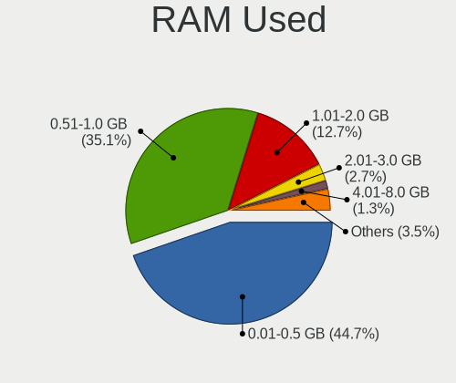
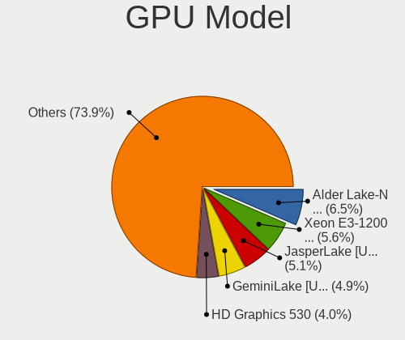
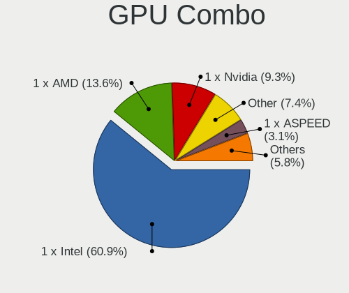
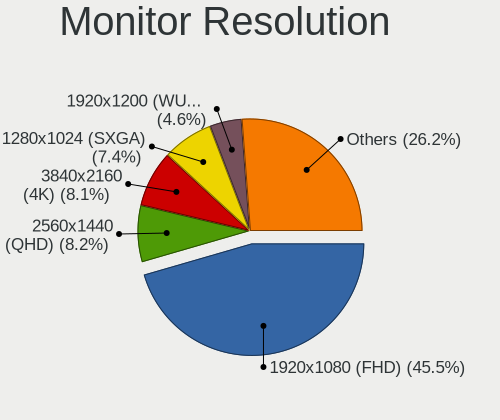
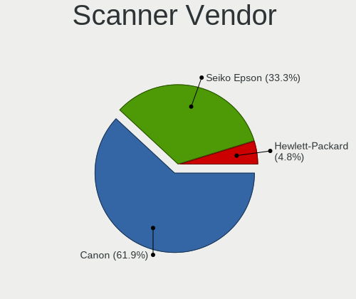

BSD - Tested Hardware & Statistics (Desktops)
---------------------------------------------

A project to collect tested hardware configurations for BSD.

Anyone can contribute to this report by the [hw-probe](https://github.com/linuxhw/hw-probe/blob/master/INSTALL.BSD.md) tool:

    hw-probe -all -upload

Please contribute! Especially if your hardware is rare.

This report is for real hardware. Report for virtual hardware: [TestCoverage_VE](https://github.com/bsdhw/TestCoverage_VE)

Contents
--------

* [ Test Cases ](#test-cases)

* [ System ](#system)
  - [ OS                       ](#os)
  - [ OS Family                ](#os-family)
  - [ Arch                     ](#arch)
  - [ DE                       ](#de)
  - [ Display Server           ](#display-server)
  - [ Display Manager          ](#display-manager)
  - [ OS Lang                  ](#os-lang)
  - [ Boot Mode                ](#boot-mode)
  - [ Filesystem               ](#filesystem)
  - [ Part. scheme             ](#part-scheme)

* [ Board ](#board)
  - [ Vendor                   ](#vendor)
  - [ Model                    ](#model)
  - [ Model Family             ](#model-family)
  - [ MFG Year                 ](#mfg-year)
  - [ Form Factor              ](#form-factor)
  - [ Coreboot                 ](#coreboot)
  - [ RAM Size                 ](#ram-size)
  - [ RAM Used                 ](#ram-used)
  - [ Total Drives             ](#total-drives)
  - [ Has CD-ROM               ](#has-cd-rom)
  - [ Has Ethernet             ](#has-ethernet)
  - [ Has WiFi                 ](#has-wifi)
  - [ Has Bluetooth            ](#has-bluetooth)

* [ Location ](#location)
  - [ Country                  ](#country)
  - [ City                     ](#city)

* [ Drives ](#drives)
  - [ Drive Vendor             ](#drive-vendor)
  - [ Drive Model              ](#drive-model)
  - [ HDD Vendor               ](#hdd-vendor)
  - [ SSD Vendor               ](#ssd-vendor)
  - [ Drive Kind               ](#drive-kind)
  - [ Drive Connector          ](#drive-connector)
  - [ Drive Size               ](#drive-size)
  - [ Space Total              ](#space-total)
  - [ Space Used               ](#space-used)
  - [ Malfunc. Drives          ](#malfunc-drives)
  - [ Malfunc. Drive Vendor    ](#malfunc-drive-vendor)
  - [ Malfunc. HDD Vendor      ](#malfunc-hdd-vendor)
  - [ Malfunc. Drive Kind      ](#malfunc-drive-kind)
  - [ Failed Drives            ](#failed-drives)
  - [ Failed Drive Vendor      ](#failed-drive-vendor)
  - [ Drive Status             ](#drive-status)

* [ Storage controller ](#storage-controller)
  - [ Storage Vendor           ](#storage-vendor)
  - [ Storage Model            ](#storage-model)
  - [ Storage Kind             ](#storage-kind)

* [ Processor ](#processor)
  - [ CPU Vendor               ](#cpu-vendor)
  - [ CPU Model                ](#cpu-model)
  - [ CPU Model Family         ](#cpu-model-family)
  - [ CPU Cores                ](#cpu-cores)
  - [ CPU Sockets              ](#cpu-sockets)
  - [ CPU Threads              ](#cpu-threads)
  - [ CPU Microarch            ](#cpu-microarch)

* [ Graphics ](#graphics)
  - [ GPU Vendor               ](#gpu-vendor)
  - [ GPU Model                ](#gpu-model)
  - [ GPU Combo                ](#gpu-combo)
  - [ GPU Driver               ](#gpu-driver)
  - [ GPU Memory               ](#gpu-memory)

* [ Monitor ](#monitor)
  - [ Monitor Vendor           ](#monitor-vendor)
  - [ Monitor Model            ](#monitor-model)
  - [ Monitor Resolution       ](#monitor-resolution)
  - [ Monitor Diagonal         ](#monitor-diagonal)
  - [ Monitor Width            ](#monitor-width)
  - [ Aspect Ratio             ](#aspect-ratio)
  - [ Monitor Area             ](#monitor-area)
  - [ Pixel Density            ](#pixel-density)
  - [ Multiple Monitors        ](#multiple-monitors)

* [ Network ](#network)
  - [ Net Controller Vendor    ](#net-controller-vendor)
  - [ Net Controller Model     ](#net-controller-model)
  - [ Wireless Vendor          ](#wireless-vendor)
  - [ Wireless Model           ](#wireless-model)
  - [ Ethernet Vendor          ](#ethernet-vendor)
  - [ Ethernet Model           ](#ethernet-model)
  - [ Net Controller Kind      ](#net-controller-kind)
  - [ Used Controller          ](#used-controller)
  - [ NICs                     ](#nics)
  - [ IPv6                     ](#ipv6)

* [ Bluetooth ](#bluetooth)
  - [ Bluetooth Vendor         ](#bluetooth-vendor)
  - [ Bluetooth Model          ](#bluetooth-model)

* [ Sound ](#sound)
  - [ Sound Vendor             ](#sound-vendor)
  - [ Sound Model              ](#sound-model)

* [ Memory ](#memory)
  - [ Memory Vendor            ](#memory-vendor)
  - [ Memory Model             ](#memory-model)
  - [ Memory Kind              ](#memory-kind)
  - [ Memory Form Factor       ](#memory-form-factor)
  - [ Memory Size              ](#memory-size)
  - [ Memory Speed             ](#memory-speed)

* [ Printers & scanners ](#printers--scanners)
  - [ Printer Vendor           ](#printer-vendor)
  - [ Printer Model            ](#printer-model)
  - [ Scanner Vendor           ](#scanner-vendor)
  - [ Scanner Model            ](#scanner-model)

* [ Camera ](#camera)
  - [ Camera Vendor            ](#camera-vendor)
  - [ Camera Model             ](#camera-model)

* [ Security ](#security)
  - [ Fingerprint Vendor       ](#fingerprint-vendor)
  - [ Fingerprint Model        ](#fingerprint-model)
  - [ Chipcard Vendor          ](#chipcard-vendor)
  - [ Chipcard Model           ](#chipcard-model)

* [ Unsupported ](#unsupported)
  - [ Unsupported Devices      ](#unsupported-devices)
  - [ Unsupported Device Types ](#unsupported-device-types)

Test Cases
----------

Total: 7423

| Vendor        | Model                       | Probe                                                     | Date         |
|---------------|-----------------------------|-----------------------------------------------------------|--------------|
| HP            | 843F                        | [f921634ea0](https://bsd-hardware.info/?probe=f921634ea0) | Nov 02, 2022 |
| HP            | 339A                        | [370d93ecde](https://bsd-hardware.info/?probe=370d93ecde) | Nov 02, 2022 |
| Hardkernel    | ODROID-H2                   | [f0e3f3177a](https://bsd-hardware.info/?probe=f0e3f3177a) | Nov 02, 2022 |
| Gigabyte      | Z97X-UD5H                   | [d7141b866c](https://bsd-hardware.info/?probe=d7141b866c) | Nov 02, 2022 |
| Dell          | 08HPGT A02                  | [b6044fb84c](https://bsd-hardware.info/?probe=b6044fb84c) | Nov 02, 2022 |
| HP            | 8053                        | [92583639f6](https://bsd-hardware.info/?probe=92583639f6) | Nov 02, 2022 |
| HP            | 843F                        | [bba76c5ce6](https://bsd-hardware.info/?probe=bba76c5ce6) | Nov 02, 2022 |
| Unknown       | Unknown                     | [bc7a300434](https://bsd-hardware.info/?probe=bc7a300434) | Nov 02, 2022 |
| MSI           | B560M-A PRO                 | [ac1e500e91](https://bsd-hardware.info/?probe=ac1e500e91) | Nov 01, 2022 |
| ASRock        | H670M-ITX/ax                | [bb78d5d8ea](https://bsd-hardware.info/?probe=bb78d5d8ea) | Nov 01, 2022 |
| Cisco         | ASA5512 A0                  | [871a5c449f](https://bsd-hardware.info/?probe=871a5c449f) | Nov 01, 2022 |
| ASRock        | H110 Pro BTC+               | [fb24f0fa6e](https://bsd-hardware.info/?probe=fb24f0fa6e) | Nov 01, 2022 |
| ASUSTek       | K30AM-J_A_F_K31AM-J         | [f587ec97a4](https://bsd-hardware.info/?probe=f587ec97a4) | Nov 01, 2022 |
| Dell          | 05GD68 A00                  | [23483285a8](https://bsd-hardware.info/?probe=23483285a8) | Nov 01, 2022 |
| Cisco         | ASA5512 A0                  | [5758027775](https://bsd-hardware.info/?probe=5758027775) | Oct 31, 2022 |
| ASUSTek       | TUF Gaming Z590-PLUS WIF... | [6afa103d09](https://bsd-hardware.info/?probe=6afa103d09) | Oct 31, 2022 |
| ASRockRack    | EPYC3101D4I-2T              | [bb0f8a5bfc](https://bsd-hardware.info/?probe=bb0f8a5bfc) | Oct 31, 2022 |
| Protectli     | FW6 Ver                     | [6f21c02bba](https://bsd-hardware.info/?probe=6f21c02bba) | Oct 31, 2022 |
| Supermicro    | X10DRU-i+                   | [1ffd63a929](https://bsd-hardware.info/?probe=1ffd63a929) | Oct 31, 2022 |
| maiyunda      | www.maiyunda.com            | [4dfd35f622](https://bsd-hardware.info/?probe=4dfd35f622) | Oct 31, 2022 |
| Unknown       | Unknown                     | [9737a80a1c](https://bsd-hardware.info/?probe=9737a80a1c) | Oct 31, 2022 |
| Unknown       | Unknown                     | [c14a3eb06b](https://bsd-hardware.info/?probe=c14a3eb06b) | Oct 31, 2022 |
| Supermicro    | X7SPA-HF                    | [18b3b416ce](https://bsd-hardware.info/?probe=18b3b416ce) | Oct 31, 2022 |
| ASRock        | H110 Pro BTC+               | [20f2ab4251](https://bsd-hardware.info/?probe=20f2ab4251) | Oct 30, 2022 |
| Gigabyte      | Z68XP-UD3                   | [0f22defdb3](https://bsd-hardware.info/?probe=0f22defdb3) | Oct 30, 2022 |
| Fujitsu       | D3401-H2 S26361-D3401-H2    | [cce93ff157](https://bsd-hardware.info/?probe=cce93ff157) | Oct 30, 2022 |
| Protectli     | FW6 Ver                     | [a52d7dda08](https://bsd-hardware.info/?probe=a52d7dda08) | Oct 30, 2022 |
| Protectli     | FW6 Ver                     | [4aecc55dcc](https://bsd-hardware.info/?probe=4aecc55dcc) | Oct 30, 2022 |
| Thomas-Kre... | LES network 6L              | [0816f2da97](https://bsd-hardware.info/?probe=0816f2da97) | Oct 30, 2022 |
| MSI           | H81M-P33                    | [b67d6a7bb2](https://bsd-hardware.info/?probe=b67d6a7bb2) | Oct 30, 2022 |
| ASUSTek       | P5Q-E                       | [8161bfd24d](https://bsd-hardware.info/?probe=8161bfd24d) | Oct 30, 2022 |
| ASUSTek       | ROG CROSSHAIR VIII HERO     | [a0896f17e4](https://bsd-hardware.info/?probe=a0896f17e4) | Oct 30, 2022 |
| Lenovo        | 3106 SDK0J40705 WIN 3425... | [d20bfb6d64](https://bsd-hardware.info/?probe=d20bfb6d64) | Oct 30, 2022 |
| Unknown       | J3160-4L                    | [e05d9b2d17](https://bsd-hardware.info/?probe=e05d9b2d17) | Oct 30, 2022 |
| HP            | 843B                        | [d7d572f9ad](https://bsd-hardware.info/?probe=d7d572f9ad) | Oct 29, 2022 |
| maiyunda      | www.maiyunda.com            | [ed59c93b79](https://bsd-hardware.info/?probe=ed59c93b79) | Oct 29, 2022 |
| ASRock        | N68-GS4 FX R2.0             | [85be4177d6](https://bsd-hardware.info/?probe=85be4177d6) | Oct 29, 2022 |
| ASRock        | H570M-ITX/ac                | [06a8abdbf4](https://bsd-hardware.info/?probe=06a8abdbf4) | Oct 29, 2022 |
| Unknown       | Unknown                     | [acf41f7000](https://bsd-hardware.info/?probe=acf41f7000) | Oct 29, 2022 |
| Unknown       | Unknown                     | [b8323aa325](https://bsd-hardware.info/?probe=b8323aa325) | Oct 29, 2022 |
| Intel         | Q3XXG4-P V1.0               | [02d617a604](https://bsd-hardware.info/?probe=02d617a604) | Oct 29, 2022 |
| Dell          | 0XCR8D A01                  | [a019244c85](https://bsd-hardware.info/?probe=a019244c85) | Oct 29, 2022 |
| Unknown       | Unknown                     | [3744629487](https://bsd-hardware.info/?probe=3744629487) | Oct 29, 2022 |
| Unknown       | Unknown                     | [9a12cd02f0](https://bsd-hardware.info/?probe=9a12cd02f0) | Oct 28, 2022 |
| YANYU         | R250                        | [f39d55e42d](https://bsd-hardware.info/?probe=f39d55e42d) | Oct 28, 2022 |
| Centerm       | GA690-2 2                   | [9d6c3d67cd](https://bsd-hardware.info/?probe=9d6c3d67cd) | Oct 28, 2022 |
| MSI           | B360I GMAING PRO AC         | [7287c670f0](https://bsd-hardware.info/?probe=7287c670f0) | Oct 28, 2022 |
| Unknown       | Unknown                     | [c483de83a9](https://bsd-hardware.info/?probe=c483de83a9) | Oct 28, 2022 |
| Protectli     | FW4B Ver                    | [6dda683e10](https://bsd-hardware.info/?probe=6dda683e10) | Oct 28, 2022 |
| Unknown       | Unknown                     | [c03e63a0a8](https://bsd-hardware.info/?probe=c03e63a0a8) | Oct 28, 2022 |
| ASUSTek       | P5BV-M                      | [c5277ae3cd](https://bsd-hardware.info/?probe=c5277ae3cd) | Oct 27, 2022 |
| Unknown       | YL-J3160L4                  | [fa8d5e324b](https://bsd-hardware.info/?probe=fa8d5e324b) | Oct 27, 2022 |
| PC Engines    | APU2                        | [0c573848ce](https://bsd-hardware.info/?probe=0c573848ce) | Oct 27, 2022 |
| ASRock        | B550M Phantom Gaming 4      | [16c226553c](https://bsd-hardware.info/?probe=16c226553c) | Oct 27, 2022 |
| Unknown       | Unknown                     | [4e01e68bb2](https://bsd-hardware.info/?probe=4e01e68bb2) | Oct 27, 2022 |
| Unknown       | Unknown                     | [9de7465e6e](https://bsd-hardware.info/?probe=9de7465e6e) | Oct 27, 2022 |
| Dell          | 0WMJ54 A01                  | [f89024b7be](https://bsd-hardware.info/?probe=f89024b7be) | Oct 27, 2022 |
| Protectli     | FW4B Ver                    | [766ee6f4eb](https://bsd-hardware.info/?probe=766ee6f4eb) | Oct 27, 2022 |
| CncTion       | N5105-4L B0                 | [d2adcc8230](https://bsd-hardware.info/?probe=d2adcc8230) | Oct 26, 2022 |
| HP            | 82B4                        | [f3b7970068](https://bsd-hardware.info/?probe=f3b7970068) | Oct 26, 2022 |
| Dell          | 0HD5W2 A00                  | [7b330abf44](https://bsd-hardware.info/?probe=7b330abf44) | Oct 26, 2022 |
| Unknown       | Unknown                     | [a6d41c71fd](https://bsd-hardware.info/?probe=a6d41c71fd) | Oct 26, 2022 |
| Supermicro    | A2SDi-4C-HLN4F              | [f6df7bf1e8](https://bsd-hardware.info/?probe=f6df7bf1e8) | Oct 26, 2022 |
| Dell          | 0HD5W2 A00                  | [84502a19a0](https://bsd-hardware.info/?probe=84502a19a0) | Oct 26, 2022 |
| PC Engines    | APU2                        | [0677b5c196](https://bsd-hardware.info/?probe=0677b5c196) | Oct 25, 2022 |
| Dell          | 05XGC8 A01                  | [97947568ee](https://bsd-hardware.info/?probe=97947568ee) | Oct 25, 2022 |
| PC Engines    | apu1                        | [b8643f364d](https://bsd-hardware.info/?probe=b8643f364d) | Oct 25, 2022 |
| PC Engines    | APU2                        | [d52e3d0ce3](https://bsd-hardware.info/?probe=d52e3d0ce3) | Oct 25, 2022 |
| Gigabyte      | B450M DS3H-CF               | [51ec4ce710](https://bsd-hardware.info/?probe=51ec4ce710) | Oct 24, 2022 |
| Acer          | Veriton X2610G              | [e4289c3f15](https://bsd-hardware.info/?probe=e4289c3f15) | Oct 24, 2022 |
| Unknown       | Unknown                     | [1f2cd1f9ea](https://bsd-hardware.info/?probe=1f2cd1f9ea) | Oct 24, 2022 |
| Fujitsu       | D3313-A1 S26361-D3313-A1    | [079830f938](https://bsd-hardware.info/?probe=079830f938) | Oct 24, 2022 |
| Fujitsu       | D3313-A1 S26361-D3313-A1    | [2fa4641b0e](https://bsd-hardware.info/?probe=2fa4641b0e) | Oct 24, 2022 |
| ASUSTek       | TUF Gaming Z590-PLUS WIF... | [09e5063724](https://bsd-hardware.info/?probe=09e5063724) | Oct 24, 2022 |
| Cisco         | ASA5515 A0                  | [3f20d7f9bb](https://bsd-hardware.info/?probe=3f20d7f9bb) | Oct 24, 2022 |
| Fujitsu       | D3313-G1 S26361-D3313-G1    | [eea9a0bef3](https://bsd-hardware.info/?probe=eea9a0bef3) | Oct 24, 2022 |
| Intel         | DQ77MK AAG39642-500         | [0708c0f089](https://bsd-hardware.info/?probe=0708c0f089) | Oct 24, 2022 |
| Intel         | D34010WYK H14771-305        | [5414062624](https://bsd-hardware.info/?probe=5414062624) | Oct 24, 2022 |
| Unknown       | YL-J3160L4                  | [746694bb1d](https://bsd-hardware.info/?probe=746694bb1d) | Oct 24, 2022 |
| MSI           | MAG B550M MORTAR            | [607fcd2571](https://bsd-hardware.info/?probe=607fcd2571) | Oct 24, 2022 |
| ASUSTek       | P5BV-M                      | [f7bfa3deed](https://bsd-hardware.info/?probe=f7bfa3deed) | Oct 23, 2022 |
| CncTion       | N5105-4L B0                 | [6f0d5a7497](https://bsd-hardware.info/?probe=6f0d5a7497) | Oct 23, 2022 |
| Gigabyte      | H61M-DS2 x.x                | [10ea57e48f](https://bsd-hardware.info/?probe=10ea57e48f) | Oct 23, 2022 |
| MSI           | H81M-P33                    | [626f503cad](https://bsd-hardware.info/?probe=626f503cad) | Oct 23, 2022 |
| ASUSTek       | P5Q-E                       | [2b98739799](https://bsd-hardware.info/?probe=2b98739799) | Oct 23, 2022 |
| ASUSTek       | ROG CROSSHAIR VIII HERO     | [56dac6bc80](https://bsd-hardware.info/?probe=56dac6bc80) | Oct 23, 2022 |
| HP            | 843B                        | [9ea2590610](https://bsd-hardware.info/?probe=9ea2590610) | Oct 23, 2022 |
| Unknown       | 1.21                        | [f8a845fcda](https://bsd-hardware.info/?probe=f8a845fcda) | Oct 23, 2022 |
| Unknown       | Unknown                     | [89d0639a68](https://bsd-hardware.info/?probe=89d0639a68) | Oct 23, 2022 |
| CncTion       | N5105-4L B0                 | [d7829c8f35](https://bsd-hardware.info/?probe=d7829c8f35) | Oct 22, 2022 |
| Cisco         | ASA5515 A0                  | [7f848d7c57](https://bsd-hardware.info/?probe=7f848d7c57) | Oct 22, 2022 |
| Techvision    | TVI7309X B0                 | [af3a73431f](https://bsd-hardware.info/?probe=af3a73431f) | Oct 22, 2022 |
| Fujitsu       | D3313-G1 S26361-D3313-G1    | [a1b0ef3b39](https://bsd-hardware.info/?probe=a1b0ef3b39) | Oct 22, 2022 |
| Unknown       | Unknown                     | [410283dd4f](https://bsd-hardware.info/?probe=410283dd4f) | Oct 22, 2022 |
| HP            | 8719                        | [6bca1a0466](https://bsd-hardware.info/?probe=6bca1a0466) | Oct 22, 2022 |
| MW            | GMLK-2_5G4L                 | [172b2c53fe](https://bsd-hardware.info/?probe=172b2c53fe) | Oct 22, 2022 |
| ASUSTek       | P8Z68-V GEN3                | [d7b32200a5](https://bsd-hardware.info/?probe=d7b32200a5) | Oct 22, 2022 |
| Gigabyte      | H61M-DS2 x.x                | [947d061849](https://bsd-hardware.info/?probe=947d061849) | Oct 22, 2022 |
| ASRock        | B250M-HDV                   | [803b44339b](https://bsd-hardware.info/?probe=803b44339b) | Oct 22, 2022 |
| Intel         | D2500CC AAG81477-401        | [f27ff1a7c3](https://bsd-hardware.info/?probe=f27ff1a7c3) | Oct 22, 2022 |
| MSI           | 890GXM-G65                  | [03c116d78f](https://bsd-hardware.info/?probe=03c116d78f) | Oct 22, 2022 |
| Alienware     | 0PGRP5 A01                  | [e34219da0f](https://bsd-hardware.info/?probe=e34219da0f) | Oct 22, 2022 |
| Gigabyte      | 945PLM-S2                   | [ca0d187a0b](https://bsd-hardware.info/?probe=ca0d187a0b) | Oct 22, 2022 |
| Gigabyte      | 945PLM-S2                   | [5b8c853c20](https://bsd-hardware.info/?probe=5b8c853c20) | Oct 22, 2022 |
| Acer          | Revo RN86                   | [692ea69bab](https://bsd-hardware.info/?probe=692ea69bab) | Oct 21, 2022 |
| PC Engines    | APU2                        | [f9ca8e5fdd](https://bsd-hardware.info/?probe=f9ca8e5fdd) | Oct 21, 2022 |
| Intel         | H67SL_VER1.2A               | [a469ad62a4](https://bsd-hardware.info/?probe=a469ad62a4) | Oct 21, 2022 |
| MSI           | B450M PRO-VDH PLUS          | [54e4202bc7](https://bsd-hardware.info/?probe=54e4202bc7) | Oct 21, 2022 |
| PC Engines    | APU2                        | [cf1abf5e46](https://bsd-hardware.info/?probe=cf1abf5e46) | Oct 21, 2022 |
| Protectli     | FW6 Ver                     | [d04ef8c45b](https://bsd-hardware.info/?probe=d04ef8c45b) | Oct 21, 2022 |
| Supermicro    | X8DTH-i/6/iF/6F             | [12f7ac40ac](https://bsd-hardware.info/?probe=12f7ac40ac) | Oct 21, 2022 |
| Dell          | 0FDY5C A00                  | [a47e59ad6b](https://bsd-hardware.info/?probe=a47e59ad6b) | Oct 21, 2022 |
| Dell          | 0FDY5C A00                  | [eb9ffe08e7](https://bsd-hardware.info/?probe=eb9ffe08e7) | Oct 21, 2022 |
| Unknown       | Unknown                     | [d5586487b4](https://bsd-hardware.info/?probe=d5586487b4) | Oct 21, 2022 |
| Protectli     | FW6                         | [528ef94fb5](https://bsd-hardware.info/?probe=528ef94fb5) | Oct 21, 2022 |
| HP            | 18E4                        | [d66ffbbf6d](https://bsd-hardware.info/?probe=d66ffbbf6d) | Oct 21, 2022 |
| ASUSTek       | P10S-I Series               | [ceb58e75b8](https://bsd-hardware.info/?probe=ceb58e75b8) | Oct 20, 2022 |
| ASUSTek       | TUF Gaming B550-PLUS        | [7ecffc1ca3](https://bsd-hardware.info/?probe=7ecffc1ca3) | Oct 20, 2022 |
| ASUSTek       | TUF Gaming B550-PLUS        | [eb6eda641d](https://bsd-hardware.info/?probe=eb6eda641d) | Oct 20, 2022 |
| Hardkernel    | ODROID-H3                   | [304db9bbbf](https://bsd-hardware.info/?probe=304db9bbbf) | Oct 20, 2022 |
| MSI           | B450M PRO-VDH PLUS          | [c6ee09790d](https://bsd-hardware.info/?probe=c6ee09790d) | Oct 20, 2022 |
| ASRock        | B460M-ITX/ac                | [c1a691f99c](https://bsd-hardware.info/?probe=c1a691f99c) | Oct 20, 2022 |
| ASUSTek       | SABERTOOTH Z77              | [348bef7dba](https://bsd-hardware.info/?probe=348bef7dba) | Oct 20, 2022 |
| PC Engines    | APU2                        | [c2e7b76bdf](https://bsd-hardware.info/?probe=c2e7b76bdf) | Oct 20, 2022 |
| PC Engines    | APU2                        | [ade8432e80](https://bsd-hardware.info/?probe=ade8432e80) | Oct 20, 2022 |
| Unknown       | Unknown                     | [1778396ba9](https://bsd-hardware.info/?probe=1778396ba9) | Oct 20, 2022 |
| Unknown       | Unknown                     | [1188b56e14](https://bsd-hardware.info/?probe=1188b56e14) | Oct 19, 2022 |
| Unknown       | Unknown                     | [915c66f8bd](https://bsd-hardware.info/?probe=915c66f8bd) | Oct 19, 2022 |
| Protectli     | FW6                         | [a7dabc97b0](https://bsd-hardware.info/?probe=a7dabc97b0) | Oct 19, 2022 |
| Quanmax       | spo-book TECH QUAD B1       | [f3db09e0f0](https://bsd-hardware.info/?probe=f3db09e0f0) | Oct 19, 2022 |
| Supermicro    | X11SSL-F                    | [24faa4663c](https://bsd-hardware.info/?probe=24faa4663c) | Oct 19, 2022 |
| Protectli     | FW4B                        | [0acd6e1143](https://bsd-hardware.info/?probe=0acd6e1143) | Oct 19, 2022 |
| Unknown       | MANIFOLD 2-C                | [a6c8096599](https://bsd-hardware.info/?probe=a6c8096599) | Oct 19, 2022 |
| MSI           | MAG Z590 TOMAHAWK WIFI      | [3e2f5956c1](https://bsd-hardware.info/?probe=3e2f5956c1) | Oct 19, 2022 |
| ASUSTek       | E35M1-I DELUXE              | [2fdf1c6db6](https://bsd-hardware.info/?probe=2fdf1c6db6) | Oct 18, 2022 |
| Unknown       | Unknown                     | [20ff21d751](https://bsd-hardware.info/?probe=20ff21d751) | Oct 18, 2022 |
| Lenovo        | 3188 SDK0J40697 WIN 3305... | [f84b205626](https://bsd-hardware.info/?probe=f84b205626) | Oct 18, 2022 |
| Lenovo        | 30D0 NOK                    | [d1fab8bd54](https://bsd-hardware.info/?probe=d1fab8bd54) | Oct 18, 2022 |
| Iomega        | StorCenter Pro px2 SA       | [d4e8f25586](https://bsd-hardware.info/?probe=d4e8f25586) | Oct 18, 2022 |
| Protectli     | FW4B Ver                    | [c75bcb519e](https://bsd-hardware.info/?probe=c75bcb519e) | Oct 18, 2022 |
| Fujitsu       | D3313-A1 S26361-D3313-A1    | [c7971db0b8](https://bsd-hardware.info/?probe=c7971db0b8) | Oct 18, 2022 |
| ASUSTek       | N3050I-C                    | [4a83b0953e](https://bsd-hardware.info/?probe=4a83b0953e) | Oct 18, 2022 |
| CncTion       | N5105-4L B0                 | [45d6590312](https://bsd-hardware.info/?probe=45d6590312) | Oct 18, 2022 |
| Dell          | 02K9CR A02                  | [a5cda6c49e](https://bsd-hardware.info/?probe=a5cda6c49e) | Oct 18, 2022 |
| Supermicro    | X10SLH-N6-ST031             | [2e4cd910d7](https://bsd-hardware.info/?probe=2e4cd910d7) | Oct 17, 2022 |
| PC Engines    | apu4                        | [20cfd8a3c8](https://bsd-hardware.info/?probe=20cfd8a3c8) | Oct 17, 2022 |
| NF541         | 1.0                         | [6f4f72398d](https://bsd-hardware.info/?probe=6f4f72398d) | Oct 17, 2022 |
| Pegatron      | 2ACF                        | [c57cc3a923](https://bsd-hardware.info/?probe=c57cc3a923) | Oct 17, 2022 |
| Intel         | DH57DD AAE82022-202         | [01622a2528](https://bsd-hardware.info/?probe=01622a2528) | Oct 17, 2022 |
| Lenovo        | SHARKBAY 0B98401 WIN        | [242e320350](https://bsd-hardware.info/?probe=242e320350) | Oct 17, 2022 |
| ASUSTek       | TUF Gaming X570-PLUS        | [2885a5ce85](https://bsd-hardware.info/?probe=2885a5ce85) | Oct 17, 2022 |
| Yanling       | YL-KBR6L Ver:1.00           | [c3f0ae254e](https://bsd-hardware.info/?probe=c3f0ae254e) | Oct 17, 2022 |
| HP            | 1588h                       | [e78a0308c7](https://bsd-hardware.info/?probe=e78a0308c7) | Oct 16, 2022 |
| Unknown       | Unknown                     | [4fd307fbb4](https://bsd-hardware.info/?probe=4fd307fbb4) | Oct 16, 2022 |
| Techvision    | TVI7309X B0                 | [f7d0616889](https://bsd-hardware.info/?probe=f7d0616889) | Oct 16, 2022 |
| HP            | 8719                        | [87efb126fc](https://bsd-hardware.info/?probe=87efb126fc) | Oct 16, 2022 |
| Dell          | 0200DY A02                  | [d32449b8c4](https://bsd-hardware.info/?probe=d32449b8c4) | Oct 16, 2022 |
| Dell          | 0HD5W2 A00                  | [f80953ee2f](https://bsd-hardware.info/?probe=f80953ee2f) | Oct 16, 2022 |
| Dell          | 0HD5W2 A00                  | [f27ffa7217](https://bsd-hardware.info/?probe=f27ffa7217) | Oct 16, 2022 |
| Yanling       | YL-KBR6L Ver:1.00           | [b4e02e3f51](https://bsd-hardware.info/?probe=b4e02e3f51) | Oct 16, 2022 |
| Hardkernel    | ODROID-H2                   | [77d3019212](https://bsd-hardware.info/?probe=77d3019212) | Oct 16, 2022 |
| Protectli     | FW4B                        | [57ae1d8cda](https://bsd-hardware.info/?probe=57ae1d8cda) | Oct 15, 2022 |
| Unknown       | Unknown                     | [83ceb2fb33](https://bsd-hardware.info/?probe=83ceb2fb33) | Oct 15, 2022 |
| PC Engines    | apu4                        | [cefbafec73](https://bsd-hardware.info/?probe=cefbafec73) | Oct 15, 2022 |
| HP            | 8169                        | [86b1fbf917](https://bsd-hardware.info/?probe=86b1fbf917) | Oct 15, 2022 |
| ASUSTek       | TUF Gaming Z590-PLUS WIF... | [76a1007c46](https://bsd-hardware.info/?probe=76a1007c46) | Oct 15, 2022 |
| Protectli     | FW6 Ver                     | [55967e02f6](https://bsd-hardware.info/?probe=55967e02f6) | Oct 15, 2022 |
| TYAN Compu... | Tiger K8W Dual AMD Opter... | [bbd42243ae](https://bsd-hardware.info/?probe=bbd42243ae) | Oct 15, 2022 |
| Techvision    | TVI7309X B0                 | [b02dcbb7b5](https://bsd-hardware.info/?probe=b02dcbb7b5) | Oct 15, 2022 |
| TYAN Compu... | Tiger K8W Dual AMD Opter... | [0e9ac1e935](https://bsd-hardware.info/?probe=0e9ac1e935) | Oct 15, 2022 |
| ASRock        | Q1900M                      | [7d0380e2d0](https://bsd-hardware.info/?probe=7d0380e2d0) | Oct 15, 2022 |
| Fujitsu       | D3313-G1 S26361-D3313-G1    | [a8bdbe4d1b](https://bsd-hardware.info/?probe=a8bdbe4d1b) | Oct 15, 2022 |
| TYAN Compu... | Intel 440BX/GX Rev. 4       | [8d99f317e4](https://bsd-hardware.info/?probe=8d99f317e4) | Oct 15, 2022 |
| Dell          | 0G1548 A00                  | [226af33d5b](https://bsd-hardware.info/?probe=226af33d5b) | Oct 15, 2022 |
| MW            | GMLK-2_5G4L                 | [73960ade29](https://bsd-hardware.info/?probe=73960ade29) | Oct 15, 2022 |
| ASRock        | G41C-GS R2.0                | [06214241b3](https://bsd-hardware.info/?probe=06214241b3) | Oct 15, 2022 |
| Intel         | Q3XXG4-P V1.0               | [5a56504b92](https://bsd-hardware.info/?probe=5a56504b92) | Oct 15, 2022 |
| AZW           | Green G1                    | [f6f16c5141](https://bsd-hardware.info/?probe=f6f16c5141) | Oct 15, 2022 |
| MW            | GMLK-2_5G4L                 | [ae4868c65b](https://bsd-hardware.info/?probe=ae4868c65b) | Oct 15, 2022 |
| Lenovo        | ThinkCentre M57p 6078AJ6    | [a808a7360d](https://bsd-hardware.info/?probe=a808a7360d) | Oct 14, 2022 |
| Lenovo        | 3132 SDK0J40697 WIN 3305... | [e08c408ced](https://bsd-hardware.info/?probe=e08c408ced) | Oct 14, 2022 |
| Supermicro    | X10SLL-F                    | [3b13ea475b](https://bsd-hardware.info/?probe=3b13ea475b) | Oct 14, 2022 |
| Dell          | 0WMJ54 A01                  | [5acdcd628d](https://bsd-hardware.info/?probe=5acdcd628d) | Oct 14, 2022 |
| PC Engines    | apu1                        | [06debf0076](https://bsd-hardware.info/?probe=06debf0076) | Oct 14, 2022 |
| Dell          | 00V62H A00                  | [17a6b61af7](https://bsd-hardware.info/?probe=17a6b61af7) | Oct 14, 2022 |
| Unknown       | Unknown                     | [6c330d9bab](https://bsd-hardware.info/?probe=6c330d9bab) | Oct 14, 2022 |
| PC Engines    | APU2                        | [856e29140e](https://bsd-hardware.info/?probe=856e29140e) | Oct 14, 2022 |
| PC Engines    | APU2                        | [0e09ac984a](https://bsd-hardware.info/?probe=0e09ac984a) | Oct 14, 2022 |
| Unknown       | J3160-4L                    | [42c01a3aaf](https://bsd-hardware.info/?probe=42c01a3aaf) | Oct 13, 2022 |
| ASUSTek       | P5L-VM 1394                 | [d7c3749eba](https://bsd-hardware.info/?probe=d7c3749eba) | Oct 13, 2022 |
| ASUSTek       | PRIME X370-PRO              | [10358c7207](https://bsd-hardware.info/?probe=10358c7207) | Oct 13, 2022 |
| HP            | 260 G3 DM                   | [3ad5292d71](https://bsd-hardware.info/?probe=3ad5292d71) | Oct 13, 2022 |
| HP            | Compaq nw8440 (RND39ET)     | [55bef385e3](https://bsd-hardware.info/?probe=55bef385e3) | Oct 13, 2022 |
| ASRock        | X570 Phantom Gaming 4       | [b20b6c7997](https://bsd-hardware.info/?probe=b20b6c7997) | Oct 13, 2022 |
| Unknown       | Unknown                     | [00b5fa7a4e](https://bsd-hardware.info/?probe=00b5fa7a4e) | Oct 13, 2022 |
| ASRock        | B550M Phantom Gaming 4      | [0da821d451](https://bsd-hardware.info/?probe=0da821d451) | Oct 13, 2022 |
| Gigabyte      | J3455N-D3H                  | [9757e40c42](https://bsd-hardware.info/?probe=9757e40c42) | Oct 13, 2022 |
| Unknown       | Unknown                     | [763365591a](https://bsd-hardware.info/?probe=763365591a) | Oct 12, 2022 |
| ASUSTek       | H110M-PLUS                  | [ba30f2772b](https://bsd-hardware.info/?probe=ba30f2772b) | Oct 12, 2022 |
| PC Engines    | APU2                        | [a06a344954](https://bsd-hardware.info/?probe=a06a344954) | Oct 12, 2022 |
| Unknown       | YL-1900L4-V2                | [1f55db62cc](https://bsd-hardware.info/?probe=1f55db62cc) | Oct 12, 2022 |
| HP            | 1589                        | [0696d30d3f](https://bsd-hardware.info/?probe=0696d30d3f) | Oct 12, 2022 |
| ASRock        | H570M-ITX/ac                | [ea8b1fd760](https://bsd-hardware.info/?probe=ea8b1fd760) | Oct 12, 2022 |
| Unknown       | Unknown                     | [7000ef7aeb](https://bsd-hardware.info/?probe=7000ef7aeb) | Oct 12, 2022 |
| Protectli     | FW4B                        | [2fd9fcda8e](https://bsd-hardware.info/?probe=2fd9fcda8e) | Oct 11, 2022 |
| ASUSTek       | P8Z68-V                     | [6674bbf7f3](https://bsd-hardware.info/?probe=6674bbf7f3) | Oct 11, 2022 |
| Unknown       | Unknown                     | [94915735cc](https://bsd-hardware.info/?probe=94915735cc) | Oct 11, 2022 |
| AMD           | Inagua CRB                  | [59c41dcd31](https://bsd-hardware.info/?probe=59c41dcd31) | Oct 11, 2022 |
| MW            | GMLK-2_5G4L                 | [ff2b9a916f](https://bsd-hardware.info/?probe=ff2b9a916f) | Oct 11, 2022 |
| maiyunda      | www.maiyunda.com            | [869687f6f0](https://bsd-hardware.info/?probe=869687f6f0) | Oct 11, 2022 |
| AMD           | Inagua CRB                  | [ff4eccae8a](https://bsd-hardware.info/?probe=ff4eccae8a) | Oct 11, 2022 |
| ASUSTek       | ROG STRIX X570-I GAMING     | [9d3b9cb318](https://bsd-hardware.info/?probe=9d3b9cb318) | Oct 11, 2022 |
| ASUSTek       | H110M-CS/BR                 | [097a263bfc](https://bsd-hardware.info/?probe=097a263bfc) | Oct 11, 2022 |
| maiyunda      | www.maiyunda.com            | [f4b5bf9026](https://bsd-hardware.info/?probe=f4b5bf9026) | Oct 11, 2022 |
| Supermicro    | X11SDV-4C-TP8F              | [2cba6fbbb7](https://bsd-hardware.info/?probe=2cba6fbbb7) | Oct 11, 2022 |
| ASRock        | B450M Pro4-F                | [edead8a3ae](https://bsd-hardware.info/?probe=edead8a3ae) | Oct 11, 2022 |
| AZW           | U59                         | [8839497803](https://bsd-hardware.info/?probe=8839497803) | Oct 11, 2022 |
| Unknown       | Unknown                     | [a5cbd6786d](https://bsd-hardware.info/?probe=a5cbd6786d) | Oct 11, 2022 |
| Dell          | 0HD5W2 A00                  | [4fb69eef28](https://bsd-hardware.info/?probe=4fb69eef28) | Oct 11, 2022 |
| Shuttle       | FH170                       | [8fd08beffa](https://bsd-hardware.info/?probe=8fd08beffa) | Oct 10, 2022 |
| PCWare        | IPMH81G1                    | [58b53464d1](https://bsd-hardware.info/?probe=58b53464d1) | Oct 10, 2022 |
| Dell          | 06X1TJ A00                  | [c70e4d6b3c](https://bsd-hardware.info/?probe=c70e4d6b3c) | Oct 10, 2022 |
| NU941         | 1.0                         | [2690c2a8df](https://bsd-hardware.info/?probe=2690c2a8df) | Oct 10, 2022 |
| ASRock        | J4005B-ITX                  | [6cf37e95da](https://bsd-hardware.info/?probe=6cf37e95da) | Oct 10, 2022 |
| ASUSTek       | TUF Gaming Z590-PLUS WIF... | [4c9069df20](https://bsd-hardware.info/?probe=4c9069df20) | Oct 10, 2022 |
| HP            | 1495                        | [cfa8ab5df3](https://bsd-hardware.info/?probe=cfa8ab5df3) | Oct 10, 2022 |
| ASRock        | J3355B-ITX                  | [d802705c1d](https://bsd-hardware.info/?probe=d802705c1d) | Oct 10, 2022 |
| Clevo         | R130T                       | [6f8a6bf77c](https://bsd-hardware.info/?probe=6f8a6bf77c) | Oct 10, 2022 |
| Gigabyte      | G31M-S2C                    | [8b8f621562](https://bsd-hardware.info/?probe=8b8f621562) | Oct 10, 2022 |
| Dell          | 06X1TJ A00                  | [21117c0374](https://bsd-hardware.info/?probe=21117c0374) | Oct 10, 2022 |
| CncTion       | Jasper-4L B0                | [53c643dc95](https://bsd-hardware.info/?probe=53c643dc95) | Oct 10, 2022 |
| Unknown       | Unknown                     | [2fc5bd737a](https://bsd-hardware.info/?probe=2fc5bd737a) | Oct 09, 2022 |
| Protectli     | FW1 Ver                     | [1015ef5e66](https://bsd-hardware.info/?probe=1015ef5e66) | Oct 09, 2022 |
| Seeed Stud... | ODYSSEY-X86J41X5 SD-BS-C... | [e08e2ca6e0](https://bsd-hardware.info/?probe=e08e2ca6e0) | Oct 09, 2022 |
| ShenZhen M... | MW-NANO-APL-4L              | [5d929362ca](https://bsd-hardware.info/?probe=5d929362ca) | Oct 09, 2022 |
| ASRock        | X399 Taichi                 | [c79fa6f001](https://bsd-hardware.info/?probe=c79fa6f001) | Oct 09, 2022 |
| Hardkernel    | ODROID-H2                   | [73c9bfe38b](https://bsd-hardware.info/?probe=73c9bfe38b) | Oct 09, 2022 |
| Lenovo        | SHARKBAY 0B98401 PRO        | [e595ade938](https://bsd-hardware.info/?probe=e595ade938) | Oct 09, 2022 |
| ASRock        | J4005B-ITX                  | [0e0ff27c25](https://bsd-hardware.info/?probe=0e0ff27c25) | Oct 09, 2022 |
| MiTAC         | PH11CMI                     | [71802cdcad](https://bsd-hardware.info/?probe=71802cdcad) | Oct 09, 2022 |
| Lenovo        | SHARKBAY 0B98401 PRO        | [464739212c](https://bsd-hardware.info/?probe=464739212c) | Oct 08, 2022 |
| HP            | 339A                        | [7ad68046ce](https://bsd-hardware.info/?probe=7ad68046ce) | Oct 08, 2022 |
| HP            | 86FC MVB                    | [56453b00c8](https://bsd-hardware.info/?probe=56453b00c8) | Oct 08, 2022 |
| HP            | 86FC MVB                    | [c542b16d75](https://bsd-hardware.info/?probe=c542b16d75) | Oct 08, 2022 |
| Soekris En... | net6501                     | [1cb23f6bda](https://bsd-hardware.info/?probe=1cb23f6bda) | Oct 08, 2022 |
| Soekris En... | net6501                     | [03ee772b1f](https://bsd-hardware.info/?probe=03ee772b1f) | Oct 08, 2022 |
| Unknown       | Unknown                     | [f31f4c00cd](https://bsd-hardware.info/?probe=f31f4c00cd) | Oct 08, 2022 |
| Unknown       | Unknown                     | [e76890ff26](https://bsd-hardware.info/?probe=e76890ff26) | Oct 08, 2022 |
| Unknown       | Unknown                     | [d6396a74dd](https://bsd-hardware.info/?probe=d6396a74dd) | Oct 08, 2022 |
| HP            | 18E7                        | [35e68316d8](https://bsd-hardware.info/?probe=35e68316d8) | Oct 08, 2022 |
| Lenovo        | ThinkCentre M72e 3664AD9    | [f6fded284d](https://bsd-hardware.info/?probe=f6fded284d) | Oct 08, 2022 |
| Unknown       | Unknown                     | [e4e47282a9](https://bsd-hardware.info/?probe=e4e47282a9) | Oct 08, 2022 |
| Techvision    | TVI7309X B0                 | [384de92279](https://bsd-hardware.info/?probe=384de92279) | Oct 07, 2022 |
| Unknown       | Unknown                     | [d25832111e](https://bsd-hardware.info/?probe=d25832111e) | Oct 07, 2022 |
| Unknown       | Unknown                     | [a34c1b8ccd](https://bsd-hardware.info/?probe=a34c1b8ccd) | Oct 07, 2022 |
| Intel         | SHARKBAY                    | [9d3eed2bec](https://bsd-hardware.info/?probe=9d3eed2bec) | Oct 07, 2022 |
| ASRockRack    | EP2C612D16FM                | [30a582fccb](https://bsd-hardware.info/?probe=30a582fccb) | Oct 07, 2022 |
| Unknown       | Unknown                     | [ad8b88d10b](https://bsd-hardware.info/?probe=ad8b88d10b) | Oct 07, 2022 |
| HP            | ProLiant MicroServer Gen... | [31ce3d5e46](https://bsd-hardware.info/?probe=31ce3d5e46) | Oct 07, 2022 |
| Dell          | 04YP6J A01                  | [ce728798a1](https://bsd-hardware.info/?probe=ce728798a1) | Oct 07, 2022 |
| Intel         | CRESCENTBAY                 | [36fb81bec0](https://bsd-hardware.info/?probe=36fb81bec0) | Oct 07, 2022 |
| YANYU         | H67SL                       | [373902d38b](https://bsd-hardware.info/?probe=373902d38b) | Oct 07, 2022 |
| ASRock        | B75M R2.0                   | [a28ea59f1f](https://bsd-hardware.info/?probe=a28ea59f1f) | Oct 07, 2022 |
| Dell          | 0KYJ8C A02                  | [130a05a115](https://bsd-hardware.info/?probe=130a05a115) | Oct 07, 2022 |
| ASRock        | B450M-HDV                   | [84300e7dcc](https://bsd-hardware.info/?probe=84300e7dcc) | Oct 07, 2022 |
| ADI Engine... | RCC-VE                      | [f6a9012bb2](https://bsd-hardware.info/?probe=f6a9012bb2) | Oct 07, 2022 |
| Jingsha       | x79-P3 by xUz               | [7e24ab5841](https://bsd-hardware.info/?probe=7e24ab5841) | Oct 07, 2022 |
| Jingsha       | x79-P3 by xUz               | [11e04b0c73](https://bsd-hardware.info/?probe=11e04b0c73) | Oct 07, 2022 |
| Seeed Stud... | ODYSSEY-X86J41X5 SD-BS-C... | [f521533d51](https://bsd-hardware.info/?probe=f521533d51) | Oct 06, 2022 |
| Unknown       | Unknown                     | [7658e5e20d](https://bsd-hardware.info/?probe=7658e5e20d) | Oct 06, 2022 |
| PC Engines    | apu1                        | [1a8ff34d31](https://bsd-hardware.info/?probe=1a8ff34d31) | Oct 06, 2022 |
| PC Engines    | APU2                        | [02416f3157](https://bsd-hardware.info/?probe=02416f3157) | Oct 06, 2022 |
| Unknown       | Unknown                     | [b889791d9f](https://bsd-hardware.info/?probe=b889791d9f) | Oct 06, 2022 |
| Protectli     | FW4B                        | [89a0375ecb](https://bsd-hardware.info/?probe=89a0375ecb) | Oct 06, 2022 |
| Protectli     | VP4650                      | [c9f3c90f23](https://bsd-hardware.info/?probe=c9f3c90f23) | Oct 06, 2022 |
| YANYU         | ITX-M9F VER:1.1             | [dcb1d22084](https://bsd-hardware.info/?probe=dcb1d22084) | Oct 06, 2022 |
| HP            | 8299                        | [e0f84d2500](https://bsd-hardware.info/?probe=e0f84d2500) | Oct 05, 2022 |
| MW            | GMLK-2_5G4L                 | [7eba59d7ca](https://bsd-hardware.info/?probe=7eba59d7ca) | Oct 05, 2022 |
| CncTion       | J4125-4L-I225               | [eb746dc4a1](https://bsd-hardware.info/?probe=eb746dc4a1) | Oct 05, 2022 |
| Cisco         | ASA5515 A0                  | [bdda6913d3](https://bsd-hardware.info/?probe=bdda6913d3) | Oct 05, 2022 |
| Unknown       | Unknown                     | [7718c8e9ca](https://bsd-hardware.info/?probe=7718c8e9ca) | Oct 05, 2022 |
| Protectli     | FW4B Ver                    | [63b36c077a](https://bsd-hardware.info/?probe=63b36c077a) | Oct 05, 2022 |
| Dell          | 05GD68 A00                  | [ec799eed0c](https://bsd-hardware.info/?probe=ec799eed0c) | Oct 05, 2022 |
| PC Engines    | APU2                        | [47e38f3abe](https://bsd-hardware.info/?probe=47e38f3abe) | Oct 05, 2022 |
| Dell          | 0WMJ54 A00                  | [541e5011d9](https://bsd-hardware.info/?probe=541e5011d9) | Oct 04, 2022 |
| ASUSTek       | P8B75-M                     | [2620fd3511](https://bsd-hardware.info/?probe=2620fd3511) | Oct 04, 2022 |
| Lenovo        | ThinkPad T60 2613CTO        | [cb649b809c](https://bsd-hardware.info/?probe=cb649b809c) | Oct 04, 2022 |
| ASRock        | Z370M-ITX/ac                | [e73c308b5f](https://bsd-hardware.info/?probe=e73c308b5f) | Oct 04, 2022 |
| HP            | 18E7                        | [ad345682d8](https://bsd-hardware.info/?probe=ad345682d8) | Oct 04, 2022 |
| ASRock        | Z77 Extreme4                | [459c674b3b](https://bsd-hardware.info/?probe=459c674b3b) | Oct 04, 2022 |
| MSI           | MS-B1831                    | [7cf04bb1f4](https://bsd-hardware.info/?probe=7cf04bb1f4) | Oct 04, 2022 |
| Unknown       | Unknown                     | [c3608a94b1](https://bsd-hardware.info/?probe=c3608a94b1) | Oct 04, 2022 |
| ASRock        | J3355M                      | [0240dbc2bb](https://bsd-hardware.info/?probe=0240dbc2bb) | Oct 04, 2022 |
| Techvision    | TVI7309X B0                 | [1fd10e86d9](https://bsd-hardware.info/?probe=1fd10e86d9) | Oct 04, 2022 |
| Protectli     | FW4B                        | [36c62d7ffe](https://bsd-hardware.info/?probe=36c62d7ffe) | Oct 03, 2022 |
| Lenovo        | IdeaPad 5 15ITL05 82FG      | [e001150f93](https://bsd-hardware.info/?probe=e001150f93) | Oct 03, 2022 |
| Intel         | Q3XXG4-P V1.0               | [58def8d407](https://bsd-hardware.info/?probe=58def8d407) | Oct 03, 2022 |
| ASRock        | AM1H-ITX                    | [8123ab15ec](https://bsd-hardware.info/?probe=8123ab15ec) | Oct 03, 2022 |
| Unknown       | Unknown                     | [dac9b93a46](https://bsd-hardware.info/?probe=dac9b93a46) | Oct 03, 2022 |
| Gigabyte      | X570 I AORUS PRO WIFI       | [bb4a59dd43](https://bsd-hardware.info/?probe=bb4a59dd43) | Oct 03, 2022 |
| maiyunda      | www.maiyunda.com            | [d30234a34e](https://bsd-hardware.info/?probe=d30234a34e) | Oct 03, 2022 |
| IBM           | 9210MML                     | [a6e7d7483f](https://bsd-hardware.info/?probe=a6e7d7483f) | Oct 03, 2022 |
| Unknown       | Unknown                     | [02a9700c12](https://bsd-hardware.info/?probe=02a9700c12) | Oct 03, 2022 |
| Unknown       | Unknown                     | [79060c241b](https://bsd-hardware.info/?probe=79060c241b) | Oct 03, 2022 |
| Dell          | 04YP6J A02                  | [dacf88ac40](https://bsd-hardware.info/?probe=dacf88ac40) | Oct 02, 2022 |
| Unknown       | Unknown                     | [4e021d720f](https://bsd-hardware.info/?probe=4e021d720f) | Oct 02, 2022 |
| Unknown       | Unknown                     | [f2647037ec](https://bsd-hardware.info/?probe=f2647037ec) | Oct 02, 2022 |
| HPE           | ProLiant ML30 Gen10         | [f1b45790d4](https://bsd-hardware.info/?probe=f1b45790d4) | Oct 02, 2022 |
| Biostar       | B450NH                      | [27f932ee37](https://bsd-hardware.info/?probe=27f932ee37) | Oct 02, 2022 |
| ECS           | H61H2-MV                    | [6f40caa9f8](https://bsd-hardware.info/?probe=6f40caa9f8) | Oct 02, 2022 |
| HP            | 8767 A                      | [9d98b3baa4](https://bsd-hardware.info/?probe=9d98b3baa4) | Oct 02, 2022 |
| Gigabyte      | C1037UN-EU                  | [734ff7f48c](https://bsd-hardware.info/?probe=734ff7f48c) | Oct 02, 2022 |
| ASUSTek       | PRIME H310M-K R2.0          | [122f6f6837](https://bsd-hardware.info/?probe=122f6f6837) | Oct 02, 2022 |
| HP            | 212B                        | [7bc6506336](https://bsd-hardware.info/?probe=7bc6506336) | Oct 01, 2022 |
| AAEON         | FWS-2350 V1.0               | [00cc54cbad](https://bsd-hardware.info/?probe=00cc54cbad) | Oct 01, 2022 |
| Unknown       | Unknown                     | [01566cd078](https://bsd-hardware.info/?probe=01566cd078) | Oct 01, 2022 |
| Protectli     | FW6 Ver                     | [23450789e4](https://bsd-hardware.info/?probe=23450789e4) | Oct 01, 2022 |
| Unknown       | Unknown                     | [bdabafdcb1](https://bsd-hardware.info/?probe=bdabafdcb1) | Oct 01, 2022 |
| AMI           | PICO PC                     | [ab45092607](https://bsd-hardware.info/?probe=ab45092607) | Oct 01, 2022 |
| Shuttle       | FH61V                       | [305f06cd6a](https://bsd-hardware.info/?probe=305f06cd6a) | Oct 01, 2022 |
| Unknown       | Unknown                     | [c4e771c07c](https://bsd-hardware.info/?probe=c4e771c07c) | Oct 01, 2022 |
| Dell          | 0WMJ54 A01                  | [53dfc5844c](https://bsd-hardware.info/?probe=53dfc5844c) | Oct 01, 2022 |
| BESSTAR Te... | IB9                         | [0cb7bacc88](https://bsd-hardware.info/?probe=0cb7bacc88) | Oct 01, 2022 |
| Protectli     | FW4B Ver                    | [05651f8664](https://bsd-hardware.info/?probe=05651f8664) | Oct 01, 2022 |
| Dell          | 0PC5F7 A00                  | [376550557f](https://bsd-hardware.info/?probe=376550557f) | Sep 30, 2022 |
| Cisco         | ASA5512 A0                  | [5b31d03140](https://bsd-hardware.info/?probe=5b31d03140) | Sep 30, 2022 |
| Jingsha       | x79-P3 by xUz               | [6853ba1191](https://bsd-hardware.info/?probe=6853ba1191) | Sep 30, 2022 |
| ASRockRack    | EPYC3101D4I-2T              | [8e658fe40f](https://bsd-hardware.info/?probe=8e658fe40f) | Sep 30, 2022 |
| Lenovo        | SHARKBAY NOK                | [c1c59c9d14](https://bsd-hardware.info/?probe=c1c59c9d14) | Sep 30, 2022 |
| Dell          | 0T10XW A01                  | [c2ff0bc0b9](https://bsd-hardware.info/?probe=c2ff0bc0b9) | Sep 30, 2022 |
| Dell          | 0WMJ54 A01                  | [30cb759583](https://bsd-hardware.info/?probe=30cb759583) | Sep 30, 2022 |
| Gigabyte      | H510M H                     | [8ad31cc470](https://bsd-hardware.info/?probe=8ad31cc470) | Sep 29, 2022 |
| Intel         | CARLOW                      | [25b6d62332](https://bsd-hardware.info/?probe=25b6d62332) | Sep 29, 2022 |
| BESSTAR Te... | IB9                         | [eb0e449150](https://bsd-hardware.info/?probe=eb0e449150) | Sep 29, 2022 |
| Gigabyte      | X570 AORUS MASTER           | [353008eb5e](https://bsd-hardware.info/?probe=353008eb5e) | Sep 29, 2022 |
| Biostar       | N68S3B                      | [24c8fcee9a](https://bsd-hardware.info/?probe=24c8fcee9a) | Sep 29, 2022 |
| ASRock        | A320M-HD                    | [6418fd0b23](https://bsd-hardware.info/?probe=6418fd0b23) | Sep 28, 2022 |
| ASRock        | B450M-HDV                   | [a3e25236fc](https://bsd-hardware.info/?probe=a3e25236fc) | Sep 28, 2022 |
| Unknown       | Unknown                     | [2926e2dc6f](https://bsd-hardware.info/?probe=2926e2dc6f) | Sep 28, 2022 |
| Biostar       | B450NH                      | [4beab225f6](https://bsd-hardware.info/?probe=4beab225f6) | Sep 28, 2022 |
| Unknown       | Unknown                     | [c3f8e853ef](https://bsd-hardware.info/?probe=c3f8e853ef) | Sep 28, 2022 |
| AMI           | MNHO-048                    | [2ec6e55a75](https://bsd-hardware.info/?probe=2ec6e55a75) | Sep 28, 2022 |
| Techvision    | TVI7309X B0                 | [441eb24fd2](https://bsd-hardware.info/?probe=441eb24fd2) | Sep 28, 2022 |
| ASUSTek       | M5A78L-M/USB3               | [3234a0b453](https://bsd-hardware.info/?probe=3234a0b453) | Sep 28, 2022 |
| ASRock        | Z97 Professional            | [8936497eed](https://bsd-hardware.info/?probe=8936497eed) | Sep 27, 2022 |
| Supermicro    | X11SDV-4C-TP8F              | [390f4301dd](https://bsd-hardware.info/?probe=390f4301dd) | Sep 27, 2022 |
| MSI           | A520M-A PRO                 | [7e75a1888b](https://bsd-hardware.info/?probe=7e75a1888b) | Sep 27, 2022 |
| Unknown       | Unknown                     | [16f6784862](https://bsd-hardware.info/?probe=16f6784862) | Sep 27, 2022 |
| Intel         | D34010WYK H14771-305        | [93e4627cc9](https://bsd-hardware.info/?probe=93e4627cc9) | Sep 27, 2022 |
| Fujitsu       | D3313-E1 S26361-D3313-E1    | [a605b4582c](https://bsd-hardware.info/?probe=a605b4582c) | Sep 27, 2022 |
| ASRockRack    | X470D4U                     | [27a82e5fc8](https://bsd-hardware.info/?probe=27a82e5fc8) | Sep 27, 2022 |
| ASUSTek       | PRIME Z490M-PLUS            | [3877787983](https://bsd-hardware.info/?probe=3877787983) | Sep 27, 2022 |
| ASRock        | X570M Pro4                  | [433857f5f7](https://bsd-hardware.info/?probe=433857f5f7) | Sep 27, 2022 |
| Protectli     | FW4B                        | [431bcb4425](https://bsd-hardware.info/?probe=431bcb4425) | Sep 27, 2022 |
| Intel         | DH87MC AAG74242-401         | [5e823b71da](https://bsd-hardware.info/?probe=5e823b71da) | Sep 27, 2022 |
| Supermicro    | X11SBA-LN4F                 | [4c7f997199](https://bsd-hardware.info/?probe=4c7f997199) | Sep 26, 2022 |
| Unknown       | Unknown                     | [69a8b9b8d9](https://bsd-hardware.info/?probe=69a8b9b8d9) | Sep 26, 2022 |
| Cisco         | ASA5515 A0                  | [7b1ba71a42](https://bsd-hardware.info/?probe=7b1ba71a42) | Sep 26, 2022 |
| ASRock        | B550M Phantom Gaming 4      | [cfcfd2a636](https://bsd-hardware.info/?probe=cfcfd2a636) | Sep 26, 2022 |
| Intel         | Q3XXG4-P V1.0               | [cde2481e46](https://bsd-hardware.info/?probe=cde2481e46) | Sep 26, 2022 |
| Dell          | 0T10XW A02                  | [b8db4655e5](https://bsd-hardware.info/?probe=b8db4655e5) | Sep 26, 2022 |
| Dell          | 0KYJ8C A02                  | [12493c3802](https://bsd-hardware.info/?probe=12493c3802) | Sep 26, 2022 |
| ASRock        | 990FX Extreme3              | [68d99cffe1](https://bsd-hardware.info/?probe=68d99cffe1) | Sep 26, 2022 |
| Techvision    | TVI7309X B0                 | [33b252016c](https://bsd-hardware.info/?probe=33b252016c) | Sep 26, 2022 |
| Dell          | 0TDG4V A00                  | [cc92be7e52](https://bsd-hardware.info/?probe=cc92be7e52) | Sep 25, 2022 |
| PC Engines    | APU2                        | [3fcc5e5ae2](https://bsd-hardware.info/?probe=3fcc5e5ae2) | Sep 25, 2022 |
| Techvision    | TVI7309X B0                 | [ae535b0b49](https://bsd-hardware.info/?probe=ae535b0b49) | Sep 25, 2022 |
| ASRock        | B550M Phantom Gaming 4      | [83607fc711](https://bsd-hardware.info/?probe=83607fc711) | Sep 25, 2022 |
| HP            | ProLiant MicroServer Gen... | [8f4900d0e6](https://bsd-hardware.info/?probe=8f4900d0e6) | Sep 25, 2022 |
| CncTion       | Jasper-4L B0                | [2998faa879](https://bsd-hardware.info/?probe=2998faa879) | Sep 25, 2022 |
| Pegatron      | H81-X1                      | [a27c76c490](https://bsd-hardware.info/?probe=a27c76c490) | Sep 25, 2022 |
| Supermicro    | X9SCL/X9SCMA                | [fe44242c3b](https://bsd-hardware.info/?probe=fe44242c3b) | Sep 25, 2022 |
| Supermicro    | X7DB8                       | [6ebc173873](https://bsd-hardware.info/?probe=6ebc173873) | Sep 25, 2022 |
| Deciso        | Netboard A10 V2.1           | [8bbf714f6d](https://bsd-hardware.info/?probe=8bbf714f6d) | Sep 25, 2022 |
| Deciso        | Netboard A10 V2.1           | [60d4585ece](https://bsd-hardware.info/?probe=60d4585ece) | Sep 25, 2022 |
| IceWhale T... | ZimaBoard 832 ZMB           | [6e2d053e1c](https://bsd-hardware.info/?probe=6e2d053e1c) | Sep 25, 2022 |
| iEi           | SAE1 V1.04                  | [cc006e5c32](https://bsd-hardware.info/?probe=cc006e5c32) | Sep 25, 2022 |
| HP            | 3397                        | [8b019e6a96](https://bsd-hardware.info/?probe=8b019e6a96) | Sep 25, 2022 |
| ASRock        | 990FX Extreme3              | [c81d389fd2](https://bsd-hardware.info/?probe=c81d389fd2) | Sep 25, 2022 |
| Unknown       | Unknown                     | [9f998deaa4](https://bsd-hardware.info/?probe=9f998deaa4) | Sep 25, 2022 |
| Biostar       | N68S3B                      | [59bd37df63](https://bsd-hardware.info/?probe=59bd37df63) | Sep 25, 2022 |
| HP            | 8592                        | [898ce46c1f](https://bsd-hardware.info/?probe=898ce46c1f) | Sep 25, 2022 |
| HP            | ProLiant MicroServer Gen... | [59886931c5](https://bsd-hardware.info/?probe=59886931c5) | Sep 24, 2022 |
| MSI           | A88XM-E45                   | [d9d06daa51](https://bsd-hardware.info/?probe=d9d06daa51) | Sep 24, 2022 |
| MSI           | Z490-A PRO                  | [dbda136daa](https://bsd-hardware.info/?probe=dbda136daa) | Sep 24, 2022 |
| ASUSTek       | All Series                  | [ab3b339cf0](https://bsd-hardware.info/?probe=ab3b339cf0) | Sep 24, 2022 |
| HP            | 18E7                        | [02ac7695d7](https://bsd-hardware.info/?probe=02ac7695d7) | Sep 24, 2022 |
| HP            | 339A                        | [fb436c3cc3](https://bsd-hardware.info/?probe=fb436c3cc3) | Sep 24, 2022 |
| Gigabyte      | X570 I AORUS PRO WIFI       | [8ed018c141](https://bsd-hardware.info/?probe=8ed018c141) | Sep 24, 2022 |
| ASUSTek       | Rampage II Extreme          | [eccb37382c](https://bsd-hardware.info/?probe=eccb37382c) | Sep 24, 2022 |
| YANYU         | H67SL                       | [5f5819ef11](https://bsd-hardware.info/?probe=5f5819ef11) | Sep 24, 2022 |
| Unknown       | Unknown                     | [8f42ff0969](https://bsd-hardware.info/?probe=8f42ff0969) | Sep 24, 2022 |
| Unknown       | Unknown                     | [95b1404339](https://bsd-hardware.info/?probe=95b1404339) | Sep 23, 2022 |
| TYAN Compu... | S5530WG2NR-LE-AKA           | [18c4588a0e](https://bsd-hardware.info/?probe=18c4588a0e) | Sep 23, 2022 |
| ASUSTek       | M5A78L-M/USB3               | [a0672c6af1](https://bsd-hardware.info/?probe=a0672c6af1) | Sep 23, 2022 |
| Unknown       | Unknown                     | [ffa40a08e8](https://bsd-hardware.info/?probe=ffa40a08e8) | Sep 23, 2022 |
| NITRINOnet    | M360RUS56                   | [490b9593e0](https://bsd-hardware.info/?probe=490b9593e0) | Sep 23, 2022 |
| Intel         | Q3XXG4-P V1.0               | [5029142d61](https://bsd-hardware.info/?probe=5029142d61) | Sep 22, 2022 |
| Dell          | 042P49 A01                  | [13f6367ce8](https://bsd-hardware.info/?probe=13f6367ce8) | Sep 22, 2022 |
| Unknown       | Unknown                     | [b7bfcbef72](https://bsd-hardware.info/?probe=b7bfcbef72) | Sep 22, 2022 |
| ASRock        | X570 Phantom Gaming 4       | [1a89d78fa4](https://bsd-hardware.info/?probe=1a89d78fa4) | Sep 22, 2022 |
| Protectli     | FW4B Ver                    | [036004bbfe](https://bsd-hardware.info/?probe=036004bbfe) | Sep 22, 2022 |
| Unknown       | Unknown                     | [58b6d3d116](https://bsd-hardware.info/?probe=58b6d3d116) | Sep 21, 2022 |
| PC Engines    | APU                         | [a65b17ba04](https://bsd-hardware.info/?probe=a65b17ba04) | Sep 21, 2022 |
| HP            | 21D0                        | [43fa46655e](https://bsd-hardware.info/?probe=43fa46655e) | Sep 21, 2022 |
| Unknown       | Unknown                     | [199ad16750](https://bsd-hardware.info/?probe=199ad16750) | Sep 21, 2022 |
| Dell          | 0HD5W2 A00                  | [6c169bdb6a](https://bsd-hardware.info/?probe=6c169bdb6a) | Sep 20, 2022 |
| MSI           | MS-B1831                    | [42f48d632c](https://bsd-hardware.info/?probe=42f48d632c) | Sep 20, 2022 |
| MW            | GMLK-2_5G4L                 | [37cafd59eb](https://bsd-hardware.info/?probe=37cafd59eb) | Sep 20, 2022 |
| Dell          | 02YRK5 A03                  | [2ec32e432d](https://bsd-hardware.info/?probe=2ec32e432d) | Sep 20, 2022 |
| ASUSTek       | PRIME H310M-K R2.0          | [ca3b8f6b48](https://bsd-hardware.info/?probe=ca3b8f6b48) | Sep 20, 2022 |
| Fujitsu       | D3313-E1 S26361-D3313-E1    | [3c74fc1690](https://bsd-hardware.info/?probe=3c74fc1690) | Sep 20, 2022 |
| Unknown       | Unknown                     | [8e55c8e637](https://bsd-hardware.info/?probe=8e55c8e637) | Sep 20, 2022 |
| HP            | 1495                        | [163ac0a58b](https://bsd-hardware.info/?probe=163ac0a58b) | Sep 20, 2022 |
| Gigabyte      | Z590I AORUS ULTRA           | [c057b7ab09](https://bsd-hardware.info/?probe=c057b7ab09) | Sep 20, 2022 |
| ShenZhen M... | MW-GMLK-2.5G6L              | [a1a2cbc6c9](https://bsd-hardware.info/?probe=a1a2cbc6c9) | Sep 20, 2022 |
| Supermicro    | X9SCL/X9SCMA                | [16479f1a2c](https://bsd-hardware.info/?probe=16479f1a2c) | Sep 20, 2022 |
| Unknown       | Unknown                     | [1ceba97eb9](https://bsd-hardware.info/?probe=1ceba97eb9) | Sep 20, 2022 |
| Intel         | SHARKBAY                    | [afbedcb189](https://bsd-hardware.info/?probe=afbedcb189) | Sep 20, 2022 |
| HP            | 21D0                        | [463e2563d7](https://bsd-hardware.info/?probe=463e2563d7) | Sep 19, 2022 |
| Supermicro    | X9SCI/X9SCA                 | [1270203d0b](https://bsd-hardware.info/?probe=1270203d0b) | Sep 19, 2022 |
| Lenovo        | 32E1 SDK0J40697 WIN 3305... | [b394504429](https://bsd-hardware.info/?probe=b394504429) | Sep 19, 2022 |
| Foxconn       | G31MXP FAB:1.1              | [9d291758ef](https://bsd-hardware.info/?probe=9d291758ef) | Sep 19, 2022 |
| Supermicro    | A2SDi-8C-HLN4F              | [393da0c00c](https://bsd-hardware.info/?probe=393da0c00c) | Sep 19, 2022 |
| HP            | ProLiant ML350p Gen8        | [1a9c6a10bd](https://bsd-hardware.info/?probe=1a9c6a10bd) | Sep 19, 2022 |
| HP            | 0B54h D                     | [a24f08281d](https://bsd-hardware.info/?probe=a24f08281d) | Sep 19, 2022 |
| Lenovo        | 32E1 SDK0J40697 WIN 3305... | [d1c81ef222](https://bsd-hardware.info/?probe=d1c81ef222) | Sep 19, 2022 |
| Gigabyte      | H61M-DS2V                   | [55f8e635b8](https://bsd-hardware.info/?probe=55f8e635b8) | Sep 19, 2022 |
| Dell          | 01TJ2K A02                  | [b34cf533f3](https://bsd-hardware.info/?probe=b34cf533f3) | Sep 19, 2022 |
| ASUSTek       | PRIME X570-P                | [a2f56848a9](https://bsd-hardware.info/?probe=a2f56848a9) | Sep 19, 2022 |
| Lenovo        | ThinkStation D10 6493WEU    | [526e5eea0b](https://bsd-hardware.info/?probe=526e5eea0b) | Sep 18, 2022 |
| Supermicro    | A2SDi-TP8F                  | [db2194c9b9](https://bsd-hardware.info/?probe=db2194c9b9) | Sep 18, 2022 |
| ASUSTek       | M5A78L-M/USB3               | [cad2b5fd02](https://bsd-hardware.info/?probe=cad2b5fd02) | Sep 18, 2022 |
| Gigabyte      | H81M-S1                     | [fe9eecb935](https://bsd-hardware.info/?probe=fe9eecb935) | Sep 18, 2022 |
| Intel         | D34010WYK H14771-305        | [e734b98922](https://bsd-hardware.info/?probe=e734b98922) | Sep 18, 2022 |
| MSI           | MS-B1831                    | [94a3d6891a](https://bsd-hardware.info/?probe=94a3d6891a) | Sep 18, 2022 |
| ECS           | H61H2-MV                    | [d2945c003e](https://bsd-hardware.info/?probe=d2945c003e) | Sep 18, 2022 |
| HP            | 213D A01                    | [6e8a38b6ca](https://bsd-hardware.info/?probe=6e8a38b6ca) | Sep 18, 2022 |
| BESSTAR Te... | TH50                        | [d027a503a5](https://bsd-hardware.info/?probe=d027a503a5) | Sep 18, 2022 |
| EAGLE EYE ... | BayTrail-D Rev.00           | [261f623516](https://bsd-hardware.info/?probe=261f623516) | Sep 18, 2022 |
| CONTEC        | G1/EMB-CV1/iD2550           | [266ef0ca6a](https://bsd-hardware.info/?probe=266ef0ca6a) | Sep 18, 2022 |
| HP            | 18E7                        | [e999bdd87e](https://bsd-hardware.info/?probe=e999bdd87e) | Sep 17, 2022 |
| Unknown       | Unknown                     | [050c365fcd](https://bsd-hardware.info/?probe=050c365fcd) | Sep 17, 2022 |
| Intel         | D53427RKE G87971-403        | [aa00c60448](https://bsd-hardware.info/?probe=aa00c60448) | Sep 17, 2022 |
| Unknown       | Unknown                     | [af8f180c2c](https://bsd-hardware.info/?probe=af8f180c2c) | Sep 17, 2022 |
| Gigabyte      | X570 I AORUS PRO WIFI       | [a9da12dec0](https://bsd-hardware.info/?probe=a9da12dec0) | Sep 17, 2022 |
| CncTion       | N5105-4L B0                 | [22f23ccfa5](https://bsd-hardware.info/?probe=22f23ccfa5) | Sep 17, 2022 |
| Gigabyte      | H410M S2 V2                 | [8de53ac515](https://bsd-hardware.info/?probe=8de53ac515) | Sep 17, 2022 |
| Deciso        | Netboard A10 GEN2 Model ... | [e0b8ceecae](https://bsd-hardware.info/?probe=e0b8ceecae) | Sep 16, 2022 |
| ASUSTek       | PRIME X570-P                | [9fc1f66fcc](https://bsd-hardware.info/?probe=9fc1f66fcc) | Sep 16, 2022 |
| Fujitsu       | D3544-A1 S26361-D3544-A1... | [eb09d789de](https://bsd-hardware.info/?probe=eb09d789de) | Sep 16, 2022 |
| Unknown       | Unknown                     | [050dee62c1](https://bsd-hardware.info/?probe=050dee62c1) | Sep 16, 2022 |
| Intel BOXJ... | Unknown                     | [c28fe204f3](https://bsd-hardware.info/?probe=c28fe204f3) | Sep 16, 2022 |
| Intel BOXJ... | Unknown                     | [a900f3bc8b](https://bsd-hardware.info/?probe=a900f3bc8b) | Sep 16, 2022 |
| Unknown       | Unknown                     | [3b66741f97](https://bsd-hardware.info/?probe=3b66741f97) | Sep 16, 2022 |
| Unknown       | Unknown                     | [83e48aa232](https://bsd-hardware.info/?probe=83e48aa232) | Sep 16, 2022 |
| ASUSTek       | M5A88-M                     | [09b5ca588f](https://bsd-hardware.info/?probe=09b5ca588f) | Sep 16, 2022 |
| Supermicro    | A2SDi-TP8F                  | [8c67aa0f6e](https://bsd-hardware.info/?probe=8c67aa0f6e) | Sep 15, 2022 |
| Techvision    | TVI7309X B0                 | [505feb51ca](https://bsd-hardware.info/?probe=505feb51ca) | Sep 15, 2022 |
| Gigabyte      | Z370P D3-CF                 | [10f0cfa344](https://bsd-hardware.info/?probe=10f0cfa344) | Sep 15, 2022 |
| Unknown       | Unknown                     | [7df7bc66e7](https://bsd-hardware.info/?probe=7df7bc66e7) | Sep 15, 2022 |
| Intel         | ChiefRiver                  | [5361453e6a](https://bsd-hardware.info/?probe=5361453e6a) | Sep 15, 2022 |
| Gigabyte      | H270-HD3-CF                 | [0157925fad](https://bsd-hardware.info/?probe=0157925fad) | Sep 15, 2022 |
| Dell          | 0R230R A00                  | [ad70ccea4d](https://bsd-hardware.info/?probe=ad70ccea4d) | Sep 15, 2022 |
| YANYU         | H67SL                       | [37ba00c2f3](https://bsd-hardware.info/?probe=37ba00c2f3) | Sep 15, 2022 |
| Intel         | DENLOW_WS                   | [7ec0e7257d](https://bsd-hardware.info/?probe=7ec0e7257d) | Sep 14, 2022 |
| AZW           | Green G1                    | [1ccd8f86b3](https://bsd-hardware.info/?probe=1ccd8f86b3) | Sep 14, 2022 |
| Protectli     | FW6                         | [23227c99a0](https://bsd-hardware.info/?probe=23227c99a0) | Sep 14, 2022 |
| Intel         | Q3XXG4-P V1.0               | [13ec5a6f20](https://bsd-hardware.info/?probe=13ec5a6f20) | Sep 14, 2022 |
| Intel         | Q3XXG4-P V1.0               | [7aa564bfb2](https://bsd-hardware.info/?probe=7aa564bfb2) | Sep 14, 2022 |
| ASUSTek       | H61M-K                      | [0ee299e989](https://bsd-hardware.info/?probe=0ee299e989) | Sep 14, 2022 |
| Dell          | 0FDY5C A00                  | [cce6101086](https://bsd-hardware.info/?probe=cce6101086) | Sep 14, 2022 |
| Protectli     | FW4B Ver                    | [58caab8946](https://bsd-hardware.info/?probe=58caab8946) | Sep 14, 2022 |
| ASUSTek       | Rampage II Extreme          | [924dc8e7e1](https://bsd-hardware.info/?probe=924dc8e7e1) | Sep 14, 2022 |
| MSI           | PRESTIGE X570 CREATION      | [2b4cf189e9](https://bsd-hardware.info/?probe=2b4cf189e9) | Sep 14, 2022 |
| Techvision    | TVI7309X B0                 | [a444259756](https://bsd-hardware.info/?probe=a444259756) | Sep 14, 2022 |
| Lenovo        | SHARKBAY 0B98401 WIN        | [dc557f4385](https://bsd-hardware.info/?probe=dc557f4385) | Sep 14, 2022 |
| Unknown       | Unknown                     | [992ddc4118](https://bsd-hardware.info/?probe=992ddc4118) | Sep 14, 2022 |
| maiyunda      | www.maiyunda.com            | [cbc4aeb7be](https://bsd-hardware.info/?probe=cbc4aeb7be) | Sep 13, 2022 |
| Intel         | Q3XXG4-P V1.0               | [e8848edf41](https://bsd-hardware.info/?probe=e8848edf41) | Sep 13, 2022 |
| Apple         | Mac-7BA5B2D9E42DDD94        | [d2e169b8ad](https://bsd-hardware.info/?probe=d2e169b8ad) | Sep 13, 2022 |
| Intel         | D945GCLF2 AAE46416-106      | [8e2f7792eb](https://bsd-hardware.info/?probe=8e2f7792eb) | Sep 13, 2022 |
| ASUSTek       | PRIME X370-PRO              | [f023ae7ed2](https://bsd-hardware.info/?probe=f023ae7ed2) | Sep 13, 2022 |
| ASRock        | Q1900B-ITX                  | [81722a937a](https://bsd-hardware.info/?probe=81722a937a) | Sep 13, 2022 |
| PC Engines    | APU2                        | [95ae240b55](https://bsd-hardware.info/?probe=95ae240b55) | Sep 13, 2022 |
| ASRock        | X570 Phantom Gaming 4       | [baaf9cbda6](https://bsd-hardware.info/?probe=baaf9cbda6) | Sep 13, 2022 |
| Protectli     | FW4B                        | [0553a226de](https://bsd-hardware.info/?probe=0553a226de) | Sep 13, 2022 |
| Dell          | 07WP95 A01                  | [98e67ff164](https://bsd-hardware.info/?probe=98e67ff164) | Sep 12, 2022 |
| Yanling       | YL-KBR6L Ver:1.00           | [05b5d1e01a](https://bsd-hardware.info/?probe=05b5d1e01a) | Sep 12, 2022 |
| HP            | 18E7                        | [f09635a7ee](https://bsd-hardware.info/?probe=f09635a7ee) | Sep 12, 2022 |
| Fujitsu       | D3313-G1 S26361-D3313-G1    | [2b4e2212dc](https://bsd-hardware.info/?probe=2b4e2212dc) | Sep 12, 2022 |
| HP            | 213D A01                    | [6354ddb4a8](https://bsd-hardware.info/?probe=6354ddb4a8) | Sep 12, 2022 |
| HP            | 8648                        | [e7e610794c](https://bsd-hardware.info/?probe=e7e610794c) | Sep 12, 2022 |
| Protectli     | FW4B                        | [0ccd9a9f2c](https://bsd-hardware.info/?probe=0ccd9a9f2c) | Sep 12, 2022 |
| HP            | 8054                        | [3385f78f9c](https://bsd-hardware.info/?probe=3385f78f9c) | Sep 12, 2022 |
| BESSTAR Te... | TH50                        | [71e53af7f9](https://bsd-hardware.info/?probe=71e53af7f9) | Sep 12, 2022 |
| Dell EMC      | VEP1425-V210-CPU A00        | [871a29677b](https://bsd-hardware.info/?probe=871a29677b) | Sep 12, 2022 |
| MSI           | H81M-E33                    | [b80a45410b](https://bsd-hardware.info/?probe=b80a45410b) | Sep 12, 2022 |
| HP            | 213D A01                    | [54288c6759](https://bsd-hardware.info/?probe=54288c6759) | Sep 11, 2022 |
| Intel         | S1200KP AAG34877-201        | [db5bbdec3c](https://bsd-hardware.info/?probe=db5bbdec3c) | Sep 11, 2022 |
| Supermicro    | M11SDV-8C-LN4FA             | [21e7190ff2](https://bsd-hardware.info/?probe=21e7190ff2) | Sep 11, 2022 |
| Unknown       | Unknown                     | [37588a8565](https://bsd-hardware.info/?probe=37588a8565) | Sep 11, 2022 |
| Unknown       | Unknown                     | [700e6ba6a9](https://bsd-hardware.info/?probe=700e6ba6a9) | Sep 11, 2022 |
| MSI           | H81M-E33                    | [66d179c5f4](https://bsd-hardware.info/?probe=66d179c5f4) | Sep 11, 2022 |
| ASUSTek       | P5Q-E                       | [1cbbe33027](https://bsd-hardware.info/?probe=1cbbe33027) | Sep 11, 2022 |
| MSI           | H81M-P33                    | [3b668ace72](https://bsd-hardware.info/?probe=3b668ace72) | Sep 11, 2022 |
| ASUSTek       | ROG CROSSHAIR VIII HERO     | [62c287a993](https://bsd-hardware.info/?probe=62c287a993) | Sep 11, 2022 |
| ASUSTek       | M5A97 PLUS                  | [3c152ae7bd](https://bsd-hardware.info/?probe=3c152ae7bd) | Sep 11, 2022 |
| Dell          | 0NW6H5 A00                  | [ce6906d604](https://bsd-hardware.info/?probe=ce6906d604) | Sep 10, 2022 |
| MSI           | A88XM-E45                   | [2df6d013e9](https://bsd-hardware.info/?probe=2df6d013e9) | Sep 10, 2022 |
| Fujitsu       | D3313-A1 S26361-D3313-A1    | [b2dc861f47](https://bsd-hardware.info/?probe=b2dc861f47) | Sep 10, 2022 |
| ASUSTek       | TUF B450M-PRO GAMING        | [7c9c1db9d7](https://bsd-hardware.info/?probe=7c9c1db9d7) | Sep 10, 2022 |
| AOpen         | iBTMx-DS R1.03 55DED10A0... | [50ac5c0aaf](https://bsd-hardware.info/?probe=50ac5c0aaf) | Sep 10, 2022 |
| Supermicro    | M11SDV-8C-LN4FA             | [89b185547b](https://bsd-hardware.info/?probe=89b185547b) | Sep 10, 2022 |
| Maxtang       | BYT30                       | [90053990c3](https://bsd-hardware.info/?probe=90053990c3) | Sep 10, 2022 |
| Fujitsu       | D3313-G1 S26361-D3313-G1    | [836927cf63](https://bsd-hardware.info/?probe=836927cf63) | Sep 10, 2022 |
| Fujitsu       | D3313-A1 S26361-D3313-A1    | [b54e6663f9](https://bsd-hardware.info/?probe=b54e6663f9) | Sep 10, 2022 |
| Dell          | 0KYJ8C A02                  | [7e8d44c688](https://bsd-hardware.info/?probe=7e8d44c688) | Sep 10, 2022 |
| CONTEC        | G1/EMB-CV1/iD2550           | [0df35f9c64](https://bsd-hardware.info/?probe=0df35f9c64) | Sep 10, 2022 |
| ASUSTek       | PRIME X570-P                | [8eb8bf52d4](https://bsd-hardware.info/?probe=8eb8bf52d4) | Sep 10, 2022 |
| Intel         | DH87MC AAG74242-401         | [6b449e63d3](https://bsd-hardware.info/?probe=6b449e63d3) | Sep 10, 2022 |
| ASRock        | H81M-DGS                    | [3c2b784001](https://bsd-hardware.info/?probe=3c2b784001) | Sep 09, 2022 |
| ASRock        | H81M-DGS                    | [581219cbc5](https://bsd-hardware.info/?probe=581219cbc5) | Sep 09, 2022 |
| Gigabyte      | B450M DS3H V2               | [b1a126ce25](https://bsd-hardware.info/?probe=b1a126ce25) | Sep 09, 2022 |
| ASRockRack    | X470D4U2/1N1                | [f91afdb2f3](https://bsd-hardware.info/?probe=f91afdb2f3) | Sep 09, 2022 |
| AZW           | Green G1                    | [b9e82f5157](https://bsd-hardware.info/?probe=b9e82f5157) | Sep 09, 2022 |
| EAGLE EYE ... | BayTrail-D Rev.00           | [1e62e2ea85](https://bsd-hardware.info/?probe=1e62e2ea85) | Sep 09, 2022 |
| Unknown       | Unknown                     | [1cd83a6904](https://bsd-hardware.info/?probe=1cd83a6904) | Sep 09, 2022 |
| MSI           | MPG Z490 GAMING EDGE WIF... | [98dff45d54](https://bsd-hardware.info/?probe=98dff45d54) | Sep 09, 2022 |
| maiyunda      | www.maiyunda.com            | [8776541164](https://bsd-hardware.info/?probe=8776541164) | Sep 09, 2022 |
| Techvision    | TVI7309X B0                 | [4e393e3814](https://bsd-hardware.info/?probe=4e393e3814) | Sep 08, 2022 |
| Deciso        | Netboard A10 GEN2 Model ... | [e082eca671](https://bsd-hardware.info/?probe=e082eca671) | Sep 08, 2022 |
| EPSON DIRE... | ST170E                      | [1ac571538d](https://bsd-hardware.info/?probe=1ac571538d) | Sep 08, 2022 |
| Unknown       | YL-J3060L2                  | [2210876ea3](https://bsd-hardware.info/?probe=2210876ea3) | Sep 08, 2022 |
| ASRockRack    | X470D4U2/1N1                | [b0965df7e1](https://bsd-hardware.info/?probe=b0965df7e1) | Sep 08, 2022 |
| Unknown       | J3160-4L                    | [4db37ff154](https://bsd-hardware.info/?probe=4db37ff154) | Sep 07, 2022 |
| Techvision    | TVI7309X B0                 | [1d81b77310](https://bsd-hardware.info/?probe=1d81b77310) | Sep 07, 2022 |
| Deciso        | Netboard A10 V2.1           | [6c88b88822](https://bsd-hardware.info/?probe=6c88b88822) | Sep 07, 2022 |
| Intel         | SYS-2USM03-6M01E            | [d4f98f18b9](https://bsd-hardware.info/?probe=d4f98f18b9) | Sep 07, 2022 |
| Protectli     | FW4B                        | [b934171c54](https://bsd-hardware.info/?probe=b934171c54) | Sep 07, 2022 |
| Techvision    | TVI7309X B0                 | [3c3c40a10f](https://bsd-hardware.info/?probe=3c3c40a10f) | Sep 07, 2022 |
| Protectli     | VP2410 10                   | [f431032a32](https://bsd-hardware.info/?probe=f431032a32) | Sep 07, 2022 |
| Techvision    | TVI7309X B0                 | [b803a767af](https://bsd-hardware.info/?probe=b803a767af) | Sep 06, 2022 |
| Pegatron      | IPM41-D3                    | [2d3a5a5260](https://bsd-hardware.info/?probe=2d3a5a5260) | Sep 06, 2022 |
| Intel         | J1900                       | [a95dd12c65](https://bsd-hardware.info/?probe=a95dd12c65) | Sep 06, 2022 |
| HP            | 1495                        | [4ba1b5820e](https://bsd-hardware.info/?probe=4ba1b5820e) | Sep 06, 2022 |
| Dell          | 0200DY A02                  | [cd90f548c8](https://bsd-hardware.info/?probe=cd90f548c8) | Sep 06, 2022 |
| ASRock        | 4X4-4000 Series             | [00ee0319aa](https://bsd-hardware.info/?probe=00ee0319aa) | Sep 06, 2022 |
| Intel         | MAHOBAY                     | [a854e50942](https://bsd-hardware.info/?probe=a854e50942) | Sep 06, 2022 |
| Unknown       | J3160-4L                    | [817b37c259](https://bsd-hardware.info/?probe=817b37c259) | Sep 06, 2022 |
| HP            | 1496                        | [7cd97bd330](https://bsd-hardware.info/?probe=7cd97bd330) | Sep 05, 2022 |
| ASUSTek       | Rampage II Extreme          | [975b49af4a](https://bsd-hardware.info/?probe=975b49af4a) | Sep 05, 2022 |
| Unknown       | Unknown                     | [865dca4859](https://bsd-hardware.info/?probe=865dca4859) | Sep 05, 2022 |
| Gigabyte      | H61M-DS2 x.x                | [3f5ad2f043](https://bsd-hardware.info/?probe=3f5ad2f043) | Sep 05, 2022 |
| Dell          | 0Y7WYT A00                  | [2870b9e4c7](https://bsd-hardware.info/?probe=2870b9e4c7) | Sep 05, 2022 |
| PC Engines    | APU2                        | [1650d8c419](https://bsd-hardware.info/?probe=1650d8c419) | Sep 05, 2022 |
| PC Engines    | APU2                        | [d9216cb730](https://bsd-hardware.info/?probe=d9216cb730) | Sep 05, 2022 |
| ASUSTek       | Rampage II Extreme          | [5a49c5aa98](https://bsd-hardware.info/?probe=5a49c5aa98) | Sep 05, 2022 |
| Protectli     | FW4B Ver                    | [91664c3bc1](https://bsd-hardware.info/?probe=91664c3bc1) | Sep 05, 2022 |
| CncTion       | N5105-4L                    | [2a34dc3fe0](https://bsd-hardware.info/?probe=2a34dc3fe0) | Sep 05, 2022 |
| BESSTAR Te... | TH50                        | [734a8e61c4](https://bsd-hardware.info/?probe=734a8e61c4) | Sep 05, 2022 |
| HP            | 8719                        | [f3132fc160](https://bsd-hardware.info/?probe=f3132fc160) | Sep 05, 2022 |
| Supermicro    | X10SLH-N6-ST031             | [34bc2f5c5b](https://bsd-hardware.info/?probe=34bc2f5c5b) | Sep 04, 2022 |
| Unknown       | Unknown                     | [c1967c7cf8](https://bsd-hardware.info/?probe=c1967c7cf8) | Sep 04, 2022 |
| Gigabyte      | GA-890FXA-UD5               | [3ee914e3a0](https://bsd-hardware.info/?probe=3ee914e3a0) | Sep 04, 2022 |
| MSI           | H81M-P33                    | [3f7258c807](https://bsd-hardware.info/?probe=3f7258c807) | Sep 04, 2022 |
| ASUSTek       | P5Q-E                       | [cced3168c8](https://bsd-hardware.info/?probe=cced3168c8) | Sep 04, 2022 |
| ASUSTek       | ROG CROSSHAIR VIII HERO     | [61b82d5ebb](https://bsd-hardware.info/?probe=61b82d5ebb) | Sep 04, 2022 |
| Protectli     | FW4B Ver                    | [a769499d94](https://bsd-hardware.info/?probe=a769499d94) | Sep 04, 2022 |
| MSI           | A68HM-E33 V2                | [0f35d398cb](https://bsd-hardware.info/?probe=0f35d398cb) | Sep 04, 2022 |
| Lenovo        | SHARKBAY 0B98401 WIN        | [860518eb18](https://bsd-hardware.info/?probe=860518eb18) | Sep 04, 2022 |
| Protectli     | FW4B                        | [86a4422a0f](https://bsd-hardware.info/?probe=86a4422a0f) | Sep 04, 2022 |
| Supermicro    | M11SDV-8C-LN4FA             | [b53e1d28cd](https://bsd-hardware.info/?probe=b53e1d28cd) | Sep 04, 2022 |
| Unknown       | Unknown                     | [4034fae93d](https://bsd-hardware.info/?probe=4034fae93d) | Sep 04, 2022 |
| AMD           | Inagua CRB                  | [de18cc5073](https://bsd-hardware.info/?probe=de18cc5073) | Sep 04, 2022 |
| Maxtang       | BYT30                       | [f5c34c7662](https://bsd-hardware.info/?probe=f5c34c7662) | Sep 03, 2022 |
| HP            | 1496                        | [94e8713f6d](https://bsd-hardware.info/?probe=94e8713f6d) | Sep 03, 2022 |
| MSI           | MPG X570 GAMING EDGE WIF... | [df57940ad5](https://bsd-hardware.info/?probe=df57940ad5) | Sep 03, 2022 |
| Intel         | Q3XXG4-P V1.0               | [88d8df1e3a](https://bsd-hardware.info/?probe=88d8df1e3a) | Sep 03, 2022 |
| ASRock        | Z97 Killer                  | [fac5afc851](https://bsd-hardware.info/?probe=fac5afc851) | Sep 03, 2022 |
| ASRock        | X570S PG Riptide            | [37a7192776](https://bsd-hardware.info/?probe=37a7192776) | Sep 03, 2022 |
| Lenovo        | 30D9 SDK0J40705 WIN 3425... | [72cdc4123c](https://bsd-hardware.info/?probe=72cdc4123c) | Sep 03, 2022 |
| Techvision    | TVI7309X B0                 | [9941ee7afb](https://bsd-hardware.info/?probe=9941ee7afb) | Sep 03, 2022 |
| ASRockRack    | C3558D4I-4L                 | [9beb572e0d](https://bsd-hardware.info/?probe=9beb572e0d) | Sep 03, 2022 |
| Lenovo        | ThinkCentre M70e 0833A29    | [b7c5b9a51d](https://bsd-hardware.info/?probe=b7c5b9a51d) | Sep 03, 2022 |
| ASRock        | X570S PG Riptide            | [0c17c8dc3b](https://bsd-hardware.info/?probe=0c17c8dc3b) | Sep 03, 2022 |
| AMD           | Larne CRB                   | [787a51fa78](https://bsd-hardware.info/?probe=787a51fa78) | Sep 03, 2022 |
| Dell          | 0WMJ54 A00                  | [39ee331ecb](https://bsd-hardware.info/?probe=39ee331ecb) | Sep 03, 2022 |
| Fujitsu       | D3313-A1 S26361-D3313-A1    | [62946d2956](https://bsd-hardware.info/?probe=62946d2956) | Sep 03, 2022 |
| Unknown       | Unknown                     | [b2e4674180](https://bsd-hardware.info/?probe=b2e4674180) | Sep 03, 2022 |
| Intel         | DQ67EP AAG12529-307         | [1fb1fd6705](https://bsd-hardware.info/?probe=1fb1fd6705) | Sep 03, 2022 |
| MW            | GMLK-2_5G4L                 | [bb379f7083](https://bsd-hardware.info/?probe=bb379f7083) | Sep 03, 2022 |
| Supermicro    | M11SDV-8C-LN4FA             | [2e4b87acd2](https://bsd-hardware.info/?probe=2e4b87acd2) | Sep 03, 2022 |
| Unknown       | YL-E3845L4-V2               | [3082ae8ab3](https://bsd-hardware.info/?probe=3082ae8ab3) | Sep 02, 2022 |
| ASUSTek       | H81M-A                      | [11ac5a7932](https://bsd-hardware.info/?probe=11ac5a7932) | Sep 02, 2022 |
| Lenovo        | 30D9 SDK0J40705 WIN 3425... | [1e05b51bf1](https://bsd-hardware.info/?probe=1e05b51bf1) | Sep 02, 2022 |
| Protectli     | FW4B                        | [1e384b1cf6](https://bsd-hardware.info/?probe=1e384b1cf6) | Sep 02, 2022 |
| Intel         | CRESCENTBAY                 | [b0ad128162](https://bsd-hardware.info/?probe=b0ad128162) | Sep 02, 2022 |
| Gigabyte      | H270-HD3-CF                 | [ce9dc034c9](https://bsd-hardware.info/?probe=ce9dc034c9) | Sep 02, 2022 |
| MSI           | H410M-A PRO                 | [d71ca3999c](https://bsd-hardware.info/?probe=d71ca3999c) | Sep 02, 2022 |
| ASUSTek       | Rampage II Extreme          | [8575ceca09](https://bsd-hardware.info/?probe=8575ceca09) | Sep 02, 2022 |
| HP            | 213D A01                    | [5e8fa931ef](https://bsd-hardware.info/?probe=5e8fa931ef) | Sep 02, 2022 |
| Lenovo        | YangTianM6880N              | [f675498946](https://bsd-hardware.info/?probe=f675498946) | Sep 02, 2022 |
| Intel         | MAHOBAY                     | [1c24e80838](https://bsd-hardware.info/?probe=1c24e80838) | Sep 02, 2022 |
| Intel         | D34010WYK H14771-305        | [ab544a7950](https://bsd-hardware.info/?probe=ab544a7950) | Sep 02, 2022 |
| Supermicro    | X10SLH-N6-ST031             | [73304d07bb](https://bsd-hardware.info/?probe=73304d07bb) | Sep 01, 2022 |
| Unknown       | DTB1168                     | [e924ba2a44](https://bsd-hardware.info/?probe=e924ba2a44) | Sep 01, 2022 |
| Unknown       | Unknown                     | [f2a26e2adc](https://bsd-hardware.info/?probe=f2a26e2adc) | Sep 01, 2022 |
| Unknown       | Unknown                     | [9f6f4424c2](https://bsd-hardware.info/?probe=9f6f4424c2) | Sep 01, 2022 |
| Jingsha       | x79-P3 by xUz               | [9148bf85ec](https://bsd-hardware.info/?probe=9148bf85ec) | Sep 01, 2022 |
| HP            | 1496                        | [1567aa1c21](https://bsd-hardware.info/?probe=1567aa1c21) | Sep 01, 2022 |
| AAEON         | UP-APL01 V0.4               | [a8d73a9156](https://bsd-hardware.info/?probe=a8d73a9156) | Sep 01, 2022 |
| Unknown       | HX90                        | [568468e95b](https://bsd-hardware.info/?probe=568468e95b) | Sep 01, 2022 |
| Unknown       | Unknown                     | [b62a001fe9](https://bsd-hardware.info/?probe=b62a001fe9) | Sep 01, 2022 |
| ASRock        | H81M-ITX                    | [d26f88ae78](https://bsd-hardware.info/?probe=d26f88ae78) | Sep 01, 2022 |
| maiyunda      | www.maiyunda.com            | [721abbc383](https://bsd-hardware.info/?probe=721abbc383) | Sep 01, 2022 |
| Dell          | 07F37C A01                  | [53de9cce89](https://bsd-hardware.info/?probe=53de9cce89) | Sep 01, 2022 |
| ASRock        | ConRoeXFire-eSATA2          | [caf005ed95](https://bsd-hardware.info/?probe=caf005ed95) | Sep 01, 2022 |
| Intel         | MAHOBAY                     | [78b1cb4ae5](https://bsd-hardware.info/?probe=78b1cb4ae5) | Aug 31, 2022 |
| Dell          | 07T4MC A09                  | [50fbb0435c](https://bsd-hardware.info/?probe=50fbb0435c) | Aug 31, 2022 |
| Dell          | 07T4MC A09                  | [200b8d381e](https://bsd-hardware.info/?probe=200b8d381e) | Aug 31, 2022 |
| Dell          | 07T4MC A09                  | [ebc79d7728](https://bsd-hardware.info/?probe=ebc79d7728) | Aug 31, 2022 |
| MW            | GMLK-2_5G4L                 | [63587e2fca](https://bsd-hardware.info/?probe=63587e2fca) | Aug 31, 2022 |
| ASUSTek       | EX-H110M-V                  | [35e6c8463a](https://bsd-hardware.info/?probe=35e6c8463a) | Aug 31, 2022 |
| Dell          | 0TP412                      | [3ac4a5aa72](https://bsd-hardware.info/?probe=3ac4a5aa72) | Aug 31, 2022 |
| Dell          | 0G261D A00                  | [c77b23d1a7](https://bsd-hardware.info/?probe=c77b23d1a7) | Aug 31, 2022 |
| Lenovo        | 32E1 SDK0J40697 WIN 3305... | [0563755b0d](https://bsd-hardware.info/?probe=0563755b0d) | Aug 31, 2022 |
| Unknown       | Unknown                     | [e8259494a3](https://bsd-hardware.info/?probe=e8259494a3) | Aug 31, 2022 |
| Intel         | DENLOW_WS                   | [40053c983b](https://bsd-hardware.info/?probe=40053c983b) | Aug 31, 2022 |
| HP            | 213D A01                    | [c495fb5448](https://bsd-hardware.info/?probe=c495fb5448) | Aug 30, 2022 |
| Unknown       | Unknown                     | [9422de47ab](https://bsd-hardware.info/?probe=9422de47ab) | Aug 30, 2022 |
| Gigabyte      | J1900N-D3V                  | [e2ad4d8035](https://bsd-hardware.info/?probe=e2ad4d8035) | Aug 30, 2022 |
| MSI           | A320M-A PRO M2              | [d455ed153a](https://bsd-hardware.info/?probe=d455ed153a) | Aug 30, 2022 |
| Intel         | DENLOW_WS                   | [067a217959](https://bsd-hardware.info/?probe=067a217959) | Aug 30, 2022 |
| ASUSTek       | Maximus VIII HERO           | [a47c1e0c84](https://bsd-hardware.info/?probe=a47c1e0c84) | Aug 30, 2022 |
| Unknown       | Unknown                     | [98d9c506c9](https://bsd-hardware.info/?probe=98d9c506c9) | Aug 30, 2022 |
| MSI           | A320M-A PRO M2              | [9d367a6989](https://bsd-hardware.info/?probe=9d367a6989) | Aug 30, 2022 |
| Unknown       | Unknown                     | [6bc59f4024](https://bsd-hardware.info/?probe=6bc59f4024) | Aug 30, 2022 |
| Protectli     | FW4B Ver                    | [b3a1456bb4](https://bsd-hardware.info/?probe=b3a1456bb4) | Aug 29, 2022 |
| Unknown       | Unknown                     | [a01c1ad205](https://bsd-hardware.info/?probe=a01c1ad205) | Aug 29, 2022 |
| Gigabyte      | J1900N-D3V                  | [567bfe0b9f](https://bsd-hardware.info/?probe=567bfe0b9f) | Aug 29, 2022 |
| Fujitsu       | D3041-A1 S26361-D3041-A1    | [2349014a6c](https://bsd-hardware.info/?probe=2349014a6c) | Aug 29, 2022 |
| Intel         | X79 V2.72A                  | [435901d8c9](https://bsd-hardware.info/?probe=435901d8c9) | Aug 29, 2022 |
| Dell          | 0NW6H5 A00                  | [8d047e7667](https://bsd-hardware.info/?probe=8d047e7667) | Aug 29, 2022 |
| Unknown       | Unknown                     | [411daea5f8](https://bsd-hardware.info/?probe=411daea5f8) | Aug 29, 2022 |
| MW            | GMLK-2_5G4L                 | [19e3294fe9](https://bsd-hardware.info/?probe=19e3294fe9) | Aug 29, 2022 |
| Acer          | FIH57                       | [78265cbc90](https://bsd-hardware.info/?probe=78265cbc90) | Aug 29, 2022 |
| Lenovo        | MAHOBAY NO DPK              | [4d7efd6aa6](https://bsd-hardware.info/?probe=4d7efd6aa6) | Aug 28, 2022 |
| Dell          | 0654JC A02                  | [07144a803b](https://bsd-hardware.info/?probe=07144a803b) | Aug 28, 2022 |
| Gigabyte      | H81M-DS2                    | [75ec0260f9](https://bsd-hardware.info/?probe=75ec0260f9) | Aug 28, 2022 |
| ASUSTek       | ROG STRIX B550-I GAMING     | [079adb24f8](https://bsd-hardware.info/?probe=079adb24f8) | Aug 28, 2022 |
| Dell          | 00V62H A01                  | [e7dc9cc5ee](https://bsd-hardware.info/?probe=e7dc9cc5ee) | Aug 28, 2022 |
| Fujitsu       | D3313-E1 S26361-D3313-E1    | [df3df2855b](https://bsd-hardware.info/?probe=df3df2855b) | Aug 28, 2022 |
| Lenovo        | SHARKBAY 0B98401 WIN        | [72aaa26104](https://bsd-hardware.info/?probe=72aaa26104) | Aug 28, 2022 |
| ASUSTek       | PRIME X570-P                | [0f1eabf01e](https://bsd-hardware.info/?probe=0f1eabf01e) | Aug 27, 2022 |
| YANYU         | R250                        | [c4f1ec0d5b](https://bsd-hardware.info/?probe=c4f1ec0d5b) | Aug 27, 2022 |
| Intel         | CRESCENTBAY                 | [184a8697e9](https://bsd-hardware.info/?probe=184a8697e9) | Aug 27, 2022 |
| Intel         | CRESCENTBAY                 | [1765bd0426](https://bsd-hardware.info/?probe=1765bd0426) | Aug 27, 2022 |
| Gigabyte      | A320M-H-CF                  | [2549c7cadf](https://bsd-hardware.info/?probe=2549c7cadf) | Aug 27, 2022 |
| MW            | GMLK-2_5G4L                 | [29d63f7027](https://bsd-hardware.info/?probe=29d63f7027) | Aug 27, 2022 |
| Gigabyte      | B365M DS3H                  | [0d7d7288c0](https://bsd-hardware.info/?probe=0d7d7288c0) | Aug 27, 2022 |
| Gigabyte      | B365M DS3H                  | [0a90c3c566](https://bsd-hardware.info/?probe=0a90c3c566) | Aug 27, 2022 |
| Intel         | Q3XXG4-P V1.0               | [05bb23ae87](https://bsd-hardware.info/?probe=05bb23ae87) | Aug 26, 2022 |
| AOpen         | iBTMx-DS R1.04 55DED10A0... | [a480263c28](https://bsd-hardware.info/?probe=a480263c28) | Aug 26, 2022 |
| Dell          | 030VXY A02                  | [9acd691261](https://bsd-hardware.info/?probe=9acd691261) | Aug 26, 2022 |
| HP            | 213D A01                    | [1b90f312ea](https://bsd-hardware.info/?probe=1b90f312ea) | Aug 26, 2022 |
| Dell          | 07T4MC A00                  | [1060f1b6e3](https://bsd-hardware.info/?probe=1060f1b6e3) | Aug 26, 2022 |
| ASUSTek       | PRIME Z690-P D4             | [5684672f5a](https://bsd-hardware.info/?probe=5684672f5a) | Aug 26, 2022 |
| Lenovo        | 3106 SDK0J40697 WIN 3305... | [3465c46b7d](https://bsd-hardware.info/?probe=3465c46b7d) | Aug 26, 2022 |
| HP            | 21B4 A01                    | [93eab13f35](https://bsd-hardware.info/?probe=93eab13f35) | Aug 26, 2022 |
| Supermicro    | X10SLH-N6-ST031             | [05d009b0df](https://bsd-hardware.info/?probe=05d009b0df) | Aug 26, 2022 |
| PC Engines    | APU2                        | [97da53ff14](https://bsd-hardware.info/?probe=97da53ff14) | Aug 25, 2022 |
| YANYU         | H67SL                       | [57afa0c5d1](https://bsd-hardware.info/?probe=57afa0c5d1) | Aug 25, 2022 |
| Dell          | PowerEdge R620              | [66db9eb745](https://bsd-hardware.info/?probe=66db9eb745) | Aug 25, 2022 |
| WlanCN        | 6000 Series                 | [7fda15ca84](https://bsd-hardware.info/?probe=7fda15ca84) | Aug 25, 2022 |
| maiyunda      | www.maiyunda.com            | [dad2f40e8d](https://bsd-hardware.info/?probe=dad2f40e8d) | Aug 25, 2022 |
| Gigabyte      | H61M-DS2                    | [edb9608bc9](https://bsd-hardware.info/?probe=edb9608bc9) | Aug 24, 2022 |
| ASUSTek       | PRIME B460M-A               | [21fed03fa2](https://bsd-hardware.info/?probe=21fed03fa2) | Aug 24, 2022 |
| ASUSTek       | PRIME B460M-A               | [48210e4d2a](https://bsd-hardware.info/?probe=48210e4d2a) | Aug 24, 2022 |
| ASRock        | AD2550-ITX                  | [43d0101ac4](https://bsd-hardware.info/?probe=43d0101ac4) | Aug 24, 2022 |
| Shuttle       | FS81                        | [b2db8ceabe](https://bsd-hardware.info/?probe=b2db8ceabe) | Aug 24, 2022 |
| Unknown       | Unknown                     | [e5efeb3781](https://bsd-hardware.info/?probe=e5efeb3781) | Aug 24, 2022 |
| Unknown       | YL-E3845L4-V2               | [ee6fe793f2](https://bsd-hardware.info/?probe=ee6fe793f2) | Aug 24, 2022 |
| Dell          | 04YP6J A02                  | [38269a215a](https://bsd-hardware.info/?probe=38269a215a) | Aug 24, 2022 |
| Protectli     | VP2410                      | [67a5cd38d0](https://bsd-hardware.info/?probe=67a5cd38d0) | Aug 24, 2022 |
| Dell          | 088DT1 A01                  | [55090e4971](https://bsd-hardware.info/?probe=55090e4971) | Aug 24, 2022 |
| Lenovo        | 3098 SDK0E50510 WIN         | [f237a01839](https://bsd-hardware.info/?probe=f237a01839) | Aug 24, 2022 |
| Lenovo        | MAHOBAY                     | [eaa49a6f0d](https://bsd-hardware.info/?probe=eaa49a6f0d) | Aug 23, 2022 |
| MSI           | 740GM-P25                   | [22084957bb](https://bsd-hardware.info/?probe=22084957bb) | Aug 23, 2022 |
| Supermicro    | X11SDW-4C-TP13F             | [84a08c6936](https://bsd-hardware.info/?probe=84a08c6936) | Aug 23, 2022 |
| Lenovo        | MAHOBAY 0B98401 PRO         | [6945375f5e](https://bsd-hardware.info/?probe=6945375f5e) | Aug 23, 2022 |
| Lenovo        | ThinkCentre M91p 4512A47    | [3556794570](https://bsd-hardware.info/?probe=3556794570) | Aug 23, 2022 |
| ASRock        | X570 Phantom Gaming 4       | [17f4ac1979](https://bsd-hardware.info/?probe=17f4ac1979) | Aug 23, 2022 |
| Unknown       | Unknown                     | [8d3dee7258](https://bsd-hardware.info/?probe=8d3dee7258) | Aug 23, 2022 |
| ASUSTek       | PRIME B550-PLUS             | [7d4eaaf087](https://bsd-hardware.info/?probe=7d4eaaf087) | Aug 22, 2022 |
| YANYU         | R250                        | [bd7edcafbe](https://bsd-hardware.info/?probe=bd7edcafbe) | Aug 22, 2022 |
| HP            | 82B4                        | [5e07fc9831](https://bsd-hardware.info/?probe=5e07fc9831) | Aug 22, 2022 |
| ASUSTek       | PRIME B550-PLUS             | [063addc66e](https://bsd-hardware.info/?probe=063addc66e) | Aug 22, 2022 |
| PC Engines    | APU2                        | [b3d60c2790](https://bsd-hardware.info/?probe=b3d60c2790) | Aug 22, 2022 |
| Unknown       | Unknown                     | [7d059d1d0a](https://bsd-hardware.info/?probe=7d059d1d0a) | Aug 22, 2022 |
| Protectli     | FW4B                        | [d2dd7771d2](https://bsd-hardware.info/?probe=d2dd7771d2) | Aug 22, 2022 |
| Protectli     | FW4B Ver                    | [c4261ebde7](https://bsd-hardware.info/?probe=c4261ebde7) | Aug 22, 2022 |
| Gigabyte      | MBHM87P-00                  | [9fa5160871](https://bsd-hardware.info/?probe=9fa5160871) | Aug 22, 2022 |
| Dell          | 0PC5F7 A00                  | [27049ee122](https://bsd-hardware.info/?probe=27049ee122) | Aug 21, 2022 |
| Gigabyte      | H310M S2H                   | [b32f197fe9](https://bsd-hardware.info/?probe=b32f197fe9) | Aug 21, 2022 |
| MSI           | H81M-P33                    | [89535fc84c](https://bsd-hardware.info/?probe=89535fc84c) | Aug 21, 2022 |
| ASUSTek       | P5Q-E                       | [ac2d88c2dd](https://bsd-hardware.info/?probe=ac2d88c2dd) | Aug 21, 2022 |
| ASUSTek       | ROG CROSSHAIR VIII HERO     | [b5786b8119](https://bsd-hardware.info/?probe=b5786b8119) | Aug 21, 2022 |
| Inventec      | Z CLASS A02                 | [cb3708c9bf](https://bsd-hardware.info/?probe=cb3708c9bf) | Aug 21, 2022 |
| Cisco         | ASA5525 A0                  | [5a8641fc9d](https://bsd-hardware.info/?probe=5a8641fc9d) | Aug 21, 2022 |
| PC Engines    | APU2                        | [92bff81bb5](https://bsd-hardware.info/?probe=92bff81bb5) | Aug 20, 2022 |
| PC Engines    | APU2                        | [ccdff6fbea](https://bsd-hardware.info/?probe=ccdff6fbea) | Aug 20, 2022 |
| Unknown       | Unknown                     | [15a2225cc6](https://bsd-hardware.info/?probe=15a2225cc6) | Aug 20, 2022 |
| Cisco         | ASA5525 A0                  | [80152a4fc3](https://bsd-hardware.info/?probe=80152a4fc3) | Aug 20, 2022 |
| Unknown       | Unknown                     | [9d1eb045e5](https://bsd-hardware.info/?probe=9d1eb045e5) | Aug 20, 2022 |
| MW            | GMLK-2_5G4L                 | [2325f41325](https://bsd-hardware.info/?probe=2325f41325) | Aug 20, 2022 |
| Protectli     | FW4B Ver                    | [c70bd0e6c1](https://bsd-hardware.info/?probe=c70bd0e6c1) | Aug 20, 2022 |
| SmbiosType... | SmbiosType2_BoardProduct... | [3272d6904f](https://bsd-hardware.info/?probe=3272d6904f) | Aug 19, 2022 |
| Gigabyte      | H61M-DS2 x.x                | [5648905ca2](https://bsd-hardware.info/?probe=5648905ca2) | Aug 19, 2022 |
| ASRock        | B550 Extreme4               | [ce0d33d973](https://bsd-hardware.info/?probe=ce0d33d973) | Aug 19, 2022 |
| HP            | 8592                        | [212adc2c89](https://bsd-hardware.info/?probe=212adc2c89) | Aug 19, 2022 |
| Fujitsu       | D3313-A1 S26361-D3313-A1    | [2b5456b337](https://bsd-hardware.info/?probe=2b5456b337) | Aug 19, 2022 |
| Fujitsu       | D3041-A1 S26361-D3041-A1    | [5ea9441653](https://bsd-hardware.info/?probe=5ea9441653) | Aug 19, 2022 |
| Protectli     | FW4B                        | [8eb0c6ffbe](https://bsd-hardware.info/?probe=8eb0c6ffbe) | Aug 19, 2022 |
| Protectli     | FW4B                        | [2fdd88b8b8](https://bsd-hardware.info/?probe=2fdd88b8b8) | Aug 19, 2022 |
| Fujitsu       | D3313-A1 S26361-D3313-A1    | [fb02323793](https://bsd-hardware.info/?probe=fb02323793) | Aug 19, 2022 |
| Gigabyte      | C1037UN-EU                  | [0a867d7017](https://bsd-hardware.info/?probe=0a867d7017) | Aug 18, 2022 |
| Seeed Stud... | ODYSSEY-X86J4105 SD-BS-C... | [45043e0e42](https://bsd-hardware.info/?probe=45043e0e42) | Aug 18, 2022 |
| Fujitsu       | D3313-G1 S26361-D3313-G1    | [5280e7a6d2](https://bsd-hardware.info/?probe=5280e7a6d2) | Aug 18, 2022 |
| Gigabyte      | H61M-DS2                    | [a2fc8d9c67](https://bsd-hardware.info/?probe=a2fc8d9c67) | Aug 18, 2022 |
| Dell          | 0PTTT9 A00                  | [c7490e7180](https://bsd-hardware.info/?probe=c7490e7180) | Aug 18, 2022 |
| Foxconn       | 2A8C                        | [0ecc8e6a2f](https://bsd-hardware.info/?probe=0ecc8e6a2f) | Aug 18, 2022 |
| Inventec      | Z CLASS A02                 | [290a94a907](https://bsd-hardware.info/?probe=290a94a907) | Aug 18, 2022 |
| Dell          | 0VG93V A00                  | [8de9fa2319](https://bsd-hardware.info/?probe=8de9fa2319) | Aug 18, 2022 |
| Unknown       | Unknown                     | [52da85a309](https://bsd-hardware.info/?probe=52da85a309) | Aug 18, 2022 |
| Foxconn       | 2A8C                        | [a2f96d06ea](https://bsd-hardware.info/?probe=a2f96d06ea) | Aug 17, 2022 |
| ASUSTek       | M4A87TD EVO                 | [c03da8657e](https://bsd-hardware.info/?probe=c03da8657e) | Aug 17, 2022 |
| Dell          | 04Y8V0 A02                  | [9fc4b3c63e](https://bsd-hardware.info/?probe=9fc4b3c63e) | Aug 17, 2022 |
| HP            | 339A                        | [0361ebba0d](https://bsd-hardware.info/?probe=0361ebba0d) | Aug 17, 2022 |
| Cisco         | ASA5512 A0                  | [9ac038fe9d](https://bsd-hardware.info/?probe=9ac038fe9d) | Aug 17, 2022 |
| Unknown       | Unknown                     | [3208aefb72](https://bsd-hardware.info/?probe=3208aefb72) | Aug 17, 2022 |
| Dell          | 0FDY5C A00                  | [2c0bb11a7b](https://bsd-hardware.info/?probe=2c0bb11a7b) | Aug 17, 2022 |
| PC Engines    | APU2                        | [028dc7aa20](https://bsd-hardware.info/?probe=028dc7aa20) | Aug 17, 2022 |
| Dell          | 042P49 A00                  | [7130975fe3](https://bsd-hardware.info/?probe=7130975fe3) | Aug 17, 2022 |
| Unknown       | Unknown                     | [029b31e61f](https://bsd-hardware.info/?probe=029b31e61f) | Aug 17, 2022 |
| CncTion       | J4125-4L-I225               | [ec4f43e1bb](https://bsd-hardware.info/?probe=ec4f43e1bb) | Aug 17, 2022 |
| Unknown       | Unknown                     | [db2cb12805](https://bsd-hardware.info/?probe=db2cb12805) | Aug 17, 2022 |
| ASRock        | H61M-VG3                    | [a363da289a](https://bsd-hardware.info/?probe=a363da289a) | Aug 17, 2022 |
| HP            | 213D A01                    | [4b231023a1](https://bsd-hardware.info/?probe=4b231023a1) | Aug 16, 2022 |
| Lenovo        | 30D9 SDK0J40705 WIN 3425... | [753f277d5c](https://bsd-hardware.info/?probe=753f277d5c) | Aug 16, 2022 |
| Gigabyte      | H61M-DS2                    | [9a7d45e51c](https://bsd-hardware.info/?probe=9a7d45e51c) | Aug 16, 2022 |
| Dell          | 02YYK5 A00                  | [5428710004](https://bsd-hardware.info/?probe=5428710004) | Aug 16, 2022 |
| AZW           | GK55                        | [a7084961a9](https://bsd-hardware.info/?probe=a7084961a9) | Aug 16, 2022 |
| Fujitsu       | D3400-A1 S26361-D3400-A1    | [68f3298e27](https://bsd-hardware.info/?probe=68f3298e27) | Aug 16, 2022 |
| Unknown       | Unknown                     | [05e28da420](https://bsd-hardware.info/?probe=05e28da420) | Aug 16, 2022 |
| Pegatron      | IPMIP-GS                    | [5ee5edb1d0](https://bsd-hardware.info/?probe=5ee5edb1d0) | Aug 16, 2022 |
| Pegatron      | IPMIP-GS                    | [f3c4668e00](https://bsd-hardware.info/?probe=f3c4668e00) | Aug 16, 2022 |
| Dell          | 0D6H9T A03                  | [16e5b72b64](https://bsd-hardware.info/?probe=16e5b72b64) | Aug 16, 2022 |
| IceWhale T... | ZimaBoard 832 ZMB           | [78340c12ef](https://bsd-hardware.info/?probe=78340c12ef) | Aug 16, 2022 |
| Protectli     | FW6 Ver                     | [970bec57b8](https://bsd-hardware.info/?probe=970bec57b8) | Aug 15, 2022 |
| Fujitsu       | D3313-A1 S26361-D3313-A1    | [e67200aee1](https://bsd-hardware.info/?probe=e67200aee1) | Aug 15, 2022 |
| Gigabyte      | IMB4100TN                   | [aa4bae0d12](https://bsd-hardware.info/?probe=aa4bae0d12) | Aug 15, 2022 |
| ASRock        | X99 Extreme4                | [6905821659](https://bsd-hardware.info/?probe=6905821659) | Aug 15, 2022 |
| MSI           | B450M MORTAR MAX            | [8b3a234691](https://bsd-hardware.info/?probe=8b3a234691) | Aug 15, 2022 |
| Protectli     | FW6 Ver                     | [4cf33d57a1](https://bsd-hardware.info/?probe=4cf33d57a1) | Aug 15, 2022 |
| AZW           | Green G1                    | [4bccb24702](https://bsd-hardware.info/?probe=4bccb24702) | Aug 15, 2022 |
| ASRock        | B460M-HDV                   | [9b48c66296](https://bsd-hardware.info/?probe=9b48c66296) | Aug 15, 2022 |
| Dell          | 0VHWTR A02                  | [29c3379293](https://bsd-hardware.info/?probe=29c3379293) | Aug 15, 2022 |
| Unknown       | Unknown                     | [ef2a61855a](https://bsd-hardware.info/?probe=ef2a61855a) | Aug 15, 2022 |
| Dell          | 04Y8V0 A02                  | [a21172360d](https://bsd-hardware.info/?probe=a21172360d) | Aug 15, 2022 |
| Dell          | 0T10XW A00                  | [d346cf971a](https://bsd-hardware.info/?probe=d346cf971a) | Aug 15, 2022 |
| Dell          | 04Y8V0 A02                  | [6acccc63ff](https://bsd-hardware.info/?probe=6acccc63ff) | Aug 15, 2022 |
| Intel         | D34010WYK H14771-305        | [edfb46c162](https://bsd-hardware.info/?probe=edfb46c162) | Aug 14, 2022 |
| Unknown       | Unknown                     | [e23ed854ed](https://bsd-hardware.info/?probe=e23ed854ed) | Aug 14, 2022 |
| IceWhale T... | ZimaBoard 832 ZMB           | [9783858164](https://bsd-hardware.info/?probe=9783858164) | Aug 14, 2022 |
| ASUSTek       | PRIME X370-PRO              | [4055810ef2](https://bsd-hardware.info/?probe=4055810ef2) | Aug 14, 2022 |
| MSI           | H81M-P33                    | [3d0836d403](https://bsd-hardware.info/?probe=3d0836d403) | Aug 14, 2022 |
| ASUSTek       | P5Q-E                       | [c50be0ecae](https://bsd-hardware.info/?probe=c50be0ecae) | Aug 14, 2022 |
| ASUSTek       | ROG CROSSHAIR VIII HERO     | [4b6ad32189](https://bsd-hardware.info/?probe=4b6ad32189) | Aug 14, 2022 |
| Dell          | 0WMJ54 A01                  | [f453f94dd3](https://bsd-hardware.info/?probe=f453f94dd3) | Aug 14, 2022 |
| MiTAC         | PH11CMI                     | [8656b8a7b9](https://bsd-hardware.info/?probe=8656b8a7b9) | Aug 14, 2022 |
| HP            | 82B4                        | [f8c65040bf](https://bsd-hardware.info/?probe=f8c65040bf) | Aug 13, 2022 |
| ASRock        | J5040-ITX                   | [a8761d9c49](https://bsd-hardware.info/?probe=a8761d9c49) | Aug 13, 2022 |
| Fujitsu       | D3313-G1 S26361-D3313-G1    | [35f0eac5f1](https://bsd-hardware.info/?probe=35f0eac5f1) | Aug 13, 2022 |
| Lenovo        | 3111 SDK0J40705 WIN 3425... | [6927813b1d](https://bsd-hardware.info/?probe=6927813b1d) | Aug 13, 2022 |
| Fujitsu       | D3313-G1 S26361-D3313-G1    | [6d6e03307e](https://bsd-hardware.info/?probe=6d6e03307e) | Aug 13, 2022 |
| Fujitsu       | PRIMERGY RX200 S6           | [9267873961](https://bsd-hardware.info/?probe=9267873961) | Aug 13, 2022 |
| Supermicro    | X9SCI/X9SCA                 | [6e7e782b00](https://bsd-hardware.info/?probe=6e7e782b00) | Aug 13, 2022 |
| ASUSTek       | PRIME X370-PRO              | [5d4af4fba9](https://bsd-hardware.info/?probe=5d4af4fba9) | Aug 13, 2022 |
| Fujitsu       | PRIMERGY RX200 S6           | [6884e940a1](https://bsd-hardware.info/?probe=6884e940a1) | Aug 13, 2022 |
| Protectli     | FW6 Ver                     | [ab6603e750](https://bsd-hardware.info/?probe=ab6603e750) | Aug 13, 2022 |
| Lenovo        | 32E1 SDK0J40697 WIN 3305... | [95c42fcc82](https://bsd-hardware.info/?probe=95c42fcc82) | Aug 13, 2022 |
| ASRock        | X570 Phantom Gaming 4       | [1292c617d2](https://bsd-hardware.info/?probe=1292c617d2) | Aug 13, 2022 |
| Supermicro    | A2SDi-4C-HLN4F              | [649021e20c](https://bsd-hardware.info/?probe=649021e20c) | Aug 13, 2022 |
| Fujitsu       | D3313-A1 S26361-D3313-A1    | [1d4ccaabda](https://bsd-hardware.info/?probe=1d4ccaabda) | Aug 13, 2022 |
| Supermicro    | PDSMi                       | [ef2f013ca0](https://bsd-hardware.info/?probe=ef2f013ca0) | Aug 12, 2022 |
| AZW           | GK55                        | [b34aad2082](https://bsd-hardware.info/?probe=b34aad2082) | Aug 12, 2022 |
| Dell          | 0T7D40 A01                  | [d06e05c67a](https://bsd-hardware.info/?probe=d06e05c67a) | Aug 12, 2022 |
| YANYU         | R250                        | [4552b74317](https://bsd-hardware.info/?probe=4552b74317) | Aug 12, 2022 |
| ASRock        | J5040-ITX                   | [7e62dcf51a](https://bsd-hardware.info/?probe=7e62dcf51a) | Aug 12, 2022 |
| CheckPoint    | P-210-00                    | [71ffd50387](https://bsd-hardware.info/?probe=71ffd50387) | Aug 12, 2022 |
| Wistron       | ProLiant ML110 G6           | [10ff7f261d](https://bsd-hardware.info/?probe=10ff7f261d) | Aug 12, 2022 |
| Fujitsu       | D3041-A1 S26361-D3041-A1    | [17dc06ed68](https://bsd-hardware.info/?probe=17dc06ed68) | Aug 12, 2022 |
| HP            | 82B4                        | [d3fd85a7b6](https://bsd-hardware.info/?probe=d3fd85a7b6) | Aug 12, 2022 |
| ASUSTek       | H110M-C/HDMI                | [1d16c8e6d4](https://bsd-hardware.info/?probe=1d16c8e6d4) | Aug 12, 2022 |
| Supermicro    | X10DRU-i+                   | [f3ca1d1814](https://bsd-hardware.info/?probe=f3ca1d1814) | Aug 12, 2022 |
| Intel         | SHARKBAY                    | [9fa2ad6213](https://bsd-hardware.info/?probe=9fa2ad6213) | Aug 12, 2022 |
| Protectli     | FW6 Ver                     | [12ec460778](https://bsd-hardware.info/?probe=12ec460778) | Aug 12, 2022 |
| ASRock        | X570 PG Velocita            | [a91ccd3112](https://bsd-hardware.info/?probe=a91ccd3112) | Aug 11, 2022 |
| Fujitsu       | D3313-A1 S26361-D3313-A1    | [fe8deedda3](https://bsd-hardware.info/?probe=fe8deedda3) | Aug 11, 2022 |
| Jingsha       | x79-P3 by xUz               | [8bcb2eaddc](https://bsd-hardware.info/?probe=8bcb2eaddc) | Aug 11, 2022 |
| Intel         | Q3XXG4-P V1.0               | [870dface68](https://bsd-hardware.info/?probe=870dface68) | Aug 11, 2022 |
| HP            | 1495                        | [fbfa0fdedc](https://bsd-hardware.info/?probe=fbfa0fdedc) | Aug 11, 2022 |
| Intel         | Q3XXG4-P V1.0               | [d3f51a01b1](https://bsd-hardware.info/?probe=d3f51a01b1) | Aug 11, 2022 |
| ASRock        | H110M-DGS R3.0              | [0c654b6c34](https://bsd-hardware.info/?probe=0c654b6c34) | Aug 11, 2022 |
| Fujitsu       | D3224-A1 S26361-D3224-A1    | [4e056b6f77](https://bsd-hardware.info/?probe=4e056b6f77) | Aug 11, 2022 |
| Unknown       | Unknown                     | [af3d9689c2](https://bsd-hardware.info/?probe=af3d9689c2) | Aug 11, 2022 |
| Unknown       | Unknown                     | [5049417b7b](https://bsd-hardware.info/?probe=5049417b7b) | Aug 11, 2022 |
| Unknown       | Unknown                     | [80e867e04c](https://bsd-hardware.info/?probe=80e867e04c) | Aug 10, 2022 |
| Lenovo        | SDK0E50510 WIN              | [a45977c76b](https://bsd-hardware.info/?probe=a45977c76b) | Aug 10, 2022 |
| Deciso        | Netboard A10 GEN2 Model ... | [1cd64c78d5](https://bsd-hardware.info/?probe=1cd64c78d5) | Aug 10, 2022 |
| ASRock        | X399 Taichi                 | [efd9ee1d33](https://bsd-hardware.info/?probe=efd9ee1d33) | Aug 10, 2022 |
| Dell          | 07F37C A01                  | [d263572380](https://bsd-hardware.info/?probe=d263572380) | Aug 10, 2022 |
| HP            | 8592                        | [7c6794942c](https://bsd-hardware.info/?probe=7c6794942c) | Aug 10, 2022 |
| iEi           | B547 V1.00                  | [03d71c925b](https://bsd-hardware.info/?probe=03d71c925b) | Aug 10, 2022 |
| ASRock        | Z370 Pro4                   | [038c5f8763](https://bsd-hardware.info/?probe=038c5f8763) | Aug 10, 2022 |
| Jingsha       | x79-P3 by xUz               | [6fb93918f0](https://bsd-hardware.info/?probe=6fb93918f0) | Aug 10, 2022 |
| Unknown       | Unknown                     | [c0daba1c48](https://bsd-hardware.info/?probe=c0daba1c48) | Aug 09, 2022 |
| BESSTAR Te... | TH50                        | [afca16a0bd](https://bsd-hardware.info/?probe=afca16a0bd) | Aug 09, 2022 |
| Dell          | 084J0R A00                  | [932058e97a](https://bsd-hardware.info/?probe=932058e97a) | Aug 09, 2022 |
| NF541         | 1.0                         | [dcde0e7a44](https://bsd-hardware.info/?probe=dcde0e7a44) | Aug 09, 2022 |
| Intel         | SKYBAY                      | [c7010b7ebc](https://bsd-hardware.info/?probe=c7010b7ebc) | Aug 09, 2022 |
| Unknown       | Unknown                     | [21cda0eb5d](https://bsd-hardware.info/?probe=21cda0eb5d) | Aug 09, 2022 |
| Protectli     | VP2410                      | [a9ecca1096](https://bsd-hardware.info/?probe=a9ecca1096) | Aug 09, 2022 |
| Dell          | 09KPNV A01                  | [236cd1ee65](https://bsd-hardware.info/?probe=236cd1ee65) | Aug 08, 2022 |
| ASUSTek       | PRIME H310M-D R2.0          | [1c21b20eb4](https://bsd-hardware.info/?probe=1c21b20eb4) | Aug 08, 2022 |
| Dell          | 042P49 A00                  | [a38375fa97](https://bsd-hardware.info/?probe=a38375fa97) | Aug 08, 2022 |
| Dell          | 042P49 A00                  | [81a5e313cd](https://bsd-hardware.info/?probe=81a5e313cd) | Aug 08, 2022 |
| Intel         | DENLOW_WS                   | [4227cdddcf](https://bsd-hardware.info/?probe=4227cdddcf) | Aug 08, 2022 |
| Unknown       | YL-J3160L4                  | [aad241ba36](https://bsd-hardware.info/?probe=aad241ba36) | Aug 08, 2022 |
| Intel         | SKYBAY                      | [bc7d4d8e1e](https://bsd-hardware.info/?probe=bc7d4d8e1e) | Aug 08, 2022 |
| YANYU         | R250                        | [ffad8eb019](https://bsd-hardware.info/?probe=ffad8eb019) | Aug 07, 2022 |
| Unknown       | Unknown                     | [64768cfe88](https://bsd-hardware.info/?probe=64768cfe88) | Aug 07, 2022 |
| BESSTAR Te... | DMAF5 V1.0                  | [75ffbbae85](https://bsd-hardware.info/?probe=75ffbbae85) | Aug 07, 2022 |
| Unknown       | Unknown                     | [467bcd3c04](https://bsd-hardware.info/?probe=467bcd3c04) | Aug 07, 2022 |
| HP            | 18E4                        | [7408fe969c](https://bsd-hardware.info/?probe=7408fe969c) | Aug 07, 2022 |
| ASRock        | J3455-ITX                   | [b26884e164](https://bsd-hardware.info/?probe=b26884e164) | Aug 07, 2022 |
| MW            | GMLK-2_5G4L                 | [b2858de568](https://bsd-hardware.info/?probe=b2858de568) | Aug 06, 2022 |
| HP            | 213D A01                    | [383712cf94](https://bsd-hardware.info/?probe=383712cf94) | Aug 06, 2022 |
| Biostar       | TA880GU3+                   | [8b0c8541b3](https://bsd-hardware.info/?probe=8b0c8541b3) | Aug 06, 2022 |
| GVC           | DR 738                      | [ea08102a81](https://bsd-hardware.info/?probe=ea08102a81) | Aug 06, 2022 |
| Unknown       | Unknown                     | [0185519e19](https://bsd-hardware.info/?probe=0185519e19) | Aug 06, 2022 |
| ASRock        | 970A-G                      | [5014e97cb5](https://bsd-hardware.info/?probe=5014e97cb5) | Aug 06, 2022 |
| Unknown       | Unknown                     | [4444668ecb](https://bsd-hardware.info/?probe=4444668ecb) | Aug 06, 2022 |
| HP            | 213D A01                    | [e28886f86e](https://bsd-hardware.info/?probe=e28886f86e) | Aug 06, 2022 |
| Unknown       | Unknown                     | [5e2f93a960](https://bsd-hardware.info/?probe=5e2f93a960) | Aug 06, 2022 |
| Protectli     | FW4B Ver                    | [67619bab07](https://bsd-hardware.info/?probe=67619bab07) | Aug 06, 2022 |
| PC Engines    | APU2                        | [beb01b4e9c](https://bsd-hardware.info/?probe=beb01b4e9c) | Aug 06, 2022 |
| Unknown       | Unknown                     | [66fefba790](https://bsd-hardware.info/?probe=66fefba790) | Aug 06, 2022 |
| ASUSTek       | P5QL-ASUS-SE                | [50a0d392e7](https://bsd-hardware.info/?probe=50a0d392e7) | Aug 06, 2022 |
| Gigabyte      | H97M-HD3                    | [4a7705414f](https://bsd-hardware.info/?probe=4a7705414f) | Aug 06, 2022 |
| Gigabyte      | A320M-S2H V2-CF             | [af241a5384](https://bsd-hardware.info/?probe=af241a5384) | Aug 06, 2022 |
| Gigabyte      | H81M-DS2                    | [5b88dea745](https://bsd-hardware.info/?probe=5b88dea745) | Aug 06, 2022 |
| Acer          | Aspire X3995                | [9240256ae5](https://bsd-hardware.info/?probe=9240256ae5) | Aug 06, 2022 |
| HP            | ProLiant MicroServer Gen... | [81441a97b2](https://bsd-hardware.info/?probe=81441a97b2) | Aug 06, 2022 |
| BESSTAR Te... | TH50                        | [9e69d3a39f](https://bsd-hardware.info/?probe=9e69d3a39f) | Aug 06, 2022 |
| BESSTAR Te... | TH50                        | [e68fb8c88e](https://bsd-hardware.info/?probe=e68fb8c88e) | Aug 06, 2022 |
| ASUSTek       | CM6330_CM6630_CM6730_CM6... | [cdd6baad68](https://bsd-hardware.info/?probe=cdd6baad68) | Aug 05, 2022 |
| ASUSTek       | K30AM-J                     | [470ced8f30](https://bsd-hardware.info/?probe=470ced8f30) | Aug 05, 2022 |
| HP            | 3397                        | [6111a627d6](https://bsd-hardware.info/?probe=6111a627d6) | Aug 05, 2022 |
| ASUSTek       | P5GC-MX/CKD/SI              | [d61693dffb](https://bsd-hardware.info/?probe=d61693dffb) | Aug 05, 2022 |
| PC Engines    | APU2                        | [9bc1aa868e](https://bsd-hardware.info/?probe=9bc1aa868e) | Aug 05, 2022 |
| Unknown       | Unknown                     | [9f98df6faf](https://bsd-hardware.info/?probe=9f98df6faf) | Aug 05, 2022 |
| iEi           | B449 V1.00                  | [7776910eea](https://bsd-hardware.info/?probe=7776910eea) | Aug 05, 2022 |
| ASUSTek       | K30AM-J                     | [e032724bc2](https://bsd-hardware.info/?probe=e032724bc2) | Aug 05, 2022 |
| Unknown       | Unknown                     | [25ca16baef](https://bsd-hardware.info/?probe=25ca16baef) | Aug 05, 2022 |
| Gigabyte      | X570 AORUS ELITE WIFI       | [850198c512](https://bsd-hardware.info/?probe=850198c512) | Aug 05, 2022 |
| Gigabyte      | X570 AORUS ELITE WIFI       | [cddf42b097](https://bsd-hardware.info/?probe=cddf42b097) | Aug 05, 2022 |
| Unknown       | Unknown                     | [ae62a89080](https://bsd-hardware.info/?probe=ae62a89080) | Aug 05, 2022 |
| HP            | 1497                        | [c6f6ddf728](https://bsd-hardware.info/?probe=c6f6ddf728) | Aug 04, 2022 |
| Unknown       | YL-E3845L4-V2               | [7b27220307](https://bsd-hardware.info/?probe=7b27220307) | Aug 04, 2022 |
| Dell          | 042P49 A01                  | [fe87e22e26](https://bsd-hardware.info/?probe=fe87e22e26) | Aug 04, 2022 |
| Unknown       | Unknown                     | [f9bf5b2e00](https://bsd-hardware.info/?probe=f9bf5b2e00) | Aug 04, 2022 |
| Dell          | 042P49 A01                  | [2980d9d398](https://bsd-hardware.info/?probe=2980d9d398) | Aug 04, 2022 |
| AMD           | Larne CRB                   | [db094f95af](https://bsd-hardware.info/?probe=db094f95af) | Aug 04, 2022 |
| Unknown       | YL-J3160L4                  | [67a34794f1](https://bsd-hardware.info/?probe=67a34794f1) | Aug 04, 2022 |
| HP            | 8266                        | [a204146221](https://bsd-hardware.info/?probe=a204146221) | Aug 04, 2022 |
| ASUSTek       | CM6731_CM6431_CM6331        | [6e40b41bc3](https://bsd-hardware.info/?probe=6e40b41bc3) | Aug 04, 2022 |
| YANYU         | D19SL_B                     | [8eb0f1a480](https://bsd-hardware.info/?probe=8eb0f1a480) | Aug 04, 2022 |
| ASRockRack    | X470D4U                     | [a32da79434](https://bsd-hardware.info/?probe=a32da79434) | Aug 04, 2022 |
| PC Engines    | APU2                        | [35d0a79b04](https://bsd-hardware.info/?probe=35d0a79b04) | Aug 04, 2022 |
| HP            | 213D A01                    | [1c1ec6004b](https://bsd-hardware.info/?probe=1c1ec6004b) | Aug 04, 2022 |
| Unknown       | Unknown                     | [b3c0b4a4f4](https://bsd-hardware.info/?probe=b3c0b4a4f4) | Aug 04, 2022 |
| Unknown       | Unknown                     | [612282319b](https://bsd-hardware.info/?probe=612282319b) | Aug 04, 2022 |
| Protectli     | FW6 Ver                     | [8176a8261d](https://bsd-hardware.info/?probe=8176a8261d) | Aug 04, 2022 |
| ASUSTek       | PRIME Z270-A                | [69214b0c79](https://bsd-hardware.info/?probe=69214b0c79) | Aug 04, 2022 |
| Unknown       | Unknown                     | [cbda56eddb](https://bsd-hardware.info/?probe=cbda56eddb) | Aug 03, 2022 |
| MSI           | 785GT-E63                   | [8c307fb033](https://bsd-hardware.info/?probe=8c307fb033) | Aug 03, 2022 |
| Acer          | Revo 70                     | [0c23ffdc5a](https://bsd-hardware.info/?probe=0c23ffdc5a) | Aug 03, 2022 |
| SmbiosType... | SmbiosType2_BoardProduct... | [3c63a3a259](https://bsd-hardware.info/?probe=3c63a3a259) | Aug 03, 2022 |
| HP            | 213D A01                    | [0c90a109f8](https://bsd-hardware.info/?probe=0c90a109f8) | Aug 03, 2022 |
| ASUSTek       | TUF Gaming B550M-PLUS       | [53be3a9295](https://bsd-hardware.info/?probe=53be3a9295) | Aug 03, 2022 |
| PC Engines    | apu4                        | [a146079c7f](https://bsd-hardware.info/?probe=a146079c7f) | Aug 03, 2022 |
| Protectli     | VP2410 10                   | [4c0ff1f949](https://bsd-hardware.info/?probe=4c0ff1f949) | Aug 03, 2022 |
| HP            | 213D A01                    | [04b2f4a014](https://bsd-hardware.info/?probe=04b2f4a014) | Aug 03, 2022 |
| ASUSTek       | CM6330_CM6630_CM6730_CM6... | [d4462c2aca](https://bsd-hardware.info/?probe=d4462c2aca) | Aug 03, 2022 |
| PC Engines    | apu4                        | [2ae838d489](https://bsd-hardware.info/?probe=2ae838d489) | Aug 02, 2022 |
| Intel         | DENLOW_WS                   | [d934d0c599](https://bsd-hardware.info/?probe=d934d0c599) | Aug 02, 2022 |
| Unknown       | Unknown                     | [df3667156b](https://bsd-hardware.info/?probe=df3667156b) | Aug 02, 2022 |
| Lex           | Pineview-D                  | [7d7195024e](https://bsd-hardware.info/?probe=7d7195024e) | Aug 02, 2022 |
| Unknown       | Unknown                     | [5ac2fc150b](https://bsd-hardware.info/?probe=5ac2fc150b) | Aug 02, 2022 |
| NF792         | 1.0                         | [93f777a0ae](https://bsd-hardware.info/?probe=93f777a0ae) | Aug 02, 2022 |
| PC Engines    | APU2                        | [2836c25783](https://bsd-hardware.info/?probe=2836c25783) | Aug 02, 2022 |
| HP            | 82B4                        | [98c09c79b1](https://bsd-hardware.info/?probe=98c09c79b1) | Aug 02, 2022 |
| Gigabyte      | P85-D3                      | [7f077abed9](https://bsd-hardware.info/?probe=7f077abed9) | Aug 02, 2022 |
| ASUSTek       | B85-PRO GAMER               | [b29e940a75](https://bsd-hardware.info/?probe=b29e940a75) | Aug 02, 2022 |
| Intel         | Q3XXG4-P V1.0               | [f89554f1b3](https://bsd-hardware.info/?probe=f89554f1b3) | Aug 02, 2022 |
| ASUSTek       | P5QL-ASUS-SE                | [f2836f4a6c](https://bsd-hardware.info/?probe=f2836f4a6c) | Aug 01, 2022 |
| ASRock        | A320M-DVS R4.0              | [77f61a8711](https://bsd-hardware.info/?probe=77f61a8711) | Aug 01, 2022 |
| Protectli     | FW6 Ver                     | [b4745f3fbf](https://bsd-hardware.info/?probe=b4745f3fbf) | Aug 01, 2022 |
| Dell          | 0XHGV1 A00                  | [860b06cb6b](https://bsd-hardware.info/?probe=860b06cb6b) | Aug 01, 2022 |
| ASUSTek       | M5A78L-M/USB3               | [f2590dea4b](https://bsd-hardware.info/?probe=f2590dea4b) | Aug 01, 2022 |
| Gigabyte      | H610I DDR4                  | [d50ffab1cc](https://bsd-hardware.info/?probe=d50ffab1cc) | Aug 01, 2022 |
| Gigabyte      | X570 AORUS PRO              | [ad56307789](https://bsd-hardware.info/?probe=ad56307789) | Aug 01, 2022 |
| ASUSTek       | P5W64 WS Pro                | [f05a901a30](https://bsd-hardware.info/?probe=f05a901a30) | Aug 01, 2022 |
| Dell          | 0GY6Y8 A03                  | [910403ba69](https://bsd-hardware.info/?probe=910403ba69) | Aug 01, 2022 |
| Dell          | 0GY6Y8 A03                  | [2257be098f](https://bsd-hardware.info/?probe=2257be098f) | Aug 01, 2022 |
| HP            | 3397                        | [dac75fec6e](https://bsd-hardware.info/?probe=dac75fec6e) | Jul 31, 2022 |
| Protectli     | FW6                         | [b686fdf1c1](https://bsd-hardware.info/?probe=b686fdf1c1) | Jul 31, 2022 |
| Protectli     | FW4A Ver                    | [47bd308b5f](https://bsd-hardware.info/?probe=47bd308b5f) | Jul 31, 2022 |
| Dell          | 05XGC8 A01                  | [0eaaa31106](https://bsd-hardware.info/?probe=0eaaa31106) | Jul 31, 2022 |
| HP            | 8055                        | [6a8a361dae](https://bsd-hardware.info/?probe=6a8a361dae) | Jul 31, 2022 |
| Intel         | Q3XXG4-P V1.0               | [5b73e61a78](https://bsd-hardware.info/?probe=5b73e61a78) | Jul 31, 2022 |
| Gigabyte      | 970A-DS3P FX                | [3c33e546bb](https://bsd-hardware.info/?probe=3c33e546bb) | Jul 31, 2022 |
| Unknown       | Unknown                     | [125a4a6501](https://bsd-hardware.info/?probe=125a4a6501) | Jul 31, 2022 |
| Dell          | 0TTDMJ A00                  | [900c62c2ba](https://bsd-hardware.info/?probe=900c62c2ba) | Jul 30, 2022 |
| ASRock        | X399 Professional Gaming    | [c17b2012a3](https://bsd-hardware.info/?probe=c17b2012a3) | Jul 30, 2022 |
| ASUSTek       | TUF Gaming Z590-PLUS        | [7c5137f2f8](https://bsd-hardware.info/?probe=7c5137f2f8) | Jul 30, 2022 |
| ASUSTek       | TUF Gaming Z590-PLUS        | [3f6e556a7c](https://bsd-hardware.info/?probe=3f6e556a7c) | Jul 30, 2022 |
| ASUSTek       | CM6330_CM6630_CM6730_CM6... | [0887dc2e0e](https://bsd-hardware.info/?probe=0887dc2e0e) | Jul 30, 2022 |
| Gigabyte      | GB-BSi3-1115G4              | [4cd0769d75](https://bsd-hardware.info/?probe=4cd0769d75) | Jul 30, 2022 |
| Unknown       | Unknown                     | [f891511390](https://bsd-hardware.info/?probe=f891511390) | Jul 30, 2022 |
| Unknown       | Unknown                     | [d6920a8af5](https://bsd-hardware.info/?probe=d6920a8af5) | Jul 30, 2022 |
| Lenovo        | SHARKBAY 0B98401 WIN        | [27b986a422](https://bsd-hardware.info/?probe=27b986a422) | Jul 30, 2022 |
| Dell          | 05GD68 A00                  | [4e108a3b49](https://bsd-hardware.info/?probe=4e108a3b49) | Jul 30, 2022 |
| Intel         | D54250WYK H13922-303        | [168056c169](https://bsd-hardware.info/?probe=168056c169) | Jul 30, 2022 |
| Intel         | Q3XXG4-P V1.0               | [d6a3d57165](https://bsd-hardware.info/?probe=d6a3d57165) | Jul 29, 2022 |
| WesternDig... | BBC 0001                    | [5673b5c8e8](https://bsd-hardware.info/?probe=5673b5c8e8) | Jul 29, 2022 |
| HP            | 18E7                        | [b483720843](https://bsd-hardware.info/?probe=b483720843) | Jul 29, 2022 |
| PC Engines    | APU2                        | [bb5d45a75d](https://bsd-hardware.info/?probe=bb5d45a75d) | Jul 29, 2022 |
| Deciso        | Netboard A10 GEN2 Model ... | [5c00da486d](https://bsd-hardware.info/?probe=5c00da486d) | Jul 29, 2022 |
| HP            | 213D A01                    | [c24cba449b](https://bsd-hardware.info/?probe=c24cba449b) | Jul 29, 2022 |
| Acer          | Veriton X275                | [8fdb6785a9](https://bsd-hardware.info/?probe=8fdb6785a9) | Jul 29, 2022 |
| AMD           | Inagua CRB                  | [0d0b0c3f9e](https://bsd-hardware.info/?probe=0d0b0c3f9e) | Jul 29, 2022 |
| Dell          | 0T7D40 A01                  | [bd2f6f8596](https://bsd-hardware.info/?probe=bd2f6f8596) | Jul 29, 2022 |
| HP            | 8055                        | [41d802a80a](https://bsd-hardware.info/?probe=41d802a80a) | Jul 29, 2022 |
| Gigabyte      | J4005ND2P-CF                | [2967d5275e](https://bsd-hardware.info/?probe=2967d5275e) | Jul 29, 2022 |
| AMD           | Larne CRB                   | [794541e833](https://bsd-hardware.info/?probe=794541e833) | Jul 29, 2022 |
| Gigabyte      | H310M S2H                   | [03d0919731](https://bsd-hardware.info/?probe=03d0919731) | Jul 29, 2022 |
| MW            | GMLK-2_5G4L                 | [69c0b0d218](https://bsd-hardware.info/?probe=69c0b0d218) | Jul 29, 2022 |
| Dell          | 040DDP A01                  | [5d4d3d7553](https://bsd-hardware.info/?probe=5d4d3d7553) | Jul 29, 2022 |
| Intel         | Q3XXG4-P V1.0               | [cd35c4b6ce](https://bsd-hardware.info/?probe=cd35c4b6ce) | Jul 29, 2022 |
| ASUSTek       | M5A97 PLUS                  | [7be6ba0021](https://bsd-hardware.info/?probe=7be6ba0021) | Jul 29, 2022 |
| AAEON         | MIX-TLUD1 V1.0              | [6b1ea56289](https://bsd-hardware.info/?probe=6b1ea56289) | Jul 29, 2022 |
| Unknown       | Unknown                     | [0b84314fbf](https://bsd-hardware.info/?probe=0b84314fbf) | Jul 28, 2022 |
| Wistron       | ProLiant ML110 G6           | [091fe7ca40](https://bsd-hardware.info/?probe=091fe7ca40) | Jul 28, 2022 |
| HP            | 82B4                        | [6c330371b3](https://bsd-hardware.info/?probe=6c330371b3) | Jul 28, 2022 |
| Unknown       | Unknown                     | [4e721b00d5](https://bsd-hardware.info/?probe=4e721b00d5) | Jul 28, 2022 |
| Intel         | SKYBAY                      | [c3bcf5c63d](https://bsd-hardware.info/?probe=c3bcf5c63d) | Jul 28, 2022 |
| Dell          | 0VHWTR A02                  | [eb7ac52c45](https://bsd-hardware.info/?probe=eb7ac52c45) | Jul 28, 2022 |
| Gigabyte      | A320M-S2H V2-CF             | [6d5bfb02a0](https://bsd-hardware.info/?probe=6d5bfb02a0) | Jul 28, 2022 |
| HP            | 339A                        | [241e56a349](https://bsd-hardware.info/?probe=241e56a349) | Jul 27, 2022 |
| HP            | 18E9                        | [56460b095e](https://bsd-hardware.info/?probe=56460b095e) | Jul 27, 2022 |
| Biostar       | A10N-8800E                  | [fe4d305991](https://bsd-hardware.info/?probe=fe4d305991) | Jul 27, 2022 |
| Dell          | 0PC5F7 A03                  | [7cc4f8754f](https://bsd-hardware.info/?probe=7cc4f8754f) | Jul 27, 2022 |
| Gigabyte      | AB350N-Gaming WIFI-CF       | [f50526a6d6](https://bsd-hardware.info/?probe=f50526a6d6) | Jul 27, 2022 |
| HP            | 3397                        | [68eb683936](https://bsd-hardware.info/?probe=68eb683936) | Jul 27, 2022 |
| CNCTION-IA... | Unknown                     | [91165a8899](https://bsd-hardware.info/?probe=91165a8899) | Jul 27, 2022 |
| Protectli     | VP2410                      | [f9b42e4a75](https://bsd-hardware.info/?probe=f9b42e4a75) | Jul 27, 2022 |
| Protectli     | VP2410                      | [db66cc446e](https://bsd-hardware.info/?probe=db66cc446e) | Jul 27, 2022 |
| Supermicro    | X11SDV-4C-TP8F              | [d7b0e73f03](https://bsd-hardware.info/?probe=d7b0e73f03) | Jul 27, 2022 |
| Dell          | 0T7D40 A01                  | [3db94efbf6](https://bsd-hardware.info/?probe=3db94efbf6) | Jul 27, 2022 |
| ASUSTek       | M5A78L-M/USB3               | [9df3c644b9](https://bsd-hardware.info/?probe=9df3c644b9) | Jul 27, 2022 |
| Jingsha       | x79-P3 by xUz               | [32ed0bcfa9](https://bsd-hardware.info/?probe=32ed0bcfa9) | Jul 26, 2022 |
| HP            | 18E7                        | [0d18e24e2e](https://bsd-hardware.info/?probe=0d18e24e2e) | Jul 26, 2022 |
| Gigabyte      | Z87M-D3H                    | [59ae6fc283](https://bsd-hardware.info/?probe=59ae6fc283) | Jul 26, 2022 |
| MW            | GMLK-2_5G4L                 | [fd67eb14ae](https://bsd-hardware.info/?probe=fd67eb14ae) | Jul 26, 2022 |
| Dell          | 07F37C A01                  | [dfea879cdc](https://bsd-hardware.info/?probe=dfea879cdc) | Jul 26, 2022 |
| Gigabyte      | H87-HD3                     | [e6a9b0dd8b](https://bsd-hardware.info/?probe=e6a9b0dd8b) | Jul 25, 2022 |
| ASUSTek       | M5A78L-M LX PLUS            | [9b3459c1ec](https://bsd-hardware.info/?probe=9b3459c1ec) | Jul 25, 2022 |
| Shuttle       | FS310                       | [4dd7894e83](https://bsd-hardware.info/?probe=4dd7894e83) | Jul 25, 2022 |
| Deciso        | Netboard A10                | [3f548f31e3](https://bsd-hardware.info/?probe=3f548f31e3) | Jul 25, 2022 |
| ZOTAC         | Unknown                     | [2f701b55fc](https://bsd-hardware.info/?probe=2f701b55fc) | Jul 25, 2022 |
| MAXSUN        | MS-H110D4L FS M.2           | [39d06b12fd](https://bsd-hardware.info/?probe=39d06b12fd) | Jul 25, 2022 |
| Protectli     | FW4B Ver                    | [b33527f3ee](https://bsd-hardware.info/?probe=b33527f3ee) | Jul 25, 2022 |
| HP            | 1825                        | [8c96329681](https://bsd-hardware.info/?probe=8c96329681) | Jul 24, 2022 |
| Acer          | Aspire XC-830               | [84cfd4b073](https://bsd-hardware.info/?probe=84cfd4b073) | Jul 24, 2022 |
| AAEON         | FWS-2350 V1.0               | [e16dd36daf](https://bsd-hardware.info/?probe=e16dd36daf) | Jul 24, 2022 |
| Unknown       | Unknown                     | [8830b5ba19](https://bsd-hardware.info/?probe=8830b5ba19) | Jul 24, 2022 |
| Dell          | 04Y8V0 A02                  | [4ab59b9029](https://bsd-hardware.info/?probe=4ab59b9029) | Jul 24, 2022 |
| Intel         | Q3XXG4-P V1.0               | [6daa6d0060](https://bsd-hardware.info/?probe=6daa6d0060) | Jul 24, 2022 |

...

System
------

OS
--

Installed operating systems

| Name              | Desktops | Percent |
|-------------------|----------|---------|
| OPNsense 21.7.7   | 201      | 3.35%   |
| OPNsense 21.1     | 170      | 2.84%   |
| OPNsense 21.7.1   | 167      | 2.79%   |
| OPNsense 21.1.5   | 167      | 2.79%   |
| OPNsense 22.1     | 166      | 2.77%   |
| OPNsense 21.7.3   | 166      | 2.77%   |
| OPNsense 22.7.4   | 161      | 2.69%   |
| OPNsense 20.7.8   | 159      | 2.65%   |
| helloSystem 0.7.0 | 157      | 2.62%   |
| OPNsense 21.1.3   | 148      | 2.47%   |
| OPNsense 22.1.6   | 138      | 2.3%    |
| OPNsense 22.1.8   | 137      | 2.29%   |
| OPNsense 21.1.4   | 129      | 2.15%   |
| OPNsense 22.1.10  | 123      | 2.05%   |
| OPNsense 22.7.6   | 118      | 1.97%   |
| helloSystem 0.5.0 | 115      | 1.92%   |
| OPNsense 21.1.1   | 111      | 1.85%   |
| OpenBSD 6.8       | 109      | 1.82%   |
| OPNsense 21.7.6   | 99       | 1.65%   |
| OPNsense 21.1.2   | 99       | 1.65%   |
| OPNsense 22.1.4   | 93       | 1.55%   |
| OPNsense 22.7     | 91       | 1.52%   |
| helloSystem 0.4.0 | 90       | 1.5%    |
| OPNsense 22.1.2   | 89       | 1.48%   |
| OPNsense 21.7.5   | 88       | 1.47%   |
| OPNsense 21.1.8   | 87       | 1.45%   |
| OPNsense 21.1.7   | 87       | 1.45%   |
| OPNsense 22.7.2   | 85       | 1.42%   |
| OPNsense 21.1.6   | 82       | 1.37%   |
| OPNsense 22.1.1   | 78       | 1.3%    |
| FreeBSD 13.0      | 77       | 1.28%   |
| OPNsense 22.1.7   | 76       | 1.27%   |
| OPNsense 21.7     | 71       | 1.18%   |
| OPNsense 21.7.4   | 70       | 1.17%   |
| OPNsense 21.7.2   | 69       | 1.15%   |
| FreeBSD 13.1      | 68       | 1.13%   |
| FreeBSD 12.2      | 65       | 1.08%   |
| OPNsense 22.1.9   | 64       | 1.07%   |
| helloSystem 0.6.0 | 59       | 0.98%   |
| OPNsense 22.1.3   | 58       | 0.97%   |

OS Family
---------

OS without a version

| Name        | Desktops | Percent |
|-------------|----------|---------|
| OPNsense    | 2834     | 61.73%  |
| FreeBSD     | 820      | 17.86%  |
| helloSystem | 433      | 9.43%   |
| OpenBSD     | 229      | 4.99%   |
| GhostBSD    | 69       | 1.5%    |
| NomadBSD    | 43       | 0.94%   |
| NetBSD      | 35       | 0.76%   |
| TrueNAS     | 33       | 0.72%   |
| FreeNAS     | 24       | 0.52%   |
| pfSense     | 22       | 0.48%   |
| MidnightBSD | 9        | 0.2%    |
| DragonFly   | 8        | 0.17%   |
| MyBee       | 7        | 0.15%   |
| XigmaNAS    | 6        | 0.13%   |
| HardenedBSD | 5        | 0.11%   |
| FuryBSD     | 5        | 0.11%   |
| ClonOS      | 3        | 0.07%   |
| PC-BSD      | 2        | 0.04%   |
| OS108       | 2        | 0.04%   |
| Ting        | 1        | 0.02%   |
| FuguIta     | 1        | 0.02%   |

Arch
----

OS architecture (x86_64, i586, etc.)

| Name    | Desktops | Percent |
|---------|----------|---------|
| amd64   | 4436     | 97.52%  |
| arm64   | 45       | 0.99%   |
| i386    | 44       | 0.97%   |
| arm     | 7        | 0.15%   |
| evbarm  | 5        | 0.11%   |
| sparc64 | 3        | 0.07%   |
| powerpc | 2        | 0.04%   |
| octeon  | 2        | 0.04%   |
| macppc  | 2        | 0.04%   |
| armv7   | 2        | 0.04%   |
| riscv   | 1        | 0.02%   |

DE
--

Desktop Environment

| Name             | Desktops | Percent |
|------------------|----------|---------|
| Console          | 3399     | 73.51%  |
| helloDesktop     | 490      | 10.6%   |
| KDE5             | 147      | 3.18%   |
| XFCE             | 129      | 2.79%   |
| MATE             | 98       | 2.12%   |
| fvwm             | 86       | 1.86%   |
| Openbox          | 62       | 1.34%   |
| TWM              | 55       | 1.19%   |
| GNOME            | 55       | 1.19%   |
| i3               | 24       | 0.52%   |
| Cinnamon         | 11       | 0.24%   |
| Fluxbox          | 9        | 0.19%   |
| AwesomeWM        | 9        | 0.19%   |
| LXQt             | 6        | 0.13%   |
| LXDE             | 6        | 0.13%   |
| Enlightenment    | 6        | 0.13%   |
| Lumina           | 5        | 0.11%   |
| Window Maker     | 3        | 0.06%   |
| DWM              | 3        | 0.06%   |
| CDE              | 3        | 0.06%   |
| xfwm             | 2        | 0.04%   |
| GNUstep          | 2        | 0.04%   |
| xinitrc          | 1        | 0.02%   |
| Xfwm4            | 1        | 0.02%   |
| X-Cinnamon       | 1        | 0.02%   |
| spectrwm         | 1        | 0.02%   |
| Ratpoison        | 1        | 0.02%   |
| plasma           | 1        | 0.02%   |
| Picom            | 1        | 0.02%   |
| PekWM            | 1        | 0.02%   |
| Metacity (Marco) | 1        | 0.02%   |
| KWin             | 1        | 0.02%   |
| filer            | 1        | 0.02%   |
| CTWM             | 1        | 0.02%   |
| Compton          | 1        | 0.02%   |
| akonadi_newm     | 1        | 0.02%   |

Display Server
--------------

X11 or Wayland

| Name    | Desktops | Percent |
|---------|----------|---------|
| Console | 3452     | 75.55%  |
| X11     | 1109     | 24.27%  |
| Wayland | 8        | 0.18%   |

Display Manager
---------------

SDDM, LightDM, etc.

| Name    | Desktops | Percent |
|---------|----------|---------|
| Console | 3722     | 81.05%  |
| SLiM    | 540      | 11.76%  |
| SDDM    | 133      | 2.9%    |
| LightDM | 104      | 2.26%   |
| XDM     | 54       | 1.18%   |
| GDM     | 37       | 0.81%   |
| Ly      | 2        | 0.04%   |

OS Lang
-------

Language

| Lang             | Desktops | Percent |
|------------------|----------|---------|
| Unknown          | 3361     | 72.58%  |
| en_US            | 677      | 14.62%  |
| C                | 336      | 7.26%   |
| ru_RU            | 93       | 2.01%   |
| de_DE            | 32       | 0.69%   |
| fr_FR            | 17       | 0.37%   |
| en_GB            | 14       | 0.3%    |
| es_ES            | 10       | 0.22%   |
| pt_BR            | 9        | 0.19%   |
| it_IT            | 7        | 0.15%   |
| en_AU            | 7        | 0.15%   |
| uk_UA            | 6        | 0.13%   |
| ja_JP            | 6        | 0.13%   |
| fi_FI            | 5        | 0.11%   |
| en_CA            | 5        | 0.11%   |
| el_GR            | 4        | 0.09%   |
| zh_CN            | 3        | 0.06%   |
| sv_SE            | 3        | 0.06%   |
| hu_HU            | 3        | 0.06%   |
| es_AR            | 3        | 0.06%   |
| tr_TR            | 2        | 0.04%   |
| ru_RU.KOI8-R     | 2        | 0.04%   |
| pl_PL            | 2        | 0.04%   |
| nb_NO            | 2        | 0.04%   |
| en_IE            | 2        | 0.04%   |
| zh_TW            | 1        | 0.02%   |
| sv_SE.US-ASCII   | 1        | 0.02%   |
| sl_SI            | 1        | 0.02%   |
| sk_SK            | 1        | 0.02%   |
| nl_NL            | 1        | 0.02%   |
| it_IT.ISO8859-15 | 1        | 0.02%   |
| fr_FR.US-ASCII   | 1        | 0.02%   |
| fi_FI.ISO8859-15 | 1        | 0.02%   |
| et_EE.US-ASCII   | 1        | 0.02%   |
| es_MX            | 1        | 0.02%   |
| es_ES.ISO8859-15 | 1        | 0.02%   |
| en_US.utf-8      | 1        | 0.02%   |
| en_US.ISO8859-1  | 1        | 0.02%   |
| en_GB.US-ASCII   | 1        | 0.02%   |
| en_DE            | 1        | 0.02%   |

Boot Mode
---------

EFI or BIOS

| Mode | Desktops | Percent |
|------|----------|---------|
| EFI  | 3637     | 78.84%  |
| BIOS | 976      | 21.16%  |

Filesystem
----------

Type of filesystem

| Type    | Desktops | Percent |
|---------|----------|---------|
| Ufs     | 2647     | 56.83%  |
| Zfs     | 1651     | 35.44%  |
| Ffs     | 230      | 4.94%   |
| Cd9660  | 113      | 2.43%   |
| Hammer2 | 8        | 0.17%   |
| Unknown | 5        | 0.11%   |
| XXX     | 3        | 0.06%   |
| Nfs     | 1        | 0.02%   |

Part. scheme
------------

Scheme of partitioning

| Type    | Desktops | Percent |
|---------|----------|---------|
| GPT     | 4036     | 87.99%  |
| MBR     | 474      | 10.33%  |
| Unknown | 70       | 1.53%   |
| BSD     | 7        | 0.15%   |

Board
-----

Vendor
------

Motherboard manufacturer

| Name                       | Desktops | Percent |
|----------------------------|----------|---------|
| ASUSTek Computer           | 549      | 12.07%  |
| Unknown                    | 487      | 10.71%  |
| Dell                       | 381      | 8.38%   |
| Hewlett-Packard            | 354      | 7.78%   |
| ASRock                     | 336      | 7.39%   |
| Gigabyte Technology        | 335      | 7.36%   |
| PC Engines                 | 268      | 5.89%   |
| Intel                      | 265      | 5.83%   |
| Protectli                  | 228      | 5.01%   |
| MSI                        | 204      | 4.48%   |
| Lenovo                     | 150      | 3.3%    |
| Supermicro                 | 148      | 3.25%   |
| Fujitsu                    | 99       | 2.18%   |
| Shuttle                    | 51       | 1.12%   |
| Acer                       | 37       | 0.81%   |
| Biostar                    | 35       | 0.77%   |
| HARDKERNEL                 | 27       | 0.59%   |
| ASRockRack                 | 26       | 0.57%   |
| BESSTAR Tech               | 24       | 0.53%   |
| MW                         | 22       | 0.48%   |
| Foxconn                    | 20       | 0.44%   |
| Deciso                     | 20       | 0.44%   |
| Pegatron                   | 18       | 0.4%    |
| AZW                        | 18       | 0.4%    |
| YANYU                      | 14       | 0.31%   |
| ShenZhen MinWin Technology | 14       | 0.31%   |
| Apple                      | 14       | 0.31%   |
| Techvision                 | 13       | 0.29%   |
| ECS                        | 11       | 0.24%   |
| CheckPoint                 | 11       | 0.24%   |
| AAEON                      | 11       | 0.24%   |
| Thomas-Krenn.AG            | 10       | 0.22%   |
| Seeed Studio               | 10       | 0.22%   |
| AMI                        | 10       | 0.22%   |
| Yanling                    | 9        | 0.2%    |
| SeeedStudio                | 9        | 0.2%    |
| NF541                      | 9        | 0.2%    |
| Inventec                   | 9        | 0.2%    |
| Cisco                      | 9        | 0.2%    |
| CncTion                    | 8        | 0.18%   |

Model
-----

Motherboard model

| Name                           | Desktops | Percent |
|--------------------------------|----------|---------|
| Unknown                        | 505      | 11.1%   |
| PC Engines APU2                | 131      | 2.88%   |
| Intel Q3XXG4-P V1.0            | 95       | 2.09%   |
| Protectli FW4B                 | 93       | 2.04%   |
| PC Engines apu4                | 86       | 1.89%   |
| Protectli FW6                  | 72       | 1.58%   |
| ASUS All Series                | 67       | 1.47%   |
| HP t620 PLUS Quad Core TC      | 45       | 0.99%   |
| Dell OptiPlex 9020             | 38       | 0.84%   |
| Fujitsu FUTRO S920             | 35       | 0.77%   |
| Dell OptiPlex 3020             | 32       | 0.7%    |
| HARDKERNEL ODROID-H2           | 26       | 0.57%   |
| Dell OptiPlex 7010             | 25       | 0.55%   |
| Supermicro X9SCL/X9SCM         | 23       | 0.51%   |
| MW GMLK-2_5G4L                 | 22       | 0.48%   |
| PC Engines APU                 | 20       | 0.44%   |
| HP ProLiant MicroServer Gen8   | 20       | 0.44%   |
| PC Engines APU3                | 19       | 0.42%   |
| HP EliteDesk 800 G1 SFF        | 19       | 0.42%   |
| Protectli VP2410               | 16       | 0.35%   |
| HP Compaq Elite 8300 SFF       | 15       | 0.33%   |
| Dell OptiPlex 790              | 15       | 0.33%   |
| Protectli FW2B                 | 14       | 0.31%   |
| HP ProDesk 600 G1 SFF          | 14       | 0.31%   |
| Dell OptiPlex 3010             | 14       | 0.31%   |
| Techvision TVI7309X            | 13       | 0.29%   |
| Dell OptiPlex 990              | 13       | 0.29%   |
| Intel CRESCENTBAY              | 12       | 0.26%   |
| Dell OptiPlex 390              | 12       | 0.26%   |
| Supermicro X7SPA-HF            | 11       | 0.24%   |
| PC Engines apu1                | 11       | 0.24%   |
| HP ProLiant MicroServer        | 11       | 0.24%   |
| BESSTAR Tech X35G              | 11       | 0.24%   |
| AZW GK55                       | 11       | 0.24%   |
| ShenZhen MinWin MW-NANO-APL-4L | 10       | 0.22%   |
| Intel MAHOBAY                  | 10       | 0.22%   |
| HP Compaq Pro 6300 SFF         | 10       | 0.22%   |
| Dell OptiPlex 9010             | 10       | 0.22%   |
| Dell OptiPlex 7040             | 10       | 0.22%   |
| Dell OptiPlex 3040             | 10       | 0.22%   |

Model Family
------------

Motherboard model prefix

| Name                 | Desktops | Percent |
|----------------------|----------|---------|
| Unknown              | 505      | 11.1%   |
| Dell OptiPlex        | 279      | 6.13%   |
| PC Engines APU2      | 131      | 2.88%   |
| Lenovo ThinkCentre   | 108      | 2.37%   |
| ASUS PRIME           | 99       | 2.18%   |
| Intel Q3XXG4-P       | 96       | 2.11%   |
| Protectli FW4B       | 93       | 2.04%   |
| PC Engines apu4      | 86       | 1.89%   |
| HP Compaq            | 74       | 1.63%   |
| Protectli FW6        | 72       | 1.58%   |
| ASUS All             | 67       | 1.47%   |
| HP ProDesk           | 55       | 1.21%   |
| HP ProLiant          | 52       | 1.14%   |
| Fujitsu FUTRO        | 52       | 1.14%   |
| HP EliteDesk         | 51       | 1.12%   |
| HP t620              | 48       | 1.06%   |
| ASUS ROG             | 46       | 1.01%   |
| ASUS TUF             | 40       | 0.88%   |
| Dell Precision       | 39       | 0.86%   |
| HARDKERNEL ODROID-H2 | 26       | 0.57%   |
| Fujitsu ESPRIMO      | 25       | 0.55%   |
| Supermicro X9SCL     | 23       | 0.51%   |
| MW GMLK-2            | 22       | 0.48%   |
| Acer Aspire          | 22       | 0.48%   |
| Gigabyte X570        | 21       | 0.46%   |
| ASRock X570          | 21       | 0.46%   |
| PC Engines APU       | 20       | 0.44%   |
| Dell PowerEdge       | 20       | 0.44%   |
| PC Engines APU3      | 19       | 0.42%   |
| Deciso Netboard      | 19       | 0.42%   |
| ASUS M5A78L-M        | 19       | 0.42%   |
| Dell Inspiron        | 18       | 0.4%    |
| Protectli VP2410     | 16       | 0.35%   |
| Protectli FW2B       | 14       | 0.31%   |
| Gigabyte B450M       | 14       | 0.31%   |
| Techvision TVI7309X  | 13       | 0.29%   |
| ASUS P8Z77-V         | 13       | 0.29%   |
| Intel CRESCENTBAY    | 12       | 0.26%   |
| ASRock B450M         | 12       | 0.26%   |
| Supermicro X7SPA-HF  | 11       | 0.24%   |

MFG Year
--------

Motherboard manufacture year

| Year    | Desktops | Percent |
|---------|----------|---------|
| 2018    | 594      | 13.06%  |
| 2019    | 511      | 11.23%  |
| 2020    | 432      | 9.5%    |
| 2016    | 424      | 9.32%   |
| 2014    | 378      | 8.31%   |
| 2021    | 339      | 7.45%   |
| 2013    | 309      | 6.79%   |
| 2012    | 255      | 5.61%   |
| 2017    | 241      | 5.3%    |
| 2011    | 215      | 4.73%   |
| 2015    | 184      | 4.04%   |
| 2010    | 155      | 3.41%   |
| 2022    | 138      | 3.03%   |
| 2009    | 126      | 2.77%   |
| Unknown | 99       | 2.18%   |
| 2008    | 76       | 1.67%   |
| 2007    | 41       | 0.9%    |
| 2006    | 14       | 0.31%   |
| 2004    | 6        | 0.13%   |
| 2005    | 5        | 0.11%   |
| 2003    | 3        | 0.07%   |
| 2002    | 2        | 0.04%   |
| 2001    | 2        | 0.04%   |

Form Factor
-----------

Physical design of the computer

| Name    | Desktops | Percent |
|---------|----------|---------|
| Desktop | 4549     | 100%    |

Coreboot
--------

Have coreboot on board

| Used | Desktops | Percent |
|------|----------|---------|
| No   | 4183     | 91.95%  |
| Yes  | 366      | 8.05%   |

RAM Size
--------

Total RAM memory

| Size in GB      | Desktops | Percent |
|-----------------|----------|---------|
| 8.01-16.0       | 1596     | 34.46%  |
| 4.01-8.0        | 1082     | 23.36%  |
| 16.01-24.0      | 962      | 20.77%  |
| 32.01-64.0      | 441      | 9.52%   |
| 2.01-3.0        | 176      | 3.8%    |
| 64.01-256.0     | 152      | 3.28%   |
| 24.01-32.0      | 62       | 1.34%   |
| 3.01-4.0        | 61       | 1.32%   |
| 0.51-1.0        | 39       | 0.84%   |
| 1.01-2.0        | 37       | 0.8%    |
| 0.01-0.5        | 17       | 0.37%   |
| More than 256.0 | 5        | 0.11%   |
| Unknown         | 1        | 0.02%   |

RAM Used
--------

Used RAM memory

| Used GB     | Desktops | Percent |
|-------------|----------|---------|
| 0.01-0.5    | 2421     | 51.14%  |
| 0.51-1.0    | 1323     | 27.95%  |
| 1.01-2.0    | 506      | 10.69%  |
| 2.01-3.0    | 108      | 2.28%   |
| 4.01-8.0    | 104      | 2.2%    |
| 3.01-4.0    | 81       | 1.71%   |
| 8.01-16.0   | 47       | 0.99%   |
| Unknown     | 42       | 0.89%   |
| 0           | 32       | 0.68%   |
| 16.01-24.0  | 25       | 0.53%   |
| 24.01-32.0  | 19       | 0.4%    |
| 32.01-64.0  | 17       | 0.36%   |
| 64.01-256.0 | 9        | 0.19%   |

Total Drives
------------

Number of drives on board

| Drives | Desktops | Percent |
|--------|----------|---------|
| 1      | 3052     | 65.14%  |
| 2      | 626      | 13.36%  |
| 0      | 326      | 6.96%   |
| 3      | 261      | 5.57%   |
| 4      | 177      | 3.78%   |
| 5      | 92       | 1.96%   |
| 6      | 56       | 1.2%    |
| 7      | 30       | 0.64%   |
| 8      | 14       | 0.3%    |
| 9      | 10       | 0.21%   |
| 10     | 9        | 0.19%   |
| 12     | 6        | 0.13%   |
| 14     | 4        | 0.09%   |
| 11     | 4        | 0.09%   |
| 17     | 3        | 0.06%   |
| 23     | 2        | 0.04%   |
| 21     | 2        | 0.04%   |
| 19     | 2        | 0.04%   |
| 13     | 2        | 0.04%   |
| 40     | 1        | 0.02%   |
| 27     | 1        | 0.02%   |
| 26     | 1        | 0.02%   |
| 22     | 1        | 0.02%   |
| 18     | 1        | 0.02%   |
| 16     | 1        | 0.02%   |
| 15     | 1        | 0.02%   |

Has CD-ROM
----------

Has CD-ROM on board

| Presented | Desktops | Percent |
|-----------|----------|---------|
| No        | 3739     | 81.46%  |
| Yes       | 851      | 18.54%  |

Has Ethernet
------------

Has Ethernet on board

| Presented | Desktops | Percent |
|-----------|----------|---------|
| Yes       | 4471     | 98.29%  |
| No        | 78       | 1.71%   |

Has WiFi
--------

Has WiFi module

| Presented | Desktops | Percent |
|-----------|----------|---------|
| No        | 3682     | 80.17%  |
| Yes       | 911      | 19.83%  |

Has Bluetooth
-------------

Has Bluetooth module

| Presented | Desktops | Percent |
|-----------|----------|---------|
| No        | 4058     | 88.76%  |
| Yes       | 514      | 11.24%  |

Location
--------

Country
-------

Geographic location (country)

| Country      | Desktops | Percent |
|--------------|----------|---------|
| USA          | 1200     | 26.29%  |
| Germany      | 785      | 17.2%   |
| Russia       | 259      | 5.67%   |
| UK           | 179      | 3.92%   |
| France       | 176      | 3.86%   |
| Canada       | 176      | 3.86%   |
| Netherlands  | 122      | 2.67%   |
| Australia    | 114      | 2.5%    |
| Poland       | 105      | 2.3%    |
| Switzerland  | 99       | 2.17%   |
| Brazil       | 95       | 2.08%   |
| Austria      | 88       | 1.93%   |
| Italy        | 85       | 1.86%   |
| Spain        | 73       | 1.6%    |
| Sweden       | 71       | 1.56%   |
| China        | 62       | 1.36%   |
| Ukraine      | 51       | 1.12%   |
| Czechia      | 45       | 0.99%   |
| Hungary      | 41       | 0.9%    |
| Finland      | 41       | 0.9%    |
| Norway       | 38       | 0.83%   |
| Romania      | 36       | 0.79%   |
| Taiwan       | 34       | 0.74%   |
| Belgium      | 32       | 0.7%    |
| Japan        | 30       | 0.66%   |
| India        | 29       | 0.64%   |
| Indonesia    | 26       | 0.57%   |
| Denmark      | 26       | 0.57%   |
| Portugal     | 25       | 0.55%   |
| New Zealand  | 23       | 0.5%    |
| Mexico       | 23       | 0.5%    |
| South Korea  | 22       | 0.48%   |
| Thailand     | 18       | 0.39%   |
| South Africa | 18       | 0.39%   |
| Greece       | 18       | 0.39%   |
| Argentina    | 17       | 0.37%   |
| Bulgaria     | 16       | 0.35%   |
| Israel       | 14       | 0.31%   |
| Turkey       | 13       | 0.28%   |
| Lithuania    | 13       | 0.28%   |

City
----

Geographic location (city)

| City              | Desktops | Percent |
|-------------------|----------|---------|
| Moscow            | 84       | 1.67%   |
| Berlin            | 78       | 1.55%   |
| Vienna            | 46       | 0.92%   |
| Paris             | 41       | 0.82%   |
| Munich            | 39       | 0.78%   |
| Sydney            | 33       | 0.66%   |
| Hamburg           | 28       | 0.56%   |
| Cologne           | 24       | 0.48%   |
| St Petersburg     | 23       | 0.46%   |
| Frankfurt am Main | 23       | 0.46%   |
| Denver            | 23       | 0.46%   |
| Amsterdam         | 23       | 0.46%   |
| Zurich            | 21       | 0.42%   |
| London            | 20       | 0.4%    |
| Kyiv              | 20       | 0.4%    |
| Melbourne         | 19       | 0.38%   |
| Helsinki          | 19       | 0.38%   |
| Chicago           | 19       | 0.38%   |
| Bucharest         | 19       | 0.38%   |
| Toronto           | 18       | 0.36%   |
| Milan             | 17       | 0.34%   |
| Jakarta           | 17       | 0.34%   |
| Perth             | 15       | 0.3%    |
| Madrid            | 15       | 0.3%    |
| Warsaw            | 14       | 0.28%   |
| Seattle           | 14       | 0.28%   |
| New York          | 14       | 0.28%   |
| Stuttgart         | 13       | 0.26%   |
| Rochester         | 13       | 0.26%   |
| Portland          | 13       | 0.26%   |
| Ottawa            | 13       | 0.26%   |
| Montreal          | 13       | 0.26%   |
| Brooklyn          | 13       | 0.26%   |
| Brisbane          | 13       | 0.26%   |
| So Paulo      | 12       | 0.24%   |
| Stockholm         | 12       | 0.24%   |
| Prague            | 12       | 0.24%   |
| Oslo              | 12       | 0.24%   |
| New Taipei        | 12       | 0.24%   |
| Karlsruhe         | 12       | 0.24%   |

Drives
------

Drive Vendor
------------

Hard drive vendors

| Vendor              | Desktops | Drives | Percent |
|---------------------|----------|--------|---------|
| Samsung Electronics | 831      | 1405   | 14.42%  |
| WDC                 | 827      | 1901   | 14.36%  |
| Seagate             | 688      | 1427   | 11.94%  |
| Kingston            | 480      | 688    | 8.33%   |
| Crucial             | 286      | 422    | 4.96%   |
| Toshiba             | 240      | 438    | 4.17%   |
| SanDisk             | 227      | 305    | 3.94%   |
| Transcend           | 226      | 329    | 3.92%   |
| Intel               | 192      | 329    | 3.33%   |
| Hoodisk             | 142      | 209    | 2.46%   |
| Phison              | 131      | 182    | 2.27%   |
| Hitachi             | 125      | 235    | 2.17%   |
| A-DATA Technology   | 105      | 155    | 1.82%   |
| China               | 91       | 126    | 1.58%   |
| HGST                | 78       | 170    | 1.35%   |
| OCZ                 | 57       | 74     | 0.99%   |
| SPCC                | 54       | 91     | 0.94%   |
| Protectli           | 48       | 75     | 0.83%   |
| PNY                 | 48       | 81     | 0.83%   |
| Micron Technology   | 47       | 79     | 0.82%   |
| SK hynix            | 38       | 53     | 0.66%   |
| Dogfish             | 38       | 58     | 0.66%   |
| Apacer              | 37       | 41     | 0.64%   |
| FORESEE             | 35       | 43     | 0.61%   |
| Corsair             | 34       | 58     | 0.59%   |
| Hewlett-Packard     | 33       | 75     | 0.57%   |
| Intenso             | 31       | 54     | 0.54%   |
| BIWIN               | 31       | 45     | 0.54%   |
| NVMe                | 30       | 41     | 0.52%   |
| Innodisk            | 24       | 28     | 0.42%   |
| Maxtor              | 23       | 28     | 0.4%    |
| Patriot             | 22       | 34     | 0.38%   |
| LITEONIT            | 22       | 25     | 0.38%   |
| Goodram             | 21       | 31     | 0.36%   |
| KingSpec            | 20       | 28     | 0.35%   |
| Gigabyte Technology | 18       | 22     | 0.31%   |
| LITEON              | 17       | 24     | 0.3%    |
| Plextor             | 16       | 26     | 0.28%   |
| Silicon Motion      | 14       | 18     | 0.24%   |
| OPENBSD             | 13       | 18     | 0.23%   |

Drive Model
-----------

Hard drive models

| Model                           | Desktops | Percent |
|---------------------------------|----------|---------|
| Phison SATA SSD 16GB            | 74       | 1.14%   |
| Kingston SA400S37240G 240GB     | 70       | 1.08%   |
| Samsung SSD 850 EVO 250GB       | 66       | 1.02%   |
| Kingston SA400S37120G 120GB     | 59       | 0.91%   |
| Kingston SUV500MS120G 120GB     | 54       | 0.83%   |
| Seagate ST500DM002-1BD142 500GB | 53       | 0.82%   |
| Crucial CT240BX500SSD1 240GB    | 42       | 0.65%   |
| Samsung SSD 860 EVO 250GB       | 41       | 0.63%   |
| Transcend TS128GMSA230S 128GB   | 40       | 0.62%   |
| Samsung SSD 860 EVO 500GB       | 40       | 0.62%   |
| Hoodisk SSD 32GB                | 38       | 0.59%   |
| Hoodisk SSD 128GB               | 38       | 0.59%   |
| Seagate ST1000DM010-2EP102 1TB  | 37       | 0.57%   |
| Hoodisk SSD 64GB                | 37       | 0.57%   |
| Toshiba DT01ACA100 1TB          | 35       | 0.54%   |
| Kingston SUV500MS240G 240GB     | 33       | 0.51%   |
| Crucial CT250MX500SSD1 250GB    | 32       | 0.49%   |
| Samsung SSD 850 EVO 500GB       | 29       | 0.45%   |
| Kingston SV300S37A120G 120GB    | 29       | 0.45%   |
| Crucial CT120BX500SSD1 120GB    | 28       | 0.43%   |
| WDC WD10EZEX-08WN4A0 1TB        | 26       | 0.4%    |
| WDC WD40EFRX-68N32N0 4TB        | 24       | 0.37%   |
| Transcend TS64GMSA230S 64GB     | 23       | 0.36%   |
| BIWIN SSD 128GB                 | 22       | 0.34%   |
| Seagate ST1000DM003-1CH162 1TB  | 21       | 0.32%   |
| Samsung SSD 970 EVO Plus 500GB  | 21       | 0.32%   |
| Samsung SSD 860 EVO 1TB         | 21       | 0.32%   |
| Samsung SSD 840 EVO 250GB       | 21       | 0.32%   |
| PNY CS900 120GB SSD             | 21       | 0.32%   |
| China SATA SSD 16GB             | 21       | 0.32%   |
| WDC WD30EFRX-68EUZN0 3TB        | 20       | 0.31%   |
| Seagate ST3500418AS 500GB       | 20       | 0.31%   |
| Protectli 120GB mSATA           | 20       | 0.31%   |
| Seagate ST2000DM008-2FR102 2TB  | 19       | 0.29%   |
| Seagate ST1000DM003-1ER162 1TB  | 19       | 0.29%   |
| Samsung SSD 840 EVO 120GB       | 19       | 0.29%   |
| A-DATA SU650 120GB              | 19       | 0.29%   |
| WDC WDS120G2G0A-00JH30 120GB    | 18       | 0.28%   |
| Toshiba DT01ACA050 500GB        | 18       | 0.28%   |
| SanDisk SSD PLUS 120GB          | 18       | 0.28%   |

HDD Vendor
----------

Hard disk drive vendors

| Vendor                             | Desktops | Drives | Percent |
|------------------------------------|----------|--------|---------|
| WDC                                | 690      | 1612   | 34.19%  |
| Seagate                            | 672      | 1393   | 33.3%   |
| Toshiba                            | 200      | 373    | 9.91%   |
| Hitachi                            | 125      | 235    | 6.19%   |
| Samsung Electronics                | 110      | 155    | 5.45%   |
| HGST                               | 78       | 170    | 3.87%   |
| Maxtor                             | 23       | 28     | 1.14%   |
| Hewlett-Packard                    | 19       | 47     | 0.94%   |
| NVMe                               | 16       | 23     | 0.79%   |
| OPENBSD                            | 13       | 18     | 0.64%   |
| Fujitsu                            | 8        | 10     | 0.4%    |
| Dell                               | 6        | 10     | 0.3%    |
| Apple                              | 6        | 9      | 0.3%    |
| LSI                                | 4        | 7      | 0.2%    |
| HPE                                | 4        | 11     | 0.2%    |
| USB                                | 3        | 3      | 0.15%   |
| HPT                                | 3        | 35     | 0.15%   |
| Generic                            | 3        | 3      | 0.15%   |
| WD MediaMax                        | 2        | 5      | 0.1%    |
| StoreJet                           | 2        | 2      | 0.1%    |
| Multiple                           | 2        | 2      | 0.1%    |
| MaxDigital                         | 2        | 2      | 0.1%    |
| Lexar                              | 2        | 2      | 0.1%    |
| JetFlash                           | 2        | 2      | 0.1%    |
| IBM                                | 2        | 2      | 0.1%    |
| ASMT                               | 2        | 2      | 0.1%    |
| Adaptec                            | 2        | 2      | 0.1%    |
| SSDPR-CX                           | 1        | 1      | 0.05%   |
| SABRENT                            | 1        | 1      | 0.05%   |
| QUANTUM                            | 1        | 2      | 0.05%   |
| Product:              USB DISK 3.0 | 1        | 1      | 0.05%   |
| Product:              USB DISK 2.0 | 1        | 1      | 0.05%   |
| Product:                           | 1        | 1      | 0.05%   |
| MARVELL                            | 1        | 1      | 0.05%   |
| Intenso                            | 1        | 1      | 0.05%   |
| InnoLite                           | 1        | 1      | 0.05%   |
| IBM/Hitachi                        | 1        | 1      | 0.05%   |
| IBM-207x                           | 1        | 1      | 0.05%   |
| General                            | 1        | 1      | 0.05%   |
| ExcelStor Technology               | 1        | 4      | 0.05%   |

SSD Vendor
----------

Solid state drive vendors

| Vendor              | Desktops | Drives | Percent |
|---------------------|----------|--------|---------|
| Samsung Electronics | 562      | 911    | 17.32%  |
| Kingston            | 432      | 615    | 13.32%  |
| Crucial             | 250      | 377    | 7.71%   |
| SanDisk             | 225      | 300    | 6.94%   |
| Transcend           | 221      | 322    | 6.81%   |
| Intel               | 161      | 282    | 4.96%   |
| Hoodisk             | 141      | 208    | 4.35%   |
| Phison              | 103      | 137    | 3.18%   |
| WDC                 | 100      | 174    | 3.08%   |
| China               | 90       | 125    | 2.77%   |
| A-DATA Technology   | 87       | 119    | 2.68%   |
| OCZ                 | 57       | 74     | 1.76%   |
| Protectli           | 48       | 75     | 1.48%   |
| SPCC                | 46       | 78     | 1.42%   |
| PNY                 | 44       | 74     | 1.36%   |
| Micron Technology   | 42       | 71     | 1.29%   |
| Dogfish             | 38       | 58     | 1.17%   |
| Apacer              | 37       | 41     | 1.14%   |
| Toshiba             | 35       | 51     | 1.08%   |
| FORESEE             | 33       | 41     | 1.02%   |
| Intenso             | 30       | 53     | 0.92%   |
| BIWIN               | 30       | 44     | 0.92%   |
| Innodisk            | 24       | 28     | 0.74%   |
| Corsair             | 23       | 35     | 0.71%   |
| LITEONIT            | 22       | 25     | 0.68%   |
| Patriot             | 21       | 33     | 0.65%   |
| SK hynix            | 20       | 28     | 0.62%   |
| KingSpec            | 20       | 28     | 0.62%   |
| GOODRAM             | 17       | 26     | 0.52%   |
| LITEON              | 16       | 23     | 0.49%   |
| Plextor             | 14       | 20     | 0.43%   |
| NVMe                | 13       | 16     | 0.4%    |
| ShiJi               | 11       | 18     | 0.34%   |
| Seagate             | 11       | 21     | 0.34%   |
| Mushkin             | 10       | 12     | 0.31%   |
| Gigabyte Technology | 10       | 13     | 0.31%   |
| Kston               | 9        | 13     | 0.28%   |
| KingDian            | 8        | 15     | 0.25%   |
| Vaseky              | 7        | 9      | 0.22%   |
| ATP                 | 7        | 7      | 0.22%   |

Drive Kind
----------

HDD or SSD

| Kind | Desktops | Drives | Percent |
|------|----------|--------|---------|
| SSD  | 2942     | 4851   | 58.15%  |
| HDD  | 1559     | 4184   | 30.82%  |
| NVMe | 558      | 929    | 11.03%  |

Drive Connector
---------------

SATA, SAS, NVMe, etc.

| Type | Desktops | Drives | Percent |
|------|----------|--------|---------|
| SATA | 3952     | 9035   | 87.63%  |
| NVMe | 558      | 929    | 12.37%  |

Drive Size
----------

Size of hard drive

| Size in TB      | Desktops | Drives | Percent |
|-----------------|----------|--------|---------|
| 0.01-0.5        | 3465     | 5800   | 72.25%  |
| 0.51-1.0        | 669      | 1186   | 13.95%  |
| 1.01-2.0        | 268      | 654    | 5.59%   |
| 3.01-4.0        | 150      | 415    | 3.13%   |
| 4.01-10.0       | 125      | 561    | 2.61%   |
| 2.01-3.0        | 89       | 304    | 1.86%   |
| 10.01-20.0      | 28       | 113    | 0.58%   |
| More than 100.0 | 1        | 1      | 0.02%   |
| 20.01-50.0      | 1        | 1      | 0.02%   |

Space Total
-----------

Amount of disk space available on the file system

| Size in GB     | Desktops | Percent |
|----------------|----------|---------|
| 101-250        | 1783     | 37.86%  |
| 1-20           | 716      | 15.2%   |
| 251-500        | 678      | 14.39%  |
| 51-100         | 538      | 11.42%  |
| 21-50          | 495      | 10.51%  |
| 501-1000       | 296      | 6.28%   |
| 1001-2000      | 86       | 1.83%   |
| More than 3000 | 63       | 1.34%   |
| Unknown        | 29       | 0.62%   |
| 2001-3000      | 26       | 0.55%   |

Space Used
----------

Amount of used disk space

| Used GB        | Desktops | Percent |
|----------------|----------|---------|
| 1-20           | 4137     | 88.25%  |
| 21-50          | 262      | 5.59%   |
| 51-100         | 100      | 2.13%   |
| 101-250        | 54       | 1.15%   |
| 251-500        | 30       | 0.64%   |
| Unknown        | 29       | 0.62%   |
| 501-1000       | 26       | 0.55%   |
| More than 3000 | 20       | 0.43%   |
| 1001-2000      | 19       | 0.41%   |
| 2001-3000      | 10       | 0.21%   |
| 0              | 1        | 0.02%   |

Malfunc. Drives
---------------

Drive models with a malfunction

| Model                               | Desktops | Drives | Percent |
|-------------------------------------|----------|--------|---------|
| Seagate ST500DM002-1BD142 500GB     | 21       | 33     | 2.62%   |
| Kingston SV300S37A120G 120GB        | 10       | 11     | 1.25%   |
| Seagate ST3500413AS 500GB           | 9        | 23     | 1.12%   |
| Seagate ST3500418AS 500GB           | 8        | 17     | 1%      |
| Kingston SV300S37A60G 64GB          | 7        | 9      | 0.87%   |
| WDC WD30EFRX-68EUZN0 3TB            | 6        | 18     | 0.75%   |
| Seagate ST3160815AS 160GB           | 6        | 7      | 0.75%   |
| Samsung Electronics HD501LJ 500GB   | 6        | 7      | 0.75%   |
| HGST HTS725050A7E630 500GB          | 6        | 10     | 0.75%   |
| Crucial CT275MX300SSD1 275GB        | 6        | 9      | 0.75%   |
| WDC WD20EFRX-68EUZN0 2TB            | 5        | 12     | 0.62%   |
| Seagate ST380815AS 80GB             | 5        | 5      | 0.62%   |
| Samsung Electronics SSD 870 EVO 1TB | 5        | 9      | 0.62%   |
| Samsung Electronics HD161HJ 160GB   | 5        | 5      | 0.62%   |
| Kingston SMS200S360G 64GB           | 5        | 5      | 0.62%   |
| Kingston SMS200S3120G 120GB         | 5        | 6      | 0.62%   |
| WDC WDS240G2G0A-00JH30 240GB        | 4        | 4      | 0.5%    |
| WDC WD5000AAKX-00ERMA0 500GB        | 4        | 4      | 0.5%    |
| WDC WD40EFRX-68WT0N0 4TB            | 4        | 8      | 0.5%    |
| Seagate ST500LM021-1KJ152 500GB     | 4        | 4      | 0.5%    |
| Seagate ST500DM002-1BC142 500GB     | 4        | 4      | 0.5%    |
| Seagate ST3320418AS 320GB           | 4        | 5      | 0.5%    |
| Seagate ST320LT007-9ZV142 320GB     | 4        | 4      | 0.5%    |
| Seagate ST31000528AS 1TB            | 4        | 5      | 0.5%    |
| Seagate ST2000DL003-9VT166 2TB      | 4        | 12     | 0.5%    |
| Seagate ST1000LM024 HN-M101MBB 1TB  | 4        | 5      | 0.5%    |
| Seagate ST1000DM003-1CH162 1TB      | 4        | 5      | 0.5%    |
| Samsung Electronics HD322HJ 320GB   | 4        | 4      | 0.5%    |
| Samsung Electronics HD103UJ 1TB     | 4        | 7      | 0.5%    |
| OCZ VERTEX3 120GB                   | 4        | 4      | 0.5%    |
| Intel SSDSA2M080G2GC 80GB           | 4        | 4      | 0.5%    |
| HGST HTS545032A7E380 320GB          | 4        | 4      | 0.5%    |
| Crucial CT525MX300SSD1 528GB        | 4        | 6      | 0.5%    |
| WDC WD6400AAKS-22A7B0 640GB         | 3        | 3      | 0.37%   |
| WDC WD5000AAKX-60U6AA0 500GB        | 3        | 3      | 0.37%   |
| WDC WD30EFRX-68AX9N0 3TB            | 3        | 9      | 0.37%   |
| WDC WD20EARS-00MVWB0 2TB            | 3        | 3      | 0.37%   |
| WDC WD1600AAJS-75M0A0 160GB         | 3        | 3      | 0.37%   |
| VisionTek mSATA 120GB               | 3        | 7      | 0.37%   |
| Toshiba DT01ACA100 1TB              | 3        | 6      | 0.37%   |

Malfunc. Drive Vendor
---------------------

Vendors of faulty drives

| Vendor              | Desktops | Drives | Percent |
|---------------------|----------|--------|---------|
| Seagate             | 193      | 291    | 25.23%  |
| WDC                 | 174      | 272    | 22.75%  |
| Samsung Electronics | 72       | 98     | 9.41%   |
| Hitachi             | 46       | 61     | 6.01%   |
| Kingston            | 44       | 56     | 5.75%   |
| Intel               | 38       | 53     | 4.97%   |
| Toshiba             | 35       | 60     | 4.58%   |
| Crucial             | 26       | 38     | 3.4%    |
| HGST                | 20       | 26     | 2.61%   |
| SanDisk             | 14       | 25     | 1.83%   |
| OCZ                 | 12       | 13     | 1.57%   |
| Maxtor              | 11       | 15     | 1.44%   |
| A-DATA Technology   | 10       | 14     | 1.31%   |
| SK hynix            | 7        | 10     | 0.92%   |
| Micron Technology   | 5        | 10     | 0.65%   |
| Apacer              | 5        | 5      | 0.65%   |
| LITEON              | 4        | 5      | 0.52%   |
| Hewlett-Packard     | 4        | 8      | 0.52%   |
| Corsair             | 4        | 8      | 0.52%   |
| VisionTek           | 3        | 7      | 0.39%   |
| Dogfish             | 3        | 8      | 0.39%   |
| BIWIN               | 3        | 5      | 0.39%   |
| Transcend           | 2        | 5      | 0.26%   |
| SPCC                | 2        | 4      | 0.26%   |
| MyDigitalSSD        | 2        | 4      | 0.26%   |
| KingDian            | 2        | 2      | 0.26%   |
| Intenso             | 2        | 2      | 0.26%   |
| XrayDisk            | 1        | 1      | 0.13%   |
| XPG                 | 1        | 1      | 0.13%   |
| WD MediaMax         | 1        | 3      | 0.13%   |
| V-GeN               | 1        | 1      | 0.13%   |
| Terabit             | 1        | 1      | 0.13%   |
| SMI                 | 1        | 1      | 0.13%   |
| Plextor             | 1        | 1      | 0.13%   |
| Phison              | 1        | 1      | 0.13%   |
| Netac               | 1        | 1      | 0.13%   |
| Mushkin             | 1        | 1      | 0.13%   |
| KingSpec            | 1        | 1      | 0.13%   |
| InnoLite            | 1        | 1      | 0.13%   |
| INDMEM              | 1        | 1      | 0.13%   |

Malfunc. HDD Vendor
-------------------

Vendors of faulty HDD drives

| Vendor               | Desktops | Drives | Percent |
|----------------------|----------|--------|---------|
| Seagate              | 192      | 290    | 36.78%  |
| WDC                  | 166      | 262    | 31.8%   |
| Samsung Electronics  | 46       | 58     | 8.81%   |
| Hitachi              | 46       | 61     | 8.81%   |
| Toshiba              | 31       | 56     | 5.94%   |
| HGST                 | 20       | 26     | 3.83%   |
| Maxtor               | 11       | 15     | 2.11%   |
| Hewlett-Packard      | 4        | 8      | 0.77%   |
| WD MediaMax          | 1        | 3      | 0.19%   |
| InnoLite             | 1        | 1      | 0.19%   |
| HPE                  | 1        | 3      | 0.19%   |
| Fujitsu              | 1        | 1      | 0.19%   |
| ExcelStor Technology | 1        | 2      | 0.19%   |
| Cactus               | 1        | 1      | 0.19%   |

Malfunc. Drive Kind
-------------------

Kinds of faulty drives

| Kind | Desktops | Drives | Percent |
|------|----------|--------|---------|
| HDD  | 483      | 787    | 66.8%   |
| SSD  | 236      | 339    | 32.64%  |
| NVMe | 4        | 7      | 0.55%   |

Failed Drives
-------------

Failed drive models

| Model                           | Desktops | Drives | Percent |
|---------------------------------|----------|--------|---------|
| WDC WD6400AARS-00Y5B1 640GB     | 1        | 2      | 10%     |
| WDC WD3200AAJS-00YZCA0 320GB    | 1        | 1      | 10%     |
| WDC WD20EARS-00MVWB0 2TB        | 1        | 1      | 10%     |
| WDC WD10SPZX-00Z10T0 1TB        | 1        | 1      | 10%     |
| Toshiba MG05ACA800E 8TB         | 1        | 1      | 10%     |
| Samsung Electronics HD204UI 2TB | 1        | 2      | 10%     |
| Maxtor 6E040L0 41GB             | 1        | 1      | 10%     |
| Kingston SV300S37A60G 64GB      | 1        | 1      | 10%     |
| HGST HTS725050A7E630 500GB      | 1        | 1      | 10%     |
| Crucial M4-CT256M4SSD1 256GB    | 1        | 1      | 10%     |

Failed Drive Vendor
-------------------

Failed drive vendors

| Vendor              | Desktops | Drives | Percent |
|---------------------|----------|--------|---------|
| WDC                 | 4        | 5      | 40%     |
| Toshiba             | 1        | 1      | 10%     |
| Samsung Electronics | 1        | 2      | 10%     |
| Maxtor              | 1        | 1      | 10%     |
| Kingston            | 1        | 1      | 10%     |
| HGST                | 1        | 1      | 10%     |
| Crucial             | 1        | 1      | 10%     |

Drive Status
------------

Number of failed and malfunc. drives

| Status   | Desktops | Drives | Percent |
|----------|----------|--------|---------|
| Works    | 3787     | 8482   | 81.14%  |
| Malfunc  | 701      | 1133   | 15.02%  |
| Detected | 169      | 337    | 3.62%   |
| Failed   | 10       | 12     | 0.21%   |

Storage controller
------------------

Storage Vendor
--------------

Storage controller vendors

| Vendor                           | Desktops | Percent |
|----------------------------------|----------|---------|
| Intel                            | 3336     | 59.98%  |
| AMD                              | 1060     | 19.06%  |
| Samsung Electronics              | 233      | 4.19%   |
| ASMedia Technology               | 146      | 2.62%   |
| SanDisk                          | 91       | 1.64%   |
| Broadcom / LSI                   | 91       | 1.64%   |
| Marvell Technology Group         | 84       | 1.51%   |
| Phison Electronics               | 67       | 1.2%    |
| Kingston Technology Company      | 52       | 0.93%   |
| Silicon Motion                   | 48       | 0.86%   |
| Nvidia                           | 45       | 0.81%   |
| JMicron Technology               | 44       | 0.79%   |
| Micron/Crucial Technology        | 37       | 0.67%   |
| ADATA Technology                 | 21       | 0.38%   |
| SK hynix                         | 19       | 0.34%   |
| Silicon Image                    | 19       | 0.34%   |
| Chelsio Communications           | 19       | 0.34%   |
| VIA Technologies                 | 18       | 0.32%   |
| Adaptec                          | 13       | 0.23%   |
| Hewlett-Packard                  | 12       | 0.22%   |
| Seagate Technology               | 11       | 0.2%    |
| Toshiba                          | 10       | 0.18%   |
| Shenzhen Longsys Electronics     | 9        | 0.16%   |
| KIOXIA                           | 9        | 0.16%   |
| Realtek Semiconductor            | 8        | 0.14%   |
| Micron Technology                | 8        | 0.14%   |
| Areca Technology                 | 7        | 0.13%   |
| Integrated Technology Express    | 6        | 0.11%   |
| Silicon Integrated Systems [SiS] | 4        | 0.07%   |
| Lite-On Technology               | 4        | 0.07%   |
| HighPoint Technologies           | 4        | 0.07%   |
| ULi Electronics                  | 3        | 0.05%   |
| MAXIO Technology (Hangzhou)      | 3        | 0.05%   |
| Biwin Storage Technology         | 3        | 0.05%   |
| 3ware                            | 3        | 0.05%   |
| XenSource                        | 2        | 0.04%   |
| Solid State Storage Technology   | 2        | 0.04%   |
| Promise Technology               | 2        | 0.04%   |
| Unknown                          | 2        | 0.04%   |
| Unknown                          | 1        | 0.02%   |

Storage Model
-------------

Storage controller models

| Model                                                                                   | Desktops | Percent |
|-----------------------------------------------------------------------------------------|----------|---------|
| AMD FCH SATA Controller [AHCI mode]                                                     | 664      | 10.24%  |
| Intel 8 Series/C220 Series Chipset Family 6-port SATA Controller 1 [AHCI mode]          | 355      | 5.48%   |
| Intel 6 Series/C200 Series Chipset Family 6 port Desktop SATA AHCI Controller           | 255      | 3.93%   |
| Intel Sunrise Point-LP SATA Controller [AHCI mode]                                      | 241      | 3.72%   |
| Intel Q170/Q150/B150/H170/H110/Z170/CM236 Chipset SATA Controller [AHCI Mode]           | 206      | 3.18%   |
| Intel Atom/Celeron/Pentium Processor x5-E8000/J3xxx/N3xxx Series SATA Controller        | 199      | 3.07%   |
| Intel Celeron/Pentium Silver Processor SATA Controller                                  | 190      | 2.93%   |
| Intel 7 Series/C210 Series Chipset Family 6-port SATA Controller [AHCI mode]            | 167      | 2.58%   |
| AMD SB7x0/SB8x0/SB9x0 SATA Controller [AHCI mode]                                       | 165      | 2.55%   |
| Intel Atom Processor E3800 Series SATA AHCI Controller                                  | 144      | 2.22%   |
| ASMedia ASM1062 Serial ATA Controller                                                   | 137      | 2.11%   |
| AMD 400 Series Chipset SATA Controller                                                  | 129      | 1.99%   |
| Intel NM10/ICH7 Family SATA Controller [IDE mode]                                       | 126      | 1.94%   |
| Intel 82801G (ICH7 Family) IDE Controller                                               | 123      | 1.9%    |
| Samsung NVMe SSD Controller SM981/PM981/PM983                                           | 120      | 1.85%   |
| Intel 200 Series PCH SATA controller [AHCI mode]                                        | 116      | 1.79%   |
| AMD FCH SATA Controller [IDE mode]                                                      | 115      | 1.77%   |
| Intel Cannon Lake PCH SATA AHCI Controller                                              | 112      | 1.73%   |
| Intel SATA Controller [RAID mode]                                                       | 106      | 1.64%   |
| AMD SB7x0/SB8x0/SB9x0 IDE Controller                                                    | 95       | 1.47%   |
| Intel Wildcat Point-LP SATA Controller [AHCI Mode]                                      | 66       | 1.02%   |
| Intel Celeron N3350/Pentium N4200/Atom E3900 Series SATA AHCI Controller                | 64       | 0.99%   |
| Intel 8 Series SATA Controller 1 [AHCI mode]                                            | 64       | 0.99%   |
| Intel 82801JI (ICH10 Family) SATA AHCI Controller                                       | 63       | 0.97%   |
| Intel 5 Series/3400 Series Chipset 6 port SATA AHCI Controller                          | 58       | 0.89%   |
| Unknown                                                                                 | 57       | 0.88%   |
| AMD 500 Series Chipset SATA Controller                                                  | 53       | 0.82%   |
| Intel NM10/ICH7 Family SATA Controller [AHCI mode]                                      | 51       | 0.79%   |
| Intel Comet Lake SATA AHCI Controller                                                   | 48       | 0.74%   |
| Intel 6 Series/C200 Series Chipset Family Desktop SATA Controller (IDE mode, ports 0-3) | 48       | 0.74%   |
| Intel 6 Series/C200 Series Chipset Family Desktop SATA Controller (IDE mode, ports 4-5) | 47       | 0.72%   |
| Intel Jasper Lake SATA AHCI Controller                                                  | 46       | 0.71%   |
| Silicon Motion SM2263EN/SM2263XT SSD Controller                                         | 43       | 0.66%   |
| Samsung NVMe SSD Controller SM961/PM961/SM963                                           | 43       | 0.66%   |
| Intel C600/X79 series chipset 6-Port SATA AHCI Controller                               | 40       | 0.62%   |
| Broadcom / LSI SAS2008 PCI-Express Fusion-MPT SAS-2 [Falcon]                            | 40       | 0.62%   |
| Intel 9 Series Chipset Family SATA Controller [AHCI Mode]                               | 37       | 0.57%   |
| Phison E12 NVMe Controller                                                              | 36       | 0.56%   |
| AMD SB7x0/SB8x0/SB9x0 SATA Controller [IDE mode]                                        | 36       | 0.56%   |
| AMD FCH SATA Controller D                                                               | 36       | 0.56%   |

Storage Kind
------------

Kind of storage controller (IDE, SATA, NVMe, SAS, ...)

| Kind | Desktops | Percent |
|------|----------|---------|
| SATA | 3787     | 68.46%  |
| IDE  | 762      | 13.77%  |
| NVMe | 626      | 11.32%  |
| RAID | 227      | 4.1%    |
| SAS  | 79       | 1.43%   |
| SCSI | 51       | 0.92%   |

Processor
---------

CPU Vendor
----------

Processor vendors

| Vendor   | Desktops | Percent |
|----------|----------|---------|
| Intel    | 3379     | 74.07%  |
| AMD      | 1107     | 24.27%  |
| ARM      | 51       | 1.12%   |
| Unknown  | 16       | 0.35%   |
| VIA      | 2        | 0.04%   |
| PowerPC  | 2        | 0.04%   |
| Sun      | 1        | 0.02%   |
| Research | 1        | 0.02%   |
| Motorola | 1        | 0.02%   |
| IBM      | 1        | 0.02%   |
| i        | 1        | 0.02%   |

CPU Model
---------

Processor models

| Model                                    | Desktops | Percent |
|------------------------------------------|----------|---------|
| AMD GX-412TC SOC                         | 236      | 5.12%   |
| Intel Celeron CPU J3160 @ 1.60GHz        | 132      | 2.86%   |
| Intel Celeron J4125 CPU @ 2.00GHz        | 123      | 2.67%   |
| Intel Celeron CPU J1900 @ 1.99GHz        | 79       | 1.71%   |
| Intel Core i5-3470 CPU @ 3.20GHz         | 58       | 1.26%   |
| Intel Core i5-7200U CPU @ 2.50GHz        | 51       | 1.11%   |
| Intel Core i5-4570 CPU @ 3.20GHz         | 51       | 1.11%   |
| Intel Core i5-6500 CPU @ 3.20GHz         | 49       | 1.06%   |
| AMD GX-420CA SOC with Radeon HD Graphics | 46       | 1%      |
| Intel Celeron N5105 @ 2.00GHz            | 44       | 0.95%   |
| Intel Atom CPU D525 @ 1.80GHz            | 42       | 0.91%   |
| Intel Core i7-3770 CPU @ 3.40GHz         | 39       | 0.85%   |
| Intel Core i5-4590 CPU @ 3.30GHz         | 39       | 0.85%   |
| Intel Celeron CPU 3865U @ 1.80GHz        | 35       | 0.76%   |
| Intel Celeron CPU J3455 @ 1.50GHz        | 33       | 0.72%   |
| Intel Celeron J4105 CPU @ 1.50GHz        | 32       | 0.69%   |
| AMD G-T40E Processor                     | 31       | 0.67%   |
| AMD Ryzen 5 3600 6-Core Processor        | 30       | 0.65%   |
| Intel Core i3-7100U CPU @ 2.40GHz        | 29       | 0.63%   |
| Intel Core i5-8250U CPU @ 1.60GHz        | 28       | 0.61%   |
| Intel Core i5-2400 CPU @ 3.10GHz         | 28       | 0.61%   |
| Intel Atom CPU E3845 @ 1.91GHz           | 27       | 0.59%   |
| Intel Core i7-7500U CPU @ 2.70GHz        | 26       | 0.56%   |
| AMD GX-415GA SOC with Radeon HD Graphics | 26       | 0.56%   |
| Intel Core i7-4770 CPU @ 3.40GHz         | 25       | 0.54%   |
| Intel Core 2 Duo                         | 25       | 0.54%   |
| Intel Core i7-7700 CPU @ 3.60GHz         | 22       | 0.48%   |
| Intel Core i7-4790 CPU @ 3.60GHz         | 22       | 0.48%   |
| Intel Celeron J4115 CPU @ 1.80GHz        | 22       | 0.48%   |
| AMD Ryzen 7 3700X 8-Core Processor       | 22       | 0.48%   |
| AMD FX-8350 Eight-Core Processor         | 22       | 0.48%   |
| Intel Core i3-4160 CPU @ 3.60GHz         | 21       | 0.46%   |
| Intel Core i3-3220 CPU @ 3.30GHz         | 21       | 0.46%   |
| Intel Core i5-3570 CPU @ 3.40GHz         | 20       | 0.43%   |
| Intel Core i3-6100 CPU @ 3.70GHz         | 20       | 0.43%   |
| Intel Core i3-10100 CPU @ 3.60GHz        | 20       | 0.43%   |
| Intel Core i3-4130 CPU @ 3.40GHz         | 19       | 0.41%   |
| Intel Celeron CPU N3150 @ 1.60GHz        | 19       | 0.41%   |
| Intel Celeron CPU J3060 @ 1.60GHz        | 19       | 0.41%   |
| ARM Cortex-A53 r0p4                      | 19       | 0.41%   |

CPU Model Family
----------------

Processor model prefix

| Model                   | Desktops | Percent |
|-------------------------|----------|---------|
| Intel Core i5           | 829      | 18.07%  |
| Intel Celeron           | 733      | 15.98%  |
| Intel Core i3           | 397      | 8.65%   |
| Intel Core i7           | 395      | 8.61%   |
| Intel Xeon              | 362      | 7.89%   |
| AMD GX                  | 355      | 7.74%   |
| Intel Atom              | 194      | 4.23%   |
| AMD Ryzen 5             | 143      | 3.12%   |
| Intel Pentium           | 126      | 2.75%   |
| AMD Ryzen 7             | 121      | 2.64%   |
| Intel Core 2 Duo        | 91       | 1.98%   |
| Other                   | 85       | 1.85%   |
| AMD FX                  | 80       | 1.74%   |
| Intel Core 2 Quad       | 54       | 1.18%   |
| AMD G                   | 50       | 1.09%   |
| ARM Cortex              | 46       | 1%      |
| AMD Ryzen 9             | 44       | 0.96%   |
| Intel Pentium Dual-Core | 42       | 0.92%   |
| AMD Ryzen 3             | 42       | 0.92%   |
| AMD Athlon              | 27       | 0.59%   |
| Intel Pentium 4         | 22       | 0.48%   |
| AMD Phenom II X4        | 20       | 0.44%   |
| Intel Pentium Gold      | 19       | 0.41%   |
| AMD Athlon 64 X2        | 19       | 0.41%   |
| Intel Core 2            | 16       | 0.35%   |
| AMD Ryzen 5 PRO         | 16       | 0.35%   |
| AMD A10                 | 16       | 0.35%   |
| Intel Pentium Silver    | 15       | 0.33%   |
| AMD A4                  | 15       | 0.33%   |
| AMD Ryzen Threadripper  | 14       | 0.31%   |
| Intel Core i9           | 12       | 0.26%   |
| AMD Turion II Neo       | 12       | 0.26%   |
| AMD Phenom II X6        | 12       | 0.26%   |
| Intel Pentium Dual      | 11       | 0.24%   |
| Intel Genuine           | 11       | 0.24%   |
| AMD E                   | 11       | 0.24%   |
| AMD A8                  | 11       | 0.24%   |
| Intel 686-class         | 9        | 0.2%    |
| AMD Opteron             | 8        | 0.17%   |
| AMD Athlon II X2        | 8        | 0.17%   |

CPU Cores
---------

Number of processor cores

| Number  | Desktops | Percent |
|---------|----------|---------|
| 4       | 2272     | 49.51%  |
| 2       | 1233     | 26.87%  |
| 8       | 238      | 5.19%   |
| Unknown | 231      | 5.03%   |
| 6       | 215      | 4.69%   |
| 12      | 131      | 2.85%   |
| 16      | 126      | 2.75%   |
| 1       | 59       | 1.29%   |
| 24      | 31       | 0.68%   |
| 32      | 18       | 0.39%   |
| 10      | 12       | 0.26%   |
| 3       | 7        | 0.15%   |
| 64      | 3        | 0.07%   |
| 48      | 3        | 0.07%   |
| 28      | 3        | 0.07%   |
| 14      | 3        | 0.07%   |
| 20      | 2        | 0.04%   |
| 36      | 1        | 0.02%   |
| 11      | 1        | 0.02%   |

CPU Sockets
-----------

Number of sockets

| Number  | Desktops | Percent |
|---------|----------|---------|
| 1       | 4375     | 95.99%  |
| Unknown | 119      | 2.61%   |
| 2       | 61       | 1.34%   |
| 4       | 2        | 0.04%   |
| 8       | 1        | 0.02%   |

CPU Threads
-----------

Threads per core (Hyper-Threading)

| Number  | Desktops | Percent |
|---------|----------|---------|
| 1       | 2897     | 63.41%  |
| 2       | 1417     | 31.01%  |
| Unknown | 255      | 5.58%   |

CPU Microarch
-------------

Microarchitecture

| Name          | Desktops | Percent |
|---------------|----------|---------|
| KabyLake      | 540      | 11.77%  |
| Haswell       | 515      | 11.23%  |
| Silvermont    | 368      | 8.02%   |
| IvyBridge     | 338      | 7.37%   |
| Puma          | 269      | 5.86%   |
| SandyBridge   | 262      | 5.71%   |
| Skylake       | 242      | 5.28%   |
| Goldmont plus | 192      | 4.19%   |
| Unknown       | 185      | 4.03%   |
| Penryn        | 175      | 3.82%   |
| Zen 2         | 133      | 2.9%    |
| Jaguar        | 114      | 2.49%   |
| Bonnell       | 111      | 2.42%   |
| Zen+          | 109      | 2.38%   |
| Goldmont      | 97       | 2.11%   |
| Zen           | 96       | 2.09%   |
| Piledriver    | 94       | 2.05%   |
| Broadwell     | 89       | 1.94%   |
| Core          | 88       | 1.92%   |
| CometLake     | 84       | 1.83%   |
| Zen 3         | 73       | 1.59%   |
| K10           | 72       | 1.57%   |
| Westmere      | 69       | 1.5%    |
| Bobcat        | 69       | 1.5%    |
| Nehalem       | 67       | 1.46%   |
| NetBurst      | 32       | 0.7%    |
| K8 Hammer     | 28       | 0.61%   |
| Excavator     | 16       | 0.35%   |
| Bulldozer     | 14       | 0.31%   |
| TigerLake     | 12       | 0.26%   |
| IceLake       | 11       | 0.24%   |
| Steamroller   | 9        | 0.2%    |
| P6            | 5        | 0.11%   |
| K10 Llano     | 5        | 0.11%   |
| Geode         | 3        | 0.07%   |
| K6            | 1        | 0.02%   |

Graphics
--------

GPU Vendor
----------

Vendors of graphics cards

| Vendor                                       | Desktops | Percent |
|----------------------------------------------|----------|---------|
| Intel                                        | 2580     | 61.09%  |
| AMD                                          | 737      | 17.45%  |
| Nvidia                                       | 638      | 15.11%  |
| ASPEED Technology                            | 124      | 2.94%   |
| Matrox Electronics Systems                   | 123      | 2.91%   |
| XGI Technology (eXtreme Graphics Innovation) | 8        | 0.19%   |
| VIA Technologies                             | 3        | 0.07%   |
| S3 Graphics                                  | 3        | 0.07%   |
| Silicon Integrated Systems [SiS]             | 2        | 0.05%   |
| Cirrus Logic                                 | 2        | 0.05%   |
| Tseng Labs                                   | 1        | 0.02%   |
| NVidia / SGS Thomson (Joint Venture)         | 1        | 0.02%   |
| 3DLabs                                       | 1        | 0.02%   |

GPU Model
---------

Graphics card models

| Model                                                                                    | Desktops | Percent |
|------------------------------------------------------------------------------------------|----------|---------|
| Intel Xeon E3-1200 v3/4th Gen Core Processor Integrated Graphics Controller              | 269      | 6.29%   |
| Intel Atom/Celeron/Pentium Processor x5-E8000/J3xxx/N3xxx Integrated Graphics Controller | 205      | 4.8%    |
| Intel GeminiLake [UHD Graphics 600]                                                      | 182      | 4.26%   |
| Intel 2nd Generation Core Processor Family Integrated Graphics Controller                | 153      | 3.58%   |
| Intel Xeon E3-1200 v2/3rd Gen Core processor Graphics Controller                         | 146      | 3.42%   |
| Intel Atom Processor Z36xxx/Z37xxx Series Graphics & Display                             | 146      | 3.42%   |
| Intel HD Graphics 530                                                                    | 128      | 2.99%   |
| ASPEED Technology ASPEED Graphics Family                                                 | 124      | 2.9%    |
| Intel HD Graphics 620                                                                    | 113      | 2.64%   |
| Intel CoffeeLake-S GT2 [UHD Graphics 630]                                                | 102      | 2.39%   |
| Intel 4 Series Chipset Integrated Graphics Controller                                    | 89       | 2.08%   |
| Nvidia GK208B [GeForce GT 710]                                                           | 74       | 1.73%   |
| Intel 4th Generation Core Processor Family Integrated Graphics Controller                | 74       | 1.73%   |
| AMD Ellesmere [Radeon RX 470/480/570/570X/580/580X/590]                                  | 70       | 1.64%   |
| Matrox Electronics Systems MGA G200eW WPCM450                                            | 67       | 1.57%   |
| Intel IvyBridge GT2 [HD Graphics 4000]                                                   | 65       | 1.52%   |
| Intel HD Graphics 630                                                                    | 62       | 1.45%   |
| Intel CometLake-S GT2 [UHD Graphics 630]                                                 | 60       | 1.4%    |
| Intel HD Graphics 500                                                                    | 57       | 1.33%   |
| Intel Haswell-ULT Integrated Graphics Controller                                         | 56       | 1.31%   |
| Intel JasperLake [UHD Graphics]                                                          | 51       | 1.19%   |
| Intel UHD Graphics 620                                                                   | 48       | 1.12%   |
| Intel Atom Processor D4xx/D5xx/N4xx/N5xx Integrated Graphics Controller                  | 48       | 1.12%   |
| AMD Kabini [Radeon HD 8400E]                                                             | 46       | 1.08%   |
| Intel Kaby Lake-U GT1 Integrated Graphics Controller                                     | 42       | 0.98%   |
| AMD Raven Ridge [Radeon Vega Series / Radeon Vega Mobile Series]                         | 41       | 0.96%   |
| Nvidia GP108 [GeForce GT 1030]                                                           | 39       | 0.91%   |
| AMD Picasso/Raven 2 [Radeon Vega Series / Radeon Vega Mobile Series]                     | 39       | 0.91%   |
| Intel HD Graphics 5500                                                                   | 35       | 0.82%   |
| AMD Cezanne                                                                              | 35       | 0.82%   |
| Matrox Electronics Systems MGA G200EH                                                    | 30       | 0.7%    |
| Intel WhiskeyLake-U GT2 [UHD Graphics 620]                                               | 28       | 0.66%   |
| Intel HD Graphics 6000                                                                   | 28       | 0.66%   |
| Intel Atom Processor D2xxx/N2xxx Integrated Graphics Controller                          | 28       | 0.66%   |
| Intel 82G33/G31 Express Integrated Graphics Controller                                   | 28       | 0.66%   |
| Nvidia GP107 [GeForce GTX 1050 Ti]                                                       | 26       | 0.61%   |
| AMD Kabini [Radeon HD 8330E]                                                             | 26       | 0.61%   |
| Intel 3rd Gen Core processor Graphics Controller                                         | 25       | 0.58%   |
| Nvidia GT218 [GeForce 210]                                                               | 24       | 0.56%   |
| Intel 82945G/GZ Integrated Graphics Controller                                           | 23       | 0.54%   |

GPU Combo
---------

Combinations of graphics cards

| Name                                     | Desktops | Percent |
|------------------------------------------|----------|---------|
| 1 x Intel                                | 2416     | 52.68%  |
| 1 x AMD                                  | 695      | 15.15%  |
| 1 x Nvidia                               | 588      | 12.82%  |
| Other                                    | 435      | 9.49%   |
| 1 x Matrox                               | 121      | 2.64%   |
| 1 x ASPEED                               | 116      | 2.53%   |
| 2 x Intel                                | 102      | 2.22%   |
| Intel + Nvidia                           | 38       | 0.83%   |
| Intel + AMD                              | 19       | 0.41%   |
| 2 x AMD                                  | 17       | 0.37%   |
| 1 x XGI                                  | 8        | 0.17%   |
| AMD + Nvidia                             | 5        | 0.11%   |
| 2 x Nvidia                               | 4        | 0.09%   |
| Intel + ASPEED                           | 4        | 0.09%   |
| 1 x VIA                                  | 3        | 0.07%   |
| 1 x S3 Graphics                          | 3        | 0.07%   |
| 1 x SiS                                  | 2        | 0.04%   |
| Nvidia + ASPEED                          | 2        | 0.04%   |
| 1 x Cirrus Logic                         | 2        | 0.04%   |
| AMD + ASPEED                             | 2        | 0.04%   |
| 1 x Tseng Labs                           | 1        | 0.02%   |
| 1 x NVidia / SGS Thomson (Joint Venture) | 1        | 0.02%   |
| AMD + Matrox                             | 1        | 0.02%   |
| 1 x 3DLabs                               | 1        | 0.02%   |

GPU Driver
----------

Free vs proprietary

| Driver      | Desktops | Percent |
|-------------|----------|---------|
| Free        | 3706     | 80.97%  |
| Unknown     | 481      | 10.51%  |
| Proprietary | 390      | 8.52%   |

GPU Memory
----------

Total video memory

| Size in GB | Desktops | Percent |
|------------|----------|---------|
| Unknown    | 3975     | 86.58%  |
| 1.01-2.0   | 187      | 4.07%   |
| 0.51-1.0   | 109      | 2.37%   |
| 3.01-4.0   | 106      | 2.31%   |
| 7.01-8.0   | 81       | 1.76%   |
| 0.01-0.5   | 59       | 1.29%   |
| 5.01-6.0   | 44       | 0.96%   |
| 2.01-3.0   | 15       | 0.33%   |
| 8.01-16.0  | 14       | 0.3%    |
| 4.01-5.0   | 1        | 0.02%   |

Monitor
-------

Monitor Vendor
--------------

Monitor vendors

| Vendor               | Desktops | Percent |
|----------------------|----------|---------|
| Samsung Electronics  | 158      | 15.41%  |
| Dell                 | 141      | 13.76%  |
| Goldstar             | 126      | 12.29%  |
| Acer                 | 70       | 6.83%   |
| Hewlett-Packard      | 63       | 6.15%   |
| Philips              | 50       | 4.88%   |
| AOC                  | 50       | 4.88%   |
| BenQ                 | 49       | 4.78%   |
| Ancor Communications | 43       | 4.2%    |
| Iiyama               | 27       | 2.63%   |
| Lenovo               | 25       | 2.44%   |
| ViewSonic            | 23       | 2.24%   |
| LG Electronics       | 19       | 1.85%   |
| Sony                 | 18       | 1.76%   |
| ASUSTek Computer     | 17       | 1.66%   |
| NEC Computers        | 14       | 1.37%   |
| Eizo                 | 11       | 1.07%   |
| Fujitsu Siemens      | 10       | 0.98%   |
| Vizio                | 7        | 0.68%   |
| Toshiba              | 7        | 0.68%   |
| MSI                  | 7        | 0.68%   |
| Unknown              | 5        | 0.49%   |
| Idek Iiyama          | 5        | 0.49%   |
| Sceptre Tech         | 4        | 0.39%   |
| HannStar             | 4        | 0.39%   |
| Apple                | 4        | 0.39%   |
| Vestel Elektronik    | 3        | 0.29%   |
| Packard Bell         | 3        | 0.29%   |
| Medion               | 3        | 0.29%   |
| LG Display           | 3        | 0.29%   |
| Insignia             | 3        | 0.29%   |
| Westinghouse         | 2        | 0.2%    |
| VIE                  | 2        | 0.2%    |
| RTK                  | 2        | 0.2%    |
| Panasonic            | 2        | 0.2%    |
| Mi                   | 2        | 0.2%    |
| IOD                  | 2        | 0.2%    |
| HPN                  | 2        | 0.2%    |
| Gateway              | 2        | 0.2%    |
| AU Optronics         | 2        | 0.2%    |

Monitor Model
-------------

Monitor models

| Model                                                                 | Desktops | Percent |
|-----------------------------------------------------------------------|----------|---------|
| Goldstar LG Ultra HD GSM5B09 3840x2160 600x340mm 27.2-inch            | 8        | 0.74%   |
| Dell U2412M DELA07A 1920x1200 520x320mm 24.0-inch                     | 8        | 0.74%   |
| Philips 227E4LH PHLC0AC 1920x1080 480x270mm 21.7-inch                 | 7        | 0.64%   |
| Goldstar LG FULL HD GSM5B55 1920x1080 480x270mm 21.7-inch             | 6        | 0.55%   |
| Goldstar LG Ultra HD GSM5B08 3840x2160 600x340mm 27.2-inch            | 5        | 0.46%   |
| Samsung Electronics U28E590 SAM0C4D 3840x2160 610x350mm 27.7-inch     | 4        | 0.37%   |
| Goldstar LCD Monitor GSM5AB8 1920x1080 480x270mm 21.7-inch            | 4        | 0.37%   |
| Dell U2412M DELA07B 1920x1200 520x320mm 24.0-inch                     | 4        | 0.37%   |
| AOC 24G2W1G4 AOC2402 1920x1080 530x300mm 24.0-inch                    | 4        | 0.37%   |
| Ancor Communications ASUS VW199 ACI19ED 1440x900 410x260mm 19.1-inch  | 4        | 0.37%   |
| Vestel Elektronik 32W_LCD_TV VES3700 1920x1080 710x400mm 32.1-inch    | 3        | 0.28%   |
| Samsung Electronics SyncMaster SAM021E 1680x1050 430x270mm 20.0-inch  | 3        | 0.28%   |
| Samsung Electronics S24D390 SAM0B65 1920x1080 520x290mm 23.4-inch     | 3        | 0.28%   |
| Samsung Electronics S22B300 SAM08AC 1920x1080 480x270mm 21.7-inch     | 3        | 0.28%   |
| Samsung Electronics LCD Monitor SAM0C39 1920x1080 890x500mm 40.2-inch | 3        | 0.28%   |
| Philips PHL 243V5 PHLC0D1 1920x1080 520x290mm 23.4-inch               | 3        | 0.28%   |
| MSI G32C4 MSI3DA6 1920x1080 700x390mm 31.5-inch                       | 3        | 0.28%   |
| Lenovo LEN X24A LEN60CF 1920x1080 530x300mm 24.0-inch                 | 3        | 0.28%   |
| Lenovo LEN S24e-10 LEN61CA 1920x1080 530x300mm 24.0-inch              | 3        | 0.28%   |
| Hewlett-Packard LCD Monitor HWP4218 1600x900 440x250mm 19.9-inch      | 3        | 0.28%   |
| Goldstar LG ULTRAWIDE GSM59F1 2560x1080 800x340mm 34.2-inch           | 3        | 0.28%   |
| Goldstar 22MP55 GSM5A26 1920x1080 480x270mm 21.7-inch                 | 3        | 0.28%   |
| Dell U2518D DEL413C 2560x1440 550x310mm 24.9-inch                     | 3        | 0.28%   |
| Dell U2415 DELA0BA 1920x1200 520x320mm 24.0-inch                      | 3        | 0.28%   |
| BenQ GW2260 BNQ78C4 1920x1080 480x270mm 21.7-inch                     | 3        | 0.28%   |
| ASUSTek Computer VG245 AUS24A1 1920x1080 530x300mm 24.0-inch          | 3        | 0.28%   |
| AOC 24P1X AOC2401 1920x1200 520x320mm 24.0-inch                       | 3        | 0.28%   |
| AOC 22V2WG5 AOC2202 1920x1080 480x270mm 21.7-inch                     | 3        | 0.28%   |
| Ancor Communications ASUS VN247 ACI24C3 1920x1080 520x290mm 23.4-inch | 3        | 0.28%   |
| ViewSonic VX1940w VSC6A20 1680x1050 410x260mm 19.1-inch               | 2        | 0.18%   |
| ViewSonic LCD Monitor VSCFA2B 1920x1080 510x290mm 23.1-inch           | 2        | 0.18%   |
| ViewSonic LCD Monitor VSCC42B 1920x1080 480x270mm 21.7-inch           | 2        | 0.18%   |
| Sony TV SNY9C01 1360x768                                              | 2        | 0.18%   |
| Sony TV SNY4B03 1920x1080 930x520mm 41.9-inch                         | 2        | 0.18%   |
| Sony LCD Monitor TV XV 1920x1080                                      | 2        | 0.18%   |
| Samsung Electronics U32J59x SAM0F35 3840x2160 700x390mm 31.5-inch     | 2        | 0.18%   |
| Samsung Electronics U28E510 SAM0D68 3840x2160 610x350mm 27.7-inch     | 2        | 0.18%   |
| Samsung Electronics T24D390 SAM0B6E 1920x1080 520x290mm 23.4-inch     | 2        | 0.18%   |
| Samsung Electronics SyncMaster SAM0601 1600x900                       | 2        | 0.18%   |
| Samsung Electronics SyncMaster SAM05C5 1920x1080                      | 2        | 0.18%   |

Monitor Resolution
------------------

Monitor screen resolution

| Resolution         | Desktops | Percent |
|--------------------|----------|---------|
| 1920x1080 (FHD)    | 439      | 43.25%  |
| 1280x1024 (SXGA)   | 90       | 8.87%   |
| 3840x2160 (4K)     | 80       | 7.88%   |
| 2560x1440 (QHD)    | 77       | 7.59%   |
| 1920x1200 (WUXGA)  | 55       | 5.42%   |
| 1680x1050 (WSXGA+) | 44       | 4.33%   |
| 1440x900 (WXGA+)   | 39       | 3.84%   |
| 1366x768 (WXGA)    | 32       | 3.15%   |
| 1600x900 (HD+)     | 31       | 3.05%   |
| 3440x1440          | 20       | 1.97%   |
| Unknown            | 20       | 1.97%   |
| 2560x1080          | 18       | 1.77%   |
| 1360x768           | 11       | 1.08%   |
| 1600x1200          | 9        | 0.89%   |
| 1024x768 (XGA)     | 9        | 0.89%   |
| 1920x540           | 7        | 0.69%   |
| 3840x1080          | 6        | 0.59%   |
| 2560x1600          | 3        | 0.3%    |
| 2048x1152          | 3        | 0.3%    |
| 3840x1600          | 2        | 0.2%    |
| 3840x1200          | 2        | 0.2%    |
| 7680x2160          | 1        | 0.1%    |
| 5760x1256          | 1        | 0.1%    |
| 5760x1200          | 1        | 0.1%    |
| 5760x1080          | 1        | 0.1%    |
| 5120x1440          | 1        | 0.1%    |
| 3640x1920          | 1        | 0.1%    |
| 3600x1080          | 1        | 0.1%    |
| 3520x1200          | 1        | 0.1%    |
| 3360x1050          | 1        | 0.1%    |
| 3200x1080          | 1        | 0.1%    |
| 2806x900           | 1        | 0.1%    |
| 2648x1024          | 1        | 0.1%    |
| 2560x2520          | 1        | 0.1%    |
| 1400x1050          | 1        | 0.1%    |
| 1280x800 (WXGA)    | 1        | 0.1%    |
| 1280x720 (HD)      | 1        | 0.1%    |
| 11520x2160         | 1        | 0.1%    |
| 1024x600           | 1        | 0.1%    |

Monitor Diagonal
----------------

Diagonal size in inches

| Inches  | Desktops | Percent |
|---------|----------|---------|
| 24      | 152      | 14.86%  |
| 21      | 139      | 13.59%  |
| 27      | 130      | 12.71%  |
| Unknown | 108      | 10.56%  |
| 23      | 106      | 10.36%  |
| 19      | 106      | 10.36%  |
| 31      | 44       | 4.3%    |
| 17      | 42       | 4.11%   |
| 18      | 34       | 3.32%   |
| 22      | 29       | 2.83%   |
| 34      | 23       | 2.25%   |
| 20      | 14       | 1.37%   |
| 15      | 8        | 0.78%   |
| 14      | 8        | 0.78%   |
| 40      | 7        | 0.68%   |
| 13      | 6        | 0.59%   |
| 54      | 5        | 0.49%   |
| 42      | 5        | 0.49%   |
| 29      | 5        | 0.49%   |
| 25      | 5        | 0.49%   |
| 16      | 5        | 0.49%   |
| 52      | 4        | 0.39%   |
| 50      | 3        | 0.29%   |
| 41      | 3        | 0.29%   |
| 39      | 3        | 0.29%   |
| 32      | 3        | 0.29%   |
| 28      | 3        | 0.29%   |
| 64      | 2        | 0.2%    |
| 49      | 2        | 0.2%    |
| 46      | 2        | 0.2%    |
| 37      | 2        | 0.2%    |
| 33      | 2        | 0.2%    |
| 26      | 2        | 0.2%    |
| 65      | 1        | 0.1%    |
| 57      | 1        | 0.1%    |
| 55      | 1        | 0.1%    |
| 48      | 1        | 0.1%    |
| 47      | 1        | 0.1%    |
| 43      | 1        | 0.1%    |
| 36      | 1        | 0.1%    |

Monitor Width
-------------

Physical width

| Width in mm | Desktops | Percent |
|-------------|----------|---------|
| 501-600     | 366      | 36.64%  |
| 401-500     | 269      | 26.93%  |
| Unknown     | 108      | 10.81%  |
| 601-700     | 67       | 6.71%   |
| 301-350     | 55       | 5.51%   |
| 351-400     | 47       | 4.7%    |
| 701-800     | 29       | 2.9%    |
| 1001-1500   | 23       | 2.3%    |
| 801-900     | 12       | 1.2%    |
| 201-300     | 12       | 1.2%    |
| 901-1000    | 10       | 1%      |
| 101-200     | 1        | 0.1%    |

Aspect Ratio
------------

Proportional relationship between the width and the height

| Ratio   | Desktops | Percent |
|---------|----------|---------|
| 16/9    | 623      | 63.83%  |
| 16/10   | 122      | 12.5%   |
| Unknown | 86       | 8.81%   |
| 5/4     | 79       | 8.09%   |
| 21/9    | 33       | 3.38%   |
| 4/3     | 19       | 1.95%   |
| 3/2     | 8        | 0.82%   |
| 32/9    | 4        | 0.41%   |
| 6/5     | 2        | 0.2%    |

Monitor Area
------------

Area in inch

| Area in inch | Desktops | Percent |
|----------------|----------|---------|
| 201-250        | 354      | 35.22%  |
| 301-350        | 134      | 13.33%  |
| 151-200        | 130      | 12.94%  |
| Unknown        | 108      | 10.75%  |
| 351-500        | 76       | 7.56%   |
| 141-150        | 68       | 6.77%   |
| 251-300        | 59       | 5.87%   |
| 501-1000       | 27       | 2.69%   |
| More than 1000 | 18       | 1.79%   |
| 101-110        | 8        | 0.8%    |
| 81-90          | 6        | 0.6%    |
| 91-100         | 5        | 0.5%    |
| 121-130        | 4        | 0.4%    |
| 111-120        | 4        | 0.4%    |
| 131-140        | 2        | 0.2%    |
| 61-70          | 1        | 0.1%    |
| 1-40           | 1        | 0.1%    |

Pixel Density
-------------

Pixels per inch

| Density | Desktops | Percent |
|---------|----------|---------|
| 51-100  | 577      | 58.17%  |
| 101-120 | 213      | 21.47%  |
| Unknown | 108      | 10.89%  |
| 121-160 | 43       | 4.33%   |
| 161-240 | 33       | 3.33%   |
| 1-50    | 18       | 1.81%   |

Multiple Monitors
-----------------

Total monitors connected

| Total | Desktops | Percent |
|-------|----------|---------|
| 0     | 3600     | 78.48%  |
| 1     | 867      | 18.9%   |
| 2     | 107      | 2.33%   |
| 3     | 13       | 0.28%   |

Network
-------

Net Controller Vendor
---------------------

Controller vendors

| Vendor                          | Desktops | Percent |
|---------------------------------|----------|---------|
| Intel                           | 3266     | 53.43%  |
| Realtek Semiconductor           | 1809     | 29.59%  |
| Qualcomm Atheros                | 278      | 4.55%   |
| Broadcom                        | 256      | 4.19%   |
| IMC Networks                    | 37       | 0.61%   |
| Ralink Technology               | 36       | 0.59%   |
| Ralink                          | 33       | 0.54%   |
| Marvell Technology Group        | 32       | 0.52%   |
| Mellanox Technologies           | 30       | 0.49%   |
| D-Link System                   | 29       | 0.47%   |
| Chelsio Communications          | 24       | 0.39%   |
| TP-Link                         | 21       | 0.34%   |
| U-Blox                          | 17       | 0.28%   |
| VIA Technologies                | 16       | 0.26%   |
| American Megatrends             | 15       | 0.25%   |
| Aquantia                        | 14       | 0.23%   |
| Qualcomm Atheros Communications | 13       | 0.21%   |
| Solarflare Communications       | 11       | 0.18%   |
| MediaTek                        | 11       | 0.18%   |
| Huawei Technologies             | 11       | 0.18%   |
| 3Com                            | 11       | 0.18%   |
| Edimax Technology               | 9        | 0.15%   |
| Seeed Technology                | 7        | 0.11%   |
| Nvidia                          | 7        | 0.11%   |
| ASUSTek Computer                | 7        | 0.11%   |
| ZTE WCDMA Technologies MSM      | 5        | 0.08%   |
| Xiaomi                          | 5        | 0.08%   |
| ICS Advent                      | 5        | 0.08%   |
| Emulex                          | 5        | 0.08%   |
| Samsung Electronics             | 4        | 0.07%   |
| Qualcomm                        | 4        | 0.07%   |
| Microchip Technology            | 4        | 0.07%   |
| Apple                           | 4        | 0.07%   |
| QLogic                          | 3        | 0.05%   |
| Davicom Semiconductor           | 3        | 0.05%   |
| Arduino SA                      | 3        | 0.05%   |
| ADMtek                          | 3        | 0.05%   |
| Accton Technology               | 3        | 0.05%   |
| NetXen Incorporated             | 2        | 0.03%   |
| NetGear                         | 2        | 0.03%   |

Net Controller Model
--------------------

Controller models

| Model                                                                         | Desktops | Percent |
|-------------------------------------------------------------------------------|----------|---------|
| Realtek RTL8111/8168/8411 PCI Express Gigabit Ethernet Controller             | 1553     | 21.06%  |
| Intel I211 Gigabit Network Connection                                         | 780      | 10.58%  |
| Intel I210 Gigabit Network Connection                                         | 431      | 5.85%   |
| Intel 82574L Gigabit Network Connection                                       | 312      | 4.23%   |
| Intel I350 Gigabit Network Connection                                         | 237      | 3.21%   |
| Intel 82579LM Gigabit Network Connection (Lewisville)                         | 232      | 3.15%   |
| Intel Ethernet Connection I217-LM                                             | 166      | 2.25%   |
| Intel 82583V Gigabit Network Connection                                       | 143      | 1.94%   |
| Intel Ethernet Controller I225-V                                              | 120      | 1.63%   |
| Intel 82576 Gigabit Network Connection                                        | 119      | 1.61%   |
| Intel 82571EB/82571GB Gigabit Ethernet Controller D0/D1 (copper applications) | 118      | 1.6%    |
| Realtek RTL8125 2.5GbE Controller                                             | 117      | 1.59%   |
| Intel 82580 Gigabit Network Connection                                        | 117      | 1.59%   |
| Intel Wi-Fi 6 AX200                                                           | 95       | 1.29%   |
| Intel 82571EB/82571GB Gigabit Ethernet Controller (Copper)                    | 88       | 1.19%   |
| Intel Ethernet Connection (2) I219-V                                          | 84       | 1.14%   |
| Intel Ethernet Connection (2) I219-LM                                         | 79       | 1.07%   |
| Intel 82599ES 10-Gigabit SFI/SFP+ Network Connection                          | 67       | 0.91%   |
| Intel 82579V Gigabit Network Connection                                       | 60       | 0.81%   |
| Intel Ethernet Controller 10-Gigabit X540-AT2                                 | 50       | 0.68%   |
| Intel Ethernet Connection I217-V                                              | 46       | 0.62%   |
| Qualcomm Atheros AR928X Wireless Network Adapter (PCI-Express)                | 43       | 0.58%   |
| Broadcom NetXtreme BCM5720 Gigabit Ethernet PCIe                              | 42       | 0.57%   |
| Realtek RTL810xE PCI Express Fast Ethernet controller                         | 41       | 0.56%   |
| Realtek RTL-8100/8101L/8139 PCI Fast Ethernet Adapter                         | 41       | 0.56%   |
| Intel Ethernet Connection (7) I219-V                                          | 39       | 0.53%   |
| Intel Dual Band Wireless-AC 3168NGW [Stone Peak]                              | 37       | 0.5%    |
| IMC Networks 802.11 n/g/b Wireless LAN USB Mini-Card                          | 33       | 0.45%   |
| Realtek RTL8169 PCI Gigabit Ethernet Controller                               | 32       | 0.43%   |
| Intel Wireless 7260                                                           | 31       | 0.42%   |
| Intel 82572EI Gigabit Ethernet Controller (Copper)                            | 31       | 0.42%   |
| Intel Wireless 3165                                                           | 29       | 0.39%   |
| Intel Ethernet Connection (7) I219-LM                                         | 29       | 0.39%   |
| Realtek RTL8188EUS 802.11n Wireless Network Adapter                           | 28       | 0.38%   |
| Qualcomm Atheros AR93xx Wireless Network Adapter                              | 28       | 0.38%   |
| Unknown                                                                       | 28       | 0.38%   |
| Intel Ethernet Controller X550                                                | 27       | 0.37%   |
| Intel Ethernet Connection X553 1GbE                                           | 25       | 0.34%   |
| Intel 82567LM-3 Gigabit Network Connection                                    | 25       | 0.34%   |
| Realtek RTL8821CE 802.11ac PCIe Wireless Network Adapter                      | 23       | 0.31%   |

Wireless Vendor
---------------

Wireless vendors

| Vendor                                | Desktops | Percent |
|---------------------------------------|----------|---------|
| Intel                                 | 351      | 36.6%   |
| Qualcomm Atheros                      | 197      | 20.54%  |
| Realtek Semiconductor                 | 177      | 18.46%  |
| Broadcom                              | 51       | 5.32%   |
| IMC Networks                          | 37       | 3.86%   |
| Ralink Technology                     | 36       | 3.75%   |
| Ralink                                | 33       | 3.44%   |
| TP-Link                               | 21       | 2.19%   |
| Qualcomm Atheros Communications       | 13       | 1.36%   |
| MediaTek                              | 9        | 0.94%   |
| Edimax Technology                     | 9        | 0.94%   |
| ASUSTek Computer                      | 7        | 0.73%   |
| NetGear                               | 2        | 0.21%   |
| D-Link System                         | 2        | 0.21%   |
| D-Link                                | 2        | 0.21%   |
| ZyXEL Communications                  | 1        | 0.1%    |
| Sitecom Europe                        | 1        | 0.1%    |
| Sierra Wireless                       | 1        | 0.1%    |
| Qcom                                  | 1        | 0.1%    |
| Mercucys                              | 1        | 0.1%    |
| Linksys                               | 1        | 0.1%    |
| Gemtek                                | 1        | 0.1%    |
| Dell                                  | 1        | 0.1%    |
| Belkin Components                     | 1        | 0.1%    |
| Atheros                               | 1        | 0.1%    |
| AboCom Systems                        | 1        | 0.1%    |
| 802.11g Adapter [Linksys WUSB54GC v3] | 1        | 0.1%    |

Wireless Model
--------------

Wireless models

| Model                                                           | Desktops | Percent |
|-----------------------------------------------------------------|----------|---------|
| Intel Wi-Fi 6 AX200                                             | 95       | 9.83%   |
| Qualcomm Atheros AR928X Wireless Network Adapter (PCI-Express)  | 43       | 4.45%   |
| Intel Dual Band Wireless-AC 3168NGW [Stone Peak]                | 37       | 3.83%   |
| IMC Networks 802.11 n/g/b Wireless LAN USB Mini-Card            | 33       | 3.42%   |
| Intel Wireless 7260                                             | 31       | 3.21%   |
| Intel Wireless 3165                                             | 29       | 3%      |
| Realtek RTL8188EUS 802.11n Wireless Network Adapter             | 28       | 2.9%    |
| Qualcomm Atheros AR93xx Wireless Network Adapter                | 28       | 2.9%    |
| Realtek RTL8821CE 802.11ac PCIe Wireless Network Adapter        | 23       | 2.38%   |
| Qualcomm Atheros AR9485 Wireless Network Adapter                | 22       | 2.28%   |
| Intel Wireless-AC 9260                                          | 21       | 2.17%   |
| Qualcomm Atheros AR9285 Wireless Network Adapter (PCI-Express)  | 18       | 1.86%   |
| Ralink RT5370 Wireless Adapter                                  | 17       | 1.76%   |
| Qualcomm Atheros AR9287 Wireless Network Adapter (PCI-Express)  | 17       | 1.76%   |
| Intel Wireless 7265                                             | 17       | 1.76%   |
| Intel Wireless 3160                                             | 17       | 1.76%   |
| Realtek RTL8821AE 802.11ac PCIe Wireless Network Adapter        | 16       | 1.66%   |
| Intel Gemini Lake PCH CNVi WiFi                                 | 16       | 1.66%   |
| Qualcomm Atheros AR9462 Wireless Network Adapter                | 14       | 1.45%   |
| Realtek RTL8188EE Wireless Network Adapter                      | 12       | 1.24%   |
| Intel Wi-Fi 6 AX210/AX211/AX411 160MHz                          | 12       | 1.24%   |
| Realtek RTL8812AE 802.11ac PCIe Wireless Network Adapter        | 11       | 1.14%   |
| Qualcomm Atheros QCA986x/988x 802.11ac Wireless Network Adapter | 11       | 1.14%   |
| Intel Centrino Advanced-N 6235                                  | 11       | 1.14%   |
| Broadcom BCM4360 802.11ac Wireless Network Adapter              | 11       | 1.14%   |
| Realtek RTL8723BE PCIe Wireless Network Adapter                 | 10       | 1.04%   |
| Qualcomm Atheros AR9271 802.11n                                 | 10       | 1.04%   |
| Broadcom BCM43228 802.11a/b/g/n                                 | 10       | 1.04%   |
| Realtek RTL8822BE 802.11a/b/g/n/ac WiFi adapter                 | 8        | 0.83%   |
| Qualcomm Atheros QCA9565 / AR9565 Wireless Network Adapter      | 8        | 0.83%   |
| Intel Wireless 8260                                             | 8        | 0.83%   |
| Broadcom BCM4352 802.11ac Wireless Network Adapter              | 8        | 0.83%   |
| Realtek RTL8822CE 802.11ac PCIe Wireless Network Adapter        | 7        | 0.72%   |
| Realtek RTL8188CUS 802.11n WLAN Adapter                         | 7        | 0.72%   |
| Realtek RTL8188CE 802.11b/g/n WiFi Adapter                      | 7        | 0.72%   |
| Ralink RT2790 Wireless 802.11n 1T/2R PCIe                       | 7        | 0.72%   |
| Qualcomm Atheros QCA9377 802.11ac Wireless Network Adapter      | 7        | 0.72%   |
| Intel Wireless 8265 / 8275                                      | 7        | 0.72%   |
| Intel Cannon Lake PCH CNVi WiFi                                 | 7        | 0.72%   |
| Ralink RT5572 Wireless Adapter                                  | 6        | 0.62%   |

Ethernet Vendor
---------------

Ethernet vendors

| Vendor                            | Desktops | Percent |
|-----------------------------------|----------|---------|
| Intel                             | 3135     | 58.49%  |
| Realtek Semiconductor             | 1726     | 32.2%   |
| Broadcom                          | 206      | 3.84%   |
| Qualcomm Atheros                  | 85       | 1.59%   |
| Marvell Technology Group          | 32       | 0.6%    |
| D-Link System                     | 25       | 0.47%   |
| Chelsio Communications            | 19       | 0.35%   |
| VIA Technologies                  | 16       | 0.3%    |
| American Megatrends               | 15       | 0.28%   |
| Aquantia                          | 14       | 0.26%   |
| Solarflare Communications         | 11       | 0.21%   |
| 3Com                              | 10       | 0.19%   |
| Nvidia                            | 7        | 0.13%   |
| Xiaomi                            | 5        | 0.09%   |
| ICS Advent                        | 5        | 0.09%   |
| Emulex                            | 5        | 0.09%   |
| Samsung Electronics               | 4        | 0.07%   |
| Qualcomm                          | 4        | 0.07%   |
| QLogic                            | 3        | 0.06%   |
| Huawei Technologies               | 3        | 0.06%   |
| Davicom Semiconductor             | 3        | 0.06%   |
| Apple                             | 3        | 0.06%   |
| ADMtek                            | 3        | 0.06%   |
| National Semiconductor            | 2        | 0.04%   |
| Digital Equipment                 | 2        | 0.04%   |
| Accton Technology                 | 2        | 0.04%   |
| ZTE WCDMA Technologies MSM        | 1        | 0.02%   |
| U.S. Robotics                     | 1        | 0.02%   |
| Tehuti Networks                   | 1        | 0.02%   |
| SysKonnect                        | 1        | 0.02%   |
| Sundance Technology Inc / IC Plus | 1        | 0.02%   |
| Standard Microsystems [SMC]       | 1        | 0.02%   |
| Silicon Integrated Systems [SiS]  | 1        | 0.02%   |
| Silicom                           | 1        | 0.02%   |
| Oracle/SUN                        | 1        | 0.02%   |
| Novatel Wireless                  | 1        | 0.02%   |
| MYRICOM                           | 1        | 0.02%   |
| Microsoft                         | 1        | 0.02%   |
| MediaTek                          | 1        | 0.02%   |
| Google                            | 1        | 0.02%   |

Ethernet Model
--------------

Ethernet models

| Model                                                                         | Desktops | Percent |
|-------------------------------------------------------------------------------|----------|---------|
| Realtek RTL8111/8168/8411 PCI Express Gigabit Ethernet Controller             | 1553     | 24.82%  |
| Intel I211 Gigabit Network Connection                                         | 780      | 12.46%  |
| Intel I210 Gigabit Network Connection                                         | 431      | 6.89%   |
| Intel 82574L Gigabit Network Connection                                       | 312      | 4.99%   |
| Intel I350 Gigabit Network Connection                                         | 237      | 3.79%   |
| Intel 82579LM Gigabit Network Connection (Lewisville)                         | 232      | 3.71%   |
| Intel Ethernet Connection I217-LM                                             | 166      | 2.65%   |
| Intel 82583V Gigabit Network Connection                                       | 143      | 2.29%   |
| Intel Ethernet Controller I225-V                                              | 120      | 1.92%   |
| Intel 82576 Gigabit Network Connection                                        | 119      | 1.9%    |
| Intel 82571EB/82571GB Gigabit Ethernet Controller D0/D1 (copper applications) | 118      | 1.89%   |
| Intel 82580 Gigabit Network Connection                                        | 117      | 1.87%   |
| Realtek RTL8125 2.5GbE Controller                                             | 109      | 1.74%   |
| Intel 82571EB/82571GB Gigabit Ethernet Controller (Copper)                    | 88       | 1.41%   |
| Intel Ethernet Connection (2) I219-V                                          | 84       | 1.34%   |
| Intel Ethernet Connection (2) I219-LM                                         | 79       | 1.26%   |
| Intel 82599ES 10-Gigabit SFI/SFP+ Network Connection                          | 67       | 1.07%   |
| Intel 82579V Gigabit Network Connection                                       | 60       | 0.96%   |
| Intel Ethernet Controller 10-Gigabit X540-AT2                                 | 50       | 0.8%    |
| Intel Ethernet Connection I217-V                                              | 46       | 0.74%   |
| Broadcom NetXtreme BCM5720 Gigabit Ethernet PCIe                              | 42       | 0.67%   |
| Realtek RTL810xE PCI Express Fast Ethernet controller                         | 41       | 0.66%   |
| Realtek RTL-8100/8101L/8139 PCI Fast Ethernet Adapter                         | 41       | 0.66%   |
| Intel Ethernet Connection (7) I219-V                                          | 39       | 0.62%   |
| Realtek RTL8169 PCI Gigabit Ethernet Controller                               | 32       | 0.51%   |
| Intel 82572EI Gigabit Ethernet Controller (Copper)                            | 31       | 0.5%    |
| Intel Ethernet Connection (7) I219-LM                                         | 29       | 0.46%   |
| Intel Ethernet Controller X550                                                | 27       | 0.43%   |
| Intel Ethernet Connection X553 1GbE                                           | 25       | 0.4%    |
| Intel 82567LM-3 Gigabit Network Connection                                    | 25       | 0.4%    |
| Intel 82541PI Gigabit Ethernet Controller                                     | 23       | 0.37%   |
| Intel Ethernet Connection (2) I218-V                                          | 22       | 0.35%   |
| Marvell Group 88E8056 PCI-E Gigabit Ethernet Controller                       | 20       | 0.32%   |
| Intel NM10/ICH7 Family LAN Controller                                         | 20       | 0.32%   |
| Broadcom NetXtreme BCM5723 Gigabit Ethernet PCIe                              | 20       | 0.32%   |
| Unknown                                                                       | 20       | 0.32%   |
| Intel 82566DM-2 Gigabit Network Connection                                    | 19       | 0.3%    |
| Intel 82557/8/9/0/1 Ethernet Pro 100                                          | 19       | 0.3%    |
| D-Link System DGE-528T Gigabit Ethernet Adapter                               | 19       | 0.3%    |
| Broadcom NetXtreme BCM5719 Gigabit Ethernet PCIe                              | 19       | 0.3%    |

Net Controller Kind
-------------------

Ethernet, WiFi or modem

| Kind     | Desktops | Percent |
|----------|----------|---------|
| Ethernet | 4471     | 80.85%  |
| WiFi     | 911      | 16.47%  |
| Unknown  | 96       | 1.74%   |
| Modem    | 52       | 0.94%   |

Used Controller
---------------

Currently used network controller

| Kind     | Desktops | Percent |
|----------|----------|---------|
| Ethernet | 4341     | 94.6%   |
| WiFi     | 238      | 5.19%   |
| Unknown  | 10       | 0.22%   |

NICs
----

Total network controllers on board

| Total | Desktops | Percent |
|-------|----------|---------|
| 1     | 1012     | 21.9%   |
| 2     | 1004     | 21.73%  |
| 4     | 757      | 16.38%  |
| 3     | 728      | 15.75%  |
| 6     | 438      | 9.48%   |
| 5     | 372      | 8.05%   |
| 7     | 87       | 1.88%   |
| 0     | 73       | 1.58%   |
| 8     | 68       | 1.47%   |
| 9     | 29       | 0.63%   |
| 10    | 22       | 0.48%   |
| 12    | 8        | 0.17%   |
| 13    | 6        | 0.13%   |
| 11    | 5        | 0.11%   |
| 14    | 4        | 0.09%   |
| 16    | 3        | 0.06%   |
| 15    | 3        | 0.06%   |
| 20    | 2        | 0.04%   |

IPv6
----

IPv6 vs IPv4

| Used | Desktops | Percent |
|------|----------|---------|
| No   | 4016     | 85.21%  |
| Yes  | 697      | 14.79%  |

Bluetooth
---------

Bluetooth Vendor
----------------

Controller vendors

| Vendor                          | Desktops | Percent |
|---------------------------------|----------|---------|
| Intel                           | 290      | 55.24%  |
| Cambridge Silicon Radio         | 53       | 10.1%   |
| Realtek Semiconductor           | 37       | 7.05%   |
| IMC Networks                    | 29       | 5.52%   |
| Qualcomm Atheros Communications | 24       | 4.57%   |
| ASUSTek Computer                | 24       | 4.57%   |
| Broadcom                        | 22       | 4.19%   |
| Apple                           | 18       | 3.43%   |
| MediaTek                        | 6        | 1.14%   |
| Lite-On Technology              | 5        | 0.95%   |
| Foxconn / Hon Hai               | 4        | 0.76%   |
| Integrated System Solution      | 3        | 0.57%   |
| HTC (High Tech Computer)        | 2        | 0.38%   |
| TP-Link                         | 1        | 0.19%   |
| Qcom                            | 1        | 0.19%   |
| Micro Star International        | 1        | 0.19%   |
| Hewlett-Packard                 | 1        | 0.19%   |
| Edimax Technology               | 1        | 0.19%   |
| Dynex                           | 1        | 0.19%   |
| Dell                            | 1        | 0.19%   |
| Bluetooth Device                | 1        | 0.19%   |

Bluetooth Model
---------------

Controller models

| Model                                                                | Desktops | Percent |
|----------------------------------------------------------------------|----------|---------|
| Intel AX200 Bluetooth                                                | 89       | 16.92%  |
| Intel Bluetooth wireless interface                                   | 76       | 14.45%  |
| Cambridge Silicon Radio Bluetooth Dongle (HCI mode)                  | 53       | 10.08%  |
| Intel Wireless-AC 3168 Bluetooth                                     | 37       | 7.03%   |
| Intel Bluetooth 9460/9560 Jefferson Peak (JfP)                       | 25       | 4.75%   |
| Realtek  Bluetooth 4.2 Adapter                                       | 20       | 3.8%    |
| Intel Wireless-AC 9260 Bluetooth Adapter                             | 20       | 3.8%    |
| Intel Centrino Bluetooth Wireless Transceiver                        | 19       | 3.61%   |
| IMC Networks Realtek Bluetooth 4.0 + High Speed Chip                 | 16       | 3.04%   |
| Intel AX201 Bluetooth                                                | 13       | 2.47%   |
| Intel AX210 Bluetooth                                                | 11       | 2.09%   |
| Realtek  Bluetooth Adapter                                           | 10       | 1.9%    |
| Broadcom BCM20702A0 Bluetooth 4.0                                    | 9        | 1.71%   |
| Apple Built-in Bluetooth 2.0+EDR HCI                                 | 8        | 1.52%   |
| Apple Apple Broadcom Built-in Bluetooth                              | 8        | 1.52%   |
| IMC Networks Realtek Bluetooth Adapter                               | 7        | 1.33%   |
| ASUS Broadcom BCM20702A0 Bluetooth                                   | 7        | 1.33%   |
| Qualcomm Atheros AR3012 Bluetooth 4.0                                | 6        | 1.14%   |
| MediaTek Wireless_Device                                             | 6        | 1.14%   |
| Qualcomm Atheros AR9462 Bluetooth                                    | 4        | 0.76%   |
| Qualcomm Atheros AR3011 Bluetooth (no firmware)                      | 4        | 0.76%   |
| ASUS Bluetooth Controller                                            | 4        | 0.76%   |
| ASUS ASUS USB-BT500                                                  | 4        | 0.76%   |
| Realtek  Bluetooth 4.0 Adapter                                       | 3        | 0.57%   |
| ASUS Realtek Bluetooth 4.0 + High Speed Chip                         | 3        | 0.57%   |
| Realtek RTL8821A Bluetooth                                           | 2        | 0.38%   |
| Qualcomm Atheros QCA61x4 Bluetooth 4.0                               | 2        | 0.38%   |
| Qualcomm Atheros Dell Wireless 1707 Bluetooth 4.0 LE Device          | 2        | 0.38%   |
| Qualcomm Atheros Atheros AR9462 Bluetooth 3.0 + HS Adapter           | 2        | 0.38%   |
| Lite-On Bluetooth USB Module                                         | 2        | 0.38%   |
| Integrated System Solution Bluetooth Device                          | 2        | 0.38%   |
| IMC Networks Realtek Bluetooth 4.0 Adapter                           | 2        | 0.38%   |
| HTC (High Tech Computer) Vive Hub Bluetooth 4.1 (Broadcom BCM920703) | 2        | 0.38%   |
| Foxconn / Hon Hai Bluetooth USB Module                               | 2        | 0.38%   |
| Broadcom HP Bluethunder                                              | 2        | 0.38%   |
| Broadcom Broadcom 20702 Bluetooth 4.0 Adapter                        | 2        | 0.38%   |
| Broadcom BCM2045 Bluetooth                                           | 2        | 0.38%   |
| ASUS Qualcomm Atheros AR9462 Bluetooth 4.0 + HS Adapter              | 2        | 0.38%   |
| ASUS Broadcom BCM20702 Single-Chip Bluetooth 4.0 + LE                | 2        | 0.38%   |
| ASUS Bluetooth USB module                                            | 2        | 0.38%   |

Sound
-----

Sound Vendor
------------

Sound card vendors

| Vendor                                       | Desktops | Percent |
|----------------------------------------------|----------|---------|
| Intel                                        | 2514     | 59.57%  |
| AMD                                          | 883      | 20.92%  |
| Nvidia                                       | 562      | 13.32%  |
| C-Media Electronics                          | 54       | 1.28%   |
| Creative Labs                                | 25       | 0.59%   |
| Logitech                                     | 21       | 0.5%    |
| Texas Instruments                            | 14       | 0.33%   |
| VIA Technologies                             | 9        | 0.21%   |
| SteelSeries ApS                              | 9        | 0.21%   |
| JMTek                                        | 8        | 0.19%   |
| Realtek Semiconductor                        | 6        | 0.14%   |
| Kingston Technology                          | 6        | 0.14%   |
| Yamaha                                       | 5        | 0.12%   |
| Sony                                         | 5        | 0.12%   |
| Focusrite-Novation                           | 5        | 0.12%   |
| Creative Technology                          | 5        | 0.12%   |
| Silicon Integrated Systems [SiS]             | 4        | 0.09%   |
| GN Netcom                                    | 4        | 0.09%   |
| Corsair                                      | 4        | 0.09%   |
| Blue Microphones                             | 4        | 0.09%   |
| BEHRINGER International                      | 4        | 0.09%   |
| XMOS                                         | 3        | 0.07%   |
| Generalplus Technology                       | 3        | 0.07%   |
| Cambridge Silicon Radio                      | 3        | 0.07%   |
| Zoran Co. Personal Media Division (Nogatech) | 2        | 0.05%   |
| ULi Electronics                              | 2        | 0.05%   |
| Trust                                        | 2        | 0.05%   |
| Thesycon Systemsoftware & Consulting         | 2        | 0.05%   |
| M-Audio                                      | 2        | 0.05%   |
| Google                                       | 2        | 0.05%   |
| Giga-Byte Technology                         | 2        | 0.05%   |
| FiiO Electronics Technology                  | 2        | 0.05%   |
| ESS Technology                               | 2        | 0.05%   |
| Ensoniq                                      | 2        | 0.05%   |
| Audio-Technica                               | 2        | 0.05%   |
| ASUSTek Computer                             | 2        | 0.05%   |
| Astro Gaming                                 | 2        | 0.05%   |
| ZOOM                                         | 1        | 0.02%   |
| Tenx Technology                              | 1        | 0.02%   |
| Steinberg Soft-und Hardware                  | 1        | 0.02%   |

Sound Model
-----------

Sound card models

| Model                                                                                             | Desktops | Percent |
|---------------------------------------------------------------------------------------------------|----------|---------|
| Intel Xeon E3-1200 v3/4th Gen Core Processor HD Audio Controller                                  | 314      | 6.2%    |
| Intel 8 Series/C220 Series Chipset High Definition Audio Controller                               | 305      | 6.02%   |
| Intel 6 Series/C200 Series Chipset Family High Definition Audio Controller                        | 204      | 4.03%   |
| Intel 7 Series/C216 Chipset Family High Definition Audio Controller                               | 190      | 3.75%   |
| Intel Atom/Celeron/Pentium Processor x5-E8000/J3xxx/N3xxx Series High Definition Audio Controller | 180      | 3.56%   |
| Intel Celeron/Pentium Silver Processor High Definition Audio                                      | 167      | 3.3%    |
| Intel 100 Series/C230 Series Chipset Family HD Audio Controller                                   | 165      | 3.26%   |
| Intel Sunrise Point-LP HD Audio                                                                   | 152      | 3%      |
| AMD FCH Azalia Controller                                                                         | 149      | 2.94%   |
| AMD Starship/Matisse HD Audio Controller                                                          | 146      | 2.88%   |
| AMD SBx00 Azalia (Intel HDA)                                                                      | 139      | 2.75%   |
| AMD Kabini HDMI/DP Audio                                                                          | 126      | 2.49%   |
| Intel NM10/ICH7 Family High Definition Audio Controller                                           | 122      | 2.41%   |
| AMD Family 17h/19h HD Audio Controller                                                            | 115      | 2.27%   |
| Intel 200 Series PCH HD Audio                                                                     | 108      | 2.13%   |
| AMD Family 17h (Models 00h-0fh) HD Audio Controller                                               | 102      | 2.01%   |
| Intel Atom Processor Z36xxx/Z37xxx Series High Definition Audio Controller                        | 100      | 1.98%   |
| Intel Cannon Lake PCH cAVS                                                                        | 99       | 1.96%   |
| Nvidia GK208 HDMI/DP Audio Controller                                                             | 94       | 1.86%   |
| AMD Raven/Raven2/Fenghuang HDMI/DP Audio Controller                                               | 78       | 1.54%   |
| AMD Ellesmere HDMI Audio [Radeon RX 470/480 / 570/580/590]                                        | 72       | 1.42%   |
| Intel 82801JI (ICH10 Family) HD Audio Controller                                                  | 64       | 1.26%   |
| Intel Wildcat Point-LP High Definition Audio Controller                                           | 62       | 1.22%   |
| Intel Broadwell-U Audio Controller                                                                | 62       | 1.22%   |
| Intel Haswell-ULT HD Audio Controller                                                             | 60       | 1.19%   |
| Intel 8 Series HD Audio Controller                                                                | 60       | 1.19%   |
| AMD Renoir Radeon High Definition Audio Controller                                                | 53       | 1.05%   |
| Intel Jasper Lake HD Audio                                                                        | 51       | 1.01%   |
| Intel Celeron N3350/Pentium N4200/Atom E3900 Series Audio Cluster                                 | 49       | 0.97%   |
| Nvidia High Definition Audio Controller                                                           | 41       | 0.81%   |
| Nvidia GP108 High Definition Audio Controller                                                     | 39       | 0.77%   |
| Nvidia GP107GL High Definition Audio Controller                                                   | 37       | 0.73%   |
| Intel C600/X79 series chipset High Definition Audio Controller                                    | 37       | 0.73%   |
| Intel 82801I (ICH9 Family) HD Audio Controller                                                    | 35       | 0.69%   |
| AMD Baffin HDMI/DP Audio [Radeon RX 550 640SP / RX 560/560X]                                      | 35       | 0.69%   |
| Nvidia TU116 High Definition Audio Controller                                                     | 34       | 0.67%   |
| AMD Caicos HDMI Audio [Radeon HD 6450 / 7450/8450/8490 OEM / R5 230/235/235X OEM]                 | 34       | 0.67%   |
| Intel 9 Series Chipset Family HD Audio Controller                                                 | 33       | 0.65%   |
| Intel 5 Series/3400 Series Chipset High Definition Audio                                          | 33       | 0.65%   |
| Nvidia GP106 High Definition Audio Controller                                                     | 32       | 0.63%   |

Memory
------

Memory Vendor
-------------

Memory module vendors

| Vendor                       | Desktops | Percent |
|------------------------------|----------|---------|
| Unknown                      | 713      | 15.42%  |
| Kingston                     | 696      | 15.06%  |
| Samsung Electronics          | 645      | 13.95%  |
| SK hynix                     | 475      | 10.27%  |
| Crucial                      | 469      | 10.14%  |
| Micron Technology            | 310      | 6.71%   |
| Corsair                      | 302      | 6.53%   |
| G.Skill                      | 221      | 4.78%   |
| Unknown                      | 107      | 2.31%   |
| Nanya Technology             | 57       | 1.23%   |
| Transcend                    | 51       | 1.1%    |
| A-DATA Technology            | 49       | 1.06%   |
| Ramaxel Technology           | 48       | 1.04%   |
| Unknown (ABCD)               | 47       | 1.02%   |
| Patriot                      | 44       | 0.95%   |
| Team                         | 39       | 0.84%   |
| Kimtigo                      | 25       | 0.54%   |
| Elpida                       | 23       | 0.5%    |
| Apacer                       | 22       | 0.48%   |
| Goodram                      | 17       | 0.37%   |
| Hewlett-Packard              | 15       | 0.32%   |
| PNY                          | 14       | 0.3%    |
| ATP                          | 14       | 0.3%    |
| Avant                        | 11       | 0.24%   |
| Timetec                      | 10       | 0.22%   |
| Toshiba                      | 9        | 0.19%   |
| Teikon                       | 9        | 0.19%   |
| AMD                          | 9        | 0.19%   |
| Super Talent                 | 8        | 0.17%   |
| Smart                        | 8        | 0.17%   |
| Tigo                         | 7        | 0.15%   |
| GeIL                         | 7        | 0.15%   |
| Innodisk                     | 6        | 0.13%   |
| Silicon Power                | 5        | 0.11%   |
| Qimonda                      | 5        | 0.11%   |
| Patriot Memory (PDP Systems) | 5        | 0.11%   |
| Kingmax                      | 5        | 0.11%   |
| Smart Modular                | 4        | 0.09%   |
| OCZ                          | 4        | 0.09%   |
| HPE                          | 4        | 0.09%   |

Memory Model
------------

Memory module models

| Model                                                             | Desktops | Percent |
|-------------------------------------------------------------------|----------|---------|
| Unknown                                                           | 107      | 2.16%   |
| Unknown RAM Module 4GB SODIMM DDR3 1333MT/s                       | 106      | 2.14%   |
| Unknown (ABCD) RAM 123456789012345678 1536MB DIMM LPDDR4 2400MT/s | 47       | 0.95%   |
| Samsung RAM M471B5173QH0-YK0 4GB SODIMM DDR3 1600MT/s             | 32       | 0.65%   |
| Unknown RAM Module 2GB DIMM DDR2 800MT/s                          | 28       | 0.56%   |
| Unknown RAM Module 4GB DIMM 1333MT/s                              | 26       | 0.52%   |
| SK hynix RAM HMT351U6CFR8C-PB 4GB DIMM DDR3 1600MT/s              | 26       | 0.52%   |
| Unknown RAM Module 4GB DIMM DDR3 1333MT/s                         | 25       | 0.5%    |
| SK hynix RAM HMT451U6AFR8C-PB 4GB DIMM DDR3 1600MT/s              | 25       | 0.5%    |
| Unknown RAM Module 8GB 1600MT/s                                   | 24       | 0.48%   |
| Samsung RAM M378B5173QH0-CK0 4GB DIMM DDR3 1600MT/s               | 24       | 0.48%   |
| Unknown RAM Module 2GB DIMM SDRAM                                 | 23       | 0.46%   |
| Unknown RAM Module 8GB DIMM DDR3 1600MT/s                         | 21       | 0.42%   |
| Unknown RAM Module 1GB DIMM SDRAM                                 | 21       | 0.42%   |
| Corsair RAM CMK16GX4M2B3200C16 8GB DIMM DDR4 3200MT/s             | 21       | 0.42%   |
| Unknown RAM Module 4GB SODIMM DDR3 667MT/s                        | 20       | 0.4%    |
| SK hynix RAM HMT451U6BFR8A-PB 4GB DIMM DDR3 1600MT/s              | 20       | 0.4%    |
| SK hynix RAM HMT451S6BFR8A-PB 4GB SODIMM DDR3 1600MT/s            | 20       | 0.4%    |
| Samsung RAM M378B5173DB0-CK0 4GB DIMM DDR3 1600MT/s               | 19       | 0.38%   |
| Micron RAM 8JTF51264AZ-1G6E1 4GB DIMM DDR3 1600MT/s               | 19       | 0.38%   |
| Samsung RAM M471B5173DB0-YK0 4GB SODIMM DDR3 1600MT/s             | 18       | 0.36%   |
| Samsung RAM M471B5173QH0-YK0 4GB DIMM DDR3 1600MT/s               | 17       | 0.34%   |
| Samsung RAM M471B1G73QH0-YK0 8GB DIMM DDR3 1600MT/s               | 17       | 0.34%   |
| Samsung RAM M471B1G73DB0-YK0 8GB DIMM DDR3 1600MT/s               | 17       | 0.34%   |
| Kimtigo RAM KT8GS3EDF 8GB SODIMM DDR3 1600MT/s                    | 17       | 0.34%   |
| SK hynix RAM HMT451U6BFR8C-PB 4GB DIMM DDR3 1600MT/s              | 16       | 0.32%   |
| Unknown RAM Module 2GB SODIMM DDR3 800MT/s                        | 15       | 0.3%    |
| Crucial RAM CT102464BF160B.M16 8GB DIMM DDR3 1600MT/s             | 15       | 0.3%    |
| Crucial RAM CT102464BF160B.C16 8GB DIMM DDR3 1600MT/s             | 15       | 0.3%    |
| Unknown RAM Module 2GB DIMM 1333MT/s                              | 14       | 0.28%   |
| SK hynix RAM HMT351U6EFR8C-PB 4GB DIMM DDR3 1600MT/s              | 14       | 0.28%   |
| Samsung RAM M378B5273DH0-CK0 4GB DIMM DDR3 1600MT/s               | 14       | 0.28%   |
| Kingston RAM KHX2666C16/8G 8GB DIMM DDR4 2667MT/s                 | 14       | 0.28%   |
| Crucial RAM CT102464BA160B.C16 8GB DIMM DDR3 1600MT/s             | 14       | 0.28%   |
| Unknown RAM Module 8GB DIMM 1333MT/s                              | 13       | 0.26%   |
| Unknown RAM Module 2GB DIMM DDR2 667MT/s                          | 13       | 0.26%   |
| Unknown RAM Module 2048MB DIMM DDR2 800MT/s                       | 13       | 0.26%   |
| Samsung RAM M471A1K43CB1-CTD 8GB SODIMM DDR4 2667MT/s             | 13       | 0.26%   |
| Samsung RAM M378B5673FH0-CH9 2GB DIMM DDR3 1333MT/s               | 13       | 0.26%   |
| Kingston RAM KHX1600C9D3/4GX 4GB DIMM DDR3 1600MT/s               | 13       | 0.26%   |

Memory Kind
-----------

Memory module kinds

| Kind    | Desktops | Percent |
|---------|----------|---------|
| DDR3    | 2042     | 50%     |
| DDR4    | 1476     | 36.14%  |
| DDR2    | 198      | 4.85%   |
| Unknown | 185      | 4.53%   |
| SDRAM   | 81       | 1.98%   |
| LPDDR4  | 63       | 1.54%   |
| DDR     | 32       | 0.78%   |
| DRAM    | 3        | 0.07%   |
| RAM     | 2        | 0.05%   |
| LPDDR3  | 2        | 0.05%   |

Memory Form Factor
------------------

Physical design of the memory module

| Name         | Desktops | Percent |
|--------------|----------|---------|
| DIMM         | 2827     | 69.61%  |
| SODIMM       | 1152     | 28.37%  |
| Unknown      | 50       | 1.23%   |
| Row Of Chips | 14       | 0.34%   |
| RIMM         | 9        | 0.22%   |
| FB-DIMM      | 5        | 0.12%   |
| Chip         | 4        | 0.1%    |

Memory Size
-----------

Memory module size

| Size  | Desktops | Percent |
|-------|----------|---------|
| 8192  | 1530     | 34.94%  |
| 4096  | 1464     | 33.43%  |
| 2048  | 603      | 13.77%  |
| 16384 | 542      | 12.38%  |
| 1024  | 135      | 3.08%   |
| 32768 | 72       | 1.64%   |
| 512   | 24       | 0.55%   |
| 256   | 2        | 0.05%   |
| 128   | 2        | 0.05%   |
| 65536 | 1        | 0.02%   |
| 4092  | 1        | 0.02%   |
| 1556  | 1        | 0.02%   |
| 64    | 1        | 0.02%   |
| 32    | 1        | 0.02%   |

Memory Speed
------------

Memory module speed

| Speed   | Desktops | Percent |
|---------|----------|---------|
| 1600    | 1264     | 29.18%  |
| 1333    | 727      | 16.79%  |
| 2400    | 517      | 11.94%  |
| 2667    | 335      | 7.73%   |
| 2133    | 292      | 6.74%   |
| 3200    | 270      | 6.23%   |
| 800     | 189      | 4.36%   |
| 667     | 129      | 2.98%   |
| 2666    | 99       | 2.29%   |
| Unknown | 94       | 2.17%   |
| 1066    | 74       | 1.71%   |
| 1867    | 42       | 0.97%   |
| 1067    | 40       | 0.92%   |
| 2933    | 37       | 0.85%   |
| 3600    | 36       | 0.83%   |
| 3000    | 30       | 0.69%   |
| 1866    | 29       | 0.67%   |
| 1334    | 27       | 0.62%   |
| 533     | 20       | 0.46%   |
| 400     | 20       | 0.46%   |
| 333     | 6        | 0.14%   |
| 65535   | 5        | 0.12%   |
| 2134    | 5        | 0.12%   |
| 1332    | 5        | 0.12%   |
| 3400    | 4        | 0.09%   |
| 1033    | 4        | 0.09%   |
| 3534    | 3        | 0.07%   |
| 1400    | 3        | 0.07%   |
| 5200    | 2        | 0.05%   |
| 2800    | 2        | 0.05%   |
| 2048    | 2        | 0.05%   |
| 1800    | 2        | 0.05%   |
| 933     | 2        | 0.05%   |
| 266     | 2        | 0.05%   |
| 133     | 2        | 0.05%   |
| 59392   | 1        | 0.02%   |
| 5354    | 1        | 0.02%   |
| 4133    | 1        | 0.02%   |
| 3733    | 1        | 0.02%   |
| 3500    | 1        | 0.02%   |

Printers & scanners
-------------------

Printer Vendor
--------------

Printer device vendors

| Vendor                | Desktops | Percent |
|-----------------------|----------|---------|
| Hewlett-Packard       | 10       | 33.33%  |
| Brother Industries    | 10       | 33.33%  |
| Seiko Epson           | 2        | 6.67%   |
| Lexmark International | 2        | 6.67%   |
| Ricoh                 | 1        | 3.33%   |
| QinHeng Electronics   | 1        | 3.33%   |
| Prolific Technology   | 1        | 3.33%   |
| Kyocera               | 1        | 3.33%   |
| Canon                 | 1        | 3.33%   |
| Apple                 | 1        | 3.33%   |

Printer Model
-------------

Printer device models

| Model                                                                                                             | Desktops | Percent |
|-------------------------------------------------------------------------------------------------------------------|----------|---------|
| Brother MFC-7360N                                                                                                 | 2        | 6.25%   |
| Brother HL-1430 Laser Printer                                                                                     | 2        | 6.25%   |
| Seiko Epson USB2.0 Printer (Hi-speed)                                                                             | 1        | 3.13%   |
| Seiko Epson Printer                                                                                               | 1        | 3.13%   |
| Ricoh SP 112                                                                                                      | 1        | 3.13%   |
| QinHeng CH340S                                                                                                    | 1        | 3.13%   |
| Prolific PL2305 Parallel Port                                                                                     | 1        | 3.13%   |
| Lexmark International SINDOH A603_A608 Print                                                                      | 1        | 3.13%   |
| Lexmark International Lexmark MS710 Print                                                                         | 1        | 3.13%   |
| Kyocera FS-1025MFP                                                                                                | 1        | 3.13%   |
| HP PNP Fax Null                                                                                                   | 1        | 3.13%   |
| HP LaserJet P3005                                                                                                 | 1        | 3.13%   |
| HP LaserJet 2200                                                                                                  | 1        | 3.13%   |
| HP LaserJet 1200                                                                                                  | 1        | 3.13%   |
| HP LaserJet 1012                                                                                                  | 1        | 3.13%   |
| HP HP LaserJet P2035 HP Print                                                                                     | 1        | 3.13%   |
| HP HP LaserJet MFP E52645 LaserJet 0 LaserJet 0 LaserJet 1 LaserJet 1 LaserJet 2 LaserJet 2 LaserJet 3 LaserJet 3 | 1        | 3.13%   |
| HP HP LaserJet M14-M17 Printer HP LEDM IPP Printer HP LEDM IPP Printer HP LEDM IPP Printer                        | 1        | 3.13%   |
| HP HP LaserJet M101-M106 Printer HP LEDM HP LEDM IPP Printer IPP Printer                                          | 1        | 3.13%   |
| HP HP Laser 107w                                                                                                  | 1        | 3.13%   |
| HP DeskJet 5850c                                                                                                  | 1        | 3.13%   |
| HP Color LaserJet CP1215                                                                                          | 1        | 3.13%   |
| Canon LBP2900                                                                                                     | 1        | 3.13%   |
| Brother MFC-J485DW                                                                                                | 1        | 3.13%   |
| Brother MFC-J200                                                                                                  | 1        | 3.13%   |
| Brother HL-L5200DW series                                                                                         | 1        | 3.13%   |
| Brother HL-L2310D series                                                                                          | 1        | 3.13%   |
| Brother HL-2030 Laser Printer                                                                                     | 1        | 3.13%   |
| Brother DCP-J100                                                                                                  | 1        | 3.13%   |
| Apple Gamesir-G3s 2.10                                                                                            | 1        | 3.13%   |

Scanner Vendor
--------------

Scanner device vendors

| Vendor          | Desktops | Percent |
|-----------------|----------|---------|
| Canon           | 6        | 75%     |
| Seiko Epson     | 1        | 12.5%   |
| Hewlett-Packard | 1        | 12.5%   |

Scanner Model
-------------

Scanner device models

| Model                                                                               | Desktops | Percent |
|-------------------------------------------------------------------------------------|----------|---------|
| Canon CanoScan LiDE 110                                                             | 3        | 37.5%   |
| Seiko Epson WF-2860 Series EPSON Scanner USB2.0 Printer EPSON Utility USB2.0 Faxout | 1        | 12.5%   |
| HP ScanJet 5300c/5370c                                                              | 1        | 12.5%   |
| Canon CanoScan LIDE 25                                                              | 1        | 12.5%   |
| Canon CanoScan LiDE 220                                                             | 1        | 12.5%   |
| Canon CanoScan LiDE 210                                                             | 1        | 12.5%   |

Camera
------

Camera Vendor
-------------

Camera device vendors

| Vendor                        | Desktops | Percent |
|-------------------------------|----------|---------|
| Logitech                      | 55       | 42.97%  |
| Microdia                      | 14       | 10.94%  |
| Chicony Electronics           | 9        | 7.03%   |
| Z-Star Microelectronics       | 7        | 5.47%   |
| ARC International             | 5        | 3.91%   |
| Arkmicro Technologies         | 3        | 2.34%   |
| WCM_USB                       | 2        | 1.56%   |
| SHENZHEN EMEET TECHNOLOGY     | 2        | 1.56%   |
| IMC Networks                  | 2        | 1.56%   |
| Hewlett-Packard               | 2        | 1.56%   |
| Generalplus Technology        | 2        | 1.56%   |
| Aveo Technology               | 2        | 1.56%   |
| YGTek                         | 1        | 0.78%   |
| Xiongmai                      | 1        | 0.78%   |
| Valve Software                | 1        | 0.78%   |
| Trust                         | 1        | 0.78%   |
| Suyin                         | 1        | 0.78%   |
| Sunplus Innovation Technology | 1        | 0.78%   |
| Sonix Technology              | 1        | 0.78%   |
| Silicon Motion                | 1        | 0.78%   |
| Ricoh                         | 1        | 0.78%   |
| Realtek Semiconductor         | 1        | 0.78%   |
| Quanta                        | 1        | 0.78%   |
| OmniVision Technologies       | 1        | 0.78%   |
| Novatek Microelectronics      | 1        | 0.78%   |
| Linux Foundation              | 1        | 0.78%   |
| Lenovo                        | 1        | 0.78%   |
| KYE Systems (Mouse Systems)   | 1        | 0.78%   |
| Huawei Technologies           | 1        | 0.78%   |
| HD WEBCAM                     | 1        | 0.78%   |
| Genesys Logic                 | 1        | 0.78%   |
| GEMBIRD                       | 1        | 0.78%   |
| Cubeternet                    | 1        | 0.78%   |
| Alcor Micro                   | 1        | 0.78%   |
| A4Tech                        | 1        | 0.78%   |

Camera Model
------------

Camera device models

| Model                                          | Desktops | Percent |
|------------------------------------------------|----------|---------|
| Logitech Webcam C270                           | 14       | 10.94%  |
| Logitech HD Pro Webcam C920                    | 12       | 9.38%   |
| Logitech Webcam C310                           | 7        | 5.47%   |
| Logitech C922 Pro Stream Webcam                | 5        | 3.91%   |
| ARC International Camera                       | 5        | 3.91%   |
| Microdia Webcam Vitade AF                      | 3        | 2.34%   |
| Z-Star Venus USB2.0 Camera                     | 2        | 1.56%   |
| Z-Star Integrated Camera                       | 2        | 1.56%   |
| WCM_USB WEB CAM                                | 2        | 1.56%   |
| SHENZHEN EMEET TECHNOLOGY HD Webcam eMeet C960 | 2        | 1.56%   |
| Microdia USB 2.0 Camera                        | 2        | 1.56%   |
| Microdia HP Integrated Webcam                  | 2        | 1.56%   |
| Microdia Camera                                | 2        | 1.56%   |
| Microdia ASUS USB2.0 Webcam                    | 2        | 1.56%   |
| Logitech Webcam C930e                          | 2        | 1.56%   |
| Logitech Webcam C170                           | 2        | 1.56%   |
| Logitech Labtec Webcam Pro                     | 2        | 1.56%   |
| Logitech C920 PRO HD Webcam                    | 2        | 1.56%   |
| Logitech C920 HD Pro Webcam                    | 2        | 1.56%   |
| Logitech C505 HD Webcam                        | 2        | 1.56%   |
| IMC Networks XHC Camera                        | 2        | 1.56%   |
| Generalplus GENERAL WEBCAM                     | 2        | 1.56%   |
| Arkmicro USB2.0 PC CAMERA                      | 2        | 1.56%   |
| Z-Star Vega USB 2.0 Camera                     | 1        | 0.78%   |
| Z-Star Lenovo USB2.0 UVC Camera                | 1        | 0.78%   |
| Z-Star A4 TECH USB2.0 PC Camera J              | 1        | 0.78%   |
| YGTek Webcam                                   | 1        | 0.78%   |
| Xiongmai web camera                            | 1        | 0.78%   |
| Valve Software 3D Camera                       | 1        | 0.78%   |
| Trust Trust USB Camera                         | 1        | 0.78%   |
| Suyin Acer CrystalEye Webcam                   | 1        | 0.78%   |
| Sunplus Aukey-PC-LM1E Camera                   | 1        | 0.78%   |
| Sonix FHD Webcam                               | 1        | 0.78%   |
| Silicon Motion 300k Pixel Camera               | 1        | 0.78%   |
| Ricoh USB2.0 Camera                            | 1        | 0.78%   |
| Realtek USB Video Device                       | 1        | 0.78%   |
| Quanta Realtek DMFT - RGB                      | 1        | 0.78%   |
| OmniVision Monitor Webcam                      | 1        | 0.78%   |
| Novatek HP High Definition 2MP Webcam          | 1        | 0.78%   |
| Microdia Sonix USB 2.0 Camera                  | 1        | 0.78%   |

Security
--------

Fingerprint Vendor
------------------

Fingerprint sensor vendors

| Vendor                     | Desktops | Percent |
|----------------------------|----------|---------|
| Validity Sensors           | 1        | 20%     |
| Upek                       | 1        | 20%     |
| STMicroelectronics         | 1        | 20%     |
| Shenzhen Goodix Technology | 1        | 20%     |
| AuthenTec                  | 1        | 20%     |

Fingerprint Model
-----------------

Fingerprint sensor models

| Model                                                  | Desktops | Percent |
|--------------------------------------------------------|----------|---------|
| Validity Sensors VFS 5011 fingerprint sensor           | 1        | 20%     |
| Upek Biometric Touchchip/Touchstrip Fingerprint Sensor | 1        | 20%     |
| STMicroelectronics Fingerprint Reader                  | 1        | 20%     |
| Shenzhen Goodix  FingerPrint Device                    | 1        | 20%     |
| AuthenTec AES2501 Fingerprint Sensor                   | 1        | 20%     |

Chipcard Vendor
---------------

Chipcard module vendors

Zero info for selected period =(

Chipcard Model
--------------

Chipcard module models

Zero info for selected period =(

Unsupported
-----------

Unsupported Devices
-------------------

Total unsupported devices on board

| Total | Desktops | Percent |
|-------|----------|---------|
| 1     | 2146     | 45.99%  |
| 0     | 1826     | 39.13%  |
| 2     | 500      | 10.72%  |
| 3     | 140      | 3%      |
| 4     | 37       | 0.79%   |
| 5     | 14       | 0.3%    |
| 7     | 2        | 0.04%   |
| 6     | 1        | 0.02%   |

Unsupported Device Types
------------------------

Types of unsupported devices

| Type                     | Desktops | Percent |
|--------------------------|----------|---------|
| Communication controller | 2389     | 70.53%  |
| Net/wireless             | 324      | 9.57%   |
| Bluetooth                | 183      | 5.4%    |
| Firewire controller      | 134      | 3.96%   |
| Card reader              | 95       | 2.8%    |
| Sound                    | 84       | 2.48%   |
| Net/ethernet             | 67       | 1.98%   |
| Network                  | 62       | 1.83%   |
| Graphics card            | 29       | 0.86%   |
| Storage/raid             | 6        | 0.18%   |
| Storage/ata              | 5        | 0.15%   |
| Storage                  | 3        | 0.09%   |
| Dvb card                 | 3        | 0.09%   |
| Wireless                 | 1        | 0.03%   |
| Storage/ide              | 1        | 0.03%   |
| Modem                    | 1        | 0.03%   |

