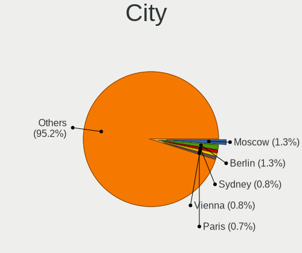
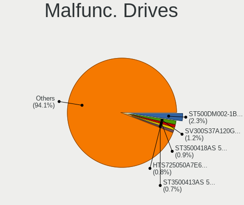
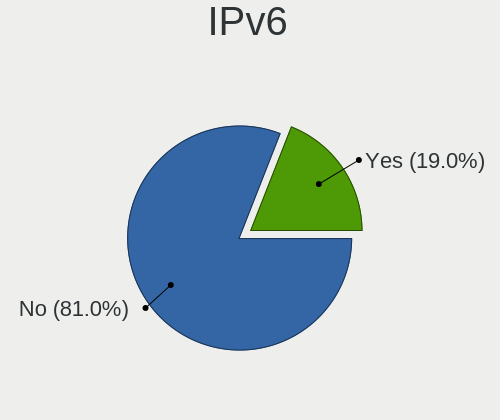
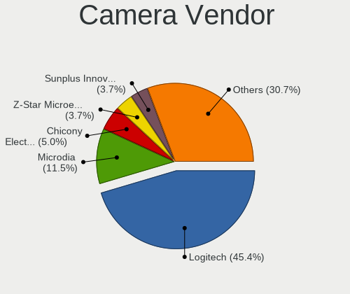
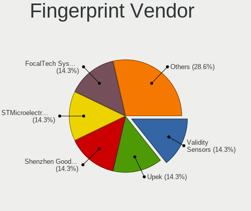

BSD - Tested Hardware & Statistics (Desktops)
---------------------------------------------

A project to collect tested hardware configurations for BSD.

Anyone can contribute to this report by the [hw-probe](https://github.com/linuxhw/hw-probe/blob/master/INSTALL.BSD.md) tool:

    hw-probe -all -upload

Please contribute! Especially if your hardware is rare.

This report is for real hardware. Report for virtual hardware: [TestDays_VE](https://github.com/bsdhw/TestDays_VE)

Contents
--------

* [ Test Cases ](#test-cases)

* [ System ](#system)
  - [ OS                       ](#os)
  - [ OS Family                ](#os-family)
  - [ Arch                     ](#arch)
  - [ DE                       ](#de)
  - [ Display Server           ](#display-server)
  - [ Display Manager          ](#display-manager)
  - [ OS Lang                  ](#os-lang)
  - [ Boot Mode                ](#boot-mode)
  - [ Filesystem               ](#filesystem)
  - [ Part. scheme             ](#part-scheme)

* [ Board ](#board)
  - [ Vendor                   ](#vendor)
  - [ Model                    ](#model)
  - [ Model Family             ](#model-family)
  - [ MFG Year                 ](#mfg-year)
  - [ Form Factor              ](#form-factor)
  - [ Coreboot                 ](#coreboot)
  - [ RAM Size                 ](#ram-size)
  - [ RAM Used                 ](#ram-used)
  - [ Total Drives             ](#total-drives)
  - [ Has CD-ROM               ](#has-cd-rom)
  - [ Has Ethernet             ](#has-ethernet)
  - [ Has WiFi                 ](#has-wifi)
  - [ Has Bluetooth            ](#has-bluetooth)

* [ Location ](#location)
  - [ Country                  ](#country)
  - [ City                     ](#city)

* [ Drives ](#drives)
  - [ Drive Vendor             ](#drive-vendor)
  - [ Drive Model              ](#drive-model)
  - [ HDD Vendor               ](#hdd-vendor)
  - [ SSD Vendor               ](#ssd-vendor)
  - [ Drive Kind               ](#drive-kind)
  - [ Drive Connector          ](#drive-connector)
  - [ Drive Size               ](#drive-size)
  - [ Space Total              ](#space-total)
  - [ Space Used               ](#space-used)
  - [ Malfunc. Drives          ](#malfunc-drives)
  - [ Malfunc. Drive Vendor    ](#malfunc-drive-vendor)
  - [ Malfunc. HDD Vendor      ](#malfunc-hdd-vendor)
  - [ Malfunc. Drive Kind      ](#malfunc-drive-kind)
  - [ Failed Drives            ](#failed-drives)
  - [ Failed Drive Vendor      ](#failed-drive-vendor)
  - [ Drive Status             ](#drive-status)

* [ Storage controller ](#storage-controller)
  - [ Storage Vendor           ](#storage-vendor)
  - [ Storage Model            ](#storage-model)
  - [ Storage Kind             ](#storage-kind)

* [ Processor ](#processor)
  - [ CPU Vendor               ](#cpu-vendor)
  - [ CPU Model                ](#cpu-model)
  - [ CPU Model Family         ](#cpu-model-family)
  - [ CPU Cores                ](#cpu-cores)
  - [ CPU Sockets              ](#cpu-sockets)
  - [ CPU Threads              ](#cpu-threads)
  - [ CPU Microarch            ](#cpu-microarch)

* [ Graphics ](#graphics)
  - [ GPU Vendor               ](#gpu-vendor)
  - [ GPU Model                ](#gpu-model)
  - [ GPU Combo                ](#gpu-combo)
  - [ GPU Driver               ](#gpu-driver)
  - [ GPU Memory               ](#gpu-memory)

* [ Monitor ](#monitor)
  - [ Monitor Vendor           ](#monitor-vendor)
  - [ Monitor Model            ](#monitor-model)
  - [ Monitor Resolution       ](#monitor-resolution)
  - [ Monitor Diagonal         ](#monitor-diagonal)
  - [ Monitor Width            ](#monitor-width)
  - [ Aspect Ratio             ](#aspect-ratio)
  - [ Monitor Area             ](#monitor-area)
  - [ Pixel Density            ](#pixel-density)
  - [ Multiple Monitors        ](#multiple-monitors)

* [ Network ](#network)
  - [ Net Controller Vendor    ](#net-controller-vendor)
  - [ Net Controller Model     ](#net-controller-model)
  - [ Wireless Vendor          ](#wireless-vendor)
  - [ Wireless Model           ](#wireless-model)
  - [ Ethernet Vendor          ](#ethernet-vendor)
  - [ Ethernet Model           ](#ethernet-model)
  - [ Net Controller Kind      ](#net-controller-kind)
  - [ Used Controller          ](#used-controller)
  - [ NICs                     ](#nics)
  - [ IPv6                     ](#ipv6)

* [ Bluetooth ](#bluetooth)
  - [ Bluetooth Vendor         ](#bluetooth-vendor)
  - [ Bluetooth Model          ](#bluetooth-model)

* [ Sound ](#sound)
  - [ Sound Vendor             ](#sound-vendor)
  - [ Sound Model              ](#sound-model)

* [ Memory ](#memory)
  - [ Memory Vendor            ](#memory-vendor)
  - [ Memory Model             ](#memory-model)
  - [ Memory Kind              ](#memory-kind)
  - [ Memory Form Factor       ](#memory-form-factor)
  - [ Memory Size              ](#memory-size)
  - [ Memory Speed             ](#memory-speed)

* [ Printers & scanners ](#printers--scanners)
  - [ Printer Vendor           ](#printer-vendor)
  - [ Printer Model            ](#printer-model)
  - [ Scanner Vendor           ](#scanner-vendor)
  - [ Scanner Model            ](#scanner-model)

* [ Camera ](#camera)
  - [ Camera Vendor            ](#camera-vendor)
  - [ Camera Model             ](#camera-model)

* [ Security ](#security)
  - [ Fingerprint Vendor       ](#fingerprint-vendor)
  - [ Fingerprint Model        ](#fingerprint-model)
  - [ Chipcard Vendor          ](#chipcard-vendor)
  - [ Chipcard Model           ](#chipcard-model)

* [ Unsupported ](#unsupported)
  - [ Unsupported Devices      ](#unsupported-devices)
  - [ Unsupported Device Types ](#unsupported-device-types)

Test Cases
----------

Total: 9810

| Vendor        | Model                       | Probe                                                     | Date         |
|---------------|-----------------------------|-----------------------------------------------------------|--------------|
| Unknown       | HX90                        | [b3300c45bc](https://bsd-hardware.info/?probe=b3300c45bc) | May 01, 2023 |
| Unknown       | Unknown                     | [73f9fac4f8](https://bsd-hardware.info/?probe=73f9fac4f8) | May 01, 2023 |
| ASUSTek       | ROG STRIX B550-F GAMING     | [3f089673e0](https://bsd-hardware.info/?probe=3f089673e0) | May 01, 2023 |
| ASUSTek       | ROG STRIX B550-F GAMING     | [396d7f268c](https://bsd-hardware.info/?probe=396d7f268c) | May 01, 2023 |
| Fujitsu       | D3313-G1 S26361-D3313-G1    | [8227d6d32c](https://bsd-hardware.info/?probe=8227d6d32c) | Apr 30, 2023 |
| IceWhale T... | ZimaBoard 832 ZMB           | [a59b6fc6dc](https://bsd-hardware.info/?probe=a59b6fc6dc) | Apr 30, 2023 |
| ZOTAC         | Unknown                     | [f6c39a3582](https://bsd-hardware.info/?probe=f6c39a3582) | Apr 30, 2023 |
| IceWhale T... | ZimaBoard 832 ZMB           | [2cc6521d1f](https://bsd-hardware.info/?probe=2cc6521d1f) | Apr 30, 2023 |
| ASRockRack    | EPYC3101D4I-2T              | [9d82570c34](https://bsd-hardware.info/?probe=9d82570c34) | Apr 30, 2023 |
| Dell          | 0FF3FN A00                  | [717b46840a](https://bsd-hardware.info/?probe=717b46840a) | Apr 30, 2023 |
| Dell          | 0H634K A00                  | [5e783a1c2e](https://bsd-hardware.info/?probe=5e783a1c2e) | Apr 30, 2023 |
| ASUSTek       | EX-B760M-V5 D4              | [d913324f82](https://bsd-hardware.info/?probe=d913324f82) | Apr 30, 2023 |
| ASUSTek       | M5A78L-M/USB3               | [f86a94eb66](https://bsd-hardware.info/?probe=f86a94eb66) | Apr 30, 2023 |
| CWWK          | MINIPC-G12                  | [0ef2320816](https://bsd-hardware.info/?probe=0ef2320816) | Apr 30, 2023 |
| GVC           | DR 738                      | [21b338db1b](https://bsd-hardware.info/?probe=21b338db1b) | Apr 30, 2023 |
| MSI           | H81M-P33                    | [e28acf1164](https://bsd-hardware.info/?probe=e28acf1164) | Apr 30, 2023 |
| ASUSTek       | P5Q-E                       | [33d1b6e2d2](https://bsd-hardware.info/?probe=33d1b6e2d2) | Apr 30, 2023 |
| ASUSTek       | ROG CROSSHAIR VIII HERO     | [b0d9eaaceb](https://bsd-hardware.info/?probe=b0d9eaaceb) | Apr 30, 2023 |
| Gigabyte      | B450M DS3H-CF               | [2b922b7925](https://bsd-hardware.info/?probe=2b922b7925) | Apr 30, 2023 |
| ASUSTek       | AT5IONT-I                   | [1984165524](https://bsd-hardware.info/?probe=1984165524) | Apr 30, 2023 |
| HP            | 213D A01                    | [1722a91083](https://bsd-hardware.info/?probe=1722a91083) | Apr 30, 2023 |
| ASUSTek       | ROG STRIX B550-F GAMING     | [779f5f8827](https://bsd-hardware.info/?probe=779f5f8827) | Apr 30, 2023 |
| HP            | 83E1                        | [d3e5e9a563](https://bsd-hardware.info/?probe=d3e5e9a563) | Apr 30, 2023 |
| Protectli     | VP2420                      | [4ea8453453](https://bsd-hardware.info/?probe=4ea8453453) | Apr 30, 2023 |
| Protectli     | VP2420                      | [46a00b21d9](https://bsd-hardware.info/?probe=46a00b21d9) | Apr 30, 2023 |
| CWWK          | MINIPC-G12                  | [4806dc7d9a](https://bsd-hardware.info/?probe=4806dc7d9a) | Apr 29, 2023 |
| Unknown       | Unknown                     | [1774da050f](https://bsd-hardware.info/?probe=1774da050f) | Apr 29, 2023 |
| Gigabyte      | Z370 HD3-CF                 | [b3aedc1990](https://bsd-hardware.info/?probe=b3aedc1990) | Apr 29, 2023 |
| Dell          | 00V62H A00                  | [ad97036f62](https://bsd-hardware.info/?probe=ad97036f62) | Apr 29, 2023 |
| Unknown       | Unknown                     | [73fa910249](https://bsd-hardware.info/?probe=73fa910249) | Apr 29, 2023 |
| Gigabyte      | H510M K                     | [a952664d92](https://bsd-hardware.info/?probe=a952664d92) | Apr 29, 2023 |
| ASUSTek       | PRIME B250M-A               | [270284972d](https://bsd-hardware.info/?probe=270284972d) | Apr 29, 2023 |
| ASUSTek       | PRIME H610I-PLUS D4         | [472c5fb78e](https://bsd-hardware.info/?probe=472c5fb78e) | Apr 29, 2023 |
| Supermicro    | X11SDV-4C-TP8F              | [dbdb6539fb](https://bsd-hardware.info/?probe=dbdb6539fb) | Apr 29, 2023 |
| Protectli     | FW4B                        | [048da71e18](https://bsd-hardware.info/?probe=048da71e18) | Apr 29, 2023 |
| iBASE         | Mi956                       | [e2c1e52a68](https://bsd-hardware.info/?probe=e2c1e52a68) | Apr 29, 2023 |
| MSI           | X470 GAMING PLUS MAX        | [8acf41eb6b](https://bsd-hardware.info/?probe=8acf41eb6b) | Apr 28, 2023 |
| Protectli     | FW4C Ver                    | [29ecd63e1e](https://bsd-hardware.info/?probe=29ecd63e1e) | Apr 28, 2023 |
| Unknown       | Unknown                     | [d6f92a5ecc](https://bsd-hardware.info/?probe=d6f92a5ecc) | Apr 28, 2023 |
| Unknown       | iKoolCore R1 iKoolCore R... | [9495b45b30](https://bsd-hardware.info/?probe=9495b45b30) | Apr 28, 2023 |
| Protectli     | VP2420                      | [b980175f4f](https://bsd-hardware.info/?probe=b980175f4f) | Apr 28, 2023 |
| Gigabyte      | Z590 AORUS ULTRA            | [f6200a69eb](https://bsd-hardware.info/?probe=f6200a69eb) | Apr 28, 2023 |
| Unknown       | Unknown                     | [28253dd080](https://bsd-hardware.info/?probe=28253dd080) | Apr 28, 2023 |
| Intel         | SHARKBAY                    | [d4848171e4](https://bsd-hardware.info/?probe=d4848171e4) | Apr 28, 2023 |
| NCR           | Richmond BIOS.6.0           | [e41e1e5c70](https://bsd-hardware.info/?probe=e41e1e5c70) | Apr 28, 2023 |
| Protectli     | FW4B Ver                    | [ef3774c8f2](https://bsd-hardware.info/?probe=ef3774c8f2) | Apr 28, 2023 |
| PC Engines    | apu1                        | [1a37e9d978](https://bsd-hardware.info/?probe=1a37e9d978) | Apr 27, 2023 |
| Unknown       | Unknown                     | [15c2e0790b](https://bsd-hardware.info/?probe=15c2e0790b) | Apr 27, 2023 |
| Deciso        | Netboard A10 GEN2 Model ... | [e7e7a6470d](https://bsd-hardware.info/?probe=e7e7a6470d) | Apr 27, 2023 |
| Deciso        | Netboard A10 GEN2 Model ... | [b517729fb4](https://bsd-hardware.info/?probe=b517729fb4) | Apr 27, 2023 |
| Protectli     | VP2420                      | [8b2758be02](https://bsd-hardware.info/?probe=8b2758be02) | Apr 27, 2023 |
| iBASE         | Mi956                       | [cb08976732](https://bsd-hardware.info/?probe=cb08976732) | Apr 27, 2023 |
| Lenovo        | SHARKBAY NOK                | [2a9fc1af29](https://bsd-hardware.info/?probe=2a9fc1af29) | Apr 27, 2023 |
| MSI           | H110M PRO-VD                | [ce8453fcce](https://bsd-hardware.info/?probe=ce8453fcce) | Apr 27, 2023 |
| Dell          | 0KV62T A01                  | [f26926526d](https://bsd-hardware.info/?probe=f26926526d) | Apr 27, 2023 |
| ASUSTek       | PRIME B760M-A D4            | [9d15e108e6](https://bsd-hardware.info/?probe=9d15e108e6) | Apr 27, 2023 |
| Intel         | CRESCENTBAY                 | [b32c8cbec8](https://bsd-hardware.info/?probe=b32c8cbec8) | Apr 27, 2023 |
| ASUSTek       | H61M-K                      | [e735610d5c](https://bsd-hardware.info/?probe=e735610d5c) | Apr 27, 2023 |
| ASUSTek       | H61M-K                      | [db767ed552](https://bsd-hardware.info/?probe=db767ed552) | Apr 27, 2023 |
| Lenovo        | 30D9 SDK0J40705 WIN 3425... | [8476daf227](https://bsd-hardware.info/?probe=8476daf227) | Apr 27, 2023 |
| Dell          | 0252PH A04                  | [f497e66dec](https://bsd-hardware.info/?probe=f497e66dec) | Apr 27, 2023 |
| HP            | 18E5                        | [9f82560327](https://bsd-hardware.info/?probe=9f82560327) | Apr 26, 2023 |
| HP            | 83EE                        | [b5a00cabd1](https://bsd-hardware.info/?probe=b5a00cabd1) | Apr 26, 2023 |
| Unknown       | Unknown                     | [f061353360](https://bsd-hardware.info/?probe=f061353360) | Apr 26, 2023 |
| Unknown       | Unknown                     | [290fabd69d](https://bsd-hardware.info/?probe=290fabd69d) | Apr 26, 2023 |
| Fujitsu       | D3313-A1 S26361-D3313-A1    | [989f3b44bf](https://bsd-hardware.info/?probe=989f3b44bf) | Apr 26, 2023 |
| Unknown       | Unknown                     | [ece1b6bacb](https://bsd-hardware.info/?probe=ece1b6bacb) | Apr 26, 2023 |
| PC Engines    | APU2                        | [94bbc28953](https://bsd-hardware.info/?probe=94bbc28953) | Apr 26, 2023 |
| HP            | 859B                        | [357ef27be4](https://bsd-hardware.info/?probe=357ef27be4) | Apr 26, 2023 |
| HP            | 83E1                        | [58c58b6a82](https://bsd-hardware.info/?probe=58c58b6a82) | Apr 26, 2023 |
| HP            | 872D                        | [bd02a2ddb8](https://bsd-hardware.info/?probe=bd02a2ddb8) | Apr 26, 2023 |
| HP            | 8056                        | [44fb168511](https://bsd-hardware.info/?probe=44fb168511) | Apr 26, 2023 |
| Techvision    | TVI7309X B0                 | [dcacaf8c50](https://bsd-hardware.info/?probe=dcacaf8c50) | Apr 26, 2023 |
| HP            | 1998                        | [41b5bbe52c](https://bsd-hardware.info/?probe=41b5bbe52c) | Apr 26, 2023 |
| Supermicro    | X11SDW-8C-TP13F             | [94316d20c8](https://bsd-hardware.info/?probe=94316d20c8) | Apr 26, 2023 |
| AZW           | EQ                          | [8dd15b5070](https://bsd-hardware.info/?probe=8dd15b5070) | Apr 26, 2023 |
| Lenovo        | 3132 SDK0J40697 WIN 3305... | [6efffdce00](https://bsd-hardware.info/?probe=6efffdce00) | Apr 25, 2023 |
| Gigabyte      | B360M D2V                   | [d4881f1fb6](https://bsd-hardware.info/?probe=d4881f1fb6) | Apr 25, 2023 |
| ShenZhen M... | 3865U-6L                    | [1548471a4d](https://bsd-hardware.info/?probe=1548471a4d) | Apr 25, 2023 |
| Intel         | Q3XXG4-P V1.0               | [b46f671e20](https://bsd-hardware.info/?probe=b46f671e20) | Apr 25, 2023 |
| ASUSTek       | P10S-E Series               | [e6d1a90732](https://bsd-hardware.info/?probe=e6d1a90732) | Apr 25, 2023 |
| HP            | 83E1                        | [865bd9b84e](https://bsd-hardware.info/?probe=865bd9b84e) | Apr 25, 2023 |
| Supermicro    | X11SDV-8C-TP8F              | [b56e27db28](https://bsd-hardware.info/?probe=b56e27db28) | Apr 25, 2023 |
| AZW           | GK55                        | [31a99b9d2a](https://bsd-hardware.info/?probe=31a99b9d2a) | Apr 25, 2023 |
| ASRock        | H81M-VG4 R2.0               | [d249003a15](https://bsd-hardware.info/?probe=d249003a15) | Apr 25, 2023 |
| Dell          | 0NV0M7 A01                  | [601f819826](https://bsd-hardware.info/?probe=601f819826) | Apr 25, 2023 |
| Protectli     | FW4B                        | [111e2f7b3b](https://bsd-hardware.info/?probe=111e2f7b3b) | Apr 25, 2023 |
| ASUSTek       | ROG CROSSHAIR VIII HERO     | [cf0771c3a2](https://bsd-hardware.info/?probe=cf0771c3a2) | Apr 25, 2023 |
| Supermicro    | X11SDV-4C-TP8F-01           | [02d2e2ea42](https://bsd-hardware.info/?probe=02d2e2ea42) | Apr 25, 2023 |
| Intel GMLV... | GMLR115 GMLR115             | [56d2fcc6e9](https://bsd-hardware.info/?probe=56d2fcc6e9) | Apr 24, 2023 |
| HP            | 18E7                        | [777359d3c1](https://bsd-hardware.info/?probe=777359d3c1) | Apr 24, 2023 |
| ASUSTek       | TUF Gaming X670E-PLUS WI... | [d3373e972b](https://bsd-hardware.info/?probe=d3373e972b) | Apr 24, 2023 |
| Protectli     | FW4C Ver                    | [39d17845fb](https://bsd-hardware.info/?probe=39d17845fb) | Apr 24, 2023 |
| AZW           | EQ                          | [fe3205803d](https://bsd-hardware.info/?probe=fe3205803d) | Apr 24, 2023 |
| MiTAC         | PH13CMI                     | [5d3e954049](https://bsd-hardware.info/?probe=5d3e954049) | Apr 24, 2023 |
| ASRock        | X370 Pro4                   | [9678198b3b](https://bsd-hardware.info/?probe=9678198b3b) | Apr 24, 2023 |
| Unknown       | Unknown                     | [389267d68d](https://bsd-hardware.info/?probe=389267d68d) | Apr 24, 2023 |
| Dell          | 0NV0M7 A01                  | [280ab26f33](https://bsd-hardware.info/?probe=280ab26f33) | Apr 24, 2023 |
| Lenovo        | V14 G2 ITL 82NM             | [827308827b](https://bsd-hardware.info/?probe=827308827b) | Apr 24, 2023 |
| Lenovo        | ThinkCentre M57p 6073ATU    | [b1e7583e6b](https://bsd-hardware.info/?probe=b1e7583e6b) | Apr 24, 2023 |
| Supermicro    | A1SRi-2758F                 | [750e44f983](https://bsd-hardware.info/?probe=750e44f983) | Apr 24, 2023 |
| Dell          | 0WR7PY A03                  | [e461f7862c](https://bsd-hardware.info/?probe=e461f7862c) | Apr 23, 2023 |
| ASUSTek       | TUF Gaming B650M-PLUS       | [0c8a0100c5](https://bsd-hardware.info/?probe=0c8a0100c5) | Apr 23, 2023 |
| Unknown       | Unknown                     | [19f2756a1d](https://bsd-hardware.info/?probe=19f2756a1d) | Apr 23, 2023 |
| ASRock        | H110M-ITX                   | [ed0c2c1af7](https://bsd-hardware.info/?probe=ed0c2c1af7) | Apr 23, 2023 |
| Dell          | 02YYK5 A01                  | [9f7ba08cb2](https://bsd-hardware.info/?probe=9f7ba08cb2) | Apr 23, 2023 |
| MW            | GMLK-2_5G4L                 | [b3a756536a](https://bsd-hardware.info/?probe=b3a756536a) | Apr 23, 2023 |
| Techvision    | TVI7309X B0                 | [ad73cda832](https://bsd-hardware.info/?probe=ad73cda832) | Apr 23, 2023 |
| Intel         | Q3XXG4-P V1.0               | [7891ca8e09](https://bsd-hardware.info/?probe=7891ca8e09) | Apr 23, 2023 |
| MSI           | H81M-P33                    | [6df7a17ff2](https://bsd-hardware.info/?probe=6df7a17ff2) | Apr 23, 2023 |
| ASUSTek       | P5Q-E                       | [37564b68c3](https://bsd-hardware.info/?probe=37564b68c3) | Apr 23, 2023 |
| ASUSTek       | ROG CROSSHAIR VIII HERO     | [d44a98739c](https://bsd-hardware.info/?probe=d44a98739c) | Apr 23, 2023 |
| HP            | 82B4                        | [9ec1e6d6f4](https://bsd-hardware.info/?probe=9ec1e6d6f4) | Apr 23, 2023 |
| Protectli     | VP2410 10                   | [463567a3e6](https://bsd-hardware.info/?probe=463567a3e6) | Apr 23, 2023 |
| Techvision    | TVI7309X B0                 | [dab120ab36](https://bsd-hardware.info/?probe=dab120ab36) | Apr 23, 2023 |
| PC Engines    | APU2                        | [47eb1b9bf1](https://bsd-hardware.info/?probe=47eb1b9bf1) | Apr 23, 2023 |
| ASUSTek       | TUF Gaming B560M-PLUS WI... | [50ff0c14dd](https://bsd-hardware.info/?probe=50ff0c14dd) | Apr 22, 2023 |
| PC Engines    | apu1                        | [9838a040ba](https://bsd-hardware.info/?probe=9838a040ba) | Apr 22, 2023 |
| PC Engines    | apu1                        | [6e3df79f6d](https://bsd-hardware.info/?probe=6e3df79f6d) | Apr 22, 2023 |
| ASUSTek       | TUF Gaming B650M-PLUS       | [775424cbff](https://bsd-hardware.info/?probe=775424cbff) | Apr 22, 2023 |
| Supermicro    | A2SDi-4C-HLN4F              | [631a166cee](https://bsd-hardware.info/?probe=631a166cee) | Apr 22, 2023 |
| Gigabyte      | N3050MD3P                   | [66e9ccbef8](https://bsd-hardware.info/?probe=66e9ccbef8) | Apr 22, 2023 |
| Protectli     | FW4B Ver                    | [f241a78410](https://bsd-hardware.info/?probe=f241a78410) | Apr 22, 2023 |
| Techvision    | TVI7309X B0                 | [fb86b7611d](https://bsd-hardware.info/?probe=fb86b7611d) | Apr 22, 2023 |
| Fujitsu       | D3313-A1 S26361-D3313-A1    | [7a5fcaf0d0](https://bsd-hardware.info/?probe=7a5fcaf0d0) | Apr 22, 2023 |
| ASUSTek       | P8H77-V                     | [60f61f7ecb](https://bsd-hardware.info/?probe=60f61f7ecb) | Apr 22, 2023 |
| Techvision    | TVI7309X B0                 | [a4bc168937](https://bsd-hardware.info/?probe=a4bc168937) | Apr 22, 2023 |
| Intel         | SKYBAY                      | [03dd920110](https://bsd-hardware.info/?probe=03dd920110) | Apr 22, 2023 |
| HP            | 83E1                        | [35360c7568](https://bsd-hardware.info/?probe=35360c7568) | Apr 22, 2023 |
| Unknown       | Unknown                     | [66614019db](https://bsd-hardware.info/?probe=66614019db) | Apr 22, 2023 |
| Supermicro    | X9SCL/X9SCMA                | [9b975ac704](https://bsd-hardware.info/?probe=9b975ac704) | Apr 22, 2023 |
| ASUSTek       | AT5IONT-I                   | [b943bb55f8](https://bsd-hardware.info/?probe=b943bb55f8) | Apr 21, 2023 |
| Dell          | 09KPNV A01                  | [ace3ed09b3](https://bsd-hardware.info/?probe=ace3ed09b3) | Apr 21, 2023 |
| Unknown       | Unknown                     | [7f3a49a5e2](https://bsd-hardware.info/?probe=7f3a49a5e2) | Apr 21, 2023 |
| PC Engines    | APU                         | [c4238a76d1](https://bsd-hardware.info/?probe=c4238a76d1) | Apr 21, 2023 |
| PC Engines    | APU                         | [ae3ce982fe](https://bsd-hardware.info/?probe=ae3ce982fe) | Apr 21, 2023 |
| ASUSTek       | TUF Gaming B550-PLUS        | [c26c1111c6](https://bsd-hardware.info/?probe=c26c1111c6) | Apr 21, 2023 |
| Unknown       | Unknown                     | [b755911f65](https://bsd-hardware.info/?probe=b755911f65) | Apr 21, 2023 |
| Unknown       | Unknown                     | [5cd7c515c9](https://bsd-hardware.info/?probe=5cd7c515c9) | Apr 21, 2023 |
| Unknown       | Unknown                     | [0d7a1b58ed](https://bsd-hardware.info/?probe=0d7a1b58ed) | Apr 21, 2023 |
| ASUSTek       | C8HM70-I/HDMI               | [2701240671](https://bsd-hardware.info/?probe=2701240671) | Apr 21, 2023 |
| Lenovo        | V14 G2 ITL 82NM             | [a6141b809a](https://bsd-hardware.info/?probe=a6141b809a) | Apr 21, 2023 |
| Techvision    | TVI7309X B0                 | [db14ca34c2](https://bsd-hardware.info/?probe=db14ca34c2) | Apr 21, 2023 |
| Techvision    | TVI7309X B0                 | [215364d870](https://bsd-hardware.info/?probe=215364d870) | Apr 21, 2023 |
| ASUSTek       | ROG STRIX B550-E GAMING     | [838979f891](https://bsd-hardware.info/?probe=838979f891) | Apr 20, 2023 |
| HP            | 83F2                        | [1ff683e02b](https://bsd-hardware.info/?probe=1ff683e02b) | Apr 20, 2023 |
| Acer          | Aspire TC-885 V:1.1         | [6f85c5453c](https://bsd-hardware.info/?probe=6f85c5453c) | Apr 20, 2023 |
| PC Engines    | APU2                        | [4337168a3a](https://bsd-hardware.info/?probe=4337168a3a) | Apr 20, 2023 |
| GoWin Solu... | R86S                        | [5e94539f7f](https://bsd-hardware.info/?probe=5e94539f7f) | Apr 20, 2023 |
| Dell          | 04Y8V0 A02                  | [24379ebf10](https://bsd-hardware.info/?probe=24379ebf10) | Apr 20, 2023 |
| HP            | 158B                        | [40fe372619](https://bsd-hardware.info/?probe=40fe372619) | Apr 20, 2023 |
| Protectli     | FW4B Ver                    | [156f934077](https://bsd-hardware.info/?probe=156f934077) | Apr 20, 2023 |
| ASUSTek       | TUF Gaming B550M-E WIFI     | [79411cd83e](https://bsd-hardware.info/?probe=79411cd83e) | Apr 20, 2023 |
| Supermicro    | M11SDV-8C-LN4F              | [49a95f197c](https://bsd-hardware.info/?probe=49a95f197c) | Apr 20, 2023 |
| Lenovo        | 310B SDK0J40697 WIN 3305... | [94507dfaf6](https://bsd-hardware.info/?probe=94507dfaf6) | Apr 20, 2023 |
| ASUSTek       | P11C-M Series               | [4695b46b47](https://bsd-hardware.info/?probe=4695b46b47) | Apr 20, 2023 |
| HP            | 82B4                        | [b75bb5fe83](https://bsd-hardware.info/?probe=b75bb5fe83) | Apr 20, 2023 |
| MW            | GMLK-2_5G4L                 | [24162b26be](https://bsd-hardware.info/?probe=24162b26be) | Apr 20, 2023 |
| Techvision    | TVI7309X B0                 | [fdbbde509c](https://bsd-hardware.info/?probe=fdbbde509c) | Apr 20, 2023 |
| PC Engines    | APU3                        | [110d848c38](https://bsd-hardware.info/?probe=110d848c38) | Apr 19, 2023 |
| PC Engines    | APU2                        | [59b3a3eebf](https://bsd-hardware.info/?probe=59b3a3eebf) | Apr 19, 2023 |
| Protectli     | FW4B Ver                    | [d727bd2723](https://bsd-hardware.info/?probe=d727bd2723) | Apr 19, 2023 |
| Techvision    | TVI7309X B0                 | [aaec523cac](https://bsd-hardware.info/?probe=aaec523cac) | Apr 19, 2023 |
| Dell          | 0VTC0D A02                  | [a807892254](https://bsd-hardware.info/?probe=a807892254) | Apr 19, 2023 |
| Gigabyte      | H81M-DS2                    | [de82761612](https://bsd-hardware.info/?probe=de82761612) | Apr 19, 2023 |
| ASUSTek       | Pro B560M-C                 | [b341a9c9c9](https://bsd-hardware.info/?probe=b341a9c9c9) | Apr 19, 2023 |
| Dell          | 05XGC8 A01                  | [d89f79132d](https://bsd-hardware.info/?probe=d89f79132d) | Apr 19, 2023 |
| Acer          | Acadia V1.44                | [97bda17afa](https://bsd-hardware.info/?probe=97bda17afa) | Apr 19, 2023 |
| HP            | 8299                        | [a9e845749a](https://bsd-hardware.info/?probe=a9e845749a) | Apr 19, 2023 |
| Gigabyte      | H61M-S2PH                   | [024173445b](https://bsd-hardware.info/?probe=024173445b) | Apr 18, 2023 |
| Intel         | Q3XXG4-P V1.0               | [c626643f89](https://bsd-hardware.info/?probe=c626643f89) | Apr 18, 2023 |
| Unknown       | Unknown                     | [311e89be7a](https://bsd-hardware.info/?probe=311e89be7a) | Apr 18, 2023 |
| Intel         | D54250WYK H13922-303        | [4539fe8a93](https://bsd-hardware.info/?probe=4539fe8a93) | Apr 18, 2023 |
| HP            | 8055                        | [83ecb873fe](https://bsd-hardware.info/?probe=83ecb873fe) | Apr 18, 2023 |
| Techvision    | TVI7309X B0                 | [28c2a703c7](https://bsd-hardware.info/?probe=28c2a703c7) | Apr 18, 2023 |
| ASUSTek       | P8H67-M EVO                 | [9d189f3b10](https://bsd-hardware.info/?probe=9d189f3b10) | Apr 18, 2023 |
| Pegatron      | 2AD0                        | [52c8c370bc](https://bsd-hardware.info/?probe=52c8c370bc) | Apr 18, 2023 |
| AZW           | EQ                          | [c9fe4601ec](https://bsd-hardware.info/?probe=c9fe4601ec) | Apr 18, 2023 |
| MSI           | 2A78h                       | [8560ebd69c](https://bsd-hardware.info/?probe=8560ebd69c) | Apr 18, 2023 |
| Dell          | 0CNWVK A00                  | [6642a4b35d](https://bsd-hardware.info/?probe=6642a4b35d) | Apr 18, 2023 |
| CncTion       | J4125-4L-I225               | [b4fd4e35b2](https://bsd-hardware.info/?probe=b4fd4e35b2) | Apr 18, 2023 |
| Supermicro    | X11SDW-8C-TP13F             | [20fac0b7a5](https://bsd-hardware.info/?probe=20fac0b7a5) | Apr 18, 2023 |
| Lenovo        | YangTianM6880N              | [a567c3062c](https://bsd-hardware.info/?probe=a567c3062c) | Apr 18, 2023 |
| PC Engines    | APU2                        | [5d714a9c0d](https://bsd-hardware.info/?probe=5d714a9c0d) | Apr 18, 2023 |
| Intel         | SKYBAY                      | [99dc2ee0d7](https://bsd-hardware.info/?probe=99dc2ee0d7) | Apr 18, 2023 |
| Protectli     | FW4B                        | [4decd3bce3](https://bsd-hardware.info/?probe=4decd3bce3) | Apr 18, 2023 |
| ZOTAC         | Unknown                     | [8c3cdf29a2](https://bsd-hardware.info/?probe=8c3cdf29a2) | Apr 17, 2023 |
| Gigabyte      | B360M D2V                   | [f73cb94828](https://bsd-hardware.info/?probe=f73cb94828) | Apr 17, 2023 |
| Unknown       | Unknown                     | [f5153e1b18](https://bsd-hardware.info/?probe=f5153e1b18) | Apr 17, 2023 |
| CncTion       | N5105-4L B0                 | [6de7890035](https://bsd-hardware.info/?probe=6de7890035) | Apr 17, 2023 |
| ASUSTek       | Crosshair IV Formula        | [a7830f5244](https://bsd-hardware.info/?probe=a7830f5244) | Apr 17, 2023 |
| Gigabyte      | A520M DS3H AC               | [16021ac5b5](https://bsd-hardware.info/?probe=16021ac5b5) | Apr 17, 2023 |
| Unknown       | Unknown                     | [6fb32a976a](https://bsd-hardware.info/?probe=6fb32a976a) | Apr 16, 2023 |
| ASRock        | B250M-HDV                   | [3608477e76](https://bsd-hardware.info/?probe=3608477e76) | Apr 16, 2023 |
| Unknown       | Unknown                     | [f8fefc6cad](https://bsd-hardware.info/?probe=f8fefc6cad) | Apr 16, 2023 |
| Fujitsu       | D3313-A1 S26361-D3313-A1    | [d343800c53](https://bsd-hardware.info/?probe=d343800c53) | Apr 16, 2023 |
| ChangWang     | CW56-58                     | [98a2dbcb2a](https://bsd-hardware.info/?probe=98a2dbcb2a) | Apr 16, 2023 |
| Unknown       | Unknown                     | [56505e8956](https://bsd-hardware.info/?probe=56505e8956) | Apr 16, 2023 |
| Intel         | Q3XXG4-P V1.0               | [4fbc5291d9](https://bsd-hardware.info/?probe=4fbc5291d9) | Apr 16, 2023 |
| MSI           | H81M-P33                    | [e285cc821f](https://bsd-hardware.info/?probe=e285cc821f) | Apr 16, 2023 |
| ASUSTek       | P5Q-E                       | [b79bdd39da](https://bsd-hardware.info/?probe=b79bdd39da) | Apr 16, 2023 |
| ASUSTek       | ROG CROSSHAIR VIII HERO     | [e6734bf5e3](https://bsd-hardware.info/?probe=e6734bf5e3) | Apr 16, 2023 |
| Techvision    | TVI7309X B0                 | [4110309ccc](https://bsd-hardware.info/?probe=4110309ccc) | Apr 16, 2023 |
| Gigabyte      | X670E AORUS MASTER          | [773b28fbc7](https://bsd-hardware.info/?probe=773b28fbc7) | Apr 16, 2023 |
| Dell          | 09KPNV A01                  | [cf533da9bf](https://bsd-hardware.info/?probe=cf533da9bf) | Apr 16, 2023 |
| Unknown       | Unknown                     | [fb756bb34e](https://bsd-hardware.info/?probe=fb756bb34e) | Apr 16, 2023 |
| Fujitsu       | D3313-A1 S26361-D3313-A1    | [a29966f9ee](https://bsd-hardware.info/?probe=a29966f9ee) | Apr 16, 2023 |
| Unknown       | Unknown                     | [cff3d92e32](https://bsd-hardware.info/?probe=cff3d92e32) | Apr 15, 2023 |
| ASUSTek       | P5BV-E                      | [f134ff34ba](https://bsd-hardware.info/?probe=f134ff34ba) | Apr 15, 2023 |
| Gigabyte      | B560M DS3H V2               | [737250a1c8](https://bsd-hardware.info/?probe=737250a1c8) | Apr 15, 2023 |
| Techvision    | TVI7309X B0                 | [3b0562fe2a](https://bsd-hardware.info/?probe=3b0562fe2a) | Apr 15, 2023 |
| PICO PC       | MNHO-113                    | [ad485d27af](https://bsd-hardware.info/?probe=ad485d27af) | Apr 15, 2023 |
| MW            | GMLK-2_5G4L                 | [4127e0b00d](https://bsd-hardware.info/?probe=4127e0b00d) | Apr 15, 2023 |
| Protectli     | FW6                         | [15753be1b9](https://bsd-hardware.info/?probe=15753be1b9) | Apr 15, 2023 |
| Unknown       | Unknown                     | [6d44a8e8c8](https://bsd-hardware.info/?probe=6d44a8e8c8) | Apr 15, 2023 |
| Pegatron      | 2A72h                       | [142340aed4](https://bsd-hardware.info/?probe=142340aed4) | Apr 15, 2023 |
| MW            | GMLK-2_5G4L                 | [e665283e47](https://bsd-hardware.info/?probe=e665283e47) | Apr 15, 2023 |
| ASUSTek       | PRIME X299-A II             | [8c345e7a24](https://bsd-hardware.info/?probe=8c345e7a24) | Apr 14, 2023 |
| ASRockRack    | C226M WS                    | [06a8ca514a](https://bsd-hardware.info/?probe=06a8ca514a) | Apr 14, 2023 |
| Unknown       | Unknown                     | [926ab149ae](https://bsd-hardware.info/?probe=926ab149ae) | Apr 14, 2023 |
| iBASE         | Mi956                       | [0d4d63b29b](https://bsd-hardware.info/?probe=0d4d63b29b) | Apr 14, 2023 |
| PC Engines    | apu4                        | [9217e1982f](https://bsd-hardware.info/?probe=9217e1982f) | Apr 14, 2023 |
| Dell          | 0HD5W2 A00                  | [1835073ded](https://bsd-hardware.info/?probe=1835073ded) | Apr 14, 2023 |
| Unknown       | Unknown                     | [94151c41f1](https://bsd-hardware.info/?probe=94151c41f1) | Apr 14, 2023 |
| Lenovo        | MAHOBAY NOK                 | [e60ecd753e](https://bsd-hardware.info/?probe=e60ecd753e) | Apr 14, 2023 |
| Protectli     | VP2410                      | [c783d949cd](https://bsd-hardware.info/?probe=c783d949cd) | Apr 14, 2023 |
| Lenovo        | 3098 SDK0E50510 WIN         | [da326137b5](https://bsd-hardware.info/?probe=da326137b5) | Apr 14, 2023 |
| ASRock        | J4005B-ITX                  | [f10e227b3c](https://bsd-hardware.info/?probe=f10e227b3c) | Apr 14, 2023 |
| AZW           | GK55                        | [cc5a32800f](https://bsd-hardware.info/?probe=cc5a32800f) | Apr 14, 2023 |
| ASUSTek       | PRIME B550M-A WIFI II       | [8e77aee0e0](https://bsd-hardware.info/?probe=8e77aee0e0) | Apr 14, 2023 |
| Intel BOX4... | Geminilake                  | [79d72cc60f](https://bsd-hardware.info/?probe=79d72cc60f) | Apr 13, 2023 |
| Dell          | 0TP412                      | [34033bf393](https://bsd-hardware.info/?probe=34033bf393) | Apr 13, 2023 |
| MSI           | Z87-G41 PC Mate             | [3958a90c04](https://bsd-hardware.info/?probe=3958a90c04) | Apr 13, 2023 |
| Protectli     | FW4B Ver                    | [d2f19cb660](https://bsd-hardware.info/?probe=d2f19cb660) | Apr 13, 2023 |
| Gigabyte      | Z170-HD3 DDR3-CF            | [882a817f46](https://bsd-hardware.info/?probe=882a817f46) | Apr 13, 2023 |
| Unknown       | YL-SKUL6-7 Series           | [627e7a86c6](https://bsd-hardware.info/?probe=627e7a86c6) | Apr 13, 2023 |
| ASUSTek       | H110I-PLUS                  | [7a4a7582be](https://bsd-hardware.info/?probe=7a4a7582be) | Apr 13, 2023 |
| MW            | GMLK-2_5G4L                 | [93632f99ad](https://bsd-hardware.info/?probe=93632f99ad) | Apr 13, 2023 |
| ASUSTek       | PRIME X370-PRO              | [e2b6422180](https://bsd-hardware.info/?probe=e2b6422180) | Apr 13, 2023 |
| ASRock        | X570 Phantom Gaming 4       | [f54d0b103e](https://bsd-hardware.info/?probe=f54d0b103e) | Apr 13, 2023 |
| CheckPoint    | T-110-00                    | [05b38059f1](https://bsd-hardware.info/?probe=05b38059f1) | Apr 13, 2023 |
| MW            | GMLK-2_5G4L                 | [41bf2600a5](https://bsd-hardware.info/?probe=41bf2600a5) | Apr 13, 2023 |
| Dell          | 02YYK5 A00                  | [3f95d84c6f](https://bsd-hardware.info/?probe=3f95d84c6f) | Apr 13, 2023 |
| CncTion       | N5105-4L-I226 B0            | [0c7855ee11](https://bsd-hardware.info/?probe=0c7855ee11) | Apr 13, 2023 |
| HP            | 3397                        | [cf2d152bee](https://bsd-hardware.info/?probe=cf2d152bee) | Apr 13, 2023 |
| ASUSTek       | STRIX Z270I GAMING          | [036b48e4c3](https://bsd-hardware.info/?probe=036b48e4c3) | Apr 13, 2023 |
| ECS           | Z77H2-AX                    | [32a290eb5f](https://bsd-hardware.info/?probe=32a290eb5f) | Apr 13, 2023 |
| ASUSTek       | PRIME B550M-A WIFI II       | [e6c9c37b02](https://bsd-hardware.info/?probe=e6c9c37b02) | Apr 13, 2023 |
| Gigabyte      | H81M-S2PH                   | [b7ec959c9f](https://bsd-hardware.info/?probe=b7ec959c9f) | Apr 13, 2023 |
| Unknown       | Unknown                     | [c960f2dc8b](https://bsd-hardware.info/?probe=c960f2dc8b) | Apr 12, 2023 |
| Acer          | Veriton X4630G              | [93987b345d](https://bsd-hardware.info/?probe=93987b345d) | Apr 12, 2023 |
| Deciso        | Netboard A10                | [d9bdae8a74](https://bsd-hardware.info/?probe=d9bdae8a74) | Apr 12, 2023 |
| Advantech     | UNO-2271G_V2                | [23e4b8d9b1](https://bsd-hardware.info/?probe=23e4b8d9b1) | Apr 12, 2023 |
| Unknown       | Unknown                     | [d43aa16dfc](https://bsd-hardware.info/?probe=d43aa16dfc) | Apr 12, 2023 |
| Hardkernel    | ODROID-H3                   | [8e31cb6790](https://bsd-hardware.info/?probe=8e31cb6790) | Apr 12, 2023 |
| IBM           | NAMB-3221 A102              | [74490d0fe9](https://bsd-hardware.info/?probe=74490d0fe9) | Apr 12, 2023 |
| Unknown       | Unknown                     | [6d090668b0](https://bsd-hardware.info/?probe=6d090668b0) | Apr 12, 2023 |
| Dell          | 03NVJ6 A00                  | [128489e571](https://bsd-hardware.info/?probe=128489e571) | Apr 12, 2023 |
| HP            | 212B                        | [0fb2a36b23](https://bsd-hardware.info/?probe=0fb2a36b23) | Apr 12, 2023 |
| ASUSTek       | P8Z77-V LX                  | [6622d21ee9](https://bsd-hardware.info/?probe=6622d21ee9) | Apr 12, 2023 |
| ASUSTek       | P10S-M Series               | [0b060edc48](https://bsd-hardware.info/?probe=0b060edc48) | Apr 12, 2023 |
| Intel         | MAHOBAY                     | [37aeaf5716](https://bsd-hardware.info/?probe=37aeaf5716) | Apr 12, 2023 |
| ASUSTek       | P10S-I Series               | [5084c2b77f](https://bsd-hardware.info/?probe=5084c2b77f) | Apr 11, 2023 |
| ASUSTek       | P11C-X Series               | [3ad59a1588](https://bsd-hardware.info/?probe=3ad59a1588) | Apr 11, 2023 |
| Techvision    | TVI7309X B0                 | [64b66f1fed](https://bsd-hardware.info/?probe=64b66f1fed) | Apr 11, 2023 |
| Supermicro    | C7SIM-Q                     | [dca54cc956](https://bsd-hardware.info/?probe=dca54cc956) | Apr 11, 2023 |
| Techvision    | TVI7309X B0                 | [9ee2a1ee72](https://bsd-hardware.info/?probe=9ee2a1ee72) | Apr 11, 2023 |
| ASUSTek       | PRIME H510M-E               | [385910dbe5](https://bsd-hardware.info/?probe=385910dbe5) | Apr 11, 2023 |
| ASUSTek       | PRIME B250M-A               | [0747d0a699](https://bsd-hardware.info/?probe=0747d0a699) | Apr 11, 2023 |
| Unknown       | Unknown                     | [ceebb96d61](https://bsd-hardware.info/?probe=ceebb96d61) | Apr 11, 2023 |
| Techvision    | TVI7309X B0                 | [f44190a72a](https://bsd-hardware.info/?probe=f44190a72a) | Apr 11, 2023 |
| MW            | GMLK-2_5G4L                 | [9b1dbe0b9a](https://bsd-hardware.info/?probe=9b1dbe0b9a) | Apr 11, 2023 |
| Unknown       | Unknown                     | [cfa755bf6d](https://bsd-hardware.info/?probe=cfa755bf6d) | Apr 11, 2023 |
| Protectli     | FW4B Ver                    | [c9d3e3ccd9](https://bsd-hardware.info/?probe=c9d3e3ccd9) | Apr 11, 2023 |
| Apple         | MacPro1,1                   | [6843822d8c](https://bsd-hardware.info/?probe=6843822d8c) | Apr 11, 2023 |
| Protectli     | FW4C Ver                    | [14e9a37e55](https://bsd-hardware.info/?probe=14e9a37e55) | Apr 11, 2023 |
| Unknown       | Unknown                     | [841a3fbc71](https://bsd-hardware.info/?probe=841a3fbc71) | Apr 10, 2023 |
| CWWK          | CW-J6-6L                    | [b89912af4b](https://bsd-hardware.info/?probe=b89912af4b) | Apr 10, 2023 |
| PC Engines    | APU2                        | [cdcdfe6e0b](https://bsd-hardware.info/?probe=cdcdfe6e0b) | Apr 10, 2023 |
| Unknown       | Unknown                     | [e163926e69](https://bsd-hardware.info/?probe=e163926e69) | Apr 10, 2023 |
| HP            | 2175                        | [f6724a8d78](https://bsd-hardware.info/?probe=f6724a8d78) | Apr 10, 2023 |
| PC Engines    | APU2                        | [766755078c](https://bsd-hardware.info/?probe=766755078c) | Apr 10, 2023 |
| Shuttle       | DS10U                       | [7f98ef1865](https://bsd-hardware.info/?probe=7f98ef1865) | Apr 10, 2023 |
| Gigabyte      | B250M-Gaming 3              | [a149d0b4b5](https://bsd-hardware.info/?probe=a149d0b4b5) | Apr 10, 2023 |
| Techvision    | TVI7309X B0                 | [ab8a1de878](https://bsd-hardware.info/?probe=ab8a1de878) | Apr 10, 2023 |
| YENTEK        | ITX-B75R1                   | [7443f81ab1](https://bsd-hardware.info/?probe=7443f81ab1) | Apr 10, 2023 |
| Dell          | 04JGCK A01                  | [5eb06957e2](https://bsd-hardware.info/?probe=5eb06957e2) | Apr 10, 2023 |
| Dell          | 04JGCK A01                  | [43e509c47b](https://bsd-hardware.info/?probe=43e509c47b) | Apr 10, 2023 |
| Kontron       | KT780/ATX 61810000          | [c7251f0149](https://bsd-hardware.info/?probe=c7251f0149) | Apr 10, 2023 |
| ASRock        | X570S PG Riptide            | [db8071335a](https://bsd-hardware.info/?probe=db8071335a) | Apr 10, 2023 |
| Intel         | DG35EC AAE29266-205         | [821368d0f0](https://bsd-hardware.info/?probe=821368d0f0) | Apr 09, 2023 |
| Shuttle       | FS61                        | [9c3df7e926](https://bsd-hardware.info/?probe=9c3df7e926) | Apr 09, 2023 |
| ASRockRack    | D1520D4I                    | [5d7713cb69](https://bsd-hardware.info/?probe=5d7713cb69) | Apr 09, 2023 |
| HP            | Pavilion g6                 | [eeffda8d57](https://bsd-hardware.info/?probe=eeffda8d57) | Apr 09, 2023 |
| Unknown       | Unknown                     | [f2fbd3c3ad](https://bsd-hardware.info/?probe=f2fbd3c3ad) | Apr 09, 2023 |
| Protectli     | VP2410                      | [260d8c9bfd](https://bsd-hardware.info/?probe=260d8c9bfd) | Apr 09, 2023 |
| CncTion       | N5105-4L-I226 B0            | [65d80d8aeb](https://bsd-hardware.info/?probe=65d80d8aeb) | Apr 09, 2023 |
| HP            | 2820h                       | [e304f130aa](https://bsd-hardware.info/?probe=e304f130aa) | Apr 09, 2023 |
| HP            | 2820h                       | [ff9500303d](https://bsd-hardware.info/?probe=ff9500303d) | Apr 09, 2023 |
| ASRock        | X570S PG Riptide            | [217ba19dbd](https://bsd-hardware.info/?probe=217ba19dbd) | Apr 09, 2023 |
| Techvision    | TVI7309X B0                 | [d3756c5ab8](https://bsd-hardware.info/?probe=d3756c5ab8) | Apr 09, 2023 |
| Gigabyte      | M52L-S3P                    | [3a6baf7f2d](https://bsd-hardware.info/?probe=3a6baf7f2d) | Apr 09, 2023 |
| Intel         | SKYBAY                      | [39c55b0bdc](https://bsd-hardware.info/?probe=39c55b0bdc) | Apr 09, 2023 |
| MSI           | H81M-P33                    | [90ab4216eb](https://bsd-hardware.info/?probe=90ab4216eb) | Apr 09, 2023 |
| ASUSTek       | P5Q-E                       | [62358071bf](https://bsd-hardware.info/?probe=62358071bf) | Apr 09, 2023 |
| ASUSTek       | ROG CROSSHAIR VIII HERO     | [a06682a305](https://bsd-hardware.info/?probe=a06682a305) | Apr 09, 2023 |
| Gigabyte      | B250M-Gaming 3              | [ffbe23b7d8](https://bsd-hardware.info/?probe=ffbe23b7d8) | Apr 09, 2023 |
| HP            | 212B                        | [6dc537109d](https://bsd-hardware.info/?probe=6dc537109d) | Apr 09, 2023 |
| ASUSTek       | ROG STRIX B450-F GAMING     | [0e9cae4351](https://bsd-hardware.info/?probe=0e9cae4351) | Apr 09, 2023 |
| Gigabyte      | B250M-Gaming 3              | [592e08cdd2](https://bsd-hardware.info/?probe=592e08cdd2) | Apr 09, 2023 |
| ASUSTek       | TUF Gaming Z590-PLUS WIF... | [c98356d42b](https://bsd-hardware.info/?probe=c98356d42b) | Apr 09, 2023 |
| Techvision    | TVI7309X B0                 | [e3efaa8d57](https://bsd-hardware.info/?probe=e3efaa8d57) | Apr 09, 2023 |
| Gigabyte      | H610I DDR4                  | [59d65282c3](https://bsd-hardware.info/?probe=59d65282c3) | Apr 08, 2023 |
| ASRock        | A520M-ITX/ac                | [7a0ca560df](https://bsd-hardware.info/?probe=7a0ca560df) | Apr 08, 2023 |
| ASRock        | G31M-S                      | [fed4a42c32](https://bsd-hardware.info/?probe=fed4a42c32) | Apr 08, 2023 |
| ASRock        | G31M-S                      | [4596f78aee](https://bsd-hardware.info/?probe=4596f78aee) | Apr 08, 2023 |
| Protectli     | VP2410                      | [a3d17abba6](https://bsd-hardware.info/?probe=a3d17abba6) | Apr 08, 2023 |
| GoWin Solu... | R86S                        | [6b448c285b](https://bsd-hardware.info/?probe=6b448c285b) | Apr 08, 2023 |
| ASUSTek       | H97-PRO                     | [daacef8d8d](https://bsd-hardware.info/?probe=daacef8d8d) | Apr 08, 2023 |
| Unknown       | Unknown                     | [f96c113329](https://bsd-hardware.info/?probe=f96c113329) | Apr 08, 2023 |
| Dell          | 02YYK5 A01                  | [c4cb33b0a1](https://bsd-hardware.info/?probe=c4cb33b0a1) | Apr 08, 2023 |
| Protectli     | FW6 Ver                     | [7525421240](https://bsd-hardware.info/?probe=7525421240) | Apr 08, 2023 |
| YENTEK        | ITX-B75R1                   | [3cab1716e0](https://bsd-hardware.info/?probe=3cab1716e0) | Apr 08, 2023 |
| Dell          | 0782GW A00                  | [b4078b30cc](https://bsd-hardware.info/?probe=b4078b30cc) | Apr 08, 2023 |
| Intel         | ChiefRiver D                | [7f27ad233b](https://bsd-hardware.info/?probe=7f27ad233b) | Apr 07, 2023 |
| MW            | GMLK-2_5G4L                 | [8452deae22](https://bsd-hardware.info/?probe=8452deae22) | Apr 07, 2023 |
| ASRock        | E3C224D2I                   | [f8f3f3c43c](https://bsd-hardware.info/?probe=f8f3f3c43c) | Apr 07, 2023 |
| Unknown       | MANIFOLD 2-C                | [8fb3cbee23](https://bsd-hardware.info/?probe=8fb3cbee23) | Apr 07, 2023 |
| Intel         | Q3XXG4-P V1.0               | [0d8abb3ec9](https://bsd-hardware.info/?probe=0d8abb3ec9) | Apr 07, 2023 |
| Dell          | 0WR7PY A03                  | [42a875684f](https://bsd-hardware.info/?probe=42a875684f) | Apr 07, 2023 |
| ASUSTek       | A7VI-VM                     | [083714b968](https://bsd-hardware.info/?probe=083714b968) | Apr 07, 2023 |
| HP            | 83EF                        | [56fd6177cd](https://bsd-hardware.info/?probe=56fd6177cd) | Apr 07, 2023 |
| Acer          | Veriton M6620G              | [13f7e5c23b](https://bsd-hardware.info/?probe=13f7e5c23b) | Apr 07, 2023 |
| Intel         | Q3XXG4-P V1.0               | [9c2ccef671](https://bsd-hardware.info/?probe=9c2ccef671) | Apr 07, 2023 |
| Techvision    | TVI7309X B0                 | [e1e041b34a](https://bsd-hardware.info/?probe=e1e041b34a) | Apr 07, 2023 |
| Google        | Guado                       | [4986cb6739](https://bsd-hardware.info/?probe=4986cb6739) | Apr 07, 2023 |
| HP            | 83F2                        | [40a4bc3252](https://bsd-hardware.info/?probe=40a4bc3252) | Apr 06, 2023 |
| Unknown       | Unknown                     | [5168183b15](https://bsd-hardware.info/?probe=5168183b15) | Apr 06, 2023 |
| Unknown       | Unknown                     | [196f8d9e86](https://bsd-hardware.info/?probe=196f8d9e86) | Apr 06, 2023 |
| Fujitsu       | D3313-A1 S26361-D3313-A1    | [f1cabdb067](https://bsd-hardware.info/?probe=f1cabdb067) | Apr 06, 2023 |
| PC Engines    | APU2                        | [83b404b047](https://bsd-hardware.info/?probe=83b404b047) | Apr 06, 2023 |
| Dell          | 0WMJ54 A01                  | [ea48bd3665](https://bsd-hardware.info/?probe=ea48bd3665) | Apr 06, 2023 |
| Intel         | MAHOBAY                     | [bae6bb22e0](https://bsd-hardware.info/?probe=bae6bb22e0) | Apr 06, 2023 |
| Dell          | 05GD68 A00                  | [00cc70100d](https://bsd-hardware.info/?probe=00cc70100d) | Apr 06, 2023 |
| Dell          | 04Y8V0 A02                  | [b4dab62ac2](https://bsd-hardware.info/?probe=b4dab62ac2) | Apr 05, 2023 |
| Dell          | 04Y8V0 A02                  | [24d7b97629](https://bsd-hardware.info/?probe=24d7b97629) | Apr 05, 2023 |
| Gigabyte      | Z97X-UD3H-BK-CF             | [eb5e28d965](https://bsd-hardware.info/?probe=eb5e28d965) | Apr 05, 2023 |
| Lenovo        | Tilapia CRB                 | [977f089665](https://bsd-hardware.info/?probe=977f089665) | Apr 05, 2023 |
| Lanner        | FW-8771 C-GA                | [90d7028263](https://bsd-hardware.info/?probe=90d7028263) | Apr 05, 2023 |
| Gigabyte      | B360M D2V                   | [6429eebbaa](https://bsd-hardware.info/?probe=6429eebbaa) | Apr 05, 2023 |
| HP            | 18E7                        | [b9e5e9a352](https://bsd-hardware.info/?probe=b9e5e9a352) | Apr 05, 2023 |
| Unknown       | iKoolCore R1 iKoolCore R... | [b40d623294](https://bsd-hardware.info/?probe=b40d623294) | Apr 05, 2023 |
| PC Engines    | apu4                        | [e91a75d782](https://bsd-hardware.info/?probe=e91a75d782) | Apr 05, 2023 |
| Intel         | SKYBAY                      | [81655c4fd5](https://bsd-hardware.info/?probe=81655c4fd5) | Apr 05, 2023 |
| Protectli     | VP4650                      | [685cfdf67f](https://bsd-hardware.info/?probe=685cfdf67f) | Apr 05, 2023 |
| Intel         | Q3XXG4-P V1.0               | [23e6ec0d94](https://bsd-hardware.info/?probe=23e6ec0d94) | Apr 05, 2023 |
| Unknown       | Unknown                     | [3e06c6010d](https://bsd-hardware.info/?probe=3e06c6010d) | Apr 05, 2023 |
| Unknown       | Unknown                     | [49440e5859](https://bsd-hardware.info/?probe=49440e5859) | Apr 05, 2023 |
| AMI           | Cherry Trail CR             | [ce3072c27a](https://bsd-hardware.info/?probe=ce3072c27a) | Apr 05, 2023 |
| Techvision    | TVI7309X B0                 | [ac38e117ac](https://bsd-hardware.info/?probe=ac38e117ac) | Apr 04, 2023 |
| Fujitsu       | D3028-A1 S26361-D3028-A1    | [45f590d129](https://bsd-hardware.info/?probe=45f590d129) | Apr 04, 2023 |
| Dell          | 0KWVT8 A03                  | [05465e4575](https://bsd-hardware.info/?probe=05465e4575) | Apr 04, 2023 |
| Unknown       | Unknown                     | [11f0439894](https://bsd-hardware.info/?probe=11f0439894) | Apr 04, 2023 |
| HP            | 1998                        | [bc67c37f5f](https://bsd-hardware.info/?probe=bc67c37f5f) | Apr 04, 2023 |
| ASUSTek       | Rampage II Extreme          | [d91b3a0be2](https://bsd-hardware.info/?probe=d91b3a0be2) | Apr 04, 2023 |
| Techvision    | TVI7309X B0                 | [6a4aceff9b](https://bsd-hardware.info/?probe=6a4aceff9b) | Apr 04, 2023 |
| Unknown       | Unknown                     | [4e1d6069e9](https://bsd-hardware.info/?probe=4e1d6069e9) | Apr 04, 2023 |
| Unknown       | Unknown                     | [3fdf1c8c26](https://bsd-hardware.info/?probe=3fdf1c8c26) | Apr 04, 2023 |
| CWWK          | MINIPC-G4                   | [ece70e8117](https://bsd-hardware.info/?probe=ece70e8117) | Apr 04, 2023 |
| Protectli     | FW4C                        | [b0d1010d58](https://bsd-hardware.info/?probe=b0d1010d58) | Apr 04, 2023 |
| ASUSTek       | PRIME B450M-K II            | [ee2b566f14](https://bsd-hardware.info/?probe=ee2b566f14) | Apr 04, 2023 |
| Supermicro    | A1SAM-2550F                 | [97f96c3c55](https://bsd-hardware.info/?probe=97f96c3c55) | Apr 04, 2023 |
| Dell          | 0HD5W2 A00                  | [43c6f94486](https://bsd-hardware.info/?probe=43c6f94486) | Apr 04, 2023 |
| maiyunda      | www.maiyunda.com            | [7cf52a3977](https://bsd-hardware.info/?probe=7cf52a3977) | Apr 03, 2023 |
| HP            | 18E7                        | [ac56bf3d63](https://bsd-hardware.info/?probe=ac56bf3d63) | Apr 03, 2023 |
| ASUSTek       | ROG STRIX Z590-F GAMING ... | [92d0571176](https://bsd-hardware.info/?probe=92d0571176) | Apr 03, 2023 |
| Unknown       | Unknown                     | [0976c12353](https://bsd-hardware.info/?probe=0976c12353) | Apr 03, 2023 |
| MW            | GMLK-2_5G4L                 | [61ab7d478c](https://bsd-hardware.info/?probe=61ab7d478c) | Apr 03, 2023 |
| Intel         | B75                         | [3a7eee851b](https://bsd-hardware.info/?probe=3a7eee851b) | Apr 03, 2023 |
| Unknown       | Unknown                     | [9cce6d0463](https://bsd-hardware.info/?probe=9cce6d0463) | Apr 03, 2023 |
| Unknown       | Unknown                     | [c801b9e5af](https://bsd-hardware.info/?probe=c801b9e5af) | Apr 03, 2023 |
| ASUSTek       | M5A97 PLUS                  | [9418e51f7e](https://bsd-hardware.info/?probe=9418e51f7e) | Apr 03, 2023 |
| Fujitsu       | D3313-A1 S26361-D3313-A1    | [032a4be314](https://bsd-hardware.info/?probe=032a4be314) | Apr 03, 2023 |
| Gigabyte      | X570 UD                     | [e0b56a9911](https://bsd-hardware.info/?probe=e0b56a9911) | Apr 03, 2023 |
| Techvision    | TVI7309X B0                 | [ca1360b939](https://bsd-hardware.info/?probe=ca1360b939) | Apr 03, 2023 |
| Techvision    | TVI7309X B0                 | [1d4b3bd94f](https://bsd-hardware.info/?probe=1d4b3bd94f) | Apr 03, 2023 |
| ASUSTek       | PRIME H310M-K R2.0          | [3592fe0b85](https://bsd-hardware.info/?probe=3592fe0b85) | Apr 03, 2023 |
| Unknown       | Unknown                     | [9b2420726f](https://bsd-hardware.info/?probe=9b2420726f) | Apr 03, 2023 |
| HP            | 212B                        | [00c0cbbc9a](https://bsd-hardware.info/?probe=00c0cbbc9a) | Apr 03, 2023 |
| Techvision    | TVI7309X B0                 | [6b05bd9d53](https://bsd-hardware.info/?probe=6b05bd9d53) | Apr 03, 2023 |
| Unknown       | Unknown                     | [414cbf5935](https://bsd-hardware.info/?probe=414cbf5935) | Apr 03, 2023 |
| Gigabyte      | B450M DS3H V2               | [096620cfac](https://bsd-hardware.info/?probe=096620cfac) | Apr 03, 2023 |
| Unknown       | Unknown                     | [6b79c64c73](https://bsd-hardware.info/?probe=6b79c64c73) | Apr 03, 2023 |
| PC Engines    | APU2                        | [a6397d6f8f](https://bsd-hardware.info/?probe=a6397d6f8f) | Apr 02, 2023 |
| Unknown       | Unknown                     | [5a7bd1b139](https://bsd-hardware.info/?probe=5a7bd1b139) | Apr 02, 2023 |
| Gigabyte      | GB-BSi3-1115G4              | [2a7e5e0e71](https://bsd-hardware.info/?probe=2a7e5e0e71) | Apr 02, 2023 |
| ASUSTek       | ROG STRIX Z590-F GAMING ... | [760a744b91](https://bsd-hardware.info/?probe=760a744b91) | Apr 02, 2023 |
| Lenovo        | 30BE SDK0J40697 WIN 3305... | [bea5641594](https://bsd-hardware.info/?probe=bea5641594) | Apr 02, 2023 |
| HP            | 8055                        | [acef283e7c](https://bsd-hardware.info/?probe=acef283e7c) | Apr 02, 2023 |
| ASUSTek       | PRIME H510M-E               | [8fe73c707e](https://bsd-hardware.info/?probe=8fe73c707e) | Apr 02, 2023 |
| MSI           | B450M MORTAR MAX            | [01bf5e8678](https://bsd-hardware.info/?probe=01bf5e8678) | Apr 02, 2023 |
| MSI           | H81M-P33                    | [0013b5dfa4](https://bsd-hardware.info/?probe=0013b5dfa4) | Apr 02, 2023 |
| ASUSTek       | P5Q-E                       | [ff7383d618](https://bsd-hardware.info/?probe=ff7383d618) | Apr 02, 2023 |
| ASUSTek       | ROG CROSSHAIR VIII HERO     | [d4cc6cf349](https://bsd-hardware.info/?probe=d4cc6cf349) | Apr 02, 2023 |
| Fujitsu       | D3028-A1 S26361-D3028-A1    | [ab0643727f](https://bsd-hardware.info/?probe=ab0643727f) | Apr 02, 2023 |
| HP            | 82A2                        | [92fb7830a2](https://bsd-hardware.info/?probe=92fb7830a2) | Apr 02, 2023 |
| ASUSTek       | Z97-E/USB                   | [0ce88445bf](https://bsd-hardware.info/?probe=0ce88445bf) | Apr 02, 2023 |
| Sun           | SUNW,T5140                  | [a285e4f43a](https://bsd-hardware.info/?probe=a285e4f43a) | Apr 02, 2023 |
| ASRock        | AB350M Pro4-F               | [424f3a2021](https://bsd-hardware.info/?probe=424f3a2021) | Apr 02, 2023 |
| Techvision    | TVI7309X B0                 | [f4d583f326](https://bsd-hardware.info/?probe=f4d583f326) | Apr 01, 2023 |
| Acer          | Aspire TC-780               | [9691b30e4d](https://bsd-hardware.info/?probe=9691b30e4d) | Apr 01, 2023 |
| HP            | 8061                        | [49aacba84e](https://bsd-hardware.info/?probe=49aacba84e) | Apr 01, 2023 |
| Lenovo        | SHARKBAY 0B98401 PRO        | [488b22a700](https://bsd-hardware.info/?probe=488b22a700) | Apr 01, 2023 |
| Protectli     | VP2410                      | [8eda4d8e3d](https://bsd-hardware.info/?probe=8eda4d8e3d) | Apr 01, 2023 |
| Intel         | SKYBAY                      | [bdce1ddf3e](https://bsd-hardware.info/?probe=bdce1ddf3e) | Apr 01, 2023 |
| MSI           | H81I                        | [b9d5bf4907](https://bsd-hardware.info/?probe=b9d5bf4907) | Apr 01, 2023 |
| Intel         | MAHOBAY                     | [6e8443e9f4](https://bsd-hardware.info/?probe=6e8443e9f4) | Apr 01, 2023 |
| Dell          | 0N4YC8 A00                  | [bd01e6e577](https://bsd-hardware.info/?probe=bd01e6e577) | Apr 01, 2023 |
| Gigabyte      | F2A85X-UP4                  | [068773e0e8](https://bsd-hardware.info/?probe=068773e0e8) | Apr 01, 2023 |
| ASRock        | X570S PG Riptide            | [8ccb321056](https://bsd-hardware.info/?probe=8ccb321056) | Apr 01, 2023 |
| ASUSTek       | P8H61-M LX PLUS R2.0        | [3bb60897ff](https://bsd-hardware.info/?probe=3bb60897ff) | Apr 01, 2023 |
| Supermicro    | X11SDV-4C-TP8F              | [b41b088f96](https://bsd-hardware.info/?probe=b41b088f96) | Apr 01, 2023 |
| Fujitsu       | D3313-G1 S26361-D3313-G1    | [1122cabca9](https://bsd-hardware.info/?probe=1122cabca9) | Apr 01, 2023 |
| MSI           | B450 GAMING PLUS MAX        | [c7944c3ce9](https://bsd-hardware.info/?probe=c7944c3ce9) | Mar 31, 2023 |
| Supermicro    | X9SCL/X9SCMA                | [31ed779fdc](https://bsd-hardware.info/?probe=31ed779fdc) | Mar 31, 2023 |
| ASUSTek       | ROG STRIX B450-F GAMING     | [bcaaed4d6d](https://bsd-hardware.info/?probe=bcaaed4d6d) | Mar 31, 2023 |
| SolidRun      | CEX7 Platform               | [8e2e4d6686](https://bsd-hardware.info/?probe=8e2e4d6686) | Mar 31, 2023 |
| ASRockRack    | EPYC3101D4I-2T              | [3c3a780d95](https://bsd-hardware.info/?probe=3c3a780d95) | Mar 31, 2023 |
| ASRockRack    | EPYCD8-2T                   | [75f414997a](https://bsd-hardware.info/?probe=75f414997a) | Mar 31, 2023 |
| HP            | 339A                        | [ad10416fe3](https://bsd-hardware.info/?probe=ad10416fe3) | Mar 31, 2023 |
| HP            | ProLiant ML30 Gen9          | [eabda4cb6b](https://bsd-hardware.info/?probe=eabda4cb6b) | Mar 31, 2023 |
| Biostar       | TH67B                       | [234c5e0b83](https://bsd-hardware.info/?probe=234c5e0b83) | Mar 31, 2023 |
| Unknown       | Unknown                     | [a0548bbb6e](https://bsd-hardware.info/?probe=a0548bbb6e) | Mar 31, 2023 |
| Unknown       | Unknown                     | [4e1a7e6b4a](https://bsd-hardware.info/?probe=4e1a7e6b4a) | Mar 31, 2023 |
| Fujitsu       | D3313-A1 S26361-D3313-A1    | [fb6477d43e](https://bsd-hardware.info/?probe=fb6477d43e) | Mar 31, 2023 |
| HP            | 1495                        | [a916ab2122](https://bsd-hardware.info/?probe=a916ab2122) | Mar 31, 2023 |
| Unknown       | Unknown                     | [cc090cca30](https://bsd-hardware.info/?probe=cc090cca30) | Mar 31, 2023 |
| Techvision    | TVI7309X B0                 | [837fdf1a2c](https://bsd-hardware.info/?probe=837fdf1a2c) | Mar 31, 2023 |
| Intel         | DENLOW_REFRESH_WS           | [1285cbe6ca](https://bsd-hardware.info/?probe=1285cbe6ca) | Mar 31, 2023 |
| Protectli     | FW4B Ver                    | [cc6e076383](https://bsd-hardware.info/?probe=cc6e076383) | Mar 31, 2023 |
| Gigabyte      | GA-880GM-USB3               | [a9bc1579c1](https://bsd-hardware.info/?probe=a9bc1579c1) | Mar 31, 2023 |
| Gigabyte      | X570 UD                     | [a71a4da74b](https://bsd-hardware.info/?probe=a71a4da74b) | Mar 31, 2023 |
| ASUSTek       | P5G41T-M LX2/BR             | [16d1e0aa3e](https://bsd-hardware.info/?probe=16d1e0aa3e) | Mar 31, 2023 |
| Gigabyte      | H55M-S2H                    | [60c66c5066](https://bsd-hardware.info/?probe=60c66c5066) | Mar 30, 2023 |
| Lenovo        | 30D0 SDK0J40697 WIN 3305... | [bde9fd671b](https://bsd-hardware.info/?probe=bde9fd671b) | Mar 30, 2023 |
| Foxconn       | nT-A3000 series FAB         | [c13f32c492](https://bsd-hardware.info/?probe=c13f32c492) | Mar 30, 2023 |
| Fujitsu       | D3313-A1 S26361-D3313-A1    | [a160027cc2](https://bsd-hardware.info/?probe=a160027cc2) | Mar 30, 2023 |
| Fujitsu       | D3061-A1 S26361-D3061-A1    | [ca6badc637](https://bsd-hardware.info/?probe=ca6badc637) | Mar 30, 2023 |
| Dell          | 0VG93V A00                  | [1f3e086401](https://bsd-hardware.info/?probe=1f3e086401) | Mar 30, 2023 |
| Gigabyte      | H81M-DS2V                   | [a69c208286](https://bsd-hardware.info/?probe=a69c208286) | Mar 30, 2023 |
| HP            | 0AA0h                       | [9f8c7ed2d7](https://bsd-hardware.info/?probe=9f8c7ed2d7) | Mar 30, 2023 |
| Inventec      | Z CLASS A02                 | [c654ef10d6](https://bsd-hardware.info/?probe=c654ef10d6) | Mar 30, 2023 |
| Protectli     | FW4B Ver                    | [27d9a92cda](https://bsd-hardware.info/?probe=27d9a92cda) | Mar 30, 2023 |
| Unknown       | Unknown                     | [44da021f65](https://bsd-hardware.info/?probe=44da021f65) | Mar 29, 2023 |
| Seeed Stud... | ODYSSEY-X86J4105 SD-BS-C... | [dc06ff6076](https://bsd-hardware.info/?probe=dc06ff6076) | Mar 29, 2023 |
| ASRock        | Z97 Killer                  | [4e527312a1](https://bsd-hardware.info/?probe=4e527312a1) | Mar 29, 2023 |
| ASRock        | B550M Steel Legend          | [06a2d12cbe](https://bsd-hardware.info/?probe=06a2d12cbe) | Mar 29, 2023 |
| ASRock        | X570M Pro4                  | [1d7c737c38](https://bsd-hardware.info/?probe=1d7c737c38) | Mar 29, 2023 |
| Supermicro    | C7SIM-Q                     | [47ce885e13](https://bsd-hardware.info/?probe=47ce885e13) | Mar 29, 2023 |
| Lenovo        | SDK0J40700 WIN              | [36192ec5c8](https://bsd-hardware.info/?probe=36192ec5c8) | Mar 29, 2023 |
| ASRockRack    | X470D4U                     | [675bcfa82d](https://bsd-hardware.info/?probe=675bcfa82d) | Mar 29, 2023 |
| Dell          | 0T1D10 A01                  | [2f5592023f](https://bsd-hardware.info/?probe=2f5592023f) | Mar 29, 2023 |
| Unknown       | Unknown                     | [9696e7d17f](https://bsd-hardware.info/?probe=9696e7d17f) | Mar 29, 2023 |
| Dell          | 0T1D10 A01                  | [6316b108be](https://bsd-hardware.info/?probe=6316b108be) | Mar 29, 2023 |
| ASRock        | H510M-HVS R2.0              | [38a784fcd8](https://bsd-hardware.info/?probe=38a784fcd8) | Mar 29, 2023 |
| Alienware     | 049PDM A00                  | [139d115cdb](https://bsd-hardware.info/?probe=139d115cdb) | Mar 29, 2023 |
| Unknown       | Unknown                     | [723e81c698](https://bsd-hardware.info/?probe=723e81c698) | Mar 29, 2023 |
| HP            | 843F                        | [ba9d2ef26c](https://bsd-hardware.info/?probe=ba9d2ef26c) | Mar 29, 2023 |
| Gigabyte      | X570S AORUS ELITE           | [3895705bbd](https://bsd-hardware.info/?probe=3895705bbd) | Mar 29, 2023 |
| Apple         | Mac-F221BEC8                | [b2a2fc8fe6](https://bsd-hardware.info/?probe=b2a2fc8fe6) | Mar 29, 2023 |
| ASUSTek       | TUF Gaming B450M-PLUS II    | [2c6fc04801](https://bsd-hardware.info/?probe=2c6fc04801) | Mar 29, 2023 |
| Unknown       | Unknown                     | [c6c33779dc](https://bsd-hardware.info/?probe=c6c33779dc) | Mar 29, 2023 |
| Shuttle       | FH110                       | [4fa8a9cc08](https://bsd-hardware.info/?probe=4fa8a9cc08) | Mar 28, 2023 |
| MW            | GMLK-2_5G4L                 | [459fdd8cdd](https://bsd-hardware.info/?probe=459fdd8cdd) | Mar 28, 2023 |
| Intel         | JSL MRD                     | [07adf23a3d](https://bsd-hardware.info/?probe=07adf23a3d) | Mar 28, 2023 |
| HP            | 18E7                        | [f83e0bbd69](https://bsd-hardware.info/?probe=f83e0bbd69) | Mar 28, 2023 |
| Lenovo        | ThinkCentre M58 7360EUU     | [b86ffef220](https://bsd-hardware.info/?probe=b86ffef220) | Mar 28, 2023 |
| BESSTAR Te... | UM700                       | [78ee14c1a5](https://bsd-hardware.info/?probe=78ee14c1a5) | Mar 28, 2023 |
| Protectli     | FW4B                        | [17c0040b42](https://bsd-hardware.info/?probe=17c0040b42) | Mar 28, 2023 |
| Lenovo        | SHARKBAY 0B98405 STD        | [29c6f5f74c](https://bsd-hardware.info/?probe=29c6f5f74c) | Mar 28, 2023 |
| ASRock        | H61M-HVS                    | [98777ba333](https://bsd-hardware.info/?probe=98777ba333) | Mar 27, 2023 |
| HP            | 8054                        | [6c82269548](https://bsd-hardware.info/?probe=6c82269548) | Mar 27, 2023 |
| Techvision    | TVI7309X B0                 | [30e6aeb9bb](https://bsd-hardware.info/?probe=30e6aeb9bb) | Mar 27, 2023 |
| HP            | 213D A01                    | [d5efcf6e96](https://bsd-hardware.info/?probe=d5efcf6e96) | Mar 27, 2023 |
| ASUSTek       | Z97-E/USB                   | [e5a3f523a6](https://bsd-hardware.info/?probe=e5a3f523a6) | Mar 27, 2023 |
| CncTion       | N5105-4L B0                 | [b6fd7cd6ae](https://bsd-hardware.info/?probe=b6fd7cd6ae) | Mar 27, 2023 |
| WeiBu         | ADL-N Prod                  | [1d0a4ac0a1](https://bsd-hardware.info/?probe=1d0a4ac0a1) | Mar 27, 2023 |
| WeiBu         | ADL-N Prod                  | [91759ff33b](https://bsd-hardware.info/?probe=91759ff33b) | Mar 27, 2023 |
| Acer          | WG43M                       | [c8f2a03a08](https://bsd-hardware.info/?probe=c8f2a03a08) | Mar 27, 2023 |
| ASRock        | X570S PG Riptide            | [0d66edbd38](https://bsd-hardware.info/?probe=0d66edbd38) | Mar 27, 2023 |
| Lenovo        | MAHOBAY NO DPK              | [0eab0142d5](https://bsd-hardware.info/?probe=0eab0142d5) | Mar 26, 2023 |
| HP            | 2820h                       | [58d6933119](https://bsd-hardware.info/?probe=58d6933119) | Mar 26, 2023 |
| Acer          | WG43M                       | [5e154dc7cf](https://bsd-hardware.info/?probe=5e154dc7cf) | Mar 26, 2023 |
| CWWK          | MINIPC-G4                   | [06e3c70f23](https://bsd-hardware.info/?probe=06e3c70f23) | Mar 26, 2023 |
| CWWK          | MINIPC-G4                   | [8f47736c3b](https://bsd-hardware.info/?probe=8f47736c3b) | Mar 26, 2023 |
| Dell          | 0VD5HY A00                  | [1b54a68123](https://bsd-hardware.info/?probe=1b54a68123) | Mar 26, 2023 |
| MSI           | PRO B660-A DDR4             | [735a5cc6a2](https://bsd-hardware.info/?probe=735a5cc6a2) | Mar 26, 2023 |
| ChangWang     | CW56-58                     | [39410cb2dd](https://bsd-hardware.info/?probe=39410cb2dd) | Mar 26, 2023 |
| Shuttle       | FS81                        | [b80626e045](https://bsd-hardware.info/?probe=b80626e045) | Mar 26, 2023 |
| Lanner        | FW-7543 B-GA                | [3ed4cfc9c8](https://bsd-hardware.info/?probe=3ed4cfc9c8) | Mar 26, 2023 |
| Unknown       | Unknown                     | [003e1396f6](https://bsd-hardware.info/?probe=003e1396f6) | Mar 26, 2023 |
| YANYU         | H17SL                       | [0f9829ebe4](https://bsd-hardware.info/?probe=0f9829ebe4) | Mar 26, 2023 |
| ASUSTek       | TUF Gaming B650M-PLUS       | [15e452d25d](https://bsd-hardware.info/?probe=15e452d25d) | Mar 26, 2023 |
| Intel         | Q3XXG4-P V1.0               | [2f16e29f78](https://bsd-hardware.info/?probe=2f16e29f78) | Mar 26, 2023 |
| Protectli     | FW4B Ver                    | [fc5ab682fc](https://bsd-hardware.info/?probe=fc5ab682fc) | Mar 26, 2023 |
| MSI           | 870-G45                     | [19cbb6e0f3](https://bsd-hardware.info/?probe=19cbb6e0f3) | Mar 26, 2023 |
| MSI           | H81M-P33                    | [f07e9fd36c](https://bsd-hardware.info/?probe=f07e9fd36c) | Mar 26, 2023 |
| ASUSTek       | P5Q-E                       | [3f21567fdf](https://bsd-hardware.info/?probe=3f21567fdf) | Mar 26, 2023 |
| ASUSTek       | ROG CROSSHAIR VIII HERO     | [38a22651c6](https://bsd-hardware.info/?probe=38a22651c6) | Mar 26, 2023 |
| ASRock        | H510M-HVS R2.0              | [3db3c8f002](https://bsd-hardware.info/?probe=3db3c8f002) | Mar 26, 2023 |
| Dell          | 0HD5W2 A01                  | [284c499b74](https://bsd-hardware.info/?probe=284c499b74) | Mar 26, 2023 |
| Dell          | 0654JC A02                  | [373d1bc62b](https://bsd-hardware.info/?probe=373d1bc62b) | Mar 26, 2023 |
| Intel         | Q3XXG4-P V1.0               | [2634ccb935](https://bsd-hardware.info/?probe=2634ccb935) | Mar 26, 2023 |
| Acer          | Aspire XC-830               | [bc1cc29291](https://bsd-hardware.info/?probe=bc1cc29291) | Mar 26, 2023 |
| Acer          | Aspire XC-830               | [2affd2540a](https://bsd-hardware.info/?probe=2affd2540a) | Mar 26, 2023 |
| CheckPoint    | T-110-00                    | [eecf6b8096](https://bsd-hardware.info/?probe=eecf6b8096) | Mar 25, 2023 |
| Protectli     | FW4B                        | [3c333bad9c](https://bsd-hardware.info/?probe=3c333bad9c) | Mar 25, 2023 |
| Protectli     | VP2410                      | [a52038d49d](https://bsd-hardware.info/?probe=a52038d49d) | Mar 25, 2023 |
| Gigabyte      | F2A85X-UP4                  | [97d37b6e2f](https://bsd-hardware.info/?probe=97d37b6e2f) | Mar 25, 2023 |
| ASRock        | B450 Steel Legend           | [0f0f389db4](https://bsd-hardware.info/?probe=0f0f389db4) | Mar 25, 2023 |
| ASUSTek       | F1A55                       | [91ad5bab75](https://bsd-hardware.info/?probe=91ad5bab75) | Mar 25, 2023 |
| Unknown       | Unknown                     | [c7c5a8ae97](https://bsd-hardware.info/?probe=c7c5a8ae97) | Mar 25, 2023 |
| Unknown       | iKoolCore R1 iKoolCore R... | [20dc598eb3](https://bsd-hardware.info/?probe=20dc598eb3) | Mar 25, 2023 |
| Protectli     | FW4B Ver                    | [5082d62025](https://bsd-hardware.info/?probe=5082d62025) | Mar 25, 2023 |
| MSI           | PRO H610M-B DDR4            | [ee01b690bc](https://bsd-hardware.info/?probe=ee01b690bc) | Mar 25, 2023 |
| HP            | 82B4                        | [6edc033f79](https://bsd-hardware.info/?probe=6edc033f79) | Mar 25, 2023 |
| MW            | GMLK-2_5G4L                 | [41fa3f51d3](https://bsd-hardware.info/?probe=41fa3f51d3) | Mar 25, 2023 |
| MSI           | 870-G45                     | [14e990c885](https://bsd-hardware.info/?probe=14e990c885) | Mar 25, 2023 |
| ASRock        | B450 Steel Legend           | [72a2bf0c68](https://bsd-hardware.info/?probe=72a2bf0c68) | Mar 25, 2023 |
| Hardkernel    | ODROID-H3                   | [312a9b3461](https://bsd-hardware.info/?probe=312a9b3461) | Mar 25, 2023 |
| Techvision    | TVI7309X B0                 | [40c71ed805](https://bsd-hardware.info/?probe=40c71ed805) | Mar 25, 2023 |
| Gigabyte      | F2A85X-UP4                  | [c0b8eb494e](https://bsd-hardware.info/?probe=c0b8eb494e) | Mar 25, 2023 |
| Protectli     | FW6 Ver                     | [5444aee217](https://bsd-hardware.info/?probe=5444aee217) | Mar 25, 2023 |
| ASUSTek       | P5K SE                      | [646eff3292](https://bsd-hardware.info/?probe=646eff3292) | Mar 25, 2023 |
| ASUSTek       | Z97-E/USB                   | [9aa3b17016](https://bsd-hardware.info/?probe=9aa3b17016) | Mar 25, 2023 |
| Unknown       | Unknown                     | [387c27f1d7](https://bsd-hardware.info/?probe=387c27f1d7) | Mar 25, 2023 |
| HP            | 1497                        | [08daaf3be1](https://bsd-hardware.info/?probe=08daaf3be1) | Mar 25, 2023 |
| HP            | 21B4 A01                    | [8de4b8231a](https://bsd-hardware.info/?probe=8de4b8231a) | Mar 25, 2023 |
| HP            | 1497                        | [fc6a7ebc91](https://bsd-hardware.info/?probe=fc6a7ebc91) | Mar 25, 2023 |
| HP            | 1497                        | [e98b5284d9](https://bsd-hardware.info/?probe=e98b5284d9) | Mar 25, 2023 |
| Unknown       | Unknown                     | [55c708e91a](https://bsd-hardware.info/?probe=55c708e91a) | Mar 24, 2023 |
| PC Engines    | APU2                        | [4e4a81e456](https://bsd-hardware.info/?probe=4e4a81e456) | Mar 24, 2023 |
| Lex           | Pineview-D                  | [ca2fbb614d](https://bsd-hardware.info/?probe=ca2fbb614d) | Mar 24, 2023 |
| Stonesoft     | DEV-1301-2-C1-R             | [3bc0fc5d63](https://bsd-hardware.info/?probe=3bc0fc5d63) | Mar 24, 2023 |
| CncTion       | N5105-4L B0                 | [9561c72b9c](https://bsd-hardware.info/?probe=9561c72b9c) | Mar 24, 2023 |
| Intel         | Q3XXG4-P V1.0               | [083d2e65da](https://bsd-hardware.info/?probe=083d2e65da) | Mar 24, 2023 |
| Stonesoft     | DEV-1301-2-C1-R             | [2699b59d1b](https://bsd-hardware.info/?probe=2699b59d1b) | Mar 24, 2023 |
| HP            | 8055                        | [03930fa6c3](https://bsd-hardware.info/?probe=03930fa6c3) | Mar 24, 2023 |
| HP            | 8350                        | [46dedb22a0](https://bsd-hardware.info/?probe=46dedb22a0) | Mar 24, 2023 |
| HP            | 2820h                       | [7df9c94771](https://bsd-hardware.info/?probe=7df9c94771) | Mar 24, 2023 |
| Intel         | Q3XXG4-P V1.0               | [56c12d6bf6](https://bsd-hardware.info/?probe=56c12d6bf6) | Mar 24, 2023 |
| ASUSTek       | Z97-E/USB                   | [e9cbfc666b](https://bsd-hardware.info/?probe=e9cbfc666b) | Mar 24, 2023 |
| Intel         | Q3XXG4-P V1.0               | [e99acbbc10](https://bsd-hardware.info/?probe=e99acbbc10) | Mar 24, 2023 |
| ASRock        | A520M-ITX/ac                | [18877701a6](https://bsd-hardware.info/?probe=18877701a6) | Mar 24, 2023 |
| HP            | 213D A01                    | [c942b222fa](https://bsd-hardware.info/?probe=c942b222fa) | Mar 24, 2023 |
| CncTion       | J4125-4L-I225               | [5e63c02cde](https://bsd-hardware.info/?probe=5e63c02cde) | Mar 23, 2023 |
| Unknown       | Unknown                     | [a66dffcb5c](https://bsd-hardware.info/?probe=a66dffcb5c) | Mar 23, 2023 |
| Intel         | DB85FL AAG89861-203         | [ff97717798](https://bsd-hardware.info/?probe=ff97717798) | Mar 23, 2023 |
| Protectli     | VP2420                      | [f07553b02c](https://bsd-hardware.info/?probe=f07553b02c) | Mar 23, 2023 |
| ASUSTek       | H81M-K                      | [c45489c043](https://bsd-hardware.info/?probe=c45489c043) | Mar 23, 2023 |
| Gigabyte      | H81M-H                      | [e7cadcdae1](https://bsd-hardware.info/?probe=e7cadcdae1) | Mar 23, 2023 |
| IceWhale T... | ZimaBoard 832 ZMB           | [3c4f4abe16](https://bsd-hardware.info/?probe=3c4f4abe16) | Mar 23, 2023 |
| Protectli     | VP2420                      | [dfad78899e](https://bsd-hardware.info/?probe=dfad78899e) | Mar 23, 2023 |
| ShenZhen M... | MW-GMLK-2.5G6L              | [720f15a1ce](https://bsd-hardware.info/?probe=720f15a1ce) | Mar 23, 2023 |
| Lenovo        | SHARKBAY 0B98401 WIN        | [f8f04980fb](https://bsd-hardware.info/?probe=f8f04980fb) | Mar 23, 2023 |
| Acer          | Revo 70                     | [50d93bea69](https://bsd-hardware.info/?probe=50d93bea69) | Mar 23, 2023 |
| HP            | 3397                        | [a3a77965fc](https://bsd-hardware.info/?probe=a3a77965fc) | Mar 23, 2023 |
| ASUSTek       | P11C-M Series               | [b0079291db](https://bsd-hardware.info/?probe=b0079291db) | Mar 23, 2023 |
| BROUNION      | R86S                        | [4fc5a71125](https://bsd-hardware.info/?probe=4fc5a71125) | Mar 23, 2023 |
| Unknown       | T360D11                     | [d4d69405c5](https://bsd-hardware.info/?probe=d4d69405c5) | Mar 23, 2023 |
| Unknown       | Unknown                     | [a7e98f9a10](https://bsd-hardware.info/?probe=a7e98f9a10) | Mar 23, 2023 |
| T-bao         | MINI PC V1.0                | [eb2bc1cd51](https://bsd-hardware.info/?probe=eb2bc1cd51) | Mar 23, 2023 |
| ASUSTek       | CROSSHAIR V FORMULA-Z       | [491c0ca78a](https://bsd-hardware.info/?probe=491c0ca78a) | Mar 22, 2023 |
| Intel         | Q3XXG4-P V1.0               | [680002292e](https://bsd-hardware.info/?probe=680002292e) | Mar 22, 2023 |
| Lenovo        | ThinkCentre M910q 10MVCT... | [5459ed9c31](https://bsd-hardware.info/?probe=5459ed9c31) | Mar 22, 2023 |
| Dell          | 0WWJRX A00                  | [b016b1fb3c](https://bsd-hardware.info/?probe=b016b1fb3c) | Mar 22, 2023 |
| HP            | 18E5                        | [1f402a50e7](https://bsd-hardware.info/?probe=1f402a50e7) | Mar 22, 2023 |
| Protectli     | FW4C Ver                    | [73ecb1afc1](https://bsd-hardware.info/?probe=73ecb1afc1) | Mar 22, 2023 |
| Gigabyte      | F2A55-DS3                   | [ce8775fbe5](https://bsd-hardware.info/?probe=ce8775fbe5) | Mar 22, 2023 |
| ASRock        | B450M Pro4                  | [e2d0aa1444](https://bsd-hardware.info/?probe=e2d0aa1444) | Mar 22, 2023 |
| Protectli     | FW4B Ver                    | [c2546b211b](https://bsd-hardware.info/?probe=c2546b211b) | Mar 22, 2023 |
| MW            | GMLK-2_5G4L                 | [b3f0879ebf](https://bsd-hardware.info/?probe=b3f0879ebf) | Mar 22, 2023 |
| Biostar       | H61MGC                      | [94e565457c](https://bsd-hardware.info/?probe=94e565457c) | Mar 22, 2023 |
| ASUSTek       | M4A88TD-V EVO/USB3          | [c486bbb209](https://bsd-hardware.info/?probe=c486bbb209) | Mar 22, 2023 |
| ASUSTek       | PRIME H410M-A               | [cbbeb5c41c](https://bsd-hardware.info/?probe=cbbeb5c41c) | Mar 22, 2023 |
| NF596         | 1.0                         | [9de0fd33a4](https://bsd-hardware.info/?probe=9de0fd33a4) | Mar 22, 2023 |
| Protectli     | VP2410 10                   | [491f4cc780](https://bsd-hardware.info/?probe=491f4cc780) | Mar 22, 2023 |
| ASRock        | B460M-HDV                   | [e1ee6d8a11](https://bsd-hardware.info/?probe=e1ee6d8a11) | Mar 22, 2023 |
| MSI           | H81I                        | [4983a6a077](https://bsd-hardware.info/?probe=4983a6a077) | Mar 22, 2023 |
| Lenovo        | SDK0J40700 WIN              | [dccfb64926](https://bsd-hardware.info/?probe=dccfb64926) | Mar 22, 2023 |
| ASUSTek       | M5A97 R2.0                  | [840a902d2b](https://bsd-hardware.info/?probe=840a902d2b) | Mar 22, 2023 |
| ASRockRack    | E3C236D2I                   | [e407119ecf](https://bsd-hardware.info/?probe=e407119ecf) | Mar 22, 2023 |
| Foxconn       | M61PMV FAB                  | [197d75cbaa](https://bsd-hardware.info/?probe=197d75cbaa) | Mar 21, 2023 |
| Lenovo        | 3106 SDK0J40697 WIN 3305... | [283fe42941](https://bsd-hardware.info/?probe=283fe42941) | Mar 21, 2023 |
| ASRockRack    | E3C236D2I                   | [0854f96185](https://bsd-hardware.info/?probe=0854f96185) | Mar 21, 2023 |
| Intel         | SKYBAY                      | [83ea0b27b1](https://bsd-hardware.info/?probe=83ea0b27b1) | Mar 21, 2023 |
| ASRock        | J5040-ITX                   | [56a3214f4b](https://bsd-hardware.info/?probe=56a3214f4b) | Mar 21, 2023 |
| ASRock        | X570M Pro4                  | [e405ff5adf](https://bsd-hardware.info/?probe=e405ff5adf) | Mar 21, 2023 |
| ASUSTek       | Rampage II Extreme          | [45fd7b7b5f](https://bsd-hardware.info/?probe=45fd7b7b5f) | Mar 21, 2023 |
| Supermicro    | X9SCL/X9SCMA                | [7bac9347ec](https://bsd-hardware.info/?probe=7bac9347ec) | Mar 21, 2023 |
| ASRock        | G31M-S                      | [60b239d5c0](https://bsd-hardware.info/?probe=60b239d5c0) | Mar 21, 2023 |
| Fujitsu Si... | D2824-A1 S26361-D2824-A1    | [bcada44b09](https://bsd-hardware.info/?probe=bcada44b09) | Mar 21, 2023 |
| Intel         | X99                         | [a74c2b96ff](https://bsd-hardware.info/?probe=a74c2b96ff) | Mar 21, 2023 |
| Techvision    | TVI7309X B0                 | [8d84f81be3](https://bsd-hardware.info/?probe=8d84f81be3) | Mar 21, 2023 |
| Dell          | 0GM819                      | [9d5996dd7a](https://bsd-hardware.info/?probe=9d5996dd7a) | Mar 21, 2023 |
| HP            | 805A                        | [d90c74af40](https://bsd-hardware.info/?probe=d90c74af40) | Mar 21, 2023 |
| Intel         | DENLOW_WS                   | [6a352d6a07](https://bsd-hardware.info/?probe=6a352d6a07) | Mar 21, 2023 |
| Supermicro    | X11SDV-8C-TP8F              | [7ae004c035](https://bsd-hardware.info/?probe=7ae004c035) | Mar 21, 2023 |
| HP            | 8054                        | [6e5a18f346](https://bsd-hardware.info/?probe=6e5a18f346) | Mar 20, 2023 |
| Lenovo        | 30BC SDK0J40705 WIN 3425... | [33b600b436](https://bsd-hardware.info/?probe=33b600b436) | Mar 20, 2023 |
| ASUSTek       | PRIME B350-PLUS             | [8d0e6be5da](https://bsd-hardware.info/?probe=8d0e6be5da) | Mar 20, 2023 |
| Techvision    | TVI7309X B0                 | [c3871d22c6](https://bsd-hardware.info/?probe=c3871d22c6) | Mar 20, 2023 |
| Silicom       | 80300-0134-g01              | [3cd6c5ba13](https://bsd-hardware.info/?probe=3cd6c5ba13) | Mar 20, 2023 |
| Dell          | 0GM819                      | [da7c02c542](https://bsd-hardware.info/?probe=da7c02c542) | Mar 20, 2023 |
| Techvision    | TVI7309X B0                 | [10f3485393](https://bsd-hardware.info/?probe=10f3485393) | Mar 20, 2023 |
| ASUSTek       | TUF Gaming B550M-PLUS       | [c07b0a75e5](https://bsd-hardware.info/?probe=c07b0a75e5) | Mar 20, 2023 |
| Unknown       | Unknown                     | [e4365dfa60](https://bsd-hardware.info/?probe=e4365dfa60) | Mar 20, 2023 |
| ASUSTek       | TUF Gaming B550M-PLUS       | [71d2b7317c](https://bsd-hardware.info/?probe=71d2b7317c) | Mar 19, 2023 |
| Lenovo        | 3102 SDK0J40700 WIN 3258... | [1ffbf45d40](https://bsd-hardware.info/?probe=1ffbf45d40) | Mar 19, 2023 |
| ASRock        | H61M-DGS                    | [36348fa16f](https://bsd-hardware.info/?probe=36348fa16f) | Mar 19, 2023 |
| MSI           | H81I                        | [a1981bf557](https://bsd-hardware.info/?probe=a1981bf557) | Mar 19, 2023 |
| ASRock        | B550M Pro4                  | [4dc54510d2](https://bsd-hardware.info/?probe=4dc54510d2) | Mar 19, 2023 |
| Unknown       | Unknown                     | [91b5500917](https://bsd-hardware.info/?probe=91b5500917) | Mar 19, 2023 |
| ASUSTek       | PRO B460M-C                 | [cab50cddd5](https://bsd-hardware.info/?probe=cab50cddd5) | Mar 19, 2023 |
| ASUSTek       | PRO B460M-C                 | [ff4dda40eb](https://bsd-hardware.info/?probe=ff4dda40eb) | Mar 19, 2023 |
| CNCTION-IA... | Unknown                     | [ba5de75eaa](https://bsd-hardware.info/?probe=ba5de75eaa) | Mar 19, 2023 |
| ASRock        | H610M-HDV/M.2               | [5494c32f7a](https://bsd-hardware.info/?probe=5494c32f7a) | Mar 19, 2023 |
| MSI           | H81M-P33                    | [17f0f138ee](https://bsd-hardware.info/?probe=17f0f138ee) | Mar 19, 2023 |
| ASUSTek       | P5Q-E                       | [da50d91be4](https://bsd-hardware.info/?probe=da50d91be4) | Mar 19, 2023 |
| ASUSTek       | ROG CROSSHAIR VIII HERO     | [726abe2f1d](https://bsd-hardware.info/?probe=726abe2f1d) | Mar 19, 2023 |
| Protectli     | FW4B Ver                    | [317c44acd2](https://bsd-hardware.info/?probe=317c44acd2) | Mar 19, 2023 |
| Intel         | DENLOW_WS                   | [8b3bb4ee24](https://bsd-hardware.info/?probe=8b3bb4ee24) | Mar 19, 2023 |
| ASUSTek       | Z97I-PLUS                   | [cdbc1b0031](https://bsd-hardware.info/?probe=cdbc1b0031) | Mar 19, 2023 |
| CNCTION-IA... | Unknown                     | [914c4aad57](https://bsd-hardware.info/?probe=914c4aad57) | Mar 19, 2023 |
| Datto         | SSD                         | [40831257b2](https://bsd-hardware.info/?probe=40831257b2) | Mar 19, 2023 |
| ASUSTek       | M5A78L-M PLUS/USB3          | [3bb2c5733d](https://bsd-hardware.info/?probe=3bb2c5733d) | Mar 19, 2023 |
| HP            | 212B                        | [d4d93ad679](https://bsd-hardware.info/?probe=d4d93ad679) | Mar 19, 2023 |
| GVC           | DR 738                      | [88455ed9e7](https://bsd-hardware.info/?probe=88455ed9e7) | Mar 18, 2023 |
| Intel         | SKYBAY                      | [7bd7f393b1](https://bsd-hardware.info/?probe=7bd7f393b1) | Mar 18, 2023 |
| ASUSTek       | PRIME B350-PLUS             | [acc1970543](https://bsd-hardware.info/?probe=acc1970543) | Mar 18, 2023 |
| ASUSTek       | CM6330_CM6630_CM6730_CM6... | [4e1fe3a676](https://bsd-hardware.info/?probe=4e1fe3a676) | Mar 18, 2023 |
| HP            | 18E7                        | [d3b280214a](https://bsd-hardware.info/?probe=d3b280214a) | Mar 18, 2023 |
| ASUSTek       | M5A78L-M LX3                | [3f78d8f1ae](https://bsd-hardware.info/?probe=3f78d8f1ae) | Mar 18, 2023 |
| Intel         | SKYBAY                      | [a8f1d29e24](https://bsd-hardware.info/?probe=a8f1d29e24) | Mar 18, 2023 |
| MSI           | X299 PRO                    | [a26d096ecb](https://bsd-hardware.info/?probe=a26d096ecb) | Mar 18, 2023 |
| ASUSTek       | P6X58D-E                    | [ec05209185](https://bsd-hardware.info/?probe=ec05209185) | Mar 18, 2023 |
| Unknown       | QD-CMU01                    | [c6ddfac225](https://bsd-hardware.info/?probe=c6ddfac225) | Mar 18, 2023 |
| Dell          | 0Y5DDC A00                  | [f26bbd9dde](https://bsd-hardware.info/?probe=f26bbd9dde) | Mar 18, 2023 |
| Intel         | B75                         | [11bcf42a35](https://bsd-hardware.info/?probe=11bcf42a35) | Mar 18, 2023 |
| Gigabyte      | H110M-H-CF                  | [29b3a70374](https://bsd-hardware.info/?probe=29b3a70374) | Mar 18, 2023 |
| Unknown       | Unknown                     | [dd8a64237a](https://bsd-hardware.info/?probe=dd8a64237a) | Mar 18, 2023 |
| Fujitsu       | D3313-S3 S26361-D3313-S3    | [1bf34a929a](https://bsd-hardware.info/?probe=1bf34a929a) | Mar 18, 2023 |
| ASUSTek       | TUF Gaming X570-PLUS        | [2ceda5b586](https://bsd-hardware.info/?probe=2ceda5b586) | Mar 17, 2023 |
| HP            | 2175                        | [d0627c1360](https://bsd-hardware.info/?probe=d0627c1360) | Mar 17, 2023 |
| Protectli     | FW6                         | [f24f1a8a3e](https://bsd-hardware.info/?probe=f24f1a8a3e) | Mar 17, 2023 |
| Unknown       | Unknown                     | [03cf8c47dc](https://bsd-hardware.info/?probe=03cf8c47dc) | Mar 17, 2023 |
| Dell          | 0D28YY A00                  | [15e8aedcb6](https://bsd-hardware.info/?probe=15e8aedcb6) | Mar 17, 2023 |
| ASUSTek       | P8H67-M                     | [5c1b721c75](https://bsd-hardware.info/?probe=5c1b721c75) | Mar 17, 2023 |
| ASUSTek       | ROG STRIX B450-F GAMING ... | [74cf75116d](https://bsd-hardware.info/?probe=74cf75116d) | Mar 17, 2023 |
| ASUSTek       | TUF B360M-PLUS GAMING       | [ebbd75883c](https://bsd-hardware.info/?probe=ebbd75883c) | Mar 17, 2023 |
| Positivo      | POS-PIB150DT                | [f0158da9e1](https://bsd-hardware.info/?probe=f0158da9e1) | Mar 17, 2023 |
| Unknown       | Unknown                     | [9a5ccefb18](https://bsd-hardware.info/?probe=9a5ccefb18) | Mar 17, 2023 |
| Techvision    | TVI7309X B0                 | [7db8753b08](https://bsd-hardware.info/?probe=7db8753b08) | Mar 17, 2023 |
| ASUSTek       | P8H67-M                     | [3f62e2568b](https://bsd-hardware.info/?probe=3f62e2568b) | Mar 17, 2023 |
| ASUSTek       | P10S-I Series               | [f0e7508425](https://bsd-hardware.info/?probe=f0e7508425) | Mar 17, 2023 |
| Unknown       | Unknown                     | [daaa6c0069](https://bsd-hardware.info/?probe=daaa6c0069) | Mar 17, 2023 |
| Protectli     | FW4B                        | [fd65403ca2](https://bsd-hardware.info/?probe=fd65403ca2) | Mar 17, 2023 |
| Unknown       | SKYBAY                      | [7399558d80](https://bsd-hardware.info/?probe=7399558d80) | Mar 17, 2023 |
| Unknown       | SKYBAY                      | [3fb2d0d992](https://bsd-hardware.info/?probe=3fb2d0d992) | Mar 17, 2023 |
| Unknown       | Unknown                     | [f641e1207a](https://bsd-hardware.info/?probe=f641e1207a) | Mar 17, 2023 |
| HP            | 3397                        | [2851f91f5f](https://bsd-hardware.info/?probe=2851f91f5f) | Mar 17, 2023 |
| HP            | 1632                        | [8f3bb99bb4](https://bsd-hardware.info/?probe=8f3bb99bb4) | Mar 17, 2023 |
| Intel         | DG35EC AAE29266-205         | [0ab42ce2ee](https://bsd-hardware.info/?probe=0ab42ce2ee) | Mar 16, 2023 |
| Intel         | SHARKBAY                    | [6c2382fa44](https://bsd-hardware.info/?probe=6c2382fa44) | Mar 16, 2023 |
| Gigabyte      | F2A68HM-HD2                 | [da2b96de55](https://bsd-hardware.info/?probe=da2b96de55) | Mar 16, 2023 |
| Gigabyte      | Z87X-UD4H-CF                | [0bae1528b9](https://bsd-hardware.info/?probe=0bae1528b9) | Mar 16, 2023 |
| ASUSTek       | PRIME B660M-A D4            | [eb6b70b310](https://bsd-hardware.info/?probe=eb6b70b310) | Mar 16, 2023 |
| Unknown       | Unknown                     | [d0a9398982](https://bsd-hardware.info/?probe=d0a9398982) | Mar 16, 2023 |
| Unknown       | Unknown                     | [19fc3562d9](https://bsd-hardware.info/?probe=19fc3562d9) | Mar 16, 2023 |
| Lenovo        | SHARKBAY NOK                | [f14a448799](https://bsd-hardware.info/?probe=f14a448799) | Mar 16, 2023 |
| ASUSTek       | PRIME B660M-A WIFI D4       | [44c7f21a07](https://bsd-hardware.info/?probe=44c7f21a07) | Mar 16, 2023 |
| Fujitsu       | D3313-G1 S26361-D3313-G1    | [652100bcac](https://bsd-hardware.info/?probe=652100bcac) | Mar 16, 2023 |
| Gigabyte      | B450M S2H                   | [dfa4f43317](https://bsd-hardware.info/?probe=dfa4f43317) | Mar 15, 2023 |
| YENTEK        | R250                        | [fc42406b39](https://bsd-hardware.info/?probe=fc42406b39) | Mar 15, 2023 |
| Dell          | 0WMJ54 A01                  | [c823742fdc](https://bsd-hardware.info/?probe=c823742fdc) | Mar 15, 2023 |
| Unknown       | Unknown                     | [f80047716b](https://bsd-hardware.info/?probe=f80047716b) | Mar 15, 2023 |
| Gigabyte      | H61M-S2P-B3                 | [864a4017cb](https://bsd-hardware.info/?probe=864a4017cb) | Mar 15, 2023 |
| HP            | 3398                        | [b14de43688](https://bsd-hardware.info/?probe=b14de43688) | Mar 15, 2023 |
| ASRock        | J5040-ITX                   | [435dc7ee7b](https://bsd-hardware.info/?probe=435dc7ee7b) | Mar 15, 2023 |
| Silicom       | 80300-0134-g01              | [228e446ed5](https://bsd-hardware.info/?probe=228e446ed5) | Mar 15, 2023 |
| DFI           | CM100-C                     | [c34832095b](https://bsd-hardware.info/?probe=c34832095b) | Mar 15, 2023 |
| Dell          | 0M9KCM A00                  | [27a1ab8450](https://bsd-hardware.info/?probe=27a1ab8450) | Mar 15, 2023 |
| Intel         | Q3XXG4-P V1.0               | [65dca4c66b](https://bsd-hardware.info/?probe=65dca4c66b) | Mar 15, 2023 |
| Unknown       | Unknown                     | [68b45d5083](https://bsd-hardware.info/?probe=68b45d5083) | Mar 15, 2023 |
| Fujitsu       | D3313-A1 S26361-D3313-A1    | [b8404f57ba](https://bsd-hardware.info/?probe=b8404f57ba) | Mar 15, 2023 |
| ASUSTek       | ROG STRIX B560-F GAMING ... | [c4798050c6](https://bsd-hardware.info/?probe=c4798050c6) | Mar 15, 2023 |
| Fujitsu       | D3313-A1 S26361-D3313-A1    | [2d5e8056c0](https://bsd-hardware.info/?probe=2d5e8056c0) | Mar 15, 2023 |
| ASRock        | A520M-ITX/ac                | [1ccc8081fd](https://bsd-hardware.info/?probe=1ccc8081fd) | Mar 15, 2023 |
| Dell          | 078NPM A00                  | [234e8a451a](https://bsd-hardware.info/?probe=234e8a451a) | Mar 14, 2023 |
| ASUSTek       | Pro B550M-C                 | [a0e38ad11b](https://bsd-hardware.info/?probe=a0e38ad11b) | Mar 14, 2023 |
| Gigabyte      | H370M D3H-CF                | [8025ea3b29](https://bsd-hardware.info/?probe=8025ea3b29) | Mar 14, 2023 |
| Dell          | 00V62H A00                  | [ecb9b5d004](https://bsd-hardware.info/?probe=ecb9b5d004) | Mar 14, 2023 |
| Protectli     | FW4C Ver                    | [6b260b1da3](https://bsd-hardware.info/?probe=6b260b1da3) | Mar 14, 2023 |
| ASRock        | G31M-S                      | [82620884d3](https://bsd-hardware.info/?probe=82620884d3) | Mar 14, 2023 |
| Foxconn       | H61M/H61M-S                 | [865fbff42a](https://bsd-hardware.info/?probe=865fbff42a) | Mar 14, 2023 |
| YANYU         | H17SL                       | [37a549331f](https://bsd-hardware.info/?probe=37a549331f) | Mar 14, 2023 |
| MSI           | MAG B550 TOMAHAWK           | [cb6b586564](https://bsd-hardware.info/?probe=cb6b586564) | Mar 14, 2023 |
| Fujitsu Si... | D2804-A1 S26361-D2804-A1    | [34c4bab715](https://bsd-hardware.info/?probe=34c4bab715) | Mar 14, 2023 |
| MSI           | 0A48                        | [815f019a8c](https://bsd-hardware.info/?probe=815f019a8c) | Mar 14, 2023 |
| Lenovo        | NO DPK                      | [8a38ed8d33](https://bsd-hardware.info/?probe=8a38ed8d33) | Mar 14, 2023 |
| ASUSTek       | B85M-G                      | [6401dd52d2](https://bsd-hardware.info/?probe=6401dd52d2) | Mar 14, 2023 |
| AZW           | U59                         | [5a6ef3fb8d](https://bsd-hardware.info/?probe=5a6ef3fb8d) | Mar 14, 2023 |
| PAIQ          | EC3-BT19D4L A1              | [7a51da97c2](https://bsd-hardware.info/?probe=7a51da97c2) | Mar 14, 2023 |
| Intel         | HURONRIVER                  | [06f89fc17d](https://bsd-hardware.info/?probe=06f89fc17d) | Mar 14, 2023 |
| PAIQ          | EC3-BT19D4L A1              | [303f8c77c0](https://bsd-hardware.info/?probe=303f8c77c0) | Mar 14, 2023 |
| Lenovo        | ThinkCentre M58p 6138DK1    | [293de8b0fd](https://bsd-hardware.info/?probe=293de8b0fd) | Mar 14, 2023 |
| ASRock        | Q1900M                      | [9570525d52](https://bsd-hardware.info/?probe=9570525d52) | Mar 14, 2023 |
| MW            | GMLK-2_5G4L                 | [5211185a2a](https://bsd-hardware.info/?probe=5211185a2a) | Mar 14, 2023 |
| Lenovo        | 0B98401 PRO                 | [4e27c68fa1](https://bsd-hardware.info/?probe=4e27c68fa1) | Mar 14, 2023 |
| Unknown       | J3160-4L                    | [bc21ae472e](https://bsd-hardware.info/?probe=bc21ae472e) | Mar 13, 2023 |
| Google        | Panther                     | [3577da7e53](https://bsd-hardware.info/?probe=3577da7e53) | Mar 13, 2023 |
| Unknown       | Unknown                     | [51bc37434e](https://bsd-hardware.info/?probe=51bc37434e) | Mar 13, 2023 |
| Dell          | 01TN68 A02                  | [cb6c76df00](https://bsd-hardware.info/?probe=cb6c76df00) | Mar 13, 2023 |
| Intel         | QHSW02                      | [ccfc6d4abf](https://bsd-hardware.info/?probe=ccfc6d4abf) | Mar 13, 2023 |
| Lenovo        | 3102 SDK0J40697 WIN 3305... | [b337baf50e](https://bsd-hardware.info/?probe=b337baf50e) | Mar 13, 2023 |
| Gigabyte      | B365M H                     | [7acb7cb65f](https://bsd-hardware.info/?probe=7acb7cb65f) | Mar 13, 2023 |
| Techvision    | TVI7309X B0                 | [04f26bf0ba](https://bsd-hardware.info/?probe=04f26bf0ba) | Mar 13, 2023 |
| Intel         | QHSW02                      | [b56a128e7e](https://bsd-hardware.info/?probe=b56a128e7e) | Mar 13, 2023 |
| MSI           | Z87-G41 PC Mate             | [f1dc71b749](https://bsd-hardware.info/?probe=f1dc71b749) | Mar 13, 2023 |
| ASUSTek       | PRIME H310M-A R2.0          | [e96ecce822](https://bsd-hardware.info/?probe=e96ecce822) | Mar 13, 2023 |
| ASUSTek       | PRIME X370-PRO              | [49764ec5fa](https://bsd-hardware.info/?probe=49764ec5fa) | Mar 13, 2023 |
| ASRock        | X570 Phantom Gaming 4       | [a8a9ed7f9e](https://bsd-hardware.info/?probe=a8a9ed7f9e) | Mar 13, 2023 |
| MSI           | Z87-G41 PC Mate             | [8f819aa5b0](https://bsd-hardware.info/?probe=8f819aa5b0) | Mar 13, 2023 |
| HP            | 8056                        | [164b3e5c3f](https://bsd-hardware.info/?probe=164b3e5c3f) | Mar 13, 2023 |
| T-bao         | MINI PC                     | [d4440566b0](https://bsd-hardware.info/?probe=d4440566b0) | Mar 13, 2023 |
| HP            | 8056                        | [e1d2423153](https://bsd-hardware.info/?probe=e1d2423153) | Mar 13, 2023 |
| ASRock        | J4005M                      | [9d9e2c67e2](https://bsd-hardware.info/?probe=9d9e2c67e2) | Mar 13, 2023 |
| HP            | 8056                        | [d89b45ea6d](https://bsd-hardware.info/?probe=d89b45ea6d) | Mar 13, 2023 |
| Gigabyte      | G31M-S2L                    | [d210b12607](https://bsd-hardware.info/?probe=d210b12607) | Mar 13, 2023 |
| HP            | 18E7                        | [a5f169c741](https://bsd-hardware.info/?probe=a5f169c741) | Mar 13, 2023 |
| Dell          | 02YYK5 A00                  | [82ec8cfd3b](https://bsd-hardware.info/?probe=82ec8cfd3b) | Mar 13, 2023 |
| Gigabyte      | H110M-S2-CF                 | [6afb777789](https://bsd-hardware.info/?probe=6afb777789) | Mar 13, 2023 |
| HP            | 1495                        | [840b4864ab](https://bsd-hardware.info/?probe=840b4864ab) | Mar 13, 2023 |
| Unknown       | Unknown                     | [1bff43fa4b](https://bsd-hardware.info/?probe=1bff43fa4b) | Mar 13, 2023 |
| Unknown       | Unknown                     | [2b318d15c4](https://bsd-hardware.info/?probe=2b318d15c4) | Mar 13, 2023 |
| Protectli     | FW4B Ver                    | [a81fd51eee](https://bsd-hardware.info/?probe=a81fd51eee) | Mar 13, 2023 |
| Techvision    | TVI7309X B0                 | [23f9004191](https://bsd-hardware.info/?probe=23f9004191) | Mar 13, 2023 |
| HP            | 213D A01                    | [7021648a32](https://bsd-hardware.info/?probe=7021648a32) | Mar 13, 2023 |
| Unknown       | Unknown                     | [8f9638d0c7](https://bsd-hardware.info/?probe=8f9638d0c7) | Mar 13, 2023 |
| Lenovo        | SHARKBAY SDK0K17763 WIN ... | [c9279ce424](https://bsd-hardware.info/?probe=c9279ce424) | Mar 13, 2023 |
| Dell          | 02YYK5 A01                  | [fe42d48be1](https://bsd-hardware.info/?probe=fe42d48be1) | Mar 13, 2023 |
| Positivo      | POS-PIB150DT                | [5f39c02bc9](https://bsd-hardware.info/?probe=5f39c02bc9) | Mar 13, 2023 |
| Dell          | 0W0CHX A00                  | [85a9fddd44](https://bsd-hardware.info/?probe=85a9fddd44) | Mar 12, 2023 |
| MSI           | Z270-A PRO                  | [9e607b3b16](https://bsd-hardware.info/?probe=9e607b3b16) | Mar 12, 2023 |
| MSI           | H310M PRO-VDH PLUS          | [0eeb0661dd](https://bsd-hardware.info/?probe=0eeb0661dd) | Mar 12, 2023 |
| AMI           | MNHO-048                    | [ebd90b78c1](https://bsd-hardware.info/?probe=ebd90b78c1) | Mar 12, 2023 |
| MW            | GMLK-2_5G4L                 | [fee0ff7804](https://bsd-hardware.info/?probe=fee0ff7804) | Mar 12, 2023 |
| GoWin Solu... | R86S                        | [44f983da74](https://bsd-hardware.info/?probe=44f983da74) | Mar 12, 2023 |
| Dell          | 0WMJ54 A00                  | [8a41ff57c2](https://bsd-hardware.info/?probe=8a41ff57c2) | Mar 12, 2023 |
| Dell          | 0WMJ54 A01                  | [7949f20162](https://bsd-hardware.info/?probe=7949f20162) | Mar 12, 2023 |
| Fujitsu       | D3313-A1 S26361-D3313-A1    | [a3f921de9a](https://bsd-hardware.info/?probe=a3f921de9a) | Mar 12, 2023 |
| MSI           | B450-A PRO                  | [b2d29a5bbc](https://bsd-hardware.info/?probe=b2d29a5bbc) | Mar 12, 2023 |
| Gigabyte      | H61M-DS2 x.x                | [a39b128f44](https://bsd-hardware.info/?probe=a39b128f44) | Mar 12, 2023 |
| Unknown       | Unknown                     | [e4b3ce78e1](https://bsd-hardware.info/?probe=e4b3ce78e1) | Mar 12, 2023 |
| Fujitsu       | D3313-A1 S26361-D3313-A1    | [2050921c3d](https://bsd-hardware.info/?probe=2050921c3d) | Mar 12, 2023 |
| Gigabyte      | B250M-DS3H-CF               | [34afe9e044](https://bsd-hardware.info/?probe=34afe9e044) | Mar 12, 2023 |
| HP            | 0AA8h                       | [15ddd97321](https://bsd-hardware.info/?probe=15ddd97321) | Mar 12, 2023 |
| Axiomtek      | IMB211                      | [aebf680e82](https://bsd-hardware.info/?probe=aebf680e82) | Mar 12, 2023 |
| Axiomtek      | IMB211                      | [6c50fda85b](https://bsd-hardware.info/?probe=6c50fda85b) | Mar 12, 2023 |
| Supermicro    | X7DWE                       | [e40b569ff7](https://bsd-hardware.info/?probe=e40b569ff7) | Mar 12, 2023 |
| MW            | GMLK-2_5G4L                 | [ad6f854637](https://bsd-hardware.info/?probe=ad6f854637) | Mar 12, 2023 |
| AMI           | MNHO-048                    | [52cdeb023e](https://bsd-hardware.info/?probe=52cdeb023e) | Mar 12, 2023 |
| ASUSTek       | A8N-E                       | [5fc3d86bac](https://bsd-hardware.info/?probe=5fc3d86bac) | Mar 12, 2023 |
| MSI           | H61M-E22                    | [227c78f3c1](https://bsd-hardware.info/?probe=227c78f3c1) | Mar 12, 2023 |
| MSI           | H81M-P33                    | [12dbc1a2b3](https://bsd-hardware.info/?probe=12dbc1a2b3) | Mar 12, 2023 |
| ASUSTek       | P5Q-E                       | [bcd9058821](https://bsd-hardware.info/?probe=bcd9058821) | Mar 12, 2023 |
| ASUSTek       | ROG CROSSHAIR VIII HERO     | [d93ae717cc](https://bsd-hardware.info/?probe=d93ae717cc) | Mar 12, 2023 |
| ASRock        | Q1900M                      | [5d0f6c2276](https://bsd-hardware.info/?probe=5d0f6c2276) | Mar 12, 2023 |
| ASUSTek       | M5A78L-M PLUS/USB3          | [b297748cdf](https://bsd-hardware.info/?probe=b297748cdf) | Mar 12, 2023 |
| HP            | 8768 A                      | [5ab1dadbab](https://bsd-hardware.info/?probe=5ab1dadbab) | Mar 12, 2023 |
| Lenovo        | SHARKBAY NOK                | [ad604088a2](https://bsd-hardware.info/?probe=ad604088a2) | Mar 12, 2023 |
| ASRock        | 4X4-V1000                   | [f0582d78bf](https://bsd-hardware.info/?probe=f0582d78bf) | Mar 12, 2023 |
| Dell          | 0WMJ54 A01                  | [38af3096a6](https://bsd-hardware.info/?probe=38af3096a6) | Mar 12, 2023 |
| HP            | 18E9                        | [bd041b2e20](https://bsd-hardware.info/?probe=bd041b2e20) | Mar 12, 2023 |
| Dell          | 0KYJ8C A02                  | [53fa01007b](https://bsd-hardware.info/?probe=53fa01007b) | Mar 12, 2023 |
| Dell          | 02YYK5 A01                  | [69db0ac0a4](https://bsd-hardware.info/?probe=69db0ac0a4) | Mar 12, 2023 |
| Acer          | Veriton N2620G              | [fa57448331](https://bsd-hardware.info/?probe=fa57448331) | Mar 12, 2023 |
| MSI           | A320M-A PRO                 | [593f6ff02d](https://bsd-hardware.info/?probe=593f6ff02d) | Mar 12, 2023 |
| Dell          | 07WP95 A02                  | [f45a92348a](https://bsd-hardware.info/?probe=f45a92348a) | Mar 12, 2023 |
| Unknown       | Unknown                     | [83fa5b5a27](https://bsd-hardware.info/?probe=83fa5b5a27) | Mar 12, 2023 |
| Fujitsu       | D3313-A1 S26361-D3313-A1    | [e8204efca6](https://bsd-hardware.info/?probe=e8204efca6) | Mar 12, 2023 |
| MSI           | B550M PRO-VDH WIFI          | [ededc04017](https://bsd-hardware.info/?probe=ededc04017) | Mar 12, 2023 |
| ASUSTek       | ROG STRIX B550-F GAMING     | [37ee7b4f47](https://bsd-hardware.info/?probe=37ee7b4f47) | Mar 12, 2023 |
| Fujitsu       | JIM86YD                     | [7a69b91093](https://bsd-hardware.info/?probe=7a69b91093) | Mar 12, 2023 |
| MSI           | H61M-P31/W8                 | [5ae8ebe3cd](https://bsd-hardware.info/?probe=5ae8ebe3cd) | Mar 11, 2023 |
| Techvision    | TVI7309X B0                 | [f07e092146](https://bsd-hardware.info/?probe=f07e092146) | Mar 11, 2023 |
| HP            | 843B                        | [c1886bcd29](https://bsd-hardware.info/?probe=c1886bcd29) | Mar 11, 2023 |
| HP            | 802E                        | [914384fca0](https://bsd-hardware.info/?probe=914384fca0) | Mar 11, 2023 |
| HP            | 3398                        | [20bcb682d8](https://bsd-hardware.info/?probe=20bcb682d8) | Mar 11, 2023 |
| Dell EMC      | VEP1425-V210-CPU A00        | [6faf4aed53](https://bsd-hardware.info/?probe=6faf4aed53) | Mar 11, 2023 |
| Gigabyte      | B450M K                     | [0d0433284e](https://bsd-hardware.info/?probe=0d0433284e) | Mar 11, 2023 |
| ASUSTek       | P8Z68-V                     | [3d8ef63e18](https://bsd-hardware.info/?probe=3d8ef63e18) | Mar 11, 2023 |
| NF692         | 1.0                         | [16fa0b0102](https://bsd-hardware.info/?probe=16fa0b0102) | Mar 11, 2023 |
| ASUSTek       | M5A97 LE R2.0               | [c8abf1f5bf](https://bsd-hardware.info/?probe=c8abf1f5bf) | Mar 11, 2023 |
| ASUSTek       | P5G41T-M LX2/GB             | [29ad0e1044](https://bsd-hardware.info/?probe=29ad0e1044) | Mar 11, 2023 |
| Techvision    | TVI7309X B0                 | [85cb22f506](https://bsd-hardware.info/?probe=85cb22f506) | Mar 11, 2023 |
| Unknown       | Unknown                     | [82759eff54](https://bsd-hardware.info/?probe=82759eff54) | Mar 11, 2023 |
| ASUSTek       | TUF Gaming B550-PLUS        | [3548f4efa2](https://bsd-hardware.info/?probe=3548f4efa2) | Mar 11, 2023 |
| HP            | 1495                        | [a8b5c70376](https://bsd-hardware.info/?probe=a8b5c70376) | Mar 11, 2023 |
| ASUSTek       | H110I-PLUS                  | [8736b12c9a](https://bsd-hardware.info/?probe=8736b12c9a) | Mar 11, 2023 |
| HP            | 1495                        | [f238006f2e](https://bsd-hardware.info/?probe=f238006f2e) | Mar 11, 2023 |
| MSI           | X299 PRO                    | [0cebc094ca](https://bsd-hardware.info/?probe=0cebc094ca) | Mar 10, 2023 |
| MSI           | PRO H610M-B DDR4            | [b08fd92e36](https://bsd-hardware.info/?probe=b08fd92e36) | Mar 10, 2023 |
| Unknown       | Unknown                     | [2a55137e71](https://bsd-hardware.info/?probe=2a55137e71) | Mar 10, 2023 |
| Intel         | DP55WB AAE64798-207         | [1c8295549c](https://bsd-hardware.info/?probe=1c8295549c) | Mar 10, 2023 |
| MSI           | PRO H610M-B DDR4            | [654bdb4eb2](https://bsd-hardware.info/?probe=654bdb4eb2) | Mar 10, 2023 |
| Gigabyte      | B360M D2V                   | [6ac60b8104](https://bsd-hardware.info/?probe=6ac60b8104) | Mar 10, 2023 |
| ASUSTek       | P11C-M Series               | [80814c04b6](https://bsd-hardware.info/?probe=80814c04b6) | Mar 10, 2023 |
| Techvision    | TVI7309X B0                 | [5cdfb9cc34](https://bsd-hardware.info/?probe=5cdfb9cc34) | Mar 10, 2023 |
| ASUSTek       | SABERTOOTH X58              | [37e1562772](https://bsd-hardware.info/?probe=37e1562772) | Mar 10, 2023 |
| Protectli     | FW6                         | [ddf2bcb808](https://bsd-hardware.info/?probe=ddf2bcb808) | Mar 10, 2023 |
| GoWin Solu... | R86S                        | [b815ae3950](https://bsd-hardware.info/?probe=b815ae3950) | Mar 10, 2023 |
| Unknown       | Unknown                     | [0fc6796cea](https://bsd-hardware.info/?probe=0fc6796cea) | Mar 10, 2023 |
| maiyunda      | www.maiyunda.com            | [e09800b936](https://bsd-hardware.info/?probe=e09800b936) | Mar 10, 2023 |
| Elpitech      | ET101-A1                    | [0172697883](https://bsd-hardware.info/?probe=0172697883) | Mar 10, 2023 |
| Supermicro    | X9SCL/X9SCMA                | [904fde472a](https://bsd-hardware.info/?probe=904fde472a) | Mar 10, 2023 |
| Dell          | 07F37C A01                  | [6819027308](https://bsd-hardware.info/?probe=6819027308) | Mar 10, 2023 |
| Acer          | TDPS05 R3700                | [6ee4404ee0](https://bsd-hardware.info/?probe=6ee4404ee0) | Mar 09, 2023 |
| Unknown       | Unknown                     | [5082b8203b](https://bsd-hardware.info/?probe=5082b8203b) | Mar 09, 2023 |
| CheckPoint    | PH-30-00                    | [ec7a5f05fd](https://bsd-hardware.info/?probe=ec7a5f05fd) | Mar 09, 2023 |
| maiyunda      | www.maiyunda.com            | [8687dfb1bb](https://bsd-hardware.info/?probe=8687dfb1bb) | Mar 09, 2023 |
| PC Engines    | APU3                        | [c8008161b0](https://bsd-hardware.info/?probe=c8008161b0) | Mar 09, 2023 |
| ASUSTek       | P11C-M Series               | [242677230a](https://bsd-hardware.info/?probe=242677230a) | Mar 09, 2023 |
| Fujitsu       | D3313-A1 S26361-D3313-A1    | [6729453203](https://bsd-hardware.info/?probe=6729453203) | Mar 09, 2023 |
| Huanan        | X99-QD4 V1.0                | [58090b9dbf](https://bsd-hardware.info/?probe=58090b9dbf) | Mar 09, 2023 |
| Dell          | 0KYJ8C A02                  | [ea8759f206](https://bsd-hardware.info/?probe=ea8759f206) | Mar 09, 2023 |
| Fujitsu       | D3313-A1 S26361-D3313-A1    | [12990e3b0f](https://bsd-hardware.info/?probe=12990e3b0f) | Mar 09, 2023 |
| ASUSTek       | P8Z77-V PREMIUM             | [a2873d7c87](https://bsd-hardware.info/?probe=a2873d7c87) | Mar 09, 2023 |
| ASRock        | H610M-HVS/M.2 R2.0          | [98fe8cc428](https://bsd-hardware.info/?probe=98fe8cc428) | Mar 09, 2023 |
| Unknown       | Unknown                     | [898095b140](https://bsd-hardware.info/?probe=898095b140) | Mar 09, 2023 |
| ASUSTek       | P8H61-M LX PLUS R2.0        | [6a15f7d4a1](https://bsd-hardware.info/?probe=6a15f7d4a1) | Mar 09, 2023 |
| Unknown       | Unknown                     | [12ac44cbf7](https://bsd-hardware.info/?probe=12ac44cbf7) | Mar 09, 2023 |
| Unknown       | Unknown                     | [486646710b](https://bsd-hardware.info/?probe=486646710b) | Mar 09, 2023 |
| Supermicro    | X9SCL/X9SCMA                | [bfa33e378d](https://bsd-hardware.info/?probe=bfa33e378d) | Mar 09, 2023 |
| Unknown       | Unknown                     | [d7b171d0bb](https://bsd-hardware.info/?probe=d7b171d0bb) | Mar 09, 2023 |
| Protectli     | VP2420                      | [21d2214da6](https://bsd-hardware.info/?probe=21d2214da6) | Mar 08, 2023 |
| Lenovo        | SHARKBAY 0B98401 WIN        | [61c0604160](https://bsd-hardware.info/?probe=61c0604160) | Mar 08, 2023 |
| Lenovo        | SHARKBAY SDK0E50510 WIN     | [d05a143723](https://bsd-hardware.info/?probe=d05a143723) | Mar 08, 2023 |
| PC Engines    | APU2                        | [bd7676affa](https://bsd-hardware.info/?probe=bd7676affa) | Mar 08, 2023 |
| Techvision    | TVI7309X B0                 | [f263d6d87a](https://bsd-hardware.info/?probe=f263d6d87a) | Mar 08, 2023 |
| GoWin Solu... | R86S                        | [35e1503946](https://bsd-hardware.info/?probe=35e1503946) | Mar 08, 2023 |
| Unknown       | Unknown                     | [e4b77410c6](https://bsd-hardware.info/?probe=e4b77410c6) | Mar 08, 2023 |
| Techvision    | TVI7309X B0                 | [f6d1bd5479](https://bsd-hardware.info/?probe=f6d1bd5479) | Mar 07, 2023 |
| BESSTAR Te... | TH50                        | [e27931f082](https://bsd-hardware.info/?probe=e27931f082) | Mar 07, 2023 |
| Hardkernel    | ODROID-H3                   | [34cf4827d7](https://bsd-hardware.info/?probe=34cf4827d7) | Mar 07, 2023 |
| Fujitsu       | D3313-A1 S26361-D3313-A1    | [6dee276a48](https://bsd-hardware.info/?probe=6dee276a48) | Mar 07, 2023 |
| Intel         | CRESCENTBAY                 | [3c5f826544](https://bsd-hardware.info/?probe=3c5f826544) | Mar 07, 2023 |
| ASRock        | X300M-STX                   | [2a6207fb45](https://bsd-hardware.info/?probe=2a6207fb45) | Mar 07, 2023 |
| Unknown       | Unknown                     | [86c132c242](https://bsd-hardware.info/?probe=86c132c242) | Mar 07, 2023 |
| Pegatron      | 2ACD                        | [7058138064](https://bsd-hardware.info/?probe=7058138064) | Mar 07, 2023 |
| Intel         | MAHOBAY                     | [b2176fafcf](https://bsd-hardware.info/?probe=b2176fafcf) | Mar 07, 2023 |
| Lenovo        | 7D1XCTO1WW                  | [268eae0097](https://bsd-hardware.info/?probe=268eae0097) | Mar 06, 2023 |
| Supermicro    | X11SDV-4C-TP8F              | [d0bf3eb35d](https://bsd-hardware.info/?probe=d0bf3eb35d) | Mar 06, 2023 |
| Dell          | 0WMJ54 A01                  | [31ed952f9c](https://bsd-hardware.info/?probe=31ed952f9c) | Mar 06, 2023 |
| Dell          | 0WMJ54 A01                  | [732a635016](https://bsd-hardware.info/?probe=732a635016) | Mar 06, 2023 |
| HP            | 1495                        | [4a91a0efd9](https://bsd-hardware.info/?probe=4a91a0efd9) | Mar 06, 2023 |
| HP            | 1495                        | [1379869eeb](https://bsd-hardware.info/?probe=1379869eeb) | Mar 06, 2023 |
| MW            | GMLK-2_5G4L                 | [b91b7cf52d](https://bsd-hardware.info/?probe=b91b7cf52d) | Mar 06, 2023 |
| Acer          | Veriton X2120G v1.0         | [f5acb2d032](https://bsd-hardware.info/?probe=f5acb2d032) | Mar 06, 2023 |
| Unknown       | N4000                       | [12afb5cc25](https://bsd-hardware.info/?probe=12afb5cc25) | Mar 06, 2023 |
| Protectli     | FW4B Ver                    | [98f6c8f34b](https://bsd-hardware.info/?probe=98f6c8f34b) | Mar 06, 2023 |
| Techvision    | TVI7309X B0                 | [789ae683f7](https://bsd-hardware.info/?probe=789ae683f7) | Mar 05, 2023 |
| ASUSTek       | PRO B460M-C                 | [a3f77b82cc](https://bsd-hardware.info/?probe=a3f77b82cc) | Mar 05, 2023 |
| Gigabyte      | X570 UD                     | [13e4d3ce10](https://bsd-hardware.info/?probe=13e4d3ce10) | Mar 05, 2023 |
| Dell          | VEP-4600-V910 0PDG1JA02     | [5070c11c54](https://bsd-hardware.info/?probe=5070c11c54) | Mar 05, 2023 |
| MW            | GMLK-2_5G4L                 | [8e9e9d3ce2](https://bsd-hardware.info/?probe=8e9e9d3ce2) | Mar 05, 2023 |
| MSI           | H81M-P33                    | [dfa124b6f9](https://bsd-hardware.info/?probe=dfa124b6f9) | Mar 05, 2023 |
| ASUSTek       | P5Q-E                       | [64513c0ff5](https://bsd-hardware.info/?probe=64513c0ff5) | Mar 05, 2023 |
| ASUSTek       | ROG CROSSHAIR VIII HERO     | [ebba69095d](https://bsd-hardware.info/?probe=ebba69095d) | Mar 05, 2023 |
| Dell          | 0D02VH A01                  | [0a9a676d17](https://bsd-hardware.info/?probe=0a9a676d17) | Mar 05, 2023 |
| Unknown       | YL-J3160L4                  | [f75fee2a2d](https://bsd-hardware.info/?probe=f75fee2a2d) | Mar 05, 2023 |
| ASUSTek       | PRIME A320M-E               | [ca70bceb83](https://bsd-hardware.info/?probe=ca70bceb83) | Mar 05, 2023 |
| Dell          | 0KV62T A02                  | [986f18fa08](https://bsd-hardware.info/?probe=986f18fa08) | Mar 05, 2023 |
| Fujitsu       | D3313-A1 S26361-D3313-A1    | [3d912f92aa](https://bsd-hardware.info/?probe=3d912f92aa) | Mar 05, 2023 |
| PC Engines    | APU2                        | [fd6e7fa3af](https://bsd-hardware.info/?probe=fd6e7fa3af) | Mar 05, 2023 |
| ASUSTek       | P7H55                       | [3c78171104](https://bsd-hardware.info/?probe=3c78171104) | Mar 04, 2023 |
| Unknown       | Unknown                     | [8c93a7e552](https://bsd-hardware.info/?probe=8c93a7e552) | Mar 04, 2023 |
| Gigabyte      | Z390 UD                     | [8d278732dd](https://bsd-hardware.info/?probe=8d278732dd) | Mar 04, 2023 |
| ASRock        | E350M1                      | [461f8cca23](https://bsd-hardware.info/?probe=461f8cca23) | Mar 04, 2023 |
| ASUSTek       | P7H55                       | [5ce8dbf5f3](https://bsd-hardware.info/?probe=5ce8dbf5f3) | Mar 04, 2023 |
| Protectli     | FW4C Ver                    | [d93437d96b](https://bsd-hardware.info/?probe=d93437d96b) | Mar 04, 2023 |
| Unknown       | Unknown                     | [a9e37e0391](https://bsd-hardware.info/?probe=a9e37e0391) | Mar 04, 2023 |
| Lenovo        | 7D1XCTO1WW                  | [3da1b93f09](https://bsd-hardware.info/?probe=3da1b93f09) | Mar 04, 2023 |
| HP            | 2175                        | [c2a849d205](https://bsd-hardware.info/?probe=c2a849d205) | Mar 04, 2023 |
| ASUSTek       | Rampage II Extreme          | [3d9994d5c4](https://bsd-hardware.info/?probe=3d9994d5c4) | Mar 04, 2023 |
| HP            | 2175                        | [e38c7022c3](https://bsd-hardware.info/?probe=e38c7022c3) | Mar 04, 2023 |
| Intel         | D510MO AAE76523-403         | [0da634580f](https://bsd-hardware.info/?probe=0da634580f) | Mar 03, 2023 |
| AZW           | GK55                        | [c22ee2e279](https://bsd-hardware.info/?probe=c22ee2e279) | Mar 03, 2023 |
| Techvision    | TVI7309X B0                 | [6067b3f58d](https://bsd-hardware.info/?probe=6067b3f58d) | Mar 03, 2023 |
| Techvision    | TVI7309X B0                 | [bbbd05a4c3](https://bsd-hardware.info/?probe=bbbd05a4c3) | Mar 03, 2023 |
| Techvision    | TVI7309X B0                 | [9ab07ae7f1](https://bsd-hardware.info/?probe=9ab07ae7f1) | Mar 03, 2023 |
| AMD           | Kabini CRB                  | [c9e69ff953](https://bsd-hardware.info/?probe=c9e69ff953) | Mar 03, 2023 |
| Fujitsu       | D3313-G1 S26361-D3313-G1    | [dfbd35d47f](https://bsd-hardware.info/?probe=dfbd35d47f) | Mar 03, 2023 |
| Gigabyte      | H77N-WIFI                   | [d8c78b92a7](https://bsd-hardware.info/?probe=d8c78b92a7) | Mar 03, 2023 |
| Techvision    | TVI7309X B0                 | [228816d44e](https://bsd-hardware.info/?probe=228816d44e) | Mar 03, 2023 |
| Unknown       | Unknown                     | [85fdc49ec4](https://bsd-hardware.info/?probe=85fdc49ec4) | Mar 03, 2023 |
| Protectli     | VP2410 10                   | [74eedb42ea](https://bsd-hardware.info/?probe=74eedb42ea) | Mar 03, 2023 |
| Unknown       | Unknown                     | [81bf3cf726](https://bsd-hardware.info/?probe=81bf3cf726) | Mar 03, 2023 |
| ASUSTek       | H97-PRO                     | [ec33f29dc0](https://bsd-hardware.info/?probe=ec33f29dc0) | Mar 03, 2023 |
| Dell          | 06X1TJ A00                  | [ac0118b05e](https://bsd-hardware.info/?probe=ac0118b05e) | Mar 03, 2023 |
| ASUSTek       | P11C-M Series               | [866573ffa0](https://bsd-hardware.info/?probe=866573ffa0) | Mar 03, 2023 |
| Fujitsu       | D3183-A1 S26361-D3183-A1    | [dfd6407d4b](https://bsd-hardware.info/?probe=dfd6407d4b) | Mar 02, 2023 |
| HP            | 1496                        | [f2acf09862](https://bsd-hardware.info/?probe=f2acf09862) | Mar 02, 2023 |
| Intel         | DENLOW_WS                   | [2b70fdb96a](https://bsd-hardware.info/?probe=2b70fdb96a) | Mar 02, 2023 |
| AMI           | PB_1900A                    | [79504fcf66](https://bsd-hardware.info/?probe=79504fcf66) | Mar 02, 2023 |
| Huanan        | X99-QD4 V1.0                | [8404060d9e](https://bsd-hardware.info/?probe=8404060d9e) | Mar 02, 2023 |
| Techvision    | TVI7309X B0                 | [fb5b37bff5](https://bsd-hardware.info/?probe=fb5b37bff5) | Mar 02, 2023 |
| HP            | 212B                        | [185934706d](https://bsd-hardware.info/?probe=185934706d) | Mar 02, 2023 |
| Unknown       | Unknown                     | [a6f56cd40b](https://bsd-hardware.info/?probe=a6f56cd40b) | Mar 02, 2023 |
| IceWhale T... | ZimaBoard 832 ZMB           | [e9e179e9ac](https://bsd-hardware.info/?probe=e9e179e9ac) | Mar 02, 2023 |
| ASUSTek       | PRIME A320I-K               | [9fa1054078](https://bsd-hardware.info/?probe=9fa1054078) | Mar 02, 2023 |
| Dell          | 06X1TJ A00                  | [b663ccd3cb](https://bsd-hardware.info/?probe=b663ccd3cb) | Mar 01, 2023 |
| Unknown       | Unknown                     | [78d56cd69d](https://bsd-hardware.info/?probe=78d56cd69d) | Mar 01, 2023 |
| Gigabyte      | H97M-HD3                    | [77a58527da](https://bsd-hardware.info/?probe=77a58527da) | Mar 01, 2023 |
| Unknown       | Unknown                     | [13ac9d6b7e](https://bsd-hardware.info/?probe=13ac9d6b7e) | Mar 01, 2023 |
| Techvision    | TVI7309X B0                 | [822db616e5](https://bsd-hardware.info/?probe=822db616e5) | Mar 01, 2023 |
| ASRock        | H470M-STX                   | [98096adfaa](https://bsd-hardware.info/?probe=98096adfaa) | Mar 01, 2023 |
| Techvision    | TVI7309X B0                 | [dd33df7696](https://bsd-hardware.info/?probe=dd33df7696) | Mar 01, 2023 |
| Gigabyte      | GA-78LMT-S2P                | [29290b1b9c](https://bsd-hardware.info/?probe=29290b1b9c) | Mar 01, 2023 |
| Gigabyte      | GA-78LMT-S2P                | [5eb87a21db](https://bsd-hardware.info/?probe=5eb87a21db) | Mar 01, 2023 |
| Arctic Wol... | AWN101                      | [e0f187e449](https://bsd-hardware.info/?probe=e0f187e449) | Mar 01, 2023 |
| Techvision    | TVI7309X B0                 | [5b6dd24e9a](https://bsd-hardware.info/?probe=5b6dd24e9a) | Mar 01, 2023 |
| Inventec      | Z CLASS A02                 | [2e40df5a32](https://bsd-hardware.info/?probe=2e40df5a32) | Mar 01, 2023 |
| Dell          | 0D24M8 A01                  | [22a1b812f8](https://bsd-hardware.info/?probe=22a1b812f8) | Mar 01, 2023 |
| MSI           | PRO H610M-B DDR4            | [2072e8fac6](https://bsd-hardware.info/?probe=2072e8fac6) | Feb 28, 2023 |
| Fujitsu       | D3313-E1 S26361-D3313-E1    | [39d5f658ce](https://bsd-hardware.info/?probe=39d5f658ce) | Feb 28, 2023 |
| CWWK          | CW-J6-6L                    | [a9202eee26](https://bsd-hardware.info/?probe=a9202eee26) | Feb 28, 2023 |
| ASRockRack    | EPYC3101D4I-2T              | [d675a5bab2](https://bsd-hardware.info/?probe=d675a5bab2) | Feb 28, 2023 |
| Dell          | 0GY6Y8 A00                  | [72d45455a5](https://bsd-hardware.info/?probe=72d45455a5) | Feb 28, 2023 |
| Fujitsu       | D3313-E1 S26361-D3313-E1    | [dcf3f03ddc](https://bsd-hardware.info/?probe=dcf3f03ddc) | Feb 28, 2023 |
| Lenovo        | Kabini CRB 31900058 STD     | [735f2f3ece](https://bsd-hardware.info/?probe=735f2f3ece) | Feb 28, 2023 |
| Stonesoft     | FW-315-C1                   | [e8a2206ad2](https://bsd-hardware.info/?probe=e8a2206ad2) | Feb 28, 2023 |
| Dell          | 0HHV7N A00                  | [ffbb7e1a96](https://bsd-hardware.info/?probe=ffbb7e1a96) | Feb 27, 2023 |
| Inventec      | Z CLASS A02                 | [1b11bb9003](https://bsd-hardware.info/?probe=1b11bb9003) | Feb 27, 2023 |
| Techvision    | TVI7309X B0                 | [1758c6207c](https://bsd-hardware.info/?probe=1758c6207c) | Feb 27, 2023 |
| Unknown       | Unknown                     | [f06fbcd503](https://bsd-hardware.info/?probe=f06fbcd503) | Feb 27, 2023 |
| ASUSTek       | PRIME A320M-R               | [652b3323c6](https://bsd-hardware.info/?probe=652b3323c6) | Feb 27, 2023 |
| Lenovo        | Kabini CRB 31900058 STD     | [b0fcea0c90](https://bsd-hardware.info/?probe=b0fcea0c90) | Feb 27, 2023 |
| HP            | Pavilion g6                 | [39a7b609d6](https://bsd-hardware.info/?probe=39a7b609d6) | Feb 27, 2023 |
| Lenovo        | 3098 0B98401 PRO            | [40d63fc1f7](https://bsd-hardware.info/?probe=40d63fc1f7) | Feb 27, 2023 |
| Intel         | HM570                       | [2588c37fc2](https://bsd-hardware.info/?probe=2588c37fc2) | Feb 27, 2023 |
| HP            | 2215                        | [33881e14ce](https://bsd-hardware.info/?probe=33881e14ce) | Feb 27, 2023 |
| MSI           | PRO H610M-B DDR4            | [e85ed3f609](https://bsd-hardware.info/?probe=e85ed3f609) | Feb 27, 2023 |
| Unknown       | YL-J3160L4                  | [562013de32](https://bsd-hardware.info/?probe=562013de32) | Feb 27, 2023 |
| Dell          | 01TKCC A01                  | [42da900d88](https://bsd-hardware.info/?probe=42da900d88) | Feb 26, 2023 |
| ASUSTek       | TUF Gaming Z590-PLUS        | [55afde6894](https://bsd-hardware.info/?probe=55afde6894) | Feb 26, 2023 |
| ASRock        | Z690M-ITX/ax                | [a859968882](https://bsd-hardware.info/?probe=a859968882) | Feb 26, 2023 |
| Supermicro    | PDSBM                       | [1dea83dd64](https://bsd-hardware.info/?probe=1dea83dd64) | Feb 26, 2023 |
| Fujitsu       | D3313-A1 S26361-D3313-A1    | [27e756f63d](https://bsd-hardware.info/?probe=27e756f63d) | Feb 26, 2023 |
| Shuttle       | FS81                        | [5787eda5ac](https://bsd-hardware.info/?probe=5787eda5ac) | Feb 26, 2023 |
| HP            | 8055                        | [faadcd3e41](https://bsd-hardware.info/?probe=faadcd3e41) | Feb 26, 2023 |
| MSI           | B450M PRO-VDH MAX           | [85aecf8c3f](https://bsd-hardware.info/?probe=85aecf8c3f) | Feb 26, 2023 |
| HP            | 1495                        | [70c761d6fe](https://bsd-hardware.info/?probe=70c761d6fe) | Feb 26, 2023 |
| Foxconn       | 2A8Ch                       | [96a8673b26](https://bsd-hardware.info/?probe=96a8673b26) | Feb 26, 2023 |
| Lenovo        | 30D9 No DPK                 | [c3864d9d51](https://bsd-hardware.info/?probe=c3864d9d51) | Feb 26, 2023 |
| Fujitsu       | D3009-A1 S26361-D3009-A1    | [66739867ed](https://bsd-hardware.info/?probe=66739867ed) | Feb 26, 2023 |
| MSI           | H81M-P33                    | [806efadc12](https://bsd-hardware.info/?probe=806efadc12) | Feb 26, 2023 |
| ASUSTek       | P5Q-E                       | [efb350b5f2](https://bsd-hardware.info/?probe=efb350b5f2) | Feb 26, 2023 |
| ASUSTek       | ROG CROSSHAIR VIII HERO     | [62567aa5d4](https://bsd-hardware.info/?probe=62567aa5d4) | Feb 26, 2023 |
| Gigabyte      | Z390 I AORUS PRO WIFI-CF    | [2e3026e0fd](https://bsd-hardware.info/?probe=2e3026e0fd) | Feb 26, 2023 |
| Techvision    | TVI7309X B0                 | [d558069dea](https://bsd-hardware.info/?probe=d558069dea) | Feb 26, 2023 |
| AZW           | U59                         | [a4e906c608](https://bsd-hardware.info/?probe=a4e906c608) | Feb 26, 2023 |
| Unknown       | Unknown                     | [d690aee80e](https://bsd-hardware.info/?probe=d690aee80e) | Feb 26, 2023 |
| NF541         | 1.0                         | [863e6235d4](https://bsd-hardware.info/?probe=863e6235d4) | Feb 26, 2023 |
| Dell          | 088DT1 A01                  | [d13b4a674b](https://bsd-hardware.info/?probe=d13b4a674b) | Feb 26, 2023 |
| Dell          | 0WMJ54 A01                  | [263be0365a](https://bsd-hardware.info/?probe=263be0365a) | Feb 26, 2023 |
| Unknown       | Unknown                     | [815cd70e71](https://bsd-hardware.info/?probe=815cd70e71) | Feb 25, 2023 |
| Unknown       | YL-J3160L4                  | [b774e80761](https://bsd-hardware.info/?probe=b774e80761) | Feb 25, 2023 |
| Unknown       | Unknown                     | [95c62844de](https://bsd-hardware.info/?probe=95c62844de) | Feb 25, 2023 |
| Unknown       | Unknown                     | [913946ccc9](https://bsd-hardware.info/?probe=913946ccc9) | Feb 25, 2023 |
| ASUSTek       | ROG STRIX Z390-E GAMING     | [be81f2675f](https://bsd-hardware.info/?probe=be81f2675f) | Feb 25, 2023 |
| Techvision    | TVI7309X B0                 | [0e62dfc436](https://bsd-hardware.info/?probe=0e62dfc436) | Feb 25, 2023 |
| ASRock        | X470 Gaming K4              | [fbff29a62a](https://bsd-hardware.info/?probe=fbff29a62a) | Feb 25, 2023 |
| HP            | 18E9                        | [9263c4b548](https://bsd-hardware.info/?probe=9263c4b548) | Feb 25, 2023 |
| Unknown       | Unknown                     | [87ad08a144](https://bsd-hardware.info/?probe=87ad08a144) | Feb 25, 2023 |
| Techvision    | TVI7309X B0                 | [8a16d2e606](https://bsd-hardware.info/?probe=8a16d2e606) | Feb 24, 2023 |
| Lenovo        | ThinkCentre M91p 7033A2G    | [25528a00f3](https://bsd-hardware.info/?probe=25528a00f3) | Feb 24, 2023 |
| MSI           | X299 PRO                    | [3ca12f88d9](https://bsd-hardware.info/?probe=3ca12f88d9) | Feb 24, 2023 |
| Unknown       | Unknown                     | [efab6dedba](https://bsd-hardware.info/?probe=efab6dedba) | Feb 24, 2023 |
| Gigabyte      | H77N-WIFI                   | [cd96288347](https://bsd-hardware.info/?probe=cd96288347) | Feb 24, 2023 |
| AZW           | U59                         | [4dad05a05a](https://bsd-hardware.info/?probe=4dad05a05a) | Feb 24, 2023 |
| AZW           | U59                         | [638aa3ff8e](https://bsd-hardware.info/?probe=638aa3ff8e) | Feb 24, 2023 |
| MW            | GMLK-2_5G4L                 | [bf21395f79](https://bsd-hardware.info/?probe=bf21395f79) | Feb 24, 2023 |
| Unknown       | Unknown                     | [efce6f6c1e](https://bsd-hardware.info/?probe=efce6f6c1e) | Feb 24, 2023 |
| Protectli     | VP2420                      | [ac2228fa2b](https://bsd-hardware.info/?probe=ac2228fa2b) | Feb 24, 2023 |
| Lenovo        | SHARKBAY SDK0E50510 WIN     | [31122bd298](https://bsd-hardware.info/?probe=31122bd298) | Feb 24, 2023 |
| Dell          | 05XGC8 A01                  | [c51a264e20](https://bsd-hardware.info/?probe=c51a264e20) | Feb 23, 2023 |
| Seeed Stud... | ODYSSEY-X86J4105 SD-BS-C... | [b2681fdfb4](https://bsd-hardware.info/?probe=b2681fdfb4) | Feb 23, 2023 |
| Gigabyte      | Z87X-OC-CF                  | [dca82c50d0](https://bsd-hardware.info/?probe=dca82c50d0) | Feb 23, 2023 |
| HP            | 3031h                       | [7324a71ceb](https://bsd-hardware.info/?probe=7324a71ceb) | Feb 23, 2023 |
| PC Engines    | apu4                        | [410a7ff78e](https://bsd-hardware.info/?probe=410a7ff78e) | Feb 23, 2023 |

...

System
------

OS
--

Installed operating systems

| Name              | Desktops | Percent |
|-------------------|----------|---------|
| OPNsense 21.7.7   | 201      | 2.55%   |
| OPNsense 22.7.10  | 198      | 2.51%   |
| helloSystem 0.7.0 | 195      | 2.47%   |
| OPNsense 23.1.5   | 178      | 2.25%   |
| OPNsense 21.1     | 170      | 2.15%   |
| OPNsense 21.7.1   | 167      | 2.11%   |
| OPNsense 21.1.5   | 167      | 2.11%   |
| OPNsense 22.1     | 166      | 2.1%    |
| OPNsense 21.7.3   | 166      | 2.1%    |
| OPNsense 23.1     | 162      | 2.05%   |
| OPNsense 22.7.4   | 161      | 2.04%   |
| OPNsense 20.7.8   | 159      | 2.01%   |
| OPNsense 21.1.3   | 148      | 1.87%   |
| OPNsense 23.1.1   | 141      | 1.79%   |
| OPNsense 22.1.6   | 139      | 1.76%   |
| OPNsense 22.1.8   | 137      | 1.74%   |
| OPNsense 22.1.10  | 137      | 1.74%   |
| OPNsense 22.7.9   | 132      | 1.67%   |
| OPNsense 21.1.4   | 129      | 1.63%   |
| OPNsense 22.7.6   | 128      | 1.62%   |
| helloSystem 0.5.0 | 115      | 1.46%   |
| OPNsense 21.1.1   | 111      | 1.41%   |
| OpenBSD 6.8       | 109      | 1.38%   |
| helloSystem 0.8.1 | 108      | 1.37%   |
| OPNsense 21.7.6   | 99       | 1.25%   |
| OPNsense 21.1.2   | 99       | 1.25%   |
| helloSystem 0.8.0 | 97       | 1.23%   |
| OPNsense 23.1.6   | 93       | 1.18%   |
| OPNsense 22.7.8   | 93       | 1.18%   |
| OPNsense 22.1.4   | 93       | 1.18%   |
| OPNsense 22.7     | 92       | 1.17%   |
| FreeBSD 13.1      | 91       | 1.15%   |
| helloSystem 0.4.0 | 90       | 1.14%   |
| OPNsense 22.1.2   | 89       | 1.13%   |
| OPNsense 21.7.5   | 88       | 1.11%   |
| OPNsense 21.1.8   | 87       | 1.1%    |
| OPNsense 21.1.7   | 87       | 1.1%    |
| OPNsense 23.1.3   | 86       | 1.09%   |
| OPNsense 22.7.2   | 86       | 1.09%   |
| OPNsense 22.7.11  | 86       | 1.09%   |

OS Family
---------

OS without a version

| Name        | Desktops | Percent |
|-------------|----------|---------|
| OPNsense    | 3802     | 63.72%  |
| FreeBSD     | 946      | 15.85%  |
| helloSystem | 642      | 10.76%  |
| OpenBSD     | 256      | 4.29%   |
| GhostBSD    | 78       | 1.31%   |
| NomadBSD    | 49       | 0.82%   |
| NetBSD      | 38       | 0.64%   |
| TrueNAS     | 37       | 0.62%   |
| pfSense     | 27       | 0.45%   |
| FreeNAS     | 24       | 0.4%    |
| MyBee       | 14       | 0.23%   |
| MidnightBSD | 13       | 0.22%   |
| XigmaNAS    | 11       | 0.18%   |
| DragonFly   | 8        | 0.13%   |
| HardenedBSD | 5        | 0.08%   |
| FuryBSD     | 5        | 0.08%   |
| ClonOS      | 5        | 0.08%   |
| Ting        | 2        | 0.03%   |
| PC-BSD      | 2        | 0.03%   |
| OS108       | 2        | 0.03%   |
| FuguIta     | 1        | 0.02%   |

Arch
----

OS architecture (x86_64, i586, etc.)

| Name    | Desktops | Percent |
|---------|----------|---------|
| amd64   | 5780     | 97.77%  |
| arm64   | 56       | 0.95%   |
| i386    | 47       | 0.79%   |
| arm     | 8        | 0.14%   |
| evbarm  | 5        | 0.08%   |
| sparc64 | 4        | 0.07%   |
| powerpc | 4        | 0.07%   |
| macppc  | 3        | 0.05%   |
| octeon  | 2        | 0.03%   |
| armv7   | 2        | 0.03%   |
| riscv   | 1        | 0.02%   |

DE
--

Desktop Environment

| Name             | Desktops | Percent |
|------------------|----------|---------|
| Console          | 4448     | 74.05%  |
| helloDesktop     | 724      | 12.05%  |
| KDE5             | 167      | 2.78%   |
| XFCE             | 158      | 2.63%   |
| MATE             | 111      | 1.85%   |
| fvwm             | 86       | 1.43%   |
| Openbox          | 68       | 1.13%   |
| GNOME            | 65       | 1.08%   |
| TWM              | 61       | 1.02%   |
| i3               | 27       | 0.45%   |
| Fluxbox          | 11       | 0.18%   |
| Cinnamon         | 11       | 0.18%   |
| AwesomeWM        | 11       | 0.18%   |
| LXQt             | 8        | 0.13%   |
| Enlightenment    | 8        | 0.13%   |
| LXDE             | 6        | 0.1%    |
| Lumina           | 5        | 0.08%   |
| DWM              | 5        | 0.08%   |
| Window Maker     | 3        | 0.05%   |
| GNUstep          | 3        | 0.05%   |
| CDE              | 3        | 0.05%   |
| xfwm             | 2        | 0.03%   |
| X-Cinnamon       | 2        | 0.03%   |
| xinitrc          | 1        | 0.02%   |
| Xfwm4            | 1        | 0.02%   |
| spectrwm         | 1        | 0.02%   |
| Ratpoison        | 1        | 0.02%   |
| plasma           | 1        | 0.02%   |
| Picom            | 1        | 0.02%   |
| PekWM            | 1        | 0.02%   |
| Metacity (Marco) | 1        | 0.02%   |
| KWin             | 1        | 0.02%   |
| filer            | 1        | 0.02%   |
| CTWM             | 1        | 0.02%   |
| Compton          | 1        | 0.02%   |
| bspwm            | 1        | 0.02%   |
| akonadi_newm     | 1        | 0.02%   |

Display Server
--------------

X11 or Wayland

| Name    | Desktops | Percent |
|---------|----------|---------|
| Console | 4512     | 75.97%  |
| X11     | 1416     | 23.84%  |
| Wayland | 10       | 0.17%   |
| Tty     | 1        | 0.02%   |

Display Manager
---------------

SDDM, LightDM, etc.

| Name    | Desktops | Percent |
|---------|----------|---------|
| Console | 4817     | 80.74%  |
| SLiM    | 762      | 12.77%  |
| SDDM    | 150      | 2.51%   |
| LightDM | 127      | 2.13%   |
| XDM     | 63       | 1.06%   |
| GDM     | 42       | 0.7%    |
| Ly      | 5        | 0.08%   |

OS Lang
-------

Language

| Lang             | Desktops | Percent |
|------------------|----------|---------|
| Unknown          | 4368     | 72.43%  |
| en_US            | 802      | 13.3%   |
| C                | 445      | 7.38%   |
| ru_RU            | 104      | 1.72%   |
| fr_FR            | 63       | 1.04%   |
| de_DE            | 42       | 0.7%    |
| en               | 30       | 0.5%    |
| es_ES            | 22       | 0.36%   |
| en_GB            | 18       | 0.3%    |
| it_IT            | 11       | 0.18%   |
| fr               | 11       | 0.18%   |
| pt_BR            | 10       | 0.17%   |
| en_CA            | 7        | 0.12%   |
| en_AU            | 7        | 0.12%   |
| uk_UA            | 6        | 0.1%    |
| ru               | 6        | 0.1%    |
| ja_JP            | 6        | 0.1%    |
| zh_CN            | 5        | 0.08%   |
| fi_FI            | 5        | 0.08%   |
| pl_PL            | 4        | 0.07%   |
| es               | 4        | 0.07%   |
| el_GR            | 4        | 0.07%   |
| sv_SE            | 3        | 0.05%   |
| ru_RU.KOI8-R     | 3        | 0.05%   |
| pt               | 3        | 0.05%   |
| hu_HU            | 3        | 0.05%   |
| es_AR            | 3        | 0.05%   |
| zh_TW            | 2        | 0.03%   |
| tr_TR            | 2        | 0.03%   |
| nb_NO            | 2        | 0.03%   |
| jp_JP            | 2        | 0.03%   |
| fi_FI.ISO8859-15 | 2        | 0.03%   |
| en_IE            | 2        | 0.03%   |
| sv_SE.US-ASCII   | 1        | 0.02%   |
| sl_SI            | 1        | 0.02%   |
| sk_SK            | 1        | 0.02%   |
| pl               | 1        | 0.02%   |
| nl_NL            | 1        | 0.02%   |
| nl               | 1        | 0.02%   |
| it_IT.ISO8859-15 | 1        | 0.02%   |

Boot Mode
---------

EFI or BIOS

| Mode | Desktops | Percent |
|------|----------|---------|
| EFI  | 4909     | 81.98%  |
| BIOS | 1079     | 18.02%  |

Filesystem
----------

Type of filesystem

| Type    | Desktops | Percent |
|---------|----------|---------|
| Ufs     | 3287     | 54.1%   |
| Zfs     | 2253     | 37.08%  |
| Cd9660  | 261      | 4.3%    |
| Ffs     | 257      | 4.23%   |
| Hammer2 | 8        | 0.13%   |
| Unknown | 6        | 0.1%    |
| XXX     | 3        | 0.05%   |
| Nfs     | 1        | 0.02%   |

Part. scheme
------------

Scheme of partitioning

| Type    | Desktops | Percent |
|---------|----------|---------|
| GPT     | 5351     | 89.81%  |
| MBR     | 516      | 8.66%   |
| Unknown | 84       | 1.41%   |
| BSD     | 7        | 0.12%   |

Board
-----

Vendor
------

Motherboard manufacturer

| Name                       | Desktops | Percent |
|----------------------------|----------|---------|
| ASUSTek Computer           | 703      | 11.89%  |
| Unknown                    | 676      | 11.44%  |
| Dell                       | 496      | 8.39%   |
| Hewlett-Packard            | 480      | 8.12%   |
| Gigabyte Technology        | 434      | 7.34%   |
| ASRock                     | 384      | 6.5%    |
| Intel                      | 332      | 5.62%   |
| PC Engines                 | 305      | 5.16%   |
| Protectli                  | 283      | 4.79%   |
| MSI                        | 250      | 4.23%   |
| Lenovo                     | 202      | 3.42%   |
| Supermicro                 | 179      | 3.03%   |
| Fujitsu                    | 143      | 2.42%   |
| Techvision                 | 84       | 1.42%   |
| Shuttle                    | 60       | 1.02%   |
| Acer                       | 54       | 0.91%   |
| Biostar                    | 42       | 0.71%   |
| MW                         | 38       | 0.64%   |
| ASRockRack                 | 33       | 0.56%   |
| HARDKERNEL                 | 30       | 0.51%   |
| BESSTAR Tech               | 29       | 0.49%   |
| AZW                        | 28       | 0.47%   |
| Foxconn                    | 25       | 0.42%   |
| CncTion                    | 23       | 0.39%   |
| Pegatron                   | 22       | 0.37%   |
| Deciso                     | 22       | 0.37%   |
| ShenZhen MinWin Technology | 19       | 0.32%   |
| Apple                      | 17       | 0.29%   |
| CheckPoint                 | 16       | 0.27%   |
| YANYU                      | 15       | 0.25%   |
| Seeed Studio               | 14       | 0.24%   |
| AMI                        | 14       | 0.24%   |
| AAEON                      | 14       | 0.24%   |
| ECS                        | 12       | 0.2%    |
| Cisco                      | 12       | 0.2%    |
| IceWhale Technology        | 11       | 0.19%   |
| Yanling                    | 10       | 0.17%   |
| Thomas-Krenn.AG            | 10       | 0.17%   |
| NF541                      | 10       | 0.17%   |
| Inventec                   | 10       | 0.17%   |

Model
-----

Motherboard model

| Name                           | Desktops | Percent |
|--------------------------------|----------|---------|
| Unknown                        | 698      | 11.81%  |
| PC Engines APU2                | 151      | 2.55%   |
| Intel Q3XXG4-P V1.0            | 112      | 1.89%   |
| Protectli FW4B                 | 111      | 1.88%   |
| PC Engines apu4                | 96       | 1.62%   |
| Techvision TVI7309X            | 84       | 1.42%   |
| ASUS All Series                | 84       | 1.42%   |
| Protectli FW6                  | 82       | 1.39%   |
| Fujitsu FUTRO S920             | 62       | 1.05%   |
| HP t620 PLUS Quad Core TC      | 53       | 0.9%    |
| Dell OptiPlex 9020             | 44       | 0.74%   |
| Dell OptiPlex 3020             | 42       | 0.71%   |
| MW GMLK-2_5G4L                 | 38       | 0.64%   |
| Dell OptiPlex 7010             | 35       | 0.59%   |
| Supermicro X9SCL/X9SCM         | 28       | 0.47%   |
| HARDKERNEL ODROID-H2           | 27       | 0.46%   |
| HP EliteDesk 800 G1 SFF        | 26       | 0.44%   |
| Protectli VP2410               | 23       | 0.39%   |
| HP ProLiant MicroServer Gen8   | 23       | 0.39%   |
| PC Engines APU                 | 22       | 0.37%   |
| PC Engines APU3                | 21       | 0.36%   |
| HP ProDesk 600 G1 SFF          | 20       | 0.34%   |
| Dell OptiPlex 790              | 19       | 0.32%   |
| HP Compaq Elite 8300 SFF       | 18       | 0.3%    |
| Protectli FW2B                 | 17       | 0.29%   |
| Intel CRESCENTBAY              | 16       | 0.27%   |
| Dell OptiPlex 9010             | 16       | 0.27%   |
| Intel MAHOBAY                  | 15       | 0.25%   |
| Dell OptiPlex 7040             | 15       | 0.25%   |
| Dell OptiPlex 990              | 14       | 0.24%   |
| Dell OptiPlex 3040             | 14       | 0.24%   |
| Supermicro X7SPA-HF            | 13       | 0.22%   |
| PC Engines apu1                | 13       | 0.22%   |
| Dell OptiPlex 390              | 13       | 0.22%   |
| Dell OptiPlex 3010             | 13       | 0.22%   |
| CncTion N5105-4L               | 13       | 0.22%   |
| ShenZhen MinWin MW-NANO-APL-4L | 12       | 0.2%    |
| HP EliteDesk 800 G2 SFF        | 12       | 0.2%    |
| Dell OptiPlex 7020             | 12       | 0.2%    |
| AZW GK55                       | 12       | 0.2%    |

Model Family
------------

Motherboard model prefix

| Name                 | Desktops | Percent |
|----------------------|----------|---------|
| Unknown              | 698      | 11.81%  |
| Dell OptiPlex        | 362      | 6.12%   |
| PC Engines APU2      | 151      | 2.55%   |
| Lenovo ThinkCentre   | 144      | 2.44%   |
| ASUS PRIME           | 130      | 2.2%    |
| Intel Q3XXG4-P       | 113      | 1.91%   |
| Protectli FW4B       | 111      | 1.88%   |
| HP Compaq            | 97       | 1.64%   |
| PC Engines apu4      | 96       | 1.62%   |
| HP ProDesk           | 86       | 1.45%   |
| Techvision TVI7309X  | 84       | 1.42%   |
| Fujitsu FUTRO        | 84       | 1.42%   |
| ASUS All             | 84       | 1.42%   |
| Protectli FW6        | 82       | 1.39%   |
| HP EliteDesk         | 81       | 1.37%   |
| ASUS ROG             | 65       | 1.1%    |
| HP t620              | 61       | 1.03%   |
| HP ProLiant          | 57       | 0.96%   |
| ASUS TUF             | 54       | 0.91%   |
| Dell Precision       | 51       | 0.86%   |
| MW GMLK-2            | 38       | 0.64%   |
| Acer Aspire          | 32       | 0.54%   |
| Fujitsu ESPRIMO      | 30       | 0.51%   |
| Supermicro X9SCL     | 28       | 0.47%   |
| HARDKERNEL ODROID-H2 | 27       | 0.46%   |
| Dell Inspiron        | 27       | 0.46%   |
| Gigabyte X570        | 24       | 0.41%   |
| Protectli VP2410     | 23       | 0.39%   |
| Dell PowerEdge       | 23       | 0.39%   |
| ASRock X570          | 23       | 0.39%   |
| PC Engines APU       | 22       | 0.37%   |
| PC Engines APU3      | 21       | 0.36%   |
| Deciso Netboard      | 21       | 0.36%   |
| ASUS M5A78L-M        | 21       | 0.36%   |
| Gigabyte B450M       | 20       | 0.34%   |
| Protectli FW2B       | 17       | 0.29%   |
| Acer Veriton         | 17       | 0.29%   |
| Intel CRESCENTBAY    | 16       | 0.27%   |
| Intel MAHOBAY        | 15       | 0.25%   |
| ASUS P8Z77-V         | 15       | 0.25%   |

MFG Year
--------

Motherboard manufacture year

| Year    | Desktops | Percent |
|---------|----------|---------|
| 2018    | 710      | 12.01%  |
| 2019    | 601      | 10.17%  |
| 2016    | 529      | 8.95%   |
| 2014    | 498      | 8.42%   |
| 2020    | 495      | 8.37%   |
| 2021    | 461      | 7.8%    |
| 2022    | 451      | 7.63%   |
| 2013    | 393      | 6.65%   |
| 2012    | 333      | 5.63%   |
| 2017    | 305      | 5.16%   |
| 2011    | 271      | 4.58%   |
| 2015    | 211      | 3.57%   |
| 2010    | 197      | 3.33%   |
| 2009    | 138      | 2.33%   |
| Unknown | 116      | 1.96%   |
| 2008    | 98       | 1.66%   |
| 2007    | 45       | 0.76%   |
| 2023    | 24       | 0.41%   |
| 2006    | 16       | 0.27%   |
| 2004    | 6        | 0.1%    |
| 2005    | 5        | 0.08%   |
| 2003    | 3        | 0.05%   |
| 2001    | 3        | 0.05%   |
| 2002    | 2        | 0.03%   |

Form Factor
-----------

Physical design of the computer

| Name    | Desktops | Percent |
|---------|----------|---------|
| Desktop | 5911     | 100%    |

Coreboot
--------

Have coreboot on board

| Used | Desktops | Percent |
|------|----------|---------|
| No   | 5491     | 92.89%  |
| Yes  | 420      | 7.11%   |

RAM Size
--------

Total RAM memory

| Size in GB      | Desktops | Percent |
|-----------------|----------|---------|
| 8.01-16.0       | 2124     | 35.18%  |
| 16.01-24.0      | 1322     | 21.89%  |
| 4.01-8.0        | 1320     | 21.86%  |
| 32.01-64.0      | 587      | 9.72%   |
| 2.01-3.0        | 221      | 3.66%   |
| 64.01-256.0     | 201      | 3.33%   |
| 24.01-32.0      | 80       | 1.32%   |
| 3.01-4.0        | 78       | 1.29%   |
| 0.51-1.0        | 42       | 0.7%    |
| 1.01-2.0        | 39       | 0.65%   |
| 0.01-0.5        | 18       | 0.3%    |
| More than 256.0 | 5        | 0.08%   |
| Unknown         | 1        | 0.02%   |

RAM Used
--------

Used RAM memory

| Used GB     | Desktops | Percent |
|-------------|----------|---------|
| 0.01-0.5    | 3112     | 50.59%  |
| 0.51-1.0    | 1802     | 29.3%   |
| 1.01-2.0    | 683      | 11.1%   |
| 2.01-3.0    | 147      | 2.39%   |
| 4.01-8.0    | 109      | 1.77%   |
| 3.01-4.0    | 92       | 1.5%    |
| 8.01-16.0   | 52       | 0.85%   |
| Unknown     | 46       | 0.75%   |
| 0           | 34       | 0.55%   |
| 16.01-24.0  | 28       | 0.46%   |
| 24.01-32.0  | 20       | 0.33%   |
| 32.01-64.0  | 17       | 0.28%   |
| 64.01-256.0 | 9        | 0.15%   |

Total Drives
------------

Number of drives on board

| Drives | Desktops | Percent |
|--------|----------|---------|
| 1      | 4014     | 65.77%  |
| 2      | 809      | 13.26%  |
| 0      | 458      | 7.5%    |
| 3      | 333      | 5.46%   |
| 4      | 206      | 3.38%   |
| 5      | 109      | 1.79%   |
| 6      | 64       | 1.05%   |
| 7      | 37       | 0.61%   |
| 8      | 15       | 0.25%   |
| 9      | 13       | 0.21%   |
| 10     | 12       | 0.2%    |
| 12     | 6        | 0.1%    |
| 11     | 5        | 0.08%   |
| 14     | 4        | 0.07%   |
| 17     | 3        | 0.05%   |
| 23     | 2        | 0.03%   |
| 21     | 2        | 0.03%   |
| 19     | 2        | 0.03%   |
| 13     | 2        | 0.03%   |
| 40     | 1        | 0.02%   |
| 27     | 1        | 0.02%   |
| 26     | 1        | 0.02%   |
| 22     | 1        | 0.02%   |
| 18     | 1        | 0.02%   |
| 16     | 1        | 0.02%   |
| 15     | 1        | 0.02%   |

Has CD-ROM
----------

Has CD-ROM on board

| Presented | Desktops | Percent |
|-----------|----------|---------|
| No        | 4871     | 81.69%  |
| Yes       | 1092     | 18.31%  |

Has Ethernet
------------

Has Ethernet on board

| Presented | Desktops | Percent |
|-----------|----------|---------|
| Yes       | 5818     | 98.41%  |
| No        | 94       | 1.59%   |

Has WiFi
--------

Has WiFi module

| Presented | Desktops | Percent |
|-----------|----------|---------|
| No        | 4758     | 79.69%  |
| Yes       | 1213     | 20.31%  |

Has Bluetooth
-------------

Has Bluetooth module

| Presented | Desktops | Percent |
|-----------|----------|---------|
| No        | 5213     | 87.75%  |
| Yes       | 728      | 12.25%  |

Location
--------

Country
-------

Geographic location (country)

| Country      | Desktops | Percent |
|--------------|----------|---------|
| USA          | 1583     | 26.67%  |
| Germany      | 987      | 16.63%  |
| Russia       | 335      | 5.64%   |
| Canada       | 245      | 4.13%   |
| UK           | 236      | 3.98%   |
| France       | 236      | 3.98%   |
| Netherlands  | 152      | 2.56%   |
| Australia    | 151      | 2.54%   |
| Poland       | 134      | 2.26%   |
| Brazil       | 127      | 2.14%   |
| Italy        | 117      | 1.97%   |
| Switzerland  | 115      | 1.94%   |
| Austria      | 111      | 1.87%   |
| Spain        | 97       | 1.63%   |
| Sweden       | 88       | 1.48%   |
| China        | 73       | 1.23%   |
| Finland      | 56       | 0.94%   |
| Ukraine      | 53       | 0.89%   |
| Czechia      | 52       | 0.88%   |
| Romania      | 50       | 0.84%   |
| Hungary      | 50       | 0.84%   |
| Norway       | 49       | 0.83%   |
| Belgium      | 48       | 0.81%   |
| Taiwan       | 46       | 0.78%   |
| Denmark      | 41       | 0.69%   |
| Portugal     | 37       | 0.62%   |
| India        | 37       | 0.62%   |
| Japan        | 36       | 0.61%   |
| South Korea  | 35       | 0.59%   |
| Indonesia    | 35       | 0.59%   |
| Mexico       | 33       | 0.56%   |
| New Zealand  | 29       | 0.49%   |
| Bulgaria     | 29       | 0.49%   |
| Greece       | 23       | 0.39%   |
| Argentina    | 22       | 0.37%   |
| South Africa | 21       | 0.35%   |
| Thailand     | 20       | 0.34%   |
| Turkey       | 18       | 0.3%    |
| Lithuania    | 17       | 0.29%   |
| Israel       | 17       | 0.29%   |

City
----

Geographic location (city)

| City              | Desktops | Percent |
|-------------------|----------|---------|
| Moscow            | 103      | 1.57%   |
| Berlin            | 94       | 1.43%   |
| Vienna            | 57       | 0.87%   |
| Paris             | 52       | 0.79%   |
| Munich            | 47       | 0.72%   |
| Sydney            | 45       | 0.68%   |
| London            | 39       | 0.59%   |
| Hamburg           | 36       | 0.55%   |
| St Petersburg     | 31       | 0.47%   |
| Cologne           | 29       | 0.44%   |
| Amsterdam         | 28       | 0.43%   |
| Zurich            | 27       | 0.41%   |
| Melbourne         | 27       | 0.41%   |
| Denver            | 27       | 0.41%   |
| Frankfurt am Main | 26       | 0.4%    |
| Seattle           | 24       | 0.37%   |
| Bucharest         | 24       | 0.37%   |
| Toronto           | 23       | 0.35%   |
| Helsinki          | 22       | 0.33%   |
| Warsaw            | 21       | 0.32%   |
| New York          | 21       | 0.32%   |
| Kyiv              | 21       | 0.32%   |
| Montreal          | 20       | 0.3%    |
| Milan             | 20       | 0.3%    |
| Madrid            | 20       | 0.3%    |
| Chicago           | 20       | 0.3%    |
| Austin            | 20       | 0.3%    |
| Perth             | 19       | 0.29%   |
| Krasnodar         | 19       | 0.29%   |
| Jakarta           | 19       | 0.29%   |
| Stockholm         | 18       | 0.27%   |
| Portland          | 18       | 0.27%   |
| Ludwigsburg       | 18       | 0.27%   |
| Stuttgart         | 17       | 0.26%   |
| Brisbane          | 17       | 0.26%   |
| Oslo              | 16       | 0.24%   |
| Brooklyn          | 16       | 0.24%   |
| Singapore         | 15       | 0.23%   |
| Rochester         | 15       | 0.23%   |
| Grand Rapids      | 15       | 0.23%   |

Drives
------

Drive Vendor
------------

Hard drive vendors

| Vendor              | Desktops | Drives | Percent |
|---------------------|----------|--------|---------|
| Samsung Electronics | 1046     | 1828   | 14.17%  |
| WDC                 | 1020     | 2356   | 13.82%  |
| Seagate             | 832      | 1695   | 11.27%  |
| Kingston            | 633      | 908    | 8.57%   |
| Crucial             | 365      | 556    | 4.94%   |
| Toshiba             | 292      | 518    | 3.96%   |
| SanDisk             | 281      | 386    | 3.81%   |
| Transcend           | 275      | 419    | 3.72%   |
| Intel               | 247      | 419    | 3.35%   |
| Hoodisk             | 179      | 262    | 2.42%   |
| Hitachi             | 162      | 281    | 2.19%   |
| A-DATA Technology   | 150      | 214    | 2.03%   |
| Phison              | 143      | 203    | 1.94%   |
| China               | 142      | 192    | 1.92%   |
| HGST                | 85       | 196    | 1.15%   |
| SPCC                | 74       | 121    | 1%      |
| PNY                 | 69       | 112    | 0.93%   |
| Micron Technology   | 66       | 101    | 0.89%   |
| Protectli           | 65       | 103    | 0.88%   |
| OCZ                 | 65       | 86     | 0.88%   |
| SK hynix            | 57       | 78     | 0.77%   |
| Corsair             | 49       | 85     | 0.66%   |
| Apacer              | 48       | 58     | 0.65%   |
| Dogfish             | 45       | 71     | 0.61%   |
| Innodisk            | 44       | 54     | 0.6%    |
| FORESEE             | 44       | 58     | 0.6%    |
| Patriot             | 41       | 55     | 0.56%   |
| Hewlett-Packard     | 41       | 85     | 0.56%   |
| Intenso             | 39       | 67     | 0.53%   |
| NVMe                | 37       | 53     | 0.5%    |
| BIWIN               | 36       | 55     | 0.49%   |
| Silicon Motion      | 31       | 42     | 0.42%   |
| Maxtor              | 30       | 35     | 0.41%   |
| KingSpec            | 29       | 37     | 0.39%   |
| LITEONIT            | 26       | 32     | 0.35%   |
| Gigabyte Technology | 26       | 34     | 0.35%   |
| LITEON              | 25       | 36     | 0.34%   |
| GOODRAM             | 25       | 38     | 0.34%   |
| Fanxiang            | 22       | 25     | 0.3%    |
| Team                | 21       | 32     | 0.28%   |

Drive Model
-----------

Hard drive models

| Model                           | Desktops | Percent |
|---------------------------------|----------|---------|
| Kingston SA400S37240G 240GB     | 93       | 1.13%   |
| Samsung SSD 850 EVO 250GB       | 79       | 0.96%   |
| Kingston SA400S37120G 120GB     | 76       | 0.92%   |
| Phison SATA SSD 16GB            | 74       | 0.9%    |
| Seagate ST500DM002-1BD142 500GB | 70       | 0.85%   |
| Kingston SUV500MS120G 120GB     | 59       | 0.72%   |
| Crucial CT240BX500SSD1 240GB    | 57       | 0.69%   |
| Samsung SSD 860 EVO 500GB       | 51       | 0.62%   |
| Hoodisk SSD 64GB                | 50       | 0.61%   |
| Hoodisk SSD 32GB                | 50       | 0.61%   |
| Samsung SSD 860 EVO 250GB       | 47       | 0.57%   |
| Hoodisk SSD 128GB               | 47       | 0.57%   |
| Transcend TS128GMSA230S 128GB   | 45       | 0.55%   |
| Seagate ST1000DM010-2EP102 1TB  | 45       | 0.55%   |
| Toshiba DT01ACA100 1TB          | 41       | 0.5%    |
| Crucial CT250MX500SSD1 250GB    | 39       | 0.47%   |
| Kingston SV300S37A120G 120GB    | 38       | 0.46%   |
| Samsung SSD 850 EVO 500GB       | 36       | 0.44%   |
| Kingston SUV500MS240G 240GB     | 34       | 0.41%   |
| Crucial CT120BX500SSD1 120GB    | 33       | 0.4%    |
| China SATA SSD 16GB             | 33       | 0.4%    |
| WDC WD10EZEX-08WN4A0 1TB        | 32       | 0.39%   |
| Seagate ST2000DM008-2FR102 2TB  | 29       | 0.35%   |
| PNY CS900 120GB SSD             | 29       | 0.35%   |
| Transcend TS64GMSA230S 64GB     | 28       | 0.34%   |
| Samsung SSD 970 EVO Plus 500GB  | 28       | 0.34%   |
| Seagate ST3500418AS 500GB       | 27       | 0.33%   |
| Samsung SSD 860 EVO 1TB         | 27       | 0.33%   |
| Crucial CT500MX500SSD1 500GB    | 27       | 0.33%   |
| BIWIN SSD 128GB                 | 27       | 0.33%   |
| WDC WD30EFRX-68EUZN0 3TB        | 25       | 0.3%    |
| Samsung SSD 870 EVO 250GB       | 25       | 0.3%    |
| Samsung SSD 850 EVO 120GB       | 25       | 0.3%    |
| A-DATA SU650 120GB              | 25       | 0.3%    |
| WDC WDS120G2G0A-00JH30 120GB    | 24       | 0.29%   |
| WDC WD40EFRX-68N32N0 4TB        | 24       | 0.29%   |
| Samsung SSD 840 EVO 120GB       | 24       | 0.29%   |
| Kingston SA400S37480G 480GB     | 24       | 0.29%   |
| WDC WDS240G2G0A-00JH30 240GB    | 23       | 0.28%   |
| Toshiba DT01ACA050 500GB        | 23       | 0.28%   |

HDD Vendor
----------

Hard disk drive vendors

| Vendor                             | Desktops | Drives | Percent |
|------------------------------------|----------|--------|---------|
| WDC                                | 839      | 1983   | 34.67%  |
| Seagate                            | 810      | 1649   | 33.47%  |
| Toshiba                            | 234      | 431    | 9.67%   |
| Hitachi                            | 162      | 281    | 6.69%   |
| Samsung Electronics                | 122      | 175    | 5.04%   |
| HGST                               | 84       | 195    | 3.47%   |
| Maxtor                             | 30       | 35     | 1.24%   |
| Hewlett-Packard                    | 22       | 49     | 0.91%   |
| NVMe                               | 20       | 29     | 0.83%   |
| OPENBSD                            | 15       | 25     | 0.62%   |
| Fujitsu                            | 9        | 11     | 0.37%   |
| Apple                              | 8        | 11     | 0.33%   |
| Dell                               | 7        | 12     | 0.29%   |
| HPT                                | 5        | 44     | 0.21%   |
| LSI                                | 4        | 7      | 0.17%   |
| HPE                                | 4        | 11     | 0.17%   |
| USB                                | 3        | 3      | 0.12%   |
| Lexar                              | 3        | 3      | 0.12%   |
| Generic                            | 3        | 3      | 0.12%   |
| WD MediaMax                        | 2        | 5      | 0.08%   |
| StoreJet                           | 2        | 2      | 0.08%   |
| QUANTUM                            | 2        | 3      | 0.08%   |
| Multiple                           | 2        | 2      | 0.08%   |
| MaxDigital                         | 2        | 2      | 0.08%   |
| JetFlash                           | 2        | 2      | 0.08%   |
| IBM                                | 2        | 2      | 0.08%   |
| ASMT                               | 2        | 2      | 0.08%   |
| Adaptec                            | 2        | 2      | 0.08%   |
| SSDPR-CX                           | 1        | 1      | 0.04%   |
| SABRENT                            | 1        | 1      | 0.04%   |
| Product:              USB DISK 3.0 | 1        | 1      | 0.04%   |
| Product:              USB DISK 2.0 | 1        | 1      | 0.04%   |
| Product:                           | 1        | 1      | 0.04%   |
| Memorex                            | 1        | 1      | 0.04%   |
| MARVELL                            | 1        | 1      | 0.04%   |
| Intenso                            | 1        | 1      | 0.04%   |
| InnoLite                           | 1        | 1      | 0.04%   |
| IBM/Hitachi                        | 1        | 1      | 0.04%   |
| IBM-ESXS                           | 1        | 1      | 0.04%   |
| IBM-207x                           | 1        | 1      | 0.04%   |

SSD Vendor
----------

Solid state drive vendors

| Vendor              | Desktops | Drives | Percent |
|---------------------|----------|--------|---------|
| Samsung Electronics | 701      | 1184   | 16.74%  |
| Kingston            | 549      | 789    | 13.11%  |
| Crucial             | 317      | 488    | 7.57%   |
| SanDisk             | 279      | 381    | 6.66%   |
| Transcend           | 268      | 409    | 6.4%    |
| Intel               | 200      | 354    | 4.78%   |
| Hoodisk             | 178      | 261    | 4.25%   |
| China               | 141      | 191    | 3.37%   |
| WDC                 | 136      | 224    | 3.25%   |
| A-DATA Technology   | 124      | 167    | 2.96%   |
| Phison              | 103      | 137    | 2.46%   |
| Protectli           | 65       | 103    | 1.55%   |
| OCZ                 | 65       | 86     | 1.55%   |
| PNY                 | 63       | 103    | 1.5%    |
| SPCC                | 58       | 99     | 1.38%   |
| Micron Technology   | 55       | 87     | 1.31%   |
| Toshiba             | 48       | 67     | 1.15%   |
| Apacer              | 48       | 58     | 1.15%   |
| Dogfish             | 45       | 71     | 1.07%   |
| Innodisk            | 44       | 54     | 1.05%   |
| FORESEE             | 41       | 54     | 0.98%   |
| Intenso             | 38       | 66     | 0.91%   |
| Patriot             | 35       | 48     | 0.84%   |
| BIWIN               | 35       | 54     | 0.84%   |
| Corsair             | 32       | 47     | 0.76%   |
| SK hynix            | 30       | 41     | 0.72%   |
| KingSpec            | 29       | 37     | 0.69%   |
| LITEONIT            | 26       | 32     | 0.62%   |
| LITEON              | 23       | 33     | 0.55%   |
| Goodram             | 20       | 32     | 0.48%   |
| ShiJi               | 17       | 26     | 0.41%   |
| Plextor             | 17       | 23     | 0.41%   |
| NVMe                | 17       | 22     | 0.41%   |
| Seagate             | 16       | 32     | 0.38%   |
| Gigabyte Technology | 14       | 19     | 0.33%   |
| Mushkin             | 13       | 18     | 0.31%   |
| Team                | 12       | 21     | 0.29%   |
| Kston               | 12       | 16     | 0.29%   |
| KingDian            | 12       | 20     | 0.29%   |
| Hewlett-Packard     | 11       | 17     | 0.26%   |

Drive Kind
----------

HDD or SSD

| Kind | Desktops | Drives | Percent |
|------|----------|--------|---------|
| SSD  | 3786     | 6328   | 58.03%  |
| HDD  | 1894     | 5000   | 29.03%  |
| NVMe | 844      | 1374   | 12.94%  |

Drive Connector
---------------

SATA, SAS, NVMe, etc.

| Type | Desktops | Drives | Percent |
|------|----------|--------|---------|
| SATA | 5005     | 11328  | 85.57%  |
| NVMe | 844      | 1374   | 14.43%  |

Drive Size
----------

Size of hard drive

| Size in TB      | Desktops | Drives | Percent |
|-----------------|----------|--------|---------|
| 0.01-0.5        | 4383     | 7392   | 72.98%  |
| 0.51-1.0        | 823      | 1479   | 13.7%   |
| 1.01-2.0        | 346      | 841    | 5.76%   |
| 3.01-4.0        | 182      | 497    | 3.03%   |
| 4.01-10.0       | 136      | 651    | 2.26%   |
| 2.01-3.0        | 103      | 329    | 1.71%   |
| 10.01-20.0      | 31       | 137    | 0.52%   |
| More than 100.0 | 1        | 1      | 0.02%   |
| 20.01-50.0      | 1        | 1      | 0.02%   |

Space Total
-----------

Amount of disk space available on the file system

| Size in GB     | Desktops | Percent |
|----------------|----------|---------|
| 101-250        | 2384     | 38.76%  |
| 1-20           | 934      | 15.18%  |
| 251-500        | 913      | 14.84%  |
| 51-100         | 675      | 10.97%  |
| 21-50          | 609      | 9.9%    |
| 501-1000       | 384      | 6.24%   |
| 1001-2000      | 112      | 1.82%   |
| More than 3000 | 76       | 1.24%   |
| Unknown        | 34       | 0.55%   |
| 2001-3000      | 30       | 0.49%   |

Space Used
----------

Amount of used disk space

| Used GB        | Desktops | Percent |
|----------------|----------|---------|
| 1-20           | 5439     | 89.22%  |
| 21-50          | 323      | 5.3%    |
| 51-100         | 114      | 1.87%   |
| 101-250        | 64       | 1.05%   |
| 251-500        | 35       | 0.57%   |
| Unknown        | 34       | 0.56%   |
| 501-1000       | 29       | 0.48%   |
| More than 3000 | 24       | 0.39%   |
| 1001-2000      | 22       | 0.36%   |
| 2001-3000      | 11       | 0.18%   |
| 0              | 1        | 0.02%   |

Malfunc. Drives
---------------

Drive models with a malfunction

| Model                               | Desktops | Drives | Percent |
|-------------------------------------|----------|--------|---------|
| Seagate ST500DM002-1BD142 500GB     | 28       | 42     | 2.81%   |
| Kingston SV300S37A120G 120GB        | 11       | 13     | 1.11%   |
| Seagate ST3500418AS 500GB           | 10       | 19     | 1.01%   |
| Seagate ST3500413AS 500GB           | 9        | 23     | 0.9%    |
| WDC WDS240G2G0A-00JH30 240GB        | 8        | 12     | 0.8%    |
| WDC WD30EFRX-68EUZN0 3TB            | 8        | 20     | 0.8%    |
| Toshiba DT01ACA100 1TB              | 8        | 11     | 0.8%    |
| Kingston SV300S37A60G 64GB          | 8        | 10     | 0.8%    |
| Kingston SMS200S3120G 120GB         | 8        | 9      | 0.8%    |
| HGST HTS725050A7E630 500GB          | 8        | 18     | 0.8%    |
| Seagate ST3160815AS 160GB           | 6        | 7      | 0.6%    |
| Samsung Electronics SSD 870 EVO 1TB | 6        | 10     | 0.6%    |
| Samsung Electronics HD501LJ 500GB   | 6        | 7      | 0.6%    |
| Kingston SMS200S360G 64GB           | 6        | 6      | 0.6%    |
| Crucial CT275MX300SSD1 275GB        | 6        | 9      | 0.6%    |
| WDC WD5000AAKX-00ERMA0 500GB        | 5        | 5      | 0.5%    |
| WDC WD20EFRX-68EUZN0 2TB            | 5        | 12     | 0.5%    |
| Seagate ST380815AS 80GB             | 5        | 5      | 0.5%    |
| Seagate ST1000DM003-1CH162 1TB      | 5        | 6      | 0.5%    |
| Samsung Electronics HM160HI 160GB   | 5        | 6      | 0.5%    |
| Samsung Electronics HD161HJ 160GB   | 5        | 5      | 0.5%    |
| WDC WD5000AAKX-60U6AA0 500GB        | 4        | 4      | 0.4%    |
| WDC WD40EFRX-68WT0N0 4TB            | 4        | 8      | 0.4%    |
| WDC WD1600AAJS-75M0A0 160GB         | 4        | 4      | 0.4%    |
| Toshiba DT01ACA050 500GB            | 4        | 5      | 0.4%    |
| Seagate ST500LT012-1DG142 500GB     | 4        | 5      | 0.4%    |
| Seagate ST500LM021-1KJ152 500GB     | 4        | 4      | 0.4%    |
| Seagate ST500DM002-1BC142 500GB     | 4        | 4      | 0.4%    |
| Seagate ST3320418AS 320GB           | 4        | 5      | 0.4%    |
| Seagate ST3250310AS 250GB           | 4        | 4      | 0.4%    |
| Seagate ST320LT007-9ZV142 320GB     | 4        | 4      | 0.4%    |
| Seagate ST31000528AS 1TB            | 4        | 5      | 0.4%    |
| Seagate ST250DM000-1BD141 250GB     | 4        | 5      | 0.4%    |
| Seagate ST2000DM008-2FR102 2TB      | 4        | 4      | 0.4%    |
| Seagate ST2000DL003-9VT166 2TB      | 4        | 12     | 0.4%    |
| Seagate ST1000LM024 HN-M101MBB 1TB  | 4        | 5      | 0.4%    |
| Samsung Electronics HD322HJ 320GB   | 4        | 5      | 0.4%    |
| Samsung Electronics HD103UJ 1TB     | 4        | 7      | 0.4%    |
| OCZ VERTEX3 120GB                   | 4        | 4      | 0.4%    |
| Kingston SA400S37120G 120GB         | 4        | 5      | 0.4%    |

Malfunc. Drive Vendor
---------------------

Vendors of faulty drives

| Vendor              | Desktops | Drives | Percent |
|---------------------|----------|--------|---------|
| Seagate             | 233      | 348    | 24.53%  |
| WDC                 | 212      | 327    | 22.32%  |
| Samsung Electronics | 84       | 120    | 8.84%   |
| Hitachi             | 61       | 76     | 6.42%   |
| Kingston            | 55       | 69     | 5.79%   |
| Toshiba             | 47       | 72     | 4.95%   |
| Intel               | 46       | 64     | 4.84%   |
| Crucial             | 33       | 53     | 3.47%   |
| HGST                | 23       | 36     | 2.42%   |
| SanDisk             | 18       | 32     | 1.89%   |
| A-DATA Technology   | 15       | 21     | 1.58%   |
| Maxtor              | 14       | 18     | 1.47%   |
| OCZ                 | 12       | 14     | 1.26%   |
| SK hynix            | 10       | 14     | 1.05%   |
| Corsair             | 7        | 11     | 0.74%   |
| Micron Technology   | 6        | 11     | 0.63%   |
| LITEON              | 5        | 6      | 0.53%   |
| Hewlett-Packard     | 5        | 9      | 0.53%   |
| Apacer              | 5        | 5      | 0.53%   |
| VisionTek           | 3        | 7      | 0.32%   |
| Transcend           | 3        | 6      | 0.32%   |
| SPCC                | 3        | 5      | 0.32%   |
| KingDian            | 3        | 4      | 0.32%   |
| Dogfish             | 3        | 8      | 0.32%   |
| BIWIN               | 3        | 5      | 0.32%   |
| MyDigitalSSD        | 2        | 4      | 0.21%   |
| KingSpec            | 2        | 2      | 0.21%   |
| Intenso             | 2        | 2      | 0.21%   |
| China               | 2        | 2      | 0.21%   |
| XrayDisk            | 1        | 1      | 0.11%   |
| XPG                 | 1        | 1      | 0.11%   |
| WD MediaMax         | 1        | 3      | 0.11%   |
| walram              | 1        | 1      | 0.11%   |
| V-GeN               | 1        | 1      | 0.11%   |
| Terabit             | 1        | 1      | 0.11%   |
| SSSTC               | 1        | 1      | 0.11%   |
| SMI                 | 1        | 1      | 0.11%   |
| Silicon Motion      | 1        | 1      | 0.11%   |
| ShiJi               | 1        | 1      | 0.11%   |
| PNY                 | 1        | 1      | 0.11%   |

Malfunc. HDD Vendor
-------------------

Vendors of faulty HDD drives

| Vendor               | Desktops | Drives | Percent |
|----------------------|----------|--------|---------|
| Seagate              | 232      | 347    | 36.65%  |
| WDC                  | 199      | 308    | 31.44%  |
| Hitachi              | 61       | 76     | 9.64%   |
| Samsung Electronics  | 52       | 67     | 8.21%   |
| Toshiba              | 42       | 67     | 6.64%   |
| HGST                 | 22       | 35     | 3.48%   |
| Maxtor               | 14       | 18     | 2.21%   |
| Hewlett-Packard      | 5        | 9      | 0.79%   |
| WD MediaMax          | 1        | 3      | 0.16%   |
| InnoLite             | 1        | 1      | 0.16%   |
| HPE                  | 1        | 3      | 0.16%   |
| Fujitsu              | 1        | 1      | 0.16%   |
| ExcelStor Technology | 1        | 2      | 0.16%   |
| Cactus               | 1        | 1      | 0.16%   |

Malfunc. Drive Kind
-------------------

Kinds of faulty drives

| Kind | Desktops | Drives | Percent |
|------|----------|--------|---------|
| HDD  | 587      | 938    | 65.22%  |
| SSD  | 303      | 438    | 33.67%  |
| NVMe | 10       | 16     | 1.11%   |

Failed Drives
-------------

Failed drive models

| Model                                      | Desktops | Drives | Percent |
|--------------------------------------------|----------|--------|---------|
| WDC WD7501AALS-00J7B0 752GB                | 1        | 1      | 4%      |
| WDC WD6400AARS-00Y5B1 640GB                | 1        | 2      | 4%      |
| WDC WD3200BPVT-16JJ5T0 320GB               | 1        | 1      | 4%      |
| WDC WD3200AAJS-00YZCA0 320GB               | 1        | 1      | 4%      |
| WDC WD20EARS-00MVWB0 2TB                   | 1        | 1      | 4%      |
| WDC WD1600BEVT-22ZCT0 160GB                | 1        | 1      | 4%      |
| WDC WD10SPZX-00Z10T0 1TB                   | 1        | 1      | 4%      |
| WDC PC SN530 SDBPMPZ-256G-1101 256GB       | 1        | 1      | 4%      |
| Transcend TS32GSSD370S 32GB                | 1        | 1      | 4%      |
| Toshiba MG05ACA800E 8TB                    | 1        | 1      | 4%      |
| SK hynix SC308 SATA 256GB                  | 1        | 1      | 4%      |
| Seagate ST3500418AS 500GB                  | 1        | 2      | 4%      |
| Seagate ST3250310AS 250GB                  | 1        | 1      | 4%      |
| SanDisk pSSD 128GB                         | 1        | 1      | 4%      |
| Samsung Electronics SSD 980 250GB          | 1        | 2      | 4%      |
| Samsung Electronics SSD 970 EVO Plus 500GB | 1        | 1      | 4%      |
| Samsung Electronics HD204UI 2TB            | 1        | 2      | 4%      |
| Samsung Electronics HD103SJ 1TB            | 1        | 1      | 4%      |
| Maxtor 6E040L0 41GB                        | 1        | 1      | 4%      |
| Kingston SV300S37A60G 64GB                 | 1        | 1      | 4%      |
| Kingston SMS200S360G 64GB                  | 1        | 1      | 4%      |
| Kingston SA2000M8500G 500GB                | 1        | 1      | 4%      |
| HGST HTS725050A7E630 500GB                 | 1        | 1      | 4%      |
| Crucial M4-CT256M4SSD1 256GB               | 1        | 1      | 4%      |
| Crucial CT250P2SSD8 250GB                  | 1        | 1      | 4%      |

Failed Drive Vendor
-------------------

Failed drive vendors

| Vendor              | Desktops | Drives | Percent |
|---------------------|----------|--------|---------|
| WDC                 | 8        | 9      | 32%     |
| Samsung Electronics | 4        | 6      | 16%     |
| Kingston            | 3        | 3      | 12%     |
| Seagate             | 2        | 3      | 8%      |
| Crucial             | 2        | 2      | 8%      |
| Transcend           | 1        | 1      | 4%      |
| Toshiba             | 1        | 1      | 4%      |
| SK hynix            | 1        | 1      | 4%      |
| SanDisk             | 1        | 1      | 4%      |
| Maxtor              | 1        | 1      | 4%      |
| HGST                | 1        | 1      | 4%      |

Drive Status
------------

Number of failed and malfunc. drives

| Status   | Desktops | Drives | Percent |
|----------|----------|--------|---------|
| Works    | 4923     | 10877  | 81.68%  |
| Malfunc  | 874      | 1392   | 14.5%   |
| Detected | 205      | 404    | 3.4%    |
| Failed   | 25       | 29     | 0.41%   |

Storage controller
------------------

Storage Vendor
--------------

Storage controller vendors

| Vendor                           | Desktops | Percent |
|----------------------------------|----------|---------|
| Intel                            | 4383     | 60.12%  |
| AMD                              | 1314     | 18.02%  |
| Samsung Electronics              | 317      | 4.35%   |
| ASMedia Technology               | 175      | 2.4%    |
| SanDisk                          | 134      | 1.84%   |
| Silicon Motion                   | 104      | 1.43%   |
| Broadcom / LSI                   | 103      | 1.41%   |
| Phison Electronics               | 99       | 1.36%   |
| Marvell Technology Group         | 98       | 1.34%   |
| Kingston Technology Company      | 90       | 1.23%   |
| JMicron Technology               | 57       | 0.78%   |
| Nvidia                           | 55       | 0.75%   |
| Micron/Crucial Technology        | 53       | 0.73%   |
| ADATA Technology                 | 29       | 0.4%    |
| SK hynix                         | 28       | 0.38%   |
| VIA Technologies                 | 22       | 0.3%    |
| Silicon Image                    | 21       | 0.29%   |
| MAXIO Technology (Hangzhou)      | 21       | 0.29%   |
| Chelsio Communications           | 21       | 0.29%   |
| Micron Technology                | 15       | 0.21%   |
| KIOXIA                           | 15       | 0.21%   |
| Toshiba                          | 14       | 0.19%   |
| Realtek Semiconductor            | 13       | 0.18%   |
| Adaptec                          | 13       | 0.18%   |
| Shenzhen Longsys Electronics     | 12       | 0.16%   |
| Seagate Technology               | 12       | 0.16%   |
| Hewlett-Packard                  | 12       | 0.16%   |
| Areca Technology                 | 7        | 0.1%    |
| Integrated Technology Express    | 6        | 0.08%   |
| HighPoint Technologies           | 6        | 0.08%   |
| Lite-On Technology               | 5        | 0.07%   |
| Solid State Storage Technology   | 4        | 0.05%   |
| Silicon Integrated Systems [SiS] | 4        | 0.05%   |
| 3ware                            | 4        | 0.05%   |
| ULi Electronics                  | 3        | 0.04%   |
| Transcend                        | 3        | 0.04%   |
| Biwin Storage Technology         | 3        | 0.04%   |
| XenSource                        | 2        | 0.03%   |
| Promise Technology               | 2        | 0.03%   |
| Lite-On IT Corp. / Plextor       | 2        | 0.03%   |

Storage Model
-------------

Storage controller models

| Model                                                                                   | Desktops | Percent |
|-----------------------------------------------------------------------------------------|----------|---------|
| AMD FCH SATA Controller [AHCI mode]                                                     | 818      | 9.67%   |
| Intel 8 Series/C220 Series Chipset Family 6-port SATA Controller 1 [AHCI mode]          | 455      | 5.38%   |
| Intel 6 Series/C200 Series Chipset Family 6 port Desktop SATA AHCI Controller           | 306      | 3.62%   |
| Intel Celeron/Pentium Silver Processor SATA Controller                                  | 285      | 3.37%   |
| Intel Q170/Q150/B150/H170/H110/Z170/CM236 Chipset SATA Controller [AHCI Mode]           | 278      | 3.29%   |
| Intel Sunrise Point-LP SATA Controller [AHCI mode]                                      | 270      | 3.19%   |
| Intel Atom/Celeron/Pentium Processor x5-E8000/J3xxx/N3xxx Series SATA Controller        | 238      | 2.81%   |
| Intel 7 Series/C210 Series Chipset Family 6-port SATA Controller [AHCI mode]            | 208      | 2.46%   |
| AMD SB7x0/SB8x0/SB9x0 SATA Controller [AHCI mode]                                       | 190      | 2.25%   |
| Intel Jasper Lake SATA AHCI Controller                                                  | 176      | 2.08%   |
| Intel Atom Processor E3800 Series SATA AHCI Controller                                  | 168      | 1.99%   |
| Intel Cannon Lake PCH SATA AHCI Controller                                              | 163      | 1.93%   |
| Samsung NVMe SSD Controller SM981/PM981/PM983                                           | 162      | 1.91%   |
| ASMedia ASM1062 Serial ATA Controller                                                   | 162      | 1.91%   |
| Intel 200 Series PCH SATA controller [AHCI mode]                                        | 161      | 1.9%    |
| AMD 400 Series Chipset SATA Controller                                                  | 160      | 1.89%   |
| Intel NM10/ICH7 Family SATA Controller [IDE mode]                                       | 152      | 1.8%    |
| Intel SATA Controller [RAID mode]                                                       | 141      | 1.67%   |
| Intel 82801G (ICH7 Family) IDE Controller                                               | 141      | 1.67%   |
| AMD FCH SATA Controller [IDE mode]                                                      | 132      | 1.56%   |
| AMD SB7x0/SB8x0/SB9x0 IDE Controller                                                    | 113      | 1.34%   |
| Silicon Motion SM2263EN/SM2263XT SSD Controller                                         | 98       | 1.16%   |
| Intel 8 Series SATA Controller 1 [AHCI mode]                                            | 82       | 0.97%   |
| AMD 500 Series Chipset SATA Controller                                                  | 82       | 0.97%   |
| Intel Wildcat Point-LP SATA Controller [AHCI Mode]                                      | 80       | 0.95%   |
| Intel Celeron N3350/Pentium N4200/Atom E3900 Series SATA AHCI Controller                | 79       | 0.93%   |
| Intel 82801JI (ICH10 Family) SATA AHCI Controller                                       | 73       | 0.86%   |
| Intel 6 Series/C200 Series Chipset Family Desktop SATA Controller (IDE mode, ports 0-3) | 68       | 0.8%    |
| Intel 5 Series/3400 Series Chipset 6 port SATA AHCI Controller                          | 68       | 0.8%    |
| Intel 6 Series/C200 Series Chipset Family Desktop SATA Controller (IDE mode, ports 4-5) | 67       | 0.79%   |
| Intel Comet Lake SATA AHCI Controller                                                   | 57       | 0.67%   |
| Unknown                                                                                 | 57       | 0.67%   |
| Samsung NVMe SSD Controller PM9A1/PM9A3/980PRO                                          | 54       | 0.64%   |
| Intel NM10/ICH7 Family SATA Controller [AHCI mode]                                      | 54       | 0.64%   |
| Samsung NVMe SSD Controller SM961/PM961/SM963                                           | 53       | 0.63%   |
| Intel 9 Series Chipset Family SATA Controller [AHCI Mode]                               | 51       | 0.6%    |
| Intel 500 Series Chipset Family SATA AHCI Controller                                    | 51       | 0.6%    |
| Samsung NVMe SSD Controller 980                                                         | 49       | 0.58%   |
| AMD FCH SATA Controller D                                                               | 48       | 0.57%   |
| Intel 82801HM/HEM (ICH8M/ICH8M-E) IDE Controller                                        | 45       | 0.53%   |

Storage Kind
------------

Kind of storage controller (IDE, SATA, NVMe, SAS, ...)

| Kind | Desktops | Percent |
|------|----------|---------|
| SATA | 4938     | 68.04%  |
| NVMe | 958      | 13.2%   |
| IDE  | 927      | 12.77%  |
| RAID | 286      | 3.94%   |
| SAS  | 89       | 1.23%   |
| SCSI | 60       | 0.83%   |

Processor
---------

CPU Vendor
----------

Processor vendors

| Vendor   | Desktops | Percent |
|----------|----------|---------|
| Intel    | 4462     | 75.27%  |
| AMD      | 1374     | 23.18%  |
| ARM      | 61       | 1.03%   |
| Unknown  | 19       | 0.32%   |
| VIA      | 3        | 0.05%   |
| PowerPC  | 2        | 0.03%   |
| IBM      | 2        | 0.03%   |
| Sun      | 1        | 0.02%   |
| Research | 1        | 0.02%   |
| NXP      | 1        | 0.02%   |
| Motorola | 1        | 0.02%   |
| i        | 1        | 0.02%   |

CPU Model
---------

Processor models

| Model                                     | Desktops | Percent |
|-------------------------------------------|----------|---------|
| AMD GX-412TC SOC                          | 269      | 4.49%   |
| Intel Celeron J4125 CPU @ 2.00GHz         | 203      | 3.39%   |
| Intel Celeron CPU J3160 @ 1.60GHz         | 151      | 2.52%   |
| Intel Celeron N5105 @ 2.00GHz             | 150      | 2.5%    |
| Intel Celeron CPU J1900 @ 1.99GHz         | 89       | 1.48%   |
| Intel Core i5-6500 CPU @ 3.20GHz          | 70       | 1.17%   |
| Intel Core i5-3470 CPU @ 3.20GHz          | 70       | 1.17%   |
| Intel Core i5-4570 CPU @ 3.20GHz          | 62       | 1.03%   |
| Intel Core i5-7200U CPU @ 2.50GHz         | 57       | 0.95%   |
| AMD GX-420CA SOC with Radeon HD Graphics  | 56       | 0.93%   |
| Intel Atom CPU D525 @ 1.80GHz             | 55       | 0.92%   |
| Intel Core i5-4590 CPU @ 3.30GHz          | 53       | 0.88%   |
| Intel Core i7-3770 CPU @ 3.40GHz          | 48       | 0.8%    |
| AMD GX-415GA SOC with Radeon HD Graphics  | 47       | 0.78%   |
| Intel Celeron J4105 CPU @ 1.50GHz         | 39       | 0.65%   |
| Intel Celeron CPU J3455 @ 1.50GHz         | 38       | 0.63%   |
| Intel Celeron CPU 3865U @ 1.80GHz         | 38       | 0.63%   |
| Intel Core i5-2400 CPU @ 3.10GHz          | 35       | 0.58%   |
| AMD Ryzen 5 3600 6-Core Processor         | 35       | 0.58%   |
| AMD G-T40E Processor                      | 35       | 0.58%   |
| Intel Atom CPU E3845 @ 1.91GHz            | 34       | 0.57%   |
| Intel Core i3-7100U CPU @ 2.40GHz         | 33       | 0.55%   |
| Intel Core 2 Duo                          | 32       | 0.53%   |
| Intel Core i7-7500U CPU @ 2.70GHz         | 31       | 0.52%   |
| Intel Core i5-8250U CPU @ 1.60GHz         | 31       | 0.52%   |
| Intel Core i7-4770 CPU @ 3.40GHz          | 30       | 0.5%    |
| Intel Core i3-6100 CPU @ 3.70GHz          | 30       | 0.5%    |
| Intel Core i3-4160 CPU @ 3.60GHz          | 30       | 0.5%    |
| Intel Core i5-3570 CPU @ 3.40GHz          | 29       | 0.48%   |
| Intel Pentium Silver N6005 @ 2.00GHz      | 28       | 0.47%   |
| Intel Core i3-8100 CPU @ 3.60GHz          | 28       | 0.47%   |
| AMD Ryzen 7 3700X 8-Core Processor        | 28       | 0.47%   |
| Intel Core i7-7700 CPU @ 3.60GHz          | 26       | 0.43%   |
| Intel Core i7-4790 CPU @ 3.60GHz          | 26       | 0.43%   |
| Intel Core i3-4130 CPU @ 3.40GHz          | 26       | 0.43%   |
| Intel Core i3-3220 CPU @ 3.30GHz          | 25       | 0.42%   |
| AMD GX-222GC SOC with Radeon R5E Graphics | 25       | 0.42%   |
| Intel Core i5-7500 CPU @ 3.40GHz          | 24       | 0.4%    |
| AMD Ryzen 5 5600G with Radeon Graphics    | 24       | 0.4%    |
| Intel Core i7-8550U CPU @ 1.80GHz         | 23       | 0.38%   |

CPU Model Family
----------------

Processor model prefix

| Model                   | Desktops | Percent |
|-------------------------|----------|---------|
| Intel Core i5           | 1067     | 17.88%  |
| Intel Celeron           | 1052     | 17.63%  |
| Intel Core i3           | 514      | 8.61%   |
| Intel Core i7           | 497      | 8.33%   |
| Intel Xeon              | 458      | 7.68%   |
| AMD GX                  | 439      | 7.36%   |
| Intel Atom              | 234      | 3.92%   |
| AMD Ryzen 5             | 177      | 2.97%   |
| Intel Pentium           | 167      | 2.8%    |
| AMD Ryzen 7             | 151      | 2.53%   |
| Other                   | 146      | 2.45%   |
| Intel Core 2 Duo        | 113      | 1.89%   |
| AMD FX                  | 87       | 1.46%   |
| Intel Core 2 Quad       | 69       | 1.16%   |
| AMD Ryzen 9             | 58       | 0.97%   |
| ARM Cortex              | 56       | 0.94%   |
| AMD Ryzen 3             | 56       | 0.94%   |
| AMD G                   | 55       | 0.92%   |
| Intel Pentium Dual-Core | 49       | 0.82%   |
| Intel Pentium Silver    | 42       | 0.7%    |
| AMD Athlon              | 33       | 0.55%   |
| AMD Phenom II X4        | 30       | 0.5%    |
| Intel Pentium Gold      | 25       | 0.42%   |
| Intel Pentium 4         | 23       | 0.39%   |
| AMD A10                 | 23       | 0.39%   |
| AMD Ryzen 5 PRO         | 21       | 0.35%   |
| AMD A4                  | 21       | 0.35%   |
| AMD Athlon 64 X2        | 20       | 0.34%   |
| Intel Core i9           | 19       | 0.32%   |
| Intel Core 2            | 17       | 0.28%   |
| AMD Ryzen Threadripper  | 16       | 0.27%   |
| AMD E                   | 16       | 0.27%   |
| AMD A8                  | 16       | 0.27%   |
| AMD Athlon II X2        | 14       | 0.23%   |
| Intel Pentium Dual      | 13       | 0.22%   |
| AMD Turion II Neo       | 13       | 0.22%   |
| AMD Phenom II X6        | 13       | 0.22%   |
| Intel Genuine           | 11       | 0.18%   |
| Intel 686-class         | 10       | 0.17%   |
| AMD A6                  | 9        | 0.15%   |

CPU Cores
---------

Number of processor cores

| Number  | Desktops | Percent |
|---------|----------|---------|
| 4       | 3063     | 51.31%  |
| 2       | 1542     | 25.83%  |
| 6       | 296      | 4.96%   |
| 8       | 281      | 4.71%   |
| Unknown | 267      | 4.47%   |
| 12      | 171      | 2.86%   |
| 16      | 166      | 2.78%   |
| 1       | 69       | 1.16%   |
| 24      | 39       | 0.65%   |
| 32      | 29       | 0.49%   |
| 10      | 19       | 0.32%   |
| 3       | 7        | 0.12%   |
| 64      | 5        | 0.08%   |
| 14      | 4        | 0.07%   |
| 48      | 3        | 0.05%   |
| 28      | 3        | 0.05%   |
| 20      | 2        | 0.03%   |
| 18      | 2        | 0.03%   |
| 36      | 1        | 0.02%   |
| 11      | 1        | 0.02%   |

CPU Sockets
-----------

Number of sockets

| Number  | Desktops | Percent |
|---------|----------|---------|
| 1       | 5711     | 96.47%  |
| Unknown | 135      | 2.28%   |
| 2       | 71       | 1.2%    |
| 4       | 2        | 0.03%   |
| 8       | 1        | 0.02%   |

CPU Threads
-----------

Threads per core (Hyper-Threading)

| Number  | Desktops | Percent |
|---------|----------|---------|
| 1       | 3835     | 64.55%  |
| 2       | 1814     | 30.53%  |
| Unknown | 292      | 4.91%   |

CPU Microarch
-------------

Microarchitecture

| Name          | Desktops | Percent |
|---------------|----------|---------|
| KabyLake      | 683      | 11.45%  |
| Haswell       | 676      | 11.33%  |
| Silvermont    | 437      | 7.32%   |
| Unknown       | 419      | 7.02%   |
| IvyBridge     | 418      | 7.01%   |
| Skylake       | 331      | 5.55%   |
| SandyBridge   | 320      | 5.36%   |
| Puma          | 320      | 5.36%   |
| Goldmont plus | 287      | 4.81%   |
| Penryn        | 217      | 3.64%   |
| Zen 2         | 159      | 2.67%   |
| Jaguar        | 156      | 2.61%   |
| Zen+          | 133      | 2.23%   |
| Bonnell       | 130      | 2.18%   |
| Goldmont      | 120      | 2.01%   |
| Broadwell     | 114      | 1.91%   |
| Zen 3         | 113      | 1.89%   |
| Zen           | 110      | 1.84%   |
| Piledriver    | 109      | 1.83%   |
| CometLake     | 105      | 1.76%   |
| Core          | 103      | 1.73%   |
| K10           | 96       | 1.61%   |
| Nehalem       | 83       | 1.39%   |
| Westmere      | 80       | 1.34%   |
| Bobcat        | 79       | 1.32%   |
| NetBurst      | 34       | 0.57%   |
| K8 Hammer     | 31       | 0.52%   |
| TigerLake     | 24       | 0.4%    |
| Excavator     | 19       | 0.32%   |
| Bulldozer     | 16       | 0.27%   |
| Steamroller   | 14       | 0.23%   |
| IceLake       | 11       | 0.18%   |
| K10 Llano     | 8        | 0.13%   |
| P6            | 5        | 0.08%   |
| Geode         | 4        | 0.07%   |
| K6            | 2        | 0.03%   |

Graphics
--------

GPU Vendor
----------

Vendors of graphics cards

| Vendor                                       | Desktops | Percent |
|----------------------------------------------|----------|---------|
| Intel                                        | 3472     | 62.63%  |
| AMD                                          | 954      | 17.21%  |
| Nvidia                                       | 780      | 14.07%  |
| ASPEED Technology                            | 168      | 3.03%   |
| Matrox Electronics Systems                   | 145      | 2.62%   |
| XGI Technology (eXtreme Graphics Innovation) | 10       | 0.18%   |
| VIA Technologies                             | 4        | 0.07%   |
| S3 Graphics                                  | 4        | 0.07%   |
| Silicon Integrated Systems [SiS]             | 2        | 0.04%   |
| Cirrus Logic                                 | 2        | 0.04%   |
| Tseng Labs                                   | 1        | 0.02%   |
| NVidia / SGS Thomson (Joint Venture)         | 1        | 0.02%   |
| 3DLabs                                       | 1        | 0.02%   |

GPU Model
---------

Graphics card models

| Model                                                                                    | Desktops | Percent |
|------------------------------------------------------------------------------------------|----------|---------|
| Intel Xeon E3-1200 v3/4th Gen Core Processor Integrated Graphics Controller              | 358      | 6.37%   |
| Intel GeminiLake [UHD Graphics 600]                                                      | 273      | 4.86%   |
| Intel Atom/Celeron/Pentium Processor x5-E8000/J3xxx/N3xxx Integrated Graphics Controller | 246      | 4.38%   |
| Intel JasperLake [UHD Graphics]                                                          | 199      | 3.54%   |
| Intel 2nd Generation Core Processor Family Integrated Graphics Controller                | 197      | 3.51%   |
| Intel HD Graphics 530                                                                    | 189      | 3.37%   |
| Intel Xeon E3-1200 v2/3rd Gen Core processor Graphics Controller                         | 183      | 3.26%   |
| Intel Atom Processor Z36xxx/Z37xxx Series Graphics & Display                             | 169      | 3.01%   |
| ASPEED Technology ASPEED Graphics Family                                                 | 168      | 2.99%   |
| Intel CoffeeLake-S GT2 [UHD Graphics 630]                                                | 147      | 2.62%   |
| Intel HD Graphics 620                                                                    | 129      | 2.3%    |
| Intel 4 Series Chipset Integrated Graphics Controller                                    | 112      | 1.99%   |
| Intel HD Graphics 630                                                                    | 94       | 1.67%   |
| Intel 4th Generation Core Processor Family Integrated Graphics Controller                | 94       | 1.67%   |
| Nvidia GK208B [GeForce GT 710]                                                           | 86       | 1.53%   |
| AMD Ellesmere [Radeon RX 470/480/570/570X/580/580X/590]                                  | 84       | 1.5%    |
| Matrox Electronics Systems MGA G200eW WPCM450                                            | 79       | 1.41%   |
| Intel IvyBridge GT2 [HD Graphics 4000]                                                   | 76       | 1.35%   |
| Intel HD Graphics 500                                                                    | 71       | 1.26%   |
| Intel Haswell-ULT Integrated Graphics Controller                                         | 71       | 1.26%   |
| Intel CometLake-S GT2 [UHD Graphics 630]                                                 | 69       | 1.23%   |
| Intel Atom Processor D4xx/D5xx/N4xx/N5xx Integrated Graphics Controller                  | 62       | 1.1%    |
| Intel HD Graphics 610                                                                    | 61       | 1.09%   |
| Intel UHD Graphics 620                                                                   | 56       | 1%      |
| AMD Kabini [Radeon HD 8400E]                                                             | 56       | 1%      |
| AMD Picasso/Raven 2 [Radeon Vega Series / Radeon Vega Mobile Series]                     | 52       | 0.93%   |
| Intel HD Graphics 5500                                                                   | 47       | 0.84%   |
| AMD Raven Ridge [Radeon Vega Series / Radeon Vega Mobile Series]                         | 47       | 0.84%   |
| AMD Kabini [Radeon HD 8330E]                                                             | 47       | 0.84%   |
| AMD Cezanne [Radeon Vega Series / Radeon Vega Mobile Series]                             | 47       | 0.84%   |
| Nvidia GP108 [GeForce GT 1030]                                                           | 44       | 0.78%   |
| AMD Mullins [Radeon R4/R5 Graphics]                                                      | 37       | 0.66%   |
| Intel 82G33/G31 Express Integrated Graphics Controller                                   | 36       | 0.64%   |
| Matrox Electronics Systems MGA G200EH                                                    | 35       | 0.62%   |
| Nvidia GP107 [GeForce GTX 1050 Ti]                                                       | 34       | 0.61%   |
| Intel 3rd Gen Core processor Graphics Controller                                         | 31       | 0.55%   |
| Nvidia GT218 [GeForce 210]                                                               | 30       | 0.53%   |
| Intel WhiskeyLake-U GT2 [UHD Graphics 620]                                               | 30       | 0.53%   |
| Intel HD Graphics 6000                                                                   | 30       | 0.53%   |
| Intel Atom Processor D2xxx/N2xxx Integrated Graphics Controller                          | 28       | 0.5%    |

GPU Combo
---------

Combinations of graphics cards

| Name                                     | Desktops | Percent |
|------------------------------------------|----------|---------|
| 1 x Intel                                | 3259     | 54.64%  |
| 1 x AMD                                  | 898      | 15.06%  |
| 1 x Nvidia                               | 721      | 12.09%  |
| Other                                    | 512      | 8.58%   |
| 1 x ASPEED                               | 160      | 2.68%   |
| 1 x Matrox                               | 142      | 2.38%   |
| 2 x Intel                                | 130      | 2.18%   |
| Intel + Nvidia                           | 45       | 0.75%   |
| Intel + AMD                              | 29       | 0.49%   |
| 2 x AMD                                  | 22       | 0.37%   |
| 1 x XGI                                  | 10       | 0.17%   |
| AMD + Nvidia                             | 6        | 0.1%    |
| Intel + ASPEED                           | 5        | 0.08%   |
| 2 x Nvidia                               | 4        | 0.07%   |
| 1 x VIA                                  | 4        | 0.07%   |
| 1 x S3 Graphics                          | 4        | 0.07%   |
| 1 x SiS                                  | 2        | 0.03%   |
| Nvidia + ASPEED                          | 2        | 0.03%   |
| 1 x Cirrus Logic                         | 2        | 0.03%   |
| AMD + ASPEED                             | 2        | 0.03%   |
| 1 x Tseng Labs                           | 1        | 0.02%   |
| 1 x NVidia / SGS Thomson (Joint Venture) | 1        | 0.02%   |
| Intel + Matrox                           | 1        | 0.02%   |
| AMD + Matrox                             | 1        | 0.02%   |
| 1 x 3DLabs                               | 1        | 0.02%   |

GPU Driver
----------

Free vs proprietary

| Driver      | Desktops | Percent |
|-------------|----------|---------|
| Free        | 4906     | 82.51%  |
| Unknown     | 566      | 9.52%   |
| Proprietary | 474      | 7.97%   |

GPU Memory
----------

Total video memory

| Size in GB | Desktops | Percent |
|------------|----------|---------|
| Unknown    | 5206     | 87.33%  |
| 1.01-2.0   | 212      | 3.56%   |
| 3.01-4.0   | 135      | 2.26%   |
| 0.51-1.0   | 134      | 2.25%   |
| 7.01-8.0   | 99       | 1.66%   |
| 0.01-0.5   | 77       | 1.29%   |
| 5.01-6.0   | 59       | 0.99%   |
| 2.01-3.0   | 19       | 0.32%   |
| 8.01-16.0  | 19       | 0.32%   |
| 4.01-5.0   | 1        | 0.02%   |

Monitor
-------

Monitor Vendor
--------------

Monitor vendors

| Vendor               | Desktops | Percent |
|----------------------|----------|---------|
| Samsung Electronics  | 174      | 14.95%  |
| Dell                 | 160      | 13.75%  |
| Goldstar             | 136      | 11.68%  |
| Acer                 | 82       | 7.04%   |
| Hewlett-Packard      | 73       | 6.27%   |
| Philips              | 58       | 4.98%   |
| BenQ                 | 58       | 4.98%   |
| AOC                  | 57       | 4.9%    |
| Ancor Communications | 48       | 4.12%   |
| LG Electronics       | 28       | 2.41%   |
| Iiyama               | 28       | 2.41%   |
| Lenovo               | 25       | 2.15%   |
| ViewSonic            | 24       | 2.06%   |
| ASUSTek Computer     | 20       | 1.72%   |
| Sony                 | 19       | 1.63%   |
| NEC Computers        | 17       | 1.46%   |
| Idek Iiyama          | 11       | 0.95%   |
| Eizo                 | 11       | 0.95%   |
| Fujitsu Siemens      | 10       | 0.86%   |
| Vizio                | 7        | 0.6%    |
| Toshiba              | 7        | 0.6%    |
| MSI                  | 7        | 0.6%    |
| Unknown              | 6        | 0.52%   |
| Apple                | 5        | 0.43%   |
| Sceptre Tech         | 4        | 0.34%   |
| HannStar             | 4        | 0.34%   |
| Unknown              | 4        | 0.34%   |
| Vestel Elektronik    | 3        | 0.26%   |
| Packard Bell         | 3        | 0.26%   |
| Mi                   | 3        | 0.26%   |
| Medion               | 3        | 0.26%   |
| LG Display           | 3        | 0.26%   |
| Lenovo Group Limited | 3        | 0.26%   |
| Insignia             | 3        | 0.26%   |
| Westinghouse         | 2        | 0.17%   |
| VIE                  | 2        | 0.17%   |
| SGT                  | 2        | 0.17%   |
| RTK                  | 2        | 0.17%   |
| Panasonic            | 2        | 0.17%   |
| IOD                  | 2        | 0.17%   |

Monitor Model
-------------

Monitor models

| Model                                                                 | Desktops | Percent |
|-----------------------------------------------------------------------|----------|---------|
| Philips 227E4LH PHLC0AC 1920x1080 480x270mm 21.7-inch                 | 9        | 0.73%   |
| Goldstar LG Ultra HD GSM5B09 3840x2160 600x340mm 27.2-inch            | 8        | 0.65%   |
| Dell U2412M DELA07A 1920x1200 520x320mm 24.0-inch                     | 8        | 0.65%   |
| Goldstar LG FULL HD GSM5B55 1920x1080 480x270mm 21.7-inch             | 6        | 0.49%   |
| Goldstar LG Ultra HD GSM5B08 3840x2160 600x340mm 27.2-inch            | 5        | 0.41%   |
| Samsung Electronics U28E590 SAM0C4D 3840x2160 610x350mm 27.7-inch     | 4        | 0.32%   |
| Goldstar LCD Monitor GSM5AB8 1920x1080 480x270mm 21.7-inch            | 4        | 0.32%   |
| Dell U2412M DELA07B 1920x1200 520x320mm 24.0-inch                     | 4        | 0.32%   |
| AOC 24G2W1G4 AOC2402 1920x1080 530x300mm 24.0-inch                    | 4        | 0.32%   |
| AOC 24G1WG4 AOC2401 1920x1080 520x290mm 23.4-inch                     | 4        | 0.32%   |
| Ancor Communications ASUS VW199 ACI19ED 1440x900 410x260mm 19.1-inch  | 4        | 0.32%   |
| Acer G227HQL ACR03DE 1920x1080 480x270mm 21.7-inch                    | 4        | 0.32%   |
| Unknown                                                               | 4        | 0.32%   |
| Vestel Elektronik 32W_LCD_TV VES3700 1920x1080 710x400mm 32.1-inch    | 3        | 0.24%   |
| Samsung Electronics SyncMaster SAM021E 1680x1050 430x270mm 20.0-inch  | 3        | 0.24%   |
| Samsung Electronics S24D390 SAM0B65 1920x1080 520x290mm 23.4-inch     | 3        | 0.24%   |
| Samsung Electronics S22B300 SAM08AC 1920x1080 480x270mm 21.7-inch     | 3        | 0.24%   |
| Samsung Electronics LCD Monitor SAM0C39 1920x1080 890x500mm 40.2-inch | 3        | 0.24%   |
| Samsung Electronics C24F390 SAM0D2C 1920x1080 520x290mm 23.4-inch     | 3        | 0.24%   |
| Philips PHL 243V5 PHLC0D1 1920x1080 520x290mm 23.4-inch               | 3        | 0.24%   |
| MSI G32C4 MSI3DA6 1920x1080 700x390mm 31.5-inch                       | 3        | 0.24%   |
| LG Electronics LCD Monitor LG Ultra HD                                | 3        | 0.24%   |
| LG Electronics LCD Monitor LG FULL HD 1920x1080                       | 3        | 0.24%   |
| Lenovo LEN X24A LEN60CF 1920x1080 530x300mm 24.0-inch                 | 3        | 0.24%   |
| Lenovo LEN S24e-10 LEN61CA 1920x1080 530x300mm 24.0-inch              | 3        | 0.24%   |
| Hewlett-Packard w1907 HWP26A3 1440x900 410x260mm 19.1-inch            | 3        | 0.24%   |
| Hewlett-Packard LCD Monitor HWP4218 1600x900 440x250mm 19.9-inch      | 3        | 0.24%   |
| Hewlett-Packard 27er HWP3325 1920x1080 600x340mm 27.2-inch            | 3        | 0.24%   |
| Goldstar W2242 GSM4B6F 1680x1050 490x320mm 23.0-inch                  | 3        | 0.24%   |
| Goldstar LG ULTRAWIDE GSM59F1 2560x1080 800x340mm 34.2-inch           | 3        | 0.24%   |
| Goldstar 22MP55 GSM5A26 1920x1080 480x270mm 21.7-inch                 | 3        | 0.24%   |
| Dell U2518D DEL413C 2560x1440 550x310mm 24.9-inch                     | 3        | 0.24%   |
| Dell U2415 DELA0BA 1920x1200 520x320mm 24.0-inch                      | 3        | 0.24%   |
| BenQ GW2270 BNQ78DB 1920x1080 480x270mm 21.7-inch                     | 3        | 0.24%   |
| BenQ GW2260 BNQ78C4 1920x1080 480x270mm 21.7-inch                     | 3        | 0.24%   |
| BenQ GL2450 BNQ78A4 1920x1080 530x300mm 24.0-inch                     | 3        | 0.24%   |
| ASUSTek Computer VG245 AUS24A1 1920x1080 530x300mm 24.0-inch          | 3        | 0.24%   |
| AOC 22V2WG5 AOC2202 1920x1080 480x270mm 21.7-inch                     | 3        | 0.24%   |
| Ancor Communications ASUS VN247 ACI24C3 1920x1080 520x290mm 23.4-inch | 3        | 0.24%   |
| ViewSonic VX1940w VSC6A20 1680x1050 410x260mm 19.1-inch               | 2        | 0.16%   |

Monitor Resolution
------------------

Monitor screen resolution

| Resolution         | Desktops | Percent |
|--------------------|----------|---------|
| 1920x1080 (FHD)    | 504      | 43.79%  |
| 1280x1024 (SXGA)   | 95       | 8.25%   |
| 2560x1440 (QHD)    | 91       | 7.91%   |
| 3840x2160 (4K)     | 89       | 7.73%   |
| 1920x1200 (WUXGA)  | 57       | 4.95%   |
| 1680x1050 (WSXGA+) | 51       | 4.43%   |
| 1440x900 (WXGA+)   | 44       | 3.82%   |
| 1366x768 (WXGA)    | 36       | 3.13%   |
| 1600x900 (HD+)     | 35       | 3.04%   |
| Unknown            | 26       | 2.26%   |
| 2560x1080          | 22       | 1.91%   |
| 3440x1440          | 21       | 1.82%   |
| 1360x768           | 11       | 0.96%   |
| 1600x1200          | 10       | 0.87%   |
| 1024x768 (XGA)     | 10       | 0.87%   |
| 3840x1080          | 9        | 0.78%   |
| 1920x540           | 7        | 0.61%   |
| 2560x1600          | 4        | 0.35%   |
| 2048x1152          | 3        | 0.26%   |
| 3840x1600          | 2        | 0.17%   |
| 3840x1200          | 2        | 0.17%   |
| 7680x2160          | 1        | 0.09%   |
| 5760x2160          | 1        | 0.09%   |
| 5760x1256          | 1        | 0.09%   |
| 5760x1200          | 1        | 0.09%   |
| 5760x1080          | 1        | 0.09%   |
| 5120x1440          | 1        | 0.09%   |
| 4640x1080          | 1        | 0.09%   |
| 3640x1920          | 1        | 0.09%   |
| 3600x1080          | 1        | 0.09%   |
| 3520x1200          | 1        | 0.09%   |
| 3520x1080          | 1        | 0.09%   |
| 3360x1050          | 1        | 0.09%   |
| 3200x1080          | 1        | 0.09%   |
| 2806x900           | 1        | 0.09%   |
| 2648x1024          | 1        | 0.09%   |
| 2560x2520          | 1        | 0.09%   |
| 2200x1650          | 1        | 0.09%   |
| 1400x1050          | 1        | 0.09%   |
| 1280x800 (WXGA)    | 1        | 0.09%   |

Monitor Diagonal
----------------

Diagonal size in inches

| Inches  | Desktops | Percent |
|---------|----------|---------|
| 24      | 171      | 14.74%  |
| Unknown | 155      | 13.36%  |
| 21      | 150      | 12.93%  |
| 27      | 144      | 12.41%  |
| 19      | 116      | 10%     |
| 23      | 115      | 9.91%   |
| 31      | 50       | 4.31%   |
| 17      | 43       | 3.71%   |
| 18      | 36       | 3.1%    |
| 22      | 30       | 2.59%   |
| 34      | 27       | 2.33%   |
| 20      | 15       | 1.29%   |
| 15      | 11       | 0.95%   |
| 14      | 10       | 0.86%   |
| 40      | 7        | 0.6%    |
| 13      | 7        | 0.6%    |
| 29      | 6        | 0.52%   |
| 16      | 6        | 0.52%   |
| 54      | 5        | 0.43%   |
| 42      | 5        | 0.43%   |
| 25      | 5        | 0.43%   |
| 52      | 4        | 0.34%   |
| 32      | 4        | 0.34%   |
| 28      | 4        | 0.34%   |
| 50      | 3        | 0.26%   |
| 41      | 3        | 0.26%   |
| 39      | 3        | 0.26%   |
| 64      | 2        | 0.17%   |
| 49      | 2        | 0.17%   |
| 46      | 2        | 0.17%   |
| 37      | 2        | 0.17%   |
| 33      | 2        | 0.17%   |
| 26      | 2        | 0.17%   |
| 9       | 2        | 0.17%   |
| 74      | 1        | 0.09%   |
| 65      | 1        | 0.09%   |
| 57      | 1        | 0.09%   |
| 55      | 1        | 0.09%   |
| 48      | 1        | 0.09%   |
| 47      | 1        | 0.09%   |

Monitor Width
-------------

Physical width

| Width in mm | Desktops | Percent |
|-------------|----------|---------|
| 501-600     | 403      | 35.54%  |
| 401-500     | 294      | 25.93%  |
| Unknown     | 155      | 13.67%  |
| 601-700     | 75       | 6.61%   |
| 301-350     | 60       | 5.29%   |
| 351-400     | 50       | 4.41%   |
| 701-800     | 34       | 3%      |
| 1001-1500   | 23       | 2.03%   |
| 201-300     | 15       | 1.32%   |
| 801-900     | 12       | 1.06%   |
| 901-1000    | 10       | 0.88%   |
| 101-200     | 2        | 0.18%   |
| 1501-2000   | 1        | 0.09%   |

Aspect Ratio
------------

Proportional relationship between the width and the height

| Ratio   | Desktops | Percent |
|---------|----------|---------|
| 16/9    | 683      | 61.59%  |
| 16/10   | 133      | 11.99%  |
| Unknown | 132      | 11.9%   |
| 5/4     | 82       | 7.39%   |
| 21/9    | 38       | 3.43%   |
| 4/3     | 23       | 2.07%   |
| 3/2     | 11       | 0.99%   |
| 32/9    | 4        | 0.36%   |
| 6/5     | 3        | 0.27%   |

Monitor Area
------------

Area in inch

| Area in inch | Desktops | Percent |
|----------------|----------|---------|
| 201-250        | 388      | 34.04%  |
| Unknown        | 155      | 13.6%   |
| 301-350        | 148      | 12.98%  |
| 151-200        | 141      | 12.37%  |
| 351-500        | 88       | 7.72%   |
| 141-150        | 70       | 6.14%   |
| 251-300        | 65       | 5.7%    |
| 501-1000       | 27       | 2.37%   |
| More than 1000 | 19       | 1.67%   |
| 101-110        | 10       | 0.88%   |
| 81-90          | 7        | 0.61%   |
| 91-100         | 7        | 0.61%   |
| 121-130        | 6        | 0.53%   |
| 111-120        | 4        | 0.35%   |
| 131-140        | 2        | 0.18%   |
| 61-70          | 1        | 0.09%   |
| 41-50          | 1        | 0.09%   |
| 1-40           | 1        | 0.09%   |

Pixel Density
-------------

Pixels per inch

| Density       | Desktops | Percent |
|---------------|----------|---------|
| 51-100        | 636      | 56.48%  |
| 101-120       | 232      | 20.6%   |
| Unknown       | 155      | 13.77%  |
| 121-160       | 50       | 4.44%   |
| 161-240       | 34       | 3.02%   |
| 1-50          | 18       | 1.6%    |
| More than 240 | 1        | 0.09%   |

Multiple Monitors
-----------------

Total monitors connected

| Total | Desktops | Percent |
|-------|----------|---------|
| 0     | 4719     | 79.16%  |
| 1     | 1107     | 18.57%  |
| 2     | 121      | 2.03%   |
| 3     | 14       | 0.23%   |

Network
-------

Net Controller Vendor
---------------------

Controller vendors

| Vendor                          | Desktops | Percent |
|---------------------------------|----------|---------|
| Intel                           | 4288     | 53.93%  |
| Realtek Semiconductor           | 2336     | 29.38%  |
| Qualcomm Atheros                | 348      | 4.38%   |
| Broadcom                        | 329      | 4.14%   |
| Mellanox Technologies           | 52       | 0.65%   |
| Ralink Technology               | 43       | 0.54%   |
| IMC Networks                    | 42       | 0.53%   |
| Ralink                          | 39       | 0.49%   |
| Marvell Technology Group        | 38       | 0.48%   |
| TP-Link                         | 35       | 0.44%   |
| D-Link System                   | 35       | 0.44%   |
| Chelsio Communications          | 26       | 0.33%   |
| U-Blox                          | 21       | 0.26%   |
| VIA Technologies                | 19       | 0.24%   |
| Aquantia                        | 19       | 0.24%   |
| Solarflare Communications       | 18       | 0.23%   |
| Qualcomm Atheros Communications | 17       | 0.21%   |
| MediaTek                        | 17       | 0.21%   |
| American Megatrends             | 16       | 0.2%    |
| Huawei Technologies             | 14       | 0.18%   |
| 3Com                            | 13       | 0.16%   |
| Edimax Technology               | 12       | 0.15%   |
| ZTE WCDMA Technologies MSM      | 8        | 0.1%    |
| Seeed Technology                | 8        | 0.1%    |
| Nvidia                          | 8        | 0.1%    |
| ASUSTek Computer                | 8        | 0.1%    |
| Emulex                          | 7        | 0.09%   |
| Samsung Electronics             | 6        | 0.08%   |
| Apple                           | 6        | 0.08%   |
| Xiaomi                          | 5        | 0.06%   |
| QLogic                          | 5        | 0.06%   |
| NetXen Incorporated             | 5        | 0.06%   |
| Microchip Technology            | 5        | 0.06%   |
| ICS Advent                      | 5        | 0.06%   |
| Accton Technology               | 5        | 0.06%   |
| Qualcomm                        | 4        | 0.05%   |
| Novatel Wireless                | 3        | 0.04%   |
| Google                          | 3        | 0.04%   |
| Dresden Elektronik              | 3        | 0.04%   |
| Davicom Semiconductor           | 3        | 0.04%   |

Net Controller Model
--------------------

Controller models

| Model                                                                         | Desktops | Percent |
|-------------------------------------------------------------------------------|----------|---------|
| Realtek RTL8111/8168/8411 PCI Express Gigabit Ethernet Controller             | 1990     | 20.67%  |
| Intel I211 Gigabit Network Connection                                         | 914      | 9.49%   |
| Intel I210 Gigabit Network Connection                                         | 508      | 5.28%   |
| Intel 82574L Gigabit Network Connection                                       | 383      | 3.98%   |
| Intel 82579LM Gigabit Network Connection (Lewisville)                         | 302      | 3.14%   |
| Intel I350 Gigabit Network Connection                                         | 300      | 3.12%   |
| Intel Ethernet Controller I225-V                                              | 284      | 2.95%   |
| Intel Ethernet Connection I217-LM                                             | 217      | 2.25%   |
| Intel 82583V Gigabit Network Connection                                       | 176      | 1.83%   |
| Realtek RTL8125 2.5GbE Controller                                             | 163      | 1.69%   |
| Intel 82576 Gigabit Network Connection                                        | 151      | 1.57%   |
| Intel 82571EB/82571GB Gigabit Ethernet Controller D0/D1 (copper applications) | 151      | 1.57%   |
| Intel 82580 Gigabit Network Connection                                        | 149      | 1.55%   |
| Intel Ethernet Controller I226-V                                              | 144      | 1.5%    |
| Intel Wi-Fi 6 AX200                                                           | 115      | 1.19%   |
| Intel Ethernet Connection (2) I219-LM                                         | 114      | 1.18%   |
| Intel 82571EB/82571GB Gigabit Ethernet Controller (Copper)                    | 110      | 1.14%   |
| Intel Ethernet Connection (2) I219-V                                          | 99       | 1.03%   |
| Intel 82599ES 10-Gigabit SFI/SFP+ Network Connection                          | 91       | 0.95%   |
| Intel 82579V Gigabit Network Connection                                       | 68       | 0.71%   |
| Intel Ethernet Controller 10-Gigabit X540-AT2                                 | 65       | 0.68%   |
| Intel Ethernet Connection I217-V                                              | 58       | 0.6%    |
| Realtek RTL810xE PCI Express Fast Ethernet controller                         | 57       | 0.59%   |
| Realtek RTL-8100/8101L/8139 PCI Fast Ethernet Adapter                         | 55       | 0.57%   |
| Broadcom NetXtreme BCM5720 Gigabit Ethernet PCIe                              | 52       | 0.54%   |
| Intel Ethernet Connection (7) I219-V                                          | 48       | 0.5%    |
| Qualcomm Atheros AR928X Wireless Network Adapter (PCI-Express)                | 47       | 0.49%   |
| Intel Ethernet Connection (7) I219-LM                                         | 46       | 0.48%   |
| Intel Dual Band Wireless-AC 3168NGW [Stone Peak]                              | 46       | 0.48%   |
| Realtek RTL8169 PCI Gigabit Ethernet Controller                               | 42       | 0.44%   |
| Intel Wireless 3165                                                           | 42       | 0.44%   |
| Realtek RTL8188EUS 802.11n Wireless Network Adapter                           | 40       | 0.42%   |
| Intel Wireless 7260                                                           | 39       | 0.41%   |
| IMC Networks 802.11 n/g/b Wireless LAN USB Mini-Card                          | 38       | 0.39%   |
| Intel 82572EI Gigabit Ethernet Controller (Copper)                            | 37       | 0.38%   |
| Realtek RTL8821CE 802.11ac PCIe Wireless Network Adapter                      | 36       | 0.37%   |
| Intel Ethernet Controller X550                                                | 35       | 0.36%   |
| Intel 82567LM-3 Gigabit Network Connection                                    | 35       | 0.36%   |
| Intel Wi-Fi 6 AX210/AX211/AX411 160MHz                                        | 33       | 0.34%   |
| Qualcomm Atheros AR93xx Wireless Network Adapter                              | 32       | 0.33%   |

Wireless Vendor
---------------

Wireless vendors

| Vendor                                | Desktops | Percent |
|---------------------------------------|----------|---------|
| Intel                                 | 494      | 38.81%  |
| Qualcomm Atheros                      | 249      | 19.56%  |
| Realtek Semiconductor                 | 231      | 18.15%  |
| Broadcom                              | 64       | 5.03%   |
| Ralink Technology                     | 43       | 3.38%   |
| IMC Networks                          | 42       | 3.3%    |
| Ralink                                | 39       | 3.06%   |
| TP-Link                               | 35       | 2.75%   |
| Qualcomm Atheros Communications       | 17       | 1.34%   |
| MediaTek                              | 14       | 1.1%    |
| Edimax Technology                     | 12       | 0.94%   |
| ASUSTek Computer                      | 8        | 0.63%   |
| D-Link System                         | 3        | 0.24%   |
| D-Link                                | 3        | 0.24%   |
| NetGear                               | 2        | 0.16%   |
| Mercucys                              | 2        | 0.16%   |
| Belkin Components                     | 2        | 0.16%   |
| Atheros                               | 2        | 0.16%   |
| Accton Technology                     | 2        | 0.16%   |
| ZyXEL Communications                  | 1        | 0.08%   |
| Sitecom Europe                        | 1        | 0.08%   |
| Sierra Wireless                       | 1        | 0.08%   |
| Qcom                                  | 1        | 0.08%   |
| Linksys                               | 1        | 0.08%   |
| Gemtek                                | 1        | 0.08%   |
| Dell                                  | 1        | 0.08%   |
| AboCom Systems                        | 1        | 0.08%   |
| 802.11g Adapter [Linksys WUSB54GC v3] | 1        | 0.08%   |

Wireless Model
--------------

Wireless models

| Model                                                           | Desktops | Percent |
|-----------------------------------------------------------------|----------|---------|
| Intel Wi-Fi 6 AX200                                             | 115      | 8.95%   |
| Qualcomm Atheros AR928X Wireless Network Adapter (PCI-Express)  | 47       | 3.66%   |
| Intel Dual Band Wireless-AC 3168NGW [Stone Peak]                | 46       | 3.58%   |
| Intel Wireless 3165                                             | 42       | 3.27%   |
| Realtek RTL8188EUS 802.11n Wireless Network Adapter             | 40       | 3.11%   |
| Intel Wireless 7260                                             | 39       | 3.04%   |
| IMC Networks 802.11 n/g/b Wireless LAN USB Mini-Card            | 38       | 2.96%   |
| Realtek RTL8821CE 802.11ac PCIe Wireless Network Adapter        | 36       | 2.8%    |
| Intel Wi-Fi 6 AX210/AX211/AX411 160MHz                          | 33       | 2.57%   |
| Qualcomm Atheros AR93xx Wireless Network Adapter                | 32       | 2.49%   |
| Qualcomm Atheros AR9485 Wireless Network Adapter                | 30       | 2.33%   |
| Intel Wireless-AC 9260                                          | 25       | 1.95%   |
| Qualcomm Atheros AR9462 Wireless Network Adapter                | 23       | 1.79%   |
| Intel Wireless 7265                                             | 23       | 1.79%   |
| Intel Wireless 3160                                             | 21       | 1.63%   |
| Intel Centrino Advanced-N 6235                                  | 21       | 1.63%   |
| Qualcomm Atheros AR9287 Wireless Network Adapter (PCI-Express)  | 20       | 1.56%   |
| Intel Gemini Lake PCH CNVi WiFi                                 | 20       | 1.56%   |
| Qualcomm Atheros AR9285 Wireless Network Adapter (PCI-Express)  | 19       | 1.48%   |
| Ralink RT5370 Wireless Adapter                                  | 18       | 1.4%    |
| Realtek RTL8821AE 802.11ac PCIe Wireless Network Adapter        | 16       | 1.25%   |
| Realtek RTL8188EE Wireless Network Adapter                      | 16       | 1.25%   |
| Qualcomm Atheros QCA986x/988x 802.11ac Wireless Network Adapter | 16       | 1.25%   |
| Intel Wireless 8265 / 8275                                      | 15       | 1.17%   |
| Realtek RTL8812AE 802.11ac PCIe Wireless Network Adapter        | 14       | 1.09%   |
| Qualcomm Atheros QCA9565 / AR9565 Wireless Network Adapter      | 14       | 1.09%   |
| Intel Wireless 8260                                             | 13       | 1.01%   |
| Intel Cannon Lake PCH CNVi WiFi                                 | 13       | 1.01%   |
| Broadcom BCM4360 802.11ac Wireless Network Adapter              | 13       | 1.01%   |
| Broadcom BCM43228 802.11a/b/g/n                                 | 13       | 1.01%   |
| Qualcomm Atheros QCA6174 802.11ac Wireless Network Adapter      | 12       | 0.93%   |
| Qualcomm Atheros AR9271 802.11n                                 | 12       | 0.93%   |
| Intel Alder Lake-S PCH CNVi WiFi                                | 12       | 0.93%   |
| Realtek RTL8723BE PCIe Wireless Network Adapter                 | 10       | 0.78%   |
| Realtek RTL8188CUS 802.11n WLAN Adapter                         | 10       | 0.78%   |
| Intel Centrino Wireless-N 2230                                  | 10       | 0.78%   |
| TP-Link Archer T2U PLUS [RTL8821AU]                             | 9        | 0.7%    |
| Qualcomm Atheros QCA9377 802.11ac Wireless Network Adapter      | 9        | 0.7%    |
| MediaTek MT7921K (RZ608) Wi-Fi 6E 80MHz                         | 9        | 0.7%    |
| Realtek RTL88x2bu [AC1200 Techkey]                              | 8        | 0.62%   |

Ethernet Vendor
---------------

Ethernet vendors

| Vendor                            | Desktops | Percent |
|-----------------------------------|----------|---------|
| Intel                             | 4111     | 58.98%  |
| Realtek Semiconductor             | 2227     | 31.95%  |
| Broadcom                          | 268      | 3.85%   |
| Qualcomm Atheros                  | 104      | 1.49%   |
| Marvell Technology Group          | 38       | 0.55%   |
| D-Link System                     | 30       | 0.43%   |
| Chelsio Communications            | 21       | 0.3%    |
| VIA Technologies                  | 19       | 0.27%   |
| Aquantia                          | 19       | 0.27%   |
| Solarflare Communications         | 18       | 0.26%   |
| American Megatrends               | 16       | 0.23%   |
| 3Com                              | 12       | 0.17%   |
| Nvidia                            | 8        | 0.11%   |
| Samsung Electronics               | 6        | 0.09%   |
| Huawei Technologies               | 6        | 0.09%   |
| Emulex                            | 6        | 0.09%   |
| Xiaomi                            | 5        | 0.07%   |
| QLogic                            | 5        | 0.07%   |
| ICS Advent                        | 5        | 0.07%   |
| Apple                             | 5        | 0.07%   |
| Qualcomm                          | 4        | 0.06%   |
| Novatel Wireless                  | 3        | 0.04%   |
| Davicom Semiconductor             | 3        | 0.04%   |
| ADMtek                            | 3        | 0.04%   |
| ZTE WCDMA Technologies MSM        | 2        | 0.03%   |
| Tehuti Networks                   | 2        | 0.03%   |
| T & A Mobile Phones               | 2        | 0.03%   |
| Oracle/SUN                        | 2        | 0.03%   |
| National Semiconductor            | 2        | 0.03%   |
| Digital Equipment                 | 2        | 0.03%   |
| Accton Technology                 | 2        | 0.03%   |
| U.S. Robotics                     | 1        | 0.01%   |
| SysKonnect                        | 1        | 0.01%   |
| Sundance Technology Inc / IC Plus | 1        | 0.01%   |
| Standard Microsystems [SMC]       | 1        | 0.01%   |
| Silicon Integrated Systems [SiS]  | 1        | 0.01%   |
| Silicom                           | 1        | 0.01%   |
| OPPO Electronics                  | 1        | 0.01%   |
| OnePlus Technology (Shenzhen)     | 1        | 0.01%   |
| MYRICOM                           | 1        | 0.01%   |

Ethernet Model
--------------

Ethernet models

| Model                                                                         | Desktops | Percent |
|-------------------------------------------------------------------------------|----------|---------|
| Realtek RTL8111/8168/8411 PCI Express Gigabit Ethernet Controller             | 1990     | 24.41%  |
| Intel I211 Gigabit Network Connection                                         | 914      | 11.21%  |
| Intel I210 Gigabit Network Connection                                         | 508      | 6.23%   |
| Intel 82574L Gigabit Network Connection                                       | 383      | 4.7%    |
| Intel 82579LM Gigabit Network Connection (Lewisville)                         | 302      | 3.71%   |
| Intel I350 Gigabit Network Connection                                         | 300      | 3.68%   |
| Intel Ethernet Controller I225-V                                              | 284      | 3.48%   |
| Intel Ethernet Connection I217-LM                                             | 217      | 2.66%   |
| Intel 82583V Gigabit Network Connection                                       | 176      | 2.16%   |
| Realtek RTL8125 2.5GbE Controller                                             | 156      | 1.91%   |
| Intel 82576 Gigabit Network Connection                                        | 151      | 1.85%   |
| Intel 82571EB/82571GB Gigabit Ethernet Controller D0/D1 (copper applications) | 151      | 1.85%   |
| Intel 82580 Gigabit Network Connection                                        | 149      | 1.83%   |
| Intel Ethernet Controller I226-V                                              | 144      | 1.77%   |
| Intel Ethernet Connection (2) I219-LM                                         | 114      | 1.4%    |
| Intel 82571EB/82571GB Gigabit Ethernet Controller (Copper)                    | 110      | 1.35%   |
| Intel Ethernet Connection (2) I219-V                                          | 99       | 1.21%   |
| Intel 82599ES 10-Gigabit SFI/SFP+ Network Connection                          | 91       | 1.12%   |
| Intel 82579V Gigabit Network Connection                                       | 68       | 0.83%   |
| Intel Ethernet Controller 10-Gigabit X540-AT2                                 | 65       | 0.8%    |
| Intel Ethernet Connection I217-V                                              | 58       | 0.71%   |
| Realtek RTL810xE PCI Express Fast Ethernet controller                         | 57       | 0.7%    |
| Realtek RTL-8100/8101L/8139 PCI Fast Ethernet Adapter                         | 55       | 0.67%   |
| Broadcom NetXtreme BCM5720 Gigabit Ethernet PCIe                              | 52       | 0.64%   |
| Intel Ethernet Connection (7) I219-V                                          | 48       | 0.59%   |
| Intel Ethernet Connection (7) I219-LM                                         | 46       | 0.56%   |
| Realtek RTL8169 PCI Gigabit Ethernet Controller                               | 42       | 0.52%   |
| Intel 82572EI Gigabit Ethernet Controller (Copper)                            | 37       | 0.45%   |
| Intel Ethernet Controller X550                                                | 35       | 0.43%   |
| Intel 82567LM-3 Gigabit Network Connection                                    | 35       | 0.43%   |
| Intel Ethernet Connection X553 1GbE                                           | 32       | 0.39%   |
| Intel Ethernet Connection (2) I218-V                                          | 31       | 0.38%   |
| Intel 82575EB Gigabit Network Connection                                      | 30       | 0.37%   |
| Broadcom NetXtreme BCM5719 Gigabit Ethernet PCIe                              | 30       | 0.37%   |
| Intel 82566DM-2 Gigabit Network Connection                                    | 26       | 0.32%   |
| Intel Ethernet Connection (5) I219-LM                                         | 25       | 0.31%   |
| Intel Ethernet Connection X722 for 10GbE SFP+                                 | 24       | 0.29%   |
| Intel 82541PI Gigabit Ethernet Controller                                     | 24       | 0.29%   |
| Broadcom NetXtreme II BCM5709 Gigabit Ethernet                                | 24       | 0.29%   |
| Marvell Group 88E8056 PCI-E Gigabit Ethernet Controller                       | 23       | 0.28%   |

Net Controller Kind
-------------------

Ethernet, WiFi or modem

| Kind     | Desktops | Percent |
|----------|----------|---------|
| Ethernet | 5818     | 80.59%  |
| WiFi     | 1213     | 16.8%   |
| Unknown  | 123      | 1.7%    |
| Modem    | 65       | 0.9%    |

Used Controller
---------------

Currently used network controller

| Kind     | Desktops | Percent |
|----------|----------|---------|
| Ethernet | 5636     | 95.48%  |
| WiFi     | 257      | 4.35%   |
| Unknown  | 10       | 0.17%   |

NICs
----

Total network controllers on board

| Total | Desktops | Percent |
|-------|----------|---------|
| 1     | 1280     | 21.27%  |
| 2     | 1270     | 21.1%   |
| 4     | 1094     | 18.18%  |
| 3     | 928      | 15.42%  |
| 6     | 543      | 9.02%   |
| 5     | 491      | 8.16%   |
| 7     | 113      | 1.88%   |
| 8     | 97       | 1.61%   |
| 0     | 92       | 1.53%   |
| 9     | 43       | 0.71%   |
| 10    | 32       | 0.53%   |
| 12    | 9        | 0.15%   |
| 13    | 7        | 0.12%   |
| 11    | 5        | 0.08%   |
| 16    | 4        | 0.07%   |
| 14    | 4        | 0.07%   |
| 20    | 3        | 0.05%   |
| 15    | 3        | 0.05%   |
| 17    | 1        | 0.02%   |

IPv6
----

IPv6 vs IPv4

| Used | Desktops | Percent |
|------|----------|---------|
| No   | 5144     | 84.05%  |
| Yes  | 976      | 15.95%  |

Bluetooth
---------

Bluetooth Vendor
----------------

Controller vendors

| Vendor                          | Desktops | Percent |
|---------------------------------|----------|---------|
| Intel                           | 418      | 56.26%  |
| Cambridge Silicon Radio         | 80       | 10.77%  |
| Realtek Semiconductor           | 54       | 7.27%   |
| Qualcomm Atheros Communications | 39       | 5.25%   |
| IMC Networks                    | 35       | 4.71%   |
| ASUSTek Computer                | 31       | 4.17%   |
| Broadcom                        | 27       | 3.63%   |
| Apple                           | 20       | 2.69%   |
| MediaTek                        | 9        | 1.21%   |
| Lite-On Technology              | 6        | 0.81%   |
| Foxconn / Hon Hai               | 6        | 0.81%   |
| TP-Link                         | 3        | 0.4%    |
| Integrated System Solution      | 3        | 0.4%    |
| HTC (High Tech Computer)        | 2        | 0.27%   |
| Silicon Wave                    | 1        | 0.13%   |
| Ralink                          | 1        | 0.13%   |
| Qcom                            | 1        | 0.13%   |
| Primax Electronics              | 1        | 0.13%   |
| Micro Star International        | 1        | 0.13%   |
| Hewlett-Packard                 | 1        | 0.13%   |
| Fujitsu                         | 1        | 0.13%   |
| Edimax Technology               | 1        | 0.13%   |
| Dynex                           | 1        | 0.13%   |
| Dell                            | 1        | 0.13%   |

Bluetooth Model
---------------

Controller models

| Model                                                       | Desktops | Percent |
|-------------------------------------------------------------|----------|---------|
| Intel Bluetooth wireless interface                          | 117      | 15.66%  |
| Intel AX200 Bluetooth                                       | 105      | 14.06%  |
| Cambridge Silicon Radio Bluetooth Dongle (HCI mode)         | 80       | 10.71%  |
| Intel Wireless-AC 3168 Bluetooth                            | 45       | 6.02%   |
| Intel Bluetooth 9460/9560 Jefferson Peak (JfP)              | 37       | 4.95%   |
| Intel Centrino Bluetooth Wireless Transceiver               | 35       | 4.69%   |
| Intel AX210 Bluetooth                                       | 29       | 3.88%   |
| Intel AX201 Bluetooth                                       | 26       | 3.48%   |
| Intel Wireless-AC 9260 Bluetooth Adapter                    | 23       | 3.08%   |
| Realtek Bluetooth Adapter                                   | 22       | 2.95%   |
| Realtek  Bluetooth 4.2 Adapter                              | 18       | 2.41%   |
| IMC Networks Realtek Bluetooth 4.0 + High Speed Chip        | 16       | 2.14%   |
| Qualcomm Atheros AR3012 Bluetooth 4.0                       | 14       | 1.87%   |
| Broadcom BCM20702A0 Bluetooth 4.0                           | 13       | 1.74%   |
| Apple Built-in Bluetooth 2.0+EDR HCI                        | 10       | 1.34%   |
| MediaTek RZ608 Bluetooth Adapter                            | 9        | 1.2%    |
| IMC Networks Realtek Bluetooth Adapter                      | 9        | 1.2%    |
| Apple Bluetooth Host Controller                             | 9        | 1.2%    |
| ASUS Broadcom BCM20702A0 Bluetooth                          | 8        | 1.07%   |
| Realtek Bluetooth 4.2 Adapter                               | 6        | 0.8%    |
| Qualcomm Atheros AR3011 Bluetooth (no firmware)             | 6        | 0.8%    |
| Qualcomm Atheros Dell Wireless 1707 Bluetooth 4.0 LE Device | 5        | 0.67%   |
| Intel Wireless Bluetooth                                    | 5        | 0.67%   |
| ASUS USB-BT500                                              | 5        | 0.67%   |
| Qualcomm Atheros AR9462 Bluetooth                           | 4        | 0.54%   |
| ASUS Broadcom BCM20702 Single-Chip Bluetooth 4.0 + LE       | 4        | 0.54%   |
| ASUS Bluetooth Controller                                   | 4        | 0.54%   |
| TP-Link Bluetooth 5.0 USB Adapter                           | 3        | 0.4%    |
| Realtek Bluetooth 4.0 Adapter                               | 3        | 0.4%    |
| Qualcomm Atheros QCA61x4 Bluetooth 4.0                      | 3        | 0.4%    |
| Qualcomm Atheros AR9462 Bluetooth 3.0 + HS Adapter          | 3        | 0.4%    |
| Foxconn / Hon Hai Bluetooth USB Module                      | 3        | 0.4%    |
| ASUS Realtek Bluetooth 4.0 + High Speed Chip                | 3        | 0.4%    |
| ASUS Qualcomm Bluetooth 4.1                                 | 3        | 0.4%    |
| Realtek RTL8821A Bluetooth                                  | 2        | 0.27%   |
| Lite-On Bluetooth USB Module                                | 2        | 0.27%   |
| Lite-On Atheros AR3012 Bluetooth                            | 2        | 0.27%   |
| Integrated System Solution Bluetooth Device                 | 2        | 0.27%   |
| IMC Networks Realtek Bluetooth 4.0 Adapter                  | 2        | 0.27%   |
| IMC Networks Qualcomm Atheros AR9462 Bluetooth 4.0 + HS     | 2        | 0.27%   |

Sound
-----

Sound Vendor
------------

Sound card vendors

| Vendor                                       | Desktops | Percent |
|----------------------------------------------|----------|---------|
| Intel                                        | 3402     | 61%     |
| AMD                                          | 1130     | 20.26%  |
| Nvidia                                       | 696      | 12.48%  |
| C-Media Electronics                          | 73       | 1.31%   |
| Creative Labs                                | 31       | 0.56%   |
| Logitech                                     | 27       | 0.48%   |
| Texas Instruments                            | 20       | 0.36%   |
| VIA Technologies                             | 12       | 0.22%   |
| JMTek                                        | 10       | 0.18%   |
| Zoran Co. Personal Media Division (Nogatech) | 9        | 0.16%   |
| SteelSeries ApS                              | 9        | 0.16%   |
| Realtek Semiconductor                        | 9        | 0.16%   |
| KTMicro                                      | 7        | 0.13%   |
| Generalplus Technology                       | 7        | 0.13%   |
| Focusrite-Novation                           | 7        | 0.13%   |
| BEHRINGER International                      | 7        | 0.13%   |
| Yamaha                                       | 6        | 0.11%   |
| Kingston Technology                          | 6        | 0.11%   |
| Sony                                         | 5        | 0.09%   |
| Creative Technology                          | 5        | 0.09%   |
| Corsair                                      | 5        | 0.09%   |
| Blue Microphones                             | 5        | 0.09%   |
| Tenx Technology                              | 4        | 0.07%   |
| Silicon Integrated Systems [SiS]             | 4        | 0.07%   |
| GN Netcom                                    | 4        | 0.07%   |
| ASUSTek Computer                             | 4        | 0.07%   |
| XMOS                                         | 3        | 0.05%   |
| Thesycon Systemsoftware & Consulting         | 3        | 0.05%   |
| Hewlett-Packard                              | 3        | 0.05%   |
| Cambridge Silicon Radio                      | 3        | 0.05%   |
| ULi Electronics                              | 2        | 0.04%   |
| Trust                                        | 2        | 0.04%   |
| Razer USA                                    | 2        | 0.04%   |
| Plantronics                                  | 2        | 0.04%   |
| Micro Star International                     | 2        | 0.04%   |
| M-Audio                                      | 2        | 0.04%   |
| Google                                       | 2        | 0.04%   |
| Giga-Byte Technology                         | 2        | 0.04%   |
| FiiO Electronics Technology                  | 2        | 0.04%   |
| ESS Technology                               | 2        | 0.04%   |

Sound Model
-----------

Sound card models

| Model                                                                                             | Desktops | Percent |
|---------------------------------------------------------------------------------------------------|----------|---------|
| Intel Xeon E3-1200 v3/4th Gen Core Processor HD Audio Controller                                  | 411      | 6.16%   |
| Intel 8 Series/C220 Series Chipset High Definition Audio Controller                               | 393      | 5.89%   |
| Intel 6 Series/C200 Series Chipset Family High Definition Audio Controller                        | 256      | 3.83%   |
| Intel Celeron/Pentium Silver Processor High Definition Audio                                      | 254      | 3.8%    |
| Intel 7 Series/C216 Chipset Family High Definition Audio Controller                               | 240      | 3.59%   |
| Intel 100 Series/C230 Series Chipset Family HD Audio Controller                                   | 225      | 3.37%   |
| Intel Atom/Celeron/Pentium Processor x5-E8000/J3xxx/N3xxx Series High Definition Audio Controller | 218      | 3.27%   |
| AMD FCH Azalia Controller                                                                         | 205      | 3.07%   |
| Intel Jasper Lake HD Audio                                                                        | 198      | 2.97%   |
| AMD Starship/Matisse HD Audio Controller                                                          | 182      | 2.73%   |
| AMD Kabini HDMI/DP Audio                                                                          | 182      | 2.73%   |
| Intel Sunrise Point-LP HD Audio                                                                   | 168      | 2.52%   |
| AMD SBx00 Azalia (Intel HDA)                                                                      | 162      | 2.43%   |
| AMD Family 17h/19h HD Audio Controller                                                            | 161      | 2.41%   |
| Intel 200 Series PCH HD Audio                                                                     | 151      | 2.26%   |
| Intel Cannon Lake PCH cAVS                                                                        | 145      | 2.17%   |
| Intel NM10/ICH7 Family High Definition Audio Controller                                           | 140      | 2.1%    |
| Intel Atom Processor Z36xxx/Z37xxx Series High Definition Audio Controller                        | 116      | 1.74%   |
| AMD Family 17h (Models 00h-0fh) HD Audio Controller                                               | 116      | 1.74%   |
| Nvidia GK208 HDMI/DP Audio Controller                                                             | 111      | 1.66%   |
| AMD Raven/Raven2/Fenghuang HDMI/DP Audio Controller                                               | 96       | 1.44%   |
| AMD Ellesmere HDMI Audio [Radeon RX 470/480 / 570/580/590]                                        | 87       | 1.3%    |
| Intel Haswell-ULT HD Audio Controller                                                             | 77       | 1.15%   |
| Intel 8 Series HD Audio Controller                                                                | 77       | 1.15%   |
| AMD Renoir Radeon High Definition Audio Controller                                                | 77       | 1.15%   |
| Intel 82801JI (ICH10 Family) HD Audio Controller                                                  | 76       | 1.14%   |
| Intel Wildcat Point-LP High Definition Audio Controller                                           | 75       | 1.12%   |
| Intel Broadwell-U Audio Controller                                                                | 74       | 1.11%   |
| Intel Celeron N3350/Pentium N4200/Atom E3900 Series Audio Cluster                                 | 62       | 0.93%   |
| Nvidia High Definition Audio Controller                                                           | 51       | 0.76%   |
| Intel 82801I (ICH9 Family) HD Audio Controller                                                    | 47       | 0.7%    |
| Nvidia GP107GL High Definition Audio Controller                                                   | 46       | 0.69%   |
| AMD Oland/Hainan/Cape Verde/Pitcairn HDMI Audio [Radeon HD 7000 Series]                           | 45       | 0.67%   |
| Nvidia GP108 High Definition Audio Controller                                                     | 44       | 0.66%   |
| Intel 9 Series Chipset Family HD Audio Controller                                                 | 44       | 0.66%   |
| Intel C600/X79 series chipset High Definition Audio Controller                                    | 43       | 0.64%   |
| Nvidia TU116 High Definition Audio Controller                                                     | 41       | 0.61%   |
| Intel 5 Series/3400 Series Chipset High Definition Audio                                          | 41       | 0.61%   |
| AMD Baffin HDMI/DP Audio [Radeon RX 550 640SP / RX 560/560X]                                      | 41       | 0.61%   |
| Nvidia GP106 High Definition Audio Controller                                                     | 40       | 0.6%    |

Memory
------

Memory Vendor
-------------

Memory module vendors

| Vendor                                  | Desktops | Percent |
|-----------------------------------------|----------|---------|
| Kingston                                | 903      | 14.77%  |
| Samsung Electronics                     | 861      | 14.08%  |
| Unknown                                 | 835      | 13.65%  |
| SK hynix                                | 633      | 10.35%  |
| Crucial                                 | 615      | 10.06%  |
| Micron Technology                       | 445      | 7.28%   |
| Corsair                                 | 383      | 6.26%   |
| G.Skill                                 | 285      | 4.66%   |
| Unknown                                 | 183      | 2.99%   |
| Nanya Technology                        | 73       | 1.19%   |
| A-DATA Technology                       | 71       | 1.16%   |
| Transcend                               | 69       | 1.13%   |
| Ramaxel Technology                      | 69       | 1.13%   |
| Unknown (ABCD)                          | 63       | 1.03%   |
| Patriot                                 | 62       | 1.01%   |
| Team                                    | 61       | 1%      |
| Kimtigo                                 | 34       | 0.56%   |
| Apacer                                  | 31       | 0.51%   |
| Elpida                                  | 27       | 0.44%   |
| Goodram                                 | 21       | 0.34%   |
| PNY                                     | 20       | 0.33%   |
| Hewlett-Packard                         | 19       | 0.31%   |
| Avant                                   | 16       | 0.26%   |
| ATP                                     | 16       | 0.26%   |
| Timetec                                 | 15       | 0.25%   |
| AMD                                     | 13       | 0.21%   |
| Toshiba                                 | 12       | 0.2%    |
| Teikon                                  | 12       | 0.2%    |
| Smart                                   | 12       | 0.2%    |
| Silicon Power                           | 11       | 0.18%   |
| GeIL                                    | 10       | 0.16%   |
| Super Talent                            | 9        | 0.15%   |
| Silicon Power Computer & Communications | 8        | 0.13%   |
| Innodisk                                | 8        | 0.13%   |
| Tigo                                    | 7        | 0.11%   |
| Patriot Memory (PDP Systems)            | 7        | 0.11%   |
| Atermiter                               | 7        | 0.11%   |
| Smart Modular                           | 6        | 0.1%    |
| Kingmax                                 | 6        | 0.1%    |
| SK_Hynix                                | 5        | 0.08%   |

Memory Model
------------

Memory module models

| Model                                                          | Desktops | Percent |
|----------------------------------------------------------------|----------|---------|
| Unknown                                                        | 183      | 2.8%    |
| Unknown RAM Module 4GB SODIMM DDR3 1333MT/s                    | 124      | 1.89%   |
| Unknown (ABCD) RAM 123456789012345678 2GB DIMM LPDDR4 2400MT/s | 63       | 0.96%   |
| Samsung RAM M471B5173QH0-YK0 4GB SODIMM DDR3 1600MT/s          | 40       | 0.61%   |
| Unknown RAM Module 2GB DIMM DDR2 800MT/s                       | 39       | 0.6%    |
| SK hynix RAM HMT451S6BFR8A-PB 4GB SODIMM DDR3 1600MT/s         | 36       | 0.55%   |
| Unknown RAM Module 4GB DIMM 1333MT/s                           | 35       | 0.53%   |
| SK hynix RAM HMT351U6CFR8C-PB 4GB DIMM DDR3 1600MT/s           | 31       | 0.47%   |
| Unknown RAM Module 8GB 1600MT/s                                | 30       | 0.46%   |
| Unknown RAM Module 2GB DIMM SDRAM                              | 29       | 0.44%   |
| SK hynix RAM HMT451U6AFR8C-PB 4GB DIMM DDR3 1600MT/s           | 29       | 0.44%   |
| Micron RAM 8JTF51264AZ-1G6E1 4GB DIMM DDR3 1600MT/s            | 29       | 0.44%   |
| Unknown RAM Module 4GB DIMM DDR3 1333MT/s                      | 28       | 0.43%   |
| SK hynix RAM HMT451U6BFR8A-PB 4GB DIMM DDR3 1600MT/s           | 27       | 0.41%   |
| Samsung RAM M378B5173QH0-CK0 4GB DIMM DDR3 1600MT/s            | 27       | 0.41%   |
| Corsair RAM CMK16GX4M2B3200C16 8GB DIMM DDR4 3200MT/s          | 26       | 0.4%    |
| Unknown RAM Module 1GB DIMM SDRAM                              | 25       | 0.38%   |
| Kimtigo RAM KT8GS3EDF 8GB SODIMM DDR3 1600MT/s                 | 25       | 0.38%   |
| Samsung RAM M471B5173DB0-YK0 4GB SODIMM DDR3 1600MT/s          | 23       | 0.35%   |
| Samsung RAM M378B5173DB0-CK0 4GB DIMM DDR3 1600MT/s            | 23       | 0.35%   |
| Unknown RAM Module 8GB DIMM DDR3 1600MT/s                      | 22       | 0.34%   |
| Unknown RAM Module 4GB SODIMM DDR3 667MT/s                     | 22       | 0.34%   |
| Samsung RAM M471B1G73DB0-YK0 8GB DIMM DDR3 1600MT/s            | 22       | 0.34%   |
| Samsung RAM M471B1G73QH0-YK0 8GB DIMM DDR3 1600MT/s            | 21       | 0.32%   |
| Samsung RAM M471A1K43CB1-CTD 8GB SODIMM DDR4 2667MT/s          | 20       | 0.31%   |
| Unknown RAM Module 2GB SODIMM DDR3 800MT/s                     | 19       | 0.29%   |
| Unknown RAM Module 2GB DIMM 1333MT/s                           | 19       | 0.29%   |
| SK hynix RAM HMT451U6BFR8C-PB 4GB DIMM DDR3 1600MT/s           | 19       | 0.29%   |
| Kingston RAM KHX2666C16/8G 8GB DIMM DDR4 2667MT/s              | 18       | 0.28%   |
| Unknown RAM Module 4GB DIMM DDR3 1600MT/s                      | 17       | 0.26%   |
| Samsung RAM M471B5173QH0-YK0 4GB DIMM DDR3 1600MT/s            | 17       | 0.26%   |
| Samsung RAM M471B5173EB0-YK0 4GB SODIMM DDR3 1600MT/s          | 17       | 0.26%   |
| SK hynix RAM HMT351U6EFR8C-PB 4GB DIMM DDR3 1600MT/s           | 16       | 0.24%   |
| SK hynix RAM HMA81GS6AFR8N-UH 8GB SODIMM DDR4 2400MT/s         | 16       | 0.24%   |
| Kingston RAM KHX1600C9D3/4GX 4GB DIMM DDR3 1600MT/s            | 16       | 0.24%   |
| Kingston RAM KHX1600C10D3/8G 8GB DIMM DDR3 1600MT/s            | 16       | 0.24%   |
| Crucial RAM CT102464BF160B.M16 8GB DIMM DDR3 1600MT/s          | 16       | 0.24%   |
| Crucial RAM CT102464BA160B.C16 8GB DIMM DDR3 1600MT/s          | 16       | 0.24%   |
| Samsung RAM M378B5773DH0-CH9 2GB DIMM DDR3 1333MT/s            | 15       | 0.23%   |
| Micron RAM Module 8GB Row Of Chips LPDDR4 3200MT/s             | 15       | 0.23%   |

Memory Kind
-----------

Memory module kinds

| Kind         | Desktops | Percent |
|--------------|----------|---------|
| DDR3         | 2538     | 47.07%  |
| DDR4         | 2126     | 39.43%  |
| DDR2         | 246      | 4.56%   |
| Unknown      | 226      | 4.19%   |
| SDRAM        | 107      | 1.98%   |
| LPDDR4       | 93       | 1.72%   |
| DDR          | 36       | 0.67%   |
| DDR5         | 11       | 0.2%    |
| DRAM         | 4        | 0.07%   |
| RAM          | 2        | 0.04%   |
| LPDDR3       | 2        | 0.04%   |
| DDR2 FB-DIMM | 1        | 0.02%   |

Memory Form Factor
------------------

Physical design of the memory module

| Name         | Desktops | Percent |
|--------------|----------|---------|
| DIMM         | 3582     | 66.93%  |
| SODIMM       | 1658     | 30.98%  |
| Unknown      | 63       | 1.18%   |
| Row Of Chips | 27       | 0.5%    |
| RIMM         | 13       | 0.24%   |
| FB-DIMM      | 5        | 0.09%   |
| Chip         | 4        | 0.07%   |

Memory Size
-----------

Memory module size

| Size  | Desktops | Percent |
|-------|----------|---------|
| 8192  | 2104     | 36.4%   |
| 4096  | 1855     | 32.09%  |
| 2048  | 764      | 13.22%  |
| 16384 | 731      | 12.65%  |
| 1024  | 162      | 2.8%    |
| 32768 | 126      | 2.18%   |
| 512   | 26       | 0.45%   |
| 256   | 3        | 0.05%   |
| 128   | 2        | 0.03%   |
| 64    | 2        | 0.03%   |
| 65536 | 1        | 0.02%   |
| 4092  | 1        | 0.02%   |
| 1556  | 1        | 0.02%   |
| 32    | 1        | 0.02%   |
| 8     | 1        | 0.02%   |

Memory Speed
------------

Memory module speed

| Speed   | Desktops | Percent |
|---------|----------|---------|
| 1600    | 1609     | 28.14%  |
| 1333    | 889      | 15.55%  |
| 2400    | 717      | 12.54%  |
| 3200    | 501      | 8.76%   |
| 2667    | 479      | 8.38%   |
| 2133    | 393      | 6.87%   |
| 800     | 245      | 4.29%   |
| 667     | 145      | 2.54%   |
| 2666    | 114      | 1.99%   |
| Unknown | 113      | 1.98%   |
| 1066    | 82       | 1.43%   |
| 3000    | 58       | 1.01%   |
| 1867    | 58       | 1.01%   |
| 3600    | 48       | 0.84%   |
| 1067    | 45       | 0.79%   |
| 1866    | 38       | 0.66%   |
| 1334    | 30       | 0.52%   |
| 2933    | 26       | 0.45%   |
| 533     | 23       | 0.4%    |
| 400     | 23       | 0.4%    |
| 4800    | 8        | 0.14%   |
| 333     | 6        | 0.1%    |
| 65535   | 5        | 0.09%   |
| 4000    | 5        | 0.09%   |
| 3400    | 5        | 0.09%   |
| 2134    | 5        | 0.09%   |
| 1332    | 5        | 0.09%   |
| 1400    | 4        | 0.07%   |
| 1033    | 4        | 0.07%   |
| 5200    | 3        | 0.05%   |
| 3534    | 3        | 0.05%   |
| 4267    | 2        | 0.03%   |
| 3333    | 2        | 0.03%   |
| 2048    | 2        | 0.03%   |
| 1639    | 2        | 0.03%   |
| 933     | 2        | 0.03%   |
| 266     | 2        | 0.03%   |
| 133     | 2        | 0.03%   |
| 59392   | 1        | 0.02%   |
| 6400    | 1        | 0.02%   |

Printers & scanners
-------------------

Printer Vendor
--------------

Printer device vendors

| Vendor                | Desktops | Percent |
|-----------------------|----------|---------|
| Brother Industries    | 13       | 38.24%  |
| Hewlett-Packard       | 10       | 29.41%  |
| Seiko Epson           | 2        | 5.88%   |
| Lexmark International | 2        | 5.88%   |
| Ricoh                 | 1        | 2.94%   |
| QinHeng Electronics   | 1        | 2.94%   |
| Prolific Technology   | 1        | 2.94%   |
| Kyocera               | 1        | 2.94%   |
| Dymo-CoStar           | 1        | 2.94%   |
| Canon                 | 1        | 2.94%   |
| Apple                 | 1        | 2.94%   |

Printer Model
-------------

Printer device models

| Model                                                                                                             | Desktops | Percent |
|-------------------------------------------------------------------------------------------------------------------|----------|---------|
| Brother MFC-7360N                                                                                                 | 2        | 5.56%   |
| Brother HL-1430 Laser Printer                                                                                     | 2        | 5.56%   |
| Seiko Epson USB2.0 Printer (Hi-speed)                                                                             | 1        | 2.78%   |
| Seiko Epson Printer                                                                                               | 1        | 2.78%   |
| Ricoh SP 112                                                                                                      | 1        | 2.78%   |
| QinHeng CH340S                                                                                                    | 1        | 2.78%   |
| Prolific PL2305 Parallel Port                                                                                     | 1        | 2.78%   |
| Lexmark International SINDOH A603_A608 Print                                                                      | 1        | 2.78%   |
| Lexmark International Lexmark MS710 Print                                                                         | 1        | 2.78%   |
| Kyocera FS-1025MFP                                                                                                | 1        | 2.78%   |
| HP PNP Fax Null                                                                                                   | 1        | 2.78%   |
| HP LaserJet P3005                                                                                                 | 1        | 2.78%   |
| HP LaserJet 2200                                                                                                  | 1        | 2.78%   |
| HP LaserJet 1200                                                                                                  | 1        | 2.78%   |
| HP LaserJet 1012                                                                                                  | 1        | 2.78%   |
| HP Laser 107a Printer                                                                                             | 1        | 2.78%   |
| HP HP LaserJet P2035 HP Print                                                                                     | 1        | 2.78%   |
| HP HP LaserJet MFP E52645 LaserJet 0 LaserJet 0 LaserJet 1 LaserJet 1 LaserJet 2 LaserJet 2 LaserJet 3 LaserJet 3 | 1        | 2.78%   |
| HP HP LaserJet M14-M17 Printer HP LEDM IPP Printer HP LEDM IPP Printer HP LEDM IPP Printer                        | 1        | 2.78%   |
| HP HP LaserJet M101-M106 Printer HP LEDM HP LEDM IPP Printer IPP Printer                                          | 1        | 2.78%   |
| HP DeskJet 5850c                                                                                                  | 1        | 2.78%   |
| HP Color LaserJet CP1215                                                                                          | 1        | 2.78%   |
| Dymo-CoStar LabelWriter 450                                                                                       | 1        | 2.78%   |
| Canon LBP2900                                                                                                     | 1        | 2.78%   |
| Brother MFC-L2685DW                                                                                               | 1        | 2.78%   |
| Brother MFC-J485DW                                                                                                | 1        | 2.78%   |
| Brother MFC-J200                                                                                                  | 1        | 2.78%   |
| Brother HL-L5200DW series                                                                                         | 1        | 2.78%   |
| Brother HL-L2310D series                                                                                          | 1        | 2.78%   |
| Brother HL-L2300D series                                                                                          | 1        | 2.78%   |
| Brother HL-2030 Laser Printer                                                                                     | 1        | 2.78%   |
| Brother DCP-J152W                                                                                                 | 1        | 2.78%   |
| Brother DCP-J100                                                                                                  | 1        | 2.78%   |
| Apple Gamesir-G3s 2.10                                                                                            | 1        | 2.78%   |

Scanner Vendor
--------------

Scanner device vendors

| Vendor          | Desktops | Percent |
|-----------------|----------|---------|
| Canon           | 9        | 75%     |
| Seiko Epson     | 2        | 16.67%  |
| Hewlett-Packard | 1        | 8.33%   |

Scanner Model
-------------

Scanner device models

| Model                                                                               | Desktops | Percent |
|-------------------------------------------------------------------------------------|----------|---------|
| Canon CanoScan LiDE 110                                                             | 3        | 25%     |
| Canon CanoScan LiDE 220                                                             | 2        | 16.67%  |
| Seiko Epson WF-2860 Series EPSON Scanner USB2.0 Printer EPSON Utility USB2.0 Faxout | 1        | 8.33%   |
| Seiko Epson WF-2850 Series EPSON Scanner USB2.0 Printer EPSON Utility USB2.0 Faxout | 1        | 8.33%   |
| HP ScanJet 5300c/5370c                                                              | 1        | 8.33%   |
| Canon CanoScan LIDE 25                                                              | 1        | 8.33%   |
| Canon CanoScan LiDE 210                                                             | 1        | 8.33%   |
| Canon CanoScan LiDE 120                                                             | 1        | 8.33%   |
| Canon CanoScan LiDE 100                                                             | 1        | 8.33%   |

Camera
------

Camera Vendor
-------------

Camera device vendors

| Vendor                        | Desktops | Percent |
|-------------------------------|----------|---------|
| Logitech                      | 67       | 42.68%  |
| Microdia                      | 19       | 12.1%   |
| Chicony Electronics           | 10       | 6.37%   |
| Z-Star Microelectronics       | 7        | 4.46%   |
| ARC International             | 5        | 3.18%   |
| Sunplus Innovation Technology | 4        | 2.55%   |
| Arkmicro Technologies         | 4        | 2.55%   |
| Trust                         | 3        | 1.91%   |
| IMC Networks                  | 3        | 1.91%   |
| WCM_USB                       | 2        | 1.27%   |
| SHENZHEN EMEET TECHNOLOGY     | 2        | 1.27%   |
| Hewlett-Packard               | 2        | 1.27%   |
| Genesys Logic                 | 2        | 1.27%   |
| Generalplus Technology        | 2        | 1.27%   |
| GEMBIRD                       | 2        | 1.27%   |
| Aveo Technology               | 2        | 1.27%   |
| YGTek                         | 1        | 0.64%   |
| Xiongmai                      | 1        | 0.64%   |
| Valve Software                | 1        | 0.64%   |
| ValueHD                       | 1        | 0.64%   |
| Suyin                         | 1        | 0.64%   |
| Sonix Technology              | 1        | 0.64%   |
| Silicon Motion                | 1        | 0.64%   |
| Ricoh                         | 1        | 0.64%   |
| Realtek Semiconductor         | 1        | 0.64%   |
| Quanta                        | 1        | 0.64%   |
| OmniVision Technologies       | 1        | 0.64%   |
| Novatek Microelectronics      | 1        | 0.64%   |
| Lenovo                        | 1        | 0.64%   |
| KYE Systems (Mouse Systems)   | 1        | 0.64%   |
| Importek                      | 1        | 0.64%   |
| Huawei Technologies           | 1        | 0.64%   |
| HD WEBCAM                     | 1        | 0.64%   |
| Cubeternet                    | 1        | 0.64%   |
| Creative Technology           | 1        | 0.64%   |
| Alcor Micro                   | 1        | 0.64%   |
| A4Tech                        | 1        | 0.64%   |

Camera Model
------------

Camera device models

| Model                                             | Desktops | Percent |
|---------------------------------------------------|----------|---------|
| Logitech Webcam C270                              | 18       | 11.46%  |
| Logitech HD Pro Webcam C920                       | 15       | 9.55%   |
| Logitech Webcam C310                              | 7        | 4.46%   |
| Logitech C922 Pro Stream Webcam                   | 6        | 3.82%   |
| Microdia REDRAGON Live Camera Audio               | 5        | 3.18%   |
| ARC International Camera                          | 5        | 3.18%   |
| Microdia Webcam Vitade AF                         | 3        | 1.91%   |
| Logitech C920 PRO HD Webcam                       | 3        | 1.91%   |
| Logitech C505 HD Webcam                           | 3        | 1.91%   |
| IMC Networks XHC Camera                           | 3        | 1.91%   |
| Arkmicro USB 2.0 PC CAMERA                        | 3        | 1.91%   |
| Z-Star Venus USB2.0 Camera                        | 2        | 1.27%   |
| Z-Star Integrated Camera                          | 2        | 1.27%   |
| WCM_USB WEB CAM                                   | 2        | 1.27%   |
| Sunplus USB 2.0 Camera                            | 2        | 1.27%   |
| SHENZHEN EMEET TECHNOLOGY HD Webcam eMeet C960    | 2        | 1.27%   |
| Microdia USB 2.0 Camera                           | 2        | 1.27%   |
| Microdia HP Integrated Webcam                     | 2        | 1.27%   |
| Microdia Camera                                   | 2        | 1.27%   |
| Microdia ASUS USB 2.0 Webcam                      | 2        | 1.27%   |
| Logitech Webcam C930e                             | 2        | 1.27%   |
| Logitech Webcam C170                              | 2        | 1.27%   |
| Logitech Labtec Webcam Pro                        | 2        | 1.27%   |
| Logitech HD Webcam C525                           | 2        | 1.27%   |
| Logitech C920 HD Pro Webcam                       | 2        | 1.27%   |
| Logitech BRIO Ultra HD Webcam                     | 2        | 1.27%   |
| Genesys Logic Digital Microscope                  | 2        | 1.27%   |
| Generalplus HD Webcam                             | 2        | 1.27%   |
| GEMBIRD Generic UVC 1.00 camera [AppoTech AX2311] | 2        | 1.27%   |
| Chicony Integrated Camera                         | 2        | 1.27%   |
| Z-Star Vega USB 2.0 Camera                        | 1        | 0.64%   |
| Z-Star Lenovo USB 2.0 UVC Camera                  | 1        | 0.64%   |
| Z-Star A4 TECH USB2.0 PC Camera J                 | 1        | 0.64%   |
| YGTek Webcam                                      | 1        | 0.64%   |
| Xiongmai web camera                               | 1        | 0.64%   |
| Valve Software 3D Camera                          | 1        | 0.64%   |
| ValueHD HD Camera                                 | 1        | 0.64%   |
| Trust Trust USB Camera                            | 1        | 0.64%   |
| Trust Trust Full HD Webcam                        | 1        | 0.64%   |
| Trust Canyon CNS-CWC6 Webcam                      | 1        | 0.64%   |

Security
--------

Fingerprint Vendor
------------------

Fingerprint sensor vendors

| Vendor                     | Desktops | Percent |
|----------------------------|----------|---------|
| Validity Sensors           | 1        | 14.29%  |
| Upek                       | 1        | 14.29%  |
| STMicroelectronics         | 1        | 14.29%  |
| Shenzhen Goodix Technology | 1        | 14.29%  |
| FocalTech Systems          | 1        | 14.29%  |
| DigitalPersona             | 1        | 14.29%  |
| AuthenTec                  | 1        | 14.29%  |

Fingerprint Model
-----------------

Fingerprint sensor models

| Model                                                  | Desktops | Percent |
|--------------------------------------------------------|----------|---------|
| Validity Sensors VFS 5011 fingerprint sensor           | 1        | 14.29%  |
| Upek Biometric Touchchip/Touchstrip Fingerprint Sensor | 1        | 14.29%  |
| STMicroelectronics Fingerprint Reader                  | 1        | 14.29%  |
| Shenzhen Goodix Fingerprint Reader                     | 1        | 14.29%  |
| FocalTech Systems Fingerprint Reader                   | 1        | 14.29%  |
| DigitalPersona Fingerprint Reader                      | 1        | 14.29%  |
| AuthenTec AES2501 Fingerprint Sensor                   | 1        | 14.29%  |

Chipcard Vendor
---------------

Chipcard module vendors

Zero info for selected period =(

Chipcard Model
--------------

Chipcard module models

Zero info for selected period =(

Unsupported
-----------

Unsupported Devices
-------------------

Total unsupported devices on board

| Total | Desktops | Percent |
|-------|----------|---------|
| 1     | 2905     | 47.98%  |
| 0     | 2221     | 36.68%  |
| 2     | 666      | 11%     |
| 3     | 197      | 3.25%   |
| 4     | 46       | 0.76%   |
| 5     | 14       | 0.23%   |
| 7     | 3        | 0.05%   |
| 6     | 2        | 0.03%   |
| 8     | 1        | 0.02%   |

Unsupported Device Types
------------------------

Types of unsupported devices

| Type                     | Desktops | Percent |
|--------------------------|----------|---------|
| Communication controller | 3271     | 71.58%  |
| Net/wireless             | 404      | 8.84%   |
| Bluetooth                | 290      | 6.35%   |
| Firewire controller      | 153      | 3.35%   |
| Card reader              | 114      | 2.49%   |
| Sound                    | 110      | 2.41%   |
| Net/ethernet             | 87       | 1.9%    |
| Network                  | 79       | 1.73%   |
| Graphics card            | 31       | 0.68%   |
| Storage/raid             | 10       | 0.22%   |
| Storage/ata              | 8        | 0.18%   |
| Dvb card                 | 4        | 0.09%   |
| Storage                  | 3        | 0.07%   |
| Modem                    | 2        | 0.04%   |
| Fingerprint reader       | 2        | 0.04%   |
| Wireless                 | 1        | 0.02%   |
| Storage/ide              | 1        | 0.02%   |

