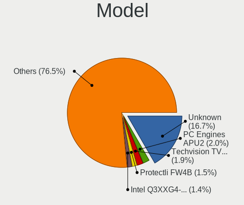
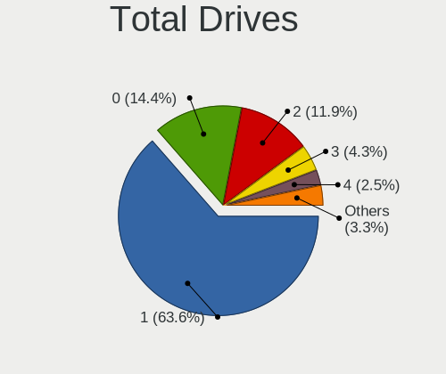
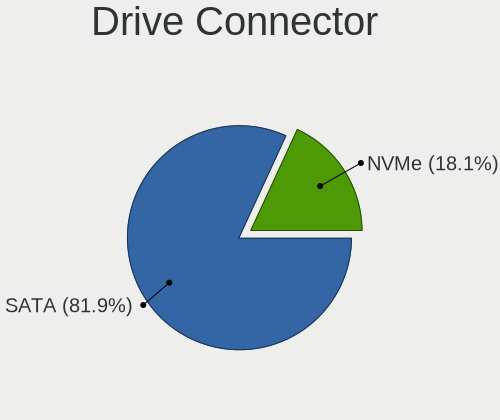
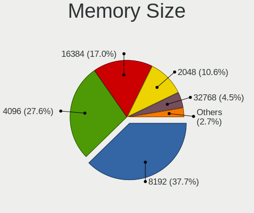

BSD - Tested Hardware & Statistics (Desktops)
---------------------------------------------

A project to collect tested hardware configurations for BSD.

Anyone can contribute to this report by the [hw-probe](https://github.com/linuxhw/hw-probe/blob/master/INSTALL.BSD.md) tool:

    hw-probe -all -upload

Please contribute! Especially if your hardware is rare.

This report is for real hardware. Report for virtual hardware: [TestDays_VE](https://github.com/bsdhw/TestDays_VE)

Contents
--------

* [ Test Cases ](#test-cases)

* [ System ](#system)
  - [ OS                       ](#os)
  - [ OS Family                ](#os-family)
  - [ Arch                     ](#arch)
  - [ DE                       ](#de)
  - [ Display Server           ](#display-server)
  - [ Display Manager          ](#display-manager)
  - [ OS Lang                  ](#os-lang)
  - [ Boot Mode                ](#boot-mode)
  - [ Filesystem               ](#filesystem)
  - [ Part. scheme             ](#part-scheme)

* [ Board ](#board)
  - [ Vendor                   ](#vendor)
  - [ Model                    ](#model)
  - [ Model Family             ](#model-family)
  - [ MFG Year                 ](#mfg-year)
  - [ Form Factor              ](#form-factor)
  - [ Coreboot                 ](#coreboot)
  - [ RAM Size                 ](#ram-size)
  - [ RAM Used                 ](#ram-used)
  - [ Total Drives             ](#total-drives)
  - [ Has CD-ROM               ](#has-cd-rom)
  - [ Has Ethernet             ](#has-ethernet)
  - [ Has WiFi                 ](#has-wifi)
  - [ Has Bluetooth            ](#has-bluetooth)

* [ Location ](#location)
  - [ Country                  ](#country)
  - [ City                     ](#city)

* [ Drives ](#drives)
  - [ Drive Vendor             ](#drive-vendor)
  - [ Drive Model              ](#drive-model)
  - [ HDD Vendor               ](#hdd-vendor)
  - [ SSD Vendor               ](#ssd-vendor)
  - [ Drive Kind               ](#drive-kind)
  - [ Drive Connector          ](#drive-connector)
  - [ Drive Size               ](#drive-size)
  - [ Space Total              ](#space-total)
  - [ Space Used               ](#space-used)
  - [ Malfunc. Drives          ](#malfunc-drives)
  - [ Malfunc. Drive Vendor    ](#malfunc-drive-vendor)
  - [ Malfunc. HDD Vendor      ](#malfunc-hdd-vendor)
  - [ Malfunc. Drive Kind      ](#malfunc-drive-kind)
  - [ Failed Drives            ](#failed-drives)
  - [ Failed Drive Vendor      ](#failed-drive-vendor)
  - [ Drive Status             ](#drive-status)

* [ Storage controller ](#storage-controller)
  - [ Storage Vendor           ](#storage-vendor)
  - [ Storage Model            ](#storage-model)
  - [ Storage Kind             ](#storage-kind)

* [ Processor ](#processor)
  - [ CPU Vendor               ](#cpu-vendor)
  - [ CPU Model                ](#cpu-model)
  - [ CPU Model Family         ](#cpu-model-family)
  - [ CPU Cores                ](#cpu-cores)
  - [ CPU Sockets              ](#cpu-sockets)
  - [ CPU Threads              ](#cpu-threads)
  - [ CPU Microarch            ](#cpu-microarch)

* [ Graphics ](#graphics)
  - [ GPU Vendor               ](#gpu-vendor)
  - [ GPU Model                ](#gpu-model)
  - [ GPU Combo                ](#gpu-combo)
  - [ GPU Driver               ](#gpu-driver)
  - [ GPU Memory               ](#gpu-memory)

* [ Monitor ](#monitor)
  - [ Monitor Vendor           ](#monitor-vendor)
  - [ Monitor Model            ](#monitor-model)
  - [ Monitor Resolution       ](#monitor-resolution)
  - [ Monitor Diagonal         ](#monitor-diagonal)
  - [ Monitor Width            ](#monitor-width)
  - [ Aspect Ratio             ](#aspect-ratio)
  - [ Monitor Area             ](#monitor-area)
  - [ Pixel Density            ](#pixel-density)
  - [ Multiple Monitors        ](#multiple-monitors)

* [ Network ](#network)
  - [ Net Controller Vendor    ](#net-controller-vendor)
  - [ Net Controller Model     ](#net-controller-model)
  - [ Wireless Vendor          ](#wireless-vendor)
  - [ Wireless Model           ](#wireless-model)
  - [ Ethernet Vendor          ](#ethernet-vendor)
  - [ Ethernet Model           ](#ethernet-model)
  - [ Net Controller Kind      ](#net-controller-kind)
  - [ Used Controller          ](#used-controller)
  - [ NICs                     ](#nics)
  - [ IPv6                     ](#ipv6)

* [ Bluetooth ](#bluetooth)
  - [ Bluetooth Vendor         ](#bluetooth-vendor)
  - [ Bluetooth Model          ](#bluetooth-model)

* [ Sound ](#sound)
  - [ Sound Vendor             ](#sound-vendor)
  - [ Sound Model              ](#sound-model)

* [ Memory ](#memory)
  - [ Memory Vendor            ](#memory-vendor)
  - [ Memory Model             ](#memory-model)
  - [ Memory Kind              ](#memory-kind)
  - [ Memory Form Factor       ](#memory-form-factor)
  - [ Memory Size              ](#memory-size)
  - [ Memory Speed             ](#memory-speed)

* [ Printers & scanners ](#printers--scanners)
  - [ Printer Vendor           ](#printer-vendor)
  - [ Printer Model            ](#printer-model)
  - [ Scanner Vendor           ](#scanner-vendor)
  - [ Scanner Model            ](#scanner-model)

* [ Camera ](#camera)
  - [ Camera Vendor            ](#camera-vendor)
  - [ Camera Model             ](#camera-model)

* [ Security ](#security)
  - [ Fingerprint Vendor       ](#fingerprint-vendor)
  - [ Fingerprint Model        ](#fingerprint-model)
  - [ Chipcard Vendor          ](#chipcard-vendor)
  - [ Chipcard Model           ](#chipcard-model)

* [ Unsupported ](#unsupported)
  - [ Unsupported Devices      ](#unsupported-devices)
  - [ Unsupported Device Types ](#unsupported-device-types)

Test Cases
----------

Total: 11642

| Vendor        | Model                       | Probe                                                     | Date         |
|---------------|-----------------------------|-----------------------------------------------------------|--------------|
| MSI           | H81M-P33                    | [da12fe3c05](https://bsd-hardware.info/?probe=da12fe3c05) | Oct 01, 2023 |
| ASUSTek       | P5Q-E                       | [6975204e47](https://bsd-hardware.info/?probe=6975204e47) | Oct 01, 2023 |
| Supermicro    | A2SDi-4C-HLN4F              | [f97e242e6b](https://bsd-hardware.info/?probe=f97e242e6b) | Oct 01, 2023 |
| Dell          | 0GU083 A00                  | [1286478dc2](https://bsd-hardware.info/?probe=1286478dc2) | Oct 01, 2023 |
| Win elemen... | M600                        | [b5caabfd31](https://bsd-hardware.info/?probe=b5caabfd31) | Oct 01, 2023 |
| Win elemen... | M600                        | [7a1378a001](https://bsd-hardware.info/?probe=7a1378a001) | Oct 01, 2023 |
| Win elemen... | M600                        | [93cc6a1173](https://bsd-hardware.info/?probe=93cc6a1173) | Oct 01, 2023 |
| Techvision    | TVI7309X B0                 | [906fd7e198](https://bsd-hardware.info/?probe=906fd7e198) | Sep 30, 2023 |
| Unknown       | Unknown                     | [50418139b2](https://bsd-hardware.info/?probe=50418139b2) | Sep 30, 2023 |
| ASRockRack    | EPYC3101D4I-2T              | [c6903de57a](https://bsd-hardware.info/?probe=c6903de57a) | Sep 30, 2023 |
| ASUSTek       | A88XM-A                     | [a32967cbc5](https://bsd-hardware.info/?probe=a32967cbc5) | Sep 30, 2023 |
| Unknown       | Unknown                     | [716f9b28ab](https://bsd-hardware.info/?probe=716f9b28ab) | Sep 30, 2023 |
| Gigabyte      | H470M DS3H                  | [604bce28c1](https://bsd-hardware.info/?probe=604bce28c1) | Sep 30, 2023 |
| ASUSTek       | P10S-C Series               | [cc0a5bb631](https://bsd-hardware.info/?probe=cc0a5bb631) | Sep 30, 2023 |
| Fujitsu       | D3543-A1 S26361-D3543-A1... | [8809e169a1](https://bsd-hardware.info/?probe=8809e169a1) | Sep 30, 2023 |
| Dell          | 0782GW A00                  | [dfb45f6202](https://bsd-hardware.info/?probe=dfb45f6202) | Sep 30, 2023 |
| HP            | 83EE                        | [88d80d215a](https://bsd-hardware.info/?probe=88d80d215a) | Sep 30, 2023 |
| Unknown       | Unknown                     | [20fb7f1ba8](https://bsd-hardware.info/?probe=20fb7f1ba8) | Sep 30, 2023 |
| Win elemen... | M600                        | [abc175c93b](https://bsd-hardware.info/?probe=abc175c93b) | Sep 30, 2023 |
| Supermicro    | A2SDi-TP8F                  | [9a73be8c9c](https://bsd-hardware.info/?probe=9a73be8c9c) | Sep 30, 2023 |
| Win elemen... | M600                        | [5b7606e786](https://bsd-hardware.info/?probe=5b7606e786) | Sep 30, 2023 |
| Intel         | DN2820FYK H24582-201        | [ea832a672d](https://bsd-hardware.info/?probe=ea832a672d) | Sep 30, 2023 |
| IGEL Techn... | VX900                       | [eb65624dc3](https://bsd-hardware.info/?probe=eb65624dc3) | Sep 29, 2023 |
| Acer          | F672CR R01-B1               | [2008598c7e](https://bsd-hardware.info/?probe=2008598c7e) | Sep 29, 2023 |
| Unknown       | Unknown                     | [fb21a44f71](https://bsd-hardware.info/?probe=fb21a44f71) | Sep 29, 2023 |
| ASUSTek       | P10S-C Series               | [4e7d5e6cf9](https://bsd-hardware.info/?probe=4e7d5e6cf9) | Sep 29, 2023 |
| PC Engines    | APU                         | [ca9bc2faa7](https://bsd-hardware.info/?probe=ca9bc2faa7) | Sep 29, 2023 |
| PC Engines    | APU                         | [067872c1f5](https://bsd-hardware.info/?probe=067872c1f5) | Sep 29, 2023 |
| TONK          | TN2800                      | [bce9c62915](https://bsd-hardware.info/?probe=bce9c62915) | Sep 29, 2023 |
| HP            | 1998                        | [0f176c9cc9](https://bsd-hardware.info/?probe=0f176c9cc9) | Sep 29, 2023 |
| Gigabyte      | H61M-S1                     | [8816b1ac4a](https://bsd-hardware.info/?probe=8816b1ac4a) | Sep 29, 2023 |
| Lenovo        | ThinkCentre M81 5049D7G     | [60de9490a9](https://bsd-hardware.info/?probe=60de9490a9) | Sep 29, 2023 |
| Unknown       | Unknown                     | [6ed3c7314d](https://bsd-hardware.info/?probe=6ed3c7314d) | Sep 29, 2023 |
| Gigabyte      | H61M-S1                     | [e587bca33a](https://bsd-hardware.info/?probe=e587bca33a) | Sep 29, 2023 |
| HP            | 82B4                        | [60d259ab3f](https://bsd-hardware.info/?probe=60d259ab3f) | Sep 29, 2023 |
| ASUSTek       | PRIME A520M-A II            | [29bcb3ca3e](https://bsd-hardware.info/?probe=29bcb3ca3e) | Sep 29, 2023 |
| HP            | 0B54h D                     | [55122a1908](https://bsd-hardware.info/?probe=55122a1908) | Sep 29, 2023 |
| Unknown       | Unknown                     | [7e82c0f66d](https://bsd-hardware.info/?probe=7e82c0f66d) | Sep 29, 2023 |
| MSI           | MS-98G4                     | [a8ea23c0df](https://bsd-hardware.info/?probe=a8ea23c0df) | Sep 28, 2023 |
| Techvision    | TVI7309X B0                 | [f50d617197](https://bsd-hardware.info/?probe=f50d617197) | Sep 28, 2023 |
| Protectli     | VP2420                      | [ff0144d21a](https://bsd-hardware.info/?probe=ff0144d21a) | Sep 28, 2023 |
| Intel         | D33217GKE G76540-205        | [faef2ab5c6](https://bsd-hardware.info/?probe=faef2ab5c6) | Sep 28, 2023 |
| Gigabyte      | B450M S2H V2                | [31da8655d1](https://bsd-hardware.info/?probe=31da8655d1) | Sep 28, 2023 |
| HP            | 8054                        | [650aa5ab8f](https://bsd-hardware.info/?probe=650aa5ab8f) | Sep 28, 2023 |
| Unknown       | Unknown                     | [df07570acc](https://bsd-hardware.info/?probe=df07570acc) | Sep 28, 2023 |
| HP            | 83EE                        | [d08ae678b5](https://bsd-hardware.info/?probe=d08ae678b5) | Sep 28, 2023 |
| Biostar       | A55MLC2                     | [fac0f247d0](https://bsd-hardware.info/?probe=fac0f247d0) | Sep 28, 2023 |
| Dell          | 0NW6H5 A00                  | [b698f41785](https://bsd-hardware.info/?probe=b698f41785) | Sep 28, 2023 |
| Fujitsu       | D3221-A1 S26361-D3221-A1    | [b3f0a784ab](https://bsd-hardware.info/?probe=b3f0a784ab) | Sep 28, 2023 |
| ASUSTek       | SABERTOOTH 990FX R2.0       | [0f20928f2d](https://bsd-hardware.info/?probe=0f20928f2d) | Sep 28, 2023 |
| AZW           | EQ                          | [bd702ed861](https://bsd-hardware.info/?probe=bd702ed861) | Sep 27, 2023 |
| Dell          | 05XGC8 A00                  | [a0d9fae143](https://bsd-hardware.info/?probe=a0d9fae143) | Sep 27, 2023 |
| PC Engines    | APU2                        | [252385ae71](https://bsd-hardware.info/?probe=252385ae71) | Sep 27, 2023 |
| Supermicro    | X9SCL/X9SCMA                | [8a4596eefa](https://bsd-hardware.info/?probe=8a4596eefa) | Sep 27, 2023 |
| Intel         | DENLOW_REFRESH_WS           | [9ca318e043](https://bsd-hardware.info/?probe=9ca318e043) | Sep 27, 2023 |
| HP            | 8055                        | [b86f4f02a5](https://bsd-hardware.info/?probe=b86f4f02a5) | Sep 26, 2023 |
| Protectli     | FW4B                        | [753b149819](https://bsd-hardware.info/?probe=753b149819) | Sep 26, 2023 |
| Dell          | 07T4MC A09                  | [bde8cc45df](https://bsd-hardware.info/?probe=bde8cc45df) | Sep 26, 2023 |
| Dell          | 07T4MC A09                  | [0ce8f84155](https://bsd-hardware.info/?probe=0ce8f84155) | Sep 26, 2023 |
| Supermicro    | X9SCI/X9SCA                 | [0f60a1a400](https://bsd-hardware.info/?probe=0f60a1a400) | Sep 25, 2023 |
| HP            | 3396                        | [a60feb9960](https://bsd-hardware.info/?probe=a60feb9960) | Sep 25, 2023 |
| HP            | 18E5                        | [9c21b6e355](https://bsd-hardware.info/?probe=9c21b6e355) | Sep 25, 2023 |
| ASRock        | B760M-HDV/M.2 D4            | [886dc0272b](https://bsd-hardware.info/?probe=886dc0272b) | Sep 25, 2023 |
| Unknown       | Unknown                     | [a77db6c46a](https://bsd-hardware.info/?probe=a77db6c46a) | Sep 25, 2023 |
| Unknown       | Unknown                     | [05f45ba264](https://bsd-hardware.info/?probe=05f45ba264) | Sep 25, 2023 |
| Lenovo        | 312A SDK0J40697 WIN 3305... | [6153909c9e](https://bsd-hardware.info/?probe=6153909c9e) | Sep 25, 2023 |
| Unknown       | Unknown                     | [5232e5837b](https://bsd-hardware.info/?probe=5232e5837b) | Sep 25, 2023 |
| Unknown       | YL-J1900L4-V2               | [c186f8b50c](https://bsd-hardware.info/?probe=c186f8b50c) | Sep 25, 2023 |
| CncTion       | N4505-4L B0                 | [5880a22b30](https://bsd-hardware.info/?probe=5880a22b30) | Sep 25, 2023 |
| Seeed Stud... | ODYSSEY-X86J4105 SD-BS-C... | [64dac999bd](https://bsd-hardware.info/?probe=64dac999bd) | Sep 24, 2023 |
| Protectli     | VP4630                      | [d5c0fe73ef](https://bsd-hardware.info/?probe=d5c0fe73ef) | Sep 24, 2023 |
| Unknown       | Unknown                     | [1ba135fef1](https://bsd-hardware.info/?probe=1ba135fef1) | Sep 24, 2023 |
| Unknown       | Unknown                     | [9c8516c8a8](https://bsd-hardware.info/?probe=9c8516c8a8) | Sep 24, 2023 |
| ASRock        | H270 Pro4                   | [cba80ecde3](https://bsd-hardware.info/?probe=cba80ecde3) | Sep 24, 2023 |
| ASUSTek       | PRIME X470-PRO              | [6a2ce1e29f](https://bsd-hardware.info/?probe=6a2ce1e29f) | Sep 24, 2023 |
| ShenZhen M... | 3865U-6L                    | [a488a0576d](https://bsd-hardware.info/?probe=a488a0576d) | Sep 24, 2023 |
| MSI           | H81M-P33                    | [971f3fdba1](https://bsd-hardware.info/?probe=971f3fdba1) | Sep 24, 2023 |
| ASUSTek       | P5Q-E                       | [6538212bd6](https://bsd-hardware.info/?probe=6538212bd6) | Sep 24, 2023 |
| ASUSTek       | ROG CROSSHAIR VIII HERO     | [f7aee1db53](https://bsd-hardware.info/?probe=f7aee1db53) | Sep 24, 2023 |
| AZW           | EQ                          | [1f9a2fcb6e](https://bsd-hardware.info/?probe=1f9a2fcb6e) | Sep 24, 2023 |
| Unknown       | Unknown                     | [a5643cabc4](https://bsd-hardware.info/?probe=a5643cabc4) | Sep 24, 2023 |
| Intel         | DQ77KB AAG40294-401         | [be147f7ff1](https://bsd-hardware.info/?probe=be147f7ff1) | Sep 24, 2023 |
| NU591         | 1.0                         | [99f3260ee0](https://bsd-hardware.info/?probe=99f3260ee0) | Sep 24, 2023 |
| Lenovo        | 310B SDK0J40697 WIN 3305... | [6c3728aa16](https://bsd-hardware.info/?probe=6c3728aa16) | Sep 24, 2023 |
| Protectli     | VP2420                      | [8644c80a4a](https://bsd-hardware.info/?probe=8644c80a4a) | Sep 24, 2023 |
| CncTion       | N5105-4L B0                 | [3b12ca9995](https://bsd-hardware.info/?probe=3b12ca9995) | Sep 23, 2023 |
| ASUSTek       | Z170-A                      | [3802fe676c](https://bsd-hardware.info/?probe=3802fe676c) | Sep 23, 2023 |
| AZW           | SEi V1.0                    | [1d0307b36d](https://bsd-hardware.info/?probe=1d0307b36d) | Sep 23, 2023 |
| Unknown       | Unknown                     | [312bc5d526](https://bsd-hardware.info/?probe=312bc5d526) | Sep 23, 2023 |
| HP            | 8299                        | [fee80cc3e3](https://bsd-hardware.info/?probe=fee80cc3e3) | Sep 23, 2023 |
| AZW           | EQ                          | [c65840f9cf](https://bsd-hardware.info/?probe=c65840f9cf) | Sep 23, 2023 |
| PC Engines    | APU2                        | [3c7bd005ef](https://bsd-hardware.info/?probe=3c7bd005ef) | Sep 23, 2023 |
| Hardkernel    | ODROID-H3                   | [868f49643a](https://bsd-hardware.info/?probe=868f49643a) | Sep 23, 2023 |
| ShenZhen M... | 3865U-6L                    | [a4ebf601cd](https://bsd-hardware.info/?probe=a4ebf601cd) | Sep 23, 2023 |
| Protectli     | FW6 Ver                     | [d8ccddab5a](https://bsd-hardware.info/?probe=d8ccddab5a) | Sep 23, 2023 |
| Unknown       | Unknown                     | [3e1ef4a73c](https://bsd-hardware.info/?probe=3e1ef4a73c) | Sep 23, 2023 |
| Yanling       | YL-CLU6L-V1                 | [06d8f02eb7](https://bsd-hardware.info/?probe=06d8f02eb7) | Sep 22, 2023 |
| Unknown       | Unknown                     | [16640c7f04](https://bsd-hardware.info/?probe=16640c7f04) | Sep 22, 2023 |
| GoWin Solu... | R86S                        | [6d38812084](https://bsd-hardware.info/?probe=6d38812084) | Sep 22, 2023 |
| HP            | 18E5                        | [02b94adef6](https://bsd-hardware.info/?probe=02b94adef6) | Sep 22, 2023 |
| Unknown       | Unknown                     | [d8e6c9ffe6](https://bsd-hardware.info/?probe=d8e6c9ffe6) | Sep 22, 2023 |
| IceWhale T... | ZimaBoard 216 ZMB           | [8386219e8f](https://bsd-hardware.info/?probe=8386219e8f) | Sep 22, 2023 |
| ShenZhen M... | MW-NANO-APL-4L              | [6bec3eae14](https://bsd-hardware.info/?probe=6bec3eae14) | Sep 22, 2023 |
| ASRock        | Z690 Phantom Gaming 4/D5    | [6eab8daef7](https://bsd-hardware.info/?probe=6eab8daef7) | Sep 21, 2023 |
| Unknown       | Unknown                     | [fcde651e99](https://bsd-hardware.info/?probe=fcde651e99) | Sep 21, 2023 |
| Dell          | 0KP561                      | [cf15aea783](https://bsd-hardware.info/?probe=cf15aea783) | Sep 21, 2023 |
| Gigabyte      | B150N Phoenix-WIFI-CF       | [e046bd9405](https://bsd-hardware.info/?probe=e046bd9405) | Sep 21, 2023 |
| Gigabyte      | B150N Phoenix-WIFI-CF       | [90f89eea16](https://bsd-hardware.info/?probe=90f89eea16) | Sep 21, 2023 |
| ASRock        | J3455B-ITX                  | [c5a2093552](https://bsd-hardware.info/?probe=c5a2093552) | Sep 21, 2023 |
| HP            | 18E8                        | [7a96c7f43a](https://bsd-hardware.info/?probe=7a96c7f43a) | Sep 21, 2023 |
| HP            | 859B                        | [7b8592b129](https://bsd-hardware.info/?probe=7b8592b129) | Sep 21, 2023 |
| Gigabyte      | X570 AORUS PRO              | [9a9cdd30a2](https://bsd-hardware.info/?probe=9a9cdd30a2) | Sep 21, 2023 |
| PC Engines    | apu6                        | [1a45dd59a4](https://bsd-hardware.info/?probe=1a45dd59a4) | Sep 21, 2023 |
| Dell          | 0HD5W2 A01                  | [5478cff8a7](https://bsd-hardware.info/?probe=5478cff8a7) | Sep 21, 2023 |
| ASRockRack    | X470D4U2-2T                 | [5a0b8eb786](https://bsd-hardware.info/?probe=5a0b8eb786) | Sep 21, 2023 |
| Premio        | BlueCat XMB3 00C            | [423687627b](https://bsd-hardware.info/?probe=423687627b) | Sep 21, 2023 |
| HP            | 18E8                        | [cb4a5de309](https://bsd-hardware.info/?probe=cb4a5de309) | Sep 21, 2023 |
| HP            | 8299                        | [2f1bdffe66](https://bsd-hardware.info/?probe=2f1bdffe66) | Sep 20, 2023 |
| Bochs         | Unknown                     | [65f7da4601](https://bsd-hardware.info/?probe=65f7da4601) | Sep 20, 2023 |
| Unknown       | Unknown                     | [dcf1ebd901](https://bsd-hardware.info/?probe=dcf1ebd901) | Sep 20, 2023 |
| HP            | 83F3                        | [4d1df66f57](https://bsd-hardware.info/?probe=4d1df66f57) | Sep 20, 2023 |
| Unknown       | Unknown                     | [3c479d7824](https://bsd-hardware.info/?probe=3c479d7824) | Sep 20, 2023 |
| Unknown       | Unknown                     | [13ba11c952](https://bsd-hardware.info/?probe=13ba11c952) | Sep 20, 2023 |
| Protectli     | FW4C Ver                    | [eae9f87345](https://bsd-hardware.info/?probe=eae9f87345) | Sep 20, 2023 |
| Unknown       | Unknown                     | [80a57145af](https://bsd-hardware.info/?probe=80a57145af) | Sep 20, 2023 |
| Apple         | MacPro4,1                   | [c368087050](https://bsd-hardware.info/?probe=c368087050) | Sep 20, 2023 |
| Supermicro    | A1SRi-2758F                 | [6ee2f45613](https://bsd-hardware.info/?probe=6ee2f45613) | Sep 20, 2023 |
| Supermicro    | A1SRi-2758F                 | [34bffe0ed1](https://bsd-hardware.info/?probe=34bffe0ed1) | Sep 20, 2023 |
| Intel         | Q3XXG4-P V1.0               | [60a616adf4](https://bsd-hardware.info/?probe=60a616adf4) | Sep 20, 2023 |
| Lenovo        | SHARKBAY 0B98401 WIN        | [92da10b93b](https://bsd-hardware.info/?probe=92da10b93b) | Sep 20, 2023 |
| Dell          | 0VRWRC A01                  | [6c85a42e64](https://bsd-hardware.info/?probe=6c85a42e64) | Sep 19, 2023 |
| Protectli     | VP2420                      | [bdc1cdb479](https://bsd-hardware.info/?probe=bdc1cdb479) | Sep 19, 2023 |
| Dell          | 0M5DCD A00                  | [c7e64c0893](https://bsd-hardware.info/?probe=c7e64c0893) | Sep 19, 2023 |
| ASRock        | B450 Pro4                   | [211b0f3e9c](https://bsd-hardware.info/?probe=211b0f3e9c) | Sep 19, 2023 |
| Shenzhen M... | RPBNB                       | [07698e61c2](https://bsd-hardware.info/?probe=07698e61c2) | Sep 19, 2023 |
| ASUSTek       | P5G41T-M LX3                | [621470728b](https://bsd-hardware.info/?probe=621470728b) | Sep 19, 2023 |
| Lenovo        | 367D 31900058 STD           | [efd07dfb64](https://bsd-hardware.info/?probe=efd07dfb64) | Sep 19, 2023 |
| MW            | GMLK-2_5G4L                 | [8ebba0ee37](https://bsd-hardware.info/?probe=8ebba0ee37) | Sep 19, 2023 |
| Dell          | 0D28YY A02                  | [6c195174db](https://bsd-hardware.info/?probe=6c195174db) | Sep 19, 2023 |
| Unknown       | SKYBAY                      | [95286f41d9](https://bsd-hardware.info/?probe=95286f41d9) | Sep 19, 2023 |
| Lenovo        | SHARKBAY SDK0E50510 WIN     | [0fe1aab1d8](https://bsd-hardware.info/?probe=0fe1aab1d8) | Sep 19, 2023 |
| Protectli     | VP2420                      | [c4599cac13](https://bsd-hardware.info/?probe=c4599cac13) | Sep 19, 2023 |
| Unknown       | Unknown                     | [f6f0fa8016](https://bsd-hardware.info/?probe=f6f0fa8016) | Sep 18, 2023 |
| Unknown       | Unknown                     | [0a9c074970](https://bsd-hardware.info/?probe=0a9c074970) | Sep 18, 2023 |
| Techvision    | TVI7309X B0                 | [5e7775568c](https://bsd-hardware.info/?probe=5e7775568c) | Sep 18, 2023 |
| GoWin Solu... | R86S                        | [0cfd79f7fe](https://bsd-hardware.info/?probe=0cfd79f7fe) | Sep 18, 2023 |
| HP            | 1790                        | [17ace3bb2c](https://bsd-hardware.info/?probe=17ace3bb2c) | Sep 18, 2023 |
| CncTion       | Jasper-4L B0                | [96f81e84f6](https://bsd-hardware.info/?probe=96f81e84f6) | Sep 18, 2023 |
| Techvision    | TVI7309X B0                 | [7b6014f65f](https://bsd-hardware.info/?probe=7b6014f65f) | Sep 18, 2023 |
| Inventec      | DQ Class A02                | [e6e705b7cf](https://bsd-hardware.info/?probe=e6e705b7cf) | Sep 18, 2023 |
| Advantech     | NAMB-3250 A102-1            | [143c5f73fc](https://bsd-hardware.info/?probe=143c5f73fc) | Sep 17, 2023 |
| Unknown       | Unknown                     | [39e1d38287](https://bsd-hardware.info/?probe=39e1d38287) | Sep 17, 2023 |
| CWWK          | CW-AD4L-N V1                | [cdeddbf4be](https://bsd-hardware.info/?probe=cdeddbf4be) | Sep 17, 2023 |
| CncTion       | Jasper-4L B0                | [4254b5eac8](https://bsd-hardware.info/?probe=4254b5eac8) | Sep 17, 2023 |
| ASRock        | H670M-ITX/ax                | [1b6996f127](https://bsd-hardware.info/?probe=1b6996f127) | Sep 17, 2023 |
| HP            | 82A2                        | [4f125fbc75](https://bsd-hardware.info/?probe=4f125fbc75) | Sep 17, 2023 |
| Techvision    | TVI7309X B0                 | [4a9993ca08](https://bsd-hardware.info/?probe=4a9993ca08) | Sep 17, 2023 |
| Intel         | Q3XXG4-P V1.0               | [4ee4930d11](https://bsd-hardware.info/?probe=4ee4930d11) | Sep 17, 2023 |
| Lenovo        | 312A SDK0J40697 WIN 3305... | [31455b0d33](https://bsd-hardware.info/?probe=31455b0d33) | Sep 17, 2023 |
| ASRock        | B450M Pro4-F                | [b6763a8d49](https://bsd-hardware.info/?probe=b6763a8d49) | Sep 17, 2023 |
| Unknown       | Unknown                     | [31cf5dc87d](https://bsd-hardware.info/?probe=31cf5dc87d) | Sep 16, 2023 |
| Unknown       | Unknown                     | [f0b617a1bc](https://bsd-hardware.info/?probe=f0b617a1bc) | Sep 16, 2023 |
| Intel         | DENLOW_WS                   | [029b3cdd58](https://bsd-hardware.info/?probe=029b3cdd58) | Sep 16, 2023 |
| Gigabyte      | Q170TN                      | [f8baffb969](https://bsd-hardware.info/?probe=f8baffb969) | Sep 16, 2023 |
| Supermicro    | X9SCL/X9SCMA                | [a054400ef6](https://bsd-hardware.info/?probe=a054400ef6) | Sep 16, 2023 |
| Hardkernel    | ODROID-H2                   | [35544a61bd](https://bsd-hardware.info/?probe=35544a61bd) | Sep 16, 2023 |
| Unknown       | MANIFOLD 2-C                | [80707f8712](https://bsd-hardware.info/?probe=80707f8712) | Sep 16, 2023 |
| Dell          | 02YYK5 A00                  | [a2d011d2d7](https://bsd-hardware.info/?probe=a2d011d2d7) | Sep 16, 2023 |
| Techvision    | TVI7309X B0                 | [9a30d2d88c](https://bsd-hardware.info/?probe=9a30d2d88c) | Sep 16, 2023 |
| Unknown       | Unknown                     | [1808e7891c](https://bsd-hardware.info/?probe=1808e7891c) | Sep 16, 2023 |
| Unknown       | Unknown                     | [d6acb378a1](https://bsd-hardware.info/?probe=d6acb378a1) | Sep 15, 2023 |
| MW            | GMLK-2_5G4L                 | [d36ff6181c](https://bsd-hardware.info/?probe=d36ff6181c) | Sep 15, 2023 |
| Unknown       | Unknown                     | [3fcc5727d3](https://bsd-hardware.info/?probe=3fcc5727d3) | Sep 15, 2023 |
| ASUSTek       | PRIME B550M-A               | [ab77dcfd74](https://bsd-hardware.info/?probe=ab77dcfd74) | Sep 15, 2023 |
| Gigabyte      | X470 AORUS ULTRA GAMING-... | [6fc18e3db7](https://bsd-hardware.info/?probe=6fc18e3db7) | Sep 15, 2023 |
| AZW           | U59                         | [ae0d8568d1](https://bsd-hardware.info/?probe=ae0d8568d1) | Sep 15, 2023 |
| Unknown       | Unknown                     | [fe010506e6](https://bsd-hardware.info/?probe=fe010506e6) | Sep 15, 2023 |
| Protectli     | FW4B Ver                    | [9790cd72bc](https://bsd-hardware.info/?probe=9790cd72bc) | Sep 15, 2023 |
| AZW           | U59                         | [7e094459f9](https://bsd-hardware.info/?probe=7e094459f9) | Sep 14, 2023 |
| Dell          | OptiPlex 3020               | [dfb6cce27d](https://bsd-hardware.info/?probe=dfb6cce27d) | Sep 14, 2023 |
| Unknown       | YL-SKUL6                    | [fe04f35995](https://bsd-hardware.info/?probe=fe04f35995) | Sep 14, 2023 |
| Unknown       | Unknown                     | [f28bb4ffda](https://bsd-hardware.info/?probe=f28bb4ffda) | Sep 14, 2023 |
| Dell          | 0D24M8 A03                  | [48441955a6](https://bsd-hardware.info/?probe=48441955a6) | Sep 14, 2023 |
| Huanan        | X99-F8D PLUS V1.3           | [53d31a28bf](https://bsd-hardware.info/?probe=53d31a28bf) | Sep 14, 2023 |
| ASRock        | J1900D2Y                    | [2084583d47](https://bsd-hardware.info/?probe=2084583d47) | Sep 14, 2023 |
| Unknown       | Unknown                     | [3fe0e846fe](https://bsd-hardware.info/?probe=3fe0e846fe) | Sep 14, 2023 |
| Dell          | 0NW6H5 A00                  | [227062e965](https://bsd-hardware.info/?probe=227062e965) | Sep 13, 2023 |
| ASRock        | J3455M                      | [f9809dfb0f](https://bsd-hardware.info/?probe=f9809dfb0f) | Sep 13, 2023 |
| Dell          | 04YP6J A02                  | [0933e1164a](https://bsd-hardware.info/?probe=0933e1164a) | Sep 13, 2023 |
| Dell          | 0D28YY A02                  | [fe5635048a](https://bsd-hardware.info/?probe=fe5635048a) | Sep 13, 2023 |
| HP            | 8055                        | [be8554bed1](https://bsd-hardware.info/?probe=be8554bed1) | Sep 13, 2023 |
| ASUSTek       | PRIME X370-PRO              | [5dee3a945f](https://bsd-hardware.info/?probe=5dee3a945f) | Sep 13, 2023 |
| ASRock        | X570 Phantom Gaming 4       | [9fee6e83fc](https://bsd-hardware.info/?probe=9fee6e83fc) | Sep 13, 2023 |
| Dell          | 02YYK5 A00                  | [ae320bd7de](https://bsd-hardware.info/?probe=ae320bd7de) | Sep 13, 2023 |
| Gigabyte      | H55M-S2H                    | [1b0fcd812e](https://bsd-hardware.info/?probe=1b0fcd812e) | Sep 13, 2023 |
| Gigabyte      | H55M-S2H                    | [92ce33c604](https://bsd-hardware.info/?probe=92ce33c604) | Sep 13, 2023 |
| HP            | 212B                        | [3370718b29](https://bsd-hardware.info/?probe=3370718b29) | Sep 13, 2023 |
| Fujitsu       | D3313-E1 S26361-D3313-E1    | [5c89a7a1f1](https://bsd-hardware.info/?probe=5c89a7a1f1) | Sep 13, 2023 |
| Protectli     | FW4B Ver                    | [984a64677e](https://bsd-hardware.info/?probe=984a64677e) | Sep 13, 2023 |
| ASRockRack    | X470D4U                     | [b0cd1ce0f4](https://bsd-hardware.info/?probe=b0cd1ce0f4) | Sep 13, 2023 |
| Hardkernel    | ODROID-H3                   | [d3c0559486](https://bsd-hardware.info/?probe=d3c0559486) | Sep 12, 2023 |
| Unknown       | Unknown                     | [8229339c2f](https://bsd-hardware.info/?probe=8229339c2f) | Sep 12, 2023 |
| ASUSTek       | TUF Gaming B550M-PLUS (W... | [89a601d720](https://bsd-hardware.info/?probe=89a601d720) | Sep 12, 2023 |
| Protectli     | VP2420                      | [626a91f30d](https://bsd-hardware.info/?probe=626a91f30d) | Sep 12, 2023 |
| Unknown       | Unknown                     | [0fccf590d4](https://bsd-hardware.info/?probe=0fccf590d4) | Sep 12, 2023 |
| Dell          | 0HD5W2 A00                  | [6857d78d0b](https://bsd-hardware.info/?probe=6857d78d0b) | Sep 12, 2023 |
| CheckPoint    | T-140-00                    | [670266bc8e](https://bsd-hardware.info/?probe=670266bc8e) | Sep 12, 2023 |
| MSI           | MS-S0891                    | [10b3300ed1](https://bsd-hardware.info/?probe=10b3300ed1) | Sep 12, 2023 |
| Dell          | 0782GW A00                  | [f5f0e573fe](https://bsd-hardware.info/?probe=f5f0e573fe) | Sep 11, 2023 |
| ASUSTek       | PRIME B550M-A               | [78bc36f5a9](https://bsd-hardware.info/?probe=78bc36f5a9) | Sep 11, 2023 |
| Unknown       | Unknown                     | [7af171368a](https://bsd-hardware.info/?probe=7af171368a) | Sep 11, 2023 |
| Protectli     | FW4B Ver                    | [015620b56d](https://bsd-hardware.info/?probe=015620b56d) | Sep 11, 2023 |
| Unknown       | Unknown                     | [0602673da0](https://bsd-hardware.info/?probe=0602673da0) | Sep 11, 2023 |
| Gigabyte      | GA-870A-UD3                 | [095b8aa8fb](https://bsd-hardware.info/?probe=095b8aa8fb) | Sep 11, 2023 |
| Techvision    | TVI7309X B0                 | [6e9a9c509b](https://bsd-hardware.info/?probe=6e9a9c509b) | Sep 11, 2023 |
| Unknown       | Unknown                     | [fd131bd648](https://bsd-hardware.info/?probe=fd131bd648) | Sep 11, 2023 |
| MW            | GMLK-2_5G4L                 | [7923196f55](https://bsd-hardware.info/?probe=7923196f55) | Sep 11, 2023 |
| MSI           | A520M-A PRO                 | [8b541c71a9](https://bsd-hardware.info/?probe=8b541c71a9) | Sep 11, 2023 |
| Unknown       | Unknown                     | [6610a56ab4](https://bsd-hardware.info/?probe=6610a56ab4) | Sep 11, 2023 |
| Unknown       | Unknown                     | [7c53ad8bea](https://bsd-hardware.info/?probe=7c53ad8bea) | Sep 10, 2023 |
| Unknown       | Unknown                     | [ccc62ac366](https://bsd-hardware.info/?probe=ccc62ac366) | Sep 10, 2023 |
| MSI           | MS-9899 11                  | [4916af75db](https://bsd-hardware.info/?probe=4916af75db) | Sep 10, 2023 |
| HP            | 8105                        | [ea4f88787c](https://bsd-hardware.info/?probe=ea4f88787c) | Sep 10, 2023 |
| Fujitsu       | D3313-A1 S26361-D3313-A1    | [0797783a1c](https://bsd-hardware.info/?probe=0797783a1c) | Sep 10, 2023 |
| Lenovo        | 3140 NOK                    | [945ad170d7](https://bsd-hardware.info/?probe=945ad170d7) | Sep 10, 2023 |
| Lenovo        | 3140 NOK                    | [3f9dcefb8e](https://bsd-hardware.info/?probe=3f9dcefb8e) | Sep 10, 2023 |
| ASRock        | 4X4-4000 Series             | [525ed7878c](https://bsd-hardware.info/?probe=525ed7878c) | Sep 10, 2023 |
| ASRock        | 4X4-4000 Series             | [0131f46755](https://bsd-hardware.info/?probe=0131f46755) | Sep 10, 2023 |
| ASUSTek       | H170M-E D3                  | [f9bde14ab2](https://bsd-hardware.info/?probe=f9bde14ab2) | Sep 10, 2023 |
| ASUSTek       | PRIME H310I-PLUS R2.0       | [5695984890](https://bsd-hardware.info/?probe=5695984890) | Sep 10, 2023 |
| HP            | 8105                        | [0e45394704](https://bsd-hardware.info/?probe=0e45394704) | Sep 10, 2023 |
| AZW           | EQ                          | [c6f83de1e4](https://bsd-hardware.info/?probe=c6f83de1e4) | Sep 10, 2023 |
| MSI           | H81M-P33                    | [57a847859f](https://bsd-hardware.info/?probe=57a847859f) | Sep 10, 2023 |
| ASUSTek       | P5Q-E                       | [b7e0d87f47](https://bsd-hardware.info/?probe=b7e0d87f47) | Sep 10, 2023 |
| ASUSTek       | ROG CROSSHAIR VIII HERO     | [c2378b3e83](https://bsd-hardware.info/?probe=c2378b3e83) | Sep 10, 2023 |
| Unknown       | Unknown                     | [65240d295c](https://bsd-hardware.info/?probe=65240d295c) | Sep 10, 2023 |
| HP            | 8054                        | [4a0fdf70fa](https://bsd-hardware.info/?probe=4a0fdf70fa) | Sep 10, 2023 |
| ASUSTek       | P8H67-M PRO                 | [7e4ea56868](https://bsd-hardware.info/?probe=7e4ea56868) | Sep 10, 2023 |
| ASUSTek       | P8H67-M PRO                 | [ee34cb0b60](https://bsd-hardware.info/?probe=ee34cb0b60) | Sep 10, 2023 |
| Gigabyte      | H81M-S2V                    | [f30ab73618](https://bsd-hardware.info/?probe=f30ab73618) | Sep 10, 2023 |
| Unknown       | QGLK03                      | [42ea8dfb44](https://bsd-hardware.info/?probe=42ea8dfb44) | Sep 10, 2023 |
| CWWK          | CW-AD4L-N V1                | [52764da7d8](https://bsd-hardware.info/?probe=52764da7d8) | Sep 10, 2023 |
| Unknown       | Unknown                     | [3c85271913](https://bsd-hardware.info/?probe=3c85271913) | Sep 10, 2023 |
| Unknown       | Unknown                     | [d28c125e99](https://bsd-hardware.info/?probe=d28c125e99) | Sep 10, 2023 |
| Supermicro    | X10SLM-F                    | [332a3f8516](https://bsd-hardware.info/?probe=332a3f8516) | Sep 09, 2023 |
| Supermicro    | X8DTH-i/6/iF/6F             | [df114e1b94](https://bsd-hardware.info/?probe=df114e1b94) | Sep 09, 2023 |
| Unknown       | Unknown                     | [8579d5fa0d](https://bsd-hardware.info/?probe=8579d5fa0d) | Sep 09, 2023 |
| Protectli     | FW4C Ver                    | [7ea278ed7a](https://bsd-hardware.info/?probe=7ea278ed7a) | Sep 09, 2023 |
| Protectli     | FW4C Ver                    | [331f3de91a](https://bsd-hardware.info/?probe=331f3de91a) | Sep 09, 2023 |
| Apple         | PowerMac3,6                 | [36daf7ce75](https://bsd-hardware.info/?probe=36daf7ce75) | Sep 09, 2023 |
| Unknown       | Unknown                     | [ee507594a0](https://bsd-hardware.info/?probe=ee507594a0) | Sep 09, 2023 |
| Unknown       | Unknown                     | [3bc1fc9c7b](https://bsd-hardware.info/?probe=3bc1fc9c7b) | Sep 09, 2023 |
| Unknown       | Unknown                     | [68a0e23945](https://bsd-hardware.info/?probe=68a0e23945) | Sep 09, 2023 |
| Lenovo        | MAHOBAY Win8 Pro DPK TPG    | [93234978cf](https://bsd-hardware.info/?probe=93234978cf) | Sep 09, 2023 |
| Intel         | Q3XXG4-P V1.0               | [07d197cf04](https://bsd-hardware.info/?probe=07d197cf04) | Sep 09, 2023 |
| Unknown       | Unknown                     | [2e51c11ed2](https://bsd-hardware.info/?probe=2e51c11ed2) | Sep 08, 2023 |
| Unknown       | Unknown                     | [480823e372](https://bsd-hardware.info/?probe=480823e372) | Sep 08, 2023 |
| Techvision    | TVI7309X B0                 | [fe6bcbc332](https://bsd-hardware.info/?probe=fe6bcbc332) | Sep 08, 2023 |
| Techvision    | TVI7309X B0                 | [37e25cbcec](https://bsd-hardware.info/?probe=37e25cbcec) | Sep 08, 2023 |
| Unknown       | Unknown                     | [7b1205d74f](https://bsd-hardware.info/?probe=7b1205d74f) | Sep 08, 2023 |
| MSI           | PRESTIGE X570 CREATION      | [7947ecdca3](https://bsd-hardware.info/?probe=7947ecdca3) | Sep 08, 2023 |
| Dell          | 0NC2VH A01                  | [122601f717](https://bsd-hardware.info/?probe=122601f717) | Sep 08, 2023 |
| Unknown       | Unknown                     | [2cfdb7cfa9](https://bsd-hardware.info/?probe=2cfdb7cfa9) | Sep 08, 2023 |
| ASUSTek       | P11C-M Series               | [584bcb6fec](https://bsd-hardware.info/?probe=584bcb6fec) | Sep 08, 2023 |
| AZW           | MINI S 10                   | [4580cb5481](https://bsd-hardware.info/?probe=4580cb5481) | Sep 08, 2023 |
| ASUSTek       | Pro WS WRX80E-SAGE SE WI... | [24e745026c](https://bsd-hardware.info/?probe=24e745026c) | Sep 08, 2023 |
| Lex           | Pineview-D                  | [351aabdb80](https://bsd-hardware.info/?probe=351aabdb80) | Sep 08, 2023 |
| Unknown       | Unknown                     | [29578638c1](https://bsd-hardware.info/?probe=29578638c1) | Sep 08, 2023 |
| ASUSTek       | P8H61-M LX PLUS             | [6811f92db7](https://bsd-hardware.info/?probe=6811f92db7) | Sep 08, 2023 |
| Techvision    | TVI7309X B0                 | [aaeb12b1c6](https://bsd-hardware.info/?probe=aaeb12b1c6) | Sep 08, 2023 |
| Protectli     | VP2420                      | [2a8eb1b056](https://bsd-hardware.info/?probe=2a8eb1b056) | Sep 08, 2023 |
| MSI           | X570-A PRO                  | [e3d8f34f08](https://bsd-hardware.info/?probe=e3d8f34f08) | Sep 08, 2023 |
| Unknown       | Unknown                     | [fa747c859f](https://bsd-hardware.info/?probe=fa747c859f) | Sep 08, 2023 |
| Intel         | MAHOBAY                     | [a3e54e7628](https://bsd-hardware.info/?probe=a3e54e7628) | Sep 08, 2023 |
| ASUSTek       | P8H61-M LX PLUS             | [231ef39d3b](https://bsd-hardware.info/?probe=231ef39d3b) | Sep 08, 2023 |
| Unknown       | Unknown                     | [35e9ee2a00](https://bsd-hardware.info/?probe=35e9ee2a00) | Sep 07, 2023 |
| PAIQ          | PICO PC A1                  | [5e8f943fdd](https://bsd-hardware.info/?probe=5e8f943fdd) | Sep 07, 2023 |
| PAIQ          | PICO PC A1                  | [125fb34054](https://bsd-hardware.info/?probe=125fb34054) | Sep 07, 2023 |
| Intel         | HM570                       | [3112f263f5](https://bsd-hardware.info/?probe=3112f263f5) | Sep 07, 2023 |
| Intel         | HM570                       | [0e4bfa9794](https://bsd-hardware.info/?probe=0e4bfa9794) | Sep 07, 2023 |
| Techvision    | TVI7309X B0                 | [eff74e8df0](https://bsd-hardware.info/?probe=eff74e8df0) | Sep 07, 2023 |
| Unknown       | Unknown                     | [21e851e9e9](https://bsd-hardware.info/?probe=21e851e9e9) | Sep 07, 2023 |
| PAIQ          | PICO PC A1                  | [a88a2eb065](https://bsd-hardware.info/?probe=a88a2eb065) | Sep 07, 2023 |
| PC Engines    | APU3                        | [ad38dcf54a](https://bsd-hardware.info/?probe=ad38dcf54a) | Sep 07, 2023 |
| Unknown       | Unknown                     | [5ed026eccf](https://bsd-hardware.info/?probe=5ed026eccf) | Sep 07, 2023 |
| AAEON         | FWS-2280 V1.0               | [b5e0038e79](https://bsd-hardware.info/?probe=b5e0038e79) | Sep 07, 2023 |
| TYAN Compu... | S5510HE                     | [99d23c35ca](https://bsd-hardware.info/?probe=99d23c35ca) | Sep 07, 2023 |
| Dell          | 05XGC8 A01                  | [7c0acfa5b9](https://bsd-hardware.info/?probe=7c0acfa5b9) | Sep 07, 2023 |
| Unknown       | Unknown                     | [94d9b19ade](https://bsd-hardware.info/?probe=94d9b19ade) | Sep 07, 2023 |
| PAIQ          | PICO PC A1                  | [9e77e09181](https://bsd-hardware.info/?probe=9e77e09181) | Sep 07, 2023 |
| IceWhale T... | ZimaBoard 432 ZMB           | [451cfdf64f](https://bsd-hardware.info/?probe=451cfdf64f) | Sep 06, 2023 |
| Unknown       | Unknown                     | [6361addd62](https://bsd-hardware.info/?probe=6361addd62) | Sep 06, 2023 |
| Fujitsu       | D3313-G1 S26361-D3313-G1    | [48ca84af37](https://bsd-hardware.info/?probe=48ca84af37) | Sep 06, 2023 |
| Lenovo        | 0B98401 PRO                 | [4397f70291](https://bsd-hardware.info/?probe=4397f70291) | Sep 06, 2023 |
| Dell          | 0NC2VH A01                  | [34a855cc56](https://bsd-hardware.info/?probe=34a855cc56) | Sep 06, 2023 |
| AZW           | MINI S 10                   | [2daf516a05](https://bsd-hardware.info/?probe=2daf516a05) | Sep 06, 2023 |
| ASUSTek       | P8H61-M LE R2.0             | [7c08d4cfb1](https://bsd-hardware.info/?probe=7c08d4cfb1) | Sep 06, 2023 |
| PC Engines    | APU2                        | [d582e62190](https://bsd-hardware.info/?probe=d582e62190) | Sep 06, 2023 |
| Techvision    | TVI7309X B0                 | [f04224b44a](https://bsd-hardware.info/?probe=f04224b44a) | Sep 06, 2023 |
| ASUSTek       | SABERTOOTH 990FX R2.0       | [0b7d85b124](https://bsd-hardware.info/?probe=0b7d85b124) | Sep 06, 2023 |
| Unknown       | Unknown                     | [19711ca08b](https://bsd-hardware.info/?probe=19711ca08b) | Sep 06, 2023 |
| Supermicro    | X9SCL/X9SCMA                | [3af68f2594](https://bsd-hardware.info/?probe=3af68f2594) | Sep 06, 2023 |
| Gigabyte      | H61M-S1                     | [bd2df105c0](https://bsd-hardware.info/?probe=bd2df105c0) | Sep 06, 2023 |
| ASUSTek       | P8H67-M PRO                 | [c06ec95a55](https://bsd-hardware.info/?probe=c06ec95a55) | Sep 06, 2023 |
| Dell          | 096JG8 A01                  | [ec3e0338eb](https://bsd-hardware.info/?probe=ec3e0338eb) | Sep 06, 2023 |
| Unknown       | Unknown                     | [f757c58686](https://bsd-hardware.info/?probe=f757c58686) | Sep 05, 2023 |
| IceWhale T... | ZimaBoard 432 ZMB           | [6e458d22a3](https://bsd-hardware.info/?probe=6e458d22a3) | Sep 05, 2023 |
| Dell          | 096JG8 A01                  | [84d768ee15](https://bsd-hardware.info/?probe=84d768ee15) | Sep 05, 2023 |
| Intel         | Q3XXG4-P V1.0               | [3fb536ecce](https://bsd-hardware.info/?probe=3fb536ecce) | Sep 05, 2023 |
| Unknown       | Unknown                     | [a27d64dbac](https://bsd-hardware.info/?probe=a27d64dbac) | Sep 05, 2023 |
| ASUSTek       | H97I-PLUS                   | [e92272bb87](https://bsd-hardware.info/?probe=e92272bb87) | Sep 05, 2023 |
| Unknown       | Unknown                     | [b95f409ccf](https://bsd-hardware.info/?probe=b95f409ccf) | Sep 05, 2023 |
| Unknown       | Unknown                     | [50f509c032](https://bsd-hardware.info/?probe=50f509c032) | Sep 05, 2023 |
| Supermicro    | X11SSH-F                    | [bff90e93d0](https://bsd-hardware.info/?probe=bff90e93d0) | Sep 05, 2023 |
| Unknown       | Unknown                     | [a4796e8170](https://bsd-hardware.info/?probe=a4796e8170) | Sep 04, 2023 |
| Dell          | 0NC2VH A01                  | [8cc0358a69](https://bsd-hardware.info/?probe=8cc0358a69) | Sep 04, 2023 |
| CWWK          | CW-AD4L-N V1                | [dd32d9d4e1](https://bsd-hardware.info/?probe=dd32d9d4e1) | Sep 04, 2023 |
| Gigabyte      | P35C-DS3R                   | [4424751223](https://bsd-hardware.info/?probe=4424751223) | Sep 04, 2023 |
| ASUSTek       | P8Z77-V LX                  | [ed1fade3db](https://bsd-hardware.info/?probe=ed1fade3db) | Sep 04, 2023 |
| Gigabyte      | H61M-S1                     | [5d1dbf86d9](https://bsd-hardware.info/?probe=5d1dbf86d9) | Sep 04, 2023 |
| Unknown       | Unknown                     | [7d95befe6e](https://bsd-hardware.info/?probe=7d95befe6e) | Sep 04, 2023 |
| Intel         | S1200KP AAG34877-201        | [1b07865ce7](https://bsd-hardware.info/?probe=1b07865ce7) | Sep 04, 2023 |
| Dell          | 0NC2VH A01                  | [7209f86fed](https://bsd-hardware.info/?probe=7209f86fed) | Sep 04, 2023 |
| ASRock        | X570 Steel Legend WiFi a... | [a98f0b3d67](https://bsd-hardware.info/?probe=a98f0b3d67) | Sep 03, 2023 |
| Lenovo        | SHARKBAY SDK0E50510 WIN     | [1bde5a65b6](https://bsd-hardware.info/?probe=1bde5a65b6) | Sep 03, 2023 |
| Gigabyte      | A520I AC                    | [58e061f420](https://bsd-hardware.info/?probe=58e061f420) | Sep 03, 2023 |
| ASRock        | H81M-DGS R2.0               | [1f823a8be7](https://bsd-hardware.info/?probe=1f823a8be7) | Sep 03, 2023 |
| ASRock        | H310CM-DVS                  | [604c9311bc](https://bsd-hardware.info/?probe=604c9311bc) | Sep 03, 2023 |
| ASRock        | X570 Steel Legend WiFi a... | [d352ea60cf](https://bsd-hardware.info/?probe=d352ea60cf) | Sep 03, 2023 |
| PC Engines    | APU2                        | [c9d2cfe6fa](https://bsd-hardware.info/?probe=c9d2cfe6fa) | Sep 03, 2023 |
| Unknown       | Unknown                     | [53cee3b3c8](https://bsd-hardware.info/?probe=53cee3b3c8) | Sep 03, 2023 |
| MSI           | PRO Z790-P WIFI             | [fe53c55492](https://bsd-hardware.info/?probe=fe53c55492) | Sep 03, 2023 |
| Biostar       | J4105NHU                    | [2ac770aa55](https://bsd-hardware.info/?probe=2ac770aa55) | Sep 03, 2023 |
| MSI           | H81M-P33                    | [b47290007a](https://bsd-hardware.info/?probe=b47290007a) | Sep 03, 2023 |
| ASUSTek       | P5Q-E                       | [ef4604a40f](https://bsd-hardware.info/?probe=ef4604a40f) | Sep 03, 2023 |
| ASUSTek       | ROG CROSSHAIR VIII HERO     | [8d37c44440](https://bsd-hardware.info/?probe=8d37c44440) | Sep 03, 2023 |
| Lenovo        | 30BC SDK0J40705 WIN 3425... | [a1c29072ea](https://bsd-hardware.info/?probe=a1c29072ea) | Sep 03, 2023 |
| Unknown       | Unknown                     | [9c1891cda7](https://bsd-hardware.info/?probe=9c1891cda7) | Sep 03, 2023 |
| AAEON         | FWS-2363 V1.0               | [098bc5466b](https://bsd-hardware.info/?probe=098bc5466b) | Sep 03, 2023 |
| Shuttle       | DS20U                       | [d034a8e5b8](https://bsd-hardware.info/?probe=d034a8e5b8) | Sep 02, 2023 |
| Intel         | HM570                       | [de018603ae](https://bsd-hardware.info/?probe=de018603ae) | Sep 02, 2023 |
| Protectli     | FW6 Ver                     | [70992eb19b](https://bsd-hardware.info/?probe=70992eb19b) | Sep 02, 2023 |
| ASUSTek       | M5A97 PLUS                  | [77b461d3ad](https://bsd-hardware.info/?probe=77b461d3ad) | Sep 02, 2023 |
| Dell          | 08NPPY A00                  | [1ae33cfe72](https://bsd-hardware.info/?probe=1ae33cfe72) | Sep 02, 2023 |
| ASRock        | J3455M                      | [762d4d9370](https://bsd-hardware.info/?probe=762d4d9370) | Sep 02, 2023 |
| Dell          | 0XCR8D A00                  | [b89126c9d9](https://bsd-hardware.info/?probe=b89126c9d9) | Sep 02, 2023 |
| MSI           | Z390-A PRO                  | [57925dc8bb](https://bsd-hardware.info/?probe=57925dc8bb) | Sep 02, 2023 |
| Unknown       | Unknown                     | [94487109c2](https://bsd-hardware.info/?probe=94487109c2) | Sep 01, 2023 |
| Dell          | 042P49 A01                  | [383445ee26](https://bsd-hardware.info/?probe=383445ee26) | Sep 01, 2023 |
| Inventec      | Z CLASS A02                 | [1f4bf47cab](https://bsd-hardware.info/?probe=1f4bf47cab) | Sep 01, 2023 |
| Protectli     | FW6 Ver                     | [04de7aa059](https://bsd-hardware.info/?probe=04de7aa059) | Sep 01, 2023 |
| Shuttle       | FS77U                       | [149a8a1437](https://bsd-hardware.info/?probe=149a8a1437) | Sep 01, 2023 |
| Dell          | 0YXT71 A02                  | [b887caabe7](https://bsd-hardware.info/?probe=b887caabe7) | Aug 31, 2023 |
| Foxconn       | nT-A3000 series FAB         | [d9f360b4fe](https://bsd-hardware.info/?probe=d9f360b4fe) | Aug 31, 2023 |
| Dell          | 0WR7PY A02                  | [2557e04cf5](https://bsd-hardware.info/?probe=2557e04cf5) | Aug 31, 2023 |
| ASRockRack    | EPYC3101D4I-2T              | [82ac08abc0](https://bsd-hardware.info/?probe=82ac08abc0) | Aug 31, 2023 |
| Techvision    | TVI7309X B0                 | [6adab2354e](https://bsd-hardware.info/?probe=6adab2354e) | Aug 31, 2023 |
| ASUSTek       | PRIME H610M-E D4            | [9aafa8bedf](https://bsd-hardware.info/?probe=9aafa8bedf) | Aug 31, 2023 |
| Gigabyte      | A520I AC                    | [e245a38088](https://bsd-hardware.info/?probe=e245a38088) | Aug 31, 2023 |
| VIA Techno... | VT8623-8235                 | [3274cd095e](https://bsd-hardware.info/?probe=3274cd095e) | Aug 31, 2023 |
| Biostar       | A68N-5545                   | [b2a1070e2d](https://bsd-hardware.info/?probe=b2a1070e2d) | Aug 31, 2023 |
| CWWK          | CW-AD4L-N V1                | [363a27fb74](https://bsd-hardware.info/?probe=363a27fb74) | Aug 31, 2023 |
| ASRock        | H81M-VG4 R2.0               | [fd3a7c75de](https://bsd-hardware.info/?probe=fd3a7c75de) | Aug 30, 2023 |
| Unknown       | Unknown                     | [b59ce07b49](https://bsd-hardware.info/?probe=b59ce07b49) | Aug 30, 2023 |
| MSI           | MS-7125                     | [3dfb767d80](https://bsd-hardware.info/?probe=3dfb767d80) | Aug 30, 2023 |
| HP            | 802F                        | [1f64f7e11f](https://bsd-hardware.info/?probe=1f64f7e11f) | Aug 30, 2023 |
| Unknown       | Unknown                     | [c0536b27d4](https://bsd-hardware.info/?probe=c0536b27d4) | Aug 30, 2023 |
| MW            | GMLK-2_5G4L                 | [56ac0149f8](https://bsd-hardware.info/?probe=56ac0149f8) | Aug 30, 2023 |
| Infoblox      | IB-810                      | [34c0fa6bec](https://bsd-hardware.info/?probe=34c0fa6bec) | Aug 30, 2023 |
| Techvision    | TVI7309X B0                 | [259a7ec99d](https://bsd-hardware.info/?probe=259a7ec99d) | Aug 30, 2023 |
| Techvision    | TVI7309X B0                 | [20946147de](https://bsd-hardware.info/?probe=20946147de) | Aug 30, 2023 |
| Unknown       | Unknown                     | [8cfa60050b](https://bsd-hardware.info/?probe=8cfa60050b) | Aug 30, 2023 |
| Supermicro    | A1SRi-2758F                 | [c8b4f33fb1](https://bsd-hardware.info/?probe=c8b4f33fb1) | Aug 30, 2023 |
| Dell          | 0JCTF8 A00                  | [a2be5a5f0f](https://bsd-hardware.info/?probe=a2be5a5f0f) | Aug 30, 2023 |
| Dell          | 0NW6H5 A00                  | [8109e9f43f](https://bsd-hardware.info/?probe=8109e9f43f) | Aug 29, 2023 |
| PC Engines    | apu4                        | [2c5a47d3c4](https://bsd-hardware.info/?probe=2c5a47d3c4) | Aug 29, 2023 |
| SolidRun      | CEX7 Platform               | [b83ebfd33b](https://bsd-hardware.info/?probe=b83ebfd33b) | Aug 29, 2023 |
| CncTion       | N6000-4L B0                 | [81cbfbffca](https://bsd-hardware.info/?probe=81cbfbffca) | Aug 29, 2023 |
| Unknown       | YL-J3160L4                  | [6018dde257](https://bsd-hardware.info/?probe=6018dde257) | Aug 29, 2023 |
| Biostar       | A68N-5545                   | [c90edbc46a](https://bsd-hardware.info/?probe=c90edbc46a) | Aug 29, 2023 |
| Unknown       | Unknown                     | [f01bce7cd7](https://bsd-hardware.info/?probe=f01bce7cd7) | Aug 29, 2023 |
| AZW           | EQ                          | [fe5669c376](https://bsd-hardware.info/?probe=fe5669c376) | Aug 29, 2023 |
| Nvidia        | MCP79                       | [0897b3a117](https://bsd-hardware.info/?probe=0897b3a117) | Aug 29, 2023 |
| Intel         | SKYBAY                      | [9d49471591](https://bsd-hardware.info/?probe=9d49471591) | Aug 29, 2023 |
| Supermicro    | X9DRD-iF                    | [be36f2fe2b](https://bsd-hardware.info/?probe=be36f2fe2b) | Aug 28, 2023 |
| Lenovo        | 30D2 SDK0J40697 WIN 3305... | [cda96eed7a](https://bsd-hardware.info/?probe=cda96eed7a) | Aug 28, 2023 |
| Unknown       | Unknown                     | [c5068ec761](https://bsd-hardware.info/?probe=c5068ec761) | Aug 28, 2023 |
| Unknown       | Unknown                     | [fc384f5de7](https://bsd-hardware.info/?probe=fc384f5de7) | Aug 28, 2023 |
| Unknown       | Unknown                     | [fcc9bcdede](https://bsd-hardware.info/?probe=fcc9bcdede) | Aug 28, 2023 |
| CncTion       | N6000-4L B0                 | [0cab2e3af3](https://bsd-hardware.info/?probe=0cab2e3af3) | Aug 28, 2023 |
| ShenZhen M... | 3865U-6L                    | [2835cc7062](https://bsd-hardware.info/?probe=2835cc7062) | Aug 28, 2023 |
| ASUSTek       | ROG STRIX B450-I GAMING     | [3dab6f4044](https://bsd-hardware.info/?probe=3dab6f4044) | Aug 28, 2023 |
| Intel         | Q3XXG4-P V1.0               | [2d0c639c61](https://bsd-hardware.info/?probe=2d0c639c61) | Aug 28, 2023 |
| MSI           | H110M PRO-VD                | [dcbd4ebf8f](https://bsd-hardware.info/?probe=dcbd4ebf8f) | Aug 27, 2023 |
| MSI           | AM1I                        | [50183030f8](https://bsd-hardware.info/?probe=50183030f8) | Aug 27, 2023 |
| Unknown       | Unknown                     | [f363eeaa25](https://bsd-hardware.info/?probe=f363eeaa25) | Aug 27, 2023 |
| IceWhale T... | ZimaBoard 432 ZMB           | [a47cd8ee32](https://bsd-hardware.info/?probe=a47cd8ee32) | Aug 27, 2023 |
| Gigabyte      | GA-890FXA-UD5               | [85b0bba1ea](https://bsd-hardware.info/?probe=85b0bba1ea) | Aug 27, 2023 |
| Dell          | 04Y8V0 A02                  | [a84c23941d](https://bsd-hardware.info/?probe=a84c23941d) | Aug 27, 2023 |
| Protectli     | FW6                         | [37b744ff79](https://bsd-hardware.info/?probe=37b744ff79) | Aug 27, 2023 |
| MSI           | PRESTIGE X570 CREATION      | [df915d5ab9](https://bsd-hardware.info/?probe=df915d5ab9) | Aug 27, 2023 |
| Fujitsu       | D3313-E1 S26361-D3313-E1    | [a684024d8e](https://bsd-hardware.info/?probe=a684024d8e) | Aug 27, 2023 |
| Unknown       | Unknown                     | [0de8fccd23](https://bsd-hardware.info/?probe=0de8fccd23) | Aug 27, 2023 |
| MSI           | H81M-P33                    | [2e9a066a01](https://bsd-hardware.info/?probe=2e9a066a01) | Aug 27, 2023 |
| ASUSTek       | P5Q-E                       | [9898ae1ead](https://bsd-hardware.info/?probe=9898ae1ead) | Aug 27, 2023 |
| ASUSTek       | ROG CROSSHAIR VIII HERO     | [0bb56ff672](https://bsd-hardware.info/?probe=0bb56ff672) | Aug 27, 2023 |
| Gigabyte      | F2A88XM-D3H                 | [5f23f0620f](https://bsd-hardware.info/?probe=5f23f0620f) | Aug 27, 2023 |
| PC Engines    | APU                         | [3b29671556](https://bsd-hardware.info/?probe=3b29671556) | Aug 26, 2023 |
| Gigabyte      | X570S UD                    | [ed6162710b](https://bsd-hardware.info/?probe=ed6162710b) | Aug 26, 2023 |
| Dell          | 042P49 A01                  | [a06ab2449f](https://bsd-hardware.info/?probe=a06ab2449f) | Aug 26, 2023 |
| PC Engines    | APU2                        | [ed6839f08c](https://bsd-hardware.info/?probe=ed6839f08c) | Aug 26, 2023 |
| Dell          | 0NC2VH A01                  | [46499d5075](https://bsd-hardware.info/?probe=46499d5075) | Aug 26, 2023 |
| Gigabyte      | H510M K                     | [17f15f19f4](https://bsd-hardware.info/?probe=17f15f19f4) | Aug 26, 2023 |
| Supermicro    | X11SDV-4C-TP8F-01           | [21e958a05d](https://bsd-hardware.info/?probe=21e958a05d) | Aug 26, 2023 |
| ASRock        | 970 Extreme3 R2.0           | [bf289c5941](https://bsd-hardware.info/?probe=bf289c5941) | Aug 26, 2023 |
| Unknown       | Unknown                     | [6619af0a29](https://bsd-hardware.info/?probe=6619af0a29) | Aug 26, 2023 |
| ASUSTek       | H110I-PLUS                  | [a487121854](https://bsd-hardware.info/?probe=a487121854) | Aug 26, 2023 |
| HP            | 8299                        | [77a077cb11](https://bsd-hardware.info/?probe=77a077cb11) | Aug 26, 2023 |
| Pegatron      | 2ACD                        | [c20fcb2b2f](https://bsd-hardware.info/?probe=c20fcb2b2f) | Aug 26, 2023 |
| Intel         | D2500CC AAG43156-303        | [281e4a541b](https://bsd-hardware.info/?probe=281e4a541b) | Aug 26, 2023 |
| IGEL Techn... | D220                        | [a7686520e1](https://bsd-hardware.info/?probe=a7686520e1) | Aug 26, 2023 |
| Intel         | D2500CC AAG43156-303        | [c5745af495](https://bsd-hardware.info/?probe=c5745af495) | Aug 26, 2023 |
| ASUSTek       | P8H61-MX R2.0               | [d724e54fc4](https://bsd-hardware.info/?probe=d724e54fc4) | Aug 25, 2023 |
| Techvision    | TVI7309X B0                 | [ebb4e825a3](https://bsd-hardware.info/?probe=ebb4e825a3) | Aug 25, 2023 |
| ASUSTek       | P5M2-R                      | [73135bf26d](https://bsd-hardware.info/?probe=73135bf26d) | Aug 25, 2023 |
| PC Engines    | APU2                        | [3d3b16c0cf](https://bsd-hardware.info/?probe=3d3b16c0cf) | Aug 25, 2023 |
| AZW           | U59                         | [e08540ab36](https://bsd-hardware.info/?probe=e08540ab36) | Aug 25, 2023 |
| Techvision    | TVI7309X B0                 | [662ce63a50](https://bsd-hardware.info/?probe=662ce63a50) | Aug 25, 2023 |
| MW            | GMLK-2_5G4L                 | [8c6f7098f9](https://bsd-hardware.info/?probe=8c6f7098f9) | Aug 25, 2023 |
| SolidRun      | CEX7 Platform               | [4d51e18ce4](https://bsd-hardware.info/?probe=4d51e18ce4) | Aug 25, 2023 |
| Unknown       | Unknown                     | [aad81c60fa](https://bsd-hardware.info/?probe=aad81c60fa) | Aug 25, 2023 |
| HP            | 8053                        | [1e99a9a6f6](https://bsd-hardware.info/?probe=1e99a9a6f6) | Aug 24, 2023 |
| Inventec      | Z CLASS A02                 | [8d7f83c319](https://bsd-hardware.info/?probe=8d7f83c319) | Aug 24, 2023 |
| CncTion       | N6000-4L B0                 | [d8a9af2435](https://bsd-hardware.info/?probe=d8a9af2435) | Aug 24, 2023 |
| Fujitsu       | D3313-A1 S26361-D3313-A1    | [a8fa821e5e](https://bsd-hardware.info/?probe=a8fa821e5e) | Aug 24, 2023 |
| YANYU         | R250                        | [69dbe1a014](https://bsd-hardware.info/?probe=69dbe1a014) | Aug 24, 2023 |
| Cisco         | ASA5515 A0                  | [d4540d9ae5](https://bsd-hardware.info/?probe=d4540d9ae5) | Aug 24, 2023 |
| Advantech     | FWA-3305U                   | [b83d93fa92](https://bsd-hardware.info/?probe=b83d93fa92) | Aug 24, 2023 |
| Advantech     | FWA-3305U                   | [aa39ffe903](https://bsd-hardware.info/?probe=aa39ffe903) | Aug 24, 2023 |
| CWWK          | MINIPC-G12                  | [036ece379c](https://bsd-hardware.info/?probe=036ece379c) | Aug 24, 2023 |
| Protectli     | FW4B                        | [4b358b0106](https://bsd-hardware.info/?probe=4b358b0106) | Aug 24, 2023 |
| Unknown       | Unknown                     | [294eac42d4](https://bsd-hardware.info/?probe=294eac42d4) | Aug 24, 2023 |
| Intel         | DQ67SW AAG12527-310         | [f07be9b690](https://bsd-hardware.info/?probe=f07be9b690) | Aug 24, 2023 |
| ASUSTek       | TUF Gaming B550M-PLUS       | [e5cae16104](https://bsd-hardware.info/?probe=e5cae16104) | Aug 23, 2023 |
| Lenovo        | SHARKBAY SDK0E50510 WIN     | [66f982c40b](https://bsd-hardware.info/?probe=66f982c40b) | Aug 23, 2023 |
| MW            | GMLK-2_5G4L                 | [d07ade15d2](https://bsd-hardware.info/?probe=d07ade15d2) | Aug 23, 2023 |
| PC Engines    | apu4                        | [18b0f5e948](https://bsd-hardware.info/?probe=18b0f5e948) | Aug 23, 2023 |
| Techvision    | TVI7309X B0                 | [c3d92d6d2d](https://bsd-hardware.info/?probe=c3d92d6d2d) | Aug 23, 2023 |
| ASRock        | H61M-VG3                    | [a86acb4ebe](https://bsd-hardware.info/?probe=a86acb4ebe) | Aug 23, 2023 |
| MSI           | PRO B550-VC                 | [005e9c7b4c](https://bsd-hardware.info/?probe=005e9c7b4c) | Aug 23, 2023 |
| AZW           | EQ                          | [a43bd92291](https://bsd-hardware.info/?probe=a43bd92291) | Aug 23, 2023 |
| MSI           | G31M3-L V2                  | [7335b3dea2](https://bsd-hardware.info/?probe=7335b3dea2) | Aug 22, 2023 |
| Lenovo        | 3102 SDK0J40705 WIN 3425... | [1fcc80636d](https://bsd-hardware.info/?probe=1fcc80636d) | Aug 22, 2023 |
| Dell          | 0KHP4K A03                  | [c54db98574](https://bsd-hardware.info/?probe=c54db98574) | Aug 22, 2023 |
| MSI           | MAG B460M BAZOOKA           | [7cf9279c14](https://bsd-hardware.info/?probe=7cf9279c14) | Aug 22, 2023 |
| MW            | GMLK-2_5G4L                 | [dcfa60a51c](https://bsd-hardware.info/?probe=dcfa60a51c) | Aug 22, 2023 |
| Dell          | 0KHP4K A03                  | [dd1ad7af32](https://bsd-hardware.info/?probe=dd1ad7af32) | Aug 22, 2023 |
| Protectli     | VP2420                      | [3bc5eb1186](https://bsd-hardware.info/?probe=3bc5eb1186) | Aug 22, 2023 |
| Unknown       | Unknown                     | [74a7137090](https://bsd-hardware.info/?probe=74a7137090) | Aug 22, 2023 |
| ASRock        | A520M-ITX/ac                | [8622d78a7c](https://bsd-hardware.info/?probe=8622d78a7c) | Aug 22, 2023 |
| Gigabyte      | H610I DDR4                  | [f4310832c2](https://bsd-hardware.info/?probe=f4310832c2) | Aug 22, 2023 |
| Intel         | JSL MRD                     | [56165c654b](https://bsd-hardware.info/?probe=56165c654b) | Aug 22, 2023 |
| Unknown       | Unknown                     | [03da20b37e](https://bsd-hardware.info/?probe=03da20b37e) | Aug 22, 2023 |
| Unknown       | MANIFOLD 2-C                | [71e00307ae](https://bsd-hardware.info/?probe=71e00307ae) | Aug 22, 2023 |
| Gigabyte      | C1037UN-EU                  | [76945fc8cb](https://bsd-hardware.info/?probe=76945fc8cb) | Aug 22, 2023 |
| Protectli     | VP2420                      | [c033157bb2](https://bsd-hardware.info/?probe=c033157bb2) | Aug 22, 2023 |
| Techvision    | TVI7309X B0                 | [ff55eb5161](https://bsd-hardware.info/?probe=ff55eb5161) | Aug 22, 2023 |
| PC Engines    | APU2                        | [3e32acfdc4](https://bsd-hardware.info/?probe=3e32acfdc4) | Aug 22, 2023 |
| Unknown       | Unknown                     | [341152089f](https://bsd-hardware.info/?probe=341152089f) | Aug 21, 2023 |
| Protectli     | FW4B                        | [6041b7e153](https://bsd-hardware.info/?probe=6041b7e153) | Aug 21, 2023 |
| Intel         | JSL MRD                     | [0f3ef76fb8](https://bsd-hardware.info/?probe=0f3ef76fb8) | Aug 21, 2023 |
| IceWhale T... | ZimaBoard 432 ZMB           | [6ecafa8a0d](https://bsd-hardware.info/?probe=6ecafa8a0d) | Aug 21, 2023 |
| Techvision    | TVI7309X B0                 | [e59ce0fb84](https://bsd-hardware.info/?probe=e59ce0fb84) | Aug 21, 2023 |
| Cisco         | ASA5525 A0                  | [7c88ca29f7](https://bsd-hardware.info/?probe=7c88ca29f7) | Aug 21, 2023 |
| MSI           | AM1I                        | [0f74a7c547](https://bsd-hardware.info/?probe=0f74a7c547) | Aug 21, 2023 |
| ASUSTek       | B85M-G R2.0                 | [3941ce5fae](https://bsd-hardware.info/?probe=3941ce5fae) | Aug 21, 2023 |
| ASRock        | X570M Pro4                  | [c03bc6fa91](https://bsd-hardware.info/?probe=c03bc6fa91) | Aug 21, 2023 |
| Techvision    | TVI7309X B0                 | [0643b0062f](https://bsd-hardware.info/?probe=0643b0062f) | Aug 21, 2023 |
| Techvision    | TVI7309X B0                 | [ba3f84875e](https://bsd-hardware.info/?probe=ba3f84875e) | Aug 21, 2023 |
| Unknown       | Unknown                     | [a5535e9235](https://bsd-hardware.info/?probe=a5535e9235) | Aug 21, 2023 |
| MSI           | MEG X570 ACE                | [0d69491bdd](https://bsd-hardware.info/?probe=0d69491bdd) | Aug 21, 2023 |
| MSI           | MEG X570 ACE                | [913cc77381](https://bsd-hardware.info/?probe=913cc77381) | Aug 21, 2023 |
| Unknown       | Unknown                     | [e57d2d76d2](https://bsd-hardware.info/?probe=e57d2d76d2) | Aug 21, 2023 |
| Unknown       | J3160-4L                    | [cf30fa594f](https://bsd-hardware.info/?probe=cf30fa594f) | Aug 21, 2023 |
| Gigabyte      | H110M-D2P-WG-CF             | [a91c61e3e3](https://bsd-hardware.info/?probe=a91c61e3e3) | Aug 21, 2023 |
| Intel         | DQ67SW AAG12527-310         | [e6bfadb400](https://bsd-hardware.info/?probe=e6bfadb400) | Aug 21, 2023 |
| Unknown       | Unknown                     | [5ab27fdf53](https://bsd-hardware.info/?probe=5ab27fdf53) | Aug 21, 2023 |
| Unknown       | iKoolCore R1 iKoolCore R... | [ff47584ed9](https://bsd-hardware.info/?probe=ff47584ed9) | Aug 20, 2023 |
| Inventec      | Z CLASS A02                 | [3194978ea5](https://bsd-hardware.info/?probe=3194978ea5) | Aug 20, 2023 |
| HP            | 213D A01                    | [16e458bb75](https://bsd-hardware.info/?probe=16e458bb75) | Aug 20, 2023 |
| Advantech     | SYS-2USM02-6M01E            | [dd02b9879d](https://bsd-hardware.info/?probe=dd02b9879d) | Aug 20, 2023 |
| Intel         | Q3XXG4-P V1.0               | [ef28836f5c](https://bsd-hardware.info/?probe=ef28836f5c) | Aug 20, 2023 |
| HP            | 83EE                        | [6d5b431611](https://bsd-hardware.info/?probe=6d5b431611) | Aug 20, 2023 |
| IceWhale T... | ZimaBoard 832 ZMB           | [01d58784e6](https://bsd-hardware.info/?probe=01d58784e6) | Aug 20, 2023 |
| IceWhale T... | ZimaBoard 832 ZMB           | [97321f0843](https://bsd-hardware.info/?probe=97321f0843) | Aug 20, 2023 |
| HP            | 8594                        | [b3e5652c1b](https://bsd-hardware.info/?probe=b3e5652c1b) | Aug 20, 2023 |
| Lenovo        | ThinkCentre M90p 3853RN9    | [818c1b5f31](https://bsd-hardware.info/?probe=818c1b5f31) | Aug 20, 2023 |
| Gigabyte      | GA-880GA-UD3H               | [35eb7df9a7](https://bsd-hardware.info/?probe=35eb7df9a7) | Aug 20, 2023 |
| MSI           | 990FXA-GD80                 | [70c65a5a34](https://bsd-hardware.info/?probe=70c65a5a34) | Aug 20, 2023 |
| Shuttle       | DS20U                       | [5c511e0613](https://bsd-hardware.info/?probe=5c511e0613) | Aug 20, 2023 |
| Unknown       | Unknown                     | [3296816fc1](https://bsd-hardware.info/?probe=3296816fc1) | Aug 20, 2023 |
| HP            | 8594                        | [77d6ac3f77](https://bsd-hardware.info/?probe=77d6ac3f77) | Aug 20, 2023 |
| ASRock        | H110M-STX                   | [5c819b9ff1](https://bsd-hardware.info/?probe=5c819b9ff1) | Aug 20, 2023 |
| ASUSTek       | TUF Gaming B450M-PLUS II    | [1b53079f34](https://bsd-hardware.info/?probe=1b53079f34) | Aug 19, 2023 |
| Supermicro    | X11SDW-8C-TP13F             | [da4385727b](https://bsd-hardware.info/?probe=da4385727b) | Aug 19, 2023 |
| ASRock        | J4105-ITX                   | [b7542c33b3](https://bsd-hardware.info/?probe=b7542c33b3) | Aug 19, 2023 |
| Protectli     | FW1 Ver                     | [8b49278bbd](https://bsd-hardware.info/?probe=8b49278bbd) | Aug 19, 2023 |
| Dell          | 04Y8V0 A02                  | [8f26de2199](https://bsd-hardware.info/?probe=8f26de2199) | Aug 19, 2023 |
| Techvision    | TVI7309X B0                 | [93c70115bd](https://bsd-hardware.info/?probe=93c70115bd) | Aug 19, 2023 |
| Unknown       | Unknown                     | [29fc7f6f45](https://bsd-hardware.info/?probe=29fc7f6f45) | Aug 19, 2023 |
| Supermicro    | A1SRi-2758F                 | [c9c0312302](https://bsd-hardware.info/?probe=c9c0312302) | Aug 19, 2023 |
| CncTion       | N5105-4L-I226 B0            | [40f2ba2800](https://bsd-hardware.info/?probe=40f2ba2800) | Aug 18, 2023 |
| Gigabyte      | B550 AORUS ELITE V2         | [7e1d475356](https://bsd-hardware.info/?probe=7e1d475356) | Aug 18, 2023 |
| Protectli     | FW2B Ver                    | [b200aabc73](https://bsd-hardware.info/?probe=b200aabc73) | Aug 18, 2023 |
| Unknown       | Unknown                     | [b5a786e411](https://bsd-hardware.info/?probe=b5a786e411) | Aug 18, 2023 |
| Unknown       | Unknown                     | [f7c887c84f](https://bsd-hardware.info/?probe=f7c887c84f) | Aug 18, 2023 |
| ASRock        | E3C224D2I                   | [93bf9586db](https://bsd-hardware.info/?probe=93bf9586db) | Aug 18, 2023 |
| MSI           | MPG Z390 GAMING PRO CARB... | [df095be4ba](https://bsd-hardware.info/?probe=df095be4ba) | Aug 18, 2023 |
| Dell          | 0GY6Y8 A00                  | [e982da98d2](https://bsd-hardware.info/?probe=e982da98d2) | Aug 18, 2023 |
| BESSTAR Te... | IB9                         | [c9f5ede507](https://bsd-hardware.info/?probe=c9f5ede507) | Aug 18, 2023 |
| Lenovo        | 30C7 SDK0J40700 WIN 3258... | [9e92903663](https://bsd-hardware.info/?probe=9e92903663) | Aug 18, 2023 |
| MSI           | MS-7721                     | [a577019634](https://bsd-hardware.info/?probe=a577019634) | Aug 18, 2023 |
| Fujitsu       | D3313-G1 S26361-D3313-G1    | [b3625ada4b](https://bsd-hardware.info/?probe=b3625ada4b) | Aug 18, 2023 |
| MSI           | MS-7721                     | [678c81c8c1](https://bsd-hardware.info/?probe=678c81c8c1) | Aug 18, 2023 |
| Intel         | SKYBAY                      | [53fb653186](https://bsd-hardware.info/?probe=53fb653186) | Aug 18, 2023 |
| Unknown       | Unknown                     | [3521bed0e8](https://bsd-hardware.info/?probe=3521bed0e8) | Aug 18, 2023 |
| Unknown       | QSKL01                      | [b768029249](https://bsd-hardware.info/?probe=b768029249) | Aug 18, 2023 |
| Daten Tecn... | DH110MXV                    | [bdd9c72e7c](https://bsd-hardware.info/?probe=bdd9c72e7c) | Aug 18, 2023 |
| ASRock        | B660M Steel Legend          | [c50e637bc2](https://bsd-hardware.info/?probe=c50e637bc2) | Aug 18, 2023 |
| Supermicro    | A1SRi-2758F                 | [71fff01c39](https://bsd-hardware.info/?probe=71fff01c39) | Aug 18, 2023 |
| Dell          | 0NC2VH A01                  | [7ea90d38d1](https://bsd-hardware.info/?probe=7ea90d38d1) | Aug 18, 2023 |
| Protectli     | FW4B                        | [880c0c7069](https://bsd-hardware.info/?probe=880c0c7069) | Aug 18, 2023 |
| Intel         | Q3XXG4-P V1.0               | [0836b029bc](https://bsd-hardware.info/?probe=0836b029bc) | Aug 17, 2023 |
| HP            | 1495                        | [556a339a7e](https://bsd-hardware.info/?probe=556a339a7e) | Aug 17, 2023 |
| HP            | 213D A01                    | [015beb30c7](https://bsd-hardware.info/?probe=015beb30c7) | Aug 17, 2023 |
| PICO PC       | MNHO-113                    | [95f3a15448](https://bsd-hardware.info/?probe=95f3a15448) | Aug 17, 2023 |
| Unknown       | Unknown                     | [a574d1cce5](https://bsd-hardware.info/?probe=a574d1cce5) | Aug 17, 2023 |
| CWWK          | MINIPC-G12                  | [473c64e07b](https://bsd-hardware.info/?probe=473c64e07b) | Aug 17, 2023 |
| Unknown       | Unknown                     | [20348d2f47](https://bsd-hardware.info/?probe=20348d2f47) | Aug 17, 2023 |
| Unknown       | YL-E3854L4-V2               | [6b85b4a31c](https://bsd-hardware.info/?probe=6b85b4a31c) | Aug 16, 2023 |
| Fujitsu       | D3313-B1 S26361-D3313-B1    | [87bc92631a](https://bsd-hardware.info/?probe=87bc92631a) | Aug 16, 2023 |
| Techvision    | TVI7309X B0                 | [e6f2e26b1d](https://bsd-hardware.info/?probe=e6f2e26b1d) | Aug 16, 2023 |
| MSI           | PRO Z790-P WIFI             | [fcb3075158](https://bsd-hardware.info/?probe=fcb3075158) | Aug 16, 2023 |
| ASRock        | B450 Pro4                   | [c12a76c083](https://bsd-hardware.info/?probe=c12a76c083) | Aug 16, 2023 |
| Unknown       | Unknown                     | [e457a41b4a](https://bsd-hardware.info/?probe=e457a41b4a) | Aug 16, 2023 |
| Fujitsu       | D3313-B1 S26361-D3313-B1    | [ec68697ed9](https://bsd-hardware.info/?probe=ec68697ed9) | Aug 16, 2023 |
| Supermicro    | X11SDV-8C-TP8F              | [3b5ddbcb06](https://bsd-hardware.info/?probe=3b5ddbcb06) | Aug 16, 2023 |
| CncTion       | J4125-4L-I225               | [269cfa2253](https://bsd-hardware.info/?probe=269cfa2253) | Aug 16, 2023 |
| Techvision    | TVI7309X B0                 | [9e31a91e15](https://bsd-hardware.info/?probe=9e31a91e15) | Aug 16, 2023 |
| CWWK          | CW-AD4L-N V1                | [f710821a92](https://bsd-hardware.info/?probe=f710821a92) | Aug 16, 2023 |
| Unknown       | Unknown                     | [de9a146c44](https://bsd-hardware.info/?probe=de9a146c44) | Aug 16, 2023 |
| Unknown       | QGLK03                      | [bb622dd456](https://bsd-hardware.info/?probe=bb622dd456) | Aug 16, 2023 |
| Supermicro    | M12SWA-TF                   | [2e38f0b91a](https://bsd-hardware.info/?probe=2e38f0b91a) | Aug 16, 2023 |
| HP            | 18E7                        | [3c24defdf8](https://bsd-hardware.info/?probe=3c24defdf8) | Aug 16, 2023 |
| Gigabyte      | Z390 AORUS PRO WIFI-CF      | [fc152ce8d4](https://bsd-hardware.info/?probe=fc152ce8d4) | Aug 16, 2023 |
| Unknown       | Q2XX V1.0                   | [be1252b2ff](https://bsd-hardware.info/?probe=be1252b2ff) | Aug 16, 2023 |
| Unknown       | Unknown                     | [86c4d1f8cf](https://bsd-hardware.info/?probe=86c4d1f8cf) | Aug 15, 2023 |
| Gigabyte      | G41M-ES2L                   | [30c58f7403](https://bsd-hardware.info/?probe=30c58f7403) | Aug 15, 2023 |
| Unknown       | MANIFOLD 2-C                | [18559e2fde](https://bsd-hardware.info/?probe=18559e2fde) | Aug 15, 2023 |
| Unknown       | MANIFOLD 2-C                | [73c35b0a8a](https://bsd-hardware.info/?probe=73c35b0a8a) | Aug 15, 2023 |
| MSI           | A520M-A PRO                 | [cc946b2a89](https://bsd-hardware.info/?probe=cc946b2a89) | Aug 15, 2023 |
| Intel         | SKYBAY                      | [77fbc82e41](https://bsd-hardware.info/?probe=77fbc82e41) | Aug 15, 2023 |
| PC Engines    | APU2                        | [c11fdc1cf9](https://bsd-hardware.info/?probe=c11fdc1cf9) | Aug 15, 2023 |
| Unknown       | Unknown                     | [99fd3696dd](https://bsd-hardware.info/?probe=99fd3696dd) | Aug 15, 2023 |
| AZW           | EQ                          | [5393736ae4](https://bsd-hardware.info/?probe=5393736ae4) | Aug 15, 2023 |
| Intel         | Q3XXG4-P V1.0               | [d830d61109](https://bsd-hardware.info/?probe=d830d61109) | Aug 15, 2023 |
| Protectli     | VP4620                      | [0f0695d190](https://bsd-hardware.info/?probe=0f0695d190) | Aug 15, 2023 |
| MW            | GMLK-2_5G4L                 | [bacf5acda2](https://bsd-hardware.info/?probe=bacf5acda2) | Aug 15, 2023 |
| Intel         | D34010WYK H14771-305        | [843c366f1e](https://bsd-hardware.info/?probe=843c366f1e) | Aug 15, 2023 |
| ASUSTek       | PRIME Z790M-PLUS D4         | [ad77aba442](https://bsd-hardware.info/?probe=ad77aba442) | Aug 15, 2023 |
| ASUSTek       | PRIME B450M-K               | [74bfa3e0cd](https://bsd-hardware.info/?probe=74bfa3e0cd) | Aug 15, 2023 |
| Protectli     | FW4B Ver                    | [dbbd82bd80](https://bsd-hardware.info/?probe=dbbd82bd80) | Aug 15, 2023 |
| ASUSTek       | P8Z68-V LE                  | [08061905f7](https://bsd-hardware.info/?probe=08061905f7) | Aug 15, 2023 |
| MSI           | B360M BAZOOKA               | [472c17f992](https://bsd-hardware.info/?probe=472c17f992) | Aug 15, 2023 |
| ASUSTek       | P5G41T-M LX2/BR             | [f25db83457](https://bsd-hardware.info/?probe=f25db83457) | Aug 15, 2023 |
| Protectli     | VP2420                      | [53aac49eee](https://bsd-hardware.info/?probe=53aac49eee) | Aug 14, 2023 |
| Dell          | 08NPPY A00                  | [aba7b573c1](https://bsd-hardware.info/?probe=aba7b573c1) | Aug 14, 2023 |
| AMI           | PICO PC E3845-4LAN VER1.... | [a45e2ba34b](https://bsd-hardware.info/?probe=a45e2ba34b) | Aug 14, 2023 |
| MSI           | 990FXA-GD80                 | [169da97c61](https://bsd-hardware.info/?probe=169da97c61) | Aug 14, 2023 |
| Acer          | TDPS05 R3700                | [5e3083a96d](https://bsd-hardware.info/?probe=5e3083a96d) | Aug 14, 2023 |
| PC Engines    | APU2                        | [bdd3050b5f](https://bsd-hardware.info/?probe=bdd3050b5f) | Aug 14, 2023 |
| Supermicro    | X9SCI/X9SCA                 | [4efedc24b0](https://bsd-hardware.info/?probe=4efedc24b0) | Aug 14, 2023 |
| PC Engines    | APU2                        | [d8f32b19ff](https://bsd-hardware.info/?probe=d8f32b19ff) | Aug 14, 2023 |
| Protectli     | FW4B                        | [417b740320](https://bsd-hardware.info/?probe=417b740320) | Aug 14, 2023 |
| Unknown       | Unknown                     | [52e07e7158](https://bsd-hardware.info/?probe=52e07e7158) | Aug 14, 2023 |
| Dell          | 0HY9JP A00                  | [c09110c605](https://bsd-hardware.info/?probe=c09110c605) | Aug 13, 2023 |
| Protectli     | VP2420                      | [b4bed593e9](https://bsd-hardware.info/?probe=b4bed593e9) | Aug 13, 2023 |
| Protectli     | VP2420                      | [b81c163920](https://bsd-hardware.info/?probe=b81c163920) | Aug 13, 2023 |
| CncTion       | N5105-4L B0                 | [6c4364fe15](https://bsd-hardware.info/?probe=6c4364fe15) | Aug 13, 2023 |
| ASUSTek       | PRIME X370-PRO              | [2529ce32a7](https://bsd-hardware.info/?probe=2529ce32a7) | Aug 13, 2023 |
| ASRock        | X570 Phantom Gaming 4       | [80fbf43a6c](https://bsd-hardware.info/?probe=80fbf43a6c) | Aug 13, 2023 |
| ASUSTek       | P6X58D PREMIUM              | [946e123320](https://bsd-hardware.info/?probe=946e123320) | Aug 13, 2023 |
| ASUSTek       | P5Q-E                       | [fbb75a1ace](https://bsd-hardware.info/?probe=fbb75a1ace) | Aug 13, 2023 |
| MSI           | H81M-P33                    | [c7b0e4ca6c](https://bsd-hardware.info/?probe=c7b0e4ca6c) | Aug 13, 2023 |
| ASUSTek       | ROG CROSSHAIR VIII HERO     | [245d908d1a](https://bsd-hardware.info/?probe=245d908d1a) | Aug 13, 2023 |
| Dell          | 02YYK5 A00                  | [fecdfd45c7](https://bsd-hardware.info/?probe=fecdfd45c7) | Aug 13, 2023 |
| MSI           | MPG Z390 GAMING PRO CARB... | [9d53e56e92](https://bsd-hardware.info/?probe=9d53e56e92) | Aug 13, 2023 |
| Supermicro    | X11SSH-F                    | [deb4e10cd2](https://bsd-hardware.info/?probe=deb4e10cd2) | Aug 13, 2023 |
| Supermicro    | X11SSH-F                    | [947caf3be1](https://bsd-hardware.info/?probe=947caf3be1) | Aug 13, 2023 |
| Dell          | 00VTMF A01                  | [399fe2224c](https://bsd-hardware.info/?probe=399fe2224c) | Aug 13, 2023 |
| Unknown       | YL-E3854L4-V2               | [e21c4e8012](https://bsd-hardware.info/?probe=e21c4e8012) | Aug 13, 2023 |
| Dell          | 0NW6H5 A00                  | [b05547dfb4](https://bsd-hardware.info/?probe=b05547dfb4) | Aug 13, 2023 |
| PC Engines    | apu4                        | [24e025662c](https://bsd-hardware.info/?probe=24e025662c) | Aug 12, 2023 |
| Protectli     | VP2410                      | [486f3d6dc6](https://bsd-hardware.info/?probe=486f3d6dc6) | Aug 12, 2023 |
| CncTion       | J4125-4L-I225               | [983bbef1fb](https://bsd-hardware.info/?probe=983bbef1fb) | Aug 12, 2023 |
| WeiBu         | ADL-N Prod                  | [26bbe26e7c](https://bsd-hardware.info/?probe=26bbe26e7c) | Aug 12, 2023 |
| Unknown       | YL-E3854L4-V2               | [2b24029c25](https://bsd-hardware.info/?probe=2b24029c25) | Aug 12, 2023 |
| Protectli     | FW6 Ver                     | [7e3965fa27](https://bsd-hardware.info/?probe=7e3965fa27) | Aug 12, 2023 |
| ASUSTek       | P8H61-MX R2.0               | [f281a47c21](https://bsd-hardware.info/?probe=f281a47c21) | Aug 12, 2023 |
| HP            | 8265                        | [cefac793c7](https://bsd-hardware.info/?probe=cefac793c7) | Aug 12, 2023 |
| MW            | GMLK-2_5G4L                 | [41f42269dc](https://bsd-hardware.info/?probe=41f42269dc) | Aug 12, 2023 |
| Protectli     | VP2410 10                   | [b4869eafb2](https://bsd-hardware.info/?probe=b4869eafb2) | Aug 12, 2023 |
| CWWK          | MINIPC-G4                   | [fe5b20a178](https://bsd-hardware.info/?probe=fe5b20a178) | Aug 12, 2023 |
| Unknown       | Unknown                     | [81c0628f53](https://bsd-hardware.info/?probe=81c0628f53) | Aug 12, 2023 |
| Protectli     | FW6 Ver                     | [edc2f0f879](https://bsd-hardware.info/?probe=edc2f0f879) | Aug 12, 2023 |
| Protectli     | FW4C Ver                    | [519987ec57](https://bsd-hardware.info/?probe=519987ec57) | Aug 12, 2023 |
| MW            | GMLK-2_5G4L                 | [2ee5b48d5c](https://bsd-hardware.info/?probe=2ee5b48d5c) | Aug 12, 2023 |
| Unknown       | Unknown                     | [ae3290dce1](https://bsd-hardware.info/?probe=ae3290dce1) | Aug 11, 2023 |
| HP            | 18E5                        | [61bde93177](https://bsd-hardware.info/?probe=61bde93177) | Aug 11, 2023 |
| Unknown       | Unknown                     | [d8ed693594](https://bsd-hardware.info/?probe=d8ed693594) | Aug 11, 2023 |
| Unknown       | Unknown                     | [e310e0d309](https://bsd-hardware.info/?probe=e310e0d309) | Aug 11, 2023 |
| HP            | 8054                        | [05cae0efcc](https://bsd-hardware.info/?probe=05cae0efcc) | Aug 11, 2023 |
| CncTion       | N5105-4L B0                 | [27f84c75b5](https://bsd-hardware.info/?probe=27f84c75b5) | Aug 11, 2023 |
| Unknown       | Unknown                     | [faece39b99](https://bsd-hardware.info/?probe=faece39b99) | Aug 11, 2023 |
| HP            | 8055                        | [d686196496](https://bsd-hardware.info/?probe=d686196496) | Aug 11, 2023 |
| HP            | 1495                        | [7591160534](https://bsd-hardware.info/?probe=7591160534) | Aug 11, 2023 |
| Shuttle       | FH270                       | [8b697be8be](https://bsd-hardware.info/?probe=8b697be8be) | Aug 11, 2023 |
| MSI           | B560M-A PRO                 | [5d17cbf1da](https://bsd-hardware.info/?probe=5d17cbf1da) | Aug 11, 2023 |
| PC Engines    | APU2                        | [2e9106fc92](https://bsd-hardware.info/?probe=2e9106fc92) | Aug 11, 2023 |
| Gigabyte      | AX370M-DS3H-CF              | [7b00ddd0a1](https://bsd-hardware.info/?probe=7b00ddd0a1) | Aug 11, 2023 |
| PC Engines    | apu1                        | [0b3594d9a3](https://bsd-hardware.info/?probe=0b3594d9a3) | Aug 11, 2023 |
| PC Engines    | apu6                        | [65fda0fe1f](https://bsd-hardware.info/?probe=65fda0fe1f) | Aug 11, 2023 |
| Gigabyte      | G31M-ES2C                   | [6930fe4498](https://bsd-hardware.info/?probe=6930fe4498) | Aug 11, 2023 |
| Dell          | 0NC2VH A01                  | [0fd996a147](https://bsd-hardware.info/?probe=0fd996a147) | Aug 10, 2023 |
| MSI           | B560M-A PRO                 | [fc889ffd79](https://bsd-hardware.info/?probe=fc889ffd79) | Aug 10, 2023 |
| Unknown       | Unknown                     | [fdd28fbae2](https://bsd-hardware.info/?probe=fdd28fbae2) | Aug 10, 2023 |
| HP            | 83EE                        | [9ddbba5a62](https://bsd-hardware.info/?probe=9ddbba5a62) | Aug 10, 2023 |
| Techvision    | TVI7309X B0                 | [c20e0c5c41](https://bsd-hardware.info/?probe=c20e0c5c41) | Aug 10, 2023 |
| Intel         | JSL MRD                     | [ca7024f423](https://bsd-hardware.info/?probe=ca7024f423) | Aug 10, 2023 |
| Intel         | Q3XXG4-P V1.0               | [f0398bfb85](https://bsd-hardware.info/?probe=f0398bfb85) | Aug 10, 2023 |
| PC Engines    | apu4                        | [b81f51408d](https://bsd-hardware.info/?probe=b81f51408d) | Aug 10, 2023 |
| Protectli     | FW4B Ver                    | [064ee65b5c](https://bsd-hardware.info/?probe=064ee65b5c) | Aug 10, 2023 |
| Techvision    | TVI7309X B0                 | [bc83b25172](https://bsd-hardware.info/?probe=bc83b25172) | Aug 10, 2023 |
| MSI           | B360M BAZOOKA               | [4b0b4b88a7](https://bsd-hardware.info/?probe=4b0b4b88a7) | Aug 10, 2023 |
| Lenovo        | SHARKBAY 0B98401 WIN        | [a22e406f7c](https://bsd-hardware.info/?probe=a22e406f7c) | Aug 10, 2023 |
| Gigabyte      | X570 UD                     | [d4b7006d24](https://bsd-hardware.info/?probe=d4b7006d24) | Aug 10, 2023 |
| Unknown       | Unknown                     | [7751768206](https://bsd-hardware.info/?probe=7751768206) | Aug 10, 2023 |
| Supermicro    | X12SDV-4C-SP6F              | [6a275811b8](https://bsd-hardware.info/?probe=6a275811b8) | Aug 10, 2023 |
| MSI           | PRESTIGE X570 CREATION      | [65092dde79](https://bsd-hardware.info/?probe=65092dde79) | Aug 09, 2023 |
| Techvision    | TVI7309X B0                 | [877307aa80](https://bsd-hardware.info/?probe=877307aa80) | Aug 09, 2023 |
| IceWhale T... | ZimaBoard 832 ZMB           | [22edaf5c7d](https://bsd-hardware.info/?probe=22edaf5c7d) | Aug 09, 2023 |
| IceWhale T... | ZimaBoard 832 ZMB           | [48efdb6680](https://bsd-hardware.info/?probe=48efdb6680) | Aug 09, 2023 |
| PC Engines    | APU2                        | [be0e8bf959](https://bsd-hardware.info/?probe=be0e8bf959) | Aug 09, 2023 |
| Dell          | 04Y8V0 A02                  | [c693116826](https://bsd-hardware.info/?probe=c693116826) | Aug 09, 2023 |
| Dell          | 0CNWVK A00                  | [fdb03dc15f](https://bsd-hardware.info/?probe=fdb03dc15f) | Aug 09, 2023 |
| Lenovo        | SHARKBAY 0B98401 WIN        | [0c9251a971](https://bsd-hardware.info/?probe=0c9251a971) | Aug 09, 2023 |
| ASRock        | IMB-195                     | [7b5a73b87e](https://bsd-hardware.info/?probe=7b5a73b87e) | Aug 09, 2023 |
| ASUSTek       | M5A78L-M LE/USB3            | [4fc1fbaba1](https://bsd-hardware.info/?probe=4fc1fbaba1) | Aug 09, 2023 |
| Unknown       | Unknown                     | [5398864ed6](https://bsd-hardware.info/?probe=5398864ed6) | Aug 09, 2023 |
| MSI           | MPG X570 GAMING EDGE WIF... | [2f6574d368](https://bsd-hardware.info/?probe=2f6574d368) | Aug 08, 2023 |
| Premio        | BlueCat XMB3 00C            | [76abf23a1f](https://bsd-hardware.info/?probe=76abf23a1f) | Aug 08, 2023 |
| Fujitsu       | D3313-E1 S26361-D3313-E1    | [fac2fa5cbe](https://bsd-hardware.info/?probe=fac2fa5cbe) | Aug 08, 2023 |
| Dell          | 08NPPY A00                  | [c0884d7f16](https://bsd-hardware.info/?probe=c0884d7f16) | Aug 08, 2023 |
| MSI           | MS-7623                     | [189fb4d7cc](https://bsd-hardware.info/?probe=189fb4d7cc) | Aug 08, 2023 |
| HP            | 158A                        | [cc13e81512](https://bsd-hardware.info/?probe=cc13e81512) | Aug 08, 2023 |
| ASUSTek       | K30AD_M31AD_M51AD_M32AD     | [c54bdb8e4b](https://bsd-hardware.info/?probe=c54bdb8e4b) | Aug 08, 2023 |
| Acer          | Veriton N2620G              | [2acf1e4557](https://bsd-hardware.info/?probe=2acf1e4557) | Aug 08, 2023 |
| Intel         | DENLOW_WS                   | [73a37d9424](https://bsd-hardware.info/?probe=73a37d9424) | Aug 08, 2023 |
| ASUSTek       | PRIME Z590M-PLUS            | [87810aceef](https://bsd-hardware.info/?probe=87810aceef) | Aug 08, 2023 |
| ASUSTek       | P10S-I Series               | [e8e8c9fed2](https://bsd-hardware.info/?probe=e8e8c9fed2) | Aug 07, 2023 |
| Techvision    | TVI7309X B0                 | [fd4046c4d9](https://bsd-hardware.info/?probe=fd4046c4d9) | Aug 07, 2023 |
| PC Engines    | apu4                        | [bb7ad49154](https://bsd-hardware.info/?probe=bb7ad49154) | Aug 07, 2023 |
| Hardkernel    | ODROID-H2                   | [a92e1efca1](https://bsd-hardware.info/?probe=a92e1efca1) | Aug 07, 2023 |
| Unknown       | Unknown                     | [28f0d503fd](https://bsd-hardware.info/?probe=28f0d503fd) | Aug 07, 2023 |
| Unknown       | Unknown                     | [6238337b24](https://bsd-hardware.info/?probe=6238337b24) | Aug 07, 2023 |
| Intel         | Q3XXG4-P V1.0               | [d880905ae7](https://bsd-hardware.info/?probe=d880905ae7) | Aug 07, 2023 |
| Intel         | SHARKBAY                    | [2a8896bb78](https://bsd-hardware.info/?probe=2a8896bb78) | Aug 07, 2023 |
| HP            | 83EE                        | [c33d7d8cb3](https://bsd-hardware.info/?probe=c33d7d8cb3) | Aug 07, 2023 |
| Intel         | Q3XXG4-P V1.0               | [5b58edb60b](https://bsd-hardware.info/?probe=5b58edb60b) | Aug 07, 2023 |
| Techvision    | TVI7309X B0                 | [aeccb6e70c](https://bsd-hardware.info/?probe=aeccb6e70c) | Aug 07, 2023 |
| HPE           | ProLiant MicroServer Gen... | [d06166298c](https://bsd-hardware.info/?probe=d06166298c) | Aug 07, 2023 |
| Unknown       | Unknown                     | [16e7763338](https://bsd-hardware.info/?probe=16e7763338) | Aug 07, 2023 |
| Supermicro    | X9SCL/X9SCMA                | [19e34e504c](https://bsd-hardware.info/?probe=19e34e504c) | Aug 07, 2023 |
| Unknown       | Unknown                     | [75e009424e](https://bsd-hardware.info/?probe=75e009424e) | Aug 07, 2023 |
| PC Engines    | apu4                        | [57e0cc469e](https://bsd-hardware.info/?probe=57e0cc469e) | Aug 07, 2023 |
| Intel         | H81                         | [80f40918ce](https://bsd-hardware.info/?probe=80f40918ce) | Aug 07, 2023 |
| Protectli     | FW6 Ver                     | [c05ddd6998](https://bsd-hardware.info/?probe=c05ddd6998) | Aug 07, 2023 |
| Protectli     | FW6 Ver                     | [4836027efd](https://bsd-hardware.info/?probe=4836027efd) | Aug 07, 2023 |
| Lenovo        | SHARKBAY 0B98401 WIN        | [ec37cc1ba1](https://bsd-hardware.info/?probe=ec37cc1ba1) | Aug 07, 2023 |
| AMI           | PB_1900A                    | [791f6e0cb4](https://bsd-hardware.info/?probe=791f6e0cb4) | Aug 07, 2023 |
| ZOTAC         | Unknown                     | [415f49b491](https://bsd-hardware.info/?probe=415f49b491) | Aug 06, 2023 |
| Fujitsu       | D3313-G1 S26361-D3313-G1    | [d2ba7bbf34](https://bsd-hardware.info/?probe=d2ba7bbf34) | Aug 06, 2023 |
| Dell          | 0KWVT8 A03                  | [d203b32a8f](https://bsd-hardware.info/?probe=d203b32a8f) | Aug 06, 2023 |
| Supermicro    | X12SDV-4C-SP6F              | [5a87146725](https://bsd-hardware.info/?probe=5a87146725) | Aug 06, 2023 |
| Acer          | Aspire XC-115               | [7a94fde347](https://bsd-hardware.info/?probe=7a94fde347) | Aug 06, 2023 |
| Lenovo        | 313C SDK0J40697 WIN 3305... | [f65647a6be](https://bsd-hardware.info/?probe=f65647a6be) | Aug 06, 2023 |
| Lenovo        | 3743 SDK0T76461 WIN 3422... | [d5675b5940](https://bsd-hardware.info/?probe=d5675b5940) | Aug 06, 2023 |
| HP            | 0AACh                       | [5997b1de3e](https://bsd-hardware.info/?probe=5997b1de3e) | Aug 06, 2023 |
| ASUSTek       | PRIME B450-PLUS             | [d3fac2e3fe](https://bsd-hardware.info/?probe=d3fac2e3fe) | Aug 06, 2023 |
| YANYU         | R250                        | [95a37ee143](https://bsd-hardware.info/?probe=95a37ee143) | Aug 06, 2023 |
| Supermicro    | X11SDV-8C-TP8F              | [0b5f437319](https://bsd-hardware.info/?probe=0b5f437319) | Aug 06, 2023 |
| MSI           | H81M-P33                    | [1f7493ada9](https://bsd-hardware.info/?probe=1f7493ada9) | Aug 06, 2023 |
| ASUSTek       | P5Q-E                       | [46b9ec2e56](https://bsd-hardware.info/?probe=46b9ec2e56) | Aug 06, 2023 |
| ASUSTek       | ROG CROSSHAIR VIII HERO     | [5bd8b552e6](https://bsd-hardware.info/?probe=5bd8b552e6) | Aug 06, 2023 |
| ASUSTek       | M4A88TD-M/USB3              | [ce95634a53](https://bsd-hardware.info/?probe=ce95634a53) | Aug 06, 2023 |
| Lanner        | FW-7543 B-GA                | [dadf592128](https://bsd-hardware.info/?probe=dadf592128) | Aug 06, 2023 |
| Dell          | 0KP561                      | [bff2760640](https://bsd-hardware.info/?probe=bff2760640) | Aug 06, 2023 |
| Fujitsu       | D3313-G1 S26361-D3313-G1    | [eceed9eb7a](https://bsd-hardware.info/?probe=eceed9eb7a) | Aug 05, 2023 |
| Acer          | Aspire TC-330               | [4d3de96309](https://bsd-hardware.info/?probe=4d3de96309) | Aug 05, 2023 |
| Lenovo        | SDK0E50510 WIN              | [eee3c082b5](https://bsd-hardware.info/?probe=eee3c082b5) | Aug 05, 2023 |
| Dell          | 0782GW A00                  | [5288857ae9](https://bsd-hardware.info/?probe=5288857ae9) | Aug 05, 2023 |
| Hardkernel    | ODROID-H3                   | [3874b96551](https://bsd-hardware.info/?probe=3874b96551) | Aug 05, 2023 |
| Techvision    | TVI7309X B0                 | [86d5e86520](https://bsd-hardware.info/?probe=86d5e86520) | Aug 05, 2023 |
| HP            | 843F                        | [d192efba82](https://bsd-hardware.info/?probe=d192efba82) | Aug 05, 2023 |
| Unknown       | Unknown                     | [9c4dbcfd67](https://bsd-hardware.info/?probe=9c4dbcfd67) | Aug 05, 2023 |
| Lanner        | FW-7543 B-GA                | [6236e692de](https://bsd-hardware.info/?probe=6236e692de) | Aug 05, 2023 |
| Dell          | 07WP95 A02                  | [4213eff742](https://bsd-hardware.info/?probe=4213eff742) | Aug 05, 2023 |
| Fujitsu       | D3313-G1 S26361-D3313-G1    | [283fce4c68](https://bsd-hardware.info/?probe=283fce4c68) | Aug 05, 2023 |
| Unknown       | Unknown                     | [0f6e0d9566](https://bsd-hardware.info/?probe=0f6e0d9566) | Aug 05, 2023 |
| Protectli     | FW4B Ver                    | [8446d61b81](https://bsd-hardware.info/?probe=8446d61b81) | Aug 04, 2023 |
| Intel         | SKYBAY                      | [fde75b4094](https://bsd-hardware.info/?probe=fde75b4094) | Aug 04, 2023 |
| CWWK          | MINIPC-G12                  | [c449203453](https://bsd-hardware.info/?probe=c449203453) | Aug 04, 2023 |
| ASUSTek       | P5QL PRO                    | [dccefef8eb](https://bsd-hardware.info/?probe=dccefef8eb) | Aug 04, 2023 |
| Dell          | 0NC2VH A01                  | [36d63888b2](https://bsd-hardware.info/?probe=36d63888b2) | Aug 04, 2023 |
| Dell          | 0NC2VH A01                  | [bee8eb05f2](https://bsd-hardware.info/?probe=bee8eb05f2) | Aug 04, 2023 |
| Unknown       | YL-SKUL6                    | [cdd90dd470](https://bsd-hardware.info/?probe=cdd90dd470) | Aug 04, 2023 |
| Lenovo        | SHARKBAY NO DPK             | [62ed2f59f6](https://bsd-hardware.info/?probe=62ed2f59f6) | Aug 04, 2023 |
| Lenovo        | SHARKBAY SDK0E50510 WIN     | [2de0d4d2fa](https://bsd-hardware.info/?probe=2de0d4d2fa) | Aug 04, 2023 |
| HP            | 83F3                        | [6130788afe](https://bsd-hardware.info/?probe=6130788afe) | Aug 04, 2023 |
| Protectli     | VP4650                      | [94d2d08a9d](https://bsd-hardware.info/?probe=94d2d08a9d) | Aug 04, 2023 |
| ASRock        | 4X4-4000 Series             | [da7d5e31aa](https://bsd-hardware.info/?probe=da7d5e31aa) | Aug 03, 2023 |
| Dell          | 0T7D40 A00                  | [e903094a75](https://bsd-hardware.info/?probe=e903094a75) | Aug 03, 2023 |
| PC Engines    | APU2                        | [78c8ed6a89](https://bsd-hardware.info/?probe=78c8ed6a89) | Aug 03, 2023 |
| Gigabyte      | X570 UD                     | [2bef587ef1](https://bsd-hardware.info/?probe=2bef587ef1) | Aug 03, 2023 |
| Unknown       | Unknown                     | [803f6b50b3](https://bsd-hardware.info/?probe=803f6b50b3) | Aug 03, 2023 |
| Unknown       | Unknown                     | [91dd6813a1](https://bsd-hardware.info/?probe=91dd6813a1) | Aug 03, 2023 |
| ASRock        | 4X4-4000 Series             | [d896138d30](https://bsd-hardware.info/?probe=d896138d30) | Aug 03, 2023 |
| HP            | 1495                        | [551688d163](https://bsd-hardware.info/?probe=551688d163) | Aug 03, 2023 |
| HP            | 82B4                        | [8c6b861a4d](https://bsd-hardware.info/?probe=8c6b861a4d) | Aug 03, 2023 |
| HP            | 339A                        | [b69db7c6e0](https://bsd-hardware.info/?probe=b69db7c6e0) | Aug 03, 2023 |
| Shuttle       | FH270                       | [92c45a20de](https://bsd-hardware.info/?probe=92c45a20de) | Aug 02, 2023 |
| CncTion       | N5105-4L B0                 | [5310b151f0](https://bsd-hardware.info/?probe=5310b151f0) | Aug 02, 2023 |
| Unknown       | Unknown                     | [a9a3896275](https://bsd-hardware.info/?probe=a9a3896275) | Aug 02, 2023 |
| ASUSTek       | PRIME A320M-K               | [fa81dc0cd3](https://bsd-hardware.info/?probe=fa81dc0cd3) | Aug 02, 2023 |
| Dell          | 08NPPY A00                  | [249d4620d2](https://bsd-hardware.info/?probe=249d4620d2) | Aug 02, 2023 |
| ASRock        | B550 PG Velocita            | [3ff5fcfbc0](https://bsd-hardware.info/?probe=3ff5fcfbc0) | Aug 02, 2023 |
| ASUSTek       | PRIME H510M-A WIFI          | [9b09a89cc8](https://bsd-hardware.info/?probe=9b09a89cc8) | Aug 02, 2023 |
| Unknown       | Unknown                     | [e9977bfffe](https://bsd-hardware.info/?probe=e9977bfffe) | Aug 02, 2023 |
| ASRock        | B660-ITX                    | [c218c3c4d4](https://bsd-hardware.info/?probe=c218c3c4d4) | Aug 02, 2023 |
| Unknown       | Unknown                     | [b9f6337c0d](https://bsd-hardware.info/?probe=b9f6337c0d) | Aug 02, 2023 |
| Protectli     | VP2410 10                   | [3d653ab54c](https://bsd-hardware.info/?probe=3d653ab54c) | Aug 02, 2023 |
| Dell          | 0WR7PY A01                  | [54388809cd](https://bsd-hardware.info/?probe=54388809cd) | Aug 02, 2023 |
| ASRock        | B550M Steel Legend          | [ffc50e224c](https://bsd-hardware.info/?probe=ffc50e224c) | Aug 01, 2023 |
| Shuttle       | DH610                       | [bbdd78fe4b](https://bsd-hardware.info/?probe=bbdd78fe4b) | Aug 01, 2023 |
| Unknown       | Unknown                     | [42c65b8b8b](https://bsd-hardware.info/?probe=42c65b8b8b) | Aug 01, 2023 |
| ASRock        | J3355B-ITX                  | [234f0fd8aa](https://bsd-hardware.info/?probe=234f0fd8aa) | Aug 01, 2023 |
| Intel BOX4... | Geminilake                  | [b833ada775](https://bsd-hardware.info/?probe=b833ada775) | Aug 01, 2023 |
| Unknown       | 1.1                         | [745c09c8e7](https://bsd-hardware.info/?probe=745c09c8e7) | Aug 01, 2023 |
| HP            | 3031h                       | [19157ba305](https://bsd-hardware.info/?probe=19157ba305) | Aug 01, 2023 |
| Gigabyte      | Z170-HD3 DDR3-CF            | [f66f032ffe](https://bsd-hardware.info/?probe=f66f032ffe) | Aug 01, 2023 |
| MW            | GMLK-2_5G4L                 | [155f885c95](https://bsd-hardware.info/?probe=155f885c95) | Aug 01, 2023 |
| Hardkernel    | ODROID-H3                   | [aa708122cf](https://bsd-hardware.info/?probe=aa708122cf) | Aug 01, 2023 |
| HP            | 8298                        | [961bfad69a](https://bsd-hardware.info/?probe=961bfad69a) | Aug 01, 2023 |
| Supermicro    | X7SPA-H                     | [de44613a90](https://bsd-hardware.info/?probe=de44613a90) | Aug 01, 2023 |
| Shuttle       | DH610                       | [e7c63c97d3](https://bsd-hardware.info/?probe=e7c63c97d3) | Aug 01, 2023 |
| Fujitsu       | D3433-S2 S26361-D3433-S2    | [bdb1c85615](https://bsd-hardware.info/?probe=bdb1c85615) | Aug 01, 2023 |
| CWWK          | CW-AD4L-N V1                | [9cf0b7fe7c](https://bsd-hardware.info/?probe=9cf0b7fe7c) | Aug 01, 2023 |
| AZW           | EQ                          | [24d56ab18f](https://bsd-hardware.info/?probe=24d56ab18f) | Aug 01, 2023 |
| Protectli     | VP2420                      | [2ec2033d58](https://bsd-hardware.info/?probe=2ec2033d58) | Aug 01, 2023 |
| Unknown       | Unknown                     | [080c931545](https://bsd-hardware.info/?probe=080c931545) | Jul 31, 2023 |
| Intel         | H61                         | [392e85e173](https://bsd-hardware.info/?probe=392e85e173) | Jul 31, 2023 |
| Unknown       | Unknown                     | [8b7315305c](https://bsd-hardware.info/?probe=8b7315305c) | Jul 31, 2023 |
| ASRockRack    | X470D4U                     | [f26504cb5b](https://bsd-hardware.info/?probe=f26504cb5b) | Jul 31, 2023 |
| ASUSTek       | K30AD_M31AD_M51AD_M32AD     | [c045012233](https://bsd-hardware.info/?probe=c045012233) | Jul 31, 2023 |
| PC Engines    | apu4                        | [dbd2fc21bc](https://bsd-hardware.info/?probe=dbd2fc21bc) | Jul 31, 2023 |
| Shuttle       | DH370                       | [a3ab1c6344](https://bsd-hardware.info/?probe=a3ab1c6344) | Jul 31, 2023 |
| ASRockRack    | EPYC3101D4I-2T              | [be9b9caa66](https://bsd-hardware.info/?probe=be9b9caa66) | Jul 31, 2023 |
| CWWK          | MINIPC-G4                   | [8b928e3623](https://bsd-hardware.info/?probe=8b928e3623) | Jul 31, 2023 |
| Supermicro    | X7SLA                       | [c9a39071d0](https://bsd-hardware.info/?probe=c9a39071d0) | Jul 31, 2023 |
| HP            | 18E9                        | [04c971a0de](https://bsd-hardware.info/?probe=04c971a0de) | Jul 31, 2023 |
| Protectli     | FW6                         | [aa7b970016](https://bsd-hardware.info/?probe=aa7b970016) | Jul 31, 2023 |
| HP            | 8617                        | [7592f46fef](https://bsd-hardware.info/?probe=7592f46fef) | Jul 30, 2023 |
| Protectli     | FW1 Ver                     | [1d6213fd35](https://bsd-hardware.info/?probe=1d6213fd35) | Jul 30, 2023 |
| ChangWang     | CW56-58                     | [f418f5407c](https://bsd-hardware.info/?probe=f418f5407c) | Jul 30, 2023 |
| ASUSTek       | PRIME A320I-K               | [09f173d4b6](https://bsd-hardware.info/?probe=09f173d4b6) | Jul 30, 2023 |
| Gigabyte      | B550M DS3H AC               | [01959d5703](https://bsd-hardware.info/?probe=01959d5703) | Jul 30, 2023 |
| Techvision    | TVI7309X B0                 | [6bd995374a](https://bsd-hardware.info/?probe=6bd995374a) | Jul 30, 2023 |
| ASUSTek       | P8H61-M LE R2.0             | [dc86bf45ba](https://bsd-hardware.info/?probe=dc86bf45ba) | Jul 30, 2023 |
| MSI           | H81M-P33                    | [9c27c27611](https://bsd-hardware.info/?probe=9c27c27611) | Jul 30, 2023 |
| ASUSTek       | P5Q-E                       | [a2dbe84ed3](https://bsd-hardware.info/?probe=a2dbe84ed3) | Jul 30, 2023 |
| ASUSTek       | ROG CROSSHAIR VIII HERO     | [591f8397a9](https://bsd-hardware.info/?probe=591f8397a9) | Jul 30, 2023 |
| Premio        | BlueCat XMB3 00C            | [c453573c71](https://bsd-hardware.info/?probe=c453573c71) | Jul 30, 2023 |
| Dell          | 05XGC8 A01                  | [38310a9c5e](https://bsd-hardware.info/?probe=38310a9c5e) | Jul 30, 2023 |
| ASRock        | J5040-ITX                   | [2fb0a9d679](https://bsd-hardware.info/?probe=2fb0a9d679) | Jul 30, 2023 |
| HP            | 213D A01                    | [802a71b9f6](https://bsd-hardware.info/?probe=802a71b9f6) | Jul 29, 2023 |
| ASRockRack    | X470D4U                     | [fc2a96cc75](https://bsd-hardware.info/?probe=fc2a96cc75) | Jul 29, 2023 |
| ASUSTek       | P8P67                       | [0e10359af8](https://bsd-hardware.info/?probe=0e10359af8) | Jul 29, 2023 |
| AZW           | EQ                          | [a581a63aae](https://bsd-hardware.info/?probe=a581a63aae) | Jul 29, 2023 |
| GoWin Solu... | R86S                        | [51bb255924](https://bsd-hardware.info/?probe=51bb255924) | Jul 29, 2023 |
| Fujitsu       | D3230-A1 S26361-D3230-A1    | [64137e0eec](https://bsd-hardware.info/?probe=64137e0eec) | Jul 29, 2023 |
| Techvision    | TVI7309X B0                 | [e06b70a370](https://bsd-hardware.info/?probe=e06b70a370) | Jul 29, 2023 |
| Dell          | 0HD5W2 A00                  | [ce83168854](https://bsd-hardware.info/?probe=ce83168854) | Jul 29, 2023 |
| AZW           | EQ                          | [1feeda5ce9](https://bsd-hardware.info/?probe=1feeda5ce9) | Jul 29, 2023 |
| Hardkernel    | ODROID-H2                   | [42a2958c35](https://bsd-hardware.info/?probe=42a2958c35) | Jul 29, 2023 |
| HP            | 2AF7                        | [fc495dc6c7](https://bsd-hardware.info/?probe=fc495dc6c7) | Jul 29, 2023 |
| PC Engines    | APU2                        | [5eddd5369a](https://bsd-hardware.info/?probe=5eddd5369a) | Jul 28, 2023 |
| Gigabyte      | B550M DS3H AC               | [20b6e3f827](https://bsd-hardware.info/?probe=20b6e3f827) | Jul 28, 2023 |
| Gigabyte      | A320M-H-CF                  | [d1a2b99edc](https://bsd-hardware.info/?probe=d1a2b99edc) | Jul 28, 2023 |
| Unknown       | Unknown                     | [18d7e21d10](https://bsd-hardware.info/?probe=18d7e21d10) | Jul 28, 2023 |
| Intel         | DQ965GF AAD41676-305        | [5f86754385](https://bsd-hardware.info/?probe=5f86754385) | Jul 28, 2023 |
| Dell          | 0GDG8Y A02                  | [651f6bf18f](https://bsd-hardware.info/?probe=651f6bf18f) | Jul 28, 2023 |
| ASUSTek       | PRIME B650-PLUS             | [e74d459c5a](https://bsd-hardware.info/?probe=e74d459c5a) | Jul 28, 2023 |
| Dell          | 05XGC8 A01                  | [06e6afb4f1](https://bsd-hardware.info/?probe=06e6afb4f1) | Jul 28, 2023 |
| Dell          | 0HD5W2 A01                  | [e26ef35879](https://bsd-hardware.info/?probe=e26ef35879) | Jul 28, 2023 |
| Hardkernel    | ODROID-H3                   | [0bb6b16689](https://bsd-hardware.info/?probe=0bb6b16689) | Jul 28, 2023 |
| HP            | 18E4                        | [6a0ce7d626](https://bsd-hardware.info/?probe=6a0ce7d626) | Jul 28, 2023 |
| Protectli     | FW4B Ver                    | [449a3e6015](https://bsd-hardware.info/?probe=449a3e6015) | Jul 28, 2023 |
| Unknown       | Unknown                     | [1c6ab6b999](https://bsd-hardware.info/?probe=1c6ab6b999) | Jul 28, 2023 |
| Techvision    | TVI7309X B0                 | [088f599199](https://bsd-hardware.info/?probe=088f599199) | Jul 28, 2023 |
| Dell          | 0NC2VH A01                  | [1595ce505c](https://bsd-hardware.info/?probe=1595ce505c) | Jul 28, 2023 |
| MW            | GMLK-2_5G4L                 | [c9ecdb6ecc](https://bsd-hardware.info/?probe=c9ecdb6ecc) | Jul 28, 2023 |
| Unknown       | Unknown                     | [836d435712](https://bsd-hardware.info/?probe=836d435712) | Jul 28, 2023 |
| Unknown       | Unknown                     | [6d6a8cb863](https://bsd-hardware.info/?probe=6d6a8cb863) | Jul 28, 2023 |
| PC Engines    | apu1                        | [8bc97daada](https://bsd-hardware.info/?probe=8bc97daada) | Jul 27, 2023 |
| Yanling       | YL-GML4 V1                  | [1cd38d4e93](https://bsd-hardware.info/?probe=1cd38d4e93) | Jul 27, 2023 |
| Dell          | 0KWVT8 A03                  | [fccf22f7a7](https://bsd-hardware.info/?probe=fccf22f7a7) | Jul 27, 2023 |
| ASUSTek       | P5B SE                      | [6361457008](https://bsd-hardware.info/?probe=6361457008) | Jul 27, 2023 |
| Gigabyte      | B150N Phoenix-WIFI-CF       | [64b577cd8e](https://bsd-hardware.info/?probe=64b577cd8e) | Jul 27, 2023 |
| HP            | 83E1                        | [b211795736](https://bsd-hardware.info/?probe=b211795736) | Jul 27, 2023 |
| Unknown       | Unknown                     | [9d078811ba](https://bsd-hardware.info/?probe=9d078811ba) | Jul 27, 2023 |
| Unknown       | Unknown                     | [dbb7d95d59](https://bsd-hardware.info/?probe=dbb7d95d59) | Jul 27, 2023 |
| Unknown       | Unknown                     | [7841057467](https://bsd-hardware.info/?probe=7841057467) | Jul 27, 2023 |
| NF541         | 1.0                         | [ba959613a5](https://bsd-hardware.info/?probe=ba959613a5) | Jul 26, 2023 |
| Protectli     | VP2420                      | [87d17e77a8](https://bsd-hardware.info/?probe=87d17e77a8) | Jul 26, 2023 |
| Iwill Norg... | ecolan N12B - i210AT Rev... | [8ebe2f82f1](https://bsd-hardware.info/?probe=8ebe2f82f1) | Jul 26, 2023 |
| ASUSTek       | A8N-E                       | [274a1e508f](https://bsd-hardware.info/?probe=274a1e508f) | Jul 26, 2023 |
| IceWhale T... | ZimaBoard 832 ZMB           | [aeb59c510b](https://bsd-hardware.info/?probe=aeb59c510b) | Jul 26, 2023 |
| Cisco         | ASA5525 A0                  | [f4409bdc8f](https://bsd-hardware.info/?probe=f4409bdc8f) | Jul 26, 2023 |
| CONTEC        | G1/EMB-CV1/iD2550           | [34f5c817fb](https://bsd-hardware.info/?probe=34f5c817fb) | Jul 26, 2023 |
| HP            | 83EE                        | [fbf42f903b](https://bsd-hardware.info/?probe=fbf42f903b) | Jul 25, 2023 |
| Dell          | 0NC2VH A01                  | [103e75cb64](https://bsd-hardware.info/?probe=103e75cb64) | Jul 25, 2023 |
| Unknown       | Unknown                     | [468f7385c9](https://bsd-hardware.info/?probe=468f7385c9) | Jul 25, 2023 |
| AZW           | Green G5                    | [97f934a02c](https://bsd-hardware.info/?probe=97f934a02c) | Jul 25, 2023 |
| Unknown       | Unknown                     | [ebca9e6d70](https://bsd-hardware.info/?probe=ebca9e6d70) | Jul 25, 2023 |
| Unknown       | Unknown                     | [64c9b0f743](https://bsd-hardware.info/?probe=64c9b0f743) | Jul 25, 2023 |
| Unknown       | Unknown                     | [a483d8d32f](https://bsd-hardware.info/?probe=a483d8d32f) | Jul 25, 2023 |
| Unknown       | Unknown                     | [f7728cee03](https://bsd-hardware.info/?probe=f7728cee03) | Jul 25, 2023 |
| Unknown       | MANIFOLD 2-C                | [8aa3f5491e](https://bsd-hardware.info/?probe=8aa3f5491e) | Jul 25, 2023 |
| HP            | 339A                        | [b770568bae](https://bsd-hardware.info/?probe=b770568bae) | Jul 25, 2023 |
| Dell          | 0WMJ54 A01                  | [e11855c762](https://bsd-hardware.info/?probe=e11855c762) | Jul 24, 2023 |
| Fujitsu       | D3313-G1 S26361-D3313-G1    | [af215ad226](https://bsd-hardware.info/?probe=af215ad226) | Jul 24, 2023 |
| Lenovo        | SHARKBAY 0B98401 WIN        | [1cd9d4cb7f](https://bsd-hardware.info/?probe=1cd9d4cb7f) | Jul 24, 2023 |
| PC Engines    | apu4                        | [0aa9951131](https://bsd-hardware.info/?probe=0aa9951131) | Jul 24, 2023 |
| PC Engines    | apu4                        | [514dc1e9f9](https://bsd-hardware.info/?probe=514dc1e9f9) | Jul 24, 2023 |
| Dell          | 0TD1J8 A00                  | [c99bc29ce0](https://bsd-hardware.info/?probe=c99bc29ce0) | Jul 24, 2023 |
| MSI           | G41M-P33 Combo              | [d4a26f9214](https://bsd-hardware.info/?probe=d4a26f9214) | Jul 24, 2023 |
| Seeed Stud... | ODYSSEY-TGL-A               | [11ee31d0b3](https://bsd-hardware.info/?probe=11ee31d0b3) | Jul 24, 2023 |
| Dell          | 0PTTT9 A01                  | [a3624fdcfc](https://bsd-hardware.info/?probe=a3624fdcfc) | Jul 24, 2023 |
| Protectli     | VP2420                      | [58aac88cc5](https://bsd-hardware.info/?probe=58aac88cc5) | Jul 24, 2023 |
| Fujitsu       | D3313-A1 S26361-D3313-A1    | [dec2c34899](https://bsd-hardware.info/?probe=dec2c34899) | Jul 24, 2023 |
| HP            | 1495                        | [3ddc49b877](https://bsd-hardware.info/?probe=3ddc49b877) | Jul 24, 2023 |
| Unknown       | Unknown                     | [aab49bd228](https://bsd-hardware.info/?probe=aab49bd228) | Jul 24, 2023 |
| ASRock        | H61M-VG3                    | [5cebf2275e](https://bsd-hardware.info/?probe=5cebf2275e) | Jul 24, 2023 |
| Unknown       | Unknown                     | [3ca61a6a18](https://bsd-hardware.info/?probe=3ca61a6a18) | Jul 24, 2023 |
| Intel         | SKYBAY                      | [0c64b8a9be](https://bsd-hardware.info/?probe=0c64b8a9be) | Jul 24, 2023 |
| ASRock        | J4205-ITX                   | [90fc3f8e29](https://bsd-hardware.info/?probe=90fc3f8e29) | Jul 23, 2023 |
| Unknown       | Unknown                     | [bbae253aa2](https://bsd-hardware.info/?probe=bbae253aa2) | Jul 23, 2023 |
| HP            | 1495                        | [9de7021e50](https://bsd-hardware.info/?probe=9de7021e50) | Jul 23, 2023 |
| AZW           | U59                         | [1862cfda96](https://bsd-hardware.info/?probe=1862cfda96) | Jul 23, 2023 |
| Fujitsu       | D3313-E1 S26361-D3313-E1    | [8f918471aa](https://bsd-hardware.info/?probe=8f918471aa) | Jul 23, 2023 |
| AZW           | EQ                          | [7d2884120c](https://bsd-hardware.info/?probe=7d2884120c) | Jul 23, 2023 |
| Protectli     | VP2420                      | [7f388b0128](https://bsd-hardware.info/?probe=7f388b0128) | Jul 23, 2023 |
| ASUSTek       | TUF Gaming B650M-PLUS       | [438424a9d9](https://bsd-hardware.info/?probe=438424a9d9) | Jul 23, 2023 |
| PC Engines    | apu4                        | [ea9a81b423](https://bsd-hardware.info/?probe=ea9a81b423) | Jul 23, 2023 |
| MSI           | H81M-P33                    | [14b1509851](https://bsd-hardware.info/?probe=14b1509851) | Jul 23, 2023 |
| ASUSTek       | P5Q-E                       | [7b725a65c4](https://bsd-hardware.info/?probe=7b725a65c4) | Jul 23, 2023 |
| ASUSTek       | ROG CROSSHAIR VIII HERO     | [877ddd1995](https://bsd-hardware.info/?probe=877ddd1995) | Jul 23, 2023 |
| Dell          | 0C96W1 A03                  | [d343f3aff6](https://bsd-hardware.info/?probe=d343f3aff6) | Jul 23, 2023 |
| Premio        | BlueCat XMB3 00C            | [974c8673b7](https://bsd-hardware.info/?probe=974c8673b7) | Jul 23, 2023 |
| ASRock        | H570M-ITX/ac                | [8ac2939575](https://bsd-hardware.info/?probe=8ac2939575) | Jul 23, 2023 |
| Techvision    | TVI7309X B0                 | [65599626a9](https://bsd-hardware.info/?probe=65599626a9) | Jul 23, 2023 |
| Techvision    | TVI7309X B0                 | [a2f320b278](https://bsd-hardware.info/?probe=a2f320b278) | Jul 23, 2023 |
| Unknown       | Unknown                     | [4d91799b3c](https://bsd-hardware.info/?probe=4d91799b3c) | Jul 23, 2023 |
| PC Engines    | APU2                        | [e02df69b63](https://bsd-hardware.info/?probe=e02df69b63) | Jul 23, 2023 |
| Dell          | 0F3KHR A02                  | [8c9dfc9396](https://bsd-hardware.info/?probe=8c9dfc9396) | Jul 23, 2023 |
| Unknown       | Unknown                     | [fb0affa930](https://bsd-hardware.info/?probe=fb0affa930) | Jul 23, 2023 |
| HP            | 339A                        | [2e6c04a657](https://bsd-hardware.info/?probe=2e6c04a657) | Jul 22, 2023 |
| Intel         | S1200KP AAG34877-201        | [26d7c98e18](https://bsd-hardware.info/?probe=26d7c98e18) | Jul 22, 2023 |
| Dell          | 0W0CHX A01                  | [4af02be7b8](https://bsd-hardware.info/?probe=4af02be7b8) | Jul 22, 2023 |
| Unknown       | Unknown                     | [ba5b012aa5](https://bsd-hardware.info/?probe=ba5b012aa5) | Jul 22, 2023 |
| Unknown       | Unknown                     | [36ccde4a75](https://bsd-hardware.info/?probe=36ccde4a75) | Jul 22, 2023 |
| HP            | 339A                        | [c6385ca221](https://bsd-hardware.info/?probe=c6385ca221) | Jul 22, 2023 |
| Gigabyte      | B150N Phoenix-WIFI-CF       | [3b16dab962](https://bsd-hardware.info/?probe=3b16dab962) | Jul 22, 2023 |
| NEC Comput... | IS8XM                       | [9f50189f65](https://bsd-hardware.info/?probe=9f50189f65) | Jul 22, 2023 |
| IceWhale T... | ZimaBoard 832 ZMB           | [089574f60b](https://bsd-hardware.info/?probe=089574f60b) | Jul 22, 2023 |
| ASRock        | 970 Extreme3 R2.0           | [89f4d8e6a0](https://bsd-hardware.info/?probe=89f4d8e6a0) | Jul 22, 2023 |
| ASRock        | X300M-STX                   | [0487b62a15](https://bsd-hardware.info/?probe=0487b62a15) | Jul 22, 2023 |
| Intel         | H55                         | [11c9e5747f](https://bsd-hardware.info/?probe=11c9e5747f) | Jul 22, 2023 |
| Unknown       | Unknown                     | [267063ed35](https://bsd-hardware.info/?probe=267063ed35) | Jul 22, 2023 |
| Protectli     | FW6 Ver                     | [7e1b416d09](https://bsd-hardware.info/?probe=7e1b416d09) | Jul 21, 2023 |
| Lenovo        | SDK0E50510 WIN              | [63ab45fcb1](https://bsd-hardware.info/?probe=63ab45fcb1) | Jul 21, 2023 |
| Yanling       | YL-CLU6L-V1                 | [489c685ec4](https://bsd-hardware.info/?probe=489c685ec4) | Jul 21, 2023 |
| Dell          | 00V62H A00                  | [db56801c55](https://bsd-hardware.info/?probe=db56801c55) | Jul 21, 2023 |
| Unknown       | QGLK03                      | [d7396cc0e8](https://bsd-hardware.info/?probe=d7396cc0e8) | Jul 21, 2023 |
| AZW           | EQ                          | [9883a89b8d](https://bsd-hardware.info/?probe=9883a89b8d) | Jul 21, 2023 |
| Techvision    | TVI7309X B0                 | [154660fa30](https://bsd-hardware.info/?probe=154660fa30) | Jul 21, 2023 |
| Shuttle       | FX48 V10                    | [c0ac40d196](https://bsd-hardware.info/?probe=c0ac40d196) | Jul 21, 2023 |
| Gigabyte      | B150N Phoenix-WIFI-CF       | [efe49f9e5d](https://bsd-hardware.info/?probe=efe49f9e5d) | Jul 20, 2023 |
| HP            | 83E9                        | [b6119d80e5](https://bsd-hardware.info/?probe=b6119d80e5) | Jul 20, 2023 |
| Unknown       | Unknown                     | [cce6d65dfb](https://bsd-hardware.info/?probe=cce6d65dfb) | Jul 20, 2023 |
| ASUSTek       | P5QL PRO                    | [b51bcdf3a5](https://bsd-hardware.info/?probe=b51bcdf3a5) | Jul 20, 2023 |
| AZW           | EQ                          | [b96b847399](https://bsd-hardware.info/?probe=b96b847399) | Jul 20, 2023 |
| HP            | 3397                        | [c6d7ddd8e8](https://bsd-hardware.info/?probe=c6d7ddd8e8) | Jul 19, 2023 |
| Techvision    | TVI7309X B0                 | [38255b17fe](https://bsd-hardware.info/?probe=38255b17fe) | Jul 19, 2023 |
| IceWhale T... | ZimaBoard 432 ZMB           | [4625177bc3](https://bsd-hardware.info/?probe=4625177bc3) | Jul 19, 2023 |
| Dell          | 05XGC8 A00                  | [3a774e653a](https://bsd-hardware.info/?probe=3a774e653a) | Jul 19, 2023 |
| Dell          | 0T7D40 A00                  | [24e7268bbe](https://bsd-hardware.info/?probe=24e7268bbe) | Jul 19, 2023 |
| Protectli     | FW4B Ver                    | [5b3f040896](https://bsd-hardware.info/?probe=5b3f040896) | Jul 19, 2023 |
| Dell          | 05XGC8 A00                  | [604ac1ea85](https://bsd-hardware.info/?probe=604ac1ea85) | Jul 19, 2023 |
| HP            | 81C5 MVB                    | [1a4fbc384d](https://bsd-hardware.info/?probe=1a4fbc384d) | Jul 19, 2023 |
| Intel         | HURONRIVER                  | [b7f28022b2](https://bsd-hardware.info/?probe=b7f28022b2) | Jul 19, 2023 |
| Techvision    | TVI7309X B0                 | [3e853472dc](https://bsd-hardware.info/?probe=3e853472dc) | Jul 19, 2023 |
| Shuttle       | FS81                        | [4f242ff42d](https://bsd-hardware.info/?probe=4f242ff42d) | Jul 19, 2023 |
| Unknown       | Unknown                     | [e487955dea](https://bsd-hardware.info/?probe=e487955dea) | Jul 18, 2023 |
| HP            | 1495                        | [174216c4d3](https://bsd-hardware.info/?probe=174216c4d3) | Jul 18, 2023 |
| OEM           | ITX-SC3 V1.1                | [a58b6ba2d4](https://bsd-hardware.info/?probe=a58b6ba2d4) | Jul 18, 2023 |
| Dell          | 0WMJ54 A01                  | [fe07363baa](https://bsd-hardware.info/?probe=fe07363baa) | Jul 18, 2023 |
| OEM           | ITX-SC3 V1.1                | [7c550acc8c](https://bsd-hardware.info/?probe=7c550acc8c) | Jul 18, 2023 |
| ASUSTek       | PRIME B560M-A AC            | [13985f2c0c](https://bsd-hardware.info/?probe=13985f2c0c) | Jul 18, 2023 |
| Dell          | 04Y8V0 A02                  | [738b473ab6](https://bsd-hardware.info/?probe=738b473ab6) | Jul 18, 2023 |
| HP            | 8299                        | [74c24bcb16](https://bsd-hardware.info/?probe=74c24bcb16) | Jul 18, 2023 |
| Intel         | DQ67EP AAG12529-308         | [f58fdceed1](https://bsd-hardware.info/?probe=f58fdceed1) | Jul 18, 2023 |
| MSI           | B450 GAMING PRO CARBON A... | [ce0f05e871](https://bsd-hardware.info/?probe=ce0f05e871) | Jul 18, 2023 |
| HP            | 2B52                        | [83547229c8](https://bsd-hardware.info/?probe=83547229c8) | Jul 17, 2023 |
| Supermicro    | A2SDV-4C-LN10PF             | [8be657ad15](https://bsd-hardware.info/?probe=8be657ad15) | Jul 17, 2023 |
| Unknown       | Q-790                       | [49f9861c7f](https://bsd-hardware.info/?probe=49f9861c7f) | Jul 17, 2023 |
| Dell          | 0VRWRC A00                  | [abec149182](https://bsd-hardware.info/?probe=abec149182) | Jul 17, 2023 |
| ASUSTek       | Maximus VIII HERO           | [35ab9e002d](https://bsd-hardware.info/?probe=35ab9e002d) | Jul 17, 2023 |
| Unknown       | Unknown                     | [4a82a6a375](https://bsd-hardware.info/?probe=4a82a6a375) | Jul 17, 2023 |
| Lenovo        | ThinkServer TS140           | [b5f034579d](https://bsd-hardware.info/?probe=b5f034579d) | Jul 17, 2023 |
| Unknown       | Unknown                     | [cfdbed124e](https://bsd-hardware.info/?probe=cfdbed124e) | Jul 17, 2023 |
| Unknown       | Unknown                     | [5bea9c433e](https://bsd-hardware.info/?probe=5bea9c433e) | Jul 17, 2023 |
| Dell          | 00V62H A00                  | [976e8071a3](https://bsd-hardware.info/?probe=976e8071a3) | Jul 17, 2023 |
| Unknown       | Unknown                     | [8ced2a3a4d](https://bsd-hardware.info/?probe=8ced2a3a4d) | Jul 17, 2023 |
| Intel         | CRESCENTBAY                 | [06ecd77b59](https://bsd-hardware.info/?probe=06ecd77b59) | Jul 17, 2023 |
| Apple         | Mac-F221BEC8                | [3a5b0b3193](https://bsd-hardware.info/?probe=3a5b0b3193) | Jul 17, 2023 |
| ASUSTek       | ROG STRIX B550-I GAMING     | [93dd663d57](https://bsd-hardware.info/?probe=93dd663d57) | Jul 16, 2023 |
| Techvision    | TVI7309X B0                 | [0a4400e550](https://bsd-hardware.info/?probe=0a4400e550) | Jul 16, 2023 |
| Unknown       | Unknown                     | [8d82f25df2](https://bsd-hardware.info/?probe=8d82f25df2) | Jul 16, 2023 |
| Dell          | 04YP6J A01                  | [f474b9f986](https://bsd-hardware.info/?probe=f474b9f986) | Jul 16, 2023 |
| HP            | 213D A01                    | [ae7b01c282](https://bsd-hardware.info/?probe=ae7b01c282) | Jul 16, 2023 |
| Fujitsu       | D3313-A1 S26361-D3313-A1    | [a2602b7fbf](https://bsd-hardware.info/?probe=a2602b7fbf) | Jul 16, 2023 |
| ASUSTek       | H97M-E                      | [82bc9b32bd](https://bsd-hardware.info/?probe=82bc9b32bd) | Jul 16, 2023 |
| ASUSTek       | P5KPL-AM SE                 | [57f449130a](https://bsd-hardware.info/?probe=57f449130a) | Jul 16, 2023 |
| Unknown       | Unknown                     | [dc7318d29f](https://bsd-hardware.info/?probe=dc7318d29f) | Jul 15, 2023 |
| Unknown       | Unknown                     | [a0b045dfd2](https://bsd-hardware.info/?probe=a0b045dfd2) | Jul 15, 2023 |
| HP            | 1495                        | [7756cc81eb](https://bsd-hardware.info/?probe=7756cc81eb) | Jul 15, 2023 |
| Gigabyte      | B150N Phoenix-WIFI-CF       | [1de68296ba](https://bsd-hardware.info/?probe=1de68296ba) | Jul 15, 2023 |
| Gigabyte      | B150N Phoenix-WIFI-CF       | [5f5c78ed40](https://bsd-hardware.info/?probe=5f5c78ed40) | Jul 15, 2023 |
| MW            | GMLK-2_5G4L                 | [a99b1233cf](https://bsd-hardware.info/?probe=a99b1233cf) | Jul 15, 2023 |
| Dell          | 0F3KHR A02                  | [e1647604a7](https://bsd-hardware.info/?probe=e1647604a7) | Jul 15, 2023 |
| Intel         | HM570                       | [a9abbf1e12](https://bsd-hardware.info/?probe=a9abbf1e12) | Jul 15, 2023 |
| PC Engines    | APU2                        | [167d51d317](https://bsd-hardware.info/?probe=167d51d317) | Jul 14, 2023 |
| Unknown       | Unknown                     | [916b2426e2](https://bsd-hardware.info/?probe=916b2426e2) | Jul 14, 2023 |
| HP            | 2B52                        | [62add0ca47](https://bsd-hardware.info/?probe=62add0ca47) | Jul 14, 2023 |
| ASUSTek       | Rampage III Extreme         | [499e5b7941](https://bsd-hardware.info/?probe=499e5b7941) | Jul 14, 2023 |
| MSI           | B350I PRO AC                | [3c4d3b94d0](https://bsd-hardware.info/?probe=3c4d3b94d0) | Jul 14, 2023 |
| MSI           | B350I PRO AC                | [ab56e76e70](https://bsd-hardware.info/?probe=ab56e76e70) | Jul 14, 2023 |
| ECS           | H61H2-M17                   | [aa4679bee7](https://bsd-hardware.info/?probe=aa4679bee7) | Jul 14, 2023 |
| HP            | 8055                        | [1274fc1b5e](https://bsd-hardware.info/?probe=1274fc1b5e) | Jul 14, 2023 |
| Protectli     | VP2420                      | [26957c4a08](https://bsd-hardware.info/?probe=26957c4a08) | Jul 14, 2023 |
| HP            | 8299                        | [5874bc1020](https://bsd-hardware.info/?probe=5874bc1020) | Jul 14, 2023 |
| Gigabyte      | GB-BSi7-1165G7              | [c5f92a4c5e](https://bsd-hardware.info/?probe=c5f92a4c5e) | Jul 14, 2023 |
| MW            | GMLK-2_5G4L                 | [0b90f241cd](https://bsd-hardware.info/?probe=0b90f241cd) | Jul 13, 2023 |
| Protectli     | FW6                         | [f337c2d283](https://bsd-hardware.info/?probe=f337c2d283) | Jul 13, 2023 |
| PC Engines    | APU2                        | [a1af1a8c1d](https://bsd-hardware.info/?probe=a1af1a8c1d) | Jul 13, 2023 |
| Unknown       | Unknown                     | [a322b1ee22](https://bsd-hardware.info/?probe=a322b1ee22) | Jul 13, 2023 |
| ASUSTek       | STRIX H270I GAMING          | [f1899c02c1](https://bsd-hardware.info/?probe=f1899c02c1) | Jul 13, 2023 |
| HP            | 2AF7                        | [a983dd41d6](https://bsd-hardware.info/?probe=a983dd41d6) | Jul 13, 2023 |
| HP            | 1998                        | [eae39636d9](https://bsd-hardware.info/?probe=eae39636d9) | Jul 13, 2023 |
| Techvision    | TVI7309X B0                 | [6db56ee0ef](https://bsd-hardware.info/?probe=6db56ee0ef) | Jul 13, 2023 |
| PICO PC       | JSL-4L                      | [d93e338744](https://bsd-hardware.info/?probe=d93e338744) | Jul 13, 2023 |
| YANYU         | H67SL                       | [699da6c722](https://bsd-hardware.info/?probe=699da6c722) | Jul 13, 2023 |
| ASUSTek       | PRIME X370-PRO              | [88fae8d98c](https://bsd-hardware.info/?probe=88fae8d98c) | Jul 13, 2023 |
| ASRock        | X570 Phantom Gaming 4       | [1516e2960a](https://bsd-hardware.info/?probe=1516e2960a) | Jul 13, 2023 |
| Dell          | 02YYK5 A00                  | [32b118286e](https://bsd-hardware.info/?probe=32b118286e) | Jul 13, 2023 |
| Unknown       | Q-790                       | [cc02bb60de](https://bsd-hardware.info/?probe=cc02bb60de) | Jul 13, 2023 |
| Lenovo        | SHARKBAY NOK                | [6966751b65](https://bsd-hardware.info/?probe=6966751b65) | Jul 13, 2023 |
| Intel         | H55                         | [da217d0606](https://bsd-hardware.info/?probe=da217d0606) | Jul 13, 2023 |
| Protectli     | VP46xx                      | [516324d248](https://bsd-hardware.info/?probe=516324d248) | Jul 13, 2023 |
| Unknown       | Unknown                     | [c580a701d0](https://bsd-hardware.info/?probe=c580a701d0) | Jul 12, 2023 |
| Radxa         | rock-pi-n10a                | [a9767501e2](https://bsd-hardware.info/?probe=a9767501e2) | Jul 12, 2023 |
| Gigabyte      | B450M DS3H-CF               | [4ec99c1909](https://bsd-hardware.info/?probe=4ec99c1909) | Jul 12, 2023 |
| ASRock        | P67 Pro3 SE                 | [a7284068da](https://bsd-hardware.info/?probe=a7284068da) | Jul 12, 2023 |
| Gigabyte      | X470 AORUS ULTRA GAMING-... | [08b0409497](https://bsd-hardware.info/?probe=08b0409497) | Jul 12, 2023 |
| Unknown       | Unknown                     | [7e735a2b8f](https://bsd-hardware.info/?probe=7e735a2b8f) | Jul 12, 2023 |
| ASUSTek       | PRIME B760M-A D4            | [d13984b682](https://bsd-hardware.info/?probe=d13984b682) | Jul 12, 2023 |
| Unknown       | Unknown                     | [19bec52055](https://bsd-hardware.info/?probe=19bec52055) | Jul 12, 2023 |
| Unknown       | Unknown                     | [9ce40969da](https://bsd-hardware.info/?probe=9ce40969da) | Jul 11, 2023 |
| Gigabyte      | B450M H                     | [c2cb1e21fa](https://bsd-hardware.info/?probe=c2cb1e21fa) | Jul 11, 2023 |
| Unknown       | Unknown                     | [a9c88b1c80](https://bsd-hardware.info/?probe=a9c88b1c80) | Jul 11, 2023 |

...

System
------

OS
--

Installed operating systems

| Name              | Desktops | Percent |
|-------------------|----------|---------|
| OPNsense 23.1.11  | 262      | 2.8%    |
| OPNsense 21.7.7   | 201      | 2.15%   |
| OPNsense 22.7.10  | 198      | 2.12%   |
| helloSystem 0.7.0 | 195      | 2.09%   |
| OPNsense 23.1.5   | 181      | 1.94%   |
| OPNsense 21.1     | 170      | 1.82%   |
| helloSystem 0.8.1 | 169      | 1.81%   |
| OPNsense 21.7.1   | 167      | 1.79%   |
| OPNsense 21.1.5   | 167      | 1.79%   |
| OPNsense 23.1     | 166      | 1.78%   |
| OPNsense 22.1     | 166      | 1.78%   |
| OPNsense 21.7.3   | 166      | 1.78%   |
| OPNsense 22.7.4   | 162      | 1.73%   |
| OPNsense 20.7.8   | 159      | 1.7%    |
| OPNsense 23.1.7   | 154      | 1.65%   |
| OPNsense 21.1.3   | 147      | 1.57%   |
| OPNsense 23.1.1   | 142      | 1.52%   |
| OPNsense 22.1.10  | 140      | 1.5%    |
| OPNsense 22.1.6   | 139      | 1.49%   |
| OPNsense 22.1.8   | 137      | 1.47%   |
| OPNsense 23.7.1   | 136      | 1.46%   |
| OPNsense 22.7.9   | 132      | 1.41%   |
| OPNsense 22.7.6   | 130      | 1.39%   |
| OPNsense 21.1.4   | 129      | 1.38%   |
| OPNsense 23.1.9   | 125      | 1.34%   |
| helloSystem 0.5.0 | 115      | 1.23%   |
| OPNsense 23.1.6   | 111      | 1.19%   |
| OPNsense 21.1.1   | 111      | 1.19%   |
| OpenBSD 6.8       | 108      | 1.16%   |
| helloSystem 0.8.0 | 101      | 1.08%   |
| OPNsense 23.7.3   | 100      | 1.07%   |
| OPNsense 21.7.6   | 99       | 1.06%   |
| OPNsense 21.1.2   | 99       | 1.06%   |
| OPNsense 22.7.11  | 98       | 1.05%   |
| FreeBSD 13.1      | 95       | 1.02%   |
| OPNsense 23.7     | 93       | 1%      |
| OPNsense 22.7.8   | 93       | 1%      |
| OPNsense 22.7     | 93       | 1%      |
| OPNsense 22.1.4   | 93       | 1%      |
| helloSystem 0.4.0 | 90       | 0.96%   |

OS Family
---------

OS without a version

| Name        | Desktops | Percent |
|-------------|----------|---------|
| OPNsense    | 4582     | 65.93%  |
| FreeBSD     | 1028     | 14.79%  |
| helloSystem | 720      | 10.36%  |
| OpenBSD     | 274      | 3.94%   |
| GhostBSD    | 83       | 1.19%   |
| NomadBSD    | 51       | 0.73%   |
| NetBSD      | 44       | 0.63%   |
| TrueNAS     | 38       | 0.55%   |
| pfSense     | 29       | 0.42%   |
| FreeNAS     | 24       | 0.35%   |
| MyBee       | 19       | 0.27%   |
| MidnightBSD | 14       | 0.2%    |
| XigmaNAS    | 12       | 0.17%   |
| DragonFly   | 8        | 0.12%   |
| ClonOS      | 6        | 0.09%   |
| HardenedBSD | 5        | 0.07%   |
| FuryBSD     | 5        | 0.07%   |
| Ting        | 3        | 0.04%   |
| PC-BSD      | 2        | 0.03%   |
| OS108       | 2        | 0.03%   |
| FuguIta     | 1        | 0.01%   |

Arch
----

OS architecture (x86_64, i586, etc.)

| Name    | Desktops | Percent |
|---------|----------|---------|
| amd64   | 6739     | 97.79%  |
| arm64   | 66       | 0.96%   |
| i386    | 53       | 0.77%   |
| arm     | 10       | 0.15%   |
| sparc64 | 5        | 0.07%   |
| evbarm  | 5        | 0.07%   |
| powerpc | 4        | 0.06%   |
| macppc  | 4        | 0.06%   |
| octeon  | 2        | 0.03%   |
| armv7   | 2        | 0.03%   |
| riscv   | 1        | 0.01%   |

DE
--

Desktop Environment

| Name             | Desktops | Percent |
|------------------|----------|---------|
| Console          | 5267     | 75.3%   |
| helloDesktop     | 817      | 11.68%  |
| KDE5             | 181      | 2.59%   |
| XFCE             | 176      | 2.52%   |
| MATE             | 119      | 1.7%    |
| fvwm             | 85       | 1.22%   |
| GNOME            | 78       | 1.12%   |
| Openbox          | 72       | 1.03%   |
| TWM              | 66       | 0.94%   |
| i3               | 30       | 0.43%   |
| Cinnamon         | 12       | 0.17%   |
| AwesomeWM        | 12       | 0.17%   |
| Fluxbox          | 11       | 0.16%   |
| LXQt             | 9        | 0.13%   |
| Enlightenment    | 8        | 0.11%   |
| LXDE             | 7        | 0.1%    |
| DWM              | 6        | 0.09%   |
| Lumina           | 5        | 0.07%   |
| X-Cinnamon       | 3        | 0.04%   |
| Window Maker     | 3        | 0.04%   |
| GNUstep          | 3        | 0.04%   |
| CDE              | 3        | 0.04%   |
| xfwm             | 2        | 0.03%   |
| Picom            | 2        | 0.03%   |
| KDE              | 2        | 0.03%   |
| ctwm             | 2        | 0.03%   |
| xinitrc          | 1        | 0.01%   |
| Xfwm4            | 1        | 0.01%   |
| spectrwm         | 1        | 0.01%   |
| Ratpoison        | 1        | 0.01%   |
| plasma           | 1        | 0.01%   |
| PekWM            | 1        | 0.01%   |
| Metacity (Marco) | 1        | 0.01%   |
| KWin             | 1        | 0.01%   |
| filer            | 1        | 0.01%   |
| Compton          | 1        | 0.01%   |
| Budgie           | 1        | 0.01%   |
| bspwm            | 1        | 0.01%   |
| Blackbox         | 1        | 0.01%   |
| akonadi_newm     | 1        | 0.01%   |

Display Server
--------------

X11 or Wayland

| Name    | Desktops | Percent |
|---------|----------|---------|
| Console | 5342     | 77.2%   |
| X11     | 1565     | 22.62%  |
| Wayland | 12       | 0.17%   |
| Tty     | 1        | 0.01%   |

Display Manager
---------------

SDDM, LightDM, etc.

| Name    | Desktops | Percent |
|---------|----------|---------|
| Console | 5669     | 81.56%  |
| SLiM    | 844      | 12.14%  |
| SDDM    | 169      | 2.43%   |
| LightDM | 141      | 2.03%   |
| XDM     | 70       | 1.01%   |
| GDM     | 52       | 0.75%   |
| Ly      | 6        | 0.09%   |

OS Lang
-------

Language

| Lang             | Desktops | Percent |
|------------------|----------|---------|
| Unknown          | 5166     | 73.49%  |
| en_US            | 864      | 12.29%  |
| C                | 527      | 7.5%    |
| ru_RU            | 117      | 1.66%   |
| fr_FR            | 79       | 1.12%   |
| de_DE            | 47       | 0.67%   |
| en               | 32       | 0.46%   |
| es_ES            | 23       | 0.33%   |
| en_GB            | 19       | 0.27%   |
| pt_BR            | 16       | 0.23%   |
| it_IT            | 14       | 0.2%    |
| fr               | 13       | 0.18%   |
| en_AU            | 8        | 0.11%   |
| en_CA            | 7        | 0.1%    |
| uk_UA            | 6        | 0.09%   |
| ru               | 6        | 0.09%   |
| pl_PL            | 6        | 0.09%   |
| ja_JP            | 6        | 0.09%   |
| fi_FI            | 6        | 0.09%   |
| zh_CN            | 5        | 0.07%   |
| es               | 4        | 0.06%   |
| en_IE            | 4        | 0.06%   |
| el_GR            | 4        | 0.06%   |
| zh_TW            | 3        | 0.04%   |
| sv_SE            | 3        | 0.04%   |
| ru_RU.KOI8-R     | 3        | 0.04%   |
| pt               | 3        | 0.04%   |
| hu_HU            | 3        | 0.04%   |
| es_AR            | 3        | 0.04%   |
| tr_TR            | 2        | 0.03%   |
| nb_NO            | 2        | 0.03%   |
| jp_JP            | 2        | 0.03%   |
| fi_FI.ISO8859-15 | 2        | 0.03%   |
| sv_SE.US-ASCII   | 1        | 0.01%   |
| sl_SI            | 1        | 0.01%   |
| sk_SK            | 1        | 0.01%   |
| pl               | 1        | 0.01%   |
| nl_NL            | 1        | 0.01%   |
| nl               | 1        | 0.01%   |
| ko               | 1        | 0.01%   |

Boot Mode
---------

EFI or BIOS

| Mode | Desktops | Percent |
|------|----------|---------|
| EFI  | 5816     | 83.41%  |
| BIOS | 1157     | 16.59%  |

Filesystem
----------

Type of filesystem

| Type    | Desktops | Percent |
|---------|----------|---------|
| Ufs     | 3761     | 53.03%  |
| Zfs     | 2732     | 38.52%  |
| Cd9660  | 306      | 4.31%   |
| Ffs     | 275      | 3.88%   |
| Hammer2 | 8        | 0.11%   |
| Unknown | 6        | 0.08%   |
| XXX     | 3        | 0.04%   |
| Nfs     | 1        | 0.01%   |

Part. scheme
------------

Scheme of partitioning

| Type    | Desktops | Percent |
|---------|----------|---------|
| GPT     | 6286     | 90.58%  |
| MBR     | 555      | 8%      |
| Unknown | 92       | 1.33%   |
| BSD     | 7        | 0.1%    |

Board
-----

Vendor
------

Motherboard manufacturer

| Name                       | Desktops | Percent |
|----------------------------|----------|---------|
| Unknown                    | 853      | 12.38%  |
| ASUSTek Computer           | 772      | 11.21%  |
| Dell                       | 566      | 8.22%   |
| Hewlett-Packard            | 545      | 7.91%   |
| Gigabyte Technology        | 492      | 7.14%   |
| ASRock                     | 429      | 6.23%   |
| Intel                      | 391      | 5.68%   |
| Protectli                  | 344      | 4.99%   |
| PC Engines                 | 341      | 4.95%   |
| MSI                        | 281      | 4.08%   |
| Lenovo                     | 242      | 3.51%   |
| Supermicro                 | 199      | 2.89%   |
| Fujitsu                    | 171      | 2.48%   |
| Techvision                 | 123      | 1.79%   |
| Shuttle                    | 66       | 0.96%   |
| Acer                       | 60       | 0.87%   |
| MW                         | 49       | 0.71%   |
| Biostar                    | 45       | 0.65%   |
| AZW                        | 44       | 0.64%   |
| ASRockRack                 | 38       | 0.55%   |
| CncTion                    | 36       | 0.52%   |
| HARDKERNEL                 | 33       | 0.48%   |
| BESSTAR Tech               | 31       | 0.45%   |
| Foxconn                    | 26       | 0.38%   |
| IceWhale Technology        | 25       | 0.36%   |
| CWWK                       | 25       | 0.36%   |
| Pegatron                   | 23       | 0.33%   |
| ShenZhen MinWin Technology | 22       | 0.32%   |
| Deciso                     | 22       | 0.32%   |
| Apple                      | 20       | 0.29%   |
| YANYU                      | 17       | 0.25%   |
| CheckPoint                 | 17       | 0.25%   |
| AAEON                      | 17       | 0.25%   |
| Seeed Studio               | 16       | 0.23%   |
| AMI                        | 16       | 0.23%   |
| Yanling                    | 14       | 0.2%    |
| Cisco                      | 14       | 0.2%    |
| Inventec                   | 13       | 0.19%   |
| ECS                        | 13       | 0.19%   |
| NF541                      | 11       | 0.16%   |

Model
-----

Motherboard model

| Name                         | Desktops | Percent |
|------------------------------|----------|---------|
| Unknown                      | 878      | 12.74%  |
| PC Engines APU2              | 167      | 2.42%   |
| Intel Q3XXG4-P V1.0          | 125      | 1.81%   |
| Protectli FW4B               | 124      | 1.8%    |
| Techvision TVI7309X          | 123      | 1.79%   |
| PC Engines apu4              | 107      | 1.55%   |
| Protectli FW6                | 97       | 1.41%   |
| ASUS All Series              | 89       | 1.29%   |
| Fujitsu FUTRO S920           | 78       | 1.13%   |
| HP t620 PLUS Quad Core TC    | 55       | 0.8%    |
| MW GMLK-2_5G4L               | 49       | 0.71%   |
| Dell OptiPlex 9020           | 49       | 0.71%   |
| Dell OptiPlex 3020           | 47       | 0.68%   |
| Dell OptiPlex 7010           | 40       | 0.58%   |
| Supermicro X9SCL/X9SCM       | 28       | 0.41%   |
| HP EliteDesk 800 G1 SFF      | 28       | 0.41%   |
| HARDKERNEL ODROID-H2         | 28       | 0.41%   |
| Protectli VP2410             | 27       | 0.39%   |
| Dell OptiPlex 7040           | 27       | 0.39%   |
| PC Engines APU               | 24       | 0.35%   |
| PC Engines APU3              | 23       | 0.33%   |
| HP ProLiant MicroServer Gen8 | 23       | 0.33%   |
| Dell OptiPlex 790            | 22       | 0.32%   |
| Protectli VP2420             | 21       | 0.3%    |
| HP Compaq Elite 8300 SFF     | 21       | 0.3%    |
| Intel CRESCENTBAY            | 20       | 0.29%   |
| HP ProDesk 600 G1 SFF        | 20       | 0.29%   |
| Dell OptiPlex 3040           | 18       | 0.26%   |
| Protectli FW2B               | 17       | 0.25%   |
| HP EliteDesk 800 G3 SFF      | 17       | 0.25%   |
| CncTion N5105-4L             | 17       | 0.25%   |
| Intel MAHOBAY                | 16       | 0.23%   |
| Dell OptiPlex 9010           | 16       | 0.23%   |
| Dell OptiPlex 390            | 16       | 0.23%   |
| PC Engines apu1              | 15       | 0.22%   |
| IceWhale ZimaBoard 832 ZMB   | 15       | 0.22%   |
| Dell OptiPlex 7050           | 15       | 0.22%   |
| Dell OptiPlex 990            | 14       | 0.2%    |
| Dell OptiPlex 3050           | 14       | 0.2%    |
| Dell OptiPlex 3010           | 14       | 0.2%    |

Model Family
------------

Motherboard model prefix

| Name                 | Desktops | Percent |
|----------------------|----------|---------|
| Unknown              | 878      | 12.74%  |
| Dell OptiPlex        | 426      | 6.18%   |
| Lenovo ThinkCentre   | 174      | 2.53%   |
| PC Engines APU2      | 167      | 2.42%   |
| ASUS PRIME           | 152      | 2.21%   |
| Intel Q3XXG4-P       | 126      | 1.83%   |
| Protectli FW4B       | 124      | 1.8%    |
| Techvision TVI7309X  | 123      | 1.79%   |
| PC Engines apu4      | 107      | 1.55%   |
| HP EliteDesk         | 107      | 1.55%   |
| HP Compaq            | 107      | 1.55%   |
| Fujitsu FUTRO        | 105      | 1.52%   |
| HP ProDesk           | 100      | 1.45%   |
| Protectli FW6        | 97       | 1.41%   |
| ASUS All             | 89       | 1.29%   |
| ASUS ROG             | 73       | 1.06%   |
| HP t620              | 63       | 0.91%   |
| HP ProLiant          | 58       | 0.84%   |
| ASUS TUF             | 58       | 0.84%   |
| Dell Precision       | 53       | 0.77%   |
| MW GMLK-2            | 49       | 0.71%   |
| Acer Aspire          | 37       | 0.54%   |
| Fujitsu ESPRIMO      | 35       | 0.51%   |
| Dell Inspiron        | 29       | 0.42%   |
| Supermicro X9SCL     | 28       | 0.41%   |
| HARDKERNEL ODROID-H2 | 28       | 0.41%   |
| Protectli VP2410     | 27       | 0.39%   |
| IceWhale ZimaBoard   | 25       | 0.36%   |
| Gigabyte X570        | 25       | 0.36%   |
| PC Engines APU       | 24       | 0.35%   |
| ASRock X570          | 24       | 0.35%   |
| PC Engines APU3      | 23       | 0.33%   |
| Dell PowerEdge       | 23       | 0.33%   |
| Gigabyte B450M       | 22       | 0.32%   |
| ASUS M5A78L-M        | 22       | 0.32%   |
| Protectli VP2420     | 21       | 0.3%    |
| Deciso Netboard      | 21       | 0.3%    |
| Intel CRESCENTBAY    | 20       | 0.29%   |
| Protectli FW2B       | 17       | 0.25%   |
| CncTion N5105-4L     | 17       | 0.25%   |

MFG Year
--------

Motherboard manufacture year

| Year    | Desktops | Percent |
|---------|----------|---------|
| 2018    | 828      | 12.02%  |
| 2022    | 658      | 9.55%   |
| 2016    | 611      | 8.87%   |
| 2019    | 605      | 8.78%   |
| 2014    | 556      | 8.07%   |
| 2021    | 551      | 8%      |
| 2020    | 531      | 7.71%   |
| 2013    | 428      | 6.21%   |
| 2017    | 372      | 5.4%    |
| 2012    | 368      | 5.34%   |
| 2011    | 294      | 4.27%   |
| 2015    | 236      | 3.43%   |
| 2010    | 220      | 3.19%   |
| 2009    | 149      | 2.16%   |
| 2023    | 140      | 2.03%   |
| Unknown | 135      | 1.96%   |
| 2008    | 119      | 1.73%   |
| 2007    | 49       | 0.71%   |
| 2006    | 18       | 0.26%   |
| 2004    | 7        | 0.1%    |
| 2005    | 6        | 0.09%   |
| 2003    | 3        | 0.04%   |
| 2001    | 3        | 0.04%   |
| 2002    | 2        | 0.03%   |

Form Factor
-----------

Physical design of the computer

| Name    | Desktops | Percent |
|---------|----------|---------|
| Desktop | 6889     | 100%    |

Coreboot
--------

Have coreboot on board

| Used | Desktops | Percent |
|------|----------|---------|
| No   | 6426     | 93.27%  |
| Yes  | 464      | 6.73%   |

RAM Size
--------

Total RAM memory

| Size in GB      | Desktops | Percent |
|-----------------|----------|---------|
| 8.01-16.0       | 2474     | 35.1%   |
| 16.01-24.0      | 1636     | 23.21%  |
| 4.01-8.0        | 1485     | 21.07%  |
| 32.01-64.0      | 682      | 9.68%   |
| 2.01-3.0        | 242      | 3.43%   |
| 64.01-256.0     | 238      | 3.38%   |
| 24.01-32.0      | 88       | 1.25%   |
| 3.01-4.0        | 83       | 1.18%   |
| 0.51-1.0        | 48       | 0.68%   |
| 1.01-2.0        | 40       | 0.57%   |
| 0.01-0.5        | 23       | 0.33%   |
| More than 256.0 | 8        | 0.11%   |
| Unknown         | 1        | 0.01%   |

RAM Used
--------

Used RAM memory

| Used GB     | Desktops | Percent |
|-------------|----------|---------|
| 0.01-0.5    | 3548     | 49.55%  |
| 0.51-1.0    | 2193     | 30.62%  |
| 1.01-2.0    | 809      | 11.3%   |
| 2.01-3.0    | 175      | 2.44%   |
| 4.01-8.0    | 120      | 1.68%   |
| 3.01-4.0    | 97       | 1.35%   |
| Unknown     | 53       | 0.74%   |
| 8.01-16.0   | 52       | 0.73%   |
| 0           | 39       | 0.54%   |
| 16.01-24.0  | 28       | 0.39%   |
| 24.01-32.0  | 20       | 0.28%   |
| 32.01-64.0  | 18       | 0.25%   |
| 64.01-256.0 | 9        | 0.13%   |

Total Drives
------------

Number of drives on board

| Drives | Desktops | Percent |
|--------|----------|---------|
| 1      | 4734     | 66.51%  |
| 2      | 912      | 12.81%  |
| 0      | 581      | 8.16%   |
| 3      | 365      | 5.13%   |
| 4      | 219      | 3.08%   |
| 5      | 120      | 1.69%   |
| 6      | 68       | 0.96%   |
| 7      | 39       | 0.55%   |
| 8      | 19       | 0.27%   |
| 10     | 13       | 0.18%   |
| 9      | 13       | 0.18%   |
| 12     | 6        | 0.08%   |
| 11     | 5        | 0.07%   |
| 14     | 4        | 0.06%   |
| 17     | 3        | 0.04%   |
| 13     | 3        | 0.04%   |
| 23     | 2        | 0.03%   |
| 21     | 2        | 0.03%   |
| 19     | 2        | 0.03%   |
| 40     | 1        | 0.01%   |
| 27     | 1        | 0.01%   |
| 26     | 1        | 0.01%   |
| 24     | 1        | 0.01%   |
| 22     | 1        | 0.01%   |
| 18     | 1        | 0.01%   |
| 16     | 1        | 0.01%   |
| 15     | 1        | 0.01%   |

Has CD-ROM
----------

Has CD-ROM on board

| Presented | Desktops | Percent |
|-----------|----------|---------|
| No        | 5727     | 82.41%  |
| Yes       | 1222     | 17.59%  |

Has Ethernet
------------

Has Ethernet on board

| Presented | Desktops | Percent |
|-----------|----------|---------|
| Yes       | 6783     | 98.45%  |
| No        | 107      | 1.55%   |

Has WiFi
--------

Has WiFi module

| Presented | Desktops | Percent |
|-----------|----------|---------|
| No        | 5538     | 79.55%  |
| Yes       | 1424     | 20.45%  |

Has Bluetooth
-------------

Has Bluetooth module

| Presented | Desktops | Percent |
|-----------|----------|---------|
| No        | 6058     | 87.42%  |
| Yes       | 872      | 12.58%  |

Location
--------

Country
-------

Geographic location (country)

| Country      | Desktops | Percent |
|--------------|----------|---------|
| USA          | 1867     | 26.99%  |
| Germany      | 1129     | 16.32%  |
| Russia       | 382      | 5.52%   |
| Canada       | 296      | 4.28%   |
| UK           | 276      | 3.99%   |
| France       | 266      | 3.85%   |
| Australia    | 183      | 2.65%   |
| Netherlands  | 180      | 2.6%    |
| Poland       | 166      | 2.4%    |
| Brazil       | 157      | 2.27%   |
| Italy        | 137      | 1.98%   |
| Switzerland  | 134      | 1.94%   |
| Austria      | 121      | 1.75%   |
| Sweden       | 103      | 1.49%   |
| Spain        | 101      | 1.46%   |
| China        | 85       | 1.23%   |
| Belgium      | 65       | 0.94%   |
| Finland      | 63       | 0.91%   |
| Romania      | 59       | 0.85%   |
| Czechia      | 59       | 0.85%   |
| Norway       | 57       | 0.82%   |
| Ukraine      | 54       | 0.78%   |
| Taiwan       | 54       | 0.78%   |
| Hungary      | 53       | 0.77%   |
| Denmark      | 50       | 0.72%   |
| India        | 49       | 0.71%   |
| South Korea  | 42       | 0.61%   |
| Portugal     | 40       | 0.58%   |
| Japan        | 40       | 0.58%   |
| Indonesia    | 40       | 0.58%   |
| Mexico       | 36       | 0.52%   |
| New Zealand  | 35       | 0.51%   |
| Bulgaria     | 32       | 0.46%   |
| Argentina    | 29       | 0.42%   |
| South Africa | 28       | 0.4%    |
| Greece       | 23       | 0.33%   |
| Turkey       | 21       | 0.3%    |
| Thailand     | 20       | 0.29%   |
| Singapore    | 20       | 0.29%   |
| Lithuania    | 19       | 0.27%   |

City
----

Geographic location (city)

| City              | Desktops | Percent |
|-------------------|----------|---------|
| Moscow            | 109      | 1.41%   |
| Berlin            | 102      | 1.32%   |
| Vienna            | 61       | 0.79%   |
| Sydney            | 61       | 0.79%   |
| Paris             | 59       | 0.76%   |
| Munich            | 50       | 0.65%   |
| St Petersburg     | 47       | 0.61%   |
| London            | 47       | 0.61%   |
| Hamburg           | 45       | 0.58%   |
| Melbourne         | 34       | 0.44%   |
| Denver            | 34       | 0.44%   |
| Zurich            | 32       | 0.41%   |
| Seattle           | 32       | 0.41%   |
| Cologne           | 32       | 0.41%   |
| Amsterdam         | 31       | 0.4%    |
| Frankfurt am Main | 30       | 0.39%   |
| Toronto           | 28       | 0.36%   |
| Helsinki          | 28       | 0.36%   |
| New York          | 27       | 0.35%   |
| Bucharest         | 27       | 0.35%   |
| Montreal          | 26       | 0.34%   |
| Milan             | 25       | 0.32%   |
| Warsaw            | 24       | 0.31%   |
| Perth             | 22       | 0.28%   |
| Madrid            | 22       | 0.28%   |
| Chicago           | 22       | 0.28%   |
| Brisbane          | 22       | 0.28%   |
| Austin            | 22       | 0.28%   |
| Stuttgart         | 21       | 0.27%   |
| Kyiv              | 21       | 0.27%   |
| Stockholm         | 20       | 0.26%   |
| Singapore         | 20       | 0.26%   |
| Portland          | 20       | 0.26%   |
| Krasnodar         | 20       | 0.26%   |
| Calgary           | 20       | 0.26%   |
| Brooklyn          | 20       | 0.26%   |
| Jakarta           | 19       | 0.25%   |
| Oslo              | 18       | 0.23%   |
| Ludwigsburg       | 18       | 0.23%   |
| Sofia             | 17       | 0.22%   |

Drives
------

Drive Vendor
------------

Hard drive vendors

| Vendor              | Desktops | Drives | Percent |
|---------------------|----------|--------|---------|
| Samsung Electronics | 1233     | 2174   | 14.57%  |
| WDC                 | 1115     | 2633   | 13.18%  |
| Seagate             | 896      | 1829   | 10.59%  |
| Kingston            | 737      | 1070   | 8.71%   |
| Crucial             | 431      | 657    | 5.09%   |
| Toshiba             | 317      | 589    | 3.75%   |
| Transcend           | 313      | 486    | 3.7%    |
| SanDisk             | 313      | 437    | 3.7%    |
| Intel               | 294      | 499    | 3.48%   |
| Hoodisk             | 198      | 304    | 2.34%   |
| China               | 187      | 252    | 2.21%   |
| Hitachi             | 181      | 313    | 2.14%   |
| A-DATA Technology   | 165      | 240    | 1.95%   |
| Phison              | 155      | 221    | 1.83%   |
| HGST                | 92       | 206    | 1.09%   |
| SPCC                | 90       | 150    | 1.06%   |
| Protectli           | 84       | 127    | 0.99%   |
| PNY                 | 78       | 127    | 0.92%   |
| Micron Technology   | 77       | 122    | 0.91%   |
| OCZ                 | 72       | 95     | 0.85%   |
| SK hynix            | 70       | 99     | 0.83%   |
| Patriot             | 57       | 79     | 0.67%   |
| Innodisk            | 57       | 71     | 0.67%   |
| Apacer              | 55       | 72     | 0.65%   |
| Corsair             | 53       | 98     | 0.63%   |
| FORESEE             | 52       | 72     | 0.61%   |
| Dogfish             | 50       | 81     | 0.59%   |
| Silicon Motion      | 46       | 60     | 0.54%   |
| Hewlett-Packard     | 46       | 93     | 0.54%   |
| Intenso             | 43       | 78     | 0.51%   |
| NVMe                | 40       | 61     | 0.47%   |
| BIWIN               | 40       | 62     | 0.47%   |
| Fanxiang            | 38       | 46     | 0.45%   |
| Maxtor              | 34       | 40     | 0.4%    |
| Gigabyte Technology | 33       | 42     | 0.39%   |
| KingSpec            | 32       | 42     | 0.38%   |
| LITEONIT            | 29       | 38     | 0.34%   |
| Team                | 28       | 47     | 0.33%   |
| LITEON              | 28       | 43     | 0.33%   |
| GOODRAM             | 27       | 42     | 0.32%   |

Drive Model
-----------

Hard drive models

| Model                           | Desktops | Percent |
|---------------------------------|----------|---------|
| Kingston SA400S37240G 240GB     | 107      | 1.14%   |
| Samsung SSD 850 EVO 250GB       | 89       | 0.95%   |
| Kingston SA400S37120G 120GB     | 87       | 0.93%   |
| Seagate ST500DM002-1BD142 500GB | 76       | 0.81%   |
| Phison SATA SSD 16GB            | 74       | 0.79%   |
| Crucial CT240BX500SSD1 240GB    | 64       | 0.68%   |
| Kingston SUV500MS120G 120GB     | 62       | 0.66%   |
| Samsung SSD 860 EVO 500GB       | 58       | 0.62%   |
| Hoodisk SSD 64GB                | 57       | 0.61%   |
| Hoodisk SSD 32GB                | 57       | 0.61%   |
| Samsung SSD 860 EVO 250GB       | 55       | 0.59%   |
| Transcend TS128GMSA230S 128GB   | 54       | 0.57%   |
| Hoodisk SSD 128GB               | 50       | 0.53%   |
| Seagate ST1000DM010-2EP102 1TB  | 49       | 0.52%   |
| Toshiba DT01ACA100 1TB          | 43       | 0.46%   |
| Samsung SSD 850 EVO 500GB       | 43       | 0.46%   |
| Crucial CT250MX500SSD1 250GB    | 43       | 0.46%   |
| China SATA SSD 16GB             | 43       | 0.46%   |
| Kingston SV300S37A120G 120GB    | 41       | 0.44%   |
| Samsung SSD 970 EVO Plus 500GB  | 38       | 0.4%    |
| Kingston SUV500MS240G 240GB     | 37       | 0.39%   |
| Crucial CT500MX500SSD1 500GB    | 36       | 0.38%   |
| Kingston SA400S37480G 480GB     | 35       | 0.37%   |
| Crucial CT120BX500SSD1 120GB    | 34       | 0.36%   |
| Samsung SSD 970 EVO Plus 1TB    | 33       | 0.35%   |
| Kingston SKC600MS256G 256GB     | 33       | 0.35%   |
| WDC WD10EZEX-08WN4A0 1TB        | 32       | 0.34%   |
| Transcend TS64GMSA230S 64GB     | 31       | 0.33%   |
| Seagate ST2000DM008-2FR102 2TB  | 31       | 0.33%   |
| PNY CS900 120GB SSD             | 31       | 0.33%   |
| Samsung SSD 870 EVO 250GB       | 29       | 0.31%   |
| Samsung SSD 860 EVO 1TB         | 29       | 0.31%   |
| Samsung SSD 850 EVO 120GB       | 29       | 0.31%   |
| BIWIN SSD 128GB                 | 29       | 0.31%   |
| Transcend TS256GMSA230S 256GB   | 28       | 0.3%    |
| WDC WD40EFRX-68N32N0 4TB        | 27       | 0.29%   |
| Seagate ST3500418AS 500GB       | 27       | 0.29%   |
| Samsung SSD 870 EVO 500GB       | 27       | 0.29%   |
| Samsung SSD 840 EVO 250GB       | 27       | 0.29%   |
| Samsung SSD 840 EVO 120GB       | 26       | 0.28%   |

HDD Vendor
----------

Hard disk drive vendors

| Vendor                             | Desktops | Drives | Percent |
|------------------------------------|----------|--------|---------|
| WDC                                | 903      | 2195   | 34.69%  |
| Seagate                            | 872      | 1781   | 33.5%   |
| Toshiba                            | 253      | 488    | 9.72%   |
| Hitachi                            | 180      | 312    | 6.92%   |
| Samsung Electronics                | 128      | 186    | 4.92%   |
| HGST                               | 91       | 205    | 3.5%    |
| Maxtor                             | 34       | 40     | 1.31%   |
| Hewlett-Packard                    | 22       | 51     | 0.85%   |
| NVMe                               | 21       | 35     | 0.81%   |
| OPENBSD                            | 15       | 25     | 0.58%   |
| Fujitsu                            | 10       | 12     | 0.38%   |
| Apple                              | 10       | 13     | 0.38%   |
| Dell                               | 7        | 12     | 0.27%   |
| HPT                                | 5        | 44     | 0.19%   |
| HPE                                | 4        | 11     | 0.15%   |
| USB                                | 3        | 3      | 0.12%   |
| Lexar                              | 3        | 3      | 0.12%   |
| Generic                            | 3        | 3      | 0.12%   |
| WD MediaMax                        | 2        | 5      | 0.08%   |
| StoreJet                           | 2        | 2      | 0.08%   |
| QUANTUM                            | 2        | 3      | 0.08%   |
| Multiple                           | 2        | 2      | 0.08%   |
| MaxDigital                         | 2        | 2      | 0.08%   |
| LSI                                | 2        | 5      | 0.08%   |
| JetFlash                           | 2        | 2      | 0.08%   |
| IBM                                | 2        | 2      | 0.08%   |
| China                              | 2        | 2      | 0.08%   |
| ASMT                               | 2        | 2      | 0.08%   |
| Adaptec                            | 2        | 2      | 0.08%   |
| SSDPR-CX                           | 1        | 1      | 0.04%   |
| SABRENT                            | 1        | 1      | 0.04%   |
| Product:              USB DISK 3.0 | 1        | 1      | 0.04%   |
| Product:              USB DISK 2.0 | 1        | 1      | 0.04%   |
| Product:                           | 1        | 1      | 0.04%   |
| Memorex                            | 1        | 1      | 0.04%   |
| MARVELL                            | 1        | 1      | 0.04%   |
| Intenso                            | 1        | 1      | 0.04%   |
| InnoLite                           | 1        | 1      | 0.04%   |
| IBM/Hitachi                        | 1        | 1      | 0.04%   |
| IBM-ESXS                           | 1        | 1      | 0.04%   |

SSD Vendor
----------

Solid state drive vendors

| Vendor              | Desktops | Drives | Percent |
|---------------------|----------|--------|---------|
| Samsung Electronics | 819      | 1413   | 16.98%  |
| Kingston            | 637      | 929    | 13.21%  |
| Crucial             | 359      | 558    | 7.45%   |
| SanDisk             | 311      | 431    | 6.45%   |
| Transcend           | 305      | 474    | 6.33%   |
| Intel               | 230      | 409    | 4.77%   |
| Hoodisk             | 197      | 303    | 4.09%   |
| China               | 185      | 250    | 3.84%   |
| WDC                 | 156      | 247    | 3.24%   |
| A-DATA Technology   | 133      | 184    | 2.76%   |
| Phison              | 104      | 139    | 2.16%   |
| Protectli           | 84       | 127    | 1.74%   |
| OCZ                 | 72       | 95     | 1.49%   |
| PNY                 | 70       | 116    | 1.45%   |
| SPCC                | 68       | 119    | 1.41%   |
| Micron Technology   | 62       | 101    | 1.29%   |
| Innodisk            | 57       | 71     | 1.18%   |
| Apacer              | 54       | 71     | 1.12%   |
| Toshiba             | 50       | 73     | 1.04%   |
| Dogfish             | 50       | 81     | 1.04%   |
| FORESEE             | 49       | 68     | 1.02%   |
| Patriot             | 45       | 66     | 0.93%   |
| Intenso             | 42       | 77     | 0.87%   |
| BIWIN               | 39       | 61     | 0.81%   |
| SK hynix            | 35       | 48     | 0.73%   |
| Corsair             | 35       | 54     | 0.73%   |
| KingSpec            | 32       | 42     | 0.66%   |
| LITEONIT            | 29       | 38     | 0.6%    |
| LITEON              | 25       | 39     | 0.52%   |
| GOODRAM             | 22       | 34     | 0.46%   |
| ShiJi               | 20       | 31     | 0.41%   |
| Plextor             | 19       | 25     | 0.39%   |
| NVMe                | 19       | 24     | 0.39%   |
| Gigabyte Technology | 18       | 23     | 0.37%   |
| Seagate             | 17       | 33     | 0.35%   |
| Vaseky              | 14       | 23     | 0.29%   |
| Mushkin             | 14       | 20     | 0.29%   |
| Kston               | 14       | 20     | 0.29%   |
| Team                | 13       | 27     | 0.27%   |
| KingDian            | 12       | 22     | 0.25%   |

Drive Kind
----------

HDD or SSD

| Kind | Desktops | Drives | Percent |
|------|----------|--------|---------|
| SSD  | 4354     | 7407   | 57.96%  |
| HDD  | 2048     | 5469   | 27.26%  |
| NVMe | 1110     | 1781   | 14.78%  |

Drive Connector
---------------

SATA, SAS, NVMe, etc.

| Type | Desktops | Drives | Percent |
|------|----------|--------|---------|
| SATA | 5672     | 12876  | 83.63%  |
| NVMe | 1110     | 1781   | 16.37%  |

Drive Size
----------

Size of hard drive

| Size in TB      | Desktops | Drives | Percent |
|-----------------|----------|--------|---------|
| 0.01-0.5        | 4979     | 8522   | 73.85%  |
| 0.51-1.0        | 907      | 1634   | 13.45%  |
| 1.01-2.0        | 375      | 920    | 5.56%   |
| 3.01-4.0        | 196      | 561    | 2.91%   |
| 4.01-10.0       | 143      | 740    | 2.12%   |
| 2.01-3.0        | 107      | 341    | 1.59%   |
| 10.01-20.0      | 33       | 156    | 0.49%   |
| More than 100.0 | 1        | 1      | 0.01%   |
| 20.01-50.0      | 1        | 1      | 0.01%   |

Space Total
-----------

Amount of disk space available on the file system

| Size in GB     | Desktops | Percent |
|----------------|----------|---------|
| 101-250        | 2833     | 39.47%  |
| 251-500        | 1097     | 15.28%  |
| 1-20           | 1034     | 14.41%  |
| 51-100         | 762      | 10.62%  |
| 21-50          | 687      | 9.57%   |
| 501-1000       | 487      | 6.78%   |
| 1001-2000      | 128      | 1.78%   |
| More than 3000 | 82       | 1.14%   |
| Unknown        | 35       | 0.49%   |
| 2001-3000      | 33       | 0.46%   |

Space Used
----------

Amount of used disk space

| Used GB        | Desktops | Percent |
|----------------|----------|---------|
| 1-20           | 6359     | 89.51%  |
| 21-50          | 373      | 5.25%   |
| 51-100         | 123      | 1.73%   |
| 101-250        | 72       | 1.01%   |
| 251-500        | 46       | 0.65%   |
| Unknown        | 35       | 0.49%   |
| 501-1000       | 34       | 0.48%   |
| More than 3000 | 25       | 0.35%   |
| 1001-2000      | 24       | 0.34%   |
| 2001-3000      | 11       | 0.15%   |
| 0              | 2        | 0.03%   |

Malfunc. Drives
---------------

Drive models with a malfunction

| Model                               | Desktops | Drives | Percent |
|-------------------------------------|----------|--------|---------|
| Seagate ST500DM002-1BD142 500GB     | 30       | 47     | 2.7%    |
| Kingston SV300S37A120G 120GB        | 13       | 15     | 1.17%   |
| Seagate ST3500418AS 500GB           | 10       | 19     | 0.9%    |
| Seagate ST3500413AS 500GB           | 9        | 23     | 0.81%   |
| Kingston SV300S37A60G 64GB          | 9        | 12     | 0.81%   |
| Kingston SMS200S3120G 120GB         | 9        | 10     | 0.81%   |
| WDC WDS240G2G0A-00JH30 240GB        | 8        | 12     | 0.72%   |
| WDC WD30EFRX-68EUZN0 3TB            | 8        | 20     | 0.72%   |
| Toshiba DT01ACA100 1TB              | 8        | 11     | 0.72%   |
| HGST HTS725050A7E630 500GB          | 8        | 18     | 0.72%   |
| Kingston SMS200S360G 64GB           | 7        | 7      | 0.63%   |
| WDC WD5000AAKX-00ERMA0 500GB        | 6        | 6      | 0.54%   |
| Seagate ST3160815AS 160GB           | 6        | 7      | 0.54%   |
| Samsung Electronics SSD 870 EVO 1TB | 6        | 10     | 0.54%   |
| Samsung Electronics HD501LJ 500GB   | 6        | 7      | 0.54%   |
| Crucial CT275MX300SSD1 275GB        | 6        | 9      | 0.54%   |
| WDC WD5000AAKX-60U6AA0 500GB        | 5        | 5      | 0.45%   |
| WDC WD20EFRX-68EUZN0 2TB            | 5        | 12     | 0.45%   |
| Seagate ST500LM021-1KJ152 500GB     | 5        | 5      | 0.45%   |
| Seagate ST380815AS 80GB             | 5        | 5      | 0.45%   |
| Seagate ST1000DM003-1CH162 1TB      | 5        | 6      | 0.45%   |
| Samsung Electronics HM160HI 160GB   | 5        | 6      | 0.45%   |
| Samsung Electronics HD161HJ 160GB   | 5        | 6      | 0.45%   |
| Crucial CT525MX300SSD1 528GB        | 5        | 7      | 0.45%   |
| WDC WD40EFRX-68WT0N0 4TB            | 4        | 8      | 0.36%   |
| WDC WD20EARS-00MVWB0 2TB            | 4        | 4      | 0.36%   |
| WDC WD1600AAJS-75M0A0 160GB         | 4        | 4      | 0.36%   |
| Toshiba DT01ACA050 500GB            | 4        | 5      | 0.36%   |
| Seagate ST9500325AS 500GB           | 4        | 4      | 0.36%   |
| Seagate ST9320325AS 320GB           | 4        | 4      | 0.36%   |
| Seagate ST500LT012-1DG142 500GB     | 4        | 5      | 0.36%   |
| Seagate ST500DM002-1BC142 500GB     | 4        | 4      | 0.36%   |
| Seagate ST3320418AS 320GB           | 4        | 5      | 0.36%   |
| Seagate ST3250310AS 250GB           | 4        | 4      | 0.36%   |
| Seagate ST320LT007-9ZV142 320GB     | 4        | 4      | 0.36%   |
| Seagate ST31000528AS 1TB            | 4        | 5      | 0.36%   |
| Seagate ST250DM000-1BD141 250GB     | 4        | 5      | 0.36%   |
| Seagate ST2000DM008-2FR102 2TB      | 4        | 4      | 0.36%   |
| Seagate ST2000DM006-2DM164 2TB      | 4        | 4      | 0.36%   |
| Seagate ST2000DL003-9VT166 2TB      | 4        | 12     | 0.36%   |

Malfunc. Drive Vendor
---------------------

Vendors of faulty drives

| Vendor              | Desktops | Drives | Percent |
|---------------------|----------|--------|---------|
| Seagate             | 250      | 373    | 23.58%  |
| WDC                 | 234      | 360    | 22.08%  |
| Samsung Electronics | 92       | 134    | 8.68%   |
| Kingston            | 67       | 85     | 6.32%   |
| Hitachi             | 65       | 82     | 6.13%   |
| Intel               | 53       | 72     | 5%      |
| Toshiba             | 52       | 80     | 4.91%   |
| Crucial             | 38       | 62     | 3.58%   |
| HGST                | 26       | 39     | 2.45%   |
| SanDisk             | 23       | 39     | 2.17%   |
| Maxtor              | 18       | 23     | 1.7%    |
| A-DATA Technology   | 16       | 22     | 1.51%   |
| OCZ                 | 13       | 15     | 1.23%   |
| SK hynix            | 11       | 16     | 1.04%   |
| Corsair             | 8        | 12     | 0.75%   |
| Micron Technology   | 7        | 12     | 0.66%   |
| Apacer              | 6        | 7      | 0.57%   |
| SPCC                | 5        | 7      | 0.47%   |
| LITEON              | 5        | 6      | 0.47%   |
| Hewlett-Packard     | 5        | 9      | 0.47%   |
| Patriot             | 4        | 4      | 0.38%   |
| VisionTek           | 3        | 7      | 0.28%   |
| Transcend           | 3        | 7      | 0.28%   |
| KingDian            | 3        | 5      | 0.28%   |
| Dogfish             | 3        | 8      | 0.28%   |
| China               | 3        | 3      | 0.28%   |
| BIWIN               | 3        | 5      | 0.28%   |
| SSSTC               | 2        | 3      | 0.19%   |
| PNY                 | 2        | 2      | 0.19%   |
| Plextor             | 2        | 2      | 0.19%   |
| MyDigitalSSD        | 2        | 4      | 0.19%   |
| KingSpec            | 2        | 2      | 0.19%   |
| Intenso             | 2        | 2      | 0.19%   |
| GLOWAY              | 2        | 2      | 0.19%   |
| GK                  | 2        | 3      | 0.19%   |
| XrayDisk            | 1        | 1      | 0.09%   |
| XPG                 | 1        | 1      | 0.09%   |
| WD MediaMax         | 1        | 3      | 0.09%   |
| walram              | 1        | 1      | 0.09%   |
| V-GeN               | 1        | 2      | 0.09%   |

Malfunc. HDD Vendor
-------------------

Vendors of faulty HDD drives

| Vendor               | Desktops | Drives | Percent |
|----------------------|----------|--------|---------|
| Seagate              | 249      | 372    | 36.09%  |
| WDC                  | 221      | 341    | 32.03%  |
| Hitachi              | 65       | 82     | 9.42%   |
| Samsung Electronics  | 54       | 71     | 7.83%   |
| Toshiba              | 47       | 75     | 6.81%   |
| HGST                 | 25       | 38     | 3.62%   |
| Maxtor               | 18       | 23     | 2.61%   |
| Hewlett-Packard      | 5        | 9      | 0.72%   |
| WD MediaMax          | 1        | 3      | 0.14%   |
| InnoLite             | 1        | 1      | 0.14%   |
| HPE                  | 1        | 3      | 0.14%   |
| Fujitsu              | 1        | 1      | 0.14%   |
| ExcelStor Technology | 1        | 2      | 0.14%   |
| Cactus               | 1        | 1      | 0.14%   |

Malfunc. Drive Kind
-------------------

Kinds of faulty drives

| Kind | Desktops | Drives | Percent |
|------|----------|--------|---------|
| HDD  | 641      | 1022   | 63.65%  |
| SSD  | 353      | 511    | 35.05%  |
| NVMe | 13       | 20     | 1.29%   |

Failed Drives
-------------

Failed drive models

| Model                                            | Desktops | Drives | Percent |
|--------------------------------------------------|----------|--------|---------|
| WDC WD7501AALS-00J7B0 752GB                      | 1        | 1      | 2.7%    |
| WDC WD6400AARS-00Y5B1 640GB                      | 1        | 2      | 2.7%    |
| WDC WD3200L 320GB                                | 1        | 1      | 2.7%    |
| WDC WD3200BPVT-16JJ5T0 320GB                     | 1        | 1      | 2.7%    |
| WDC WD3200AAJS-00YZCA0 320GB                     | 1        | 1      | 2.7%    |
| WDC WD20EARS-00MVWB0 2TB                         | 1        | 1      | 2.7%    |
| WDC WD1600BEVT-22ZCT0 160GB                      | 1        | 1      | 2.7%    |
| WDC WD10SPZX-00Z10T0 1TB                         | 1        | 1      | 2.7%    |
| WDC PC SN530 SDBPMPZ-256G-1101 256GB             | 1        | 1      | 2.7%    |
| Transcend TS32GSSD370S 32GB                      | 1        | 2      | 2.7%    |
| Toshiba MG05ACA800E 8TB                          | 1        | 1      | 2.7%    |
| SK hynix SC308 SATA 256GB                        | 1        | 1      | 2.7%    |
| SK hynix BC501 HFM256GDJTNG-8310A 256GB          | 1        | 1      | 2.7%    |
| Seagate ST3500418AS 500GB                        | 1        | 2      | 2.7%    |
| Seagate ST3250310AS 250GB                        | 1        | 1      | 2.7%    |
| Seagate ST3160318AS 160GB                        | 1        | 1      | 2.7%    |
| SanDisk SD9SN8W-256G-1006 256GB                  | 1        | 1      | 2.7%    |
| SanDisk pSSD 256GB                               | 1        | 1      | 2.7%    |
| Samsung Electronics SSD PM830 2.5-inch 7mm 256GB | 1        | 1      | 2.7%    |
| Samsung Electronics SSD 980 250GB                | 1        | 2      | 2.7%    |
| Samsung Electronics SSD 970 EVO Plus 500GB       | 1        | 1      | 2.7%    |
| Samsung Electronics PM981 NVMe 256GB             | 1        | 1      | 2.7%    |
| Samsung Electronics MZVLW256HEHP-00000 256GB     | 1        | 1      | 2.7%    |
| Samsung Electronics MZALQ256HBJD-00BL2 256GB     | 1        | 1      | 2.7%    |
| Samsung Electronics HD204UI 2TB                  | 1        | 2      | 2.7%    |
| Samsung Electronics HD103SJ 1TB                  | 1        | 1      | 2.7%    |
| Maxtor 6E040L0 40GB                              | 1        | 1      | 2.7%    |
| Kingston SV300S37A60G 64GB                       | 1        | 1      | 2.7%    |
| Kingston SMS200S360G 64GB                        | 1        | 1      | 2.7%    |
| Kingston SA2000M8500G 500GB                      | 1        | 1      | 2.7%    |
| Intel SSDMCEAW120A4 120GB                        | 1        | 1      | 2.7%    |
| Hoodisk SSD 64GB                                 | 1        | 1      | 2.7%    |
| Hitachi HDS721010DLE630 1TB                      | 1        | 1      | 2.7%    |
| HGST HTS725050A7E630 500GB                       | 1        | 1      | 2.7%    |
| Crucial M4-CT256M4SSD1 256GB                     | 1        | 1      | 2.7%    |
| Crucial CT500P3SSD8 500GB                        | 1        | 1      | 2.7%    |
| Crucial CT250P2SSD8 250GB                        | 1        | 1      | 2.7%    |

Failed Drive Vendor
-------------------

Failed drive vendors

| Vendor              | Desktops | Drives | Percent |
|---------------------|----------|--------|---------|
| WDC                 | 9        | 10     | 24.32%  |
| Samsung Electronics | 8        | 10     | 21.62%  |
| Seagate             | 3        | 4      | 8.11%   |
| Kingston            | 3        | 3      | 8.11%   |
| Crucial             | 3        | 3      | 8.11%   |
| SK hynix            | 2        | 2      | 5.41%   |
| SanDisk             | 2        | 2      | 5.41%   |
| Transcend           | 1        | 2      | 2.7%    |
| Toshiba             | 1        | 1      | 2.7%    |
| Maxtor              | 1        | 1      | 2.7%    |
| Intel               | 1        | 1      | 2.7%    |
| Hoodisk             | 1        | 1      | 2.7%    |
| Hitachi             | 1        | 1      | 2.7%    |
| HGST                | 1        | 1      | 2.7%    |

Drive Status
------------

Number of failed and malfunc. drives

| Status   | Desktops | Drives | Percent |
|----------|----------|--------|---------|
| Works    | 5707     | 12623  | 82.16%  |
| Malfunc  | 978      | 1553   | 14.08%  |
| Detected | 224      | 439    | 3.22%   |
| Failed   | 37       | 42     | 0.53%   |

Storage controller
------------------

Storage Vendor
--------------

Storage controller vendors

| Vendor                                  | Desktops | Percent |
|-----------------------------------------|----------|---------|
| Intel                                   | 5146     | 59.89%  |
| AMD                                     | 1473     | 17.14%  |
| Samsung Electronics                     | 394      | 4.59%   |
| ASMedia Technology                      | 193      | 2.25%   |
| SanDisk                                 | 174      | 2.03%   |
| Silicon Motion                          | 146      | 1.7%    |
| Phison Electronics                      | 122      | 1.42%   |
| Marvell Technology Group                | 111      | 1.29%   |
| Broadcom / LSI                          | 110      | 1.28%   |
| Kingston Technology Company             | 108      | 1.26%   |
| Micron/Crucial Technology               | 79       | 0.92%   |
| JMicron Technology                      | 68       | 0.79%   |
| Nvidia                                  | 58       | 0.68%   |
| MAXIO Technology (Hangzhou)             | 49       | 0.57%   |
| SK hynix                                | 38       | 0.44%   |
| ADATA Technology                        | 34       | 0.4%    |
| VIA Technologies                        | 28       | 0.33%   |
| Realtek Semiconductor                   | 22       | 0.26%   |
| KIOXIA                                  | 22       | 0.26%   |
| Chelsio Communications                  | 22       | 0.26%   |
| Silicon Image                           | 21       | 0.24%   |
| Toshiba                                 | 20       | 0.23%   |
| Micron Technology                       | 19       | 0.22%   |
| Shenzhen Longsys Electronics            | 16       | 0.19%   |
| Adaptec                                 | 15       | 0.17%   |
| Seagate Technology                      | 13       | 0.15%   |
| Hewlett-Packard                         | 12       | 0.14%   |
| Areca Technology                        | 7        | 0.08%   |
| Silicon Integrated Systems [SiS]        | 6        | 0.07%   |
| Lite-On Technology                      | 6        | 0.07%   |
| Integrated Technology Express           | 6        | 0.07%   |
| HighPoint Technologies                  | 6        | 0.07%   |
| Hosin Global Electronics                | 5        | 0.06%   |
| ULi Electronics                         | 4        | 0.05%   |
| Solid State Storage Technology          | 4        | 0.05%   |
| Biwin Storage Technology                | 4        | 0.05%   |
| 3ware                                   | 4        | 0.05%   |
| Transcend                               | 3        | 0.03%   |
| Shenzhen Unionmemory Information System | 3        | 0.03%   |
| Yangtze Memory Technologies             | 2        | 0.02%   |

Storage Model
-------------

Storage controller models

| Model                                                                                   | Desktops | Percent |
|-----------------------------------------------------------------------------------------|----------|---------|
| AMD FCH SATA Controller [AHCI mode]                                                     | 916      | 9.26%   |
| Intel 8 Series/C220 Series Chipset Family 6-port SATA Controller 1 [AHCI mode]          | 509      | 5.14%   |
| Intel Celeron/Pentium Silver Processor SATA Controller                                  | 343      | 3.47%   |
| Intel 6 Series/C200 Series Chipset Family 6 port Desktop SATA AHCI Controller           | 336      | 3.39%   |
| Intel Q170/Q150/B150/H170/H110/Z170/CM236 Chipset SATA Controller [AHCI Mode]           | 327      | 3.3%    |
| Intel Sunrise Point-LP SATA Controller [AHCI mode]                                      | 300      | 3.03%   |
| Intel Jasper Lake SATA AHCI Controller                                                  | 267      | 2.7%    |
| Intel Atom/Celeron/Pentium Processor x5-E8000/J3xxx/N3xxx Series SATA Controller        | 262      | 2.65%   |
| Intel 7 Series/C210 Series Chipset Family 6-port SATA Controller [AHCI mode]            | 228      | 2.3%    |
| Samsung NVMe SSD Controller SM981/PM981/PM983                                           | 204      | 2.06%   |
| AMD SB7x0/SB8x0/SB9x0 SATA Controller [AHCI mode]                                       | 202      | 2.04%   |
| Intel 200 Series PCH SATA controller [AHCI mode]                                        | 199      | 2.01%   |
| Intel Cannon Lake PCH SATA AHCI Controller                                              | 197      | 1.99%   |
| Intel Atom Processor E3800 Series SATA AHCI Controller                                  | 194      | 1.96%   |
| AMD 400 Series Chipset SATA Controller                                                  | 177      | 1.79%   |
| ASMedia ASM1062 Serial ATA Controller                                                   | 176      | 1.78%   |
| Intel NM10/ICH7 Family SATA Controller [IDE mode]                                       | 165      | 1.67%   |
| Intel SATA Controller [RAID mode]                                                       | 161      | 1.63%   |
| Intel 82801G (ICH7 Family) IDE Controller                                               | 154      | 1.56%   |
| AMD FCH SATA Controller [IDE mode]                                                      | 143      | 1.44%   |
| Silicon Motion SM2263EN/SM2263XT (DRAM-less) NVMe SSD Controllers                       | 139      | 1.4%    |
| AMD SB7x0/SB8x0/SB9x0 IDE Controller                                                    | 124      | 1.25%   |
| AMD 500 Series Chipset SATA Controller                                                  | 105      | 1.06%   |
| Intel Celeron N3350/Pentium N4200/Atom E3900 Series SATA AHCI Controller                | 102      | 1.03%   |
| Intel 8 Series SATA Controller 1 [AHCI mode]                                            | 91       | 0.92%   |
| Intel Wildcat Point-LP SATA Controller [AHCI Mode]                                      | 89       | 0.9%    |
| Intel 82801JI (ICH10 Family) SATA AHCI Controller                                       | 77       | 0.78%   |
| Intel 6 Series/C200 Series Chipset Family Desktop SATA Controller (IDE mode, ports 0-3) | 77       | 0.78%   |
| Intel 6 Series/C200 Series Chipset Family Desktop SATA Controller (IDE mode, ports 4-5) | 76       | 0.77%   |
| Intel 5 Series/3400 Series Chipset 6 port SATA AHCI Controller                          | 75       | 0.76%   |
| Intel Comet Lake SATA AHCI Controller                                                   | 71       | 0.72%   |
| Samsung NVMe SSD Controller 980                                                         | 64       | 0.65%   |
| Intel 500 Series Chipset Family SATA AHCI Controller                                    | 64       | 0.65%   |
| Samsung NVMe SSD Controller SM961/PM961/SM963                                           | 62       | 0.63%   |
| Intel NM10/ICH7 Family SATA Controller [AHCI mode]                                      | 61       | 0.62%   |
| Samsung NVMe SSD Controller PM9A1/PM9A3/980PRO                                          | 60       | 0.61%   |
| Unknown                                                                                 | 58       | 0.59%   |
| Micron/Crucial P2 [Nick P2] / P3 / P3 Plus NVMe PCIe SSD (DRAM-less)                    | 57       | 0.58%   |
| Intel Elkhart Lake SATA AHCI                                                            | 53       | 0.54%   |
| Intel 9 Series Chipset Family SATA Controller [AHCI Mode]                               | 52       | 0.53%   |

Storage Kind
------------

Kind of storage controller (IDE, SATA, NVMe, SAS, ...)

| Kind | Desktops | Percent |
|------|----------|---------|
| SATA | 5770     | 67.53%  |
| NVMe | 1271     | 14.88%  |
| IDE  | 1023     | 11.97%  |
| RAID | 318      | 3.72%   |
| SAS  | 97       | 1.14%   |
| SCSI | 65       | 0.76%   |

Processor
---------

CPU Vendor
----------

Processor vendors

| Vendor          | Desktops | Percent |
|-----------------|----------|---------|
| Intel           | 5259     | 76.1%   |
| AMD             | 1543     | 22.33%  |
| ARM             | 73       | 1.06%   |
| Unknown         | 20       | 0.29%   |
| VIA             | 5        | 0.07%   |
| PowerPC         | 2        | 0.03%   |
| IBM             | 2        | 0.03%   |
| SUNW,UltraAX-i2 | 1        | 0.01%   |
| Sun             | 1        | 0.01%   |
| Research        | 1        | 0.01%   |
| NXP             | 1        | 0.01%   |
| Motorola        | 1        | 0.01%   |
| i               | 1        | 0.01%   |
| Bochs           | 1        | 0.01%   |

CPU Model
---------

Processor models

| Model                                     | Desktops | Percent |
|-------------------------------------------|----------|---------|
| AMD GX-412TC SOC                          | 301      | 4.3%    |
| Intel Celeron J4125 CPU @ 2.00GHz         | 253      | 3.62%   |
| Intel Celeron N5105 @ 2.00GHz             | 226      | 3.23%   |
| Intel Celeron CPU J3160 @ 1.60GHz         | 165      | 2.36%   |
| Intel Celeron CPU J1900 @ 1.99GHz         | 105      | 1.5%    |
| Intel Core i5-6500 CPU @ 3.20GHz          | 95       | 1.36%   |
| Intel Core i5-3470 CPU @ 3.20GHz          | 80       | 1.14%   |
| Intel Core i5-4570 CPU @ 3.20GHz          | 69       | 0.99%   |
| Intel Core i5-7200U CPU @ 2.50GHz         | 63       | 0.9%    |
| Intel Core i5-4590 CPU @ 3.30GHz          | 59       | 0.84%   |
| Intel Atom CPU D525 @ 1.80GHz             | 58       | 0.83%   |
| AMD GX-420CA SOC with Radeon HD Graphics  | 58       | 0.83%   |
| AMD GX-415GA SOC with Radeon HD Graphics  | 56       | 0.8%    |
| Intel Core i7-3770 CPU @ 3.40GHz          | 53       | 0.76%   |
| Intel Pentium Silver N6005 @ 2.00GHz      | 44       | 0.63%   |
| Intel Celeron CPU J3455 @ 1.50GHz         | 44       | 0.63%   |
| Intel Celeron CPU 3865U @ 1.80GHz         | 43       | 0.61%   |
| Intel N100                                | 41       | 0.59%   |
| Intel Celeron J4105 CPU @ 1.50GHz         | 40       | 0.57%   |
| Intel Core i5-2400 CPU @ 3.10GHz          | 39       | 0.56%   |
| AMD G-T40E Processor                      | 39       | 0.56%   |
| Intel Atom CPU E3845 @ 1.91GHz            | 38       | 0.54%   |
| Intel Core i3-6100 CPU @ 3.70GHz          | 37       | 0.53%   |
| Intel Core i5-8250U CPU @ 1.60GHz         | 35       | 0.5%    |
| AMD Ryzen 5 3600 6-Core Processor         | 35       | 0.5%    |
| Intel Core i7-4770 CPU @ 3.40GHz          | 34       | 0.49%   |
| Intel Core i5-7500 CPU @ 3.40GHz          | 34       | 0.49%   |
| Intel Core i3-7100U CPU @ 2.40GHz         | 34       | 0.49%   |
| AMD GX-222GC SOC with Radeon R5E Graphics | 34       | 0.49%   |
| Intel Core i5-3570 CPU @ 3.40GHz          | 33       | 0.47%   |
| AMD Ryzen 5 5600G with Radeon Graphics    | 33       | 0.47%   |
| Intel Core i7-7500U CPU @ 2.70GHz         | 32       | 0.46%   |
| Intel Core 2 Duo                          | 32       | 0.46%   |
| Intel Core i3-4160 CPU @ 3.60GHz          | 31       | 0.44%   |
| Intel Core i7-7700 CPU @ 3.60GHz          | 30       | 0.43%   |
| Intel Core i7-6700 CPU @ 3.40GHz          | 30       | 0.43%   |
| Intel Core i7-4790 CPU @ 3.60GHz          | 30       | 0.43%   |
| AMD Ryzen 7 3700X 8-Core Processor        | 30       | 0.43%   |
| Intel Core i3-8100 CPU @ 3.60GHz          | 29       | 0.41%   |
| Intel Core i3-4130 CPU @ 3.40GHz          | 29       | 0.41%   |

CPU Model Family
----------------

Processor model prefix

| Model                   | Desktops | Percent |
|-------------------------|----------|---------|
| Intel Celeron           | 1315     | 18.89%  |
| Intel Core i5           | 1237     | 17.77%  |
| Intel Core i3           | 590      | 8.47%   |
| Intel Core i7           | 566      | 8.13%   |
| Intel Xeon              | 498      | 7.15%   |
| AMD GX                  | 497      | 7.14%   |
| Intel Atom              | 261      | 3.75%   |
| Other                   | 247      | 3.55%   |
| AMD Ryzen 5             | 206      | 2.96%   |
| Intel Pentium           | 187      | 2.69%   |
| AMD Ryzen 7             | 174      | 2.5%    |
| Intel Core 2 Duo        | 121      | 1.74%   |
| AMD FX                  | 93       | 1.34%   |
| Intel Core 2 Quad       | 78       | 1.12%   |
| ARM Cortex              | 66       | 0.95%   |
| AMD Ryzen 9             | 63       | 0.9%    |
| Intel Pentium Silver    | 62       | 0.89%   |
| AMD Ryzen 3             | 61       | 0.88%   |
| AMD G                   | 60       | 0.86%   |
| Intel Pentium Dual-Core | 54       | 0.78%   |
| AMD Athlon              | 36       | 0.52%   |
| AMD Phenom II X4        | 34       | 0.49%   |
| Intel Pentium Gold      | 28       | 0.4%    |
| AMD A10                 | 25       | 0.36%   |
| Intel Pentium 4         | 24       | 0.34%   |
| AMD Ryzen 5 PRO         | 23       | 0.33%   |
| AMD Athlon 64 X2        | 21       | 0.3%    |
| AMD A4                  | 21       | 0.3%    |
| Intel Core i9           | 20       | 0.29%   |
| Intel Core 2            | 19       | 0.27%   |
| AMD A8                  | 19       | 0.27%   |
| AMD Ryzen Threadripper  | 18       | 0.26%   |
| AMD E                   | 16       | 0.23%   |
| AMD Athlon II X2        | 16       | 0.23%   |
| AMD Turion II Neo       | 14       | 0.2%    |
| AMD Phenom II X6        | 14       | 0.2%    |
| Intel Pentium Dual      | 13       | 0.19%   |
| Intel Genuine           | 13       | 0.19%   |
| Intel 686-class         | 13       | 0.19%   |
| AMD A6                  | 10       | 0.14%   |

CPU Cores
---------

Number of processor cores

| Number  | Desktops | Percent |
|---------|----------|---------|
| 4       | 3688     | 52.97%  |
| 2       | 1717     | 24.66%  |
| 6       | 344      | 4.94%   |
| 8       | 321      | 4.61%   |
| Unknown | 296      | 4.25%   |
| 12      | 200      | 2.87%   |
| 16      | 192      | 2.76%   |
| 1       | 76       | 1.09%   |
| 24      | 42       | 0.6%    |
| 32      | 33       | 0.47%   |
| 10      | 21       | 0.3%    |
| 3       | 7        | 0.1%    |
| 64      | 6        | 0.09%   |
| 14      | 5        | 0.07%   |
| 20      | 4        | 0.06%   |
| 48      | 3        | 0.04%   |
| 28      | 3        | 0.04%   |
| 18      | 2        | 0.03%   |
| 36      | 1        | 0.01%   |
| 11      | 1        | 0.01%   |
| 5       | 1        | 0.01%   |

CPU Sockets
-----------

Number of sockets

| Number  | Desktops | Percent |
|---------|----------|---------|
| 1       | 6662     | 96.58%  |
| Unknown | 154      | 2.23%   |
| 2       | 78       | 1.13%   |
| 8       | 2        | 0.03%   |
| 4       | 2        | 0.03%   |

CPU Threads
-----------

Threads per core (Hyper-Threading)

| Number  | Desktops | Percent |
|---------|----------|---------|
| 1       | 4538     | 65.51%  |
| 2       | 2066     | 29.83%  |
| Unknown | 323      | 4.66%   |

CPU Microarch
-------------

Microarchitecture

| Name          | Desktops | Percent |
|---------------|----------|---------|
| KabyLake      | 783      | 11.25%  |
| Haswell       | 749      | 10.76%  |
| Unknown       | 669      | 9.61%   |
| Silvermont    | 490      | 7.04%   |
| IvyBridge     | 464      | 6.67%   |
| Skylake       | 407      | 5.85%   |
| Puma          | 366      | 5.26%   |
| SandyBridge   | 350      | 5.03%   |
| Goldmont plus | 344      | 4.94%   |
| Penryn        | 234      | 3.36%   |
| Jaguar        | 171      | 2.46%   |
| Zen 2         | 170      | 2.44%   |
| Goldmont      | 150      | 2.16%   |
| Zen+          | 147      | 2.11%   |
| Zen 3         | 143      | 2.05%   |
| Bonnell       | 142      | 2.04%   |
| CometLake     | 134      | 1.93%   |
| Broadwell     | 124      | 1.78%   |
| Zen           | 122      | 1.75%   |
| Piledriver    | 116      | 1.67%   |
| Core          | 114      | 1.64%   |
| K10           | 106      | 1.52%   |
| Nehalem       | 93       | 1.34%   |
| Westmere      | 88       | 1.26%   |
| Bobcat        | 84       | 1.21%   |
| TigerLake     | 39       | 0.56%   |
| NetBurst      | 35       | 0.5%    |
| K8 Hammer     | 35       | 0.5%    |
| Excavator     | 21       | 0.3%    |
| Steamroller   | 19       | 0.27%   |
| Bulldozer     | 18       | 0.26%   |
| IceLake       | 12       | 0.17%   |
| K10 Llano     | 9        | 0.13%   |
| P6            | 5        | 0.07%   |
| Geode         | 5        | 0.07%   |
| K6            | 2        | 0.03%   |

Graphics
--------

GPU Vendor
----------

Vendors of graphics cards

| Vendor                                       | Desktops | Percent |
|----------------------------------------------|----------|---------|
| Intel                                        | 4176     | 64.41%  |
| AMD                                          | 1078     | 16.63%  |
| Nvidia                                       | 856      | 13.2%   |
| ASPEED Technology                            | 191      | 2.95%   |
| Matrox Electronics Systems                   | 152      | 2.34%   |
| XGI Technology (eXtreme Graphics Innovation) | 10       | 0.15%   |
| VIA Technologies                             | 6        | 0.09%   |
| Silicon Integrated Systems [SiS]             | 4        | 0.06%   |
| S3 Graphics                                  | 4        | 0.06%   |
| Cirrus Logic                                 | 2        | 0.03%   |
| Tseng Labs                                   | 1        | 0.02%   |
| Red Hat                                      | 1        | 0.02%   |
| NVidia / SGS Thomson (Joint Venture)         | 1        | 0.02%   |
| 3DLabs                                       | 1        | 0.02%   |

GPU Model
---------

Graphics card models

| Model                                                                                    | Desktops | Percent |
|------------------------------------------------------------------------------------------|----------|---------|
| Intel Xeon E3-1200 v3/4th Gen Core Processor Integrated Graphics Controller              | 404      | 6.15%   |
| Intel GeminiLake [UHD Graphics 600]                                                      | 329      | 5.01%   |
| Intel JasperLake [UHD Graphics]                                                          | 309      | 4.7%    |
| Intel Atom/Celeron/Pentium Processor x5-E8000/J3xxx/N3xxx Integrated Graphics Controller | 270      | 4.11%   |
| Intel HD Graphics 530                                                                    | 246      | 3.74%   |
| Intel 2nd Generation Core Processor Family Integrated Graphics Controller                | 220      | 3.35%   |
| Intel Xeon E3-1200 v2/3rd Gen Core processor Graphics Controller                         | 206      | 3.14%   |
| Intel Atom Processor Z36xxx/Z37xxx Series Graphics & Display                             | 196      | 2.98%   |
| ASPEED Technology ASPEED Graphics Family                                                 | 191      | 2.91%   |
| Intel CoffeeLake-S GT2 [UHD Graphics 630]                                                | 178      | 2.71%   |
| Intel HD Graphics 620                                                                    | 137      | 2.09%   |
| Intel 4 Series Chipset Integrated Graphics Controller                                    | 121      | 1.84%   |
| Intel HD Graphics 630                                                                    | 120      | 1.83%   |
| Intel 4th Generation Core Processor Family Integrated Graphics Controller                | 101      | 1.54%   |
| Nvidia GK208B [GeForce GT 710]                                                           | 95       | 1.45%   |
| Intel HD Graphics 500                                                                    | 93       | 1.42%   |
| AMD Ellesmere [Radeon RX 470/480/570/570X/580/580X/590]                                  | 87       | 1.32%   |
| Matrox Electronics Systems MGA G200eW WPCM450                                            | 85       | 1.29%   |
| Intel CometLake-S GT2 [UHD Graphics 630]                                                 | 85       | 1.29%   |
| Intel Haswell-ULT Integrated Graphics Controller                                         | 81       | 1.23%   |
| Intel IvyBridge GT2 [HD Graphics 4000]                                                   | 80       | 1.22%   |
| Intel HD Graphics 610                                                                    | 68       | 1.04%   |
| Intel Atom Processor D4xx/D5xx/N4xx/N5xx Integrated Graphics Controller                  | 68       | 1.04%   |
| Intel UHD Graphics 620                                                                   | 65       | 0.99%   |
| AMD Cezanne [Radeon Vega Series / Radeon Vega Mobile Series]                             | 64       | 0.97%   |
| AMD Picasso/Raven 2 [Radeon Vega Series / Radeon Vega Mobile Series]                     | 59       | 0.9%    |
| Intel Alder Lake-N [UHD Graphics]                                                        | 58       | 0.88%   |
| AMD Kabini [Radeon HD 8400E]                                                             | 58       | 0.88%   |
| AMD Kabini [Radeon HD 8330E]                                                             | 56       | 0.85%   |
| Intel Elkhart Lake [UHD Graphics Gen11 16EU]                                             | 54       | 0.82%   |
| Intel HD Graphics 5500                                                                   | 53       | 0.81%   |
| AMD Raven Ridge [Radeon Vega Series / Radeon Vega Mobile Series]                         | 53       | 0.81%   |
| AMD Mullins [Radeon R4/R5 Graphics]                                                      | 49       | 0.75%   |
| Nvidia GP108 [GeForce GT 1030]                                                           | 46       | 0.7%    |
| Intel 82G33/G31 Express Integrated Graphics Controller                                   | 40       | 0.61%   |
| Intel 3rd Gen Core processor Graphics Controller                                         | 38       | 0.58%   |
| Matrox Electronics Systems MGA G200EH                                                    | 35       | 0.53%   |
| Intel TigerLake-LP GT2 [Iris Xe Graphics]                                                | 35       | 0.53%   |
| Nvidia GP107 [GeForce GTX 1050 Ti]                                                       | 34       | 0.52%   |
| Nvidia GT218 [GeForce 210]                                                               | 32       | 0.49%   |

GPU Combo
---------

Combinations of graphics cards

| Name                                     | Desktops | Percent |
|------------------------------------------|----------|---------|
| 1 x Intel                                | 3941     | 56.68%  |
| 1 x AMD                                  | 1012     | 14.55%  |
| 1 x Nvidia                               | 786      | 11.3%   |
| Other                                    | 577      | 8.3%    |
| 1 x ASPEED                               | 183      | 2.63%   |
| 1 x Matrox                               | 149      | 2.14%   |
| 2 x Intel                                | 141      | 2.03%   |
| Intel + Nvidia                           | 52       | 0.75%   |
| Intel + AMD                              | 34       | 0.49%   |
| 2 x AMD                                  | 24       | 0.35%   |
| 1 x XGI                                  | 10       | 0.14%   |
| AMD + Nvidia                             | 9        | 0.13%   |
| 1 x VIA                                  | 6        | 0.09%   |
| Intel + ASPEED                           | 5        | 0.07%   |
| 2 x Nvidia                               | 4        | 0.06%   |
| 1 x SiS                                  | 4        | 0.06%   |
| 1 x S3 Graphics                          | 4        | 0.06%   |
| Nvidia + ASPEED                          | 2        | 0.03%   |
| 1 x Cirrus Logic                         | 2        | 0.03%   |
| AMD + ASPEED                             | 2        | 0.03%   |
| 1 x Tseng Labs                           | 1        | 0.01%   |
| 1 x Red Hat                              | 1        | 0.01%   |
| 1 x NVidia / SGS Thomson (Joint Venture) | 1        | 0.01%   |
| Intel + Matrox                           | 1        | 0.01%   |
| AMD + Matrox                             | 1        | 0.01%   |
| 1 x 3DLabs                               | 1        | 0.01%   |

GPU Driver
----------

Free vs proprietary

| Driver      | Desktops | Percent |
|-------------|----------|---------|
| Free        | 5777     | 83.37%  |
| Unknown     | 634      | 9.15%   |
| Proprietary | 518      | 7.48%   |

GPU Memory
----------

Total video memory

| Size in GB | Desktops | Percent |
|------------|----------|---------|
| Unknown    | 6122     | 88.11%  |
| 1.01-2.0   | 227      | 3.27%   |
| 0.51-1.0   | 145      | 2.09%   |
| 3.01-4.0   | 144      | 2.07%   |
| 7.01-8.0   | 113      | 1.63%   |
| 0.01-0.5   | 88       | 1.27%   |
| 5.01-6.0   | 65       | 0.94%   |
| 8.01-16.0  | 24       | 0.35%   |
| 2.01-3.0   | 19       | 0.27%   |
| 4.01-5.0   | 1        | 0.01%   |

Monitor
-------

Monitor Vendor
--------------

Monitor vendors

| Vendor               | Desktops | Percent |
|----------------------|----------|---------|
| Samsung Electronics  | 194      | 14.74%  |
| Dell                 | 175      | 13.3%   |
| Goldstar             | 152      | 11.55%  |
| Acer                 | 94       | 7.14%   |
| Hewlett-Packard      | 86       | 6.53%   |
| Philips              | 69       | 5.24%   |
| BenQ                 | 66       | 5.02%   |
| AOC                  | 64       | 4.86%   |
| Ancor Communications | 52       | 3.95%   |
| Iiyama               | 39       | 2.96%   |
| ViewSonic            | 32       | 2.43%   |
| Lenovo               | 29       | 2.2%    |
| LG Electronics       | 28       | 2.13%   |
| ASUSTek Computer     | 22       | 1.67%   |
| Sony                 | 19       | 1.44%   |
| NEC Computers        | 18       | 1.37%   |
| MSI                  | 12       | 0.91%   |
| Eizo                 | 12       | 0.91%   |
| Idek Iiyama          | 11       | 0.84%   |
| Fujitsu Siemens      | 10       | 0.76%   |
| Vizio                | 8        | 0.61%   |
| Toshiba              | 7        | 0.53%   |
| Unknown              | 6        | 0.46%   |
| Apple                | 6        | 0.46%   |
| Sceptre Tech         | 4        | 0.3%    |
| Insignia             | 4        | 0.3%    |
| HannStar             | 4        | 0.3%    |
| Unknown              | 4        | 0.3%    |
| Vestel Elektronik    | 3        | 0.23%   |
| Packard Bell         | 3        | 0.23%   |
| Microstep            | 3        | 0.23%   |
| Mi                   | 3        | 0.23%   |
| Medion               | 3        | 0.23%   |
| Lenovo Group Limited | 3        | 0.23%   |
| Westinghouse         | 2        | 0.15%   |
| VIE                  | 2        | 0.15%   |
| SGT                  | 2        | 0.15%   |
| RTK                  | 2        | 0.15%   |
| RS                   | 2        | 0.15%   |
| Panasonic            | 2        | 0.15%   |

Monitor Model
-------------

Monitor models

| Model                                                                 | Desktops | Percent |
|-----------------------------------------------------------------------|----------|---------|
| Philips 227E4LH PHLC0AC 1920x1080 480x270mm 21.7-inch                 | 11       | 0.79%   |
| Dell U2412M DELA07A 1920x1200 520x320mm 24.0-inch                     | 9        | 0.64%   |
| Goldstar LG Ultra HD GSM5B09 3840x2160 600x340mm 27.2-inch            | 8        | 0.57%   |
| Goldstar LG FULL HD GSM5B55 1920x1080 480x270mm 21.7-inch             | 7        | 0.5%    |
| Iiyama PL2775HD IVM6604 1920x1080 600x340mm 27.2-inch                 | 6        | 0.43%   |
| Goldstar LG Ultra HD GSM5B08 3840x2160 600x340mm 27.2-inch            | 5        | 0.36%   |
| Acer G227HQL ACR03DE 1920x1080 480x270mm 21.7-inch                    | 5        | 0.36%   |
| Samsung Electronics U28E590 SAM0C4D 3840x2160 610x350mm 27.7-inch     | 4        | 0.29%   |
| Philips PHL 243V5 PHLC0D1 1920x1080 520x290mm 23.4-inch               | 4        | 0.29%   |
| MSI G241 MSI3BA4 1920x1080 530x300mm 24.0-inch                        | 4        | 0.29%   |
| Goldstar LG ULTRAWIDE GSM59F1 2560x1080 670x280mm 28.6-inch           | 4        | 0.29%   |
| Goldstar LG IPS FULLHD GSM5AB8 1920x1080 480x270mm 21.7-inch          | 4        | 0.29%   |
| Dell U2412M DELA07B 1920x1200 520x320mm 24.0-inch                     | 4        | 0.29%   |
| BenQ GW2270 BNQ78DB 1920x1080 480x270mm 21.7-inch                     | 4        | 0.29%   |
| AOC 24G2W1G4 AOC2402 1920x1080 530x300mm 24.0-inch                    | 4        | 0.29%   |
| AOC 24G1WG4 AOC2401 1920x1080 520x290mm 23.4-inch                     | 4        | 0.29%   |
| Ancor Communications ASUS VW199 ACI19ED 1440x900 410x260mm 19.1-inch  | 4        | 0.29%   |
| Unknown                                                               | 4        | 0.29%   |
| ViewSonic VA2418-FHD VSCD739 1920x1080 530x300mm 24.0-inch            | 3        | 0.21%   |
| Vestel Elektronik 32W_LCD_TV VES3700 1920x1080 710x400mm 32.1-inch    | 3        | 0.21%   |
| Samsung Electronics SyncMaster SAM03CF 1280x1024 340x270mm 17.1-inch  | 3        | 0.21%   |
| Samsung Electronics SyncMaster SAM021E 1680x1050 430x270mm 20.0-inch  | 3        | 0.21%   |
| Samsung Electronics S24D390 SAM0B65 1920x1080 520x290mm 23.4-inch     | 3        | 0.21%   |
| Samsung Electronics S22B300 SAM08AC 1920x1080 480x270mm 21.7-inch     | 3        | 0.21%   |
| Samsung Electronics LCD Monitor SAM0C39 1920x1080 890x500mm 40.2-inch | 3        | 0.21%   |
| Samsung Electronics C24F390 SAM0D2C 1920x1080 520x290mm 23.4-inch     | 3        | 0.21%   |
| Philips PHL 276E8V PHLC18F 3840x2160 600x340mm 27.2-inch              | 3        | 0.21%   |
| MSI G32C4 MSI3DA6 1920x1080 700x390mm 31.5-inch                       | 3        | 0.21%   |
| LG Electronics LCD Monitor LG Ultra HD                                | 3        | 0.21%   |
| LG Electronics LCD Monitor LG FULL HD 1920x1080                       | 3        | 0.21%   |
| Lenovo LEN X24A LEN60CF 1920x1080 530x300mm 24.0-inch                 | 3        | 0.21%   |
| Lenovo LEN S24e-10 LEN61CA 1920x1080 530x300mm 24.0-inch              | 3        | 0.21%   |
| Hewlett-Packard w1907 HWP26A3 1440x900 410x260mm 19.1-inch            | 3        | 0.21%   |
| Hewlett-Packard LCD Monitor HWP4218 1600x900 440x250mm 19.9-inch      | 3        | 0.21%   |
| Hewlett-Packard 27w HPN3494 1920x1080 600x340mm 27.2-inch             | 3        | 0.21%   |
| Hewlett-Packard 27er HWP3325 1920x1080 600x340mm 27.2-inch            | 3        | 0.21%   |
| Goldstar W2242 GSM4B6F 1680x1050 490x320mm 23.0-inch                  | 3        | 0.21%   |
| Goldstar W1934 GSM4B7A 1440x900 410x260mm 19.1-inch                   | 3        | 0.21%   |
| Goldstar LG IPS FULLHD GSM5AB6 1920x1080 480x270mm 21.7-inch          | 3        | 0.21%   |
| Goldstar LG HDR WFHD GSM7714 2560x1080 800x340mm 34.2-inch            | 3        | 0.21%   |

Monitor Resolution
------------------

Monitor screen resolution

| Resolution         | Desktops | Percent |
|--------------------|----------|---------|
| 1920x1080 (FHD)    | 593      | 45.51%  |
| 1280x1024 (SXGA)   | 104      | 7.98%   |
| 2560x1440 (QHD)    | 100      | 7.67%   |
| 3840x2160 (4K)     | 97       | 7.44%   |
| 1920x1200 (WUXGA)  | 63       | 4.83%   |
| 1680x1050 (WSXGA+) | 55       | 4.22%   |
| 1440x900 (WXGA+)   | 48       | 3.68%   |
| 1366x768 (WXGA)    | 45       | 3.45%   |
| 1600x900 (HD+)     | 39       | 2.99%   |
| Unknown            | 26       | 2%      |
| 2560x1080          | 25       | 1.92%   |
| 3440x1440          | 24       | 1.84%   |
| 1360x768           | 12       | 0.92%   |
| 1024x768 (XGA)     | 12       | 0.92%   |
| 1600x1200          | 10       | 0.77%   |
| 3840x1080          | 9        | 0.69%   |
| 1920x540           | 7        | 0.54%   |
| 2560x1600          | 4        | 0.31%   |
| 2048x1152          | 3        | 0.23%   |
| 3840x1600          | 2        | 0.15%   |
| 3840x1200          | 2        | 0.15%   |
| 7680x2160          | 1        | 0.08%   |
| 5760x2160          | 1        | 0.08%   |
| 5760x1256          | 1        | 0.08%   |
| 5760x1200          | 1        | 0.08%   |
| 5760x1080          | 1        | 0.08%   |
| 5120x1440          | 1        | 0.08%   |
| 4640x1080          | 1        | 0.08%   |
| 3640x1920          | 1        | 0.08%   |
| 3600x1080          | 1        | 0.08%   |
| 3520x1200          | 1        | 0.08%   |
| 3520x1080          | 1        | 0.08%   |
| 3360x1050          | 1        | 0.08%   |
| 3200x1080          | 1        | 0.08%   |
| 2806x900           | 1        | 0.08%   |
| 2648x1024          | 1        | 0.08%   |
| 2560x2520          | 1        | 0.08%   |
| 2288x1430          | 1        | 0.08%   |
| 2200x1650          | 1        | 0.08%   |
| 1400x1050          | 1        | 0.08%   |

Monitor Diagonal
----------------

Diagonal size in inches

| Inches  | Desktops | Percent |
|---------|----------|---------|
| 24      | 202      | 15.34%  |
| 21      | 175      | 13.29%  |
| 27      | 174      | 13.21%  |
| Unknown | 163      | 12.38%  |
| 23      | 128      | 9.72%   |
| 19      | 126      | 9.57%   |
| 31      | 54       | 4.1%    |
| 17      | 49       | 3.72%   |
| 18      | 43       | 3.26%   |
| 22      | 35       | 2.66%   |
| 34      | 33       | 2.51%   |
| 20      | 18       | 1.37%   |
| 14      | 12       | 0.91%   |
| 15      | 11       | 0.84%   |
| 40      | 7        | 0.53%   |
| 25      | 7        | 0.53%   |
| 13      | 7        | 0.53%   |
| 52      | 6        | 0.46%   |
| 42      | 6        | 0.46%   |
| 29      | 6        | 0.46%   |
| 16      | 6        | 0.46%   |
| 54      | 5        | 0.38%   |
| 32      | 4        | 0.3%    |
| 28      | 4        | 0.3%    |
| 50      | 3        | 0.23%   |
| 46      | 3        | 0.23%   |
| 41      | 3        | 0.23%   |
| 39      | 3        | 0.23%   |
| 26      | 3        | 0.23%   |
| 64      | 2        | 0.15%   |
| 49      | 2        | 0.15%   |
| 37      | 2        | 0.15%   |
| 33      | 2        | 0.15%   |
| 9       | 2        | 0.15%   |
| 74      | 1        | 0.08%   |
| 65      | 1        | 0.08%   |
| 57      | 1        | 0.08%   |
| 55      | 1        | 0.08%   |
| 48      | 1        | 0.08%   |
| 47      | 1        | 0.08%   |

Monitor Width
-------------

Physical width

| Width in mm | Desktops | Percent |
|-------------|----------|---------|
| 501-600     | 477      | 37.03%  |
| 401-500     | 340      | 26.4%   |
| Unknown     | 163      | 12.66%  |
| 601-700     | 80       | 6.21%   |
| 301-350     | 66       | 5.12%   |
| 351-400     | 53       | 4.11%   |
| 701-800     | 40       | 3.11%   |
| 1001-1500   | 25       | 1.94%   |
| 201-300     | 17       | 1.32%   |
| 801-900     | 12       | 0.93%   |
| 901-1000    | 12       | 0.93%   |
| 101-200     | 2        | 0.16%   |
| 1501-2000   | 1        | 0.08%   |

Aspect Ratio
------------

Proportional relationship between the width and the height

| Ratio   | Desktops | Percent |
|---------|----------|---------|
| 16/9    | 794      | 63.12%  |
| 16/10   | 146      | 11.61%  |
| Unknown | 139      | 11.05%  |
| 5/4     | 91       | 7.23%   |
| 21/9    | 44       | 3.5%    |
| 4/3     | 25       | 1.99%   |
| 3/2     | 12       | 0.95%   |
| 32/9    | 4        | 0.32%   |
| 6/5     | 3        | 0.24%   |

Monitor Area
------------

Area in inch

| Area in inch | Desktops | Percent |
|----------------|----------|---------|
| 201-250        | 454      | 35.09%  |
| 301-350        | 179      | 13.83%  |
| Unknown        | 163      | 12.6%   |
| 151-200        | 154      | 11.9%   |
| 351-500        | 98       | 7.57%   |
| 141-150        | 83       | 6.41%   |
| 251-300        | 72       | 5.56%   |
| 501-1000       | 29       | 2.24%   |
| More than 1000 | 21       | 1.62%   |
| 101-110        | 12       | 0.93%   |
| 81-90          | 7        | 0.54%   |
| 91-100         | 7        | 0.54%   |
| 121-130        | 6        | 0.46%   |
| 111-120        | 4        | 0.31%   |
| 131-140        | 2        | 0.15%   |
| 61-70          | 1        | 0.08%   |
| 41-50          | 1        | 0.08%   |
| 1-40           | 1        | 0.08%   |

Pixel Density
-------------

Pixels per inch

| Density       | Desktops | Percent |
|---------------|----------|---------|
| 51-100        | 732      | 57.32%  |
| 101-120       | 266      | 20.83%  |
| Unknown       | 163      | 12.76%  |
| 121-160       | 55       | 4.31%   |
| 161-240       | 39       | 3.05%   |
| 1-50          | 21       | 1.64%   |
| More than 240 | 1        | 0.08%   |

Multiple Monitors
-----------------

Total monitors connected

| Total | Desktops | Percent |
|-------|----------|---------|
| 0     | 5567     | 80.18%  |
| 1     | 1230     | 17.72%  |
| 2     | 132      | 1.9%    |
| 3     | 14       | 0.2%    |

Network
-------

Net Controller Vendor
---------------------

Controller vendors

| Vendor                          | Desktops | Percent |
|---------------------------------|----------|---------|
| Intel                           | 5046     | 54.49%  |
| Realtek Semiconductor           | 2683     | 28.97%  |
| Qualcomm Atheros                | 393      | 4.24%   |
| Broadcom                        | 373      | 4.03%   |
| Mellanox Technologies           | 68       | 0.73%   |
| Ralink Technology               | 51       | 0.55%   |
| IMC Networks                    | 49       | 0.53%   |
| D-Link System                   | 43       | 0.46%   |
| Ralink                          | 42       | 0.45%   |
| Marvell Technology Group        | 41       | 0.44%   |
| TP-Link                         | 38       | 0.41%   |
| U-Blox                          | 29       | 0.31%   |
| Chelsio Communications          | 28       | 0.3%    |
| Aquantia                        | 23       | 0.25%   |
| MediaTek                        | 22       | 0.24%   |
| VIA Technologies                | 20       | 0.22%   |
| American Megatrends             | 20       | 0.22%   |
| Solarflare Communications       | 18       | 0.19%   |
| Qualcomm Atheros Communications | 18       | 0.19%   |
| Samsung Electronics             | 17       | 0.18%   |
| Huawei Technologies             | 16       | 0.17%   |
| Edimax Technology               | 15       | 0.16%   |
| 3Com                            | 15       | 0.16%   |
| Nvidia                          | 10       | 0.11%   |
| ZTE WCDMA Technologies MSM      | 9        | 0.1%    |
| Seeed Technology                | 9        | 0.1%    |
| ASUSTek Computer                | 9        | 0.1%    |
| Emulex                          | 8        | 0.09%   |
| Apple                           | 8        | 0.09%   |
| Xiaomi                          | 5        | 0.05%   |
| QLogic                          | 5        | 0.05%   |
| NetXen Incorporated             | 5        | 0.05%   |
| Microchip Technology            | 5        | 0.05%   |
| ICS Advent                      | 5        | 0.05%   |
| D-Link                          | 5        | 0.05%   |
| Accton Technology               | 5        | 0.05%   |
| Qualcomm                        | 4        | 0.04%   |
| Google                          | 4        | 0.04%   |
| Davicom Semiconductor           | 4        | 0.04%   |
| Sequans Communications          | 3        | 0.03%   |

Net Controller Model
--------------------

Controller models

| Model                                                                         | Desktops | Percent |
|-------------------------------------------------------------------------------|----------|---------|
| Realtek RTL8111/8168/8411 PCI Express Gigabit Ethernet Controller             | 2270     | 20.2%   |
| Intel I211 Gigabit Network Connection                                         | 1032     | 9.18%   |
| Intel I210 Gigabit Network Connection                                         | 566      | 5.04%   |
| Intel 82574L Gigabit Network Connection                                       | 417      | 3.71%   |
| Intel Ethernet Controller I225-V                                              | 393      | 3.5%    |
| Intel I350 Gigabit Network Connection                                         | 339      | 3.02%   |
| Intel 82579LM Gigabit Network Connection (Lewisville)                         | 335      | 2.98%   |
| Intel Ethernet Controller I226-V                                              | 299      | 2.66%   |
| Intel Ethernet Connection I217-LM                                             | 245      | 2.18%   |
| Intel 82583V Gigabit Network Connection                                       | 202      | 1.8%    |
| Realtek RTL8125 2.5GbE Controller                                             | 199      | 1.77%   |
| Intel 82576 Gigabit Network Connection                                        | 177      | 1.58%   |
| Intel 82571EB/82571GB Gigabit Ethernet Controller D0/D1 (copper applications) | 166      | 1.48%   |
| Intel 82580 Gigabit Network Connection                                        | 163      | 1.45%   |
| Intel Ethernet Connection (2) I219-LM                                         | 140      | 1.25%   |
| Intel Wi-Fi 6 AX200                                                           | 131      | 1.17%   |
| Intel 82599ES 10-Gigabit SFI/SFP+ Network Connection                          | 123      | 1.09%   |
| Intel 82571EB/82571GB Gigabit Ethernet Controller (Copper)                    | 123      | 1.09%   |
| Intel Ethernet Connection (2) I219-V                                          | 118      | 1.05%   |
| Intel Ethernet Controller 10-Gigabit X540-AT2                                 | 76       | 0.68%   |
| Intel 82579V Gigabit Network Connection                                       | 71       | 0.63%   |
| Realtek RTL810xE PCI Express Fast Ethernet controller                         | 64       | 0.57%   |
| Intel Ethernet Connection I217-V                                              | 63       | 0.56%   |
| Realtek RTL-8100/8101L/8139 PCI Fast Ethernet Adapter                         | 62       | 0.55%   |
| Intel Ethernet Connection (7) I219-V                                          | 59       | 0.53%   |
| Intel Ethernet Connection (7) I219-LM                                         | 58       | 0.52%   |
| Realtek RTL8821CE 802.11ac PCIe Wireless Network Adapter                      | 56       | 0.5%    |
| Broadcom NetXtreme BCM5720 Gigabit Ethernet PCIe                              | 55       | 0.49%   |
| Qualcomm Atheros AR928X Wireless Network Adapter (PCI-Express)                | 51       | 0.45%   |
| Intel Dual Band Wireless-AC 3168NGW [Stone Peak]                              | 51       | 0.45%   |
| Realtek RTL8169 PCI Gigabit Ethernet Controller                               | 47       | 0.42%   |
| Realtek RTL8188EUS 802.11n Wireless Network Adapter                           | 45       | 0.4%    |
| Intel Wireless 3165                                                           | 45       | 0.4%    |
| IMC Networks 802.11 n/g/b Wireless LAN USB Mini-Card                          | 45       | 0.4%    |
| Intel Ethernet Controller X550                                                | 44       | 0.39%   |
| Mellanox MT27500 Family [ConnectX-3]                                          | 43       | 0.38%   |
| Broadcom NetXtreme BCM5719 Gigabit Ethernet PCIe                              | 43       | 0.38%   |
| Intel Wireless 7260                                                           | 42       | 0.37%   |
| Intel 82572EI Gigabit Ethernet Controller (Copper)                            | 41       | 0.36%   |
| Intel Ethernet Connection (5) I219-LM                                         | 40       | 0.36%   |

Wireless Vendor
---------------

Wireless vendors

| Vendor                                | Desktops | Percent |
|---------------------------------------|----------|---------|
| Intel                                 | 586      | 39.17%  |
| Realtek Semiconductor                 | 286      | 19.12%  |
| Qualcomm Atheros                      | 283      | 18.92%  |
| Broadcom                              | 71       | 4.75%   |
| Ralink Technology                     | 51       | 3.41%   |
| IMC Networks                          | 49       | 3.28%   |
| Ralink                                | 42       | 2.81%   |
| TP-Link                               | 37       | 2.47%   |
| MediaTek                              | 19       | 1.27%   |
| Qualcomm Atheros Communications       | 18       | 1.2%    |
| Edimax Technology                     | 15       | 1%      |
| ASUSTek Computer                      | 9        | 0.6%    |
| D-Link System                         | 5        | 0.33%   |
| D-Link                                | 5        | 0.33%   |
| NetGear                               | 2        | 0.13%   |
| Mercucys                              | 2        | 0.13%   |
| Linksys                               | 2        | 0.13%   |
| Belkin Components                     | 2        | 0.13%   |
| Atheros                               | 2        | 0.13%   |
| Accton Technology                     | 2        | 0.13%   |
| ZyXEL Communications                  | 1        | 0.07%   |
| Sitecom Europe                        | 1        | 0.07%   |
| Sierra Wireless                       | 1        | 0.07%   |
| Qcom                                  | 1        | 0.07%   |
| Gemtek                                | 1        | 0.07%   |
| Dell                                  | 1        | 0.07%   |
| AboCom Systems                        | 1        | 0.07%   |
| 802.11g Adapter [Linksys WUSB54GC v3] | 1        | 0.07%   |

Wireless Model
--------------

Wireless models

| Model                                                           | Desktops | Percent |
|-----------------------------------------------------------------|----------|---------|
| Intel Wi-Fi 6 AX200                                             | 131      | 8.67%   |
| Realtek RTL8821CE 802.11ac PCIe Wireless Network Adapter        | 56       | 3.71%   |
| Qualcomm Atheros AR928X Wireless Network Adapter (PCI-Express)  | 51       | 3.38%   |
| Intel Dual Band Wireless-AC 3168NGW [Stone Peak]                | 51       | 3.38%   |
| Realtek RTL8188EUS 802.11n Wireless Network Adapter             | 45       | 2.98%   |
| Intel Wireless 3165                                             | 45       | 2.98%   |
| IMC Networks 802.11 n/g/b Wireless LAN USB Mini-Card            | 45       | 2.98%   |
| Intel Wireless 7260                                             | 42       | 2.78%   |
| Qualcomm Atheros AR93xx Wireless Network Adapter                | 39       | 2.58%   |
| Intel Wi-Fi 6 AX210/AX211/AX411 160MHz                          | 37       | 2.45%   |
| Qualcomm Atheros AR9485 Wireless Network Adapter                | 33       | 2.18%   |
| Intel Wireless-AC 9260                                          | 31       | 2.05%   |
| Intel Wireless 7265                                             | 28       | 1.85%   |
| Qualcomm Atheros AR9462 Wireless Network Adapter                | 25       | 1.65%   |
| Qualcomm Atheros AR9287 Wireless Network Adapter (PCI-Express)  | 25       | 1.65%   |
| Intel Wireless 3160                                             | 23       | 1.52%   |
| Intel Gemini Lake PCH CNVi WiFi                                 | 21       | 1.39%   |
| Intel Centrino Advanced-N 6235                                  | 21       | 1.39%   |
| Intel Cannon Lake PCH CNVi WiFi                                 | 21       | 1.39%   |
| Realtek RTL8188EE Wireless Network Adapter                      | 20       | 1.32%   |
| Qualcomm Atheros AR9285 Wireless Network Adapter (PCI-Express)  | 20       | 1.32%   |
| Intel Wireless 8265 / 8275                                      | 20       | 1.32%   |
| Intel Wireless 8260                                             | 20       | 1.32%   |
| Ralink RT5370 Wireless Adapter                                  | 19       | 1.26%   |
| Qualcomm Atheros QCA986x/988x 802.11ac Wireless Network Adapter | 18       | 1.19%   |
| Realtek RTL8821AE 802.11ac PCIe Wireless Network Adapter        | 17       | 1.13%   |
| Qualcomm Atheros QCA9565 / AR9565 Wireless Network Adapter      | 16       | 1.06%   |
| Qualcomm Atheros QCA6174 802.11ac Wireless Network Adapter      | 16       | 1.06%   |
| Broadcom BCM4360 802.11ac Wireless Network Adapter              | 16       | 1.06%   |
| Realtek RTL8812AE 802.11ac PCIe Wireless Network Adapter        | 15       | 0.99%   |
| Intel Alder Lake-S PCH CNVi WiFi                                | 14       | 0.93%   |
| Broadcom BCM43228 802.11a/b/g/n                                 | 14       | 0.93%   |
| Qualcomm Atheros AR9271 802.11n                                 | 13       | 0.86%   |
| MediaTek MT7921K (RZ608) Wi-Fi 6E 80MHz                         | 12       | 0.79%   |
| Realtek RTL8723BE PCIe Wireless Network Adapter                 | 11       | 0.73%   |
| Realtek RTL8192EE PCIe Wireless Network Adapter                 | 11       | 0.73%   |
| Realtek RTL8192CU 802.11n WLAN Adapter                          | 11       | 0.73%   |
| Realtek RTL8188CUS 802.11n WLAN Adapter                         | 11       | 0.73%   |
| Qualcomm Atheros QCA9377 802.11ac Wireless Network Adapter      | 11       | 0.73%   |
| Intel CNVi: Wi-Fi                                               | 11       | 0.73%   |

Ethernet Vendor
---------------

Ethernet vendors

| Vendor                            | Desktops | Percent |
|-----------------------------------|----------|---------|
| Intel                             | 4842     | 59.61%  |
| Realtek Semiconductor             | 2553     | 31.43%  |
| Broadcom                          | 306      | 3.77%   |
| Qualcomm Atheros                  | 115      | 1.42%   |
| Marvell Technology Group          | 41       | 0.5%    |
| D-Link System                     | 36       | 0.44%   |
| Chelsio Communications            | 22       | 0.27%   |
| Aquantia                          | 22       | 0.27%   |
| VIA Technologies                  | 20       | 0.25%   |
| American Megatrends               | 20       | 0.25%   |
| Solarflare Communications         | 18       | 0.22%   |
| Samsung Electronics               | 17       | 0.21%   |
| 3Com                              | 13       | 0.16%   |
| Nvidia                            | 10       | 0.12%   |
| Huawei Technologies               | 7        | 0.09%   |
| Emulex                            | 7        | 0.09%   |
| Apple                             | 7        | 0.09%   |
| Xiaomi                            | 5        | 0.06%   |
| QLogic                            | 5        | 0.06%   |
| ICS Advent                        | 5        | 0.06%   |
| Qualcomm                          | 4        | 0.05%   |
| Davicom Semiconductor             | 4        | 0.05%   |
| Novatel Wireless                  | 3        | 0.04%   |
| National Semiconductor            | 3        | 0.04%   |
| MediaTek                          | 3        | 0.04%   |
| ADMtek                            | 3        | 0.04%   |
| ZTE WCDMA Technologies MSM        | 2        | 0.02%   |
| Tehuti Networks                   | 2        | 0.02%   |
| T & A Mobile Phones               | 2        | 0.02%   |
| Sundance Technology Inc / IC Plus | 2        | 0.02%   |
| Silicom                           | 2        | 0.02%   |
| Oracle/SUN                        | 2        | 0.02%   |
| MYRICOM                           | 2        | 0.02%   |
| Microsoft                         | 2        | 0.02%   |
| Digital Equipment                 | 2        | 0.02%   |
| Accton Technology                 | 2        | 0.02%   |
| U.S. Robotics                     | 1        | 0.01%   |
| TRENDnet                          | 1        | 0.01%   |
| TP-Link                           | 1        | 0.01%   |
| SysKonnect                        | 1        | 0.01%   |

Ethernet Model
--------------

Ethernet models

| Model                                                                         | Desktops | Percent |
|-------------------------------------------------------------------------------|----------|---------|
| Realtek RTL8111/8168/8411 PCI Express Gigabit Ethernet Controller             | 2270     | 23.91%  |
| Intel I211 Gigabit Network Connection                                         | 1032     | 10.87%  |
| Intel I210 Gigabit Network Connection                                         | 566      | 5.96%   |
| Intel 82574L Gigabit Network Connection                                       | 417      | 4.39%   |
| Intel Ethernet Controller I225-V                                              | 393      | 4.14%   |
| Intel I350 Gigabit Network Connection                                         | 339      | 3.57%   |
| Intel 82579LM Gigabit Network Connection (Lewisville)                         | 335      | 3.53%   |
| Intel Ethernet Controller I226-V                                              | 299      | 3.15%   |
| Intel Ethernet Connection I217-LM                                             | 245      | 2.58%   |
| Intel 82583V Gigabit Network Connection                                       | 202      | 2.13%   |
| Realtek RTL8125 2.5GbE Controller                                             | 189      | 1.99%   |
| Intel 82576 Gigabit Network Connection                                        | 177      | 1.86%   |
| Intel 82571EB/82571GB Gigabit Ethernet Controller D0/D1 (copper applications) | 166      | 1.75%   |
| Intel 82580 Gigabit Network Connection                                        | 163      | 1.72%   |
| Intel Ethernet Connection (2) I219-LM                                         | 140      | 1.47%   |
| Intel 82599ES 10-Gigabit SFI/SFP+ Network Connection                          | 123      | 1.3%    |
| Intel 82571EB/82571GB Gigabit Ethernet Controller (Copper)                    | 123      | 1.3%    |
| Intel Ethernet Connection (2) I219-V                                          | 118      | 1.24%   |
| Intel Ethernet Controller 10-Gigabit X540-AT2                                 | 76       | 0.8%    |
| Intel 82579V Gigabit Network Connection                                       | 71       | 0.75%   |
| Realtek RTL810xE PCI Express Fast Ethernet controller                         | 64       | 0.67%   |
| Intel Ethernet Connection I217-V                                              | 63       | 0.66%   |
| Realtek RTL-8100/8101L/8139 PCI Fast Ethernet Adapter                         | 62       | 0.65%   |
| Intel Ethernet Connection (7) I219-V                                          | 59       | 0.62%   |
| Intel Ethernet Connection (7) I219-LM                                         | 58       | 0.61%   |
| Broadcom NetXtreme BCM5720 Gigabit Ethernet PCIe                              | 55       | 0.58%   |
| Realtek RTL8169 PCI Gigabit Ethernet Controller                               | 47       | 0.49%   |
| Intel Ethernet Controller X550                                                | 44       | 0.46%   |
| Broadcom NetXtreme BCM5719 Gigabit Ethernet PCIe                              | 43       | 0.45%   |
| Intel 82572EI Gigabit Ethernet Controller (Copper)                            | 41       | 0.43%   |
| Intel Ethernet Connection (5) I219-LM                                         | 40       | 0.42%   |
| Intel 82575EB Gigabit Network Connection                                      | 40       | 0.42%   |
| Intel Ethernet Connection X553 1GbE                                           | 37       | 0.39%   |
| Intel 82567LM-3 Gigabit Network Connection                                    | 37       | 0.39%   |
| Intel Ethernet Connection (2) I218-V                                          | 32       | 0.34%   |
| Broadcom NetXtreme II BCM5709 Gigabit Ethernet                                | 28       | 0.29%   |
| Intel Ethernet Connection X722 for 10GbE SFP+                                 | 27       | 0.28%   |
| Intel 82566DM-2 Gigabit Network Connection                                    | 27       | 0.28%   |
| D-Link System DGE-528T Gigabit Ethernet Adapter                               | 26       | 0.27%   |
| Marvell Group 88E8056 PCI-E Gigabit Ethernet Controller                       | 25       | 0.26%   |

Net Controller Kind
-------------------

Ethernet, WiFi or modem

| Kind     | Desktops | Percent |
|----------|----------|---------|
| Ethernet | 6783     | 80.42%  |
| WiFi     | 1424     | 16.88%  |
| Unknown  | 152      | 1.8%    |
| Modem    | 75       | 0.89%   |

Used Controller
---------------

Currently used network controller

| Kind     | Desktops | Percent |
|----------|----------|---------|
| Ethernet | 6567     | 95.95%  |
| WiFi     | 267      | 3.9%    |
| Unknown  | 10       | 0.15%   |

NICs
----

Total network controllers on board

| Total | Desktops | Percent |
|-------|----------|---------|
| 2     | 1437     | 20.46%  |
| 1     | 1415     | 20.15%  |
| 4     | 1372     | 19.54%  |
| 3     | 1111     | 15.82%  |
| 6     | 646      | 9.2%    |
| 5     | 575      | 8.19%   |
| 7     | 127      | 1.81%   |
| 8     | 106      | 1.51%   |
| 0     | 106      | 1.51%   |
| 9     | 48       | 0.68%   |
| 10    | 37       | 0.53%   |
| 12    | 10       | 0.14%   |
| 13    | 8        | 0.11%   |
| 11    | 7        | 0.1%    |
| 15    | 5        | 0.07%   |
| 14    | 5        | 0.07%   |
| 16    | 4        | 0.06%   |
| 20    | 3        | 0.04%   |
| 17    | 1        | 0.01%   |

IPv6
----

IPv6 vs IPv4

| Used | Desktops | Percent |
|------|----------|---------|
| No   | 5943     | 83.08%  |
| Yes  | 1210     | 16.92%  |

Bluetooth
---------

Bluetooth Vendor
----------------

Controller vendors

| Vendor                          | Desktops | Percent |
|---------------------------------|----------|---------|
| Intel                           | 507      | 56.71%  |
| Cambridge Silicon Radio         | 85       | 9.51%   |
| Realtek Semiconductor           | 80       | 8.95%   |
| Qualcomm Atheros Communications | 44       | 4.92%   |
| IMC Networks                    | 38       | 4.25%   |
| ASUSTek Computer                | 36       | 4.03%   |
| Broadcom                        | 28       | 3.13%   |
| Apple                           | 25       | 2.8%    |
| MediaTek                        | 12       | 1.34%   |
| Lite-On Technology              | 10       | 1.12%   |
| Foxconn / Hon Hai               | 8        | 0.89%   |
| TP-Link                         | 4        | 0.45%   |
| Integrated System Solution      | 3        | 0.34%   |
| Ralink                          | 2        | 0.22%   |
| HTC (High Tech Computer)        | 2        | 0.22%   |
| Silicon Wave                    | 1        | 0.11%   |
| Qcom                            | 1        | 0.11%   |
| Primax Electronics              | 1        | 0.11%   |
| Micro Star International        | 1        | 0.11%   |
| Hewlett-Packard                 | 1        | 0.11%   |
| Fujitsu                         | 1        | 0.11%   |
| Edimax Technology               | 1        | 0.11%   |
| Dynex                           | 1        | 0.11%   |
| Dell                            | 1        | 0.11%   |
| Corsair                         | 1        | 0.11%   |

Bluetooth Model
---------------

Controller models

| Model                                                       | Desktops | Percent |
|-------------------------------------------------------------|----------|---------|
| Intel Bluetooth wireless interface                          | 145      | 16.15%  |
| Intel AX200 Bluetooth                                       | 121      | 13.47%  |
| Cambridge Silicon Radio Bluetooth Dongle (HCI mode)         | 85       | 9.47%   |
| Intel Wireless-AC 3168 Bluetooth                            | 52       | 5.79%   |
| Intel Bluetooth 9460/9560 Jefferson Peak (JfP)              | 49       | 5.46%   |
| Realtek Bluetooth Adapter                                   | 46       | 5.12%   |
| Intel AX201 Bluetooth                                       | 42       | 4.68%   |
| Intel Centrino Bluetooth Wireless Transceiver               | 36       | 4.01%   |
| Intel AX210 Bluetooth                                       | 32       | 3.56%   |
| Intel Wireless-AC 9260 Bluetooth Adapter                    | 28       | 3.12%   |
| Realtek  Bluetooth 4.2 Adapter                              | 19       | 2.12%   |
| IMC Networks Realtek Bluetooth 4.0 + High Speed Chip        | 18       | 2%      |
| Qualcomm Atheros AR3012 Bluetooth 4.0                       | 15       | 1.67%   |
| Broadcom BCM20702A0 Bluetooth 4.0                           | 14       | 1.56%   |
| MediaTek RZ608 Bluetooth Adapter                            | 12       | 1.34%   |
| Apple Built-in Bluetooth 2.0+EDR HCI                        | 12       | 1.34%   |
| Apple Bluetooth Host Controller                             | 11       | 1.22%   |
| IMC Networks Realtek Bluetooth Adapter                      | 10       | 1.11%   |
| ASUS Broadcom BCM20702A0 Bluetooth                          | 9        | 1%      |
| Qualcomm Atheros AR3011 Bluetooth (no firmware)             | 7        | 0.78%   |
| ASUS USB-BT500                                              | 7        | 0.78%   |
| Realtek Bluetooth 4.2 Adapter                               | 6        | 0.67%   |
| Qualcomm Atheros Dell Wireless 1707 Bluetooth 4.0 LE Device | 6        | 0.67%   |
| Intel Wireless Bluetooth                                    | 6        | 0.67%   |
| Qualcomm Atheros QCA61x4 Bluetooth 4.0                      | 5        | 0.56%   |
| ASUS Bluetooth Controller                                   | 5        | 0.56%   |
| TP-Link Bluetooth 5.0 USB Adapter                           | 4        | 0.45%   |
| Qualcomm Atheros AR9462 Bluetooth                           | 4        | 0.45%   |
| Lite-On Atheros AR3012 Bluetooth                            | 4        | 0.45%   |
| ASUS Qualcomm Bluetooth 4.1                                 | 4        | 0.45%   |
| ASUS Broadcom BCM20702 Single-Chip Bluetooth 4.0 + LE       | 4        | 0.45%   |
| Realtek Bluetooth 4.0 Adapter                               | 3        | 0.33%   |
| Qualcomm Atheros AR9462 Bluetooth 3.0 + HS Adapter          | 3        | 0.33%   |
| Lite-On Bluetooth USB Module                                | 3        | 0.33%   |
| Foxconn / Hon Hai Bluetooth USB Module                      | 3        | 0.33%   |
| ASUS Realtek Bluetooth 4.0 + High Speed Chip                | 3        | 0.33%   |
| Realtek RTL8821A Bluetooth                                  | 2        | 0.22%   |
| Realtek Bluetooth 5.1 Adapter                               | 2        | 0.22%   |
| Ralink RT3290 Bluetooth                                     | 2        | 0.22%   |
| Lite-On Qualcomm Atheros QCA9377 Bluetooth                  | 2        | 0.22%   |

Sound
-----

Sound Vendor
------------

Sound card vendors

| Vendor                                       | Desktops | Percent |
|----------------------------------------------|----------|---------|
| Intel                                        | 4071     | 62.52%  |
| AMD                                          | 1272     | 19.53%  |
| Nvidia                                       | 762      | 11.7%   |
| C-Media Electronics                          | 92       | 1.41%   |
| Creative Labs                                | 32       | 0.49%   |
| Logitech                                     | 28       | 0.43%   |
| Texas Instruments                            | 23       | 0.35%   |
| Zoran Co. Personal Media Division (Nogatech) | 17       | 0.26%   |
| VIA Technologies                             | 14       | 0.21%   |
| JMTek                                        | 11       | 0.17%   |
| Realtek Semiconductor                        | 10       | 0.15%   |
| SteelSeries ApS                              | 9        | 0.14%   |
| KTMicro                                      | 9        | 0.14%   |
| BEHRINGER International                      | 8        | 0.12%   |
| Generalplus Technology                       | 7        | 0.11%   |
| Focusrite-Novation                           | 7        | 0.11%   |
| Yamaha                                       | 6        | 0.09%   |
| Kingston Technology                          | 6        | 0.09%   |
| Creative Technology                          | 6        | 0.09%   |
| Sony                                         | 5        | 0.08%   |
| Silicon Integrated Systems [SiS]             | 5        | 0.08%   |
| GN Netcom                                    | 5        | 0.08%   |
| Corsair                                      | 5        | 0.08%   |
| Blue Microphones                             | 5        | 0.08%   |
| ASUSTek Computer                             | 5        | 0.08%   |
| Tenx Technology                              | 4        | 0.06%   |
| Razer USA                                    | 4        | 0.06%   |
| Hewlett-Packard                              | 4        | 0.06%   |
| XMOS                                         | 3        | 0.05%   |
| Thesycon Systemsoftware & Consulting         | 3        | 0.05%   |
| Plantronics                                  | 3        | 0.05%   |
| Cambridge Silicon Radio                      | 3        | 0.05%   |
| ULi Electronics                              | 2        | 0.03%   |
| Trust                                        | 2        | 0.03%   |
| RODE Microphones                             | 2        | 0.03%   |
| Micro Star International                     | 2        | 0.03%   |
| M-Audio                                      | 2        | 0.03%   |
| Google                                       | 2        | 0.03%   |
| Giga-Byte Technology                         | 2        | 0.03%   |
| FiiO Electronics Technology                  | 2        | 0.03%   |

Sound Model
-----------

Sound card models

| Model                                                                                             | Desktops | Percent |
|---------------------------------------------------------------------------------------------------|----------|---------|
| Intel Xeon E3-1200 v3/4th Gen Core Processor HD Audio Controller                                  | 459      | 5.92%   |
| Intel 8 Series/C220 Series Chipset High Definition Audio Controller                               | 442      | 5.7%    |
| Intel Jasper Lake HD Audio                                                                        | 307      | 3.96%   |
| Intel Celeron/Pentium Silver Processor High Definition Audio                                      | 306      | 3.94%   |
| Intel 6 Series/C200 Series Chipset Family High Definition Audio Controller                        | 285      | 3.67%   |
| Intel 7 Series/C216 Chipset Family High Definition Audio Controller                               | 268      | 3.45%   |
| Intel 100 Series/C230 Series Chipset Family HD Audio Controller                                   | 266      | 3.43%   |
| Intel Atom/Celeron/Pentium Processor x5-E8000/J3xxx/N3xxx Series High Definition Audio Controller | 242      | 3.12%   |
| AMD FCH Azalia Controller                                                                         | 232      | 2.99%   |
| AMD Kabini HDMI/DP Audio                                                                          | 212      | 2.73%   |
| AMD Family 17h/19h HD Audio Controller                                                            | 196      | 2.53%   |
| AMD Starship/Matisse HD Audio Controller                                                          | 194      | 2.5%    |
| Intel Sunrise Point-LP HD Audio                                                                   | 190      | 2.45%   |
| Intel 200 Series PCH HD Audio                                                                     | 187      | 2.41%   |
| AMD SBx00 Azalia (Intel HDA)                                                                      | 176      | 2.27%   |
| Intel Cannon Lake PCH cAVS                                                                        | 170      | 2.19%   |
| Intel NM10/ICH7 Family High Definition Audio Controller                                           | 152      | 1.96%   |
| Intel Atom Processor Z36xxx/Z37xxx Series High Definition Audio Controller                        | 134      | 1.73%   |
| AMD Family 17h (Models 00h-0fh) HD Audio Controller                                               | 129      | 1.66%   |
| Nvidia GK208 HDMI/DP Audio Controller                                                             | 124      | 1.6%    |
| AMD Raven/Raven2/Fenghuang HDMI/DP Audio Controller                                               | 109      | 1.41%   |
| AMD Renoir Radeon High Definition Audio Controller                                                | 101      | 1.3%    |
| AMD Ellesmere HDMI Audio [Radeon RX 470/480 / 570/580/590]                                        | 90       | 1.16%   |
| Intel 8 Series HD Audio Controller                                                                | 87       | 1.12%   |
| Intel Haswell-ULT HD Audio Controller                                                             | 86       | 1.11%   |
| Intel Wildcat Point-LP High Definition Audio Controller                                           | 85       | 1.1%    |
| Intel Broadwell-U Audio Controller                                                                | 83       | 1.07%   |
| Intel 82801JI (ICH10 Family) HD Audio Controller                                                  | 83       | 1.07%   |
| Intel Celeron N3350/Pentium N4200/Atom E3900 Series Audio Cluster                                 | 82       | 1.06%   |
| Nvidia High Definition Audio Controller                                                           | 56       | 0.72%   |
| Intel Elkhart Lake High Density Audio bus interface                                               | 51       | 0.66%   |
| Intel 82801I (ICH9 Family) HD Audio Controller                                                    | 51       | 0.66%   |
| AMD Oland/Hainan/Cape Verde/Pitcairn HDMI Audio [Radeon HD 7000 Series]                           | 50       | 0.64%   |
| Nvidia GP107GL High Definition Audio Controller                                                   | 49       | 0.63%   |
| Intel Alder Lake-N HD Graphics SGPC                                                               | 49       | 0.63%   |
| Intel 9 Series Chipset Family HD Audio Controller                                                 | 47       | 0.61%   |
| Nvidia GP108 High Definition Audio Controller                                                     | 46       | 0.59%   |
| Intel 5 Series/3400 Series Chipset High Definition Audio                                          | 46       | 0.59%   |
| Intel C600/X79 series chipset High Definition Audio Controller                                    | 45       | 0.58%   |
| AMD Baffin HDMI/DP Audio [Radeon RX 550 640SP / RX 560/560X]                                      | 45       | 0.58%   |

Memory
------

Memory Vendor
-------------

Memory module vendors

| Vendor                                  | Desktops | Percent |
|-----------------------------------------|----------|---------|
| Samsung Electronics                     | 1028     | 14.34%  |
| Kingston                                | 1002     | 13.97%  |
| Unknown                                 | 923      | 12.87%  |
| Crucial                                 | 760      | 10.6%   |
| SK hynix                                | 743      | 10.36%  |
| Micron Technology                       | 533      | 7.43%   |
| Corsair                                 | 450      | 6.28%   |
| G.Skill                                 | 327      | 4.56%   |
| Unknown                                 | 229      | 3.19%   |
| A-DATA Technology                       | 88       | 1.23%   |
| Ramaxel Technology                      | 86       | 1.2%    |
| Team                                    | 85       | 1.19%   |
| Nanya Technology                        | 82       | 1.14%   |
| Unknown (ABCD)                          | 80       | 1.12%   |
| Transcend                               | 78       | 1.09%   |
| Patriot                                 | 72       | 1%      |
| Kimtigo                                 | 44       | 0.61%   |
| Apacer                                  | 35       | 0.49%   |
| Elpida                                  | 28       | 0.39%   |
| Goodram                                 | 25       | 0.35%   |
| PNY                                     | 21       | 0.29%   |
| ATP                                     | 21       | 0.29%   |
| Hewlett-Packard                         | 19       | 0.26%   |
| Avant                                   | 19       | 0.26%   |
| TIMETEC                                 | 18       | 0.25%   |
| AMD                                     | 16       | 0.22%   |
| Smart                                   | 15       | 0.21%   |
| Teikon                                  | 13       | 0.18%   |
| Silicon Power                           | 13       | 0.18%   |
| Patriot Memory (PDP Systems)            | 13       | 0.18%   |
| Unknown (AB)                            | 12       | 0.17%   |
| Toshiba                                 | 12       | 0.17%   |
| GeIL                                    | 12       | 0.17%   |
| Innodisk                                | 11       | 0.15%   |
| Super Talent                            | 9        | 0.13%   |
| Silicon Power Computer & Communications | 9        | 0.13%   |
| tigo                                    | 8        | 0.11%   |
| Atermiter                               | 8        | 0.11%   |
| Smart Modular                           | 7        | 0.1%    |
| SK_Hynix                                | 7        | 0.1%    |

Memory Model
------------

Memory module models

| Model                                                        | Desktops | Percent |
|--------------------------------------------------------------|----------|---------|
| Unknown                                                      | 229      | 3%      |
| Unknown RAM Module 4GB SODIMM DDR3 1333MT/s                  | 143      | 1.87%   |
| Unknown (ABCD) RAM 123456789012345678 4GB DIMM DDR4 2400MT/s | 80       | 1.05%   |
| SK hynix RAM HMT451S6BFR8A-PB 4GB SODIMM DDR3 1600MT/s       | 44       | 0.58%   |
| Samsung RAM M471B5173QH0-YK0 4GB SODIMM DDR3 1600MT/s        | 44       | 0.58%   |
| Unknown RAM Module 2GB DIMM DDR2 800MT/s                     | 42       | 0.55%   |
| Unknown RAM Module 4GB DIMM 1333MT/s                         | 37       | 0.48%   |
| Unknown RAM Module 8GB 1600MT/s                              | 36       | 0.47%   |
| Micron RAM 8JTF51264AZ-1G6E1 4GB DIMM DDR3 1600MT/s          | 36       | 0.47%   |
| Unknown RAM Module 2GB DIMM SDRAM                            | 32       | 0.42%   |
| SK hynix RAM HMT351U6CFR8C-PB 4GB DIMM DDR3 1600MT/s         | 32       | 0.42%   |
| Unknown RAM Module 1GB DIMM SDRAM                            | 31       | 0.41%   |
| SK hynix RAM HMT451U6BFR8A-PB 4GB DIMM DDR3 1600MT/s         | 31       | 0.41%   |
| SK hynix RAM HMT451U6AFR8C-PB 4GB DIMM DDR3 1600MT/s         | 31       | 0.41%   |
| Samsung RAM M378B5173QH0-CK0 4GB DIMM DDR3 1600MT/s          | 31       | 0.41%   |
| Kimtigo RAM KT8GS3EDF 8GB SODIMM DDR3 1600MT/s               | 31       | 0.41%   |
| Corsair RAM CMK16GX4M2B3200C16 8GB DIMM DDR4 3200MT/s        | 31       | 0.41%   |
| Unknown RAM Module 4GB DIMM DDR3 1333MT/s                    | 29       | 0.38%   |
| Samsung RAM M378B5173DB0-CK0 4GB DIMM DDR3 1600MT/s          | 29       | 0.38%   |
| Unknown RAM Module 4GB SODIMM DDR3 667MT/s                   | 26       | 0.34%   |
| Samsung RAM M471B5173DB0-YK0 4GB SODIMM DDR3 1600MT/s        | 26       | 0.34%   |
| Samsung RAM M471B1G73DB0-YK0 8GB DIMM DDR3 1600MT/s          | 26       | 0.34%   |
| Samsung RAM M471A1K43CB1-CTD 8GB SODIMM DDR4 2667MT/s        | 26       | 0.34%   |
| Unknown RAM Module 8GB DIMM DDR3 1600MT/s                    | 23       | 0.3%    |
| Samsung RAM M471B5173EB0-YK0 4GB SODIMM DDR3 1600MT/s        | 23       | 0.3%    |
| Samsung RAM M471B1G73QH0-YK0 8GB DIMM DDR3 1600MT/s          | 23       | 0.3%    |
| SK hynix RAM HMA81GS6AFR8N-UH 8GB SODIMM DDR4 2400MT/s       | 22       | 0.29%   |
| SK hynix RAM HMT451U6BFR8C-PB 4GB DIMM DDR3 1600MT/s         | 21       | 0.27%   |
| Unknown RAM Module 2GB SODIMM DDR3 800MT/s                   | 20       | 0.26%   |
| Unknown RAM Module 2GB DIMM 1333MT/s                         | 20       | 0.26%   |
| SK hynix RAM HMT351U6EFR8C-PB 4GB DIMM DDR3 1600MT/s         | 19       | 0.25%   |
| Crucial RAM CT102464BF160B.C16 8GB DIMM DDR3 1600MT/s        | 19       | 0.25%   |
| Crucial RAM CT102464BA160B.C16 8GB DIMM DDR3 1600MT/s        | 19       | 0.25%   |
| Unknown RAM Module 4GB DIMM DDR3 1600MT/s                    | 18       | 0.24%   |
| Unknown RAM Module 2GB SODIMM DDR3 1333MT/s                  | 18       | 0.24%   |
| Micron RAM 8ATF1G64HZ-3G2R1 8GB SODIMM DDR4 3200MT/s         | 18       | 0.24%   |
| Kingston RAM KHX2666C16/8G 8GB DIMM DDR4 2667MT/s            | 18       | 0.24%   |
| Kingston RAM KHX1600C10D3/8G 8GB DIMM DDR3 1600MT/s          | 18       | 0.24%   |
| Crucial RAM CT102464BF160B.M16 8GB DIMM DDR3 1600MT/s        | 18       | 0.24%   |
| Unknown RAM Module 2GB DIMM 800MT/s                          | 17       | 0.22%   |

Memory Kind
-----------

Memory module kinds

| Kind         | Desktops | Percent |
|--------------|----------|---------|
| DDR3         | 2836     | 44.8%   |
| DDR4         | 2612     | 41.26%  |
| DDR2         | 266      | 4.2%    |
| Unknown      | 254      | 4.01%   |
| LPDDR4       | 127      | 2.01%   |
| SDRAM        | 121      | 1.91%   |
| DDR5         | 58       | 0.92%   |
| DDR          | 37       | 0.58%   |
| LPDDR5       | 9        | 0.14%   |
| DRAM         | 4        | 0.06%   |
| RAM          | 3        | 0.05%   |
| LPDDR3       | 2        | 0.03%   |
| DDR2 FB-DIMM | 1        | 0.02%   |

Memory Form Factor
------------------

Physical design of the memory module

| Name         | Desktops | Percent |
|--------------|----------|---------|
| DIMM         | 4048     | 64.39%  |
| SODIMM       | 2092     | 33.28%  |
| Unknown      | 71       | 1.13%   |
| Row Of Chips | 53       | 0.84%   |
| RIMM         | 13       | 0.21%   |
| FB-DIMM      | 6        | 0.1%    |
| Chip         | 4        | 0.06%   |

Memory Size
-----------

Memory module size

| Size  | Desktops | Percent |
|-------|----------|---------|
| 8192  | 2535     | 37.39%  |
| 4096  | 2101     | 30.99%  |
| 16384 | 894      | 13.19%  |
| 2048  | 836      | 12.33%  |
| 32768 | 187      | 2.76%   |
| 1024  | 185      | 2.73%   |
| 512   | 28       | 0.41%   |
| 256   | 3        | 0.04%   |
| 65536 | 2        | 0.03%   |
| 128   | 2        | 0.03%   |
| 64    | 2        | 0.03%   |
| 4092  | 1        | 0.01%   |
| 1556  | 1        | 0.01%   |
| 1491  | 1        | 0.01%   |
| 32    | 1        | 0.01%   |
| 8     | 1        | 0.01%   |

Memory Speed
------------

Memory module speed

| Speed   | Desktops | Percent |
|---------|----------|---------|
| 1600    | 1844     | 27.47%  |
| 1333    | 955      | 14.23%  |
| 2400    | 844      | 12.57%  |
| 3200    | 687      | 10.23%  |
| 2667    | 592      | 8.82%   |
| 2133    | 464      | 6.91%   |
| 800     | 260      | 3.87%   |
| 667     | 165      | 2.46%   |
| 2666    | 136      | 2.03%   |
| Unknown | 131      | 1.95%   |
| 1066    | 92       | 1.37%   |
| 3000    | 66       | 0.98%   |
| 1867    | 65       | 0.97%   |
| 3600    | 58       | 0.86%   |
| 1067    | 53       | 0.79%   |
| 4800    | 48       | 0.72%   |
| 1866    | 43       | 0.64%   |
| 2933    | 38       | 0.57%   |
| 1334    | 31       | 0.46%   |
| 533     | 24       | 0.36%   |
| 400     | 24       | 0.36%   |
| 6400    | 10       | 0.15%   |
| 5600    | 8        | 0.12%   |
| 333     | 7        | 0.1%    |
| 4000    | 6        | 0.09%   |
| 65535   | 5        | 0.07%   |
| 4267    | 5        | 0.07%   |
| 3400    | 5        | 0.07%   |
| 1400    | 5        | 0.07%   |
| 1332    | 5        | 0.07%   |
| 1033    | 5        | 0.07%   |
| 5200    | 3        | 0.04%   |
| 3534    | 3        | 0.04%   |
| 3333    | 2        | 0.03%   |
| 2048    | 2        | 0.03%   |
| 1639    | 2        | 0.03%   |
| 933     | 2        | 0.03%   |
| 266     | 2        | 0.03%   |
| 133     | 2        | 0.03%   |
| 59392   | 1        | 0.01%   |

Printers & scanners
-------------------

Printer Vendor
--------------

Printer device vendors

| Vendor                | Desktops | Percent |
|-----------------------|----------|---------|
| Brother Industries    | 13       | 37.14%  |
| Hewlett-Packard       | 11       | 31.43%  |
| Seiko Epson           | 2        | 5.71%   |
| Lexmark International | 2        | 5.71%   |
| Ricoh                 | 1        | 2.86%   |
| QinHeng Electronics   | 1        | 2.86%   |
| Prolific Technology   | 1        | 2.86%   |
| Kyocera               | 1        | 2.86%   |
| Dymo-CoStar           | 1        | 2.86%   |
| Canon                 | 1        | 2.86%   |
| Apple                 | 1        | 2.86%   |

Printer Model
-------------

Printer device models

| Model                                                                                                             | Desktops | Percent |
|-------------------------------------------------------------------------------------------------------------------|----------|---------|
| Brother MFC-7360N                                                                                                 | 2        | 5.41%   |
| Brother HL-1430 Laser Printer                                                                                     | 2        | 5.41%   |
| Seiko Epson USB2.0 Printer (Hi-speed)                                                                             | 1        | 2.7%    |
| Seiko Epson Printer                                                                                               | 1        | 2.7%    |
| Ricoh SP 112                                                                                                      | 1        | 2.7%    |
| QinHeng CH340S                                                                                                    | 1        | 2.7%    |
| Prolific PL2305 Parallel Port                                                                                     | 1        | 2.7%    |
| Lexmark International SINDOH A603_A608 Print                                                                      | 1        | 2.7%    |
| Lexmark International Lexmark MS710 Print                                                                         | 1        | 2.7%    |
| Kyocera FS-1025MFP                                                                                                | 1        | 2.7%    |
| HP PNP Fax Null                                                                                                   | 1        | 2.7%    |
| HP LaserJet P3005                                                                                                 | 1        | 2.7%    |
| HP LaserJet 3390                                                                                                  | 1        | 2.7%    |
| HP LaserJet 2200                                                                                                  | 1        | 2.7%    |
| HP LaserJet 1200                                                                                                  | 1        | 2.7%    |
| HP LaserJet 1012                                                                                                  | 1        | 2.7%    |
| HP Laser 107a Printer                                                                                             | 1        | 2.7%    |
| HP HP LaserJet P2035 HP Print                                                                                     | 1        | 2.7%    |
| HP HP LaserJet MFP E52645 LaserJet 0 LaserJet 0 LaserJet 1 LaserJet 1 LaserJet 2 LaserJet 2 LaserJet 3 LaserJet 3 | 1        | 2.7%    |
| HP HP LaserJet M14-M17 Printer HP LEDM IPP Printer HP LEDM IPP Printer HP LEDM IPP Printer                        | 1        | 2.7%    |
| HP HP LaserJet M101-M106 Printer HP LEDM HP LEDM IPP Printer IPP Printer                                          | 1        | 2.7%    |
| HP DeskJet 5850c                                                                                                  | 1        | 2.7%    |
| HP Color LaserJet CP1215                                                                                          | 1        | 2.7%    |
| Dymo-CoStar LabelWriter 450                                                                                       | 1        | 2.7%    |
| Canon LBP2900                                                                                                     | 1        | 2.7%    |
| Brother MFC-L2685DW                                                                                               | 1        | 2.7%    |
| Brother MFC-J485DW                                                                                                | 1        | 2.7%    |
| Brother MFC-J200                                                                                                  | 1        | 2.7%    |
| Brother HL-L5200DW series                                                                                         | 1        | 2.7%    |
| Brother HL-L2310D series                                                                                          | 1        | 2.7%    |
| Brother HL-L2300D series                                                                                          | 1        | 2.7%    |
| Brother HL-2030 Laser Printer                                                                                     | 1        | 2.7%    |
| Brother DCP-J152W                                                                                                 | 1        | 2.7%    |
| Brother DCP-J100                                                                                                  | 1        | 2.7%    |
| Apple Gamesir-G3s 2.10                                                                                            | 1        | 2.7%    |

Scanner Vendor
--------------

Scanner device vendors

| Vendor          | Desktops | Percent |
|-----------------|----------|---------|
| Canon           | 10       | 76.92%  |
| Seiko Epson     | 2        | 15.38%  |
| Hewlett-Packard | 1        | 7.69%   |

Scanner Model
-------------

Scanner device models

| Model                                                                               | Desktops | Percent |
|-------------------------------------------------------------------------------------|----------|---------|
| Canon CanoScan LiDE 110                                                             | 3        | 23.08%  |
| Canon CanoScan LiDE 220                                                             | 2        | 15.38%  |
| Seiko Epson WF-2860 Series EPSON Scanner USB2.0 Printer EPSON Utility USB2.0 Faxout | 1        | 7.69%   |
| Seiko Epson WF-2850 Series EPSON Scanner USB2.0 Printer EPSON Utility USB2.0 Faxout | 1        | 7.69%   |
| HP ScanJet 5300c/5370c                                                              | 1        | 7.69%   |
| Canon CanoScan LiDE 700F                                                            | 1        | 7.69%   |
| Canon CanoScan LIDE 25                                                              | 1        | 7.69%   |
| Canon CanoScan LiDE 210                                                             | 1        | 7.69%   |
| Canon CanoScan LiDE 120                                                             | 1        | 7.69%   |
| Canon CanoScan LiDE 100                                                             | 1        | 7.69%   |

Camera
------

Camera Vendor
-------------

Camera device vendors

| Vendor                        | Desktops | Percent |
|-------------------------------|----------|---------|
| Logitech                      | 74       | 43.79%  |
| Microdia                      | 20       | 11.83%  |
| Chicony Electronics           | 10       | 5.92%   |
| Z-Star Microelectronics       | 8        | 4.73%   |
| ARC International             | 5        | 2.96%   |
| Trust                         | 4        | 2.37%   |
| Sunplus Innovation Technology | 4        | 2.37%   |
| Arkmicro Technologies         | 4        | 2.37%   |
| IMC Networks                  | 3        | 1.78%   |
| Generalplus Technology        | 3        | 1.78%   |
| WCM_USB                       | 2        | 1.18%   |
| SHENZHEN EMEET TECHNOLOGY     | 2        | 1.18%   |
| Hewlett-Packard               | 2        | 1.18%   |
| Genesys Logic                 | 2        | 1.18%   |
| GEMBIRD                       | 2        | 1.18%   |
| Aveo Technology               | 2        | 1.18%   |
| YGTek                         | 1        | 0.59%   |
| Xiongmai                      | 1        | 0.59%   |
| Valve Software                | 1        | 0.59%   |
| ValueHD                       | 1        | 0.59%   |
| Suyin                         | 1        | 0.59%   |
| Sonix Technology              | 1        | 0.59%   |
| Silicon Motion                | 1        | 0.59%   |
| SHENZHEN AONI ELECTRONIC      | 1        | 0.59%   |
| Ricoh                         | 1        | 0.59%   |
| Realtek Semiconductor         | 1        | 0.59%   |
| Quanta                        | 1        | 0.59%   |
| OmniVision Technologies       | 1        | 0.59%   |
| Novatek Microelectronics      | 1        | 0.59%   |
| Lenovo                        | 1        | 0.59%   |
| KYE Systems (Mouse Systems)   | 1        | 0.59%   |
| Importek                      | 1        | 0.59%   |
| Huawei Technologies           | 1        | 0.59%   |
| HD WEBCAM                     | 1        | 0.59%   |
| Cubeternet                    | 1        | 0.59%   |
| Creative Technology           | 1        | 0.59%   |
| Alcor Micro                   | 1        | 0.59%   |
| A4Tech                        | 1        | 0.59%   |

Camera Model
------------

Camera device models

| Model                                             | Desktops | Percent |
|---------------------------------------------------|----------|---------|
| Logitech Webcam C270                              | 21       | 12.43%  |
| Logitech HD Pro Webcam C920                       | 15       | 8.88%   |
| Microdia USB 2.0 Camera                           | 7        | 4.14%   |
| Logitech Webcam C310                              | 7        | 4.14%   |
| Logitech C922 Pro Stream Webcam                   | 7        | 4.14%   |
| ARC International Camera                          | 5        | 2.96%   |
| Microdia Webcam Vitade AF                         | 4        | 2.37%   |
| Logitech C920 PRO HD Webcam                       | 4        | 2.37%   |
| Z-Star Venus USB2.0 Camera                        | 3        | 1.78%   |
| Logitech C505 HD Webcam                           | 3        | 1.78%   |
| Logitech BRIO Ultra HD Webcam                     | 3        | 1.78%   |
| IMC Networks XHC Camera                           | 3        | 1.78%   |
| Generalplus HD Webcam                             | 3        | 1.78%   |
| Arkmicro USB 2.0 PC CAMERA                        | 3        | 1.78%   |
| Z-Star Integrated Camera                          | 2        | 1.18%   |
| WCM_USB WEB CAM                                   | 2        | 1.18%   |
| Sunplus USB 2.0 Camera                            | 2        | 1.18%   |
| SHENZHEN EMEET TECHNOLOGY HD Webcam eMeet C960    | 2        | 1.18%   |
| Microdia HP Integrated Webcam                     | 2        | 1.18%   |
| Microdia Camera                                   | 2        | 1.18%   |
| Microdia ASUS USB 2.0 Webcam                      | 2        | 1.18%   |
| Logitech Webcam C930e                             | 2        | 1.18%   |
| Logitech Webcam C170                              | 2        | 1.18%   |
| Logitech Labtec Webcam Pro                        | 2        | 1.18%   |
| Logitech HD Webcam C525                           | 2        | 1.18%   |
| Logitech C920 HD Pro Webcam                       | 2        | 1.18%   |
| Genesys Logic Digital Microscope                  | 2        | 1.18%   |
| GEMBIRD Generic UVC 1.00 camera [AppoTech AX2311] | 2        | 1.18%   |
| Z-Star Vega USB 2.0 Camera                        | 1        | 0.59%   |
| Z-Star Lenovo USB 2.0 UVC Camera                  | 1        | 0.59%   |
| Z-Star A4 TECH USB2.0 PC Camera J                 | 1        | 0.59%   |
| YGTek Webcam                                      | 1        | 0.59%   |
| Xiongmai web camera                               | 1        | 0.59%   |
| Valve Software 3D Camera                          | 1        | 0.59%   |
| ValueHD HD Camera                                 | 1        | 0.59%   |
| Trust Trust USB Camera                            | 1        | 0.59%   |
| Trust Trust QHD Webcam                            | 1        | 0.59%   |
| Trust Trust Full HD Webcam                        | 1        | 0.59%   |
| Trust Canyon CNS-CWC6 Webcam                      | 1        | 0.59%   |
| Suyin Acer CrystalEye Webcam                      | 1        | 0.59%   |

Security
--------

Fingerprint Vendor
------------------

Fingerprint sensor vendors

| Vendor                     | Desktops | Percent |
|----------------------------|----------|---------|
| Validity Sensors           | 1        | 14.29%  |
| Upek                       | 1        | 14.29%  |
| STMicroelectronics         | 1        | 14.29%  |
| Shenzhen Goodix Technology | 1        | 14.29%  |
| FocalTech Systems          | 1        | 14.29%  |
| DigitalPersona             | 1        | 14.29%  |
| AuthenTec                  | 1        | 14.29%  |

Fingerprint Model
-----------------

Fingerprint sensor models

| Model                                                  | Desktops | Percent |
|--------------------------------------------------------|----------|---------|
| Validity Sensors VFS 5011 fingerprint sensor           | 1        | 14.29%  |
| Upek Biometric Touchchip/Touchstrip Fingerprint Sensor | 1        | 14.29%  |
| STMicroelectronics Fingerprint Reader                  | 1        | 14.29%  |
| Shenzhen Goodix Fingerprint Reader                     | 1        | 14.29%  |
| FocalTech Systems Fingerprint Reader                   | 1        | 14.29%  |
| DigitalPersona Fingerprint Reader                      | 1        | 14.29%  |
| AuthenTec AES2501 Fingerprint Sensor                   | 1        | 14.29%  |

Chipcard Vendor
---------------

Chipcard module vendors

Zero info for selected period =(

Chipcard Model
--------------

Chipcard module models

Zero info for selected period =(

Unsupported
-----------

Unsupported Devices
-------------------

Total unsupported devices on board

| Total | Desktops | Percent |
|-------|----------|---------|
| 1     | 3472     | 49.14%  |
| 0     | 2484     | 35.16%  |
| 2     | 790      | 11.18%  |
| 3     | 239      | 3.38%   |
| 4     | 58       | 0.82%   |
| 5     | 14       | 0.2%    |
| 7     | 3        | 0.04%   |
| 6     | 3        | 0.04%   |
| 9     | 1        | 0.01%   |
| 8     | 1        | 0.01%   |

Unsupported Device Types
------------------------

Types of unsupported devices

| Type                     | Desktops | Percent |
|--------------------------|----------|---------|
| Communication controller | 3943     | 72.56%  |
| Net/wireless             | 467      | 8.59%   |
| Bluetooth                | 357      | 6.57%   |
| Firewire controller      | 164      | 3.02%   |
| Card reader              | 123      | 2.26%   |
| Sound                    | 121      | 2.23%   |
| Net/ethernet             | 97       | 1.79%   |
| Network                  | 93       | 1.71%   |
| Graphics card            | 34       | 0.63%   |
| Storage/raid             | 11       | 0.2%    |
| Storage/ata              | 9        | 0.17%   |
| Dvb card                 | 5        | 0.09%   |
| Storage                  | 4        | 0.07%   |
| Modem                    | 2        | 0.04%   |
| Fingerprint reader       | 2        | 0.04%   |
| Wireless                 | 1        | 0.02%   |
| Storage/ide              | 1        | 0.02%   |

