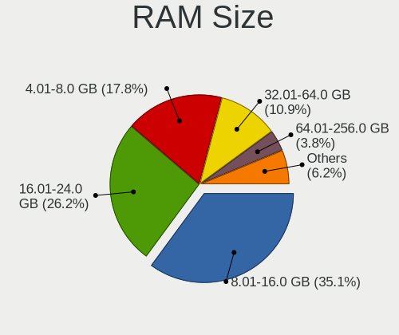
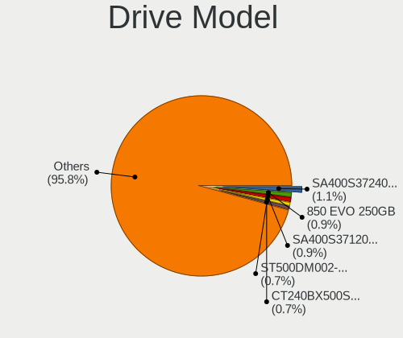
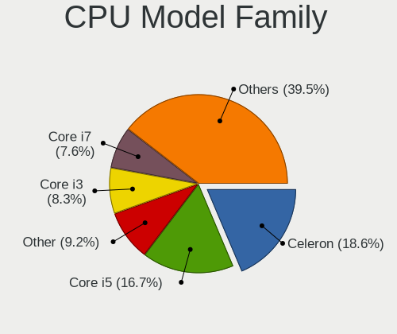
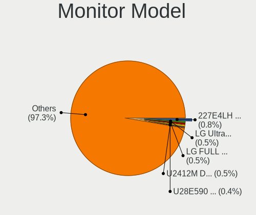
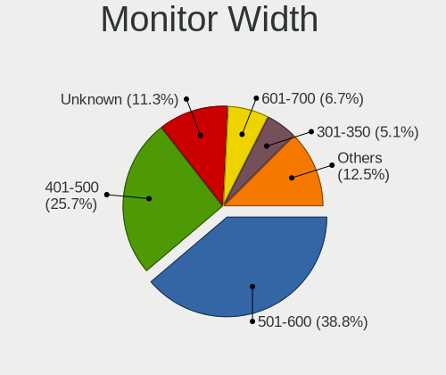
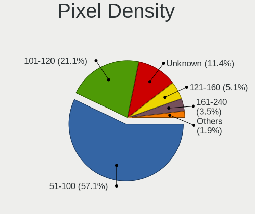
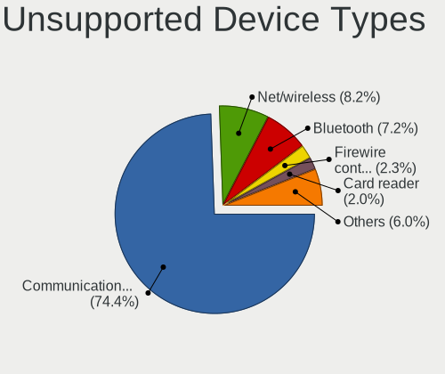

BSD - Tested Hardware & Statistics (Desktops)
---------------------------------------------

A project to collect tested hardware configurations for BSD.

Anyone can contribute to this report by the [hw-probe](https://github.com/linuxhw/hw-probe/blob/master/INSTALL.BSD.md) tool:

    hw-probe -all -upload

Please contribute! Especially if your hardware is rare.

This report is for real hardware. Report for virtual hardware: [TestDays_VE](https://github.com/bsdhw/TestDays_VE)

Contents
--------

* [ Test Cases ](#test-cases)

* [ System ](#system)
  - [ OS                       ](#os)
  - [ OS Family                ](#os-family)
  - [ Arch                     ](#arch)
  - [ DE                       ](#de)
  - [ Display Server           ](#display-server)
  - [ Display Manager          ](#display-manager)
  - [ OS Lang                  ](#os-lang)
  - [ Boot Mode                ](#boot-mode)
  - [ Filesystem               ](#filesystem)
  - [ Part. scheme             ](#part-scheme)

* [ Board ](#board)
  - [ Vendor                   ](#vendor)
  - [ Model                    ](#model)
  - [ Model Family             ](#model-family)
  - [ MFG Year                 ](#mfg-year)
  - [ Form Factor              ](#form-factor)
  - [ Coreboot                 ](#coreboot)
  - [ RAM Size                 ](#ram-size)
  - [ RAM Used                 ](#ram-used)
  - [ Total Drives             ](#total-drives)
  - [ Has CD-ROM               ](#has-cd-rom)
  - [ Has Ethernet             ](#has-ethernet)
  - [ Has WiFi                 ](#has-wifi)
  - [ Has Bluetooth            ](#has-bluetooth)

* [ Location ](#location)
  - [ Country                  ](#country)
  - [ City                     ](#city)

* [ Drives ](#drives)
  - [ Drive Vendor             ](#drive-vendor)
  - [ Drive Model              ](#drive-model)
  - [ HDD Vendor               ](#hdd-vendor)
  - [ SSD Vendor               ](#ssd-vendor)
  - [ Drive Kind               ](#drive-kind)
  - [ Drive Connector          ](#drive-connector)
  - [ Drive Size               ](#drive-size)
  - [ Space Total              ](#space-total)
  - [ Space Used               ](#space-used)
  - [ Malfunc. Drives          ](#malfunc-drives)
  - [ Malfunc. Drive Vendor    ](#malfunc-drive-vendor)
  - [ Malfunc. HDD Vendor      ](#malfunc-hdd-vendor)
  - [ Malfunc. Drive Kind      ](#malfunc-drive-kind)
  - [ Failed Drives            ](#failed-drives)
  - [ Failed Drive Vendor      ](#failed-drive-vendor)
  - [ Drive Status             ](#drive-status)

* [ Storage controller ](#storage-controller)
  - [ Storage Vendor           ](#storage-vendor)
  - [ Storage Model            ](#storage-model)
  - [ Storage Kind             ](#storage-kind)

* [ Processor ](#processor)
  - [ CPU Vendor               ](#cpu-vendor)
  - [ CPU Model                ](#cpu-model)
  - [ CPU Model Family         ](#cpu-model-family)
  - [ CPU Cores                ](#cpu-cores)
  - [ CPU Sockets              ](#cpu-sockets)
  - [ CPU Threads              ](#cpu-threads)
  - [ CPU Microarch            ](#cpu-microarch)

* [ Graphics ](#graphics)
  - [ GPU Vendor               ](#gpu-vendor)
  - [ GPU Model                ](#gpu-model)
  - [ GPU Combo                ](#gpu-combo)
  - [ GPU Driver               ](#gpu-driver)
  - [ GPU Memory               ](#gpu-memory)

* [ Monitor ](#monitor)
  - [ Monitor Vendor           ](#monitor-vendor)
  - [ Monitor Model            ](#monitor-model)
  - [ Monitor Resolution       ](#monitor-resolution)
  - [ Monitor Diagonal         ](#monitor-diagonal)
  - [ Monitor Width            ](#monitor-width)
  - [ Aspect Ratio             ](#aspect-ratio)
  - [ Monitor Area             ](#monitor-area)
  - [ Pixel Density            ](#pixel-density)
  - [ Multiple Monitors        ](#multiple-monitors)

* [ Network ](#network)
  - [ Net Controller Vendor    ](#net-controller-vendor)
  - [ Net Controller Model     ](#net-controller-model)
  - [ Wireless Vendor          ](#wireless-vendor)
  - [ Wireless Model           ](#wireless-model)
  - [ Ethernet Vendor          ](#ethernet-vendor)
  - [ Ethernet Model           ](#ethernet-model)
  - [ Net Controller Kind      ](#net-controller-kind)
  - [ Used Controller          ](#used-controller)
  - [ NICs                     ](#nics)
  - [ IPv6                     ](#ipv6)

* [ Bluetooth ](#bluetooth)
  - [ Bluetooth Vendor         ](#bluetooth-vendor)
  - [ Bluetooth Model          ](#bluetooth-model)

* [ Sound ](#sound)
  - [ Sound Vendor             ](#sound-vendor)
  - [ Sound Model              ](#sound-model)

* [ Memory ](#memory)
  - [ Memory Vendor            ](#memory-vendor)
  - [ Memory Model             ](#memory-model)
  - [ Memory Kind              ](#memory-kind)
  - [ Memory Form Factor       ](#memory-form-factor)
  - [ Memory Size              ](#memory-size)
  - [ Memory Speed             ](#memory-speed)

* [ Printers & scanners ](#printers--scanners)
  - [ Printer Vendor           ](#printer-vendor)
  - [ Printer Model            ](#printer-model)
  - [ Scanner Vendor           ](#scanner-vendor)
  - [ Scanner Model            ](#scanner-model)

* [ Camera ](#camera)
  - [ Camera Vendor            ](#camera-vendor)
  - [ Camera Model             ](#camera-model)

* [ Security ](#security)
  - [ Fingerprint Vendor       ](#fingerprint-vendor)
  - [ Fingerprint Model        ](#fingerprint-model)
  - [ Chipcard Vendor          ](#chipcard-vendor)
  - [ Chipcard Model           ](#chipcard-model)

* [ Unsupported ](#unsupported)
  - [ Unsupported Devices      ](#unsupported-devices)
  - [ Unsupported Device Types ](#unsupported-device-types)

Test Cases
----------

Total: 13562

| Vendor        | Model                       | Probe                                                     | Date         |
|---------------|-----------------------------|-----------------------------------------------------------|--------------|
| Unknown       | Unknown                     | [f4fa8cc2cd](https://bsd-hardware.info/?probe=f4fa8cc2cd) | Feb 18, 2024 |
| Unknown       | Unknown                     | [7d606ad1ef](https://bsd-hardware.info/?probe=7d606ad1ef) | Feb 18, 2024 |
| Unknown       | Unknown                     | [7a484b8933](https://bsd-hardware.info/?probe=7a484b8933) | Feb 18, 2024 |
| MW            | GMLK-2_5G4L                 | [23cb8e1723](https://bsd-hardware.info/?probe=23cb8e1723) | Feb 18, 2024 |
| Gigabyte      | H170-Gaming 3               | [5333db4eb9](https://bsd-hardware.info/?probe=5333db4eb9) | Feb 18, 2024 |
| CWWK          | CW-AD4L-N V1                | [6f933374c6](https://bsd-hardware.info/?probe=6f933374c6) | Feb 18, 2024 |
| Dell          | 0D28YY A00                  | [15db3df1ca](https://bsd-hardware.info/?probe=15db3df1ca) | Feb 18, 2024 |
| CWWK          | CW-AD4L-N V1                | [45450ec330](https://bsd-hardware.info/?probe=45450ec330) | Feb 18, 2024 |
| ASRock        | B450M Pro4 R2.0             | [007b93e5c0](https://bsd-hardware.info/?probe=007b93e5c0) | Feb 18, 2024 |
| Unknown       | Unknown                     | [882809e2c7](https://bsd-hardware.info/?probe=882809e2c7) | Feb 18, 2024 |
| Unknown       | Unknown                     | [db839aa12a](https://bsd-hardware.info/?probe=db839aa12a) | Feb 18, 2024 |
| Protectli     | FW6 Ver                     | [35e8ff3d63](https://bsd-hardware.info/?probe=35e8ff3d63) | Feb 18, 2024 |
| Unknown       | J3160-4L                    | [e4b6344125](https://bsd-hardware.info/?probe=e4b6344125) | Feb 18, 2024 |
| Gigabyte      | H170-Gaming 3               | [4c03a20d4f](https://bsd-hardware.info/?probe=4c03a20d4f) | Feb 18, 2024 |
| Gigabyte      | Z590I VISION D              | [95add8c57a](https://bsd-hardware.info/?probe=95add8c57a) | Feb 18, 2024 |
| HP            | 802E                        | [6ef690a057](https://bsd-hardware.info/?probe=6ef690a057) | Feb 17, 2024 |
| HP            | 83E9                        | [f5a6f9001d](https://bsd-hardware.info/?probe=f5a6f9001d) | Feb 17, 2024 |
| PC Engines    | apu6                        | [9f618d2d95](https://bsd-hardware.info/?probe=9f618d2d95) | Feb 17, 2024 |
| Unknown       | Unknown                     | [0a1749e911](https://bsd-hardware.info/?probe=0a1749e911) | Feb 17, 2024 |
| Unknown       | Unknown                     | [0d6264dd51](https://bsd-hardware.info/?probe=0d6264dd51) | Feb 17, 2024 |
| Unknown       | Unknown                     | [ac788598a6](https://bsd-hardware.info/?probe=ac788598a6) | Feb 17, 2024 |
| Intel         | J1900                       | [2fe6c55315](https://bsd-hardware.info/?probe=2fe6c55315) | Feb 17, 2024 |
| Intel         | J1900                       | [0f27ae5c3e](https://bsd-hardware.info/?probe=0f27ae5c3e) | Feb 17, 2024 |
| Unknown       | Unknown                     | [51de6543fd](https://bsd-hardware.info/?probe=51de6543fd) | Feb 17, 2024 |
| ASUSTek       | B85M-G                      | [0fc891ba64](https://bsd-hardware.info/?probe=0fc891ba64) | Feb 17, 2024 |
| ASUSTek       | Q87T                        | [ca381bbbcc](https://bsd-hardware.info/?probe=ca381bbbcc) | Feb 17, 2024 |
| Unknown       | Unknown                     | [ca03a6b3b5](https://bsd-hardware.info/?probe=ca03a6b3b5) | Feb 17, 2024 |
| Unknown       | Unknown                     | [ebfcb0f78b](https://bsd-hardware.info/?probe=ebfcb0f78b) | Feb 17, 2024 |
| Biostar       | B450NH                      | [9f4dedfcd6](https://bsd-hardware.info/?probe=9f4dedfcd6) | Feb 17, 2024 |
| Unknown       | Unknown                     | [2926d6511f](https://bsd-hardware.info/?probe=2926d6511f) | Feb 17, 2024 |
| Techvision    | TVI7309X B0                 | [135d71a048](https://bsd-hardware.info/?probe=135d71a048) | Feb 17, 2024 |
| Foxconn       | 2ABF                        | [a7fb944efe](https://bsd-hardware.info/?probe=a7fb944efe) | Feb 17, 2024 |
| Fujitsu       | D3313-E1 S26361-D3313-E1    | [8f0a5d2d0a](https://bsd-hardware.info/?probe=8f0a5d2d0a) | Feb 16, 2024 |
| CWWK          | CW-J6-6L                    | [ed704fa396](https://bsd-hardware.info/?probe=ed704fa396) | Feb 16, 2024 |
| GoWin Solu... | R86S                        | [1629545965](https://bsd-hardware.info/?probe=1629545965) | Feb 16, 2024 |
| ASRock        | B360M Xtreme                | [e84af03816](https://bsd-hardware.info/?probe=e84af03816) | Feb 16, 2024 |
| Unknown       | Unknown                     | [e5e747ec86](https://bsd-hardware.info/?probe=e5e747ec86) | Feb 16, 2024 |
| ECS           | APLD-MINI                   | [d0d3c5d2c3](https://bsd-hardware.info/?probe=d0d3c5d2c3) | Feb 16, 2024 |
| HP            | 8AC4                        | [524b8cae7c](https://bsd-hardware.info/?probe=524b8cae7c) | Feb 16, 2024 |
| Biostar       | B450NH                      | [2db279db1d](https://bsd-hardware.info/?probe=2db279db1d) | Feb 16, 2024 |
| Lenovo        | 30D9 No DPK                 | [9c3c1f4f5d](https://bsd-hardware.info/?probe=9c3c1f4f5d) | Feb 16, 2024 |
| HP            | 304Bh                       | [d121a7198f](https://bsd-hardware.info/?probe=d121a7198f) | Feb 16, 2024 |
| Dell          | 0WMJ54 A01                  | [7ccce31d2d](https://bsd-hardware.info/?probe=7ccce31d2d) | Feb 16, 2024 |
| Unknown       | Unknown                     | [13c84b6db8](https://bsd-hardware.info/?probe=13c84b6db8) | Feb 16, 2024 |
| Unknown       | Unknown                     | [a4781efc54](https://bsd-hardware.info/?probe=a4781efc54) | Feb 16, 2024 |
| BOSGAME       | DNB10M                      | [58f2362bf1](https://bsd-hardware.info/?probe=58f2362bf1) | Feb 16, 2024 |
| PC Engines    | APU2                        | [e2280e4159](https://bsd-hardware.info/?probe=e2280e4159) | Feb 15, 2024 |
| ASRock        | A320M-HDV R4.0              | [afe2427e9d](https://bsd-hardware.info/?probe=afe2427e9d) | Feb 15, 2024 |
| AWOW          | AK10                        | [4b512f8739](https://bsd-hardware.info/?probe=4b512f8739) | Feb 15, 2024 |
| Unknown       | Unknown                     | [b35fd5253d](https://bsd-hardware.info/?probe=b35fd5253d) | Feb 15, 2024 |
| Unknown       | Unknown                     | [7dc7c39f38](https://bsd-hardware.info/?probe=7dc7c39f38) | Feb 15, 2024 |
| Gigabyte      | B360N WIFI-CF               | [65cc201af1](https://bsd-hardware.info/?probe=65cc201af1) | Feb 15, 2024 |
| Intel         | SKYBAY                      | [5288673757](https://bsd-hardware.info/?probe=5288673757) | Feb 15, 2024 |
| ASUSTek       | H110M-K                     | [8ad1731687](https://bsd-hardware.info/?probe=8ad1731687) | Feb 15, 2024 |
| Hardkernel    | ODROID-H2                   | [a4045617ec](https://bsd-hardware.info/?probe=a4045617ec) | Feb 14, 2024 |
| Supermicro    | X9SCL/X9SCMA                | [53bdb73b74](https://bsd-hardware.info/?probe=53bdb73b74) | Feb 14, 2024 |
| Unknown       | Unknown                     | [ef910cb303](https://bsd-hardware.info/?probe=ef910cb303) | Feb 14, 2024 |
| ASUSTek       | Pro B560M-C                 | [fdeb2cee9d](https://bsd-hardware.info/?probe=fdeb2cee9d) | Feb 14, 2024 |
| ASRock        | B550 Taichi                 | [814a0aba66](https://bsd-hardware.info/?probe=814a0aba66) | Feb 14, 2024 |
| Unknown       | Unknown                     | [c2a87f002c](https://bsd-hardware.info/?probe=c2a87f002c) | Feb 14, 2024 |
| Supermicro    | X11SDV-8C-TP8F              | [6a026289ce](https://bsd-hardware.info/?probe=6a026289ce) | Feb 14, 2024 |
| HP            | ProLiant MicroServer Gen... | [ee68dade44](https://bsd-hardware.info/?probe=ee68dade44) | Feb 14, 2024 |
| AZW           | EQ                          | [cfdbc24520](https://bsd-hardware.info/?probe=cfdbc24520) | Feb 14, 2024 |
| Gigabyte      | IMB1900TN                   | [d0c6d1e44b](https://bsd-hardware.info/?probe=d0c6d1e44b) | Feb 14, 2024 |
| Unknown       | Unknown                     | [5da46d2f84](https://bsd-hardware.info/?probe=5da46d2f84) | Feb 14, 2024 |
| Protectli     | FW4B                        | [c9a2dee14e](https://bsd-hardware.info/?probe=c9a2dee14e) | Feb 14, 2024 |
| CncTion       | N5105-4L B0                 | [63fbf4cdbd](https://bsd-hardware.info/?probe=63fbf4cdbd) | Feb 14, 2024 |
| Dell          | 0YXT71 A00                  | [19c7684ced](https://bsd-hardware.info/?probe=19c7684ced) | Feb 14, 2024 |
| PC Engines    | APU2                        | [df18317865](https://bsd-hardware.info/?probe=df18317865) | Feb 14, 2024 |
| Gigabyte      | B550 AORUS ELITE V2         | [2159f2bebf](https://bsd-hardware.info/?probe=2159f2bebf) | Feb 14, 2024 |
| ASUSTek       | PRIME A520M-A II            | [acb70accb8](https://bsd-hardware.info/?probe=acb70accb8) | Feb 14, 2024 |
| HP            | 1998                        | [6895f365c7](https://bsd-hardware.info/?probe=6895f365c7) | Feb 14, 2024 |
| Unknown       | Unknown                     | [9c184fe6fa](https://bsd-hardware.info/?probe=9c184fe6fa) | Feb 14, 2024 |
| MSI           | H110M ECO                   | [74ec4ebb63](https://bsd-hardware.info/?probe=74ec4ebb63) | Feb 13, 2024 |
| ASRock        | A520M-ITX/ac                | [63408627d9](https://bsd-hardware.info/?probe=63408627d9) | Feb 13, 2024 |
| Shuttle       | FH170                       | [e7eaced298](https://bsd-hardware.info/?probe=e7eaced298) | Feb 13, 2024 |
| ASUSTek       | PRIME X370-PRO              | [7a18edf610](https://bsd-hardware.info/?probe=7a18edf610) | Feb 13, 2024 |
| ASRock        | X570 Phantom Gaming 4       | [d24c0ab2c0](https://bsd-hardware.info/?probe=d24c0ab2c0) | Feb 13, 2024 |
| Protectli     | FW2B                        | [09657632a4](https://bsd-hardware.info/?probe=09657632a4) | Feb 13, 2024 |
| Dell          | 02YYK5 A00                  | [47e43f818a](https://bsd-hardware.info/?probe=47e43f818a) | Feb 13, 2024 |
| Deciso        | Netboard A10 V2.1           | [9f620acb22](https://bsd-hardware.info/?probe=9f620acb22) | Feb 13, 2024 |
| HP            | ProLiant MicroServer        | [ab0d1d0078](https://bsd-hardware.info/?probe=ab0d1d0078) | Feb 13, 2024 |
| ASRock        | Z590 Steel Legend           | [e7dfc1ffe5](https://bsd-hardware.info/?probe=e7dfc1ffe5) | Feb 13, 2024 |
| ASRock        | Z590 Steel Legend           | [30702fa4b5](https://bsd-hardware.info/?probe=30702fa4b5) | Feb 13, 2024 |
| Dell          | 07WP95 A02                  | [aad51ede2a](https://bsd-hardware.info/?probe=aad51ede2a) | Feb 12, 2024 |
| HP            | 18E7                        | [ce1c65da2d](https://bsd-hardware.info/?probe=ce1c65da2d) | Feb 12, 2024 |
| Protectli     | FW2B Ver                    | [d2280903ce](https://bsd-hardware.info/?probe=d2280903ce) | Feb 12, 2024 |
| ASUSTek       | A68HM-PLUS                  | [191c41587b](https://bsd-hardware.info/?probe=191c41587b) | Feb 12, 2024 |
| Intel         | SKYBAY                      | [7c8379fd02](https://bsd-hardware.info/?probe=7c8379fd02) | Feb 12, 2024 |
| Shenzhen M... | F6BFC                       | [ca7e1f0fae](https://bsd-hardware.info/?probe=ca7e1f0fae) | Feb 12, 2024 |
| IceWhale T... | ZimaBoard 832 ZMB           | [5d8c1ea60c](https://bsd-hardware.info/?probe=5d8c1ea60c) | Feb 12, 2024 |
| ASUSTek       | M5A97 R2.0                  | [c3d95743df](https://bsd-hardware.info/?probe=c3d95743df) | Feb 12, 2024 |
| AZW           | EQ                          | [1f6f07cd11](https://bsd-hardware.info/?probe=1f6f07cd11) | Feb 12, 2024 |
| MSI           | 890GXM-G65                  | [96d9ab3e95](https://bsd-hardware.info/?probe=96d9ab3e95) | Feb 12, 2024 |
| PC Engines    | APU2                        | [70927f49d1](https://bsd-hardware.info/?probe=70927f49d1) | Feb 12, 2024 |
| PC Engines    | APU2                        | [251265d29e](https://bsd-hardware.info/?probe=251265d29e) | Feb 12, 2024 |
| Gigabyte      | B760I AORUS PRO DDR4        | [0074d80aa1](https://bsd-hardware.info/?probe=0074d80aa1) | Feb 12, 2024 |
| HP            | 1998                        | [58de92b13d](https://bsd-hardware.info/?probe=58de92b13d) | Feb 11, 2024 |
| Unknown       | YL-J3160L4                  | [7bb2930dfa](https://bsd-hardware.info/?probe=7bb2930dfa) | Feb 11, 2024 |
| Acer          | Veriton X4660G V:1.0        | [768778b955](https://bsd-hardware.info/?probe=768778b955) | Feb 11, 2024 |
| Acer          | Veriton X4660G V:1.0        | [e46456819b](https://bsd-hardware.info/?probe=e46456819b) | Feb 11, 2024 |
| Unknown       | Unknown                     | [d05beec487](https://bsd-hardware.info/?probe=d05beec487) | Feb 11, 2024 |
| Dell          | 0FF3FN A00                  | [56b53a9e68](https://bsd-hardware.info/?probe=56b53a9e68) | Feb 11, 2024 |
| Dell          | 0H634K A00                  | [a39d975ae9](https://bsd-hardware.info/?probe=a39d975ae9) | Feb 11, 2024 |
| ASUSTek       | TUF Gaming B550M-PLUS       | [fa2107c718](https://bsd-hardware.info/?probe=fa2107c718) | Feb 11, 2024 |
| ASUSTek       | P5Q-E                       | [08506a1aff](https://bsd-hardware.info/?probe=08506a1aff) | Feb 11, 2024 |
| ASUSTek       | ROG CROSSHAIR VIII HERO     | [5f3d8e3288](https://bsd-hardware.info/?probe=5f3d8e3288) | Feb 11, 2024 |
| Unknown       | Unknown                     | [d447aefaf0](https://bsd-hardware.info/?probe=d447aefaf0) | Feb 11, 2024 |
| Protectli     | FW6 Ver                     | [9a3b41d070](https://bsd-hardware.info/?probe=9a3b41d070) | Feb 11, 2024 |
| Dell          | 0H4VK7 A00                  | [64725f3ed7](https://bsd-hardware.info/?probe=64725f3ed7) | Feb 11, 2024 |
| Unknown       | Unknown                     | [e4b4c15b64](https://bsd-hardware.info/?probe=e4b4c15b64) | Feb 11, 2024 |
| Dell          | 00V62H A01                  | [e583d1ae8c](https://bsd-hardware.info/?probe=e583d1ae8c) | Feb 11, 2024 |
| Dell          | 0H4VK7 A00                  | [c321c66eea](https://bsd-hardware.info/?probe=c321c66eea) | Feb 11, 2024 |
| Gigabyte      | H170-D3HP-CF                | [32822eef4c](https://bsd-hardware.info/?probe=32822eef4c) | Feb 11, 2024 |
| Unknown       | Unknown                     | [742f0ba15a](https://bsd-hardware.info/?probe=742f0ba15a) | Feb 11, 2024 |
| Intel         | HURONRIVER                  | [fd049a80db](https://bsd-hardware.info/?probe=fd049a80db) | Feb 10, 2024 |
| ASUSTek       | H97I-PLUS                   | [c5ca47db6b](https://bsd-hardware.info/?probe=c5ca47db6b) | Feb 10, 2024 |
| Advantech     | NAMB-3250 A102-1            | [09843ea5f1](https://bsd-hardware.info/?probe=09843ea5f1) | Feb 10, 2024 |
| Gigabyte      | B760I AORUS PRO DDR4        | [ab109fa386](https://bsd-hardware.info/?probe=ab109fa386) | Feb 10, 2024 |
| Intel         | JSL MRD                     | [373f1bfecf](https://bsd-hardware.info/?probe=373f1bfecf) | Feb 10, 2024 |
| Techvision    | TVI7309X B0                 | [d4bdab4711](https://bsd-hardware.info/?probe=d4bdab4711) | Feb 10, 2024 |
| HP            | 339A                        | [5d1b482427](https://bsd-hardware.info/?probe=5d1b482427) | Feb 10, 2024 |
| Unknown       | Unknown                     | [ea4fe7a8cf](https://bsd-hardware.info/?probe=ea4fe7a8cf) | Feb 10, 2024 |
| CWWK          | CW-J6-6L                    | [d859437053](https://bsd-hardware.info/?probe=d859437053) | Feb 10, 2024 |
| ASUSTek       | PRIME Z790M-PLUS D4         | [7f4338cdd1](https://bsd-hardware.info/?probe=7f4338cdd1) | Feb 10, 2024 |
| HP            | 8299                        | [2a8e07ec62](https://bsd-hardware.info/?probe=2a8e07ec62) | Feb 10, 2024 |
| Intel         | Q3XXG4-P V1.0               | [b3e9bf8bcd](https://bsd-hardware.info/?probe=b3e9bf8bcd) | Feb 10, 2024 |
| Unknown       | Unknown                     | [b13923c3f1](https://bsd-hardware.info/?probe=b13923c3f1) | Feb 10, 2024 |
| Unknown       | Unknown                     | [d0bf9601a7](https://bsd-hardware.info/?probe=d0bf9601a7) | Feb 10, 2024 |
| Unknown       | Unknown                     | [c3f71c8e39](https://bsd-hardware.info/?probe=c3f71c8e39) | Feb 10, 2024 |
| Unknown       | Unknown                     | [ea0996b777](https://bsd-hardware.info/?probe=ea0996b777) | Feb 10, 2024 |
| HP            | 213D A01                    | [e80039f387](https://bsd-hardware.info/?probe=e80039f387) | Feb 09, 2024 |
| Cisco         | ASA5515 A0                  | [8374ec4cca](https://bsd-hardware.info/?probe=8374ec4cca) | Feb 09, 2024 |
| Intel         | DQ77KB AAG81483-501         | [96f998dae3](https://bsd-hardware.info/?probe=96f998dae3) | Feb 09, 2024 |
| Unknown       | Unknown                     | [19e59c140c](https://bsd-hardware.info/?probe=19e59c140c) | Feb 09, 2024 |
| HP            | 17E2                        | [946d33d274](https://bsd-hardware.info/?probe=946d33d274) | Feb 09, 2024 |
| Unknown       | Unknown                     | [d8f999e5ce](https://bsd-hardware.info/?probe=d8f999e5ce) | Feb 09, 2024 |
| Unknown       | Unknown                     | [61ddfb16f5](https://bsd-hardware.info/?probe=61ddfb16f5) | Feb 09, 2024 |
| HP            | 1495                        | [570b4899ea](https://bsd-hardware.info/?probe=570b4899ea) | Feb 09, 2024 |
| HP            | ProLiant MicroServer Gen... | [01a632e124](https://bsd-hardware.info/?probe=01a632e124) | Feb 09, 2024 |
| Unknown       | Unknown                     | [eb03c1914f](https://bsd-hardware.info/?probe=eb03c1914f) | Feb 09, 2024 |
| PC Engines    | APU2                        | [2741a6da81](https://bsd-hardware.info/?probe=2741a6da81) | Feb 09, 2024 |
| Gigabyte      | B550 UD AC-Y1               | [1e285504a6](https://bsd-hardware.info/?probe=1e285504a6) | Feb 09, 2024 |
| Unknown       | TB100                       | [9075923143](https://bsd-hardware.info/?probe=9075923143) | Feb 09, 2024 |
| Fujitsu       | D3067-A1 S26361-D3067-A1    | [08ee39a7cf](https://bsd-hardware.info/?probe=08ee39a7cf) | Feb 09, 2024 |
| Foxconn       | 2ABF                        | [25d0533779](https://bsd-hardware.info/?probe=25d0533779) | Feb 09, 2024 |
| Unknown       | Unknown                     | [09beb1cb7a](https://bsd-hardware.info/?probe=09beb1cb7a) | Feb 08, 2024 |
| Dell          | 0X9X1W A00                  | [56e5a43171](https://bsd-hardware.info/?probe=56e5a43171) | Feb 08, 2024 |
| MSI           | B450M MORTAR MAX            | [1401e42d48](https://bsd-hardware.info/?probe=1401e42d48) | Feb 08, 2024 |
| Protectli     | VP2420                      | [70f6cd6041](https://bsd-hardware.info/?probe=70f6cd6041) | Feb 08, 2024 |
| Fujitsu       | D3430-U1 S26361-D3430-U1    | [9778043e6f](https://bsd-hardware.info/?probe=9778043e6f) | Feb 08, 2024 |
| Unknown       | Unknown                     | [5e402c524a](https://bsd-hardware.info/?probe=5e402c524a) | Feb 08, 2024 |
| Gigabyte      | X299 AORUS Gaming-CF        | [47e91ddd92](https://bsd-hardware.info/?probe=47e91ddd92) | Feb 08, 2024 |
| Intel         | Q3XXG4-P V1.0               | [34d8f9b987](https://bsd-hardware.info/?probe=34d8f9b987) | Feb 08, 2024 |
| Lenovo        | ThinkCentre M91p 7052C1G    | [3aeb926332](https://bsd-hardware.info/?probe=3aeb926332) | Feb 08, 2024 |
| CWWK          | CW-J6-6L                    | [dd96aebca7](https://bsd-hardware.info/?probe=dd96aebca7) | Feb 08, 2024 |
| Gigabyte      | H81M-D2V                    | [1b2b064c64](https://bsd-hardware.info/?probe=1b2b064c64) | Feb 08, 2024 |
| AZW           | EQ                          | [5b83388da9](https://bsd-hardware.info/?probe=5b83388da9) | Feb 08, 2024 |
| Unknown       | J3160-4L                    | [353ac982bf](https://bsd-hardware.info/?probe=353ac982bf) | Feb 07, 2024 |
| Cisco         | C170 A0                     | [5d0362fa16](https://bsd-hardware.info/?probe=5d0362fa16) | Feb 07, 2024 |
| Unknown       | Unknown                     | [1d24f65624](https://bsd-hardware.info/?probe=1d24f65624) | Feb 07, 2024 |
| SHANGZHAOY... | B85M-PRO V1.1               | [79ec97854e](https://bsd-hardware.info/?probe=79ec97854e) | Feb 07, 2024 |
| AAEON         | FWS-2251 V1.0               | [17853848cd](https://bsd-hardware.info/?probe=17853848cd) | Feb 07, 2024 |
| ASUSTek       | EX-B760M-V5 D4              | [852818ab9b](https://bsd-hardware.info/?probe=852818ab9b) | Feb 07, 2024 |
| PC Engines    | APU2                        | [6d52e4dad5](https://bsd-hardware.info/?probe=6d52e4dad5) | Feb 07, 2024 |
| Lenovo        | 30FD SDK0J40705 WIN 3425... | [87313cc66c](https://bsd-hardware.info/?probe=87313cc66c) | Feb 07, 2024 |
| HP            | 8717                        | [de846f4d11](https://bsd-hardware.info/?probe=de846f4d11) | Feb 07, 2024 |
| OEM           | 1.0                         | [dd3228b447](https://bsd-hardware.info/?probe=dd3228b447) | Feb 07, 2024 |
| PC Engines    | apu4                        | [fb60f908ae](https://bsd-hardware.info/?probe=fb60f908ae) | Feb 07, 2024 |
| Gigabyte      | B450M DS3H-CF               | [4073dda626](https://bsd-hardware.info/?probe=4073dda626) | Feb 07, 2024 |
| Unknown       | Unknown                     | [7b626b5a2c](https://bsd-hardware.info/?probe=7b626b5a2c) | Feb 07, 2024 |
| Datto         | SSD                         | [1d15370fce](https://bsd-hardware.info/?probe=1d15370fce) | Feb 07, 2024 |
| Unknown       | Unknown                     | [86614a836b](https://bsd-hardware.info/?probe=86614a836b) | Feb 07, 2024 |
| AAEON         | FWS-2251 V1.0               | [1def0a68ec](https://bsd-hardware.info/?probe=1def0a68ec) | Feb 07, 2024 |
| Unknown       | Unknown                     | [9b6ebfd710](https://bsd-hardware.info/?probe=9b6ebfd710) | Feb 07, 2024 |
| NEOSMAY       | BQM5                        | [766c55f303](https://bsd-hardware.info/?probe=766c55f303) | Feb 06, 2024 |
| Unknown       | Unknown                     | [255257af13](https://bsd-hardware.info/?probe=255257af13) | Feb 06, 2024 |
| Unknown       | ROUTER                      | [b0ad906a1b](https://bsd-hardware.info/?probe=b0ad906a1b) | Feb 06, 2024 |
| Fujitsu       | D3313-A1 S26361-D3313-A1    | [ba3543c2a6](https://bsd-hardware.info/?probe=ba3543c2a6) | Feb 06, 2024 |
| ASUSTek       | STRIX H270I GAMING          | [852785036c](https://bsd-hardware.info/?probe=852785036c) | Feb 06, 2024 |
| Protectli     | FW1 Ver                     | [587c9145bc](https://bsd-hardware.info/?probe=587c9145bc) | Feb 06, 2024 |
| Unknown       | Unknown                     | [38a8200699](https://bsd-hardware.info/?probe=38a8200699) | Feb 06, 2024 |
| ASRock        | B450M-HDV                   | [841a005fc8](https://bsd-hardware.info/?probe=841a005fc8) | Feb 06, 2024 |
| Unknown       | Unknown                     | [aa8c9dbf54](https://bsd-hardware.info/?probe=aa8c9dbf54) | Feb 06, 2024 |
| Unknown       | ITX-M41V                    | [957fb292ad](https://bsd-hardware.info/?probe=957fb292ad) | Feb 06, 2024 |
| Unknown       | Unknown                     | [7f960ac536](https://bsd-hardware.info/?probe=7f960ac536) | Feb 06, 2024 |
| ASUSTek       | ROG ZENITH EXTREME ALPHA    | [37d30255bc](https://bsd-hardware.info/?probe=37d30255bc) | Feb 06, 2024 |
| Protectli     | FW4C Ver                    | [70908897af](https://bsd-hardware.info/?probe=70908897af) | Feb 06, 2024 |
| Unknown       | Unknown                     | [cf3dc1214b](https://bsd-hardware.info/?probe=cf3dc1214b) | Feb 06, 2024 |
| Intel         | STK1AW32SC H91596-303       | [14fcea4fb9](https://bsd-hardware.info/?probe=14fcea4fb9) | Feb 06, 2024 |
| Gigabyte      | Z68X-UD3H-B3                | [a2c1b1addb](https://bsd-hardware.info/?probe=a2c1b1addb) | Feb 06, 2024 |
| Unknown       | Unknown                     | [11b10e5acb](https://bsd-hardware.info/?probe=11b10e5acb) | Feb 06, 2024 |
| ASRock        | B450M Pro4 R2.0             | [55d74d88f2](https://bsd-hardware.info/?probe=55d74d88f2) | Feb 06, 2024 |
| MSI           | PRO B550M-P GEN3            | [6a6b1dbe8f](https://bsd-hardware.info/?probe=6a6b1dbe8f) | Feb 06, 2024 |
| OEM           | AR-B5800                    | [000d3c852f](https://bsd-hardware.info/?probe=000d3c852f) | Feb 05, 2024 |
| IceWhale T... | ZimaBoard 832 ZMB           | [a26afd4195](https://bsd-hardware.info/?probe=a26afd4195) | Feb 05, 2024 |
| ASRock        | Z390M-ITX/ac                | [d982b3a856](https://bsd-hardware.info/?probe=d982b3a856) | Feb 05, 2024 |
| Supermicro    | X9SCL/X9SCMA                | [494e0fc84e](https://bsd-hardware.info/?probe=494e0fc84e) | Feb 05, 2024 |
| Unknown       | Unknown                     | [4437069c86](https://bsd-hardware.info/?probe=4437069c86) | Feb 05, 2024 |
| Intel         | DENLOW_WS                   | [2d0479073b](https://bsd-hardware.info/?probe=2d0479073b) | Feb 05, 2024 |
| Unknown       | Unknown                     | [40908221ba](https://bsd-hardware.info/?probe=40908221ba) | Feb 05, 2024 |
| PC Engines    | apu4                        | [d0205e7f2b](https://bsd-hardware.info/?probe=d0205e7f2b) | Feb 05, 2024 |
| HP            | 83EE                        | [3fdb0e4625](https://bsd-hardware.info/?probe=3fdb0e4625) | Feb 05, 2024 |
| HP            | 83EE                        | [92258e181d](https://bsd-hardware.info/?probe=92258e181d) | Feb 05, 2024 |
| Lenovo        | ThinkCentre M90p 3853RN9    | [c0395ca728](https://bsd-hardware.info/?probe=c0395ca728) | Feb 05, 2024 |
| Supermicro    | X11SDV-4C-TP8F              | [112139bde4](https://bsd-hardware.info/?probe=112139bde4) | Feb 05, 2024 |
| Foxconn       | 2ABF                        | [6e35ed141f](https://bsd-hardware.info/?probe=6e35ed141f) | Feb 05, 2024 |
| Silicom       | 80300-0134-g01              | [45cac52117](https://bsd-hardware.info/?probe=45cac52117) | Feb 05, 2024 |
| Unknown       | Unknown                     | [e217f9a442](https://bsd-hardware.info/?probe=e217f9a442) | Feb 05, 2024 |
| Unknown       | Unknown                     | [f206c1a24c](https://bsd-hardware.info/?probe=f206c1a24c) | Feb 05, 2024 |
| Unknown       | Unknown                     | [ff4514068b](https://bsd-hardware.info/?probe=ff4514068b) | Feb 05, 2024 |
| Protectli     | VP2410                      | [1e69300cbd](https://bsd-hardware.info/?probe=1e69300cbd) | Feb 05, 2024 |
| MSI           | A88XM-E45                   | [27c1aec350](https://bsd-hardware.info/?probe=27c1aec350) | Feb 04, 2024 |
| Lenovo        | 36C8 SDK0J40700 WIN 3258... | [ed12a75f82](https://bsd-hardware.info/?probe=ed12a75f82) | Feb 04, 2024 |
| ASRock        | H81M-ITX/WiFi               | [1b08d685ed](https://bsd-hardware.info/?probe=1b08d685ed) | Feb 04, 2024 |
| Unknown       | Unknown                     | [07bb97c05d](https://bsd-hardware.info/?probe=07bb97c05d) | Feb 04, 2024 |
| ASRock        | N68-VS3 UCC                 | [082906c4f9](https://bsd-hardware.info/?probe=082906c4f9) | Feb 04, 2024 |
| ASUSTek       | TUF B365M-PLUS GAMING       | [61580db8d6](https://bsd-hardware.info/?probe=61580db8d6) | Feb 04, 2024 |
| Protectli     | FW4B Ver                    | [f41dea5706](https://bsd-hardware.info/?probe=f41dea5706) | Feb 04, 2024 |
| Dell          | 0M5DCD A00                  | [1ce2ca36bf](https://bsd-hardware.info/?probe=1ce2ca36bf) | Feb 04, 2024 |
| Techvision    | TVI7309X B0                 | [fa94c9a549](https://bsd-hardware.info/?probe=fa94c9a549) | Feb 04, 2024 |
| Fujitsu       | D3313-E1 S26361-D3313-E1    | [9e7d881690](https://bsd-hardware.info/?probe=9e7d881690) | Feb 04, 2024 |
| MSI           | H81M-P33                    | [444eaddd27](https://bsd-hardware.info/?probe=444eaddd27) | Feb 04, 2024 |
| ASUSTek       | P5Q-E                       | [87358bcf94](https://bsd-hardware.info/?probe=87358bcf94) | Feb 04, 2024 |
| ASUSTek       | ROG CROSSHAIR VIII HERO     | [94f15f8857](https://bsd-hardware.info/?probe=94f15f8857) | Feb 04, 2024 |
| Unknown       | Unknown                     | [05745ae76a](https://bsd-hardware.info/?probe=05745ae76a) | Feb 04, 2024 |
| CWWK          | CW-AD4L-N V1                | [b578551813](https://bsd-hardware.info/?probe=b578551813) | Feb 04, 2024 |
| Intel         | MAHOBAY                     | [e2eba982ad](https://bsd-hardware.info/?probe=e2eba982ad) | Feb 04, 2024 |
| PC Engines    | APU2                        | [89f0caf8f9](https://bsd-hardware.info/?probe=89f0caf8f9) | Feb 04, 2024 |
| Unknown       | Unknown                     | [aef9924665](https://bsd-hardware.info/?probe=aef9924665) | Feb 04, 2024 |
| Dell          | 00V62H A01                  | [307c51641d](https://bsd-hardware.info/?probe=307c51641d) | Feb 04, 2024 |
| AZW           | GK55                        | [1fee4341a2](https://bsd-hardware.info/?probe=1fee4341a2) | Feb 04, 2024 |
| PC Engines    | APU2                        | [82cc76def6](https://bsd-hardware.info/?probe=82cc76def6) | Feb 04, 2024 |
| AZW           | EQ                          | [13a1514ea5](https://bsd-hardware.info/?probe=13a1514ea5) | Feb 04, 2024 |
| ASUSTek       | H110I-PLUS                  | [4cb8c45861](https://bsd-hardware.info/?probe=4cb8c45861) | Feb 03, 2024 |
| Unknown       | Unknown                     | [b9f334a078](https://bsd-hardware.info/?probe=b9f334a078) | Feb 03, 2024 |
| Protectli     | FW6 Ver                     | [97176aa00a](https://bsd-hardware.info/?probe=97176aa00a) | Feb 03, 2024 |
| AZW           | EQ                          | [53f9e8c700](https://bsd-hardware.info/?probe=53f9e8c700) | Feb 03, 2024 |
| Dell          | 0D6H9T A00                  | [9454913bf3](https://bsd-hardware.info/?probe=9454913bf3) | Feb 03, 2024 |
| Protectli     | FW4B                        | [28f07a1d8b](https://bsd-hardware.info/?probe=28f07a1d8b) | Feb 03, 2024 |
| ASUSTek       | Pro B560M-C                 | [676019447d](https://bsd-hardware.info/?probe=676019447d) | Feb 03, 2024 |
| ASRock        | H570M-ITX/ac                | [df0fcc7727](https://bsd-hardware.info/?probe=df0fcc7727) | Feb 03, 2024 |
| Unknown       | Unknown                     | [0bf7e7f085](https://bsd-hardware.info/?probe=0bf7e7f085) | Feb 03, 2024 |
| Cisco         | ASA5515 A0                  | [366c1acc24](https://bsd-hardware.info/?probe=366c1acc24) | Feb 03, 2024 |
| MSI           | MS-7D15                     | [a22ee27a4a](https://bsd-hardware.info/?probe=a22ee27a4a) | Feb 03, 2024 |
| MSI           | MS-7D15                     | [476be56dc7](https://bsd-hardware.info/?probe=476be56dc7) | Feb 03, 2024 |
| CncTion       | N5105-4L B0                 | [899469419b](https://bsd-hardware.info/?probe=899469419b) | Feb 03, 2024 |
| PAIQ          | EC3-BT19D4L A1              | [fad5bfc4a3](https://bsd-hardware.info/?probe=fad5bfc4a3) | Feb 03, 2024 |
| Intel         | DQ77MK AAG39642-500         | [1c126af269](https://bsd-hardware.info/?probe=1c126af269) | Feb 03, 2024 |
| AZW           | EQ                          | [e3022ba227](https://bsd-hardware.info/?probe=e3022ba227) | Feb 03, 2024 |
| HP            | 213D A01                    | [4fdc25bc68](https://bsd-hardware.info/?probe=4fdc25bc68) | Feb 03, 2024 |
| Gigabyte      | B150N Phoenix-WIFI-CF       | [e5d18ced76](https://bsd-hardware.info/?probe=e5d18ced76) | Feb 03, 2024 |
| Techvision    | TVI7309X B0                 | [b6b8dbf4f5](https://bsd-hardware.info/?probe=b6b8dbf4f5) | Feb 03, 2024 |
| HP            | ProLiant MicroServer Gen... | [d118552b57](https://bsd-hardware.info/?probe=d118552b57) | Feb 03, 2024 |
| Gigabyte      | Z77M-D3H-MVP                | [da4216fca7](https://bsd-hardware.info/?probe=da4216fca7) | Feb 03, 2024 |
| Fujitsu       | D3543-A1 S26361-D3543-A1... | [f6b0ead009](https://bsd-hardware.info/?probe=f6b0ead009) | Feb 02, 2024 |
| PAIQ          | EC3-BT19D4L A1              | [d27398772f](https://bsd-hardware.info/?probe=d27398772f) | Feb 02, 2024 |
| Intel         | HM570                       | [ecdee25f5b](https://bsd-hardware.info/?probe=ecdee25f5b) | Feb 02, 2024 |
| Gigabyte      | Z690 UD DDR4                | [f6f19ac329](https://bsd-hardware.info/?probe=f6f19ac329) | Feb 02, 2024 |
| Dell          | 03NVJ6 A02                  | [97d38286fb](https://bsd-hardware.info/?probe=97d38286fb) | Feb 02, 2024 |
| Unknown       | Unknown                     | [c02da607f1](https://bsd-hardware.info/?probe=c02da607f1) | Feb 02, 2024 |
| Gigabyte      | GA-880GM-UD2H               | [a531acf3f8](https://bsd-hardware.info/?probe=a531acf3f8) | Feb 02, 2024 |
| NU591         | 1.0                         | [deccea813e](https://bsd-hardware.info/?probe=deccea813e) | Feb 02, 2024 |
| Dell          | 06D7TR A00                  | [862dd029c4](https://bsd-hardware.info/?probe=862dd029c4) | Feb 02, 2024 |
| Unknown       | ITX-M41V                    | [3ab7929f1b](https://bsd-hardware.info/?probe=3ab7929f1b) | Feb 02, 2024 |
| ASUSTek       | H110I-PLUS                  | [511747dd03](https://bsd-hardware.info/?probe=511747dd03) | Feb 02, 2024 |
| Dell          | 00V62H A01                  | [dc3e12bf24](https://bsd-hardware.info/?probe=dc3e12bf24) | Feb 02, 2024 |
| ASUSTek       | Z97M-PLUS/BR                | [cb6b8e5aef](https://bsd-hardware.info/?probe=cb6b8e5aef) | Feb 02, 2024 |
| GoWin Solu... | R86S                        | [99d3c2805f](https://bsd-hardware.info/?probe=99d3c2805f) | Feb 02, 2024 |
| Supermicro    | X9SCL/X9SCMA                | [f6dcaf9519](https://bsd-hardware.info/?probe=f6dcaf9519) | Feb 02, 2024 |
| Unknown       | Unknown                     | [a33d1e3c29](https://bsd-hardware.info/?probe=a33d1e3c29) | Feb 02, 2024 |
| PC Engines    | APU2                        | [0c9724263b](https://bsd-hardware.info/?probe=0c9724263b) | Feb 02, 2024 |
| ASRock        | B660M Steel Legend          | [3a5ae5a649](https://bsd-hardware.info/?probe=3a5ae5a649) | Feb 02, 2024 |
| Intel         | QHSW02                      | [90e2883020](https://bsd-hardware.info/?probe=90e2883020) | Feb 02, 2024 |
| AAEON         | FWS-2251 V1.0               | [492271b0b3](https://bsd-hardware.info/?probe=492271b0b3) | Feb 02, 2024 |
| Unknown       | Unknown                     | [9336d525a4](https://bsd-hardware.info/?probe=9336d525a4) | Feb 02, 2024 |
| ASRock        | ALiveNF7G-HD720p            | [2bc3971f16](https://bsd-hardware.info/?probe=2bc3971f16) | Feb 02, 2024 |
| Supermicro    | X11SDV-8C-TP8F              | [58701df17a](https://bsd-hardware.info/?probe=58701df17a) | Feb 01, 2024 |
| Fujitsu       | D3313-A1 S26361-D3313-A1    | [f3322d1b78](https://bsd-hardware.info/?probe=f3322d1b78) | Feb 01, 2024 |
| PC Engines    | APU2                        | [36ea8d39d4](https://bsd-hardware.info/?probe=36ea8d39d4) | Feb 01, 2024 |
| Gigabyte      | IMB1900TN                   | [598cd03428](https://bsd-hardware.info/?probe=598cd03428) | Feb 01, 2024 |
| HP            | 1495                        | [fc0f87fd50](https://bsd-hardware.info/?probe=fc0f87fd50) | Feb 01, 2024 |
| Unknown       | Unknown                     | [b8a094073a](https://bsd-hardware.info/?probe=b8a094073a) | Feb 01, 2024 |
| Protectli     | VP2410 10                   | [7d38bf7f11](https://bsd-hardware.info/?probe=7d38bf7f11) | Feb 01, 2024 |
| Gigabyte      | GA-MA78GM-S2HP              | [c0ca7a18ae](https://bsd-hardware.info/?probe=c0ca7a18ae) | Feb 01, 2024 |
| Unknown       | Unknown                     | [6755b6a350](https://bsd-hardware.info/?probe=6755b6a350) | Feb 01, 2024 |
| YANYU         | R250                        | [93dceedd1f](https://bsd-hardware.info/?probe=93dceedd1f) | Feb 01, 2024 |
| Unknown       | Unknown                     | [f8e937f20a](https://bsd-hardware.info/?probe=f8e937f20a) | Feb 01, 2024 |
| Unknown       | Unknown                     | [ddf7037afe](https://bsd-hardware.info/?probe=ddf7037afe) | Feb 01, 2024 |
| Foxconn       | 2ABF                        | [d145d7a650](https://bsd-hardware.info/?probe=d145d7a650) | Feb 01, 2024 |
| Gigabyte      | IMB1900TN                   | [60dd608790](https://bsd-hardware.info/?probe=60dd608790) | Feb 01, 2024 |
| HP            | 18E9                        | [ec3dc64c17](https://bsd-hardware.info/?probe=ec3dc64c17) | Feb 01, 2024 |
| Unknown       | Unknown                     | [925a562542](https://bsd-hardware.info/?probe=925a562542) | Feb 01, 2024 |
| Unknown       | QSKL01                      | [a61418dbc3](https://bsd-hardware.info/?probe=a61418dbc3) | Feb 01, 2024 |
| ASUSTek       | P5E3 PRO                    | [354299e930](https://bsd-hardware.info/?probe=354299e930) | Feb 01, 2024 |
| Gigabyte      | Z97-HD3                     | [b41ed8f957](https://bsd-hardware.info/?probe=b41ed8f957) | Feb 01, 2024 |
| Unknown       | Unknown                     | [fb9640755b](https://bsd-hardware.info/?probe=fb9640755b) | Feb 01, 2024 |
| Dell          | 04MFRM A02                  | [d5eb2fb3f3](https://bsd-hardware.info/?probe=d5eb2fb3f3) | Feb 01, 2024 |
| ASRock        | H310CM-ITX/ac               | [e253bc0eb8](https://bsd-hardware.info/?probe=e253bc0eb8) | Feb 01, 2024 |
| Supermicro    | X9SCL/X9SCMA                | [d372d51db1](https://bsd-hardware.info/?probe=d372d51db1) | Jan 31, 2024 |
| ASRock        | AB350 Pro4                  | [0847b0594d](https://bsd-hardware.info/?probe=0847b0594d) | Jan 31, 2024 |
| ASRockRack    | EPYC3101D4I-2T              | [aae98167a1](https://bsd-hardware.info/?probe=aae98167a1) | Jan 31, 2024 |
| Gigabyte      | B760I AORUS PRO DDR4        | [ac68b46e30](https://bsd-hardware.info/?probe=ac68b46e30) | Jan 31, 2024 |
| Unknown       | Unknown                     | [d68431f0f2](https://bsd-hardware.info/?probe=d68431f0f2) | Jan 31, 2024 |
| OEM           | 1.0                         | [8029def9cd](https://bsd-hardware.info/?probe=8029def9cd) | Jan 31, 2024 |
| Gigabyte      | IMB1900TN                   | [99f34191a2](https://bsd-hardware.info/?probe=99f34191a2) | Jan 31, 2024 |
| HP            | 8054                        | [4404de3242](https://bsd-hardware.info/?probe=4404de3242) | Jan 31, 2024 |
| YANYU         | R250                        | [76a55db1e1](https://bsd-hardware.info/?probe=76a55db1e1) | Jan 31, 2024 |
| ASUSTek       | A68HM-K                     | [f321ac1114](https://bsd-hardware.info/?probe=f321ac1114) | Jan 31, 2024 |
| Unknown       | Unknown                     | [6970c7fca7](https://bsd-hardware.info/?probe=6970c7fca7) | Jan 31, 2024 |
| ASRock        | B450M Pro4                  | [6d300ab2b6](https://bsd-hardware.info/?probe=6d300ab2b6) | Jan 31, 2024 |
| NU591         | 1.0                         | [1a28ec7585](https://bsd-hardware.info/?probe=1a28ec7585) | Jan 31, 2024 |
| AZW           | EQ                          | [543a7683f5](https://bsd-hardware.info/?probe=543a7683f5) | Jan 31, 2024 |
| Dell          | 0WR7PY A02                  | [f0eb82f1f3](https://bsd-hardware.info/?probe=f0eb82f1f3) | Jan 31, 2024 |
| SHANGZHAOY... | B85M-PRO V1.1               | [2da6441f53](https://bsd-hardware.info/?probe=2da6441f53) | Jan 31, 2024 |
| Dell          | 0NW6H5 A00                  | [043918562c](https://bsd-hardware.info/?probe=043918562c) | Jan 30, 2024 |
| Lenovo        | 3141 SDK0J40697 WIN 3305... | [08c2f02300](https://bsd-hardware.info/?probe=08c2f02300) | Jan 30, 2024 |
| Fujitsu       | D3313-A1 S26361-D3313-A1    | [101a551862](https://bsd-hardware.info/?probe=101a551862) | Jan 30, 2024 |
| GoWin Solu... | R86S                        | [048445952b](https://bsd-hardware.info/?probe=048445952b) | Jan 30, 2024 |
| LANCOM Sys... | UF-360                      | [c220e91992](https://bsd-hardware.info/?probe=c220e91992) | Jan 30, 2024 |
| FriendlyEl... | NanoPi-R4S                  | [6e0e965d05](https://bsd-hardware.info/?probe=6e0e965d05) | Jan 30, 2024 |
| CWWK          | MINIPC-G4                   | [dca38ae418](https://bsd-hardware.info/?probe=dca38ae418) | Jan 30, 2024 |
| PC Engines    | APU2                        | [591ead54fc](https://bsd-hardware.info/?probe=591ead54fc) | Jan 30, 2024 |
| Fujitsu       | D3313-A1 S26361-D3313-A1    | [eea1be78d8](https://bsd-hardware.info/?probe=eea1be78d8) | Jan 30, 2024 |
| AZW           | MINI S                      | [99c79c2cc8](https://bsd-hardware.info/?probe=99c79c2cc8) | Jan 30, 2024 |
| Fujitsu       | D3313-A1 S26361-D3313-A1    | [72acb76c3b](https://bsd-hardware.info/?probe=72acb76c3b) | Jan 30, 2024 |
| HP            | 1998                        | [990f0da29b](https://bsd-hardware.info/?probe=990f0da29b) | Jan 30, 2024 |
| Fujitsu       | D3313-A1 S26361-D3313-A1    | [57d4964d77](https://bsd-hardware.info/?probe=57d4964d77) | Jan 30, 2024 |
| Yanling       | YL-CLU6L-V1                 | [dc64c3b9e2](https://bsd-hardware.info/?probe=dc64c3b9e2) | Jan 30, 2024 |
| Unknown       | Unknown                     | [85ef70c2a7](https://bsd-hardware.info/?probe=85ef70c2a7) | Jan 30, 2024 |
| Protectli     | FW2B Ver                    | [f8ddfd0269](https://bsd-hardware.info/?probe=f8ddfd0269) | Jan 30, 2024 |
| Protectli     | FW4C Ver                    | [eb2da2c88f](https://bsd-hardware.info/?probe=eb2da2c88f) | Jan 30, 2024 |
| ASRock Ind... | NUC-1240P                   | [9d86991181](https://bsd-hardware.info/?probe=9d86991181) | Jan 30, 2024 |
| Acer          | Veriton X275                | [8df1ac0855](https://bsd-hardware.info/?probe=8df1ac0855) | Jan 30, 2024 |
| CncTion       | N4505-4L B0                 | [2c14913b53](https://bsd-hardware.info/?probe=2c14913b53) | Jan 29, 2024 |
| Gigabyte      | Z690 UD DDR4                | [8b93ca6177](https://bsd-hardware.info/?probe=8b93ca6177) | Jan 29, 2024 |
| Gigabyte      | Z690 UD DDR4                | [5d0e727014](https://bsd-hardware.info/?probe=5d0e727014) | Jan 29, 2024 |
| CWWK          | CW-AD4L-N V1                | [294a66e260](https://bsd-hardware.info/?probe=294a66e260) | Jan 29, 2024 |
| Dell          | 0T7D40 A01                  | [19ab947fb4](https://bsd-hardware.info/?probe=19ab947fb4) | Jan 29, 2024 |
| Gigabyte      | B550 AORUS ELITE V2         | [700681aa4a](https://bsd-hardware.info/?probe=700681aa4a) | Jan 29, 2024 |
| Unknown       | Unknown                     | [f2406d4352](https://bsd-hardware.info/?probe=f2406d4352) | Jan 29, 2024 |
| CWWK          | CW-J6-6L                    | [116847fccd](https://bsd-hardware.info/?probe=116847fccd) | Jan 29, 2024 |
| OEM           | 1.0                         | [e3fca3cbaf](https://bsd-hardware.info/?probe=e3fca3cbaf) | Jan 29, 2024 |
| HP            | 8054                        | [5878ff14cf](https://bsd-hardware.info/?probe=5878ff14cf) | Jan 29, 2024 |
| Unknown       | Unknown                     | [f758178121](https://bsd-hardware.info/?probe=f758178121) | Jan 29, 2024 |
| Unknown       | Unknown                     | [b43584c0b2](https://bsd-hardware.info/?probe=b43584c0b2) | Jan 29, 2024 |
| Unknown       | Unknown                     | [80f34deedc](https://bsd-hardware.info/?probe=80f34deedc) | Jan 29, 2024 |
| Unknown       | Unknown                     | [18168c211d](https://bsd-hardware.info/?probe=18168c211d) | Jan 29, 2024 |
| Unknown       | Unknown                     | [b5924182bf](https://bsd-hardware.info/?probe=b5924182bf) | Jan 29, 2024 |
| Unknown       | Unknown                     | [4331604969](https://bsd-hardware.info/?probe=4331604969) | Jan 29, 2024 |
| Unknown       | Unknown                     | [e78b565b31](https://bsd-hardware.info/?probe=e78b565b31) | Jan 29, 2024 |
| Unknown       | Unknown                     | [754c764123](https://bsd-hardware.info/?probe=754c764123) | Jan 29, 2024 |
| CncTion       | N4505-4L B0                 | [f242be3f80](https://bsd-hardware.info/?probe=f242be3f80) | Jan 28, 2024 |
| Unknown       | YL-J3160L4                  | [4eaf392351](https://bsd-hardware.info/?probe=4eaf392351) | Jan 28, 2024 |
| Seco          | 0D02 A                      | [41fa3fa6ae](https://bsd-hardware.info/?probe=41fa3fa6ae) | Jan 28, 2024 |
| Seco          | 0D02 A                      | [076c8b8575](https://bsd-hardware.info/?probe=076c8b8575) | Jan 28, 2024 |
| Protectli     | FW1 Ver                     | [4b82e3a95d](https://bsd-hardware.info/?probe=4b82e3a95d) | Jan 28, 2024 |
| Unknown       | Unknown                     | [c28104b9b5](https://bsd-hardware.info/?probe=c28104b9b5) | Jan 28, 2024 |
| HP            | 17E2                        | [f5d50d721e](https://bsd-hardware.info/?probe=f5d50d721e) | Jan 28, 2024 |
| MSI           | H81M-P33                    | [d411f5eb4b](https://bsd-hardware.info/?probe=d411f5eb4b) | Jan 28, 2024 |
| ASUSTek       | P5Q-E                       | [22436fad84](https://bsd-hardware.info/?probe=22436fad84) | Jan 28, 2024 |
| ASUSTek       | ROG CROSSHAIR VIII HERO     | [ec38d3e15f](https://bsd-hardware.info/?probe=ec38d3e15f) | Jan 28, 2024 |
| Unknown       | Unknown                     | [4795bee2b6](https://bsd-hardware.info/?probe=4795bee2b6) | Jan 28, 2024 |
| Dell          | 07HXY6 A01                  | [1f9ff2f86a](https://bsd-hardware.info/?probe=1f9ff2f86a) | Jan 28, 2024 |
| Dell          | 07HXY6 A01                  | [55f2cc74d2](https://bsd-hardware.info/?probe=55f2cc74d2) | Jan 28, 2024 |
| Unknown       | QDNV01                      | [6e54e1cc98](https://bsd-hardware.info/?probe=6e54e1cc98) | Jan 28, 2024 |
| ASRock        | H310M-ITX/ac                | [55ac417044](https://bsd-hardware.info/?probe=55ac417044) | Jan 28, 2024 |
| Gigabyte      | J3455N-D3H                  | [9a1adff9eb](https://bsd-hardware.info/?probe=9a1adff9eb) | Jan 28, 2024 |
| Unknown       | Unknown                     | [94fdaaffaf](https://bsd-hardware.info/?probe=94fdaaffaf) | Jan 27, 2024 |
| ASRock        | H310CM-HDV/M.2              | [4f45811a17](https://bsd-hardware.info/?probe=4f45811a17) | Jan 27, 2024 |
| ASUSTek       | PRIME A320M-K               | [eb8038d1b6](https://bsd-hardware.info/?probe=eb8038d1b6) | Jan 27, 2024 |
| Inventec      | Z CLASS A02                 | [7a16c15977](https://bsd-hardware.info/?probe=7a16c15977) | Jan 27, 2024 |
| Unknown       | Unknown                     | [9a629cc792](https://bsd-hardware.info/?probe=9a629cc792) | Jan 27, 2024 |
| MW            | GMLK-2_5G4L                 | [b6d9406a43](https://bsd-hardware.info/?probe=b6d9406a43) | Jan 27, 2024 |
| Unknown       | Unknown                     | [b1fc0c4096](https://bsd-hardware.info/?probe=b1fc0c4096) | Jan 27, 2024 |
| ECS           | H61H2-MV                    | [c67ef47dc8](https://bsd-hardware.info/?probe=c67ef47dc8) | Jan 27, 2024 |
| Unknown       | Unknown                     | [ac839a7f6c](https://bsd-hardware.info/?probe=ac839a7f6c) | Jan 27, 2024 |
| Unknown       | Unknown                     | [60507b5afd](https://bsd-hardware.info/?probe=60507b5afd) | Jan 27, 2024 |
| Unknown       | Unknown                     | [4ff002fe77](https://bsd-hardware.info/?probe=4ff002fe77) | Jan 26, 2024 |
| MW            | GMLK-2_5G4L                 | [41120c422b](https://bsd-hardware.info/?probe=41120c422b) | Jan 26, 2024 |
| ASRock        | B550M Steel Legend          | [fa494be63d](https://bsd-hardware.info/?probe=fa494be63d) | Jan 26, 2024 |
| ASUSTek       | TUF Gaming B560M-PLUS WI... | [713a924dbc](https://bsd-hardware.info/?probe=713a924dbc) | Jan 26, 2024 |
| AZW           | EQ                          | [a14d6a1470](https://bsd-hardware.info/?probe=a14d6a1470) | Jan 26, 2024 |
| Dell          | 06D7TR A00                  | [3ed86a4437](https://bsd-hardware.info/?probe=3ed86a4437) | Jan 26, 2024 |
| YANYU         | R250                        | [f6e4c67d9a](https://bsd-hardware.info/?probe=f6e4c67d9a) | Jan 26, 2024 |
| Unknown       | Unknown                     | [829691c455](https://bsd-hardware.info/?probe=829691c455) | Jan 26, 2024 |
| OEM           | 1.0                         | [a6c82ad3f1](https://bsd-hardware.info/?probe=a6c82ad3f1) | Jan 26, 2024 |
| NEXCOM        | NSA3110 B                   | [5ad36108e5](https://bsd-hardware.info/?probe=5ad36108e5) | Jan 26, 2024 |
| Unknown       | Unknown                     | [4b04b7d0f0](https://bsd-hardware.info/?probe=4b04b7d0f0) | Jan 26, 2024 |
| AZW           | EQ                          | [d278cdacc7](https://bsd-hardware.info/?probe=d278cdacc7) | Jan 26, 2024 |
| Dell          | 0JP3NX A01                  | [71b0b575da](https://bsd-hardware.info/?probe=71b0b575da) | Jan 26, 2024 |
| Unknown       | Unknown                     | [9d002ec65c](https://bsd-hardware.info/?probe=9d002ec65c) | Jan 25, 2024 |
| Unknown       | Q-790                       | [ec71672aed](https://bsd-hardware.info/?probe=ec71672aed) | Jan 25, 2024 |
| Unknown       | Unknown                     | [9cd2f0b2da](https://bsd-hardware.info/?probe=9cd2f0b2da) | Jan 25, 2024 |
| Unknown       | Unknown                     | [f67153fdd9](https://bsd-hardware.info/?probe=f67153fdd9) | Jan 25, 2024 |
| HC Technol... | HCAR5000-MI                 | [70f47b16e5](https://bsd-hardware.info/?probe=70f47b16e5) | Jan 25, 2024 |
| Unknown       | Unknown                     | [7c9b1e420d](https://bsd-hardware.info/?probe=7c9b1e420d) | Jan 25, 2024 |
| Dell          | 0VDX6J A01                  | [9b58c46acb](https://bsd-hardware.info/?probe=9b58c46acb) | Jan 25, 2024 |
| Intel         | CRESCENTBAY                 | [6d843bac76](https://bsd-hardware.info/?probe=6d843bac76) | Jan 25, 2024 |
| Gigabyte      | GA-970A-D3                  | [6aeb253575](https://bsd-hardware.info/?probe=6aeb253575) | Jan 25, 2024 |
| HP            | 8299                        | [1c2827051e](https://bsd-hardware.info/?probe=1c2827051e) | Jan 25, 2024 |
| Dell          | 0X9X1W A00                  | [e355ad49c0](https://bsd-hardware.info/?probe=e355ad49c0) | Jan 25, 2024 |
| HP            | 843F                        | [650b67d779](https://bsd-hardware.info/?probe=650b67d779) | Jan 25, 2024 |
| Unknown       | Q-790                       | [b94e9febe7](https://bsd-hardware.info/?probe=b94e9febe7) | Jan 24, 2024 |
| AZW           | EQ                          | [c49b4d4d49](https://bsd-hardware.info/?probe=c49b4d4d49) | Jan 24, 2024 |
| Lenovo        | 3141 SDK0J40697 WIN 3305... | [1d626439a4](https://bsd-hardware.info/?probe=1d626439a4) | Jan 24, 2024 |
| PC Engines    | apu4                        | [b3cc677cfa](https://bsd-hardware.info/?probe=b3cc677cfa) | Jan 24, 2024 |
| Unknown       | Unknown                     | [d4be439e34](https://bsd-hardware.info/?probe=d4be439e34) | Jan 24, 2024 |
| ASRock        | J3455-ITX                   | [2aa7476d4f](https://bsd-hardware.info/?probe=2aa7476d4f) | Jan 24, 2024 |
| Fujitsu       | D3403-U1 S26361-D3403-U1    | [d1da11d4cd](https://bsd-hardware.info/?probe=d1da11d4cd) | Jan 24, 2024 |
| Dell          | 0X9X1W A00                  | [ca96f4a2e7](https://bsd-hardware.info/?probe=ca96f4a2e7) | Jan 24, 2024 |
| Unknown       | Unknown                     | [2cd92781d8](https://bsd-hardware.info/?probe=2cd92781d8) | Jan 24, 2024 |
| ASUSTek       | P8H61-M LE/USB3             | [ecf7e26444](https://bsd-hardware.info/?probe=ecf7e26444) | Jan 24, 2024 |
| PC Engines    | APU2                        | [4665b895f7](https://bsd-hardware.info/?probe=4665b895f7) | Jan 24, 2024 |
| Unknown       | Unknown                     | [d70b467db3](https://bsd-hardware.info/?probe=d70b467db3) | Jan 24, 2024 |
| ASRock        | B660M-STX                   | [5ee66bbf7a](https://bsd-hardware.info/?probe=5ee66bbf7a) | Jan 23, 2024 |
| Supermicro    | X11SDV-8C-TP8F              | [17c3586ebc](https://bsd-hardware.info/?probe=17c3586ebc) | Jan 23, 2024 |
| AMI           | PEISIA E3845 VER1.0         | [2448066e32](https://bsd-hardware.info/?probe=2448066e32) | Jan 23, 2024 |
| Unknown       | Unknown                     | [de7d99595c](https://bsd-hardware.info/?probe=de7d99595c) | Jan 23, 2024 |
| ASRock        | G31M-S                      | [68920e4c81](https://bsd-hardware.info/?probe=68920e4c81) | Jan 23, 2024 |
| ASUSTek       | M5A97 PLUS                  | [d4b4d2b0a5](https://bsd-hardware.info/?probe=d4b4d2b0a5) | Jan 23, 2024 |
| HP            | 339A                        | [c61c3c0b1b](https://bsd-hardware.info/?probe=c61c3c0b1b) | Jan 23, 2024 |
| ASUSTek       | TUF Gaming B550M-PLUS       | [3b6a858906](https://bsd-hardware.info/?probe=3b6a858906) | Jan 23, 2024 |
| Lenovo        | 30D9 No DPK                 | [96a7f8e15d](https://bsd-hardware.info/?probe=96a7f8e15d) | Jan 23, 2024 |
| SolidRun      | CEX7 Platform               | [ae1a4bcbae](https://bsd-hardware.info/?probe=ae1a4bcbae) | Jan 23, 2024 |
| ASUSTek       | PRIME H310M-E R2.0          | [21e37fce27](https://bsd-hardware.info/?probe=21e37fce27) | Jan 23, 2024 |
| ASRock        | H81M-ITX/WiFi               | [e57514c59b](https://bsd-hardware.info/?probe=e57514c59b) | Jan 23, 2024 |
| ASRock        | AB350 Pro4                  | [20d9879f23](https://bsd-hardware.info/?probe=20d9879f23) | Jan 23, 2024 |
| ASRock        | H81M-ITX/WiFi               | [37e21779b0](https://bsd-hardware.info/?probe=37e21779b0) | Jan 23, 2024 |
| HP            | 2AF7                        | [b1eaa55d6c](https://bsd-hardware.info/?probe=b1eaa55d6c) | Jan 23, 2024 |
| Deciso        | Netboard A10                | [cf324e008b](https://bsd-hardware.info/?probe=cf324e008b) | Jan 22, 2024 |
| Lenovo        | SHARKBAY NOK                | [504b40ca9a](https://bsd-hardware.info/?probe=504b40ca9a) | Jan 22, 2024 |
| Gigabyte      | X570S AORUS ELITE           | [5862d464ac](https://bsd-hardware.info/?probe=5862d464ac) | Jan 22, 2024 |
| PC Engines    | apu4                        | [0e2082e8dc](https://bsd-hardware.info/?probe=0e2082e8dc) | Jan 22, 2024 |
| PC Engines    | apu4                        | [f36b7e423e](https://bsd-hardware.info/?probe=f36b7e423e) | Jan 22, 2024 |
| Fujitsu       | D3313-A1 S26361-D3313-A1    | [9c3c718fd6](https://bsd-hardware.info/?probe=9c3c718fd6) | Jan 22, 2024 |
| Intel         | D33217GKE G76540-205        | [a4e9b38ce9](https://bsd-hardware.info/?probe=a4e9b38ce9) | Jan 22, 2024 |
| Lenovo        | SKYBAY SDK0J40700 WIN 32... | [dced74ec00](https://bsd-hardware.info/?probe=dced74ec00) | Jan 22, 2024 |
| Supermicro    | X11SDV-4C-TP8F              | [649257b7d4](https://bsd-hardware.info/?probe=649257b7d4) | Jan 22, 2024 |
| Protectli     | FW4B Ver                    | [c948e4d72d](https://bsd-hardware.info/?probe=c948e4d72d) | Jan 22, 2024 |
| MiTAC         | PD11TI AAPD11TI-100         | [71d42d0c05](https://bsd-hardware.info/?probe=71d42d0c05) | Jan 21, 2024 |
| Dell          | 07WP95 A02                  | [76cdddf230](https://bsd-hardware.info/?probe=76cdddf230) | Jan 21, 2024 |
| IBM           | 830381U                     | [a3f2d51f21](https://bsd-hardware.info/?probe=a3f2d51f21) | Jan 21, 2024 |
| Gigabyte      | H87-D3H-CF                  | [60fb8ff088](https://bsd-hardware.info/?probe=60fb8ff088) | Jan 21, 2024 |
| Unknown       | Unknown                     | [2f9d003e12](https://bsd-hardware.info/?probe=2f9d003e12) | Jan 21, 2024 |
| HP            | 17E2                        | [970b437e61](https://bsd-hardware.info/?probe=970b437e61) | Jan 21, 2024 |
| SolidRun      | CEX7 Platform               | [d876c335eb](https://bsd-hardware.info/?probe=d876c335eb) | Jan 21, 2024 |
| Unknown       | Unknown                     | [546b4e7e84](https://bsd-hardware.info/?probe=546b4e7e84) | Jan 21, 2024 |
| ASUSTek       | PRIME A320M-K               | [e06f220272](https://bsd-hardware.info/?probe=e06f220272) | Jan 21, 2024 |
| Protectli     | FW4B Ver                    | [75746599d1](https://bsd-hardware.info/?probe=75746599d1) | Jan 21, 2024 |
| Protectli     | FW4B Ver                    | [4d272356f7](https://bsd-hardware.info/?probe=4d272356f7) | Jan 21, 2024 |
| Gigabyte      | GA-970A-D3                  | [838906ef1b](https://bsd-hardware.info/?probe=838906ef1b) | Jan 21, 2024 |
| Dell          | 0YNVJG A02                  | [82620ff3ea](https://bsd-hardware.info/?probe=82620ff3ea) | Jan 21, 2024 |
| AWOW          | AK10                        | [c64b3f1413](https://bsd-hardware.info/?probe=c64b3f1413) | Jan 21, 2024 |
| AZW           | EQ                          | [bcaa597224](https://bsd-hardware.info/?probe=bcaa597224) | Jan 21, 2024 |
| Unknown       | Unknown                     | [4244a64777](https://bsd-hardware.info/?probe=4244a64777) | Jan 21, 2024 |
| Protectli     | VP2410 10                   | [e6396f76a1](https://bsd-hardware.info/?probe=e6396f76a1) | Jan 21, 2024 |
| Protectli     | VP2420                      | [dd5215657f](https://bsd-hardware.info/?probe=dd5215657f) | Jan 20, 2024 |
| Unknown       | Unknown                     | [4bee671423](https://bsd-hardware.info/?probe=4bee671423) | Jan 20, 2024 |
| Unknown       | Unknown                     | [5eb0f3d517](https://bsd-hardware.info/?probe=5eb0f3d517) | Jan 20, 2024 |
| Unknown       | Unknown                     | [89747e3a92](https://bsd-hardware.info/?probe=89747e3a92) | Jan 20, 2024 |
| Techvision    | TVI7309X B0                 | [0a384151b6](https://bsd-hardware.info/?probe=0a384151b6) | Jan 20, 2024 |
| Fujitsu       | D3313-B1 S26361-D3313-B1    | [78dedcaac0](https://bsd-hardware.info/?probe=78dedcaac0) | Jan 20, 2024 |
| Unknown       | Unknown                     | [a56d0b3643](https://bsd-hardware.info/?probe=a56d0b3643) | Jan 20, 2024 |
| Dell          | 0YNVJG A01                  | [7c9f213d88](https://bsd-hardware.info/?probe=7c9f213d88) | Jan 20, 2024 |
| MSI           | PRO Z790-A WIFI DDR4        | [e52e1e182e](https://bsd-hardware.info/?probe=e52e1e182e) | Jan 20, 2024 |
| MSI           | Z370-A PRO                  | [2b442ae151](https://bsd-hardware.info/?probe=2b442ae151) | Jan 20, 2024 |
| Unknown       | Unknown                     | [492b9a5dd2](https://bsd-hardware.info/?probe=492b9a5dd2) | Jan 20, 2024 |
| Unknown       | Unknown                     | [c1a338bd53](https://bsd-hardware.info/?probe=c1a338bd53) | Jan 20, 2024 |
| AMD           | Inagua CRB                  | [57b700e854](https://bsd-hardware.info/?probe=57b700e854) | Jan 20, 2024 |
| IBM           | 830381U                     | [e44647b8cd](https://bsd-hardware.info/?probe=e44647b8cd) | Jan 20, 2024 |
| AWOW          | AK10                        | [29b6179b7a](https://bsd-hardware.info/?probe=29b6179b7a) | Jan 20, 2024 |
| CWWK          | CW-AD4L-N V1                | [2f576f617d](https://bsd-hardware.info/?probe=2f576f617d) | Jan 20, 2024 |
| Microsoft     | Windows Dev Kit 2023        | [2cd25bfacf](https://bsd-hardware.info/?probe=2cd25bfacf) | Jan 19, 2024 |
| HP            | s5-1210br                   | [9ce94bc2b7](https://bsd-hardware.info/?probe=9ce94bc2b7) | Jan 19, 2024 |
| HP            | 213D A01                    | [23ae22cd46](https://bsd-hardware.info/?probe=23ae22cd46) | Jan 19, 2024 |
| Intel         | CRESCENTBAY                 | [a5936e1878](https://bsd-hardware.info/?probe=a5936e1878) | Jan 19, 2024 |
| Unknown       | Unknown                     | [a944f4d913](https://bsd-hardware.info/?probe=a944f4d913) | Jan 19, 2024 |
| Unknown       | Unknown                     | [0b0142d5dd](https://bsd-hardware.info/?probe=0b0142d5dd) | Jan 19, 2024 |
| Unknown       | Unknown                     | [b225f25bd6](https://bsd-hardware.info/?probe=b225f25bd6) | Jan 19, 2024 |
| Unknown       | Unknown                     | [dc8b338a3e](https://bsd-hardware.info/?probe=dc8b338a3e) | Jan 19, 2024 |
| GoWin Solu... | R86S                        | [43c637977a](https://bsd-hardware.info/?probe=43c637977a) | Jan 19, 2024 |
| ASUSTek       | TUF Gaming B550-PLUS        | [86b81c8374](https://bsd-hardware.info/?probe=86b81c8374) | Jan 19, 2024 |
| Unknown       | Unknown                     | [5e5a50f657](https://bsd-hardware.info/?probe=5e5a50f657) | Jan 19, 2024 |
| PC Engines    | APU2                        | [189362d834](https://bsd-hardware.info/?probe=189362d834) | Jan 19, 2024 |
| Unknown       | Unknown                     | [6afcd4a25f](https://bsd-hardware.info/?probe=6afcd4a25f) | Jan 19, 2024 |
| Supermicro    | A2SDi-4C-HLN4F              | [4f4dd028ff](https://bsd-hardware.info/?probe=4f4dd028ff) | Jan 19, 2024 |
| Gigabyte      | GA-78LMT-USB3 SEx           | [ebd5d3e03f](https://bsd-hardware.info/?probe=ebd5d3e03f) | Jan 19, 2024 |
| MSI           | PRO B660-A DDR4             | [494e5ac9b0](https://bsd-hardware.info/?probe=494e5ac9b0) | Jan 19, 2024 |
| Unknown       | Unknown                     | [d4754523f7](https://bsd-hardware.info/?probe=d4754523f7) | Jan 19, 2024 |
| Techvision    | TVI7309X B0                 | [b9e259b247](https://bsd-hardware.info/?probe=b9e259b247) | Jan 19, 2024 |
| Intel         | CD952                       | [8391836f3a](https://bsd-hardware.info/?probe=8391836f3a) | Jan 19, 2024 |
| HP            | 1494                        | [45c45d492a](https://bsd-hardware.info/?probe=45c45d492a) | Jan 18, 2024 |
| ASRock        | H81M-VG4 R2.0               | [ec9b6a27b9](https://bsd-hardware.info/?probe=ec9b6a27b9) | Jan 18, 2024 |
| CheckPoint    | T-140-00                    | [2e9240182d](https://bsd-hardware.info/?probe=2e9240182d) | Jan 18, 2024 |
| IceWhale T... | ZimaBoard 832 ZMB           | [9d74aa9072](https://bsd-hardware.info/?probe=9d74aa9072) | Jan 18, 2024 |
| Lenovo        | SHARKBAY 0B98401 WIN        | [3ac522759b](https://bsd-hardware.info/?probe=3ac522759b) | Jan 18, 2024 |
| Unknown       | Unknown                     | [609434dc71](https://bsd-hardware.info/?probe=609434dc71) | Jan 18, 2024 |
| Unknown       | QDNV01                      | [99d4f2dbf5](https://bsd-hardware.info/?probe=99d4f2dbf5) | Jan 18, 2024 |
| Unknown       | Unknown                     | [236d3f0732](https://bsd-hardware.info/?probe=236d3f0732) | Jan 18, 2024 |
| Ami Techno... | Unknown                     | [b1f54dcdf0](https://bsd-hardware.info/?probe=b1f54dcdf0) | Jan 18, 2024 |
| Supermicro    | X11SSH-F                    | [d273b1ed9f](https://bsd-hardware.info/?probe=d273b1ed9f) | Jan 18, 2024 |
| Unknown       | Unknown                     | [36e0f351c2](https://bsd-hardware.info/?probe=36e0f351c2) | Jan 18, 2024 |
| AZW           | EQ                          | [04e8043548](https://bsd-hardware.info/?probe=04e8043548) | Jan 17, 2024 |
| Unknown       | Unknown                     | [ad20eaae94](https://bsd-hardware.info/?probe=ad20eaae94) | Jan 17, 2024 |
| Protectli     | FW4C Ver                    | [fa84143aec](https://bsd-hardware.info/?probe=fa84143aec) | Jan 17, 2024 |
| Lenovo        | SHARKBAY NOK                | [fcd8f97c05](https://bsd-hardware.info/?probe=fcd8f97c05) | Jan 17, 2024 |
| Intel         | Q3XXG4-P V1.0               | [d099195eba](https://bsd-hardware.info/?probe=d099195eba) | Jan 17, 2024 |
| ZX            | H610ITXG                    | [8add6c6c8c](https://bsd-hardware.info/?probe=8add6c6c8c) | Jan 16, 2024 |
| Unknown       | Unknown                     | [8cb0bf9ef6](https://bsd-hardware.info/?probe=8cb0bf9ef6) | Jan 16, 2024 |
| Intel         | DH61AG AAG23736-400         | [89e63dd31d](https://bsd-hardware.info/?probe=89e63dd31d) | Jan 16, 2024 |
| ASUSTek       | TUF Gaming B560-PLUS WIF... | [5642aa5018](https://bsd-hardware.info/?probe=5642aa5018) | Jan 16, 2024 |
| Unknown       | Unknown                     | [3d15f64540](https://bsd-hardware.info/?probe=3d15f64540) | Jan 16, 2024 |
| Unknown       | Unknown                     | [6ef2456b35](https://bsd-hardware.info/?probe=6ef2456b35) | Jan 16, 2024 |
| Fujitsu       | D3313-A1 S26361-D3313-A1    | [53acaf27b3](https://bsd-hardware.info/?probe=53acaf27b3) | Jan 16, 2024 |
| Supermicro    | X11SSH-F                    | [e6e1960214](https://bsd-hardware.info/?probe=e6e1960214) | Jan 16, 2024 |
| HP            | 3397                        | [201c3be92b](https://bsd-hardware.info/?probe=201c3be92b) | Jan 16, 2024 |
| ASUSTek       | P9X79 LE                    | [fc3b560a10](https://bsd-hardware.info/?probe=fc3b560a10) | Jan 15, 2024 |
| Lenovo        | 312A SDK0J40697 WIN 3305... | [1dfff45a5e](https://bsd-hardware.info/?probe=1dfff45a5e) | Jan 15, 2024 |
| ASUSTek       | TUF B450-PRO GAMING         | [d318950ac5](https://bsd-hardware.info/?probe=d318950ac5) | Jan 15, 2024 |
| CncTion       | N5105-4L B0                 | [de84a99395](https://bsd-hardware.info/?probe=de84a99395) | Jan 15, 2024 |
| ASUSTek       | ROG STRIX Z370-G GAMING     | [e2053919c4](https://bsd-hardware.info/?probe=e2053919c4) | Jan 15, 2024 |
| HP            | 83E2                        | [f8de5b6abb](https://bsd-hardware.info/?probe=f8de5b6abb) | Jan 15, 2024 |
| Techvision    | TVI7309X B0                 | [a8dc13419d](https://bsd-hardware.info/?probe=a8dc13419d) | Jan 15, 2024 |
| CWWK          | CW-AD4L-N V1                | [c22ce22507](https://bsd-hardware.info/?probe=c22ce22507) | Jan 15, 2024 |
| PC Engines    | apu4                        | [2c857f37bd](https://bsd-hardware.info/?probe=2c857f37bd) | Jan 15, 2024 |
| Lenovo        | ThinkSystem ST50 V2 7D8J... | [8e68864915](https://bsd-hardware.info/?probe=8e68864915) | Jan 15, 2024 |
| AZW           | EQ                          | [16088b9f73](https://bsd-hardware.info/?probe=16088b9f73) | Jan 15, 2024 |
| Techvision    | TVI7309X B0                 | [0906af3cf9](https://bsd-hardware.info/?probe=0906af3cf9) | Jan 15, 2024 |
| HP            | 8299                        | [b9a3ce8513](https://bsd-hardware.info/?probe=b9a3ce8513) | Jan 15, 2024 |
| PC Engines    | APU2                        | [dd588cfada](https://bsd-hardware.info/?probe=dd588cfada) | Jan 15, 2024 |
| Unknown       | QD-CMU01                    | [f5b7d0415b](https://bsd-hardware.info/?probe=f5b7d0415b) | Jan 15, 2024 |
| ASRock        | H81M-VG4 R2.0               | [bece75e284](https://bsd-hardware.info/?probe=bece75e284) | Jan 14, 2024 |
| Fujitsu       | D3313-G1 S26361-D3313-G1    | [7640dd64be](https://bsd-hardware.info/?probe=7640dd64be) | Jan 14, 2024 |
| Unknown       | Unknown                     | [626aa9d90b](https://bsd-hardware.info/?probe=626aa9d90b) | Jan 14, 2024 |
| Gigabyte      | Z590 AORUS PRO AX           | [96bd0ccc8b](https://bsd-hardware.info/?probe=96bd0ccc8b) | Jan 14, 2024 |
| Shuttle       | FS110                       | [48cc3837da](https://bsd-hardware.info/?probe=48cc3837da) | Jan 14, 2024 |
| Dell          | 0WMJ54 A01                  | [ded0ee10a9](https://bsd-hardware.info/?probe=ded0ee10a9) | Jan 14, 2024 |
| Dell          | 06D7TR A00                  | [730d70fa6f](https://bsd-hardware.info/?probe=730d70fa6f) | Jan 14, 2024 |
| Protectli     | FW4C                        | [2c1c42d709](https://bsd-hardware.info/?probe=2c1c42d709) | Jan 14, 2024 |
| Gigabyte      | Z690I A ULTRA LITE D4       | [7a7a48463f](https://bsd-hardware.info/?probe=7a7a48463f) | Jan 14, 2024 |
| Lenovo        | 3106 NOK                    | [d85ecfe2d4](https://bsd-hardware.info/?probe=d85ecfe2d4) | Jan 14, 2024 |
| Protectli     | FW6                         | [b17885bbf5](https://bsd-hardware.info/?probe=b17885bbf5) | Jan 13, 2024 |
| Unknown       | Unknown                     | [ba1f11421d](https://bsd-hardware.info/?probe=ba1f11421d) | Jan 13, 2024 |
| Unknown       | Unknown                     | [f516302dc5](https://bsd-hardware.info/?probe=f516302dc5) | Jan 13, 2024 |
| Gigabyte      | B550 UD AC-Y1               | [4e7a1908b5](https://bsd-hardware.info/?probe=4e7a1908b5) | Jan 13, 2024 |
| Itautec       | ST 4271 ST-4271 Padrao 0... | [2fb631cb20](https://bsd-hardware.info/?probe=2fb631cb20) | Jan 13, 2024 |
| Unknown       | Unknown                     | [037f8126cc](https://bsd-hardware.info/?probe=037f8126cc) | Jan 13, 2024 |
| ASUSTek       | TUF Gaming H470-PRO         | [e0d9f347e9](https://bsd-hardware.info/?probe=e0d9f347e9) | Jan 13, 2024 |
| ASUSTek       | PRIME X370-PRO              | [a95eae54ba](https://bsd-hardware.info/?probe=a95eae54ba) | Jan 13, 2024 |
| ASRock        | X570 Phantom Gaming 4       | [f1224c8ebd](https://bsd-hardware.info/?probe=f1224c8ebd) | Jan 13, 2024 |
| Gigabyte      | X570S AORUS ELITE           | [e013ea04db](https://bsd-hardware.info/?probe=e013ea04db) | Jan 13, 2024 |
| HP            | ProLiant MicroServer        | [ef2e4270b2](https://bsd-hardware.info/?probe=ef2e4270b2) | Jan 13, 2024 |
| Dell          | 02YYK5 A00                  | [336d472712](https://bsd-hardware.info/?probe=336d472712) | Jan 13, 2024 |
| ASUSTek       | TUF Gaming X570-PLUS        | [699a750910](https://bsd-hardware.info/?probe=699a750910) | Jan 13, 2024 |
| Unknown       | Unknown                     | [f6388b9dc0](https://bsd-hardware.info/?probe=f6388b9dc0) | Jan 13, 2024 |
| maiyunda      | www.maiyunda.com            | [b9e2d9e273](https://bsd-hardware.info/?probe=b9e2d9e273) | Jan 13, 2024 |
| PC Engines    | apu4                        | [93f07ee3ad](https://bsd-hardware.info/?probe=93f07ee3ad) | Jan 13, 2024 |
| PC Engines    | apu4                        | [aabf377c9a](https://bsd-hardware.info/?probe=aabf377c9a) | Jan 13, 2024 |
| Unknown       | Unknown                     | [3687e92ca8](https://bsd-hardware.info/?probe=3687e92ca8) | Jan 12, 2024 |
| Unknown       | Unknown                     | [37558c7d54](https://bsd-hardware.info/?probe=37558c7d54) | Jan 12, 2024 |
| ASUSTek       | TUF Gaming X570-PLUS        | [a066488c25](https://bsd-hardware.info/?probe=a066488c25) | Jan 12, 2024 |
| ASUSTek       | ROG STRIX B550-F GAMING     | [9736c485c9](https://bsd-hardware.info/?probe=9736c485c9) | Jan 12, 2024 |
| HP            | 3031h                       | [9e089a221f](https://bsd-hardware.info/?probe=9e089a221f) | Jan 12, 2024 |
| Techvision    | TVI7309X B0                 | [f992fb318d](https://bsd-hardware.info/?probe=f992fb318d) | Jan 12, 2024 |
| JHZD          | BQM6                        | [da3f533607](https://bsd-hardware.info/?probe=da3f533607) | Jan 12, 2024 |
| Techvision    | TVI7309X B0                 | [023fd3c0ed](https://bsd-hardware.info/?probe=023fd3c0ed) | Jan 12, 2024 |
| ASUSTek       | Pro WS WRX80E-SAGE SE WI... | [33704d0025](https://bsd-hardware.info/?probe=33704d0025) | Jan 12, 2024 |
| Unknown       | Unknown                     | [4deb33f371](https://bsd-hardware.info/?probe=4deb33f371) | Jan 12, 2024 |
| ASRock        | Z97 Killer                  | [5dc4272ed5](https://bsd-hardware.info/?probe=5dc4272ed5) | Jan 12, 2024 |
| Protectli     | FW4C Ver                    | [e9903fc76b](https://bsd-hardware.info/?probe=e9903fc76b) | Jan 12, 2024 |
| Unknown       | Unknown                     | [3ba7f826bb](https://bsd-hardware.info/?probe=3ba7f826bb) | Jan 12, 2024 |
| Unknown       | Unknown                     | [54f9f65b05](https://bsd-hardware.info/?probe=54f9f65b05) | Jan 12, 2024 |
| AZW           | EQ                          | [b80d010809](https://bsd-hardware.info/?probe=b80d010809) | Jan 12, 2024 |
| HP            | 805D                        | [24e12cd258](https://bsd-hardware.info/?probe=24e12cd258) | Jan 12, 2024 |
| ASUSTek       | P10S-M Series               | [e9c51e6d9a](https://bsd-hardware.info/?probe=e9c51e6d9a) | Jan 12, 2024 |
| PC Engines    | APU2                        | [a382f94e4c](https://bsd-hardware.info/?probe=a382f94e4c) | Jan 11, 2024 |
| PC Engines    | APU2                        | [59c447670f](https://bsd-hardware.info/?probe=59c447670f) | Jan 11, 2024 |
| ASUSTek       | Q87M-E                      | [47ef5800dc](https://bsd-hardware.info/?probe=47ef5800dc) | Jan 11, 2024 |
| Unknown       | Unknown                     | [cb1e244e33](https://bsd-hardware.info/?probe=cb1e244e33) | Jan 11, 2024 |
| PC Engines    | apu4                        | [0154684e8f](https://bsd-hardware.info/?probe=0154684e8f) | Jan 11, 2024 |
| CWWK          | CW-AD4L-N V1                | [2e9333aba4](https://bsd-hardware.info/?probe=2e9333aba4) | Jan 11, 2024 |
| ASRock        | AB350 Pro4                  | [b2f960c437](https://bsd-hardware.info/?probe=b2f960c437) | Jan 11, 2024 |
| MSI           | B450M MORTAR MAX            | [f85bbcd879](https://bsd-hardware.info/?probe=f85bbcd879) | Jan 11, 2024 |
| CheckPoint    | T-140-00                    | [ce7285dced](https://bsd-hardware.info/?probe=ce7285dced) | Jan 11, 2024 |
| Techvision    | TVI7309X B0                 | [c642669941](https://bsd-hardware.info/?probe=c642669941) | Jan 11, 2024 |
| Dell          | 0XCR8D A03                  | [67a92b675d](https://bsd-hardware.info/?probe=67a92b675d) | Jan 11, 2024 |
| Dell          | 0MGK50 A02                  | [311083cbe9](https://bsd-hardware.info/?probe=311083cbe9) | Jan 11, 2024 |
| Dell          | 0MGK50 A02                  | [7c2faad499](https://bsd-hardware.info/?probe=7c2faad499) | Jan 11, 2024 |
| Intel         | D410PT AAE76528-404         | [87da69a1ef](https://bsd-hardware.info/?probe=87da69a1ef) | Jan 10, 2024 |
| ASUSTek       | Q87M-E                      | [330076d1ca](https://bsd-hardware.info/?probe=330076d1ca) | Jan 10, 2024 |
| Protectli     | FW4C Ver                    | [62294dff5a](https://bsd-hardware.info/?probe=62294dff5a) | Jan 10, 2024 |
| Foxconn       | 2ABF                        | [af74c92cd6](https://bsd-hardware.info/?probe=af74c92cd6) | Jan 10, 2024 |
| Protectli     | FW2B Ver                    | [b628924ef5](https://bsd-hardware.info/?probe=b628924ef5) | Jan 10, 2024 |
| AWOW          | AK10                        | [18ce2740c7](https://bsd-hardware.info/?probe=18ce2740c7) | Jan 10, 2024 |
| ASRock        | B450M-HDV                   | [c15701f2a9](https://bsd-hardware.info/?probe=c15701f2a9) | Jan 10, 2024 |
| ASRock        | B450M-HDV                   | [82d5d6af92](https://bsd-hardware.info/?probe=82d5d6af92) | Jan 10, 2024 |
| Unknown       | Unknown                     | [8f7bfe9126](https://bsd-hardware.info/?probe=8f7bfe9126) | Jan 10, 2024 |
| Unknown       | Unknown                     | [2885669c71](https://bsd-hardware.info/?probe=2885669c71) | Jan 10, 2024 |
| Unknown       | Unknown                     | [514b270501](https://bsd-hardware.info/?probe=514b270501) | Jan 10, 2024 |
| HP            | ProLiant MicroServer        | [7b04c4a5f6](https://bsd-hardware.info/?probe=7b04c4a5f6) | Jan 10, 2024 |
| Protectli     | FW2B Ver                    | [8735484351](https://bsd-hardware.info/?probe=8735484351) | Jan 10, 2024 |
| PC Engines    | APU2                        | [3c3e3a1426](https://bsd-hardware.info/?probe=3c3e3a1426) | Jan 10, 2024 |
| Techvision    | TVI7309X B0                 | [c43a31cf9e](https://bsd-hardware.info/?probe=c43a31cf9e) | Jan 10, 2024 |
| Techvision    | TVI7309X B0                 | [1dd0e8fc68](https://bsd-hardware.info/?probe=1dd0e8fc68) | Jan 10, 2024 |
| Gigabyte      | B450M DS3H-CF               | [67f7f97377](https://bsd-hardware.info/?probe=67f7f97377) | Jan 09, 2024 |
| Unknown       | Unknown                     | [f2dc1aea59](https://bsd-hardware.info/?probe=f2dc1aea59) | Jan 09, 2024 |
| Gigabyte      | GA-880GM-UD2H               | [a09dcb6d22](https://bsd-hardware.info/?probe=a09dcb6d22) | Jan 09, 2024 |
| Protectli     | FW6 Ver                     | [1d0dd537a8](https://bsd-hardware.info/?probe=1d0dd537a8) | Jan 09, 2024 |
| Protectli     | FW6                         | [ec96e60da6](https://bsd-hardware.info/?probe=ec96e60da6) | Jan 09, 2024 |
| MSI           | Z270M MORTAR                | [a359d80a45](https://bsd-hardware.info/?probe=a359d80a45) | Jan 09, 2024 |
| Unknown       | Unknown                     | [df4f6b185b](https://bsd-hardware.info/?probe=df4f6b185b) | Jan 09, 2024 |
| Techvision    | TVI7309X B0                 | [8e7dcc3e19](https://bsd-hardware.info/?probe=8e7dcc3e19) | Jan 09, 2024 |
| Unknown       | Unknown                     | [30e04b7a2a](https://bsd-hardware.info/?probe=30e04b7a2a) | Jan 09, 2024 |
| CWWK          | CW-AD4L-N V1                | [2dbe56a276](https://bsd-hardware.info/?probe=2dbe56a276) | Jan 09, 2024 |
| Dell          | 0NW6H5 A00                  | [77a712a874](https://bsd-hardware.info/?probe=77a712a874) | Jan 09, 2024 |
| Intel         | ChiefRiver D                | [32d696d7cd](https://bsd-hardware.info/?probe=32d696d7cd) | Jan 09, 2024 |
| Supermicro    | X10SLH-N6-ST031             | [c877bf8ec0](https://bsd-hardware.info/?probe=c877bf8ec0) | Jan 09, 2024 |
| HP            | 3641h                       | [90626880cf](https://bsd-hardware.info/?probe=90626880cf) | Jan 09, 2024 |
| Dell          | 0VRWRC A00                  | [9bcf37b043](https://bsd-hardware.info/?probe=9bcf37b043) | Jan 09, 2024 |
| Unknown       | Unknown                     | [80a25c3416](https://bsd-hardware.info/?probe=80a25c3416) | Jan 08, 2024 |
| Unknown       | Unknown                     | [548ff32772](https://bsd-hardware.info/?probe=548ff32772) | Jan 08, 2024 |
| Unknown       | Unknown                     | [ef57a8bf7f](https://bsd-hardware.info/?probe=ef57a8bf7f) | Jan 08, 2024 |
| Unknown       | Unknown                     | [821748c324](https://bsd-hardware.info/?probe=821748c324) | Jan 08, 2024 |
| HP            | ProLiant ML110 G7           | [57c773fdc1](https://bsd-hardware.info/?probe=57c773fdc1) | Jan 08, 2024 |
| MW            | GMLK-2_5G4L                 | [8707b73983](https://bsd-hardware.info/?probe=8707b73983) | Jan 08, 2024 |
| Gigabyte      | Z690I A ULTRA LITE D4       | [a4f06776ee](https://bsd-hardware.info/?probe=a4f06776ee) | Jan 08, 2024 |
| Yanling       | YL-KBR6L Ver:1.00           | [f94d6ea323](https://bsd-hardware.info/?probe=f94d6ea323) | Jan 08, 2024 |
| Dell          | 0XFWHV A00                  | [41503413eb](https://bsd-hardware.info/?probe=41503413eb) | Jan 08, 2024 |
| Foxconn       | 2ABF                        | [69d3170ffd](https://bsd-hardware.info/?probe=69d3170ffd) | Jan 08, 2024 |
| ASRock        | H310M-ITX/ac                | [256c6f5e52](https://bsd-hardware.info/?probe=256c6f5e52) | Jan 07, 2024 |
| PC Engines    | APU2                        | [b08ca32731](https://bsd-hardware.info/?probe=b08ca32731) | Jan 07, 2024 |
| SHANGZHAOY... | B85M-PRO V1.1               | [aeed7e4a51](https://bsd-hardware.info/?probe=aeed7e4a51) | Jan 07, 2024 |
| CNCTION-IA... | Unknown                     | [52a8efdb73](https://bsd-hardware.info/?probe=52a8efdb73) | Jan 07, 2024 |
| MSI           | B450-A PRO                  | [f7e3102e87](https://bsd-hardware.info/?probe=f7e3102e87) | Jan 07, 2024 |
| MSI           | H81M-P33                    | [e2407e0579](https://bsd-hardware.info/?probe=e2407e0579) | Jan 07, 2024 |
| ASUSTek       | P5Q-E                       | [e97b058f7c](https://bsd-hardware.info/?probe=e97b058f7c) | Jan 07, 2024 |
| ASUSTek       | ROG CROSSHAIR VIII HERO     | [d429a5298b](https://bsd-hardware.info/?probe=d429a5298b) | Jan 07, 2024 |
| Yanling       | YL-KBR6L Ver:1.00           | [b594cce427](https://bsd-hardware.info/?probe=b594cce427) | Jan 07, 2024 |
| Unknown       | Unknown                     | [0ebacb4707](https://bsd-hardware.info/?probe=0ebacb4707) | Jan 07, 2024 |
| ASUSTek       | TUF Gaming B450M-PLUS II    | [eda92591b5](https://bsd-hardware.info/?probe=eda92591b5) | Jan 07, 2024 |
| ASUSTek       | TUF Gaming B450M-PLUS II    | [12ff062207](https://bsd-hardware.info/?probe=12ff062207) | Jan 07, 2024 |
| Unknown       | Unknown                     | [6564d3ecfe](https://bsd-hardware.info/?probe=6564d3ecfe) | Jan 07, 2024 |
| CWWK          | CW-J6-6L                    | [f4b8232caf](https://bsd-hardware.info/?probe=f4b8232caf) | Jan 07, 2024 |
| Lanner        | FW-7543 B-GA                | [6687c1ef69](https://bsd-hardware.info/?probe=6687c1ef69) | Jan 07, 2024 |
| ZOTAC         | H67ITX-C-E 02/03/05         | [6aba0c53a6](https://bsd-hardware.info/?probe=6aba0c53a6) | Jan 06, 2024 |
| Gigabyte      | J1900N-D3V                  | [4d9e3faf1d](https://bsd-hardware.info/?probe=4d9e3faf1d) | Jan 06, 2024 |
| Unknown       | Unknown                     | [3250ebf7f4](https://bsd-hardware.info/?probe=3250ebf7f4) | Jan 06, 2024 |
| ASUSTek       | PRIME Z690M-PLUS D4         | [73ab2e3765](https://bsd-hardware.info/?probe=73ab2e3765) | Jan 06, 2024 |
| MW            | GMLK-2_5G4L                 | [965838c7b3](https://bsd-hardware.info/?probe=965838c7b3) | Jan 06, 2024 |
| Roqos         | Core RC10                   | [3f3aabf270](https://bsd-hardware.info/?probe=3f3aabf270) | Jan 06, 2024 |
| HP            | 8592                        | [3b487ce262](https://bsd-hardware.info/?probe=3b487ce262) | Jan 06, 2024 |
| ASRock        | B550M Steel Legend          | [d24b57f807](https://bsd-hardware.info/?probe=d24b57f807) | Jan 06, 2024 |
| CWWK          | MINIPC-G12                  | [cec3c2ba34](https://bsd-hardware.info/?probe=cec3c2ba34) | Jan 06, 2024 |
| Dell          | 0XFWHV A00                  | [ef7c13ea0e](https://bsd-hardware.info/?probe=ef7c13ea0e) | Jan 06, 2024 |
| Roqos         | Core RC10                   | [7561797db6](https://bsd-hardware.info/?probe=7561797db6) | Jan 06, 2024 |
| Protectli     | FW2B Ver                    | [4a60768833](https://bsd-hardware.info/?probe=4a60768833) | Jan 06, 2024 |
| HP            | 0AACh                       | [b5cfe77f02](https://bsd-hardware.info/?probe=b5cfe77f02) | Jan 06, 2024 |
| Unknown       | Unknown                     | [d9db00092e](https://bsd-hardware.info/?probe=d9db00092e) | Jan 05, 2024 |
| PC Engines    | APU2                        | [680567c89b](https://bsd-hardware.info/?probe=680567c89b) | Jan 05, 2024 |
| HP            | ProLiant ML110 G7           | [9939bc50d4](https://bsd-hardware.info/?probe=9939bc50d4) | Jan 05, 2024 |
| HP            | 3646h                       | [38cea44a78](https://bsd-hardware.info/?probe=38cea44a78) | Jan 05, 2024 |
| ASUSTek       | H97M-PLUS                   | [22f439df81](https://bsd-hardware.info/?probe=22f439df81) | Jan 05, 2024 |
| Silicom       | 80300-0214-G01 R407         | [bed6767a1f](https://bsd-hardware.info/?probe=bed6767a1f) | Jan 05, 2024 |
| Lenovo        | 3138 SDK0J40697 WIN 3305... | [319f5b8358](https://bsd-hardware.info/?probe=319f5b8358) | Jan 05, 2024 |
| ASRock        | N100DC-ITX                  | [221546eb8c](https://bsd-hardware.info/?probe=221546eb8c) | Jan 05, 2024 |
| HP            | 1905                        | [9e67ddf10b](https://bsd-hardware.info/?probe=9e67ddf10b) | Jan 05, 2024 |
| Unknown       | Unknown                     | [5deb235717](https://bsd-hardware.info/?probe=5deb235717) | Jan 05, 2024 |
| HP            | 304Bh                       | [08b5bc9dc7](https://bsd-hardware.info/?probe=08b5bc9dc7) | Jan 05, 2024 |
| Unknown       | Unknown                     | [3ae4489483](https://bsd-hardware.info/?probe=3ae4489483) | Jan 05, 2024 |
| HP            | 83EE                        | [cbfaae0ca7](https://bsd-hardware.info/?probe=cbfaae0ca7) | Jan 05, 2024 |
| HP            | 843F                        | [a0a5abafb6](https://bsd-hardware.info/?probe=a0a5abafb6) | Jan 05, 2024 |
| Unknown       | Unknown                     | [0d4b103495](https://bsd-hardware.info/?probe=0d4b103495) | Jan 04, 2024 |
| Unknown       | Unknown                     | [4837846179](https://bsd-hardware.info/?probe=4837846179) | Jan 04, 2024 |
| Unknown       | Unknown                     | [0329eb81b9](https://bsd-hardware.info/?probe=0329eb81b9) | Jan 04, 2024 |
| Unknown       | Unknown                     | [9fed9e1dd9](https://bsd-hardware.info/?probe=9fed9e1dd9) | Jan 04, 2024 |
| Unknown       | MANIFOLD 2-C                | [02161442f5](https://bsd-hardware.info/?probe=02161442f5) | Jan 04, 2024 |
| Intel         | Q3XXG4-P V1.0               | [02a64e7c07](https://bsd-hardware.info/?probe=02a64e7c07) | Jan 04, 2024 |
| Lenovo        | SHARKBAY NOK                | [7aede6e8ce](https://bsd-hardware.info/?probe=7aede6e8ce) | Jan 04, 2024 |
| ASUSTek       | TUF Gaming X570-PLUS        | [bb0d74a396](https://bsd-hardware.info/?probe=bb0d74a396) | Jan 04, 2024 |
| ASRockRack    | EPYC3251D4I-2T              | [6e5054d1f1](https://bsd-hardware.info/?probe=6e5054d1f1) | Jan 04, 2024 |
| Lenovo        | SHARKBAY SDK0E50510 PRO     | [8ff2212812](https://bsd-hardware.info/?probe=8ff2212812) | Jan 04, 2024 |
| Intel         | QHSW02                      | [e505c16d73](https://bsd-hardware.info/?probe=e505c16d73) | Jan 04, 2024 |
| iKOOLCORE ... | R2                          | [b8be09aa4a](https://bsd-hardware.info/?probe=b8be09aa4a) | Jan 03, 2024 |
| Dell          | 0D24M8 A01                  | [17862ade20](https://bsd-hardware.info/?probe=17862ade20) | Jan 03, 2024 |
| Dell          | 0VRWRC A00                  | [47dd7460cc](https://bsd-hardware.info/?probe=47dd7460cc) | Jan 03, 2024 |
| Dell          | 0YXT71 A00                  | [3e716c2ad2](https://bsd-hardware.info/?probe=3e716c2ad2) | Jan 03, 2024 |
| Techvision    | TVI7309X B0                 | [766493f0dd](https://bsd-hardware.info/?probe=766493f0dd) | Jan 03, 2024 |
| Google        | Guado                       | [67b4a9c2dc](https://bsd-hardware.info/?probe=67b4a9c2dc) | Jan 03, 2024 |
| Huanan        | X99-F8 V2.0                 | [04c19f755d](https://bsd-hardware.info/?probe=04c19f755d) | Jan 03, 2024 |
| ASUSTek       | PRIME H410M-K R2.0          | [072ffad421](https://bsd-hardware.info/?probe=072ffad421) | Jan 03, 2024 |
| Dell          | 0D02VH A01                  | [8e8fc6da64](https://bsd-hardware.info/?probe=8e8fc6da64) | Jan 03, 2024 |
| ASUSTek       | CM6870                      | [d7b4e67cdc](https://bsd-hardware.info/?probe=d7b4e67cdc) | Jan 03, 2024 |
| Unknown       | Unknown                     | [91b52b129d](https://bsd-hardware.info/?probe=91b52b129d) | Jan 03, 2024 |
| Unknown       | Unknown                     | [1032d282eb](https://bsd-hardware.info/?probe=1032d282eb) | Jan 03, 2024 |
| HP            | 18E5                        | [cdea726a3a](https://bsd-hardware.info/?probe=cdea726a3a) | Jan 03, 2024 |
| Intel         | Q3XXG4-P V1.0               | [52345f2706](https://bsd-hardware.info/?probe=52345f2706) | Jan 02, 2024 |
| Unknown       | QGLK03                      | [6bdc39f976](https://bsd-hardware.info/?probe=6bdc39f976) | Jan 02, 2024 |
| Gigabyte      | MFLP7AP-00\2.x              | [fa13219efb](https://bsd-hardware.info/?probe=fa13219efb) | Jan 02, 2024 |
| Unknown       | Unknown                     | [1fddddcbc7](https://bsd-hardware.info/?probe=1fddddcbc7) | Jan 02, 2024 |
| Techvision    | TVI7309X B0                 | [c0f7a38e07](https://bsd-hardware.info/?probe=c0f7a38e07) | Jan 02, 2024 |
| Hardkernel    | ODROID-H2                   | [959e70a37e](https://bsd-hardware.info/?probe=959e70a37e) | Jan 02, 2024 |
| Unknown       | MANIFOLD 2-C                | [6a195bc48f](https://bsd-hardware.info/?probe=6a195bc48f) | Jan 02, 2024 |
| Lenovo        | SHARKBAY 0B98401 WIN        | [4b0c5d65b0](https://bsd-hardware.info/?probe=4b0c5d65b0) | Jan 02, 2024 |
| ASUSTek       | P11C-M Series               | [37230a7cd9](https://bsd-hardware.info/?probe=37230a7cd9) | Jan 02, 2024 |
| AZW           | U59                         | [c8ffb92584](https://bsd-hardware.info/?probe=c8ffb92584) | Jan 02, 2024 |
| Intel         | JSL MRD                     | [6405a13f96](https://bsd-hardware.info/?probe=6405a13f96) | Jan 02, 2024 |
| Protectli     | VP46xx                      | [f958569c30](https://bsd-hardware.info/?probe=f958569c30) | Jan 02, 2024 |
| ASUSTek       | ROG STRIX B650E-I GAMING... | [a29eec0aa5](https://bsd-hardware.info/?probe=a29eec0aa5) | Jan 02, 2024 |
| Gowin Solu... | GW-MB-U01                   | [673266d486](https://bsd-hardware.info/?probe=673266d486) | Jan 01, 2024 |
| ASUSTek       | H97M-PLUS                   | [270a946916](https://bsd-hardware.info/?probe=270a946916) | Jan 01, 2024 |
| Alienware     | 07HV66 A00                  | [ea6a3f3020](https://bsd-hardware.info/?probe=ea6a3f3020) | Jan 01, 2024 |
| ASUSTek       | PRIME B450M-A               | [1c7bbcc0ca](https://bsd-hardware.info/?probe=1c7bbcc0ca) | Jan 01, 2024 |
| Protectli     | VP2420                      | [bc43bc2215](https://bsd-hardware.info/?probe=bc43bc2215) | Jan 01, 2024 |
| Protectli     | FW4B Ver                    | [3191952740](https://bsd-hardware.info/?probe=3191952740) | Jan 01, 2024 |
| MSI           | Z170A PC MATE               | [e05af13af9](https://bsd-hardware.info/?probe=e05af13af9) | Jan 01, 2024 |
| ASRockRack    | EPYC3101D4I-2T              | [7e2b858339](https://bsd-hardware.info/?probe=7e2b858339) | Dec 31, 2023 |
| Protectli     | VP2420                      | [4b1f47b18e](https://bsd-hardware.info/?probe=4b1f47b18e) | Dec 31, 2023 |
| PC Engines    | APU3                        | [d2074bd451](https://bsd-hardware.info/?probe=d2074bd451) | Dec 31, 2023 |
| MSI           | Z270-A PRO                  | [2f2f406aa3](https://bsd-hardware.info/?probe=2f2f406aa3) | Dec 31, 2023 |
| ASRock        | B450 Gaming K4              | [84985aa669](https://bsd-hardware.info/?probe=84985aa669) | Dec 31, 2023 |
| MSI           | H81M-P33                    | [82e08820f2](https://bsd-hardware.info/?probe=82e08820f2) | Dec 31, 2023 |
| ASUSTek       | P5Q-E                       | [da3b88ef85](https://bsd-hardware.info/?probe=da3b88ef85) | Dec 31, 2023 |
| ASUSTek       | ROG CROSSHAIR VIII HERO     | [391f4c0e0b](https://bsd-hardware.info/?probe=391f4c0e0b) | Dec 31, 2023 |
| Intel         | SHARKBAY                    | [bcbbfa0368](https://bsd-hardware.info/?probe=bcbbfa0368) | Dec 31, 2023 |
| Unknown       | Unknown                     | [56ecba336a](https://bsd-hardware.info/?probe=56ecba336a) | Dec 31, 2023 |
| Casper        | NIRVANA DESKTOP             | [926ae04d23](https://bsd-hardware.info/?probe=926ae04d23) | Dec 31, 2023 |
| Unknown       | Unknown                     | [d4bedea996](https://bsd-hardware.info/?probe=d4bedea996) | Dec 30, 2023 |
| Intel         | H61M-DS2                    | [bd541b60c8](https://bsd-hardware.info/?probe=bd541b60c8) | Dec 30, 2023 |
| ASUSTek       | CM6870                      | [1889675f37](https://bsd-hardware.info/?probe=1889675f37) | Dec 30, 2023 |
| Dell          | 0NW6H5 A00                  | [d95f2f3534](https://bsd-hardware.info/?probe=d95f2f3534) | Dec 30, 2023 |
| MSI           | MAG Z790 TOMAHAWK WIFI D... | [715a274a2e](https://bsd-hardware.info/?probe=715a274a2e) | Dec 30, 2023 |
| Protectli     | FW4A Ver                    | [39c4ea3a24](https://bsd-hardware.info/?probe=39c4ea3a24) | Dec 30, 2023 |
| PC Engines    | APU2                        | [c0fcb231db](https://bsd-hardware.info/?probe=c0fcb231db) | Dec 30, 2023 |
| ASUSTek       | PRIME B450M-A               | [6f996518f6](https://bsd-hardware.info/?probe=6f996518f6) | Dec 30, 2023 |
| MSI           | MPG Z690 CARBON WIFI        | [0e31087126](https://bsd-hardware.info/?probe=0e31087126) | Dec 30, 2023 |
| Dell          | 0F3KHR A02                  | [572ad429ae](https://bsd-hardware.info/?probe=572ad429ae) | Dec 30, 2023 |
| HP            | 3397                        | [46b6923bcd](https://bsd-hardware.info/?probe=46b6923bcd) | Dec 30, 2023 |
| Protectli     | FW2B Ver                    | [3dbf91e1d4](https://bsd-hardware.info/?probe=3dbf91e1d4) | Dec 30, 2023 |
| Unknown       | QDNV01                      | [d2fed4bb5f](https://bsd-hardware.info/?probe=d2fed4bb5f) | Dec 30, 2023 |
| Dell          | 0KYJ8C A00                  | [34246adca9](https://bsd-hardware.info/?probe=34246adca9) | Dec 30, 2023 |
| Unknown       | Unknown                     | [63472bd5e6](https://bsd-hardware.info/?probe=63472bd5e6) | Dec 30, 2023 |
| Unknown       | Unknown                     | [19daaf5eee](https://bsd-hardware.info/?probe=19daaf5eee) | Dec 30, 2023 |
| Unknown       | Unknown                     | [ce3ae03b86](https://bsd-hardware.info/?probe=ce3ae03b86) | Dec 30, 2023 |
| Intel         | JSL MRD                     | [1c65a367b2](https://bsd-hardware.info/?probe=1c65a367b2) | Dec 30, 2023 |
| Gigabyte      | H110M-D2P-WG-CF             | [77e0d09bf1](https://bsd-hardware.info/?probe=77e0d09bf1) | Dec 29, 2023 |
| Intel         | BOX-J41L4A V3.01            | [dd8cccddff](https://bsd-hardware.info/?probe=dd8cccddff) | Dec 29, 2023 |
| Protectli     | FW6 Ver                     | [de6046d060](https://bsd-hardware.info/?probe=de6046d060) | Dec 29, 2023 |
| Intel         | BOX-J41L4A V3.01            | [9294250e89](https://bsd-hardware.info/?probe=9294250e89) | Dec 29, 2023 |
| Unknown       | Unknown                     | [cd6ce65004](https://bsd-hardware.info/?probe=cd6ce65004) | Dec 29, 2023 |
| Intel         | DQ77KB AAG81483-501         | [bf5cb7eb21](https://bsd-hardware.info/?probe=bf5cb7eb21) | Dec 29, 2023 |
| Unknown       | Unknown                     | [5354734c83](https://bsd-hardware.info/?probe=5354734c83) | Dec 29, 2023 |
| Dell          | 04YP6J A00                  | [9ed1a43f79](https://bsd-hardware.info/?probe=9ed1a43f79) | Dec 29, 2023 |
| PC Engines    | apu4                        | [3901782984](https://bsd-hardware.info/?probe=3901782984) | Dec 29, 2023 |
| Unknown       | Unknown                     | [ba78787dff](https://bsd-hardware.info/?probe=ba78787dff) | Dec 29, 2023 |
| Gigabyte      | GA-78LMT-USB3               | [fa4e90491b](https://bsd-hardware.info/?probe=fa4e90491b) | Dec 29, 2023 |
| Gigabyte      | GA-78LMT-USB3               | [1c769a311c](https://bsd-hardware.info/?probe=1c769a311c) | Dec 29, 2023 |
| Intel         | Q3XXG4-P V1.0               | [bc5f165c4a](https://bsd-hardware.info/?probe=bc5f165c4a) | Dec 29, 2023 |
| Dell          | 0GU083 A00                  | [caaa806343](https://bsd-hardware.info/?probe=caaa806343) | Dec 28, 2023 |
| Supermicro    | X8SIE                       | [a7e2e09ef4](https://bsd-hardware.info/?probe=a7e2e09ef4) | Dec 28, 2023 |
| Dell          | 0VRWRC A00                  | [ec4b676c4b](https://bsd-hardware.info/?probe=ec4b676c4b) | Dec 28, 2023 |
| Unknown       | Unknown                     | [eba2e80eee](https://bsd-hardware.info/?probe=eba2e80eee) | Dec 28, 2023 |
| Unknown       | QSKL01                      | [ba39338284](https://bsd-hardware.info/?probe=ba39338284) | Dec 28, 2023 |
| AZW           | Green G1                    | [c5bd9604b5](https://bsd-hardware.info/?probe=c5bd9604b5) | Dec 28, 2023 |
| ASUSTek       | P8H61-M LE/USB3             | [c1f17be486](https://bsd-hardware.info/?probe=c1f17be486) | Dec 28, 2023 |
| AZW           | EQ                          | [fcbfcb31d5](https://bsd-hardware.info/?probe=fcbfcb31d5) | Dec 28, 2023 |
| ASUSTek       | ROG STRIX B460-G GAMING     | [6b9d713fe0](https://bsd-hardware.info/?probe=6b9d713fe0) | Dec 28, 2023 |
| Unknown       | Unknown                     | [23269a4f84](https://bsd-hardware.info/?probe=23269a4f84) | Dec 28, 2023 |
| Protectli     | VP2420                      | [39b80f6d35](https://bsd-hardware.info/?probe=39b80f6d35) | Dec 28, 2023 |
| HP            | 0B54h D                     | [0fc53a659f](https://bsd-hardware.info/?probe=0fc53a659f) | Dec 28, 2023 |
| Unknown       | Unknown                     | [f93ba42c7a](https://bsd-hardware.info/?probe=f93ba42c7a) | Dec 28, 2023 |
| Intel         | SHARKBAY                    | [55a9dc404b](https://bsd-hardware.info/?probe=55a9dc404b) | Dec 27, 2023 |
| Techvision    | TVI7309X B0                 | [429f1e855f](https://bsd-hardware.info/?probe=429f1e855f) | Dec 27, 2023 |
| Gigabyte      | B560M DS3H                  | [00abf2f109](https://bsd-hardware.info/?probe=00abf2f109) | Dec 27, 2023 |
| Supermicro    | X10DRi-T                    | [0001356297](https://bsd-hardware.info/?probe=0001356297) | Dec 27, 2023 |
| ZX            | H610ITXG                    | [8253eb826a](https://bsd-hardware.info/?probe=8253eb826a) | Dec 27, 2023 |
| Techvision    | TVI7309X B0                 | [1f28c229cb](https://bsd-hardware.info/?probe=1f28c229cb) | Dec 27, 2023 |
| Techvision    | TVI7309X B0                 | [d4f5a9c35a](https://bsd-hardware.info/?probe=d4f5a9c35a) | Dec 27, 2023 |
| HP            | 304Bh                       | [52ee1947b1](https://bsd-hardware.info/?probe=52ee1947b1) | Dec 27, 2023 |
| Techvision    | TVI7309X B0                 | [6f592981ce](https://bsd-hardware.info/?probe=6f592981ce) | Dec 27, 2023 |
| Protectli     | VP2420                      | [a7e60ab925](https://bsd-hardware.info/?probe=a7e60ab925) | Dec 27, 2023 |
| Unknown       | MANIFOLD 2-C                | [c2f3692204](https://bsd-hardware.info/?probe=c2f3692204) | Dec 27, 2023 |
| HP            | 1998                        | [8bebbb8dab](https://bsd-hardware.info/?probe=8bebbb8dab) | Dec 27, 2023 |
| Intel         | CRESCENTBAY                 | [412c714b49](https://bsd-hardware.info/?probe=412c714b49) | Dec 27, 2023 |
| MSI           | Aspen                       | [ac6dd2b153](https://bsd-hardware.info/?probe=ac6dd2b153) | Dec 27, 2023 |
| Intel         | J1900                       | [2a647a5c54](https://bsd-hardware.info/?probe=2a647a5c54) | Dec 27, 2023 |
| Protectli     | FW6 Ver                     | [c910bb7b83](https://bsd-hardware.info/?probe=c910bb7b83) | Dec 26, 2023 |
| AZW           | Green G5                    | [a088cebb95](https://bsd-hardware.info/?probe=a088cebb95) | Dec 26, 2023 |
| Unknown       | Unknown                     | [b054d33e68](https://bsd-hardware.info/?probe=b054d33e68) | Dec 26, 2023 |
| Fujitsu       | D3544-A1 S26361-D3544-A1... | [3f1abe2cd8](https://bsd-hardware.info/?probe=3f1abe2cd8) | Dec 26, 2023 |
| ASRock        | J4005B-ITX                  | [8ad375a02f](https://bsd-hardware.info/?probe=8ad375a02f) | Dec 26, 2023 |
| Protectli     | FW4B                        | [cf4ead1922](https://bsd-hardware.info/?probe=cf4ead1922) | Dec 26, 2023 |
| HP            | 8062                        | [3f3a2202eb](https://bsd-hardware.info/?probe=3f3a2202eb) | Dec 26, 2023 |
| Unknown       | Unknown                     | [48677111e5](https://bsd-hardware.info/?probe=48677111e5) | Dec 26, 2023 |
| Apple         | Mac-F221BEC8                | [d08712b71d](https://bsd-hardware.info/?probe=d08712b71d) | Dec 26, 2023 |
| HP            | 1998                        | [2782adcac6](https://bsd-hardware.info/?probe=2782adcac6) | Dec 26, 2023 |
| ASUSTek       | B150M-A D3                  | [d416ce02f1](https://bsd-hardware.info/?probe=d416ce02f1) | Dec 26, 2023 |
| Unknown       | Unknown                     | [563547a218](https://bsd-hardware.info/?probe=563547a218) | Dec 26, 2023 |
| Unknown       | Unknown                     | [058859b9c4](https://bsd-hardware.info/?probe=058859b9c4) | Dec 26, 2023 |
| CWWK          | CW-ADLN-6L                  | [fa5891041a](https://bsd-hardware.info/?probe=fa5891041a) | Dec 26, 2023 |
| Unknown       | Unknown                     | [8f17cade1c](https://bsd-hardware.info/?probe=8f17cade1c) | Dec 25, 2023 |
| Unknown       | Unknown                     | [f712f3c6c0](https://bsd-hardware.info/?probe=f712f3c6c0) | Dec 25, 2023 |
| Unknown       | YL-J3160L4                  | [50f8c02769](https://bsd-hardware.info/?probe=50f8c02769) | Dec 25, 2023 |
| Supermicro    | X11SDW-16C-TP13F+           | [49ed0c6dca](https://bsd-hardware.info/?probe=49ed0c6dca) | Dec 25, 2023 |
| Unknown       | Unknown                     | [23ca4c0419](https://bsd-hardware.info/?probe=23ca4c0419) | Dec 25, 2023 |
| Lenovo        | ThinkCentre M72e 3629A15    | [90d6ad1083](https://bsd-hardware.info/?probe=90d6ad1083) | Dec 25, 2023 |
| AMI           | PEISIA E3845 VER1.0         | [6b85ccc7ed](https://bsd-hardware.info/?probe=6b85ccc7ed) | Dec 25, 2023 |
| Unknown       | Unknown                     | [72d02dbaa4](https://bsd-hardware.info/?probe=72d02dbaa4) | Dec 25, 2023 |
| Lenovo        | 3708 SDK0J40700 WIN 3258... | [7ad0451a6f](https://bsd-hardware.info/?probe=7ad0451a6f) | Dec 25, 2023 |
| Gigabyte      | Z690I A ULTRA LITE D4       | [304af7e00e](https://bsd-hardware.info/?probe=304af7e00e) | Dec 25, 2023 |
| Unknown       | Unknown                     | [03f7101d55](https://bsd-hardware.info/?probe=03f7101d55) | Dec 25, 2023 |
| ASUSTek       | TUF Gaming B550M-E WIFI     | [f1180b6e76](https://bsd-hardware.info/?probe=f1180b6e76) | Dec 25, 2023 |
| Itautec       | ST 4271 ST-4271 Padrao 0... | [491c854348](https://bsd-hardware.info/?probe=491c854348) | Dec 25, 2023 |
| MSI           | B450M PRO-VDH PLUS          | [742764e130](https://bsd-hardware.info/?probe=742764e130) | Dec 25, 2023 |
| Unknown       | QGLK03                      | [4be2a41109](https://bsd-hardware.info/?probe=4be2a41109) | Dec 25, 2023 |
| Unknown       | QGLK03                      | [b187a024cb](https://bsd-hardware.info/?probe=b187a024cb) | Dec 25, 2023 |
| Unknown       | QSKL01                      | [f69898815d](https://bsd-hardware.info/?probe=f69898815d) | Dec 25, 2023 |
| Protectli     | VP2420                      | [5368ee9cc8](https://bsd-hardware.info/?probe=5368ee9cc8) | Dec 24, 2023 |
| Lenovo        | 30D9 SDK0J40700 WIN 3258... | [504fb1678f](https://bsd-hardware.info/?probe=504fb1678f) | Dec 24, 2023 |
| ASUSTek       | P5Q-E                       | [04675127c2](https://bsd-hardware.info/?probe=04675127c2) | Dec 24, 2023 |
| ASUSTek       | ROG CROSSHAIR VIII HERO     | [1ef7136151](https://bsd-hardware.info/?probe=1ef7136151) | Dec 24, 2023 |
| Intel         | Q3XXG4-P V1.0               | [80e8d502be](https://bsd-hardware.info/?probe=80e8d502be) | Dec 24, 2023 |
| Dell          | 0KV62T A00                  | [5844adb190](https://bsd-hardware.info/?probe=5844adb190) | Dec 24, 2023 |
| Acer          | Veriton X490G               | [3f4dbee6d1](https://bsd-hardware.info/?probe=3f4dbee6d1) | Dec 24, 2023 |
| Acer          | Veriton X490G               | [1865afdae1](https://bsd-hardware.info/?probe=1865afdae1) | Dec 24, 2023 |
| Intel         | SHARKBAY                    | [0ec70893dd](https://bsd-hardware.info/?probe=0ec70893dd) | Dec 24, 2023 |
| ASRock        | Z77 Extreme3                | [1656e8f6b0](https://bsd-hardware.info/?probe=1656e8f6b0) | Dec 24, 2023 |
| Unknown       | Unknown                     | [9876dcc6aa](https://bsd-hardware.info/?probe=9876dcc6aa) | Dec 24, 2023 |
| Protectli     | VP2420                      | [34e03b1271](https://bsd-hardware.info/?probe=34e03b1271) | Dec 24, 2023 |
| Unknown       | QGLK03                      | [a586279dd0](https://bsd-hardware.info/?probe=a586279dd0) | Dec 24, 2023 |
| Unknown       | Unknown                     | [9a23873dc4](https://bsd-hardware.info/?probe=9a23873dc4) | Dec 24, 2023 |
| Unknown       | Unknown                     | [da2b7d434e](https://bsd-hardware.info/?probe=da2b7d434e) | Dec 24, 2023 |
| YANYU         | H17SL                       | [464357d8c1](https://bsd-hardware.info/?probe=464357d8c1) | Dec 24, 2023 |
| Fujitsu       | D3543-A1 S26361-D3543-A1... | [ee768bd5a0](https://bsd-hardware.info/?probe=ee768bd5a0) | Dec 23, 2023 |
| Dell          | 0FDY5C A00                  | [e39c520eb6](https://bsd-hardware.info/?probe=e39c520eb6) | Dec 23, 2023 |
| PC Engines    | APU2                        | [79f4518fa1](https://bsd-hardware.info/?probe=79f4518fa1) | Dec 23, 2023 |
| Techvision    | TVI7309X B0                 | [609d9be189](https://bsd-hardware.info/?probe=609d9be189) | Dec 23, 2023 |
| Unknown       | Unknown                     | [4f79ea6f3a](https://bsd-hardware.info/?probe=4f79ea6f3a) | Dec 23, 2023 |
| Unknown       | Unknown                     | [684d183b51](https://bsd-hardware.info/?probe=684d183b51) | Dec 23, 2023 |
| Dell          | 0NC2VH A01                  | [06828fbfed](https://bsd-hardware.info/?probe=06828fbfed) | Dec 23, 2023 |
| Dell          | 0NC2VH A01                  | [3c06ec4635](https://bsd-hardware.info/?probe=3c06ec4635) | Dec 23, 2023 |
| AZW           | EQ                          | [9818e5f996](https://bsd-hardware.info/?probe=9818e5f996) | Dec 23, 2023 |
| Unknown       | Unknown                     | [97559370a8](https://bsd-hardware.info/?probe=97559370a8) | Dec 23, 2023 |
| Gigabyte      | MRZNVMS-00                  | [7c9af3e3cd](https://bsd-hardware.info/?probe=7c9af3e3cd) | Dec 23, 2023 |
| Unknown       | Unknown                     | [1a68705919](https://bsd-hardware.info/?probe=1a68705919) | Dec 23, 2023 |
| CWWK          | CW-ADLN-6L                  | [d8245df746](https://bsd-hardware.info/?probe=d8245df746) | Dec 23, 2023 |
| Lenovo        | ThinkCentre M72e 3629A15    | [8a92c95f65](https://bsd-hardware.info/?probe=8a92c95f65) | Dec 22, 2023 |
| Protectli     | FW4B Ver                    | [4b6a62bebe](https://bsd-hardware.info/?probe=4b6a62bebe) | Dec 22, 2023 |
| Dell          | 00V62H A01                  | [c4e5366baa](https://bsd-hardware.info/?probe=c4e5366baa) | Dec 22, 2023 |
| Seeed Stud... | ODYSSEY-X86J41X5 SD-BS-C... | [fbf8f52ea0](https://bsd-hardware.info/?probe=fbf8f52ea0) | Dec 22, 2023 |
| Unknown       | Unknown                     | [620fc27594](https://bsd-hardware.info/?probe=620fc27594) | Dec 22, 2023 |
| Fujitsu       | D3313-G1 S26361-D3313-G1    | [5ed362ce02](https://bsd-hardware.info/?probe=5ed362ce02) | Dec 22, 2023 |
| Pegatron      | 2ACF                        | [2556fa3be1](https://bsd-hardware.info/?probe=2556fa3be1) | Dec 22, 2023 |
| PC Engines    | apu4                        | [48a0e27e11](https://bsd-hardware.info/?probe=48a0e27e11) | Dec 22, 2023 |
| ZX            | H610ITXG                    | [11edcbeaff](https://bsd-hardware.info/?probe=11edcbeaff) | Dec 22, 2023 |
| Unknown       | SKYBAY                      | [7f8968ee0a](https://bsd-hardware.info/?probe=7f8968ee0a) | Dec 22, 2023 |
| ASUSTek       | PRIME A320M-K               | [cfe1ed1212](https://bsd-hardware.info/?probe=cfe1ed1212) | Dec 22, 2023 |
| Unknown       | Unknown                     | [7b24999fbb](https://bsd-hardware.info/?probe=7b24999fbb) | Dec 22, 2023 |
| Lenovo        | SHARKBAY 0B98401 WIN        | [dbcb26f795](https://bsd-hardware.info/?probe=dbcb26f795) | Dec 22, 2023 |
| ASUSTek       | PRIME H610I-PLUS D4         | [3a435d185e](https://bsd-hardware.info/?probe=3a435d185e) | Dec 22, 2023 |
| MW            | GMLK-2_5G4L                 | [9eaa02c47c](https://bsd-hardware.info/?probe=9eaa02c47c) | Dec 22, 2023 |
| Gigabyte      | GA-880GM-UD2H               | [76495a4c85](https://bsd-hardware.info/?probe=76495a4c85) | Dec 22, 2023 |
| MSI           | MPG X570 GAMING EDGE WIF... | [06457349dc](https://bsd-hardware.info/?probe=06457349dc) | Dec 22, 2023 |
| Unknown       | Unknown                     | [84a9704b97](https://bsd-hardware.info/?probe=84a9704b97) | Dec 21, 2023 |
| Protectli     | VP2420                      | [04695d0802](https://bsd-hardware.info/?probe=04695d0802) | Dec 21, 2023 |
| Shuttle       | FS77U                       | [9c746c0d5c](https://bsd-hardware.info/?probe=9c746c0d5c) | Dec 21, 2023 |
| Unknown       | MANIFOLD 2-C                | [b2597a7f2b](https://bsd-hardware.info/?probe=b2597a7f2b) | Dec 21, 2023 |
| Unknown       | Unknown                     | [ec4c6d8fb5](https://bsd-hardware.info/?probe=ec4c6d8fb5) | Dec 21, 2023 |
| Yanling       | YL-CLU6L-V1                 | [9a0369cc72](https://bsd-hardware.info/?probe=9a0369cc72) | Dec 21, 2023 |
| Lenovo        | ThinkSystem ST50 V2 7D8J... | [a5eedba370](https://bsd-hardware.info/?probe=a5eedba370) | Dec 21, 2023 |
| Dell          | 0KV62T A00                  | [8a2c7af96c](https://bsd-hardware.info/?probe=8a2c7af96c) | Dec 21, 2023 |
| Gigabyte      | B550 GAMING X V2            | [2ba0ee6609](https://bsd-hardware.info/?probe=2ba0ee6609) | Dec 21, 2023 |
| PC Engines    | apu4                        | [7fa270657e](https://bsd-hardware.info/?probe=7fa270657e) | Dec 21, 2023 |
| Intel         | DH61AG AAG23736-400         | [e6a38faa07](https://bsd-hardware.info/?probe=e6a38faa07) | Dec 21, 2023 |
| ASUSTek       | TUF Gaming B550M-PLUS       | [f9fd749985](https://bsd-hardware.info/?probe=f9fd749985) | Dec 21, 2023 |
| Protectli     | VP2420                      | [9a4aba32a7](https://bsd-hardware.info/?probe=9a4aba32a7) | Dec 21, 2023 |
| Dell          | 0NV0M7 A01                  | [835ca2056c](https://bsd-hardware.info/?probe=835ca2056c) | Dec 21, 2023 |
| Protectli     | FW4B                        | [d67b8b063a](https://bsd-hardware.info/?probe=d67b8b063a) | Dec 21, 2023 |
| CWWK          | CW-ADLN-6L                  | [094d15625b](https://bsd-hardware.info/?probe=094d15625b) | Dec 21, 2023 |
| ASUSTek       | H110I-PLUS                  | [5c6e9bd18a](https://bsd-hardware.info/?probe=5c6e9bd18a) | Dec 20, 2023 |
| Fujitsu       | D3544-A1 S26361-D3544-A1... | [ec18d4f3a1](https://bsd-hardware.info/?probe=ec18d4f3a1) | Dec 20, 2023 |
| Intel         | J1900                       | [2322789485](https://bsd-hardware.info/?probe=2322789485) | Dec 20, 2023 |
| Dell          | 02YYK5 A01                  | [6e070fbb90](https://bsd-hardware.info/?probe=6e070fbb90) | Dec 20, 2023 |
| Lenovo        | 3111 SDK0J40697 WIN 3305... | [321e9d7328](https://bsd-hardware.info/?probe=321e9d7328) | Dec 20, 2023 |
| Acer          | Aspire XC-1660G V:1.1       | [54b2061c80](https://bsd-hardware.info/?probe=54b2061c80) | Dec 19, 2023 |
| Gigabyte      | F2A85X-UP4                  | [bd9dd3d647](https://bsd-hardware.info/?probe=bd9dd3d647) | Dec 19, 2023 |
| Dell          | 0VD5HY A00                  | [03b0e973ca](https://bsd-hardware.info/?probe=03b0e973ca) | Dec 19, 2023 |
| ASRock        | B550 Phantom Gaming 4       | [c00a69de7c](https://bsd-hardware.info/?probe=c00a69de7c) | Dec 19, 2023 |
| Unknown       | Unknown                     | [f11c353c61](https://bsd-hardware.info/?probe=f11c353c61) | Dec 19, 2023 |
| Unknown       | Unknown                     | [5f6cc807a3](https://bsd-hardware.info/?probe=5f6cc807a3) | Dec 19, 2023 |
| PC Engines    | APU2                        | [f3061d599c](https://bsd-hardware.info/?probe=f3061d599c) | Dec 19, 2023 |
| HP            | 83F2                        | [858392467f](https://bsd-hardware.info/?probe=858392467f) | Dec 19, 2023 |
| MW            | GMLK-2_5G4L                 | [841767c8f8](https://bsd-hardware.info/?probe=841767c8f8) | Dec 19, 2023 |
| PC Engines    | apu4                        | [97c6f1ef2a](https://bsd-hardware.info/?probe=97c6f1ef2a) | Dec 19, 2023 |
| Advantech     | NAMB-3250 A102-1            | [bb91074237](https://bsd-hardware.info/?probe=bb91074237) | Dec 19, 2023 |
| HP            | 83F2                        | [8b1e24b86c](https://bsd-hardware.info/?probe=8b1e24b86c) | Dec 19, 2023 |
| Dell          | 0T7D40 A01                  | [35283b08ff](https://bsd-hardware.info/?probe=35283b08ff) | Dec 19, 2023 |
| Dell          | 04YP6J A02                  | [abcaede8e1](https://bsd-hardware.info/?probe=abcaede8e1) | Dec 19, 2023 |
| ASUSTek       | P5B-VM                      | [00e7a346b2](https://bsd-hardware.info/?probe=00e7a346b2) | Dec 19, 2023 |
| HP            | 212B                        | [d110ce488b](https://bsd-hardware.info/?probe=d110ce488b) | Dec 18, 2023 |
| ASRockRack    | C3558D4I-4L                 | [108b107783](https://bsd-hardware.info/?probe=108b107783) | Dec 18, 2023 |
| Dell          | 00V62H A00                  | [b99ed60ab6](https://bsd-hardware.info/?probe=b99ed60ab6) | Dec 18, 2023 |
| ASUSTek       | P8Z77-V PRO                 | [ba2cad0d55](https://bsd-hardware.info/?probe=ba2cad0d55) | Dec 18, 2023 |
| Protectli     | FW4A Ver                    | [9660edcc5c](https://bsd-hardware.info/?probe=9660edcc5c) | Dec 18, 2023 |
| Unknown       | Unknown                     | [107e747798](https://bsd-hardware.info/?probe=107e747798) | Dec 17, 2023 |
| Intel         | JSL MRD                     | [29c4bae1f4](https://bsd-hardware.info/?probe=29c4bae1f4) | Dec 17, 2023 |
| Unknown       | Unknown                     | [f11703c364](https://bsd-hardware.info/?probe=f11703c364) | Dec 17, 2023 |
| Intel         | HURONRIVER                  | [d0ebaa4479](https://bsd-hardware.info/?probe=d0ebaa4479) | Dec 17, 2023 |
| Dell          | 00V62H A00                  | [8f6f4d38d3](https://bsd-hardware.info/?probe=8f6f4d38d3) | Dec 17, 2023 |
| ASUSTek       | P5Q-E                       | [5a4d01667e](https://bsd-hardware.info/?probe=5a4d01667e) | Dec 17, 2023 |
| ASUSTek       | ROG CROSSHAIR VIII HERO     | [ea79e98108](https://bsd-hardware.info/?probe=ea79e98108) | Dec 17, 2023 |
| Intel         | JSL MRD                     | [af718ee605](https://bsd-hardware.info/?probe=af718ee605) | Dec 17, 2023 |
| ECS           | H81H3-WM                    | [9df1f030f9](https://bsd-hardware.info/?probe=9df1f030f9) | Dec 17, 2023 |
| Techvision    | TVI7309X B0                 | [878769cc62](https://bsd-hardware.info/?probe=878769cc62) | Dec 17, 2023 |
| Unknown       | Unknown                     | [88306fe484](https://bsd-hardware.info/?probe=88306fe484) | Dec 17, 2023 |
| Unknown       | Unknown                     | [6a3ef5165f](https://bsd-hardware.info/?probe=6a3ef5165f) | Dec 17, 2023 |
| Lenovo        | SDK0E50510 WIN              | [57a4adcc91](https://bsd-hardware.info/?probe=57a4adcc91) | Dec 17, 2023 |
| Unknown       | Unknown                     | [cefdf7d9ca](https://bsd-hardware.info/?probe=cefdf7d9ca) | Dec 17, 2023 |
| Unknown       | Unknown                     | [c99ee25103](https://bsd-hardware.info/?probe=c99ee25103) | Dec 17, 2023 |
| Techvision    | TVI7309X B0                 | [fe741ca47c](https://bsd-hardware.info/?probe=fe741ca47c) | Dec 17, 2023 |
| MSI           | A520M-A PRO                 | [11e5e87b70](https://bsd-hardware.info/?probe=11e5e87b70) | Dec 16, 2023 |
| Gigabyte      | B450M S2H                   | [b0194a8d4a](https://bsd-hardware.info/?probe=b0194a8d4a) | Dec 16, 2023 |
| PC Engines    | APU3                        | [6c92d4965a](https://bsd-hardware.info/?probe=6c92d4965a) | Dec 16, 2023 |
| Intel         | ChiefRiver D                | [ac362a0f29](https://bsd-hardware.info/?probe=ac362a0f29) | Dec 16, 2023 |
| Intel         | ChiefRiver D                | [bd8cacb673](https://bsd-hardware.info/?probe=bd8cacb673) | Dec 16, 2023 |
| Google        | Guado                       | [186f14c0a6](https://bsd-hardware.info/?probe=186f14c0a6) | Dec 16, 2023 |
| Unknown       | Unknown                     | [784c8ae515](https://bsd-hardware.info/?probe=784c8ae515) | Dec 16, 2023 |
| Protectli     | FW4B                        | [b862c8c507](https://bsd-hardware.info/?probe=b862c8c507) | Dec 16, 2023 |
| HP            | 212B                        | [1737c1241b](https://bsd-hardware.info/?probe=1737c1241b) | Dec 16, 2023 |
| SHANGZHAOY... | B85M-PRO V1.1               | [3b7ed136da](https://bsd-hardware.info/?probe=3b7ed136da) | Dec 16, 2023 |
| Unknown       | Unknown                     | [df97b81bea](https://bsd-hardware.info/?probe=df97b81bea) | Dec 15, 2023 |
| ASRock        | IMB-181-L                   | [a81eb6eadf](https://bsd-hardware.info/?probe=a81eb6eadf) | Dec 15, 2023 |
| AZW           | MINI S 10                   | [d8eee18baf](https://bsd-hardware.info/?probe=d8eee18baf) | Dec 15, 2023 |
| Unknown       | Unknown                     | [be79d227b2](https://bsd-hardware.info/?probe=be79d227b2) | Dec 15, 2023 |
| Unknown       | Unknown                     | [5adc44e122](https://bsd-hardware.info/?probe=5adc44e122) | Dec 15, 2023 |
| HP            | 213D A01                    | [f05a97db34](https://bsd-hardware.info/?probe=f05a97db34) | Dec 15, 2023 |
| Gigabyte      | B150N Phoenix-WIFI-CF       | [343d176e9c](https://bsd-hardware.info/?probe=343d176e9c) | Dec 15, 2023 |
| ASUSTek       | PRO B460M-C                 | [7a32a123f6](https://bsd-hardware.info/?probe=7a32a123f6) | Dec 15, 2023 |
| Google        | Guado                       | [11b7e710c6](https://bsd-hardware.info/?probe=11b7e710c6) | Dec 15, 2023 |
| Techvision    | TVI7309X B0                 | [4b7be4588e](https://bsd-hardware.info/?probe=4b7be4588e) | Dec 15, 2023 |
| Lenovo        | SHARKBAY SDK0E50510 WIN     | [4adda9051f](https://bsd-hardware.info/?probe=4adda9051f) | Dec 15, 2023 |
| Unknown       | Unknown                     | [93f650efc3](https://bsd-hardware.info/?probe=93f650efc3) | Dec 15, 2023 |
| Gigabyte      | B75M-D3H                    | [9773ffcc27](https://bsd-hardware.info/?probe=9773ffcc27) | Dec 15, 2023 |
| Advantech     | NAMB-3250 A102-1            | [41899c5e07](https://bsd-hardware.info/?probe=41899c5e07) | Dec 15, 2023 |
| Gigabyte      | B75N                        | [dad5d14cf7](https://bsd-hardware.info/?probe=dad5d14cf7) | Dec 15, 2023 |
| HP            | 82A2                        | [906fd206fe](https://bsd-hardware.info/?probe=906fd206fe) | Dec 15, 2023 |
| HP            | 82A2                        | [0a816d2760](https://bsd-hardware.info/?probe=0a816d2760) | Dec 15, 2023 |
| Protectli     | FW4B Ver                    | [da6ac13ef2](https://bsd-hardware.info/?probe=da6ac13ef2) | Dec 15, 2023 |
| AZW           | EQ                          | [f1e4bf2224](https://bsd-hardware.info/?probe=f1e4bf2224) | Dec 15, 2023 |
| Unknown       | Unknown                     | [a9f96c677c](https://bsd-hardware.info/?probe=a9f96c677c) | Dec 14, 2023 |
| ASRock        | J4005B-ITX                  | [2ffc965b2e](https://bsd-hardware.info/?probe=2ffc965b2e) | Dec 14, 2023 |
| Dell          | 02YYK5 A01                  | [306f9c1b03](https://bsd-hardware.info/?probe=306f9c1b03) | Dec 14, 2023 |
| Unknown       | Unknown                     | [0bc43bd220](https://bsd-hardware.info/?probe=0bc43bd220) | Dec 14, 2023 |
| MSI           | B450 TOMAHAWK MAX II        | [d9d33d12d7](https://bsd-hardware.info/?probe=d9d33d12d7) | Dec 14, 2023 |
| MSI           | B450 TOMAHAWK MAX II        | [9654df78b8](https://bsd-hardware.info/?probe=9654df78b8) | Dec 14, 2023 |
| Dell          | 0PC5F7 A00                  | [e47e643ced](https://bsd-hardware.info/?probe=e47e643ced) | Dec 14, 2023 |
| CWWK          | MINIPC-G12                  | [e15a019715](https://bsd-hardware.info/?probe=e15a019715) | Dec 14, 2023 |
| Gigabyte      | H61M-S2PV                   | [88d2ae1175](https://bsd-hardware.info/?probe=88d2ae1175) | Dec 14, 2023 |
| Dell          | 0NK5PH A00                  | [60451d4e43](https://bsd-hardware.info/?probe=60451d4e43) | Dec 14, 2023 |
| AZW           | EQ                          | [d83e11a7dc](https://bsd-hardware.info/?probe=d83e11a7dc) | Dec 13, 2023 |
| Unknown       | Unknown                     | [c22fff97b8](https://bsd-hardware.info/?probe=c22fff97b8) | Dec 13, 2023 |
| Intel         | SKYBAY                      | [6ad2ae72f1](https://bsd-hardware.info/?probe=6ad2ae72f1) | Dec 13, 2023 |
| ASUSTek       | PRIME X370-PRO              | [bc50d301fa](https://bsd-hardware.info/?probe=bc50d301fa) | Dec 13, 2023 |
| ASRock        | X570 Phantom Gaming 4       | [dced442907](https://bsd-hardware.info/?probe=dced442907) | Dec 13, 2023 |
| Unknown       | Unknown                     | [b2407b8a31](https://bsd-hardware.info/?probe=b2407b8a31) | Dec 13, 2023 |
| Intel         | Luna Pier CRB Revision D    | [44215d3b22](https://bsd-hardware.info/?probe=44215d3b22) | Dec 13, 2023 |
| Intel         | ChiefRiver D                | [dafa13827e](https://bsd-hardware.info/?probe=dafa13827e) | Dec 13, 2023 |
| Intel         | Luna Pier CRB Revision D    | [e47e6d56e8](https://bsd-hardware.info/?probe=e47e6d56e8) | Dec 13, 2023 |
| Unknown       | Unknown                     | [c96a52dd9c](https://bsd-hardware.info/?probe=c96a52dd9c) | Dec 13, 2023 |
| Dell          | 02YYK5 A00                  | [8eb8c9eff3](https://bsd-hardware.info/?probe=8eb8c9eff3) | Dec 13, 2023 |
| Intel         | QHSW02                      | [da6b7c7115](https://bsd-hardware.info/?probe=da6b7c7115) | Dec 13, 2023 |
| Lenovo        | 30D2 SDK0J40705 WIN 3425... | [67f5c9c912](https://bsd-hardware.info/?probe=67f5c9c912) | Dec 13, 2023 |
| ASRock        | H170M-ITX/DL                | [79039f6105](https://bsd-hardware.info/?probe=79039f6105) | Dec 13, 2023 |
| ASUSTek       | BM6875_BM6675_BP6375        | [3d0160889b](https://bsd-hardware.info/?probe=3d0160889b) | Dec 13, 2023 |
| Supermicro    | X7SBi                       | [a0124f00ba](https://bsd-hardware.info/?probe=a0124f00ba) | Dec 13, 2023 |
| ASUSTek       | ROG STRIX B550-I GAMING     | [b600237a69](https://bsd-hardware.info/?probe=b600237a69) | Dec 12, 2023 |
| Techvision    | TVI7309X B0                 | [b5f9416c13](https://bsd-hardware.info/?probe=b5f9416c13) | Dec 12, 2023 |
| Dell          | 0J8G6F A03                  | [e6e7f333a3](https://bsd-hardware.info/?probe=e6e7f333a3) | Dec 12, 2023 |
| Intel         | DH67BL AAG10189-207         | [e6210120bd](https://bsd-hardware.info/?probe=e6210120bd) | Dec 12, 2023 |
| MSI           | B150 GAMING M3              | [b5dc4da596](https://bsd-hardware.info/?probe=b5dc4da596) | Dec 12, 2023 |
| Biostar       | N61PB-M2S                   | [69501bdb78](https://bsd-hardware.info/?probe=69501bdb78) | Dec 12, 2023 |
| Dell          | 05XGC8 A00                  | [b453da5223](https://bsd-hardware.info/?probe=b453da5223) | Dec 12, 2023 |
| MSI           | MAG Z790 TOMAHAWK WIFI D... | [c05c574f37](https://bsd-hardware.info/?probe=c05c574f37) | Dec 12, 2023 |
| Unknown       | Unknown                     | [8a0a469ad0](https://bsd-hardware.info/?probe=8a0a469ad0) | Dec 12, 2023 |
| Unknown       | Unknown                     | [123088175c](https://bsd-hardware.info/?probe=123088175c) | Dec 11, 2023 |
| EVGA          | X570 DARK.0                 | [1c84a8169b](https://bsd-hardware.info/?probe=1c84a8169b) | Dec 11, 2023 |
| Dell          | 0NC2VH A01                  | [6e876a349f](https://bsd-hardware.info/?probe=6e876a349f) | Dec 11, 2023 |
| Dell          | 0NW6H5 A00                  | [2febbeffc2](https://bsd-hardware.info/?probe=2febbeffc2) | Dec 11, 2023 |
| SHANGZHAOY... | B85M-PRO V1.1               | [5cf5db5a05](https://bsd-hardware.info/?probe=5cf5db5a05) | Dec 11, 2023 |
| Unknown       | Unknown                     | [37499be816](https://bsd-hardware.info/?probe=37499be816) | Dec 11, 2023 |
| Lenovo        | ThinkServer RS140           | [a380879f2f](https://bsd-hardware.info/?probe=a380879f2f) | Dec 11, 2023 |
| Intel         | Q3XXG4-P V1.0               | [becfed036a](https://bsd-hardware.info/?probe=becfed036a) | Dec 11, 2023 |
| Techvision    | TVI7309X B0                 | [9a3a20d295](https://bsd-hardware.info/?probe=9a3a20d295) | Dec 11, 2023 |
| ASUSTek       | ROG CROSSHAIR VIII HERO     | [68f73bf8ba](https://bsd-hardware.info/?probe=68f73bf8ba) | Dec 11, 2023 |
| Pegatron      | 2AF0                        | [61aea25165](https://bsd-hardware.info/?probe=61aea25165) | Dec 10, 2023 |
| ASRock        | H370M-ITX/ac                | [b806cc2a41](https://bsd-hardware.info/?probe=b806cc2a41) | Dec 10, 2023 |
| AZW           | EQ                          | [0280c1cdb9](https://bsd-hardware.info/?probe=0280c1cdb9) | Dec 10, 2023 |
| Unknown       | Unknown                     | [ec8c50c128](https://bsd-hardware.info/?probe=ec8c50c128) | Dec 10, 2023 |
| AZW           | EQ                          | [48537a5985](https://bsd-hardware.info/?probe=48537a5985) | Dec 10, 2023 |
| ASUSTek       | CM6870                      | [881ad2eacf](https://bsd-hardware.info/?probe=881ad2eacf) | Dec 10, 2023 |
| Protectli     | VP2420                      | [74c1ede426](https://bsd-hardware.info/?probe=74c1ede426) | Dec 10, 2023 |

...

System
------

OS
--

Installed operating systems

| Name              | Desktops | Percent |
|-------------------|----------|---------|
| OPNsense 23.1.11  | 278      | 2.55%   |
| OPNsense 23.7.10  | 206      | 1.89%   |
| OPNsense 21.7.7   | 201      | 1.85%   |
| OPNsense 22.7.10  | 198      | 1.82%   |
| helloSystem 0.8.1 | 198      | 1.82%   |
| helloSystem 0.7.0 | 196      | 1.8%    |
| OPNsense 23.1.5   | 182      | 1.67%   |
| OPNsense 23.7.9   | 176      | 1.62%   |
| OPNsense 21.1     | 170      | 1.56%   |
| OPNsense 21.7.1   | 167      | 1.53%   |
| OPNsense 21.1.5   | 167      | 1.53%   |
| OPNsense 23.1     | 166      | 1.53%   |
| OPNsense 22.1     | 166      | 1.53%   |
| OPNsense 21.7.3   | 166      | 1.53%   |
| OPNsense 22.7.4   | 162      | 1.49%   |
| OPNsense 20.7.8   | 159      | 1.46%   |
| OPNsense 23.7.7   | 154      | 1.42%   |
| OPNsense 23.1.7   | 154      | 1.42%   |
| OPNsense 21.1.3   | 147      | 1.35%   |
| OPNsense 23.7.12  | 143      | 1.31%   |
| OPNsense 23.1.1   | 142      | 1.31%   |
| OPNsense 22.1.10  | 141      | 1.3%    |
| OPNsense 23.7.1   | 140      | 1.29%   |
| OPNsense 22.1.6   | 139      | 1.28%   |
| OPNsense 22.1.8   | 137      | 1.26%   |
| OPNsense 22.7.9   | 133      | 1.22%   |
| OPNsense 22.7.6   | 130      | 1.19%   |
| OPNsense 21.1.4   | 129      | 1.19%   |
| OPNsense 23.1.9   | 125      | 1.15%   |
| helloSystem 0.5.0 | 115      | 1.06%   |
| OPNsense 24.1.1   | 113      | 1.04%   |
| OPNsense 23.1.6   | 112      | 1.03%   |
| OPNsense 21.1.1   | 111      | 1.02%   |
| OPNsense 23.7.11  | 108      | 0.99%   |
| OpenBSD 6.8       | 108      | 0.99%   |
| OPNsense 23.7.5   | 104      | 0.96%   |
| OPNsense 23.7.8   | 103      | 0.95%   |
| OPNsense 23.7.3   | 101      | 0.93%   |
| helloSystem 0.8.0 | 101      | 0.93%   |
| OPNsense 22.7.11  | 99       | 0.91%   |

OS Family
---------

OS without a version

| Name        | Desktops | Percent |
|-------------|----------|---------|
| OPNsense    | 5410     | 67.97%  |
| FreeBSD     | 1109     | 13.93%  |
| helloSystem | 773      | 9.71%   |
| OpenBSD     | 291      | 3.66%   |
| GhostBSD    | 94       | 1.18%   |
| NomadBSD    | 60       | 0.75%   |
| NetBSD      | 49       | 0.62%   |
| TrueNAS     | 40       | 0.5%    |
| pfSense     | 29       | 0.36%   |
| FreeNAS     | 24       | 0.3%    |
| MyBee       | 21       | 0.26%   |
| MidnightBSD | 14       | 0.18%   |
| XigmaNAS    | 13       | 0.16%   |
| DragonFly   | 8        | 0.1%    |
| ClonOS      | 6        | 0.08%   |
| HardenedBSD | 5        | 0.06%   |
| FuryBSD     | 5        | 0.06%   |
| Ting        | 3        | 0.04%   |
| PC-BSD      | 2        | 0.03%   |
| OS108       | 2        | 0.03%   |
| FuguIta     | 1        | 0.01%   |

Arch
----

OS architecture (x86_64, i586, etc.)

| Name    | Desktops | Percent |
|---------|----------|---------|
| amd64   | 7719     | 97.86%  |
| arm64   | 73       | 0.93%   |
| i386    | 57       | 0.72%   |
| arm     | 11       | 0.14%   |
| sparc64 | 6        | 0.08%   |
| powerpc | 6        | 0.08%   |
| macppc  | 6        | 0.08%   |
| evbarm  | 5        | 0.06%   |
| octeon  | 2        | 0.03%   |
| armv7   | 2        | 0.03%   |
| riscv   | 1        | 0.01%   |

DE
--

Desktop Environment

| Name             | Desktops | Percent |
|------------------|----------|---------|
| Console          | 6131     | 76.54%  |
| helloDesktop     | 883      | 11.02%  |
| KDE5             | 204      | 2.55%   |
| XFCE             | 195      | 2.43%   |
| MATE             | 131      | 1.64%   |
| GNOME            | 88       | 1.1%    |
| fvwm             | 86       | 1.07%   |
| Openbox          | 74       | 0.92%   |
| TWM              | 70       | 0.87%   |
| i3               | 33       | 0.41%   |
| Cinnamon         | 12       | 0.15%   |
| AwesomeWM        | 12       | 0.15%   |
| Fluxbox          | 11       | 0.14%   |
| LXQt             | 9        | 0.11%   |
| Enlightenment    | 8        | 0.1%    |
| LXDE             | 7        | 0.09%   |
| DWM              | 6        | 0.07%   |
| xinitrc          | 5        | 0.06%   |
| Lumina           | 5        | 0.06%   |
| Window Maker     | 4        | 0.05%   |
| X-Cinnamon       | 3        | 0.04%   |
| Picom            | 3        | 0.04%   |
| GNUstep          | 3        | 0.04%   |
| CDE              | 3        | 0.04%   |
| xfwm             | 2        | 0.02%   |
| KDE              | 2        | 0.02%   |
| ctwm             | 2        | 0.02%   |
| Budgie           | 2        | 0.02%   |
| Xfwm4            | 1        | 0.01%   |
| wlroots          | 1        | 0.01%   |
| spectrwm         | 1        | 0.01%   |
| Ratpoison        | 1        | 0.01%   |
| plasma           | 1        | 0.01%   |
| PekWM            | 1        | 0.01%   |
| Metacity (Marco) | 1        | 0.01%   |
| KWin             | 1        | 0.01%   |
| JWM              | 1        | 0.01%   |
| ICEWM            | 1        | 0.01%   |
| fvwm2            | 1        | 0.01%   |
| filer            | 1        | 0.01%   |

Display Server
--------------

X11 or Wayland

| Name    | Desktops | Percent |
|---------|----------|---------|
| Console | 6212     | 78.44%  |
| X11     | 1692     | 21.37%  |
| Wayland | 14       | 0.18%   |
| Tty     | 1        | 0.01%   |

Display Manager
---------------

SDDM, LightDM, etc.

| Name    | Desktops | Percent |
|---------|----------|---------|
| Console | 6561     | 82.42%  |
| SLiM    | 900      | 11.31%  |
| SDDM    | 200      | 2.51%   |
| LightDM | 161      | 2.02%   |
| XDM     | 76       | 0.95%   |
| GDM     | 55       | 0.69%   |
| Ly      | 7        | 0.09%   |

OS Lang
-------

Language

| Lang             | Desktops | Percent |
|------------------|----------|---------|
| Unknown          | 6034     | 74.91%  |
| en_US            | 904      | 11.22%  |
| C                | 612      | 7.6%    |
| ru_RU            | 119      | 1.48%   |
| fr_FR            | 88       | 1.09%   |
| de_DE            | 51       | 0.63%   |
| en               | 32       | 0.4%    |
| es_ES            | 26       | 0.32%   |
| en_GB            | 20       | 0.25%   |
| pt_BR            | 18       | 0.22%   |
| it_IT            | 15       | 0.19%   |
| fr               | 13       | 0.16%   |
| pl_PL            | 10       | 0.12%   |
| en_AU            | 8        | 0.1%    |
| ru               | 7        | 0.09%   |
| fi_FI            | 7        | 0.09%   |
| en_CA            | 7        | 0.09%   |
| uk_UA            | 6        | 0.07%   |
| ja_JP            | 6        | 0.07%   |
| zh_CN            | 5        | 0.06%   |
| es               | 4        | 0.05%   |
| en_IE            | 4        | 0.05%   |
| el_GR            | 4        | 0.05%   |
| zh_TW            | 3        | 0.04%   |
| sv_SE            | 3        | 0.04%   |
| ru_RU.KOI8-R     | 3        | 0.04%   |
| pt               | 3        | 0.04%   |
| hu_HU            | 3        | 0.04%   |
| es_AR            | 3        | 0.04%   |
| tr_TR            | 2        | 0.02%   |
| nl_NL            | 2        | 0.02%   |
| nb_NO            | 2        | 0.02%   |
| jp_JP            | 2        | 0.02%   |
| fi_FI.ISO8859-15 | 2        | 0.02%   |
| UTF-8            | 1        | 0.01%   |
| sv_SE.US-ASCII   | 1        | 0.01%   |
| sl_SI            | 1        | 0.01%   |
| sk_SK            | 1        | 0.01%   |
| pl               | 1        | 0.01%   |
| nl               | 1        | 0.01%   |

Boot Mode
---------

EFI or BIOS

| Mode | Desktops | Percent |
|------|----------|---------|
| EFI  | 6767     | 84.84%  |
| BIOS | 1209     | 15.16%  |

Filesystem
----------

Type of filesystem

| Type    | Desktops | Percent |
|---------|----------|---------|
| Ufs     | 4263     | 52.46%  |
| Zfs     | 3218     | 39.6%   |
| Cd9660  | 335      | 4.12%   |
| Ffs     | 292      | 3.59%   |
| Hammer2 | 8        | 0.1%    |
| Unknown | 6        | 0.07%   |
| XXX     | 3        | 0.04%   |
| Nfs     | 1        | 0.01%   |

Part. scheme
------------

Scheme of partitioning

| Type    | Desktops | Percent |
|---------|----------|---------|
| GPT     | 7253     | 91.32%  |
| MBR     | 578      | 7.28%   |
| Unknown | 102      | 1.28%   |
| BSD     | 9        | 0.11%   |

Board
-----

Vendor
------

Motherboard manufacturer

| Name                       | Desktops | Percent |
|----------------------------|----------|---------|
| Unknown                    | 1071     | 13.58%  |
| ASUSTek Computer           | 847      | 10.74%  |
| Dell                       | 648      | 8.22%   |
| Hewlett-Packard            | 615      | 7.8%    |
| Gigabyte Technology        | 544      | 6.9%    |
| ASRock                     | 476      | 6.04%   |
| Intel                      | 441      | 5.59%   |
| Protectli                  | 386      | 4.89%   |
| PC Engines                 | 379      | 4.81%   |
| MSI                        | 308      | 3.91%   |
| Lenovo                     | 278      | 3.53%   |
| Supermicro                 | 216      | 2.74%   |
| Fujitsu                    | 204      | 2.59%   |
| Techvision                 | 143      | 1.81%   |
| Shuttle                    | 70       | 0.89%   |
| Acer                       | 63       | 0.8%    |
| AZW                        | 62       | 0.79%   |
| MW                         | 60       | 0.76%   |
| Biostar                    | 47       | 0.6%    |
| CWWK                       | 44       | 0.56%   |
| CncTion                    | 41       | 0.52%   |
| ASRockRack                 | 39       | 0.49%   |
| HARDKERNEL                 | 36       | 0.46%   |
| IceWhale Technology        | 31       | 0.39%   |
| BESSTAR Tech               | 31       | 0.39%   |
| Foxconn                    | 30       | 0.38%   |
| Deciso                     | 28       | 0.36%   |
| Pegatron                   | 25       | 0.32%   |
| ShenZhen MinWin Technology | 24       | 0.3%    |
| Apple                      | 21       | 0.27%   |
| AAEON                      | 21       | 0.27%   |
| YANYU                      | 20       | 0.25%   |
| Yanling                    | 19       | 0.24%   |
| Cisco                      | 19       | 0.24%   |
| CheckPoint                 | 19       | 0.24%   |
| AMI                        | 18       | 0.23%   |
| Seeed Studio               | 17       | 0.22%   |
| GoWin Solution             | 17       | 0.22%   |
| ECS                        | 15       | 0.19%   |
| Inventec                   | 13       | 0.16%   |

Model
-----

Motherboard model

| Name                              | Desktops | Percent |
|-----------------------------------|----------|---------|
| Unknown                           | 1097     | 13.91%  |
| PC Engines APU2                   | 187      | 2.37%   |
| Techvision TVI7309X               | 143      | 1.81%   |
| Intel Q3XXG4-P V1.0               | 133      | 1.69%   |
| Protectli FW4B                    | 130      | 1.65%   |
| PC Engines apu4                   | 120      | 1.52%   |
| Protectli FW6                     | 104      | 1.32%   |
| ASUS All Series                   | 99       | 1.26%   |
| Fujitsu FUTRO S920                | 91       | 1.15%   |
| HP t620 PLUS Quad Core TC         | 63       | 0.8%    |
| MW GMLK-2_5G4L                    | 60       | 0.76%   |
| Dell OptiPlex 9020                | 57       | 0.72%   |
| Dell OptiPlex 3020                | 52       | 0.66%   |
| Dell OptiPlex 7010                | 45       | 0.57%   |
| Protectli VP2420                  | 32       | 0.41%   |
| HP EliteDesk 800 G1 SFF           | 30       | 0.38%   |
| Dell OptiPlex 7040                | 30       | 0.38%   |
| Supermicro X9SCL/X9SCM            | 29       | 0.37%   |
| Protectli VP2410                  | 29       | 0.37%   |
| HARDKERNEL ODROID-H2              | 29       | 0.37%   |
| PC Engines APU3                   | 27       | 0.34%   |
| HP Compaq Elite 8300 SFF          | 26       | 0.33%   |
| Intel CRESCENTBAY                 | 25       | 0.32%   |
| HP ProLiant MicroServer Gen8      | 25       | 0.32%   |
| AZW EQ                            | 25       | 0.32%   |
| PC Engines APU                    | 24       | 0.3%    |
| Protectli FW2B                    | 23       | 0.29%   |
| Dell OptiPlex 790                 | 23       | 0.29%   |
| Dell OptiPlex 7050                | 23       | 0.29%   |
| HP ProDesk 600 G1 SFF             | 22       | 0.28%   |
| Dell OptiPlex 3040                | 22       | 0.28%   |
| HP EliteDesk 800 G3 SFF           | 20       | 0.25%   |
| Dell OptiPlex 3050                | 20       | 0.25%   |
| Protectli FW4C                    | 19       | 0.24%   |
| IceWhale ZimaBoard 832 ZMB        | 19       | 0.24%   |
| CncTion N5105-4L                  | 19       | 0.24%   |
| Intel MAHOBAY                     | 18       | 0.23%   |
| Intel Jasper Lake Client Platform | 17       | 0.22%   |
| Dell OptiPlex 9010                | 17       | 0.22%   |
| Dell OptiPlex 7020                | 17       | 0.22%   |

Model Family
------------

Motherboard model prefix

| Name                 | Desktops | Percent |
|----------------------|----------|---------|
| Unknown              | 1097     | 13.91%  |
| Dell OptiPlex        | 496      | 6.29%   |
| Lenovo ThinkCentre   | 198      | 2.51%   |
| PC Engines APU2      | 187      | 2.37%   |
| ASUS PRIME           | 165      | 2.09%   |
| Techvision TVI7309X  | 143      | 1.81%   |
| Intel Q3XXG4-P       | 134      | 1.7%    |
| Protectli FW4B       | 130      | 1.65%   |
| Fujitsu FUTRO        | 129      | 1.64%   |
| HP Compaq            | 121      | 1.53%   |
| PC Engines apu4      | 120      | 1.52%   |
| HP EliteDesk         | 120      | 1.52%   |
| HP ProDesk           | 114      | 1.45%   |
| Protectli FW6        | 104      | 1.32%   |
| ASUS All             | 99       | 1.26%   |
| ASUS ROG             | 82       | 1.04%   |
| HP t620              | 71       | 0.9%    |
| ASUS TUF             | 71       | 0.9%    |
| HP ProLiant          | 65       | 0.82%   |
| MW GMLK-2            | 60       | 0.76%   |
| Dell Precision       | 57       | 0.72%   |
| Fujitsu ESPRIMO      | 41       | 0.52%   |
| Acer Aspire          | 38       | 0.48%   |
| Dell Inspiron        | 33       | 0.42%   |
| Protectli VP2420     | 32       | 0.41%   |
| IceWhale ZimaBoard   | 30       | 0.38%   |
| Supermicro X9SCL     | 29       | 0.37%   |
| Protectli VP2410     | 29       | 0.37%   |
| HARDKERNEL ODROID-H2 | 29       | 0.37%   |
| PC Engines APU3      | 27       | 0.34%   |
| Deciso Netboard      | 27       | 0.34%   |
| Intel CRESCENTBAY    | 25       | 0.32%   |
| Gigabyte X570        | 25       | 0.32%   |
| Gigabyte B450M       | 25       | 0.32%   |
| Dell PowerEdge       | 25       | 0.32%   |
| AZW EQ               | 25       | 0.32%   |
| PC Engines APU       | 24       | 0.3%    |
| ASRock X570          | 24       | 0.3%    |
| Protectli FW2B       | 23       | 0.29%   |
| ASUS M5A78L-M        | 23       | 0.29%   |

MFG Year
--------

Motherboard manufacture year

| Year    | Desktops | Percent |
|---------|----------|---------|
| 2018    | 896      | 11.36%  |
| 2022    | 816      | 10.35%  |
| 2016    | 706      | 8.95%   |
| 2019    | 640      | 8.12%   |
| 2021    | 629      | 7.98%   |
| 2014    | 628      | 7.96%   |
| 2020    | 560      | 7.1%    |
| 2013    | 452      | 5.73%   |
| 2012    | 407      | 5.16%   |
| 2017    | 401      | 5.08%   |
| 2023    | 366      | 4.64%   |
| 2011    | 326      | 4.13%   |
| 2015    | 289      | 3.66%   |
| 2010    | 231      | 2.93%   |
| 2009    | 162      | 2.05%   |
| Unknown | 147      | 1.86%   |
| 2008    | 134      | 1.7%    |
| 2007    | 55       | 0.7%    |
| 2006    | 18       | 0.23%   |
| 2005    | 7        | 0.09%   |
| 2004    | 7        | 0.09%   |
| 2003    | 3        | 0.04%   |
| 2001    | 3        | 0.04%   |
| 2002    | 2        | 0.03%   |
| 2024    | 1        | 0.01%   |

Form Factor
-----------

Physical design of the computer

| Name    | Desktops | Percent |
|---------|----------|---------|
| Desktop | 7886     | 100%    |

Coreboot
--------

Have coreboot on board

| Used | Desktops | Percent |
|------|----------|---------|
| No   | 7369     | 93.43%  |
| Yes  | 518      | 6.57%   |

RAM Size
--------

Total RAM memory

| Size in GB      | Desktops | Percent |
|-----------------|----------|---------|
| 8.01-16.0       | 2848     | 35.25%  |
| 16.01-24.0      | 1964     | 24.31%  |
| 4.01-8.0        | 1609     | 19.92%  |
| 32.01-64.0      | 795      | 9.84%   |
| 64.01-256.0     | 286      | 3.54%   |
| 2.01-3.0        | 259      | 3.21%   |
| 24.01-32.0      | 100      | 1.24%   |
| 3.01-4.0        | 88       | 1.09%   |
| 0.51-1.0        | 51       | 0.63%   |
| 1.01-2.0        | 42       | 0.52%   |
| 0.01-0.5        | 26       | 0.32%   |
| More than 256.0 | 10       | 0.12%   |
| Unknown         | 1        | 0.01%   |

RAM Used
--------

Used RAM memory

| Used GB     | Desktops | Percent |
|-------------|----------|---------|
| 0.01-0.5    | 3939     | 48.08%  |
| 0.51-1.0    | 2632     | 32.12%  |
| 1.01-2.0    | 950      | 11.6%   |
| 2.01-3.0    | 212      | 2.59%   |
| 4.01-8.0    | 125      | 1.53%   |
| 3.01-4.0    | 107      | 1.31%   |
| Unknown     | 58       | 0.71%   |
| 8.01-16.0   | 54       | 0.66%   |
| 0           | 41       | 0.5%    |
| 16.01-24.0  | 28       | 0.34%   |
| 24.01-32.0  | 20       | 0.24%   |
| 32.01-64.0  | 18       | 0.22%   |
| 64.01-256.0 | 9        | 0.11%   |

Total Drives
------------

Number of drives on board

| Drives | Desktops | Percent |
|--------|----------|---------|
| 1      | 5471     | 67%     |
| 2      | 1016     | 12.44%  |
| 0      | 724      | 8.87%   |
| 3      | 404      | 4.95%   |
| 4      | 232      | 2.84%   |
| 5      | 125      | 1.53%   |
| 6      | 71       | 0.87%   |
| 7      | 41       | 0.5%    |
| 8      | 19       | 0.23%   |
| 10     | 13       | 0.16%   |
| 9      | 13       | 0.16%   |
| 12     | 7        | 0.09%   |
| 11     | 5        | 0.06%   |
| 17     | 4        | 0.05%   |
| 14     | 4        | 0.05%   |
| 13     | 3        | 0.04%   |
| 23     | 2        | 0.02%   |
| 21     | 2        | 0.02%   |
| 19     | 2        | 0.02%   |
| 40     | 1        | 0.01%   |
| 27     | 1        | 0.01%   |
| 26     | 1        | 0.01%   |
| 24     | 1        | 0.01%   |
| 22     | 1        | 0.01%   |
| 18     | 1        | 0.01%   |
| 16     | 1        | 0.01%   |
| 15     | 1        | 0.01%   |

Has CD-ROM
----------

Has CD-ROM on board

| Presented | Desktops | Percent |
|-----------|----------|---------|
| No        | 6614     | 83.08%  |
| Yes       | 1347     | 16.92%  |

Has Ethernet
------------

Has Ethernet on board

| Presented | Desktops | Percent |
|-----------|----------|---------|
| Yes       | 7771     | 98.52%  |
| No        | 117      | 1.48%   |

Has WiFi
--------

Has WiFi module

| Presented | Desktops | Percent |
|-----------|----------|---------|
| No        | 6342     | 79.6%   |
| Yes       | 1625     | 20.4%   |

Has Bluetooth
-------------

Has Bluetooth module

| Presented | Desktops | Percent |
|-----------|----------|---------|
| No        | 6923     | 87.3%   |
| Yes       | 1007     | 12.7%   |

Location
--------

Country
-------

Geographic location (country)

| Country      | Desktops | Percent |
|--------------|----------|---------|
| USA          | 2138     | 27%     |
| Germany      | 1295     | 16.35%  |
| Russia       | 418      | 5.28%   |
| Canada       | 343      | 4.33%   |
| UK           | 318      | 4.02%   |
| France       | 310      | 3.91%   |
| Australia    | 208      | 2.63%   |
| Netherlands  | 206      | 2.6%    |
| Poland       | 188      | 2.37%   |
| Brazil       | 173      | 2.18%   |
| Italy        | 161      | 2.03%   |
| Switzerland  | 148      | 1.87%   |
| Austria      | 132      | 1.67%   |
| Sweden       | 129      | 1.63%   |
| Spain        | 109      | 1.38%   |
| China        | 96       | 1.21%   |
| Belgium      | 78       | 0.98%   |
| Finland      | 73       | 0.92%   |
| Romania      | 71       | 0.9%    |
| Norway       | 69       | 0.87%   |
| Czechia      | 66       | 0.83%   |
| Taiwan       | 64       | 0.81%   |
| Ukraine      | 56       | 0.71%   |
| Hungary      | 56       | 0.71%   |
| Denmark      | 54       | 0.68%   |
| India        | 53       | 0.67%   |
| South Korea  | 52       | 0.66%   |
| Portugal     | 47       | 0.59%   |
| Indonesia    | 45       | 0.57%   |
| Japan        | 44       | 0.56%   |
| Mexico       | 41       | 0.52%   |
| New Zealand  | 39       | 0.49%   |
| Bulgaria     | 35       | 0.44%   |
| Argentina    | 33       | 0.42%   |
| South Africa | 31       | 0.39%   |
| Greece       | 28       | 0.35%   |
| Turkey       | 27       | 0.34%   |
| Singapore    | 24       | 0.3%    |
| Thailand     | 23       | 0.29%   |
| Slovakia     | 21       | 0.27%   |

City
----

Geographic location (city)

| City              | Desktops | Percent |
|-------------------|----------|---------|
| Berlin            | 117      | 1.31%   |
| Moscow            | 116      | 1.3%    |
| Vienna            | 68       | 0.76%   |
| Sydney            | 67       | 0.75%   |
| Paris             | 66       | 0.74%   |
| Munich            | 61       | 0.69%   |
| St Petersburg     | 52       | 0.58%   |
| London            | 52       | 0.58%   |
| Hamburg           | 50       | 0.56%   |
| Melbourne         | 40       | 0.45%   |
| Seattle           | 39       | 0.44%   |
| Frankfurt am Main | 38       | 0.43%   |
| Denver            | 38       | 0.43%   |
| Cologne           | 37       | 0.42%   |
| Amsterdam         | 36       | 0.4%    |
| Zurich            | 34       | 0.38%   |
| Toronto           | 34       | 0.38%   |
| Helsinki          | 32       | 0.36%   |
| New York          | 31       | 0.35%   |
| Montreal          | 31       | 0.35%   |
| Milan             | 30       | 0.34%   |
| Bucharest         | 29       | 0.33%   |
| Warsaw            | 27       | 0.3%    |
| Brisbane          | 27       | 0.3%    |
| Stockholm         | 26       | 0.29%   |
| Perth             | 26       | 0.29%   |
| Madrid            | 26       | 0.29%   |
| Brooklyn          | 26       | 0.29%   |
| Singapore         | 24       | 0.27%   |
| Chicago           | 24       | 0.27%   |
| Calgary           | 24       | 0.27%   |
| Austin            | 23       | 0.26%   |
| Stuttgart         | 22       | 0.25%   |
| Portland          | 22       | 0.25%   |
| Krasnodar         | 22       | 0.25%   |
| Oslo              | 21       | 0.24%   |
| Kyiv              | 21       | 0.24%   |
| Sofia             | 20       | 0.22%   |
| Prague            | 20       | 0.22%   |
| Jakarta           | 20       | 0.22%   |

Drives
------

Drive Vendor
------------

Hard drive vendors

| Vendor              | Desktops | Drives | Percent |
|---------------------|----------|--------|---------|
| Samsung Electronics | 1418     | 2534   | 14.92%  |
| WDC                 | 1190     | 2849   | 12.52%  |
| Seagate             | 974      | 1985   | 10.25%  |
| Kingston            | 820      | 1208   | 8.63%   |
| Crucial             | 489      | 751    | 5.14%   |
| Transcend           | 357      | 553    | 3.76%   |
| Toshiba             | 353      | 644    | 3.71%   |
| SanDisk             | 341      | 485    | 3.59%   |
| Intel               | 337      | 590    | 3.54%   |
| China               | 223      | 311    | 2.35%   |
| Hoodisk             | 220      | 335    | 2.31%   |
| Hitachi             | 190      | 330    | 2%      |
| A-DATA Technology   | 182      | 266    | 1.91%   |
| Phison              | 168      | 243    | 1.77%   |
| SPCC                | 108      | 184    | 1.14%   |
| HGST                | 101      | 217    | 1.06%   |
| Protectli           | 98       | 155    | 1.03%   |
| SK hynix            | 95       | 141    | 1%      |
| Micron Technology   | 91       | 144    | 0.96%   |
| PNY                 | 88       | 145    | 0.93%   |
| OCZ                 | 78       | 105    | 0.82%   |
| Patriot             | 69       | 99     | 0.73%   |
| Silicon Motion      | 68       | 90     | 0.72%   |
| Innodisk            | 65       | 83     | 0.68%   |
| FORESEE             | 61       | 85     | 0.64%   |
| Apacer              | 58       | 80     | 0.61%   |
| Hewlett-Packard     | 57       | 121    | 0.6%    |
| Corsair             | 55       | 108    | 0.58%   |
| Dogfish             | 53       | 90     | 0.56%   |
| NVMe                | 47       | 69     | 0.49%   |
| Intenso             | 47       | 83     | 0.49%   |
| BIWIN               | 44       | 70     | 0.46%   |
| Gigabyte Technology | 43       | 57     | 0.45%   |
| Fanxiang            | 42       | 62     | 0.44%   |
| Team                | 39       | 69     | 0.41%   |
| Maxtor              | 37       | 43     | 0.39%   |
| KingSpec            | 36       | 48     | 0.38%   |
| LITEONIT            | 34       | 43     | 0.36%   |
| LITEON              | 33       | 49     | 0.35%   |
| ShiJi               | 29       | 41     | 0.31%   |

Drive Model
-----------

Hard drive models

| Model                           | Desktops | Percent |
|---------------------------------|----------|---------|
| Kingston SA400S37240G 240GB     | 114      | 1.09%   |
| Samsung SSD 850 EVO 250GB       | 94       | 0.89%   |
| Kingston SA400S37120G 120GB     | 94       | 0.89%   |
| Seagate ST500DM002-1BD142 500GB | 81       | 0.77%   |
| Phison SATA SSD 16GB            | 74       | 0.7%    |
| Crucial CT240BX500SSD1 240GB    | 71       | 0.68%   |
| Kingston SUV500MS120G 120GB     | 65       | 0.62%   |
| Samsung SSD 860 EVO 250GB       | 62       | 0.59%   |
| Hoodisk SSD 32GB                | 62       | 0.59%   |
| Hoodisk SSD 128GB               | 62       | 0.59%   |
| Samsung SSD 860 EVO 500GB       | 61       | 0.58%   |
| Transcend TS128GMSA230S 128GB   | 60       | 0.57%   |
| Hoodisk SSD 64GB                | 59       | 0.56%   |
| China SATA SSD 16GB             | 50       | 0.48%   |
| Seagate ST1000DM010-2EP102 1TB  | 49       | 0.47%   |
| Kingston SKC600MS256G 256GB     | 48       | 0.46%   |
| Crucial CT250MX500SSD1 250GB    | 48       | 0.46%   |
| Samsung SSD 850 EVO 500GB       | 47       | 0.45%   |
| Toshiba DT01ACA100 1TB          | 46       | 0.44%   |
| Kingston SV300S37A120G 120GB    | 45       | 0.43%   |
| Kingston SA400S37480G 480GB     | 44       | 0.42%   |
| Samsung SSD 970 EVO Plus 500GB  | 41       | 0.39%   |
| Crucial CT500MX500SSD1 500GB    | 40       | 0.38%   |
| Samsung SSD 970 EVO Plus 1TB    | 39       | 0.37%   |
| Kingston SUV500MS240G 240GB     | 38       | 0.36%   |
| PNY CS900 120GB SSD             | 36       | 0.34%   |
| Crucial CT120BX500SSD1 120GB    | 35       | 0.33%   |
| WDC WD10EZEX-08WN4A0 1TB        | 34       | 0.32%   |
| Transcend TS64GMSA230S 64GB     | 34       | 0.32%   |
| Seagate ST2000DM008-2FR102 2TB  | 34       | 0.32%   |
| Samsung SSD 870 EVO 250GB       | 34       | 0.32%   |
| Transcend TS256GMSA230S 256GB   | 32       | 0.3%    |
| Samsung SSD 870 EVO 500GB       | 32       | 0.3%    |
| Samsung SSD 860 EVO 1TB         | 32       | 0.3%    |
| Samsung SSD 850 EVO 120GB       | 32       | 0.3%    |
| Samsung SSD 840 EVO 250GB       | 31       | 0.3%    |
| Samsung SSD 980 500GB           | 30       | 0.29%   |
| BIWIN SSD 128GB                 | 30       | 0.29%   |
| Samsung SSD 840 EVO 120GB       | 29       | 0.28%   |
| A-DATA SU650 120GB              | 29       | 0.28%   |

HDD Vendor
----------

Hard disk drive vendors

| Vendor                             | Desktops | Drives | Percent |
|------------------------------------|----------|--------|---------|
| WDC                                | 960      | 2361   | 34.22%  |
| Seagate                            | 945      | 1928   | 33.69%  |
| Toshiba                            | 277      | 526    | 9.88%   |
| Hitachi                            | 189      | 329    | 6.74%   |
| Samsung Electronics                | 139      | 201    | 4.96%   |
| HGST                               | 100      | 216    | 3.57%   |
| Maxtor                             | 37       | 43     | 1.32%   |
| Hewlett-Packard                    | 27       | 71     | 0.96%   |
| NVMe                               | 23       | 36     | 0.82%   |
| OPENBSD                            | 15       | 26     | 0.53%   |
| Fujitsu                            | 11       | 14     | 0.39%   |
| Apple                              | 10       | 13     | 0.36%   |
| Dell                               | 7        | 12     | 0.25%   |
| LSI                                | 5        | 9      | 0.18%   |
| HPT                                | 5        | 44     | 0.18%   |
| HPE                                | 5        | 15     | 0.18%   |
| USB                                | 3        | 3      | 0.11%   |
| Lexar                              | 3        | 3      | 0.11%   |
| Generic                            | 3        | 3      | 0.11%   |
| WD MediaMax                        | 2        | 6      | 0.07%   |
| StoreJet                           | 2        | 2      | 0.07%   |
| QUANTUM                            | 2        | 3      | 0.07%   |
| Multiple                           | 2        | 2      | 0.07%   |
| MaxDigital                         | 2        | 2      | 0.07%   |
| JetFlash                           | 2        | 2      | 0.07%   |
| IBM/Hitachi                        | 2        | 2      | 0.07%   |
| IBM                                | 2        | 2      | 0.07%   |
| ExcelStor Technology               | 2        | 5      | 0.07%   |
| China                              | 2        | 2      | 0.07%   |
| ASMT                               | 2        | 2      | 0.07%   |
| Adaptec                            | 2        | 2      | 0.07%   |
| SSDPR-CX                           | 1        | 1      | 0.04%   |
| SABRENT                            | 1        | 1      | 0.04%   |
| Product:              USB DISK 3.0 | 1        | 1      | 0.04%   |
| Product:              USB DISK 2.0 | 1        | 1      | 0.04%   |
| Product:                           | 1        | 1      | 0.04%   |
| Memorex                            | 1        | 1      | 0.04%   |
| MARVELL                            | 1        | 1      | 0.04%   |
| LSILOGIC                           | 1        | 1      | 0.04%   |
| Intenso                            | 1        | 1      | 0.04%   |

SSD Vendor
----------

Solid state drive vendors

| Vendor              | Desktops | Drives | Percent |
|---------------------|----------|--------|---------|
| Samsung Electronics | 920      | 1630   | 17.06%  |
| Kingston            | 708      | 1049   | 13.13%  |
| Crucial             | 394      | 614    | 7.31%   |
| Transcend           | 345      | 535    | 6.4%    |
| SanDisk             | 339      | 479    | 6.29%   |
| Intel               | 259      | 474    | 4.8%    |
| China               | 221      | 309    | 4.1%    |
| Hoodisk             | 218      | 333    | 4.04%   |
| WDC                 | 168      | 274    | 3.12%   |
| A-DATA Technology   | 148      | 206    | 2.74%   |
| Phison              | 104      | 139    | 1.93%   |
| Protectli           | 98       | 155    | 1.82%   |
| PNY                 | 79       | 130    | 1.46%   |
| OCZ                 | 78       | 105    | 1.45%   |
| SPCC                | 75       | 134    | 1.39%   |
| Micron Technology   | 73       | 118    | 1.35%   |
| Innodisk            | 65       | 83     | 1.21%   |
| Apacer              | 56       | 77     | 1.04%   |
| Toshiba             | 54       | 82     | 1%      |
| Dogfish             | 53       | 90     | 0.98%   |
| FORESEE             | 52       | 75     | 0.96%   |
| Patriot             | 48       | 73     | 0.89%   |
| SK hynix            | 47       | 65     | 0.87%   |
| Intenso             | 46       | 82     | 0.85%   |
| BIWIN               | 40       | 66     | 0.74%   |
| Corsair             | 37       | 56     | 0.69%   |
| KingSpec            | 36       | 48     | 0.67%   |
| LITEONIT            | 34       | 43     | 0.63%   |
| LITEON              | 30       | 45     | 0.56%   |
| ShiJi               | 25       | 37     | 0.46%   |
| NVMe                | 24       | 30     | 0.45%   |
| GOODRAM             | 24       | 38     | 0.45%   |
| Gigabyte Technology | 24       | 34     | 0.45%   |
| Plextor             | 19       | 25     | 0.35%   |
| Seagate             | 18       | 38     | 0.33%   |
| Team                | 17       | 39     | 0.32%   |
| Lexar               | 17       | 19     | 0.32%   |
| Mushkin             | 15       | 21     | 0.28%   |
| Hewlett-Packard     | 15       | 21     | 0.28%   |
| Vaseky              | 14       | 25     | 0.26%   |

Drive Kind
----------

HDD or SSD

| Kind | Desktops | Drives | Percent |
|------|----------|--------|---------|
| SSD  | 4880     | 8427   | 57.52%  |
| HDD  | 2219     | 5903   | 26.16%  |
| NVMe | 1385     | 2242   | 16.32%  |

Drive Connector
---------------

SATA, SAS, NVMe, etc.

| Type | Desktops | Drives | Percent |
|------|----------|--------|---------|
| SATA | 6309     | 14330  | 82%     |
| NVMe | 1385     | 2242   | 18%     |

Drive Size
----------

Size of hard drive

| Size in TB      | Desktops | Drives | Percent |
|-----------------|----------|--------|---------|
| 0.01-0.5        | 5525     | 9556   | 74.06%  |
| 0.51-1.0        | 1009     | 1822   | 13.53%  |
| 1.01-2.0        | 414      | 1018   | 5.55%   |
| 3.01-4.0        | 210      | 608    | 2.82%   |
| 4.01-10.0       | 156      | 815    | 2.09%   |
| 2.01-3.0        | 108      | 338    | 1.45%   |
| 10.01-20.0      | 36       | 171    | 0.48%   |
| More than 100.0 | 1        | 1      | 0.01%   |
| 20.01-50.0      | 1        | 1      | 0.01%   |

Space Total
-----------

Amount of disk space available on the file system

| Size in GB     | Desktops | Percent |
|----------------|----------|---------|
| 101-250        | 3343     | 40.65%  |
| 251-500        | 1310     | 15.93%  |
| 1-20           | 1114     | 13.55%  |
| 51-100         | 822      | 10%     |
| 21-50          | 762      | 9.27%   |
| 501-1000       | 561      | 6.82%   |
| 1001-2000      | 149      | 1.81%   |
| More than 3000 | 90       | 1.09%   |
| 2001-3000      | 36       | 0.44%   |
| Unknown        | 36       | 0.44%   |

Space Used
----------

Amount of used disk space

| Used GB        | Desktops | Percent |
|----------------|----------|---------|
| 1-20           | 7300     | 89.61%  |
| 21-50          | 433      | 5.32%   |
| 51-100         | 139      | 1.71%   |
| 101-250        | 84       | 1.03%   |
| 251-500        | 51       | 0.63%   |
| 501-1000       | 36       | 0.44%   |
| Unknown        | 36       | 0.44%   |
| More than 3000 | 29       | 0.36%   |
| 1001-2000      | 25       | 0.31%   |
| 2001-3000      | 11       | 0.14%   |
| 0              | 2        | 0.02%   |

Malfunc. Drives
---------------

Drive models with a malfunction

| Model                               | Desktops | Drives | Percent |
|-------------------------------------|----------|--------|---------|
| Seagate ST500DM002-1BD142 500GB     | 32       | 50     | 2.59%   |
| Kingston SV300S37A120G 120GB        | 14       | 17     | 1.13%   |
| Seagate ST3500418AS 500GB           | 11       | 20     | 0.89%   |
| Kingston SMS200S3120G 120GB         | 10       | 12     | 0.81%   |
| Seagate ST3500413AS 500GB           | 9        | 23     | 0.73%   |
| Kingston SV300S37A60G 64GB          | 9        | 12     | 0.73%   |
| HGST HTS725050A7E630 500GB          | 9        | 20     | 0.73%   |
| WDC WDS240G2G0A-00JH30 240GB        | 8        | 12     | 0.65%   |
| WDC WD30EFRX-68EUZN0 3TB            | 8        | 20     | 0.65%   |
| Toshiba DT01ACA100 1TB              | 8        | 11     | 0.65%   |
| WDC WD5000AAKX-60U6AA0 500GB        | 7        | 8      | 0.57%   |
| WDC WD5000AAKX-00ERMA0 500GB        | 7        | 7      | 0.57%   |
| Samsung Electronics SSD 870 EVO 1TB | 7        | 11     | 0.57%   |
| Kingston SMS200S360G 64GB           | 7        | 7      | 0.57%   |
| Crucial CT275MX300SSD1 275GB        | 7        | 10     | 0.57%   |
| WDC WD40EFRX-68WT0N0 4TB            | 6        | 15     | 0.49%   |
| Seagate ST3160815AS 160GB           | 6        | 7      | 0.49%   |
| Seagate ST250DM000-1BD141 250GB     | 6        | 8      | 0.49%   |
| Samsung Electronics HD501LJ 500GB   | 6        | 7      | 0.49%   |
| Samsung Electronics HD161HJ 160GB   | 6        | 7      | 0.49%   |
| Crucial CT525MX300SSD1 528GB        | 6        | 8      | 0.49%   |
| WDC WD20EFRX-68EUZN0 2TB            | 5        | 12     | 0.4%    |
| WDC WD20EARS-00MVWB0 2TB            | 5        | 5      | 0.4%    |
| Seagate ST500LM021-1KJ152 500GB     | 5        | 5      | 0.4%    |
| Seagate ST380815AS 80GB             | 5        | 5      | 0.4%    |
| Seagate ST3320418AS 320GB           | 5        | 6      | 0.4%    |
| Seagate ST1000LM024 HN-M101MBB 1TB  | 5        | 6      | 0.4%    |
| Seagate ST1000DM010-2EP102 1TB      | 5        | 5      | 0.4%    |
| Seagate ST1000DM003-1CH162 1TB      | 5        | 6      | 0.4%    |
| Samsung Electronics HM160HI 160GB   | 5        | 6      | 0.4%    |
| Samsung Electronics HD322HJ 320GB   | 5        | 6      | 0.4%    |
| Intel SSDSA2M080G2GC 80GB           | 5        | 5      | 0.4%    |
| WDC WD5000AAKX-001CA0 500GB         | 4        | 6      | 0.32%   |
| WDC WD2500AAJS-75M0A0 250GB         | 4        | 4      | 0.32%   |
| WDC WD2000FYYZ-01UL1B2 2TB          | 4        | 6      | 0.32%   |
| WDC WD1600AAJS-75M0A0 160GB         | 4        | 4      | 0.32%   |
| Toshiba THNSNK128GCS8 SATA 128GB    | 4        | 6      | 0.32%   |
| Toshiba DT01ACA050 500GB            | 4        | 5      | 0.32%   |
| Seagate ST9500325AS 500GB           | 4        | 4      | 0.32%   |
| Seagate ST9320325AS 320GB           | 4        | 4      | 0.32%   |

Malfunc. Drive Vendor
---------------------

Vendors of faulty drives

| Vendor              | Desktops | Drives | Percent |
|---------------------|----------|--------|---------|
| Seagate             | 270      | 400    | 22.84%  |
| WDC                 | 254      | 390    | 21.49%  |
| Samsung Electronics | 105      | 153    | 8.88%   |
| Kingston            | 75       | 99     | 6.35%   |
| Hitachi             | 71       | 90     | 6.01%   |
| Toshiba             | 62       | 92     | 5.25%   |
| Intel               | 59       | 82     | 4.99%   |
| Crucial             | 43       | 69     | 3.64%   |
| HGST                | 30       | 45     | 2.54%   |
| SanDisk             | 26       | 43     | 2.2%    |
| Maxtor              | 18       | 23     | 1.52%   |
| A-DATA Technology   | 18       | 24     | 1.52%   |
| SK hynix            | 14       | 21     | 1.18%   |
| OCZ                 | 14       | 17     | 1.18%   |
| Micron Technology   | 9        | 15     | 0.76%   |
| Corsair             | 9        | 13     | 0.76%   |
| Hewlett-Packard     | 7        | 11     | 0.59%   |
| SPCC                | 6        | 9      | 0.51%   |
| Apacer              | 6        | 7      | 0.51%   |
| Transcend           | 5        | 10     | 0.42%   |
| Patriot             | 5        | 8      | 0.42%   |
| LITEON              | 5        | 6      | 0.42%   |
| China               | 5        | 5      | 0.42%   |
| Plextor             | 4        | 4      | 0.34%   |
| KingSpec            | 4        | 5      | 0.34%   |
| VisionTek           | 3        | 7      | 0.25%   |
| KingDian            | 3        | 6      | 0.25%   |
| Dogfish             | 3        | 8      | 0.25%   |
| BIWIN               | 3        | 5      | 0.25%   |
| SSSTC               | 2        | 4      | 0.17%   |
| ShiJi               | 2        | 3      | 0.17%   |
| PNY                 | 2        | 2      | 0.17%   |
| MyDigitalSSD        | 2        | 4      | 0.17%   |
| Intenso             | 2        | 2      | 0.17%   |
| HPE                 | 2        | 7      | 0.17%   |
| GLOWAY              | 2        | 3      | 0.17%   |
| GK                  | 2        | 3      | 0.17%   |
| XrayDisk            | 1        | 1      | 0.08%   |
| XPG                 | 1        | 1      | 0.08%   |
| WD MediaMax         | 1        | 3      | 0.08%   |

Malfunc. HDD Vendor
-------------------

Vendors of faulty HDD drives

| Vendor               | Desktops | Drives | Percent |
|----------------------|----------|--------|---------|
| Seagate              | 269      | 399    | 35.54%  |
| WDC                  | 241      | 371    | 31.84%  |
| Hitachi              | 71       | 90     | 9.38%   |
| Samsung Electronics  | 60       | 79     | 7.93%   |
| Toshiba              | 55       | 83     | 7.27%   |
| HGST                 | 29       | 44     | 3.83%   |
| Maxtor               | 18       | 23     | 2.38%   |
| Hewlett-Packard      | 6        | 10     | 0.79%   |
| HPE                  | 2        | 7      | 0.26%   |
| WD MediaMax          | 1        | 3      | 0.13%   |
| InnoLite             | 1        | 1      | 0.13%   |
| IBM/Hitachi          | 1        | 1      | 0.13%   |
| Fujitsu              | 1        | 1      | 0.13%   |
| ExcelStor Technology | 1        | 2      | 0.13%   |
| Cactus               | 1        | 1      | 0.13%   |

Malfunc. Drive Kind
-------------------

Kinds of faulty drives

| Kind | Desktops | Drives | Percent |
|------|----------|--------|---------|
| HDD  | 705      | 1115   | 62.61%  |
| SSD  | 401      | 591    | 35.61%  |
| NVMe | 20       | 27     | 1.78%   |

Failed Drives
-------------

Failed drive models

| Model                                            | Desktops | Drives | Percent |
|--------------------------------------------------|----------|--------|---------|
| WDC WD7501AALS-00J7B0 752GB                      | 1        | 1      | 2.27%   |
| WDC WD6400AARS-00Y5B1 640GB                      | 1        | 2      | 2.27%   |
| WDC WD3200L 320GB                                | 1        | 1      | 2.27%   |
| WDC WD3200BPVT-16JJ5T0 320GB                     | 1        | 1      | 2.27%   |
| WDC WD3200AAJS-00YZCA0 320GB                     | 1        | 1      | 2.27%   |
| WDC WD20EARS-00MVWB0 2TB                         | 1        | 1      | 2.27%   |
| WDC WD1600BEVT-22ZCT0 160GB                      | 1        | 1      | 2.27%   |
| WDC WD10SPZX-00Z10T0 1TB                         | 1        | 1      | 2.27%   |
| WDC PC SN530 SDBPMPZ-256G-1101 256GB             | 1        | 1      | 2.27%   |
| Transcend TS32GSSD370S 32GB                      | 1        | 2      | 2.27%   |
| Toshiba MQ01ABD100 1TB                           | 1        | 1      | 2.27%   |
| Toshiba MG05ACA800E 8TB                          | 1        | 1      | 2.27%   |
| SK hynix SC308 SATA 256GB                        | 1        | 1      | 2.27%   |
| SK hynix BC501 HFM256GDJTNG-8310A 256GB          | 1        | 1      | 2.27%   |
| Seagate ST3500418AS 500GB                        | 1        | 2      | 2.27%   |
| Seagate ST3250310AS 250GB                        | 1        | 1      | 2.27%   |
| Seagate ST3160318AS 160GB                        | 1        | 1      | 2.27%   |
| SanDisk SD9SN8W-256G-1006 256GB                  | 1        | 1      | 2.27%   |
| SanDisk SD7TB6S256G1001 256GB                    | 1        | 2      | 2.27%   |
| SanDisk pSSD 16GB                                | 1        | 1      | 2.27%   |
| Samsung Electronics SSD PM830 2.5-inch 7mm 256GB | 1        | 1      | 2.27%   |
| Samsung Electronics SSD 980 250GB                | 1        | 2      | 2.27%   |
| Samsung Electronics SSD 970 EVO Plus 500GB       | 1        | 1      | 2.27%   |
| Samsung Electronics PM981 NVMe 256GB             | 1        | 1      | 2.27%   |
| Samsung Electronics PM961 NVMe 256GB             | 1        | 1      | 2.27%   |
| Samsung Electronics MZVLW256HEHP-00000 256GB     | 1        | 1      | 2.27%   |
| Samsung Electronics MZVLB256HBHQ-000H1 256GB     | 1        | 1      | 2.27%   |
| Samsung Electronics MZALQ256HBJD-00BL2 256GB     | 1        | 1      | 2.27%   |
| Samsung Electronics HD204UI 2TB                  | 1        | 2      | 2.27%   |
| Samsung Electronics HD103SJ 1TB                  | 1        | 2      | 2.27%   |
| Maxtor 6E040L0 40GB                              | 1        | 1      | 2.27%   |
| Kingston SV300S37A60G 64GB                       | 1        | 1      | 2.27%   |
| Kingston SMS200S360G 64GB                        | 1        | 1      | 2.27%   |
| Kingston SMS200S330G 32GB                        | 1        | 1      | 2.27%   |
| Kingston SA2000M8500G 500GB                      | 1        | 2      | 2.27%   |
| Intel SSDSC2KB019T8 1.9TB                        | 1        | 2      | 2.27%   |
| Intel SSDPEKKW128G7 128GB                        | 1        | 1      | 2.27%   |
| Intel SSDMCEAW120A4 120GB                        | 1        | 1      | 2.27%   |
| Hoodisk SSD 64GB                                 | 1        | 1      | 2.27%   |
| Hitachi HDS721010DLE630 1TB                      | 1        | 1      | 2.27%   |

Failed Drive Vendor
-------------------

Failed drive vendors

| Vendor              | Desktops | Drives | Percent |
|---------------------|----------|--------|---------|
| Samsung Electronics | 10       | 13     | 22.73%  |
| WDC                 | 9        | 10     | 20.45%  |
| Kingston            | 4        | 5      | 9.09%   |
| Seagate             | 3        | 4      | 6.82%   |
| SanDisk             | 3        | 4      | 6.82%   |
| Intel               | 3        | 4      | 6.82%   |
| Crucial             | 3        | 3      | 6.82%   |
| Toshiba             | 2        | 2      | 4.55%   |
| SK hynix            | 2        | 2      | 4.55%   |
| Transcend           | 1        | 2      | 2.27%   |
| Maxtor              | 1        | 1      | 2.27%   |
| Hoodisk             | 1        | 1      | 2.27%   |
| Hitachi             | 1        | 1      | 2.27%   |
| HGST                | 1        | 1      | 2.27%   |

Drive Status
------------

Number of failed and malfunc. drives

| Status   | Desktops | Drives | Percent |
|----------|----------|--------|---------|
| Works    | 6486     | 14313  | 82.46%  |
| Malfunc  | 1092     | 1733   | 13.88%  |
| Detected | 244      | 473    | 3.1%    |
| Failed   | 44       | 53     | 0.56%   |

Storage controller
------------------

Storage Vendor
--------------

Storage controller vendors

| Vendor                           | Desktops | Percent |
|----------------------------------|----------|---------|
| Intel                            | 5903     | 59.49%  |
| AMD                              | 1636     | 16.49%  |
| Samsung Electronics              | 490      | 4.94%   |
| ASMedia Technology               | 212      | 2.14%   |
| SanDisk                          | 211      | 2.13%   |
| Silicon Motion                   | 191      | 1.93%   |
| Phison Electronics               | 146      | 1.47%   |
| Kingston Technology Company      | 123      | 1.24%   |
| Marvell Technology Group         | 118      | 1.19%   |
| Broadcom / LSI                   | 113      | 1.14%   |
| Micron/Crucial Technology        | 106      | 1.07%   |
| MAXIO Technology (Hangzhou)      | 77       | 0.78%   |
| JMicron Technology               | 73       | 0.74%   |
| Nvidia                           | 63       | 0.63%   |
| SK hynix                         | 53       | 0.53%   |
| ADATA Technology                 | 36       | 0.36%   |
| Realtek Semiconductor            | 32       | 0.32%   |
| Toshiba                          | 29       | 0.29%   |
| KIOXIA                           | 29       | 0.29%   |
| VIA Technologies                 | 28       | 0.28%   |
| Shenzhen Longsys Electronics     | 26       | 0.26%   |
| Chelsio Communications           | 25       | 0.25%   |
| Micron Technology                | 24       | 0.24%   |
| Silicon Image                    | 21       | 0.21%   |
| Seagate Technology               | 17       | 0.17%   |
| Hosin Global Electronics         | 17       | 0.17%   |
| Adaptec                          | 15       | 0.15%   |
| Hewlett-Packard                  | 14       | 0.14%   |
| Lite-On Technology               | 9        | 0.09%   |
| Integrated Technology Express    | 8        | 0.08%   |
| Areca Technology                 | 7        | 0.07%   |
| Transcend                        | 6        | 0.06%   |
| Silicon Integrated Systems [SiS] | 6        | 0.06%   |
| HighPoint Technologies           | 6        | 0.06%   |
| Biwin Storage Technology         | 5        | 0.05%   |
| Yangtze Memory Technologies      | 4        | 0.04%   |
| ULi Electronics                  | 4        | 0.04%   |
| 3ware                            | 4        | 0.04%   |
| Unknown                          | 4        | 0.04%   |
| Solid State Storage Technology   | 3        | 0.03%   |

Storage Model
-------------

Storage controller models

| Model                                                                                   | Desktops | Percent |
|-----------------------------------------------------------------------------------------|----------|---------|
| AMD FCH SATA Controller [AHCI mode]                                                     | 1010     | 8.9%    |
| Intel 8 Series/C220 Series Chipset Family 6-port SATA Controller 1 [AHCI mode]          | 567      | 4.99%   |
| Intel Celeron/Pentium Silver Processor SATA Controller                                  | 395      | 3.48%   |
| Intel Q170/Q150/B150/H170/H110/Z170/CM236 Chipset SATA Controller [AHCI Mode]           | 374      | 3.29%   |
| Intel 6 Series/C200 Series Chipset Family 6 port Desktop SATA AHCI Controller           | 369      | 3.25%   |
| Intel Jasper Lake SATA AHCI Controller                                                  | 324      | 2.85%   |
| Intel Sunrise Point-LP SATA Controller [AHCI mode]                                      | 321      | 2.83%   |
| Intel Atom/Celeron/Pentium Processor x5-E8000/J3xxx/N3xxx Series SATA Controller        | 288      | 2.54%   |
| Intel 7 Series/C210 Series Chipset Family 6-port SATA Controller [AHCI mode]            | 251      | 2.21%   |
| Samsung NVMe SSD Controller SM981/PM981/PM983                                           | 236      | 2.08%   |
| Intel 200 Series PCH SATA controller [AHCI mode]                                        | 236      | 2.08%   |
| Intel Cannon Lake PCH SATA AHCI Controller                                              | 228      | 2.01%   |
| AMD SB7x0/SB8x0/SB9x0 SATA Controller [AHCI mode]                                       | 213      | 1.88%   |
| Intel SATA Controller [RAID mode]                                                       | 212      | 1.87%   |
| Intel Atom Processor E3800 Series SATA AHCI Controller                                  | 211      | 1.86%   |
| AMD 400 Series Chipset SATA Controller                                                  | 199      | 1.75%   |
| ASMedia ASM1061/ASM1062 Serial ATA Controller                                           | 189      | 1.66%   |
| Silicon Motion SM2263EN/SM2263XT (DRAM-less) NVMe SSD Controllers                       | 183      | 1.61%   |
| Intel NM10/ICH7 Family SATA Controller [IDE mode]                                       | 174      | 1.53%   |
| Intel 82801G (ICH7 Family) IDE Controller                                               | 160      | 1.41%   |
| AMD FCH SATA Controller [IDE mode]                                                      | 157      | 1.38%   |
| Intel unknown                                                                           | 137      | 1.21%   |
| AMD SB7x0/SB8x0/SB9x0 IDE Controller                                                    | 135      | 1.19%   |
| AMD 500 Series Chipset SATA Controller                                                  | 119      | 1.05%   |
| Intel Celeron N3350/Pentium N4200/Atom E3900 Series SATA AHCI Controller                | 115      | 1.01%   |
| Intel 8 Series SATA Controller 1 [AHCI mode]                                            | 101      | 0.89%   |
| Intel Wildcat Point-LP SATA Controller [AHCI Mode]                                      | 100      | 0.88%   |
| Samsung NVMe SSD Controller 980 (DRAM-less)                                             | 97       | 0.85%   |
| Intel Comet Lake SATA AHCI Controller                                                   | 84       | 0.74%   |
| Intel 5 Series/3400 Series Chipset 6 port SATA AHCI Controller                          | 84       | 0.74%   |
| Intel 6 Series/C200 Series Chipset Family Desktop SATA Controller (IDE mode, ports 0-3) | 82       | 0.72%   |
| Intel 6 Series/C200 Series Chipset Family Desktop SATA Controller (IDE mode, ports 4-5) | 81       | 0.71%   |
| Micron/Crucial P2 [Nick P2] / P3 / P3 Plus NVMe PCIe SSD (DRAM-less)                    | 78       | 0.69%   |
| Intel 82801JI (ICH10 Family) SATA AHCI Controller                                       | 78       | 0.69%   |
| Intel 500 Series Chipset Family SATA AHCI Controller                                    | 78       | 0.69%   |
| Samsung NVMe SSD Controller PM9A1/PM9A3/980PRO                                          | 77       | 0.68%   |
| MAXIO (Hangzhou) NVMe SSD Controller MAP1202 (DRAM-less)                                | 76       | 0.67%   |
| Samsung NVMe SSD Controller SM961/PM961/SM963                                           | 74       | 0.65%   |
| Intel Elkhart Lake SATA AHCI                                                            | 72       | 0.63%   |
| Intel NM10/ICH7 Family SATA Controller [AHCI mode]                                      | 65       | 0.57%   |

Storage Kind
------------

Kind of storage controller (IDE, SATA, NVMe, SAS, ...)

| Kind | Desktops | Percent |
|------|----------|---------|
| SATA | 6614     | 67.02%  |
| NVMe | 1627     | 16.49%  |
| IDE  | 1105     | 11.2%   |
| RAID | 354      | 3.59%   |
| SAS  | 99       | 1%      |
| SCSI | 69       | 0.7%    |

Processor
---------

CPU Vendor
----------

Processor vendors

| Vendor          | Desktops | Percent |
|-----------------|----------|---------|
| Intel           | 6073     | 76.76%  |
| AMD             | 1717     | 21.7%   |
| ARM             | 81       | 1.02%   |
| Unknown         | 22       | 0.28%   |
| VIA             | 5        | 0.06%   |
| IBM             | 3        | 0.04%   |
| PowerPC         | 2        | 0.03%   |
| 7447A           | 2        | 0.03%   |
| SUNW,UltraAX-i2 | 1        | 0.01%   |
| Sun             | 1        | 0.01%   |
| Research        | 1        | 0.01%   |
| NXP             | 1        | 0.01%   |
| Motorola        | 1        | 0.01%   |
| i               | 1        | 0.01%   |
| Bochs           | 1        | 0.01%   |

CPU Model
---------

Processor models

| Model                                     | Desktops | Percent |
|-------------------------------------------|----------|---------|
| AMD GX-412TC SOC                          | 338      | 4.22%   |
| Intel Celeron J4125 CPU @ 2.00GHz         | 292      | 3.65%   |
| Intel Celeron N5105 @ 2.00GHz             | 269      | 3.36%   |
| Intel Celeron CPU J3160 @ 1.60GHz         | 175      | 2.19%   |
| Intel N100                                | 150      | 1.87%   |
| Intel Celeron CPU J1900 @ 1.99GHz         | 114      | 1.42%   |
| Intel Core i5-6500 CPU @ 3.20GHz          | 108      | 1.35%   |
| Intel Core i5-3470 CPU @ 3.20GHz          | 91       | 1.14%   |
| Intel Core i5-4570 CPU @ 3.20GHz          | 76       | 0.95%   |
| Intel Core i5-7200U CPU @ 2.50GHz         | 68       | 0.85%   |
| AMD GX-415GA SOC with Radeon HD Graphics  | 68       | 0.85%   |
| Intel Core i5-4590 CPU @ 3.30GHz          | 67       | 0.84%   |
| AMD GX-420CA SOC with Radeon HD Graphics  | 66       | 0.82%   |
| Intel Atom CPU D525 @ 1.80GHz             | 62       | 0.77%   |
| Intel Core i7-3770 CPU @ 3.40GHz          | 61       | 0.76%   |
| Intel Pentium Silver N6005 @ 2.00GHz      | 57       | 0.71%   |
| Intel Celeron CPU J3455 @ 1.50GHz         | 47       | 0.59%   |
| Intel Celeron CPU 3865U @ 1.80GHz         | 44       | 0.55%   |
| Intel Atom CPU E3845 @ 1.91GHz            | 44       | 0.55%   |
| Intel Core i7-4770 CPU @ 3.40GHz          | 42       | 0.52%   |
| Intel Core i5-2400 CPU @ 3.10GHz          | 42       | 0.52%   |
| Intel Core i3-6100 CPU @ 3.70GHz          | 42       | 0.52%   |
| Intel Celeron J4105 CPU @ 1.50GHz         | 42       | 0.52%   |
| Intel Celeron J6412 @ 2.00GHz             | 41       | 0.51%   |
| Intel Core i5-8250U CPU @ 1.60GHz         | 40       | 0.5%    |
| AMD Ryzen 5 5600G with Radeon Graphics    | 40       | 0.5%    |
| AMD G-T40E Processor                      | 40       | 0.5%    |
| Intel Core i5-7500 CPU @ 3.40GHz          | 39       | 0.49%   |
| Intel Core i7-6700 CPU @ 3.40GHz          | 38       | 0.47%   |
| AMD Ryzen 5 3600 6-Core Processor         | 38       | 0.47%   |
| Intel Core i7-7500U CPU @ 2.70GHz         | 37       | 0.46%   |
| AMD GX-222GC SOC with Radeon R5E Graphics | 37       | 0.46%   |
| Intel Core i7-7700 CPU @ 3.60GHz          | 35       | 0.44%   |
| Intel Core i3-7100U CPU @ 2.40GHz         | 35       | 0.44%   |
| AMD Ryzen 7 3700X 8-Core Processor        | 35       | 0.44%   |
| Intel Core i5-3570 CPU @ 3.40GHz          | 34       | 0.42%   |
| Intel Core 2 Duo                          | 34       | 0.42%   |
| Intel Core i7-4790 CPU @ 3.60GHz          | 33       | 0.41%   |
| Intel Core i3-8100 CPU @ 3.60GHz          | 33       | 0.41%   |
| Intel Core i3-4160 CPU @ 3.60GHz          | 33       | 0.41%   |

CPU Model Family
----------------

Processor model prefix

| Model                   | Desktops | Percent |
|-------------------------|----------|---------|
| Intel Celeron           | 1488     | 18.67%  |
| Intel Core i5           | 1416     | 17.76%  |
| Intel Core i3           | 666      | 8.36%   |
| Intel Core i7           | 642      | 8.05%   |
| AMD GX                  | 568      | 7.13%   |
| Intel Xeon              | 539      | 6.76%   |
| Other                   | 416      | 5.22%   |
| Intel Atom              | 296      | 3.71%   |
| AMD Ryzen 5             | 229      | 2.87%   |
| Intel Pentium           | 216      | 2.71%   |
| AMD Ryzen 7             | 193      | 2.42%   |
| Intel Core 2 Duo        | 131      | 1.64%   |
| AMD FX                  | 99       | 1.24%   |
| Intel Core 2 Quad       | 83       | 1.04%   |
| Intel Pentium Silver    | 82       | 1.03%   |
| ARM Cortex              | 73       | 0.92%   |
| AMD Ryzen 9             | 73       | 0.92%   |
| AMD Ryzen 3             | 67       | 0.84%   |
| AMD G                   | 64       | 0.8%    |
| Intel Pentium Dual-Core | 58       | 0.73%   |
| AMD Athlon              | 42       | 0.53%   |
| AMD Phenom II X4        | 34       | 0.43%   |
| Intel Pentium Gold      | 32       | 0.4%    |
| AMD A10                 | 29       | 0.36%   |
| AMD Ryzen 5 PRO         | 26       | 0.33%   |
| Intel Pentium 4         | 25       | 0.31%   |
| Intel Core i9           | 24       | 0.3%    |
| AMD Athlon 64 X2        | 24       | 0.3%    |
| AMD A4                  | 23       | 0.29%   |
| AMD Ryzen Threadripper  | 21       | 0.26%   |
| Intel Core 2            | 20       | 0.25%   |
| AMD A8                  | 20       | 0.25%   |
| AMD Athlon II X2        | 18       | 0.23%   |
| AMD E                   | 16       | 0.2%    |
| AMD Turion II Neo       | 15       | 0.19%   |
| Intel Genuine           | 14       | 0.18%   |
| AMD Phenom II X6        | 14       | 0.18%   |
| Intel Pentium Dual      | 13       | 0.16%   |
| Intel 686-class         | 13       | 0.16%   |
| AMD A6                  | 11       | 0.14%   |

CPU Cores
---------

Number of processor cores

| Number  | Desktops | Percent |
|---------|----------|---------|
| 4       | 4312     | 54.08%  |
| 2       | 1886     | 23.65%  |
| 6       | 397      | 4.98%   |
| 8       | 377      | 4.73%   |
| Unknown | 316      | 3.96%   |
| 12      | 228      | 2.86%   |
| 16      | 219      | 2.75%   |
| 1       | 84       | 1.05%   |
| 24      | 47       | 0.59%   |
| 32      | 41       | 0.51%   |
| 10      | 27       | 0.34%   |
| 3       | 9        | 0.11%   |
| 64      | 6        | 0.08%   |
| 14      | 6        | 0.08%   |
| 20      | 5        | 0.06%   |
| 48      | 3        | 0.04%   |
| 28      | 3        | 0.04%   |
| 36      | 2        | 0.03%   |
| 18      | 2        | 0.03%   |
| 22      | 1        | 0.01%   |
| 11      | 1        | 0.01%   |
| 5       | 1        | 0.01%   |

CPU Sockets
-----------

Number of sockets

| Number  | Desktops | Percent |
|---------|----------|---------|
| 1       | 7639     | 96.76%  |
| Unknown | 170      | 2.15%   |
| 2       | 82       | 1.04%   |
| 8       | 2        | 0.03%   |
| 4       | 2        | 0.03%   |

CPU Threads
-----------

Threads per core (Hyper-Threading)

| Number  | Desktops | Percent |
|---------|----------|---------|
| 1       | 5272     | 66.47%  |
| 2       | 2314     | 29.18%  |
| Unknown | 345      | 4.35%   |

CPU Microarch
-------------

Microarchitecture

| Name          | Desktops | Percent |
|---------------|----------|---------|
| Unknown       | 959      | 12.03%  |
| KabyLake      | 893      | 11.2%   |
| Haswell       | 830      | 10.41%  |
| Silvermont    | 538      | 6.75%   |
| IvyBridge     | 509      | 6.39%   |
| Skylake       | 466      | 5.85%   |
| Puma          | 415      | 5.21%   |
| Goldmont plus | 397      | 4.98%   |
| SandyBridge   | 386      | 4.84%   |
| Penryn        | 252      | 3.16%   |
| Jaguar        | 197      | 2.47%   |
| Zen 2         | 184      | 2.31%   |
| Goldmont      | 175      | 2.2%    |
| Zen 3         | 168      | 2.11%   |
| Zen+          | 161      | 2.02%   |
| CometLake     | 157      | 1.97%   |
| Bonnell       | 152      | 1.91%   |
| Broadwell     | 137      | 1.72%   |
| Zen           | 133      | 1.67%   |
| Piledriver    | 127      | 1.59%   |
| Core          | 119      | 1.49%   |
| K10           | 113      | 1.42%   |
| Westmere      | 100      | 1.25%   |
| Nehalem       | 97       | 1.22%   |
| Bobcat        | 89       | 1.12%   |
| TigerLake     | 46       | 0.58%   |
| K8 Hammer     | 39       | 0.49%   |
| NetBurst      | 36       | 0.45%   |
| Excavator     | 22       | 0.28%   |
| Steamroller   | 21       | 0.26%   |
| Bulldozer     | 20       | 0.25%   |
| IceLake       | 12       | 0.15%   |
| K10 Llano     | 9        | 0.11%   |
| P6            | 5        | 0.06%   |
| Geode         | 5        | 0.06%   |
| K6            | 2        | 0.03%   |

Graphics
--------

GPU Vendor
----------

Vendors of graphics cards

| Vendor                                       | Desktops | Percent |
|----------------------------------------------|----------|---------|
| Intel                                        | 4898     | 65.92%  |
| AMD                                          | 1210     | 16.29%  |
| Nvidia                                       | 913      | 12.29%  |
| ASPEED Technology                            | 216      | 2.91%   |
| Matrox Electronics Systems                   | 163      | 2.19%   |
| XGI Technology (eXtreme Graphics Innovation) | 10       | 0.13%   |
| VIA Technologies                             | 6        | 0.08%   |
| Silicon Integrated Systems [SiS]             | 4        | 0.05%   |
| S3 Graphics                                  | 4        | 0.05%   |
| Cirrus Logic                                 | 2        | 0.03%   |
| Tseng Labs                                   | 1        | 0.01%   |
| Red Hat                                      | 1        | 0.01%   |
| NVidia / SGS Thomson (Joint Venture)         | 1        | 0.01%   |
| 3DLabs                                       | 1        | 0.01%   |

GPU Model
---------

Graphics card models

| Model                                                                                    | Desktops | Percent |
|------------------------------------------------------------------------------------------|----------|---------|
| Intel Xeon E3-1200 v3/4th Gen Core Processor Integrated Graphics Controller              | 453      | 6.01%   |
| Intel JasperLake [UHD Graphics]                                                          | 377      | 5%      |
| Intel GeminiLake [UHD Graphics 600]                                                      | 376      | 4.99%   |
| Intel Atom/Celeron/Pentium Processor x5-E8000/J3xxx/N3xxx Integrated Graphics Controller | 297      | 3.94%   |
| Intel HD Graphics 530                                                                    | 292      | 3.88%   |
| Intel 2nd Generation Core Processor Family Integrated Graphics Controller                | 244      | 3.24%   |
| Intel Xeon E3-1200 v2/3rd Gen Core processor Graphics Controller                         | 226      | 3%      |
| Intel CoffeeLake-S GT2 [UHD Graphics 630]                                                | 216      | 2.87%   |
| ASPEED Technology ASPEED Graphics Family                                                 | 216      | 2.87%   |
| Intel Atom Processor Z36xxx/Z37xxx Series Graphics & Display                             | 215      | 2.85%   |
| Intel Alder Lake-N [UHD Graphics]                                                        | 198      | 2.63%   |
| Intel HD Graphics 620                                                                    | 149      | 1.98%   |
| Intel HD Graphics 630                                                                    | 147      | 1.95%   |
| Intel 4 Series Chipset Integrated Graphics Controller                                    | 132      | 1.75%   |
| Intel 4th Generation Core Processor Family Integrated Graphics Controller                | 114      | 1.51%   |
| Intel HD Graphics 500                                                                    | 102      | 1.35%   |
| Nvidia GK208B [GeForce GT 710]                                                           | 99       | 1.31%   |
| Intel CometLake-S GT2 [UHD Graphics 630]                                                 | 99       | 1.31%   |
| AMD Ellesmere [Radeon RX 470/480/570/570X/580/580X/590]                                  | 95       | 1.26%   |
| Intel IvyBridge GT2 [HD Graphics 4000]                                                   | 91       | 1.21%   |
| Matrox Electronics Systems MGA G200eW WPCM450                                            | 90       | 1.19%   |
| Intel Haswell-ULT Integrated Graphics Controller                                         | 89       | 1.18%   |
| AMD Cezanne [Radeon Vega Series / Radeon Vega Mobile Series]                             | 79       | 1.05%   |
| Intel Elkhart Lake [UHD Graphics Gen11 16EU]                                             | 73       | 0.97%   |
| Intel Atom Processor D4xx/D5xx/N4xx/N5xx Integrated Graphics Controller                  | 73       | 0.97%   |
| Intel UHD Graphics 620                                                                   | 72       | 0.96%   |
| Intel HD Graphics 610                                                                    | 71       | 0.94%   |
| AMD Picasso/Raven 2 [Radeon Vega Series / Radeon Vega Mobile Series]                     | 69       | 0.92%   |
| AMD Kabini [Radeon HD 8330E]                                                             | 68       | 0.9%    |
| AMD Kabini [Radeon HD 8400E]                                                             | 66       | 0.88%   |
| Intel HD Graphics 5500                                                                   | 60       | 0.8%    |
| AMD Raven Ridge [Radeon Vega Series / Radeon Vega Mobile Series]                         | 59       | 0.78%   |
| AMD Mullins [Radeon R4/R5 Graphics]                                                      | 57       | 0.76%   |
| Nvidia GP108 [GeForce GT 1030]                                                           | 51       | 0.68%   |
| Intel 82G33/G31 Express Integrated Graphics Controller                                   | 43       | 0.57%   |
| Intel TigerLake-LP GT2 [Iris Xe Graphics]                                                | 41       | 0.54%   |
| Matrox Electronics Systems MGA G200EH                                                    | 40       | 0.53%   |
| Intel 3rd Gen Core processor Graphics Controller                                         | 39       | 0.52%   |
| Nvidia GP107 [GeForce GTX 1050 Ti]                                                       | 38       | 0.5%    |
| Intel Atom Processor D2xxx/N2xxx Integrated Graphics Controller                          | 36       | 0.48%   |

GPU Combo
---------

Combinations of graphics cards

| Name                                     | Desktops | Percent |
|------------------------------------------|----------|---------|
| 1 x Intel                                | 4640     | 58.28%  |
| 1 x AMD                                  | 1136     | 14.27%  |
| 1 x Nvidia                               | 833      | 10.46%  |
| Other                                    | 652      | 8.19%   |
| 1 x ASPEED                               | 204      | 2.56%   |
| 1 x Matrox                               | 160      | 2.01%   |
| 2 x Intel                                | 155      | 1.95%   |
| Intel + Nvidia                           | 56       | 0.7%    |
| Intel + AMD                              | 36       | 0.45%   |
| 2 x AMD                                  | 28       | 0.35%   |
| AMD + Nvidia                             | 11       | 0.14%   |
| 1 x XGI                                  | 10       | 0.13%   |
| Intel + ASPEED                           | 7        | 0.09%   |
| 1 x VIA                                  | 6        | 0.08%   |
| 2 x Nvidia                               | 4        | 0.05%   |
| 1 x SiS                                  | 4        | 0.05%   |
| 1 x S3 Graphics                          | 4        | 0.05%   |
| Nvidia + ASPEED                          | 4        | 0.05%   |
| 1 x Cirrus Logic                         | 2        | 0.03%   |
| AMD + ASPEED                             | 2        | 0.03%   |
| 1 x Tseng Labs                           | 1        | 0.01%   |
| 1 x Red Hat                              | 1        | 0.01%   |
| 1 x NVidia / SGS Thomson (Joint Venture) | 1        | 0.01%   |
| Intel + 2 x AMD                          | 1        | 0.01%   |
| Intel + Matrox                           | 1        | 0.01%   |
| Intel + AMD + 1 x Nvidia                 | 1        | 0.01%   |
| AMD + Matrox                             | 1        | 0.01%   |
| 1 x 3DLabs                               | 1        | 0.01%   |

GPU Driver
----------

Free vs proprietary

| Driver      | Desktops | Percent |
|-------------|----------|---------|
| Free        | 6673     | 84.14%  |
| Unknown     | 716      | 9.03%   |
| Proprietary | 542      | 6.83%   |

GPU Memory
----------

Total video memory

| Size in GB | Desktops | Percent |
|------------|----------|---------|
| Unknown    | 7063     | 88.78%  |
| 1.01-2.0   | 235      | 2.95%   |
| 3.01-4.0   | 158      | 1.99%   |
| 0.51-1.0   | 155      | 1.95%   |
| 7.01-8.0   | 129      | 1.62%   |
| 0.01-0.5   | 99       | 1.24%   |
| 5.01-6.0   | 65       | 0.82%   |
| 8.01-16.0  | 28       | 0.35%   |
| 2.01-3.0   | 20       | 0.25%   |
| 4.01-5.0   | 3        | 0.04%   |
| 16.01-24.0 | 1        | 0.01%   |

Monitor
-------

Monitor Vendor
--------------

Monitor vendors

| Vendor               | Desktops | Percent |
|----------------------|----------|---------|
| Samsung Electronics  | 216      | 14.98%  |
| Dell                 | 191      | 13.25%  |
| Goldstar             | 163      | 11.3%   |
| Acer                 | 101      | 7%      |
| Hewlett-Packard      | 95       | 6.59%   |
| Philips              | 71       | 4.92%   |
| BenQ                 | 69       | 4.79%   |
| AOC                  | 67       | 4.65%   |
| Ancor Communications | 56       | 3.88%   |
| Iiyama               | 41       | 2.84%   |
| ViewSonic            | 40       | 2.77%   |
| Lenovo               | 34       | 2.36%   |
| LG Electronics       | 29       | 2.01%   |
| ASUSTek Computer     | 26       | 1.8%    |
| NEC Computers        | 21       | 1.46%   |
| Sony                 | 20       | 1.39%   |
| MSI                  | 15       | 1.04%   |
| Fujitsu Siemens      | 14       | 0.97%   |
| Eizo                 | 14       | 0.97%   |
| Idek Iiyama          | 12       | 0.83%   |
| Vizio                | 8        | 0.55%   |
| Toshiba              | 7        | 0.49%   |
| Unknown              | 6        | 0.42%   |
| Apple                | 6        | 0.42%   |
| Unknown              | 6        | 0.42%   |
| Vestel Elektronik    | 4        | 0.28%   |
| Sceptre Tech         | 4        | 0.28%   |
| Mi                   | 4        | 0.28%   |
| Insignia             | 4        | 0.28%   |
| HannStar             | 4        | 0.28%   |
| RTK                  | 3        | 0.21%   |
| Packard Bell         | 3        | 0.21%   |
| Microstep            | 3        | 0.21%   |
| Medion               | 3        | 0.21%   |
| LG Display           | 3        | 0.21%   |
| Lenovo Group Limited | 3        | 0.21%   |
| CVT                  | 3        | 0.21%   |
| Westinghouse         | 2        | 0.14%   |
| VIE                  | 2        | 0.14%   |
| SGT                  | 2        | 0.14%   |

Monitor Model
-------------

Monitor models

| Model                                                                 | Desktops | Percent |
|-----------------------------------------------------------------------|----------|---------|
| Philips 227E4LH PHLC0AC 1920x1080 480x270mm 21.7-inch                 | 12       | 0.78%   |
| Dell U2412M DELA07A 1920x1200 520x320mm 24.0-inch                     | 9        | 0.59%   |
| Goldstar LG Ultra HD GSM5B09 3840x2160 600x340mm 27.2-inch            | 8        | 0.52%   |
| Goldstar LG FULL HD GSM5B55 1920x1080 480x270mm 21.7-inch             | 8        | 0.52%   |
| MSI G241 MSI3BA4 1920x1080 530x300mm 24.0-inch                        | 6        | 0.39%   |
| Iiyama PL2775HD IVM6604 1920x1080 600x340mm 27.2-inch                 | 6        | 0.39%   |
| Acer G227HQL ACR03DE 1920x1080 480x270mm 21.7-inch                    | 6        | 0.39%   |
| Unknown                                                               | 6        | 0.39%   |
| Lenovo LEN X24A LEN60CF 1920x1080 530x300mm 24.0-inch                 | 5        | 0.33%   |
| Goldstar LG ULTRAWIDE GSM59F1 2560x1080 580x240mm 24.7-inch           | 5        | 0.33%   |
| Goldstar LG Ultra HD GSM5B08 3840x2160 600x340mm 27.2-inch            | 5        | 0.33%   |
| AOC 24G2W1G3- AOC2402 1920x1080 530x300mm 24.0-inch                   | 5        | 0.33%   |
| ViewSonic VA2418-FHD VSCD739 1920x1080 530x300mm 24.0-inch            | 4        | 0.26%   |
| Vestel Elektronik 32W_LCD_TV VES3700 1920x1080 710x400mm 32.1-inch    | 4        | 0.26%   |
| Samsung Electronics U28E590 SAM0C4D 3840x2160 610x350mm 27.7-inch     | 4        | 0.26%   |
| Samsung Electronics C24F390 SAM0D2C 1920x1080 520x290mm 23.4-inch     | 4        | 0.26%   |
| Philips PHL 243V5 PHLC0D1 1920x1080 520x290mm 23.4-inch               | 4        | 0.26%   |
| Hewlett-Packard All-in-One HWP4218 1600x900 440x250mm 19.9-inch       | 4        | 0.26%   |
| Goldstar W1934 GSM4B7A 1440x900 410x260mm 19.1-inch                   | 4        | 0.26%   |
| Goldstar LG IPS FULLHD GSM5AB8 1920x1080 480x270mm 21.7-inch          | 4        | 0.26%   |
| Goldstar LG HDR 4K GSM7707 3840x2160 600x340mm 27.2-inch              | 4        | 0.26%   |
| Dell U2412M DELA07B 1920x1200 520x320mm 24.0-inch                     | 4        | 0.26%   |
| BenQ GW2270 BNQ78DB 1920x1080 480x270mm 21.7-inch                     | 4        | 0.26%   |
| AOC 24G1WG4 AOC2401 1920x1080 520x290mm 23.4-inch                     | 4        | 0.26%   |
| Ancor Communications ASUS VW199 ACI19ED 1440x900 410x260mm 19.1-inch  | 4        | 0.26%   |
| Samsung Electronics SyncMaster SAM05C5 1920x1080                      | 3        | 0.2%    |
| Samsung Electronics SyncMaster SAM03CF 1280x1024 340x270mm 17.1-inch  | 3        | 0.2%    |
| Samsung Electronics SyncMaster SAM021E 1680x1050 430x270mm 20.0-inch  | 3        | 0.2%    |
| Samsung Electronics SyncMaster SAM00A4 1024x768 300x230mm 14.9-inch   | 3        | 0.2%    |
| Samsung Electronics S24D390 SAM0B65 1920x1080 520x290mm 23.4-inch     | 3        | 0.2%    |
| Samsung Electronics S22B300 SAM08AC 1920x1080 480x270mm 21.7-inch     | 3        | 0.2%    |
| Samsung Electronics LCD Monitor SAM0C39 1920x1080 890x500mm 40.2-inch | 3        | 0.2%    |
| Philips PHL 276E8V PHLC18F 3840x2160 600x340mm 27.2-inch              | 3        | 0.2%    |
| MSI MP242 MSI30A1 1920x1080 530x300mm 24.0-inch                       | 3        | 0.2%    |
| MSI G32C4 MSI3DA6 1920x1080 700x390mm 31.5-inch                       | 3        | 0.2%    |
| LG Electronics LCD Monitor LG Ultra HD                                | 3        | 0.2%    |
| LG Electronics LCD Monitor LG FULL HD 1920x1080                       | 3        | 0.2%    |
| Lenovo LEN S24e-10 LEN61CA 1920x1080 530x300mm 24.0-inch              | 3        | 0.2%    |
| Hewlett-Packard ZR24w HWP286A 1920x1200 540x350mm 25.3-inch           | 3        | 0.2%    |
| Hewlett-Packard w1907 HWP26A3 1440x900 410x260mm 19.1-inch            | 3        | 0.2%    |

Monitor Resolution
------------------

Monitor screen resolution

| Resolution         | Desktops | Percent |
|--------------------|----------|---------|
| 1920x1080 (FHD)    | 637      | 44.73%  |
| 1280x1024 (SXGA)   | 111      | 7.79%   |
| 2560x1440 (QHD)    | 110      | 7.72%   |
| 3840x2160 (4K)     | 102      | 7.16%   |
| 1920x1200 (WUXGA)  | 71       | 4.99%   |
| 1680x1050 (WSXGA+) | 59       | 4.14%   |
| 1440x900 (WXGA+)   | 52       | 3.65%   |
| 1366x768 (WXGA)    | 52       | 3.65%   |
| 1600x900 (HD+)     | 42       | 2.95%   |
| Unknown            | 32       | 2.25%   |
| 2560x1080          | 31       | 2.18%   |
| 3440x1440          | 26       | 1.83%   |
| 1024x768 (XGA)     | 14       | 0.98%   |
| 1360x768           | 13       | 0.91%   |
| 3840x1080          | 12       | 0.84%   |
| 1600x1200          | 12       | 0.84%   |
| 1920x540           | 8        | 0.56%   |
| 2560x1600          | 5        | 0.35%   |
| 3840x1600          | 3        | 0.21%   |
| 2048x1152          | 3        | 0.21%   |
| 5120x1440          | 2        | 0.14%   |
| 3840x1200          | 2        | 0.14%   |
| 8960x1440          | 1        | 0.07%   |
| 7860x2400          | 1        | 0.07%   |
| 7680x2160          | 1        | 0.07%   |
| 5760x2160          | 1        | 0.07%   |
| 5760x1256          | 1        | 0.07%   |
| 5760x1200          | 1        | 0.07%   |
| 5760x1080          | 1        | 0.07%   |
| 4640x1080          | 1        | 0.07%   |
| 3640x1920          | 1        | 0.07%   |
| 3600x1080          | 1        | 0.07%   |
| 3520x1200          | 1        | 0.07%   |
| 3520x1080          | 1        | 0.07%   |
| 3360x1050          | 1        | 0.07%   |
| 3200x1080          | 1        | 0.07%   |
| 2806x900           | 1        | 0.07%   |
| 2648x1024          | 1        | 0.07%   |
| 2560x2520          | 1        | 0.07%   |
| 2390x1280          | 1        | 0.07%   |

Monitor Diagonal
----------------

Diagonal size in inches

| Inches  | Desktops | Percent |
|---------|----------|---------|
| 24      | 229      | 15.95%  |
| 27      | 188      | 13.09%  |
| 21      | 188      | 13.09%  |
| Unknown | 173      | 12.05%  |
| 23      | 136      | 9.47%   |
| 19      | 133      | 9.26%   |
| 31      | 58       | 4.04%   |
| 17      | 51       | 3.55%   |
| 18      | 49       | 3.41%   |
| 22      | 38       | 2.65%   |
| 34      | 36       | 2.51%   |
| 20      | 21       | 1.46%   |
| 14      | 15       | 1.04%   |
| 15      | 13       | 0.91%   |
| 13      | 9        | 0.63%   |
| 29      | 8        | 0.56%   |
| 25      | 8        | 0.56%   |
| 42      | 7        | 0.49%   |
| 40      | 7        | 0.49%   |
| 28      | 7        | 0.49%   |
| 52      | 6        | 0.42%   |
| 16      | 6        | 0.42%   |
| 54      | 5        | 0.35%   |
| 32      | 4        | 0.28%   |
| 50      | 3        | 0.21%   |
| 49      | 3        | 0.21%   |
| 46      | 3        | 0.21%   |
| 41      | 3        | 0.21%   |
| 39      | 3        | 0.21%   |
| 33      | 3        | 0.21%   |
| 26      | 3        | 0.21%   |
| 64      | 2        | 0.14%   |
| 48      | 2        | 0.14%   |
| 43      | 2        | 0.14%   |
| 37      | 2        | 0.14%   |
| 35      | 2        | 0.14%   |
| 9       | 2        | 0.14%   |
| 74      | 1        | 0.07%   |
| 65      | 1        | 0.07%   |
| 57      | 1        | 0.07%   |

Monitor Width
-------------

Physical width

| Width in mm | Desktops | Percent |
|-------------|----------|---------|
| 501-600     | 525      | 37.39%  |
| 401-500     | 369      | 26.28%  |
| Unknown     | 173      | 12.32%  |
| 601-700     | 88       | 6.27%   |
| 301-350     | 70       | 4.99%   |
| 351-400     | 56       | 3.99%   |
| 701-800     | 44       | 3.13%   |
| 1001-1500   | 27       | 1.92%   |
| 201-300     | 22       | 1.57%   |
| 901-1000    | 14       | 1%      |
| 801-900     | 13       | 0.93%   |
| 101-200     | 2        | 0.14%   |
| 1501-2000   | 1        | 0.07%   |

Aspect Ratio
------------

Proportional relationship between the width and the height

| Ratio   | Desktops | Percent |
|---------|----------|---------|
| 16/9    | 861      | 62.85%  |
| 16/10   | 162      | 11.82%  |
| Unknown | 146      | 10.66%  |
| 5/4     | 95       | 6.93%   |
| 21/9    | 51       | 3.72%   |
| 4/3     | 32       | 2.34%   |
| 3/2     | 13       | 0.95%   |
| 32/9    | 6        | 0.44%   |
| 6/5     | 4        | 0.29%   |

Monitor Area
------------

Area in inch

| Area in inch | Desktops | Percent |
|----------------|----------|---------|
| 201-250        | 492      | 34.84%  |
| 301-350        | 194      | 13.74%  |
| Unknown        | 173      | 12.25%  |
| 151-200        | 167      | 11.83%  |
| 351-500        | 109      | 7.72%   |
| 141-150        | 90       | 6.37%   |
| 251-300        | 85       | 6.02%   |
| 501-1000       | 33       | 2.34%   |
| More than 1000 | 21       | 1.49%   |
| 101-110        | 14       | 0.99%   |
| 81-90          | 8        | 0.57%   |
| 91-100         | 8        | 0.57%   |
| 121-130        | 6        | 0.42%   |
| 111-120        | 6        | 0.42%   |
| 131-140        | 2        | 0.14%   |
| 71-80          | 1        | 0.07%   |
| 61-70          | 1        | 0.07%   |
| 41-50          | 1        | 0.07%   |
| 1-40           | 1        | 0.07%   |

Pixel Density
-------------

Pixels per inch

| Density       | Desktops | Percent |
|---------------|----------|---------|
| 51-100        | 805      | 57.71%  |
| 101-120       | 292      | 20.93%  |
| Unknown       | 173      | 12.4%   |
| 121-160       | 60       | 4.3%    |
| 161-240       | 42       | 3.01%   |
| 1-50          | 22       | 1.58%   |
| More than 240 | 1        | 0.07%   |

Multiple Monitors
-----------------

Total monitors connected

| Total | Desktops | Percent |
|-------|----------|---------|
| 0     | 6456     | 81.26%  |
| 1     | 1330     | 16.74%  |
| 2     | 143      | 1.8%    |
| 3     | 15       | 0.19%   |
| 4     | 1        | 0.01%   |

Network
-------

Net Controller Vendor
---------------------

Controller vendors

| Vendor                          | Desktops | Percent |
|---------------------------------|----------|---------|
| Intel                           | 5862     | 55.41%  |
| Realtek Semiconductor           | 2994     | 28.3%   |
| Qualcomm Atheros                | 431      | 4.07%   |
| Broadcom                        | 410      | 3.88%   |
| Mellanox Technologies           | 91       | 0.86%   |
| Ralink Technology               | 58       | 0.55%   |
| IMC Networks                    | 58       | 0.55%   |
| TP-Link                         | 46       | 0.43%   |
| D-Link System                   | 46       | 0.43%   |
| Marvell Technology Group        | 44       | 0.42%   |
| Ralink                          | 43       | 0.41%   |
| U-Blox                          | 33       | 0.31%   |
| Chelsio Communications          | 33       | 0.31%   |
| MediaTek                        | 30       | 0.28%   |
| Aquantia                        | 26       | 0.25%   |
| Huawei Technologies             | 23       | 0.22%   |
| American Megatrends             | 23       | 0.22%   |
| Samsung Electronics             | 22       | 0.21%   |
| VIA Technologies                | 21       | 0.2%    |
| Solarflare Communications       | 18       | 0.17%   |
| Qualcomm Atheros Communications | 18       | 0.17%   |
| Edimax Technology               | 16       | 0.15%   |
| 3Com                            | 15       | 0.14%   |
| ASUSTek Computer                | 14       | 0.13%   |
| Nvidia                          | 11       | 0.1%    |
| ZTE WCDMA Technologies MSM      | 10       | 0.09%   |
| Seeed Technology                | 10       | 0.09%   |
| Apple                           | 9        | 0.09%   |
| Emulex                          | 8        | 0.08%   |
| Xiaomi                          | 6        | 0.06%   |
| QLogic                          | 6        | 0.06%   |
| ICS Advent                      | 6        | 0.06%   |
| Accton Technology               | 6        | 0.06%   |
| NetXen Incorporated             | 5        | 0.05%   |
| Microchip Technology            | 5        | 0.05%   |
| Davicom Semiconductor           | 5        | 0.05%   |
| D-Link                          | 5        | 0.05%   |
| Arduino SA                      | 5        | 0.05%   |
| Qualcomm                        | 4        | 0.04%   |
| Google                          | 4        | 0.04%   |

Net Controller Model
--------------------

Controller models

| Model                                                                         | Desktops | Percent |
|-------------------------------------------------------------------------------|----------|---------|
| Realtek RTL8111/8168/8211/8411 PCI Express Gigabit Ethernet Controller        | 2476     | 19.15%  |
| Intel I211 Gigabit Network Connection                                         | 1134     | 8.77%   |
| Intel I210 Gigabit Network Connection                                         | 630      | 4.87%   |
| Intel Ethernet Controller I225-V                                              | 512      | 3.96%   |
| Intel Ethernet Controller I226-V                                              | 496      | 3.84%   |
| Intel 82574L Gigabit Network Connection                                       | 455      | 3.52%   |
| Intel I350 Gigabit Network Connection                                         | 377      | 2.92%   |
| Intel 82579LM Gigabit Network Connection (Lewisville)                         | 360      | 2.78%   |
| Intel Ethernet Connection I217-LM                                             | 280      | 2.17%   |
| Realtek RTL8125 2.5GbE Controller                                             | 240      | 1.86%   |
| Intel 82583V Gigabit Network Connection                                       | 218      | 1.69%   |
| Intel 82576 Gigabit Network Connection                                        | 204      | 1.58%   |
| Intel 82571EB/82571GB Gigabit Ethernet Controller D0/D1 (copper applications) | 189      | 1.46%   |
| Intel 82580 Gigabit Network Connection                                        | 177      | 1.37%   |
| Intel Ethernet Connection (2) I219-LM                                         | 156      | 1.21%   |
| Intel 82599ES 10-Gigabit SFI/SFP+ Network Connection                          | 151      | 1.17%   |
| Intel Ethernet Connection (2) I219-V                                          | 141      | 1.09%   |
| Intel 82571EB/82571GB Gigabit Ethernet Controller (Copper)                    | 141      | 1.09%   |
| Intel Wi-Fi 6 AX200                                                           | 138      | 1.07%   |
| Realtek RTL8111/8168/8411 PCI Express Gigabit Ethernet Controller             | 105      | 0.81%   |
| Intel Ethernet Controller 10-Gigabit X540-AT2                                 | 99       | 0.77%   |
| Intel 82579V Gigabit Network Connection                                       | 76       | 0.59%   |
| Realtek RTL8821CE 802.11ac PCIe Wireless Network Adapter                      | 73       | 0.56%   |
| Intel Ethernet Connection (7) I219-LM                                         | 71       | 0.55%   |
| Realtek RTL810xE PCI Express Fast Ethernet controller                         | 70       | 0.54%   |
| Realtek RTL-8100/8101L/8139 PCI Fast Ethernet Adapter                         | 68       | 0.53%   |
| Intel Ethernet Connection (7) I219-V                                          | 68       | 0.53%   |
| Intel Ethernet Connection I217-V                                              | 66       | 0.51%   |
| Broadcom NetXtreme BCM5720 Gigabit Ethernet PCIe                              | 61       | 0.47%   |
| Mellanox MT27500 Family [ConnectX-3]                                          | 58       | 0.45%   |
| Intel Dual Band Wireless-AC 3168NGW [Stone Peak]                              | 58       | 0.45%   |
| Intel Ethernet Controller X550                                                | 56       | 0.43%   |
| Qualcomm Atheros AR928X Wireless Network Adapter (PCI-Express)                | 55       | 0.43%   |
| Intel Ethernet Connection (5) I219-LM                                         | 54       | 0.42%   |
| IMC Networks 802.11 n/g/b Wireless LAN USB Mini-Card                          | 54       | 0.42%   |
| Realtek RTL8169 PCI Gigabit Ethernet Controller                               | 52       | 0.4%    |
| Intel 82575EB Gigabit Network Connection                                      | 51       | 0.39%   |
| Broadcom NetXtreme BCM5719 Gigabit Ethernet PCIe                              | 51       | 0.39%   |
| Intel Wireless 7260                                                           | 50       | 0.39%   |
| Intel Wireless 3165                                                           | 48       | 0.37%   |

Wireless Vendor
---------------

Wireless vendors

| Vendor                                | Desktops | Percent |
|---------------------------------------|----------|---------|
| Intel                                 | 677      | 39.78%  |
| Realtek Semiconductor                 | 325      | 19.1%   |
| Qualcomm Atheros                      | 312      | 18.33%  |
| Broadcom                              | 75       | 4.41%   |
| Ralink Technology                     | 58       | 3.41%   |
| IMC Networks                          | 58       | 3.41%   |
| TP-Link                               | 45       | 2.64%   |
| Ralink                                | 43       | 2.53%   |
| MediaTek                              | 27       | 1.59%   |
| Qualcomm Atheros Communications       | 18       | 1.06%   |
| Edimax Technology                     | 16       | 0.94%   |
| ASUSTek Computer                      | 14       | 0.82%   |
| D-Link System                         | 5        | 0.29%   |
| D-Link                                | 5        | 0.29%   |
| NetGear                               | 3        | 0.18%   |
| Belkin Components                     | 3        | 0.18%   |
| Mercucys                              | 2        | 0.12%   |
| Linksys                               | 2        | 0.12%   |
| Atheros                               | 2        | 0.12%   |
| Accton Technology                     | 2        | 0.12%   |
| 802.11g Adapter [Linksys WUSB54GC v3] | 2        | 0.12%   |
| ZyXEL Communications                  | 1        | 0.06%   |
| Sitecom Europe                        | 1        | 0.06%   |
| Sierra Wireless                       | 1        | 0.06%   |
| Qualcomm Technologies                 | 1        | 0.06%   |
| Qcom                                  | 1        | 0.06%   |
| Gemtek                                | 1        | 0.06%   |
| Dell                                  | 1        | 0.06%   |
| AboCom Systems                        | 1        | 0.06%   |

Wireless Model
--------------

Wireless models

| Model                                                           | Desktops | Percent |
|-----------------------------------------------------------------|----------|---------|
| Intel Wi-Fi 6 AX200                                             | 138      | 8.02%   |
| Realtek RTL8821CE 802.11ac PCIe Wireless Network Adapter        | 73       | 4.24%   |
| Intel Dual Band Wireless-AC 3168NGW [Stone Peak]                | 58       | 3.37%   |
| Qualcomm Atheros AR928X Wireless Network Adapter (PCI-Express)  | 55       | 3.2%    |
| IMC Networks 802.11 n/g/b Wireless LAN USB Mini-Card            | 54       | 3.14%   |
| Intel Wireless 7260                                             | 50       | 2.91%   |
| Intel Wireless 3165                                             | 48       | 2.79%   |
| Realtek RTL8188EUS 802.11n Wireless Network Adapter             | 45       | 2.62%   |
| Intel Wi-Fi 6E(802.11ax) AX210/AX1675* 2x2 [Typhoon Peak]       | 43       | 2.5%    |
| Qualcomm Atheros AR93xx Wireless Network Adapter                | 42       | 2.44%   |
| Qualcomm Atheros AR9485 Wireless Network Adapter                | 39       | 2.27%   |
| Intel Wi-Fi 5(802.11ac) Wireless-AC 9x6x [Thunder Peak]         | 35       | 2.03%   |
| Intel Wireless 7265                                             | 34       | 1.98%   |
| Qualcomm Atheros AR9462 Wireless Network Adapter                | 30       | 1.74%   |
| Qualcomm Atheros AR9287 Wireless Network Adapter (PCI-Express)  | 29       | 1.69%   |
| Intel CNVi: Wi-Fi                                               | 26       | 1.51%   |
| Realtek RTL8188EE Wireless Network Adapter                      | 24       | 1.4%    |
| Intel Wireless 3160                                             | 24       | 1.4%    |
| Intel Wireless 8265 / 8275                                      | 23       | 1.34%   |
| Intel Centrino Advanced-N 6235                                  | 23       | 1.34%   |
| Intel Wireless 8260                                             | 22       | 1.28%   |
| Intel Gemini Lake PCH CNVi WiFi                                 | 22       | 1.28%   |
| Intel Cannon Lake PCH CNVi WiFi                                 | 22       | 1.28%   |
| Qualcomm Atheros AR9285 Wireless Network Adapter (PCI-Express)  | 21       | 1.22%   |
| Ralink RT5370 Wireless Adapter                                  | 20       | 1.16%   |
| Qualcomm Atheros QCA986x/988x 802.11ac Wireless Network Adapter | 20       | 1.16%   |
| Broadcom BCM4360 802.11ac Dual Band Wireless Network Adapter    | 19       | 1.1%    |
| Intel Wi-Fi 6 AX201 160MHz                                      | 18       | 1.05%   |
| Realtek RTL8821AE 802.11ac PCIe Wireless Network Adapter        | 17       | 0.99%   |
| Qualcomm Atheros QCA9565 / AR9565 Wireless Network Adapter      | 17       | 0.99%   |
| Qualcomm Atheros QCA6174 802.11ac Wireless Network Adapter      | 17       | 0.99%   |
| MediaTek MT7921K (RZ608) Wi-Fi 6E 80MHz                         | 16       | 0.93%   |
| Realtek RTL8812AE 802.11ac PCIe Wireless Network Adapter        | 15       | 0.87%   |
| Intel Alder Lake-S PCH CNVi WiFi                                | 15       | 0.87%   |
| Broadcom BCM43228 802.11a/b/g/n                                 | 15       | 0.87%   |
| Realtek RTL8192EE PCIe Wireless Network Adapter                 | 13       | 0.76%   |
| Qualcomm Atheros AR9271 802.11n                                 | 13       | 0.76%   |
| Realtek RTL8822CE 802.11ac PCIe Wireless Network Adapter        | 12       | 0.7%    |
| Realtek RTL8192CU 802.11n WLAN Adapter                          | 12       | 0.7%    |
| Realtek RTL8188CUS 802.11n WLAN Adapter                         | 12       | 0.7%    |

Ethernet Vendor
---------------

Ethernet vendors

| Vendor                            | Desktops | Percent |
|-----------------------------------|----------|---------|
| Intel                             | 5628     | 60.62%  |
| Realtek Semiconductor             | 2854     | 30.74%  |
| Broadcom                          | 340      | 3.66%   |
| Qualcomm Atheros                  | 124      | 1.34%   |
| Marvell Technology Group          | 44       | 0.47%   |
| D-Link System                     | 39       | 0.42%   |
| Chelsio Communications            | 25       | 0.27%   |
| Aquantia                          | 25       | 0.27%   |
| American Megatrends               | 23       | 0.25%   |
| Samsung Electronics               | 22       | 0.24%   |
| VIA Technologies                  | 21       | 0.23%   |
| Solarflare Communications         | 18       | 0.19%   |
| 3Com                              | 13       | 0.14%   |
| Nvidia                            | 11       | 0.12%   |
| Apple                             | 8        | 0.09%   |
| Huawei Technologies               | 7        | 0.08%   |
| Emulex                            | 7        | 0.08%   |
| Xiaomi                            | 6        | 0.06%   |
| QLogic                            | 6        | 0.06%   |
| ICS Advent                        | 6        | 0.06%   |
| Davicom Semiconductor             | 5        | 0.05%   |
| Qualcomm                          | 4        | 0.04%   |
| Sundance Technology Inc / IC Plus | 3        | 0.03%   |
| Novatel Wireless                  | 3        | 0.03%   |
| National Semiconductor            | 3        | 0.03%   |
| MediaTek                          | 3        | 0.03%   |
| ADMtek                            | 3        | 0.03%   |
| Accton Technology                 | 3        | 0.03%   |
| ZTE WCDMA Technologies MSM        | 2        | 0.02%   |
| Tehuti Networks                   | 2        | 0.02%   |
| T & A Mobile Phones               | 2        | 0.02%   |
| Silicom                           | 2        | 0.02%   |
| Oracle/SUN                        | 2        | 0.02%   |
| OPPO Electronics                  | 2        | 0.02%   |
| MYRICOM                           | 2        | 0.02%   |
| Microsoft                         | 2        | 0.02%   |
| Digital Equipment                 | 2        | 0.02%   |
| U.S. Robotics                     | 1        | 0.01%   |
| TRENDnet                          | 1        | 0.01%   |
| TP-Link                           | 1        | 0.01%   |

Ethernet Model
--------------

Ethernet models

| Model                                                                         | Desktops | Percent |
|-------------------------------------------------------------------------------|----------|---------|
| Realtek RTL8111/8168/8211/8411 PCI Express Gigabit Ethernet Controller        | 2476     | 22.65%  |
| Intel I211 Gigabit Network Connection                                         | 1134     | 10.38%  |
| Intel I210 Gigabit Network Connection                                         | 630      | 5.76%   |
| Intel Ethernet Controller I225-V                                              | 512      | 4.68%   |
| Intel Ethernet Controller I226-V                                              | 496      | 4.54%   |
| Intel 82574L Gigabit Network Connection                                       | 455      | 4.16%   |
| Intel I350 Gigabit Network Connection                                         | 377      | 3.45%   |
| Intel 82579LM Gigabit Network Connection (Lewisville)                         | 360      | 3.29%   |
| Intel Ethernet Connection I217-LM                                             | 280      | 2.56%   |
| Realtek RTL8125 2.5GbE Controller                                             | 231      | 2.11%   |
| Intel 82583V Gigabit Network Connection                                       | 218      | 1.99%   |
| Intel 82576 Gigabit Network Connection                                        | 204      | 1.87%   |
| Intel 82571EB/82571GB Gigabit Ethernet Controller D0/D1 (copper applications) | 189      | 1.73%   |
| Intel 82580 Gigabit Network Connection                                        | 177      | 1.62%   |
| Intel Ethernet Connection (2) I219-LM                                         | 156      | 1.43%   |
| Intel 82599ES 10-Gigabit SFI/SFP+ Network Connection                          | 151      | 1.38%   |
| Intel Ethernet Connection (2) I219-V                                          | 141      | 1.29%   |
| Intel 82571EB/82571GB Gigabit Ethernet Controller (Copper)                    | 141      | 1.29%   |
| Realtek RTL8111/8168/8411 PCI Express Gigabit Ethernet Controller             | 105      | 0.96%   |
| Intel Ethernet Controller 10-Gigabit X540-AT2                                 | 99       | 0.91%   |
| Intel 82579V Gigabit Network Connection                                       | 76       | 0.7%    |
| Intel Ethernet Connection (7) I219-LM                                         | 71       | 0.65%   |
| Realtek RTL810xE PCI Express Fast Ethernet controller                         | 70       | 0.64%   |
| Realtek RTL-8100/8101L/8139 PCI Fast Ethernet Adapter                         | 68       | 0.62%   |
| Intel Ethernet Connection (7) I219-V                                          | 68       | 0.62%   |
| Intel Ethernet Connection I217-V                                              | 66       | 0.6%    |
| Broadcom NetXtreme BCM5720 Gigabit Ethernet PCIe                              | 61       | 0.56%   |
| Intel Ethernet Controller X550                                                | 56       | 0.51%   |
| Intel Ethernet Connection (5) I219-LM                                         | 54       | 0.49%   |
| Realtek RTL8169 PCI Gigabit Ethernet Controller                               | 52       | 0.48%   |
| Intel 82575EB Gigabit Network Connection                                      | 51       | 0.47%   |
| Broadcom NetXtreme BCM5719 Gigabit Ethernet PCIe                              | 51       | 0.47%   |
| Intel Ethernet Connection X553 1GbE                                           | 44       | 0.4%    |
| Intel 82567LM-3 Gigabit Network Connection                                    | 44       | 0.4%    |
| Intel 82572EI Gigabit Ethernet Controller (Copper)                            | 41       | 0.38%   |
| Intel Ethernet Connection (2) I218-V                                          | 37       | 0.34%   |
| Intel Ethernet Connection X722 for 10GbE SFP+                                 | 33       | 0.3%    |
| Broadcom NetXtreme II BCM5709 Gigabit Ethernet                                | 32       | 0.29%   |
| Intel Ethernet Controller X710 for 10GbE SFP+                                 | 29       | 0.27%   |
| Intel Ethernet Connection X722 for 10GBASE-T                                  | 29       | 0.27%   |

Net Controller Kind
-------------------

Ethernet, WiFi or modem

| Kind     | Desktops | Percent |
|----------|----------|---------|
| Ethernet | 7770     | 80.35%  |
| WiFi     | 1625     | 16.8%   |
| Unknown  | 192      | 1.99%   |
| Modem    | 83       | 0.86%   |

Used Controller
---------------

Currently used network controller

| Kind     | Desktops | Percent |
|----------|----------|---------|
| Ethernet | 7525     | 96.4%   |
| WiFi     | 271      | 3.47%   |
| Unknown  | 10       | 0.13%   |

NICs
----

Total network controllers on board

| Total | Desktops | Percent |
|-------|----------|---------|
| 4     | 1653     | 20.56%  |
| 2     | 1602     | 19.93%  |
| 1     | 1545     | 19.22%  |
| 3     | 1287     | 16.01%  |
| 6     | 762      | 9.48%   |
| 5     | 657      | 8.17%   |
| 7     | 146      | 1.82%   |
| 8     | 122      | 1.52%   |
| 0     | 116      | 1.44%   |
| 9     | 59       | 0.73%   |
| 10    | 40       | 0.5%    |
| 12    | 12       | 0.15%   |
| 13    | 10       | 0.12%   |
| 11    | 7        | 0.09%   |
| 15    | 6        | 0.07%   |
| 14    | 5        | 0.06%   |
| 16    | 4        | 0.05%   |
| 20    | 3        | 0.04%   |
| 17    | 3        | 0.04%   |

IPv6
----

IPv6 vs IPv4

| Used | Desktops | Percent |
|------|----------|---------|
| No   | 6770     | 82.56%  |
| Yes  | 1430     | 17.44%  |

Bluetooth
---------

Bluetooth Vendor
----------------

Controller vendors

| Vendor                          | Desktops | Percent |
|---------------------------------|----------|---------|
| Intel                           | 589      | 57.07%  |
| Realtek Semiconductor           | 108      | 10.47%  |
| Cambridge Silicon Radio         | 91       | 8.82%   |
| Qualcomm Atheros Communications | 48       | 4.65%   |
| IMC Networks                    | 41       | 3.97%   |
| ASUSTek Computer                | 37       | 3.59%   |
| Broadcom                        | 28       | 2.71%   |
| Apple                           | 28       | 2.71%   |
| MediaTek                        | 17       | 1.65%   |
| Foxconn / Hon Hai               | 11       | 1.07%   |
| Lite-On Technology              | 10       | 0.97%   |
| TP-Link                         | 6        | 0.58%   |
| Integrated System Solution      | 3        | 0.29%   |
| Ralink                          | 2        | 0.19%   |
| HTC (High Tech Computer)        | 2        | 0.19%   |
| Silicon Wave                    | 1        | 0.1%    |
| Qcom                            | 1        | 0.1%    |
| Primax Electronics              | 1        | 0.1%    |
| Micro Star International        | 1        | 0.1%    |
| Hewlett-Packard                 | 1        | 0.1%    |
| Fujitsu                         | 1        | 0.1%    |
| Edimax Technology               | 1        | 0.1%    |
| Dynex                           | 1        | 0.1%    |
| Dell                            | 1        | 0.1%    |
| Corsair                         | 1        | 0.1%    |
| Unknown                         | 1        | 0.1%    |

Bluetooth Model
---------------

Controller models

| Model                                                       | Desktops | Percent |
|-------------------------------------------------------------|----------|---------|
| Intel Bluetooth wireless interface                          | 168      | 16.2%   |
| Intel AX200 Bluetooth                                       | 129      | 12.44%  |
| Cambridge Silicon Radio Bluetooth Dongle (HCI mode)         | 91       | 8.78%   |
| Intel AX201 Bluetooth                                       | 74       | 7.14%   |
| Realtek Bluetooth Adapter                                   | 69       | 6.65%   |
| Intel Wireless-AC 3168 Bluetooth                            | 59       | 5.69%   |
| Intel Bluetooth 9460/9560 Jefferson Peak (JfP)              | 52       | 5.01%   |
| Intel Centrino Bluetooth Wireless Transceiver               | 38       | 3.66%   |
| Intel AX210 Bluetooth                                       | 36       | 3.47%   |
| Intel Wireless-AC 9260 Bluetooth Adapter                    | 32       | 3.09%   |
| Realtek  Bluetooth 4.2 Adapter                              | 21       | 2.03%   |
| Qualcomm Atheros AR3012 Bluetooth 4.0                       | 18       | 1.74%   |
| IMC Networks Realtek Bluetooth 4.0 + High Speed Chip        | 18       | 1.74%   |
| MediaTek RZ608 Bluetooth Adapter                            | 16       | 1.54%   |
| Broadcom BCM20702A0 Bluetooth 4.0                           | 14       | 1.35%   |
| Apple Bluetooth Host Controller                             | 14       | 1.35%   |
| Apple Built-in Bluetooth 2.0+EDR HCI                        | 12       | 1.16%   |
| IMC Networks Realtek Bluetooth Adapter                      | 11       | 1.06%   |
| Realtek Bluetooth 4.2 Adapter                               | 9        | 0.87%   |
| ASUS Broadcom BCM20702A0 Bluetooth                          | 9        | 0.87%   |
| Qualcomm Atheros AR3011 Bluetooth (no firmware)             | 7        | 0.68%   |
| ASUS USB-BT500                                              | 7        | 0.68%   |
| TP-Link Bluetooth 5.0 USB Adapter                           | 6        | 0.58%   |
| Qualcomm Atheros Dell Wireless 1707 Bluetooth 4.0 LE Device | 6        | 0.58%   |
| Intel AX211 Bluetooth                                       | 6        | 0.58%   |
| Qualcomm Atheros QCA61x4 Bluetooth 4.0                      | 5        | 0.48%   |
| ASUS Qualcomm Bluetooth 4.1                                 | 5        | 0.48%   |
| ASUS Bluetooth Controller                                   | 5        | 0.48%   |
| Qualcomm Atheros AR9462 Bluetooth                           | 4        | 0.39%   |
| Lite-On Atheros AR3012 Bluetooth                            | 4        | 0.39%   |
| Foxconn / Hon Hai RZ616 Bluetooth Adapter                   | 4        | 0.39%   |
| ASUS Broadcom BCM20702 Single-Chip Bluetooth 4.0 + LE       | 4        | 0.39%   |
| Realtek Bluetooth 4.0 Adapter                               | 3        | 0.29%   |
| Qualcomm Atheros AR9462 Bluetooth 3.0 + HS Adapter          | 3        | 0.29%   |
| Lite-On Bluetooth USB Module                                | 3        | 0.29%   |
| IMC Networks Qualcomm Atheros AR9462 Bluetooth 4.0          | 3        | 0.29%   |
| Foxconn / Hon Hai Bluetooth USB Module                      | 3        | 0.29%   |
| ASUS Realtek Bluetooth 4.0 + High Speed Chip                | 3        | 0.29%   |
| Realtek RTL8821A Bluetooth                                  | 2        | 0.19%   |
| Realtek Bluetooth 5.1 Adapter                               | 2        | 0.19%   |

Sound
-----

Sound Vendor
------------

Sound card vendors

| Vendor                                       | Desktops | Percent |
|----------------------------------------------|----------|---------|
| Intel                                        | 4755     | 63.86%  |
| AMD                                          | 1411     | 18.95%  |
| Nvidia                                       | 813      | 10.92%  |
| C-Media Electronics                          | 108      | 1.45%   |
| Creative Labs                                | 36       | 0.48%   |
| Logitech                                     | 31       | 0.42%   |
| Zoran Co. Personal Media Division (Nogatech) | 28       | 0.38%   |
| Texas Instruments                            | 25       | 0.34%   |
| VIA Technologies                             | 14       | 0.19%   |
| JMTek                                        | 12       | 0.16%   |
| Realtek Semiconductor                        | 11       | 0.15%   |
| KTMicro                                      | 11       | 0.15%   |
| SteelSeries ApS                              | 10       | 0.13%   |
| Generalplus Technology                       | 10       | 0.13%   |
| BEHRINGER International                      | 9        | 0.12%   |
| Focusrite-Novation                           | 8        | 0.11%   |
| Creative Technology                          | 8        | 0.11%   |
| Yamaha                                       | 6        | 0.08%   |
| Kingston Technology                          | 6        | 0.08%   |
| ASUSTek Computer                             | 6        | 0.08%   |
| Sony                                         | 5        | 0.07%   |
| Silicon Integrated Systems [SiS]             | 5        | 0.07%   |
| GN Netcom                                    | 5        | 0.07%   |
| Corsair                                      | 5        | 0.07%   |
| Blue Microphones                             | 5        | 0.07%   |
| Tenx Technology                              | 4        | 0.05%   |
| Razer USA                                    | 4        | 0.05%   |
| Micro Star International                     | 4        | 0.05%   |
| Hewlett-Packard                              | 4        | 0.05%   |
| Cambridge Silicon Radio                      | 4        | 0.05%   |
| XMOS                                         | 3        | 0.04%   |
| Thesycon Systemsoftware & Consulting         | 3        | 0.04%   |
| Plantronics                                  | 3        | 0.04%   |
| M-Audio                                      | 3        | 0.04%   |
| Giga-Byte Technology                         | 3        | 0.04%   |
| Unknown                                      | 3        | 0.04%   |
| ULi Electronics                              | 2        | 0.03%   |
| Trust                                        | 2        | 0.03%   |
| RODE Microphones                             | 2        | 0.03%   |
| Microsoft                                    | 2        | 0.03%   |

Sound Model
-----------

Sound card models

| Model                                                                                             | Desktops | Percent |
|---------------------------------------------------------------------------------------------------|----------|---------|
| Intel Xeon E3-1200 v3/4th Gen Core Processor HD Audio Controller                                  | 511      | 5.77%   |
| Intel 8 Series/C220 Series Chipset High Definition Audio Controller                               | 490      | 5.53%   |
| Intel Jasper Lake HD Audio                                                                        | 375      | 4.23%   |
| Intel Celeron/Pentium Silver Processor High Definition Audio                                      | 353      | 3.99%   |
| Intel 6 Series/C200 Series Chipset Family High Definition Audio Controller                        | 311      | 3.51%   |
| Intel 100 Series/C230 Series Chipset Family HD Audio Controller                                   | 309      | 3.49%   |
| Intel 7 Series/C216 Chipset Family High Definition Audio Controller                               | 297      | 3.35%   |
| AMD FCH Azalia Controller                                                                         | 266      | 3%      |
| Intel Atom/Celeron/Pentium Processor x5-E8000/J3xxx/N3xxx Series High Definition Audio Controller | 265      | 2.99%   |
| AMD Kabini HDMI/DP Audio                                                                          | 243      | 2.74%   |
| AMD Family 17h/19h HD Audio Controller                                                            | 234      | 2.64%   |
| Intel 200 Series PCH HD Audio                                                                     | 224      | 2.53%   |
| AMD Starship/Matisse HD Audio Controller                                                          | 213      | 2.41%   |
| Intel Sunrise Point-LP HD Audio                                                                   | 208      | 2.35%   |
| Intel Cannon Lake PCH cAVS                                                                        | 197      | 2.22%   |
| AMD SBx00 Azalia (Intel HDA)                                                                      | 191      | 2.16%   |
| Intel Alder Lake-N PCH High Definition Audio Controller                                           | 184      | 2.08%   |
| Intel NM10/ICH7 Family High Definition Audio Controller                                           | 159      | 1.8%    |
| Intel Atom Processor Z36xxx/Z37xxx Series High Definition Audio Controller                        | 148      | 1.67%   |
| AMD Family 17h (Models 00h-0fh) HD Audio Controller                                               | 134      | 1.51%   |
| Nvidia GK208 HDMI/DP Audio Controller                                                             | 131      | 1.48%   |
| AMD Raven/Raven2/Fenghuang HDMI/DP Audio Controller                                               | 125      | 1.41%   |
| AMD Renoir Radeon High Definition Audio Controller                                                | 119      | 1.34%   |
| AMD Ellesmere HDMI Audio [Radeon RX 470/480 / 570/580/590]                                        | 98       | 1.11%   |
| Intel 8 Series HD Audio Controller                                                                | 97       | 1.1%    |
| Intel Wildcat Point-LP High Definition Audio Controller                                           | 95       | 1.07%   |
| Intel Haswell-ULT HD Audio Controller                                                             | 94       | 1.06%   |
| Intel Celeron N3350/Pentium N4200/Atom E3900 Series Audio Cluster                                 | 93       | 1.05%   |
| Intel Broadwell-U Audio Controller                                                                | 92       | 1.04%   |
| Intel 82801JI (ICH10 Family) HD Audio Controller                                                  | 86       | 0.97%   |
| Intel Elkhart Lake High Density Audio bus interface                                               | 70       | 0.79%   |
| Nvidia High Definition Audio Controller                                                           | 58       | 0.65%   |
| Nvidia GP107GL High Definition Audio Controller                                                   | 56       | 0.63%   |
| Intel 82801I (ICH9 Family) HD Audio Controller                                                    | 56       | 0.63%   |
| AMD Oland/Hainan/Cape Verde/Pitcairn HDMI Audio [Radeon HD 7000 Series]                           | 54       | 0.61%   |
| Nvidia GP108 High Definition Audio Controller                                                     | 51       | 0.58%   |
| Intel 9 Series Chipset Family HD Audio Controller                                                 | 51       | 0.58%   |
| Intel 5 Series/3400 Series Chipset High Definition Audio                                          | 51       | 0.58%   |
| AMD Baffin HDMI/DP Audio [Radeon RX 550 640SP / RX 560/560X]                                      | 51       | 0.58%   |
| Intel Alder Lake-S HD Audio Controller                                                            | 49       | 0.55%   |

Memory
------

Memory Vendor
-------------

Memory module vendors

| Vendor                                  | Desktops | Percent |
|-----------------------------------------|----------|---------|
| Samsung Electronics                     | 1226     | 14.9%   |
| Kingston                                | 1088     | 13.22%  |
| Unknown                                 | 1006     | 12.23%  |
| Crucial                                 | 910      | 11.06%  |
| SK hynix                                | 843      | 10.25%  |
| Micron Technology                       | 622      | 7.56%   |
| Corsair                                 | 524      | 6.37%   |
| G.Skill                                 | 384      | 4.67%   |
| Unknown                                 | 269      | 3.27%   |
| A-DATA Technology                       | 107      | 1.3%    |
| Team                                    | 102      | 1.24%   |
| Ramaxel Technology                      | 94       | 1.14%   |
| Unknown (ABCD)                          | 91       | 1.11%   |
| Transcend                               | 90       | 1.09%   |
| Nanya Technology                        | 88       | 1.07%   |
| Patriot                                 | 79       | 0.96%   |
| Kimtigo                                 | 50       | 0.61%   |
| Apacer                                  | 42       | 0.51%   |
| Elpida                                  | 33       | 0.4%    |
| GOODRAM                                 | 27       | 0.33%   |
| ATP                                     | 27       | 0.33%   |
| PNY                                     | 23       | 0.28%   |
| Hewlett-Packard                         | 20       | 0.24%   |
| Avant                                   | 19       | 0.23%   |
| Timetec                                 | 18       | 0.22%   |
| Smart                                   | 17       | 0.21%   |
| AMD                                     | 17       | 0.21%   |
| Toshiba                                 | 16       | 0.19%   |
| Teikon                                  | 16       | 0.19%   |
| Silicon Power                           | 15       | 0.18%   |
| Patriot Memory (PDP Systems)            | 15       | 0.18%   |
| Unknown (AB)                            | 14       | 0.17%   |
| GeIL                                    | 13       | 0.16%   |
| SK_Hynix                                | 11       | 0.13%   |
| Silicon Power Computer & Communications | 11       | 0.13%   |
| Innodisk                                | 11       | 0.13%   |
| Wodposit                                | 10       | 0.12%   |
| CSX                                     | 10       | 0.12%   |
| tigo                                    | 9        | 0.11%   |
| Super Talent                            | 9        | 0.11%   |

Memory Model
------------

Memory module models

| Model                                                        | Desktops | Percent |
|--------------------------------------------------------------|----------|---------|
| Unknown                                                      | 269      | 3.07%   |
| Unknown RAM Module 4GB SODIMM DDR3 1333MT/s                  | 166      | 1.89%   |
| Unknown (ABCD) RAM 123456789012345678 4GB DIMM DDR4 2400MT/s | 91       | 1.04%   |
| SK hynix RAM HMT451S6BFR8A-PB 4GB SODIMM DDR3 1600MT/s       | 52       | 0.59%   |
| Samsung RAM M471B5173QH0-YK0 4GB SODIMM DDR3 1600MT/s        | 52       | 0.59%   |
| Unknown RAM Module 2GB DIMM DDR2 800MT/s                     | 47       | 0.54%   |
| Unknown RAM Module 4GB DIMM 1333MT/s                         | 45       | 0.51%   |
| Unknown RAM Module 8GB 1600MT/s                              | 39       | 0.44%   |
| Micron RAM 8JTF51264AZ-1G6E1 4GB DIMM DDR3 1600MT/s          | 39       | 0.44%   |
| Samsung RAM M378B5173DB0-CK0 4GB DIMM DDR3 1600MT/s          | 36       | 0.41%   |
| Kimtigo RAM KT8GS3EDF 8GB SODIMM DDR3 1600MT/s               | 36       | 0.41%   |
| SK hynix RAM HMT451U6BFR8A-PB 4GB DIMM DDR3 1600MT/s         | 35       | 0.4%    |
| Corsair RAM CMK16GX4M2B3200C16 8GB DIMM DDR4 3200MT/s        | 35       | 0.4%    |
| Unknown RAM Module 4GB DIMM DDR3 1333MT/s                    | 33       | 0.38%   |
| Unknown RAM Module 2GB DIMM SDRAM                            | 33       | 0.38%   |
| SK hynix RAM HMT451U6AFR8C-PB 4GB DIMM DDR3 1600MT/s         | 33       | 0.38%   |
| SK hynix RAM HMT351U6CFR8C-PB 4GB DIMM DDR3 1600MT/s         | 33       | 0.38%   |
| Samsung RAM M378B5173QH0-CK0 4GB DIMM DDR3 1600MT/s          | 33       | 0.38%   |
| Crucial RAM CT16G48C40S5.M8A1 16GB SODIMM DDR5 4800MT/s      | 33       | 0.38%   |
| Unknown RAM Module 4GB SODIMM DDR3 667MT/s                   | 32       | 0.36%   |
| Unknown RAM Module 1GB DIMM SDRAM                            | 31       | 0.35%   |
| Unknown RAM Module 8GB DIMM DDR3 1600MT/s                    | 30       | 0.34%   |
| Samsung RAM M471B5173EB0-YK0 4GB SODIMM DDR3 1600MT/s        | 29       | 0.33%   |
| Samsung RAM M471B5173DB0-YK0 4GB SODIMM DDR3 1600MT/s        | 29       | 0.33%   |
| Samsung RAM M471B1G73QH0-YK0 8GB DIMM DDR3 1600MT/s          | 29       | 0.33%   |
| Samsung RAM M471A1K43CB1-CTD 8GB SODIMM DDR4 2667MT/s        | 29       | 0.33%   |
| SK hynix RAM HMT451U6BFR8C-PB 4GB DIMM DDR3 1600MT/s         | 28       | 0.32%   |
| SK hynix RAM HMA81GS6AFR8N-UH 8GB SODIMM DDR4 2400MT/s       | 28       | 0.32%   |
| Samsung RAM M471B1G73DB0-YK0 8GB DIMM DDR3 1600MT/s          | 27       | 0.31%   |
| Unknown RAM Module 2GB DIMM 1333MT/s                         | 23       | 0.26%   |
| Micron RAM Module 8GB Row Of Chips LPDDR4 3200MT/s           | 23       | 0.26%   |
| Team RAM TEAMGROUP-UD4-3200 8GB DIMM DDR4 3200MT/s           | 22       | 0.25%   |
| Unknown RAM Module 2GB SODIMM DDR3 800MT/s                   | 21       | 0.24%   |
| Crucial RAM CT102464BF160B.C16 8GB DIMM DDR3 1600MT/s        | 21       | 0.24%   |
| SK hynix RAM HMA81GU6AFR8N-UH 8GB DIMM DDR4 2400MT/s         | 20       | 0.23%   |
| Micron RAM 8ATF1G64HZ-3G2R1 8GB SODIMM DDR4 3200MT/s         | 20       | 0.23%   |
| Kingston RAM KHX2666C16/8G 8GB DIMM DDR4 2933MT/s            | 20       | 0.23%   |
| Unknown RAM Module 4GB DIMM DDR3 1600MT/s                    | 19       | 0.22%   |
| Unknown RAM Module 2GB SODIMM DDR3 1333MT/s                  | 19       | 0.22%   |
| Unknown RAM Module 2GB DIMM 800MT/s                          | 19       | 0.22%   |

Memory Kind
-----------

Memory module kinds

| Kind         | Desktops | Percent |
|--------------|----------|---------|
| DDR3         | 3147     | 43.23%  |
| DDR4         | 3031     | 41.63%  |
| DDR2         | 285      | 3.91%   |
| Unknown      | 274      | 3.76%   |
| DDR5         | 184      | 2.53%   |
| LPDDR4       | 155      | 2.13%   |
| SDRAM        | 127      | 1.74%   |
| DDR          | 37       | 0.51%   |
| LPDDR5       | 30       | 0.41%   |
| DRAM         | 4        | 0.05%   |
| RAM          | 3        | 0.04%   |
| LPDDR3       | 2        | 0.03%   |
| DDR2 FB-DIMM | 1        | 0.01%   |

Memory Form Factor
------------------

Physical design of the memory module

| Name         | Desktops | Percent |
|--------------|----------|---------|
| DIMM         | 4513     | 62.4%   |
| SODIMM       | 2527     | 34.94%  |
| Row Of Chips | 89       | 1.23%   |
| Unknown      | 78       | 1.08%   |
| RIMM         | 14       | 0.19%   |
| FB-DIMM      | 7        | 0.1%    |
| Chip         | 4        | 0.06%   |

Memory Size
-----------

Memory module size

| Size  | Desktops | Percent |
|-------|----------|---------|
| 8192  | 2946     | 37.82%  |
| 4096  | 2338     | 30.02%  |
| 16384 | 1088     | 13.97%  |
| 2048  | 925      | 11.88%  |
| 32768 | 255      | 3.27%   |
| 1024  | 193      | 2.48%   |
| 512   | 29       | 0.37%   |
| 65536 | 3        | 0.04%   |
| 256   | 3        | 0.04%   |
| 128   | 2        | 0.03%   |
| 64    | 2        | 0.03%   |
| 4092  | 1        | 0.01%   |
| 1556  | 1        | 0.01%   |
| 1491  | 1        | 0.01%   |
| 32    | 1        | 0.01%   |
| 8     | 1        | 0.01%   |

Memory Speed
------------

Memory module speed

| Speed   | Desktops | Percent |
|---------|----------|---------|
| 1600    | 2064     | 26.75%  |
| 1333    | 1051     | 13.62%  |
| 2400    | 947      | 12.27%  |
| 3200    | 868      | 11.25%  |
| 2667    | 676      | 8.76%   |
| 2133    | 502      | 6.51%   |
| 800     | 282      | 3.65%   |
| 667     | 178      | 2.31%   |
| 4800    | 153      | 1.98%   |
| 2666    | 150      | 1.94%   |
| Unknown | 132      | 1.71%   |
| 1066    | 101      | 1.31%   |
| 3000    | 84       | 1.09%   |
| 1867    | 72       | 0.93%   |
| 3600    | 66       | 0.86%   |
| 2933    | 61       | 0.79%   |
| 1067    | 57       | 0.74%   |
| 1866    | 45       | 0.58%   |
| 1334    | 34       | 0.44%   |
| 6400    | 33       | 0.43%   |
| 400     | 26       | 0.34%   |
| 5600    | 25       | 0.32%   |
| 533     | 24       | 0.31%   |
| 4267    | 8        | 0.1%    |
| 4000    | 7        | 0.09%   |
| 333     | 7        | 0.09%   |
| 5200    | 6        | 0.08%   |
| 1332    | 6        | 0.08%   |
| 65535   | 5        | 0.06%   |
| 3400    | 5        | 0.06%   |
| 1033    | 5        | 0.06%   |
| 2048    | 4        | 0.05%   |
| 1400    | 4        | 0.05%   |
| 3534    | 3        | 0.04%   |
| 3733    | 2        | 0.03%   |
| 3333    | 2        | 0.03%   |
| 1639    | 2        | 0.03%   |
| 933     | 2        | 0.03%   |
| 266     | 2        | 0.03%   |
| 133     | 2        | 0.03%   |

Printers & scanners
-------------------

Printer Vendor
--------------

Printer device vendors

| Vendor                | Desktops | Percent |
|-----------------------|----------|---------|
| Brother Industries    | 14       | 37.84%  |
| Hewlett-Packard       | 11       | 29.73%  |
| Seiko Epson           | 2        | 5.41%   |
| Prolific Technology   | 2        | 5.41%   |
| Lexmark International | 2        | 5.41%   |
| Ricoh                 | 1        | 2.7%    |
| QinHeng Electronics   | 1        | 2.7%    |
| Kyocera               | 1        | 2.7%    |
| Dymo-CoStar           | 1        | 2.7%    |
| Canon                 | 1        | 2.7%    |
| Apple                 | 1        | 2.7%    |

Printer Model
-------------

Printer device models

| Model                                                                                                             | Desktops | Percent |
|-------------------------------------------------------------------------------------------------------------------|----------|---------|
| Prolific PL2305 Parallel Port                                                                                     | 2        | 5.13%   |
| Brother MFC-7360N                                                                                                 | 2        | 5.13%   |
| Brother HL-1430 Laser Printer                                                                                     | 2        | 5.13%   |
| Seiko Epson USB2.0 Printer (Hi-speed)                                                                             | 1        | 2.56%   |
| Seiko Epson Printer                                                                                               | 1        | 2.56%   |
| Ricoh SP 112                                                                                                      | 1        | 2.56%   |
| QinHeng CH340S                                                                                                    | 1        | 2.56%   |
| Lexmark International SINDOH A603_A608 Print                                                                      | 1        | 2.56%   |
| Lexmark International Lexmark MS710 Print                                                                         | 1        | 2.56%   |
| Kyocera FS-1025MFP                                                                                                | 1        | 2.56%   |
| HP PNP Fax Null                                                                                                   | 1        | 2.56%   |
| HP LaserJet P3005                                                                                                 | 1        | 2.56%   |
| HP LaserJet 3390                                                                                                  | 1        | 2.56%   |
| HP LaserJet 2200                                                                                                  | 1        | 2.56%   |
| HP LaserJet 1200                                                                                                  | 1        | 2.56%   |
| HP LaserJet 1012                                                                                                  | 1        | 2.56%   |
| HP Laser 107a Printer                                                                                             | 1        | 2.56%   |
| HP HP LaserJet P2035 HP Print                                                                                     | 1        | 2.56%   |
| HP HP LaserJet MFP E52645 LaserJet 0 LaserJet 0 LaserJet 1 LaserJet 1 LaserJet 2 LaserJet 2 LaserJet 3 LaserJet 3 | 1        | 2.56%   |
| HP HP LaserJet M14-M17 Printer HP LEDM IPP Printer HP LEDM IPP Printer HP LEDM IPP Printer                        | 1        | 2.56%   |
| HP HP LaserJet M101-M106 Printer HP LEDM HP LEDM IPP Printer IPP Printer                                          | 1        | 2.56%   |
| HP DeskJet 5850c                                                                                                  | 1        | 2.56%   |
| HP Color LaserJet CP1215                                                                                          | 1        | 2.56%   |
| Dymo-CoStar LabelWriter 450                                                                                       | 1        | 2.56%   |
| Canon LBP2900                                                                                                     | 1        | 2.56%   |
| Brother MFC-L2685DW                                                                                               | 1        | 2.56%   |
| Brother MFC-J485DW                                                                                                | 1        | 2.56%   |
| Brother MFC-J200                                                                                                  | 1        | 2.56%   |
| Brother HL-L5200DW series                                                                                         | 1        | 2.56%   |
| Brother HL-L3270CDW series                                                                                        | 1        | 2.56%   |
| Brother HL-L2310D series                                                                                          | 1        | 2.56%   |
| Brother HL-L2300D series                                                                                          | 1        | 2.56%   |
| Brother HL-2030 Laser Printer                                                                                     | 1        | 2.56%   |
| Brother DCP-J152W                                                                                                 | 1        | 2.56%   |
| Brother DCP-J100                                                                                                  | 1        | 2.56%   |
| Apple Gamesir-G3s 2.10                                                                                            | 1        | 2.56%   |

Scanner Vendor
--------------

Scanner device vendors

| Vendor          | Desktops | Percent |
|-----------------|----------|---------|
| Canon           | 10       | 71.43%  |
| Seiko Epson     | 3        | 21.43%  |
| Hewlett-Packard | 1        | 7.14%   |

Scanner Model
-------------

Scanner device models

| Model                                                                               | Desktops | Percent |
|-------------------------------------------------------------------------------------|----------|---------|
| Canon CanoScan LiDE 110                                                             | 3        | 21.43%  |
| Seiko Epson WF-2850 Series EPSON Scanner USB2.0 Printer EPSON Utility USB2.0 Faxout | 2        | 14.29%  |
| Canon CanoScan LiDE 220                                                             | 2        | 14.29%  |
| Seiko Epson WF-2860 Series EPSON Scanner USB2.0 Printer EPSON Utility USB2.0 Faxout | 1        | 7.14%   |
| HP ScanJet 5300c/5370c                                                              | 1        | 7.14%   |
| Canon CanoScan LiDE 700F                                                            | 1        | 7.14%   |
| Canon CanoScan LIDE 25                                                              | 1        | 7.14%   |
| Canon CanoScan LiDE 210                                                             | 1        | 7.14%   |
| Canon CanoScan LiDE 120                                                             | 1        | 7.14%   |
| Canon CanoScan LiDE 100                                                             | 1        | 7.14%   |

Camera
------

Camera Vendor
-------------

Camera device vendors

| Vendor                           | Desktops | Percent |
|----------------------------------|----------|---------|
| Logitech                         | 80       | 43.24%  |
| Microdia                         | 23       | 12.43%  |
| Chicony Electronics              | 10       | 5.41%   |
| Z-Star Microelectronics          | 8        | 4.32%   |
| Sunplus Innovation Technology    | 6        | 3.24%   |
| ARC International                | 5        | 2.7%    |
| Trust                            | 4        | 2.16%   |
| Arkmicro Technologies            | 4        | 2.16%   |
| IMC Networks                     | 3        | 1.62%   |
| Generalplus Technology           | 3        | 1.62%   |
| GEMBIRD                          | 3        | 1.62%   |
| WCM_USB                          | 2        | 1.08%   |
| Silicon Motion                   | 2        | 1.08%   |
| SHENZHEN EMEET TECHNOLOGY        | 2        | 1.08%   |
| Hewlett-Packard                  | 2        | 1.08%   |
| Genesys Logic                    | 2        | 1.08%   |
| Aveo Technology                  | 2        | 1.08%   |
| YGTek                            | 1        | 0.54%   |
| Xiongmai                         | 1        | 0.54%   |
| Valve Software                   | 1        | 0.54%   |
| ValueHD                          | 1        | 0.54%   |
| Suyin                            | 1        | 0.54%   |
| Sonix Technology                 | 1        | 0.54%   |
| Shenzhen Kingcome Optoelectronic | 1        | 0.54%   |
| SHENZHEN AONI ELECTRONIC         | 1        | 0.54%   |
| Ricoh                            | 1        | 0.54%   |
| Realtek Semiconductor            | 1        | 0.54%   |
| Quanta                           | 1        | 0.54%   |
| Pixart Imaging                   | 1        | 0.54%   |
| OmniVision Technologies          | 1        | 0.54%   |
| Novatek Microelectronics         | 1        | 0.54%   |
| Nam Tai E&E Products             | 1        | 0.54%   |
| Lenovo                           | 1        | 0.54%   |
| KYE Systems (Mouse Systems)      | 1        | 0.54%   |
| Importek                         | 1        | 0.54%   |
| Huawei Technologies              | 1        | 0.54%   |
| HD WEBCAM                        | 1        | 0.54%   |
| Cubeternet                       | 1        | 0.54%   |
| Creative Technology              | 1        | 0.54%   |
| Alcor Micro                      | 1        | 0.54%   |

Camera Model
------------

Camera device models

| Model                                             | Desktops | Percent |
|---------------------------------------------------|----------|---------|
| Logitech Webcam C270                              | 22       | 11.89%  |
| Logitech HD Pro Webcam C920                       | 15       | 8.11%   |
| Logitech Webcam C310                              | 7        | 3.78%   |
| Logitech C922 Pro Stream Webcam                   | 7        | 3.78%   |
| Microdia REDRAGON  Live Camera                    | 6        | 3.24%   |
| Logitech C920 PRO HD Webcam                       | 5        | 2.7%    |
| Logitech BRIO Ultra HD Webcam                     | 5        | 2.7%    |
| ARC International Camera                          | 5        | 2.7%    |
| Microdia Webcam Vitade AF                         | 4        | 2.16%   |
| Z-Star Venus USB2.0 Camera                        | 3        | 1.62%   |
| Microdia USB 2.0 Camera                           | 3        | 1.62%   |
| Logitech Webcam C170                              | 3        | 1.62%   |
| Logitech HD Webcam C525                           | 3        | 1.62%   |
| Logitech C505 HD Webcam                           | 3        | 1.62%   |
| IMC Networks XHC Camera                           | 3        | 1.62%   |
| Generalplus HD Webcam                             | 3        | 1.62%   |
| Arkmicro USB 2.0 PC CAMERA                        | 3        | 1.62%   |
| Z-Star Integrated Camera                          | 2        | 1.08%   |
| WCM_USB WEB CAM                                   | 2        | 1.08%   |
| Sunplus USB 2.0 Camera                            | 2        | 1.08%   |
| Sunplus hama C-600 Pro Webcam                     | 2        | 1.08%   |
| Silicon Motion 300k Pixel Camera                  | 2        | 1.08%   |
| SHENZHEN EMEET TECHNOLOGY HD Webcam eMeet C960    | 2        | 1.08%   |
| Microdia HP Integrated Webcam                     | 2        | 1.08%   |
| Microdia Camera                                   | 2        | 1.08%   |
| Microdia ASUS USB 2.0 Webcam                      | 2        | 1.08%   |
| Logitech Webcam C930e                             | 2        | 1.08%   |
| Logitech Labtec Webcam Pro                        | 2        | 1.08%   |
| Logitech C920 HD Pro Webcam                       | 2        | 1.08%   |
| Genesys Logic Digital Microscope                  | 2        | 1.08%   |
| GEMBIRD Generic UVC 1.00 camera [AppoTech AX2311] | 2        | 1.08%   |
| Chicony HP High Definition 1MP Webcam             | 2        | 1.08%   |
| Z-Star Vega USB 2.0 Camera                        | 1        | 0.54%   |
| Z-Star Lenovo USB 2.0 UVC Camera                  | 1        | 0.54%   |
| Z-Star A4 TECH USB2.0 PC Camera J                 | 1        | 0.54%   |
| YGTek Webcam                                      | 1        | 0.54%   |
| Xiongmai web camera                               | 1        | 0.54%   |
| Valve Software 3D Camera                          | 1        | 0.54%   |
| ValueHD HD Camera                                 | 1        | 0.54%   |
| Trust Trust USB Camera                            | 1        | 0.54%   |

Security
--------

Fingerprint Vendor
------------------

Fingerprint sensor vendors

| Vendor                     | Desktops | Percent |
|----------------------------|----------|---------|
| Validity Sensors           | 1        | 14.29%  |
| Upek                       | 1        | 14.29%  |
| STMicroelectronics         | 1        | 14.29%  |
| Shenzhen Goodix Technology | 1        | 14.29%  |
| FocalTech Systems          | 1        | 14.29%  |
| DigitalPersona             | 1        | 14.29%  |
| AuthenTec                  | 1        | 14.29%  |

Fingerprint Model
-----------------

Fingerprint sensor models

| Model                                                  | Desktops | Percent |
|--------------------------------------------------------|----------|---------|
| Validity Sensors VFS 5011 fingerprint sensor           | 1        | 14.29%  |
| Upek Biometric Touchchip/Touchstrip Fingerprint Sensor | 1        | 14.29%  |
| STMicroelectronics Fingerprint Reader                  | 1        | 14.29%  |
| Shenzhen Goodix Fingerprint Reader                     | 1        | 14.29%  |
| FocalTech Systems Fingerprint Reader                   | 1        | 14.29%  |
| DigitalPersona Fingerprint Reader                      | 1        | 14.29%  |
| AuthenTec AES2501 Fingerprint Sensor                   | 1        | 14.29%  |

Chipcard Vendor
---------------

Chipcard module vendors

Zero info for selected period =(

Chipcard Model
--------------

Chipcard module models

Zero info for selected period =(

Unsupported
-----------

Unsupported Devices
-------------------

Total unsupported devices on board

| Total | Desktops | Percent |
|-------|----------|---------|
| 1     | 4051     | 50.11%  |
| 0     | 2743     | 33.93%  |
| 2     | 929      | 11.49%  |
| 3     | 267      | 3.3%    |
| 4     | 72       | 0.89%   |
| 5     | 15       | 0.19%   |
| 7     | 3        | 0.04%   |
| 6     | 3        | 0.04%   |
| 9     | 1        | 0.01%   |
| 8     | 1        | 0.01%   |

Unsupported Device Types
------------------------

Types of unsupported devices

| Type                     | Desktops | Percent |
|--------------------------|----------|---------|
| Communication controller | 4643     | 73.59%  |
| Net/wireless             | 516      | 8.18%   |
| Bluetooth                | 423      | 6.7%    |
| Firewire controller      | 172      | 2.73%   |
| Card reader              | 137      | 2.17%   |
| Sound                    | 130      | 2.06%   |
| Net/ethernet             | 113      | 1.79%   |
| Network                  | 104      | 1.65%   |
| Graphics card            | 35       | 0.55%   |
| Storage/raid             | 12       | 0.19%   |
| Storage/ata              | 9        | 0.14%   |
| Dvb card                 | 5        | 0.08%   |
| Storage                  | 4        | 0.06%   |
| Modem                    | 2        | 0.03%   |
| Fingerprint reader       | 2        | 0.03%   |
| Wireless                 | 1        | 0.02%   |
| Storage/ide              | 1        | 0.02%   |

