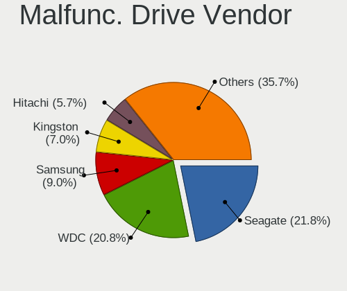
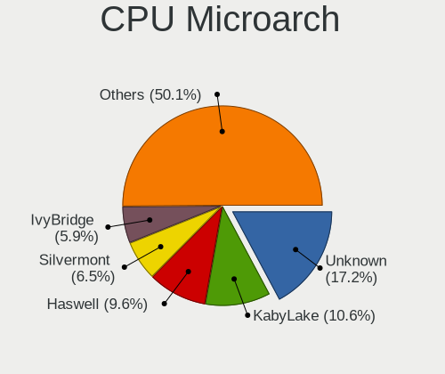
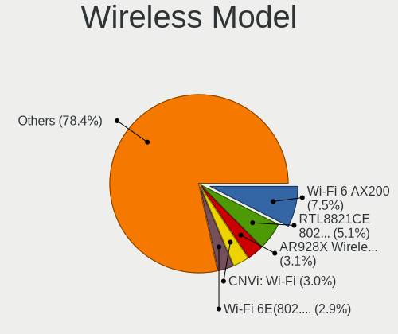
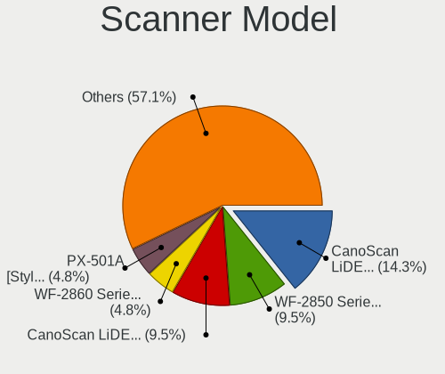

BSD - Tested Hardware & Statistics (Desktops)
---------------------------------------------

A project to collect tested hardware configurations for BSD.

Anyone can contribute to this report by the [hw-probe](https://github.com/linuxhw/hw-probe/blob/master/INSTALL.BSD.md) tool:

    hw-probe -all -upload

Please contribute! Especially if your hardware is rare.

This report is for real hardware. Report for virtual hardware: [TestDays_VE](https://github.com/bsdhw/TestDays_VE)

Contents
--------

* [ Test Cases ](#test-cases)

* [ System ](#system)
  - [ OS                       ](#os)
  - [ OS Family                ](#os-family)
  - [ Arch                     ](#arch)
  - [ DE                       ](#de)
  - [ Display Server           ](#display-server)
  - [ Display Manager          ](#display-manager)
  - [ OS Lang                  ](#os-lang)
  - [ Boot Mode                ](#boot-mode)
  - [ Filesystem               ](#filesystem)
  - [ Part. scheme             ](#part-scheme)

* [ Board ](#board)
  - [ Vendor                   ](#vendor)
  - [ Model                    ](#model)
  - [ Model Family             ](#model-family)
  - [ MFG Year                 ](#mfg-year)
  - [ Form Factor              ](#form-factor)
  - [ Coreboot                 ](#coreboot)
  - [ RAM Size                 ](#ram-size)
  - [ RAM Used                 ](#ram-used)
  - [ Total Drives             ](#total-drives)
  - [ Has CD-ROM               ](#has-cd-rom)
  - [ Has Ethernet             ](#has-ethernet)
  - [ Has WiFi                 ](#has-wifi)
  - [ Has Bluetooth            ](#has-bluetooth)

* [ Location ](#location)
  - [ Country                  ](#country)
  - [ City                     ](#city)

* [ Drives ](#drives)
  - [ Drive Vendor             ](#drive-vendor)
  - [ Drive Model              ](#drive-model)
  - [ HDD Vendor               ](#hdd-vendor)
  - [ SSD Vendor               ](#ssd-vendor)
  - [ Drive Kind               ](#drive-kind)
  - [ Drive Connector          ](#drive-connector)
  - [ Drive Size               ](#drive-size)
  - [ Space Total              ](#space-total)
  - [ Space Used               ](#space-used)
  - [ Malfunc. Drives          ](#malfunc-drives)
  - [ Malfunc. Drive Vendor    ](#malfunc-drive-vendor)
  - [ Malfunc. HDD Vendor      ](#malfunc-hdd-vendor)
  - [ Malfunc. Drive Kind      ](#malfunc-drive-kind)
  - [ Failed Drives            ](#failed-drives)
  - [ Failed Drive Vendor      ](#failed-drive-vendor)
  - [ Drive Status             ](#drive-status)

* [ Storage controller ](#storage-controller)
  - [ Storage Vendor           ](#storage-vendor)
  - [ Storage Model            ](#storage-model)
  - [ Storage Kind             ](#storage-kind)

* [ Processor ](#processor)
  - [ CPU Vendor               ](#cpu-vendor)
  - [ CPU Model                ](#cpu-model)
  - [ CPU Model Family         ](#cpu-model-family)
  - [ CPU Cores                ](#cpu-cores)
  - [ CPU Sockets              ](#cpu-sockets)
  - [ CPU Threads              ](#cpu-threads)
  - [ CPU Microarch            ](#cpu-microarch)

* [ Graphics ](#graphics)
  - [ GPU Vendor               ](#gpu-vendor)
  - [ GPU Model                ](#gpu-model)
  - [ GPU Combo                ](#gpu-combo)
  - [ GPU Driver               ](#gpu-driver)
  - [ GPU Memory               ](#gpu-memory)

* [ Monitor ](#monitor)
  - [ Monitor Vendor           ](#monitor-vendor)
  - [ Monitor Model            ](#monitor-model)
  - [ Monitor Resolution       ](#monitor-resolution)
  - [ Monitor Diagonal         ](#monitor-diagonal)
  - [ Monitor Width            ](#monitor-width)
  - [ Aspect Ratio             ](#aspect-ratio)
  - [ Monitor Area             ](#monitor-area)
  - [ Pixel Density            ](#pixel-density)
  - [ Multiple Monitors        ](#multiple-monitors)

* [ Network ](#network)
  - [ Net Controller Vendor    ](#net-controller-vendor)
  - [ Net Controller Model     ](#net-controller-model)
  - [ Wireless Vendor          ](#wireless-vendor)
  - [ Wireless Model           ](#wireless-model)
  - [ Ethernet Vendor          ](#ethernet-vendor)
  - [ Ethernet Model           ](#ethernet-model)
  - [ Net Controller Kind      ](#net-controller-kind)
  - [ Used Controller          ](#used-controller)
  - [ NICs                     ](#nics)
  - [ IPv6                     ](#ipv6)

* [ Bluetooth ](#bluetooth)
  - [ Bluetooth Vendor         ](#bluetooth-vendor)
  - [ Bluetooth Model          ](#bluetooth-model)

* [ Sound ](#sound)
  - [ Sound Vendor             ](#sound-vendor)
  - [ Sound Model              ](#sound-model)

* [ Memory ](#memory)
  - [ Memory Vendor            ](#memory-vendor)
  - [ Memory Model             ](#memory-model)
  - [ Memory Kind              ](#memory-kind)
  - [ Memory Form Factor       ](#memory-form-factor)
  - [ Memory Size              ](#memory-size)
  - [ Memory Speed             ](#memory-speed)

* [ Printers & scanners ](#printers--scanners)
  - [ Printer Vendor           ](#printer-vendor)
  - [ Printer Model            ](#printer-model)
  - [ Scanner Vendor           ](#scanner-vendor)
  - [ Scanner Model            ](#scanner-model)

* [ Camera ](#camera)
  - [ Camera Vendor            ](#camera-vendor)
  - [ Camera Model             ](#camera-model)

* [ Security ](#security)
  - [ Fingerprint Vendor       ](#fingerprint-vendor)
  - [ Fingerprint Model        ](#fingerprint-model)
  - [ Chipcard Vendor          ](#chipcard-vendor)
  - [ Chipcard Model           ](#chipcard-model)

* [ Unsupported ](#unsupported)
  - [ Unsupported Devices      ](#unsupported-devices)
  - [ Unsupported Device Types ](#unsupported-device-types)

Test Cases
----------

Total: 12861

| Vendor        | Model                       | Probe                                                     | Date         |
|---------------|-----------------------------|-----------------------------------------------------------|--------------|
| ASUSTek       | P11C-M Series               | [37230a7cd9](https://bsd-hardware.info/?probe=37230a7cd9) | Jan 02, 2024 |
| AZW           | U59                         | [c8ffb92584](https://bsd-hardware.info/?probe=c8ffb92584) | Jan 02, 2024 |
| Intel         | JSL MRD                     | [6405a13f96](https://bsd-hardware.info/?probe=6405a13f96) | Jan 02, 2024 |
| Protectli     | VP46xx                      | [f958569c30](https://bsd-hardware.info/?probe=f958569c30) | Jan 02, 2024 |
| ASUSTek       | ROG STRIX B650E-I GAMING... | [a29eec0aa5](https://bsd-hardware.info/?probe=a29eec0aa5) | Jan 02, 2024 |
| Gowin Solu... | GW-MB-U01                   | [673266d486](https://bsd-hardware.info/?probe=673266d486) | Jan 01, 2024 |
| ASUSTek       | H97M-PLUS                   | [270a946916](https://bsd-hardware.info/?probe=270a946916) | Jan 01, 2024 |
| Alienware     | 07HV66 A00                  | [ea6a3f3020](https://bsd-hardware.info/?probe=ea6a3f3020) | Jan 01, 2024 |
| ASUSTek       | PRIME B450M-A               | [1c7bbcc0ca](https://bsd-hardware.info/?probe=1c7bbcc0ca) | Jan 01, 2024 |
| Protectli     | VP2420                      | [bc43bc2215](https://bsd-hardware.info/?probe=bc43bc2215) | Jan 01, 2024 |
| Protectli     | FW4B Ver                    | [3191952740](https://bsd-hardware.info/?probe=3191952740) | Jan 01, 2024 |
| MSI           | Z170A PC MATE               | [e05af13af9](https://bsd-hardware.info/?probe=e05af13af9) | Jan 01, 2024 |
| ASRockRack    | EPYC3101D4I-2T              | [7e2b858339](https://bsd-hardware.info/?probe=7e2b858339) | Dec 31, 2023 |
| Protectli     | VP2420                      | [4b1f47b18e](https://bsd-hardware.info/?probe=4b1f47b18e) | Dec 31, 2023 |
| PC Engines    | APU3                        | [d2074bd451](https://bsd-hardware.info/?probe=d2074bd451) | Dec 31, 2023 |
| MSI           | Z270-A PRO                  | [2f2f406aa3](https://bsd-hardware.info/?probe=2f2f406aa3) | Dec 31, 2023 |
| ASRock        | B450 Gaming K4              | [84985aa669](https://bsd-hardware.info/?probe=84985aa669) | Dec 31, 2023 |
| MSI           | H81M-P33                    | [82e08820f2](https://bsd-hardware.info/?probe=82e08820f2) | Dec 31, 2023 |
| ASUSTek       | P5Q-E                       | [da3b88ef85](https://bsd-hardware.info/?probe=da3b88ef85) | Dec 31, 2023 |
| ASUSTek       | ROG CROSSHAIR VIII HERO     | [391f4c0e0b](https://bsd-hardware.info/?probe=391f4c0e0b) | Dec 31, 2023 |
| Intel         | SHARKBAY                    | [bcbbfa0368](https://bsd-hardware.info/?probe=bcbbfa0368) | Dec 31, 2023 |
| Unknown       | Unknown                     | [56ecba336a](https://bsd-hardware.info/?probe=56ecba336a) | Dec 31, 2023 |
| Casper        | NIRVANA DESKTOP             | [926ae04d23](https://bsd-hardware.info/?probe=926ae04d23) | Dec 31, 2023 |
| Unknown       | Unknown                     | [d4bedea996](https://bsd-hardware.info/?probe=d4bedea996) | Dec 30, 2023 |
| Intel         | H61M-DS2                    | [bd541b60c8](https://bsd-hardware.info/?probe=bd541b60c8) | Dec 30, 2023 |
| ASUSTek       | CM6870                      | [1889675f37](https://bsd-hardware.info/?probe=1889675f37) | Dec 30, 2023 |
| Dell          | 0NW6H5 A00                  | [d95f2f3534](https://bsd-hardware.info/?probe=d95f2f3534) | Dec 30, 2023 |
| MSI           | MAG Z790 TOMAHAWK WIFI D... | [715a274a2e](https://bsd-hardware.info/?probe=715a274a2e) | Dec 30, 2023 |
| Protectli     | FW4A Ver                    | [39c4ea3a24](https://bsd-hardware.info/?probe=39c4ea3a24) | Dec 30, 2023 |
| PC Engines    | APU2                        | [c0fcb231db](https://bsd-hardware.info/?probe=c0fcb231db) | Dec 30, 2023 |
| ASUSTek       | PRIME B450M-A               | [6f996518f6](https://bsd-hardware.info/?probe=6f996518f6) | Dec 30, 2023 |
| MSI           | MPG Z690 CARBON WIFI        | [0e31087126](https://bsd-hardware.info/?probe=0e31087126) | Dec 30, 2023 |
| Dell          | 0F3KHR A02                  | [572ad429ae](https://bsd-hardware.info/?probe=572ad429ae) | Dec 30, 2023 |
| HP            | 3397                        | [46b6923bcd](https://bsd-hardware.info/?probe=46b6923bcd) | Dec 30, 2023 |
| Protectli     | FW2B Ver                    | [3dbf91e1d4](https://bsd-hardware.info/?probe=3dbf91e1d4) | Dec 30, 2023 |
| Unknown       | QDNV01                      | [d2fed4bb5f](https://bsd-hardware.info/?probe=d2fed4bb5f) | Dec 30, 2023 |
| Dell          | 0KYJ8C A00                  | [34246adca9](https://bsd-hardware.info/?probe=34246adca9) | Dec 30, 2023 |
| Unknown       | Unknown                     | [63472bd5e6](https://bsd-hardware.info/?probe=63472bd5e6) | Dec 30, 2023 |
| Unknown       | Unknown                     | [19daaf5eee](https://bsd-hardware.info/?probe=19daaf5eee) | Dec 30, 2023 |
| Unknown       | Unknown                     | [ce3ae03b86](https://bsd-hardware.info/?probe=ce3ae03b86) | Dec 30, 2023 |
| Intel         | JSL MRD                     | [1c65a367b2](https://bsd-hardware.info/?probe=1c65a367b2) | Dec 30, 2023 |
| Gigabyte      | H110M-D2P-WG-CF             | [77e0d09bf1](https://bsd-hardware.info/?probe=77e0d09bf1) | Dec 29, 2023 |
| Intel         | BOX-J41L4A V3.01            | [dd8cccddff](https://bsd-hardware.info/?probe=dd8cccddff) | Dec 29, 2023 |
| HP            | 82B4                        | [de6046d060](https://bsd-hardware.info/?probe=de6046d060) | Dec 29, 2023 |
| Intel         | BOX-J41L4A V3.01            | [9294250e89](https://bsd-hardware.info/?probe=9294250e89) | Dec 29, 2023 |
| Unknown       | Unknown                     | [cd6ce65004](https://bsd-hardware.info/?probe=cd6ce65004) | Dec 29, 2023 |
| Intel         | DQ77KB AAG81483-501         | [bf5cb7eb21](https://bsd-hardware.info/?probe=bf5cb7eb21) | Dec 29, 2023 |
| Unknown       | Unknown                     | [5354734c83](https://bsd-hardware.info/?probe=5354734c83) | Dec 29, 2023 |
| Dell          | 04YP6J A00                  | [9ed1a43f79](https://bsd-hardware.info/?probe=9ed1a43f79) | Dec 29, 2023 |
| PC Engines    | apu4                        | [3901782984](https://bsd-hardware.info/?probe=3901782984) | Dec 29, 2023 |
| Unknown       | Unknown                     | [ba78787dff](https://bsd-hardware.info/?probe=ba78787dff) | Dec 29, 2023 |
| Gigabyte      | GA-78LMT-USB3               | [fa4e90491b](https://bsd-hardware.info/?probe=fa4e90491b) | Dec 29, 2023 |
| Gigabyte      | GA-78LMT-USB3               | [1c769a311c](https://bsd-hardware.info/?probe=1c769a311c) | Dec 29, 2023 |
| Intel         | Q3XXG4-P V1.0               | [bc5f165c4a](https://bsd-hardware.info/?probe=bc5f165c4a) | Dec 29, 2023 |
| Dell          | 0GU083 A00                  | [caaa806343](https://bsd-hardware.info/?probe=caaa806343) | Dec 28, 2023 |
| Supermicro    | X8SIE                       | [a7e2e09ef4](https://bsd-hardware.info/?probe=a7e2e09ef4) | Dec 28, 2023 |
| Dell          | 0VRWRC A00                  | [ec4b676c4b](https://bsd-hardware.info/?probe=ec4b676c4b) | Dec 28, 2023 |
| Unknown       | Unknown                     | [eba2e80eee](https://bsd-hardware.info/?probe=eba2e80eee) | Dec 28, 2023 |
| Unknown       | QSKL01                      | [ba39338284](https://bsd-hardware.info/?probe=ba39338284) | Dec 28, 2023 |
| AZW           | Green G1                    | [c5bd9604b5](https://bsd-hardware.info/?probe=c5bd9604b5) | Dec 28, 2023 |
| ASUSTek       | P8H61-M LE/USB3             | [c1f17be486](https://bsd-hardware.info/?probe=c1f17be486) | Dec 28, 2023 |
| AZW           | EQ                          | [fcbfcb31d5](https://bsd-hardware.info/?probe=fcbfcb31d5) | Dec 28, 2023 |
| ASUSTek       | ROG STRIX B460-G GAMING     | [6b9d713fe0](https://bsd-hardware.info/?probe=6b9d713fe0) | Dec 28, 2023 |
| Unknown       | Unknown                     | [23269a4f84](https://bsd-hardware.info/?probe=23269a4f84) | Dec 28, 2023 |
| Protectli     | VP2420                      | [39b80f6d35](https://bsd-hardware.info/?probe=39b80f6d35) | Dec 28, 2023 |
| HP            | 0B54h D                     | [0fc53a659f](https://bsd-hardware.info/?probe=0fc53a659f) | Dec 28, 2023 |
| Unknown       | Unknown                     | [f93ba42c7a](https://bsd-hardware.info/?probe=f93ba42c7a) | Dec 28, 2023 |
| Intel         | SHARKBAY                    | [55a9dc404b](https://bsd-hardware.info/?probe=55a9dc404b) | Dec 27, 2023 |
| Techvision    | TVI7309X B0                 | [429f1e855f](https://bsd-hardware.info/?probe=429f1e855f) | Dec 27, 2023 |
| Gigabyte      | B560M DS3H                  | [00abf2f109](https://bsd-hardware.info/?probe=00abf2f109) | Dec 27, 2023 |
| Supermicro    | X10DRi-T                    | [0001356297](https://bsd-hardware.info/?probe=0001356297) | Dec 27, 2023 |
| ZX            | H610ITXG                    | [8253eb826a](https://bsd-hardware.info/?probe=8253eb826a) | Dec 27, 2023 |
| Techvision    | TVI7309X B0                 | [1f28c229cb](https://bsd-hardware.info/?probe=1f28c229cb) | Dec 27, 2023 |
| Techvision    | TVI7309X B0                 | [d4f5a9c35a](https://bsd-hardware.info/?probe=d4f5a9c35a) | Dec 27, 2023 |
| HP            | 304Bh                       | [52ee1947b1](https://bsd-hardware.info/?probe=52ee1947b1) | Dec 27, 2023 |
| Techvision    | TVI7309X B0                 | [6f592981ce](https://bsd-hardware.info/?probe=6f592981ce) | Dec 27, 2023 |
| Protectli     | VP2420                      | [a7e60ab925](https://bsd-hardware.info/?probe=a7e60ab925) | Dec 27, 2023 |
| Unknown       | MANIFOLD 2-C                | [c2f3692204](https://bsd-hardware.info/?probe=c2f3692204) | Dec 27, 2023 |
| HP            | 1998                        | [8bebbb8dab](https://bsd-hardware.info/?probe=8bebbb8dab) | Dec 27, 2023 |
| Intel         | CRESCENTBAY                 | [412c714b49](https://bsd-hardware.info/?probe=412c714b49) | Dec 27, 2023 |
| MSI           | Aspen                       | [ac6dd2b153](https://bsd-hardware.info/?probe=ac6dd2b153) | Dec 27, 2023 |
| Intel         | J1900                       | [2a647a5c54](https://bsd-hardware.info/?probe=2a647a5c54) | Dec 27, 2023 |
| Protectli     | FW6 Ver                     | [c910bb7b83](https://bsd-hardware.info/?probe=c910bb7b83) | Dec 26, 2023 |
| AZW           | Green G5                    | [a088cebb95](https://bsd-hardware.info/?probe=a088cebb95) | Dec 26, 2023 |
| Unknown       | Unknown                     | [b054d33e68](https://bsd-hardware.info/?probe=b054d33e68) | Dec 26, 2023 |
| Fujitsu       | D3544-A1 S26361-D3544-A1... | [3f1abe2cd8](https://bsd-hardware.info/?probe=3f1abe2cd8) | Dec 26, 2023 |
| ASRock        | J4005B-ITX                  | [8ad375a02f](https://bsd-hardware.info/?probe=8ad375a02f) | Dec 26, 2023 |
| Protectli     | FW4B                        | [cf4ead1922](https://bsd-hardware.info/?probe=cf4ead1922) | Dec 26, 2023 |
| HP            | 8062                        | [3f3a2202eb](https://bsd-hardware.info/?probe=3f3a2202eb) | Dec 26, 2023 |
| Unknown       | Unknown                     | [48677111e5](https://bsd-hardware.info/?probe=48677111e5) | Dec 26, 2023 |
| Apple         | Mac-F221BEC8                | [d08712b71d](https://bsd-hardware.info/?probe=d08712b71d) | Dec 26, 2023 |
| HP            | 1998                        | [2782adcac6](https://bsd-hardware.info/?probe=2782adcac6) | Dec 26, 2023 |
| ASUSTek       | B150M-A D3                  | [d416ce02f1](https://bsd-hardware.info/?probe=d416ce02f1) | Dec 26, 2023 |
| Unknown       | Unknown                     | [563547a218](https://bsd-hardware.info/?probe=563547a218) | Dec 26, 2023 |
| Unknown       | Unknown                     | [058859b9c4](https://bsd-hardware.info/?probe=058859b9c4) | Dec 26, 2023 |
| CWWK          | CW-ADLN-6L                  | [fa5891041a](https://bsd-hardware.info/?probe=fa5891041a) | Dec 26, 2023 |
| Unknown       | Unknown                     | [8f17cade1c](https://bsd-hardware.info/?probe=8f17cade1c) | Dec 25, 2023 |
| Unknown       | Unknown                     | [f712f3c6c0](https://bsd-hardware.info/?probe=f712f3c6c0) | Dec 25, 2023 |
| Unknown       | YL-J3160L4                  | [50f8c02769](https://bsd-hardware.info/?probe=50f8c02769) | Dec 25, 2023 |
| Supermicro    | X11SDW-16C-TP13F+           | [49ed0c6dca](https://bsd-hardware.info/?probe=49ed0c6dca) | Dec 25, 2023 |
| Unknown       | Unknown                     | [23ca4c0419](https://bsd-hardware.info/?probe=23ca4c0419) | Dec 25, 2023 |
| Lenovo        | ThinkCentre M72e 3629A15    | [90d6ad1083](https://bsd-hardware.info/?probe=90d6ad1083) | Dec 25, 2023 |
| AMI           | PEISIA E3845 VER1.0         | [6b85ccc7ed](https://bsd-hardware.info/?probe=6b85ccc7ed) | Dec 25, 2023 |
| Unknown       | Unknown                     | [72d02dbaa4](https://bsd-hardware.info/?probe=72d02dbaa4) | Dec 25, 2023 |
| Lenovo        | 3708 SDK0J40700 WIN 3258... | [7ad0451a6f](https://bsd-hardware.info/?probe=7ad0451a6f) | Dec 25, 2023 |
| Gigabyte      | Z690I A ULTRA LITE D4       | [304af7e00e](https://bsd-hardware.info/?probe=304af7e00e) | Dec 25, 2023 |
| Unknown       | Unknown                     | [03f7101d55](https://bsd-hardware.info/?probe=03f7101d55) | Dec 25, 2023 |
| ASUSTek       | TUF Gaming B550M-E WIFI     | [f1180b6e76](https://bsd-hardware.info/?probe=f1180b6e76) | Dec 25, 2023 |
| Itautec       | ST 4271 ST-4271 Padrao 0... | [491c854348](https://bsd-hardware.info/?probe=491c854348) | Dec 25, 2023 |
| MSI           | B450M PRO-VDH PLUS          | [742764e130](https://bsd-hardware.info/?probe=742764e130) | Dec 25, 2023 |
| Unknown       | QGLK03                      | [4be2a41109](https://bsd-hardware.info/?probe=4be2a41109) | Dec 25, 2023 |
| Unknown       | QGLK03                      | [b187a024cb](https://bsd-hardware.info/?probe=b187a024cb) | Dec 25, 2023 |
| Unknown       | QSKL01                      | [f69898815d](https://bsd-hardware.info/?probe=f69898815d) | Dec 25, 2023 |
| Protectli     | VP2420                      | [5368ee9cc8](https://bsd-hardware.info/?probe=5368ee9cc8) | Dec 24, 2023 |
| Lenovo        | 30D9 SDK0J40700 WIN 3258... | [504fb1678f](https://bsd-hardware.info/?probe=504fb1678f) | Dec 24, 2023 |
| ASUSTek       | P5Q-E                       | [04675127c2](https://bsd-hardware.info/?probe=04675127c2) | Dec 24, 2023 |
| ASUSTek       | ROG CROSSHAIR VIII HERO     | [1ef7136151](https://bsd-hardware.info/?probe=1ef7136151) | Dec 24, 2023 |
| Intel         | Q3XXG4-P V1.0               | [80e8d502be](https://bsd-hardware.info/?probe=80e8d502be) | Dec 24, 2023 |
| Dell          | 0KV62T A00                  | [5844adb190](https://bsd-hardware.info/?probe=5844adb190) | Dec 24, 2023 |
| Acer          | Veriton X490G               | [3f4dbee6d1](https://bsd-hardware.info/?probe=3f4dbee6d1) | Dec 24, 2023 |
| Acer          | Veriton X490G               | [1865afdae1](https://bsd-hardware.info/?probe=1865afdae1) | Dec 24, 2023 |
| Intel         | SHARKBAY                    | [0ec70893dd](https://bsd-hardware.info/?probe=0ec70893dd) | Dec 24, 2023 |
| ASRock        | Z77 Extreme3                | [1656e8f6b0](https://bsd-hardware.info/?probe=1656e8f6b0) | Dec 24, 2023 |
| Unknown       | Unknown                     | [9876dcc6aa](https://bsd-hardware.info/?probe=9876dcc6aa) | Dec 24, 2023 |
| Protectli     | VP2420                      | [34e03b1271](https://bsd-hardware.info/?probe=34e03b1271) | Dec 24, 2023 |
| Unknown       | QGLK03                      | [a586279dd0](https://bsd-hardware.info/?probe=a586279dd0) | Dec 24, 2023 |
| Unknown       | Unknown                     | [9a23873dc4](https://bsd-hardware.info/?probe=9a23873dc4) | Dec 24, 2023 |
| Unknown       | Unknown                     | [da2b7d434e](https://bsd-hardware.info/?probe=da2b7d434e) | Dec 24, 2023 |
| YANYU         | H17SL                       | [464357d8c1](https://bsd-hardware.info/?probe=464357d8c1) | Dec 24, 2023 |
| Fujitsu       | D3543-A1 S26361-D3543-A1... | [ee768bd5a0](https://bsd-hardware.info/?probe=ee768bd5a0) | Dec 23, 2023 |
| Dell          | 0FDY5C A00                  | [e39c520eb6](https://bsd-hardware.info/?probe=e39c520eb6) | Dec 23, 2023 |
| PC Engines    | APU2                        | [79f4518fa1](https://bsd-hardware.info/?probe=79f4518fa1) | Dec 23, 2023 |
| Techvision    | TVI7309X B0                 | [609d9be189](https://bsd-hardware.info/?probe=609d9be189) | Dec 23, 2023 |
| Unknown       | Unknown                     | [4f79ea6f3a](https://bsd-hardware.info/?probe=4f79ea6f3a) | Dec 23, 2023 |
| Unknown       | Unknown                     | [684d183b51](https://bsd-hardware.info/?probe=684d183b51) | Dec 23, 2023 |
| Dell          | 0NC2VH A01                  | [06828fbfed](https://bsd-hardware.info/?probe=06828fbfed) | Dec 23, 2023 |
| Dell          | 0NC2VH A01                  | [3c06ec4635](https://bsd-hardware.info/?probe=3c06ec4635) | Dec 23, 2023 |
| AZW           | EQ                          | [9818e5f996](https://bsd-hardware.info/?probe=9818e5f996) | Dec 23, 2023 |
| Unknown       | Unknown                     | [97559370a8](https://bsd-hardware.info/?probe=97559370a8) | Dec 23, 2023 |
| Gigabyte      | MRZNVMS-00                  | [7c9af3e3cd](https://bsd-hardware.info/?probe=7c9af3e3cd) | Dec 23, 2023 |
| Unknown       | Unknown                     | [1a68705919](https://bsd-hardware.info/?probe=1a68705919) | Dec 23, 2023 |
| CWWK          | CW-ADLN-6L                  | [d8245df746](https://bsd-hardware.info/?probe=d8245df746) | Dec 23, 2023 |
| Lenovo        | ThinkCentre M72e 3629A15    | [8a92c95f65](https://bsd-hardware.info/?probe=8a92c95f65) | Dec 22, 2023 |
| Protectli     | FW4B Ver                    | [4b6a62bebe](https://bsd-hardware.info/?probe=4b6a62bebe) | Dec 22, 2023 |
| Dell          | 00V62H A01                  | [c4e5366baa](https://bsd-hardware.info/?probe=c4e5366baa) | Dec 22, 2023 |
| Seeed Stud... | ODYSSEY-X86J41X5 SD-BS-C... | [fbf8f52ea0](https://bsd-hardware.info/?probe=fbf8f52ea0) | Dec 22, 2023 |
| Unknown       | Unknown                     | [620fc27594](https://bsd-hardware.info/?probe=620fc27594) | Dec 22, 2023 |
| Fujitsu       | D3313-G1 S26361-D3313-G1    | [5ed362ce02](https://bsd-hardware.info/?probe=5ed362ce02) | Dec 22, 2023 |
| Pegatron      | 2ACF                        | [2556fa3be1](https://bsd-hardware.info/?probe=2556fa3be1) | Dec 22, 2023 |
| PC Engines    | apu4                        | [48a0e27e11](https://bsd-hardware.info/?probe=48a0e27e11) | Dec 22, 2023 |
| ZX            | H610ITXG                    | [11edcbeaff](https://bsd-hardware.info/?probe=11edcbeaff) | Dec 22, 2023 |
| Unknown       | SKYBAY                      | [7f8968ee0a](https://bsd-hardware.info/?probe=7f8968ee0a) | Dec 22, 2023 |
| ASUSTek       | PRIME A320M-K               | [cfe1ed1212](https://bsd-hardware.info/?probe=cfe1ed1212) | Dec 22, 2023 |
| Unknown       | Unknown                     | [7b24999fbb](https://bsd-hardware.info/?probe=7b24999fbb) | Dec 22, 2023 |
| Lenovo        | SHARKBAY 0B98401 WIN        | [dbcb26f795](https://bsd-hardware.info/?probe=dbcb26f795) | Dec 22, 2023 |
| ASUSTek       | PRIME H610I-PLUS D4         | [3a435d185e](https://bsd-hardware.info/?probe=3a435d185e) | Dec 22, 2023 |
| MW            | GMLK-2_5G4L                 | [9eaa02c47c](https://bsd-hardware.info/?probe=9eaa02c47c) | Dec 22, 2023 |
| Gigabyte      | GA-880GM-UD2H               | [76495a4c85](https://bsd-hardware.info/?probe=76495a4c85) | Dec 22, 2023 |
| MSI           | MPG X570 GAMING EDGE WIF... | [06457349dc](https://bsd-hardware.info/?probe=06457349dc) | Dec 22, 2023 |
| Unknown       | Unknown                     | [84a9704b97](https://bsd-hardware.info/?probe=84a9704b97) | Dec 21, 2023 |
| Protectli     | VP2420                      | [04695d0802](https://bsd-hardware.info/?probe=04695d0802) | Dec 21, 2023 |
| Shuttle       | FS77U                       | [9c746c0d5c](https://bsd-hardware.info/?probe=9c746c0d5c) | Dec 21, 2023 |
| Unknown       | MANIFOLD 2-C                | [b2597a7f2b](https://bsd-hardware.info/?probe=b2597a7f2b) | Dec 21, 2023 |
| Unknown       | Unknown                     | [ec4c6d8fb5](https://bsd-hardware.info/?probe=ec4c6d8fb5) | Dec 21, 2023 |
| Yanling       | YL-CLU6L-V1                 | [9a0369cc72](https://bsd-hardware.info/?probe=9a0369cc72) | Dec 21, 2023 |
| Lenovo        | ThinkSystem ST50 V2 7D8J... | [a5eedba370](https://bsd-hardware.info/?probe=a5eedba370) | Dec 21, 2023 |
| Dell          | 0KV62T A00                  | [8a2c7af96c](https://bsd-hardware.info/?probe=8a2c7af96c) | Dec 21, 2023 |
| Gigabyte      | B550 GAMING X V2            | [2ba0ee6609](https://bsd-hardware.info/?probe=2ba0ee6609) | Dec 21, 2023 |
| PC Engines    | apu4                        | [7fa270657e](https://bsd-hardware.info/?probe=7fa270657e) | Dec 21, 2023 |
| Intel         | DH61AG AAG23736-400         | [e6a38faa07](https://bsd-hardware.info/?probe=e6a38faa07) | Dec 21, 2023 |
| ASUSTek       | TUF Gaming B550M-PLUS       | [f9fd749985](https://bsd-hardware.info/?probe=f9fd749985) | Dec 21, 2023 |
| Protectli     | VP2420                      | [9a4aba32a7](https://bsd-hardware.info/?probe=9a4aba32a7) | Dec 21, 2023 |
| Dell          | 0NV0M7 A01                  | [835ca2056c](https://bsd-hardware.info/?probe=835ca2056c) | Dec 21, 2023 |
| Protectli     | FW4B                        | [d67b8b063a](https://bsd-hardware.info/?probe=d67b8b063a) | Dec 21, 2023 |
| CWWK          | CW-ADLN-6L                  | [094d15625b](https://bsd-hardware.info/?probe=094d15625b) | Dec 21, 2023 |
| ASUSTek       | H110I-PLUS                  | [5c6e9bd18a](https://bsd-hardware.info/?probe=5c6e9bd18a) | Dec 20, 2023 |
| Fujitsu       | D3544-A1 S26361-D3544-A1... | [ec18d4f3a1](https://bsd-hardware.info/?probe=ec18d4f3a1) | Dec 20, 2023 |
| Intel         | J1900                       | [2322789485](https://bsd-hardware.info/?probe=2322789485) | Dec 20, 2023 |
| Dell          | 02YYK5 A01                  | [6e070fbb90](https://bsd-hardware.info/?probe=6e070fbb90) | Dec 20, 2023 |
| Lenovo        | 3111 SDK0J40697 WIN 3305... | [321e9d7328](https://bsd-hardware.info/?probe=321e9d7328) | Dec 20, 2023 |
| Acer          | Aspire XC-1660G V:1.1       | [54b2061c80](https://bsd-hardware.info/?probe=54b2061c80) | Dec 19, 2023 |
| Gigabyte      | F2A85X-UP4                  | [bd9dd3d647](https://bsd-hardware.info/?probe=bd9dd3d647) | Dec 19, 2023 |
| Dell          | 0VD5HY A00                  | [03b0e973ca](https://bsd-hardware.info/?probe=03b0e973ca) | Dec 19, 2023 |
| ASRock        | B550 Phantom Gaming 4       | [c00a69de7c](https://bsd-hardware.info/?probe=c00a69de7c) | Dec 19, 2023 |
| Unknown       | Unknown                     | [f11c353c61](https://bsd-hardware.info/?probe=f11c353c61) | Dec 19, 2023 |
| Unknown       | Unknown                     | [5f6cc807a3](https://bsd-hardware.info/?probe=5f6cc807a3) | Dec 19, 2023 |
| PC Engines    | APU2                        | [f3061d599c](https://bsd-hardware.info/?probe=f3061d599c) | Dec 19, 2023 |
| HP            | 83F2                        | [858392467f](https://bsd-hardware.info/?probe=858392467f) | Dec 19, 2023 |
| MW            | GMLK-2_5G4L                 | [841767c8f8](https://bsd-hardware.info/?probe=841767c8f8) | Dec 19, 2023 |
| PC Engines    | apu4                        | [97c6f1ef2a](https://bsd-hardware.info/?probe=97c6f1ef2a) | Dec 19, 2023 |
| Advantech     | NAMB-3250 A102-1            | [bb91074237](https://bsd-hardware.info/?probe=bb91074237) | Dec 19, 2023 |
| HP            | 83F2                        | [8b1e24b86c](https://bsd-hardware.info/?probe=8b1e24b86c) | Dec 19, 2023 |
| Dell          | 0T7D40 A01                  | [35283b08ff](https://bsd-hardware.info/?probe=35283b08ff) | Dec 19, 2023 |
| Dell          | 04YP6J A02                  | [abcaede8e1](https://bsd-hardware.info/?probe=abcaede8e1) | Dec 19, 2023 |
| ASUSTek       | P5B-VM                      | [00e7a346b2](https://bsd-hardware.info/?probe=00e7a346b2) | Dec 19, 2023 |
| HP            | 212B                        | [d110ce488b](https://bsd-hardware.info/?probe=d110ce488b) | Dec 18, 2023 |
| ASRockRack    | C3558D4I-4L                 | [108b107783](https://bsd-hardware.info/?probe=108b107783) | Dec 18, 2023 |
| Dell          | 00V62H A00                  | [b99ed60ab6](https://bsd-hardware.info/?probe=b99ed60ab6) | Dec 18, 2023 |
| ASUSTek       | P8Z77-V PRO                 | [ba2cad0d55](https://bsd-hardware.info/?probe=ba2cad0d55) | Dec 18, 2023 |
| Protectli     | FW4A Ver                    | [9660edcc5c](https://bsd-hardware.info/?probe=9660edcc5c) | Dec 18, 2023 |
| Unknown       | Unknown                     | [107e747798](https://bsd-hardware.info/?probe=107e747798) | Dec 17, 2023 |
| Intel         | JSL MRD                     | [29c4bae1f4](https://bsd-hardware.info/?probe=29c4bae1f4) | Dec 17, 2023 |
| Unknown       | Unknown                     | [f11703c364](https://bsd-hardware.info/?probe=f11703c364) | Dec 17, 2023 |
| Intel         | HURONRIVER                  | [d0ebaa4479](https://bsd-hardware.info/?probe=d0ebaa4479) | Dec 17, 2023 |
| Dell          | 00V62H A00                  | [8f6f4d38d3](https://bsd-hardware.info/?probe=8f6f4d38d3) | Dec 17, 2023 |
| ASUSTek       | P5Q-E                       | [5a4d01667e](https://bsd-hardware.info/?probe=5a4d01667e) | Dec 17, 2023 |
| ASUSTek       | ROG CROSSHAIR VIII HERO     | [ea79e98108](https://bsd-hardware.info/?probe=ea79e98108) | Dec 17, 2023 |
| Intel         | JSL MRD                     | [af718ee605](https://bsd-hardware.info/?probe=af718ee605) | Dec 17, 2023 |
| ECS           | H81H3-WM                    | [9df1f030f9](https://bsd-hardware.info/?probe=9df1f030f9) | Dec 17, 2023 |
| Techvision    | TVI7309X B0                 | [878769cc62](https://bsd-hardware.info/?probe=878769cc62) | Dec 17, 2023 |
| Unknown       | Unknown                     | [88306fe484](https://bsd-hardware.info/?probe=88306fe484) | Dec 17, 2023 |
| Unknown       | Unknown                     | [6a3ef5165f](https://bsd-hardware.info/?probe=6a3ef5165f) | Dec 17, 2023 |
| Lenovo        | SDK0E50510 WIN              | [57a4adcc91](https://bsd-hardware.info/?probe=57a4adcc91) | Dec 17, 2023 |
| Unknown       | Unknown                     | [cefdf7d9ca](https://bsd-hardware.info/?probe=cefdf7d9ca) | Dec 17, 2023 |
| Unknown       | Unknown                     | [c99ee25103](https://bsd-hardware.info/?probe=c99ee25103) | Dec 17, 2023 |
| Techvision    | TVI7309X B0                 | [fe741ca47c](https://bsd-hardware.info/?probe=fe741ca47c) | Dec 17, 2023 |
| MSI           | A520M-A PRO                 | [11e5e87b70](https://bsd-hardware.info/?probe=11e5e87b70) | Dec 16, 2023 |
| Gigabyte      | B450M S2H                   | [b0194a8d4a](https://bsd-hardware.info/?probe=b0194a8d4a) | Dec 16, 2023 |
| PC Engines    | APU3                        | [6c92d4965a](https://bsd-hardware.info/?probe=6c92d4965a) | Dec 16, 2023 |
| Intel         | ChiefRiver D                | [ac362a0f29](https://bsd-hardware.info/?probe=ac362a0f29) | Dec 16, 2023 |
| Intel         | ChiefRiver D                | [bd8cacb673](https://bsd-hardware.info/?probe=bd8cacb673) | Dec 16, 2023 |
| Google        | Guado                       | [186f14c0a6](https://bsd-hardware.info/?probe=186f14c0a6) | Dec 16, 2023 |
| Unknown       | Unknown                     | [784c8ae515](https://bsd-hardware.info/?probe=784c8ae515) | Dec 16, 2023 |
| Protectli     | FW4B                        | [b862c8c507](https://bsd-hardware.info/?probe=b862c8c507) | Dec 16, 2023 |
| HP            | 212B                        | [1737c1241b](https://bsd-hardware.info/?probe=1737c1241b) | Dec 16, 2023 |
| SHANGZHAOY... | B85M-PRO V1.1               | [3b7ed136da](https://bsd-hardware.info/?probe=3b7ed136da) | Dec 16, 2023 |
| Unknown       | Unknown                     | [df97b81bea](https://bsd-hardware.info/?probe=df97b81bea) | Dec 15, 2023 |
| ASRock        | IMB-181-L                   | [a81eb6eadf](https://bsd-hardware.info/?probe=a81eb6eadf) | Dec 15, 2023 |
| AZW           | MINI S 10                   | [d8eee18baf](https://bsd-hardware.info/?probe=d8eee18baf) | Dec 15, 2023 |
| Unknown       | Unknown                     | [be79d227b2](https://bsd-hardware.info/?probe=be79d227b2) | Dec 15, 2023 |
| Unknown       | Unknown                     | [5adc44e122](https://bsd-hardware.info/?probe=5adc44e122) | Dec 15, 2023 |
| Fujitsu       | D3313-G1 S26361-D3313-G1    | [f05a97db34](https://bsd-hardware.info/?probe=f05a97db34) | Dec 15, 2023 |
| Gigabyte      | B150N Phoenix-WIFI-CF       | [343d176e9c](https://bsd-hardware.info/?probe=343d176e9c) | Dec 15, 2023 |
| ASUSTek       | PRO B460M-C                 | [7a32a123f6](https://bsd-hardware.info/?probe=7a32a123f6) | Dec 15, 2023 |
| Google        | Guado                       | [11b7e710c6](https://bsd-hardware.info/?probe=11b7e710c6) | Dec 15, 2023 |
| Techvision    | TVI7309X B0                 | [4b7be4588e](https://bsd-hardware.info/?probe=4b7be4588e) | Dec 15, 2023 |
| Lenovo        | SHARKBAY SDK0E50510 WIN     | [4adda9051f](https://bsd-hardware.info/?probe=4adda9051f) | Dec 15, 2023 |
| Unknown       | Unknown                     | [93f650efc3](https://bsd-hardware.info/?probe=93f650efc3) | Dec 15, 2023 |
| Gigabyte      | B75M-D3H                    | [9773ffcc27](https://bsd-hardware.info/?probe=9773ffcc27) | Dec 15, 2023 |
| Advantech     | NAMB-3250 A102-1            | [41899c5e07](https://bsd-hardware.info/?probe=41899c5e07) | Dec 15, 2023 |
| Gigabyte      | B75N                        | [dad5d14cf7](https://bsd-hardware.info/?probe=dad5d14cf7) | Dec 15, 2023 |
| HP            | 82A2                        | [906fd206fe](https://bsd-hardware.info/?probe=906fd206fe) | Dec 15, 2023 |
| HP            | 82A2                        | [0a816d2760](https://bsd-hardware.info/?probe=0a816d2760) | Dec 15, 2023 |
| Protectli     | FW4B Ver                    | [da6ac13ef2](https://bsd-hardware.info/?probe=da6ac13ef2) | Dec 15, 2023 |
| AZW           | EQ                          | [f1e4bf2224](https://bsd-hardware.info/?probe=f1e4bf2224) | Dec 15, 2023 |
| Unknown       | Unknown                     | [a9f96c677c](https://bsd-hardware.info/?probe=a9f96c677c) | Dec 14, 2023 |
| ASRock        | J4005B-ITX                  | [2ffc965b2e](https://bsd-hardware.info/?probe=2ffc965b2e) | Dec 14, 2023 |
| Dell          | 02YYK5 A01                  | [306f9c1b03](https://bsd-hardware.info/?probe=306f9c1b03) | Dec 14, 2023 |
| Unknown       | Unknown                     | [0bc43bd220](https://bsd-hardware.info/?probe=0bc43bd220) | Dec 14, 2023 |
| MSI           | B450 TOMAHAWK MAX II        | [d9d33d12d7](https://bsd-hardware.info/?probe=d9d33d12d7) | Dec 14, 2023 |
| MSI           | B450 TOMAHAWK MAX II        | [9654df78b8](https://bsd-hardware.info/?probe=9654df78b8) | Dec 14, 2023 |
| Dell          | 0PC5F7 A00                  | [e47e643ced](https://bsd-hardware.info/?probe=e47e643ced) | Dec 14, 2023 |
| CWWK          | MINIPC-G12                  | [e15a019715](https://bsd-hardware.info/?probe=e15a019715) | Dec 14, 2023 |
| Gigabyte      | H61M-S2PV                   | [88d2ae1175](https://bsd-hardware.info/?probe=88d2ae1175) | Dec 14, 2023 |
| Dell          | 0NK5PH A00                  | [60451d4e43](https://bsd-hardware.info/?probe=60451d4e43) | Dec 14, 2023 |
| AZW           | EQ                          | [d83e11a7dc](https://bsd-hardware.info/?probe=d83e11a7dc) | Dec 13, 2023 |
| Unknown       | Unknown                     | [c22fff97b8](https://bsd-hardware.info/?probe=c22fff97b8) | Dec 13, 2023 |
| Intel         | SKYBAY                      | [6ad2ae72f1](https://bsd-hardware.info/?probe=6ad2ae72f1) | Dec 13, 2023 |
| ASUSTek       | PRIME X370-PRO              | [bc50d301fa](https://bsd-hardware.info/?probe=bc50d301fa) | Dec 13, 2023 |
| ASRock        | X570 Phantom Gaming 4       | [dced442907](https://bsd-hardware.info/?probe=dced442907) | Dec 13, 2023 |
| Unknown       | Unknown                     | [b2407b8a31](https://bsd-hardware.info/?probe=b2407b8a31) | Dec 13, 2023 |
| Intel         | Luna Pier CRB Revision D    | [44215d3b22](https://bsd-hardware.info/?probe=44215d3b22) | Dec 13, 2023 |
| Intel         | ChiefRiver D                | [dafa13827e](https://bsd-hardware.info/?probe=dafa13827e) | Dec 13, 2023 |
| Intel         | Luna Pier CRB Revision D    | [e47e6d56e8](https://bsd-hardware.info/?probe=e47e6d56e8) | Dec 13, 2023 |
| Unknown       | Unknown                     | [c96a52dd9c](https://bsd-hardware.info/?probe=c96a52dd9c) | Dec 13, 2023 |
| Dell          | 02YYK5 A00                  | [8eb8c9eff3](https://bsd-hardware.info/?probe=8eb8c9eff3) | Dec 13, 2023 |
| Intel         | QHSW02                      | [da6b7c7115](https://bsd-hardware.info/?probe=da6b7c7115) | Dec 13, 2023 |
| Lenovo        | 30D2 SDK0J40705 WIN 3425... | [67f5c9c912](https://bsd-hardware.info/?probe=67f5c9c912) | Dec 13, 2023 |
| ASRock        | H170M-ITX/DL                | [79039f6105](https://bsd-hardware.info/?probe=79039f6105) | Dec 13, 2023 |
| ASUSTek       | BM6875_BM6675_BP6375        | [3d0160889b](https://bsd-hardware.info/?probe=3d0160889b) | Dec 13, 2023 |
| Supermicro    | X7SBi                       | [a0124f00ba](https://bsd-hardware.info/?probe=a0124f00ba) | Dec 13, 2023 |
| ASUSTek       | ROG STRIX B550-I GAMING     | [b600237a69](https://bsd-hardware.info/?probe=b600237a69) | Dec 12, 2023 |
| Techvision    | TVI7309X B0                 | [b5f9416c13](https://bsd-hardware.info/?probe=b5f9416c13) | Dec 12, 2023 |
| Dell          | 0J8G6F A03                  | [e6e7f333a3](https://bsd-hardware.info/?probe=e6e7f333a3) | Dec 12, 2023 |
| Intel         | DH67BL AAG10189-207         | [e6210120bd](https://bsd-hardware.info/?probe=e6210120bd) | Dec 12, 2023 |
| MSI           | B150 GAMING M3              | [b5dc4da596](https://bsd-hardware.info/?probe=b5dc4da596) | Dec 12, 2023 |
| Biostar       | N61PB-M2S                   | [69501bdb78](https://bsd-hardware.info/?probe=69501bdb78) | Dec 12, 2023 |
| Dell          | 05XGC8 A00                  | [b453da5223](https://bsd-hardware.info/?probe=b453da5223) | Dec 12, 2023 |
| MSI           | MAG Z790 TOMAHAWK WIFI D... | [c05c574f37](https://bsd-hardware.info/?probe=c05c574f37) | Dec 12, 2023 |
| Unknown       | Unknown                     | [8a0a469ad0](https://bsd-hardware.info/?probe=8a0a469ad0) | Dec 12, 2023 |
| Unknown       | Unknown                     | [123088175c](https://bsd-hardware.info/?probe=123088175c) | Dec 11, 2023 |
| EVGA          | X570 DARK.0                 | [1c84a8169b](https://bsd-hardware.info/?probe=1c84a8169b) | Dec 11, 2023 |
| Dell          | 0NC2VH A01                  | [6e876a349f](https://bsd-hardware.info/?probe=6e876a349f) | Dec 11, 2023 |
| Dell          | 0NW6H5 A00                  | [2febbeffc2](https://bsd-hardware.info/?probe=2febbeffc2) | Dec 11, 2023 |
| SHANGZHAOY... | B85M-PRO V1.1               | [5cf5db5a05](https://bsd-hardware.info/?probe=5cf5db5a05) | Dec 11, 2023 |
| Unknown       | Unknown                     | [37499be816](https://bsd-hardware.info/?probe=37499be816) | Dec 11, 2023 |
| Lenovo        | ThinkServer RS140           | [a380879f2f](https://bsd-hardware.info/?probe=a380879f2f) | Dec 11, 2023 |
| Intel         | Q3XXG4-P V1.0               | [becfed036a](https://bsd-hardware.info/?probe=becfed036a) | Dec 11, 2023 |
| Techvision    | TVI7309X B0                 | [9a3a20d295](https://bsd-hardware.info/?probe=9a3a20d295) | Dec 11, 2023 |
| ASUSTek       | ROG CROSSHAIR VIII HERO     | [68f73bf8ba](https://bsd-hardware.info/?probe=68f73bf8ba) | Dec 11, 2023 |
| Pegatron      | 2AF0                        | [61aea25165](https://bsd-hardware.info/?probe=61aea25165) | Dec 10, 2023 |
| ASRock        | H370M-ITX/ac                | [b806cc2a41](https://bsd-hardware.info/?probe=b806cc2a41) | Dec 10, 2023 |
| AZW           | EQ                          | [0280c1cdb9](https://bsd-hardware.info/?probe=0280c1cdb9) | Dec 10, 2023 |
| Unknown       | Unknown                     | [ec8c50c128](https://bsd-hardware.info/?probe=ec8c50c128) | Dec 10, 2023 |
| AZW           | EQ                          | [48537a5985](https://bsd-hardware.info/?probe=48537a5985) | Dec 10, 2023 |
| ASUSTek       | CM6870                      | [881ad2eacf](https://bsd-hardware.info/?probe=881ad2eacf) | Dec 10, 2023 |
| Protectli     | VP2420                      | [74c1ede426](https://bsd-hardware.info/?probe=74c1ede426) | Dec 10, 2023 |
| ASRock        | H110M-DVS R3.0              | [b6a4782cbf](https://bsd-hardware.info/?probe=b6a4782cbf) | Dec 10, 2023 |
| Dell          | 0YNVJG A02                  | [2d8992cd50](https://bsd-hardware.info/?probe=2d8992cd50) | Dec 10, 2023 |
| Unknown       | Unknown                     | [fc1097e9b0](https://bsd-hardware.info/?probe=fc1097e9b0) | Dec 10, 2023 |
| Unknown       | Unknown                     | [3e478d7459](https://bsd-hardware.info/?probe=3e478d7459) | Dec 10, 2023 |
| Unknown       | Unknown                     | [4b8c881de0](https://bsd-hardware.info/?probe=4b8c881de0) | Dec 10, 2023 |
| ASUSTek       | TUF Gaming B560M-PLUS       | [47480f848d](https://bsd-hardware.info/?probe=47480f848d) | Dec 10, 2023 |
| MSI           | H81M-P33                    | [2b1599aacd](https://bsd-hardware.info/?probe=2b1599aacd) | Dec 10, 2023 |
| ASUSTek       | Pro WS X570-ACE             | [89f0463ec6](https://bsd-hardware.info/?probe=89f0463ec6) | Dec 10, 2023 |
| AAEON         | FWS-2362 V1.0               | [a58d1df175](https://bsd-hardware.info/?probe=a58d1df175) | Dec 10, 2023 |
| Unknown       | Unknown                     | [edfa10c0dd](https://bsd-hardware.info/?probe=edfa10c0dd) | Dec 10, 2023 |
| ASUSTek       | M5A97 LE R2.0               | [20572de8e3](https://bsd-hardware.info/?probe=20572de8e3) | Dec 10, 2023 |
| ASRock        | B660M Phantom Gaming 4      | [e71ffa9a86](https://bsd-hardware.info/?probe=e71ffa9a86) | Dec 10, 2023 |
| HP            | 82A2                        | [688675d8ea](https://bsd-hardware.info/?probe=688675d8ea) | Dec 10, 2023 |
| ASRock        | Q1900B-ITX                  | [b7e23a4ed4](https://bsd-hardware.info/?probe=b7e23a4ed4) | Dec 10, 2023 |
| Dell          | 0HD5W2 A01                  | [3b6c1c2fbb](https://bsd-hardware.info/?probe=3b6c1c2fbb) | Dec 09, 2023 |
| ASUSTek       | CM6870                      | [78399ba39e](https://bsd-hardware.info/?probe=78399ba39e) | Dec 09, 2023 |
| Gigabyte      | B650 AORUS ELITE AX V2      | [7a6cdb3f06](https://bsd-hardware.info/?probe=7a6cdb3f06) | Dec 09, 2023 |
| ASUSTek       | PRIME X399-A                | [d62ad0d622](https://bsd-hardware.info/?probe=d62ad0d622) | Dec 09, 2023 |
| Protectli     | FW4B Ver                    | [55094840ea](https://bsd-hardware.info/?probe=55094840ea) | Dec 09, 2023 |
| Unknown       | Unknown                     | [5597d71956](https://bsd-hardware.info/?probe=5597d71956) | Dec 09, 2023 |
| Unknown       | Unknown                     | [76f58e8986](https://bsd-hardware.info/?probe=76f58e8986) | Dec 09, 2023 |
| Unknown       | YL-J3160L4                  | [cf07751804](https://bsd-hardware.info/?probe=cf07751804) | Dec 09, 2023 |
| Lenovo        | 30BC SDK0J40697 WIN 3305... | [25f4e4ce18](https://bsd-hardware.info/?probe=25f4e4ce18) | Dec 09, 2023 |
| Dell          | 02YYK5 A00                  | [39e0078d08](https://bsd-hardware.info/?probe=39e0078d08) | Dec 09, 2023 |
| ASRock        | Z370 Pro4                   | [6b4d8c076f](https://bsd-hardware.info/?probe=6b4d8c076f) | Dec 09, 2023 |
| HP            | 8076                        | [f6fe5f5051](https://bsd-hardware.info/?probe=f6fe5f5051) | Dec 09, 2023 |
| Unknown       | Unknown                     | [31619d30b3](https://bsd-hardware.info/?probe=31619d30b3) | Dec 09, 2023 |
| Dell          | 0D28YY A00                  | [20dbd4481a](https://bsd-hardware.info/?probe=20dbd4481a) | Dec 09, 2023 |
| PC Engines    | APU2                        | [8f318ea168](https://bsd-hardware.info/?probe=8f318ea168) | Dec 09, 2023 |
| CWWK          | CW-AD4L-N V1                | [1372cdf30f](https://bsd-hardware.info/?probe=1372cdf30f) | Dec 09, 2023 |
| Techvision    | TVI7309X B0                 | [8422bc152b](https://bsd-hardware.info/?probe=8422bc152b) | Dec 08, 2023 |
| Dell          | 00V62H A01                  | [a0591ac105](https://bsd-hardware.info/?probe=a0591ac105) | Dec 08, 2023 |
| ASRock        | Z370 Gaming K6              | [2074ab8412](https://bsd-hardware.info/?probe=2074ab8412) | Dec 08, 2023 |
| Intel         | Q3XXG4-P V1.0               | [050e7d8c01](https://bsd-hardware.info/?probe=050e7d8c01) | Dec 08, 2023 |
| Seeed Stud... | ODYSSEY-X86J41X5 SD-BS-C... | [90476f8605](https://bsd-hardware.info/?probe=90476f8605) | Dec 08, 2023 |
| PC Engines    | APU2                        | [ca43be99fc](https://bsd-hardware.info/?probe=ca43be99fc) | Dec 08, 2023 |
| Fujitsu       | D3543-A1 S26361-D3543-A1... | [eb2eef3d17](https://bsd-hardware.info/?probe=eb2eef3d17) | Dec 08, 2023 |
| PC Engines    | apu4                        | [cdbac53ff6](https://bsd-hardware.info/?probe=cdbac53ff6) | Dec 08, 2023 |
| HP            | 3397                        | [9013e5a39a](https://bsd-hardware.info/?probe=9013e5a39a) | Dec 08, 2023 |
| Lenovo        | 3106 NOK                    | [0ef598481e](https://bsd-hardware.info/?probe=0ef598481e) | Dec 08, 2023 |
| Unknown       | Unknown                     | [79486fa5ff](https://bsd-hardware.info/?probe=79486fa5ff) | Dec 08, 2023 |
| Biostar       | N61PB-M2S                   | [8b4dfe4511](https://bsd-hardware.info/?probe=8b4dfe4511) | Dec 08, 2023 |
| Supermicro    | X11SDV-4C-TP8F              | [cf3304bda2](https://bsd-hardware.info/?probe=cf3304bda2) | Dec 08, 2023 |
| Protectli     | FW4B Ver                    | [55c513d023](https://bsd-hardware.info/?probe=55c513d023) | Dec 08, 2023 |
| Unknown       | Unknown                     | [be6c7879b4](https://bsd-hardware.info/?probe=be6c7879b4) | Dec 07, 2023 |
| Protectli     | VP2420                      | [84a056721c](https://bsd-hardware.info/?probe=84a056721c) | Dec 07, 2023 |
| HP            | 806A                        | [4339b3acd2](https://bsd-hardware.info/?probe=4339b3acd2) | Dec 07, 2023 |
| Dell          | 03NVJ6 A03                  | [c119d3003e](https://bsd-hardware.info/?probe=c119d3003e) | Dec 07, 2023 |
| Dell          | 05XGC8 A00                  | [b193b5141c](https://bsd-hardware.info/?probe=b193b5141c) | Dec 07, 2023 |
| ASUSTek       | Z10PE-D16 WS                | [7fd4743b86](https://bsd-hardware.info/?probe=7fd4743b86) | Dec 07, 2023 |
| ASRock        | B550M Phantom Gaming 4      | [6c5bcd325e](https://bsd-hardware.info/?probe=6c5bcd325e) | Dec 07, 2023 |
| Protectli     | VP46xx                      | [5051678913](https://bsd-hardware.info/?probe=5051678913) | Dec 07, 2023 |
| ASRock        | B450M Steel Legend          | [2b600594af](https://bsd-hardware.info/?probe=2b600594af) | Dec 07, 2023 |
| PC Engines    | APU2                        | [92c3ba510a](https://bsd-hardware.info/?probe=92c3ba510a) | Dec 07, 2023 |
| Unknown       | Unknown                     | [efab62c197](https://bsd-hardware.info/?probe=efab62c197) | Dec 07, 2023 |
| Fujitsu       | D3633-S1 S26361-D3633-S1    | [d3898c1e39](https://bsd-hardware.info/?probe=d3898c1e39) | Dec 07, 2023 |
| ADI Engine... | RCC-VE                      | [b362c84d66](https://bsd-hardware.info/?probe=b362c84d66) | Dec 07, 2023 |
| Unknown       | Unknown                     | [23b689f778](https://bsd-hardware.info/?probe=23b689f778) | Dec 07, 2023 |
| Techvision    | TVI7309X B0                 | [c906f764b0](https://bsd-hardware.info/?probe=c906f764b0) | Dec 07, 2023 |
| HP            | 213D A01                    | [a7ded310e3](https://bsd-hardware.info/?probe=a7ded310e3) | Dec 07, 2023 |
| Unknown       | Unknown                     | [fed92c23db](https://bsd-hardware.info/?probe=fed92c23db) | Dec 07, 2023 |
| Unknown       | Unknown                     | [a11b04691d](https://bsd-hardware.info/?probe=a11b04691d) | Dec 07, 2023 |
| Dell          | 03NVJ6 A01                  | [68cdde130c](https://bsd-hardware.info/?probe=68cdde130c) | Dec 06, 2023 |
| PC Engines    | APU3                        | [06a4e1c23b](https://bsd-hardware.info/?probe=06a4e1c23b) | Dec 06, 2023 |
| ASUSTek       | H81M-K                      | [84c15c0d02](https://bsd-hardware.info/?probe=84c15c0d02) | Dec 06, 2023 |
| Dell          | 0NW6H5 A00                  | [41e61ade9a](https://bsd-hardware.info/?probe=41e61ade9a) | Dec 06, 2023 |
| HP            | 18E7                        | [02b090c3aa](https://bsd-hardware.info/?probe=02b090c3aa) | Dec 06, 2023 |
| Fujitsu Si... | D2804-A1 S26361-D2804-A1    | [4a74f06217](https://bsd-hardware.info/?probe=4a74f06217) | Dec 06, 2023 |
| Unknown       | Unknown                     | [ac7f59dc32](https://bsd-hardware.info/?probe=ac7f59dc32) | Dec 06, 2023 |
| Unknown       | Unknown                     | [92ae7371ee](https://bsd-hardware.info/?probe=92ae7371ee) | Dec 06, 2023 |
| Fusion5       | FMP4 v2                     | [786d461a61](https://bsd-hardware.info/?probe=786d461a61) | Dec 06, 2023 |
| Dell          | 0VRWRC A00                  | [17fd054f21](https://bsd-hardware.info/?probe=17fd054f21) | Dec 06, 2023 |
| Fujitsu       | D3313-A1 S26361-D3313-A1    | [1034c9883a](https://bsd-hardware.info/?probe=1034c9883a) | Dec 06, 2023 |
| Unknown       | Unknown                     | [52d2381f88](https://bsd-hardware.info/?probe=52d2381f88) | Dec 06, 2023 |
| PC Engines    | apu4                        | [dae8568bec](https://bsd-hardware.info/?probe=dae8568bec) | Dec 06, 2023 |
| PC Engines    | apu4                        | [04dd506405](https://bsd-hardware.info/?probe=04dd506405) | Dec 06, 2023 |
| Unknown       | Unknown                     | [ef425e8732](https://bsd-hardware.info/?probe=ef425e8732) | Dec 05, 2023 |
| Protectli     | FW4C                        | [d14bbfd96c](https://bsd-hardware.info/?probe=d14bbfd96c) | Dec 05, 2023 |
| PC Engines    | APU2                        | [6bbcef15d3](https://bsd-hardware.info/?probe=6bbcef15d3) | Dec 05, 2023 |
| Dell          | 0411GW A02                  | [f2bc8b79b0](https://bsd-hardware.info/?probe=f2bc8b79b0) | Dec 05, 2023 |
| Unknown       | Unknown                     | [98f7e31255](https://bsd-hardware.info/?probe=98f7e31255) | Dec 05, 2023 |
| Unknown       | Unknown                     | [6097033e25](https://bsd-hardware.info/?probe=6097033e25) | Dec 05, 2023 |
| ECS           | MCP61M-M3                   | [6d6c04c278](https://bsd-hardware.info/?probe=6d6c04c278) | Dec 05, 2023 |
| Techvision    | TVI7309X B0                 | [9d54a02c53](https://bsd-hardware.info/?probe=9d54a02c53) | Dec 05, 2023 |
| Yanling       | YL-KBRL2 Series Ver:1.02    | [3bd3f01055](https://bsd-hardware.info/?probe=3bd3f01055) | Dec 05, 2023 |
| Dell          | 0NW6H5 A00                  | [d9c6d21d10](https://bsd-hardware.info/?probe=d9c6d21d10) | Dec 05, 2023 |
| ASUSTek       | H81M-K                      | [c97833a27e](https://bsd-hardware.info/?probe=c97833a27e) | Dec 05, 2023 |
| HP            | 805D                        | [57a0021595](https://bsd-hardware.info/?probe=57a0021595) | Dec 05, 2023 |
| Unknown       | Unknown                     | [2301bb487f](https://bsd-hardware.info/?probe=2301bb487f) | Dec 05, 2023 |
| Intel         | Q3XXG4-P V1.0               | [a6175a2d93](https://bsd-hardware.info/?probe=a6175a2d93) | Dec 05, 2023 |
| ASUSTek       | TUF Gaming X570-PLUS        | [8c023b9c33](https://bsd-hardware.info/?probe=8c023b9c33) | Dec 05, 2023 |
| ASRock        | 990FX Extreme3              | [6ac792ecf6](https://bsd-hardware.info/?probe=6ac792ecf6) | Dec 05, 2023 |
| CWWK          | MINIPC-G12                  | [d6c18203b4](https://bsd-hardware.info/?probe=d6c18203b4) | Dec 04, 2023 |
| Lenovo        | XXXX FFFFFFFFFF             | [780619812e](https://bsd-hardware.info/?probe=780619812e) | Dec 04, 2023 |
| Lenovo        | XXXX FFFFFFFFFF             | [7ddfbf4af2](https://bsd-hardware.info/?probe=7ddfbf4af2) | Dec 04, 2023 |
| Unknown       | Unknown                     | [ca548efdec](https://bsd-hardware.info/?probe=ca548efdec) | Dec 04, 2023 |
| Protectli     | FW4B Ver                    | [267d300e4a](https://bsd-hardware.info/?probe=267d300e4a) | Dec 04, 2023 |
| GoWin Solu... | R86S                        | [494f638f4e](https://bsd-hardware.info/?probe=494f638f4e) | Dec 04, 2023 |
| Protectli     | FW6                         | [91d91ebf31](https://bsd-hardware.info/?probe=91d91ebf31) | Dec 04, 2023 |
| MiTAC         | UltraPoint                  | [346d03e78c](https://bsd-hardware.info/?probe=346d03e78c) | Dec 04, 2023 |
| PC Engines    | APU2                        | [46fa133d51](https://bsd-hardware.info/?probe=46fa133d51) | Dec 04, 2023 |
| Protectli     | FW4B                        | [a92d9762ce](https://bsd-hardware.info/?probe=a92d9762ce) | Dec 04, 2023 |
| PC Engines    | APU2                        | [dbd4df3e5e](https://bsd-hardware.info/?probe=dbd4df3e5e) | Dec 03, 2023 |
| Hardkernel    | ODROID-H3                   | [85ef5e07cd](https://bsd-hardware.info/?probe=85ef5e07cd) | Dec 03, 2023 |
| ASUSTek       | H81M-C                      | [177ffa702e](https://bsd-hardware.info/?probe=177ffa702e) | Dec 03, 2023 |
| Lenovo        | 30D2 SDK0J40697 WIN 3305... | [2fefe41bcd](https://bsd-hardware.info/?probe=2fefe41bcd) | Dec 03, 2023 |
| Lenovo        | 30D2 SDK0J40697 WIN 3305... | [d04fd54963](https://bsd-hardware.info/?probe=d04fd54963) | Dec 03, 2023 |
| ASRock        | H310M-HDV/M.2               | [56ef117b12](https://bsd-hardware.info/?probe=56ef117b12) | Dec 03, 2023 |
| Intel         | RUT40R                      | [01b815dd9b](https://bsd-hardware.info/?probe=01b815dd9b) | Dec 03, 2023 |
| Lenovo        | ThinkCentre M70e 0828W17    | [02c7f33254](https://bsd-hardware.info/?probe=02c7f33254) | Dec 03, 2023 |
| Protectli     | FW4B                        | [dab9b84618](https://bsd-hardware.info/?probe=dab9b84618) | Dec 03, 2023 |
| Unknown       | Unknown                     | [3dfc964b40](https://bsd-hardware.info/?probe=3dfc964b40) | Dec 03, 2023 |
| Protectli     | FW2B Ver                    | [9ae293de1b](https://bsd-hardware.info/?probe=9ae293de1b) | Dec 03, 2023 |
| HP            | 1825                        | [3edf79b1ba](https://bsd-hardware.info/?probe=3edf79b1ba) | Dec 03, 2023 |
| MSI           | G31TM-P21                   | [4f5b576aff](https://bsd-hardware.info/?probe=4f5b576aff) | Dec 03, 2023 |
| Protectli     | VP2420                      | [31b70f1d0d](https://bsd-hardware.info/?probe=31b70f1d0d) | Dec 03, 2023 |
| Intel         | Q3XXG4-P V1.0               | [8a6ce136cc](https://bsd-hardware.info/?probe=8a6ce136cc) | Dec 03, 2023 |
| Fujitsu       | D3313-G1 S26361-D3313-G1    | [150fd26797](https://bsd-hardware.info/?probe=150fd26797) | Dec 02, 2023 |
| AZW           | MINI S 10                   | [caf105bd1b](https://bsd-hardware.info/?probe=caf105bd1b) | Dec 02, 2023 |
| Intel         | D33217GKE G76540-207        | [761e1e0eae](https://bsd-hardware.info/?probe=761e1e0eae) | Dec 02, 2023 |
| HP            | 83EE                        | [bfb65878fa](https://bsd-hardware.info/?probe=bfb65878fa) | Dec 02, 2023 |
| Unknown       | Unknown                     | [d837d27d35](https://bsd-hardware.info/?probe=d837d27d35) | Dec 02, 2023 |
| Dell          | 0VRWRC A00                  | [8ffbff07d4](https://bsd-hardware.info/?probe=8ffbff07d4) | Dec 02, 2023 |
| Intel         | Geminilake                  | [59d13c77e8](https://bsd-hardware.info/?probe=59d13c77e8) | Dec 02, 2023 |
| HP            | 8265                        | [ec9e6fdd6e](https://bsd-hardware.info/?probe=ec9e6fdd6e) | Dec 02, 2023 |
| Unknown       | Unknown                     | [84fd9622e4](https://bsd-hardware.info/?probe=84fd9622e4) | Dec 02, 2023 |
| Intel         | DQ77KB AAG81483-501         | [760a22c4b8](https://bsd-hardware.info/?probe=760a22c4b8) | Dec 02, 2023 |
| ASUSTek       | TUF Gaming B550M-PLUS       | [a9b3beae66](https://bsd-hardware.info/?probe=a9b3beae66) | Dec 02, 2023 |
| Intel         | DQ77KB AAG81483-501         | [972ad3cb48](https://bsd-hardware.info/?probe=972ad3cb48) | Dec 02, 2023 |
| Dell          | 0GCY4M A01                  | [a5d23a5491](https://bsd-hardware.info/?probe=a5d23a5491) | Dec 02, 2023 |
| Protectli     | FW4C                        | [c3b8887f26](https://bsd-hardware.info/?probe=c3b8887f26) | Dec 02, 2023 |
| Lenovo        | 3129 SDK0J40679 WIN 3273... | [da81c9605d](https://bsd-hardware.info/?probe=da81c9605d) | Dec 01, 2023 |
| ASUSTek       | TUF Gaming X570-PRO         | [baf3e413d0](https://bsd-hardware.info/?probe=baf3e413d0) | Dec 01, 2023 |
| AZW           | EQ                          | [1f66e98633](https://bsd-hardware.info/?probe=1f66e98633) | Dec 01, 2023 |
| ASUSTek       | PRIME B650M-K               | [bbb53c5b97](https://bsd-hardware.info/?probe=bbb53c5b97) | Dec 01, 2023 |
| Intel         | QHSW02                      | [00af22bad5](https://bsd-hardware.info/?probe=00af22bad5) | Dec 01, 2023 |
| Unknown       | Unknown                     | [ef2a5b9804](https://bsd-hardware.info/?probe=ef2a5b9804) | Dec 01, 2023 |
| Unknown       | Unknown                     | [d5da0ab59d](https://bsd-hardware.info/?probe=d5da0ab59d) | Dec 01, 2023 |
| Unknown       | Unknown                     | [5efe3ae6f9](https://bsd-hardware.info/?probe=5efe3ae6f9) | Dec 01, 2023 |
| ASRock        | H110M-HDS                   | [519a82f253](https://bsd-hardware.info/?probe=519a82f253) | Dec 01, 2023 |
| ASRock        | Z590 Pro4                   | [0457bab107](https://bsd-hardware.info/?probe=0457bab107) | Dec 01, 2023 |
| Unknown       | Unknown                     | [353b3874d5](https://bsd-hardware.info/?probe=353b3874d5) | Dec 01, 2023 |
| Protectli     | VP2420                      | [410b06a673](https://bsd-hardware.info/?probe=410b06a673) | Dec 01, 2023 |
| Gigabyte      | H410M H                     | [ee42ff764f](https://bsd-hardware.info/?probe=ee42ff764f) | Dec 01, 2023 |
| Protectli     | VP2420                      | [4d59cef5e8](https://bsd-hardware.info/?probe=4d59cef5e8) | Nov 30, 2023 |
| Intel         | JSL MRD                     | [0ec285953e](https://bsd-hardware.info/?probe=0ec285953e) | Nov 30, 2023 |
| Intel         | Geminilake                  | [0b0a4f8d68](https://bsd-hardware.info/?probe=0b0a4f8d68) | Nov 30, 2023 |
| ASRockRack    | EPYC3101D4I-2T              | [f1cb9a41ba](https://bsd-hardware.info/?probe=f1cb9a41ba) | Nov 30, 2023 |
| AZW           | EQ                          | [a2f18cb86e](https://bsd-hardware.info/?probe=a2f18cb86e) | Nov 30, 2023 |
| Unknown       | Unknown                     | [e5be2bebf5](https://bsd-hardware.info/?probe=e5be2bebf5) | Nov 30, 2023 |
| Unknown       | Unknown                     | [9579521c83](https://bsd-hardware.info/?probe=9579521c83) | Nov 30, 2023 |
| Intel         | JSL MRD                     | [f8beb1caa9](https://bsd-hardware.info/?probe=f8beb1caa9) | Nov 30, 2023 |
| Gigabyte      | P55A-UD3                    | [ec3037a710](https://bsd-hardware.info/?probe=ec3037a710) | Nov 30, 2023 |
| Protectli     | FW6 Ver                     | [78fef35503](https://bsd-hardware.info/?probe=78fef35503) | Nov 30, 2023 |
| Unknown       | SKYBAY                      | [e1a3d3ff53](https://bsd-hardware.info/?probe=e1a3d3ff53) | Nov 30, 2023 |
| Unknown       | SKYBAY                      | [6ceeb87719](https://bsd-hardware.info/?probe=6ceeb87719) | Nov 30, 2023 |
| CWWK          | CW-AD4L-N V1                | [e31a43fc53](https://bsd-hardware.info/?probe=e31a43fc53) | Nov 30, 2023 |
| Intel         | DENLOW_WS                   | [d8b2ccabda](https://bsd-hardware.info/?probe=d8b2ccabda) | Nov 30, 2023 |
| Unknown       | Unknown                     | [906bc578c7](https://bsd-hardware.info/?probe=906bc578c7) | Nov 29, 2023 |
| AZW           | EQ                          | [e4b294ddda](https://bsd-hardware.info/?probe=e4b294ddda) | Nov 29, 2023 |
| Unknown       | Unknown                     | [933b042721](https://bsd-hardware.info/?probe=933b042721) | Nov 29, 2023 |
| Yanling       | YL-ALU6L                    | [21135d9aa5](https://bsd-hardware.info/?probe=21135d9aa5) | Nov 29, 2023 |
| Unknown       | Unknown                     | [decaed145b](https://bsd-hardware.info/?probe=decaed145b) | Nov 29, 2023 |
| AZW           | EQ                          | [b74a6439c5](https://bsd-hardware.info/?probe=b74a6439c5) | Nov 29, 2023 |
| AZW           | EQ                          | [f250b760ac](https://bsd-hardware.info/?probe=f250b760ac) | Nov 29, 2023 |
| MSI           | B450M MORTAR                | [4017ce5221](https://bsd-hardware.info/?probe=4017ce5221) | Nov 29, 2023 |
| MUCAI         | H61 V1.6A                   | [8dfd16da29](https://bsd-hardware.info/?probe=8dfd16da29) | Nov 29, 2023 |
| HP            | ProLiant ML350 G5           | [606d45973a](https://bsd-hardware.info/?probe=606d45973a) | Nov 29, 2023 |
| ASRock        | FM2A55M-VG3+                | [ec250e722a](https://bsd-hardware.info/?probe=ec250e722a) | Nov 29, 2023 |
| Intel         | DH67CL AAG10212-206         | [818a6b3f2c](https://bsd-hardware.info/?probe=818a6b3f2c) | Nov 29, 2023 |
| Techvision    | TVI7309X B0                 | [895be1e0cd](https://bsd-hardware.info/?probe=895be1e0cd) | Nov 28, 2023 |
| Unknown       | QDNV01                      | [63cbf7642b](https://bsd-hardware.info/?probe=63cbf7642b) | Nov 28, 2023 |
| Deciso        | Netboard A8                 | [53d89587d0](https://bsd-hardware.info/?probe=53d89587d0) | Nov 28, 2023 |
| Gigabyte      | B150N Phoenix-WIFI-CF       | [61bf87efe4](https://bsd-hardware.info/?probe=61bf87efe4) | Nov 28, 2023 |
| CNCTION-IA... | Unknown                     | [1b4871792b](https://bsd-hardware.info/?probe=1b4871792b) | Nov 28, 2023 |
| Lenovo        | 312A SDK0J40697 WIN 3305... | [d45a39836c](https://bsd-hardware.info/?probe=d45a39836c) | Nov 28, 2023 |
| ASUSTek       | PRIME A520M-E               | [8d7c03be2f](https://bsd-hardware.info/?probe=8d7c03be2f) | Nov 28, 2023 |
| Intel         | MAHOBAY                     | [35b8808218](https://bsd-hardware.info/?probe=35b8808218) | Nov 28, 2023 |
| ASUSTek       | ProArt B550-CREATOR         | [806a29d40a](https://bsd-hardware.info/?probe=806a29d40a) | Nov 28, 2023 |
| Gigabyte      | P55A-UD3                    | [eec65ee6ce](https://bsd-hardware.info/?probe=eec65ee6ce) | Nov 28, 2023 |
| Unknown       | Unknown                     | [97fc765ff5](https://bsd-hardware.info/?probe=97fc765ff5) | Nov 28, 2023 |
| Supermicro    | X9SCL/X9SCMA                | [30e336f42f](https://bsd-hardware.info/?probe=30e336f42f) | Nov 28, 2023 |
| Unknown       | Unknown                     | [2a34bc9613](https://bsd-hardware.info/?probe=2a34bc9613) | Nov 28, 2023 |
| AZW           | SER                         | [48a259ae28](https://bsd-hardware.info/?probe=48a259ae28) | Nov 28, 2023 |
| Intel         | Q3XXG4-P V1.0               | [be0344dcf2](https://bsd-hardware.info/?probe=be0344dcf2) | Nov 28, 2023 |
| Cisco         | C170 A0                     | [cde1b3b0a4](https://bsd-hardware.info/?probe=cde1b3b0a4) | Nov 27, 2023 |
| Supermicro    | X9SCL-II/X9SCM-II           | [34833316ac](https://bsd-hardware.info/?probe=34833316ac) | Nov 27, 2023 |
| Unknown       | Unknown                     | [5631aa6b68](https://bsd-hardware.info/?probe=5631aa6b68) | Nov 27, 2023 |
| HP            | 3031h                       | [6c69231a9f](https://bsd-hardware.info/?probe=6c69231a9f) | Nov 27, 2023 |
| Yanling       | YL-EL4L-0A Ver              | [d0c780fa8b](https://bsd-hardware.info/?probe=d0c780fa8b) | Nov 27, 2023 |
| NU591R        | 1.0                         | [2552269778](https://bsd-hardware.info/?probe=2552269778) | Nov 27, 2023 |
| Foxconn       | 17A0                        | [5cc85cbcb9](https://bsd-hardware.info/?probe=5cc85cbcb9) | Nov 27, 2023 |
| Intel         | MAHOBAY                     | [4a195d6b46](https://bsd-hardware.info/?probe=4a195d6b46) | Nov 27, 2023 |
| GoWin Solu... | R86S-N                      | [1d40615c24](https://bsd-hardware.info/?probe=1d40615c24) | Nov 27, 2023 |
| WTM           | BKHD-N5105-5LAN B0          | [4d58c53d68](https://bsd-hardware.info/?probe=4d58c53d68) | Nov 27, 2023 |
| ASRock        | B450 Steel Legend           | [c9f6264329](https://bsd-hardware.info/?probe=c9f6264329) | Nov 27, 2023 |
| ASRock        | B450 Steel Legend           | [1e9f19c4ae](https://bsd-hardware.info/?probe=1e9f19c4ae) | Nov 27, 2023 |
| Unknown       | Unknown                     | [db10241016](https://bsd-hardware.info/?probe=db10241016) | Nov 27, 2023 |
| Unknown       | Unknown                     | [8b2a1299bf](https://bsd-hardware.info/?probe=8b2a1299bf) | Nov 27, 2023 |
| Lenovo        | ThinkServer TS140           | [af326ddda5](https://bsd-hardware.info/?probe=af326ddda5) | Nov 27, 2023 |
| Lenovo        | 1036 NO DPK                 | [3b18ff26c0](https://bsd-hardware.info/?probe=3b18ff26c0) | Nov 27, 2023 |
| ASUSTek       | PRIME A320M-K               | [42bddda351](https://bsd-hardware.info/?probe=42bddda351) | Nov 26, 2023 |
| MSI           | B350 PC MATE                | [87351f500b](https://bsd-hardware.info/?probe=87351f500b) | Nov 26, 2023 |
| Unknown       | Unknown                     | [14c7b94add](https://bsd-hardware.info/?probe=14c7b94add) | Nov 26, 2023 |
| Intel         | D33217GKE G76540-207        | [9b0af83da8](https://bsd-hardware.info/?probe=9b0af83da8) | Nov 26, 2023 |
| Lanner        | FW-7543 B-GA                | [fa32eea2ff](https://bsd-hardware.info/?probe=fa32eea2ff) | Nov 26, 2023 |
| PC Engines    | APU2                        | [d3c14df95e](https://bsd-hardware.info/?probe=d3c14df95e) | Nov 26, 2023 |
| Intel         | Q3XXG4-P V1.0               | [6ae043723c](https://bsd-hardware.info/?probe=6ae043723c) | Nov 26, 2023 |
| PC Engines    | APU2                        | [6a15554f47](https://bsd-hardware.info/?probe=6a15554f47) | Nov 26, 2023 |
| ASUSTek       | H110M-K                     | [b2de4a6100](https://bsd-hardware.info/?probe=b2de4a6100) | Nov 26, 2023 |
| MSI           | H81M-P33                    | [b653e75063](https://bsd-hardware.info/?probe=b653e75063) | Nov 26, 2023 |
| ASUSTek       | P5Q-E                       | [1454187842](https://bsd-hardware.info/?probe=1454187842) | Nov 26, 2023 |
| ASUSTek       | ROG CROSSHAIR VIII HERO     | [28f6ec2a7b](https://bsd-hardware.info/?probe=28f6ec2a7b) | Nov 26, 2023 |
| ShenZhen M... | 3865U-6L                    | [009e913736](https://bsd-hardware.info/?probe=009e913736) | Nov 26, 2023 |
| PC Engines    | APU3                        | [6032cf8fae](https://bsd-hardware.info/?probe=6032cf8fae) | Nov 26, 2023 |
| Protectli     | FW6 Ver                     | [7241023750](https://bsd-hardware.info/?probe=7241023750) | Nov 26, 2023 |
| Dell          | 0NC2VH A01                  | [938720f5a3](https://bsd-hardware.info/?probe=938720f5a3) | Nov 26, 2023 |
| ASRock        | B550 Taichi                 | [60d2873b5d](https://bsd-hardware.info/?probe=60d2873b5d) | Nov 26, 2023 |
| Gigabyte      | F2A85X-UP4                  | [bf23ac0d57](https://bsd-hardware.info/?probe=bf23ac0d57) | Nov 26, 2023 |
| HP            | 0B54h D                     | [92d27048f9](https://bsd-hardware.info/?probe=92d27048f9) | Nov 26, 2023 |
| Dell          | 0XCR8D A01                  | [de52fe9aef](https://bsd-hardware.info/?probe=de52fe9aef) | Nov 26, 2023 |
| HP            | 0B54h D                     | [ca4d073520](https://bsd-hardware.info/?probe=ca4d073520) | Nov 26, 2023 |
| MSI           | PRO H610M-B DDR4            | [c6ff092502](https://bsd-hardware.info/?probe=c6ff092502) | Nov 26, 2023 |
| Dell          | 08NPPY A00                  | [f1adcd15f0](https://bsd-hardware.info/?probe=f1adcd15f0) | Nov 26, 2023 |
| Unknown       | Unknown                     | [c3dc51f3fe](https://bsd-hardware.info/?probe=c3dc51f3fe) | Nov 25, 2023 |
| PC Engines    | APU2                        | [c2ab63093b](https://bsd-hardware.info/?probe=c2ab63093b) | Nov 25, 2023 |
| Dell          | 0NC2VH A01                  | [5e87df1001](https://bsd-hardware.info/?probe=5e87df1001) | Nov 25, 2023 |
| MSI           | X370 GAMING PRO CARBON      | [be568b54bf](https://bsd-hardware.info/?probe=be568b54bf) | Nov 25, 2023 |
| Unknown       | Unknown                     | [ce88332d94](https://bsd-hardware.info/?probe=ce88332d94) | Nov 25, 2023 |
| ADI Engine... | RCC-VE                      | [437a91ad78](https://bsd-hardware.info/?probe=437a91ad78) | Nov 25, 2023 |
| ASRock        | H570M-ITX/ac                | [a8d3950959](https://bsd-hardware.info/?probe=a8d3950959) | Nov 25, 2023 |
| HP            | 1998                        | [7822122c69](https://bsd-hardware.info/?probe=7822122c69) | Nov 25, 2023 |
| HP            | 1825                        | [373a147d04](https://bsd-hardware.info/?probe=373a147d04) | Nov 24, 2023 |
| HP            | ProLiant ML350p Gen8        | [24f4b0ec7e](https://bsd-hardware.info/?probe=24f4b0ec7e) | Nov 24, 2023 |
| Protectli     | FW6 Ver                     | [7bb170248d](https://bsd-hardware.info/?probe=7bb170248d) | Nov 24, 2023 |
| Unknown       | Unknown                     | [b8b5586ead](https://bsd-hardware.info/?probe=b8b5586ead) | Nov 24, 2023 |
| MW            | GMLK-2_5G4L                 | [1d3aee41d6](https://bsd-hardware.info/?probe=1d3aee41d6) | Nov 24, 2023 |
| Lenovo        | 0x30F617AA SDK0J40705 WI... | [3385be6d7c](https://bsd-hardware.info/?probe=3385be6d7c) | Nov 24, 2023 |
| Supermicro    | X9SCL/X9SCMA                | [ece72d8870](https://bsd-hardware.info/?probe=ece72d8870) | Nov 24, 2023 |
| MSI           | MAG Z790 TOMAHAWK WIFI D... | [b479df9cfc](https://bsd-hardware.info/?probe=b479df9cfc) | Nov 24, 2023 |
| Techvision    | TVI7309X B0                 | [b7e6b2579a](https://bsd-hardware.info/?probe=b7e6b2579a) | Nov 24, 2023 |
| Silicom       | 80300-0214-G16 R310         | [34382c8f4b](https://bsd-hardware.info/?probe=34382c8f4b) | Nov 24, 2023 |
| HP            | 3646h                       | [b3083001a4](https://bsd-hardware.info/?probe=b3083001a4) | Nov 24, 2023 |
| Unknown       | Unknown                     | [00ad304a82](https://bsd-hardware.info/?probe=00ad304a82) | Nov 24, 2023 |
| ASRock        | X399 Professional Gaming    | [9c9645e87a](https://bsd-hardware.info/?probe=9c9645e87a) | Nov 23, 2023 |
| Lenovo        | ThinkCentre M90n-1 11AHS... | [eca5b59407](https://bsd-hardware.info/?probe=eca5b59407) | Nov 23, 2023 |
| YANYU         | ITX-M9F VER:1.3 baytrail    | [c9e7bbc120](https://bsd-hardware.info/?probe=c9e7bbc120) | Nov 23, 2023 |
| PICO PC       | MNHO-113                    | [261b0d936c](https://bsd-hardware.info/?probe=261b0d936c) | Nov 23, 2023 |
| HP            | 0B40h                       | [035db0e1c5](https://bsd-hardware.info/?probe=035db0e1c5) | Nov 23, 2023 |
| CWWK          | MINIPC-G12                  | [2756c10ff8](https://bsd-hardware.info/?probe=2756c10ff8) | Nov 23, 2023 |
| HP            | 0B40h                       | [559cfb4b40](https://bsd-hardware.info/?probe=559cfb4b40) | Nov 23, 2023 |
| Protectli     | FW6 Ver                     | [f99aad52c2](https://bsd-hardware.info/?probe=f99aad52c2) | Nov 23, 2023 |
| Lenovo        | ThinkCentre M720s 10SUSB... | [a44a9f3526](https://bsd-hardware.info/?probe=a44a9f3526) | Nov 23, 2023 |
| HP            | 21D0                        | [d03aa6a73b](https://bsd-hardware.info/?probe=d03aa6a73b) | Nov 23, 2023 |
| Intel         | Q3XXG4-P V1.0               | [829f20c667](https://bsd-hardware.info/?probe=829f20c667) | Nov 23, 2023 |
| Lenovo        | 3098 SDK0E50510 WIN         | [d883d8bbd1](https://bsd-hardware.info/?probe=d883d8bbd1) | Nov 23, 2023 |
| HP            | 8767 A                      | [12aa6c74c7](https://bsd-hardware.info/?probe=12aa6c74c7) | Nov 23, 2023 |
| Protectli     | VP2420                      | [ec846da264](https://bsd-hardware.info/?probe=ec846da264) | Nov 23, 2023 |
| Lenovo        | 312A SDK0J40697 WIN 3305... | [086dd66ae7](https://bsd-hardware.info/?probe=086dd66ae7) | Nov 22, 2023 |
| Lanner        | FW-7543 B-GA                | [eca8e8785c](https://bsd-hardware.info/?probe=eca8e8785c) | Nov 22, 2023 |
| Intel         | DH67BL AAG10189-207         | [734103b696](https://bsd-hardware.info/?probe=734103b696) | Nov 22, 2023 |
| AZW           | EQ                          | [3407ab2a5b](https://bsd-hardware.info/?probe=3407ab2a5b) | Nov 22, 2023 |
| Gigabyte      | X399 DESIGNARE EX-CF        | [81faa8cbd2](https://bsd-hardware.info/?probe=81faa8cbd2) | Nov 22, 2023 |
| Unknown       | Unknown                     | [87ab49a51e](https://bsd-hardware.info/?probe=87ab49a51e) | Nov 22, 2023 |
| Fujitsu       | D3313-A1 S26361-D3313-A1    | [9f6d0c8539](https://bsd-hardware.info/?probe=9f6d0c8539) | Nov 22, 2023 |
| Unknown       | Unknown                     | [b60795e523](https://bsd-hardware.info/?probe=b60795e523) | Nov 22, 2023 |
| Dell          | 0GY6Y8 A00                  | [8181170ec9](https://bsd-hardware.info/?probe=8181170ec9) | Nov 22, 2023 |
| Shuttle       | XH310V2                     | [524f7be8b5](https://bsd-hardware.info/?probe=524f7be8b5) | Nov 22, 2023 |
| Unknown       | Unknown                     | [c8960ff614](https://bsd-hardware.info/?probe=c8960ff614) | Nov 22, 2023 |
| Unknown       | Unknown                     | [1bed6c30cd](https://bsd-hardware.info/?probe=1bed6c30cd) | Nov 22, 2023 |
| HP            | 339A                        | [fdc6ee7b57](https://bsd-hardware.info/?probe=fdc6ee7b57) | Nov 22, 2023 |
| Cisco         | ASA5525 A0                  | [0e4aa1cec5](https://bsd-hardware.info/?probe=0e4aa1cec5) | Nov 22, 2023 |
| ASRock        | Z490M-ITX/ac                | [2c256503f5](https://bsd-hardware.info/?probe=2c256503f5) | Nov 22, 2023 |
| Samsung       | DT1234567890 SEC_SW_REVI... | [4c80855e88](https://bsd-hardware.info/?probe=4c80855e88) | Nov 22, 2023 |
| Intel         | Q3XXG4-P V1.0               | [cb6ef0498c](https://bsd-hardware.info/?probe=cb6ef0498c) | Nov 22, 2023 |
| Gigabyte      | J4005ND2P-CF                | [ae412e2945](https://bsd-hardware.info/?probe=ae412e2945) | Nov 22, 2023 |
| HP            | 213D A01                    | [cc42c64a45](https://bsd-hardware.info/?probe=cc42c64a45) | Nov 22, 2023 |
| MUCAI         | H61 V1.6A                   | [f750403713](https://bsd-hardware.info/?probe=f750403713) | Nov 21, 2023 |
| Protectli     | FW4B Ver                    | [3738ed9dd2](https://bsd-hardware.info/?probe=3738ed9dd2) | Nov 21, 2023 |
| Lenovo        | SHARKBAY 0B98401 WIN        | [fe1688477a](https://bsd-hardware.info/?probe=fe1688477a) | Nov 21, 2023 |
| Fujitsu       | D3233-A1 S26361-D3233-A1    | [a37a33268d](https://bsd-hardware.info/?probe=a37a33268d) | Nov 21, 2023 |
| Unknown       | Unknown                     | [74aaffb0d7](https://bsd-hardware.info/?probe=74aaffb0d7) | Nov 21, 2023 |
| Thomas-Kre... | LES network 6L              | [654e4f96f7](https://bsd-hardware.info/?probe=654e4f96f7) | Nov 21, 2023 |
| Fujitsu       | D3233-A1 S26361-D3233-A1    | [fb283e956a](https://bsd-hardware.info/?probe=fb283e956a) | Nov 21, 2023 |
| PC Engines    | APU                         | [53fd63efac](https://bsd-hardware.info/?probe=53fd63efac) | Nov 21, 2023 |
| Supermicro    | X11SDV-8C-TP8F              | [2049a0d3db](https://bsd-hardware.info/?probe=2049a0d3db) | Nov 21, 2023 |
| CWWK          | MINIPC-G4                   | [d9b122a533](https://bsd-hardware.info/?probe=d9b122a533) | Nov 21, 2023 |
| Lenovo        | SHARKBAY 0B98401 WIN        | [95d2a9f59c](https://bsd-hardware.info/?probe=95d2a9f59c) | Nov 21, 2023 |
| Pegatron      | TRUCKEE                     | [9f4c9969f1](https://bsd-hardware.info/?probe=9f4c9969f1) | Nov 21, 2023 |
| Protectli     | FW6 Ver                     | [ec5731af27](https://bsd-hardware.info/?probe=ec5731af27) | Nov 21, 2023 |
| Pegatron      | TRUCKEE                     | [8c8daeff55](https://bsd-hardware.info/?probe=8c8daeff55) | Nov 21, 2023 |
| Protectli     | FW4C                        | [7fa5301a63](https://bsd-hardware.info/?probe=7fa5301a63) | Nov 20, 2023 |
| ASRock        | H470M-ITX/ac                | [e54ba21f70](https://bsd-hardware.info/?probe=e54ba21f70) | Nov 20, 2023 |
| YANYU         | R250                        | [74ee81493f](https://bsd-hardware.info/?probe=74ee81493f) | Nov 20, 2023 |
| AZW           | EQ                          | [cb2efd436d](https://bsd-hardware.info/?probe=cb2efd436d) | Nov 20, 2023 |
| Unknown       | Unknown                     | [6e5266f2a1](https://bsd-hardware.info/?probe=6e5266f2a1) | Nov 20, 2023 |
| MSI           | B450M MORTAR MAX            | [d38d698b2e](https://bsd-hardware.info/?probe=d38d698b2e) | Nov 20, 2023 |
| ASRock        | X570 Phantom Gaming 4       | [4b6284d041](https://bsd-hardware.info/?probe=4b6284d041) | Nov 20, 2023 |
| Dell          | 0Y5DDC A00                  | [07766d29fd](https://bsd-hardware.info/?probe=07766d29fd) | Nov 20, 2023 |
| Unknown       | Unknown                     | [da5da3b1a4](https://bsd-hardware.info/?probe=da5da3b1a4) | Nov 20, 2023 |
| PICO PC       | MNHO-113                    | [c9a12372b4](https://bsd-hardware.info/?probe=c9a12372b4) | Nov 20, 2023 |
| Techvision    | TVI7309X B0                 | [fad6ccb3f8](https://bsd-hardware.info/?probe=fad6ccb3f8) | Nov 20, 2023 |
| AZW           | EQ                          | [adcc84f66a](https://bsd-hardware.info/?probe=adcc84f66a) | Nov 20, 2023 |
| Supermicro    | A2SAP-HA                    | [c912b74149](https://bsd-hardware.info/?probe=c912b74149) | Nov 20, 2023 |
| AZW           | EQ                          | [9f0dd7c0b4](https://bsd-hardware.info/?probe=9f0dd7c0b4) | Nov 20, 2023 |
| Unknown       | Unknown                     | [a3d67285a6](https://bsd-hardware.info/?probe=a3d67285a6) | Nov 19, 2023 |
| ASRock        | Z370 Gaming K6              | [0b219600a3](https://bsd-hardware.info/?probe=0b219600a3) | Nov 19, 2023 |
| Protectli     | VP2420                      | [42bac7a450](https://bsd-hardware.info/?probe=42bac7a450) | Nov 19, 2023 |
| Protectli     | FW4B Ver                    | [41bb4c277b](https://bsd-hardware.info/?probe=41bb4c277b) | Nov 19, 2023 |
| HP            | 1998                        | [60c8a90e7e](https://bsd-hardware.info/?probe=60c8a90e7e) | Nov 19, 2023 |
| MSI           | H81M-P33                    | [6406980bbf](https://bsd-hardware.info/?probe=6406980bbf) | Nov 19, 2023 |
| ASUSTek       | P5Q-E                       | [e7ccb4156e](https://bsd-hardware.info/?probe=e7ccb4156e) | Nov 19, 2023 |
| ASUSTek       | ROG CROSSHAIR VIII HERO     | [a570c7994c](https://bsd-hardware.info/?probe=a570c7994c) | Nov 19, 2023 |
| ASUSTek       | TUF B450M-PLUS GAMING       | [e6bfeee196](https://bsd-hardware.info/?probe=e6bfeee196) | Nov 19, 2023 |
| Intel         | ND2X-NET-PC BIOS Revisio... | [7fd080cf42](https://bsd-hardware.info/?probe=7fd080cf42) | Nov 19, 2023 |
| Dell          | 0Y7WYT A00                  | [72987e629d](https://bsd-hardware.info/?probe=72987e629d) | Nov 19, 2023 |
| MSI           | B560-A PRO                  | [cf9b5a14ce](https://bsd-hardware.info/?probe=cf9b5a14ce) | Nov 19, 2023 |
| Gigabyte      | Z68X-UD5-B3                 | [f8fcca51ca](https://bsd-hardware.info/?probe=f8fcca51ca) | Nov 19, 2023 |
| Protectli     | VP2420                      | [05284d48bc](https://bsd-hardware.info/?probe=05284d48bc) | Nov 19, 2023 |
| Unknown       | Unknown                     | [8f162077aa](https://bsd-hardware.info/?probe=8f162077aa) | Nov 18, 2023 |
| CncTion       | N5105-4L B0                 | [6074d7118a](https://bsd-hardware.info/?probe=6074d7118a) | Nov 18, 2023 |
| Dell          | 0WMJ54 A01                  | [bd12235645](https://bsd-hardware.info/?probe=bd12235645) | Nov 18, 2023 |
| ASUSTek       | P7P55D                      | [9eab94b4f7](https://bsd-hardware.info/?probe=9eab94b4f7) | Nov 18, 2023 |
| Deciso        | Netboard A10                | [5efc270fa6](https://bsd-hardware.info/?probe=5efc270fa6) | Nov 18, 2023 |
| ShenZhen M... | MW-GMLK-2.5G6L              | [947076a4de](https://bsd-hardware.info/?probe=947076a4de) | Nov 18, 2023 |
| Supermicro    | H8SML                       | [c4a58844c5](https://bsd-hardware.info/?probe=c4a58844c5) | Nov 18, 2023 |
| ASUSTek       | TUF Gaming B560M-PLUS WI... | [cfbda53125](https://bsd-hardware.info/?probe=cfbda53125) | Nov 18, 2023 |
| Dell          | 0NC2VH A01                  | [83673368b9](https://bsd-hardware.info/?probe=83673368b9) | Nov 17, 2023 |
| ASUSTek       | PRIME X470-PRO              | [07dbd58d8e](https://bsd-hardware.info/?probe=07dbd58d8e) | Nov 17, 2023 |
| ASUSTek       | Maximus VIII HERO           | [9ca9377fee](https://bsd-hardware.info/?probe=9ca9377fee) | Nov 17, 2023 |
| ADLINK Tec... | ABEG                        | [87e37876b0](https://bsd-hardware.info/?probe=87e37876b0) | Nov 17, 2023 |
| ASRock        | X300M-STX                   | [d44a6cfd84](https://bsd-hardware.info/?probe=d44a6cfd84) | Nov 17, 2023 |
| Protectli     | VP2420                      | [ee1cbf5fd0](https://bsd-hardware.info/?probe=ee1cbf5fd0) | Nov 17, 2023 |
| Fujitsu       | D3433-S2 S26361-D3433-S2    | [1b811bacb7](https://bsd-hardware.info/?probe=1b811bacb7) | Nov 17, 2023 |
| Unknown       | Unknown                     | [42f8d10b95](https://bsd-hardware.info/?probe=42f8d10b95) | Nov 17, 2023 |
| ASUSTek       | A55BM-E                     | [a81ae16c47](https://bsd-hardware.info/?probe=a81ae16c47) | Nov 17, 2023 |
| ASUSTek       | ROG STRIX X470-F GAMING     | [2bc7167601](https://bsd-hardware.info/?probe=2bc7167601) | Nov 17, 2023 |
| ASUSTek       | ROG Maximus XII APEX        | [204ee8891b](https://bsd-hardware.info/?probe=204ee8891b) | Nov 16, 2023 |
| Unknown       | YL-SKUL6                    | [ac654676da](https://bsd-hardware.info/?probe=ac654676da) | Nov 16, 2023 |
| Fujitsu       | D3633-S1 S26361-D3633-S1    | [a406ee9805](https://bsd-hardware.info/?probe=a406ee9805) | Nov 16, 2023 |
| Deciso        | Netboard A10 V2.1           | [c555ae522c](https://bsd-hardware.info/?probe=c555ae522c) | Nov 16, 2023 |
| PC Engines    | APU2                        | [5ea4af0d94](https://bsd-hardware.info/?probe=5ea4af0d94) | Nov 16, 2023 |
| Intel         | CRESCENTBAY                 | [23b537c7a3](https://bsd-hardware.info/?probe=23b537c7a3) | Nov 16, 2023 |
| Unknown       | Unknown                     | [066991fce5](https://bsd-hardware.info/?probe=066991fce5) | Nov 16, 2023 |
| ASUSTek       | P8Z77-V PRO                 | [e28d22b5ed](https://bsd-hardware.info/?probe=e28d22b5ed) | Nov 16, 2023 |
| HP            | 213D A01                    | [eff9e5704a](https://bsd-hardware.info/?probe=eff9e5704a) | Nov 16, 2023 |
| ASUSTek       | ROG Maximus XII APEX        | [b34836b090](https://bsd-hardware.info/?probe=b34836b090) | Nov 16, 2023 |
| Intel         | QHSW02                      | [f05cdb2841](https://bsd-hardware.info/?probe=f05cdb2841) | Nov 15, 2023 |
| ASRock        | A300M-STX                   | [e5f0053202](https://bsd-hardware.info/?probe=e5f0053202) | Nov 15, 2023 |
| Protectli     | FW6 Ver                     | [7719e7606c](https://bsd-hardware.info/?probe=7719e7606c) | Nov 15, 2023 |
| Gigabyte      | X570S UD                    | [6257d05c99](https://bsd-hardware.info/?probe=6257d05c99) | Nov 15, 2023 |
| Lenovo        | NOK                         | [6d55a75c4d](https://bsd-hardware.info/?probe=6d55a75c4d) | Nov 15, 2023 |
| IceWhale T... | ZimaBoard 832 ZMB           | [98fac2d452](https://bsd-hardware.info/?probe=98fac2d452) | Nov 15, 2023 |
| HP            | Compaq CQ45                 | [4f3c176253](https://bsd-hardware.info/?probe=4f3c176253) | Nov 14, 2023 |
| Fujitsu       | D3221-A1 S26361-D3221-A1    | [0f82d77235](https://bsd-hardware.info/?probe=0f82d77235) | Nov 14, 2023 |
| Dell          | 0HD5W2 A01                  | [7d58ae8d97](https://bsd-hardware.info/?probe=7d58ae8d97) | Nov 14, 2023 |
| HP            | 18E7                        | [3cbe1117fa](https://bsd-hardware.info/?probe=3cbe1117fa) | Nov 14, 2023 |
| Protectli     | FW6 Ver                     | [4984b1536a](https://bsd-hardware.info/?probe=4984b1536a) | Nov 14, 2023 |
| Protectli     | FW6 Ver                     | [5d9467ed74](https://bsd-hardware.info/?probe=5d9467ed74) | Nov 14, 2023 |
| Fujitsu       | D3313-A1 S26361-D3313-A1    | [629ec873d7](https://bsd-hardware.info/?probe=629ec873d7) | Nov 14, 2023 |
| IceWhale T... | ZimaBoard 832 ZMB           | [b858bd0986](https://bsd-hardware.info/?probe=b858bd0986) | Nov 14, 2023 |
| Unknown       | Unknown                     | [db926657cc](https://bsd-hardware.info/?probe=db926657cc) | Nov 14, 2023 |
| Techvision    | TVI7309X B0                 | [253d230fd3](https://bsd-hardware.info/?probe=253d230fd3) | Nov 14, 2023 |
| CWWK          | MINIPC-G12                  | [0e443cd752](https://bsd-hardware.info/?probe=0e443cd752) | Nov 14, 2023 |
| ASUSTek       | P7P55D                      | [2487233a5d](https://bsd-hardware.info/?probe=2487233a5d) | Nov 13, 2023 |
| ASUSTek       | Pro WS X570-ACE             | [ee4c8ddddc](https://bsd-hardware.info/?probe=ee4c8ddddc) | Nov 13, 2023 |
| Lenovo        | SHARKBAY SDK0E50510 WIN     | [ea2d57ac16](https://bsd-hardware.info/?probe=ea2d57ac16) | Nov 13, 2023 |
| Lenovo        | NOK                         | [52593923f0](https://bsd-hardware.info/?probe=52593923f0) | Nov 13, 2023 |
| Unknown       | Unknown                     | [7c541b6943](https://bsd-hardware.info/?probe=7c541b6943) | Nov 13, 2023 |
| MW            | GMLK-2_5G4L                 | [d6f10bf9d2](https://bsd-hardware.info/?probe=d6f10bf9d2) | Nov 13, 2023 |
| ASUSTek       | PRIME X370-PRO              | [771c13f8ea](https://bsd-hardware.info/?probe=771c13f8ea) | Nov 13, 2023 |
| ASRock        | X570 Phantom Gaming 4       | [35ae423f7a](https://bsd-hardware.info/?probe=35ae423f7a) | Nov 13, 2023 |
| Dell          | 02YYK5 A00                  | [8b333abcaa](https://bsd-hardware.info/?probe=8b333abcaa) | Nov 13, 2023 |
| MUCAI         | H61 V1.6A                   | [bd3f1334ee](https://bsd-hardware.info/?probe=bd3f1334ee) | Nov 13, 2023 |
| HP            | 8594                        | [3f87234909](https://bsd-hardware.info/?probe=3f87234909) | Nov 13, 2023 |
| Unknown       | Unknown                     | [626ff9ba56](https://bsd-hardware.info/?probe=626ff9ba56) | Nov 13, 2023 |
| HP            | 8594                        | [3da4e9f75d](https://bsd-hardware.info/?probe=3da4e9f75d) | Nov 13, 2023 |
| Protectli     | VP4650                      | [0eeeb46242](https://bsd-hardware.info/?probe=0eeeb46242) | Nov 12, 2023 |
| Unknown       | Unknown                     | [3892c7ab84](https://bsd-hardware.info/?probe=3892c7ab84) | Nov 12, 2023 |
| Techvision    | TVI7309X B0                 | [c5d3028f45](https://bsd-hardware.info/?probe=c5d3028f45) | Nov 12, 2023 |
| Techvision    | TVI7309X B0                 | [10dadfc527](https://bsd-hardware.info/?probe=10dadfc527) | Nov 12, 2023 |
| Unknown       | Unknown                     | [a058c72d2c](https://bsd-hardware.info/?probe=a058c72d2c) | Nov 12, 2023 |
| HP            | 8054                        | [dd3ce5a68d](https://bsd-hardware.info/?probe=dd3ce5a68d) | Nov 12, 2023 |
| Advantech     | NAMB-3250 A102-1            | [aabeab0c4f](https://bsd-hardware.info/?probe=aabeab0c4f) | Nov 12, 2023 |
| MSI           | H81M-P33                    | [a062354358](https://bsd-hardware.info/?probe=a062354358) | Nov 12, 2023 |
| ASUSTek       | P5Q-E                       | [0869172a54](https://bsd-hardware.info/?probe=0869172a54) | Nov 12, 2023 |
| ASUSTek       | ROG CROSSHAIR VIII HERO     | [b1e348523f](https://bsd-hardware.info/?probe=b1e348523f) | Nov 12, 2023 |
| Fujitsu       | D3430-U1 S26361-D3430-U1    | [49089c64bf](https://bsd-hardware.info/?probe=49089c64bf) | Nov 12, 2023 |
| Gigabyte      | C1037UN                     | [57a9aedd4e](https://bsd-hardware.info/?probe=57a9aedd4e) | Nov 12, 2023 |
| ASRockRack    | X470D4U2-2T                 | [f32f8bdf95](https://bsd-hardware.info/?probe=f32f8bdf95) | Nov 12, 2023 |
| Dell          | 0HHV7N A00                  | [a1f74c50b5](https://bsd-hardware.info/?probe=a1f74c50b5) | Nov 12, 2023 |
| Unknown       | Unknown                     | [696dae397c](https://bsd-hardware.info/?probe=696dae397c) | Nov 12, 2023 |
| Unknown       | Unknown                     | [d8cc007961](https://bsd-hardware.info/?probe=d8cc007961) | Nov 12, 2023 |
| CWWK          | CW-ADLN-6L                  | [0662bae41e](https://bsd-hardware.info/?probe=0662bae41e) | Nov 12, 2023 |
| PC Engines    | APU3                        | [0c58a923fe](https://bsd-hardware.info/?probe=0c58a923fe) | Nov 12, 2023 |
| PC Engines    | apu4                        | [c541f0ced7](https://bsd-hardware.info/?probe=c541f0ced7) | Nov 11, 2023 |
| Shenzhen M... | RPBNB                       | [ab2de15a7a](https://bsd-hardware.info/?probe=ab2de15a7a) | Nov 11, 2023 |
| ASUSTek       | Z97-A                       | [3ce8e78453](https://bsd-hardware.info/?probe=3ce8e78453) | Nov 11, 2023 |
| MW            | GMLK-2_5G4L                 | [9bab52c825](https://bsd-hardware.info/?probe=9bab52c825) | Nov 11, 2023 |
| Protectli     | FW6 Ver                     | [6fb511ed3a](https://bsd-hardware.info/?probe=6fb511ed3a) | Nov 11, 2023 |
| MSI           | MS-7360                     | [07d8a855f3](https://bsd-hardware.info/?probe=07d8a855f3) | Nov 11, 2023 |
| Gigabyte      | B450 I AORUS PRO WIFI-CF    | [b97acf1a91](https://bsd-hardware.info/?probe=b97acf1a91) | Nov 11, 2023 |
| HP            | 213D A01                    | [1ba67332b8](https://bsd-hardware.info/?probe=1ba67332b8) | Nov 11, 2023 |
| Dell          | 0WMJ54 A01                  | [0f681ab133](https://bsd-hardware.info/?probe=0f681ab133) | Nov 11, 2023 |
| CheckPoint    | T-180-00                    | [9ee64c3012](https://bsd-hardware.info/?probe=9ee64c3012) | Nov 11, 2023 |
| HP            | 805D                        | [f39c87a2a3](https://bsd-hardware.info/?probe=f39c87a2a3) | Nov 11, 2023 |
| Dell          | 042P49 A01                  | [14493eb926](https://bsd-hardware.info/?probe=14493eb926) | Nov 11, 2023 |
| Intel         | HM570                       | [6079db8b21](https://bsd-hardware.info/?probe=6079db8b21) | Nov 11, 2023 |
| Protectli     | FW6                         | [823022b2b0](https://bsd-hardware.info/?probe=823022b2b0) | Nov 10, 2023 |
| Unknown       | Unknown                     | [ccab39afad](https://bsd-hardware.info/?probe=ccab39afad) | Nov 10, 2023 |
| HP            | 1495                        | [e92d919eff](https://bsd-hardware.info/?probe=e92d919eff) | Nov 10, 2023 |
| Unknown       | Unknown                     | [c535fae89f](https://bsd-hardware.info/?probe=c535fae89f) | Nov 10, 2023 |
| YENTEK        | D41SL                       | [8cb79449c8](https://bsd-hardware.info/?probe=8cb79449c8) | Nov 10, 2023 |
| Protectli     | FW6 Ver                     | [da0816e168](https://bsd-hardware.info/?probe=da0816e168) | Nov 10, 2023 |
| Techvision    | TVI7309X B0                 | [6afb2cc33f](https://bsd-hardware.info/?probe=6afb2cc33f) | Nov 10, 2023 |
| Unknown       | Unknown                     | [38a03da7ee](https://bsd-hardware.info/?probe=38a03da7ee) | Nov 10, 2023 |
| Techvision    | TVI7309X B0                 | [227e21dfdf](https://bsd-hardware.info/?probe=227e21dfdf) | Nov 09, 2023 |
| HP            | 8299                        | [886688e3a5](https://bsd-hardware.info/?probe=886688e3a5) | Nov 09, 2023 |
| Fujitsu       | D3431-A1 S26361-D3431-A1    | [8c8cfd4be7](https://bsd-hardware.info/?probe=8c8cfd4be7) | Nov 09, 2023 |
| Protectli     | VP2420                      | [3921d18b28](https://bsd-hardware.info/?probe=3921d18b28) | Nov 09, 2023 |
| PC Engines    | apu4                        | [85202e5b6e](https://bsd-hardware.info/?probe=85202e5b6e) | Nov 09, 2023 |
| ASRock        | B460M Steel Legend          | [13bdfc626b](https://bsd-hardware.info/?probe=13bdfc626b) | Nov 09, 2023 |
| ASUSTek       | CROSSHAIR VI HERO           | [3c3b2abb3d](https://bsd-hardware.info/?probe=3c3b2abb3d) | Nov 09, 2023 |
| Dell          | 0WR7PY A02                  | [3ce02454f8](https://bsd-hardware.info/?probe=3ce02454f8) | Nov 09, 2023 |
| HP            | 1495                        | [8be7b95a27](https://bsd-hardware.info/?probe=8be7b95a27) | Nov 09, 2023 |
| Unknown       | Unknown                     | [ce0358ca88](https://bsd-hardware.info/?probe=ce0358ca88) | Nov 09, 2023 |
| Unknown       | Unknown                     | [41e181dd6f](https://bsd-hardware.info/?probe=41e181dd6f) | Nov 09, 2023 |
| HPE           | ProLiant MicroServer Gen... | [8bb2f091fd](https://bsd-hardware.info/?probe=8bb2f091fd) | Nov 09, 2023 |
| Intel         | Q3XXG4-P V1.0               | [b6cd3662e9](https://bsd-hardware.info/?probe=b6cd3662e9) | Nov 09, 2023 |
| ASRockRack    | X470D4U2-2T                 | [b7b9df03f3](https://bsd-hardware.info/?probe=b7b9df03f3) | Nov 09, 2023 |
| HP            | 82A2                        | [11985512b1](https://bsd-hardware.info/?probe=11985512b1) | Nov 08, 2023 |
| MSI           | Z170-A PRO                  | [ab9a7eb894](https://bsd-hardware.info/?probe=ab9a7eb894) | Nov 08, 2023 |
| Intel         | QHSW02                      | [e06c922fda](https://bsd-hardware.info/?probe=e06c922fda) | Nov 08, 2023 |
| PC Engines    | apu4                        | [927fca9d12](https://bsd-hardware.info/?probe=927fca9d12) | Nov 08, 2023 |
| Dell          | 08NPPY A00                  | [42b9e61011](https://bsd-hardware.info/?probe=42b9e61011) | Nov 08, 2023 |
| Protectli     | VP2420                      | [607a661b45](https://bsd-hardware.info/?probe=607a661b45) | Nov 08, 2023 |
| Dell          | 0N0992 A02                  | [cc7efe8f8f](https://bsd-hardware.info/?probe=cc7efe8f8f) | Nov 08, 2023 |
| Unknown       | Unknown                     | [1987a99b64](https://bsd-hardware.info/?probe=1987a99b64) | Nov 07, 2023 |
| Unknown       | Unknown                     | [9125053d2b](https://bsd-hardware.info/?probe=9125053d2b) | Nov 07, 2023 |
| Unknown       | Unknown                     | [33d0fdd5bc](https://bsd-hardware.info/?probe=33d0fdd5bc) | Nov 07, 2023 |
| Dell          | 0M5DCD A00                  | [dfdd6ff4c4](https://bsd-hardware.info/?probe=dfdd6ff4c4) | Nov 07, 2023 |
| Techvision    | TVI7309X B0                 | [3dafd6bd42](https://bsd-hardware.info/?probe=3dafd6bd42) | Nov 07, 2023 |
| CncTion       | N6000-4L B0                 | [ed06cf2232](https://bsd-hardware.info/?probe=ed06cf2232) | Nov 07, 2023 |
| ASUSTek       | TUF Gaming B550-PLUS        | [700d52c2dd](https://bsd-hardware.info/?probe=700d52c2dd) | Nov 07, 2023 |
| Dell          | 0NC2VH A01                  | [0d6203b7c9](https://bsd-hardware.info/?probe=0d6203b7c9) | Nov 07, 2023 |
| Apple         | MacPro4,1                   | [5960492992](https://bsd-hardware.info/?probe=5960492992) | Nov 07, 2023 |
| Techvision    | TVI7309X B0                 | [c44b69b11e](https://bsd-hardware.info/?probe=c44b69b11e) | Nov 07, 2023 |
| Lenovo        | SDK0J40700 WIN              | [59191bea29](https://bsd-hardware.info/?probe=59191bea29) | Nov 07, 2023 |
| CncTion       | N5105-4L B0                 | [2c085953ca](https://bsd-hardware.info/?probe=2c085953ca) | Nov 07, 2023 |
| ASUSTek       | Pro WS X570-ACE             | [6588258570](https://bsd-hardware.info/?probe=6588258570) | Nov 07, 2023 |
| Unknown       | Unknown                     | [876b0db38a](https://bsd-hardware.info/?probe=876b0db38a) | Nov 07, 2023 |
| Shenzhen M... | RPBNB                       | [b04823f9e5](https://bsd-hardware.info/?probe=b04823f9e5) | Nov 07, 2023 |
| Protectli     | FW6 Ver                     | [df41e8f6b2](https://bsd-hardware.info/?probe=df41e8f6b2) | Nov 07, 2023 |
| Fujitsu       | D3313-G1 S26361-D3313-G1    | [cf8fb90fe0](https://bsd-hardware.info/?probe=cf8fb90fe0) | Nov 07, 2023 |
| Unknown       | Unknown                     | [0d472bff57](https://bsd-hardware.info/?probe=0d472bff57) | Nov 07, 2023 |
| Unknown       | QSKL01                      | [46543dd22d](https://bsd-hardware.info/?probe=46543dd22d) | Nov 07, 2023 |
| NU591         | 1.0                         | [826aef324c](https://bsd-hardware.info/?probe=826aef324c) | Nov 07, 2023 |
| Intel         | QHSW02                      | [3203d5ee34](https://bsd-hardware.info/?probe=3203d5ee34) | Nov 07, 2023 |
| Intel         | HM570                       | [004550243c](https://bsd-hardware.info/?probe=004550243c) | Nov 07, 2023 |
| Unknown       | Unknown                     | [624a69488f](https://bsd-hardware.info/?probe=624a69488f) | Nov 06, 2023 |
| ASUSTek       | AM1I-A                      | [a0580939a5](https://bsd-hardware.info/?probe=a0580939a5) | Nov 06, 2023 |
| HP            | 213D A01                    | [d475dfa7a4](https://bsd-hardware.info/?probe=d475dfa7a4) | Nov 06, 2023 |
| Protectli     | FW4B Ver                    | [bc88549a37](https://bsd-hardware.info/?probe=bc88549a37) | Nov 06, 2023 |
| Advantech     | NAMB-3250 A102-1            | [02f5e40f3d](https://bsd-hardware.info/?probe=02f5e40f3d) | Nov 06, 2023 |
| MSI           | Z270 PC MATE                | [9686c20980](https://bsd-hardware.info/?probe=9686c20980) | Nov 06, 2023 |
| Techvision    | TVI7309X B0                 | [40dffa3e21](https://bsd-hardware.info/?probe=40dffa3e21) | Nov 06, 2023 |
| Cisco         | ASA5525 A0                  | [f6eb14f059](https://bsd-hardware.info/?probe=f6eb14f059) | Nov 06, 2023 |
| Unknown       | Unknown                     | [8b1079a297](https://bsd-hardware.info/?probe=8b1079a297) | Nov 06, 2023 |
| Dell          | 0D24M8 A01                  | [4c874fa8af](https://bsd-hardware.info/?probe=4c874fa8af) | Nov 06, 2023 |
| Dell          | 0D24M8 A01                  | [3ca7f9b6d1](https://bsd-hardware.info/?probe=3ca7f9b6d1) | Nov 06, 2023 |
| ASUSTek       | PRIME H610M-E D4            | [9d467272c3](https://bsd-hardware.info/?probe=9d467272c3) | Nov 06, 2023 |
| Dell          | 05XGC8 A01                  | [9e054bbcb2](https://bsd-hardware.info/?probe=9e054bbcb2) | Nov 06, 2023 |
| CncTion       | N6000-4L B0                 | [7ee545bad3](https://bsd-hardware.info/?probe=7ee545bad3) | Nov 06, 2023 |
| Fujitsu       | D3313-G1 S26361-D3313-G1    | [b4c8864cef](https://bsd-hardware.info/?probe=b4c8864cef) | Nov 06, 2023 |
| Gigabyte      | B150N Phoenix-WIFI-CF       | [456fe0a275](https://bsd-hardware.info/?probe=456fe0a275) | Nov 06, 2023 |
| HP            | 3031h                       | [a38d555974](https://bsd-hardware.info/?probe=a38d555974) | Nov 06, 2023 |
| Gigabyte      | MZBSWAP-00                  | [a01a7d9576](https://bsd-hardware.info/?probe=a01a7d9576) | Nov 06, 2023 |
| ASUSTek       | ROG STRIX B550-F GAMING     | [e8c7d22b1f](https://bsd-hardware.info/?probe=e8c7d22b1f) | Nov 05, 2023 |
| Intel         | MAHOBAY                     | [70e36de90e](https://bsd-hardware.info/?probe=70e36de90e) | Nov 05, 2023 |
| Gigabyte      | B450M AORUS ELITE           | [e49d3f40b6](https://bsd-hardware.info/?probe=e49d3f40b6) | Nov 05, 2023 |
| MW            | GMLK-2_5G4L                 | [4fe0f6ef5e](https://bsd-hardware.info/?probe=4fe0f6ef5e) | Nov 05, 2023 |
| Lenovo        | 30D2 SDK0J40697 WIN 3305... | [a217880b63](https://bsd-hardware.info/?probe=a217880b63) | Nov 05, 2023 |
| Unknown       | Unknown                     | [456d5ad8bf](https://bsd-hardware.info/?probe=456d5ad8bf) | Nov 05, 2023 |
| TYAN Compu... | S5517                       | [5545281cd4](https://bsd-hardware.info/?probe=5545281cd4) | Nov 05, 2023 |
| Shuttle       | FS61                        | [1ed38ceb8c](https://bsd-hardware.info/?probe=1ed38ceb8c) | Nov 05, 2023 |
| Gigabyte      | H610M H DDR4                | [bdc4fdaf9c](https://bsd-hardware.info/?probe=bdc4fdaf9c) | Nov 05, 2023 |
| MSI           | H81M-P33                    | [d44c30f985](https://bsd-hardware.info/?probe=d44c30f985) | Nov 05, 2023 |
| ASUSTek       | P5Q-E                       | [dac3ca2eca](https://bsd-hardware.info/?probe=dac3ca2eca) | Nov 05, 2023 |
| ASUSTek       | ROG CROSSHAIR VIII HERO     | [e744712416](https://bsd-hardware.info/?probe=e744712416) | Nov 05, 2023 |
| Unknown       | Unknown                     | [97f4527aab](https://bsd-hardware.info/?probe=97f4527aab) | Nov 05, 2023 |
| Unknown       | Unknown                     | [1a820d6364](https://bsd-hardware.info/?probe=1a820d6364) | Nov 05, 2023 |
| Supermicro    | H8SML                       | [ab650cfab8](https://bsd-hardware.info/?probe=ab650cfab8) | Nov 05, 2023 |
| Unknown       | Unknown                     | [2a768a9f63](https://bsd-hardware.info/?probe=2a768a9f63) | Nov 05, 2023 |
| Unknown       | Unknown                     | [5d0e537b3e](https://bsd-hardware.info/?probe=5d0e537b3e) | Nov 05, 2023 |
| HP            | ProLiant ML10               | [43badefe76](https://bsd-hardware.info/?probe=43badefe76) | Nov 05, 2023 |
| PICO PC       | MNHO-113                    | [7653a1705b](https://bsd-hardware.info/?probe=7653a1705b) | Nov 05, 2023 |
| Fujitsu       | D3313-A1 S26361-D3313-A1    | [ea78913e4c](https://bsd-hardware.info/?probe=ea78913e4c) | Nov 05, 2023 |
| Deciso        | Netboard A10 GEN2 Model ... | [e3852e0a81](https://bsd-hardware.info/?probe=e3852e0a81) | Nov 05, 2023 |
| HP            | 83EE                        | [1ab86be61a](https://bsd-hardware.info/?probe=1ab86be61a) | Nov 05, 2023 |
| Dell          | 0XCR8D A03                  | [cc58b2f58f](https://bsd-hardware.info/?probe=cc58b2f58f) | Nov 05, 2023 |
| HP            | 213D A01                    | [e7de264f61](https://bsd-hardware.info/?probe=e7de264f61) | Nov 05, 2023 |
| MSI           | MAG Z390 TOMAHAWK           | [d95762a0c0](https://bsd-hardware.info/?probe=d95762a0c0) | Nov 04, 2023 |
| Gigabyte      | B360N WIFI-CF               | [38b5f3b9ad](https://bsd-hardware.info/?probe=38b5f3b9ad) | Nov 04, 2023 |
| ASUSTek       | Z97-A                       | [a8aad4a386](https://bsd-hardware.info/?probe=a8aad4a386) | Nov 04, 2023 |
| Lenovo        | 30D0 SDK0J40697 WIN 3305... | [ccb4fc0598](https://bsd-hardware.info/?probe=ccb4fc0598) | Nov 04, 2023 |
| CncTion       | N5105-4L B0                 | [86aa07c0ae](https://bsd-hardware.info/?probe=86aa07c0ae) | Nov 04, 2023 |
| ASUSTek       | PRIME B460M-A               | [d3e438ea78](https://bsd-hardware.info/?probe=d3e438ea78) | Nov 04, 2023 |
| Dell          | 00V62H A00                  | [0b678c5e33](https://bsd-hardware.info/?probe=0b678c5e33) | Nov 04, 2023 |
| Techvision    | TVI7309X B0                 | [90a26f497a](https://bsd-hardware.info/?probe=90a26f497a) | Nov 04, 2023 |
| HP            | 18E4                        | [479b255034](https://bsd-hardware.info/?probe=479b255034) | Nov 03, 2023 |
| Unknown       | Unknown                     | [25d85a53af](https://bsd-hardware.info/?probe=25d85a53af) | Nov 03, 2023 |
| PC Engines    | apu1                        | [3b8272286a](https://bsd-hardware.info/?probe=3b8272286a) | Nov 03, 2023 |
| ASRock        | B365M-HDV                   | [368366454f](https://bsd-hardware.info/?probe=368366454f) | Nov 03, 2023 |
| Unknown       | Unknown                     | [790368b718](https://bsd-hardware.info/?probe=790368b718) | Nov 03, 2023 |
| Dell          | 0Y2V0C A03                  | [5c7de92bb3](https://bsd-hardware.info/?probe=5c7de92bb3) | Nov 03, 2023 |
| Fujitsu       | D3313-E1 S26361-D3313-E1    | [e6927b5eb8](https://bsd-hardware.info/?probe=e6927b5eb8) | Nov 03, 2023 |
| Protectli     | FW6 Ver                     | [13eb07060d](https://bsd-hardware.info/?probe=13eb07060d) | Nov 03, 2023 |
| PC Engines    | APU2                        | [c877a467bb](https://bsd-hardware.info/?probe=c877a467bb) | Nov 03, 2023 |
| PC Engines    | apu4                        | [b85acbe43d](https://bsd-hardware.info/?probe=b85acbe43d) | Nov 03, 2023 |
| Protectli     | FW6                         | [2dc16f3849](https://bsd-hardware.info/?probe=2dc16f3849) | Nov 03, 2023 |
| Shenzhen M... | RPBNB                       | [db0f05f919](https://bsd-hardware.info/?probe=db0f05f919) | Nov 03, 2023 |
| Shenzhen M... | RPBNB                       | [b729c4137a](https://bsd-hardware.info/?probe=b729c4137a) | Nov 03, 2023 |
| Unknown       | YL-SKUL6                    | [c639de5323](https://bsd-hardware.info/?probe=c639de5323) | Nov 03, 2023 |
| HP            | 213D A01                    | [da7d91889e](https://bsd-hardware.info/?probe=da7d91889e) | Nov 03, 2023 |
| IceWhale T... | ZimaBoard 432 ZMB           | [018805dc37](https://bsd-hardware.info/?probe=018805dc37) | Nov 03, 2023 |
| Fujitsu Si... | D2584-A1 S26361-D2584-A1    | [d4298a293f](https://bsd-hardware.info/?probe=d4298a293f) | Nov 02, 2023 |
| Techvision    | TVI7309X B0                 | [b038d8a95d](https://bsd-hardware.info/?probe=b038d8a95d) | Nov 02, 2023 |
| Gigabyte      | MZBSWAP-00                  | [d52347dd3d](https://bsd-hardware.info/?probe=d52347dd3d) | Nov 02, 2023 |
| Unknown       | Unknown                     | [40c18e28da](https://bsd-hardware.info/?probe=40c18e28da) | Nov 02, 2023 |
| Gigabyte      | B450M H                     | [69b57fab79](https://bsd-hardware.info/?probe=69b57fab79) | Nov 02, 2023 |
| CWWK          | MINIPC-G12                  | [4fd9e1d707](https://bsd-hardware.info/?probe=4fd9e1d707) | Nov 02, 2023 |
| CWWK          | CW-ADLN-6L                  | [59372d06e0](https://bsd-hardware.info/?probe=59372d06e0) | Nov 02, 2023 |
| Techvision    | TVI7309X B0                 | [dd3612a38f](https://bsd-hardware.info/?probe=dd3612a38f) | Nov 02, 2023 |
| Techvision    | TVI7309X B0                 | [11b5e187fc](https://bsd-hardware.info/?probe=11b5e187fc) | Nov 02, 2023 |
| Lenovo        | 3102 SDK0J40697 WIN 3305... | [e977a38199](https://bsd-hardware.info/?probe=e977a38199) | Nov 02, 2023 |
| Unknown       | Unknown                     | [691338cb44](https://bsd-hardware.info/?probe=691338cb44) | Nov 02, 2023 |
| Unknown       | Unknown                     | [c6610a58ac](https://bsd-hardware.info/?probe=c6610a58ac) | Nov 02, 2023 |
| Unknown       | Unknown                     | [743d5aec59](https://bsd-hardware.info/?probe=743d5aec59) | Nov 02, 2023 |
| Unknown       | Unknown                     | [a539a38ec1](https://bsd-hardware.info/?probe=a539a38ec1) | Nov 02, 2023 |
| Unknown       | Unknown                     | [f1e1a3e8c8](https://bsd-hardware.info/?probe=f1e1a3e8c8) | Nov 02, 2023 |
| MW            | GMLK-2_5G4L                 | [ff78edaee6](https://bsd-hardware.info/?probe=ff78edaee6) | Nov 02, 2023 |
| PICO PC       | MNHO-113                    | [a4175476a0](https://bsd-hardware.info/?probe=a4175476a0) | Nov 02, 2023 |
| Dell          | 0XCR8D A01                  | [224cc728f5](https://bsd-hardware.info/?probe=224cc728f5) | Nov 02, 2023 |
| HP            | 18E7                        | [a5bf30aeac](https://bsd-hardware.info/?probe=a5bf30aeac) | Nov 02, 2023 |
| Dell          | 0XCR8D A02                  | [f9df1890fa](https://bsd-hardware.info/?probe=f9df1890fa) | Nov 02, 2023 |
| Dell          | 0XCR8D A01                  | [83c8ab8d4b](https://bsd-hardware.info/?probe=83c8ab8d4b) | Nov 02, 2023 |
| Unknown       | Unknown                     | [3499447096](https://bsd-hardware.info/?probe=3499447096) | Nov 01, 2023 |
| ASUSTek       | P8Z77-V LX                  | [7077dec0a1](https://bsd-hardware.info/?probe=7077dec0a1) | Nov 01, 2023 |
| Fujitsu       | D3544-A1 S26361-D3544-A1... | [2fcac7d927](https://bsd-hardware.info/?probe=2fcac7d927) | Nov 01, 2023 |
| Shuttle       | NC10U                       | [8a3fd4b3ee](https://bsd-hardware.info/?probe=8a3fd4b3ee) | Nov 01, 2023 |
| Dell          | 04Y8V0 A02                  | [7e2bda9790](https://bsd-hardware.info/?probe=7e2bda9790) | Nov 01, 2023 |
| Unknown       | Unknown                     | [4c83541e4d](https://bsd-hardware.info/?probe=4c83541e4d) | Nov 01, 2023 |
| ASUSTek       | ProArt B550-CREATOR         | [2fab5b5adf](https://bsd-hardware.info/?probe=2fab5b5adf) | Nov 01, 2023 |
| Protectli     | VP2420                      | [7621eb7370](https://bsd-hardware.info/?probe=7621eb7370) | Nov 01, 2023 |
| Techvision    | TVI7309X B0                 | [8004cade7b](https://bsd-hardware.info/?probe=8004cade7b) | Nov 01, 2023 |
| ASRock        | Z590 Pro4                   | [03fa12a885](https://bsd-hardware.info/?probe=03fa12a885) | Nov 01, 2023 |
| Lenovo        | 3111 SDK0J40697 WIN 3305... | [ade254cf11](https://bsd-hardware.info/?probe=ade254cf11) | Nov 01, 2023 |
| MSI           | 970 GAMING                  | [f93d5865b8](https://bsd-hardware.info/?probe=f93d5865b8) | Nov 01, 2023 |
| Unknown       | Unknown                     | [d7f1c60cfb](https://bsd-hardware.info/?probe=d7f1c60cfb) | Nov 01, 2023 |
| Unknown       | Unknown                     | [1a63df656e](https://bsd-hardware.info/?probe=1a63df656e) | Oct 31, 2023 |
| Unknown       | Unknown                     | [fc605c1909](https://bsd-hardware.info/?probe=fc605c1909) | Oct 31, 2023 |
| Unknown       | QGLK03                      | [f51b216549](https://bsd-hardware.info/?probe=f51b216549) | Oct 31, 2023 |
| Dell          | 0NC2VH A01                  | [db40304707](https://bsd-hardware.info/?probe=db40304707) | Oct 31, 2023 |
| ASRockRack    | EPYC3101D4I-2T              | [87e3260963](https://bsd-hardware.info/?probe=87e3260963) | Oct 31, 2023 |
| Dell          | 0XHGV1 A00                  | [a688954dd5](https://bsd-hardware.info/?probe=a688954dd5) | Oct 31, 2023 |
| ASUSTek       | PRIME A520M-K               | [c60aeb219e](https://bsd-hardware.info/?probe=c60aeb219e) | Oct 31, 2023 |
| Unknown       | Unknown                     | [b9d895ba2b](https://bsd-hardware.info/?probe=b9d895ba2b) | Oct 31, 2023 |
| HP            | 8299                        | [e3bdac8945](https://bsd-hardware.info/?probe=e3bdac8945) | Oct 31, 2023 |
| Shuttle       | FS61                        | [24158fbe17](https://bsd-hardware.info/?probe=24158fbe17) | Oct 31, 2023 |
| Shuttle       | FS61                        | [2efb16a5f4](https://bsd-hardware.info/?probe=2efb16a5f4) | Oct 31, 2023 |
| ASRock        | X570 Phantom Gaming 4       | [c163891517](https://bsd-hardware.info/?probe=c163891517) | Oct 31, 2023 |
| CheckPoint    | T-110-00                    | [970671ce27](https://bsd-hardware.info/?probe=970671ce27) | Oct 31, 2023 |
| Gigabyte      | H370M D3H-CF                | [6b2553e06c](https://bsd-hardware.info/?probe=6b2553e06c) | Oct 30, 2023 |
| Hardkernel    | ODROID-H2                   | [41c4097002](https://bsd-hardware.info/?probe=41c4097002) | Oct 30, 2023 |
| Dell          | 0NW6H5 A00                  | [ac76a862f8](https://bsd-hardware.info/?probe=ac76a862f8) | Oct 30, 2023 |
| Seeed Stud... | ODYSSEY-X86J41X5 SD-BS-C... | [da2fa90c43](https://bsd-hardware.info/?probe=da2fa90c43) | Oct 30, 2023 |
| ASUSTek       | PRIME B250M-A               | [0caf100d71](https://bsd-hardware.info/?probe=0caf100d71) | Oct 30, 2023 |
| Intel         | Q3XXG4-P V1.0               | [cac29f9a35](https://bsd-hardware.info/?probe=cac29f9a35) | Oct 30, 2023 |
| ASUSTek       | PRIME B250M-A               | [534dc363f2](https://bsd-hardware.info/?probe=534dc363f2) | Oct 30, 2023 |
| Dell          | 0KP561                      | [cd0ae50eb0](https://bsd-hardware.info/?probe=cd0ae50eb0) | Oct 30, 2023 |
| Dell          | 0WMJ54 A01                  | [10d46f39aa](https://bsd-hardware.info/?probe=10d46f39aa) | Oct 30, 2023 |
| PC Engines    | APU2                        | [78e2f0b5e4](https://bsd-hardware.info/?probe=78e2f0b5e4) | Oct 30, 2023 |
| CWWK          | CW-J6-6L                    | [7c9445a8f2](https://bsd-hardware.info/?probe=7c9445a8f2) | Oct 30, 2023 |
| Dell          | 0WMJ54 A01                  | [5995fa3115](https://bsd-hardware.info/?probe=5995fa3115) | Oct 30, 2023 |
| YANYU         | M9F baytrail                | [746772e77b](https://bsd-hardware.info/?probe=746772e77b) | Oct 30, 2023 |
| AZW           | EQ                          | [034b060507](https://bsd-hardware.info/?probe=034b060507) | Oct 30, 2023 |
| AAEON         | FWS-2362 V1.0               | [cddea934bd](https://bsd-hardware.info/?probe=cddea934bd) | Oct 30, 2023 |
| ShenZhen M... | MW-GMLK-2.5G6L              | [9567268d28](https://bsd-hardware.info/?probe=9567268d28) | Oct 30, 2023 |
| Intel         | DCP847SKE                   | [3b5b83d95f](https://bsd-hardware.info/?probe=3b5b83d95f) | Oct 30, 2023 |
| Unknown       | Unknown                     | [a96d602ef7](https://bsd-hardware.info/?probe=a96d602ef7) | Oct 29, 2023 |
| Intel         | DCP847SKE                   | [ba44d23972](https://bsd-hardware.info/?probe=ba44d23972) | Oct 29, 2023 |
| Yanling       | YL-KBR6L Ver:1.01           | [bdc7be2258](https://bsd-hardware.info/?probe=bdc7be2258) | Oct 29, 2023 |
| ShenZhen M... | MW-GMLK-2.5G6L              | [709f8e1566](https://bsd-hardware.info/?probe=709f8e1566) | Oct 29, 2023 |
| Intel         | ChiefRiver D                | [8467546a46](https://bsd-hardware.info/?probe=8467546a46) | Oct 29, 2023 |
| Fujitsu       | D3041-A1 S26361-D3041-A1    | [bb195148f7](https://bsd-hardware.info/?probe=bb195148f7) | Oct 29, 2023 |
| ASRock        | G31M-S                      | [d0d58ceb87](https://bsd-hardware.info/?probe=d0d58ceb87) | Oct 29, 2023 |
| Protectli     | VP2410                      | [7fb31eb814](https://bsd-hardware.info/?probe=7fb31eb814) | Oct 29, 2023 |
| ASRock        | H81M-VG4 R2.0               | [dcfbd591f5](https://bsd-hardware.info/?probe=dcfbd591f5) | Oct 29, 2023 |
| Dell          | 0NC2VH A01                  | [e69fadd7a8](https://bsd-hardware.info/?probe=e69fadd7a8) | Oct 29, 2023 |
| Unknown       | Unknown                     | [873104973c](https://bsd-hardware.info/?probe=873104973c) | Oct 29, 2023 |
| MW            | GMLK-2_5G4L                 | [ec852f7037](https://bsd-hardware.info/?probe=ec852f7037) | Oct 29, 2023 |
| JHZD          | BQM6                        | [d54e6cd1fd](https://bsd-hardware.info/?probe=d54e6cd1fd) | Oct 29, 2023 |
| Unknown       | Unknown                     | [b688e6b635](https://bsd-hardware.info/?probe=b688e6b635) | Oct 28, 2023 |
| Gigabyte      | H81M-S2V                    | [07f64c00f4](https://bsd-hardware.info/?probe=07f64c00f4) | Oct 28, 2023 |
| Dell          | 0JP3NX A01                  | [937bf733c5](https://bsd-hardware.info/?probe=937bf733c5) | Oct 28, 2023 |
| Unknown       | Unknown                     | [2df22c840a](https://bsd-hardware.info/?probe=2df22c840a) | Oct 28, 2023 |
| Fujitsu       | D3543-A1 S26361-D3543-A1... | [fc42f6db17](https://bsd-hardware.info/?probe=fc42f6db17) | Oct 28, 2023 |
| ASUSTek       | MINIPC PN53-G               | [57d8823b4b](https://bsd-hardware.info/?probe=57d8823b4b) | Oct 28, 2023 |
| ASRock        | B450M Pro4 R2.0             | [b60083ef1f](https://bsd-hardware.info/?probe=b60083ef1f) | Oct 28, 2023 |
| ASRock        | H370M-ITX/ac                | [ace25d235f](https://bsd-hardware.info/?probe=ace25d235f) | Oct 28, 2023 |
| ASRock        | N100DC-ITX                  | [888d7c9d18](https://bsd-hardware.info/?probe=888d7c9d18) | Oct 28, 2023 |
| HP            | 1825                        | [8a0a258efc](https://bsd-hardware.info/?probe=8a0a258efc) | Oct 28, 2023 |
| Dell          | 0Y5DDC A00                  | [ff58ecae1d](https://bsd-hardware.info/?probe=ff58ecae1d) | Oct 28, 2023 |
| Gigabyte      | J3455N-D3H                  | [6448ed1b12](https://bsd-hardware.info/?probe=6448ed1b12) | Oct 28, 2023 |
| IGEL Techn... | D220                        | [3478db91ef](https://bsd-hardware.info/?probe=3478db91ef) | Oct 28, 2023 |
| HP            | 2AF7                        | [a45659c9d2](https://bsd-hardware.info/?probe=a45659c9d2) | Oct 28, 2023 |
| Unknown       | Unknown                     | [3e99a14af3](https://bsd-hardware.info/?probe=3e99a14af3) | Oct 28, 2023 |
| Supermicro    | X11SSH-F                    | [73160cea1d](https://bsd-hardware.info/?probe=73160cea1d) | Oct 28, 2023 |
| YanRay Tec... | B1904                       | [7d194ae12b](https://bsd-hardware.info/?probe=7d194ae12b) | Oct 28, 2023 |
| ASUSTek       | TUF Gaming Z490-PLUS        | [c2a5fe4d38](https://bsd-hardware.info/?probe=c2a5fe4d38) | Oct 28, 2023 |
| Dell          | PowerEdge T110 II           | [f93395bc11](https://bsd-hardware.info/?probe=f93395bc11) | Oct 28, 2023 |
| Dell          | 09WH54 A01                  | [a012c0e1c9](https://bsd-hardware.info/?probe=a012c0e1c9) | Oct 27, 2023 |
| Intel         | Q3XXG4-P V1.0               | [03ef00fab1](https://bsd-hardware.info/?probe=03ef00fab1) | Oct 27, 2023 |
| Protectli     | FW4B                        | [23c31e7f9f](https://bsd-hardware.info/?probe=23c31e7f9f) | Oct 27, 2023 |
| Intel         | JSL MRD                     | [328c764941](https://bsd-hardware.info/?probe=328c764941) | Oct 27, 2023 |
| Intel         | DB75EN AAG39650-302         | [5d64d42233](https://bsd-hardware.info/?probe=5d64d42233) | Oct 27, 2023 |
| Unknown       | Unknown                     | [7a9e2d88ed](https://bsd-hardware.info/?probe=7a9e2d88ed) | Oct 27, 2023 |
| Sun           | SUNW,SPARC-Enterprise-T5... | [50457ff825](https://bsd-hardware.info/?probe=50457ff825) | Oct 27, 2023 |
| Unknown       | Unknown                     | [c3c0c1e21b](https://bsd-hardware.info/?probe=c3c0c1e21b) | Oct 27, 2023 |
| Fujitsu       | D3314-E1 S26361-D3314-E1    | [2cde7906c1](https://bsd-hardware.info/?probe=2cde7906c1) | Oct 27, 2023 |
| Lenovo        | NO DPK                      | [424c33d278](https://bsd-hardware.info/?probe=424c33d278) | Oct 27, 2023 |
| Unknown       | Unknown                     | [51102e3f0d](https://bsd-hardware.info/?probe=51102e3f0d) | Oct 27, 2023 |
| Fujitsu       | D3314-A1 S26361-D3314-A1    | [d005339b5f](https://bsd-hardware.info/?probe=d005339b5f) | Oct 27, 2023 |
| Unknown       | Unknown                     | [a88541d6a6](https://bsd-hardware.info/?probe=a88541d6a6) | Oct 27, 2023 |
| Lenovo        | NO DPK                      | [753b30d88b](https://bsd-hardware.info/?probe=753b30d88b) | Oct 27, 2023 |
| Gigabyte      | X570S UD                    | [fe3d35aef8](https://bsd-hardware.info/?probe=fe3d35aef8) | Oct 27, 2023 |
| Unknown       | Unknown                     | [850878776a](https://bsd-hardware.info/?probe=850878776a) | Oct 27, 2023 |
| Dell          | 0M5DCD A00                  | [f8ae786555](https://bsd-hardware.info/?probe=f8ae786555) | Oct 27, 2023 |
| YANYU         | M9F baytrail                | [f9e833a5f9](https://bsd-hardware.info/?probe=f9e833a5f9) | Oct 27, 2023 |
| HP            | 3397                        | [3dad1378f7](https://bsd-hardware.info/?probe=3dad1378f7) | Oct 27, 2023 |
| PC Engines    | apu4                        | [7bbd252741](https://bsd-hardware.info/?probe=7bbd252741) | Oct 27, 2023 |
| Shenzhen M... | AHBNB OEM                   | [8a1a0cdc32](https://bsd-hardware.info/?probe=8a1a0cdc32) | Oct 27, 2023 |
| Fujitsu       | D3313-A1 S26361-D3313-A1    | [1157df98bf](https://bsd-hardware.info/?probe=1157df98bf) | Oct 27, 2023 |
| Unknown       | Unknown                     | [04349022d0](https://bsd-hardware.info/?probe=04349022d0) | Oct 26, 2023 |
| Acer          | Veriton X4620G v1.0         | [bc374cdc01](https://bsd-hardware.info/?probe=bc374cdc01) | Oct 26, 2023 |
| Gigabyte      | Z170-D3H-CF                 | [3d6569cef5](https://bsd-hardware.info/?probe=3d6569cef5) | Oct 26, 2023 |
| CncTion       | N5105-4L B0                 | [1d3ba21cf9](https://bsd-hardware.info/?probe=1d3ba21cf9) | Oct 26, 2023 |
| Winston Ma... | PICO PC V1.2                | [244102bda8](https://bsd-hardware.info/?probe=244102bda8) | Oct 26, 2023 |
| Unknown       | Unknown                     | [376ab08c75](https://bsd-hardware.info/?probe=376ab08c75) | Oct 26, 2023 |
| Intel         | MAHOBAY                     | [9b797e809a](https://bsd-hardware.info/?probe=9b797e809a) | Oct 26, 2023 |
| Intel         | MAHOBAY                     | [4dd20af1a3](https://bsd-hardware.info/?probe=4dd20af1a3) | Oct 26, 2023 |
| Intel         | MAHOBAY                     | [c66be142de](https://bsd-hardware.info/?probe=c66be142de) | Oct 26, 2023 |
| Dell          | 02YYK5 A01                  | [1b42e4a912](https://bsd-hardware.info/?probe=1b42e4a912) | Oct 26, 2023 |
| Supermicro    | X9SCL/X9SCMA                | [233d4d3b64](https://bsd-hardware.info/?probe=233d4d3b64) | Oct 26, 2023 |
| Unknown       | Unknown                     | [400f56d13c](https://bsd-hardware.info/?probe=400f56d13c) | Oct 26, 2023 |
| Gigabyte      | H81M-S2PV                   | [310fcb9763](https://bsd-hardware.info/?probe=310fcb9763) | Oct 26, 2023 |
| Unknown       | Unknown                     | [d78f6f9dd2](https://bsd-hardware.info/?probe=d78f6f9dd2) | Oct 25, 2023 |
| Unknown       | Unknown                     | [6b3f2cf24c](https://bsd-hardware.info/?probe=6b3f2cf24c) | Oct 25, 2023 |
| Unknown       | Unknown                     | [f06cbf02dc](https://bsd-hardware.info/?probe=f06cbf02dc) | Oct 25, 2023 |
| Unknown       | Unknown                     | [0f9ff1c9ed](https://bsd-hardware.info/?probe=0f9ff1c9ed) | Oct 25, 2023 |
| Unknown       | Unknown                     | [8e245ccb85](https://bsd-hardware.info/?probe=8e245ccb85) | Oct 25, 2023 |
| Unknown       | Unknown                     | [db96ffb93a](https://bsd-hardware.info/?probe=db96ffb93a) | Oct 25, 2023 |
| Intel         | MAHOBAY                     | [980d0881bd](https://bsd-hardware.info/?probe=980d0881bd) | Oct 25, 2023 |
| PC Engines    | APU3                        | [fb68d3fbaf](https://bsd-hardware.info/?probe=fb68d3fbaf) | Oct 25, 2023 |
| Unknown       | Unknown                     | [119cb746c8](https://bsd-hardware.info/?probe=119cb746c8) | Oct 25, 2023 |
| Protectli     | FW4B Ver                    | [0d97ba1ab0](https://bsd-hardware.info/?probe=0d97ba1ab0) | Oct 24, 2023 |
| Gigabyte      | MZGLKBP-00                  | [dcd8b6e432](https://bsd-hardware.info/?probe=dcd8b6e432) | Oct 24, 2023 |
| Dell          | 08NPPY A00                  | [dfc8115b4a](https://bsd-hardware.info/?probe=dfc8115b4a) | Oct 24, 2023 |
| Protectli     | FW6 Ver                     | [66f5010f59](https://bsd-hardware.info/?probe=66f5010f59) | Oct 24, 2023 |
| NEXCOM        | NSA3110 B                   | [84b88fd96d](https://bsd-hardware.info/?probe=84b88fd96d) | Oct 24, 2023 |
| Protectli     | FW6                         | [9ba0e874f4](https://bsd-hardware.info/?probe=9ba0e874f4) | Oct 24, 2023 |
| Unknown       | Unknown                     | [06f91445cb](https://bsd-hardware.info/?probe=06f91445cb) | Oct 24, 2023 |
| Cisco         | ASA5512 A0                  | [176871dd32](https://bsd-hardware.info/?probe=176871dd32) | Oct 24, 2023 |
| GoWin Solu... | R86S                        | [8668f0e8e9](https://bsd-hardware.info/?probe=8668f0e8e9) | Oct 24, 2023 |
| Gigabyte      | X570S UD                    | [dea9eee8a4](https://bsd-hardware.info/?probe=dea9eee8a4) | Oct 24, 2023 |
| Techvision    | TVI7309X B0                 | [38b1931562](https://bsd-hardware.info/?probe=38b1931562) | Oct 24, 2023 |
| Unknown       | Unknown                     | [b42465c967](https://bsd-hardware.info/?probe=b42465c967) | Oct 23, 2023 |
| Techvision    | TVI7309X B0                 | [2424acbde7](https://bsd-hardware.info/?probe=2424acbde7) | Oct 23, 2023 |
| Intel         | DQ77KB AAG81483-501         | [81e77caff8](https://bsd-hardware.info/?probe=81e77caff8) | Oct 23, 2023 |
| MECHREVO      | Unknown                     | [2dac22205c](https://bsd-hardware.info/?probe=2dac22205c) | Oct 23, 2023 |
| Shuttle       | FZ270                       | [1aa4ad0971](https://bsd-hardware.info/?probe=1aa4ad0971) | Oct 23, 2023 |
| Dell          | 02YYK5 A01                  | [ab44e043d2](https://bsd-hardware.info/?probe=ab44e043d2) | Oct 23, 2023 |
| Supermicro    | X10SLM-F                    | [8e622421c6](https://bsd-hardware.info/?probe=8e622421c6) | Oct 23, 2023 |
| AZW           | EQ                          | [8cb6ac80d2](https://bsd-hardware.info/?probe=8cb6ac80d2) | Oct 23, 2023 |
| JHZD          | BQM6                        | [26c56ca564](https://bsd-hardware.info/?probe=26c56ca564) | Oct 23, 2023 |
| Unknown       | Unknown                     | [ef592dc6ed](https://bsd-hardware.info/?probe=ef592dc6ed) | Oct 22, 2023 |
| Unknown       | YL-J3160L4                  | [3192ead8b5](https://bsd-hardware.info/?probe=3192ead8b5) | Oct 22, 2023 |
| ASRock        | G31M-S                      | [76a3ad20f3](https://bsd-hardware.info/?probe=76a3ad20f3) | Oct 22, 2023 |
| HP            | 3397                        | [2c004318d4](https://bsd-hardware.info/?probe=2c004318d4) | Oct 22, 2023 |
| Acer          | Aspire XC-830               | [6aea1130aa](https://bsd-hardware.info/?probe=6aea1130aa) | Oct 22, 2023 |
| Acer          | Aspire XC-830               | [3a4d822cfc](https://bsd-hardware.info/?probe=3a4d822cfc) | Oct 22, 2023 |
| Gigabyte      | Z170-D3H-CF                 | [193c3e5732](https://bsd-hardware.info/?probe=193c3e5732) | Oct 22, 2023 |
| ASUSTek       | M3A78-CM                    | [a40b6fde47](https://bsd-hardware.info/?probe=a40b6fde47) | Oct 22, 2023 |
| MSI           | H81M-P33                    | [dd9ff802a9](https://bsd-hardware.info/?probe=dd9ff802a9) | Oct 22, 2023 |
| ASUSTek       | P5Q-E                       | [1b94fd9385](https://bsd-hardware.info/?probe=1b94fd9385) | Oct 22, 2023 |
| ASUSTek       | ROG CROSSHAIR VIII HERO     | [cc7fb797f5](https://bsd-hardware.info/?probe=cc7fb797f5) | Oct 22, 2023 |
| Lenovo        | SHARKBAY 0B98401 WIN        | [558a8a885e](https://bsd-hardware.info/?probe=558a8a885e) | Oct 22, 2023 |
| Protectli     | FW6 Ver                     | [e12093f6bd](https://bsd-hardware.info/?probe=e12093f6bd) | Oct 22, 2023 |
| Unknown       | Unknown                     | [8c9f8e4f16](https://bsd-hardware.info/?probe=8c9f8e4f16) | Oct 21, 2023 |
| Unknown       | Unknown                     | [135c0112a4](https://bsd-hardware.info/?probe=135c0112a4) | Oct 21, 2023 |
| Unknown       | Unknown                     | [cc1a558efe](https://bsd-hardware.info/?probe=cc1a558efe) | Oct 21, 2023 |
| Unknown       | Unknown                     | [b1f5e25359](https://bsd-hardware.info/?probe=b1f5e25359) | Oct 21, 2023 |
| Unknown       | Unknown                     | [629eefe0c2](https://bsd-hardware.info/?probe=629eefe0c2) | Oct 21, 2023 |
| Unknown       | Unknown                     | [530528316f](https://bsd-hardware.info/?probe=530528316f) | Oct 21, 2023 |

...

System
------

OS
--

Installed operating systems

| Name              | Desktops | Percent |
|-------------------|----------|---------|
| OPNsense 23.1.11  | 276      | 2.68%   |
| OPNsense 21.7.7   | 201      | 1.95%   |
| OPNsense 22.7.10  | 198      | 1.92%   |
| helloSystem 0.7.0 | 196      | 1.9%    |
| helloSystem 0.8.1 | 189      | 1.83%   |
| OPNsense 23.1.5   | 182      | 1.77%   |
| OPNsense 23.7.9   | 173      | 1.68%   |
| OPNsense 23.7.10  | 170      | 1.65%   |
| OPNsense 21.1     | 170      | 1.65%   |
| OPNsense 21.7.1   | 167      | 1.62%   |
| OPNsense 21.1.5   | 167      | 1.62%   |
| OPNsense 23.1     | 166      | 1.61%   |
| OPNsense 22.1     | 166      | 1.61%   |
| OPNsense 21.7.3   | 166      | 1.61%   |
| OPNsense 22.7.4   | 162      | 1.57%   |
| OPNsense 20.7.8   | 159      | 1.54%   |
| OPNsense 23.1.7   | 154      | 1.49%   |
| OPNsense 23.7.7   | 153      | 1.48%   |
| OPNsense 21.1.3   | 147      | 1.43%   |
| OPNsense 23.1.1   | 142      | 1.38%   |
| OPNsense 22.1.10  | 141      | 1.37%   |
| OPNsense 23.7.1   | 139      | 1.35%   |
| OPNsense 22.1.6   | 139      | 1.35%   |
| OPNsense 22.1.8   | 137      | 1.33%   |
| OPNsense 22.7.9   | 133      | 1.29%   |
| OPNsense 22.7.6   | 130      | 1.26%   |
| OPNsense 21.1.4   | 129      | 1.25%   |
| OPNsense 23.1.9   | 125      | 1.21%   |
| helloSystem 0.5.0 | 115      | 1.12%   |
| OPNsense 23.1.6   | 112      | 1.09%   |
| OPNsense 21.1.1   | 111      | 1.08%   |
| OpenBSD 6.8       | 108      | 1.05%   |
| OPNsense 23.7.5   | 104      | 1.01%   |
| OPNsense 23.7.8   | 103      | 1%      |
| OPNsense 23.7.3   | 101      | 0.98%   |
| helloSystem 0.8.0 | 101      | 0.98%   |
| OPNsense 21.7.6   | 99       | 0.96%   |
| OPNsense 21.1.2   | 99       | 0.96%   |
| OPNsense 22.7.11  | 98       | 0.95%   |
| FreeBSD 13.1      | 96       | 0.93%   |

OS Family
---------

OS without a version

| Name        | Desktops | Percent |
|-------------|----------|---------|
| OPNsense    | 5109     | 67.21%  |
| FreeBSD     | 1088     | 14.31%  |
| helloSystem | 754      | 9.92%   |
| OpenBSD     | 284      | 3.74%   |
| GhostBSD    | 89       | 1.17%   |
| NomadBSD    | 58       | 0.76%   |
| NetBSD      | 48       | 0.63%   |
| TrueNAS     | 40       | 0.53%   |
| pfSense     | 29       | 0.38%   |
| FreeNAS     | 24       | 0.32%   |
| MyBee       | 19       | 0.25%   |
| MidnightBSD | 14       | 0.18%   |
| XigmaNAS    | 13       | 0.17%   |
| DragonFly   | 8        | 0.11%   |
| ClonOS      | 6        | 0.08%   |
| HardenedBSD | 5        | 0.07%   |
| FuryBSD     | 5        | 0.07%   |
| Ting        | 3        | 0.04%   |
| PC-BSD      | 2        | 0.03%   |
| OS108       | 2        | 0.03%   |
| FuguIta     | 1        | 0.01%   |

Arch
----

OS architecture (x86_64, i586, etc.)

| Name    | Desktops | Percent |
|---------|----------|---------|
| amd64   | 7371     | 97.84%  |
| arm64   | 71       | 0.94%   |
| i386    | 55       | 0.73%   |
| arm     | 10       | 0.13%   |
| sparc64 | 6        | 0.08%   |
| macppc  | 6        | 0.08%   |
| powerpc | 5        | 0.07%   |
| evbarm  | 5        | 0.07%   |
| octeon  | 2        | 0.03%   |
| armv7   | 2        | 0.03%   |
| riscv   | 1        | 0.01%   |

DE
--

Desktop Environment

| Name             | Desktops | Percent |
|------------------|----------|---------|
| Console          | 5820     | 76.08%  |
| helloDesktop     | 859      | 11.23%  |
| KDE5             | 200      | 2.61%   |
| XFCE             | 188      | 2.46%   |
| MATE             | 126      | 1.65%   |
| GNOME            | 85       | 1.11%   |
| fvwm             | 85       | 1.11%   |
| Openbox          | 73       | 0.95%   |
| TWM              | 68       | 0.89%   |
| i3               | 33       | 0.43%   |
| Cinnamon         | 12       | 0.16%   |
| AwesomeWM        | 12       | 0.16%   |
| Fluxbox          | 11       | 0.14%   |
| LXQt             | 9        | 0.12%   |
| Enlightenment    | 8        | 0.1%    |
| LXDE             | 7        | 0.09%   |
| DWM              | 6        | 0.08%   |
| Lumina           | 5        | 0.07%   |
| xinitrc          | 4        | 0.05%   |
| Window Maker     | 4        | 0.05%   |
| X-Cinnamon       | 3        | 0.04%   |
| Picom            | 3        | 0.04%   |
| GNUstep          | 3        | 0.04%   |
| CDE              | 3        | 0.04%   |
| xfwm             | 2        | 0.03%   |
| KDE              | 2        | 0.03%   |
| CTWM             | 2        | 0.03%   |
| Budgie           | 2        | 0.03%   |
| Xfwm4            | 1        | 0.01%   |
| spectrwm         | 1        | 0.01%   |
| Ratpoison        | 1        | 0.01%   |
| plasma           | 1        | 0.01%   |
| PekWM            | 1        | 0.01%   |
| Metacity (Marco) | 1        | 0.01%   |
| KWin             | 1        | 0.01%   |
| JWM              | 1        | 0.01%   |
| ICEWM            | 1        | 0.01%   |
| fvwm2            | 1        | 0.01%   |
| filer            | 1        | 0.01%   |
| Compton          | 1        | 0.01%   |

Display Server
--------------

X11 or Wayland

| Name    | Desktops | Percent |
|---------|----------|---------|
| Console | 5900     | 77.99%  |
| X11     | 1650     | 21.81%  |
| Wayland | 14       | 0.19%   |
| Tty     | 1        | 0.01%   |

Display Manager
---------------

SDDM, LightDM, etc.

| Name    | Desktops | Percent |
|---------|----------|---------|
| Console | 6242     | 82.1%   |
| SLiM    | 880      | 11.57%  |
| SDDM    | 194      | 2.55%   |
| LightDM | 152      | 2%      |
| XDM     | 73       | 0.96%   |
| GDM     | 55       | 0.72%   |
| Ly      | 7        | 0.09%   |

OS Lang
-------

Language

| Lang             | Desktops | Percent |
|------------------|----------|---------|
| Unknown          | 5720     | 74.38%  |
| en_US            | 889      | 11.56%  |
| C                | 587      | 7.63%   |
| ru_RU            | 118      | 1.53%   |
| fr_FR            | 85       | 1.11%   |
| de_DE            | 51       | 0.66%   |
| en               | 32       | 0.42%   |
| es_ES            | 25       | 0.33%   |
| en_GB            | 20       | 0.26%   |
| pt_BR            | 17       | 0.22%   |
| it_IT            | 14       | 0.18%   |
| fr               | 13       | 0.17%   |
| pl_PL            | 8        | 0.1%    |
| en_AU            | 8        | 0.1%    |
| ru               | 7        | 0.09%   |
| fi_FI            | 7        | 0.09%   |
| en_CA            | 7        | 0.09%   |
| uk_UA            | 6        | 0.08%   |
| ja_JP            | 6        | 0.08%   |
| zh_CN            | 5        | 0.07%   |
| es               | 4        | 0.05%   |
| en_IE            | 4        | 0.05%   |
| el_GR            | 4        | 0.05%   |
| zh_TW            | 3        | 0.04%   |
| sv_SE            | 3        | 0.04%   |
| ru_RU.KOI8-R     | 3        | 0.04%   |
| pt               | 3        | 0.04%   |
| hu_HU            | 3        | 0.04%   |
| es_AR            | 3        | 0.04%   |
| tr_TR            | 2        | 0.03%   |
| nb_NO            | 2        | 0.03%   |
| jp_JP            | 2        | 0.03%   |
| fi_FI.ISO8859-15 | 2        | 0.03%   |
| UTF-8            | 1        | 0.01%   |
| sv_SE.US-ASCII   | 1        | 0.01%   |
| sl_SI            | 1        | 0.01%   |
| sk_SK            | 1        | 0.01%   |
| pl               | 1        | 0.01%   |
| nl_NL            | 1        | 0.01%   |
| nl               | 1        | 0.01%   |

Boot Mode
---------

EFI or BIOS

| Mode | Desktops | Percent |
|------|----------|---------|
| EFI  | 6426     | 84.33%  |
| BIOS | 1194     | 15.67%  |

Filesystem
----------

Type of filesystem

| Type    | Desktops | Percent |
|---------|----------|---------|
| Ufs     | 4088     | 52.7%   |
| Zfs     | 3038     | 39.16%  |
| Cd9660  | 328      | 4.23%   |
| Ffs     | 285      | 3.67%   |
| Hammer2 | 8        | 0.1%    |
| Unknown | 6        | 0.08%   |
| XXX     | 3        | 0.04%   |
| Nfs     | 1        | 0.01%   |

Part. scheme
------------

Scheme of partitioning

| Type    | Desktops | Percent |
|---------|----------|---------|
| GPT     | 6907     | 91.05%  |
| MBR     | 572      | 7.54%   |
| Unknown | 100      | 1.32%   |
| BSD     | 7        | 0.09%   |

Board
-----

Vendor
------

Motherboard manufacturer

| Name                       | Desktops | Percent |
|----------------------------|----------|---------|
| Unknown                    | 977      | 12.97%  |
| ASUSTek Computer           | 823      | 10.93%  |
| Dell                       | 627      | 8.32%   |
| Hewlett-Packard            | 589      | 7.82%   |
| Gigabyte Technology        | 524      | 6.96%   |
| ASRock                     | 460      | 6.11%   |
| Intel                      | 429      | 5.7%    |
| Protectli                  | 372      | 4.94%   |
| PC Engines                 | 365      | 4.85%   |
| MSI                        | 298      | 3.96%   |
| Lenovo                     | 268      | 3.56%   |
| Supermicro                 | 209      | 2.77%   |
| Fujitsu                    | 193      | 2.56%   |
| Techvision                 | 138      | 1.83%   |
| Shuttle                    | 68       | 0.9%    |
| Acer                       | 62       | 0.82%   |
| MW                         | 56       | 0.74%   |
| AZW                        | 55       | 0.73%   |
| Biostar                    | 46       | 0.61%   |
| CWWK                       | 38       | 0.5%    |
| CncTion                    | 38       | 0.5%    |
| ASRockRack                 | 38       | 0.5%    |
| HARDKERNEL                 | 36       | 0.48%   |
| BESSTAR Tech               | 31       | 0.41%   |
| IceWhale Technology        | 29       | 0.39%   |
| Foxconn                    | 27       | 0.36%   |
| Deciso                     | 26       | 0.35%   |
| Pegatron                   | 25       | 0.33%   |
| ShenZhen MinWin Technology | 24       | 0.32%   |
| Apple                      | 21       | 0.28%   |
| YANYU                      | 20       | 0.27%   |
| Yanling                    | 19       | 0.25%   |
| CheckPoint                 | 19       | 0.25%   |
| AAEON                      | 18       | 0.24%   |
| Seeed Studio               | 17       | 0.23%   |
| Cisco                      | 17       | 0.23%   |
| AMI                        | 17       | 0.23%   |
| ECS                        | 15       | 0.2%    |
| Inventec                   | 13       | 0.17%   |
| GoWin Solution             | 13       | 0.17%   |

Model
-----

Motherboard model

| Name                         | Desktops | Percent |
|------------------------------|----------|---------|
| Unknown                      | 1002     | 13.3%   |
| PC Engines APU2              | 179      | 2.38%   |
| Techvision TVI7309X          | 138      | 1.83%   |
| Intel Q3XXG4-P V1.0          | 131      | 1.74%   |
| Protectli FW4B               | 128      | 1.7%    |
| PC Engines apu4              | 114      | 1.51%   |
| Protectli FW6                | 102      | 1.35%   |
| ASUS All Series              | 94       | 1.25%   |
| Fujitsu FUTRO S920           | 86       | 1.14%   |
| HP t620 PLUS Quad Core TC    | 60       | 0.8%    |
| MW GMLK-2_5G4L               | 56       | 0.74%   |
| Dell OptiPlex 9020           | 55       | 0.73%   |
| Dell OptiPlex 3020           | 51       | 0.68%   |
| Dell OptiPlex 7010           | 44       | 0.58%   |
| Protectli VP2420             | 31       | 0.41%   |
| Dell OptiPlex 7040           | 30       | 0.4%    |
| HP EliteDesk 800 G1 SFF      | 29       | 0.39%   |
| HARDKERNEL ODROID-H2         | 29       | 0.39%   |
| Supermicro X9SCL/X9SCM       | 28       | 0.37%   |
| Protectli VP2410             | 27       | 0.36%   |
| PC Engines APU3              | 27       | 0.36%   |
| HP Compaq Elite 8300 SFF     | 25       | 0.33%   |
| PC Engines APU               | 24       | 0.32%   |
| Intel CRESCENTBAY            | 23       | 0.31%   |
| HP ProLiant MicroServer Gen8 | 23       | 0.31%   |
| Dell OptiPlex 790            | 23       | 0.31%   |
| HP ProDesk 600 G1 SFF        | 22       | 0.29%   |
| Dell OptiPlex 7050           | 21       | 0.28%   |
| Dell OptiPlex 3040           | 21       | 0.28%   |
| Protectli FW2B               | 19       | 0.25%   |
| HP EliteDesk 800 G3 SFF      | 19       | 0.25%   |
| Dell OptiPlex 3050           | 19       | 0.25%   |
| AZW EQ                       | 19       | 0.25%   |
| Intel MAHOBAY                | 18       | 0.24%   |
| CncTion N5105-4L             | 18       | 0.24%   |
| IceWhale ZimaBoard 832 ZMB   | 17       | 0.23%   |
| Dell OptiPlex 9010           | 17       | 0.23%   |
| Dell OptiPlex 7020           | 17       | 0.23%   |
| Dell OptiPlex 390            | 17       | 0.23%   |
| Protectli FW4C               | 16       | 0.21%   |

Model Family
------------

Motherboard model prefix

| Name                 | Desktops | Percent |
|----------------------|----------|---------|
| Unknown              | 1002     | 13.3%   |
| Dell OptiPlex        | 480      | 6.37%   |
| Lenovo ThinkCentre   | 191      | 2.54%   |
| PC Engines APU2      | 179      | 2.38%   |
| ASUS PRIME           | 162      | 2.15%   |
| Techvision TVI7309X  | 138      | 1.83%   |
| Intel Q3XXG4-P       | 132      | 1.75%   |
| Protectli FW4B       | 128      | 1.7%    |
| Fujitsu FUTRO        | 121      | 1.61%   |
| HP Compaq            | 116      | 1.54%   |
| HP EliteDesk         | 115      | 1.53%   |
| PC Engines apu4      | 114      | 1.51%   |
| HP ProDesk           | 113      | 1.5%    |
| Protectli FW6        | 102      | 1.35%   |
| ASUS All             | 94       | 1.25%   |
| ASUS ROG             | 80       | 1.06%   |
| HP t620              | 68       | 0.9%    |
| ASUS TUF             | 64       | 0.85%   |
| HP ProLiant          | 61       | 0.81%   |
| Dell Precision       | 57       | 0.76%   |
| MW GMLK-2            | 56       | 0.74%   |
| Fujitsu ESPRIMO      | 39       | 0.52%   |
| Acer Aspire          | 38       | 0.5%    |
| Protectli VP2420     | 31       | 0.41%   |
| HARDKERNEL ODROID-H2 | 29       | 0.39%   |
| Dell Inspiron        | 29       | 0.39%   |
| Supermicro X9SCL     | 28       | 0.37%   |
| IceWhale ZimaBoard   | 28       | 0.37%   |
| Protectli VP2410     | 27       | 0.36%   |
| PC Engines APU3      | 27       | 0.36%   |
| Gigabyte X570        | 25       | 0.33%   |
| Dell PowerEdge       | 25       | 0.33%   |
| Deciso Netboard      | 25       | 0.33%   |
| PC Engines APU       | 24       | 0.32%   |
| Gigabyte B450M       | 24       | 0.32%   |
| ASRock X570          | 24       | 0.32%   |
| Intel CRESCENTBAY    | 23       | 0.31%   |
| ASUS M5A78L-M        | 23       | 0.31%   |
| Protectli FW2B       | 19       | 0.25%   |
| AZW EQ               | 19       | 0.25%   |

MFG Year
--------

Motherboard manufacture year

| Year    | Desktops | Percent |
|---------|----------|---------|
| 2018    | 873      | 11.59%  |
| 2022    | 758      | 10.06%  |
| 2016    | 701      | 9.31%   |
| 2019    | 623      | 8.27%   |
| 2021    | 608      | 8.07%   |
| 2014    | 606      | 8.05%   |
| 2020    | 554      | 7.36%   |
| 2013    | 437      | 5.8%    |
| 2012    | 397      | 5.27%   |
| 2017    | 370      | 4.91%   |
| 2011    | 318      | 4.22%   |
| 2023    | 273      | 3.62%   |
| 2015    | 257      | 3.41%   |
| 2010    | 229      | 3.04%   |
| 2009    | 159      | 2.11%   |
| Unknown | 145      | 1.93%   |
| 2008    | 132      | 1.75%   |
| 2007    | 53       | 0.7%    |
| 2006    | 18       | 0.24%   |
| 2004    | 7        | 0.09%   |
| 2005    | 6        | 0.08%   |
| 2003    | 3        | 0.04%   |
| 2001    | 3        | 0.04%   |
| 2002    | 2        | 0.03%   |

Form Factor
-----------

Physical design of the computer

| Name    | Desktops | Percent |
|---------|----------|---------|
| Desktop | 7532     | 100%    |

Coreboot
--------

Have coreboot on board

| Used | Desktops | Percent |
|------|----------|---------|
| No   | 7034     | 93.38%  |
| Yes  | 499      | 6.62%   |

RAM Size
--------

Total RAM memory

| Size in GB      | Desktops | Percent |
|-----------------|----------|---------|
| 8.01-16.0       | 2706     | 35.08%  |
| 16.01-24.0      | 1855     | 24.05%  |
| 4.01-8.0        | 1563     | 20.26%  |
| 32.01-64.0      | 750      | 9.72%   |
| 64.01-256.0     | 274      | 3.55%   |
| 2.01-3.0        | 254      | 3.29%   |
| 24.01-32.0      | 98       | 1.27%   |
| 3.01-4.0        | 85       | 1.1%    |
| 0.51-1.0        | 51       | 0.66%   |
| 1.01-2.0        | 42       | 0.54%   |
| 0.01-0.5        | 25       | 0.32%   |
| More than 256.0 | 9        | 0.12%   |
| Unknown         | 1        | 0.01%   |

RAM Used
--------

Used RAM memory

| Used GB     | Desktops | Percent |
|-------------|----------|---------|
| 0.01-0.5    | 3796     | 48.5%   |
| 0.51-1.0    | 2477     | 31.65%  |
| 1.01-2.0    | 904      | 11.55%  |
| 2.01-3.0    | 199      | 2.54%   |
| 4.01-8.0    | 123      | 1.57%   |
| 3.01-4.0    | 102      | 1.3%    |
| Unknown     | 57       | 0.73%   |
| 8.01-16.0   | 53       | 0.68%   |
| 0           | 40       | 0.51%   |
| 16.01-24.0  | 28       | 0.36%   |
| 24.01-32.0  | 20       | 0.26%   |
| 32.01-64.0  | 18       | 0.23%   |
| 64.01-256.0 | 9        | 0.12%   |

Total Drives
------------

Number of drives on board

| Drives | Desktops | Percent |
|--------|----------|---------|
| 1      | 5203     | 66.72%  |
| 2      | 990      | 12.7%   |
| 0      | 667      | 8.55%   |
| 3      | 393      | 5.04%   |
| 4      | 229      | 2.94%   |
| 5      | 123      | 1.58%   |
| 6      | 70       | 0.9%    |
| 7      | 41       | 0.53%   |
| 8      | 19       | 0.24%   |
| 10     | 13       | 0.17%   |
| 9      | 13       | 0.17%   |
| 12     | 7        | 0.09%   |
| 11     | 5        | 0.06%   |
| 17     | 4        | 0.05%   |
| 14     | 4        | 0.05%   |
| 13     | 3        | 0.04%   |
| 23     | 2        | 0.03%   |
| 21     | 2        | 0.03%   |
| 19     | 2        | 0.03%   |
| 40     | 1        | 0.01%   |
| 27     | 1        | 0.01%   |
| 26     | 1        | 0.01%   |
| 24     | 1        | 0.01%   |
| 22     | 1        | 0.01%   |
| 18     | 1        | 0.01%   |
| 16     | 1        | 0.01%   |
| 15     | 1        | 0.01%   |

Has CD-ROM
----------

Has CD-ROM on board

| Presented | Desktops | Percent |
|-----------|----------|---------|
| No        | 6293     | 82.76%  |
| Yes       | 1311     | 17.24%  |

Has Ethernet
------------

Has Ethernet on board

| Presented | Desktops | Percent |
|-----------|----------|---------|
| Yes       | 7420     | 98.5%   |
| No        | 113      | 1.5%    |

Has WiFi
--------

Has WiFi module

| Presented | Desktops | Percent |
|-----------|----------|---------|
| No        | 6063     | 79.65%  |
| Yes       | 1549     | 20.35%  |

Has Bluetooth
-------------

Has Bluetooth module

| Presented | Desktops | Percent |
|-----------|----------|---------|
| No        | 6621     | 87.41%  |
| Yes       | 954      | 12.59%  |

Location
--------

Country
-------

Geographic location (country)

| Country      | Desktops | Percent |
|--------------|----------|---------|
| USA          | 2037     | 26.93%  |
| Germany      | 1234     | 16.32%  |
| Russia       | 406      | 5.37%   |
| Canada       | 323      | 4.27%   |
| UK           | 304      | 4.02%   |
| France       | 294      | 3.89%   |
| Australia    | 203      | 2.68%   |
| Netherlands  | 200      | 2.64%   |
| Poland       | 180      | 2.38%   |
| Brazil       | 169      | 2.23%   |
| Italy        | 155      | 2.05%   |
| Switzerland  | 142      | 1.88%   |
| Austria      | 128      | 1.69%   |
| Sweden       | 119      | 1.57%   |
| Spain        | 107      | 1.41%   |
| China        | 93       | 1.23%   |
| Belgium      | 72       | 0.95%   |
| Finland      | 70       | 0.93%   |
| Romania      | 67       | 0.89%   |
| Czechia      | 65       | 0.86%   |
| Taiwan       | 63       | 0.83%   |
| Norway       | 62       | 0.82%   |
| Ukraine      | 55       | 0.73%   |
| Hungary      | 54       | 0.71%   |
| Denmark      | 52       | 0.69%   |
| India        | 50       | 0.66%   |
| South Korea  | 48       | 0.63%   |
| Portugal     | 45       | 0.6%    |
| Japan        | 43       | 0.57%   |
| Indonesia    | 43       | 0.57%   |
| Mexico       | 40       | 0.53%   |
| New Zealand  | 38       | 0.5%    |
| Bulgaria     | 34       | 0.45%   |
| Argentina    | 31       | 0.41%   |
| South Africa | 30       | 0.4%    |
| Greece       | 26       | 0.34%   |
| Turkey       | 24       | 0.32%   |
| Singapore    | 23       | 0.3%    |
| Thailand     | 22       | 0.29%   |
| Slovakia     | 20       | 0.26%   |

City
----

Geographic location (city)

| City              | Desktops | Percent |
|-------------------|----------|---------|
| Berlin            | 114      | 1.34%   |
| Moscow            | 113      | 1.33%   |
| Paris             | 66       | 0.78%   |
| Sydney            | 65       | 0.77%   |
| Vienna            | 64       | 0.75%   |
| Munich            | 55       | 0.65%   |
| London            | 52       | 0.61%   |
| St Petersburg     | 50       | 0.59%   |
| Hamburg           | 48       | 0.57%   |
| Melbourne         | 39       | 0.46%   |
| Frankfurt am Main | 37       | 0.44%   |
| Denver            | 36       | 0.42%   |
| Cologne           | 35       | 0.41%   |
| Seattle           | 34       | 0.4%    |
| Zurich            | 33       | 0.39%   |
| Amsterdam         | 33       | 0.39%   |
| Helsinki          | 32       | 0.38%   |
| New York          | 30       | 0.35%   |
| Montreal          | 30       | 0.35%   |
| Toronto           | 29       | 0.34%   |
| Bucharest         | 29       | 0.34%   |
| Milan             | 28       | 0.33%   |
| Warsaw            | 27       | 0.32%   |
| Brisbane          | 27       | 0.32%   |
| Perth             | 25       | 0.29%   |
| Madrid            | 24       | 0.28%   |
| Chicago           | 24       | 0.28%   |
| Calgary           | 24       | 0.28%   |
| Stockholm         | 23       | 0.27%   |
| Singapore         | 23       | 0.27%   |
| Austin            | 23       | 0.27%   |
| Krasnodar         | 22       | 0.26%   |
| Brooklyn          | 22       | 0.26%   |
| Stuttgart         | 21       | 0.25%   |
| Portland          | 21       | 0.25%   |
| Kyiv              | 21       | 0.25%   |
| Sofia             | 19       | 0.22%   |
| Prague            | 19       | 0.22%   |
| Oslo              | 19       | 0.22%   |
| Ludwigsburg       | 19       | 0.22%   |

Drives
------

Drive Vendor
------------

Hard drive vendors

| Vendor              | Desktops | Drives | Percent |
|---------------------|----------|--------|---------|
| Samsung Electronics | 1360     | 2414   | 14.86%  |
| WDC                 | 1166     | 2771   | 12.74%  |
| Seagate             | 947      | 1931   | 10.35%  |
| Kingston            | 787      | 1149   | 8.6%    |
| Crucial             | 471      | 716    | 5.15%   |
| Toshiba             | 345      | 626    | 3.77%   |
| Transcend           | 340      | 530    | 3.72%   |
| SanDisk             | 331      | 469    | 3.62%   |
| Intel               | 320      | 551    | 3.5%    |
| Hoodisk             | 214      | 327    | 2.34%   |
| China               | 211      | 291    | 2.31%   |
| Hitachi             | 189      | 325    | 2.07%   |
| A-DATA Technology   | 176      | 255    | 1.92%   |
| Phison              | 165      | 235    | 1.8%    |
| SPCC                | 103      | 171    | 1.13%   |
| HGST                | 100      | 215    | 1.09%   |
| Protectli           | 96       | 151    | 1.05%   |
| Micron Technology   | 87       | 139    | 0.95%   |
| SK hynix            | 85       | 122    | 0.93%   |
| PNY                 | 83       | 137    | 0.91%   |
| OCZ                 | 77       | 101    | 0.84%   |
| Patriot             | 63       | 88     | 0.69%   |
| Innodisk            | 61       | 79     | 0.67%   |
| FORESEE             | 58       | 81     | 0.63%   |
| Apacer              | 58       | 77     | 0.63%   |
| Silicon Motion      | 57       | 77     | 0.62%   |
| Corsair             | 55       | 106    | 0.6%    |
| Hewlett-Packard     | 53       | 114    | 0.58%   |
| Dogfish             | 53       | 87     | 0.58%   |
| Intenso             | 47       | 83     | 0.51%   |
| NVMe                | 44       | 67     | 0.48%   |
| Gigabyte Technology | 42       | 55     | 0.46%   |
| Fanxiang            | 42       | 59     | 0.46%   |
| BIWIN               | 40       | 66     | 0.44%   |
| Maxtor              | 37       | 43     | 0.4%    |
| KingSpec            | 34       | 45     | 0.37%   |
| Team                | 33       | 58     | 0.36%   |
| LITEONIT            | 31       | 40     | 0.34%   |
| LITEON              | 30       | 45     | 0.33%   |
| GOODRAM             | 29       | 46     | 0.32%   |

Drive Model
-----------

Hard drive models

| Model                           | Desktops | Percent |
|---------------------------------|----------|---------|
| Kingston SA400S37240G 240GB     | 112      | 1.11%   |
| Samsung SSD 850 EVO 250GB       | 93       | 0.92%   |
| Kingston SA400S37120G 120GB     | 90       | 0.89%   |
| Seagate ST500DM002-1BD142 500GB | 81       | 0.8%    |
| Phison SATA SSD 16GB            | 74       | 0.73%   |
| Crucial CT240BX500SSD1 240GB    | 68       | 0.67%   |
| Kingston SUV500MS120G 120GB     | 64       | 0.63%   |
| Hoodisk SSD 32GB                | 62       | 0.61%   |
| Samsung SSD 860 EVO 250GB       | 61       | 0.6%    |
| Samsung SSD 860 EVO 500GB       | 60       | 0.59%   |
| Hoodisk SSD 64GB                | 59       | 0.58%   |
| Transcend TS128GMSA230S 128GB   | 58       | 0.57%   |
| Hoodisk SSD 128GB               | 58       | 0.57%   |
| Seagate ST1000DM010-2EP102 1TB  | 49       | 0.48%   |
| Crucial CT250MX500SSD1 250GB    | 48       | 0.47%   |
| China SATA SSD 16GB             | 48       | 0.47%   |
| Toshiba DT01ACA100 1TB          | 46       | 0.45%   |
| Samsung SSD 850 EVO 500GB       | 46       | 0.45%   |
| Kingston SV300S37A120G 120GB    | 44       | 0.43%   |
| Kingston SKC600MS256G 256GB     | 42       | 0.41%   |
| Kingston SA400S37480G 480GB     | 42       | 0.41%   |
| Samsung SSD 970 EVO Plus 500GB  | 41       | 0.4%    |
| Kingston SUV500MS240G 240GB     | 38       | 0.38%   |
| Samsung SSD 970 EVO Plus 1TB    | 37       | 0.37%   |
| Crucial CT500MX500SSD1 500GB    | 37       | 0.37%   |
| Crucial CT120BX500SSD1 120GB    | 35       | 0.35%   |
| WDC WD10EZEX-08WN4A0 1TB        | 34       | 0.34%   |
| PNY CS900 120GB SSD             | 34       | 0.34%   |
| Transcend TS64GMSA230S 64GB     | 33       | 0.33%   |
| Seagate ST2000DM008-2FR102 2TB  | 33       | 0.33%   |
| Samsung SSD 870 EVO 250GB       | 33       | 0.33%   |
| Samsung SSD 850 EVO 120GB       | 32       | 0.32%   |
| Samsung SSD 860 EVO 1TB         | 31       | 0.31%   |
| Samsung SSD 840 EVO 250GB       | 31       | 0.31%   |
| Transcend TS256GMSA230S 256GB   | 29       | 0.29%   |
| Samsung SSD 840 EVO 120GB       | 29       | 0.29%   |
| BIWIN SSD 128GB                 | 29       | 0.29%   |
| A-DATA SU650 120GB              | 29       | 0.29%   |
| WDC WD40EFRX-68N32N0 4TB        | 28       | 0.28%   |
| Seagate ST3500418AS 500GB       | 28       | 0.28%   |

HDD Vendor
----------

Hard disk drive vendors

| Vendor                             | Desktops | Drives | Percent |
|------------------------------------|----------|--------|---------|
| WDC                                | 939      | 2300   | 34.26%  |
| Seagate                            | 919      | 1878   | 33.53%  |
| Toshiba                            | 272      | 513    | 9.92%   |
| Hitachi                            | 188      | 324    | 6.86%   |
| Samsung Electronics                | 136      | 198    | 4.96%   |
| HGST                               | 99       | 214    | 3.61%   |
| Maxtor                             | 37       | 43     | 1.35%   |
| Hewlett-Packard                    | 26       | 67     | 0.95%   |
| NVMe                               | 22       | 36     | 0.8%    |
| OPENBSD                            | 15       | 26     | 0.55%   |
| Fujitsu                            | 11       | 14     | 0.4%    |
| Apple                              | 10       | 13     | 0.36%   |
| Dell                               | 7        | 12     | 0.26%   |
| HPT                                | 5        | 44     | 0.18%   |
| HPE                                | 5        | 15     | 0.18%   |
| USB                                | 3        | 3      | 0.11%   |
| Lexar                              | 3        | 3      | 0.11%   |
| Generic                            | 3        | 3      | 0.11%   |
| WD MediaMax                        | 2        | 6      | 0.07%   |
| StoreJet                           | 2        | 2      | 0.07%   |
| QUANTUM                            | 2        | 3      | 0.07%   |
| Multiple                           | 2        | 2      | 0.07%   |
| MaxDigital                         | 2        | 2      | 0.07%   |
| LSI                                | 2        | 5      | 0.07%   |
| JetFlash                           | 2        | 2      | 0.07%   |
| IBM/Hitachi                        | 2        | 2      | 0.07%   |
| IBM                                | 2        | 2      | 0.07%   |
| China                              | 2        | 2      | 0.07%   |
| ASMT                               | 2        | 2      | 0.07%   |
| Adaptec                            | 2        | 2      | 0.07%   |
| SSDPR-CX                           | 1        | 1      | 0.04%   |
| SABRENT                            | 1        | 1      | 0.04%   |
| Product:              USB DISK 3.0 | 1        | 1      | 0.04%   |
| Product:              USB DISK 2.0 | 1        | 1      | 0.04%   |
| Product:                           | 1        | 1      | 0.04%   |
| Memorex                            | 1        | 1      | 0.04%   |
| MARVELL                            | 1        | 1      | 0.04%   |
| LSILOGIC                           | 1        | 1      | 0.04%   |
| Intenso                            | 1        | 1      | 0.04%   |
| InnoLite                           | 1        | 1      | 0.04%   |

SSD Vendor
----------

Solid state drive vendors

| Vendor              | Desktops | Drives | Percent |
|---------------------|----------|--------|---------|
| Samsung Electronics | 891      | 1564   | 17.12%  |
| Kingston            | 680      | 996    | 13.06%  |
| Crucial             | 384      | 593    | 7.38%   |
| Transcend           | 329      | 514    | 6.32%   |
| SanDisk             | 329      | 463    | 6.32%   |
| Intel               | 246      | 444    | 4.73%   |
| Hoodisk             | 213      | 326    | 4.09%   |
| China               | 209      | 289    | 4.02%   |
| WDC                 | 165      | 264    | 3.17%   |
| A-DATA Technology   | 142      | 197    | 2.73%   |
| Phison              | 104      | 139    | 2%      |
| Protectli           | 96       | 151    | 1.84%   |
| OCZ                 | 77       | 101    | 1.48%   |
| SPCC                | 75       | 132    | 1.44%   |
| PNY                 | 74       | 124    | 1.42%   |
| Micron Technology   | 69       | 113    | 1.33%   |
| Innodisk            | 61       | 79     | 1.17%   |
| Apacer              | 56       | 75     | 1.08%   |
| Toshiba             | 53       | 79     | 1.02%   |
| Dogfish             | 53       | 87     | 1.02%   |
| FORESEE             | 52       | 74     | 1%      |
| Patriot             | 47       | 69     | 0.9%    |
| Intenso             | 46       | 82     | 0.88%   |
| SK hynix            | 44       | 60     | 0.85%   |
| BIWIN               | 39       | 65     | 0.75%   |
| Corsair             | 37       | 56     | 0.71%   |
| KingSpec            | 34       | 45     | 0.65%   |
| LITEONIT            | 31       | 40     | 0.6%    |
| LITEON              | 27       | 41     | 0.52%   |
| GOODRAM             | 24       | 38     | 0.46%   |
| Gigabyte Technology | 23       | 32     | 0.44%   |
| ShiJi               | 22       | 33     | 0.42%   |
| NVMe                | 22       | 28     | 0.42%   |
| Plextor             | 19       | 25     | 0.37%   |
| Seagate             | 18       | 35     | 0.35%   |
| Mushkin             | 15       | 21     | 0.29%   |
| Vaseky              | 14       | 24     | 0.27%   |
| Team                | 14       | 33     | 0.27%   |
| Lexar               | 14       | 16     | 0.27%   |
| Kston               | 14       | 20     | 0.27%   |

Drive Kind
----------

HDD or SSD

| Kind | Desktops | Drives | Percent |
|------|----------|--------|---------|
| SSD  | 4705     | 8077   | 57.73%  |
| HDD  | 2166     | 5759   | 26.58%  |
| NVMe | 1279     | 2056   | 15.69%  |

Drive Connector
---------------

SATA, SAS, NVMe, etc.

| Type | Desktops | Drives | Percent |
|------|----------|--------|---------|
| SATA | 6097     | 13836  | 82.66%  |
| NVMe | 1279     | 2056   | 17.34%  |

Drive Size
----------

Size of hard drive

| Size in TB      | Desktops | Drives | Percent |
|-----------------|----------|--------|---------|
| 0.01-0.5        | 5337     | 9179   | 73.82%  |
| 0.51-1.0        | 983      | 1784   | 13.6%   |
| 1.01-2.0        | 406      | 986    | 5.62%   |
| 3.01-4.0        | 206      | 593    | 2.85%   |
| 4.01-10.0       | 154      | 791    | 2.13%   |
| 2.01-3.0        | 107      | 337    | 1.48%   |
| 10.01-20.0      | 35       | 164    | 0.48%   |
| More than 100.0 | 1        | 1      | 0.01%   |
| 20.01-50.0      | 1        | 1      | 0.01%   |

Space Total
-----------

Amount of disk space available on the file system

| Size in GB     | Desktops | Percent |
|----------------|----------|---------|
| 101-250        | 3151     | 40.16%  |
| 251-500        | 1233     | 15.72%  |
| 1-20           | 1082     | 13.79%  |
| 51-100         | 803      | 10.23%  |
| 21-50          | 740      | 9.43%   |
| 501-1000       | 535      | 6.82%   |
| 1001-2000      | 144      | 1.84%   |
| More than 3000 | 87       | 1.11%   |
| Unknown        | 36       | 0.46%   |
| 2001-3000      | 35       | 0.45%   |

Space Used
----------

Amount of used disk space

| Used GB        | Desktops | Percent |
|----------------|----------|---------|
| 1-20           | 6968     | 89.59%  |
| 21-50          | 409      | 5.26%   |
| 51-100         | 133      | 1.71%   |
| 101-250        | 82       | 1.05%   |
| 251-500        | 49       | 0.63%   |
| 501-1000       | 36       | 0.46%   |
| Unknown        | 36       | 0.46%   |
| More than 3000 | 27       | 0.35%   |
| 1001-2000      | 25       | 0.32%   |
| 2001-3000      | 11       | 0.14%   |
| 0              | 2        | 0.03%   |

Malfunc. Drives
---------------

Drive models with a malfunction

| Model                               | Desktops | Drives | Percent |
|-------------------------------------|----------|--------|---------|
| Seagate ST500DM002-1BD142 500GB     | 32       | 50     | 2.68%   |
| Kingston SV300S37A120G 120GB        | 14       | 17     | 1.17%   |
| Seagate ST3500418AS 500GB           | 11       | 20     | 0.92%   |
| Seagate ST3500413AS 500GB           | 9        | 23     | 0.75%   |
| Kingston SV300S37A60G 64GB          | 9        | 12     | 0.75%   |
| Kingston SMS200S3120G 120GB         | 9        | 10     | 0.75%   |
| HGST HTS725050A7E630 500GB          | 9        | 19     | 0.75%   |
| WDC WDS240G2G0A-00JH30 240GB        | 8        | 12     | 0.67%   |
| WDC WD30EFRX-68EUZN0 3TB            | 8        | 20     | 0.67%   |
| Toshiba DT01ACA100 1TB              | 8        | 11     | 0.67%   |
| WDC WD5000AAKX-00ERMA0 500GB        | 7        | 7      | 0.59%   |
| Samsung Electronics SSD 870 EVO 1TB | 7        | 11     | 0.59%   |
| Kingston SMS200S360G 64GB           | 7        | 7      | 0.59%   |
| Crucial CT275MX300SSD1 275GB        | 7        | 10     | 0.59%   |
| WDC WD5000AAKX-60U6AA0 500GB        | 6        | 7      | 0.5%    |
| Seagate ST3160815AS 160GB           | 6        | 7      | 0.5%    |
| Samsung Electronics HD501LJ 500GB   | 6        | 7      | 0.5%    |
| Samsung Electronics HD161HJ 160GB   | 6        | 7      | 0.5%    |
| WDC WD40EFRX-68WT0N0 4TB            | 5        | 14     | 0.42%   |
| WDC WD20EFRX-68EUZN0 2TB            | 5        | 12     | 0.42%   |
| Seagate ST500LM021-1KJ152 500GB     | 5        | 5      | 0.42%   |
| Seagate ST380815AS 80GB             | 5        | 5      | 0.42%   |
| Seagate ST3320418AS 320GB           | 5        | 6      | 0.42%   |
| Seagate ST250DM000-1BD141 250GB     | 5        | 7      | 0.42%   |
| Seagate ST1000DM010-2EP102 1TB      | 5        | 5      | 0.42%   |
| Seagate ST1000DM003-1CH162 1TB      | 5        | 6      | 0.42%   |
| Samsung Electronics HM160HI 160GB   | 5        | 6      | 0.42%   |
| Crucial CT525MX300SSD1 528GB        | 5        | 7      | 0.42%   |
| WDC WD5000AAKX-001CA0 500GB         | 4        | 6      | 0.33%   |
| WDC WD20EARS-00MVWB0 2TB            | 4        | 4      | 0.33%   |
| WDC WD2000FYYZ-01UL1B2 2TB          | 4        | 6      | 0.33%   |
| WDC WD1600AAJS-75M0A0 160GB         | 4        | 4      | 0.33%   |
| Toshiba DT01ACA050 500GB            | 4        | 5      | 0.33%   |
| Seagate ST9500325AS 500GB           | 4        | 4      | 0.33%   |
| Seagate ST9320325AS 320GB           | 4        | 4      | 0.33%   |
| Seagate ST500LT012-1DG142 500GB     | 4        | 5      | 0.33%   |
| Seagate ST500DM002-1BC142 500GB     | 4        | 4      | 0.33%   |
| Seagate ST3250310AS 250GB           | 4        | 4      | 0.33%   |
| Seagate ST320LT007-9ZV142 320GB     | 4        | 4      | 0.33%   |
| Seagate ST31000528AS 1TB            | 4        | 5      | 0.33%   |

Malfunc. Drive Vendor
---------------------

Vendors of faulty drives

| Vendor              | Desktops | Drives | Percent |
|---------------------|----------|--------|---------|
| Seagate             | 265      | 394    | 23.16%  |
| WDC                 | 247      | 382    | 21.59%  |
| Samsung Electronics | 101      | 148    | 8.83%   |
| Kingston            | 72       | 93     | 6.29%   |
| Hitachi             | 69       | 87     | 6.03%   |
| Toshiba             | 58       | 87     | 5.07%   |
| Intel               | 56       | 75     | 4.9%    |
| Crucial             | 41       | 66     | 3.58%   |
| HGST                | 30       | 44     | 2.62%   |
| SanDisk             | 26       | 42     | 2.27%   |
| Maxtor              | 18       | 23     | 1.57%   |
| A-DATA Technology   | 18       | 24     | 1.57%   |
| OCZ                 | 14       | 17     | 1.22%   |
| SK hynix            | 13       | 19     | 1.14%   |
| Micron Technology   | 9        | 14     | 0.79%   |
| Corsair             | 9        | 13     | 0.79%   |
| Hewlett-Packard     | 7        | 11     | 0.61%   |
| SPCC                | 6        | 9      | 0.52%   |
| Apacer              | 6        | 7      | 0.52%   |
| Transcend           | 5        | 10     | 0.44%   |
| Patriot             | 5        | 5      | 0.44%   |
| LITEON              | 5        | 6      | 0.44%   |
| China               | 4        | 4      | 0.35%   |
| VisionTek           | 3        | 7      | 0.26%   |
| Plextor             | 3        | 3      | 0.26%   |
| KingSpec            | 3        | 3      | 0.26%   |
| KingDian            | 3        | 5      | 0.26%   |
| Dogfish             | 3        | 8      | 0.26%   |
| BIWIN               | 3        | 5      | 0.26%   |
| SSSTC               | 2        | 4      | 0.17%   |
| PNY                 | 2        | 2      | 0.17%   |
| MyDigitalSSD        | 2        | 4      | 0.17%   |
| Intenso             | 2        | 2      | 0.17%   |
| HPE                 | 2        | 7      | 0.17%   |
| GLOWAY              | 2        | 3      | 0.17%   |
| GK                  | 2        | 3      | 0.17%   |
| XrayDisk            | 1        | 1      | 0.09%   |
| XPG                 | 1        | 1      | 0.09%   |
| WD MediaMax         | 1        | 3      | 0.09%   |
| walram              | 1        | 1      | 0.09%   |

Malfunc. HDD Vendor
-------------------

Vendors of faulty HDD drives

| Vendor               | Desktops | Drives | Percent |
|----------------------|----------|--------|---------|
| Seagate              | 264      | 393    | 35.72%  |
| WDC                  | 234      | 363    | 31.66%  |
| Hitachi              | 69       | 87     | 9.34%   |
| Samsung Electronics  | 59       | 78     | 7.98%   |
| Toshiba              | 52       | 80     | 7.04%   |
| HGST                 | 29       | 43     | 3.92%   |
| Maxtor               | 18       | 23     | 2.44%   |
| Hewlett-Packard      | 6        | 10     | 0.81%   |
| HPE                  | 2        | 7      | 0.27%   |
| WD MediaMax          | 1        | 3      | 0.14%   |
| InnoLite             | 1        | 1      | 0.14%   |
| IBM/Hitachi          | 1        | 1      | 0.14%   |
| Fujitsu              | 1        | 1      | 0.14%   |
| ExcelStor Technology | 1        | 2      | 0.14%   |
| Cactus               | 1        | 1      | 0.14%   |

Malfunc. Drive Kind
-------------------

Kinds of faulty drives

| Kind | Desktops | Drives | Percent |
|------|----------|--------|---------|
| HDD  | 689      | 1093   | 63.21%  |
| SSD  | 383      | 555    | 35.14%  |
| NVMe | 18       | 25     | 1.65%   |

Failed Drives
-------------

Failed drive models

| Model                                            | Desktops | Drives | Percent |
|--------------------------------------------------|----------|--------|---------|
| WDC WD7501AALS-00J7B0 752GB                      | 1        | 1      | 2.44%   |
| WDC WD6400AARS-00Y5B1 640GB                      | 1        | 2      | 2.44%   |
| WDC WD3200L 320GB                                | 1        | 1      | 2.44%   |
| WDC WD3200BPVT-16JJ5T0 320GB                     | 1        | 1      | 2.44%   |
| WDC WD3200AAJS-00YZCA0 320GB                     | 1        | 1      | 2.44%   |
| WDC WD20EARS-00MVWB0 2TB                         | 1        | 1      | 2.44%   |
| WDC WD1600BEVT-22ZCT0 160GB                      | 1        | 1      | 2.44%   |
| WDC WD10SPZX-00Z10T0 1TB                         | 1        | 1      | 2.44%   |
| WDC PC SN530 SDBPMPZ-256G-1101 256GB             | 1        | 1      | 2.44%   |
| Transcend TS32GSSD370S 32GB                      | 1        | 2      | 2.44%   |
| Toshiba MG05ACA800E 8TB                          | 1        | 1      | 2.44%   |
| SK hynix SC308 SATA 256GB                        | 1        | 1      | 2.44%   |
| SK hynix BC501 HFM256GDJTNG-8310A 256GB          | 1        | 1      | 2.44%   |
| Seagate ST3500418AS 500GB                        | 1        | 2      | 2.44%   |
| Seagate ST3250310AS 250GB                        | 1        | 1      | 2.44%   |
| Seagate ST3160318AS 160GB                        | 1        | 1      | 2.44%   |
| SanDisk SD9SN8W-256G-1006 256GB                  | 1        | 1      | 2.44%   |
| SanDisk pSSD 16GB                                | 1        | 1      | 2.44%   |
| Samsung Electronics SSD PM830 2.5-inch 7mm 256GB | 1        | 1      | 2.44%   |
| Samsung Electronics SSD 980 250GB                | 1        | 2      | 2.44%   |
| Samsung Electronics SSD 970 EVO Plus 500GB       | 1        | 1      | 2.44%   |
| Samsung Electronics PM981 NVMe 256GB             | 1        | 1      | 2.44%   |
| Samsung Electronics PM961 NVMe 256GB             | 1        | 1      | 2.44%   |
| Samsung Electronics MZVLW256HEHP-00000 256GB     | 1        | 1      | 2.44%   |
| Samsung Electronics MZVLB256HBHQ-000H1 256GB     | 1        | 1      | 2.44%   |
| Samsung Electronics MZALQ256HBJD-00BL2 256GB     | 1        | 1      | 2.44%   |
| Samsung Electronics HD204UI 2TB                  | 1        | 2      | 2.44%   |
| Samsung Electronics HD103SJ 1TB                  | 1        | 2      | 2.44%   |
| Maxtor 6E040L0 40GB                              | 1        | 1      | 2.44%   |
| Kingston SV300S37A60G 64GB                       | 1        | 1      | 2.44%   |
| Kingston SMS200S360G 64GB                        | 1        | 1      | 2.44%   |
| Kingston SA2000M8500G 500GB                      | 1        | 2      | 2.44%   |
| Intel SSDSC2KB019T8 1.9TB                        | 1        | 2      | 2.44%   |
| Intel SSDPEKKW128G7 128GB                        | 1        | 1      | 2.44%   |
| Intel SSDMCEAW120A4 120GB                        | 1        | 1      | 2.44%   |
| Hoodisk SSD 64GB                                 | 1        | 1      | 2.44%   |
| Hitachi HDS721010DLE630 1TB                      | 1        | 1      | 2.44%   |
| HGST HTS725050A7E630 500GB                       | 1        | 1      | 2.44%   |
| Crucial M4-CT256M4SSD1 256GB                     | 1        | 1      | 2.44%   |
| Crucial CT500P3SSD8 500GB                        | 1        | 1      | 2.44%   |

Failed Drive Vendor
-------------------

Failed drive vendors

| Vendor              | Desktops | Drives | Percent |
|---------------------|----------|--------|---------|
| Samsung Electronics | 10       | 13     | 24.39%  |
| WDC                 | 9        | 10     | 21.95%  |
| Seagate             | 3        | 4      | 7.32%   |
| Kingston            | 3        | 4      | 7.32%   |
| Intel               | 3        | 4      | 7.32%   |
| Crucial             | 3        | 3      | 7.32%   |
| SK hynix            | 2        | 2      | 4.88%   |
| SanDisk             | 2        | 2      | 4.88%   |
| Transcend           | 1        | 2      | 2.44%   |
| Toshiba             | 1        | 1      | 2.44%   |
| Maxtor              | 1        | 1      | 2.44%   |
| Hoodisk             | 1        | 1      | 2.44%   |
| Hitachi             | 1        | 1      | 2.44%   |
| HGST                | 1        | 1      | 2.44%   |

Drive Status
------------

Number of failed and malfunc. drives

| Status   | Desktops | Drives | Percent |
|----------|----------|--------|---------|
| Works    | 6213     | 13708  | 82.31%  |
| Malfunc  | 1056     | 1673   | 13.99%  |
| Detected | 238      | 462    | 3.15%   |
| Failed   | 41       | 49     | 0.54%   |

Storage controller
------------------

Storage Vendor
--------------

Storage controller vendors

| Vendor                                  | Desktops | Percent |
|-----------------------------------------|----------|---------|
| Intel                                   | 5647     | 59.73%  |
| AMD                                     | 1575     | 16.66%  |
| Samsung Electronics                     | 456      | 4.82%   |
| ASMedia Technology                      | 207      | 2.19%   |
| SanDisk                                 | 200      | 2.12%   |
| Silicon Motion                          | 170      | 1.8%    |
| Phison Electronics                      | 143      | 1.51%   |
| Kingston Technology Company             | 118      | 1.25%   |
| Marvell Technology Group                | 116      | 1.23%   |
| Broadcom / LSI                          | 113      | 1.2%    |
| Micron/Crucial Technology               | 98       | 1.04%   |
| JMicron Technology                      | 72       | 0.76%   |
| Nvidia                                  | 61       | 0.65%   |
| MAXIO Technology (Hangzhou)             | 60       | 0.63%   |
| SK hynix                                | 45       | 0.48%   |
| ADATA Technology                        | 35       | 0.37%   |
| VIA Technologies                        | 28       | 0.3%    |
| Realtek Semiconductor                   | 27       | 0.29%   |
| Toshiba                                 | 26       | 0.27%   |
| Chelsio Communications                  | 25       | 0.26%   |
| KIOXIA                                  | 24       | 0.25%   |
| Shenzhen Longsys Electronics            | 23       | 0.24%   |
| Micron Technology                       | 22       | 0.23%   |
| Silicon Image                           | 21       | 0.22%   |
| Seagate Technology                      | 16       | 0.17%   |
| Adaptec                                 | 15       | 0.16%   |
| Hewlett-Packard                         | 14       | 0.15%   |
| Hosin Global Electronics                | 12       | 0.13%   |
| Lite-On Technology                      | 8        | 0.08%   |
| Integrated Technology Express           | 8        | 0.08%   |
| Areca Technology                        | 7        | 0.07%   |
| Silicon Integrated Systems [SiS]        | 6        | 0.06%   |
| HighPoint Technologies                  | 6        | 0.06%   |
| Transcend                               | 5        | 0.05%   |
| Biwin Storage Technology                | 5        | 0.05%   |
| ULi Electronics                         | 4        | 0.04%   |
| Solid State Storage Technology          | 4        | 0.04%   |
| 3ware                                   | 4        | 0.04%   |
| Shenzhen Unionmemory Information System | 3        | 0.03%   |
| Yangtze Memory Technologies             | 2        | 0.02%   |

Storage Model
-------------

Storage controller models

| Model                                                                                   | Desktops | Percent |
|-----------------------------------------------------------------------------------------|----------|---------|
| AMD FCH SATA Controller [AHCI mode]                                                     | 974      | 8.98%   |
| Intel 8 Series/C220 Series Chipset Family 6-port SATA Controller 1 [AHCI mode]          | 548      | 5.05%   |
| Intel Celeron/Pentium Silver Processor SATA Controller                                  | 374      | 3.45%   |
| Intel Q170/Q150/B150/H170/H110/Z170/CM236 Chipset SATA Controller [AHCI Mode]           | 361      | 3.33%   |
| Intel 6 Series/C200 Series Chipset Family 6 port Desktop SATA AHCI Controller           | 356      | 3.28%   |
| Intel Sunrise Point-LP SATA Controller [AHCI mode]                                      | 316      | 2.91%   |
| Intel Jasper Lake SATA AHCI Controller                                                  | 309      | 2.85%   |
| Intel Atom/Celeron/Pentium Processor x5-E8000/J3xxx/N3xxx Series SATA Controller        | 276      | 2.55%   |
| Intel 7 Series/C210 Series Chipset Family 6-port SATA Controller [AHCI mode]            | 245      | 2.26%   |
| Samsung NVMe SSD Controller SM981/PM981/PM983                                           | 226      | 2.08%   |
| Intel 200 Series PCH SATA controller [AHCI mode]                                        | 226      | 2.08%   |
| Intel Cannon Lake PCH SATA AHCI Controller                                              | 216      | 1.99%   |
| AMD SB7x0/SB8x0/SB9x0 SATA Controller [AHCI mode]                                       | 207      | 1.91%   |
| Intel Atom Processor E3800 Series SATA AHCI Controller                                  | 202      | 1.86%   |
| AMD 400 Series Chipset SATA Controller                                                  | 190      | 1.75%   |
| ASMedia ASM1062 Serial ATA Controller                                                   | 184      | 1.7%    |
| Intel SATA Controller [RAID mode]                                                       | 178      | 1.64%   |
| Intel NM10/ICH7 Family SATA Controller [IDE mode]                                       | 171      | 1.58%   |
| Silicon Motion SM2263EN/SM2263XT (DRAM-less) NVMe SSD Controllers                       | 162      | 1.49%   |
| Intel 82801G (ICH7 Family) IDE Controller                                               | 158      | 1.46%   |
| AMD FCH SATA Controller [IDE mode]                                                      | 156      | 1.44%   |
| AMD SB7x0/SB8x0/SB9x0 IDE Controller                                                    | 132      | 1.22%   |
| AMD 500 Series Chipset SATA Controller                                                  | 114      | 1.05%   |
| Intel Celeron N3350/Pentium N4200/Atom E3900 Series SATA AHCI Controller                | 109      | 1.01%   |
| Intel Wildcat Point-LP SATA Controller [AHCI Mode]                                      | 98       | 0.9%    |
| Intel 8 Series SATA Controller 1 [AHCI mode]                                            | 98       | 0.9%    |
| Intel unknown                                                                           | 94       | 0.87%   |
| Intel 5 Series/3400 Series Chipset 6 port SATA AHCI Controller                          | 82       | 0.76%   |
| Samsung NVMe SSD Controller 980 (DRAM-less)                                             | 81       | 0.75%   |
| Intel 6 Series/C200 Series Chipset Family Desktop SATA Controller (IDE mode, ports 0-3) | 81       | 0.75%   |
| Intel Comet Lake SATA AHCI Controller                                                   | 80       | 0.74%   |
| Intel 6 Series/C200 Series Chipset Family Desktop SATA Controller (IDE mode, ports 4-5) | 80       | 0.74%   |
| Intel 82801JI (ICH10 Family) SATA AHCI Controller                                       | 78       | 0.72%   |
| Intel 500 Series Chipset Family SATA AHCI Controller                                    | 75       | 0.69%   |
| Samsung NVMe SSD Controller SM961/PM961/SM963                                           | 73       | 0.67%   |
| Micron/Crucial P2 [Nick P2] / P3 / P3 Plus NVMe PCIe SSD (DRAM-less)                    | 73       | 0.67%   |
| Samsung NVMe SSD Controller PM9A1/PM9A3/980PRO                                          | 70       | 0.65%   |
| Intel Elkhart Lake SATA AHCI                                                            | 67       | 0.62%   |
| Intel NM10/ICH7 Family SATA Controller [AHCI mode]                                      | 63       | 0.58%   |
| MAXIO (Hangzhou) NVMe SSD Controller MAP1202                                            | 59       | 0.54%   |

Storage Kind
------------

Kind of storage controller (IDE, SATA, NVMe, SAS, ...)

| Kind | Desktops | Percent |
|------|----------|---------|
| SATA | 6311     | 67.15%  |
| NVMe | 1487     | 15.82%  |
| IDE  | 1088     | 11.58%  |
| RAID | 345      | 3.67%   |
| SAS  | 99       | 1.05%   |
| SCSI | 69       | 0.73%   |

Processor
---------

CPU Vendor
----------

Processor vendors

| Vendor          | Desktops | Percent |
|-----------------|----------|---------|
| Intel           | 5786     | 76.56%  |
| AMD             | 1653     | 21.87%  |
| ARM             | 78       | 1.03%   |
| Unknown         | 22       | 0.29%   |
| VIA             | 5        | 0.07%   |
| PowerPC         | 2        | 0.03%   |
| IBM             | 2        | 0.03%   |
| 7447A           | 2        | 0.03%   |
| SUNW,UltraAX-i2 | 1        | 0.01%   |
| Sun             | 1        | 0.01%   |
| Research        | 1        | 0.01%   |
| NXP             | 1        | 0.01%   |
| Motorola        | 1        | 0.01%   |
| i               | 1        | 0.01%   |
| Bochs           | 1        | 0.01%   |

CPU Model
---------

Processor models

| Model                                     | Desktops | Percent |
|-------------------------------------------|----------|---------|
| AMD GX-412TC SOC                          | 324      | 4.24%   |
| Intel Celeron J4125 CPU @ 2.00GHz         | 273      | 3.57%   |
| Intel Celeron N5105 @ 2.00GHz             | 258      | 3.37%   |
| Intel Celeron CPU J3160 @ 1.60GHz         | 172      | 2.25%   |
| Intel Celeron CPU J1900 @ 1.99GHz         | 110      | 1.44%   |
| Intel Core i5-6500 CPU @ 3.20GHz          | 106      | 1.39%   |
| Intel N100                                | 98       | 1.28%   |
| Intel Core i5-3470 CPU @ 3.20GHz          | 88       | 1.15%   |
| Intel Core i5-4570 CPU @ 3.20GHz          | 73       | 0.95%   |
| Intel Core i5-7200U CPU @ 2.50GHz         | 67       | 0.88%   |
| Intel Core i5-4590 CPU @ 3.30GHz          | 65       | 0.85%   |
| AMD GX-420CA SOC with Radeon HD Graphics  | 63       | 0.82%   |
| AMD GX-415GA SOC with Radeon HD Graphics  | 63       | 0.82%   |
| Intel Atom CPU D525 @ 1.80GHz             | 62       | 0.81%   |
| Intel Core i7-3770 CPU @ 3.40GHz          | 59       | 0.77%   |
| Intel Pentium Silver N6005 @ 2.00GHz      | 54       | 0.71%   |
| Intel Celeron CPU J3455 @ 1.50GHz         | 44       | 0.58%   |
| Intel Celeron CPU 3865U @ 1.80GHz         | 44       | 0.58%   |
| Intel Core i5-2400 CPU @ 3.10GHz          | 42       | 0.55%   |
| Intel Celeron J4105 CPU @ 1.50GHz         | 42       | 0.55%   |
| Intel Core i7-4770 CPU @ 3.40GHz          | 41       | 0.54%   |
| Intel Core i3-6100 CPU @ 3.70GHz          | 41       | 0.54%   |
| Intel Atom CPU E3845 @ 1.91GHz            | 41       | 0.54%   |
| Intel Core i5-8250U CPU @ 1.60GHz         | 40       | 0.52%   |
| AMD G-T40E Processor                      | 40       | 0.52%   |
| Intel Core i5-7500 CPU @ 3.40GHz          | 39       | 0.51%   |
| Intel Core i7-6700 CPU @ 3.40GHz          | 38       | 0.5%    |
| Intel Celeron J6412 @ 2.00GHz             | 38       | 0.5%    |
| AMD Ryzen 5 5600G with Radeon Graphics    | 37       | 0.48%   |
| AMD Ryzen 5 3600 6-Core Processor         | 37       | 0.48%   |
| AMD GX-222GC SOC with Radeon R5E Graphics | 36       | 0.47%   |
| Intel Core i7-7700 CPU @ 3.60GHz          | 34       | 0.44%   |
| Intel Core i7-7500U CPU @ 2.70GHz         | 34       | 0.44%   |
| Intel Core i3-7100U CPU @ 2.40GHz         | 34       | 0.44%   |
| Intel Core 2 Duo                          | 34       | 0.44%   |
| AMD Ryzen 7 3700X 8-Core Processor        | 34       | 0.44%   |
| Intel Core i5-3570 CPU @ 3.40GHz          | 33       | 0.43%   |
| Intel Core i3-4160 CPU @ 3.60GHz          | 32       | 0.42%   |
| Intel Core i3-4130 CPU @ 3.40GHz          | 32       | 0.42%   |
| Intel Core i7-4790 CPU @ 3.60GHz          | 31       | 0.41%   |

CPU Model Family
----------------

Processor model prefix

| Model                   | Desktops | Percent |
|-------------------------|----------|---------|
| Intel Celeron           | 1424     | 18.7%   |
| Intel Core i5           | 1370     | 17.99%  |
| Intel Core i3           | 637      | 8.37%   |
| Intel Core i7           | 622      | 8.17%   |
| AMD GX                  | 541      | 7.1%    |
| Intel Xeon              | 525      | 6.89%   |
| Other                   | 340      | 4.46%   |
| Intel Atom              | 281      | 3.69%   |
| AMD Ryzen 5             | 222      | 2.92%   |
| Intel Pentium           | 205      | 2.69%   |
| AMD Ryzen 7             | 188      | 2.47%   |
| Intel Core 2 Duo        | 127      | 1.67%   |
| AMD FX                  | 97       | 1.27%   |
| Intel Core 2 Quad       | 81       | 1.06%   |
| Intel Pentium Silver    | 79       | 1.04%   |
| ARM Cortex              | 71       | 0.93%   |
| AMD Ryzen 9             | 69       | 0.91%   |
| AMD Ryzen 3             | 65       | 0.85%   |
| AMD G                   | 61       | 0.8%    |
| Intel Pentium Dual-Core | 57       | 0.75%   |
| AMD Athlon              | 40       | 0.53%   |
| AMD Phenom II X4        | 34       | 0.45%   |
| Intel Pentium Gold      | 29       | 0.38%   |
| AMD A10                 | 29       | 0.38%   |
| Intel Pentium 4         | 24       | 0.32%   |
| Intel Core i9           | 23       | 0.3%    |
| AMD Ryzen 5 PRO         | 23       | 0.3%    |
| AMD Athlon 64 X2        | 22       | 0.29%   |
| AMD Ryzen Threadripper  | 21       | 0.28%   |
| AMD A4                  | 21       | 0.28%   |
| Intel Core 2            | 20       | 0.26%   |
| AMD A8                  | 20       | 0.26%   |
| AMD Athlon II X2        | 18       | 0.24%   |
| AMD E                   | 16       | 0.21%   |
| Intel Genuine           | 14       | 0.18%   |
| AMD Turion II Neo       | 14       | 0.18%   |
| AMD Phenom II X6        | 14       | 0.18%   |
| Intel Pentium Dual      | 13       | 0.17%   |
| Intel 686-class         | 13       | 0.17%   |
| AMD E1                  | 10       | 0.13%   |

CPU Cores
---------

Number of processor cores

| Number  | Desktops | Percent |
|---------|----------|---------|
| 4       | 4096     | 53.79%  |
| 2       | 1824     | 23.95%  |
| 6       | 377      | 4.95%   |
| 8       | 355      | 4.66%   |
| Unknown | 308      | 4.04%   |
| 12      | 219      | 2.88%   |
| 16      | 210      | 2.76%   |
| 1       | 78       | 1.02%   |
| 24      | 44       | 0.58%   |
| 32      | 40       | 0.53%   |
| 10      | 26       | 0.34%   |
| 3       | 9        | 0.12%   |
| 64      | 6        | 0.08%   |
| 14      | 6        | 0.08%   |
| 20      | 4        | 0.05%   |
| 48      | 3        | 0.04%   |
| 28      | 3        | 0.04%   |
| 36      | 2        | 0.03%   |
| 18      | 2        | 0.03%   |
| 22      | 1        | 0.01%   |
| 11      | 1        | 0.01%   |
| 5       | 1        | 0.01%   |

CPU Sockets
-----------

Number of sockets

| Number  | Desktops | Percent |
|---------|----------|---------|
| 1       | 7291     | 96.68%  |
| Unknown | 164      | 2.17%   |
| 2       | 82       | 1.09%   |
| 8       | 2        | 0.03%   |
| 4       | 2        | 0.03%   |

CPU Threads
-----------

Threads per core (Hyper-Threading)

| Number  | Desktops | Percent |
|---------|----------|---------|
| 1       | 4999     | 65.99%  |
| 2       | 2240     | 29.57%  |
| Unknown | 336      | 4.44%   |

CPU Microarch
-------------

Microarchitecture

| Name          | Desktops | Percent |
|---------------|----------|---------|
| KabyLake      | 857      | 11.26%  |
| Unknown       | 847      | 11.12%  |
| Haswell       | 802      | 10.53%  |
| Silvermont    | 515      | 6.76%   |
| IvyBridge     | 497      | 6.53%   |
| Skylake       | 451      | 5.92%   |
| Puma          | 398      | 5.23%   |
| Goldmont plus | 376      | 4.94%   |
| SandyBridge   | 375      | 4.93%   |
| Penryn        | 246      | 3.23%   |
| Jaguar        | 186      | 2.44%   |
| Zen 2         | 178      | 2.34%   |
| Goldmont      | 165      | 2.17%   |
| Zen 3         | 160      | 2.1%    |
| Zen+          | 158      | 2.08%   |
| CometLake     | 152      | 2%      |
| Bonnell       | 148      | 1.94%   |
| Broadwell     | 135      | 1.77%   |
| Zen           | 126      | 1.65%   |
| Piledriver    | 123      | 1.62%   |
| Core          | 118      | 1.55%   |
| K10           | 111      | 1.46%   |
| Westmere      | 98       | 1.29%   |
| Nehalem       | 97       | 1.27%   |
| Bobcat        | 86       | 1.13%   |
| TigerLake     | 43       | 0.56%   |
| K8 Hammer     | 37       | 0.49%   |
| NetBurst      | 35       | 0.46%   |
| Steamroller   | 21       | 0.28%   |
| Excavator     | 21       | 0.28%   |
| Bulldozer     | 19       | 0.25%   |
| IceLake       | 12       | 0.16%   |
| K10 Llano     | 9        | 0.12%   |
| P6            | 5        | 0.07%   |
| Geode         | 5        | 0.07%   |
| K6            | 2        | 0.03%   |

Graphics
--------

GPU Vendor
----------

Vendors of graphics cards

| Vendor                                       | Desktops | Percent |
|----------------------------------------------|----------|---------|
| Intel                                        | 4642     | 65.38%  |
| AMD                                          | 1172     | 16.51%  |
| Nvidia                                       | 892      | 12.56%  |
| ASPEED Technology                            | 205      | 2.89%   |
| Matrox Electronics Systems                   | 159      | 2.24%   |
| XGI Technology (eXtreme Graphics Innovation) | 10       | 0.14%   |
| VIA Technologies                             | 6        | 0.08%   |
| Silicon Integrated Systems [SiS]             | 4        | 0.06%   |
| S3 Graphics                                  | 4        | 0.06%   |
| Cirrus Logic                                 | 2        | 0.03%   |
| Tseng Labs                                   | 1        | 0.01%   |
| Red Hat                                      | 1        | 0.01%   |
| NVidia / SGS Thomson (Joint Venture)         | 1        | 0.01%   |
| 3DLabs                                       | 1        | 0.01%   |

GPU Model
---------

Graphics card models

| Model                                                                                    | Desktops | Percent |
|------------------------------------------------------------------------------------------|----------|---------|
| Intel Xeon E3-1200 v3/4th Gen Core Processor Integrated Graphics Controller              | 438      | 6.08%   |
| Intel JasperLake [UHD Graphics]                                                          | 358      | 4.97%   |
| Intel GeminiLake [UHD Graphics 600]                                                      | 355      | 4.93%   |
| Intel Atom/Celeron/Pentium Processor x5-E8000/J3xxx/N3xxx Integrated Graphics Controller | 284      | 3.94%   |
| Intel HD Graphics 530                                                                    | 282      | 3.92%   |
| Intel 2nd Generation Core Processor Family Integrated Graphics Controller                | 238      | 3.31%   |
| Intel Xeon E3-1200 v2/3rd Gen Core processor Graphics Controller                         | 220      | 3.06%   |
| Intel Atom Processor Z36xxx/Z37xxx Series Graphics & Display                             | 205      | 2.85%   |
| ASPEED Technology ASPEED Graphics Family                                                 | 205      | 2.85%   |
| Intel CoffeeLake-S GT2 [UHD Graphics 630]                                                | 201      | 2.79%   |
| Intel HD Graphics 620                                                                    | 144      | 2%      |
| Intel HD Graphics 630                                                                    | 141      | 1.96%   |
| Intel Alder Lake-N [UHD Graphics]                                                        | 131      | 1.82%   |
| Intel 4 Series Chipset Integrated Graphics Controller                                    | 127      | 1.76%   |
| Intel 4th Generation Core Processor Family Integrated Graphics Controller                | 108      | 1.5%    |
| Intel HD Graphics 500                                                                    | 98       | 1.36%   |
| Nvidia GK208B [GeForce GT 710]                                                           | 97       | 1.35%   |
| Intel CometLake-S GT2 [UHD Graphics 630]                                                 | 96       | 1.33%   |
| AMD Ellesmere [Radeon RX 470/480/570/570X/580/580X/590]                                  | 94       | 1.31%   |
| Matrox Electronics Systems MGA G200eW WPCM450                                            | 89       | 1.24%   |
| Intel IvyBridge GT2 [HD Graphics 4000]                                                   | 88       | 1.22%   |
| Intel Haswell-ULT Integrated Graphics Controller                                         | 87       | 1.21%   |
| AMD Cezanne [Radeon Vega Series / Radeon Vega Mobile Series]                             | 74       | 1.03%   |
| Intel UHD Graphics 620                                                                   | 72       | 1%      |
| Intel Atom Processor D4xx/D5xx/N4xx/N5xx Integrated Graphics Controller                  | 72       | 1%      |
| Intel HD Graphics 610                                                                    | 70       | 0.97%   |
| Intel Elkhart Lake [UHD Graphics Gen11 16EU]                                             | 68       | 0.94%   |
| AMD Picasso/Raven 2 [Radeon Vega Series / Radeon Vega Mobile Series]                     | 67       | 0.93%   |
| AMD Kabini [Radeon HD 8400E]                                                             | 63       | 0.88%   |
| AMD Kabini [Radeon HD 8330E]                                                             | 63       | 0.88%   |
| Intel HD Graphics 5500                                                                   | 58       | 0.81%   |
| AMD Raven Ridge [Radeon Vega Series / Radeon Vega Mobile Series]                         | 55       | 0.76%   |
| AMD Mullins [Radeon R4/R5 Graphics]                                                      | 54       | 0.75%   |
| Nvidia GP108 [GeForce GT 1030]                                                           | 49       | 0.68%   |
| Intel 82G33/G31 Express Integrated Graphics Controller                                   | 43       | 0.6%    |
| Intel TigerLake-LP GT2 [Iris Xe Graphics]                                                | 39       | 0.54%   |
| Intel 3rd Gen Core processor Graphics Controller                                         | 39       | 0.54%   |
| Nvidia GP107 [GeForce GTX 1050 Ti]                                                       | 38       | 0.53%   |
| Matrox Electronics Systems MGA G200EH                                                    | 37       | 0.51%   |
| Intel HD Graphics 6000                                                                   | 35       | 0.49%   |

GPU Combo
---------

Combinations of graphics cards

| Name                                     | Desktops | Percent |
|------------------------------------------|----------|---------|
| 1 x Intel                                | 4390     | 57.73%  |
| 1 x AMD                                  | 1098     | 14.44%  |
| 1 x Nvidia                               | 812      | 10.68%  |
| Other                                    | 625      | 8.22%   |
| 1 x ASPEED                               | 193      | 2.54%   |
| 1 x Matrox                               | 156      | 2.05%   |
| 2 x Intel                                | 150      | 1.97%   |
| Intel + Nvidia                           | 56       | 0.74%   |
| Intel + AMD                              | 35       | 0.46%   |
| 2 x AMD                                  | 28       | 0.37%   |
| AMD + Nvidia                             | 11       | 0.14%   |
| 1 x XGI                                  | 10       | 0.13%   |
| Intel + ASPEED                           | 7        | 0.09%   |
| 1 x VIA                                  | 6        | 0.08%   |
| 2 x Nvidia                               | 4        | 0.05%   |
| 1 x SiS                                  | 4        | 0.05%   |
| 1 x S3 Graphics                          | 4        | 0.05%   |
| Nvidia + ASPEED                          | 4        | 0.05%   |
| 1 x Cirrus Logic                         | 2        | 0.03%   |
| AMD + ASPEED                             | 2        | 0.03%   |
| 1 x Tseng Labs                           | 1        | 0.01%   |
| 1 x Red Hat                              | 1        | 0.01%   |
| 1 x NVidia / SGS Thomson (Joint Venture) | 1        | 0.01%   |
| Intel + 2 x AMD                          | 1        | 0.01%   |
| Intel + Matrox                           | 1        | 0.01%   |
| Intel + AMD + 1 x Nvidia                 | 1        | 0.01%   |
| AMD + Matrox                             | 1        | 0.01%   |
| 1 x 3DLabs                               | 1        | 0.01%   |

GPU Driver
----------

Free vs proprietary

| Driver      | Desktops | Percent |
|-------------|----------|---------|
| Free        | 6350     | 83.84%  |
| Unknown     | 687      | 9.07%   |
| Proprietary | 537      | 7.09%   |

GPU Memory
----------

Total video memory

| Size in GB | Desktops | Percent |
|------------|----------|---------|
| Unknown    | 6721     | 88.46%  |
| 1.01-2.0   | 233      | 3.07%   |
| 3.01-4.0   | 156      | 2.05%   |
| 0.51-1.0   | 153      | 2.01%   |
| 7.01-8.0   | 126      | 1.66%   |
| 0.01-0.5   | 96       | 1.26%   |
| 5.01-6.0   | 65       | 0.86%   |
| 8.01-16.0  | 27       | 0.36%   |
| 2.01-3.0   | 20       | 0.26%   |
| 4.01-5.0   | 1        | 0.01%   |

Monitor
-------

Monitor Vendor
--------------

Monitor vendors

| Vendor               | Desktops | Percent |
|----------------------|----------|---------|
| Samsung Electronics  | 211      | 14.96%  |
| Dell                 | 186      | 13.19%  |
| Goldstar             | 160      | 11.35%  |
| Acer                 | 101      | 7.16%   |
| Hewlett-Packard      | 90       | 6.38%   |
| Philips              | 70       | 4.96%   |
| BenQ                 | 69       | 4.89%   |
| AOC                  | 65       | 4.61%   |
| Ancor Communications | 55       | 3.9%    |
| Iiyama               | 40       | 2.84%   |
| ViewSonic            | 38       | 2.7%    |
| Lenovo               | 32       | 2.27%   |
| LG Electronics       | 29       | 2.06%   |
| ASUSTek Computer     | 26       | 1.84%   |
| Sony                 | 20       | 1.42%   |
| NEC Computers        | 19       | 1.35%   |
| MSI                  | 14       | 0.99%   |
| Fujitsu Siemens      | 14       | 0.99%   |
| Eizo                 | 14       | 0.99%   |
| Idek Iiyama          | 12       | 0.85%   |
| Vizio                | 8        | 0.57%   |
| Toshiba              | 7        | 0.5%    |
| Unknown              | 6        | 0.43%   |
| Apple                | 6        | 0.43%   |
| Unknown              | 6        | 0.43%   |
| Sceptre Tech         | 4        | 0.28%   |
| Mi                   | 4        | 0.28%   |
| Insignia             | 4        | 0.28%   |
| HannStar             | 4        | 0.28%   |
| Vestel Elektronik    | 3        | 0.21%   |
| Packard Bell         | 3        | 0.21%   |
| Microstep            | 3        | 0.21%   |
| Medion               | 3        | 0.21%   |
| LG Display           | 3        | 0.21%   |
| Lenovo Group Limited | 3        | 0.21%   |
| CVT                  | 3        | 0.21%   |
| Westinghouse         | 2        | 0.14%   |
| VIE                  | 2        | 0.14%   |
| SGT                  | 2        | 0.14%   |
| RTK                  | 2        | 0.14%   |

Monitor Model
-------------

Monitor models

| Model                                                                 | Desktops | Percent |
|-----------------------------------------------------------------------|----------|---------|
| Philips 227E4LH PHLC0AC 1920x1080 480x270mm 21.7-inch                 | 12       | 0.8%    |
| Dell U2412M DELA07A 1920x1200 520x320mm 24.0-inch                     | 9        | 0.6%    |
| Goldstar LG Ultra HD GSM5B09 3840x2160 600x340mm 27.2-inch            | 8        | 0.53%   |
| Goldstar LG FULL HD GSM5B55 1920x1080 480x270mm 21.7-inch             | 7        | 0.47%   |
| MSI G241 MSI3BA4 1920x1080 530x300mm 24.0-inch                        | 6        | 0.4%    |
| Iiyama PL2775HD IVM6604 1920x1080 600x340mm 27.2-inch                 | 6        | 0.4%    |
| Acer G227HQL ACR03DE 1920x1080 480x270mm 21.7-inch                    | 6        | 0.4%    |
| Unknown                                                               | 6        | 0.4%    |
| Lenovo LEN X24A LEN60CF 1920x1080 530x300mm 24.0-inch                 | 5        | 0.33%   |
| Goldstar LG Ultra HD GSM5B08 3840x2160 600x340mm 27.2-inch            | 5        | 0.33%   |
| ViewSonic VA2418-FHD VSCD739 1920x1080 530x300mm 24.0-inch            | 4        | 0.27%   |
| Samsung Electronics U28E590 SAM0C4D 3840x2160 610x350mm 27.7-inch     | 4        | 0.27%   |
| Samsung Electronics C24F390 SAM0D2C 1920x1080 520x290mm 23.4-inch     | 4        | 0.27%   |
| Philips PHL 243V5 PHLC0D1 1920x1080 520x290mm 23.4-inch               | 4        | 0.27%   |
| Hewlett-Packard All-in-One HWP4218 1600x900 440x250mm 19.9-inch       | 4        | 0.27%   |
| Goldstar W1934 GSM4B7A 1440x900 410x260mm 19.1-inch                   | 4        | 0.27%   |
| Goldstar LG ULTRAWIDE GSM59F1 2560x1080 670x280mm 28.6-inch           | 4        | 0.27%   |
| Goldstar LG IPS FULLHD GSM5AB8 1920x1080 480x270mm 21.7-inch          | 4        | 0.27%   |
| Goldstar LG HDR 4K GSM7707 3840x2160 600x340mm 27.2-inch              | 4        | 0.27%   |
| Dell U2412M DELA07B 1920x1200 520x320mm 24.0-inch                     | 4        | 0.27%   |
| BenQ GW2270 BNQ78DB 1920x1080 480x270mm 21.7-inch                     | 4        | 0.27%   |
| AOC 24G2W1G4 AOC2402 1920x1080 530x300mm 24.0-inch                    | 4        | 0.27%   |
| AOC 24G1WG4 AOC2401 1920x1080 520x290mm 23.4-inch                     | 4        | 0.27%   |
| Ancor Communications ASUS VW199 ACI19ED 1440x900 410x260mm 19.1-inch  | 4        | 0.27%   |
| Vestel Elektronik 32W_LCD_TV VES3700 1920x1080 710x400mm 32.1-inch    | 3        | 0.2%    |
| Samsung Electronics SyncMaster SAM05C5 1920x1080                      | 3        | 0.2%    |
| Samsung Electronics SyncMaster SAM03CF 1280x1024 340x270mm 17.1-inch  | 3        | 0.2%    |
| Samsung Electronics SyncMaster SAM021E 1680x1050 430x270mm 20.0-inch  | 3        | 0.2%    |
| Samsung Electronics SyncMaster SAM00A4 1024x768 300x230mm 14.9-inch   | 3        | 0.2%    |
| Samsung Electronics S24D390 SAM0B65 1920x1080 520x290mm 23.4-inch     | 3        | 0.2%    |
| Samsung Electronics S22B300 SAM08AC 1920x1080 480x270mm 21.7-inch     | 3        | 0.2%    |
| Samsung Electronics LCD Monitor SAM0C39 1920x1080 890x500mm 40.2-inch | 3        | 0.2%    |
| Philips PHL 276E8V PHLC18F 3840x2160 600x340mm 27.2-inch              | 3        | 0.2%    |
| MSI G32C4 MSI3DA6 1920x1080 700x390mm 31.5-inch                       | 3        | 0.2%    |
| LG Electronics LCD Monitor LG Ultra HD                                | 3        | 0.2%    |
| LG Electronics LCD Monitor LG FULL HD 1920x1080                       | 3        | 0.2%    |
| Lenovo LEN S24e-10 LEN61CA 1920x1080 530x300mm 24.0-inch              | 3        | 0.2%    |
| Hewlett-Packard w1907 HWP26A3 1440x900 410x260mm 19.1-inch            | 3        | 0.2%    |
| Hewlett-Packard 27w HPN3494 1920x1080 600x340mm 27.2-inch             | 3        | 0.2%    |
| Hewlett-Packard 27er HWP3325 1920x1080 600x340mm 27.2-inch            | 3        | 0.2%    |

Monitor Resolution
------------------

Monitor screen resolution

| Resolution         | Desktops | Percent |
|--------------------|----------|---------|
| 1920x1080 (FHD)    | 627      | 45.04%  |
| 1280x1024 (SXGA)   | 110      | 7.9%    |
| 2560x1440 (QHD)    | 107      | 7.69%   |
| 3840x2160 (4K)     | 100      | 7.18%   |
| 1920x1200 (WUXGA)  | 69       | 4.96%   |
| 1680x1050 (WSXGA+) | 58       | 4.17%   |
| 1440x900 (WXGA+)   | 52       | 3.74%   |
| 1366x768 (WXGA)    | 49       | 3.52%   |
| 1600x900 (HD+)     | 41       | 2.95%   |
| Unknown            | 31       | 2.23%   |
| 2560x1080          | 29       | 2.08%   |
| 3440x1440          | 25       | 1.8%    |
| 1360x768           | 13       | 0.93%   |
| 1024x768 (XGA)     | 13       | 0.93%   |
| 3840x1080          | 12       | 0.86%   |
| 1600x1200          | 11       | 0.79%   |
| 1920x540           | 7        | 0.5%    |
| 2560x1600          | 4        | 0.29%   |
| 3840x1600          | 3        | 0.22%   |
| 2048x1152          | 3        | 0.22%   |
| 3840x1200          | 2        | 0.14%   |
| 8960x1440          | 1        | 0.07%   |
| 7860x2400          | 1        | 0.07%   |
| 7680x2160          | 1        | 0.07%   |
| 5760x2160          | 1        | 0.07%   |
| 5760x1256          | 1        | 0.07%   |
| 5760x1200          | 1        | 0.07%   |
| 5760x1080          | 1        | 0.07%   |
| 5120x1440          | 1        | 0.07%   |
| 4640x1080          | 1        | 0.07%   |
| 3640x1920          | 1        | 0.07%   |
| 3600x1080          | 1        | 0.07%   |
| 3520x1200          | 1        | 0.07%   |
| 3520x1080          | 1        | 0.07%   |
| 3360x1050          | 1        | 0.07%   |
| 3200x1080          | 1        | 0.07%   |
| 2806x900           | 1        | 0.07%   |
| 2648x1024          | 1        | 0.07%   |
| 2560x2520          | 1        | 0.07%   |
| 2390x1280          | 1        | 0.07%   |

Monitor Diagonal
----------------

Diagonal size in inches

| Inches  | Desktops | Percent |
|---------|----------|---------|
| 24      | 223      | 15.87%  |
| 21      | 187      | 13.31%  |
| 27      | 182      | 12.95%  |
| Unknown | 172      | 12.24%  |
| 23      | 135      | 9.61%   |
| 19      | 131      | 9.32%   |
| 31      | 56       | 3.99%   |
| 17      | 51       | 3.63%   |
| 18      | 46       | 3.27%   |
| 22      | 37       | 2.63%   |
| 34      | 34       | 2.42%   |
| 20      | 20       | 1.42%   |
| 14      | 14       | 1%      |
| 15      | 13       | 0.93%   |
| 13      | 9        | 0.64%   |
| 40      | 7        | 0.5%    |
| 29      | 7        | 0.5%    |
| 25      | 7        | 0.5%    |
| 52      | 6        | 0.43%   |
| 42      | 6        | 0.43%   |
| 28      | 6        | 0.43%   |
| 16      | 6        | 0.43%   |
| 54      | 5        | 0.36%   |
| 32      | 4        | 0.28%   |
| 50      | 3        | 0.21%   |
| 49      | 3        | 0.21%   |
| 46      | 3        | 0.21%   |
| 41      | 3        | 0.21%   |
| 39      | 3        | 0.21%   |
| 33      | 3        | 0.21%   |
| 26      | 3        | 0.21%   |
| 64      | 2        | 0.14%   |
| 48      | 2        | 0.14%   |
| 43      | 2        | 0.14%   |
| 37      | 2        | 0.14%   |
| 35      | 2        | 0.14%   |
| 9       | 2        | 0.14%   |
| 74      | 1        | 0.07%   |
| 65      | 1        | 0.07%   |
| 57      | 1        | 0.07%   |

Monitor Width
-------------

Physical width

| Width in mm | Desktops | Percent |
|-------------|----------|---------|
| 501-600     | 511      | 37.22%  |
| 401-500     | 362      | 26.37%  |
| Unknown     | 172      | 12.53%  |
| 601-700     | 84       | 6.12%   |
| 301-350     | 71       | 5.17%   |
| 351-400     | 55       | 4.01%   |
| 701-800     | 42       | 3.06%   |
| 1001-1500   | 27       | 1.97%   |
| 201-300     | 20       | 1.46%   |
| 801-900     | 13       | 0.95%   |
| 901-1000    | 13       | 0.95%   |
| 101-200     | 2        | 0.15%   |
| 1501-2000   | 1        | 0.07%   |

Aspect Ratio
------------

Proportional relationship between the width and the height

| Ratio   | Desktops | Percent |
|---------|----------|---------|
| 16/9    | 842      | 62.88%  |
| 16/10   | 158      | 11.8%   |
| Unknown | 145      | 10.83%  |
| 5/4     | 94       | 7.02%   |
| 21/9    | 48       | 3.58%   |
| 4/3     | 30       | 2.24%   |
| 3/2     | 12       | 0.9%    |
| 32/9    | 6        | 0.45%   |
| 6/5     | 4        | 0.3%    |

Monitor Area
------------

Area in inch

| Area in inch | Desktops | Percent |
|----------------|----------|---------|
| 201-250        | 484      | 35.05%  |
| 301-350        | 188      | 13.61%  |
| Unknown        | 172      | 12.45%  |
| 151-200        | 164      | 11.88%  |
| 351-500        | 104      | 7.53%   |
| 141-150        | 87       | 6.3%    |
| 251-300        | 82       | 5.94%   |
| 501-1000       | 32       | 2.32%   |
| More than 1000 | 21       | 1.52%   |
| 101-110        | 14       | 1.01%   |
| 81-90          | 8        | 0.58%   |
| 91-100         | 7        | 0.51%   |
| 121-130        | 6        | 0.43%   |
| 111-120        | 6        | 0.43%   |
| 131-140        | 2        | 0.14%   |
| 71-80          | 1        | 0.07%   |
| 61-70          | 1        | 0.07%   |
| 41-50          | 1        | 0.07%   |
| 1-40           | 1        | 0.07%   |

Pixel Density
-------------

Pixels per inch

| Density       | Desktops | Percent |
|---------------|----------|---------|
| 51-100        | 782      | 57.33%  |
| 101-120       | 287      | 21.04%  |
| Unknown       | 172      | 12.61%  |
| 121-160       | 59       | 4.33%   |
| 161-240       | 41       | 3.01%   |
| 1-50          | 22       | 1.61%   |
| More than 240 | 1        | 0.07%   |

Multiple Monitors
-----------------

Total monitors connected

| Total | Desktops | Percent |
|-------|----------|---------|
| 0     | 6134     | 80.83%  |
| 1     | 1298     | 17.1%   |
| 2     | 141      | 1.86%   |
| 3     | 15       | 0.2%    |
| 4     | 1        | 0.01%   |

Network
-------

Net Controller Vendor
---------------------

Controller vendors

| Vendor                          | Desktops | Percent |
|---------------------------------|----------|---------|
| Intel                           | 5566     | 55.06%  |
| Realtek Semiconductor           | 2887     | 28.56%  |
| Qualcomm Atheros                | 416      | 4.12%   |
| Broadcom                        | 395      | 3.91%   |
| Mellanox Technologies           | 84       | 0.83%   |
| Ralink Technology               | 58       | 0.57%   |
| IMC Networks                    | 56       | 0.55%   |
| D-Link System                   | 45       | 0.45%   |
| Ralink                          | 43       | 0.43%   |
| TP-Link                         | 42       | 0.42%   |
| Marvell Technology Group        | 42       | 0.42%   |
| Chelsio Communications          | 33       | 0.33%   |
| U-Blox                          | 32       | 0.32%   |
| MediaTek                        | 29       | 0.29%   |
| Aquantia                        | 26       | 0.26%   |
| American Megatrends             | 22       | 0.22%   |
| VIA Technologies                | 21       | 0.21%   |
| Samsung Electronics             | 21       | 0.21%   |
| Huawei Technologies             | 19       | 0.19%   |
| Solarflare Communications       | 18       | 0.18%   |
| Qualcomm Atheros Communications | 18       | 0.18%   |
| Edimax Technology               | 16       | 0.16%   |
| 3Com                            | 15       | 0.15%   |
| Seeed Technology                | 10       | 0.1%    |
| Nvidia                          | 10       | 0.1%    |
| ASUSTek Computer                | 10       | 0.1%    |
| ZTE WCDMA Technologies MSM      | 9        | 0.09%   |
| Apple                           | 9        | 0.09%   |
| Emulex                          | 8        | 0.08%   |
| Xiaomi                          | 6        | 0.06%   |
| QLogic                          | 6        | 0.06%   |
| ICS Advent                      | 6        | 0.06%   |
| NetXen Incorporated             | 5        | 0.05%   |
| Microchip Technology            | 5        | 0.05%   |
| Davicom Semiconductor           | 5        | 0.05%   |
| D-Link                          | 5        | 0.05%   |
| Accton Technology               | 5        | 0.05%   |
| Qualcomm                        | 4        | 0.04%   |
| Google                          | 4        | 0.04%   |
| Arduino SA                      | 4        | 0.04%   |

Net Controller Model
--------------------

Controller models

| Model                                                                         | Desktops | Percent |
|-------------------------------------------------------------------------------|----------|---------|
| Realtek RTL8111/8168/8411 PCI Express Gigabit Ethernet Controller             | 2437     | 19.82%  |
| Intel I211 Gigabit Network Connection                                         | 1099     | 8.94%   |
| Intel I210 Gigabit Network Connection                                         | 610      | 4.96%   |
| Intel Ethernet Controller I225-V                                              | 475      | 3.86%   |
| Intel 82574L Gigabit Network Connection                                       | 438      | 3.56%   |
| Intel Ethernet Controller I226-V                                              | 410      | 3.34%   |
| Intel I350 Gigabit Network Connection                                         | 364      | 2.96%   |
| Intel 82579LM Gigabit Network Connection (Lewisville)                         | 351      | 2.86%   |
| Intel Ethernet Connection I217-LM                                             | 270      | 2.2%    |
| Realtek RTL8125 2.5GbE Controller                                             | 224      | 1.82%   |
| Intel 82583V Gigabit Network Connection                                       | 215      | 1.75%   |
| Intel 82576 Gigabit Network Connection                                        | 199      | 1.62%   |
| Intel 82571EB/82571GB Gigabit Ethernet Controller D0/D1 (copper applications) | 180      | 1.46%   |
| Intel 82580 Gigabit Network Connection                                        | 171      | 1.39%   |
| Intel Ethernet Connection (2) I219-LM                                         | 153      | 1.24%   |
| Intel 82599ES 10-Gigabit SFI/SFP+ Network Connection                          | 136      | 1.11%   |
| Intel Wi-Fi 6 AX200                                                           | 135      | 1.1%    |
| Intel Ethernet Connection (2) I219-V                                          | 134      | 1.09%   |
| Intel 82571EB/82571GB Gigabit Ethernet Controller (Copper)                    | 132      | 1.07%   |
| Intel Ethernet Controller 10-Gigabit X540-AT2                                 | 89       | 0.72%   |
| Intel 82579V Gigabit Network Connection                                       | 76       | 0.62%   |
| Realtek RTL810xE PCI Express Fast Ethernet controller                         | 69       | 0.56%   |
| Intel Ethernet Connection (7) I219-LM                                         | 68       | 0.55%   |
| Realtek RTL-8100/8101L/8139 PCI Fast Ethernet Adapter                         | 67       | 0.55%   |
| Realtek RTL8821CE 802.11ac PCIe Wireless Network Adapter                      | 65       | 0.53%   |
| Intel Ethernet Connection (7) I219-V                                          | 65       | 0.53%   |
| Intel Ethernet Connection I217-V                                              | 64       | 0.52%   |
| Broadcom NetXtreme BCM5720 Gigabit Ethernet PCIe                              | 57       | 0.46%   |
| Qualcomm Atheros AR928X Wireless Network Adapter (PCI-Express)                | 54       | 0.44%   |
| Intel Dual Band Wireless-AC 3168NGW [Stone Peak]                              | 54       | 0.44%   |
| Mellanox MT27500 Family [ConnectX-3]                                          | 52       | 0.42%   |
| Intel Ethernet Controller X550                                                | 52       | 0.42%   |
| IMC Networks 802.11 n/g/b Wireless LAN USB Mini-Card                          | 52       | 0.42%   |
| Intel Ethernet Connection (5) I219-LM                                         | 51       | 0.41%   |
| Intel Wireless 7260                                                           | 50       | 0.41%   |
| Realtek RTL8169 PCI Gigabit Ethernet Controller                               | 49       | 0.4%    |
| Intel 82575EB Gigabit Network Connection                                      | 49       | 0.4%    |
| Broadcom NetXtreme BCM5719 Gigabit Ethernet PCIe                              | 48       | 0.39%   |
| Intel Wireless 3165                                                           | 46       | 0.37%   |
| Realtek RTL8188EUS 802.11n Wireless Network Adapter                           | 45       | 0.37%   |

Wireless Vendor
---------------

Wireless vendors

| Vendor                                | Desktops | Percent |
|---------------------------------------|----------|---------|
| Intel                                 | 640      | 39.41%  |
| Realtek Semiconductor                 | 311      | 19.15%  |
| Qualcomm Atheros                      | 299      | 18.41%  |
| Broadcom                              | 74       | 4.56%   |
| Ralink Technology                     | 58       | 3.57%   |
| IMC Networks                          | 56       | 3.45%   |
| Ralink                                | 43       | 2.65%   |
| TP-Link                               | 41       | 2.52%   |
| MediaTek                              | 26       | 1.6%    |
| Qualcomm Atheros Communications       | 18       | 1.11%   |
| Edimax Technology                     | 16       | 0.99%   |
| ASUSTek Computer                      | 10       | 0.62%   |
| D-Link System                         | 5        | 0.31%   |
| D-Link                                | 5        | 0.31%   |
| Belkin Components                     | 3        | 0.18%   |
| NetGear                               | 2        | 0.12%   |
| Mercucys                              | 2        | 0.12%   |
| Linksys                               | 2        | 0.12%   |
| Atheros                               | 2        | 0.12%   |
| Accton Technology                     | 2        | 0.12%   |
| 802.11g Adapter [Linksys WUSB54GC v3] | 2        | 0.12%   |
| ZyXEL Communications                  | 1        | 0.06%   |
| Sitecom Europe                        | 1        | 0.06%   |
| Sierra Wireless                       | 1        | 0.06%   |
| Qcom                                  | 1        | 0.06%   |
| Gemtek                                | 1        | 0.06%   |
| Dell                                  | 1        | 0.06%   |
| AboCom Systems                        | 1        | 0.06%   |

Wireless Model
--------------

Wireless models

| Model                                                           | Desktops | Percent |
|-----------------------------------------------------------------|----------|---------|
| Intel Wi-Fi 6 AX200                                             | 135      | 8.23%   |
| Realtek RTL8821CE 802.11ac PCIe Wireless Network Adapter        | 65       | 3.96%   |
| Qualcomm Atheros AR928X Wireless Network Adapter (PCI-Express)  | 54       | 3.29%   |
| Intel Dual Band Wireless-AC 3168NGW [Stone Peak]                | 54       | 3.29%   |
| IMC Networks 802.11 n/g/b Wireless LAN USB Mini-Card            | 52       | 3.17%   |
| Intel Wireless 7260                                             | 50       | 3.05%   |
| Intel Wireless 3165                                             | 46       | 2.8%    |
| Realtek RTL8188EUS 802.11n Wireless Network Adapter             | 45       | 2.74%   |
| Intel Wi-Fi 6 AX210/AX211/AX411 160MHz                          | 43       | 2.62%   |
| Qualcomm Atheros AR93xx Wireless Network Adapter                | 42       | 2.56%   |
| Qualcomm Atheros AR9485 Wireless Network Adapter                | 35       | 2.13%   |
| Intel Wireless-AC 9260                                          | 34       | 2.07%   |
| Intel Wireless 7265                                             | 29       | 1.77%   |
| Qualcomm Atheros AR9462 Wireless Network Adapter                | 27       | 1.65%   |
| Qualcomm Atheros AR9287 Wireless Network Adapter (PCI-Express)  | 27       | 1.65%   |
| Intel Wireless 3160                                             | 24       | 1.46%   |
| Realtek RTL8188EE Wireless Network Adapter                      | 22       | 1.34%   |
| Intel Wireless 8265 / 8275                                      | 22       | 1.34%   |
| Intel Gemini Lake PCH CNVi WiFi                                 | 22       | 1.34%   |
| Intel Centrino Advanced-N 6235                                  | 22       | 1.34%   |
| Intel Cannon Lake PCH CNVi WiFi                                 | 22       | 1.34%   |
| Ralink RT5370 Wireless Adapter                                  | 20       | 1.22%   |
| Qualcomm Atheros AR9285 Wireless Network Adapter (PCI-Express)  | 20       | 1.22%   |
| Intel Wireless 8260                                             | 20       | 1.22%   |
| Intel CNVi: Wi-Fi                                               | 20       | 1.22%   |
| Qualcomm Atheros QCA986x/988x 802.11ac Wireless Network Adapter | 19       | 1.16%   |
| Broadcom BCM4360 802.11ac Dual Band Wireless Network Adapter    | 19       | 1.16%   |
| Realtek RTL8821AE 802.11ac PCIe Wireless Network Adapter        | 17       | 1.04%   |
| Qualcomm Atheros QCA9565 / AR9565 Wireless Network Adapter      | 17       | 1.04%   |
| Qualcomm Atheros QCA6174 802.11ac Wireless Network Adapter      | 16       | 0.98%   |
| Realtek RTL8812AE 802.11ac PCIe Wireless Network Adapter        | 15       | 0.91%   |
| MediaTek MT7921K (RZ608) Wi-Fi 6E 80MHz                         | 15       | 0.91%   |
| Intel Wi-Fi 6 AX201 160MHz                                      | 15       | 0.91%   |
| Intel Alder Lake-S PCH CNVi WiFi                                | 15       | 0.91%   |
| Broadcom BCM43228 802.11a/b/g/n                                 | 14       | 0.85%   |
| Realtek RTL8192EE PCIe Wireless Network Adapter                 | 13       | 0.79%   |
| Qualcomm Atheros AR9271 802.11n                                 | 13       | 0.79%   |
| Realtek RTL8192CU 802.11n WLAN Adapter                          | 12       | 0.73%   |
| Realtek RTL8188CUS 802.11n WLAN Adapter                         | 12       | 0.73%   |
| Qualcomm Atheros QCA9377 802.11ac Wireless Network Adapter      | 12       | 0.73%   |

Ethernet Vendor
---------------

Ethernet vendors

| Vendor                            | Desktops | Percent |
|-----------------------------------|----------|---------|
| Intel                             | 5347     | 60.25%  |
| Realtek Semiconductor             | 2749     | 30.97%  |
| Broadcom                          | 326      | 3.67%   |
| Qualcomm Atheros                  | 122      | 1.37%   |
| Marvell Technology Group          | 42       | 0.47%   |
| D-Link System                     | 38       | 0.43%   |
| Chelsio Communications            | 25       | 0.28%   |
| Aquantia                          | 25       | 0.28%   |
| American Megatrends               | 22       | 0.25%   |
| VIA Technologies                  | 21       | 0.24%   |
| Samsung Electronics               | 21       | 0.24%   |
| Solarflare Communications         | 18       | 0.2%    |
| 3Com                              | 13       | 0.15%   |
| Nvidia                            | 10       | 0.11%   |
| Apple                             | 8        | 0.09%   |
| Huawei Technologies               | 7        | 0.08%   |
| Emulex                            | 7        | 0.08%   |
| Xiaomi                            | 6        | 0.07%   |
| QLogic                            | 6        | 0.07%   |
| ICS Advent                        | 6        | 0.07%   |
| Davicom Semiconductor             | 5        | 0.06%   |
| Qualcomm                          | 4        | 0.05%   |
| Sundance Technology Inc / IC Plus | 3        | 0.03%   |
| Novatel Wireless                  | 3        | 0.03%   |
| National Semiconductor            | 3        | 0.03%   |
| MediaTek                          | 3        | 0.03%   |
| ADMtek                            | 3        | 0.03%   |
| ZTE WCDMA Technologies MSM        | 2        | 0.02%   |
| Tehuti Networks                   | 2        | 0.02%   |
| T & A Mobile Phones               | 2        | 0.02%   |
| Silicom                           | 2        | 0.02%   |
| Oracle/SUN                        | 2        | 0.02%   |
| OPPO Electronics                  | 2        | 0.02%   |
| MYRICOM                           | 2        | 0.02%   |
| Microsoft                         | 2        | 0.02%   |
| Digital Equipment                 | 2        | 0.02%   |
| Accton Technology                 | 2        | 0.02%   |
| U.S. Robotics                     | 1        | 0.01%   |
| TRENDnet                          | 1        | 0.01%   |
| TP-Link                           | 1        | 0.01%   |

Ethernet Model
--------------

Ethernet models

| Model                                                                         | Desktops | Percent |
|-------------------------------------------------------------------------------|----------|---------|
| Realtek RTL8111/8168/8411 PCI Express Gigabit Ethernet Controller             | 2437     | 23.45%  |
| Intel I211 Gigabit Network Connection                                         | 1099     | 10.58%  |
| Intel I210 Gigabit Network Connection                                         | 610      | 5.87%   |
| Intel Ethernet Controller I225-V                                              | 475      | 4.57%   |
| Intel 82574L Gigabit Network Connection                                       | 438      | 4.22%   |
| Intel Ethernet Controller I226-V                                              | 410      | 3.95%   |
| Intel I350 Gigabit Network Connection                                         | 364      | 3.5%    |
| Intel 82579LM Gigabit Network Connection (Lewisville)                         | 351      | 3.38%   |
| Intel Ethernet Connection I217-LM                                             | 270      | 2.6%    |
| Realtek RTL8125 2.5GbE Controller                                             | 215      | 2.07%   |
| Intel 82583V Gigabit Network Connection                                       | 215      | 2.07%   |
| Intel 82576 Gigabit Network Connection                                        | 199      | 1.92%   |
| Intel 82571EB/82571GB Gigabit Ethernet Controller D0/D1 (copper applications) | 180      | 1.73%   |
| Intel 82580 Gigabit Network Connection                                        | 171      | 1.65%   |
| Intel Ethernet Connection (2) I219-LM                                         | 153      | 1.47%   |
| Intel 82599ES 10-Gigabit SFI/SFP+ Network Connection                          | 136      | 1.31%   |
| Intel Ethernet Connection (2) I219-V                                          | 134      | 1.29%   |
| Intel 82571EB/82571GB Gigabit Ethernet Controller (Copper)                    | 132      | 1.27%   |
| Intel Ethernet Controller 10-Gigabit X540-AT2                                 | 89       | 0.86%   |
| Intel 82579V Gigabit Network Connection                                       | 76       | 0.73%   |
| Realtek RTL810xE PCI Express Fast Ethernet controller                         | 69       | 0.66%   |
| Intel Ethernet Connection (7) I219-LM                                         | 68       | 0.65%   |
| Realtek RTL-8100/8101L/8139 PCI Fast Ethernet Adapter                         | 67       | 0.64%   |
| Intel Ethernet Connection (7) I219-V                                          | 65       | 0.63%   |
| Intel Ethernet Connection I217-V                                              | 64       | 0.62%   |
| Broadcom NetXtreme BCM5720 Gigabit Ethernet PCIe                              | 57       | 0.55%   |
| Intel Ethernet Controller X550                                                | 52       | 0.5%    |
| Intel Ethernet Connection (5) I219-LM                                         | 51       | 0.49%   |
| Realtek RTL8169 PCI Gigabit Ethernet Controller                               | 49       | 0.47%   |
| Intel 82575EB Gigabit Network Connection                                      | 49       | 0.47%   |
| Broadcom NetXtreme BCM5719 Gigabit Ethernet PCIe                              | 48       | 0.46%   |
| Intel Ethernet Connection X553 1GbE                                           | 41       | 0.39%   |
| Intel 82572EI Gigabit Ethernet Controller (Copper)                            | 41       | 0.39%   |
| Intel 82567LM-3 Gigabit Network Connection                                    | 41       | 0.39%   |
| Intel Ethernet Connection (2) I218-V                                          | 35       | 0.34%   |
| Broadcom NetXtreme II BCM5709 Gigabit Ethernet                                | 30       | 0.29%   |
| Intel Ethernet Connection X722 for 10GbE SFP+                                 | 29       | 0.28%   |
| Intel Ethernet Controller X710 for 10GbE SFP+                                 | 28       | 0.27%   |
| Intel 82566DM-2 Gigabit Network Connection                                    | 28       | 0.27%   |
| Intel 82575GB Gigabit Network Connection                                      | 27       | 0.26%   |

Net Controller Kind
-------------------

Ethernet, WiFi or modem

| Kind     | Desktops | Percent |
|----------|----------|---------|
| Ethernet | 7419     | 80.42%  |
| WiFi     | 1549     | 16.79%  |
| Unknown  | 178      | 1.93%   |
| Modem    | 79       | 0.86%   |

Used Controller
---------------

Currently used network controller

| Kind     | Desktops | Percent |
|----------|----------|---------|
| Ethernet | 7183     | 96.26%  |
| WiFi     | 269      | 3.6%    |
| Unknown  | 10       | 0.13%   |

NICs
----

Total network controllers on board

| Total | Desktops | Percent |
|-------|----------|---------|
| 2     | 1550     | 20.19%  |
| 4     | 1534     | 19.98%  |
| 1     | 1500     | 19.54%  |
| 3     | 1227     | 15.98%  |
| 6     | 729      | 9.5%    |
| 5     | 627      | 8.17%   |
| 7     | 144      | 1.88%   |
| 8     | 113      | 1.47%   |
| 0     | 112      | 1.46%   |
| 9     | 55       | 0.72%   |
| 10    | 39       | 0.51%   |
| 12    | 11       | 0.14%   |
| 13    | 9        | 0.12%   |
| 11    | 7        | 0.09%   |
| 15    | 6        | 0.08%   |
| 14    | 5        | 0.07%   |
| 16    | 4        | 0.05%   |
| 20    | 3        | 0.04%   |
| 17    | 2        | 0.03%   |

IPv6
----

IPv6 vs IPv4

| Used | Desktops | Percent |
|------|----------|---------|
| No   | 6486     | 82.93%  |
| Yes  | 1335     | 17.07%  |

Bluetooth
---------

Bluetooth Vendor
----------------

Controller vendors

| Vendor                          | Desktops | Percent |
|---------------------------------|----------|---------|
| Intel                           | 556      | 56.79%  |
| Realtek Semiconductor           | 96       | 9.81%   |
| Cambridge Silicon Radio         | 90       | 9.19%   |
| Qualcomm Atheros Communications | 45       | 4.6%    |
| IMC Networks                    | 40       | 4.09%   |
| ASUSTek Computer                | 36       | 3.68%   |
| Broadcom                        | 28       | 2.86%   |
| Apple                           | 28       | 2.86%   |
| MediaTek                        | 15       | 1.53%   |
| Foxconn / Hon Hai               | 11       | 1.12%   |
| Lite-On Technology              | 10       | 1.02%   |
| TP-Link                         | 6        | 0.61%   |
| Integrated System Solution      | 3        | 0.31%   |
| Ralink                          | 2        | 0.2%    |
| HTC (High Tech Computer)        | 2        | 0.2%    |
| Silicon Wave                    | 1        | 0.1%    |
| Qcom                            | 1        | 0.1%    |
| Primax Electronics              | 1        | 0.1%    |
| Micro Star International        | 1        | 0.1%    |
| Hewlett-Packard                 | 1        | 0.1%    |
| Fujitsu                         | 1        | 0.1%    |
| Edimax Technology               | 1        | 0.1%    |
| Dynex                           | 1        | 0.1%    |
| Dell                            | 1        | 0.1%    |
| Corsair                         | 1        | 0.1%    |
| Unknown                         | 1        | 0.1%    |

Bluetooth Model
---------------

Controller models

| Model                                                       | Desktops | Percent |
|-------------------------------------------------------------|----------|---------|
| Intel Bluetooth wireless interface                          | 156      | 15.87%  |
| Intel AX200 Bluetooth                                       | 126      | 12.82%  |
| Cambridge Silicon Radio Bluetooth Dongle (HCI mode)         | 90       | 9.16%   |
| Realtek Bluetooth Adapter                                   | 61       | 6.21%   |
| Intel AX201 Bluetooth                                       | 60       | 6.1%    |
| Intel Wireless-AC 3168 Bluetooth                            | 55       | 5.6%    |
| Intel Bluetooth 9460/9560 Jefferson Peak (JfP)              | 53       | 5.39%   |
| Intel Centrino Bluetooth Wireless Transceiver               | 37       | 3.76%   |
| Intel AX210 Bluetooth                                       | 36       | 3.66%   |
| Intel Wireless-AC 9260 Bluetooth Adapter                    | 31       | 3.15%   |
| Realtek  Bluetooth 4.2 Adapter                              | 19       | 1.93%   |
| IMC Networks Realtek Bluetooth 4.0 + High Speed Chip        | 18       | 1.83%   |
| Qualcomm Atheros AR3012 Bluetooth 4.0                       | 15       | 1.53%   |
| MediaTek RZ608 Bluetooth Adapter                            | 15       | 1.53%   |
| Broadcom BCM20702A0 Bluetooth 4.0                           | 14       | 1.42%   |
| Apple Bluetooth Host Controller                             | 14       | 1.42%   |
| Apple Built-in Bluetooth 2.0+EDR HCI                        | 12       | 1.22%   |
| IMC Networks Realtek Bluetooth Adapter                      | 10       | 1.02%   |
| ASUS Broadcom BCM20702A0 Bluetooth                          | 9        | 0.92%   |
| Realtek Bluetooth 4.2 Adapter                               | 7        | 0.71%   |
| Qualcomm Atheros AR3011 Bluetooth (no firmware)             | 7        | 0.71%   |
| ASUS USB-BT500                                              | 7        | 0.71%   |
| TP-Link Bluetooth 5.0 USB Adapter                           | 6        | 0.61%   |
| Qualcomm Atheros Dell Wireless 1707 Bluetooth 4.0 LE Device | 6        | 0.61%   |
| Intel AX211 Bluetooth                                       | 6        | 0.61%   |
| Qualcomm Atheros QCA61x4 Bluetooth 4.0                      | 5        | 0.51%   |
| ASUS Bluetooth Controller                                   | 5        | 0.51%   |
| Qualcomm Atheros AR9462 Bluetooth                           | 4        | 0.41%   |
| Lite-On Atheros AR3012 Bluetooth                            | 4        | 0.41%   |
| Foxconn / Hon Hai RZ616 Bluetooth Adapter                   | 4        | 0.41%   |
| ASUS Qualcomm Bluetooth 4.1                                 | 4        | 0.41%   |
| ASUS Broadcom BCM20702 Single-Chip Bluetooth 4.0 + LE       | 4        | 0.41%   |
| Realtek Bluetooth 4.0 Adapter                               | 3        | 0.31%   |
| Qualcomm Atheros AR9462 Bluetooth 3.0 + HS Adapter          | 3        | 0.31%   |
| Lite-On Bluetooth USB Module                                | 3        | 0.31%   |
| IMC Networks Qualcomm Atheros AR9462 Bluetooth 4.0          | 3        | 0.31%   |
| Foxconn / Hon Hai Bluetooth USB Module                      | 3        | 0.31%   |
| ASUS Realtek Bluetooth 4.0 + High Speed Chip                | 3        | 0.31%   |
| Realtek RTL8821A Bluetooth                                  | 2        | 0.2%    |
| Realtek Bluetooth 5.1 Adapter                               | 2        | 0.2%    |

Sound
-----

Sound Vendor
------------

Sound card vendors

| Vendor                                       | Desktops | Percent |
|----------------------------------------------|----------|---------|
| Intel                                        | 4510     | 63.41%  |
| AMD                                          | 1364     | 19.18%  |
| Nvidia                                       | 795      | 11.18%  |
| C-Media Electronics                          | 100      | 1.41%   |
| Creative Labs                                | 33       | 0.46%   |
| Logitech                                     | 30       | 0.42%   |
| Texas Instruments                            | 24       | 0.34%   |
| Zoran Co. Personal Media Division (Nogatech) | 23       | 0.32%   |
| VIA Technologies                             | 14       | 0.2%    |
| JMTek                                        | 12       | 0.17%   |
| Realtek Semiconductor                        | 11       | 0.15%   |
| SteelSeries ApS                              | 10       | 0.14%   |
| KTMicro                                      | 10       | 0.14%   |
| Generalplus Technology                       | 9        | 0.13%   |
| BEHRINGER International                      | 9        | 0.13%   |
| Focusrite-Novation                           | 8        | 0.11%   |
| Creative Technology                          | 7        | 0.1%    |
| Yamaha                                       | 6        | 0.08%   |
| Kingston Technology                          | 6        | 0.08%   |
| ASUSTek Computer                             | 6        | 0.08%   |
| Sony                                         | 5        | 0.07%   |
| Silicon Integrated Systems [SiS]             | 5        | 0.07%   |
| GN Netcom                                    | 5        | 0.07%   |
| Corsair                                      | 5        | 0.07%   |
| Blue Microphones                             | 5        | 0.07%   |
| Tenx Technology                              | 4        | 0.06%   |
| Razer USA                                    | 4        | 0.06%   |
| Hewlett-Packard                              | 4        | 0.06%   |
| Cambridge Silicon Radio                      | 4        | 0.06%   |
| XMOS                                         | 3        | 0.04%   |
| Thesycon Systemsoftware & Consulting         | 3        | 0.04%   |
| Plantronics                                  | 3        | 0.04%   |
| Micro Star International                     | 3        | 0.04%   |
| M-Audio                                      | 3        | 0.04%   |
| Unknown                                      | 3        | 0.04%   |
| ULi Electronics                              | 2        | 0.03%   |
| Trust                                        | 2        | 0.03%   |
| RODE Microphones                             | 2        | 0.03%   |
| Google                                       | 2        | 0.03%   |
| Giga-Byte Technology                         | 2        | 0.03%   |

Sound Model
-----------

Sound card models

| Model                                                                                             | Desktops | Percent |
|---------------------------------------------------------------------------------------------------|----------|---------|
| Intel Xeon E3-1200 v3/4th Gen Core Processor HD Audio Controller                                  | 492      | 5.81%   |
| Intel 8 Series/C220 Series Chipset High Definition Audio Controller                               | 474      | 5.6%    |
| Intel Jasper Lake HD Audio                                                                        | 356      | 4.2%    |
| Intel Celeron/Pentium Silver Processor High Definition Audio                                      | 332      | 3.92%   |
| Intel 6 Series/C200 Series Chipset Family High Definition Audio Controller                        | 302      | 3.57%   |
| Intel 100 Series/C230 Series Chipset Family HD Audio Controller                                   | 297      | 3.51%   |
| Intel 7 Series/C216 Chipset Family High Definition Audio Controller                               | 291      | 3.44%   |
| Intel Atom/Celeron/Pentium Processor x5-E8000/J3xxx/N3xxx Series High Definition Audio Controller | 254      | 3%      |
| AMD FCH Azalia Controller                                                                         | 251      | 2.96%   |
| AMD Kabini HDMI/DP Audio                                                                          | 231      | 2.73%   |
| AMD Family 17h/19h HD Audio Controller                                                            | 222      | 2.62%   |
| Intel 200 Series PCH HD Audio                                                                     | 213      | 2.52%   |
| AMD Starship/Matisse HD Audio Controller                                                          | 208      | 2.46%   |
| Intel Sunrise Point-LP HD Audio                                                                   | 204      | 2.41%   |
| Intel Cannon Lake PCH cAVS                                                                        | 187      | 2.21%   |
| AMD SBx00 Azalia (Intel HDA)                                                                      | 185      | 2.18%   |
| Intel NM10/ICH7 Family High Definition Audio Controller                                           | 156      | 1.84%   |
| Intel Atom Processor Z36xxx/Z37xxx Series High Definition Audio Controller                        | 138      | 1.63%   |
| AMD Family 17h (Models 00h-0fh) HD Audio Controller                                               | 132      | 1.56%   |
| Nvidia GK208 HDMI/DP Audio Controller                                                             | 127      | 1.5%    |
| Intel Alder Lake-N HD Graphics SGPC                                                               | 121      | 1.43%   |
| AMD Raven/Raven2/Fenghuang HDMI/DP Audio Controller                                               | 119      | 1.41%   |
| AMD Renoir Radeon High Definition Audio Controller                                                | 112      | 1.32%   |
| AMD Ellesmere HDMI Audio [Radeon RX 470/480 / 570/580/590]                                        | 97       | 1.15%   |
| Intel Wildcat Point-LP High Definition Audio Controller                                           | 94       | 1.11%   |
| Intel 8 Series HD Audio Controller                                                                | 94       | 1.11%   |
| Intel Haswell-ULT HD Audio Controller                                                             | 92       | 1.09%   |
| Intel Broadwell-U Audio Controller                                                                | 90       | 1.06%   |
| Intel Celeron N3350/Pentium N4200/Atom E3900 Series Audio Cluster                                 | 88       | 1.04%   |
| Intel 82801JI (ICH10 Family) HD Audio Controller                                                  | 86       | 1.02%   |
| Intel Elkhart Lake High Density Audio bus interface                                               | 65       | 0.77%   |
| Nvidia High Definition Audio Controller                                                           | 58       | 0.68%   |
| Nvidia GP107GL High Definition Audio Controller                                                   | 55       | 0.65%   |
| Intel 82801I (ICH9 Family) HD Audio Controller                                                    | 53       | 0.63%   |
| AMD Oland/Hainan/Cape Verde/Pitcairn HDMI Audio [Radeon HD 7000 Series]                           | 52       | 0.61%   |
| Intel 5 Series/3400 Series Chipset High Definition Audio                                          | 51       | 0.6%    |
| AMD Baffin HDMI/DP Audio [Radeon RX 550 640SP / RX 560/560X]                                      | 50       | 0.59%   |
| Nvidia GP108 High Definition Audio Controller                                                     | 49       | 0.58%   |
| Intel 9 Series Chipset Family HD Audio Controller                                                 | 48       | 0.57%   |
| Intel C600/X79 series chipset High Definition Audio Controller                                    | 47       | 0.56%   |

Memory
------

Memory Vendor
-------------

Memory module vendors

| Vendor                                  | Desktops | Percent |
|-----------------------------------------|----------|---------|
| Samsung Electronics                     | 1152     | 14.65%  |
| Kingston                                | 1061     | 13.5%   |
| Unknown                                 | 974      | 12.39%  |
| Crucial                                 | 852      | 10.84%  |
| SK hynix                                | 811      | 10.32%  |
| Micron Technology                       | 595      | 7.57%   |
| Corsair                                 | 502      | 6.39%   |
| G.Skill                                 | 362      | 4.6%    |
| Unknown                                 | 256      | 3.26%   |
| A-DATA Technology                       | 101      | 1.28%   |
| Team                                    | 97       | 1.23%   |
| Ramaxel Technology                      | 92       | 1.17%   |
| Unknown (ABCD)                          | 89       | 1.13%   |
| Transcend                               | 86       | 1.09%   |
| Nanya Technology                        | 86       | 1.09%   |
| Patriot                                 | 75       | 0.95%   |
| Kimtigo                                 | 47       | 0.6%    |
| Apacer                                  | 42       | 0.53%   |
| Elpida                                  | 31       | 0.39%   |
| ATP                                     | 27       | 0.34%   |
| GOODRAM                                 | 26       | 0.33%   |
| PNY                                     | 23       | 0.29%   |
| Hewlett-Packard                         | 20       | 0.25%   |
| Avant                                   | 19       | 0.24%   |
| Timetec                                 | 18       | 0.23%   |
| Smart                                   | 17       | 0.22%   |
| AMD                                     | 17       | 0.22%   |
| Toshiba                                 | 16       | 0.2%    |
| Teikon                                  | 16       | 0.2%    |
| Unknown (AB)                            | 14       | 0.18%   |
| Patriot Memory (PDP Systems)            | 14       | 0.18%   |
| Silicon Power                           | 13       | 0.17%   |
| GeIL                                    | 13       | 0.17%   |
| Innodisk                                | 11       | 0.14%   |
| Super Talent                            | 9        | 0.11%   |
| Silicon Power Computer & Communications | 9        | 0.11%   |
| CSX                                     | 9        | 0.11%   |
| tigo                                    | 8        | 0.1%    |
| SK_Hynix                                | 8        | 0.1%    |
| Kingmax                                 | 8        | 0.1%    |

Memory Model
------------

Memory module models

| Model                                                             | Desktops | Percent |
|-------------------------------------------------------------------|----------|---------|
| Unknown                                                           | 256      | 3.05%   |
| Unknown RAM Module 4GB SODIMM DDR3 1333MT/s                       | 155      | 1.85%   |
| Unknown (ABCD) RAM 123456789012345678 1536MB DIMM LPDDR3 2400MT/s | 89       | 1.06%   |
| SK hynix RAM HMT451S6BFR8A-PB 4GB SODIMM DDR3 1600MT/s            | 49       | 0.58%   |
| Samsung RAM M471B5173QH0-YK0 4GB SODIMM DDR3 1600MT/s             | 49       | 0.58%   |
| Unknown RAM Module 2GB DIMM DDR2 800MT/s                          | 46       | 0.55%   |
| Unknown RAM Module 4GB DIMM 1333MT/s                              | 43       | 0.51%   |
| Unknown RAM Module 8GB 1600MT/s                                   | 39       | 0.47%   |
| Micron RAM 8JTF51264AZ-1G6E1 4GB DIMM DDR3 1600MT/s               | 38       | 0.45%   |
| SK hynix RAM HMT451U6BFR8A-PB 4GB DIMM DDR3 1600MT/s              | 34       | 0.41%   |
| Samsung RAM M378B5173DB0-CK0 4GB DIMM DDR3 1600MT/s               | 34       | 0.41%   |
| Kimtigo RAM KT8GS3EDF 8GB SODIMM DDR3 1600MT/s                    | 34       | 0.41%   |
| Corsair RAM CMK16GX4M2B3200C16 8GB DIMM DDR4 3200MT/s             | 34       | 0.41%   |
| SK hynix RAM HMT451U6AFR8C-PB 4GB DIMM DDR3 1600MT/s              | 33       | 0.39%   |
| SK hynix RAM HMT351U6CFR8C-PB 4GB DIMM DDR3 1600MT/s              | 33       | 0.39%   |
| Samsung RAM M378B5173QH0-CK0 4GB DIMM DDR3 1600MT/s               | 33       | 0.39%   |
| Unknown RAM Module 2GB DIMM SDRAM                                 | 32       | 0.38%   |
| Unknown RAM Module 1GB DIMM SDRAM                                 | 31       | 0.37%   |
| Unknown RAM Module 4GB DIMM DDR3 1333MT/s                         | 30       | 0.36%   |
| Unknown RAM Module 4GB SODIMM DDR3 667MT/s                        | 29       | 0.35%   |
| Samsung RAM M471B5173DB0-YK0 4GB SODIMM DDR3 1600MT/s             | 28       | 0.33%   |
| Unknown RAM Module 8GB DIMM DDR3 1600MT/s                         | 27       | 0.32%   |
| SK hynix RAM HMA81GS6AFR8N-UH 8GB SODIMM DDR4 2400MT/s            | 27       | 0.32%   |
| Samsung RAM M471B1G73DB0-YK0 8GB DIMM DDR3 1600MT/s               | 27       | 0.32%   |
| Samsung RAM M471A1K43CB1-CTD 8GB SODIMM DDR4 2667MT/s             | 27       | 0.32%   |
| Samsung RAM M471B5173EB0-YK0 4GB SODIMM DDR3 1600MT/s             | 26       | 0.31%   |
| SK hynix RAM HMT451U6BFR8C-PB 4GB DIMM DDR3 1600MT/s              | 25       | 0.3%    |
| Samsung RAM M471B1G73QH0-YK0 8GB DIMM DDR3 1600MT/s               | 24       | 0.29%   |
| Unknown RAM Module 2GB DIMM 1333MT/s                              | 22       | 0.26%   |
| Unknown RAM Module 2GB SODIMM DDR3 800MT/s                        | 21       | 0.25%   |
| Micron RAM Module 8GB Row Of Chips LPDDR4 3200MT/s                | 20       | 0.24%   |
| Kingston RAM KHX2666C16/8G 8GB DIMM DDR4 2933MT/s                 | 20       | 0.24%   |
| Crucial RAM CT16G48C40S5.M8A1 16GB SODIMM DDR5 4800MT/s           | 20       | 0.24%   |
| Crucial RAM CT102464BF160B.C16 8GB DIMM DDR3 1600MT/s             | 20       | 0.24%   |
| Unknown RAM Module 4GB DIMM DDR3 1600MT/s                         | 19       | 0.23%   |
| Unknown RAM Module 2GB SODIMM DDR3 1333MT/s                       | 19       | 0.23%   |
| SK hynix RAM HMT351U6EFR8C-PB 4GB DIMM DDR3 1600MT/s              | 19       | 0.23%   |
| SK hynix RAM HMA81GU6AFR8N-UH 8GB DIMM DDR4 2400MT/s              | 19       | 0.23%   |
| Samsung RAM Module 8GB DIMM DDR4 2133MT/s                         | 19       | 0.23%   |
| Micron RAM 8ATF1G64HZ-3G2R1 8GB SODIMM DDR4 3200MT/s              | 19       | 0.23%   |

Memory Kind
-----------

Memory module kinds

| Kind         | Desktops | Percent |
|--------------|----------|---------|
| DDR3         | 3035     | 43.73%  |
| DDR4         | 2893     | 41.68%  |
| DDR2         | 280      | 4.03%   |
| Unknown      | 267      | 3.85%   |
| LPDDR4       | 147      | 2.12%   |
| SDRAM        | 127      | 1.83%   |
| DDR5         | 127      | 1.83%   |
| DDR          | 37       | 0.53%   |
| LPDDR5       | 18       | 0.26%   |
| DRAM         | 4        | 0.06%   |
| RAM          | 3        | 0.04%   |
| LPDDR3       | 2        | 0.03%   |
| DDR2 FB-DIMM | 1        | 0.01%   |

Memory Form Factor
------------------

Physical design of the memory module

| Name         | Desktops | Percent |
|--------------|----------|---------|
| DIMM         | 4354     | 63.17%  |
| SODIMM       | 2366     | 34.32%  |
| Unknown      | 76       | 1.1%    |
| Row Of Chips | 72       | 1.04%   |
| RIMM         | 14       | 0.2%    |
| FB-DIMM      | 7        | 0.1%    |
| Chip         | 4        | 0.06%   |

Memory Size
-----------

Memory module size

| Size  | Desktops | Percent |
|-------|----------|---------|
| 8192  | 2804     | 37.75%  |
| 4096  | 2252     | 30.32%  |
| 16384 | 1016     | 13.68%  |
| 2048  | 893      | 12.02%  |
| 32768 | 229      | 3.08%   |
| 1024  | 190      | 2.56%   |
| 512   | 29       | 0.39%   |
| 65536 | 3        | 0.04%   |
| 256   | 3        | 0.04%   |
| 128   | 2        | 0.03%   |
| 64    | 2        | 0.03%   |
| 4092  | 1        | 0.01%   |
| 1556  | 1        | 0.01%   |
| 1491  | 1        | 0.01%   |
| 32    | 1        | 0.01%   |
| 8     | 1        | 0.01%   |

Memory Speed
------------

Memory module speed

| Speed   | Desktops | Percent |
|---------|----------|---------|
| 1600    | 1988     | 27.01%  |
| 1333    | 1016     | 13.8%   |
| 2400    | 908      | 12.34%  |
| 3200    | 803      | 10.91%  |
| 2667    | 647      | 8.79%   |
| 2133    | 497      | 6.75%   |
| 800     | 275      | 3.74%   |
| 667     | 175      | 2.38%   |
| 2666    | 144      | 1.96%   |
| Unknown | 132      | 1.79%   |
| 4800    | 105      | 1.43%   |
| 1066    | 96       | 1.3%    |
| 3000    | 80       | 1.09%   |
| 1867    | 70       | 0.95%   |
| 3600    | 63       | 0.86%   |
| 2933    | 60       | 0.82%   |
| 1067    | 56       | 0.76%   |
| 1866    | 45       | 0.61%   |
| 1334    | 32       | 0.43%   |
| 533     | 24       | 0.33%   |
| 400     | 24       | 0.33%   |
| 6400    | 21       | 0.29%   |
| 5600    | 17       | 0.23%   |
| 4267    | 7        | 0.1%    |
| 4000    | 7        | 0.1%    |
| 333     | 7        | 0.1%    |
| 1332    | 6        | 0.08%   |
| 65535   | 5        | 0.07%   |
| 5200    | 5        | 0.07%   |
| 3400    | 5        | 0.07%   |
| 1033    | 5        | 0.07%   |
| 2048    | 4        | 0.05%   |
| 1400    | 4        | 0.05%   |
| 3534    | 3        | 0.04%   |
| 3733    | 2        | 0.03%   |
| 3333    | 2        | 0.03%   |
| 1639    | 2        | 0.03%   |
| 933     | 2        | 0.03%   |
| 266     | 2        | 0.03%   |
| 133     | 2        | 0.03%   |

Printers & scanners
-------------------

Printer Vendor
--------------

Printer device vendors

| Vendor                | Desktops | Percent |
|-----------------------|----------|---------|
| Brother Industries    | 13       | 36.11%  |
| Hewlett-Packard       | 11       | 30.56%  |
| Seiko Epson           | 2        | 5.56%   |
| Prolific Technology   | 2        | 5.56%   |
| Lexmark International | 2        | 5.56%   |
| Ricoh                 | 1        | 2.78%   |
| QinHeng Electronics   | 1        | 2.78%   |
| Kyocera               | 1        | 2.78%   |
| Dymo-CoStar           | 1        | 2.78%   |
| Canon                 | 1        | 2.78%   |
| Apple                 | 1        | 2.78%   |

Printer Model
-------------

Printer device models

| Model                                                                                                             | Desktops | Percent |
|-------------------------------------------------------------------------------------------------------------------|----------|---------|
| Prolific PL2305 Parallel Port                                                                                     | 2        | 5.26%   |
| Brother MFC-7360N                                                                                                 | 2        | 5.26%   |
| Brother HL-1430 Laser Printer                                                                                     | 2        | 5.26%   |
| Seiko Epson USB2.0 Printer (Hi-speed)                                                                             | 1        | 2.63%   |
| Seiko Epson Printer                                                                                               | 1        | 2.63%   |
| Ricoh SP 112                                                                                                      | 1        | 2.63%   |
| QinHeng CH340S                                                                                                    | 1        | 2.63%   |
| Lexmark International SINDOH A603_A608 Print                                                                      | 1        | 2.63%   |
| Lexmark International Lexmark MS710 Print                                                                         | 1        | 2.63%   |
| Kyocera FS-1025MFP                                                                                                | 1        | 2.63%   |
| HP PNP Fax Null                                                                                                   | 1        | 2.63%   |
| HP LaserJet P3005                                                                                                 | 1        | 2.63%   |
| HP LaserJet 3390                                                                                                  | 1        | 2.63%   |
| HP LaserJet 2200                                                                                                  | 1        | 2.63%   |
| HP LaserJet 1200                                                                                                  | 1        | 2.63%   |
| HP LaserJet 1012                                                                                                  | 1        | 2.63%   |
| HP Laser 107a Printer                                                                                             | 1        | 2.63%   |
| HP HP LaserJet P2035 HP Print                                                                                     | 1        | 2.63%   |
| HP HP LaserJet MFP E52645 LaserJet 0 LaserJet 0 LaserJet 1 LaserJet 1 LaserJet 2 LaserJet 2 LaserJet 3 LaserJet 3 | 1        | 2.63%   |
| HP HP LaserJet M14-M17 Printer HP LEDM IPP Printer HP LEDM IPP Printer HP LEDM IPP Printer                        | 1        | 2.63%   |
| HP HP LaserJet M101-M106 Printer HP LEDM HP LEDM IPP Printer IPP Printer                                          | 1        | 2.63%   |
| HP DeskJet 5850c                                                                                                  | 1        | 2.63%   |
| HP Color LaserJet CP1215                                                                                          | 1        | 2.63%   |
| Dymo-CoStar LabelWriter 450                                                                                       | 1        | 2.63%   |
| Canon LBP2900                                                                                                     | 1        | 2.63%   |
| Brother MFC-L2685DW                                                                                               | 1        | 2.63%   |
| Brother MFC-J485DW                                                                                                | 1        | 2.63%   |
| Brother MFC-J200                                                                                                  | 1        | 2.63%   |
| Brother HL-L5200DW series                                                                                         | 1        | 2.63%   |
| Brother HL-L2310D series                                                                                          | 1        | 2.63%   |
| Brother HL-L2300D series                                                                                          | 1        | 2.63%   |
| Brother HL-2030 Laser Printer                                                                                     | 1        | 2.63%   |
| Brother DCP-J152W                                                                                                 | 1        | 2.63%   |
| Brother DCP-J100                                                                                                  | 1        | 2.63%   |
| Apple Gamesir-G3s 2.10                                                                                            | 1        | 2.63%   |

Scanner Vendor
--------------

Scanner device vendors

| Vendor          | Desktops | Percent |
|-----------------|----------|---------|
| Canon           | 10       | 71.43%  |
| Seiko Epson     | 3        | 21.43%  |
| Hewlett-Packard | 1        | 7.14%   |

Scanner Model
-------------

Scanner device models

| Model                                                                               | Desktops | Percent |
|-------------------------------------------------------------------------------------|----------|---------|
| Canon CanoScan LiDE 110                                                             | 3        | 21.43%  |
| Seiko Epson WF-2850 Series EPSON Scanner USB2.0 Printer EPSON Utility USB2.0 Faxout | 2        | 14.29%  |
| Canon CanoScan LiDE 220                                                             | 2        | 14.29%  |
| Seiko Epson WF-2860 Series EPSON Scanner USB2.0 Printer EPSON Utility USB2.0 Faxout | 1        | 7.14%   |
| HP ScanJet 5300c/5370c                                                              | 1        | 7.14%   |
| Canon CanoScan LiDE 700F                                                            | 1        | 7.14%   |
| Canon CanoScan LIDE 25                                                              | 1        | 7.14%   |
| Canon CanoScan LiDE 210                                                             | 1        | 7.14%   |
| Canon CanoScan LiDE 120                                                             | 1        | 7.14%   |
| Canon CanoScan LiDE 100                                                             | 1        | 7.14%   |

Camera
------

Camera Vendor
-------------

Camera device vendors

| Vendor                        | Desktops | Percent |
|-------------------------------|----------|---------|
| Logitech                      | 78       | 43.58%  |
| Microdia                      | 22       | 12.29%  |
| Chicony Electronics           | 11       | 6.15%   |
| Z-Star Microelectronics       | 8        | 4.47%   |
| Sunplus Innovation Technology | 5        | 2.79%   |
| ARC International             | 5        | 2.79%   |
| Trust                         | 4        | 2.23%   |
| Arkmicro Technologies         | 4        | 2.23%   |
| IMC Networks                  | 3        | 1.68%   |
| Generalplus Technology        | 3        | 1.68%   |
| GEMBIRD                       | 3        | 1.68%   |
| WCM_USB                       | 2        | 1.12%   |
| SHENZHEN EMEET TECHNOLOGY     | 2        | 1.12%   |
| Hewlett-Packard               | 2        | 1.12%   |
| Genesys Logic                 | 2        | 1.12%   |
| Aveo Technology               | 2        | 1.12%   |
| YGTek                         | 1        | 0.56%   |
| Xiongmai                      | 1        | 0.56%   |
| Valve Software                | 1        | 0.56%   |
| ValueHD                       | 1        | 0.56%   |
| Suyin                         | 1        | 0.56%   |
| Sonix Technology              | 1        | 0.56%   |
| Silicon Motion                | 1        | 0.56%   |
| SHENZHEN AONI ELECTRONIC      | 1        | 0.56%   |
| Ricoh                         | 1        | 0.56%   |
| Realtek Semiconductor         | 1        | 0.56%   |
| Quanta                        | 1        | 0.56%   |
| OmniVision Technologies       | 1        | 0.56%   |
| Novatek Microelectronics      | 1        | 0.56%   |
| Nam Tai E&E Products          | 1        | 0.56%   |
| Lenovo                        | 1        | 0.56%   |
| KYE Systems (Mouse Systems)   | 1        | 0.56%   |
| Importek                      | 1        | 0.56%   |
| Huawei Technologies           | 1        | 0.56%   |
| HD WEBCAM                     | 1        | 0.56%   |
| Cubeternet                    | 1        | 0.56%   |
| Creative Technology           | 1        | 0.56%   |
| Alcor Micro                   | 1        | 0.56%   |
| A4Tech                        | 1        | 0.56%   |

Camera Model
------------

Camera device models

| Model                                             | Desktops | Percent |
|---------------------------------------------------|----------|---------|
| Logitech Webcam C270                              | 22       | 12.29%  |
| Logitech HD Pro Webcam C920                       | 15       | 8.38%   |
| Microdia USB 2.0 Camera                           | 8        | 4.47%   |
| Logitech Webcam C310                              | 7        | 3.91%   |
| Logitech C922 Pro Stream Webcam                   | 7        | 3.91%   |
| ARC International Camera                          | 5        | 2.79%   |
| Microdia Webcam Vitade AF                         | 4        | 2.23%   |
| Logitech C920 PRO HD Webcam                       | 4        | 2.23%   |
| Logitech BRIO Ultra HD Webcam                     | 4        | 2.23%   |
| Z-Star Venus USB2.0 Camera                        | 3        | 1.68%   |
| Logitech Webcam C170                              | 3        | 1.68%   |
| Logitech HD Webcam C525                           | 3        | 1.68%   |
| Logitech C505 HD Webcam                           | 3        | 1.68%   |
| IMC Networks XHC Camera                           | 3        | 1.68%   |
| Generalplus HD Webcam                             | 3        | 1.68%   |
| Arkmicro USB 2.0 PC CAMERA                        | 3        | 1.68%   |
| Z-Star Integrated Camera                          | 2        | 1.12%   |
| WCM_USB WEB CAM                                   | 2        | 1.12%   |
| Sunplus USB 2.0 Camera                            | 2        | 1.12%   |
| Sunplus hama C-600 Pro Webcam                     | 2        | 1.12%   |
| SHENZHEN EMEET TECHNOLOGY HD Webcam eMeet C960    | 2        | 1.12%   |
| Microdia HP Integrated Webcam                     | 2        | 1.12%   |
| Microdia Camera                                   | 2        | 1.12%   |
| Microdia ASUS USB 2.0 Webcam                      | 2        | 1.12%   |
| Logitech Webcam C930e                             | 2        | 1.12%   |
| Logitech Labtec Webcam Pro                        | 2        | 1.12%   |
| Logitech C920 HD Pro Webcam                       | 2        | 1.12%   |
| Genesys Logic Digital Microscope                  | 2        | 1.12%   |
| GEMBIRD Generic UVC 1.00 camera [AppoTech AX2311] | 2        | 1.12%   |
| Chicony HP High Definition 1MP Webcam             | 2        | 1.12%   |
| Z-Star Vega USB 2.0 Camera                        | 1        | 0.56%   |
| Z-Star Lenovo USB 2.0 UVC Camera                  | 1        | 0.56%   |
| Z-Star A4 TECH USB2.0 PC Camera J                 | 1        | 0.56%   |
| YGTek Webcam                                      | 1        | 0.56%   |
| Xiongmai web camera                               | 1        | 0.56%   |
| Valve Software 3D Camera                          | 1        | 0.56%   |
| ValueHD HD Camera                                 | 1        | 0.56%   |
| Trust Trust USB Camera                            | 1        | 0.56%   |
| Trust Trust QHD Webcam                            | 1        | 0.56%   |
| Trust Trust Full HD Webcam                        | 1        | 0.56%   |

Security
--------

Fingerprint Vendor
------------------

Fingerprint sensor vendors

| Vendor                     | Desktops | Percent |
|----------------------------|----------|---------|
| Validity Sensors           | 1        | 14.29%  |
| Upek                       | 1        | 14.29%  |
| STMicroelectronics         | 1        | 14.29%  |
| Shenzhen Goodix Technology | 1        | 14.29%  |
| FocalTech Systems          | 1        | 14.29%  |
| DigitalPersona             | 1        | 14.29%  |
| AuthenTec                  | 1        | 14.29%  |

Fingerprint Model
-----------------

Fingerprint sensor models

| Model                                                  | Desktops | Percent |
|--------------------------------------------------------|----------|---------|
| Validity Sensors VFS 5011 fingerprint sensor           | 1        | 14.29%  |
| Upek Biometric Touchchip/Touchstrip Fingerprint Sensor | 1        | 14.29%  |
| STMicroelectronics Fingerprint Reader                  | 1        | 14.29%  |
| Shenzhen Goodix Fingerprint Reader                     | 1        | 14.29%  |
| FocalTech Systems Fingerprint Reader                   | 1        | 14.29%  |
| DigitalPersona Fingerprint Reader                      | 1        | 14.29%  |
| AuthenTec AES2501 Fingerprint Sensor                   | 1        | 14.29%  |

Chipcard Vendor
---------------

Chipcard module vendors

Zero info for selected period =(

Chipcard Model
--------------

Chipcard module models

Zero info for selected period =(

Unsupported
-----------

Unsupported Devices
-------------------

Total unsupported devices on board

| Total | Desktops | Percent |
|-------|----------|---------|
| 1     | 3856     | 49.93%  |
| 0     | 2646     | 34.26%  |
| 2     | 881      | 11.41%  |
| 3     | 253      | 3.28%   |
| 4     | 65       | 0.84%   |
| 5     | 14       | 0.18%   |
| 7     | 3        | 0.04%   |
| 6     | 3        | 0.04%   |
| 9     | 1        | 0.01%   |
| 8     | 1        | 0.01%   |

Unsupported Device Types
------------------------

Types of unsupported devices

| Type                     | Desktops | Percent |
|--------------------------|----------|---------|
| Communication controller | 4399     | 73.35%  |
| Net/wireless             | 497      | 8.29%   |
| Bluetooth                | 394      | 6.57%   |
| Firewire controller      | 170      | 2.83%   |
| Card reader              | 129      | 2.15%   |
| Sound                    | 127      | 2.12%   |
| Net/ethernet             | 110      | 1.83%   |
| Network                  | 100      | 1.67%   |
| Graphics card            | 35       | 0.58%   |
| Storage/raid             | 12       | 0.2%    |
| Storage/ata              | 9        | 0.15%   |
| Dvb card                 | 5        | 0.08%   |
| Storage                  | 4        | 0.07%   |
| Modem                    | 2        | 0.03%   |
| Fingerprint reader       | 2        | 0.03%   |
| Wireless                 | 1        | 0.02%   |
| Storage/ide              | 1        | 0.02%   |

