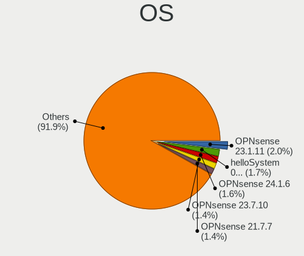
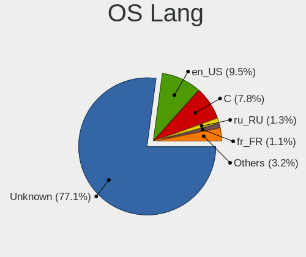
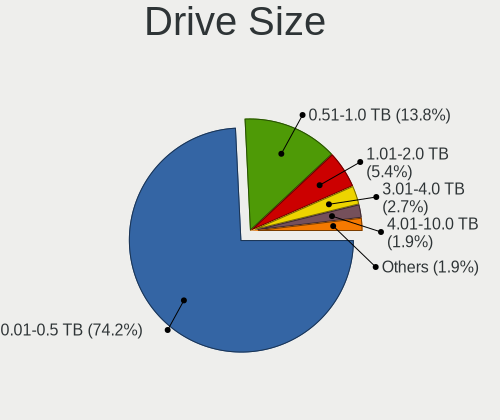
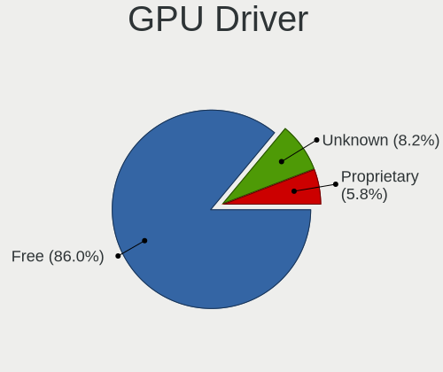

BSD - Tested Hardware & Statistics (Desktops)
---------------------------------------------

A project to collect tested hardware configurations for BSD.

Anyone can contribute to this report by the [hw-probe](https://github.com/linuxhw/hw-probe/blob/master/INSTALL.BSD.md) tool:

    hw-probe -all -upload

Please contribute! Especially if your hardware is rare.

This report is for real hardware. Report for virtual hardware: [TestDays_VE](https://github.com/bsdhw/TestDays_VE)

Contents
--------

* [ Test Cases ](#test-cases)

* [ System ](#system)
  - [ OS                       ](#os)
  - [ OS Family                ](#os-family)
  - [ Arch                     ](#arch)
  - [ DE                       ](#de)
  - [ Display Server           ](#display-server)
  - [ Display Manager          ](#display-manager)
  - [ OS Lang                  ](#os-lang)
  - [ Boot Mode                ](#boot-mode)
  - [ Filesystem               ](#filesystem)
  - [ Part. scheme             ](#part-scheme)

* [ Board ](#board)
  - [ Vendor                   ](#vendor)
  - [ Model                    ](#model)
  - [ Model Family             ](#model-family)
  - [ MFG Year                 ](#mfg-year)
  - [ Form Factor              ](#form-factor)
  - [ Coreboot                 ](#coreboot)
  - [ RAM Size                 ](#ram-size)
  - [ RAM Used                 ](#ram-used)
  - [ Total Drives             ](#total-drives)
  - [ Has CD-ROM               ](#has-cd-rom)
  - [ Has Ethernet             ](#has-ethernet)
  - [ Has WiFi                 ](#has-wifi)
  - [ Has Bluetooth            ](#has-bluetooth)

* [ Location ](#location)
  - [ Country                  ](#country)
  - [ City                     ](#city)

* [ Drives ](#drives)
  - [ Drive Vendor             ](#drive-vendor)
  - [ Drive Model              ](#drive-model)
  - [ HDD Vendor               ](#hdd-vendor)
  - [ SSD Vendor               ](#ssd-vendor)
  - [ Drive Kind               ](#drive-kind)
  - [ Drive Connector          ](#drive-connector)
  - [ Drive Size               ](#drive-size)
  - [ Space Total              ](#space-total)
  - [ Space Used               ](#space-used)
  - [ Malfunc. Drives          ](#malfunc-drives)
  - [ Malfunc. Drive Vendor    ](#malfunc-drive-vendor)
  - [ Malfunc. HDD Vendor      ](#malfunc-hdd-vendor)
  - [ Malfunc. Drive Kind      ](#malfunc-drive-kind)
  - [ Failed Drives            ](#failed-drives)
  - [ Failed Drive Vendor      ](#failed-drive-vendor)
  - [ Drive Status             ](#drive-status)

* [ Storage controller ](#storage-controller)
  - [ Storage Vendor           ](#storage-vendor)
  - [ Storage Model            ](#storage-model)
  - [ Storage Kind             ](#storage-kind)

* [ Processor ](#processor)
  - [ CPU Vendor               ](#cpu-vendor)
  - [ CPU Model                ](#cpu-model)
  - [ CPU Model Family         ](#cpu-model-family)
  - [ CPU Cores                ](#cpu-cores)
  - [ CPU Sockets              ](#cpu-sockets)
  - [ CPU Threads              ](#cpu-threads)
  - [ CPU Microarch            ](#cpu-microarch)

* [ Graphics ](#graphics)
  - [ GPU Vendor               ](#gpu-vendor)
  - [ GPU Model                ](#gpu-model)
  - [ GPU Combo                ](#gpu-combo)
  - [ GPU Driver               ](#gpu-driver)
  - [ GPU Memory               ](#gpu-memory)

* [ Monitor ](#monitor)
  - [ Monitor Vendor           ](#monitor-vendor)
  - [ Monitor Model            ](#monitor-model)
  - [ Monitor Resolution       ](#monitor-resolution)
  - [ Monitor Diagonal         ](#monitor-diagonal)
  - [ Monitor Width            ](#monitor-width)
  - [ Aspect Ratio             ](#aspect-ratio)
  - [ Monitor Area             ](#monitor-area)
  - [ Pixel Density            ](#pixel-density)
  - [ Multiple Monitors        ](#multiple-monitors)

* [ Network ](#network)
  - [ Net Controller Vendor    ](#net-controller-vendor)
  - [ Net Controller Model     ](#net-controller-model)
  - [ Wireless Vendor          ](#wireless-vendor)
  - [ Wireless Model           ](#wireless-model)
  - [ Ethernet Vendor          ](#ethernet-vendor)
  - [ Ethernet Model           ](#ethernet-model)
  - [ Net Controller Kind      ](#net-controller-kind)
  - [ Used Controller          ](#used-controller)
  - [ NICs                     ](#nics)
  - [ IPv6                     ](#ipv6)

* [ Bluetooth ](#bluetooth)
  - [ Bluetooth Vendor         ](#bluetooth-vendor)
  - [ Bluetooth Model          ](#bluetooth-model)

* [ Sound ](#sound)
  - [ Sound Vendor             ](#sound-vendor)
  - [ Sound Model              ](#sound-model)

* [ Memory ](#memory)
  - [ Memory Vendor            ](#memory-vendor)
  - [ Memory Model             ](#memory-model)
  - [ Memory Kind              ](#memory-kind)
  - [ Memory Form Factor       ](#memory-form-factor)
  - [ Memory Size              ](#memory-size)
  - [ Memory Speed             ](#memory-speed)

* [ Printers & scanners ](#printers--scanners)
  - [ Printer Vendor           ](#printer-vendor)
  - [ Printer Model            ](#printer-model)
  - [ Scanner Vendor           ](#scanner-vendor)
  - [ Scanner Model            ](#scanner-model)

* [ Camera ](#camera)
  - [ Camera Vendor            ](#camera-vendor)
  - [ Camera Model             ](#camera-model)

* [ Security ](#security)
  - [ Fingerprint Vendor       ](#fingerprint-vendor)
  - [ Fingerprint Model        ](#fingerprint-model)
  - [ Chipcard Vendor          ](#chipcard-vendor)
  - [ Chipcard Model           ](#chipcard-model)

* [ Unsupported ](#unsupported)
  - [ Unsupported Devices      ](#unsupported-devices)
  - [ Unsupported Device Types ](#unsupported-device-types)

Test Cases
----------

Total: 10511

| Vendor        | Model                       | Probe                                                     | Date         |
|---------------|-----------------------------|-----------------------------------------------------------|--------------|
| Protectli     | FW6 Ver                     | [61c7be6541](https://bsd-hardware.info/?probe=61c7be6541) | Jul 01, 2023 |
| CWWK          | CW-AD4L-N V1                | [3d03ade7ab](https://bsd-hardware.info/?probe=3d03ade7ab) | Jul 01, 2023 |
| Techvision    | TVI7309X B0                 | [7c71b88b22](https://bsd-hardware.info/?probe=7c71b88b22) | Jun 30, 2023 |
| Gigabyte      | B360M D2V                   | [bf5f6fd6dd](https://bsd-hardware.info/?probe=bf5f6fd6dd) | Jun 30, 2023 |
| ASRockRack    | EPYC3101D4I-2T              | [6479d60da2](https://bsd-hardware.info/?probe=6479d60da2) | Jun 30, 2023 |
| PC Engines    | apu4                        | [62f0b60653](https://bsd-hardware.info/?probe=62f0b60653) | Jun 30, 2023 |
| Unknown       | Unknown                     | [ff012340d5](https://bsd-hardware.info/?probe=ff012340d5) | Jun 30, 2023 |
| HP            | 1998                        | [d1df8f0773](https://bsd-hardware.info/?probe=d1df8f0773) | Jun 30, 2023 |
| ASUSTek       | ROG STRIX X570-F GAMING     | [b6cfa09740](https://bsd-hardware.info/?probe=b6cfa09740) | Jun 30, 2023 |
| Protectli     | FW6 Ver                     | [5c6f36540d](https://bsd-hardware.info/?probe=5c6f36540d) | Jun 29, 2023 |
| Intel         | Q3XXG4-P V1.0               | [3e8f4fb0a8](https://bsd-hardware.info/?probe=3e8f4fb0a8) | Jun 29, 2023 |
| Dell          | 00V62H A01                  | [d60c967edb](https://bsd-hardware.info/?probe=d60c967edb) | Jun 29, 2023 |
| Protectli     | VP2420                      | [950ff902c2](https://bsd-hardware.info/?probe=950ff902c2) | Jun 29, 2023 |
| HP            | 82A2                        | [4b8d139419](https://bsd-hardware.info/?probe=4b8d139419) | Jun 29, 2023 |
| Intel         | DQ67SW AAG12527-310         | [5b272b02cb](https://bsd-hardware.info/?probe=5b272b02cb) | Jun 29, 2023 |
| Unknown       | Unknown                     | [e57d17e272](https://bsd-hardware.info/?probe=e57d17e272) | Jun 29, 2023 |
| Unknown       | Unknown                     | [4c5d9c5da3](https://bsd-hardware.info/?probe=4c5d9c5da3) | Jun 29, 2023 |
| HP            | 8055                        | [94df572de4](https://bsd-hardware.info/?probe=94df572de4) | Jun 29, 2023 |
| Unknown       | Unknown                     | [c07f4ffa1e](https://bsd-hardware.info/?probe=c07f4ffa1e) | Jun 29, 2023 |
| Dell          | 0NW6H5 A00                  | [0cdc2b47b2](https://bsd-hardware.info/?probe=0cdc2b47b2) | Jun 29, 2023 |
| HP            | 8595                        | [e1a82ff0c5](https://bsd-hardware.info/?probe=e1a82ff0c5) | Jun 29, 2023 |
| Unknown       | Unknown                     | [41e020bc03](https://bsd-hardware.info/?probe=41e020bc03) | Jun 29, 2023 |
| Intel         | MAHOBAY                     | [4053bc358e](https://bsd-hardware.info/?probe=4053bc358e) | Jun 29, 2023 |
| Unknown       | Unknown                     | [075deef24f](https://bsd-hardware.info/?probe=075deef24f) | Jun 28, 2023 |
| CWWK          | MINIPC-G4                   | [ebfa9abcd3](https://bsd-hardware.info/?probe=ebfa9abcd3) | Jun 28, 2023 |
| ASUSTek       | M2A-VM                      | [2d5a9bba42](https://bsd-hardware.info/?probe=2d5a9bba42) | Jun 28, 2023 |
| Sony          | VGC-RB41M                   | [95804a1f40](https://bsd-hardware.info/?probe=95804a1f40) | Jun 28, 2023 |
| Inventec      | D CLASS A02                 | [c96df95354](https://bsd-hardware.info/?probe=c96df95354) | Jun 28, 2023 |
| CncTion       | J4125-4L-I225               | [1785cb2fa3](https://bsd-hardware.info/?probe=1785cb2fa3) | Jun 28, 2023 |
| Dell          | 0NC2VH A01                  | [d5a7320a8a](https://bsd-hardware.info/?probe=d5a7320a8a) | Jun 28, 2023 |
| Techvision    | TVI7309X B0                 | [0dbf4904dc](https://bsd-hardware.info/?probe=0dbf4904dc) | Jun 28, 2023 |
| Unknown       | Unknown                     | [5080e84698](https://bsd-hardware.info/?probe=5080e84698) | Jun 28, 2023 |
| Unknown       | Unknown                     | [9d98798bc8](https://bsd-hardware.info/?probe=9d98798bc8) | Jun 27, 2023 |
| HP            | 339A                        | [b08e1fc092](https://bsd-hardware.info/?probe=b08e1fc092) | Jun 27, 2023 |
| MW            | GMLK-2_5G4L                 | [1ef9818928](https://bsd-hardware.info/?probe=1ef9818928) | Jun 27, 2023 |
| Unknown       | Unknown                     | [23cdf1d4af](https://bsd-hardware.info/?probe=23cdf1d4af) | Jun 27, 2023 |
| Unknown       | Unknown                     | [a548b021da](https://bsd-hardware.info/?probe=a548b021da) | Jun 27, 2023 |
| ASUSTek       | TUF Gaming B550M-PLUS (W... | [4d99bc4b63](https://bsd-hardware.info/?probe=4d99bc4b63) | Jun 27, 2023 |
| ASUSTek       | TUF Gaming B550M-PLUS (W... | [8866724f46](https://bsd-hardware.info/?probe=8866724f46) | Jun 27, 2023 |
| YANYU         | H67SL                       | [5d5fd8a8cd](https://bsd-hardware.info/?probe=5d5fd8a8cd) | Jun 27, 2023 |
| ASUSTek       | PRIME A320M-K               | [a53c1176ba](https://bsd-hardware.info/?probe=a53c1176ba) | Jun 27, 2023 |
| Supermicro    | X11SDV-4C-TP8F              | [bc448a4c10](https://bsd-hardware.info/?probe=bc448a4c10) | Jun 27, 2023 |
| Fujitsu       | D3313-G1 S26361-D3313-G1    | [bcad942162](https://bsd-hardware.info/?probe=bcad942162) | Jun 26, 2023 |
| Unknown       | YL-SKUL6                    | [1512f63972](https://bsd-hardware.info/?probe=1512f63972) | Jun 26, 2023 |
| Fujitsu       | D3313-A1 S26361-D3313-A1    | [96917bdb04](https://bsd-hardware.info/?probe=96917bdb04) | Jun 26, 2023 |
| ASUSTek       | N3700T                      | [16b73b05ef](https://bsd-hardware.info/?probe=16b73b05ef) | Jun 26, 2023 |
| HP            | 1998                        | [b6a89cea25](https://bsd-hardware.info/?probe=b6a89cea25) | Jun 26, 2023 |
| Cisco         | ASA5515 A0                  | [9d8eedf081](https://bsd-hardware.info/?probe=9d8eedf081) | Jun 26, 2023 |
| Protectli     | FW6 Ver                     | [fa177a2538](https://bsd-hardware.info/?probe=fa177a2538) | Jun 26, 2023 |
| Protectli     | FW6 Ver                     | [54ef7dc131](https://bsd-hardware.info/?probe=54ef7dc131) | Jun 26, 2023 |
| Protectli     | FW6 Ver                     | [b056cd0426](https://bsd-hardware.info/?probe=b056cd0426) | Jun 26, 2023 |
| HP            | 18E9                        | [aba608120b](https://bsd-hardware.info/?probe=aba608120b) | Jun 26, 2023 |
| Unknown       | Unknown                     | [18da718e9e](https://bsd-hardware.info/?probe=18da718e9e) | Jun 26, 2023 |
| HP            | 1495                        | [564ff2ef77](https://bsd-hardware.info/?probe=564ff2ef77) | Jun 26, 2023 |
| Supermicro    | X9SCL/X9SCMA                | [489b7b6bae](https://bsd-hardware.info/?probe=489b7b6bae) | Jun 26, 2023 |
| Unknown       | Unknown                     | [cd3b925f27](https://bsd-hardware.info/?probe=cd3b925f27) | Jun 26, 2023 |
| Lenovo        | Kabini CRB 31900058 STD     | [127f92759b](https://bsd-hardware.info/?probe=127f92759b) | Jun 26, 2023 |
| Gigabyte      | C1037UN                     | [fccc3f4b80](https://bsd-hardware.info/?probe=fccc3f4b80) | Jun 26, 2023 |
| Protectli     | FW6 Ver                     | [03eb1a54c8](https://bsd-hardware.info/?probe=03eb1a54c8) | Jun 25, 2023 |
| Dell          | 0J8G6F A02                  | [e4a7fc0f0e](https://bsd-hardware.info/?probe=e4a7fc0f0e) | Jun 25, 2023 |
| Lenovo        | 3102 SDK0J40697 WIN 3305... | [e76d3511a1](https://bsd-hardware.info/?probe=e76d3511a1) | Jun 25, 2023 |
| Unknown       | Unknown                     | [27bbec5905](https://bsd-hardware.info/?probe=27bbec5905) | Jun 25, 2023 |
| AZW           | EQ                          | [c410cd5c1c](https://bsd-hardware.info/?probe=c410cd5c1c) | Jun 25, 2023 |
| Unknown       | Unknown                     | [c660f668dc](https://bsd-hardware.info/?probe=c660f668dc) | Jun 25, 2023 |
| Unknown       | J3160-4L                    | [5ad411cd6b](https://bsd-hardware.info/?probe=5ad411cd6b) | Jun 25, 2023 |
| Gigabyte      | B450M DS3H-CF               | [dc937eee63](https://bsd-hardware.info/?probe=dc937eee63) | Jun 25, 2023 |
| Unknown       | Unknown                     | [b44e00cdf3](https://bsd-hardware.info/?probe=b44e00cdf3) | Jun 25, 2023 |
| MSI           | H81M-P33                    | [80bd24461a](https://bsd-hardware.info/?probe=80bd24461a) | Jun 25, 2023 |
| ASUSTek       | P5Q-E                       | [e368d55893](https://bsd-hardware.info/?probe=e368d55893) | Jun 25, 2023 |
| ASUSTek       | ROG CROSSHAIR VIII HERO     | [483865aca5](https://bsd-hardware.info/?probe=483865aca5) | Jun 25, 2023 |
| Hardkernel    | ODROID-H3                   | [8a2ea60929](https://bsd-hardware.info/?probe=8a2ea60929) | Jun 25, 2023 |
| Unknown       | Unknown                     | [32e290d370](https://bsd-hardware.info/?probe=32e290d370) | Jun 25, 2023 |
| Intel         | DG41TY AAE47335-300         | [111b9572ba](https://bsd-hardware.info/?probe=111b9572ba) | Jun 25, 2023 |
| Gigabyte      | H610I DDR4                  | [dea4808206](https://bsd-hardware.info/?probe=dea4808206) | Jun 24, 2023 |
| Gigabyte      | Z77N-WIFI                   | [aca5df3113](https://bsd-hardware.info/?probe=aca5df3113) | Jun 24, 2023 |
| AZW           | EQ                          | [a76336474d](https://bsd-hardware.info/?probe=a76336474d) | Jun 24, 2023 |
| Shuttle       | DH370                       | [95eb3bd4a8](https://bsd-hardware.info/?probe=95eb3bd4a8) | Jun 24, 2023 |
| ASRock        | J4105-ITX                   | [bfe12f97ba](https://bsd-hardware.info/?probe=bfe12f97ba) | Jun 24, 2023 |
| Protectli     | FW6 Ver                     | [6210e8f0bc](https://bsd-hardware.info/?probe=6210e8f0bc) | Jun 24, 2023 |
| Techvision    | TVI7309X B0                 | [93213fc931](https://bsd-hardware.info/?probe=93213fc931) | Jun 24, 2023 |
| Unknown       | Unknown                     | [b67ce69ea4](https://bsd-hardware.info/?probe=b67ce69ea4) | Jun 23, 2023 |
| Dell          | 02YRK5 A03                  | [2d631e9745](https://bsd-hardware.info/?probe=2d631e9745) | Jun 23, 2023 |
| Techvision    | TVI7309X B0                 | [18cf91f3a4](https://bsd-hardware.info/?probe=18cf91f3a4) | Jun 23, 2023 |
| Intel         | Q3XXG4-P V1.0               | [bb4dc2b1a2](https://bsd-hardware.info/?probe=bb4dc2b1a2) | Jun 23, 2023 |
| ASUSTek       | ROG Maximus X HERO          | [2dfabb3a28](https://bsd-hardware.info/?probe=2dfabb3a28) | Jun 23, 2023 |
| Unknown       | Unknown                     | [16ceade742](https://bsd-hardware.info/?probe=16ceade742) | Jun 23, 2023 |
| Lenovo        | SDK0E50510 WIN              | [a411832c7d](https://bsd-hardware.info/?probe=a411832c7d) | Jun 23, 2023 |
| HP            | 213D A01                    | [eccc48bb80](https://bsd-hardware.info/?probe=eccc48bb80) | Jun 23, 2023 |
| ASUSTek       | ROG Maximus X HERO          | [b63efe1bc2](https://bsd-hardware.info/?probe=b63efe1bc2) | Jun 23, 2023 |
| Unknown       | Unknown                     | [6e8085380f](https://bsd-hardware.info/?probe=6e8085380f) | Jun 23, 2023 |
| Protectli     | FW4B                        | [6c993e8f34](https://bsd-hardware.info/?probe=6c993e8f34) | Jun 23, 2023 |
| Intel         | SKYBAY                      | [940adce39f](https://bsd-hardware.info/?probe=940adce39f) | Jun 23, 2023 |
| Dell          | 0Y7WYT A00                  | [a931ed9f0a](https://bsd-hardware.info/?probe=a931ed9f0a) | Jun 23, 2023 |
| Lenovo        | 312A SDK0J40697 WIN 3305... | [b6916f61a8](https://bsd-hardware.info/?probe=b6916f61a8) | Jun 23, 2023 |
| ASRock        | 4X4-4000 Series             | [c9420276e7](https://bsd-hardware.info/?probe=c9420276e7) | Jun 23, 2023 |
| Unknown       | Unknown                     | [97583c2b74](https://bsd-hardware.info/?probe=97583c2b74) | Jun 23, 2023 |
| AZW           | EQ                          | [8a85da80b2](https://bsd-hardware.info/?probe=8a85da80b2) | Jun 23, 2023 |
| Unknown       | Unknown                     | [508aa0bdb4](https://bsd-hardware.info/?probe=508aa0bdb4) | Jun 23, 2023 |
| LG Electro... | R590-K.AAA9BT               | [5c3ab65e8e](https://bsd-hardware.info/?probe=5c3ab65e8e) | Jun 23, 2023 |
| Unknown       | Unknown                     | [eb49ebcc0c](https://bsd-hardware.info/?probe=eb49ebcc0c) | Jun 22, 2023 |
| CWWK          | CW-AD4L-N V1                | [b7ca7c7195](https://bsd-hardware.info/?probe=b7ca7c7195) | Jun 22, 2023 |
| Lenovo        | ThinkCentre M55 880894U     | [e406083f25](https://bsd-hardware.info/?probe=e406083f25) | Jun 22, 2023 |
| Unknown       | Unknown                     | [f73625157c](https://bsd-hardware.info/?probe=f73625157c) | Jun 22, 2023 |
| Protectli     | VP2410                      | [94e2177a56](https://bsd-hardware.info/?probe=94e2177a56) | Jun 22, 2023 |
| ASUSTek       | TUF Gaming B450-PLUS II     | [6172c8b66f](https://bsd-hardware.info/?probe=6172c8b66f) | Jun 22, 2023 |
| Dell          | 0NW6H5 A00                  | [7d3a60d628](https://bsd-hardware.info/?probe=7d3a60d628) | Jun 22, 2023 |
| Techvision    | TVI7309X B0                 | [0b667bc4e7](https://bsd-hardware.info/?probe=0b667bc4e7) | Jun 22, 2023 |
| Lenovo        | SHARKBAY SDK0E50510 WIN     | [485ba68539](https://bsd-hardware.info/?probe=485ba68539) | Jun 22, 2023 |
| ASRock        | H110M-ITX                   | [1180da18fb](https://bsd-hardware.info/?probe=1180da18fb) | Jun 22, 2023 |
| Techvision    | TVI7309X B0                 | [178a67ff39](https://bsd-hardware.info/?probe=178a67ff39) | Jun 21, 2023 |
| HP            | 8592                        | [154f28878a](https://bsd-hardware.info/?probe=154f28878a) | Jun 21, 2023 |
| ASUSTek       | PRIME B350M-A               | [29545a1054](https://bsd-hardware.info/?probe=29545a1054) | Jun 21, 2023 |
| Dell          | 0NC2VH A01                  | [f094606e8f](https://bsd-hardware.info/?probe=f094606e8f) | Jun 21, 2023 |
| Hardkernel    | ODROID-H3                   | [8f550b0d75](https://bsd-hardware.info/?probe=8f550b0d75) | Jun 21, 2023 |
| BESSTAR Te... | TH50                        | [efc396837c](https://bsd-hardware.info/?probe=efc396837c) | Jun 21, 2023 |
| Techvision    | TVI7309X B0                 | [12d57aa9d9](https://bsd-hardware.info/?probe=12d57aa9d9) | Jun 21, 2023 |
| CWWK          | CW-AD4L-N V1                | [a09d71cc14](https://bsd-hardware.info/?probe=a09d71cc14) | Jun 21, 2023 |
| HP            | 802E                        | [595a5d4f60](https://bsd-hardware.info/?probe=595a5d4f60) | Jun 21, 2023 |
| CWWK          | CW-AD4L-N V1                | [19b4d842d4](https://bsd-hardware.info/?probe=19b4d842d4) | Jun 20, 2023 |
| Protectli     | VP2420                      | [6d1ca53e48](https://bsd-hardware.info/?probe=6d1ca53e48) | Jun 20, 2023 |
| Unknown       | Unknown                     | [e798ae3230](https://bsd-hardware.info/?probe=e798ae3230) | Jun 20, 2023 |
| Unknown       | Unknown                     | [d0c184ae86](https://bsd-hardware.info/?probe=d0c184ae86) | Jun 20, 2023 |
| ASUSTek       | PRIME A320M-K               | [b870037532](https://bsd-hardware.info/?probe=b870037532) | Jun 20, 2023 |
| ASUSTek       | PRIME A320M-K               | [a0409cd187](https://bsd-hardware.info/?probe=a0409cd187) | Jun 20, 2023 |
| Lenovo        | SHARKBAY NOK                | [0027ab7bbf](https://bsd-hardware.info/?probe=0027ab7bbf) | Jun 20, 2023 |
| Yanling       | YL-KBRL2 Series Ver:1.02    | [9e8d6110f4](https://bsd-hardware.info/?probe=9e8d6110f4) | Jun 19, 2023 |
| Unknown       | Unknown                     | [05925afd0a](https://bsd-hardware.info/?probe=05925afd0a) | Jun 19, 2023 |
| Techvision    | TVI7309X B0                 | [1fa198f78d](https://bsd-hardware.info/?probe=1fa198f78d) | Jun 19, 2023 |
| HP            | 339A                        | [c019d583c9](https://bsd-hardware.info/?probe=c019d583c9) | Jun 19, 2023 |
| ASUSTek       | P5K PRO                     | [f0b283fdaf](https://bsd-hardware.info/?probe=f0b283fdaf) | Jun 19, 2023 |
| Unknown       | Unknown                     | [74d372e7a4](https://bsd-hardware.info/?probe=74d372e7a4) | Jun 19, 2023 |
| LANCOM Sys... | UF-60                       | [96904b8bdd](https://bsd-hardware.info/?probe=96904b8bdd) | Jun 19, 2023 |
| Intel         | CRESCENTBAY                 | [e8c8da464a](https://bsd-hardware.info/?probe=e8c8da464a) | Jun 19, 2023 |
| Unknown       | Unknown                     | [5fc629699d](https://bsd-hardware.info/?probe=5fc629699d) | Jun 18, 2023 |
| Unknown       | Unknown                     | [29313e36c9](https://bsd-hardware.info/?probe=29313e36c9) | Jun 18, 2023 |
| Intel         | ChiefRiver D                | [ce6d6e7e9e](https://bsd-hardware.info/?probe=ce6d6e7e9e) | Jun 18, 2023 |
| Unknown       | Unknown                     | [2cc06a4553](https://bsd-hardware.info/?probe=2cc06a4553) | Jun 18, 2023 |
| Dell          | 07F37C A01                  | [16e5a062a2](https://bsd-hardware.info/?probe=16e5a062a2) | Jun 18, 2023 |
| Fujitsu       | D3313-G1 S26361-D3313-G1    | [c15bb7d984](https://bsd-hardware.info/?probe=c15bb7d984) | Jun 18, 2023 |
| Techvision    | TVI7309X B0                 | [b6e5a7e7bc](https://bsd-hardware.info/?probe=b6e5a7e7bc) | Jun 18, 2023 |
| ASRock        | Z97 Professional            | [c978ddda86](https://bsd-hardware.info/?probe=c978ddda86) | Jun 18, 2023 |
| Techvision    | TVI7309X B0                 | [2d50927445](https://bsd-hardware.info/?probe=2d50927445) | Jun 18, 2023 |
| Unknown       | Unknown                     | [b20059737f](https://bsd-hardware.info/?probe=b20059737f) | Jun 17, 2023 |
| ASUSTek       | P7P55D LE                   | [ea97ade85d](https://bsd-hardware.info/?probe=ea97ade85d) | Jun 17, 2023 |
| Unknown       | Unknown                     | [81268da610](https://bsd-hardware.info/?probe=81268da610) | Jun 17, 2023 |
| ASRock        | X570 Phantom Gaming 4       | [705c750691](https://bsd-hardware.info/?probe=705c750691) | Jun 17, 2023 |
| Gigabyte      | J4005ND2P-CF                | [ee61a4b160](https://bsd-hardware.info/?probe=ee61a4b160) | Jun 17, 2023 |
| Unknown       | ITX-M41E                    | [2e8c62d163](https://bsd-hardware.info/?probe=2e8c62d163) | Jun 16, 2023 |
| Unknown       | ITX-M41E                    | [671e67a42d](https://bsd-hardware.info/?probe=671e67a42d) | Jun 16, 2023 |
| Lenovo        | ThinkCentre A70 7099A5P     | [4e827b2cbf](https://bsd-hardware.info/?probe=4e827b2cbf) | Jun 16, 2023 |
| Lenovo        | ThinkCentre A70 7099A5P     | [3d71827388](https://bsd-hardware.info/?probe=3d71827388) | Jun 16, 2023 |
| Dell          | 053CWD A00                  | [7a5418ac7e](https://bsd-hardware.info/?probe=7a5418ac7e) | Jun 16, 2023 |
| AMD           | Kabini CRB                  | [b774a8b586](https://bsd-hardware.info/?probe=b774a8b586) | Jun 16, 2023 |
| HP            | 83E9                        | [23ec260317](https://bsd-hardware.info/?probe=23ec260317) | Jun 16, 2023 |
| CNCTION-IA... | Unknown                     | [1a0573767e](https://bsd-hardware.info/?probe=1a0573767e) | Jun 16, 2023 |
| Unknown       | Unknown                     | [a6d5232f75](https://bsd-hardware.info/?probe=a6d5232f75) | Jun 16, 2023 |
| CWWK          | CW-AD4L-N V1                | [31cba7b0c6](https://bsd-hardware.info/?probe=31cba7b0c6) | Jun 15, 2023 |
| Unknown       | Unknown                     | [6b4f214b72](https://bsd-hardware.info/?probe=6b4f214b72) | Jun 15, 2023 |
| Unknown       | Unknown                     | [06754d9e71](https://bsd-hardware.info/?probe=06754d9e71) | Jun 15, 2023 |
| CncTion       | N5105-4L B0                 | [b9c5b6ec05](https://bsd-hardware.info/?probe=b9c5b6ec05) | Jun 15, 2023 |
| Unknown       | Unknown                     | [615e7cbf52](https://bsd-hardware.info/?probe=615e7cbf52) | Jun 15, 2023 |
| ASUSTek       | H110M-R                     | [cc5fe45365](https://bsd-hardware.info/?probe=cc5fe45365) | Jun 15, 2023 |
| Unknown       | Unknown                     | [8357f0f72e](https://bsd-hardware.info/?probe=8357f0f72e) | Jun 15, 2023 |
| ASUSTek       | M5A97 PLUS                  | [39e7195baf](https://bsd-hardware.info/?probe=39e7195baf) | Jun 15, 2023 |
| Unknown       | Unknown                     | [93dcd13cb6](https://bsd-hardware.info/?probe=93dcd13cb6) | Jun 15, 2023 |
| Intel         | J1900                       | [4a3a52030b](https://bsd-hardware.info/?probe=4a3a52030b) | Jun 15, 2023 |
| Dell          | 08NPPY A00                  | [8586467924](https://bsd-hardware.info/?probe=8586467924) | Jun 15, 2023 |
| MW            | GMLK-2_5G4L                 | [3274745a08](https://bsd-hardware.info/?probe=3274745a08) | Jun 15, 2023 |
| Unknown       | Unknown                     | [7def20c99d](https://bsd-hardware.info/?probe=7def20c99d) | Jun 14, 2023 |
| Dell          | 0H7TGR A00                  | [da72cc4da4](https://bsd-hardware.info/?probe=da72cc4da4) | Jun 14, 2023 |
| Fujitsu Si... | D2804-A1 S26361-D2804-A1    | [70b0e8172d](https://bsd-hardware.info/?probe=70b0e8172d) | Jun 14, 2023 |
| Unknown       | Unknown                     | [f41e1f2b83](https://bsd-hardware.info/?probe=f41e1f2b83) | Jun 14, 2023 |
| Lenovo        | 3102 SDK0J40697 WIN 3305... | [2e81fe65c8](https://bsd-hardware.info/?probe=2e81fe65c8) | Jun 14, 2023 |
| Protectli     | FW4B Ver                    | [3484cbbf9f](https://bsd-hardware.info/?probe=3484cbbf9f) | Jun 14, 2023 |
| PC Engines    | apu4                        | [ea036662ca](https://bsd-hardware.info/?probe=ea036662ca) | Jun 14, 2023 |
| Protectli     | VP2420                      | [82ecf3a046](https://bsd-hardware.info/?probe=82ecf3a046) | Jun 14, 2023 |
| Intel         | D2500CC AAG81477-401        | [15329a007b](https://bsd-hardware.info/?probe=15329a007b) | Jun 14, 2023 |
| Unknown       | Unknown                     | [229e573059](https://bsd-hardware.info/?probe=229e573059) | Jun 13, 2023 |
| Dell          | 0HD5W2 A01                  | [a6c6c43f64](https://bsd-hardware.info/?probe=a6c6c43f64) | Jun 13, 2023 |
| Unknown       | J3160-4L                    | [4a6667249e](https://bsd-hardware.info/?probe=4a6667249e) | Jun 13, 2023 |
| Techvision    | TVI7309X B0                 | [080be9d6f5](https://bsd-hardware.info/?probe=080be9d6f5) | Jun 13, 2023 |
| Gigabyte      | Z77N-WIFI                   | [f96302f46c](https://bsd-hardware.info/?probe=f96302f46c) | Jun 13, 2023 |
| ASUSTek       | PRIME X370-PRO              | [6e8e70ddc2](https://bsd-hardware.info/?probe=6e8e70ddc2) | Jun 13, 2023 |
| ASRock        | X570 Phantom Gaming 4       | [c19a29f083](https://bsd-hardware.info/?probe=c19a29f083) | Jun 13, 2023 |
| MSI           | X370 GAMING PRO CARBON      | [33b64d3084](https://bsd-hardware.info/?probe=33b64d3084) | Jun 13, 2023 |
| Dell          | 02YYK5 A00                  | [0dc0eab687](https://bsd-hardware.info/?probe=0dc0eab687) | Jun 13, 2023 |
| Fujitsu       | D3313-E1 S26361-D3313-E1    | [015a5d839a](https://bsd-hardware.info/?probe=015a5d839a) | Jun 13, 2023 |
| Pegatron      | 2AD5                        | [751e307940](https://bsd-hardware.info/?probe=751e307940) | Jun 13, 2023 |
| Unknown       | Unknown                     | [27617e1ca6](https://bsd-hardware.info/?probe=27617e1ca6) | Jun 13, 2023 |
| HP            | 3397                        | [a918ce0c4b](https://bsd-hardware.info/?probe=a918ce0c4b) | Jun 12, 2023 |
| ASUSTek       | SABERTOOTH Z77              | [ffe9b51f78](https://bsd-hardware.info/?probe=ffe9b51f78) | Jun 12, 2023 |
| CWWK          | MINIPC-G12                  | [04ae7435e5](https://bsd-hardware.info/?probe=04ae7435e5) | Jun 12, 2023 |
| Unknown       | Unknown                     | [9d271bc94c](https://bsd-hardware.info/?probe=9d271bc94c) | Jun 12, 2023 |
| MSI           | A320M GRENADE               | [6e0b1f598f](https://bsd-hardware.info/?probe=6e0b1f598f) | Jun 12, 2023 |
| HP            | 213D A01                    | [2a6603c79a](https://bsd-hardware.info/?probe=2a6603c79a) | Jun 12, 2023 |
| Fujitsu       | D3313-A1 S26361-D3313-A1    | [02509df772](https://bsd-hardware.info/?probe=02509df772) | Jun 12, 2023 |
| Dell          | 00V62H A00                  | [bc5f37ced7](https://bsd-hardware.info/?probe=bc5f37ced7) | Jun 12, 2023 |
| Unknown       | Unknown                     | [193c7d152b](https://bsd-hardware.info/?probe=193c7d152b) | Jun 11, 2023 |
| CWWK          | CW-J6-6L                    | [a380503321](https://bsd-hardware.info/?probe=a380503321) | Jun 11, 2023 |
| ASUSTek       | TUF Gaming B650M-PLUS       | [2d2052de27](https://bsd-hardware.info/?probe=2d2052de27) | Jun 11, 2023 |
| Dell          | 0D28YY A00                  | [9f14962984](https://bsd-hardware.info/?probe=9f14962984) | Jun 11, 2023 |
| Techvision    | TVI7309X B0                 | [3679eb8cd4](https://bsd-hardware.info/?probe=3679eb8cd4) | Jun 11, 2023 |
| MSI           | H81M-P33                    | [3d9a05635f](https://bsd-hardware.info/?probe=3d9a05635f) | Jun 11, 2023 |
| ASUSTek       | P5Q-E                       | [b8f3eeed4b](https://bsd-hardware.info/?probe=b8f3eeed4b) | Jun 11, 2023 |
| ASUSTek       | ROG CROSSHAIR VIII HERO     | [9c888141fb](https://bsd-hardware.info/?probe=9c888141fb) | Jun 11, 2023 |
| Protectli     | FW6 Ver                     | [3f8a97d0e7](https://bsd-hardware.info/?probe=3f8a97d0e7) | Jun 11, 2023 |
| Unknown       | Unknown                     | [8988baa83b](https://bsd-hardware.info/?probe=8988baa83b) | Jun 10, 2023 |
| Intel         | S1200KP AAG34877-201        | [39eba90e6a](https://bsd-hardware.info/?probe=39eba90e6a) | Jun 10, 2023 |
| Gigabyte      | B450M S2H                   | [2008116e96](https://bsd-hardware.info/?probe=2008116e96) | Jun 10, 2023 |
| Unknown       | Unknown                     | [88a421e275](https://bsd-hardware.info/?probe=88a421e275) | Jun 10, 2023 |
| Fujitsu       | D3313-A1 S26361-D3313-A1    | [fe412825f2](https://bsd-hardware.info/?probe=fe412825f2) | Jun 10, 2023 |
| Unknown       | Unknown                     | [40bb474319](https://bsd-hardware.info/?probe=40bb474319) | Jun 10, 2023 |
| AZW           | EQ                          | [f1f980d130](https://bsd-hardware.info/?probe=f1f980d130) | Jun 10, 2023 |
| Gigabyte      | C1037UN                     | [d8f7cea73b](https://bsd-hardware.info/?probe=d8f7cea73b) | Jun 10, 2023 |
| MSI           | PRESTIGE X570 CREATION      | [7e0151a93f](https://bsd-hardware.info/?probe=7e0151a93f) | Jun 10, 2023 |
| Intel         | S1200KP AAG34877-201        | [ec04f3f6d5](https://bsd-hardware.info/?probe=ec04f3f6d5) | Jun 10, 2023 |
| Protectli     | FW4B Ver                    | [af56081a76](https://bsd-hardware.info/?probe=af56081a76) | Jun 10, 2023 |
| Protectli     | FW6 Ver                     | [6cc2f54681](https://bsd-hardware.info/?probe=6cc2f54681) | Jun 10, 2023 |
| ASRock        | B85M-HDS                    | [09a4700a14](https://bsd-hardware.info/?probe=09a4700a14) | Jun 09, 2023 |
| ASUSTek       | PRIME B760M-A D4            | [7d23d1c91f](https://bsd-hardware.info/?probe=7d23d1c91f) | Jun 09, 2023 |
| PC Engines    | APU2                        | [24545e8f90](https://bsd-hardware.info/?probe=24545e8f90) | Jun 09, 2023 |
| Dell          | 0YXT71 A02                  | [e42082ba89](https://bsd-hardware.info/?probe=e42082ba89) | Jun 09, 2023 |
| HP            | 82B4                        | [7fc20afdeb](https://bsd-hardware.info/?probe=7fc20afdeb) | Jun 08, 2023 |
| Wortmann      | terra Nettop 2700           | [e4a90ea530](https://bsd-hardware.info/?probe=e4a90ea530) | Jun 08, 2023 |
| Intel         | Q3XXG4-P V1.0               | [1ae49c4706](https://bsd-hardware.info/?probe=1ae49c4706) | Jun 08, 2023 |
| CWWK          | MINIPC-G12                  | [dbb8ffe645](https://bsd-hardware.info/?probe=dbb8ffe645) | Jun 08, 2023 |
| Dell          | 0X9X1W A00                  | [64825f4f71](https://bsd-hardware.info/?probe=64825f4f71) | Jun 08, 2023 |
| maiyunda      | www.maiyunda.com            | [7b43dea184](https://bsd-hardware.info/?probe=7b43dea184) | Jun 08, 2023 |
| Intel         | SKYBAY                      | [f1b649ed11](https://bsd-hardware.info/?probe=f1b649ed11) | Jun 08, 2023 |
| IceWhale T... | ZimaBoard 832 ZMB           | [15a71633ec](https://bsd-hardware.info/?probe=15a71633ec) | Jun 08, 2023 |
| ASUSTek       | P8Z68-V LE                  | [48833ba1a3](https://bsd-hardware.info/?probe=48833ba1a3) | Jun 08, 2023 |
| Techvision    | TVI7309X B0                 | [14ed4c80da](https://bsd-hardware.info/?probe=14ed4c80da) | Jun 08, 2023 |
| Dell          | 0X9X1W A00                  | [c9d8d9a491](https://bsd-hardware.info/?probe=c9d8d9a491) | Jun 08, 2023 |
| Dell          | 05XGC8 A00                  | [f79924e37b](https://bsd-hardware.info/?probe=f79924e37b) | Jun 08, 2023 |
| MSI           | MS-7360                     | [f54096f3e5](https://bsd-hardware.info/?probe=f54096f3e5) | Jun 08, 2023 |
| Lanner        | FW-7543 B-GA                | [ee85efd1c0](https://bsd-hardware.info/?probe=ee85efd1c0) | Jun 08, 2023 |
| PC Engines    | APU2                        | [f644f33061](https://bsd-hardware.info/?probe=f644f33061) | Jun 07, 2023 |
| Protectli     | VP2420                      | [45e550e09f](https://bsd-hardware.info/?probe=45e550e09f) | Jun 07, 2023 |
| LANCOM Sys... | UF-60                       | [204f10b60f](https://bsd-hardware.info/?probe=204f10b60f) | Jun 07, 2023 |
| ASUSTek       | M11AD                       | [7ffef5814d](https://bsd-hardware.info/?probe=7ffef5814d) | Jun 07, 2023 |
| HP            | 18E7                        | [6daf82289e](https://bsd-hardware.info/?probe=6daf82289e) | Jun 07, 2023 |
| MW            | GMLK-2_5G4L                 | [54c23902c7](https://bsd-hardware.info/?probe=54c23902c7) | Jun 07, 2023 |
| Gigabyte      | G41MT-S2                    | [355202536f](https://bsd-hardware.info/?probe=355202536f) | Jun 07, 2023 |
| Intel         | Q3XXG4-P V1.0               | [f0f13f5cea](https://bsd-hardware.info/?probe=f0f13f5cea) | Jun 06, 2023 |
| Pegatron      | 2AD5                        | [e50d3f9b86](https://bsd-hardware.info/?probe=e50d3f9b86) | Jun 06, 2023 |
| Intel         | Q3XXG4-P V1.0               | [4e57bbcdb5](https://bsd-hardware.info/?probe=4e57bbcdb5) | Jun 06, 2023 |
| CncTion       | N4100-4L                    | [68ccae3895](https://bsd-hardware.info/?probe=68ccae3895) | Jun 06, 2023 |
| Dell          | 0NC2VH A01                  | [0b9ad8d7d8](https://bsd-hardware.info/?probe=0b9ad8d7d8) | Jun 06, 2023 |
| HP            | 843F                        | [57b6c258ad](https://bsd-hardware.info/?probe=57b6c258ad) | Jun 06, 2023 |
| GuoGuang      | IC2M1028V-J                 | [ae2e2693e1](https://bsd-hardware.info/?probe=ae2e2693e1) | Jun 06, 2023 |
| Acer          | Aspire XC-1660G V:1.1       | [e07bfb044b](https://bsd-hardware.info/?probe=e07bfb044b) | Jun 06, 2023 |
| ASRock        | Z590 Pro4                   | [d04a63aa31](https://bsd-hardware.info/?probe=d04a63aa31) | Jun 06, 2023 |
| Intel         | DENLOW_WS                   | [ce3bef7b5a](https://bsd-hardware.info/?probe=ce3bef7b5a) | Jun 06, 2023 |
| ASUSTek       | PRIME B550-PLUS             | [012b9ff742](https://bsd-hardware.info/?probe=012b9ff742) | Jun 05, 2023 |
| Soyo          | SY-YL B550M                 | [1d1138e3c5](https://bsd-hardware.info/?probe=1d1138e3c5) | Jun 05, 2023 |
| Soyo          | SY-YL B550M                 | [79c6c2a177](https://bsd-hardware.info/?probe=79c6c2a177) | Jun 05, 2023 |
| CncTion       | N6000-4L B0                 | [c9ec51aa84](https://bsd-hardware.info/?probe=c9ec51aa84) | Jun 05, 2023 |
| YANYU         | N39SL                       | [e487646fbf](https://bsd-hardware.info/?probe=e487646fbf) | Jun 05, 2023 |
| HP            | 3397                        | [6783902b93](https://bsd-hardware.info/?probe=6783902b93) | Jun 05, 2023 |
| Techvision    | TVI7309X B0                 | [16fe649f16](https://bsd-hardware.info/?probe=16fe649f16) | Jun 05, 2023 |
| HP            | 212B                        | [4db61072c4](https://bsd-hardware.info/?probe=4db61072c4) | Jun 05, 2023 |
| WlanCN        | 6000 Series                 | [d2e71531b6](https://bsd-hardware.info/?probe=d2e71531b6) | Jun 05, 2023 |
| Hardkernel    | ODROID-H3                   | [42e80f8003](https://bsd-hardware.info/?probe=42e80f8003) | Jun 05, 2023 |
| MW            | GMLK-2_5G4L                 | [e137b3e686](https://bsd-hardware.info/?probe=e137b3e686) | Jun 05, 2023 |
| HP            | 339A                        | [74f857c400](https://bsd-hardware.info/?probe=74f857c400) | Jun 05, 2023 |
| HP            | 1495                        | [a7a24624d7](https://bsd-hardware.info/?probe=a7a24624d7) | Jun 05, 2023 |
| HP            | 3398                        | [980c0fc5a8](https://bsd-hardware.info/?probe=980c0fc5a8) | Jun 04, 2023 |
| Fujitsu       | D3313-A1 S26361-D3313-A1    | [bb5ee3d3fb](https://bsd-hardware.info/?probe=bb5ee3d3fb) | Jun 04, 2023 |
| Dell          | 0PC5F7 A03                  | [23bd5ef252](https://bsd-hardware.info/?probe=23bd5ef252) | Jun 04, 2023 |
| Fujitsu       | D3313-A1 S26361-D3313-A1    | [95ceb1335c](https://bsd-hardware.info/?probe=95ceb1335c) | Jun 04, 2023 |
| Intel         | SKYBAY                      | [afe36b0540](https://bsd-hardware.info/?probe=afe36b0540) | Jun 04, 2023 |
| MSI           | H81M-P33                    | [88598bfbf5](https://bsd-hardware.info/?probe=88598bfbf5) | Jun 04, 2023 |
| ASUSTek       | P5Q-E                       | [fac0ed387e](https://bsd-hardware.info/?probe=fac0ed387e) | Jun 04, 2023 |
| ASUSTek       | ROG CROSSHAIR VIII HERO     | [3c76deca15](https://bsd-hardware.info/?probe=3c76deca15) | Jun 04, 2023 |
| HP            | 802E                        | [2af6f8a101](https://bsd-hardware.info/?probe=2af6f8a101) | Jun 04, 2023 |
| Acer          | Aspire XC-1660G V:1.1       | [cf05481728](https://bsd-hardware.info/?probe=cf05481728) | Jun 04, 2023 |
| Protectli     | FW4B Ver                    | [5fc38b17d3](https://bsd-hardware.info/?probe=5fc38b17d3) | Jun 04, 2023 |
| ASRock        | Z590 Pro4                   | [314d462dcd](https://bsd-hardware.info/?probe=314d462dcd) | Jun 04, 2023 |
| Acer          | Aspire TC-230               | [d7eacfafe1](https://bsd-hardware.info/?probe=d7eacfafe1) | Jun 04, 2023 |
| HP            | 805A                        | [3ad8551330](https://bsd-hardware.info/?probe=3ad8551330) | Jun 04, 2023 |
| Protectli     | FW4B Ver                    | [0f5b2ad316](https://bsd-hardware.info/?probe=0f5b2ad316) | Jun 03, 2023 |
| HP            | 18E7                        | [4ca0d96863](https://bsd-hardware.info/?probe=4ca0d96863) | Jun 03, 2023 |
| Fujitsu       | D3313-A1 S26361-D3313-A1    | [56a9981ff3](https://bsd-hardware.info/?probe=56a9981ff3) | Jun 03, 2023 |
| Unknown       | Unknown                     | [ffb4544d8c](https://bsd-hardware.info/?probe=ffb4544d8c) | Jun 03, 2023 |
| Dell          | 0WR7PY A03                  | [c8496622be](https://bsd-hardware.info/?probe=c8496622be) | Jun 03, 2023 |
| Dell          | 0WR7PY A03                  | [b9f7e3e209](https://bsd-hardware.info/?probe=b9f7e3e209) | Jun 03, 2023 |
| Intel         | JSL MRD                     | [f4606f2c25](https://bsd-hardware.info/?probe=f4606f2c25) | Jun 03, 2023 |
| Intel         | JSL MRD                     | [3d5e12d1cf](https://bsd-hardware.info/?probe=3d5e12d1cf) | Jun 03, 2023 |
| Protectli     | FW6 Ver                     | [a42fcbbc12](https://bsd-hardware.info/?probe=a42fcbbc12) | Jun 03, 2023 |
| ASUSTek       | PRIME X399-A                | [16dd6af1a9](https://bsd-hardware.info/?probe=16dd6af1a9) | Jun 03, 2023 |
| Dell          | 08NPPY A00                  | [538e16bf08](https://bsd-hardware.info/?probe=538e16bf08) | Jun 03, 2023 |
| Dell          | 05XGC8 A00                  | [98ebd3efdb](https://bsd-hardware.info/?probe=98ebd3efdb) | Jun 02, 2023 |
| AAEON         | FWS-2360 V1.0               | [bcb707d6d0](https://bsd-hardware.info/?probe=bcb707d6d0) | Jun 02, 2023 |
| Unknown       | Unknown                     | [2702f3486a](https://bsd-hardware.info/?probe=2702f3486a) | Jun 02, 2023 |
| ASRockRack    | X570D4U-2L2T                | [4cada5d71b](https://bsd-hardware.info/?probe=4cada5d71b) | Jun 02, 2023 |
| Unknown       | Unknown                     | [09b74995b7](https://bsd-hardware.info/?probe=09b74995b7) | Jun 02, 2023 |
| Supermicro    | X9SCL/X9SCMA                | [2348a2736e](https://bsd-hardware.info/?probe=2348a2736e) | Jun 02, 2023 |
| Gigabyte      | Z77N-WIFI                   | [c1c30d3223](https://bsd-hardware.info/?probe=c1c30d3223) | Jun 02, 2023 |
| Techvision    | TVI7309X B0                 | [5be94420c2](https://bsd-hardware.info/?probe=5be94420c2) | Jun 02, 2023 |
| Lenovo        | 30D2 SDK0J40697 WIN 3305... | [d4247f35c8](https://bsd-hardware.info/?probe=d4247f35c8) | Jun 02, 2023 |
| PC Engines    | APU2                        | [31c697459b](https://bsd-hardware.info/?probe=31c697459b) | Jun 02, 2023 |
| Unknown       | Unknown                     | [a3bc187a6b](https://bsd-hardware.info/?probe=a3bc187a6b) | Jun 02, 2023 |
| HP            | 805A                        | [b50fd38c94](https://bsd-hardware.info/?probe=b50fd38c94) | Jun 01, 2023 |
| ASUSTek       | P8H61-M LE R2.0             | [d7f48dc5e3](https://bsd-hardware.info/?probe=d7f48dc5e3) | Jun 01, 2023 |
| Intel         | Q3XXG4-P V1.0               | [ef66603fb9](https://bsd-hardware.info/?probe=ef66603fb9) | Jun 01, 2023 |
| ASRock        | FM2A78M-ITX+                | [aecc8b1372](https://bsd-hardware.info/?probe=aecc8b1372) | Jun 01, 2023 |
| ASUSTek       | P8H61-M LE R2.0             | [3eebac6c6a](https://bsd-hardware.info/?probe=3eebac6c6a) | Jun 01, 2023 |
| Gigabyte      | Z77N-WIFI                   | [45cb709a24](https://bsd-hardware.info/?probe=45cb709a24) | Jun 01, 2023 |
| ASRock        | H470M-ITX/ac                | [50b2ac1b5f](https://bsd-hardware.info/?probe=50b2ac1b5f) | Jun 01, 2023 |
| Unknown       | Unknown                     | [b3bbf99641](https://bsd-hardware.info/?probe=b3bbf99641) | Jun 01, 2023 |
| Dell          | 05XGC8 A01                  | [c40e01cab3](https://bsd-hardware.info/?probe=c40e01cab3) | Jun 01, 2023 |
| Dell          | 00V62H A01                  | [a87429607b](https://bsd-hardware.info/?probe=a87429607b) | Jun 01, 2023 |
| Intel         | JSL MRD                     | [df234921d7](https://bsd-hardware.info/?probe=df234921d7) | Jun 01, 2023 |
| Unknown       | Unknown                     | [e4b5670ca7](https://bsd-hardware.info/?probe=e4b5670ca7) | Jun 01, 2023 |
| Lenovo        | ThinkServer TS140           | [baf926fc3d](https://bsd-hardware.info/?probe=baf926fc3d) | Jun 01, 2023 |
| PC Engines    | apu4                        | [f130ecbaa3](https://bsd-hardware.info/?probe=f130ecbaa3) | Jun 01, 2023 |
| Techvision    | TVI7309X B0                 | [682af498d7](https://bsd-hardware.info/?probe=682af498d7) | May 31, 2023 |
| HP            | 8299                        | [80dd7dadf4](https://bsd-hardware.info/?probe=80dd7dadf4) | May 31, 2023 |
| ASRockRack    | EPYC3101D4I-2T              | [2445651c96](https://bsd-hardware.info/?probe=2445651c96) | May 31, 2023 |
| Acer          | Aspire XC-1660G V:1.1       | [8b0669a87d](https://bsd-hardware.info/?probe=8b0669a87d) | May 31, 2023 |
| Techvision    | TVI7309X B0                 | [ed0c6cf73c](https://bsd-hardware.info/?probe=ed0c6cf73c) | May 31, 2023 |
| Supermicro    | X10DRi-T                    | [c72eaa89d7](https://bsd-hardware.info/?probe=c72eaa89d7) | May 31, 2023 |
| HP            | 802E                        | [2b1f2776cd](https://bsd-hardware.info/?probe=2b1f2776cd) | May 31, 2023 |
| Intel         | QHSW02                      | [ed6d01bc2b](https://bsd-hardware.info/?probe=ed6d01bc2b) | May 31, 2023 |
| HP            | 212B                        | [4623e0c5b4](https://bsd-hardware.info/?probe=4623e0c5b4) | May 31, 2023 |
| Gigabyte      | C1037UN                     | [7502577edc](https://bsd-hardware.info/?probe=7502577edc) | May 31, 2023 |
| CWWK          | CW-AD4L-N V1                | [d5a2882e49](https://bsd-hardware.info/?probe=d5a2882e49) | May 31, 2023 |
| Intel         | QHSW02                      | [9f3d95a494](https://bsd-hardware.info/?probe=9f3d95a494) | May 31, 2023 |
| GuoGuang      | IC2M1028V-J                 | [f6dd08d6d0](https://bsd-hardware.info/?probe=f6dd08d6d0) | May 31, 2023 |
| Unknown       | Unknown                     | [f6643f3b06](https://bsd-hardware.info/?probe=f6643f3b06) | May 31, 2023 |
| Unknown       | Unknown                     | [13c80903b5](https://bsd-hardware.info/?probe=13c80903b5) | May 31, 2023 |
| Fujitsu       | D3313-G1 S26361-D3313-G1    | [c7f2f78173](https://bsd-hardware.info/?probe=c7f2f78173) | May 31, 2023 |
| Fujitsu       | D3313-A1 S26361-D3313-A1    | [073e2870cd](https://bsd-hardware.info/?probe=073e2870cd) | May 30, 2023 |
| Gigabyte      | C1037UN                     | [79e0162b9c](https://bsd-hardware.info/?probe=79e0162b9c) | May 30, 2023 |
| MW            | GMLK-2_5G4L                 | [b560671947](https://bsd-hardware.info/?probe=b560671947) | May 30, 2023 |
| HP            | 3031h                       | [5454d331f2](https://bsd-hardware.info/?probe=5454d331f2) | May 30, 2023 |
| Lenovo        | 3102 SDK0J40697 WIN 3305... | [d35bf58882](https://bsd-hardware.info/?probe=d35bf58882) | May 30, 2023 |
| Protectli     | FW4B Ver                    | [1587da94da](https://bsd-hardware.info/?probe=1587da94da) | May 30, 2023 |
| Intel         | S1200KP AAG34877-201        | [b264e962d0](https://bsd-hardware.info/?probe=b264e962d0) | May 30, 2023 |
| Dell          | 00V62H A01                  | [7d2e30807a](https://bsd-hardware.info/?probe=7d2e30807a) | May 30, 2023 |
| Unknown       | Unknown                     | [086747eef4](https://bsd-hardware.info/?probe=086747eef4) | May 29, 2023 |
| Protectli     | FW6 Ver                     | [21bad05407](https://bsd-hardware.info/?probe=21bad05407) | May 29, 2023 |
| Dell          | 0GXM1W A01                  | [c9959faf54](https://bsd-hardware.info/?probe=c9959faf54) | May 29, 2023 |
| ASRock        | Z590 Pro4                   | [a9b9a2e045](https://bsd-hardware.info/?probe=a9b9a2e045) | May 29, 2023 |
| HP            | 3397                        | [1f8a9a4f27](https://bsd-hardware.info/?probe=1f8a9a4f27) | May 29, 2023 |
| Acer          | EG43M                       | [d58b8c242d](https://bsd-hardware.info/?probe=d58b8c242d) | May 29, 2023 |
| Intel         | SKYBAY                      | [86747c5b22](https://bsd-hardware.info/?probe=86747c5b22) | May 29, 2023 |
| Intel         | H81                         | [e0e15704fc](https://bsd-hardware.info/?probe=e0e15704fc) | May 29, 2023 |
| ASRock        | H410M/ac                    | [d3e3d20cc4](https://bsd-hardware.info/?probe=d3e3d20cc4) | May 29, 2023 |
| Unknown       | iKoolCore R1 iKoolCore R... | [a12b5d1715](https://bsd-hardware.info/?probe=a12b5d1715) | May 29, 2023 |
| Intel         | JSL MRD                     | [61f2c83020](https://bsd-hardware.info/?probe=61f2c83020) | May 29, 2023 |
| AMI           | IBDR V109                   | [e825f7640e](https://bsd-hardware.info/?probe=e825f7640e) | May 29, 2023 |
| Unknown       | Unknown                     | [e057606b14](https://bsd-hardware.info/?probe=e057606b14) | May 29, 2023 |
| ASRockRack    | E3C242D4U                   | [ae8287e8fd](https://bsd-hardware.info/?probe=ae8287e8fd) | May 29, 2023 |
| ASRock        | Z590 Pro4                   | [e63f1f4874](https://bsd-hardware.info/?probe=e63f1f4874) | May 29, 2023 |
| ASRock        | Z590 Pro4                   | [382fe30ec1](https://bsd-hardware.info/?probe=382fe30ec1) | May 28, 2023 |
| ASRockRack    | X470D4U2-2T                 | [2827d90215](https://bsd-hardware.info/?probe=2827d90215) | May 28, 2023 |
| HP            | 82B4                        | [e295491b8b](https://bsd-hardware.info/?probe=e295491b8b) | May 28, 2023 |
| NU591R        | 1.0                         | [e4bdd753d1](https://bsd-hardware.info/?probe=e4bdd753d1) | May 28, 2023 |
| Gigabyte      | H170-D3HP-CF                | [d5fdf2ff2c](https://bsd-hardware.info/?probe=d5fdf2ff2c) | May 28, 2023 |
| Intel         | JSL MRD                     | [6fa703d206](https://bsd-hardware.info/?probe=6fa703d206) | May 28, 2023 |
| ASUSTek       | ROG CROSSHAIR VIII HERO     | [28c84f71fd](https://bsd-hardware.info/?probe=28c84f71fd) | May 28, 2023 |
| ASUSTek       | P5Q-E                       | [cf8b2af78b](https://bsd-hardware.info/?probe=cf8b2af78b) | May 28, 2023 |
| HP            | 21D0                        | [4a10865d28](https://bsd-hardware.info/?probe=4a10865d28) | May 28, 2023 |
| HP            | 21D0                        | [e3d20826b3](https://bsd-hardware.info/?probe=e3d20826b3) | May 28, 2023 |
| Intel         | JSL MRD                     | [fc7970abd1](https://bsd-hardware.info/?probe=fc7970abd1) | May 28, 2023 |
| Dell          | 0HD5W2 A00                  | [bd3ea7e1d6](https://bsd-hardware.info/?probe=bd3ea7e1d6) | May 28, 2023 |
| Google        | Teemo                       | [f90a40bad7](https://bsd-hardware.info/?probe=f90a40bad7) | May 28, 2023 |
| PC Engines    | APU2                        | [4c27451012](https://bsd-hardware.info/?probe=4c27451012) | May 28, 2023 |
| PC Engines    | APU2                        | [6b276a70c5](https://bsd-hardware.info/?probe=6b276a70c5) | May 28, 2023 |
| Unknown       | Unknown                     | [c1854cc5f2](https://bsd-hardware.info/?probe=c1854cc5f2) | May 27, 2023 |
| Unknown       | iKoolCore R1 iKoolCore R... | [3560dcfedc](https://bsd-hardware.info/?probe=3560dcfedc) | May 27, 2023 |
| Unknown       | iKoolCore R1 iKoolCore R... | [2caaa9f6cf](https://bsd-hardware.info/?probe=2caaa9f6cf) | May 27, 2023 |
| ASRock        | H270M-ITX/ac                | [69aaebd77e](https://bsd-hardware.info/?probe=69aaebd77e) | May 27, 2023 |
| Dell          | 0GDG8Y A02                  | [fc6906c72a](https://bsd-hardware.info/?probe=fc6906c72a) | May 27, 2023 |
| CWWK          | MINIPC-G12                  | [6b6914e2fa](https://bsd-hardware.info/?probe=6b6914e2fa) | May 27, 2023 |
| Gigabyte      | X58A-UD3R                   | [1d43f61471](https://bsd-hardware.info/?probe=1d43f61471) | May 27, 2023 |
| Axiomtek      | NA362-DAMI-c3768-US         | [243efb73f6](https://bsd-hardware.info/?probe=243efb73f6) | May 27, 2023 |
| HP            | 3397                        | [036d4e087c](https://bsd-hardware.info/?probe=036d4e087c) | May 27, 2023 |
| Intel         | J1900                       | [4d849f4f34](https://bsd-hardware.info/?probe=4d849f4f34) | May 27, 2023 |
| HP            | 3397                        | [19abd8768e](https://bsd-hardware.info/?probe=19abd8768e) | May 27, 2023 |
| Unknown       | Unknown                     | [88e6cd10c6](https://bsd-hardware.info/?probe=88e6cd10c6) | May 27, 2023 |
| Unknown       | Unknown                     | [0918049f45](https://bsd-hardware.info/?probe=0918049f45) | May 27, 2023 |
| Protectli     | FW4B                        | [c5c9276f48](https://bsd-hardware.info/?probe=c5c9276f48) | May 27, 2023 |
| Intel         | S1200KP AAG34877-201        | [5bf84ec376](https://bsd-hardware.info/?probe=5bf84ec376) | May 27, 2023 |
| Protectli     | FW6                         | [f7626db73e](https://bsd-hardware.info/?probe=f7626db73e) | May 27, 2023 |
| ASUSTek       | Z97-E/USB                   | [dbda738a56](https://bsd-hardware.info/?probe=dbda738a56) | May 27, 2023 |
| Dell          | 051FJ8 A02                  | [d0d211e4e7](https://bsd-hardware.info/?probe=d0d211e4e7) | May 27, 2023 |
| ChangWang     | CW56-58                     | [b6b902639c](https://bsd-hardware.info/?probe=b6b902639c) | May 27, 2023 |
| Dell          | 051FJ8 A02                  | [8ba976666f](https://bsd-hardware.info/?probe=8ba976666f) | May 27, 2023 |
| Unknown       | Unknown                     | [e80a97aec3](https://bsd-hardware.info/?probe=e80a97aec3) | May 27, 2023 |
| Unknown       | 1.0                         | [12d6c7934e](https://bsd-hardware.info/?probe=12d6c7934e) | May 27, 2023 |
| Lenovo        | 30D0 SDK0J40705 WIN 3425... | [8514299fe4](https://bsd-hardware.info/?probe=8514299fe4) | May 26, 2023 |
| YENTEK        | R250                        | [33ba1ec16a](https://bsd-hardware.info/?probe=33ba1ec16a) | May 26, 2023 |
| ASUSTek       | PRIME H510M-K               | [53a2d5356d](https://bsd-hardware.info/?probe=53a2d5356d) | May 26, 2023 |
| Dell          | 05XGC8 A00                  | [b121b2cba9](https://bsd-hardware.info/?probe=b121b2cba9) | May 26, 2023 |
| Fujitsu       | D3313-A1 S26361-D3313-A1    | [d08f309c4c](https://bsd-hardware.info/?probe=d08f309c4c) | May 26, 2023 |
| Unknown       | Unknown                     | [1070ff80a8](https://bsd-hardware.info/?probe=1070ff80a8) | May 26, 2023 |
| CWWK          | CW-AD4L-N V1                | [310da4e6e5](https://bsd-hardware.info/?probe=310da4e6e5) | May 26, 2023 |
| Dell          | 096JG8 A01                  | [f350405f61](https://bsd-hardware.info/?probe=f350405f61) | May 26, 2023 |
| Lenovo        | 36C5 SDK0L77767 WIN 3423... | [a19f434ae4](https://bsd-hardware.info/?probe=a19f434ae4) | May 26, 2023 |
| HP            | 18E7                        | [5ab1548fe9](https://bsd-hardware.info/?probe=5ab1548fe9) | May 26, 2023 |
| Supermicro    | X9SCL/X9SCMA                | [19c6226530](https://bsd-hardware.info/?probe=19c6226530) | May 26, 2023 |
| ASRockRack    | GENOAD8UD-2T/X550           | [c6b62c6b5b](https://bsd-hardware.info/?probe=c6b62c6b5b) | May 26, 2023 |
| ASRock        | X570 Phantom Gaming 4       | [81775d5ca1](https://bsd-hardware.info/?probe=81775d5ca1) | May 26, 2023 |
| Protectli     | VP2420                      | [2b716b3dd3](https://bsd-hardware.info/?probe=2b716b3dd3) | May 26, 2023 |
| Unknown       | Unknown                     | [6ec9e0f7ab](https://bsd-hardware.info/?probe=6ec9e0f7ab) | May 25, 2023 |
| ShenZhen M... | 3865U-6L                    | [5733ad3c03](https://bsd-hardware.info/?probe=5733ad3c03) | May 25, 2023 |
| Intel         | Q3XXG4-P V1.0               | [9160d45441](https://bsd-hardware.info/?probe=9160d45441) | May 25, 2023 |
| Dell          | 0GXM1W A01                  | [364d24b4f4](https://bsd-hardware.info/?probe=364d24b4f4) | May 25, 2023 |
| Gigabyte      | B360M D2V                   | [5960982eb3](https://bsd-hardware.info/?probe=5960982eb3) | May 25, 2023 |
| Protectli     | FW4B Ver                    | [90b4ae806f](https://bsd-hardware.info/?probe=90b4ae806f) | May 25, 2023 |
| NORCO         | HB133                       | [1d59c53b9b](https://bsd-hardware.info/?probe=1d59c53b9b) | May 25, 2023 |
| ASUSTek       | PRIME B460M-A               | [8f22385ff1](https://bsd-hardware.info/?probe=8f22385ff1) | May 25, 2023 |
| ASRock        | E3C224D2I                   | [57353597b3](https://bsd-hardware.info/?probe=57353597b3) | May 25, 2023 |
| Dell          | 0GXM1W A01                  | [afa4b1b0df](https://bsd-hardware.info/?probe=afa4b1b0df) | May 25, 2023 |
| HP            | 8299                        | [14a7b5fc70](https://bsd-hardware.info/?probe=14a7b5fc70) | May 24, 2023 |
| Inventec      | R CLASS A02                 | [85f3673aa8](https://bsd-hardware.info/?probe=85f3673aa8) | May 24, 2023 |
| Intel         | J1900                       | [52081bc55b](https://bsd-hardware.info/?probe=52081bc55b) | May 24, 2023 |
| Intel         | CARLOW                      | [e70e96cedd](https://bsd-hardware.info/?probe=e70e96cedd) | May 24, 2023 |
| Unknown       | Unknown                     | [a9d20f955e](https://bsd-hardware.info/?probe=a9d20f955e) | May 24, 2023 |
| Dell          | 0NC2VH A01                  | [572d966731](https://bsd-hardware.info/?probe=572d966731) | May 24, 2023 |
| Nitrokey      | NitroWall                   | [1b3b451dee](https://bsd-hardware.info/?probe=1b3b451dee) | May 24, 2023 |
| ASUSTek       | ROG STRIX B550-F GAMING     | [a0bff43f5c](https://bsd-hardware.info/?probe=a0bff43f5c) | May 23, 2023 |
| Unknown       | Unknown                     | [8b5ec8c5f4](https://bsd-hardware.info/?probe=8b5ec8c5f4) | May 23, 2023 |
| Unknown       | Unknown                     | [4c7e1d476d](https://bsd-hardware.info/?probe=4c7e1d476d) | May 23, 2023 |
| AZW           | GK55                        | [ef90c15915](https://bsd-hardware.info/?probe=ef90c15915) | May 23, 2023 |
| ASUSTek       | PRIME A520M-E               | [efd50a99b7](https://bsd-hardware.info/?probe=efd50a99b7) | May 23, 2023 |
| ASUSTek       | PRIME A520M-E               | [6e82e43784](https://bsd-hardware.info/?probe=6e82e43784) | May 23, 2023 |
| HP            | 18E7                        | [a4d64c1a5e](https://bsd-hardware.info/?probe=a4d64c1a5e) | May 23, 2023 |
| Nitrokey      | NitroWall                   | [ef701f3991](https://bsd-hardware.info/?probe=ef701f3991) | May 23, 2023 |
| ASUSTek       | PRIME A520M-A II            | [eba55377e0](https://bsd-hardware.info/?probe=eba55377e0) | May 22, 2023 |
| Unknown       | QD-WHLU01                   | [700bcad7cc](https://bsd-hardware.info/?probe=700bcad7cc) | May 22, 2023 |
| Supermicro    | X8SIL                       | [21823c6dbd](https://bsd-hardware.info/?probe=21823c6dbd) | May 22, 2023 |
| HP            | 18E7                        | [f6986c366c](https://bsd-hardware.info/?probe=f6986c366c) | May 22, 2023 |
| Unknown       | Unknown                     | [fe3f8769f8](https://bsd-hardware.info/?probe=fe3f8769f8) | May 22, 2023 |
| Intel         | JSL MRD                     | [d1525b459c](https://bsd-hardware.info/?probe=d1525b459c) | May 21, 2023 |
| ASRock        | Z68 Pro3 Gen3               | [0a03cd86a0](https://bsd-hardware.info/?probe=0a03cd86a0) | May 21, 2023 |
| Unknown       | Unknown                     | [b5e5e8e2cc](https://bsd-hardware.info/?probe=b5e5e8e2cc) | May 21, 2023 |
| PC Engines    | apu6                        | [cfebc05e50](https://bsd-hardware.info/?probe=cfebc05e50) | May 21, 2023 |
| PC Engines    | apu6                        | [320d6a85a3](https://bsd-hardware.info/?probe=320d6a85a3) | May 21, 2023 |
| Unknown       | Unknown                     | [93b82a3fdd](https://bsd-hardware.info/?probe=93b82a3fdd) | May 21, 2023 |
| MSI           | H81M-P33                    | [cadb0f588f](https://bsd-hardware.info/?probe=cadb0f588f) | May 21, 2023 |
| ASUSTek       | P5Q-E                       | [4a55c4a669](https://bsd-hardware.info/?probe=4a55c4a669) | May 21, 2023 |
| ASUSTek       | ROG CROSSHAIR VIII HERO     | [f2fb56c7dc](https://bsd-hardware.info/?probe=f2fb56c7dc) | May 21, 2023 |
| Dell          | 0M9KCM A02                  | [932e96060f](https://bsd-hardware.info/?probe=932e96060f) | May 21, 2023 |
| Unknown       | Unknown                     | [7d1b71f5c8](https://bsd-hardware.info/?probe=7d1b71f5c8) | May 21, 2023 |
| Intel         | Q3XXG4-P V1.0               | [7c28bf2d83](https://bsd-hardware.info/?probe=7c28bf2d83) | May 20, 2023 |
| HP            | 158B                        | [1ef3762103](https://bsd-hardware.info/?probe=1ef3762103) | May 20, 2023 |
| Gigabyte      | X570 UD                     | [5576c293d8](https://bsd-hardware.info/?probe=5576c293d8) | May 20, 2023 |
| ASUSTek       | Z87M-PLUS                   | [58da7daed7](https://bsd-hardware.info/?probe=58da7daed7) | May 20, 2023 |
| HP            | 213D A01                    | [8e1d1d5670](https://bsd-hardware.info/?probe=8e1d1d5670) | May 20, 2023 |
| Intel         | JSL MRD                     | [f41f754b13](https://bsd-hardware.info/?probe=f41f754b13) | May 20, 2023 |
| HP            | 158B                        | [a9c63041a6](https://bsd-hardware.info/?probe=a9c63041a6) | May 20, 2023 |
| Techvision    | TVI7309X B0                 | [6c9384395e](https://bsd-hardware.info/?probe=6c9384395e) | May 19, 2023 |
| ZOTAC         | Unknown                     | [8156e3fede](https://bsd-hardware.info/?probe=8156e3fede) | May 19, 2023 |
| Lenovo        | ThinkServer TS140           | [368321fd0f](https://bsd-hardware.info/?probe=368321fd0f) | May 19, 2023 |
| ASUSTek       | PRIME B460M-A               | [4c8047dca3](https://bsd-hardware.info/?probe=4c8047dca3) | May 19, 2023 |
| ASUSTek       | TUF Gaming B650M-PLUS       | [612e3a21d4](https://bsd-hardware.info/?probe=612e3a21d4) | May 19, 2023 |
| Lenovo        | ThinkServer TS140           | [f918b82795](https://bsd-hardware.info/?probe=f918b82795) | May 19, 2023 |
| CWWK          | MINIPC-G4                   | [2bf8555f8d](https://bsd-hardware.info/?probe=2bf8555f8d) | May 19, 2023 |
| ASUSTek       | PRIME A320M-K               | [8f3c5de741](https://bsd-hardware.info/?probe=8f3c5de741) | May 19, 2023 |
| VIA Techno... | VT82C597                    | [d73db58e48](https://bsd-hardware.info/?probe=d73db58e48) | May 19, 2023 |
| ASUSTek       | Z97-E/USB                   | [484774ff19](https://bsd-hardware.info/?probe=484774ff19) | May 19, 2023 |
| Dell          | 096JG8 A01                  | [3abf2c7ee2](https://bsd-hardware.info/?probe=3abf2c7ee2) | May 19, 2023 |
| Dell          | 096JG8 A01                  | [6f7bcae20b](https://bsd-hardware.info/?probe=6f7bcae20b) | May 19, 2023 |
| ASRockRack    | X470D4U2-2T                 | [e782ceaea8](https://bsd-hardware.info/?probe=e782ceaea8) | May 19, 2023 |
| HP            | 18E7                        | [477f3d4c80](https://bsd-hardware.info/?probe=477f3d4c80) | May 19, 2023 |
| ASUSTek       | PRO B460M-C                 | [9350bb37db](https://bsd-hardware.info/?probe=9350bb37db) | May 18, 2023 |
| Medion        | MS-7633                     | [c01f7b9894](https://bsd-hardware.info/?probe=c01f7b9894) | May 18, 2023 |
| Shuttle       | FH270                       | [95b532312a](https://bsd-hardware.info/?probe=95b532312a) | May 18, 2023 |
| Supermicro    | H8DM8-2                     | [68c51b6006](https://bsd-hardware.info/?probe=68c51b6006) | May 18, 2023 |
| CncTion       | N5105-4L-I226 B0            | [75f5674d44](https://bsd-hardware.info/?probe=75f5674d44) | May 18, 2023 |
| Intel         | 945GCT-M                    | [047b049834](https://bsd-hardware.info/?probe=047b049834) | May 18, 2023 |
| Supermicro    | X7SBL                       | [b5ba4ba0e8](https://bsd-hardware.info/?probe=b5ba4ba0e8) | May 18, 2023 |
| Lenovo        | MAHOBAY NOK                 | [98dc975f91](https://bsd-hardware.info/?probe=98dc975f91) | May 18, 2023 |
| ASUSTek       | P8Z68-V PRO                 | [b40bd6aa16](https://bsd-hardware.info/?probe=b40bd6aa16) | May 18, 2023 |
| HP            | 3397                        | [d405f14bb9](https://bsd-hardware.info/?probe=d405f14bb9) | May 18, 2023 |
| ASUSTek       | P8Z68-V PRO                 | [28ad19749c](https://bsd-hardware.info/?probe=28ad19749c) | May 18, 2023 |
| Protectli     | FW4C                        | [a8252edc71](https://bsd-hardware.info/?probe=a8252edc71) | May 18, 2023 |
| HP            | 8299                        | [6d2f149a51](https://bsd-hardware.info/?probe=6d2f149a51) | May 18, 2023 |
| MSI           | B450I GAMING PLUS AC        | [cc4c36977f](https://bsd-hardware.info/?probe=cc4c36977f) | May 18, 2023 |
| Dell          | 0M5DCD A00                  | [9e1f65bb29](https://bsd-hardware.info/?probe=9e1f65bb29) | May 18, 2023 |
| HP            | 8299                        | [f5ecf1eaeb](https://bsd-hardware.info/?probe=f5ecf1eaeb) | May 17, 2023 |
| CWWK          | MINIPC-G12                  | [b26aab0f0d](https://bsd-hardware.info/?probe=b26aab0f0d) | May 17, 2023 |
| Unknown       | Unknown                     | [fff8127c3f](https://bsd-hardware.info/?probe=fff8127c3f) | May 17, 2023 |
| Unknown       | Unknown                     | [cc27c738be](https://bsd-hardware.info/?probe=cc27c738be) | May 17, 2023 |
| Gigabyte      | H170-D3HP-CF                | [830100249f](https://bsd-hardware.info/?probe=830100249f) | May 17, 2023 |
| Lenovo        | ThinkCentre M81 1730A1G     | [8f59660eca](https://bsd-hardware.info/?probe=8f59660eca) | May 17, 2023 |
| Gigabyte      | GA-78LMT-USB3 R2 sex        | [146e566478](https://bsd-hardware.info/?probe=146e566478) | May 17, 2023 |
| ASRock        | IMB-181-L                   | [0347664bbc](https://bsd-hardware.info/?probe=0347664bbc) | May 17, 2023 |
| Techvision    | TVI7309X B0                 | [c4546c2b83](https://bsd-hardware.info/?probe=c4546c2b83) | May 17, 2023 |
| MW            | GMLK-2_5G4L                 | [39516c2e91](https://bsd-hardware.info/?probe=39516c2e91) | May 16, 2023 |
| HP            | 0AA0h                       | [bed2f4cfd7](https://bsd-hardware.info/?probe=bed2f4cfd7) | May 16, 2023 |
| HP            | 0A60h                       | [98e9deff3d](https://bsd-hardware.info/?probe=98e9deff3d) | May 16, 2023 |
| Gigabyte      | Z490 VISION G               | [976e31bfbc](https://bsd-hardware.info/?probe=976e31bfbc) | May 16, 2023 |
| PC Engines    | apu4                        | [7fe2bf9ad6](https://bsd-hardware.info/?probe=7fe2bf9ad6) | May 16, 2023 |
| Gigabyte      | Z490 VISION G               | [8eeec83a4e](https://bsd-hardware.info/?probe=8eeec83a4e) | May 16, 2023 |
| PC Engines    | apu4                        | [7723fe0a0a](https://bsd-hardware.info/?probe=7723fe0a0a) | May 16, 2023 |
| PC Engines    | apu4                        | [1d4c0fad6a](https://bsd-hardware.info/?probe=1d4c0fad6a) | May 16, 2023 |
| Dell          | 0CNWVK A00                  | [0d1e1a3ca4](https://bsd-hardware.info/?probe=0d1e1a3ca4) | May 16, 2023 |
| MSI           | Z170A PC MATE               | [9c08a669ab](https://bsd-hardware.info/?probe=9c08a669ab) | May 16, 2023 |
| MSI           | Z170A PC MATE               | [75a9fd684a](https://bsd-hardware.info/?probe=75a9fd684a) | May 16, 2023 |
| MSI           | H81TI                       | [798ddd2aa1](https://bsd-hardware.info/?probe=798ddd2aa1) | May 16, 2023 |
| Unknown       | Unknown                     | [d8bec309da](https://bsd-hardware.info/?probe=d8bec309da) | May 16, 2023 |
| PC Engines    | apu4                        | [94bdc05090](https://bsd-hardware.info/?probe=94bdc05090) | May 16, 2023 |
| Intel         | DENLOW_WS                   | [9fa611cb9d](https://bsd-hardware.info/?probe=9fa611cb9d) | May 15, 2023 |
| Lenovo        | 30D0 SDK0J40705 WIN 3425... | [27be69ed61](https://bsd-hardware.info/?probe=27be69ed61) | May 15, 2023 |
| Dell          | 08NPPY A00                  | [c27d2cfe8b](https://bsd-hardware.info/?probe=c27d2cfe8b) | May 15, 2023 |
| ASUSTek       | H110I-PLUS                  | [37922a69a6](https://bsd-hardware.info/?probe=37922a69a6) | May 15, 2023 |
| Lenovo        | SHARKBAY NOK                | [2b4ece70c9](https://bsd-hardware.info/?probe=2b4ece70c9) | May 15, 2023 |
| Intel         | DENLOW_WS                   | [b4417e578e](https://bsd-hardware.info/?probe=b4417e578e) | May 15, 2023 |
| MW            | GMLK-2_5G4L                 | [40b5182f45](https://bsd-hardware.info/?probe=40b5182f45) | May 15, 2023 |
| Techvision    | TVI7309X B0                 | [b39ccff319](https://bsd-hardware.info/?probe=b39ccff319) | May 15, 2023 |
| ASRock        | AM1B-ITX                    | [8ad16a1805](https://bsd-hardware.info/?probe=8ad16a1805) | May 15, 2023 |
| PC Engines    | APU2                        | [62fef2616b](https://bsd-hardware.info/?probe=62fef2616b) | May 15, 2023 |
| Techvision    | TVI7309X B0                 | [a75ff519b0](https://bsd-hardware.info/?probe=a75ff519b0) | May 15, 2023 |
| Gigabyte      | A520M S2H                   | [582dc6ab9f](https://bsd-hardware.info/?probe=582dc6ab9f) | May 15, 2023 |
| MW            | GMLK-2_5G4L                 | [bc475b9528](https://bsd-hardware.info/?probe=bc475b9528) | May 15, 2023 |
| Protectli     | FW6 Ver                     | [ea9ff40bdb](https://bsd-hardware.info/?probe=ea9ff40bdb) | May 14, 2023 |
| IceWhale T... | ZimaBoard 432 ZMB           | [819076e07f](https://bsd-hardware.info/?probe=819076e07f) | May 14, 2023 |
| ASRock        | 4X4-V1000                   | [189073c58e](https://bsd-hardware.info/?probe=189073c58e) | May 14, 2023 |
| HP            | 83EE                        | [cbc809f633](https://bsd-hardware.info/?probe=cbc809f633) | May 14, 2023 |
| HP            | 8054                        | [1ffc97728a](https://bsd-hardware.info/?probe=1ffc97728a) | May 14, 2023 |
| HP            | 83EE                        | [79112ed3d4](https://bsd-hardware.info/?probe=79112ed3d4) | May 14, 2023 |
| ASUSTek       | PRIME A520M-K               | [bda308bc8c](https://bsd-hardware.info/?probe=bda308bc8c) | May 14, 2023 |
| ASRock        | Z790M-ITX WiFi              | [3bf2cd6d1e](https://bsd-hardware.info/?probe=3bf2cd6d1e) | May 14, 2023 |
| MSI           | B450M MORTAR                | [7d0fe109f0](https://bsd-hardware.info/?probe=7d0fe109f0) | May 14, 2023 |
| Supermicro    | X9SCL/X9SCMA                | [cb87f3725f](https://bsd-hardware.info/?probe=cb87f3725f) | May 14, 2023 |
| ASUSTek       | ROG ZENITH EXTREME ALPHA    | [a3df9cd649](https://bsd-hardware.info/?probe=a3df9cd649) | May 14, 2023 |
| MSI           | B85M-G43                    | [6d2160dcee](https://bsd-hardware.info/?probe=6d2160dcee) | May 14, 2023 |
| Unknown       | Unknown                     | [d678e62c0c](https://bsd-hardware.info/?probe=d678e62c0c) | May 14, 2023 |
| Fujitsu       | D2990-A2 S26361-D2990-A2    | [47800f4d42](https://bsd-hardware.info/?probe=47800f4d42) | May 14, 2023 |
| MSI           | H81M-P33                    | [ebf1ee8152](https://bsd-hardware.info/?probe=ebf1ee8152) | May 14, 2023 |
| ASUSTek       | P5Q-E                       | [2bf04b4cf1](https://bsd-hardware.info/?probe=2bf04b4cf1) | May 14, 2023 |
| ASUSTek       | ROG CROSSHAIR VIII HERO     | [ae7796a444](https://bsd-hardware.info/?probe=ae7796a444) | May 14, 2023 |
| Fujitsu       | D3313-A1 S26361-D3313-A1    | [7332aba586](https://bsd-hardware.info/?probe=7332aba586) | May 14, 2023 |
| Gigabyte      | B250M-Gaming 3-CF           | [2ce057e389](https://bsd-hardware.info/?probe=2ce057e389) | May 14, 2023 |
| HP            | 802F                        | [fdf293f78f](https://bsd-hardware.info/?probe=fdf293f78f) | May 14, 2023 |
| Protectli     | FW1 Ver                     | [824016ccf0](https://bsd-hardware.info/?probe=824016ccf0) | May 14, 2023 |
| Protectli     | FW2B                        | [aa52b30ddf](https://bsd-hardware.info/?probe=aa52b30ddf) | May 14, 2023 |
| Supermicro    | X8SIL                       | [bb30062fc1](https://bsd-hardware.info/?probe=bb30062fc1) | May 14, 2023 |
| MW            | GMLK-2_5G4L                 | [7b02526ba4](https://bsd-hardware.info/?probe=7b02526ba4) | May 14, 2023 |
| Dell          | 0MGK50 A01                  | [4222f2f8a5](https://bsd-hardware.info/?probe=4222f2f8a5) | May 13, 2023 |
| Unknown       | N4000                       | [48742290f1](https://bsd-hardware.info/?probe=48742290f1) | May 13, 2023 |
| Dell          | 0PC5F7 A02                  | [b22c9a0cdf](https://bsd-hardware.info/?probe=b22c9a0cdf) | May 13, 2023 |
| PC Engines    | apu6                        | [3733cf215f](https://bsd-hardware.info/?probe=3733cf215f) | May 13, 2023 |
| ASUSTek       | EX-B760M-V5 D4              | [fb98a9059d](https://bsd-hardware.info/?probe=fb98a9059d) | May 13, 2023 |
| Unknown       | Unknown                     | [b26eac2277](https://bsd-hardware.info/?probe=b26eac2277) | May 13, 2023 |
| Unknown       | Unknown                     | [00a94d98fb](https://bsd-hardware.info/?probe=00a94d98fb) | May 13, 2023 |
| PC Engines    | APU3                        | [2e7b6f8719](https://bsd-hardware.info/?probe=2e7b6f8719) | May 13, 2023 |
| ASUSTek       | M3A78-EMH HDMI              | [b4bf04ac2f](https://bsd-hardware.info/?probe=b4bf04ac2f) | May 13, 2023 |
| Dell          | 05XGC8 A00                  | [dd2b0657d0](https://bsd-hardware.info/?probe=dd2b0657d0) | May 13, 2023 |
| Unknown       | Unknown                     | [2e9d95aed5](https://bsd-hardware.info/?probe=2e9d95aed5) | May 13, 2023 |
| MSI           | PRO B550M-VC WIFI           | [1daa68fb84](https://bsd-hardware.info/?probe=1daa68fb84) | May 13, 2023 |
| ASUSTek       | PRIME X370-PRO              | [a477479a00](https://bsd-hardware.info/?probe=a477479a00) | May 13, 2023 |
| ASRock        | X570 Phantom Gaming 4       | [de9fcd9543](https://bsd-hardware.info/?probe=de9fcd9543) | May 13, 2023 |
| Fujitsu       | D3313-A1 S26361-D3313-A1    | [1dac5a7bb2](https://bsd-hardware.info/?probe=1dac5a7bb2) | May 13, 2023 |
| Dell          | 02YYK5 A00                  | [71e4a5f1ec](https://bsd-hardware.info/?probe=71e4a5f1ec) | May 13, 2023 |
| MSI           | B450I GAMING PLUS AC        | [432b2a27c3](https://bsd-hardware.info/?probe=432b2a27c3) | May 13, 2023 |
| BCM Advanc... | MX81HV/MX81H 10             | [f58c8bdd86](https://bsd-hardware.info/?probe=f58c8bdd86) | May 13, 2023 |
| Acer          | Revo RN86                   | [2e52c2b9b2](https://bsd-hardware.info/?probe=2e52c2b9b2) | May 13, 2023 |
| Lenovo        | V14 G2 ITL 82NM             | [fa87f4741a](https://bsd-hardware.info/?probe=fa87f4741a) | May 13, 2023 |
| Gigabyte      | GA-78LMT-USB3               | [a7fe22ce82](https://bsd-hardware.info/?probe=a7fe22ce82) | May 13, 2023 |
| Lenovo        | V14 G2 ITL 82NM             | [bd81294acc](https://bsd-hardware.info/?probe=bd81294acc) | May 13, 2023 |
| Supermicro    | X11SDW-16C-TP13F+           | [1cc0308686](https://bsd-hardware.info/?probe=1cc0308686) | May 13, 2023 |
| Dell          | 05XGC8 A00                  | [131214e3a7](https://bsd-hardware.info/?probe=131214e3a7) | May 12, 2023 |
| Unknown       | Unknown                     | [990b3eb510](https://bsd-hardware.info/?probe=990b3eb510) | May 12, 2023 |
| CWWK          | MINIPC-G4                   | [109675decf](https://bsd-hardware.info/?probe=109675decf) | May 12, 2023 |
| CWWK          | MINIPC-G4                   | [1f837b4bf8](https://bsd-hardware.info/?probe=1f837b4bf8) | May 12, 2023 |
| Hardkernel    | ODROID-H2                   | [3966c4828d](https://bsd-hardware.info/?probe=3966c4828d) | May 12, 2023 |
| MW            | GMLK-2_5G4L                 | [488a5022ca](https://bsd-hardware.info/?probe=488a5022ca) | May 12, 2023 |
| Biostar       | H61MGC                      | [001611da7e](https://bsd-hardware.info/?probe=001611da7e) | May 12, 2023 |
| HP            | 213D A01                    | [92c8d4c54e](https://bsd-hardware.info/?probe=92c8d4c54e) | May 12, 2023 |
| Unknown       | YL-J3160L4                  | [fc9a0ecef6](https://bsd-hardware.info/?probe=fc9a0ecef6) | May 12, 2023 |
| JHZD          | BQM5                        | [6b32c22615](https://bsd-hardware.info/?probe=6b32c22615) | May 12, 2023 |
| Dell          | 0WN7Y6 A01                  | [a232411c74](https://bsd-hardware.info/?probe=a232411c74) | May 12, 2023 |
| Unknown       | Unknown                     | [bf8246ecb5](https://bsd-hardware.info/?probe=bf8246ecb5) | May 11, 2023 |
| JHZD          | BQM5                        | [fbbaf0b924](https://bsd-hardware.info/?probe=fbbaf0b924) | May 11, 2023 |
| Gigabyte      | B250M-Gaming 3-CF           | [cace71018f](https://bsd-hardware.info/?probe=cace71018f) | May 11, 2023 |
| Unknown       | Unknown                     | [769820bf96](https://bsd-hardware.info/?probe=769820bf96) | May 11, 2023 |
| DS            | FJ04D JHS60K                | [7561a5e28b](https://bsd-hardware.info/?probe=7561a5e28b) | May 11, 2023 |
| Fujitsu       | D3823-A2 S26361-D3823-Ax... | [2528087de1](https://bsd-hardware.info/?probe=2528087de1) | May 11, 2023 |
| Protectli     | FW6 Ver                     | [fc8375381d](https://bsd-hardware.info/?probe=fc8375381d) | May 11, 2023 |
| ASRock        | H370M-ITX/ac                | [1e9cfaf845](https://bsd-hardware.info/?probe=1e9cfaf845) | May 11, 2023 |
| ASUSTek       | ROG STRIX B450-F GAMING     | [834174a5a8](https://bsd-hardware.info/?probe=834174a5a8) | May 11, 2023 |
| Unknown       | Unknown                     | [eee23dec87](https://bsd-hardware.info/?probe=eee23dec87) | May 11, 2023 |
| HP            | 1588h                       | [f1d543fb77](https://bsd-hardware.info/?probe=f1d543fb77) | May 11, 2023 |
| Protectli     | FW6 Ver                     | [f76a340f4a](https://bsd-hardware.info/?probe=f76a340f4a) | May 11, 2023 |
| Unknown       | Unknown                     | [46ea081c71](https://bsd-hardware.info/?probe=46ea081c71) | May 10, 2023 |
| Protectli     | FW6                         | [37432c6de1](https://bsd-hardware.info/?probe=37432c6de1) | May 10, 2023 |
| Supermicro    | X8SIL                       | [a39ebc1c3a](https://bsd-hardware.info/?probe=a39ebc1c3a) | May 10, 2023 |
| Gigabyte      | GA-78LMT-S2                 | [ee26d3fbb1](https://bsd-hardware.info/?probe=ee26d3fbb1) | May 10, 2023 |
| Intel         | Q3XXG4-P V1.0               | [b59d4df4df](https://bsd-hardware.info/?probe=b59d4df4df) | May 10, 2023 |
| Intel         | CRESCENTBAY                 | [afbb775351](https://bsd-hardware.info/?probe=afbb775351) | May 10, 2023 |
| Dell          | 0HD5W2 A00                  | [5e5f24af1f](https://bsd-hardware.info/?probe=5e5f24af1f) | May 10, 2023 |
| Gigabyte      | H61M-DS2H                   | [e1856048c0](https://bsd-hardware.info/?probe=e1856048c0) | May 10, 2023 |
| ASUSTek       | H110I-PLUS                  | [2543ed83b9](https://bsd-hardware.info/?probe=2543ed83b9) | May 10, 2023 |
| ASUSTek       | PRIME B450M-K II            | [fe053db6c7](https://bsd-hardware.info/?probe=fe053db6c7) | May 10, 2023 |
| ASUSTek       | PRIME B450M-K II            | [16ca4a2aa0](https://bsd-hardware.info/?probe=16ca4a2aa0) | May 10, 2023 |
| PC Engines    | apu4                        | [2589a0c02c](https://bsd-hardware.info/?probe=2589a0c02c) | May 10, 2023 |
| Dell          | 0Y7WYT A00                  | [89abd9548b](https://bsd-hardware.info/?probe=89abd9548b) | May 10, 2023 |
| Lenovo        | 3111 SDK0J40705 WIN 3425... | [42b97c3277](https://bsd-hardware.info/?probe=42b97c3277) | May 10, 2023 |
| MW            | GMLK-2_5G4L                 | [deb6e3ffa7](https://bsd-hardware.info/?probe=deb6e3ffa7) | May 10, 2023 |
| Dell          | 0NV0M7 A01                  | [72cdd452c8](https://bsd-hardware.info/?probe=72cdd452c8) | May 10, 2023 |
| Intel         | Q3XXG4-P V1.0               | [3359e9a10e](https://bsd-hardware.info/?probe=3359e9a10e) | May 10, 2023 |
| Fujitsu       | D3644-B1 S26361-D3644-B1    | [b2e52b5677](https://bsd-hardware.info/?probe=b2e52b5677) | May 10, 2023 |
| Lenovo        | 3111 SDK0J40705 WIN 3425... | [df84be1ef9](https://bsd-hardware.info/?probe=df84be1ef9) | May 10, 2023 |
| Lenovo        | 0B98401 PRO                 | [c61a0b39fa](https://bsd-hardware.info/?probe=c61a0b39fa) | May 09, 2023 |
| Techvision    | TVI7309X B0                 | [fbf3fde510](https://bsd-hardware.info/?probe=fbf3fde510) | May 09, 2023 |
| ASRock        | Q1900M                      | [c779034e79](https://bsd-hardware.info/?probe=c779034e79) | May 09, 2023 |
| Fujitsu       | D3313-A1 S26361-D3313-A1    | [96abd89bab](https://bsd-hardware.info/?probe=96abd89bab) | May 09, 2023 |
| HP            | ProLiant MicroServer        | [5d9c74e468](https://bsd-hardware.info/?probe=5d9c74e468) | May 09, 2023 |
| Intel         | CRESCENTBAY                 | [ff40ba0d4c](https://bsd-hardware.info/?probe=ff40ba0d4c) | May 09, 2023 |
| Fujitsu       | D3313-A1 S26361-D3313-A1    | [38243e0313](https://bsd-hardware.info/?probe=38243e0313) | May 09, 2023 |
| Gigabyte      | B250M-Gaming 3-CF           | [4353bb0195](https://bsd-hardware.info/?probe=4353bb0195) | May 09, 2023 |
| ASUSTek       | PRIME B650-PLUS             | [be83fbb0f2](https://bsd-hardware.info/?probe=be83fbb0f2) | May 09, 2023 |
| Unknown       | Unknown                     | [8b403d4350](https://bsd-hardware.info/?probe=8b403d4350) | May 08, 2023 |
| PC Engines    | APU2                        | [6aff35010a](https://bsd-hardware.info/?probe=6aff35010a) | May 08, 2023 |
| Unknown       | Unknown                     | [678ab85729](https://bsd-hardware.info/?probe=678ab85729) | May 08, 2023 |
| Unknown       | Unknown                     | [d574fd446b](https://bsd-hardware.info/?probe=d574fd446b) | May 08, 2023 |
| Hardkernel    | ODROID-H3                   | [5b669f261f](https://bsd-hardware.info/?probe=5b669f261f) | May 08, 2023 |
| ASUSTek       | P10S-E Series               | [37451da8a7](https://bsd-hardware.info/?probe=37451da8a7) | May 08, 2023 |
| ASUSTek       | ROG STRIX X670E-F GAMING... | [dcea67b6a6](https://bsd-hardware.info/?probe=dcea67b6a6) | May 08, 2023 |
| Intel         | Q3XXG4-P V1.0               | [52110244c4](https://bsd-hardware.info/?probe=52110244c4) | May 07, 2023 |
| Unknown       | T100                        | [fb9c6bff7b](https://bsd-hardware.info/?probe=fb9c6bff7b) | May 07, 2023 |
| ASRock        | H110M-ITX                   | [5526aa67e8](https://bsd-hardware.info/?probe=5526aa67e8) | May 07, 2023 |
| HP            | ProLiant MicroServer        | [153587b928](https://bsd-hardware.info/?probe=153587b928) | May 07, 2023 |
| Dell          | 040DDP A01                  | [d5fa48cd90](https://bsd-hardware.info/?probe=d5fa48cd90) | May 07, 2023 |
| MSI           | H81M-P33                    | [55cfed4de4](https://bsd-hardware.info/?probe=55cfed4de4) | May 07, 2023 |
| ASUSTek       | P5Q-E                       | [0cb51a327e](https://bsd-hardware.info/?probe=0cb51a327e) | May 07, 2023 |
| ASUSTek       | ROG CROSSHAIR VIII HERO     | [7e41914431](https://bsd-hardware.info/?probe=7e41914431) | May 07, 2023 |
| MW            | GMLK-2_5G4L                 | [9fea438eba](https://bsd-hardware.info/?probe=9fea438eba) | May 07, 2023 |
| HP            | 805D                        | [648c680432](https://bsd-hardware.info/?probe=648c680432) | May 07, 2023 |
| Supermicro    | X11SDV-4C-TP8F-01           | [733c921923](https://bsd-hardware.info/?probe=733c921923) | May 07, 2023 |
| Dell          | 07F37C A00                  | [a23a95f97a](https://bsd-hardware.info/?probe=a23a95f97a) | May 07, 2023 |
| ASUSTek       | P11C-M Series               | [8114acc225](https://bsd-hardware.info/?probe=8114acc225) | May 07, 2023 |
| Dell          | 096JG8 A01                  | [633fa55df0](https://bsd-hardware.info/?probe=633fa55df0) | May 07, 2023 |
| Dell          | 0HD5W2 A01                  | [a583770abc](https://bsd-hardware.info/?probe=a583770abc) | May 07, 2023 |
| Unknown       | Unknown                     | [40548f07f0](https://bsd-hardware.info/?probe=40548f07f0) | May 07, 2023 |
| Lenovo        | SHARKBAY 0B98401 PRO        | [f2ea102ee1](https://bsd-hardware.info/?probe=f2ea102ee1) | May 06, 2023 |
| ASRock        | X570 PG Velocita            | [46925c3dda](https://bsd-hardware.info/?probe=46925c3dda) | May 06, 2023 |
| Supermicro    | X12STN-C-WOHS               | [d8cf344aee](https://bsd-hardware.info/?probe=d8cf344aee) | May 06, 2023 |
| MSI           | B560M-A PRO                 | [dee362a232](https://bsd-hardware.info/?probe=dee362a232) | May 06, 2023 |
| ASUSTek       | TUF Gaming B550M-E WIFI     | [0d86c21153](https://bsd-hardware.info/?probe=0d86c21153) | May 06, 2023 |
| Unknown       | Unknown                     | [349e1709cd](https://bsd-hardware.info/?probe=349e1709cd) | May 06, 2023 |
| Dell          | 0YC03K A04                  | [979aea14cc](https://bsd-hardware.info/?probe=979aea14cc) | May 06, 2023 |
| AZW           | MINI S 10                   | [123024f70d](https://bsd-hardware.info/?probe=123024f70d) | May 06, 2023 |
| Dell          | 0Y7WYT A00                  | [dfb339020a](https://bsd-hardware.info/?probe=dfb339020a) | May 06, 2023 |
| Fujitsu       | D3313-A1 S26361-D3313-A1    | [c29d140ee6](https://bsd-hardware.info/?probe=c29d140ee6) | May 06, 2023 |
| Dell          | 0NV0M7 A01                  | [85256a78f6](https://bsd-hardware.info/?probe=85256a78f6) | May 05, 2023 |
| Unknown       | Unknown                     | [2002ddd198](https://bsd-hardware.info/?probe=2002ddd198) | May 05, 2023 |
| Protectli     | VP2420                      | [3fcbd494fc](https://bsd-hardware.info/?probe=3fcbd494fc) | May 05, 2023 |
| HP            | 8299                        | [751db6e634](https://bsd-hardware.info/?probe=751db6e634) | May 05, 2023 |
| HP            | 8299                        | [853ed798e0](https://bsd-hardware.info/?probe=853ed798e0) | May 05, 2023 |
| Supermicro    | X11SCV-Q                    | [7a6949713d](https://bsd-hardware.info/?probe=7a6949713d) | May 05, 2023 |
| Gigabyte      | J1800M-D3P                  | [1edb12fdd0](https://bsd-hardware.info/?probe=1edb12fdd0) | May 05, 2023 |
| ASRock        | J4125-ITX                   | [6e34c8b22a](https://bsd-hardware.info/?probe=6e34c8b22a) | May 05, 2023 |
| CWWK          | MINIPC-G12                  | [f2ab15324b](https://bsd-hardware.info/?probe=f2ab15324b) | May 05, 2023 |
| Intel         | DH87RL AAG74240-400         | [7833b60865](https://bsd-hardware.info/?probe=7833b60865) | May 05, 2023 |
| ASUSTek       | PRIME B560M-A AC            | [bdd112ce9b](https://bsd-hardware.info/?probe=bdd112ce9b) | May 05, 2023 |
| Gigabyte      | GA-78LMT-S2                 | [b1568acde7](https://bsd-hardware.info/?probe=b1568acde7) | May 05, 2023 |
| Unknown       | Unknown                     | [ed836ce6e5](https://bsd-hardware.info/?probe=ed836ce6e5) | May 05, 2023 |
| Supermicro    | X9SCL/X9SCMA                | [982f87fd4d](https://bsd-hardware.info/?probe=982f87fd4d) | May 05, 2023 |
| Dell          | 0F6X5P A00                  | [ba619e879e](https://bsd-hardware.info/?probe=ba619e879e) | May 04, 2023 |
| GoWin Solu... | R86S                        | [a1274a9d0c](https://bsd-hardware.info/?probe=a1274a9d0c) | May 04, 2023 |
| Gigabyte      | H77N-WIFI                   | [cf2014c973](https://bsd-hardware.info/?probe=cf2014c973) | May 04, 2023 |
| ASUSTek       | P5K SE/EPU                  | [4cde43ac30](https://bsd-hardware.info/?probe=4cde43ac30) | May 04, 2023 |
| Intel         | DQ77KB AAG81483-501         | [38f47bf53f](https://bsd-hardware.info/?probe=38f47bf53f) | May 04, 2023 |
| Protectli     | FW6 Ver                     | [5e30b0e6b1](https://bsd-hardware.info/?probe=5e30b0e6b1) | May 04, 2023 |
| Gigabyte      | H81M-D2V                    | [5f9bbf2d15](https://bsd-hardware.info/?probe=5f9bbf2d15) | May 04, 2023 |
| Unknown       | Unknown                     | [c430ceb253](https://bsd-hardware.info/?probe=c430ceb253) | May 04, 2023 |
| ASUSTek       | PRIME B760M-A D4            | [31c9c606ab](https://bsd-hardware.info/?probe=31c9c606ab) | May 04, 2023 |
| Intel         | ITX-M2F VER:1.2A            | [09c5a536c7](https://bsd-hardware.info/?probe=09c5a536c7) | May 04, 2023 |
| Unknown       | Unknown                     | [6cc74ec4bd](https://bsd-hardware.info/?probe=6cc74ec4bd) | May 04, 2023 |
| Unknown       | Unknown                     | [4277dc49d0](https://bsd-hardware.info/?probe=4277dc49d0) | May 04, 2023 |
| Gigabyte      | H510M K                     | [e4a5065086](https://bsd-hardware.info/?probe=e4a5065086) | May 03, 2023 |
| Dell          | 0252PH A04                  | [0cc9ef6521](https://bsd-hardware.info/?probe=0cc9ef6521) | May 03, 2023 |
| Dell          | 0252PH A04                  | [acaf59c3d5](https://bsd-hardware.info/?probe=acaf59c3d5) | May 03, 2023 |
| Lanner        | FW-7543 B-GA                | [8346fdf608](https://bsd-hardware.info/?probe=8346fdf608) | May 03, 2023 |
| Supermicro    | X10DRi-T                    | [ba54a43cb4](https://bsd-hardware.info/?probe=ba54a43cb4) | May 03, 2023 |
| HP            | 213D A01                    | [6810604547](https://bsd-hardware.info/?probe=6810604547) | May 03, 2023 |
| HP            | 1589                        | [4aee1909c8](https://bsd-hardware.info/?probe=4aee1909c8) | May 03, 2023 |
| Colorful T... | C.J1900A-BTC PLUS V20       | [07add98717](https://bsd-hardware.info/?probe=07add98717) | May 03, 2023 |
| ASUSTek       | P11C-M Series               | [2c5d0e597f](https://bsd-hardware.info/?probe=2c5d0e597f) | May 03, 2023 |
| Gigabyte      | A320M-H-CF                  | [3fbe359db7](https://bsd-hardware.info/?probe=3fbe359db7) | May 03, 2023 |
| HP            | 82B4                        | [244817e203](https://bsd-hardware.info/?probe=244817e203) | May 02, 2023 |
| HP            | 82B4                        | [1bcefd3823](https://bsd-hardware.info/?probe=1bcefd3823) | May 02, 2023 |
| ASRock        | A520M-ITX/ac                | [70b09db335](https://bsd-hardware.info/?probe=70b09db335) | May 02, 2023 |
| Lenovo        | ThinkCentre M58 7360EUU     | [b0c462fbd5](https://bsd-hardware.info/?probe=b0c462fbd5) | May 02, 2023 |
| Dell          | 0T7D40 A00                  | [83ccb5ff07](https://bsd-hardware.info/?probe=83ccb5ff07) | May 02, 2023 |
| Intel         | D54250WYK H13922-303        | [f9366e2ccc](https://bsd-hardware.info/?probe=f9366e2ccc) | May 01, 2023 |
| Colorful T... | C.J1900A-BTC PLUS V20       | [b718c75566](https://bsd-hardware.info/?probe=b718c75566) | May 01, 2023 |
| Unknown       | Unknown                     | [5c6c169e73](https://bsd-hardware.info/?probe=5c6c169e73) | May 01, 2023 |
| PC Engines    | apu4                        | [3ce8b4290e](https://bsd-hardware.info/?probe=3ce8b4290e) | May 01, 2023 |
| Intel         | ChiefRiver D                | [6bee5e5ddc](https://bsd-hardware.info/?probe=6bee5e5ddc) | May 01, 2023 |
| Gigabyte      | GA-MA790X-UD4               | [71e5f4aa1f](https://bsd-hardware.info/?probe=71e5f4aa1f) | May 01, 2023 |
| Unknown       | Unknown                     | [d572f5ff91](https://bsd-hardware.info/?probe=d572f5ff91) | May 01, 2023 |
| ASRock        | A520M-ITX/ac                | [eb61af55d5](https://bsd-hardware.info/?probe=eb61af55d5) | May 01, 2023 |
| Unknown       | HX90                        | [b3300c45bc](https://bsd-hardware.info/?probe=b3300c45bc) | May 01, 2023 |
| Unknown       | Unknown                     | [73f9fac4f8](https://bsd-hardware.info/?probe=73f9fac4f8) | May 01, 2023 |
| ASUSTek       | ROG STRIX B550-F GAMING     | [3f089673e0](https://bsd-hardware.info/?probe=3f089673e0) | May 01, 2023 |
| ASUSTek       | ROG STRIX B550-F GAMING     | [396d7f268c](https://bsd-hardware.info/?probe=396d7f268c) | May 01, 2023 |
| Fujitsu       | D3313-G1 S26361-D3313-G1    | [8227d6d32c](https://bsd-hardware.info/?probe=8227d6d32c) | Apr 30, 2023 |
| IceWhale T... | ZimaBoard 832 ZMB           | [a59b6fc6dc](https://bsd-hardware.info/?probe=a59b6fc6dc) | Apr 30, 2023 |
| ZOTAC         | Unknown                     | [f6c39a3582](https://bsd-hardware.info/?probe=f6c39a3582) | Apr 30, 2023 |
| IceWhale T... | ZimaBoard 832 ZMB           | [2cc6521d1f](https://bsd-hardware.info/?probe=2cc6521d1f) | Apr 30, 2023 |
| ASRockRack    | EPYC3101D4I-2T              | [9d82570c34](https://bsd-hardware.info/?probe=9d82570c34) | Apr 30, 2023 |
| Dell          | 0FF3FN A00                  | [717b46840a](https://bsd-hardware.info/?probe=717b46840a) | Apr 30, 2023 |
| Dell          | 0H634K A00                  | [5e783a1c2e](https://bsd-hardware.info/?probe=5e783a1c2e) | Apr 30, 2023 |
| ASUSTek       | EX-B760M-V5 D4              | [d913324f82](https://bsd-hardware.info/?probe=d913324f82) | Apr 30, 2023 |
| ASUSTek       | M5A78L-M/USB3               | [f86a94eb66](https://bsd-hardware.info/?probe=f86a94eb66) | Apr 30, 2023 |
| CWWK          | MINIPC-G12                  | [0ef2320816](https://bsd-hardware.info/?probe=0ef2320816) | Apr 30, 2023 |
| GVC           | DR 738                      | [21b338db1b](https://bsd-hardware.info/?probe=21b338db1b) | Apr 30, 2023 |
| MSI           | H81M-P33                    | [e28acf1164](https://bsd-hardware.info/?probe=e28acf1164) | Apr 30, 2023 |
| ASUSTek       | P5Q-E                       | [33d1b6e2d2](https://bsd-hardware.info/?probe=33d1b6e2d2) | Apr 30, 2023 |
| ASUSTek       | ROG CROSSHAIR VIII HERO     | [b0d9eaaceb](https://bsd-hardware.info/?probe=b0d9eaaceb) | Apr 30, 2023 |
| Gigabyte      | B450M DS3H-CF               | [2b922b7925](https://bsd-hardware.info/?probe=2b922b7925) | Apr 30, 2023 |
| ASUSTek       | AT5IONT-I                   | [1984165524](https://bsd-hardware.info/?probe=1984165524) | Apr 30, 2023 |
| HP            | 213D A01                    | [1722a91083](https://bsd-hardware.info/?probe=1722a91083) | Apr 30, 2023 |
| ASUSTek       | ROG STRIX B550-F GAMING     | [779f5f8827](https://bsd-hardware.info/?probe=779f5f8827) | Apr 30, 2023 |
| HP            | 83E1                        | [d3e5e9a563](https://bsd-hardware.info/?probe=d3e5e9a563) | Apr 30, 2023 |
| Protectli     | VP2420                      | [4ea8453453](https://bsd-hardware.info/?probe=4ea8453453) | Apr 30, 2023 |
| Protectli     | VP2420                      | [46a00b21d9](https://bsd-hardware.info/?probe=46a00b21d9) | Apr 30, 2023 |
| CWWK          | MINIPC-G12                  | [4806dc7d9a](https://bsd-hardware.info/?probe=4806dc7d9a) | Apr 29, 2023 |
| Unknown       | Unknown                     | [1774da050f](https://bsd-hardware.info/?probe=1774da050f) | Apr 29, 2023 |
| Gigabyte      | Z370 HD3-CF                 | [b3aedc1990](https://bsd-hardware.info/?probe=b3aedc1990) | Apr 29, 2023 |
| Dell          | 00V62H A00                  | [ad97036f62](https://bsd-hardware.info/?probe=ad97036f62) | Apr 29, 2023 |
| Unknown       | Unknown                     | [73fa910249](https://bsd-hardware.info/?probe=73fa910249) | Apr 29, 2023 |
| Gigabyte      | H510M K                     | [a952664d92](https://bsd-hardware.info/?probe=a952664d92) | Apr 29, 2023 |
| ASUSTek       | PRIME B250M-A               | [270284972d](https://bsd-hardware.info/?probe=270284972d) | Apr 29, 2023 |
| ASUSTek       | PRIME H610I-PLUS D4         | [472c5fb78e](https://bsd-hardware.info/?probe=472c5fb78e) | Apr 29, 2023 |
| Supermicro    | X11SDV-4C-TP8F              | [dbdb6539fb](https://bsd-hardware.info/?probe=dbdb6539fb) | Apr 29, 2023 |
| Protectli     | FW4B                        | [048da71e18](https://bsd-hardware.info/?probe=048da71e18) | Apr 29, 2023 |
| iBASE         | Mi956                       | [e2c1e52a68](https://bsd-hardware.info/?probe=e2c1e52a68) | Apr 29, 2023 |
| MSI           | X470 GAMING PLUS MAX        | [8acf41eb6b](https://bsd-hardware.info/?probe=8acf41eb6b) | Apr 28, 2023 |
| Protectli     | FW4C Ver                    | [29ecd63e1e](https://bsd-hardware.info/?probe=29ecd63e1e) | Apr 28, 2023 |
| Unknown       | Unknown                     | [d6f92a5ecc](https://bsd-hardware.info/?probe=d6f92a5ecc) | Apr 28, 2023 |
| Unknown       | iKoolCore R1 iKoolCore R... | [9495b45b30](https://bsd-hardware.info/?probe=9495b45b30) | Apr 28, 2023 |
| Protectli     | VP2420                      | [b980175f4f](https://bsd-hardware.info/?probe=b980175f4f) | Apr 28, 2023 |
| Gigabyte      | Z590 AORUS ULTRA            | [f6200a69eb](https://bsd-hardware.info/?probe=f6200a69eb) | Apr 28, 2023 |
| Unknown       | Unknown                     | [28253dd080](https://bsd-hardware.info/?probe=28253dd080) | Apr 28, 2023 |
| Intel         | SHARKBAY                    | [d4848171e4](https://bsd-hardware.info/?probe=d4848171e4) | Apr 28, 2023 |
| NCR           | Richmond BIOS.6.0           | [e41e1e5c70](https://bsd-hardware.info/?probe=e41e1e5c70) | Apr 28, 2023 |
| Protectli     | FW4B Ver                    | [ef3774c8f2](https://bsd-hardware.info/?probe=ef3774c8f2) | Apr 28, 2023 |
| PC Engines    | apu1                        | [1a37e9d978](https://bsd-hardware.info/?probe=1a37e9d978) | Apr 27, 2023 |
| Unknown       | Unknown                     | [15c2e0790b](https://bsd-hardware.info/?probe=15c2e0790b) | Apr 27, 2023 |
| Deciso        | Netboard A10 GEN2 Model ... | [e7e7a6470d](https://bsd-hardware.info/?probe=e7e7a6470d) | Apr 27, 2023 |
| Deciso        | Netboard A10 GEN2 Model ... | [b517729fb4](https://bsd-hardware.info/?probe=b517729fb4) | Apr 27, 2023 |
| Protectli     | VP2420                      | [8b2758be02](https://bsd-hardware.info/?probe=8b2758be02) | Apr 27, 2023 |
| iBASE         | Mi956                       | [cb08976732](https://bsd-hardware.info/?probe=cb08976732) | Apr 27, 2023 |
| Lenovo        | SHARKBAY NOK                | [2a9fc1af29](https://bsd-hardware.info/?probe=2a9fc1af29) | Apr 27, 2023 |
| MSI           | H110M PRO-VD                | [ce8453fcce](https://bsd-hardware.info/?probe=ce8453fcce) | Apr 27, 2023 |
| HP            | 8299                        | [f26926526d](https://bsd-hardware.info/?probe=f26926526d) | Apr 27, 2023 |
| ASUSTek       | PRIME B760M-A D4            | [9d15e108e6](https://bsd-hardware.info/?probe=9d15e108e6) | Apr 27, 2023 |
| Intel         | CRESCENTBAY                 | [b32c8cbec8](https://bsd-hardware.info/?probe=b32c8cbec8) | Apr 27, 2023 |
| ASUSTek       | H61M-K                      | [e735610d5c](https://bsd-hardware.info/?probe=e735610d5c) | Apr 27, 2023 |
| ASUSTek       | H61M-K                      | [db767ed552](https://bsd-hardware.info/?probe=db767ed552) | Apr 27, 2023 |
| Lenovo        | 30D9 SDK0J40705 WIN 3425... | [8476daf227](https://bsd-hardware.info/?probe=8476daf227) | Apr 27, 2023 |
| Dell          | 0252PH A04                  | [f497e66dec](https://bsd-hardware.info/?probe=f497e66dec) | Apr 27, 2023 |
| HP            | 18E5                        | [9f82560327](https://bsd-hardware.info/?probe=9f82560327) | Apr 26, 2023 |
| HP            | 83EE                        | [b5a00cabd1](https://bsd-hardware.info/?probe=b5a00cabd1) | Apr 26, 2023 |
| Unknown       | Unknown                     | [f061353360](https://bsd-hardware.info/?probe=f061353360) | Apr 26, 2023 |
| Unknown       | Unknown                     | [290fabd69d](https://bsd-hardware.info/?probe=290fabd69d) | Apr 26, 2023 |
| Fujitsu       | D3313-A1 S26361-D3313-A1    | [989f3b44bf](https://bsd-hardware.info/?probe=989f3b44bf) | Apr 26, 2023 |
| Unknown       | Unknown                     | [ece1b6bacb](https://bsd-hardware.info/?probe=ece1b6bacb) | Apr 26, 2023 |
| PC Engines    | APU2                        | [94bbc28953](https://bsd-hardware.info/?probe=94bbc28953) | Apr 26, 2023 |
| HP            | 859B                        | [357ef27be4](https://bsd-hardware.info/?probe=357ef27be4) | Apr 26, 2023 |
| HP            | 82B4                        | [58c58b6a82](https://bsd-hardware.info/?probe=58c58b6a82) | Apr 26, 2023 |
| HP            | 872D                        | [bd02a2ddb8](https://bsd-hardware.info/?probe=bd02a2ddb8) | Apr 26, 2023 |
| HP            | 8056                        | [44fb168511](https://bsd-hardware.info/?probe=44fb168511) | Apr 26, 2023 |
| Techvision    | TVI7309X B0                 | [dcacaf8c50](https://bsd-hardware.info/?probe=dcacaf8c50) | Apr 26, 2023 |
| HP            | 1998                        | [41b5bbe52c](https://bsd-hardware.info/?probe=41b5bbe52c) | Apr 26, 2023 |
| Supermicro    | X11SDW-8C-TP13F             | [94316d20c8](https://bsd-hardware.info/?probe=94316d20c8) | Apr 26, 2023 |
| AZW           | EQ                          | [8dd15b5070](https://bsd-hardware.info/?probe=8dd15b5070) | Apr 26, 2023 |
| Lenovo        | 3132 SDK0J40697 WIN 3305... | [6efffdce00](https://bsd-hardware.info/?probe=6efffdce00) | Apr 25, 2023 |
| Gigabyte      | B360M D2V                   | [d4881f1fb6](https://bsd-hardware.info/?probe=d4881f1fb6) | Apr 25, 2023 |
| ShenZhen M... | 3865U-6L                    | [1548471a4d](https://bsd-hardware.info/?probe=1548471a4d) | Apr 25, 2023 |
| Intel         | Q3XXG4-P V1.0               | [b46f671e20](https://bsd-hardware.info/?probe=b46f671e20) | Apr 25, 2023 |
| ASUSTek       | P10S-E Series               | [e6d1a90732](https://bsd-hardware.info/?probe=e6d1a90732) | Apr 25, 2023 |
| HP            | 83E1                        | [865bd9b84e](https://bsd-hardware.info/?probe=865bd9b84e) | Apr 25, 2023 |
| Supermicro    | X11SDV-8C-TP8F              | [b56e27db28](https://bsd-hardware.info/?probe=b56e27db28) | Apr 25, 2023 |
| AZW           | GK55                        | [31a99b9d2a](https://bsd-hardware.info/?probe=31a99b9d2a) | Apr 25, 2023 |
| ASRock        | H81M-VG4 R2.0               | [d249003a15](https://bsd-hardware.info/?probe=d249003a15) | Apr 25, 2023 |
| Dell          | 0NV0M7 A01                  | [601f819826](https://bsd-hardware.info/?probe=601f819826) | Apr 25, 2023 |
| Protectli     | FW4B                        | [111e2f7b3b](https://bsd-hardware.info/?probe=111e2f7b3b) | Apr 25, 2023 |
| ASUSTek       | ROG CROSSHAIR VIII HERO     | [cf0771c3a2](https://bsd-hardware.info/?probe=cf0771c3a2) | Apr 25, 2023 |
| Supermicro    | X11SDV-4C-TP8F-01           | [02d2e2ea42](https://bsd-hardware.info/?probe=02d2e2ea42) | Apr 25, 2023 |
| Intel GMLV... | GMLR115 GMLR115             | [56d2fcc6e9](https://bsd-hardware.info/?probe=56d2fcc6e9) | Apr 24, 2023 |
| HP            | 18E7                        | [777359d3c1](https://bsd-hardware.info/?probe=777359d3c1) | Apr 24, 2023 |
| ASUSTek       | TUF Gaming X670E-PLUS WI... | [d3373e972b](https://bsd-hardware.info/?probe=d3373e972b) | Apr 24, 2023 |
| Protectli     | FW4C Ver                    | [39d17845fb](https://bsd-hardware.info/?probe=39d17845fb) | Apr 24, 2023 |
| AZW           | EQ                          | [fe3205803d](https://bsd-hardware.info/?probe=fe3205803d) | Apr 24, 2023 |
| MiTAC         | PH13CMI                     | [5d3e954049](https://bsd-hardware.info/?probe=5d3e954049) | Apr 24, 2023 |
| ASRock        | X370 Pro4                   | [9678198b3b](https://bsd-hardware.info/?probe=9678198b3b) | Apr 24, 2023 |
| Unknown       | Unknown                     | [389267d68d](https://bsd-hardware.info/?probe=389267d68d) | Apr 24, 2023 |
| Dell          | 0NV0M7 A01                  | [280ab26f33](https://bsd-hardware.info/?probe=280ab26f33) | Apr 24, 2023 |
| Lenovo        | V14 G2 ITL 82NM             | [827308827b](https://bsd-hardware.info/?probe=827308827b) | Apr 24, 2023 |
| Lenovo        | ThinkCentre M57p 6073ATU    | [b1e7583e6b](https://bsd-hardware.info/?probe=b1e7583e6b) | Apr 24, 2023 |
| Supermicro    | A1SRi-2758F                 | [750e44f983](https://bsd-hardware.info/?probe=750e44f983) | Apr 24, 2023 |
| Dell          | 0WR7PY A03                  | [e461f7862c](https://bsd-hardware.info/?probe=e461f7862c) | Apr 23, 2023 |
| ASUSTek       | TUF Gaming B650M-PLUS       | [0c8a0100c5](https://bsd-hardware.info/?probe=0c8a0100c5) | Apr 23, 2023 |
| Unknown       | Unknown                     | [19f2756a1d](https://bsd-hardware.info/?probe=19f2756a1d) | Apr 23, 2023 |
| ASRock        | H110M-ITX                   | [ed0c2c1af7](https://bsd-hardware.info/?probe=ed0c2c1af7) | Apr 23, 2023 |
| Dell          | 02YYK5 A01                  | [9f7ba08cb2](https://bsd-hardware.info/?probe=9f7ba08cb2) | Apr 23, 2023 |
| MW            | GMLK-2_5G4L                 | [b3a756536a](https://bsd-hardware.info/?probe=b3a756536a) | Apr 23, 2023 |
| Techvision    | TVI7309X B0                 | [ad73cda832](https://bsd-hardware.info/?probe=ad73cda832) | Apr 23, 2023 |
| Intel         | Q3XXG4-P V1.0               | [7891ca8e09](https://bsd-hardware.info/?probe=7891ca8e09) | Apr 23, 2023 |
| MSI           | H81M-P33                    | [6df7a17ff2](https://bsd-hardware.info/?probe=6df7a17ff2) | Apr 23, 2023 |
| ASUSTek       | P5Q-E                       | [37564b68c3](https://bsd-hardware.info/?probe=37564b68c3) | Apr 23, 2023 |
| ASUSTek       | ROG CROSSHAIR VIII HERO     | [d44a98739c](https://bsd-hardware.info/?probe=d44a98739c) | Apr 23, 2023 |
| HP            | 82B4                        | [9ec1e6d6f4](https://bsd-hardware.info/?probe=9ec1e6d6f4) | Apr 23, 2023 |
| Protectli     | VP2410 10                   | [463567a3e6](https://bsd-hardware.info/?probe=463567a3e6) | Apr 23, 2023 |
| Techvision    | TVI7309X B0                 | [dab120ab36](https://bsd-hardware.info/?probe=dab120ab36) | Apr 23, 2023 |
| PC Engines    | APU2                        | [47eb1b9bf1](https://bsd-hardware.info/?probe=47eb1b9bf1) | Apr 23, 2023 |
| ASUSTek       | TUF Gaming B560M-PLUS WI... | [50ff0c14dd](https://bsd-hardware.info/?probe=50ff0c14dd) | Apr 22, 2023 |
| PC Engines    | apu1                        | [9838a040ba](https://bsd-hardware.info/?probe=9838a040ba) | Apr 22, 2023 |
| PC Engines    | apu1                        | [6e3df79f6d](https://bsd-hardware.info/?probe=6e3df79f6d) | Apr 22, 2023 |
| ASUSTek       | TUF Gaming B650M-PLUS       | [775424cbff](https://bsd-hardware.info/?probe=775424cbff) | Apr 22, 2023 |
| Supermicro    | A2SDi-4C-HLN4F              | [631a166cee](https://bsd-hardware.info/?probe=631a166cee) | Apr 22, 2023 |
| Gigabyte      | N3050MD3P                   | [66e9ccbef8](https://bsd-hardware.info/?probe=66e9ccbef8) | Apr 22, 2023 |
| Protectli     | FW4B Ver                    | [f241a78410](https://bsd-hardware.info/?probe=f241a78410) | Apr 22, 2023 |
| Techvision    | TVI7309X B0                 | [fb86b7611d](https://bsd-hardware.info/?probe=fb86b7611d) | Apr 22, 2023 |
| Fujitsu       | D3313-A1 S26361-D3313-A1    | [7a5fcaf0d0](https://bsd-hardware.info/?probe=7a5fcaf0d0) | Apr 22, 2023 |
| ASUSTek       | P8H77-V                     | [60f61f7ecb](https://bsd-hardware.info/?probe=60f61f7ecb) | Apr 22, 2023 |
| Techvision    | TVI7309X B0                 | [a4bc168937](https://bsd-hardware.info/?probe=a4bc168937) | Apr 22, 2023 |
| Intel         | SKYBAY                      | [03dd920110](https://bsd-hardware.info/?probe=03dd920110) | Apr 22, 2023 |
| HP            | 82B4                        | [35360c7568](https://bsd-hardware.info/?probe=35360c7568) | Apr 22, 2023 |
| Unknown       | Unknown                     | [66614019db](https://bsd-hardware.info/?probe=66614019db) | Apr 22, 2023 |
| Supermicro    | X9SCL/X9SCMA                | [9b975ac704](https://bsd-hardware.info/?probe=9b975ac704) | Apr 22, 2023 |
| ASUSTek       | AT5IONT-I                   | [b943bb55f8](https://bsd-hardware.info/?probe=b943bb55f8) | Apr 21, 2023 |
| Dell          | 09KPNV A01                  | [ace3ed09b3](https://bsd-hardware.info/?probe=ace3ed09b3) | Apr 21, 2023 |
| Unknown       | Unknown                     | [7f3a49a5e2](https://bsd-hardware.info/?probe=7f3a49a5e2) | Apr 21, 2023 |
| PC Engines    | APU                         | [c4238a76d1](https://bsd-hardware.info/?probe=c4238a76d1) | Apr 21, 2023 |
| PC Engines    | APU                         | [ae3ce982fe](https://bsd-hardware.info/?probe=ae3ce982fe) | Apr 21, 2023 |
| ASUSTek       | TUF Gaming B550-PLUS        | [c26c1111c6](https://bsd-hardware.info/?probe=c26c1111c6) | Apr 21, 2023 |
| Unknown       | Unknown                     | [b755911f65](https://bsd-hardware.info/?probe=b755911f65) | Apr 21, 2023 |
| Unknown       | Unknown                     | [5cd7c515c9](https://bsd-hardware.info/?probe=5cd7c515c9) | Apr 21, 2023 |
| Unknown       | Unknown                     | [0d7a1b58ed](https://bsd-hardware.info/?probe=0d7a1b58ed) | Apr 21, 2023 |
| ASUSTek       | C8HM70-I/HDMI               | [2701240671](https://bsd-hardware.info/?probe=2701240671) | Apr 21, 2023 |
| Lenovo        | V14 G2 ITL 82NM             | [a6141b809a](https://bsd-hardware.info/?probe=a6141b809a) | Apr 21, 2023 |
| Techvision    | TVI7309X B0                 | [db14ca34c2](https://bsd-hardware.info/?probe=db14ca34c2) | Apr 21, 2023 |
| Techvision    | TVI7309X B0                 | [215364d870](https://bsd-hardware.info/?probe=215364d870) | Apr 21, 2023 |
| ASUSTek       | ROG STRIX B550-E GAMING     | [838979f891](https://bsd-hardware.info/?probe=838979f891) | Apr 20, 2023 |
| HP            | 83F2                        | [1ff683e02b](https://bsd-hardware.info/?probe=1ff683e02b) | Apr 20, 2023 |
| Acer          | Aspire TC-885 V:1.1         | [6f85c5453c](https://bsd-hardware.info/?probe=6f85c5453c) | Apr 20, 2023 |
| PC Engines    | APU2                        | [4337168a3a](https://bsd-hardware.info/?probe=4337168a3a) | Apr 20, 2023 |
| GoWin Solu... | R86S                        | [5e94539f7f](https://bsd-hardware.info/?probe=5e94539f7f) | Apr 20, 2023 |
| Dell          | 04Y8V0 A02                  | [24379ebf10](https://bsd-hardware.info/?probe=24379ebf10) | Apr 20, 2023 |
| HP            | 158B                        | [40fe372619](https://bsd-hardware.info/?probe=40fe372619) | Apr 20, 2023 |
| Protectli     | FW4B Ver                    | [156f934077](https://bsd-hardware.info/?probe=156f934077) | Apr 20, 2023 |
| ASUSTek       | TUF Gaming B550M-E WIFI     | [79411cd83e](https://bsd-hardware.info/?probe=79411cd83e) | Apr 20, 2023 |
| Supermicro    | M11SDV-8C-LN4F              | [49a95f197c](https://bsd-hardware.info/?probe=49a95f197c) | Apr 20, 2023 |
| Lenovo        | 310B SDK0J40697 WIN 3305... | [94507dfaf6](https://bsd-hardware.info/?probe=94507dfaf6) | Apr 20, 2023 |
| ASUSTek       | P11C-M Series               | [4695b46b47](https://bsd-hardware.info/?probe=4695b46b47) | Apr 20, 2023 |
| HP            | 82B4                        | [b75bb5fe83](https://bsd-hardware.info/?probe=b75bb5fe83) | Apr 20, 2023 |
| MW            | GMLK-2_5G4L                 | [24162b26be](https://bsd-hardware.info/?probe=24162b26be) | Apr 20, 2023 |
| Techvision    | TVI7309X B0                 | [fdbbde509c](https://bsd-hardware.info/?probe=fdbbde509c) | Apr 20, 2023 |
| PC Engines    | APU3                        | [110d848c38](https://bsd-hardware.info/?probe=110d848c38) | Apr 19, 2023 |
| PC Engines    | APU2                        | [59b3a3eebf](https://bsd-hardware.info/?probe=59b3a3eebf) | Apr 19, 2023 |
| Protectli     | FW4B Ver                    | [d727bd2723](https://bsd-hardware.info/?probe=d727bd2723) | Apr 19, 2023 |
| Techvision    | TVI7309X B0                 | [aaec523cac](https://bsd-hardware.info/?probe=aaec523cac) | Apr 19, 2023 |
| Dell          | 0VTC0D A02                  | [a807892254](https://bsd-hardware.info/?probe=a807892254) | Apr 19, 2023 |
| Gigabyte      | H81M-DS2                    | [de82761612](https://bsd-hardware.info/?probe=de82761612) | Apr 19, 2023 |
| ASUSTek       | Pro B560M-C                 | [b341a9c9c9](https://bsd-hardware.info/?probe=b341a9c9c9) | Apr 19, 2023 |
| Dell          | 05XGC8 A01                  | [d89f79132d](https://bsd-hardware.info/?probe=d89f79132d) | Apr 19, 2023 |
| Acer          | Acadia V1.44                | [97bda17afa](https://bsd-hardware.info/?probe=97bda17afa) | Apr 19, 2023 |
| HP            | 8299                        | [a9e845749a](https://bsd-hardware.info/?probe=a9e845749a) | Apr 19, 2023 |
| Gigabyte      | H61M-S2PH                   | [024173445b](https://bsd-hardware.info/?probe=024173445b) | Apr 18, 2023 |
| Intel         | Q3XXG4-P V1.0               | [c626643f89](https://bsd-hardware.info/?probe=c626643f89) | Apr 18, 2023 |
| Unknown       | Unknown                     | [311e89be7a](https://bsd-hardware.info/?probe=311e89be7a) | Apr 18, 2023 |
| Intel         | D54250WYK H13922-303        | [4539fe8a93](https://bsd-hardware.info/?probe=4539fe8a93) | Apr 18, 2023 |
| HP            | 8055                        | [83ecb873fe](https://bsd-hardware.info/?probe=83ecb873fe) | Apr 18, 2023 |
| Techvision    | TVI7309X B0                 | [28c2a703c7](https://bsd-hardware.info/?probe=28c2a703c7) | Apr 18, 2023 |
| ASUSTek       | P8H67-M EVO                 | [9d189f3b10](https://bsd-hardware.info/?probe=9d189f3b10) | Apr 18, 2023 |
| Pegatron      | 2AD0                        | [52c8c370bc](https://bsd-hardware.info/?probe=52c8c370bc) | Apr 18, 2023 |
| AZW           | EQ                          | [c9fe4601ec](https://bsd-hardware.info/?probe=c9fe4601ec) | Apr 18, 2023 |
| MSI           | 2A78h                       | [8560ebd69c](https://bsd-hardware.info/?probe=8560ebd69c) | Apr 18, 2023 |
| Dell          | 0CNWVK A00                  | [6642a4b35d](https://bsd-hardware.info/?probe=6642a4b35d) | Apr 18, 2023 |
| CncTion       | J4125-4L-I225               | [b4fd4e35b2](https://bsd-hardware.info/?probe=b4fd4e35b2) | Apr 18, 2023 |
| Supermicro    | X11SDW-8C-TP13F             | [20fac0b7a5](https://bsd-hardware.info/?probe=20fac0b7a5) | Apr 18, 2023 |
| Lenovo        | YangTianM6880N              | [a567c3062c](https://bsd-hardware.info/?probe=a567c3062c) | Apr 18, 2023 |
| PC Engines    | APU2                        | [5d714a9c0d](https://bsd-hardware.info/?probe=5d714a9c0d) | Apr 18, 2023 |
| Intel         | SKYBAY                      | [99dc2ee0d7](https://bsd-hardware.info/?probe=99dc2ee0d7) | Apr 18, 2023 |
| Protectli     | FW4B                        | [4decd3bce3](https://bsd-hardware.info/?probe=4decd3bce3) | Apr 18, 2023 |
| ZOTAC         | Unknown                     | [8c3cdf29a2](https://bsd-hardware.info/?probe=8c3cdf29a2) | Apr 17, 2023 |
| Gigabyte      | B360M D2V                   | [f73cb94828](https://bsd-hardware.info/?probe=f73cb94828) | Apr 17, 2023 |
| Unknown       | Unknown                     | [f5153e1b18](https://bsd-hardware.info/?probe=f5153e1b18) | Apr 17, 2023 |
| CncTion       | N5105-4L B0                 | [6de7890035](https://bsd-hardware.info/?probe=6de7890035) | Apr 17, 2023 |
| ASUSTek       | Crosshair IV Formula        | [a7830f5244](https://bsd-hardware.info/?probe=a7830f5244) | Apr 17, 2023 |
| Gigabyte      | A520M DS3H AC               | [16021ac5b5](https://bsd-hardware.info/?probe=16021ac5b5) | Apr 17, 2023 |
| Unknown       | Unknown                     | [6fb32a976a](https://bsd-hardware.info/?probe=6fb32a976a) | Apr 16, 2023 |
| ASRock        | B250M-HDV                   | [3608477e76](https://bsd-hardware.info/?probe=3608477e76) | Apr 16, 2023 |
| Unknown       | Unknown                     | [f8fefc6cad](https://bsd-hardware.info/?probe=f8fefc6cad) | Apr 16, 2023 |
| Fujitsu       | D3313-A1 S26361-D3313-A1    | [d343800c53](https://bsd-hardware.info/?probe=d343800c53) | Apr 16, 2023 |
| ChangWang     | CW56-58                     | [98a2dbcb2a](https://bsd-hardware.info/?probe=98a2dbcb2a) | Apr 16, 2023 |
| Unknown       | Unknown                     | [56505e8956](https://bsd-hardware.info/?probe=56505e8956) | Apr 16, 2023 |
| Intel         | Q3XXG4-P V1.0               | [4fbc5291d9](https://bsd-hardware.info/?probe=4fbc5291d9) | Apr 16, 2023 |
| MSI           | H81M-P33                    | [e285cc821f](https://bsd-hardware.info/?probe=e285cc821f) | Apr 16, 2023 |
| ASUSTek       | P5Q-E                       | [b79bdd39da](https://bsd-hardware.info/?probe=b79bdd39da) | Apr 16, 2023 |
| ASUSTek       | ROG CROSSHAIR VIII HERO     | [e6734bf5e3](https://bsd-hardware.info/?probe=e6734bf5e3) | Apr 16, 2023 |
| Techvision    | TVI7309X B0                 | [4110309ccc](https://bsd-hardware.info/?probe=4110309ccc) | Apr 16, 2023 |
| Gigabyte      | X670E AORUS MASTER          | [773b28fbc7](https://bsd-hardware.info/?probe=773b28fbc7) | Apr 16, 2023 |
| Dell          | 09KPNV A01                  | [cf533da9bf](https://bsd-hardware.info/?probe=cf533da9bf) | Apr 16, 2023 |
| Unknown       | Unknown                     | [fb756bb34e](https://bsd-hardware.info/?probe=fb756bb34e) | Apr 16, 2023 |
| Fujitsu       | D3313-A1 S26361-D3313-A1    | [a29966f9ee](https://bsd-hardware.info/?probe=a29966f9ee) | Apr 16, 2023 |
| Unknown       | Unknown                     | [cff3d92e32](https://bsd-hardware.info/?probe=cff3d92e32) | Apr 15, 2023 |
| ASUSTek       | P5BV-E                      | [f134ff34ba](https://bsd-hardware.info/?probe=f134ff34ba) | Apr 15, 2023 |
| Gigabyte      | B560M DS3H V2               | [737250a1c8](https://bsd-hardware.info/?probe=737250a1c8) | Apr 15, 2023 |
| Techvision    | TVI7309X B0                 | [3b0562fe2a](https://bsd-hardware.info/?probe=3b0562fe2a) | Apr 15, 2023 |
| PICO PC       | MNHO-113                    | [ad485d27af](https://bsd-hardware.info/?probe=ad485d27af) | Apr 15, 2023 |
| MW            | GMLK-2_5G4L                 | [4127e0b00d](https://bsd-hardware.info/?probe=4127e0b00d) | Apr 15, 2023 |
| Protectli     | FW6                         | [15753be1b9](https://bsd-hardware.info/?probe=15753be1b9) | Apr 15, 2023 |
| Unknown       | Unknown                     | [6d44a8e8c8](https://bsd-hardware.info/?probe=6d44a8e8c8) | Apr 15, 2023 |
| Pegatron      | 2A72h                       | [142340aed4](https://bsd-hardware.info/?probe=142340aed4) | Apr 15, 2023 |
| MW            | GMLK-2_5G4L                 | [e665283e47](https://bsd-hardware.info/?probe=e665283e47) | Apr 15, 2023 |
| ASUSTek       | PRIME X299-A II             | [8c345e7a24](https://bsd-hardware.info/?probe=8c345e7a24) | Apr 14, 2023 |
| ASRockRack    | C226M WS                    | [06a8ca514a](https://bsd-hardware.info/?probe=06a8ca514a) | Apr 14, 2023 |
| Unknown       | Unknown                     | [926ab149ae](https://bsd-hardware.info/?probe=926ab149ae) | Apr 14, 2023 |
| iBASE         | Mi956                       | [0d4d63b29b](https://bsd-hardware.info/?probe=0d4d63b29b) | Apr 14, 2023 |
| PC Engines    | apu4                        | [9217e1982f](https://bsd-hardware.info/?probe=9217e1982f) | Apr 14, 2023 |
| Dell          | 0HD5W2 A00                  | [1835073ded](https://bsd-hardware.info/?probe=1835073ded) | Apr 14, 2023 |
| Unknown       | Unknown                     | [94151c41f1](https://bsd-hardware.info/?probe=94151c41f1) | Apr 14, 2023 |
| Lenovo        | MAHOBAY NOK                 | [e60ecd753e](https://bsd-hardware.info/?probe=e60ecd753e) | Apr 14, 2023 |
| Protectli     | VP2410                      | [c783d949cd](https://bsd-hardware.info/?probe=c783d949cd) | Apr 14, 2023 |
| Lenovo        | 3098 SDK0E50510 WIN         | [da326137b5](https://bsd-hardware.info/?probe=da326137b5) | Apr 14, 2023 |
| ASRock        | J4005B-ITX                  | [f10e227b3c](https://bsd-hardware.info/?probe=f10e227b3c) | Apr 14, 2023 |
| AZW           | GK55                        | [cc5a32800f](https://bsd-hardware.info/?probe=cc5a32800f) | Apr 14, 2023 |
| ASUSTek       | PRIME B550M-A WIFI II       | [8e77aee0e0](https://bsd-hardware.info/?probe=8e77aee0e0) | Apr 14, 2023 |
| Intel BOX4... | Geminilake                  | [79d72cc60f](https://bsd-hardware.info/?probe=79d72cc60f) | Apr 13, 2023 |
| Dell          | 0TP412                      | [34033bf393](https://bsd-hardware.info/?probe=34033bf393) | Apr 13, 2023 |
| MSI           | Z87-G41 PC Mate             | [3958a90c04](https://bsd-hardware.info/?probe=3958a90c04) | Apr 13, 2023 |
| Protectli     | FW4B Ver                    | [d2f19cb660](https://bsd-hardware.info/?probe=d2f19cb660) | Apr 13, 2023 |
| Gigabyte      | Z170-HD3 DDR3-CF            | [882a817f46](https://bsd-hardware.info/?probe=882a817f46) | Apr 13, 2023 |
| Unknown       | YL-SKUL6-7 Series           | [627e7a86c6](https://bsd-hardware.info/?probe=627e7a86c6) | Apr 13, 2023 |
| ASUSTek       | H110I-PLUS                  | [7a4a7582be](https://bsd-hardware.info/?probe=7a4a7582be) | Apr 13, 2023 |
| MW            | GMLK-2_5G4L                 | [93632f99ad](https://bsd-hardware.info/?probe=93632f99ad) | Apr 13, 2023 |
| ASUSTek       | PRIME X370-PRO              | [e2b6422180](https://bsd-hardware.info/?probe=e2b6422180) | Apr 13, 2023 |
| ASRock        | X570 Phantom Gaming 4       | [f54d0b103e](https://bsd-hardware.info/?probe=f54d0b103e) | Apr 13, 2023 |
| CheckPoint    | T-110-00                    | [05b38059f1](https://bsd-hardware.info/?probe=05b38059f1) | Apr 13, 2023 |
| MW            | GMLK-2_5G4L                 | [41bf2600a5](https://bsd-hardware.info/?probe=41bf2600a5) | Apr 13, 2023 |
| Dell          | 02YYK5 A00                  | [3f95d84c6f](https://bsd-hardware.info/?probe=3f95d84c6f) | Apr 13, 2023 |
| CncTion       | N5105-4L-I226 B0            | [0c7855ee11](https://bsd-hardware.info/?probe=0c7855ee11) | Apr 13, 2023 |
| HP            | 3397                        | [cf2d152bee](https://bsd-hardware.info/?probe=cf2d152bee) | Apr 13, 2023 |
| ASUSTek       | STRIX Z270I GAMING          | [036b48e4c3](https://bsd-hardware.info/?probe=036b48e4c3) | Apr 13, 2023 |
| ECS           | Z77H2-AX                    | [32a290eb5f](https://bsd-hardware.info/?probe=32a290eb5f) | Apr 13, 2023 |
| ASUSTek       | PRIME B550M-A WIFI II       | [e6c9c37b02](https://bsd-hardware.info/?probe=e6c9c37b02) | Apr 13, 2023 |
| Gigabyte      | H81M-S2PH                   | [b7ec959c9f](https://bsd-hardware.info/?probe=b7ec959c9f) | Apr 13, 2023 |
| Unknown       | Unknown                     | [c960f2dc8b](https://bsd-hardware.info/?probe=c960f2dc8b) | Apr 12, 2023 |
| Acer          | Veriton X4630G              | [93987b345d](https://bsd-hardware.info/?probe=93987b345d) | Apr 12, 2023 |
| Deciso        | Netboard A10                | [d9bdae8a74](https://bsd-hardware.info/?probe=d9bdae8a74) | Apr 12, 2023 |
| Advantech     | UNO-2271G_V2                | [23e4b8d9b1](https://bsd-hardware.info/?probe=23e4b8d9b1) | Apr 12, 2023 |
| Unknown       | Unknown                     | [d43aa16dfc](https://bsd-hardware.info/?probe=d43aa16dfc) | Apr 12, 2023 |
| Hardkernel    | ODROID-H3                   | [8e31cb6790](https://bsd-hardware.info/?probe=8e31cb6790) | Apr 12, 2023 |
| IBM           | NAMB-3221 A102              | [74490d0fe9](https://bsd-hardware.info/?probe=74490d0fe9) | Apr 12, 2023 |
| Unknown       | Unknown                     | [6d090668b0](https://bsd-hardware.info/?probe=6d090668b0) | Apr 12, 2023 |
| Dell          | 03NVJ6 A00                  | [128489e571](https://bsd-hardware.info/?probe=128489e571) | Apr 12, 2023 |
| HP            | 212B                        | [0fb2a36b23](https://bsd-hardware.info/?probe=0fb2a36b23) | Apr 12, 2023 |
| ASUSTek       | P8Z77-V LX                  | [6622d21ee9](https://bsd-hardware.info/?probe=6622d21ee9) | Apr 12, 2023 |
| ASUSTek       | P10S-M Series               | [0b060edc48](https://bsd-hardware.info/?probe=0b060edc48) | Apr 12, 2023 |
| Intel         | MAHOBAY                     | [37aeaf5716](https://bsd-hardware.info/?probe=37aeaf5716) | Apr 12, 2023 |
| ASUSTek       | P10S-I Series               | [5084c2b77f](https://bsd-hardware.info/?probe=5084c2b77f) | Apr 11, 2023 |
| ASUSTek       | P11C-X Series               | [3ad59a1588](https://bsd-hardware.info/?probe=3ad59a1588) | Apr 11, 2023 |
| Techvision    | TVI7309X B0                 | [64b66f1fed](https://bsd-hardware.info/?probe=64b66f1fed) | Apr 11, 2023 |
| Supermicro    | C7SIM-Q                     | [dca54cc956](https://bsd-hardware.info/?probe=dca54cc956) | Apr 11, 2023 |
| Techvision    | TVI7309X B0                 | [9ee2a1ee72](https://bsd-hardware.info/?probe=9ee2a1ee72) | Apr 11, 2023 |
| ASUSTek       | PRIME H510M-E               | [385910dbe5](https://bsd-hardware.info/?probe=385910dbe5) | Apr 11, 2023 |
| ASUSTek       | PRIME B250M-A               | [0747d0a699](https://bsd-hardware.info/?probe=0747d0a699) | Apr 11, 2023 |
| Unknown       | Unknown                     | [ceebb96d61](https://bsd-hardware.info/?probe=ceebb96d61) | Apr 11, 2023 |
| Techvision    | TVI7309X B0                 | [f44190a72a](https://bsd-hardware.info/?probe=f44190a72a) | Apr 11, 2023 |
| MW            | GMLK-2_5G4L                 | [9b1dbe0b9a](https://bsd-hardware.info/?probe=9b1dbe0b9a) | Apr 11, 2023 |
| Unknown       | Unknown                     | [cfa755bf6d](https://bsd-hardware.info/?probe=cfa755bf6d) | Apr 11, 2023 |
| Protectli     | FW4B Ver                    | [c9d3e3ccd9](https://bsd-hardware.info/?probe=c9d3e3ccd9) | Apr 11, 2023 |
| Apple         | MacPro1,1                   | [6843822d8c](https://bsd-hardware.info/?probe=6843822d8c) | Apr 11, 2023 |
| Protectli     | FW4C Ver                    | [14e9a37e55](https://bsd-hardware.info/?probe=14e9a37e55) | Apr 11, 2023 |
| Unknown       | Unknown                     | [841a3fbc71](https://bsd-hardware.info/?probe=841a3fbc71) | Apr 10, 2023 |
| CWWK          | CW-J6-6L                    | [b89912af4b](https://bsd-hardware.info/?probe=b89912af4b) | Apr 10, 2023 |
| PC Engines    | APU2                        | [cdcdfe6e0b](https://bsd-hardware.info/?probe=cdcdfe6e0b) | Apr 10, 2023 |
| Unknown       | Unknown                     | [e163926e69](https://bsd-hardware.info/?probe=e163926e69) | Apr 10, 2023 |
| HP            | 2175                        | [f6724a8d78](https://bsd-hardware.info/?probe=f6724a8d78) | Apr 10, 2023 |
| PC Engines    | APU2                        | [766755078c](https://bsd-hardware.info/?probe=766755078c) | Apr 10, 2023 |
| Shuttle       | DS10U                       | [7f98ef1865](https://bsd-hardware.info/?probe=7f98ef1865) | Apr 10, 2023 |
| Gigabyte      | B250M-Gaming 3-CF           | [a149d0b4b5](https://bsd-hardware.info/?probe=a149d0b4b5) | Apr 10, 2023 |
| Techvision    | TVI7309X B0                 | [ab8a1de878](https://bsd-hardware.info/?probe=ab8a1de878) | Apr 10, 2023 |
| YENTEK        | ITX-B75R1                   | [7443f81ab1](https://bsd-hardware.info/?probe=7443f81ab1) | Apr 10, 2023 |
| Dell          | 04JGCK A01                  | [5eb06957e2](https://bsd-hardware.info/?probe=5eb06957e2) | Apr 10, 2023 |
| Dell          | 04JGCK A01                  | [43e509c47b](https://bsd-hardware.info/?probe=43e509c47b) | Apr 10, 2023 |
| Kontron       | KT780/ATX 61810000          | [c7251f0149](https://bsd-hardware.info/?probe=c7251f0149) | Apr 10, 2023 |
| ASRock        | X570S PG Riptide            | [db8071335a](https://bsd-hardware.info/?probe=db8071335a) | Apr 10, 2023 |
| Intel         | DG35EC AAE29266-205         | [821368d0f0](https://bsd-hardware.info/?probe=821368d0f0) | Apr 09, 2023 |
| Shuttle       | FS61                        | [9c3df7e926](https://bsd-hardware.info/?probe=9c3df7e926) | Apr 09, 2023 |
| ASRockRack    | D1520D4I                    | [5d7713cb69](https://bsd-hardware.info/?probe=5d7713cb69) | Apr 09, 2023 |
| HP            | Pavilion g6                 | [eeffda8d57](https://bsd-hardware.info/?probe=eeffda8d57) | Apr 09, 2023 |
| Unknown       | Unknown                     | [f2fbd3c3ad](https://bsd-hardware.info/?probe=f2fbd3c3ad) | Apr 09, 2023 |
| Protectli     | VP2410                      | [260d8c9bfd](https://bsd-hardware.info/?probe=260d8c9bfd) | Apr 09, 2023 |
| CncTion       | N5105-4L-I226 B0            | [65d80d8aeb](https://bsd-hardware.info/?probe=65d80d8aeb) | Apr 09, 2023 |
| HP            | 2820h                       | [e304f130aa](https://bsd-hardware.info/?probe=e304f130aa) | Apr 09, 2023 |
| HP            | 2820h                       | [ff9500303d](https://bsd-hardware.info/?probe=ff9500303d) | Apr 09, 2023 |
| ASRock        | X570S PG Riptide            | [217ba19dbd](https://bsd-hardware.info/?probe=217ba19dbd) | Apr 09, 2023 |
| Techvision    | TVI7309X B0                 | [d3756c5ab8](https://bsd-hardware.info/?probe=d3756c5ab8) | Apr 09, 2023 |
| Gigabyte      | M52L-S3P                    | [3a6baf7f2d](https://bsd-hardware.info/?probe=3a6baf7f2d) | Apr 09, 2023 |

...

System
------

OS
--

Installed operating systems

| Name              | Desktops | Percent |
|-------------------|----------|---------|
| OPNsense 21.7.7   | 201      | 2.38%   |
| OPNsense 22.7.10  | 199      | 2.36%   |
| helloSystem 0.7.0 | 195      | 2.31%   |
| OPNsense 23.1.5   | 180      | 2.13%   |
| OPNsense 21.1     | 170      | 2.01%   |
| OPNsense 21.7.1   | 167      | 1.98%   |
| OPNsense 21.1.5   | 167      | 1.98%   |
| OPNsense 22.1     | 166      | 1.97%   |
| OPNsense 21.7.3   | 166      | 1.97%   |
| OPNsense 23.1     | 164      | 1.94%   |
| OPNsense 22.7.4   | 162      | 1.92%   |
| OPNsense 20.7.8   | 159      | 1.88%   |
| OPNsense 23.1.7   | 152      | 1.8%    |
| OPNsense 21.1.3   | 147      | 1.74%   |
| OPNsense 23.1.1   | 142      | 1.68%   |
| OPNsense 22.1.6   | 139      | 1.65%   |
| OPNsense 22.1.8   | 137      | 1.62%   |
| OPNsense 22.1.10  | 137      | 1.62%   |
| helloSystem 0.8.1 | 134      | 1.59%   |
| OPNsense 22.7.9   | 133      | 1.58%   |
| OPNsense 22.7.6   | 129      | 1.53%   |
| OPNsense 21.1.4   | 129      | 1.53%   |
| OPNsense 23.1.9   | 120      | 1.42%   |
| helloSystem 0.5.0 | 115      | 1.36%   |
| OPNsense 23.1.6   | 111      | 1.32%   |
| OPNsense 21.1.1   | 111      | 1.32%   |
| OpenBSD 6.8       | 109      | 1.29%   |
| OPNsense 21.7.6   | 99       | 1.17%   |
| OPNsense 21.1.2   | 99       | 1.17%   |
| helloSystem 0.8.0 | 98       | 1.16%   |
| OPNsense 22.7.8   | 93       | 1.1%    |
| OPNsense 22.7.11  | 93       | 1.1%    |
| OPNsense 22.1.4   | 93       | 1.1%    |
| OPNsense 22.7     | 92       | 1.09%   |
| FreeBSD 13.1      | 92       | 1.09%   |
| helloSystem 0.4.0 | 90       | 1.07%   |
| OPNsense 22.1.2   | 89       | 1.05%   |
| OPNsense 21.7.5   | 88       | 1.04%   |
| OPNsense 23.1.3   | 87       | 1.03%   |
| OPNsense 21.1.8   | 87       | 1.03%   |

OS Family
---------

OS without a version

| Name        | Desktops | Percent |
|-------------|----------|---------|
| OPNsense    | 4087     | 64.59%  |
| FreeBSD     | 975      | 15.41%  |
| helloSystem | 673      | 10.64%  |
| OpenBSD     | 262      | 4.14%   |
| GhostBSD    | 81       | 1.28%   |
| NomadBSD    | 49       | 0.77%   |
| TrueNAS     | 38       | 0.6%    |
| NetBSD      | 38       | 0.6%    |
| pfSense     | 29       | 0.46%   |
| FreeNAS     | 24       | 0.38%   |
| MyBee       | 17       | 0.27%   |
| MidnightBSD | 13       | 0.21%   |
| XigmaNAS    | 12       | 0.19%   |
| DragonFly   | 8        | 0.13%   |
| HardenedBSD | 5        | 0.08%   |
| FuryBSD     | 5        | 0.08%   |
| ClonOS      | 5        | 0.08%   |
| Ting        | 2        | 0.03%   |
| PC-BSD      | 2        | 0.03%   |
| OS108       | 2        | 0.03%   |
| FuguIta     | 1        | 0.02%   |

Arch
----

OS architecture (x86_64, i586, etc.)

| Name    | Desktops | Percent |
|---------|----------|---------|
| amd64   | 6131     | 97.77%  |
| arm64   | 60       | 0.96%   |
| i386    | 51       | 0.81%   |
| arm     | 8        | 0.13%   |
| evbarm  | 5        | 0.08%   |
| sparc64 | 4        | 0.06%   |
| powerpc | 4        | 0.06%   |
| macppc  | 3        | 0.05%   |
| octeon  | 2        | 0.03%   |
| armv7   | 2        | 0.03%   |
| riscv   | 1        | 0.02%   |

DE
--

Desktop Environment

| Name             | Desktops | Percent |
|------------------|----------|---------|
| Console          | 4748     | 74.54%  |
| helloDesktop     | 760      | 11.93%  |
| KDE5             | 172      | 2.7%    |
| XFCE             | 164      | 2.57%   |
| MATE             | 115      | 1.81%   |
| fvwm             | 86       | 1.35%   |
| Openbox          | 68       | 1.07%   |
| GNOME            | 68       | 1.07%   |
| TWM              | 61       | 0.96%   |
| i3               | 30       | 0.47%   |
| Cinnamon         | 12       | 0.19%   |
| AwesomeWM        | 12       | 0.19%   |
| Fluxbox          | 11       | 0.17%   |
| LXQt             | 8        | 0.13%   |
| Enlightenment    | 8        | 0.13%   |
| LXDE             | 6        | 0.09%   |
| Lumina           | 5        | 0.08%   |
| DWM              | 5        | 0.08%   |
| Window Maker     | 3        | 0.05%   |
| GNUstep          | 3        | 0.05%   |
| CDE              | 3        | 0.05%   |
| xfwm             | 2        | 0.03%   |
| X-Cinnamon       | 2        | 0.03%   |
| KDE              | 2        | 0.03%   |
| xinitrc          | 1        | 0.02%   |
| Xfwm4            | 1        | 0.02%   |
| spectrwm         | 1        | 0.02%   |
| Ratpoison        | 1        | 0.02%   |
| plasma           | 1        | 0.02%   |
| Picom            | 1        | 0.02%   |
| PekWM            | 1        | 0.02%   |
| Metacity (Marco) | 1        | 0.02%   |
| KWin             | 1        | 0.02%   |
| filer            | 1        | 0.02%   |
| CTWM             | 1        | 0.02%   |
| Compton          | 1        | 0.02%   |
| Budgie           | 1        | 0.02%   |
| bspwm            | 1        | 0.02%   |
| Blackbox         | 1        | 0.02%   |
| akonadi_newm     | 1        | 0.02%   |

Display Server
--------------

X11 or Wayland

| Name    | Desktops | Percent |
|---------|----------|---------|
| Console | 4814     | 76.42%  |
| X11     | 1473     | 23.38%  |
| Wayland | 11       | 0.17%   |
| Tty     | 1        | 0.02%   |

Display Manager
---------------

SDDM, LightDM, etc.

| Name    | Desktops | Percent |
|---------|----------|---------|
| Console | 5127     | 81.02%  |
| SLiM    | 795      | 12.56%  |
| SDDM    | 158      | 2.5%    |
| LightDM | 133      | 2.1%    |
| XDM     | 64       | 1.01%   |
| GDM     | 45       | 0.71%   |
| Ly      | 6        | 0.09%   |

OS Lang
-------

Language

| Lang             | Desktops | Percent |
|------------------|----------|---------|
| Unknown          | 4654     | 72.71%  |
| en_US            | 834      | 13.03%  |
| C                | 470      | 7.34%   |
| ru_RU            | 110      | 1.72%   |
| fr_FR            | 72       | 1.12%   |
| de_DE            | 45       | 0.7%    |
| en               | 31       | 0.48%   |
| es_ES            | 22       | 0.34%   |
| en_GB            | 18       | 0.28%   |
| pt_BR            | 12       | 0.19%   |
| it_IT            | 12       | 0.19%   |
| fr               | 12       | 0.19%   |
| en_AU            | 8        | 0.12%   |
| en_CA            | 7        | 0.11%   |
| uk_UA            | 6        | 0.09%   |
| ru               | 6        | 0.09%   |
| ja_JP            | 6        | 0.09%   |
| zh_CN            | 5        | 0.08%   |
| pl_PL            | 5        | 0.08%   |
| fi_FI            | 5        | 0.08%   |
| es               | 4        | 0.06%   |
| en_IE            | 4        | 0.06%   |
| el_GR            | 4        | 0.06%   |
| sv_SE            | 3        | 0.05%   |
| ru_RU.KOI8-R     | 3        | 0.05%   |
| pt               | 3        | 0.05%   |
| hu_HU            | 3        | 0.05%   |
| es_AR            | 3        | 0.05%   |
| zh_TW            | 2        | 0.03%   |
| tr_TR            | 2        | 0.03%   |
| nb_NO            | 2        | 0.03%   |
| jp_JP            | 2        | 0.03%   |
| fi_FI.ISO8859-15 | 2        | 0.03%   |
| sv_SE.US-ASCII   | 1        | 0.02%   |
| sl_SI            | 1        | 0.02%   |
| sk_SK            | 1        | 0.02%   |
| pl               | 1        | 0.02%   |
| nl_NL            | 1        | 0.02%   |
| nl               | 1        | 0.02%   |
| it_IT.ISO8859-15 | 1        | 0.02%   |

Boot Mode
---------

EFI or BIOS

| Mode | Desktops | Percent |
|------|----------|---------|
| EFI  | 5238     | 82.49%  |
| BIOS | 1112     | 17.51%  |

Filesystem
----------

Type of filesystem

| Type    | Desktops | Percent |
|---------|----------|---------|
| Ufs     | 3462     | 53.63%  |
| Zfs     | 2434     | 37.71%  |
| Cd9660  | 278      | 4.31%   |
| Ffs     | 263      | 4.07%   |
| Hammer2 | 8        | 0.12%   |
| Unknown | 6        | 0.09%   |
| XXX     | 3        | 0.05%   |
| Nfs     | 1        | 0.02%   |

Part. scheme
------------

Scheme of partitioning

| Type    | Desktops | Percent |
|---------|----------|---------|
| GPT     | 5695     | 90.13%  |
| MBR     | 531      | 8.4%    |
| Unknown | 86       | 1.36%   |
| BSD     | 7        | 0.11%   |

Board
-----

Vendor
------

Motherboard manufacturer

| Name                       | Desktops | Percent |
|----------------------------|----------|---------|
| Unknown                    | 736      | 11.74%  |
| ASUSTek Computer           | 730      | 11.64%  |
| Dell                       | 523      | 8.34%   |
| Hewlett-Packard            | 506      | 8.07%   |
| Gigabyte Technology        | 451      | 7.19%   |
| ASRock                     | 402      | 6.41%   |
| Intel                      | 359      | 5.73%   |
| PC Engines                 | 316      | 5.04%   |
| Protectli                  | 304      | 4.85%   |
| MSI                        | 258      | 4.12%   |
| Lenovo                     | 217      | 3.46%   |
| Supermicro                 | 188      | 3%      |
| Fujitsu                    | 157      | 2.5%    |
| Techvision                 | 97       | 1.55%   |
| Shuttle                    | 61       | 0.97%   |
| Acer                       | 56       | 0.89%   |
| MW                         | 43       | 0.69%   |
| Biostar                    | 42       | 0.67%   |
| ASRockRack                 | 37       | 0.59%   |
| AZW                        | 33       | 0.53%   |
| Hardkernel                 | 30       | 0.48%   |
| BESSTAR Tech               | 30       | 0.48%   |
| CncTion                    | 27       | 0.43%   |
| Foxconn                    | 25       | 0.4%    |
| Pegatron                   | 23       | 0.37%   |
| Deciso                     | 22       | 0.35%   |
| ShenZhen MinWin Technology | 19       | 0.3%    |
| YANYU                      | 17       | 0.27%   |
| CWWK                       | 17       | 0.27%   |
| Apple                      | 17       | 0.27%   |
| CheckPoint                 | 16       | 0.26%   |
| AMI                        | 15       | 0.24%   |
| AAEON                      | 15       | 0.24%   |
| Seeed Studio               | 14       | 0.22%   |
| IceWhale Technology        | 13       | 0.21%   |
| Cisco                      | 13       | 0.21%   |
| Inventec                   | 12       | 0.19%   |
| ECS                        | 12       | 0.19%   |
| Yanling                    | 10       | 0.16%   |
| Thomas-Krenn.AG            | 10       | 0.16%   |

Model
-----

Motherboard model

| Name                           | Desktops | Percent |
|--------------------------------|----------|---------|
| Unknown                        | 759      | 12.11%  |
| PC Engines APU2                | 154      | 2.46%   |
| Intel Q3XXG4-P V1.0            | 118      | 1.88%   |
| Protectli FW4B                 | 115      | 1.83%   |
| PC Engines apu4                | 101      | 1.61%   |
| Techvision TVI7309X            | 97       | 1.55%   |
| Protectli FW6                  | 91       | 1.45%   |
| ASUS All Series                | 86       | 1.37%   |
| Fujitsu FUTRO S920             | 72       | 1.15%   |
| HP t620 PLUS Quad Core TC      | 53       | 0.85%   |
| Dell OptiPlex 9020             | 48       | 0.77%   |
| MW GMLK-2_5G4L                 | 43       | 0.69%   |
| Dell OptiPlex 3020             | 42       | 0.67%   |
| Dell OptiPlex 7010             | 37       | 0.59%   |
| Supermicro X9SCL/X9SCM         | 28       | 0.45%   |
| HP EliteDesk 800 G1 SFF        | 27       | 0.43%   |
| HARDKERNEL ODROID-H2           | 27       | 0.43%   |
| Protectli VP2410               | 24       | 0.38%   |
| HP ProLiant MicroServer Gen8   | 23       | 0.37%   |
| PC Engines APU3                | 22       | 0.35%   |
| PC Engines APU                 | 22       | 0.35%   |
| Dell OptiPlex 7040             | 22       | 0.35%   |
| HP ProDesk 600 G1 SFF          | 20       | 0.32%   |
| HP Compaq Elite 8300 SFF       | 20       | 0.32%   |
| Dell OptiPlex 790              | 19       | 0.3%    |
| Intel CRESCENTBAY              | 18       | 0.29%   |
| Protectli FW2B                 | 17       | 0.27%   |
| Intel MAHOBAY                  | 16       | 0.26%   |
| Dell OptiPlex 9010             | 16       | 0.26%   |
| Dell OptiPlex 3040             | 16       | 0.26%   |
| Dell OptiPlex 390              | 15       | 0.24%   |
| Dell OptiPlex 990              | 14       | 0.22%   |
| CncTion N5105-4L               | 14       | 0.22%   |
| Supermicro X7SPA-HF            | 13       | 0.21%   |
| PC Engines apu1                | 13       | 0.21%   |
| HP EliteDesk 800 G3 SFF        | 13       | 0.21%   |
| Dell OptiPlex 3010             | 13       | 0.21%   |
| AZW GK55                       | 13       | 0.21%   |
| ShenZhen MinWin MW-NANO-APL-4L | 12       | 0.19%   |
| HP ProLiant MicroServer        | 12       | 0.19%   |

Model Family
------------

Motherboard model prefix

| Name                 | Desktops | Percent |
|----------------------|----------|---------|
| Unknown              | 759      | 12.11%  |
| Dell OptiPlex        | 385      | 6.14%   |
| Lenovo ThinkCentre   | 155      | 2.47%   |
| PC Engines APU2      | 154      | 2.46%   |
| ASUS PRIME           | 138      | 2.2%    |
| Intel Q3XXG4-P       | 119      | 1.9%    |
| Protectli FW4B       | 115      | 1.83%   |
| HP Compaq            | 102      | 1.63%   |
| PC Engines apu4      | 101      | 1.61%   |
| Techvision TVI7309X  | 97       | 1.55%   |
| Fujitsu FUTRO        | 95       | 1.52%   |
| HP ProDesk           | 93       | 1.48%   |
| Protectli FW6        | 91       | 1.45%   |
| HP EliteDesk         | 89       | 1.42%   |
| ASUS All             | 86       | 1.37%   |
| ASUS ROG             | 70       | 1.12%   |
| HP t620              | 61       | 0.97%   |
| HP ProLiant          | 58       | 0.93%   |
| ASUS TUF             | 57       | 0.91%   |
| Dell Precision       | 52       | 0.83%   |
| MW GMLK-2            | 43       | 0.69%   |
| Acer Aspire          | 34       | 0.54%   |
| Fujitsu ESPRIMO      | 32       | 0.51%   |
| Supermicro X9SCL     | 28       | 0.45%   |
| Dell Inspiron        | 28       | 0.45%   |
| HARDKERNEL ODROID-H2 | 27       | 0.43%   |
| Protectli VP2410     | 24       | 0.38%   |
| Gigabyte X570        | 24       | 0.38%   |
| ASRock X570          | 24       | 0.38%   |
| Dell PowerEdge       | 23       | 0.37%   |
| PC Engines APU3      | 22       | 0.35%   |
| PC Engines APU       | 22       | 0.35%   |
| Deciso Netboard      | 21       | 0.33%   |
| ASUS M5A78L-M        | 21       | 0.33%   |
| Gigabyte B450M       | 20       | 0.32%   |
| Intel CRESCENTBAY    | 18       | 0.29%   |
| Protectli FW2B       | 17       | 0.27%   |
| Acer Veriton         | 17       | 0.27%   |
| Intel MAHOBAY        | 16       | 0.26%   |
| ASUS P8Z77-V         | 15       | 0.24%   |

MFG Year
--------

Motherboard manufacture year

| Year    | Desktops | Percent |
|---------|----------|---------|
| 2018    | 738      | 11.77%  |
| 2019    | 623      | 9.94%   |
| 2016    | 553      | 8.82%   |
| 2022    | 525      | 8.37%   |
| 2014    | 516      | 8.23%   |
| 2020    | 513      | 8.18%   |
| 2021    | 498      | 7.94%   |
| 2013    | 411      | 6.56%   |
| 2012    | 344      | 5.49%   |
| 2017    | 338      | 5.39%   |
| 2011    | 277      | 4.42%   |
| 2015    | 220      | 3.51%   |
| 2010    | 206      | 3.29%   |
| 2009    | 143      | 2.28%   |
| Unknown | 122      | 1.95%   |
| 2008    | 112      | 1.79%   |
| 2023    | 48       | 0.77%   |
| 2007    | 45       | 0.72%   |
| 2006    | 17       | 0.27%   |
| 2005    | 6        | 0.1%    |
| 2004    | 6        | 0.1%    |
| 2003    | 3        | 0.05%   |
| 2001    | 3        | 0.05%   |
| 2002    | 2        | 0.03%   |

Form Factor
-----------

Physical design of the computer

| Name    | Desktops | Percent |
|---------|----------|---------|
| Desktop | 6269     | 100%    |

Coreboot
--------

Have coreboot on board

| Used | Desktops | Percent |
|------|----------|---------|
| No   | 5833     | 93.05%  |
| Yes  | 436      | 6.95%   |

RAM Size
--------

Total RAM memory

| Size in GB      | Desktops | Percent |
|-----------------|----------|---------|
| 8.01-16.0       | 2268     | 35.37%  |
| 16.01-24.0      | 1431     | 22.31%  |
| 4.01-8.0        | 1380     | 21.52%  |
| 32.01-64.0      | 615      | 9.59%   |
| 2.01-3.0        | 226      | 3.52%   |
| 64.01-256.0     | 218      | 3.4%    |
| 24.01-32.0      | 82       | 1.28%   |
| 3.01-4.0        | 81       | 1.26%   |
| 0.51-1.0        | 45       | 0.7%    |
| 1.01-2.0        | 39       | 0.61%   |
| 0.01-0.5        | 20       | 0.31%   |
| More than 256.0 | 7        | 0.11%   |
| Unknown         | 1        | 0.02%   |

RAM Used
--------

Used RAM memory

| Used GB     | Desktops | Percent |
|-------------|----------|---------|
| 0.01-0.5    | 3284     | 50.32%  |
| 0.51-1.0    | 1941     | 29.74%  |
| 1.01-2.0    | 725      | 11.11%  |
| 2.01-3.0    | 159      | 2.44%   |
| 4.01-8.0    | 114      | 1.75%   |
| 3.01-4.0    | 95       | 1.46%   |
| 8.01-16.0   | 52       | 0.8%    |
| Unknown     | 46       | 0.7%    |
| 0           | 36       | 0.55%   |
| 16.01-24.0  | 28       | 0.43%   |
| 24.01-32.0  | 20       | 0.31%   |
| 32.01-64.0  | 17       | 0.26%   |
| 64.01-256.0 | 9        | 0.14%   |

Total Drives
------------

Number of drives on board

| Drives | Desktops | Percent |
|--------|----------|---------|
| 1      | 4288     | 66.19%  |
| 2      | 848      | 13.09%  |
| 0      | 495      | 7.64%   |
| 3      | 346      | 5.34%   |
| 4      | 210      | 3.24%   |
| 5      | 114      | 1.76%   |
| 6      | 65       | 1%      |
| 7      | 38       | 0.59%   |
| 8      | 16       | 0.25%   |
| 9      | 13       | 0.2%    |
| 10     | 12       | 0.19%   |
| 12     | 6        | 0.09%   |
| 11     | 5        | 0.08%   |
| 14     | 4        | 0.06%   |
| 17     | 3        | 0.05%   |
| 23     | 2        | 0.03%   |
| 21     | 2        | 0.03%   |
| 19     | 2        | 0.03%   |
| 13     | 2        | 0.03%   |
| 40     | 1        | 0.02%   |
| 27     | 1        | 0.02%   |
| 26     | 1        | 0.02%   |
| 22     | 1        | 0.02%   |
| 18     | 1        | 0.02%   |
| 16     | 1        | 0.02%   |
| 15     | 1        | 0.02%   |

Has CD-ROM
----------

Has CD-ROM on board

| Presented | Desktops | Percent |
|-----------|----------|---------|
| No        | 5178     | 81.87%  |
| Yes       | 1147     | 18.13%  |

Has Ethernet
------------

Has Ethernet on board

| Presented | Desktops | Percent |
|-----------|----------|---------|
| Yes       | 6170     | 98.41%  |
| No        | 100      | 1.59%   |

Has WiFi
--------

Has WiFi module

| Presented | Desktops | Percent |
|-----------|----------|---------|
| No        | 5047     | 79.67%  |
| Yes       | 1288     | 20.33%  |

Has Bluetooth
-------------

Has Bluetooth module

| Presented | Desktops | Percent |
|-----------|----------|---------|
| No        | 5528     | 87.69%  |
| Yes       | 776      | 12.31%  |

Location
--------

Country
-------

Geographic location (country)

| Country      | Desktops | Percent |
|--------------|----------|---------|
| USA          | 1678     | 26.65%  |
| Germany      | 1042     | 16.55%  |
| Russia       | 346      | 5.5%    |
| Canada       | 259      | 4.11%   |
| UK           | 253      | 4.02%   |
| France       | 250      | 3.97%   |
| Australia    | 169      | 2.68%   |
| Netherlands  | 162      | 2.57%   |
| Poland       | 146      | 2.32%   |
| Brazil       | 140      | 2.22%   |
| Italy        | 124      | 1.97%   |
| Switzerland  | 123      | 1.95%   |
| Austria      | 114      | 1.81%   |
| Spain        | 99       | 1.57%   |
| Sweden       | 94       | 1.49%   |
| China        | 77       | 1.22%   |
| Finland      | 57       | 0.91%   |
| Romania      | 56       | 0.89%   |
| Czechia      | 56       | 0.89%   |
| Ukraine      | 54       | 0.86%   |
| Belgium      | 54       | 0.86%   |
| Norway       | 53       | 0.84%   |
| Hungary      | 51       | 0.81%   |
| Taiwan       | 47       | 0.75%   |
| Denmark      | 43       | 0.68%   |
| Indonesia    | 39       | 0.62%   |
| India        | 39       | 0.62%   |
| South Korea  | 38       | 0.6%    |
| Portugal     | 38       | 0.6%    |
| Japan        | 36       | 0.57%   |
| Mexico       | 35       | 0.56%   |
| New Zealand  | 32       | 0.51%   |
| Bulgaria     | 29       | 0.46%   |
| Argentina    | 26       | 0.41%   |
| South Africa | 25       | 0.4%    |
| Greece       | 23       | 0.37%   |
| Turkey       | 21       | 0.33%   |
| Thailand     | 20       | 0.32%   |
| Lithuania    | 19       | 0.3%    |
| Israel       | 17       | 0.27%   |

City
----

Geographic location (city)

| City              | Desktops | Percent |
|-------------------|----------|---------|
| Moscow            | 106      | 1.51%   |
| Berlin            | 99       | 1.41%   |
| Vienna            | 58       | 0.83%   |
| Paris             | 56       | 0.8%    |
| Sydney            | 54       | 0.77%   |
| Munich            | 48       | 0.68%   |
| London            | 41       | 0.58%   |
| Hamburg           | 37       | 0.53%   |
| Denver            | 33       | 0.47%   |
| St Petersburg     | 32       | 0.46%   |
| Melbourne         | 32       | 0.46%   |
| Cologne           | 32       | 0.46%   |
| Zurich            | 29       | 0.41%   |
| Frankfurt am Main | 29       | 0.41%   |
| Seattle           | 28       | 0.4%    |
| Amsterdam         | 28       | 0.4%    |
| Toronto           | 25       | 0.36%   |
| Bucharest         | 25       | 0.36%   |
| Montreal          | 24       | 0.34%   |
| Warsaw            | 23       | 0.33%   |
| Austin            | 23       | 0.33%   |
| Madrid            | 22       | 0.31%   |
| Helsinki          | 22       | 0.31%   |
| New York          | 21       | 0.3%    |
| Milan             | 21       | 0.3%    |
| Kyiv              | 21       | 0.3%    |
| Chicago           | 21       | 0.3%    |
| Perth             | 20       | 0.29%   |
| Krasnodar         | 20       | 0.29%   |
| Stuttgart         | 19       | 0.27%   |
| Jakarta           | 19       | 0.27%   |
| Brooklyn          | 19       | 0.27%   |
| Brisbane          | 19       | 0.27%   |
| Stockholm         | 18       | 0.26%   |
| Portland          | 18       | 0.26%   |
| Ludwigsburg       | 18       | 0.26%   |
| Oslo              | 17       | 0.24%   |
| Singapore         | 16       | 0.23%   |
| Rochester         | 15       | 0.21%   |
| Prague            | 15       | 0.21%   |

Drives
------

Drive Vendor
------------

Hard drive vendors

| Vendor              | Desktops | Drives | Percent |
|---------------------|----------|--------|---------|
| Samsung Electronics | 1127     | 1966   | 14.46%  |
| WDC                 | 1049     | 2449   | 13.46%  |
| Seagate             | 851      | 1732   | 10.92%  |
| Kingston            | 671      | 968    | 8.61%   |
| Crucial             | 385      | 584    | 4.94%   |
| Toshiba             | 306      | 544    | 3.93%   |
| SanDisk             | 294      | 407    | 3.77%   |
| Transcend           | 288      | 446    | 3.7%    |
| Intel               | 261      | 444    | 3.35%   |
| Hoodisk             | 186      | 272    | 2.39%   |
| Hitachi             | 172      | 300    | 2.21%   |
| China               | 164      | 222    | 2.1%    |
| A-DATA Technology   | 157      | 228    | 2.01%   |
| Phison              | 149      | 215    | 1.91%   |
| HGST                | 88       | 200    | 1.13%   |
| SPCC                | 77       | 130    | 0.99%   |
| PNY                 | 73       | 117    | 0.94%   |
| Protectli           | 72       | 111    | 0.92%   |
| Micron Technology   | 69       | 105    | 0.89%   |
| OCZ                 | 68       | 89     | 0.87%   |
| SK hynix            | 62       | 86     | 0.8%    |
| Apacer              | 52       | 64     | 0.67%   |
| FORESEE             | 51       | 66     | 0.65%   |
| Corsair             | 51       | 91     | 0.65%   |
| Patriot             | 50       | 68     | 0.64%   |
| Innodisk            | 49       | 59     | 0.63%   |
| Dogfish             | 47       | 77     | 0.6%    |
| Hewlett-Packard     | 41       | 85     | 0.53%   |
| Intenso             | 40       | 71     | 0.51%   |
| NVMe                | 39       | 58     | 0.5%    |
| BIWIN               | 36       | 56     | 0.46%   |
| Silicon Motion      | 33       | 46     | 0.42%   |
| Maxtor              | 31       | 36     | 0.4%    |
| KingSpec            | 30       | 39     | 0.39%   |
| LITEONIT            | 29       | 37     | 0.37%   |
| Gigabyte Technology | 29       | 38     | 0.37%   |
| LITEON              | 26       | 37     | 0.33%   |
| GOODRAM             | 26       | 40     | 0.33%   |
| Fanxiang            | 25       | 29     | 0.32%   |
| Team                | 23       | 36     | 0.3%    |

Drive Model
-----------

Hard drive models

| Model                           | Desktops | Percent |
|---------------------------------|----------|---------|
| Kingston SA400S37240G 240GB     | 100      | 1.15%   |
| Samsung SSD 850 EVO 250GB       | 83       | 0.96%   |
| Kingston SA400S37120G 120GB     | 82       | 0.95%   |
| Phison SATA SSD 16GB            | 74       | 0.85%   |
| Seagate ST500DM002-1BD142 500GB | 72       | 0.83%   |
| Kingston SUV500MS120G 120GB     | 60       | 0.69%   |
| Crucial CT240BX500SSD1 240GB    | 60       | 0.69%   |
| Samsung SSD 860 EVO 500GB       | 55       | 0.63%   |
| Hoodisk SSD 32GB                | 53       | 0.61%   |
| Hoodisk SSD 64GB                | 51       | 0.59%   |
| Samsung SSD 860 EVO 250GB       | 49       | 0.57%   |
| Transcend TS128GMSA230S 128GB   | 48       | 0.55%   |
| Hoodisk SSD 128GB               | 48       | 0.55%   |
| Seagate ST1000DM010-2EP102 1TB  | 45       | 0.52%   |
| Toshiba DT01ACA100 1TB          | 41       | 0.47%   |
| Kingston SV300S37A120G 120GB    | 40       | 0.46%   |
| Crucial CT250MX500SSD1 250GB    | 40       | 0.46%   |
| Samsung SSD 850 EVO 500GB       | 38       | 0.44%   |
| China SATA SSD 16GB             | 38       | 0.44%   |
| Kingston SUV500MS240G 240GB     | 35       | 0.4%    |
| Crucial CT120BX500SSD1 120GB    | 34       | 0.39%   |
| WDC WD10EZEX-08WN4A0 1TB        | 32       | 0.37%   |
| Samsung SSD 970 EVO Plus 500GB  | 31       | 0.36%   |
| Seagate ST2000DM008-2FR102 2TB  | 30       | 0.35%   |
| Samsung SSD 970 EVO Plus 1TB    | 30       | 0.35%   |
| Kingston SA400S37480G 480GB     | 30       | 0.35%   |
| PNY CS900 120GB SSD             | 29       | 0.33%   |
| Crucial CT500MX500SSD1 500GB    | 29       | 0.33%   |
| Transcend TS64GMSA230S 64GB     | 28       | 0.32%   |
| Seagate ST3500418AS 500GB       | 27       | 0.31%   |
| Samsung SSD 860 EVO 1TB         | 27       | 0.31%   |
| Samsung SSD 850 EVO 120GB       | 27       | 0.31%   |
| BIWIN SSD 128GB                 | 27       | 0.31%   |
| A-DATA SU650 120GB              | 26       | 0.3%    |
| WDC WD40EFRX-68N32N0 4TB        | 25       | 0.29%   |
| WDC WD30EFRX-68EUZN0 3TB        | 25       | 0.29%   |
| Samsung SSD 870 EVO 250GB       | 25       | 0.29%   |
| Kingston SKC600MS256G 256GB     | 25       | 0.29%   |
| WDC WDS120G2G0A-00JH30 120GB    | 24       | 0.28%   |
| Toshiba DT01ACA050 500GB        | 24       | 0.28%   |

HDD Vendor
----------

Hard disk drive vendors

| Vendor                             | Desktops | Drives | Percent |
|------------------------------------|----------|--------|---------|
| WDC                                | 859      | 2054   | 34.54%  |
| Seagate                            | 828      | 1685   | 33.29%  |
| Toshiba                            | 245      | 452    | 9.85%   |
| Hitachi                            | 172      | 300    | 6.92%   |
| Samsung Electronics                | 125      | 183    | 5.03%   |
| HGST                               | 87       | 199    | 3.5%    |
| Maxtor                             | 31       | 36     | 1.25%   |
| Hewlett-Packard                    | 22       | 51     | 0.88%   |
| NVMe                               | 21       | 33     | 0.84%   |
| OPENBSD                            | 15       | 25     | 0.6%    |
| Fujitsu                            | 9        | 11     | 0.36%   |
| Apple                              | 9        | 12     | 0.36%   |
| Dell                               | 7        | 12     | 0.28%   |
| HPT                                | 5        | 44     | 0.2%    |
| HPE                                | 4        | 11     | 0.16%   |
| USB                                | 3        | 3      | 0.12%   |
| Lexar                              | 3        | 3      | 0.12%   |
| Generic                            | 3        | 3      | 0.12%   |
| WD MediaMax                        | 2        | 5      | 0.08%   |
| StoreJet                           | 2        | 2      | 0.08%   |
| QUANTUM                            | 2        | 3      | 0.08%   |
| Multiple                           | 2        | 2      | 0.08%   |
| MaxDigital                         | 2        | 2      | 0.08%   |
| LSI                                | 2        | 4      | 0.08%   |
| JetFlash                           | 2        | 2      | 0.08%   |
| IBM                                | 2        | 2      | 0.08%   |
| China                              | 2        | 2      | 0.08%   |
| ASMT                               | 2        | 2      | 0.08%   |
| Adaptec                            | 2        | 2      | 0.08%   |
| SSDPR-CX                           | 1        | 1      | 0.04%   |
| SABRENT                            | 1        | 1      | 0.04%   |
| Product:              USB DISK 3.0 | 1        | 1      | 0.04%   |
| Product:              USB DISK 2.0 | 1        | 1      | 0.04%   |
| Product:                           | 1        | 1      | 0.04%   |
| Memorex                            | 1        | 1      | 0.04%   |
| MARVELL                            | 1        | 1      | 0.04%   |
| Intenso                            | 1        | 1      | 0.04%   |
| InnoLite                           | 1        | 1      | 0.04%   |
| IBM/Hitachi                        | 1        | 1      | 0.04%   |
| IBM-ESXS                           | 1        | 1      | 0.04%   |

SSD Vendor
----------

Solid state drive vendors

| Vendor              | Desktops | Drives | Percent |
|---------------------|----------|--------|---------|
| Samsung Electronics | 752      | 1268   | 16.93%  |
| Kingston            | 582      | 842    | 13.11%  |
| Crucial             | 331      | 509    | 7.45%   |
| SanDisk             | 292      | 402    | 6.58%   |
| Transcend           | 281      | 435    | 6.33%   |
| Intel               | 209      | 371    | 4.71%   |
| Hoodisk             | 185      | 271    | 4.17%   |
| China               | 162      | 220    | 3.65%   |
| WDC                 | 140      | 229    | 3.15%   |
| A-DATA Technology   | 128      | 176    | 2.88%   |
| Phison              | 104      | 139    | 2.34%   |
| Protectli           | 72       | 111    | 1.62%   |
| OCZ                 | 68       | 89     | 1.53%   |
| PNY                 | 66       | 107    | 1.49%   |
| SPCC                | 60       | 105    | 1.35%   |
| Micron Technology   | 57       | 89     | 1.28%   |
| Apacer              | 52       | 64     | 1.17%   |
| Toshiba             | 49       | 68     | 1.1%    |
| Innodisk            | 49       | 59     | 1.1%    |
| FORESEE             | 48       | 62     | 1.08%   |
| Dogfish             | 47       | 77     | 1.06%   |
| Patriot             | 41       | 58     | 0.92%   |
| Intenso             | 39       | 70     | 0.88%   |
| BIWIN               | 35       | 55     | 0.79%   |
| SK hynix            | 33       | 46     | 0.74%   |
| Corsair             | 33       | 50     | 0.74%   |
| KingSpec            | 30       | 39     | 0.68%   |
| LITEONIT            | 29       | 37     | 0.65%   |
| LITEON              | 23       | 33     | 0.52%   |
| GOODRAM             | 21       | 33     | 0.47%   |
| ShiJi               | 19       | 30     | 0.43%   |
| NVMe                | 18       | 23     | 0.41%   |
| Plextor             | 17       | 23     | 0.38%   |
| Seagate             | 16       | 32     | 0.36%   |
| Gigabyte Technology | 16       | 21     | 0.36%   |
| Mushkin             | 14       | 19     | 0.32%   |
| Kston               | 14       | 20     | 0.32%   |
| Team                | 13       | 24     | 0.29%   |
| Vaseky              | 12       | 19     | 0.27%   |
| KingDian            | 12       | 20     | 0.27%   |

Drive Kind
----------

HDD or SSD

| Kind | Desktops | Drives | Percent |
|------|----------|--------|---------|
| SSD  | 4014     | 6734   | 58.21%  |
| HDD  | 1950     | 5165   | 28.28%  |
| NVMe | 932      | 1523   | 13.52%  |

Drive Connector
---------------

SATA, SAS, NVMe, etc.

| Type | Desktops | Drives | Percent |
|------|----------|--------|---------|
| SATA | 5266     | 11899  | 84.96%  |
| NVMe | 932      | 1523   | 15.04%  |

Drive Size
----------

Size of hard drive

| Size in TB      | Desktops | Drives | Percent |
|-----------------|----------|--------|---------|
| 0.01-0.5        | 4622     | 7844   | 73.53%  |
| 0.51-1.0        | 851      | 1521   | 13.54%  |
| 1.01-2.0        | 353      | 863    | 5.62%   |
| 3.01-4.0        | 186      | 514    | 2.96%   |
| 4.01-10.0       | 137      | 677    | 2.18%   |
| 2.01-3.0        | 103      | 329    | 1.64%   |
| 10.01-20.0      | 32       | 149    | 0.51%   |
| More than 100.0 | 1        | 1      | 0.02%   |
| 20.01-50.0      | 1        | 1      | 0.02%   |

Space Total
-----------

Amount of disk space available on the file system

| Size in GB     | Desktops | Percent |
|----------------|----------|---------|
| 101-250        | 2559     | 39.16%  |
| 251-500        | 974      | 14.91%  |
| 1-20           | 971      | 14.86%  |
| 51-100         | 707      | 10.82%  |
| 21-50          | 639      | 9.78%   |
| 501-1000       | 420      | 6.43%   |
| 1001-2000      | 119      | 1.82%   |
| More than 3000 | 78       | 1.19%   |
| Unknown        | 35       | 0.54%   |
| 2001-3000      | 32       | 0.49%   |

Space Used
----------

Amount of used disk space

| Used GB        | Desktops | Percent |
|----------------|----------|---------|
| 1-20           | 5781     | 89.42%  |
| 21-50          | 340      | 5.26%   |
| 51-100         | 115      | 1.78%   |
| 101-250        | 65       | 1.01%   |
| 251-500        | 38       | 0.59%   |
| Unknown        | 35       | 0.54%   |
| 501-1000       | 31       | 0.48%   |
| More than 3000 | 24       | 0.37%   |
| 1001-2000      | 23       | 0.36%   |
| 2001-3000      | 11       | 0.17%   |
| 0              | 2        | 0.03%   |

Malfunc. Drives
---------------

Drive models with a malfunction

| Model                               | Desktops | Drives | Percent |
|-------------------------------------|----------|--------|---------|
| Seagate ST500DM002-1BD142 500GB     | 29       | 44     | 2.8%    |
| Kingston SV300S37A120G 120GB        | 12       | 14     | 1.16%   |
| Seagate ST3500418AS 500GB           | 10       | 19     | 0.97%   |
| Seagate ST3500413AS 500GB           | 9        | 23     | 0.87%   |
| WDC WDS240G2G0A-00JH30 240GB        | 8        | 12     | 0.77%   |
| WDC WD30EFRX-68EUZN0 3TB            | 8        | 20     | 0.77%   |
| Toshiba DT01ACA100 1TB              | 8        | 11     | 0.77%   |
| Kingston SV300S37A60G 64GB          | 8        | 10     | 0.77%   |
| Kingston SMS200S3120G 120GB         | 8        | 9      | 0.77%   |
| HGST HTS725050A7E630 500GB          | 8        | 18     | 0.77%   |
| WDC WD5000AAKX-00ERMA0 500GB        | 6        | 6      | 0.58%   |
| Seagate ST3160815AS 160GB           | 6        | 7      | 0.58%   |
| Samsung Electronics SSD 870 EVO 1TB | 6        | 10     | 0.58%   |
| Samsung Electronics HD501LJ 500GB   | 6        | 7      | 0.58%   |
| Kingston SMS200S360G 64GB           | 6        | 6      | 0.58%   |
| Crucial CT275MX300SSD1 275GB        | 6        | 9      | 0.58%   |
| WDC WD20EFRX-68EUZN0 2TB            | 5        | 12     | 0.48%   |
| Seagate ST500LM021-1KJ152 500GB     | 5        | 5      | 0.48%   |
| Seagate ST380815AS 80GB             | 5        | 5      | 0.48%   |
| Seagate ST1000DM003-1CH162 1TB      | 5        | 6      | 0.48%   |
| Samsung Electronics HM160HI 160GB   | 5        | 6      | 0.48%   |
| Samsung Electronics HD161HJ 160GB   | 5        | 6      | 0.48%   |
| WDC WD5000AAKX-60U6AA0 500GB        | 4        | 4      | 0.39%   |
| WDC WD40EFRX-68WT0N0 4TB            | 4        | 8      | 0.39%   |
| WDC WD1600AAJS-75M0A0 160GB         | 4        | 4      | 0.39%   |
| Toshiba DT01ACA050 500GB            | 4        | 5      | 0.39%   |
| Seagate ST500LT012-1DG142 500GB     | 4        | 5      | 0.39%   |
| Seagate ST500DM002-1BC142 500GB     | 4        | 4      | 0.39%   |
| Seagate ST3320418AS 320GB           | 4        | 5      | 0.39%   |
| Seagate ST3250310AS 250GB           | 4        | 4      | 0.39%   |
| Seagate ST320LT007-9ZV142 320GB     | 4        | 4      | 0.39%   |
| Seagate ST31000528AS 1TB            | 4        | 5      | 0.39%   |
| Seagate ST250DM000-1BD141 250GB     | 4        | 5      | 0.39%   |
| Seagate ST2000DM008-2FR102 2TB      | 4        | 4      | 0.39%   |
| Seagate ST2000DL003-9VT166 2TB      | 4        | 12     | 0.39%   |
| Seagate ST1000LM024 HN-M101MBB 1TB  | 4        | 5      | 0.39%   |
| Samsung Electronics HD322HJ 320GB   | 4        | 5      | 0.39%   |
| Samsung Electronics HD154UI 1.5TB   | 4        | 5      | 0.39%   |
| Samsung Electronics HD103UJ 1TB     | 4        | 7      | 0.39%   |
| OCZ VERTEX3 120GB                   | 4        | 4      | 0.39%   |

Malfunc. Drive Vendor
---------------------

Vendors of faulty drives

| Vendor              | Desktops | Drives | Percent |
|---------------------|----------|--------|---------|
| Seagate             | 238      | 355    | 24.09%  |
| WDC                 | 217      | 336    | 21.96%  |
| Samsung Electronics | 89       | 128    | 9.01%   |
| Hitachi             | 64       | 79     | 6.48%   |
| Kingston            | 58       | 73     | 5.87%   |
| Toshiba             | 50       | 75     | 5.06%   |
| Intel               | 47       | 65     | 4.76%   |
| Crucial             | 34       | 55     | 3.44%   |
| HGST                | 25       | 38     | 2.53%   |
| SanDisk             | 19       | 34     | 1.92%   |
| A-DATA Technology   | 16       | 22     | 1.62%   |
| Maxtor              | 15       | 19     | 1.52%   |
| OCZ                 | 12       | 14     | 1.21%   |
| SK hynix            | 10       | 15     | 1.01%   |
| Corsair             | 7        | 11     | 0.71%   |
| Micron Technology   | 6        | 11     | 0.61%   |
| Apacer              | 6        | 6      | 0.61%   |
| LITEON              | 5        | 6      | 0.51%   |
| Hewlett-Packard     | 5        | 9      | 0.51%   |
| SPCC                | 4        | 6      | 0.4%    |
| VisionTek           | 3        | 7      | 0.3%    |
| Transcend           | 3        | 7      | 0.3%    |
| KingDian            | 3        | 4      | 0.3%    |
| Dogfish             | 3        | 8      | 0.3%    |
| China               | 3        | 3      | 0.3%    |
| BIWIN               | 3        | 5      | 0.3%    |
| SSSTC               | 2        | 2      | 0.2%    |
| PNY                 | 2        | 2      | 0.2%    |
| MyDigitalSSD        | 2        | 4      | 0.2%    |
| KingSpec            | 2        | 2      | 0.2%    |
| Intenso             | 2        | 2      | 0.2%    |
| GK                  | 2        | 3      | 0.2%    |
| XrayDisk            | 1        | 1      | 0.1%    |
| XPG                 | 1        | 1      | 0.1%    |
| WD MediaMax         | 1        | 3      | 0.1%    |
| walram              | 1        | 1      | 0.1%    |
| V-GeN               | 1        | 1      | 0.1%    |
| Terabit             | 1        | 1      | 0.1%    |
| SMI                 | 1        | 1      | 0.1%    |
| Silicon Motion      | 1        | 1      | 0.1%    |

Malfunc. HDD Vendor
-------------------

Vendors of faulty HDD drives

| Vendor               | Desktops | Drives | Percent |
|----------------------|----------|--------|---------|
| Seagate              | 237      | 354    | 36.24%  |
| WDC                  | 204      | 317    | 31.19%  |
| Hitachi              | 64       | 79     | 9.79%   |
| Samsung Electronics  | 54       | 71     | 8.26%   |
| Toshiba              | 45       | 70     | 6.88%   |
| HGST                 | 24       | 37     | 3.67%   |
| Maxtor               | 15       | 19     | 2.29%   |
| Hewlett-Packard      | 5        | 9      | 0.76%   |
| WD MediaMax          | 1        | 3      | 0.15%   |
| InnoLite             | 1        | 1      | 0.15%   |
| HPE                  | 1        | 3      | 0.15%   |
| Fujitsu              | 1        | 1      | 0.15%   |
| ExcelStor Technology | 1        | 2      | 0.15%   |
| Cactus               | 1        | 1      | 0.15%   |

Malfunc. Drive Kind
-------------------

Kinds of faulty drives

| Kind | Desktops | Drives | Percent |
|------|----------|--------|---------|
| HDD  | 608      | 967    | 64.82%  |
| SSD  | 320      | 462    | 34.12%  |
| NVMe | 10       | 17     | 1.07%   |

Failed Drives
-------------

Failed drive models

| Model                                      | Desktops | Drives | Percent |
|--------------------------------------------|----------|--------|---------|
| WDC WD7501AALS-00J7B0 752GB                | 1        | 1      | 3.45%   |
| WDC WD6400AARS-00Y5B1 640GB                | 1        | 2      | 3.45%   |
| WDC WD3200BPVT-16JJ5T0 320GB               | 1        | 1      | 3.45%   |
| WDC WD3200AAJS-00YZCA0 320GB               | 1        | 1      | 3.45%   |
| WDC WD20EARS-00MVWB0 2TB                   | 1        | 1      | 3.45%   |
| WDC WD1600BEVT-22ZCT0 160GB                | 1        | 1      | 3.45%   |
| WDC WD10SPZX-00Z10T0 1TB                   | 1        | 1      | 3.45%   |
| WDC PC SN530 SDBPMPZ-256G-1101 256GB       | 1        | 1      | 3.45%   |
| Transcend TS32GSSD370S 32GB                | 1        | 1      | 3.45%   |
| Toshiba MG05ACA800E 8TB                    | 1        | 1      | 3.45%   |
| SK hynix SC308 SATA 256GB                  | 1        | 1      | 3.45%   |
| Seagate ST3500418AS 500GB                  | 1        | 2      | 3.45%   |
| Seagate ST3250310AS 250GB                  | 1        | 1      | 3.45%   |
| Seagate ST3160318AS 160GB                  | 1        | 1      | 3.45%   |
| SanDisk SD9SN8W-256G-1006 256GB            | 1        | 1      | 3.45%   |
| SanDisk pSSD 128GB                         | 1        | 1      | 3.45%   |
| Samsung Electronics SSD 980 250GB          | 1        | 2      | 3.45%   |
| Samsung Electronics SSD 970 EVO Plus 500GB | 1        | 1      | 3.45%   |
| Samsung Electronics PM981 NVMe 256GB       | 1        | 1      | 3.45%   |
| Samsung Electronics HD204UI 2TB            | 1        | 2      | 3.45%   |
| Samsung Electronics HD103SJ 1TB            | 1        | 1      | 3.45%   |
| Maxtor 6E040L0 41GB                        | 1        | 1      | 3.45%   |
| Kingston SV300S37A60G 64GB                 | 1        | 1      | 3.45%   |
| Kingston SMS200S360G 64GB                  | 1        | 1      | 3.45%   |
| Kingston SA2000M8500G 500GB                | 1        | 1      | 3.45%   |
| Hitachi HDS721010DLE630 1TB                | 1        | 1      | 3.45%   |
| HGST HTS725050A7E630 500GB                 | 1        | 1      | 3.45%   |
| Crucial M4-CT256M4SSD1 256GB               | 1        | 1      | 3.45%   |
| Crucial CT250P2SSD8 250GB                  | 1        | 1      | 3.45%   |

Failed Drive Vendor
-------------------

Failed drive vendors

| Vendor              | Desktops | Drives | Percent |
|---------------------|----------|--------|---------|
| WDC                 | 8        | 9      | 27.59%  |
| Samsung Electronics | 5        | 7      | 17.24%  |
| Seagate             | 3        | 4      | 10.34%  |
| Kingston            | 3        | 3      | 10.34%  |
| SanDisk             | 2        | 2      | 6.9%    |
| Crucial             | 2        | 2      | 6.9%    |
| Transcend           | 1        | 1      | 3.45%   |
| Toshiba             | 1        | 1      | 3.45%   |
| SK hynix            | 1        | 1      | 3.45%   |
| Maxtor              | 1        | 1      | 3.45%   |
| Hitachi             | 1        | 1      | 3.45%   |
| HGST                | 1        | 1      | 3.45%   |

Drive Status
------------

Number of failed and malfunc. drives

| Status   | Desktops | Drives | Percent |
|----------|----------|--------|---------|
| Works    | 5225     | 11521  | 81.94%  |
| Malfunc  | 910      | 1446   | 14.27%  |
| Detected | 213      | 422    | 3.34%   |
| Failed   | 29       | 33     | 0.45%   |

Storage controller
------------------

Storage Vendor
--------------

Storage controller vendors

| Vendor                                  | Desktops | Percent |
|-----------------------------------------|----------|---------|
| Intel                                   | 4661     | 60.07%  |
| AMD                                     | 1374     | 17.71%  |
| Samsung Electronics                     | 348      | 4.49%   |
| ASMedia Technology                      | 181      | 2.33%   |
| SanDisk                                 | 152      | 1.96%   |
| Silicon Motion                          | 110      | 1.42%   |
| Phison Electronics                      | 109      | 1.4%    |
| Broadcom / LSI                          | 107      | 1.38%   |
| Marvell Technology Group                | 103      | 1.33%   |
| Kingston Technology Company             | 96       | 1.24%   |
| JMicron Technology                      | 60       | 0.77%   |
| Micron/Crucial Technology               | 59       | 0.76%   |
| Nvidia                                  | 55       | 0.71%   |
| MAXIO Technology (Hangzhou)             | 32       | 0.41%   |
| SK hynix                                | 31       | 0.4%    |
| ADATA Technology                        | 31       | 0.4%    |
| VIA Technologies                        | 23       | 0.3%    |
| Silicon Image                           | 21       | 0.27%   |
| Chelsio Communications                  | 21       | 0.27%   |
| Toshiba                                 | 17       | 0.22%   |
| KIOXIA                                  | 17       | 0.22%   |
| Micron Technology                       | 16       | 0.21%   |
| Realtek Semiconductor                   | 15       | 0.19%   |
| Adaptec                                 | 14       | 0.18%   |
| Shenzhen Longsys Electronics            | 13       | 0.17%   |
| Seagate Technology                      | 13       | 0.17%   |
| Hewlett-Packard                         | 12       | 0.15%   |
| Areca Technology                        | 7        | 0.09%   |
| Lite-On Technology                      | 6        | 0.08%   |
| Integrated Technology Express           | 6        | 0.08%   |
| HighPoint Technologies                  | 6        | 0.08%   |
| Silicon Integrated Systems [SiS]        | 5        | 0.06%   |
| Solid State Storage Technology          | 4        | 0.05%   |
| 3ware                                   | 4        | 0.05%   |
| ULi Electronics                         | 3        | 0.04%   |
| Transcend                               | 3        | 0.04%   |
| Biwin Storage Technology                | 3        | 0.04%   |
| Yangtze Memory Technologies             | 2        | 0.03%   |
| XenSource                               | 2        | 0.03%   |
| Shenzhen Unionmemory Information System | 2        | 0.03%   |

Storage Model
-------------

Storage controller models

| Model                                                                                   | Desktops | Percent |
|-----------------------------------------------------------------------------------------|----------|---------|
| AMD FCH SATA Controller [AHCI mode]                                                     | 855      | 9.52%   |
| Intel 8 Series/C220 Series Chipset Family 6-port SATA Controller 1 [AHCI mode]          | 472      | 5.25%   |
| Intel Celeron/Pentium Silver Processor SATA Controller                                  | 316      | 3.52%   |
| Intel 6 Series/C200 Series Chipset Family 6 port Desktop SATA AHCI Controller           | 316      | 3.52%   |
| Intel Q170/Q150/B150/H170/H110/Z170/CM236 Chipset SATA Controller [AHCI Mode]           | 299      | 3.33%   |
| Intel Sunrise Point-LP SATA Controller [AHCI mode]                                      | 284      | 3.16%   |
| Intel Atom/Celeron/Pentium Processor x5-E8000/J3xxx/N3xxx Series SATA Controller        | 248      | 2.76%   |
| Intel 7 Series/C210 Series Chipset Family 6-port SATA Controller [AHCI mode]            | 217      | 2.42%   |
| Intel Jasper Lake SATA AHCI Controller                                                  | 203      | 2.26%   |
| AMD SB7x0/SB8x0/SB9x0 SATA Controller [AHCI mode]                                       | 195      | 2.17%   |
| Samsung NVMe SSD Controller SM981/PM981/PM983                                           | 182      | 2.03%   |
| Intel 200 Series PCH SATA controller [AHCI mode]                                        | 177      | 1.97%   |
| Intel Atom Processor E3800 Series SATA AHCI Controller                                  | 175      | 1.95%   |
| Intel Cannon Lake PCH SATA AHCI Controller                                              | 170      | 1.89%   |
| ASMedia ASM1062 Serial ATA Controller                                                   | 167      | 1.86%   |
| AMD 400 Series Chipset SATA Controller                                                  | 165      | 1.84%   |
| Intel NM10/ICH7 Family SATA Controller [IDE mode]                                       | 157      | 1.75%   |
| Intel SATA Controller [RAID mode]                                                       | 154      | 1.71%   |
| Intel 82801G (ICH7 Family) IDE Controller                                               | 145      | 1.61%   |
| AMD FCH SATA Controller [IDE mode]                                                      | 135      | 1.5%    |
| AMD SB7x0/SB8x0/SB9x0 IDE Controller                                                    | 119      | 1.32%   |
| Silicon Motion SM2263EN/SM2263XT SSD Controller                                         | 104      | 1.16%   |
| AMD 500 Series Chipset SATA Controller                                                  | 91       | 1.01%   |
| Intel 8 Series SATA Controller 1 [AHCI mode]                                            | 86       | 0.96%   |
| Intel Wildcat Point-LP SATA Controller [AHCI Mode]                                      | 85       | 0.95%   |
| Intel Celeron N3350/Pentium N4200/Atom E3900 Series SATA AHCI Controller                | 83       | 0.92%   |
| Intel 82801JI (ICH10 Family) SATA AHCI Controller                                       | 74       | 0.82%   |
| Intel 6 Series/C200 Series Chipset Family Desktop SATA Controller (IDE mode, ports 0-3) | 71       | 0.79%   |
| Intel 6 Series/C200 Series Chipset Family Desktop SATA Controller (IDE mode, ports 4-5) | 70       | 0.78%   |
| Intel 5 Series/3400 Series Chipset 6 port SATA AHCI Controller                          | 70       | 0.78%   |
| Intel Comet Lake SATA AHCI Controller                                                   | 59       | 0.66%   |
| Intel 500 Series Chipset Family SATA AHCI Controller                                    | 58       | 0.65%   |
| Samsung NVMe SSD Controller SM961/PM961/SM963                                           | 57       | 0.63%   |
| Unknown                                                                                 | 57       | 0.63%   |
| Samsung NVMe SSD Controller PM9A1/PM9A3/980PRO                                          | 56       | 0.62%   |
| Intel NM10/ICH7 Family SATA Controller [AHCI mode]                                      | 56       | 0.62%   |
| Samsung NVMe SSD Controller 980                                                         | 53       | 0.59%   |
| Intel 9 Series Chipset Family SATA Controller [AHCI Mode]                               | 51       | 0.57%   |
| AMD FCH SATA Controller D                                                               | 50       | 0.56%   |
| AMD SB7x0/SB8x0/SB9x0 SATA Controller [IDE mode]                                        | 47       | 0.52%   |

Storage Kind
------------

Kind of storage controller (IDE, SATA, NVMe, SAS, ...)

| Kind | Desktops | Percent |
|------|----------|---------|
| SATA | 5237     | 67.88%  |
| NVMe | 1064     | 13.79%  |
| IDE  | 955      | 12.38%  |
| RAID | 303      | 3.93%   |
| SAS  | 93       | 1.21%   |
| SCSI | 63       | 0.82%   |

Processor
---------

CPU Vendor
----------

Processor vendors

| Vendor   | Desktops | Percent |
|----------|----------|---------|
| Intel    | 4753     | 75.58%  |
| AMD      | 1439     | 22.88%  |
| ARM      | 66       | 1.05%   |
| Unknown  | 19       | 0.3%    |
| VIA      | 3        | 0.05%   |
| PowerPC  | 2        | 0.03%   |
| IBM      | 2        | 0.03%   |
| Sun      | 1        | 0.02%   |
| Research | 1        | 0.02%   |
| NXP      | 1        | 0.02%   |
| Motorola | 1        | 0.02%   |
| i        | 1        | 0.02%   |

CPU Model
---------

Processor models

| Model                                     | Desktops | Percent |
|-------------------------------------------|----------|---------|
| AMD GX-412TC SOC                          | 280      | 4.4%    |
| Intel Celeron J4125 CPU @ 2.00GHz         | 229      | 3.6%    |
| Intel Celeron N5105 @ 2.00GHz             | 173      | 2.72%   |
| Intel Celeron CPU J3160 @ 1.60GHz         | 157      | 2.47%   |
| Intel Celeron CPU J1900 @ 1.99GHz         | 94       | 1.48%   |
| Intel Core i5-6500 CPU @ 3.20GHz          | 78       | 1.23%   |
| Intel Core i5-3470 CPU @ 3.20GHz          | 76       | 1.19%   |
| Intel Core i5-4570 CPU @ 3.20GHz          | 63       | 0.99%   |
| Intel Core i5-7200U CPU @ 2.50GHz         | 59       | 0.93%   |
| Intel Core i5-4590 CPU @ 3.30GHz          | 56       | 0.88%   |
| Intel Atom CPU D525 @ 1.80GHz             | 56       | 0.88%   |
| AMD GX-420CA SOC with Radeon HD Graphics  | 56       | 0.88%   |
| AMD GX-415GA SOC with Radeon HD Graphics  | 54       | 0.85%   |
| Intel Core i7-3770 CPU @ 3.40GHz          | 51       | 0.8%    |
| Intel Celeron CPU 3865U @ 1.80GHz         | 41       | 0.64%   |
| Intel Celeron J4105 CPU @ 1.50GHz         | 40       | 0.63%   |
| Intel Celeron CPU J3455 @ 1.50GHz         | 39       | 0.61%   |
| Intel Core i5-2400 CPU @ 3.10GHz          | 37       | 0.58%   |
| Intel Pentium Silver N6005 @ 2.00GHz      | 35       | 0.55%   |
| AMD Ryzen 5 3600 6-Core Processor         | 35       | 0.55%   |
| AMD G-T40E Processor                      | 35       | 0.55%   |
| Intel Core i5-8250U CPU @ 1.60GHz         | 34       | 0.53%   |
| Intel Atom CPU E3845 @ 1.91GHz            | 34       | 0.53%   |
| Intel Core i3-7100U CPU @ 2.40GHz         | 33       | 0.52%   |
| Intel Core i3-6100 CPU @ 3.70GHz          | 33       | 0.52%   |
| Intel Core i7-7500U CPU @ 2.70GHz         | 32       | 0.5%    |
| Intel Core 2 Duo                          | 32       | 0.5%    |
| Intel Core i7-4770 CPU @ 3.40GHz          | 31       | 0.49%   |
| Intel Core i3-4160 CPU @ 3.60GHz          | 31       | 0.49%   |
| Intel Core i5-7500 CPU @ 3.40GHz          | 30       | 0.47%   |
| Intel Core i5-3570 CPU @ 3.40GHz          | 30       | 0.47%   |
| AMD Ryzen 7 3700X 8-Core Processor        | 30       | 0.47%   |
| Intel Core i3-8100 CPU @ 3.60GHz          | 29       | 0.46%   |
| Intel Core i7-7700 CPU @ 3.60GHz          | 28       | 0.44%   |
| AMD GX-222GC SOC with Radeon R5E Graphics | 28       | 0.44%   |
| Intel Core i7-6700 CPU @ 3.40GHz          | 27       | 0.42%   |
| Intel Core i7-4790 CPU @ 3.60GHz          | 27       | 0.42%   |
| AMD Ryzen 5 5600G with Radeon Graphics    | 27       | 0.42%   |
| Intel Core i3-4130 CPU @ 3.40GHz          | 26       | 0.41%   |
| Intel Core i7-8550U CPU @ 1.80GHz         | 25       | 0.39%   |

CPU Model Family
----------------

Processor model prefix

| Model                   | Desktops | Percent |
|-------------------------|----------|---------|
| Intel Celeron           | 1153     | 18.2%   |
| Intel Core i5           | 1135     | 17.91%  |
| Intel Core i3           | 538      | 8.49%   |
| Intel Core i7           | 528      | 8.33%   |
| Intel Xeon              | 476      | 7.51%   |
| AMD GX                  | 462      | 7.29%   |
| Intel Atom              | 243      | 3.84%   |
| AMD Ryzen 5             | 185      | 2.92%   |
| Intel Pentium           | 174      | 2.75%   |
| Other                   | 172      | 2.71%   |
| AMD Ryzen 7             | 162      | 2.56%   |
| Intel Core 2 Duo        | 115      | 1.82%   |
| AMD FX                  | 90       | 1.42%   |
| Intel Core 2 Quad       | 73       | 1.15%   |
| ARM Cortex              | 61       | 0.96%   |
| AMD Ryzen 9             | 60       | 0.95%   |
| AMD Ryzen 3             | 58       | 0.92%   |
| AMD G                   | 56       | 0.88%   |
| Intel Pentium Dual-Core | 51       | 0.8%    |
| Intel Pentium Silver    | 50       | 0.79%   |
| AMD Athlon              | 35       | 0.55%   |
| AMD Phenom II X4        | 32       | 0.51%   |
| Intel Pentium Gold      | 25       | 0.39%   |
| Intel Pentium 4         | 24       | 0.38%   |
| AMD A10                 | 24       | 0.38%   |
| AMD Ryzen 5 PRO         | 22       | 0.35%   |
| AMD A4                  | 21       | 0.33%   |
| AMD Athlon 64 X2        | 20       | 0.32%   |
| Intel Core i9           | 19       | 0.3%    |
| Intel Core 2            | 18       | 0.28%   |
| AMD Ryzen Threadripper  | 17       | 0.27%   |
| AMD A8                  | 17       | 0.27%   |
| AMD E                   | 16       | 0.25%   |
| AMD Turion II Neo       | 14       | 0.22%   |
| AMD Athlon II X2        | 14       | 0.22%   |
| Intel Pentium Dual      | 13       | 0.21%   |
| AMD Phenom II X6        | 13       | 0.21%   |
| Intel Genuine           | 11       | 0.17%   |
| Intel 686-class         | 10       | 0.16%   |
| AMD A6                  | 9        | 0.14%   |

CPU Cores
---------

Number of processor cores

| Number  | Desktops | Percent |
|---------|----------|---------|
| 4       | 3293     | 51.96%  |
| 2       | 1609     | 25.39%  |
| 6       | 311      | 4.91%   |
| 8       | 301      | 4.75%   |
| Unknown | 274      | 4.32%   |
| 16      | 179      | 2.82%   |
| 12      | 178      | 2.81%   |
| 1       | 72       | 1.14%   |
| 24      | 40       | 0.63%   |
| 32      | 31       | 0.49%   |
| 10      | 19       | 0.3%    |
| 3       | 7        | 0.11%   |
| 64      | 6        | 0.09%   |
| 14      | 4        | 0.06%   |
| 48      | 3        | 0.05%   |
| 28      | 3        | 0.05%   |
| 20      | 3        | 0.05%   |
| 18      | 2        | 0.03%   |
| 36      | 1        | 0.02%   |
| 11      | 1        | 0.02%   |

CPU Sockets
-----------

Number of sockets

| Number  | Desktops | Percent |
|---------|----------|---------|
| 1       | 6061     | 96.53%  |
| Unknown | 141      | 2.25%   |
| 2       | 74       | 1.18%   |
| 4       | 2        | 0.03%   |
| 8       | 1        | 0.02%   |

CPU Threads
-----------

Threads per core (Hyper-Threading)

| Number  | Desktops | Percent |
|---------|----------|---------|
| 1       | 4089     | 64.86%  |
| 2       | 1915     | 30.38%  |
| Unknown | 300      | 4.76%   |

CPU Microarch
-------------

Microarchitecture

| Name          | Desktops | Percent |
|---------------|----------|---------|
| KabyLake      | 723      | 11.42%  |
| Haswell       | 703      | 11.1%   |
| Unknown       | 493      | 7.79%   |
| Silvermont    | 455      | 7.19%   |
| IvyBridge     | 440      | 6.95%   |
| Skylake       | 360      | 5.69%   |
| Puma          | 335      | 5.29%   |
| SandyBridge   | 329      | 5.2%    |
| Goldmont plus | 318      | 5.02%   |
| Penryn        | 222      | 3.51%   |
| Zen 2         | 165      | 2.61%   |
| Jaguar        | 165      | 2.61%   |
| Zen+          | 136      | 2.15%   |
| Bonnell       | 134      | 2.12%   |
| Goldmont      | 128      | 2.02%   |
| Zen 3         | 124      | 1.96%   |
| Broadwell     | 120      | 1.9%    |
| CometLake     | 119      | 1.88%   |
| Zen           | 115      | 1.82%   |
| Piledriver    | 112      | 1.77%   |
| Core          | 107      | 1.69%   |
| K10           | 100      | 1.58%   |
| Nehalem       | 87       | 1.37%   |
| Westmere      | 82       | 1.3%    |
| Bobcat        | 80       | 1.26%   |
| NetBurst      | 35       | 0.55%   |
| K8 Hammer     | 33       | 0.52%   |
| TigerLake     | 29       | 0.46%   |
| Excavator     | 19       | 0.3%    |
| Bulldozer     | 17       | 0.27%   |
| Steamroller   | 16       | 0.25%   |
| IceLake       | 11       | 0.17%   |
| K10 Llano     | 8        | 0.13%   |
| P6            | 5        | 0.08%   |
| Geode         | 5        | 0.08%   |
| K6            | 2        | 0.03%   |

Graphics
--------

GPU Vendor
----------

Vendors of graphics cards

| Vendor                                       | Desktops | Percent |
|----------------------------------------------|----------|---------|
| Intel                                        | 3726     | 63.24%  |
| AMD                                          | 1000     | 16.97%  |
| Nvidia                                       | 812      | 13.78%  |
| ASPEED Technology                            | 179      | 3.04%   |
| Matrox Electronics Systems                   | 149      | 2.53%   |
| XGI Technology (eXtreme Graphics Innovation) | 10       | 0.17%   |
| VIA Technologies                             | 4        | 0.07%   |
| S3 Graphics                                  | 4        | 0.07%   |
| Silicon Integrated Systems [SiS]             | 3        | 0.05%   |
| Cirrus Logic                                 | 2        | 0.03%   |
| Tseng Labs                                   | 1        | 0.02%   |
| NVidia / SGS Thomson (Joint Venture)         | 1        | 0.02%   |
| 3DLabs                                       | 1        | 0.02%   |

GPU Model
---------

Graphics card models

| Model                                                                                    | Desktops | Percent |
|------------------------------------------------------------------------------------------|----------|---------|
| Intel Xeon E3-1200 v3/4th Gen Core Processor Integrated Graphics Controller              | 372      | 6.23%   |
| Intel GeminiLake [UHD Graphics 600]                                                      | 304      | 5.09%   |
| Intel Atom/Celeron/Pentium Processor x5-E8000/J3xxx/N3xxx Integrated Graphics Controller | 256      | 4.29%   |
| Intel JasperLake [UHD Graphics]                                                          | 235      | 3.94%   |
| Intel HD Graphics 530                                                                    | 210      | 3.52%   |
| Intel 2nd Generation Core Processor Family Integrated Graphics Controller                | 206      | 3.45%   |
| Intel Xeon E3-1200 v2/3rd Gen Core processor Graphics Controller                         | 194      | 3.25%   |
| ASPEED Technology ASPEED Graphics Family                                                 | 179      | 3%      |
| Intel Atom Processor Z36xxx/Z37xxx Series Graphics & Display                             | 176      | 2.95%   |
| Intel CoffeeLake-S GT2 [UHD Graphics 630]                                                | 154      | 2.58%   |
| Intel HD Graphics 620                                                                    | 132      | 2.21%   |
| Intel 4 Series Chipset Integrated Graphics Controller                                    | 117      | 1.96%   |
| Intel HD Graphics 630                                                                    | 108      | 1.81%   |
| Intel 4th Generation Core Processor Family Integrated Graphics Controller                | 96       | 1.61%   |
| Nvidia GK208B [GeForce GT 710]                                                           | 91       | 1.52%   |
| AMD Ellesmere [Radeon RX 470/480/570/570X/580/580X/590]                                  | 85       | 1.42%   |
| Matrox Electronics Systems MGA G200eW WPCM450                                            | 83       | 1.39%   |
| Intel IvyBridge GT2 [HD Graphics 4000]                                                   | 79       | 1.32%   |
| Intel CometLake-S GT2 [UHD Graphics 630]                                                 | 78       | 1.31%   |
| Intel HD Graphics 500                                                                    | 75       | 1.26%   |
| Intel Haswell-ULT Integrated Graphics Controller                                         | 75       | 1.26%   |
| Intel HD Graphics 610                                                                    | 66       | 1.11%   |
| Intel Atom Processor D4xx/D5xx/N4xx/N5xx Integrated Graphics Controller                  | 63       | 1.06%   |
| Intel UHD Graphics 620                                                                   | 61       | 1.02%   |
| AMD Kabini [Radeon HD 8400E]                                                             | 56       | 0.94%   |
| AMD Picasso/Raven 2 [Radeon Vega Series / Radeon Vega Mobile Series]                     | 54       | 0.9%    |
| AMD Kabini [Radeon HD 8330E]                                                             | 54       | 0.9%    |
| AMD Cezanne [Radeon Vega Series / Radeon Vega Mobile Series]                             | 52       | 0.87%   |
| Intel HD Graphics 5500                                                                   | 50       | 0.84%   |
| AMD Raven Ridge [Radeon Vega Series / Radeon Vega Mobile Series]                         | 49       | 0.82%   |
| Nvidia GP108 [GeForce GT 1030]                                                           | 46       | 0.77%   |
| AMD Mullins [Radeon R4/R5 Graphics]                                                      | 41       | 0.69%   |
| Intel 82G33/G31 Express Integrated Graphics Controller                                   | 36       | 0.6%    |
| Matrox Electronics Systems MGA G200EH                                                    | 35       | 0.59%   |
| Intel Elkhart Lake [UHD Graphics Gen11 16EU]                                             | 35       | 0.59%   |
| Nvidia GP107 [GeForce GTX 1050 Ti]                                                       | 34       | 0.57%   |
| Intel 3rd Gen Core processor Graphics Controller                                         | 34       | 0.57%   |
| Intel WhiskeyLake-U GT2 [UHD Graphics 620]                                               | 31       | 0.52%   |
| Intel HD Graphics 6000                                                                   | 31       | 0.52%   |
| Nvidia GT218 [GeForce 210]                                                               | 30       | 0.5%    |

GPU Combo
---------

Combinations of graphics cards

| Name                                     | Desktops | Percent |
|------------------------------------------|----------|---------|
| 1 x Intel                                | 3503     | 55.36%  |
| 1 x AMD                                  | 939      | 14.84%  |
| 1 x Nvidia                               | 744      | 11.76%  |
| Other                                    | 538      | 8.5%    |
| 1 x ASPEED                               | 171      | 2.7%    |
| 1 x Matrox                               | 146      | 2.31%   |
| 2 x Intel                                | 132      | 2.09%   |
| Intel + Nvidia                           | 52       | 0.82%   |
| Intel + AMD                              | 31       | 0.49%   |
| 2 x AMD                                  | 24       | 0.38%   |
| 1 x XGI                                  | 10       | 0.16%   |
| AMD + Nvidia                             | 7        | 0.11%   |
| Intel + ASPEED                           | 5        | 0.08%   |
| 2 x Nvidia                               | 4        | 0.06%   |
| 1 x VIA                                  | 4        | 0.06%   |
| 1 x S3 Graphics                          | 4        | 0.06%   |
| 1 x SiS                                  | 3        | 0.05%   |
| Nvidia + ASPEED                          | 2        | 0.03%   |
| 1 x Cirrus Logic                         | 2        | 0.03%   |
| AMD + ASPEED                             | 2        | 0.03%   |
| 1 x Tseng Labs                           | 1        | 0.02%   |
| 1 x NVidia / SGS Thomson (Joint Venture) | 1        | 0.02%   |
| Intel + Matrox                           | 1        | 0.02%   |
| AMD + Matrox                             | 1        | 0.02%   |
| 1 x 3DLabs                               | 1        | 0.02%   |

GPU Driver
----------

Free vs proprietary

| Driver      | Desktops | Percent |
|-------------|----------|---------|
| Free        | 5220     | 82.77%  |
| Unknown     | 592      | 9.39%   |
| Proprietary | 495      | 7.85%   |

GPU Memory
----------

Total video memory

| Size in GB | Desktops | Percent |
|------------|----------|---------|
| Unknown    | 5541     | 87.62%  |
| 1.01-2.0   | 218      | 3.45%   |
| 3.01-4.0   | 138      | 2.18%   |
| 0.51-1.0   | 137      | 2.17%   |
| 7.01-8.0   | 105      | 1.66%   |
| 0.01-0.5   | 84       | 1.33%   |
| 5.01-6.0   | 61       | 0.96%   |
| 8.01-16.0  | 20       | 0.32%   |
| 2.01-3.0   | 19       | 0.3%    |
| 4.01-5.0   | 1        | 0.02%   |

Monitor
-------

Monitor Vendor
--------------

Monitor vendors

| Vendor               | Desktops | Percent |
|----------------------|----------|---------|
| Samsung Electronics  | 181      | 14.73%  |
| Dell                 | 167      | 13.59%  |
| Goldstar             | 143      | 11.64%  |
| Acer                 | 88       | 7.16%   |
| Hewlett-Packard      | 81       | 6.59%   |
| Philips              | 65       | 5.29%   |
| BenQ                 | 61       | 4.96%   |
| AOC                  | 57       | 4.64%   |
| Ancor Communications | 50       | 4.07%   |
| Iiyama               | 29       | 2.36%   |
| LG Electronics       | 28       | 2.28%   |
| ViewSonic            | 27       | 2.2%    |
| Lenovo               | 27       | 2.2%    |
| ASUSTek Computer     | 21       | 1.71%   |
| Sony                 | 19       | 1.55%   |
| NEC Computers        | 18       | 1.46%   |
| MSI                  | 11       | 0.9%    |
| Idek Iiyama          | 11       | 0.9%    |
| Eizo                 | 11       | 0.9%    |
| Fujitsu Siemens      | 10       | 0.81%   |
| Vizio                | 7        | 0.57%   |
| Toshiba              | 7        | 0.57%   |
| Unknown              | 6        | 0.49%   |
| Apple                | 5        | 0.41%   |
| Sceptre Tech         | 4        | 0.33%   |
| Insignia             | 4        | 0.33%   |
| HannStar             | 4        | 0.33%   |
| Unknown              | 4        | 0.33%   |
| Vestel Elektronik    | 3        | 0.24%   |
| Packard Bell         | 3        | 0.24%   |
| Mi                   | 3        | 0.24%   |
| Medion               | 3        | 0.24%   |
| LG Display           | 3        | 0.24%   |
| Lenovo Group Limited | 3        | 0.24%   |
| Westinghouse         | 2        | 0.16%   |
| VIE                  | 2        | 0.16%   |
| SGT                  | 2        | 0.16%   |
| RTK                  | 2        | 0.16%   |
| Panasonic            | 2        | 0.16%   |
| Microstep            | 2        | 0.16%   |

Monitor Model
-------------

Monitor models

| Model                                                                 | Desktops | Percent |
|-----------------------------------------------------------------------|----------|---------|
| Philips 227E4LH PHLC0AC 1920x1080 480x270mm 21.7-inch                 | 10       | 0.77%   |
| Goldstar LG Ultra HD GSM5B09 3840x2160 600x340mm 27.2-inch            | 8        | 0.61%   |
| Dell U2412M DELA07A 1920x1200 520x320mm 24.0-inch                     | 8        | 0.61%   |
| Goldstar LG FULL HD GSM5B55 1920x1080 480x270mm 21.7-inch             | 7        | 0.54%   |
| Goldstar LG Ultra HD GSM5B08 3840x2160 600x340mm 27.2-inch            | 5        | 0.38%   |
| Samsung Electronics U28E590 SAM0C4D 3840x2160 610x350mm 27.7-inch     | 4        | 0.31%   |
| Philips PHL 243V5 PHLC0D1 1920x1080 520x290mm 23.4-inch               | 4        | 0.31%   |
| MSI G241 MSI3BA4 1920x1080 530x300mm 24.0-inch                        | 4        | 0.31%   |
| Goldstar LCD Monitor GSM5AB8 1920x1080 480x270mm 21.7-inch            | 4        | 0.31%   |
| Dell U2412M DELA07B 1920x1200 520x320mm 24.0-inch                     | 4        | 0.31%   |
| AOC 24G2W1G4 AOC2402 1920x1080 530x300mm 24.0-inch                    | 4        | 0.31%   |
| AOC 24G1WG4 AOC2401 1920x1080 520x290mm 23.4-inch                     | 4        | 0.31%   |
| Ancor Communications ASUS VW199 ACI19ED 1440x900 410x260mm 19.1-inch  | 4        | 0.31%   |
| Acer G227HQL ACR03DE 1920x1080 480x270mm 21.7-inch                    | 4        | 0.31%   |
| Unknown                                                               | 4        | 0.31%   |
| Vestel Elektronik 32W_LCD_TV VES3700 1920x1080 710x400mm 32.1-inch    | 3        | 0.23%   |
| Samsung Electronics SyncMaster SAM021E 1680x1050 430x270mm 20.0-inch  | 3        | 0.23%   |
| Samsung Electronics S24D390 SAM0B65 1920x1080 520x290mm 23.4-inch     | 3        | 0.23%   |
| Samsung Electronics S22B300 SAM08AC 1920x1080 480x270mm 21.7-inch     | 3        | 0.23%   |
| Samsung Electronics LCD Monitor SAM0C39 1920x1080 890x500mm 40.2-inch | 3        | 0.23%   |
| Samsung Electronics C24F390 SAM0D2C 1920x1080 520x290mm 23.4-inch     | 3        | 0.23%   |
| MSI G32C4 MSI3DA6 1920x1080 700x390mm 31.5-inch                       | 3        | 0.23%   |
| LG Electronics LCD Monitor LG Ultra HD                                | 3        | 0.23%   |
| LG Electronics LCD Monitor LG FULL HD 1920x1080                       | 3        | 0.23%   |
| Lenovo LEN X24A LEN60CF 1920x1080 530x300mm 24.0-inch                 | 3        | 0.23%   |
| Lenovo LEN S24e-10 LEN61CA 1920x1080 530x300mm 24.0-inch              | 3        | 0.23%   |
| Hewlett-Packard w1907 HWP26A3 1440x900 410x260mm 19.1-inch            | 3        | 0.23%   |
| Hewlett-Packard LCD Monitor HWP4218 1600x900 440x250mm 19.9-inch      | 3        | 0.23%   |
| Hewlett-Packard 27w HPN3494 1920x1080 600x340mm 27.2-inch             | 3        | 0.23%   |
| Hewlett-Packard 27er HWP3325 1920x1080 600x340mm 27.2-inch            | 3        | 0.23%   |
| Goldstar W2242 GSM4B6F 1680x1050 490x320mm 23.0-inch                  | 3        | 0.23%   |
| Goldstar LG ULTRAWIDE GSM59F1 2560x1080 800x340mm 34.2-inch           | 3        | 0.23%   |
| Goldstar LG HDR WFHD GSM7714 2560x1080 800x340mm 34.2-inch            | 3        | 0.23%   |
| Goldstar LG HDR 4K GSM7707 3840x2160 600x340mm 27.2-inch              | 3        | 0.23%   |
| Goldstar LG HDR 4K GSM7706 3840x2160 600x340mm 27.2-inch              | 3        | 0.23%   |
| Goldstar 22MP55 GSM5A26 1920x1080 480x270mm 21.7-inch                 | 3        | 0.23%   |
| Dell U2518D DEL413C 2560x1440 550x310mm 24.9-inch                     | 3        | 0.23%   |
| Dell U2415 DELA0BA 1920x1200 520x320mm 24.0-inch                      | 3        | 0.23%   |
| BenQ GW2270 BNQ78DB 1920x1080 480x270mm 21.7-inch                     | 3        | 0.23%   |
| BenQ GW2260 BNQ78C4 1920x1080 480x270mm 21.7-inch                     | 3        | 0.23%   |

Monitor Resolution
------------------

Monitor screen resolution

| Resolution         | Desktops | Percent |
|--------------------|----------|---------|
| 1920x1080 (FHD)    | 538      | 44.32%  |
| 1280x1024 (SXGA)   | 97       | 7.99%   |
| 2560x1440 (QHD)    | 96       | 7.91%   |
| 3840x2160 (4K)     | 94       | 7.74%   |
| 1920x1200 (WUXGA)  | 59       | 4.86%   |
| 1680x1050 (WSXGA+) | 53       | 4.37%   |
| 1440x900 (WXGA+)   | 46       | 3.79%   |
| 1366x768 (WXGA)    | 40       | 3.29%   |
| 1600x900 (HD+)     | 36       | 2.97%   |
| Unknown            | 26       | 2.14%   |
| 2560x1080          | 24       | 1.98%   |
| 3440x1440          | 22       | 1.81%   |
| 1024x768 (XGA)     | 12       | 0.99%   |
| 1360x768           | 11       | 0.91%   |
| 1600x1200          | 10       | 0.82%   |
| 3840x1080          | 9        | 0.74%   |
| 1920x540           | 7        | 0.58%   |
| 2560x1600          | 4        | 0.33%   |
| 2048x1152          | 3        | 0.25%   |
| 3840x1600          | 2        | 0.16%   |
| 3840x1200          | 2        | 0.16%   |
| 7680x2160          | 1        | 0.08%   |
| 5760x2160          | 1        | 0.08%   |
| 5760x1256          | 1        | 0.08%   |
| 5760x1200          | 1        | 0.08%   |
| 5760x1080          | 1        | 0.08%   |
| 5120x1440          | 1        | 0.08%   |
| 4640x1080          | 1        | 0.08%   |
| 3640x1920          | 1        | 0.08%   |
| 3600x1080          | 1        | 0.08%   |
| 3520x1200          | 1        | 0.08%   |
| 3520x1080          | 1        | 0.08%   |
| 3360x1050          | 1        | 0.08%   |
| 3200x1080          | 1        | 0.08%   |
| 2806x900           | 1        | 0.08%   |
| 2648x1024          | 1        | 0.08%   |
| 2560x2520          | 1        | 0.08%   |
| 2288x1430          | 1        | 0.08%   |
| 2200x1650          | 1        | 0.08%   |
| 1400x1050          | 1        | 0.08%   |

Monitor Diagonal
----------------

Diagonal size in inches

| Inches  | Desktops | Percent |
|---------|----------|---------|
| 24      | 187      | 15.25%  |
| 21      | 158      | 12.89%  |
| Unknown | 158      | 12.89%  |
| 27      | 156      | 12.72%  |
| 23      | 121      | 9.87%   |
| 19      | 120      | 9.79%   |
| 31      | 50       | 4.08%   |
| 17      | 44       | 3.59%   |
| 18      | 40       | 3.26%   |
| 22      | 32       | 2.61%   |
| 34      | 30       | 2.45%   |
| 20      | 15       | 1.22%   |
| 14      | 12       | 0.98%   |
| 15      | 11       | 0.9%    |
| 13      | 8        | 0.65%   |
| 40      | 7        | 0.57%   |
| 42      | 6        | 0.49%   |
| 29      | 6        | 0.49%   |
| 25      | 6        | 0.49%   |
| 16      | 6        | 0.49%   |
| 54      | 5        | 0.41%   |
| 52      | 5        | 0.41%   |
| 32      | 4        | 0.33%   |
| 28      | 4        | 0.33%   |
| 50      | 3        | 0.24%   |
| 41      | 3        | 0.24%   |
| 39      | 3        | 0.24%   |
| 26      | 3        | 0.24%   |
| 64      | 2        | 0.16%   |
| 49      | 2        | 0.16%   |
| 46      | 2        | 0.16%   |
| 37      | 2        | 0.16%   |
| 33      | 2        | 0.16%   |
| 9       | 2        | 0.16%   |
| 74      | 1        | 0.08%   |
| 65      | 1        | 0.08%   |
| 57      | 1        | 0.08%   |
| 55      | 1        | 0.08%   |
| 48      | 1        | 0.08%   |
| 47      | 1        | 0.08%   |

Monitor Width
-------------

Physical width

| Width in mm | Desktops | Percent |
|-------------|----------|---------|
| 501-600     | 437      | 36.48%  |
| 401-500     | 310      | 25.88%  |
| Unknown     | 158      | 13.19%  |
| 601-700     | 76       | 6.34%   |
| 301-350     | 62       | 5.18%   |
| 351-400     | 51       | 4.26%   |
| 701-800     | 37       | 3.09%   |
| 1001-1500   | 24       | 2%      |
| 201-300     | 17       | 1.42%   |
| 801-900     | 12       | 1%      |
| 901-1000    | 11       | 0.92%   |
| 101-200     | 2        | 0.17%   |
| 1501-2000   | 1        | 0.08%   |

Aspect Ratio
------------

Proportional relationship between the width and the height

| Ratio   | Desktops | Percent |
|---------|----------|---------|
| 16/9    | 732      | 62.46%  |
| 16/10   | 137      | 11.69%  |
| Unknown | 134      | 11.43%  |
| 5/4     | 84       | 7.17%   |
| 21/9    | 41       | 3.5%    |
| 4/3     | 25       | 2.13%   |
| 3/2     | 12       | 1.02%   |
| 32/9    | 4        | 0.34%   |
| 6/5     | 3        | 0.26%   |

Monitor Area
------------

Area in inch

| Area in inch | Desktops | Percent |
|----------------|----------|---------|
| 201-250        | 416      | 34.52%  |
| 301-350        | 161      | 13.36%  |
| Unknown        | 158      | 13.11%  |
| 151-200        | 145      | 12.03%  |
| 351-500        | 91       | 7.55%   |
| 141-150        | 75       | 6.22%   |
| 251-300        | 69       | 5.73%   |
| 501-1000       | 28       | 2.32%   |
| More than 1000 | 20       | 1.66%   |
| 101-110        | 12       | 1%      |
| 81-90          | 8        | 0.66%   |
| 91-100         | 7        | 0.58%   |
| 121-130        | 6        | 0.5%    |
| 111-120        | 4        | 0.33%   |
| 131-140        | 2        | 0.17%   |
| 61-70          | 1        | 0.08%   |
| 41-50          | 1        | 0.08%   |
| 1-40           | 1        | 0.08%   |

Pixel Density
-------------

Pixels per inch

| Density       | Desktops | Percent |
|---------------|----------|---------|
| 51-100        | 676      | 56.9%   |
| 101-120       | 244      | 20.54%  |
| Unknown       | 158      | 13.3%   |
| 121-160       | 54       | 4.55%   |
| 161-240       | 37       | 3.11%   |
| 1-50          | 18       | 1.52%   |
| More than 240 | 1        | 0.08%   |

Multiple Monitors
-----------------

Total monitors connected

| Total | Desktops | Percent |
|-------|----------|---------|
| 0     | 5028     | 79.54%  |
| 1     | 1153     | 18.24%  |
| 2     | 126      | 1.99%   |
| 3     | 14       | 0.22%   |

Network
-------

Net Controller Vendor
---------------------

Controller vendors

| Vendor                          | Desktops | Percent |
|---------------------------------|----------|---------|
| Intel                           | 4573     | 54.21%  |
| Realtek Semiconductor           | 2459     | 29.15%  |
| Qualcomm Atheros                | 363      | 4.3%    |
| Broadcom                        | 342      | 4.05%   |
| Mellanox Technologies           | 58       | 0.69%   |
| Ralink Technology               | 47       | 0.56%   |
| IMC Networks                    | 44       | 0.52%   |
| Ralink                          | 40       | 0.47%   |
| Marvell Technology Group        | 39       | 0.46%   |
| D-Link System                   | 39       | 0.46%   |
| TP-Link                         | 36       | 0.43%   |
| Chelsio Communications          | 26       | 0.31%   |
| U-Blox                          | 25       | 0.3%    |
| Aquantia                        | 21       | 0.25%   |
| MediaTek                        | 20       | 0.24%   |
| VIA Technologies                | 19       | 0.23%   |
| American Megatrends             | 19       | 0.23%   |
| Solarflare Communications       | 18       | 0.21%   |
| Qualcomm Atheros Communications | 17       | 0.2%    |
| Huawei Technologies             | 15       | 0.18%   |
| Edimax Technology               | 14       | 0.17%   |
| 3Com                            | 14       | 0.17%   |
| Samsung Electronics             | 10       | 0.12%   |
| ASUSTek Computer                | 9        | 0.11%   |
| ZTE WCDMA Technologies MSM      | 8        | 0.09%   |
| Seeed Technology                | 8        | 0.09%   |
| Nvidia                          | 8        | 0.09%   |
| Emulex                          | 7        | 0.08%   |
| Apple                           | 6        | 0.07%   |
| Xiaomi                          | 5        | 0.06%   |
| QLogic                          | 5        | 0.06%   |
| NetXen Incorporated             | 5        | 0.06%   |
| Microchip Technology            | 5        | 0.06%   |
| ICS Advent                      | 5        | 0.06%   |
| Accton Technology               | 5        | 0.06%   |
| Qualcomm                        | 4        | 0.05%   |
| D-Link                          | 4        | 0.05%   |
| Sequans Communications          | 3        | 0.04%   |
| Novatel Wireless                | 3        | 0.04%   |
| Linksys                         | 3        | 0.04%   |

Net Controller Model
--------------------

Controller models

| Model                                                                         | Desktops | Percent |
|-------------------------------------------------------------------------------|----------|---------|
| Realtek RTL8111/8168/8411 PCI Express Gigabit Ethernet Controller             | 2089     | 20.44%  |
| Intel I211 Gigabit Network Connection                                         | 963      | 9.42%   |
| Intel I210 Gigabit Network Connection                                         | 531      | 5.2%    |
| Intel 82574L Gigabit Network Connection                                       | 395      | 3.87%   |
| Intel Ethernet Controller I225-V                                              | 323      | 3.16%   |
| Intel 82579LM Gigabit Network Connection (Lewisville)                         | 315      | 3.08%   |
| Intel I350 Gigabit Network Connection                                         | 313      | 3.06%   |
| Intel Ethernet Connection I217-LM                                             | 229      | 2.24%   |
| Intel Ethernet Controller I226-V                                              | 198      | 1.94%   |
| Intel 82583V Gigabit Network Connection                                       | 183      | 1.79%   |
| Realtek RTL8125 2.5GbE Controller                                             | 171      | 1.67%   |
| Intel 82576 Gigabit Network Connection                                        | 160      | 1.57%   |
| Intel 82571EB/82571GB Gigabit Ethernet Controller D0/D1 (copper applications) | 157      | 1.54%   |
| Intel 82580 Gigabit Network Connection                                        | 155      | 1.52%   |
| Intel Ethernet Connection (2) I219-LM                                         | 127      | 1.24%   |
| Intel Wi-Fi 6 AX200                                                           | 119      | 1.16%   |
| Intel 82571EB/82571GB Gigabit Ethernet Controller (Copper)                    | 115      | 1.13%   |
| Intel Ethernet Connection (2) I219-V                                          | 106      | 1.04%   |
| Intel 82599ES 10-Gigabit SFI/SFP+ Network Connection                          | 103      | 1.01%   |
| Intel Ethernet Controller 10-Gigabit X540-AT2                                 | 71       | 0.69%   |
| Intel 82579V Gigabit Network Connection                                       | 69       | 0.68%   |
| Realtek RTL-8100/8101L/8139 PCI Fast Ethernet Adapter                         | 60       | 0.59%   |
| Intel Ethernet Connection I217-V                                              | 60       | 0.59%   |
| Realtek RTL810xE PCI Express Fast Ethernet controller                         | 59       | 0.58%   |
| Broadcom NetXtreme BCM5720 Gigabit Ethernet PCIe                              | 52       | 0.51%   |
| Intel Ethernet Connection (7) I219-LM                                         | 51       | 0.5%    |
| Intel Ethernet Connection (7) I219-V                                          | 49       | 0.48%   |
| Intel Dual Band Wireless-AC 3168NGW [Stone Peak]                              | 49       | 0.48%   |
| Qualcomm Atheros AR928X Wireless Network Adapter (PCI-Express)                | 48       | 0.47%   |
| Intel Wireless 3165                                                           | 44       | 0.43%   |
| Realtek RTL8821CE 802.11ac PCIe Wireless Network Adapter                      | 43       | 0.42%   |
| Realtek RTL8169 PCI Gigabit Ethernet Controller                               | 43       | 0.42%   |
| Intel Ethernet Controller X550                                                | 41       | 0.4%    |
| Realtek RTL8188EUS 802.11n Wireless Network Adapter                           | 40       | 0.39%   |
| Intel Wireless 7260                                                           | 40       | 0.39%   |
| IMC Networks 802.11 n/g/b Wireless LAN USB Mini-Card                          | 40       | 0.39%   |
| Intel 82572EI Gigabit Ethernet Controller (Copper)                            | 39       | 0.38%   |
| Intel 82567LM-3 Gigabit Network Connection                                    | 36       | 0.35%   |
| Qualcomm Atheros AR93xx Wireless Network Adapter                              | 35       | 0.34%   |
| Mellanox MT27500 Family [ConnectX-3]                                          | 35       | 0.34%   |

Wireless Vendor
---------------

Wireless vendors

| Vendor                                | Desktops | Percent |
|---------------------------------------|----------|---------|
| Intel                                 | 522      | 38.58%  |
| Qualcomm Atheros                      | 260      | 19.22%  |
| Realtek Semiconductor                 | 252      | 18.63%  |
| Broadcom                              | 67       | 4.95%   |
| Ralink Technology                     | 47       | 3.47%   |
| IMC Networks                          | 44       | 3.25%   |
| Ralink                                | 40       | 2.96%   |
| TP-Link                               | 36       | 2.66%   |
| Qualcomm Atheros Communications       | 17       | 1.26%   |
| MediaTek                              | 17       | 1.26%   |
| Edimax Technology                     | 14       | 1.03%   |
| ASUSTek Computer                      | 9        | 0.67%   |
| D-Link System                         | 4        | 0.3%    |
| D-Link                                | 4        | 0.3%    |
| NetGear                               | 2        | 0.15%   |
| Mercucys                              | 2        | 0.15%   |
| Linksys                               | 2        | 0.15%   |
| Belkin Components                     | 2        | 0.15%   |
| Atheros                               | 2        | 0.15%   |
| Accton Technology                     | 2        | 0.15%   |
| ZyXEL Communications                  | 1        | 0.07%   |
| Sitecom Europe                        | 1        | 0.07%   |
| Sierra Wireless                       | 1        | 0.07%   |
| Qcom                                  | 1        | 0.07%   |
| Gemtek                                | 1        | 0.07%   |
| Dell                                  | 1        | 0.07%   |
| AboCom Systems                        | 1        | 0.07%   |
| 802.11g Adapter [Linksys WUSB54GC v3] | 1        | 0.07%   |

Wireless Model
--------------

Wireless models

| Model                                                           | Desktops | Percent |
|-----------------------------------------------------------------|----------|---------|
| Intel Wi-Fi 6 AX200                                             | 119      | 8.7%    |
| Intel Dual Band Wireless-AC 3168NGW [Stone Peak]                | 49       | 3.58%   |
| Qualcomm Atheros AR928X Wireless Network Adapter (PCI-Express)  | 48       | 3.51%   |
| Intel Wireless 3165                                             | 44       | 3.22%   |
| Realtek RTL8821CE 802.11ac PCIe Wireless Network Adapter        | 43       | 3.14%   |
| Realtek RTL8188EUS 802.11n Wireless Network Adapter             | 40       | 2.92%   |
| Intel Wireless 7260                                             | 40       | 2.92%   |
| IMC Networks 802.11 n/g/b Wireless LAN USB Mini-Card            | 40       | 2.92%   |
| Qualcomm Atheros AR93xx Wireless Network Adapter                | 35       | 2.56%   |
| Intel Wi-Fi 6 AX210/AX211/AX411 160MHz                          | 35       | 2.56%   |
| Qualcomm Atheros AR9485 Wireless Network Adapter                | 30       | 2.19%   |
| Intel Wireless-AC 9260                                          | 27       | 1.97%   |
| Intel Wireless 7265                                             | 25       | 1.83%   |
| Qualcomm Atheros AR9462 Wireless Network Adapter                | 24       | 1.75%   |
| Intel Wireless 3160                                             | 22       | 1.61%   |
| Qualcomm Atheros AR9287 Wireless Network Adapter (PCI-Express)  | 21       | 1.54%   |
| Intel Centrino Advanced-N 6235                                  | 21       | 1.54%   |
| Intel Gemini Lake PCH CNVi WiFi                                 | 20       | 1.46%   |
| Qualcomm Atheros AR9285 Wireless Network Adapter (PCI-Express)  | 19       | 1.39%   |
| Ralink RT5370 Wireless Adapter                                  | 18       | 1.32%   |
| Qualcomm Atheros QCA986x/988x 802.11ac Wireless Network Adapter | 18       | 1.32%   |
| Realtek RTL8821AE 802.11ac PCIe Wireless Network Adapter        | 17       | 1.24%   |
| Realtek RTL8188EE Wireless Network Adapter                      | 17       | 1.24%   |
| Intel Wireless 8265 / 8275                                      | 17       | 1.24%   |
| Realtek RTL8812AE 802.11ac PCIe Wireless Network Adapter        | 15       | 1.1%    |
| Qualcomm Atheros QCA9565 / AR9565 Wireless Network Adapter      | 15       | 1.1%    |
| Intel Wireless 8260                                             | 14       | 1.02%   |
| Broadcom BCM4360 802.11ac Wireless Network Adapter              | 14       | 1.02%   |
| Broadcom BCM43228 802.11a/b/g/n                                 | 14       | 1.02%   |
| Intel Cannon Lake PCH CNVi WiFi                                 | 13       | 0.95%   |
| Qualcomm Atheros QCA6174 802.11ac Wireless Network Adapter      | 12       | 0.88%   |
| Qualcomm Atheros AR9271 802.11n                                 | 12       | 0.88%   |
| Intel Alder Lake-S PCH CNVi WiFi                                | 12       | 0.88%   |
| Realtek RTL8192EE PCIe Wireless Network Adapter                 | 11       | 0.8%    |
| MediaTek MT7921K (RZ608) Wi-Fi 6E 80MHz                         | 11       | 0.8%    |
| Intel Centrino Wireless-N 2230                                  | 11       | 0.8%    |
| Realtek RTL8723BE PCIe Wireless Network Adapter                 | 10       | 0.73%   |
| Realtek RTL8188CUS 802.11n WLAN Adapter                         | 10       | 0.73%   |
| TP-Link Archer T2U PLUS [RTL8821AU]                             | 9        | 0.66%   |
| Realtek RTL88x2bu [AC1200 Techkey]                              | 9        | 0.66%   |

Ethernet Vendor
---------------

Ethernet vendors

| Vendor                            | Desktops | Percent |
|-----------------------------------|----------|---------|
| Intel                             | 4385     | 59.33%  |
| Realtek Semiconductor             | 2340     | 31.66%  |
| Broadcom                          | 278      | 3.76%   |
| Qualcomm Atheros                  | 108      | 1.46%   |
| Marvell Technology Group          | 39       | 0.53%   |
| D-Link System                     | 33       | 0.45%   |
| Chelsio Communications            | 21       | 0.28%   |
| Aquantia                          | 21       | 0.28%   |
| VIA Technologies                  | 19       | 0.26%   |
| American Megatrends               | 19       | 0.26%   |
| Solarflare Communications         | 18       | 0.24%   |
| 3Com                              | 13       | 0.18%   |
| Samsung Electronics               | 10       | 0.14%   |
| Nvidia                            | 8        | 0.11%   |
| Huawei Technologies               | 7        | 0.09%   |
| Emulex                            | 6        | 0.08%   |
| Xiaomi                            | 5        | 0.07%   |
| QLogic                            | 5        | 0.07%   |
| ICS Advent                        | 5        | 0.07%   |
| Apple                             | 5        | 0.07%   |
| Qualcomm                          | 4        | 0.05%   |
| Novatel Wireless                  | 3        | 0.04%   |
| MediaTek                          | 3        | 0.04%   |
| Davicom Semiconductor             | 3        | 0.04%   |
| ADMtek                            | 3        | 0.04%   |
| ZTE WCDMA Technologies MSM        | 2        | 0.03%   |
| Tehuti Networks                   | 2        | 0.03%   |
| T & A Mobile Phones               | 2        | 0.03%   |
| Sundance Technology Inc / IC Plus | 2        | 0.03%   |
| Silicom                           | 2        | 0.03%   |
| Oracle/SUN                        | 2        | 0.03%   |
| National Semiconductor            | 2        | 0.03%   |
| Digital Equipment                 | 2        | 0.03%   |
| Accton Technology                 | 2        | 0.03%   |
| U.S. Robotics                     | 1        | 0.01%   |
| TRENDnet                          | 1        | 0.01%   |
| SysKonnect                        | 1        | 0.01%   |
| Standard Microsystems [SMC]       | 1        | 0.01%   |
| Silicon Integrated Systems [SiS]  | 1        | 0.01%   |
| OPPO Electronics                  | 1        | 0.01%   |

Ethernet Model
--------------

Ethernet models

| Model                                                                         | Desktops | Percent |
|-------------------------------------------------------------------------------|----------|---------|
| Realtek RTL8111/8168/8411 PCI Express Gigabit Ethernet Controller             | 2089     | 24.16%  |
| Intel I211 Gigabit Network Connection                                         | 963      | 11.14%  |
| Intel I210 Gigabit Network Connection                                         | 531      | 6.14%   |
| Intel 82574L Gigabit Network Connection                                       | 395      | 4.57%   |
| Intel Ethernet Controller I225-V                                              | 323      | 3.74%   |
| Intel 82579LM Gigabit Network Connection (Lewisville)                         | 315      | 3.64%   |
| Intel I350 Gigabit Network Connection                                         | 313      | 3.62%   |
| Intel Ethernet Connection I217-LM                                             | 229      | 2.65%   |
| Intel Ethernet Controller I226-V                                              | 198      | 2.29%   |
| Intel 82583V Gigabit Network Connection                                       | 183      | 2.12%   |
| Realtek RTL8125 2.5GbE Controller                                             | 164      | 1.9%    |
| Intel 82576 Gigabit Network Connection                                        | 160      | 1.85%   |
| Intel 82571EB/82571GB Gigabit Ethernet Controller D0/D1 (copper applications) | 157      | 1.82%   |
| Intel 82580 Gigabit Network Connection                                        | 155      | 1.79%   |
| Intel Ethernet Connection (2) I219-LM                                         | 127      | 1.47%   |
| Intel 82571EB/82571GB Gigabit Ethernet Controller (Copper)                    | 115      | 1.33%   |
| Intel Ethernet Connection (2) I219-V                                          | 106      | 1.23%   |
| Intel 82599ES 10-Gigabit SFI/SFP+ Network Connection                          | 103      | 1.19%   |
| Intel Ethernet Controller 10-Gigabit X540-AT2                                 | 71       | 0.82%   |
| Intel 82579V Gigabit Network Connection                                       | 69       | 0.8%    |
| Realtek RTL-8100/8101L/8139 PCI Fast Ethernet Adapter                         | 60       | 0.69%   |
| Intel Ethernet Connection I217-V                                              | 60       | 0.69%   |
| Realtek RTL810xE PCI Express Fast Ethernet controller                         | 59       | 0.68%   |
| Broadcom NetXtreme BCM5720 Gigabit Ethernet PCIe                              | 52       | 0.6%    |
| Intel Ethernet Connection (7) I219-LM                                         | 51       | 0.59%   |
| Intel Ethernet Connection (7) I219-V                                          | 49       | 0.57%   |
| Realtek RTL8169 PCI Gigabit Ethernet Controller                               | 43       | 0.5%    |
| Intel Ethernet Controller X550                                                | 41       | 0.47%   |
| Intel 82572EI Gigabit Ethernet Controller (Copper)                            | 39       | 0.45%   |
| Intel 82567LM-3 Gigabit Network Connection                                    | 36       | 0.42%   |
| Intel Ethernet Connection X553 1GbE                                           | 35       | 0.4%    |
| Intel 82575EB Gigabit Network Connection                                      | 34       | 0.39%   |
| Broadcom NetXtreme BCM5719 Gigabit Ethernet PCIe                              | 33       | 0.38%   |
| Intel Ethernet Connection (2) I218-V                                          | 32       | 0.37%   |
| Intel Ethernet Connection (5) I219-LM                                         | 31       | 0.36%   |
| Intel Ethernet Connection X722 for 10GbE SFP+                                 | 26       | 0.3%    |
| Intel 82566DM-2 Gigabit Network Connection                                    | 26       | 0.3%    |
| Broadcom NetXtreme II BCM5709 Gigabit Ethernet                                | 25       | 0.29%   |
| Intel 82541PI Gigabit Ethernet Controller                                     | 24       | 0.28%   |
| D-Link System DGE-528T Gigabit Ethernet Adapter                               | 24       | 0.28%   |

Net Controller Kind
-------------------

Ethernet, WiFi or modem

| Kind     | Desktops | Percent |
|----------|----------|---------|
| Ethernet | 6170     | 80.56%  |
| WiFi     | 1288     | 16.82%  |
| Unknown  | 132      | 1.72%   |
| Modem    | 69       | 0.9%    |

Used Controller
---------------

Currently used network controller

| Kind     | Desktops | Percent |
|----------|----------|---------|
| Ethernet | 5975     | 95.66%  |
| WiFi     | 261      | 4.18%   |
| Unknown  | 10       | 0.16%   |

NICs
----

Total network controllers on board

| Total | Desktops | Percent |
|-------|----------|---------|
| 1     | 1334     | 20.88%  |
| 2     | 1322     | 20.69%  |
| 4     | 1197     | 18.73%  |
| 3     | 1000     | 15.65%  |
| 6     | 580      | 9.08%   |
| 5     | 516      | 8.08%   |
| 7     | 121      | 1.89%   |
| 8     | 100      | 1.56%   |
| 0     | 100      | 1.56%   |
| 9     | 45       | 0.7%    |
| 10    | 35       | 0.55%   |
| 12    | 10       | 0.16%   |
| 13    | 8        | 0.13%   |
| 11    | 6        | 0.09%   |
| 14    | 5        | 0.08%   |
| 16    | 4        | 0.06%   |
| 20    | 3        | 0.05%   |
| 15    | 3        | 0.05%   |
| 17    | 1        | 0.02%   |

IPv6
----

IPv6 vs IPv4

| Used | Desktops | Percent |
|------|----------|---------|
| No   | 5445     | 83.78%  |
| Yes  | 1054     | 16.22%  |

Bluetooth
---------

Bluetooth Vendor
----------------

Controller vendors

| Vendor                          | Desktops | Percent |
|---------------------------------|----------|---------|
| Intel                           | 445      | 55.97%  |
| Cambridge Silicon Radio         | 83       | 10.44%  |
| Realtek Semiconductor           | 64       | 8.05%   |
| Qualcomm Atheros Communications | 41       | 5.16%   |
| IMC Networks                    | 36       | 4.53%   |
| ASUSTek Computer                | 33       | 4.15%   |
| Broadcom                        | 27       | 3.4%    |
| Apple                           | 21       | 2.64%   |
| MediaTek                        | 11       | 1.38%   |
| Foxconn / Hon Hai               | 8        | 1.01%   |
| Lite-On Technology              | 7        | 0.88%   |
| TP-Link                         | 3        | 0.38%   |
| Integrated System Solution      | 3        | 0.38%   |
| Ralink                          | 2        | 0.25%   |
| HTC (High Tech Computer)        | 2        | 0.25%   |
| Silicon Wave                    | 1        | 0.13%   |
| Qcom                            | 1        | 0.13%   |
| Primax Electronics              | 1        | 0.13%   |
| Micro Star International        | 1        | 0.13%   |
| Hewlett-Packard                 | 1        | 0.13%   |
| Fujitsu                         | 1        | 0.13%   |
| Edimax Technology               | 1        | 0.13%   |
| Dynex                           | 1        | 0.13%   |
| Dell                            | 1        | 0.13%   |

Bluetooth Model
---------------

Controller models

| Model                                                       | Desktops | Percent |
|-------------------------------------------------------------|----------|---------|
| Intel Bluetooth wireless interface                          | 127      | 15.89%  |
| Intel AX200 Bluetooth                                       | 109      | 13.64%  |
| Cambridge Silicon Radio Bluetooth Dongle (HCI mode)         | 83       | 10.39%  |
| Intel Wireless-AC 3168 Bluetooth                            | 49       | 6.13%   |
| Intel Bluetooth 9460/9560 Jefferson Peak (JfP)              | 38       | 4.76%   |
| Intel Centrino Bluetooth Wireless Transceiver               | 36       | 4.51%   |
| Realtek Bluetooth Adapter                                   | 32       | 4.01%   |
| Intel AX210 Bluetooth                                       | 31       | 3.88%   |
| Intel AX201 Bluetooth                                       | 30       | 3.75%   |
| Intel Wireless-AC 9260 Bluetooth Adapter                    | 24       | 3%      |
| Realtek  Bluetooth 4.2 Adapter                              | 18       | 2.25%   |
| IMC Networks Realtek Bluetooth 4.0 + High Speed Chip        | 17       | 2.13%   |
| Qualcomm Atheros AR3012 Bluetooth 4.0                       | 14       | 1.75%   |
| Broadcom BCM20702A0 Bluetooth 4.0                           | 13       | 1.63%   |
| MediaTek RZ608 Bluetooth Adapter                            | 11       | 1.38%   |
| Apple Built-in Bluetooth 2.0+EDR HCI                        | 10       | 1.25%   |
| Apple Bluetooth Host Controller                             | 10       | 1.25%   |
| IMC Networks Realtek Bluetooth Adapter                      | 9        | 1.13%   |
| ASUS Broadcom BCM20702A0 Bluetooth                          | 9        | 1.13%   |
| Qualcomm Atheros AR3011 Bluetooth (no firmware)             | 7        | 0.88%   |
| Realtek Bluetooth 4.2 Adapter                               | 6        | 0.75%   |
| Qualcomm Atheros Dell Wireless 1707 Bluetooth 4.0 LE Device | 6        | 0.75%   |
| ASUS USB-BT500                                              | 6        | 0.75%   |
| Intel Wireless Bluetooth                                    | 5        | 0.63%   |
| Qualcomm Atheros AR9462 Bluetooth                           | 4        | 0.5%    |
| ASUS Broadcom BCM20702 Single-Chip Bluetooth 4.0 + LE       | 4        | 0.5%    |
| ASUS Bluetooth Controller                                   | 4        | 0.5%    |
| TP-Link Bluetooth 5.0 USB Adapter                           | 3        | 0.38%   |
| Realtek Bluetooth 4.0 Adapter                               | 3        | 0.38%   |
| Qualcomm Atheros QCA61x4 Bluetooth 4.0                      | 3        | 0.38%   |
| Qualcomm Atheros AR9462 Bluetooth 3.0 + HS Adapter          | 3        | 0.38%   |
| Lite-On Bluetooth USB Module                                | 3        | 0.38%   |
| Foxconn / Hon Hai Bluetooth USB Module                      | 3        | 0.38%   |
| ASUS Realtek Bluetooth 4.0 + High Speed Chip                | 3        | 0.38%   |
| ASUS Qualcomm Bluetooth 4.1                                 | 3        | 0.38%   |
| Realtek RTL8821A Bluetooth                                  | 2        | 0.25%   |
| Ralink RT3290 Bluetooth                                     | 2        | 0.25%   |
| Lite-On Atheros AR3012 Bluetooth                            | 2        | 0.25%   |
| Integrated System Solution Bluetooth Device                 | 2        | 0.25%   |
| IMC Networks Realtek Bluetooth 4.0 Adapter                  | 2        | 0.25%   |

Sound
-----

Sound Vendor
------------

Sound card vendors

| Vendor                                       | Desktops | Percent |
|----------------------------------------------|----------|---------|
| Intel                                        | 3641     | 61.51%  |
| AMD                                          | 1181     | 19.95%  |
| Nvidia                                       | 725      | 12.25%  |
| C-Media Electronics                          | 84       | 1.42%   |
| Creative Labs                                | 31       | 0.52%   |
| Logitech                                     | 28       | 0.47%   |
| Texas Instruments                            | 22       | 0.37%   |
| VIA Technologies                             | 12       | 0.2%    |
| Zoran Co. Personal Media Division (Nogatech) | 10       | 0.17%   |
| JMTek                                        | 10       | 0.17%   |
| SteelSeries ApS                              | 9        | 0.15%   |
| Realtek Semiconductor                        | 9        | 0.15%   |
| KTMicro                                      | 7        | 0.12%   |
| Generalplus Technology                       | 7        | 0.12%   |
| Focusrite-Novation                           | 7        | 0.12%   |
| BEHRINGER International                      | 7        | 0.12%   |
| Yamaha                                       | 6        | 0.1%    |
| Kingston Technology                          | 6        | 0.1%    |
| Sony                                         | 5        | 0.08%   |
| Silicon Integrated Systems [SiS]             | 5        | 0.08%   |
| GN Netcom                                    | 5        | 0.08%   |
| Creative Technology                          | 5        | 0.08%   |
| Corsair                                      | 5        | 0.08%   |
| Blue Microphones                             | 5        | 0.08%   |
| ASUSTek Computer                             | 5        | 0.08%   |
| Tenx Technology                              | 4        | 0.07%   |
| XMOS                                         | 3        | 0.05%   |
| Thesycon Systemsoftware & Consulting         | 3        | 0.05%   |
| Razer USA                                    | 3        | 0.05%   |
| Hewlett-Packard                              | 3        | 0.05%   |
| Cambridge Silicon Radio                      | 3        | 0.05%   |
| ULi Electronics                              | 2        | 0.03%   |
| Trust                                        | 2        | 0.03%   |
| RODE Microphones                             | 2        | 0.03%   |
| Plantronics                                  | 2        | 0.03%   |
| Micro Star International                     | 2        | 0.03%   |
| M-Audio                                      | 2        | 0.03%   |
| Google                                       | 2        | 0.03%   |
| Giga-Byte Technology                         | 2        | 0.03%   |
| FiiO Electronics Technology                  | 2        | 0.03%   |

Sound Model
-----------

Sound card models

| Model                                                                                             | Desktops | Percent |
|---------------------------------------------------------------------------------------------------|----------|---------|
| Intel Xeon E3-1200 v3/4th Gen Core Processor HD Audio Controller                                  | 426      | 6.02%   |
| Intel 8 Series/C220 Series Chipset High Definition Audio Controller                               | 411      | 5.81%   |
| Intel Celeron/Pentium Silver Processor High Definition Audio                                      | 281      | 3.97%   |
| Intel 6 Series/C200 Series Chipset Family High Definition Audio Controller                        | 266      | 3.76%   |
| Intel 7 Series/C216 Chipset Family High Definition Audio Controller                               | 255      | 3.6%    |
| Intel 100 Series/C230 Series Chipset Family HD Audio Controller                                   | 244      | 3.45%   |
| Intel Jasper Lake HD Audio                                                                        | 233      | 3.29%   |
| Intel Atom/Celeron/Pentium Processor x5-E8000/J3xxx/N3xxx Series High Definition Audio Controller | 228      | 3.22%   |
| AMD FCH Azalia Controller                                                                         | 214      | 3.03%   |
| AMD Kabini HDMI/DP Audio                                                                          | 194      | 2.74%   |
| AMD Starship/Matisse HD Audio Controller                                                          | 188      | 2.66%   |
| Intel Sunrise Point-LP HD Audio                                                                   | 179      | 2.53%   |
| AMD Family 17h/19h HD Audio Controller                                                            | 174      | 2.46%   |
| AMD SBx00 Azalia (Intel HDA)                                                                      | 168      | 2.37%   |
| Intel 200 Series PCH HD Audio                                                                     | 166      | 2.35%   |
| Intel Cannon Lake PCH cAVS                                                                        | 149      | 2.11%   |
| Intel NM10/ICH7 Family High Definition Audio Controller                                           | 145      | 2.05%   |
| Intel Atom Processor Z36xxx/Z37xxx Series High Definition Audio Controller                        | 121      | 1.71%   |
| AMD Family 17h (Models 00h-0fh) HD Audio Controller                                               | 120      | 1.7%    |
| Nvidia GK208 HDMI/DP Audio Controller                                                             | 118      | 1.67%   |
| AMD Raven/Raven2/Fenghuang HDMI/DP Audio Controller                                               | 100      | 1.41%   |
| AMD Ellesmere HDMI Audio [Radeon RX 470/480 / 570/580/590]                                        | 88       | 1.24%   |
| AMD Renoir Radeon High Definition Audio Controller                                                | 86       | 1.22%   |
| Intel 8 Series HD Audio Controller                                                                | 81       | 1.15%   |
| Intel Wildcat Point-LP High Definition Audio Controller                                           | 80       | 1.13%   |
| Intel Haswell-ULT HD Audio Controller                                                             | 80       | 1.13%   |
| Intel Broadwell-U Audio Controller                                                                | 79       | 1.12%   |
| Intel 82801JI (ICH10 Family) HD Audio Controller                                                  | 77       | 1.09%   |
| Intel Celeron N3350/Pentium N4200/Atom E3900 Series Audio Cluster                                 | 65       | 0.92%   |
| Nvidia High Definition Audio Controller                                                           | 53       | 0.75%   |
| Intel 82801I (ICH9 Family) HD Audio Controller                                                    | 49       | 0.69%   |
| AMD Oland/Hainan/Cape Verde/Pitcairn HDMI Audio [Radeon HD 7000 Series]                           | 48       | 0.68%   |
| Nvidia GP107GL High Definition Audio Controller                                                   | 47       | 0.66%   |
| Nvidia GP108 High Definition Audio Controller                                                     | 46       | 0.65%   |
| Intel C600/X79 series chipset High Definition Audio Controller                                    | 45       | 0.64%   |
| Intel 9 Series Chipset Family HD Audio Controller                                                 | 45       | 0.64%   |
| AMD Baffin HDMI/DP Audio [Radeon RX 550 640SP / RX 560/560X]                                      | 44       | 0.62%   |
| Nvidia TU116 High Definition Audio Controller                                                     | 43       | 0.61%   |
| Intel 5 Series/3400 Series Chipset High Definition Audio                                          | 42       | 0.59%   |
| Nvidia GP106 High Definition Audio Controller                                                     | 40       | 0.57%   |

Memory
------

Memory Vendor
-------------

Memory module vendors

| Vendor                                  | Desktops | Percent |
|-----------------------------------------|----------|---------|
| Kingston                                | 943      | 14.49%  |
| Samsung Electronics                     | 918      | 14.11%  |
| Unknown                                 | 865      | 13.3%   |
| SK hynix                                | 678      | 10.42%  |
| Crucial                                 | 673      | 10.34%  |
| Micron Technology                       | 479      | 7.36%   |
| Corsair                                 | 416      | 6.39%   |
| G.Skill                                 | 299      | 4.6%    |
| Unknown                                 | 195      | 3%      |
| A-DATA Technology                       | 77       | 1.18%   |
| Nanya Technology                        | 76       | 1.17%   |
| Transcend                               | 74       | 1.14%   |
| Ramaxel Technology                      | 74       | 1.14%   |
| Unknown (ABCD)                          | 67       | 1.03%   |
| Patriot                                 | 66       | 1.01%   |
| Team                                    | 65       | 1%      |
| Kimtigo                                 | 37       | 0.57%   |
| Apacer                                  | 32       | 0.49%   |
| Elpida                                  | 27       | 0.42%   |
| GOODRAM                                 | 23       | 0.35%   |
| PNY                                     | 20       | 0.31%   |
| Hewlett-Packard                         | 19       | 0.29%   |
| Avant                                   | 17       | 0.26%   |
| ATP                                     | 17       | 0.26%   |
| Timetec                                 | 16       | 0.25%   |
| Smart                                   | 14       | 0.22%   |
| AMD                                     | 14       | 0.22%   |
| Toshiba                                 | 12       | 0.18%   |
| Teikon                                  | 12       | 0.18%   |
| Silicon Power                           | 12       | 0.18%   |
| Innodisk                                | 10       | 0.15%   |
| GeIL                                    | 10       | 0.15%   |
| Super Talent                            | 9        | 0.14%   |
| Tigo                                    | 8        | 0.12%   |
| Silicon Power Computer & Communications | 8        | 0.12%   |
| Patriot Memory (PDP Systems)            | 8        | 0.12%   |
| Smart Modular                           | 7        | 0.11%   |
| SK_Hynix                                | 7        | 0.11%   |
| Atermiter                               | 7        | 0.11%   |
| Kingmax                                 | 6        | 0.09%   |

Memory Model
------------

Memory module models

| Model                                                        | Desktops | Percent |
|--------------------------------------------------------------|----------|---------|
| Unknown                                                      | 195      | 2.81%   |
| Unknown RAM Module 4GB SODIMM DDR3 1333MT/s                  | 130      | 1.87%   |
| Unknown (ABCD) RAM 123456789012345678 4GB DIMM DDR4 2400MT/s | 67       | 0.96%   |
| Samsung RAM M471B5173QH0-YK0 4GB SODIMM DDR3 1600MT/s        | 42       | 0.6%    |
| Unknown RAM Module 2GB DIMM DDR2 800MT/s                     | 41       | 0.59%   |
| SK hynix RAM HMT451S6BFR8A-PB 4GB SODIMM DDR3 1600MT/s       | 39       | 0.56%   |
| Unknown RAM Module 4GB DIMM 1333MT/s                         | 35       | 0.5%    |
| Unknown RAM Module 8GB 1600MT/s                              | 34       | 0.49%   |
| Micron RAM 8JTF51264AZ-1G6E1 4GB DIMM DDR3 1600MT/s          | 33       | 0.47%   |
| SK hynix RAM HMT351U6CFR8C-PB 4GB DIMM DDR3 1600MT/s         | 32       | 0.46%   |
| Unknown RAM Module 2GB DIMM SDRAM                            | 31       | 0.45%   |
| SK hynix RAM HMT451U6AFR8C-PB 4GB DIMM DDR3 1600MT/s         | 30       | 0.43%   |
| Unknown RAM Module 4GB DIMM DDR3 1333MT/s                    | 28       | 0.4%    |
| Unknown RAM Module 1GB DIMM SDRAM                            | 28       | 0.4%    |
| SK hynix RAM HMT451U6BFR8A-PB 4GB DIMM DDR3 1600MT/s         | 28       | 0.4%    |
| Samsung RAM M378B5173QH0-CK0 4GB DIMM DDR3 1600MT/s          | 28       | 0.4%    |
| Corsair RAM CMK16GX4M2B3200C16 8GB DIMM DDR4 3200MT/s        | 27       | 0.39%   |
| Samsung RAM M378B5173DB0-CK0 4GB DIMM DDR3 1600MT/s          | 26       | 0.37%   |
| Kimtigo RAM KT8GS3EDF 8GB SODIMM DDR3 1600MT/s               | 26       | 0.37%   |
| Samsung RAM M471B5173DB0-YK0 4GB SODIMM DDR3 1600MT/s        | 25       | 0.36%   |
| Unknown RAM Module 4GB SODIMM DDR3 667MT/s                   | 24       | 0.35%   |
| Samsung RAM M471B1G73DB0-YK0 8GB DIMM DDR3 1600MT/s          | 23       | 0.33%   |
| Unknown RAM Module 8GB DIMM DDR3 1600MT/s                    | 22       | 0.32%   |
| Samsung RAM M471A1K43CB1-CTD 8GB SODIMM DDR4 2667MT/s        | 22       | 0.32%   |
| Samsung RAM M471B1G73QH0-YK0 8GB DIMM DDR3 1600MT/s          | 21       | 0.3%    |
| SK hynix RAM HMT451U6BFR8C-PB 4GB DIMM DDR3 1600MT/s         | 20       | 0.29%   |
| Unknown RAM Module 2GB SODIMM DDR3 800MT/s                   | 19       | 0.27%   |
| Unknown RAM Module 2GB DIMM 1333MT/s                         | 19       | 0.27%   |
| SK hynix RAM HMA81GS6AFR8N-UH 8GB SODIMM DDR4 2400MT/s       | 19       | 0.27%   |
| Samsung RAM M471B5173EB0-YK0 4GB SODIMM DDR3 1600MT/s        | 18       | 0.26%   |
| Kingston RAM KHX2666C16/8G 8GB DIMM DDR4 2667MT/s            | 18       | 0.26%   |
| Unknown RAM Module 4GB DIMM DDR3 1600MT/s                    | 17       | 0.24%   |
| SK hynix RAM HMT351U6EFR8C-PB 4GB DIMM DDR3 1600MT/s         | 17       | 0.24%   |
| Samsung RAM M471B5173QH0-YK0 4GB DIMM DDR3 1600MT/s          | 17       | 0.24%   |
| Kingston RAM KHX1600C10D3/8G 8GB DIMM DDR3 1600MT/s          | 17       | 0.24%   |
| Crucial RAM CT102464BF160B.C16 8GB SODIMM DDR3 1600MT/s      | 17       | 0.24%   |
| Unknown RAM Module 8GB DIMM 1333MT/s                         | 16       | 0.23%   |
| Kingston RAM KHX1600C9D3/4GX 4GB DIMM DDR3 1600MT/s          | 16       | 0.23%   |
| Crucial RAM CT102464BF160B.M16 8GB DIMM DDR3 1600MT/s        | 16       | 0.23%   |
| Crucial RAM CT102464BF160B.C16 8GB DIMM DDR3 1600MT/s        | 16       | 0.23%   |

Memory Kind
-----------

Memory module kinds

| Kind         | Desktops | Percent |
|--------------|----------|---------|
| DDR3         | 2646     | 46.12%  |
| DDR4         | 2313     | 40.32%  |
| DDR2         | 255      | 4.44%   |
| Unknown      | 236      | 4.11%   |
| SDRAM        | 112      | 1.95%   |
| LPDDR4       | 107      | 1.87%   |
| DDR          | 36       | 0.63%   |
| DDR5         | 22       | 0.38%   |
| DRAM         | 4        | 0.07%   |
| RAM          | 2        | 0.03%   |
| LPDDR3       | 2        | 0.03%   |
| LPDDR5       | 1        | 0.02%   |
| DDR2 FB-DIMM | 1        | 0.02%   |

Memory Form Factor
------------------

Physical design of the memory module

| Name         | Desktops | Percent |
|--------------|----------|---------|
| DIMM         | 3754     | 65.92%  |
| SODIMM       | 1814     | 31.85%  |
| Unknown      | 67       | 1.18%   |
| Row Of Chips | 38       | 0.67%   |
| RIMM         | 13       | 0.23%   |
| FB-DIMM      | 5        | 0.09%   |
| Chip         | 4        | 0.07%   |

Memory Size
-----------

Memory module size

| Size  | Desktops | Percent |
|-------|----------|---------|
| 8192  | 2265     | 36.86%  |
| 4096  | 1957     | 31.85%  |
| 2048  | 789      | 12.84%  |
| 16384 | 784      | 12.76%  |
| 1024  | 168      | 2.73%   |
| 32768 | 143      | 2.33%   |
| 512   | 26       | 0.42%   |
| 256   | 3        | 0.05%   |
| 65536 | 2        | 0.03%   |
| 128   | 2        | 0.03%   |
| 64    | 2        | 0.03%   |
| 4092  | 1        | 0.02%   |
| 1556  | 1        | 0.02%   |
| 32    | 1        | 0.02%   |
| 8     | 1        | 0.02%   |

Memory Speed
------------

Memory module speed

| Speed   | Desktops | Percent |
|---------|----------|---------|
| 1600    | 1698     | 27.94%  |
| 1333    | 908      | 14.94%  |
| 2400    | 767      | 12.62%  |
| 3200    | 564      | 9.28%   |
| 2667    | 525      | 8.64%   |
| 2133    | 424      | 6.98%   |
| 800     | 253      | 4.16%   |
| 667     | 152      | 2.5%    |
| 2666    | 122      | 2.01%   |
| Unknown | 118      | 1.94%   |
| 1066    | 86       | 1.41%   |
| 3000    | 60       | 0.99%   |
| 1867    | 58       | 0.95%   |
| 3600    | 51       | 0.84%   |
| 1067    | 46       | 0.76%   |
| 1866    | 40       | 0.66%   |
| 2933    | 36       | 0.59%   |
| 1334    | 30       | 0.49%   |
| 400     | 24       | 0.39%   |
| 533     | 23       | 0.38%   |
| 4800    | 17       | 0.28%   |
| 333     | 7        | 0.12%   |
| 65535   | 5        | 0.08%   |
| 4000    | 5        | 0.08%   |
| 3400    | 5        | 0.08%   |
| 1332    | 5        | 0.08%   |
| 4267    | 4        | 0.07%   |
| 1400    | 4        | 0.07%   |
| 1033    | 4        | 0.07%   |
| 5600    | 3        | 0.05%   |
| 5200    | 3        | 0.05%   |
| 3534    | 3        | 0.05%   |
| 6400    | 2        | 0.03%   |
| 3333    | 2        | 0.03%   |
| 2048    | 2        | 0.03%   |
| 1639    | 2        | 0.03%   |
| 933     | 2        | 0.03%   |
| 266     | 2        | 0.03%   |
| 133     | 2        | 0.03%   |
| 59392   | 1        | 0.02%   |

Printers & scanners
-------------------

Printer Vendor
--------------

Printer device vendors

| Vendor                | Desktops | Percent |
|-----------------------|----------|---------|
| Brother Industries    | 13       | 37.14%  |
| Hewlett-Packard       | 11       | 31.43%  |
| Seiko Epson           | 2        | 5.71%   |
| Lexmark International | 2        | 5.71%   |
| Ricoh                 | 1        | 2.86%   |
| QinHeng Electronics   | 1        | 2.86%   |
| Prolific Technology   | 1        | 2.86%   |
| Kyocera               | 1        | 2.86%   |
| Dymo-CoStar           | 1        | 2.86%   |
| Canon                 | 1        | 2.86%   |
| Apple                 | 1        | 2.86%   |

Printer Model
-------------

Printer device models

| Model                                                                                                             | Desktops | Percent |
|-------------------------------------------------------------------------------------------------------------------|----------|---------|
| Brother MFC-7360N                                                                                                 | 2        | 5.41%   |
| Brother HL-1430 Laser Printer                                                                                     | 2        | 5.41%   |
| Seiko Epson USB2.0 Printer (Hi-speed)                                                                             | 1        | 2.7%    |
| Seiko Epson Printer                                                                                               | 1        | 2.7%    |
| Ricoh SP 112                                                                                                      | 1        | 2.7%    |
| QinHeng CH340S                                                                                                    | 1        | 2.7%    |
| Prolific PL2305 Parallel Port                                                                                     | 1        | 2.7%    |
| Lexmark International SINDOH A603_A608 Print                                                                      | 1        | 2.7%    |
| Lexmark International Lexmark MS710 Print                                                                         | 1        | 2.7%    |
| Kyocera FS-1025MFP                                                                                                | 1        | 2.7%    |
| HP PNP Fax Null                                                                                                   | 1        | 2.7%    |
| HP LaserJet P3005                                                                                                 | 1        | 2.7%    |
| HP LaserJet 3390                                                                                                  | 1        | 2.7%    |
| HP LaserJet 2200                                                                                                  | 1        | 2.7%    |
| HP LaserJet 1200                                                                                                  | 1        | 2.7%    |
| HP LaserJet 1012                                                                                                  | 1        | 2.7%    |
| HP Laser 107a Printer                                                                                             | 1        | 2.7%    |
| HP HP LaserJet P2035 HP Print                                                                                     | 1        | 2.7%    |
| HP HP LaserJet MFP E52645 LaserJet 0 LaserJet 0 LaserJet 1 LaserJet 1 LaserJet 2 LaserJet 2 LaserJet 3 LaserJet 3 | 1        | 2.7%    |
| HP HP LaserJet M14-M17 Printer HP LEDM IPP Printer HP LEDM IPP Printer HP LEDM IPP Printer                        | 1        | 2.7%    |
| HP HP LaserJet M101-M106 Printer HP LEDM HP LEDM IPP Printer IPP Printer                                          | 1        | 2.7%    |
| HP DeskJet 5850c                                                                                                  | 1        | 2.7%    |
| HP Color LaserJet CP1215                                                                                          | 1        | 2.7%    |
| Dymo-CoStar LabelWriter 450                                                                                       | 1        | 2.7%    |
| Canon LBP2900                                                                                                     | 1        | 2.7%    |
| Brother MFC-L2685DW                                                                                               | 1        | 2.7%    |
| Brother MFC-J485DW                                                                                                | 1        | 2.7%    |
| Brother MFC-J200                                                                                                  | 1        | 2.7%    |
| Brother HL-L5200DW series                                                                                         | 1        | 2.7%    |
| Brother HL-L2310D series                                                                                          | 1        | 2.7%    |
| Brother HL-L2300D series                                                                                          | 1        | 2.7%    |
| Brother HL-2030 Laser Printer                                                                                     | 1        | 2.7%    |
| Brother DCP-J152W                                                                                                 | 1        | 2.7%    |
| Brother DCP-J100                                                                                                  | 1        | 2.7%    |
| Apple Gamesir-G3s 2.10                                                                                            | 1        | 2.7%    |

Scanner Vendor
--------------

Scanner device vendors

| Vendor          | Desktops | Percent |
|-----------------|----------|---------|
| Canon           | 10       | 76.92%  |
| Seiko Epson     | 2        | 15.38%  |
| Hewlett-Packard | 1        | 7.69%   |

Scanner Model
-------------

Scanner device models

| Model                                                                               | Desktops | Percent |
|-------------------------------------------------------------------------------------|----------|---------|
| Canon CanoScan LiDE 110                                                             | 3        | 23.08%  |
| Canon CanoScan LiDE 220                                                             | 2        | 15.38%  |
| Seiko Epson WF-2860 Series EPSON Scanner USB2.0 Printer EPSON Utility USB2.0 Faxout | 1        | 7.69%   |
| Seiko Epson WF-2850 Series EPSON Scanner USB2.0 Printer EPSON Utility USB2.0 Faxout | 1        | 7.69%   |
| HP ScanJet 5300c/5370c                                                              | 1        | 7.69%   |
| Canon CanoScan LiDE 700F                                                            | 1        | 7.69%   |
| Canon CanoScan LIDE 25                                                              | 1        | 7.69%   |
| Canon CanoScan LiDE 210                                                             | 1        | 7.69%   |
| Canon CanoScan LiDE 120                                                             | 1        | 7.69%   |
| Canon CanoScan LiDE 100                                                             | 1        | 7.69%   |

Camera
------

Camera Vendor
-------------

Camera device vendors

| Vendor                        | Desktops | Percent |
|-------------------------------|----------|---------|
| Logitech                      | 71       | 43.83%  |
| Microdia                      | 19       | 11.73%  |
| Chicony Electronics           | 10       | 6.17%   |
| Z-Star Microelectronics       | 7        | 4.32%   |
| ARC International             | 5        | 3.09%   |
| Sunplus Innovation Technology | 4        | 2.47%   |
| Arkmicro Technologies         | 4        | 2.47%   |
| Trust                         | 3        | 1.85%   |
| IMC Networks                  | 3        | 1.85%   |
| WCM_USB                       | 2        | 1.23%   |
| SHENZHEN EMEET TECHNOLOGY     | 2        | 1.23%   |
| Hewlett-Packard               | 2        | 1.23%   |
| Genesys Logic                 | 2        | 1.23%   |
| Generalplus Technology        | 2        | 1.23%   |
| GEMBIRD                       | 2        | 1.23%   |
| Aveo Technology               | 2        | 1.23%   |
| YGTek                         | 1        | 0.62%   |
| Xiongmai                      | 1        | 0.62%   |
| Valve Software                | 1        | 0.62%   |
| ValueHD                       | 1        | 0.62%   |
| Suyin                         | 1        | 0.62%   |
| Sonix Technology              | 1        | 0.62%   |
| Silicon Motion                | 1        | 0.62%   |
| SHENZHEN AONI ELECTRONIC      | 1        | 0.62%   |
| Ricoh                         | 1        | 0.62%   |
| Realtek Semiconductor         | 1        | 0.62%   |
| Quanta                        | 1        | 0.62%   |
| OmniVision Technologies       | 1        | 0.62%   |
| Novatek Microelectronics      | 1        | 0.62%   |
| Lenovo                        | 1        | 0.62%   |
| KYE Systems (Mouse Systems)   | 1        | 0.62%   |
| Importek                      | 1        | 0.62%   |
| Huawei Technologies           | 1        | 0.62%   |
| HD WEBCAM                     | 1        | 0.62%   |
| Cubeternet                    | 1        | 0.62%   |
| Creative Technology           | 1        | 0.62%   |
| Alcor Micro                   | 1        | 0.62%   |
| A4Tech                        | 1        | 0.62%   |

Camera Model
------------

Camera device models

| Model                                             | Desktops | Percent |
|---------------------------------------------------|----------|---------|
| Logitech Webcam C270                              | 20       | 12.35%  |
| Logitech HD Pro Webcam C920                       | 15       | 9.26%   |
| Logitech Webcam C310                              | 7        | 4.32%   |
| Logitech C922 Pro Stream Webcam                   | 6        | 3.7%    |
| Microdia REDRAGON Live Camera Audio               | 5        | 3.09%   |
| ARC International Camera                          | 5        | 3.09%   |
| Microdia Webcam Vitade AF                         | 3        | 1.85%   |
| Logitech C920 PRO HD Webcam                       | 3        | 1.85%   |
| Logitech C505 HD Webcam                           | 3        | 1.85%   |
| Logitech BRIO Ultra HD Webcam                     | 3        | 1.85%   |
| IMC Networks XHC Camera                           | 3        | 1.85%   |
| Arkmicro USB 2.0 PC CAMERA                        | 3        | 1.85%   |
| Z-Star Venus USB2.0 Camera                        | 2        | 1.23%   |
| Z-Star Integrated Camera                          | 2        | 1.23%   |
| WCM_USB WEB CAM                                   | 2        | 1.23%   |
| Sunplus USB 2.0 Camera                            | 2        | 1.23%   |
| SHENZHEN EMEET TECHNOLOGY HD Webcam eMeet C960    | 2        | 1.23%   |
| Microdia USB 2.0 Camera                           | 2        | 1.23%   |
| Microdia HP Integrated Webcam                     | 2        | 1.23%   |
| Microdia Camera                                   | 2        | 1.23%   |
| Microdia ASUS USB 2.0 Webcam                      | 2        | 1.23%   |
| Logitech Webcam C930e                             | 2        | 1.23%   |
| Logitech Webcam C170                              | 2        | 1.23%   |
| Logitech Labtec Webcam Pro                        | 2        | 1.23%   |
| Logitech HD Webcam C525                           | 2        | 1.23%   |
| Logitech C920 HD Pro Webcam                       | 2        | 1.23%   |
| Genesys Logic Digital Microscope                  | 2        | 1.23%   |
| Generalplus HD Webcam                             | 2        | 1.23%   |
| GEMBIRD Generic UVC 1.00 camera [AppoTech AX2311] | 2        | 1.23%   |
| Chicony Integrated Camera                         | 2        | 1.23%   |
| Z-Star Vega USB 2.0 Camera                        | 1        | 0.62%   |
| Z-Star Lenovo USB 2.0 UVC Camera                  | 1        | 0.62%   |
| Z-Star A4 TECH USB2.0 PC Camera J                 | 1        | 0.62%   |
| YGTek Webcam                                      | 1        | 0.62%   |
| Xiongmai web camera                               | 1        | 0.62%   |
| Valve Software 3D Camera                          | 1        | 0.62%   |
| ValueHD HD Camera                                 | 1        | 0.62%   |
| Trust Trust USB Camera                            | 1        | 0.62%   |
| Trust Trust Full HD Webcam                        | 1        | 0.62%   |
| Trust Canyon CNS-CWC6 Webcam                      | 1        | 0.62%   |

Security
--------

Fingerprint Vendor
------------------

Fingerprint sensor vendors

| Vendor                     | Desktops | Percent |
|----------------------------|----------|---------|
| Validity Sensors           | 1        | 14.29%  |
| Upek                       | 1        | 14.29%  |
| STMicroelectronics         | 1        | 14.29%  |
| Shenzhen Goodix Technology | 1        | 14.29%  |
| FocalTech Systems          | 1        | 14.29%  |
| DigitalPersona             | 1        | 14.29%  |
| AuthenTec                  | 1        | 14.29%  |

Fingerprint Model
-----------------

Fingerprint sensor models

| Model                                                  | Desktops | Percent |
|--------------------------------------------------------|----------|---------|
| Validity Sensors VFS 5011 fingerprint sensor           | 1        | 14.29%  |
| Upek Biometric Touchchip/Touchstrip Fingerprint Sensor | 1        | 14.29%  |
| STMicroelectronics Fingerprint Reader                  | 1        | 14.29%  |
| Shenzhen Goodix Fingerprint Reader                     | 1        | 14.29%  |
| FocalTech Systems Fingerprint Reader                   | 1        | 14.29%  |
| DigitalPersona Fingerprint Reader                      | 1        | 14.29%  |
| AuthenTec AES2501 Fingerprint Sensor                   | 1        | 14.29%  |

Chipcard Vendor
---------------

Chipcard module vendors

Zero info for selected period =(

Chipcard Model
--------------

Chipcard module models

Zero info for selected period =(

Unsupported
-----------

Unsupported Devices
-------------------

Total unsupported devices on board

| Total | Desktops | Percent |
|-------|----------|---------|
| 1     | 3109     | 48.4%   |
| 0     | 2320     | 36.11%  |
| 2     | 708      | 11.02%  |
| 3     | 214      | 3.33%   |
| 4     | 52       | 0.81%   |
| 5     | 14       | 0.22%   |
| 7     | 3        | 0.05%   |
| 6     | 3        | 0.05%   |
| 8     | 1        | 0.02%   |

Unsupported Device Types
------------------------

Types of unsupported devices

| Type                     | Desktops | Percent |
|--------------------------|----------|---------|
| Communication controller | 3518     | 71.93%  |
| Net/wireless             | 435      | 8.89%   |
| Bluetooth                | 309      | 6.32%   |
| Firewire controller      | 157      | 3.21%   |
| Card reader              | 119      | 2.43%   |
| Sound                    | 115      | 2.35%   |
| Net/ethernet             | 90       | 1.84%   |
| Network                  | 82       | 1.68%   |
| Graphics card            | 32       | 0.65%   |
| Storage/raid             | 11       | 0.22%   |
| Storage/ata              | 8        | 0.16%   |
| Dvb card                 | 5        | 0.1%    |
| Storage                  | 4        | 0.08%   |
| Modem                    | 2        | 0.04%   |
| Fingerprint reader       | 2        | 0.04%   |
| Wireless                 | 1        | 0.02%   |
| Storage/ide              | 1        | 0.02%   |

