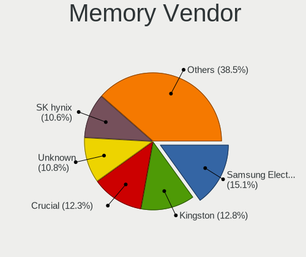
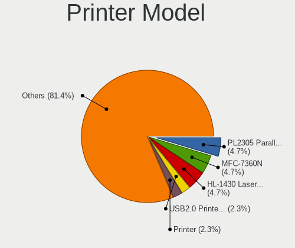

BSD - Tested Hardware & Statistics (Desktops)
---------------------------------------------

A project to collect tested hardware configurations for BSD.

Anyone can contribute to this report by the [hw-probe](https://github.com/linuxhw/hw-probe/blob/master/INSTALL.BSD.md) tool:

    hw-probe -all -upload

Please contribute! Especially if your hardware is rare.

This report is for real hardware. Report for virtual hardware: [TestDays_VE](https://github.com/bsdhw/TestDays_VE)

Contents
--------

* [ Test Cases ](#test-cases)

* [ System ](#system)
  - [ OS                       ](#os)
  - [ OS Family                ](#os-family)
  - [ Arch                     ](#arch)
  - [ DE                       ](#de)
  - [ Display Server           ](#display-server)
  - [ Display Manager          ](#display-manager)
  - [ OS Lang                  ](#os-lang)
  - [ Boot Mode                ](#boot-mode)
  - [ Filesystem               ](#filesystem)
  - [ Part. scheme             ](#part-scheme)

* [ Board ](#board)
  - [ Vendor                   ](#vendor)
  - [ Model                    ](#model)
  - [ Model Family             ](#model-family)
  - [ MFG Year                 ](#mfg-year)
  - [ Form Factor              ](#form-factor)
  - [ Coreboot                 ](#coreboot)
  - [ RAM Size                 ](#ram-size)
  - [ RAM Used                 ](#ram-used)
  - [ Total Drives             ](#total-drives)
  - [ Has CD-ROM               ](#has-cd-rom)
  - [ Has Ethernet             ](#has-ethernet)
  - [ Has WiFi                 ](#has-wifi)
  - [ Has Bluetooth            ](#has-bluetooth)

* [ Location ](#location)
  - [ Country                  ](#country)
  - [ City                     ](#city)

* [ Drives ](#drives)
  - [ Drive Vendor             ](#drive-vendor)
  - [ Drive Model              ](#drive-model)
  - [ HDD Vendor               ](#hdd-vendor)
  - [ SSD Vendor               ](#ssd-vendor)
  - [ Drive Kind               ](#drive-kind)
  - [ Drive Connector          ](#drive-connector)
  - [ Drive Size               ](#drive-size)
  - [ Space Total              ](#space-total)
  - [ Space Used               ](#space-used)
  - [ Malfunc. Drives          ](#malfunc-drives)
  - [ Malfunc. Drive Vendor    ](#malfunc-drive-vendor)
  - [ Malfunc. HDD Vendor      ](#malfunc-hdd-vendor)
  - [ Malfunc. Drive Kind      ](#malfunc-drive-kind)
  - [ Failed Drives            ](#failed-drives)
  - [ Failed Drive Vendor      ](#failed-drive-vendor)
  - [ Drive Status             ](#drive-status)

* [ Storage controller ](#storage-controller)
  - [ Storage Vendor           ](#storage-vendor)
  - [ Storage Model            ](#storage-model)
  - [ Storage Kind             ](#storage-kind)

* [ Processor ](#processor)
  - [ CPU Vendor               ](#cpu-vendor)
  - [ CPU Model                ](#cpu-model)
  - [ CPU Model Family         ](#cpu-model-family)
  - [ CPU Cores                ](#cpu-cores)
  - [ CPU Sockets              ](#cpu-sockets)
  - [ CPU Threads              ](#cpu-threads)
  - [ CPU Microarch            ](#cpu-microarch)

* [ Graphics ](#graphics)
  - [ GPU Vendor               ](#gpu-vendor)
  - [ GPU Model                ](#gpu-model)
  - [ GPU Combo                ](#gpu-combo)
  - [ GPU Driver               ](#gpu-driver)
  - [ GPU Memory               ](#gpu-memory)

* [ Monitor ](#monitor)
  - [ Monitor Vendor           ](#monitor-vendor)
  - [ Monitor Model            ](#monitor-model)
  - [ Monitor Resolution       ](#monitor-resolution)
  - [ Monitor Diagonal         ](#monitor-diagonal)
  - [ Monitor Width            ](#monitor-width)
  - [ Aspect Ratio             ](#aspect-ratio)
  - [ Monitor Area             ](#monitor-area)
  - [ Pixel Density            ](#pixel-density)
  - [ Multiple Monitors        ](#multiple-monitors)

* [ Network ](#network)
  - [ Net Controller Vendor    ](#net-controller-vendor)
  - [ Net Controller Model     ](#net-controller-model)
  - [ Wireless Vendor          ](#wireless-vendor)
  - [ Wireless Model           ](#wireless-model)
  - [ Ethernet Vendor          ](#ethernet-vendor)
  - [ Ethernet Model           ](#ethernet-model)
  - [ Net Controller Kind      ](#net-controller-kind)
  - [ Used Controller          ](#used-controller)
  - [ NICs                     ](#nics)
  - [ IPv6                     ](#ipv6)

* [ Bluetooth ](#bluetooth)
  - [ Bluetooth Vendor         ](#bluetooth-vendor)
  - [ Bluetooth Model          ](#bluetooth-model)

* [ Sound ](#sound)
  - [ Sound Vendor             ](#sound-vendor)
  - [ Sound Model              ](#sound-model)

* [ Memory ](#memory)
  - [ Memory Vendor            ](#memory-vendor)
  - [ Memory Model             ](#memory-model)
  - [ Memory Kind              ](#memory-kind)
  - [ Memory Form Factor       ](#memory-form-factor)
  - [ Memory Size              ](#memory-size)
  - [ Memory Speed             ](#memory-speed)

* [ Printers & scanners ](#printers--scanners)
  - [ Printer Vendor           ](#printer-vendor)
  - [ Printer Model            ](#printer-model)
  - [ Scanner Vendor           ](#scanner-vendor)
  - [ Scanner Model            ](#scanner-model)

* [ Camera ](#camera)
  - [ Camera Vendor            ](#camera-vendor)
  - [ Camera Model             ](#camera-model)

* [ Security ](#security)
  - [ Fingerprint Vendor       ](#fingerprint-vendor)
  - [ Fingerprint Model        ](#fingerprint-model)
  - [ Chipcard Vendor          ](#chipcard-vendor)
  - [ Chipcard Model           ](#chipcard-model)

* [ Unsupported ](#unsupported)
  - [ Unsupported Devices      ](#unsupported-devices)
  - [ Unsupported Device Types ](#unsupported-device-types)

Test Cases
----------

Total: 14647

| Vendor        | Model                       | Probe                                                     | Date         |
|---------------|-----------------------------|-----------------------------------------------------------|--------------|
| Protectli     | FW2B                        | [ed7bd1dea3](https://bsd-hardware.info/?probe=ed7bd1dea3) | May 09, 2024 |
| Intel         | Q3XXG4-P V1.0               | [152c1f421c](https://bsd-hardware.info/?probe=152c1f421c) | May 09, 2024 |
| Protectli     | VP46xx                      | [e54efb8b1c](https://bsd-hardware.info/?probe=e54efb8b1c) | May 09, 2024 |
| GoWin Solu... | R86S                        | [1f282cde95](https://bsd-hardware.info/?probe=1f282cde95) | May 09, 2024 |
| Unknown       | Unknown                     | [086d24f16e](https://bsd-hardware.info/?probe=086d24f16e) | May 08, 2024 |
| Unknown       | Unknown                     | [4680d0dfbf](https://bsd-hardware.info/?probe=4680d0dfbf) | May 08, 2024 |
| ASUSTek       | ProArt B550-CREATOR         | [c23ee67c69](https://bsd-hardware.info/?probe=c23ee67c69) | May 08, 2024 |
| Cisco         | C170 A0                     | [7f12a75d26](https://bsd-hardware.info/?probe=7f12a75d26) | May 08, 2024 |
| Dell          | 0WMJ54 A01                  | [89c2d124bf](https://bsd-hardware.info/?probe=89c2d124bf) | May 08, 2024 |
| BROUNION      | R86S                        | [752d83911f](https://bsd-hardware.info/?probe=752d83911f) | May 08, 2024 |
| Dell          | 0XCR8D A02                  | [bbb91f550d](https://bsd-hardware.info/?probe=bbb91f550d) | May 08, 2024 |
| Protectli     | VP2420                      | [3f72c87441](https://bsd-hardware.info/?probe=3f72c87441) | May 08, 2024 |
| HP            | 83EE                        | [c2a0b11bfa](https://bsd-hardware.info/?probe=c2a0b11bfa) | May 08, 2024 |
| Unknown       | Unknown                     | [0aee6a395a](https://bsd-hardware.info/?probe=0aee6a395a) | May 08, 2024 |
| Unknown       | Unknown                     | [d6164af1c4](https://bsd-hardware.info/?probe=d6164af1c4) | May 08, 2024 |
| Protectli     | FW6E                        | [eaf305f5e2](https://bsd-hardware.info/?probe=eaf305f5e2) | May 08, 2024 |
| Unknown       | Unknown                     | [d0c4d23cbf](https://bsd-hardware.info/?probe=d0c4d23cbf) | May 08, 2024 |
| Dell          | 02K9CR A02                  | [dbac1d87ef](https://bsd-hardware.info/?probe=dbac1d87ef) | May 07, 2024 |
| Protectli     | VP2420                      | [9c20710e0a](https://bsd-hardware.info/?probe=9c20710e0a) | May 07, 2024 |
| Advantech     | NAMB-3250 A102-1            | [0eaf743c54](https://bsd-hardware.info/?probe=0eaf743c54) | May 07, 2024 |
| AAEON         | FWS-2365 V1.0               | [e7f5d7ff38](https://bsd-hardware.info/?probe=e7f5d7ff38) | May 07, 2024 |
| Protectli     | FW6 Ver                     | [b56fbf51c6](https://bsd-hardware.info/?probe=b56fbf51c6) | May 07, 2024 |
| Unknown       | Unknown                     | [30cc9d07af](https://bsd-hardware.info/?probe=30cc9d07af) | May 07, 2024 |
| Dell          | 0GU083 A00                  | [fbb75b4cfd](https://bsd-hardware.info/?probe=fbb75b4cfd) | May 07, 2024 |
| Lenovo        | ThinkCentre M58 7360EUU     | [f84d111995](https://bsd-hardware.info/?probe=f84d111995) | May 07, 2024 |
| Dell          | 0DR845                      | [03e1ebc97e](https://bsd-hardware.info/?probe=03e1ebc97e) | May 07, 2024 |
| Protectli     | FW2B                        | [8a55fe9d07](https://bsd-hardware.info/?probe=8a55fe9d07) | May 07, 2024 |
| Unknown       | QDNV01                      | [8926d1c8f1](https://bsd-hardware.info/?probe=8926d1c8f1) | May 07, 2024 |
| Unknown       | Unknown                     | [6fad0f3ec7](https://bsd-hardware.info/?probe=6fad0f3ec7) | May 07, 2024 |
| Apple         | Mac-F221BEC8                | [79c4a2608c](https://bsd-hardware.info/?probe=79c4a2608c) | May 07, 2024 |
| Gigabyte      | P55-USB3                    | [9024f0074b](https://bsd-hardware.info/?probe=9024f0074b) | May 07, 2024 |
| ASUSTek       | PRIME Z590M-PLUS            | [034c626a7f](https://bsd-hardware.info/?probe=034c626a7f) | May 06, 2024 |
| Unknown       | Unknown                     | [676aa9858a](https://bsd-hardware.info/?probe=676aa9858a) | May 06, 2024 |
| HP            | 8054                        | [15da4dbc3e](https://bsd-hardware.info/?probe=15da4dbc3e) | May 06, 2024 |
| HP            | 8054                        | [42143b7763](https://bsd-hardware.info/?probe=42143b7763) | May 06, 2024 |
| HP            | 8054                        | [89f224ab82](https://bsd-hardware.info/?probe=89f224ab82) | May 06, 2024 |
| Dell          | 0DFRFW A01                  | [4532391ffd](https://bsd-hardware.info/?probe=4532391ffd) | May 06, 2024 |
| ASUSTek       | P10S-C Series               | [11db8e3f1e](https://bsd-hardware.info/?probe=11db8e3f1e) | May 06, 2024 |
| ASUSTek       | PRIME H370M-PLUS            | [1f97d380ed](https://bsd-hardware.info/?probe=1f97d380ed) | May 06, 2024 |
| Unknown       | Unknown                     | [b85bfd579d](https://bsd-hardware.info/?probe=b85bfd579d) | May 06, 2024 |
| AZW           | U59                         | [d900403d1a](https://bsd-hardware.info/?probe=d900403d1a) | May 06, 2024 |
| MSI           | MS-7097                     | [df5c7407fd](https://bsd-hardware.info/?probe=df5c7407fd) | May 06, 2024 |
| Dell          | 0GXM1W A01                  | [1238d729a7](https://bsd-hardware.info/?probe=1238d729a7) | May 06, 2024 |
| Dell          | 0WMJ54 A01                  | [99b148c21f](https://bsd-hardware.info/?probe=99b148c21f) | May 06, 2024 |
| Unknown       | Unknown                     | [c70960854a](https://bsd-hardware.info/?probe=c70960854a) | May 06, 2024 |
| ASUSTek       | G11CD                       | [e4d4f0e1b2](https://bsd-hardware.info/?probe=e4d4f0e1b2) | May 06, 2024 |
| Unknown       | DH61BR G32662-203           | [f9ebf93574](https://bsd-hardware.info/?probe=f9ebf93574) | May 06, 2024 |
| AZW           | EQ                          | [edb4b64548](https://bsd-hardware.info/?probe=edb4b64548) | May 06, 2024 |
| HP            | 82F2                        | [7ae2683f3b](https://bsd-hardware.info/?probe=7ae2683f3b) | May 06, 2024 |
| Dell          | 0NW6H5 A00                  | [818fc8022c](https://bsd-hardware.info/?probe=818fc8022c) | May 06, 2024 |
| ASUSTek       | Z97-PRO GAMER               | [02832cd5ca](https://bsd-hardware.info/?probe=02832cd5ca) | May 06, 2024 |
| Protectli     | FW4C Ver                    | [4e0f235713](https://bsd-hardware.info/?probe=4e0f235713) | May 06, 2024 |
| HP            | 83EC                        | [85d2a6764b](https://bsd-hardware.info/?probe=85d2a6764b) | May 06, 2024 |
| ASUSTek       | PRIME H370M-PLUS            | [1be813a788](https://bsd-hardware.info/?probe=1be813a788) | May 06, 2024 |
| Dell          | 0GXM1W A01                  | [f20a5dbc2b](https://bsd-hardware.info/?probe=f20a5dbc2b) | May 06, 2024 |
| MSI           | MS-7369                     | [65686a6412](https://bsd-hardware.info/?probe=65686a6412) | May 05, 2024 |
| Protectli     | VP2420                      | [dd7edbac6d](https://bsd-hardware.info/?probe=dd7edbac6d) | May 05, 2024 |
| Intel         | MAHOBAY                     | [dfe3417cfb](https://bsd-hardware.info/?probe=dfe3417cfb) | May 05, 2024 |
| Techvision    | TVI7309X B0                 | [bfab3dbc5c](https://bsd-hardware.info/?probe=bfab3dbc5c) | May 05, 2024 |
| SHANGZHAOY... | B85M-PRO V1.1               | [873fd32471](https://bsd-hardware.info/?probe=873fd32471) | May 05, 2024 |
| ASUSTek       | PRIME Z690-P D4             | [e7a48c0ebb](https://bsd-hardware.info/?probe=e7a48c0ebb) | May 05, 2024 |
| Dell          | 0WMJ54 A01                  | [328b32897b](https://bsd-hardware.info/?probe=328b32897b) | May 05, 2024 |
| HP            | 83E0                        | [63c44781ef](https://bsd-hardware.info/?probe=63c44781ef) | May 05, 2024 |
| MSI           | H81M-P33                    | [db35e993b4](https://bsd-hardware.info/?probe=db35e993b4) | May 05, 2024 |
| ASUSTek       | ROG CROSSHAIR VIII HERO     | [76bd355935](https://bsd-hardware.info/?probe=76bd355935) | May 05, 2024 |
| ASUSTek       | P5Q-E                       | [4e42133f58](https://bsd-hardware.info/?probe=4e42133f58) | May 05, 2024 |
| AZW           | EQ                          | [8889cb51a4](https://bsd-hardware.info/?probe=8889cb51a4) | May 05, 2024 |
| Dell          | 0D28YY A00                  | [3d0d226dbc](https://bsd-hardware.info/?probe=3d0d226dbc) | May 05, 2024 |
| Unknown       | Unknown                     | [e504371024](https://bsd-hardware.info/?probe=e504371024) | May 05, 2024 |
| Protectli     | FW2B                        | [92725f96b8](https://bsd-hardware.info/?probe=92725f96b8) | May 05, 2024 |
| Unknown       | Unknown                     | [fd0ae20186](https://bsd-hardware.info/?probe=fd0ae20186) | May 04, 2024 |
| Unknown       | Unknown                     | [5dc8d187ee](https://bsd-hardware.info/?probe=5dc8d187ee) | May 04, 2024 |
| Techvision    | TVI7309X B0                 | [9dc1dd8248](https://bsd-hardware.info/?probe=9dc1dd8248) | May 04, 2024 |
| Unknown       | QDNV01                      | [8b77bdf0b8](https://bsd-hardware.info/?probe=8b77bdf0b8) | May 04, 2024 |
| Unknown       | Unknown                     | [c77ff29728](https://bsd-hardware.info/?probe=c77ff29728) | May 04, 2024 |
| CncTion       | N4505-4L B0                 | [077f0f74a5](https://bsd-hardware.info/?probe=077f0f74a5) | May 04, 2024 |
| Intel         | PB-X6000                    | [23a7529eaa](https://bsd-hardware.info/?probe=23a7529eaa) | May 04, 2024 |
| Gigabyte      | GA-78LMT-S2 sex             | [89beae510f](https://bsd-hardware.info/?probe=89beae510f) | May 04, 2024 |
| Gigabyte      | P67A-D3-B3                  | [2e71ecd984](https://bsd-hardware.info/?probe=2e71ecd984) | May 03, 2024 |
| Advantech     | NAMB-3250 A102-1            | [708617284b](https://bsd-hardware.info/?probe=708617284b) | May 03, 2024 |
| Dell          | 0MGK50 A02                  | [6f9b5b3cad](https://bsd-hardware.info/?probe=6f9b5b3cad) | May 03, 2024 |
| ASUSTek       | PRIME B650-PLUS             | [3e01e5ffbf](https://bsd-hardware.info/?probe=3e01e5ffbf) | May 03, 2024 |
| Protectli     | VP6670                      | [a51c988dd7](https://bsd-hardware.info/?probe=a51c988dd7) | May 03, 2024 |
| ChangWang     | CW56-58                     | [54250fd5f6](https://bsd-hardware.info/?probe=54250fd5f6) | May 03, 2024 |
| IceWhale T... | ZimaBoard 432 ZMB           | [5064c18402](https://bsd-hardware.info/?probe=5064c18402) | May 03, 2024 |
| Intel         | Q3XXG4-P V1.0               | [e7125777fc](https://bsd-hardware.info/?probe=e7125777fc) | May 03, 2024 |
| ASRock        | X570 Phantom Gaming-ITX/... | [0b900c7694](https://bsd-hardware.info/?probe=0b900c7694) | May 03, 2024 |
| Gigabyte      | Z370P D3-CF                 | [591ac5deba](https://bsd-hardware.info/?probe=591ac5deba) | May 03, 2024 |
| Dell          | 0XCR8D A03                  | [de94ec6929](https://bsd-hardware.info/?probe=de94ec6929) | May 03, 2024 |
| Apple         | Mac-F60DEB81FF30ACF6 Mac... | [5240c726c5](https://bsd-hardware.info/?probe=5240c726c5) | May 03, 2024 |
| Lanner        | FW-7543 B-GA                | [d999a95489](https://bsd-hardware.info/?probe=d999a95489) | May 03, 2024 |
| Protectli     | FW4B                        | [db66e06618](https://bsd-hardware.info/?probe=db66e06618) | May 02, 2024 |
| ASUSTek       | TUF Gaming A620-PRO WIFI    | [a186355a65](https://bsd-hardware.info/?probe=a186355a65) | May 02, 2024 |
| Apple         | Mac-F60DEB81FF30ACF6 Mac... | [db2e2d1fbc](https://bsd-hardware.info/?probe=db2e2d1fbc) | May 02, 2024 |
| IceWhale T... | ZimaBoard 832 ZMB           | [a4517b9363](https://bsd-hardware.info/?probe=a4517b9363) | May 02, 2024 |
| MSI           | B360M BAZOOKA               | [d33325e752](https://bsd-hardware.info/?probe=d33325e752) | May 02, 2024 |
| PC Engines    | APU2                        | [5429fb29b1](https://bsd-hardware.info/?probe=5429fb29b1) | May 02, 2024 |
| Dell          | 0CNWVK A00                  | [3c90466a0a](https://bsd-hardware.info/?probe=3c90466a0a) | May 02, 2024 |
| Unknown       | Unknown                     | [da95fe1264](https://bsd-hardware.info/?probe=da95fe1264) | May 02, 2024 |
| Unknown       | Unknown                     | [bd55b95686](https://bsd-hardware.info/?probe=bd55b95686) | May 02, 2024 |
| Dell          | 042P49 A01                  | [2e2fbfee01](https://bsd-hardware.info/?probe=2e2fbfee01) | May 02, 2024 |
| Unknown       | Unknown                     | [d99dea58b6](https://bsd-hardware.info/?probe=d99dea58b6) | May 02, 2024 |
| Unknown       | QDNV01                      | [058c7d1a94](https://bsd-hardware.info/?probe=058c7d1a94) | May 02, 2024 |
| Dell          | 0PC5F7 A00                  | [25be1b099a](https://bsd-hardware.info/?probe=25be1b099a) | May 02, 2024 |
| Gigabyte      | H61M-S2PV                   | [dec458ffdf](https://bsd-hardware.info/?probe=dec458ffdf) | May 02, 2024 |
| AZW           | EQ                          | [6fb8bd4d4a](https://bsd-hardware.info/?probe=6fb8bd4d4a) | May 02, 2024 |
| GoWin Solu... | R86S                        | [b43368e560](https://bsd-hardware.info/?probe=b43368e560) | May 02, 2024 |
| Dell          | 0PC5F7 A00                  | [217f8e63db](https://bsd-hardware.info/?probe=217f8e63db) | May 01, 2024 |
| Shuttle       | DL30N                       | [5218f08e52](https://bsd-hardware.info/?probe=5218f08e52) | May 01, 2024 |
| HP            | 8062                        | [2669931060](https://bsd-hardware.info/?probe=2669931060) | May 01, 2024 |
| AWOW          | AK10                        | [a8fbc35162](https://bsd-hardware.info/?probe=a8fbc35162) | May 01, 2024 |
| HP            | 802E                        | [0e16d56660](https://bsd-hardware.info/?probe=0e16d56660) | May 01, 2024 |
| Unknown       | QDNV01                      | [1fc82bb34b](https://bsd-hardware.info/?probe=1fc82bb34b) | May 01, 2024 |
| Gigabyte      | B760I AORUS PRO DDR4        | [f6606ff3aa](https://bsd-hardware.info/?probe=f6606ff3aa) | May 01, 2024 |
| MSI           | AM1I                        | [148d52d171](https://bsd-hardware.info/?probe=148d52d171) | May 01, 2024 |
| Intel         | Q3XXG4-P V1.0               | [ae53040229](https://bsd-hardware.info/?probe=ae53040229) | May 01, 2024 |
| Protectli     | VP2410                      | [53101f66d2](https://bsd-hardware.info/?probe=53101f66d2) | May 01, 2024 |
| Intel         | Q3XXG4-P V1.0               | [be7761bc67](https://bsd-hardware.info/?probe=be7761bc67) | May 01, 2024 |
| GoWin Solu... | R86S                        | [8f1277d3c5](https://bsd-hardware.info/?probe=8f1277d3c5) | May 01, 2024 |
| Dell          | 05XGC8 A01                  | [d463acff9f](https://bsd-hardware.info/?probe=d463acff9f) | Apr 30, 2024 |
| PC Engines    | APU2                        | [a058cd5f63](https://bsd-hardware.info/?probe=a058cd5f63) | Apr 30, 2024 |
| ASRockRack    | EPYC3101D4I-2T              | [15e26ac086](https://bsd-hardware.info/?probe=15e26ac086) | Apr 30, 2024 |
| Dell          | 04Y8V0 A02                  | [09a2e96ee1](https://bsd-hardware.info/?probe=09a2e96ee1) | Apr 30, 2024 |
| ASUSTek       | VM62N                       | [d2ff0c5dcb](https://bsd-hardware.info/?probe=d2ff0c5dcb) | Apr 30, 2024 |
| ASUSTek       | VM62N                       | [fbff6f23c7](https://bsd-hardware.info/?probe=fbff6f23c7) | Apr 30, 2024 |
| Intel         | YC-4L-002                   | [ac058ece5c](https://bsd-hardware.info/?probe=ac058ece5c) | Apr 30, 2024 |
| Protectli     | FW4C Ver                    | [de3c7e60bd](https://bsd-hardware.info/?probe=de3c7e60bd) | Apr 30, 2024 |
| Unknown       | Unknown                     | [39e9c3ddd2](https://bsd-hardware.info/?probe=39e9c3ddd2) | Apr 30, 2024 |
| ASUSTek       | Z170 PRO GAMING             | [72deae70f8](https://bsd-hardware.info/?probe=72deae70f8) | Apr 29, 2024 |
| ASRock        | B550 Phantom Gaming 4       | [a5ad695e41](https://bsd-hardware.info/?probe=a5ad695e41) | Apr 29, 2024 |
| Unknown       | Unknown                     | [db28c45bdd](https://bsd-hardware.info/?probe=db28c45bdd) | Apr 29, 2024 |
| Dell          | 04YP6J A00                  | [92b5c39349](https://bsd-hardware.info/?probe=92b5c39349) | Apr 29, 2024 |
| Unknown       | Unknown                     | [5c07afd3bb](https://bsd-hardware.info/?probe=5c07afd3bb) | Apr 29, 2024 |
| PC Engines    | APU2                        | [a6953a27eb](https://bsd-hardware.info/?probe=a6953a27eb) | Apr 29, 2024 |
| AZW           | EQ                          | [cb3a9cfebf](https://bsd-hardware.info/?probe=cb3a9cfebf) | Apr 29, 2024 |
| ASRock        | Q1900M                      | [7f61d481a6](https://bsd-hardware.info/?probe=7f61d481a6) | Apr 29, 2024 |
| ASRock        | Z87M Pro4                   | [91a487bad5](https://bsd-hardware.info/?probe=91a487bad5) | Apr 29, 2024 |
| Dell          | 07N90W A02                  | [f0520bbeb9](https://bsd-hardware.info/?probe=f0520bbeb9) | Apr 29, 2024 |
| Protectli     | VP2410 10                   | [180e61b28a](https://bsd-hardware.info/?probe=180e61b28a) | Apr 28, 2024 |
| PC Engines    | APU2                        | [f18a73e413](https://bsd-hardware.info/?probe=f18a73e413) | Apr 28, 2024 |
| Unknown       | Unknown                     | [e54a161178](https://bsd-hardware.info/?probe=e54a161178) | Apr 28, 2024 |
| Unknown       | Unknown                     | [1c2459184f](https://bsd-hardware.info/?probe=1c2459184f) | Apr 28, 2024 |
| Intel         | X79F1 V2.0                  | [0e973743e4](https://bsd-hardware.info/?probe=0e973743e4) | Apr 28, 2024 |
| Unknown       | Unknown                     | [f3cf18561e](https://bsd-hardware.info/?probe=f3cf18561e) | Apr 28, 2024 |
| Quantum en... | HackBoard 2                 | [a7b0ea1eca](https://bsd-hardware.info/?probe=a7b0ea1eca) | Apr 28, 2024 |
| Unknown       | Unknown                     | [c4991adac4](https://bsd-hardware.info/?probe=c4991adac4) | Apr 28, 2024 |
| ASRock        | H610M-H2/M.2 D5             | [6ab73f5217](https://bsd-hardware.info/?probe=6ab73f5217) | Apr 28, 2024 |
| Dell          | 05XGC8 A01                  | [346d161a05](https://bsd-hardware.info/?probe=346d161a05) | Apr 28, 2024 |
| HP            | 1632                        | [8ef7e0a099](https://bsd-hardware.info/?probe=8ef7e0a099) | Apr 28, 2024 |
| Unknown       | Unknown                     | [c5e1759317](https://bsd-hardware.info/?probe=c5e1759317) | Apr 28, 2024 |
| PC Engines    | APU                         | [7fbd1ae00c](https://bsd-hardware.info/?probe=7fbd1ae00c) | Apr 28, 2024 |
| Unknown       | Unknown                     | [d45b3d4001](https://bsd-hardware.info/?probe=d45b3d4001) | Apr 27, 2024 |
| Fujitsu       | D3313-A1 S26361-D3313-A1    | [ba76589775](https://bsd-hardware.info/?probe=ba76589775) | Apr 27, 2024 |
| Unknown       | Unknown                     | [4da784940c](https://bsd-hardware.info/?probe=4da784940c) | Apr 27, 2024 |
| Winston Ma... | PICO PC PICOPC              | [a0066d8a7c](https://bsd-hardware.info/?probe=a0066d8a7c) | Apr 27, 2024 |
| AZW           | EQ                          | [5f2a5f1314](https://bsd-hardware.info/?probe=5f2a5f1314) | Apr 27, 2024 |
| Lenovo        | 3743 NOK                    | [4b8389c575](https://bsd-hardware.info/?probe=4b8389c575) | Apr 27, 2024 |
| Seeed Stud... | ODYSSEY-X86J4105 SD-BS-C... | [6da31bada9](https://bsd-hardware.info/?probe=6da31bada9) | Apr 27, 2024 |
| Shenzhen M... | AHWSA                       | [eb205801e7](https://bsd-hardware.info/?probe=eb205801e7) | Apr 27, 2024 |
| HP            | 2B52                        | [b765a60a21](https://bsd-hardware.info/?probe=b765a60a21) | Apr 27, 2024 |
| Unknown       | QDNV01                      | [67634593ee](https://bsd-hardware.info/?probe=67634593ee) | Apr 27, 2024 |
| Unknown       | Unknown                     | [7d9ef3501e](https://bsd-hardware.info/?probe=7d9ef3501e) | Apr 27, 2024 |
| HP            | 859B                        | [5d8024a661](https://bsd-hardware.info/?probe=5d8024a661) | Apr 27, 2024 |
| Unknown       | Unknown                     | [2945a5ee0f](https://bsd-hardware.info/?probe=2945a5ee0f) | Apr 27, 2024 |
| Dell          | 0KYJ8C A00                  | [7a7c8ece3a](https://bsd-hardware.info/?probe=7a7c8ece3a) | Apr 27, 2024 |
| MSI           | X370 GAMING PRO CARBON      | [688f134478](https://bsd-hardware.info/?probe=688f134478) | Apr 27, 2024 |
| Dell          | 0KYJ8C A00                  | [d35fe4f9ef](https://bsd-hardware.info/?probe=d35fe4f9ef) | Apr 27, 2024 |
| Dell          | 00V62H A01                  | [ac096d436d](https://bsd-hardware.info/?probe=ac096d436d) | Apr 27, 2024 |
| ASRock        | B450M Pro4                  | [4202579f8b](https://bsd-hardware.info/?probe=4202579f8b) | Apr 27, 2024 |
| Shuttle       | FS81                        | [95830b82da](https://bsd-hardware.info/?probe=95830b82da) | Apr 27, 2024 |
| ASUSTek       | P5N32-E SLI                 | [52ac87d342](https://bsd-hardware.info/?probe=52ac87d342) | Apr 27, 2024 |
| Techvision    | TVI7309X B0                 | [d3ade6deae](https://bsd-hardware.info/?probe=d3ade6deae) | Apr 26, 2024 |
| Trigkey       | Green G5                    | [6bad716921](https://bsd-hardware.info/?probe=6bad716921) | Apr 26, 2024 |
| Unknown       | Unknown                     | [2caa0fe8f7](https://bsd-hardware.info/?probe=2caa0fe8f7) | Apr 26, 2024 |
| Unknown       | Unknown                     | [77ad1db6bd](https://bsd-hardware.info/?probe=77ad1db6bd) | Apr 26, 2024 |
| AWOW          | AK10                        | [efb7761dc3](https://bsd-hardware.info/?probe=efb7761dc3) | Apr 26, 2024 |
| SJRC          | SJ-ADLN-6L                  | [eba48b51e7](https://bsd-hardware.info/?probe=eba48b51e7) | Apr 26, 2024 |
| HP            | 82A2                        | [32dfbbd624](https://bsd-hardware.info/?probe=32dfbbd624) | Apr 26, 2024 |
| Unknown       | Unknown                     | [1d373fbfcd](https://bsd-hardware.info/?probe=1d373fbfcd) | Apr 26, 2024 |
| Unknown       | Unknown                     | [5b9d2e7817](https://bsd-hardware.info/?probe=5b9d2e7817) | Apr 26, 2024 |
| Protectli     | VP6670                      | [cb7ab7b3f4](https://bsd-hardware.info/?probe=cb7ab7b3f4) | Apr 25, 2024 |
| Unknown       | Unknown                     | [57fb516839](https://bsd-hardware.info/?probe=57fb516839) | Apr 25, 2024 |
| Hardkernel    | ODROID-H2                   | [5645a7f37e](https://bsd-hardware.info/?probe=5645a7f37e) | Apr 25, 2024 |
| Unknown       | Unknown                     | [122a8465b5](https://bsd-hardware.info/?probe=122a8465b5) | Apr 25, 2024 |
| Silicom       | 80300-0214-G01 R306         | [1fda8df8d0](https://bsd-hardware.info/?probe=1fda8df8d0) | Apr 25, 2024 |
| Dell          | 0D28YY A00                  | [5245da0f7d](https://bsd-hardware.info/?probe=5245da0f7d) | Apr 25, 2024 |
| Unknown       | Unknown                     | [92f9cb26f3](https://bsd-hardware.info/?probe=92f9cb26f3) | Apr 25, 2024 |
| Unknown       | Unknown                     | [e321b6f25e](https://bsd-hardware.info/?probe=e321b6f25e) | Apr 25, 2024 |
| Unknown       | Q-790                       | [0c25ef8e72](https://bsd-hardware.info/?probe=0c25ef8e72) | Apr 25, 2024 |
| Fujitsu       | D3313-A1 S26361-D3313-A1    | [328e9b0321](https://bsd-hardware.info/?probe=328e9b0321) | Apr 25, 2024 |
| Protectli     | VP4630                      | [a128743268](https://bsd-hardware.info/?probe=a128743268) | Apr 25, 2024 |
| ASUSTek       | ProArt X670E-CREATOR WIF... | [ac75273460](https://bsd-hardware.info/?probe=ac75273460) | Apr 25, 2024 |
| AZW           | U59                         | [dcd692e9fc](https://bsd-hardware.info/?probe=dcd692e9fc) | Apr 25, 2024 |
| ChangWang     | CW56-58                     | [d7783a62ca](https://bsd-hardware.info/?probe=d7783a62ca) | Apr 25, 2024 |
| Gigabyte      | H170N-WIFI-CF               | [c15db510cc](https://bsd-hardware.info/?probe=c15db510cc) | Apr 25, 2024 |
| Unknown       | Unknown                     | [dcc78e80a4](https://bsd-hardware.info/?probe=dcc78e80a4) | Apr 25, 2024 |
| Techvision    | TVI7309X B0                 | [f92008b628](https://bsd-hardware.info/?probe=f92008b628) | Apr 25, 2024 |
| Supermicro    | X10SLH-N6-ST031             | [c794bd1851](https://bsd-hardware.info/?probe=c794bd1851) | Apr 24, 2024 |
| Unknown       | Unknown                     | [e328764399](https://bsd-hardware.info/?probe=e328764399) | Apr 24, 2024 |
| Unknown       | Unknown                     | [0fc168923f](https://bsd-hardware.info/?probe=0fc168923f) | Apr 24, 2024 |
| Protectli     | VP2420                      | [540090badd](https://bsd-hardware.info/?probe=540090badd) | Apr 24, 2024 |
| HP            | 83EF                        | [200bba9baa](https://bsd-hardware.info/?probe=200bba9baa) | Apr 24, 2024 |
| Dell          | 048DY8 A00                  | [9604806e18](https://bsd-hardware.info/?probe=9604806e18) | Apr 24, 2024 |
| ASUSTek       | M5A97 LE R2.0               | [0b322f0da8](https://bsd-hardware.info/?probe=0b322f0da8) | Apr 24, 2024 |
| CncTion       | N4505-4L B0                 | [ada59fa5ed](https://bsd-hardware.info/?probe=ada59fa5ed) | Apr 24, 2024 |
| AZW           | EQ                          | [2907ff3c11](https://bsd-hardware.info/?probe=2907ff3c11) | Apr 24, 2024 |
| Lenovo        | 312A SDK0J40697 WIN 3305... | [a9c5e00a5a](https://bsd-hardware.info/?probe=a9c5e00a5a) | Apr 24, 2024 |
| Unknown       | QD-CMU01                    | [b2237c3c86](https://bsd-hardware.info/?probe=b2237c3c86) | Apr 24, 2024 |
| Dell          | 0DR845                      | [fa20fdf0c6](https://bsd-hardware.info/?probe=fa20fdf0c6) | Apr 24, 2024 |
| Unknown       | Unknown                     | [977fec9918](https://bsd-hardware.info/?probe=977fec9918) | Apr 24, 2024 |
| Protectli     | FW4B Ver                    | [14290c46fe](https://bsd-hardware.info/?probe=14290c46fe) | Apr 24, 2024 |
| ASUSTek       | PRIME Z490-V                | [2c3e5dadd2](https://bsd-hardware.info/?probe=2c3e5dadd2) | Apr 24, 2024 |
| Dell          | 0DNMV1 A01                  | [97161dac8a](https://bsd-hardware.info/?probe=97161dac8a) | Apr 24, 2024 |
| ASUSTek       | ROG STRIX X670E-F GAMING... | [f5683de21a](https://bsd-hardware.info/?probe=f5683de21a) | Apr 24, 2024 |
| Gigabyte      | H81M-H                      | [83a324bd4e](https://bsd-hardware.info/?probe=83a324bd4e) | Apr 24, 2024 |
| Gigabyte      | N3150ND3V                   | [9e0cb28c91](https://bsd-hardware.info/?probe=9e0cb28c91) | Apr 24, 2024 |
| Dell          | 0T10XW A00                  | [84db454f1c](https://bsd-hardware.info/?probe=84db454f1c) | Apr 24, 2024 |
| HP            | 8054                        | [7a76b345c0](https://bsd-hardware.info/?probe=7a76b345c0) | Apr 23, 2024 |
| ASUSTek       | H81M-PLUS                   | [b549100edf](https://bsd-hardware.info/?probe=b549100edf) | Apr 23, 2024 |
| ASUSTek       | P8H61-M LX                  | [eaee094e07](https://bsd-hardware.info/?probe=eaee094e07) | Apr 23, 2024 |
| Broachlink    | HART1 V11 J6412             | [002549a39c](https://bsd-hardware.info/?probe=002549a39c) | Apr 23, 2024 |
| ASRock        | A320M Pro4-F                | [b02849b872](https://bsd-hardware.info/?probe=b02849b872) | Apr 23, 2024 |
| ASUSTek       | PRIME A320M-K               | [968bd36047](https://bsd-hardware.info/?probe=968bd36047) | Apr 23, 2024 |
| Gigabyte      | H110M-H-CF                  | [2000d6447a](https://bsd-hardware.info/?probe=2000d6447a) | Apr 23, 2024 |
| Gigabyte      | H110M-H-CF                  | [3e1def845f](https://bsd-hardware.info/?probe=3e1def845f) | Apr 23, 2024 |
| HP            | 8054                        | [040f48e020](https://bsd-hardware.info/?probe=040f48e020) | Apr 23, 2024 |
| ASUSTek       | PRIME H310M-R R2.0          | [ebaca4d176](https://bsd-hardware.info/?probe=ebaca4d176) | Apr 23, 2024 |
| Gigabyte      | X570 AORUS MASTER           | [58a64ecc64](https://bsd-hardware.info/?probe=58a64ecc64) | Apr 23, 2024 |
| ASUSTek       | J1800I-C/BR                 | [28856a768f](https://bsd-hardware.info/?probe=28856a768f) | Apr 23, 2024 |
| Unknown       | QDNV01                      | [f0d41cdf44](https://bsd-hardware.info/?probe=f0d41cdf44) | Apr 23, 2024 |
| Unknown       | Unknown                     | [17ff1c4d3f](https://bsd-hardware.info/?probe=17ff1c4d3f) | Apr 23, 2024 |
| AZW           | EQ                          | [0d1397a949](https://bsd-hardware.info/?probe=0d1397a949) | Apr 23, 2024 |
| Unknown       | Unknown                     | [f8ff7e4c14](https://bsd-hardware.info/?probe=f8ff7e4c14) | Apr 23, 2024 |
| IceWhale T... | ZimaBoard 832 ZMB           | [9dfb20c904](https://bsd-hardware.info/?probe=9dfb20c904) | Apr 23, 2024 |
| AZW           | EQ                          | [9225d89862](https://bsd-hardware.info/?probe=9225d89862) | Apr 23, 2024 |
| Dell          | 0NW6H5 A00                  | [565275ac34](https://bsd-hardware.info/?probe=565275ac34) | Apr 22, 2024 |
| Intel         | BOX-J41L4A V3.01            | [62124a50da](https://bsd-hardware.info/?probe=62124a50da) | Apr 22, 2024 |
| AAEON         | FWS-2280 V1.0               | [071a27c302](https://bsd-hardware.info/?probe=071a27c302) | Apr 22, 2024 |
| Unknown       | Unknown                     | [c3bd100494](https://bsd-hardware.info/?probe=c3bd100494) | Apr 22, 2024 |
| Lanner        | FW-7543 B-GA                | [02a165d26f](https://bsd-hardware.info/?probe=02a165d26f) | Apr 22, 2024 |
| ASRock        | H610M-HDV/M.2               | [86e7184885](https://bsd-hardware.info/?probe=86e7184885) | Apr 22, 2024 |
| ASRock        | H610M-HDV/M.2               | [01443ae842](https://bsd-hardware.info/?probe=01443ae842) | Apr 22, 2024 |
| Unknown       | Unknown                     | [f1f7eadfba](https://bsd-hardware.info/?probe=f1f7eadfba) | Apr 22, 2024 |
| Dell          | 0C3YXR A02                  | [c7c80f2929](https://bsd-hardware.info/?probe=c7c80f2929) | Apr 22, 2024 |
| Fujitsu       | D3543-A1 S26361-D3543-A1... | [072d422490](https://bsd-hardware.info/?probe=072d422490) | Apr 22, 2024 |
| Unknown       | Unknown                     | [242348310b](https://bsd-hardware.info/?probe=242348310b) | Apr 22, 2024 |
| Unknown       | Unknown                     | [ff6d7d0ae2](https://bsd-hardware.info/?probe=ff6d7d0ae2) | Apr 22, 2024 |
| Dell          | 00V62H A00                  | [a00361ccc0](https://bsd-hardware.info/?probe=a00361ccc0) | Apr 22, 2024 |
| Protectli     | FW4B Ver                    | [c5c451123b](https://bsd-hardware.info/?probe=c5c451123b) | Apr 22, 2024 |
| Gigabyte      | F2A78M-D3H                  | [418bc2727b](https://bsd-hardware.info/?probe=418bc2727b) | Apr 21, 2024 |
| Unknown       | QDNV01                      | [8ce95bba28](https://bsd-hardware.info/?probe=8ce95bba28) | Apr 21, 2024 |
| Unknown       | QDNV01                      | [9cc75e7a9d](https://bsd-hardware.info/?probe=9cc75e7a9d) | Apr 21, 2024 |
| Lenovo        | MAHOBAY NO DPK              | [8baf9d0ad0](https://bsd-hardware.info/?probe=8baf9d0ad0) | Apr 21, 2024 |
| Intel         | Q3XXG4-P V1.0               | [27bc016316](https://bsd-hardware.info/?probe=27bc016316) | Apr 21, 2024 |
| NF541         | 1.0                         | [25cc14f6c9](https://bsd-hardware.info/?probe=25cc14f6c9) | Apr 21, 2024 |
| AAEON         | FWS-2280 V1.0               | [003dbde912](https://bsd-hardware.info/?probe=003dbde912) | Apr 21, 2024 |
| Advantech     | NAMB-1010VC A101            | [e2a9d0cbff](https://bsd-hardware.info/?probe=e2a9d0cbff) | Apr 21, 2024 |
| Lenovo        | 367D 31900059 STD           | [eed4d35722](https://bsd-hardware.info/?probe=eed4d35722) | Apr 21, 2024 |
| Unknown       | Unknown                     | [2917802dc7](https://bsd-hardware.info/?probe=2917802dc7) | Apr 21, 2024 |
| Lenovo        | SHARKBAY 0B98401 WIN        | [d9b4db06cf](https://bsd-hardware.info/?probe=d9b4db06cf) | Apr 21, 2024 |
| Dell          | 0XCR8D A01                  | [716181ac45](https://bsd-hardware.info/?probe=716181ac45) | Apr 21, 2024 |
| HP            | 8054                        | [a9b96ce9cb](https://bsd-hardware.info/?probe=a9b96ce9cb) | Apr 20, 2024 |
| Dell          | 096JG8 A01                  | [a696ddada6](https://bsd-hardware.info/?probe=a696ddada6) | Apr 20, 2024 |
| CWWK          | MINIPC-G12                  | [9e0cee5f8e](https://bsd-hardware.info/?probe=9e0cee5f8e) | Apr 20, 2024 |
| ASRock        | 970 Pro3 R2.0               | [47b751dfa0](https://bsd-hardware.info/?probe=47b751dfa0) | Apr 20, 2024 |
| PC Engines    | apu4                        | [196bdf1db0](https://bsd-hardware.info/?probe=196bdf1db0) | Apr 20, 2024 |
| Gigabyte      | B460 AORUS PRO AC           | [fe0730cde5](https://bsd-hardware.info/?probe=fe0730cde5) | Apr 20, 2024 |
| Intel         | S1200KP AAG34877-201        | [591ff7791e](https://bsd-hardware.info/?probe=591ff7791e) | Apr 20, 2024 |
| ASUSTek       | TUF Gaming X570-PLUS        | [572876d341](https://bsd-hardware.info/?probe=572876d341) | Apr 20, 2024 |
| AZW           | EQ                          | [f822d4127d](https://bsd-hardware.info/?probe=f822d4127d) | Apr 20, 2024 |
| Unknown       | Unknown                     | [71ac1fd7c5](https://bsd-hardware.info/?probe=71ac1fd7c5) | Apr 20, 2024 |
| AZW           | SER V1                      | [4e085db4ef](https://bsd-hardware.info/?probe=4e085db4ef) | Apr 19, 2024 |
| Protectli     | FW4B                        | [d84a4775ae](https://bsd-hardware.info/?probe=d84a4775ae) | Apr 19, 2024 |
| CWWK          | CW-AD4L-N V1                | [a5a3503491](https://bsd-hardware.info/?probe=a5a3503491) | Apr 19, 2024 |
| CncTion       | N4505-4L B0                 | [d08059c7cf](https://bsd-hardware.info/?probe=d08059c7cf) | Apr 19, 2024 |
| CncTion       | N4505-4L B0                 | [d9aef0b69c](https://bsd-hardware.info/?probe=d9aef0b69c) | Apr 19, 2024 |
| HP            | 3396                        | [f154c34157](https://bsd-hardware.info/?probe=f154c34157) | Apr 19, 2024 |
| Intel         | QHSW02                      | [a8a19b8f54](https://bsd-hardware.info/?probe=a8a19b8f54) | Apr 19, 2024 |
| HP            | 3646h                       | [615b37fb0f](https://bsd-hardware.info/?probe=615b37fb0f) | Apr 19, 2024 |
| ASUSTek       | Maximus VII HERO            | [909b53a869](https://bsd-hardware.info/?probe=909b53a869) | Apr 19, 2024 |
| Unknown       | Unknown                     | [3f86c9c69d](https://bsd-hardware.info/?probe=3f86c9c69d) | Apr 19, 2024 |
| Gigabyte      | Z590I AORUS ULTRA           | [bf06ab7481](https://bsd-hardware.info/?probe=bf06ab7481) | Apr 19, 2024 |
| Protectli     | FW4B Ver                    | [4d553dfadf](https://bsd-hardware.info/?probe=4d553dfadf) | Apr 19, 2024 |
| Unknown       | Unknown                     | [8dcdbfb956](https://bsd-hardware.info/?probe=8dcdbfb956) | Apr 18, 2024 |
| ECS           | KBLU-MINI                   | [0380406242](https://bsd-hardware.info/?probe=0380406242) | Apr 18, 2024 |
| Protectli     | FW4B                        | [a5c17e61f1](https://bsd-hardware.info/?probe=a5c17e61f1) | Apr 18, 2024 |
| SHANGZHAOY... | B85M-PRO V1.1               | [111bf86a64](https://bsd-hardware.info/?probe=111bf86a64) | Apr 18, 2024 |
| Unknown       | Unknown                     | [5dfaef985e](https://bsd-hardware.info/?probe=5dfaef985e) | Apr 18, 2024 |
| Unknown       | Unknown                     | [d5529f00e1](https://bsd-hardware.info/?probe=d5529f00e1) | Apr 18, 2024 |
| Unknown       | Unknown                     | [8228d59c2e](https://bsd-hardware.info/?probe=8228d59c2e) | Apr 18, 2024 |
| Unknown       | Unknown                     | [8a1e92002f](https://bsd-hardware.info/?probe=8a1e92002f) | Apr 18, 2024 |
| Unknown       | Unknown                     | [6eb7611839](https://bsd-hardware.info/?probe=6eb7611839) | Apr 18, 2024 |
| HP            | 802E                        | [5b970e59a9](https://bsd-hardware.info/?probe=5b970e59a9) | Apr 18, 2024 |
| Gigabyte      | H170N-WIFI-CF               | [a371991d89](https://bsd-hardware.info/?probe=a371991d89) | Apr 18, 2024 |
| HP            | 3397                        | [edb1b08bac](https://bsd-hardware.info/?probe=edb1b08bac) | Apr 18, 2024 |
| Lenovo        | 312A SDK0J40697 WIN 3305... | [312ac9ef97](https://bsd-hardware.info/?probe=312ac9ef97) | Apr 18, 2024 |
| Supermicro    | X10SLM+-LN4F                | [787ae9d825](https://bsd-hardware.info/?probe=787ae9d825) | Apr 17, 2024 |
| Intel         | DN2820FYK H24582-201        | [1bc36f8af1](https://bsd-hardware.info/?probe=1bc36f8af1) | Apr 17, 2024 |
| Unknown       | QDNV01                      | [dd1db96452](https://bsd-hardware.info/?probe=dd1db96452) | Apr 17, 2024 |
| Protectli     | FW6 Ver                     | [f8c9b99afe](https://bsd-hardware.info/?probe=f8c9b99afe) | Apr 17, 2024 |
| Intel         | Q3XXG4-P V1.0               | [dd5c8c3088](https://bsd-hardware.info/?probe=dd5c8c3088) | Apr 17, 2024 |
| Intel         | DQ77KB AAG81483-501         | [e79deb66c2](https://bsd-hardware.info/?probe=e79deb66c2) | Apr 17, 2024 |
| ASUSTek       | PRIME B450M-A               | [967017eda5](https://bsd-hardware.info/?probe=967017eda5) | Apr 17, 2024 |
| ASUSTek       | PRIME B450M-A               | [106f715843](https://bsd-hardware.info/?probe=106f715843) | Apr 17, 2024 |
| Lenovo        | 367D 31900059 STD           | [b6e893449c](https://bsd-hardware.info/?probe=b6e893449c) | Apr 17, 2024 |
| ASUSTek       | ROG STRIX X470-F GAMING     | [6ae2b0af08](https://bsd-hardware.info/?probe=6ae2b0af08) | Apr 17, 2024 |
| HP            | 83EF                        | [2ee23055a9](https://bsd-hardware.info/?probe=2ee23055a9) | Apr 17, 2024 |
| Unknown       | Unknown                     | [d231a9531b](https://bsd-hardware.info/?probe=d231a9531b) | Apr 17, 2024 |
| Dell          | 08NPPY A00                  | [aa1be23040](https://bsd-hardware.info/?probe=aa1be23040) | Apr 17, 2024 |
| CWWK          | CW-J6-6L                    | [9fad598601](https://bsd-hardware.info/?probe=9fad598601) | Apr 17, 2024 |
| ASRock        | N68-GS3 UCC                 | [8da917c311](https://bsd-hardware.info/?probe=8da917c311) | Apr 16, 2024 |
| CWWK          | CW-J6-6L                    | [38af677c8c](https://bsd-hardware.info/?probe=38af677c8c) | Apr 16, 2024 |
| Gigabyte      | Q670M D3H                   | [923a7e28d2](https://bsd-hardware.info/?probe=923a7e28d2) | Apr 16, 2024 |
| ASUSTek       | TUF Gaming B550-PLUS        | [44758d3d74](https://bsd-hardware.info/?probe=44758d3d74) | Apr 16, 2024 |
| Intel         | SHARKBAY                    | [cbe3a65615](https://bsd-hardware.info/?probe=cbe3a65615) | Apr 16, 2024 |
| HP            | 8299                        | [7b4780009e](https://bsd-hardware.info/?probe=7b4780009e) | Apr 16, 2024 |
| Intel         | DP965LT AAD41694-210        | [90e9ba9d77](https://bsd-hardware.info/?probe=90e9ba9d77) | Apr 16, 2024 |
| Dell          | 0NW6H5 A00                  | [256e25b666](https://bsd-hardware.info/?probe=256e25b666) | Apr 16, 2024 |
| PC Engines    | APU2                        | [a0db25b377](https://bsd-hardware.info/?probe=a0db25b377) | Apr 16, 2024 |
| Supermicro    | X10SLM+-LN4F                | [57f9cb7c7c](https://bsd-hardware.info/?probe=57f9cb7c7c) | Apr 16, 2024 |
| Intel         | MAHOBAY                     | [c76dc714f2](https://bsd-hardware.info/?probe=c76dc714f2) | Apr 15, 2024 |
| Unknown       | Unknown                     | [08cdf907e4](https://bsd-hardware.info/?probe=08cdf907e4) | Apr 15, 2024 |
| ASRock        | H310CM-DVS                  | [61e73f301e](https://bsd-hardware.info/?probe=61e73f301e) | Apr 15, 2024 |
| Protectli     | VP2420                      | [7ef75e0f44](https://bsd-hardware.info/?probe=7ef75e0f44) | Apr 15, 2024 |
| ASRock        | H610M-H2/M.2 D5             | [0c2877ba10](https://bsd-hardware.info/?probe=0c2877ba10) | Apr 15, 2024 |
| Unknown       | Unknown                     | [f1207a13cd](https://bsd-hardware.info/?probe=f1207a13cd) | Apr 15, 2024 |
| Unknown       | Unknown                     | [75fccc1dbe](https://bsd-hardware.info/?probe=75fccc1dbe) | Apr 15, 2024 |
| Unknown       | Unknown                     | [ba545bb931](https://bsd-hardware.info/?probe=ba545bb931) | Apr 15, 2024 |
| Unknown       | Unknown                     | [ed5ec4af1d](https://bsd-hardware.info/?probe=ed5ec4af1d) | Apr 15, 2024 |
| Dell          | 08NPPY A00                  | [933929081c](https://bsd-hardware.info/?probe=933929081c) | Apr 15, 2024 |
| Unknown       | Unknown                     | [c02b232857](https://bsd-hardware.info/?probe=c02b232857) | Apr 15, 2024 |
| Unknown       | QDNV01                      | [0cb0009f73](https://bsd-hardware.info/?probe=0cb0009f73) | Apr 15, 2024 |
| Unknown       | Unknown                     | [a0e83f7eba](https://bsd-hardware.info/?probe=a0e83f7eba) | Apr 15, 2024 |
| Techvision    | TVI7309X B0                 | [7e1d43786b](https://bsd-hardware.info/?probe=7e1d43786b) | Apr 15, 2024 |
| Unknown       | Unknown                     | [38648c9cd5](https://bsd-hardware.info/?probe=38648c9cd5) | Apr 15, 2024 |
| ASUSTek       | Q170M-CM-B                  | [a17c3fa36c](https://bsd-hardware.info/?probe=a17c3fa36c) | Apr 15, 2024 |
| Unknown       | Unknown                     | [7d62866ffb](https://bsd-hardware.info/?probe=7d62866ffb) | Apr 15, 2024 |
| Lenovo        | ThinkServer RS140           | [40aba08780](https://bsd-hardware.info/?probe=40aba08780) | Apr 14, 2024 |
| Wistron       | ProLiant ML110 G6           | [6ad215125a](https://bsd-hardware.info/?probe=6ad215125a) | Apr 14, 2024 |
| Unknown       | J3160-4L                    | [1f2e61cf7d](https://bsd-hardware.info/?probe=1f2e61cf7d) | Apr 14, 2024 |
| Protectli     | VP2420                      | [1fb0c324a7](https://bsd-hardware.info/?probe=1fb0c324a7) | Apr 14, 2024 |
| Protectli     | VP2420                      | [e60a9de225](https://bsd-hardware.info/?probe=e60a9de225) | Apr 14, 2024 |
| HP            | ProLiant ML10 v2            | [ce07ad0dfd](https://bsd-hardware.info/?probe=ce07ad0dfd) | Apr 14, 2024 |
| PC Engines    | apu1                        | [cceec3e9bd](https://bsd-hardware.info/?probe=cceec3e9bd) | Apr 14, 2024 |
| MW            | GMLK-2_5G4L                 | [ecdf8a1fb4](https://bsd-hardware.info/?probe=ecdf8a1fb4) | Apr 14, 2024 |
| Hardkernel    | ODROID-H2                   | [d39a7c3b75](https://bsd-hardware.info/?probe=d39a7c3b75) | Apr 14, 2024 |
| MSI           | B450I GAMING PLUS MAX WI... | [7ab7294373](https://bsd-hardware.info/?probe=7ab7294373) | Apr 14, 2024 |
| MAXSUN        | MS-Challenger B450M         | [e3d38c06bf](https://bsd-hardware.info/?probe=e3d38c06bf) | Apr 13, 2024 |
| Unknown       | Unknown                     | [34d08de74d](https://bsd-hardware.info/?probe=34d08de74d) | Apr 13, 2024 |
| PC Engines    | apu4                        | [5ceaa26e0d](https://bsd-hardware.info/?probe=5ceaa26e0d) | Apr 13, 2024 |
| Dell          | 0WR7PY A02                  | [77784d4768](https://bsd-hardware.info/?probe=77784d4768) | Apr 13, 2024 |
| Gigabyte      | Z690I A ULTRA LITE D4       | [0c94f5e1bf](https://bsd-hardware.info/?probe=0c94f5e1bf) | Apr 13, 2024 |
| Intel         | S1200KP AAG34877-201        | [eb6a935f1d](https://bsd-hardware.info/?probe=eb6a935f1d) | Apr 13, 2024 |
| ASRock        | X99 Extreme4                | [8d5a19e786](https://bsd-hardware.info/?probe=8d5a19e786) | Apr 13, 2024 |
| ASRock        | X99 Extreme4                | [f2fdbc8d66](https://bsd-hardware.info/?probe=f2fdbc8d66) | Apr 13, 2024 |
| Unknown       | QDNV01                      | [e90c02d0da](https://bsd-hardware.info/?probe=e90c02d0da) | Apr 13, 2024 |
| Protectli     | VP4630                      | [ceb253b6e9](https://bsd-hardware.info/?probe=ceb253b6e9) | Apr 13, 2024 |
| Unknown       | Unknown                     | [00dea7eb17](https://bsd-hardware.info/?probe=00dea7eb17) | Apr 13, 2024 |
| Unknown       | Unknown                     | [a4dc0d0ac8](https://bsd-hardware.info/?probe=a4dc0d0ac8) | Apr 13, 2024 |
| HP            | 802E                        | [08bbe922f0](https://bsd-hardware.info/?probe=08bbe922f0) | Apr 13, 2024 |
| Dell          | 02YYK5 A00                  | [4fa8c1ab46](https://bsd-hardware.info/?probe=4fa8c1ab46) | Apr 13, 2024 |
| Protectli     | VP4630                      | [709596b9a7](https://bsd-hardware.info/?probe=709596b9a7) | Apr 13, 2024 |
| Gigabyte      | N3150ND3V                   | [50cdb5f1c0](https://bsd-hardware.info/?probe=50cdb5f1c0) | Apr 13, 2024 |
| Unknown       | Unknown                     | [23cc24ddfc](https://bsd-hardware.info/?probe=23cc24ddfc) | Apr 13, 2024 |
| Protectli     | FW6 Ver                     | [857b4091b4](https://bsd-hardware.info/?probe=857b4091b4) | Apr 13, 2024 |
| Gigabyte      | X570 I AORUS PRO WIFI       | [342231f6b6](https://bsd-hardware.info/?probe=342231f6b6) | Apr 13, 2024 |
| Gigabyte      | M61SME-S2                   | [f81dc4e9cf](https://bsd-hardware.info/?probe=f81dc4e9cf) | Apr 13, 2024 |
| Fujitsu       | D3427-A1 S26361-D3427-A1    | [0f9af3b2b5](https://bsd-hardware.info/?probe=0f9af3b2b5) | Apr 13, 2024 |
| Protectli     | FW6 Ver                     | [2d1eb66a62](https://bsd-hardware.info/?probe=2d1eb66a62) | Apr 12, 2024 |
| Fujitsu       | D3313-A1 S26361-D3313-A1    | [66aaf90799](https://bsd-hardware.info/?probe=66aaf90799) | Apr 12, 2024 |
| Unknown       | Unknown                     | [55fcf12f06](https://bsd-hardware.info/?probe=55fcf12f06) | Apr 12, 2024 |
| Dell          | OptiPlex 3020               | [788d81ce1b](https://bsd-hardware.info/?probe=788d81ce1b) | Apr 12, 2024 |
| Intel         | MAHOBAY                     | [9202be9d8d](https://bsd-hardware.info/?probe=9202be9d8d) | Apr 12, 2024 |
| Unknown       | Unknown                     | [e72e2a9dae](https://bsd-hardware.info/?probe=e72e2a9dae) | Apr 12, 2024 |
| Dell          | 0GM819                      | [6140b5e6ad](https://bsd-hardware.info/?probe=6140b5e6ad) | Apr 12, 2024 |
| Dell          | 0NW6H5 A00                  | [850c749c00](https://bsd-hardware.info/?probe=850c749c00) | Apr 12, 2024 |
| Protectli     | VP4650                      | [95ce732272](https://bsd-hardware.info/?probe=95ce732272) | Apr 12, 2024 |
| Intel         | CRESCENTBAY                 | [d1624d1e25](https://bsd-hardware.info/?probe=d1624d1e25) | Apr 12, 2024 |
| HP            | 8054                        | [58d6764238](https://bsd-hardware.info/?probe=58d6764238) | Apr 12, 2024 |
| Techvision    | TVI7309X B0                 | [5d90b39462](https://bsd-hardware.info/?probe=5d90b39462) | Apr 12, 2024 |
| Unknown       | Unknown                     | [a4784e1d0b](https://bsd-hardware.info/?probe=a4784e1d0b) | Apr 12, 2024 |
| MSI           | A520M-A PRO                 | [ad2494f0c0](https://bsd-hardware.info/?probe=ad2494f0c0) | Apr 11, 2024 |
| AZW           | EQ                          | [ac547a3184](https://bsd-hardware.info/?probe=ac547a3184) | Apr 11, 2024 |
| ASUSTek       | Z97-A                       | [2f83e16bd9](https://bsd-hardware.info/?probe=2f83e16bd9) | Apr 11, 2024 |
| PC Engines    | APU2                        | [22fc545294](https://bsd-hardware.info/?probe=22fc545294) | Apr 11, 2024 |
| ASUSTek       | TUF Gaming B550M-PLUS (W... | [1257111a5f](https://bsd-hardware.info/?probe=1257111a5f) | Apr 10, 2024 |
| Unknown       | Unknown                     | [d9b9726d99](https://bsd-hardware.info/?probe=d9b9726d99) | Apr 10, 2024 |
| CWWK          | CW-AD4L-N V1                | [6f3bd2d62a](https://bsd-hardware.info/?probe=6f3bd2d62a) | Apr 10, 2024 |
| Unknown       | Unknown                     | [34cacdab39](https://bsd-hardware.info/?probe=34cacdab39) | Apr 10, 2024 |
| Unknown       | Unknown                     | [72628a347f](https://bsd-hardware.info/?probe=72628a347f) | Apr 10, 2024 |
| Lenovo        | ThinkServer RS140           | [77864ffe0d](https://bsd-hardware.info/?probe=77864ffe0d) | Apr 10, 2024 |
| Unknown       | Unknown                     | [2e82d26f0f](https://bsd-hardware.info/?probe=2e82d26f0f) | Apr 10, 2024 |
| Gigabyte      | H97M-D3H                    | [8c0a605e99](https://bsd-hardware.info/?probe=8c0a605e99) | Apr 10, 2024 |
| Unknown       | QSKL01                      | [8d3085a949](https://bsd-hardware.info/?probe=8d3085a949) | Apr 10, 2024 |
| MSI           | A520M-A PRO                 | [3fb8a577ad](https://bsd-hardware.info/?probe=3fb8a577ad) | Apr 10, 2024 |
| Intel         | DENLOW_REFRESH_WS           | [6bf2cb9e26](https://bsd-hardware.info/?probe=6bf2cb9e26) | Apr 10, 2024 |
| Unknown       | QGLK03                      | [4da00b268e](https://bsd-hardware.info/?probe=4da00b268e) | Apr 10, 2024 |
| Unknown       | Unknown                     | [5bbd14a051](https://bsd-hardware.info/?probe=5bbd14a051) | Apr 10, 2024 |
| Unknown       | Unknown                     | [8756afef80](https://bsd-hardware.info/?probe=8756afef80) | Apr 10, 2024 |
| Intel         | CRESCENTBAY                 | [90b2cd042b](https://bsd-hardware.info/?probe=90b2cd042b) | Apr 09, 2024 |
| Dell          | 0HD5W2 A01                  | [83ccece967](https://bsd-hardware.info/?probe=83ccece967) | Apr 09, 2024 |
| Unknown       | Unknown                     | [6fd6e3f7a8](https://bsd-hardware.info/?probe=6fd6e3f7a8) | Apr 09, 2024 |
| MSI           | B450M MORTAR MAX            | [816bfd4777](https://bsd-hardware.info/?probe=816bfd4777) | Apr 09, 2024 |
| Intel         | D525MW AAE93082-401         | [9a37f5660f](https://bsd-hardware.info/?probe=9a37f5660f) | Apr 09, 2024 |
| ASUSTek       | PRIME B650-PLUS             | [1335666f76](https://bsd-hardware.info/?probe=1335666f76) | Apr 09, 2024 |
| HP            | ProLiant MicroServer Gen... | [15c55873cd](https://bsd-hardware.info/?probe=15c55873cd) | Apr 09, 2024 |
| Deciso        | Netboard A10 V2.1           | [c6346e4da7](https://bsd-hardware.info/?probe=c6346e4da7) | Apr 09, 2024 |
| ASUSTek       | ROG STRIX B550-F GAMING     | [a2cbe8253b](https://bsd-hardware.info/?probe=a2cbe8253b) | Apr 09, 2024 |
| Unknown       | Unknown                     | [a9c935db85](https://bsd-hardware.info/?probe=a9c935db85) | Apr 09, 2024 |
| ASRock        | AMD BC-250                  | [3b38d89497](https://bsd-hardware.info/?probe=3b38d89497) | Apr 09, 2024 |
| Dell          | 0C27VV A04                  | [a825a2e8e1](https://bsd-hardware.info/?probe=a825a2e8e1) | Apr 09, 2024 |
| Intel         | SHARKBAY                    | [ad50837060](https://bsd-hardware.info/?probe=ad50837060) | Apr 09, 2024 |
| MW            | GMLK-2_5G4L                 | [35a03e8873](https://bsd-hardware.info/?probe=35a03e8873) | Apr 09, 2024 |
| HP            | 1998                        | [1fcf462f12](https://bsd-hardware.info/?probe=1fcf462f12) | Apr 09, 2024 |
| MSI           | B360M BAZOOKA               | [af945cd1ad](https://bsd-hardware.info/?probe=af945cd1ad) | Apr 09, 2024 |
| HP            | 83EE                        | [b4ef90627e](https://bsd-hardware.info/?probe=b4ef90627e) | Apr 09, 2024 |
| Unknown       | Unknown                     | [b0f0aa6e23](https://bsd-hardware.info/?probe=b0f0aa6e23) | Apr 09, 2024 |
| Gigabyte      | B450M DS3H WIFI-CF          | [766963303c](https://bsd-hardware.info/?probe=766963303c) | Apr 09, 2024 |
| MSI           | H81M-E33                    | [4ca2185600](https://bsd-hardware.info/?probe=4ca2185600) | Apr 08, 2024 |
| Dell          | 042P49 A02                  | [7929dfb577](https://bsd-hardware.info/?probe=7929dfb577) | Apr 08, 2024 |
| Gigabyte      | B450M DS3H WIFI-CF          | [82a5f11d39](https://bsd-hardware.info/?probe=82a5f11d39) | Apr 08, 2024 |
| HP            | 8298                        | [c9d7df4ade](https://bsd-hardware.info/?probe=c9d7df4ade) | Apr 08, 2024 |
| ASRock        | H470M-ITX/ac                | [800c9334a3](https://bsd-hardware.info/?probe=800c9334a3) | Apr 08, 2024 |
| HP            | 82A2                        | [2ae972f471](https://bsd-hardware.info/?probe=2ae972f471) | Apr 08, 2024 |
| Dell          | 0C27VV A02                  | [838d1cbd76](https://bsd-hardware.info/?probe=838d1cbd76) | Apr 08, 2024 |
| Dell          | 0WMJ54 A01                  | [354ffec262](https://bsd-hardware.info/?probe=354ffec262) | Apr 08, 2024 |
| Techvision    | TVI7309X B0                 | [a578a2019f](https://bsd-hardware.info/?probe=a578a2019f) | Apr 08, 2024 |
| Protectli     | FW4B                        | [f63f5841ca](https://bsd-hardware.info/?probe=f63f5841ca) | Apr 08, 2024 |
| Dell          | 05XGC8 A01                  | [2952e8c144](https://bsd-hardware.info/?probe=2952e8c144) | Apr 08, 2024 |
| HP            | ProLiant ML310e Gen8        | [040c686c32](https://bsd-hardware.info/?probe=040c686c32) | Apr 07, 2024 |
| Unknown       | Unknown                     | [adb3e3abb5](https://bsd-hardware.info/?probe=adb3e3abb5) | Apr 07, 2024 |
| Foxconn       | H61MXV/H67MXV               | [53663c4ae5](https://bsd-hardware.info/?probe=53663c4ae5) | Apr 07, 2024 |
| Gigabyte      | B360M D2V                   | [766a437527](https://bsd-hardware.info/?probe=766a437527) | Apr 07, 2024 |
| Gigabyte      | X570 AORUS ELITE            | [426677818b](https://bsd-hardware.info/?probe=426677818b) | Apr 07, 2024 |
| Unknown       | Unknown                     | [ed6d898458](https://bsd-hardware.info/?probe=ed6d898458) | Apr 07, 2024 |
| Fujitsu       | D3433-S2 S26361-D3433-S2    | [b3e26e3565](https://bsd-hardware.info/?probe=b3e26e3565) | Apr 07, 2024 |
| HP            | 802E                        | [0d19546a5c](https://bsd-hardware.info/?probe=0d19546a5c) | Apr 07, 2024 |
| Gigabyte      | G431-MM0-OT                 | [16c58f7ccb](https://bsd-hardware.info/?probe=16c58f7ccb) | Apr 07, 2024 |
| Unknown       | DS2203                      | [5e78573f0b](https://bsd-hardware.info/?probe=5e78573f0b) | Apr 07, 2024 |
| MSI           | PRO H610M-B DDR4            | [ddfaad8bed](https://bsd-hardware.info/?probe=ddfaad8bed) | Apr 07, 2024 |
| Supermicro    | X9SCL/X9SCMA                | [a28770c052](https://bsd-hardware.info/?probe=a28770c052) | Apr 07, 2024 |
| Techvision    | TVI7309X B0                 | [a03cb5c5c8](https://bsd-hardware.info/?probe=a03cb5c5c8) | Apr 06, 2024 |
| IceWhale T... | ZimaBoard 832 ZMB           | [f136f0b5e6](https://bsd-hardware.info/?probe=f136f0b5e6) | Apr 06, 2024 |
| Unknown       | Unknown                     | [bafb4c3fd6](https://bsd-hardware.info/?probe=bafb4c3fd6) | Apr 06, 2024 |
| SolidRun      | CEX7 Platform               | [7c5ed3c2fe](https://bsd-hardware.info/?probe=7c5ed3c2fe) | Apr 06, 2024 |
| Protectli     | FW6 Ver                     | [aad3f8b548](https://bsd-hardware.info/?probe=aad3f8b548) | Apr 06, 2024 |
| Fujitsu       | D3313-A1 S26361-D3313-A1    | [8df08d4eb9](https://bsd-hardware.info/?probe=8df08d4eb9) | Apr 06, 2024 |
| ASUSTek       | PRIME B760M-A D4            | [04bb97b4ea](https://bsd-hardware.info/?probe=04bb97b4ea) | Apr 06, 2024 |
| HP            | 2B28                        | [b4f2207b5d](https://bsd-hardware.info/?probe=b4f2207b5d) | Apr 06, 2024 |
| Gigabyte      | B550 AORUS ELITE V2         | [b2c5d9efea](https://bsd-hardware.info/?probe=b2c5d9efea) | Apr 06, 2024 |
| Gigabyte      | IMB1900N                    | [ed465b2fa0](https://bsd-hardware.info/?probe=ed465b2fa0) | Apr 06, 2024 |
| Dell          | 05XGC8 A01                  | [44fa4423a1](https://bsd-hardware.info/?probe=44fa4423a1) | Apr 06, 2024 |
| MSI           | X58 Pro-E                   | [f5fbf5ba2a](https://bsd-hardware.info/?probe=f5fbf5ba2a) | Apr 06, 2024 |
| Lenovo        | SHARKBAY 0B98401 WIN        | [1785ba496b](https://bsd-hardware.info/?probe=1785ba496b) | Apr 06, 2024 |
| Protectli     | FW6 Ver                     | [f0a3265ccb](https://bsd-hardware.info/?probe=f0a3265ccb) | Apr 06, 2024 |
| Supermicro    | X11SSH-F                    | [04ec06cf77](https://bsd-hardware.info/?probe=04ec06cf77) | Apr 06, 2024 |
| Unknown       | Unknown                     | [eee54861c0](https://bsd-hardware.info/?probe=eee54861c0) | Apr 06, 2024 |
| Fujitsu       | D3313-A1 S26361-D3313-A1    | [f454e745a8](https://bsd-hardware.info/?probe=f454e745a8) | Apr 06, 2024 |
| Lenovo        | ThinkServer RS140           | [45dda21509](https://bsd-hardware.info/?probe=45dda21509) | Apr 05, 2024 |
| Unknown       | Unknown                     | [3f0b01e18f](https://bsd-hardware.info/?probe=3f0b01e18f) | Apr 05, 2024 |
| Supermicro    | 92.510.02134-3              | [e0b08a8502](https://bsd-hardware.info/?probe=e0b08a8502) | Apr 05, 2024 |
| Unknown       | Unknown                     | [cfeb296024](https://bsd-hardware.info/?probe=cfeb296024) | Apr 05, 2024 |
| Supermicro    | 92.510.02134-3              | [8f5fb5245e](https://bsd-hardware.info/?probe=8f5fb5245e) | Apr 05, 2024 |
| Unknown       | Unknown                     | [13baa9a9f0](https://bsd-hardware.info/?probe=13baa9a9f0) | Apr 05, 2024 |
| Unknown       | Unknown                     | [9be039d914](https://bsd-hardware.info/?probe=9be039d914) | Apr 05, 2024 |
| Unknown       | Unknown                     | [e8d785de8b](https://bsd-hardware.info/?probe=e8d785de8b) | Apr 05, 2024 |
| Gigabyte      | B85M-D3H                    | [3f85beaa54](https://bsd-hardware.info/?probe=3f85beaa54) | Apr 05, 2024 |
| ASUSTek       | TUF Gaming B550-PLUS        | [d0ce6ee00b](https://bsd-hardware.info/?probe=d0ce6ee00b) | Apr 05, 2024 |
| Protectli     | FW2B Ver                    | [8d8a6ee129](https://bsd-hardware.info/?probe=8d8a6ee129) | Apr 05, 2024 |
| ASUSTek       | PRIME B760M-A D4            | [ed9c8fc0e0](https://bsd-hardware.info/?probe=ed9c8fc0e0) | Apr 05, 2024 |
| ASUSTek       | ROG STRIX B550-F GAMING     | [3ccdd0084b](https://bsd-hardware.info/?probe=3ccdd0084b) | Apr 05, 2024 |
| Intel         | D2500CC AAG81477-400        | [883217db7f](https://bsd-hardware.info/?probe=883217db7f) | Apr 05, 2024 |
| Unknown       | Unknown                     | [db63931af3](https://bsd-hardware.info/?probe=db63931af3) | Apr 05, 2024 |
| HP            | 8056                        | [a9e956a80b](https://bsd-hardware.info/?probe=a9e956a80b) | Apr 05, 2024 |
| Techvision    | TVI7309X B0                 | [0d40cc6ca7](https://bsd-hardware.info/?probe=0d40cc6ca7) | Apr 05, 2024 |
| HP            | 2B28                        | [5a64d57e01](https://bsd-hardware.info/?probe=5a64d57e01) | Apr 05, 2024 |
| AZW           | EQ                          | [f99b3e1718](https://bsd-hardware.info/?probe=f99b3e1718) | Apr 04, 2024 |
| Gigabyte      | X570 I AORUS PRO WIFI       | [3208fef860](https://bsd-hardware.info/?probe=3208fef860) | Apr 04, 2024 |
| Unknown       | Unknown                     | [62068b1ed4](https://bsd-hardware.info/?probe=62068b1ed4) | Apr 04, 2024 |
| Unknown       | Unknown                     | [1af73d4146](https://bsd-hardware.info/?probe=1af73d4146) | Apr 04, 2024 |
| Google        | Monroe                      | [7c9648d197](https://bsd-hardware.info/?probe=7c9648d197) | Apr 04, 2024 |
| Dell          | 0D28YY A01                  | [13090af7e8](https://bsd-hardware.info/?probe=13090af7e8) | Apr 04, 2024 |
| Unknown       | Unknown                     | [b0994abd3c](https://bsd-hardware.info/?probe=b0994abd3c) | Apr 04, 2024 |
| Google        | Monroe                      | [383d7ee0f2](https://bsd-hardware.info/?probe=383d7ee0f2) | Apr 04, 2024 |
| IceWhale T... | ZimaBoard 832 ZMB           | [393e8d618e](https://bsd-hardware.info/?probe=393e8d618e) | Apr 04, 2024 |
| Unknown       | Unknown                     | [f05a162ed6](https://bsd-hardware.info/?probe=f05a162ed6) | Apr 04, 2024 |
| HP            | 8054                        | [d647dedbd6](https://bsd-hardware.info/?probe=d647dedbd6) | Apr 04, 2024 |
| Protectli     | FW6 Ver                     | [1690649fca](https://bsd-hardware.info/?probe=1690649fca) | Apr 04, 2024 |
| GoWin Solu... | R86S                        | [968ee75c91](https://bsd-hardware.info/?probe=968ee75c91) | Apr 04, 2024 |
| ASRock        | Z790M-ITX WiFi              | [b2bbe7eb8d](https://bsd-hardware.info/?probe=b2bbe7eb8d) | Apr 04, 2024 |
| Unknown       | Unknown                     | [c805058269](https://bsd-hardware.info/?probe=c805058269) | Apr 03, 2024 |
| HP            | 0B4Ch D                     | [fab807fbd8](https://bsd-hardware.info/?probe=fab807fbd8) | Apr 03, 2024 |
| OEM           | 1.0                         | [a84e4f90a7](https://bsd-hardware.info/?probe=a84e4f90a7) | Apr 03, 2024 |
| IceWhale T... | ZimaBoard 832 ZMB           | [26bd1fda12](https://bsd-hardware.info/?probe=26bd1fda12) | Apr 03, 2024 |
| HP            | 0B4Ch D                     | [0af4f1788e](https://bsd-hardware.info/?probe=0af4f1788e) | Apr 03, 2024 |
| Seeed Stud... | ODYSSEY-X86J4105 SD-BS-C... | [f6627db2fc](https://bsd-hardware.info/?probe=f6627db2fc) | Apr 03, 2024 |
| Unknown       | Unknown                     | [4abda92662](https://bsd-hardware.info/?probe=4abda92662) | Apr 03, 2024 |
| Unknown       | Unknown                     | [1b57d4f295](https://bsd-hardware.info/?probe=1b57d4f295) | Apr 03, 2024 |
| Gigabyte      | X570 I AORUS PRO WIFI       | [767ef499db](https://bsd-hardware.info/?probe=767ef499db) | Apr 03, 2024 |
| HP            | 21EF                        | [7455dbbd49](https://bsd-hardware.info/?probe=7455dbbd49) | Apr 02, 2024 |
| Dell          | 0DR845                      | [1a04e47cd4](https://bsd-hardware.info/?probe=1a04e47cd4) | Apr 02, 2024 |
| Dell          | 078V5P A02                  | [a8938ad6e4](https://bsd-hardware.info/?probe=a8938ad6e4) | Apr 02, 2024 |
| Dell          | 0J3C2F A00                  | [5594fc85ff](https://bsd-hardware.info/?probe=5594fc85ff) | Apr 02, 2024 |
| Unknown       | Unknown                     | [981668a0b3](https://bsd-hardware.info/?probe=981668a0b3) | Apr 02, 2024 |
| Gigabyte      | X570 I AORUS PRO WIFI       | [0ab49168ee](https://bsd-hardware.info/?probe=0ab49168ee) | Apr 02, 2024 |
| Dell          | 0J3C2F A00                  | [886273094f](https://bsd-hardware.info/?probe=886273094f) | Apr 02, 2024 |
| Intel         | SKYBAY                      | [7d6e63d688](https://bsd-hardware.info/?probe=7d6e63d688) | Apr 02, 2024 |
| Lenovo        | SHARKBAY 0C48431 WIN        | [893075f24f](https://bsd-hardware.info/?probe=893075f24f) | Apr 02, 2024 |
| ASUSTek       | D500SA                      | [941c80cbc5](https://bsd-hardware.info/?probe=941c80cbc5) | Apr 02, 2024 |
| Gigabyte      | H170N-WIFI-CF               | [6012760cc0](https://bsd-hardware.info/?probe=6012760cc0) | Apr 02, 2024 |
| Dell          | 06HR05 A00                  | [9505b5cf4f](https://bsd-hardware.info/?probe=9505b5cf4f) | Apr 02, 2024 |
| Advantech     | NAMB-3250 A102-1            | [ddc2129633](https://bsd-hardware.info/?probe=ddc2129633) | Apr 02, 2024 |
| ASRock        | B365 Phantom Gaming 4       | [002a5c4b4b](https://bsd-hardware.info/?probe=002a5c4b4b) | Apr 02, 2024 |
| HPE           | ProLiant MicroServer Gen... | [b3d1f4d1bf](https://bsd-hardware.info/?probe=b3d1f4d1bf) | Apr 02, 2024 |
| HP            | 83E2                        | [c1765c598f](https://bsd-hardware.info/?probe=c1765c598f) | Apr 02, 2024 |
| Dell EMC      | VEP1425-V210-CPU A00        | [c67c8ce95b](https://bsd-hardware.info/?probe=c67c8ce95b) | Apr 02, 2024 |
| Dell          | 0YXT71 A02                  | [e5aceb0ceb](https://bsd-hardware.info/?probe=e5aceb0ceb) | Apr 01, 2024 |
| Unknown       | QGLK03                      | [4bf2129acc](https://bsd-hardware.info/?probe=4bf2129acc) | Apr 01, 2024 |
| Unknown       | iKoolCore R1 iKoolCore R... | [3382ec2af0](https://bsd-hardware.info/?probe=3382ec2af0) | Apr 01, 2024 |
| Unknown       | Unknown                     | [d5e41d1ea4](https://bsd-hardware.info/?probe=d5e41d1ea4) | Apr 01, 2024 |
| PC Engines    | APU2                        | [8bc45e08fd](https://bsd-hardware.info/?probe=8bc45e08fd) | Apr 01, 2024 |
| Unknown       | Unknown                     | [141a02f122](https://bsd-hardware.info/?probe=141a02f122) | Apr 01, 2024 |
| Fujitsu       | D3313-A1 S26361-D3313-A1    | [cc791d5d6b](https://bsd-hardware.info/?probe=cc791d5d6b) | Apr 01, 2024 |
| HP            | 2AF7                        | [8cb13ba2dd](https://bsd-hardware.info/?probe=8cb13ba2dd) | Apr 01, 2024 |
| Dell          | 0YXT71 A02                  | [a8cd5867cb](https://bsd-hardware.info/?probe=a8cd5867cb) | Apr 01, 2024 |
| ASUSTek       | PRIME Z390-A                | [56ea2c6719](https://bsd-hardware.info/?probe=56ea2c6719) | Apr 01, 2024 |
| ASRock        | 970 Pro3 R2.0               | [cfcf823cca](https://bsd-hardware.info/?probe=cfcf823cca) | Apr 01, 2024 |
| HUAWEI        | PUM-WDX9-PCB-B1 M1010       | [4a359f1f86](https://bsd-hardware.info/?probe=4a359f1f86) | Apr 01, 2024 |
| HP            | 8055                        | [fef70c13c4](https://bsd-hardware.info/?probe=fef70c13c4) | Apr 01, 2024 |
| Dell          | 0XCR8D A01                  | [39679bc463](https://bsd-hardware.info/?probe=39679bc463) | Apr 01, 2024 |
| Beckhoff A... | CB6464 G3                   | [27fd148f5e](https://bsd-hardware.info/?probe=27fd148f5e) | Apr 01, 2024 |
| Beckhoff A... | CB6464 G3                   | [0ba973e60e](https://bsd-hardware.info/?probe=0ba973e60e) | Apr 01, 2024 |
| ASUSTek       | Z170I PRO GAMING            | [02c2198de1](https://bsd-hardware.info/?probe=02c2198de1) | Apr 01, 2024 |
| ASUSTek       | Z170I PRO GAMING            | [7c4f577a86](https://bsd-hardware.info/?probe=7c4f577a86) | Apr 01, 2024 |
| Dell          | 0C27VV A04                  | [05f17e9b65](https://bsd-hardware.info/?probe=05f17e9b65) | Apr 01, 2024 |
| Protectli     | FW4C Ver                    | [b2b56a8dac](https://bsd-hardware.info/?probe=b2b56a8dac) | Mar 31, 2024 |
| Lenovo        | 3743 NOK                    | [fd5dc51da2](https://bsd-hardware.info/?probe=fd5dc51da2) | Mar 31, 2024 |
| Intel         | Q3XXG4-P V1.0               | [2b4a16ed09](https://bsd-hardware.info/?probe=2b4a16ed09) | Mar 31, 2024 |
| Unknown       | Unknown                     | [e49241456a](https://bsd-hardware.info/?probe=e49241456a) | Mar 31, 2024 |
| Fujitsu       | D3513-A1 S26361-D3513-A1    | [2b8b6454a6](https://bsd-hardware.info/?probe=2b8b6454a6) | Mar 31, 2024 |
| Gigabyte      | B360 AORUS GAMING 3-CF      | [f89dd6d1c9](https://bsd-hardware.info/?probe=f89dd6d1c9) | Mar 31, 2024 |
| Unknown       | DS2203                      | [a72584f006](https://bsd-hardware.info/?probe=a72584f006) | Mar 31, 2024 |
| Unknown       | Unknown                     | [9c12506b38](https://bsd-hardware.info/?probe=9c12506b38) | Mar 31, 2024 |
| Unknown       | Unknown                     | [6a61af5f14](https://bsd-hardware.info/?probe=6a61af5f14) | Mar 31, 2024 |
| Hardkernel    | ODROID-H3                   | [78e49558c5](https://bsd-hardware.info/?probe=78e49558c5) | Mar 31, 2024 |
| Gigabyte      | B360 AORUS GAMING 3-CF      | [28f484158e](https://bsd-hardware.info/?probe=28f484158e) | Mar 31, 2024 |
| Unknown       | MANIFOLD 2-C                | [791f0e10d0](https://bsd-hardware.info/?probe=791f0e10d0) | Mar 31, 2024 |
| HP            | 82B4                        | [080a3438d2](https://bsd-hardware.info/?probe=080a3438d2) | Mar 31, 2024 |
| CWWK          | CW-AD4L-N V1                | [3e8e09f426](https://bsd-hardware.info/?probe=3e8e09f426) | Mar 31, 2024 |
| Unknown       | Unknown                     | [3bcc4b4df3](https://bsd-hardware.info/?probe=3bcc4b4df3) | Mar 31, 2024 |
| ASRock        | B450 Steel Legend           | [e93ead7cb4](https://bsd-hardware.info/?probe=e93ead7cb4) | Mar 31, 2024 |
| Foxconn       | 2ABF                        | [5566f81774](https://bsd-hardware.info/?probe=5566f81774) | Mar 31, 2024 |
| Dell          | Vostro 3268                 | [3492b3ebb5](https://bsd-hardware.info/?probe=3492b3ebb5) | Mar 31, 2024 |
| Protectli     | FW4C                        | [c648027b9f](https://bsd-hardware.info/?probe=c648027b9f) | Mar 31, 2024 |
| Dell          | 02YYK5 A00                  | [71b7891c15](https://bsd-hardware.info/?probe=71b7891c15) | Mar 30, 2024 |
| Intel         | HURONRIVER                  | [ffb33037f0](https://bsd-hardware.info/?probe=ffb33037f0) | Mar 30, 2024 |
| Dell          | 0GY6Y8 A00                  | [8545e699ea](https://bsd-hardware.info/?probe=8545e699ea) | Mar 30, 2024 |
| Unknown       | Unknown                     | [258e758f9b](https://bsd-hardware.info/?probe=258e758f9b) | Mar 30, 2024 |
| ASRock        | A520M-ITX/ac                | [1239807f69](https://bsd-hardware.info/?probe=1239807f69) | Mar 30, 2024 |
| Unknown       | Unknown                     | [9c7f688497](https://bsd-hardware.info/?probe=9c7f688497) | Mar 30, 2024 |
| MSI           | 970A-G43                    | [c658266cdf](https://bsd-hardware.info/?probe=c658266cdf) | Mar 30, 2024 |
| Unknown       | Unknown                     | [19cd39be18](https://bsd-hardware.info/?probe=19cd39be18) | Mar 30, 2024 |
| Unknown       | Unknown                     | [f6ead7640d](https://bsd-hardware.info/?probe=f6ead7640d) | Mar 30, 2024 |
| CWWK          | CW-AD4L-N V1                | [d6aad08f1e](https://bsd-hardware.info/?probe=d6aad08f1e) | Mar 30, 2024 |
| MW            | GMLK-2_5G4L                 | [690a945c99](https://bsd-hardware.info/?probe=690a945c99) | Mar 30, 2024 |
| ASUSTek       | P5G41T-M LX2/GB             | [be101e8917](https://bsd-hardware.info/?probe=be101e8917) | Mar 29, 2024 |
| CWWK          | CW-J6-6L                    | [ce6845fadf](https://bsd-hardware.info/?probe=ce6845fadf) | Mar 29, 2024 |
| CWWK          | CW-J6-6L                    | [6a580f72b7](https://bsd-hardware.info/?probe=6a580f72b7) | Mar 29, 2024 |
| Unknown       | Unknown                     | [0687b8c8e1](https://bsd-hardware.info/?probe=0687b8c8e1) | Mar 29, 2024 |
| Dell          | OptiPlex 3020               | [b90346b7c4](https://bsd-hardware.info/?probe=b90346b7c4) | Mar 29, 2024 |
| Yanling       | YL-CLU6L-V1                 | [6b02f9805c](https://bsd-hardware.info/?probe=6b02f9805c) | Mar 29, 2024 |
| PICO PC       | MNHO-113                    | [14c7dd19fc](https://bsd-hardware.info/?probe=14c7dd19fc) | Mar 29, 2024 |
| CWWK          | CW-AD4L-N V1                | [e3e1bc7f64](https://bsd-hardware.info/?probe=e3e1bc7f64) | Mar 29, 2024 |
| Intel         | BOX-J41L4A V3.01            | [8e31084435](https://bsd-hardware.info/?probe=8e31084435) | Mar 29, 2024 |
| Fujitsu       | D3313-E1 S26361-D3313-E1    | [fd5f6eb3b6](https://bsd-hardware.info/?probe=fd5f6eb3b6) | Mar 29, 2024 |
| Unknown       | Unknown                     | [147401844b](https://bsd-hardware.info/?probe=147401844b) | Mar 29, 2024 |
| Gigabyte      | B550 AORUS ELITE V2         | [007b6f4e9d](https://bsd-hardware.info/?probe=007b6f4e9d) | Mar 29, 2024 |
| Unknown       | Unknown                     | [256eebada4](https://bsd-hardware.info/?probe=256eebada4) | Mar 29, 2024 |
| ASRock        | Q1900-ITX                   | [cfceb60c9e](https://bsd-hardware.info/?probe=cfceb60c9e) | Mar 28, 2024 |
| ASRock        | Q1900-ITX                   | [d29def9398](https://bsd-hardware.info/?probe=d29def9398) | Mar 28, 2024 |
| Unknown       | Unknown                     | [111422d451](https://bsd-hardware.info/?probe=111422d451) | Mar 28, 2024 |
| Unknown       | Unknown                     | [88c73f9aac](https://bsd-hardware.info/?probe=88c73f9aac) | Mar 28, 2024 |
| Intel         | ChiefRiver                  | [cad5b112a4](https://bsd-hardware.info/?probe=cad5b112a4) | Mar 28, 2024 |
| Techvision    | TVI7309X B0                 | [3772ccbafb](https://bsd-hardware.info/?probe=3772ccbafb) | Mar 28, 2024 |
| Unknown       | Unknown                     | [a5d6d0e225](https://bsd-hardware.info/?probe=a5d6d0e225) | Mar 28, 2024 |
| PC Engines    | apu4                        | [22943891fe](https://bsd-hardware.info/?probe=22943891fe) | Mar 28, 2024 |
| Protectli     | FW6 Ver                     | [e1ce63a7b7](https://bsd-hardware.info/?probe=e1ce63a7b7) | Mar 28, 2024 |
| AAEON         | FWS-2251 V1.0               | [5b53955547](https://bsd-hardware.info/?probe=5b53955547) | Mar 28, 2024 |
| Unknown       | Unknown                     | [ed828e7f74](https://bsd-hardware.info/?probe=ed828e7f74) | Mar 27, 2024 |
| Unknown       | Unknown                     | [7afb112d77](https://bsd-hardware.info/?probe=7afb112d77) | Mar 27, 2024 |
| Unknown       | Unknown                     | [b1c47bed17](https://bsd-hardware.info/?probe=b1c47bed17) | Mar 27, 2024 |
| Fujitsu       | D3644-B1 S26361-D3644-B1    | [ab7e9eb3b3](https://bsd-hardware.info/?probe=ab7e9eb3b3) | Mar 27, 2024 |
| Unknown       | Unknown                     | [3e703f3ae6](https://bsd-hardware.info/?probe=3e703f3ae6) | Mar 27, 2024 |
| Dell          | 0KYJ8C A00                  | [eb72b3e4b7](https://bsd-hardware.info/?probe=eb72b3e4b7) | Mar 27, 2024 |
| Unknown       | Unknown                     | [32c0457508](https://bsd-hardware.info/?probe=32c0457508) | Mar 27, 2024 |
| Unknown       | Q2XX V1.1                   | [da0e9ec842](https://bsd-hardware.info/?probe=da0e9ec842) | Mar 27, 2024 |
| AZW           | EQ                          | [720bbb4fce](https://bsd-hardware.info/?probe=720bbb4fce) | Mar 27, 2024 |
| Fujitsu       | D3067-A1 S26361-D3067-A1    | [efa43f3297](https://bsd-hardware.info/?probe=efa43f3297) | Mar 27, 2024 |
| Supermicro    | X11SSH-F                    | [ad0e52aa67](https://bsd-hardware.info/?probe=ad0e52aa67) | Mar 27, 2024 |
| Unknown       | Unknown                     | [673473a1a0](https://bsd-hardware.info/?probe=673473a1a0) | Mar 27, 2024 |
| Protectli     | FW6 Ver                     | [cf13643ffc](https://bsd-hardware.info/?probe=cf13643ffc) | Mar 27, 2024 |
| Techvision    | TVI7309X B0                 | [e777acccde](https://bsd-hardware.info/?probe=e777acccde) | Mar 26, 2024 |
| Protectli     | FW2B Ver                    | [3af72b5509](https://bsd-hardware.info/?probe=3af72b5509) | Mar 26, 2024 |
| Gigabyte      | Q170TN-T20                  | [087b2c20a1](https://bsd-hardware.info/?probe=087b2c20a1) | Mar 26, 2024 |
| Protectli     | FW4B Ver                    | [0d486d6705](https://bsd-hardware.info/?probe=0d486d6705) | Mar 26, 2024 |
| Unknown       | Unknown                     | [029dcd9e19](https://bsd-hardware.info/?probe=029dcd9e19) | Mar 26, 2024 |
| Fujitsu       | D3513-A1 S26361-D3513-A1    | [c01d223879](https://bsd-hardware.info/?probe=c01d223879) | Mar 26, 2024 |
| Unknown       | QCML03                      | [8d7a213ee0](https://bsd-hardware.info/?probe=8d7a213ee0) | Mar 26, 2024 |
| PC Engines    | APU2                        | [e5ac53d0d4](https://bsd-hardware.info/?probe=e5ac53d0d4) | Mar 26, 2024 |
| Protectli     | FW2B Ver                    | [ac76e151b4](https://bsd-hardware.info/?probe=ac76e151b4) | Mar 26, 2024 |
| Intel         | CRESCENTBAY                 | [9747d1cfa8](https://bsd-hardware.info/?probe=9747d1cfa8) | Mar 26, 2024 |
| MSI           | MS-B0A81                    | [17e87ae023](https://bsd-hardware.info/?probe=17e87ae023) | Mar 26, 2024 |
| Unknown       | Unknown                     | [007ab7a536](https://bsd-hardware.info/?probe=007ab7a536) | Mar 26, 2024 |
| Intel         | SKYBAY                      | [8aaca978dc](https://bsd-hardware.info/?probe=8aaca978dc) | Mar 26, 2024 |
| Protectli     | VP2420                      | [473ec6b68a](https://bsd-hardware.info/?probe=473ec6b68a) | Mar 26, 2024 |
| Unknown       | Unknown                     | [e04a9f892d](https://bsd-hardware.info/?probe=e04a9f892d) | Mar 26, 2024 |
| ASUSTek       | TUF Gaming B650-PLUS        | [f960805584](https://bsd-hardware.info/?probe=f960805584) | Mar 26, 2024 |
| HP            | 82A2                        | [736b0fa24b](https://bsd-hardware.info/?probe=736b0fa24b) | Mar 26, 2024 |
| ASRock        | A520M-ITX/ac                | [ae88fbe955](https://bsd-hardware.info/?probe=ae88fbe955) | Mar 25, 2024 |
| Protectli     | FW4B Ver                    | [bad44928d7](https://bsd-hardware.info/?probe=bad44928d7) | Mar 25, 2024 |
| MSI           | MS-98G4                     | [22901a90e7](https://bsd-hardware.info/?probe=22901a90e7) | Mar 25, 2024 |
| ASRock        | B660M Steel Legend          | [e4ee26852d](https://bsd-hardware.info/?probe=e4ee26852d) | Mar 25, 2024 |
| Gigabyte      | H55M-USB3                   | [748ef69c9f](https://bsd-hardware.info/?probe=748ef69c9f) | Mar 25, 2024 |
| CWWK          | CW-AD4L-N V1                | [e5f412499d](https://bsd-hardware.info/?probe=e5f412499d) | Mar 25, 2024 |
| Unknown       | Unknown                     | [ea840acfe3](https://bsd-hardware.info/?probe=ea840acfe3) | Mar 25, 2024 |
| MSI           | B450M MORTAR MAX            | [ca39a53bd3](https://bsd-hardware.info/?probe=ca39a53bd3) | Mar 25, 2024 |
| Unknown       | Unknown                     | [83e699ca56](https://bsd-hardware.info/?probe=83e699ca56) | Mar 25, 2024 |
| Intel         | DH61CR AAG14064-204         | [c1d0a393a3](https://bsd-hardware.info/?probe=c1d0a393a3) | Mar 25, 2024 |
| ASRock        | J5040-ITX                   | [075487240d](https://bsd-hardware.info/?probe=075487240d) | Mar 25, 2024 |
| ASUSTek       | PRIME J4005I-C              | [33c6bf6200](https://bsd-hardware.info/?probe=33c6bf6200) | Mar 25, 2024 |
| Dell          | 0D28YY A01                  | [b124917338](https://bsd-hardware.info/?probe=b124917338) | Mar 25, 2024 |
| Cisco         | ASA5515 A0                  | [388651c40c](https://bsd-hardware.info/?probe=388651c40c) | Mar 25, 2024 |
| Unknown       | Unknown                     | [a59ca0436d](https://bsd-hardware.info/?probe=a59ca0436d) | Mar 25, 2024 |
| Unknown       | Unknown                     | [ddbd22172a](https://bsd-hardware.info/?probe=ddbd22172a) | Mar 25, 2024 |
| Unknown       | QDNV01                      | [72b182fa59](https://bsd-hardware.info/?probe=72b182fa59) | Mar 25, 2024 |
| Apple         | Mac-F60DEB81FF30ACF6 Mac... | [14a9ddb552](https://bsd-hardware.info/?probe=14a9ddb552) | Mar 25, 2024 |
| Gateway       | SX2185                      | [45623a4e3a](https://bsd-hardware.info/?probe=45623a4e3a) | Mar 24, 2024 |
| Fujitsu       | D3313-A1 S26361-D3313-A1    | [c4f7c92b3a](https://bsd-hardware.info/?probe=c4f7c92b3a) | Mar 24, 2024 |
| Unknown       | Unknown                     | [352fb163da](https://bsd-hardware.info/?probe=352fb163da) | Mar 24, 2024 |
| ASUSTek       | PRIME B550M-A (WI-FI)       | [feb3803dbc](https://bsd-hardware.info/?probe=feb3803dbc) | Mar 24, 2024 |
| MSI           | MPG X570 GAMING EDGE WIF... | [c2fcfcd39d](https://bsd-hardware.info/?probe=c2fcfcd39d) | Mar 24, 2024 |
| ASUSTek       | TUF B365M-PLUS GAMING       | [7f38426889](https://bsd-hardware.info/?probe=7f38426889) | Mar 24, 2024 |
| Fujitsu       | D3067-A1 S26361-D3067-A1    | [d437c9f3ec](https://bsd-hardware.info/?probe=d437c9f3ec) | Mar 24, 2024 |
| Dell          | Inspiron 5521               | [15446ac441](https://bsd-hardware.info/?probe=15446ac441) | Mar 24, 2024 |
| Intel         | S1200KP AAG34877-201        | [8b3284efab](https://bsd-hardware.info/?probe=8b3284efab) | Mar 24, 2024 |
| Fujitsu       | D3313-A1 S26361-D3313-A1    | [5b299b5bb4](https://bsd-hardware.info/?probe=5b299b5bb4) | Mar 24, 2024 |
| Gateway       | SX2185                      | [8d7eccbfda](https://bsd-hardware.info/?probe=8d7eccbfda) | Mar 24, 2024 |
| Unknown       | QDNV01                      | [deeef724f3](https://bsd-hardware.info/?probe=deeef724f3) | Mar 24, 2024 |
| Unknown       | Unknown                     | [279f43500b](https://bsd-hardware.info/?probe=279f43500b) | Mar 24, 2024 |
| Protectli     | FW4B                        | [b120eca9bd](https://bsd-hardware.info/?probe=b120eca9bd) | Mar 24, 2024 |
| Dell          | 0D6H9T A00                  | [28a128da38](https://bsd-hardware.info/?probe=28a128da38) | Mar 24, 2024 |
| Unknown       | Unknown                     | [28feb266fd](https://bsd-hardware.info/?probe=28feb266fd) | Mar 24, 2024 |
| Unknown       | Unknown                     | [10fa3b406f](https://bsd-hardware.info/?probe=10fa3b406f) | Mar 24, 2024 |
| ASUSTek       | Pro B660M-C D4              | [dea6d03494](https://bsd-hardware.info/?probe=dea6d03494) | Mar 24, 2024 |
| PC Engines    | APU2                        | [0260817f8d](https://bsd-hardware.info/?probe=0260817f8d) | Mar 24, 2024 |
| Intel         | D53427RKE G87971-403        | [5cf0576fee](https://bsd-hardware.info/?probe=5cf0576fee) | Mar 23, 2024 |
| Intel         | HURONRIVER                  | [9f0e110842](https://bsd-hardware.info/?probe=9f0e110842) | Mar 23, 2024 |
| MSI           | MPG X570 GAMING EDGE WIF... | [297786df9e](https://bsd-hardware.info/?probe=297786df9e) | Mar 23, 2024 |
| AZW           | U59                         | [29801da3e0](https://bsd-hardware.info/?probe=29801da3e0) | Mar 23, 2024 |
| ASUSTek       | H97M-PLUS                   | [b9227f990f](https://bsd-hardware.info/?probe=b9227f990f) | Mar 23, 2024 |
| Supermicro    | X9SCL/X9SCMA                | [7088630ea3](https://bsd-hardware.info/?probe=7088630ea3) | Mar 23, 2024 |
| Unknown       | Unknown                     | [0e7756d928](https://bsd-hardware.info/?probe=0e7756d928) | Mar 23, 2024 |
| Unknown       | YL-J3160L4                  | [17e05ff99b](https://bsd-hardware.info/?probe=17e05ff99b) | Mar 23, 2024 |
| Unknown       | Unknown                     | [5b7761ce38](https://bsd-hardware.info/?probe=5b7761ce38) | Mar 23, 2024 |
| Dell          | 0D6H9T A03                  | [50f38fb21a](https://bsd-hardware.info/?probe=50f38fb21a) | Mar 23, 2024 |
| ASUSTek       | P8H67-I                     | [70e83653e3](https://bsd-hardware.info/?probe=70e83653e3) | Mar 23, 2024 |
| Protectli     | FW1 Ver                     | [a3ea757d12](https://bsd-hardware.info/?probe=a3ea757d12) | Mar 22, 2024 |
| Lenovo        | 3111 SDK0J40697 WIN 3305... | [62988feb32](https://bsd-hardware.info/?probe=62988feb32) | Mar 22, 2024 |
| ASUSTek       | SABERTOOTH 990FX R2.0       | [c00f4d37cc](https://bsd-hardware.info/?probe=c00f4d37cc) | Mar 22, 2024 |
| Shuttle       | FS110                       | [aa28a08ad7](https://bsd-hardware.info/?probe=aa28a08ad7) | Mar 22, 2024 |
| Unknown       | Unknown                     | [5772e3f865](https://bsd-hardware.info/?probe=5772e3f865) | Mar 22, 2024 |
| Fujitsu       | D3313-A1 S26361-D3313-A1    | [313ab74587](https://bsd-hardware.info/?probe=313ab74587) | Mar 22, 2024 |
| HP            | ProLiant MicroServer        | [7fa3a9e12a](https://bsd-hardware.info/?probe=7fa3a9e12a) | Mar 22, 2024 |
| HP            | ProLiant MicroServer        | [c158a70e91](https://bsd-hardware.info/?probe=c158a70e91) | Mar 22, 2024 |
| PC Engines    | APU2                        | [1f2d9aef5b](https://bsd-hardware.info/?probe=1f2d9aef5b) | Mar 22, 2024 |
| Unknown       | 4Core1333-Viiv              | [8b4b0443a1](https://bsd-hardware.info/?probe=8b4b0443a1) | Mar 22, 2024 |
| Unknown       | Q2XX V1.0                   | [b5cb70682c](https://bsd-hardware.info/?probe=b5cb70682c) | Mar 22, 2024 |
| ASUSTek       | H110M-K                     | [aec8f6dc8e](https://bsd-hardware.info/?probe=aec8f6dc8e) | Mar 22, 2024 |
| HP            | 8643 SMVB                   | [56b2c4b7e4](https://bsd-hardware.info/?probe=56b2c4b7e4) | Mar 22, 2024 |
| AZW           | EQ                          | [42aa930570](https://bsd-hardware.info/?probe=42aa930570) | Mar 22, 2024 |
| MW            | GMLK-2_5G4L                 | [220edbe827](https://bsd-hardware.info/?probe=220edbe827) | Mar 22, 2024 |
| AAEON         | BOXER-6404                  | [3a4a977f6e](https://bsd-hardware.info/?probe=3a4a977f6e) | Mar 21, 2024 |
| AZW           | EQ                          | [5869ab9055](https://bsd-hardware.info/?probe=5869ab9055) | Mar 21, 2024 |
| Protectli     | FW4B Ver                    | [9503694d23](https://bsd-hardware.info/?probe=9503694d23) | Mar 21, 2024 |
| CWWK          | CW-AD4L-N V1                | [53b42a1720](https://bsd-hardware.info/?probe=53b42a1720) | Mar 21, 2024 |
| Advantech     | NAMB-3250 A102-1            | [5dd26fed8a](https://bsd-hardware.info/?probe=5dd26fed8a) | Mar 21, 2024 |
| Fujitsu       | D3313-A1 S26361-D3313-A1    | [f0f1bda4c6](https://bsd-hardware.info/?probe=f0f1bda4c6) | Mar 21, 2024 |
| Unknown       | Unknown                     | [b9c567bdde](https://bsd-hardware.info/?probe=b9c567bdde) | Mar 21, 2024 |
| HP            | 8299                        | [cba2026773](https://bsd-hardware.info/?probe=cba2026773) | Mar 20, 2024 |
| HP            | 2B34                        | [850e6bf958](https://bsd-hardware.info/?probe=850e6bf958) | Mar 20, 2024 |
| Unknown       | Unknown                     | [078c5361ca](https://bsd-hardware.info/?probe=078c5361ca) | Mar 20, 2024 |
| Gigabyte      | H81M-S2V                    | [f04f1f2154](https://bsd-hardware.info/?probe=f04f1f2154) | Mar 20, 2024 |
| Unknown       | Unknown                     | [1247630c2b](https://bsd-hardware.info/?probe=1247630c2b) | Mar 20, 2024 |
| Supermicro    | A1SRi-2358F                 | [2bf9a18bf3](https://bsd-hardware.info/?probe=2bf9a18bf3) | Mar 20, 2024 |
| HP            | 8463                        | [456e0b53f4](https://bsd-hardware.info/?probe=456e0b53f4) | Mar 20, 2024 |
| GoWin Solu... | R86S                        | [ff8637b1ac](https://bsd-hardware.info/?probe=ff8637b1ac) | Mar 20, 2024 |
| HP            | 8463                        | [d67894bfa4](https://bsd-hardware.info/?probe=d67894bfa4) | Mar 19, 2024 |
| Unknown       | Unknown                     | [31d2e2ad77](https://bsd-hardware.info/?probe=31d2e2ad77) | Mar 19, 2024 |
| ASUSTek       | PRIME A520M-K               | [aeaeb5bff5](https://bsd-hardware.info/?probe=aeaeb5bff5) | Mar 19, 2024 |
| Unknown       | Unknown                     | [c95a414132](https://bsd-hardware.info/?probe=c95a414132) | Mar 19, 2024 |
| Intel         | MAHOBAY                     | [cf80a0db55](https://bsd-hardware.info/?probe=cf80a0db55) | Mar 19, 2024 |
| Protectli     | FW6                         | [2bcdf45037](https://bsd-hardware.info/?probe=2bcdf45037) | Mar 19, 2024 |
| Unknown       | Unknown                     | [9acbce6ef2](https://bsd-hardware.info/?probe=9acbce6ef2) | Mar 19, 2024 |
| Gigabyte      | B550 VISION D-P             | [53f7f7806c](https://bsd-hardware.info/?probe=53f7f7806c) | Mar 19, 2024 |
| MI05          | 1.0                         | [15144d304e](https://bsd-hardware.info/?probe=15144d304e) | Mar 19, 2024 |
| Unknown       | QDNV01                      | [c19532e489](https://bsd-hardware.info/?probe=c19532e489) | Mar 19, 2024 |
| OEM           | PB-1900-A                   | [7172e173cb](https://bsd-hardware.info/?probe=7172e173cb) | Mar 19, 2024 |
| Protectli     | FW6 Ver                     | [bab06633ba](https://bsd-hardware.info/?probe=bab06633ba) | Mar 19, 2024 |
| Intel         | MAHOBAY                     | [14b93cfc55](https://bsd-hardware.info/?probe=14b93cfc55) | Mar 19, 2024 |
| Gigabyte      | Z270N-Gaming 5              | [5108642b51](https://bsd-hardware.info/?probe=5108642b51) | Mar 18, 2024 |
| Unknown       | Unknown                     | [ae5eb7a37a](https://bsd-hardware.info/?probe=ae5eb7a37a) | Mar 18, 2024 |
| Fujitsu       | D3313-A1 S26361-D3313-A1    | [da7c40ce91](https://bsd-hardware.info/?probe=da7c40ce91) | Mar 18, 2024 |
| Unknown       | Unknown                     | [13a5174020](https://bsd-hardware.info/?probe=13a5174020) | Mar 18, 2024 |
| Gigabyte      | B550M AORUS ELITE           | [1ad541cbd1](https://bsd-hardware.info/?probe=1ad541cbd1) | Mar 18, 2024 |
| Lenovo        | 30D9 SDK0J40700 WIN 3258... | [139d9be65a](https://bsd-hardware.info/?probe=139d9be65a) | Mar 18, 2024 |
| Unknown       | Unknown                     | [111b6317aa](https://bsd-hardware.info/?probe=111b6317aa) | Mar 18, 2024 |
| Dell          | 05XGC8 A01                  | [f0edf25f59](https://bsd-hardware.info/?probe=f0edf25f59) | Mar 18, 2024 |
| Dell          | 0D6H9T A03                  | [a7bc2cfff1](https://bsd-hardware.info/?probe=a7bc2cfff1) | Mar 18, 2024 |
| Unknown       | Unknown                     | [462b269f0f](https://bsd-hardware.info/?probe=462b269f0f) | Mar 18, 2024 |
| Cisco         | WAVE-294-K9 A0              | [2d1a4aedd8](https://bsd-hardware.info/?probe=2d1a4aedd8) | Mar 18, 2024 |
| ASRock        | B450M-HDV R4.0              | [bbc697af5e](https://bsd-hardware.info/?probe=bbc697af5e) | Mar 17, 2024 |
| HP            | 2B5E                        | [35b1572267](https://bsd-hardware.info/?probe=35b1572267) | Mar 17, 2024 |
| ASUSTek       | ROG STRIX B550-F GAMING     | [6cb109204e](https://bsd-hardware.info/?probe=6cb109204e) | Mar 17, 2024 |
| HP            | 213D A01                    | [d86065a205](https://bsd-hardware.info/?probe=d86065a205) | Mar 17, 2024 |
| Sun           | SUNW,Ultra-1                | [33ed69952b](https://bsd-hardware.info/?probe=33ed69952b) | Mar 17, 2024 |
| CWWK          | CW-AD4L-N V1                | [eafc4ac85c](https://bsd-hardware.info/?probe=eafc4ac85c) | Mar 17, 2024 |
| Techvision    | TVI7309X B0                 | [efe2ac4d67](https://bsd-hardware.info/?probe=efe2ac4d67) | Mar 17, 2024 |
| AZW           | EQ                          | [cb183584bd](https://bsd-hardware.info/?probe=cb183584bd) | Mar 17, 2024 |
| CheckPoint    | T-110-00                    | [2b734cb54c](https://bsd-hardware.info/?probe=2b734cb54c) | Mar 17, 2024 |
| Unknown       | Unknown                     | [2776bdbd27](https://bsd-hardware.info/?probe=2776bdbd27) | Mar 16, 2024 |
| CNCTION-IA... | Unknown                     | [42996aca85](https://bsd-hardware.info/?probe=42996aca85) | Mar 16, 2024 |
| Unknown       | Unknown                     | [b3c0870a9d](https://bsd-hardware.info/?probe=b3c0870a9d) | Mar 16, 2024 |
| Alienware     | 0446JC A01                  | [d207e3f488](https://bsd-hardware.info/?probe=d207e3f488) | Mar 16, 2024 |
| Protectli     | FW4C                        | [0ed19e1896](https://bsd-hardware.info/?probe=0ed19e1896) | Mar 16, 2024 |
| Unknown       | Unknown                     | [8198f9abe1](https://bsd-hardware.info/?probe=8198f9abe1) | Mar 16, 2024 |
| HP            | 21D0                        | [7ca5d182a1](https://bsd-hardware.info/?probe=7ca5d182a1) | Mar 16, 2024 |
| HC Technol... | HCAR5000-MI                 | [2e83945861](https://bsd-hardware.info/?probe=2e83945861) | Mar 16, 2024 |
| Fujitsu       | D3313-A1 S26361-D3313-A1    | [172b87ed37](https://bsd-hardware.info/?probe=172b87ed37) | Mar 15, 2024 |
| Unknown       | Unknown                     | [14a701f624](https://bsd-hardware.info/?probe=14a701f624) | Mar 15, 2024 |
| HP            | 8425                        | [9d64ad4ed7](https://bsd-hardware.info/?probe=9d64ad4ed7) | Mar 15, 2024 |
| ASRock        | B450M Pro4                  | [3a926e92ee](https://bsd-hardware.info/?probe=3a926e92ee) | Mar 15, 2024 |
| Intel         | CRESCENTBAY                 | [14361a4a60](https://bsd-hardware.info/?probe=14361a4a60) | Mar 15, 2024 |
| Gigabyte      | B550 UD AC-Y1               | [e4cff1e391](https://bsd-hardware.info/?probe=e4cff1e391) | Mar 15, 2024 |
| Unknown       | Unknown                     | [07a7ed8dde](https://bsd-hardware.info/?probe=07a7ed8dde) | Mar 15, 2024 |
| ASUSTek       | D500SA                      | [169dd141a2](https://bsd-hardware.info/?probe=169dd141a2) | Mar 15, 2024 |
| ASRock        | H310CM-DVS                  | [3f2a641be5](https://bsd-hardware.info/?probe=3f2a641be5) | Mar 15, 2024 |
| Unknown       | Unknown                     | [157a2cbf6c](https://bsd-hardware.info/?probe=157a2cbf6c) | Mar 15, 2024 |
| IceWhale T... | ZimaBoard 832 ZMB           | [420ebdb98a](https://bsd-hardware.info/?probe=420ebdb98a) | Mar 15, 2024 |
| ASRock Ind... | NUC-1240P                   | [6af02a243a](https://bsd-hardware.info/?probe=6af02a243a) | Mar 14, 2024 |
| HP            | dx2480 MT(FN868PA)          | [d700a91a81](https://bsd-hardware.info/?probe=d700a91a81) | Mar 14, 2024 |
| Dell          | 0T7D40 A01                  | [5b8f4fe788](https://bsd-hardware.info/?probe=5b8f4fe788) | Mar 14, 2024 |
| Intel         | JSL MRD                     | [030af58b18](https://bsd-hardware.info/?probe=030af58b18) | Mar 14, 2024 |
| ASRock        | J5040-ITX                   | [046fab7e1e](https://bsd-hardware.info/?probe=046fab7e1e) | Mar 14, 2024 |
| Intel         | DQ77KB AAG81483-501         | [bb5384ee3e](https://bsd-hardware.info/?probe=bb5384ee3e) | Mar 14, 2024 |
| MSI           | B450M MORTAR MAX            | [e89e238ce9](https://bsd-hardware.info/?probe=e89e238ce9) | Mar 14, 2024 |
| MSI           | H81M-E33                    | [de12934626](https://bsd-hardware.info/?probe=de12934626) | Mar 14, 2024 |
| Unknown       | Unknown                     | [7547be9f04](https://bsd-hardware.info/?probe=7547be9f04) | Mar 14, 2024 |
| HP            | ProLiant ML370 G4           | [e3d8ea32d4](https://bsd-hardware.info/?probe=e3d8ea32d4) | Mar 13, 2024 |
| Gigabyte      | X570S UD                    | [c28339af88](https://bsd-hardware.info/?probe=c28339af88) | Mar 13, 2024 |
| AAEON         | FWS-2362 V1.0               | [ecb6ef08ca](https://bsd-hardware.info/?probe=ecb6ef08ca) | Mar 13, 2024 |
| PC Engines    | APU2                        | [9cd0068a06](https://bsd-hardware.info/?probe=9cd0068a06) | Mar 13, 2024 |
| PC Engines    | APU2                        | [891b69ea9c](https://bsd-hardware.info/?probe=891b69ea9c) | Mar 13, 2024 |
| Dell          | 02YYK5 A00                  | [62f812ffec](https://bsd-hardware.info/?probe=62f812ffec) | Mar 13, 2024 |
| CheckPoint    | T-160-00                    | [a67082d60e](https://bsd-hardware.info/?probe=a67082d60e) | Mar 13, 2024 |
| Cisco         | WAVE-294-K9 A0              | [30ef45502a](https://bsd-hardware.info/?probe=30ef45502a) | Mar 13, 2024 |
| Unknown       | Unknown                     | [180c13e49f](https://bsd-hardware.info/?probe=180c13e49f) | Mar 13, 2024 |
| HP            | 21D0                        | [69b7737f88](https://bsd-hardware.info/?probe=69b7737f88) | Mar 12, 2024 |
| PICO PC       | MNHO-113                    | [894f192f69](https://bsd-hardware.info/?probe=894f192f69) | Mar 12, 2024 |
| IceWhale T... | ZimaBoard 832 ZMB           | [e45227e549](https://bsd-hardware.info/?probe=e45227e549) | Mar 12, 2024 |
| ASUSTek       | TUF Gaming B550M-PLUS (W... | [9015dcf1b5](https://bsd-hardware.info/?probe=9015dcf1b5) | Mar 12, 2024 |
| ASUSTek       | H81M-PLUS                   | [a77269ec67](https://bsd-hardware.info/?probe=a77269ec67) | Mar 12, 2024 |
| Gigabyte      | B550 GAMING X V2            | [6741cefeb7](https://bsd-hardware.info/?probe=6741cefeb7) | Mar 12, 2024 |
| Gigabyte      | B560M AORUS PRO             | [913d893280](https://bsd-hardware.info/?probe=913d893280) | Mar 12, 2024 |
| ASUSTek       | P8H61-M PRO                 | [cdf413f137](https://bsd-hardware.info/?probe=cdf413f137) | Mar 12, 2024 |
| ASUSTek       | PRIME J3355I-C              | [0b1cea4778](https://bsd-hardware.info/?probe=0b1cea4778) | Mar 12, 2024 |
| ZOTAC         | Unknown                     | [5f83293eef](https://bsd-hardware.info/?probe=5f83293eef) | Mar 12, 2024 |
| Dell          | 08NPPY A00                  | [adcbf8a526](https://bsd-hardware.info/?probe=adcbf8a526) | Mar 12, 2024 |
| ASUSTek       | H61M-K                      | [1f6840c3f3](https://bsd-hardware.info/?probe=1f6840c3f3) | Mar 12, 2024 |
| NEOSMAY       | BQM5                        | [b086c95e6a](https://bsd-hardware.info/?probe=b086c95e6a) | Mar 11, 2024 |
| OEM_MB        | 2A72                        | [ae3340833c](https://bsd-hardware.info/?probe=ae3340833c) | Mar 11, 2024 |
| Techvision    | TVI7309X B0                 | [a689859d3d](https://bsd-hardware.info/?probe=a689859d3d) | Mar 11, 2024 |
| Unknown       | Unknown                     | [b3cd4d2736](https://bsd-hardware.info/?probe=b3cd4d2736) | Mar 11, 2024 |
| Gowin Solu... | GW-MB-U01                   | [94b9cc89bc](https://bsd-hardware.info/?probe=94b9cc89bc) | Mar 11, 2024 |
| Unknown       | Unknown                     | [cb16c7419a](https://bsd-hardware.info/?probe=cb16c7419a) | Mar 11, 2024 |
| Dell          | 0YXT71 A00                  | [cc41050746](https://bsd-hardware.info/?probe=cc41050746) | Mar 11, 2024 |
| ASUSTek       | PRIME X570-P                | [d4685e7ea6](https://bsd-hardware.info/?probe=d4685e7ea6) | Mar 11, 2024 |
| Dell          | 0T7D40 A01                  | [da1d8cff5b](https://bsd-hardware.info/?probe=da1d8cff5b) | Mar 11, 2024 |
| Unknown       | Unknown                     | [eb78b18ceb](https://bsd-hardware.info/?probe=eb78b18ceb) | Mar 11, 2024 |
| Supermicro    | X11SDW-8C-TP13F             | [8092b98305](https://bsd-hardware.info/?probe=8092b98305) | Mar 11, 2024 |
| Dell          | 0X4N41 A01                  | [25688a2cac](https://bsd-hardware.info/?probe=25688a2cac) | Mar 11, 2024 |
| AZW           | EQ                          | [5ee3d2c0ec](https://bsd-hardware.info/?probe=5ee3d2c0ec) | Mar 11, 2024 |
| ASUSTek       | PRIME X570-P                | [c663d5ebb7](https://bsd-hardware.info/?probe=c663d5ebb7) | Mar 11, 2024 |
| Unknown       | Unknown                     | [bb8d50ddc0](https://bsd-hardware.info/?probe=bb8d50ddc0) | Mar 11, 2024 |
| Protectli     | FW4B Ver                    | [c3a2d0b8b8](https://bsd-hardware.info/?probe=c3a2d0b8b8) | Mar 11, 2024 |
| Intel         | BOX-J41L4A V3.01            | [91980ca805](https://bsd-hardware.info/?probe=91980ca805) | Mar 10, 2024 |
| Unknown       | Unknown                     | [646ddc0a68](https://bsd-hardware.info/?probe=646ddc0a68) | Mar 10, 2024 |
| Unknown       | iKoolCore R1 iKoolCore R... | [cdd000433f](https://bsd-hardware.info/?probe=cdd000433f) | Mar 10, 2024 |
| Unknown       | QDNV01                      | [4124e1bef1](https://bsd-hardware.info/?probe=4124e1bef1) | Mar 10, 2024 |
| PC Engines    | APU2                        | [fa374c2fa0](https://bsd-hardware.info/?probe=fa374c2fa0) | Mar 10, 2024 |
| Unknown       | Unknown                     | [820c6cbe0c](https://bsd-hardware.info/?probe=820c6cbe0c) | Mar 10, 2024 |
| ASRock        | Z97 Professional            | [f00b2738c3](https://bsd-hardware.info/?probe=f00b2738c3) | Mar 10, 2024 |
| GoWin Solu... | R86S                        | [106656a8a2](https://bsd-hardware.info/?probe=106656a8a2) | Mar 10, 2024 |
| GoWin Solu... | R86S                        | [254e4c652c](https://bsd-hardware.info/?probe=254e4c652c) | Mar 10, 2024 |
| ZOTAC         | Unknown                     | [9217678a4f](https://bsd-hardware.info/?probe=9217678a4f) | Mar 10, 2024 |
| Unknown       | Unknown                     | [28c0de75fe](https://bsd-hardware.info/?probe=28c0de75fe) | Mar 10, 2024 |
| IceWhale T... | ZimaBoard 832 ZMB           | [8f4dfa8bb2](https://bsd-hardware.info/?probe=8f4dfa8bb2) | Mar 10, 2024 |
| Unknown       | Unknown                     | [5e613125ca](https://bsd-hardware.info/?probe=5e613125ca) | Mar 10, 2024 |
| Seeed Stud... | ODYSSEY-X86J41X5 SD-BS-C... | [5b5444fa56](https://bsd-hardware.info/?probe=5b5444fa56) | Mar 10, 2024 |
| HP            | 3031h                       | [cf973d0c2d](https://bsd-hardware.info/?probe=cf973d0c2d) | Mar 10, 2024 |
| Fujitsu       | D3313-A1 S26361-D3313-A1    | [3a0ef703ef](https://bsd-hardware.info/?probe=3a0ef703ef) | Mar 10, 2024 |
| ASUSTek       | Z97-A                       | [188b799e40](https://bsd-hardware.info/?probe=188b799e40) | Mar 10, 2024 |
| ASUSTek       | PRIME Z590M-PLUS            | [d684d0d701](https://bsd-hardware.info/?probe=d684d0d701) | Mar 10, 2024 |
| Fujitsu       | D3313-A1 S26361-D3313-A1    | [88b774a83d](https://bsd-hardware.info/?probe=88b774a83d) | Mar 10, 2024 |
| Fujitsu       | D3313-A1 S26361-D3313-A1    | [9b40b121ec](https://bsd-hardware.info/?probe=9b40b121ec) | Mar 10, 2024 |
| HP            | 1998                        | [9e62003c3a](https://bsd-hardware.info/?probe=9e62003c3a) | Mar 09, 2024 |
| GoWin Solu... | R86S                        | [52ae29193b](https://bsd-hardware.info/?probe=52ae29193b) | Mar 09, 2024 |
| Unknown       | Unknown                     | [d1effa98e6](https://bsd-hardware.info/?probe=d1effa98e6) | Mar 09, 2024 |
| Unknown       | Unknown                     | [a88d3b4a91](https://bsd-hardware.info/?probe=a88d3b4a91) | Mar 09, 2024 |
| CWWK          | CW-AD4L-N V1                | [e91479e465](https://bsd-hardware.info/?probe=e91479e465) | Mar 09, 2024 |
| Unknown       | QDNV01                      | [2092ae4116](https://bsd-hardware.info/?probe=2092ae4116) | Mar 09, 2024 |
| Unknown       | Unknown                     | [b02185089c](https://bsd-hardware.info/?probe=b02185089c) | Mar 09, 2024 |
| Unknown       | QDNV01                      | [1d7ee8bcc2](https://bsd-hardware.info/?probe=1d7ee8bcc2) | Mar 09, 2024 |
| Lenovo        | ThinkCentre M75n 11BXS00... | [6ed6f9c86f](https://bsd-hardware.info/?probe=6ed6f9c86f) | Mar 09, 2024 |
| ASUSTek       | H110M-A/M.2                 | [9e67e5b540](https://bsd-hardware.info/?probe=9e67e5b540) | Mar 09, 2024 |
| LG Electro... | R590-P.BE54P1               | [120ec3afe6](https://bsd-hardware.info/?probe=120ec3afe6) | Mar 09, 2024 |
| PC Engines    | apu4                        | [6a8595a3ef](https://bsd-hardware.info/?probe=6a8595a3ef) | Mar 08, 2024 |
| Protectli     | FW6 Ver                     | [8363fabd39](https://bsd-hardware.info/?probe=8363fabd39) | Mar 08, 2024 |
| Unknown       | Unknown                     | [dcaba8ee5e](https://bsd-hardware.info/?probe=dcaba8ee5e) | Mar 08, 2024 |
| Alienware     | 0VDT73 A00                  | [3491a532c5](https://bsd-hardware.info/?probe=3491a532c5) | Mar 08, 2024 |
| Dell          | 0FDY5C A00                  | [f3c360f1d0](https://bsd-hardware.info/?probe=f3c360f1d0) | Mar 08, 2024 |
| Protectli     | VP4650                      | [1e46aaf57b](https://bsd-hardware.info/?probe=1e46aaf57b) | Mar 08, 2024 |
| Protectli     | FW4B Ver                    | [468bc94f42](https://bsd-hardware.info/?probe=468bc94f42) | Mar 08, 2024 |
| Unknown       | Unknown                     | [3dadeb1ccc](https://bsd-hardware.info/?probe=3dadeb1ccc) | Mar 08, 2024 |
| Intel         | QHSW02                      | [54d2883b0f](https://bsd-hardware.info/?probe=54d2883b0f) | Mar 08, 2024 |
| Unknown       | Unknown                     | [58d203b730](https://bsd-hardware.info/?probe=58d203b730) | Mar 08, 2024 |
| Unknown       | Unknown                     | [141c3789a2](https://bsd-hardware.info/?probe=141c3789a2) | Mar 08, 2024 |
| ASUSTek       | P8Z77-V LK                  | [506d78aa89](https://bsd-hardware.info/?probe=506d78aa89) | Mar 07, 2024 |
| Techvision    | TVI7309X B0                 | [f04728759f](https://bsd-hardware.info/?probe=f04728759f) | Mar 07, 2024 |
| Unknown       | Unknown                     | [dc2553c7cb](https://bsd-hardware.info/?probe=dc2553c7cb) | Mar 07, 2024 |
| Techvision    | TVI7309X B0                 | [84acda29fe](https://bsd-hardware.info/?probe=84acda29fe) | Mar 07, 2024 |
| HP            | 1495                        | [9979c649e4](https://bsd-hardware.info/?probe=9979c649e4) | Mar 07, 2024 |
| HP            | 213D A01                    | [964aa8199e](https://bsd-hardware.info/?probe=964aa8199e) | Mar 07, 2024 |
| GoWin Solu... | R86S                        | [df20947cc7](https://bsd-hardware.info/?probe=df20947cc7) | Mar 07, 2024 |
| Dell          | 002KVM A01                  | [92ae9e6766](https://bsd-hardware.info/?probe=92ae9e6766) | Mar 07, 2024 |
| Unknown       | Unknown                     | [cf72715739](https://bsd-hardware.info/?probe=cf72715739) | Mar 07, 2024 |
| Dell          | 0DR845                      | [a3804072b5](https://bsd-hardware.info/?probe=a3804072b5) | Mar 07, 2024 |
| Supermicro    | X10SRG-F                    | [293c884b40](https://bsd-hardware.info/?probe=293c884b40) | Mar 06, 2024 |
| Techvision    | TVI7309X B0                 | [e8ed936537](https://bsd-hardware.info/?probe=e8ed936537) | Mar 06, 2024 |
| ASRock        | G31M-S                      | [2ff9d76487](https://bsd-hardware.info/?probe=2ff9d76487) | Mar 06, 2024 |
| Acer          | Veriton X4660G V:1.0        | [491c141cca](https://bsd-hardware.info/?probe=491c141cca) | Mar 06, 2024 |
| MW            | GMLK-2_5G4L                 | [500e63771f](https://bsd-hardware.info/?probe=500e63771f) | Mar 06, 2024 |
| Dell          | 0FDY5C A00                  | [1d7180ca61](https://bsd-hardware.info/?probe=1d7180ca61) | Mar 06, 2024 |
| Protectli     | FW4B                        | [09d5e85145](https://bsd-hardware.info/?probe=09d5e85145) | Mar 06, 2024 |
| Dell          | 0DR845                      | [363e107bef](https://bsd-hardware.info/?probe=363e107bef) | Mar 06, 2024 |
| Intel         | ZC-R40-4125                 | [6f76935200](https://bsd-hardware.info/?probe=6f76935200) | Mar 05, 2024 |
| Alienware     | 0VDT73 A00                  | [a7db97a806](https://bsd-hardware.info/?probe=a7db97a806) | Mar 05, 2024 |
| Unknown       | Unknown                     | [ed75f5f715](https://bsd-hardware.info/?probe=ed75f5f715) | Mar 05, 2024 |
| Unknown       | Unknown                     | [c9ebb09276](https://bsd-hardware.info/?probe=c9ebb09276) | Mar 05, 2024 |
| HP            | 1998                        | [59f52a840c](https://bsd-hardware.info/?probe=59f52a840c) | Mar 05, 2024 |
| Dell          | 0XCR8D A02                  | [8919d9eb09](https://bsd-hardware.info/?probe=8919d9eb09) | Mar 05, 2024 |
| Dell          | 042P49 A02                  | [8a8f4ef5d4](https://bsd-hardware.info/?probe=8a8f4ef5d4) | Mar 05, 2024 |
| PC Engines    | APU2                        | [2c64bf49b7](https://bsd-hardware.info/?probe=2c64bf49b7) | Mar 05, 2024 |
| ASRock        | B450M Pro4                  | [064e0207bd](https://bsd-hardware.info/?probe=064e0207bd) | Mar 04, 2024 |
| Gigabyte      | IMB1900TN                   | [df5fd8934f](https://bsd-hardware.info/?probe=df5fd8934f) | Mar 04, 2024 |
| Protectli     | FW4B Ver                    | [ac0668a6e3](https://bsd-hardware.info/?probe=ac0668a6e3) | Mar 04, 2024 |
| Protectli     | FW4B Ver                    | [dad601a64c](https://bsd-hardware.info/?probe=dad601a64c) | Mar 04, 2024 |
| Techvision    | TVI7309X B0                 | [629bb0e3aa](https://bsd-hardware.info/?probe=629bb0e3aa) | Mar 04, 2024 |
| MSI           | X370 GAMING PRO CARBON      | [f16a5dabcd](https://bsd-hardware.info/?probe=f16a5dabcd) | Mar 04, 2024 |
| Unknown       | Unknown                     | [e35907b66f](https://bsd-hardware.info/?probe=e35907b66f) | Mar 04, 2024 |
| Dell          | 0D02VH A01                  | [7f9ab2d136](https://bsd-hardware.info/?probe=7f9ab2d136) | Mar 04, 2024 |
| ASRock        | B450 Gaming-ITX/ac          | [88ef2d9d7b](https://bsd-hardware.info/?probe=88ef2d9d7b) | Mar 04, 2024 |
| Gigabyte      | MZBSWIP-SI                  | [6d3a54de24](https://bsd-hardware.info/?probe=6d3a54de24) | Mar 03, 2024 |
| Unknown       | Unknown                     | [4710ab76a4](https://bsd-hardware.info/?probe=4710ab76a4) | Mar 03, 2024 |
| Dell          | 00V62H A01                  | [e2fb9ff9e4](https://bsd-hardware.info/?probe=e2fb9ff9e4) | Mar 03, 2024 |
| Dell          | 042P49 A01                  | [b24a497ab1](https://bsd-hardware.info/?probe=b24a497ab1) | Mar 03, 2024 |
| ASUSTek       | PRIME A520M-E               | [b0e5a68883](https://bsd-hardware.info/?probe=b0e5a68883) | Mar 03, 2024 |
| Unknown       | Unknown                     | [1e20066df1](https://bsd-hardware.info/?probe=1e20066df1) | Mar 03, 2024 |
| Protectli     | FW4B                        | [90a55d3372](https://bsd-hardware.info/?probe=90a55d3372) | Mar 03, 2024 |
| ASRock        | B450M Pro4                  | [427f209f30](https://bsd-hardware.info/?probe=427f209f30) | Mar 03, 2024 |
| Techvision    | TVI7309X B0                 | [1cb1db7464](https://bsd-hardware.info/?probe=1cb1db7464) | Mar 03, 2024 |
| Dell          | 07F37C A00                  | [53928dbf53](https://bsd-hardware.info/?probe=53928dbf53) | Mar 03, 2024 |
| Intel         | RUT40R                      | [d27b8d7c33](https://bsd-hardware.info/?probe=d27b8d7c33) | Mar 03, 2024 |
| MSI           | MS-B0A81                    | [2f6a08c240](https://bsd-hardware.info/?probe=2f6a08c240) | Mar 03, 2024 |
| Techvision    | TVI7309X B0                 | [368e015656](https://bsd-hardware.info/?probe=368e015656) | Mar 03, 2024 |
| PC Engines    | apu4                        | [ba31193999](https://bsd-hardware.info/?probe=ba31193999) | Mar 02, 2024 |
| PC Engines    | apu4                        | [0a792b1f86](https://bsd-hardware.info/?probe=0a792b1f86) | Mar 02, 2024 |
| Unknown       | Unknown                     | [cc261708c0](https://bsd-hardware.info/?probe=cc261708c0) | Mar 02, 2024 |
| Intel         | Q3XXG4-P V1.0               | [b839783f77](https://bsd-hardware.info/?probe=b839783f77) | Mar 02, 2024 |
| Dell          | 042P49 A02                  | [d62bbe129d](https://bsd-hardware.info/?probe=d62bbe129d) | Mar 02, 2024 |
| Protectli     | VP2420                      | [211d483e14](https://bsd-hardware.info/?probe=211d483e14) | Mar 02, 2024 |
| Seco          | 0D02 A                      | [4aedb9a14f](https://bsd-hardware.info/?probe=4aedb9a14f) | Mar 02, 2024 |
| Dell          | 0PC5F7 A03                  | [4eac0e9f0d](https://bsd-hardware.info/?probe=4eac0e9f0d) | Mar 02, 2024 |
| Seco          | 0D02 A                      | [3c0fb33c35](https://bsd-hardware.info/?probe=3c0fb33c35) | Mar 02, 2024 |
| Gigabyte      | MZBSWIP-SI                  | [d05f8db677](https://bsd-hardware.info/?probe=d05f8db677) | Mar 01, 2024 |
| Unknown       | Unknown                     | [8fa71246cb](https://bsd-hardware.info/?probe=8fa71246cb) | Mar 01, 2024 |
| Gigabyte      | Q170TN                      | [6ec8bb201b](https://bsd-hardware.info/?probe=6ec8bb201b) | Mar 01, 2024 |
| Gigabyte      | GA-990FX-GAMING             | [13c1963782](https://bsd-hardware.info/?probe=13c1963782) | Mar 01, 2024 |
| HP            | 1998                        | [80dca5c54d](https://bsd-hardware.info/?probe=80dca5c54d) | Mar 01, 2024 |
| Fujitsu       | D3313-A1 S26361-D3313-A1    | [c050de5841](https://bsd-hardware.info/?probe=c050de5841) | Mar 01, 2024 |
| Unknown       | Unknown                     | [a10048c3e7](https://bsd-hardware.info/?probe=a10048c3e7) | Mar 01, 2024 |
| Unknown       | Unknown                     | [83a5d4bd8b](https://bsd-hardware.info/?probe=83a5d4bd8b) | Mar 01, 2024 |
| Protectli     | VP2420                      | [2737f2b6d5](https://bsd-hardware.info/?probe=2737f2b6d5) | Mar 01, 2024 |
| Protectli     | FW1 Ver                     | [fd95b8962b](https://bsd-hardware.info/?probe=fd95b8962b) | Mar 01, 2024 |
| Protectli     | VP2420                      | [64cbd16809](https://bsd-hardware.info/?probe=64cbd16809) | Mar 01, 2024 |
| Unknown       | Unknown                     | [bc408c4497](https://bsd-hardware.info/?probe=bc408c4497) | Mar 01, 2024 |
| Unknown       | Unknown                     | [0ca2a89922](https://bsd-hardware.info/?probe=0ca2a89922) | Mar 01, 2024 |
| HP            | 8054                        | [a0404a3aa1](https://bsd-hardware.info/?probe=a0404a3aa1) | Mar 01, 2024 |
| Dell          | 0WR7PY A01                  | [a75d8f6a69](https://bsd-hardware.info/?probe=a75d8f6a69) | Mar 01, 2024 |
| GoWin Solu... | R86S                        | [8686505123](https://bsd-hardware.info/?probe=8686505123) | Mar 01, 2024 |
| Unknown       | Unknown                     | [0960d6e3b5](https://bsd-hardware.info/?probe=0960d6e3b5) | Feb 29, 2024 |
| ASRockRack    | EPYC3101D4I-2T              | [cd922b0100](https://bsd-hardware.info/?probe=cd922b0100) | Feb 29, 2024 |
| ASUSTek       | PRIME B460M-A               | [2ab744d2c8](https://bsd-hardware.info/?probe=2ab744d2c8) | Feb 29, 2024 |
| ASRock        | J4005B-ITX                  | [ffcfdde6b9](https://bsd-hardware.info/?probe=ffcfdde6b9) | Feb 29, 2024 |
| Gigabyte      | H81M-D3H                    | [798bfe44fe](https://bsd-hardware.info/?probe=798bfe44fe) | Feb 29, 2024 |
| HP            | 8054                        | [854019e88f](https://bsd-hardware.info/?probe=854019e88f) | Feb 29, 2024 |
| Unknown       | Unknown                     | [5138b0741f](https://bsd-hardware.info/?probe=5138b0741f) | Feb 29, 2024 |
| Dell          | 00V62H A01                  | [59aaeafae5](https://bsd-hardware.info/?probe=59aaeafae5) | Feb 29, 2024 |
| Techvision    | TVI7309X B0                 | [d24854506d](https://bsd-hardware.info/?probe=d24854506d) | Feb 29, 2024 |
| Gigabyte      | H270M-DS3H-CF               | [05b6d7a915](https://bsd-hardware.info/?probe=05b6d7a915) | Feb 29, 2024 |
| ASUSTek       | PRIME B450M-A II            | [135b118253](https://bsd-hardware.info/?probe=135b118253) | Feb 29, 2024 |
| Protectli     | FW2B Ver                    | [3cce4b988d](https://bsd-hardware.info/?probe=3cce4b988d) | Feb 28, 2024 |
| Unknown       | Unknown                     | [c9b25b874b](https://bsd-hardware.info/?probe=c9b25b874b) | Feb 28, 2024 |
| Intel         | Q3XXG4-P V1.0               | [5119d898d7](https://bsd-hardware.info/?probe=5119d898d7) | Feb 28, 2024 |
| Gigabyte      | P35-DS3                     | [d877d925e1](https://bsd-hardware.info/?probe=d877d925e1) | Feb 28, 2024 |
| CWWK          | CW-AD4L-N V1                | [33f674689c](https://bsd-hardware.info/?probe=33f674689c) | Feb 28, 2024 |
| AAEON         | FWS-7360 V1.0               | [4daf0c2235](https://bsd-hardware.info/?probe=4daf0c2235) | Feb 28, 2024 |
| TONK          | TN1900-C92                  | [395add95d4](https://bsd-hardware.info/?probe=395add95d4) | Feb 28, 2024 |
| ASUSTek       | H110M-K                     | [97eaa43d1a](https://bsd-hardware.info/?probe=97eaa43d1a) | Feb 28, 2024 |
| Dell          | 0KWVT8 A03                  | [d423eb0e7e](https://bsd-hardware.info/?probe=d423eb0e7e) | Feb 28, 2024 |
| Unknown       | Unknown                     | [7812ced225](https://bsd-hardware.info/?probe=7812ced225) | Feb 28, 2024 |
| Unknown       | Unknown                     | [0394f6f10b](https://bsd-hardware.info/?probe=0394f6f10b) | Feb 28, 2024 |
| Unknown       | Unknown                     | [f217b7ef50](https://bsd-hardware.info/?probe=f217b7ef50) | Feb 28, 2024 |
| Unknown       | Unknown                     | [b35c8e02b3](https://bsd-hardware.info/?probe=b35c8e02b3) | Feb 27, 2024 |
| Unknown       | Unknown                     | [7f49c436eb](https://bsd-hardware.info/?probe=7f49c436eb) | Feb 27, 2024 |
| ASUSTek       | TUF Gaming X570-PLUS        | [0857785c6d](https://bsd-hardware.info/?probe=0857785c6d) | Feb 27, 2024 |
| ASUSTek       | P8P67                       | [1971d6c84c](https://bsd-hardware.info/?probe=1971d6c84c) | Feb 27, 2024 |
| Unknown       | RS780-SB700 Unknox          | [2114714f4d](https://bsd-hardware.info/?probe=2114714f4d) | Feb 27, 2024 |
| ASUSTek       | Z97I-PLUS                   | [5db9b82479](https://bsd-hardware.info/?probe=5db9b82479) | Feb 27, 2024 |
| HP            | 83EE                        | [0c83be53f1](https://bsd-hardware.info/?probe=0c83be53f1) | Feb 27, 2024 |
| Gigabyte      | P35-DS3                     | [dd8beb7c03](https://bsd-hardware.info/?probe=dd8beb7c03) | Feb 27, 2024 |
| Supermicro    | X7DWE                       | [23e991022f](https://bsd-hardware.info/?probe=23e991022f) | Feb 27, 2024 |
| ASRock        | B450M Pro4                  | [0d32cb7175](https://bsd-hardware.info/?probe=0d32cb7175) | Feb 27, 2024 |
| Roqos         | Core RC10                   | [61c9959277](https://bsd-hardware.info/?probe=61c9959277) | Feb 26, 2024 |
| ASUSTek       | M4A89TD PRO USB3            | [c0561cccdd](https://bsd-hardware.info/?probe=c0561cccdd) | Feb 26, 2024 |
| Supermicro    | X9SCL/X9SCM                 | [5a91ab5fef](https://bsd-hardware.info/?probe=5a91ab5fef) | Feb 26, 2024 |
| Roqos         | Core RC10                   | [5aeeba64ff](https://bsd-hardware.info/?probe=5aeeba64ff) | Feb 26, 2024 |
| HP            | 213D A01                    | [eef6db0d05](https://bsd-hardware.info/?probe=eef6db0d05) | Feb 26, 2024 |
| Inventec      | Z CLASS A02                 | [006f3947e2](https://bsd-hardware.info/?probe=006f3947e2) | Feb 26, 2024 |
| Intel         | QHSW02                      | [11ee14ed87](https://bsd-hardware.info/?probe=11ee14ed87) | Feb 26, 2024 |
| Shuttle       | XH610                       | [e7780e6013](https://bsd-hardware.info/?probe=e7780e6013) | Feb 26, 2024 |
| HP            | 2B52                        | [0c020e0802](https://bsd-hardware.info/?probe=0c020e0802) | Feb 26, 2024 |
| ASRock        | H81M-VG4 R2.0               | [0275a7e6b3](https://bsd-hardware.info/?probe=0275a7e6b3) | Feb 26, 2024 |
| Intel         | MAHOBAY                     | [d72b88edb2](https://bsd-hardware.info/?probe=d72b88edb2) | Feb 26, 2024 |
| Unknown       | Unknown                     | [1ea892bfd7](https://bsd-hardware.info/?probe=1ea892bfd7) | Feb 26, 2024 |
| GoWin Solu... | R86S                        | [47b5432d5d](https://bsd-hardware.info/?probe=47b5432d5d) | Feb 26, 2024 |
| Deciso        | Netboard A10 V2.1           | [3934946d9a](https://bsd-hardware.info/?probe=3934946d9a) | Feb 26, 2024 |
| Dell          | 0XC7MM A01                  | [c231bb33bd](https://bsd-hardware.info/?probe=c231bb33bd) | Feb 26, 2024 |
| Dell          | 08K0X7 A00                  | [36da1e45a2](https://bsd-hardware.info/?probe=36da1e45a2) | Feb 26, 2024 |
| MSI           | 970 GAMING                  | [58e0b159cd](https://bsd-hardware.info/?probe=58e0b159cd) | Feb 26, 2024 |
| PC Engines    | APU                         | [c9d3a23102](https://bsd-hardware.info/?probe=c9d3a23102) | Feb 26, 2024 |
| Dell          | 0YXT71 A00                  | [e492e7eb8b](https://bsd-hardware.info/?probe=e492e7eb8b) | Feb 26, 2024 |
| Unknown       | Unknown                     | [2abb2c081c](https://bsd-hardware.info/?probe=2abb2c081c) | Feb 26, 2024 |
| Lenovo        | MAHOBAY 0B98401 PRO         | [1f76f6d5f9](https://bsd-hardware.info/?probe=1f76f6d5f9) | Feb 25, 2024 |
| Dell          | 0G261D A00                  | [34a8d8ab2f](https://bsd-hardware.info/?probe=34a8d8ab2f) | Feb 25, 2024 |
| Shuttle       | XH610                       | [dc854cc185](https://bsd-hardware.info/?probe=dc854cc185) | Feb 25, 2024 |
| Unknown       | Unknown                     | [9371ec02cf](https://bsd-hardware.info/?probe=9371ec02cf) | Feb 25, 2024 |
| Lenovo        | 3111 SDK0J40697 WIN 3305... | [14536814b0](https://bsd-hardware.info/?probe=14536814b0) | Feb 25, 2024 |
| Unknown       | Unknown                     | [b7604485bd](https://bsd-hardware.info/?probe=b7604485bd) | Feb 25, 2024 |
| MSI           | KA790GX                     | [7b431178e5](https://bsd-hardware.info/?probe=7b431178e5) | Feb 25, 2024 |
| MSI           | H81M-P33                    | [7e215d6165](https://bsd-hardware.info/?probe=7e215d6165) | Feb 25, 2024 |
| ASUSTek       | P5Q-E                       | [d86a9bc700](https://bsd-hardware.info/?probe=d86a9bc700) | Feb 25, 2024 |
| ASUSTek       | ROG CROSSHAIR VIII HERO     | [7c8bd6104e](https://bsd-hardware.info/?probe=7c8bd6104e) | Feb 25, 2024 |
| Unknown       | Unknown                     | [ecae7c493f](https://bsd-hardware.info/?probe=ecae7c493f) | Feb 25, 2024 |
| ASUSTek       | PRIME B450M-A               | [101b5912bf](https://bsd-hardware.info/?probe=101b5912bf) | Feb 25, 2024 |
| ZOTAC         | Unknown                     | [1d53950aaf](https://bsd-hardware.info/?probe=1d53950aaf) | Feb 25, 2024 |
| ZOTAC         | Unknown                     | [c077854261](https://bsd-hardware.info/?probe=c077854261) | Feb 25, 2024 |
| PC Engines    | APU2                        | [bd47726af7](https://bsd-hardware.info/?probe=bd47726af7) | Feb 25, 2024 |
| Unknown       | QCML03                      | [da0d43e31b](https://bsd-hardware.info/?probe=da0d43e31b) | Feb 25, 2024 |
| Lenovo        | SHARKBAY 0B98401 WIN        | [193f94a9d7](https://bsd-hardware.info/?probe=193f94a9d7) | Feb 25, 2024 |
| ASRock        | C2750D4I                    | [e96dc8d009](https://bsd-hardware.info/?probe=e96dc8d009) | Feb 25, 2024 |
| Fujitsu       | D3313-G1 S26361-D3313-G1    | [5c5ee30a7a](https://bsd-hardware.info/?probe=5c5ee30a7a) | Feb 24, 2024 |
| Fujitsu       | D3313-G1 S26361-D3313-G1    | [4ea9c8a781](https://bsd-hardware.info/?probe=4ea9c8a781) | Feb 24, 2024 |
| Fujitsu       | D3313-G1 S26361-D3313-G1    | [8139f2fb4a](https://bsd-hardware.info/?probe=8139f2fb4a) | Feb 24, 2024 |
| Dell          | 0782GW A00                  | [faac2bd2d1](https://bsd-hardware.info/?probe=faac2bd2d1) | Feb 24, 2024 |
| Lenovo        | SHARKBAY 0B98401 WIN        | [096d3cbf4a](https://bsd-hardware.info/?probe=096d3cbf4a) | Feb 24, 2024 |
| Unknown       | Unknown                     | [d3ed7d1552](https://bsd-hardware.info/?probe=d3ed7d1552) | Feb 24, 2024 |
| Dell          | 0DR845                      | [1f5c710591](https://bsd-hardware.info/?probe=1f5c710591) | Feb 24, 2024 |
| ASUSTek       | M2R32-MVP                   | [2005a04811](https://bsd-hardware.info/?probe=2005a04811) | Feb 24, 2024 |
| Protectli     | FW4B Ver                    | [1d2df09306](https://bsd-hardware.info/?probe=1d2df09306) | Feb 24, 2024 |
| ASUSTek       | M2R32-MVP                   | [ba4b5e4ca2](https://bsd-hardware.info/?probe=ba4b5e4ca2) | Feb 24, 2024 |
| HP            | 8350                        | [0b372c4754](https://bsd-hardware.info/?probe=0b372c4754) | Feb 24, 2024 |
| Gigabyte      | B85-HD3                     | [49b226f804](https://bsd-hardware.info/?probe=49b226f804) | Feb 23, 2024 |
| Supermicro    | X7SPA-HF                    | [da90600890](https://bsd-hardware.info/?probe=da90600890) | Feb 23, 2024 |
| HP            | 1998                        | [8ba9691176](https://bsd-hardware.info/?probe=8ba9691176) | Feb 23, 2024 |
| Dell          | 0T7D40 A01                  | [151b04e792](https://bsd-hardware.info/?probe=151b04e792) | Feb 23, 2024 |
| Unknown       | Unknown                     | [b812f56645](https://bsd-hardware.info/?probe=b812f56645) | Feb 23, 2024 |
| Unknown       | QGLK03                      | [60754462ad](https://bsd-hardware.info/?probe=60754462ad) | Feb 23, 2024 |
| Unknown       | Unknown                     | [f1a2f4be58](https://bsd-hardware.info/?probe=f1a2f4be58) | Feb 23, 2024 |
| Intel         | Q3XXG4-P V1.0               | [ad24a46529](https://bsd-hardware.info/?probe=ad24a46529) | Feb 23, 2024 |
| Unknown       | Unknown                     | [f4a1b9919e](https://bsd-hardware.info/?probe=f4a1b9919e) | Feb 23, 2024 |
| Dell          | 051FJ8 A01                  | [6ac00074c6](https://bsd-hardware.info/?probe=6ac00074c6) | Feb 22, 2024 |

...

System
------

OS
--

Installed operating systems

| Name              | Desktops | Percent |
|-------------------|----------|---------|
| OPNsense 23.1.11  | 282      | 2.39%   |
| helloSystem 0.8.1 | 212      | 1.8%    |
| OPNsense 23.7.10  | 208      | 1.76%   |
| OPNsense 21.7.7   | 201      | 1.71%   |
| OPNsense 22.7.10  | 198      | 1.68%   |
| helloSystem 0.7.0 | 197      | 1.67%   |
| OPNsense 24.1.6   | 186      | 1.58%   |
| OPNsense 23.1.5   | 183      | 1.55%   |
| OPNsense 23.7.9   | 177      | 1.5%    |
| OPNsense 21.1     | 170      | 1.44%   |
| OPNsense 23.7.12  | 169      | 1.43%   |
| OPNsense 21.7.1   | 167      | 1.42%   |
| OPNsense 21.1.5   | 167      | 1.42%   |
| OPNsense 23.1     | 166      | 1.41%   |
| OPNsense 22.1     | 166      | 1.41%   |
| OPNsense 21.7.3   | 166      | 1.41%   |
| OPNsense 22.7.4   | 162      | 1.37%   |
| OPNsense 20.7.8   | 159      | 1.35%   |
| OPNsense 23.7.7   | 155      | 1.32%   |
| OPNsense 23.1.7   | 154      | 1.31%   |
| OPNsense 24.1.4   | 153      | 1.3%    |
| OPNsense 21.1.3   | 147      | 1.25%   |
| OPNsense 22.1.10  | 143      | 1.21%   |
| OPNsense 23.1.1   | 142      | 1.2%    |
| OPNsense 23.7.1   | 141      | 1.2%    |
| OPNsense 22.1.6   | 139      | 1.18%   |
| OPNsense 22.1.8   | 137      | 1.16%   |
| OPNsense 22.7.9   | 133      | 1.13%   |
| OPNsense 22.7.6   | 130      | 1.1%    |
| OPNsense 24.1.1   | 129      | 1.09%   |
| OPNsense 21.1.4   | 129      | 1.09%   |
| OPNsense 24.1.2   | 128      | 1.09%   |
| OPNsense 23.1.9   | 125      | 1.06%   |
| helloSystem 0.5.0 | 115      | 0.98%   |
| OPNsense 24.1.5   | 112      | 0.95%   |
| OPNsense 23.1.6   | 112      | 0.95%   |
| OPNsense 21.1.1   | 111      | 0.94%   |
| OPNsense 23.7.11  | 108      | 0.92%   |
| OpenBSD 6.8       | 108      | 0.92%   |
| OPNsense 23.7.5   | 104      | 0.88%   |

OS Family
---------

OS without a version

| Name        | Desktops | Percent |
|-------------|----------|---------|
| OPNsense    | 5904     | 68.8%   |
| FreeBSD     | 1178     | 13.73%  |
| helloSystem | 796      | 9.28%   |
| OpenBSD     | 303      | 3.53%   |
| GhostBSD    | 105      | 1.22%   |
| NomadBSD    | 61       | 0.71%   |
| NetBSD      | 57       | 0.66%   |
| TrueNAS     | 41       | 0.48%   |
| pfSense     | 30       | 0.35%   |
| FreeNAS     | 24       | 0.28%   |
| MyBee       | 22       | 0.26%   |
| XigmaNAS    | 14       | 0.16%   |
| MidnightBSD | 14       | 0.16%   |
| DragonFly   | 8        | 0.09%   |
| ClonOS      | 6        | 0.07%   |
| HardenedBSD | 5        | 0.06%   |
| FuryBSD     | 5        | 0.06%   |
| Ting        | 3        | 0.03%   |
| PC-BSD      | 2        | 0.02%   |
| OS108       | 2        | 0.02%   |
| FuguIta     | 1        | 0.01%   |

Arch
----

OS architecture (x86_64, i586, etc.)

| Name    | Desktops | Percent |
|---------|----------|---------|
| amd64   | 8331     | 97.98%  |
| arm64   | 74       | 0.87%   |
| i386    | 58       | 0.68%   |
| arm     | 11       | 0.13%   |
| sparc64 | 7        | 0.08%   |
| powerpc | 6        | 0.07%   |
| macppc  | 6        | 0.07%   |
| evbarm  | 5        | 0.06%   |
| octeon  | 2        | 0.02%   |
| armv7   | 2        | 0.02%   |
| riscv   | 1        | 0.01%   |

DE
--

Desktop Environment

| Name             | Desktops | Percent |
|------------------|----------|---------|
| Console          | 6668     | 77.24%  |
| helloDesktop     | 916      | 10.61%  |
| KDE5             | 216      | 2.5%    |
| XFCE             | 210      | 2.43%   |
| MATE             | 141      | 1.63%   |
| GNOME            | 93       | 1.08%   |
| fvwm             | 86       | 1%      |
| Openbox          | 74       | 0.86%   |
| TWM              | 73       | 0.85%   |
| i3               | 34       | 0.39%   |
| Fluxbox          | 12       | 0.14%   |
| Cinnamon         | 12       | 0.14%   |
| AwesomeWM        | 12       | 0.14%   |
| LXQt             | 10       | 0.12%   |
| Enlightenment    | 10       | 0.12%   |
| LXDE             | 7        | 0.08%   |
| xinitrc          | 6        | 0.07%   |
| DWM              | 6        | 0.07%   |
| X-Cinnamon       | 5        | 0.06%   |
| Lumina           | 5        | 0.06%   |
| Window Maker     | 4        | 0.05%   |
| Picom            | 3        | 0.03%   |
| GNUstep          | 3        | 0.03%   |
| CDE              | 3        | 0.03%   |
| xfwm             | 2        | 0.02%   |
| KDE              | 2        | 0.02%   |
| ctwm             | 2        | 0.02%   |
| Budgie           | 2        | 0.02%   |
| Xfwm4            | 1        | 0.01%   |
| wlroots          | 1        | 0.01%   |
| spectrwm         | 1        | 0.01%   |
| Ratpoison        | 1        | 0.01%   |
| plasma           | 1        | 0.01%   |
| PekWM            | 1        | 0.01%   |
| Metacity (Marco) | 1        | 0.01%   |
| KWin             | 1        | 0.01%   |
| JWM              | 1        | 0.01%   |
| ICEWM            | 1        | 0.01%   |
| fvwm2            | 1        | 0.01%   |
| filer            | 1        | 0.01%   |

Display Server
--------------

X11 or Wayland

| Name    | Desktops | Percent |
|---------|----------|---------|
| Console | 6750     | 79.06%  |
| X11     | 1770     | 20.73%  |
| Wayland | 17       | 0.2%    |
| Tty     | 1        | 0.01%   |

Display Manager
---------------

SDDM, LightDM, etc.

| Name    | Desktops | Percent |
|---------|----------|---------|
| Console | 7119     | 82.93%  |
| SLiM    | 925      | 10.78%  |
| SDDM    | 217      | 2.53%   |
| LightDM | 179      | 2.09%   |
| XDM     | 79       | 0.92%   |
| GDM     | 57       | 0.66%   |
| Ly      | 8        | 0.09%   |

OS Lang
-------

Language

| Lang             | Desktops | Percent |
|------------------|----------|---------|
| Unknown          | 6547     | 75.37%  |
| en_US            | 942      | 10.84%  |
| C                | 675      | 7.77%   |
| ru_RU            | 121      | 1.39%   |
| fr_FR            | 95       | 1.09%   |
| de_DE            | 52       | 0.6%    |
| en               | 32       | 0.37%   |
| es_ES            | 27       | 0.31%   |
| en_GB            | 20       | 0.23%   |
| pt_BR            | 19       | 0.22%   |
| it_IT            | 15       | 0.17%   |
| fr               | 13       | 0.15%   |
| pl_PL            | 10       | 0.12%   |
| en_CA            | 9        | 0.1%    |
| en_AU            | 9        | 0.1%    |
| ru               | 7        | 0.08%   |
| ja_JP            | 7        | 0.08%   |
| fi_FI            | 7        | 0.08%   |
| zh_CN            | 6        | 0.07%   |
| uk_UA            | 6        | 0.07%   |
| es               | 4        | 0.05%   |
| en_IE            | 4        | 0.05%   |
| el_GR            | 4        | 0.05%   |
| zh_TW            | 3        | 0.03%   |
| sv_SE            | 3        | 0.03%   |
| ru_RU.KOI8-R     | 3        | 0.03%   |
| pt               | 3        | 0.03%   |
| hu_HU            | 3        | 0.03%   |
| es_AR            | 3        | 0.03%   |
| tr_TR            | 2        | 0.02%   |
| nl_NL            | 2        | 0.02%   |
| nb_NO            | 2        | 0.02%   |
| jp_JP            | 2        | 0.02%   |
| fi_FI.ISO8859-15 | 2        | 0.02%   |
| UTF-8            | 1        | 0.01%   |
| sv_SE.US-ASCII   | 1        | 0.01%   |
| sl_SI            | 1        | 0.01%   |
| sk_SK            | 1        | 0.01%   |
| pl               | 1        | 0.01%   |
| nl               | 1        | 0.01%   |

Boot Mode
---------

EFI or BIOS

| Mode | Desktops | Percent |
|------|----------|---------|
| EFI  | 7338     | 85.36%  |
| BIOS | 1259     | 14.64%  |

Filesystem
----------

Type of filesystem

| Type    | Desktops | Percent |
|---------|----------|---------|
| Ufs     | 4551     | 51.97%  |
| Zfs     | 3532     | 40.33%  |
| Cd9660  | 352      | 4.02%   |
| Ffs     | 304      | 3.47%   |
| Hammer2 | 8        | 0.09%   |
| Unknown | 6        | 0.07%   |
| XXX     | 3        | 0.03%   |
| Nfs     | 1        | 0.01%   |

Part. scheme
------------

Scheme of partitioning

| Type    | Desktops | Percent |
|---------|----------|---------|
| GPT     | 7850     | 91.71%  |
| MBR     | 591      | 6.9%    |
| Unknown | 110      | 1.29%   |
| BSD     | 9        | 0.11%   |

Board
-----

Vendor
------

Motherboard manufacturer

| Name                       | Desktops | Percent |
|----------------------------|----------|---------|
| Unknown                    | 1226     | 14.42%  |
| ASUSTek Computer           | 891      | 10.48%  |
| Dell                       | 706      | 8.3%    |
| Hewlett-Packard            | 663      | 7.8%    |
| Gigabyte Technology        | 586      | 6.89%   |
| ASRock                     | 501      | 5.89%   |
| Intel                      | 472      | 5.55%   |
| Protectli                  | 423      | 4.98%   |
| PC Engines                 | 393      | 4.62%   |
| MSI                        | 322      | 3.79%   |
| Lenovo                     | 290      | 3.41%   |
| Supermicro                 | 222      | 2.61%   |
| Fujitsu                    | 222      | 2.61%   |
| Techvision                 | 153      | 1.8%    |
| Shuttle                    | 73       | 0.86%   |
| AZW                        | 73       | 0.86%   |
| Acer                       | 63       | 0.74%   |
| MW                         | 61       | 0.72%   |
| CWWK                       | 52       | 0.61%   |
| Biostar                    | 47       | 0.55%   |
| CncTion                    | 44       | 0.52%   |
| ASRockRack                 | 39       | 0.46%   |
| IceWhale Technology        | 38       | 0.45%   |
| HARDKERNEL                 | 38       | 0.45%   |
| Foxconn                    | 32       | 0.38%   |
| BESSTAR Tech               | 31       | 0.36%   |
| Deciso                     | 28       | 0.33%   |
| AAEON                      | 27       | 0.32%   |
| Pegatron                   | 25       | 0.29%   |
| GoWin Solution             | 25       | 0.29%   |
| ShenZhen MinWin Technology | 24       | 0.28%   |
| Apple                      | 23       | 0.27%   |
| Cisco                      | 21       | 0.25%   |
| CheckPoint                 | 21       | 0.25%   |
| YANYU                      | 20       | 0.24%   |
| Seeed Studio               | 20       | 0.24%   |
| Yanling                    | 19       | 0.22%   |
| AMI                        | 18       | 0.21%   |
| ECS                        | 16       | 0.19%   |
| Advantech                  | 16       | 0.19%   |

Model
-----

Motherboard model

| Name                         | Desktops | Percent |
|------------------------------|----------|---------|
| Unknown                      | 1255     | 14.76%  |
| PC Engines APU2              | 194      | 2.28%   |
| Techvision TVI7309X          | 153      | 1.8%    |
| Intel Q3XXG4-P V1.0          | 138      | 1.62%   |
| Protectli FW4B               | 137      | 1.61%   |
| PC Engines apu4              | 125      | 1.47%   |
| Protectli FW6                | 110      | 1.29%   |
| ASUS All Series              | 106      | 1.25%   |
| Fujitsu FUTRO S920           | 105      | 1.24%   |
| HP t620 PLUS Quad Core TC    | 65       | 0.76%   |
| Dell OptiPlex 9020           | 62       | 0.73%   |
| MW GMLK-2_5G4L               | 61       | 0.72%   |
| Dell OptiPlex 3020           | 55       | 0.65%   |
| Dell OptiPlex 7010           | 48       | 0.56%   |
| Protectli VP2420             | 37       | 0.44%   |
| AZW EQ                       | 34       | 0.4%    |
| Dell OptiPlex 7040           | 33       | 0.39%   |
| HP EliteDesk 800 G1 SFF      | 32       | 0.38%   |
| HARDKERNEL ODROID-H2         | 31       | 0.36%   |
| Supermicro X9SCL/X9SCM       | 30       | 0.35%   |
| Protectli VP2410             | 30       | 0.35%   |
| Protectli FW2B               | 28       | 0.33%   |
| PC Engines APU3              | 27       | 0.32%   |
| Intel CRESCENTBAY            | 27       | 0.32%   |
| HP Compaq Elite 8300 SFF     | 27       | 0.32%   |
| Dell OptiPlex 790            | 27       | 0.32%   |
| HP ProLiant MicroServer Gen8 | 26       | 0.31%   |
| PC Engines APU               | 25       | 0.29%   |
| IceWhale ZimaBoard 832 ZMB   | 25       | 0.29%   |
| Dell OptiPlex 7050           | 25       | 0.29%   |
| Dell OptiPlex 3040           | 25       | 0.29%   |
| Protectli FW4C               | 24       | 0.28%   |
| HP EliteDesk 800 G2 SFF      | 23       | 0.27%   |
| HP ProDesk 600 G1 SFF        | 22       | 0.26%   |
| GoWin Solution R86S          | 22       | 0.26%   |
| Dell OptiPlex 3050           | 22       | 0.26%   |
| Intel MAHOBAY                | 21       | 0.25%   |
| HP EliteDesk 800 G3 SFF      | 20       | 0.24%   |
| CWWK CW-AD4L-N V1            | 20       | 0.24%   |
| Dell OptiPlex 7020           | 19       | 0.22%   |

Model Family
------------

Motherboard model prefix

| Name                 | Desktops | Percent |
|----------------------|----------|---------|
| Unknown              | 1255     | 14.76%  |
| Dell OptiPlex        | 545      | 6.41%   |
| Lenovo ThinkCentre   | 205      | 2.41%   |
| PC Engines APU2      | 194      | 2.28%   |
| ASUS PRIME           | 176      | 2.07%   |
| Techvision TVI7309X  | 153      | 1.8%    |
| Fujitsu FUTRO        | 144      | 1.69%   |
| Intel Q3XXG4-P       | 139      | 1.64%   |
| Protectli FW4B       | 137      | 1.61%   |
| HP EliteDesk         | 135      | 1.59%   |
| PC Engines apu4      | 125      | 1.47%   |
| HP Compaq            | 124      | 1.46%   |
| HP ProDesk           | 122      | 1.44%   |
| Protectli FW6        | 110      | 1.29%   |
| ASUS All             | 106      | 1.25%   |
| ASUS ROG             | 85       | 1%      |
| ASUS TUF             | 75       | 0.88%   |
| HP t620              | 73       | 0.86%   |
| HP ProLiant          | 71       | 0.84%   |
| Dell Precision       | 62       | 0.73%   |
| MW GMLK-2            | 61       | 0.72%   |
| Fujitsu ESPRIMO      | 42       | 0.49%   |
| Acer Aspire          | 38       | 0.45%   |
| Protectli VP2420     | 37       | 0.44%   |
| IceWhale ZimaBoard   | 37       | 0.44%   |
| Dell Inspiron        | 35       | 0.41%   |
| AZW EQ               | 34       | 0.4%    |
| HARDKERNEL ODROID-H2 | 31       | 0.36%   |
| Supermicro X9SCL     | 30       | 0.35%   |
| Protectli VP2410     | 30       | 0.35%   |
| Gigabyte X570        | 29       | 0.34%   |
| Protectli FW2B       | 28       | 0.33%   |
| PC Engines APU3      | 27       | 0.32%   |
| Intel CRESCENTBAY    | 27       | 0.32%   |
| Deciso Netboard      | 27       | 0.32%   |
| Gigabyte B450M       | 26       | 0.31%   |
| PC Engines APU       | 25       | 0.29%   |
| Dell PowerEdge       | 25       | 0.29%   |
| ASRock X570          | 25       | 0.29%   |
| Protectli FW4C       | 24       | 0.28%   |

MFG Year
--------

Motherboard manufacture year

| Year    | Desktops | Percent |
|---------|----------|---------|
| 2018    | 923      | 10.86%  |
| 2022    | 887      | 10.43%  |
| 2016    | 756      | 8.89%   |
| 2014    | 674      | 7.93%   |
| 2021    | 666      | 7.83%   |
| 2019    | 607      | 7.14%   |
| 2020    | 583      | 6.86%   |
| 2023    | 513      | 6.03%   |
| 2017    | 505      | 5.94%   |
| 2013    | 475      | 5.59%   |
| 2012    | 425      | 5%      |
| 2011    | 352      | 4.14%   |
| 2015    | 307      | 3.61%   |
| 2010    | 242      | 2.85%   |
| 2009    | 165      | 1.94%   |
| Unknown | 151      | 1.78%   |
| 2008    | 147      | 1.73%   |
| 2007    | 59       | 0.69%   |
| 2024    | 22       | 0.26%   |
| 2006    | 19       | 0.22%   |
| 2005    | 8        | 0.09%   |
| 2004    | 7        | 0.08%   |
| 2003    | 3        | 0.04%   |
| 2001    | 3        | 0.04%   |
| 2002    | 2        | 0.02%   |

Form Factor
-----------

Physical design of the computer

| Name    | Desktops | Percent |
|---------|----------|---------|
| Desktop | 8501     | 100%    |

Coreboot
--------

Have coreboot on board

| Used | Desktops | Percent |
|------|----------|---------|
| No   | 7963     | 93.66%  |
| Yes  | 539      | 6.34%   |

RAM Size
--------

Total RAM memory

| Size in GB      | Desktops | Percent |
|-----------------|----------|---------|
| 8.01-16.0       | 3085     | 35.41%  |
| 16.01-24.0      | 2162     | 24.82%  |
| 4.01-8.0        | 1684     | 19.33%  |
| 32.01-64.0      | 866      | 9.94%   |
| 64.01-256.0     | 319      | 3.66%   |
| 2.01-3.0        | 266      | 3.05%   |
| 24.01-32.0      | 107      | 1.23%   |
| 3.01-4.0        | 89       | 1.02%   |
| 0.51-1.0        | 51       | 0.59%   |
| 1.01-2.0        | 43       | 0.49%   |
| 0.01-0.5        | 28       | 0.32%   |
| More than 256.0 | 11       | 0.13%   |
| Unknown         | 1        | 0.01%   |

RAM Used
--------

Used RAM memory

| Used GB     | Desktops | Percent |
|-------------|----------|---------|
| 0.01-0.5    | 4186     | 47.39%  |
| 0.51-1.0    | 2894     | 32.76%  |
| 1.01-2.0    | 1042     | 11.8%   |
| 2.01-3.0    | 232      | 2.63%   |
| 4.01-8.0    | 129      | 1.46%   |
| 3.01-4.0    | 111      | 1.26%   |
| Unknown     | 66       | 0.75%   |
| 8.01-16.0   | 55       | 0.62%   |
| 0           | 42       | 0.48%   |
| 16.01-24.0  | 28       | 0.32%   |
| 24.01-32.0  | 20       | 0.23%   |
| 32.01-64.0  | 18       | 0.2%    |
| 64.01-256.0 | 10       | 0.11%   |

Total Drives
------------

Number of drives on board

| Drives | Desktops | Percent |
|--------|----------|---------|
| 1      | 5912     | 67.15%  |
| 2      | 1090     | 12.38%  |
| 0      | 810      | 9.2%    |
| 3      | 417      | 4.74%   |
| 4      | 244      | 2.77%   |
| 5      | 134      | 1.52%   |
| 6      | 71       | 0.81%   |
| 7      | 42       | 0.48%   |
| 8      | 20       | 0.23%   |
| 9      | 14       | 0.16%   |
| 10     | 13       | 0.15%   |
| 12     | 7        | 0.08%   |
| 11     | 5        | 0.06%   |
| 17     | 4        | 0.05%   |
| 14     | 4        | 0.05%   |
| 13     | 3        | 0.03%   |
| 23     | 2        | 0.02%   |
| 21     | 2        | 0.02%   |
| 19     | 2        | 0.02%   |
| 40     | 1        | 0.01%   |
| 27     | 1        | 0.01%   |
| 26     | 1        | 0.01%   |
| 24     | 1        | 0.01%   |
| 22     | 1        | 0.01%   |
| 18     | 1        | 0.01%   |
| 16     | 1        | 0.01%   |
| 15     | 1        | 0.01%   |

Has CD-ROM
----------

Has CD-ROM on board

| Presented | Desktops | Percent |
|-----------|----------|---------|
| No        | 7163     | 83.4%   |
| Yes       | 1426     | 16.6%   |

Has Ethernet
------------

Has Ethernet on board

| Presented | Desktops | Percent |
|-----------|----------|---------|
| Yes       | 8380     | 98.55%  |
| No        | 123      | 1.45%   |

Has WiFi
--------

Has WiFi module

| Presented | Desktops | Percent |
|-----------|----------|---------|
| No        | 6841     | 79.64%  |
| Yes       | 1749     | 20.36%  |

Has Bluetooth
-------------

Has Bluetooth module

| Presented | Desktops | Percent |
|-----------|----------|---------|
| No        | 7444     | 87.06%  |
| Yes       | 1106     | 12.94%  |

Location
--------

Country
-------

Geographic location (country)

| Country      | Desktops | Percent |
|--------------|----------|---------|
| USA          | 2324     | 27.22%  |
| Germany      | 1382     | 16.19%  |
| Russia       | 444      | 5.2%    |
| Canada       | 376      | 4.4%    |
| UK           | 343      | 4.02%   |
| France       | 325      | 3.81%   |
| Australia    | 237      | 2.78%   |
| Netherlands  | 216      | 2.53%   |
| Poland       | 207      | 2.42%   |
| Brazil       | 185      | 2.17%   |
| Italy        | 171      | 2%      |
| Switzerland  | 156      | 1.83%   |
| Austria      | 146      | 1.71%   |
| Sweden       | 139      | 1.63%   |
| Spain        | 126      | 1.48%   |
| China        | 101      | 1.18%   |
| Finland      | 84       | 0.98%   |
| Belgium      | 81       | 0.95%   |
| Romania      | 76       | 0.89%   |
| Norway       | 72       | 0.84%   |
| Czechia      | 69       | 0.81%   |
| Taiwan       | 68       | 0.8%    |
| Denmark      | 62       | 0.73%   |
| Hungary      | 58       | 0.68%   |
| India        | 57       | 0.67%   |
| Ukraine      | 56       | 0.66%   |
| South Korea  | 54       | 0.63%   |
| Portugal     | 51       | 0.6%    |
| Japan        | 50       | 0.59%   |
| Indonesia    | 47       | 0.55%   |
| Mexico       | 42       | 0.49%   |
| Bulgaria     | 41       | 0.48%   |
| New Zealand  | 39       | 0.46%   |
| Argentina    | 34       | 0.4%    |
| South Africa | 32       | 0.37%   |
| Turkey       | 29       | 0.34%   |
| Greece       | 28       | 0.33%   |
| Singapore    | 26       | 0.3%    |
| Lithuania    | 25       | 0.29%   |
| Thailand     | 24       | 0.28%   |

City
----

Geographic location (city)

| City              | Desktops | Percent |
|-------------------|----------|---------|
| Moscow            | 128      | 1.33%   |
| Berlin            | 126      | 1.31%   |
| Vienna            | 75       | 0.78%   |
| Sydney            | 73       | 0.76%   |
| Paris             | 69       | 0.72%   |
| Munich            | 64       | 0.67%   |
| London            | 56       | 0.58%   |
| St Petersburg     | 54       | 0.56%   |
| Hamburg           | 53       | 0.55%   |
| Melbourne         | 49       | 0.51%   |
| Seattle           | 43       | 0.45%   |
| Cologne           | 42       | 0.44%   |
| Denver            | 40       | 0.42%   |
| Frankfurt am Main | 39       | 0.41%   |
| Amsterdam         | 38       | 0.4%    |
| Helsinki          | 36       | 0.37%   |
| Montreal          | 35       | 0.36%   |
| Zurich            | 34       | 0.35%   |
| Toronto           | 34       | 0.35%   |
| New York          | 34       | 0.35%   |
| Milan             | 32       | 0.33%   |
| Madrid            | 32       | 0.33%   |
| Brisbane          | 32       | 0.33%   |
| Warsaw            | 30       | 0.31%   |
| Bucharest         | 30       | 0.31%   |
| Stockholm         | 28       | 0.29%   |
| Perth             | 28       | 0.29%   |
| Chicago           | 28       | 0.29%   |
| Singapore         | 26       | 0.27%   |
| Brooklyn          | 26       | 0.27%   |
| Sofia             | 25       | 0.26%   |
| Calgary           | 25       | 0.26%   |
| Portland          | 24       | 0.25%   |
| Austin            | 24       | 0.25%   |
| Stuttgart         | 23       | 0.24%   |
| Prague            | 22       | 0.23%   |
| Los Angeles       | 22       | 0.23%   |
| Krasnodar         | 22       | 0.23%   |
| Oslo              | 21       | 0.22%   |
| Kyiv              | 21       | 0.22%   |

Drives
------

Drive Vendor
------------

Hard drive vendors

| Vendor              | Desktops | Drives | Percent |
|---------------------|----------|--------|---------|
| Samsung Electronics | 1527     | 2723   | 15.02%  |
| WDC                 | 1251     | 2952   | 12.31%  |
| Seagate             | 1017     | 2070   | 10.01%  |
| Kingston            | 875      | 1300   | 8.61%   |
| Crucial             | 521      | 807    | 5.13%   |
| Transcend           | 375      | 584    | 3.69%   |
| Toshiba             | 375      | 675    | 3.69%   |
| SanDisk             | 373      | 525    | 3.67%   |
| Intel               | 355      | 618    | 3.49%   |
| China               | 247      | 347    | 2.43%   |
| Hoodisk             | 229      | 352    | 2.25%   |
| Hitachi             | 196      | 339    | 1.93%   |
| A-DATA Technology   | 193      | 282    | 1.9%    |
| Phison              | 185      | 266    | 1.82%   |
| SPCC                | 111      | 197    | 1.09%   |
| HGST                | 109      | 229    | 1.07%   |
| Protectli           | 108      | 173    | 1.06%   |
| SK hynix            | 103      | 155    | 1.01%   |
| Micron Technology   | 98       | 152    | 0.96%   |
| PNY                 | 91       | 154    | 0.9%    |
| Patriot             | 82       | 118    | 0.81%   |
| OCZ                 | 81       | 109    | 0.8%    |
| Silicon Motion      | 79       | 105    | 0.78%   |
| Innodisk            | 69       | 89     | 0.68%   |
| FORESEE             | 69       | 94     | 0.68%   |
| Apacer              | 61       | 86     | 0.6%    |
| Hewlett-Packard     | 58       | 124    | 0.57%   |
| Corsair             | 57       | 113    | 0.56%   |
| Dogfish             | 55       | 93     | 0.54%   |
| NVMe                | 53       | 79     | 0.52%   |
| Intenso             | 53       | 93     | 0.52%   |
| BIWIN               | 48       | 76     | 0.47%   |
| Team                | 47       | 85     | 0.46%   |
| Gigabyte Technology | 46       | 64     | 0.45%   |
| Fanxiang            | 43       | 67     | 0.42%   |
| KingSpec            | 39       | 53     | 0.38%   |
| Maxtor              | 38       | 45     | 0.37%   |
| Lexar               | 38       | 46     | 0.37%   |
| ShiJi               | 36       | 49     | 0.35%   |
| LITEON              | 36       | 55     | 0.35%   |

Drive Model
-----------

Hard drive models

| Model                           | Desktops | Percent |
|---------------------------------|----------|---------|
| Kingston SA400S37240G 240GB     | 123      | 1.1%    |
| Samsung SSD 850 EVO 250GB       | 99       | 0.88%   |
| Kingston SA400S37120G 120GB     | 98       | 0.88%   |
| Seagate ST500DM002-1BD142 500GB | 82       | 0.73%   |
| Phison SATA SSD 16GB            | 74       | 0.66%   |
| Crucial CT240BX500SSD1 240GB    | 72       | 0.64%   |
| Kingston SUV500MS120G 120GB     | 67       | 0.6%    |
| Hoodisk SSD 128GB               | 66       | 0.59%   |
| Samsung SSD 860 EVO 250GB       | 65       | 0.58%   |
| Hoodisk SSD 32GB                | 65       | 0.58%   |
| Transcend TS128GMSA230S 128GB   | 64       | 0.57%   |
| Samsung SSD 860 EVO 500GB       | 64       | 0.57%   |
| Hoodisk SSD 64GB                | 59       | 0.53%   |
| Kingston SKC600MS256G 256GB     | 55       | 0.49%   |
| China SATA SSD 16GB             | 54       | 0.48%   |
| Crucial CT250MX500SSD1 250GB    | 52       | 0.46%   |
| Seagate ST1000DM010-2EP102 1TB  | 49       | 0.44%   |
| Kingston SA400S37480G 480GB     | 48       | 0.43%   |
| Toshiba DT01ACA100 1TB          | 47       | 0.42%   |
| Samsung SSD 850 EVO 500GB       | 47       | 0.42%   |
| Kingston SV300S37A120G 120GB    | 47       | 0.42%   |
| Samsung SSD 970 EVO Plus 500GB  | 46       | 0.41%   |
| Crucial CT500MX500SSD1 500GB    | 46       | 0.41%   |
| Samsung SSD 970 EVO Plus 1TB    | 41       | 0.37%   |
| Kingston SUV500MS240G 240GB     | 39       | 0.35%   |
| PNY CS900 120GB SSD             | 38       | 0.34%   |
| Samsung SSD 870 EVO 250GB       | 37       | 0.33%   |
| Crucial CT120BX500SSD1 120GB    | 37       | 0.33%   |
| WDC WD10EZEX-08WN4A0 1TB        | 36       | 0.32%   |
| Transcend TS64GMSA230S 64GB     | 36       | 0.32%   |
| Samsung SSD 870 EVO 500GB       | 36       | 0.32%   |
| Seagate ST2000DM008-2FR102 2TB  | 35       | 0.31%   |
| Samsung SSD 850 EVO 120GB       | 35       | 0.31%   |
| Samsung SSD 860 EVO 1TB         | 34       | 0.3%    |
| BIWIN SSD 128GB                 | 33       | 0.29%   |
| Transcend TS256GMSA230S 256GB   | 32       | 0.29%   |
| Samsung SSD 980 500GB           | 32       | 0.29%   |
| Samsung SSD 840 EVO 250GB       | 32       | 0.29%   |
| Protectli 120GB mSATA           | 32       | 0.29%   |
| Seagate ST3500418AS 500GB       | 31       | 0.28%   |

HDD Vendor
----------

Hard disk drive vendors

| Vendor                             | Desktops | Drives | Percent |
|------------------------------------|----------|--------|---------|
| WDC                                | 1004     | 2437   | 34.16%  |
| Seagate                            | 987      | 2010   | 33.58%  |
| Toshiba                            | 295      | 551    | 10.04%  |
| Hitachi                            | 195      | 338    | 6.63%   |
| Samsung Electronics                | 145      | 213    | 4.93%   |
| HGST                               | 108      | 228    | 3.67%   |
| Maxtor                             | 38       | 45     | 1.29%   |
| Hewlett-Packard                    | 28       | 72     | 0.95%   |
| NVMe                               | 26       | 42     | 0.88%   |
| OPENBSD                            | 15       | 27     | 0.51%   |
| Fujitsu                            | 11       | 14     | 0.37%   |
| Apple                              | 10       | 13     | 0.34%   |
| Dell                               | 7        | 12     | 0.24%   |
| LSI                                | 5        | 9      | 0.17%   |
| HPT                                | 5        | 44     | 0.17%   |
| HPE                                | 5        | 15     | 0.17%   |
| USB                                | 4        | 4      | 0.14%   |
| Generic                            | 4        | 4      | 0.14%   |
| Lexar                              | 3        | 3      | 0.1%    |
| JetFlash                           | 3        | 3      | 0.1%    |
| WD MediaMax                        | 2        | 6      | 0.07%   |
| StoreJet                           | 2        | 2      | 0.07%   |
| QUANTUM                            | 2        | 3      | 0.07%   |
| Multiple                           | 2        | 2      | 0.07%   |
| MaxDigital                         | 2        | 2      | 0.07%   |
| IBM/Hitachi                        | 2        | 2      | 0.07%   |
| IBM                                | 2        | 2      | 0.07%   |
| ExcelStor Technology               | 2        | 5      | 0.07%   |
| China                              | 2        | 2      | 0.07%   |
| ASMT                               | 2        | 2      | 0.07%   |
| Adaptec                            | 2        | 2      | 0.07%   |
| Synology                           | 1        | 1      | 0.03%   |
| SSDPR-CX                           | 1        | 1      | 0.03%   |
| SABRENT                            | 1        | 1      | 0.03%   |
| Product:              USB DISK 3.0 | 1        | 1      | 0.03%   |
| Product:              USB DISK 2.0 | 1        | 1      | 0.03%   |
| Product:                           | 1        | 1      | 0.03%   |
| Memorex                            | 1        | 1      | 0.03%   |
| MARVELL                            | 1        | 1      | 0.03%   |
| LSILOGIC                           | 1        | 1      | 0.03%   |

SSD Vendor
----------

Solid state drive vendors

| Vendor              | Desktops | Drives | Percent |
|---------------------|----------|--------|---------|
| Samsung Electronics | 985      | 1744   | 17.11%  |
| Kingston            | 750      | 1120   | 13.03%  |
| Crucial             | 419      | 653    | 7.28%   |
| SanDisk             | 370      | 518    | 6.43%   |
| Transcend           | 361      | 564    | 6.27%   |
| Intel               | 269      | 491    | 4.67%   |
| China               | 245      | 345    | 4.25%   |
| Hoodisk             | 227      | 350    | 3.94%   |
| WDC                 | 181      | 293    | 3.14%   |
| A-DATA Technology   | 156      | 219    | 2.71%   |
| Protectli           | 108      | 173    | 1.88%   |
| Phison              | 104      | 139    | 1.81%   |
| PNY                 | 82       | 138    | 1.42%   |
| OCZ                 | 81       | 109    | 1.41%   |
| Micron Technology   | 78       | 124    | 1.35%   |
| SPCC                | 77       | 140    | 1.34%   |
| Innodisk            | 69       | 89     | 1.2%    |
| Apacer              | 59       | 83     | 1.02%   |
| FORESEE             | 57       | 80     | 0.99%   |
| Toshiba             | 55       | 83     | 0.96%   |
| Dogfish             | 55       | 93     | 0.96%   |
| Patriot             | 54       | 81     | 0.94%   |
| SK hynix            | 50       | 71     | 0.87%   |
| Intenso             | 50       | 89     | 0.87%   |
| BIWIN               | 43       | 70     | 0.75%   |
| KingSpec            | 39       | 53     | 0.68%   |
| Corsair             | 38       | 59     | 0.66%   |
| LITEONIT            | 35       | 46     | 0.61%   |
| LITEON              | 33       | 51     | 0.57%   |
| ShiJi               | 29       | 42     | 0.5%    |
| NVMe                | 27       | 34     | 0.47%   |
| Goodram             | 25       | 39     | 0.43%   |
| Gigabyte Technology | 25       | 39     | 0.43%   |
| Team                | 23       | 52     | 0.4%    |
| Lexar               | 21       | 25     | 0.36%   |
| Seagate             | 20       | 40     | 0.35%   |
| Plextor             | 20       | 26     | 0.35%   |
| Mushkin             | 16       | 22     | 0.28%   |
| Verbatim            | 15       | 16     | 0.26%   |
| Hewlett-Packard     | 15       | 22     | 0.26%   |

Drive Kind
----------

HDD or SSD

| Kind | Desktops | Drives | Percent |
|------|----------|--------|---------|
| SSD  | 5216     | 9018   | 57.41%  |
| HDD  | 2326     | 6134   | 25.6%   |
| NVMe | 1544     | 2497   | 16.99%  |

Drive Connector
---------------

SATA, SAS, NVMe, etc.

| Type | Desktops | Drives | Percent |
|------|----------|--------|---------|
| SATA | 6706     | 15152  | 81.28%  |
| NVMe | 1544     | 2497   | 18.72%  |

Drive Size
----------

Size of hard drive

| Size in TB      | Desktops | Drives | Percent |
|-----------------|----------|--------|---------|
| 0.01-0.5        | 5865     | 10152  | 74.11%  |
| 0.51-1.0        | 1069     | 1919   | 13.51%  |
| 1.01-2.0        | 446      | 1093   | 5.64%   |
| 3.01-4.0        | 222      | 645    | 2.81%   |
| 4.01-10.0       | 158      | 822    | 2%      |
| 2.01-3.0        | 112      | 343    | 1.42%   |
| 10.01-20.0      | 40       | 176    | 0.51%   |
| More than 100.0 | 1        | 1      | 0.01%   |
| 20.01-50.0      | 1        | 1      | 0.01%   |

Space Total
-----------

Amount of disk space available on the file system

| Size in GB     | Desktops | Percent |
|----------------|----------|---------|
| 101-250        | 3647     | 41.11%  |
| 251-500        | 1443     | 16.27%  |
| 1-20           | 1150     | 12.96%  |
| 51-100         | 870      | 9.81%   |
| 21-50          | 810      | 9.13%   |
| 501-1000       | 616      | 6.94%   |
| 1001-2000      | 163      | 1.84%   |
| More than 3000 | 95       | 1.07%   |
| Unknown        | 39       | 0.44%   |
| 2001-3000      | 38       | 0.43%   |

Space Used
----------

Amount of used disk space

| Used GB        | Desktops | Percent |
|----------------|----------|---------|
| 1-20           | 7877     | 89.6%   |
| 21-50          | 475      | 5.4%    |
| 51-100         | 151      | 1.72%   |
| 101-250        | 90       | 1.02%   |
| 251-500        | 53       | 0.6%    |
| Unknown        | 39       | 0.44%   |
| 501-1000       | 36       | 0.41%   |
| More than 3000 | 30       | 0.34%   |
| 1001-2000      | 27       | 0.31%   |
| 2001-3000      | 11       | 0.13%   |
| 0              | 2        | 0.02%   |

Malfunc. Drives
---------------

Drive models with a malfunction

| Model                               | Desktops | Drives | Percent |
|-------------------------------------|----------|--------|---------|
| Seagate ST500DM002-1BD142 500GB     | 33       | 53     | 2.53%   |
| Kingston SV300S37A120G 120GB        | 17       | 20     | 1.3%    |
| Seagate ST3500418AS 500GB           | 12       | 21     | 0.92%   |
| HGST HTS725050A7E630 500GB          | 11       | 24     | 0.84%   |
| Seagate ST3500413AS 500GB           | 10       | 24     | 0.77%   |
| Kingston SMS200S3120G 120GB         | 10       | 13     | 0.77%   |
| Kingston SV300S37A60G 64GB          | 9        | 12     | 0.69%   |
| WDC WDS240G2G0A-00JH30 240GB        | 8        | 12     | 0.61%   |
| WDC WD30EFRX-68EUZN0 3TB            | 8        | 20     | 0.61%   |
| Toshiba DT01ACA100 1TB              | 8        | 11     | 0.61%   |
| Samsung Electronics SSD 870 EVO 1TB | 8        | 12     | 0.61%   |
| Kingston SMS200S360G 64GB           | 8        | 8      | 0.61%   |
| Crucial CT275MX300SSD1 275GB        | 8        | 11     | 0.61%   |
| WDC WD5000AAKX-60U6AA0 500GB        | 7        | 8      | 0.54%   |
| WDC WD5000AAKX-00ERMA0 500GB        | 7        | 7      | 0.54%   |
| WDC WD40EFRX-68WT0N0 4TB            | 6        | 15     | 0.46%   |
| Seagate ST3160815AS 160GB           | 6        | 8      | 0.46%   |
| Seagate ST250DM000-1BD141 250GB     | 6        | 8      | 0.46%   |
| Samsung Electronics HD501LJ 500GB   | 6        | 7      | 0.46%   |
| Samsung Electronics HD161HJ 160GB   | 6        | 7      | 0.46%   |
| Intel SSDSA2M080G2GC 80GB           | 6        | 6      | 0.46%   |
| Crucial CT525MX300SSD1 528GB        | 6        | 8      | 0.46%   |
| WDC WD20EFRX-68EUZN0 2TB            | 5        | 12     | 0.38%   |
| WDC WD20EARS-00MVWB0 2TB            | 5        | 5      | 0.38%   |
| Seagate ST9500325AS 500GB           | 5        | 5      | 0.38%   |
| Seagate ST500LM021-1KJ152 500GB     | 5        | 5      | 0.38%   |
| Seagate ST380815AS 80GB             | 5        | 5      | 0.38%   |
| Seagate ST3320418AS 320GB           | 5        | 6      | 0.38%   |
| Seagate ST1000LM024 HN-M101MBB 1TB  | 5        | 6      | 0.38%   |
| Seagate ST1000DM010-2EP102 1TB      | 5        | 6      | 0.38%   |
| Seagate ST1000DM003-1CH162 1TB      | 5        | 6      | 0.38%   |
| Samsung Electronics HM160HI 160GB   | 5        | 6      | 0.38%   |
| Samsung Electronics HD322HJ 320GB   | 5        | 6      | 0.38%   |
| Kingston SA400S37240G 240GB         | 5        | 5      | 0.38%   |
| WDC WD5000AAKX-001CA0 500GB         | 4        | 6      | 0.31%   |
| WDC WD2500AAJS-75M0A0 250GB         | 4        | 4      | 0.31%   |
| WDC WD2000FYYZ-01UL1B2 2TB          | 4        | 7      | 0.31%   |
| WDC WD1600AAJS-75M0A0 160GB         | 4        | 4      | 0.31%   |
| Toshiba THNSNK128GCS8 SATA 128GB    | 4        | 6      | 0.31%   |
| Toshiba MQ01ABD050 500GB            | 4        | 5      | 0.31%   |

Malfunc. Drive Vendor
---------------------

Vendors of faulty drives

| Vendor              | Desktops | Drives | Percent |
|---------------------|----------|--------|---------|
| Seagate             | 282      | 418    | 22.54%  |
| WDC                 | 266      | 404    | 21.26%  |
| Samsung Electronics | 112      | 163    | 8.95%   |
| Kingston            | 83       | 114    | 6.63%   |
| Hitachi             | 73       | 95     | 5.84%   |
| Toshiba             | 67       | 99     | 5.36%   |
| Intel               | 61       | 85     | 4.88%   |
| Crucial             | 47       | 75     | 3.76%   |
| HGST                | 34       | 52     | 2.72%   |
| SanDisk             | 28       | 45     | 2.24%   |
| Maxtor              | 19       | 24     | 1.52%   |
| A-DATA Technology   | 18       | 25     | 1.44%   |
| SK hynix            | 16       | 25     | 1.28%   |
| OCZ                 | 14       | 17     | 1.12%   |
| Micron Technology   | 10       | 16     | 0.8%    |
| Corsair             | 9        | 13     | 0.72%   |
| Transcend           | 7        | 12     | 0.56%   |
| Hewlett-Packard     | 7        | 11     | 0.56%   |
| SPCC                | 6        | 9      | 0.48%   |
| Patriot             | 6        | 9      | 0.48%   |
| LITEON              | 6        | 7      | 0.48%   |
| China               | 6        | 7      | 0.48%   |
| Apacer              | 6        | 7      | 0.48%   |
| KingSpec            | 5        | 6      | 0.4%    |
| Plextor             | 4        | 4      | 0.32%   |
| VisionTek           | 3        | 7      | 0.24%   |
| KingDian            | 3        | 6      | 0.24%   |
| Dogfish             | 3        | 8      | 0.24%   |
| BIWIN               | 3        | 5      | 0.24%   |
| SSSTC               | 2        | 4      | 0.16%   |
| ShiJi               | 2        | 3      | 0.16%   |
| PNY                 | 2        | 2      | 0.16%   |
| MyDigitalSSD        | 2        | 4      | 0.16%   |
| Intenso             | 2        | 2      | 0.16%   |
| HPE                 | 2        | 7      | 0.16%   |
| GLOWAY              | 2        | 3      | 0.16%   |
| GK                  | 2        | 3      | 0.16%   |
| AMD                 | 2        | 3      | 0.16%   |
| XrayDisk            | 1        | 1      | 0.08%   |
| XPG                 | 1        | 1      | 0.08%   |

Malfunc. HDD Vendor
-------------------

Vendors of faulty HDD drives

| Vendor               | Desktops | Drives | Percent |
|----------------------|----------|--------|---------|
| Seagate              | 281      | 417    | 35.39%  |
| WDC                  | 253      | 385    | 31.86%  |
| Hitachi              | 73       | 95     | 9.19%   |
| Samsung Electronics  | 61       | 82     | 7.68%   |
| Toshiba              | 60       | 90     | 7.56%   |
| HGST                 | 33       | 51     | 4.16%   |
| Maxtor               | 19       | 24     | 2.39%   |
| Hewlett-Packard      | 6        | 10     | 0.76%   |
| HPE                  | 2        | 7      | 0.25%   |
| WD MediaMax          | 1        | 3      | 0.13%   |
| InnoLite             | 1        | 1      | 0.13%   |
| IBM/Hitachi          | 1        | 1      | 0.13%   |
| Fujitsu              | 1        | 1      | 0.13%   |
| ExcelStor Technology | 1        | 2      | 0.13%   |
| Cactus               | 1        | 1      | 0.13%   |

Malfunc. Drive Kind
-------------------

Kinds of faulty drives

| Kind | Desktops | Drives | Percent |
|------|----------|--------|---------|
| HDD  | 741      | 1170   | 62.06%  |
| SSD  | 430      | 637    | 36.01%  |
| NVMe | 23       | 30     | 1.93%   |

Failed Drives
-------------

Failed drive models

| Model                                            | Desktops | Drives | Percent |
|--------------------------------------------------|----------|--------|---------|
| Crucial CT500P3SSD8 500GB                        | 2        | 2      | 4.08%   |
| WDC WD7501AALS-00J7B0 752GB                      | 1        | 1      | 2.04%   |
| WDC WD6400AARS-00Y5B1 640GB                      | 1        | 2      | 2.04%   |
| WDC WD3200L 320GB                                | 1        | 1      | 2.04%   |
| WDC WD3200BPVT-16JJ5T0 320GB                     | 1        | 1      | 2.04%   |
| WDC WD3200AAJS-00YZCA0 320GB                     | 1        | 1      | 2.04%   |
| WDC WD20EARS-00MVWB0 2TB                         | 1        | 1      | 2.04%   |
| WDC WD1600BEVT-22ZCT0 160GB                      | 1        | 1      | 2.04%   |
| WDC WD10SPZX-00Z10T0 1TB                         | 1        | 1      | 2.04%   |
| WDC PC SN530 SDBPMPZ-256G-1101 256GB             | 1        | 1      | 2.04%   |
| Vaseky V900-120G                                 | 1        | 1      | 2.04%   |
| Transcend TS32GSSD370S 32GB                      | 1        | 2      | 2.04%   |
| Toshiba MQ01ABD100 1TB                           | 1        | 1      | 2.04%   |
| Toshiba MG05ACA800E 8TB                          | 1        | 1      | 2.04%   |
| Toshiba KXG50ZNV256G NVMe 256GB                  | 1        | 1      | 2.04%   |
| SK hynix SC308 SATA 256GB                        | 1        | 1      | 2.04%   |
| SK hynix BC501 HFM256GDJTNG-8310A 256GB          | 1        | 1      | 2.04%   |
| Seagate ST3500418AS 500GB                        | 1        | 2      | 2.04%   |
| Seagate ST3250310AS 250GB                        | 1        | 1      | 2.04%   |
| Seagate ST3160318AS 160GB                        | 1        | 1      | 2.04%   |
| SanDisk SD9SN8W-256G-1006 256GB                  | 1        | 1      | 2.04%   |
| SanDisk SD7TB6S256G1001 256GB                    | 1        | 2      | 2.04%   |
| SanDisk pSSD 16GB                                | 1        | 1      | 2.04%   |
| Samsung Electronics SSD PM830 2.5-inch 7mm 256GB | 1        | 1      | 2.04%   |
| Samsung Electronics SSD 980 250GB                | 1        | 2      | 2.04%   |
| Samsung Electronics SSD 970 EVO Plus 500GB       | 1        | 1      | 2.04%   |
| Samsung Electronics PM981 NVMe 256GB             | 1        | 1      | 2.04%   |
| Samsung Electronics PM961 NVMe 256GB             | 1        | 1      | 2.04%   |
| Samsung Electronics MZVLW256HEHP-00000 256GB     | 1        | 1      | 2.04%   |
| Samsung Electronics MZVLB256HBHQ-000H1 256GB     | 1        | 1      | 2.04%   |
| Samsung Electronics MZALQ256HBJD-00BL2 256GB     | 1        | 1      | 2.04%   |
| Samsung Electronics HD204UI 2TB                  | 1        | 2      | 2.04%   |
| Samsung Electronics HD103SJ 1TB                  | 1        | 2      | 2.04%   |
| Patriot M.2 P310 240GB                           | 1        | 1      | 2.04%   |
| Maxtor 6E040L0 40GB                              | 1        | 1      | 2.04%   |
| Kingston SV300S37A60G 64GB                       | 1        | 1      | 2.04%   |
| Kingston SMS200S360G 64GB                        | 1        | 1      | 2.04%   |
| Kingston SMS200S330G 32GB                        | 1        | 1      | 2.04%   |
| Kingston SA2000M8500G 500GB                      | 1        | 2      | 2.04%   |
| Intel SSDSC2KB019T8 1.9TB                        | 1        | 2      | 2.04%   |

Failed Drive Vendor
-------------------

Failed drive vendors

| Vendor              | Desktops | Drives | Percent |
|---------------------|----------|--------|---------|
| Samsung Electronics | 10       | 13     | 20.41%  |
| WDC                 | 9        | 10     | 18.37%  |
| Kingston            | 4        | 5      | 8.16%   |
| Crucial             | 4        | 4      | 8.16%   |
| Toshiba             | 3        | 3      | 6.12%   |
| Seagate             | 3        | 4      | 6.12%   |
| SanDisk             | 3        | 4      | 6.12%   |
| Intel               | 3        | 4      | 6.12%   |
| SK hynix            | 2        | 2      | 4.08%   |
| Hitachi             | 2        | 2      | 4.08%   |
| Vaseky              | 1        | 1      | 2.04%   |
| Transcend           | 1        | 2      | 2.04%   |
| Patriot             | 1        | 1      | 2.04%   |
| Maxtor              | 1        | 1      | 2.04%   |
| Hoodisk             | 1        | 1      | 2.04%   |
| HGST                | 1        | 1      | 2.04%   |

Drive Status
------------

Number of failed and malfunc. drives

| Status   | Desktops | Drives | Percent |
|----------|----------|--------|---------|
| Works    | 6975     | 15252  | 82.59%  |
| Malfunc  | 1160     | 1837   | 13.74%  |
| Detected | 261      | 502    | 3.09%   |
| Failed   | 49       | 58     | 0.58%   |

Storage controller
------------------

Storage Vendor
--------------

Storage controller vendors

| Vendor                           | Desktops | Percent |
|----------------------------------|----------|---------|
| Intel                            | 6375     | 59.3%   |
| AMD                              | 1733     | 16.12%  |
| Samsung Electronics              | 542      | 5.04%   |
| SanDisk                          | 230      | 2.14%   |
| Silicon Motion                   | 222      | 2.07%   |
| ASMedia Technology               | 222      | 2.07%   |
| Phison Electronics               | 176      | 1.64%   |
| Kingston Technology Company      | 140      | 1.3%    |
| Marvell Technology Group         | 123      | 1.14%   |
| Broadcom / LSI                   | 115      | 1.07%   |
| Micron/Crucial Technology        | 113      | 1.05%   |
| MAXIO Technology (Hangzhou)      | 97       | 0.9%    |
| JMicron Technology               | 82       | 0.76%   |
| Nvidia                           | 68       | 0.63%   |
| SK hynix                         | 58       | 0.54%   |
| ADATA Technology                 | 40       | 0.37%   |
| Realtek Semiconductor            | 36       | 0.33%   |
| Shenzhen Longsys Electronics     | 34       | 0.32%   |
| KIOXIA                           | 33       | 0.31%   |
| Toshiba                          | 32       | 0.3%    |
| VIA Technologies                 | 29       | 0.27%   |
| Micron Technology                | 29       | 0.27%   |
| Chelsio Communications           | 25       | 0.23%   |
| Hosin Global Electronics         | 22       | 0.2%    |
| Silicon Image                    | 21       | 0.2%    |
| Seagate Technology               | 17       | 0.16%   |
| Adaptec                          | 16       | 0.15%   |
| Hewlett-Packard                  | 15       | 0.14%   |
| Lite-On Technology               | 11       | 0.1%    |
| Integrated Technology Express    | 8        | 0.07%   |
| Transcend                        | 7        | 0.07%   |
| Areca Technology                 | 7        | 0.07%   |
| Unknown                          | 7        | 0.07%   |
| Silicon Integrated Systems [SiS] | 6        | 0.06%   |
| HighPoint Technologies           | 6        | 0.06%   |
| Biwin Storage Technology         | 6        | 0.06%   |
| Yangtze Memory Technologies      | 4        | 0.04%   |
| ULi Electronics                  | 4        | 0.04%   |
| Solid State Storage Technology   | 4        | 0.04%   |
| Netac Technology                 | 4        | 0.04%   |

Storage Model
-------------

Storage controller models

| Model                                                                                   | Desktops | Percent |
|-----------------------------------------------------------------------------------------|----------|---------|
| AMD FCH SATA Controller [AHCI mode]                                                     | 1069     | 8.71%   |
| Intel 8 Series/C220 Series Chipset Family 6-port SATA Controller 1 [AHCI mode]          | 598      | 4.87%   |
| Intel Celeron/Pentium Silver Processor SATA Controller                                  | 429      | 3.5%    |
| Intel Q170/Q150/B150/H170/H110/Z170/CM236 Chipset SATA Controller [AHCI Mode]           | 410      | 3.34%   |
| Intel 6 Series/C200 Series Chipset Family 6 port Desktop SATA AHCI Controller           | 391      | 3.19%   |
| Intel Jasper Lake SATA AHCI Controller                                                  | 345      | 2.81%   |
| Intel Sunrise Point-LP SATA Controller [AHCI mode]                                      | 339      | 2.76%   |
| Intel Atom/Celeron/Pentium Processor x5-E8000/J3xxx/N3xxx Series SATA Controller        | 313      | 2.55%   |
| Samsung NVMe SSD Controller SM981/PM981/PM983                                           | 258      | 2.1%    |
| Intel 7 Series/C210 Series Chipset Family 6-port SATA Controller [AHCI mode]            | 258      | 2.1%    |
| Intel 200 Series PCH SATA controller [AHCI mode]                                        | 254      | 2.07%   |
| Intel Cannon Lake PCH SATA AHCI Controller                                              | 242      | 1.97%   |
| Intel SATA Controller [RAID mode]                                                       | 226      | 1.84%   |
| AMD SB7x0/SB8x0/SB9x0 SATA Controller [AHCI mode]                                       | 225      | 1.83%   |
| Intel Atom Processor E3800 Series SATA AHCI Controller                                  | 222      | 1.81%   |
| Silicon Motion SM2263EN/SM2263XT (DRAM-less) NVMe SSD Controllers                       | 213      | 1.74%   |
| AMD 400 Series Chipset SATA Controller                                                  | 211      | 1.72%   |
| Intel unknown                                                                           | 199      | 1.62%   |
| ASMedia ASM1061/ASM1062 Serial ATA Controller                                           | 197      | 1.61%   |
| Intel NM10/ICH7 Family SATA Controller [IDE mode]                                       | 176      | 1.43%   |
| AMD FCH SATA Controller [IDE mode]                                                      | 162      | 1.32%   |
| Intel 82801G (ICH7 Family) IDE Controller                                               | 161      | 1.31%   |
| AMD SB7x0/SB8x0/SB9x0 IDE Controller                                                    | 139      | 1.13%   |
| AMD 500 Series Chipset SATA Controller                                                  | 130      | 1.06%   |
| Intel Celeron N3350/Pentium N4200/Atom E3900 Series SATA AHCI Controller                | 124      | 1.01%   |
| Intel 8 Series SATA Controller 1 [AHCI mode]                                            | 110      | 0.9%    |
| Samsung NVMe SSD Controller 980 (DRAM-less)                                             | 108      | 0.88%   |
| Intel Wildcat Point-LP SATA Controller [AHCI Mode]                                      | 104      | 0.85%   |
| Intel Comet Lake SATA AHCI Controller                                                   | 96       | 0.78%   |
| MAXIO (Hangzhou) NVMe SSD Controller MAP1202 (DRAM-less)                                | 95       | 0.77%   |
| Intel 5 Series/3400 Series Chipset 6 port SATA AHCI Controller                          | 92       | 0.75%   |
| Intel 6 Series/C200 Series Chipset Family Desktop SATA Controller (IDE mode, ports 0-3) | 89       | 0.73%   |
| Intel 6 Series/C200 Series Chipset Family Desktop SATA Controller (IDE mode, ports 4-5) | 88       | 0.72%   |
| Intel Elkhart Lake SATA AHCI                                                            | 87       | 0.71%   |
| Micron/Crucial P2 [Nick P2] / P3 / P3 Plus NVMe PCIe SSD (DRAM-less)                    | 84       | 0.68%   |
| Samsung NVMe SSD Controller SM961/PM961/SM963                                           | 83       | 0.68%   |
| Samsung NVMe SSD Controller PM9A1/PM9A3/980PRO                                          | 83       | 0.68%   |
| Intel 82801JI (ICH10 Family) SATA AHCI Controller                                       | 79       | 0.64%   |
| Intel 500 Series Chipset Family SATA AHCI Controller                                    | 79       | 0.64%   |
| Phison PS5013-E13 PCIe3 NVMe Controller (DRAM-less)                                     | 70       | 0.57%   |

Storage Kind
------------

Kind of storage controller (IDE, SATA, NVMe, SAS, ...)

| Kind | Desktops | Percent |
|------|----------|---------|
| SATA | 7139     | 66.84%  |
| NVMe | 1846     | 17.28%  |
| IDE  | 1150     | 10.77%  |
| RAID | 376      | 3.52%   |
| SAS  | 99       | 0.93%   |
| SCSI | 71       | 0.66%   |

Processor
---------

CPU Vendor
----------

Processor vendors

| Vendor          | Desktops | Percent |
|-----------------|----------|---------|
| Intel           | 6582     | 77.18%  |
| AMD             | 1822     | 21.36%  |
| ARM             | 82       | 0.96%   |
| Unknown         | 23       | 0.27%   |
| VIA             | 5        | 0.06%   |
| IBM             | 3        | 0.04%   |
| PowerPC         | 2        | 0.02%   |
| 7447A           | 2        | 0.02%   |
| SUNW,UltraAX-i2 | 1        | 0.01%   |
| Sun             | 1        | 0.01%   |
| Research        | 1        | 0.01%   |
| NXP             | 1        | 0.01%   |
| Motorola        | 1        | 0.01%   |
| i               | 1        | 0.01%   |
| Bochs           | 1        | 0.01%   |

CPU Model
---------

Processor models

| Model                                     | Desktops | Percent |
|-------------------------------------------|----------|---------|
| AMD GX-412TC SOC                          | 350      | 4.06%   |
| Intel Celeron J4125 CPU @ 2.00GHz         | 318      | 3.69%   |
| Intel Celeron N5105 @ 2.00GHz             | 290      | 3.36%   |
| Intel N100                                | 216      | 2.5%    |
| Intel Celeron CPU J3160 @ 1.60GHz         | 184      | 2.13%   |
| Intel Core i5-6500 CPU @ 3.20GHz          | 120      | 1.39%   |
| Intel Celeron CPU J1900 @ 1.99GHz         | 120      | 1.39%   |
| Intel Core i5-3470 CPU @ 3.20GHz          | 97       | 1.12%   |
| Intel Core i5-4570 CPU @ 3.20GHz          | 80       | 0.93%   |
| AMD GX-415GA SOC with Radeon HD Graphics  | 80       | 0.93%   |
| Intel Core i5-7200U CPU @ 2.50GHz         | 70       | 0.81%   |
| Intel Core i5-4590 CPU @ 3.30GHz          | 70       | 0.81%   |
| AMD GX-420CA SOC with Radeon HD Graphics  | 68       | 0.79%   |
| Intel Atom CPU D525 @ 1.80GHz             | 64       | 0.74%   |
| Intel Pentium Silver N6005 @ 2.00GHz      | 62       | 0.72%   |
| Intel Core i7-3770 CPU @ 3.40GHz          | 62       | 0.72%   |
| Intel Celeron J6412 @ 2.00GHz             | 52       | 0.6%    |
| Intel Celeron CPU J3455 @ 1.50GHz         | 49       | 0.57%   |
| Intel Core i3-6100 CPU @ 3.70GHz          | 48       | 0.56%   |
| Intel Celeron CPU 3865U @ 1.80GHz         | 47       | 0.54%   |
| AMD Ryzen 5 5600G with Radeon Graphics    | 47       | 0.54%   |
| Intel Celeron J4105 CPU @ 1.50GHz         | 46       | 0.53%   |
| Intel Core i7-4770 CPU @ 3.40GHz          | 45       | 0.52%   |
| Intel Atom CPU E3845 @ 1.91GHz            | 45       | 0.52%   |
| Intel Core i7-6700 CPU @ 3.40GHz          | 44       | 0.51%   |
| Intel Core i5-2400 CPU @ 3.10GHz          | 44       | 0.51%   |
| Intel Core i5-7500 CPU @ 3.40GHz          | 42       | 0.49%   |
| AMD G-T40E Processor                      | 42       | 0.49%   |
| Intel Core i7-7700 CPU @ 3.60GHz          | 41       | 0.48%   |
| Intel Core i5-8250U CPU @ 1.60GHz         | 41       | 0.48%   |
| Intel Core 2 Duo                          | 40       | 0.46%   |
| AMD Ryzen 5 3600 6-Core Processor         | 40       | 0.46%   |
| Intel Core i7-7500U CPU @ 2.70GHz         | 39       | 0.45%   |
| Intel Core i3-N305                        | 38       | 0.44%   |
| AMD Ryzen 7 3700X 8-Core Processor        | 38       | 0.44%   |
| AMD GX-222GC SOC with Radeon R5E Graphics | 38       | 0.44%   |
| Intel Core i3-7100U CPU @ 2.40GHz         | 37       | 0.43%   |
| Intel Core i3-4160 CPU @ 3.60GHz          | 36       | 0.42%   |
| Intel Core i7-4790 CPU @ 3.60GHz          | 35       | 0.41%   |
| Intel Core i5-3570 CPU @ 3.40GHz          | 35       | 0.41%   |

CPU Model Family
----------------

Processor model prefix

| Model                   | Desktops | Percent |
|-------------------------|----------|---------|
| Intel Celeron           | 1612     | 18.76%  |
| Intel Core i5           | 1504     | 17.51%  |
| Intel Core i3           | 729      | 8.49%   |
| Intel Core i7           | 681      | 7.93%   |
| AMD GX                  | 598      | 6.96%   |
| Intel Xeon              | 566      | 6.59%   |
| Other                   | 519      | 6.04%   |
| Intel Atom              | 325      | 3.78%   |
| AMD Ryzen 5             | 248      | 2.89%   |
| Intel Pentium           | 231      | 2.69%   |
| AMD Ryzen 7             | 209      | 2.43%   |
| Intel Core 2 Duo        | 139      | 1.62%   |
| AMD FX                  | 106      | 1.23%   |
| Intel Pentium Silver    | 88       | 1.02%   |
| Intel Core 2 Quad       | 86       | 1%      |
| AMD Ryzen 9             | 80       | 0.93%   |
| ARM Cortex              | 74       | 0.86%   |
| AMD Ryzen 3             | 69       | 0.8%    |
| AMD G                   | 67       | 0.78%   |
| Intel Pentium Dual-Core | 60       | 0.7%    |
| AMD Athlon              | 45       | 0.52%   |
| Intel Pentium Gold      | 37       | 0.43%   |
| AMD Phenom II X4        | 35       | 0.41%   |
| AMD A10                 | 29       | 0.34%   |
| AMD Ryzen 5 PRO         | 27       | 0.31%   |
| AMD Athlon 64 X2        | 27       | 0.31%   |
| Intel Pentium 4         | 26       | 0.3%    |
| Intel Core i9           | 25       | 0.29%   |
| AMD A4                  | 23       | 0.27%   |
| AMD A8                  | 22       | 0.26%   |
| Intel Core 2            | 21       | 0.24%   |
| AMD Ryzen Threadripper  | 21       | 0.24%   |
| AMD Athlon II X2        | 18       | 0.21%   |
| AMD Turion II Neo       | 16       | 0.19%   |
| AMD E                   | 16       | 0.19%   |
| Intel Genuine           | 15       | 0.17%   |
| AMD Phenom II X6        | 14       | 0.16%   |
| Intel Pentium Dual      | 13       | 0.15%   |
| Intel 686-class         | 12       | 0.14%   |
| AMD A6                  | 12       | 0.14%   |

CPU Cores
---------

Number of processor cores

| Number  | Desktops | Percent |
|---------|----------|---------|
| 4       | 4666     | 54.31%  |
| 2       | 2007     | 23.36%  |
| 8       | 430      | 5.01%   |
| 6       | 425      | 4.95%   |
| Unknown | 325      | 3.78%   |
| 12      | 247      | 2.88%   |
| 16      | 235      | 2.74%   |
| 1       | 85       | 0.99%   |
| 24      | 52       | 0.61%   |
| 32      | 42       | 0.49%   |
| 10      | 30       | 0.35%   |
| 3       | 14       | 0.16%   |
| 14      | 9        | 0.1%    |
| 64      | 6        | 0.07%   |
| 20      | 5        | 0.06%   |
| 48      | 3        | 0.03%   |
| 28      | 3        | 0.03%   |
| 36      | 2        | 0.02%   |
| 18      | 2        | 0.02%   |
| 22      | 1        | 0.01%   |
| 11      | 1        | 0.01%   |
| 5       | 1        | 0.01%   |

CPU Sockets
-----------

Number of sockets

| Number  | Desktops | Percent |
|---------|----------|---------|
| 1       | 8250     | 96.94%  |
| Unknown | 174      | 2.04%   |
| 2       | 82       | 0.96%   |
| 8       | 2        | 0.02%   |
| 4       | 2        | 0.02%   |

CPU Threads
-----------

Threads per core (Hyper-Threading)

| Number  | Desktops | Percent |
|---------|----------|---------|
| 1       | 5727     | 66.97%  |
| 2       | 2469     | 28.87%  |
| Unknown | 355      | 4.15%   |
| 6       | 1        | 0.01%   |

CPU Microarch
-------------

Microarchitecture

| Name          | Desktops | Percent |
|---------------|----------|---------|
| Unknown       | 1128     | 13.13%  |
| KabyLake      | 945      | 11%     |
| Haswell       | 884      | 10.29%  |
| Silvermont    | 581      | 6.76%   |
| IvyBridge     | 533      | 6.21%   |
| Skylake       | 508      | 5.91%   |
| Goldmont plus | 431      | 5.02%   |
| Puma          | 430      | 5.01%   |
| SandyBridge   | 406      | 4.73%   |
| Penryn        | 262      | 3.05%   |
| Jaguar        | 213      | 2.48%   |
| Goldmont      | 204      | 2.38%   |
| Zen 2         | 198      | 2.31%   |
| Zen 3         | 186      | 2.17%   |
| CometLake     | 168      | 1.96%   |
| Zen+          | 166      | 1.93%   |
| Bonnell       | 155      | 1.8%    |
| Broadwell     | 143      | 1.66%   |
| Zen           | 137      | 1.6%    |
| Piledriver    | 133      | 1.55%   |
| Core          | 125      | 1.46%   |
| K10           | 118      | 1.37%   |
| Westmere      | 106      | 1.23%   |
| Nehalem       | 104      | 1.21%   |
| Bobcat        | 92       | 1.07%   |
| TigerLake     | 51       | 0.59%   |
| K8 Hammer     | 43       | 0.5%    |
| NetBurst      | 38       | 0.44%   |
| Steamroller   | 23       | 0.27%   |
| Excavator     | 23       | 0.27%   |
| Bulldozer     | 21       | 0.24%   |
| IceLake       | 12       | 0.14%   |
| K10 Llano     | 9        | 0.1%    |
| P6            | 6        | 0.07%   |
| Geode         | 5        | 0.06%   |
| K6            | 2        | 0.02%   |

Graphics
--------

GPU Vendor
----------

Vendors of graphics cards

| Vendor                                       | Desktops | Percent |
|----------------------------------------------|----------|---------|
| Intel                                        | 5330     | 66.35%  |
| AMD                                          | 1300     | 16.18%  |
| Nvidia                                       | 960      | 11.95%  |
| ASPEED Technology                            | 243      | 3.03%   |
| Matrox Electronics Systems                   | 169      | 2.1%    |
| XGI Technology (eXtreme Graphics Innovation) | 10       | 0.12%   |
| VIA Technologies                             | 6        | 0.07%   |
| Silicon Integrated Systems [SiS]             | 4        | 0.05%   |
| S3 Graphics                                  | 4        | 0.05%   |
| Cirrus Logic                                 | 2        | 0.02%   |
| Tseng Labs                                   | 1        | 0.01%   |
| Silicon Motion                               | 1        | 0.01%   |
| Red Hat                                      | 1        | 0.01%   |
| NVidia / SGS Thomson (Joint Venture)         | 1        | 0.01%   |
| 3DLabs                                       | 1        | 0.01%   |

GPU Model
---------

Graphics card models

| Model                                                                                    | Desktops | Percent |
|------------------------------------------------------------------------------------------|----------|---------|
| Intel Xeon E3-1200 v3/4th Gen Core Processor Integrated Graphics Controller              | 478      | 5.87%   |
| Intel GeminiLake [UHD Graphics 600]                                                      | 409      | 5.02%   |
| Intel JasperLake [UHD Graphics]                                                          | 408      | 5.01%   |
| Intel HD Graphics 530                                                                    | 324      | 3.98%   |
| Intel Atom/Celeron/Pentium Processor x5-E8000/J3xxx/N3xxx Integrated Graphics Controller | 323      | 3.96%   |
| Intel Alder Lake-N [UHD Graphics]                                                        | 283      | 3.47%   |
| Intel 2nd Generation Core Processor Family Integrated Graphics Controller                | 260      | 3.19%   |
| ASPEED Technology ASPEED Graphics Family                                                 | 243      | 2.98%   |
| Intel Xeon E3-1200 v2/3rd Gen Core processor Graphics Controller                         | 241      | 2.96%   |
| Intel CoffeeLake-S GT2 [UHD Graphics 630]                                                | 229      | 2.81%   |
| Intel Atom Processor Z36xxx/Z37xxx Series Graphics & Display                             | 227      | 2.79%   |
| Intel HD Graphics 630                                                                    | 160      | 1.96%   |
| Intel HD Graphics 620                                                                    | 157      | 1.93%   |
| Intel 4 Series Chipset Integrated Graphics Controller                                    | 139      | 1.71%   |
| Intel 4th Generation Core Processor Family Integrated Graphics Controller                | 123      | 1.51%   |
| Intel HD Graphics 500                                                                    | 111      | 1.36%   |
| Nvidia GK208B [GeForce GT 710]                                                           | 102      | 1.25%   |
| Intel CometLake-S GT2 [UHD Graphics 630]                                                 | 102      | 1.25%   |
| AMD Ellesmere [Radeon RX 470/480/570/570X/580/580X/590]                                  | 99       | 1.21%   |
| Intel Haswell-ULT Integrated Graphics Controller                                         | 97       | 1.19%   |
| Matrox Electronics Systems MGA G200eW WPCM450                                            | 93       | 1.14%   |
| Intel IvyBridge GT2 [HD Graphics 4000]                                                   | 92       | 1.13%   |
| AMD Cezanne [Radeon Vega Series / Radeon Vega Mobile Series]                             | 89       | 1.09%   |
| Intel Elkhart Lake [UHD Graphics Gen11 16EU]                                             | 88       | 1.08%   |
| AMD Kabini [Radeon HD 8330E]                                                             | 80       | 0.98%   |
| Intel UHD Graphics 620                                                                   | 76       | 0.93%   |
| Intel HD Graphics 610                                                                    | 76       | 0.93%   |
| Intel Atom Processor D4xx/D5xx/N4xx/N5xx Integrated Graphics Controller                  | 75       | 0.92%   |
| AMD Picasso/Raven 2 [Radeon Vega Series / Radeon Vega Mobile Series]                     | 75       | 0.92%   |
| AMD Kabini [Radeon HD 8400E]                                                             | 69       | 0.85%   |
| Intel HD Graphics 5500                                                                   | 62       | 0.76%   |
| AMD Raven Ridge [Radeon Vega Series / Radeon Vega Mobile Series]                         | 61       | 0.75%   |
| AMD Mullins [Radeon R4/R5 Graphics]                                                      | 59       | 0.72%   |
| Nvidia GP108 [GeForce GT 1030]                                                           | 54       | 0.66%   |
| Intel TigerLake-LP GT2 [Iris Xe Graphics]                                                | 44       | 0.54%   |
| Intel 82G33/G31 Express Integrated Graphics Controller                                   | 44       | 0.54%   |
| Matrox Electronics Systems MGA G200EH                                                    | 43       | 0.53%   |
| Intel 3rd Gen Core processor Graphics Controller                                         | 41       | 0.5%    |
| Nvidia GP107 [GeForce GTX 1050 Ti]                                                       | 40       | 0.49%   |
| Intel Atom Processor D2xxx/N2xxx Integrated Graphics Controller                          | 37       | 0.45%   |

GPU Combo
---------

Combinations of graphics cards

| Name                                     | Desktops | Percent |
|------------------------------------------|----------|---------|
| 1 x Intel                                | 5059     | 58.92%  |
| 1 x AMD                                  | 1217     | 14.17%  |
| 1 x Nvidia                               | 874      | 10.18%  |
| Other                                    | 680      | 7.92%   |
| 1 x ASPEED                               | 231      | 2.69%   |
| 1 x Matrox                               | 166      | 1.93%   |
| 2 x Intel                                | 164      | 1.91%   |
| Intel + Nvidia                           | 59       | 0.69%   |
| Intel + AMD                              | 37       | 0.43%   |
| 2 x AMD                                  | 34       | 0.4%    |
| AMD + Nvidia                             | 13       | 0.15%   |
| 1 x XGI                                  | 10       | 0.12%   |
| Intel + ASPEED                           | 7        | 0.08%   |
| 1 x VIA                                  | 6        | 0.07%   |
| 2 x Nvidia                               | 4        | 0.05%   |
| 1 x SiS                                  | 4        | 0.05%   |
| 1 x S3 Graphics                          | 4        | 0.05%   |
| Nvidia + ASPEED                          | 4        | 0.05%   |
| 1 x Cirrus Logic                         | 2        | 0.02%   |
| AMD + ASPEED                             | 2        | 0.02%   |
| 1 x Tseng Labs                           | 1        | 0.01%   |
| 1 x Silicon Motion                       | 1        | 0.01%   |
| 1 x Red Hat                              | 1        | 0.01%   |
| 1 x NVidia / SGS Thomson (Joint Venture) | 1        | 0.01%   |
| Intel + 2 x AMD                          | 1        | 0.01%   |
| Intel + Matrox                           | 1        | 0.01%   |
| Intel + AMD + 1 x Nvidia                 | 1        | 0.01%   |
| AMD + Matrox                             | 1        | 0.01%   |
| 1 x 3DLabs                               | 1        | 0.01%   |

GPU Driver
----------

Free vs proprietary

| Driver      | Desktops | Percent |
|-------------|----------|---------|
| Free        | 7245     | 84.7%   |
| Unknown     | 748      | 8.74%   |
| Proprietary | 561      | 6.56%   |

GPU Memory
----------

Total video memory

| Size in GB | Desktops | Percent |
|------------|----------|---------|
| Unknown    | 7644     | 89.11%  |
| 1.01-2.0   | 245      | 2.86%   |
| 0.51-1.0   | 161      | 1.88%   |
| 3.01-4.0   | 160      | 1.87%   |
| 7.01-8.0   | 140      | 1.63%   |
| 0.01-0.5   | 106      | 1.24%   |
| 5.01-6.0   | 68       | 0.79%   |
| 8.01-16.0  | 30       | 0.35%   |
| 2.01-3.0   | 20       | 0.23%   |
| 4.01-5.0   | 3        | 0.03%   |
| 16.01-24.0 | 1        | 0.01%   |

Monitor
-------

Monitor Vendor
--------------

Monitor vendors

| Vendor               | Desktops | Percent |
|----------------------|----------|---------|
| Samsung Electronics  | 229      | 15.06%  |
| Dell                 | 200      | 13.15%  |
| Goldstar             | 173      | 11.37%  |
| Acer                 | 107      | 7.03%   |
| Hewlett-Packard      | 97       | 6.38%   |
| Philips              | 75       | 4.93%   |
| BenQ                 | 74       | 4.87%   |
| AOC                  | 69       | 4.54%   |
| Ancor Communications | 59       | 3.88%   |
| ViewSonic            | 43       | 2.83%   |
| Iiyama               | 41       | 2.7%    |
| Lenovo               | 35       | 2.3%    |
| LG Electronics       | 29       | 1.91%   |
| ASUSTek Computer     | 27       | 1.78%   |
| Sony                 | 22       | 1.45%   |
| NEC Computers        | 21       | 1.38%   |
| MSI                  | 15       | 0.99%   |
| Fujitsu Siemens      | 15       | 0.99%   |
| Eizo                 | 15       | 0.99%   |
| Idek Iiyama          | 12       | 0.79%   |
| Vizio                | 9        | 0.59%   |
| Toshiba              | 7        | 0.46%   |
| Apple                | 7        | 0.46%   |
| Unknown              | 6        | 0.39%   |
| Unknown              | 6        | 0.39%   |
| Vestel Elektronik    | 4        | 0.26%   |
| Sceptre Tech         | 4        | 0.26%   |
| Mi                   | 4        | 0.26%   |
| LG Display           | 4        | 0.26%   |
| Insignia             | 4        | 0.26%   |
| HannStar             | 4        | 0.26%   |
| RTK                  | 3        | 0.2%    |
| Packard Bell         | 3        | 0.2%    |
| Microstep            | 3        | 0.2%    |
| Medion               | 3        | 0.2%    |
| Lenovo Group Limited | 3        | 0.2%    |
| Gateway              | 3        | 0.2%    |
| CVT                  | 3        | 0.2%    |
| AU Optronics         | 3        | 0.2%    |
| Westinghouse         | 2        | 0.13%   |

Monitor Model
-------------

Monitor models

| Model                                                                 | Desktops | Percent |
|-----------------------------------------------------------------------|----------|---------|
| Philips 227E4LH PHLC0AC 1920x1080 480x270mm 21.7-inch                 | 13       | 0.81%   |
| Goldstar LG FULL HD GSM5B55 1920x1080 480x270mm 21.7-inch             | 9        | 0.56%   |
| Dell U2412M DELA07A 1920x1200 520x320mm 24.0-inch                     | 9        | 0.56%   |
| Goldstar LG Ultra HD GSM5B09 3840x2160 600x340mm 27.2-inch            | 8        | 0.5%    |
| MSI G241 MSI3BA4 1920x1080 530x300mm 24.0-inch                        | 6        | 0.37%   |
| Iiyama PL2775HD IVM6604 1920x1080 600x340mm 27.2-inch                 | 6        | 0.37%   |
| Acer G227HQL ACR03DE 1920x1080 480x270mm 21.7-inch                    | 6        | 0.37%   |
| Unknown                                                               | 6        | 0.37%   |
| Samsung Electronics U28E590 SAM0C4D 3840x2160 610x350mm 27.7-inch     | 5        | 0.31%   |
| Samsung Electronics S24C650 SAM09E9 1920x1080 520x290mm 23.4-inch     | 5        | 0.31%   |
| Lenovo LEN X24A LEN60CF 1920x1080 530x300mm 24.0-inch                 | 5        | 0.31%   |
| Goldstar LG ULTRAWIDE GSM59F1 2560x1080 580x240mm 24.7-inch           | 5        | 0.31%   |
| Goldstar LG Ultra HD GSM5B08 3840x2160 600x340mm 27.2-inch            | 5        | 0.31%   |
| Goldstar LG IPS FULLHD GSM5AB8 1920x1080 480x270mm 21.7-inch          | 5        | 0.31%   |
| AOC 24G2W1G3- AOC2402 1920x1080 530x300mm 24.0-inch                   | 5        | 0.31%   |
| ViewSonic VA2418-FHD VSCD739 1920x1080 530x300mm 24.0-inch            | 4        | 0.25%   |
| Vestel Elektronik 32W_LCD_TV VES3700 1920x1080 710x400mm 32.1-inch    | 4        | 0.25%   |
| Samsung Electronics C24F390 SAM0D2C 1920x1080 520x290mm 23.4-inch     | 4        | 0.25%   |
| Philips PHL 243V5 PHLC0D1 1920x1080 520x290mm 23.4-inch               | 4        | 0.25%   |
| Hewlett-Packard All-in-One HWP4218 1600x900 440x250mm 19.9-inch       | 4        | 0.25%   |
| Goldstar W1934 GSM4B7A 1440x900 410x260mm 19.1-inch                   | 4        | 0.25%   |
| Goldstar LG HDR 4K GSM7707 3840x2160 600x340mm 27.2-inch              | 4        | 0.25%   |
| Goldstar LG HDR 4K GSM7706 3840x2160 600x340mm 27.2-inch              | 4        | 0.25%   |
| Goldstar 22MP55 GSM5A26 1920x1080 480x270mm 21.7-inch                 | 4        | 0.25%   |
| Dell U2412M DELA07B 1920x1200 520x320mm 24.0-inch                     | 4        | 0.25%   |
| BenQ GW2270 BNQ78DB 1920x1080 480x270mm 21.7-inch                     | 4        | 0.25%   |
| AOC 24G1WG4 AOC2401 1920x1080 520x290mm 23.4-inch                     | 4        | 0.25%   |
| Ancor Communications ASUS VW199 ACI19ED 1440x900 410x260mm 19.1-inch  | 4        | 0.25%   |
| Samsung Electronics SyncMaster SAM05C5 1920x1080                      | 3        | 0.19%   |
| Samsung Electronics SyncMaster SAM03CF 1280x1024 340x270mm 17.1-inch  | 3        | 0.19%   |
| Samsung Electronics SyncMaster SAM021E 1680x1050 430x270mm 20.0-inch  | 3        | 0.19%   |
| Samsung Electronics SyncMaster SAM00A4 1024x768 300x230mm 14.9-inch   | 3        | 0.19%   |
| Samsung Electronics S24D390 SAM0B65 1920x1080 520x290mm 23.4-inch     | 3        | 0.19%   |
| Samsung Electronics S22B300 SAM08AC 1920x1080 480x270mm 21.7-inch     | 3        | 0.19%   |
| Samsung Electronics LCD Monitor SAM0C39 1920x1080 890x500mm 40.2-inch | 3        | 0.19%   |
| Philips PHL 276E8V PHLC18F 3840x2160 600x340mm 27.2-inch              | 3        | 0.19%   |
| Philips PHL 223V5 PHLC0CF 1920x1080 480x270mm 21.7-inch               | 3        | 0.19%   |
| MSI MP242 MSI30A1 1920x1080 530x300mm 24.0-inch                       | 3        | 0.19%   |
| MSI G32C4 MSI3DA6 1920x1080 700x390mm 31.5-inch                       | 3        | 0.19%   |
| LG Electronics LCD Monitor LG Ultra HD                                | 3        | 0.19%   |

Monitor Resolution
------------------

Monitor screen resolution

| Resolution         | Desktops | Percent |
|--------------------|----------|---------|
| 1920x1080 (FHD)    | 673      | 44.9%   |
| 2560x1440 (QHD)    | 121      | 8.07%   |
| 3840x2160 (4K)     | 115      | 7.67%   |
| 1280x1024 (SXGA)   | 112      | 7.47%   |
| 1920x1200 (WUXGA)  | 73       | 4.87%   |
| 1680x1050 (WSXGA+) | 63       | 4.2%    |
| 1440x900 (WXGA+)   | 54       | 3.6%    |
| 1366x768 (WXGA)    | 53       | 3.54%   |
| 1600x900 (HD+)     | 44       | 2.94%   |
| Unknown            | 32       | 2.13%   |
| 2560x1080          | 31       | 2.07%   |
| 3440x1440          | 26       | 1.73%   |
| 1024x768 (XGA)     | 14       | 0.93%   |
| 1600x1200          | 13       | 0.87%   |
| 1360x768           | 13       | 0.87%   |
| 3840x1080          | 12       | 0.8%    |
| 1920x540           | 8        | 0.53%   |
| 2560x1600          | 6        | 0.4%    |
| 3840x1600          | 3        | 0.2%    |
| 2048x1152          | 3        | 0.2%    |
| 5120x1440          | 2        | 0.13%   |
| 3840x1200          | 2        | 0.13%   |
| 1280x720 (HD)      | 2        | 0.13%   |
| 8960x1440          | 1        | 0.07%   |
| 7860x2400          | 1        | 0.07%   |
| 7680x2160          | 1        | 0.07%   |
| 5760x2160          | 1        | 0.07%   |
| 5760x1256          | 1        | 0.07%   |
| 5760x1200          | 1        | 0.07%   |
| 5760x1080          | 1        | 0.07%   |
| 4640x1080          | 1        | 0.07%   |
| 3640x1920          | 1        | 0.07%   |
| 3600x1080          | 1        | 0.07%   |
| 3520x1200          | 1        | 0.07%   |
| 3520x1080          | 1        | 0.07%   |
| 3360x1050          | 1        | 0.07%   |
| 3200x1080          | 1        | 0.07%   |
| 2806x900           | 1        | 0.07%   |
| 2648x1024          | 1        | 0.07%   |
| 2560x2520          | 1        | 0.07%   |

Monitor Diagonal
----------------

Diagonal size in inches

| Inches  | Desktops | Percent |
|---------|----------|---------|
| 24      | 241      | 15.91%  |
| 27      | 204      | 13.47%  |
| 21      | 199      | 13.14%  |
| Unknown | 177      | 11.68%  |
| 23      | 149      | 9.83%   |
| 19      | 136      | 8.98%   |
| 31      | 64       | 4.22%   |
| 18      | 51       | 3.37%   |
| 17      | 51       | 3.37%   |
| 22      | 42       | 2.77%   |
| 34      | 36       | 2.38%   |
| 20      | 21       | 1.39%   |
| 15      | 16       | 1.06%   |
| 14      | 15       | 0.99%   |
| 29      | 9        | 0.59%   |
| 13      | 9        | 0.59%   |
| 42      | 8        | 0.53%   |
| 40      | 8        | 0.53%   |
| 25      | 8        | 0.53%   |
| 28      | 7        | 0.46%   |
| 52      | 6        | 0.4%    |
| 16      | 6        | 0.4%    |
| 54      | 5        | 0.33%   |
| 32      | 4        | 0.26%   |
| 50      | 3        | 0.2%    |
| 49      | 3        | 0.2%    |
| 46      | 3        | 0.2%    |
| 41      | 3        | 0.2%    |
| 39      | 3        | 0.2%    |
| 33      | 3        | 0.2%    |
| 26      | 3        | 0.2%    |
| 64      | 2        | 0.13%   |
| 48      | 2        | 0.13%   |
| 43      | 2        | 0.13%   |
| 37      | 2        | 0.13%   |
| 36      | 2        | 0.13%   |
| 35      | 2        | 0.13%   |
| 9       | 2        | 0.13%   |
| 74      | 1        | 0.07%   |
| 65      | 1        | 0.07%   |

Monitor Width
-------------

Physical width

| Width in mm | Desktops | Percent |
|-------------|----------|---------|
| 501-600     | 561      | 37.88%  |
| 401-500     | 389      | 26.27%  |
| Unknown     | 177      | 11.95%  |
| 601-700     | 97       | 6.55%   |
| 301-350     | 73       | 4.93%   |
| 351-400     | 57       | 3.85%   |
| 701-800     | 45       | 3.04%   |
| 1001-1500   | 28       | 1.89%   |
| 201-300     | 22       | 1.49%   |
| 901-1000    | 15       | 1.01%   |
| 801-900     | 14       | 0.95%   |
| 101-200     | 2        | 0.14%   |
| 1501-2000   | 1        | 0.07%   |

Aspect Ratio
------------

Proportional relationship between the width and the height

| Ratio   | Desktops | Percent |
|---------|----------|---------|
| 16/9    | 914      | 63.47%  |
| 16/10   | 174      | 12.08%  |
| Unknown | 148      | 10.28%  |
| 5/4     | 95       | 6.6%    |
| 21/9    | 51       | 3.54%   |
| 4/3     | 33       | 2.29%   |
| 3/2     | 14       | 0.97%   |
| 32/9    | 6        | 0.42%   |
| 6/5     | 5        | 0.35%   |

Monitor Area
------------

Area in inch

| Area in inch | Desktops | Percent |
|----------------|----------|---------|
| 201-250        | 523      | 35.1%   |
| 301-350        | 210      | 14.09%  |
| Unknown        | 177      | 11.88%  |
| 151-200        | 172      | 11.54%  |
| 351-500        | 116      | 7.79%   |
| 251-300        | 92       | 6.17%   |
| 141-150        | 91       | 6.11%   |
| 501-1000       | 36       | 2.42%   |
| More than 1000 | 22       | 1.48%   |
| 101-110        | 15       | 1.01%   |
| 91-100         | 9        | 0.6%    |
| 81-90          | 8        | 0.54%   |
| 111-120        | 7        | 0.47%   |
| 121-130        | 6        | 0.4%    |
| 131-140        | 2        | 0.13%   |
| 71-80          | 1        | 0.07%   |
| 61-70          | 1        | 0.07%   |
| 41-50          | 1        | 0.07%   |
| 1-40           | 1        | 0.07%   |

Pixel Density
-------------

Pixels per inch

| Density       | Desktops | Percent |
|---------------|----------|---------|
| 51-100        | 841      | 57.06%  |
| 101-120       | 313      | 21.23%  |
| Unknown       | 177      | 12.01%  |
| 121-160       | 69       | 4.68%   |
| 161-240       | 48       | 3.26%   |
| 1-50          | 25       | 1.7%    |
| More than 240 | 1        | 0.07%   |

Multiple Monitors
-----------------

Total monitors connected

| Total | Desktops | Percent |
|-------|----------|---------|
| 0     | 7006     | 81.78%  |
| 1     | 1393     | 16.26%  |
| 2     | 151      | 1.76%   |
| 3     | 16       | 0.19%   |
| 4     | 1        | 0.01%   |

Network
-------

Net Controller Vendor
---------------------

Controller vendors

| Vendor                          | Desktops | Percent |
|---------------------------------|----------|---------|
| Intel                           | 6367     | 55.73%  |
| Realtek Semiconductor           | 3215     | 28.14%  |
| Qualcomm Atheros                | 456      | 3.99%   |
| Broadcom                        | 439      | 3.84%   |
| Mellanox Technologies           | 109      | 0.95%   |
| Ralink Technology               | 60       | 0.53%   |
| IMC Networks                    | 59       | 0.52%   |
| D-Link System                   | 51       | 0.45%   |
| TP-Link                         | 47       | 0.41%   |
| Marvell Technology Group        | 46       | 0.4%    |
| Ralink                          | 44       | 0.39%   |
| MediaTek                        | 36       | 0.32%   |
| U-Blox                          | 35       | 0.31%   |
| Chelsio Communications          | 34       | 0.3%    |
| Aquantia                        | 27       | 0.24%   |
| Samsung Electronics             | 25       | 0.22%   |
| Huawei Technologies             | 24       | 0.21%   |
| American Megatrends             | 24       | 0.21%   |
| VIA Technologies                | 22       | 0.19%   |
| Edimax Technology               | 20       | 0.18%   |
| Solarflare Communications       | 18       | 0.16%   |
| Qualcomm Atheros Communications | 18       | 0.16%   |
| 3Com                            | 17       | 0.15%   |
| ASUSTek Computer                | 14       | 0.12%   |
| ZTE WCDMA Technologies MSM      | 11       | 0.1%    |
| Seeed Technology                | 11       | 0.1%    |
| Nvidia                          | 11       | 0.1%    |
| Emulex                          | 9        | 0.08%   |
| Apple                           | 8        | 0.07%   |
| Xiaomi                          | 6        | 0.05%   |
| QLogic                          | 6        | 0.05%   |
| ICS Advent                      | 6        | 0.05%   |
| D-Link                          | 6        | 0.05%   |
| Accton Technology               | 6        | 0.05%   |
| Qualcomm                        | 5        | 0.04%   |
| NetXen Incorporated             | 5        | 0.04%   |
| Microchip Technology            | 5        | 0.04%   |
| Davicom Semiconductor           | 5        | 0.04%   |
| Arduino SA                      | 5        | 0.04%   |
| Sequans Communications          | 4        | 0.04%   |

Net Controller Model
--------------------

Controller models

| Model                                                                         | Desktops | Percent |
|-------------------------------------------------------------------------------|----------|---------|
| Realtek RTL8111/8168/8211/8411 PCI Express Gigabit Ethernet Controller        | 2644     | 18.87%  |
| Intel I211 Gigabit Network Connection                                         | 1196     | 8.54%   |
| Intel I210 Gigabit Network Connection                                         | 667      | 4.76%   |
| Intel Ethernet Controller I226-V                                              | 635      | 4.53%   |
| Intel Ethernet Controller I225-V                                              | 589      | 4.2%    |
| Intel 82574L Gigabit Network Connection                                       | 478      | 3.41%   |
| Intel I350 Gigabit Network Connection                                         | 404      | 2.88%   |
| Intel 82579LM Gigabit Network Connection (Lewisville)                         | 378      | 2.7%    |
| Intel Ethernet Connection I217-LM                                             | 294      | 2.1%    |
| Realtek RTL8125 2.5GbE Controller                                             | 262      | 1.87%   |
| Intel 82583V Gigabit Network Connection                                       | 225      | 1.61%   |
| Intel 82576 Gigabit Network Connection                                        | 216      | 1.54%   |
| Intel 82571EB/82571GB Gigabit Ethernet Controller D0/D1 (copper applications) | 197      | 1.41%   |
| Intel 82580 Gigabit Network Connection                                        | 193      | 1.38%   |
| Intel Ethernet Connection (2) I219-LM                                         | 175      | 1.25%   |
| Intel 82599ES 10-Gigabit SFI/SFP+ Network Connection                          | 175      | 1.25%   |
| Intel Ethernet Connection (2) I219-V                                          | 150      | 1.07%   |
| Intel 82571EB/82571GB Gigabit Ethernet Controller (Copper)                    | 149      | 1.06%   |
| Intel Wi-Fi 6 AX200                                                           | 145      | 1.04%   |
| Intel Ethernet Controller 10-Gigabit X540-AT2                                 | 109      | 0.78%   |
| Realtek RTL8111/8168/8411 PCI Express Gigabit Ethernet Controller             | 107      | 0.76%   |
| Realtek RTL8821CE 802.11ac PCIe Wireless Network Adapter                      | 85       | 0.61%   |
| Intel 82579V Gigabit Network Connection                                       | 78       | 0.56%   |
| Intel Ethernet Connection (7) I219-LM                                         | 77       | 0.55%   |
| Realtek RTL-8100/8101L/8139 PCI Fast Ethernet Adapter                         | 73       | 0.52%   |
| Intel Ethernet Connection (7) I219-V                                          | 73       | 0.52%   |
| Realtek RTL810xE PCI Express Fast Ethernet controller                         | 72       | 0.51%   |
| Mellanox MT27500 Family [ConnectX-3]                                          | 68       | 0.49%   |
| Intel Ethernet Connection I217-V                                              | 68       | 0.49%   |
| Broadcom NetXtreme BCM5720 Gigabit Ethernet PCIe                              | 64       | 0.46%   |
| Intel Ethernet Controller X550                                                | 62       | 0.44%   |
| Intel Dual Band Wireless-AC 3168NGW [Stone Peak]                              | 61       | 0.44%   |
| Intel Ethernet Connection (5) I219-LM                                         | 59       | 0.42%   |
| Intel 82575EB Gigabit Network Connection                                      | 58       | 0.41%   |
| Qualcomm Atheros AR928X Wireless Network Adapter (PCI-Express)                | 57       | 0.41%   |
| Realtek RTL8169 PCI Gigabit Ethernet Controller                               | 56       | 0.4%    |
| IMC Networks 802.11 n/g/b Wireless LAN USB Mini-Card                          | 55       | 0.39%   |
| Broadcom NetXtreme BCM5719 Gigabit Ethernet PCIe                              | 55       | 0.39%   |
| Intel Wireless 7260                                                           | 54       | 0.39%   |
| Intel Wireless 3165                                                           | 49       | 0.35%   |

Wireless Vendor
---------------

Wireless vendors

| Vendor                                | Desktops | Percent |
|---------------------------------------|----------|---------|
| Intel                                 | 736      | 40.09%  |
| Realtek Semiconductor                 | 359      | 19.55%  |
| Qualcomm Atheros                      | 332      | 18.08%  |
| Broadcom                              | 80       | 4.36%   |
| Ralink Technology                     | 60       | 3.27%   |
| IMC Networks                          | 59       | 3.21%   |
| TP-Link                               | 46       | 2.51%   |
| Ralink                                | 44       | 2.4%    |
| MediaTek                              | 32       | 1.74%   |
| Edimax Technology                     | 20       | 1.09%   |
| Qualcomm Atheros Communications       | 18       | 0.98%   |
| ASUSTek Computer                      | 14       | 0.76%   |
| D-Link                                | 6        | 0.33%   |
| D-Link System                         | 5        | 0.27%   |
| NetGear                               | 3        | 0.16%   |
| Belkin Components                     | 3        | 0.16%   |
| Mercucys                              | 2        | 0.11%   |
| Linksys                               | 2        | 0.11%   |
| Atheros                               | 2        | 0.11%   |
| Accton Technology                     | 2        | 0.11%   |
| 802.11g Adapter [Linksys WUSB54GC v3] | 2        | 0.11%   |
| ZyXEL Communications                  | 1        | 0.05%   |
| Sitecom Europe                        | 1        | 0.05%   |
| Sierra Wireless                       | 1        | 0.05%   |
| Qualcomm Technologies                 | 1        | 0.05%   |
| Qcom                                  | 1        | 0.05%   |
| Marvell Technology Group              | 1        | 0.05%   |
| Gemtek                                | 1        | 0.05%   |
| Dell                                  | 1        | 0.05%   |
| AboCom Systems                        | 1        | 0.05%   |

Wireless Model
--------------

Wireless models

| Model                                                           | Desktops | Percent |
|-----------------------------------------------------------------|----------|---------|
| Intel Wi-Fi 6 AX200                                             | 145      | 7.82%   |
| Realtek RTL8821CE 802.11ac PCIe Wireless Network Adapter        | 85       | 4.58%   |
| Intel Dual Band Wireless-AC 3168NGW [Stone Peak]                | 61       | 3.29%   |
| Qualcomm Atheros AR928X Wireless Network Adapter (PCI-Express)  | 57       | 3.07%   |
| IMC Networks 802.11 n/g/b Wireless LAN USB Mini-Card            | 55       | 2.96%   |
| Intel Wireless 7260                                             | 54       | 2.91%   |
| Intel Wireless 3165                                             | 49       | 2.64%   |
| Intel Wi-Fi 6E(802.11ax) AX210/AX1675* 2x2 [Typhoon Peak]       | 47       | 2.53%   |
| Realtek RTL8188EUS 802.11n Wireless Network Adapter             | 46       | 2.48%   |
| Qualcomm Atheros AR93xx Wireless Network Adapter                | 45       | 2.43%   |
| Qualcomm Atheros AR9485 Wireless Network Adapter                | 41       | 2.21%   |
| Intel Wi-Fi 5(802.11ac) Wireless-AC 9x6x [Thunder Peak]         | 37       | 1.99%   |
| Intel Wireless 7265                                             | 36       | 1.94%   |
| Intel CNVi: Wi-Fi                                               | 33       | 1.78%   |
| Qualcomm Atheros AR9462 Wireless Network Adapter                | 32       | 1.73%   |
| Qualcomm Atheros AR9287 Wireless Network Adapter (PCI-Express)  | 30       | 1.62%   |
| Realtek RTL8188EE Wireless Network Adapter                      | 27       | 1.46%   |
| Intel Wireless 8265 / 8275                                      | 26       | 1.4%    |
| Intel Wireless 3160                                             | 26       | 1.4%    |
| Intel Wireless 8260                                             | 25       | 1.35%   |
| Intel Gemini Lake PCH CNVi WiFi                                 | 25       | 1.35%   |
| Intel Cannon Lake PCH CNVi WiFi                                 | 25       | 1.35%   |
| Intel Centrino Advanced-N 6235                                  | 24       | 1.29%   |
| Intel Wi-Fi 6 AX201 160MHz                                      | 23       | 1.24%   |
| Qualcomm Atheros AR9285 Wireless Network Adapter (PCI-Express)  | 22       | 1.19%   |
| Qualcomm Atheros QCA986x/988x 802.11ac Wireless Network Adapter | 21       | 1.13%   |
| Ralink RT5370 Wireless Adapter                                  | 20       | 1.08%   |
| Qualcomm Atheros QCA9565 / AR9565 Wireless Network Adapter      | 20       | 1.08%   |
| Realtek RTL8821AE 802.11ac PCIe Wireless Network Adapter        | 19       | 1.02%   |
| Qualcomm Atheros QCA6174 802.11ac Wireless Network Adapter      | 19       | 1.02%   |
| Broadcom BCM4360 802.11ac Dual Band Wireless Network Adapter    | 19       | 1.02%   |
| MediaTek MT7921K (RZ608) Wi-Fi 6E 80MHz                         | 17       | 0.92%   |
| Broadcom BCM43228 802.11a/b/g/n                                 | 17       | 0.92%   |
| Intel Alder Lake-S PCH CNVi WiFi                                | 16       | 0.86%   |
| Realtek RTL8822CE 802.11ac PCIe Wireless Network Adapter        | 15       | 0.81%   |
| Realtek RTL8812AE 802.11ac PCIe Wireless Network Adapter        | 15       | 0.81%   |
| Realtek RTL8192EE PCIe Wireless Network Adapter                 | 14       | 0.75%   |
| Realtek RTL8192CU 802.11n WLAN Adapter                          | 14       | 0.75%   |
| Realtek RTL8188CUS 802.11n WLAN Adapter                         | 13       | 0.7%    |
| Qualcomm Atheros QCA9377 802.11ac Wireless Network Adapter      | 13       | 0.7%    |

Ethernet Vendor
---------------

Ethernet vendors

| Vendor                            | Desktops | Percent |
|-----------------------------------|----------|---------|
| Intel                             | 6113     | 60.89%  |
| Realtek Semiconductor             | 3064     | 30.52%  |
| Broadcom                          | 365      | 3.64%   |
| Qualcomm Atheros                  | 130      | 1.29%   |
| Marvell Technology Group          | 45       | 0.45%   |
| D-Link System                     | 44       | 0.44%   |
| Aquantia                          | 26       | 0.26%   |
| Samsung Electronics               | 25       | 0.25%   |
| Chelsio Communications            | 25       | 0.25%   |
| American Megatrends               | 24       | 0.24%   |
| VIA Technologies                  | 22       | 0.22%   |
| Solarflare Communications         | 18       | 0.18%   |
| 3Com                              | 15       | 0.15%   |
| Nvidia                            | 11       | 0.11%   |
| ZTE WCDMA Technologies MSM        | 10       | 0.1%    |
| Emulex                            | 8        | 0.08%   |
| Huawei Technologies               | 7        | 0.07%   |
| Apple                             | 7        | 0.07%   |
| Xiaomi                            | 6        | 0.06%   |
| QLogic                            | 6        | 0.06%   |
| ICS Advent                        | 6        | 0.06%   |
| Qualcomm                          | 5        | 0.05%   |
| MediaTek                          | 5        | 0.05%   |
| Davicom Semiconductor             | 5        | 0.05%   |
| T & A Mobile Phones               | 3        | 0.03%   |
| Sundance Technology Inc / IC Plus | 3        | 0.03%   |
| OPPO Electronics                  | 3        | 0.03%   |
| Novatel Wireless                  | 3        | 0.03%   |
| National Semiconductor            | 3        | 0.03%   |
| MYRICOM                           | 3        | 0.03%   |
| ADMtek                            | 3        | 0.03%   |
| Accton Technology                 | 3        | 0.03%   |
| Tehuti Networks                   | 2        | 0.02%   |
| Silicom                           | 2        | 0.02%   |
| Oracle/SUN                        | 2        | 0.02%   |
| Microsoft                         | 2        | 0.02%   |
| Digital Equipment                 | 2        | 0.02%   |
| U.S. Robotics                     | 1        | 0.01%   |
| TRENDnet                          | 1        | 0.01%   |
| TP-Link                           | 1        | 0.01%   |

Ethernet Model
--------------

Ethernet models

| Model                                                                         | Desktops | Percent |
|-------------------------------------------------------------------------------|----------|---------|
| Realtek RTL8111/8168/8211/8411 PCI Express Gigabit Ethernet Controller        | 2644     | 22.31%  |
| Intel I211 Gigabit Network Connection                                         | 1196     | 10.09%  |
| Intel I210 Gigabit Network Connection                                         | 667      | 5.63%   |
| Intel Ethernet Controller I226-V                                              | 635      | 5.36%   |
| Intel Ethernet Controller I225-V                                              | 589      | 4.97%   |
| Intel 82574L Gigabit Network Connection                                       | 478      | 4.03%   |
| Intel I350 Gigabit Network Connection                                         | 404      | 3.41%   |
| Intel 82579LM Gigabit Network Connection (Lewisville)                         | 378      | 3.19%   |
| Intel Ethernet Connection I217-LM                                             | 294      | 2.48%   |
| Realtek RTL8125 2.5GbE Controller                                             | 253      | 2.13%   |
| Intel 82583V Gigabit Network Connection                                       | 225      | 1.9%    |
| Intel 82576 Gigabit Network Connection                                        | 216      | 1.82%   |
| Intel 82571EB/82571GB Gigabit Ethernet Controller D0/D1 (copper applications) | 197      | 1.66%   |
| Intel 82580 Gigabit Network Connection                                        | 193      | 1.63%   |
| Intel Ethernet Connection (2) I219-LM                                         | 175      | 1.48%   |
| Intel 82599ES 10-Gigabit SFI/SFP+ Network Connection                          | 175      | 1.48%   |
| Intel Ethernet Connection (2) I219-V                                          | 150      | 1.27%   |
| Intel 82571EB/82571GB Gigabit Ethernet Controller (Copper)                    | 149      | 1.26%   |
| Intel Ethernet Controller 10-Gigabit X540-AT2                                 | 109      | 0.92%   |
| Realtek RTL8111/8168/8411 PCI Express Gigabit Ethernet Controller             | 107      | 0.9%    |
| Intel 82579V Gigabit Network Connection                                       | 78       | 0.66%   |
| Intel Ethernet Connection (7) I219-LM                                         | 77       | 0.65%   |
| Realtek RTL-8100/8101L/8139 PCI Fast Ethernet Adapter                         | 73       | 0.62%   |
| Intel Ethernet Connection (7) I219-V                                          | 73       | 0.62%   |
| Realtek RTL810xE PCI Express Fast Ethernet controller                         | 72       | 0.61%   |
| Intel Ethernet Connection I217-V                                              | 68       | 0.57%   |
| Broadcom NetXtreme BCM5720 Gigabit Ethernet PCIe                              | 64       | 0.54%   |
| Intel Ethernet Controller X550                                                | 62       | 0.52%   |
| Intel Ethernet Connection (5) I219-LM                                         | 59       | 0.5%    |
| Intel 82575EB Gigabit Network Connection                                      | 58       | 0.49%   |
| Realtek RTL8169 PCI Gigabit Ethernet Controller                               | 56       | 0.47%   |
| Broadcom NetXtreme BCM5719 Gigabit Ethernet PCIe                              | 55       | 0.46%   |
| Intel 82567LM-3 Gigabit Network Connection                                    | 49       | 0.41%   |
| Intel Ethernet Connection X553 1GbE                                           | 48       | 0.41%   |
| Intel Ethernet Connection (2) I218-V                                          | 43       | 0.36%   |
| Intel 82572EI Gigabit Ethernet Controller (Copper)                            | 42       | 0.35%   |
| Intel Ethernet Connection X553 10 GbE SFP+                                    | 40       | 0.34%   |
| Intel Ethernet Controller X710 for 10GbE SFP+                                 | 35       | 0.3%    |
| Broadcom NetXtreme II BCM5709 Gigabit Ethernet                                | 34       | 0.29%   |
| Intel Ethernet Connection X722 for 10GbE SFP+                                 | 33       | 0.28%   |

Net Controller Kind
-------------------

Ethernet, WiFi or modem

| Kind     | Desktops | Percent |
|----------|----------|---------|
| Ethernet | 8380     | 80.38%  |
| WiFi     | 1749     | 16.78%  |
| Unknown  | 215      | 2.06%   |
| Modem    | 81       | 0.78%   |

Used Controller
---------------

Currently used network controller

| Kind     | Desktops | Percent |
|----------|----------|---------|
| Ethernet | 8109     | 96.56%  |
| WiFi     | 279      | 3.32%   |
| Unknown  | 10       | 0.12%   |

NICs
----

Total network controllers on board

| Total | Desktops | Percent |
|-------|----------|---------|
| 4     | 1816     | 20.96%  |
| 2     | 1706     | 19.69%  |
| 1     | 1620     | 18.7%   |
| 3     | 1384     | 15.97%  |
| 6     | 842      | 9.72%   |
| 5     | 714      | 8.24%   |
| 7     | 157      | 1.81%   |
| 8     | 132      | 1.52%   |
| 0     | 121      | 1.4%    |
| 9     | 77       | 0.89%   |
| 10    | 43       | 0.5%    |
| 12    | 13       | 0.15%   |
| 13    | 11       | 0.13%   |
| 11    | 8        | 0.09%   |
| 15    | 6        | 0.07%   |
| 14    | 5        | 0.06%   |
| 16    | 4        | 0.05%   |
| 20    | 3        | 0.03%   |
| 17    | 3        | 0.03%   |

IPv6
----

IPv6 vs IPv4

| Used | Desktops | Percent |
|------|----------|---------|
| No   | 7260     | 82.15%  |
| Yes  | 1578     | 17.85%  |

Bluetooth
---------

Bluetooth Vendor
----------------

Controller vendors

| Vendor                          | Desktops | Percent |
|---------------------------------|----------|---------|
| Intel                           | 649      | 57.28%  |
| Realtek Semiconductor           | 125      | 11.03%  |
| Cambridge Silicon Radio         | 93       | 8.21%   |
| Qualcomm Atheros Communications | 55       | 4.85%   |
| IMC Networks                    | 44       | 3.88%   |
| ASUSTek Computer                | 41       | 3.62%   |
| Apple                           | 29       | 2.56%   |
| Broadcom                        | 28       | 2.47%   |
| MediaTek                        | 19       | 1.68%   |
| Foxconn / Hon Hai               | 12       | 1.06%   |
| Lite-On Technology              | 10       | 0.88%   |
| TP-Link                         | 6        | 0.53%   |
| Integrated System Solution      | 3        | 0.26%   |
| Ralink                          | 2        | 0.18%   |
| Qcom                            | 2        | 0.18%   |
| HTC (High Tech Computer)        | 2        | 0.18%   |
| Skylight Digital                | 1        | 0.09%   |
| Sino Wealth Electronic          | 1        | 0.09%   |
| Silicon Wave                    | 1        | 0.09%   |
| Realtek                         | 1        | 0.09%   |
| Primax Electronics              | 1        | 0.09%   |
| Micro Star International        | 1        | 0.09%   |
| Hewlett-Packard                 | 1        | 0.09%   |
| Fujitsu                         | 1        | 0.09%   |
| Edimax Technology               | 1        | 0.09%   |
| Dynex                           | 1        | 0.09%   |
| Dell                            | 1        | 0.09%   |
| Corsair                         | 1        | 0.09%   |
| Unknown                         | 1        | 0.09%   |

Bluetooth Model
---------------

Controller models

| Model                                                       | Desktops | Percent |
|-------------------------------------------------------------|----------|---------|
| Intel Bluetooth wireless interface                          | 182      | 15.99%  |
| Intel AX200 Bluetooth                                       | 136      | 11.95%  |
| Cambridge Silicon Radio Bluetooth Dongle (HCI mode)         | 93       | 8.17%   |
| Intel AX201 Bluetooth                                       | 89       | 7.82%   |
| Realtek Bluetooth Adapter                                   | 83       | 7.29%   |
| Intel Wireless-AC 3168 Bluetooth                            | 62       | 5.45%   |
| Intel Bluetooth 9460/9560 Jefferson Peak (JfP)              | 59       | 5.18%   |
| Intel Centrino Bluetooth Wireless Transceiver               | 41       | 3.6%    |
| Intel AX210 Bluetooth                                       | 41       | 3.6%    |
| Intel Wireless-AC 9260 Bluetooth Adapter                    | 34       | 2.99%   |
| Realtek  Bluetooth 4.2 Adapter                              | 22       | 1.93%   |
| Qualcomm Atheros AR3012 Bluetooth 4.0                       | 20       | 1.76%   |
| IMC Networks Realtek Bluetooth 4.0 + High Speed Chip        | 18       | 1.58%   |
| MediaTek RZ608 Bluetooth Adapter                            | 17       | 1.49%   |
| Apple Bluetooth Host Controller                             | 15       | 1.32%   |
| Broadcom BCM20702A0 Bluetooth 4.0                           | 14       | 1.23%   |
| Apple Built-in Bluetooth 2.0+EDR HCI                        | 13       | 1.14%   |
| IMC Networks Realtek Bluetooth Adapter                      | 12       | 1.05%   |
| Intel AX211 Bluetooth                                       | 10       | 0.88%   |
| Realtek Bluetooth 4.2 Adapter                               | 9        | 0.79%   |
| Qualcomm Atheros Dell Wireless 1707 Bluetooth 4.0 LE Device | 9        | 0.79%   |
| ASUS Broadcom BCM20702A0 Bluetooth                          | 9        | 0.79%   |
| Qualcomm Atheros AR3011 Bluetooth (no firmware)             | 7        | 0.62%   |
| ASUS USB-BT500                                              | 7        | 0.62%   |
| TP-Link Bluetooth 5.0 USB Adapter                           | 6        | 0.53%   |
| Qualcomm Atheros QCA61x4 Bluetooth 4.0                      | 6        | 0.53%   |
| Qualcomm Atheros AR9462 Bluetooth                           | 5        | 0.44%   |
| Foxconn / Hon Hai RZ616 Bluetooth Adapter                   | 5        | 0.44%   |
| ASUS Qualcomm Bluetooth 4.1                                 | 5        | 0.44%   |
| ASUS Bluetooth Controller                                   | 5        | 0.44%   |
| Lite-On Atheros AR3012 Bluetooth                            | 4        | 0.35%   |
| ASUS Realtek Bluetooth 4.0 + High Speed Chip                | 4        | 0.35%   |
| ASUS Broadcom BCM20702 Single-Chip Bluetooth 4.0 + LE       | 4        | 0.35%   |
| ASUS Bluetooth USB module                                   | 4        | 0.35%   |
| Realtek Bluetooth 4.0 Adapter                               | 3        | 0.26%   |
| Qualcomm Atheros AR9462 Bluetooth 3.0 + HS Adapter          | 3        | 0.26%   |
| Lite-On Bluetooth USB Module                                | 3        | 0.26%   |
| IMC Networks Qualcomm Atheros AR9462 Bluetooth 4.0          | 3        | 0.26%   |
| Foxconn / Hon Hai Bluetooth USB Module                      | 3        | 0.26%   |
| Realtek RTL8821A Bluetooth                                  | 2        | 0.18%   |

Sound
-----

Sound Vendor
------------

Sound card vendors

| Vendor                                       | Desktops | Percent |
|----------------------------------------------|----------|---------|
| Intel                                        | 5158     | 64.4%   |
| AMD                                          | 1502     | 18.75%  |
| Nvidia                                       | 854      | 10.66%  |
| C-Media Electronics                          | 113      | 1.41%   |
| Creative Labs                                | 37       | 0.46%   |
| Zoran Co. Personal Media Division (Nogatech) | 35       | 0.44%   |
| Logitech                                     | 33       | 0.41%   |
| Texas Instruments                            | 27       | 0.34%   |
| VIA Technologies                             | 14       | 0.17%   |
| Realtek Semiconductor                        | 13       | 0.16%   |
| KTMicro                                      | 12       | 0.15%   |
| JMTek                                        | 12       | 0.15%   |
| SteelSeries ApS                              | 10       | 0.12%   |
| Generalplus Technology                       | 10       | 0.12%   |
| Focusrite-Novation                           | 10       | 0.12%   |
| Creative Technology                          | 9        | 0.11%   |
| BEHRINGER International                      | 9        | 0.11%   |
| Yamaha                                       | 6        | 0.07%   |
| Sony                                         | 6        | 0.07%   |
| Kingston Technology                          | 6        | 0.07%   |
| ASUSTek Computer                             | 6        | 0.07%   |
| Silicon Integrated Systems [SiS]             | 5        | 0.06%   |
| GN Netcom                                    | 5        | 0.06%   |
| Corsair                                      | 5        | 0.06%   |
| Blue Microphones                             | 5        | 0.06%   |
| Tenx Technology                              | 4        | 0.05%   |
| Razer USA                                    | 4        | 0.05%   |
| Plantronics                                  | 4        | 0.05%   |
| Micro Star International                     | 4        | 0.05%   |
| Hewlett-Packard                              | 4        | 0.05%   |
| Cambridge Silicon Radio                      | 4        | 0.05%   |
| XMOS                                         | 3        | 0.04%   |
| Thesycon Systemsoftware & Consulting         | 3        | 0.04%   |
| M-Audio                                      | 3        | 0.04%   |
| Giga-Byte Technology                         | 3        | 0.04%   |
| Unknown                                      | 3        | 0.04%   |
| ULi Electronics                              | 2        | 0.02%   |
| Trust                                        | 2        | 0.02%   |
| RODE Microphones                             | 2        | 0.02%   |
| Microsoft                                    | 2        | 0.02%   |

Sound Model
-----------

Sound card models

| Model                                                                                             | Desktops | Percent |
|---------------------------------------------------------------------------------------------------|----------|---------|
| Intel Xeon E3-1200 v3/4th Gen Core Processor HD Audio Controller                                  | 542      | 5.69%   |
| Intel 8 Series/C220 Series Chipset High Definition Audio Controller                               | 515      | 5.41%   |
| Intel Jasper Lake HD Audio                                                                        | 406      | 4.26%   |
| Intel Celeron/Pentium Silver Processor High Definition Audio                                      | 381      | 4%      |
| Intel 100 Series/C230 Series Chipset Family HD Audio Controller                                   | 337      | 3.54%   |
| Intel 6 Series/C200 Series Chipset Family High Definition Audio Controller                        | 329      | 3.45%   |
| Intel 7 Series/C216 Chipset Family High Definition Audio Controller                               | 306      | 3.21%   |
| Intel Atom/Celeron/Pentium Processor x5-E8000/J3xxx/N3xxx Series High Definition Audio Controller | 289      | 3.03%   |
| AMD FCH Azalia Controller                                                                         | 281      | 2.95%   |
| AMD Kabini HDMI/DP Audio                                                                          | 264      | 2.77%   |
| AMD Family 17h/19h HD Audio Controller                                                            | 264      | 2.77%   |
| Intel Alder Lake-N PCH High Definition Audio Controller                                           | 260      | 2.73%   |
| Intel 200 Series PCH HD Audio                                                                     | 242      | 2.54%   |
| AMD Starship/Matisse HD Audio Controller                                                          | 226      | 2.37%   |
| Intel Sunrise Point-LP HD Audio                                                                   | 221      | 2.32%   |
| Intel Cannon Lake PCH cAVS                                                                        | 209      | 2.19%   |
| AMD SBx00 Azalia (Intel HDA)                                                                      | 200      | 2.1%    |
| Intel NM10/ICH7 Family High Definition Audio Controller                                           | 162      | 1.7%    |
| Intel Atom Processor Z36xxx/Z37xxx Series High Definition Audio Controller                        | 159      | 1.67%   |
| Nvidia GK208 HDMI/DP Audio Controller                                                             | 135      | 1.42%   |
| AMD Renoir Radeon High Definition Audio Controller                                                | 135      | 1.42%   |
| AMD Family 17h (Models 00h-0fh) HD Audio Controller                                               | 135      | 1.42%   |
| AMD Raven/Raven2/Fenghuang HDMI/DP Audio Controller                                               | 133      | 1.4%    |
| Intel 8 Series HD Audio Controller                                                                | 106      | 1.11%   |
| Intel Haswell-ULT HD Audio Controller                                                             | 103      | 1.08%   |
| AMD Ellesmere HDMI Audio [Radeon RX 470/480 / 570/580/590]                                        | 102      | 1.07%   |
| Intel Celeron N3350/Pentium N4200/Atom E3900 Series Audio Cluster                                 | 101      | 1.06%   |
| Intel Wildcat Point-LP High Definition Audio Controller                                           | 98       | 1.03%   |
| Intel Broadwell-U Audio Controller                                                                | 95       | 1%      |
| Intel 82801JI (ICH10 Family) HD Audio Controller                                                  | 89       | 0.93%   |
| Intel Elkhart Lake High Density Audio bus interface                                               | 83       | 0.87%   |
| Intel 82801I (ICH9 Family) HD Audio Controller                                                    | 62       | 0.65%   |
| Nvidia High Definition Audio Controller                                                           | 60       | 0.63%   |
| Nvidia GP107GL High Definition Audio Controller                                                   | 59       | 0.62%   |
| AMD Oland/Hainan/Cape Verde/Pitcairn HDMI Audio [Radeon HD 7000 Series]                           | 59       | 0.62%   |
| Intel 9 Series Chipset Family HD Audio Controller                                                 | 57       | 0.6%    |
| Intel Alder Lake-S HD Audio Controller                                                            | 56       | 0.59%   |
| Intel 5 Series/3400 Series Chipset High Definition Audio                                          | 56       | 0.59%   |
| Nvidia GP108 High Definition Audio Controller                                                     | 54       | 0.57%   |
| Intel 82801JD/DO (ICH10 Family) HD Audio Controller                                               | 53       | 0.56%   |

Memory
------

Memory Vendor
-------------

Memory module vendors

| Vendor                                  | Desktops | Percent |
|-----------------------------------------|----------|---------|
| Samsung Electronics                     | 1331     | 14.96%  |
| Kingston                                | 1175     | 13.2%   |
| Unknown                                 | 1053     | 11.83%  |
| Crucial                                 | 1008     | 11.33%  |
| SK hynix                                | 926      | 10.4%   |
| Micron Technology                       | 674      | 7.57%   |
| Corsair                                 | 553      | 6.21%   |
| G.Skill                                 | 419      | 4.71%   |
| Unknown                                 | 296      | 3.33%   |
| A-DATA Technology                       | 117      | 1.31%   |
| Team                                    | 112      | 1.26%   |
| Unknown (ABCD)                          | 104      | 1.17%   |
| Transcend                               | 98       | 1.1%    |
| Ramaxel Technology                      | 98       | 1.1%    |
| Nanya Technology                        | 92       | 1.03%   |
| Patriot                                 | 86       | 0.97%   |
| Kimtigo                                 | 52       | 0.58%   |
| Apacer                                  | 44       | 0.49%   |
| Elpida                                  | 34       | 0.38%   |
| ATP                                     | 29       | 0.33%   |
| GOODRAM                                 | 28       | 0.31%   |
| PNY                                     | 24       | 0.27%   |
| Hewlett-Packard                         | 22       | 0.25%   |
| Timetec                                 | 21       | 0.24%   |
| AMD                                     | 20       | 0.22%   |
| Avant                                   | 19       | 0.21%   |
| Toshiba                                 | 18       | 0.2%    |
| Teikon                                  | 18       | 0.2%    |
| Smart                                   | 17       | 0.19%   |
| Silicon Power                           | 17       | 0.19%   |
| Patriot Memory (PDP Systems)            | 16       | 0.18%   |
| Unknown (AB)                            | 15       | 0.17%   |
| SK_Hynix                                | 14       | 0.16%   |
| GeIL                                    | 13       | 0.15%   |
| Silicon Power Computer & Communications | 11       | 0.12%   |
| Innodisk                                | 11       | 0.12%   |
| Wodposit                                | 10       | 0.11%   |
| tigo                                    | 10       | 0.11%   |
| Super Talent                            | 10       | 0.11%   |
| CSX                                     | 10       | 0.11%   |

Memory Model
------------

Memory module models

| Model                                                        | Desktops | Percent |
|--------------------------------------------------------------|----------|---------|
| Unknown                                                      | 296      | 3.12%   |
| Unknown RAM Module 4GB SODIMM DDR3 1333MT/s                  | 174      | 1.84%   |
| Unknown (ABCD) RAM 123456789012345678 4GB DIMM DDR4 2400MT/s | 104      | 1.1%    |
| SK hynix RAM HMT451S6BFR8A-PB 4GB SODIMM DDR3 1600MT/s       | 62       | 0.65%   |
| Samsung RAM M471B5173QH0-YK0 4GB SODIMM DDR3 1600MT/s        | 55       | 0.58%   |
| Unknown RAM Module 2GB DIMM DDR2 800MT/s                     | 49       | 0.52%   |
| Unknown RAM Module 4GB DIMM 1333MT/s                         | 46       | 0.49%   |
| Crucial RAM CT16G48C40S5.M8A1 16GB SODIMM DDR5 4800MT/s      | 46       | 0.49%   |
| Unknown RAM Module 8GB 1600MT/s                              | 43       | 0.45%   |
| Micron RAM 8JTF51264AZ-1G6E1 4GB DIMM DDR3 1600MT/s          | 42       | 0.44%   |
| Samsung RAM M378B5173DB0-CK0 4GB DIMM DDR3 1600MT/s          | 39       | 0.41%   |
| Kimtigo RAM KT8GS3EDF 8GB SODIMM DDR3 1600MT/s               | 38       | 0.4%    |
| SK hynix RAM HMT451U6BFR8A-PB 4GB DIMM DDR3 1600MT/s         | 36       | 0.38%   |
| SK hynix RAM HMT451U6AFR8C-PB 4GB DIMM DDR3 1600MT/s         | 36       | 0.38%   |
| SK hynix RAM HMT351U6CFR8C-PB 4GB DIMM DDR3 1600MT/s         | 36       | 0.38%   |
| Corsair RAM CMK16GX4M2B3200C16 8GB DIMM DDR4 3200MT/s        | 36       | 0.38%   |
| Unknown RAM Module 8GB DIMM DDR3 1600MT/s                    | 35       | 0.37%   |
| Unknown RAM Module 4GB DIMM DDR3 1333MT/s                    | 35       | 0.37%   |
| Samsung RAM M378B5173QH0-CK0 4GB DIMM DDR3 1600MT/s          | 35       | 0.37%   |
| Unknown RAM Module 2GB DIMM SDRAM                            | 34       | 0.36%   |
| Unknown RAM Module 4GB SODIMM DDR3 667MT/s                   | 33       | 0.35%   |
| Unknown RAM Module 1GB DIMM SDRAM                            | 32       | 0.34%   |
| SK hynix RAM HMA81GS6AFR8N-UH 8GB SODIMM DDR4 2400MT/s       | 32       | 0.34%   |
| Samsung RAM M471B5173EB0-YK0 4GB SODIMM DDR3 1600MT/s        | 32       | 0.34%   |
| Samsung RAM M471B5173DB0-YK0 4GB SODIMM DDR3 1600MT/s        | 30       | 0.32%   |
| Samsung RAM M471B1G73QH0-YK0 8GB DIMM DDR3 1600MT/s          | 30       | 0.32%   |
| Samsung RAM M471A1K43CB1-CTD 8GB SODIMM DDR4 2667MT/s        | 30       | 0.32%   |
| Samsung RAM M471B1G73DB0-YK0 8GB DIMM DDR3 1600MT/s          | 29       | 0.31%   |
| SK hynix RAM HMT451U6BFR8C-PB 4GB DIMM DDR3 1600MT/s         | 28       | 0.3%    |
| Micron RAM Module 8GB Row Of Chips LPDDR4 3200MT/s           | 28       | 0.3%    |
| Unknown RAM Module 2GB DIMM 1333MT/s                         | 27       | 0.28%   |
| Crucial RAM CT16G56C46S5.M8G1 16GB SODIMM DDR5 5600MT/s      | 26       | 0.27%   |
| Samsung RAM M425R1GB4BB0-CQKOL 8GB SODIMM DDR5 4800MT/s      | 23       | 0.24%   |
| Crucial RAM CT8G48C40S5.M4A1 8GB SODIMM DDR5 4800MT/s        | 23       | 0.24%   |
| Crucial RAM CT102464BF160B.C16 8GB DIMM DDR3 1600MT/s        | 23       | 0.24%   |
| Team RAM TEAMGROUP-UD4-3200 8GB DIMM DDR4 3200MT/s           | 22       | 0.23%   |
| SK hynix RAM HMA81GU6AFR8N-UH 8GB DIMM DDR4 2400MT/s         | 22       | 0.23%   |
| Micron RAM 8ATF1G64HZ-3G2R1 8GB SODIMM DDR4 3200MT/s         | 22       | 0.23%   |
| Unknown RAM Module 2GB SODIMM DDR3 800MT/s                   | 21       | 0.22%   |
| Unknown RAM Module 2GB DIMM 800MT/s                          | 21       | 0.22%   |

Memory Kind
-----------

Memory module kinds

| Kind         | Desktops | Percent |
|--------------|----------|---------|
| DDR3         | 3341     | 42.43%  |
| DDR4         | 3281     | 41.66%  |
| DDR2         | 296      | 3.76%   |
| Unknown      | 291      | 3.7%    |
| DDR5         | 271      | 3.44%   |
| LPDDR4       | 178      | 2.26%   |
| SDRAM        | 131      | 1.66%   |
| LPDDR5       | 38       | 0.48%   |
| DDR          | 38       | 0.48%   |
| DRAM         | 4        | 0.05%   |
| RAM          | 3        | 0.04%   |
| LPDDR3       | 2        | 0.03%   |
| DDR2 FB-DIMM | 1        | 0.01%   |

Memory Form Factor
------------------

Physical design of the memory module

| Name         | Desktops | Percent |
|--------------|----------|---------|
| DIMM         | 4818     | 61.6%   |
| SODIMM       | 2785     | 35.61%  |
| Row Of Chips | 107      | 1.37%   |
| Unknown      | 84       | 1.07%   |
| RIMM         | 15       | 0.19%   |
| FB-DIMM      | 7        | 0.09%   |
| Chip         | 5        | 0.06%   |

Memory Size
-----------

Memory module size

| Size  | Desktops | Percent |
|-------|----------|---------|
| 8192  | 3192     | 37.92%  |
| 4096  | 2470     | 29.34%  |
| 16384 | 1236     | 14.68%  |
| 2048  | 979      | 11.63%  |
| 32768 | 295      | 3.5%    |
| 1024  | 201      | 2.39%   |
| 512   | 29       | 0.34%   |
| 65536 | 3        | 0.04%   |
| 256   | 3        | 0.04%   |
| 128   | 2        | 0.02%   |
| 64    | 2        | 0.02%   |
| 49152 | 1        | 0.01%   |
| 4092  | 1        | 0.01%   |
| 1556  | 1        | 0.01%   |
| 1491  | 1        | 0.01%   |
| 32    | 1        | 0.01%   |
| 8     | 1        | 0.01%   |

Memory Speed
------------

Memory module speed

| Speed   | Desktops | Percent |
|---------|----------|---------|
| 1600    | 2200     | 26.35%  |
| 1333    | 1110     | 13.3%   |
| 2400    | 1021     | 12.23%  |
| 3200    | 967      | 11.58%  |
| 2667    | 734      | 8.79%   |
| 2133    | 539      | 6.46%   |
| 800     | 296      | 3.55%   |
| 4800    | 216      | 2.59%   |
| 667     | 183      | 2.19%   |
| 2666    | 161      | 1.93%   |
| Unknown | 137      | 1.64%   |
| 1066    | 106      | 1.27%   |
| 3000    | 88       | 1.05%   |
| 3600    | 76       | 0.91%   |
| 1867    | 75       | 0.9%    |
| 2933    | 65       | 0.78%   |
| 1067    | 58       | 0.69%   |
| 5600    | 47       | 0.56%   |
| 1866    | 46       | 0.55%   |
| 6400    | 42       | 0.5%    |
| 1334    | 34       | 0.41%   |
| 400     | 27       | 0.32%   |
| 533     | 24       | 0.29%   |
| 4267    | 11       | 0.13%   |
| 4000    | 8        | 0.1%    |
| 333     | 8        | 0.1%    |
| 5200    | 7        | 0.08%   |
| 1332    | 7        | 0.08%   |
| 65535   | 5        | 0.06%   |
| 3400    | 5        | 0.06%   |
| 1400    | 5        | 0.06%   |
| 1033    | 5        | 0.06%   |
| 2048    | 4        | 0.05%   |
| 3534    | 3        | 0.04%   |
| 3733    | 2        | 0.02%   |
| 3333    | 2        | 0.02%   |
| 2800    | 2        | 0.02%   |
| 1639    | 2        | 0.02%   |
| 1088    | 2        | 0.02%   |
| 933     | 2        | 0.02%   |

Printers & scanners
-------------------

Printer Vendor
--------------

Printer device vendors

| Vendor                | Desktops | Percent |
|-----------------------|----------|---------|
| Brother Industries    | 14       | 36.84%  |
| Hewlett-Packard       | 11       | 28.95%  |
| Seiko Epson           | 2        | 5.26%   |
| Prolific Technology   | 2        | 5.26%   |
| Lexmark International | 2        | 5.26%   |
| Samsung Electronics   | 1        | 2.63%   |
| Ricoh                 | 1        | 2.63%   |
| QinHeng Electronics   | 1        | 2.63%   |
| Kyocera               | 1        | 2.63%   |
| Dymo-CoStar           | 1        | 2.63%   |
| Canon                 | 1        | 2.63%   |
| Apple                 | 1        | 2.63%   |

Printer Model
-------------

Printer device models

| Model                                                                                                             | Desktops | Percent |
|-------------------------------------------------------------------------------------------------------------------|----------|---------|
| Prolific PL2305 Parallel Port                                                                                     | 2        | 5%      |
| Brother MFC-7360N                                                                                                 | 2        | 5%      |
| Brother HL-1430 Laser Printer                                                                                     | 2        | 5%      |
| Seiko Epson USB2.0 Printer (Hi-speed)                                                                             | 1        | 2.5%    |
| Seiko Epson Printer                                                                                               | 1        | 2.5%    |
| Samsung ML-2010P Mono Laser Printer                                                                               | 1        | 2.5%    |
| Ricoh SP 112                                                                                                      | 1        | 2.5%    |
| QinHeng CH340S                                                                                                    | 1        | 2.5%    |
| Lexmark International SINDOH A603_A608 Print                                                                      | 1        | 2.5%    |
| Lexmark International Lexmark MS710 Print                                                                         | 1        | 2.5%    |
| Kyocera FS-1025MFP                                                                                                | 1        | 2.5%    |
| HP PNP Fax Null                                                                                                   | 1        | 2.5%    |
| HP LaserJet P3005                                                                                                 | 1        | 2.5%    |
| HP LaserJet 3390                                                                                                  | 1        | 2.5%    |
| HP LaserJet 2200                                                                                                  | 1        | 2.5%    |
| HP LaserJet 1200                                                                                                  | 1        | 2.5%    |
| HP LaserJet 1012                                                                                                  | 1        | 2.5%    |
| HP Laser 107a Printer                                                                                             | 1        | 2.5%    |
| HP HP LaserJet P2035 HP Print                                                                                     | 1        | 2.5%    |
| HP HP LaserJet MFP E52645 LaserJet 0 LaserJet 0 LaserJet 1 LaserJet 1 LaserJet 2 LaserJet 2 LaserJet 3 LaserJet 3 | 1        | 2.5%    |
| HP HP LaserJet M14-M17 Printer HP LEDM IPP Printer HP LEDM IPP Printer HP LEDM IPP Printer                        | 1        | 2.5%    |
| HP HP LaserJet M101-M106 Printer HP LEDM HP LEDM IPP Printer IPP Printer                                          | 1        | 2.5%    |
| HP DeskJet 5850c                                                                                                  | 1        | 2.5%    |
| HP Color LaserJet CP1215                                                                                          | 1        | 2.5%    |
| Dymo-CoStar LabelWriter 450                                                                                       | 1        | 2.5%    |
| Canon LBP2900                                                                                                     | 1        | 2.5%    |
| Brother MFC-L2685DW                                                                                               | 1        | 2.5%    |
| Brother MFC-J485DW                                                                                                | 1        | 2.5%    |
| Brother MFC-J200                                                                                                  | 1        | 2.5%    |
| Brother HL-L5200DW series                                                                                         | 1        | 2.5%    |
| Brother HL-L3270CDW series                                                                                        | 1        | 2.5%    |
| Brother HL-L2310D series                                                                                          | 1        | 2.5%    |
| Brother HL-L2300D series                                                                                          | 1        | 2.5%    |
| Brother HL-2030 Laser Printer                                                                                     | 1        | 2.5%    |
| Brother DCP-J152W                                                                                                 | 1        | 2.5%    |
| Brother DCP-J100                                                                                                  | 1        | 2.5%    |
| Apple Gamesir-G3s 2.10                                                                                            | 1        | 2.5%    |

Scanner Vendor
--------------

Scanner device vendors

| Vendor          | Desktops | Percent |
|-----------------|----------|---------|
| Canon           | 12       | 70.59%  |
| Seiko Epson     | 4        | 23.53%  |
| Hewlett-Packard | 1        | 5.88%   |

Scanner Model
-------------

Scanner device models

| Model                                                                               | Desktops | Percent |
|-------------------------------------------------------------------------------------|----------|---------|
| Canon CanoScan LiDE 110                                                             | 3        | 17.65%  |
| Seiko Epson WF-2850 Series EPSON Scanner USB2.0 Printer EPSON Utility USB2.0 Faxout | 2        | 11.76%  |
| Canon CanoScan LiDE 220                                                             | 2        | 11.76%  |
| Seiko Epson WF-2860 Series EPSON Scanner USB2.0 Printer EPSON Utility USB2.0 Faxout | 1        | 5.88%   |
| Seiko Epson GT-F520/GT-F570 [Perfection 3590 PHOTO]                                 | 1        | 5.88%   |
| HP ScanJet 5300c/5370c                                                              | 1        | 5.88%   |
| Canon CanoScan N650U/N656U                                                          | 1        | 5.88%   |
| Canon CanoScan N1240U/LiDE 30                                                       | 1        | 5.88%   |
| Canon CanoScan LiDE 700F                                                            | 1        | 5.88%   |
| Canon CanoScan LIDE 25                                                              | 1        | 5.88%   |
| Canon CanoScan LiDE 210                                                             | 1        | 5.88%   |
| Canon CanoScan LiDE 120                                                             | 1        | 5.88%   |
| Canon CanoScan LiDE 100                                                             | 1        | 5.88%   |

Camera
------

Camera Vendor
-------------

Camera device vendors

| Vendor                           | Desktops | Percent |
|----------------------------------|----------|---------|
| Logitech                         | 86       | 43.65%  |
| Microdia                         | 24       | 12.18%  |
| Chicony Electronics              | 10       | 5.08%   |
| Z-Star Microelectronics          | 8        | 4.06%   |
| Sunplus Innovation Technology    | 6        | 3.05%   |
| ARC International                | 5        | 2.54%   |
| Trust                            | 4        | 2.03%   |
| IMC Networks                     | 4        | 2.03%   |
| Arkmicro Technologies            | 4        | 2.03%   |
| Silicon Motion                   | 3        | 1.52%   |
| Generalplus Technology           | 3        | 1.52%   |
| GEMBIRD                          | 3        | 1.52%   |
| WCM_USB                          | 2        | 1.02%   |
| SHENZHEN EMEET TECHNOLOGY        | 2        | 1.02%   |
| Realtek Semiconductor            | 2        | 1.02%   |
| Quanta                           | 2        | 1.02%   |
| Hewlett-Packard                  | 2        | 1.02%   |
| Genesys Logic                    | 2        | 1.02%   |
| Cubeternet                       | 2        | 1.02%   |
| Aveo Technology                  | 2        | 1.02%   |
| YGTek                            | 1        | 0.51%   |
| Xiongmai                         | 1        | 0.51%   |
| Valve Software                   | 1        | 0.51%   |
| ValueHD                          | 1        | 0.51%   |
| Suyin                            | 1        | 0.51%   |
| Sonix Technology                 | 1        | 0.51%   |
| Shenzhen Kingcome Optoelectronic | 1        | 0.51%   |
| SHENZHEN AONI ELECTRONIC         | 1        | 0.51%   |
| Ricoh                            | 1        | 0.51%   |
| Pixart Imaging                   | 1        | 0.51%   |
| OmniVision Technologies          | 1        | 0.51%   |
| Novatek Microelectronics         | 1        | 0.51%   |
| Nam Tai E&E Products             | 1        | 0.51%   |
| Lenovo                           | 1        | 0.51%   |
| KYE Systems (Mouse Systems)      | 1        | 0.51%   |
| Importek                         | 1        | 0.51%   |
| Huawei Technologies              | 1        | 0.51%   |
| HD WEBCAM                        | 1        | 0.51%   |
| Creative Technology              | 1        | 0.51%   |
| Alcor Micro                      | 1        | 0.51%   |

Camera Model
------------

Camera device models

| Model                                             | Desktops | Percent |
|---------------------------------------------------|----------|---------|
| Logitech Webcam C270                              | 24       | 12.18%  |
| Logitech HD Pro Webcam C920                       | 16       | 8.12%   |
| Microdia USB 2.0 Camera                           | 9        | 4.57%   |
| Logitech C922 Pro Stream Webcam                   | 8        | 4.06%   |
| Logitech Webcam C310                              | 7        | 3.55%   |
| Logitech C920 PRO HD Webcam                       | 5        | 2.54%   |
| Logitech BRIO Ultra HD Webcam                     | 5        | 2.54%   |
| ARC International Camera                          | 5        | 2.54%   |
| Microdia Webcam Vitade AF                         | 4        | 2.03%   |
| Z-Star Venus USB2.0 Camera                        | 3        | 1.52%   |
| Logitech Webcam C170                              | 3        | 1.52%   |
| Logitech HD Webcam C525                           | 3        | 1.52%   |
| Logitech C920 HD Pro Webcam                       | 3        | 1.52%   |
| Logitech C505 HD Webcam                           | 3        | 1.52%   |
| IMC Networks XHC Camera                           | 3        | 1.52%   |
| Generalplus HD Webcam                             | 3        | 1.52%   |
| Arkmicro USB 2.0 PC CAMERA                        | 3        | 1.52%   |
| Z-Star Integrated Camera                          | 2        | 1.02%   |
| WCM_USB WEB CAM                                   | 2        | 1.02%   |
| Sunplus USB 2.0 Camera                            | 2        | 1.02%   |
| Sunplus Integrated_Webcam_HD                      | 2        | 1.02%   |
| Silicon Motion 300k Pixel Camera                  | 2        | 1.02%   |
| SHENZHEN EMEET TECHNOLOGY HD Webcam eMeet C960    | 2        | 1.02%   |
| Microdia Lenovo EasyCamera                        | 2        | 1.02%   |
| Microdia HP Integrated Webcam                     | 2        | 1.02%   |
| Microdia Camera                                   | 2        | 1.02%   |
| Microdia ASUS USB 2.0 Webcam                      | 2        | 1.02%   |
| Logitech Webcam C930e                             | 2        | 1.02%   |
| Logitech Labtec Webcam Pro                        | 2        | 1.02%   |
| Genesys Logic Digital Microscope                  | 2        | 1.02%   |
| GEMBIRD Generic UVC 1.00 camera [AppoTech AX2311] | 2        | 1.02%   |
| Chicony HP High Definition 1MP Webcam             | 2        | 1.02%   |
| Z-Star Vega USB 2.0 Camera                        | 1        | 0.51%   |
| Z-Star Lenovo USB 2.0 UVC Camera                  | 1        | 0.51%   |
| Z-Star A4 TECH USB2.0 PC Camera J                 | 1        | 0.51%   |
| YGTek Webcam                                      | 1        | 0.51%   |
| Xiongmai web camera                               | 1        | 0.51%   |
| Valve Software 3D Camera                          | 1        | 0.51%   |
| ValueHD HD Camera                                 | 1        | 0.51%   |
| Trust Trust USB Camera                            | 1        | 0.51%   |

Security
--------

Fingerprint Vendor
------------------

Fingerprint sensor vendors

| Vendor                     | Desktops | Percent |
|----------------------------|----------|---------|
| Validity Sensors           | 1        | 14.29%  |
| Upek                       | 1        | 14.29%  |
| STMicroelectronics         | 1        | 14.29%  |
| Shenzhen Goodix Technology | 1        | 14.29%  |
| FocalTech Systems          | 1        | 14.29%  |
| DigitalPersona             | 1        | 14.29%  |
| AuthenTec                  | 1        | 14.29%  |

Fingerprint Model
-----------------

Fingerprint sensor models

| Model                                                  | Desktops | Percent |
|--------------------------------------------------------|----------|---------|
| Validity Sensors VFS 5011 fingerprint sensor           | 1        | 14.29%  |
| Upek Biometric Touchchip/Touchstrip Fingerprint Sensor | 1        | 14.29%  |
| STMicroelectronics Fingerprint Reader                  | 1        | 14.29%  |
| Shenzhen Goodix Fingerprint Reader                     | 1        | 14.29%  |
| FocalTech Systems Fingerprint Reader                   | 1        | 14.29%  |
| DigitalPersona Fingerprint Reader                      | 1        | 14.29%  |
| AuthenTec AES2501 Fingerprint Sensor                   | 1        | 14.29%  |

Chipcard Vendor
---------------

Chipcard module vendors

Zero info for selected period =(

Chipcard Model
--------------

Chipcard module models

Zero info for selected period =(

Unsupported
-----------

Unsupported Devices
-------------------

Total unsupported devices on board

| Total | Desktops | Percent |
|-------|----------|---------|
| 1     | 4409     | 50.61%  |
| 0     | 2901     | 33.3%   |
| 2     | 1009     | 11.58%  |
| 3     | 288      | 3.31%   |
| 4     | 82       | 0.94%   |
| 5     | 15       | 0.17%   |
| 7     | 3        | 0.03%   |
| 6     | 3        | 0.03%   |
| 9     | 1        | 0.01%   |
| 8     | 1        | 0.01%   |

Unsupported Device Types
------------------------

Types of unsupported devices

| Type                     | Desktops | Percent |
|--------------------------|----------|---------|
| Communication controller | 5067     | 73.91%  |
| Net/wireless             | 558      | 8.14%   |
| Bluetooth                | 471      | 6.87%   |
| Firewire controller      | 178      | 2.6%    |
| Card reader              | 145      | 2.11%   |
| Sound                    | 137      | 2%      |
| Net/ethernet             | 118      | 1.72%   |
| Network                  | 109      | 1.59%   |
| Graphics card            | 36       | 0.53%   |
| Storage/raid             | 12       | 0.18%   |
| Storage/ata              | 9        | 0.13%   |
| Dvb card                 | 6        | 0.09%   |
| Storage                  | 4        | 0.06%   |
| Modem                    | 2        | 0.03%   |
| Fingerprint reader       | 2        | 0.03%   |
| Wireless                 | 1        | 0.01%   |
| Storage/ide              | 1        | 0.01%   |

