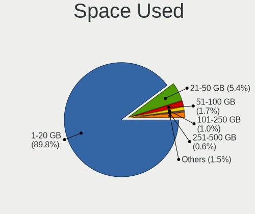
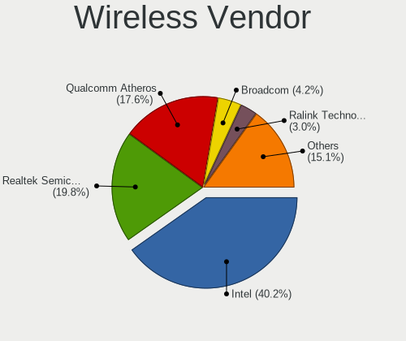
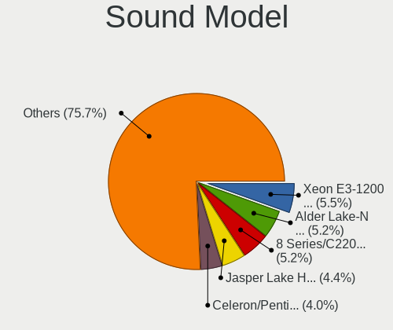
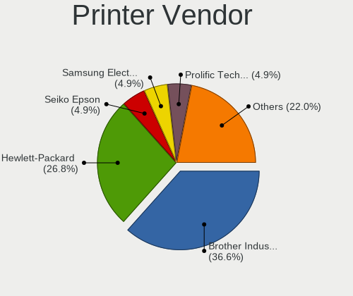

BSD - Tested Hardware & Statistics (Desktops)
---------------------------------------------

A project to collect tested hardware configurations for BSD.

Anyone can contribute to this report by the [hw-probe](https://github.com/linuxhw/hw-probe/blob/master/INSTALL.BSD.md) tool:

    hw-probe -all -upload

Please contribute! Especially if your hardware is rare.

This report is for real hardware. Report for virtual hardware: [TestDays_VE](https://github.com/bsdhw/TestDays_VE)

Contents
--------

* [ Test Cases ](#test-cases)

* [ System ](#system)
  - [ OS                       ](#os)
  - [ OS Family                ](#os-family)
  - [ Arch                     ](#arch)
  - [ DE                       ](#de)
  - [ Display Server           ](#display-server)
  - [ Display Manager          ](#display-manager)
  - [ OS Lang                  ](#os-lang)
  - [ Boot Mode                ](#boot-mode)
  - [ Filesystem               ](#filesystem)
  - [ Part. scheme             ](#part-scheme)

* [ Board ](#board)
  - [ Vendor                   ](#vendor)
  - [ Model                    ](#model)
  - [ Model Family             ](#model-family)
  - [ MFG Year                 ](#mfg-year)
  - [ Form Factor              ](#form-factor)
  - [ Coreboot                 ](#coreboot)
  - [ RAM Size                 ](#ram-size)
  - [ RAM Used                 ](#ram-used)
  - [ Total Drives             ](#total-drives)
  - [ Has CD-ROM               ](#has-cd-rom)
  - [ Has Ethernet             ](#has-ethernet)
  - [ Has WiFi                 ](#has-wifi)
  - [ Has Bluetooth            ](#has-bluetooth)

* [ Location ](#location)
  - [ Country                  ](#country)
  - [ City                     ](#city)

* [ Drives ](#drives)
  - [ Drive Vendor             ](#drive-vendor)
  - [ Drive Model              ](#drive-model)
  - [ HDD Vendor               ](#hdd-vendor)
  - [ SSD Vendor               ](#ssd-vendor)
  - [ Drive Kind               ](#drive-kind)
  - [ Drive Connector          ](#drive-connector)
  - [ Drive Size               ](#drive-size)
  - [ Space Total              ](#space-total)
  - [ Space Used               ](#space-used)
  - [ Malfunc. Drives          ](#malfunc-drives)
  - [ Malfunc. Drive Vendor    ](#malfunc-drive-vendor)
  - [ Malfunc. HDD Vendor      ](#malfunc-hdd-vendor)
  - [ Malfunc. Drive Kind      ](#malfunc-drive-kind)
  - [ Failed Drives            ](#failed-drives)
  - [ Failed Drive Vendor      ](#failed-drive-vendor)
  - [ Drive Status             ](#drive-status)

* [ Storage controller ](#storage-controller)
  - [ Storage Vendor           ](#storage-vendor)
  - [ Storage Model            ](#storage-model)
  - [ Storage Kind             ](#storage-kind)

* [ Processor ](#processor)
  - [ CPU Vendor               ](#cpu-vendor)
  - [ CPU Model                ](#cpu-model)
  - [ CPU Model Family         ](#cpu-model-family)
  - [ CPU Cores                ](#cpu-cores)
  - [ CPU Sockets              ](#cpu-sockets)
  - [ CPU Threads              ](#cpu-threads)
  - [ CPU Microarch            ](#cpu-microarch)

* [ Graphics ](#graphics)
  - [ GPU Vendor               ](#gpu-vendor)
  - [ GPU Model                ](#gpu-model)
  - [ GPU Combo                ](#gpu-combo)
  - [ GPU Driver               ](#gpu-driver)
  - [ GPU Memory               ](#gpu-memory)

* [ Monitor ](#monitor)
  - [ Monitor Vendor           ](#monitor-vendor)
  - [ Monitor Model            ](#monitor-model)
  - [ Monitor Resolution       ](#monitor-resolution)
  - [ Monitor Diagonal         ](#monitor-diagonal)
  - [ Monitor Width            ](#monitor-width)
  - [ Aspect Ratio             ](#aspect-ratio)
  - [ Monitor Area             ](#monitor-area)
  - [ Pixel Density            ](#pixel-density)
  - [ Multiple Monitors        ](#multiple-monitors)

* [ Network ](#network)
  - [ Net Controller Vendor    ](#net-controller-vendor)
  - [ Net Controller Model     ](#net-controller-model)
  - [ Wireless Vendor          ](#wireless-vendor)
  - [ Wireless Model           ](#wireless-model)
  - [ Ethernet Vendor          ](#ethernet-vendor)
  - [ Ethernet Model           ](#ethernet-model)
  - [ Net Controller Kind      ](#net-controller-kind)
  - [ Used Controller          ](#used-controller)
  - [ NICs                     ](#nics)
  - [ IPv6                     ](#ipv6)

* [ Bluetooth ](#bluetooth)
  - [ Bluetooth Vendor         ](#bluetooth-vendor)
  - [ Bluetooth Model          ](#bluetooth-model)

* [ Sound ](#sound)
  - [ Sound Vendor             ](#sound-vendor)
  - [ Sound Model              ](#sound-model)

* [ Memory ](#memory)
  - [ Memory Vendor            ](#memory-vendor)
  - [ Memory Model             ](#memory-model)
  - [ Memory Kind              ](#memory-kind)
  - [ Memory Form Factor       ](#memory-form-factor)
  - [ Memory Size              ](#memory-size)
  - [ Memory Speed             ](#memory-speed)

* [ Printers & scanners ](#printers--scanners)
  - [ Printer Vendor           ](#printer-vendor)
  - [ Printer Model            ](#printer-model)
  - [ Scanner Vendor           ](#scanner-vendor)
  - [ Scanner Model            ](#scanner-model)

* [ Camera ](#camera)
  - [ Camera Vendor            ](#camera-vendor)
  - [ Camera Model             ](#camera-model)

* [ Security ](#security)
  - [ Fingerprint Vendor       ](#fingerprint-vendor)
  - [ Fingerprint Model        ](#fingerprint-model)
  - [ Chipcard Vendor          ](#chipcard-vendor)
  - [ Chipcard Model           ](#chipcard-model)

* [ Unsupported ](#unsupported)
  - [ Unsupported Devices      ](#unsupported-devices)
  - [ Unsupported Device Types ](#unsupported-device-types)

Test Cases
----------

Total: 9394

| Vendor        | Model                       | Probe                                                     | Date         |
|---------------|-----------------------------|-----------------------------------------------------------|--------------|
| Intel         | MAHOBAY                     | [6e8443e9f4](https://bsd-hardware.info/?probe=6e8443e9f4) | Apr 01, 2023 |
| Dell          | 0N4YC8 A00                  | [bd01e6e577](https://bsd-hardware.info/?probe=bd01e6e577) | Apr 01, 2023 |
| Gigabyte      | F2A85X-UP4                  | [068773e0e8](https://bsd-hardware.info/?probe=068773e0e8) | Apr 01, 2023 |
| ASRock        | X570S PG Riptide            | [8ccb321056](https://bsd-hardware.info/?probe=8ccb321056) | Apr 01, 2023 |
| ASUSTek       | P8H61-M LX PLUS R2.0        | [3bb60897ff](https://bsd-hardware.info/?probe=3bb60897ff) | Apr 01, 2023 |
| Supermicro    | X11SDV-4C-TP8F              | [b41b088f96](https://bsd-hardware.info/?probe=b41b088f96) | Apr 01, 2023 |
| Fujitsu       | D3313-G1 S26361-D3313-G1    | [1122cabca9](https://bsd-hardware.info/?probe=1122cabca9) | Apr 01, 2023 |
| MSI           | B450 GAMING PLUS MAX        | [c7944c3ce9](https://bsd-hardware.info/?probe=c7944c3ce9) | Mar 31, 2023 |
| Supermicro    | X9SCL/X9SCMA                | [31ed779fdc](https://bsd-hardware.info/?probe=31ed779fdc) | Mar 31, 2023 |
| ASUSTek       | ROG STRIX B450-F GAMING     | [bcaaed4d6d](https://bsd-hardware.info/?probe=bcaaed4d6d) | Mar 31, 2023 |
| SolidRun      | CEX7 Platform               | [8e2e4d6686](https://bsd-hardware.info/?probe=8e2e4d6686) | Mar 31, 2023 |
| ASRockRack    | EPYC3101D4I-2T              | [3c3a780d95](https://bsd-hardware.info/?probe=3c3a780d95) | Mar 31, 2023 |
| ASRockRack    | EPYCD8-2T                   | [75f414997a](https://bsd-hardware.info/?probe=75f414997a) | Mar 31, 2023 |
| HP            | 339A                        | [ad10416fe3](https://bsd-hardware.info/?probe=ad10416fe3) | Mar 31, 2023 |
| HP            | ProLiant ML30 Gen9          | [eabda4cb6b](https://bsd-hardware.info/?probe=eabda4cb6b) | Mar 31, 2023 |
| Biostar       | TH67B                       | [234c5e0b83](https://bsd-hardware.info/?probe=234c5e0b83) | Mar 31, 2023 |
| Unknown       | Unknown                     | [a0548bbb6e](https://bsd-hardware.info/?probe=a0548bbb6e) | Mar 31, 2023 |
| Unknown       | Unknown                     | [4e1a7e6b4a](https://bsd-hardware.info/?probe=4e1a7e6b4a) | Mar 31, 2023 |
| Fujitsu       | D3313-A1 S26361-D3313-A1    | [fb6477d43e](https://bsd-hardware.info/?probe=fb6477d43e) | Mar 31, 2023 |
| HP            | 1495                        | [a916ab2122](https://bsd-hardware.info/?probe=a916ab2122) | Mar 31, 2023 |
| Unknown       | Unknown                     | [cc090cca30](https://bsd-hardware.info/?probe=cc090cca30) | Mar 31, 2023 |
| Techvision    | TVI7309X B0                 | [837fdf1a2c](https://bsd-hardware.info/?probe=837fdf1a2c) | Mar 31, 2023 |
| Intel         | DENLOW_REFRESH_WS           | [1285cbe6ca](https://bsd-hardware.info/?probe=1285cbe6ca) | Mar 31, 2023 |
| Protectli     | FW4B Ver                    | [cc6e076383](https://bsd-hardware.info/?probe=cc6e076383) | Mar 31, 2023 |
| Gigabyte      | GA-880GM-USB3               | [a9bc1579c1](https://bsd-hardware.info/?probe=a9bc1579c1) | Mar 31, 2023 |
| Gigabyte      | X570 UD                     | [a71a4da74b](https://bsd-hardware.info/?probe=a71a4da74b) | Mar 31, 2023 |
| ASUSTek       | P5G41T-M LX2/BR             | [16d1e0aa3e](https://bsd-hardware.info/?probe=16d1e0aa3e) | Mar 31, 2023 |
| Gigabyte      | H55M-S2H                    | [60c66c5066](https://bsd-hardware.info/?probe=60c66c5066) | Mar 30, 2023 |
| Lenovo        | 30D0 SDK0J40697 WIN 3305... | [bde9fd671b](https://bsd-hardware.info/?probe=bde9fd671b) | Mar 30, 2023 |
| Foxconn       | nT-A3000 series FAB         | [c13f32c492](https://bsd-hardware.info/?probe=c13f32c492) | Mar 30, 2023 |
| Fujitsu       | D3313-A1 S26361-D3313-A1    | [a160027cc2](https://bsd-hardware.info/?probe=a160027cc2) | Mar 30, 2023 |
| Fujitsu       | D3061-A1 S26361-D3061-A1    | [ca6badc637](https://bsd-hardware.info/?probe=ca6badc637) | Mar 30, 2023 |
| Dell          | 0VG93V A00                  | [1f3e086401](https://bsd-hardware.info/?probe=1f3e086401) | Mar 30, 2023 |
| Gigabyte      | H81M-DS2V                   | [a69c208286](https://bsd-hardware.info/?probe=a69c208286) | Mar 30, 2023 |
| HP            | 0AA0h                       | [9f8c7ed2d7](https://bsd-hardware.info/?probe=9f8c7ed2d7) | Mar 30, 2023 |
| Inventec      | Z CLASS A02                 | [c654ef10d6](https://bsd-hardware.info/?probe=c654ef10d6) | Mar 30, 2023 |
| Protectli     | FW4B Ver                    | [27d9a92cda](https://bsd-hardware.info/?probe=27d9a92cda) | Mar 30, 2023 |
| Unknown       | Unknown                     | [44da021f65](https://bsd-hardware.info/?probe=44da021f65) | Mar 29, 2023 |
| Seeed Stud... | ODYSSEY-X86J4105 SD-BS-C... | [dc06ff6076](https://bsd-hardware.info/?probe=dc06ff6076) | Mar 29, 2023 |
| ASRock        | Z97 Killer                  | [4e527312a1](https://bsd-hardware.info/?probe=4e527312a1) | Mar 29, 2023 |
| ASRock        | B550M Steel Legend          | [06a2d12cbe](https://bsd-hardware.info/?probe=06a2d12cbe) | Mar 29, 2023 |
| ASRock        | X570M Pro4                  | [1d7c737c38](https://bsd-hardware.info/?probe=1d7c737c38) | Mar 29, 2023 |
| Supermicro    | C7SIM-Q                     | [47ce885e13](https://bsd-hardware.info/?probe=47ce885e13) | Mar 29, 2023 |
| Lenovo        | SDK0J40700 WIN              | [36192ec5c8](https://bsd-hardware.info/?probe=36192ec5c8) | Mar 29, 2023 |
| ASRockRack    | X470D4U                     | [675bcfa82d](https://bsd-hardware.info/?probe=675bcfa82d) | Mar 29, 2023 |
| Dell          | 0T1D10 A01                  | [2f5592023f](https://bsd-hardware.info/?probe=2f5592023f) | Mar 29, 2023 |
| Unknown       | Unknown                     | [9696e7d17f](https://bsd-hardware.info/?probe=9696e7d17f) | Mar 29, 2023 |
| Dell          | 0T1D10 A01                  | [6316b108be](https://bsd-hardware.info/?probe=6316b108be) | Mar 29, 2023 |
| ASRock        | H510M-HVS R2.0              | [38a784fcd8](https://bsd-hardware.info/?probe=38a784fcd8) | Mar 29, 2023 |
| Alienware     | 049PDM A00                  | [139d115cdb](https://bsd-hardware.info/?probe=139d115cdb) | Mar 29, 2023 |
| Unknown       | Unknown                     | [723e81c698](https://bsd-hardware.info/?probe=723e81c698) | Mar 29, 2023 |
| HP            | 843F                        | [ba9d2ef26c](https://bsd-hardware.info/?probe=ba9d2ef26c) | Mar 29, 2023 |
| Gigabyte      | X570S AORUS ELITE           | [3895705bbd](https://bsd-hardware.info/?probe=3895705bbd) | Mar 29, 2023 |
| Apple         | Mac-F221BEC8                | [b2a2fc8fe6](https://bsd-hardware.info/?probe=b2a2fc8fe6) | Mar 29, 2023 |
| ASUSTek       | TUF Gaming B450M-PLUS II    | [2c6fc04801](https://bsd-hardware.info/?probe=2c6fc04801) | Mar 29, 2023 |
| Unknown       | Unknown                     | [c6c33779dc](https://bsd-hardware.info/?probe=c6c33779dc) | Mar 29, 2023 |
| Shuttle       | FH110                       | [4fa8a9cc08](https://bsd-hardware.info/?probe=4fa8a9cc08) | Mar 28, 2023 |
| MW            | GMLK-2_5G4L                 | [459fdd8cdd](https://bsd-hardware.info/?probe=459fdd8cdd) | Mar 28, 2023 |
| Intel         | JSL MRD                     | [07adf23a3d](https://bsd-hardware.info/?probe=07adf23a3d) | Mar 28, 2023 |
| HP            | 18E7                        | [f83e0bbd69](https://bsd-hardware.info/?probe=f83e0bbd69) | Mar 28, 2023 |
| Lenovo        | ThinkCentre M58 7360EUU     | [b86ffef220](https://bsd-hardware.info/?probe=b86ffef220) | Mar 28, 2023 |
| BESSTAR Te... | UM700                       | [78ee14c1a5](https://bsd-hardware.info/?probe=78ee14c1a5) | Mar 28, 2023 |
| Protectli     | FW4B                        | [17c0040b42](https://bsd-hardware.info/?probe=17c0040b42) | Mar 28, 2023 |
| Lenovo        | SHARKBAY 0B98405 STD        | [29c6f5f74c](https://bsd-hardware.info/?probe=29c6f5f74c) | Mar 28, 2023 |
| ASRock        | H61M-HVS                    | [98777ba333](https://bsd-hardware.info/?probe=98777ba333) | Mar 27, 2023 |
| HP            | 8054                        | [6c82269548](https://bsd-hardware.info/?probe=6c82269548) | Mar 27, 2023 |
| Techvision    | TVI7309X B0                 | [30e6aeb9bb](https://bsd-hardware.info/?probe=30e6aeb9bb) | Mar 27, 2023 |
| HP            | 213D A01                    | [d5efcf6e96](https://bsd-hardware.info/?probe=d5efcf6e96) | Mar 27, 2023 |
| ASUSTek       | Z97-E/USB                   | [e5a3f523a6](https://bsd-hardware.info/?probe=e5a3f523a6) | Mar 27, 2023 |
| CncTion       | N5105-4L B0                 | [b6fd7cd6ae](https://bsd-hardware.info/?probe=b6fd7cd6ae) | Mar 27, 2023 |
| WeiBu         | ADL-N Prod                  | [1d0a4ac0a1](https://bsd-hardware.info/?probe=1d0a4ac0a1) | Mar 27, 2023 |
| WeiBu         | ADL-N Prod                  | [91759ff33b](https://bsd-hardware.info/?probe=91759ff33b) | Mar 27, 2023 |
| Acer          | WG43M                       | [c8f2a03a08](https://bsd-hardware.info/?probe=c8f2a03a08) | Mar 27, 2023 |
| ASRock        | X570S PG Riptide            | [0d66edbd38](https://bsd-hardware.info/?probe=0d66edbd38) | Mar 27, 2023 |
| Lenovo        | MAHOBAY NO DPK              | [0eab0142d5](https://bsd-hardware.info/?probe=0eab0142d5) | Mar 26, 2023 |
| HP            | 2820h                       | [58d6933119](https://bsd-hardware.info/?probe=58d6933119) | Mar 26, 2023 |
| Acer          | WG43M                       | [5e154dc7cf](https://bsd-hardware.info/?probe=5e154dc7cf) | Mar 26, 2023 |
| CWWK          | MINIPC-G4                   | [06e3c70f23](https://bsd-hardware.info/?probe=06e3c70f23) | Mar 26, 2023 |
| CWWK          | MINIPC-G4                   | [8f47736c3b](https://bsd-hardware.info/?probe=8f47736c3b) | Mar 26, 2023 |
| Dell          | 0VD5HY A00                  | [1b54a68123](https://bsd-hardware.info/?probe=1b54a68123) | Mar 26, 2023 |
| MSI           | PRO B660-A DDR4             | [735a5cc6a2](https://bsd-hardware.info/?probe=735a5cc6a2) | Mar 26, 2023 |
| ChangWang     | CW56-58                     | [39410cb2dd](https://bsd-hardware.info/?probe=39410cb2dd) | Mar 26, 2023 |
| Shuttle       | FS81                        | [b80626e045](https://bsd-hardware.info/?probe=b80626e045) | Mar 26, 2023 |
| Lanner        | FW-7543 B-GA                | [3ed4cfc9c8](https://bsd-hardware.info/?probe=3ed4cfc9c8) | Mar 26, 2023 |
| Unknown       | Unknown                     | [003e1396f6](https://bsd-hardware.info/?probe=003e1396f6) | Mar 26, 2023 |
| YANYU         | H17SL                       | [0f9829ebe4](https://bsd-hardware.info/?probe=0f9829ebe4) | Mar 26, 2023 |
| ASUSTek       | P11C-M Series               | [15e452d25d](https://bsd-hardware.info/?probe=15e452d25d) | Mar 26, 2023 |
| Intel         | Q3XXG4-P V1.0               | [2f16e29f78](https://bsd-hardware.info/?probe=2f16e29f78) | Mar 26, 2023 |
| Protectli     | FW4B Ver                    | [fc5ab682fc](https://bsd-hardware.info/?probe=fc5ab682fc) | Mar 26, 2023 |
| MSI           | 870-G45                     | [19cbb6e0f3](https://bsd-hardware.info/?probe=19cbb6e0f3) | Mar 26, 2023 |
| MSI           | H81M-P33                    | [f07e9fd36c](https://bsd-hardware.info/?probe=f07e9fd36c) | Mar 26, 2023 |
| ASUSTek       | P5Q-E                       | [3f21567fdf](https://bsd-hardware.info/?probe=3f21567fdf) | Mar 26, 2023 |
| ASUSTek       | ROG CROSSHAIR VIII HERO     | [38a22651c6](https://bsd-hardware.info/?probe=38a22651c6) | Mar 26, 2023 |
| ASRock        | H510M-HVS R2.0              | [3db3c8f002](https://bsd-hardware.info/?probe=3db3c8f002) | Mar 26, 2023 |
| Dell          | 0HD5W2 A01                  | [284c499b74](https://bsd-hardware.info/?probe=284c499b74) | Mar 26, 2023 |
| Dell          | 0654JC A02                  | [373d1bc62b](https://bsd-hardware.info/?probe=373d1bc62b) | Mar 26, 2023 |
| Intel         | Q3XXG4-P V1.0               | [2634ccb935](https://bsd-hardware.info/?probe=2634ccb935) | Mar 26, 2023 |
| Acer          | Aspire XC-830               | [bc1cc29291](https://bsd-hardware.info/?probe=bc1cc29291) | Mar 26, 2023 |
| Acer          | Aspire XC-830               | [2affd2540a](https://bsd-hardware.info/?probe=2affd2540a) | Mar 26, 2023 |
| CheckPoint    | T-110-00                    | [eecf6b8096](https://bsd-hardware.info/?probe=eecf6b8096) | Mar 25, 2023 |
| Protectli     | FW4B                        | [3c333bad9c](https://bsd-hardware.info/?probe=3c333bad9c) | Mar 25, 2023 |
| Protectli     | VP2410                      | [a52038d49d](https://bsd-hardware.info/?probe=a52038d49d) | Mar 25, 2023 |
| Gigabyte      | F2A85X-UP4                  | [97d37b6e2f](https://bsd-hardware.info/?probe=97d37b6e2f) | Mar 25, 2023 |
| ASRock        | B450 Steel Legend           | [0f0f389db4](https://bsd-hardware.info/?probe=0f0f389db4) | Mar 25, 2023 |
| ASUSTek       | F1A55                       | [91ad5bab75](https://bsd-hardware.info/?probe=91ad5bab75) | Mar 25, 2023 |
| Unknown       | Unknown                     | [c7c5a8ae97](https://bsd-hardware.info/?probe=c7c5a8ae97) | Mar 25, 2023 |
| Unknown       | iKoolCore R1 iKoolCore R... | [20dc598eb3](https://bsd-hardware.info/?probe=20dc598eb3) | Mar 25, 2023 |
| Protectli     | FW4B Ver                    | [5082d62025](https://bsd-hardware.info/?probe=5082d62025) | Mar 25, 2023 |
| MSI           | PRO H610M-B DDR4            | [ee01b690bc](https://bsd-hardware.info/?probe=ee01b690bc) | Mar 25, 2023 |
| HP            | 82B4                        | [6edc033f79](https://bsd-hardware.info/?probe=6edc033f79) | Mar 25, 2023 |
| MW            | GMLK-2_5G4L                 | [41fa3f51d3](https://bsd-hardware.info/?probe=41fa3f51d3) | Mar 25, 2023 |
| MSI           | 870-G45                     | [14e990c885](https://bsd-hardware.info/?probe=14e990c885) | Mar 25, 2023 |
| ASRock        | B450 Steel Legend           | [72a2bf0c68](https://bsd-hardware.info/?probe=72a2bf0c68) | Mar 25, 2023 |
| Hardkernel    | ODROID-H3                   | [312a9b3461](https://bsd-hardware.info/?probe=312a9b3461) | Mar 25, 2023 |
| Techvision    | TVI7309X B0                 | [40c71ed805](https://bsd-hardware.info/?probe=40c71ed805) | Mar 25, 2023 |
| Gigabyte      | F2A85X-UP4                  | [c0b8eb494e](https://bsd-hardware.info/?probe=c0b8eb494e) | Mar 25, 2023 |
| Protectli     | FW6 Ver                     | [5444aee217](https://bsd-hardware.info/?probe=5444aee217) | Mar 25, 2023 |
| ASUSTek       | P5K SE                      | [646eff3292](https://bsd-hardware.info/?probe=646eff3292) | Mar 25, 2023 |
| ASUSTek       | Z97-E/USB                   | [9aa3b17016](https://bsd-hardware.info/?probe=9aa3b17016) | Mar 25, 2023 |
| Unknown       | Unknown                     | [387c27f1d7](https://bsd-hardware.info/?probe=387c27f1d7) | Mar 25, 2023 |
| HP            | 1497                        | [08daaf3be1](https://bsd-hardware.info/?probe=08daaf3be1) | Mar 25, 2023 |
| HP            | 21B4 A01                    | [8de4b8231a](https://bsd-hardware.info/?probe=8de4b8231a) | Mar 25, 2023 |
| HP            | 1497                        | [fc6a7ebc91](https://bsd-hardware.info/?probe=fc6a7ebc91) | Mar 25, 2023 |
| HP            | 1497                        | [e98b5284d9](https://bsd-hardware.info/?probe=e98b5284d9) | Mar 25, 2023 |
| Unknown       | Unknown                     | [55c708e91a](https://bsd-hardware.info/?probe=55c708e91a) | Mar 24, 2023 |
| PC Engines    | APU2                        | [4e4a81e456](https://bsd-hardware.info/?probe=4e4a81e456) | Mar 24, 2023 |
| Lex           | Pineview-D                  | [ca2fbb614d](https://bsd-hardware.info/?probe=ca2fbb614d) | Mar 24, 2023 |
| Stonesoft     | DEV-1301-2-C1-R             | [3bc0fc5d63](https://bsd-hardware.info/?probe=3bc0fc5d63) | Mar 24, 2023 |
| CncTion       | N5105-4L B0                 | [9561c72b9c](https://bsd-hardware.info/?probe=9561c72b9c) | Mar 24, 2023 |
| Intel         | Q3XXG4-P V1.0               | [083d2e65da](https://bsd-hardware.info/?probe=083d2e65da) | Mar 24, 2023 |
| Stonesoft     | DEV-1301-2-C1-R             | [2699b59d1b](https://bsd-hardware.info/?probe=2699b59d1b) | Mar 24, 2023 |
| HP            | 8055                        | [03930fa6c3](https://bsd-hardware.info/?probe=03930fa6c3) | Mar 24, 2023 |
| HP            | 8350                        | [46dedb22a0](https://bsd-hardware.info/?probe=46dedb22a0) | Mar 24, 2023 |
| HP            | 2820h                       | [7df9c94771](https://bsd-hardware.info/?probe=7df9c94771) | Mar 24, 2023 |
| Intel         | Q3XXG4-P V1.0               | [56c12d6bf6](https://bsd-hardware.info/?probe=56c12d6bf6) | Mar 24, 2023 |
| ASUSTek       | Z97-E/USB                   | [e9cbfc666b](https://bsd-hardware.info/?probe=e9cbfc666b) | Mar 24, 2023 |
| Intel         | Q3XXG4-P V1.0               | [e99acbbc10](https://bsd-hardware.info/?probe=e99acbbc10) | Mar 24, 2023 |
| ASRock        | A520M-ITX/ac                | [18877701a6](https://bsd-hardware.info/?probe=18877701a6) | Mar 24, 2023 |
| HP            | 213D A01                    | [c942b222fa](https://bsd-hardware.info/?probe=c942b222fa) | Mar 24, 2023 |
| CncTion       | J4125-4L-I225               | [5e63c02cde](https://bsd-hardware.info/?probe=5e63c02cde) | Mar 23, 2023 |
| Unknown       | Unknown                     | [a66dffcb5c](https://bsd-hardware.info/?probe=a66dffcb5c) | Mar 23, 2023 |
| Intel         | DB85FL AAG89861-203         | [ff97717798](https://bsd-hardware.info/?probe=ff97717798) | Mar 23, 2023 |
| Protectli     | VP2420                      | [f07553b02c](https://bsd-hardware.info/?probe=f07553b02c) | Mar 23, 2023 |
| ASUSTek       | H81M-K                      | [c45489c043](https://bsd-hardware.info/?probe=c45489c043) | Mar 23, 2023 |
| Gigabyte      | H81M-H                      | [e7cadcdae1](https://bsd-hardware.info/?probe=e7cadcdae1) | Mar 23, 2023 |
| IceWhale T... | ZimaBoard 832 ZMB           | [3c4f4abe16](https://bsd-hardware.info/?probe=3c4f4abe16) | Mar 23, 2023 |
| Protectli     | VP2420                      | [dfad78899e](https://bsd-hardware.info/?probe=dfad78899e) | Mar 23, 2023 |
| ShenZhen M... | MW-GMLK-2.5G6L              | [720f15a1ce](https://bsd-hardware.info/?probe=720f15a1ce) | Mar 23, 2023 |
| Lenovo        | SHARKBAY 0B98401 WIN        | [f8f04980fb](https://bsd-hardware.info/?probe=f8f04980fb) | Mar 23, 2023 |
| Acer          | Revo 70                     | [50d93bea69](https://bsd-hardware.info/?probe=50d93bea69) | Mar 23, 2023 |
| HP            | 3397                        | [a3a77965fc](https://bsd-hardware.info/?probe=a3a77965fc) | Mar 23, 2023 |
| ASUSTek       | P11C-M Series               | [b0079291db](https://bsd-hardware.info/?probe=b0079291db) | Mar 23, 2023 |
| BROUNION      | R86S                        | [4fc5a71125](https://bsd-hardware.info/?probe=4fc5a71125) | Mar 23, 2023 |
| Unknown       | T360D11                     | [d4d69405c5](https://bsd-hardware.info/?probe=d4d69405c5) | Mar 23, 2023 |
| Unknown       | Unknown                     | [a7e98f9a10](https://bsd-hardware.info/?probe=a7e98f9a10) | Mar 23, 2023 |
| T-bao         | MINI PC V1.0                | [eb2bc1cd51](https://bsd-hardware.info/?probe=eb2bc1cd51) | Mar 23, 2023 |
| ASUSTek       | CROSSHAIR V FORMULA-Z       | [491c0ca78a](https://bsd-hardware.info/?probe=491c0ca78a) | Mar 22, 2023 |
| Intel         | Q3XXG4-P V1.0               | [680002292e](https://bsd-hardware.info/?probe=680002292e) | Mar 22, 2023 |
| Lenovo        | ThinkCentre M910q 10MVCT... | [5459ed9c31](https://bsd-hardware.info/?probe=5459ed9c31) | Mar 22, 2023 |
| Dell          | 0WWJRX A00                  | [b016b1fb3c](https://bsd-hardware.info/?probe=b016b1fb3c) | Mar 22, 2023 |
| HP            | 18E5                        | [1f402a50e7](https://bsd-hardware.info/?probe=1f402a50e7) | Mar 22, 2023 |
| Protectli     | FW4C Ver                    | [73ecb1afc1](https://bsd-hardware.info/?probe=73ecb1afc1) | Mar 22, 2023 |
| Gigabyte      | F2A55-DS3                   | [ce8775fbe5](https://bsd-hardware.info/?probe=ce8775fbe5) | Mar 22, 2023 |
| ASRock        | B450M Pro4                  | [e2d0aa1444](https://bsd-hardware.info/?probe=e2d0aa1444) | Mar 22, 2023 |
| Protectli     | FW4B Ver                    | [c2546b211b](https://bsd-hardware.info/?probe=c2546b211b) | Mar 22, 2023 |
| MW            | GMLK-2_5G4L                 | [b3f0879ebf](https://bsd-hardware.info/?probe=b3f0879ebf) | Mar 22, 2023 |
| Biostar       | H61MGC                      | [94e565457c](https://bsd-hardware.info/?probe=94e565457c) | Mar 22, 2023 |
| ASUSTek       | M4A88TD-V EVO/USB3          | [c486bbb209](https://bsd-hardware.info/?probe=c486bbb209) | Mar 22, 2023 |
| ASUSTek       | PRIME H410M-A               | [cbbeb5c41c](https://bsd-hardware.info/?probe=cbbeb5c41c) | Mar 22, 2023 |
| NF596         | 1.0                         | [9de0fd33a4](https://bsd-hardware.info/?probe=9de0fd33a4) | Mar 22, 2023 |
| Protectli     | VP2410 10                   | [491f4cc780](https://bsd-hardware.info/?probe=491f4cc780) | Mar 22, 2023 |
| ASRock        | B460M-HDV                   | [e1ee6d8a11](https://bsd-hardware.info/?probe=e1ee6d8a11) | Mar 22, 2023 |
| MSI           | H81I                        | [4983a6a077](https://bsd-hardware.info/?probe=4983a6a077) | Mar 22, 2023 |
| Lenovo        | SDK0J40700 WIN              | [dccfb64926](https://bsd-hardware.info/?probe=dccfb64926) | Mar 22, 2023 |
| ASUSTek       | M5A97 R2.0                  | [840a902d2b](https://bsd-hardware.info/?probe=840a902d2b) | Mar 22, 2023 |
| ASRockRack    | E3C236D2I                   | [e407119ecf](https://bsd-hardware.info/?probe=e407119ecf) | Mar 22, 2023 |
| Foxconn       | M61PMV FAB                  | [197d75cbaa](https://bsd-hardware.info/?probe=197d75cbaa) | Mar 21, 2023 |
| Lenovo        | 3106 SDK0J40697 WIN 3305... | [283fe42941](https://bsd-hardware.info/?probe=283fe42941) | Mar 21, 2023 |
| ASRockRack    | E3C236D2I                   | [0854f96185](https://bsd-hardware.info/?probe=0854f96185) | Mar 21, 2023 |
| Intel         | SKYBAY                      | [83ea0b27b1](https://bsd-hardware.info/?probe=83ea0b27b1) | Mar 21, 2023 |
| ASRock        | J5040-ITX                   | [56a3214f4b](https://bsd-hardware.info/?probe=56a3214f4b) | Mar 21, 2023 |
| ASRock        | X570M Pro4                  | [e405ff5adf](https://bsd-hardware.info/?probe=e405ff5adf) | Mar 21, 2023 |
| ASUSTek       | Rampage II Extreme          | [45fd7b7b5f](https://bsd-hardware.info/?probe=45fd7b7b5f) | Mar 21, 2023 |
| Supermicro    | X9SCL/X9SCMA                | [7bac9347ec](https://bsd-hardware.info/?probe=7bac9347ec) | Mar 21, 2023 |
| ASRock        | G31M-S                      | [60b239d5c0](https://bsd-hardware.info/?probe=60b239d5c0) | Mar 21, 2023 |
| Fujitsu Si... | D2824-A1 S26361-D2824-A1    | [bcada44b09](https://bsd-hardware.info/?probe=bcada44b09) | Mar 21, 2023 |
| Intel         | X99                         | [a74c2b96ff](https://bsd-hardware.info/?probe=a74c2b96ff) | Mar 21, 2023 |
| Techvision    | TVI7309X B0                 | [8d84f81be3](https://bsd-hardware.info/?probe=8d84f81be3) | Mar 21, 2023 |
| Dell          | 0GM819                      | [9d5996dd7a](https://bsd-hardware.info/?probe=9d5996dd7a) | Mar 21, 2023 |
| HP            | 805A                        | [d90c74af40](https://bsd-hardware.info/?probe=d90c74af40) | Mar 21, 2023 |
| Intel         | DENLOW_WS                   | [6a352d6a07](https://bsd-hardware.info/?probe=6a352d6a07) | Mar 21, 2023 |
| Supermicro    | X11SDV-8C-TP8F              | [7ae004c035](https://bsd-hardware.info/?probe=7ae004c035) | Mar 21, 2023 |
| HP            | 8054                        | [6e5a18f346](https://bsd-hardware.info/?probe=6e5a18f346) | Mar 20, 2023 |
| Lenovo        | 30BC SDK0J40705 WIN 3425... | [33b600b436](https://bsd-hardware.info/?probe=33b600b436) | Mar 20, 2023 |
| ASUSTek       | PRIME B350-PLUS             | [8d0e6be5da](https://bsd-hardware.info/?probe=8d0e6be5da) | Mar 20, 2023 |
| Techvision    | TVI7309X B0                 | [c3871d22c6](https://bsd-hardware.info/?probe=c3871d22c6) | Mar 20, 2023 |
| Silicom       | 80300-0134-g01              | [3cd6c5ba13](https://bsd-hardware.info/?probe=3cd6c5ba13) | Mar 20, 2023 |
| Dell          | 0GM819                      | [da7c02c542](https://bsd-hardware.info/?probe=da7c02c542) | Mar 20, 2023 |
| Techvision    | TVI7309X B0                 | [10f3485393](https://bsd-hardware.info/?probe=10f3485393) | Mar 20, 2023 |
| ASUSTek       | TUF Gaming B550M-PLUS       | [c07b0a75e5](https://bsd-hardware.info/?probe=c07b0a75e5) | Mar 20, 2023 |
| Unknown       | Unknown                     | [e4365dfa60](https://bsd-hardware.info/?probe=e4365dfa60) | Mar 20, 2023 |
| ASUSTek       | TUF Gaming B550M-PLUS       | [71d2b7317c](https://bsd-hardware.info/?probe=71d2b7317c) | Mar 19, 2023 |
| Lenovo        | 3102 SDK0J40700 WIN 3258... | [1ffbf45d40](https://bsd-hardware.info/?probe=1ffbf45d40) | Mar 19, 2023 |
| ASRock        | H61M-DGS                    | [36348fa16f](https://bsd-hardware.info/?probe=36348fa16f) | Mar 19, 2023 |
| MSI           | H81I                        | [a1981bf557](https://bsd-hardware.info/?probe=a1981bf557) | Mar 19, 2023 |
| ASRock        | B550M Pro4                  | [4dc54510d2](https://bsd-hardware.info/?probe=4dc54510d2) | Mar 19, 2023 |
| Unknown       | Unknown                     | [91b5500917](https://bsd-hardware.info/?probe=91b5500917) | Mar 19, 2023 |
| ASUSTek       | PRO B460M-C                 | [cab50cddd5](https://bsd-hardware.info/?probe=cab50cddd5) | Mar 19, 2023 |
| ASUSTek       | PRO B460M-C                 | [ff4dda40eb](https://bsd-hardware.info/?probe=ff4dda40eb) | Mar 19, 2023 |
| CNCTION-IA... | Unknown                     | [ba5de75eaa](https://bsd-hardware.info/?probe=ba5de75eaa) | Mar 19, 2023 |
| ASRock        | H610M-HDV/M.2               | [5494c32f7a](https://bsd-hardware.info/?probe=5494c32f7a) | Mar 19, 2023 |
| MSI           | H81M-P33                    | [17f0f138ee](https://bsd-hardware.info/?probe=17f0f138ee) | Mar 19, 2023 |
| ASUSTek       | P5Q-E                       | [da50d91be4](https://bsd-hardware.info/?probe=da50d91be4) | Mar 19, 2023 |
| ASUSTek       | ROG CROSSHAIR VIII HERO     | [726abe2f1d](https://bsd-hardware.info/?probe=726abe2f1d) | Mar 19, 2023 |
| Protectli     | FW4B Ver                    | [317c44acd2](https://bsd-hardware.info/?probe=317c44acd2) | Mar 19, 2023 |
| Intel         | DENLOW_WS                   | [8b3bb4ee24](https://bsd-hardware.info/?probe=8b3bb4ee24) | Mar 19, 2023 |
| ASUSTek       | Z97I-PLUS                   | [cdbc1b0031](https://bsd-hardware.info/?probe=cdbc1b0031) | Mar 19, 2023 |
| CNCTION-IA... | Unknown                     | [914c4aad57](https://bsd-hardware.info/?probe=914c4aad57) | Mar 19, 2023 |
| Datto         | SSD                         | [40831257b2](https://bsd-hardware.info/?probe=40831257b2) | Mar 19, 2023 |
| ASUSTek       | M5A78L-M PLUS/USB3          | [3bb2c5733d](https://bsd-hardware.info/?probe=3bb2c5733d) | Mar 19, 2023 |
| HP            | 212B                        | [d4d93ad679](https://bsd-hardware.info/?probe=d4d93ad679) | Mar 19, 2023 |
| GVC           | DR 738                      | [88455ed9e7](https://bsd-hardware.info/?probe=88455ed9e7) | Mar 18, 2023 |
| Intel         | SKYBAY                      | [7bd7f393b1](https://bsd-hardware.info/?probe=7bd7f393b1) | Mar 18, 2023 |
| ASUSTek       | PRIME B350-PLUS             | [acc1970543](https://bsd-hardware.info/?probe=acc1970543) | Mar 18, 2023 |
| ASUSTek       | CM6330_CM6630_CM6730_CM6... | [4e1fe3a676](https://bsd-hardware.info/?probe=4e1fe3a676) | Mar 18, 2023 |
| HP            | 18E7                        | [d3b280214a](https://bsd-hardware.info/?probe=d3b280214a) | Mar 18, 2023 |
| ASUSTek       | M5A78L-M LX3                | [3f78d8f1ae](https://bsd-hardware.info/?probe=3f78d8f1ae) | Mar 18, 2023 |
| Intel         | SKYBAY                      | [a8f1d29e24](https://bsd-hardware.info/?probe=a8f1d29e24) | Mar 18, 2023 |
| MSI           | X299 PRO                    | [a26d096ecb](https://bsd-hardware.info/?probe=a26d096ecb) | Mar 18, 2023 |
| ASUSTek       | P6X58D-E                    | [ec05209185](https://bsd-hardware.info/?probe=ec05209185) | Mar 18, 2023 |
| Unknown       | QD-CMU01                    | [c6ddfac225](https://bsd-hardware.info/?probe=c6ddfac225) | Mar 18, 2023 |
| Dell          | 0Y5DDC A00                  | [f26bbd9dde](https://bsd-hardware.info/?probe=f26bbd9dde) | Mar 18, 2023 |
| Intel         | B75                         | [11bcf42a35](https://bsd-hardware.info/?probe=11bcf42a35) | Mar 18, 2023 |
| Gigabyte      | H110M-H-CF                  | [29b3a70374](https://bsd-hardware.info/?probe=29b3a70374) | Mar 18, 2023 |
| Unknown       | Unknown                     | [dd8a64237a](https://bsd-hardware.info/?probe=dd8a64237a) | Mar 18, 2023 |
| Fujitsu       | D3313-S3 S26361-D3313-S3    | [1bf34a929a](https://bsd-hardware.info/?probe=1bf34a929a) | Mar 18, 2023 |
| ASUSTek       | TUF Gaming X570-PLUS        | [2ceda5b586](https://bsd-hardware.info/?probe=2ceda5b586) | Mar 17, 2023 |
| HP            | 2175                        | [d0627c1360](https://bsd-hardware.info/?probe=d0627c1360) | Mar 17, 2023 |
| Protectli     | FW6                         | [f24f1a8a3e](https://bsd-hardware.info/?probe=f24f1a8a3e) | Mar 17, 2023 |
| Unknown       | Unknown                     | [03cf8c47dc](https://bsd-hardware.info/?probe=03cf8c47dc) | Mar 17, 2023 |
| Dell          | 0D28YY A00                  | [15e8aedcb6](https://bsd-hardware.info/?probe=15e8aedcb6) | Mar 17, 2023 |
| ASUSTek       | P8H67-M                     | [5c1b721c75](https://bsd-hardware.info/?probe=5c1b721c75) | Mar 17, 2023 |
| ASUSTek       | ROG STRIX B450-F GAMING ... | [74cf75116d](https://bsd-hardware.info/?probe=74cf75116d) | Mar 17, 2023 |
| ASUSTek       | TUF B360M-PLUS GAMING       | [ebbd75883c](https://bsd-hardware.info/?probe=ebbd75883c) | Mar 17, 2023 |
| Positivo      | POS-PIB150DT                | [f0158da9e1](https://bsd-hardware.info/?probe=f0158da9e1) | Mar 17, 2023 |
| Unknown       | Unknown                     | [9a5ccefb18](https://bsd-hardware.info/?probe=9a5ccefb18) | Mar 17, 2023 |
| Techvision    | TVI7309X B0                 | [7db8753b08](https://bsd-hardware.info/?probe=7db8753b08) | Mar 17, 2023 |
| ASUSTek       | P8H67-M                     | [3f62e2568b](https://bsd-hardware.info/?probe=3f62e2568b) | Mar 17, 2023 |
| ASUSTek       | P10S-I Series               | [f0e7508425](https://bsd-hardware.info/?probe=f0e7508425) | Mar 17, 2023 |
| Unknown       | Unknown                     | [daaa6c0069](https://bsd-hardware.info/?probe=daaa6c0069) | Mar 17, 2023 |
| Protectli     | FW4B                        | [fd65403ca2](https://bsd-hardware.info/?probe=fd65403ca2) | Mar 17, 2023 |
| Unknown       | SKYBAY                      | [7399558d80](https://bsd-hardware.info/?probe=7399558d80) | Mar 17, 2023 |
| Unknown       | SKYBAY                      | [3fb2d0d992](https://bsd-hardware.info/?probe=3fb2d0d992) | Mar 17, 2023 |
| Unknown       | Unknown                     | [f641e1207a](https://bsd-hardware.info/?probe=f641e1207a) | Mar 17, 2023 |
| HP            | 3397                        | [2851f91f5f](https://bsd-hardware.info/?probe=2851f91f5f) | Mar 17, 2023 |
| HP            | 1632                        | [8f3bb99bb4](https://bsd-hardware.info/?probe=8f3bb99bb4) | Mar 17, 2023 |
| Intel         | DG35EC AAE29266-205         | [0ab42ce2ee](https://bsd-hardware.info/?probe=0ab42ce2ee) | Mar 16, 2023 |
| Intel         | SHARKBAY                    | [6c2382fa44](https://bsd-hardware.info/?probe=6c2382fa44) | Mar 16, 2023 |
| Gigabyte      | F2A68HM-HD2                 | [da2b96de55](https://bsd-hardware.info/?probe=da2b96de55) | Mar 16, 2023 |
| Gigabyte      | Z87X-UD4H-CF                | [0bae1528b9](https://bsd-hardware.info/?probe=0bae1528b9) | Mar 16, 2023 |
| ASUSTek       | PRIME B660M-A D4            | [eb6b70b310](https://bsd-hardware.info/?probe=eb6b70b310) | Mar 16, 2023 |
| Unknown       | Unknown                     | [d0a9398982](https://bsd-hardware.info/?probe=d0a9398982) | Mar 16, 2023 |
| Unknown       | Unknown                     | [19fc3562d9](https://bsd-hardware.info/?probe=19fc3562d9) | Mar 16, 2023 |
| Lenovo        | SHARKBAY NOK                | [f14a448799](https://bsd-hardware.info/?probe=f14a448799) | Mar 16, 2023 |
| ASUSTek       | PRIME B660M-A WIFI D4       | [44c7f21a07](https://bsd-hardware.info/?probe=44c7f21a07) | Mar 16, 2023 |
| Fujitsu       | D3313-G1 S26361-D3313-G1    | [652100bcac](https://bsd-hardware.info/?probe=652100bcac) | Mar 16, 2023 |
| Gigabyte      | B450M S2H                   | [dfa4f43317](https://bsd-hardware.info/?probe=dfa4f43317) | Mar 15, 2023 |
| YENTEK        | R250                        | [fc42406b39](https://bsd-hardware.info/?probe=fc42406b39) | Mar 15, 2023 |
| Dell          | 0WMJ54 A01                  | [c823742fdc](https://bsd-hardware.info/?probe=c823742fdc) | Mar 15, 2023 |
| Unknown       | Unknown                     | [f80047716b](https://bsd-hardware.info/?probe=f80047716b) | Mar 15, 2023 |
| Gigabyte      | H61M-S2P-B3                 | [864a4017cb](https://bsd-hardware.info/?probe=864a4017cb) | Mar 15, 2023 |
| HP            | 3398                        | [b14de43688](https://bsd-hardware.info/?probe=b14de43688) | Mar 15, 2023 |
| ASRock        | J5040-ITX                   | [435dc7ee7b](https://bsd-hardware.info/?probe=435dc7ee7b) | Mar 15, 2023 |
| Silicom       | 80300-0134-g01              | [228e446ed5](https://bsd-hardware.info/?probe=228e446ed5) | Mar 15, 2023 |
| DFI           | CM100-C                     | [c34832095b](https://bsd-hardware.info/?probe=c34832095b) | Mar 15, 2023 |
| Dell          | 0M9KCM A00                  | [27a1ab8450](https://bsd-hardware.info/?probe=27a1ab8450) | Mar 15, 2023 |
| Intel         | Q3XXG4-P V1.0               | [65dca4c66b](https://bsd-hardware.info/?probe=65dca4c66b) | Mar 15, 2023 |
| Unknown       | Unknown                     | [68b45d5083](https://bsd-hardware.info/?probe=68b45d5083) | Mar 15, 2023 |
| Fujitsu       | D3313-A1 S26361-D3313-A1    | [b8404f57ba](https://bsd-hardware.info/?probe=b8404f57ba) | Mar 15, 2023 |
| ASUSTek       | ROG STRIX B560-F GAMING ... | [c4798050c6](https://bsd-hardware.info/?probe=c4798050c6) | Mar 15, 2023 |
| Fujitsu       | D3313-A1 S26361-D3313-A1    | [2d5e8056c0](https://bsd-hardware.info/?probe=2d5e8056c0) | Mar 15, 2023 |
| ASRock        | A520M-ITX/ac                | [1ccc8081fd](https://bsd-hardware.info/?probe=1ccc8081fd) | Mar 15, 2023 |
| Dell          | 078NPM A00                  | [234e8a451a](https://bsd-hardware.info/?probe=234e8a451a) | Mar 14, 2023 |
| ASUSTek       | Pro B550M-C                 | [a0e38ad11b](https://bsd-hardware.info/?probe=a0e38ad11b) | Mar 14, 2023 |
| Gigabyte      | H370M D3H-CF                | [8025ea3b29](https://bsd-hardware.info/?probe=8025ea3b29) | Mar 14, 2023 |
| Dell          | 00V62H A00                  | [ecb9b5d004](https://bsd-hardware.info/?probe=ecb9b5d004) | Mar 14, 2023 |
| Protectli     | FW4C Ver                    | [6b260b1da3](https://bsd-hardware.info/?probe=6b260b1da3) | Mar 14, 2023 |
| ASRock        | G31M-S                      | [82620884d3](https://bsd-hardware.info/?probe=82620884d3) | Mar 14, 2023 |
| Foxconn       | H61M/H61M-S                 | [865fbff42a](https://bsd-hardware.info/?probe=865fbff42a) | Mar 14, 2023 |
| YANYU         | H17SL                       | [37a549331f](https://bsd-hardware.info/?probe=37a549331f) | Mar 14, 2023 |
| MSI           | MAG B550 TOMAHAWK           | [cb6b586564](https://bsd-hardware.info/?probe=cb6b586564) | Mar 14, 2023 |
| Fujitsu Si... | D2804-A1 S26361-D2804-A1    | [34c4bab715](https://bsd-hardware.info/?probe=34c4bab715) | Mar 14, 2023 |
| MSI           | 0A48                        | [815f019a8c](https://bsd-hardware.info/?probe=815f019a8c) | Mar 14, 2023 |
| Lenovo        | NO DPK                      | [8a38ed8d33](https://bsd-hardware.info/?probe=8a38ed8d33) | Mar 14, 2023 |
| ASUSTek       | B85M-G                      | [6401dd52d2](https://bsd-hardware.info/?probe=6401dd52d2) | Mar 14, 2023 |
| AZW           | U59                         | [5a6ef3fb8d](https://bsd-hardware.info/?probe=5a6ef3fb8d) | Mar 14, 2023 |
| PAIQ          | EC3-BT19D4L A1              | [7a51da97c2](https://bsd-hardware.info/?probe=7a51da97c2) | Mar 14, 2023 |
| Intel         | HURONRIVER                  | [06f89fc17d](https://bsd-hardware.info/?probe=06f89fc17d) | Mar 14, 2023 |
| PAIQ          | EC3-BT19D4L A1              | [303f8c77c0](https://bsd-hardware.info/?probe=303f8c77c0) | Mar 14, 2023 |
| Lenovo        | ThinkCentre M58p 6138DK1    | [293de8b0fd](https://bsd-hardware.info/?probe=293de8b0fd) | Mar 14, 2023 |
| ASRock        | Q1900M                      | [9570525d52](https://bsd-hardware.info/?probe=9570525d52) | Mar 14, 2023 |
| MW            | GMLK-2_5G4L                 | [5211185a2a](https://bsd-hardware.info/?probe=5211185a2a) | Mar 14, 2023 |
| Lenovo        | 0B98401 PRO                 | [4e27c68fa1](https://bsd-hardware.info/?probe=4e27c68fa1) | Mar 14, 2023 |
| Unknown       | J3160-4L                    | [bc21ae472e](https://bsd-hardware.info/?probe=bc21ae472e) | Mar 13, 2023 |
| Google        | Panther                     | [3577da7e53](https://bsd-hardware.info/?probe=3577da7e53) | Mar 13, 2023 |
| Unknown       | Unknown                     | [51bc37434e](https://bsd-hardware.info/?probe=51bc37434e) | Mar 13, 2023 |
| Dell          | 01TN68 A02                  | [cb6c76df00](https://bsd-hardware.info/?probe=cb6c76df00) | Mar 13, 2023 |
| Intel         | QHSW02                      | [ccfc6d4abf](https://bsd-hardware.info/?probe=ccfc6d4abf) | Mar 13, 2023 |
| Lenovo        | 3102 SDK0J40697 WIN 3305... | [b337baf50e](https://bsd-hardware.info/?probe=b337baf50e) | Mar 13, 2023 |
| Gigabyte      | B365M H                     | [7acb7cb65f](https://bsd-hardware.info/?probe=7acb7cb65f) | Mar 13, 2023 |
| Techvision    | TVI7309X B0                 | [04f26bf0ba](https://bsd-hardware.info/?probe=04f26bf0ba) | Mar 13, 2023 |
| Intel         | QHSW02                      | [b56a128e7e](https://bsd-hardware.info/?probe=b56a128e7e) | Mar 13, 2023 |
| MSI           | Z87-G41 PC Mate             | [f1dc71b749](https://bsd-hardware.info/?probe=f1dc71b749) | Mar 13, 2023 |
| ASUSTek       | PRIME H310M-A R2.0          | [e96ecce822](https://bsd-hardware.info/?probe=e96ecce822) | Mar 13, 2023 |
| ASUSTek       | PRIME X370-PRO              | [49764ec5fa](https://bsd-hardware.info/?probe=49764ec5fa) | Mar 13, 2023 |
| ASRock        | X570 Phantom Gaming 4       | [a8a9ed7f9e](https://bsd-hardware.info/?probe=a8a9ed7f9e) | Mar 13, 2023 |
| MSI           | Z87-G41 PC Mate             | [8f819aa5b0](https://bsd-hardware.info/?probe=8f819aa5b0) | Mar 13, 2023 |
| HP            | 8056                        | [164b3e5c3f](https://bsd-hardware.info/?probe=164b3e5c3f) | Mar 13, 2023 |
| T-bao         | MINI PC                     | [d4440566b0](https://bsd-hardware.info/?probe=d4440566b0) | Mar 13, 2023 |
| HP            | 8056                        | [e1d2423153](https://bsd-hardware.info/?probe=e1d2423153) | Mar 13, 2023 |
| ASRock        | J4005M                      | [9d9e2c67e2](https://bsd-hardware.info/?probe=9d9e2c67e2) | Mar 13, 2023 |
| HP            | 8056                        | [d89b45ea6d](https://bsd-hardware.info/?probe=d89b45ea6d) | Mar 13, 2023 |
| Gigabyte      | G31M-S2L                    | [d210b12607](https://bsd-hardware.info/?probe=d210b12607) | Mar 13, 2023 |
| HP            | 18E7                        | [a5f169c741](https://bsd-hardware.info/?probe=a5f169c741) | Mar 13, 2023 |
| Dell          | 02YYK5 A00                  | [82ec8cfd3b](https://bsd-hardware.info/?probe=82ec8cfd3b) | Mar 13, 2023 |
| Gigabyte      | H110M-S2-CF                 | [6afb777789](https://bsd-hardware.info/?probe=6afb777789) | Mar 13, 2023 |
| HP            | 1495                        | [840b4864ab](https://bsd-hardware.info/?probe=840b4864ab) | Mar 13, 2023 |
| Unknown       | Unknown                     | [1bff43fa4b](https://bsd-hardware.info/?probe=1bff43fa4b) | Mar 13, 2023 |
| Unknown       | Unknown                     | [2b318d15c4](https://bsd-hardware.info/?probe=2b318d15c4) | Mar 13, 2023 |
| Protectli     | FW4B Ver                    | [a81fd51eee](https://bsd-hardware.info/?probe=a81fd51eee) | Mar 13, 2023 |
| Techvision    | TVI7309X B0                 | [23f9004191](https://bsd-hardware.info/?probe=23f9004191) | Mar 13, 2023 |
| HP            | 213D A01                    | [7021648a32](https://bsd-hardware.info/?probe=7021648a32) | Mar 13, 2023 |
| Unknown       | Unknown                     | [8f9638d0c7](https://bsd-hardware.info/?probe=8f9638d0c7) | Mar 13, 2023 |
| Lenovo        | SHARKBAY SDK0K17763 WIN ... | [c9279ce424](https://bsd-hardware.info/?probe=c9279ce424) | Mar 13, 2023 |
| Dell          | 02YYK5 A01                  | [fe42d48be1](https://bsd-hardware.info/?probe=fe42d48be1) | Mar 13, 2023 |
| Positivo      | POS-PIB150DT                | [5f39c02bc9](https://bsd-hardware.info/?probe=5f39c02bc9) | Mar 13, 2023 |
| Dell          | 0W0CHX A00                  | [85a9fddd44](https://bsd-hardware.info/?probe=85a9fddd44) | Mar 12, 2023 |
| MSI           | Z270-A PRO                  | [9e607b3b16](https://bsd-hardware.info/?probe=9e607b3b16) | Mar 12, 2023 |
| MSI           | H310M PRO-VDH PLUS          | [0eeb0661dd](https://bsd-hardware.info/?probe=0eeb0661dd) | Mar 12, 2023 |
| AMI           | MNHO-048                    | [ebd90b78c1](https://bsd-hardware.info/?probe=ebd90b78c1) | Mar 12, 2023 |
| MW            | GMLK-2_5G4L                 | [fee0ff7804](https://bsd-hardware.info/?probe=fee0ff7804) | Mar 12, 2023 |
| GoWin Solu... | R86S                        | [44f983da74](https://bsd-hardware.info/?probe=44f983da74) | Mar 12, 2023 |
| Dell          | 0WMJ54 A00                  | [8a41ff57c2](https://bsd-hardware.info/?probe=8a41ff57c2) | Mar 12, 2023 |
| Dell          | 0WMJ54 A01                  | [7949f20162](https://bsd-hardware.info/?probe=7949f20162) | Mar 12, 2023 |
| Fujitsu       | D3313-A1 S26361-D3313-A1    | [a3f921de9a](https://bsd-hardware.info/?probe=a3f921de9a) | Mar 12, 2023 |
| MSI           | B450-A PRO                  | [b2d29a5bbc](https://bsd-hardware.info/?probe=b2d29a5bbc) | Mar 12, 2023 |
| Gigabyte      | H61M-DS2 x.x                | [a39b128f44](https://bsd-hardware.info/?probe=a39b128f44) | Mar 12, 2023 |
| Unknown       | Unknown                     | [e4b3ce78e1](https://bsd-hardware.info/?probe=e4b3ce78e1) | Mar 12, 2023 |
| Fujitsu       | D3313-A1 S26361-D3313-A1    | [2050921c3d](https://bsd-hardware.info/?probe=2050921c3d) | Mar 12, 2023 |
| Gigabyte      | B250M-DS3H-CF               | [34afe9e044](https://bsd-hardware.info/?probe=34afe9e044) | Mar 12, 2023 |
| HP            | 0AA8h                       | [15ddd97321](https://bsd-hardware.info/?probe=15ddd97321) | Mar 12, 2023 |
| Axiomtek      | IMB211                      | [aebf680e82](https://bsd-hardware.info/?probe=aebf680e82) | Mar 12, 2023 |
| Axiomtek      | IMB211                      | [6c50fda85b](https://bsd-hardware.info/?probe=6c50fda85b) | Mar 12, 2023 |
| Supermicro    | X7DWE                       | [e40b569ff7](https://bsd-hardware.info/?probe=e40b569ff7) | Mar 12, 2023 |
| MW            | GMLK-2_5G4L                 | [ad6f854637](https://bsd-hardware.info/?probe=ad6f854637) | Mar 12, 2023 |
| AMI           | MNHO-048                    | [52cdeb023e](https://bsd-hardware.info/?probe=52cdeb023e) | Mar 12, 2023 |
| ASUSTek       | A8N-E                       | [5fc3d86bac](https://bsd-hardware.info/?probe=5fc3d86bac) | Mar 12, 2023 |
| MSI           | H61M-E22                    | [227c78f3c1](https://bsd-hardware.info/?probe=227c78f3c1) | Mar 12, 2023 |
| MSI           | H81M-P33                    | [12dbc1a2b3](https://bsd-hardware.info/?probe=12dbc1a2b3) | Mar 12, 2023 |
| ASUSTek       | P5Q-E                       | [bcd9058821](https://bsd-hardware.info/?probe=bcd9058821) | Mar 12, 2023 |
| ASUSTek       | ROG CROSSHAIR VIII HERO     | [d93ae717cc](https://bsd-hardware.info/?probe=d93ae717cc) | Mar 12, 2023 |
| ASRock        | Q1900M                      | [5d0f6c2276](https://bsd-hardware.info/?probe=5d0f6c2276) | Mar 12, 2023 |
| ASUSTek       | M5A78L-M PLUS/USB3          | [b297748cdf](https://bsd-hardware.info/?probe=b297748cdf) | Mar 12, 2023 |
| HP            | 8768 A                      | [5ab1dadbab](https://bsd-hardware.info/?probe=5ab1dadbab) | Mar 12, 2023 |
| Lenovo        | SHARKBAY NOK                | [ad604088a2](https://bsd-hardware.info/?probe=ad604088a2) | Mar 12, 2023 |
| ASRock        | 4X4-V1000                   | [f0582d78bf](https://bsd-hardware.info/?probe=f0582d78bf) | Mar 12, 2023 |
| Dell          | 0WMJ54 A01                  | [38af3096a6](https://bsd-hardware.info/?probe=38af3096a6) | Mar 12, 2023 |
| HP            | 18E9                        | [bd041b2e20](https://bsd-hardware.info/?probe=bd041b2e20) | Mar 12, 2023 |
| Dell          | 0KYJ8C A02                  | [53fa01007b](https://bsd-hardware.info/?probe=53fa01007b) | Mar 12, 2023 |
| Dell          | 02YYK5 A01                  | [69db0ac0a4](https://bsd-hardware.info/?probe=69db0ac0a4) | Mar 12, 2023 |
| Acer          | Veriton N2620G              | [fa57448331](https://bsd-hardware.info/?probe=fa57448331) | Mar 12, 2023 |
| MSI           | A320M-A PRO                 | [593f6ff02d](https://bsd-hardware.info/?probe=593f6ff02d) | Mar 12, 2023 |
| Dell          | 07WP95 A02                  | [f45a92348a](https://bsd-hardware.info/?probe=f45a92348a) | Mar 12, 2023 |
| Unknown       | Unknown                     | [83fa5b5a27](https://bsd-hardware.info/?probe=83fa5b5a27) | Mar 12, 2023 |
| Fujitsu       | D3313-A1 S26361-D3313-A1    | [e8204efca6](https://bsd-hardware.info/?probe=e8204efca6) | Mar 12, 2023 |
| MSI           | B550M PRO-VDH WIFI          | [ededc04017](https://bsd-hardware.info/?probe=ededc04017) | Mar 12, 2023 |
| ASUSTek       | ROG STRIX B550-F GAMING     | [37ee7b4f47](https://bsd-hardware.info/?probe=37ee7b4f47) | Mar 12, 2023 |
| Fujitsu       | JIM86YD                     | [7a69b91093](https://bsd-hardware.info/?probe=7a69b91093) | Mar 12, 2023 |
| MSI           | H61M-P31/W8                 | [5ae8ebe3cd](https://bsd-hardware.info/?probe=5ae8ebe3cd) | Mar 11, 2023 |
| Techvision    | TVI7309X B0                 | [f07e092146](https://bsd-hardware.info/?probe=f07e092146) | Mar 11, 2023 |
| HP            | 843B                        | [c1886bcd29](https://bsd-hardware.info/?probe=c1886bcd29) | Mar 11, 2023 |
| HP            | 802E                        | [914384fca0](https://bsd-hardware.info/?probe=914384fca0) | Mar 11, 2023 |
| HP            | 3398                        | [20bcb682d8](https://bsd-hardware.info/?probe=20bcb682d8) | Mar 11, 2023 |
| Dell EMC      | VEP1425-V210-CPU A00        | [6faf4aed53](https://bsd-hardware.info/?probe=6faf4aed53) | Mar 11, 2023 |
| Gigabyte      | B450M K                     | [0d0433284e](https://bsd-hardware.info/?probe=0d0433284e) | Mar 11, 2023 |
| ASUSTek       | P8Z68-V                     | [3d8ef63e18](https://bsd-hardware.info/?probe=3d8ef63e18) | Mar 11, 2023 |
| NF692         | 1.0                         | [16fa0b0102](https://bsd-hardware.info/?probe=16fa0b0102) | Mar 11, 2023 |
| ASUSTek       | M5A97 LE R2.0               | [c8abf1f5bf](https://bsd-hardware.info/?probe=c8abf1f5bf) | Mar 11, 2023 |
| ASUSTek       | P5G41T-M LX2/GB             | [29ad0e1044](https://bsd-hardware.info/?probe=29ad0e1044) | Mar 11, 2023 |
| Techvision    | TVI7309X B0                 | [85cb22f506](https://bsd-hardware.info/?probe=85cb22f506) | Mar 11, 2023 |
| Unknown       | Unknown                     | [82759eff54](https://bsd-hardware.info/?probe=82759eff54) | Mar 11, 2023 |
| ASUSTek       | TUF Gaming B550-PLUS        | [3548f4efa2](https://bsd-hardware.info/?probe=3548f4efa2) | Mar 11, 2023 |
| HP            | 1495                        | [a8b5c70376](https://bsd-hardware.info/?probe=a8b5c70376) | Mar 11, 2023 |
| ASUSTek       | H110I-PLUS                  | [8736b12c9a](https://bsd-hardware.info/?probe=8736b12c9a) | Mar 11, 2023 |
| HP            | 1495                        | [f238006f2e](https://bsd-hardware.info/?probe=f238006f2e) | Mar 11, 2023 |
| MSI           | X299 PRO                    | [0cebc094ca](https://bsd-hardware.info/?probe=0cebc094ca) | Mar 10, 2023 |
| MSI           | PRO H610M-B DDR4            | [b08fd92e36](https://bsd-hardware.info/?probe=b08fd92e36) | Mar 10, 2023 |
| Unknown       | Unknown                     | [2a55137e71](https://bsd-hardware.info/?probe=2a55137e71) | Mar 10, 2023 |
| Intel         | DP55WB AAE64798-207         | [1c8295549c](https://bsd-hardware.info/?probe=1c8295549c) | Mar 10, 2023 |
| MSI           | PRO H610M-B DDR4            | [654bdb4eb2](https://bsd-hardware.info/?probe=654bdb4eb2) | Mar 10, 2023 |
| Gigabyte      | B360M D2V                   | [6ac60b8104](https://bsd-hardware.info/?probe=6ac60b8104) | Mar 10, 2023 |
| ASUSTek       | P11C-M Series               | [80814c04b6](https://bsd-hardware.info/?probe=80814c04b6) | Mar 10, 2023 |
| Techvision    | TVI7309X B0                 | [5cdfb9cc34](https://bsd-hardware.info/?probe=5cdfb9cc34) | Mar 10, 2023 |
| ASUSTek       | SABERTOOTH X58              | [37e1562772](https://bsd-hardware.info/?probe=37e1562772) | Mar 10, 2023 |
| Protectli     | FW6                         | [ddf2bcb808](https://bsd-hardware.info/?probe=ddf2bcb808) | Mar 10, 2023 |
| GoWin Solu... | R86S                        | [b815ae3950](https://bsd-hardware.info/?probe=b815ae3950) | Mar 10, 2023 |
| Unknown       | Unknown                     | [0fc6796cea](https://bsd-hardware.info/?probe=0fc6796cea) | Mar 10, 2023 |
| maiyunda      | www.maiyunda.com            | [e09800b936](https://bsd-hardware.info/?probe=e09800b936) | Mar 10, 2023 |
| Elpitech      | ET101-A1                    | [0172697883](https://bsd-hardware.info/?probe=0172697883) | Mar 10, 2023 |
| Supermicro    | X9SCL/X9SCMA                | [904fde472a](https://bsd-hardware.info/?probe=904fde472a) | Mar 10, 2023 |
| Dell          | 07F37C A01                  | [6819027308](https://bsd-hardware.info/?probe=6819027308) | Mar 10, 2023 |
| Acer          | TDPS05 R3700                | [6ee4404ee0](https://bsd-hardware.info/?probe=6ee4404ee0) | Mar 09, 2023 |
| Unknown       | Unknown                     | [5082b8203b](https://bsd-hardware.info/?probe=5082b8203b) | Mar 09, 2023 |
| CheckPoint    | PH-30-00                    | [ec7a5f05fd](https://bsd-hardware.info/?probe=ec7a5f05fd) | Mar 09, 2023 |
| maiyunda      | www.maiyunda.com            | [8687dfb1bb](https://bsd-hardware.info/?probe=8687dfb1bb) | Mar 09, 2023 |
| PC Engines    | APU3                        | [c8008161b0](https://bsd-hardware.info/?probe=c8008161b0) | Mar 09, 2023 |
| ASUSTek       | P11C-M Series               | [242677230a](https://bsd-hardware.info/?probe=242677230a) | Mar 09, 2023 |
| Fujitsu       | D3313-A1 S26361-D3313-A1    | [6729453203](https://bsd-hardware.info/?probe=6729453203) | Mar 09, 2023 |
| Huanan        | X99-QD4 V1.0                | [58090b9dbf](https://bsd-hardware.info/?probe=58090b9dbf) | Mar 09, 2023 |
| Dell          | 0KYJ8C A02                  | [ea8759f206](https://bsd-hardware.info/?probe=ea8759f206) | Mar 09, 2023 |
| Fujitsu       | D3313-A1 S26361-D3313-A1    | [12990e3b0f](https://bsd-hardware.info/?probe=12990e3b0f) | Mar 09, 2023 |
| ASUSTek       | P8Z77-V PREMIUM             | [a2873d7c87](https://bsd-hardware.info/?probe=a2873d7c87) | Mar 09, 2023 |
| ASRock        | H610M-HVS/M.2 R2.0          | [98fe8cc428](https://bsd-hardware.info/?probe=98fe8cc428) | Mar 09, 2023 |
| Unknown       | Unknown                     | [898095b140](https://bsd-hardware.info/?probe=898095b140) | Mar 09, 2023 |
| ASUSTek       | P8H61-M LX PLUS R2.0        | [6a15f7d4a1](https://bsd-hardware.info/?probe=6a15f7d4a1) | Mar 09, 2023 |
| Unknown       | Unknown                     | [12ac44cbf7](https://bsd-hardware.info/?probe=12ac44cbf7) | Mar 09, 2023 |
| Unknown       | Unknown                     | [486646710b](https://bsd-hardware.info/?probe=486646710b) | Mar 09, 2023 |
| Supermicro    | X9SCL/X9SCMA                | [bfa33e378d](https://bsd-hardware.info/?probe=bfa33e378d) | Mar 09, 2023 |
| Unknown       | Unknown                     | [d7b171d0bb](https://bsd-hardware.info/?probe=d7b171d0bb) | Mar 09, 2023 |
| Protectli     | VP2420                      | [21d2214da6](https://bsd-hardware.info/?probe=21d2214da6) | Mar 08, 2023 |
| Lenovo        | SHARKBAY 0B98401 WIN        | [61c0604160](https://bsd-hardware.info/?probe=61c0604160) | Mar 08, 2023 |
| Lenovo        | SHARKBAY SDK0E50510 WIN     | [d05a143723](https://bsd-hardware.info/?probe=d05a143723) | Mar 08, 2023 |
| PC Engines    | APU2                        | [bd7676affa](https://bsd-hardware.info/?probe=bd7676affa) | Mar 08, 2023 |
| Techvision    | TVI7309X B0                 | [f263d6d87a](https://bsd-hardware.info/?probe=f263d6d87a) | Mar 08, 2023 |
| GoWin Solu... | R86S                        | [35e1503946](https://bsd-hardware.info/?probe=35e1503946) | Mar 08, 2023 |
| Unknown       | Unknown                     | [e4b77410c6](https://bsd-hardware.info/?probe=e4b77410c6) | Mar 08, 2023 |
| Techvision    | TVI7309X B0                 | [f6d1bd5479](https://bsd-hardware.info/?probe=f6d1bd5479) | Mar 07, 2023 |
| BESSTAR Te... | TH50                        | [e27931f082](https://bsd-hardware.info/?probe=e27931f082) | Mar 07, 2023 |
| Hardkernel    | ODROID-H3                   | [34cf4827d7](https://bsd-hardware.info/?probe=34cf4827d7) | Mar 07, 2023 |
| Fujitsu       | D3313-A1 S26361-D3313-A1    | [6dee276a48](https://bsd-hardware.info/?probe=6dee276a48) | Mar 07, 2023 |
| Intel         | CRESCENTBAY                 | [3c5f826544](https://bsd-hardware.info/?probe=3c5f826544) | Mar 07, 2023 |
| ASRock        | X300M-STX                   | [2a6207fb45](https://bsd-hardware.info/?probe=2a6207fb45) | Mar 07, 2023 |
| Unknown       | Unknown                     | [86c132c242](https://bsd-hardware.info/?probe=86c132c242) | Mar 07, 2023 |
| Pegatron      | 2ACD                        | [7058138064](https://bsd-hardware.info/?probe=7058138064) | Mar 07, 2023 |
| Intel         | MAHOBAY                     | [b2176fafcf](https://bsd-hardware.info/?probe=b2176fafcf) | Mar 07, 2023 |
| Lenovo        | 7D1XCTO1WW                  | [268eae0097](https://bsd-hardware.info/?probe=268eae0097) | Mar 06, 2023 |
| Supermicro    | X11SDV-4C-TP8F              | [d0bf3eb35d](https://bsd-hardware.info/?probe=d0bf3eb35d) | Mar 06, 2023 |
| Dell          | 0WMJ54 A01                  | [31ed952f9c](https://bsd-hardware.info/?probe=31ed952f9c) | Mar 06, 2023 |
| Dell          | 0WMJ54 A01                  | [732a635016](https://bsd-hardware.info/?probe=732a635016) | Mar 06, 2023 |
| HP            | 1495                        | [4a91a0efd9](https://bsd-hardware.info/?probe=4a91a0efd9) | Mar 06, 2023 |
| HP            | 1495                        | [1379869eeb](https://bsd-hardware.info/?probe=1379869eeb) | Mar 06, 2023 |
| MW            | GMLK-2_5G4L                 | [b91b7cf52d](https://bsd-hardware.info/?probe=b91b7cf52d) | Mar 06, 2023 |
| Acer          | Veriton X2120G v1.0         | [f5acb2d032](https://bsd-hardware.info/?probe=f5acb2d032) | Mar 06, 2023 |
| Unknown       | N4000                       | [12afb5cc25](https://bsd-hardware.info/?probe=12afb5cc25) | Mar 06, 2023 |
| Protectli     | FW4B Ver                    | [98f6c8f34b](https://bsd-hardware.info/?probe=98f6c8f34b) | Mar 06, 2023 |
| Techvision    | TVI7309X B0                 | [789ae683f7](https://bsd-hardware.info/?probe=789ae683f7) | Mar 05, 2023 |
| ASUSTek       | PRO B460M-C                 | [a3f77b82cc](https://bsd-hardware.info/?probe=a3f77b82cc) | Mar 05, 2023 |
| Gigabyte      | X570 UD                     | [13e4d3ce10](https://bsd-hardware.info/?probe=13e4d3ce10) | Mar 05, 2023 |
| Dell          | VEP-4600-V910 0PDG1JA02     | [5070c11c54](https://bsd-hardware.info/?probe=5070c11c54) | Mar 05, 2023 |
| MW            | GMLK-2_5G4L                 | [8e9e9d3ce2](https://bsd-hardware.info/?probe=8e9e9d3ce2) | Mar 05, 2023 |
| MSI           | H81M-P33                    | [dfa124b6f9](https://bsd-hardware.info/?probe=dfa124b6f9) | Mar 05, 2023 |
| ASUSTek       | P5Q-E                       | [64513c0ff5](https://bsd-hardware.info/?probe=64513c0ff5) | Mar 05, 2023 |
| ASUSTek       | ROG CROSSHAIR VIII HERO     | [ebba69095d](https://bsd-hardware.info/?probe=ebba69095d) | Mar 05, 2023 |
| Dell          | 0D02VH A01                  | [0a9a676d17](https://bsd-hardware.info/?probe=0a9a676d17) | Mar 05, 2023 |
| Unknown       | YL-J3160L4                  | [f75fee2a2d](https://bsd-hardware.info/?probe=f75fee2a2d) | Mar 05, 2023 |
| ASUSTek       | PRIME A320M-E               | [ca70bceb83](https://bsd-hardware.info/?probe=ca70bceb83) | Mar 05, 2023 |
| Dell          | 0KV62T A02                  | [986f18fa08](https://bsd-hardware.info/?probe=986f18fa08) | Mar 05, 2023 |
| Fujitsu       | D3313-A1 S26361-D3313-A1    | [3d912f92aa](https://bsd-hardware.info/?probe=3d912f92aa) | Mar 05, 2023 |
| PC Engines    | APU2                        | [fd6e7fa3af](https://bsd-hardware.info/?probe=fd6e7fa3af) | Mar 05, 2023 |
| ASUSTek       | P7H55                       | [3c78171104](https://bsd-hardware.info/?probe=3c78171104) | Mar 04, 2023 |
| Unknown       | Unknown                     | [8c93a7e552](https://bsd-hardware.info/?probe=8c93a7e552) | Mar 04, 2023 |
| Gigabyte      | Z390 UD                     | [8d278732dd](https://bsd-hardware.info/?probe=8d278732dd) | Mar 04, 2023 |
| ASRock        | E350M1                      | [461f8cca23](https://bsd-hardware.info/?probe=461f8cca23) | Mar 04, 2023 |
| ASUSTek       | P7H55                       | [5ce8dbf5f3](https://bsd-hardware.info/?probe=5ce8dbf5f3) | Mar 04, 2023 |
| Protectli     | FW4C Ver                    | [d93437d96b](https://bsd-hardware.info/?probe=d93437d96b) | Mar 04, 2023 |
| Unknown       | Unknown                     | [a9e37e0391](https://bsd-hardware.info/?probe=a9e37e0391) | Mar 04, 2023 |
| Lenovo        | 7D1XCTO1WW                  | [3da1b93f09](https://bsd-hardware.info/?probe=3da1b93f09) | Mar 04, 2023 |
| HP            | 2175                        | [c2a849d205](https://bsd-hardware.info/?probe=c2a849d205) | Mar 04, 2023 |
| ASUSTek       | Rampage II Extreme          | [3d9994d5c4](https://bsd-hardware.info/?probe=3d9994d5c4) | Mar 04, 2023 |
| HP            | 2175                        | [e38c7022c3](https://bsd-hardware.info/?probe=e38c7022c3) | Mar 04, 2023 |
| Intel         | D510MO AAE76523-403         | [0da634580f](https://bsd-hardware.info/?probe=0da634580f) | Mar 03, 2023 |
| AZW           | GK55                        | [c22ee2e279](https://bsd-hardware.info/?probe=c22ee2e279) | Mar 03, 2023 |
| Techvision    | TVI7309X B0                 | [6067b3f58d](https://bsd-hardware.info/?probe=6067b3f58d) | Mar 03, 2023 |
| Techvision    | TVI7309X B0                 | [bbbd05a4c3](https://bsd-hardware.info/?probe=bbbd05a4c3) | Mar 03, 2023 |
| Techvision    | TVI7309X B0                 | [9ab07ae7f1](https://bsd-hardware.info/?probe=9ab07ae7f1) | Mar 03, 2023 |
| AMD           | Kabini CRB                  | [c9e69ff953](https://bsd-hardware.info/?probe=c9e69ff953) | Mar 03, 2023 |
| Fujitsu       | D3313-G1 S26361-D3313-G1    | [dfbd35d47f](https://bsd-hardware.info/?probe=dfbd35d47f) | Mar 03, 2023 |
| Gigabyte      | H77N-WIFI                   | [d8c78b92a7](https://bsd-hardware.info/?probe=d8c78b92a7) | Mar 03, 2023 |
| Techvision    | TVI7309X B0                 | [228816d44e](https://bsd-hardware.info/?probe=228816d44e) | Mar 03, 2023 |
| Unknown       | Unknown                     | [85fdc49ec4](https://bsd-hardware.info/?probe=85fdc49ec4) | Mar 03, 2023 |
| Protectli     | VP2410 10                   | [74eedb42ea](https://bsd-hardware.info/?probe=74eedb42ea) | Mar 03, 2023 |
| Unknown       | Unknown                     | [81bf3cf726](https://bsd-hardware.info/?probe=81bf3cf726) | Mar 03, 2023 |
| ASUSTek       | H97-PRO                     | [ec33f29dc0](https://bsd-hardware.info/?probe=ec33f29dc0) | Mar 03, 2023 |
| Dell          | 06X1TJ A00                  | [ac0118b05e](https://bsd-hardware.info/?probe=ac0118b05e) | Mar 03, 2023 |
| ASUSTek       | P11C-M Series               | [866573ffa0](https://bsd-hardware.info/?probe=866573ffa0) | Mar 03, 2023 |
| Fujitsu       | D3183-A1 S26361-D3183-A1    | [dfd6407d4b](https://bsd-hardware.info/?probe=dfd6407d4b) | Mar 02, 2023 |
| HP            | 1496                        | [f2acf09862](https://bsd-hardware.info/?probe=f2acf09862) | Mar 02, 2023 |
| Intel         | DENLOW_WS                   | [2b70fdb96a](https://bsd-hardware.info/?probe=2b70fdb96a) | Mar 02, 2023 |
| AMI           | PB_1900A                    | [79504fcf66](https://bsd-hardware.info/?probe=79504fcf66) | Mar 02, 2023 |
| Huanan        | X99-QD4 V1.0                | [8404060d9e](https://bsd-hardware.info/?probe=8404060d9e) | Mar 02, 2023 |
| Techvision    | TVI7309X B0                 | [fb5b37bff5](https://bsd-hardware.info/?probe=fb5b37bff5) | Mar 02, 2023 |
| HP            | 212B                        | [185934706d](https://bsd-hardware.info/?probe=185934706d) | Mar 02, 2023 |
| Unknown       | Unknown                     | [a6f56cd40b](https://bsd-hardware.info/?probe=a6f56cd40b) | Mar 02, 2023 |
| IceWhale T... | ZimaBoard 832 ZMB           | [e9e179e9ac](https://bsd-hardware.info/?probe=e9e179e9ac) | Mar 02, 2023 |
| ASUSTek       | PRIME A320I-K               | [9fa1054078](https://bsd-hardware.info/?probe=9fa1054078) | Mar 02, 2023 |
| Dell          | 06X1TJ A00                  | [b663ccd3cb](https://bsd-hardware.info/?probe=b663ccd3cb) | Mar 01, 2023 |
| Unknown       | Unknown                     | [78d56cd69d](https://bsd-hardware.info/?probe=78d56cd69d) | Mar 01, 2023 |
| Gigabyte      | H97M-HD3                    | [77a58527da](https://bsd-hardware.info/?probe=77a58527da) | Mar 01, 2023 |
| Apple         | PowerMac10,1                | [13ac9d6b7e](https://bsd-hardware.info/?probe=13ac9d6b7e) | Mar 01, 2023 |
| Techvision    | TVI7309X B0                 | [822db616e5](https://bsd-hardware.info/?probe=822db616e5) | Mar 01, 2023 |
| ASRock        | H470M-STX                   | [98096adfaa](https://bsd-hardware.info/?probe=98096adfaa) | Mar 01, 2023 |
| Techvision    | TVI7309X B0                 | [dd33df7696](https://bsd-hardware.info/?probe=dd33df7696) | Mar 01, 2023 |
| Gigabyte      | GA-78LMT-S2P                | [29290b1b9c](https://bsd-hardware.info/?probe=29290b1b9c) | Mar 01, 2023 |
| Gigabyte      | GA-78LMT-S2P                | [5eb87a21db](https://bsd-hardware.info/?probe=5eb87a21db) | Mar 01, 2023 |
| Arctic Wol... | AWN101                      | [e0f187e449](https://bsd-hardware.info/?probe=e0f187e449) | Mar 01, 2023 |
| Techvision    | TVI7309X B0                 | [5b6dd24e9a](https://bsd-hardware.info/?probe=5b6dd24e9a) | Mar 01, 2023 |
| Inventec      | Z CLASS A02                 | [2e40df5a32](https://bsd-hardware.info/?probe=2e40df5a32) | Mar 01, 2023 |
| Dell          | 0D24M8 A01                  | [22a1b812f8](https://bsd-hardware.info/?probe=22a1b812f8) | Mar 01, 2023 |
| MSI           | PRO H610M-B DDR4            | [2072e8fac6](https://bsd-hardware.info/?probe=2072e8fac6) | Feb 28, 2023 |
| Fujitsu       | D3313-E1 S26361-D3313-E1    | [39d5f658ce](https://bsd-hardware.info/?probe=39d5f658ce) | Feb 28, 2023 |
| CWWK          | CW-J6-6L                    | [a9202eee26](https://bsd-hardware.info/?probe=a9202eee26) | Feb 28, 2023 |
| ASRockRack    | EPYC3101D4I-2T              | [d675a5bab2](https://bsd-hardware.info/?probe=d675a5bab2) | Feb 28, 2023 |
| Dell          | 0GY6Y8 A00                  | [72d45455a5](https://bsd-hardware.info/?probe=72d45455a5) | Feb 28, 2023 |
| Fujitsu       | D3313-E1 S26361-D3313-E1    | [dcf3f03ddc](https://bsd-hardware.info/?probe=dcf3f03ddc) | Feb 28, 2023 |
| Lenovo        | Kabini CRB 31900058 STD     | [735f2f3ece](https://bsd-hardware.info/?probe=735f2f3ece) | Feb 28, 2023 |
| Stonesoft     | FW-315-C1                   | [e8a2206ad2](https://bsd-hardware.info/?probe=e8a2206ad2) | Feb 28, 2023 |
| Dell          | 0HHV7N A00                  | [ffbb7e1a96](https://bsd-hardware.info/?probe=ffbb7e1a96) | Feb 27, 2023 |
| Inventec      | Z CLASS A02                 | [1b11bb9003](https://bsd-hardware.info/?probe=1b11bb9003) | Feb 27, 2023 |
| Techvision    | TVI7309X B0                 | [1758c6207c](https://bsd-hardware.info/?probe=1758c6207c) | Feb 27, 2023 |
| Unknown       | Unknown                     | [f06fbcd503](https://bsd-hardware.info/?probe=f06fbcd503) | Feb 27, 2023 |
| ASUSTek       | PRIME A320M-R               | [652b3323c6](https://bsd-hardware.info/?probe=652b3323c6) | Feb 27, 2023 |
| Lenovo        | Kabini CRB 31900058 STD     | [b0fcea0c90](https://bsd-hardware.info/?probe=b0fcea0c90) | Feb 27, 2023 |
| HP            | Pavilion g6                 | [39a7b609d6](https://bsd-hardware.info/?probe=39a7b609d6) | Feb 27, 2023 |
| Lenovo        | 3098 0B98401 PRO            | [40d63fc1f7](https://bsd-hardware.info/?probe=40d63fc1f7) | Feb 27, 2023 |
| Intel         | HM570                       | [2588c37fc2](https://bsd-hardware.info/?probe=2588c37fc2) | Feb 27, 2023 |
| HP            | 2215                        | [33881e14ce](https://bsd-hardware.info/?probe=33881e14ce) | Feb 27, 2023 |
| MSI           | PRO H610M-B DDR4            | [e85ed3f609](https://bsd-hardware.info/?probe=e85ed3f609) | Feb 27, 2023 |
| Unknown       | YL-J3160L4                  | [562013de32](https://bsd-hardware.info/?probe=562013de32) | Feb 27, 2023 |
| Dell          | 01TKCC A01                  | [42da900d88](https://bsd-hardware.info/?probe=42da900d88) | Feb 26, 2023 |
| ASUSTek       | TUF Gaming Z590-PLUS        | [55afde6894](https://bsd-hardware.info/?probe=55afde6894) | Feb 26, 2023 |
| ASRock        | Z690M-ITX/ax                | [a859968882](https://bsd-hardware.info/?probe=a859968882) | Feb 26, 2023 |
| Supermicro    | PDSBM                       | [1dea83dd64](https://bsd-hardware.info/?probe=1dea83dd64) | Feb 26, 2023 |
| Fujitsu       | D3313-A1 S26361-D3313-A1    | [27e756f63d](https://bsd-hardware.info/?probe=27e756f63d) | Feb 26, 2023 |
| Shuttle       | FS81                        | [5787eda5ac](https://bsd-hardware.info/?probe=5787eda5ac) | Feb 26, 2023 |
| HP            | 8055                        | [faadcd3e41](https://bsd-hardware.info/?probe=faadcd3e41) | Feb 26, 2023 |
| MSI           | B450M PRO-VDH MAX           | [85aecf8c3f](https://bsd-hardware.info/?probe=85aecf8c3f) | Feb 26, 2023 |
| HP            | 1495                        | [70c761d6fe](https://bsd-hardware.info/?probe=70c761d6fe) | Feb 26, 2023 |
| Foxconn       | 2A8Ch                       | [96a8673b26](https://bsd-hardware.info/?probe=96a8673b26) | Feb 26, 2023 |
| Lenovo        | 30D9 No DPK                 | [c3864d9d51](https://bsd-hardware.info/?probe=c3864d9d51) | Feb 26, 2023 |
| Fujitsu       | D3009-A1 S26361-D3009-A1    | [66739867ed](https://bsd-hardware.info/?probe=66739867ed) | Feb 26, 2023 |
| MSI           | H81M-P33                    | [806efadc12](https://bsd-hardware.info/?probe=806efadc12) | Feb 26, 2023 |
| ASUSTek       | P5Q-E                       | [efb350b5f2](https://bsd-hardware.info/?probe=efb350b5f2) | Feb 26, 2023 |
| ASUSTek       | ROG CROSSHAIR VIII HERO     | [62567aa5d4](https://bsd-hardware.info/?probe=62567aa5d4) | Feb 26, 2023 |
| Gigabyte      | Z390 I AORUS PRO WIFI-CF    | [2e3026e0fd](https://bsd-hardware.info/?probe=2e3026e0fd) | Feb 26, 2023 |
| Techvision    | TVI7309X B0                 | [d558069dea](https://bsd-hardware.info/?probe=d558069dea) | Feb 26, 2023 |
| AZW           | U59                         | [a4e906c608](https://bsd-hardware.info/?probe=a4e906c608) | Feb 26, 2023 |
| Unknown       | Unknown                     | [d690aee80e](https://bsd-hardware.info/?probe=d690aee80e) | Feb 26, 2023 |
| NF541         | 1.0                         | [863e6235d4](https://bsd-hardware.info/?probe=863e6235d4) | Feb 26, 2023 |
| Dell          | 088DT1 A01                  | [d13b4a674b](https://bsd-hardware.info/?probe=d13b4a674b) | Feb 26, 2023 |
| Dell          | 0WMJ54 A01                  | [263be0365a](https://bsd-hardware.info/?probe=263be0365a) | Feb 26, 2023 |
| Unknown       | Unknown                     | [815cd70e71](https://bsd-hardware.info/?probe=815cd70e71) | Feb 25, 2023 |
| Unknown       | YL-J3160L4                  | [b774e80761](https://bsd-hardware.info/?probe=b774e80761) | Feb 25, 2023 |
| Unknown       | Unknown                     | [95c62844de](https://bsd-hardware.info/?probe=95c62844de) | Feb 25, 2023 |
| Unknown       | Unknown                     | [913946ccc9](https://bsd-hardware.info/?probe=913946ccc9) | Feb 25, 2023 |
| ASUSTek       | ROG STRIX Z390-E GAMING     | [be81f2675f](https://bsd-hardware.info/?probe=be81f2675f) | Feb 25, 2023 |
| Techvision    | TVI7309X B0                 | [0e62dfc436](https://bsd-hardware.info/?probe=0e62dfc436) | Feb 25, 2023 |
| ASRock        | X470 Gaming K4              | [fbff29a62a](https://bsd-hardware.info/?probe=fbff29a62a) | Feb 25, 2023 |
| HP            | 18E9                        | [9263c4b548](https://bsd-hardware.info/?probe=9263c4b548) | Feb 25, 2023 |
| Unknown       | Unknown                     | [87ad08a144](https://bsd-hardware.info/?probe=87ad08a144) | Feb 25, 2023 |
| Techvision    | TVI7309X B0                 | [8a16d2e606](https://bsd-hardware.info/?probe=8a16d2e606) | Feb 24, 2023 |
| Lenovo        | ThinkCentre M91p 7033A2G    | [25528a00f3](https://bsd-hardware.info/?probe=25528a00f3) | Feb 24, 2023 |
| MSI           | X299 PRO                    | [3ca12f88d9](https://bsd-hardware.info/?probe=3ca12f88d9) | Feb 24, 2023 |
| Unknown       | Unknown                     | [efab6dedba](https://bsd-hardware.info/?probe=efab6dedba) | Feb 24, 2023 |
| Gigabyte      | H77N-WIFI                   | [cd96288347](https://bsd-hardware.info/?probe=cd96288347) | Feb 24, 2023 |
| AZW           | U59                         | [4dad05a05a](https://bsd-hardware.info/?probe=4dad05a05a) | Feb 24, 2023 |
| AZW           | U59                         | [638aa3ff8e](https://bsd-hardware.info/?probe=638aa3ff8e) | Feb 24, 2023 |
| MW            | GMLK-2_5G4L                 | [bf21395f79](https://bsd-hardware.info/?probe=bf21395f79) | Feb 24, 2023 |
| Unknown       | Unknown                     | [efce6f6c1e](https://bsd-hardware.info/?probe=efce6f6c1e) | Feb 24, 2023 |
| Protectli     | VP2420                      | [ac2228fa2b](https://bsd-hardware.info/?probe=ac2228fa2b) | Feb 24, 2023 |
| Lenovo        | SHARKBAY SDK0E50510 WIN     | [31122bd298](https://bsd-hardware.info/?probe=31122bd298) | Feb 24, 2023 |
| Dell          | 05XGC8 A01                  | [c51a264e20](https://bsd-hardware.info/?probe=c51a264e20) | Feb 23, 2023 |
| Seeed Stud... | ODYSSEY-X86J4105 SD-BS-C... | [b2681fdfb4](https://bsd-hardware.info/?probe=b2681fdfb4) | Feb 23, 2023 |
| Gigabyte      | Z87X-OC-CF                  | [dca82c50d0](https://bsd-hardware.info/?probe=dca82c50d0) | Feb 23, 2023 |
| HP            | 3031h                       | [7324a71ceb](https://bsd-hardware.info/?probe=7324a71ceb) | Feb 23, 2023 |
| PC Engines    | apu4                        | [410a7ff78e](https://bsd-hardware.info/?probe=410a7ff78e) | Feb 23, 2023 |
| CNCTION-IA... | Unknown                     | [52186b4343](https://bsd-hardware.info/?probe=52186b4343) | Feb 23, 2023 |
| Gigabyte      | X670E AORUS MASTER          | [e55635df08](https://bsd-hardware.info/?probe=e55635df08) | Feb 23, 2023 |
| Intel         | DENLOW_WS                   | [f6f5953979](https://bsd-hardware.info/?probe=f6f5953979) | Feb 23, 2023 |
| Unknown       | Unknown                     | [866ff788f9](https://bsd-hardware.info/?probe=866ff788f9) | Feb 23, 2023 |
| Gigabyte      | G31M-ES2L                   | [c55b1dd170](https://bsd-hardware.info/?probe=c55b1dd170) | Feb 23, 2023 |
| Supermicro    | X10SDV-6C-TLN4F             | [d6ab3464c6](https://bsd-hardware.info/?probe=d6ab3464c6) | Feb 23, 2023 |
| Dell          | 0WMJ54 A01                  | [26b7986e0b](https://bsd-hardware.info/?probe=26b7986e0b) | Feb 23, 2023 |
| Supermicro    | X9SCL/X9SCMA                | [96aceb6d32](https://bsd-hardware.info/?probe=96aceb6d32) | Feb 23, 2023 |
| ASRock        | X300M-STX                   | [fb908ee344](https://bsd-hardware.info/?probe=fb908ee344) | Feb 23, 2023 |
| ASUSTek       | Pro A520M-C II              | [542b244f4b](https://bsd-hardware.info/?probe=542b244f4b) | Feb 23, 2023 |
| Dell          | 0C27VV A02                  | [5899533edd](https://bsd-hardware.info/?probe=5899533edd) | Feb 23, 2023 |
| ASRock        | N68-S UCC                   | [04f43c3d70](https://bsd-hardware.info/?probe=04f43c3d70) | Feb 23, 2023 |
| Dell          | 0WR7PY A00                  | [70b222c73b](https://bsd-hardware.info/?probe=70b222c73b) | Feb 23, 2023 |
| Fujitsu       | D3543-A2 S26361-D3543-A2... | [68165a639f](https://bsd-hardware.info/?probe=68165a639f) | Feb 22, 2023 |
| PC Engines    | APU2                        | [05966fb4dc](https://bsd-hardware.info/?probe=05966fb4dc) | Feb 22, 2023 |
| MSI           | MS-92E3 0A                  | [683ff1f7d0](https://bsd-hardware.info/?probe=683ff1f7d0) | Feb 22, 2023 |
| Intel         | DG41TY AAE47335-300         | [7c1727d55a](https://bsd-hardware.info/?probe=7c1727d55a) | Feb 22, 2023 |
| ASRock        | H610M-HDV/M.2               | [cf4d400cb0](https://bsd-hardware.info/?probe=cf4d400cb0) | Feb 22, 2023 |
| Protectli     | VP2420                      | [541c13b778](https://bsd-hardware.info/?probe=541c13b778) | Feb 22, 2023 |
| Techvision    | TVI7309X B0                 | [765b1a8064](https://bsd-hardware.info/?probe=765b1a8064) | Feb 22, 2023 |
| Intel         | Q3XXG4-P V1.0               | [639886b591](https://bsd-hardware.info/?probe=639886b591) | Feb 22, 2023 |
| Gigabyte      | X570S AORUS ELITE           | [8d1496f3a9](https://bsd-hardware.info/?probe=8d1496f3a9) | Feb 22, 2023 |
| Dell          | 0C27VV A02                  | [a10df954b7](https://bsd-hardware.info/?probe=a10df954b7) | Feb 22, 2023 |
| Intel         | CW-J6-5L 2C                 | [442643937e](https://bsd-hardware.info/?probe=442643937e) | Feb 22, 2023 |
| Techvision    | TVI7309X B0                 | [3e1b050969](https://bsd-hardware.info/?probe=3e1b050969) | Feb 22, 2023 |
| Protectli     | VP2410                      | [b31bcf2087](https://bsd-hardware.info/?probe=b31bcf2087) | Feb 22, 2023 |
| Protectli     | VP2410                      | [8dff61bc43](https://bsd-hardware.info/?probe=8dff61bc43) | Feb 22, 2023 |
| PC Engines    | apu1                        | [41fe7362c4](https://bsd-hardware.info/?probe=41fe7362c4) | Feb 22, 2023 |
| Unknown       | Unknown                     | [9e92cf3575](https://bsd-hardware.info/?probe=9e92cf3575) | Feb 22, 2023 |
| Acer          | Aspire TC-230               | [f3f963fb6a](https://bsd-hardware.info/?probe=f3f963fb6a) | Feb 22, 2023 |
| Intel         | CW-J6-5L 2C                 | [90fc1b74e6](https://bsd-hardware.info/?probe=90fc1b74e6) | Feb 22, 2023 |
| Intel         | QHSW02                      | [6bec4024a8](https://bsd-hardware.info/?probe=6bec4024a8) | Feb 22, 2023 |
| Huanan        | X99-TF GAMING V3.0          | [59db63fd9d](https://bsd-hardware.info/?probe=59db63fd9d) | Feb 22, 2023 |
| Supermicro    | X7SLA                       | [80d6f2c0f8](https://bsd-hardware.info/?probe=80d6f2c0f8) | Feb 21, 2023 |
| Protectli     | FW2B                        | [34b349eead](https://bsd-hardware.info/?probe=34b349eead) | Feb 21, 2023 |
| Gigabyte      | A320M-H-CF                  | [02970305db](https://bsd-hardware.info/?probe=02970305db) | Feb 21, 2023 |
| Dell          | 0GY6Y8 A00                  | [9a3d7de5ff](https://bsd-hardware.info/?probe=9a3d7de5ff) | Feb 21, 2023 |
| ASUSTek       | TUF Gaming Z590-PLUS        | [da5536f58a](https://bsd-hardware.info/?probe=da5536f58a) | Feb 21, 2023 |
| Unknown       | Unknown                     | [67c7a561a9](https://bsd-hardware.info/?probe=67c7a561a9) | Feb 21, 2023 |
| Unknown       | V0.9x                       | [21243cad5f](https://bsd-hardware.info/?probe=21243cad5f) | Feb 21, 2023 |
| Unknown       | Unknown                     | [8c063582d4](https://bsd-hardware.info/?probe=8c063582d4) | Feb 20, 2023 |
| ASUSTek       | Pro A520M-C II              | [205bf8b29d](https://bsd-hardware.info/?probe=205bf8b29d) | Feb 20, 2023 |
| Fujitsu       | D3543-A1 S26361-D3543-A1... | [3f78b1a6c7](https://bsd-hardware.info/?probe=3f78b1a6c7) | Feb 20, 2023 |
| Hardkernel    | ODROID-H2                   | [bd675a503d](https://bsd-hardware.info/?probe=bd675a503d) | Feb 20, 2023 |
| Dell          | 0HHV7N A00                  | [50f39ca7e0](https://bsd-hardware.info/?probe=50f39ca7e0) | Feb 20, 2023 |
| Apple         | PowerMac3,6                 | [f31181f95c](https://bsd-hardware.info/?probe=f31181f95c) | Feb 20, 2023 |
| Dell          | 09KPNV A00                  | [05cf3daf4e](https://bsd-hardware.info/?probe=05cf3daf4e) | Feb 20, 2023 |
| Lenovo        | 32E1 SDK0J40697 WIN 3305... | [820b3d1a1b](https://bsd-hardware.info/?probe=820b3d1a1b) | Feb 20, 2023 |
| Protectli     | VP4650                      | [44b691e7b8](https://bsd-hardware.info/?probe=44b691e7b8) | Feb 20, 2023 |
| Protectli     | VP4650                      | [a3011cc486](https://bsd-hardware.info/?probe=a3011cc486) | Feb 20, 2023 |
| ASRock        | X570 Taichi                 | [8eb068a097](https://bsd-hardware.info/?probe=8eb068a097) | Feb 20, 2023 |
| HP            | 3397                        | [8b231fd832](https://bsd-hardware.info/?probe=8b231fd832) | Feb 19, 2023 |
| HP            | 8076 MVB,A                  | [7743861bae](https://bsd-hardware.info/?probe=7743861bae) | Feb 19, 2023 |
| Protectli     | VP2420                      | [5d8285d184](https://bsd-hardware.info/?probe=5d8285d184) | Feb 19, 2023 |
| CncTion       | J4125-4L-I225               | [6d2c693305](https://bsd-hardware.info/?probe=6d2c693305) | Feb 19, 2023 |
| Huanan        | X99-TF GAMING V3.0          | [50dce9bf96](https://bsd-hardware.info/?probe=50dce9bf96) | Feb 19, 2023 |
| Yanling       | YL-CLU6L-V1                 | [8d1fa6606b](https://bsd-hardware.info/?probe=8d1fa6606b) | Feb 19, 2023 |
| MSI           | H81M-P33                    | [28f48b7936](https://bsd-hardware.info/?probe=28f48b7936) | Feb 19, 2023 |
| ASUSTek       | P5Q-E                       | [b3525afaa7](https://bsd-hardware.info/?probe=b3525afaa7) | Feb 19, 2023 |
| ASUSTek       | ROG CROSSHAIR VIII HERO     | [19c7044a7d](https://bsd-hardware.info/?probe=19c7044a7d) | Feb 19, 2023 |
| Unknown       | Unknown                     | [1d67639caa](https://bsd-hardware.info/?probe=1d67639caa) | Feb 19, 2023 |
| ASUSTek       | PRIME H310M-K R2.0          | [fd39a615de](https://bsd-hardware.info/?probe=fd39a615de) | Feb 19, 2023 |
| Intel         | DN2820FYK H24582-203        | [dd0d96422f](https://bsd-hardware.info/?probe=dd0d96422f) | Feb 19, 2023 |
| ASUSTek       | H110I-PLUS D3               | [1f347f15e2](https://bsd-hardware.info/?probe=1f347f15e2) | Feb 19, 2023 |
| Lenovo        | SHARKBAY SDK0A46860 WIN     | [4cd5bcdfed](https://bsd-hardware.info/?probe=4cd5bcdfed) | Feb 18, 2023 |
| HP            | 1998                        | [e0ab2d859c](https://bsd-hardware.info/?probe=e0ab2d859c) | Feb 18, 2023 |
| Intel         | JSL MRD                     | [1587ea95da](https://bsd-hardware.info/?probe=1587ea95da) | Feb 18, 2023 |
| Dell          | 0HHV7N A00                  | [fd90fc5154](https://bsd-hardware.info/?probe=fd90fc5154) | Feb 18, 2023 |
| ASRock        | G41M-GS3                    | [eace523f17](https://bsd-hardware.info/?probe=eace523f17) | Feb 18, 2023 |
| Techvision    | TVI7309X B0                 | [633becefb6](https://bsd-hardware.info/?probe=633becefb6) | Feb 18, 2023 |
| Gigabyte      | B450M AORUS ELITE           | [6af537ff20](https://bsd-hardware.info/?probe=6af537ff20) | Feb 18, 2023 |
| ASUSTek       | PRIME H310M-C R2.0          | [9761fb446b](https://bsd-hardware.info/?probe=9761fb446b) | Feb 18, 2023 |
| Unknown       | Unknown                     | [b906471557](https://bsd-hardware.info/?probe=b906471557) | Feb 17, 2023 |
| Unknown       | Unknown                     | [1478bc453d](https://bsd-hardware.info/?probe=1478bc453d) | Feb 17, 2023 |
| Techvision    | TVI7309X B0                 | [1950b6036e](https://bsd-hardware.info/?probe=1950b6036e) | Feb 17, 2023 |
| Techvision    | TVI7309X B0                 | [d23b2cfe5a](https://bsd-hardware.info/?probe=d23b2cfe5a) | Feb 17, 2023 |
| ASRock        | A320M-DGS                   | [032d7f0c91](https://bsd-hardware.info/?probe=032d7f0c91) | Feb 17, 2023 |
| Fujitsu       | D3224-A1 S26361-D3224-A1    | [c34d5e6357](https://bsd-hardware.info/?probe=c34d5e6357) | Feb 17, 2023 |
| Unknown       | Unknown                     | [ac4b0186ff](https://bsd-hardware.info/?probe=ac4b0186ff) | Feb 17, 2023 |
| ZOTAC         | Unknown                     | [0adf0ca671](https://bsd-hardware.info/?probe=0adf0ca671) | Feb 17, 2023 |
| ASUSTek       | N3050M-E                    | [7d6e696fb4](https://bsd-hardware.info/?probe=7d6e696fb4) | Feb 17, 2023 |
| Protectli     | FW4B Ver                    | [81911bb61f](https://bsd-hardware.info/?probe=81911bb61f) | Feb 17, 2023 |
| AZW           | Green G1                    | [f5da027d84](https://bsd-hardware.info/?probe=f5da027d84) | Feb 17, 2023 |
| ASUSTek       | PRIME Z490M-PLUS            | [1d9739f234](https://bsd-hardware.info/?probe=1d9739f234) | Feb 17, 2023 |
| Dell          | 04YP6J A02                  | [26cd25b4ca](https://bsd-hardware.info/?probe=26cd25b4ca) | Feb 17, 2023 |
| Dell          | 04YP6J A02                  | [ef370f6033](https://bsd-hardware.info/?probe=ef370f6033) | Feb 17, 2023 |
| HP            | 198E                        | [1f9a7e4f9b](https://bsd-hardware.info/?probe=1f9a7e4f9b) | Feb 17, 2023 |
| Jingsha       | x79-P3 by xUz               | [0e5ed7f4de](https://bsd-hardware.info/?probe=0e5ed7f4de) | Feb 17, 2023 |
| CWWK          | CW-J6-6L                    | [de51e99409](https://bsd-hardware.info/?probe=de51e99409) | Feb 17, 2023 |
| Supermicro    | X10SLH-N6-ST031             | [897a3b3bf5](https://bsd-hardware.info/?probe=897a3b3bf5) | Feb 16, 2023 |
| Unknown       | Unknown                     | [71cc084a9c](https://bsd-hardware.info/?probe=71cc084a9c) | Feb 16, 2023 |
| Protectli     | FW2B Ver                    | [b72039f369](https://bsd-hardware.info/?probe=b72039f369) | Feb 16, 2023 |
| ASRock        | H610M-HDV/M.2               | [8bc1cee065](https://bsd-hardware.info/?probe=8bc1cee065) | Feb 16, 2023 |
| Dell          | 04YP6J A02                  | [0f589ba9bf](https://bsd-hardware.info/?probe=0f589ba9bf) | Feb 16, 2023 |
| ASUSTek       | P8Z68-V LX                  | [99ede66a89](https://bsd-hardware.info/?probe=99ede66a89) | Feb 16, 2023 |
| Dell          | 0KYJ8C A02                  | [854d373499](https://bsd-hardware.info/?probe=854d373499) | Feb 16, 2023 |
| Unknown       | Unknown                     | [8ae1891a85](https://bsd-hardware.info/?probe=8ae1891a85) | Feb 16, 2023 |
| ASUSTek       | ROG STRIX Z390-I GAMING     | [b241a8afd7](https://bsd-hardware.info/?probe=b241a8afd7) | Feb 16, 2023 |
| Dell          | 0782GW A00                  | [95a8784d4a](https://bsd-hardware.info/?probe=95a8784d4a) | Feb 16, 2023 |
| Lenovo        | SHARKBAY 0B98401 WIN        | [f3c3e6ecb5](https://bsd-hardware.info/?probe=f3c3e6ecb5) | Feb 16, 2023 |
| ASRock        | A520M-ITX/ac                | [dd083df1a2](https://bsd-hardware.info/?probe=dd083df1a2) | Feb 16, 2023 |
| ASUSTek       | H110I-PLUS D3               | [4d3dee18a0](https://bsd-hardware.info/?probe=4d3dee18a0) | Feb 16, 2023 |
| HP            | 3398                        | [186e63e8fe](https://bsd-hardware.info/?probe=186e63e8fe) | Feb 15, 2023 |
| Dell          | 05GD68 A00                  | [c6946f5300](https://bsd-hardware.info/?probe=c6946f5300) | Feb 15, 2023 |
| Gigabyte      | H81M-H                      | [8820014583](https://bsd-hardware.info/?probe=8820014583) | Feb 15, 2023 |
| Gigabyte      | H81M-H                      | [592ca6bab5](https://bsd-hardware.info/?probe=592ca6bab5) | Feb 15, 2023 |
| MiTAC         | UltraPoint                  | [00e52df710](https://bsd-hardware.info/?probe=00e52df710) | Feb 15, 2023 |
| MSI           | A88XM-E45                   | [933b4d3226](https://bsd-hardware.info/?probe=933b4d3226) | Feb 15, 2023 |
| PC Engines    | APU                         | [1162545537](https://bsd-hardware.info/?probe=1162545537) | Feb 15, 2023 |
| ASUSTek       | PRIME A320M-K               | [35aa7d7f04](https://bsd-hardware.info/?probe=35aa7d7f04) | Feb 15, 2023 |
| Unknown       | Unknown                     | [415389b74c](https://bsd-hardware.info/?probe=415389b74c) | Feb 14, 2023 |
| CncTion       | N5105-4L B0                 | [fb2a05c862](https://bsd-hardware.info/?probe=fb2a05c862) | Feb 14, 2023 |
| Dell          | 0NW6H5 A00                  | [b0020c937b](https://bsd-hardware.info/?probe=b0020c937b) | Feb 14, 2023 |
| ASUSTek       | STRIX Z270F GAMING          | [6f4b514959](https://bsd-hardware.info/?probe=6f4b514959) | Feb 14, 2023 |
| Huanan        | X99-QD4 V1.0                | [9a0c17560f](https://bsd-hardware.info/?probe=9a0c17560f) | Feb 14, 2023 |
| PC Engines    | APU2                        | [0648ebd771](https://bsd-hardware.info/?probe=0648ebd771) | Feb 14, 2023 |
| ASRock        | Z97 Killer                  | [67d58b9cde](https://bsd-hardware.info/?probe=67d58b9cde) | Feb 14, 2023 |
| Hardkernel    | ODROID-H2                   | [f63a5598d7](https://bsd-hardware.info/?probe=f63a5598d7) | Feb 14, 2023 |
| Supermicro    | X7SPA-HF                    | [6a91635684](https://bsd-hardware.info/?probe=6a91635684) | Feb 14, 2023 |
| ASRock        | B450M Pro4                  | [2d9ff025ff](https://bsd-hardware.info/?probe=2d9ff025ff) | Feb 14, 2023 |
| ASRock        | B450M Pro4                  | [7b60f91e47](https://bsd-hardware.info/?probe=7b60f91e47) | Feb 14, 2023 |
| Fujitsu       | D3313-A1 S26361-D3313-A1    | [a9d6421d3c](https://bsd-hardware.info/?probe=a9d6421d3c) | Feb 14, 2023 |
| Dell          | 0XCR8D A02                  | [a477c2b046](https://bsd-hardware.info/?probe=a477c2b046) | Feb 14, 2023 |
| Yanling       | YL-CLU6L-V1                 | [9c12ee263f](https://bsd-hardware.info/?probe=9c12ee263f) | Feb 14, 2023 |
| Techvision    | TVI7309X B0                 | [64ed951aa2](https://bsd-hardware.info/?probe=64ed951aa2) | Feb 14, 2023 |
| Gigabyte      | H97N                        | [88e7d124ef](https://bsd-hardware.info/?probe=88e7d124ef) | Feb 14, 2023 |
| Dell          | 0D02VH A01                  | [a629bf3445](https://bsd-hardware.info/?probe=a629bf3445) | Feb 14, 2023 |
| Fujitsu       | D3413-A1 S26361-D3413-A1    | [d69aba5432](https://bsd-hardware.info/?probe=d69aba5432) | Feb 14, 2023 |
| HP            | 8719                        | [c547d99064](https://bsd-hardware.info/?probe=c547d99064) | Feb 14, 2023 |
| ASUSTek       | PRIME X370-PRO              | [b3f41e1cb4](https://bsd-hardware.info/?probe=b3f41e1cb4) | Feb 13, 2023 |
| HP            | 3031h                       | [cbbf836268](https://bsd-hardware.info/?probe=cbbf836268) | Feb 13, 2023 |
| ASRock        | X570S PG Riptide            | [054d55b3c1](https://bsd-hardware.info/?probe=054d55b3c1) | Feb 13, 2023 |
| ASRock        | X570S PG Riptide            | [25d8358b76](https://bsd-hardware.info/?probe=25d8358b76) | Feb 13, 2023 |
| CWWK          | MINIPC-G4                   | [a186c77c21](https://bsd-hardware.info/?probe=a186c77c21) | Feb 13, 2023 |
| Gigabyte      | H61M-S2PV                   | [b42e3649a3](https://bsd-hardware.info/?probe=b42e3649a3) | Feb 13, 2023 |
| Unknown       | Unknown                     | [98819b1db5](https://bsd-hardware.info/?probe=98819b1db5) | Feb 13, 2023 |
| Unknown       | Unknown                     | [44ac3b2832](https://bsd-hardware.info/?probe=44ac3b2832) | Feb 13, 2023 |
| ASRock        | X570 Phantom Gaming 4       | [b962baf73d](https://bsd-hardware.info/?probe=b962baf73d) | Feb 13, 2023 |
| CncTion       | N5105-4L B0                 | [bf55d44dff](https://bsd-hardware.info/?probe=bf55d44dff) | Feb 13, 2023 |
| Dell          | 02YYK5 A00                  | [431374482e](https://bsd-hardware.info/?probe=431374482e) | Feb 13, 2023 |
| Acer          | Aspire TC-230               | [a8ce4299ae](https://bsd-hardware.info/?probe=a8ce4299ae) | Feb 13, 2023 |
| Dell          | 0NC2VH A01                  | [3e96602a8f](https://bsd-hardware.info/?probe=3e96602a8f) | Feb 13, 2023 |
| Dell          | OptiPlex 9020               | [0c8a5f8dfa](https://bsd-hardware.info/?probe=0c8a5f8dfa) | Feb 13, 2023 |
| Supermicro    | X7SPA-HF                    | [6acbae85b9](https://bsd-hardware.info/?probe=6acbae85b9) | Feb 13, 2023 |
| ASUSTek       | P8Z68 DELUXE                | [f65675c771](https://bsd-hardware.info/?probe=f65675c771) | Feb 13, 2023 |
| ASUSTek       | H170I-PRO                   | [63000ada74](https://bsd-hardware.info/?probe=63000ada74) | Feb 12, 2023 |
| Dell          | 0D28YY A03                  | [b8dc69069d](https://bsd-hardware.info/?probe=b8dc69069d) | Feb 12, 2023 |
| Dell          | 0D02VH A01                  | [d0823031a5](https://bsd-hardware.info/?probe=d0823031a5) | Feb 12, 2023 |
| Lenovo        | 3132 SDK0J40697 WIN 3305... | [5988d9a034](https://bsd-hardware.info/?probe=5988d9a034) | Feb 12, 2023 |
| YANYU         | R250                        | [24ebc43209](https://bsd-hardware.info/?probe=24ebc43209) | Feb 12, 2023 |
| Unknown       | Unknown                     | [71aa276f7f](https://bsd-hardware.info/?probe=71aa276f7f) | Feb 12, 2023 |
| Unknown       | SKYBAY                      | [df7f4524d7](https://bsd-hardware.info/?probe=df7f4524d7) | Feb 12, 2023 |
| HP            | 212B                        | [0e13beb9f6](https://bsd-hardware.info/?probe=0e13beb9f6) | Feb 12, 2023 |
| ASUSTek       | TUF Gaming B450M-PRO S      | [5507e05838](https://bsd-hardware.info/?probe=5507e05838) | Feb 12, 2023 |
| Unknown       | Unknown                     | [19da8a6da8](https://bsd-hardware.info/?probe=19da8a6da8) | Feb 12, 2023 |
| MSI           | Z97 GUARD-PRO               | [43d56964b9](https://bsd-hardware.info/?probe=43d56964b9) | Feb 12, 2023 |
| Dell          | 0WMJ54 A00                  | [ba5f8c568b](https://bsd-hardware.info/?probe=ba5f8c568b) | Feb 12, 2023 |
| MSI           | H81M-P33                    | [84aff26f99](https://bsd-hardware.info/?probe=84aff26f99) | Feb 12, 2023 |
| ASUSTek       | P5Q-E                       | [4e899d9a1c](https://bsd-hardware.info/?probe=4e899d9a1c) | Feb 12, 2023 |
| ASUSTek       | ROG CROSSHAIR VIII HERO     | [d16e93b7f3](https://bsd-hardware.info/?probe=d16e93b7f3) | Feb 12, 2023 |
| Unknown       | Unknown                     | [133d9aedfd](https://bsd-hardware.info/?probe=133d9aedfd) | Feb 12, 2023 |
| Fujitsu       | D3313-B1 S26361-D3313-B1    | [be8fb945ef](https://bsd-hardware.info/?probe=be8fb945ef) | Feb 12, 2023 |
| Dell          | 0F3KHR A02                  | [f69bff2d41](https://bsd-hardware.info/?probe=f69bff2d41) | Feb 12, 2023 |
| Unknown       | Unknown                     | [dbe1c51575](https://bsd-hardware.info/?probe=dbe1c51575) | Feb 12, 2023 |
| HP            | 843B                        | [2b9c5f49f5](https://bsd-hardware.info/?probe=2b9c5f49f5) | Feb 12, 2023 |
| Dell          | 0PU052                      | [03bcc500c0](https://bsd-hardware.info/?probe=03bcc500c0) | Feb 12, 2023 |
| Dell          | 0F3KHR A02                  | [c9c53f2141](https://bsd-hardware.info/?probe=c9c53f2141) | Feb 12, 2023 |
| Dell          | 0PU052                      | [035408150f](https://bsd-hardware.info/?probe=035408150f) | Feb 11, 2023 |
| ASUSTek       | P8Z68-V                     | [74ebc950e2](https://bsd-hardware.info/?probe=74ebc950e2) | Feb 11, 2023 |
| ASUSTek       | PRIME H410M-K               | [d2edba8775](https://bsd-hardware.info/?probe=d2edba8775) | Feb 11, 2023 |
| Intel         | Q3XXG4-P V1.0               | [0684ee3bb7](https://bsd-hardware.info/?probe=0684ee3bb7) | Feb 11, 2023 |
| Yanling       | YL-KBR6L Ver:1.00           | [516c778d65](https://bsd-hardware.info/?probe=516c778d65) | Feb 11, 2023 |
| Unknown       | Unknown                     | [7d908f5c62](https://bsd-hardware.info/?probe=7d908f5c62) | Feb 11, 2023 |
| Foxconn       | 2A8Ch                       | [2874f7a7fa](https://bsd-hardware.info/?probe=2874f7a7fa) | Feb 11, 2023 |
| Protectli     | FW4B Ver                    | [3724be73d9](https://bsd-hardware.info/?probe=3724be73d9) | Feb 11, 2023 |
| Gigabyte      | Z490 VISION G               | [6f8ad1a8b9](https://bsd-hardware.info/?probe=6f8ad1a8b9) | Feb 11, 2023 |
| Unknown       | Unknown                     | [44a3089ec0](https://bsd-hardware.info/?probe=44a3089ec0) | Feb 11, 2023 |
| Lenovo        | SHARKBAY 0B98401 WIN        | [7db630393f](https://bsd-hardware.info/?probe=7db630393f) | Feb 11, 2023 |
| Techvision    | TVI7309X B0                 | [c4c07aec07](https://bsd-hardware.info/?probe=c4c07aec07) | Feb 11, 2023 |
| ASRock        | H61M/U3S3                   | [48c80bbb1f](https://bsd-hardware.info/?probe=48c80bbb1f) | Feb 11, 2023 |
| Supermicro    | X8STi                       | [4faeca02d3](https://bsd-hardware.info/?probe=4faeca02d3) | Feb 11, 2023 |
| Dell          | 0773VG A00                  | [b9caeb411f](https://bsd-hardware.info/?probe=b9caeb411f) | Feb 11, 2023 |
| MSI           | Z97 GUARD-PRO               | [9f066752d5](https://bsd-hardware.info/?probe=9f066752d5) | Feb 11, 2023 |
| Unknown       | Unknown                     | [18362d0f11](https://bsd-hardware.info/?probe=18362d0f11) | Feb 10, 2023 |
| iBASE         | Mi956                       | [86d20c1bc0](https://bsd-hardware.info/?probe=86d20c1bc0) | Feb 10, 2023 |
| Unknown       | J3160-4L                    | [4c4e675427](https://bsd-hardware.info/?probe=4c4e675427) | Feb 10, 2023 |
| HP            | 83EE                        | [cf914f58eb](https://bsd-hardware.info/?probe=cf914f58eb) | Feb 10, 2023 |
| ASRock        | A770DE+                     | [cf1c018ede](https://bsd-hardware.info/?probe=cf1c018ede) | Feb 10, 2023 |
| Fujitsu       | D3313-A1 S26361-D3313-A1    | [12e4e26e40](https://bsd-hardware.info/?probe=12e4e26e40) | Feb 10, 2023 |
| Foxconn       | 2A8Ch                       | [84c0208f8d](https://bsd-hardware.info/?probe=84c0208f8d) | Feb 10, 2023 |
| Dell          | 0WMJ54 A01                  | [e0eac39f4a](https://bsd-hardware.info/?probe=e0eac39f4a) | Feb 10, 2023 |
| Unknown       | Unknown                     | [3f0d4c3ced](https://bsd-hardware.info/?probe=3f0d4c3ced) | Feb 10, 2023 |
| Unknown       | Unknown                     | [1d63a08b5d](https://bsd-hardware.info/?probe=1d63a08b5d) | Feb 10, 2023 |
| Protectli     | FW6 Ver                     | [882f0868fe](https://bsd-hardware.info/?probe=882f0868fe) | Feb 10, 2023 |
| Dell          | 051FJ8 A02                  | [f853cd2270](https://bsd-hardware.info/?probe=f853cd2270) | Feb 10, 2023 |
| Lenovo        | MAHOBAY NOK                 | [d6be869761](https://bsd-hardware.info/?probe=d6be869761) | Feb 09, 2023 |
| ASUSTek       | P7P55D DELUXE               | [dd9685a909](https://bsd-hardware.info/?probe=dd9685a909) | Feb 09, 2023 |
| ASUSTek       | H110I-PLUS                  | [4347c8c716](https://bsd-hardware.info/?probe=4347c8c716) | Feb 09, 2023 |
| ASRock        | A520M-ITX/ac                | [e5b2e1bb9d](https://bsd-hardware.info/?probe=e5b2e1bb9d) | Feb 09, 2023 |
| ASRock        | A520M-ITX/ac                | [f66883c5c2](https://bsd-hardware.info/?probe=f66883c5c2) | Feb 09, 2023 |
| Gigabyte      | H270-HD3-CF                 | [a15eee8687](https://bsd-hardware.info/?probe=a15eee8687) | Feb 09, 2023 |
| Dell          | 051FJ8 A01                  | [573c8ffac2](https://bsd-hardware.info/?probe=573c8ffac2) | Feb 09, 2023 |
| Supermicro    | M11SDV-8C-LN4F              | [4874e3417f](https://bsd-hardware.info/?probe=4874e3417f) | Feb 09, 2023 |
| Biostar       | TA970                       | [8c1a7aedf1](https://bsd-hardware.info/?probe=8c1a7aedf1) | Feb 09, 2023 |
| ChangWang     | CW56-58                     | [e376971bd6](https://bsd-hardware.info/?probe=e376971bd6) | Feb 09, 2023 |
| ASUSTek       | P10S-M Series               | [78975e45b7](https://bsd-hardware.info/?probe=78975e45b7) | Feb 09, 2023 |
| Techvision    | TVI7309X B0                 | [a726812ab6](https://bsd-hardware.info/?probe=a726812ab6) | Feb 09, 2023 |
| Intel BOX4... | Geminilake                  | [286c29b1bb](https://bsd-hardware.info/?probe=286c29b1bb) | Feb 08, 2023 |
| PC Engines    | APU2                        | [9144d7800b](https://bsd-hardware.info/?probe=9144d7800b) | Feb 08, 2023 |
| ASUSTek       | K30AD_M31AD_M51AD_M32AD     | [b9166d8134](https://bsd-hardware.info/?probe=b9166d8134) | Feb 08, 2023 |
| Gigabyte      | H61M-S2V-B3                 | [33af90dd93](https://bsd-hardware.info/?probe=33af90dd93) | Feb 08, 2023 |
| ASUSTek       | M5A78L-M LX3                | [9af803f850](https://bsd-hardware.info/?probe=9af803f850) | Feb 08, 2023 |
| ASUSTek       | PRIME B450M-A II            | [0587338e57](https://bsd-hardware.info/?probe=0587338e57) | Feb 08, 2023 |
| Dell          | 0654JC A02                  | [3a6606e75a](https://bsd-hardware.info/?probe=3a6606e75a) | Feb 08, 2023 |
| ADI Engine... | RCC                         | [d28d10f385](https://bsd-hardware.info/?probe=d28d10f385) | Feb 08, 2023 |
| Unknown       | Unknown                     | [34d9347fc3](https://bsd-hardware.info/?probe=34d9347fc3) | Feb 08, 2023 |
| HP            | 3396                        | [6a20d52898](https://bsd-hardware.info/?probe=6a20d52898) | Feb 08, 2023 |
| Unknown       | MANIFOLD 2-C                | [1a23b05eca](https://bsd-hardware.info/?probe=1a23b05eca) | Feb 07, 2023 |
| Unknown       | Unknown                     | [b29e2b6284](https://bsd-hardware.info/?probe=b29e2b6284) | Feb 07, 2023 |
| Seeed Stud... | ODYSSEY-X86J41X5 SD-BS-C... | [d3b116f637](https://bsd-hardware.info/?probe=d3b116f637) | Feb 07, 2023 |
| Dell          | 0C96W1 A03                  | [e64e999267](https://bsd-hardware.info/?probe=e64e999267) | Feb 07, 2023 |
| Unknown       | Unknown                     | [9f2744c3af](https://bsd-hardware.info/?probe=9f2744c3af) | Feb 07, 2023 |
| Unknown       | Unknown                     | [f4978c3575](https://bsd-hardware.info/?probe=f4978c3575) | Feb 07, 2023 |
| ASUSTek       | P10S-M Series               | [24b74b8ce3](https://bsd-hardware.info/?probe=24b74b8ce3) | Feb 07, 2023 |
| MW            | GMLK-2_5G4L                 | [39fa7db109](https://bsd-hardware.info/?probe=39fa7db109) | Feb 07, 2023 |
| Dell          | 02YYK5 A00                  | [259f0ae05e](https://bsd-hardware.info/?probe=259f0ae05e) | Feb 06, 2023 |
| MSI           | Z97 GAMING 3                | [bbe7b327fd](https://bsd-hardware.info/?probe=bbe7b327fd) | Feb 06, 2023 |
| AOpen         | D1007 0BBA                  | [0873652381](https://bsd-hardware.info/?probe=0873652381) | Feb 06, 2023 |
| Unknown       | Unknown                     | [7f9208dc11](https://bsd-hardware.info/?probe=7f9208dc11) | Feb 06, 2023 |
| CheckPoint    | T-120-00                    | [f1f935b515](https://bsd-hardware.info/?probe=f1f935b515) | Feb 06, 2023 |
| Unknown       | MANIFOLD 2-C                | [923b6d85fd](https://bsd-hardware.info/?probe=923b6d85fd) | Feb 06, 2023 |
| PC Engines    | APU2                        | [e4e00e259c](https://bsd-hardware.info/?probe=e4e00e259c) | Feb 06, 2023 |
| ASUSTek       | P8Z77-M                     | [627bdfafb7](https://bsd-hardware.info/?probe=627bdfafb7) | Feb 06, 2023 |
| Biostar       | H61MLV3                     | [dee9a22461](https://bsd-hardware.info/?probe=dee9a22461) | Feb 06, 2023 |
| Dell          | 0C96W1 A03                  | [95427fdfa8](https://bsd-hardware.info/?probe=95427fdfa8) | Feb 06, 2023 |
| MSI           | MPG X570 GAMING PLUS        | [c04d9caf55](https://bsd-hardware.info/?probe=c04d9caf55) | Feb 06, 2023 |
| Unknown       | Unknown                     | [61019d305c](https://bsd-hardware.info/?probe=61019d305c) | Feb 06, 2023 |
| Unknown       | Unknown                     | [eb0f772670](https://bsd-hardware.info/?probe=eb0f772670) | Feb 06, 2023 |
| Dell          | 02YYK5 A01                  | [cc612f1fa0](https://bsd-hardware.info/?probe=cc612f1fa0) | Feb 06, 2023 |
| Intel         | DN2820FYK H24582-203        | [ae05d4c6cd](https://bsd-hardware.info/?probe=ae05d4c6cd) | Feb 06, 2023 |
| Protectli     | FW6 Ver                     | [4627476eba](https://bsd-hardware.info/?probe=4627476eba) | Feb 06, 2023 |
| Unknown       | Unknown                     | [7fcfb747a7](https://bsd-hardware.info/?probe=7fcfb747a7) | Feb 06, 2023 |
| CheckPoint    | T-120-00                    | [fbce242920](https://bsd-hardware.info/?probe=fbce242920) | Feb 05, 2023 |
| MSI           | B450M MORTAR MAX            | [ec37957aed](https://bsd-hardware.info/?probe=ec37957aed) | Feb 05, 2023 |
| Intel         | ChiefRiver                  | [ae6ea07868](https://bsd-hardware.info/?probe=ae6ea07868) | Feb 05, 2023 |
| HP            | 0AA8h                       | [efbd6b6c70](https://bsd-hardware.info/?probe=efbd6b6c70) | Feb 05, 2023 |
| Dell          | 0F3KHR A02                  | [98c9324352](https://bsd-hardware.info/?probe=98c9324352) | Feb 05, 2023 |
| Gigabyte      | H510M S2H V2                | [85628154a2](https://bsd-hardware.info/?probe=85628154a2) | Feb 05, 2023 |
| MSI           | H81M-P33                    | [6f8f329a5b](https://bsd-hardware.info/?probe=6f8f329a5b) | Feb 05, 2023 |
| ASUSTek       | P5Q-E                       | [bd418783d4](https://bsd-hardware.info/?probe=bd418783d4) | Feb 05, 2023 |
| ASUSTek       | ROG CROSSHAIR VIII HERO     | [ec1ab0bf97](https://bsd-hardware.info/?probe=ec1ab0bf97) | Feb 05, 2023 |
| Unknown       | Unknown                     | [cb25ee692c](https://bsd-hardware.info/?probe=cb25ee692c) | Feb 05, 2023 |
| Dell          | 0PC5F7 A02                  | [5512097fd0](https://bsd-hardware.info/?probe=5512097fd0) | Feb 05, 2023 |
| Lenovo        | SHARKBAY 0B98401 WIN        | [751ecfd61f](https://bsd-hardware.info/?probe=751ecfd61f) | Feb 05, 2023 |
| CNCTION-IA... | Unknown                     | [5b5bd3f30f](https://bsd-hardware.info/?probe=5b5bd3f30f) | Feb 04, 2023 |
| Intel         | QHSW02                      | [16722b7429](https://bsd-hardware.info/?probe=16722b7429) | Feb 04, 2023 |
| Unknown       | Unknown                     | [8fdace282e](https://bsd-hardware.info/?probe=8fdace282e) | Feb 04, 2023 |
| Techvision    | TVI7309X B0                 | [222da5a477](https://bsd-hardware.info/?probe=222da5a477) | Feb 04, 2023 |
| HP            | 3396                        | [28a0f6e6cf](https://bsd-hardware.info/?probe=28a0f6e6cf) | Feb 04, 2023 |
| TYAN Compu... | S5530WG2NR-LE-AKA           | [f7de46b627](https://bsd-hardware.info/?probe=f7de46b627) | Feb 04, 2023 |
| AZW           | U59                         | [8073f1f5f3](https://bsd-hardware.info/?probe=8073f1f5f3) | Feb 04, 2023 |
| Unknown       | Unknown                     | [b1713eb2b5](https://bsd-hardware.info/?probe=b1713eb2b5) | Feb 04, 2023 |
| Dell          | 0WMJ54 A01                  | [7d6cfe5543](https://bsd-hardware.info/?probe=7d6cfe5543) | Feb 04, 2023 |
| HP            | 8350                        | [9ec1605295](https://bsd-hardware.info/?probe=9ec1605295) | Feb 04, 2023 |
| PC Engines    | APU2                        | [79deea0fd2](https://bsd-hardware.info/?probe=79deea0fd2) | Feb 03, 2023 |
| ASUSTek       | P10S-M Series               | [c6fc0a639d](https://bsd-hardware.info/?probe=c6fc0a639d) | Feb 03, 2023 |
| Dell          | 0WR7PY A03                  | [84ad5cfa43](https://bsd-hardware.info/?probe=84ad5cfa43) | Feb 03, 2023 |
| Fujitsu       | D3313-A1 S26361-D3313-A1    | [3a47e70001](https://bsd-hardware.info/?probe=3a47e70001) | Feb 03, 2023 |
| Gigabyte      | B150-HD3P-CF                | [fb5a559634](https://bsd-hardware.info/?probe=fb5a559634) | Feb 03, 2023 |
| ASUSTek       | PRIME B450M-A               | [7c56590eaa](https://bsd-hardware.info/?probe=7c56590eaa) | Feb 03, 2023 |
| PC Engines    | apu4                        | [c3ff966a17](https://bsd-hardware.info/?probe=c3ff966a17) | Feb 03, 2023 |
| Fujitsu       | D3313-A1 S26361-D3313-A1    | [77c7c36f87](https://bsd-hardware.info/?probe=77c7c36f87) | Feb 03, 2023 |
| Unknown       | Unknown                     | [5511770d75](https://bsd-hardware.info/?probe=5511770d75) | Feb 03, 2023 |
| PC Engines    | APU2                        | [2dbb46082d](https://bsd-hardware.info/?probe=2dbb46082d) | Feb 02, 2023 |
| PC Engines    | APU2                        | [d59ed5b52f](https://bsd-hardware.info/?probe=d59ed5b52f) | Feb 02, 2023 |
| Unknown       | Unknown                     | [e6c145f7b3](https://bsd-hardware.info/?probe=e6c145f7b3) | Feb 02, 2023 |
| Protectli     | FW4B                        | [a140b31d9d](https://bsd-hardware.info/?probe=a140b31d9d) | Feb 02, 2023 |
| Gigabyte      | F2A88XM-D3H                 | [fa88a5ce31](https://bsd-hardware.info/?probe=fa88a5ce31) | Feb 02, 2023 |
| Dell          | 0PTTT9 A01                  | [c8993dcca5](https://bsd-hardware.info/?probe=c8993dcca5) | Feb 02, 2023 |
| ASRock        | H310M-ITX/ac                | [0e0c795886](https://bsd-hardware.info/?probe=0e0c795886) | Feb 02, 2023 |
| Protectli     | VP2410                      | [595e8af4d0](https://bsd-hardware.info/?probe=595e8af4d0) | Feb 02, 2023 |
| Dell          | 00V62H A01                  | [092bbaa484](https://bsd-hardware.info/?probe=092bbaa484) | Feb 01, 2023 |
| Gigabyte      | H81M-S                      | [bddebedac3](https://bsd-hardware.info/?probe=bddebedac3) | Feb 01, 2023 |
| PC Engines    | APU2                        | [315ef90664](https://bsd-hardware.info/?probe=315ef90664) | Feb 01, 2023 |
| ASUSTek       | P5G41T-M LX3                | [ea5b1c178b](https://bsd-hardware.info/?probe=ea5b1c178b) | Feb 01, 2023 |
| Unknown       | Unknown                     | [433e29e7bd](https://bsd-hardware.info/?probe=433e29e7bd) | Feb 01, 2023 |
| HPE           | ProLiant MicroServer Gen... | [936cb33704](https://bsd-hardware.info/?probe=936cb33704) | Feb 01, 2023 |
| Supermicro    | X7SPA-HF                    | [2d410c6882](https://bsd-hardware.info/?probe=2d410c6882) | Feb 01, 2023 |
| Supermicro    | X9SCL/X9SCMA                | [af957bb4fa](https://bsd-hardware.info/?probe=af957bb4fa) | Feb 01, 2023 |
| IceWhale T... | ZimaBoard 832 ZMB           | [9fa25e53f1](https://bsd-hardware.info/?probe=9fa25e53f1) | Feb 01, 2023 |
| Supermicro    | X9SCL/X9SCM                 | [1022faa668](https://bsd-hardware.info/?probe=1022faa668) | Feb 01, 2023 |
| ASRock        | J4005B-ITX                  | [c4bf6a3b8c](https://bsd-hardware.info/?probe=c4bf6a3b8c) | Feb 01, 2023 |
| Dell          | 0J584C A00                  | [3f5428623d](https://bsd-hardware.info/?probe=3f5428623d) | Feb 01, 2023 |
| Unknown       | Unknown                     | [ecf5a46a0f](https://bsd-hardware.info/?probe=ecf5a46a0f) | Feb 01, 2023 |
| Techvision    | TVI7309X B0                 | [a58d9501ad](https://bsd-hardware.info/?probe=a58d9501ad) | Jan 31, 2023 |
| ASRock        | B450M Pro4                  | [27f3968fd4](https://bsd-hardware.info/?probe=27f3968fd4) | Jan 31, 2023 |
| Gigabyte      | B75M-D3H                    | [379d3d2626](https://bsd-hardware.info/?probe=379d3d2626) | Jan 31, 2023 |
| PC Engines    | apu4                        | [0d1561fea9](https://bsd-hardware.info/?probe=0d1561fea9) | Jan 31, 2023 |
| Gigabyte      | B75M-D3H                    | [f6b92363f6](https://bsd-hardware.info/?probe=f6b92363f6) | Jan 31, 2023 |
| ASRockRack    | EPYC3101D4I-2T              | [6d46662662](https://bsd-hardware.info/?probe=6d46662662) | Jan 31, 2023 |
| Unknown       | Unknown                     | [c00728e738](https://bsd-hardware.info/?probe=c00728e738) | Jan 31, 2023 |
| Intel         | Q3XXG4-P V1.0               | [418694e14d](https://bsd-hardware.info/?probe=418694e14d) | Jan 31, 2023 |
| Gigabyte      | Z390 AORUS ELITE-CF         | [161dad9f5d](https://bsd-hardware.info/?probe=161dad9f5d) | Jan 31, 2023 |
| MSI           | MAG B550 TOMAHAWK           | [82ab576c6c](https://bsd-hardware.info/?probe=82ab576c6c) | Jan 31, 2023 |
| ASUSTek       | H110M-CS/BR                 | [73b6128279](https://bsd-hardware.info/?probe=73b6128279) | Jan 31, 2023 |
| ASUSTek       | H110M-CS/BR                 | [3fa3b849a3](https://bsd-hardware.info/?probe=3fa3b849a3) | Jan 31, 2023 |
| Unknown       | Unknown                     | [e76cc93e5d](https://bsd-hardware.info/?probe=e76cc93e5d) | Jan 31, 2023 |
| Hardkernel    | ODROID-H3                   | [28530f37ec](https://bsd-hardware.info/?probe=28530f37ec) | Jan 31, 2023 |
| ASUSTek       | M5A99X EVO                  | [1e97ee1c05](https://bsd-hardware.info/?probe=1e97ee1c05) | Jan 31, 2023 |
| HP            | 1496                        | [fae90baa23](https://bsd-hardware.info/?probe=fae90baa23) | Jan 31, 2023 |
| ASRock        | 970 Extreme3                | [5e2fd4b48f](https://bsd-hardware.info/?probe=5e2fd4b48f) | Jan 30, 2023 |
| Unknown       | Unknown                     | [348805aada](https://bsd-hardware.info/?probe=348805aada) | Jan 30, 2023 |
| MACHINIST     | X99-K9 V2.0                 | [eb8a6cb004](https://bsd-hardware.info/?probe=eb8a6cb004) | Jan 30, 2023 |
| Dell          | 0F373D A00                  | [cd4202e58b](https://bsd-hardware.info/?probe=cd4202e58b) | Jan 30, 2023 |
| Dell          | 0J3C2F A01                  | [93a87b6106](https://bsd-hardware.info/?probe=93a87b6106) | Jan 30, 2023 |
| PC Engines    | APU2                        | [2679b3584d](https://bsd-hardware.info/?probe=2679b3584d) | Jan 30, 2023 |
| Protectli     | FW6                         | [5a05c9fe40](https://bsd-hardware.info/?probe=5a05c9fe40) | Jan 30, 2023 |
| Dell          | 0WMJ54 A01                  | [5b55b50956](https://bsd-hardware.info/?probe=5b55b50956) | Jan 30, 2023 |
| Gigabyte      | H110M-A-CF                  | [27e7ae6041](https://bsd-hardware.info/?probe=27e7ae6041) | Jan 30, 2023 |
| Lanner        | FW-7543 B-GA                | [149345d14c](https://bsd-hardware.info/?probe=149345d14c) | Jan 30, 2023 |
| MSI           | A88XM-E45                   | [f7eb6735d3](https://bsd-hardware.info/?probe=f7eb6735d3) | Jan 29, 2023 |
| HP            | 1825                        | [717279c19f](https://bsd-hardware.info/?probe=717279c19f) | Jan 29, 2023 |
| ASUSTek       | TUF Gaming B550-PLUS        | [4c25e80924](https://bsd-hardware.info/?probe=4c25e80924) | Jan 29, 2023 |
| Dell          | 00V62H A01                  | [283d305565](https://bsd-hardware.info/?probe=283d305565) | Jan 29, 2023 |
| Shenzhen M... | F4BHD                       | [b2540f3beb](https://bsd-hardware.info/?probe=b2540f3beb) | Jan 29, 2023 |
| MSI           | H81M-P33                    | [e6626da98c](https://bsd-hardware.info/?probe=e6626da98c) | Jan 29, 2023 |
| ASUSTek       | P5Q-E                       | [3d5ea9f313](https://bsd-hardware.info/?probe=3d5ea9f313) | Jan 29, 2023 |
| ASUSTek       | ROG CROSSHAIR VIII HERO     | [9b7532b795](https://bsd-hardware.info/?probe=9b7532b795) | Jan 29, 2023 |
| Unknown       | Unknown                     | [b8efd7453b](https://bsd-hardware.info/?probe=b8efd7453b) | Jan 29, 2023 |
| Techvision    | TVI7309X B0                 | [7cfdbb0e90](https://bsd-hardware.info/?probe=7cfdbb0e90) | Jan 29, 2023 |
| Protectli     | FW4B Ver                    | [7db7965ebb](https://bsd-hardware.info/?probe=7db7965ebb) | Jan 29, 2023 |
| Unknown       | Unknown                     | [6096b00a0c](https://bsd-hardware.info/?probe=6096b00a0c) | Jan 29, 2023 |
| Unknown       | Unknown                     | [540696f4e5](https://bsd-hardware.info/?probe=540696f4e5) | Jan 29, 2023 |
| HP            | 213D A01                    | [dea507ebe0](https://bsd-hardware.info/?probe=dea507ebe0) | Jan 29, 2023 |
| Protectli     | FW4B Ver                    | [ac63fa59a6](https://bsd-hardware.info/?probe=ac63fa59a6) | Jan 29, 2023 |
| CncTion       | J4125-4L-I225               | [65ee58e34e](https://bsd-hardware.info/?probe=65ee58e34e) | Jan 28, 2023 |
| CncTion       | N5105-4L B0                 | [d9746ad1c3](https://bsd-hardware.info/?probe=d9746ad1c3) | Jan 28, 2023 |
| Biostar       | Hi-Fi A85S3                 | [f4b661ad85](https://bsd-hardware.info/?probe=f4b661ad85) | Jan 28, 2023 |
| Gigabyte      | B75M-D3H                    | [baf8c4c26c](https://bsd-hardware.info/?probe=baf8c4c26c) | Jan 28, 2023 |
| Dell          | 08NPPY A00                  | [1c4edf62e6](https://bsd-hardware.info/?probe=1c4edf62e6) | Jan 28, 2023 |
| HP            | 21B4 A01                    | [8df824afd4](https://bsd-hardware.info/?probe=8df824afd4) | Jan 28, 2023 |
| Gigabyte      | B550 AORUS PRO              | [8fd7f80256](https://bsd-hardware.info/?probe=8fd7f80256) | Jan 28, 2023 |
| ASUSTek       | PRIME B460M-A               | [a6b109939f](https://bsd-hardware.info/?probe=a6b109939f) | Jan 28, 2023 |
| Techvision    | TVI7309X B0                 | [88e42156af](https://bsd-hardware.info/?probe=88e42156af) | Jan 28, 2023 |
| ASUSTek       | M4A89TD PRO USB3            | [1328d01296](https://bsd-hardware.info/?probe=1328d01296) | Jan 28, 2023 |
| Techvision    | TVI7309X B0                 | [937a255571](https://bsd-hardware.info/?probe=937a255571) | Jan 28, 2023 |
| Dell          | 00V62H A01                  | [9d09937e2a](https://bsd-hardware.info/?probe=9d09937e2a) | Jan 28, 2023 |
| Techvision    | TVI7309X B0                 | [00dda92d98](https://bsd-hardware.info/?probe=00dda92d98) | Jan 27, 2023 |
| ASRock        | B550M Phantom Gaming 4      | [a0a26f529c](https://bsd-hardware.info/?probe=a0a26f529c) | Jan 27, 2023 |
| ChangWang     | CW56-58                     | [2d48772c23](https://bsd-hardware.info/?probe=2d48772c23) | Jan 27, 2023 |
| CncTion       | N5105-4L B0                 | [a7fe868f42](https://bsd-hardware.info/?probe=a7fe868f42) | Jan 27, 2023 |
| YANYU         | R250                        | [866e67f059](https://bsd-hardware.info/?probe=866e67f059) | Jan 27, 2023 |
| Gigabyte      | B75M-D3H                    | [a5b702ca2f](https://bsd-hardware.info/?probe=a5b702ca2f) | Jan 27, 2023 |
| CncTion       | N5105-4L B0                 | [967c53128c](https://bsd-hardware.info/?probe=967c53128c) | Jan 27, 2023 |
| Techvision    | TVI7309X B0                 | [84375af67f](https://bsd-hardware.info/?probe=84375af67f) | Jan 27, 2023 |
| HP            | 8299                        | [61b1c41f22](https://bsd-hardware.info/?probe=61b1c41f22) | Jan 27, 2023 |
| AMD           | Larne CRB                   | [8b9a301b47](https://bsd-hardware.info/?probe=8b9a301b47) | Jan 27, 2023 |
| Unknown       | Unknown                     | [d3750005c2](https://bsd-hardware.info/?probe=d3750005c2) | Jan 27, 2023 |
| CNCTION-IA... | Unknown                     | [b639f4670e](https://bsd-hardware.info/?probe=b639f4670e) | Jan 27, 2023 |
| IceWhale T... | ZimaBoard 432 ZMB           | [c13dfb4ff7](https://bsd-hardware.info/?probe=c13dfb4ff7) | Jan 27, 2023 |
| Protectli     | FW4B                        | [06eeeaa67b](https://bsd-hardware.info/?probe=06eeeaa67b) | Jan 27, 2023 |
| Dell          | 0HD5W2 A00                  | [226f25a086](https://bsd-hardware.info/?probe=226f25a086) | Jan 27, 2023 |
| Dell          | 02YYK5 A01                  | [56fea0c931](https://bsd-hardware.info/?probe=56fea0c931) | Jan 27, 2023 |
| ASUSTek       | M5A99X EVO                  | [18e688307e](https://bsd-hardware.info/?probe=18e688307e) | Jan 27, 2023 |
| AMD           | Kabini CRB                  | [3405de1629](https://bsd-hardware.info/?probe=3405de1629) | Jan 27, 2023 |
| ASUSTek       | PRIME X570-P                | [232a81d2ed](https://bsd-hardware.info/?probe=232a81d2ed) | Jan 27, 2023 |
| ASRock        | H570M-ITX/ac                | [4ebeac2699](https://bsd-hardware.info/?probe=4ebeac2699) | Jan 26, 2023 |
| Citrix        | CB-1100                     | [36199a59e2](https://bsd-hardware.info/?probe=36199a59e2) | Jan 26, 2023 |
| Gigabyte      | GA-MA770T-UD3               | [6b63a16799](https://bsd-hardware.info/?probe=6b63a16799) | Jan 26, 2023 |
| PC Engines    | APU2                        | [3bc47445d4](https://bsd-hardware.info/?probe=3bc47445d4) | Jan 26, 2023 |
| HP            | 82B4                        | [de86350dac](https://bsd-hardware.info/?probe=de86350dac) | Jan 26, 2023 |
| HP            | 213D A01                    | [659939cc8b](https://bsd-hardware.info/?probe=659939cc8b) | Jan 26, 2023 |
| Dell EMC      | VEP1425-V210-CPU A02        | [401e3596d5](https://bsd-hardware.info/?probe=401e3596d5) | Jan 26, 2023 |
| ChangWang     | CW56-58                     | [89ec5e42ef](https://bsd-hardware.info/?probe=89ec5e42ef) | Jan 26, 2023 |
| Gigabyte      | B360M D2V                   | [6685066b6e](https://bsd-hardware.info/?probe=6685066b6e) | Jan 26, 2023 |
| ASUSTek       | H81M-D R2.0                 | [07982549ac](https://bsd-hardware.info/?probe=07982549ac) | Jan 26, 2023 |
| Dell          | 0NC2VH A01                  | [d1e71effc5](https://bsd-hardware.info/?probe=d1e71effc5) | Jan 26, 2023 |
| ASUSTek       | M5A97 PLUS                  | [e00d33f978](https://bsd-hardware.info/?probe=e00d33f978) | Jan 26, 2023 |
| PC Engines    | APU2                        | [436e596f40](https://bsd-hardware.info/?probe=436e596f40) | Jan 26, 2023 |
| Samsung       | DT1234567890 SAMSUNG_SW_... | [18f0e607c2](https://bsd-hardware.info/?probe=18f0e607c2) | Jan 26, 2023 |
| ASUSTek       | ROG STRIX X570-E GAMING     | [87e25e2abd](https://bsd-hardware.info/?probe=87e25e2abd) | Jan 26, 2023 |
| Unknown       | Unknown                     | [cde064f460](https://bsd-hardware.info/?probe=cde064f460) | Jan 26, 2023 |
| ASUSTek       | P5G41T-M LX3                | [a712c2d054](https://bsd-hardware.info/?probe=a712c2d054) | Jan 26, 2023 |
| Gigabyte      | H61M-S2PV                   | [9a307961ed](https://bsd-hardware.info/?probe=9a307961ed) | Jan 26, 2023 |
| Unknown       | Unknown                     | [bc41bdb431](https://bsd-hardware.info/?probe=bc41bdb431) | Jan 26, 2023 |
| ASUSTek       | P5G41T-M LX3                | [7b2fee315d](https://bsd-hardware.info/?probe=7b2fee315d) | Jan 26, 2023 |
| Unknown       | Unknown                     | [d36217b166](https://bsd-hardware.info/?probe=d36217b166) | Jan 26, 2023 |
| AAEON         | UP-APL01 V0.4               | [8537ac75a1](https://bsd-hardware.info/?probe=8537ac75a1) | Jan 26, 2023 |
| Shuttle       | DS20U                       | [71033e4a64](https://bsd-hardware.info/?probe=71033e4a64) | Jan 26, 2023 |
| HP            | 1589                        | [8a927b43cb](https://bsd-hardware.info/?probe=8a927b43cb) | Jan 26, 2023 |
| ASUSTek       | PRIME H310M-K               | [1c97950ce9](https://bsd-hardware.info/?probe=1c97950ce9) | Jan 25, 2023 |
| Intel         | SKYBAY                      | [e7e91e43df](https://bsd-hardware.info/?probe=e7e91e43df) | Jan 25, 2023 |
| ASRock        | X299E-ITX/ac                | [0b7dacf902](https://bsd-hardware.info/?probe=0b7dacf902) | Jan 25, 2023 |
| Dell          | 0HY9JP A02                  | [ca71c8ab2b](https://bsd-hardware.info/?probe=ca71c8ab2b) | Jan 25, 2023 |
| IBM           | 9210MML                     | [8b7e2413ee](https://bsd-hardware.info/?probe=8b7e2413ee) | Jan 25, 2023 |
| ADI Engine... | RCC-VE                      | [e2941c00fc](https://bsd-hardware.info/?probe=e2941c00fc) | Jan 25, 2023 |
| Dell          | 0CNWVK A00                  | [e59d4ab226](https://bsd-hardware.info/?probe=e59d4ab226) | Jan 25, 2023 |
| Techvision    | TVI7309X B0                 | [1803740ba6](https://bsd-hardware.info/?probe=1803740ba6) | Jan 25, 2023 |
| ASUSTek       | P7P55D LE                   | [5da1e71837](https://bsd-hardware.info/?probe=5da1e71837) | Jan 25, 2023 |
| Dell          | 0D02VH A01                  | [ad7dd00eeb](https://bsd-hardware.info/?probe=ad7dd00eeb) | Jan 25, 2023 |
| Dell          | 02YYK5 A01                  | [82718999a8](https://bsd-hardware.info/?probe=82718999a8) | Jan 25, 2023 |
| HP            | 802E                        | [1f3bf517af](https://bsd-hardware.info/?probe=1f3bf517af) | Jan 25, 2023 |
| ASUSTek       | PRIME A320I-K               | [0c75494953](https://bsd-hardware.info/?probe=0c75494953) | Jan 25, 2023 |
| Unknown       | Unknown                     | [aa940792fc](https://bsd-hardware.info/?probe=aa940792fc) | Jan 25, 2023 |
| Fujitsu       | D3313-A1 S26361-D3313-A1    | [118ccb1a9b](https://bsd-hardware.info/?probe=118ccb1a9b) | Jan 24, 2023 |
| Google        | Panther                     | [73d3147166](https://bsd-hardware.info/?probe=73d3147166) | Jan 24, 2023 |
| Biostar       | TB250-BTC+                  | [0a39ffa716](https://bsd-hardware.info/?probe=0a39ffa716) | Jan 24, 2023 |
| Lenovo        | ThinkCentre Edge72 34971... | [9c392dab85](https://bsd-hardware.info/?probe=9c392dab85) | Jan 24, 2023 |
| Dell          | 0DFRFW A01                  | [23415b954f](https://bsd-hardware.info/?probe=23415b954f) | Jan 24, 2023 |
| Gigabyte      | H110M-A-CF                  | [54be5c792e](https://bsd-hardware.info/?probe=54be5c792e) | Jan 24, 2023 |
| HP            | 83F2                        | [970c786b06](https://bsd-hardware.info/?probe=970c786b06) | Jan 24, 2023 |
| HP            | 1495                        | [69faf0563a](https://bsd-hardware.info/?probe=69faf0563a) | Jan 24, 2023 |
| Apple         | Mac-F221BEC8                | [556e872ffe](https://bsd-hardware.info/?probe=556e872ffe) | Jan 24, 2023 |
| Gigabyte      | GA-990X-Gaming SLI-CF       | [9cd4d2810a](https://bsd-hardware.info/?probe=9cd4d2810a) | Jan 23, 2023 |
| Protectli     | FW4A Ver                    | [b91fe4d66f](https://bsd-hardware.info/?probe=b91fe4d66f) | Jan 23, 2023 |
| Dell          | 05GD68 A00                  | [f2f100ee10](https://bsd-hardware.info/?probe=f2f100ee10) | Jan 23, 2023 |

...

System
------

OS
--

Installed operating systems

| Name              | Desktops | Percent |
|-------------------|----------|---------|
| OPNsense 21.7.7   | 201      | 2.66%   |
| OPNsense 22.7.10  | 198      | 2.62%   |
| helloSystem 0.7.0 | 195      | 2.58%   |
| OPNsense 21.1     | 170      | 2.25%   |
| OPNsense 21.7.1   | 167      | 2.21%   |
| OPNsense 21.1.5   | 167      | 2.21%   |
| OPNsense 22.1     | 166      | 2.2%    |
| OPNsense 21.7.3   | 166      | 2.2%    |
| OPNsense 22.7.4   | 161      | 2.13%   |
| OPNsense 23.1     | 160      | 2.12%   |
| OPNsense 20.7.8   | 159      | 2.1%    |
| OPNsense 21.1.3   | 148      | 1.96%   |
| OPNsense 23.1.1   | 141      | 1.87%   |
| OPNsense 22.1.6   | 139      | 1.84%   |
| OPNsense 22.1.8   | 137      | 1.81%   |
| OPNsense 22.1.10  | 137      | 1.81%   |
| OPNsense 22.7.9   | 131      | 1.73%   |
| OPNsense 21.1.4   | 129      | 1.71%   |
| OPNsense 22.7.6   | 128      | 1.69%   |
| helloSystem 0.5.0 | 115      | 1.52%   |
| OPNsense 21.1.1   | 111      | 1.47%   |
| OpenBSD 6.8       | 109      | 1.44%   |
| OPNsense 21.7.6   | 99       | 1.31%   |
| OPNsense 21.1.2   | 99       | 1.31%   |
| helloSystem 0.8.0 | 94       | 1.24%   |
| OPNsense 22.7.8   | 93       | 1.23%   |
| OPNsense 22.1.4   | 93       | 1.23%   |
| OPNsense 22.7     | 92       | 1.22%   |
| helloSystem 0.8.1 | 92       | 1.22%   |
| helloSystem 0.4.0 | 90       | 1.19%   |
| FreeBSD 13.1      | 90       | 1.19%   |
| OPNsense 22.1.2   | 89       | 1.18%   |
| OPNsense 21.7.5   | 88       | 1.16%   |
| OPNsense 21.1.8   | 87       | 1.15%   |
| OPNsense 21.1.7   | 87       | 1.15%   |
| OPNsense 22.7.2   | 86       | 1.14%   |
| OPNsense 23.1.3   | 85       | 1.12%   |
| OPNsense 22.7.7   | 85       | 1.12%   |
| OPNsense 22.7.11  | 82       | 1.09%   |
| OPNsense 21.1.6   | 82       | 1.09%   |

OS Family
---------

OS without a version

| Name        | Desktops | Percent |
|-------------|----------|---------|
| OPNsense    | 3602     | 63.05%  |
| FreeBSD     | 929      | 16.26%  |
| helloSystem | 620      | 10.85%  |
| OpenBSD     | 252      | 4.41%   |
| GhostBSD    | 77       | 1.35%   |
| NomadBSD    | 47       | 0.82%   |
| TrueNAS     | 37       | 0.65%   |
| NetBSD      | 37       | 0.65%   |
| pfSense     | 26       | 0.46%   |
| FreeNAS     | 24       | 0.42%   |
| MyBee       | 13       | 0.23%   |
| MidnightBSD | 11       | 0.19%   |
| XigmaNAS    | 9        | 0.16%   |
| DragonFly   | 8        | 0.14%   |
| HardenedBSD | 5        | 0.09%   |
| FuryBSD     | 5        | 0.09%   |
| ClonOS      | 4        | 0.07%   |
| Ting        | 2        | 0.04%   |
| PC-BSD      | 2        | 0.04%   |
| OS108       | 2        | 0.04%   |
| FuguIta     | 1        | 0.02%   |

Arch
----

OS architecture (x86_64, i586, etc.)

| Name    | Desktops | Percent |
|---------|----------|---------|
| amd64   | 5535     | 97.81%  |
| arm64   | 51       | 0.9%    |
| i386    | 46       | 0.81%   |
| arm     | 8        | 0.14%   |
| evbarm  | 5        | 0.09%   |
| sparc64 | 3        | 0.05%   |
| powerpc | 3        | 0.05%   |
| macppc  | 3        | 0.05%   |
| octeon  | 2        | 0.04%   |
| armv7   | 2        | 0.04%   |
| riscv   | 1        | 0.02%   |

DE
--

Desktop Environment

| Name             | Desktops | Percent |
|------------------|----------|---------|
| Console          | 4236     | 73.66%  |
| helloDesktop     | 699      | 12.15%  |
| KDE5             | 164      | 2.85%   |
| XFCE             | 153      | 2.66%   |
| MATE             | 110      | 1.91%   |
| fvwm             | 86       | 1.5%    |
| Openbox          | 68       | 1.18%   |
| GNOME            | 60       | 1.04%   |
| TWM              | 59       | 1.03%   |
| i3               | 27       | 0.47%   |
| Cinnamon         | 11       | 0.19%   |
| AwesomeWM        | 11       | 0.19%   |
| Fluxbox          | 10       | 0.17%   |
| LXQt             | 8        | 0.14%   |
| LXDE             | 6        | 0.1%    |
| Enlightenment    | 6        | 0.1%    |
| Lumina           | 5        | 0.09%   |
| DWM              | 5        | 0.09%   |
| Window Maker     | 3        | 0.05%   |
| GNUstep          | 3        | 0.05%   |
| CDE              | 3        | 0.05%   |
| xfwm             | 2        | 0.03%   |
| X-Cinnamon       | 2        | 0.03%   |
| xinitrc          | 1        | 0.02%   |
| Xfwm4            | 1        | 0.02%   |
| spectrwm         | 1        | 0.02%   |
| Ratpoison        | 1        | 0.02%   |
| plasma           | 1        | 0.02%   |
| Picom            | 1        | 0.02%   |
| PekWM            | 1        | 0.02%   |
| Metacity (Marco) | 1        | 0.02%   |
| KWin             | 1        | 0.02%   |
| filer            | 1        | 0.02%   |
| CTWM             | 1        | 0.02%   |
| Compton          | 1        | 0.02%   |
| bspwm            | 1        | 0.02%   |
| akonadi_newm     | 1        | 0.02%   |

Display Server
--------------

X11 or Wayland

| Name    | Desktops | Percent |
|---------|----------|---------|
| Console | 4296     | 75.57%  |
| X11     | 1378     | 24.24%  |
| Wayland | 10       | 0.18%   |
| Tty     | 1        | 0.02%   |

Display Manager
---------------

SDDM, LightDM, etc.

| Name    | Desktops | Percent |
|---------|----------|---------|
| Console | 4597     | 80.49%  |
| SLiM    | 740      | 12.96%  |
| SDDM    | 148      | 2.59%   |
| LightDM | 122      | 2.14%   |
| XDM     | 59       | 1.03%   |
| GDM     | 40       | 0.7%    |
| Ly      | 5        | 0.09%   |

OS Lang
-------

Language

| Lang             | Desktops | Percent |
|------------------|----------|---------|
| Unknown          | 4162     | 72.08%  |
| en_US            | 780      | 13.51%  |
| C                | 434      | 7.52%   |
| ru_RU            | 102      | 1.77%   |
| fr_FR            | 57       | 0.99%   |
| de_DE            | 40       | 0.69%   |
| en               | 27       | 0.47%   |
| es_ES            | 20       | 0.35%   |
| en_GB            | 18       | 0.31%   |
| fr               | 11       | 0.19%   |
| pt_BR            | 10       | 0.17%   |
| it_IT            | 9        | 0.16%   |
| en_CA            | 7        | 0.12%   |
| en_AU            | 7        | 0.12%   |
| uk_UA            | 6        | 0.1%    |
| ru               | 6        | 0.1%    |
| ja_JP            | 6        | 0.1%    |
| zh_CN            | 5        | 0.09%   |
| fi_FI            | 5        | 0.09%   |
| pl_PL            | 4        | 0.07%   |
| es               | 4        | 0.07%   |
| el_GR            | 4        | 0.07%   |
| sv_SE            | 3        | 0.05%   |
| ru_RU.KOI8-R     | 3        | 0.05%   |
| pt               | 3        | 0.05%   |
| hu_HU            | 3        | 0.05%   |
| es_AR            | 3        | 0.05%   |
| zh_TW            | 2        | 0.03%   |
| tr_TR            | 2        | 0.03%   |
| nb_NO            | 2        | 0.03%   |
| jp_JP            | 2        | 0.03%   |
| en_IE            | 2        | 0.03%   |
| sv_SE.US-ASCII   | 1        | 0.02%   |
| sl_SI            | 1        | 0.02%   |
| sk_SK            | 1        | 0.02%   |
| pl               | 1        | 0.02%   |
| nl_NL            | 1        | 0.02%   |
| nl               | 1        | 0.02%   |
| it_IT.ISO8859-15 | 1        | 0.02%   |
| it               | 1        | 0.02%   |

Boot Mode
---------

EFI or BIOS

| Mode | Desktops | Percent |
|------|----------|---------|
| EFI  | 4671     | 81.45%  |
| BIOS | 1064     | 18.55%  |

Filesystem
----------

Type of filesystem

| Type    | Desktops | Percent |
|---------|----------|---------|
| Ufs     | 3160     | 54.39%  |
| Zfs     | 2133     | 36.71%  |
| Ffs     | 253      | 4.35%   |
| Cd9660  | 246      | 4.23%   |
| Hammer2 | 8        | 0.14%   |
| Unknown | 6        | 0.1%    |
| XXX     | 3        | 0.05%   |
| Nfs     | 1        | 0.02%   |

Part. scheme
------------

Scheme of partitioning

| Type    | Desktops | Percent |
|---------|----------|---------|
| GPT     | 5109     | 89.57%  |
| MBR     | 508      | 8.91%   |
| Unknown | 80       | 1.4%    |
| BSD     | 7        | 0.12%   |

Board
-----

Vendor
------

Motherboard manufacturer

| Name                       | Desktops | Percent |
|----------------------------|----------|---------|
| ASUSTek Computer           | 670      | 11.84%  |
| Unknown                    | 640      | 11.31%  |
| Dell                       | 478      | 8.45%   |
| Hewlett-Packard            | 459      | 8.11%   |
| Gigabyte Technology        | 418      | 7.39%   |
| ASRock                     | 380      | 6.71%   |
| Intel                      | 319      | 5.64%   |
| PC Engines                 | 292      | 5.16%   |
| Protectli                  | 270      | 4.77%   |
| MSI                        | 247      | 4.36%   |
| Lenovo                     | 193      | 3.41%   |
| Supermicro                 | 173      | 3.06%   |
| Fujitsu                    | 138      | 2.44%   |
| Techvision                 | 67       | 1.18%   |
| Shuttle                    | 59       | 1.04%   |
| Acer                       | 49       | 0.87%   |
| Biostar                    | 43       | 0.76%   |
| MW                         | 32       | 0.57%   |
| ASRockRack                 | 31       | 0.55%   |
| HARDKERNEL                 | 29       | 0.51%   |
| BESSTAR Tech               | 29       | 0.51%   |
| Foxconn                    | 25       | 0.44%   |
| AZW                        | 25       | 0.44%   |
| Pegatron                   | 21       | 0.37%   |
| Deciso                     | 21       | 0.37%   |
| CncTion                    | 20       | 0.35%   |
| ShenZhen MinWin Technology | 18       | 0.32%   |
| Apple                      | 17       | 0.3%    |
| YANYU                      | 15       | 0.27%   |
| CheckPoint                 | 15       | 0.27%   |
| Seeed Studio               | 14       | 0.25%   |
| AMI                        | 14       | 0.25%   |
| AAEON                      | 14       | 0.25%   |
| Cisco                      | 12       | 0.21%   |
| ECS                        | 11       | 0.19%   |
| Yanling                    | 10       | 0.18%   |
| Thomas-Krenn.AG            | 10       | 0.18%   |
| NF541                      | 10       | 0.18%   |
| Inventec                   | 10       | 0.18%   |
| SeeedStudio                | 9        | 0.16%   |

Model
-----

Motherboard model

| Name                           | Desktops | Percent |
|--------------------------------|----------|---------|
| Unknown                        | 661      | 11.68%  |
| PC Engines APU2                | 144      | 2.54%   |
| Protectli FW4B                 | 106      | 1.87%   |
| Intel Q3XXG4-P V1.0            | 106      | 1.87%   |
| PC Engines apu4                | 94       | 1.66%   |
| ASUS All Series                | 84       | 1.48%   |
| Protectli FW6                  | 82       | 1.45%   |
| Techvision TVI7309X            | 67       | 1.18%   |
| Fujitsu FUTRO S920             | 57       | 1.01%   |
| HP t620 PLUS Quad Core TC      | 53       | 0.94%   |
| Dell OptiPlex 9020             | 43       | 0.76%   |
| Dell OptiPlex 3020             | 42       | 0.74%   |
| Dell OptiPlex 7010             | 34       | 0.6%    |
| MW GMLK-2_5G4L                 | 32       | 0.57%   |
| Supermicro X9SCL/X9SCM         | 28       | 0.49%   |
| HARDKERNEL ODROID-H2           | 27       | 0.48%   |
| HP EliteDesk 800 G1 SFF        | 24       | 0.42%   |
| HP ProLiant MicroServer Gen8   | 23       | 0.41%   |
| Protectli VP2410               | 22       | 0.39%   |
| PC Engines APU                 | 21       | 0.37%   |
| PC Engines APU3                | 20       | 0.35%   |
| Dell OptiPlex 790              | 19       | 0.34%   |
| HP ProDesk 600 G1 SFF          | 18       | 0.32%   |
| HP Compaq Elite 8300 SFF       | 18       | 0.32%   |
| Protectli FW2B                 | 17       | 0.3%    |
| Intel CRESCENTBAY              | 15       | 0.27%   |
| Dell OptiPlex 9010             | 15       | 0.27%   |
| Dell OptiPlex 990              | 14       | 0.25%   |
| Supermicro X7SPA-HF            | 13       | 0.23%   |
| Intel MAHOBAY                  | 13       | 0.23%   |
| Dell OptiPlex 7040             | 13       | 0.23%   |
| Dell OptiPlex 390              | 13       | 0.23%   |
| Dell OptiPlex 3040             | 13       | 0.23%   |
| Dell OptiPlex 3010             | 13       | 0.23%   |
| CncTion N5105-4L               | 13       | 0.23%   |
| ShenZhen MinWin MW-NANO-APL-4L | 12       | 0.21%   |
| HP EliteDesk 800 G2 SFF        | 12       | 0.21%   |
| Dell OptiPlex 7020             | 12       | 0.21%   |
| PC Engines apu1                | 11       | 0.19%   |
| HP ProLiant MicroServer        | 11       | 0.19%   |

Model Family
------------

Motherboard model prefix

| Name                 | Desktops | Percent |
|----------------------|----------|---------|
| Unknown              | 661      | 11.68%  |
| Dell OptiPlex        | 351      | 6.2%    |
| PC Engines APU2      | 144      | 2.54%   |
| Lenovo ThinkCentre   | 136      | 2.4%    |
| ASUS PRIME           | 120      | 2.12%   |
| Intel Q3XXG4-P       | 107      | 1.89%   |
| Protectli FW4B       | 106      | 1.87%   |
| HP Compaq            | 96       | 1.7%    |
| PC Engines apu4      | 94       | 1.66%   |
| ASUS All             | 84       | 1.48%   |
| Protectli FW6        | 82       | 1.45%   |
| Fujitsu FUTRO        | 79       | 1.4%    |
| HP ProDesk           | 75       | 1.33%   |
| HP EliteDesk         | 73       | 1.29%   |
| Techvision TVI7309X  | 67       | 1.18%   |
| HP t620              | 61       | 1.08%   |
| ASUS ROG             | 61       | 1.08%   |
| HP ProLiant          | 57       | 1.01%   |
| ASUS TUF             | 49       | 0.87%   |
| Dell Precision       | 47       | 0.83%   |
| MW GMLK-2            | 32       | 0.57%   |
| Fujitsu ESPRIMO      | 30       | 0.53%   |
| Acer Aspire          | 29       | 0.51%   |
| Supermicro X9SCL     | 28       | 0.49%   |
| HARDKERNEL ODROID-H2 | 27       | 0.48%   |
| Dell Inspiron        | 26       | 0.46%   |
| Gigabyte X570        | 24       | 0.42%   |
| Dell PowerEdge       | 23       | 0.41%   |
| ASRock X570          | 23       | 0.41%   |
| Protectli VP2410     | 22       | 0.39%   |
| PC Engines APU       | 21       | 0.37%   |
| ASUS M5A78L-M        | 21       | 0.37%   |
| PC Engines APU3      | 20       | 0.35%   |
| Deciso Netboard      | 20       | 0.35%   |
| Gigabyte B450M       | 18       | 0.32%   |
| Protectli FW2B       | 17       | 0.3%    |
| Intel CRESCENTBAY    | 15       | 0.27%   |
| Acer Veriton         | 15       | 0.27%   |
| HP Slim              | 14       | 0.25%   |
| ASUS P8Z77-V         | 14       | 0.25%   |

MFG Year
--------

Motherboard manufacture year

| Year    | Desktops | Percent |
|---------|----------|---------|
| 2018    | 688      | 12.16%  |
| 2019    | 593      | 10.48%  |
| 2016    | 502      | 8.87%   |
| 2020    | 483      | 8.54%   |
| 2014    | 481      | 8.5%    |
| 2021    | 435      | 7.69%   |
| 2022    | 388      | 6.86%   |
| 2013    | 379      | 6.7%    |
| 2012    | 325      | 5.74%   |
| 2017    | 298      | 5.27%   |
| 2011    | 263      | 4.65%   |
| 2015    | 207      | 3.66%   |
| 2010    | 194      | 3.43%   |
| 2009    | 136      | 2.4%    |
| Unknown | 110      | 1.94%   |
| 2008    | 91       | 1.61%   |
| 2007    | 44       | 0.78%   |
| 2006    | 16       | 0.28%   |
| 2023    | 8        | 0.14%   |
| 2004    | 6        | 0.11%   |
| 2005    | 5        | 0.09%   |
| 2003    | 3        | 0.05%   |
| 2002    | 2        | 0.04%   |
| 2001    | 2        | 0.04%   |

Form Factor
-----------

Physical design of the computer

| Name    | Desktops | Percent |
|---------|----------|---------|
| Desktop | 5659     | 100%    |

Coreboot
--------

Have coreboot on board

| Used | Desktops | Percent |
|------|----------|---------|
| No   | 5258     | 92.91%  |
| Yes  | 401      | 7.09%   |

RAM Size
--------

Total RAM memory

| Size in GB      | Desktops | Percent |
|-----------------|----------|---------|
| 8.01-16.0       | 2026     | 35.05%  |
| 4.01-8.0        | 1284     | 22.21%  |
| 16.01-24.0      | 1252     | 21.66%  |
| 32.01-64.0      | 559      | 9.67%   |
| 2.01-3.0        | 214      | 3.7%    |
| 64.01-256.0     | 191      | 3.3%    |
| 24.01-32.0      | 78       | 1.35%   |
| 3.01-4.0        | 73       | 1.26%   |
| 0.51-1.0        | 42       | 0.73%   |
| 1.01-2.0        | 39       | 0.67%   |
| 0.01-0.5        | 17       | 0.29%   |
| More than 256.0 | 5        | 0.09%   |
| Unknown         | 1        | 0.02%   |

RAM Used
--------

Used RAM memory

| Used GB     | Desktops | Percent |
|-------------|----------|---------|
| 0.01-0.5    | 2985     | 50.66%  |
| 0.51-1.0    | 1712     | 29.06%  |
| 1.01-2.0    | 654      | 11.1%   |
| 2.01-3.0    | 139      | 2.36%   |
| 4.01-8.0    | 109      | 1.85%   |
| 3.01-4.0    | 90       | 1.53%   |
| 8.01-16.0   | 51       | 0.87%   |
| Unknown     | 45       | 0.76%   |
| 0           | 33       | 0.56%   |
| 16.01-24.0  | 28       | 0.48%   |
| 24.01-32.0  | 20       | 0.34%   |
| 32.01-64.0  | 17       | 0.29%   |
| 64.01-256.0 | 9        | 0.15%   |

Total Drives
------------

Number of drives on board

| Drives | Desktops | Percent |
|--------|----------|---------|
| 1      | 3829     | 65.5%   |
| 2      | 780      | 13.34%  |
| 0      | 433      | 7.41%   |
| 3      | 325      | 5.56%   |
| 4      | 201      | 3.44%   |
| 5      | 109      | 1.86%   |
| 6      | 63       | 1.08%   |
| 7      | 35       | 0.6%    |
| 8      | 15       | 0.26%   |
| 9      | 12       | 0.21%   |
| 10     | 11       | 0.19%   |
| 12     | 6        | 0.1%    |
| 11     | 5        | 0.09%   |
| 14     | 4        | 0.07%   |
| 17     | 3        | 0.05%   |
| 23     | 2        | 0.03%   |
| 21     | 2        | 0.03%   |
| 19     | 2        | 0.03%   |
| 13     | 2        | 0.03%   |
| 40     | 1        | 0.02%   |
| 27     | 1        | 0.02%   |
| 26     | 1        | 0.02%   |
| 22     | 1        | 0.02%   |
| 18     | 1        | 0.02%   |
| 16     | 1        | 0.02%   |
| 15     | 1        | 0.02%   |

Has CD-ROM
----------

Has CD-ROM on board

| Presented | Desktops | Percent |
|-----------|----------|---------|
| No        | 4652     | 81.5%   |
| Yes       | 1056     | 18.5%   |

Has Ethernet
------------

Has Ethernet on board

| Presented | Desktops | Percent |
|-----------|----------|---------|
| Yes       | 5567     | 98.36%  |
| No        | 93       | 1.64%   |

Has WiFi
--------

Has WiFi module

| Presented | Desktops | Percent |
|-----------|----------|---------|
| No        | 4560     | 79.78%  |
| Yes       | 1156     | 20.22%  |

Has Bluetooth
-------------

Has Bluetooth module

| Presented | Desktops | Percent |
|-----------|----------|---------|
| No        | 5007     | 88.03%  |
| Yes       | 681      | 11.97%  |

Location
--------

Country
-------

Geographic location (country)

| Country      | Desktops | Percent |
|--------------|----------|---------|
| USA          | 1506     | 26.5%   |
| Germany      | 958      | 16.86%  |
| Russia       | 325      | 5.72%   |
| Canada       | 236      | 4.15%   |
| UK           | 226      | 3.98%   |
| France       | 224      | 3.94%   |
| Netherlands  | 144      | 2.53%   |
| Australia    | 144      | 2.53%   |
| Poland       | 129      | 2.27%   |
| Brazil       | 118      | 2.08%   |
| Switzerland  | 112      | 1.97%   |
| Italy        | 111      | 1.95%   |
| Austria      | 105      | 1.85%   |
| Spain        | 94       | 1.65%   |
| Sweden       | 84       | 1.48%   |
| China        | 70       | 1.23%   |
| Ukraine      | 53       | 0.93%   |
| Finland      | 52       | 0.92%   |
| Czechia      | 50       | 0.88%   |
| Norway       | 47       | 0.83%   |
| Hungary      | 47       | 0.83%   |
| Romania      | 45       | 0.79%   |
| Taiwan       | 44       | 0.77%   |
| Belgium      | 44       | 0.77%   |
| Denmark      | 38       | 0.67%   |
| Japan        | 36       | 0.63%   |
| India        | 36       | 0.63%   |
| Portugal     | 35       | 0.62%   |
| Indonesia    | 35       | 0.62%   |
| South Korea  | 33       | 0.58%   |
| Mexico       | 30       | 0.53%   |
| New Zealand  | 28       | 0.49%   |
| Bulgaria     | 28       | 0.49%   |
| Greece       | 22       | 0.39%   |
| Argentina    | 22       | 0.39%   |
| Thailand     | 20       | 0.35%   |
| South Africa | 20       | 0.35%   |
| Turkey       | 17       | 0.3%    |
| Lithuania    | 17       | 0.3%    |
| Israel       | 15       | 0.26%   |

City
----

Geographic location (city)

| City              | Desktops | Percent |
|-------------------|----------|---------|
| Moscow            | 103      | 1.64%   |
| Berlin            | 90       | 1.43%   |
| Vienna            | 57       | 0.91%   |
| Paris             | 51       | 0.81%   |
| Munich            | 45       | 0.71%   |
| Sydney            | 43       | 0.68%   |
| London            | 38       | 0.6%    |
| Hamburg           | 36       | 0.57%   |
| St Petersburg     | 30       | 0.48%   |
| Cologne           | 27       | 0.43%   |
| Amsterdam         | 27       | 0.43%   |
| Zurich            | 26       | 0.41%   |
| Frankfurt am Main | 25       | 0.4%    |
| Denver            | 25       | 0.4%    |
| Melbourne         | 24       | 0.38%   |
| Seattle           | 23       | 0.37%   |
| Toronto           | 22       | 0.35%   |
| Helsinki          | 22       | 0.35%   |
| Bucharest         | 22       | 0.35%   |
| Kyiv              | 21       | 0.33%   |
| Warsaw            | 20       | 0.32%   |
| Milan             | 20       | 0.32%   |
| Chicago           | 20       | 0.32%   |
| Austin            | 20       | 0.32%   |
| New York          | 19       | 0.3%    |
| Montreal          | 19       | 0.3%    |
| Madrid            | 19       | 0.3%    |
| Jakarta           | 19       | 0.3%    |
| Portland          | 18       | 0.29%   |
| Perth             | 18       | 0.29%   |
| Stockholm         | 17       | 0.27%   |
| Brisbane          | 17       | 0.27%   |
| Stuttgart         | 16       | 0.25%   |
| Ludwigsburg       | 16       | 0.25%   |
| Grand Rapids      | 15       | 0.24%   |
| Brooklyn          | 15       | 0.24%   |
| Sofia             | 14       | 0.22%   |
| Rochester         | 14       | 0.22%   |
| Ottawa            | 14       | 0.22%   |
| Oslo              | 14       | 0.22%   |

Drives
------

Drive Vendor
------------

Hard drive vendors

| Vendor              | Desktops | Drives | Percent |
|---------------------|----------|--------|---------|
| Samsung Electronics | 1004     | 1742   | 14.14%  |
| WDC                 | 995      | 2293   | 14.02%  |
| Seagate             | 807      | 1655   | 11.37%  |
| Kingston            | 596      | 861    | 8.4%    |
| Crucial             | 347      | 526    | 4.89%   |
| Toshiba             | 284      | 506    | 4%      |
| SanDisk             | 277      | 381    | 3.9%    |
| Transcend           | 266      | 403    | 3.75%   |
| Intel               | 239      | 404    | 3.37%   |
| Hoodisk             | 172      | 254    | 2.42%   |
| Hitachi             | 155      | 272    | 2.18%   |
| A-DATA Technology   | 145      | 207    | 2.04%   |
| Phison              | 141      | 200    | 1.99%   |
| China               | 130      | 180    | 1.83%   |
| HGST                | 84       | 194    | 1.18%   |
| SPCC                | 67       | 107    | 0.94%   |
| PNY                 | 65       | 108    | 0.92%   |
| OCZ                 | 64       | 85     | 0.9%    |
| Micron Technology   | 64       | 99     | 0.9%    |
| Protectli           | 62       | 97     | 0.87%   |
| SK hynix            | 55       | 76     | 0.77%   |
| Corsair             | 48       | 81     | 0.68%   |
| Apacer              | 48       | 56     | 0.68%   |
| FORESEE             | 43       | 57     | 0.61%   |
| Dogfish             | 43       | 68     | 0.61%   |
| Innodisk            | 42       | 52     | 0.59%   |
| Hewlett-Packard     | 40       | 84     | 0.56%   |
| Intenso             | 39       | 66     | 0.55%   |
| Patriot             | 38       | 51     | 0.54%   |
| BIWIN               | 36       | 54     | 0.51%   |
| NVMe                | 35       | 49     | 0.49%   |
| Maxtor              | 28       | 33     | 0.39%   |
| KingSpec            | 28       | 36     | 0.39%   |
| Silicon Motion      | 26       | 36     | 0.37%   |
| LITEONIT            | 25       | 31     | 0.35%   |
| Gigabyte Technology | 25       | 33     | 0.35%   |
| LITEON              | 24       | 35     | 0.34%   |
| GOODRAM             | 23       | 36     | 0.32%   |
| Team                | 21       | 29     | 0.3%    |
| Plextor             | 19       | 29     | 0.27%   |

Drive Model
-----------

Hard drive models

| Model                           | Desktops | Percent |
|---------------------------------|----------|---------|
| Kingston SA400S37240G 240GB     | 86       | 1.08%   |
| Samsung SSD 850 EVO 250GB       | 79       | 1%      |
| Phison SATA SSD 16GB            | 74       | 0.93%   |
| Kingston SA400S37120G 120GB     | 74       | 0.93%   |
| Seagate ST500DM002-1BD142 500GB | 68       | 0.86%   |
| Kingston SUV500MS120G 120GB     | 58       | 0.73%   |
| Crucial CT240BX500SSD1 240GB    | 53       | 0.67%   |
| Samsung SSD 860 EVO 500GB       | 49       | 0.62%   |
| Hoodisk SSD 32GB                | 48       | 0.61%   |
| Hoodisk SSD 64GB                | 47       | 0.59%   |
| Samsung SSD 860 EVO 250GB       | 46       | 0.58%   |
| Transcend TS128GMSA230S 128GB   | 45       | 0.57%   |
| Hoodisk SSD 128GB               | 45       | 0.57%   |
| Seagate ST1000DM010-2EP102 1TB  | 44       | 0.55%   |
| Toshiba DT01ACA100 1TB          | 40       | 0.5%    |
| Crucial CT250MX500SSD1 250GB    | 37       | 0.47%   |
| Samsung SSD 850 EVO 500GB       | 35       | 0.44%   |
| Kingston SV300S37A120G 120GB    | 34       | 0.43%   |
| Kingston SUV500MS240G 240GB     | 34       | 0.43%   |
| Crucial CT120BX500SSD1 120GB    | 32       | 0.4%    |
| WDC WD10EZEX-08WN4A0 1TB        | 31       | 0.39%   |
| China SATA SSD 16GB             | 29       | 0.37%   |
| Seagate ST2000DM008-2FR102 2TB  | 27       | 0.34%   |
| PNY CS900 120GB SSD             | 27       | 0.34%   |
| BIWIN SSD 128GB                 | 27       | 0.34%   |
| Transcend TS64GMSA230S 64GB     | 26       | 0.33%   |
| Seagate ST3500418AS 500GB       | 26       | 0.33%   |
| Samsung SSD 970 EVO Plus 500GB  | 26       | 0.33%   |
| Crucial CT500MX500SSD1 500GB    | 26       | 0.33%   |
| WDC WD30EFRX-68EUZN0 3TB        | 25       | 0.32%   |
| Samsung SSD 860 EVO 1TB         | 25       | 0.32%   |
| A-DATA SU650 120GB              | 25       | 0.32%   |
| WDC WDS120G2G0A-00JH30 120GB    | 24       | 0.3%    |
| WDC WD40EFRX-68N32N0 4TB        | 24       | 0.3%    |
| Samsung SSD 850 EVO 120GB       | 24       | 0.3%    |
| Samsung SSD 840 EVO 120GB       | 24       | 0.3%    |
| Seagate ST1000DM003-1CH162 1TB  | 23       | 0.29%   |
| Samsung SSD 870 EVO 250GB       | 23       | 0.29%   |
| WDC WDS240G2G0A-00JH30 240GB    | 22       | 0.28%   |
| Toshiba DT01ACA050 500GB        | 22       | 0.28%   |

HDD Vendor
----------

Hard disk drive vendors

| Vendor                             | Desktops | Drives | Percent |
|------------------------------------|----------|--------|---------|
| WDC                                | 821      | 1931   | 34.83%  |
| Seagate                            | 786      | 1613   | 33.35%  |
| Toshiba                            | 229      | 422    | 9.72%   |
| Hitachi                            | 155      | 272    | 6.58%   |
| Samsung Electronics                | 121      | 172    | 5.13%   |
| HGST                               | 83       | 193    | 3.52%   |
| Maxtor                             | 28       | 33     | 1.19%   |
| Hewlett-Packard                    | 22       | 51     | 0.93%   |
| NVMe                               | 18       | 26     | 0.76%   |
| OPENBSD                            | 15       | 23     | 0.64%   |
| Fujitsu                            | 9        | 11     | 0.38%   |
| Apple                              | 8        | 11     | 0.34%   |
| Dell                               | 7        | 12     | 0.3%    |
| HPT                                | 5        | 44     | 0.21%   |
| LSI                                | 4        | 7      | 0.17%   |
| HPE                                | 4        | 11     | 0.17%   |
| USB                                | 3        | 3      | 0.13%   |
| Generic                            | 3        | 3      | 0.13%   |
| WD MediaMax                        | 2        | 5      | 0.08%   |
| StoreJet                           | 2        | 2      | 0.08%   |
| QUANTUM                            | 2        | 3      | 0.08%   |
| Multiple                           | 2        | 2      | 0.08%   |
| MaxDigital                         | 2        | 2      | 0.08%   |
| Lexar                              | 2        | 2      | 0.08%   |
| JetFlash                           | 2        | 2      | 0.08%   |
| IBM                                | 2        | 2      | 0.08%   |
| ASMT                               | 2        | 2      | 0.08%   |
| Adaptec                            | 2        | 2      | 0.08%   |
| SSDPR-CX                           | 1        | 1      | 0.04%   |
| SABRENT                            | 1        | 1      | 0.04%   |
| Product:              USB DISK 3.0 | 1        | 1      | 0.04%   |
| Product:              USB DISK 2.0 | 1        | 1      | 0.04%   |
| Product:                           | 1        | 1      | 0.04%   |
| MARVELL                            | 1        | 1      | 0.04%   |
| Intenso                            | 1        | 1      | 0.04%   |
| InnoLite                           | 1        | 1      | 0.04%   |
| IBM/Hitachi                        | 1        | 1      | 0.04%   |
| IBM-207x                           | 1        | 1      | 0.04%   |
| General                            | 1        | 1      | 0.04%   |
| ExcelStor Technology               | 1        | 4      | 0.04%   |

SSD Vendor
----------

Solid state drive vendors

| Vendor              | Desktops | Drives | Percent |
|---------------------|----------|--------|---------|
| Samsung Electronics | 673      | 1127   | 16.73%  |
| Kingston            | 521      | 752    | 12.95%  |
| Crucial             | 303      | 466    | 7.53%   |
| SanDisk             | 275      | 376    | 6.84%   |
| Transcend           | 259      | 393    | 6.44%   |
| Intel               | 194      | 341    | 4.82%   |
| Hoodisk             | 171      | 253    | 4.25%   |
| WDC                 | 131      | 219    | 3.26%   |
| China               | 129      | 179    | 3.21%   |
| A-DATA Technology   | 120      | 161    | 2.98%   |
| Phison              | 103      | 137    | 2.56%   |
| OCZ                 | 64       | 85     | 1.59%   |
| Protectli           | 62       | 97     | 1.54%   |
| PNY                 | 60       | 100    | 1.49%   |
| Micron Technology   | 54       | 86     | 1.34%   |
| SPCC                | 53       | 87     | 1.32%   |
| Apacer              | 48       | 56     | 1.19%   |
| Toshiba             | 47       | 66     | 1.17%   |
| Dogfish             | 43       | 68     | 1.07%   |
| Innodisk            | 42       | 52     | 1.04%   |
| FORESEE             | 40       | 53     | 0.99%   |
| Intenso             | 38       | 65     | 0.94%   |
| BIWIN               | 35       | 53     | 0.87%   |
| Patriot             | 33       | 45     | 0.82%   |
| Corsair             | 31       | 45     | 0.77%   |
| SK hynix            | 29       | 40     | 0.72%   |
| KingSpec            | 28       | 36     | 0.7%    |
| LITEONIT            | 25       | 31     | 0.62%   |
| LITEON              | 22       | 32     | 0.55%   |
| GOODRAM             | 19       | 31     | 0.47%   |
| ShiJi               | 17       | 26     | 0.42%   |
| Plextor             | 17       | 23     | 0.42%   |
| NVMe                | 17       | 21     | 0.42%   |
| Seagate             | 15       | 28     | 0.37%   |
| Gigabyte Technology | 13       | 18     | 0.32%   |
| Team                | 12       | 19     | 0.3%    |
| Mushkin             | 12       | 14     | 0.3%    |
| Kston               | 12       | 16     | 0.3%    |
| KingDian            | 12       | 20     | 0.3%    |
| Hewlett-Packard     | 10       | 15     | 0.25%   |

Drive Kind
----------

HDD or SSD

| Kind | Desktops | Drives | Percent |
|------|----------|--------|---------|
| SSD  | 3633     | 6064   | 57.98%  |
| HDD  | 1848     | 4881   | 29.49%  |
| NVMe | 785      | 1287   | 12.53%  |

Drive Connector
---------------

SATA, SAS, NVMe, etc.

| Type | Desktops | Drives | Percent |
|------|----------|--------|---------|
| SATA | 4823     | 10945  | 86%     |
| NVMe | 785      | 1287   | 14%     |

Drive Size
----------

Size of hard drive

| Size in TB      | Desktops | Drives | Percent |
|-----------------|----------|--------|---------|
| 0.01-0.5        | 4225     | 7134   | 72.88%  |
| 0.51-1.0        | 801      | 1453   | 13.82%  |
| 1.01-2.0        | 326      | 779    | 5.62%   |
| 3.01-4.0        | 177      | 486    | 3.05%   |
| 4.01-10.0       | 134      | 636    | 2.31%   |
| 2.01-3.0        | 101      | 321    | 1.74%   |
| 10.01-20.0      | 31       | 134    | 0.53%   |
| More than 100.0 | 1        | 1      | 0.02%   |
| 20.01-50.0      | 1        | 1      | 0.02%   |

Space Total
-----------

Amount of disk space available on the file system

| Size in GB     | Desktops | Percent |
|----------------|----------|---------|
| 101-250        | 2261     | 38.42%  |
| 1-20           | 910      | 15.46%  |
| 251-500        | 863      | 14.66%  |
| 51-100         | 650      | 11.05%  |
| 21-50          | 583      | 9.91%   |
| 501-1000       | 372      | 6.32%   |
| 1001-2000      | 109      | 1.85%   |
| More than 3000 | 75       | 1.27%   |
| Unknown        | 33       | 0.56%   |
| 2001-3000      | 29       | 0.49%   |

Space Used
----------

Amount of used disk space

| Used GB        | Desktops | Percent |
|----------------|----------|---------|
| 1-20           | 5196     | 89.02%  |
| 21-50          | 316      | 5.41%   |
| 51-100         | 112      | 1.92%   |
| 101-250        | 60       | 1.03%   |
| 251-500        | 34       | 0.58%   |
| Unknown        | 33       | 0.57%   |
| 501-1000       | 29       | 0.5%    |
| More than 3000 | 23       | 0.39%   |
| 1001-2000      | 22       | 0.38%   |
| 2001-3000      | 11       | 0.19%   |
| 0              | 1        | 0.02%   |

Malfunc. Drives
---------------

Drive models with a malfunction

| Model                               | Desktops | Drives | Percent |
|-------------------------------------|----------|--------|---------|
| Seagate ST500DM002-1BD142 500GB     | 26       | 40     | 2.7%    |
| Kingston SV300S37A120G 120GB        | 10       | 11     | 1.04%   |
| Seagate ST3500418AS 500GB           | 9        | 18     | 0.94%   |
| Seagate ST3500413AS 500GB           | 9        | 23     | 0.94%   |
| WDC WDS240G2G0A-00JH30 240GB        | 8        | 12     | 0.83%   |
| WDC WD30EFRX-68EUZN0 3TB            | 8        | 20     | 0.83%   |
| Toshiba DT01ACA100 1TB              | 8        | 11     | 0.83%   |
| Kingston SV300S37A60G 64GB          | 8        | 10     | 0.83%   |
| HGST HTS725050A7E630 500GB          | 8        | 18     | 0.83%   |
| Kingston SMS200S3120G 120GB         | 7        | 8      | 0.73%   |
| Seagate ST3160815AS 160GB           | 6        | 7      | 0.62%   |
| Samsung Electronics SSD 870 EVO 1TB | 6        | 10     | 0.62%   |
| Samsung Electronics HD501LJ 500GB   | 6        | 7      | 0.62%   |
| Crucial CT275MX300SSD1 275GB        | 6        | 9      | 0.62%   |
| WDC WD5000AAKX-00ERMA0 500GB        | 5        | 5      | 0.52%   |
| WDC WD20EFRX-68EUZN0 2TB            | 5        | 12     | 0.52%   |
| Seagate ST380815AS 80GB             | 5        | 5      | 0.52%   |
| Seagate ST1000DM003-1CH162 1TB      | 5        | 6      | 0.52%   |
| Samsung Electronics HM160HI 160GB   | 5        | 5      | 0.52%   |
| Samsung Electronics HD161HJ 160GB   | 5        | 5      | 0.52%   |
| Kingston SMS200S360G 64GB           | 5        | 5      | 0.52%   |
| WDC WD5000AAKX-60U6AA0 500GB        | 4        | 4      | 0.42%   |
| WDC WD40EFRX-68WT0N0 4TB            | 4        | 8      | 0.42%   |
| WDC WD1600AAJS-75M0A0 160GB         | 4        | 4      | 0.42%   |
| Seagate ST500LT012-1DG142 500GB     | 4        | 5      | 0.42%   |
| Seagate ST500LM021-1KJ152 500GB     | 4        | 4      | 0.42%   |
| Seagate ST500DM002-1BC142 500GB     | 4        | 4      | 0.42%   |
| Seagate ST3320418AS 320GB           | 4        | 5      | 0.42%   |
| Seagate ST3250310AS 250GB           | 4        | 4      | 0.42%   |
| Seagate ST320LT007-9ZV142 320GB     | 4        | 4      | 0.42%   |
| Seagate ST31000528AS 1TB            | 4        | 5      | 0.42%   |
| Seagate ST2000DM008-2FR102 2TB      | 4        | 4      | 0.42%   |
| Seagate ST2000DL003-9VT166 2TB      | 4        | 12     | 0.42%   |
| Seagate ST1000LM024 HN-M101MBB 1TB  | 4        | 5      | 0.42%   |
| Samsung Electronics HD322HJ 320GB   | 4        | 5      | 0.42%   |
| Samsung Electronics HD103UJ 1TB     | 4        | 7      | 0.42%   |
| OCZ VERTEX3 120GB                   | 4        | 4      | 0.42%   |
| Kingston SA400S37120G 120GB         | 4        | 5      | 0.42%   |
| Intel SSDSA2M080G2GC 80GB           | 4        | 4      | 0.42%   |
| HGST HTS545032A7E380 320GB          | 4        | 4      | 0.42%   |

Malfunc. Drive Vendor
---------------------

Vendors of faulty drives

| Vendor              | Desktops | Drives | Percent |
|---------------------|----------|--------|---------|
| Seagate             | 224      | 337    | 24.4%   |
| WDC                 | 208      | 319    | 22.66%  |
| Samsung Electronics | 83       | 117    | 9.04%   |
| Hitachi             | 59       | 74     | 6.43%   |
| Kingston            | 50       | 63     | 5.45%   |
| Toshiba             | 45       | 70     | 4.9%    |
| Intel               | 45       | 63     | 4.9%    |
| Crucial             | 31       | 50     | 3.38%   |
| HGST                | 23       | 36     | 2.51%   |
| SanDisk             | 18       | 31     | 1.96%   |
| A-DATA Technology   | 15       | 21     | 1.63%   |
| Maxtor              | 14       | 18     | 1.53%   |
| OCZ                 | 12       | 14     | 1.31%   |
| SK hynix            | 9        | 13     | 0.98%   |
| Corsair             | 7        | 11     | 0.76%   |
| Micron Technology   | 6        | 11     | 0.65%   |
| LITEON              | 5        | 6      | 0.54%   |
| Hewlett-Packard     | 5        | 9      | 0.54%   |
| Apacer              | 5        | 5      | 0.54%   |
| VisionTek           | 3        | 7      | 0.33%   |
| KingDian            | 3        | 4      | 0.33%   |
| Dogfish             | 3        | 8      | 0.33%   |
| BIWIN               | 3        | 5      | 0.33%   |
| Transcend           | 2        | 5      | 0.22%   |
| SPCC                | 2        | 4      | 0.22%   |
| MyDigitalSSD        | 2        | 4      | 0.22%   |
| KingSpec            | 2        | 2      | 0.22%   |
| Intenso             | 2        | 2      | 0.22%   |
| China               | 2        | 2      | 0.22%   |
| XrayDisk            | 1        | 1      | 0.11%   |
| XPG                 | 1        | 1      | 0.11%   |
| WD MediaMax         | 1        | 3      | 0.11%   |
| walram              | 1        | 1      | 0.11%   |
| V-GeN               | 1        | 1      | 0.11%   |
| Terabit             | 1        | 1      | 0.11%   |
| SMI                 | 1        | 1      | 0.11%   |
| ShiJi               | 1        | 1      | 0.11%   |
| PNY                 | 1        | 1      | 0.11%   |
| Plextor             | 1        | 1      | 0.11%   |
| Pioneer             | 1        | 1      | 0.11%   |

Malfunc. HDD Vendor
-------------------

Vendors of faulty HDD drives

| Vendor               | Desktops | Drives | Percent |
|----------------------|----------|--------|---------|
| Seagate              | 223      | 336    | 36.26%  |
| WDC                  | 195      | 300    | 31.71%  |
| Hitachi              | 59       | 74     | 9.59%   |
| Samsung Electronics  | 51       | 65     | 8.29%   |
| Toshiba              | 40       | 65     | 6.5%    |
| HGST                 | 22       | 35     | 3.58%   |
| Maxtor               | 14       | 18     | 2.28%   |
| Hewlett-Packard      | 5        | 9      | 0.81%   |
| WD MediaMax          | 1        | 3      | 0.16%   |
| InnoLite             | 1        | 1      | 0.16%   |
| HPE                  | 1        | 3      | 0.16%   |
| Fujitsu              | 1        | 1      | 0.16%   |
| ExcelStor Technology | 1        | 2      | 0.16%   |
| Cactus               | 1        | 1      | 0.16%   |

Malfunc. Drive Kind
-------------------

Kinds of faulty drives

| Kind | Desktops | Drives | Percent |
|------|----------|--------|---------|
| HDD  | 573      | 913    | 65.64%  |
| SSD  | 291      | 421    | 33.33%  |
| NVMe | 9        | 15     | 1.03%   |

Failed Drives
-------------

Failed drive models

| Model                                      | Desktops | Drives | Percent |
|--------------------------------------------|----------|--------|---------|
| WDC WD7501AALS-00J7B0 752GB                | 1        | 1      | 4.35%   |
| WDC WD6400AARS-00Y5B1 640GB                | 1        | 2      | 4.35%   |
| WDC WD3200BPVT-16JJ5T0 320GB               | 1        | 1      | 4.35%   |
| WDC WD3200AAJS-00YZCA0 320GB               | 1        | 1      | 4.35%   |
| WDC WD20EARS-00MVWB0 2TB                   | 1        | 1      | 4.35%   |
| WDC WD10SPZX-00Z10T0 1TB                   | 1        | 1      | 4.35%   |
| WDC PC SN530 SDBPMPZ-256G-1101 256GB       | 1        | 1      | 4.35%   |
| Transcend TS32GSSD370S 32GB                | 1        | 1      | 4.35%   |
| Toshiba MG05ACA800E 8TB                    | 1        | 1      | 4.35%   |
| SK hynix SC308 SATA 256GB                  | 1        | 1      | 4.35%   |
| Seagate ST3500418AS 500GB                  | 1        | 2      | 4.35%   |
| Seagate ST3250310AS 250GB                  | 1        | 1      | 4.35%   |
| SanDisk pSSD 128GB                         | 1        | 1      | 4.35%   |
| Samsung Electronics SSD 980 250GB          | 1        | 2      | 4.35%   |
| Samsung Electronics SSD 970 EVO Plus 500GB | 1        | 1      | 4.35%   |
| Samsung Electronics HD204UI 2TB            | 1        | 2      | 4.35%   |
| Samsung Electronics HD103SJ 1TB            | 1        | 1      | 4.35%   |
| Maxtor 6E040L0 41GB                        | 1        | 1      | 4.35%   |
| Kingston SV300S37A60G 64GB                 | 1        | 1      | 4.35%   |
| Kingston SA2000M8500G 500GB                | 1        | 1      | 4.35%   |
| HGST HTS725050A7E630 500GB                 | 1        | 1      | 4.35%   |
| Crucial M4-CT256M4SSD1 256GB               | 1        | 1      | 4.35%   |
| Crucial CT250P2SSD8 250GB                  | 1        | 1      | 4.35%   |

Failed Drive Vendor
-------------------

Failed drive vendors

| Vendor              | Desktops | Drives | Percent |
|---------------------|----------|--------|---------|
| WDC                 | 7        | 8      | 30.43%  |
| Samsung Electronics | 4        | 6      | 17.39%  |
| Seagate             | 2        | 3      | 8.7%    |
| Kingston            | 2        | 2      | 8.7%    |
| Crucial             | 2        | 2      | 8.7%    |
| Transcend           | 1        | 1      | 4.35%   |
| Toshiba             | 1        | 1      | 4.35%   |
| SK hynix            | 1        | 1      | 4.35%   |
| SanDisk             | 1        | 1      | 4.35%   |
| Maxtor              | 1        | 1      | 4.35%   |
| HGST                | 1        | 1      | 4.35%   |

Drive Status
------------

Number of failed and malfunc. drives

| Status   | Desktops | Drives | Percent |
|----------|----------|--------|---------|
| Works    | 4715     | 10461  | 81.5%   |
| Malfunc  | 847      | 1349   | 14.64%  |
| Detected | 200      | 395    | 3.46%   |
| Failed   | 23       | 27     | 0.4%    |

Storage controller
------------------

Storage Vendor
--------------

Storage controller vendors

| Vendor                           | Desktops | Percent |
|----------------------------------|----------|---------|
| Intel                            | 4184     | 60.05%  |
| AMD                              | 1274     | 18.29%  |
| Samsung Electronics              | 302      | 4.33%   |
| ASMedia Technology               | 171      | 2.45%   |
| SanDisk                          | 123      | 1.77%   |
| Broadcom / LSI                   | 101      | 1.45%   |
| Marvell Technology Group         | 97       | 1.39%   |
| Phison Electronics               | 94       | 1.35%   |
| Silicon Motion                   | 90       | 1.29%   |
| Kingston Technology Company      | 81       | 1.16%   |
| JMicron Technology               | 55       | 0.79%   |
| Nvidia                           | 54       | 0.78%   |
| Micron/Crucial Technology        | 47       | 0.67%   |
| ADATA Technology                 | 28       | 0.4%    |
| SK hynix                         | 27       | 0.39%   |
| VIA Technologies                 | 21       | 0.3%    |
| Chelsio Communications           | 21       | 0.3%    |
| Silicon Image                    | 20       | 0.29%   |
| MAXIO Technology (Hangzhou)      | 15       | 0.22%   |
| Micron Technology                | 14       | 0.2%    |
| KIOXIA                           | 14       | 0.2%    |
| Toshiba                          | 13       | 0.19%   |
| Realtek Semiconductor            | 13       | 0.19%   |
| Adaptec                          | 13       | 0.19%   |
| Shenzhen Longsys Electronics     | 12       | 0.17%   |
| Seagate Technology               | 12       | 0.17%   |
| Hewlett-Packard                  | 12       | 0.17%   |
| Areca Technology                 | 7        | 0.1%    |
| Integrated Technology Express    | 6        | 0.09%   |
| HighPoint Technologies           | 6        | 0.09%   |
| Lite-On Technology               | 5        | 0.07%   |
| Silicon Integrated Systems [SiS] | 4        | 0.06%   |
| 3ware                            | 4        | 0.06%   |
| ULi Electronics                  | 3        | 0.04%   |
| Transcend                        | 3        | 0.04%   |
| Solid State Storage Technology   | 3        | 0.04%   |
| Biwin Storage Technology         | 3        | 0.04%   |
| XenSource                        | 2        | 0.03%   |
| Promise Technology               | 2        | 0.03%   |
| Lite-On IT Corp. / Plextor       | 2        | 0.03%   |

Storage Model
-------------

Storage controller models

| Model                                                                                   | Desktops | Percent |
|-----------------------------------------------------------------------------------------|----------|---------|
| AMD FCH SATA Controller [AHCI mode]                                                     | 796      | 9.82%   |
| Intel 8 Series/C220 Series Chipset Family 6-port SATA Controller 1 [AHCI mode]          | 438      | 5.41%   |
| Intel 6 Series/C200 Series Chipset Family 6 port Desktop SATA AHCI Controller           | 302      | 3.73%   |
| Intel Celeron/Pentium Silver Processor SATA Controller                                  | 268      | 3.31%   |
| Intel Sunrise Point-LP SATA Controller [AHCI mode]                                      | 267      | 3.3%    |
| Intel Q170/Q150/B150/H170/H110/Z170/CM236 Chipset SATA Controller [AHCI Mode]           | 263      | 3.25%   |
| Intel Atom/Celeron/Pentium Processor x5-E8000/J3xxx/N3xxx Series SATA Controller        | 227      | 2.8%    |
| Intel 7 Series/C210 Series Chipset Family 6-port SATA Controller [AHCI mode]            | 204      | 2.52%   |
| AMD SB7x0/SB8x0/SB9x0 SATA Controller [AHCI mode]                                       | 183      | 2.26%   |
| Intel Atom Processor E3800 Series SATA AHCI Controller                                  | 166      | 2.05%   |
| ASMedia ASM1062 Serial ATA Controller                                                   | 160      | 1.97%   |
| AMD 400 Series Chipset SATA Controller                                                  | 157      | 1.94%   |
| Samsung NVMe SSD Controller SM981/PM981/PM983                                           | 154      | 1.9%    |
| Intel Cannon Lake PCH SATA AHCI Controller                                              | 153      | 1.89%   |
| Intel 200 Series PCH SATA controller [AHCI mode]                                        | 151      | 1.86%   |
| Intel Jasper Lake SATA AHCI Controller                                                  | 150      | 1.85%   |
| Intel NM10/ICH7 Family SATA Controller [IDE mode]                                       | 148      | 1.83%   |
| Intel 82801G (ICH7 Family) IDE Controller                                               | 138      | 1.7%    |
| Intel SATA Controller [RAID mode]                                                       | 132      | 1.63%   |
| AMD FCH SATA Controller [IDE mode]                                                      | 129      | 1.59%   |
| AMD SB7x0/SB8x0/SB9x0 IDE Controller                                                    | 111      | 1.37%   |
| Silicon Motion SM2263EN/SM2263XT SSD Controller                                         | 84       | 1.04%   |
| Intel 8 Series SATA Controller 1 [AHCI mode]                                            | 79       | 0.97%   |
| Intel Celeron N3350/Pentium N4200/Atom E3900 Series SATA AHCI Controller                | 77       | 0.95%   |
| AMD 500 Series Chipset SATA Controller                                                  | 76       | 0.94%   |
| Intel Wildcat Point-LP SATA Controller [AHCI Mode]                                      | 75       | 0.93%   |
| Intel 82801JI (ICH10 Family) SATA AHCI Controller                                       | 72       | 0.89%   |
| Intel 5 Series/3400 Series Chipset 6 port SATA AHCI Controller                          | 68       | 0.84%   |
| Intel 6 Series/C200 Series Chipset Family Desktop SATA Controller (IDE mode, ports 0-3) | 66       | 0.81%   |
| Intel 6 Series/C200 Series Chipset Family Desktop SATA Controller (IDE mode, ports 4-5) | 65       | 0.8%    |
| Intel Comet Lake SATA AHCI Controller                                                   | 54       | 0.67%   |
| Unknown                                                                                 | 54       | 0.67%   |
| Intel NM10/ICH7 Family SATA Controller [AHCI mode]                                      | 53       | 0.65%   |
| Samsung NVMe SSD Controller SM961/PM961/SM963                                           | 52       | 0.64%   |
| Samsung NVMe SSD Controller PM9A1/PM9A3/980PRO                                          | 52       | 0.64%   |
| Intel 9 Series Chipset Family SATA Controller [AHCI Mode]                               | 51       | 0.63%   |
| AMD FCH SATA Controller D                                                               | 48       | 0.59%   |
| Samsung NVMe SSD Controller 980                                                         | 46       | 0.57%   |
| Intel C600/X79 series chipset 6-Port SATA AHCI Controller                               | 44       | 0.54%   |
| Intel 500 Series Chipset Family SATA AHCI Controller                                    | 44       | 0.54%   |

Storage Kind
------------

Kind of storage controller (IDE, SATA, NVMe, SAS, ...)

| Kind | Desktops | Percent |
|------|----------|---------|
| SATA | 4728     | 68.23%  |
| IDE  | 901      | 13%     |
| NVMe | 885      | 12.77%  |
| RAID | 269      | 3.88%   |
| SAS  | 88       | 1.27%   |
| SCSI | 59       | 0.85%   |

Processor
---------

CPU Vendor
----------

Processor vendors

| Vendor   | Desktops | Percent |
|----------|----------|---------|
| Intel    | 4256     | 75.02%  |
| AMD      | 1332     | 23.48%  |
| ARM      | 56       | 0.99%   |
| Unknown  | 17       | 0.3%    |
| VIA      | 3        | 0.05%   |
| PowerPC  | 2        | 0.04%   |
| IBM      | 2        | 0.04%   |
| Sun      | 1        | 0.02%   |
| Research | 1        | 0.02%   |
| NXP      | 1        | 0.02%   |
| Motorola | 1        | 0.02%   |
| i        | 1        | 0.02%   |

CPU Model
---------

Processor models

| Model                                     | Desktops | Percent |
|-------------------------------------------|----------|---------|
| AMD GX-412TC SOC                          | 259      | 4.52%   |
| Intel Celeron J4125 CPU @ 2.00GHz         | 187      | 3.26%   |
| Intel Celeron CPU J3160 @ 1.60GHz         | 146      | 2.55%   |
| Intel Celeron N5105 @ 2.00GHz             | 130      | 2.27%   |
| Intel Celeron CPU J1900 @ 1.99GHz         | 87       | 1.52%   |
| Intel Core i5-3470 CPU @ 3.20GHz          | 69       | 1.2%    |
| Intel Core i5-6500 CPU @ 3.20GHz          | 66       | 1.15%   |
| Intel Core i5-4570 CPU @ 3.20GHz          | 60       | 1.05%   |
| Intel Core i5-7200U CPU @ 2.50GHz         | 56       | 0.98%   |
| AMD GX-420CA SOC with Radeon HD Graphics  | 56       | 0.98%   |
| Intel Atom CPU D525 @ 1.80GHz             | 51       | 0.89%   |
| Intel Core i5-4590 CPU @ 3.30GHz          | 49       | 0.85%   |
| Intel Core i7-3770 CPU @ 3.40GHz          | 45       | 0.78%   |
| AMD GX-415GA SOC with Radeon HD Graphics  | 43       | 0.75%   |
| Intel Celeron J4105 CPU @ 1.50GHz         | 39       | 0.68%   |
| Intel Celeron CPU J3455 @ 1.50GHz         | 38       | 0.66%   |
| Intel Celeron CPU 3865U @ 1.80GHz         | 37       | 0.65%   |
| AMD Ryzen 5 3600 6-Core Processor         | 35       | 0.61%   |
| Intel Core i5-2400 CPU @ 3.10GHz          | 34       | 0.59%   |
| Intel Atom CPU E3845 @ 1.91GHz            | 34       | 0.59%   |
| Intel Core i3-7100U CPU @ 2.40GHz         | 33       | 0.58%   |
| AMD G-T40E Processor                      | 32       | 0.56%   |
| Intel Core i5-8250U CPU @ 1.60GHz         | 31       | 0.54%   |
| Intel Core i7-7500U CPU @ 2.70GHz         | 30       | 0.52%   |
| Intel Core i7-4770 CPU @ 3.40GHz          | 29       | 0.51%   |
| Intel Core i5-3570 CPU @ 3.40GHz          | 29       | 0.51%   |
| Intel Core 2 Duo                          | 29       | 0.51%   |
| Intel Core i3-6100 CPU @ 3.70GHz          | 28       | 0.49%   |
| Intel Core i3-4160 CPU @ 3.60GHz          | 28       | 0.49%   |
| AMD Ryzen 7 3700X 8-Core Processor        | 28       | 0.49%   |
| Intel Core i7-7700 CPU @ 3.60GHz          | 26       | 0.45%   |
| Intel Core i3-8100 CPU @ 3.60GHz          | 26       | 0.45%   |
| Intel Core i7-4790 CPU @ 3.60GHz          | 25       | 0.44%   |
| Intel Core i3-4130 CPU @ 3.40GHz          | 25       | 0.44%   |
| Intel Core i3-3220 CPU @ 3.30GHz          | 25       | 0.44%   |
| Intel Core i5-7500 CPU @ 3.40GHz          | 24       | 0.42%   |
| AMD GX-222GC SOC with Radeon R5E Graphics | 24       | 0.42%   |
| Intel Core i7-8550U CPU @ 1.80GHz         | 23       | 0.4%    |
| Intel Core i3-10100 CPU @ 3.60GHz         | 23       | 0.4%    |
| AMD Ryzen 5 5600G with Radeon Graphics    | 23       | 0.4%    |

CPU Model Family
----------------

Processor model prefix

| Model                   | Desktops | Percent |
|-------------------------|----------|---------|
| Intel Core i5           | 1016     | 17.79%  |
| Intel Celeron           | 991      | 17.35%  |
| Intel Core i3           | 501      | 8.77%   |
| Intel Core i7           | 479      | 8.39%   |
| Intel Xeon              | 446      | 7.81%   |
| AMD GX                  | 423      | 7.41%   |
| Intel Atom              | 227      | 3.97%   |
| AMD Ryzen 5             | 173      | 3.03%   |
| Intel Pentium           | 159      | 2.78%   |
| AMD Ryzen 7             | 147      | 2.57%   |
| Other                   | 124      | 2.17%   |
| Intel Core 2 Duo        | 107      | 1.87%   |
| AMD FX                  | 87       | 1.52%   |
| Intel Core 2 Quad       | 69       | 1.21%   |
| AMD Ryzen 9             | 54       | 0.95%   |
| AMD Ryzen 3             | 53       | 0.93%   |
| AMD G                   | 52       | 0.91%   |
| ARM Cortex              | 51       | 0.89%   |
| Intel Pentium Dual-Core | 47       | 0.82%   |
| Intel Pentium Silver    | 36       | 0.63%   |
| AMD Athlon              | 33       | 0.58%   |
| AMD Phenom II X4        | 29       | 0.51%   |
| Intel Pentium Gold      | 24       | 0.42%   |
| Intel Pentium 4         | 23       | 0.4%    |
| AMD A10                 | 23       | 0.4%    |
| AMD Ryzen 5 PRO         | 21       | 0.37%   |
| AMD A4                  | 21       | 0.37%   |
| AMD Athlon 64 X2        | 20       | 0.35%   |
| Intel Core i9           | 17       | 0.3%    |
| Intel Core 2            | 17       | 0.3%    |
| AMD Ryzen Threadripper  | 16       | 0.28%   |
| AMD A8                  | 16       | 0.28%   |
| AMD E                   | 15       | 0.26%   |
| Intel Pentium Dual      | 13       | 0.23%   |
| AMD Turion II Neo       | 13       | 0.23%   |
| AMD Phenom II X6        | 12       | 0.21%   |
| Intel Genuine           | 11       | 0.19%   |
| AMD Athlon II X2        | 11       | 0.19%   |
| Intel 686-class         | 10       | 0.18%   |
| AMD A6                  | 9        | 0.16%   |

CPU Cores
---------

Number of processor cores

| Number  | Desktops | Percent |
|---------|----------|---------|
| 4       | 2915     | 51.01%  |
| 2       | 1489     | 26.05%  |
| 6       | 278      | 4.86%   |
| 8       | 273      | 4.78%   |
| Unknown | 258      | 4.51%   |
| 12      | 167      | 2.92%   |
| 16      | 162      | 2.83%   |
| 1       | 67       | 1.17%   |
| 24      | 36       | 0.63%   |
| 32      | 27       | 0.47%   |
| 10      | 16       | 0.28%   |
| 3       | 7        | 0.12%   |
| 64      | 5        | 0.09%   |
| 48      | 3        | 0.05%   |
| 28      | 3        | 0.05%   |
| 14      | 3        | 0.05%   |
| 20      | 2        | 0.03%   |
| 18      | 2        | 0.03%   |
| 36      | 1        | 0.02%   |
| 11      | 1        | 0.02%   |

CPU Sockets
-----------

Number of sockets

| Number  | Desktops | Percent |
|---------|----------|---------|
| 1       | 5467     | 96.45%  |
| Unknown | 128      | 2.26%   |
| 2       | 70       | 1.24%   |
| 4       | 2        | 0.04%   |
| 8       | 1        | 0.02%   |

CPU Threads
-----------

Threads per core (Hyper-Threading)

| Number  | Desktops | Percent |
|---------|----------|---------|
| 1       | 3664     | 64.43%  |
| 2       | 1741     | 30.61%  |
| Unknown | 282      | 4.96%   |

CPU Microarch
-------------

Microarchitecture

| Name          | Desktops | Percent |
|---------------|----------|---------|
| KabyLake      | 655      | 11.47%  |
| Haswell       | 655      | 11.47%  |
| Silvermont    | 422      | 7.39%   |
| IvyBridge     | 406      | 7.11%   |
| Unknown       | 358      | 6.27%   |
| SandyBridge   | 314      | 5.5%    |
| Skylake       | 311      | 5.45%   |
| Puma          | 309      | 5.41%   |
| Goldmont plus | 270      | 4.73%   |
| Penryn        | 209      | 3.66%   |
| Zen 2         | 157      | 2.75%   |
| Jaguar        | 151      | 2.64%   |
| Zen+          | 131      | 2.29%   |
| Bonnell       | 126      | 2.21%   |
| Goldmont      | 117      | 2.05%   |
| Piledriver    | 109      | 1.91%   |
| Zen           | 108      | 1.89%   |
| Broadwell     | 107      | 1.87%   |
| Zen 3         | 106      | 1.86%   |
| Core          | 100      | 1.75%   |
| CometLake     | 100      | 1.75%   |
| K10           | 90       | 1.58%   |
| Nehalem       | 82       | 1.44%   |
| Westmere      | 80       | 1.4%    |
| Bobcat        | 75       | 1.31%   |
| NetBurst      | 34       | 0.6%    |
| K8 Hammer     | 31       | 0.54%   |
| TigerLake     | 20       | 0.35%   |
| Excavator     | 19       | 0.33%   |
| Bulldozer     | 16       | 0.28%   |
| Steamroller   | 14       | 0.25%   |
| IceLake       | 11       | 0.19%   |
| K10 Llano     | 8        | 0.14%   |
| P6            | 5        | 0.09%   |
| Geode         | 4        | 0.07%   |
| K6            | 1        | 0.02%   |

Graphics
--------

GPU Vendor
----------

Vendors of graphics cards

| Vendor                                       | Desktops | Percent |
|----------------------------------------------|----------|---------|
| Intel                                        | 3295     | 62.1%   |
| AMD                                          | 923      | 17.4%   |
| Nvidia                                       | 762      | 14.36%  |
| ASPEED Technology                            | 157      | 2.96%   |
| Matrox Electronics Systems                   | 145      | 2.73%   |
| XGI Technology (eXtreme Graphics Innovation) | 9        | 0.17%   |
| VIA Technologies                             | 4        | 0.08%   |
| S3 Graphics                                  | 4        | 0.08%   |
| Silicon Integrated Systems [SiS]             | 2        | 0.04%   |
| Cirrus Logic                                 | 2        | 0.04%   |
| Tseng Labs                                   | 1        | 0.02%   |
| NVidia / SGS Thomson (Joint Venture)         | 1        | 0.02%   |
| 3DLabs                                       | 1        | 0.02%   |

GPU Model
---------

Graphics card models

| Model                                                                                    | Desktops | Percent |
|------------------------------------------------------------------------------------------|----------|---------|
| Intel Xeon E3-1200 v3/4th Gen Core Processor Integrated Graphics Controller              | 346      | 6.44%   |
| Intel GeminiLake [UHD Graphics 600]                                                      | 256      | 4.77%   |
| Intel Atom/Celeron/Pentium Processor x5-E8000/J3xxx/N3xxx Integrated Graphics Controller | 235      | 4.37%   |
| Intel 2nd Generation Core Processor Family Integrated Graphics Controller                | 192      | 3.57%   |
| Intel Xeon E3-1200 v2/3rd Gen Core processor Graphics Controller                         | 179      | 3.33%   |
| Intel HD Graphics 530                                                                    | 177      | 3.29%   |
| Intel JasperLake [UHD Graphics]                                                          | 169      | 3.15%   |
| Intel Atom Processor Z36xxx/Z37xxx Series Graphics & Display                             | 167      | 3.11%   |
| ASPEED Technology ASPEED Graphics Family                                                 | 157      | 2.92%   |
| Intel CoffeeLake-S GT2 [UHD Graphics 630]                                                | 135      | 2.51%   |
| Intel HD Graphics 620                                                                    | 127      | 2.36%   |
| Intel 4 Series Chipset Integrated Graphics Controller                                    | 110      | 2.05%   |
| Intel 4th Generation Core Processor Family Integrated Graphics Controller                | 92       | 1.71%   |
| Intel HD Graphics 630                                                                    | 88       | 1.64%   |
| Nvidia GK208B [GeForce GT 710]                                                           | 85       | 1.58%   |
| AMD Ellesmere [Radeon RX 470/480/570/570X/580/580X/590]                                  | 82       | 1.53%   |
| Matrox Electronics Systems MGA G200eW WPCM450                                            | 79       | 1.47%   |
| Intel IvyBridge GT2 [HD Graphics 4000]                                                   | 73       | 1.36%   |
| Intel HD Graphics 500                                                                    | 69       | 1.28%   |
| Intel Haswell-ULT Integrated Graphics Controller                                         | 69       | 1.28%   |
| Intel CometLake-S GT2 [UHD Graphics 630]                                                 | 68       | 1.27%   |
| Intel Atom Processor D4xx/D5xx/N4xx/N5xx Integrated Graphics Controller                  | 59       | 1.1%    |
| Intel HD Graphics 610                                                                    | 58       | 1.08%   |
| Intel UHD Graphics 620                                                                   | 56       | 1.04%   |
| AMD Kabini [Radeon HD 8400E]                                                             | 56       | 1.04%   |
| AMD Picasso/Raven 2 [Radeon Vega Series / Radeon Vega Mobile Series]                     | 50       | 0.93%   |
| AMD Raven Ridge [Radeon Vega Series / Radeon Vega Mobile Series]                         | 47       | 0.87%   |
| AMD Cezanne [Radeon Vega Series / Radeon Vega Mobile Series]                             | 46       | 0.86%   |
| Nvidia GP108 [GeForce GT 1030]                                                           | 44       | 0.82%   |
| AMD Kabini [Radeon HD 8330E]                                                             | 43       | 0.8%    |
| Intel HD Graphics 5500                                                                   | 42       | 0.78%   |
| AMD Mullins [Radeon R4/R5 Graphics]                                                      | 36       | 0.67%   |
| Matrox Electronics Systems MGA G200EH                                                    | 35       | 0.65%   |
| Nvidia GP107 [GeForce GTX 1050 Ti]                                                       | 34       | 0.63%   |
| Intel 82G33/G31 Express Integrated Graphics Controller                                   | 34       | 0.63%   |
| Nvidia GT218 [GeForce 210]                                                               | 30       | 0.56%   |
| Intel 3rd Gen Core processor Graphics Controller                                         | 30       | 0.56%   |
| Intel WhiskeyLake-U GT2 [UHD Graphics 620]                                               | 29       | 0.54%   |
| Intel HD Graphics 6000                                                                   | 29       | 0.54%   |
| Intel Atom Processor D2xxx/N2xxx Integrated Graphics Controller                          | 28       | 0.52%   |

GPU Combo
---------

Combinations of graphics cards

| Name                                     | Desktops | Percent |
|------------------------------------------|----------|---------|
| 1 x Intel                                | 3092     | 54.17%  |
| 1 x AMD                                  | 873      | 15.29%  |
| 1 x Nvidia                               | 704      | 12.33%  |
| Other                                    | 490      | 8.58%   |
| 1 x ASPEED                               | 149      | 2.61%   |
| 1 x Matrox                               | 142      | 2.49%   |
| 2 x Intel                                | 124      | 2.17%   |
| Intel + Nvidia                           | 44       | 0.77%   |
| Intel + AMD                              | 27       | 0.47%   |
| 2 x AMD                                  | 18       | 0.32%   |
| 1 x XGI                                  | 9        | 0.16%   |
| AMD + Nvidia                             | 6        | 0.11%   |
| Intel + ASPEED                           | 5        | 0.09%   |
| 2 x Nvidia                               | 4        | 0.07%   |
| 1 x VIA                                  | 4        | 0.07%   |
| 1 x S3 Graphics                          | 4        | 0.07%   |
| 1 x SiS                                  | 2        | 0.04%   |
| Nvidia + ASPEED                          | 2        | 0.04%   |
| 1 x Cirrus Logic                         | 2        | 0.04%   |
| AMD + ASPEED                             | 2        | 0.04%   |
| 1 x Tseng Labs                           | 1        | 0.02%   |
| 1 x NVidia / SGS Thomson (Joint Venture) | 1        | 0.02%   |
| Intel + Matrox                           | 1        | 0.02%   |
| AMD + Matrox                             | 1        | 0.02%   |
| 1 x 3DLabs                               | 1        | 0.02%   |

GPU Driver
----------

Free vs proprietary

| Driver      | Desktops | Percent |
|-------------|----------|---------|
| Free        | 4686     | 82.34%  |
| Unknown     | 541      | 9.51%   |
| Proprietary | 464      | 8.15%   |

GPU Memory
----------

Total video memory

| Size in GB | Desktops | Percent |
|------------|----------|---------|
| Unknown    | 4969     | 87.07%  |
| 1.01-2.0   | 209      | 3.66%   |
| 0.51-1.0   | 132      | 2.31%   |
| 3.01-4.0   | 131      | 2.3%    |
| 7.01-8.0   | 97       | 1.7%    |
| 0.01-0.5   | 75       | 1.31%   |
| 5.01-6.0   | 57       | 1%      |
| 2.01-3.0   | 18       | 0.32%   |
| 8.01-16.0  | 18       | 0.32%   |
| 4.01-5.0   | 1        | 0.02%   |

Monitor
-------

Monitor Vendor
--------------

Monitor vendors

| Vendor               | Desktops | Percent |
|----------------------|----------|---------|
| Samsung Electronics  | 172      | 14.85%  |
| Dell                 | 160      | 13.82%  |
| Goldstar             | 136      | 11.74%  |
| Acer                 | 82       | 7.08%   |
| Hewlett-Packard      | 73       | 6.3%    |
| Philips              | 58       | 5.01%   |
| BenQ                 | 58       | 5.01%   |
| AOC                  | 57       | 4.92%   |
| Ancor Communications | 48       | 4.15%   |
| Iiyama               | 28       | 2.42%   |
| LG Electronics       | 27       | 2.33%   |
| Lenovo               | 25       | 2.16%   |
| ViewSonic            | 24       | 2.07%   |
| ASUSTek Computer     | 20       | 1.73%   |
| Sony                 | 19       | 1.64%   |
| NEC Computers        | 17       | 1.47%   |
| Eizo                 | 11       | 0.95%   |
| Idek Iiyama          | 10       | 0.86%   |
| Fujitsu Siemens      | 10       | 0.86%   |
| Vizio                | 7        | 0.6%    |
| Toshiba              | 7        | 0.6%    |
| MSI                  | 7        | 0.6%    |
| Unknown              | 6        | 0.52%   |
| Apple                | 5        | 0.43%   |
| Sceptre Tech         | 4        | 0.35%   |
| HannStar             | 4        | 0.35%   |
| Vestel Elektronik    | 3        | 0.26%   |
| Packard Bell         | 3        | 0.26%   |
| Mi                   | 3        | 0.26%   |
| Medion               | 3        | 0.26%   |
| LG Display           | 3        | 0.26%   |
| Lenovo Group Limited | 3        | 0.26%   |
| Insignia             | 3        | 0.26%   |
| Unknown              | 3        | 0.26%   |
| Westinghouse         | 2        | 0.17%   |
| VIE                  | 2        | 0.17%   |
| SGT                  | 2        | 0.17%   |
| RTK                  | 2        | 0.17%   |
| Panasonic            | 2        | 0.17%   |
| IOD                  | 2        | 0.17%   |

Monitor Model
-------------

Monitor models

| Model                                                                 | Desktops | Percent |
|-----------------------------------------------------------------------|----------|---------|
| Philips 227E4LH PHLC0AC 1920x1080 480x270mm 21.7-inch                 | 9        | 0.73%   |
| Goldstar LG Ultra HD GSM5B09 3840x2160 600x340mm 27.2-inch            | 8        | 0.65%   |
| Dell U2412M DELA07A 1920x1200 520x320mm 24.0-inch                     | 8        | 0.65%   |
| Goldstar LG FULL HD GSM5B55 1920x1080 480x270mm 21.7-inch             | 6        | 0.49%   |
| Goldstar LG Ultra HD GSM5B08 3840x2160 600x340mm 27.2-inch            | 5        | 0.41%   |
| Samsung Electronics U28E590 SAM0C4D 3840x2160 610x350mm 27.7-inch     | 4        | 0.33%   |
| Goldstar LCD Monitor GSM5AB8 1920x1080 480x270mm 21.7-inch            | 4        | 0.33%   |
| Dell U2412M DELA07B 1920x1200 520x320mm 24.0-inch                     | 4        | 0.33%   |
| AOC 24G2W1G4 AOC2402 1920x1080 530x300mm 24.0-inch                    | 4        | 0.33%   |
| AOC 24G1WG4 AOC2401 1920x1080 520x290mm 23.4-inch                     | 4        | 0.33%   |
| Ancor Communications ASUS VW199 ACI19ED 1440x900 410x260mm 19.1-inch  | 4        | 0.33%   |
| Acer G227HQL ACR03DE 1920x1080 480x270mm 21.7-inch                    | 4        | 0.33%   |
| Vestel Elektronik 32W_LCD_TV VES3700 1920x1080 710x400mm 32.1-inch    | 3        | 0.24%   |
| Samsung Electronics SyncMaster SAM021E 1680x1050 430x270mm 20.0-inch  | 3        | 0.24%   |
| Samsung Electronics S24D390 SAM0B65 1920x1080 520x290mm 23.4-inch     | 3        | 0.24%   |
| Samsung Electronics S22B300 SAM08AC 1920x1080 480x270mm 21.7-inch     | 3        | 0.24%   |
| Samsung Electronics LCD Monitor SAM0C39 1920x1080 890x500mm 40.2-inch | 3        | 0.24%   |
| Samsung Electronics C24F390 SAM0D2C 1920x1080 520x290mm 23.4-inch     | 3        | 0.24%   |
| Philips PHL 243V5 PHLC0D1 1920x1080 520x290mm 23.4-inch               | 3        | 0.24%   |
| MSI G32C4 MSI3DA6 1920x1080 700x390mm 31.5-inch                       | 3        | 0.24%   |
| LG Electronics LCD Monitor LG Ultra HD                                | 3        | 0.24%   |
| Lenovo LEN X24A LEN60CF 1920x1080 530x300mm 24.0-inch                 | 3        | 0.24%   |
| Lenovo LEN S24e-10 LEN61CA 1920x1080 530x300mm 24.0-inch              | 3        | 0.24%   |
| Hewlett-Packard w1907 HWP26A3 1440x900 410x260mm 19.1-inch            | 3        | 0.24%   |
| Hewlett-Packard LCD Monitor HWP4218 1600x900 440x250mm 19.9-inch      | 3        | 0.24%   |
| Hewlett-Packard 27er HWP3325 1920x1080 600x340mm 27.2-inch            | 3        | 0.24%   |
| Goldstar W2242 GSM4B6F 1680x1050 490x320mm 23.0-inch                  | 3        | 0.24%   |
| Goldstar LG ULTRAWIDE GSM59F1 2560x1080 800x340mm 34.2-inch           | 3        | 0.24%   |
| Goldstar 22MP55 GSM5A26 1920x1080 480x270mm 21.7-inch                 | 3        | 0.24%   |
| Dell U2518D DEL413C 2560x1440 550x310mm 24.9-inch                     | 3        | 0.24%   |
| Dell U2415 DELA0BA 1920x1200 520x320mm 24.0-inch                      | 3        | 0.24%   |
| BenQ GW2270 BNQ78DB 1920x1080 480x270mm 21.7-inch                     | 3        | 0.24%   |
| BenQ GW2260 BNQ78C4 1920x1080 480x270mm 21.7-inch                     | 3        | 0.24%   |
| BenQ GL2450 BNQ78A4 1920x1080 530x300mm 24.0-inch                     | 3        | 0.24%   |
| ASUSTek Computer VG245 AUS24A1 1920x1080 530x300mm 24.0-inch          | 3        | 0.24%   |
| AOC 22V2WG5 AOC2202 1920x1080 480x270mm 21.7-inch                     | 3        | 0.24%   |
| Ancor Communications ASUS VN247 ACI24C3 1920x1080 520x290mm 23.4-inch | 3        | 0.24%   |
| Unknown                                                               | 3        | 0.24%   |
| ViewSonic VX1940w VSC6A20 1680x1050 410x260mm 19.1-inch               | 2        | 0.16%   |
| ViewSonic LCD Monitor VSCFA2B 1920x1080 510x290mm 23.1-inch           | 2        | 0.16%   |

Monitor Resolution
------------------

Monitor screen resolution

| Resolution         | Desktops | Percent |
|--------------------|----------|---------|
| 1920x1080 (FHD)    | 499      | 43.58%  |
| 1280x1024 (SXGA)   | 95       | 8.3%    |
| 2560x1440 (QHD)    | 91       | 7.95%   |
| 3840x2160 (4K)     | 89       | 7.77%   |
| 1920x1200 (WUXGA)  | 57       | 4.98%   |
| 1680x1050 (WSXGA+) | 51       | 4.45%   |
| 1440x900 (WXGA+)   | 44       | 3.84%   |
| 1600x900 (HD+)     | 35       | 3.06%   |
| 1366x768 (WXGA)    | 35       | 3.06%   |
| Unknown            | 26       | 2.27%   |
| 2560x1080          | 22       | 1.92%   |
| 3440x1440          | 21       | 1.83%   |
| 1360x768           | 11       | 0.96%   |
| 1600x1200          | 10       | 0.87%   |
| 1024x768 (XGA)     | 10       | 0.87%   |
| 3840x1080          | 9        | 0.79%   |
| 1920x540           | 7        | 0.61%   |
| 2560x1600          | 4        | 0.35%   |
| 2048x1152          | 3        | 0.26%   |
| 3840x1600          | 2        | 0.17%   |
| 3840x1200          | 2        | 0.17%   |
| 7680x2160          | 1        | 0.09%   |
| 5760x2160          | 1        | 0.09%   |
| 5760x1256          | 1        | 0.09%   |
| 5760x1200          | 1        | 0.09%   |
| 5760x1080          | 1        | 0.09%   |
| 5120x1440          | 1        | 0.09%   |
| 4640x1080          | 1        | 0.09%   |
| 3640x1920          | 1        | 0.09%   |
| 3600x1080          | 1        | 0.09%   |
| 3520x1200          | 1        | 0.09%   |
| 3520x1080          | 1        | 0.09%   |
| 3360x1050          | 1        | 0.09%   |
| 3200x1080          | 1        | 0.09%   |
| 2806x900           | 1        | 0.09%   |
| 2648x1024          | 1        | 0.09%   |
| 2560x2520          | 1        | 0.09%   |
| 2200x1650          | 1        | 0.09%   |
| 1400x1050          | 1        | 0.09%   |
| 1280x800 (WXGA)    | 1        | 0.09%   |

Monitor Diagonal
----------------

Diagonal size in inches

| Inches  | Desktops | Percent |
|---------|----------|---------|
| 24      | 171      | 14.82%  |
| 21      | 150      | 13%     |
| Unknown | 149      | 12.91%  |
| 27      | 144      | 12.48%  |
| 19      | 116      | 10.05%  |
| 23      | 115      | 9.97%   |
| 31      | 50       | 4.33%   |
| 17      | 43       | 3.73%   |
| 18      | 36       | 3.12%   |
| 22      | 30       | 2.6%    |
| 34      | 27       | 2.34%   |
| 20      | 15       | 1.3%    |
| 15      | 11       | 0.95%   |
| 14      | 10       | 0.87%   |
| 40      | 7        | 0.61%   |
| 13      | 7        | 0.61%   |
| 29      | 6        | 0.52%   |
| 16      | 6        | 0.52%   |
| 54      | 5        | 0.43%   |
| 42      | 5        | 0.43%   |
| 25      | 5        | 0.43%   |
| 52      | 4        | 0.35%   |
| 32      | 4        | 0.35%   |
| 28      | 4        | 0.35%   |
| 50      | 3        | 0.26%   |
| 41      | 3        | 0.26%   |
| 39      | 3        | 0.26%   |
| 64      | 2        | 0.17%   |
| 49      | 2        | 0.17%   |
| 46      | 2        | 0.17%   |
| 37      | 2        | 0.17%   |
| 33      | 2        | 0.17%   |
| 26      | 2        | 0.17%   |
| 9       | 2        | 0.17%   |
| 74      | 1        | 0.09%   |
| 65      | 1        | 0.09%   |
| 57      | 1        | 0.09%   |
| 55      | 1        | 0.09%   |
| 48      | 1        | 0.09%   |
| 47      | 1        | 0.09%   |

Monitor Width
-------------

Physical width

| Width in mm | Desktops | Percent |
|-------------|----------|---------|
| 501-600     | 403      | 35.73%  |
| 401-500     | 294      | 26.06%  |
| Unknown     | 149      | 13.21%  |
| 601-700     | 75       | 6.65%   |
| 301-350     | 60       | 5.32%   |
| 351-400     | 50       | 4.43%   |
| 701-800     | 34       | 3.01%   |
| 1001-1500   | 23       | 2.04%   |
| 201-300     | 15       | 1.33%   |
| 801-900     | 12       | 1.06%   |
| 901-1000    | 10       | 0.89%   |
| 101-200     | 2        | 0.18%   |
| 1501-2000   | 1        | 0.09%   |

Aspect Ratio
------------

Proportional relationship between the width and the height

| Ratio   | Desktops | Percent |
|---------|----------|---------|
| 16/9    | 683      | 61.92%  |
| 16/10   | 133      | 12.06%  |
| Unknown | 126      | 11.42%  |
| 5/4     | 82       | 7.43%   |
| 21/9    | 38       | 3.45%   |
| 4/3     | 23       | 2.09%   |
| 3/2     | 11       | 1%      |
| 32/9    | 4        | 0.36%   |
| 6/5     | 3        | 0.27%   |

Monitor Area
------------

Area in inch

| Area in inch | Desktops | Percent |
|----------------|----------|---------|
| 201-250        | 388      | 34.22%  |
| Unknown        | 149      | 13.14%  |
| 301-350        | 148      | 13.05%  |
| 151-200        | 141      | 12.43%  |
| 351-500        | 88       | 7.76%   |
| 141-150        | 70       | 6.17%   |
| 251-300        | 65       | 5.73%   |
| 501-1000       | 27       | 2.38%   |
| More than 1000 | 19       | 1.68%   |
| 101-110        | 10       | 0.88%   |
| 81-90          | 7        | 0.62%   |
| 91-100         | 7        | 0.62%   |
| 121-130        | 6        | 0.53%   |
| 111-120        | 4        | 0.35%   |
| 131-140        | 2        | 0.18%   |
| 61-70          | 1        | 0.09%   |
| 41-50          | 1        | 0.09%   |
| 1-40           | 1        | 0.09%   |

Pixel Density
-------------

Pixels per inch

| Density       | Desktops | Percent |
|---------------|----------|---------|
| 51-100        | 636      | 56.79%  |
| 101-120       | 232      | 20.71%  |
| Unknown       | 149      | 13.3%   |
| 121-160       | 50       | 4.46%   |
| 161-240       | 34       | 3.04%   |
| 1-50          | 18       | 1.61%   |
| More than 240 | 1        | 0.09%   |

Multiple Monitors
-----------------

Total monitors connected

| Total | Desktops | Percent |
|-------|----------|---------|
| 0     | 4491     | 78.71%  |
| 1     | 1080     | 18.93%  |
| 2     | 121      | 2.12%   |
| 3     | 14       | 0.25%   |

Network
-------

Net Controller Vendor
---------------------

Controller vendors

| Vendor                          | Desktops | Percent |
|---------------------------------|----------|---------|
| Intel                           | 4087     | 53.69%  |
| Realtek Semiconductor           | 2248     | 29.53%  |
| Qualcomm Atheros                | 341      | 4.48%   |
| Broadcom                        | 314      | 4.13%   |
| Mellanox Technologies           | 47       | 0.62%   |
| Ralink Technology               | 42       | 0.55%   |
| IMC Networks                    | 41       | 0.54%   |
| Ralink                          | 38       | 0.5%    |
| Marvell Technology Group        | 35       | 0.46%   |
| D-Link System                   | 34       | 0.45%   |
| TP-Link                         | 32       | 0.42%   |
| Chelsio Communications          | 26       | 0.34%   |
| U-Blox                          | 20       | 0.26%   |
| Aquantia                        | 19       | 0.25%   |
| VIA Technologies                | 18       | 0.24%   |
| Solarflare Communications       | 17       | 0.22%   |
| Qualcomm Atheros Communications | 16       | 0.21%   |
| MediaTek                        | 16       | 0.21%   |
| American Megatrends             | 16       | 0.21%   |
| Huawei Technologies             | 14       | 0.18%   |
| 3Com                            | 12       | 0.16%   |
| Edimax Technology               | 11       | 0.14%   |
| ZTE WCDMA Technologies MSM      | 8        | 0.11%   |
| Seeed Technology                | 8        | 0.11%   |
| Nvidia                          | 8        | 0.11%   |
| ASUSTek Computer                | 8        | 0.11%   |
| Emulex                          | 7        | 0.09%   |
| Samsung Electronics             | 6        | 0.08%   |
| Apple                           | 6        | 0.08%   |
| Xiaomi                          | 5        | 0.07%   |
| QLogic                          | 5        | 0.07%   |
| Microchip Technology            | 5        | 0.07%   |
| ICS Advent                      | 5        | 0.07%   |
| Accton Technology               | 5        | 0.07%   |
| Qualcomm                        | 4        | 0.05%   |
| Novatel Wireless                | 3        | 0.04%   |
| NetXen Incorporated             | 3        | 0.04%   |
| Google                          | 3        | 0.04%   |
| Dresden Elektronik              | 3        | 0.04%   |
| Davicom Semiconductor           | 3        | 0.04%   |

Net Controller Model
--------------------

Controller models

| Model                                                                         | Desktops | Percent |
|-------------------------------------------------------------------------------|----------|---------|
| Realtek RTL8111/8168/8411 PCI Express Gigabit Ethernet Controller             | 1924     | 20.9%   |
| Intel I211 Gigabit Network Connection                                         | 894      | 9.71%   |
| Intel I210 Gigabit Network Connection                                         | 487      | 5.29%   |
| Intel 82574L Gigabit Network Connection                                       | 376      | 4.08%   |
| Intel 82579LM Gigabit Network Connection (Lewisville)                         | 296      | 3.21%   |
| Intel I350 Gigabit Network Connection                                         | 294      | 3.19%   |
| Intel Ethernet Controller I225-V                                              | 252      | 2.74%   |
| Intel Ethernet Connection I217-LM                                             | 206      | 2.24%   |
| Intel 82583V Gigabit Network Connection                                       | 169      | 1.84%   |
| Realtek RTL8125 2.5GbE Controller                                             | 150      | 1.63%   |
| Intel 82580 Gigabit Network Connection                                        | 146      | 1.59%   |
| Intel 82571EB/82571GB Gigabit Ethernet Controller D0/D1 (copper applications) | 146      | 1.59%   |
| Intel 82576 Gigabit Network Connection                                        | 144      | 1.56%   |
| Intel Wi-Fi 6 AX200                                                           | 110      | 1.19%   |
| Intel 82571EB/82571GB Gigabit Ethernet Controller (Copper)                    | 106      | 1.15%   |
| Intel Ethernet Controller I226-V                                              | 105      | 1.14%   |
| Intel Ethernet Connection (2) I219-LM                                         | 105      | 1.14%   |
| Intel Ethernet Connection (2) I219-V                                          | 95       | 1.03%   |
| Intel 82599ES 10-Gigabit SFI/SFP+ Network Connection                          | 85       | 0.92%   |
| Intel 82579V Gigabit Network Connection                                       | 68       | 0.74%   |
| Intel Ethernet Controller 10-Gigabit X540-AT2                                 | 61       | 0.66%   |
| Intel Ethernet Connection I217-V                                              | 58       | 0.63%   |
| Realtek RTL810xE PCI Express Fast Ethernet controller                         | 54       | 0.59%   |
| Realtek RTL-8100/8101L/8139 PCI Fast Ethernet Adapter                         | 52       | 0.56%   |
| Broadcom NetXtreme BCM5720 Gigabit Ethernet PCIe                              | 49       | 0.53%   |
| Intel Ethernet Connection (7) I219-V                                          | 48       | 0.52%   |
| Qualcomm Atheros AR928X Wireless Network Adapter (PCI-Express)                | 46       | 0.5%    |
| Intel Dual Band Wireless-AC 3168NGW [Stone Peak]                              | 45       | 0.49%   |
| Realtek RTL8169 PCI Gigabit Ethernet Controller                               | 40       | 0.43%   |
| Intel Ethernet Connection (7) I219-LM                                         | 40       | 0.43%   |
| Intel Wireless 3165                                                           | 39       | 0.42%   |
| Realtek RTL8188EUS 802.11n Wireless Network Adapter                           | 38       | 0.41%   |
| Intel 82572EI Gigabit Ethernet Controller (Copper)                            | 37       | 0.4%    |
| IMC Networks 802.11 n/g/b Wireless LAN USB Mini-Card                          | 37       | 0.4%    |
| Intel Wireless 7260                                                           | 36       | 0.39%   |
| Intel 82567LM-3 Gigabit Network Connection                                    | 33       | 0.36%   |
| Realtek RTL8821CE 802.11ac PCIe Wireless Network Adapter                      | 32       | 0.35%   |
| Intel Ethernet Controller X550                                                | 32       | 0.35%   |
| Qualcomm Atheros AR93xx Wireless Network Adapter                              | 31       | 0.34%   |
| Intel Ethernet Connection X553 1GbE                                           | 31       | 0.34%   |

Wireless Vendor
---------------

Wireless vendors

| Vendor                                | Desktops | Percent |
|---------------------------------------|----------|---------|
| Intel                                 | 460      | 37.95%  |
| Qualcomm Atheros                      | 243      | 20.05%  |
| Realtek Semiconductor                 | 223      | 18.4%   |
| Broadcom                              | 62       | 5.12%   |
| Ralink Technology                     | 42       | 3.47%   |
| IMC Networks                          | 41       | 3.38%   |
| Ralink                                | 38       | 3.14%   |
| TP-Link                               | 32       | 2.64%   |
| Qualcomm Atheros Communications       | 16       | 1.32%   |
| MediaTek                              | 13       | 1.07%   |
| Edimax Technology                     | 11       | 0.91%   |
| ASUSTek Computer                      | 8        | 0.66%   |
| D-Link System                         | 3        | 0.25%   |
| D-Link                                | 3        | 0.25%   |
| NetGear                               | 2        | 0.17%   |
| Atheros                               | 2        | 0.17%   |
| Accton Technology                     | 2        | 0.17%   |
| ZyXEL Communications                  | 1        | 0.08%   |
| Sitecom Europe                        | 1        | 0.08%   |
| Sierra Wireless                       | 1        | 0.08%   |
| Qcom                                  | 1        | 0.08%   |
| Mercucys                              | 1        | 0.08%   |
| Linksys                               | 1        | 0.08%   |
| Gemtek                                | 1        | 0.08%   |
| Dell                                  | 1        | 0.08%   |
| Belkin Components                     | 1        | 0.08%   |
| AboCom Systems                        | 1        | 0.08%   |
| 802.11g Adapter [Linksys WUSB54GC v3] | 1        | 0.08%   |

Wireless Model
--------------

Wireless models

| Model                                                           | Desktops | Percent |
|-----------------------------------------------------------------|----------|---------|
| Intel Wi-Fi 6 AX200                                             | 110      | 8.99%   |
| Qualcomm Atheros AR928X Wireless Network Adapter (PCI-Express)  | 46       | 3.76%   |
| Intel Dual Band Wireless-AC 3168NGW [Stone Peak]                | 45       | 3.68%   |
| Intel Wireless 3165                                             | 39       | 3.19%   |
| Realtek RTL8188EUS 802.11n Wireless Network Adapter             | 38       | 3.1%    |
| IMC Networks 802.11 n/g/b Wireless LAN USB Mini-Card            | 37       | 3.02%   |
| Intel Wireless 7260                                             | 36       | 2.94%   |
| Realtek RTL8821CE 802.11ac PCIe Wireless Network Adapter        | 32       | 2.61%   |
| Qualcomm Atheros AR93xx Wireless Network Adapter                | 31       | 2.53%   |
| Qualcomm Atheros AR9485 Wireless Network Adapter                | 29       | 2.37%   |
| Intel Wi-Fi 6 AX210/AX211/AX411 160MHz                          | 29       | 2.37%   |
| Intel Wireless-AC 9260                                          | 24       | 1.96%   |
| Intel Wireless 7265                                             | 23       | 1.88%   |
| Qualcomm Atheros AR9462 Wireless Network Adapter                | 22       | 1.8%    |
| Qualcomm Atheros AR9287 Wireless Network Adapter (PCI-Express)  | 20       | 1.63%   |
| Intel Wireless 3160                                             | 20       | 1.63%   |
| Intel Gemini Lake PCH CNVi WiFi                                 | 20       | 1.63%   |
| Intel Centrino Advanced-N 6235                                  | 20       | 1.63%   |
| Qualcomm Atheros AR9285 Wireless Network Adapter (PCI-Express)  | 19       | 1.55%   |
| Ralink RT5370 Wireless Adapter                                  | 18       | 1.47%   |
| Realtek RTL8821AE 802.11ac PCIe Wireless Network Adapter        | 16       | 1.31%   |
| Realtek RTL8188EE Wireless Network Adapter                      | 16       | 1.31%   |
| Qualcomm Atheros QCA986x/988x 802.11ac Wireless Network Adapter | 16       | 1.31%   |
| Realtek RTL8812AE 802.11ac PCIe Wireless Network Adapter        | 14       | 1.14%   |
| Qualcomm Atheros QCA9565 / AR9565 Wireless Network Adapter      | 14       | 1.14%   |
| Intel Wireless 8265 / 8275                                      | 14       | 1.14%   |
| Broadcom BCM4360 802.11ac Wireless Network Adapter              | 13       | 1.06%   |
| Broadcom BCM43228 802.11a/b/g/n                                 | 13       | 1.06%   |
| Qualcomm Atheros AR9271 802.11n                                 | 12       | 0.98%   |
| Qualcomm Atheros QCA6174 802.11ac Wireless Network Adapter      | 11       | 0.9%    |
| Intel Wireless 8260                                             | 11       | 0.9%    |
| Intel Cannon Lake PCH CNVi WiFi                                 | 11       | 0.9%    |
| Intel Alder Lake-S PCH CNVi WiFi                                | 11       | 0.9%    |
| Realtek RTL8723BE PCIe Wireless Network Adapter                 | 10       | 0.82%   |
| Realtek RTL8188CUS 802.11n WLAN Adapter                         | 10       | 0.82%   |
| Intel Centrino Wireless-N 2230                                  | 10       | 0.82%   |
| Qualcomm Atheros QCA9377 802.11ac Wireless Network Adapter      | 9        | 0.74%   |
| MediaTek MT7921K (RZ608) Wi-Fi 6E 80MHz                         | 9        | 0.74%   |
| TP-Link Archer T2U PLUS [RTL8821AU]                             | 8        | 0.65%   |
| Realtek RTL8822CE 802.11ac PCIe Wireless Network Adapter        | 8        | 0.65%   |

Ethernet Vendor
---------------

Ethernet vendors

| Vendor                            | Desktops | Percent |
|-----------------------------------|----------|---------|
| Intel                             | 3918     | 58.73%  |
| Realtek Semiconductor             | 2146     | 32.17%  |
| Broadcom                          | 253      | 3.79%   |
| Qualcomm Atheros                  | 103      | 1.54%   |
| Marvell Technology Group          | 35       | 0.52%   |
| D-Link System                     | 29       | 0.43%   |
| Chelsio Communications            | 21       | 0.31%   |
| Aquantia                          | 19       | 0.28%   |
| VIA Technologies                  | 18       | 0.27%   |
| Solarflare Communications         | 17       | 0.25%   |
| American Megatrends               | 16       | 0.24%   |
| 3Com                              | 11       | 0.16%   |
| Nvidia                            | 8        | 0.12%   |
| Samsung Electronics               | 6        | 0.09%   |
| Huawei Technologies               | 6        | 0.09%   |
| Emulex                            | 6        | 0.09%   |
| Xiaomi                            | 5        | 0.07%   |
| QLogic                            | 5        | 0.07%   |
| ICS Advent                        | 5        | 0.07%   |
| Apple                             | 5        | 0.07%   |
| Qualcomm                          | 4        | 0.06%   |
| Novatel Wireless                  | 3        | 0.04%   |
| Davicom Semiconductor             | 3        | 0.04%   |
| ADMtek                            | 3        | 0.04%   |
| ZTE WCDMA Technologies MSM        | 2        | 0.03%   |
| Tehuti Networks                   | 2        | 0.03%   |
| National Semiconductor            | 2        | 0.03%   |
| Digital Equipment                 | 2        | 0.03%   |
| Accton Technology                 | 2        | 0.03%   |
| U.S. Robotics                     | 1        | 0.01%   |
| T & A Mobile Phones               | 1        | 0.01%   |
| SysKonnect                        | 1        | 0.01%   |
| Sundance Technology Inc / IC Plus | 1        | 0.01%   |
| Standard Microsystems [SMC]       | 1        | 0.01%   |
| Silicon Integrated Systems [SiS]  | 1        | 0.01%   |
| Silicom                           | 1        | 0.01%   |
| Oracle/SUN                        | 1        | 0.01%   |
| OPPO Electronics                  | 1        | 0.01%   |
| OnePlus Technology (Shenzhen)     | 1        | 0.01%   |
| MYRICOM                           | 1        | 0.01%   |

Ethernet Model
--------------

Ethernet models

| Model                                                                         | Desktops | Percent |
|-------------------------------------------------------------------------------|----------|---------|
| Realtek RTL8111/8168/8411 PCI Express Gigabit Ethernet Controller             | 1924     | 24.67%  |
| Intel I211 Gigabit Network Connection                                         | 894      | 11.46%  |
| Intel I210 Gigabit Network Connection                                         | 487      | 6.24%   |
| Intel 82574L Gigabit Network Connection                                       | 376      | 4.82%   |
| Intel 82579LM Gigabit Network Connection (Lewisville)                         | 296      | 3.79%   |
| Intel I350 Gigabit Network Connection                                         | 294      | 3.77%   |
| Intel Ethernet Controller I225-V                                              | 252      | 3.23%   |
| Intel Ethernet Connection I217-LM                                             | 206      | 2.64%   |
| Intel 82583V Gigabit Network Connection                                       | 169      | 2.17%   |
| Intel 82580 Gigabit Network Connection                                        | 146      | 1.87%   |
| Intel 82571EB/82571GB Gigabit Ethernet Controller D0/D1 (copper applications) | 146      | 1.87%   |
| Intel 82576 Gigabit Network Connection                                        | 144      | 1.85%   |
| Realtek RTL8125 2.5GbE Controller                                             | 143      | 1.83%   |
| Intel 82571EB/82571GB Gigabit Ethernet Controller (Copper)                    | 106      | 1.36%   |
| Intel Ethernet Controller I226-V                                              | 105      | 1.35%   |
| Intel Ethernet Connection (2) I219-LM                                         | 105      | 1.35%   |
| Intel Ethernet Connection (2) I219-V                                          | 95       | 1.22%   |
| Intel 82599ES 10-Gigabit SFI/SFP+ Network Connection                          | 85       | 1.09%   |
| Intel 82579V Gigabit Network Connection                                       | 68       | 0.87%   |
| Intel Ethernet Controller 10-Gigabit X540-AT2                                 | 61       | 0.78%   |
| Intel Ethernet Connection I217-V                                              | 58       | 0.74%   |
| Realtek RTL810xE PCI Express Fast Ethernet controller                         | 54       | 0.69%   |
| Realtek RTL-8100/8101L/8139 PCI Fast Ethernet Adapter                         | 52       | 0.67%   |
| Broadcom NetXtreme BCM5720 Gigabit Ethernet PCIe                              | 49       | 0.63%   |
| Intel Ethernet Connection (7) I219-V                                          | 48       | 0.62%   |
| Realtek RTL8169 PCI Gigabit Ethernet Controller                               | 40       | 0.51%   |
| Intel Ethernet Connection (7) I219-LM                                         | 40       | 0.51%   |
| Intel 82572EI Gigabit Ethernet Controller (Copper)                            | 37       | 0.47%   |
| Intel 82567LM-3 Gigabit Network Connection                                    | 33       | 0.42%   |
| Intel Ethernet Controller X550                                                | 32       | 0.41%   |
| Intel Ethernet Connection X553 1GbE                                           | 31       | 0.4%    |
| Intel Ethernet Connection (2) I218-V                                          | 31       | 0.4%    |
| Broadcom NetXtreme BCM5719 Gigabit Ethernet PCIe                              | 28       | 0.36%   |
| Intel 82575EB Gigabit Network Connection                                      | 24       | 0.31%   |
| Intel 82566DM-2 Gigabit Network Connection                                    | 24       | 0.31%   |
| Intel 82541PI Gigabit Ethernet Controller                                     | 24       | 0.31%   |
| Marvell Group 88E8056 PCI-E Gigabit Ethernet Controller                       | 23       | 0.29%   |
| Intel Ethernet Connection (5) I219-LM                                         | 23       | 0.29%   |
| Intel NM10/ICH7 Family LAN Controller                                         | 22       | 0.28%   |
| Broadcom NetXtreme II BCM5709 Gigabit Ethernet                                | 22       | 0.28%   |

Net Controller Kind
-------------------

Ethernet, WiFi or modem

| Kind     | Desktops | Percent |
|----------|----------|---------|
| Ethernet | 5567     | 80.66%  |
| WiFi     | 1156     | 16.75%  |
| Unknown  | 115      | 1.67%   |
| Modem    | 64       | 0.93%   |

Used Controller
---------------

Currently used network controller

| Kind     | Desktops | Percent |
|----------|----------|---------|
| Ethernet | 5399     | 95.37%  |
| WiFi     | 252      | 4.45%   |
| Unknown  | 10       | 0.18%   |

NICs
----

Total network controllers on board

| Total | Desktops | Percent |
|-------|----------|---------|
| 1     | 1248     | 21.66%  |
| 2     | 1227     | 21.3%   |
| 4     | 1015     | 17.62%  |
| 3     | 880      | 15.28%  |
| 6     | 523      | 9.08%   |
| 5     | 472      | 8.19%   |
| 7     | 107      | 1.86%   |
| 8     | 93       | 1.61%   |
| 0     | 90       | 1.56%   |
| 9     | 41       | 0.71%   |
| 10    | 32       | 0.56%   |
| 12    | 9        | 0.16%   |
| 13    | 6        | 0.1%    |
| 11    | 5        | 0.09%   |
| 16    | 4        | 0.07%   |
| 14    | 4        | 0.07%   |
| 15    | 3        | 0.05%   |
| 20    | 2        | 0.03%   |

IPv6
----

IPv6 vs IPv4

| Used | Desktops | Percent |
|------|----------|---------|
| No   | 4922     | 84.01%  |
| Yes  | 937      | 15.99%  |

Bluetooth
---------

Bluetooth Vendor
----------------

Controller vendors

| Vendor                          | Desktops | Percent |
|---------------------------------|----------|---------|
| Intel                           | 385      | 55.4%   |
| Cambridge Silicon Radio         | 78       | 11.22%  |
| Realtek Semiconductor           | 49       | 7.05%   |
| Qualcomm Atheros Communications | 37       | 5.32%   |
| IMC Networks                    | 34       | 4.89%   |
| ASUSTek Computer                | 30       | 4.32%   |
| Broadcom                        | 24       | 3.45%   |
| Apple                           | 20       | 2.88%   |
| MediaTek                        | 9        | 1.29%   |
| Lite-On Technology              | 6        | 0.86%   |
| Foxconn / Hon Hai               | 6        | 0.86%   |
| TP-Link                         | 3        | 0.43%   |
| Integrated System Solution      | 3        | 0.43%   |
| HTC (High Tech Computer)        | 2        | 0.29%   |
| Silicon Wave                    | 1        | 0.14%   |
| Qcom                            | 1        | 0.14%   |
| Primax Electronics              | 1        | 0.14%   |
| Micro Star International        | 1        | 0.14%   |
| Hewlett-Packard                 | 1        | 0.14%   |
| Fujitsu                         | 1        | 0.14%   |
| Edimax Technology               | 1        | 0.14%   |
| Dynex                           | 1        | 0.14%   |
| Dell                            | 1        | 0.14%   |

Bluetooth Model
---------------

Controller models

| Model                                                       | Desktops | Percent |
|-------------------------------------------------------------|----------|---------|
| Intel Bluetooth wireless interface                          | 108      | 15.45%  |
| Intel AX200 Bluetooth                                       | 100      | 14.31%  |
| Cambridge Silicon Radio Bluetooth Dongle (HCI mode)         | 78       | 11.16%  |
| Intel Wireless-AC 3168 Bluetooth                            | 44       | 6.29%   |
| Intel Centrino Bluetooth Wireless Transceiver               | 34       | 4.86%   |
| Intel Bluetooth 9460/9560 Jefferson Peak (JfP)              | 34       | 4.86%   |
| Intel AX210 Bluetooth                                       | 25       | 3.58%   |
| Intel Wireless-AC 9260 Bluetooth Adapter                    | 22       | 3.15%   |
| Realtek  Bluetooth 4.2 Adapter                              | 18       | 2.58%   |
| Realtek Bluetooth Adapter                                   | 17       | 2.43%   |
| Intel AX201 Bluetooth                                       | 17       | 2.43%   |
| IMC Networks Realtek Bluetooth 4.0 + High Speed Chip        | 16       | 2.29%   |
| Qualcomm Atheros AR3012 Bluetooth 4.0                       | 13       | 1.86%   |
| Broadcom BCM20702A0 Bluetooth 4.0                           | 11       | 1.57%   |
| Apple Built-in Bluetooth 2.0+EDR HCI                        | 10       | 1.43%   |
| MediaTek RZ608 Bluetooth Adapter                            | 9        | 1.29%   |
| IMC Networks Realtek Bluetooth Adapter                      | 9        | 1.29%   |
| Apple Bluetooth Host Controller                             | 9        | 1.29%   |
| ASUS Broadcom BCM20702A0 Bluetooth                          | 8        | 1.14%   |
| Realtek Bluetooth 4.2 Adapter                               | 6        | 0.86%   |
| Qualcomm Atheros Dell Wireless 1707 Bluetooth 4.0 LE Device | 5        | 0.72%   |
| Qualcomm Atheros AR3011 Bluetooth (no firmware)             | 5        | 0.72%   |
| Intel Wireless Bluetooth                                    | 5        | 0.72%   |
| ASUS USB-BT500                                              | 5        | 0.72%   |
| Qualcomm Atheros AR9462 Bluetooth                           | 4        | 0.57%   |
| ASUS Broadcom BCM20702 Single-Chip Bluetooth 4.0 + LE       | 4        | 0.57%   |
| ASUS Bluetooth Controller                                   | 4        | 0.57%   |
| TP-Link Bluetooth 5.0 USB Adapter                           | 3        | 0.43%   |
| Realtek Bluetooth 4.0 Adapter                               | 3        | 0.43%   |
| Qualcomm Atheros QCA61x4 Bluetooth 4.0                      | 3        | 0.43%   |
| Qualcomm Atheros AR9462 Bluetooth 3.0 + HS Adapter          | 3        | 0.43%   |
| Foxconn / Hon Hai Bluetooth USB Module                      | 3        | 0.43%   |
| ASUS Realtek Bluetooth 4.0 + High Speed Chip                | 3        | 0.43%   |
| Realtek RTL8821A Bluetooth                                  | 2        | 0.29%   |
| Lite-On Bluetooth USB Module                                | 2        | 0.29%   |
| Lite-On Atheros AR3012 Bluetooth                            | 2        | 0.29%   |
| Integrated System Solution Bluetooth Device                 | 2        | 0.29%   |
| IMC Networks Realtek Bluetooth 4.0 Adapter                  | 2        | 0.29%   |
| IMC Networks Qualcomm Atheros AR9462 Bluetooth 4.0 + HS     | 2        | 0.29%   |
| IMC Networks Bluetooth                                      | 2        | 0.29%   |

Sound
-----

Sound Vendor
------------

Sound card vendors

| Vendor                                       | Desktops | Percent |
|----------------------------------------------|----------|---------|
| Intel                                        | 3226     | 60.45%  |
| AMD                                          | 1096     | 20.54%  |
| Nvidia                                       | 679      | 12.72%  |
| C-Media Electronics                          | 72       | 1.35%   |
| Creative Labs                                | 28       | 0.52%   |
| Logitech                                     | 26       | 0.49%   |
| Texas Instruments                            | 19       | 0.36%   |
| VIA Technologies                             | 11       | 0.21%   |
| JMTek                                        | 10       | 0.19%   |
| SteelSeries ApS                              | 9        | 0.17%   |
| Realtek Semiconductor                        | 9        | 0.17%   |
| KTMicro                                      | 7        | 0.13%   |
| Generalplus Technology                       | 7        | 0.13%   |
| Focusrite-Novation                           | 7        | 0.13%   |
| BEHRINGER International                      | 7        | 0.13%   |
| Zoran Co. Personal Media Division (Nogatech) | 6        | 0.11%   |
| Yamaha                                       | 6        | 0.11%   |
| Kingston Technology                          | 6        | 0.11%   |
| Sony                                         | 5        | 0.09%   |
| Creative Technology                          | 5        | 0.09%   |
| Corsair                                      | 5        | 0.09%   |
| Blue Microphones                             | 5        | 0.09%   |
| Silicon Integrated Systems [SiS]             | 4        | 0.07%   |
| GN Netcom                                    | 4        | 0.07%   |
| ASUSTek Computer                             | 4        | 0.07%   |
| XMOS                                         | 3        | 0.06%   |
| Thesycon Systemsoftware & Consulting         | 3        | 0.06%   |
| Hewlett-Packard                              | 3        | 0.06%   |
| Cambridge Silicon Radio                      | 3        | 0.06%   |
| ULi Electronics                              | 2        | 0.04%   |
| Trust                                        | 2        | 0.04%   |
| Tenx Technology                              | 2        | 0.04%   |
| Razer USA                                    | 2        | 0.04%   |
| Micro Star International                     | 2        | 0.04%   |
| M-Audio                                      | 2        | 0.04%   |
| Google                                       | 2        | 0.04%   |
| Giga-Byte Technology                         | 2        | 0.04%   |
| FiiO Electronics Technology                  | 2        | 0.04%   |
| ESS Technology                               | 2        | 0.04%   |
| Ensoniq                                      | 2        | 0.04%   |

Sound Model
-----------

Sound card models

| Model                                                                                             | Desktops | Percent |
|---------------------------------------------------------------------------------------------------|----------|---------|
| Intel Xeon E3-1200 v3/4th Gen Core Processor HD Audio Controller                                  | 396      | 6.19%   |
| Intel 8 Series/C220 Series Chipset High Definition Audio Controller                               | 378      | 5.91%   |
| Intel 6 Series/C200 Series Chipset Family High Definition Audio Controller                        | 254      | 3.97%   |
| Intel Celeron/Pentium Silver Processor High Definition Audio                                      | 238      | 3.72%   |
| Intel 7 Series/C216 Chipset Family High Definition Audio Controller                               | 230      | 3.59%   |
| Intel 100 Series/C230 Series Chipset Family HD Audio Controller                                   | 211      | 3.3%    |
| Intel Atom/Celeron/Pentium Processor x5-E8000/J3xxx/N3xxx Series High Definition Audio Controller | 207      | 3.23%   |
| AMD FCH Azalia Controller                                                                         | 202      | 3.16%   |
| AMD Kabini HDMI/DP Audio                                                                          | 177      | 2.77%   |
| AMD Starship/Matisse HD Audio Controller                                                          | 176      | 2.75%   |
| Intel Jasper Lake HD Audio                                                                        | 168      | 2.62%   |
| Intel Sunrise Point-LP HD Audio                                                                   | 166      | 2.59%   |
| AMD SBx00 Azalia (Intel HDA)                                                                      | 158      | 2.47%   |
| AMD Family 17h/19h HD Audio Controller                                                            | 155      | 2.42%   |
| Intel 200 Series PCH HD Audio                                                                     | 141      | 2.2%    |
| Intel NM10/ICH7 Family High Definition Audio Controller                                           | 137      | 2.14%   |
| Intel Cannon Lake PCH cAVS                                                                        | 135      | 2.11%   |
| Intel Atom Processor Z36xxx/Z37xxx Series High Definition Audio Controller                        | 115      | 1.8%    |
| AMD Family 17h (Models 00h-0fh) HD Audio Controller                                               | 114      | 1.78%   |
| Nvidia GK208 HDMI/DP Audio Controller                                                             | 108      | 1.69%   |
| AMD Raven/Raven2/Fenghuang HDMI/DP Audio Controller                                               | 94       | 1.47%   |
| AMD Ellesmere HDMI Audio [Radeon RX 470/480 / 570/580/590]                                        | 85       | 1.33%   |
| Intel Haswell-ULT HD Audio Controller                                                             | 75       | 1.17%   |
| Intel 82801JI (ICH10 Family) HD Audio Controller                                                  | 75       | 1.17%   |
| Intel 8 Series HD Audio Controller                                                                | 75       | 1.17%   |
| AMD Renoir Radeon High Definition Audio Controller                                                | 75       | 1.17%   |
| Intel Broadwell-U Audio Controller                                                                | 70       | 1.09%   |
| Intel Wildcat Point-LP High Definition Audio Controller                                           | 69       | 1.08%   |
| Intel Celeron N3350/Pentium N4200/Atom E3900 Series Audio Cluster                                 | 61       | 0.95%   |
| Nvidia High Definition Audio Controller                                                           | 50       | 0.78%   |
| Nvidia GP107GL High Definition Audio Controller                                                   | 46       | 0.72%   |
| Nvidia GP108 High Definition Audio Controller                                                     | 44       | 0.69%   |
| Intel 9 Series Chipset Family HD Audio Controller                                                 | 44       | 0.69%   |
| Intel 82801I (ICH9 Family) HD Audio Controller                                                    | 44       | 0.69%   |
| Intel C600/X79 series chipset High Definition Audio Controller                                    | 42       | 0.66%   |
| Intel 5 Series/3400 Series Chipset High Definition Audio                                          | 41       | 0.64%   |
| Nvidia TU116 High Definition Audio Controller                                                     | 40       | 0.62%   |
| AMD Oland/Hainan/Cape Verde/Pitcairn HDMI Audio [Radeon HD 7000 Series]                           | 40       | 0.62%   |
| AMD Baffin HDMI/DP Audio [Radeon RX 550 640SP / RX 560/560X]                                      | 40       | 0.62%   |
| Nvidia GP106 High Definition Audio Controller                                                     | 38       | 0.59%   |

Memory
------

Memory Vendor
-------------

Memory module vendors

| Vendor                                  | Desktops | Percent |
|-----------------------------------------|----------|---------|
| Kingston                                | 866      | 14.81%  |
| Samsung Electronics                     | 825      | 14.11%  |
| Unknown                                 | 812      | 13.89%  |
| SK hynix                                | 613      | 10.48%  |
| Crucial                                 | 582      | 9.95%   |
| Micron Technology                       | 417      | 7.13%   |
| Corsair                                 | 364      | 6.23%   |
| G.Skill                                 | 268      | 4.58%   |
| Unknown                                 | 174      | 2.98%   |
| Nanya Technology                        | 72       | 1.23%   |
| A-DATA Technology                       | 70       | 1.2%    |
| Transcend                               | 67       | 1.15%   |
| Ramaxel Technology                      | 65       | 1.11%   |
| Unknown (ABCD)                          | 60       | 1.03%   |
| Patriot                                 | 60       | 1.03%   |
| Team                                    | 58       | 0.99%   |
| Kimtigo                                 | 30       | 0.51%   |
| Apacer                                  | 29       | 0.5%    |
| Elpida                                  | 26       | 0.44%   |
| GOODRAM                                 | 21       | 0.36%   |
| PNY                                     | 19       | 0.32%   |
| Hewlett-Packard                         | 19       | 0.32%   |
| Avant                                   | 16       | 0.27%   |
| ATP                                     | 16       | 0.27%   |
| Timetec                                 | 14       | 0.24%   |
| AMD                                     | 13       | 0.22%   |
| Teikon                                  | 11       | 0.19%   |
| Smart                                   | 11       | 0.19%   |
| Silicon Power                           | 10       | 0.17%   |
| Toshiba                                 | 9        | 0.15%   |
| Super Talent                            | 9        | 0.15%   |
| GeIL                                    | 9        | 0.15%   |
| Tigo                                    | 7        | 0.12%   |
| Patriot Memory (PDP Systems)            | 7        | 0.12%   |
| Innodisk                                | 7        | 0.12%   |
| Atermiter                               | 7        | 0.12%   |
| Smart Modular                           | 6        | 0.1%    |
| Silicon Power Computer & Communications | 6        | 0.1%    |
| Kingmax                                 | 6        | 0.1%    |
| SK_Hynix                                | 5        | 0.09%   |

Memory Model
------------

Memory module models

| Model                                                          | Desktops | Percent |
|----------------------------------------------------------------|----------|---------|
| Unknown                                                        | 174      | 2.78%   |
| Unknown RAM Module 4GB SODIMM DDR3 1333MT/s                    | 117      | 1.87%   |
| Unknown (ABCD) RAM 123456789012345678 2GB DIMM LPDDR4 2400MT/s | 60       | 0.96%   |
| Samsung RAM M471B5173QH0-YK0 4GB SODIMM DDR3 1600MT/s          | 39       | 0.62%   |
| Unknown RAM Module 2GB DIMM DDR2 800MT/s                       | 38       | 0.61%   |
| Unknown RAM Module 4GB DIMM 1333MT/s                           | 35       | 0.56%   |
| SK hynix RAM HMT451S6BFR8A-PB 4GB SODIMM DDR3 1600MT/s         | 34       | 0.54%   |
| SK hynix RAM HMT351U6CFR8C-PB 4GB DIMM DDR3                    | 30       | 0.48%   |
| SK hynix RAM HMT451U6AFR8C-PB 4GB DIMM DDR3 1600MT/s           | 29       | 0.46%   |
| Unknown RAM Module 4GB DIMM DDR3 1333MT/s                      | 28       | 0.45%   |
| Unknown RAM Module 2GB DIMM SDRAM                              | 28       | 0.45%   |
| Micron RAM 8JTF51264AZ-1G6E1 4GB DIMM DDR3 1600MT/s            | 27       | 0.43%   |
| Unknown RAM Module 8GB 1600MT/s                                | 26       | 0.41%   |
| SK hynix RAM HMT451U6BFR8A-PB 4GB DIMM DDR3 1600MT/s           | 26       | 0.41%   |
| Samsung RAM M378B5173QH0-CK0 4GB DIMM DDR3 1600MT/s            | 26       | 0.41%   |
| Unknown RAM Module 1GB DIMM SDRAM                              | 24       | 0.38%   |
| Corsair RAM CMK16GX4M2B3200C16 8GB DIMM DDR4 3200MT/s          | 24       | 0.38%   |
| Samsung RAM M471B5173DB0-YK0 4GB SODIMM DDR3 1600MT/s          | 23       | 0.37%   |
| Unknown RAM Module 8GB DIMM DDR3 1600MT/s                      | 22       | 0.35%   |
| Unknown RAM Module 4GB SODIMM DDR3 667MT/s                     | 22       | 0.35%   |
| Kimtigo RAM KT8GS3EDF 8GB SODIMM DDR3 1600MT/s                 | 22       | 0.35%   |
| Samsung RAM M378B5173DB0-CK0 4GB DIMM DDR3 1600MT/s            | 21       | 0.33%   |
| Samsung RAM M471B1G73QH0-YK0 8GB DIMM DDR3 1600MT/s            | 20       | 0.32%   |
| Samsung RAM M471B1G73DB0-YK0 8GB DIMM DDR3 1600MT/s            | 20       | 0.32%   |
| Samsung RAM M471A1K43CB1-CTD 8GB SODIMM DDR4 2667MT/s          | 20       | 0.32%   |
| Unknown RAM Module 2GB DIMM 1333MT/s                           | 19       | 0.3%    |
| Unknown RAM Module 2GB SODIMM DDR3 800MT/s                     | 18       | 0.29%   |
| SK hynix RAM HMT451U6BFR8C-PB 4GB DIMM DDR3 1600MT/s           | 18       | 0.29%   |
| Kingston RAM KHX2666C16/8G 8GB DIMM DDR4 2667MT/s              | 18       | 0.29%   |
| Unknown RAM Module 4GB DIMM DDR3 1600MT/s                      | 17       | 0.27%   |
| Samsung RAM M471B5173QH0-YK0 4GB DIMM DDR3 1600MT/s            | 17       | 0.27%   |
| SK hynix RAM HMT351U6EFR8C-PB 4GB DIMM DDR3 1600MT/s           | 16       | 0.26%   |
| Samsung RAM M471B5173EB0-YK0 4GB SODIMM DDR3 1600MT/s          | 16       | 0.26%   |
| Kingston RAM KHX1600C9D3/4GX 4GB DIMM DDR3 1600MT/s            | 16       | 0.26%   |
| Kingston RAM KHX1600C10D3/8G 8GB DIMM DDR3 1600MT/s            | 16       | 0.26%   |
| Crucial RAM CT102464BF160B.M16 8GB DIMM DDR3 1600MT/s          | 16       | 0.26%   |
| Crucial RAM CT102464BA160B.C16 8GB DIMM DDR3 1600MT/s          | 16       | 0.26%   |
| Crucial RAM CT102464BF160B.C16 8GB DIMM DDR3 1600MT/s          | 15       | 0.24%   |
| Unknown RAM Module 8GB DIMM DDR3 1333MT/s                      | 14       | 0.22%   |
| Unknown RAM Module 8GB DIMM 1333MT/s                           | 14       | 0.22%   |

Memory Kind
-----------

Memory module kinds

| Kind         | Desktops | Percent |
|--------------|----------|---------|
| DDR3         | 2461     | 47.86%  |
| DDR4         | 1997     | 38.84%  |
| DDR2         | 238      | 4.63%   |
| Unknown      | 221      | 4.3%    |
| SDRAM        | 90       | 1.75%   |
| LPDDR4       | 87       | 1.69%   |
| DDR          | 35       | 0.68%   |
| DDR5         | 5        | 0.1%    |
| DRAM         | 3        | 0.06%   |
| RAM          | 2        | 0.04%   |
| LPDDR3       | 2        | 0.04%   |
| DDR2 FB-DIMM | 1        | 0.02%   |

Memory Form Factor
------------------

Physical design of the memory module

| Name         | Desktops | Percent |
|--------------|----------|---------|
| DIMM         | 3458     | 67.62%  |
| SODIMM       | 1552     | 30.35%  |
| Unknown      | 59       | 1.15%   |
| Row Of Chips | 24       | 0.47%   |
| RIMM         | 12       | 0.23%   |
| FB-DIMM      | 5        | 0.1%    |
| Chip         | 4        | 0.08%   |

Memory Size
-----------

Memory module size

| Size  | Desktops | Percent |
|-------|----------|---------|
| 8192  | 1998     | 36.15%  |
| 4096  | 1791     | 32.4%   |
| 2048  | 741      | 13.41%  |
| 16384 | 685      | 12.39%  |
| 1024  | 159      | 2.88%   |
| 32768 | 117      | 2.12%   |
| 512   | 26       | 0.47%   |
| 256   | 2        | 0.04%   |
| 128   | 2        | 0.04%   |
| 65536 | 1        | 0.02%   |
| 4092  | 1        | 0.02%   |
| 1556  | 1        | 0.02%   |
| 64    | 1        | 0.02%   |
| 32    | 1        | 0.02%   |
| 8     | 1        | 0.02%   |

Memory Speed
------------

Memory module speed

| Speed   | Desktops | Percent |
|---------|----------|---------|
| 1600    | 1558     | 28.5%   |
| 1333    | 860      | 15.73%  |
| 2400    | 680      | 12.44%  |
| 2667    | 455      | 8.32%   |
| 3200    | 445      | 8.14%   |
| 2133    | 370      | 6.77%   |
| 800     | 234      | 4.28%   |
| 667     | 146      | 2.67%   |
| 2666    | 114      | 2.09%   |
| Unknown | 109      | 1.99%   |
| 1066    | 81       | 1.48%   |
| 3000    | 58       | 1.06%   |
| 1867    | 58       | 1.06%   |
| 3600    | 47       | 0.86%   |
| 1067    | 45       | 0.82%   |
| 1866    | 35       | 0.64%   |
| 1334    | 28       | 0.51%   |
| 2933    | 25       | 0.46%   |
| 400     | 23       | 0.42%   |
| 533     | 22       | 0.4%    |
| 333     | 6        | 0.11%   |
| 65535   | 5        | 0.09%   |
| 4000    | 5        | 0.09%   |
| 3400    | 5        | 0.09%   |
| 2134    | 5        | 0.09%   |
| 1332    | 5        | 0.09%   |
| 1400    | 4        | 0.07%   |
| 1033    | 4        | 0.07%   |
| 5200    | 3        | 0.05%   |
| 3534    | 3        | 0.05%   |
| 4800    | 2        | 0.04%   |
| 4267    | 2        | 0.04%   |
| 3333    | 2        | 0.04%   |
| 2048    | 2        | 0.04%   |
| 1639    | 2        | 0.04%   |
| 933     | 2        | 0.04%   |
| 266     | 2        | 0.04%   |
| 133     | 2        | 0.04%   |
| 59392   | 1        | 0.02%   |
| 6400    | 1        | 0.02%   |

Printers & scanners
-------------------

Printer Vendor
--------------

Printer device vendors

| Vendor                | Desktops | Percent |
|-----------------------|----------|---------|
| Brother Industries    | 11       | 34.38%  |
| Hewlett-Packard       | 10       | 31.25%  |
| Seiko Epson           | 2        | 6.25%   |
| Lexmark International | 2        | 6.25%   |
| Ricoh                 | 1        | 3.13%   |
| QinHeng Electronics   | 1        | 3.13%   |
| Prolific Technology   | 1        | 3.13%   |
| Kyocera               | 1        | 3.13%   |
| Dymo-CoStar           | 1        | 3.13%   |
| Canon                 | 1        | 3.13%   |
| Apple                 | 1        | 3.13%   |

Printer Model
-------------

Printer device models

| Model                                                                                                             | Desktops | Percent |
|-------------------------------------------------------------------------------------------------------------------|----------|---------|
| Brother MFC-7360N                                                                                                 | 2        | 5.88%   |
| Brother HL-1430 Laser Printer                                                                                     | 2        | 5.88%   |
| Seiko Epson USB2.0 Printer (Hi-speed)                                                                             | 1        | 2.94%   |
| Seiko Epson Printer                                                                                               | 1        | 2.94%   |
| Ricoh SP 112                                                                                                      | 1        | 2.94%   |
| QinHeng CH340S                                                                                                    | 1        | 2.94%   |
| Prolific PL2305 Parallel Port                                                                                     | 1        | 2.94%   |
| Lexmark International SINDOH A603_A608 Print                                                                      | 1        | 2.94%   |
| Lexmark International Lexmark MS710 Print                                                                         | 1        | 2.94%   |
| Kyocera FS-1025MFP                                                                                                | 1        | 2.94%   |
| HP PNP Fax Null                                                                                                   | 1        | 2.94%   |
| HP LaserJet P3005                                                                                                 | 1        | 2.94%   |
| HP LaserJet 2200                                                                                                  | 1        | 2.94%   |
| HP LaserJet 1200                                                                                                  | 1        | 2.94%   |
| HP LaserJet 1012                                                                                                  | 1        | 2.94%   |
| HP Laser 107a Printer                                                                                             | 1        | 2.94%   |
| HP HP LaserJet P2035 HP Print                                                                                     | 1        | 2.94%   |
| HP HP LaserJet MFP E52645 LaserJet 0 LaserJet 0 LaserJet 1 LaserJet 1 LaserJet 2 LaserJet 2 LaserJet 3 LaserJet 3 | 1        | 2.94%   |
| HP HP LaserJet M14-M17 Printer HP LEDM IPP Printer HP LEDM IPP Printer HP LEDM IPP Printer                        | 1        | 2.94%   |
| HP HP LaserJet M101-M106 Printer HP LEDM HP LEDM IPP Printer IPP Printer                                          | 1        | 2.94%   |
| HP DeskJet 5850c                                                                                                  | 1        | 2.94%   |
| HP Color LaserJet CP1215                                                                                          | 1        | 2.94%   |
| Dymo-CoStar LabelWriter 450                                                                                       | 1        | 2.94%   |
| Canon LBP2900                                                                                                     | 1        | 2.94%   |
| Brother MFC-L2685DW                                                                                               | 1        | 2.94%   |
| Brother MFC-J485DW                                                                                                | 1        | 2.94%   |
| Brother MFC-J200                                                                                                  | 1        | 2.94%   |
| Brother HL-L5200DW series                                                                                         | 1        | 2.94%   |
| Brother HL-L2310D series                                                                                          | 1        | 2.94%   |
| Brother HL-2030 Laser Printer                                                                                     | 1        | 2.94%   |
| Brother DCP-J100                                                                                                  | 1        | 2.94%   |
| Apple Gamesir-G3s 2.10                                                                                            | 1        | 2.94%   |

Scanner Vendor
--------------

Scanner device vendors

| Vendor          | Desktops | Percent |
|-----------------|----------|---------|
| Canon           | 9        | 75%     |
| Seiko Epson     | 2        | 16.67%  |
| Hewlett-Packard | 1        | 8.33%   |

Scanner Model
-------------

Scanner device models

| Model                                                                               | Desktops | Percent |
|-------------------------------------------------------------------------------------|----------|---------|
| Canon CanoScan LiDE 110                                                             | 3        | 25%     |
| Canon CanoScan LiDE 220                                                             | 2        | 16.67%  |
| Seiko Epson WF-2860 Series EPSON Scanner USB2.0 Printer EPSON Utility USB2.0 Faxout | 1        | 8.33%   |
| Seiko Epson WF-2850 Series EPSON Scanner USB2.0 Printer EPSON Utility USB2.0 Faxout | 1        | 8.33%   |
| HP ScanJet 5300c/5370c                                                              | 1        | 8.33%   |
| Canon CanoScan LIDE 25                                                              | 1        | 8.33%   |
| Canon CanoScan LiDE 210                                                             | 1        | 8.33%   |
| Canon CanoScan LiDE 120                                                             | 1        | 8.33%   |
| Canon CanoScan LiDE 100                                                             | 1        | 8.33%   |

Camera
------

Camera Vendor
-------------

Camera device vendors

| Vendor                        | Desktops | Percent |
|-------------------------------|----------|---------|
| Logitech                      | 67       | 43.79%  |
| Microdia                      | 18       | 11.76%  |
| Chicony Electronics           | 9        | 5.88%   |
| Z-Star Microelectronics       | 7        | 4.58%   |
| ARC International             | 5        | 3.27%   |
| Arkmicro Technologies         | 4        | 2.61%   |
| Trust                         | 3        | 1.96%   |
| IMC Networks                  | 3        | 1.96%   |
| WCM_USB                       | 2        | 1.31%   |
| Sunplus Innovation Technology | 2        | 1.31%   |
| SHENZHEN EMEET TECHNOLOGY     | 2        | 1.31%   |
| Hewlett-Packard               | 2        | 1.31%   |
| Genesys Logic                 | 2        | 1.31%   |
| Generalplus Technology        | 2        | 1.31%   |
| GEMBIRD                       | 2        | 1.31%   |
| Aveo Technology               | 2        | 1.31%   |
| YGTek                         | 1        | 0.65%   |
| Xiongmai                      | 1        | 0.65%   |
| Valve Software                | 1        | 0.65%   |
| ValueHD                       | 1        | 0.65%   |
| Suyin                         | 1        | 0.65%   |
| Sonix Technology              | 1        | 0.65%   |
| Silicon Motion                | 1        | 0.65%   |
| Ricoh                         | 1        | 0.65%   |
| Realtek Semiconductor         | 1        | 0.65%   |
| Quanta                        | 1        | 0.65%   |
| OmniVision Technologies       | 1        | 0.65%   |
| Novatek Microelectronics      | 1        | 0.65%   |
| Lenovo                        | 1        | 0.65%   |
| KYE Systems (Mouse Systems)   | 1        | 0.65%   |
| Importek                      | 1        | 0.65%   |
| Huawei Technologies           | 1        | 0.65%   |
| HD WEBCAM                     | 1        | 0.65%   |
| Cubeternet                    | 1        | 0.65%   |
| Creative Technology           | 1        | 0.65%   |
| Alcor Micro                   | 1        | 0.65%   |
| A4Tech                        | 1        | 0.65%   |

Camera Model
------------

Camera device models

| Model                                             | Desktops | Percent |
|---------------------------------------------------|----------|---------|
| Logitech Webcam C270                              | 18       | 11.76%  |
| Logitech HD Pro Webcam C920                       | 15       | 9.8%    |
| Logitech Webcam C310                              | 7        | 4.58%   |
| Logitech C922 Pro Stream Webcam                   | 6        | 3.92%   |
| ARC International Camera                          | 5        | 3.27%   |
| Microdia REDRAGON  Live Camera                    | 4        | 2.61%   |
| Microdia Webcam Vitade AF                         | 3        | 1.96%   |
| Logitech C920 PRO HD Webcam                       | 3        | 1.96%   |
| Logitech C505 HD Webcam                           | 3        | 1.96%   |
| IMC Networks XHC Camera                           | 3        | 1.96%   |
| Arkmicro USB 2.0 PC CAMERA                        | 3        | 1.96%   |
| Z-Star Venus USB2.0 Camera                        | 2        | 1.31%   |
| Z-Star Integrated Camera                          | 2        | 1.31%   |
| WCM_USB WEB CAM                                   | 2        | 1.31%   |
| SHENZHEN EMEET TECHNOLOGY HD Webcam eMeet C960    | 2        | 1.31%   |
| Microdia USB 2.0 Camera                           | 2        | 1.31%   |
| Microdia HP Integrated Webcam                     | 2        | 1.31%   |
| Microdia Camera                                   | 2        | 1.31%   |
| Microdia ASUS USB 2.0 Webcam                      | 2        | 1.31%   |
| Logitech Webcam C930e                             | 2        | 1.31%   |
| Logitech Webcam C170                              | 2        | 1.31%   |
| Logitech Labtec Webcam Pro                        | 2        | 1.31%   |
| Logitech HD Webcam C525                           | 2        | 1.31%   |
| Logitech C920 HD Pro Webcam                       | 2        | 1.31%   |
| Logitech BRIO Ultra HD Webcam                     | 2        | 1.31%   |
| Genesys Logic Digital Microscope                  | 2        | 1.31%   |
| Generalplus HD Webcam                             | 2        | 1.31%   |
| GEMBIRD Generic UVC 1.00 camera [AppoTech AX2311] | 2        | 1.31%   |
| Z-Star Vega USB 2.0 Camera                        | 1        | 0.65%   |
| Z-Star Lenovo USB 2.0 UVC Camera                  | 1        | 0.65%   |
| Z-Star A4 TECH USB2.0 PC Camera J                 | 1        | 0.65%   |
| YGTek Webcam                                      | 1        | 0.65%   |
| Xiongmai web camera                               | 1        | 0.65%   |
| Valve Software 3D Camera                          | 1        | 0.65%   |
| ValueHD HD Camera                                 | 1        | 0.65%   |
| Trust Trust USB Camera                            | 1        | 0.65%   |
| Trust Trust Full HD Webcam                        | 1        | 0.65%   |
| Trust Canyon CNS-CWC6 Webcam                      | 1        | 0.65%   |
| Suyin Acer CrystalEye Webcam                      | 1        | 0.65%   |
| Sunplus USB 2.0 Camera                            | 1        | 0.65%   |

Security
--------

Fingerprint Vendor
------------------

Fingerprint sensor vendors

| Vendor                     | Desktops | Percent |
|----------------------------|----------|---------|
| Validity Sensors           | 1        | 14.29%  |
| Upek                       | 1        | 14.29%  |
| STMicroelectronics         | 1        | 14.29%  |
| Shenzhen Goodix Technology | 1        | 14.29%  |
| FocalTech Systems          | 1        | 14.29%  |
| DigitalPersona             | 1        | 14.29%  |
| AuthenTec                  | 1        | 14.29%  |

Fingerprint Model
-----------------

Fingerprint sensor models

| Model                                                  | Desktops | Percent |
|--------------------------------------------------------|----------|---------|
| Validity Sensors VFS 5011 fingerprint sensor           | 1        | 14.29%  |
| Upek Biometric Touchchip/Touchstrip Fingerprint Sensor | 1        | 14.29%  |
| STMicroelectronics Fingerprint Reader                  | 1        | 14.29%  |
| Shenzhen Goodix Fingerprint Reader                     | 1        | 14.29%  |
| FocalTech Systems Fingerprint Reader                   | 1        | 14.29%  |
| DigitalPersona Fingerprint Reader                      | 1        | 14.29%  |
| AuthenTec AES2501 Fingerprint Sensor                   | 1        | 14.29%  |

Chipcard Vendor
---------------

Chipcard module vendors

Zero info for selected period =(

Chipcard Model
--------------

Chipcard module models

Zero info for selected period =(

Unsupported
-----------

Unsupported Devices
-------------------

Total unsupported devices on board

| Total | Desktops | Percent |
|-------|----------|---------|
| 1     | 2771     | 47.81%  |
| 0     | 2157     | 37.22%  |
| 2     | 622      | 10.73%  |
| 3     | 185      | 3.19%   |
| 4     | 43       | 0.74%   |
| 5     | 14       | 0.24%   |
| 7     | 2        | 0.03%   |
| 6     | 2        | 0.03%   |

Unsupported Device Types
------------------------

Types of unsupported devices

| Type                     | Desktops | Percent |
|--------------------------|----------|---------|
| Communication controller | 3097     | 71.67%  |
| Net/wireless             | 384      | 8.89%   |
| Bluetooth                | 261      | 6.04%   |
| Firewire controller      | 149      | 3.45%   |
| Card reader              | 113      | 2.62%   |
| Sound                    | 103      | 2.38%   |
| Net/ethernet             | 80       | 1.85%   |
| Network                  | 75       | 1.74%   |
| Graphics card            | 30       | 0.69%   |
| Storage/raid             | 8        | 0.19%   |
| Storage/ata              | 8        | 0.19%   |
| Dvb card                 | 4        | 0.09%   |
| Storage                  | 3        | 0.07%   |
| Modem                    | 2        | 0.05%   |
| Fingerprint reader       | 2        | 0.05%   |
| Wireless                 | 1        | 0.02%   |
| Storage/ide              | 1        | 0.02%   |

